# Enhancing Energy Efficiency in Wireless-Powered MEC Systems Through Lyapunov-Guided Deep Reinforcement Learning

Bincheng Zhu , Graduate Student Member, IEEE, Liang Huang , Senior Member, IEEE, Kaikai Chi , Senior Member, IEEE, Abdullah Alharbi , Keping $\mathrm { Y u } ^ { \mathbb { P } }$ , Senior Member, IEEE, and Mohsen Guizani , Fellow, IEEE

Abstract—This paper addresses long-term energy efficiency in a wireless power transfer-enabled mobile-edge computing (MEC) system, facing challenges from time-varying channels and stochastic task arrivals. We formulate the problem to optimize offloading, power transfer duration, and energy consumption while ensuring queue stability. We propose a novel Lyapunovguided deep reinforcement learning (LyCNN-DRL) algorithm to efficiently solve the long-term mixed integer non-linear programming problem without prior knowledge of future conditions. The approach decomposes the problem into resource allocation and binary offloading components, using a convolutional neural network for near-optimal offloading decisions and the Lagrange dual function for optimal resource allocation. Extensive simulations show that LyCNN-DRL outperforms benchmark algorithms in energy efficiency and latency, achieving over $97 \%$ of the optimal utility while reducing execution latency to approximately 50 milliseconds in ten-WD networks. Additionally, we derive the trade-off between energy efficiency and queue length as $[ O ( 1 / V ) , O ( V ) ]$ , where $V$ is the Lyapunov control parameter.

Index Terms—Energy efficiency, Lyapunov optimization, mobile-edge computing (MEC), convex optimization, reinforcement learning.

# I. INTRODUCTION

W HILE Internet of Things (IoT) applications are ground-breaking, they face significant challenges for wireless breaking, they face significant challenges for wireless devices (WDs), particularly for those constrained by limited

Received 3 February 2024; revised 28 July 2024 and 2 January 2025; accepted 6 April 2025. Date of publication 23 April 2025; date of current version 15 September 2025. This work was supported in part by the National Natural Science Foundation of China under Grant 62072410 and Grant 62272414; in part by the Fundamental Research Funds for the Provincial Universities of Zhejiang under Grant RF-B2022002; and in part by the Ongoing Research Funding Program, King Saud University, Riyadh, Saudi Arabia, under Grant ORF-2025-444. The associate editor coordinating the review of this article and approving it for publication was K. Xue. (Corresponding author: Liang Huang.)

Bincheng Zhu, Liang Huang, and Kaikai Chi are with the College of Computer Science and Technology, Zhejiang University of Technology, Hangzhou 310023, China (e-mail: bczhu@zjut.edu.cn; lianghuang@zjut.edu.cn; kkchi@zjut.edu.cn).

Abdullah Alharbi is with the Computer Science Department, Community College, King Saud University, Riyadh 11437, Saudi Arabia (e-mail: arharbi@ksu.edu.sa).

Keping Yu is with the Graduate School of Science and Engineering, Hosei University, Tokyo 184-8584, Japan (e-mail: keping.yu@ieee.org).

Mohsen Guizani is with the Machine Learning Department, Mohamed bin Zayed University of Artificial Intelligence (MBZUAI), Abu Dhabi, United Arab Emirates (e-mail: mguizani@ieee.org).

Digital Object Identifier 10.1109/TWC.2025.3561167

battery life and computational power [1]. Mobile edge computing (MEC) [2] technology is able to address WDs’ insufficient computing capability. Different from the traditional mobile cloud computing [3], the MEC leverages edge servers within the radio access network, substantially reducing computation energy and time cost for WDs. Many studies were devoted to enhancing WDs’ computing capability in various objectives in MEC networks, including the sum-rate maximization, energy consumption minimization, and energy efficiency maximization. However, even though MEC enhances the computational performance of WDs [4], [5], sustaining long-term computing in WDs remains an obstacle due to inherent battery limitations.

To further alleviate the power shortage and prolong the lifetime of WDs, the synergy between wireless power transfer (WPT) and MEC is regarded as a promising paradigm [6]. There have been extensive studies on WPT-MEC networks, which fall into several major categories: computational capacity maximization [7], [8], [9], [10], [11], [12], [13], energy consumption minimization [14], [15], [16], [17] and energy efficiency maximization [18], [19], [20], [21], [22], [23], [24], [25], [26]. The computational capacity maximization studies focused on improving the whole computational performance of networks. Authors in [7] and [8] maximized the sum-rate of WDs, [9] maximized the secure computation-bits of WDs and [10], [11], [12], [13] considered the long-term sum-rate maximization of WDs. On the other hand, energy consumption minimization studies focused on reducing the total energy required by WPT-MEC networks, thereby lowering costs and enhancing sustainability. These studies and others focused on how small energy is needed in WPT-MEC networks. For example, [14] minimized the long-term energy consumption of WDs while maintaining stable task queues. Another key objective within this domain is energy efficiency (EE), which evaluates how efficiently energy is consumed. It is a crucial indicator for WPT-MEC networks from the perspective of green computing, aiming to consume minimal energy consumption to process the maximum number of tasks. Thus, there are many studies that devoted their efforts to EE maximization for WPT-MEC networks [18], [19], [20], [21], [22], [23], [24], [25], [26].

The offloading strategy plays a crucial role in the EE maximization of WPT-MEC networks, as it directly impacts the performance and resource utilization of both WDs and

edge computing servers (ECS). Studies on EE maximization in WPT-MEC networks can generally be classified into two types: binary offloading and partial offloading. The partial offloading, as considered in studies [18], [19], [20], involves dividing the computing task into two parts, each processed simultaneously by the WDs and the MEC server. In [18], authors considered each WD partially offloads the task data to an ECS based on the nonorthogonal multiple access (NOMA) manner. To maximize the EE, authors designed a Dinkelbachbased iterative algorithm. Authors in [19] addressed the long-term EE maximization problem in WPT-MEC networks with a partial offloading. They jointly optimize continuous variables of the WPT duration, all WDs’ partial offloading ratios, and resource allocation. In contrast, the binary offloading, as considered in studies [21], [22], [23], [24], [25], [26], treats the computing task as a whole, with the task being entirely processed by either the WDs or the ECS. Binary offloading turns the EE maximization problem into an intractable mixed integer nonlinear programming (MINLP) problem, which involves joint optimization of discrete offloading decisions and non-linear resource allocation. The number of possible offloading decision combinations grows exponentially, i.e., $2 ^ { N }$ for $N$ WDs, making traditional algorithms, as the one proposed in [27], infeasible in dynamic networks due to excessive iteration latency. Moreover, the optimization variables consisting of all WDs’ offloading decisions and numerous resource allocation variables present significant challenges for standard deep reinforcement learning (DRL) algorithms [28], which struggle to directly learn an optimal strategy for such a complex mapping.

To efficiently address the EE maximization problem for binary offloading, studies [21], [22], [23], [24] focused on solving the EE maximization problem for each time slot, while few studies [25], [26] addressed the long-term EE maximization problem. In [21], the authors considered and evaluated both time division multiple access (TDMA) and NOMA in WPT-MEC networks with binary offloading. To maximize the EE under the max-min fairness criterion, they jointly optimized the energy harvesting time, the local computing frequency, and the offloading time and power. Long-term EE maximization is more crucial for the sustainability of WPT-MEC networks. However, achieving this objective requires accounting for system states over multiple time slots, including random channel states and stochastic task arrivals, which makes the problem significantly intractable. Authors in [25] considered task-oriented heterogeneous WPT-MEC networks, where arriving tasks are intrinsically constrained in their offloading decisions. Specifically, some tasks can only be offloaded, some tasks can only be processed locally, and the other tasks can be handled either way. However, the approach in [25] is not suitable for the general optimization of binary offloading without offloading constraints. Researchers in [26] considered a WPT-MEC network with orthogonal frequency division multiple access (OFDMA) manner, where each WD is allocated by a distinct sub-bandwidth. It utilized Lyapunov theory for the long-term problem transformation and then independently optimized each WD’s offloading decisions based on

its priority. The previously allocated sub-bandwidth for each WD turns the combination optimization of all WDs’ offloading decisions into an independent optimization of each WD, which simplifies the MINLP problem. However, the approach in [26] fails to fully utilize bandwidth resources, as the subbandwidths allocated to local computing WDs remain idle. Given these limitations, there remains significant potential for improving long-term EE maximization in WPT-MEC networks with binary offloading.

To address this gap, we propose an efficient Lyapunovguided DRL algorithm for long-term EE maximization in WPT-MEC networks with binary offloading. Specifically, we consider a WPT-MEC network consisting of multi-WDs, a power station, and a base station (BS) having an ECS. The stochastic computation data arrives at each WD in each time slot and the channel states may vary from one time slot to another time slot. Focusing on long-term EE maximization, we jointly optimize the binary offloading decision and the resource allocation, subject to the long-term data queue stability and WDs’ available energy constraint. We propose an efficient algorithm that can make online near-optimal decisions without any prior knowledge of the channel states and the task data arrivals while guaranteeing the data queue is stable.

The main contributions are summarized as follows:

• Considering the time-varying channels and stochastic task arrival, we formulate a long-term system EE maximization (LSEM) problem of a WPT-MEC network subject to the task data queue stability and WDs’ available energy constraint. To solve this challenging problem, we apply the fractional programming theory and the Lyapunov theorem to transform it into a deterministic per-slot MINLP problem, which only focuses on the current channel states and task arrival without requiring knowledge of future or past states. The per-slot problem is decomposed as a bi-layer structure, i.e., the sub-problem, and the topproblem.   
• For the sub-problem, we design an efficient algorithm to obtain an optimal solution of WPT duration, local CPU frequencies, offloading time allocation, and transmission powers. The optimal WPT duration is efficiently obtained by golden search. Under a given WPT duration, we derive a closed-form solution for local CPU frequencies and utilize the Lagrange dual function and Karush-Kuhn-Tucker (KKT) condition to obtain the optimal solution of offloading time allocation and transmission powers. The elaborated algorithms for the sub-problem have lower computational complexity than the general interior point method. For the top-problem, a convolutional neural network (CNN) based DRL model is designed to generate the near-optimal binary offloading decision. Specifically, it applies a CNN as an actor network while using the result obtained by solving the sub-problem as the critic module.   
• We conduct comprehensive numerical experiments to validate the effectiveness of our Lyapunov-guided CNNbased DRL (LyCNN-DRL) framework for solving the

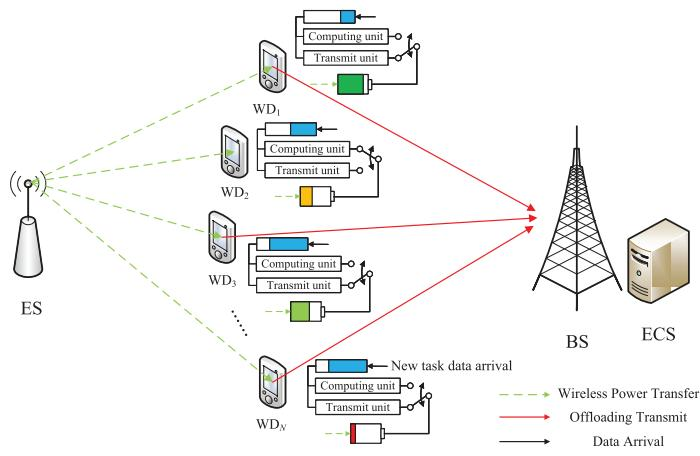  
Fig. 1. A WPT-MEC network with an ES, a BS and N WDs.

LSEM problem. The findings reveal that LyCNN-DRL achieves near-optimal performance for real-time demand of WPT-MEC networks. Notably, LyCNN-DRL achieves over $9 7 \%$ of LyCD’s utility in per-slot problems while significantly reducing the execution latency, maintaining approximately 50 milliseconds in ten-WD networks. Moreover, we demonstrate that the long-term system EE decreases at a rate of $O ( 1 / V )$ , and the time-average sum data queue length increases at a rate of $O ( V )$ , where $V$ is the Lyapunov control parameter.

The rest of this paper is organized as follows. Section II presents the system model and problem formulation. Section III introduces the transformation and decomposition of the long-term problem. Section IV introduces the proposed algorithm for the subproblem. Section V introduces the proposed LyCNN-DRL framework. Section VI introduces computational complexity and convergence performance. The numerical results are given in Section VII. Finally, Section VIII concludes the paper.

# II. SYSTEM MODEL AND PROBLEM FORMULATION

# A. System Model

As shown in Fig. 1, we consider a WPT-MEC network, consisting of an energy source (ES), a BS, and $N$ WDs denoted as $\mathsf { W D } _ { i } , i \in \mathcal { N } = \{ 1 , 2 , \ldots , N \}$ . Each device is equipped with a single antenna. The ES is equipped with a radio frequency (RF) energy transmitter to recharge all WDs. Correspondingly, each WD harvests the RF energy transmitted from the ES, providing essential support for its operation. The BS is connected to an ECS via a high-rate and reliable wire to provide computing service for WDs.

The system time is evenly divided into time slots of length T. The channel gain remains constant within each slot and varies across different slots. $\mathrm { W D } _ { \mathrm { i } }$ sends its information with a transmit power of $p _ { i }$ . Denote the $t \cdot$ -th time slot by $\mathcal { T } _ { t }$ . Within $\mathcal { T } _ { t }$ , computation task data with size $A _ { i } ( t )$ (in bits) arrives at $\mathrm { W D } _ { \mathrm { i } }$ . $A _ { i } ( t )$ is independent and identically distributed over the whole system time with $\mathbb { E } [ A _ { i } ( t ) ] = \lambda _ { i }$ and $\mathbb { E } [ A _ { i } ^ { 2 } ( t ) ] < \infty$ , for $i \in \mathcal N$ . Let $D _ { i } ( t )$ (in bits) and $E _ { i } ( t )$ denote the amount of processed task data and energy consumed by $\mathrm { W D } _ { \mathrm { i } }$ at $\mathcal { T } _ { t }$ ,

respectively. WDs adopt a binary offloading model, either executing the task locally or offloading the task to the ECS. To mitigate the co-channel interference, the offloading WDs use the TDMA technology to transmit computation task data to the ECS at the same bandwidth. Since the execution time in the ECS and the delay of sending back computation results are negligible compared to that of offloading, we omit this time as it has been in the literature [25], [29], [30].

Firstly, no matter WDs on which mode, they will harvest the RF energy broadcast by the ES at the beginning of each time slot. The energy consumption of ES is

$$
E _ {P} (t) = a (t) T P _ {H}, \tag {1}
$$

where $P _ { H }$ is WPT power, and $a ( t ) T$ is WPT duration, $a ( t ) \in$ $[ 0 , 1 ]$ . The harvested energy of $\mathrm { W D } _ { \mathrm { i } }$ at $\mathcal { T } _ { t }$ is

$$
E _ {i, H} (t) = \xi_ {i} a (t) T P _ {H} g _ {i} (t), \tag {2}
$$

where $\eta _ { i }$ represents the energy harvesting efficiency, and $g _ { i } ( t )$ represents the channel gain from ES to $\mathrm { W D } _ { \mathrm { i } }$ within $\mathcal { T } _ { t }$ . Additionally, we introduce $h _ { i } ( t )$ to represent the channel gain from $\mathrm { W D } _ { \mathrm { i } }$ to ECS within $\mathcal { T } _ { t }$ .

Next, we will introduce the task execution and energy consumption of WDs on two modes, respectively.

1) Local Computing Mode: During $\mathcal { T } _ { t }$ , each localcomputing WD executes the computation task data and harvests energy simultaneously. The local executing data is

$$
D _ {i, L} (t) = \frac {f _ {i} (t) T}{c _ {i}}, \tag {3}
$$

where $f _ { i } ( t )$ denotes the local CPU frequency of $\mathrm { W D } _ { \mathrm { i } }$ at $\mathcal { T } _ { t }$ , and $c _ { i }$ denotes the number of CPU cycles required to process one data bit. Accordingly, the energy consumption of the local CPU is

$$
E _ {i, L} (t) = \kappa T \left(f _ {i} (t)\right) ^ {3}, \tag {4}
$$

where $\kappa$ is the energy consumption coefficient [31].

2) Edge Computing Mode: After harvesting the energy in each time slot, WDs on edge computing mode offload task data to ECS via TDMA. The offloaded computation task data is formulated as

$$
D _ {i, O} (t) = \tau_ {i} (t) T W \log_ {2} \left(1 + \frac {h _ {i} (t) e _ {i} (t)}{\tau_ {i} (t) T W n _ {0}}\right), \tag {5}
$$

where $e _ { i } ( t )$ denotes the offloading energy consumption of $\mathrm { W D } _ { \mathrm { i } }$ and $\tau _ { i } ( t ) T$ denotes the offloading duration allocated to $\mathrm { W D } _ { \mathrm { i } }$ . W is the transmission bandwidth and $n _ { 0 }$ is the power spectral density of the ECS’s receiver noise.

In summary, for $\mathrm { W D } _ { \mathrm { i } }$ at $\mathcal { T } _ { t }$ , the total amount of accomplished computation task data and the total energy consumption are

$$
D _ {i} (t) = x _ {i} (t) D _ {i, L} (t) + \left(1 - x _ {i} (t)\right) D _ {i, O} (t), \tag {6}
$$

and

$$
E _ {i} (t) = x _ {i} (t) E _ {i, L} (t) + (1 - x _ {i} (t)) e _ {i} (t), \tag {7}
$$

respectively. The indicator variable $x _ { i } ( t ) \in \{ 0 , 1 \}$ denotes the binary offloading decision at $\mathcal { T } _ { t }$ , where $x _ { i } ( t ) = 0$ denotes that the $\mathrm { W D } _ { \mathrm { i } }$ offloads task to ECS, and $x _ { i } ( t ) = 1$ denotes that $\mathrm { W D } _ { \mathrm { i } }$ computes task locally.

The ECS receives the offloaded computation task from $\mathrm { W D } _ { \mathrm { i } }$ , and correspondingly its energy consumption is given by

$$
E _ {i, E} (t) = \eta_ {0} D _ {i, O} (t), \tag {8}
$$

where $\eta _ { 0 }$ denotes the EE of the ECS, which is the energy consumption of the ECS processing one-bit computation task.

Accordingly, for the whole MEC system, the total amount of data computation and total energy consumption of the MEC system at $\mathcal { T } _ { t }$ is formulated as

$$
D _ {t o t} (t) = \sum_ {i = 1} ^ {N} D _ {i} (t), \tag {9}
$$

$$
E _ {t o t} (t) = E _ {P} (t) + \sum_ {i = 1} ^ {N} \left(E _ {i} (t) + \left(1 - x _ {i} (t)\right) E _ {i, E} (t)\right) - E _ {i, H} (t). \tag {10}
$$

Naturally, the dynamic update of each WD’s computation task data queue $Q _ { i } ( t )$ is characterized as

$$
Q _ {i} (t + 1) = \left[ Q _ {i} (t) - D _ {i} (t) \right] ^ {+} + A _ {i} (t), \forall i \in \mathcal {N}, \tag {11}
$$

where $[ x ] ^ { + } = \operatorname* { m a x } ( x , 0 )$ . Let $B _ { i } ( t )$ denote the remaining energy on $\mathrm { W D } _ { \mathrm { i } }$ ’s battery at $\mathcal { T } _ { t }$ , and the dynamic update of each WD’s remaining energy is given by

$$
B _ {i} (t + 1) = \min  \left(B _ {i} (t) + E _ {i, H} (t), B _ {i} ^ {\max }\right) - E _ {i} (t), \tag {12}
$$

where $B _ { i } ^ { \mathrm { m a x } }$ denotes the battery capacity of $\mathrm { W D } _ { \mathrm { i } }$ , $\forall i \in \mathcal N$ . To balance the harvested energy and energy consumption, we introduce a virtual energy queue $W _ { i } ( t ) = [ B _ { i } ^ { \operatorname* { m a x } } - B _ { i } ( t ) ] ^ { + }$ , and the update of $W _ { i } ( t )$ is

$$
W _ {i} (t + 1) = \left[ W _ {i} (t) - E _ {i, H} (t) \right] ^ {+} + E _ {i} (t), \tag {13}
$$

For clarity, we use vectors to represent the variable sets of $N$ WDs, such as $\mathbf { x } _ { t } = \{ x _ { i } ( t ) \} _ { i = 1 } ^ { N }$ , $\mathbf { E } _ { H } ( t ) = \{ E _ { i , H } ( t ) \} _ { i = 1 } ^ { N } ,$ , and ${ \bf Q } ( t ) = \{ Q _ { i } ( t ) \} _ { i = 1 } ^ { N }$ . For brevity, the definitions of other vectors will not be described further.

# B. Problem Formulation

The long-term system EE is defined as the ratio of the total computational task data accomplished across all time slots to the corresponding total energy consumption of the WPT-MEC system. For ease of derivation, we minimize the reciprocal of the long-term system EE, denoted as $\eta$ , which is mathematically represented as:

$$
\eta (k) = \frac {\sum_ {t = 0} ^ {k - 1} E _ {t o t} (t)}{\sum_ {t = 0} ^ {k - 1} D _ {t o t} (t)}, \quad k \in \{2, \dots , K \}, \tag {14}
$$

where $\eta ( k )$ denotes the reciprocal of long-term system EE at the $k$ -th time slot. For simplicity, we set $\eta ( 1 ) = 0$ .

Then we formulate the LSEM problem as minimizing $\eta$ to optimize the binary offloading decision and the resource allocation under the computation task data queue stability and the energy constraint of each WD, as follows.

$$
\begin{array}{l} (\mathbf{LSEM}): \min_{\mathbf{x},\mathbf{f},\mathbf{e},\boldsymbol {\tau},\mathbf{a}}\quad \lim_{K\to \infty}\eta (K) \\ s. t. \quad a (t) + \sum_ {i = 1} ^ {N} \tau_ {i} (t) \leq 1, \tag {15a} \\ \end{array}
$$

$$
E _ {i} (t) \leq \min  \left[ B _ {i} (t) + E _ {i} ^ {H} (t), B _ {i} ^ {\max } \right], \tag {15b}
$$

$$
\begin{array}{l} 0 \leq f _ {i} (t) \leq f _ {i} ^ {\max }, (15c) \\ x _ {i} (t) \in \{0, 1 \}, a (t), e _ {i} (t), \tau_ {i} (t) \geq 0, (15d) \\ \end{array}
$$

Qi(t)and $W _ { i } ( t )$ are stable,

$$
\forall t \in \{1, 2, \dots , K \}, i \in \mathcal {N}, \tag {15e}
$$

where $\mathbf { x } = \left\{ \mathbf { x } _ { 1 } , \mathbf { x } _ { 2 } , \ldots , \mathbf { x } _ { K } \right\}$ , $\mathbf { a } = \{ a ( 1 ) , a ( 2 ) , \ldots , a ( K ) \}$ , $\begin{array} { r l r } { { \bf f } } & { { } = } & { \left\{ { \bf f } _ { 1 } , { \bf f } _ { 2 } , \ldots , { \bf f } _ { K } \right\} } \end{array}$ , $\begin{array} { r l r } { { \bf e } } & { { } = } & { \left\{ { \bf e } _ { 1 } , { \bf e } _ { 2 } , \ldots , { \bf e } _ { K } \right\} } \end{array}$ , $\begin{array} { r l } { \tau } & { { } = } \end{array}$ $\{ \tau _ { 1 } , \tau _ { 2 } , \dots , \tau _ { K } \}$ , and $K  \infty$ . Notice that if $x _ { i } ( k ) = 1$ , $\tau _ { i } ( k )$ and $e _ { i } ( k )$ must be zero. Otherwise, if $x _ { i } ( k ) = 0$ , $f _ { i } ( k )$ must be zero. (15a) constraints the total duration of WPT and offloading. (15b) denotes that the consumption energy cannot exceed the sum of the remaining battery energy and the harvest energy in any time slot. (15e) guarantees the stability of each WD’s computation task data queue and energy virtual queue.

The key notations are summarized in Table I. It is noticeable that LSEM is a long-term MINLP problem, involving a non-convex fractional objective function, long-term stability constraints, and mixed-integer variables. In general, there is no algorithm to solve this problem and obtain the optimal solution. To make this problem tractable, we design a multi-step problem transformation and decomposition approach.

# III. LYAPUNOV-GUIDED PROBLEM TRANSFORMATION AND DECOMPOSITION

To tackle the LSEM problem, we employ the fractional programming theory [32] and the Lyapunov optimization [33] to transform it into a deterministic per-slot problem with a convex objective function. However, the transformed deterministic per-slot problem remains a MINLP problem, prompting us to further decompose it into a bi-layer structure.

# A. Equivalent Transformation

Notice that the objective of (15) is an intractable nonconvex fractional expression. Consequently, Proposition 1 is introduced to transform the non-convex fractional objective function into an equivalent convex function in subtractive form. Define

$$
\bar {D} _ {t o t} = \lim  _ {K \rightarrow \infty} \frac {1}{K} \sum_ {t = 0} ^ {K - 1} D _ {t o t} (t), \tag {16}
$$

$$
\bar {E} _ {t o t} = \lim  _ {K \rightarrow \infty} \frac {1}{K} \sum_ {t = 0} ^ {K - 1} E _ {t o t} (t), \tag {17}
$$

as the time-averaged expectations of $D _ { t o t } ( t )$ and $E _ { t o t } ( t )$ , respectively.

Proposition 1: The optimal system EE can be obtained if and only if

$$
\min  _ {\mathbf {x}, \mathbf {f}, \mathbf {e}, \boldsymbol {\tau}, \mathbf {a}} \quad \bar {E} _ {t o t} - \eta^ {*} \bar {D} _ {t o t} = 0. \tag {18}
$$

Proposition 1 has been proven readily in [34], and we omit the proof for brevity. However, it is still not a tractable task to

TABLE I   
NOTATIONS   

<table><tr><td>Notation</td><td>Definition</td></tr><tr><td>N</td><td>The number of WDs</td></tr><tr><td>T</td><td>The length of a time slot</td></tr><tr><td>Tt</td><td>The t-th time slot</td></tr><tr><td>Ai(t)</td><td>The arrival computation task data of i-th WD at Tt</td></tr><tr><td>λi</td><td>The expected value of Ai(t)</td></tr><tr><td>Di(t)</td><td>The executed computation task data of i-th WD at Tt</td></tr><tr><td>Ei(t)</td><td>The energy consumption of i-th WD at Tt</td></tr><tr><td>hi(t)</td><td>The wireless channel gain between the i-th WD and the BS at Tt</td></tr><tr><td>gi(t)</td><td>The wireless channel gain between the i-th WD and the ES at Tt</td></tr><tr><td>ξi</td><td>The energy harvesting efficiency of i-th WD</td></tr><tr><td>PH</td><td>The WPT power of the ES</td></tr><tr><td>a(t)</td><td>The proportion of WPT duration to time slot duration at Tt</td></tr><tr><td>Ei,H(t)</td><td>The harvested energy of i-th WD at Tt</td></tr><tr><td>EP(t)</td><td>The energy consumption of the ES at Tt</td></tr><tr><td>Di,L(t)</td><td>The executed computation task data of i-th WD on local computing mode at Tt</td></tr><tr><td>Ei,L(t)</td><td>The energy consumption of i-th WD on local computing mode at Tt</td></tr><tr><td>fi(t)</td><td>The local CPU frequency of i-th WD at Tt</td></tr><tr><td>ci</td><td>The number of CPU cycles required to process one-bit computation task data by the CPU of i-th WD</td></tr><tr><td>κ</td><td>The energy consumption coefficient</td></tr><tr><td>Di,O(t)</td><td>The executed computation task data of i-th WD on edge computing mode at Tt</td></tr><tr><td>ei(t)</td><td>The energy consumption of i-th WD on edge computing mode at Tt</td></tr><tr><td>τi(t)</td><td>The fraction of time allocated to i-th WD for task offloading at Tt</td></tr><tr><td>W</td><td>The bandwidth of MEC network</td></tr><tr><td>n0</td><td>The power spectral density of the ECS&#x27;s receiver noise</td></tr><tr><td>Ei,E(t)</td><td>The energy consumption of ECS to execute the offloaded computation task data from i-th WD at Tt</td></tr><tr><td>η0</td><td>The reciprocal of the energy efficiency of the ECS</td></tr><tr><td>xi(t)</td><td>An offloading indicator for i-th WD at Tt</td></tr><tr><td>Qi(t)</td><td>The data queue of i-th WD at Tt</td></tr><tr><td>Bi(t)</td><td>The battery energy of i-th WD at Tt</td></tr><tr><td>Wi(t)</td><td>The virtual energy queue of i-th WD at Tt</td></tr><tr><td>η(k)</td><td>The reciprocal of the long-term system energy efficiency at k-th time slot</td></tr><tr><td>Etot(t)</td><td>The total energy consumption of the MEC network at Tt</td></tr><tr><td>Dtot(t)</td><td>The total executed computation task data of the MEC network at Tt</td></tr><tr><td>Etot</td><td>The time-averaged expectation of Etot(t)</td></tr><tr><td>Dtot</td><td>The time-averaged expectation of Dtot(t)</td></tr><tr><td>L(t)</td><td>The Lyapunov function at Tt</td></tr><tr><td>ΔL(t)</td><td>The conditional Lyapunov drift at Tt</td></tr><tr><td>Λ(t)</td><td>The Lyapunov drift-plus-penalty function</td></tr><tr><td>V</td><td>A non-negative parameter to scale the penalty</td></tr></table>

solve the LSEM problem by replacing the objective function as (18), since the optimal $\eta ^ { * }$ is not known in advance. To address this difficulty, we replace $\eta ^ { * }$ in (18) by $\eta ( k )$ , and the LSEM problem is transformed to:

$$
\min  _ {\mathbf {x}, \mathbf {f}, \mathbf {e}, \mathbf {\tau}, \mathbf {a}} \quad \overline {{E}} _ {t o t} - \eta (k) \overline {{D}} _ {t o t}
$$

$$
s. t. \quad (1 5 a) - (1 5 e). \tag {19}
$$

According to the definition of $\eta ( k )$ in (14), $\eta ( k )$ is a parameter related to all historical offloading decisions and resource allocations before the $k$ -th time slot.

# B. Lyapunov Drift Plus Penalty and Optimization

However, the reformulated problem in (19) still has the long-term stability constraint (15e), which makes it difficult to directly design an efficient algorithm. The heuristic algorithm may be applied but has unstable performance. To address this challenging problem (19), we utilize Lyapunov optimization technology to further transform it into a deterministic per-slot problem.

The Lyapunov function $L ( t )$ can be expressed as

$$
L (t) = \frac {1}{2} \sum_ {i = 1} ^ {N} \left(Q _ {i} (t) ^ {2} + W _ {i} (t) ^ {2}\right), \tag {20}
$$

and the one-slot conditional Lyapunov drift $\Delta L ( t )$ is defined as follows [35]

$$
\Delta L (t) = \mathbb {E} \left\{L (t + 1) - L (t) \mid \left\{\mathbf {Q} (t), \mathbf {W} (t) \right\} \right\}. \tag {21}
$$

Then, we use the Lyapunov drift-plus-penalty minimization approach to minimize $\eta ( t )$ while stabilizing $\mathbf { Q } ( t )$ and $\mathbf W ( t )$ . The Lyapunov drift-plus-penalty function is given by

$$
\Lambda (t) = \Delta L (t) + V \mathbb {E} \left\{\overline {{E}} _ {t o t} - \eta (t) \bar {D} _ {t o t} \mid \left\{\mathbf {Q} (t), \mathbf {W} (t) \right\} \right\}, \tag {22}
$$

where $V$ is the parameter to scale the penalty.

Proposition 2: The upper bound of the Lyapunov drift-pluspenalty function in (22) is given by

$$
\begin{array}{l} \Lambda (t) \leq C + \sum_ {i = 1} ^ {N} Q _ {i} (t) \mathbb {E} \left\{A _ {i} (t) - D _ {i} (t) \mid \left\{\mathbf {Q} (t), \mathbf {W} (t) \right\} \right\} \\ + \sum_ {i = 1} ^ {N} W _ {i} (t) \mathbb {E} \left\{E _ {i} (t) - E _ {i, H} (t) \mid \left\{\mathbf {Q} (t), \mathbf {W} (t) \right\} \right\} \\ + V \mathbb {E} \left\{E _ {\text {t o t}} (t) - \eta (t) D _ {\text {t o t}} (t) \mid \{\mathbf {Q} (t), \mathbf {W} (t) \} \right\}, \tag {23} \\ \end{array}
$$

where

$$
C = \frac {1}{2} \sum_ {i = 1} ^ {N} \sup  _ {t} \left(D _ {i} (t) ^ {2} + A _ {i} (t) ^ {2} + E _ {i} (t) ^ {2} + E _ {i, H} (t) ^ {2}\right).
$$

Proof: A similar proof can be found in [11] and [33] and is omitted in this paper for brevity.

Based on the technique of opportunistic expectation minimization [33], solving the LSEM problem is equivalent to minimizing the upper bound in (23) per time slot. In the upper bound, except control actions, the amount of the arrived computation task data and the channel gains are constant variables, and thus the states $\mathbf { S } _ { t } \overset { \Delta } { = } \{ \mathbf { h } ( t ) , \mathbf { g } ( { \bar { t } } ) , \mathbf { Q } ( t ) , \mathbf { W } ( t ) , \eta ( t ) \}$ can be observed at the beginning of each time slot. Such that the upper bound in (23) can be simplified by removing terms only related to the constant variables. Thus, the long-term problem LSEM is transformed into the following deterministic per-slot problem LSEM-E, where the letter “E” represents the “Equivalent”.

$$
(\text {L S E M - E}):
$$

$$
\begin{array}{l} \min _ {\mathbf {x} _ {t}, \mathbf {f} _ {t}, \mathbf {e} _ {t}, \boldsymbol {\tau} _ {t}, a (t)} \sum_ {i = 1} ^ {N} \Big (- Q _ {i} (t) D _ {i} (t) \\ \left. + W _ {i} (t) \left(E _ {i} (t) - E _ {i, H} (t)\right)\right) + V \left(E _ {t o t} (t) \right. \\ - \eta (t) D _ {t o t} (t)) \\ \end{array}
$$

$$
s. t. a (t) + \sum_ {i = 1} ^ {N} \tau_ {i} (t) \leq 1, \tag {24a}
$$

$$
0 \leq f _ {i} (t) \leq f _ {i} ^ {\max }, \forall i, \tag {24b}
$$

$$
E _ {i} (t) \leq \min  \left[ B _ {i} (t) + E _ {i} ^ {H} (t), B _ {i} ^ {\max } \right], \quad \forall i, \tag {24c}
$$

$$
a (t), e _ {i} (t), \tau_ {i} (t) \geq 0, \forall i, \tag {24d}
$$

$$
x _ {i} (t) \in \{0, 1 \}, \forall i, \tag {24e}
$$

where the constraints (24a)-(24e) are the specific case of the constraints (15a)-(15d) at $\mathcal { T } _ { t }$ , and we only optimize the control actions $\mathbf { x } _ { t } , \mathbf { f } _ { t } , \mathbf { e } _ { t } , \tau _ { t } , a ( t )$ at $\mathcal { T } _ { t }$ . The time-varying states of the LSEM-E problem only consist of the current CSI, task arrivals, the accumulated data queue, the accumulated virtual energy queue and the iterative $\eta ( t )$ , which can be obtained in realtime at the beginning of each time slot. The theoretical upper bound of long-term convergence performance by optimizing the LSEM-E problem is shown in Theorem 3. However, the LSEM-E problem is still a MINLP which is difficult to solve within each time slot. To overcome this difficulty, we decompose the LSEM-E problem into a bi-layer structure in the following sub-section.

# C. Bi-Layered Decomposition of Problem LSEM-E

Notice that given the binary offloading decision $\mathbf { x } _ { t }$ , the MINLP problem LSEM-E reduces to a continuous optimization problem. To make the LSEM-E problem more tractable, we propose a bi-layer structure: the top-problem LSEM-E-Top for optimizing the binary offloading decision and the subproblem LSEM-E-Sub for continuous resource allocation.

• (LSEM-E-Top) Binary offloading decision problem of optimizing $\mathbf { x } _ { t }$ : It is computationally expensive to iteratively search for the optimal binary offloading from $2 ^ { N }$ possible offloading decisions. We determine that one offloading decision outperforms another one by solving the resource allocation problems LSEM-E-Sub and comparing their utilities $R ( \mathbf { x } _ { t } )$ . However, the classical optimization techniques iteratively search $\mathbf { x } _ { t }$ , which requires repeatedly solving LSEM-E-Sub in long execution latency. In this paper, we adopt a DRL method to generate the binary offloading decision before resource allocation. The optimization of LSEM-E-Top can be expressed as:

$$
\begin{array}{l} (\text {L S E M - E - T o p}): \min  _ {\mathbf {x} _ {t}} R \left(\mathbf {x} _ {t}\right) \\ \begin{array}{c} \text {s . t .} \quad (2 4 e). \end{array} \\ \end{array}
$$

• (LSEM-E-Sub) Computation resource allocation problem of optimizing $( a ( t ) , \mathbf { f } _ { t } , \mathbf { e } _ { t } , \tau _ { t } )$ under given binary offloading decision $\mathbf { x } _ { t }$ : A key feature is that LSEM-E-Sub is convex about $\mathbf { f } _ { t } , \mathbf { e } _ { t } , \tau _ { t }$ and $a ( t )$ . To solve this efficiently, we decompose the problem into two layers,

Long-term system EE maximization LSEM problem in (15)

Lyapunov optimization

Deterministic per-slot MINLP problem LSEM-E in (24)

DRL& Convex optimization

Problem LSEM-E-Top to optimize the offloading decision X,, employing LyCNN-DRL algorithm in Section V

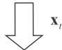

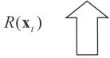

Problem LSEM-E-Sub to optimize the WPT duration $a ( t )$ employing a golden-section search in Section IV

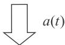

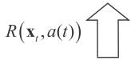  
Fig. 2. The sketch of transforming problem LSEM and solving problem LSEM-E.

Local computing subproblem (25) to optimize f, obtaining the closed-form solution (26) in Section IV-A

ORA-Sub (27) to optimize e,,t, solved by a efficient convex algorithm in Section IV-B

as illustrated in the lower part of Fig. 2. Specifically, we begin by using the golden section search to determine a value for $a ( t )$ , then proceed to optimize $\mathbf { f } _ { t }$ , $\mathbf { e } _ { t }$ and $\tau _ { t }$ to obtain the utilities $R ( \mathbf { x } _ { t } , a ( t ) )$ for each value of $a ( t )$ . This process continues iteratively until $a ( t )$ converges. The optimization of LSEM-E-Sub can thus be expressed as

$$
(\text {L S E M - E - S u b}): R (\mathbf {x} _ {t}) = \min  _ {a (t)} R (\mathbf {x} _ {t}, a (t))
$$

$$
s. t. \quad (2 4 a) - (2 4 d),
$$

where $R ( \mathbf { x } _ { t } , a ( t ) )$ denotes the optimal value of LSEM-E-Sub under given $\mathbf { x } _ { t }$ and $a ( t )$ , expressed as:

$$
\begin{array}{l} R (\mathbf {x} _ {t}, a (t)) = \min  _ {\mathbf {f} _ {t}, \mathbf {e} _ {t}, \boldsymbol {\tau} _ {t}} \quad \sum_ {i = 1} ^ {N} \Big (- Q _ {i} (t) D _ {i} (t) + W _ {i} (t) \big (E _ {i} (t) \\ \left. \left. - E _ {i, H} (t)\right)\right) + V \left(E _ {t o t} (t) - \eta (t) D _ {t o t} (t)\right) \\ s. t. \quad (2 4 a) - (2 4 d). \\ \end{array}
$$

The details of solving LSEM-E-Top and LSEM-E-Sub are introduced in section V and section IV, respectively.

# IV. COMPUTATION RESOURCE ALLOCATION SUBPROBLEM

LSEM-E-Sub is solved with a focus on low computational complexity, ensuring efficiency in dynamic networks. As shown in Fig. 2, the value of $a ( t )$ is determined by the golden section search, which can rapidly converge to the optimal solution. For each $a ( t )$ , we proceed to optimize $\mathbf { f } _ { t }$ , $\mathbf { e } _ { t }$ and $\tau _ { t }$ to minimize $R ( \mathbf { x } _ { t } , a ( t ) )$ . In optimization of $R ( \mathbf { x } _ { t } , a ( t ) )$ , the variables $\mathbf { e } _ { t }$ and $\tau _ { t }$ are independent of $\mathbf { f } _ { t }$ in both the

objective function and the constraints, enabling the problem to be decomposed into two separate subproblems: the local resource allocation subproblem and the offloading resource allocation subproblem (ORA-Sub). The local resource allocation subproblem is solved using a closed-form solution, while the ORA-Sub is efficiently handled using an elaborated algorithm with Lagrangian dual function and KKT condition.

# A. Local Resource Allocation Subproblem

Under given $\mathbf { x } _ { t }$ and $a ( t )$ , the local computing subproblem, with respect to $\mathbf { f } _ { t }$ , can be separated from the LSEM-E problem in (24) as

$$
\begin{array}{l} \min _ {\mathbf {f} _ {t}} \sum_ {i = 1} ^ {N} \left(- Q _ {i} (t) - V \eta (t)\right) x _ {i} (t) T f _ {i} (t) / c _ {i} \\ + \sum_ {i = 1} ^ {N} (V + W _ {i} (t)) x _ {i} (t) \kappa \left(f _ {i} (t)\right) ^ {3} T \tag {25a} \\ \end{array}
$$

$$
\begin{array}{l} s. t. 0 \leq f _ {i} (t) \leq f _ {i} ^ {\max }, \forall i, (25b) \\ \kappa \left(f _ {i} (t)\right) ^ {3} T \leq \min  \left[ B _ {i} (t) + E _ {i, H} (t), B _ {i} ^ {\max } \right], \forall i. (25c) \\ \end{array}
$$

By integrating all the constraints, the local CPU frequency $f _ { i } ( t )$ should satisfy the single constraints $f _ { i } ( t ) \ \leq$ m $\begin{array} { r } { \mathrm { i n } \left[ \sqrt [ 3 ] { \frac { \eta _ { i } a ( t ) P _ { H } \mathrm { g } _ { i } ( t ) } { \kappa T } } , \sqrt [ 3 ] { \frac { B _ { i } ^ { \mathrm { m a x } } } { \kappa T } } , f _ { i } ^ { \mathrm { m a x } } \right] . } \end{array}$ Notice that (25) is convex and its constraints are linear so that the optimal solution of $f _ { i } ( t )$ can be obtained at either the stationary point of the objective function or the boundary points, which is given by

$$
\begin{array}{l} f _ {i} ^ {*} (t) = \min  \left[ \sqrt [ 3 ]{\frac {B _ {i} (t) + \eta_ {i} a (t) P _ {H} g _ {i} (t)}{\kappa T}}, \sqrt [ 3 ]{\frac {B _ {i} ^ {\max}}{\kappa T}}, \right. \\ \left. f _ {i} ^ {\max }, \sqrt {\frac {Q _ {i} (t) + V \eta (t)}{3 \left(V + W _ {i} (t)\right) \kappa T c _ {i}}} \right]. \tag {26} \\ \end{array}
$$

# B. Offloading Resource Allocation Subproblem

The ORA-Sub, with respect to $\mathbf { e } _ { t }$ and $\tau _ { t }$ under given $a ( t )$ and $\mathbf { x } _ { t }$ , can be separated from the LSEM-E problem in (24) as

$$
\begin{array}{l} \Gamma = \min _ {\boldsymbol {\tau} _ {t}, \mathbf {e} _ {t}} \sum_ {i = 1} ^ {N} (- Q _ {i} (t) - V \eta (t) + V \eta_ {0}) \tau_ {i} (t) \\ \times W \log_ {2} \left(1 + \frac {h _ {i} e _ {i} (t)}{\tau_ {i} (t) \sigma^ {2}}\right) + \sum_ {i = 1} ^ {N} \left(V + W _ {i} (t)\right) e _ {i} (t) \tag {27a} \\ \end{array}
$$

$$
s. t. \quad a (t) + \sum_ {i = 1} ^ {N} \tau_ {i} (t) \leq 1, \forall i, \tag {27b}
$$

$$
\tau_ {i} (t), e _ {i} (t) \geq 0, \forall i, \tag {27c}
$$

$$
e _ {i} (t) \leq M _ {i} (t), \forall i, \tag {27d}
$$

where $M _ { i } ( t ) \overset { \Delta } { = } \operatorname* { m i n } [ B _ { i } ( t ) + E _ { i , H } ( t ) , B _ { i } ^ { \operatorname* { m a x } } ]$ is introduced for simplifying. Since the ORA-Sub problem is convex, we can solve it using general methods, such as the CVX solver and the interior method. However, these methods often suffer from high computational complexity, with the interior method

having a computational complexity of $O ( N ^ { 3 . 5 } )$ . To more efficiently solve the ORA-sub problem, we design the following algorithm.

First, we introduce $\beta$ , $\begin{array} { l c l } { \pmb { \mu } } & { = } & { \left[ \mu _ { 1 } , \mu _ { 2 } , \dots , \mu _ { N } \right] } \end{array}$ , $\nu =$ $[ \nu _ { 1 } , \nu _ { 2 } , \dots , \nu _ { N } ]$ , $\omega = [ \omega _ { 1 } , \omega _ { 2 } , \ldots , \omega _ { N } ]$ as the dual variables associated with constraints (27b)–(27d), respectively. The Lagrangian function associated with the ORA-Sub problem is then written as

$$
\begin{array}{l} \min  _ {\boldsymbol {\tau} _ {t}, \mathbf {e} _ {t}, \beta , \boldsymbol {\mu}, \boldsymbol {\nu}, \boldsymbol {\omega}} \mathbb {L} = \sum_ {i = 1} ^ {N} \left(- Q _ {i} (t) - V \eta (t) + V \eta_ {0}\right) \\ \times \tau_ {i} W \log_ {2} \left(1 + \frac {h _ {i} e _ {i}}{\tau_ {i} \sigma^ {2}}\right) + \sum_ {i = 1} ^ {N} (V + W _ {i} (t)) e _ {i} \\ + \beta \left(a _ {t} + \sum_ {i = 1} ^ {N} \tau_ {i} - 1\right) - \sum_ {i = 1} ^ {N} \mu_ {i} \tau_ {i} - \sum_ {i = 1} ^ {N} \nu_ {i} e _ {i} \\ + \sum_ {i = 1} ^ {N} \omega_ {i} \left(e _ {i} - M _ {i} (t)\right), \tag {28} \\ \end{array}
$$

where $\tau _ { i } ( t )$ and $e _ { i } ( t )$ are replaced by $\tau _ { i }$ and $e _ { i }$ for simplicity in this subsection. The KKT conditions are sufficient and necessary for $\{ \tau _ { i } , e _ { i } \} _ { i \in \mathcal { N } }$ and $\{ \beta , \mu , \nu , \omega \}$ to achieve the zeroduality gap between the primal and dual optimal solution, that is

$$
\left\{ \begin{array}{l} (2 7 b) - (2 7 d), \\ \beta \geq 0, \mu_ {i} \geq 0, \nu_ {i} \geq 0, \omega_ {i} \geq 0, \forall i, \\ \beta \left(a _ {t} + \sum_ {i = 1} ^ {N} \tau_ {i} - 1\right) = 0, \\ \mu_ {i} \tau_ {i} = 0, \nu_ {i} e _ {i} = 0, \omega_ {i} \left(e _ {i} - M _ {i} (t)\right) = 0, \forall i, \\ \frac {\partial \mathbb {L}}{\partial e _ {i}} = 0, \forall i, \\ \frac {\partial \mathbb {L}}{\partial \tau_ {i}} = 0, \forall i, \end{array} \right. \tag {29d}
$$

where (29a) denotes primal feasibility, (29b) denotes dual feasibility, (29c) and (29d) denote complementary slackness, and (29e) and (29f) denote stationarity condition. In particular, the details of the partial derivative functions are

$$
\frac {\partial \mathbb {L}}{\partial e _ {i}} = - Z _ {i} \left(e _ {i}, \tau_ {i}\right) + V + W _ {i} (t) + \omega_ {i} - \nu_ {i} = 0, \tag {30}
$$

$$
\frac {\partial \mathbb {L}}{\partial \tau_ {i}} = - Y _ {i} \left(e _ {i}, \tau_ {i}\right) + \beta - \mu_ {i} = 0, \tag {31}
$$

where $Z _ { i }$ and $Y _ { i }$ are as follows

$$
\begin{array}{l} Z _ {i} \left(e _ {i}, \tau_ {i}\right) = \frac {\left(Q _ {i} (t) + V \eta (t) - V \eta_ {0}\right) \tau_ {i} W h _ {i}}{\left(\tau_ {i} \sigma^ {2} + h _ {i} e _ {i}\right) \ln 2} \\ = \frac {\left(Q _ {i} (t) + V \eta (t) - V \eta_ {0}\right) W h _ {i}}{\left(\sigma^ {2} + h _ {i} p _ {i}\right) \ln 2} \\ \triangleq Z _ {i} \left(p _ {i}\right), \tag {32} \\ \end{array}
$$

$$
\begin{array}{l} Y _ {i} \left(e _ {i}, \tau_ {i}\right) = \left(Q _ {i} (t) + V \eta (t) - V \eta_ {0}\right) W \log_ {2} \left(1 + \frac {h _ {i} e _ {i}}{\sigma^ {2} \tau_ {i}}\right) \\ - \frac {\left(Q _ {i} (t) + V \eta (t) - V \eta_ {0}\right) W h _ {i} e _ {i}}{\left(\tau_ {i} \sigma^ {2} + h _ {i} e _ {i}\right) \ln 2} \\ \end{array}
$$

$$
\begin{array}{l} = \left(Q _ {i} (t) + V \eta (t) - V \eta_ {0}\right) W \log_ {2} \left(1 + \frac {h _ {i} p _ {i}}{\sigma^ {2}}\right) \\ - \frac {(Q _ {i} (t) + V \eta (t) - V \eta_ {0}) W h _ {i} p _ {i}}{(\sigma^ {2} + h _ {i} p _ {i}) \ln 2} \\ \end{array}
$$

$$
\triangleq Y _ {i} \left(p _ {i}\right), \tag {33}
$$

where we denote $p _ { i } = e _ { i } / \tau _ { i }$ . Differentiating $p _ { i }$ in $Z _ { i } ( p _ { i } )$ and $Y _ { i } ( p _ { i } )$ yields the following property.

Property 1: The partial derivative $\frac { \partial \mathbb { L } } { \partial e _ { i } }$ and $Y _ { i } ( p _ { i } )$ is monotonically increasing with respect to $p _ { i }$ , and the partial derivative $\textstyle \frac { \partial \mathbb { L } } { \partial \tau _ { i } }$ ∂τi and $Z _ { i } ( p _ { i } )$ is monotonically decreasing with respect to $p _ { i }$ .

Theorem 1: For the optimal solution of problem ORA-Sub, if $e _ { i } ^ { * } = 0$ , then the optimal offloading duration $\tau _ { i } ^ { * } { = } 0$ ; otherwise, if $e _ { i } ^ { * } > 0$ , then the optimal offloading duration $\tau _ { i } ^ { * } > 0$ .

Proof: See Appendix A

Theorem 1 shows that the variables $e _ { i } ^ { * }$ and $\boldsymbol { \tau } _ { i } ^ { * }$ of the optimal solution are either zero or positive at the same time. Based on Theorem 1 and the complementary slackness condition in (29c) and (29d), we obtain the following corollary.

Corollary 1: For the optimal solution of (28), when $e _ { i } ^ { * }$ and τ ∗i $\boldsymbol { \tau } _ { i } ^ { * }$ are positive, the corresponding dual variables $\nu _ { i } ^ { * }$ and $\mu _ { i } ^ { * }$ must be zero at the same time.

Theorem 2: For the optimal solution of (28), the sum of offloading duration $\sum _ { i = 1 } ^ { N } \tau _ { i } ^ { * }$ τ ∗i is equal to the remaining duration $1 - a ( t )$ in any time slot.

Proof: See Appendix B

All WDs share the same dual variable $\beta$ , due to the common constraint (27b). Based on the monotonicity in Property 1 and the stationary condition (30), (31), we introduce a zerothreshold variable ${ \overline { { \beta } } } _ { i }$ which is derived as

$$
\bar {\beta} _ {i} = Y _ {i} \left(Z _ {i} ^ {- 1} (V)\right) \tag {34}
$$

where $Z _ { i } ^ { - 1 }$ denotes the reciprocal function of $Z _ { i } ( \cdot )$ , and $Z _ { i } ^ { - 1 } ( V )$ denotes value of $p _ { i }$ when $Z _ { i } ( p _ { i } ) = V$ .

Lemma 1: The solution can be formulated as

$$
e _ {i} = \left\{ \begin{array}{l l} 0, & \beta > \bar {\beta} _ {i}, \\ [ 0, M _ {i} (t) ], & \beta = \bar {\beta} _ {i}, \\ M _ {i} (t), & \beta <   \bar {\beta} _ {i}, \end{array} \right. \tag {35}
$$

and

$$
\tau_ {i} = \left\{ \begin{array}{l l} 0, & \beta > \bar {\beta} _ {i}, \\ \left[ 0, \frac {M _ {i} (t)}{Y _ {i} ^ {- 1} (\beta)} \right], & \beta = \bar {\beta} _ {i}, \\ \frac {M _ {i} (t)}{Y _ {i} ^ {- 1} (\beta)}, & \beta <   \bar {\beta} _ {i}. \end{array} \right. \tag {36}
$$

where $Y _ { i } ^ { - 1 } ( \beta )$ denotes the value of $p _ { i }$ when $Y _ { i } = \beta$ , and is solved by the fixed point method.

Proof: See Appendix C

According to the Lemma 1, we can derivative relationship between the sum of offloading duration and $\beta$ as follows:

$$
\sum_ {j = 1} ^ {N} \tau_ {j} = \left\{ \begin{array}{l l} \sum_ {j = 1} ^ {N} \frac {M _ {j} (t)}{Y _ {j} ^ {- 1} (\beta)}, & 0 <   \beta <   \bar {\beta} _ {1}, \\ \left[ \sum_ {j = 2} ^ {N} \frac {M _ {j} (t)}{Y _ {j} ^ {- 1} (\beta)}, \sum_ {j = 1} ^ {N} \frac {M _ {j} (t)}{Y _ {j} ^ {- 1} (\beta)} \right], & \beta = \bar {\beta} _ {1}, \\ \sum_ {j = 2} ^ {\bar {N}} \frac {M _ {j} (t)}{Y _ {j} ^ {- 1} (\beta)}, & \bar {\beta} _ {1} <   \beta <   \bar {\beta} _ {2}, \\ \left[ \sum_ {j = 3} ^ {N} \frac {M _ {j} (t)}{Y _ {j} ^ {- 1} (\beta)}, \sum_ {j = 2} ^ {N} \frac {M _ {j} (t)}{Y _ {j} ^ {- 1} (\beta)} \right], & \beta = \bar {\beta} _ {2}, \\ \vdots & \vdots \\ \frac {M _ {N} (t)}{Y _ {N} ^ {- 1} (\beta)}, & \bar {\beta} _ {N - 1} <   \beta <   \bar {\beta} _ {N}, \\ \left[ 0, \frac {M _ {N} (t)}{Y _ {N} ^ {- 1} (\beta)} \right], & \beta = \bar {\beta} _ {N}, \end{array} \right. \tag {37}
$$

where we reorder the set of zero-threshold variable $\{ { \overline { { \beta } } } _ { i } \} _ { i \in { \mathcal { N } } }$ in ascending as $\{ { \overline { { \beta } } } _ { j } \} _ { j \in { N } }$ . Based on Theorem 2, we obtain that $\sum _ { i = 1 } ^ { N } \tau _ { i } ^ { * } = 1 - a ( t )$ , and thus there are two cases for the optimal solution.

Case 1: If $\begin{array} { r c l } { \displaystyle \sum _ { i = 1 } ^ { N } \tau _ { i } } & { \in } & { \displaystyle \left[ \sum _ { j = n + 1 } ^ { N } \frac { M _ { j } ( t ) } { Y _ { j } ^ { - 1 } ( \overline { { \beta } } _ { n } ) } , \sum _ { j = n } ^ { N } \frac { M _ { j } ( t ) } { Y _ { j } ^ { - 1 } ( \overline { { \beta } } _ { n } ) } \right] , \forall n } \end{array}$ then the optimal $\beta ^ { * }$ is equal to ${ \overline { { \beta } } } _ { n }$ . When $\begin{array} { r l r } { n } & { { } = } & { N } \end{array}$ Pj=N+1 Y −1j (βN ) $\sum _ { j = N + 1 } ^ { N } \frac { M _ { j } ( t ) } { Y _ { j } ^ { - 1 } ( \overline { { \beta } } _ { N } ) } = 0$ . Accordingly,

$$
e _ {j} ^ {*} = \left\{ \begin{array}{l l} 0, & j > n \\ \left(1 - a (t) - \sum_ {j > n} ^ {N} \frac {M _ {j} (t)}{Y _ {j} ^ {- 1} (\bar {\beta} _ {n})}\right) Y _ {n} ^ {- 1} (\bar {\beta} _ {n}), & j = n \\ M _ {j} (t), & j <   n, \end{array} \right. \tag {38}
$$

and

$$
\tau_ {j} ^ {*} = \left\{ \begin{array}{l l} 0, & j > n \\ 1 - a (t) - \sum_ {j > n} ^ {N} \frac {M _ {j} (t)}{Y _ {j} ^ {- 1} (\bar {\beta} _ {n})}, & j = n \\ \frac {M _ {j} (t)}{Y _ {j} ^ {- 1} (\bar {\beta} _ {n})}, & j <   n. \end{array} \right. \tag {39}
$$

Case2: If PN τi ∈ PN Mj (t)Y −1(β ) , PNj=n Mj (t)Y −1j (βn−1) , ∀n, then i=1 j=n n the optimal $\beta ^ { * } \in \left( \overline { { \beta } } _ { n - 1 } , \overline { { \beta } } _ { n } \right)$ . When n = 1, $\sum _ { j = 1 } ^ { N } \frac { M _ { j } ( t ) } { Y _ { j } ^ { - 1 } ( \overline { { { \beta } } } _ { 0 } ) } =$ $+ \infty$ and $\overline { { \beta } } _ { 0 } = 0$ . Since $\sum _ { j = n } ^ { N } \frac { M _ { j } ( t ) } { Y _ { j } ^ { - 1 } ( \beta ) }$ is monotonically increasing with respect to $\beta$ according to Property 1, $\beta ^ { * }$ can be

Algorithm 1 Solving LSEM-E-Sub Under Given $a ( t )$   
input : The WPT duration $a(t)$ , the binary decision $\pmb {x}(t)$ , the WPT channel gains $\mathbf{g}(t)$ , the transmit channel gain $\mathbf{h}(t)$ , queue lengths $\mathbf{Q}(t)$ and $\mathbf{W}(t)$ , and the battery remaining energy $\mathbf{B}(t)$ .   
1 if $x_{i}(t) = 1$ then   
2 Calculate $\mathbf{f}_t^*$ for all the WDs which compute task locally based on (26);   
3 else   
4 Calculate $\overline{\beta}_{j}$ for WDs which offload the task to ECS and obtain the ascend set $\{\overline{\beta}_j\}_{j\in \mathcal{N}}$ based on (34);   
5 Compute the interval $\left[\sum_{j = n + 1}^{N}\frac{M_j(t)}{Y_j^{-1}(\overline{\beta}_n)},\sum_{j = n}^{N}\frac{M_j(t)}{Y_j^{-1}(\overline{\beta}_n)}\right]$ of $\overline{\beta}_n$ based on (37) for $n\in \mathcal{N}$ .   
6 case 1   
7 The optimal $\mathbf{e}^*$ and $\tau^{*}$ are obtained by (38) and (39);   
8 end   
9 case 2   
10 Bisection search $\beta^{*}$ based on (40), and calculate $Y_{j}^{-1}(\beta)$ by the fixed point method;   
11 The optimal $\mathbf{e}_t^*$ and $\tau_t^*$ are obtained by (41) and (42);   
12 end   
13 end output: $\mathbf{f}_t^*$ $\mathbf{e}_t^*$ and $\tau_t^*$

obtained by the bisection search based on the following equation

$$
\sum_ {j = n} ^ {N} \frac {M _ {j} (t)}{Y _ {j} ^ {- 1} (\beta)} = 1 - a (t). \tag {40}
$$

Then, we obtain the optimal solution as

$$
e _ {j} ^ {*} = \left\{ \begin{array}{l l} 0, & j > n \\ M _ {j} (t), & j \leq n, \end{array} \right. \tag {41}
$$

and

$$
\tau_ {j} ^ {*} = \left\{ \begin{array}{l l} 0, & j > n \\ \frac {M _ {j} (t)}{Y _ {j} ^ {- 1} \left(\beta^ {*}\right)}, & j \leq n. \end{array} \right. \tag {42}
$$

In summary, Algorithm 1 summarizes the process of resource allocation under a given WPT duration.

# V. ONLINE LYCNN-DRL FRAMEWORK FOR SOLVINGPROBLEM LSEM-E

Now, we present an algorithm based on deep reinforcement learning to simultaneously solve LSEM-E-Top and LSEM-E-Sub. Recall that for the LSEM-E problem, we observe $\mathbf { S } _ { t }$ and jointly optimize $\mathbf { x } _ { t }$ and $\{ a ( t ) , \mathbf { f } _ { t } , \mathbf { e } _ { t } , \tau _ { t } \}$ . The elaborated algorithm 1 in section IV solved the LSEM-E-Sub problem, and obtained the optimal $\{ a ( t ) , \mathbf { f } _ { t } , \mathbf { e } _ { t } , \tau _ { t } \}$ . Here, $R ( \mathbf { x } _ { t } , \mathbf { S } _ { t } )$ denotes the optimal value of LSEM-E-Sub. However, the LSEM-E-Top problem remains a challenging integer programming problem, involving the mapping between $\mathbf { S } _ { t }$ with $4 N + 1$ variables and $\mathbf { x } _ { t }$ with $2 ^ { N }$ feasible solutions. To address this challenge, we propose the LyCNN-DRL framework as

shown in Fig. 3. We then introduce the LyCNN-DRL framework in three processes: inference, state update, and policy update.

# A. Inference

As shown in Fig. 3, in the inference process, the LyCNN-DRL framework observes the channel states and queue states, and generates the joint action of the binary offloading decision and the resource allocation. The main parts of the inference process are the actor and critic modules.

1) Actor Module: The actor module is designed to obtain an optimal mapping between the state and joint actions of the LSEM-E problem. To learn the complex mapping between $\mathbf { S } _ { t }$ with $4 N + 1$ variables and $\mathbf { x } _ { t }$ with $2 ^ { N }$ feasible solution, we employ a one-dimensional CNN as an actor network. Compared to the pure fully connected (FC) DNN network, the CNN network’s one-dimensional convolutional layer is advantageous for extracting essential features from the complex state. In addition, the one-dimensional convolutional layer, as shown in Fig. 3 requires less trainable weights, leading to better convergence performance compared to FC layers. This will be demonstrated and further elaborated upon in the simulation section. The mapping of the CNN network is expressed as

$$
\hat {\mathbf {x}} _ {t} = \pi_ {\theta_ {t}} (\mathbf {S} _ {t}), \tag {43}
$$

where the output $\hat { \mathbf { x } } _ { t }$ is continuous. To enhance the network’s performance, we employ the noisy order-preserving (NOP) quantization method [11] for exploration. Specifically, the NOP method generates $M _ { t }$ candidate binary offloading decisions based on the continuous $\hat { \mathbf { x } } _ { t }$ , and the best one can be selected by the critic module. Considering the computational complexity, $M _ { t }$ is designed as a dynamic self-adaptive parameter, which is adjusted by the distance between the generated $\mathbf { x } _ { t }$ and the selected $\mathbf { x } _ { t } ^ { * }$ [11]. The candidate binary offloading set of the actor is expressed as $\{ \mathbf { x } _ { t } ^ { m } | \mathbf { x } _ { t } ^ { m } \in \{ 0 , 1 \} , m \ =$ $1 , 2 , \ldots , M _ { t } \}$ . The selected offloading decisions, along with their corresponding input states, are stored as samples in the replay memory, which are then used for training. Over multiple time slots, the NOP quantization method iteratively refines the binary decision mapping, leading to performance improvements in LyCNN-DRL and ultimately driving it toward convergence.

2) Critic Module: In the critic module, we employ the elaborated algorithm 1 to obtain the optimal solution of LSEM-E-Sub for all the candidate offloading decisions. Different from the model-free critic network, such as DNN, the designed model-based critic algorithm can evaluate the action without bias, leading to better convergence performance for the LyCNN-DRL framework. In specific, the critic module selects the best action as

$$
\mathbf {x} _ {t} ^ {*} = \arg \max  _ {\left\{\mathbf {x} _ {t} ^ {m} \right\} _ {M _ {t}}} R \left(\mathbf {x} _ {t} ^ {m}\right), \tag {44}
$$

where $R \big ( \mathbf { x } _ { t } ^ { m } \big )$ is obtained by solving the LSEM-E-Sub problem with the given $\mathbf { x } _ { t } ^ { m }$ in section IV.

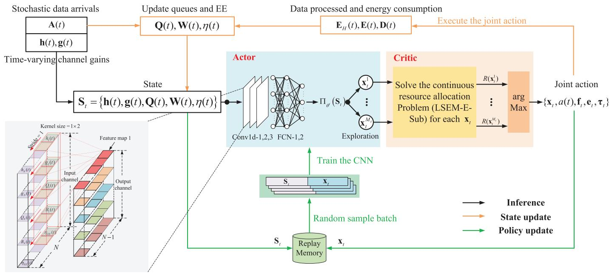  
Fig. 3. The LyCNN-DRL framework.

# B. State Update

At each time slot, the LyCNN-DRL framework selects and executes the joint action. We then obtain the harvested energy ${ \bf E } _ { H } ( t )$ , the energy consumption $\mathbf { E } ( t )$ and the amount of accomplished computation task data $\mathbf { D } ( t )$ for all WDs. Based on ${ \bf E } _ { H } ( t ) , { \bf E } ( t )$ and $\mathbf { D } ( t )$ , the update module updates the queues $\mathbf { Q } \left( t { + } 1 \right)$ and $\mathbf { W } ( t + 1 )$ , the remaining energy of the batteries $\mathbf { B } \left( t { + } 1 \right)$ , and the iterated $\eta ( t + 1 )$ in (15). In the next time slot, combined with the channel states observation $\mathbf { h } ( t { + } 1 )$ and $\mathbf { g } ( t { + } 1 )$ , the state $\mathbf { S } _ { t + 1 }$ will be fed to the LyCNN-DRL framework.

# C. Policy Update

The LyCNN-DRL framework trains the CNN by state-action samples $( \mathbf { S } _ { t } , \mathbf { x } _ { t } ^ { * } )$ from the replay memory. In specific, the replay memory stores the selected action and the corresponding system states after each inference process. Benefiting from the action quantity of the actor module and the unbiased evaluation of the critic module, the quality of the samples in replay memory can be improved over time slots, which leads to better convergence performance of the LyCNN-DRL framework. Every $\delta _ { T }$ slots, a batch of samples is randomly selected from the replay memory to improve the CNN model $\pi _ { \theta _ { t } }$ . The adopted updating strategy of embedding parameters is the Adam algorithm [36] to reduce the following cross-entropy loss function:

$$
\begin{array}{l} L o s s (\theta) = \frac {1}{| \mathcal {I} |} \sum_ {\vartheta \in \mathcal {I}} \left[ \left(\mathbf {x} _ {\vartheta}\right) ^ {T} \log \pi_ {\theta_ {t}} (\mathbf {S} _ {\vartheta}) \right. \\ \left. + \left(1 - \mathbf {x} _ {\vartheta}\right) ^ {T} \log \left(1 - \pi_ {\theta_ {t}} (\mathbf {S} _ {\vartheta}) \right. \right], \tag {45} \\ \end{array}
$$

where $( \cdot ) ^ { T }$ denotes the transpose operator, $\mathcal { T }$ represents the indexes of the selected training samples and $| \mathcal { T } |$ denotes the size of $\mathcal { T }$ .

Algorithm 2 The LyCNN–DRL Framework for Solving LSEM-E   
input: The channel gains $\mathbf{h}(t)$ $\mathbf{g}(t)$ and the data   
arrivals $\mathbf{A}(t)$ for every time slot $t$ output: The joint action $(\mathbf{x}_t^*,a^* (t),\mathbf{f}_t^*,\mathbf{e}_t^*,\boldsymbol {\tau}_t^*)$ for every   
time slot $t$ .   
1 Initialize parameters at the first time slot: $V = 80$ $\delta = 10$ $\delta_T = 10$ $M_1 = 2N$ $\mathbf{Q}(1) = 0$ $\mathbf{W}(1) = \mathbf{B}^{\mathrm{max}}$ and $\eta (1) = 0$ .   
for $t = 1,2,\ldots ,K$ do   
Observe the state $\mathbf{S}_t$ 4 Generate $\hat{\mathbf{x}}_t = \pi_{\theta_t}(\mathbf{S}_t)$ by the CNN network;   
5 Generate candidate binary offloading decisions $\{\mathbf{x}_t^m\}_{M_t}$ from $\hat{\mathbf{x}}_t$ using the NOP method;   
6 Solve the LSEM-E-Sub problem for each $\mathbf{x}_t^m$ to derive $R(\mathbf{x}_t^m)$ .   
7 Choose the optimal joint action from (44);   
8 Add $(\mathbf{S}_t,\mathbf{x}_t^*)$ to the replay memory;   
9 if mod $(t,\delta_T) = 0$ then   
10 Uniformly sample a batch of data $\left\{\left(\mathbf{S}_{\vartheta},\boldsymbol {x}_{\vartheta}\right)\mid \vartheta \in \mathcal{I}\right\}$ from the memory Train the CNN and update $\theta_t$ .   
12 end   
13 Update $\mathbf{Q}(t + 1)$ $\mathbf{W}(t + 1)$ ,and $\eta (t + 1)$ .   
end

In summary, the pseudo-code of the LyCNN-DRL framework is shown in Algorithm 2.

# VI. PERFORMANCE ANALYSIS

This section evaluates the proposed LyCNN-DRL framework combined with the Lyapunov optimization technique. Firstly, we demonstrate the computational complexity of the LyCNN-DRL framework in detail. Secondly, we derive the gap between the minimal $\eta$ and that achieved by the LyCNN-DRL framework, and deduce the performance bound of the average data queue length.

# A. Computation Complexity

For the LSEM-E-Sub problem, we perform a goldensection search for $a ( t )$ and execute Algorithm 1 under the corresponding $a ( t )$ . Algorithm 1 takes time $O ( N + N C _ { F } +$ $N l o g _ { 2 } ( \Delta _ { \beta } / \sigma _ { \beta } ) C _ { F } )$ where $C _ { F }$ is the constant complexity of fixed point method for $Y _ { i } ^ { - 1 } ( \beta )$ . The first term corresponds to the calculation of $\overline { { \beta } } _ { j }$ which solves $N$ times (34) (line 4 of Algorithm 1). The second term corresponds to the calculation of intervals for $N$ WDs (line 5 of Algorithm 1), which involves $N$ times fixed point method for $\bar { Y } _ { i } ^ { - 1 } ( \beta )$ . The last term corresponds to the case 2 where $1 - a ( t ) \ \in$ $\begin{array} { r } { \left\lceil \sum _ { j = n } ^ { N } \frac { M _ { j } ( t ) } { Y _ { j } ^ { - 1 } ( \overline { { \beta } } _ { n } ) } , \sum _ { j = n } ^ { \bar { N } } \frac { M _ { j } ( t ) } { Y _ { j } ^ { - 1 } ( \overline { { \beta } } _ { n - 1 } ) } \right\rceil } \end{array}$ (line 9-12 of Algorithm 1). It iteratively searches $\beta ^ { * }$ by bisection search and executes $N$ times fixed point method to compute $Y _ { i } ^ { - 1 } ( \beta )$ . Considering the computational complexity of golden section for $a ( t )$ , the worst computational complexity of problem LSEM-E-Sub is $O ( l o g _ { 0 . 6 1 8 } ( { \sigma _ { a } } / { \Delta _ { a } } ) [ N + N C _ { F } + N l o g _ { 2 } ( { \Delta _ { \beta } } / { \sigma _ { \beta } } ) C _ { F } ] )$ which is lower than $O ( N ^ { 3 . 5 } )$ of interior point method.

Then, we analyze the complexity of the LyCNN-DRL framework. The execution of LyCNN-DRL mainly consists of the inference (lines 3-7 of Algorithm 2), and the policy update (lines 8-12 of Algorithm 2). The policy update part is executed once with an interval such as every ten time slots, while the action generation part is executed each time slot and solves the LSEM-E-Sub problem multiple times. Thus, we focus on the complexity of LyCNN-DRL’s inference process. In the inference process, the CNN often exhibits linear complexity. However, the critic module is executed repeatedly for all candidate offloading decisions, which contributes to the primary computational complexity. Since the critic module solves the LSEM-E-Sub problem based on Algorithm 1 Mt times in each time slot, the overall computational complexity is $O ( M _ { t } l o g _ { 0 . 6 1 8 } ( \sigma _ { a } / \Delta _ { a } ) [ N + N C _ { F } + N l o g _ { 2 } ( \Delta _ { \beta } / \sigma _ { \beta } ) C _ { F } ]$ . $M _ { t }$ is a dynamic self-adaptive parameter, which is adjusted by the distance between the generated action and the selected action. Thus, at first, the computational complexity of LyCNN-DRL is $O ( M _ { t } N )$ , but as LyCNN-DRL gradually converges, the computational complexity of LyCNN-DRL will gradually approach $O ( N )$ .

# B. Convergence

Lemma 2: Suppose that $\boldsymbol { \lambda }$ is a strictly feasible set for the origin problem and that $\lambda + \epsilon$ is still a feasible set for a positive . Then, for any $\delta > 0$ , there exists an independent and identically distributed (i.i.d.) algorithm $\Psi ^ { * } ( t )$ that satisfies

$$
\mathbb {E} \left\{E _ {t o t} ^ {*} (t) \right\} \leq \mathbb {E} \left\{D _ {t o t} ^ {*} (t) (\eta^ {*} + \delta) \right\}, \tag {46}
$$

$$
\mathbb {E} \left\{D _ {i} ^ {*} (t) | \{\mathbf {Q} (t), \mathbf {W} (t) \} \right\} = \mathbb {E} \left\{D _ {i} ^ {*} (t) \right\} \geq \lambda_ {i} + \epsilon , \tag {47}
$$

$$
\mathbb {E} \left\{E _ {i} (t) \mid \left\{\mathbf {Q} (t), \mathbf {W} (t) \right\} \right\} = E _ {i} (t) \geq E _ {i} ^ {H} (t) + \epsilon , \tag {48}
$$

where $E _ { t o t } ^ { * } ( t )$ , $D _ { t o t } ^ { * } ( t )$ and $D _ { i } ^ { * } ( t )$ are the resulting values under $\Psi ^ { * } ( t )$ .

Proof: Proof is omitted for brevity. A similar proof can be found in [33].

By exploiting Lemma 2, we describe the performance bound for our algorithm in Theorem 3.

Theorem 3: Suppose that the LSEM problem is feasible and the system states, which include channel states and arrival data, are i.i.d. over time slots. Then, we have

1) $\eta$ is upper bounded by

$$
\eta \leq \eta^ {*} + \frac {C}{V \sum_ {i = 1} ^ {N} D _ {i} ^ {\min }}. \tag {49}
$$

2) The performance bound of the average data queue length satisfies

$$
\bar {Q} \leq \frac {C + V \left(\eta^ {*} \sum_ {i = 1} ^ {N} D _ {i} ^ {\max } - E _ {t o t} ^ {\min }\right)}{\varepsilon}. \tag {50}
$$

Proof: Similar proof is in [35], we omit it for brevity.

Theorem 3 indicates that if the LyCNN-DRL algorithm achieves near-optimal performance in per-slot problem LSEM-E, then we achieve an $[ O ( 1 / V ) , O ( V ) ]$ energy efficiency-delay (EE-delay) tradeoff. Notice that by increasing $V$ , we can reduce $\eta$ and improve the network EE, but the data queue will increase, which results in a longer processing delay for WDs. Therefore, in practice, we need to find a suitable $V$ for EE-delay tradeoff. However, deriving formal convergence for LyCNN-DRL is challenging due to the complexities of deep learning technology, which currently lacks formal convergence proofs. Consequently, we evaluate the convergence performance of LyCNN-DRL through simulations in the following section.

# VII. NUMERICAL RESULTS

This section evaluates the LyCNN-DRL framework through extensive simulations. In the simulations, unless otherwise specified, $N = 1 0$ . The distances from WDs to ECS and WDs to ES are randomly distributed in [5, 15] meters. The average channel power gains $\bar { g } _ { i }$ and $\bar { h } _ { i }$ are modeled as $\begin{array} { r } { A _ { d } \bigg ( \frac { 3 \cdot 1 0 ^ { 8 } } { 4 \pi f _ { c } d _ { i } } \bigg ) ^ { \smash { \check { d } _ { e } } } } \end{array}$ de ， where $A _ { d } ~ = ~ 4 . 1 1$ , $f _ { c } ~ = ~ 7 8 0 ~ \mathrm { \ M H z }$ , and $d _ { e } ~ \doteq ~ 2 . 5$ [4]. $g _ { i } = \bar { g } _ { i } \rho _ { i , g }$ and $h _ { i } = \bar { h } _ { i } \rho _ { i , h }$ , respectively, where $\rho _ { i , g }$ and $\rho _ { i , h }$ follow an exponential distribution with unit mean. $P _ { H } = 3 \mathsf { W }$ , $\eta _ { i } = 0 . 9$ and the channel bandwidth $W = 0 . 2 \mathrm { M H z }$ . $n _ { 0 } ~ =$ $- 1 7 4 \mathrm { d B m / H z }$ . $A _ { i } ( t )$ follows an exponential distribution with an equal average arrival rate $\mathbb { E } \{ A _ { i } ( t ) \} = \lambda _ { i } = 2 5 0 \mathrm { K b i t / s }$ for all WDs, and we introduce $\lambda$ to denote the common expected arrival rate for all WDs in the following discussions.

The training data consists of the channel power gains ${ \bf g } ( t )$ , ${ \bf h } ( t )$ and task arrivals ${ \bf A } ( t )$ in 30 000 sequential time slots, which follow their distribution and are i.i.d. over time slots. At each time slot, according to the probability distribution generated by the CNN model, LyCNN-DRL generates binary offloading decisions and stores state-action pairs in replay memory. For each training interval, LyCNN-DRL samples a batch of state-action pairs to train the CNN model by reducing the cross-entropy loss in (45) with the Adam algorithm.

LyCNN-DRL employs a neural network architecture within the actor module, which includes three convolutional layers along with two fully connected layers. The input to the onedimensional CNN has a channel size of 5 and a length of N, reflecting the five categories of variables for $\mathbf { S } _ { t }$ and the number of WDs. Specific parameters of the CNN are detailed in Table II.

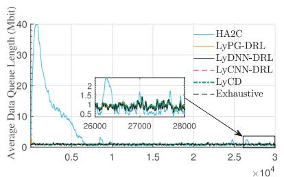

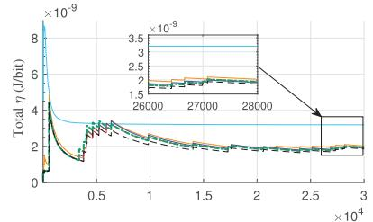  
(a) $N = 5$ and $\lambda = 2 5 0$ Kbit/s

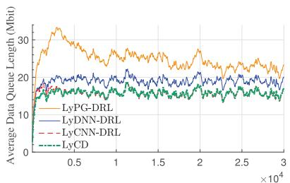

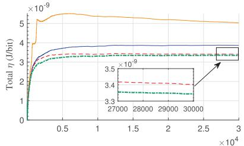  
(b) $N = 1 0$ and $\lambda = 2 5 0$ Kbit/s

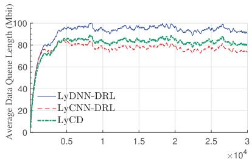

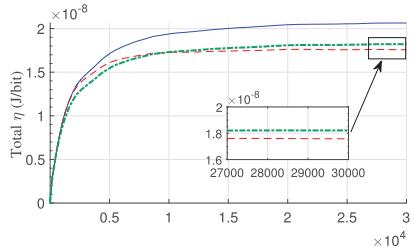  
(c) $N = 1 0$ and $\lambda = 3 5 0$ Kbit/s   
Fig. 4. Convergence performance comparisons of different algorithms across varying WD scales and task arrivals. The simulation focuses on the average data queue length and total energy efficiency under three scenarios.

TABLE II THE DETAILED PARAMETERS OF THE CNN   

<table><tr><td>Layer</td><td>Input size</td><td>Output Size</td><td>Activation</td><td>Kernel</td><td>Stride</td></tr><tr><td>Conv1d-1</td><td>5×1×N</td><td>16×1×(N-1)</td><td>ReLU</td><td>1×2</td><td>1</td></tr><tr><td>Conv1d-2</td><td>16×1×(N-1)</td><td>16×1×(N-2)</td><td>ReLU</td><td>1×2</td><td>1</td></tr><tr><td>Conv1d-3</td><td>16×1×(N-2)</td><td>5×1×(N-3)</td><td>None</td><td>1×2</td><td>1</td></tr><tr><td>FC-1</td><td>5×(N-3)</td><td>64</td><td>ReLU</td><td>/</td><td>/</td></tr><tr><td>FC-2</td><td>64</td><td>N</td><td>Sigmoid</td><td>/</td><td>/</td></tr></table>

# A. Convergence Performance

To evaluate the long-term performance achieved by LyCNN-DRL, we compare LyCNN-DRL with four benchmark algorithms:

• Lyapunov-guided Coordinate Descent (LyCD): It solves the equivalent per-slot problem LSEM-E using the coordinate descent (CD) method [27] which greedily iteratively updates the binary offloading decision vector $\mathbf { \boldsymbol { x } } ^ { t }$ . Specifically, in each iteration, it first inverts one binary decision to generate $N$ different binary decisions, and chooses the best binary decision for the next iteration. For the binary offloading decision problem, the worst computational complexity of LyCD is $O ( 2 ^ { N } )$ , which is linear computational complexity in our algorithm.   
• Lyapunov-guided DNN-based DRL algorithm (LyDNN-DRL): The structure of LyDNN-DRL is the same as LyCNN-DRL, but utilizes the DNN model with the pure FC layers as the actor network. The FCNN consists of three fully connected layers which have 256, 128 and 64 hidden neurons, respectively.   
• Lyapunov-guided policy gradient based DRL algorithm (LyPG-DRL): LyPG-DRL transforms the LSEM problem to the LSEM-E problem by Lyapunov theorem, and then utilizes a policy gradient DRL [37] to optimize the binary offloading decision and the resource allocation in two-

stage. The resource allocation is still obtained by our proposed algorithms in section IV. To the best of our knowledge, [37] is a state-of-the-art algorithm for such a MINLP problem.

• Hybrid advantage actor-critic DRL (HA2C): HA2C [28] is a policy-based DRL scheme with two actor networks. Unlike the above two-stage algorithms, HA2C directly trains these two networks to learn the optimal mapping from the input $\mathbf { S } _ { t }$ to the output $\mathbf { x } _ { t }$ and the set $\{ a ( t ) , \mathbf { f } _ { t } , \mathbf { e } _ { t } , \tau _ { t } \}$ , respectively. To the best of our knowledge, [28] presents a state-of-the-art DRL algorithm that solves the MINLP problem in an end-to-end manner and outperforms DDPG and PPO.

In addition to the four benchmarks mentioned above, we also explored the use of an exhaustive search method to obtain the optimal binary decision for the LSEM-E problem, called as the exhaustive algorithm. However, due to the exponential computational complexity, we were only able to obtain the long-term simulation results for $N = 5$ , while the execution latency became unacceptable for $N = 1 0$ .

As shown in Fig. 4, we evaluate the convergence of queue and $\eta$ achieved by LyCNN-DRL, the exhaustive algorithm, and the above four benchmark algorithms over 30 000 time slots. Each point is a moving-window average of 200 time slots in Fig. 4. Recall that $\eta$ denotes the reciprocal of EE. The sub-figures demonstrate three different network scenarios: Fig. 4(a) with $N \ = \ 5$ and $\lambda \ = \ 2 5 0$ Kbit/s, Fig. 4(b) with $N ~ = ~ 1 0$ and $\lambda \ = \ 2 5 0$ Kbit/s, and Fig. 4(c) with $N = 1 0$ and $\lambda = 3 5 0$ Kbit/s, respectively. When $N = 5$ and $\lambda = 2 5 0$ Kbit/s, all algorithms maintain the data queue stable and the Lyapunov-guided algorithms are less fluctuating than HA2C. Furthermore, the long-term $\eta$ achieved by the Lyapunov-guided algorithms is $3 6 . 7 \%$ lower than that of HA2C, highlighting the effectiveness of Lyapunov theory in ensuring data queue stability and minimizing long-term $\eta$ . In

this small-scale scenario, LyCNN-DRL and other Lyapunovguided benchmarks achieve near-optimal performance, closely approaching the optimal results of the exhaustive algorithm. When $N = 1 0$ and $\lambda = 2 5 0$ Kbit/s, HA2C cannot stabilize the data queues, and the exhaustive method has an unacceptable execution delay, taking more than 7 seconds per time slot to solve the LSEM-E problem. In particular, the performance of LyCNN-DRL and LyCD is very close, which has lower data queue length and smaller $\eta$ compared to LyDNN-DRL and LyPG-DRL. When faced with a higher workload, i.e., $N = 1 0$ and $\lambda \ : = \ : 3 5 0$ Kbit/s, both the data queue length and $\eta$ of all algorithms are worse than in the scenario when $N = 1 0$ and λ = 250Kbit/s. Even LyPG-DRL fails to stabilize the task data queue for all WDs. However, LyCNN-DRL lightly outperforms LyCD under high workload. In general, LyCNN-DRL achieves performance comparable to LyCD, which approaches optimal results.

In Fig. 5, we further evaluate the performance of the LyCNN-DRL and the benchmark algorithms in solving perslot problem LSEM-E, under two different scenarios: one for $N ~ = ~ 1 0$ and $\lambda \ : = \ : 2 5 0$ Kbit/s, and one for $N ~ = ~ 1 0$ and $\lambda = 3 5 0$ Kbit/s. For a fair comparison, we use the same input state $\mathbf { S } _ { t }$ from a convergence trajectory, only for computing the joint action in each time slot without updating the queue states. Then, we use LyCD as the baseline and plot the utility ratio of the objective value achieved by other algorithms in the LSEM-E problem to that achieved by LyCD. To further illustrate the convergence performance, we also adopt the exhaustive algorithm as a benchmark algorithm to assess the gap to optimum. However, the exhaustive algorithm suffers from unacceptable execution latency for 30 000 time slots. To address this, we use a boxplot to demonstrate the utility ratios of the exhaustive algorithm for 1000 time slots after the other algorithms have converged.

As shown in Fig. 5(a) and Fig. 5(b), we demonstrate the utility ratio over 30 000 time slots and the boxplot of utility ratio over 1000 time slots after convergence with $N = 1 0$ and $\lambda = 2 5 0$ Kbit/s, receptively. In Fig. 5(a), LyCNN-DRL gradually converges at 5000 time slots and achieves an average utility ratio of $9 9 . 7 4 \%$ . The utility ratios achieved by LyDNN-DRL and LyPG-DRL are $2 . 3 6 \%$ and $7 . 2 6 \%$ less than those achieved by LyCNN-DRL, but $\eta$ achieved by LyDNN-DRL and LyPG-DRL are $1 3 . 5 9 \%$ and $4 7 . 8 1 \%$ worse than that of LyCNN-DRL in Fig. 4. On the other hand, the boxplot of Fig. 5(b) further demonstrates the convergence performance in detail. The box of LyCNN-DRL is close to 1, and even the bottom of the box exceeds both the upper bounds of LyDNN-DRL and LyPG-DRL. In addition, the average utility ratio of LyCNN-DRL is only $0 . 5 9 \%$ lower than that of the exhaustive algorithm, indicating a small optimal gap.

Fig. 5(c) and Fig. 5(d) further demonstrate the utility ratios with $N = 1 0$ and $\lambda = 3 5 0$ Kbit/s, validating the simulation shown in Fig. 4(c). In Fig. 5(c), LyCNN-DRL initially converges in 5000 rounds and achieves an average utility ratio of $1 0 1 . 3 \%$ , outperforming LyCD. In Fig. 5(d), LyCNN-DRL still have a small optimal gap of only $0 . 7 3 \%$ compared to the exhaustive algorithm. The whole box of LyCNN-DRL is up to the value of 1, i.e., the baseline utility ratio of

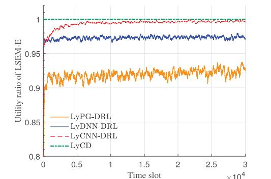  
(a) The utility ratio across 3o OOO time slots when $\lambda =$ 250 Kbit/s

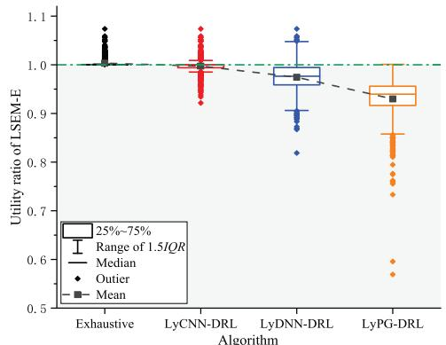  
(b)Boxplot of utility ratio over lOoo time slots after convergence when $\lambda = 2 5 0$ Kbit/s

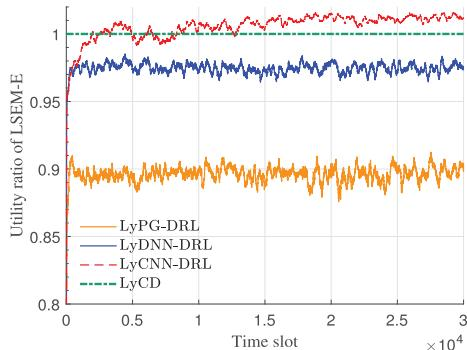  
(c) The utility ratio across 30 ooO time slots when $\lambda =$ 350 Kbit/s

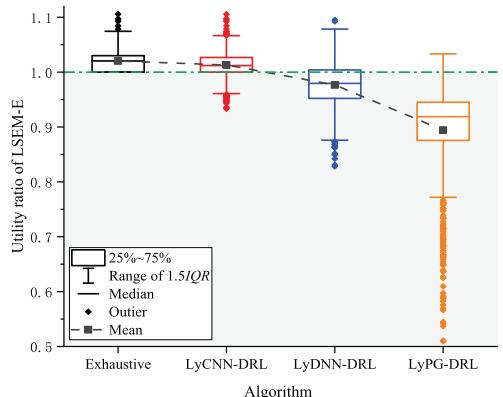  
(d) The distribution of utility ratio over 1OoO time slots after convergence when $\lambda = 3 5 0$ Kbit/s   
Fig. 5. Convergence performance of LyCNN-DRL and baseline algorithms in solving LSEM-E when $N = 1 0$ .

LyCD, and all the achieved utility ratios are more than 0.90. In addition, the utility ratios achieved by LyDNN-DRL and

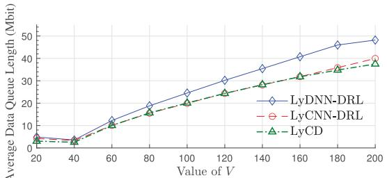

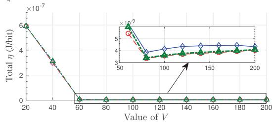  
Fig. 6. Impact of parameter V.

LyPG-DRL are $3 . 7 2 \%$ and $1 3 . 2 7 \%$ less than that achieved by LyCNN-DRL. Notice that LyPG-DRL has a massive outier of less than 0.8, which leads to failure to stabilize the data queues with $N ~ = ~ 1 0$ and $\lambda ~ = ~ 3 5 0$ Kbit/s. The above results validate that LyCNN-DRL achieves a near-optimal performance comparable to LyCD and converges to an optimal gap of less than $1 \%$ compared to the exhaustive method.

Fig. 6 further shows the impact of the Lyapunov control parameter V on LyCNN-DRL, LyDNN-DRL and LyCD algorithms, where $V \in [ 2 0 , 2 0 0 ]$ . The parameter $V$ controls the balance between the total $\eta$ and Lyapunov queues based on the Lyapunov drift plus penalty function. In general, all the algorithms show a similar performance: the data queue length increases with V, and the Lyapunov penalty $\eta$ decreases with V. $\eta$ decreases with $V$ when $V \leq 8 0$ but slightly increases with $V$ when $V ~ \geq ~ 8 0$ . Meanwhile, the data queue length grows linearly with V. There is a tradeoff between WDs’ delay depending on the data queue length and the operator’s cost depending on $\eta$ . A suitable $V$ is important to reduce $\eta$ achieved in the system and maintain an acceptable data queue for WDs.

Fig. 7 demonstrates how the data queue length and the EE vary with different noise power spectral densities $n _ { 0 }$ . As $n _ { 0 }$ increases, the data queue and $\eta$ increase, and the gap between LyCNN-DRL and benchmark algorithms, i.e., LyDNN-DRL and LyCD, diminishes. This result indicates that when the quality of WDs’ channel states is extremely poor, the WDs’ channel states significantly impact the EE and the data task completion delay.

Fig. 8 provides a further evaluation of LyCNN-DRL under different numbers of WDs. Specifically, we demonstrate the average data queue length under different λ. LyCNN-DRL can maintain a stable task data queue with four conditions, that is, $\lambda \le 2 3 0$ Kbit/s with $N = 4 0$ , $\lambda \le 2 5 0$ Kbit/s with $N = 3 0$ , $\lambda ~ \le ~ 2 8 0$ Kbit/s with $N \ = \ 2 0$ , and $\lambda ~ \leq ~ 4 0 0$ Kbit/s with $N = 1 0$ . As expected, the stable capacity region shrinks with $N$ due to the increased computation workload under the same $\lambda$ . For a specific $\lambda$ , the average data queue length increases as $N$ increases. For instance, for $\lambda = 2 5 0 \mathrm { K b i t / s }$ , the average data

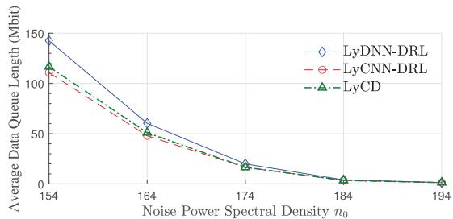

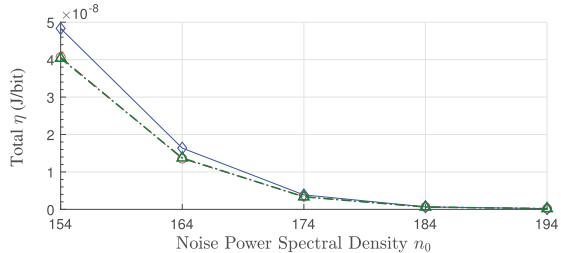  
Fig. 7. Performance comparisons under different $n _ { 0 }$

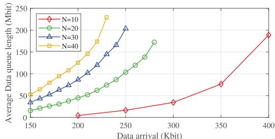  
(a) Average Data Queue Length

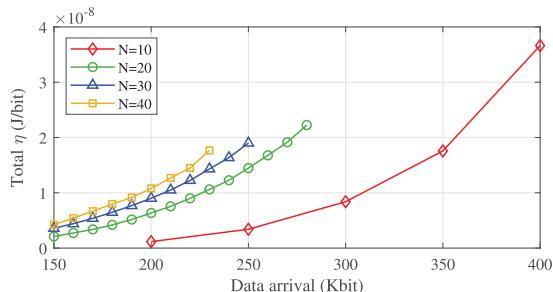  
(b） Average Energy Efficiency   
Fig. 8. Performance of proposed algorithm under the different numbers of WDs.

queue length is around 100Mbit when $N = 2 0$ which is less than the average data queue length when $N = 3 0$ . Fig. 8(b) shows that $\eta$ exponentially increases with $N .$ and eventually reaches the max capacity upper bound of the system due to limited spectrum resources and WPT power.

# B. Scalability Performance

In order to meet the real-time requirement of NOMA networks, the execution latency of the binary offloading and resource allocation algorithm needs to be much smaller than the slot duration, e.g., one second [8], [38], [39]. To evaluate the scalability of LyCNN-DRL and benchmark algorithms, we test the average execution latency under different numbers of WDs, and the results are shown in Table III. Since The LyCD

TABLE III THE AVERAGE EXECUTION LATENCY OF DIFFERENT ALGORITHMS AFTER CONVERGENCE (S)   

<table><tr><td>Algorithms</td><td>N=5</td><td>N=10</td><td>N=20</td><td>N=30</td><td>N=40</td></tr><tr><td>HA2C</td><td>0.002</td><td>/</td><td>/</td><td>/</td><td>/</td></tr><tr><td>LyPG-DRL</td><td>0.026</td><td>0.043</td><td>0.067</td><td>/</td><td>/</td></tr><tr><td>LyCD</td><td>0.174</td><td>1.476</td><td>6.762</td><td>14.839</td><td>35.184</td></tr><tr><td>LyCNN-DRL</td><td>0.035</td><td>0.058</td><td>0.097</td><td>0.114</td><td>0.137</td></tr></table>

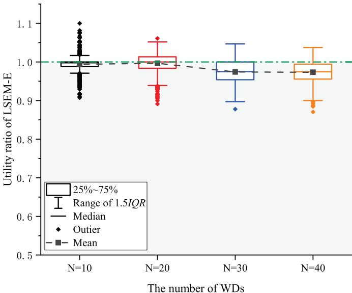  
Fig. 9. Utility ratio of LyCNN-DRL in solving the per-slot problem LSEM-E across different numbers of WDs when $\lambda = 2 3 0 \mathrm { K b i t / s }$ .

and LyCNN-DRL need to optimize several times resource allocation at each iteration and each exploration, respectively, we utilize the multiple cores of the CPU for parallel computing.

As shown in Table III, the execution latency of LyCNN-DRL is 0.137 seconds at most in all the conditions. In contrast, LyCD consumes acceptable latency when $N = 5$ but significantly long latency when $N \geq 1 0$ and even around 250 times longer than that of LyCNN-DRL when $N = 4 0$ HA2C has an extremely low execution latency when $N = 5$ but it suffers from performance degradation and even cannot converge when $N \ge 1 0$ . The execution latency of LyPG-DRL is on average $2 4 . 6 \%$ smaller than LyCNN-DRL, but the achieved $\eta$ of LyPG-DRL is worse than that of LyCNN-DRL, e.g., $4 7 . 8 \%$ worse $\eta$ achieved by LyPG-DRL when $N = 1 0$ shown in Fig. 5(a). In addition, LyPG-DRL fails to converge when $N ~ \geq ~ 3 0$ . The proposed LyCNN-DRL algorithm, in contrast, achieves $\eta$ minimization while stabilizing data queues for $N = 4 0$ .

Fig. 9 further demonstrates the convergence performance of LyCNN-DRL with varying numbers of WDs, presented through a boxplot of the utility ratio over 1 000 time slots after convergence for $\lambda ~ \le ~ 2 3 0 \mathrm { K b i t / s }$ . The average utility ratios for $N ~ = ~ 1 0$ and $N \ = \ 2 0$ are close to 1, which indicates the close performance between LyCNN-DRL and

LyCD. For $N = 3 0$ and $N = 4 0$ , the average utility ratios of LyCNN-DRL are still above $9 7 . 2 \%$ and the worst utility ratio of LyCNN-DRL is above $85 \%$ , ensuring data queues are stable and $\eta$ minimization. The slight performance degradation observed for $N \geq 3 0$ is attributed to the exponential growth of the binary offloading action space, e.g., when $N = 4 0$ , there are over $1 0 ^ { 1 2 }$ possible offloading decisions. In contrast, LyCD achieves $3 \%$ better utility compared to LyCNN-DRL, but incurs an unacceptable high execution latency of 35.184 seconds due to its iterative search process. Thus, LyCNN-DRL demonstrates near-optimal performance with acceptable execution latency for $N ~ \leq ~ 4 0$ , validating its scalability in dynamic networks with time-varying channel states.

# VIII. CONCLUSION

This paper proposed the LyCNN-DRL framework to obtain optimal solutions for the WPT multi-user MEC scenario. Firstly, the proposed algorithm utilizes Lyapunov theory to decouple long-term optimizations into deterministic per-slot optimization problems. Secondly, exploiting the bi-layer structure of the problem decomposition, we further designed the LyCNN-DRL framework to solve the deterministic optimization problem, which is a MINLP problem. Considering time-varying channel states and stochastic task arrivals, the proposed LyCNN-DRL framework efficiently generates the near-optimal joint action for long-term energy efficiency minimization, subject to long-term constraints. In particular, the convex optimization algorithm proposed for the resource allocation subproblem reduces the computational complexity compared to the CVX solver. Furthermore, the LyCNN-DRL framework for joint optimization of binary offloading decisions and resource allocation achieves an execution latency of only 137 ms in a forty-WD network, which is two orders of magnitude lower than the classical optimization algorithm LyCD. The simulation results validate that the Lyapunovguided DRL algorithms outperform the non-Lyapunov-guided DRL algorithm HA2C. Specifically, LyCNN-DRL showed better performance on long-term EE and data queue length control compared to other Lyapunov-guided DRL algorithms, achieving near-optimal performance comparable to LyCD. Finally, we prove that the network’s long-term energy efficiency and data queue length follow a $[ O ( 1 / V ) , O ( V ) ]$ tradeoff with the control parameter V.

Looking ahead, our aim is to evolve LyCNN-DRL to a distributed framework, which displays the LyCNN-DRL network in each BS. To enhance the distributed framework’s performance, we may leverage sequence-to-sequence models, such as Transformers, to effectively capture features of historical information. Another open issue is the adaptation of LyCNN-DRL to handle fast fading scenarios, which may require designing a more efficient DRL to directly output the joint actions of binary offloading and resource allocation.

# APPENDIX A

# PROOF OF THEOREM 1

(1) When $e _ { i } ^ { * } = 0$ , the optimal offloading duration $\tau _ { i } ^ { * } { = } 0$ .

We prove this by contradiction. Assume that for the

optimal offloading solution, if $e _ { i } ^ { * } = 0$ , then the optimal offloading duration $\tau _ { i } ^ { * } > 0$ . $\Omega$ is the set of WDs’ indexes whose $e _ { i } ^ { * }$ and $\boldsymbol { \tau } _ { i } ^ { * }$ are non-zero and $\overline { { \Omega } }$ is the set of WDs’ indexes whose $e _ { i } ^ { * } = 0$ and $\tau _ { i } ^ { * } > 0$ . Then, we denote $\Gamma ^ { * }$ as the objective function value of the assumed optimal offloading solution. Below we construct a new offloading solution of problem ORA-Sub. Based on the optimal offloading solution, we decrease the offloading duration of each WD in $\overline { { \Omega } }$ by $\delta$ and increase the offloading duration of each WD in $\Omega$ by $\delta \left| \overline { { \Omega } } \right| / \left| \Omega \right|$ where $\delta$ is small enough. Then, the value of the objective function with the new offloading solution can be described as

$$
\begin{array}{l} \Gamma^ {\prime} = \sum_ {i \in \bar {\Omega}} \left((- Q _ {i} (t) - V \eta (t) + V \eta_ {0}) \left(\tau_ {i} ^ {*} - \delta\right) W \log_ {2} (1 \right. \\ \left.\left. + \frac {h _ {i} e _ {i} ^ {*}}{(\tau_ {i} ^ {*} - \delta) \sigma^ {2}}\right) + V \eta_ {0}\right)\left. \right) + \sum_ {i \in \Omega} ((- Q _ {i} (t) - V \eta (t) \\ \times \left(\tau_ {i} ^ {*} + \frac {| \bar {\Omega} |}{| \Omega |} \delta\right) W \log_ {2} \left(1 + \frac {h _ {i} e _ {i} ^ {*}}{\left(\tau_ {i} ^ {*} + \frac {| \bar {\Omega} |}{| \Omega |} \delta\right) \sigma^ {2}}\right)\left. \right) \\ + \sum_ {i \in \Omega} (V + W _ {i} (t)) e _ {i} ^ {*} \tag {51} \\ \end{array}
$$

where all terms about the WDs in $\overline { { \Omega } }$ are equal to zero since $e _ { i } ^ { * } \ = \ 0$ . The second term above is a perspective function about $e _ { i } ^ { * }$ and $\boldsymbol { \tau } _ { i } ^ { * }$ , which decreases as $\boldsymbol { \tau } _ { i } ^ { * }$ increases for $\tau _ { i } ^ { * } \ > \ 0$ . Thus, when $\tau _ { i } ^ { * } \ > \ 0$ increases $\delta \left| \overline { { \Omega } } \right| / \left| \Omega \right|$ , the value of the objective function will decrease, resulting in $\Gamma ^ { \prime }$ being less than $\Gamma ^ { * }$ . This contradicts the assumption. This completes the proof.

(2) When $e _ { i } ^ { * } > 0$ , the optimal offloading duration $\tau _ { i } ^ { * } > 0$ . The partial derivative of the objective function with respect to $\tau _ { i }$ is

$$
\begin{array}{l} \frac {\partial \mathbb {L}}{\partial \tau_ {i}} = (- Q _ {i} (t) - V \eta (t) + V \eta_ {0}) W \log_ {2} \left(1 + \frac {h _ {i} e _ {i}}{\sigma^ {2} \tau_ {i}}\right) \\ + \frac {\left(Q _ {i} (t) + V \eta (t) - V \eta_ {0}\right) W k _ {i} e _ {i}}{\left(\tau_ {i} + \frac {h _ {i} e _ {i}}{\sigma^ {2}}\right) \ln 2} \tag {52} \\ \end{array}
$$

Observe that $\partial \mathbb { L } / \partial \tau _ { i } \quad = \quad - \infty$ as $\tau _ { i } \quad  \quad 0$ and $e _ { i } ( t ) > 0$ , indicating that the objective function monotonically decreases with $\tau _ { i }$ . Consequently, increasing $\tau _ { i }$ is beneficial for minimizing the objective function, resulting in a non-zero $\tau _ { i }$ . This completes the proof.

# APPENDIX B PROOF OF THEOREM 2

We prove this by contradiction. Assume that for the optimal offloading solution of (28), the sum of the offloading durations $\textstyle \sum _ { i = 1 } ^ { N } \tau _ { i } ^ { * }$ is smaller than $1 - a ( t )$ . Let $\Gamma ^ { * }$ denote the value of the objective function in the assumed optimal offloading solution. In the following, we construct another offloading solution of the ORA-Sub problem. Based on the optimal offloading solution, we increase the offloading duration of each WD by $\delta$ where $\delta$ is small enough and $\textstyle \sum _ { i = 1 } ^ { N } ( \tau _ { i } ^ { * } + \delta )$ is still smaller

than $1 - a ( t )$ . Then, the value of the objective function with the new offloading solution can be described as

$$
\begin{array}{l} \Gamma^ {\prime \prime} = \sum_ {i = 1} ^ {N} \left((- Q _ {i} (t) - V \eta (t) + V \eta_ {0}) \left(\tau_ {i} ^ {*} + \delta\right) \right. \\ \times W \log_ {2} \left(1 + \frac {h _ {i} e ^ {*}}{(\tau_ {i} ^ {*} + \delta) \sigma^ {2}}\right) + \sum_ {i = 1} ^ {N} (V + W _ {i} (t)) e _ {i} ^ {*} \\ <   \Gamma^ {*}. \\ \end{array}
$$

The objective function monotonically decreases with $\tau _ { i } ^ { * }$ . Clearly, the value of the objective function with the new offloading solution is less than $\Gamma ^ { * }$ . This contradicts the assumption. This completes the proof.

# APPENDIX C PROOF OF LEMMA 1

According to the definition of ${ \overline { { \beta } } } _ { i }$ , it follows

$$
\left\{ \begin{array}{l} Z _ {i} \left(\bar {p} _ {i}\right) = V, \\ Y _ {i} \left(\bar {p} _ {i}\right) = \bar {\beta} _ {i}. \end{array} \right. \tag {53}
$$

Notice that the dual variable is shared on all WDs.

(1) If $\beta > \overline { { \beta } } _ { i }$ , the corresponding $\tau _ { i }$ and $e _ { i }$ are zero. We prove this in contradiction. Assume that if $\beta > \overline { { \beta } } _ { i }$ , the corresponding $\tau _ { i }$ and $e _ { i }$ are positive. Based on KKT conditions, if $\tau _ { i }$ and $e _ { i }$ are positive, the corresponding dual variables $\lambda _ { i }$ and $\mu _ { i }$ are zero. However, based on (32), (33) and Property 1, if $\beta ~ > ~ \overline { { \beta } } _ { i }$ , we have $p _ { i } > \overline { { p } } _ { i }$ , which leads to $Z _ { i } ( p _ { i } ) < Z _ { i } ( \overline { { { p } } } _ { i } ) = V$ . Since $V$ is constant, to satisfy the KKT condition in (30), the dual variable $\lambda _ { i }$ must be positive. This contradicts the assumption. A similar proof can be used for the condition $\beta < \overline { { \beta } } _ { i }$ .   
(2) If $\beta = \overline { { \beta } } _ { i }$ , then (53) holds and $p _ { i } = \overline { { p } } _ { i }$ . Since the dual variables $\lambda _ { i }$ , $\mu _ { i }$ and $\omega _ { i }$ are zero, the energy consumption $e _ { i }$ and the offloading duration $\tau _ { i }$ only need to satisfy the upper and lower constraints. This completes the proof.

# REFERENCES

[1] Y. Mao, C. You, J. Zhang, K. Huang, and K. B. Letaief, “A survey on mobile edge computing: The communication perspective,” IEEE Commun. Surveys Tuts., vol. 19, no. 4, pp. 2322–2358, 4th Quart., 2017.   
[2] W. Saad, M. Bennis, and M. Chen, “A vision of 6G wireless systems: Applications, trends, technologies, and open research problems,” IEEE Netw., vol. 34, no. 3, pp. 134–142, May 2020.   
[3] M. M. Sadeeq, N. M. Abdulkareem, S. R. M. Zeebaree, D. M. Ahmed, A. S. Sami, and R. R. Zebari, “IoT and cloud computing issues, challenges and opportunities: A review,” Qubahan Academic J., vol. 1, no. 2, pp. 1–7, Mar. 2021.   
[4] B. Zhu, K. Chi, J. Liu, K. Yu, and S. Mumtaz, “Efficient offloading for minimizing task computation delay of NOMA-based multiaccess edge computing,” IEEE Trans. Commun., vol. 70, no. 5, pp. 3186–3203, May 2022.   
[5] L. Huang, S. Bi, and Y. A. Zhang, “Deep reinforcement learning for online computation offloading in wireless powered mobile-edge computing networks,” IEEE Trans. Mobile Comput., vol. 19, no. 11, pp. 2581–2593, Nov. 2020.   
[6] F. K. Shaikh and S. Zeadally, “Energy harvesting in wireless sensor networks: A comprehensive review,” Renew. Sustain. Energy Rev., vol. 55, pp. 1041–1054, Mar. 2016.   
[7] P. X. Nguyen et al., “Backscatter-assisted data offloading in OFDMAbased wireless-powered mobile edge computing for IoT networks,” IEEE Internet Things J., vol. 8, no. 11, pp. 9233–9243, Jun. 2021.

[8] P. Chen, B. Lyu, S. Gong, H. Guo, J. Jiang, and Z. Yang, “Computational rate maximization for IRS-assisted full-duplex wireless-powered MEC systems,” IEEE Trans. Veh. Technol., vol. 73, no. 1, pp. 1191–1206, Jan. 2024.   
[9] B. L. J. Liao, W. Wu, and Y. Li, “Intelligent reflecting surface assisted secure computation of wireless powered MEC system,” IEEE Trans. Mobile Comput., vol. 23, no. 4, pp. 3048–3059, Apr. 2024.   
[10] Y. Gong, H. Yao, Z. Xiong, S. Guo, F. R. Yu, and D. Niyato, “Computation offloading and energy harvesting schemes for sum rate maximization in space-air-ground networks,” in Proc. - IEEE Global Commun. Conf., Dec. 2022, pp. 3941–3946.   
[11] S. Bi, L. Huang, H. Wang, and Y.-J. A. Zhang, “Lyapunov-guided deep reinforcement learning for stable online computation offloading in mobile-edge computing networks,” IEEE Trans. Wireless Commun., vol. 20, no. 11, pp. 7519–7537, Nov. 2021.   
[12] S. Zhang, H. Gu, K. Chi, L. Huang, K. Yu, and S. Mumtaz, “DRL-based partial offloading for maximizing sum computation rate of wireless powered mobile edge computing network,” IEEE Trans. Wireless Commun., vol. 21, no. 12, pp. 10934–10948, Dec. 2022.   
[13] Q. Gao, S. Lin, and G. Zhu, “Joint vehicular and static users multiplexing transmission with hierarchical modulation for throughput maximization in vehicular networks,” IEEE Intell. Transp. Syst. Mag., vol. 21, no. 9, pp. 3835–3847, Sep. 2020.   
[14] P.-Q. Huang, Y. Wang, K. Wang, and Q. Zhang, “Combining Lyapunov optimization with evolutionary transfer optimization for long-term energy minimization in IRS-aided communications,” IEEE Trans. Cybern., vol. 53, no. 4, pp. 2647–2657, Apr. 2023.   
[15] A. S. Kumar, L. Zhao, and X. Fernando, “Task offloading and resource allocation in vehicular networks: A Lyapunov-based deep reinforcement learning approach,” IEEE Trans. Veh. Technol., vol. 72, no. 10, pp. 13360–13373, Oct. 2023.   
[16] Z. Tong, J. Cai, J. Mei, K. Li, and K. Li, “Dynamic energy-saving offloading strategy guided by Lyapunov optimization for IoT devices,” IEEE Internet Things J., vol. 9, no. 20, pp. 19903–19915, Oct. 2022.   
[17] H. Wu, J. Chen, T. Nguyen, and H. Tang, “Lyapunov-guided delayaware energy efficient offloading in IIoT-MEC systems,” IEEE Trans. Ind. Informat., vol. 19, no. 2, pp. 2117–2128, Feb. 2023.   
[18] L. Shi, Y. Ye, X. Chu, and G. Lu, “Computation energy efficiency maximization for a NOMA-based WPT-MEC network,” IEEE Internet Things J., vol. 8, no. 13, pp. 10731–10744, Jul. 2021.   
[19] S. Mao, S. Leng, S. Maharjan, and Y. Zhang, “Energy efficiency and delay tradeoff for wireless powered mobile-edge computing systems with multi-access schemes,” IEEE Trans. Wireless Commun., vol. 19, no. 3, pp. 1855–1867, Mar. 2020.   
[20] Y. He, X. Wu, Z. He, and M. Guizani, “Energy efficiency maximization of backscatter-assisted wireless-powered MEC with user cooperation,” IEEE Trans. Mobile Comput., vol. 23, no. 2, pp. 1878–1887, Feb. 2024.   
[21] F. Zhou and R. Q. Hu, “Computation efficiency maximization in wireless-powered mobile edge computing networks,” IEEE Trans. Wireless Commun., vol. 19, no. 5, pp. 3170–3184, May 2020.   
[22] B. Liu, C. Liu, and M. Peng, “Resource allocation for energy-efficient MEC in noma-enabled massive IoT networks,” IEEE J. Sel. Areas Commun., vol. 39, no. 4, pp. 1015–1027, Apr. 2021.   
[23] J. Du, M. Xu, S. S. Gill, and H. Wu, “Computation energy efficiency maximization for intelligent reflective surface-aided wireless powered mobile edge computing,” IEEE Trans. Sustain. Comput., vol. 9, no. 3, pp. 371–385, May 2024.   
[24] T. Wu, H. He, H. Shen, and H. Tian, “Energy-efficiency maximization for relay-aided wireless-powered mobile edge computing,” IEEE Internet Things J., vol. 11, no. 10, pp. 18534–18548, May 2024.   
[25] X. Fei, W. Xu, and Y. Cai, “Optimizing energy efficiency in heterogeneous task-oriented IRS-aided wireless-powered mobile edge computing systems,” IEEE Internet Things J., vol. 11, no. 19, pp. 31836–31851, Oct. 2024.   
[26] Z. Tong, J. Cai, J. Mei, K. Li, and K. Li, “Computation offloading for energy efficiency maximization of sustainable energy supply network in IIoT,” IEEE Trans. Sustain. Comput., vol. 9, no. 2, pp. 128–140, Mar. 2024.   
[27] S. Bi and Y. J. Zhang, “Computation rate maximization for wireless powered mobile-edge computing with binary computation offloading,” IEEE Trans. Wireless Commun., vol. 17, no. 6, pp. 4177–4190, Jun. 2018.   
[28] C. Shang, Y. Sun, H. Luo, and M. Guizani, “Computation offloading and resource allocation in NOMA-MEC: A deep reinforcement learning approach,” IEEE Internet Things J., vol. 10, no. 17, pp. 15464–15476, Sep. 2023.

[29] E. T. Michailidis, M.-G. Volakaki, N. I. Miridakis, and D. Vouyioukas, “Optimization of secure computation efficiency in UAV-enabled RISassisted MEC-IoT networks with aerial and ground eavesdroppers,” IEEE Trans. Commun., vol. 72, no. 7, pp. 3994–4009, Jul. 2024.   
[30] A. Younis, S. Maheshwari, and D. Pompili, “Energy-latency computation offloading and approximate computing in mobile-edge computing networks,” IEEE Trans. Netw. Service Manage., vol. 21, no. 3, pp. 3401–3415, Jun. 2024.   
[31] Y. Chen, K. Li, Y. Wu, J. Huang, and L. Zhao, “Energy efficient task offloading and resource allocation in air-ground integrated MEC systems: A distributed online approach,” IEEE Trans. Mobile Comput., vol. 23, no. 8, pp. 8129–8142, Aug. 2024.   
[32] W. Dinkelbach, “On nonlinear fractional programming,” Manag. Sci., vol. 13, no. 7, pp. 492–498, Mar. 1967.   
[33] M. J. Neely, “Dynamic optimization and learning for renewal systems,” IEEE Trans. Autom. Control, vol. 58, no. 1, pp. 32–46, Jan. 2013.   
[34] Y. Li, M. Sheng, Y. Shi, X. Ma, and W. Jiao, “Energy efficiency and delay tradeoff for time-varying and interference-free wireless networks,” IEEE Trans. Wireless Commun., vol. 13, no. 11, pp. 5921–5931, Nov. 2014.   
[35] D. W. K. Ng, E. S. Lo, and R. Schober, “Wireless information and power transfer: Energy efficiency optimization in OFDMA systems,” IEEE Trans. Wireless Commun., vol. 12, no. 12, pp. 6352–6370, Dec. 2013.   
[36] D. P. Kingma and J. Ba, “Adam: A method for stochastic optimization,” 2014, arXiv:1412.6980.   
[37] S. Zhang, S. Bao, K. Chi, K. Yu, and S. Mumtaz, “DRL-based computation rate maximization for wireless powered multi-AP edge computing,” IEEE Trans. Commun., vol. 72, no. 2, pp. 1105–1118, Feb. 2024.   
[38] L. Liu, X. Yuan, D. Chen, N. Zhang, H. Sun, and A. Taherkordi, “Multiuser dynamic computation offloading and resource allocation in 5G MEC heterogeneous networks with static and dynamic subchannels,” IEEE Trans. Veh. Technol., vol. 72, no. 11, pp. 14924–14938, Nov. 2023.   
[39] G. Sun et al., “Joint task offloading and resource allocation in aerialterrestrial UAV networks with edge and fog computing for post-disaster rescue,” IEEE Trans. Mobile Comput., vol. 23, no. 9, pp. 8582–8600, Sep. 2024.

Bincheng Zhu (Graduate Student Member, IEEE) received the B.S. degree from Southwest University, Chongqing, China, in 2018. He is currently pursuing the M.S. degree with Zhejiang University of Technology, Hangzhou, China. His current research interests include wireless cellular networks and wireless-powered communication networks.

Liang Huang (Senior Member, IEEE) received the B.Eng. degree in communications engineering from Zhejiang University in 2009 and the Ph.D. degree in information engineering from The Chinese University of Hong Kong in 2013. He is currently an Associate Professor with the College of Computer Science and Technology, Zhejiang University of Technology, China. His research interests lie in the areas of queueing and scheduling in communication systems and networks.

Kaikai Chi (Senior Member, IEEE) received the B.S. and M.S. degrees from Xidian University, Xi’an, China, in 2002 and 2005, respectively, and the Ph.D. degree from Tohoku University, Sendai, Japan, in 2009. He is currently a Professor with the School of Computer Science and Technology, Zhejiang University of Technology, Hangzhou, China. He has published more than 50 referred technical papers in proceedings and journals, such as IEEE TRANS-ACTIONS ON WIRELESS COMMUNICATIONS, IEEE TRANSACTIONS ON MOBILE COMPUTING, and

IEEE TRANSACTIONS ON PARALLEL AND DISTRIBUTED SYSTEMS. His current research focuses on wireless cellular networks, wireless ad hoc networks, and wireless sensor networks. He was a recipient of the Best Paper Award at the IEEE Wireless Communications and Networking Conference in 2008.

Keping Yu (Senior Member, IEEE) received the M.E. and Ph.D. degrees from the Graduate School of Global Information and Telecommunication Studies, Waseda University, Japan, in 2012 and 2016, respectively. He was a Research Associate, a Junior Researcher, and a Researcher with the Global Information and Telecommunication Institute, Waseda University, from 2015 to 2019, from 2019 to 2020, and from 2020 to 2022, respectively. He is currently an Associate Professor, the Vice Director of the Institute of Integrated Science and Technology, and

the Director of the Network Intelligence and Security Laboratory (YU Lab), Hosei University, Japan. He has authored more than 200 peer-reviewed research papers and books, including over 100 IEEE/ACM TRANSACTIONS articles. He has been a Highly Cited Researcher identified by Clarivate in 2023 and the World’s Top $2 \%$ Scientists identified by Stanford University in 2022 and 2023. He received the 5th Japan Research Front Award from Clarivate Analytics Japan, the Best Symposium Award from IWCMC 2023, the IEEE Outstanding Leadership Award from IEEE BigDataSE 2021, the Best Paper Award from IEEE Consumer Electronics Magazine Award 2022 (1st Place Winner), IEEE ICFTIC 2021, ITU Kaleidoscope 2020, and the Student Presentation Award from JSST 2014. He has hosted and participated in more than ten projects, is involved in many standardization activities organized by ITU-T and ICNRG of IRTF, and has contributed to ITU-T Standards Y.3071 and Supplement 35. He served as the General Co-Chair and the Publicity Co-Chair for the IEEE VTC2020-Spring 1st EBTSRA Workshop, the General Co-Chair for IEEE ICCC2020 2nd EBTSRA Workshop, the General Co-Chair for the IEEE TrustCom2021 3rd EBTSRA Workshop, and the Session Chair for IEEE ICCC2020, ITU Kaleidoscope 2016. He has been a Guest Editor of IEEE TRANSACTIONS ON COMPUTATIONAL SOCIAL SYSTEMS, IEEE JOURNAL OF BIOMEDICAL AND HEALTH INFORMATICS, and Renewable and Sustainable Energy Reviews.

Abdullah Alharbi received the M.Sc. degree in information technology from Rochester Institute of Technology, Rochester, NY, USA, and the second master’s degree in information assurance and cybersecurity and the Ph.D. degree in computer science from Florida Institute of Technology, Melbourne, FL, USA. He is currently an Assistant Professor of computer science with King Saud University, Riyadh, Saudi Arabia. He is also the Dean of the College of Applied Computer Sciences, King Saud University (Muzahimiyah Branch). He is the CEO

of the Information Security Association (Hemaya), a non-profit organization, Saudi Arabia, and a Research Fellow with the Center of Excellence for Information Assurance, King Saud University. Previously, he was the Chair of the Department of Administrative Sciences, Community College, King Saud University. He got the Information Assurance and Cybersecurity Graduate Certificate from Florida Institute of Technology. His research interests include wearable devices security, transparent and continuous security, alternative authentication, usable security, and behavioral biometrics.

Mohsen Guizani (Fellow, IEEE) received the B.S. (Hons.), M.S., and Ph.D. degrees in electrical and computer engineering from Syracuse University, Syracuse, NY, USA, in 1985, 1987, and 1990, respectively. He is currently a Professor of machine learning with the Mohamed bin Zayed University of Artificial Intelligence (MBZUAI), Abu Dhabi, United Arab Emirates. Previously, he worked in different institutions in USA. He is the author of 11 books, more than 1000 publications, and several U.S. patents. His research interests include applied

machine learning and artificial intelligence, smart cities, the Internet of Things (IoT), intelligent autonomous systems, and cybersecurity. He was listed as a Clarivate Analytics Highly Cited Researcher in Computer Science in 2019, 2020, 2021, and 2022. He has won several research awards including the 2015 IEEE Communications Society Best Survey Paper Award, the Best ComSoc Journal Paper Award in 2021, and the five Best Paper Awards from ICC and Globecom Conferences. He was a recipient of the 2017 IEEE Communications Society Wireless Technical Committee (WTC) Recognition Award, the 2018 AdHoc Technical Committee Recognition Award, and the 2019 IEEE Communications and Information Security Technical Recognition (CISTC) Award. He was the Chair of the IEEE Communications Society Wireless Technical Committee and the Chair of the TAOS Technical Committee. He served as the Editor-in-Chief for IEEE Network and is serving on the Editorial Boards for many IEEE TRANSACTIONS and magazines. He served as the IEEE Computer Society Distinguished Speaker and is the IEEE ComSoc Distinguished Lecturer.