# Enhancing Secrecy Energy Efficiency in UAV-RIS Assisted Mobile IoV Networks Through DRL

Jiawei Li , Student Member, IEEE, Dawei Wang , Senior Member, IEEE,

Hongbo Zhao , Senior Member, IEEE, Yi Jin, Yixin He , Member, IEEE, Fuhui Zhou , Senior Member, IEEE, Zhongxiang Wei , Senior Member, IEEE, and Victor C. M. Leung , Life Fellow, IEEE

Abstract—To address the challenges of information leakage, low energy efficiency, and the Doppler effect in mobile Internet of Vehicles (IoV), this paper proposes an enhanced IoV cooperation framework, where privacy information is forwarded by the untrusted relay assisted by uncrewed aerial vehicles (UAVs) and reconfigurable intelligent surface (RIS), which can improve security and energy efficiency. To meet the requirements of green communication, we formulate a secrecy energy efficiency maximization problem by jointly optimizing the transmit power allocation, the relay’s amplification factor, the two-hop RIS phase

Received 4 December 2024; revised 4 March 2025 and 21 May 2025; accepted 28 July 2025. Date of publication 11 August 2025; date of current version 22 December 2025. This work was supported in part by the National Natural Science Foundation of China under Grant 62271399, Grant 62401230, Grant 62031012, and Grant 262222107; in part by the Sustainedly Supported Foundation by the National Key Laboratory of Science and Technology on Space Microwave under Grant HTKJ2025KL504009; in part by the Aviation Scientific Fund Project under Grant 2024Z073051001; in part by the National Key Research and Development Program of China under Grant 2024YFC2206804; in part by the Practice and Innovation Funds for Graduate Students of Northwestern Polytechnical University under Grant CX2025016; in part by the Fundamental Research Funds for the Central Universities under Grant 22120230311; in part by Guangdong Basic and Applied Basic Research Foundation under Grant 2022B1515120018; in part by the Open Research Fund of National Mobile Communications Research Laboratory (Southeast University) under Grant 2024D08; in part by Shanghai Municipal Science and Technology Program Projects under Grant 25ZR1401361; and in part by the National Key Laboratory of Avionics Integration and Aviation System-of-Systems Synthesis. The associate editor coordinating the review of this article and approving it for publication was A. Garcia Saavedra. (Corresponding authors: Dawei Wang; Hongbo Zhao; Yi Jin.)

Jiawei Li, Dawei Wang, and Yi Jin are with the School of Electronics and Information, Northwestern Polytechnical University, Xi’an, Shaanxi 710072, China (e-mail: lijw@mail.nwpu.edu.cn; wangdw@nwpu.edu.cn; yinyi@nwpu.edu.cn).

Hongbo Zhao is with the School of Electronic and Information Engineering, Beihang University, Beijing 100191, China (e-mail: bhzhb@buaa.edu.cn).

Yixin He is with the College of Information Science and Engineering, Jiaxing University, Jiaxing 314001, China (e-mail: yixinhe@zjxu.edu.cn).

Fuhui Zhou is with the College of Artificial Intelligence, Nanjing University of Aeronautics and Astronautics, Nanjing 210000, China (e-mail: zhoufuhui@ieee.org).

Zhongxiang Wei is with the College of Electronic and Information Engineering, State Key Laboratory of High-Speed Maglev Transportation Technology, Tongji University, Shanghai 200070, China, also with the National Key Laboratory of Avionics Integration and Aviation System-of-Systems Synthesis, Beijing 100191, China, and also with the National Mobile Communications Research Laboratory, Southeast University, Nanjing 210096, China (e-mail: z wei@tongji.edu.cn).

Victor C. M. Leung is with the Artificial Intelligence Research Institute, Shenzhen MSU-BIT University, Shenzhen 518172, China, also with the College of Computer Science and Software Engineering, Shenzhen University, Shenzhen 518060, China, and also with the Department of Electrical and Computer Engineering, The University of British Columbia, Vancouver, BC V6T 1Z4, Canada (e-mail: vleung@ieee.org).

Digital Object Identifier 10.1109/TWC.2025.3594691

shift matrices, and the UAV trajectory. Given the non-convex nature of this problem, we introduce an iterative algorithm based on the convex-concave procedure and Dinkelbach’s method to optimize the transmit power and amplification factor. Additionally, we conceive the majorization-minimization (MM) algorithm to optimize the two-hop RIS phase shift matrices, and a designed firefly algorithm-deep deterministic policy gradient (FA-DDPG) algorithm is proposed to obtain the UAV trajectory. Simulation results demonstrate the effectiveness of the proposed scheme in enhancing secrecy energy efficiency. Specifically, compared to the DDPG-only and FA-based schemes, the proposed scheme achieves an improvement of 33.3% and 64.2%, respectively, in secrecy energy efficiency.

Index Terms—Internet of Vehicles, uncrewed aerial vehicles (UAVs), reconfigurable intelligent surface, secrecy energy efficiency.

## I. INTRODUCTION

## A. Background

S AN emerging industry that integrates diverse technologies across fields such as automobiles, electronics, artificial intelligence, and mobile communications, the Internet of Vehicles (IoV) is rapidly evolving into a cornerstone of smart transportation systems [1]. By connecting vehicle terminals to the Internet, the IoV facilitates real-time sharing of traffic information and establishes seamless interconnectivity among cloud servers, vehicles, and infrastructure. Significant advancements have been made in areas such as perceptual computing capabilities, enhanced in-vehicle services, and autonomous driving applications [2], [3]. However, as the traditional IoV frameworks mature, their limitations have become increasingly prominent, notably regarding information leakage, unstable communication links, and inefficient energy utilization. Consequently, addressing the challenge of improving communication performance in IoV while ensuring information security has emerged as a critical focus of contemporary research.

With the unique ability to maneuver flexibly in threedimensional space and adapt to dynamic environments, the UAV-assisted IoV architecture is a promising solution for enhancing overall performance [4]. In addition, reconfigurable intelligent surface (RIS) can enhance signal quality and eliminate coverage blind spots by regulating reflected beams, characterized by low power consumption and easy deployment [5]. Recently, research on integrating UAV and RIS has made significant progress. Specifically, the UAV-RIS collaboration framework can adjust the dynamic electromagnetic waves and intelligently control the signal paths, thereby effectively reducing the impact of environmental fading, satisfying the high-quality service requirements in complex and changing environments, and providing diverse services for IoV [6], [7].

Although the UAV-RIS collaboration framework can improve the performance of the IoV network to some extent, the information security problem is still the major challenge for IoV with external eavesdropping and internal eavesdropping. Active attacks from external eavesdroppers and information interception by internal eavesdroppers present significant security threats to the IoV [8], [9]. To mitigate these issues, physical layer security (PLS) technology, which utilizes the physical characteristics of channels, attracts much more research attention. PLS enhances security by increasing the disparity between the capacities of legitimate channels and those of eavesdroppers and maintaining low computational complexity [10]. However, existing research has not adequately addressed the scenarios involving internal eavesdropping within the UAV-RIS collaborative framework. Therefore, this work will solve the security problem of internal eavesdroppers while considering the green communication requirements and minimizing signal attenuation in UAV-RISassisted IoV networks.

## B. Related Works

RIS is a promising technology for 6G communication, with advantages such as flexibility and controllability. Initially, RIS was deployed on static structures such as buildings or lampposts to enhance signal coverage and throughput of ground nodes or UAVs. However, this static deployment cannot fully exploit the potential of RIS in dynamic channel reconstruction and adaptation to rapidly changing network conditions. Subsequent studies show that the UAV-RIS collaborative framework offers significant advantages in throughput, energy efficiency, and security [12], [13], [14]. For example, for the UAV-RIS network assisted by non-orthogonal multiple access, the authors considered power allocation, UAV position, and RIS phase shift to achieve ultra-reliable low-latency transmission [15]. In [16], the authors explored the UAV-RIS network for imperfect channel state information, which ensured the security of multi-user communication through S-program and Taylor expansion. Compared with RIS fixed to structures, UAVs equipped with RIS can dynamically optimize signal propagation paths according to user requirements and network status. Especially in emergency communications or rapidly changing scenarios, UAV-RIS collaboration can move in realtime to avoid obstacles and adjust its position according to real-time network conditions to ensure better coverage and signal quality [17].

UAV-assisted air-ground IoV integrates aerial platforms with vehicle communication modules, which can effectively solve link quality problems caused by complex environments or natural disasters, thereby improving the communication performance of IoV and providing wider coverage than ground-based IoV [18], [19]. Specifically, the authors in [20] investigated the system capacity maximization problem in the case of single UAV and multiple UAVs and optimized the optimal deployment strategy when the UAV acted as a relay. In [21], the authors solved the problem of the UAV-assisted IoV task offloading by jointly optimizing service placement, service migration, and UAV position based on the Lyapunov method. For the dense urban scenario, the authors [22] utilized deep reinforcement learning to enable autonomous navigation for UAV, achieving collision-free flight and minimizing energy consumption. Therefore, the UAV-based IoV network provides new technical support for future 6G networks.

For traditional IoV, the security threat posed by untrusted relays is becoming increasingly serious. Relays can solve communication blind spots and expand coverage to a certain extent [23], but untrusted relays, as internal eavesdroppers, may eavesdrop on information while forwarding it. To address this security problem, the academic community has conducted in-depth research on the security protection of untrusted relayassisted IoV networks. In [24], the authors maximized the secrecy energy efficiency of the network by using exact penalty and alternating search based on the PLS framework. Additionally, the authors [25] introduced RIS into the relay-assisted network and achieved secure transmission of confidential information by jointly optimizing the UAV trajectory and regulating the beamforming matrix of RIS.

## C. Motivations and Contributions

While previous research has utilized UAVs to enhance communication quality in the IoV, several critical issues remain inadequately addressed. (i) Existing relay-assisted IoV networks have not incorporated air-ground relays for cooperative communication, which only consider a single relay platform, such as aerial UAVs or ground facilities. UAV relays and traditional ground relays are prone to environmental disruptions, such as severe weather, tall buildings, or trees, leading to link interruption and communication instability. Collaborative communication based on UAV and ground relay can effectively alleviate the above problems by improving communication quality. (ii) Concerning security issues within the IoV, current studies often overlook the threat of internal eavesdropping in communication networks. Most existing works [26], [27] primarily focus on external eavesdropping scenarios in UAV-assisted networks, neglecting the significant risks associated with information interception from internal sources, which may pose even more severe security threats. (iii) While prior studies [28], [29], [30] have explored UAV-RIS collaborative communication, they typically assume fixed destination nodes. This assumption does not accurately reflect real-world conditions, as target vehicles and users within the IoV network are inherently mobile. Additionally, the Doppler effect, resulting from the movement of vehicles and UAVs, must be considered to ensure accurate channel modeling.

Inspired by the above challenges, this paper proposes a novel RIS-assisted mobile IoV framework, which fully utilizes the synergistic advantages of UAV and RIS technology to enhance link stability and communication security. Specifically, the proposed framework designs a dual-relay model consisting of UAV and ground relay, addressing the limitations of traditional single-relay networks by mitigating environmental disruptions and ensuring stable communication. In addition, the Doppler effect is introduced into the channel model to accurately capture the phase shift caused by the relative motion of UAVs and vehicles, thus improving the communication quality in high-speed mobile scenarios. This paper proposes a secure energy-efficiency optimization scheme to address the inherent security threats in IoV, ensuring information security while improving network energy efficiency. The contributions of this paper are summarized as follows.

• First, we propose an enhanced IoV collaboration framework that integrates a UAV equipped with RIS into the non-orthogonal multiple access-enabled IoV, providing stable and secure communication for mobile vehicles while accelerating data transmission. The framework incorporates the Doppler shift into channel modeling to address the channel fading caused by UAV and vehicle mobility. Besides, a secrecy energy efficiency maximization problem is formulated to bolster communication security and improve system energy efficiency.

• Second, we decouple the non-convex problem and optimize the transmit power and amplification factor, two-hop RIS phase shift matrices, and UAV trajectory in an alternating manner. Specifically, an alternating iterative algorithm is designed to optimize the transmit power and amplification factor utilizing Dinkelbach’s method and concave-concave procedure (CCCP). We devise a minorize-maximization (MM) algorithm to obtain the two-hop RIS phase shift matrices, and a designed firefly algorithm-deep deterministic policy gradient (FA-DDPG) algorithm to determine the sub-optimal UAV trajectory.

• Finally, simulation results demonstrate the superiority of the proposed scheme in terms of the secrecy energy efficiency compared with other schemes. Notably, compared with the DDPG-only and no-interference schemes, the proposed scheme improves secrecy energy efficiency by 33.3% and 13.7%, respectively. In addition, we have analyzed the impact of different parameters in the simulation, such as the transmit power of the base station and target vehicle, the relay’s amplification factor, and the number of RIS reflective elements on secrecy energy efficiency.

The organizational details of this paper are as follows. Section II is the proposed IoV collaboration framework and the formulated secrecy energy efficiency maximization problem. Section III gives a specific solution for the optimization problem, and the optimization details of Dinkelbach’s method, MM algorithm, and designed FA-DDPG algorithm are described respectively. Section IV is the specific simulation parameters and simulation results. Section V is the conclusion.

## II. SYSTEM MODEL AND PROBLEM FORMULATION

## A. Downlink UAV-RIS Assisted IoV Model

The system model of the IoV consisting of a UAV, a RIS, and a ground relay is shown in Fig. 1. The remote base station (BS) communicates with the mobile vehicle through the ground relay and RIS. The ground relay is half-duplex and uses the amplify-and-forward to forward information. Since the ground relay forwards information while stealing private information, the ground relay is untrusted.

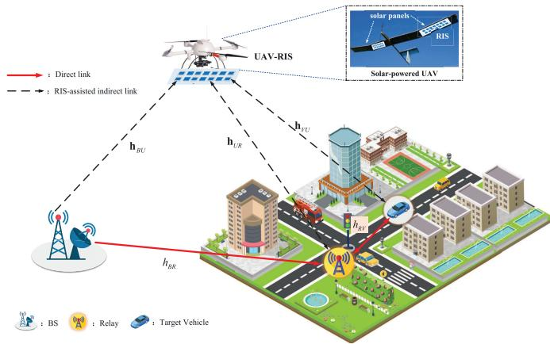  
Fig. 1. The UAV-RIS assisted downlink IoV.

The RIS with $M = M _ { x } \times M _ { y }$ passive reflective elements is mounted on the UAV to enhance ground secure transmission. In this paper, the RIS phase shift includes the first-hop phase shift matrix and the second-hop phase shift matrix, denoted as $\Theta _ { 1 } [ n ] = d i a g ( e ^ { j \vartheta _ { 1 } ^ { 1 } [ n ] } , e ^ { j \vartheta _ { 2 } ^ { 1 } [ n ] } , \ldots , e ^ { j \vartheta _ { M } ^ { 1 } [ n ] } ) $ and $\Theta _ { 2 } [ n ] = d i a g ( \bar { e } ^ { j \bar { \vartheta } _ { 1 } ^ { 2 } [ n ] } , e ^ { j \vartheta _ { 2 } ^ { 2 } [ \dot { n } ] } , \dots , e ^ { j \vartheta _ { M } ^ { 2 } [ n ] } )$ , respectively, and $\vartheta _ { j } ^ { i } ~ \in ~ [ 0 , 2 \pi ) , \forall i ~ \in ~ M , \forall j ~ \in ~ 1 , 2$ . In the three-dimensional Cartesian coordinate system, the positions of the BS and ground relay are $( x _ { B } , y _ { B } , 0 )$ and $( x _ { R } , y _ { R } , 0 )$ respectively. The UAV flight time T comprises N time slots. When the length of each time slot δ is short enough, the displacement of the UAV is very small relative to the moving distance during the entire flight time. Therefore, the UAV position in each time slot can be approximated as a constant location. In the system, the target vehicle is moving, and we can obtain the position-changing status of the target vehicle on the current road based on the map information. The positions of the UAV and target vehicle at the nth time slot are defined as $q [ n ] = { \big ( } x _ { u } [ n ] , y _ { u } [ n ] , z _ { u } [ n ] { \big ) }$ and $L [ n ] = ( x _ { \nu } [ n ] , y _ { \nu } [ n ] , 0 )$ . For clarity, the notations and their detailed descriptions in this paper are summarized in Table I.

Remark: In this paper, the UAV is solar-powered, which can provide a continuous and sufficient energy supply for the system [44], [45]. Equipped with efficient solar panels, UAVs can convert sunlight into electrical energy and store it in onboard batteries or operate directly. In addition, solar power meets the current communication needs of high efficiency and environmental protection. Therefore, in this paper, UAV energy consumption is no longer a bottleneck, allowing us to focus on the transmit power and communication performance, thereby improving the practicality and scalability of the system and making it suitable for different scenarios.

## B. Communication Model

A two-hop communication process is included in this system. For the first-hop communication, the BS first sends information to the relay through a direct link and an indirect link assisted by RIS. Since the ground relay is untrusted, the target vehicle also sends a jamming signal to the relay to reduce eavesdropping. Therefore, in the nth time slot, the signal received by the ground relay of the first-hop communication can be expressed as

TABLE I  
TABLE OF NOTATIONS
<table><tr><td rowspan=1 colspan=1>Notation</td><td rowspan=1 colspan=1>Description</td></tr><tr><td rowspan=1 colspan=1> $M$ </td><td rowspan=1 colspan=1>Number of RIS reflective elements</td></tr><tr><td rowspan=1 colspan=1> $\overline { { \Theta _ { 1 } , \Theta _ { 2 } } }$ </td><td rowspan=1 colspan=1>The first-hop and second-hop phase shift matrix of RIS</td></tr><tr><td rowspan=1 colspan=1> ${ \overline { { \mathbf { q } [ n ] , \mathbf { L } [ n ] } } }$ </td><td rowspan=1 colspan=1>Coordinates of the UAV and target vehicle at the nth time slot</td></tr><tr><td rowspan=1 colspan=1> $\overline { { P _ { B } , P _ { V } } }$ </td><td rowspan=1 colspan=1>Transmit power of the BS and the target vehicle</td></tr><tr><td rowspan=1 colspan=1> $\overline { { h _ { B R } , h _ { R V } } }$ </td><td rowspan=1 colspan=1>Direct links of the BS-relay and the relay-vehicle</td></tr><tr><td rowspan=1 colspan=1> $\mathbf { h } _ { B U } , \mathbf { h } _ { V U } , \mathbf { h } _ { U R }$ </td><td rowspan=1 colspan=1>Channel vectors from BS to RIS, from vehicle to RIS, and from RIS to relay</td></tr><tr><td rowspan=1 colspan=1> $\overline { { G _ { V R } , H _ { B R } , G _ { B V } } }$ </td><td rowspan=1 colspan=1>Channels from vehicle to relay, from BS to relay, and from BS to vehicle</td></tr><tr><td rowspan=1 colspan=1> $\boldsymbol { \varpi }$ </td><td rowspan=1 colspan=1>The amplification factor of the ground relay</td></tr><tr><td rowspan=1 colspan=1> $\overline { { f _ { R U V } , f _ { R V } , f _ { B U V } } }$ </td><td rowspan=1 colspan=1>The Doppler frequency of the relay-RIS-vehicle, relay-vehicle, and BS-RIS-vehicle</td></tr><tr><td rowspan=1 colspan=1> $\gamma _ { 1 } , \gamma _ { 2 }$ </td><td rowspan=1 colspan=1>SINR of decoding message $x _ { s 1 }$ and $x _ { s 2 }$ </td></tr><tr><td rowspan=1 colspan=1> $\overline { { R _ { 1 } , R _ { r e l a y } } }$ </td><td rowspan=1 colspan=1>Achievable rates of the target vehicle and relay for message $\scriptstyle x _ { s 1 }$ </td></tr><tr><td rowspan=1 colspan=1> $P _ { t }$ </td><td rowspan=1 colspan=1>The total transmit power of the network</td></tr></table>

$$
\begin{array} { r l } & { { s _ { R } } [ n ] = \sqrt { { P _ { B } } } \left( { h _ { B R } } [ n ] + { { \bf { h } } _ { U R } ^ { H } } [ n ] \Theta _ { 1 } [ n ] { { \bf { h } } _ { B U } } [ n ] \right) { x _ { s 1 } } [ n ] } \\ & { ~ + \sqrt { { P _ { V } } } G _ { V R } [ n ] { x _ { I } } [ n ] + { n _ { R } } [ n ] , } \end{array}\tag{1}
$$

where $P _ { B }$ and $P _ { V }$ are the transmit power of the BS and the target vehicle, $n _ { R } [ n ]$ is the additive white Gaussian noise (AWGN) received by the relay when receiving information, and obeys $n _ { R } [ n ] \sim { \mathcal { C N } } ( 0 , \sigma _ { R } ^ { 2 } ) . \ x _ { s 1 } [ n ] , x _ { I } [ n ]$ are the private information sent by the BS and the interference signal sent by the target vehicle, and $E \left\{ | x _ { s 1 } [ n ] | ^ { 2 } \right\} = E \left\{ | x _ { I } [ n ] | ^ { 2 } \right\} = \stackrel { \mathbf { \zeta } } { 1 }$ $h _ { B R } [ n ]$ is the direct link between the BS and the relay, and $\begin{array} { r } { h _ { B R } [ n ] = \sqrt { \xi _ { 0 } \Big ( \frac { d _ { B R } [ n ] } { d _ { 0 } } \Big ) ^ { - \alpha _ { 1 } } } \tilde { h } _ { B R } [ n ] } \end{array}$ , where $\xi _ { 0 }$ is the path loss at the reference distance $d _ { 0 } ,$ , and $\alpha _ { 1 }$ is the communication attenuation coefficient. $d _ { B R } [ n ]$ is the distance between the BS and relay in the nth time slot. $\tilde { h } _ { B R }$ follows Rayleigh fading and obeys an independent and identically distributed cyclic complex Gaussian distribution, that is, $\tilde { h } _ { B R } [ n ] \sim \mathcal { C N } ( 0 , 1 )$

The $\mathbf { h } _ { B U } [ n ] \in \mathbb { C } ^ { M \times 1 }$ and $\mathbf { h } _ { U R } [ n ] \in \bar { \mathbb { C } ^ { M \times 1 } }$ are BS-RIS and RIS-relay channels and obey the Rician distribution [31] as

$$
\mathbf { h } _ { B U } [ n ] = \varepsilon _ { 1 } \left( \sqrt { l _ { 1 } } \overline { { \mathbf { h } } } _ { B U } ^ { L } [ n ] + \sqrt { l _ { 2 } } \overline { { \mathbf { h } } } _ { B U } ^ { N } [ n ] \right) ,\tag{2a}
$$

$$
\mathbf { h } _ { U R } [ n ] = \varepsilon _ { 2 } \left( \sqrt { l _ { 1 } } \overline { { \mathbf { h } } } _ { U R } ^ { L } [ n ] + \sqrt { l _ { 2 } } \overline { { \mathbf { h } } } _ { U R } ^ { N } [ n ] \right) ,\tag{2b}
$$

where $\begin{array} { r } { \varepsilon _ { 1 } = \sqrt { \frac { \xi _ { 0 } } { ( d _ { B U } [ n ] ) ^ { - \alpha _ { 2 } } } } , \varepsilon _ { 2 } = \sqrt { \frac { \xi _ { 0 } } { ( d _ { U R } [ n ] ) ^ { - \alpha _ { 2 } } } } , l _ { 1 } = \frac { K _ { R c } } { 1 + K _ { R c } } } \end{array}$ and $\begin{array} { r } { l _ { 2 } = \frac { 1 } { 1 + K _ { R c } } . } \end{array}$ . α2 is the air-to-ground attenuation factor. $d _ { B U } [ n ]$ and $d _ { U R } [ n ]$ are the distance of BS-UAV and $\mathrm { U A V _ { - } }$ relay, respectively. $K _ { R c }$ is the Rician factor. $\bar { \mathbf { h } } _ { B U } ^ { N }$ and $\bar { \mathbf { h } } _ { U R } ^ { N }$ represent the non-line-of-sight $\left( \mathrm { N L o S } \right)$ transmission from RIS to BS and relay and obey $\mathbf { \bar { h } } _ { B U } ^ { N } , \mathbf { \bar { h } } _ { U R } ^ { N } \sim \mathcal { C N } ( 0 , 1 ) . \ \bar { \mathbf { h } } _ { B U } ^ { L }$ and $\bar { \mathbf { h } } _ { U R } ^ { L }$ denote the line-of-sight (LoS) component of the air-toground channel. RIS can be modeled as a uniform rectangular array (URA), and its antenna array response is

$$
\begin{array} { l } { \mathbf { a } _ { R } \left( \theta _ { i u } , \varphi _ { i u } \right) } \\ { \mathbf { \Phi } = \mathbf { a } _ { x } \left( \theta _ { i u } , \varphi _ { i u } \right) \otimes \mathbf { a } _ { y } \left( \theta _ { i u } , \varphi _ { i u } \right) } \end{array}
$$

$$
\begin{array} { r l } & { = \bigg [ 1 , e ^ { j \frac { 2 \pi d _ { x } } { \lambda } \cos \theta _ { i u } \cos \varphi _ { i u } } , \ldots , e ^ { j \frac { 2 \pi \left( M _ { y } - 1 \right) d _ { x } } { \lambda } \cos \theta _ { i u } \cos \varphi _ { i u } } \bigg ] ^ { T } } \\ & { \quad \otimes \bigg [ 1 , e ^ { j \frac { 2 \pi d _ { y } } { \lambda } \cos \theta _ { i u } \sin \varphi _ { i u } } , \ldots , e ^ { j \frac { 2 \pi \left( M _ { y } - 1 \right) d _ { y } } { \lambda } \cos \theta _ { i u } \sin \varphi _ { i u } } \bigg ] ^ { T } , } \end{array}\tag{3}
$$

where $\theta _ { i u }$ and $\varphi _ { i u }$ are the elevation angle and departure azimuth from ground node i to RIS, and cos $\theta _ { i u } [ n ]$ cos $\begin{array} { c c l } { \varphi _ { i u } [ n ] } & { = } & { \frac { x _ { u } ^ { \mathsf { ^ { * } } } [ n ] - x _ { i } } { d _ { i u } } } \end{array}$ , cos $\begin{array} { r l } { \theta _ { i u } [ n ] \sin \varphi _ { i u } [ n ] } & { { } = } \end{array}$ $\begin{array} { r l } { \frac { y _ { u } [ n ] - y _ { i } } { d _ { i u } } . \ } & { { } d _ { x } } \end{array}$ and $d _ { y }$ are the intervals between adjacent reflective elements in the x-axis and y-axis directions on RIS, and $\begin{array} { r l r l r l } { d _ { x } } & { { } = } & { d _ { y } } & { { } = } & { \lambda / 2 } \end{array}$ , where $\lambda$ is the wavelength. The $\bar { \mathbf { h } } _ { B U } ^ { L } , \quad \bar { \mathbf { h } } _ { U R } ^ { L } \quad \bar { \mathbf { \eta } } \in$ CM×1 can be modeled as $\begin{array} { r l r } { \overline { { \mathbf { h } } } _ { B U } ^ { L } [ n ] } & { { } \stackrel { } { = } } & { \mathbf { a } _ { R } \left( \theta _ { B U } [ n ] , \varphi _ { B U } [ n ] \right) } \end{array}$ $\overline { { \mathbf { h } } } _ { U R } ^ { L } [ n ] = \mathbf { a } _ { R } \left( \theta _ { U R } [ n ] , \varphi _ { U R } [ n ] \right)$

The channel vector from the target vehicle to the ground relay is denoted as $G _ { V R } [ n ] = h _ { R V } [ n ] + \mathbf { h } _ { U R } ^ { H } [ n ] \Theta _ { 1 } [ n ] \mathbf { h } _ { V U } [ n ] .$ $e ^ { j 2 \pi n f _ { R U V } }$ . Since the UAV and target vehicle are moving, the channel state information between the aerial RIS, relay, and target vehicle is not perfect. In this paper, the Doppler shift error is considered when modeling the target vehicle channel. Thus, the communication link of vehicle-RIS-relay is

$$
h _ { V U R } [ n ] = \mathbf { h } _ { U R } ^ { H } [ n ] \Theta _ { 1 } [ n ] \mathbf { h } _ { V U } [ n ] \cdot e ^ { j 2 \pi n f _ { R U V } } ,\tag{4}
$$

where $\mathbf { h } _ { V U } [ n ] \in \mathbb { C } ^ { M \times 1 }$ follows the Rician fading and can be represented as ${ \bf h } _ { V U } [ n ] = \varepsilon _ { 3 } \left( \sqrt { l _ { 1 } } { \bf \overline { { h } } } _ { V U } ^ { L } [ n ] + \sqrt { l _ { 2 } } { \bf \overline { { h } } } _ { V U } ^ { N } [ n ] \right)$ where $\varepsilon _ { 3 } ~ = ~ \sqrt { \frac { \xi _ { 0 } } { ( \perp _ { V U } [ n ] ) ^ { - \alpha _ { 2 } } } }$ and $\bar { \mathbf { h } } _ { V U } ^ { N } [ n ] \sim \mathcal { C N } ( 0 , 1 )$ . Similarly, we have $\overline { { \mathbf { h } } } _ { V U } ^ { L } [ n ] = \mathbf { a } _ { R } \left( \theta _ { V U } [ n ] , \varphi _ { V U } [ n ] \right)$ , and $\theta _ { V U } [ n ] .$ $\varphi _ { V U } [ n ]$ satisfy cos $\begin{array} { l l l } { \dot { \theta _ { V U } } [ n ] \cos \varphi _ { V U } [ n ] } & { = } & { \frac { \dot { x } _ { u } [ n ] - x _ { \nu } [ n ] } { d _ { V U } [ n ] } } \end{array}$ and cos $\theta _ { V U } [ n ]$ sin $\begin{array} { r } { \varphi _ { V U } [ n ] = \frac { y _ { u } [ n ] - y _ { v } [ n ] } { d _ { V U } [ n ] } } \end{array}$

Due to the relative motion between the UAV and the vehicle, the frequency of the communication signal changes, leading to the Doppler effect. Specifically, the large relative velocity results in a significant Doppler shift, which in turn affects the transmission characteristics of the signal. The Doppler shift will cause a frequency offset in the received signal, thereby affecting the accuracy of channel estimation and increasing estimation errors. Furthermore, the phase shift induced by the

Doppler effect can lead to errors in RIS phase alignment and degrade the quality of the communication link. Therefore, we introduce the Doppler shift component into the communication model to fully account for the impact of the Doppler shift on phase alignment during the RIS phase shift optimization, thereby achieving more accurate RIS phase configuration and optimization. In $( 4 ) , e ^ { j 2 \pi n f _ { R U V } }$ is the error caused by Doppler frequency shift. According to [33], the Doppler frequency shift can be modeled as

$$
f _ { R U V } = \frac { 1 } { \lambda } \left( V _ { D } \psi _ { V } + V _ { U } \psi _ { R } \right) ,\tag{5}
$$

where $V _ { D }$ and $V _ { U }$ represent the speed of the target vehicle and UAV, respectively, and $\begin{array} { r } { \psi _ { V } = \frac { \dot { x _ { u } } [ n ] - x _ { v } [ n ] } { d _ { V U } [ n ] } , \psi _ { R } = \frac { x _ { u } [ n ] - x _ { R } } { d _ { U R } [ n ] } } \end{array}$ Considering the Doppler frequency shift error, the direct link between the relay and target vehicle $h _ { R V } [ n ]$ is modeled as

$$
h _ { R V } [ n ] = \sqrt { \xi _ { 0 } ( d _ { R V } [ n ] ) ^ { - \alpha _ { 1 } } } \cdot e ^ { j 2 \pi n f _ { R V } } ,\tag{6}
$$

where $\begin{array} { l } { { f _ { R V } ~ = ~ \frac { V _ { D } \psi _ { R V } } { \lambda } , ~ \psi _ { R V } ~ = ~ \frac { x _ { v } [ n ] - x _ { R } } { d _ { R V } [ n ] } } } \end{array}$ , dRV [n] is the distance between the relay and $\mathrm { U A V } .$

Therefore, the channel vector from the target vehicle to the relay and from the BS to the relay can be expressed as $G _ { V R } [ n ] = h _ { R V } [ n ] + h _ { V U R } [ n ]$ and ${ H _ { B R } [ n ] = h _ { B R } [ n ] + }$ ${ \bf h } _ { U R } ^ { H } [ n ] \bar { \Theta _ { 1 } } [ n ] { \bf h } _ { B U } [ \bar { n } ]$ . The information rate of the ground relay at the nth time slot is derived as

$$
R _ { r e l a y } [ n ] = \log _ { 2 } \left( 1 + \frac { P _ { B } \left| H _ { B R } [ n ] \right| ^ { 2 } } { P _ { V } \left| G _ { V R } [ n ] \right| ^ { 2 } + \sigma _ { R } ^ { 2 } } \right) ,\tag{7}
$$

where $\sigma _ { R } ^ { 2 }$ is the noise power received at the relay.

For the second-hop communication, the relay forwards the signal received in the first hop to the target vehicle. Meanwhile, the BS transmits new information $x _ { s 2 } [ n ]$ to improve the transmission efficiency. The ground relay is half-duplex, which can only receive or forward information in a time slot, so the BS sends the new information $x _ { s 2 } [ n ]$ to the target vehicle directly through RIS. Then, the target vehicle receives information in the second hop as

$$
s _ { V } [ n ] = \varpi G _ { R V } [ n ] s _ { R } [ n ] + \sqrt { P _ { B } } G _ { B V } [ n ] x _ { s 2 } [ n ] + n _ { V } [ n ] ,\tag{8}
$$

where the information $x _ { s 2 } [ n ]$ satisfies $E \left\{ | x _ { s 2 } [ n ] | ^ { 2 } \right\} = 1$ , and \$ is the amplification factor of the ground relay. $n _ { V } ^ { ' } [ n ]$ is the AWGN and follows $n _ { V } [ n ] \sim \mathcal { C } \bar { \mathcal { N } } ( 0 , \sigma _ { V } ^ { 2 } ) , \sigma _ { V } ^ { 2 }$ is the noise power at the target vehicle. Then, the channel vector of the BS-RIS-vehicle link can be expressed as

$$
G _ { B V } [ n ] = { \bf h } _ { V U } ^ { H } [ n ] \Theta _ { 2 } [ n ] { \bf h } _ { B U } [ n ] \cdot e ^ { j 2 \pi n f _ { B U V } } ,\tag{9}
$$

where $\begin{array} { r } { f _ { B U V } \ = \ \frac 1 \lambda \left( V _ { D } \psi _ { V } + V _ { U } \psi _ { B } \right) , \ \psi _ { B } \ = \ \frac { x _ { u } [ n ] - x _ { B } } { d _ { B U } [ n ] } } \end{array}$ . The channel has reciprocity, the fading experienced by the uplink and downlink when transmitting in different time slots with the same frequency resources can be considered to be the same. The channel vectors of the RIS-relay link, RIS-vehicle link, and the direct link between relay and target vehicle are hUR, hV U , and $h _ { R V }$ , respectively.

Therefore, the channel vector from the relay to the target vehicle can be expressed as

$$
G _ { R V } [ n ] = h _ { R V } [ n ] + \mathbf { h } _ { V U } ^ { H } [ n ] \Theta _ { 2 } [ n ] \mathbf { h } _ { U R } [ n ] \cdot e ^ { j 2 \pi n f _ { R U V } } .\tag{10}
$$

The (8) includes the interference signal sent by the target vehicle during the first hop communication. Since the interference signal $x _ { I } [ n ]$ is sent by the target vehicle itself, it can be eliminated after receiving the signal $s _ { V } [ n ]$ ]. Then, $s _ { V } [ n ]$ can be rewritten as (11), shown at the bottom of the next page,

For the target vehicle, since $x _ { s 1 }$ and $x _ { s 2 }$ are received at the same time, the target vehicle uses non-orthogonal multiple access technology to decode the message. Thus the target vehicle treats $\boldsymbol { \mathscr { x } } _ { s 2 }$ as interference noise when decoding message $x _ { s 1 }$ . Therefore, the signal-to-interference-to-noise ratio (SINR) when decoding message $x _ { s 1 }$ can be expressed as

$$
\gamma _ { 1 } = \frac { \varpi ^ { 2 } P _ { B } { \left| { G _ { R V } [ n ] } \right| } ^ { 2 } \cdot \left| H _ { B R } [ n ] \right| ^ { 2 } } { \varpi ^ { 2 } { \left| { G _ { R V } [ n ] } \right| } ^ { 2 } \sigma _ { R } ^ { 2 } + P _ { B } { \left| { G _ { B V } [ n ] } \right| } ^ { 2 } + \sigma _ { V } ^ { 2 } } .\tag{12}
$$

After successfully decoding information $x _ { s 1 }$ , the target vehicle uses SIC to remove the information, and then the SINR of the decoded information $x _ { s 2 }$ is denoted as

$$
\gamma _ { 2 } = \frac { P _ { B } { \left| { G _ { B V } [ n ] } \right| } ^ { 2 } } { \varpi ^ { 2 } { \left| { G _ { R V } [ n ] } \right| } ^ { 2 } \sigma _ { R } ^ { 2 } + \sigma _ { V } ^ { 2 } } ,\tag{13}
$$

The information rates of the target vehicle decoding information $x _ { s 1 }$ and $x _ { s 2 }$ can be expressed as $R _ { 1 } [ n ] = \log _ { 2 } { ( 1 + \gamma _ { 1 } ) }$ $R _ { 2 } [ n ] = \log _ { 2 } { ( 1 + \gamma _ { 2 } ) }$ , respectively.

The information secrecy rate of the network is presented as

$$
R _ { s } [ n ] = \big [ R _ { 1 } [ n ] - R _ { r e l a y } [ n ] \big ] ^ { + } ,\tag{14}
$$

where $\left[ \Lambda \right] ^ { + } = \operatorname* { m a x } \left( \Lambda , 0 \right)$

## C. Problem Formulation

Since the ground relay is untrusted, there may be a risk of information leakage during information transmission. In this paper, we jointly optimize the transmit power of BS, target vehicle, relay amplification factor $\left\{ P _ { B } , \bar { P _ { V } } , \varpi ^ { 2 } \right\}$ , RIS’s phase shift matrice $\mathbf { \nabla } _ { \mathbf { \Theta } } \Theta _ { 1 } , \mathbf { \Theta } _ { \mathbf { \hat { \pi } } ^ { 2 } }$ and flight trajectory of $\begin{array} { r l } { { \mathrm { U A V } } Q = } \end{array}$ $\mathbf { \bar { \{ } }  q [ n ] , \forall n \in N \}$ to maximize the secrecy energy efficiency of the system. To achieve a balance between information security and power consumption, the optimization problem can be formulated as

$$
\mathbf { P 1 } : \operatorname* { m a x } _ { P _ { B } , P _ { V } , \infty ^ { 2 } , \Theta _ { 1 } , \Theta _ { 2 } , Q } \frac { R _ { s } [ n ] } { P _ { t } }\tag{15a}
$$

$$
\mathrm { s . t . } 0 \leq P _ { i } \leq P _ { \mathrm { m a x } } , i \in \{ B , V \} ,
$$

$$
0 < \varpi ^ { 2 } < 1 ,\tag{15b}
$$

$$
\vartheta _ { i } ^ { 1 } , \vartheta _ { i } ^ { 2 } \in [ 0 , 2 \pi ) , \forall i \in M ,\tag{15c}
$$

$$
q [ 1 ] = q _ { I n } ,\tag{15d}
$$

$$
\begin{array} { r } { \left\| q [ n ] - q [ n - 1 ] \right\| ^ { 2 } \leq \left( V _ { U } \cdot \delta \right) ^ { 2 } , } \end{array}\tag{15e}
$$

$$
q \in \mathcal { X } \times \mathcal { Y } \times \mathcal { Z } ,\tag{15f}
$$

(15g)

$$
R _ { 2 } [ n ] \geq R _ { t h } , \forall n \in N ,\tag{15h}
$$

where $P _ { t } ~ = ~ P _ { B } + P _ { R } + P _ { V }$ is the sum of the transmit power of ground nodes (BS, relay, and vehicle). According to $\begin{array} { r } { \varpi = \sqrt { \frac { P _ { R } } { P _ { B } | H _ { B R } [ n ] | ^ { 2 } + P _ { V } | G _ { V R } [ n ] | ^ { 2 } + \sigma _ { R } ^ { 2 } } } , P _ { t } } \end{array}$ can be rewritten as $P _ { t } = P _ { B } + P _ { V } + \varpi ^ { 2 } \left( P _ { B } | H _ { B R } [ n ] | ^ { 2 } + P _ { V } | G _ { V R } [ n ] | ^ { 2 } + \sigma _ { R } ^ { 2 } \right)$ In P1, constraint (15b) specifies the transmit power range specified by the BS and target vehicle, and $P _ { \mathrm { m a x } }$ is the specified maximum transmit power. The (15c) is the amplification factor range constraint of the relay. The (15d) is the phase constraint of each reflective element of the RIS during two-hop communication. Constraints (15e) and (15f) determine the initial coordinates of the UAV, and the maximum displacement of the UAV in adjacent time slots is constrained by flight speed. Constraint (15g) defines the flight area of the UAV. $R _ { t h }$ is the minimum threshold of rate $R _ { 2 } [ n ]$ , thus ensuring the efficiency of information transmission. The optimization problem P1 is non-convex, and the coupling of optimization variables makes it challenging to solve this optimization problem directly. We will propose a solution in the next section.

Remark: For the sustainable solar-powered UAV design, this paper adopts the AtlantikSolar AS-2 UAV as an aerial relay [46]. With a wingspan of 5.6 m and a total mass of $6 . 9 3$ kg, the UAV integrates 88 high-efficiency SunPower E60 solar cells, covering a total solar panel area of approximately $3 . 6 \mathrm { m } ^ { 2 }$ . The energy storage capacity reaches 705 Wh, enabling continuous low-altitude flight of up to 28 hours. In addition, AtlantikSolar reserves a payload capacity of approximately 1.0 kg, which provides good physical mounting conditions and energy support for integrating RIS, communication modules, and other equipment, making it suitable for low-altitude UAV collaborative communication scenarios.

Discussion: To avoid spatial conflicts and interference between the solar panels and RIS, this paper adopts a structural design of upper wing energy collection and lower wing communication. Solar panels are laid across the upper wing surface for efficient energy collection, and the RIS is mounted in a parallel configuration on the lower surface of the wing or fuselage, enabling directional beam reflection while minimizing aerodynamic drag and disturbance. In addition, combined with the long-endurance capacity of the AtlantikSolar platform and the low power consumption characteristics of RIS, RIS component control and real-time positioning can achieve continuous and reliable communication with low energy consumption, ensuring the feasibility and robustness of actual low-altitude communication missions.

## III. SECRECY ENERGY EFFICIENCY MAXIMIZATION

In this section, the secrecy energy efficiency optimization problem is divided into three sub-problems. Specifically, for the given phase shift matrices $\Theta _ { 1 } , \Theta _ { 2 }$ and UAV trajectory Q, the Dinkelbach’s method is first used for fractional programming, and then the difference of convex (DC) programming and CCCP method are utilized to solve. Second, for the given $\left\{ P _ { B } , P _ { V } , \varpi ^ { 2 } \right\}$ and $Q ,$ the two-hop RIS phase shift matrices are obtained based on the MM algorithm. Finally, for the UAV trajectory optimization problem, the firefly algorithm is adopted to obtain the suitable UAV motion coordinates as a data set, and then it is applied as an experience pool sample to optimize the sub-optimal trajectory using the DDPG algorithm.

## A. Power Optimization

Given that phase shift matrices $\Theta _ { 1 } , \Theta _ { 2 }$ and UAV trajectory Q, the power optimization problem can be expressed as

$$
\mathbf { P 2 } : \operatorname* { m a x } _ { P _ { B } , P _ { V } , \varpi ^ { 2 } } \eta _ { s } = \frac { R _ { s } [ n ] } { P _ { t } }\tag{16a}
$$

$$
\begin{array} { r } { \mathrm { s . t . } \quad 0 \leq P _ { i } \leq P _ { \operatorname* { m a x } } , i \in \left\{ B , V \right\} , } \end{array}\tag{16b}
$$

$$
0 < \varpi ^ { 2 } < 1 ,\tag{16c}
$$

$$
R _ { 2 } [ n ] \geq R _ { t h } , \forall n \in N ,\tag{16d}
$$

The fractional programming-based Dinkelbach method can effectively solve this problem [35], [36]. By introducing a non-negative parameter $\eta _ { s } ,$ , problem P2 can be transformed as

$$
\mathbf { P 2 . 1 } : \operatorname* { m a x } _ { P _ { B } , P _ { V } , \varpi ^ { 2 } } R _ { s } [ n ] - \eta _ { s } P _ { t }\tag{17a}
$$

$$
\begin{array} { r } { \mathrm { s . t . } \quad 0 \leq P _ { i } \leq P _ { \operatorname* { m a x } } , i \in \left\{ B , V \right\} , } \end{array}\tag{17b}
$$

$$
0 < \varpi ^ { 2 } < 1 ,\tag{17c}
$$

$$
R _ { 2 } [ n ] \geq R _ { t h } , \forall n \in N ,\tag{17d}
$$

then $\eta _ { s }$ is the solution to the original problem P2, and the update method satisfies $\begin{array} { r l r } { \eta _ { s } ^ { i + 1 } } & { { } = } & { \frac { R _ { s } \left( { \bf \dot { P } } _ { B } ^ { i } , { P } _ { V } ^ { i } , \varpi _ { i } ^ { 2 } \right) } { { P } _ { t } \left( { P } _ { B } ^ { i } , { P } _ { V } ^ { i } , \varpi _ { i } ^ { 2 } \right) } } \end{array}$ , where $P _ { B } ^ { i } , P _ { V } ^ { i } , \varpi _ { i } ^ { 2 }$ is the value of the ith iteration.

Define $\dot { f } \left( \eta _ { s } \right) = R _ { s } \left( P _ { B } , P _ { V } , \varpi ^ { 2 } \right) - \eta _ { s } P _ { t } \left( P _ { B } , P _ { V } , \varpi ^ { 2 } \right)$ where the secrecy rate $R _ { s } \left( P _ { B } , \dot { P } _ { V } , \varpi ^ { 2 } \right)$ and the total power $P _ { t } \left( P _ { B } , P _ { V } , \varpi ^ { 2 } \right)$ are functions related to the variables $P _ { B } , P _ { V } , \overline { { \omega } } ^ { 2 }$

Lemma 1: If and only if $f \left( \eta _ { o p t } \right) = 0$ , the optimal solutions of problems P2 and P2.1 are equivalent to $\eta _ { o p t } .$ and Dinkelbach’s method converges. See Appendix A for the proof.

1) : For the variable $P _ { B } ,$ we define $R _ { s } [ n ] = f _ { 1 } - f _ { 2 } { \_ } -$ $f _ { 3 }$ when $R _ { 1 } [ n ] ~ \succ ~ R _ { r e l a y } [ n ]$ and $W _ { 1 } = \bar { \varpi } ^ { 2 } \bar { P } _ { B } { | \bar { G } _ { R V } [ n ] | } ^ { 2 }$ $| H _ { B R } [ n ] | ^ { 2 } , W _ { 2 } = P _ { B } | G _ { B V } [ n ] | ^ { 2 }$ , where

$$
f _ { 1 } = \log _ { 2 } \left( W _ { 1 } + \varpi ^ { 2 } | G _ { R V } [ n ] | ^ { 2 } \sigma _ { R } ^ { 2 } + W _ { 2 } + \sigma _ { V } ^ { 2 } \right) ,\tag{18a}
$$

$$
f _ { 2 } = \log _ { 2 } \left( { \varpi ^ { 2 } { \left| { \cal G } _ { R V } [ n ] \right| } ^ { 2 } } \sigma _ { R } ^ { 2 } + P _ { B } { \left| { \cal G } _ { B V } [ n ] \right| } ^ { 2 } + \sigma _ { V } ^ { 2 } \right) ,
$$

$$
f _ { 3 } = \log _ { 2 } \left( 1 + \frac { P _ { B } | H _ { B R } [ n ] | ^ { 2 } } { P _ { V } | G _ { V R } [ n ] | ^ { 2 } + \sigma _ { R } ^ { 2 } } \right) ,\tag{18b}
$$

(18c)

Functions $f _ { 1 } , f _ { 2 } , f _ { 3 }$ are concave functions (see Appendix B for proof). Then the optimization problem regarding variable $P _ { B }$ can be expressed as

$$
\mathbf { P 2 . 2 } : \operatorname* { m a x } _ { P _ { B } } f _ { 1 } - f _ { 2 } - f _ { 3 } - \eta _ { s } P _ { t }\tag{19a}
$$

$$
\begin{array} { r l } & { s _ { N } [ n ] = \varpi G _ { R V } [ n ] \times \Big \{ \sqrt { P _ { B } } \ \big ( h _ { B R } [ n ] + \mathbf { h } _ { U R } ^ { H } [ n ] \Theta _ { 1 } [ n ] \big ) \cdot x _ { s 1 } [ n ] + n _ { R } [ n ] \Big \} + \sqrt { P _ { B } } G _ { B R } [ n ] x _ { s 2 } [ n ] + n _ { V } [ n ] } \\ & { \qquad = \varpi \sqrt { P _ { B } } \cdot G _ { R V } [ n ] \times \Big ( h _ { B R } [ n ] + \mathbf { h } _ { U R } ^ { H } [ n ] \Theta _ { 1 } [ n ] \Big ) \cdot x _ { s 1 } [ n ] + \sqrt { P _ { B } } G _ { B R } [ n ] x _ { s 2 } [ n ] + \varpi G _ { R V } [ n ] n _ { R } [ n ] + n _ { V } [ n ] } \\ & { \qquad = \underbrace { \varpi \sqrt { P _ { B } } \cdot G _ { R V } [ n ] H _ { B R } [ n ] x _ { s 1 } [ n ] } _ { x _ { s 1 } } + \underbrace { \sqrt { P _ { B } } G _ { B V } [ n ] x _ { s 2 } [ n ] } _ { x _ { s 2 } } + \underbrace { \varpi G _ { R V } [ n ] n _ { R } [ n ] + n _ { V } [ n ] } _ { n \mathfrak { a s e } } . } \end{array}\tag{1}
$$

$$
\mathrm { s . t . ~ 0 } \leq P _ { B } \leq P _ { \operatorname* { m a x } } ,\tag{19b}
$$

$$
R _ { 2 } [ n ] \geq R _ { t h } , \forall n \in N .\tag{19c}
$$

The problem is a DC programming problem. Since functions $f _ { 1 } , f _ { 2 }$ and $f _ { 3 }$ are concave functions, we use the CCCP method to transform them into convex subproblems by constructing convex functions. Then, points with the same gradient of two convex functions are found and their difference is reduced so that the objective function converges.

Define $G \left( P _ { B } \right) = - f _ { 2 } - f _ { 3 }$ and H $( P _ { B } ) = - f _ { 1 }$ . According to the properties of concave functions, $G \left( P _ { B } \right)$ and $H \left( P _ { B } \right)$ are convex functions. A Taylor expansion is employed to linearly approximate the function value, that ${ \mathrm { i s } } ,$

$$
\begin{array} { r l } & { F \left( { P } _ { B } ^ { ( r ) } \right) = G \left( P _ { B } \right) - H \left( P _ { B } ^ { ( r ) } \right) } \\ & { \qquad - \nabla H \left( P _ { B } ^ { ( r ) } \right) \left( P _ { B } - { P _ { B } } ^ { ( r ) } \right) , } \end{array}\tag{20}
$$

where $\nabla H \left( P _ { B } { } ^ { ( r ) } \right)$ is the gradient of function $H \left( P _ { B } \right)$ at the feasible point ${ \bf \mathit { P } } _ { B } { ^ { ( r ) } }$ at the rth iteration, which can be expressed as (21), shown at the bottom of the page. Therefore, the subproblem P2.2 can be reconstructed as

$$
\mathbf { P 2 . 3 : } \operatorname* { m a x } _ { P _ { B } } F \left( P _ { B } ^ { ( r ) } \right) - \eta _ { s } P _ { t }\tag{22a}
$$

$$
\mathrm { s . t . ~ 0 } \leq P _ { B } \leq P _ { \operatorname* { m a x } } ,\tag{22b}
$$

$$
\frac { P _ { B } { \left| { G _ { B V } [ n ] } \right| } ^ { 2 } } { \varpi ^ { 2 } { \left| { G _ { R V } [ n ] } \right| } ^ { 2 } \sigma _ { R } ^ { 2 } + \sigma _ { V } ^ { 2 } } \ge 2 ^ { R _ { t h } } - 1 ,\tag{22c}
$$

2) : For the variable $P _ { V }$ , the information rate $R _ { 1 }$ is a constant, and the second-order derivative of the rate $R _ { r e l a y } \left[ n \right]$ satisfies $\begin{array} { r l r } { \frac { \partial ^ { 2 } R _ { r e l a y } [ n ] } { \partial ^ { 2 } D _ { \star \star } } } & { { } \ge } & { 0 } \end{array}$ , so it is a convex function of $R _ { r e l a y } \left[ n \right]$ to $\bar { P } _ { V } ^ { \dot { } }$ . After ignoring the constant term in (17a), the power $P _ { V }$ optimization subproblem can be denoted as

$$
\mathbf { P 2 . 4 } : \operatorname* { m a x } _ { P _ { V } } - R _ { r e l a y } \left( P _ { V } ^ { } ( r ) \right) - F \left( P _ { V } ^ { } ( r ) \right)\tag{23a}
$$

$$
\mathrm { s . t . ~ 0 } \leq P _ { V } \leq P _ { \operatorname* { m a x } } ,\tag{23b}
$$

where

$$
F \left( P _ { V } ^ { } ( r ) \right) = - \nabla R _ { r e l a y } \left( P _ { V } ^ { } ( r ) \right) \left( P _ { V } ^ { } - P _ { V } ^ { } ( r ) \right) ,
$$

$$
\nabla R _ { r e l a y } \left( P _ { V } { } ^ { ( r ) } \right) = - \frac { P _ { B } { \left| H _ { B R } [ n ] \right| } ^ { 2 } { \left| G _ { V R } [ n ] \right| } ^ { 2 } } { \ln 2 \left( P _ { V } { \left| G _ { V R } [ n ] \right| } ^ { 2 } + \sigma _ { R } ^ { 2 } \right) } ,\tag{24a}
$$

(24b)

where∇ $R _ { r e l a y } \left( P _ { V } ^ { \mathbf { \alpha } \left( r \right) } \right)$ is the first-order derivative of rate $R _ { r e l a y } \left[ n \right]$ with respect to variable $P _ { V }$ at feasible point $P _ { V } ^ { } ^ { ( r ) }$ 3) : For the amplification factor $\varpi , R _ { r e l a y } [ n ]$ is a constant. We define $\varsigma = \varpi ^ { 2 } , \varsigma \in ( 0 , 1 )$ , and the optimization subproblem about ς can be expressed as

$$
\mathbf { P 2 . 5 } : \operatorname* { m a x } _ { \varsigma } R _ { 1 } \left( \varsigma \right) - \eta _ { s } P _ { t }\tag{25a}
$$

$$
\mathrm { s . t . ~ } \varsigma \in ( 0 , 1 ) ,\tag{25b}
$$

$$
\frac { P _ { B } | G _ { B V } [ n ] | ^ { 2 } } { \varsigma | G _ { R V } [ n ] | ^ { 2 } \sigma _ { R } ^ { 2 } + \sigma _ { V } ^ { 2 } } \geq r , \forall n \in N ,\tag{25c}
$$

where $r ~ = ~ 2 ^ { R _ { t h } } ~ - ~ 1$ . The objective function can find its tangent at any point in the definition domain $\varsigma \in ( 0 , 1 )$ , so the objective function is smooth and can be solved by Newton’s method with a faster convergence speed. We define $a =$ $P _ { B } | G _ { R V } [ n ] | ^ { 2 } \cdot | H _ { B R } [ n ] | ^ { 2 } + | G _ { R V } ^ { \sim } [ n ] | ^ { 2 } { \dot { \sigma } } _ { R } ^ { 2 } , b = P _ { B } | G _ { B V } [ n ] | ^ { 2 } +$ $\sigma _ { V } ^ { 2 } , c = | G _ { R V } [ n ] | ^ { 2 } \sigma _ { R } ^ { 2 }$ , then the variable ς is updated by

$$
\varsigma ^ { k + 1 } = \varsigma ^ { k } - \left[ \nabla C _ { 1 } \left( \varsigma ^ { k } \right) \right] ^ { - 1 } \cdot \nabla ^ { 2 } C _ { 1 } \left( \varsigma ^ { k } \right) ,\tag{26}
$$

where $\nabla C _ { 1 } \left( \varsigma \right) , \nabla R _ { 1 } \left( \varsigma \right)$ , and $\nabla ^ { 2 } C _ { 1 } \left( \varsigma \right)$ are shown in (27), shown at the bottom of the page.

At this point, the power optimization problem is solved. Dinkelbach’s method is adopted for joint optimization, and the specific algorithm details are summarized in Algorithm 1.

## B. RIS Phase Shift Optimization Based on Mm Algorithm

For given $\left\{ P _ { B } , P _ { V } , \varpi ^ { 2 } \right\}$ and $Q \ = \ \{ q [ n ] , \forall n \in N \}$ , the total powerPtis a constant, then the two-hop RIS phase shift optimization problem can be reformulated as

$$
\mathbf { P 3 } : \operatorname* { m a x } _ { \boldsymbol { \Theta } _ { 1 } , \boldsymbol { \Theta } _ { 2 } } R _ { s } [ n ]
$$

$$
\mathrm { s . t . } \ \vartheta _ { i } ^ { 1 } , \vartheta _ { i } ^ { 2 } \in [ 0 , 2 \pi ) , \forall i \in M , i \in \{ 1 , 2 \} ,\tag{28a}
$$

$$
R _ { 2 } [ n ] \geq R _ { t h } , \forall n \in N ,\tag{28b}
$$

(28c)

We first apply the semidefinite relaxation (SDR) technique to relax the original problem P3, and define $\theta _ { 1 } [ n ] =$ $\left[ \Theta _ { 1 1 } ^ { 1 } , \Theta _ { 2 2 } ^ { 1 } , \ldots , \Theta _ { M M } ^ { 1 } \right] ^ { H } , \ \theta _ { 2 } [ n ] \ = \ \left[ \Theta _ { 1 1 } ^ { 1 } , \Theta _ { 2 2 } ^ { 1 } , \ldots , \Theta _ { M M } ^ { 1 } \right] ^ { H } ,$ where $\Theta _ { m m } ^ { i } = e ^ { j \vartheta _ { m } ^ { i } [ n ] }$ , ∀m $\in M , i \in \{ 1 , 2 \}$ , and have

$$
\theta _ { 1 } ^ { H } d i a g \left( { \bf h } _ { U R } ^ { H } [ n ] \right) { \bf h } _ { B U } [ n ] = \theta _ { 1 } ^ { H } { \bf X } _ { B R } ,\tag{29a}
$$

$$
\theta _ { 2 } ^ { H } d i a g \Big ( { \bf h } _ { V U } ^ { H } [ n ] \Big ) { \bf h } _ { U R } [ n ] \cdot e ^ { j 2 \pi n f _ { R U V } } = \theta _ { 2 } ^ { H } { \bf X } _ { R V } ,\tag{29b}
$$

$$
\theta _ { 2 } ^ { H } d i a g \left( { \bf h } _ { V U } ^ { H } [ n ] \right) { \bf h } _ { B U } [ n ] \cdot e ^ { j 2 \pi n f _ { B U V } } = \theta _ { 2 } ^ { H } { \bf X } _ { B V } ,
$$

$$
\theta _ { 1 } ^ { H } d i a g \Big ( { \bf h } _ { U R } ^ { H } [ n ] \Big ) { \bf h } _ { V U } [ n ] \cdot e ^ { j 2 \pi n f _ { R U V } } = \theta _ { 1 } ^ { H } { \bf X } _ { V R } .\tag{29c}
$$

(29d)

$$
\nabla H \left( P _ { B } ^ { ( r ) } \right) = \left( - f _ { 1 } \right) ^ { \prime } = \frac { 1 } { \ln 2 } \cdot \frac { \varpi ^ { 2 } \left| G _ { B V } [ n ] \right| ^ { 2 } \cdot \left| H _ { B R } [ n ] \right| ^ { 2 } + \left| G _ { B V } [ n ] \right| ^ { 2 } } { \varpi ^ { 2 } P _ { B } ^ { ( r ) } \left| G _ { R V } [ n ] \right| ^ { 2 } \cdot \left| H _ { B R } [ n ] \right| ^ { 2 } + \varpi ^ { 2 } \left| G _ { R V } [ n ] \right| ^ { 2 } \sigma _ { R } ^ { 2 } + P _ { B } ^ { ( r ) } \left| G _ { B V } [ n ] \right| ^ { 2 } + \sigma _ { V } ^ { 2 } } .\tag{21}
$$

$$
\begin{array} { r } { \nabla C _ { 1 } \left( \zeta \right) = \nabla R _ { 1 } \left( \zeta \right) - \eta _ { s } \left( P _ { B } \left| H _ { B R } [ n ] \right| ^ { 2 } + P _ { V } \left| G _ { V R } [ n ] \right| ^ { 2 } + \sigma _ { R } ^ { 2 } \right) , } \end{array}
$$

$$
\nabla R _ { 1 } \left( \zeta \right) = \frac { a } { \ln 2 \left( a \cdot \varsigma + b \right) } - \frac { c } { \ln 2 \left( c \cdot \varsigma + b \right) } , \nabla ^ { 2 } C _ { 1 } \left( \varsigma \right) = - \frac { a ^ { 2 } } { \ln 2 \left( a \cdot \varsigma + b \right) ^ { 2 } } + \frac { c ^ { 2 } } { \ln 2 \left( c \cdot \varsigma + b \right) ^ { 2 } } ,\tag{27}
$$

Algorithm 1 Power Optimization Based on CCCP and   
Dinkelbach’s Method   
1 Set UAV trajectory $Q ,$ the positions of BS, relay, and vehi  
cle, and RIS’s phase shift matrices $\Theta _ { 1 } , \Theta _ { 2 } , \tau = 1 0 ^ { - 3 }$   
2 Initialization the transmit power of BS, target vehicle,   
and amplification factor $\left\{ P _ { B } , P _ { V } , \varpi ^ { 2 } \right\}$ and $\eta _ { s } ^ { \overline { { ( 0 ) } } }$   
3 for $r = 1$ : episodes do   
4 Obtain the transmit power of BS, target vehicle, and   
amplification factor $\left\{ P _ { B } ^ { i } , P _ { V } ^ { i } , \varpi _ { i } ^ { 2 } \right\}$ according to (22a),   
(23a), (26).   
5 Calculate and update $\begin{array} { r } { \eta _ { s } ^ { i + 1 } = \frac { R _ { s } \left( P _ { B } ^ { i } , P _ { V } ^ { i } , \varpi _ { i } ^ { 2 } \right) } { P _ { t } \left( P _ { B } ^ { i } , P _ { V } ^ { i } , \varpi _ { i } ^ { 2 } \right) } } \end{array}$   
6 if $\left| \eta _ { s } ^ { i + 1 } - \eta _ { s } ^ { ( i ) } \right| < \tau$ then   
7 Output the optimal $P _ { B } ^ { o p t } , P _ { V } ^ { o p t } , \varpi _ { o p t } ^ { 2 }$   
8 else   
9 Update variables $\left\{ P _ { B } ^ { 0 } , P _ { V } ^ { 0 } , \varpi _ { 0 } ^ { 2 } \right\} \gets \left\{ P _ { B } ^ { i } , P _ { V } ^ { i } , \varpi _ { i } ^ { 2 } \right\}$   
repeat   
10 from step 4.   
11 end if   
12 end for

where $\mathbf { X } _ { B R } , \mathbf { X } _ { R V } , \mathbf { X } _ { B V } , \mathbf { X } _ { V R } \in \mathbb { C } ^ { M \times 1 }$ . The dimension of vectors $\theta _ { 1 } [ n ] , \theta _ { 2 } [ n ]$ are increased. We define

$$
\tilde { \theta } _ { 1 } = \left[ \theta _ { 1 } \atop 1 \right] \left[ \theta _ { 1 } ^ { H } 1 \right] , \tilde { \theta } _ { 2 } = \left[ \theta _ { 2 } \atop 1 \right] \left[ \theta _ { 2 } ^ { H } 1 \right] ,\tag{30}
$$

where $\widetilde { \theta } _ { 1 } , \widetilde { \theta } _ { 2 } \in \mathbb { C } ^ { ( M + 1 ) \times ( M + 1 ) }$ , then the channel vectors can be rewritten as

$$
| { \cal H } _ { B R } [ n ] | ^ { 2 } = \mathrm { T r } \Big ( { \bf A } _ { B R } \tilde { \pmb \theta } _ { 1 } \Big ) , | G _ { R V } [ n ] | ^ { 2 } = \mathrm { T r } \Big ( { \bf A } _ { R V } \tilde { \pmb \theta } _ { 2 } \Big ) ,\tag{31}
$$

$$
\left| G _ { B V } [ n ] \right| ^ { 2 } = \mathrm { T r } \left( { \bf A } _ { B V } { \tilde { \theta } } _ { 2 } \right) , \left| G _ { V R } [ n ] \right| ^ { 2 } = \mathrm { T r } \left( { \bf A } _ { V R } { \tilde { \theta } } _ { 1 } \right)\tag{32}
$$

where $\mathbf { A } _ { B R } , \mathbf { A } _ { R V } , \mathbf { A } _ { B V } , \mathbf { A } _ { V R } \in \mathbb { C } ^ { ( M + 1 ) \times ( M + 1 ) }$ , and

$$
\mathbf { A } _ { B R } = \binom { \mathbf { X } _ { B R } } { h _ { B R } } \left( \mathbf { X } _ { B R } ^ { H } \mathbf { \Phi } h _ { B R } ^ { H } \right) ,\tag{33a}
$$

$$
\mathbf { A } _ { R V } = \binom { \mathbf { X } _ { R V } } { h _ { R V } } \left( \mathbf { X } _ { R V } ^ { H } \ h _ { R V } ^ { H } \right) ,\tag{33b}
$$

$$
\mathbf { A } _ { B V } = \binom { \mathbf { X } _ { B V } } { \mathbf { 0 } _ { 1 \times 1 } } \left( \mathbf { X } _ { B V } ^ { H } \ \mathbf { 0 } _ { 1 \times 1 } \right) ,\tag{33c}
$$

$$
\mathbf { A } _ { V R } = \binom { \mathbf { X } _ { V R } } { h _ { R V } } \left( \mathbf { X } _ { V R } ^ { H } \mathbf { \Lambda } h _ { R V } ^ { H } \right) ,\tag{33d}
$$

where $h _ { B R }$ and hRV are $1 \times 1$ matrices, with their respective elements being $h _ { B R }$ and $h _ { R V }$ . Then the SINR of rates $R _ { 1 }$ $R _ { 2 }$ , and $R _ { r e l a y }$ can be re-expressed as

$$
\gamma _ { 1 } = \frac { \varpi ^ { 2 } P _ { B } \mathrm { T r } \left( \mathbf { A } _ { R V } \tilde { \theta } _ { 2 } \right) \cdot \mathrm { T r } \left( \mathbf { A } _ { B R } \tilde { \theta } _ { 1 } \right) } { \varpi ^ { 2 } \mathrm { T r } \left( \mathbf { A } _ { R V } \tilde { \theta } _ { 2 } \right) \sigma _ { R } ^ { 2 } + P _ { B } \mathrm { T r } \left( \mathbf { A } _ { B V } \tilde { \theta } _ { 2 } \right) + \sigma _ { V } ^ { 2 } } ,\tag{34a}
$$

$$
\gamma _ { 2 } = \frac { P _ { B } \mathrm { T r } \left( { \bf A } _ { B V } \tilde { \theta } _ { 2 } \right) } { \varpi ^ { 2 } \mathrm { T r } \left( { \bf A } _ { R V } \tilde { \theta } _ { 2 } \right) \sigma _ { R } ^ { 2 } + \sigma _ { V } ^ { 2 } } ,\tag{34b}
$$

$$
\gamma _ { R } = \frac { P _ { B } \mathrm { T r } \left( \mathbf { A } _ { B R } \tilde { \theta } _ { 1 } \right) } { P _ { V } \mathrm { T r } \left( \mathbf { A } _ { V R } \tilde { \theta } _ { 1 } \right) + \sigma _ { R } ^ { 2 } } ,\tag{34c}
$$

The problem P3 shows a strong dependency between the two optimization variablesand is non-convex. To address this challenge, our strategy is to decouple variables $\Theta _ { 1 }$ and $\Theta _ { 2 }$ through the MM algorithm to reduce the direct correlation between variables, thereby simplifying the solution process and improving the convergence performance of the algorithm.

Subproblem $ { \boldsymbol { l } } :$

Given ${ \tilde { \theta } } _ { 2 } ,$ for the optimization variable $\tilde { \theta } _ { 1 }$ , define $\begin{array} { r l r } { k _ { 2 } { \mathrm { ~ ~  ~ \omega ~ } } = } & { { } \varpi ^ { 2 } \mathrm { T r } \Big ( { \bf A } _ { R V } \tilde { \theta } _ { 2 } \Big ) \sigma _ { R } ^ { 2 } { \mathrm { ~ ~  ~ + ~  ~ } } P _ { B } \mathrm { T r } \Big ( { \bf A } _ { B V } \tilde { \theta } _ { 2 } \Big ) { \mathrm { ~  ~ + ~  ~ } } \sigma _ { V } ^ { 2 } } \end{array}$ $k _ { 1 } = \varpi ^ { 2 } P _ { B } \mathrm { T r } \Big ( \dot { \mathbf { A } _ { R V } \theta _ { 2 } } \Big )$ , we have

$$
R _ { 1 } \left[ n \right] = \log _ { 2 } \left( \frac { k _ { 1 } \cdot \mathrm { T r } \left( \mathbf { A } _ { B R } \tilde { \theta } _ { 1 } \right) + k _ { 2 } } { k _ { 2 } } \right) ,\tag{35}
$$

Then the objective function can be rewritten as

$$
\begin{array} { r l r } { \left. { R _ { s } [ n ] = \log _ { 2 } \left( \frac { 1 } { k _ { 2 } } \mathrm { T r } \left( { \mathbf { S } } _ { B R } \tilde { \theta } _ { 1 } \right) \right) - \log _ { 2 } \left( \frac { \mathrm { T r } \left( { \mathbf { S } } _ { 1 } \tilde { \theta } _ { 1 } \right) } { \mathrm { T r } \left( { \mathbf { S } } _ { 2 } \tilde { \theta } _ { 1 } \right) } \right) } } \\ & { } & { = \log _ { 2 } \left[ \mathrm { T r } \left( { \mathbf { S } } _ { B R } \tilde { \theta } _ { 1 } \right) \right] + \log _ { 2 } \left[ \mathrm { T r } \left( { \mathbf { S } } _ { 2 } \tilde { \theta } _ { 1 } \right) \right] } \\ & { } & { ~ - \log _ { 2 } \left[ \mathrm { T r } \left( { \mathbf { S } } _ { 1 } \tilde { \theta } _ { 1 } \right) \right] - \log _ { 2 } \left( k _ { 2 } \right) , \qquad ( \mathrm { Z ' } \left( { \mathbf { S } } _ { 2 } \tilde { \theta } _ { 1 } \right) \right) } \end{array}\tag{36}
$$

where $\mathbf { S } _ { B R } , \ \mathbf { S } _ { 1 } , \ \mathbf { S } _ { 2 }$ can be denoted as (37), shown at the bottom of the next page.

The $\log _ { 2 } \left( k _ { 2 } \right)$ is a constant. According to the first-order Taylor expansion formula of the matrix trace,

$$
\ln \Big [ \mathrm { T r } \big ( \mathbf { K } \mathbf { V } \big ) \Big ] \leq \ln \Big [ \mathrm { T r } \big ( \mathbf { K } \tilde { \mathbf { V } } \big ) \Big ] + \frac { \mathrm { T r } \Big ( \mathbf { K } \big ( \mathbf { V } - \tilde { \mathbf { V } } \big ) \Big ) } { \mathrm { T r } \big ( \mathbf { K } \tilde { \mathbf { V } } \big ) } ,\tag{38}
$$

Then, the lower bound of the objective function in problem P3 can be expressed as (39), shown at the bottom of the next page.

Then the optimization problem for variable $\tilde { \theta } _ { 1 }$ can be expressed as

$$
\mathbf { P 3 . 1 } : \operatorname* { m a x } _ { \widetilde { \theta } _ { 1 } } \vec { R } _ { s } [ n ]\tag{40a}
$$

$$
\mathrm { s . t . } \tilde { \theta } _ { 1 } ( M + 1 , M + 1 ) = 1 ,\tag{40b}
$$

$$
r a n k \left( \tilde { \theta } _ { 1 } \right) = 1 ,\tag{40c}
$$

$$
\tilde { \theta } _ { 1 } \geq 0 ,\tag{40d}
$$

where $\tilde { \theta } _ { 1 } ^ { ( r ) }$ is the value obtained at the rth iteration. The problem P3.1 is convex after ignoring the constraint rank $\left( { \widetilde { \theta } } _ { 1 } \right) =$ 1, which can be solved by using the CVX tool of Matlab or Python. In addition, we can use the Gaussian randomization method to recover the original phase shift matrix $\Theta _ { 1 }$ from $\tilde { \theta } _ { 1 }$ Subproblem 2:

Similarly, given $\tilde { \theta } _ { 1 }$ , for the optimization variable ${ \tilde { \theta } } _ { 2 } .$ let $k _ { 3 } =$ $\varpi ^ { 2 } P _ { B } \mathrm { T r } ( \mathbf { A } _ { B R } \tilde { \theta } _ { 1 } )$ , through the first-order Taylor expansion, the information secrecy rate of the system can be re-expressed as (41), shown at the bottom of the next page.

The problem with variable ${ \tilde { \theta } } _ { 2 }$ can be denoted as

$$
\mathbf { P 3 . 2 : \operatorname* { m a x } _ { \widetilde { \theta } _ { 2 } } } \overset  { R } _ { s } [ n ]\tag{43a}
$$

$$
\mathrm { s . t . } \frac { P _ { B } \mathrm { T r } \Big ( { \bf A } _ { B V } \tilde { \pmb \theta } _ { 2 } \Big ) } { \varpi ^ { 2 } \mathrm { T r } \Big ( { \bf A } _ { R V } \tilde { \pmb \theta } _ { 2 } \Big ) \sigma _ { R } ^ { 2 } + \sigma _ { V } ^ { 2 } } \geq 2 ^ { R _ { t h } } - 1 ,\tag{43b}
$$

$$
{ \tilde { \theta } } _ { 2 } \left( M + 1 , M + 1 \right) = 1 ,\tag{43c}
$$

$$
r a n k \left( \tilde { \theta } _ { 2 } \right) = 1 ,\tag{43d}
$$

$$
\tilde { \theta } _ { 2 } \geq 0 ,\tag{43e}
$$

where $\tilde { \theta } _ { 2 } ^ { ( r ) }$ is the value obtained at the rth iteration. Since $R _ { r e l a y } [ n ]$ only varies with $\tilde { \theta } _ { 1 }$ , it is a constant. Similarly, problem P3.2 can also be solved using CVX.

In the Gaussian randomization process, $\psi _ { 1 } ~ = ~ { \binom { \theta _ { 1 } } { 1 } }$ and $\psi _ { 2 } ~ = ~ { \stackrel { \left\lceil \theta _ { 2 } \right\rceil } { \left\lceil 1 \right\rceil } }$ are defined, where $\psi _ { 1 } , \psi _ { 2 } ~ \in ~ \mathbb { C } ^ { ( M + 1 ) \times 1 }$ , and all channel vectors are represented as

$$
\begin{array} { r } { | H _ { B R } [ n ] | ^ { 2 } = \left| h _ { B R } + \pmb { \theta } _ { 1 } ^ { H } \mathbf { X } _ { B R } \right| ^ { 2 } = \psi _ { 1 } ^ { H } \mathbf { A } _ { B R } \psi _ { 1 } , } \end{array}
$$

$$
\begin{array} { r } { | G _ { R V } [ n ] | ^ { 2 } = \left| h _ { R V } + \pmb { \theta } _ { 2 } ^ { H } \mathbf { X } _ { R V } \right| ^ { 2 } = \psi _ { 2 } ^ { H } \mathbf { A } _ { R V } \psi _ { 2 } , } \end{array}
$$

$$
\begin{array} { r } { \left| G _ { B V } [ n ] \right| ^ { 2 } = \left| \theta _ { 2 } ^ { H } \mathbf { X } _ { B V } \right| ^ { 2 } = \psi _ { 2 } ^ { H } \mathbf { A } _ { B V } \psi _ { 2 } , } \end{array}
$$

$$
\begin{array} { r } { | G _ { V R } [ n ] | ^ { 2 } = \left| h _ { V R } + \pmb { \theta } _ { 1 } ^ { H } \mathbf { X } _ { V R } \right| ^ { 2 } = \psi _ { 1 } ^ { H } \mathbf { A } _ { V R } \psi _ { 1 } , } \end{array}\tag{44}
$$

which are brought into (14) as the objective function of Gaussian randomization to measure the difference between the current phase shifts and the optimal phase shifts.

## C. UAV Trajectory Optimization Based on Designed FA-DDPG Algorithm

The transmit power $\left\{ P _ { B } , P _ { V } , \varpi ^ { 2 } \right\}$ and phase shift matrices $\Theta _ { 1 } , \Theta _ { 2 }$ are obtained according to the Dinkelbach’s method

and MM algorithm, and then the UAV trajectory optimization problem can be denoted as

$$
\mathbf { P 4 } : \operatorname* { m a x } _ { Q } R _ { s }\tag{45a}
$$

$$
\mathrm { s . t . } q [ 1 ] = q _ { I n } ,\tag{45b}
$$

$$
q \in \mathcal { X } \times \mathcal { Y } \times \mathcal { Z } ,\tag{45c}
$$

$$
\begin{array} { r } { \left\| q [ n ] - q [ n - 1 ] \right\| ^ { 2 } \leq \left( V _ { U } \cdot \delta \right) ^ { 2 } , } \end{array}\tag{45d}
$$

$$
R _ { 2 } [ n ] \geq R _ { t h } , \forall n \in N ,\tag{45e}
$$

We intend to use an improved FA-DDPG algorithm to solve the UAV three-dimensional trajectory optimization problem.

DDPG is a reinforcement learning algorithm that can solve the optimization problem of continuous action space with the policy gradient. The DDPG algorithm contains two networks, the actor and critic networks. During DDPG optimization, the current state is obtained by interacting with the environment, and the actor-network is used to select a better action. The selected action is passed to the critic network, and the value function is used to evaluate the quality of the action selected by the actor-network. Then, the data obtained from multiple explorations and training is stored in the experience pool as a sample reference for later action selection. Compared with traditional optimization algorithms, such as successive convex approximation, DDPG does not need to convert the objective function and constraints into convex functions, thus avoiding multiple derivations and high-complexity calculations.

Despite the many advantages of the DDPG algorithm mentioned above, it requires a lot of exploration and data training in the initial stage, which may consume a lot of time and lead to slow convergence. In addition, the optimization performance of DDPG is highly dependent on the quality of the sample data obtained and thus may degrade the DDPG optimization performance when the quality of the samples obtained from

$$
\begin{array} { r l } & { \mathbf { S } _ { 1 } = [ P _ { B } \mathbf { X } _ { B R } \mathbf { X } _ { B R } ^ { H } + P _ { V } \mathbf { X } _ { R V } \mathbf { X } _ { R V } ^ { H }  \quad P _ { B } \mathbf { X } _ { B R } h _ { B R } ^ { H } + P _ { V } \mathbf { X } _ { R V } h _ { R V } ^ { H } } \\ & {  P _ { B } h _ { B R } \mathbf { X } _ { B R } ^ { H } + P _ { V } h _ { R V } \mathbf { X } _ { R V } ^ { H }  \quad P _ { B } h _ { B R } h _ { B R } ^ { H } + P _ { V } h _ { R V } h _ { R V } ^ { H } + \sigma _ { R } ^ { 2 } ] \in \mathbb { C } ^ { ( M + 1 ) \times ( M + 1 ) } , } \\ & { \mathbf { S } _ { B R } = [ k _ { 1 } \mathbf { X } _ { B R } \mathbf { X } _ { B R } ^ { H } \quad k _ { 1 } \mathbf { X } _ { B R } h _ { B R } ^ { H } ] , \mathbf { S } _ { 2 } = [ P _ { V } \mathbf { X } _ { R V } \mathbf { X } _ { R V } ^ { H } \quad P _ { V } \mathbf { X } _ { R V } h _ { R V } ^ { H } } \\ & {    [ k _ { 1 } h _ { B R } \mathbf { X } _ { B R } ^ { H } \quad k _ { 1 } h _ { B R } h _ { B R } ^ { H } + k _ { 2 } ]  ] , \mathbf { S } _ { 2 } = [ P _ { V } h _ { R V } \mathbf { X } _ { R V } ^ { H } \quad P _ { V } h _ { R V } h _ { R V } ^ { H } + \sigma _ { R } ^ { 2 } ] \in \mathbb { C } ^ { ( M + 1 ) \times ( M + 1 ) } . } \end{array}\tag{37}
$$

$$
\begin{array} { r l } & { \dot { R } _ { s } [ n ] = \log _ { 2 } \left[ \operatorname { T r } \left( \mathbf { S } _ { B R } \tilde { \theta } _ { 1 } \right) \right] + \log _ { 2 } \left[ \operatorname { T r } \left( \mathbf { S } _ { 2 } \tilde { \theta } _ { 1 } \right) \right] - \log _ { 2 } \left[ \operatorname { T r } \left( \mathbf { S } _ { 1 } \tilde { \theta } _ { 1 } \right) \right] - \log _ { 2 } \left( k _ { 2 } \right) } \\ & { \qquad \quad \ge \log _ { 2 } \left[ \operatorname { T r } \left( \mathbf { S } _ { B R } \tilde { \theta } _ { 1 } \right) \right] + \log _ { 2 } \left[ \operatorname { T r } \left( \mathbf { S } _ { 2 } \tilde { \theta } _ { 1 } \right) \right] - \log _ { 2 } \left[ \operatorname { T r } \left( \mathbf { S } _ { 1 } \tilde { \theta } _ { 1 } ^ { ( r ) } \right) \right] - \displaystyle \frac { \operatorname { T r } \left( \mathbf { S } _ { 1 } \left( \tilde { \theta } _ { 1 } - \tilde { \theta } _ { 1 } ^ { ( r ) } \right) \right) } { \ln 2 \cdot \operatorname { T r } \left( \mathbf { S } _ { 1 } \tilde { \theta } _ { 1 } ^ { ( r ) } \right) } - \log _ { 2 } \left( k _ { 2 } \right) = \vec { R } _ { s } [ n ] } \end{array}\tag{39}
$$

$$
\vec { R } _ { s } [ n ] = \log _ { 2 } \left( \mathrm { T r } \left( \mathbf { Y } _ { 1 } \tilde { \theta } _ { 2 } \right) \right) - R _ { r e l a y } [ n ] - \log _ { 2 } \left[ \mathrm { T r } \left( \mathbf { Y } _ { 2 } \tilde { \theta } _ { 2 } ^ { ( r ) } \right) \right] - \frac { \mathrm { T r } \left( \mathbf { Y } _ { 2 } \left( \tilde { \theta } _ { 2 } - \tilde { \theta } _ { 2 } ^ { ( r ) } \right) \right) } { \mathrm { l n } 2 \cdot \mathrm { T r } \left( \mathbf { Y } _ { 2 } \tilde { \theta } _ { 2 } ^ { ( r ) } \right) }\tag{41}
$$

$$
\mathbf { Y } _ { 1 } = \left[ \begin{array} { c c } { \left( k _ { 3 } + \varpi ^ { 2 } \sigma _ { R } ^ { 2 } + P _ { B } \right) \mathbf { X } _ { R V } \mathbf { X } _ { R V } ^ { H } } & { \left( k _ { 3 } + \varpi ^ { 2 } \sigma _ { R } ^ { 2 } \right) \mathbf { X } _ { R V } h _ { R V } ^ { H } } \\ { \left( k _ { 3 } + \varpi ^ { 2 } \sigma _ { R } ^ { 2 } \right) h _ { R V } \mathbf { X } _ { R V } ^ { H } } & { \left( k _ { 3 } + \varpi ^ { 2 } \sigma _ { R } ^ { 2 } \right) h _ { R V } h _ { R V } ^ { H } + \sigma _ { V } ^ { 2 } } \end{array} \right] \in \left( M + 1 \right) \times \left( M + 1 \right) ,
$$

$$
\mathbf { Y } _ { 2 } = \left[ { { \binom { \varpi ^ { 2 } \sigma _ { R } ^ { 2 } + P _ { B } \big ) \mathbf { X } _ { R V } \mathbf { X } _ { R V } ^ { H } } { \varpi ^ { 2 } \sigma _ { R } ^ { 2 } h _ { R V } \mathbf { X } _ { R V } ^ { H } } } } \quad \varpi ^ { 2 } \sigma _ { R } ^ { 2 } \mathbf { X } _ { R V } h _ { R V } ^ { H }  \\ { \varpi ^ { 2 } \sigma _ { R } ^ { 2 } h _ { R V } \mathbf { X } _ { R V } ^ { H } } &  \varpi ^ { 2 } \sigma _ { R } ^ { 2 } h _ { R V } h _ { R V } ^ { H } + \sigma _ { V } ^ { 2 } \right] \in { \mathbf { ( } { \cal M } \mathbf { + } { \scriptstyle 1 } ) \times { \scriptstyle ( { \cal M } \mathbf { + } { \scriptstyle 1 } ) } } ,\tag{42}
$$

the training is poor. Therefore, we propose an improved FA-DDPG algorithm. The FA algorithm is introduced to train better data, and then these data are passed into the DDPG experience pool as initial experience. The global optimization advantages of the FA algorithm can be fully utilized to provide high-quality optimization data for DDPG in advance, and the improved algorithm can achieve fast convergence and improve the overall optimization capability.

The FA algorithm is a meta-heuristic algorithm that belongs to a specific manifestation of swarm intelligence behavior. The FA algorithm simulates the mutual attraction between fireflies in the natural environment. Fireflies with higher brightness will attract fireflies with lower brightness and encourage lowbrightness fireflies to move toward high-brightness fireflies. When adjacent fireflies have the same brightness, they randomly change their positions. In the mathematical model of the FA algorithm, its brightness can be expressed as $Z ( d ) =$ $Z _ { 0 } e ^ { - \kappa d ^ { 2 } }$ , where $Z _ { 0 }$ is the initial brightness of the firefly, κ is the loss factor, and d is the distance between fireflies. When low-brightness fireflies are attracted, their attraction can be denoted as

$$
\rho ( d ) = \rho _ { 0 } e ^ { - \kappa d ^ { 2 } } ,\tag{46}
$$

where $\rho _ { 0 }$ is the initial attraction when the distance between the two fireflies is 0. The attraction is an important part of the distance the fireflies move after being attracted. When the distance between the two fireflies in the x-axis direction is $d _ { x } .$ , the coordinates of the low-brightness firefly moving in the x-axis direction can be formulated as

$$
x ( i + 1 ) = x ( i ) + \rho _ { 0 } e ^ { - \kappa d ^ { 2 } } \cdot d _ { x } + \alpha _ { s } \Gamma ,\tag{47}
$$

where $\alpha _ { s }$ is the step size and Γ follows Gaussian distribution, which can avoid falling into the local optimum during optimization. There is also a special case where the moving coordinates of the brightest firefly in the firefly population also satisfy equation (47), except that $\rho _ { 0 } e ^ { - \kappa d ^ { 2 } } = 0$

In the practical application of this paper, the brightness of fireflies at different positions is set to the corresponding objective function value, that is, ${ \cal Z } _ { i } ( d ) \ : = \ : R _ { s } ^ { i } [ n ] / P _ { t }$ , where $R _ { s } ^ { i } [ n ]$ is the information secrecy rate corresponding to the position of the i-th firefly. In addition, to improve the adaptability of the FA algorithm to the environment and enhance its global optimization ability, an adaptive step size is adopted in the improved algorithm. The attractiveness of fireflies is set to $\rho ( d ) = \left\{ { \begin{array} { l } { { \frac { 1 . 0 5 } { 1 + d } } , \rho _ { i } \leq \rho _ { j } } \\ { { \frac { 0 . 9 5 } { 1 + d } } , \rho _ { i } \succ \rho _ { j } } \end{array} } \right.$ , whereρiis thei-th firefly. After using the FA algorithm to obtain the UAV’s three-dimensional position data, the data is transferred to the DDPG experience pool as the initial sample. Then we use the DDPG algorithm to optimize the UAV trajectory. First, the actor-network adds a random noise and selects an action based on the current state, then interacts with the environment to generate the next state and current reward. Second, the critic’s online network calculates its value function based on the Bellman equation according to the action, that is,

$$
Q ( s , a ) = r + \tau m a x _ { a ^ { \prime } } Q ^ { \prime } ( s ^ { \prime } , a ^ { \prime } ) ,\tag{48}
$$

where r is the reward for the current action and state, τ is the discount factor, and $Q ( s ^ { \prime } , a ^ { \prime } )$ is the value of the critic’s target network. Then, the online networks of actor and critic are updated by gradient ascent and minimization of error functions, respectively, where the gradient and error function are expressed as

$$
\begin{array} { l } { { \nabla _ { \theta } J \approx \displaystyle \frac { 1 } { N } \sum _ { i = 1 } ^ { N } [ \nabla _ { a } Q ( s _ { i } , a _ { i } ) \cdot \nabla _ { \theta } \pi ] , } } \\ { { L _ { U } = E [ r + \tau m a x _ { a ^ { \prime } } Q ^ { \prime } ( s ^ { \prime } , a ^ { \prime } ) - Q ( s , a ) ] ^ { 2 } , } } \end{array}\tag{49}
$$

where $\nabla _ { \boldsymbol { \theta } } \pi$ is the actor’s action selection strategy. Finally, to control the update speed of the target network, DDPG uses a soft update method to update the target network of the actor and critic, that is, $\omega ^ { \prime } \gets \mu \omega + ( 1 - \mu ) \omega ^ { \prime }$ and $\theta ^ { \prime }  \mu \theta + ( 1 - \mu ) \theta ^ { \prime }$

The environment, state, action, and reward of the DDPG algorithm in this paper are defined as follows.

Environment: In this paper, the environment is the UAV-RIS assisted downlink internet of vehicles model. According to the locations of BS, relay, vehicle, and communication model, the DDPG algorithm can be used to optimize the UAV trajectory to maximize the information secrecy rate of the system.

• State: The optimization variable of the DDPG algorithm is UAV trajectory. The flight time of the UAV is discretized, that is, the UAV is considered to be stationary in adjacent time slots. Therefore, the threedimensional coordinates of the UAV in all time slots are used as the state information of DDPG, i.e. $S \ =$ $\{ q [ n ] = ( x _ { u } [ n ] , y _ { u } [ n ] , z _ { u } [ n ] ) , \forall n \in N \}$

• Action: When the flight time T is divided into N time slots, the trajectory of the UAV is discretized into N threedimensional coordinates. We divide the UAV’s motion area along the $x , y ,$ and z axes. In adjacent time slots, the UAV can only move one unit along each coordinate axis, and its moving distance must meet the constraint (15f). Therefore, the action of the DDPG algorithm can be defined as x $\left[ n + 1 \right] = x \left[ n \right] + \Delta x , y \left[ n + 1 \right] = y \left[ n \right] + \Delta y .$ and $z \left[ n + 1 \right] = z \left[ n \right] + \Delta z$

• Reward: The information secrecy rate in the current time slot is calculated based on the action and state information selected by DDPG. When the UAV exceeds the specified area or does not meet the rate constraint, its reward is set to a complex number, which can be specifically expressed as

$$
r [ n ] = \left\{ \begin{array} { l l } { - 0 . 5 \times R _ { s } [ n ] , } & { b e y o n d ~ ( \mathcal { X } \times \mathcal { Y } \times \mathcal { Z } ) } \\ { R _ { s } [ n ] , } & { w i t h i n ~ ( \mathcal { X } \times \mathcal { Y } \times \mathcal { Z } ) , } \end{array} \right.\tag{50}
$$

Therefore, the total reward of the DDPG algorithm is the sum of all time slot rewards, that is, ${ \mathbf R } = \sum _ { n = 1 } ^ { N } r [ n ]$

The improved FA-DDPG algorithm framework is shown in the Fig. 2.

Remark: Reinforcement learning and metaheuristic optimization methods rely on experience accumulation and environment interaction. Therefore, the FA-DDPG algorithm cannot guarantee the global optimal UAV trajectory. However, the algorithm efficiently searches in a high-dimensional, non-convex optimization space by balancing exploration and exploitation to obtain a sub-optimal solution. Simulation results further demonstrate that the FA-DDPG algorithm outperforms baseline schemes in enhancing secrecy energy efficiency.

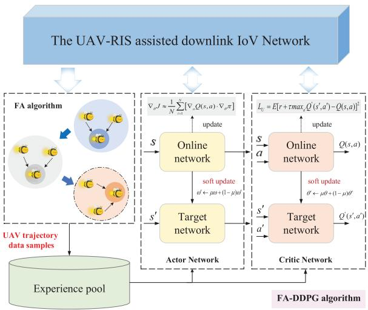  
Fig. 2. The improved FA-DDPG algorithm framework.

<table><tr><td colspan="2">Algorithm 2 Overall Algorithm Framework</td></tr><tr><td>1 Initialization</td><td></td></tr><tr><td></td><td>2 Given the initial transmit power, amplification factor  $\left\{ P _ { B } , P _ { V } , \varpi ^ { 2 } \right\}$  , and the RIS phase shift matrices  $\Theta _ { 1 } , \Theta _ { 2 }$ </td></tr><tr><td>3 Set the</td><td> $\mathrm { U A V } \mathbf { \bar { s } }$  initial position and flight area. 4 Set the number of fireflies and iterations of the FA</td></tr><tr><td></td><td>algorithm.</td></tr><tr><td>5 Data Collection</td><td></td></tr><tr><td></td><td>6 Obtain UAV coordinate data based on global optimization of FA algorithm.</td></tr><tr><td></td><td>7 Input the UAV coordinate data as samples into the expe- rience pool of the DDPG algorithm.</td></tr><tr><td>8 for 9</td><td> $r = 1 : N$  do Obtain transmit power and amplification factor</td></tr><tr><td>10</td><td> $\left\{ P _ { B } , P _ { V } , \varpi ^ { 2 } \right\}$  based on Algorithm 1. Obtaining the two-hop phase shift matrices  $\Theta _ { 1 } , \Theta _ { 2 }$ </td></tr><tr><td></td><td>according to the MM algorithm (40a), (43a) and Gaus- sian randomization.</td></tr><tr><td>11</td><td>Optimizing UAV trajectory based on FA-DDPG algo- rithm.</td></tr><tr><td>12 13 end for</td><td>Calculate the sum of all slot rewards.</td></tr></table>

## D. Overall Algorithm Framework

So far, all optimization sub-problems have been solved. For the formulated secrecy energy efficiency maximization problem, we will jointly optimize the transmit power, two-hop RIS phase shift matrices, and UAV trajectory. Specifically, we first use the FA algorithm to perform global optimization to obtain the UAV coordinate data, and then use this data sample as the initial data of the experience pool for optimization. Secondly, in each time slot, we update the transmit power and RIS phase shift and then apply the DDPG algorithm to determine the UAV position for the current time slot. Until the maximum number of iterations is reached, the optimization ends. The overall algorithm is summarized in Algorithm 2. The overall algorithm flow is shown in Fig. 3.

TABLE II  
SIMULATION PARAMETERS
<table><tr><td>Parameter</td><td>Value</td></tr><tr><td>Number of RIS reflective elements, M</td><td>16</td></tr><tr><td>UAV flight time,  $T$ </td><td>120 s</td></tr><tr><td>Number of time slots, N</td><td>800</td></tr><tr><td>Path loss at  $d _ { 0 } = 1 m , \xi _ { 0 }$ </td><td>-20 dBm</td></tr><tr><td>Noise power,  $\sigma _ { R } ^ { 2 } , \sigma _ { V } ^ { 2 }$ </td><td>-75, -70 dBm</td></tr><tr><td>Attenuation coefficients,  $\alpha _ { 1 } , \alpha _ { 2 }$ </td><td>2.8, 2.2</td></tr><tr><td>Rician factor,  $K _ { R c }$ </td><td>3 dB</td></tr><tr><td>Speed of the UAV,  $V _ { U }$ </td><td>20 m/s</td></tr><tr><td>Speed of the target vehicle,  $V _ { D }$ </td><td>10 m/s</td></tr><tr><td>Number of fireflies,</td><td>200</td></tr><tr><td>Number of iterations of FA algorithm</td><td>6</td></tr><tr><td>The capacity of experience pool</td><td>10000</td></tr><tr><td>Learning rate of actor-network</td><td>0.001</td></tr><tr><td>Learning rate of critic network</td><td>0.002</td></tr><tr><td>soft update factor, µ</td><td>0.01</td></tr><tr><td>UAV flight area,  $\mathcal { X } \times \mathcal { Y } \times \mathcal { Z }$ </td><td> $3 0 0 \times 3 0 0 \times$  300 m</td></tr></table>

Remark: The channel model adopted in this work is based on Rician fading and introduces the Doppler frequency shift effect. It has statistical uncertainty and time-varying characteristics, and can effectively characterize the dynamic evolution of the channel state during the relative motion between UAV and ground vehicles. On this basis, this paper proposes a hierarchical trajectory optimization framework that integrates offline training with online deployment. In the offline stage, trajectory samples are generated using the firefly algorithm, serving as high-quality data to enrich the experience pool of the DDPG. In the online stage, the trained neural policy makes real-time trajectory decisions based on the current system state at each time slot, thereby eliminating dependence on future channel state information (CSI). This hybrid framework combines the computational efficiency of offline training with the adaptability of online decision-making, making it suitable for resource-constrained dynamic communication scenarios, such as vehicular networks and low-altitude UAV systems, where CSI cannot be perfectly known in advance but exhibits statistical patterns. The proposed model and algorithm effectively mitigate the limitations of traditional global optimization approaches based on static CSI, and enhance practical feasibility and robustness in actual scenarios.

## IV. SIMULATION RESULTS

## A. Simulation Parameters

In this section, we evaluate the performance of the proposed scheme in terms of the secrecy energy efficiency for the proposed UAV-RIS assisted downlink vehicle communication system. In the simulation, the coordinates of the BS and relay are set as (0, 0, 0) and (90, 36, 0), respectively. According to the road traffic safety law, the speed of vehicles in urban areas cannot exceed 50 km/h under normal circumstances. Therefore, the driving speed of the target vehicle is set to 10 m/s in this paper. The flight speed of the UAV is set as 20m/s. The specific parameter details of the simulation process are shown in Table II.

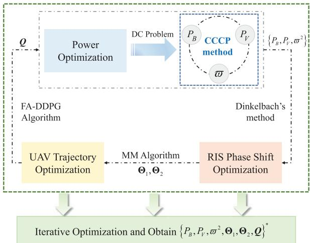  
Fig. 3. The overall algorithm flow.

We use different schemes to compare performance. The specific details of the comparison schemes are as follows.

Proposed scheme (vehicle-fixed): The scheme is consistent with the overall optimization scheme of this paper, that is, the transmit power and two phase shift matrices are optimized by the convex optimization method, and then the improved FA-DDPG algorithm is used to optimize the UAV trajectory (the proposed scheme mentioned below is the same). The only difference is that the position of the target vehicle is fixed in the simulation, and the position of the target vehicle is (110, 90, 0).

Proposed scheme (mobile vehicle): The overall optimization framework of this scheme is adopted in this article. In the simulation, the vehicle’s driving route is more suitable for the actual scenario. The initial position of the target vehicle is (240, 180, 0), and the final position is (120, - 4, 0).

DDPG-only: This scheme optimizes the transmit power and RIS phase shift based on the Dinkelbach method and MM algorithm respectively, but only uses the traditional DDPG algorithm to optimize the UAV trajectory. The vehicle route in this scheme is consistent with the “Proposed scheme (mobile vehicle)”.

Proposed scheme(mobile vehicle and Pv=0): The optimization scheme of this scheme is the same as the “Proposed scheme (mobile vehicle)”, the only difference is that the transmit power of the target vehicle is set to zero, that is, the vehicle does not send artificial interference signal in the first-hop communication.

Benchmark scheme: This scheme only uses the global optimization algorithm, namely the FA algorithm, to optimize the UAV trajectory.

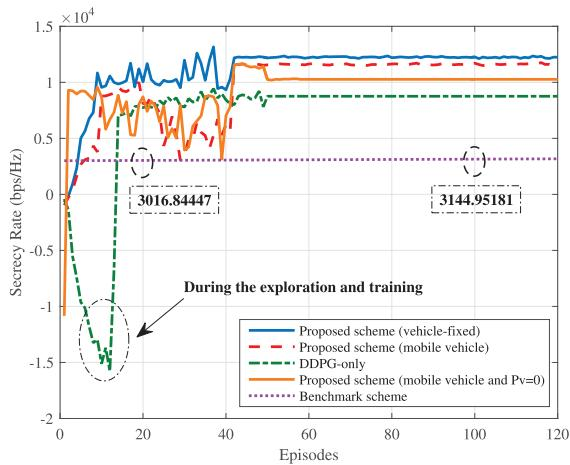  
Fig. 4. Comparison of the secrecy performance for different schemes.

## B. Simulation Results

Figure 4 describes the relationship between the sum of the secrecy rate of all time slots and episodes for different schemes. When the target vehicle is fixed, the sum secrecy rate is the largest. This is because when the FA algorithm trains the data samples in advance, we select several points on the vehicle path for optimization. Therefore, when the obtained data is transferred to the experience pool for optimization, the effect is better than the scheme with moving vehicles. The “DDPG-only” scheme only uses the DDPG algorithm for optimization, so a lot of exploration and data training is required in the early stage of optimization, resulting in the sum secrecy rate of the first 15 episodes being less than zero. The “Benchmark scheme” only uses the FA algorithm to optimize the information secrecy rate in each time slot, so the growth rate of the sum secrecy rate is slow. For example, after 80 iterations, the sum secrecy rates increase from 3016.84447 to 3144.95181. The orange curve indicates that the target vehicle did not send a jamming signal to the relay to interfere with the eavesdropping, which results in the ground relay stealing the information more easily, and therefore the sum secrecy rate is lower than the original scheme (the red curve). To balance computational complexity and optimization performance balance computational complexity and optimization performance, the FA-DDPG algorithm uses the global search capability of FA to guide DDPG training, thereby improving exploration efficiency and accelerating convergence. Although the algorithm slightly increases the computational burden, it is necessary to exchange a slight complexity for efficient performance improvement. Simulation results show that the proposed algorithm effectively enhances SEE, providing an efficient and practical solution for UAV-assisted secure communication.

Figure 5 shows the relationship between secrecy energy efficiency and the transmit power $P _ { B }$ of the base station BS. The performance comparison of SEE for four different powers $P _ { V }$ is given in the figure. It can be seen from the figure that the SEE of the system rises with the increase of BS transmit power, but when the power increases to a certain value, as shown by the red curve in the figure, when is greater than 18 dBm, the SEE decreases with the increase of $P _ { B }$ . It indicates that we cannot rely solely on increasing BS transmit power to improve secrecy energy efficiency, because when the BS transmit power increases, the signal strength received by the relay in the first-hop communication will also increase, which means that its eavesdropping performance will also increase. Moreover, when the interference power of the target vehicle increases, a higher BS transmit power is required to ensure the stability of secrecy energy efficiency. For example, when Pv increases from 0.3W to 0.6W, the BS power under the same SEE needs to be increased from 15dBm to 18dBm.

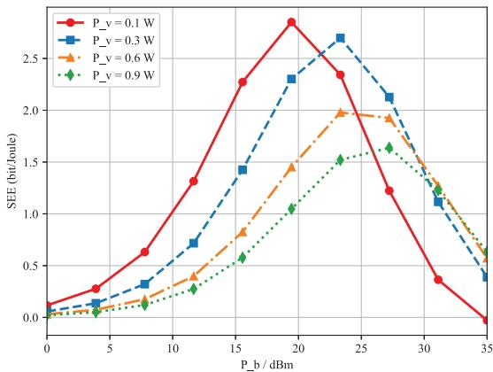  
Fig. 5. The SEE versus the transmit power $P _ { B }$

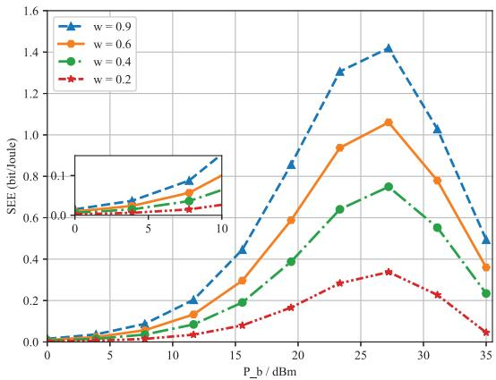  
Fig. 6. The trend of SEE and $P _ { B }$ under different AF amplification factors.

Figure 6 illustrates the trend of SEE and $P _ { B }$ under different AF amplification factors. Similarly, under four different amplification factors, SEE increases first and then decreases with the increase of $P _ { B }$ . It is not difficult to see that the system’s secrecy energy efficiency is the highest when the BS power is 27dBm. Additionally, the figure shows that SEE consistently improves as the amplification factor increases. This is because when the amplification factor of the ground relay is large, it means that the relay has greater power to forward the signal to the target vehicle, and the target vehicle receives a higher signal strength, which in turn improves the system’s secrecy energy efficiency.

Figure 7 shows the two-dimensional trajectory of the UAV under different trajectories of three target vehicles. Fig. 7(a) and Fig. 7(b) simulate the optimization results of moving vehicles in actual scenarios, and their initial positions are both set to (240, 180, 0). The difference is that the target vehicle’s motion trajectory in Fig. 7(a) is more in line with the actual road conditions, while the vehicle’s motion trajectory in Fig. 7(b) is set to a straight road. The target vehicle in Fig. 7(c) has a fixed position with a coordinate (110,80,0). As can be seen from Fig. 7(c), when the vehicle’s position is fixed, the UAV gradually moves from (20, 40, 40) to the relay to meet the first-hop communication. When the relay forwards information, the UAV moves toward the target vehicle, and then physical layer security technology is used to reduce information leakage.

In Fig. 7(a), the initial position of the UAV is (110, 70, 40), and the corresponding three-dimensional trajectory of the UAV under this simulation setting is shown in Fig. 8. According to the two-dimensional and three-dimensional trajectories of the UAV movement, it can be seen that as the target vehicle moves, the UAV gradually moves away from the relay and approaches the target vehicle. In the later stage of FA-DDPG algorithm training, the UAV hovers at a position that maximizes the information secrecy rate to forward information, that ${ \mathrm { i s } } ,$ the terminal coordinates are (139.23, 39.64, 16).

Figure 7(b) shows the optimization results under the ideal motion scenario of the target vehicle. When the path of the target vehicle is a straight line, the initial position of the UAV is set to (90, 90, 40), and the corresponding three-dimensional trajectory of the UAV is shown in Fig. 9. As can be seen from Fig. 7(b), as the target vehicle moves from (240, 180, 0) to (180, 10, 0), to ensure the safety performance and energy utilization of the system, the UAV quickly moves from the initial position close to the relay to the position far away from the relay but close to the vehicle, and finally stays at (243.98, 1.711) on the two-dimensional plane. Compared with Fig. 7(a), the optimization effect is more significant. Even if the FA-DDPG algorithm passes in better data samples in advance, there is still an exploration stage when the UAV moves in Fig. 9. The UAV does not move directly to the position close to the target vehicle but moves in the direction of maximum safety performance after the initial exploration training.

Figure 10 presents a three-dimensional graph of the system’s information secrecy rate and the transmit power of the BS and target vehicle. We have previously analyzed the impact of $P _ { B }$ and $P _ { V }$ on secrecy energy efficiency. Now we analyze the relationship between the information secrecy rate and the two transmit powers. The secrecy rate is defined as $R _ { s } = R _ { 1 } - R _ { r e l a y }$ . The purple surface in the figure is the relationship between the secrecy rate and $P _ { B }$ when $P _ { V } = 0$ It can be seen that the safety rate of the system under different power $P _ { B }$ is less than zero, that is, when the target vehicle does not send interference signals, the ground relay is more likely to eavesdrop and cause information leakage. The red dot in the figure is the value of the two powers corresponding to the maximum secrecy rate. When $P _ { B } = 3 . 1 6 , P _ { V } = 1 . 0 .$ the maximum information secrecy rate can reach 3.18bps/Hz.

Figure 11 presents the relationship between SEE and the number of RIS reflective elements. It can be seen that the SEE increases with the increase in the number of reflective elements, but when the number of reflective elements exceeds

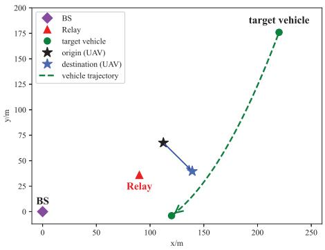  
(a) Vehicle movement (close to the actual scene)

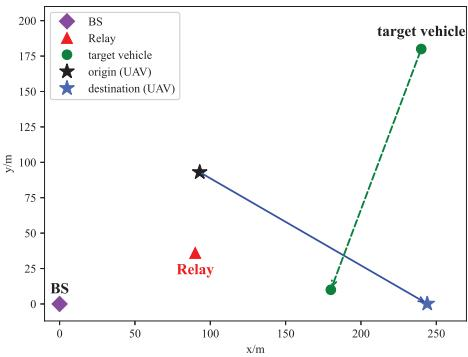  
(b) Vehicle movement (straight line).

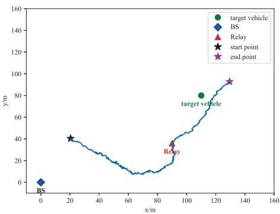  
(c) Vehicle fixed.

Fig. 7. The UAV two-dimensional trajectory under different scenarios.  
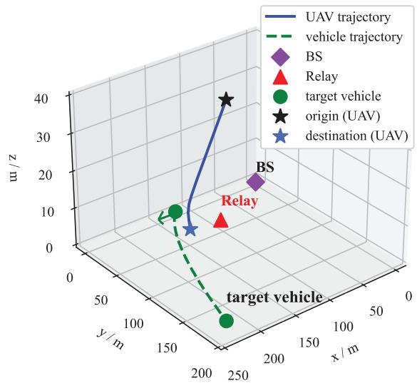  
Fig. 8. The UAV 3D motion trajectory (fits the actual scene).

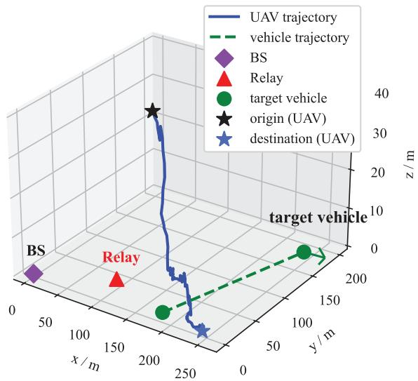  
Fig. 9. The UAV 3D motion trajectory (vehicle moves in a straight line).

32, the secrecy energy efficiency of the system will decrease accordingly. When the number of RIS reflective elements increases, not only does the channel path between the RIS and target vehicle increase but also the signal sub-path reflected from the RIS to the relay increases, thus reducing the SEE. The difference between the two curves in the figure is that the “Proposed scheme” uses Dinkelbach’s method to iteratively optimize the transmit powers and amplification factor, while the “FA-based scheme” only relies on the brightness attraction of fireflies and global optimization, which only represents a specific optimization result at a certain time.

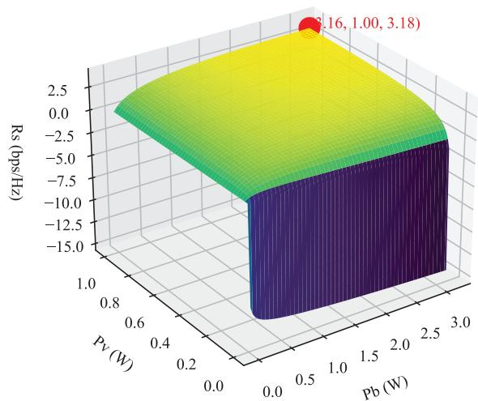  
Fig. 10. The secrecy rate versus the transmit powers $P _ { B }$ and $P _ { V }$

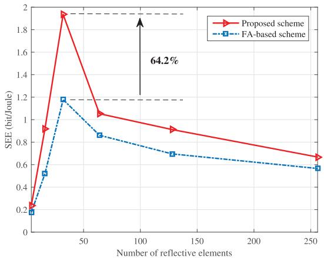  
Fig. 11. The relationship between the SEE and the number of RIS reflective elements.

## V. CONCLUSION

In this paper, we proposed a novel UAV-RIS-assisted mobile IoV framework, which protects privacy transmission through untrusted relay and UAV-RIS collaboration. Considering the Doppler shift brought by the vehicle and UAV’s mobility, a secrecy energy efficiency maximization problem was formulated for the transmit power, relay’s amplification factor, the two-hop RIS phase shift matrices, and UAV trajectory variables. For this non-convex problem, we proposed an alternating algorithm for joint optimization using Dinkelbach’s method, MM algorithm, and a designed FA-DDPG algorithm. Simulation results demonstrate the effectiveness of the proposed scheme in enhancing secrecy energy efficiency. Specifically, compared to the DDPG-only and FA-based schemes, the proposed scheme achieves an improvement of 33.3% and 64.2%, respectively, in secrecy energy efficiency.

In future research, we will further design a frequency compensation algorithm for Doppler frequency shift in high dynamic scenarios. The algorithm will construct a closed-loop feedback mechanism and adjust the RIS phase shift in real time to achieve dynamic compensation of frequency offset based on channel state information, thereby improving the accuracy of channel estimation and reducing the frequency shift induced by the Doppler effect.

## APPENDIX A

When $\eta _ { o p t }$ is the solution to problem P2.1, we have

$$
\begin{array} { c } { f \left( \eta _ { o p t } \right) = R _ { s } \left( P _ { B } ^ { o p t } , P _ { V } ^ { o p t } , { \varpi } _ { o p t } ^ { 2 } \right) } \\ { - \eta _ { o p t } P _ { t } \left( P _ { B } ^ { o p t } , P _ { V } ^ { o p t } , { \varpi } _ { o p t } ^ { 2 } \right) = 0 , } \end{array}\tag{A.1}
$$

For a feasible solution $\left\{ \tilde { P } _ { B } , \tilde { P } _ { V } , \tilde { \varpi } ^ { 2 } \right\}$ to this problem, where the feasible solution is not necessarily optimal, the objective function has

$$
\begin{array} { r l } & { R _ { s } \left( \tilde { P } _ { B } , \tilde { P } _ { V } , \tilde { \boldsymbol { \varpi } } ^ { 2 } \right) - \eta _ { o p t } P _ { t } \left( \tilde { P } _ { B } , \tilde { P } _ { V } , \tilde { \boldsymbol { \varpi } } ^ { 2 } \right) } \\ & { \boldsymbol { \le } \underset { P _ { B } , P _ { V } , \boldsymbol { \varpi } ^ { 2 } } { \operatorname* { m a x } } R _ { s } \left( \tilde { P } _ { B } , \tilde { P } _ { V } , \tilde { \boldsymbol { \varpi } } ^ { 2 } \right) - \eta _ { o p t } P _ { t } \left( \tilde { P } _ { B } , \tilde { P } _ { V } , \tilde { \boldsymbol { \varpi } } ^ { 2 } \right) } \\ & { \boldsymbol { = } R _ { s } \left( P _ { B } ^ { o p t } , P _ { V } ^ { o p t } , \boldsymbol { \varpi } _ { o p t } ^ { 2 } \right) - \eta _ { o p t } P _ { t } \left( P _ { B } ^ { o p t } , P _ { V } ^ { o p t } , \boldsymbol { \varpi } _ { o p t } ^ { 2 } \right) = \boldsymbol { 0 } , } \end{array}\tag{A.2}
$$

The total power always satisfies $P _ { t } \left( P _ { B } , P _ { V } , \varpi ^ { 2 } \right) > 0$ , so dividing both sides of the above equation by $P _ { t } \left( \tilde { P } _ { B } , \tilde { P } _ { V } , \tilde { \varpi } ^ { 2 } \right)$ gives $\frac { { \cal R } _ { s } \big ( \tilde { P } _ { B } , \tilde { P } _ { V } , \tilde { \varpi } ^ { 2 } \big ) } { P _ { t } \big ( \tilde { P } _ { B } , \tilde { P } _ { V } , \tilde { \varpi } ^ { 2 } \big ) } \leq \eta _ { o p t }$ , where

$$
\frac { R _ { s } \left( \tilde { P } _ { B } , \tilde { P } _ { V } , \tilde { \varpi } ^ { 2 } \right) } { P _ { t } \left( \tilde { P } _ { B } , \tilde { P } _ { V } , \tilde { \varpi } ^ { 2 } \right) } \leq \eta _ { o p t } = \frac { R _ { s } \left( P _ { B } ^ { o p t } , P _ { V } ^ { o p t } , \varpi _ { o p t } ^ { 2 } \right) } { P _ { t } \left( P _ { B } ^ { o p t } , P _ { V } ^ { o p t } , \varpi _ { o p t } ^ { 2 } \right) } ,\tag{A.3}
$$

Therefore, $\left\{ P _ { B } ^ { o p t } , P _ { V } ^ { o p t } , \varpi _ { o p t } ^ { 2 } \right\}$ is also the optimal solution to problem P2, that is, the optimal solution to problem P2 is $\eta _ { o p t }$

Similarly, when $\eta ^ { * }$ is the optimal solution to problem $\mathbf { P 2 }$ we have $\begin{array} { r } { \dot { \eta ^ { * } } = \frac { R _ { s } \left( \dot { P } _ { B } ^ { * } , P _ { V } ^ { * } , \varpi _ { * } ^ { 2 } \right) } { P _ { t } \left( P _ { B } ^ { * } , P _ { V } ^ { * } , \varpi _ { * } ^ { 2 } \right) } } \end{array}$ . Then a feasible solution that satisfies the constraints of the problem is

$$
\begin{array} { r l r } {  { \vec { \eta } = \frac { R _ { s } ( \vec { P } _ { B } , \vec { P } _ { V } , \vec { \varpi } ^ { 2 } ) } { P _ { t } ( \vec { P } _ { B } , \vec { P } _ { V } , \vec { \varpi } ^ { 2 } ) } \le \operatorname* { m a x } _ { P _ { B } , P _ { V } , \varpi ^ { 2 } } \frac { R _ { s } ( \vec { P } _ { B } , \vec { P } _ { V } , \vec { \varpi } ^ { 2 } ) } { P _ { t } ( \vec { P } _ { B } , \vec { P } _ { V } , \vec { \varpi } ^ { 2 } ) } } } \\ & { } & { \quad = \frac { R _ { s } ( P _ { B } ^ { * } , P _ { V } ^ { * } , \varpi _ { * } ^ { 2 } ) } { P _ { t } ( P _ { B } ^ { * } , P _ { V } ^ { * } , \varpi _ { * } ^ { 2 } ) } = \eta ^ { * } , } \end{array}\tag{.4}
$$

Thus the optimal solution to problem P2.1 is also $\eta ^ { * }$ , and there is $f \left( \eta ^ { \ast } \right) = R _ { s } \left( P _ { B } ^ { \ast } , P _ { V } ^ { \ast } , \varpi _ { \ast } ^ { 2 } \right) - \eta ^ { \ast } \cdot P _ { t } \left( P _ { B } ^ { \ast } , P _ { V } ^ { \ast } , \varpi _ { \ast } ^ { 2 } \right) = 0$

## APPENDIX B

The first and second-order derivatives of function $f _ { 1 }$ can be derived as

$$
\frac { \partial f _ { 1 } } { \partial P _ { B } } = \frac { I _ { 1 } + \left| G _ { B V } [ n ] \right| ^ { 2 } } { \ln 2 \left( I _ { 1 } + I _ { 2 } + P _ { B } \left| G _ { B V } [ n ] \right| ^ { 2 } + \sigma _ { V } ^ { 2 } \right) } ,\tag{B.1}
$$

$$
\frac { \partial ^ { 2 } f _ { 1 } } { \partial ^ { 2 } P _ { B } } = - \frac { \left( I _ { 1 } + \left| G _ { B V } [ n ] \right| ^ { 2 } \right) ^ { 2 } } { \ln 2 \Big ( P _ { B } I _ { 1 } + I _ { 2 } + P _ { B } \big | G _ { B V } [ n ] \big | ^ { 2 } + \sigma _ { V } ^ { 2 } \Big ) ^ { 2 } } ,\tag{B.2}
$$

where $I _ { 1 } = \varpi ^ { 2 } { \left| { G _ { R V } [ n ] } \right| ^ { 2 } } \cdot { \left| { H _ { B R } [ n ] } \right| ^ { 2 } } , I _ { 2 } = \varpi ^ { 2 } { \left| { G _ { R V } [ n ] } \right| ^ { 2 } } \sigma _ { R } ^ { 2 }$ The denominator $I _ { 1 } + | G _ { B V } [ n ] | ^ { 2 }$ in the above formula is always greater than zero, so the second-order derivative $\frac { \partial ^ { 2 } f _ { 1 } } { \partial ^ { 2 } P _ { B } }$ is always less than zero, so $f _ { 1 }$ is a concave function.

Analogously, we define $I _ { 4 } = P _ { V } { \left| G _ { V R } [ n ] \right| } ^ { 2 }$ , the first and second order derivatives of $f _ { 2 }$ and $f _ { 3 }$ can be expressed as

$$
\frac { \partial f _ { 2 } } { \partial P _ { B } } = \frac { \left| G _ { B V } [ n ] \right| ^ { 2 } } { \ln 2 \left( I _ { 2 } + P _ { B } \left| G _ { B V } [ n ] \right| ^ { 2 } + \sigma _ { V } ^ { 2 } \right) } ,\tag{B.3}
$$

$$
\frac { \partial ^ { 2 } f _ { 2 } } { \partial ^ { 2 } P _ { B } } = - \frac { \left| G _ { B V } [ n ] \right| ^ { 4 } } { \ln 2 \Big ( I _ { 2 } + P _ { B } \big | G _ { B V } [ n ] \big | ^ { 2 } + \sigma _ { V } ^ { 2 } \Big ) ^ { 2 } } ,\tag{B.4}
$$

$$
\frac { \partial f _ { 3 } } { \partial P _ { B } } = \frac { \left| H _ { B R } [ n ] \right| ^ { 2 } } { \ln 2 \left( P _ { B } { \left| H _ { B R } [ n ] \right| } ^ { 2 } + P _ { V } { \left| G _ { V R } [ n ] \right| } ^ { 2 } + \sigma _ { R } ^ { 2 } \right) } ,\tag{B.5}
$$

$$
\frac { \partial ^ { 2 } f _ { 3 } } { \partial ^ { 2 } P _ { B } } = - \frac { \left| H _ { B R } [ n ] \right| ^ { 4 } } { \ln 2 \Big ( P _ { B } \vert H _ { B R } [ n ] \vert ^ { 2 } + I _ { 4 } + \sigma _ { R } ^ { 2 } \Big ) ^ { 2 } } ,\tag{B.6}
$$

where $| G _ { B V } [ n ] | ^ { 4 } \geq 0 , | H _ { B R } [ n ] | ^ { 4 } \geq 0 $ , thus we have $\frac { \partial ^ { 2 } f _ { 2 } } { \partial ^ { 2 } P _ { B } } <$ 0, $\frac { \partial ^ { 2 } f _ { 3 } } { \partial ^ { 2 } P _ { B } } < 0$ , functions $f _ { 2 }$ and $f _ { 3 }$ are both concave functions.

## REFERENCES

[1] J. Wang, K. Zhu, and E. Hossain, “Green Internet of Vehicles (IoV) in the 6G era: Toward sustainable vehicular communications and networking,” IEEE Trans. Green Commun. Netw., vol. 6, no. 1, pp. 391–423, Mar. 2022.

[2] G. Bai, L. Qu, J. Liu, and D. Sun, “AoI-aware joint scheduling and power allocation in intelligent transportation system: A deep reinforcement learning approach,” IEEE Trans. Veh. Technol., vol. 73, no. 4, pp. 5781–5795, Apr. 2024.

[3] W. Li, “Multi-receiver data authorization with data search for data sharing in cloud-assisted IoV,” IEEE Trans. Intell. Transp. Syst., vol. 25, no. 5, pp. 4233–4250, May 2024.

[4] J. Li et al., “UAV-RIS-Aided space-air-ground integrated network: Interference alignment design and DoF analysis,” IEEE Trans. Wireless Commun., vol. 23, no. 9, pp. 11678–11692, Sep. 2024.

[5] S. Chen et al., “Optimal RIS allocations for PLS with uncertain jammer and eavesdropper,” IEEE Trans. Consum. Electron., vol. 69, no. 4, pp. 927–936, Nov. 2023.

[6] X. Liu, Y. Yu, F. Li, and T. S. Durrani, “Throughput maximization for RIS-UAV relaying communications,” IEEE Trans. Intell. Transp. Syst., vol. 23, no. 10, pp. 19569–19574, Oct. 2022.

[7] A. Bansal, N. Agrawal, K. Singh, C.-P. Li, and S. Mumtaz, “RIS selection scheme for UAV-based multi-RIS-aided multiuser downlink network with imperfect and outdated CSI,” IEEE Trans. Commun., vol. 71, no. 8, pp. 4650–4664, Aug. 2023.

[8] H. Wu, M. Li, Q. Gao, Z. Wei, N. Zhang, and X. Tao, “Eavesdropping and anti-eavesdropping game in UAV wiretap system: A differential game approach,” IEEE Trans. Wireless Commun., vol. 21, no. 11, pp. 9906–9920, Nov. 2022.

[9] D. Guo, L. Tang, X. Zhang, and Y.-C. Liang, “Joint optimization of trajectory and jamming power for multiple UAV-aided proactive eavesdropping,” IEEE Trans. Mobile Comput., vol. 23, no. 5, pp. 5770–5785, May 2024.

[10] X. Gu, W. Duan, G. Zhang, Q. Sun, M. Wen, and P.-H. Ho, “Physical layer security for RIS-aided wireless communications with uncertain eavesdropper distributions,” IEEE Syst. J., vol. 17, no. 1, pp. 848–859, Mar. 2023.

[11] T. Wang, F. Fang, and Z. Ding, “An SCA and relaxation based energy efficiency optimization for multi-user RIS-assisted NOMA networks,” IEEE Trans. Veh. Technol., vol. 71, no. 6, pp. 6843–6847, Jun. 2022.

[12] X. Qin, Z. Song, T. Hou, W. Yu, J. Wang, and X. Sun, “Joint optimization of resource allocation, phase shift, and UAV trajectory for energyefficient RIS-assisted UAV-enabled MEC systems,” IEEE Trans. Green Commun. Netw., vol. 7, no. 4, pp. 1778–1792, Dec. 2023.

[13] Y. Yu, X. Liu, Z. Liu, and T. S. Durrani, “Joint trajectory and resource optimization for RIS assisted UAV cognitive radio,” IEEE Trans. Veh. Technol., vol. 72, no. 10, pp. 13643–13648, Oct. 2023.

[14] H. Ren, Z. Zhang, Z. Peng, L. Li, and C. Pan, “Energy minimization in RIS-assisted UAV-enabled wireless power transfer systems,” IEEE Internet Things J., vol. 10, no. 7, pp. 5794–5809, Apr. 2023.

[15] R. Zhang, R. Tang, Y. Xu, and X. Shen, “Resource allocation for UAV-assisted NOMA systems with dual connectivity,” IEEE Wireless Commun. Lett., vol. 12, no. 2, pp. 341–345, Feb. 2023.

[16] A. B. M. Adam et al., “Secure communication in UAV–RIS-Empowered multiuser networks: Joint beamforming, phase shift, and UAV trajectory optimization,” IEEE Syst. J., vol. 18, no. 2, pp. 1009–1019, Jun. 2024.

[17] D. Wang et al., “Integrating reconfigurable intelligent surface and AAV for enhanced secure transmissions in IoT-enabled RSMA networks,” IEEE Internet Things J., vol. 12, no. 8, pp. 9405–9419, Apr. 2025.

[18] H. Tan, W. Zheng, and P. Vijayakumar, “Secure and efficient authenticated key management scheme for UAV-assisted infrastructure-less IoVs,” IEEE Trans. Intell. Transp. Syst., vol. 24, no. 6, pp. 6389–6400, Jun. 2023.

[19] X. Liu, B. Lai, B. Lin, and V. C. M. Leung, “Joint communication and trajectory optimization for multi-UAV enabled mobile Internet of Vehicles,” IEEE Trans. Intell. Transp. Syst., vol. 23, no. 9, pp. 15354–15366, Sep. 2022.

[20] Y. Su, M. Liwang, Z. Chen, and X. Du, “Toward optimal deployment of UAV relays in UAV-assisted Internet of Vehicles,” IEEE Trans. Veh. Technol., vol. 72, no. 10, pp. 13392–13405, Oct. 2023.

[21] Y. Liu, P. Lin, M. Zhang, Z. Zhang, and F. R. Yu, “Mobile-aware service offloading for UAV-assisted IoV: A multiagent tiny distributed learning approach,” IEEE Internet Things J., vol. 11, no. 12, pp. 21191–21201, Jun. 2024.

[22] M. Eskandari and A. V. Savkin, “Deep-reinforcement-learning-based joint 3-D navigation and phase-shift control for mobile Internet of Vehicles assisted by RIS-equipped UAVs,” IEEE Internet Things J., vol. 10, no. 20, pp. 18054–18066, Oct. 2023.

[23] Y. He, F. Huang, D. Wang, R. Zhang, X. Gu, and J. Pan, “NOMAenhanced cooperative relaying systems in drone-enabled IoV: Capacity analysis and height optimization,” IEEE Trans. Veh. Technol., vol. 73, no. 12, pp. 19065–19079, Dec. 2024.

[24] D. Wang, B. Bai, W. Chen, and Z. Han, “Achieving high energy efficiency and physical-layer security in AF relaying,” IEEE Trans. Wireless Commun., vol. 15, no. 1, pp. 740–752, Jan. 2016.

[25] X. Tang et al., “Secure communication with UAV-enabled aerial RIS: Learning trajectory with reflection optimization,” IEEE Trans. Intell. Vehicles, early access, Oct. 12, 2024, doi: 10.1109/TIV.2023.3323973.

[26] S. W. H. Shah, M. Qaraqe, S. Althunibat, and J. Widmer, “Optimizing QoS in secure RIS-assisted mmWave network with channel aging,” IEEE Trans. Veh. Technol., vol. 74, no. 1, pp. 1416–1432, Jan. 2025.

[27] L. Chai, L. Bai, T. Bai, J. Shi, and A. Nallanathan, “Secure RIS-aided MISO-NOMA system design in the presence of active eavesdropping,” IEEE Internet Things J., vol. 10, no. 22, pp. 19479–19494, Nov. 2023.

[28] P. Zhang, X. Wang, S. Feng, Z. Sun, F. Shu, and J. Wang, “Phase optimization for massive IRS-aided two-way relay network,” IEEE Open J. Commun. Soc., vol. 3, pp. 1025–1034, 2022.

[29] J. Li et al., “Active RIS-aided NOMA-enabled space{-} air-ground integrated networks with cognitive radio,” IEEE J. Sel. Areas Commun., vol. 43, no. 1, pp. 314–333, Jan. 2025.

[30] S. Zhang, X. Huang, and R. Song, “Joint optimization of phase shift matrices and trajectory for AF relay-based cooperation communication with RIS-enabled UAV system,” IEEE Syst. J., vol. 17, no. 3, pp. 4703–4714, Sep. 2023.

[31] S. Lin, Y. Xu, H. Wang, and G. Ding, “Multi-antenna covert communication assisted by UAV-RIS with imperfect CSI,” IEEE Trans. Wireless Commun., vol. 23, no. 10, pp. 13841–13855, Oct. 2024.

[32] X. Tang, N. Liu, R. Zhang, and Z. Han, “Deep learning-assisted secure UAV-relaying networks with channel uncertainties,” IEEE Trans. Veh. Technol., vol. 71, no. 5, pp. 5048–5059, May 2022.

[33] L. Zhu et al., “Low-SNR recognition of UAV-to-ground targets based on micro-Doppler signatures using deep convolutional denoising encoders and deep residual learning,” IEEE Trans. Geosci. Remote Sens., vol. 60, 2022, Art. no. 5106913.

[34] D. Wang, L. Yuan, H. Zhao, L. Min, and Y. He, “Secure transmission of IRS-UAV buffer-aided relaying system with delay constraint,” Chin. J. Aeronaut., vol. 38, no. 3, Mar. 2025, Art. no. 103175, doi: 10.1016/ j.cja.2024.08.006.

[35] H. Song, H. Wen, J. Tang, P.-H. Ho, and R. Zhao, “Secrecy energy efficiency maximization for distributed intelligent-reflecting-surfaceassisted MISO secure communications,” IEEE Internet Things J., vol. 10, no. 5, pp. 4462–4474, Mar. 2023.

[36] J. Ma, Q. Li, A. Pandharipande, W. Zhang, C. Wang, and X. Ge, “Secure energy-efficient RIS-assisted MISO networks with artificial noise jamming,” in Proc. IEEE Global Commun. Conf., Kuala Lumpur, Malaysia, Dec. 2023, pp. 4430–4435.

[37] D. Wang et al., “Secure energy efficiency for ARIS networks with deep learning: Active beamforming and position optimization,” IEEE Trans. Wireless Commun., vol. 24, no. 6, pp. 5282–5296, Jun. 2025.

[38] Y. He, F. Huang, D. Wang, B. Chen, T. Li, and R. Zhang, “Performance analysis and optimization design of AAV-assisted vehicle platooning in NOMA-enhanced Internet of Vehicles,” IEEE Trans. Intell. Transp. Syst., vol. 26, no. 6, pp. 8810–8819, Jun. 2025.

[39] D. Wang, M. Wu, Z. Wei, K. Yu, L. Min, and S. Mumtaz, “Uplink secrecy performance of RIS-based RF/FSO three-dimension heterogeneous networks,” IEEE Trans. Wireless Commun., vol. 23, no. 3, pp. 1798–1809, Mar. 2024.

[40] A. Gao, Q. Wang, Y. Hu, W. Liang, and J. Zhang, “Dynamic role switching scheme with joint trajectory and power control for multi-UAV cooperative secure communication,” IEEE Trans. Wireless Commun., vol. 23, no. 2, pp. 1260–1275, Feb. 2024.

[41] D. Wang et al., “Enhanced ISAC framework for moving target assisted by beyond-diagonal RIS: Accurate localization and efficient communication,” IEEE Trans. Netw. Sci. Eng., early access, May 19, 2025, doi: 10.1109/TNSE.2025.3571278.

[42] D. Wang et al., “Active aerial reconfigurable intelligent surface assisted secure communications: Integrating sensing and positioning,” IEEE J. Sel. Areas Commun., vol. 42, no. 10, pp. 2769–2785, Oct. 2024.

[43] Y. Liu et al., “Secure rate maximization for ISAC-UAV assisted communication amidst multiple eavesdroppers,” IEEE Trans. Veh. Technol., vol. 73, no. 10, pp. 15843–15847, Oct. 2024.

[44] Y. He, F. Huang, D. Wang, and R. Zhang, “Outage probability analysis of MISO-NOMA downlink communications in UAV-assisted agri-IoT with SWIPT and TAS enhancement,” IEEE Trans. Netw. Sci. Eng., vol. 12, no. 3, pp. 2151–2164, May 2025.

[45] C. Sun, X. Xiong, Z. Zhai, W. Ni, T. Ohtsuki, and X. Wang, “Max–Min fair 3D trajectory design and transmission scheduling for solar-powered fixed-wing UAV-assisted data collection,” IEEE Trans. Wireless Commun., vol. 22, no. 12, pp. 8650–8665, Dec. 2023.

[46] P. Oettershagen et al., “Perpetual flight with a small solar-powered UAV: Flight results, performance analysis and model validation,” in Proc. IEEE Aerosp. Conf., Big Sky, MT, USA, Mar. 2016, pp. 1–8.

  
Jiawei Li (Student Member, IEEE) received the B.S. degree in communication engineering from Zhengzhou University, Zhengzhou, China, in 2022. She is currently pursuing the Ph.D. degree in information and communication engineering with Northwestern Polytechnical University, Xi’an, China. Her research interests include UAV communication networks, mobile IoV, machine learning, and physical layer security.

Dawei Wang (Senior Member, IEEE) received the B.S. degree from the University of Jinan, China, in 2011, and the Ph.D. degree from Xi’an Jiaotong University, China, in 2018. From 2016 to 2017, he was a Visiting Student with the School of Engineering, The University of British Columbia. He is currently an Associate Professor with the School of Electronics and Information, Northwestern Polytechnical University, Xi’an, China. His research interests include physical-layer security, integrated sensing and communication, NOMA communications, UAV

communications, and resource allocation. He served as a Technical Program Committee (TPC) Member for many international conferences, such as IEEE GLOBECOM and IEEE ICC.

Hongbo Zhao (Senior Member, IEEE) received the Ph.D. degree in communication and information system from Beihang University, Beijing, China, in 2012. He has been a Professor with the School of Electronic and Information Engineering, Beihang University, since 2012. His current research interests include vehicular networks, mobile-edge computing, and communication networks.

Yi Jin received the B.S. degree in communication and information engineering from Nanjing University of Information Science and Technology, Nanjing, China, in 2005, and the Ph.D. degree in communication and information engineering from Southeast University, Nanjing, in 2013. He is currently a Researcher with the School of Electronics and Information, Northwestern Polytechnical University, Xi’an, China. His research interests include communication signal processing, satellite communications, and networking.

Yixin He (Member, IEEE) received the B.S., M.Sc., and Ph.D. degrees in communication and information engineering from the School of Electronics and Information, Northwestern Polytechnical University, Xian, China, in 2016, 2019, and 2023, respectively. From 2021 to 2022, he was a Visiting Ph.D. Student with the Department of Computer Science, University of Victoria, Victoria, BC, Canada. His research interests include VANETs, resource allocation, and UAV communications. He has been a Guest Editor of Journal of Marine Science and Engineering and served as a TPC Member for IEEE VTC 2022. Moreover, he is serving as a reviewer for several international journals and conferences, including IEEE WCL, Globecom, and ICC.

Fuhui Zhou (Senior Member, IEEE) is currently a Full Professor with Nanjing University of Aeronautics and Astronautics. He is also with the Key Laboratory of Dynamic Cognitive System of Electromagnetic Spectrum Space, Nanjing University of Aeronautics and Astronautics. His research interests include cognitive radio, cognitive intelligence, knowledge graph, edge computing, and resource allocation. He was awarded as an IEEE Com-Soc Asia–Pacific Outstanding Young Researcher. He received the Young Elite Scientist Award of

China and the URSI GASS Young Scientist Award. He serves as an Editor for IEEE TRANSACTIONS ON COMMUNICATIONS, IEEE SYSTEMS JOUR-NAL, IEEE WIRELESS COMMUNICATIONS LETTERS, IEEE ACCESS, and Physical Communication.

Zhongxiang Wei (Senior Member, IEEE) received the Ph.D. degree in electrical and electronics engineering from the University of Liverpool, Liverpool, U.K., in 2017. From March 2016 to March 2017, he was a Research Assistant with the Institution for Infocomm Research, A\*STAR, Singapore. From March 2018 to March 2021, he was a Research Associate with the Department of Electrical and Electronics Engineering, University College London. He is currently an Associate Professor with the College of Electronic and Information Engineering,

Tongji University, China. He has authored or co-authored more than 90 research papers published on top-tier journals and international conferences. His research interests include trustworthy 6G, MIMO communications, and algorithm design. He has acted as the Session/Track Chair of various international conferences, such as IEEE ICC/GLOBECOM/ICASSP/VTC, and has acted as a Guest Editor of IEEE INTERNET OF THINGS JOURNAL and IEEE OPEN JOURNAL OF VEHICULAR TECHNOLOGY. He was a recipient of Shanghai Leading Talent Program (Young Scientist) in 2021, the Best Paper Award of IEEE IWCMC in 2024, the Outstanding Self-Financed Students Abroad in 2018, and the A\*STAR Research Attachment Program (ARAP) in 2016; and an Exemplary Reviewer of IEEE TRANSACTIONS ON WIRELESS COMMUNICATIONS in 2016.

Victor C. M. Leung (Life Fellow, IEEE) is currently the Dean of the Artificial Intelligence Research Institute and a Professor of engineering at Shenzhen MSU-BIT University (SMBU), China, a Distinguished Professor of computer science and software engineering at Shenzhen University, China, and also an Emeritus Professor of electrical and computer engineering and the Director of the Laboratory for Wireless Networks and Mobile Systems, The University of British Columbia (UBC), Canada. His research interests include wireless networks and

mobile systems and he has published widely in these areas. His published works have together attracted more than 70000 citations. He is a fellow of the Royal Society of Canada (Academy of Science), Canadian Academy of Engineering, and Engineering Institute of Canada. He was named in the Clarivate Analytics list of “Highly Cited Researchers” for several years. He is serving on the editorial boards for IEEE TRANSACTIONS ON GREEN COMMUNICATIONS AND NETWORKING, IEEE TRANSACTIONS ON COM-PUTATIONAL SOCIAL SYSTEMS, and several other journals. He received the 1977 APEBC Gold Medal, the 1977–1981 NSERC Postgraduate Scholarships, the IEEE Vancouver Section Centennial Award, the 2011 UBC Killam Research Prize, the 2017 Canadian Award for Telecommunications Research, the 2018 IEEE TCGCC Distinguished Technical Achievement Recognition Award, and the 2018 ACM MSWiM Reginald Fessenden Award. He coauthored papers that were selected for the 2017 IEEE ComSoc Fred W. Ellersick Prize, the 2017 IEEE Systems Journal Best Paper Award, the 2018 IEEE CSIM Best Journal Paper Award, and the 2019 IEEE TCGCC Best Journal Paper Award.