# Erasure Coding-Based Cost-Optimized and Latency-Aware Data Storage in UAV-Enabled Edge Systems

Zhaoxiang Huang , Zhiwen Yu , Senior Member, IEEE, Liang Wang , Member, IEEE, Huan Zhou, Senior Member, IEEE, Erhe Yang , and Bin Guo , Senior Member, IEEE

Abstract—Uncrewed aerial vehicle (UAV)-enabled edge storage systems provide data storage services to users by deploying UAVs in areas lacking infrastructure coverage, overcoming delay limitations and improving Quality of Service (QoS). Most existing studies focus on storing replicas on UAVs to ensure low-latency data access. Nonetheless, replica-based strategies incur high storage cost, posing significant challenges for UAVs with limited storage resources. In this paper, we introduce erasure coding into the UAV-enabled edge storage system, aiming to reduce user data access latency while minimizing storage cost. However, the mobility of users and the non-fully-connected nature of the UAV network pose new challenges for the coupled decisions of data encoding, block placement, and access. In this paper, we propose a Mobility-Enhanced Hierarchical Deep Reinforcement Learning algorithm (ME-HDRL). Specifically, we design a trajectory prediction algorithm combining CNN and ConvLSTM to account for user mobility in decision-making. We further decompose the original problem into two subproblems: data encoding and placement, as well as block access. A hierarchical deep reinforcement learning algorithm involving multiple UAV agents and an edge agent is proposed to collaboratively learn optimal decisions. To improve the convergence of the algorithm, we design an impractical action filter to reduce the action space. Experimental results show that our approach outperforms existing rule-based and reinforcement learning-based algorithms in various scenarios, exhibiting significant convergence improvements and a substantial reduction in both storage cost and user data access latency.

Index Terms—Edge storage, erasure coding, hierarchical deep reinforcement learning, trajectory prediction.

## I. INTRODUCTION

application of Mobile Edge Computing (MEC) in fields such as virtual reality and intelligent driving [1]. These applications meet low-latency requirements by retrieving content from edge servers at local wireless Access Points (APs) or cellular Base Stations (BSs) [2]. Unfortunately, infrastructure-based MEC systems incur high deployment cost and fail to provide services in remote areas lacking infrastructure coverage or in disasterstricken regions with damaged infrastructure [3]. In recent years, uncrewed aerial vehicle (UAV)-enabled mobile edge computing has emerged as a key technology for improving wireless connectivity and providing extensive coverage, thanks to the flexible deployment capabilities and reliable Line-of-Sight (LoS) communication of UAVs [4] [5]. UAVs equipped with storage resources can be dynamically deployed to provide data storage services to mobile users via Device-to-Device (D2D) communication, significantly enhancing Quality of Service (QoS) compared to traditional ground-based static MEC server architectures [6]. However, existing research predominantly focuses on optimization goals such as maximizing cache hit rates or minimizing data retrieval delays through caching data replicas on UAVs [7] [8] [9]. In practical scenarios, UAVs have limited storage resources, and such replica-based storage schemes incur significant storage cost that scale linearly with the number of UAVs, replicas, and data size. Although some existing studies leverage horizontal collaboration between UAVs to reduce the number of cached replicas [10] [11], the issues of low storage resource utilization and high storage cost persist.

In contrast to replica-based techniques, erasure coding offers higher data reliability and availability at minimal storage cost [12] [13]. In an erasure coding scheme EC k, m , original data is divided into k data blocks, encoded into m parity blocks, and stored across k m storage nodes. Users can reconstruct the original data by retrieving any k data or parity blocks (collectively referred to as coded blocks) from the accessible storage nodes [14]. Erasure coding has been widely implemented in cloud-based storage systems to reduce storage cost [15] [16]. Given its low redundancy and high reliability, applying erasure coding to resource-constrained UAV-enabled edge storage systems can similarly reduce storage cost and enhance data access efficiency. However, UAV networks typically operate in non-fully connected, dynamic, and resource-constrained environments, rendering cloud-based storage solutions unsuitable. Therefore, integrating erasure coding into UAV-enabled edge storage systems and addressing these challenges holds the potential to further improve QoS.

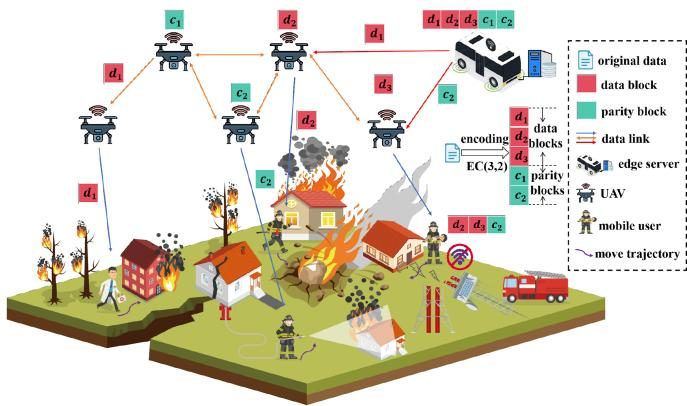  
Fig. 1. An illustration of the UAV-enabled edge storage system using erasure coding. The original data is divided into three data blocks and encoded into two parity blocks. The mobile user, located at the far-right, prioritizes retrieving coding blocks (d ) from the UAV directly covering its location. Coding blocks (d ) can be transmitted between adjacent UAVs and delivered to the user. If insufficient blocks are retrieved from the UAVs, the remaining blocks (c ) are transmitted from a remote edge server via UAVs to restore the original data.

In this paper, we consider a disaster relief scenario as shown in Fig. 1, where edge servers based on ground infrastructure are damaged and unable to provide services [17]. Rescue vehicle equipped with storage resources acts as edge server, collaborating with UAVs to store encoded blocks and provide data storage services to mobile users. However, using erasure coding for data storage in the aforementioned system architecture still faces the following challenges: (1) How to determine the optimal encoding EC k, m scheme? The number of data blocks k, and the number of parity blocks m generated by encoding, are crucial for optimizing storage cost. (2) How to determine the optimal encoding block placement scheme? Given the users’ mobility and the partial connectivity of the UAV cluster network, the placement of encoded blocks is critical for enabling data access for D2D users and seamless handover. If the encoding blocks are placed optimally, each user can easily access sufficient encoding blocks (k blocks) from a nearby UAV cluster and then retrieve all blocks via short-range D2D communication to reconstruct the original data. Otherwise, the user would need to access the blocks from the edge server via UAVs, increasing data access latency. (3) How to determine the optimal encoding block access scheme? In erasure coding-based UAV-enabled edge storage systems, multiple users may request data simultaneously, or both edge server and UAVs may receive multiple requests at the same time. Given the limited bandwidth resources of edge server and UAVs, how to implement data transfer and bandwidth resource allocation is a critical consideration. It is worth noting that the data encoding scheme, block placement scheme, and block access scheme form a sequential problem, which are interrelated and coupled. Therefore, it is challenging to find the optimal solution for the above-mentioned issues.

Recently, deep reinforcement learning has emerged as a promising technique for solving such joint optimization problems and has been widely applied in storage domains [18] [19] [20], including optimizing edge cache performance and reducing cloud storage system cost [21]. However, some of these methods may face limitations in effectively decomposing decisions and maintaining personalized models, potentially leading to higher system cost. To address these issues, this paper innovatively proposes a Mobility-Enhanced Hierarchical Deep Reinforcement Learning (ME-HDRL) algorithm. The algorithm first incorporates a sequence-to-sequence mobility user trajectory prediction module to assist subsequent decision-making. Additionally, to address the coupled decision problem, we introduce a joint data encoding, block placement, and block access decision framework based on HDRL. We effectively decompose the original problem into subproblems of data encoding and placement, as well as block access, to mitigate coupling, applying a divide-and-conquer approach to solve the original problem. The main contributions of this paper are summarized as follows.

\- We present a study on data encoding, coded block placement, and block access in UAV-enabled edge storage systems utilizing erasure coding, formalizing the problem as a joint optimization of storage cost and user data access latency under multi-dimensional constraints.

We decompose the original problem into data encoding and placement subproblem, as well as block access subproblem, and model them as Markov Decision Processes (MDPs). We propose a ME-HDRL algorithm, which includes a sequence-to-sequence mobile user trajectory prediction module and a HDRL-based decision model. In this context„ UAV agents based on Double Deep Q-Network (DDQN) optimize data encoding and placement strategy, while edge agent based on Proximal Policy Optimization (PPO) optimizes encoding block access strategy. To enhance the learning performance of HDRL, we design an action filter to filter out impractical actions generated by the algorithm.

Finally, extensive simulation experiments validate that our method outperforms existing rule-based and reinforcement learning-based algorithms in various scenarios, demonstrating significant convergence improvement and achieving substantial reductions in storage cost and user data access delay.

## II. RELATED WORK

The edge computing paradigm has gained widespread attention by deploying computing and storage resources at the network edge, closer to users, enabling edge data storage. He et al. [22] investigated the edge data query problem and proposed a distributed edge data indexing system, EDIndex, to reduce data retrieval latency. Nicolaescu et al. [23] studied the edge data placement problem and proposed an edge data repository that enables intelligent placement of different types of data. Zhang et al. [24] addressed the latency-optimal data placement problem in user-centric mobile networks, considering network topology, traffic distribution, channel quality, and file popularity information.

The aforementioned studies focus on edge storage issues based on fixed edge server architectures, which cannot be applied to areas lacking infrastructure coverage. To address this, some studies have utilized flexibly deployed UAVs to enable UAV-assisted edge storage. Li et al. [25] proposed a joint optimization approach for UAV trajectory and caching strategies to minimize the latency caused by UAV-assisted caching. Liu et al. [9] investigated the hybrid caching and replacement problem in UAV-assisted vehicular edge computing environments and proposed a deep reinforcement learning-based solution. Zhou et al. [26] studied the joint optimization problem of service caching and computation offloading in UAV-assisted edge computing environments and proposed an alternating optimizationbased algorithm that significantly reduces UAV energy consumption and service latency.

These studies predominantly focus on caching data replicas on edge servers and UAVs to reduce user service latency, with a common assumption that storage resources on both edge servers and UAVs are limited and costly. While efforts have been made to optimize storage cost, the explosive growth of data and the increasing number of users still lead to high storage cost in replica-based approaches. In contrast, erasure coding offers a more cost-effective and reliable alternative to replica-based storage. It has been widely adopted in data centers and cloud storage systems, such as Microsoft’s Azure, Facebook’s F4, HDFS, and Ceph [27] [28]. Some studies have also explored the application of erasure coding in edge environments. For example, Jin et al. [29] investigated the erasure coding-based edge data placement problem in edge storage systems composed of edge servers. He et al. [30] studied fault tolerance based on erasure coding to address edge data dissemination issues, achieving an economically efficient data transfer from the cloud to edge servers through erasure coding.

However, applying erasure coding to UAV-enabled edge storage architectures presents a novel challenge, and there is limited research on this topic. Unlike prior studies such as Jin et al. [29], which focus on data placement in static and fully connected edge server environments, our work investigates a more practical and challenging scenario—UAV-enabled edge systems characterized by limited storage capacity, partial network connectivity, and dynamic user mobility. These constraints significantly complicate data encoding, block placement, and content access decisions. To address this, we propose a unified framework that jointly optimizes these interdependent components under realistic system constraints.

## III. SYSTEM MODEL AND PROBLEM FORMULATION

In this section, we first present the architecture of the UAVenabled edge storage system based on erasure coding. Subsequently, we provide a detailed description of the mathematical formulation of the problem. The list of important notations used in this paper is shown in Table I.

## A. System Model

We focus on a UAV-enabled edge storage system using erasure coding, as illustrated in Fig. 1. The system consists of a vehicle-based edge server, denoted as s, and U hovering UAVs, which collaboratively provide data storage services to

LIST OF IMPORTANT NOTATIONS USED IN THIS PAPER  
TABLE I
<table><tr><td>Notation</td><td>Explanation</td></tr><tr><td>S</td><td>Vehicle-based edge server</td></tr><tr><td> $U$ </td><td>The number of UAVs</td></tr><tr><td> $D$ </td><td>The number of mobile users</td></tr><tr><td> $t$ </td><td>The t-th of time slot</td></tr><tr><td> $f$ </td><td>The original data</td></tr><tr><td> $k$ </td><td>The number of data blocks</td></tr><tr><td> $m$ </td><td>The number of parity blocks</td></tr><tr><td> $N$ </td><td>The total number of coded blocks</td></tr><tr><td> $v _ { u , i }$ </td><td>The i-th neighbor node of UAV u</td></tr><tr><td> $f ^ { \mathrm { U A V } }$ </td><td>Total storage capacity of each UAV</td></tr><tr><td> $\ell _ { u } ( t )$ </td><td>The location of UAV u in time slot t</td></tr><tr><td> $\ell _ { d } ( t )$ </td><td>The location of mobile user d in time slot t</td></tr><tr><td> $d i s _ { d } ( t )$ </td><td>The distance that mobile user d moves in time slot t</td></tr><tr><td> $\theta _ { d } ( t )$ </td><td>The direction in which mobile user d moves in time slot t</td></tr><tr><td> $d i s _ { m a x }$ </td><td>The maximum distance a mobile user can move in one time slot</td></tr><tr><td> $c _ { u , d } ( t )$ </td><td>Indicator variable for UAV u covering mobile user d</td></tr><tr><td> $_ { \mathcal { X } }$ </td><td>The data block placement decision vector</td></tr><tr><td> $\boldsymbol { B }$ </td><td>The parity block placement decision vector</td></tr><tr><td> $a$ </td><td>The NLoS attenuation factor</td></tr><tr><td> $l$ </td><td>The path loss exponent</td></tr><tr><td> $g _ { 0 }$ </td><td>The channel gain at the reference distance  $d _ { 0 } = 1 m$ </td></tr><tr><td> $\alpha , \beta$ </td><td>Environmental constants specific to different scenarios</td></tr><tr><td> $h _ { i } ( t )$ </td><td>The percentage of spectrum allocated to</td></tr><tr><td> $p _ { s } ( t )$ </td><td>UAV i in time slot t</td></tr><tr><td> $N _ { 0 }$ </td><td>The transmission power of the edge server The noise spectral density</td></tr><tr><td> $\phi _ { u , i } ( t )$ </td><td>The percentage of spectrum allocated to</td></tr><tr><td></td><td>mobile user i in time slot t</td></tr><tr><td> $p _ { u } ( t )$ </td><td>The transmission power of the UAV u The percentage of spectrum allocated to</td></tr><tr><td> $e _ { u , i } ( t )$ </td><td>UAV i in time slot t</td></tr><tr><td> $W ^ { \mathrm { e d g e } }$ </td><td>The total downlink bandwidths for the edge server</td></tr><tr><td> $W ^ { \mathrm { U A V } }$ </td><td>The total downlink bandwidths for the UAV</td></tr></table>

D mobile users. The set of UAVs and mobile users are denoted $\operatorname { a s } \mathcal { U } = \{ 1 , 2 , \dots , U \}$ and $\mathcal { D } = \{ 1 , 2 , \dots , D \}$ , respectively. The time domain is divided into time slots $t \in \{ 1 , 2 , \dots , \tau \}$ , each with equal duration. The original data f is divided into k data blocks, and m parity blocks are generated according to the coding scheme, making the total number of coded blocks N $( N \triangleq k + m )$ , where the size of each coded block is size $( f ) / k$ Typically, the edge server has sufficient storage resources to store all the coded blocks. However, to improve the reliability and availability of storage, we allow each UAV to store at most one coded block [31].

In each time slot t, mobile user d has a probability ρ of initiating a data request, and mobile users prioritize retrieving coded blocks from the UAVs covering them. Moreover, coded blocks can be transmitted across adjacent UAVs in the UAV cluster network topology and delivered to the mobile users. If enough coded blocks (k blocks) cannot be retrieved from UAVs, the remaining coded blocks need to be fetched from a remote edge server via UAVs. Based on the UAV cluster network topology, the neighbors of UAV u are defined as nodes directly connected to the current node and capable of communication, represented as the set $V _ { u } = \{ v _ { u , 1 } , v _ { u , 2 } , \ldots , v _ { u , i } | \forall v _ { u , i } \in \mathcal { U } \}$ . Following the existing work in [32], [33], we define the communication between UAVs based on a communication distance threshold, denoted as $D _ { \mathrm { t h r e s h } }$ , meaning that two UAVs are considered neighbors if the distance between them is smaller than this threshold $D _ { \mathrm { t h r e s h } }$ . This hierarchical system architecture and UAV-based layered access model have been extensively studied in prior works [9], [34], [35]. The system workflow of the proposed method is shown in Fig. 2.

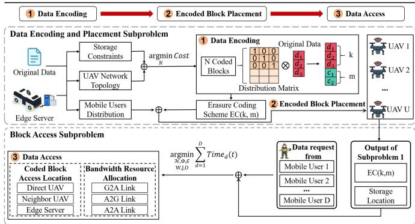  
Fig. 2. System Workflow of the Proposed ME-HDRL Framework.

## B. Mobility Model

Here, we consider a quasi-static scenario where UAVs hover in place, and mobile users maintain a stationary position during data requests, although they may move between different time slots [36]. To standardize the expression, we denote the positions of all devices as variables related to the time slot t. Specifically, at any time slot t, the positions of the edge server s, UAV u, and mobile user d are represented by vectors $\ell _ { s } ( t ) = ( x _ { s } ( t ) , y _ { s } ( t ) , 0 )$ $\ell _ { u } ( t ) = ( x _ { u } ( t ) , y _ { u } ( t ) , z _ { u } ( t ) )$ , and $\ell _ { d } ( t ) = ( x _ { d } ( t ) , y _ { d } ( t ) , 0 )$ , respectively. Here, x and y denote the horizontal coordinates, while the edge server and mobile users are located at an altitude of 0, while UAVs hover at a constant altitude $z _ { u } ( t )$ . Each mobile user d can move a distance $d i s _ { d } ( t ) \in [ 0 , d i s _ { m a x } ]$ in a fixed direction $\theta _ { d } ( t ) \in [ 0 , 2 \pi )$ during a time slot to reach the position $\ell _ { d } ( t + 1 )$ , where $d i s _ { m a x }$ is the maximum distance a mobile user can move in one time slot [32]. The horizontal coordinates for the next moment can be calculated as

$$
\left\{ \begin{array} { l l } { x _ { d } ( t + 1 ) = x _ { d } ( t ) + d i s _ { d } ( t ) \cos \theta _ { d } ( t ) , } \\ { y _ { d } ( t + 1 ) = y _ { d } ( t ) + d i s _ { d } ( t ) \sin \theta _ { d } ( t ) . } \end{array} \right.\tag{1}
$$

Due to the random mobility of mobile users and the limited coverage range of each UAV, at any time slot t, whether UAV u covers mobile user d can be represented as an integer variable $c _ { u , d } ( t ) \in \{ 0 , 1 \}$ , where $c _ { u , d } ( t ) = 1$ indicates that the mobile ( ) 0 1 ( ) = 1user d is within the coverage range of UAV u, and vice versa. Therefore, we can define the cover vector of UAV u at time slot t as $\boldsymbol { C } _ { u } ( t ) = \{ c _ { u , 1 } ( t ) , c _ { u , 2 } ( t ) , \ldots , c _ { u , D } ( t ) \}$

## C. Storage Model

We consider the data encoding and placement strategy on the UAVs. For the k data blocks and m parity blocks generated from the original data, we use the data block placement decision vector $\mathcal { X } = \{ x _ { 1 } , x _ { 2 } , \ldots , x _ { U } \}$ and the parity block placement decision vector $\boldsymbol { B } = \{ b _ { 1 } , b _ { 2 } , \dots , b _ { U } \}$ to represent whether each =UAV stores a data block or a parity block, where $x _ { i } , b _ { i } \in \{ 0 , 1 \}$ and when $x _ { i } / b _ { i }$ in the vector takes the value of 1, it indicates that UAV i stores the data/parity block. To improve storage reliability and availability, each storage node is typically allowed to store at most one coded block, hence

$$
x _ { i } + b _ { i } \in \{ 0 , 1 \} , \forall i \in { \mathcal { U } } .\tag{2}
$$

The total number of coded blocks, N, can be calculated using the formula

$$
N = \sum _ { i = 1 } ^ { U } ( x _ { i } + b _ { i } ) .\tag{3}
$$

Based on the above, we define the storage cost as

$$
C o s t = \frac { N s i z e ( f ) } { k } = \frac { \sum _ { i = 1 } ^ { U } ( x _ { i } + b _ { i } ) s i z e ( f ) } { k } .\tag{4}
$$

It is worth noting that in the erasure coding scheme, the original data is divided into at least two blocks, i.e., $k \geq 2 .$ . k is a crucial parameter to learn, as mobile users need to access at least k coded blocks to decode the original data. However, due to the limited number of UAVs accessible by mobile users, a large k may require accessing many coded blocks from a remote edge server, thus increasing transmission latency.

## D. Communications Model

The system architecture in this paper involves Air-to-Ground (A2G) communication between UAVs and mobile users, Airto-Air (A2A) communication between UAVs, and ground-toair (G2A) communication between remote edge server and UAVs. All devices use Frequency Division Multiple Access (FDMA [37]) technology to transmit coded blocks. The total bandwidths for edge server and UAVs are $W ^ { \mathrm { e d g e } }$ and $W ^ { \mathrm { U A V } }$ respectively.

Considering the potential for obstructions in the 3D environment, A2G and G2A communications are likely to encounter Non-Line-of-Sight (NLoS) paths [33]. Therefore, the channel models for communication between UAVs and mobile users, as well as between edge server and UAVs, are designed to include both Line-of-Sight (LoS) and NLoS path loss probabilities, while A2A communication between UAVs primarily follows LoS paths. The channel gains associated with LoS and NLoS links are denoted as $\begin{array} { r } { g _ { s , u } ^ { L o \bar { S } } ( t ) = \frac { g _ { 0 } } { ( d _ { s , u } ( t ) ) ^ { l } } , g _ { u , d } ^ { L o S } ( t ) = } \end{array}$ $\begin{array} { r } { \frac { g _ { 0 } } { ( d _ { u , d } ( t ) ) ^ { l } } , g _ { u ^ { \prime } , u } ^ { L o S } ( t ) = \frac { g _ { 0 } } { ( d _ { u ^ { \prime } , u } ( t ) ) ^ { l } } , g _ { s , u } ^ { N L o S } ( t ) = \frac { a g _ { 0 } } { ( d _ { s , u } ( t ) ) ^ { l } } } \end{array}$ , and $\begin{array} { r } { g _ { u , d } ^ { N L o S } ( t ) = \frac { a g _ { 0 } } { ( d _ { u , d } ( t ) ) ^ { l } } } \end{array}$ , respectively. Here, ${ d _ { s , u } ( t ) = \lVert { \boldsymbol { \ell } } _ { s } ( t ) - }$ $\ell _ { u } ( t ) \| _ { 2 } , d _ { u , d } ( t ) = \| \ell _ { u } ( t ) - \ell _ { d } ( t ) \| _ { 2 }$ , and $d _ { u ^ { \prime } , u } ( t ) = \Vert \boldsymbol { \ell } _ { u ^ { \prime } } ( t ) -$ $\ell _ { u } ( t ) \| _ { 2 }$ represent the distances at time slot t between the edge server s and UAV u, between UAV u and mobile user d, as well as between UAV u and UAV u, respectively. a represents the NLoS attenuation factor, l is the path loss exponent, and $g _ { 0 }$ denotes the channel gain at the reference distance $d _ { 0 } = 1 m$

1) G2A Communication: To model the communication between the edge server s and UAV u, we adopt a widely used G2A channel formulation that incorporates both LoS and NLoS effects [33]. The composite channel gain is expressed as:

$$
g _ { s , u } ( t ) = \frac { \hat { P } _ { s , u } ^ { L o S } ( t ) g _ { 0 } } { ( d _ { s , u } ( t ) ) ^ { l } } ,\tag{5}
$$

where $d _ { s , u } ( t )$ is the euclidean distance between UAV u and edge server s, and $g _ { 0 }$ denotes the channel gain at a reference distance. The term $\hat { P } _ { s , u } ^ { L o S } ( t )$ is the effective LoS probability, adjusted to ( )account for NLoS attenuation, defined as:

$$
\hat { P } _ { s , u } ^ { L o S } ( t ) = P _ { s , u } ^ { L o S } ( t ) + a ( 1 - P _ { s , u } ^ { L o S } ( t ) ) ,\tag{6}
$$

with $a < 1$ representing the attenuation factor for NLoS links. The baseline LoS probability is modeled as:

$$
P _ { s , u } ^ { L o S } ( t ) = \frac { 1 } { 1 + \alpha \exp ( - \beta ( \theta _ { s , u } ( t ) - \alpha ) ) } ,\tag{7}
$$

where α and $\beta$ are environment-specific constants $( \mathrm { e . g . }$ ., for urban or rural areas). The elevation angle $\theta _ { s , u } ( t )$ between the edge server and UAV is computed as:

$$
\theta _ { s , u } ( t ) = \frac { 1 8 0 } { \pi } \arctan \left( \frac { z _ { u } } { \lVert ( x _ { u } ( t ) , y _ { u } ( t ) ) - ( x _ { s } ( t ) , y _ { s } ( t ) ) \rVert _ { 2 } } \right) .\tag{8}
$$

Given that the edge server may serve multiple UAVs simultaneously, we define the bandwidth allocation vector at time slot t as $\mathcal { H } ( t ) = \{ h _ { 1 } ( t ) , h _ { 2 } ( t ) , \ldots , h _ { U } ( t ) \}$ , where $h _ { u } ( t ) \in [ 0 , 1 ]$ ( ) = ( ) ( ) ( ) ( ) [0 1]indicates the spectrum share assigned to UAV u. The resulting transmission rate between the edge server and UAV u is then:

$$
r _ { s , u } ( t ) = h _ { u } ( t ) W ^ { \mathrm { e d g e } } \log _ { 2 } \left( 1 + \frac { p _ { s } ( t ) g _ { s , u } ( t ) } { N _ { 0 } h _ { u } ( t ) W ^ { \mathrm { e d g e } } } \right) ,\tag{9}
$$

where $p _ { s } ( t )$ is the edge server’s transmission power and $N _ { 0 }$ is the noise power spectral density.

2) A2G Communication: Similar to the communication model between the edge server and the UAV, the communication between UAV u and mobile user d also includes both LoS and NLoS links, with the channel gain denoted as

$$
g _ { u , d } ( t ) = \frac { \hat { P } _ { u , d } ^ { L o S } ( t ) g _ { 0 } } { ( d _ { u , d } ( t ) ) ^ { l } } .\tag{10}
$$

In the same time slot, UAV u may communicate with multiple mobile users to transmit coded blocks. Therefore, we define the bandwidth resource allocation vector of UAV to all mobile users as $\Phi _ { u } ( t ) = \{ \phi _ { u , 1 } ( t ) , \phi _ { u , 2 } ( t ) , \ldots , \phi _ { u , D } ( t ) \}$ , where $\phi _ { u , i } ( t ) \in [ 0 , 1 ]$ represents the percentage of spectrum allocated to mobile user i in time slot t.. The data transmission rate between UAV and mobile user is

$$
r _ { u , d } ( t ) = \phi _ { u , d } ( t ) W ^ { \mathrm { u a v } } \log _ { 2 } \bigg ( 1 + \frac { p _ { u } ( t ) g _ { u , d } ( t ) } { N _ { 0 } \phi _ { u , d } ( t ) W ^ { \mathrm { u a v } } } \bigg ) ,\tag{11}
$$

where $p _ { u } ( t )$ represent the transmission power of the UAV.

( )3) A2A Communication: Data transmission between UAVs is restricted to adjacent UAV nodes within the UAV network topology. For simplicity, we also define the bandwidth resource allocation vector of UAV u to all other UAVs as $\mathcal { E } _ { u } ( t ) =$ $\{ e _ { u , 1 } ( t ) , e _ { u , 2 } ( t ) , \ldots , e _ { u , U } ( t ) \}$ , where $e _ { u , i } ( t ) \in [ 0 , 1 ]$ . The data transmission rate between UAV $u ^ { \prime }$ and UAV u is

$$
r _ { u ^ { \prime } , u } ( t ) = e _ { u ^ { \prime } , u } ( t ) W ^ { \mathrm { u a v } } \log _ { 2 } \left( 1 + \frac { p _ { u ^ { \prime } } ( t ) g _ { u ^ { \prime } , u } ^ { L o S } ( t ) } { N _ { 0 } e _ { u ^ { \prime } , u } ( t ) W ^ { \mathrm { u a v } } } \right) .\tag{12}
$$

## E. System Delay Analysis

In a storage system using erasure coding, the data access delay includes both the transmission delay of the encoding blocks and the decoding delay. As erasure code technology has evolved, an increasing number of low-complexity encoding schemes have been proposed, gradually reducing the encoding and decoding complexity. Consequently, the decoding delay can be considered negligible compared to the communication delay [30]. In this system, a mobile user d requires k encoded blocks to decode the original data. The locations of these encoded blocks can fall into three cases, each corresponding to a different transmission delay.

Herein, we use the access indicator $w _ { d } ^ { u } ( t )$ to represent whether mobile user d obtains encoded blocks from the UAV u that directly covers it, defined as

$$
w _ { d } ^ { u } ( t ) \in \{ 0 , 1 \} , \forall u \in \mathcal { U } , d \in \mathcal { D } ,\tag{13}
$$

where 0 represents not obtaining encoded blocks from u. The access indicator $j _ { d } ^ { u ^ { \prime } , u } ( t )$ represents whether mobile user d retrieves encoded blocks from the neighbor node u of the UAV u that directly covers it, defined as

$$
j _ { d } ^ { u ^ { \prime } , u } ( t ) \in \{ 0 , 1 \} \forall u \in \mathcal { U } , u ^ { \prime } \in V _ { u } ,\tag{14}
$$

where $u ^ { \prime } \in V _ { u }$ denotes that $u ^ { \prime }$ is a neighbor node of u. For simplicity, if a mobile user requires coded blocks from the edge server, we assume that all the coded blocks from the edge server are forwarded through a single UAV directly covering the mobile user. Based on this, we use the access indicator $o _ { d } ^ { s , u } ( t )$ to represent the number of coded blocks that mobile user d needs to retrieve from the remote edge server s through UAV u directly covering it, denoted as

$$
o _ { d } ^ { s , u } ( t ) = k - \sum _ { i \in \mathcal { U } } \sum _ { v \in V _ { i } } \left( w _ { d } ^ { i } ( t ) + j _ { d } ^ { v , i } ( t ) \right) .\tag{15}
$$

1) Direct Access Delay: When $w _ { d } ^ { u } ( t )$ is designated to 1, it indicates that the mobile user retrieves encoded blocks from the UAV u that directly covers it. The direct access delay is expressed as

$$
T _ { d } ^ { u } ( t ) = \frac { s i z e ( f ) } { r _ { u , d } ( t ) k } .\tag{16}
$$

2) Indirect Access Delay: When $j _ { d } ^ { u ^ { \prime } , u } ( t ) = 1$ , it means that mobile user d retrieves encoded blocks via the neighbor node $u ^ { \prime }$ of the UAV u that directly covers it. In this scenario, the indirect access delay is divided into two parts: the communication delay between UAV $u ^ { \prime }$ and $u ,$ as well as between UAV u and mobile user $d ,$ expressed as

$$
T _ { d } ^ { u ^ { \prime } , u } ( t ) = \frac { s i z e ( f ) } { k } \left( \frac { 1 } { r _ { u ^ { \prime } , u } ( t ) } + \frac { 1 } { r _ { u , d } ( t ) } \right) .\tag{17}
$$

3) Edge Access Delay: When $o _ { d } ^ { s , u } ( t ) \neq 0$ , this implies that mobile user d retrieves encoded blocks from the edge server s through UAV u. The edge access delay consists of the communication delay between the edge server s and UAV u, as well as between UAV u and mobile user $d ,$ expressed as

$$
T _ { d } ^ { s , u } ( t ) = \frac { s i z e ( f ) } { k } \left( \frac { 1 } { r _ { s , u } ( t ) } + \frac { 1 } { r _ { u , d } ( t ) } \right) .\tag{18}
$$

Therefore, the total transmission delay for mobile user d to access the coded blocks from the three aforementioned locations can be computed using the following formula:

$$
T _ { d } ( t ) = \sum _ { u \in \mathcal { U } } \sum _ { u ^ { \prime } \in V _ { u } } \left( w _ { d } ^ { u } ( t ) T i m e _ { d } ^ { u } ( t ) + j _ { d } ^ { u ^ { \prime } , u } ( t ) \right.
$$

$$
T i m e _ { d } ^ { u ^ { \prime } , u } ( t ) + o _ { d } ^ { s , u } ( t ) T i m e _ { d } ^ { s , u } ( t ) \Big ) .\tag{19}
$$

## F. Problem Formulation

In the erasure coding based data placement subproblem, various data encoding schemes (defined by different values of k and m) and placement strategies (i.e., the distribution of coded blocks across UAVs) lead to different storage cost. Similarly, in the content delivery subproblem, different content access strategies—such as the establishment of D2D links with specific UAVs and the allocation of bandwidth resources—result in varying access delays. For example, storing one coded block on each UAV would result in high storage cost, although it may reduce the access delay for mobile users. In contrast, choosing a small number of UAVs to store the coded blocks can reduce storage cost but typically leads to longer transmission delays because more coded blocks need to be transferred from the remote edge server. Therefore, this paper jointly considers the data encoding scheme, block placement scheme, and block access scheme, aiming to optimize storage cost and user data access delay. This problem is mathematically formulated as

$$
\mathcal { F } : \operatorname* { m i n } _ { \varepsilon , \ : \ : \ : \mathcal { B } , \mathcal { H } , \Phi } \xi \frac { C o s t } { C _ { \mathrm { m a x } } } + ( 1 - \xi ) \operatorname* { l i m } _ { \tau  \infty } \frac { 1 } { \tau } \sum _ { t = 1 } ^ { \tau } \sum _ { d = 1 } ^ { D } \frac { T _ { d } ( t ) - T _ { \mathrm { m i n } } } { T _ { \mathrm { m a x } } - T _ { \mathrm { m i n } } }\tag{20}
$$

$$
\mathrm { s . t . } x _ { i } + b _ { i } \in \{ 0 , 1 \} , \forall i \in \mathcal { U } ,\tag{20a}
$$

$$
2 \leq k \leq U ,\tag{20b}
$$

$$
w _ { d } ^ { u } ( t ) \in \{ 0 , 1 \} , \forall u \in \mathcal { U } , d \in \mathcal { D } ,\tag{20c}
$$

$$
j _ { d } ^ { u ^ { \prime } , u } ( t ) \in \{ 0 , 1 \} , \forall u , u ^ { \prime } \in \mathcal { U } , d \in \mathcal { D } ,\tag{20d}
$$

$$
o _ { d } ^ { s , u } ( t ) = k - \sum _ { i \in \mathcal { U } } \sum _ { v \in V _ { i } } \left( w _ { d } ^ { i } ( t ) + j _ { d } ^ { v , i } ( t ) \right) ,
$$

$$
\forall u \in \mathcal { U } , d \in \mathcal { D } ,
$$

$$
h _ { i } ( t ) \in [ 0 , 1 ] , \forall i \in \mathcal { U } ,\tag{20e}
$$

$$
\phi _ { u , i } ( t ) \in [ 0 , 1 ] , \forall u \in \mathcal { U } , i \in \mathcal { D } ,\tag{20f}
$$

(20g)

$$
e _ { u , i } ( t ) \in [ 0 , 1 ] , \forall u , i \in \mathcal { U } ,\tag{20h}
$$

$$
w _ { d } ^ { u } ( t ) : = 1 \Rightarrow c _ { d } ^ { u } ( t ) = 1 \wedge x _ { u } + b _ { u } = 1 , \forall u \in \mathcal { U } , d \in \mathcal { D } ,\tag{20i}
$$

$$
j _ { d } ^ { u ^ { \prime } , u } ( t ) { = } 1 \Rightarrow u ^ { \prime } \in V _ { u } \land c _ { d } ^ { u } ( t ) { = } 1 \land x _ { u ^ { \prime } } + b _ { u ^ { \prime } } = 1 ,
$$

$$
\forall u , u ^ { \prime } \in \mathcal { U } , d \in \mathcal { D } ,\tag{20j}
$$

$$
\sum _ { i = 1 } ^ { U } h _ { i } ( t ) \leq 1 ,\tag{20k}
$$

$$
\sum _ { i = 1 } ^ { D } \phi _ { u , i } ( t ) + \sum _ { j = 1 } ^ { U } e _ { u , j } \leq 1 , \forall u \in \mathcal { U } .\tag{20l}
$$

Here, ξ denotes the weight coefficient, with $\boldsymbol { \mathcal { X } } \in \mathbb { R } ^ { U }$ , B ∈ $\begin{array} { r } { \mathbb { R } ^ { U } , \mathcal { H } \in \mathbb { R } ^ { U } , \ \Phi \in \mathbb { R } ^ { U \times D } , \mathcal { E } \in \mathbb { R } ^ { U \times U } , W \overset { \triangle } { = } \{ w _ { d } ^ { u } \} \in \mathbb { R } ^ { U \times D } } \end{array}$ $J \overset { \triangle } { = } \{ j _ { d } ^ { u ^ { \prime } , u } \} \in \mathbb { R } ^ { U \times U \times D }$ , and $O \triangleq \{ o _ { d } ^ { s , u } \} \in \mathbb { R } ^ { U \times D }$ . For simplicity, the time index t is omitted. The cost is normalized by ( )dividing by a maximum cost variable, $C _ { m a x }$ , which is the total cost of storing the encoded blocks across all UAVs in the system. The maximum cost is defined as $\begin{array} { r } { C _ { m a x } = \frac { U s i z e ( f ) } { k } } \end{array}$ . For the time normalization, we use min-max normalization, where $T _ { m i n }$ and $T _ { m a x }$ are defined as the time required to transmit the smallest encoded block at the closest distance and the time required to transmit the largest encoded block at the farthest distance, respectively. Constraint (20a) limits each UAV to storing no more than one coded block, while (20b) ensures the original data is divided into at least two blocks, with the total number not exceeding the UAVs. Additionally, each mobile user’s data request must involve the transmission of k blocks to guarantee the recovery of the original data, as ensured by constraints (20c), (20d), and (20e). Constraints (20i) and (20j) ensure the UAV stores the coded block and can connect to the mobile user. The bandwidth allocation during block transmission is constrained by (20f), (20g), (20h), (20k) and (20l).

## G. Problem Decomposition

In problem (20), we need to find the optimal data encoding and placement decision(k, m, X , B) and block access decision(coded block access indicators W, J, O, and bandwidth resource allocation variables (H, , E). It is worth noting that the data placement and access indicator variables for coded blocks are binary variables, while the bandwidth resource allocation variables are continuous. Thus, the objective function becomes a MINLP problem, which is undoubtedly NP-hard. To efficiently address the above issue, we first attempt to decompose Problem (20) into several subproblems.

Theorem 1: Problem (20) can be decomposed into the data encoding and placement problem in Problem (21) and the block access problem in Problem (22).

Proof: Without the presence of encoded blocks on the UAVs, it is impossible to determine which UAVs the mobile users should establish D2D links with to fulfill their data requests. Therefore, we first need to determine the data encoding and placement strategy, and then, based on the determined data encoding and placement strategy, we can define the block access strategy. We first fix the coded block access indicators $( W ^ { * } , J ^ { * } , O ^ { * } )$ and bandwidth resource allocation variables $( \mathcal { H } ^ { \ast } , \Phi ^ { \ast } , \mathcal { E } ^ { \ast } )$ , and optimize X and B through the following data encoding and placement problem

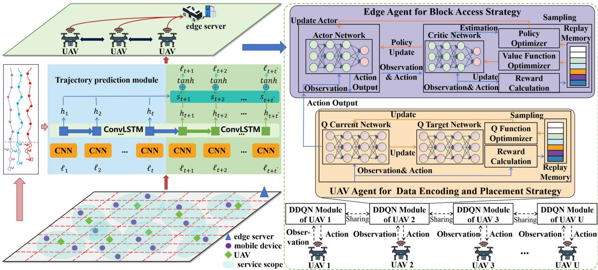  
Fig. 3. Proposed model ME-HDRL.

$$
\begin{array} { r l } { \underset { \mathcal { X } , \mathcal { B } } { \operatorname* { m i n } } } & { \mathcal { F } ( W ^ { * } , J ^ { * } , O ^ { * } , \mathcal { H } ^ { * } , \Phi ^ { * } , \mathcal { E } ^ { * } ) } \\ & { } \\ { \mathrm { s . t . } } & { ( 2 0 \mathrm { a } ) , ( 2 0 \mathrm { b } ) . } \end{array}\tag{21}
$$

After determining $\mathcal { X } ^ { \ast }$ and $B ^ { * }$ , we further optimize the coded block access indicators $( W , J , O )$ and bandwidth resource allocation variables H, , E through the following block access problem

$$
\begin{array} { r l } { \underset { \mathcal { H } , \Phi , \mathcal { E } } { \mathrm { m i n } } } & { \mathcal { F } ( \mathcal { X } ^ { * } , \mathcal { B } ^ { * } ) } \\ { \mathcal { W } , \boldsymbol { J } , O } \\ { \mathrm { s . t . } } & { ( 2 0 \mathrm { c } ) , ( 2 0 \mathrm { d } ) , ( 2 0 \mathrm { e } ) , ( 2 0 \mathrm { f } ) , ( 2 0 \mathrm { g } ) } \\ & { ( 2 0 \mathrm { h } ) , ( 2 0 \mathrm { i } ) , ( 2 0 \mathrm { j } ) , ( 2 0 \mathrm { k } ) , ( 2 0 \mathrm { l } ) . } \end{array}\tag{22}
$$

By sequentially solving the data encoding and placement, as well as block access problem, we obtain an approximate optimal solution for Problem (20). This concludes the proof.

## IV. ALGORITHM DESIGN

This section describes the proposed ME-HDR algorithm, with its overall architecture shown in Fig. 3.

## A. Trajectory Prediction Module

The historical trajectories of D mobile users are represented as $T r _ { D } ( 1 , k ) = [ t r _ { 1 } ( 1 , k ) , \ldots , t r _ { D } ( 1 , k ) ]$ , where $t r _ { i } ( 1 , k )$ represents the historical trajectory of the i-th user, specifically $t r _ { i } ( 1 , k ) = [ \ell _ { i } ( 1 ) , \ell _ { i } ( 2 ) , \ldots , \ell _ { i } ( k ) ]$ , where $\ell _ { i } ( k ) =$ $( x _ { i } ( k ) , y _ { i } ( k ) , 0 )$ represents the coordinates of the mobile user i at time k. Since predicting the position of a user at a single future time step is insufficient to make complete decisions, our prediction model adopts a sequence-to-sequence approach. The model takes the position information of the past t time steps, $T r _ { D } ( 1 , t )$ , as input to predict the position information of the next $t ^ { \prime }$ time steps, $T r _ { D } ( t + 1 , t + t ^ { \prime } )$

To this end, we propose a trajectory prediction model that integrates CNN and ConvLSTM. Specifically, we use CNN to extract spatial features from the input trajectory, then feed the feature tensor into ConvLSTM to further capture both spatial and temporal information, ultimately producing the predicted trajectory. The processing method is illustrated in Fig. 3.

## B. Hierarchical Deep Reinforcement Learning Model

HDRL model consists of multiple UAV agents and one edge agent, corresponding to the UAVs and the edge server in the system architecture. The UAV agents learn the optimal policy $\pi _ { u } ^ { * }$ to independently make data encoding and placement decision, while the edge agent learns the optimal policy $\pi _ { s } ^ { * }$ to determine block access decision. These two policies are determined sequentially. All agents cooperate through the same reward function t to minimize storage cost and user data access delay. Thus, we define the reward function as $\mathrm { R } ( t ) =$ $\begin{array} { r } { - [ \xi \frac { C o s t } { C _ { m a x } } + ( 1 - \xi ) \sum _ { d = 1 } ^ { D } \frac { T _ { d } ( t ) - T _ { \operatorname* { m i n } } } { T _ { \operatorname* { m a x } } - T _ { \operatorname* { m i n } } } ] } \end{array}$

1) UAV Agent for Data Encoding and Placement Strategy: The data placement MDP at UAV u is described as a tuple $( S _ { u } , \mathcal { A } _ { u } , \mathcal { R } )$ , where $\mathcal { S } _ { u } = \{ \mathrm { S } _ { u } ( t ) \} _ { u \in \mathcal { U } , t \in \tau } , ~ \mathcal { A } _ { u } =$ $\{ \mathrm { A } _ { u } ( t ) \} _ { u \in \mathcal { U } , t \in \tau }$ , and $\mathcal { R } = \{ \mathrm { R } ( t ) \} _ { t \in \cdot }$ = S ( ) =correspond to the placement state, placement action and reward, respectively. Detailed definitions of these elements follow.

Placement state: The mobility of users will cause dynamic changes in the UAV’s coverage vector $C _ { u } ( t )$ . Therefore, the UAV agent needs to know the mobility trajectory of the mobile users from time t to the future time $t ^ { \prime }$ in order to calculate the coverage vector. In addition, the set of neighboring nodes $V _ { u }$ must also be known. Finally, the placement state is represented as $\mathrm { S } _ { u } ( t ) = ( T r _ { D } ( t , t + t ^ { \prime } ) , V _ { u } )$

Algorithm 1: DDQN Training at UAV $u .$   
1: Initialize the DDQN model, replay memory $\mathcal { M } _ { u } ;$   
2: Load the trajectory prediction model;   
3: for each episode do   
4: Reset the storage system environment;   
5: for each step of episode do   
6: Predict trajectories using trajectory model;   
7: Observe the current placement state $\mathrm { S } _ { u } ( t ) ;$   
8: Select a placement action $\mathrm { A } _ { u } ( t )$ as   
9: if $\mathbf { p } \leq \epsilon$ then   
10: Randomly select an action;   
11: else   
12: Select action arg $\operatorname* { m a x } _ { \mathrm { A } _ { u } ( t ) } ( \mathrm { S } _ { u } ( t ) , \mathrm { A } _ { u } ( t ) ; \theta ) ;$   
13: end if   
14: Execute the placement decision;   
15: Observation the next placement state $\mathrm { S } _ { u } ( t + 1 )$   
16: Get the reward $\mathrm { R } ( t ) ;$   
17: Save $( \mathrm { S } _ { u } ( t ) , \mathrm { A } _ { u } ( t ) , \mathrm { R } ( t ) , \mathrm { S } _ { u } ( t + 1 ) )$ to $\mathcal { M } _ { u } ;$   
18: Randomly select a mini-batch from $\mathcal { M } _ { u } ;$   
19: Update the parameters θ by (24);   
20: Update the Q target network parameter $\theta ^ { \prime }$ by $\theta ;$   
21: end for   
22: end for

Placement action: The UAV agent decides whether to store data blocks or parity blocks at time slot t. The actions are given as $\mathrm { A } _ { u } ( t ) = ( x _ { u } ( t ) , b _ { u } ( t ) )$ , where $x _ { u } ( t ) = b _ { u } ( t ) = 0$ indicates no encoding blocks are stored, $x _ { u } ( t ) = 1$ ) = 0indicates storing data blocks, and $b _ { u } ( t ) = 1$ indicates storing parity blocks. $x _ { u } ( t )$ and $b _ { u } ( t )$ cannot both equal 1, corresponding to constraint (20a).

Since the UAV agent receives simple information to generate discrete actions, the Double Deep Q-Network (DDQN) algorithm is used to address this issue. The method includes two DNNs: the Q current network for parameter training and the Q target network for forward propagation to generate the target Q-values. Under a given policy $\pi _ { u } ,$ the true Q-value is

$$
Q _ { \pi _ { \boldsymbol { u } } } ( S _ { \boldsymbol { u } } , \boldsymbol { \mathcal { A } } _ { \boldsymbol { u } } ) = \mathbb { E } \left[ \mathrm { R } ( 1 ) + \gamma \mathrm { R } ( 2 ) + \gamma ^ { 2 } \mathrm { R } ( 3 ) + \cdot \cdot \cdot \right] , \forall \boldsymbol { u } \in \mathcal { U } ,\tag{23}
$$

where $\gamma \in [ 0 , 1 ]$ is the discount factor. The loss function of [0 1]DDQN is defined as

$$
\begin{array} { r l r } & { } & { L o s s _ { \pi _ { u } } ( \theta ) = { \mathbb E } [ ( \mathrm { R } ( t ) + \gamma Q _ { \pi _ { u } } ( \mathrm { S } _ { u } ( t + 1 ) , \mathrm { a r g } \operatorname* { m a x } _ { \mathrm { A } _ { u } ( t + 1 ) }  } \\ & { } & {  Q _ { \pi _ { u } } ( \mathrm { S } _ { u } ( t + 1 ) , \mathrm { A } _ { u } ( t + 1 ) ; \theta ^ { \prime } ) ; \theta ) ) ^ { 2 } ] , \quad ( 2 4 } \end{array}
$$

where the parameters θ belong to the Q current network, while $\theta ^ { \prime }$ corresponds to the parameters of the Q target network. DDQN training at UAV u is given in Alrorithm 1. To improve the exploration ability of DDQN, the UAV agent selects a random action with a probability of  during action selection. We store the tuple $( \mathrm { S } _ { u } ( t ) , \mathrm { A } _ { u } ( t ) , \mathrm { R } ( t ) , \mathrm { S } _ { u } ( t + 1 ) )$ in the experience memory $\mathcal { M } _ { u }$ , with each UAV maintaining a replay memory to store its experiences.

2) Edge Agent for Block Access Strategy: The block access MDP at the edge server is described as a tuple $( \tilde { \mathcal { S } } _ { s } , \tilde { \mathcal { A } } _ { s } , \mathcal { R } )$

Algorithm 2: PPO Training at Edge Server s.   
1: Initialize the PPO model, replay memory $\mathcal { M } _ { s } ;$   
2: Load the trajectory prediction model;   
3: for each episode do   
4: # Collect experiences with policy $\pi _ { \delta _ { o l d } } ( a _ { t } | s _ { t } ) ;$   
5: for time slot $t = 0 , 1 , \ldots , N$ do   
6: = 0 1Predict trajectories using trajectory model;   
7: Get data placement information by Algorithm 1;   
8: Observe the current transmission state $\tilde { \mathrm { S } } _ { s } ( t )        \mathrm { : }$   
9: Implemet the policy $\pi _ { \delta _ { o l d } } ( \tilde { \mathrm { A } } _ { s } ( t ) | \tilde { \mathrm { S } } _ { s } ( t ) )$ in storage   
environment to obtain access action;   
10: Execute the action $\tilde { \mathrm { A } } _ { s } ( t )$ to obtain the reward $\mathrm { R } ( t ) ;$   
11: Observation the next transmission state $\tilde { \mathrm { S } } _ { s } ( t + 1 ) \mathrm { : }$   
12: Save $( \tilde { \mathrm { S } } _ { s } ( t ) , \mathrm { A } _ { s } ( t ) , \mathrm { R } ( t ) , \tilde { \mathrm { S } } _ { s } ( t + 1 ) )$ to $\mathcal { M } _ { s } ;$   
13: end for   
14: # Optimize the neural networks;   
15: for epoch 1 to $K$ do   
16: Shuffle data and create mini-batches for updates;   
17: Compute GAE A according (29);   
18: Adam optimizer updates the parameters by   
maximize (31) and minimize (32);   
19: end for   
20: Update $\delta _ { o l d }  \delta$ and $\varphi _ { o l d } \gets \varphi ;$   
21: Clear the replay memory $\mathcal { M } _ { s } ;$   
22: end for

where $\tilde { S } _ { s } = \{ \tilde { \mathrm { S } } _ { s } ( t ) \} _ { t \in \tau }$ and $\tilde { \mathcal { A } } _ { s } = \{ \tilde { \mathrm { A } } _ { s } ( t ) \} _ { t \in \tau }$ represent the access state and access action, respectively. The detailed definitions are given follows.

\- Access state: The edge agent is responsible for specifying the access locations of the coding blocks for each mobile user and allocating bandwidth resources. Therefore, it requires information about the location and bandwidth resources of the edge server, the location and bandwidth resources of the UAVs, the UAV cluster network topology, user mobility trajectories, and coding block placement. The delivery state is represented as $\bar { \mathrm { S } } _ { s } ( t ) =$ $\{ \ell _ { s } ( t ) , \ell _ { u } ( t ) , V _ { u } , W ^ { e d g e } , W ^ { u a v } , T r _ { D } ( t , t ^ { \prime } ) , \mathcal { X } , \mathcal { B } \} _ { u \in \mathcal { U } } .$

\- Access action: The edge agent’s actions include selecting the access locations for users to retrieve coding blocks and allocating the corresponding bandwidth resources, represented as $\tilde { \mathrm { A } } _ { s } ( t ) = \{ w _ { d } ^ { u } ( t ) , j _ { d } ^ { u ^ { \prime } , u } ( t )$ $o _ { d } ^ { s , u } ( t ) , h _ { u } ( t ) , \phi _ { u , d } ( t ) , e _ { u , u ^ { \prime } } ( t ) \}$

( ) ( ) ( ) ( )We use Proximal Policy Optimization (PPO), a policy-based deep reinforcement learning algorithm based on the actor-critic framework, to enable the edge agent to collect complex global information for decision-making.

The actor network outputs access locations, including all UAVs and edge servers, resulting in many impractical actions. This large action space hinders convergence. To address this, we design an impractical action filter to update the probabilities, specifically adjusting the probability of the selected access location $a _ { t }$ as follows:

$$
p r o b ( a _ { t } ) = \left\{ \begin{array} { l l } { p r o b ( a _ { t } ) , } & { \mathrm { ~ i f ~ } x _ { a _ { t } } + b _ { a _ { t } } = 1 , } \\ { 0 , } & { \mathrm { ~ o t h e r w i s e } . } \end{array} \right.\tag{25}
$$

Then, we normalize the probability of valid actions as $p r o b ^ { \prime } ( a _ { t } ) = p r o b ( a _ { t } ) / \sum ( p r o b ( a _ { t } ) )$ . Based on the updated probabilities, we construct a probability distribution and perform action sampling. We use the probability ratio $r _ { t } ( \delta )$ to quantify the change in the policy before and after the update under the same state and action, represented as

$$
r _ { t } ( \delta ) = \frac { \pi _ { \delta } \left( \tilde { \mathrm { A } } _ { s } ( t ) | \tilde { \mathrm { S } } _ { s } ( t ) \right) } { \pi _ { \delta _ { o l d } } \left( \tilde { \mathrm { A } } _ { s } ( t ) | \tilde { \mathrm { S } } _ { s } ( t ) \right) } .\tag{26}
$$

On the other hand, we use the Temporal Difference (TD) residual to calculate the advantage function, which evaluates the actual return of the selected action under the current policy against the expected return, as shown in the formula

$$
\psi _ { t } = \mathrm { R } ( t ) + \gamma V _ { \pi _ { s } } ( \tilde { \mathrm { S } } _ { s } ( t + 1 ) ) - V _ { \pi _ { s } } \left( \tilde { \mathrm { S } } _ { s } ( t ) \right) ,\tag{27}
$$

where the state value function $V ( \tilde { \mathrm { S } } _ { s } ( t ) )$ quantifies the expected return from a given state $\tilde { \mathrm { S } } _ { s } ( t )$ , expressed as

$$
V _ { \pi _ { s } } ( \tilde { \mathbf { S } } _ { s } ( t ) ) = \mathbb { E } \left[ \sum _ { k = 0 } ^ { \infty } \gamma ^ { k } \mathrm { R } ( t + k ) | S _ { t } = \tilde { \mathbf { S } } _ { s } ( t ) \right] .\tag{28}
$$

Additionally, to improve the stability and efficiency of the advantage function calculation, we introduce Generalized Advantage Estimation (GAE) in the network, using a weight parameter $\lambda \in [ 0 , 1 ]$ to smooth the calculation of the advantage function, [0 1]as given by

$$
\hat { A } _ { t } = \psi _ { t } + ( \gamma \lambda ) \psi _ { t + 1 } + ( \gamma \lambda ) ^ { 2 } \psi _ { t + 2 } + \cdot \cdot \cdot .\tag{29}
$$

To prevent instability during training, PPO uses a clipping function to limit the policy update range, represented as

$$
\begin{array} { r } { \mathrm { c l i p } \left( \mathrm { r } _ { \mathrm { t } } ( \delta ) , 1 - \epsilon , 1 + \epsilon \right) = \left\{ \begin{array} { l l } { 1 - \epsilon , } & { \mathrm { ~ i f ~ } r _ { t } ( \delta ) \leq 1 - \epsilon , } \\ { 1 + \epsilon , } & { \mathrm { ~ i f ~ } r _ { t } ( \delta ) \geq 1 + \epsilon , } \\ { r _ { t } ( \delta ) , } & { \mathrm { ~ o t h e r w i s e . } } \end{array} \right. } \end{array}\tag{30}
$$

Based on this, the objective for the actor network can be expressed as

$$
\begin{array} { r l r } & { } & { L o s s _ { \pi _ { s } } ( \delta ) = \hat { \mathbb { E } } _ { t } \left[ \operatorname* { m i n } \left( r _ { t } ( \theta ) \hat { A } _ { t } , \operatorname { c l i p } \left( \mathrm { r } _ { \mathrm { t } } ( \delta ) , 1 - \epsilon , 1 + \epsilon \right) \hat { \mathrm { A } } _ { \mathrm { t } } \right) \right. } \\ & { } & { \left. ( 3 1 ) \right. } \end{array}
$$

where $\eta$ is the weight of entropy, and H represents the policy entropy that encourages exploration under the current policy.

The critic network is used to evaluate the expected reward of a given state, taking state $\tilde { \mathrm { S } } _ { s } ( t )$ as input and outputting the corresponding value function $V _ { \pi _ { s } } ( \tilde { \mathrm { S } } _ { s } ( t ) )$ . It updates itself by reducing the difference between the predicted value function and the computed target value. Therefore, the objective of the critic network is expressed as

$$
L o s s _ { \pi _ { s } } ( \varphi ) = \hat { \mathbb { E } } _ { t } \left[ \left( V _ { \pi _ { s } } \left( \tilde { \mathrm { S } } _ { s } ( t ) \right) - V _ { t } ^ { t a r g e t } \right) ^ { 2 } \right] ,\tag{32}
$$

where $V _ { t } ^ { t a r g e t }$ is the target value adopting GAE, derived by combining discounted rewards and advantages estimated from state $\tilde { \mathrm { S } } _ { s } ( t )$ . Algorithm 2 summarizes the proposed PPO algorithm.

TABLE II  
SIMULATION ENVIRONMENT AND UAV PARAMETER SETTINGS
<table><tr><td>Parameter</td><td>Value</td></tr><tr><td>The number of time slots</td><td>60</td></tr><tr><td>The slot length</td><td>60 s</td></tr><tr><td>UAV altitude</td><td>50 m</td></tr><tr><td>The coverage radius of UAV</td><td>150 m</td></tr><tr><td>Data request probability</td><td>0.75</td></tr><tr><td>Transmitting power at UAV</td><td>0.5 W</td></tr><tr><td>Total bandwidth of UAV</td><td>20 MHz</td></tr><tr><td>Transmitting power at edge server</td><td>40 W</td></tr><tr><td>Total bandwidth of edge server</td><td>10 MHz</td></tr><tr><td>Maximum moving distance of user in a time slot</td><td>30 m</td></tr><tr><td>Noise power spectrum density</td><td>-180 dBm/Hz</td></tr><tr><td>Channel gain at  $d _ { 0 } = 1 m$ </td><td>60 dB</td></tr><tr><td>Path loss exponent</td><td>2.3</td></tr><tr><td>NLoS attenuation</td><td>0.2</td></tr><tr><td>NLoS environmental constants  $\alpha , \beta$ </td><td>11.95, 0.14</td></tr><tr><td>The weight coefficient  $\xi$ </td><td>0.4</td></tr></table>

## V. EXPERIMENTS

## A. Evaluation Setup

All parameters are based on real-world scenarios while maintaining generality. Specifically, we consider a 1.0 km2 rectangular target area with one edge server, 10 UAVs, and 20 mobile users. The UAVs are uniformly distributed, and the mobile users move randomly within the area. Inspired by applications such as TikTok—which typically restrict video uploads to 72 MB on Android—we extend the evaluation to cover larger data volumes. Specifically, we set the file sizes up to 144 MB (twice the TikTok limit) and divide them into three categories: Small files: set 1.1 [1 MB, 24 MB], set 1.2 [25 MB, 48 MB]; Medium files: set 2.1 [49 MB, 72 MB], set 2.2 [73 MB, 96 MB]; Large files: set 3.1 [97 MB, 120 MB], set 3.2 [121 MB, 144 MB]. To simulate various network environments, we adopt the UAV network density metric defined in [29], calculated as density $r = E / N _ { \ast }$ where E is the number of communication edges and N is the number of UAVs. Accordingly, we vary the network density across the following values: . , . , . , . , . , . . Other simulation parameters are summarized in Table II.

We adopt the following baseline methods for comparison:

\- EG-CPS [38]: A block placement strategy based on evolutionary game theory, where users randomly select devices to access coding blocks.

\- RVA [39]: A regional value-based algorithm that minimizes storage cost while satisfying all user access requests, with users accessing data based on a distance priority.

\- JSAC24 [4]: A Gibbs sampling-based algorithm that operates in a decentralized and low-complexity manner.

\- BD3QN-CC [40]: An algorithm integrating D3QN and an action branching structure to learn and optimize the placement policy.

\- HDRL: Data placement and access are conducted based on the DDQN and PPO methods proposed in this paper, without the assistance of a trajectory prediction module.

To reduce the impact of randomness in the simulation process, each method was independently executed 10 times under every experimental setting, and the results were averaged for comparison.

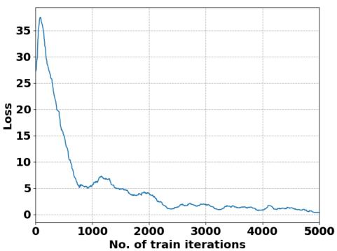  
Fig. 4. Convergence of training loss for trajectory prediction model.

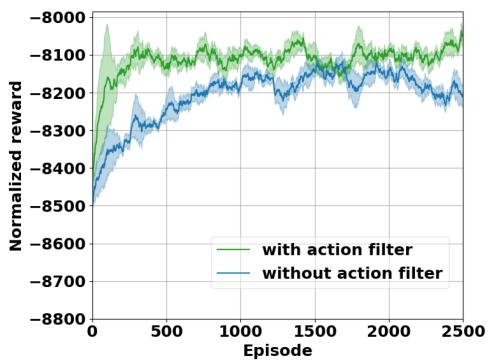  
Fig. 5. Impact of action filter on the convergence of the algorithm.

## B. Convergence of Training Algorithm

We select a batch size of 32 and implement a deep convolutional neural network (CNN) with We select a batch size of 32 and 24 layers to predict the training loss for the next 5 steps using the trajectory prediction module, as illustrated in Fig. 4. This module continuously updates its predictions based on the learned patterns from previous training steps. As the training progresses, the loss gradually decreases, demonstrating effective learning and adaptation of the model. After approximately 3000 epochs, the loss stabilizes, indicating that the model has reached convergence and is no longer experiencing significant fluctuations. This suggests that the model has effectively captured the underlying data distribution and is capable of making reliable predictions. Once the trajectory prediction model is fully trained, we integrate it into our decision-making framework, where it plays a crucial role in guiding subsequent processing steps.

We compared the impact of the action filter on algorithm convergence, as illustrated in Fig. 5. The action filter is specifically designed to eliminate impractical actions, which in our case refer to scenarios where the actor network outputs access locations that point to UAVs that do not store the required encoded data blocks. Without the action filter, the model may frequently attempt to learn from infeasible actions, negatively impacting the efficiency of the training process. As shown in the figure, incorporating the action filter effectively prevents such impractical actions, allowing the model to focus on valid decision paths. This leads to a significant improvement in training efficiency, nearly doubling the training speed compared to the version without the action filter. Furthermore, by ensuring that only meaningful actions are considered, the action filter reduces fluctuations in the learning curve, stabilizes the optimization process, and accelerates algorithm convergence. These results demonstrate the crucial role of the action filter in enhancing learning efficiency and improving overall model performance.

Fig. 6 shows the impact of file size and UAV network density on the convergence of the ME-HDRL algorithm. Fig. 6(a) presents the training rewards for different file sizes, where increasing file size raises both storage cost and data access delay, reducing the final converged reward. Fig. 6(b) presents the training rewards under varying UAV network densities. As network density increases, the final converged reward decreases due to more neighboring nodes for each UAV, complicating the placement and access of encoded blocks. The final converged rewards for network densities of 1.0, 1.3, and 1.6 are relatively close to each other, and similarly, the rewards for network densities of 1.9, 2.2, and 2.5 are also close. This is because, at the first three densities, the number of data blocks kin the final encoding scheme is similar, and the same applies to the latter three densities.

## C. Impact of Different Content Request Probabilities

To evaluate the impact of varying content request probabilities in realistic environments, we analyze the storage cost and average transmission delay of the proposed ME-HDRL method under different request probabilities ranging from 0.65 to 0.9, as shown in Fig. 7. Fig. 7(a) illustrates that the storage cost increases with the rise in content request probability, indicating that a higher request frequency leads to a greater number of encoded content blocks being cached on UAVs. In Fig. 7(b), we examine how the average transmission delay is affected by different request probabilities. As the content request probability increases, more requests are generated in each time slot, which intensifies the load on UAVs and edge server. Under constraints of limited bandwidth and storage capacity, this results in a significant increase in average transmission delay. Specifically, when the request probability increases from 0.65 to 0.9, the average transmission delay increases by approximately 44%.

## D. Impact of Different File Sizes

First, we evaluate the impact of file size on storage cost, data transmission time, and edge accessed data volume, as shown in Fig. 8. Specifically, in Fig. 8(a), we observe that as file size increases, the storage cost for all methods rises almost linearly. ME-HDRL, enhanced with user trajectory prediction, reduces storage cost by up to 20% compared to HDRL without prediction, demonstrating the effectiveness of the trajectory prediction algorithm. Additionally, ME-HDRL outperforms other methods, reducing storage cost by 73%, 38%, 65%, and 30% compared to EG-CPS, RVA, JSAC24, and BD3QN-CC, respectively.

Second, in Fig. 8(b), we compare the data transmission time of different methods under varying file sizes. We measure the average data transmission delay of 60 data requests initiated by each user within a single episode. In Fig. 8(b), with a UAV network density of 1.0, we observe that as file size increases, data transmission time also increases. When the file size is in the range of [121 MB, 144MB], our method reduces data transmission delay by 58%, 48%, 54%, 37%, and 24% compared to EG-CPS, RVA, JSAC24, BD3QN-CC, and HDRL, respectively.

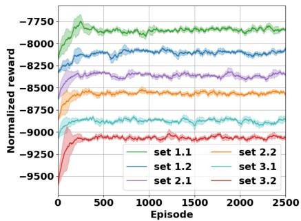  
(a) File size

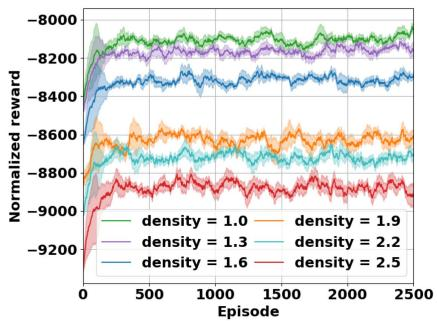  
(b) UAV network density

Fig. 6. Comparison of training processes under different file sizes and UAV network densities.  
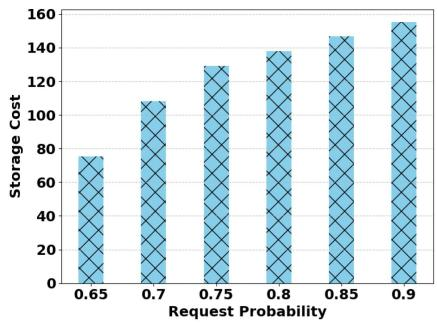  
(a) Storage cost

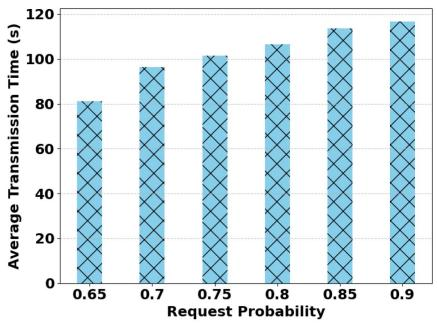  
(b) Transmission time

Fig. 7. The impact of request probability on: (a) Storage cost, (b) Transmission time.  
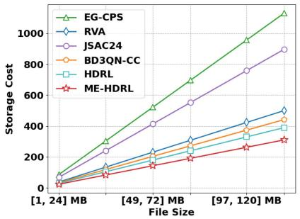  
(a) Storage cost

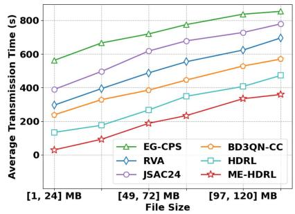  
(b) Transmission time

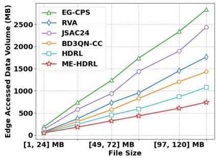  
(c) Edge accessed data volume  
Fig. 8. The impact of file size on: (a) Storage cost, (b) Transmission time, and (c) Edge accessed data volume.

Furthermore, as shown in Fig. 8(c), we compare the average amount of data each user needs to request from the edge server within a single episode. We examine the amount of data requested from the edge server by each method under different file sizes, with a UAV network density of 1.0. The results indicate that our method consistently requests the least amount of data from the edge server, thereby achieving the lowest data transmission delay, which is consistent with the results in Fig. 8(b). When the file size reaches its maximum, our method reduces the data volume by 31% compared to other optimal baseline methods.

In addition, we define the total delay of each content request as the sum of the proposed ME-HDRL algorithm runtime and the content transmission time. The impact of file size on the total content request delay is shown in Fig. 9. It can be observed that as the file size increases, the algorithm runtime also shows a rising trend. However, the increase is relatively modest — compared to the smallest file, the algorithm runtime for the largest file only increases by approximately 3 seconds.

Meanwhile, the average transmission delay per content request exhibits a more pronounced growth with increasing file size. When the file size ranges from 121 MB to 144 MB, the transmission delay is approximately 11.95 times higher than that for file sizes in the range of 1 MB to 24 MB.

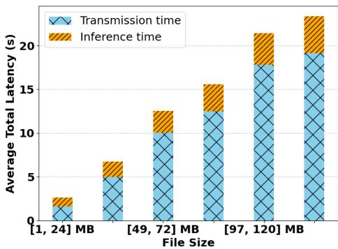  
Fig. 9. The impact of file size on total latency.

Nevertheless, even for the largest file, the total content request delay under the current system configuration is approximately 19.85 seconds, which remains significantly smaller than the slot duration. This indicates that all content requests can be completed within a single time slot.

## E. Impact of Different UAV Network Densities

We also evaluate the impact of different UAV network densities on storage cost, data transmission time, and edge-accessed data volume, as shown in Fig. 10. First, in Fig. 10(a), we evaluate the impact of UAV network density on storage cost for small files in the range of [25 MB, 48MB]. As network density increases, each UAV accesses more neighboring UAVs, reducing the number of storage-encoded blocks and lowering storage cost. Our method consistently achieves the lowest storage cost, reducing it by 26% compared to the optimal baseline method (HDRL).

Similarly, in Fig. 10(b), we compared the average data transmission delay of 60 data requests initiated by each user within a single episode. We selected small files with a size range of [25 MB, 48MB] and evaluated the impact of UAV network density on data transmission delay. It can be observed that when the network density is 2.5, our ME-HDRL method reduces data transmission delay by 36% compared to a network density of 1.0. This suggests that as the network becomes denser, users data requests are more likely to be satisfied at the UAV layer. Moreover, compared to other baseline methods, our approach reduces data transmission delay by 61% (EG-CPS), 33% (RVA), 38% (JSAC24), 25% (BD3QN-CC), and 16% (HDRL).

Furthermore, in Fig. 10(c), we tested the amount of data requested from the edge server under different UAV network densities, and our method consistently achieves the lowest value, demonstrating the effectiveness of our proposed approach. When the network density is 2.5, our method reduces the data volume by 72%, 55%, 66%, 38%, and 25% compared to methods EG-CPS, RVA, JSAC24, BD3QN-CC, and HDRL, respectively.

## F. Impact of Different Numbers of Mobile Users

To verify the impact of the number of mobile users on the algorithm’s performance, we select small files with sizes of [25 MB, 48MB] while keeping the UAV network density fixed at 1.0. We then evaluate the performance of different methods under varying numbers of mobile users, as shown in Fig. 11. First, in Fig. 11(a), we analyze the impact of the number of mobile users on storage cost. From the figure, it is evident that our proposed method consistently maintains the lowest storage cost. Compared to the optimal benchmark method HDRL, our approach reduces storage cost by approximately 13%. Additionally, as the number of mobile users increases, the total storage cost exhibits only minor fluctuations, indicating that storage cost is relatively insensitive to changes in the number of mobile users.

In Fig. 11(b), we compare the average transmission time of different methods under varying numbers of mobile users. As shown in the figure, the average transmission delay increases for all methods as the number of mobile users grows. This is because a larger number of users leads to reduced bandwidth allocation per user, resulting in higher transmission delays. When the number of mobile users reaches 45, our method achieves a reduction of 79%, 62%, 69%, 56%, and 28% in average transmission time compared to methods EG-CPS, RVA, JSAC24, BD3QN-CC, and HDRL, respectively. This demonstrates that our approach effectively reduces the number of access requests to the edge server, thereby improving transmission efficiency.

In Fig. 11(c), we evaluate the amount of data that needs to be accessed from the edge under different numbers of mobile users. As shown in the figure, as the number of mobile users increases, the amount of data accessed from the edge also increases. However, our method consistently maintains the lowest edge access data volume. Compared to the optimal baseline method HDRL, our approach reduces edge access data volume by approximately 13%.

## G. Impact of Different Numbers of UAVs

In our system, the number of UAVs also impacts storage cost, data transmission time, and the amount of data accessed from the edge, as illustrated in Fig. 12. As the number of UAVs increases, the UAV network density also grows, meaning that each UAV has more neighboring nodes. This allows more encoded data blocks to be transmitted to mobile users from nearby UAVs, thereby reducing storage cost, as shown in Fig. 12(a). When the number of UAVs increases to 20, the storage cost decreases by 36% compared to a network with only 10 UAVs.

In Fig. 12(b), we analyze the effect of the number of UAVs on transmission time. It can be observed that when the number of UAVs exceeds 16, further increases in UAVs have a diminishing impact on reducing the average transmission time. Our proposed method consistently achieves the lowest transmission time. When the number of UAVs reaches 20, our approach reduces the average transmission time by 59% compared to method HDRL.

Finally, in Fig. 12(c), we evaluate the effect of UAV count on the amount of data accessed from the edge. As the number of UAVs increases, more encoded data blocks can be transmitted to mobile users directly from UAVs, leading to a decreasing trend in edge data access. Additionally, our method ensures that mobile users’ encoding block requests are preferentially forwarded to

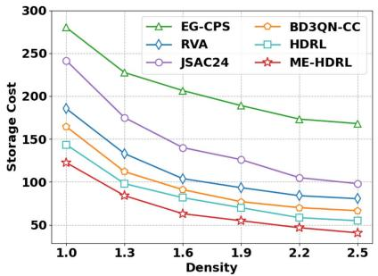  
(a) Storage cost

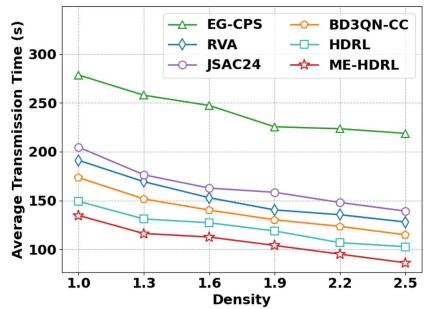  
(b) Transmission time

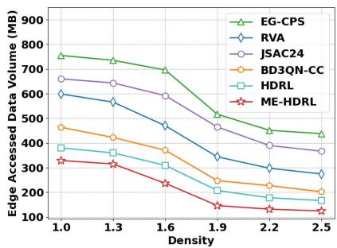  
(c) Edge accessed data volume

Fig. 10. The impact of UAV network density on: (a) Storage cost, (b) Transmission time, and (c) Edge accessed data volume.  
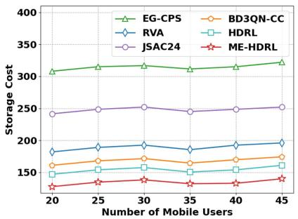  
(a) Storage cost

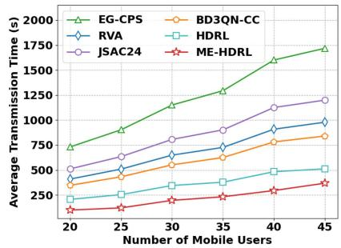  
(b) Transmission time

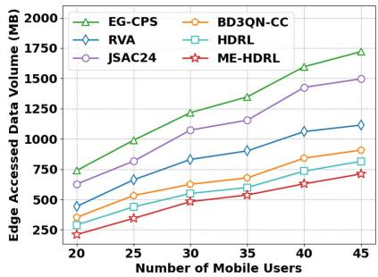  
(c) Edge accessed data volume

Fig. 11. The impact of different mobile user numbers on: (a) Storage cost, (b) Transmission time, and (c) Edge accessed data volume.  
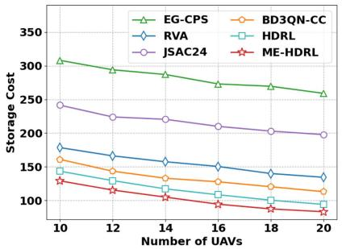  
(a) Storage cost

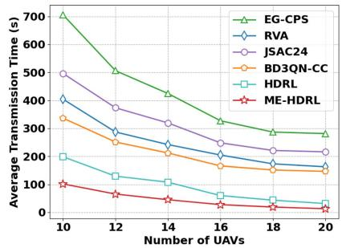  
(b) Transmission time

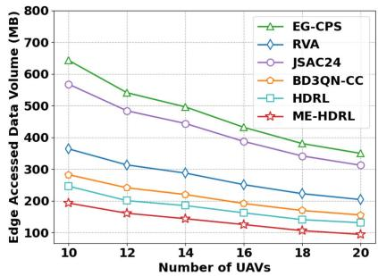  
(c) Edge accessed data volume  
Fig. 12. The impact of different UAV numbers on: (a) Storage cost, (b) Transmission time, and (c) Edge accessed data volume.

UAVs and their neighboring nodes. As a result, compared to other methods, our approach achieves up to a 28% reduction in edge access data volume.

## VI. CONCLUSION

In this paper, we have introduced erasure coding into UAVenabled edge storage systems and proposed a mobility-enhanced hierarchical deep reinforcement learning algorithm to efficiently address the trade-off between storage cost and user data access latency. Specifically, we first design a trajectory prediction algorithm that combines CNN and ConvLSTM to account for user mobility during the decision-making process. We further decompose the original problem into two subproblems—data encoding and placement, as well as block access. A hierarchical deep reinforcement learning algorithm is proposed, involving multiple UAV agents and one edge agent, to collaboratively learn optimal decisions. To improve convergence, we also design an impractical action filter to reduce the action space. Extensive experimental results have demonstrated that our algorithm outperforms existing rule-based and reinforcement learning-based algorithms across various scenarios, showing significant convergence improvements and notable reductions in storage cost and data service latency. While the proposed approach shows promising results, there are some limitations that should be considered. First, the scalability of the system could become a challenge as the number of UAVs and mobile users increases, especially given the fixed constraints of UAV storage and limited communication range. Future research could address this challenge by exploring scalable multi-agent systems that can efficiently handle increasing network sizes, as well as optimizing resource allocation and communication strategies to accommodate larger, more dynamic environments.

## REFERENCES

[1] M. Zhou, W. Zhou, J. Huang, J. Yang, M. Du, and Q. Li, “Stealthy and effective physical adversarial attacks in autonomous driving,” IEEE Trans. Inf. Forensics Secur., vol. 19, pp. 6795–6809, 2024.

[2] H. Zhou, H. Wang, Z. Yu, G. Bin, M. Xiao, and J. Wu, “Federated distributed deep reinforcement learning for recommendation-enabled edge caching,” IEEE Trans. Services Comput., vol. 17, no. 6, pp. 3640–3656, Nov./Dec. 2024.

[3] Z. Huang et al., “Energy-efficient multi-AAV collaborative reliable storage: A deep reinforcement learning approach,” IEEE Internet Things J., vol. 12, no. 12, pp. 20913–20926, Jun. 2025.

[4] Y. Zhao et al., “Joint content caching, service placement and task offloading in UAV-enabled mobile edge computing networks,” IEEE J. Sel. Areas Commun., 2024.

[5] R. Zhang, R. Zhou, Y. Wang, H. Tan, and K. He, “Incentive mechanisms for online task offloading with privacy-preserving in UAV-assisted mobile edge computing,” IEEE/ACM Trans. Netw., vol. 32, no. 3, pp. 2646–2661, Jun. 2024.

[6] F. Zhou, R. Q. Hu, Z. Li, and Y. Wang, “Mobile edge computing in unmanned aerial vehicle networks,” IEEE Wireless Commun., vol. 27, no. 1, pp. 140–146, Feb. 2020.

[7] J. Ji, K. Zhu, D. Niyato, and R. Wang, “Joint cache placement, flight trajectory, and transmission power optimization for multi-UAV assisted wireless networks,” IEEE Trans. Wireless Commun., vol. 19, no. 8, pp. 5389–5403, Aug. 2020.

[8] A. Al-Hilo, M. Samir, C. Assi, S. Sharafeddine, and D. Ebrahimi, “UAVassisted content delivery in intelligent transportation systems-joint trajectory planning and cache management,” IEEE Trans. Intell. Transp. Syst., vol. 22, no. 8, pp. 5155–5167, Aug. 2021.

[9] Y. Liu, C. Yang, X. Chen, and F. Wu, “Joint hybrid caching and replacement scheme for UAV-assisted vehicular edge computing networks,” IEEE Trans. Intell. Veh., vol. 9, no. 1, pp. 866–878, Jan. 2024.

[10] P. Qin, Y. Fu, J. Zhang, S. Geng, J. Liu, and X. Zhao, “DRL-based resource allocation and trajectory planning for NOMA-enabled multi-UAV collaborative caching 6G network,” IEEE Trans. Veh. Technol., vol. 73, no. 6, pp. 8750–8764, Jun. 2024.

[11] X. Gao and L. Zhai, “Service experience oriented cooperative computing in cache-enabled UAVs assisted MEC networks,” IEEE Trans. Mobile Comput., vol. 23, no. 10, pp. 9721–9736, Oct. 2024.

[12] X. Li, R. Li, P. P. Lee, and Y. Hu, “{OpenEC}: Toward unified and configurable erasure coding management in distributed storage systems,” in Proc. 17th USENIX Conf. File Storage Technol., 2019, pp. 331–344.

[13] Y. Gajalwar, S. Khilari, H. Kulkarni, N. Mahurkar, and A. Bagade, “Erasure coding and data deduplication: A comprehensive survey,” in Proc. 3rd Int. Conf. Innov. Technol., 2024, pp. 1–8.

[14] H. Zhang, Y. Wang, P. Yuan, and J. Zhang, “Energy-and cost-oriented optimization of hybrid coded storage in edge caching systems,” in Proc. IEEE Int. Conf. Web Serv., 2024, pp. 92–99.

[15] C. Huang et al., “Erasure coding in windows azure storage,” in Proc. USENIX Annu. Tech. Conf., 2012, pp. 15–26.

[16] M. Zhang, Q. Kang, and P. P. Lee, “FlexRaft: Exploiting flexible erasure coding for minimum-cost consensus and fast recovery,” IEEE Trans. Parallel Distrib. Syst., vol. 35, no. 10, pp. 1826–1840, Oct. 2024.

[17] Y. Wang et al., “Task offloading for post-disaster rescue in unmanned aerial vehicles networks,” IEEE/ACM Trans. Netw., vol. 30, no. 4, pp. 1525– 1539, Aug. 2022.

[18] D. Yan et al., “Deep reinforcement learning with credit assignment for combinatorial optimization,” Pattern Recognit., vol. 124, 2022, Art. no. 108466.

[19] C. Liu, Z. Xue, C. Liao, J. Kang, and G. Han, “DRL-enhanced vehicular edge caching addressing content dynamics and complex intersections,” IEEE Internet Things J., vol. 12, no. 2, pp. 1732–1745, Jan. 2025.

[20] T. Wu, D. Yu, C. Liu, D. Wang, and B. Huang, “Recommendation-enabled edge caching and D2D offloading via incentive-driven deep reinforcement learning,” IEEE Trans. Services Comput., vol. 17, no. 4, pp. 1724–1738, Jul./Aug. 2024.

[21] A. Tian et al., “Efficient federated DRL-based cooperative caching for mobile edge networks,” IEEE Trans. Netw. Service Manag., vol. 20, no. 1, pp. 246–260, Mar. 2023.

[22] Q. He et al., “Edindex: Enabling fast data queries in edge storage systems,” in Proc. 46th Int. ACM SIGIR Conf. Res. Develop. Inf. Retrieval, 2023, pp. 675–685.

[23] A.-C. Nicolaescu, S. Mastorakis, and I. Psaras, “Store edge networked data (send): A data and performance driven edge storage framework,” in Proc. IEEE Conf. Comput. Commun., 2021, pp. 1–10.

[24] S. Zhang, P. He, K. Suto, P. Yang, L. Zhao, and X. Shen, “Cooperative edge caching in user-centric clustered mobile networks,” IEEE Trans. Mobile Comput., vol. 17, no. 8, pp. 1791–1805, Aug. 2018.

[25] X. Li, J. Liu, N. Zhao, and X. Wang, “UAV-assisted edge caching under uncertain demand: A data-driven distributionally robust joint strategy,” IEEE Trans. Commun., vol. 70, no. 5, pp. 3499–3511, May 2022.

[26] R. Zhou, X. Wu, H. Tan, and R. Zhang, “Two time-scale joint service caching and task offloading for UAV-assisted mobile edge computing,” in Proc. IEEE Conf. Comput. Commun., 2022, pp. 1189–1198.

[27] J. Li and B. Li, “Erasure coding for cloud storage systems: A survey,” Tsinghua Sci. Technol., vol. 18, no. 3, pp. 259–272, 2013.

[28] Z. Shen et al., “A survey of the past, present, and future of erasure coding for storage systems,” ACM Trans. Storage, vol. 21, pp. 1–39, 2024.

[29] H. Jin, R. Luo, Q. He, S. Wu, Z. Zeng, and X. Xia, “Cost-effective data placement in edge storage systems with erasure code,” IEEE Trans. Services Comput., vol. 16, no. 2, pp. 1039–1050, Mar./Apr. 2023.

[30] Q. He et al., “EdgeHydra: Fault-tolerant edge data distribution based on erasure coding,” IEEE Trans. Parallel Distrib. Syst., vol. 36, no. 1, pp. 29– 42, Jan. 2025.

[31] B. Tian et al., “UAV-assisted wireless cooperative communication and coded caching: A multiagent two-timescale DRL approach,” IEEE Trans. Mobile Comput., vol. 23, no. 5, pp. 4389–4404, May 2024.

[32] T. Zhang, K. Zhu, S. Zheng, D. Niyato, and N. C. Luong, “Trajectory design and power control for joint radar and communication enabled multi-UAV cooperative detection systems,” IEEE Trans. Commun., vol. 71, no. 1, pp. 158–172, Jan. 2023.

[33] M. Zhao, R. Zhang, Z. He, and K. Li, “Joint optimization of trajectory, offloading, caching, and migration for UAV-assisted MEC,” IEEE Trans. Mobile Comput., vol. 24, no. 3, pp. 1981–1998, Mar. 2025.

[34] Q. Tang, L. Liu, C. Jin, J. Wang, Z. Liao, and Y. Luo, “An UAV-assisted mobile edge computing offloading strategy for minimizing energy consumption,” Comput. Netw., vol. 207, 2022, Art. no. 108857.

[35] A. M. Seid, G. O. Boateng, S. Anokye, T. Kwantwi, G. Sun, and G. Liu, “Collaborative computation offloading and resource allocation in multi-UAV-assisted IoT networks: A deep reinforcement learning approach,” IEEE Internet Things J., vol. 8, no. 15, pp. 12203–12218, Aug. 2021.

[36] S. Zhao, W. Jing, F. R. Yu, X. Wen, and Z. Lu, “Mobility-aware computation offloading for AR tasks over terahertz wireless networks: An offline reinforcement learning approach,” IEEE Trans. Veh. Technol., vol. 73, no. 12, pp. 19111–19124, Dec. 2024.

[37] B. Mao et al., “On a hierarchical content caching and asynchronous updating scheme for non-terrestrial network-assisted connected automated vehicles,” IEEE J. Sel. Areas Commun., vol. 43, no. 1, pp. 64–74, Jan. 2025.

[38] H. Shi, M. Zhang, R. Ma, L. Lin, R. Zhang, and H. Guan, “Edge caching placement strategy based on evolutionary game for conversational information seeking in edge cloud computing,” ACM Trans. Web, vol. 18, no. 4, pp. 1–23, 2024.

[39] P. Wang, J. Qiao, Y. Zhao, and Z. Ding, “Cost-effective and low-latency data placement in edge environment based on pagerank-inspired regional value,” IEEE Trans. Parallel Distrib. Syst., vol. 36, no. 2, pp. 185–196, Feb. 2025.

[40] M. Yang et al., “Deep reinforcement learning-based joint caching and routing in AI-driven networks,” IEEE Trans. Mobile Comput., vol. 24, no. 3, pp. 1322–1337, Mar. 2025.

Zhaoxiang Huang received the BEng degree in software engineering from Liaoning University, Shenyang, China, in 2021. He is currently working toward the PhD degree with the School of Computer Science, Northwestern Polytechnical University, Xi’an, China. His research interests include mobile crowdsensing, edge computing, and edge storage.

Zhiwen Yu (Senior Member, IEEE) received the PhD degree in computer science from Northwestern Polytechnical University, Xi’an, China, in 2005. He is currently the vice president with Harbin Engineering University, Harbin, China, and a professor with Northwestern Polytechnical University, Xi’an, China. He was an Alexander Von Humboldt fellow with Mannheim University, Germany, and a research fellow with Kyoto University, Kyoto, Japan. His research interests include ubiquitous computing, mobile crowd sensing, and human computer interaction.

Liang Wang (Member, IEEE) received the PhD degree from the Shenyang Institute of Automation (SIA), Chinese Academy of Sciences, Shenyang, China, in 2014. He is currently a professor with the School of Computer Science, Northwestern Polytechnical University, Xi’an, China. His research interests include ubiquitous computing, mobile crowd sensing, and crowd computing.

Huan Zhou (Senior Member, IEEE) received the PhD degree from the Department of Control Science and Engineering, Zhejiang University. He was a visiting scholar with the Temple University from November 2012 to May, 2013, and a CSC supported postdoc fellow with the University of British Columbia from November 2016 to November 2017. He is currently a professor with Northwestern Polytechnical University, Xi’an, China. He was a lead guest editor of the Pervasive and Mobile Computing, and Special Session chair of the 3rd International Conference on

Internet of Vehicles (IoV 2016), and TPC member of IEEE WCSP’13’14, CCNC’14’15, ICNC’14’15, ANT’15’16, IEEE Globecom’17’18, ICC’18’19, etc. He has published more than 50 research papers in some international journals and conferences, including IEEE Journal on Selected Areas in Communications, IEEE Transactions on Parallel and Distributed Systems, IEEE Transactions on Vehicular Technology and so on. His research interests include mobile social networks, vehicular ad hoc networks, opportunistic mobile networks, and mobile data offloading. He received the Best Paper Award of I-SPAN 2014 and I-SPAN 2018, and is currently serving as an associate editor of the IEEE Access and EURASIP Journal on Wireless Communications and Networking.

Erhe Yang received the MSc degree from the School of Computer Science, Shaanxi Normal University, Xi’an, China, in 2022. He is currently working toward the PhD degree with the School of Computer Science, Northwestern Polytechnical University, Xi’an. His current research interests include crowdsensing, semantic communication, and multi-agent Reinforcement Learning.

Bin Guo (Senior Member, IEEE) received the PhD degree in computer science from Keio University, Minato, Japan, in 2009. He is currently a professor with Northwestern Polytechnical University, Xi’an, China. He was a postdoctoral Researcher with the Institut TELECOM SudParis, Essonne, France. His research interests include ubiquitous computing, mobile crowd sensing, and HCI.