IEEE TRANSACTIONS ON INTELLIGENT TRANSPORTATION SYSTEMS

# Evaluating the Impact of Jitter on Collaborative High-Speed Aerial and Railway Networks

Ziyue Liu , Yue Xiao , Member, IEEE, Enzhi Zhou , Shuting Chen , Xianfu Lei , Member, IEEE, Xingwang Li , Senior Member, IEEE, Sotiris A. Tegos , Senior Member, IEEE, Panagiotis D. Diamantoulakis , Senior Member, IEEE, and George K. Karagiannidis , Fellow, IEEE

Abstract—With the rapid growth of high-speed rail (HSR) networks, reliable communication is increasingly challenging due to complex terrain and coverage gaps in remote areas. Uncrewed aerial vehicles (UAVs), with their mobility and flexibility, provide aerial relay support to bridge these gaps, enhance signal strength, and improve HSR communication reliability. However, their performance in millimeter-wave (mmWave) systems is significantly degraded by mechanical jitter caused by environmental factors such as wind and turbulence, which adversely afects beam alignment and overall communication quality. To address these challenges, this work introduces a comprehensive analytical framework. We first develop a statistical model that characterizes the relationship between beam gain and jitter intensity. Subsequently, closed-form expressions are derived for the outage probability and ergodic data rate of UAV-assisted HSR mmWave systems under jitter influence, taking into account both co-located (CA) and distributed antenna (DA) configurations. Furthermore, we propose an adaptive beamwidth design that maximizes the average ergodic rate by adjusting the beamwidth according to UAV jitter severity. Numerical simulations verify that this approach significantly improves system capacity and robustness compared with conventional static beamforming, confirming its efectiveness.

Index Terms—UAV-HSR, UAV jitter, beamwidth adaptive, performance analysis, outage probability, ergodic data rate.

Received 18 February 2025; revised 3 September 2025 and 10 December 2025; accepted 1 March 2026. This work was supported in part by Guangdong Basic and Applied Basic Research Foundation under Grant 2024A1515140025, in part by International Cooperation Program under Grant Y20250125, in part by the National Natural Science Foundation of China under Grant W2533180, and in part by Sichuan Science and Technology Program under Grant 2026NSFSC0400. The Associate Editor for this article was X. Cheng. (Corresponding author: Yue Xiao.)

N RECENT years, high-speed rail (HSR) has been increasingly recognized as the future of global rail transportation, valued for its safety, speed, comfort, high load capacity, and low energy consumption, all of which have attracted significant global attention [1]. The transition from the traditional global system for mobile communication railway to modern long-term evolution railway and advanced 5G/6G railway technologies is critical to establishing robust communication systems in the HSR ecosystem. This shift positions HSR to enhance global connectivity, operational eficiency, safety, and travel comfort while promoting socio-economic development, making it essential to leverage advanced communication technologies to support modern transportation networks worldwide.

In the context of modern transportation, this sector faces various challenges that need to be addressed, particularly the need for reliable coverage and signal stability at high train speeds and potential interference in complex environments [2]. HSRs travel over varied terrain, often resulting in significant hub-to-hub distances and unstable signals due to terrain limitations. This problem is particularly evident in emergency situations or natural disasters, where existing traditional ground communication infrastructure often cannot meet the communication requirements of HSRs, further highlighting the need for a more robust and reliable communications infrastructure.

## I. INTRODUCTION

To address these challenges, there has been growing interest in implementing ultra-reliable low-latency communication in HSR communication systems using 5G/6G technologies [3], [4], [5], [6]. Key advances include massive multiple-input multiple-output (MIMO) systems for increased data rates and reliability [3], [4], millimeter-wave (mmWave) technology that uses high-frequency bands for rapid data transmission and hybrid automatic repeat request to reduce delays [5]. Furthermore, innovative multiple access techniques eficiently support a large number of users and low-power IoT devices in HSR systems [6]. In addition, to further improve HSR communication service and increase system robustness, the use of external reconfigurable intelligent surface/relay mounted on the train or on the ground plays an important role in maintaining stable communication [7]. Moreover, [2] investigates two antenna deployment strategies for high-speed train communications: a co-located antenna (CA) layout, where all antennas are concentrated at the center of the train, and a

Digital Object Identifier 10.1109/TITS.2026.3677161 distributed antenna (DA) layout, where antennas are uniformly positioned along the train.

## A. Related Works

Beyond providing greater flexibility than ground access points, the integration of aerial and terrestrial networks greatly enhances HSR communications by expanding coverage and overcoming the vulnerability of obstruction [8]. With costefectiveness, flexibility, and rapid deployment for real-time data transmission, UAVs have gained growing attention as key airborne anchors that support ground nodes in delivering ubiquitous, reliable high-rate services [9].

UAV-assisted emergency communications for post-disaster areas play a critical role in restoring basic wireless coverage [2], [10], which is essential for providing global seamless services to HSR systems during disruptions. To tackle Doppler shift in HSR systems, synchronizing UAV and HSR speeds minimizes their relative speed. This keeps the UAV relatively static above the train, resulting in more stable communication links without signal distortion [11], [12]. Moreover, introducing UAVs can turn non-line-of-sight (NLoS) conditions into line-of-sight (LoS) links, reducing link loss and enabling highly directional transmission [13]. Furthermore, mmWave bands with abundant bandwidth have been used in UAVassisted wireless networks to increase the transmission rate [14]. In addition, its narrow beamwidth efectively reduces interference and eavesdropping, boosting air-to-ground communication security [15].

In the development of advanced communication technologies, free-space optical (FSO) communication has attracted attention for its high bandwidth. Recent studies have explored UAV-assisted FSO systems to improve spectral eficiency [16], enhance turbulence resistance in ground-to-air links using OFDM modulation [17], and optimize pointing error performance through relay cooperation [18], providing new approaches to overcome signal blockage and increase capacity.

Returning to the main mmWave approach, although UAV assistance improves HSR communication performance, its beamforming technology still faces multiple challenges, such as fast time-varying channels, frequent handovers, and beam misalignment caused by UAV body fluctuations [19]. In UAV networks, airflow-induced jitter significantly degrades channel state information accuracy and overall system performance [20]. In the CA layout, beam alignment is simplified but becomes more sensitive to jitter due to uniform angular ofsets, whereas the DA layout leverages spatial diversity to mitigate jitter efects. By emphasizing adaptability to dynamic scenarios, [21] lays a critical foundation for improving the robustness of communication. Here, airflow disturbances and engine vibrations can cause the fuselage to shake, making it dificult to quickly and accurately adjust the beam to track and increasing the alignment overhead. In [22], a compressed sensing-based beam training scheme was proposed for UAV mmWave communications with jitter. In [23], a deep learning-based predictive beamforming scheme was proposed to address beam misalignment caused by UAV jitter. However, these options do not work well when the drone is shaking violently. The authors in [24] proposed an adaptive beamwidth according to jittering efects, but did not analyze the change in beam gain for the change in AoA.

TABLE I  
SUMMARY OF RECENT WORKS ON UAV–HSR COMMUNICATIONS
<table><tr><td rowspan=1 colspan=1>RecentWorks</td><td rowspan=1 colspan=1>Contributions</td><td rowspan=1 colspan=1>Limitations</td></tr><tr><td rowspan=1 colspan=1>[8-9]</td><td rowspan=1 colspan=1>Enhanced HSR communica-tions through UAV-assistedrelaying to improve cover-age in remote areas.</td><td rowspan=1 colspan=1>Ignored the influence ofUAV-induced jitter onbeam alignment.</td></tr><tr><td rowspan=1 colspan=1>[11]</td><td rowspan=1 colspan=1>Proposed synchronizationof UAV speed with HSR tominimize relative velocityeffects.</td><td rowspan=1 colspan=1>Neglected  aerodynamicdisturbances causing UAVjitter.</td></tr><tr><td rowspan=1 colspan=1>[16-18]</td><td rowspan=1 colspan=1>Provided new insights forovercoming signal blockageand increasing capacity inUAV FSO systems.</td><td rowspan=1 colspan=1>Assumed a general an-tenna layout without con-sidering layout specificdifferences on HSR.</td></tr><tr><td rowspan=1 colspan=1>[22-23]</td><td rowspan=1 colspan=1>Developed    compressedsensing-based beam trainingfor UAV mmWave linksunder jitter.</td><td rowspan=1 colspan=1>Performance degrades un-der severe UAV shaking;lacks robustness in ex-treme jitter scenarios.</td></tr><tr><td rowspan=1 colspan=1>[24]</td><td rowspan=1 colspan=1>Introduced  an  adaptivebeamwidth control strategyto mitigate UAV jitter-induced misalignment.</td><td rowspan=1 colspan=1>Omitted analysis of beamgain sensitivity to AoAvariations.</td></tr></table>

A summary of representative recent works, highlighting their key contributions and limitations, is provided in Table I. In HSR scenarios, UAVs are subject to severe jitter caused by rapid speed changes, aerodynamic disturbances, and communication delays. Existing studies rarely provide quantitative analysis of these efects or propose beam optimization strategies based on such analysis.

## B. Contributions

Motivated by the above discussions, this work analyzes system performance and proposes an adaptive beamwidth optimization and system performance analysis for UAV-HSR mmWave communications under the impact of UAV jitter. Notably, by deriving a closed-form solution, we further reduce the complexity of the scheme. Ultimately, through beam optimization, it efectively ensures the reliability and efectiveness of UAV-HSR mmWave communications. Meanwhile, it balances the robustness of diferent antenna layouts in HSR scenarios and ultimately efectively ensures the reliability and efectiveness of UAV-HSR mmWave communications through beam optimization. Accordingly, the main contributions are specified as follows:

First, considering the stochastic characteristic of UAV jitter and its time-varying impact on the AoA component, we develop a statistical model to characterize the relationship between beam gain and jitter intensity. This model implies that as the jitter intensity increases, the variance of the beam gain also increases.

Considering the time-varying nature of UAV jitter, we analyze the outage probability and ergodic data rate performance in closed form for the collaborative UAV-HSR scenario under UAV jitters. Specifically, the outage probability is derived using the incomplete gamma function, while the ergodic data rate is derived under high signal-to-noise ratio (SNR) conditions for both the CA and DA frameworks.

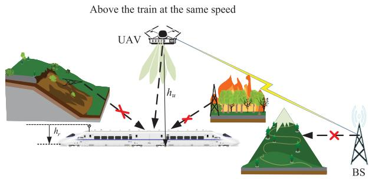  
Fig. 1. System architecture and the application scenarios.

To obtain more insights into the impact of UAV jitter on the collaborative UAV-HSR system in practical scenarios, we analyze the average outage probability and the ergodic data rate in closed form, considering the accumulated impact of UAV jitter over time. Here, the average outage probability is expressed using the Legendre-Gauss quadrature method, while the average ergodic data rate is derived under high SNR conditions. Based on these closed-form expressions, an adaptive beamwidth design strategy is proposed to maximize the average ergodic data rate.

• Finally, the numerical and analytical results for both CA and DA frameworks are presented to verify the accuracy of the performance analysis and the property of the proposed adaptive beamwidth design strategy.

The remainder of this paper is organized as follows. Section II introduces the system model. Then, the average transmission rate and the outage probability are provided in Section III, where the optimal beamwidth design is also proposed. To validate the eficiency of the proposed method, numerical simulations are provided in Section IV and Section V concludes the paper.

## II. SYSTEM MODEL AND PROBLEM FORMULATION

## A. System Architecture

This paper investigates a collaborative UAV-HSR mmWave communication system designed to achieve ubiquitous, reliable and high-rate connectivity, particularly in emergency scenarios. As illustrated in Fig. 1, the system employs a UAV as an aerial access point to facilitate communication between the base station (BS) and a multi-antenna mobile gateway (MG) inside the train compartment. In situations such as landslides or fires, the original communication infrastructure along the railway may be damaged, leading to service disruption. Leveraging the flexibility and mobility of UAVs, the proposed approach ofers a reliable alternative for emergency communications. Consistent with previous research [11], the UAVs fly at the same speed as the train, ensuring seamless connectivity with the MG. Typically, UAVs have an endurance of over 20 minutes, which is suficient to assist the train in traversing emergency areas during a crisis.

This study focuses on optimizing the UAV-MG link due to its impact on overall system performance. Since the

TABLE II  
SUMMARY OF NOTATION AND PARAMETERS
<table><tr><td>Notation  $\overline { { \mathcal { N } ( m , \sigma ^ { 2 } ) } }$ </td><td>Description  $\overline { { \sigma ^ { 2 } } }$ </td></tr><tr><td> $\mathbb { E } [ \cdot ]$   $h _ { u } , h _ { r }$   $\beta$   $\alpha _ { m }$   $\Delta \theta ( t )$   $\varphi ( \beta , \Delta \theta )$   $P , \rho _ { m }$   $f _ { c }$   $f _ { X } ( t )$   $\tau$   $\sigma _ { u }$   $P _ { \mathrm { C A } } ( t ) , P _ { \mathrm { D A } } ( t )$   $\overline { { P _ { \mathrm { C A } } } } , \overline { { P _ { \mathrm { D A } } } }$   $R _ { \mathrm { C A } } ( t ) , R _ { \mathrm { D A } } ( t )$   $\underline { { R _ { \mathrm { C A } } , R _ { \mathrm { D A } } } }$ </td><td>Gaussian distribution with mean m and variance Expectation Heights of UAV, MG Beamwidth of UAVs Angles of UAV beam and m-th antenna on the train Angle offsets between main lobe and AoA/AoD at t Beam gain with beamwidth β and angle offset ∆θ Transmit power and path loss for m-th antenna Carrier frequency The PDF of X at instant t Signal cell beam training period The maximum angle offset of the UAV for unit time Outage probability at t of CA and DA layouts Average outage probabilities of CA and DA layouts Ergodic data rate at t of CA and DA layouts Average ergodic data rate of CA and DA layouts</td></tr></table>

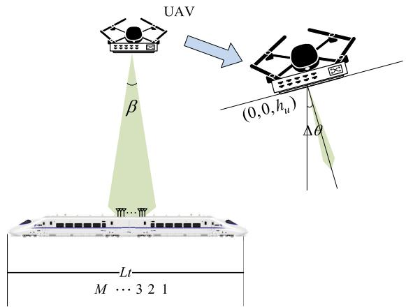  
(a) CA layout

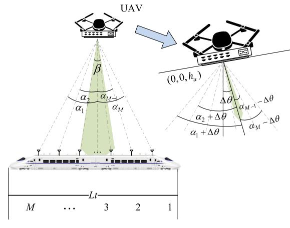  
(b) DA layout  
Fig. 2. System model of HSR wireless communications.

MG-UE links only provide in-train coverage, they operate in diferent frequency bands than the UAV-MG links, preventing communication interference between the two link levels. The relevant system parameters and their physical meanings in this paper are summarized in Table II.

As shown in Fig. 2, the top of the train is equipped with M antennas. The height of the UAV is denoted as $h _ { u }$ meters, while the MG antenna is positioned at a height of $h _ { r }$ meters above the ground, with $h _ { r } < h _ { u }$ . Assuming no relative displacement between the UAV and the train, we denote the coordinate of the UAV as $( 0 , 0 , h _ { u } )$ and that of the center of the train as $( 0 , 0 , h _ { r } )$ , , , ,Two layouts are possible for the on-board antennas on the roof. One is the CA layout, where all antennas are placed in the center of the roof, with a half-wavelength separation that can be ignored when calculating the path loss. The other is the DA layout, where the antennas are evenly distributed throughout the train, with the antenna-to-antenna spacing denoted as $r ,$ and $r = L _ { t } / ( M - 1 ) , L _ { t }$ is the train length.

In the CA layout shown in Fig. 2(a), the three-dimensional (3D) coordinates of the MG are (0 0 0), the horizontal coordinate of the antennas is $u _ { 0 } = 0 ,$ , ,, and the distance between the UAV and the antennas is $d _ { 0 } = h _ { u } - h _ { r }$ . In this context, for the sake of convenient symbol labeling, we designate 0 as the index for each antenna parameter in the CA layout, and m for the m-th antenna in the DA layout. In contrast, in the DA layout shown in Fig. 2(b), the antennas are evenly distributed, with the antenna array’s center aligned with the train’s center. Typically, the number of antennas M is even, the horizontal coordinates of the antennas can be arranged in a sequential manner, i.e.,

$$
\left\{ - \frac { M - 1 } { 2 } r , \ldots , - \frac { 1 } { 2 } r , \frac { 1 } { 2 } r , \frac { 3 } { 2 } r , \frac { M - 1 } { 2 } r \right\} .\tag{1}
$$

Thus, the horizontal coordinate of the m-th antenna is given by

$$
u _ { m } = - \frac { \left( M - 1 \right) r } { 2 } + ( m - 1 ) r , \quad m = 1 , 2 , . . . , M .\tag{2}
$$

Furthermore, in the DA layout, the distance between the UAV and the m-th antenna can be calculated by

$$
d _ { m } = \ \sqrt { u _ { m } ^ { 2 } + ( h _ { b } - h _ { r } ) ^ { 2 } } .\tag{3}
$$

In the CA layout, however, the distance between the UAV and all MG antennas is the same, given by

$$
d _ { 0 } \leq d _ { m } , \quad \forall m .\tag{4}
$$

In practice, both the UAV and the train are moving, thus exact relative positioning cannot always be maintained. We therefore introduce a blockwise horizontal displacement ofset $d _ { \epsilon } \sim \mathcal { N } ( 0 , \sigma _ { d } ^ { 2 } )$ to capture deviations between the actual and nominal separation caused by acceleration and deceleration, expressed as

$$
d _ { m } ^ { \prime } = d _ { m } + d _ { \epsilon } .
$$

In the considered mmWave UAV-HSR communication system, the UAV performs directional transmissions to the train as shown in Fig. 2. The UAV is equipped with antenna arrays of $N = N _ { x } \times N _ { y }$ , the i-th beam has a beamwidth $\beta _ { i } ,$ , and the angles between the main lobe direction of the beam and the antennas are denoted as $\alpha _ { m }$ . In the CA layout, all antennas have the same value of $\alpha _ { 0 } = 0$ . In the DA layout, the angle between the antenna and the main lobe direction of the beam can be expressed as

$$
\alpha _ { m } = \arctan \left( \frac { u _ { m } } { h _ { u } - h _ { r } } \right) ,\tag{5}
$$

it is obvious that $\alpha _ { m } = \alpha _ { ( M - m ) }$ is due to the symmetry principle.

In the collaborative UAV-HSR system, the downlink channel between the UAV and the MG can be represented as a $1 \times$ M single-input-multiple-output (SIMO) channel. The signals received by the BS can be represented as

$$
\mathbf { y } = \mathbf { g } \mathbf { s } + \mathbf { n } ,\tag{6}
$$

where $\textbf { y } = \ \left[ y _ { 1 } , \cdot \cdot \cdot , y _ { M } \right] ^ { T } \ \in \ \mathcal { C } ^ { M \times 1 }$ and s are the output vector and the input data of the SIMO channel, respectively, $\textbf { \^ n } = \mathbf \Lambda [ n _ { 1 } , \cdots , n _ { M } ] ^ { T }$ is the additive white Gaussian noise (AWGN) vector with zero mean and covariance matrix $\sigma _ { n } ^ { 2 } \mathbf { I } _ { M }$ and $\textbf { g } = \ \left[ g _ { 1 } , \cdot \cdot \cdot , g _ { M } \right] ^ { T } \ \in \ \mathcal { C } ^ { M \times 1 }$ is the channel coeficient matrix parameterized by large-scale fading, beam gain and small-scale fading.

## B. Channel Model

The channel coeficient matrix g includes the efects of both small-scale and large-scale fading. The m-th element of g can be written as

$$
g _ { m } = \sqrt { P \rho _ { m } \varphi _ { m } } h _ { m } ,\tag{7}
$$

where $h _ { m }$ is the small-scale fading coeficient, P is the power of the transmitter, while $\rho _ { m }$ is the large-scale coeficient from ρthe UAV to the m-th antenna, which is determined by the path loss. In the context of UAV-assisted HSR communication scenarios, which typically involve LoS conditions in rural environments, the efects of shadow fading are often overlooked and the small-scale fading coeficient $h _ { m }$ is approximated as 1, which can be ignored in the following context. The beam gain is determined by multiple factors, among which beamwidth and angle ofset are key parameters directly related to the focus of this work. Following [25] and [26], the beam gain from the m-th antenna is denoted as $\varphi _ { m }$ and is given by,

$$
\varphi _ { m } \left( \beta , \alpha _ { m } \right) = \frac { 2 \pi } { \beta } { 1 0 } ^ { - 0 . 1 \eta \left( \frac { \alpha _ { m } } { \beta } \right) ^ { 2 } } ,\tag{8}
$$

where $\beta$ is the beamwidth and $\alpha _ { m }$ is the angular ofset between β αthe main lobe and the angle of arrival (AoA). The parameter is a constant set to 12, as specified in [27](eq. (4.5-1)) based on antenna pattern fitting results. For the proposed collaborative UAV–HSR system shown in Fig. 2, we set $\alpha _ { 0 } = 0$

In the UAV–HSR scenario, the channel is dominated by LoS propagation, and large-scale fading is primarily pathloss. Since the 3GPP TR 38.901 RMa model [28] closely matches the free-space pathloss in LoS-dominated UAV–HSR scenarios, the free-space model is used for tractable analysis, as

$$
\rho _ { m } = \left( \frac { c } { 4 \pi f _ { c } d _ { m } ^ { \prime } } \right) ^ { 2 } .\tag{9}
$$

Based on the above discussion, the outage probability and ergodic data rate are critical performance metrics for evaluating communication quality in UAV mmWave communication systems, where accurate beam alignment is also essential. The conventional assumption is that the UAV platform remains stable and the beam is not deflected, ensuring relatively stable ergodic data rate and outage probability. However, in practical scenarios, UAVs are often subjected to external environmental factors, such as wind, which can cause the airframe to deflect. This deflection misaligns the main beam direction, which degrades the channel quality, reduces the capacity, and increases the outage probability. In this paper, we analyze the ergodic data rate and link outage probability under windy conditions, considering both CA and DA settings on the carriages. Furthermore, based on these closed-form expressions, we explore the optimized beamwidth strategy that leverages UAV jitter intensity to improve system performance.

## III. PERFORMANCE ANALYSIS AND ADAPTIVE BEAMWIDTH DESIGN

In this section, we first characterize the UAV beam AoA in the considered collaborative UAV-HSR communication systems under jittering scenarios. From this characterization, we derive the relationship between the average outage probability and both beamwidth and jitter intensity within a beam update period for the considered UAV mmWave systems. Subsequently, we also present the closed-form expression for the average ergodic capacity and propose a beamwidth optimization scheme to maximize the average ergodic data rate.

## A. Modeling the Random Characteristics of Jitter

In this subsection, we analyze the efect of environmental factors, such as wind, on UAV performance. We assume that the UAV fuselage remains in a 0 degree horizontal position in the absence of external influences. Orientation variations typically stem from the combination of multiple contributing factors, such as random air fluctuations in the UAV’s surrounding atmosphere and vibrations from its internal engine. Due to the collective efect of these multiple factors, and by applying the central limit theorem (following an approach similar to [29]), we model the UAV fluctuations as Gaussian-distributed random variables (RVs) [23].

The beam connecting the UAV and the MG is periodically realigned with an alignment period denoted by T , which is a parameter related to the beamwidth. Without loss of generality, in the proposed approach, the scanning range of the beam is fixed at 180◦ and the UAV is equipped with $N _ { b u }$ beams, where $N _ { b u } \beta ~ = ~ \pi ~ [ 3 0 ]$ ]. The tracking/training process incurs βan overhead of $T _ { s }$ per beam, which scales linearly with the number of beams, so the beam update period is given by $T =$ $T _ { s } \pi / \beta = \tau / \beta$ , where $\tau = T _ { s } \pi$

In our system, we consider the angular ofset to be a Gaussian RV. Since the angular ofset exhibits time variation, we model it as a random walk to reflect real-world conditions, which was adopted in [19]. In this work, we introduce a jitter intensity parameter $\sigma _ { u }$ to quantify the variance of the jitter per unit of time (one second), the RV ∆ (t) is defined as the angular ofset at t, with a given sampling time $\Delta t ,$ it can be expressed as

$$
\Delta \theta \left( \Delta t \right) = \Delta \theta \left( 0 \right) + \mathcal { N } \left( 0 , \sigma _ { \epsilon } ^ { 2 } \right) ,\tag{10}
$$

where $\sigma _ { \epsilon } = \Delta t \sigma _ { u }$ is the ofset variance of a time slice [19]. In addition, $\Delta \theta ( 0 ) = 0$ because there is no shift in the beam alignment at time 0. Let $\sigma _ { \theta } ( t )$ denote the variance of the UAV’s

deflection angle at time t. Based on (10) and characteristic of time accumulation, we can obtain

$$
\sigma _ { \theta } ^ { 2 } ( t ) = t \sigma _ { u } ^ { 2 } \quad t \in ( 0 , T ) .\tag{11}
$$

The stochastic characteristic of the angle ofset at time t can be modeled as

$$
\Delta \theta ( t ) \sim \mathcal { N } \left( 0 , t \sigma _ { u } ^ { 2 } \right) .\tag{12}
$$

Note that the fluctuations of the UAV usually lead to the angle ofset of the UAV beams, which results in the misalignment between the aligned beams. In particular, the smaller the variances of the elements of $\sigma _ { u } ,$ the more stable the UAV becomes.

If the UAV is in an absolutely stable state, it means that the parameter $\Delta \theta ( t ) = 0$ and $\sigma _ { u } ~ = ~ 0$ . Otherwise, the UAV is considered to be in windy scenarios. Thus, we have the following remarks.

Remark 1: In windy scenarios, the UAV will jitter, which means that the parameter $\sigma _ { u } > 0$ and RV $\Delta \theta ( t ) \neq 0$

In the following, we will discuss the situation in the windy scenarios.

## B. Outage Probability and Ergodic Data Rate

Communication between the UAV and the ground is established by periodic beam scanning to identify the most eficient communication beam. This procedure relies on an optimal angle between the UAV and the MG for beam updating. However, due to the jitter that occurs over time within the beam update cycle, we perform an analysis of the average capacity and outage probability over the entire period.

According to the model described above, assuming the beam update time is 0 and the complete beam update cycle is T , the SNR fluctuates over time because the beam gain varies over time. The beam gain can be expressed as

$$
\varphi _ { m } \left( \beta , \Delta \theta ( t ) + \alpha _ { m } \right) = \frac { 2 \pi } { \beta } 1 0 ^ { - \frac { 0 . 1 \eta } { \beta ^ { 2 } } ( \Delta \theta ( t ) + \alpha _ { m } ) ^ { 2 } } .\tag{13}
$$

With the beamwidth fixed, the characterization of the beam gain over time is discussed first. We will then discuss the system performance of the CA and DA layouts. For simplicity, we denote $\varphi _ { m } \left( \Delta \theta ( t ) \right)$ as $\varphi _ { m } \left( \beta , \Delta \theta ( t ) + \alpha _ { m } \right)$ in the following.

ϕ θ ϕ β, θ αFor the CA layout, all antennas are in the same position, resulting in identical path loss and beam gain. We use $\rho _ { 0 }$ and $\varphi _ { 0 } ( \Delta \theta ( t ) )$ to represent the path loss and beam gain for all antennas in the CA layout. On the other hand, for the DA layout, the physical separation between the antennas is significant, causing variations in path loss and beam gain between diferent antennas. Consequently, utilizing the maximum-ratio combing algorithm, the SNR can be expressed as

$$
\gamma = \frac { \mathbf { g } ^ { H } \mathbf { g } } { \sigma _ { n } ^ { 2 } } = \frac { P } { \sigma _ { n } ^ { 2 } } \sum _ { m = 1 } ^ { M } \rho _ { m } \varphi _ { m } \left( \Delta \theta ( t ) \right) .\tag{14}
$$

Accordingly, the SNR in dB for CA and DA layouts can be expressed as

$$
\begin{array} { r l } & { \gamma _ { \mathrm { C A } } ( t ) = 1 0 \log \left( \frac { P } { \sigma _ { n } ^ { 2 } } M \rho _ { 0 } \varphi _ { 0 } \left( \Delta \theta ( t ) \right) \right) , } \\ & { \gamma _ { \mathrm { D A } } ( t ) = 1 0 \log \left( \frac { P } { \sigma _ { n } ^ { 2 } } \sum _ { m = 1 } ^ { M } \rho _ { m } \varphi _ { m } \left( \Delta \theta ( t ) \right) \right) , } \end{array}\tag{15}
$$

respectively. For simplicity, lg(·) represents $\log _ { 1 0 } ( \cdot )$ . Next, we will analyze the impact of UAV jitter on the outage probability and ergodic data rate.

1) Outage Probability: From (15), it can be seen that in the UAV jitter scenario, the SNR varies with time. The link outage happens when the SNR is lower than the threshold, thus the outage probability is also a function of time, i.e.,

$$
\begin{array} { r l } & { P _ { \mathrm { C A } } ( t ) = \mathrm { P r } \left\{ \gamma _ { \mathrm { C A } } ( t ) < \gamma _ { t h } \right\} } \\ & { P _ { \mathrm { D A } } ( t ) = \mathrm { P r } \left\{ \gamma _ { \mathrm { D A } } ( t ) < \gamma _ { t h } \right\} , } \end{array}\tag{16}
$$

where $P _ { \mathrm { C A } } ( t )$ and $P _ { \mathrm { D A } } ( t )$ are outage probabilities for the CA and DA layouts at time t, respectively.

First, we analyze the CA layout and from (15), we have

$$
\gamma _ { \mathrm { C A } } ( t ) = 1 0 \log \left( \frac { A P } { \sigma _ { n } ^ { 2 } } M \rho _ { 0 } \right) - 1 0 B \Delta \theta ^ { 2 } ( t ) ,\tag{17}
$$

where $A = 2 \pi / \beta$ and $B = 0 . 1 \eta / \beta ^ { 2 }$ and $\Delta \theta ( t )$ is a Gaussian RV with a mean of 0. The square of a Gaussian RV follows the chi-square distribution. Therefore, $\Delta \theta ( t ) ^ { 2 }$ is a variable that follows the chi-square distribution, and its probability density function (PDF) can be expressed as [31],

$$
p _ { X } ( t ) = \frac { 1 } { \sqrt { 2 \pi \sigma _ { \theta } ^ { 2 } ( t ) x } } \exp \left( - \frac { x } { 2 \sigma _ { \theta } ^ { 2 } ( t ) } \right) ,\tag{18}
$$

where its variance is a function of time. From the above analysis, we can see that the SNR varies with time, and the probability of a lower SNR during a beam update period increases as the variance increases with time.

The outage probabilities for the CA and DA layouts vary with time within a beam scanning cycle and are functions with period T . In the case of a fixed beamwidth $\beta ,$ they are influenced by jitter intensity $\sigma _ { u }$ and presented in the following proposition.

Proposition 1: The outage probability of the CA layout is given by

$$
P _ { \mathrm { C A } } ( t ) = \frac { 1 } { \sqrt { \pi } } \Gamma \left( \frac { 1 } { 2 } , \frac { D } { 2 t \sigma _ { u } ^ { 2 } } \right) , \ 0 \leq t \leq T ,\tag{19}
$$

where $\Gamma ( \cdot , \cdot )$ is the upper incomplete Gamma function and $\begin{array} { r } { D = \frac { 1 0 \log \left( \frac { P M \dot { \rho } _ { 0 } } { \sigma _ { n } ^ { 2 } } \right) - \gamma _ { t h } } { 1 0 B } } \end{array}$

Correspondingly, for $0 \leq t \leq T$ , the outage probability of the DA layout can be approximated as

$$
\begin{array} { r } { P _ { \mathrm { D A } } ( t ) \approx P _ { \mathrm { C A } } ( t ) . } \end{array}
$$

Proof: See Appendix A.

To analyze the impact of beamwidth on outage probability, we eliminate the influence of jitter by averaging over the beam period. Let $\begin{array} { r } { \overline { { P } } = \frac { 1 } { T } \int _ { 0 } ^ { T } } \end{array}$ P(t)dt be the average outage probability in a beam training period, then $\begin{array} { r } { \overline { { P _ { \mathrm { C A } } } } ~ = ~ \frac { 1 } { T } \int _ { 0 } ^ { T } P _ { \mathrm { C A } } ( t ) d t } \end{array}$ and $\begin{array} { r } { \overline { { P _ { \mathrm { D A } } } } = \frac { 1 } { T } \int _ { 0 } ^ { T } P _ { \mathrm { D A } } ( t ) d t } \end{array}$ represent the average outage probabilities for the CA and DA layouts, respectively. The specific results are given by the following proposition.

Proposition 2: The average outage probability of the UAVtrain link for the CA layout is given by

$$
\overline { { P _ { \mathrm { C A } } } } \approx \frac { 1 } { 2 \sqrt { \pi } } \sum _ { i = 1 } ^ { n } w _ { i } \Gamma \left( \frac { 1 } { 2 } , \frac { D } { T \left( x _ { i } + 1 \right) \sigma _ { u } ^ { 2 } } \right) ,\tag{20}
$$

where the Legendre-Gauss quadrature integral approximation is used with $x _ { i }$ being Gauss point represents the zero of the Legendre polynomial, and $w _ { i }$ is the weighting coeficients. Here we adopt $n = 1 6$ , the values of $x _ { i }$ and $w _ { i }$ are shown in [32].

Proof: See Appendix B.

Furthermore, we can get the following corollary.

Corollary 1: The average outage probability of the UAVtrain link in the DA layout is greater than that of the CA layout, i.e.,

$$
{ \overline { { P _ { \mathrm { C A } } } } } \leq { \overline { { P _ { \mathrm { D A } } } } } .\tag{21}
$$

However, considering the special case of narrow setting, i.e., $\beta \to 0$ , we have

$$
{ \overline { { P _ { \mathrm { C A } } } } } ~ \geq { \overline { { P _ { \mathrm { D A } } } } } .\tag{22}
$$

Proof: See Appendix C.

2) Ergodic Data Rate: The instantaneous rate can be expressed using the Shannon capacity formula. The ergodic data rate can be written as

$$
\begin{array} { r l } & { R ( t ) = \mathbb { E } \left[ \log _ { 2 } \operatorname* { d e t } \left( 1 + \frac { 1 } { \sigma _ { n } ^ { 2 } } \mathbf { g } ^ { H } \mathbf { g } \right) \right] } \\ & { \qquad = \underset { \Delta \theta ( t ) } { \mathbb { E } } \left[ \log _ { 2 } \left( 1 + \frac { P } { \sigma _ { n } ^ { 2 } } \sum _ { m = 1 } ^ { M } \rho _ { m } \varphi _ { m } \left( \Delta \theta ( t ) \right) \right) \right] . } \end{array}\tag{23}
$$

Similarly to the characteristics of the outage probability, the ergodic data rate exhibits a time variation and takes the form of a periodic function with a period of T . To provide useful insights and highlight the dominant factors influencing ergodic rate, we derive closed-form expressions under high SNR conditions. The ergodic data rates for the CA and DA layouts, which are determined as a function of the jitter intensity $\sigma _ { u } .$ are expressed in the following proposition.

Proposition 3: For the CA layout, at the high SNR regime, the ergodic data rate can be expressed as

$$
R _ { \mathrm { C A } } ( t ) \approx \log _ { 2 } \left( \frac { 2 \pi M P \rho _ { 0 } } { \sigma _ { n } ^ { 2 } \beta } \right) - \frac { 0 . 1 \eta } { \lg 2 \beta ^ { 2 } } t \sigma _ { u } ^ { 2 } .\tag{24}
$$

For the DA layout, the ergodic rate can be expressed as

$$
R _ { \mathrm { { D A } } } ( t ) \approx \log _ { 2 } \left( \frac { 2 \pi P \rho _ { 0 } } { \sigma _ { n } ^ { 2 } \beta } \right) + \log _ { 2 } \left( \sum _ { m = 1 } ^ { M } A _ { m } \right) ,\tag{25}
$$

where $A _ { m } = 1 0 ^ { - \frac { 0 . 1 \eta } { \beta ^ { 2 } } \left( t \sigma _ { u } ^ { 2 } + \alpha _ { m } ^ { 2 } \right) }$

Proof: See Appendix D.

The results show that the ergodic rate of CA increases with M but decreases with jitter intensity and time. In contrast, DA benefits from spatial diversity, mitigating jitter-induced misalignment and ofering improved robustness. Next, we investigate the average ergodic data rate during one beam training period, which are defined as $\begin{array} { r } { \overline { { R _ { \mathrm { C A } } } } = \frac { 1 } { T } \int _ { 0 } ^ { T } \bar { R } _ { \mathrm { C A } } ( t ) d t } \end{array}$ and $\begin{array} { r } { \overline { { R _ { \mathrm { D A } } } } = \frac { 1 } { T } \int _ { 0 } ^ { T } R _ { \mathrm { D A } } } \end{array}$ (t)dt for the CA and DA layouts, respectively.

Proposition 4: The average downlink ergodic data rate of the UAV-train link for the CA layout is given by

$$
\overline { { { R _ { \mathrm { C A } } } } } = \log _ { 2 } \left( \frac { 2 \pi M P } { \sigma _ { n } ^ { 2 } \beta } \rho _ { 0 } \right) - \frac { 0 . 1 \eta \sigma _ { u } ^ { 2 } \tau } { 2 \lg 2 \beta ^ { 3 } } .\tag{26}
$$

The average downlink ergodic data rate for the DA layout is given by

$$
\overline { { R _ { \mathrm { D A } } } } \leq \log _ { 2 } \left( \frac { 2 \pi P \rho _ { 0 } } { \sigma _ { n } ^ { 2 } \beta } \right) + \frac { T } { 2 } \sum _ { i = 1 } ^ { n } w _ { i } \log _ { 2 } \left( \sum _ { m = 1 } ^ { M } B _ { m } \right) ,\tag{27}
$$

where $B _ { m } = 1 0 ^ { - \frac { 0 . 1 \eta } { \beta ^ { 2 } } \left[ \left( \frac { 1 } { 2 } x _ { i } + \frac { T } { 2 } \right) \sigma _ { u } ^ { 2 } + \alpha _ { m } ^ { 2 } \right] }$

The Legendre-Gauss quadrature integral approximation is also used here, and we adopt $n = 1 6$ . The values of $x _ { i }$ and $w _ { i }$ are presented in [32].

Proof: See Appendix E.

Comparing the average ergodic rate with the beamwidth and jitter intensity in the CA and DA layouts yields the following corollary.

Corollary 2: The average ergodic rate of the UAV-train link in the CA layout is greater than that in the DA layout, i.e.,

$$
{ \overline { { R _ { \mathrm { C A } } } } } \geq { \overline { { R _ { \mathrm { D A } } } } } .\tag{28}
$$

However, similar to Corollary 1, in the case of $\beta  0 ,$ , we have

$$
{ \overline { { R _ { \mathrm { C A } } } } } \leq { \overline { { R _ { \mathrm { D A } } } } } .\tag{29}
$$

Proof: The proof is similar to that presented in Corollary 1. 

## C. Optimization Problem

In general, narrower beamwidths with higher directivity gain provide higher SNR, but also require more alignment overhead due to the need to search more beam directions. On the other hand, although wider beams are more resilient to jitter than narrow beams, they provide better channel quality if accompanied by a smaller variance in jitter. Therefore, beamwidth selection involves a trade-of. By calculating the average transmission rate, we find that the average ergodic data rate $\overline { { R _ { \mathrm { C A } } } }$ is a function of $\beta .$ Consequently, $\beta$ can be optimized to increase the ergodic data rate and obtain its maximum value.

The optimization problem can thus be formulated as

$$
\begin{array} { l } { \displaystyle \operatorname* { m a x } _ { \beta } \overline { { R _ { \mathrm { C A } } } } ( \beta ) } \\ { \mathrm { s . t . } \beta \in \Omega } \end{array}\tag{30}
$$

where Ω is the beamset that stores all the potentially activated beams. As stated [33], beams are generated by UAV-mounted uniform linear array (ULA) with analog beamforming and codebook design. The beamwidth is determined by the physical characteristics of the ULA, i.e., increasing the number of antenna elements enlarges the array aperture, resulting in a narrower main-lobe width and more concentrated energy. Accordingly, we define $\Omega = \{ \beta _ { 1 } , \beta _ { 2 } , . . . , \beta _ { N _ { B } } \} , \beta _ { i } = 2 \arcsin { \frac { 3 } { L _ { i } } } ,$ where $L _ { i }$ is the number of antenna elements of the UAV. Moreover, the beamwidth can be adjusted by changing the number of active antennas.

Proposition 5: The value of $\beta$ that maximizes the average ergodic data rate for both CA and DA layouts is given by

$$
\beta _ { o p t } = \underset { \beta \in \{ \beta _ { L } , \beta _ { R } \} } { \arg \operatorname* { m a x } } \overline { { R _ { \mathrm { C A } } } } ( \beta ) ,\tag{31}
$$

TABLE III  
SYSTEM PARAMETERS
<table><tr><td>Parameters</td><td>Value</td></tr><tr><td>Total transmit power  $\overline { { P } }$  Number of BS antennas M</td><td>20 dBm</td></tr><tr><td>Antenna elements on UAV  $L _ { i }$ </td><td>16</td></tr><tr><td>Constant η</td><td>4~16 12</td></tr><tr><td>AWGN power spectral density  $N _ { 0 }$ </td><td>-174 dbm/Hz</td></tr><tr><td>Carrier frequency  $f _ { c }$  Bandwidth</td><td>28 GHz 100 MHz</td></tr><tr><td>UAV&#x27;s altitude  $h _ { u }$  Height of train antennas  $z$ </td><td>200 m 20 m</td></tr><tr><td>Outages threshold SNR  $\gamma _ { t h }$ </td><td></td></tr><tr><td></td><td>5 dB</td></tr><tr><td>Length of the train  $L _ { t }$  Signal cell beam training period  $\tau$ </td><td>200 m, 400 m 200 ms</td></tr></table>

where $\{ \beta _ { L } , \beta _ { R } \} \in \Omega$ are values that approach $\tilde { \beta }$ from the left and right, respectively, such that $\beta _ { L } \le \tilde { \beta } \le \beta _ { R }$ , where

$$
\tilde { \beta } = \sqrt [ 3 ] { \frac { 0 . 3 \ln { 2 \eta \sigma _ { u } ^ { 2 } \tau } } { 2 \lg { 2 } } } .\tag{32}
$$

Thus, $\beta _ { L } \in \Omega$ is the closest value to $\tilde { \beta }$ from the left, and $\beta _ { R } \in \Omega$ βis the closest value to ${ \tilde { \beta } } .$

For the CA layout, this solution serves as the optimal one, whereas for the DA layout, it is a suboptimal solution.

Proof: See Appendix F.

## IV. NUMERICAL AND SIMULATION RESULTS

This section presents numerical and simulation results to illustrate the performance of outage probability and ergodic data rate for the CA and DA layouts. The system parameters are detailed in Table III. Leveraging the analytical models established in Section III, numerical calculations are performed to derive the outage probability and ergodic rate. Specifically, Monte Carlo simulations are conducted to validate the theoretical results. The procedure includes (i) generating random jitter-induced angular ofsets, (ii) calculating SNR per sample, (iii) determining outage events and instantaneous rates, (iv) repeating the process over $1 0 ^ { 5 }$ samples, and (v) comparing statistical results with analytical propositions to confirm model accuracy.

The accuracy of outage probability analysis in Proposition 1 is verified by Fig. 3. Taking the beamwidths of $\pi / 6 , \pi / 3$ , and $\pi / 2$ π/ π/ as illustrative cases, this figure depicts the temporal variation trend of the outage probability for the CA layout, based on the analytical expressions in (20). The simulation results strongly confirms the reliability of the theoretical analysis. The results demonstrate that the outage probability exhibits periodic changes over time, and as the beamwidth increases, the period duration correspondingly shortened. Furthermore, a smaller beamwidth is associated with a longer variation period in the outage probability and results in a higher outage probability. However, at the end of each period, the beam realigns, the outage probability drops to a relatively low level, and then enters the next period of circulation.

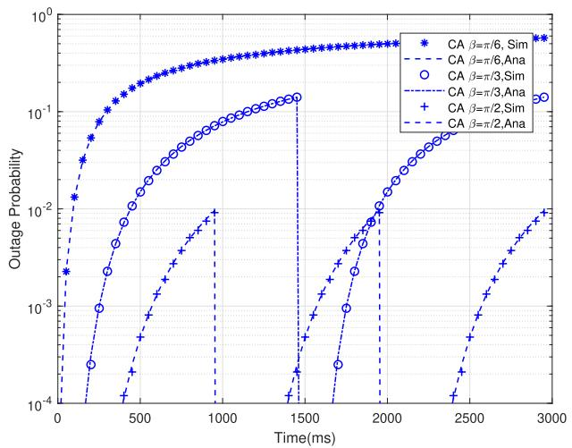

Fig. 3. Outage probabilities of the CA layout with jitter intensity $\sigma _ { u } = 1$ and diferent beamwidths.  
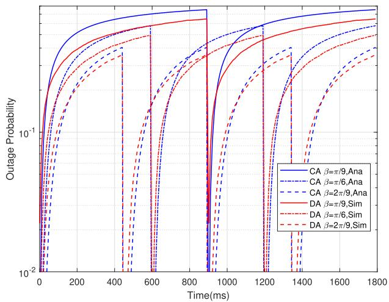  
Fig. 4. Outage probabilities of the CA and DA layouts with jitter intensity $\sigma _ { u } = 1$ and diferent beamwidth.

As illustrated in Fig. 4, the temporal variation of the outage probability is depicted for both the CA and DA layouts. The beamwidths are specifically set at $\pi / 9 , \ \pi / 6 ,$ and $2 \pi / 9$ for a comprehensive analysis. The graph clearly reveals that the outage probability oscillates periodically in both layouts. Within the context of this analysis, during a period, as time elapses, the outage probability in the CA layout exhibits a transition from being lower than that in the DA layout to becoming higher. Note that, for a smaller value of $\beta ,$ this transition occurs at an earlier stage. This shows the significant impact of the beamwidth on the outage probability dynamics between the two layouts.

Fig. 5 shows the average outage probability for CA and DA layouts with diferent beamwidths. The lines stand for the average outage probability when $\sigma _ { u }$ is set at 1, 2, and 3 for CA and DA layouts, respectively. From the graph, it can be clearly discerned that for both the CA and DA layouts, the average outage probability demonstrates a decreasing trend as the values of $\sigma _ { u }$ increase. Moreover, it is apparent that the average outage probability in the DA layout is better than that of the CA layout when $\beta$ is small, but the diference is not significant. With the increase of $\beta ,$ the performance of the CA layout outperforms that of the DA layout, and the diference is remarkable. As shown in Fig. 4, the DA layout is evaluated for train lengths of $L _ { t } = 2 0 0$ m and $L _ { t } = 4 0 0 \textrm { m }$ . It can be observed that a longer train makes the characteristics of the DA layout more pronounced. This experimental finding is in full accordance with the detailed elaboration in Corollary 1, further validating the theoretical analysis.

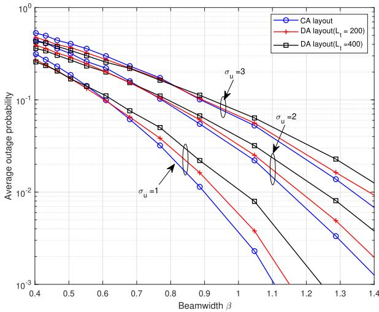  
Fig. 5. Average outage probabilities in a beam scanning period of diferent jitter intensity at diferent beamwidth.

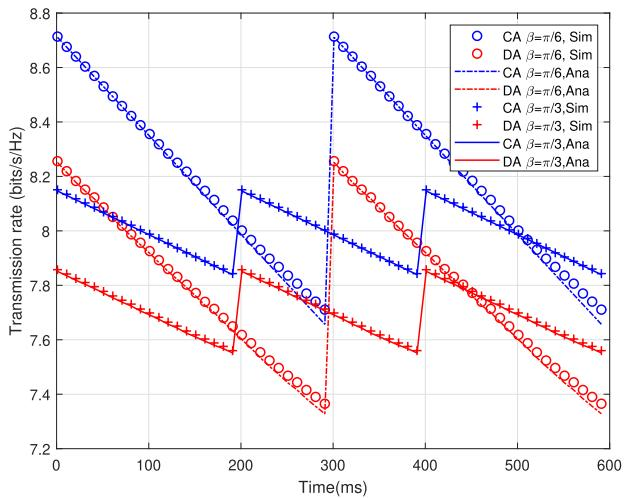  
Fig. 6. Ergodic rate for the CA layout with jitter intensity $\sigma _ { u } = 1$ and diferent beamwidth.

As shown in Fig. 6, the temporal variation of the ergodic rate for both the CA and DA layouts is illustrated. Specifically, the beamwidths $\beta$ are respectively configured as $\pi / 6$ and $\pi / 3$ β π/ π/Similar to the outage probability, the ergodic rate also displays a periodic pattern. Owing to the utilization of the high-SNR approximation in (23), the simulation results invariably surpass the analytical ones. Moreover, when considering the same beamwidth, the ergodic rate in the CA layout persistently exceeds that in the DA layout, highlighting a distinct performance diference between the two layouts.

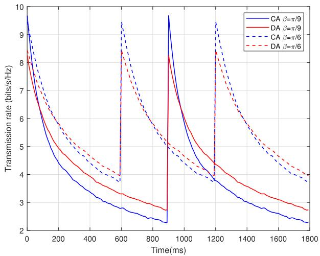  
Fig. 7. Ergodic rate for the CA and DA layouts with jitter $\sigma _ { u } \ = \ 2$ and diferent beamwidth.

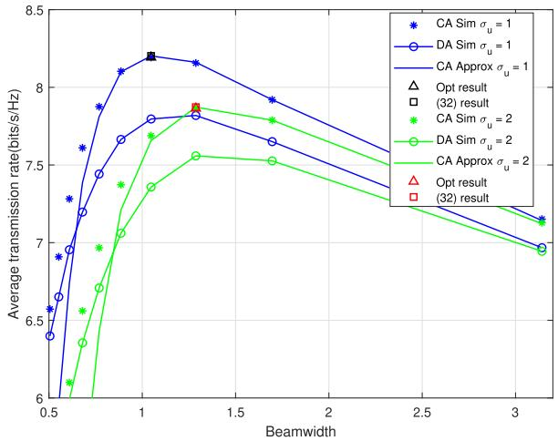  
Fig. 8. Average ergodic rate in a beam scanning period of diferent jitter intensity at diferent beamwidth.

As depicted in Fig. 7, the temporal variation of the ergodic rate for the CA and DA layouts is presented. The graph shows that the ergodic rate exhibits periodic variation in both the CA and DA layouts. In this figure, the ergodic rate in the CA layout transitions from higher to lower than in the DA layout as time progresses within a period because the smal $\boldsymbol { \cdot } \beta$ is used. Furthermore, this transition occurs earlier with smaller $\beta .$

βFig. 8 plots the average ergodic rates for diferent beamwidths in CA and DA layouts. For larger $\beta ,$ the simu-βlation results closely match the analysis results and slightly higher caused by the high SNR approximation in (23) and the omission of the constant 1 in the formula. However, when the beamwidth is small, the impact of the omitted constant on the results is more significant. As can be seen from the results, the calculated optimal beamwidth values in (32) are extremely close to the simulated optimal results, almost identical.

Fig. 9 illustrates the optimal beamwidths obtained from (32) and from numerical results under diferent jitter intensities for both CA and DA layouts. Specifically, “CA Opt” and $\mathrm { ^ { 6 6 } D A \ O p t ^ { 9 } }$ in the figure denote the beamwidth values obtained via simulation searches that vary with jitter intensity, respectively. It can be observed that for the CA layout, the results computed by (32) are in perfect agreement with the simulation-derived outcomes. In contrast, for the DA layout, due to the employment of approximations, the results from (32) can be considered the suboptimal solution for the DA system.

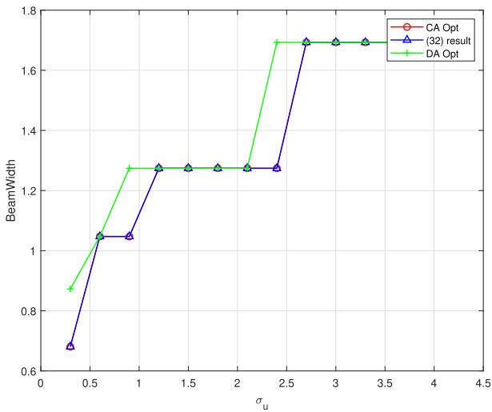  
Fig. 9. The optimal beamwidth versus the jitter intensity.

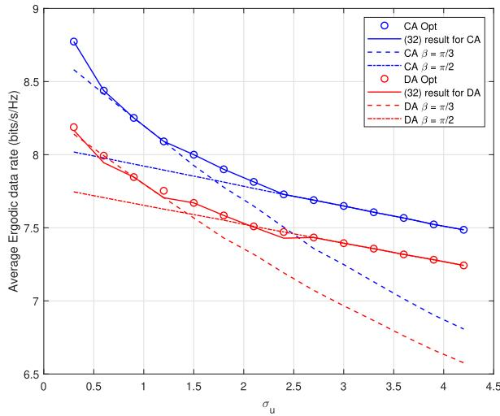  
Fig. 10. Average ergodic rate versus the jitter intensity.

To further illustrate the superiority of the proposed scheme with optimized beamwidth, we compare it with baseline methods that use randomly selected fixed beamwidth values such as $\beta = \pi / 2$ and $\beta = \pi / 3$ , as shown in Fig. 10. The results β π/ β π/show that these baseline strategies consistently yield lower average ergodic rates. This confirms the clear advantage of the proposed jitter-aware beamwidth adaptation for both CA and DA layouts.

## V. CONCLUSION

To evaluate the impact of jitter on UAV–HSR mmWave communication under both CA and DA antenna layouts, this work first characterizes the statistical properties of beam gain under jitter. Based on this model, closed-form expressions for the outage probability and ergodic capacity are derived, explicitly capturing the efects of beamwidth and jitter intensity. The analysis shows that the average outage probability increases with jitter intensity, while under relaxed conditions the average ergodic capacity exhibits a convex dependence on beamwidth, which is also validated through simulation. Using these insights, a jitter-aware beamwidth optimization scheme is proposed, and its efectiveness is confirmed through comparisons with baseline methods that use fixed beamwidth settings. Eventually, the comparison of the CA and DA layouts indicates that each is preferable under diferent conditions, ofering practical guidance for the robust design of the UAV-HSR system.

## APPENDIX A PROOF OF PROPOSITION 1

Substituting (17) into (16) for calculation yields

$$
P _ { \mathrm { C A } } ( t ) = \mathrm { P r } \left\{ \Delta \theta ^ { 2 } ( t ) > \frac { C - \gamma _ { t h } } { 1 0 B } \right\} ,\tag{33}
$$

where $\begin{array} { r } { C = 1 0 \log \left( \frac { P M \rho _ { 0 } } { \sigma _ { n } ^ { 2 } } \right) } \end{array}$ and $\begin{array} { r } { D = \frac { C - \gamma _ { t h } } { 1 0 B } } \end{array}$ . RV $\Delta \theta ( t ) ^ { 2 }$ is a Chi-σsquare distribution and its PDF is given in (18), thus we have

$$
P _ { \mathrm { C A } } ( t ) = \int _ { D } ^ { \infty } \frac { 1 } { \sqrt { 2 \pi \sigma _ { \theta } ^ { 2 } ( t ) x } } \exp \left( - \frac { x } { 2 \sigma _ { \theta } ^ { 2 } ( t ) } \right) d x ,\tag{34}
$$

It can be obtained by looking up the integral table, we have

$$
\int _ { u } ^ { \infty } x ^ { \nu - 1 } \exp ( \mu x ) d x = \mu ^ { - \nu } \Gamma ( \nu , \mu u ) .\tag{35}
$$

In (35), letting $u = D , \nu = 1 / 2$ and $\begin{array} { r } { \mu = \frac { 1 } { 2 t \sigma _ { u } ^ { 2 } } } \end{array}$ , we can obtain

$$
\begin{array} { r l } & { P _ { \mathrm { C A } } ( t ) = \cfrac { 1 } { \sqrt { 2 \pi t \sigma _ { u } ^ { 2 } } } \mu ^ { - \nu } \Gamma ( \nu , \mu u ) } \\ & { \qquad = \cfrac { 1 } { \sqrt { \pi } } \Gamma \left( \cfrac { 1 } { 2 } , \cfrac { D } { 2 t \sigma _ { u } ^ { 2 } } \right) . } \end{array}\tag{36}
$$

For the DA layout, we have

$$
P _ { \mathrm { D A } } ( t ) = \mathrm { P r } \left\{ 1 0 \mathrm { l g } \left( \frac { P } { \sigma _ { n } ^ { 2 } } \sum _ { M } ^ { m = 1 } \rho _ { m } \varphi _ { m } ( \Delta \theta ( t ) ) \right) < \gamma _ { t h } \right\} .\tag{37}
$$

The distance of the vehicle-mounted antenna on the train is relatively small compared with the distance between the UAV and train antenna, thus $\rho _ { 0 } \approx \rho _ { m }$ . Furthermore, by approximating the angle $\alpha _ { m } \approx 0 .$ , it stands that $\rho _ { m } \varphi _ { m } \left( \Delta \theta ( t ) \right) \approx \rho _ { 0 } \varphi _ { 0 }$ Therefore, we can obtain

$$
\begin{array} { r } { P _ { \mathrm { D A } } ( t ) \approx P _ { \mathrm { C A } } ( t ) , } \end{array}\tag{38}
$$

which completes the proof.

## APPENDIX B PROOF OF PROPOSITION 2

According to Legendre-Gauss quadrature integral approximation equation

$$
\int _ { a } ^ { b } f ( x ) d x \approx { \frac { b - a } { 2 } } \sum _ { i = 1 } ^ { n } w _ { i } f \left( { \frac { b - a } { 2 } } x _ { i } + { \frac { b + a } { 2 } } \right) .\tag{39}
$$

Substituting (19) into (39), we have

$$
\begin{array} { l } { \displaystyle \overline { { P _ { \mathrm { C A } } } } = \frac { 1 } { T } \int P _ { \mathrm { C A } } ( t ) d t \approx \frac { 1 } { 2 } \sum _ { i = 1 } ^ { n } w _ { i } P _ { \mathrm { C A } } \left( \frac { T } { 2 } x _ { i } + \frac { T } { 2 } \right) } \\ { \displaystyle \quad \ = \frac { 1 } { 2 } \sum _ { i = 1 } ^ { n } w _ { i } \frac { 1 } { \sqrt { \pi } } \Gamma \left( \frac { 1 } { 2 } , \frac { D } { 2 \left( \frac { T } { 2 } x _ { i } + \frac { T } { 2 } \right) \sigma _ { u } ^ { 2 } } \right) } \\ { \displaystyle \ = \frac { 1 } { 2 \sqrt { \pi } } \sum _ { i = 1 } ^ { n } w _ { i } \Gamma \left( \frac { 1 } { 2 } , \frac { D } { T \left( x _ { i } + 1 \right) \sigma _ { u } ^ { 2 } } \right) , } \end{array}\tag{40}
$$

which completes the proof.

## APPENDIX C PROOF OF COROLLARY 1

For brevity, the SNR of the CA and DA layouts are compared first. Combining (4) and (9), we can obtain that

$$
\gamma _ { \mathrm { { D A } } } ( t ) = \frac { P \rho _ { m } } { \sigma _ { n } ^ { 2 } } \sum _ { m = 1 } ^ { M } \varphi _ { m } ( \Delta \theta ( t ) ) \leq \frac { P \rho _ { 0 } } { \sigma _ { n } ^ { 2 } } \sum _ { m = 1 } ^ { M } \varphi _ { m } ( \Delta \theta ( t ) ) .\tag{41}
$$

To compare $\gamma _ { \mathrm { D A } } ( t )$ and $\gamma _ { \mathrm { C A } } ( t )$ , we can simplify this by comparing $M \varphi _ { 0 } ( \Delta \theta ( t ) )$ and $\sum _ { m = 1 } ^ { M } \varphi _ { m } \left( \Delta \theta ( t ) \right)$

Due to the symmetry of the train antenna, we know that $\alpha _ { m } = \alpha _ { M - m } .$ By denoting $f ( x ) = 1 0 ^ { - x ^ { 2 } }$ , we can compare $2 f ( x )$ and $f ( x + b ) + f ( x - b )$ instead. Since in the DA layout, the UAV is located in the center and the antennas are uniformly distributed on both sides of the UAV, the angle of the two antennas located at the same distance on both sides of the UAV is set to be ±b, the parameter x is the angle shift by jitter.

It is easy to see that f (x) is an even function and takes its maximum value when $x = 0$ . Thus, when x takes a smaller value, we have $2 f ( x ) \ \leq \ f ( x + b ) + f ( x - b )$ . However, we have $2 f ( x ) \geq f ( x + b ) + f ( x - b )$ with $x \gg 0$ . According to (8), when the value of the beamwidth is small, the value of x satisfies $x \gg 0$ , which completes the proof.

## APPENDIX D PROOF OF PROPOSITION 3

For the CA layout, at high SNR approximation, the ergodic data rate can be expressed as

$$
\begin{array} { r l } & { R _ { \mathrm { C A } } ( t ) \geq \underset { \Delta \theta ( t ) } { \mathbb { E } } \log _ { 2 } \left( 1 + \frac { M P } { \sigma _ { n } ^ { 2 } } \rho _ { 0 } \varphi _ { 0 } ( \Delta \theta ( t ) ) \right) } \\ & { \quad \quad \quad = \log _ { 2 } \left( \frac { M P } { \sigma _ { n } ^ { 2 } } \rho _ { 0 } \right) + \frac { \underset { \mathrm { L R } } { \mathbb { E } } \left\{ 1 \ g \left[ \varphi _ { 0 } ( \Delta \theta ( t ) ) \right] \right\} } { \mathrm { ~ l g ~ } 2 } } \\ & { \quad \quad = \log _ { 2 } \left( \frac { 2 \pi M P \rho _ { 0 } } { \sigma _ { n } ^ { 2 } \beta } \right) - \underset { \Delta \theta ( t ) } { \mathbb { E } } \left[ \frac { 0 . 1 \eta } { 1 \mathrm { g } ^ { 2 } \beta ^ { 2 } } \Delta \theta ^ { 2 } ( t ) \right] . } \end{array}\tag{42}
$$

From the previous analysis, it can be seen that RV Y follows a chi-square distribution, and its probability density function is (18). Furthermore, the expectation of RV $\Delta \theta ( t ) ^ { 2 }$ is

$$
\mathbb { E } \left[ \Delta \theta ( t ) ^ { 2 } \right] = 2 t \sigma _ { u } ^ { 2 } \frac { \Gamma ( 3 / 2 ) } { \sqrt { \pi } } \approx t \sigma _ { u } ^ { 2 } ,\tag{43}
$$

with Γ(·) being the gamma function, substituting (43) into (42), we can obtain (24).

For the DA layout in the high SNR region, the ergodic data rate can be approximated as

$$
\begin{array} { r l } {  { R _ { \mathrm { D A } } ( t ) = \mathbb { E } [ \log _ { 2 } \operatorname* { d e t } ( 1 + \frac { 1 } { \sigma _ { n } ^ { 2 } } \mathbf { g } ^ { H } \mathbf { g } ) ] } \quad } & { } \\ & { \approx \underbrace { \mathbb { E } } _ { \Delta \theta ( t ) } [ \log _ { 2 } ( \frac { P } { \sigma _ { n } ^ { 2 } } \sum _ { m = 1 } ^ { M } \rho _ { m } \varphi _ { m } ( \Delta \theta ( t ) ) ) ] , } \end{array}\tag{44}
$$

Then, considering the Jensen’s inequality, the property of $\mathbb { E } \left[ \log _ { 2 } { \left( \sum X _ { i } \right) } \right] \leq \log _ { 2 } { \left( \mathbb { E } \left[ \sum X _ { i } \right] \right) }$ , and $\rho _ { 0 } \ge \rho _ { m } ,$ , we have

$$
\begin{array} { r l } & { R _ { \mathrm { { D A } } } \leq \log _ { 2 } \left[ \underset { \Delta \theta ( t ) } { \mathbb { E } } \left( \frac { P } { \sigma _ { n } ^ { 2 } } \displaystyle \sum _ { m = 1 } ^ { M } \rho _ { m } \varphi _ { m } \left( \Delta \theta ( t ) \right) \right) \right] } \\ & { \qquad \leq \log _ { 2 } \left[ \underset { \Delta \theta ( t ) } { \mathbb { E } } \left( \frac { P \rho _ { 0 } } { \sigma _ { n } ^ { 2 } } \displaystyle \sum _ { m = 1 } ^ { M } \varphi _ { m } \left( \Delta \theta ( t ) \right) \right) \right] } \\ & { \qquad = \log _ { 2 } \left( \frac { 2 \pi P \rho _ { 0 } } { \sigma _ { n } ^ { 2 } \beta } \displaystyle \sum _ { m = 1 } ^ { M } A _ { m } \right) , } \end{array}\tag{45}
$$

where $A _ { m } = \underset { \Lambda \theta ( t ) } { \mathbb { E } } \left[ 1 0 ^ { - \frac { 0 . 1 \eta } { \beta ^ { 2 } } ( \Delta \theta ( t ) + \alpha _ { m } ) ^ { 2 } } \right]$

θFor simplicity, taking the logarithm on both sides of the above equation, thus there is

$$
\begin{array} { r l } & { \log ( A _ { m } ) = \log \Bigg ( \underset { \Delta \theta ( t ) } { \mathbb { E } } \left[ 1 0 ^ { - \frac { 0 . 1 \eta } { \beta ^ { 2 } } ( \Delta \theta ( t ) + \alpha _ { m } ) ^ { 2 } } \right] \Bigg ) } \\ & { \qquad \ge \underset { \Delta \theta ( t ) } { \mathbb { E } } \left[ \mathrm { l g } \left( 1 0 ^ { - \frac { 0 . 1 \eta } { \beta ^ { 2 } } ( \Delta \theta ( t ) + \alpha _ { m } ) ^ { 2 } } \right) \right] } \\ & { \qquad = - \frac { 0 . 1 \eta } { \beta ^ { 2 } } \underset { \Delta \theta ( t ) } { \mathbb { E } } \left[ \Delta \theta ^ { 2 } \left( t \right) + 2 \Delta \theta \left( t \right) \alpha _ { m } + \alpha _ { i } ^ { 2 } \right] } \\ & { \qquad = - \frac { 0 . 1 \eta } { \beta ^ { 2 } } \left( t \sigma _ { u } ^ { 2 } + \alpha _ { m } ^ { 2 } \right) . } \end{array}\tag{46}
$$

To this end, by substituting $A _ { m } = 1 0 ^ { - \frac { 0 . 1 \eta } { \beta ^ { 2 } } \left( t \sigma _ { u } ^ { 2 } + \alpha _ { m } ^ { 2 } \right) }$ into (45), (25) can be obtained, thus completes the proof.

## APPENDIX E PROOF OF PROPOSITION 4

The average ergodic data rate is the average over the beam scanning period $T ,$ i.e., integrating time t within the interval [0 T ], thus we have

$$
\begin{array} { l } { \displaystyle \overline { { R _ { \mathrm { C A } } } } = \frac { 1 } { T } \int _ { t = 0 } ^ { T } R _ { \mathrm { C A } } ( t ) d t } \\ { \displaystyle = \log _ { 2 } \left( \frac { 2 \pi M P \rho _ { 0 } } { \sigma _ { n } ^ { 2 } \beta } \right) - \frac { 0 . 1 \eta } { 1 \mathrm { g } 2 \beta ^ { 2 } T } \int _ { t = 0 } ^ { T } t \sigma _ { u } ^ { 2 } ( t ) d t . } \end{array}\tag{47}
$$

In (47), the integral is calculated as

$$
\int _ { t = 0 } ^ { T } t \sigma _ { u } ^ { 2 } d t = \frac { 1 } { 2 } \sigma _ { u } ^ { 2 } T ^ { 2 } .\tag{48}
$$

By substituting (48) into $( 4 7 ) , \tau = T \beta ,$ we have the average downlink ergodic data rate of the UAV and train link for the CA layout is given by

$$
\overline { { R _ { \mathrm { C A } } } } = \log _ { 2 } \left( \frac { 2 \pi M P \rho _ { 0 } } { \sigma _ { n } ^ { 2 } \beta } \right) - \frac { 0 . 1 \eta \sigma _ { u } ^ { 2 } \tau } { 2 \lg 2 \beta ^ { 3 } } .\tag{49}
$$

Therefore, the average downlink ergodic data rate for the DA layout is given by

$$
\begin{array} { l } { { \displaystyle \overline { { R _ { \mathrm { D A } } } } = \frac { 1 } { T } \int R _ { \mathrm { D A } } ( t ) d t } } \\ { { \displaystyle \qquad = \log _ { 2 } \left( \frac { 2 \pi P \rho _ { 0 } } { \sigma _ { n } ^ { 2 } \beta } \right) + \frac { 1 } { T } \int \log _ { 2 } \left( \sum _ { m = 1 } ^ { M } A _ { m } \right) d t } . } \end{array}\tag{50}
$$

According to Legendre-Gauss quadrature integral approximation equation given in (39), we have

$$
\overline { { R _ { \mathrm { D A } } } } \leq \log _ { 2 } \left( \frac { 2 \pi P \rho _ { 0 } } { \sigma _ { n } ^ { 2 } \beta } \right) + \frac { T } { 2 } \sum _ { i = 1 } ^ { n } w _ { i } \log _ { 2 } \left( \sum _ { m = 1 } ^ { M } B _ { m } \right) ,\tag{51}
$$

where $B _ { m } = 1 0 ^ { - \frac { 0 . 1 \eta } { \beta ^ { 2 } } \left[ \left( \frac { 1 } { 2 } x _ { i } + \frac { T } { 2 } \right) \sigma _ { u } ^ { 2 } + \alpha _ { m } ^ { 2 } \right] }$ , which completes the proof.

## APPENDIX F PROOF OF PROPOSITION 5

From (26), an approximation of the average downlink transmission rate of the UAV and train link can then be calculated by

$$
\overline { { R _ { \mathrm { C A } } } } ( \beta ) = A - \log _ { 2 } \beta - B \beta ^ { - 3 } ,\tag{52}
$$

where $\begin{array} { r } { A = \log _ { 2 } \left( \frac { 2 \pi M P } { \sigma _ { n } ^ { 2 } } \rho _ { 0 } \right) } \end{array}$ , and $\begin{array} { r } { B = \frac { 0 . 1 \eta \sigma _ { u } ^ { 2 } \tau } { 2 \log { 2 \beta ^ { 3 } } } } \end{array}$ . The first derivative of $\overline { { R _ { \mathrm { C A } } } }$ with respect to $\beta$ is

$$
\frac { \partial \overline { { { R _ { \mathrm { C A } } } } } } { \partial \beta } = - \frac { 1 } { \ln 2 } \beta ^ { - 1 } + 3 B \beta ^ { - 4 } .\tag{53}
$$

The second derivative of $\overline { { R _ { \mathrm { C A } } } }$ with respect to $\beta$ is

$$
\frac { \partial ^ { 2 } \overline { { { R _ { \mathrm { C A } } } } } } { \partial \beta ^ { 2 } } = \frac { 1 } { \ln 2 } \beta ^ { - 2 } - 1 2 B \beta ^ { - 5 } .\tag{54}
$$

From (54), we have $\begin{array} { r } { \frac { \partial ^ { 2 } \overline { { R _ { \mathrm { C A } } } } } { \partial \beta ^ { 2 } } < 0 . } \end{array}$ , thus $\overline { { R _ { \mathrm { C A } } } }$ is concave in $\beta$ for its domain of definition $\begin{array} { r } { \left( 0 , \sqrt [ 3 ] { \frac { 1 . 2 \ln { 2 \eta \sigma _ { u } ^ { 2 } \tau } } { 2 \lg { 2 } } } \right) } \end{array}$ . Once the concavity of $\overline { { R _ { \mathrm { C A } } } }$ with respect to $\beta$ is established, we can identify the $\beta$ that maximizes $\overline { { R _ { \mathrm { C A } } } }$ βby solving

$$
\left. \frac { \partial \overline { { R _ { \mathrm { C A } } } } } { \partial \beta } \right| _ { \beta = \widetilde { \beta } } = 0\tag{55}
$$

with (53), and get the solution as $\begin{array} { r } { \tilde { \beta } = \sqrt [ 3 ] { \frac { 0 . 3 \ln { 2 \eta \sigma _ { u } ^ { 2 } \tau } } { 2 \log { 2 } } } } \end{array}$ . Due to the convexity of $\overline { { R _ { \mathrm { C A } } } }$ with respect to $\beta ,$ when $\beta = \widetilde { \beta } , \overline { { R _ { \mathrm { C A } } } }$ reaches its maximum value.

To verify check the optimal $\overline { { R _ { \mathrm { C A } } } }$ with respect to $\beta ,$ let us define $x _ { l } = 0$ and $\begin{array} { r } { x _ { r } = \sqrt [ 3 ] { \frac { 1 . 2 \ln { 2 \eta \sigma _ { u } ^ { 2 } \tau } } { 2 \lg 2 } } } \end{array}$ , and then substitute $\beta =$ $\{ x _ { l } , x _ { r } , \tilde { \beta } \}$ into (52), we can get

$$
\begin{array} { c l c r } { { } } & { { \displaystyle \overline { { { R _ { \mathrm { C A } } } } } ( \tilde { \beta } ) - \overline { { { R _ { \mathrm { C A } } } } } ( x _ { r } ) } } \\ { { } } & { { = } } & { { - \log _ { 2 } ( \tilde { \beta } ) + \log _ { 2 } ( x _ { r } ) - \displaystyle \frac { 1 } { 3 \ln 2 } + \displaystyle \frac { 1 } { 1 2 \ln 2 } } } \\ { { } } & { { = } } & { { \log _ { 2 } \left( \displaystyle \frac { x _ { r } } { \tilde { \beta } } \right) - \displaystyle \frac { 1 } { 4 \ln 2 } = \displaystyle \frac { 1 } { 3 } \log _ { 2 } ( 4 ) - \displaystyle \frac { 1 } { 4 \ln 2 } > 0 . } } \end{array}\tag{56}
$$

Moreover, when $\beta \to 0$ , the beam gain in (8) approaches $0 ,$ leading to the corresponding data rate approaching 0. Thus, there is

$$
\overline { { R _ { \mathrm { C A } } } } ( \tilde { \beta } ) - \operatorname* { l i m } _ { x _ { l } \to 0 } \overline { { R _ { \mathrm { C A } } } } ( x _ { l } ) > 0 .\tag{57}
$$

Then it is evident that $R _ { \mathrm { C A } } ( \tilde { \beta } )$ is the optimal solution.

Moreover, considering that $\overline { { R _ { \mathrm { C A } } } } ( \beta )$ is not a continuous βfunction and, therefore, this result may fall outside the range of valid $\beta$ values. Thus, we define two values, i.e., $\beta _ { L } \le \beta$ and $\beta _ { R } \ge \beta ,$ β β which belong to the set Ω and are closest to $\beta$ βfrom the left and right sides, respectively. Then the valid optimal result can be obtained in (31), thus completing the proof.

## REFERENCES

[1] B. Ning et al., “An introduction to parallel control and management for high-speed railway systems,” IEEE Trans. Intell. Transp. Syst., vol. 12, no. 4, pp. 1473–1483, Dec. 2011.

[2] Z. Liu, M. Yang, J. Cui, Y. Xiao, and X. Zhang, “Performance and capacity optimization for high speed railway communications using UAV-IRS assisted massive MIMO system,” Electronics, vol. 12, no. 11, p. 2547, Jun. 2023.

[3] D. Ruiyan, L. Huajing, L. Tiangui, and L. Fulai, “High energy eficiency dynamic connected hybrid precoding for mmWave massive MIMO systems,” China Commun., vol. 21, no. 5, pp. 36–44, May 2024.

[4] J. Zhang, H. Du, P. Zhang, J. Cheng, and L. Yang, “Performance analysis of 5G mobile relay systems for high-speed trains,” IEEE J. Sel. Areas Commun., vol. 38, no. 12, pp. 2760–2772, Dec. 2020.

[5] L. Liu et al., “Transmission scheduling of millimeter wave communication for high-speed railway in space-air-ground integrated network,” IEEE Trans. Veh. Technol., vol. 74, no. 2, pp. 3066–3081, Feb. 2025.

[6] Y. Ma, G. Ma, and B. Ai, “Multicarrier tandem spreading multiple access (MC-TSMA) for high-speed railway (HSR) scenario,” IEEE Internet Things J., vol. 8, no. 5, pp. 3490–3499, Mar. 2021.

[7] C.-X. Wang, A. Ghazal, B. Ai, Y. Liu, and P. Fan, “Channel measurements and models for high-speed train communication systems: A survey,” IEEE Commun. Surv. Tut., vol. 18, no. 2, pp. 974–987, 2nd Quart., 2016.

[8] Z. Xiao et al., “A survey on millimeter-wave beamforming enabled UAV communications and networking,” IEEE Commun. Surv. Tut., vol. 24, no. 1, pp. 557–610, 1st Quart., 2022.

[9] B. Yuan et al., “A UAV-assisted search and localization strategy in non-line-of-sight scenarios,” IEEE Internet Things J., vol. 9, no. 23, pp. 23841–23851, Dec. 2022.

[10] A. Khan, S. Gupta, and S. K. Gupta, “Emerging UAV technology for disaster detection, mitigation, response, and preparedness,” J. Field Robot., vol. 39, no. 6, pp. 905–955, Sep. 2022.

[11] E. Yaacoub, “Travel hopping enabled resource allocation (THEResA) and delay tolerant networking through the use of UAVs in railroad networks,” Ad Hoc Netw., vol. 122, Nov. 2021, Art. no. 102628.

[12] J. Wu, L. Li, and L. Du, “UAV-assisted relaying transmission design and optimization for high-speed moving sources,” IEEE Access, vol. 8, pp. 195857–195869, 2020.

[13] L. Yan, X. Fang, Y. Fang, L. Hao, Q. Xue, and C. Xu, “KF-LSTM based beam tracking for UAV-assisted mmWave HSR wireless networks,” IEEE Trans. Veh. Technol., vol. 71, no. 10, pp. 10796–10807, Oct. 2022.

[14] J. Li et al., “Mobility support for millimeter wave communications: Opportunities and challenges,” IEEE Commun. Surv. Tut., vol. 24, no. 3, pp. 1816–1842, 3rd Quart., 2022.

[15] M. M. Alam and S. Moh, “Survey on neighbor discovery and beam alignment in mmWave-enabled UAV swarm networks,” 2024, arXiv:2410.11490.

[16] E. E. Elsayed, “Performance enhancement in FSO relay systems with MISO via multi-hop M-ary PPM integrating and spatial modulation over gamma–gamma channels,” Jaun. Opt., pp. 3364–3379, May 2024.

[17] E. E. Elsayed, “Investigations on OFDM UAV-based free-space optical transmission system with scintillation mitigation for optical wireless communication-to-ground links in atmospheric turbulence,” Opt. Quantum Electron., vol. 56, no. 837, pp. 1–22, Mar. 2024.

[18] M. R. Hayal et al., “Modeling and investigation on the performance enhancement of hovering UAV-based FSO relay optical wireless communication systems under pointing errors and atmospheric turbulence efects,” Opt. Quantum Electron., vol. 55, no. 625, pp. 1–23, Jul. 2023.

[19] Z. Liu, E. Zhou, J. Cui, Z. Dong, and P. Fan, “A double-beam soft handover scheme and its performance analysis for mmWave UAV communications in windy scenarios,” IEEE Trans. Veh. Technol., vol. 72, no. 1, pp. 893–906, Jan. 2023.

[20] W. Jin, C. Du, J. Wang, S. Wang, G. Pan, and D. Niyato, “Multi-UAV CoMP transmission based on UAV jitter characteristics: Analysis and optimization,” IEEE Trans. Wireless Commun., vol. 25, pp. 978–993, 2026.

[21] X. Cheng et al., “Intelligent multi-modal sensing-communication integration: Synesthesia of machines,” IEEE Commun. Surv. Tut., vol. 26, no. 1, pp. 258–301, 1st Quart., 2024.

[22] W. Wang and W. Zhang, “Jittering efects analysis and beam training design for UAV millimeter wave communications,” IEEE Trans. Wireless Commun., vol. 21, no. 5, pp. 3131–3146, May 2022.

[23] W. Yuan, C. Liu, F. Liu, S. Li, and D. W. K. Ng, “Learning-based predictive beamforming for UAV communications with jittering,” IEEE Wireless Commun. Lett., vol. 9, no. 11, pp. 1970–1974, Nov. 2020.

[24] W. Chen, C. Liu, W. Wang, and M. Peng, “Adaptive beamwidth control for UAV mmWave communications under jittering efects,” in Proc. IEEE Int. Conf. Commun. Workshops (ICC Workshops), Rome, Italy, May 2023, pp. 1902–1907.

[25] V. Vakilian, J.-F. Frigon, and S. Roy, “Efects of angle-of-arrival estimation errors, angular spread and antenna beamwidth on the performance of reconfigurable SISO systems,” in Proc. IEEE Pacific Rim Conf. Commun., Comput. Signal Process., Aug. 2011, pp. 515–519.

[26] H. Kong, M. Lin, L. Han, W.-P. Zhu, Z. Ding, and M.-S. Alouini, “Uplink multiple access with semi-grant-free transmission in integrated satellite-aerial-terrestrial networks,” IEEE J. Sel. Areas Commun., vol. 41, no. 6, pp. 1723–1736, Jun. 2023.

[27] Spatial Channel Model for Multiple Input Multiple Output (MIMO) Simulations (Release 17), document TR 25.996, {3GPP}, 2022. [Online]. Available: https://itecspec.com/archive/3gpp-specification-tr-25-996/

[28] Study on Channel Model for Frequencies From 0.5 to 100 GHz (Release 19), document TR 38.901, 3GPP, 2025.

[29] H. AlQuwaiee, H.-C. Yang, and M.-S. Alouini, “On the asymptotic capacity of dual-aperture FSO systems with generalized pointing error model,” IEEE Trans. Wireless Commun., vol. 15, no. 9, pp. 6502–6512, Sep. 2016.

[30] L. Yan, X. Fang, L. Hao, and Y. Fang, “A fast beam alignment scheme for dual-band HSR wireless networks,” IEEE Trans. Veh. Technol., vol. 69, no. 4, pp. 3968–3979, Apr. 2020.

[31] M. K. Simon, Probability Distributions Involving Gaussian Random Variables: A Handbook for Engineers and Scientists. Cham, Switzerland: Springer, 2002.

[32] P. J. Davis and P. Rabinowitz, Methods of Numerical Integration. New York, NY, USA: Dover, 2007.

[33] J. Choi, “Beam selection in mm-Wave multiuser MIMO systems using compressive sensing,” IEEE Trans. Commun., vol. 63, no. 8, pp. 2936–2947, Aug. 2015.

  
Ziyue Liu received the B.S. degree in software engineering from Southwest Jiaotong University, Chengdu, China, in 2009, and the Ph.D. degree from the School of Information Science and Technology, Southwest Jiaotong University, in 2016. She is currently an Assistant Professor with the School of Aeronautics and Astronautics, Xihua University, Chengdu. Her current research interests include handover, mmWave networks, UAV communications, and MIMO technology for high mobility wireless communications.

Yue Xiao (Member, IEEE) received the B.Sc. and Ph.D. degrees in communication engineering from Southwest Jiaotong University, Chengdu, China. Since December 2022, she has been an Assistant Professor with the Department of Electrical and Computer Engineering, Southwest Jiaotong University. She was a Visitor Researcher with the Wireless Communications & Information Processing (WCIP) Group, Aristotle University of Thessaloniki (AUTH), and Division of Information Science and Engineering, KTH Royal Institute of Technology.

Her current research interests include federated learning, reconfigurable intelligent surfaces, and multiple access technology. She received the Best Paper Award in 2023 Best Magazine Paper Award. She was an Exemplary Reviewer of IEEE WIRELESS COMMUNICATIONS LETTERS in 2021 and 2022 (top 3% of reviewers).

Enzhi Zhou received the B.S. degree in communication engineering from Southwest Jiaotong University, Chengdu, China, in 2009, and the Ph.D. degree from the School of Information Science and Technology, Southwest Jiaotong University, in 2016. From 2013 to 2014, he was a Visiting Scholar with the Department of Electrical and Computer Engineering, Utah State University, USA. He is currently an Assistant Professor with the School of Computer and Software Engineering, Xihua University. His current research interests

include 6G communications, MIMO precoding, and wireless communications in dynamical scenarios.  
  
Shuting Chen received the B.S. degree from Chongqing Jiaotong University, Chongqing, China, in 2022, and the M.S. degree from Xihua University, Chengdu, China, in 2025. She is currently pursuing the Ph.D. degree with the School of Mathematics and Statistics, Chongqing Jiaotong University. Her research interests include UAV communications, intelligent transportation systems, and urban air mobility.

Xianfu Lei (Member, IEEE) received the Ph.D. degree from Southwest Jiaotong University (SWJTU) in 2012. From 2012 to 2014, he was a Research Fellow with the Department of Electrical and Computer Engineering, Utah State University. He is currently a Professor with the School of Information Science and Technology, SWJTU. He has published over 180 technical papers in scientific journals and international conferences. His research interests include communication theory and wireless networks. He was a recipient of the IEEE Vehicular

Technology Society Best Magazine Paper Award in 2023. He also serving as an Executive Editor for IEEE COMMUNICATIONS LETTERS and an Editor for IEEE COMMUNICATIONS SURVEYS AND TUTORIALS.

Xingwang Li (Senior Member, IEEE) received the M.Sc. degree from the University of Electronic Science and Technology of China in 2010 and the Ph.D. degree from Beijing University of Posts and Telecommunications in 2015. From 2010 to 2012, he was with Comba Telecom Ltd., Guangzhou, China, as an Engineer. He spent one year from 2017 to 2018 as a Visiting Scholar at Queen’s University Belfast, Belfast, U.K. He is currently an Associate Professor with the School of Physics and Electronic Information Engineering, Henan Polytechnic University,

Jiaozuo China. His research interests span wireless communication, intelligent transport systems, artificial intelligence, and the Internet of Things.

Sotiris A. Tegos (Senior Member, IEEE) received the Diploma and Ph.D. degrees from the Department of Electrical and Computer Engineering, Aristotle University of Thessaloniki, Thessaloniki, Greece, in 2017 and 2022, respectively. Since 2022, he has been a Post-Doctoral Fellow with the Wireless Communications and Information Processing Group, Aristotle University of Thessaloniki. In 2018, he was a Visitor Researcher with the Department of Electrical and Computer Engineering, Khalifa University, Abu Dhabi, United Arab Emirates. His current research interests include multiple access in wireless communications, wireless power transfer, and optical wireless communications. He received the Best Paper Award in 2023 Photonics Global Conference and in 2025 IEEE Wireless Communications and Networking Conference. He serves as an Editor for IEEE TRANSACTIONS ON COMMUNICATIONS and IEEE COMMUNICATIONS LETTERS. He was an Exemplary Reviewer of IEEE WIRELESS COMMUNICATIONS LETTERS in 2019, 2022, and 2023 (top 3% of reviewers) and an Exemplary Editor of IEEE COMMUNICATIONS LETTERS in 2024 and 2025.

Panagiotis D. Diamantoulakis (Senior Member, IEEE) received the Diploma and Ph.D. degrees from the Department of Electrical and Computer Engineering, Aristotle University of Thessaloniki (AUTH), Thessaloniki, Greece, in 2012 and 2017, respectively. He was a Post-Doctoral Fellow with the Wireless Communications and Information Processing Group, AUTH, from 2017 to 2024. Since 2021, he has been a Visiting Assistant Professor with the Key Laboratory of Information Coding and Transmission, Southwest Jiaotong University,

Chengdu, China. In May 2024, he joined as a Faculty Member with AUTH, where he is currently an Assistant Professor with the Department of Electrical and Computer Engineering. His research interests include optimization theory and applications in wireless networks, optical wireless communications, and goal-oriented communications. He serves as an Editor for the IEEE OPEN JOURNAL OF THE COMMUNICATIONS SOCIETY. From 2018 to 2023, he was an Editor of IEEE WIRELESS COMMUNICATIONS LETTERS, in which he was an Exemplary Editor in 2020. He was an Exemplary Reviewer of IEEE COMMUNICATIONS LETTERS in 2014 and of IEEE TRANSACTIONS ON COMMUNICATIONS in 2017 and 2019 (top 3% of reviewers).

George K. Karagiannidis (Fellow, IEEE) received the Ph.D. degree in telecommunications engineering from the Department of Electrical Engineering, University of Patras, Patras, Greece, in 1998. He is currently a Professor with the Department of Electrical and Computer Engineering, Aristotle University of Thessaloniki, Thessaloniki, Greece, and the Head of the Wireless Communications and Information Processing Group. His research interests are in the areas of wireless communication systems and networks, signal processing, optical wireless communications, wireless power transfer, and signal processing for biomedical engineering. He has recently received three prestigious awards: the 2021 IEEE ComSoc RCC Technical Recognition Award, the 2018 IEEE ComSoc SPCE Technical Recognition Award, and the 2022 Humboldt Research Award from the Alexander von Humboldt Foundation. He is one of the Highly Cited Authors across all areas of electrical engineering, recognized by Clarivate Analytics as a Web of Science Highly Cited Researcher from 2015 to 2024. He is currently the Editor-in-Chief of IEEE TRANSACTIONS ON COMMUNICATIONS. He was the Editor-in-Chief of IEEE COMMUNICATIONS LETTERS.