# Evolutionary Multi-Objective Reinforcement Learning Based Trajectory Control and Task Offloading in UAV-Assisted Mobile Edge Computing

Fuhong Song, Huanlai Xing , Member, IEEE, Xinhan Wang, Shouxi Luo , Member, IEEE, Penglin Dai , Member, IEEE, Zhiwen Xiao , Member, IEEE, and Bowen Zhao

Abstract—This article studies the trajectory control and task offloading (TCTO) problem in an unmanned aerial vehicle (UAV)-assisted mobile edge computing system, where a UAV flies along a planned trajectory to collect computation tasks from smart devices (SDs). We consider a scenario that SDs are not directly connected by the base station (BS) and the UAV has two roles to play: MEC server or wireless relay. The UAV makes task offloading decisions online, in which the collected tasks can be executed locally on the UAV or offloaded to the BS for remote processing. The TCTO problem involves multi-objective optimization as its objectives are to minimize the task delay and the UAV’s energy consumption, and maximize the number of tasks collected by the UAV, simultaneously. This problem is challenging because the three objectives conflict with each other. The existing reinforcement learning (RL) algorithms, either single-objective RLs or single-policy multi-objective RLs, cannot well address the problem since they cannot output multiple policies for various preferences (i.e., weights) across objectives in a single run. An evolutionary multi-objective RL (EMORL) algorithm is applied to address the TCTO problem. We improve the multi-task multi-objective proximal policy optimization of the original EMORL by retaining all new learning tasks in the offspring population, which can preserve promissing learning tasks. The simulation results demonstrate that the proposed algorithm can obtain more excellent nondominated policies by striking a balance between the three objectives regarding policy quality, compared with two evolutionary algorithms, two multi-policy RL algorithms, and the original EMORL.

Index Terms—Mobile edge computing, multi-objective reinforcement learning, task offloading, trajectory control, unmanned aerial vehicle

# 1 INTRODUCTION

WITH the rapid development of Internet-of-Things (IoT) technology, smart devices (SDs) play an essential role in various applications, such as object detectors for autonomous control, high definition cameras for intelligent grazing, and meteorological sensors for environmental monitoring [1]. SDs can be deployed to monitor and collect data from areas of interest, thus providing new opportunities for emerging intelligent applications, e.g., industrial automation and smart city. These applications are usually computingintensive, which results in dramatically increased demand for computing resources, posing a great challenge to SDs due to their limited computing resources and battery capacity [2].

The authors are with the School of Computing and Artificial Intelligence, Southwest Jiaotong University, Chengdu 611756, China. E-mail: {fhs, xhwang}@my.swjtu.edu.cn, hxx@home.swjtu.edu.cn, {sxluo, penglindai} @swjtu.edu.cn, xiao1994zw@163.com, cn16bz@icloud.com.

Manuscript received 24 February 2022; revised 19 September 2022; accepted 19 September 2022. Date of publication 21 September 2022; date of current version 3 November 2023.

This work was supported in part by the Natural Science Foundation of Sichuan Province under Grant 2022NSFSC0568, and in part by the Fundamental Research Funds for the Central Universities, P. R. China.

Recommended for acceptance by C. Peng. (Corresponding author: Huanlai Xing.)

Digital Object Identifier no. 10.1109/TMC.2022.3208457

The contradiction between computing-intensive applications and resource-constrained SDs creates a bottleneck when achieving satisfactory quality of experience (QoE) for end users. Fortunately, mobile edge computing (MEC) brings abundant computing resources to the edge of networks close to SDs [3]. Under this paradigm, SDs can offload computingintensive applications to nearby terrestrial base stations (BSs), which reduces the processing delay of applications and saves the energy consumption of SDs. Migrating these applications to BSs for execution are also referred to as computation offloading. Although the traditional BS-based MEC promotes computing-intensive applications in many fields, including computation and communication, MEC with only BSs may not always results in satisfactory computation offloading performance [4]. A terrestrial BS has a fixed wireless communication coverage while users can be anywhere. It is not possible for a BS to connect to a user out of its coverage. Especially some BSs may be damaged by natural disasters or military attacks, causing computing resource scarcity and offloading performance degradation [5]. How to provide users with ondemand computing services is one of the main challenges BSbased MEC networks face. Thanks to its high mobility and excellent maneuverability, unmanned aerial vehicle (UAV) has been applied to terrestrial networks for communication coverage extension and deployment efficiency improvement [6], [7]. Generally, UAV-assisted MEC is more agile and can better support on-demand computing services than the traditional BS-based MEC.

# 1.1 Related Work

An increasing amount of research attention has been paid to various issues in UAV-assisted MEC networks. There are mainly two categories according to the number of objectives to optimize, namely single- and multi-objective optimization.

# 1.1.1 Single-Objective Optimization

There has been a large amount of research studying singleobjective optimization (SOO) problems in the context of UAV-assisted MEC, where only one objective is considered for optimization, e.g., delay or enery consumption. Traditional methods and deep reinforcement learning (DRL) are mainstream optimization techniques.

SOO With Traditional Methods. Liu et al. [7] investigated the computation offloading and UAV trajectory planning problem, with the total energy consumption of UAVs minimized. The authors used a convex optimization method to address it. Zhang et al. [8] emphasized task offloading and UAV relay communication in an MEC system with one UAV and one BS, where the successive convex approximation technology was adopted to minimize the system’s energy consumption. The same technology was also used in [9] to reduce the energy consumption of a UAV by optimizing its trajectory and offloading schedule. Tun et al. [10] proposed a successive convex method that minimized the energy consumption of IoT devices and UAVs, with the task offloading decision and UAVs’ trajectories taken into account. Apostolopoulos et al. [11] presented a data offloading decision-making framework consisting of ground and UAV-assisted MEC servers and the authors applied convex optimization to maximize each user’s satisfaction utility. Ye et al. [12] studied the energy-efficient flight speed scheduling problem, with the purpose of minimizing the UAV’s energy consumption. The authors obtained near-optimal solutions to UAV’s flight speed scheduling via heuristics. In [13], a Lyapunov-based method was developed to minimize the average energy consumption of UAVs, where the task offloading and UAV trajectory were taken into account. Ei et al. [14] investigated a multi-UAV and BS collaborative MEC system, where multi-UAV provided SDs with the computing and relaying services. An efficient algorithm based on block successive upper bound was proposed to minimize the energy consumption of SDs and UAVs.

SOO With DRL Methods. Chen et al. [15] developed a DRLbased online method to maximize the long-term computation performance, where two deep Q-networks (DQN) were adopted. Zhao et al. [16] studied the UAV trajectory planning and power allocation problem and applied deep deterministic policy gradient (DDPG) to maximize the long-term network utility. Based on double deep Q-network (DQN), Liu et al. [17] proposed a two-phase DRL offloading algorithm for multi-UAV systems, with the system’s total utility maximized. To minimize the total resource consumption of SDs, Wang et al. [18] presented an intelligent resource allocation method based on multi-agent Q-learning. In [19], a hierarchical RL (HRL) algorithm was developed to minimize the average delay of tasks by jointly optimizing the movement locations of SDs and offloading decisions. To minimize the energy consumption of all SDs, Wang et al. [20] presented a trajectory control method based on DDPG with prioritized experience replay. Dai et al. [21] considered a UAV-and-BS enabled MEC system and devised a DDPG-based task association scheduling method to minimize the system’s energy consumption. Seid et al. [22] designed a multi-UAV and BS hybrid MEC network, where UAVs provided computing services to different SDs in a cooperative manner. The authors proposed a multi-agent RL based method to reduce the computation cost. Samir et al. [23] proposed the proximal policy optimization (PPO) based algorithm to minimize the expected weighted sum age of information (AOI) by finding the optimal altitude and scheduling policy. Ji et al. [24] formulated a multimedia content dissemination problem, aiming at minimizing the sum content acquisition delay of all users. The BS agent took actions corresponding to the user association, while each UAV agent made the cache placement and UAV trajectory decisions. Nie et al. [25] proposed a semi-distributed multi-agent federated RL (FRL) algorithm to minimize the energy consumption of SDs and UAVs by optimizing the offloading decision, frequency resources, and transmission power.

# 1.1.2 Multi-Objective Optimization

In nature, multiple possibly conflicting objectives exist in UAV-assisted MEC. For example, one should consider the trade-off between delay and energy consumption in the task offloading decision-making process; one should balance the energy consumption and flying speed when planning a UAV’s trajectory. Some research efforts have been dedicated to multi-objective optimization (MOO) problems.

MOO With Traditional Methods. In [5], a game-theory-based method was proposed to optimize the weighted cost of delay and energy consumption in UAV-assisted MEC with multiple SDs and single UAV, subject to the resource competition constraint. Ning et al. [6] considered the computation offloading and server deployment problem and designed two stochastic game methods to minimize the computation delay and energy consumption of each UAV. Zhan et al. [26] studied the computation offloading and resource allocation problem and designed a successive convex optimization method to minimize the energy consumption and completion delay of a UAV. Lin et al. [27] developed a Lyapunov based resource allocation method for UAV-assisted MEC systems, aiming at reducing the overall energy consumption and computation delay. Yu et al. [28] investigated a UAV and multiple edge servers to collaboratively provide SDs with computing services. The authors proposed a successive convex approximation based algorithm to minimize the weighted sum of the delay and energy consumption. Zhu et al. [29] proposed an improved fast and elitist non-dominated sorting genetic algorithm (NSGA-II) to minimize the cost and completion time, simultaneously.

MOO With DRL Methods. Chen et al. [30] considered a three-dimensional UAV-assisted MEC system, minimizing the task processing delay and energy consumption by double DQN. In [31], DQN was used to minimize the energy consumption and computation delay of MEC networks simultaneously. Sun et al. [32] studied a bi-objective optimization problem with AoI and UAV’s energy-consumption as two objectives to minimize and devised a twin-delayed DDPG (TD3) for UAV trajectory control. Wang et al. [33] proposed a multi-agent DDPG based trajectory control algorithm that took the geographical fairness among UAVs and energy consumption of SDs as two objectives for optimization. Peng et al. [34] studied the single-UAV trajectory control problem and adopted double DQN to minimize the UAV’s energy consumption and maximize the amount of offloaded data, simultaneously. Sacco et al. [35] proposed a multi-agent RL algorithm to optimize the energy efficiency and task completion time. Each agent could make computation offloading decisions in real-time by combining state information from other SDs. Cheng et al. [36] proposed an FRL framework to learn the joint task offloading and energy allocation decision, aiming at maximizing the long-term reward, as well as reducing the training cost and preserving privacy.

# 1.1.3 Analysis and Motivation

Despite the ample research efforts dedicated, UAV-assisted MEC still faces great challenges in terms of system design and optimization. We discuss these challenges from two aspects, i.e., system modeling and optimization techniques.

System Modeling. In most existing works, see [6], [26], [33], a system only adopts one or more UAVs for task collection and local processing, where no BS is involved. Although it suffices in cases where the number of SDs is small, such a system cannot satisfy large-scale MEC deployment since UAVs usually have limited computing resources. Multiple UAVs could alleviate the computing pressure, but at the expense of extra deployment cost. To handle the issue, some works [8], [11] focus on UAV-assisted MEC systems that are integrated with BSs. With efficient collaboration between UAV and BS, various computing services can be provisioned to ground SDs. Thus, UAV-assisted MEC involving BSs is a practical scenario.

In some extreme scenarios, SDs cannot be reached by BS due to natural disasters, military attacks or simply being out of BS’s coverage. In this case, a UAV has two roles to play: (1) an MEC server that runs some of the collected computation tasks from SDs and sends back results to them, or (2) a relay that forwards some computation tasks to a BS. However, this scenario has received little research attention in the literature. That is our motivation to consider a UAV-assisted MEC system without direct connection between SDs and BSs.

On the other hand, considering delay and energy consumption as optimization objectives is one of the main research streams on UAV-assisted MEC. Most existing works optimize the two individually. The fact that the conflicts between objectives are neglected easily leads to biased optimization results. Meanwhile, a few studies focus on the maximization of the number of tasks collected by UAV(s), which also reflects the benefits that an MEC system brings to us. Therefore, delay, energy consumption and number of tasks collected are three important concerns when designing UAV-assisted MEC systems. However, little research has been dedicated to a system with these three objectives taken into account. That is why we are motivated to emphasize the UAV-assisted MEC system with delay, energy consumption and number of tasks collected as three objectives for optimization.

Optimization Technique. Traditional methods, including convex optimization [7], [8], [9], [10], [11], [26], heuristics [12], Lyapunov optimization [13], [27], and game theory [5], [6], work well when dealing with various optimization issues under static scenarios, such as a UAV hovering over a fixed spot during the whole flying mission. However, these methods are hardly adapted to a dynamic environment, especially when UAVs move quickly and tasks arrive unpredictably. That is because the dynamics and uncertainty frequently trigger execution of the above methods that launch from scratch, resulting in high computational burdens and slow response. Thus, these methods are not suitable for always responding quickly to users while the MEC environment is ever-changing.

Different from the traditional methods, DRL can deal with complicated control problems with little prior information extracted from dynamic MEC scenarios. The reason is that DRL methods are able to quickly adapt their behaviors to the changes by interacting with the corresponding environment. However, all the DRLs above are single-objective RL (SORL), which defines the user utility as a linear scalarization based on preferences (i.e., weights) across objectives. These SORL methods first aggregate multiple objectives into a scalar reward via weighted sum and then optimize the reward. Nevertheless, the conflicts between objectives are ignored because weighted sum is usually biased and hardly strikes a balance between objectives.

Multi-objective RL (MORL) can well address the challenge above [37], [38]. According to the number of learned policies, MORLs can be divided into two categories, namely single-policy MORLs and multi-policy MORLs. A singlepolicy MORL aims to optimize one policy for a given preference. For example, the authors in [39] extended a singleobjective DDPG to a single-policy MORL to optimize the data rate, total harvested energy, and UAV’s energy consumption. However, a single-policy MORL cannot output multiple optimal policies after a run, each of which optimizes a certain preference.

Unlike single-policy MORLs, multi-policy MORLs can learn a set of policies that approximate the true Pareto front. These policies correspond to different trade-offs, and the decision maker can select the one that matches the current preference. With the multi-task multi-objective proximal policy optimization (PPO), the evolutionary MORL (EMORL) algorithm [38] has promising potential to find a set of highquality policies. This algorithm has been successfully applied to continuous robotic control problems. This is why we adapt EMORL to the UAV-assisted MEC concerned in this paper.

Table 1 clearly shows the differences between similar works that consider the UAV-and-BS hybrid scenarios and ours in terms of three aspects, i.e., system modeling, optimization technique, and the number of policies. It can be seen that we adopt MORL to address the modeled MOO problem and output multiple non-dominated policies.

# 1.2 Contribution

This paper studies the trajectory control and task offloading (TCTO) problem in a UAV-assisted MEC system, where a UAV and a BS work together to provide SDs with computing services. We consider the scenario that SDs are not directly connected by the BS and the UAV plays as an MEC server when processing a collected computation task locally or a wireless relay when forwarding the task to the BS. The UAV collects computation tasks from the SDs within its coverage and decides the proportion of these tasks to be offloaded to the BS for remote processing. Different from the existing works that either optimize a single objective or a number of objectives via weighted sum, this paper considers three conflicting objectives and aims to optimize them, simultaneously. To obtain a set of Pareto optimal policies, we adapt EMORL to the MOO problem. The main contributions are summarized as follows.

TABLE 1 Differences Between Similar Works and Ours 

<table><tr><td>Reference</td><td></td><td>[5]</td><td>[8]</td><td>[11]</td><td>[14]</td><td>[17]</td><td>[21]</td><td>[22]</td><td>[23]</td><td>[24]</td><td>[28]</td><td>[29]</td><td>[30]</td><td>[32]</td><td>[35]</td><td>[36]</td><td>Ours</td></tr><tr><td rowspan="2">System modeling</td><td>SOO</td><td></td><td>✓</td><td>✓</td><td>✓</td><td>✓</td><td>✓</td><td>✓</td><td>✓</td><td>✓</td><td></td><td></td><td></td><td></td><td></td><td></td><td></td></tr><tr><td>MOO</td><td>✓</td><td></td><td></td><td></td><td></td><td></td><td></td><td></td><td></td><td>✓</td><td>✓</td><td>✓</td><td>✓</td><td>✓</td><td>✓</td><td>✓</td></tr><tr><td rowspan="3">Optimization technique</td><td>Traditional</td><td>✓</td><td>✓</td><td>✓</td><td>✓</td><td></td><td></td><td></td><td></td><td></td><td>✓</td><td>✓</td><td></td><td></td><td></td><td></td><td></td></tr><tr><td>SORL</td><td></td><td></td><td></td><td></td><td>✓</td><td>✓</td><td>✓</td><td>✓</td><td>✓</td><td></td><td></td><td>✓</td><td>✓</td><td>✓</td><td>✓</td><td></td></tr><tr><td>MORL</td><td></td><td></td><td></td><td></td><td></td><td></td><td></td><td></td><td></td><td></td><td></td><td></td><td></td><td></td><td></td><td>✓</td></tr><tr><td rowspan="2">Number of polices</td><td rowspan="2">Single multiple</td><td>✓</td><td>✓</td><td>✓</td><td>✓</td><td>✓</td><td>✓</td><td>✓</td><td>✓</td><td>✓</td><td>✓</td><td></td><td>✓</td><td>✓</td><td>✓</td><td>✓</td><td></td></tr><tr><td></td><td></td><td></td><td></td><td></td><td></td><td></td><td></td><td></td><td></td><td>✓</td><td></td><td></td><td></td><td></td><td>✓</td></tr></table>

We study a UAV-and-BS collaborative MEC system, where one UAV and one BS work together to provide SDs with computing services. The TCTO problem is formulated as an MOO problem, aiming at minimizing the task delay and UAV’s energy consumption, and maximizing the number of tasks collected by the UAV, simultaneously. The MOO problem is difficult to address because the three objectives conflict with each other and to strike a balance between them is quite challenging.   
We model a multi-objective Markov decision process (MOMDP) with a vector reward of three elements for the TCTO problem, where each element corresponds to an optimization objective. Based on the MOMDP model, we propose an improved EMORL algorithm, namely EMORL-TCTO, to solve the TCTO problem. Specifically, we improve the multi-task multi-objective PPO in EMORL-TCTO by retaining all new learning tasks in the offspring population, which ensures promising learning tasks are preserved. EMORL-TCTO can output multiple policies to satisfy various preferences of users at a run. To our knowledge, this is the first work that applies a multi-policy MORL to the UAV-assisted MEC field.   
We conduct extensive experiments using six test instances. The results clearly show that the proposed EMORL-TCTO obtains a set of high-quality non-dominated policies and outperforms two state-of-the-art multi-objective evolutionary algorithms, two exclusively devised multi-policy MORLs, and the original EMORL against several evaluation criteria, including the inverted generational distance, hyper volume, average comprehensive objective indicator, and Friedman test.

The remainder of the paper is organized as follows. The system model and problem formulation are presented in Section 2. In Section 3, we briefly review the MOMDP and MOO. In Section 4, we introduce the proposed algorithm for the TCTO problem in detail. Section 5 analyzes and discusses the simulation results. Finally, Section 6 presents the conclusion and future work.

# 2 SYSTEM MODEL AND PROBLEM FORMULATION

As shown in Fig. 1, this paper considers a UAV-assisted MEC system consisting of one UAV, one BS, and a set of SDs. These SDs are randomly scattered in a rectangular area and their computation tasks arrive dynamically. A rotary-wing UAV can hover in the air and fly at a low altitude sufficiently close to SDs. Considering the economical and scalable deployment, this paper considers a rotary-wing UAV with limited computing resources. The UAV is responsible for task collection, i.e., it flies along a planned trajectory to collect computation tasks from SDs within its coverage. It either executes all these tasks locally or offloads a proportion of them to the BS for processing when needed. The BS has abundant computing resources and acts as a complementary offloading solution to the UAV.

We consider a discrete time system, where each time slot has a time duration of t. Suppose the entire task collection process of the UAV lasts for T time slots. Let 1; . . . ; T denote the set of time slots. Let $\mathcal { K } = \{ 1 , \ldots , K \}$ ¼ f gbe the set of K ¼ f gSDs, where K is the number of SDs. The main notations used in this paper are summarized in Table 2.

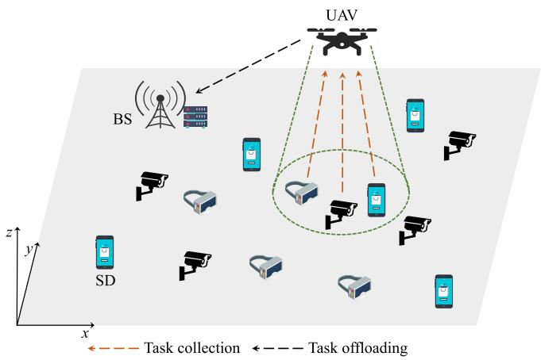

flowchart

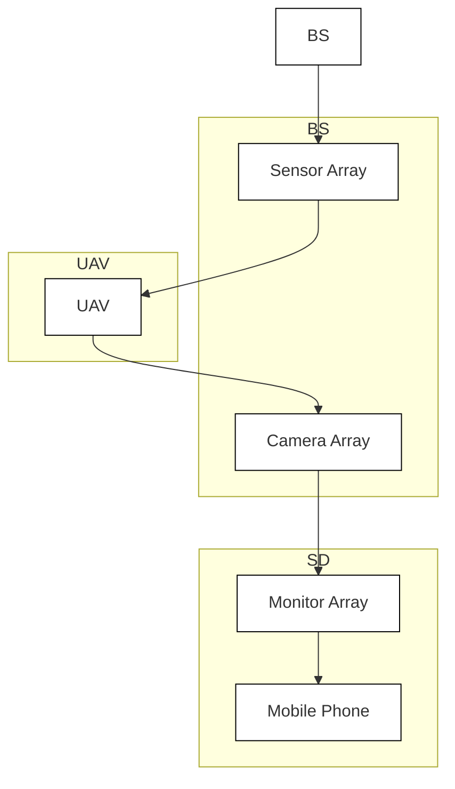

Fig. 1. UAV-assisted MEC system.   
Authorized licensed use limited to: Inner Mongolia University. Downloaded on May 29,2026 at 12:30:51 UTC from IEEE Xplore. Restrictions apply.

TABLE 2 Summary of Main Notations 

<table><tr><td>Notation</td><td>Definition</td></tr><tr><td colspan="2">Notation used in system model</td></tr><tr><td> $b_t$ </td><td>Offloading decision of the UAV in time slot  $t$ </td></tr><tr><td> $d_{\text{max}}$ </td><td>Maximal distance the UAV can move in each time slot</td></tr><tr><td> $d_t$ </td><td>Horizontal distance the UAV flies in time slot  $t$ </td></tr><tr><td> $f_{\text{U}}$ </td><td>Computing capability of the UAV</td></tr><tr><td> $H$ </td><td>Fixed flying altitude of the UAV</td></tr><tr><td> $k$ </td><td>The  $k$ -th SD</td></tr><tr><td> $K$ </td><td>Number of SDs</td></tr><tr><td> $\mathcal{K}$ </td><td>Set of SDs</td></tr><tr><td> $\mathcal{K}_t^c$ </td><td>Set of SDs covered by the UAV in time slot  $t$ </td></tr><tr><td> $l_t^k$ </td><td>Task arrival indicator of SD  $k$  in time slot  $t$ </td></tr><tr><td> $L_t^k$ </td><td>Number of tasks in the  $k$ -th SD&#x27;s queue in time slot  $t$ </td></tr><tr><td> $N_{\text{max}}$ </td><td>Maximum number of tasks in the computing queue</td></tr><tr><td> $N_t^c$ </td><td>Number of collected tasks from SDs in time slot  $t$ </td></tr><tr><td> $N_t^0$ </td><td>Number of tasks offloaded to the BS in time slot  $t$ </td></tr><tr><td> $N_t^L$ </td><td>Number of tasks executed by the UAV in time slot  $t$ </td></tr><tr><td> $P_{\text{U}}$ </td><td>Transmission power of the UAV</td></tr><tr><td> $R_{\text{max}}$ </td><td>Maximum horizontal coverage of the UAV</td></tr><tr><td> $T$ </td><td>Number of time slots</td></tr><tr><td> $\mathcal{T}$ </td><td>Set of time slots</td></tr><tr><td> $W$ </td><td>Channel bandwidth</td></tr><tr><td> $\alpha$ </td><td>Input data size of a task</td></tr><tr><td> $\beta$ </td><td>Number of CPU cycles required to process a task</td></tr><tr><td> $\vartheta_{\text{max}}$ </td><td>Maximal azimuth angle of the UAV</td></tr><tr><td> $\vartheta_t$ </td><td>Horizontal direction the UAV flies in time slot  $t$ </td></tr><tr><td> $\zeta^k$ </td><td>Parameter of Bernoulli random variable of SD  $k$ </td></tr><tr><td> $\kappa$ </td><td>Effective capacitance coefficient</td></tr><tr><td> $\mu_t$ </td><td>Data rate of the wireless channel in time slot  $t$ </td></tr><tr><td> $\sigma^2$ </td><td>Background noise power</td></tr><tr><td> $\tau$ </td><td>Time duration of a time slot</td></tr><tr><td> $\phi$ </td><td>Number of tasks handled by the UAV within a time slot</td></tr><tr><td></td><td>Notation used in reinforcement learning</td></tr><tr><td> $a$ </td><td>Action</td></tr><tr><td> $\mathcal{A}$ </td><td>Action space</td></tr><tr><td> $\mathbf{A}_t$ </td><td>Vector-valued advantage function</td></tr><tr><td> $A_t^{\mathbf{w}_i}$ </td><td>Extended advantage function with weight vector  $\mathbf{w}_i$ </td></tr><tr><td> $\mathbf{F}(\pi)$ </td><td>Objective vector of policy  $\pi$ </td></tr><tr><td> $n$ </td><td>Number of learning tasks</td></tr><tr><td> $\mathbf{r}_t$ </td><td>Vector-valued reward at time step  $t$ </td></tr><tr><td> $\mathbf{R}_\pi$ </td><td>Vector-valued return following policy  $\pi$ </td></tr><tr><td> $s$ </td><td>State</td></tr><tr><td> $\mathcal{S}$ </td><td>State space</td></tr><tr><td> $\mathbf{V}_\pi(s)$ </td><td>Multi-objective value function in state  $s$ </td></tr><tr><td> $\mathcal{W}$ </td><td>Set of evenly distributed weight vectors</td></tr><tr><td> $\lambda$ </td><td>Parameter of general advantage estimator</td></tr><tr><td> $\gamma$ </td><td>Discount factor</td></tr><tr><td> $\Gamma_i$ </td><td>The  $i$ -th learning task in  $\Omega, i = 1, \dots, n$ </td></tr><tr><td> $\Omega$ </td><td>Set of learning tasks</td></tr></table>

# 2.1 Task Model

We assume that the computation tasks arriving at SD $k \in \mathcal { K }$ 2 Kcan be modeled as an independent and identically distributed sequence of Bernoulli random variables with parameter $\zeta ^ { k } \in$ 20; 1 . Different SDs are associated with different parameters ½ of Bernoulli random variables. Let $l _ { t } ^ { k }$ denote the task arrival indicator of SD k in time slot $t . l _ { t } ^ { k } = 1$ if a task is generated at the beginning of t and $l _ { t } ^ { k } = 0 .$ ¼, otherwise. We have $\mathrm { P r } ( l _ { t } ^ { k } = 1 ) =$

$1 - \mathrm { P r } ( l _ { t } ^ { k } = 0 ) = \zeta ^ { k } .$ , where $\operatorname* { P r } ( \cdot )$ stands for the probability of  ð ¼ Þ ¼ ðÞan event occurring. A computation task is modeled as tuple $\langle \alpha , \beta \rangle$ , where a denotes the input data size of the task and $\bar { \beta }$ is h ithe number of CPU cycles required to process the task. For an arbitrary SD, a computation task generated in t is stored in its task queue. Let $L _ { t } ^ { k }$ be the number of tasks in the k-th SD’s queue waiting to be uploaded in $t ,$ which is updated by

$$
L _ {t + 1} ^ {k} = \min \{L _ {t} ^ {k} + l _ {t} ^ {k}, L _ {\max} \}, \tag {1}
$$

where $L _ { \mathrm { m a x } }$ is the maximum number of tasks allowed to be stored in the k-th SD’s queue. If the queue is full, each newly arrival task is dropped. Hence, it is of great significance for SDs to upload their computation tasks to the UAV in time. In this paper, the time division multiple access protocol is adopted for uploading computation tasks.

# 2.2 UAV Movement Model

We assume that the UAV flies at an altitude of $H ,$ where H is a positive constant. Let $\vartheta _ { t }$ and $d _ { t }$ denote the horizontal direction and distance with which the UAV flies in time slot $t ,$ respectively, with the following constraints met

$$
0 \leq \vartheta_ {t} \leq 2 \pi , 0 \leq d _ {t} \leq d _ {\max}, \tag {2}
$$

where $d _ { \mathrm { m a x } }$ is the maximal flying distance that the UAV can move in each time slot due to the limited power budget.

Similar to previous studies [20], [39], we adopt the Cartesian coordinate system to model the movement of the UAV. Let $\mathbf { c } _ { t } ^ { \mathrm { U } } = [ x _ { t } ^ { \mathrm { U } } , y _ { t } ^ { \mathrm { U } } ]$ denote the UAV’s horizontal coordinate in ¼ ½ time slot t. Based on #t and $d _ { t } ,$ , we obtain the UAV’s horizontal coordinate in time slot $t + 1$ by

$$
\left\{ \begin{array}{l} x _ {t + 1} ^ {\mathrm{U}} = x _ {t} ^ {\mathrm{U}} + d _ {t} \cdot \cos (\vartheta_ {t}) \\ y _ {t + 1} ^ {\mathrm{U}} = y _ {t} ^ {\mathrm{U}} + d _ {t} \cdot \sin (\vartheta_ {t}). \end{array} \right. \tag {3}
$$

Assume that the UAV flies at a constant velocity $v _ { t } = d _ { t } / \tau ,$ limited by a pre-defined maximum flying velocity $v _ { \mathrm { m a x } }$ . The UAV can only move within a rectangular area whose side lengths are $x _ { \mathrm { m a x } }$ and $y _ { \mathrm { m a x } }$ . We have

$$
0 \leq x _ {t} ^ {\mathrm{U}} \leq x _ {\max}, 0 \leq y _ {t} ^ {\mathrm{U}} \leq y _ {\max}. \tag {4}
$$

When a rotary-wing UAV flies, its propulsion power consumption with speed $v , P ( v )$ , is defined as [39]

$$
\begin{array}{l} P (v) = P _ {1} \left(1 + \frac {3 v ^ {2}}{U _ {\mathrm{tip}} ^ {2}}\right) + P _ {2} \left(\sqrt {1 + \frac {v ^ {4}}{4 v _ {0} ^ {4}}} - \frac {v ^ {2}}{2 v _ {0} ^ {2}}\right) ^ {1 / 2} \tag {5} \\ + \frac {1}{2} d _ {0} \rho g A v ^ {3}. \\ \end{array}
$$

It is seen that $P ( v )$ consists of three parts: the blade proð Þfile, induced power, and parasite power. $P _ { 1 }$ and $U _ { \mathrm { t i p } }$ denote the blade profile power under hovering status and tip speed of rotor blade, respectively. $P _ { 2 }$ and $v _ { 0 }$ represent the induced power and mean rotor induced velocity in hovering, respectively. As for the parasite power, d , $\rho , g ,$ , and A indicate the fuselage drag ratio, air density, rotor solidity, and rotor disc area, respectively. Note that when the UAV hovers $( \mathrm { i . e . , }$ $v = 0 )$ , the corresponding power consumption $P _ { \mathrm { h } }$ is the ¼summation of $P _ { 1 }$ and $P _ { 2 }$ . The energy consumption when the

UAV is flying and hovering during a time duration of $T ,$ , $E _ { \mathrm { f l y } }$ , is obtained by

$$
E _ {\text { fly }} = \int_ {0} ^ {T} P (v _ {t}) d t. \tag {6}
$$

# 2.3 Computing Model

# 2.3.1 Local Computing

Assume the UAV maintains a computing queue that stores the computation tasks collected from SDs awaiting for further processing. As the UAV can stay at a low altitude sufficiently close to SDs, this paper ignores the delay for collecting the computation tasks in each time slot, so does the corresponding receiving power consumption at the UAV. In this paper, the delay for processing tasks locally on the UAV in time slot t consists of the local processing and queuing delays. Let $N _ { t } ^ { \mathrm { u } } \in$ $[ 0 , N _ { \mathrm { m a x } } ]$ 2represent the number of uncompleted tasks in the ½ computing queue at the beginning of $t ,$ where $N _ { \mathrm { m a x } }$ is the maximum number of tasks allowed. Let $b _ { t } \in [ 0 , 1 ]$ be the pro-2 ½ portion of tasks in the computing queue to be offloaded to the BS in $t ,$ namely the UAV’s offloading decision for t. Specifically, the UAV offloads $N _ { t } ^ { \mathrm { O } } = \left\lfloor b _ { t } N _ { t } ^ { \mathrm { u } } \right\rfloor$ computation tasks to ¼ b cthe BS for remote processing, where denotes the floor function. The remaining $N _ { t } ^ { \mathrm { L } } = N _ { t } ^ { \mathrm { u } } - N _ { t } ^ { \bar { \mathrm { O } } }$ ccomputation tasks are ¼ locally executed on the UAV. Let $\phi = \left\lfloor \bar { \tau } f _ { \mathrm { U } } / \beta \right\rfloor$ denote the ¼ b cnumber of computation tasks processed by the UAV within each time slot, where $f _ { \mathrm { U } }$ denotes the UAV’s computing capability. Based on $N _ { t } ^ { \mathrm { u } }$ and $N _ { t } ^ { \mathrm { O } }$ , the number of queueing tasks in the computing queue at the end of $t , N _ { t } ^ { \mathrm { q } }$ , is defined as

$$
N _ {t} ^ {\mathrm{q}} = \max \bigl \{N _ {t} ^ {\mathrm{u}} - \phi - N _ {t} ^ {\mathrm{O}}, 0 \bigr \}. (7)
$$

Let $\mathbf { c } ^ { k } = [ x ^ { k } , y ^ { k } ]$ be the horizontal coordinate of SD $k \in \mathcal { K } .$ . ¼ ½  2 KThe UAV can only collect the tasks within its coverage area. Let $\mathcal { K } _ { t } ^ { \mathrm { c } }$ represent the set of SDs covered by the UAV in time slot $t ,$ which is defined as

$$
\mathcal {K} _ {t} ^ {\mathrm{c}} = \{k | d _ {t} ^ {k} \leq R _ {\max}, k \in \mathcal {K} \}, \tag {8}
$$

where $d _ { t } ^ { k } = \sqrt { \left( x _ { t } ^ { \mathrm { U } } - x ^ { k } \right) ^ { 2 } + \left( y _ { t } ^ { \mathrm { U } } - y ^ { k } \right) ^ { 2 } }$ is the horizontal dis-¼ ð  Þ þ ð  Þtance between the UAV and SD k in t. $R _ { \mathrm { m a x } }$ is the UAV’s maximal horizontal coverage, given that it has a maximal azimuth angle $\vartheta _ { \mathrm { m a x } } [ 2 0 ] . R _ { \mathrm { m a x } }$ is calculated by

$$
R _ {\mathrm{max}} = H \cdot \tan (\vartheta_ {\mathrm{max}}). \tag {9}
$$

Based on Eq. (8), the number of tasks collected by the UAV in t is obtained by

$$
N _ {t} ^ {\mathrm{c}} = \sum_ {k \in \mathcal {K} _ {t} ^ {\mathrm{c}}} L _ {t} ^ {k}. \tag {10}
$$

The number of uncompleted tasks to be processed in $t + 1 ,$ , $N _ { t + 1 } ^ { \mathrm { u } } ,$ is updated at the end of t as

$$
N _ {t + 1} ^ {\mathrm{u}} = \min \left\{N _ {t} ^ {\mathrm{q}} + N _ {t} ^ {\mathrm{c}}, N _ {\max} \right\}. \tag {11}
$$

In $t ,$ the delay for completing the $N _ { t } ^ { \mathrm { L } }$ tasks locally on the UAV can be calculated by

$$
D _ {t} ^ {\mathrm{L}} = \frac {\min \{\phi , N _ {t} ^ {\mathrm{L}} \} \beta}{f _ {\mathrm{U}}} + \tau N _ {t} ^ {\mathrm{q}}. \tag {12}
$$

There are two parts in Eq. (12). The first part, min $\{ \phi ,$ ; $N _ { t } ^ { \mathrm { L } } \} \beta / f _ { \mathrm { U } } ,$ f, is the local processing delay, and the second one, $\tau N _ { t } ^ { \mathrm { q } }$ , is the queuing delay of all $\bar { N } _ { t } ^ { \mathrm { q } }$ tasks waiting in the computing queue. The corresponding energy consumption of the UAV is calculated by

$$
E _ {t} ^ {\mathrm{L}} = \kappa \cdot \min \{\phi , N _ {t} ^ {\mathrm{L}} \} \beta \cdot (f _ {\mathrm{U}}) ^ {2}, \tag {13}
$$

where k is the effective capacitance coefficient depending on the chip structure used.

# 2.3.2 Task Offloading

The UAV allows a proportion of its collected tasks to be offloaded to the BS for remote processing. According to the Shannon-Hartley theorem [4], we define the data rate of the wireless link between the UAV and BS in t as

$$
\mu_ {t} = W \cdot \log_ {2} (1 + \Upsilon_ {t}), \tag {14}
$$

where $W$ and $\Upsilon _ { t }$ is the channel bandwidth of the wireless link and signal-to-noise ratio (SNR) between the UAV and BS, respectively. As the UAV flies at a low altitude, communication outage may occur. To maintain wireless connectivity, $\Upsilon _ { t }$ is greater than or equal to the threshold SNR $\Upsilon _ { \mathrm { t h r } } .$ . In other words, if $\Upsilon _ { t } \geq \Upsilon _ { \mathrm { t h r } } ,$ , the UAV can successfully connect to the BS; otherwise, the wireless connectivity is unavailable between the UAV and BS. The SNR in t is defined below.

$$
\Upsilon_ {t} = \frac {P _ {\mathrm{U}} \cdot 1 0 ^ {\frac {P L (d _ {t} ^ {\mathrm{UB}} , \vartheta_ {t} ^ {\mathrm{UB}})}{1 0}}}{\sigma^ {2}}, \tag {15}
$$

where $P _ { \mathrm { U } } , \sigma ^ { 2 } ,$ , and $P L ( d _ { t } ^ { \mathrm { U B } } , \vartheta _ { t } ^ { \mathrm { U B } } )$ are the transmission power ð  Þof the UAV, background noise power, and pathloss between the UAV and BS, respectively. Referring to [4], this paper defines the pathloss between the UAV and BS in t as

$$
P L (d _ {t} ^ {\mathrm{UB}}, \vartheta_ {t} ^ {\mathrm{UB}}) = 1 0 A _ {0} \log {(d _ {t} ^ {\mathrm{UB}})} + B _ {0} (\vartheta_ {t} ^ {\mathrm{UB}} - \theta_ {0}) \mathrm{e} ^ {\frac {\theta_ {0} - \vartheta_ {t} ^ {\mathrm{UB}}}{C _ {0}}} + \eta_ {0}, \tag {16}
$$

where $d _ { t } ^ { \mathrm { U B } }$ and $\vartheta _ { t } ^ { \mathrm { U B } }$ are the distance and vertical angle between the UAV and BS in t, respectively. $d _ { t } ^ { \mathrm { U B } }$ and $\vartheta _ { t } ^ { \mathrm { U B } }$ in Eq. (16) are obtained based on the horizontal coordinates of the UAV and BS.

The UAV needs to complete the transmission process of the $N _ { t } ^ { \mathrm { O } }$ computation tasks before it flies out of the BS’s coverage. Thus, the time duration $\varphi _ { t }$ that the UAV has been staying in the coverage of the BS since the beginning of t is written as

$$
\varphi_ {t} = \arg \min _ {l} \left(\sum_ {i = t} ^ {t + l} \tau \mu_ {i} \geq \alpha N _ {t} ^ {\mathrm{O}}\right), \tag {17}
$$

where a stands for the input data size of a computation task. Let $D _ { t } ^ { \mathrm { O } }$ denote the delay for offloading the $N _ { t } ^ { \mathrm { O } }$ computation tasks to the BS, which is calculated by

$$
D _ {t} ^ {\mathrm{O}} = \left\{ \begin{array}{l l} (\varphi_ {t} - 1) \tau + \frac {\alpha N _ {t} ^ {\mathrm{O}} - \sum_ {i = t} ^ {\varphi_ {t} - 1} \tau \mu_ {i}}{\mu_ {t + \varphi_ {t}}}, & \text { if } \alpha N _ {t} ^ {\mathrm{O}} <   \sum_ {i = t} ^ {\varphi_ {t}} \tau \mu_ {i} \\ \tau \varphi_ {t}, & \text { if } \alpha N _ {t} ^ {\mathrm{O}} = \sum_ {i = t} ^ {\varphi_ {t}} \tau \mu_ {i} \end{array} \right. \tag {18}
$$

The corresponding energy consumption of the UAV is calculated as

$$
E _ {t} ^ {\mathrm{O}} = P _ {\mathrm{U}} \cdot D _ {t} ^ {\mathrm{O}}. \tag {19}
$$

Assume that the BS is of rich computing resources. Thus, the delay for processing the tasks on the BS can be neglected. Further, the delay for returning the task results to an SD is also ignored because the computation result of a task is usually much smaller than its input data size.

# 2.4 Problem Formulation

Based on Eqs. (12) and (18), the delay for completing the $N _ { t } ^ { \mathrm { L } } + N _ { t } ^ { \mathrm { O } }$ computation tasks in the UAV’s computing queue þin t is written as

$$
D _ {t} = D _ {t} ^ {\mathrm{L}} + D _ {t} ^ {\mathrm{O}}. \tag {20}
$$

Similarly, based on Eqs. (13) and (19), the UAV’s energy consumption for local computing and transmitting tasks to the BS in t is defined as

$$
E _ {t} = E _ {t} ^ {\mathrm{L}} + E _ {t} ^ {\mathrm{O}}. \tag {21}
$$

The total delay for completing all the collected tasks, $D _ { \mathrm { t o t a l } }$ , and total energy consumption of the UAV, $E _ { \mathrm { t o t a l . } }$ , during T time slots are calculated as

$$
D _ {\text { total }} = \sum_ {t = 1} ^ {T} D _ {t}, \tag {22}
$$

$$
E _ {\text { total }} = \sum_ {t = 1} ^ {T} E _ {t} + E _ {\text { fly }}. \tag {23}
$$

Based on the number of collected tasks defined in Eq. (10) in each time slot, the total number of collected tasks during time duration T can be obtained by

$$
N _ {\text { total }} = \sum_ {t = 1} ^ {T} N _ {t} ^ {\mathrm{c}}. \tag {24}
$$

In this work, we aim to minimize the total task delay $D _ { \mathrm { t o t a l } }$ and total energy consumption $E _ { \mathrm { t o t a l } } ,$ , and maximize the total number of tasks collected $N _ { \mathrm { t o t a l } } ,$ , simultaneously, through optimizing the UAV’s flying trajectory (i.e., $\vartheta _ { t }$ and $d _ { t } )$ and task offloading decision (i.e., bt), namely the TCTO problem. This problem is an MOO problem in nature, defined as

$$
\max _ {\vartheta_ {t}, d _ {t}, b _ {t}} \left(- D _ {\text { total }}, - E _ {\text { total }}, N _ {\text { total }}\right) \tag {25}
$$

subject to:

C1 $: 0 \leq \vartheta _ { t } \leq 2 \pi ,$ $\forall t \in T ,$

C2 : $0 \leq d _ { t } \leq d _ { \operatorname* { m a x } } ,$ $\forall t \in T ,$

C3 : $b _ { t } \in [ 0 , 1 ] ,$ $\forall t \in T ,$

C4 : $0 \leq x _ { t } ^ { \mathrm { U } } \leq x _ { \operatorname* { m a x } } ,$ $\forall t \in T ,$

C5 : $0 \leq y _ { t } ^ { \mathrm { U } } \leq y _ { \mathrm { m a x } } ,$ $\forall t \in T ,$

C6 : $d _ { t } ^ { k } \leq R _ { \operatorname* { m a x } } ,$ $\forall k \in K _ { t } ^ { \mathrm { c } } , t \in T .$

Constraints C1 and C2 confine the horizontal direction and distance of a flying UAV. Constraint C3 specifies

that the offloading decision for time slot t is a variable between 0 and 1. Constraints C4 and C5 together specify the UAV’s movement area. Constraint C6 ensures that the UAV can only collect computation tasks from SDs within its coverage.

It is easily understood that to increase $N _ { \mathrm { t o t a l } }$ , the UAV should fly with an appropriate trajectory so that it can cover as many SDs and collect their computation tasks as possible. However, the more the computation tasks collected, the higher the energy consumption incurred on the UAV because more tasks need to be handled by the UAV. Admittedly, offloading helps to reduce the UAV’s energy consumption as some tasks are processed by the BS. However, it results in additional transmission delays. So, one can easily observe that the three objectives, i.e., minimization of $D _ { \mathrm { t o t a l } } ,$ , minimization of $E _ { \mathrm { t o t a l } } ,$ and maximization of $N _ { \mathrm { t o t a l } } ,$ conflict with each other.

# 3 OVERVIEW OF MOMDP AND MOO

This section first recalls the multi-objective Markov decision process (MOMDP). Then, we introduce the multi-objective optimization (MOO) problem.

# 3.1 MOMDP

The TCTO problem is a multi-objective control problem that can be modeled by MOMDP [38]. An MOMDP is defined by tuple $\langle S , \mathcal { A } , \mathcal { Q } , \mathbf { r } , \gamma , \mathcal { D } \rangle$ , where is the state space. is the hS A Qaction space and $\mathcal { Q } ( s ^ { \prime } | s , a )$ S Ais the state transition probability. $\mathbf { r } = ( r ^ { 1 } , \cdot \cdot \cdot , r ^ { m } )$ Qð j Þis the vector-valued reward function and m ¼ ð Þis the number of objectives. $\gamma \in [ 0 , 1 ]$ is the discount factor, 2 ½and is the initial state distribution.

DIn MOMDPs, a policy $\pi : { \mathcal { S } }  A$ is a state-to-action map-S ! Aping associated with a vector of expected return $\mathbf { R } _ { \pi } =$ $\big ( R _ { \pi } ^ { 1 } , \dots , R _ { \pi } ^ { m } )$ , where $R _ { \pi } ^ { j }$ ¼is the expected return correspondð Þing to the j-th objective, defined as

$$
R _ {\pi} ^ {j} = \mathbb {E} _ {\pi} \left[ \sum_ {t = 1} ^ {T} \gamma^ {t - 1} r ^ {j} (s _ {t}, a _ {t}) | s _ {1} \smile \mathcal {D}, a _ {t} \smile \pi (s _ {t}) \right]. \tag {26}
$$

For the TCTO problem, we have $m = 3$ , namely, $R _ { \pi } ^ { 1 } , R _ { \pi } ^ { 2 }$ and R3p are associated with $- D _ { \mathrm { t o t a l } } , \quad - E _ { \mathrm { t o t a l } } ,$ , and $\ddot { N } _ { \mathrm { t o t a l . } }$ respectively.

The value function $\mathbf { V } _ { \pi } ( s ) : { \mathcal { S } } \to \mathbb { R } ^ { m }$ maps a state s to the ð Þ S !vector of expected return under policy p, defined as

$$
\mathbf {V} _ {\pi} (s) = \mathbb {E} _ {\pi} \left[ \sum_ {k = t} ^ {T} \gamma^ {k - t} \mathbf {r} _ {k} | s _ {t} = s \right], \tag {27}
$$

where $\mathbf { r } _ { k } = ( r _ { k } ^ { 1 } , \ldots , r _ { k } ^ { m } )$ denotes the immediate vector-val-¼ ð Þued reward at time step k. Because each element of $\mathbf { r } _ { k }$ corresponds to a particular objective, $\mathbf { V } _ { \pi } ( s )$ is a multi-objective value function.

# 3.2 MOO

An MOO problem [38] can be formulated as

$$
\max _ {\pi} \mathbf {F} (\pi) = \max _ {\pi} (f ^ {1} (\pi), \dots , f ^ {m} (\pi)),
$$

$\mathrm { s u b j e c t ~ t o : } \quad \pi \in \Pi .$ (28)

where $\pi$ is a policy in search space P. In objective vector $\mathbf { F } ( \pi )$ , there are m objective functions, and they generally ð Þconflict with each other. Note that the objective value $f ^ { j } ( \pi )$ is set to $R _ { \pi } ^ { j } , j = 1 , \dots , m$ .

Let $\pi _ { 1 } , \pi _ { 2 } \in \Pi$ denote two different policies. $\pi _ { 1 }$ is said to dominate $\pi _ { 2 } ,$ 2denoted by $\pi _ { 1 } \succ \pi _ { 2 } ,$ if and only if $f ^ { j } ( \pi _ { 1 } ) \geq$ $f ^ { j } ( \pi _ { 2 } )$ for all $j = 1 , \ldots , m ,$ and $f ^ { l } ( \pi _ { 1 } ) > f ^ { l } ( \pi _ { 2 } )$ ð Þ for at least ð Þone index $l \in \{ 1 , \ldots , m \}$ . A policy $\pi ^ { * } \in \Pi$ ð Þis Pareto optimal 2 f g 2if it is not dominated by any other policies in P. All Pareto optimal policies (also called non-dominated policies) form a Pareto optimal set whose mapping in the objective space is known as the Pareto front.

There are mainly two methods to tackle an MOO problem. One is to convert it into an SOO problem by objective aggregation. In this case, the commonly used method is the weighted sum, where each objective is assigned a weight that must be set in advance. For example, the SORL methods first aggregate multiple objectives into a scalar reward via the weighted sum and then optimize the reward. However, the weighted sum based methods only output a unique optimal policy by running them once. If user preferences change, these methods need to be re-executed. Therefore, this kind of method only obtains a compromised policy that cannot reflect the conflicting features between objectives. In other words, the policy obtained is only optimal for the current preference.

The other method to handle MOO problems is to adopt multi-objective algorithms, such as the multi-objective evolutionary algorithms (MOEAs) and multi-policy MORLs. These methods can obtain multiple non-dominated policies in a single run, reflecting the Pareto-dominance relation among them. This is what a decision-maker expects to know. Although the user preferences change, the non-dominated policies obtained by a multi-objective algorithm are still valid. Thus, the ultimate aim of solving an MOO problem is to obtain a set of high-quality non-dominated policies. Each policy in the set is associated with a certain preference. In other words, for a given preference, we can find the corresponding optimal policy from the set. Therefore, we can balance multiple objectives by obtaining multiple non-dominated policies. However, MOEAs usually suffer from prematurity and local optima when handing high-dimensional MOO problems in dynamic environments, causing unacceptable non-dominated policies [40]. Compared with MOEAs, EMORL has been reported to find much better non-dominated policies [38]. That is why we are motivated to adapt EMROL to the TCTO problem concerned in this paper.

# 4 EMORL-TCTO FOR TRAJECTORY CONTROL AND TASK OFFLOADING

This section first introduces the MOMDP model for the TCTO problem and then describes the proposed EMORL-TCTO algorithm in detail.

# 4.1 MOMDP Model

To address the TCTO problem by an MORL, we need an MOMDP model for the problem first. The state space, action space, and reward function are described one by one.

# 4.1.1 State Space

$$
\mathcal {S} = \{s _ {t} | s _ {t} = (\mathbf {c} _ {t} ^ {\mathrm{U}}, N _ {t} ^ {\mathrm{u}}, N _ {t} ^ {\mathrm{c}}), \forall t \in \mathcal {T} \}, \tag {29}
$$

where $\mathbf { c } _ { t } ^ { \mathrm { U } } = [ x _ { t } ^ { \mathrm { U } } , y _ { t } ^ { \mathrm { U } } ]$ is the horizontal coordinate of the UAV ¼ ½in time slot t. $N _ { t } ^ { \mathrm { u } }$ is the number of uncompleted tasks at the beginning of $t ,$ and $N _ { t } ^ { \mathrm { c } }$ is the number of newly collected tasks from SDs in t.

# 4.1.2 Action Space

$$
\mathcal {A} = \{a _ {t} | a _ {t} = (\vartheta_ {t}, d _ {t}, b _ {t}), \forall t \in \mathcal {T} \}, \tag {30}
$$

where $\vartheta _ { t }$ and $d _ { t }$ denote the horizontal direction and distance with which the UAV flies in $t ,$ respectively, and $b _ { t }$ is the $\mathrm { U A V ^ { \prime } s }$ offloading decision in t.

# 4.1.3 Reward Function

$$
\mathbf {r} _ {t} = (r _ {t} ^ {\mathrm{D}}, r _ {t} ^ {\mathrm{E}}, r _ {t} ^ {\mathrm{N}}) = \left\{ \begin{array}{l l} (- D _ {t}, - \frac {E _ {t}}{1 0 0}, N _ {t} ^ {\mathrm{c}}), & \text { if } \quad \mathbb {1} _ {t} = 1 \\ (- \varepsilon_ {1} D _ {t}, - \varepsilon_ {2} \frac {E _ {t}}{1 0 0}, \varepsilon_ {3} N _ {t} ^ {\mathrm{c}}), & \text { otherwise } \end{array} \right. \tag {31}
$$

where $r _ { t } ^ { \mathrm { D } } , r _ { t } ^ { \mathrm { E } } ,$ , and $r _ { t } ^ { \mathrm { N } }$ are the scalar rewards corresponding to $D _ { t } , E _ { t } ,$ and $N _ { t } ^ { \mathrm { c } }$ in time slot $t ,$ respectively. ${ \mathbb { 1 } } _ { t }$ is an indicator variable that equals 0 if the UAV flies out of the rectangular area in t and ${ \mathbb { 1 } } _ { t }$ is equal to 1, otherwise. Coefficient $\textstyle { \frac { 1 } { 1 0 0 } }$ in Eq. (31) is to make sure the three scalar rewards are in the same order of magnitude. This can effectively optimize three objectives simultaneously without any biases between objectives.

In addition, we should punish the three scalar rewards if the UAV flies out of the rectangular area in t. Thus, the penalty coefficients $\varepsilon _ { 1 } , \varepsilon _ { 2 } ,$ and $\varepsilon _ { 3 }$ are used to reduce the values of $- D _ { t } , - \frac { E _ { t } } { 1 0 0 } .$ , and $N _ { t } ^ { \mathrm { c } } ,$ , respectively. On the one hand, $\varepsilon _ { 1 }$ and 2 3 guarantee that the values of $\varepsilon _ { 2 }$   are larger than 1 while $\varepsilon _ { 3 }$ is smaller than 1. These settings $- D _ { t } , \ - \frac { E _ { t } } { 1 0 0 }$ , and $N _ { t } ^ { \mathrm { c } }$ can  decrease. On the other hand, each scalar reward should decrease by similar size based on their original rewards. For example, if the three re $\varepsilon _ { 1 } = 4 , \varepsilon _ { 2 } = 4$ $3 D _ { t } , \frac { 3 E _ { t } } { 1 0 0 }$ $\varepsilon _ { 3 } = - 2 ,$ $3 N _ { t } ^ { \mathrm { c } }$ the decrements of, respectively. The purpose of doing so is to ensure the three scalar rewards are still in the same order of magnitude when the UAV flies out of the rectangular area in t.

Based on the vector-valued reward $\mathbf { r } _ { t } ,$ we obtain the return which is the summation of the discounted reward generated at each time step over the long run. Let $\mathbf { R } _ { \pi } =$ $\mathrm { \mathop { ~ \left( R _ { \pi } ^ { D } , \right)} } R _ { \pi } ^ { \mathrm { E } } , R _ { \pi } ^ { \mathrm { N } } $ be the return of $r _ { 1 } ^ { \mathrm { D } } , r _ { 1 } ^ { \mathrm { E } }$ L , and $r _ { 1 } ^ { \breve { \mathrm { N } } }$ under policy $\pi$ ð Þat the first time step, defined as

$$
R _ {\pi} ^ {\mathrm{D}} = - \sum_ {t = 1} ^ {T} \gamma^ {t - 1} (\varepsilon_ {1} + \mathbb {1} _ {t} - \mathbb {1} _ {t} \varepsilon_ {1}) D _ {t}, \tag {32}
$$

$$
R _ {\pi} ^ {\mathrm{E}} = - \sum_ {t = 1} ^ {T} \gamma^ {t - 1} (\varepsilon_ {2} + \mathbb {1} _ {t} - \mathbb {1} _ {t} \varepsilon_ {2}) \frac {E _ {t}}{1 0 0}, \tag {33}
$$

$$
R _ {\pi} ^ {N} = \sum_ {t = 1} ^ {T} \gamma^ {t - 1} (\varepsilon_ {3} + \mathbb {1} _ {t} - \mathbb {1} _ {t} \varepsilon_ {3}) N _ {t} ^ {c}. \tag {34}
$$

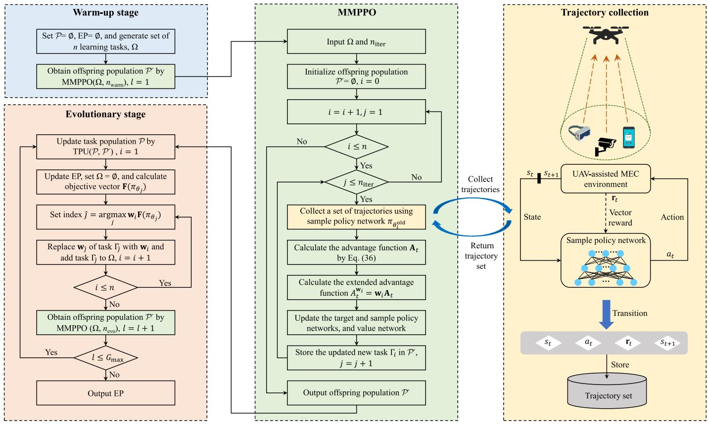

flowchart

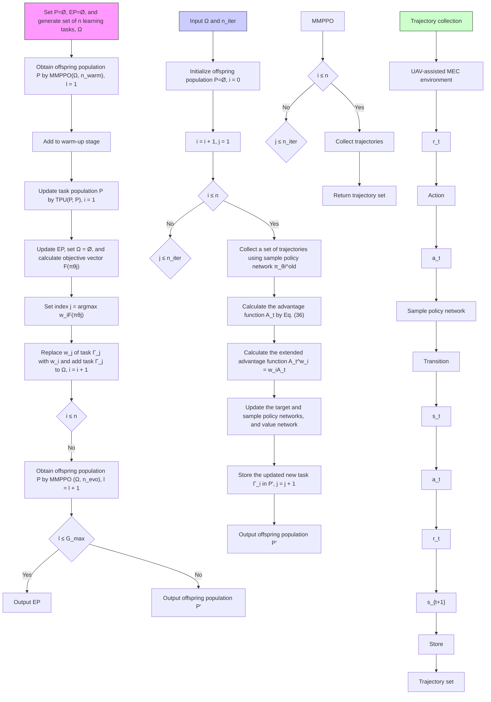

Fig. 2. Framework of EMORL-TCTO.

Maximizing the expected return $\mathbb { E } [ \mathbf { R } _ { \pi } ]$ is equivalent to minimizing $D _ { \mathrm { t o t a l } }$ and $E _ { \mathrm { t o t a l } } ,$ ½  and maximizing $N _ { \mathrm { t o t a l } } ,$ , simultaneously.

# 4.2 EMORL-TCTO Algorithm

This paper represents a learning task by tuple $\Gamma =$ $\langle \mathbf { w } , \pi _ { \theta } , \pi _ { \theta ^ { \mathrm { o l d } } } , \mathbf { V } _ { \pi _ { \theta } } \bar { \rangle } .$ , where $\begin{array} { r } { \mathbf { w } ( \sum _ { j = 1 } ^ { m } w ^ { j } = 1 ) } \end{array}$ ¼is the weight vechtor. $\pi _ { \theta }$ i ð ¼ ¼ Þis the target policy used to select actions and $\pi _ { \theta ^ { \mathrm { o l d } } }$ is the sample policy used to collect trajectories1 . $\mathbf { V } _ { \pi _ { \theta } }$ is the multi-objective value function for evaluating the selected actions. Through interacting with the environment, the sample policy $\pi _ { \theta ^ { \mathrm { o l d } } }$ is used to generate the set of trajectories. The generated set is used to update the target policy $\pi _ { \theta }$ for several epochs. To avoid a large update of the target policy, a clipped surrogate objective is adopted, which is defined as

$$
J _ {\Gamma} ^ {\mathrm{C}} (\theta , \mathbf {w}) = \mathbb {E} \left[ \sum_ {t = 1} ^ {T} \min \left(\frac {\pi_ {\theta} (a _ {t} | s _ {t})}{\pi_ {\theta^ {\text { old }}} (a _ {t} | s _ {t})} A _ {t} ^ {\mathbf {w}} \right. \right.,
$$

$$
\left. \operatorname{clip} _ {1 - \epsilon} ^ {1 + \epsilon} \left(\frac {\pi_ {\theta} (a _ {t} | s _ {t})}{\pi_ {\theta^ {\text { old }}} (a _ {t} | s _ {t})}\right) A _ {t} ^ {\mathbf {w}}\right) \Bigg ], \tag {35}
$$

where ${ \cal A } _ { t } ^ { \mathbf { w } } = { \mathbf { w } } { \mathbf { A } } _ { t }$ is the extended advantage function at time ¼step t, i.e., the weighted-sum of all elements in the vectorvalued advantage function $\mathbf { A } _ { t } . \mathbf { A } _ { t }$ is obtained by the general advantage estimator (GAE) [41], defined as

1. Note that the term ”trajectories” refers to a sequence of transitions in RL, each of which consists of state, action, reward, and next state. However, the term ”trajectory” used in the system model represents the UAV’s flying path.

$$
\mathbf {A} _ {t} = \sum_ {k = 0} ^ {T - t + 1} (\gamma \lambda) ^ {k} (\mathbf {r} _ {t + k} + \gamma \mathbf {V} _ {\pi_ {\theta}} (s _ {t + k + 1}) - \mathbf {V} _ {\pi_ {\theta}} (s _ {t + k})), \tag {36}
$$

where $\lambda \in [ 0 , 1 ]$ is a parameter for tuning the trade-off 2 ½ between variance and bias. $\mathrm { c l i p } _ { 1 - \epsilon } ^ { 1 + \epsilon } ( \Delta )$ is the clip function that constrains the value of $\Delta ,$  ð Þremoving the incentive for moving D outside of the interval $[ 1 - \epsilon , 1 + \epsilon ]$ .

½ The value function loss is defined as

$$
J _ {\Gamma} ^ {\mathrm{V}} (\theta) = \mathbb {E} \left[ \sum_ {t = 1} ^ {T} \left\| \mathbf {V} _ {\pi_ {\theta}} (s _ {t}) - \widehat {\mathbf {V}} _ {\pi_ {\theta}} (s _ {t}) \right\| ^ {2} \right], \tag {37}
$$

where $\mathbf { V } _ { \pi _ { \theta } } ( s _ { t } )$ is the value function defined in Eq. (37) and $\widehat { \mathbf { V } } _ { \pi _ { \theta } } ( s _ { t } ) = \mathbf { r } _ { t } + \gamma \mathbf { V } _ { \pi _ { \theta } } ( s _ { t + 1 } )$ is the target value function. ð Þ ¼ þ ð þ ÞThrough this extension, the value function trained in the previous learning process can be directly adapted to optimize the same policy with the new weight vectors.

The proposed EMORL-TCTO aims to learn a set of Pareto optimal policies through interacting with the environment and its framework is shown in Fig. 2. EMORL-TCTO shares the same algorithm structure with the original EMORL [38]. EMORL-TCTO starts from the warm-up stage, where n learning tasks are randomly generated. The offspring population is produced by executing the multi-task multi-objective PPO (MMPPO). Note that each learning task uses its associated sample policy to collect a set of trajectories by interacting with the UAV-assisted MEC environment. After the warm-up stage, EMORL-TCTO proceeds with the evolutionary stage. Both the task population and external Pareto (EP) archive are updated based on the offspring population. Then, we select n new learning tasks from the task population for each weight vector. These tasks are optimized by MMPPO to generate a new generation of the offspring population. The evolutionary stage terminates when a predefined number of generations are completed.

Note that EMORL-TCTO is different from the policy space response oracles (PSRO) [42], a game-theoretic multiagent RL algorithm. Each agent in PSRO is based on SORL, ignoring the fact that the objectives conflict with each other. In addition, PSRO only obtains an optimal policy for each agent in a run. Hence, PSRO is unsuitable for addressing the TCTO problem due to the two inherent disadvantages above. On the other hand, HRL usually decomposes an optimization problem into multiple sub-problems and adopts the SORL-based methods to slove them [19]. However, the TCTO problem concerned in this paper is not decomposed, $\mathrm { i . e . , }$ it is solved as a whole by multiple learning tasks, each of which is based on MORL.

The pseudo-code of EMORL-TCTO is shown in Algorithm 1. We elaborate the warm-up and evolutionary stages in detail.

Algorithm 1. Evolutionary Multi-Objective Reinforcement Learning for TCTO Problem (EMORL-TCTO)   
Input: number of learning tasks n, number of warm-up iterations $n_{warm}$ , number of task iterations $n_{evo}$ , number of maximum evolution generations $G_{max}$ .

// Warm-up stage

1: Initialize task population $P = \emptyset$ and external Pareto archive EP = $\emptyset$ ;

2: Generate n evenly distributed weight vectors $\{w_{1}, \ldots, w_{n}\}$ ;

3: Initialize n target policy networks $\{\pi_{\theta_{1}}, \ldots, \pi_{\theta_{n}}\}$ ;

4: Initialize the i-th sample policy network, $\pi_{\theta_{i}^{old}} \leftarrow \pi_{\theta_{i}}, i = 1, \ldots, n$ ;

5: initialize n value networks $\{V_{\pi_{\theta_{1}}}, \ldots, V_{\pi_{\theta_{n}}} \}$ ;

6: Denote the task set by $\Omega = \{\Gamma_{1}, \ldots, \Gamma_{n}\}$ , $\Gamma_{i} = \langle w_{i}, \pi_{\theta_{i}}, \pi_{\theta_{i}^{old}}, V_{\pi_{\theta_{i}}} \rangle$ ;

7: Obtain offspring population $P'$ by MMPPO( $\Omega, n_{warm}$ );

// Evolutionary stage

8: for $l = 1, \ldots, G_{max}$ do

9: Update task population P by TPU( $P, P'$ );

10: Update EP based on $P'$ ;

11: Set $\Omega = \emptyset$ ;

12: Calculate $F(\pi_{\theta_{j}})$ of target policy $\pi_{\theta_{j}}$ of each task $\Gamma_{j} \in P$ ;

13: for $w_{i} \in \{w_{1}, \ldots, w_{n}\}$ do

14: Set index $\hat{j} = \arg\max_{j=1,\ldots,|\mathcal{P}|} \{w_{i}F(\pi_{\theta_{j}})\}$ ;

15: Replace weight vector $w_{\hat{j}}$ of task $\Gamma_{\hat{j}}$ with $w_{i}$ ;

16: Add task $\Gamma_{\hat{j}}$ to $\Omega$ ;

17: end for

18: Obtain offspring population $P'$ by MMPPO( $\Omega, n_{evo}$ );

19: end for

Output: external Pareto archive EP.

# 4.2.1 Warm-Up Stage

In this stage, n learning tasks are randomly generated. These tasks share the same state space, action space, and reward function but their dynamics may differ. The dynamics means that each learning task will generate various new offspring tasks after running MMPPO once. In general, these offspring learning tasks generated by different tasks have great differences because they have different weight

vectors and neural network parameters. The task generation procedure is described as follows.

Algorithm 2. Multi-Task Multi-Objective PPO (MMPPO)   
Input: task set $\Omega$ , number of iterations $n_{iter}$ .

1: Initialize offspring population $P' = \emptyset$ ;

2: for $\Gamma_i = \langle w_i, \pi_{\theta_i}, \pi_{\theta_i^{old}}, V_{\pi_{\theta_i}} \rangle \in \Omega$ do

3: for $j = 1, \ldots, n_{iter}$ do

4: Collect a set of trajectories using sample policy $\pi_{\theta_i^{old}}$ ;

5: Calculate the advantage function $A_t$ by Eq. (36);

6: Calculate the extended advantage function $A_t^{w_i} = w_i A_t$ ;

7: Update the target policy network's parameter $\theta_i$ by Eq. (35) for several epochs;

8: Update the sample policy network's parameter $\theta_i^{old}$ , i.e., $\theta_i^{old} \leftarrow \theta_i$ ;

9: Update the value network $V_{\pi_{\theta_i}}$ by Eq. (37);

10: Store the updated new task $\Gamma_i$ in $P'$ ;

11: end for

12: end for

Output: Offspring population $P'$ .

Algorithm 3. Task Population Update (TPU)   
Input: task population P, offspring population $P'$ , reference point $Z_{ref}$ , $P_{num}$ , and $P_{size}$ .

1: Generate $P_{num}$ evenly distributed weight vectors $\{w_{1},\ldots,w_{P_{num}}\}$ ;

2: Set performance buffer $B_{i}=\emptyset, i=1,\ldots,P_{num}$ ;

3: for $\Gamma=\langle w,\pi_{\theta},\pi_{\theta^{old}},V_{\pi_{\theta}}\rangle\in\{\mathcal{P}\cup\mathcal{P}'\}$ do

4: Calculate objective vector $\mathbf{F}(\pi_{\theta})$ ;

5: Set $\mathbf{F}_{\text{temp}}=\mathbf{F}(\pi_{\theta})-\mathbf{Z}_{\text{ref}}$ ;

6: Set index $\hat{j}=\arg\max_{j=1,\ldots,P_{num}}\{\mathbf{w}_{j}\mathbf{F}_{\text{temp}}\}$ ;

7: Store task $\Gamma$ in $B_{j}$ ;

8: Calculate distance between $\mathbf{F}(\pi_{\theta})$ and $Z_{ref}$ ;

9: if $|B_{j}|>P_{size}$ then

10: Sort all tasks in $B_{j}$ in descending order of their distances;

11: Retain the first $P_{size}$ tasks in $B_{j}$ ;

12: end if

13: end for

14: Set new task population $P_{new}=\{B_{1}\cup,\ldots,\cup B_{P_{num}}\}$ ;

Output: population $P_{new}$ .

First, the systematic method [43] is adopted to generate n evenly distributed weight vectors, ${ \mathcal { W } } = \{ \mathbf { \bar { w } } _ { 1 } , \dots , \mathbf { \bar { w } } _ { n } \}$ . Each W ¼ fweight vector is sampled from a unit simplex. $n = \stackrel { \cdot } { ( } { m + \delta - 1 } )$  points with a uniform spacing of $1 / \delta ,$ ¼ , are sampled on the simplex for any number of objectives, where $\bar { \delta } > 0$ is the number of divisions considered along each objective axis. As [44] suggests, to obtain intermediate weight vectors within the simplex, we have $\delta > m$ . For example, for the TCTO problem with three objectives $( m = 3 ) _ { \it { \Delta } }$ , if four divisions $( \delta = 4 )$ ¼ are considered for each objective axis, $n =$ ¼ ¼3þ413 1   15 evenly distributed weight vectors are gener- ${ \binom { 3 + 4 - 1 } { 3 - 1 } } = 1 5$  ¼ated. We plot these weights vectors in Fig. 3.

Second, n target policy networks, $\{ \pi _ { \theta _ { 1 } } , \ldots , \pi _ { \theta _ { n } } \} _ { . }$ , are ranf gdomly initialized. The corresponding sample policy networks, $\{ \pi _ { \theta _ { 1 } ^ { \mathrm { o l d } } } , \ldots , \pi _ { \theta _ { n } ^ { \mathrm { o l d } } } \}$ , are initialized, with their parameters f 1 gset the same as the target policy networks’, $\mathrm { i } . \mathrm { e } . , \theta _ { i } ^ { \mathrm { o l d } } = \theta _ { i } , i =$

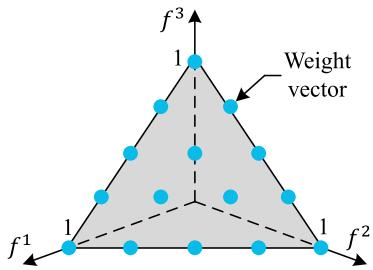

text_image

f³
1
Weight
vector
f¹
1
1
f²

Fig. 3. Fifteen evenly distributed weight vectors for a three-objective problem with d 4.

$1 , \ldots , n$ . Then, n multi-objective value networks, $\{ \mathbf { V } _ { \pi _ { \theta _ { 1 } } } , \ldots .$ ; $\mathbf { V } _ { \pi _ { \theta _ { n } } } \}$ f , are randomly initialized. In each value network, the gnumber of neurons in the output layer is the same as that of optimization objectives, i.e., m.

Finally, we denote the set of learning tasks by $\Omega =$ $\{ \Gamma _ { 1 } , \hdots , \dot { \Gamma } _ { n } \}$ , where $\Gamma _ { i } = \langle \mathbf { w } _ { i } , { \boldsymbol \pi } _ { \theta _ { i } } , { \boldsymbol \pi } _ { \theta ^ { \mathrm { o l d } } } , \mathbf { V } _ { { \boldsymbol \pi } _ { \theta _ { i } } } \rangle$ ¼. After generatf g ¼ h i i iing the tasks, we run MMPPO to obtain the offspring population, as shown in Algorithm 2, where each learning task $\Gamma _ { i } \in \Omega$ is optimized by executing multi-objective PPO (steps 23-11) for a predefined number of iterations, F (equals to $n _ { \mathrm { w a r m } }$ in this stage).

It is quite important for an evolutionary learning algorithm to design a proper operation to generate high-quality offspring learning tasks in the evolution process. This is because high-quality offspring learning tasks inherit the excellent features of parent tasks, which helps to preserve population diversity and improve global exploration. MMPPO in EMORL plays a vital role when generating offspring population $\mathcal { P } ^ { \prime }$ . However, the original MMPPO only Pstores the last learning task in $\mathcal { P } ^ { \prime }$ after F iterations, which Pmay throw away a significant number of promising learning tasks. To overcome this drawback, we improve the original MMPPO by storing each new learning task in $\mathcal { P } ^ { \prime }$ after each Piteration. In other words, we preserve all the learning tasks generated by MMPPO in the offspring population. Thus, running our MMPPO once can obtain $n \cdot \Phi$ new learning tasks, where $n$ is the number of learning tasks. The improved MMPPO can generate a high-quality offspring population, thus enhancing the MOO performance of the original EMORL.

The warm-up stage can provide a set of promising learning tasks of which policies reside in high-performance region in the search space. To start with these tasks, the EMORL-TCTO’s learning process is of low noise, hence more likely to achieve excellent MOO results.

# 4.2.2 Evolutionary Stage

In this stage, the task population is first updated based on the offspring population ${ \mathcal { P } } ^ { \prime }$ P(step 9 in Algorithm 1). The task Ppopulation update procedure is shown in Algorithm 3. We adopt the performance buffer strategy in [38] to update $\mathcal { P } .$ . A number of performance buffers are used to store $\bar { \mathcal P }$ Pfor the Ppurpose of diversity and performance preservation. Let $P _ { \mathrm { n u m } }$ and $P _ { \mathrm { s i z e } }$ denote the number of performance buffers and their size, respectively. The performance space is evenly divided into $P _ { \mathrm { n u m } }$ performance buffers, each of which stores $P _ { \mathrm { s i z e } }$ learning tasks at most. According to the target policy’s objective value, $\mathbf { F } ( \pi _ { \theta } )$ , and a reference point $\mathbf { Z } _ { \mathrm { r e f } } ,$ ð Þ, we store the task associated with $\pi _ { \theta }$ in the corresponding performance buffer.

For an arbitrary performance buffer, we sort the tasks in descending order according to their distances to $\mathbf { Z } _ { \mathrm { r e f } } .$ . If the number of tasks exceeds $P _ { \mathrm { s i z e } } ,$ , we only retain the first $P _ { \mathrm { s i z e } }$ tasks in that buffer. Finally, the learning tasks in all performance buffers form a new task population.

An EP is employed to store non-dominated policies found during evolution. In each generation, EP is updated based on the offspring population ${ \mathcal { P } } ^ { \prime }$ (step 10 in Algorithm 1). For the target policy $\pi _ { \theta }$ Pof each learning task in ${ \mathcal { P } } ^ { \prime } ,$ , we remove those policies dominated by $\pi _ { \theta } ,$ , and add $\pi _ { \theta }$ Pto EP if no policies in EP dominates $\pi _ { \theta } .$ .

For each weight vector $\mathbf { w } _ { i } \in \mathcal { W } _ { * }$ , We select the best learning task from $\mathcal { P }$ 2 Wand update the set of learning tasks V with Pit. First, we calculate the objective vector $\mathbf { F } ( \pi _ { \theta _ { i } } )$ of the target policy $\pi _ { \boldsymbol { \theta } _ { j } }$ of each learning task $\Gamma _ { j } \in \mathscr { P } , j = 1 , \cdot \cdot \cdot , | \mathscr { P } |$ . To be specific, at time step $t ,$ state $s _ { t }$ 2 Pis input to $\pi _ { \theta _ { i } }$ jPjwhich outputs action $a _ { t } = ( \vartheta _ { t } , d _ { t } , b _ { t } )$ . The UAV takes the action $^ { a _ { t } , }$ , and it ¼ ð Þreceives the reward r and next state $s _ { t + 1 }$ . The set of immediate rewards $\{ \mathbf { r } _ { 1 } , \dots , \mathbf { r } _ { T } \}$ is obtained $T$ þtime steps later. We calculate $\mathbf { F } ( \pi _ { \boldsymbol { \theta } _ { j } } ) = \mathbf { r } _ { 1 } + , \ldots , + \mathbf { r } _ { T }$ , where $^ { \prime \prime } { + } ^ { \prime \prime }$ is the vector ð Þ ¼addition. Then, for $\mathbf { w } _ { i } \in \mathcal { W } ,$ þ, the best learning task in $\mathcal { P }$ is selected based on ${ \bf w } _ { i }$ 2 Wand $\mathbf { F } ( \pi _ { \theta _ { i } } )$ P. Finally, the n selected ð Þlearning tasks are added to V. We obtain $\mathcal { P } ^ { \prime }$ by running MMPPO with V and $n _ { \mathrm { e v o } }$ as its input, where $n _ { \mathrm { e v o } }$ is the predefined number of task iterations in the evolutionary stage.

The evolutionary stage terminates when a predefined number of evolution generations are completed. All nondominated policies stored in EP are output as the approximated Pareto optimal policies for the TCTO problem. These policies correspond to different trade-offs between delay, energy consumption and number of tasks, being helpful for decision makers to compromise between conflicting issues/ concerns when designing complicated UAV-assisted MEC systems.

Unlike the distributed FRL executes local training and uploads/downloads model parameters [25], [36], EMORL-TCTO is a centralized RL algorithm that needs to consume massive computing resources during training. Thus, the evolutionary learning procedure of our algorithm can be deployed on the edge server with abundant computing resources. Since the UAV is equipped with a global positioning system (GPS) device, the edge server can access the position information of the UAV. Note that we ignore the communication cost between the UAV and edge server for simplicity. EMORL-TCTO outputs a set of non-dominated policies once it is converged. These policies correspond to different trade-offs between objectives, and the decision maker can select the one that matches the current preference. The edge server allocates the selected policy to the UAV, and it generates flight trajectory and task offloading decisions by simple algebraic calculations.

# 4.2.3 Complexity Analysis

We first analyze the time complexity of EMORL-TCTO shown in Algorithm 1 in the evolutionary process. We analyze the complexity of the outer ”for” loop (i.e., steps 8-19 in Algorithm 1) in the evolutionary stage. The loop’s time complexity mainly depends on the generation of the offspring population (i.e., step 18 in Algorithm 1). Compared with step 18, the other steps (i.e., steps 9-17 in Algorithm 1) are trivial and can be ignored. As shown in Algorithm 2, MMPPO generates the offspring population, and its time complexity mainly relies on the training of neural networks. MMPPO iteratively optimizes each learning task $\Gamma _ { i }$ in task set V for $n _ { \mathrm { i t e r } }$ times, where $n _ { \mathrm { i t e r } }$ stands for the number of task iterations (i.e., steps 2-12 in Algorithm 2). Note that $n _ { \mathrm { i t e r } }$ equals to $n _ { \mathrm { e v o } }$ in the evolutionary stage. Let $n _ { \mathrm { t r a } }$ denote the number of the collected trajectories. Let $n _ { \mathrm { e p o } }$ be the number of epochs for training neural network. In our implementation, the policy network and value network use the fully connected neural network. Note that the policy network shares the same neural network structure with the value network, except for the input and output layers. The policy network consists of an input, an output, and L fully connected layers. The numbers of neurons in the input and output layers are 4 and 3, respectively. Let $n _ { l }$ denote the number of neurons in the l-th fully connected layer. We have $n _ { 0 } = 4$ and $n _ { L + 1 } = 3$ . Thus, the time complexity of MMPPO is $O ( n \times ( n _ { \mathrm { e v o } } \times n _ { \mathrm { e p o } } \times n _ { \mathrm { t r a } } \times ( \sum _ { l = 1 } ^ { L + 1 } n _ { l - 1 } \times n _ { l } ) ) )$ .

We analyze the complexity of EMORL-TCTO. Compared with the evolutionary stage, the time complexity of the warm-up stage is trivial and can be neglected. Therefore, EMORL-TCTO is only dependent on the complexity of MMPPO and the predefined number of maximum evolution generations, $G _ { \mathrm { m a x } } ,$ leading to a time complexity of maxOðGmax 
 ðn 
 ðnevo 
 nepo 
 ntra 
 ðPLþ1l 1 nl1 
 nlÞÞÞÞ. $\begin{array} { r } { O ( G _ { \mathrm { m a x } } \times ( n \times ( n _ { \mathrm { e v o } } \times n _ { \mathrm { e p o } } \times n _ { \mathrm { t r a } } \times ( \sum _ { l = 1 } ^ { L + 1 } n _ { l - 1 } \times n _ { l } ) ) ) ) } \end{array}$

¼Once the evolutionary process is finished, the decisionmaker can select a policy from EP to match the current preference. The selected policy can quickly generate a solution to the TCTO problem through simple algebraic calculations. The computation complexity for generating the solution by the policy network is $\begin{array} { r } { O ( T \times \sum _ { l = 1 } ^ { L + 1 } n _ { l - 1 } \times n _ { l } ) } \end{array}$ , where T is the number of time slots.

# 5 SIMULATION RESULTS AND DISCUSSION

In this section, we evaluate the performance of the proposed EMORL-TCTO algorithm for the TCTO problem. A python simulator based on PyTorch 1.7 is developed for performance evaluation. All experiments are implemented in the simulator that is deployed at a computer with Ubuntu 20.04.2 OS, Intel Xeon(R) CPU E5-2667 v4 3.2 GHz, and 128 GB RAM. In the simulation, we consider a rectangular area with the side lengths of $x _ { \mathrm { m a x } } = 4 0 0$ m and $y _ { \mathrm { m a x } } = 4 0 0 ~ \mathrm { m }$ . We ¼ ¼simulate that the UAV’s mission period is 5 minutes and each time slot lasts for 1 second. Therefore, there are $T =$ ¼300 time slots. At the beginning of each mission, the UAV takes off at a random position in the rectangular area. In each time slot, the $\mathrm { U A } \bar { \mathsf { V } } ^ { \prime } \mathbf { s }$ maximal flying velocity $v _ { \mathrm { m a x } }$ and distance $d _ { \mathrm { m a x } }$ are set to 30 $\mathbf { m } / \mathbf { s }$ and 30 m, respectively. The input data size of a computation task, $\alpha ,$ and the number of CPU cycles required to execute the task, $\beta ,$ are set to 5 MB and $1 \dot { 0 ^ { 9 } }$ cycles, respectively. For each SD, its parameter of Bernoulli random variable is randomly selected from set 0:3; 0:5; 0:7 . As for the parameters of pathloss, we set $A _ { 0 } ,$ , $B _ { 0 } , \ \theta _ { 0 } , \ C _ { 0 } ,$ g and $\eta _ { 0 }$ to 3.04, 23:29, 3:61, 4.14, and 20.7, respectively [4].

TABLE 3 Parameter Configurations in Experiments 

<table><tr><td>Parameter</td><td>Value</td></tr><tr><td colspan="2">Value used in system model</td></tr><tr><td>Rotor disc area (A)</td><td>0.503  $m^{2}$ </td></tr><tr><td>Fuselage drag ratio ( $d_{0}$ )</td><td>0.6</td></tr><tr><td>Maximal distance the UAV can move ( $d_{max}$ )</td><td>30 m</td></tr><tr><td>Computing capability of the UAV ( $f_{U}$ )</td><td>1 GHz</td></tr><tr><td>Rotor solidity (g)</td><td>0.05</td></tr><tr><td>Maximum number of tasks in the computing queue ( $N_{max}$ )</td><td>10</td></tr><tr><td>Blade profile power ( $P_{1}$ )</td><td>79.86</td></tr><tr><td>Induced power ( $P_{2}$ )</td><td>88.63</td></tr><tr><td>Transmission power of the UAV ( $P_{U}$ )</td><td>1 W</td></tr><tr><td>Tip speed of rotor blade ( $U_{tip}$ )</td><td>120 m/s</td></tr><tr><td>Mean rotor induced velocity in hover ( $v_{0}$ )</td><td>4.03</td></tr><tr><td>Maximum flying velocity of the UAV ( $v_{max}$ )</td><td>30 m/s</td></tr><tr><td>Channel bandwidth (W)</td><td>10 MHz</td></tr><tr><td>Air density ( $\rho$ )</td><td>1.225 km/ $m^{3}$ </td></tr><tr><td>Maximal azimuth angle ( $\vartheta_{max}$ )</td><td> $\pi/4$ </td></tr><tr><td>Effective capacitance coefficient ( $\kappa$ )</td><td> $10^{-26}$ </td></tr><tr><td>Background noise power ( $\sigma^{2}$ )</td><td> $10^{-6}$  W</td></tr><tr><td colspan="2">Value used in reinforcement learning</td></tr><tr><td>Number of maximum evolution generations ( $G_{max}$ )</td><td>100</td></tr><tr><td>Number of the performance buffers ( $P_{num}$ )</td><td>200</td></tr><tr><td>Size of each performance buffer ( $P_{size}$ )</td><td>2</td></tr><tr><td>Discount factor ( $\gamma$ )</td><td>0.995</td></tr><tr><td>Clipping parameter ( $\epsilon$ )</td><td>0.2</td></tr><tr><td>Parameter of general advantage estimator ( $\lambda$ )</td><td>0.95</td></tr><tr><td>Number of warm-up iterations ( $n_{warm}$ )</td><td>60</td></tr><tr><td>Number of task iterations ( $n_{evo}$ )</td><td>10</td></tr><tr><td>Number of divisions of weight vectors ( $\delta$ )</td><td>4</td></tr></table>

The number of learning tasks n is set to 15. Each task is associated with a weight vector. So, there are 15 weight vectors, as shown in Fig. 3. For each learning task, there are two fully connected layers in the target policy network. Each layer has 64 neurons, with tanh as activation function. The target policy network’s output layer uses the sigmoid function to bound actions. Except for the input and output layers, the multi-objective value network shares the same structure and activation function with the target policy network. We use Adam optimizer with a learning rate of 0.0001 to update neural networks. Other parameter configurations are summarized in Table 3.

We introduce the test instances. We consider the number of SDs, K, and the UAV’s flying altitude, H, as two important parameters. We specify $K \mathsf { \bar { \in } } \{ \mathsf { \bar { 6 } } 0 , 1 0 0 , 1 4 0 \}$ and $H \in \{ 3 0 , 5 0 \}$ 2 f g 2 f gand generate six test instances with different combinations of K and H. These test instances are listed in Table 4.

# 5.1 Performance Measure

We adopt four widely used evaluation metrics to evaluate the performance of EMORL-TCTO, including the inverted generational distance [45] , hyper volume [38], and comprehensive objective indicator [2], and Friedman test [46].

# 5.1.1 Inverted Generational Distance (IGD)

Let $\mathcal { F } _ { \mathrm { t r u e } }$ and $\mathcal { F } _ { \mathrm { a p p } }$ denote the ture Pareto front and approxi-F Fmated Pareto front found by an MOO algorithm, respectively.

TABLE 4 Test Instance 

<table><tr><td>Instance (K,H)</td><td>Number of SDs (K)</td><td>Flying altitude (H)</td></tr><tr><td>I-(60,30)</td><td>60</td><td>30</td></tr><tr><td>I-(60,50)</td><td>60</td><td>50</td></tr><tr><td>I-(100,30)</td><td>100</td><td>30</td></tr><tr><td>I-(100,50)</td><td>100</td><td>50</td></tr><tr><td>I-(140,30)</td><td>140</td><td>30</td></tr><tr><td>I-(140,50)</td><td>140</td><td>50</td></tr></table>

IGD is the average distance from each point v in $\mathcal { F } _ { \mathrm { t r u e } }$ to its nearest counterpart in ${ \mathcal { F } } _ { \mathrm { a p p } } ,$ which is defined as

$$
I G D = \frac {\sum_ {v \in \mathcal {F} _ {\text { true }}} d (v , \mathcal {F} _ {\text { app }})}{| \mathcal {F} _ {\text { true }} |}, \tag {38}
$$

where $d ( v , \mathcal { F } _ { \mathrm { a p p } } )$ is the euclidean distance between v in $\mathcal { F } _ { \mathrm { t r u e } }$ ð F Þand its nearest point in ${ \mathcal { F } } _ { \mathrm { a p p } }$ F. IGD can reflect both the con-Fvergence and diversity of an approximated Pareto front. An algorithm with a smaller IGD has better performance.

Note that we may not know $\mathcal { F } _ { \mathrm { t r u e } }$ when addressing Fhighly complicated MOO problems, like the TCTO problem. In this case, we collect the best-so-far policies found by all algorithms and select those non-dominated from them to mimic the ture Pareto optimal set. We regard the corresponding Pareto front as $\mathcal { F } _ { \mathrm { t r u e } }$ . This method has been Fwidely used when evaluating MOO algorithms in the literature [45], [46].

# 5.1.2 Hyper Volume (HV)

Let $\mathbf { Z } _ { \mathrm { r e f } } \in \mathbb { R } ^ { m }$ be the reference point. HV is defined as

$$
H V = \int_ {\mathbb {R} ^ {m}} \mathbb {1} _ {H (\mathcal {F} _ {\mathrm{app}}) (z) d z}, \tag {39}
$$

where $H ( \mathcal { F } _ { \mathrm { a p p } } ) = \{ \mathbf { z } | \exists 1 \leq j \leq | \mathcal { F } _ { \mathrm { a p p } } | : \mathbf { Z } _ { \mathrm { r e f } } \prec \mathbf { z } \prec \mathbf { Z } _ { j } \}$ . $\mathbf { Z } _ { j }$ is ðF Þthe j-th point in ${ \mathcal { F } } _ { \mathrm { a p p } } ,$ 9  and 1 ${ \cdot } H ( \mathcal { F } _ { \mathrm { a p p } } )$ j   gis a Dirac delta function that equals 1 if $\mathbf { z } \in H ( \mathcal { F } _ { \mathrm { a p p } } )$ ðF Þand 0, otherwise.

2 ðF ÞThe HV metric can measure both the convergence and uniformity of an approximated Pareto front without the true Pareto front known in advance. A larger HV value indicates the corresponding algorithm has better performance. In this paper, we set $\mathbf { Z } _ { \mathrm { r e f } }$ to the all-zero vector.

Note that before calculating IGD and HV, we normalize the approximated Pareto front via the Min-Max normalization method.

# 5.1.3 Comprehensive Objective Indicator (COI)

Since the TCTO problem has three objectives, we devise a comprehensive indicator to reflect an MOO algorithm’s overall performance, with the task delay, energy consumption, and number of tasks collected taken into account. For each objective vector, we aggregate its objective values into a COI value using the weighted sum method.

Let ${ \bf F } ( \pi ) = ( f ^ { 1 } ( \pi ) , f ^ { 2 } ( \pi ) , f ^ { 3 } ( \pi ) )$ be the objective vector of ð Þ ¼ ð ð Þ ð Þ ð ÞÞpolicy p in the non-dominated policy set, EP, obtained by an algorithm. Give a weight vector $\mathbf { w } = ( w ^ { 1 } , w ^ { 2 } , w ^ { 3 } ) \in \dot { \mathcal { W } } ,$ , we define the COI value of F p as

$$
C O I _ {\mathbf {w}} (\mathbf {F} (\pi)) = \mathbf {w} \cdot \mathbf {F} (\pi) = \sum_ {j = 1} ^ {3} w ^ {j} \cdot f ^ {j} (\pi). \tag {40}
$$

Based on the COI values, we obtain the objective vector of the best policy in EP, $\pi _ { \mathbf { w } } ,$ associated with w by Eq. (41).

$$
\mathbf {F} (\pi_ {\mathbf {w}}) = (f ^ {1} (\pi_ {\mathbf {w}}), f ^ {2} (\pi_ {\mathbf {w}}), f ^ {3} (\pi_ {\mathbf {w}})), \tag {41}
$$

where $\begin{array} { r } { \pi _ { \mathbf { w } } = \arg \operatorname* { m a x } _ { \pi \in \mathrm { E P } } C O I _ { \mathbf { w } } ( \mathbf { F } ( \pi ) ) } \end{array}$ , and $f ^ { 1 } ( \pi _ { \mathbf { w } } ) , f ^ { 2 } ( \pi _ { \mathbf { w } } ) .$ , and $f ^ { 3 } ( \pi _ { \mathbf { w } } )$ ¼ 2 ð ð ÞÞ ð Þ ð Þare the best objective values corresponding to $D _ { \mathrm { t o t a l } } , E _ { \mathrm { t o t a l } }$ , and $N _ { \mathrm { t o t a l } }$ , respectively. According to Eqs. (40) and (41), we obtain the best objective vector for each weight vector in . After that, we calculate the average task delay $( \operatorname { A T D } ) ,$ W average energy consumption (AEC), average task number (ATN), and average COI (ACOI), defined as

$$
A T D = \frac {1}{n} \sum_ {\mathbf {w} \in \mathcal {W}} f ^ {1} (\pi_ {\mathbf {w}}), \tag {42}
$$

$$
A E C = \frac {1}{n} \sum_ {\mathbf {w} \in \mathcal {W}} f ^ {2} (\pi_ {\mathbf {w}}), \tag {43}
$$

$$
A T N = \frac {1}{n} \sum_ {\mathbf {w} \in \mathcal {W}} f ^ {3} (\pi_ {\mathbf {w}}), \tag {44}
$$

$$
A C O I = \frac {1}{n} \sum_ {\mathbf {w} \in \mathcal {W}} C O I _ {\mathbf {w}} (\mathbf {F} (\pi_ {\mathbf {w}})). \tag {42}
$$

# 5.1.4 Friedman Test

The Friedman test, a non-parametric test [46], is adopted to measure the differences among MOO algorithms in terms of ATD, AEC, ATN, and ACOI. All algorithms for comparison are ranked, and the average rank scores assigned to them clearly reflect how well they perform.

# 5.2 Performance Evaluation

We take I-(60,30) in Table 4 as an example to study the UAV’s trajectories. Assume the decision-maker’s current preferences are represented by $\mathbf { w } _ { 1 } ^ { \mathrm { p } } = ( 1 . 0 , 0 . 0 , 0 . 0 ) , \ \mathbf { w } _ { 2 } ^ { \mathrm { p } } =$ $( 0 . 0 , 1 . 0 , 0 . 0 ) , \ \mathbf { w } _ { 3 } ^ { \mathrm { p } } = ( 0 . 0 , 0 . 0 , 1 . 0 )$ , and ${ \bf w } _ { 4 } ^ { \mathrm { p } } = ( \textstyle { \frac { 1 } { 3 } } , \frac { 1 } { 3 } , \frac { 1 } { 3 } )$ Þ ¼. Preferðence $\mathbf { w } _ { 1 } ^ { \mathrm { p } }$ Þ ¼ ð Þ ¼ ð  Þindicates that one only emphasizes minimizing the total task delay $D _ { \mathrm { t o t a l } }$ without considering objectives $E _ { \mathrm { t o t a l } }$ and $N _ { \mathrm { t o t a l } }$ . Similarly, preferences ${ \bf w } _ { 2 } ^ { \mathrm { p } }$ and $\mathbf { w _ { 3 } ^ { \mathrm { p } } }$ aim at minimizing $E _ { \mathrm { t o t a l } }$ and $N _ { \mathrm { t o t a l } } ,$ , respectively. Preference $\mathbf { w } _ { 4 } ^ { \mathrm { p } }$ indicates the three objectives are equally important.

After running EMORL-TCTO once, we can obtain four optimal policies from EP corresponding to the above four preferences. The UAV adopts the four policies to obtain four trajectories through simple algebraic calculations, as shown in Fig. 4. Note that the UAV’s take-off point is set to the origin point. The green curve is associated with $\mathbf { w } _ { 1 } ^ { \mathrm { p } }$ that aims at minimizing $D _ { \mathrm { t o t a l } }$ . It is observed that the UAV moves in the sparse SD area, helping to reduce the task delay. This is because the fewer tasks collected, the lower the task delay. The magenta curve corresponds to ${ \bf w } _ { 2 } ^ { \mathrm { p } }$ that focuses on minimizing $\dot { E } _ { \mathrm { t o t a l } }$ l. One can observe that the UAV flies a short distance and evades SDs, decreasing its propulsion power consumption and the energy consumed by processing the tasks collected from SDs. The black curve corresponds to ${ \bf w } _ { 3 } ^ { \mathrm { p } }$ that concentrates on maximizing $N _ { \mathrm { t o t a l } }$ . We can observe that the UAV flies to the dense SD area to collect more computation tasks without considering delay and energy consumption. The red curve is associated with ${ \bf w } _ { 4 } ^ { \mathrm { p } }$ that aims at minimizing $D _ { \mathrm { t o t a l } } , E _ { \mathrm { t o t a l } } ,$ , and $N _ { \mathrm { t o t a l } }$ simultaneously, and their importance is equal. It can be seen that the UAV moves in the dense SD area to collect more computation tasks from SDs. However, unlike the black trajectory, the UAV does not fly long distance to collect tasks, because long-distance travel leads to high propulsion power consumption. Based on the above analysis, the proposed EMORL-TCTO can obtain potential control policies according to different preferences in just one run, which validates the effectiveness of our algorithm.

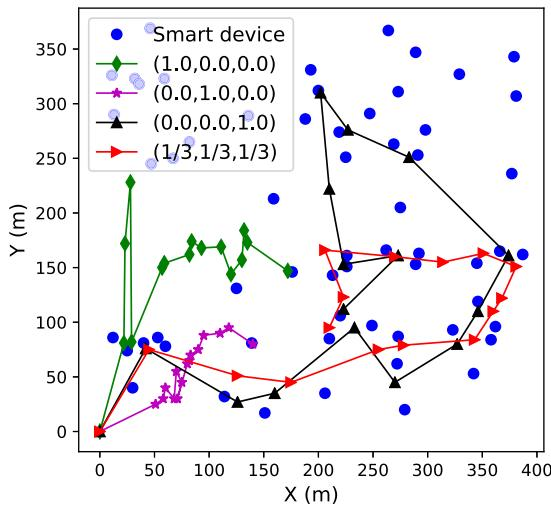

scatter

| X (m) | Y (m) | Category           |
|-------|-------|--------------------|
| 0     | 0     | Smart device       |
| 50    | 80    | Smart device       |
| 100   | 170   | Smart device       |
| 150   | 130   | Smart device       |
| 200   | 310   | Smart device       |
| 250   | 270   | Smart device       |
| 300   | 250   | Smart device       |
| 350   | 160   | Smart device       |
| 400   | 160   | Smart device       |
| 50    | 80    | (1.0,0.0,0.0)     |
| 100   | 170   | (1.0,0.0,0.0)     |
| 150   | 130   | (1.0,0.0,0.0)     |
| 200   | 310   | (1.0,0.0,0.0)     |
| 250   | 270   | (1.0,0.0,0.0)     |
| 300   | 250   | (1.0,0.0,0.0)     |
| 350   | 160   | (1.0,0.0,0.0)     |
| 400   | 160   | (1.0,0.0,0.0)     |
| 50    | 80    | (0.0,1.0,0.0)     |
| 100   | 170   | (0.0,1.0,0.0)     |
| 150   | 130   | (0.0,1.0,0.0)     |
| 200   | 310   | (0.0,1.0,0.0)     |
| 250   | 270   | (0.0,1.0,0.0)     |
| 300   | 250   | (0.0,1.0,0.0)     |
| 350   | 160   | (0.0,1.0,0.0)     |
| 400   | 160   | (1/3,1/3,1/3)     |
| 50    | 80    | (1/3,1/3,1/3)     |
| 100   | 170   | (1/3,1/3,1/3)     |
| 150   | 130   | (1/3,1/3,1/3)     |
| 200   | 310   | (1/3,1/3,1/3)     |
| 250   | 270   | (1/3,1/3,1/3)     |
| 300   | 250   | (1/3,1/3,1/3)     |
| 350   | 160   | (1/3,1/3,1/3)     |
| 400   | 160   | (1/3,1/3,1/3)     |

Fig. 4. Trajectories of the UAV under four different preferences.

To thoroughly study the performance of EMORL-TCTO, we implement five baseline algorithms for comparison, including two MOEAs, i.e., NSGA-II and MOEA/D, two multi-policy MORLs, i.e., EDDPG and ETD3, and the original EMORL. The compared algorithms are described below.

NSGA-II: The fast and elitist non-dominated sorting genetic algorithm [47] adopted to minimize the average task delay and average energy consumption. The population size and number of generations are both set to 100. The crossover and mutation probabilities are set to 0.8 and 0.3, respectively.   
MOEA/D: The multi-objective evolutionary algorithm based on decomposition [46] used to minimize the average application completion time and average energy consumption. Both the population size and number of generations are set to 100. The number of neighbors for each subproblem is set to 10.   
EDDPG: The evolutionary DDPG, a variant of EMORL-TCTO that uses a multi-task multi-objective DDPG (MMDDPG) instead of MMPPO, i.e., Algorithm 2. Note that MMDDPG is extended from the single-policy DDPG [39]. We develop EDDPG for performance evaluation purpose.   
ETD3: The evolutionary TD3, another variant of EMORL-TCTO that adopts a multi-task multiobjective TD3 (MMTD3) instead of MMPPO. Note that MMTD3 is extended from the single-policy TD3 [48]. We develop ETD3 for performance evaluation purpose.

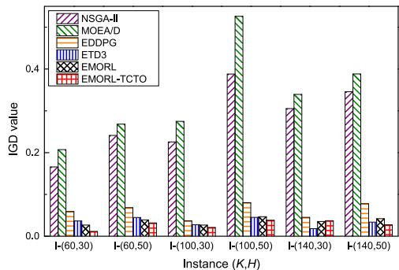

bar

| Instance (K,H) | NSGA-II | MOEA/D | EDDPG | ETD3 | EMORL | EMORL-TCTO |
|---|---|---|---|---|---|---|
| I-(60,30) | 0.17 | 0.21 | 0.05 | 0.04 | 0.03 | 0.02 |
| I-(60,50) | 0.24 | 0.27 | 0.06 | 0.04 | 0.04 | 0.03 |
| I-(100,30) | 0.22 | 0.28 | 0.04 | 0.03 | 0.03 | 0.02 |
| I-(100,50) | 0.39 | 0.51 | 0.08 | 0.05 | 0.05 | 0.04 |
| I-(140,30) | 0.31 | 0.34 | 0.05 | 0.03 | 0.03 | 0.03 |
| I-(140,50) | 0.35 | 0.39 | 0.08 | 0.04 | 0.04 | 0.03 |

Fig. 5. Results of IGD.

EMORL: The original EMORL used to address continue multi-objective robotic control problems [38].   
EMORL-TCTO: The proposed algorithm in this paper.

In NSGA-II and MOEA/D, each gene in a chromosome represents a trajectory control and task offloading decision in a time slot. For fair comparison, EMORL-TCTO, EDDPG, and ETD3 use the same parameter settings.

The results of IGD and HV are shown in Figs. 5 and $^ { 6 , }$ respectively. First, one can observe that NSGA-II and MOEA/D, both widely recognized, are the two worst algorithms and cannot find a decent Pareto front in all test instances. This is because when handling high-dimensional MOO problems in dynamic environments, such as the TCTO problem, MOEAs usually spend much time in obtaining decent non-dominated policies and it is hard to converge within a short time [40], [49]. Specifically, it is time-consuming for an MOEA with a large encoding length (i.e., 900) to generate acceptable non-dominated policies. In addition, MOEAs may not have enough time to converge because the UAV-assisted MEC environment is highly dynamic and full of uncertainty. In other words, the dynamics and uncertainty frequently triggers the re-execution of MOEAs from scratch, resulting in high computational burdens and slow convergence speed. That is why NSGA-II and MOEA/D fail to achieve satisfactory performance on the TCTO problem.

Second, all MORLs outperform NSGA-II and MOEA/D in all test instances. Unlike MOEAs that make decisions for all time slots using a single chromosome, MORLs make real-time decision in each time slot according to the current environment state. Moreover, MORLs combine RL with deep neural network and can deal with sequential decisionmaking problems in the dynamic MEC environment. The reason is that MORLs are able to quickly adapt their behaviors to the changes by interacting with the MEC environment. Hence, MORLs can quickly converge and respond to the requirements of users. This is why an MORL is more appropriate to address the TCTO problem than an MOEA.

Third, EMORL-TCTO obtains the smallest IGD values and the largest HV values in almost all instances except I-(140,30), demonstrating its superiority over the other five algorithms. EMORL-TCTO maintains multiple learning tasks in the evolutionary process. In each generation, these learning tasks are optimized with different weight vectors by MMPPO, resulting in an offspring population that is used to update the external Pareto archive, EP (a nondominated policy set). Thus, EMORL-TCTO is able to obtain excellent non-dominated policies. Such experimental results also validate the effectiveness of our improvement in the original EMORL. This is because we improve the original MMPPO in EMORL-TCTO by storing each new learning task in the offspring population ${ \mathcal { P } } ^ { \prime }$ after each iteration. In Pother words, we preserve all the learning tasks generated by MMPPO in $\mathcal { P } ^ { \bar { \prime } } .$ . The improved MMPPO can generate a Phigh-quality offspring population, thus enhancing the MOO performance of the original EMORL.

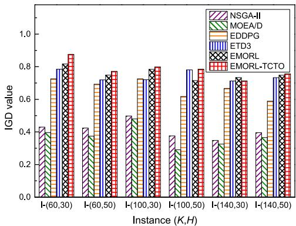

bar

| Instance (K,H) | NSGA-II | MOEA/D | EDDPG | ETD3 | EMORL | EMORL-TCTO |
| -------------- | ------- | ------ | ----- | ---- | ----- | ---------- |
| I-(60,30)      | 0.42    | 0.72   | 0.78  | 0.82 | 0.81  | 0.88       |
| I-(60,50)      | 0.42    | 0.72   | 0.78  | 0.78 | 0.78  | 0.78       |
| I-(100,30)     | 0.50    | 0.48   | 0.72  | 0.78 | 0.80  | 0.80       |
| I-(100,50)     | 0.38    | 0.28   | 0.62  | 0.78 | 0.72  | 0.78       |
| I-(140,30)     | 0.34    | 0.32   | 0.68  | 0.72 | 0.72  | 0.72       |
| I-(140,50)     | 0.38    | 0.36   | 0.58  | 0.74 | 0.74  | 0.74       |

Fig. 6. Results of HV.

To further support our observation above, we plot the convergence curves of IGD and HV obtained by all algorithms in Figs. 7 and 8. It is obvious that EMORL-TCTO is the best among all algorithms in almost all instances except

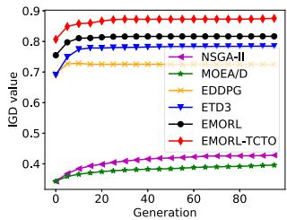

line

| Generation | NSGA-II | MOEA/D | EDDPG | ETD3 | EMORL | EMORL-TCTO |
| ---------- | ------- | ------ | ----- | ---- | ----- | ---------- |
| 0          | 0.35    | 0.35   | 0.70  | 0.75 | 0.80  | 0.80       |
| 20         | 0.40    | 0.38   | 0.72  | 0.78 | 0.82  | 0.85       |
| 40         | 0.42    | 0.40   | 0.73  | 0.79 | 0.83  | 0.86       |
| 60         | 0.43    | 0.41   | 0.74  | 0.80 | 0.84  | 0.87       |
| 80         | 0.44    | 0.42   | 0.75  | 0.81 | 0.85  | 0.88       |
| 100        | 0.45    | 0.43   | 0.76  | 0.82 | 0.86  | 0.89       |

(a) I-(60,30)

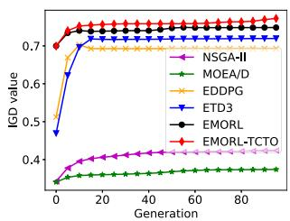

line

| Generation | NSGA-II | MOEA/D | EDDPG | ETD3 | EMORL | EMORL-TCTO |
| ---------- | ------- | ------ | ----- | ---- | ----- | ---------- |
| 0          | 0.35    | 0.35   | 0.35  | 0.35 | 0.35  | 0.35       |
| 20         | 0.40    | 0.36   | 0.70  | 0.72 | 0.72  | 0.72       |
| 40         | 0.42    | 0.37   | 0.71  | 0.73 | 0.73  | 0.73       |
| 60         | 0.43    | 0.38   | 0.72  | 0.74 | 0.74  | 0.74       |
| 80         | 0.44    | 0.39   | 0.73  | 0.75 | 0.75  | 0.75       |
| 100        | 0.45    | 0.40   | 0.74  | 0.76 | 0.76  | 0.76       |

(b) I-(60,50)

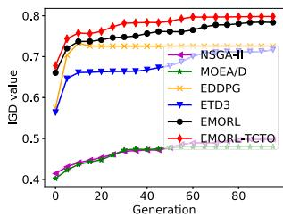

line

| Generation | NSGA-II | MOEA/D | EDDPG | ETD3 | EMORL | EMORL-TCTO |
| ---------- | ------- | ------ | ----- | ---- | ----- | ---------- |
| 0          | 0.4     | 0.4    | 0.4   | 0.4  | 0.4   | 0.4        |
| 20         | 0.45    | 0.45   | 0.65  | 0.6  | 0.7   | 0.75       |
| 40         | 0.45    | 0.45   | 0.7   | 0.65 | 0.75  | 0.78       |
| 60         | 0.45    | 0.45   | 0.7   | 0.65 | 0.78  | 0.79       |
| 80         | 0.45    | 0.45   | 0.7   | 0.65 | 0.78  | 0.79       |

(c) I-(100,30)

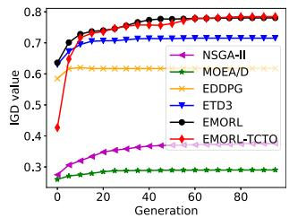

line

| Generation | NSGA-II | MOEA/D | EDDPG | ETD3 | EMORL | EMORL-TCTO |
| ---------- | ------- | ------ | ----- | ---- | ----- | ---------- |
| 0          | 0.28    | 0.28   | 0.60  | 0.65 | 0.65  | 0.42       |
| 20         | 0.35    | 0.29   | 0.65  | 0.70 | 0.72  | 0.70       |
| 40         | 0.38    | 0.29   | 0.65  | 0.72 | 0.75  | 0.75       |
| 60         | 0.39    | 0.29   | 0.65  | 0.73 | 0.76  | 0.76       |
| 80         | 0.39    | 0.29   | 0.65  | 0.73 | 0.76  | 0.76       |
| 100        | 0.39    | 0.29   | 0.65  | 0.73 | 0.76  | 0.76       |

(d) I-(100,50)

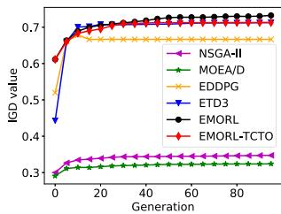

line

| Generation | NSGA-II | MOEA/D | EDDPG | ETD3 | EMORL | EMORL-TCTO |
| ---------- | ------- | ------ | ----- | ---- | ----- | ---------- |
| 0          | 0.3     | 0.3    | 0.5   | 0.4  | 0.7   | 0.6        |
| 20         | 0.35    | 0.32   | 0.65  | 0.7  | 0.7   | 0.7        |
| 40         | 0.36    | 0.33   | 0.65  | 0.7  | 0.7   | 0.7        |
| 60         | 0.36    | 0.33   | 0.65  | 0.7  | 0.7   | 0.7        |
| 80         | 0.36    | 0.33   | 0.65  | 0.7  | 0.7   | 0.7        |
| 100        | 0.36    | 0.33   | 0.65  | 0.7  | 0.7   | 0.7        |

(e) I-(140,30)

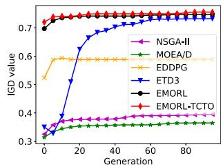

line

| Generation | NSGA-II | MOEA/D | EDDPG | ETD3 | EMORL | EMORL-TCTO |
| ---------- | ------- | ------ | ----- | ---- | ----- | ---------- |
| 0          | 0.3     | 0.3    | 0.5   | 0.3  | 0.7   | 0.7        |
| 20         | 0.35    | 0.35   | 0.6   | 0.6  | 0.7   | 0.7        |
| 40         | 0.38    | 0.38   | 0.6   | 0.7  | 0.7   | 0.7        |
| 60         | 0.39    | 0.39   | 0.6   | 0.75 | 0.7   | 0.7        |
| 80         | 0.4     | 0.4    | 0.6   | 0.75 | 0.7   | 0.7        |
| 100        | 0.4     | 0.4    | 0.6   | 0.75 | 0.7   | 0.7        |

(f) I-(140,50)   
Fig. 8. Convergence curves of six algorithms in terms of HV.

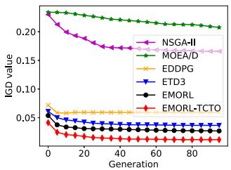

line

| Generation | NSGA-II | MOEA/D | EDDPG | ETD3 | EMORL | EMORL-TCTO |
| ---------- | ------- | ------ | ----- | ---- | ----- | ---------- |
| 0          | 0.22    | 0.22   | 0.07  | 0.06 | 0.06  | 0.04       |
| 20         | 0.18    | 0.21   | 0.06  | 0.05 | 0.05  | 0.03       |
| 40         | 0.17    | 0.20   | 0.06  | 0.05 | 0.05  | 0.03       |
| 60         | 0.17    | 0.20   | 0.06  | 0.05 | 0.05  | 0.03       |
| 80         | 0.17    | 0.20   | 0.06  | 0.05 | 0.05  | 0.03       |
| 100        | 0.17    | 0.20   | 0.06  | 0.05 | 0.05  | 0.03       |

(a) I-(60,30)

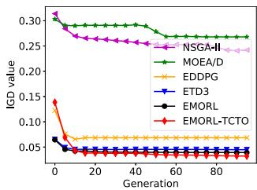

line

| Generation | NSGA-II | MOEA/D | EDDPG | ETD3 | EMORL | EMORL-TCTO |
| ---------- | ------- | ------ | ----- | ---- | ----- | ---------- |
| 0          | 0.30    | 0.30   | 0.15  | 0.07 | 0.06  | 0.14       |
| 20         | 0.28    | 0.29   | 0.08  | 0.06 | 0.05  | 0.05       |
| 40         | 0.27    | 0.28   | 0.07  | 0.06 | 0.05  | 0.05       |
| 60         | 0.26    | 0.27   | 0.07  | 0.06 | 0.05  | 0.05       |
| 80         | 0.25    | 0.26   | 0.07  | 0.06 | 0.05  | 0.05       |
| 100        | 0.25    | 0.26   | 0.07  | 0.06 | 0.05  | 0.05       |

(b) I-(60,50)

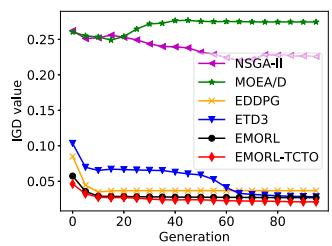

line

| Generation | NSGA-II | MOEA/D | EDDPG | ETD3 | EMORL | EMORL-TCTO |
| ---------- | ------- | ------ | ----- | ---- | ----- | ---------- |
| 0          | 0.25    | 0.25   | 0.10  | 0.10 | 0.05  | 0.05       |
| 20         | 0.24    | 0.26   | 0.07  | 0.07 | 0.05  | 0.04       |
| 40         | 0.23    | 0.27   | 0.06  | 0.06 | 0.05  | 0.04       |
| 60         | 0.22    | 0.27   | 0.05  | 0.05 | 0.05  | 0.04       |
| 80         | 0.22    | 0.27   | 0.05  | 0.05 | 0.05  | 0.04       |
| 100        | 0.22    | 0.27   | 0.05  | 0.05 | 0.05  | 0.04       |

(c)I-(100,30)

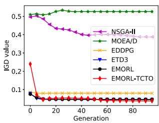

line

| Generation | NSGA-II | MOEA/D | EDDPG | ETD3 | EMORL | EMORL-TCTO |
| ---------- | ------- | ------ | ----- | ---- | ----- | ---------- |
| 0          | 0.5     | 0.5    | 0.1   | 0.1  | 0.1   | 0.2        |
| 20         | 0.45    | 0.5    | 0.1   | 0.1  | 0.1   | 0.1        |
| 40         | 0.4     | 0.5    | 0.1   | 0.1  | 0.1   | 0.1        |
| 60         | 0.4     | 0.5    | 0.1   | 0.1  | 0.1   | 0.1        |
| 80         | 0.4     | 0.5    | 0.1   | 0.1  | 0.1   | 0.1        |
| 100        | 0.4     | 0.5    | 0.1   | 0.1  | 0.1   | 0.1        |

(d) I-(100,50)

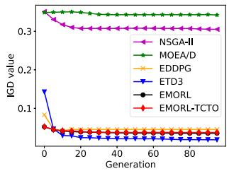

line

| Generation | NSGA-II | MOEA/D | EDDPG | ETD3 | EMORL | EMORL-TCTO |
| ---------- | ------- | ------ | ----- | ---- | ----- | ---------- |
| 0          | 0.3     | 0.3    | 0.1   | 0.15 | 0.05  | 0.05       |
| 20         | 0.3     | 0.3    | 0.05  | 0.05 | 0.05  | 0.05       |
| 40         | 0.3     | 0.3    | 0.05  | 0.05 | 0.05  | 0.05       |
| 60         | 0.3     | 0.3    | 0.05  | 0.05 | 0.05  | 0.05       |
| 80         | 0.3     | 0.3    | 0.05  | 0.05 | 0.05  | 0.05       |
| 100        | 0.3     | 0.3    | 0.05  | 0.05 | 0.05  | 0.05       |

(e) I-(140,30)

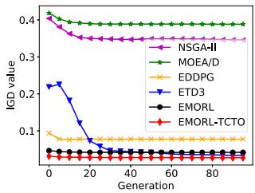

line

| Generation | NSGA-II | MOEA/D | EDDPG | ETD3 | EMORL | EMORL-TCTO |
| ---------- | ------- | ------ | ----- | ---- | ----- | ---------- |
| 0          | 0.4     | 0.4    | 0.1   | 0.2  | 0.05  | 0.05       |
| 20         | 0.35    | 0.4    | 0.08  | 0.05 | 0.05  | 0.05       |
| 40         | 0.35    | 0.4    | 0.08  | 0.05 | 0.05  | 0.05       |
| 60         | 0.35    | 0.4    | 0.08  | 0.05 | 0.05  | 0.05       |
| 80         | 0.35    | 0.4    | 0.08  | 0.05 | 0.05  | 0.05       |

(f) I-(140,50)   
Fig. 7. Convergence curves of six algorithms in terms of IGD.   
Authorized licensed use limited to: Inner Mongolia University. Downloaded on May 29,2026 at 12:30:51 UTC from IEEE Xplore. Restrictions apply. Authoredcsite3roorsr

I-(140,30). In addition, EMORL-TCTO converges to an approximate non-dominated policy set, EP, after about 20 generations. In other words, once the convergence of EMORL-TCTO is stable, we terminate its evolutionary learning process and output EP, which can save the running time for the algorithm and reduce the computing resource consumption of the edge server.

Tables 5, 6, and 7 show the ATD, AEC, and ATN values obtained by the six algorithms. Note that the best results are in bold. No matter which one gets fixed, K or $H ,$ the corresponding ATD, AEC, and ATN values tend to grow up as the other increases. First, the larger the number of SDs located in the rectangular area, the more the computation tasks need to be collected by the UAV. Second, given that the UAV cannot fly over its maximum allowable altitude, the higher the flying altitude, the larger the UAV’s coverage, thus the more the computation tasks can be collected. However, collecting more tasks by the UAV leads to larger task processing delay and higher energy consumption because it has more tasks to handle. Tables 5, 6, and 7 well support this.

In Table 5, it is easily seen that EMORL-TCTO performs better than the other algorithms in four instances except I-(100,50) and I-(140,30). EMORL achieves the smallest ATD values in I-(100,50) and I-(140,30). However, it is worse than EMORL-TCTO in terms of AEC and ATN, with all instances considered. For example, although EMORL obtains the smallest ATD value in I-(100,50) and I-(140,30), its AEC and ATN values are both beaten by EMORL-TCTO’s.

TABLE 5 Results of ATD (sec.) 

<table><tr><td>Instance (K,H)</td><td>NSGA-II</td><td>MOEA/D</td><td>EDDPG</td><td>ETD3</td><td>EMORL</td><td>EMORL-TCTO</td></tr><tr><td>I-(60,30)</td><td>360.6705</td><td>449.3261</td><td>178.1979</td><td>207.3941</td><td>182.8770</td><td>171.5592</td></tr><tr><td>I-(60,50)</td><td>699.9270</td><td>901.6853</td><td>180.8765</td><td>663.1704</td><td>267.7958</td><td>155.1822</td></tr><tr><td>I-(100,30)</td><td>684.1330</td><td>774.9312</td><td>240.4584</td><td>258.6074</td><td>249.8071</td><td>196.4050</td></tr><tr><td>I-(100,50)</td><td>1145.2387</td><td>1252.2857</td><td>256.8315</td><td>329.8663</td><td>208.5477</td><td>313.1781</td></tr><tr><td>I-(140,30)</td><td>936.4533</td><td>1103.2919</td><td>230.6772</td><td>692.5947</td><td>226.5553</td><td>571.5465</td></tr><tr><td>I-(140,50)</td><td>1612.1876</td><td>1830.5439</td><td>448.3674</td><td>655.9662</td><td>584.5687</td><td>407.1039</td></tr></table>

TABLE 6 Results of AEC ( 100 J) 

<table><tr><td>Instance (K, H)</td><td>NSGA-II</td><td>MOEA/D</td><td>EDDPG</td><td>ETD3</td><td>EMORL</td><td>EMORL-TCTO</td></tr><tr><td>I-(60,30)</td><td>535.7497</td><td>607.0149</td><td>734.9652</td><td>612.6807</td><td>436.2488</td><td>423.9196</td></tr><tr><td>I-(60,50)</td><td>557.7339</td><td>621.7390</td><td>720.9539</td><td>776.6358</td><td>762.8275</td><td>484.3969</td></tr><tr><td>I-(100,30)</td><td>575.7189</td><td>612.6438</td><td>762.3671</td><td>578.6976</td><td>613.0563</td><td>581.5113</td></tr><tr><td>I-(100,50)</td><td>671.6125</td><td>578.6909</td><td>920.4442</td><td>740.0272</td><td>823.5713</td><td>547.2583</td></tr><tr><td>I-(140,30)</td><td>621.2169</td><td>636.7211</td><td>850.0938</td><td>567.1289</td><td>711.1420</td><td>693.9467</td></tr><tr><td>I-(140,50)</td><td>682.0360</td><td>669.6477</td><td>857.6836</td><td>914.0324</td><td>868.8991</td><td>812.7823</td></tr></table>

TABLE 7 Results of ATN 

<table><tr><td>Instance (K,H)</td><td>NSGA-II</td><td>MOEA/D</td><td>EDDPG</td><td>ETD3</td><td>EMORL</td><td>EMORL-TCTO</td></tr><tr><td>I-(60,30)</td><td>436.5311</td><td>488.4442</td><td>629.8123</td><td>645.4441</td><td>682.8770</td><td>692.1570</td></tr><tr><td>I-(60,50)</td><td>815.9199</td><td>878.4387</td><td>1221.3755</td><td>1167.5045</td><td>1267.7958</td><td>1327.2251</td></tr><tr><td>I-(100,30)</td><td>785.3785</td><td>827.4552</td><td>1127.4746</td><td>1149.2537</td><td>1249.8071</td><td>1301.4954</td></tr><tr><td>I-(100,50)</td><td>1456.8252</td><td>1636.5010</td><td>1904.8395</td><td>1932.8283</td><td>1949.8663</td><td>2059.4704</td></tr><tr><td>I-(140,30)</td><td>1075.8181</td><td>1245.1861</td><td>1692.0124</td><td>1755.7825</td><td>1812.5947</td><td>1982.3445</td></tr><tr><td>I-(140,50)</td><td>2241.4241</td><td>2313.4791</td><td>3201.1267</td><td>3595.6318</td><td>3684.5687</td><td>3760.8825</td></tr></table>

TABLE 8 Results of ACOI 

<table><tr><td>Instance (K, H)</td><td>NSGA-II</td><td>MOEA/D</td><td>EDDPG</td><td>ETD3</td><td>EMORL</td><td>EMORL-TCTO</td></tr><tr><td>I-(60,30)</td><td>21.0263</td><td>42.0819</td><td>82.5832</td><td>131.7808</td><td>173.7920</td><td>184.7818</td></tr><tr><td>I-(60,50)</td><td>84.5784</td><td>62.2835</td><td>340.6043</td><td>359.5631</td><td>389.5286</td><td>450.1716</td></tr><tr><td>I-(100,30)</td><td>64.7223</td><td>13.1348</td><td>310.7214</td><td>354.8805</td><td>397.4459</td><td>435.1105</td></tr><tr><td>I-(100,50)</td><td>272.1878</td><td>229.6503</td><td>636.6323</td><td>696.2871</td><td>704.4896</td><td>733.6050</td></tr><tr><td>I-(140,30)</td><td>192.7623</td><td>160.3794</td><td>583.9968</td><td>631.3070</td><td>702.2765</td><td>721.8641</td></tr><tr><td>I-(140,50)</td><td>564.4810</td><td>480.4235</td><td>1182.7235</td><td>1344.7802</td><td>1374.9132</td><td>1456.0290</td></tr></table>

As for the AEC values shown in Table 6, EMORL-TCTO outperforms the others in I-(60,30), I-(60,50), and I-(100,50). Although NSGA-II and MOEA/D achieve decent AEC results in I-(100,30) and I-(140,50), they do not perform well regarding ATD and ATN. For example, while NSGA-II obtains the smallest AEC value in I-(100,30), this algorithm causes larger ATD and smaller ATN values than EMORL-TCTO. Similar phenomenon can be observed on MOEA/D. ETD3 obtains the best AEC value in I-(140,30), but its ATD and ATN values are worse than EMORL-TCTO’s.

As shown in Table 7, EMORL-TCTO is the best as it results in the largest ATN in every instance. It means EMORL-TCTO allows the UAV to collect sufficient number of computation tasks from SDs by appropriately controlling the UAV’s flying trajectory, during its entire mission period.

As aforementioned, the ACOI indicator reflects an MOO algorithm’s overall optimization performance. Table 8 lists the results of ACOI obtained by the six algorithms for comparison. It is easily seen that EMORL-TCTO overweighs NSGA-II, MOEA/D, EDDPG, ETD3, and EMORL in all test instances since EMORL-TCTO can better balance between objectives. In addition, the Friedman test is adopted to rank the six algorithms. Based on the ATD, AEC, ATN, and ACOI values, the average rankings and positions of algorithms are calculated and shown in Table 9. One can clearly observe that EMORL-TCTO obtains the best overall performance.

TABLE 9 Rankings of Six Algorithms 

<table><tr><td rowspan="2">Algorithm</td><td colspan="2">ATD</td><td colspan="2">AEC</td><td colspan="2">ATN</td><td colspan="2">ACOI</td></tr><tr><td>Average rank</td><td>Position</td><td>Average rank</td><td>Position</td><td>Average rank</td><td>Position</td><td>Average rank</td><td>Position</td></tr><tr><td>NSGA-II</td><td>5.0000</td><td>5</td><td>2.1667</td><td>1</td><td>6.0000</td><td>6</td><td>5.1667</td><td>5</td></tr><tr><td>MOEA/D</td><td>6.0000</td><td>6</td><td>2.8333</td><td>2</td><td>5.0000</td><td>5</td><td>5.8333</td><td>6</td></tr><tr><td>EDDPG</td><td>2.0000</td><td>2</td><td>5.3333</td><td>5</td><td>3.8333</td><td>4</td><td>4.0000</td><td>4</td></tr><tr><td>ETD3</td><td>4.0000</td><td>4</td><td>4.0000</td><td>3</td><td>3.1667</td><td>3</td><td>3.0000</td><td>3</td></tr><tr><td>EMORL</td><td>2.3333</td><td>3</td><td>4.5000</td><td>4</td><td>2.0000</td><td>2</td><td>2.0000</td><td>2</td></tr><tr><td>EMORL-TCTO</td><td>1.6667</td><td>1</td><td>2.1667</td><td>1</td><td>1.0000</td><td>1</td><td>1.0000</td><td>1</td></tr></table>

# 6 CONCLUSION AND FUTURE WORK

We model the trajectory control and task offloading (TCTO) problem by multi-objective Markov decision process (MOMDP) and propose an improved evolutionary multi-objective reinforcement learning algorithm, EMORL-TCTO, to address the problem. The proposed algorithm can output plenty of non-dominated policies for various user preferences in each run, clearly reflecting the conflicts between objectives. Compared with NSGA-II, MOEA/D, EDDPG, ETD3, and EMORL, our algorithm strikes better balance between the objectives in almost all instances regarding inverted generational distance and hyper volume. EMORL-TCTO is also the best in most instances with respect to system-related metrics, including the average task delay, average UAV’s energy consumption, average number of tasks collected by the UAV, and average comprehensive objective indicator. In addition, EMORL-TCTO takes the first position in the Friedman test. Hence, the performance comparison demonstrates EMORL-TCTO’s suitability to tackle the TCTO problem and its potential to be applied to multi-objective UAV-assisted MEC scenarios.

In the future, we will design a multi-UAV-assisted MEC system in which multiple UAVs move constantly and provide large-scale SDs with computation offloading services. In the MEC system, We will formulate an MOO problem, which aims to minimize the processing delay of tasks and energy consumption of UAVs by jointly optimizing offloading decisions and UAV’s trajectories. However, due to the high complexity of the collision avoidance and collaboration services between UAVs, how to make computation offloading decisions for large-scale SDs and plan the trajectories of multiple UAVs is still challenging. To address the above problem, we will propose a multi-agent multi-objective reinforcement learning algorithm with the mean-field game [50], where each UAV is regarded as an agent. In this multiagent system, each UAV considers the flight states of other UAVs to determine their flight trajectories, which can reduce the computational complexity and avoid the inter-UAVs collision.

# REFERENCES

[1] F. Wang, J. Xu, and S. Cui, “Optimal energy allocation and task offloading policy for wireless powered mobile edge computing systems,” IEEE Trans. Wireless Commun., vol. 19, no. 4, pp. 2443– 2459, Apr. 2020.   
[2] F. Song, H. Xing, X. Wang, S. Luo, P. Dai, and K. Li, “Offloading dependent tasks in multi-access edge computing: A multi-objective reinforcement learning approach,” Future Gener. Comput. Syst., vol. 128, pp. 333–348, Mar. 2022.

[3] P. Mach and Z. Becvar, “Mobile edge computing: A survey on architecture and computation offloading,” IEEE Commun. Surv. Tuts., vol. 19, no. 3, pp. 1628–1656, 3rd Quart. 2017.   
[4] C. Zhou et al., “Deep reinforcement learning for delay-oriented IoT task scheduling in SAGIN,” IEEE Trans. Wireless Commun., vol. 20, no. 2, pp. 911–925, Feb. 2021.   
[5] K. Zhang, X. Gui, D. Ren, and D. Li, “Energy-latency tradeoff for computation offloading in UAV-assisted multiaccess edge computing system,” IEEE Internet Things J., vol. 8, no. 8, pp. 6709–6719, Apr. 2021.   
[6] Z. Ning et al., “Dynamic computation offloading and server deployment for UAV-enabled multi-access edge computing,” IEEE Trans. Mobile Comput., vol. 22, no. 5, pp. 2628–2644, May 2023.   
[7] Y. Liu, K. Xiong, Q. Ni, P. Fan, and K. B. Letaief, “UAV-assisted wireless powered cooperative mobile edge computing: Joint offloading, CPU control, and trajectory optimization,” IEEE Internet Things J., vol. 7, no. 4, pp. 2777–2790, Apr. 2020.   
[8] T. Zhang, Y. Xu, J. Loo, D. Yang, and L. Xiao, “Joint computation and communication design for UAV-assisted mobile edge computing in IoT,” IEEE Trans. Ind. Informat., vol. 16, no. 8, pp. 5505– 5516, Aug. 2020.   
[9] C. Sun, W. Ni, and X. Wang, “Joint computation offloading and trajectory planning for UAV-assisted edge computing,” IEEE Trans. Wireless Commun., vol. 20, no. 8, pp. 5343–5358, Aug. 2021.   
[10] Y. K. Tun, Y. M. Park, N. H. Tran, W. Saad, S. R. Pandey, and C. S. Hong, “Energy-efficient resource management in UAV-assisted mobile edge computing,” IEEE Commun. Lett., vol. 25, no. 1, pp. 249–253, Jan. 2021.   
[11] P. A. Apostolopoulos, G. Fragkos, E. E. Tsiropoulou, and S. Papavassiliou, “Data offloading in UAV-assisted multi-access edge computing systems under resource uncertainty,” IEEE Trans. Mobile Comput., vol. 22, no. 1, pp. 175–190, Jan. 2023.   
[12] W. Ye, J. Luo, F. Shan, W. Wu, and M. Yang, “Offspeeding: Optimal energy-efficient flight speed scheduling for UAV-assisted edge computing,” Comput. Netw., vol. 183, Oct. 2020, Art. no. 107577.   
[13] J. Zhang et al., “Stochastic computation offloading and trajectory scheduling for UAV-assisted mobile edge computing,” IEEE Internet Things J., vol. 6, no. 2, pp. 3688–3699, Apr. 2019.   
[14] N. N. Ei, M. Alsenwi, Y. K. Tun, Z. Han, and C. S. Hong, “Energyefficient resource allocation in multi-UAV-assisted two-stage edge computing for beyond 5G networks,” IEEE Trans. Intell. Transp. Syst., vol. 23, no. 9, pp. 16421–16432, Sep. 2022.   
[15] X. Chen, C. Wu, T. Chen, Z. Liu, M. Bennis, and Y. Ji, “Age of information-aware resource management in UAV-assisted mobile-edge computing systems,” in Proc. IEEE Glob. Commun. Conf., 2020, pp. 1–6.   
[16] N. Zhao, Y. Cheng, Y. Pei, Y.-C. Liang, and D. Niyato, “Deep reinforcement learning for trajectory design and power allocation in UAV networks,” in Proc. IEEE Int. Conf. Commun., 2020, pp. 1–6.   
[17] Y. Liu, S. Xie, and Y. Zhang, “Cooperative offloading and resource management for UAV-enabled mobile edge computing in power IoT system,” IEEE Trans. Veh. Technol., vol. 69, no. 10, pp. 12 229– 12 239, Oct. 2020.   
[18] M. Wang, S. Shi, S. Gu, N. Zhang, and X. Gu, “Intelligent resource allocation in UAV-enabled mobile edge computing networks,” in Proc. IEEE 92nd Veh. Technol. Conf., 2020, pp. 1–5.   
[19] T. Ren et al., “Enabling efficient scheduling in large-scale UAVassisted mobile edge computing via hierarchical reinforcement learning,” IEEE Internet Things J., vol. 9, no. 10, pp. 7095–7109, May 2022.

[20] L. Wang, K. Wang, C. Pan, W. Xu, N. Aslam, and A. Nallanathan, “Deep reinforcement learning based dynamic trajectory control for UAV-assisted mobile edge computing,” IEEE Trans. Mobile Comput., vol. 21, no. 10, pp. 3536–3550, Oct. 2022.   
[21] B. Dai, J. Niu, T. Ren, Z. Hu, and M. Atiquzzaman, “Towards energy-efficient scheduling of UAV and base station hybrid enabled mobile edge computing,” IEEE Trans. Veh. Technol., vol. 71, no. 1, pp. 915–930, Jan. 2022.   
[22] A. M. Seid, G. O. Boateng, B. Mareri, G. Sun, and W. Jiang, “Multiagent DRL for task offloading and resource allocation in multi-UAV enabled IoT edge network,” IEEE Trans. Netw. Service Manag., vol. 18,no.4,pp.4531-4547,Dec.2021.   
[23] M. Samir, C. Assi, S. Sharafeddine, and A. Ghrayeb, “Online altitude control and scheduling policy for minimizing AoI in UAVassisted IoT wireless networks,” IEEE Trans. Mobile Comput., vol. 21, no. 7, pp. 2493–2505, Jul. 2022.   
[24] J. Ji, K. Zhu, and L. Cai, “Trajectory and communication design for cache-enabled UAVs in cellular networks: A deep reinforcement learning approach,” IEEE Trans. Mobile Comput., early access, Jun. 13, 2022, doi: 10.1109/TMC.2022.3181308.   
[25] Y. Nie, J. Zhao, F. Gao, and F. R. Yu, “Semi-distributed resource management in UAV-aided MEC systems: A multi-agent federated reinforcement learning approach,” IEEE Trans. Veh. Technol., vol. 70, no. 12, pp. 13 162–13 173, Dec. 2021.   
[26] C. Zhan, H. Hu, X. Sui, Z. Liu, and D. Niyato, “Completion time and energy optimization in the UAV-enabled mobile-edge computing system,” IEEE Internet Things J., vol. 7, no. 8, pp. 7808–7822, Aug. 2020.   
[27] J. Lin, L. Huang, H. Zhang, X. Yang, and P. Zhao, “A novel Lyapunov based dynamic resource allocation for UAVs-assisted edge computing,” Comput. Netw., vol. 205, 2022, Art. no. 108710.   
[28] Z. Yu, Y. Gong, S. Gong, and Y. Guo, “Joint task offloading and resource allocation in UAV-enabled mobile edge computing,” IEEE Internet Things J., vol. 7, no. 4, pp. 3147–3159, Apr. 2020.   
[29] J. Zhu, X. Wang, H. Huang, S. Cheng, and M. Wu, “A NSGA-II algorithm for task scheduling in UAV-enabled MEC system,” IEEE Trans. Intell. Transp. Syst., vol. 23, no. 7, pp. 9414–9429, Jul. 2022.   
[30] X. Chen, T. Chen, Z. Zhao, H. Zhang, M. Bennis, and J. Yusheng, “Resource awareness in unmanned aerial vehicle-assisted mobileedge computing systems,” in Proc. IEEE 91st Veh. Technol. Conf., 2020, pp. 1–6.   
[31] L. Zhang et al., “Task offloading and trajectory control for UAVassisted mobile edge computing using deep reinforcement learning,” IEEE Access, vol. 9, pp. 53 708–53 719, 2021.   
[32] M. Sun, X. Xu, X. Qin, and P. Zhang, “AoI-energy-aware UAVassisted data collection for IoT networks: A deep reinforcement learning method,” IEEE Internet Things J., vol. 8, no. 24, pp. 17 275–17 289, Dec. 2021.   
[33] L. Wang, K. Wang, C. Pan, W. Xu, N. Aslam, and L. Hanzo, “Multi-agent deep reinforcement learning-based trajectory planning for multi-UAV assisted mobile edge computing,” IEEE Trans. Cogn. Commun. Netw., vol. 7, no. 1, pp. 73–84, Mar. 2021.   
[34] Y. Peng, Y. Liu, and H. Zhang, “Deep reinforcement learning based path planning for UAV-assisted edge computing networks,” in Proc. IEEE Wireless Commun. Netw. Conf., 2021, pp. 1–6.   
[35] A. Sacco, F. Esposito, G. Marchetto, and P. Montuschi, “Sustainable task offloading in UAV networks via multi-agent reinforcement learning,” IEEE Trans. Veh. Technol., vol. 70, no. 5, pp. 5003–5015, May 2021.   
[36] Z. Cheng, Z. Gao, M. Liwang, L. Huang, X. Du, and M. Guizani, “Intelligent task offloading and energy allocation in the UAVaided mobile edge-cloud continuum,” IEEE Netw., vol. 35, no. 5, pp. 42–49, Sep./Oct. 2021.   
[37] A. Abels, D. Roijers, T. Lenaerts, A. Nowe, and D. Steckelmacher, “Dynamic weights in multi-objective deep reinforcement learning,” in Proc. ACM Int. Conf. Mach. Learn., 2019, pp. 11–20.   
[38] J. Xu, Y. Tian, P. Ma, D. Rus, S. Sueda, and W. Matusik, “Predictionguided multi-objective reinforcement learning for continuous robot control,” in Proc. ACM Int. Conf. Mach. Learn., 2020, pp. 10 607–10 616.   
[39] Y. Yu, J. Tang, J. Huang, X. Zhang, D. K. C. So, and K.-K. Wong, “Multi-objective optimization for UAV-assisted wireless powered IoT networks based on extended DDPG Algorithm,” IEEE Trans. Commun., vol. 69, no. 9, pp. 6361–6374, Sep. 2021.   
[40] T. Sonoda and M. Nakata, “Multiple classifiers-assisted evolutionary algorithm based on decomposition for high-dimensional multi-objective problems,” IEEE Trans. Evol. Comput., vol. 26, no. 6, pp. 1581–1595, Dec. 2022.

[41] J. Schulman, P. Moritz, S. Levine, M. Jordan, and P. Abbeel, “Highdimensional continuous control using generalized advantage estimation,” in Proc. Int. Conf. Learn. Representations, 2016, pp. 1–14.   
[42] M. Lanctot et al., “A unified game-theoretic approach to multiagent reinforcement learning,” in Proc. Int. Conf. Neural Inf. Process. Syst., 2017, pp. 1–14.   
[43] K. Li, K. Deb, Q. Zhang, and S. Kwong, “An evolutionary manyobjective optimization algorithm based on dominance and decomposition,” IEEE Trans. Evol. Comput., vol. 19, no. 5, pp. 694–716, Oct. 2015.   
[44] K. Deb and H. Jain, “An evolutionary many-objective optimization algorithm using reference-point-based nondominated sorting approach, Part I: Solving problems with box constraints,” IEEE Trans. Evol. Comput., vol. 18, no. 4, pp. 577–601, Aug. 2014.   
[45] W. Xu, C. Chen, S. Ding, and P. M. Pardalos, “A bi-objective dynamic collaborative task assignment under uncertainty using modified MOEA/D with heuristic initialization,” Expert Syst. Appl., vol. 140, Feb. 2020, Art. no. 112844.   
[46] F. Song, H. Xing, S. Luo, D. Zhan, P. Dai, and R. Qu, “A multiobjective computation offloading algorithm for mobile-edge computing,” IEEE Internet Things J., vol. 7, no. 9, pp. 8780–8799, Sep. 2020.   
[47] L. Cui et al., “Joint optimization of energy consumption and latency in mobile edge computing for Internet of Things,” IEEE Internet Things J., vol. 6, no. 3, pp. 4791–4803, Jun. 2019.   
[48] S. Fujimoto, H. Hoof, and D. Meger, “Addressing function approximation error in actor-critic methods,” in Proc. ACM Int. Conf. Mach. Learn., 2018, pp. 1587–1596.   
[49] Q. Zhang and H. Li, “MOEA/D: A multiobjective evolutionary algorithm based on decomposition,” IEEE Trans. Evol. Comput., vol. 11, no. 6, pp. 712–731, Dec. 2007.   
[50] L. Li, Q. Cheng, K. Xue, C. Yang, and Z. Han, “Downlink transmit power control in ultra-dense UAV network based on mean field game and deep reinforcement learning,” IEEE Trans. Veh. Technol., vol. 69, no. 12, pp. 15 594–15 605, Dec. 2020.

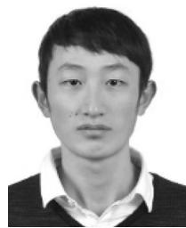

natural_image

Portrait photo of a young man in a collared shirt and sweater (no text or symbols visible)

Fuhong Song received the MEng degree in computer technology from Southwest Jiaotong University, Chengdu, China, in 2018. He is currently working toward the PhD degree in computer science and technology with Southwest Jiaotong University. His research interests include edge computing, multi-objective optimization, and reinforcement learning.

natural_image

Portrait of a man wearing glasses and a collared shirt (no text or symbols visible)

Huanlai Xing (Member, IEEE) received the BEng degree in communications engineering from Southwest Jiaotong University, Chengdu, China, in 2006, the MSc degree in electromagnetic fields and wavelength technology from the Beijing University of Posts and Telecommunications, Beijing, China, in 2009, and the PhD degree in computer science from the University of Nottingham, Nottingham, U.K., in 2013. He is an associate professor with the School of Computing and Artificial Intelligence, Southwest Jiaotong University. His

research interests include edge computing, network function virtualization, software defined networks, evolutionary computation, multi-objective optimization, and machine learning. He has authored and co-authored more than 60 peer-reviewed journal and conference papers.

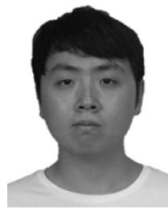

natural_image

Portrait photo of a young man with short dark hair wearing a white shirt (no text or symbols visible)

Xinhan Wang received the BEng degree in computer science and technology from Southwest University, Chongqing, China, in 2016. He is currently working toward the PhD degree with the School of Computing and Artificial Intelligence, Southwest Jiaotong University, Chengdu, China. His research interests include evolutionary computation, software defined networks, and network function virtualization.

natural_image

Portrait of a young man in a collared shirt (no text or symbols visible)

Shouxi Luo (Member, IEEE) received the bachelor’s degree in communication engineering and the PhD degree in communication and information systems from the University of Electronic Science and Technology of China, in 2011 and 2016, respectively. He is currently an associate professor with the School of Computing and Artificial Intelligence, Southwest Jiaotong University. His research interests include data center networks, software-defined networking, and networked systems.

natural_image

Portrait photo of a man in a collared shirt (no text or symbols visible)

Zhiwen Xiao (Member, IEEE) received his BEng degree in network engineering from Chengdu University of Information Technology in 2019. He is currently working toward the PhD degree in computer science with Southwest Jiaotong University. His research interests are deep learning, federated learning (FL), representation learning, data mining, and computer vision.

natural_image

Portrait of a man wearing glasses and a collared shirt (no text or symbols visible)

Penglin Dai (Member, IEEE) received the BS degree in mathematics and applied mathematics and the PhD degree in computer science from Chongqing University, Chongqing, China, in 2012 and 2017, respectively. He is currently an associate professor with the School of Computing and Artificial Intelligence, Southwest Jiaotong University, Chengdu, China. His research interests include intelligent transportation systems and vehicular cyber-physical systems.

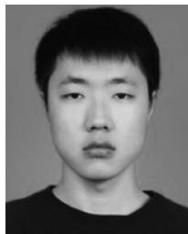

natural_image

Portrait photo of a young man with short hair and mustache (no text or symbols visible)

Bowen Zhao received the BEng degree in computer science and technology from Southwest Jiaotong University, Chengdu, China, in 2020. He is currently working toward the PhD degree with the School of Computing and Artificial Intelligence, Southwest Jiaotong University, Chengdu, China. His research interests include deep reinforcement learning, time series classification, and mobile edge computing.

" For more information on this or any other computing topic, please visit our Digital Library at www.computer.org/csdl.