# Exploiting Multi-Layer Refracting RIS-Assisted Receiver for HAP-SWIPT Networks

Kang An , Yifu Sun , Zhi Lin , Yonggang Zhu , Wanli Ni , Member, IEEE, Naofal Al-Dhahir , Fellow, IEEE, Kai-Kit Wong , Fellow, IEEE, and Dusit Niyato , Fellow, IEEE

Abstract— Aiming to circumvent the severe large-scale fading and the energy scarcity dilemma in high-altitude platform (HAP) networks, this paper investigates the benefits of the reconfigurable intelligent surface (RIS) and simultaneous wireless information and power transfer (SWIPT) on HAP communications. Specifically, we propose a concept of multilayer refracting RIS-assisted receiver to achieve concurrent transmission of the information and energy, which is conducive to overcoming the severe fading effect induced by extreme longdistance HAP links and fully exploits RIS’s degrees-of-freedom (DoFs) for the SWIPT design. Based on the RIS-enhanced receiver, we then formulate a worst-case sum-rate maximization problem by considering the channel state information (CSI) error, the information rate requirements, and the energy harvesting constraint. To handle the intractable non-convex problem, a scalable robust optimization framework is proposed to obtain semi-closed-form solutions. Specifically, a discretization method

Manuscript received 24 October 2023; revised 4 March 2024; accepted 22 April 2024. Date of publication 3 May 2024; date of current version 11 October 2024. This work was supported in part by the National NSFC under Grant 61901502, Grant 62201592, and Grant 62131005; in part by the Research Plan Project of National University of Defense Technology (NUDT) under Grant ZK21-33; in part by the Young Elite Scientist Sponsorship Program of China Association for Science and Technology (CAST) under Grant 2021-JCJQ-QT-048; in part by Macau Young Scholars Program under Grant AM2022011; in part by the National Postdoctoral Program for Innovative Talents under Grant BX20200101; and in part by the Graduate Innovation Program of Hunan Province under Grant CX20220008. An earlier version of this paper was presented in part at the IEEE Global Communications Conference (GLOBECOM), Kuala Lumpur, Malaysia, in 2023, [DOI: 10.1109/GLOBECOM54140.2023.10437169] [1]. The associate editor coordinating the review of this article and approving it for publication was H. ElSawy. (Corresponding authors: Yifu Sun; Yonggang Zhu.)

Kang An, Yifu Sun, and Yonggang Zhu are with the Sixty-Third Research Institute, National University of Defense Technology, Nanjing 210007, China (e-mail: ankang89@nudt.edu.cn; sunyifu\_nudt@163.com; zhumaka1982@163.com).

Zhi Lin is with the College of Electronic Engineering, National University of Defense Technology, Hefei 230037, China, and also with the School of Computer Science and Engineering, Macau University of Science and Technology, Macau, China (e-mail: linzhi945@163.com).

Wanli Ni is with the Department of Electronic Engineering, Tsinghua University, Beijing 100084, China, and also with Beijing National Research Center for Information Science and Technology, Beijing 100084, China (e-mail: niwanli@tsinghua.edu.cn).

Naofal Al-Dhahir is with the Department of Electrical and Computer Engineering, The University of Texas at Dallas, Richardson, TX 75080 USA (e-mail: aldhahir@utdallas.edu).

Kai-Kit Wong is with the Department of Electronic and Electrical Engineering, University College London, WC1E 6BT London, U.K. (e-mail: kai-kit.wong@ucl.ac.uk).

Dusit Niyato is with the School of Computer Science and Engineering, Nanyang Technological University, Singapore 639798 (e-mail: dniyato@ntu.edu.sg).

Color versions of one or more figures in this article are available at https://doi.org/10.1109/TWC.2024.3394214.

Digital Object Identifier 10.1109/TWC.2024.3394214

is adopted to convert the imperfect CSI into a robust one. Then, by utilizing the LogSumExp inequality to smooth the objective and constraints, we develop a dual method to obtain the optimal solution for the HAP transmit precoder. In addition, a modified cyclic coordinate descent (M-CCD) is adopted to update the block-wise RIS coefficients. Moreover, closed-form solutions for power splitting (PS) ratios and the receive decoder are derived. Finally, the asymptotic performance of our proposed RIS-enhanced receiver is provided to reveal the substantial capacity gain for HAP communications. Numerical simulations demonstrate that the proposed architecture and optimization framework are capable of achieving superior performance with low complexity compared to state-of-the-art schemes in HAP networks.

Index Terms— HAP, RIS, SWIPT, imperfect channel state information, robust optimization framework.

# I. INTRODUCTION

IGH-ALTITUDE platform (HAP) has emerged as an aerial base station to provide a sustainable services and broad coverage for remote areas or disaster recovery [2], [3], [4]. Specifically, HAP is a communication platform at the altitude of 20 to 50 km, where large-scale antenna arrays and wide solar panels are deployed to enable multiple-input multipleoutput (MIMO) and sustain its services with the required energy [2]. As compared to the terrestrial networks, HAP communications enjoy lower scattering and wider coverage, and thus more economic and reliable transmission service can be provided for users in the rural areas than a multicell infrastructure [4]. Compared to the low-altitude platform (LAP) (e.g., unmanned aerial vehicle (UAV)), the quasistationary HAP avoids the introduction of a significant Doppler shift and the need for tracking devices. Moreover, HAP’s high altitude provides a large footprint and a wide wireless coverage [3]. Compared to satellite communications, HAP is subject to low channel attenuation and reduced transmission delay, such that offering a superior low-latency and highthroughput service for earth users [2]. In addition, HAP also enjoys high elevation angles, deployment flexibility, and hybrid connectivity with multi-band radio frequency. In this context, the utilization of HAP is an excellent design option for next-generation wireless communication and beyond.

However, since the battery-powered wireless devices in HAP networks are often deployed in rural, remote, and unpopulated areas (e.g., mobile terminals (MTs), medical implants, and sensors), it is inconvenient and infeasible to recharge or frequently replace the batteries, which constitutes an intractable bottleneck for HAP communications. Fortunately, energy harvesting technology can be adopted to alleviate the energy scarcity and prolong the lifetime of energy-constrained devices [5]. Simultaneous wireless information and power transfer (SWIPT) is a typical technique for wireless energy harvesting, where the ambient radio signals transmit information and convey energy concurrently [6]. As one of the key SWIPT techniques, the power splitting (PS) technique divides the received signals into two power streams, i.e., the information stream for signal decoding and the power one for energy harvesting, which brings great convenience to the deployment of energy-limited devices [5]. Although SWIPT has been widely adopted to provide perpetual energy supplies to terrestrial communications [6], [7], [8] and LAP communications [9], [10], [11], its energy transmission efficiency would significantly decrease with the increasing distance due to the severe large-scale fading effects, especially in the long-distance communication system. Massive MIMO with significant gain of element pattern has been utilized to overcome the severe fading effects in low earth orbit (LEO) satellites, such that SWIPT can be enabled in long-distance communications [12]. However, due to the prohibitive cost and size constraints, it may be impractical to employ a large-scale array at both the aerial platform and receiver. Thus, investigating HAP-SWIPT networks is an open and challenging research direction.

Based on the above background, techniques which can boost the communication link quality and efficiently transmit energy from HAP to wireless devices are urgently needed. Recently, reconfigurable intelligent surface (RIS), as a revolutionary technique, can manipulate the wireless channel [13]. The current state-of-the-art of RIS-aided wireless communications can be divided into two fold. The first one is to use RIS as a relay-like reflector for reconfiguring the radio propagation environment, which has been widely adopted to enhance the service coverage [13], [14], [15], [16], maximize the achievable rate [17], [18], [19], and improve the SWIPT performance of both the terrestrial and LAP communications [20], [21], [22], [23], [24], [25]. The authors in [20] considered a passive RIS-aided SWIPT system, where the weighted sum rate was maximized by jointly optimizing the transmit precoder and passive RIS coefficients, while guaranteeing the linear energy harvesting requirement. Considering the severe “double fading” effect and practical non-linear EH circuit, the authors of [21] proposed an active RIS-assisted PS-SWIPT systems, where the total transmit power was minimized by optimizing transmit beamformers, PS ratios, and RIS phase shifts/amplification factors. In addition, [22] further studied RIS-aided PS-SWIPT system under the imperfect CSI, and a new nonlinear EH model based Gaussian error function was introduced. Furthermore, the authors in [23] and [24] investigated RIS-aided UAV-SWIPT networks, where the user scheduling, UAV trajectory/velocity, and IRS phase shifts/reflection coefficients are jointly designed to improve the SWIPT performance. However, the above RIS-aided reflectors are not directly applicable to HAP-SWIPT networks. Specifically, HAP-SWIPT networks work at a height of several dozen kilometers, such that the HAP-SWIPT using RIS-reflector may suffer from extremely severe “double fading” effect. Although the active RIS can be utilized to overcome the above “double fading” effect in the terrestrial and LAP networks [19], long-distance HAP link’s large-scale fading must be compensated by a large amount of power, which is impractical in the energy-constrained HAP-SWIPT networks.

The second one is to use RIS as a low-cost transmitter for manipulating the electromagnetic waves, including a single-layer RIS-assisted transmitter [26], [27], [28], [29] and a multi-layer one [30], [31], [32]. Recently, several multilayer RIS structures have been used in some research communities. Specifically, the authors in [30] proposed a multi-layer RIS transmitter to replace the a large-scale antenna array at the user side, and thus improving the degrees of freedom (DoFs) for beamformer design.The authors in [31] have further exploited multi-layer RIS to act as HAP’s transmitter for simultaneously defending against the jamming and eavesdropping attacks. Besides, multi-layer RIS have been adopted to execute various complex signal processing tasks, such as image classification and programmable AI machine [32]. Nevertheless, the above multi-layer RIS-related works focused on the transmitter design, which may not be tailored for HAP-SWIPT. To elaborate, the HAP-SWIPT networks with an RIS-transmitter should consider multi-user beamforming coordination at RIS, which limits the RIS’s potential in HAP-SWIPT networks. Thus, a new architecture should be proposed to fully unleash the potential of HAP-SWIPT networks.

Based on the above background, we further summarize our motivation from the following three perspectives:

Why does HAP networks need both SWIPT and RIS? In principle, SWIPT can simultaneously transmit information and alleviate the energy scarcity of battery-powered users in HAP networks [6]. However, the long-distance HAP links significantly degrade the energy transmission efficiency. Although employing large-scale array at transceiver can enable long-distance HAP-SWIPT, it leads to prohibitive hardware costs [12]. Thus, the low-cost and energy-efficient RIS can be adopted to overcome the abovementioned drawbacks, since it can boost the communication link quality by manipulating the electromagnetic wave [13].

Why does HAP-SWIPT networks need a new RIS architecture? Although RIS has been adopted to improve the SWIPT performance of LAP networks, the existing RISreflector [13] and single-layer RIS [27] are not directly applicable to HAP-SWIPT networks, due to their “double fading” effect in long-distance links and limited aperture gain. Hence, a new RIS architecture should be harnessed to enable HAP-SWIPT.

How to efficiently implement resource management in RIS-assisted HAP-SWIPT networks? The novel network designed needs efficient resource management. In the existing RIS-related works [33], the non-convex optimization problems with multiple constraints are always relaxed into convex ones, such that these convexified subproblems can be solved by the off-the-shelf optimization toolbox. However, the utilization of the optimization toolbox in the conventional methods leads to the extremely high computational complexity, which scales exponentially with the number of constraints and antennas. Besides, it is challenging to perform the untransparent computation process of optimization toolbox in FPGA hardware, especially in the energy-constrained HAP network whose computational capability is quite limited. Thus, these call for the design of scalable optimization framework.

Motivated by the aforementioned observations, we propose a novel multi-layer refracting RIS-assisted receiver to facilitate HAP-SWIPT networks, and propose a low-complexity scalable beamforming scheme to obtain semi-closed-form solutions. Specifically, the main contributions are summarized as follows:

• Novel Multi-Layer Refracting RIS-Assisted Receiver for HAP-SWIPT networks: We propose a multi-layer refracting RIS-assisted receiver architecture to overcome the practical energy-constrained challenges in HAP-SWIPT networks, which can also well circumvent the severe fading effect induced by the extreme longdistance HAP links. In addition, RIS’s DoFs can be fully unleashed for the beamforming design. In addition, we derive a rigorous performance analysis for the proposed multi-layer RIS-receiver architecture, and further compare it to those of passive/active RIS-reflectors and the single-layer RIS-receivers. The result reveals the capacity gain enabled by the proposed RIS-receiver for HAP-SWIPT networks.   
• Intractable Problem Formulation: Considering the angular CSI imperfection, we formulate a worst-case optimization problem to maximize the sum achievable rate by jointly designing the transmit precoders, the PS ratios, the multi-layer refracting RIS’s coefficient matrices, and the received digital decoder. To the best of our knowledge, this is the first treatise considering worstcase sum rate maximization problem of multi-layer RISassisted HAP-SWIPT networks with non-linear energyharvesting model, which is much more challenging than the total power minimization problem of single-layer RIS-aided SWIPT under bounded CSI imperfection [22], and the weighted sum rate maximization problem of single-layer RIS-aided SWIPT under linear EH model [20]. Thus, the new problem formulation must result in new algorithm.   
• Low-Complexity Scalable Beamforming Algorithm: Since the formulated problem is non-convex, a scalable robust optimization algorithm based on the discretization method, the LogSumExp-dual scheme, and modified cyclic coordinate descent (M-CCD) is proposed to obtain closed-form solutions for the optimization variables. Different from semidefinite relaxation (SDR) (e.g., [34]), successive convex approximation (SCA) (e.g., [25]), and majorization-minimization (MM) (e.g., [20]) use offthe-shelf optimization toolbox to solve the intractable problem, the proposed algorithm does not rely on toolbox and can be easily implemented in practical massive largescale array systems.

• Novel LogSumExp-Dual Algorithm for Transmit Precoder: For the optimization of the transmit precoder, we first transform the imperfect angular CSI into a robust one by using the discretization method. Then, we adopt the LogSumExp inequality to offer a tight approximation for the non-smooth objective and EH constraints. Thus, by using dual variables, we can add the EH constraints into the objective to formulate the subproblem as a general Rayleigh-quotient form. Next, by utilizing the multi-dimensional bisection method to search for the optimal dual variables, we establish the first-order optimality condition for the subproblem such that the semi-closed-form solution for the precoder can be obtained by the dual method. Different from the widelyadopted SCA in [25] introducing massive slack variable to relax the objective and constraints and the conventional generalized power iteration (GPI) in [35] addressing the optimization of transmit precoder without any QoS constraints, our proposed algorithm utilizes LogSumExp inequality and dual method to handle the objective and multiple constraints, such that obtain the optimal solution with low complexity, which is regarded as a more general and efficient GPI.

• Improved M-CCD Algorithm for Multi-layer RIS Coefficients: For the optimization of RIS coefficients, we first convert the original subproblem into a quadratic form by introducing Lagrange and Dinkelbach parameters. Then, we propose an iterative framework based on M-CCD to update the KKT-optimal closed-form solution for each variable. Different from the majorizationminimization (MM) framework (e.g., [20]) which utilizes the cost function to majorize all the variables and then adopts gradient projection (GP) method to update the step size parameter, the proposed M-CCD updates the blockwise variable without majorization, and thus achieving a satisfactory tradeoff between the SWIPT performance and computational complexity. This leads to effective and efficient MM implementations.

• Optimality, Convergence, Complexity, and Simulations: The optimality, convergence and complexity of the proposed framework are established by rigorous theoretical analysis. Besides, we compare its complexity with that of the existing RIS-related schemes, which shows that the scalability of our proposed framework is significantly better than that of existing schemes. Numerical results demonstrate that with the help of the multi-layer RIS-assisted receiver, our proposed framework outperforms the existing benchmarks.

Notation: $\mathbf { X } ^ { H } , ~ \mathbf { X } ^ { T } , ~ \mathbf { X } ^ { * }$ , and $\| \mathbf { X } \| _ { F }$ denote conjugate transpose, transpose, conjugate, and Frobenius norm of a matrix X. The notations E{·}, Tr{·}, Re{·}, and $\lambda \{ \cdot \}$ denote the expectation, trace, real part, and eigenvalue of a complex number or matrix, respectively. $\mathbb { C } ^ { m \times n }$ represents the complex space of $m \ \times \ n$ dimensions. The symbol $\mathbb { H } ^ { n \times n }$ is the Hermitian matrix of $n \times n$ dimensions. $[ \cdot ] _ { n , n }$ represents the nth diagonal element of a matrix. $\textbf { X } \succeq \textrm { 0 }$ means that the matrix X is positive semi-definite. The distribution of a circularly symmetric complex Gaussian (CSCG) random vector with mean vector x and covariance matrix Σ is denoted by $\mathcal { C N } ( x , \Sigma )$ .

# II. SYSTEM MODEL AND PROBLEM FORMULATION

As shown in Fig. 1 (a), we consider a RIS-assisted HAP-SWIPT network, where an HAP equipped with $N _ { \mathrm { H } } { = } N _ { \mathrm { H } 1 } \times$ $N _ { \mathrm { H 2 } }$ uniform planar array (UPA) antennas transmits the desired signals to K MTs with the aid of the multilayer refracting RIS-assisted receiver. At the MTs, the received signals are split for information decoding and energy harvesting, i.e., SWIPT. Here, the gateway acts as a control center to collect various kinds of information and implement resource allocation in the whole network [4], so that HAP can cooperate with multi-layer refracting RIS receivers for synchronizing the RIS’s coefficients and transmit beamformer. It is assumed that the k-th MT’s multi-layer refracting RIS is composed of A layers having $N _ { \mathrm { E } , k a } { = } N _ { \mathrm { E } , k a 1 } \times N _ { \mathrm { E } , k a 2 }$ units on the a-th layer, and the k-th MT is equipped with $N _ { \mathrm { D } , k }$ Rx antennas for digital decoding. Besides, the channels from HAP to the first RIS layer of k-th MT, from the a-th layer to the (a + 1)-th layer, and from the A-th layer to the k-th MT’s Rx antennas are denoted as $\mathbf { G } _ { k } \in \mathbb { C } ^ { N _ { \mathrm { E } , k 1 } \times N _ { \mathrm { H } } } , \mathbf { B } _ { k a } \in$ $\mathbb { C } ^ { N _ { \mathrm { E } , k ( a + 1 ) } \times N _ { \mathrm { E } , k a } }$ , and $\mathbf { B } _ { k A } \in \mathbb { C } ^ { N _ { \mathrm { D } , k } \times N _ { \mathrm { E } , k A } }$ , respectively.

# A. Multi-Layer Refracting RIS-Assisted Receiver

As shown in Fig. 1 (b), multiple refracting RISs are vertically stacked in front of the MT’s Rx feeds to form a multi-layer receiver architecture, where the refracting RISs and the Rx antennas perform the analog and the digital decoding on the HAP’s transmitted signals, respectively. Specifically, each RIS receives a superposition of the signals over the air, forwards them to the RIS-aided phase shifters, and transmits the phase-delayed signals to the transmit units via the microstrip [31]. Then, the feeds connected to the dedicated radio frequency (RF) chains and power amplifiers (PA) impose the digital decoding on the receive signals. Note that there exists an enclosure containing the entire multilayer RIS receiver structure, which can use the surrounded absorbing materials to protect the internal channel from external interference and reduce the potential energy loss. Naturally, the gap between adjacent vertical RIS layers is flexible, but it is generally compact for implementation.

The a-th layer’s refracting coefficient matrix1 of the MT k is given by $\Xi _ { k a } ~ = ~ \mathrm { d i a g } \left( e ^ { j \theta _ { k a , 1 } } , \cdot \cdot \cdot ~ , e ^ { j \theta _ { k a , N _ { E , k a } } } \right) ~ \in ~$ CNE,ka×NE,ka ,2 and the k-th MT’s digital processing vector $\mathbb { C } ^ { N _ { \mathrm { E } , k a } \times N _ { \mathrm { E } , k a } } , ^ { 2 }$

1The performance degradation introduced by the discrete phase shifts and its corresponding optimization methods have been thoroughly investigated in the existing works (e.g., [13]). Furthermore, the full characterization of this discrete phase shifts scenario requires a separate full investigation. Thus, due to the space limits and extensive related works, we leave investigation of discrete phase shifts for the future.

2Due to the fact that RIS elements have a nearly frequency-flat response [36] and half-wavelength-sized spacing between adjacent RIS units [13], this paper captures the widely-adopted dependence that the phase can be tuned in the sense of having a constant amplitude and no mutual coupling. However, the simplified RIS model might not satisfy any of these ideal conditions, such that more practical phase-dependent amplitude variation in [37] and mutual coupling in [38] should be considered, which is is still quite a challenging task and worth in-depth investigation in our future works.

is expressed as $\mathbf { v } _ { k } \in \mathbb { C } ^ { N _ { \mathrm { D } , k } \times 1 }$ . Here, $\theta _ { k a , n } \in [ 0 , 2 \pi )$ denotes the phase shift of the n-th RIS unit. As such, the equivalent analog decoder generated by the k-th MT’s RIS-aided receiver is given by $\Omega _ { k , ( 1 , A ) }$ , i.e.,

$$
\boldsymbol {\Omega} _ {k, (u, v)} = \left\{ \begin{array}{l} \prod_ {a = u} ^ {v} \mathbf {B} _ {k a} \boldsymbol {\Xi} _ {k a}, u, v \in [ A ], \\ \mathbf {I} _ {N _ {\mathrm{E}, k 1}}, u = 1, v = 0, \\ \mathbf {I} _ {N _ {\mathrm{D}, k}}, u = A + 1, v = A. \end{array} \right. \tag {1}
$$

To clarify the characteristics of the multi-layer refracting RIS receiver, its key advantages are summarized as follows.

• Simplified Hardware Architecture: Different from the typical MIMO receiver requiring massive RF chains to achieve spatial gains for enhancing the energy transmission efficiency, the multi-layer refracting RIS receiver only requires low-cost tunnel diodes, whose power and hardware consumption are extremely low [39]. Thus, the hardware architecture of multilayer refracting RIS receiver is simplified in comparison with massive MIMO receiver.

• Miniaturization and High Scalability: Due to the small size of RIS unit and the compact cascaded structure, the multilayer refracting RIS receiver has much smaller physical size than those of the typical MIMO and single-layer RIS-aided receiver. Specifically, the single-layer RIS-aided and typical MIMO receiver can only deploy all $\begin{array} { r } { N _ { \mathrm { T o t } } ~ = ~ \sum _ { a = 1 } ^ { A } N _ { \mathrm { E } , a } } \end{array}$ RIS units/antennas at the transversal side, the multi-layer RIS receiver can deploy A layers of $N _ { \mathrm { E } , k a } { = } N _ { \mathrm { E } , k a 1 } \times N _ { \mathrm { E } , k a 2 }$ RIS units at longitudinal side. Combined with the fact that the small gap between adjacent layers [31], the scalability and miniaturization of the multi-layer refracting RIS receiver are highly desirable.

• Enhanced Aperture Gain for Long-Distance SWIPT: In the MIMO receiver, the aperture gain asymptotically increases in the order of $\begin{array} { r l r } { \bar { N _ { \mathrm { T o t } } } } & { { } = } & { \sum _ { a = 1 } ^ { A } \bar { N _ { \mathrm { E } , a } } } \end{array}$ [13]. Besides, as shown in Theorem 2, the aperture gains of single-layer passive RIS receiver and single-layer active RIS receiver are approximately increase in the order of $\left( \sum _ { a = 1 } ^ { A } N _ { \mathrm { E } , a } \right)$ 2 and $\textstyle \sum _ { a = 1 } ^ { A } N _ { \mathrm { E } , a }$ , respectively. In contrast, due to the multi-layer structure, the aperture gain of multi-layer refracting RIS receiver asymptotically increases in the order of $\left( \Pi _ { a = 1 } ^ { A } N _ { \mathrm { E } , a } \right) ^ { \colon }$ 2, thereby compensating for the severe path loss induced by long-distance path loss. Therefore, the multi-layer refracting RIS receiver can achieve efficient HAP-SWIPT.

• Increased DoFs for Beamforming Design: Different from typical MIMO receiver having $N _ { \mathrm { T o t } }$ DoFs and single-layer RIS receiver having min $\left\{ \frac { \tilde { N } _ { \mathrm { T o t } } } { 2 } - \frac { 1 } { 2 } , N _ { \mathrm { D } } \right\}$  NTot DoFs, the spatial DoFs of multi-layer refracting RIS receiver is min $\left\{ \frac { \prod _ { a = 1 } ^ { A } N _ { \mathrm { E } , a } } { 2 } - \frac { 1 } { 2 } , N _ { \mathrm { D } } \right\}$ QAa=1 NE,a2 − 12 , ND o [40]. Besides, as shown in Theorem 3, the multi-layer RIS can regulate the amplitude of incident signal within a larger range than the existing receivers. The above findings suggest that our proposed receiver can generate increased DoFs for beamforming design.

# B. Signal Transmission and Energy Harvesting Model

Denote $s _ { k }$ as the desired symbol transmitted by the HAP to the k-th MT, which satisfies E $\left\{ \left| s _ { k } \right| ^ { 2 } \right\} = 1$ . Prior to transmission, $s _ { k }$ is processed by the digital precoders $\mathbf { w } _ { k } \in \mathbb { C } ^ { N _ { \mathrm { H } } \times 1 }$ , such that the signal transmitted by the HAP is $\scriptstyle \sum _ { k = 1 } ^ { K } \mathbf { w } _ { k } s _ { k }$ . Then, after decoding the transmitted signals by the analog and the digital decoder $\Omega _ { k , ( 1 , A ) }$ and $\mathbf { v } _ { k } .$ , the received signal at the k-th MT can be expressed as

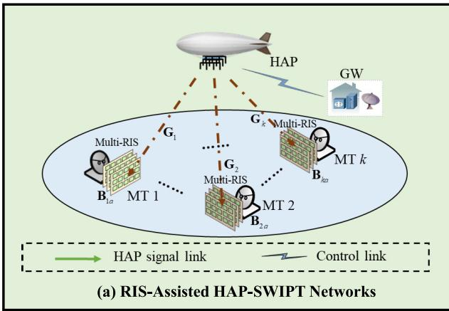

flowchart

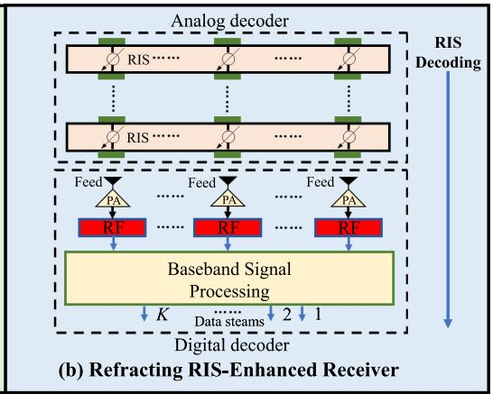

flowchart

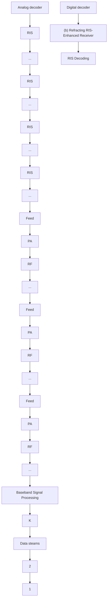

Fig. 1. The illustration of RIS-assisted HAP-SWIPT networks and RIS-enhanced receiver.

$$
y _ {k} = \mathbf {v} _ {k} ^ {H} \left(\boldsymbol {\Omega} _ {k, (1, A)} \mathbf {G} _ {k} \sum_ {k = 1} ^ {K} \mathbf {w} _ {k} s _ {k} + \mathbf {n} _ {k}\right), \tag {2}
$$

where $\mathbf { n } _ { k } \ \sim \ { \mathcal { C N } } ( 0 , \sigma _ { k } ^ { 2 } \mathbf { I } _ { N _ { \mathrm { D } , k } } )$ is the thermal noise at the k-th MT’s Rx antennas. Subsequently, the k-th MT divides the received signals into two portions, where $\gamma _ { k }$ portion is utilized for information decoding and $1 - \gamma _ { k }$ one is used for energy harvesting. Hence, the k-th MT’s received signals for information decoding and energy harvesting are, respectively, given by $y _ { \mathrm { I D } , k } = \sqrt { \gamma _ { k } } y _ { k } + z _ { k }$ and $y _ { \mathrm { E H } , k } = \sqrt { 1 - \gamma _ { k } } y _ { k }$ , where $\gamma _ { k } \in ( 0 , 1 ]$ is the PS ratio and $z _ { k } \sim \mathcal { C N } ( 0 , \delta _ { k } ^ { 2 } )$ is the additional noise induced by the k-th MT’s information decoding circuit [25]. Thus, the achievable rate for information decoding at the k-th MT can be modeled as

$$
R _ {\mathrm{ID}, k} = \log_ {2} \left(1 + \frac {\left| \mathbf {g} _ {k} ^ {H} \mathbf {w} _ {k} \right| ^ {2}}{\sum_ {i \neq k} ^ {K} \left| \mathbf {g} _ {k} ^ {H} \mathbf {w} _ {i} \right| ^ {2} + \sigma_ {k} ^ {2} + \delta_ {k} ^ {2} / \gamma_ {k}}\right), \tag {3}
$$

$\mathbf { g } _ { k } = \mathbf { G } _ { k } ^ { H } \Omega _ { k , ( 1 , A ) } ^ { H } \mathbf { v } _ { k }$

Note that there are two major drawbacks in the practical energy-harvesting circuits. First, the energy harvesting cannot be activated when the input power is less than the sensitivity power. Second, the harvested energy increases with the input power non-linearly [6]. To account for these effects precisely, this paper adopts the nonlinear energy-harvesting model in [6]. As such, the harvested energy at k-th MT is

$$
\zeta_ {\mathrm{EH}, k} = (\alpha p _ {k} + \beta) / (p _ {k} + \varepsilon) - \beta / \varepsilon , \tag {4}
$$

where $\begin{array} { r } { p _ { k } ~ = ~ \eta _ { k } \left( 1 - \gamma _ { k } \right) \sum _ { i = 1 } ^ { K } { \left| { \bf g } _ { k } ^ { H } { \bf w } _ { i } \right| } ^ { 2 } } \end{array}$ denotes the input power for energy harvesting, $\{ \dot { \alpha } , \beta , \varepsilon \} \ > \ 0$ captures the sensitivity and saturation thresholds of the energy-harvesting circuits, and $\eta _ { k } \in ( 0 , 1 ]$ is the energy conversion efficiency.

# C. Near/Far-Field Channel Model

Because of the extremely short distance between the adjacent vertical RIS layers, i.e., $2 \lambda \sqrt { N _ { \mathrm { E } , a } } / \sqrt { \pi }$ , the channels $\{ \mathbf { B } _ { k a } \}$ in multi-layer RIS-receiver are near-field channels.

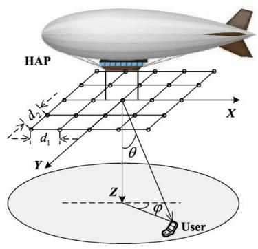

text_image

HAP
d₂
d₁
Y
θ
Z
φ
User
X

Fig. 2. Geometrical relation between HAP and any user.

In contrast, due to the fact that HAP networks work at a height of several dozen kilometers, the channels $\left\{ \mathbf { G } _ { k } \right\}$ from HAP to the first RIS layer of k-th MT are far-field channels.

As for the near-field channels, the radar illumination model in [39] is adopted to characterize $\{ \mathbf { B } _ { k a } \}$ , which is given by

$$
\mathbf {B} _ {k a} = \left[ \frac {\lambda_ {f} \sqrt {\widehat {\rho} G _ {n , v} ^ {\mathrm{D}} \left(\theta^ {\mathrm{R}} , \varphi^ {\mathrm{R}}\right) G _ {n , v} ^ {\mathrm{R}} \left(\theta^ {\mathrm{D}} , \varphi^ {\mathrm{D}}\right)}}{4 \pi d _ {n , v}} e ^ {- j \frac {2 \pi d _ {n , v}}{\lambda}} \right] _ {n, v}, \tag {5}
$$

where $\widehat { \rho }$ is the RIS’s efficiency, $\lambda _ { f }$ is the carrier wavelength, $d _ { n , v }$ bis the distance between the n-th RIS unit on the a-th layer and the v-th unit on the (a + 1)-th layer, and $G _ { n , v } ^ { \mathrm { D } } \left( \theta ^ { \mathrm { R } } , \varphi ^ { \mathrm { \bar { R } } } \right)$ , $G _ { n , v } ^ { R } \left( \theta ^ { \mathrm { D } } , \varphi ^ { \mathrm { D } } \right)$ are the active and passive gains, respectively.

As illustrated in Fig. 2, we assume that HAP employs UPA of dimension $N _ { \mathrm { H } } { = } N _ { \mathrm { H 1 } } \times N _ { \mathrm { H 2 } }$ . Due to the quasi-optical and highly directional nature of the radio wave propagation at high frequency band, the far-field HAP channels $\{ \mathbf { G } _ { k } \}$ can be modeled as the superposition of a predominant line-of-sight component and a sparse set of single-bounce non-LoS ones [4], namely,

$$
\begin{array}{l} \mathbf {G} _ {k} = \sqrt {G (\theta_ {0} , \varphi_ {0})} g _ {k, 0} \mathbf {a} _ {\mathrm{P}} \left(\theta_ {k, 0} ^ {\mathrm{Rx}}, \varphi_ {k, 0} ^ {\mathrm{Rx}}\right) \mathbf {a} _ {\mathrm{P}} ^ {H} \left(\theta_ {k, 0} ^ {\mathrm{Tx}, \mathrm{Tx}}\right) \\ + \sqrt {\frac {1}{M P}} \sum_ {d = 1} ^ {M P} \sqrt {G (\theta_ {d} , \varphi_ {d})} g _ {k, d} \mathbf {a} _ {\mathrm{P}} \left(\theta_ {k, d} ^ {\mathrm{Rx}}, \varphi_ {k, d} ^ {\mathrm{Rx}}\right) \\ \times \mathbf {a} _ {\mathrm{P}} ^ {H} \left(\theta_ {k, d} ^ {\mathrm{Tx}}, \varphi_ {k, d} ^ {\mathrm{Tx}}\right), \tag {6} \\ \end{array}
$$

where M P is the total number of paths, $\theta ^ { \mathrm { T X } } ~ ( \theta ^ { \mathrm { R X } } )$ is the vertical AoD (AoA), and $\varphi ^ { \mathrm { T x } } ~ ( \varphi ^ { \mathrm { R X } } )$ denotes the horizontal AoD (AoA). g represents the large-scale fading coefficients, and $g \sim \mathcal { C N } ( 0 , \sigma _ { \mathrm { P L } } ^ { 2 } )$ , where $\sigma _ { \mathrm { P L } } ^ { 2 } = 1 0 ^ { \mathrm { P L / 1 0 } }$ , PL = −30.18− $2 6 \log _ { 1 0 } \left( d _ { s } \right) [ \mathrm { d B } ]$ and $d _ { s }$ is the link distance in meters. a $( \theta , \varphi )$ is the steering vector of UPA in [31]. Besides, according to the model introduced by ITU, the element pattern $G \left( \theta , \varphi \right)$ in dB, i.e., $\widehat { G } \left( \theta , \varphi \right) = 1 0 \mathrm { l o g } _ { 1 0 } \left( G \left( \theta , \varphi \right) \right)$ can be expressed as [4]

$$
\widehat {G} (\theta , \varphi) = E _ {\max} - \min \left\{G _ {x} (\theta , \varphi) + G _ {y} (\theta , \varphi), S _ {m} \right\}, (7)
$$

where $E _ { \mathrm { m a x } }$ is the maximum antenna gain, $G _ { x } \left( \theta , \varphi \right)$ and $G _ { y } \left( \theta , \varphi \right)$ are the relative patterns in x and y planes, respectively, which are given by [4]

$$
G _ {i} (\theta , \varphi) = \min \left\{1 2 \bigg (\frac {(\arctan (\cot \theta / \cos \varphi))}{\varphi_ {i} ^ {\mathrm{3dB}}} \bigg) ^ {2}, S _ {m} \right\},
$$

where $\varphi _ { i } ^ { \mathrm { 3 d B } }$ denotes the 3 dB beamwidth, and $S _ { m }$ represents the side-lobe level of the antenna pattern.

Note that $\{ \mathbf { B } _ { k a } \}$ is a deterministic matrix due to the short distance between the adjacent vertical layers, such that it can be precisely measured in advance [27], [31], [39]. However, owing to the channel estimation error and feedback delay, we assume that only the angular information based imperfect CSI $\left\{ \mathbf { G } _ { k } \right\}$ can be obtained at the gateway3 [4]. To elaborate, the precise positions of MTs are unknown but the uncertainty region of the angular information can be obtained. Thus, $\left\{ \mathbf { G } _ { k } \right\}$ belongs to a given uncertainty set, i.e.,

$$
\Delta = \left\{\mathbf {G} _ {k} \mid \theta_ {k} \in \left[ \theta_ {k, \mathrm{L}}, \theta_ {m, \mathrm{U}} \right], \varphi_ {k} \in \left[ \varphi_ {k, \mathrm{L}}, \varphi_ {k, \mathrm{U}} \right] \right\}, \tag {8}
$$

where $\varphi _ { \mathrm { U } }$ and $\varphi _ { \mathrm { L } }$ are the upper and lower bounds of elevation angle, $\theta _ { \mathrm { U } }$ and $\theta _ { \mathrm { { L } } }$ denote the upper and lower bounds of azimuth angle, respectively.

Remark 1 (SWIPT Feasibility in RIS-Receiver Aided HAP Networks): Due to the utilization of antenna array on HAP, the received power increases with the order of $N _ { \mathrm { H } }$ [14]. Besides, according to the model introduced by 3GPP [45], the gain of element pattern $\widehat { G } \left( \theta , \varphi \right)$ in the $\mathrm { H A P } ^ { \prime } \mathrm { s }$ transmitter is larger than 32 dB (i.e., $E _ { \mathrm { m a x } } = 5 2$ dB and $S _ { m } = 2 0 ~ \mathrm { d B } )$ . Thus, the severe large-scale fading effects induced by the long-distance communications can be partially compensated. Moreover, as shown in Theorem 2, the received power can be further significantly enhanced, which is proportional to $\left( \Pi _ { a = 1 } ^ { A } N _ { \mathrm { E } , a } \right) ^ { 2 }$ . Therefore, the feasibility of HAP-SWIPT networks can be boosted by using the RIS-enhanced receiver.

# D. Problem Formulation

In this paper, under the angular uncertainty ∆, we aim to jointly optimize the transmit precoders ${ \mathbf { w } } _ { k } .$ , PS ratios

3Since the wireless channels undergo slow fading and due to the existence of RF chains at multi-layer refracting RIS receivers [22], the CSI is available at the gateway through feedback/training sent from the RIS-receivers via backhaul channel [41], [42]. To elaborate, the time division duplex (TDD) mode allows for channel estimation by exploiting channel reciprocity [22], where each coherence time block is divided into the channel estimation stage and data transmission stage. In the channel estimation stage, there are many efficient methods in the literature, such as the three-phase pilot-based channel estimation algorithm [43] and alternating least squares (ALS) [44].

$\gamma _ { k } ,$ , multi-layer refracting RIS’s coefficient matrices $\Xi _ { k a } ,$ and the received digital decoder $\mathbf { v } _ { k }$ to maximize the worstcase sum achievable rate, while meeting the information rate requirements of the MTs, the harvested energy requirements, the transmit power constraints, and the RIS unit-modula constraints.4 Thus, the corresponding optimization problem5 is

$$
\begin{array}{l} \max _ {\mathbf {w} _ {k}, \boldsymbol {\Xi} _ {k a}, \mathbf {v} _ {k}, \gamma_ {k}} \min _ {\Delta} \sum_ {k = 1} ^ {K} R _ {\mathrm{ID}, k} \\ s. t. \mathrm{C1}: \min _ {\Delta} R _ {\mathrm{ID}, k} \geq \Gamma_ {k}, \forall k, \mathrm{C2}: \min _ {\Delta} \zeta_ {\mathrm{EH}, k} \geq \varsigma_ {\max}, \forall k, \\ \mathrm{C} 3: \sum_ {k = 1} ^ {K} \| \mathbf {w} _ {k} \| ^ {2} \leq P _ {\max}, \mathrm{C} 5: \| \mathbf {v} _ {k} \| = 1, \forall k, \\ \mathrm{C} 4: \left| \left[ \boldsymbol {\Xi} _ {k a} \right] _ {n, n} \right| = 1, \forall k, a, n, \tag {9} \\ \end{array}
$$

where $\Gamma _ { k }$ is the minimum rate threshold, $\varsigma _ { \mathrm { m a x } }$ denotes the harvested power requirement, and $P _ { \mathrm { m a x } }$ is the power limit at the HAP. Constraint C1 ensures that the achievable rate of each MT is above the quality-of-service (QoS) requirement $\Gamma _ { k } .$ . Constraint C2 guarantees that the harvested power for selfsustainability is higher than the harvested power requirement $\zeta _ { \mathrm { m a x } } .$ . Constraint C3 indicates that the total transmit power must be lower than the power budget $P _ { \mathrm { m a x } } .$ . Constraints C4 and C5 specify trivial but important RIS unit-module and digital decoder’s normalization requirement, respectively.

Problem (9) is very challenging for several reasons. First, problem (9) is complicated due to jointly coupled variables $\mathbf { w } _ { k } , \mathbf { \psi } \gamma _ { k } ,$ and $\Xi _ { k a }$ . Second, the angular uncertainty ∆ and the conflicting constraints C1-C4 make (9) non-convex. Third, the multi-layer RIS structure makes the optimization problem much more complex than the former works, e.g., [25], which means that the existing schemes are not directly applicable to (9). Most importantly, although the conventional optimization schemes such as SDR in [34], SCA in [25], and MM in [20], can be adopted to solve problem (9) by introducing multiple constraints into the optimization problem, their computational complexity scales exponentially with the number of constraints, especially for the case of large $N _ { \mathrm { H } }$ and $N _ { \mathrm { E } , k a }$ . Besides, an optimization toolbox is needed in the abovementioned schemes, which is generally hard to implement in practical hardware due to its extremely high complexity. To avoid huge computational complexity, in the

4SWIPT aims to use the ambient radio signals to transmit information and convey energy concurrently [6]. Thus, there are three main research streams in the current state-of-the-art of SWIPT, i.e., maximizing the sum rate while meeting the energy harvesting constraints (e.g., [20]), maximizing harvested power while satisfying the data rate requirements (e.g., [46]), and minimizing total power while meeting the data rate requirements (e.g., [23]). Since HAP aims to provide a ultra-high rate services and broad coverage for battery-powered users in sixth generation (6G) wireless networks [2], this paper considers a worst-case sum achievable rate maximization problem, while meeting the harvested energy requirements, which is consistent with [20]. The other two research streams will be left for our future works.

5Due to the nature of a quasi-stationary position in the stratosphere, the optimization only considered the HAP’s transmit beamforming instead of the trajectory of HAP, which is consistent with the existing works, e.g., [4]. However, the optimization is still related to HAP-related parameters. Specifically, the height of HAP affects the propagation characteristics of the A2G communication link since the LoS condition and the environment between HAP and MTs alter as the height varies [47], which will indirectly affect the optimization of HAP’s beamforming.

sequel, we propose a low-complexity beamforming scheme to obtain the semi-closed-form solutions.

# III. SCALABLE ROBUST BEAMFORMING OPTIMIZATION FRAMEWORK FOR PROBLEM (9)

In this section, based on the alternating optimization framework, a scalable robust beamforming optimization scheme for solving problem (9) is proposed. To elaborate, we decouple problem (9) into four subproblems and then derive the semi-closed-form solution to each subproblem, thereby significantly improving the scalability of our proposed scheme.

# A. LogSumExp-Dual Scheme for $\mathbf { w } _ { k }$

Firstly, we focus on optimizing the transmit precoder $\mathbf { w } _ { k }$ under the angular uncertainty ∆. By defining ςmax = $\varepsilon \varsigma _ { \mathrm { { S m a x } } } / ( \alpha - \varsigma _ { \mathrm { { m a x } } } - \beta / \varepsilon )$ and $\overline { { \gamma } } _ { k } = \log _ { 2 } \left( \overline { { \varsigma } } _ { \mathrm { m a x } } / ( 1 - \gamma _ { k } ) \right)$ , the subproblem for ${ \bf w } _ { k }$ can be expressed as

$$
\max _ {\mathbf {w} _ {k}} \min _ {\Delta} \sum_ {k = 1} ^ {K} R _ {\mathrm{ID}, k}
$$

$$
s. t. \mathrm{C1}, \overline {{\mathrm{C}}} 3: \sum_ {k = 1} ^ {K} \| \mathbf {w} _ {k} \| ^ {2} = P _ {\max},
$$

$$
\overline {{{C}}} 2: \min _ {\Delta} R _ {\mathrm{EH}, k} = \log_ {2} \left(\sum_ {i = 1} ^ {K} \left| \mathbf {g} _ {k} ^ {H} \mathbf {w} _ {i} \right| ^ {2}\right) \geq \overline {{{\gamma}}} _ {k}, \forall k. \tag {10}
$$

Note that the power constraint C3 must hold with equality when the objective function of (10) achieves the maximum, and thus we transform C3 into C3 in this subproblem. Clearly, there still exists three major obstacles which prevent us from obtaining the semi-closed-form solution $\mathbf { w } _ { k }$ to (10), i.e., the continuous angular uncertainty $\Delta ,$ the non-convexity of the objective function, and the non-smoothness of C1 and $\overline { { \mathrm { C 2 } } }$ . In what follows, we address the foregoing obstacles one-byone.

At first, we turn to the continuous angular uncertainty $\Delta$ with infinite possibilities. A discretization method is exploited to convert the imperfect CSI with $\Delta$ into a tractable form. To elaborate, since the available CSI belongs to a given continuous angular uncertainty set, we select uniformly spaced angles as

$$
\theta^ {(p)} = \theta_ {L} + (i - 1) \Delta \theta , p = 1, \dots , Q _ {1},
$$

$$
\varphi^ {(q)} = \varphi_ {L} + (j - 1) \Delta \varphi , q = 1, \dots , Q _ {2}, \tag {11}
$$

where $Q _ { 1 }$ and $Q _ { 2 }$ are the numbers of samples for θ and $\varphi ,$ respectively, $\Delta \theta ~ = ~ ( \theta _ { U } - \theta _ { L } ) / ( Q _ { 1 } - 1 )$ , and ∆φ = $( \varphi _ { U } - \varphi _ { L } ) / ( Q _ { 2 } - 1 )$ . Hence, the equivalent CSI $\mathbf { g } _ { k }$ is converted into a robust one, i.e.,

$$
\begin{array}{l} \widehat {\mathbf {g}} _ {k} \widehat {\mathbf {g}} _ {k} ^ {H} = \sum_ {p _ {1} = 1} ^ {N _ {\mathrm{H1}} N _ {\mathrm{E1}, k 1}} \sum_ {q _ {1} = 1} ^ {N _ {\mathrm{H2}} N _ {\mathrm{E2}, k 1}} \sum_ {p _ {2} = 1} ^ {N _ {\mathrm{H1}} N _ {\mathrm{E1}, k 1}} \sum_ {q _ {2} = 1} ^ {N _ {\mathrm{H2}} N _ {\mathrm{E2}, k 1}} \\ \frac {1}{\left(N _ {\mathrm{H}} N _ {\mathrm{E} , k 1}\right) ^ {2}} \widehat {\mathbf {g}} _ {k} ^ {(p _ {1}, q _ {1}, p _ {2}, q _ {2})} \widehat {\mathbf {g}} _ {k} ^ {(p _ {1}, q _ {1}, p _ {2}, q _ {2}), H}, \tag {12} \\ \end{array}
$$

where $\widehat { \mathbf { g } } _ { k } ^ { ( p _ { 1 } , q _ { 1 } , p _ { 2 } , q _ { 2 } ) } = \mathbf { G } _ { k } ^ { ( p _ { 1 } , q _ { 1 } , p _ { 2 } , q _ { 2 } ) , H } \Omega _ { k , ( 1 , A ) } ^ { H } \mathbf { v } _ { k } , p _ { 1 } , q _ { 1 }$ gk G(p1,q1,p2,q2),H Ω and $p _ { 2 } , q _ { 2 }$ bare used to represent the phase for the discrete two sets $( \theta ^ { \mathrm { T X } } , \varphi ^ { \mathrm { T x } } )$ and $\dot { ( \theta ^ { \mathrm { R X } } , \varphi ^ { \mathrm { R x } } ) }$ , respectively. The interested readers can refer to our previous works [4], [17], [26], [27], [31] for more details, which are omitted here for brevity. With the robust CSI, the min $\Delta$ operation in both the objective function and the constraints can be removed. Next, we handle the non-smoothness of constraints and the non-convex objective. The constraints C1 and C2 can be equivalently recast as

$$
\widetilde {\mathrm{C}} 1: \min _ {\forall k \in [ K ]} R _ {\mathrm{ID}, k} \geq \Gamma_ {k}, \widetilde {\mathrm{C}} 2: \min _ {\forall k \in [ K ]} R _ {\mathrm{EH}, k} \geq \overline {{\gamma}} _ {k}. \tag {13}
$$

Thus, the LogSumExp inequality is adopted to approximate the non-smooth minimum functions $\mathrm { \tilde { C } 1 }$ and $\mathrm { { \tilde { C } 2 } }$ as the smooth ones, which is given by [35]

$$
\min _ {\forall k \in [ K ]} \left[ x _ {k} \right] \approx - \rho \ln \left(\sum_ {k = 1} ^ {K} \exp \left(\log_ {2} \left(\frac {x _ {k}}{- \rho}\right)\right)\right), \tag {14}
$$

where $\rho > 0$ denotes the smoothing parameter. Substituting (14) in (13), we can reformulate C1 and $\mathrm { { \tilde { C } 2 } }$ as

$$
\begin{array}{l} \min _ {\forall k \in [ K ]} R _ {\mathrm{ID}, k} \\ = \min _ {\forall k \in [ K ]} \log_ {2} \left(\frac {\overline {{\mathbf {w}}} ^ {H} \widehat {\mathbf {A}} _ {k} \overline {{\mathbf {w}}}}{\overline {{\mathbf {w}}} ^ {H} \widehat {\mathbf {B}} _ {k} \overline {{\mathbf {w}}}}\right) \\ \approx - \rho \ln \left\{\sum_ {k = 1} ^ {K} \exp \left[ \log_ {2} \left(\frac {\overline {{\mathbf {w}}} ^ {H} \widehat {\mathbf {A}} _ {k} \overline {{\mathbf {w}}}}{\overline {{\mathbf {w}}} ^ {H} \widehat {\mathbf {B}} _ {k} \overline {{\mathbf {w}}}}\right) ^ {- \frac {1}{\rho}} \right] \right\}, \tag {15} \\ \end{array}
$$

$$
\min _ {\forall k \in [ K ]} R _ {\mathrm{EH}, k}
$$

$$
= \min _ {\forall k \in [ K ]} \log_ {2} \left(\frac {\overline {{\mathbf {w}}} ^ {H} \widehat {\mathbf {A}} _ {k} \overline {{\mathbf {w}}}}{\overline {{\mathbf {w}}} ^ {H} \mathbf {C} _ {k} \overline {{\mathbf {w}}}}\right)
$$

$$
\approx - \rho \ln \left\{\sum_ {k = 1} ^ {K} \exp \left[ \log_ {2} \left(\frac {\overline {{\mathbf {w}}} ^ {H} \widehat {\mathbf {A}} _ {k} \overline {{\mathbf {w}}}}{\overline {{\mathbf {w}}} ^ {H} \mathbf {C} _ {k} \overline {{\mathbf {w}}}}\right) ^ {- \frac {1}{\rho}} \right] \right\}, \tag {16}
$$

where $\begin{array} { r } { \mathbf { \overline { { w } } } \ = \ \left[ \mathbf { w } _ { 1 } ^ { T } , \mathbf { w } _ { 2 } ^ { T } , \cdot \cdot \cdot , \mathbf { w } _ { K } ^ { T } \right] ^ { T } \in \mathbb { C } ^ { K N _ { \mathrm { H } } \times 1 } , \ \overline { { \sigma } } _ { k } ^ { 2 } \ = \ \sigma _ { k } ^ { 2 } + } \end{array}$ $\delta _ { k } ^ { 2 } / \gamma _ { k } , { \bf C } _ { k } = \bar { ( 1 / P _ { \operatorname* { m a x } } ) } { \bf I } _ { K N _ { \mathrm { H } } }$ ,

$$
\widehat {\mathbf {A}} _ {k} = \operatorname{Blkdiag} \left\{\widehat {\mathbf {g}} _ {k} \widehat {\mathbf {g}} _ {k} ^ {H}, \dots , \widehat {\mathbf {g}} _ {k} \widehat {\mathbf {g}} _ {k} ^ {H} \right\} + \left(\overline {{\sigma}} _ {k} ^ {2} / P _ {\max}\right) \mathbf {I} _ {K N _ {\mathrm{H}}},
$$

$$
\widehat {\mathbf {B}} _ {k}   =   \widehat {\mathbf {A}} _ {k}   -   \text {Blkdiag} \left\{\mathbf {0} _ {N _ {\mathrm{H}} \times N _ {\mathrm{H}}}, \dots , \underbrace {\widehat {\mathbf {g}} _ {k} \widehat {\mathbf {g}} _ {k} ^ {H}} _ {k   -   \text {th block}}, \dots , \mathbf {0} _ {N _ {\mathrm{H}} \times N _ {\mathrm{H}}} \right\}.
$$

We observe that (15) and (16) are Rayleigh quotients since both of the numerator and denominator can be normalized by ∥w∥ = Pmax. For this reason, the power constraint C3 can be ignored. Besides, C3 can also be guaranteed by the derived semi-closed-form solution later. Hence, problem (10) can be reformulated as

$$
\max _ {\overline {{\mathbf {w}}}} \sum_ {k = 1} ^ {K} R _ {\mathrm{ID}, k} s. t. \widetilde {\mathrm{C}} 1, \widetilde {\mathrm{C}} 2. \tag {17}
$$

Similar to [20], the optimal solution to (17) can be obtained by solving its dual problem instead of its original one. As such, by adding C1 and C2 into the objective function in (10) with the non-negative Lagrange multipliers λ and $\mu ,$ we have the partial Lagrangian function of problem (10), i.e.,

$$
\mathcal {L} \left(\overline {{\mathbf {w}}}, \lambda , \mu\right)
$$

$$
= \sum_ {k = 1} ^ {K} \log_ {2} \left(\frac {\overline {{\mathbf {w}}} ^ {H} \widehat {\mathbf {A}} _ {k} \overline {{\mathbf {w}}}}{\overline {{\mathbf {w}}} ^ {H} \widehat {\mathbf {B}} _ {k} \overline {{\mathbf {w}}}}\right)
$$

$$
- \lambda \left(\Gamma_ {k} + \rho \ln \left\{\sum_ {k = 1} ^ {K} \exp \left[ \log_ {2} \left(\frac {\overline {{\mathbf {w}}} ^ {H} \widehat {\mathbf {A}} _ {k} \overline {{\mathbf {w}}}}{\overline {{\mathbf {w}}} ^ {H} \widehat {\mathbf {B}} _ {k} \overline {{\mathbf {w}}}}\right) ^ {- \frac {1}{\rho}} \right] \right\}\right)
$$

$$
\left. \right. - \mu \left(\bar {\gamma} _ {k} + \rho \ln \left\{\sum_ {k = 1} ^ {K} \exp \left[ \log_ {2} \left(\frac {\overline {{\mathbf {w}}} ^ {H} \widehat {\mathbf {A}} _ {k} \overline {{\mathbf {w}}}}{\overline {{\mathbf {w}}} ^ {H} \mathbf {C} _ {k} \overline {{\mathbf {w}}}}\right) ^ {- \frac {1}{\rho}} \right]\right\}\right). \tag {18}
$$

The dual problem can be expressed as

$$
\min _ {\lambda , \mu} \max _ {\overline {{\mathbf {w}}}} \mathcal {L} (\overline {{\mathbf {w}}}, \lambda , \mu) s. t. \lambda , \mu \geq 0. \tag {19}
$$

Before handling the dual problem (19), we should derive the closed-form solution for $\mathcal { L } \left( \overline { { \mathbf { w } } } \right)$ with given λ and $\mu .$ By calculating the gradient of the Lagrangian function (18) w.r.t. w, we can obtain the first-order optimality condition of (17), which is shown in the following lemma.

Lemma 1: The first-order optimality condition of (17) is satisfied when the following holds:

$$
\mathbf {M} ^ {\dagger} (\overline {{\mathbf {w}}}) \mathbf {N} (\overline {{\mathbf {w}}}) \overline {{\mathbf {w}}} = \mathcal {L} (\overline {{\mathbf {w}}}) \overline {{\mathbf {w}}}, \tag {20}
$$

where M (w) and $\mathbf { N } \left( \overline { { \mathbf { w } } } \right)$ in (21), shown at the bottom of the next page, and $\mathcal { L } _ { \mathrm { n u m } } ( \overline { { \mathbf { w } } } ) , \mathcal { L } _ { \mathrm { d e n } } ( \overline { { \mathbf { w } } } )$ are the numerator and the denominator of $\mathcal { L } \left( \overline { { \mathbf { w } } } \right)$ .

Proof : Please refer to Appendix A.

However, it is still challenging to obtain the closed-form solution to $\begin{array} { r } { \overline { { \mathbf { W } } } . } \end{array}$ . Thus, we have the following proposition.

Proposition 1: Denoting the optimal point maximizing the objective function of (17) as $\overline { { \mathbf { W } } } ^ { \star }$ , then $\overline { { \mathbf { w } } } ^ { \star }$ must be the leading eigenvector of M† $\left( \overline { { \mathbf { w } } } ^ { \star } \right) \mathbf { N } \left( \overline { { \mathbf { w } } } ^ { \star } \right)$ satisfying

$$
\mathbf {M} ^ {\dagger} \left(\overline {{\mathbf {w}}} ^ {\star}\right) \mathbf {N} \left(\overline {{\mathbf {w}}} ^ {\star}\right) \overline {{\mathbf {w}}} ^ {\star} = \lambda_ {\max} \overline {{\mathbf {w}}} ^ {\star}, \tag {22}
$$

where $\lambda _ { \mathrm { m a x } }$ is the maximum eigenvector. Besides, $\overline { { \mathbf { w } } } ^ { \star }$ can be obtained by calculating the following closed-form solution in an iterative manner, which is given by

$$
\overline {{{{\mathbf {w}}}}} ^ {(i _ {d} + 1)} = \sqrt {P _ {\max}} \frac {\mathbf {M} ^ {- 1} \left(\overline {{{{\mathbf {w}}}}} ^ {(i _ {d})}\right) \mathbf {N} \left(\overline {{{{\mathbf {w}}}}} ^ {(i _ {d})}\right) \overline {{{{\mathbf {w}}}}} ^ {(i _ {d})}}{\left\| \mathbf {M} ^ {- 1} \left(\overline {{{{\mathbf {w}}}}} ^ {(i _ {d})}\right) \mathbf {N} \left(\overline {{{{\mathbf {w}}}}} ^ {(i _ {d})}\right) \overline {{{{\mathbf {w}}}}} ^ {(i _ {d})} \right\|}, \tag {23}
$$

where $\overline { { \mathbf { w } } } ^ { ( i _ { d } + 1 ) }$ denotes the solution obtained at the $i _ { \mathrm { d } } -$ th iteration. For the initial point $\overline { { \mathbf { w } } } ^ { ( 0 ) }$ , we can adopt the maximum ratio transmission (MRT). Obviously, the power constraint C3 is automatically guaranteed by (23). Finally, $\overline { { \mathbf { w } } } ^ { ( i _ { d } ) }$ converges to the optimal solution.

Proof : Please refer to Appendix B.

However, Proposition 1 is executed with fixed λ and $\mu .$ Hence, we optimize the optimal λ and $\mu$ of the dual problem (19) in the following. Defining the corresponding w with given λ and $\mu$ as w $( \lambda , \mu )$ , the optimal λ and $\mu$ can be found by the following complementary slackness condition, namely,

$$
\lambda \mathcal {G} (\lambda) = \lambda \sum_ {k = 1} ^ {K} \left\{\log_ {2} \left(\frac {\overline {{{\mathbf {w}}}} ^ {H} (\lambda) \widehat {\mathbf {A}} _ {k} \overline {{{\mathbf {w}}}} (\lambda)}{\overline {{{\mathbf {w}}}} ^ {H} (\lambda) \widehat {\mathbf {B}} _ {k} \overline {{{\mathbf {w}}}} (\lambda)}\right) - \Gamma_ {k} \right\} = 0, \tag {24}
$$

$$
\mu \mathcal {P} (\mu) = \mu \sum_ {k = 1} ^ {K} \left\{\log_ {2} \left(\frac {\overline {{{\mathbf {w}}}} ^ {H} (\mu) \widehat {\mathbf {A}} _ {k} \overline {{{\mathbf {w}}}} (\mu)}{\overline {{{\mathbf {w}}}} ^ {H} (\mu) \mathbf {C} _ {k} \overline {{{\mathbf {w}}}} (\mu)}\right) - \bar {\gamma} _ {k} \right\} = 0. \tag {25}
$$

Then, we have the following cases:

1) $\lambda = 0$ and $\mu = 0 ,$ if $\mathcal { G } \left( 0 \right) \geq 0$ and $\mathcal { P } \left( 0 \right) \geq 0 ;$ ;

2) Otherwise, (24) and (25) hold if and only if $\mathcal { G } \left( \lambda \right) = 0$ and $\mathcal { P } \left( \mu \right) = 0 .$ .

As shown in [20, Lemma 1], $\mathcal { G } \left( \lambda \right)$ and $\mathcal { P } \left( \mu \right)$ are monotonically decreasing w.r.t. λ and $\mu .$ Thus, we utilize the multi-dimensional bisection search method to search for the optimal λ and $\mu$ along the line, i.e.,

$$
\mathbf {p} _ {\overline {{\mathrm{w}}}} = \mathbf {p} _ {\overline {{\mathrm{w}}}} ^ {\mathrm{L}} + \frac {\mathbf {p} _ {\overline {{\mathrm{w}}}} ^ {\mathrm{U}} - \mathbf {p} _ {\overline {{\mathrm{w}}}} ^ {\mathrm{L}}}{\mathcal {Q} \left(\mathbf {p} _ {\overline {{\mathrm{w}}}} ^ {\mathrm{L}}\right) - \mathcal {Q} \left(\mathbf {p} _ {\overline {{\mathrm{w}}}} ^ {\mathrm{L}}\right)} \left(\mathcal {Q} \left(\mathbf {p} _ {\overline {{\mathrm{w}}}}\right) - \mathcal {Q} \left(\mathbf {p} _ {\overline {{\mathrm{w}}}} ^ {\mathrm{L}}\right)\right), \tag {26}
$$

where $\mathbf { p } _ { \overline { { \mathbf { w } } } } = [ \lambda , \mu ] , \mathcal { Q } \left( \mathbf { p } _ { \overline { { \mathbf { w } } } } \right) = \mathcal { G } \left( \lambda \right) + \mathcal { P } \left( \mu \right)$ , and $\mathbf { p } _ { \mathbf { w } } ^ { \mathrm { L } } , \ \mathbf { p } _ { \mathbf { w } } ^ { \mathrm { U } }$ denote the lower and upper bounds of $\mathbf { p } _ { \overline { { \mathbf { w } } } }$ , respectively. More details for the multi-dimensional bisection search method can be found in [27], which are omitted here for brevity.

Proposition 2 (Convergence and Optimality of Proposed LogSumExp-Dual Scheme): Under the alternative optimization framework, w and $\mathbf { p } _ { \overline { { \mathbf { w } } } }$ converge to the optimal solutions.

Proof : Based on the proof of Proposition 1, the proof of Theorem 1 in [20] and the tight approximation of LogSum-Exp [35], Proposition 2 can be easily proven and hence it is omitted for simplicity. ■

# B. Optimal Closed-Form Solution $f o r \gamma _ { k }$

After optimizing $\overline { { \mathbf { w } } } ,$ we turn to the design of PS ratio $\gamma _ { k }$ . Note that $\gamma _ { k }$ is only dependent on the k-th MT’s individual utility $R _ { \mathrm { I D } , k }$ , and $R _ { \mathrm { I D } , k }$ increases as $\gamma _ { k }$ decreases. As such, the constraint C3 must hold with equality for all MTs at the optimal solution, which is given by

$$
\sum_ {i = 1} ^ {K} \left| \widehat {\mathbf {g}} _ {k} ^ {H} \mathbf {w} _ {i} \right| ^ {2} = \frac {\overline {{\varsigma}} _ {\max}}{(1 - \gamma_ {k})}. \tag {27}
$$

Thus, the optimal closed-form solution for $\gamma _ { k }$ is obtained as

$$
\gamma_ {k} = 1 - \frac {\overline {{{\varsigma}}} _ {\max}}{\sum_ {i = 1} ^ {K} \left| \widehat {\mathbf {g}} _ {k} ^ {H} \mathbf {w} _ {i} \right| ^ {2}}. \tag {28}
$$

# C. Modified Cyclic Coordinate Descent Algorithm $f o r \Xi _ { k a }$

In this section, we focus on optimizing the multi-layer RIS’s coefficients $\Xi _ { k a }$ . Note that $\Xi _ { k a }$ only determines the k-th MT’s individual achievable rate $R _ { \mathrm { I D } , k }$ , thus the designs of $\Xi _ { k a }$ at each MT are done simultaneously, and formulated as

$$
\max _ {\boldsymbol {\Xi} _ {k a}} \min _ {\Delta} \frac {\left| \mathbf {g} _ {k} ^ {H} \mathbf {w} _ {k} \right| ^ {2}}{\sum_ {i \neq k} ^ {K} \left| \mathbf {g} _ {k} ^ {H} \mathbf {w} _ {i} \right| ^ {2} + \overline {{\sigma}} _ {k} ^ {2}}
$$

$$
s. t.: \min _ {\Delta} \sum_ {i = 1} ^ {K} \left| \mathbf {g} _ {k} ^ {H} \mathbf {w} _ {i} \right| ^ {2} \geq \frac {\overline {{\varsigma}} _ {\max}}{(1 - \gamma_ {k})}, \text { C4 }. \tag {29}
$$

Clearly, the above problem is challenging to be solved due to $\Delta$ and the non-convexity of both the objective function and constraints. Similar to Section III-A, the discretization method is adopted. By selecting uniformly spaced angles as in (11), we can obtain the robust CSI, which is given by

$$
\begin{array}{l} \widehat {\mathbf {H}} _ {(k, i), a} \\ = \sum_ {p _ {1} = 1} ^ {N _ {\mathrm{H} 1} N _ {\mathrm{E} 1, k 1}} \sum_ {q _ {1} = 1} ^ {N _ {\mathrm{H} 2} N _ {\mathrm{E} 2, k 1}} \sum_ {p _ {2} = 1} ^ {N _ {\mathrm{H} 1} N _ {\mathrm{E} 1, k 1}} \\ \sum_ {q _ {2} = 1} ^ {N _ {\mathrm{H2}} N _ {\mathrm{E2}, k 1}} \frac {1}{N _ {\mathrm{H}} N _ {\mathrm{E} , k 1}} \widehat {\mathbf {h}} _ {(k, i), a} ^ {(p _ {1}, q _ {1}, p _ {2}, q _ {2})} \widehat {\mathbf {h}} _ {(k, i), a} ^ {(p _ {1}, q _ {1}, p _ {2}, q _ {2}), H}, \\ \mathbf {h} _ {(k, i), a} ^ {(p _ {1}, q _ {1}, p _ {2}, q _ {2}), H} \\ = \mathbf {v} _ {k} ^ {H} \boldsymbol {\Omega} _ {k, (a + 1, A)} \mathbf {B} _ {k a} \operatorname{diag} \left\{\boldsymbol {\Omega} _ {k, (1, a - 1)} \mathbf {G} _ {k} ^ {(p _ {1}, q _ {1}, p _ {2}, q _ {2})} \mathbf {w} _ {i} \right\}. \tag {30} \\ \end{array}
$$

Next, after some mathematical manipulations, we can reformulate the subproblem w.r.t $\pmb { \Xi } _ { k a } = \mathrm { d i a g } \left( \pmb { \xi } _ { k a } \right)$ as

$$
\max _ {\boldsymbol {\xi} _ {k a}} \frac {\boldsymbol {\xi} _ {k a} ^ {H} \widehat {\mathbf {H}} _ {(k , k) , a} \boldsymbol {\xi} _ {k a}}{\boldsymbol {\xi} _ {k a} ^ {H} \mathbf {R} _ {k a} \boldsymbol {\xi} _ {k a} + \overline {{\sigma}} _ {k} ^ {2}}
$$

$$
s. t. \overline {{\overline {{\mathrm{C}}}}} 2: \boldsymbol {\xi} _ {k a} ^ {H} \mathbf {Q} _ {k a} \boldsymbol {\xi} _ {k a} \geq \widetilde {\gamma} _ {k}, \overline {{\mathrm{C}}} 4: | [ \boldsymbol {\xi} _ {k a} ] _ {n} | = 1, \forall a, n, \tag {31}
$$

where $\widetilde { \gamma } _ { k } = \overline { { \varsigma } } _ { \mathrm { m a x } } / ( 1 - \gamma _ { k } ) , { \bf R } _ { k a } = \sum _ { i \neq k } ^ { K } \widehat { \bf H } _ { ( k , i ) , a } .$ , and $\mathbf { Q } _ { k a } =$ $\textstyle \sum _ { i = 1 } ^ { K } { \widehat { \mathbf { H } } } _ { ( k , i ) , a }$ . Then, to facilitate the derivation of the closedform solution to (31), we add $\overline { { \overline { { \mathrm { C 2 } } } } }$ into the objective function of (31) with the non-negative Lagrange multiplier τ , i.e.,

$$
\max _ {\boldsymbol {\xi} _ {k a}} \frac {\boldsymbol {\xi} _ {k a} ^ {H} \widehat {\mathbf {H}} _ {(k , k) , a} \boldsymbol {\xi} _ {k a}}{\boldsymbol {\xi} _ {k a} ^ {H} \mathbf {R} _ {k a} \boldsymbol {\xi} _ {k a} + \overline {{\sigma}} _ {k} ^ {2}} + \tau \left(\boldsymbol {\xi} _ {k a} ^ {H} \mathbf {Q} _ {k a} \boldsymbol {\xi} _ {k a} - \widetilde {\gamma} _ {k}\right) s. t. \overline {{\mathrm{C}}} 4. \tag {32}
$$

However, problem (32) is still challenging to be handled due to the fractional form of the objective function. Hence, we utilize the Dinkelbach’s method to transform (31) to an equivalent form [48], which is expressed as

$$
\max _ {\boldsymbol {\xi} _ {k a}} f \left(\boldsymbol {\xi} _ {k a}, \tau , \vartheta\right) = \boldsymbol {\xi} _ {k a} ^ {H} \mathbf {T} _ {k a} \boldsymbol {\xi} _ {k a} s. t. \overline {{{\mathrm{C}}}} 4, \tag {33}
$$

where $\mathbf { T } _ { k a } = \widehat { \mathbf { H } } _ { ( k , k ) , a } - \vartheta \mathbf { R } _ { k a } + \tau \mathbf { Q } _ { k a }$ , and ϑ is the nonnegative Dinkelbach’s parameter to be optimized. We observe that problem (33) is NP-hard owing to the multiplicative optimization variables $\xi _ { k a } , \tau ,$ , and ϑ. Thus, we first propose an efficient algorithm specializing on the M-CCD optimization framework [49] to obtain the closed-form solutions of ${ \pmb { \xi } } _ { k a }$ and ϑ, and then use the bisection method to search for τ .

As for optimizing ${ \pmb { \xi } } _ { k a }$ and ϑ with given τ , we do not optimize overall $\mathbf { p } _ { \Xi }$ like the existing SDR and SCA methods, while we concatenate all the variables into one vector $[ \vartheta ; \pmb { \xi } _ { k a } ]$ and then addresses $N _ { \mathrm { E } , k a } + 1$ scalar subproblems for the block size chosen. Here, we choose the block size as 1. Note that we only solve the subproblem w.r.t. $\xi _ { k a , i }$ at one iteration, while the remaining variables are updated subsequently such that the closed-form solutions can be obtained, which again results in the improvement of CCD implementation over the state of art.

To elaborate, we can first expand the objective function $f \left( \pmb { \xi } _ { k a } , \vartheta \right)$ as

$$
\begin{array}{l} \pmb {\xi} _ {k a} ^ {H} \mathbf {T} _ {k a} \pmb {\xi} _ {k a} \\ = \sum_ {j = 1} ^ {N _ {\mathrm{E}, k a}} \sum_ {i = 1} ^ {N _ {\mathrm{E}, k a}} \xi_ {k a, i} ^ {*} T _ {k a, (i, j)} \xi_ {k a, j} \\ = \sum_ {i = 1} ^ {N _ {\mathrm{E}, k a}} \xi_ {k a, i} ^ {*} T _ {k a, (i, i)} \xi_ {k a, i} \\ + \sum_ {j \neq 1} ^ {N _ {\mathrm{E}, k a}} \sum_ {i = 1} ^ {N _ {\mathrm{E}, k a}} \xi_ {k a, i} ^ {*} T _ {k a, (i, j)} \xi_ {k a, j} \\ = \sum_ {i = 1} ^ {N _ {\mathrm{E}, k a}} T _ {k a, (i, i)} + \Re \left(\sum_ {i = 1} ^ {N _ {\mathrm{E}, k a}} \xi_ {k a, i} ^ {*} T _ {k a, (i)}\right), \tag {34} \\ \end{array}
$$

where $\begin{array} { r } { T _ { k a , ( i ) } = \sum _ { j = 1 } ^ { j < i } T _ { k a , ( i , j ) } \xi _ { k a , j } + \sum _ { j > i } ^ { N _ { \mathrm { E } , k a } } T _ { k a , ( i , j ) } \xi _ { k a , j } . } \end{array}$ PNE,kaj>i Tka,(i,j)ξka,j . modulus property and the fact that $\mathbf { T } _ { k a }$ is a Hermitian matrix. Hence, we can obtain $N _ { \mathrm { E } , k a } \mathrm { + } 1$ scalar subproblems and update them by the following M-CCD algorithm.

$$
\begin{array}{l} \left\{ \begin{array}{l} \vartheta_ {1} ^ {(i _ {d} + 1)} = o \left(\vartheta , \xi_ {k a, 1} ^ {(i _ {d})}, \dots , \xi_ {k a, N _ {\mathrm{E}, k a}} ^ {(i _ {d})}\right), \end{array} \right. \\ \begin{array}{l} \xi_ {k a, 1} ^ {(i _ {d} + 1)} = \arg \max _ {\xi_ {k a, 1} \in \mathcal {B}} f \left(\vartheta^ {(i _ {d} + 1)}, \xi_ {k a, 1}, \dots , \xi_ {k a, N _ {\mathrm{E}, k a}} ^ {(i _ {d})}\right), \\ \vdots \end{array} \\ \vartheta_ {i} ^ {(i _ {d} + 1)} = o \left(\vartheta , \dots , \xi_ {k a, i} ^ {(i _ {d})}, \dots , \xi_ {k a, N _ {\mathrm{E}, k a}} ^ {(i _ {d})}\right), \\ \left\{ \begin{array}{l} \xi_ {k a, i} ^ {(i _ {d} + 1)} = \arg \max _ {\xi_ {k a, i} \in \mathcal {B}} f \left(\vartheta^ {(i _ {d} + 1)}, \dots , \xi_ {k a, i}, \dots , \xi_ {k a, N _ {\mathrm{E}, k a}} ^ {(i _ {d})}\right), \\ \vdots \end{array} \right. \\ \vartheta_ {N _ {\mathrm{E}, k a}} ^ {(i _ {d} + 1)} = o \left(\vartheta , \dots , \xi_ {k a, i} ^ {(i _ {d} + 1)}, \dots , \xi_ {k a, N _ {\mathrm{E}, k a}} ^ {(i _ {d})}\right), \\ \xi_ {k a, N _ {\mathrm{E}, k a}} ^ {(i _ {d} + 1)} = \arg \max _ {\xi_ {k a, N _ {\mathrm{E}, k a}} \in \mathcal {B}} f \left(\vartheta^ {(i _ {d} + 1)}, \xi_ {k a, 1} ^ {(i _ {d} + 1)}, \dots , \xi_ {k a, N _ {\mathrm{E}, k a}}\right). \tag {35} \\ \end{array}
$$

Given the value of $\xi _ { k a } , \vartheta$ can be solved by the optimal closedform solution [48]

$$
\vartheta^ {(i _ {d} + 1)} = o \left(\vartheta , \boldsymbol {\xi} _ {k a} ^ {(i _ {d})}\right) = \frac {\boldsymbol {\xi} _ {k a} ^ {(i _ {d}) , H} \widehat {\mathbf {H}} _ {(k , k) , a} \boldsymbol {\xi} _ {k a} ^ {(i _ {d})}}{\boldsymbol {\xi} _ {k a} ^ {(i _ {d}) , H} \mathbf {R} _ {k a} \boldsymbol {\xi} _ {k a} ^ {(i _ {d})} + \overline {{\sigma}} _ {k} ^ {2}}. \tag {36}
$$

Next, we handle the optimization problem w.r.t. the each component $\xi _ { k a , i }$ of ${ \pmb { \xi } } _ { k a }$ . By ignoring the constant terms in (34), the subproblem w.r.t. $\xi _ { k a , i }$ is given by

$$
\max _ {\xi_ {k a, i}} \Re \left(\xi_ {k a, i} ^ {*} \left(\sum_ {j = 1} ^ {j <   i} T _ {k a, (i, j)} \xi_ {k a, j} ^ {(i _ {d} + 1)} + \sum_ {j > i} ^ {N _ {\mathrm{E}, k q}} T _ {k a, (i, j)} \xi_ {k a, j} ^ {(i _ {d})}\right)\right)
$$

$$
s. t. \overline {{{\mathrm{C}}}} 4: \xi_ {k a, i} \in \mathcal {B}, \forall i. \tag {37}
$$

$$
\mathbf {N} \left(\overline {{\mathbf {w}}}\right) = \mathcal {L} _ {\mathrm{num}} \left(\overline {{\mathbf {w}}}\right) \times \sum_ {k = 1} ^ {K} \left\{1 + \frac {\lambda \exp \left(- \frac {1}{\rho} \log_ {2} \left(\frac {\overline {{\mathbf {w}}} ^ {H} \widehat {\mathbf {A}} _ {k} \overline {{\mathbf {w}}}}{\overline {{\mathbf {w}}} ^ {H} \widehat {\mathbf {B}} _ {k} \overline {{\mathbf {w}}}}\right)\right)}{\sum_ {m = 1} ^ {K} \exp \left(- \frac {1}{\rho} \log_ {2} \left(\frac {\overline {{\mathbf {w}}} ^ {H} \widehat {\mathbf {A}} _ {m} \overline {{\mathbf {w}}}}{\overline {{\mathbf {w}}} ^ {H} \widehat {\mathbf {B}} _ {m} \overline {{\mathbf {w}}}}\right)\right)} + \frac {\mu \exp \left(- \frac {1}{\rho} \log_ {2} \left(\frac {\overline {{\mathbf {w}}} ^ {H} \widehat {\mathbf {A}} _ {k} \overline {{\mathbf {w}}}}{\overline {{\mathbf {w}}} ^ {H} \mathbf {C} _ {k} \overline {{\mathbf {w}}}}\right)\right)}{\sum_ {m = 1} ^ {K} \exp \left(- \frac {1}{\rho} \log_ {2} \left(\frac {\overline {{\mathbf {w}}} ^ {H} \widehat {\mathbf {A}} _ {m} \overline {{\mathbf {w}}}}{\overline {{\overline {{\mathbf {w}}} ^ {H}}} \mathbf {C} _ {m} \overline {{\mathbf {w}}}}\right)\right)} \right\} \frac {\widehat {\mathbf {A}} _ {k}}{\overline {{\mathbf {w}}} ^ {H} \widehat {\mathbf {A}} _ {k} \overline {{\mathbf {w}}}},
$$

$$
\mathbf {M} (\overline {{\mathbf {w}}}) = \mathcal {L} _ {\text {den}} (\overline {{\mathbf {w}}}) \times \sum_ {k = 1} ^ {K} \left\{\left(1 + \frac {\lambda \exp \left(- \frac {1}{\rho} \log_ {2} \left(\frac {\overline {{\mathbf {w}}} ^ {H} \widehat {\mathbf {A}} _ {k} \overline {{\mathbf {w}}}}{\overline {{\mathbf {w}}} ^ {H} \widehat {\mathbf {B}} _ {k} \overline {{\mathbf {w}}}}\right)\right)}{\sum_ {m = 1} ^ {K} \exp \left(- \frac {1}{\rho} \log_ {2} \left(\frac {\overline {{\mathbf {w}}} ^ {H} \widehat {\mathbf {A}} _ {m} \overline {{\mathbf {w}}}}{\overline {{\mathbf {w}}} ^ {H} \widehat {\mathbf {B}} _ {m} \overline {{\mathbf {w}}}}\right)\right)}\right) \frac {\widehat {\mathbf {B}} _ {k}}{\overline {{\mathbf {w}}} ^ {H} \widehat {\mathbf {B}} _ {k} \overline {{\mathbf {w}}}} + \frac {\mu \exp \left(- \frac {1}{\rho} \log_ {2} \left(\frac {\overline {{\mathbf {w}}} ^ {H} \widehat {\mathbf {A}} _ {k} \overline {{\mathbf {w}}}}{\overline {{\mathbf {w}}} ^ {H} \mathbf {C} _ {k} \overline {{\mathbf {w}}}}\right)\right)}{\sum_ {m = 1} ^ {K} \exp \left(- \frac {1}{\rho} \log_ {2} \left(\frac {\overline {{\mathbf {w}}} ^ {H} \widehat {\mathbf {A}} _ {m} \overline {{\mathbf {w}}}}{\overline {{\boldsymbol {\mathrm{W}}} ^ {H} \mathbf {C} _ {m} \overline {{\boldsymbol {\mathrm{W}}}}}}\right)\right)} \frac {\mathbf {C} _ {k}}{\overline {{\mathbf {w}}} ^ {H} \mathbf {C} _ {k} \overline {{\mathbf {w}}}} \right\}. \tag {21}
$$

It is evident that problem (37) admits the closed-form solution of (33), which is given by

$$
\begin{array}{l} \xi_ {k a, i} = \exp \left\{j \arg \left(\sum_ {j = 1} ^ {j <   i} T _ {k a, (i, j)} \xi_ {k a, j} ^ {(i _ {d} + 1)} \right. \right. \\ \left. \left. + \sum_ {j > i} ^ {N _ {\mathrm{E}, k a}} T _ {k a, (i, j)} \xi_ {k a, j} ^ {(i _ {d})}\right) \right\}, \forall i. \tag {38} \\ \end{array}
$$

After solving for ${ \pmb { \xi } } _ { k a }$ and $\vartheta ,$ we turn to optimizing the Lagrange multiplier τ . Here, we can find the optimal τ by using the following complementary slackness condition, i.e.,

$$
\tau \mathcal {M} (\tau) = \tau \left(\boldsymbol {\xi} _ {k a} ^ {H} (\tau) \mathbf {Q} _ {k a} \boldsymbol {\xi} _ {k a} (\tau) - \widetilde {\gamma} _ {k}\right) = 0. \tag {39}
$$

If the constraint $\overline { { \overline { { \mathrm { C 2 } } } } }$ holds, we can calculate the optimal $\tau = 0 .$ Otherwise, we have to find τ by using the following equation

$$
\boldsymbol {\xi} _ {k a} ^ {H} (\tau) \mathbf {Q} _ {k a} \boldsymbol {\xi} _ {k a} (\tau) - \widetilde {\gamma} _ {k} = 0. \tag {40}
$$

Since (40) is monotonically decreasing w.r.t. τ [20], the bisection search method can be adopted to find τ , which is omitted here for brevity. Finally, by using the proposed M-CCD algorithm for all the layers’ coefficients at each MT, semi-closed-form solutions for $\Xi _ { k a }$ can be obtained.

Proposition 3The sequence $\left\{ \pmb { \xi } _ { k a } ^ { ( i _ { d } ) } , \vartheta ^ { ( i _ { d } ) } , \tau ^ { ( i _ { d } ) } \right\}$ Optimality of M-CCD): generated by M-CCD algorithm can converge to KKT-optimal solution of problem (29), which is the coordinatewise optimal solutions [50].

Proof : Please refer to Appendix C.

# D. MMSE Decoder for $\mathbf { v _ { U } }$

In this subsection, we investigate the optimization of the digital decoder $\mathbf { v } _ { k }$ at the k-th MT. According to [51], the linear minimum-mean-square-error (MMSE) detector can be adopted for $\mathbf { v } _ { k }$ as the optimal digital decoder, which can balance the interference and noise at the receiver, i.e.,

$$
\mathbf {v} _ {k} = \frac {\left(\sum_ {i \neq k} ^ {K} \widehat {\mathbf {w}} _ {(k , i)} \widehat {\mathbf {w}} _ {(k , i)} ^ {H} + \overline {{\sigma}} _ {k} ^ {2} \mathrm{I} _ {N _ {\mathrm{D} , k}}\right) ^ {- 1} \widehat {\mathbf {w}} _ {(k , k)}}{\left\| \left(\sum_ {i \neq k} ^ {K} \widehat {\mathbf {w}} _ {(k , i)} \widehat {\mathbf {w}} _ {(k , i)} ^ {H} + \overline {{\sigma}} _ {k} ^ {2} \mathrm{I} _ {N _ {\mathrm{D} , k}}\right) ^ {- 1} \widehat {\mathbf {w}} (k , k) \right\|}, \tag {41}
$$

where $\widehat { \mathbf { w } } _ { ( k , i ) } = \Omega _ { k , ( 1 , A ) } \widehat { \mathbf { G } } _ { k } \mathbf { w } _ { i } .$

# E. Optimality, Convergence and Complexity Analysis

To better illustrate the overall algorithm, we summarize the scalable robust optimization framework in Algorithm I. In this subsection, the convergence of the proposed scalable robust optimization framework is first presented. As shown in Proposition 2 and Proposition 3, the proposed LogSumExpdual scheme and M-CCD algorithm converge to the KKToptimal solution which maximizes the objective value of problem (9) at each iteration. Hence, we have

$$
\begin{array}{l} r \left(\mathbf {w} _ {k} ^ {(i _ {d})}, \boldsymbol {\Xi} _ {k a} ^ {(i _ {d})}, \mathbf {v} _ {k} ^ {(i _ {d})}, \gamma_ {k} ^ {(i _ {d})}\right) \\ \leq r \left(\mathbf {w} _ {k} ^ {(i _ {d} + 1)}, \boldsymbol {\Xi} _ {k a} ^ {(i _ {d} + 1)}, \mathbf {v} _ {k} ^ {(i _ {d} + 1)}, \gamma_ {k} ^ {(i _ {d} + 1)}\right), \tag {42} \\ \end{array}
$$

where r denotes the objective value of problem (9). Note that the inequalities hold from the optimization of various variables. Besides, $\mathbf { w } _ { k } , \Xi _ { k a } , \mathbf { v } _ { k } , \gamma _ { k }$ are bounded by the

Algorithm 1 Robust Optimization for Solving (9)   
1 Initialize $\left(\overline{\mathbf{w}}^{(0)},\left\{\gamma_{k}^{(0)}\right\},\left\{\Xi_{ka}^{(0)}\right\},\left\{\mathbf{v}_{k}^{(0)}\right\}\right)$ and $i_{d}=1;$ 2 repeat
3 Compute $\widehat{\mathbf{A}}_{k}^{(i_{d}-1)}$ and $\widehat{\mathbf{B}}_{k}^{(i_{d}-1)}$ by (15) and (16);
4 Determine $\mathcal{G}^{(i_{d})}(\lambda)$ and $\mathcal{P}^{(i_{d})}(\mu)$ by (24) and (25);
5 if $\mathcal{G}^{(i_{d})}(\lambda)\geq0$ and $\mathcal{P}^{(i_{d})}(\mu)\geq0$ then
6 $\lambda^{(i_{d})}=\mu^{(i_{d})}=0;$ 7 Set $i_{w}=1$ and empty all the $r^{(i_{w})};$ 8 while $r^{(i_{w}+1)}-r^{(i_{w})}\geq\epsilon_{w}$ do
9 Compute $r^{(i_{w})}=\sum_{k=1}^{K}R_{\mathrm{ID},k}\left(\overline{\mathbf{w}}^{(i_{w})}\right);$ 10 Update $\mathbf{N}\left(\overline{\mathbf{w}}^{(i_{w})}\right)$ and $\mathbf{M}\left(\overline{\mathbf{w}}^{(i_{w})}\right)$ by (21);
11 Update $\overline{\mathbf{w}}^{(i_{w})}$ by (23) and $\overline{\mathbf{w}}^{(i_{d})}=\overline{\mathbf{w}}^{(i_{w})};$ 12 end
13 else
14 Multi-dimensional bisection search method is adopted to search for $\lambda^{(i_{d})}$ and $\mu^{(i_{d})};$ 15 Update $\overline{\mathbf{w}}^{(i_{d})}$ with procedure of steps 8-12;
16 end
17 end
18 Determine $\gamma_{k}^{(i_{d})}$ and $\mathcal{M}^{(i_{d})}(\tau)$ by (28) and (39);
19 for k=1 to K do
20 if $\mathcal{M}^{(i_{d})}(\tau)\geq0$ then
21 $\tau^{(i_{d})}=0;$ 22 for a=1 to A do
23 for i=1 to $N_{E,ka}$ do
24 Update $\vartheta^{(i_{d})},\xi_{ka,i}^{(i_{d})}$ by (36) and (38);
25 end
26 end
27 else
28 Bisection method is adopted for $\tau^{(i_{d})};$ 29 Update $\xi_{ka,i}^{(i_{d})}$ as steps 22-26;
30 end
31 end
32 Update $v_{k}^{(i_{d})}$ by using (41).
33 end
34 Set $i_{d}=i_{d}+1;$

35 until some stopping criterion is satisfied;

Output: $( \mathbf { w } _ { k } ^ { \star } , \gamma _ { k } ^ { \star } , \Xi _ { k a } ^ { \star } , \mathbf { v } _ { k } ^ { \star } )$ .

conflicting constraints C1-C4, $r \left( \mathbf { w } _ { k } ^ { ( i _ { d } ) } , \pmb { \Xi } _ { k a } ^ { ( i _ { d } ) } , \mathbf { v } _ { k } ^ { ( i _ { d } ) } , \gamma _ { k } ^ { ( i _ { d } ) } \right)$ , Ξ (i d ) , is guaranteed to converge to the optimal solution.

Next, we present the computational complexity and scalability of the proposed framework. For the complexity of the LogSumExp-dual scheme for ${ \bf w } _ { k } ,$ , its computational complexity is dominated by the calculation of M† (w). Since $\mathbf { M } ^ { \dagger } \left( \overline { { \mathbf { w } } } \right)$ is the sum of K $N _ { \mathrm { H } } \ \times \ N _ { \mathrm { H } }$ submatrices, the inverse matrix M† (w) can be computed by using the inverse of each submatrix. Besides, the complexity for obtaining the optimal λ and $\mu$ is $\log _ { 2 } { ( \Delta p _ { 1 } \Delta p _ { 2 } / \varepsilon _ { p } ) }$ , where $\Delta p _ { i }$ i is the gap between the lower and upper bounds of the bisection method and $\varepsilon _ { p }$ denotes the accuracy. As such, the complexity of the LogSumExpdual scheme is given by $\mathcal { O } \left( 1 / 3 \mathrm { l o g } _ { 2 } \left( \Delta p _ { 1 } \Delta p _ { 2 } / \varepsilon _ { p } \right) K N _ { \mathrm { H } } ^ { 3 } \right)$ .

For the complexity of M-CCD, each $\xi _ { k a , i }$ is computed in $\mathcal { O } \left( N _ { \mathrm { E } , k a } \right)$ operations, thus $\mathcal { O } \left( N _ { \mathrm { E } , k a } ^ { 2 } \right)$ operations are required to compute ${ \pmb { \xi } } _ { k a }$ . Considering the complexity of the bisection method, A RIS layers, and $K \mathrm { ~  ~ { ~ \mathrm { ~ E S s . ~ } } ~ }$ , $\begin{array} { r } { \mathcal { O } \left( \sum _ { k = 1 } ^ { K } \sum _ { a = 1 } ^ { A } \log _ { 2 } \left( \Delta p _ { 3 } / \varepsilon _ { p } \right) N _ { \mathrm { E } , k a } \left( N _ { \mathrm { E } , k a } + 1 \right) \right) } \end{array}$ essed as.

The optimization complexities of $\mathbf { v } _ { k }$ and γk are $\mathcal { O } \left( \sum _ { k = 1 } ^ { K } 1 / 3 N _ { \mathrm { D } , k } ^ { 3 } \right)$ and $\mathcal O \left( K \right)$ , respectively. Accordingly, the total complexity of the proposed algorithm is

$$
\mathcal {O} _ {\text { Prop. }} = \mathcal {O} \left\{\max \left(1 / 3 \log_ {2} \left(\Delta p _ {1} \Delta p _ {2} / \varepsilon_ {p}\right) K N _ {\mathrm{H}} ^ {3}, \right. \right.
$$

$$
\sum_ {k = 1} ^ {K} \sum_ {a = 1} ^ {A} \log_ {2} \left(\Delta p _ {3} / \varepsilon_ {p}\right) N _ {\mathrm{E}, k a} \left(N _ {\mathrm{E}, k a} + 1\right),
$$

$$
\left. K, \sum_ {k = 1} ^ {K} \left. 1 / 3 N _ {\mathrm{D}, k} ^ {3}\right) \right\}. \tag {43}
$$

The widely-adopted schemes with satisfactory performance for optimizing $\mathbf { w } _ { k }$ and $\Xi _ { k a }$ are SCA in [52] and MM in [20]. Thus, next we compare the complexity of the proposed algorithm with that of the SCA-MM scheme. As for SCA, the complexity for solving $\mathbf { w } _ { k }$ is $\mathcal { O } \left( K N _ { \mathrm { H } } \mathcal { C } _ { 1 } ^ { 2 } \mathcal { C } _ { 2 } \right)$ , where $\mathcal { C } _ { 1 } \ = \ K \left( N _ { \mathrm { H } } + L + 8 \right)$ is the total number of variables, $\mathcal { C } _ { 2 } ~ = ~ K \left( L + 1 0 \right)$ is total number of constraints, and $L$ is the accuracy as in [52]. Besides, the complexity for obtaining $\begin{array} { r } { \Xi _ { k a } \mathrm { ~ i s ~ } \mathcal { O } \left( \sum _ { k = 1 } ^ { K } \sum _ { a = 1 } ^ { A } \log _ { 2 } \left( \Delta p _ { 3 } / \varepsilon _ { p } \right) N _ { \mathrm { E } , k a } ^ { 2 } \right) } \end{array}$ . Note that the complexities for $\mathbf { v } _ { k }$ and $\gamma _ { k }$ are the same as that of the proposed algorithm. Thus, the total complexity of SCA-MM scheme is given by

$$
\mathcal {O} _ {\mathrm{SCA-MM}} = \mathcal {O} \left\{\max \left(K N _ {\mathrm{H}} \mathcal {C} _ {1} ^ {2} \mathcal {C} _ {2}, \sum_ {k = 1} ^ {K} 1 / 3 N _ {\mathrm{D}, k} ^ {3}, \right. \right.
$$

$$
\left. K, \sum_ {k = 1} ^ {K} \sum_ {a = 1} ^ {A} \log_ {2} \left(\Delta p _ {3} / \varepsilon_ {p}\right) N _ {\mathrm{E}, k a} ^ {2} \right\}\left. \right). \tag {44}
$$

Compared to (43), the complexity of our proposed algorithm is strictly smaller than the SCA-MM scheme due to usage of SCA. Moreover, the computation process of SCA-MM is not transparent since it heavily relies on an off-the-shelf optimization toolbox, which makes it hard to implement the algorithm on the HAP. Thus, in addition to its lower complexity, the scalability of proposed algorithm is better than that of SCA-MM scheme.

# IV. PERFORMANCE ANALYSIS

To further investigate the notable potential gain enabled by the proposed multi-layer RIS-receiver, this section provides its asymptotic performance analysis. To make the problem analytically tractable, we consider a simple SISO scenario as in [14], where a single-antenna HAP communicates with a single-antenna MT with the assistance of the proposed multi-layer RIS-receiver. Here, for a fair comparison with the asymptotic performance of the passive and active RISreflectors, as in [14], we assume Rayleigh-fading channels.

# A. Asymptotic SNR for Proposed and Existing Architectures

For a SISO system with the RIS-aided receiver, we redefine the HAP-MT channel matrix and the RIS-Rx antennas’ inter-layer channel matrix as ${ \bf G } _ { k } : \ : \ : { \bf f } _ { 1 }$ and $\begin{array} { r l r } { \mathbf { B } _ { k A } } & { { } : } & { \mathbf { h } _ { 1 } } \end{array}$ respectively. In addition, for a SISO system with the RISreflector, we define the HAP-RIS channel matrix and the RIS-MT channel vector as $\mathbf { f } _ { 2 }$ and $\mathbf { h } _ { 2 } .$ , respectively, Next, we present the following theorems for the asymptotic SNR obtained by the RIS-receiver and the RIS-reflector.

Theorem 1 (Asymptotic SNR for RIS-reflectors): Denoting $\begin{array} { r l r } { N _ { \mathrm { T o t } } } & { { } \stackrel { } { = } } & { \sum _ { a = 1 } ^ { A } { N _ { \mathrm { E } , a } } , } \end{array}$ , and assuming $\mathbf { f } _ { 2 } \sim \mathcal { C N } \left( \mathbf { 0 } _ { N _ { \mathrm { T o t } } } , \varsigma _ { f _ { 2 } } ^ { 2 } \mathbf { I } _ { N _ { \mathrm { T o t } } } \right) , \mathbf { h } _ { 2 } \sim \mathcal { C N } \left( \mathbf { 0 } _ { N _ { \mathrm { T o t } } } , \varsigma _ { h _ { 2 } } ^ { 2 } \mathbf { I } _ { N _ { \mathrm { T o t } } } \right)$ , the asymptotic SNR $\psi _ { \mathrm { p a s s i v e } }$ with a passive RIS-reflector and $\psi _ { \mathrm { a c t i v e } }$ with a active RIS-reflector are given, respectively, by

$$
\psi_ {\text { passive }} \rightarrow \left(\widehat {\rho} \sum_ {a = 1} ^ {A} N _ {\mathrm{E}, a}\right) ^ {2} \frac {P _ {\max} \pi^ {2} \varsigma_ {h _ {2}} ^ {2} \varsigma_ {f _ {2}} ^ {2}}{1 6 \sigma^ {2}} \tag {45}
$$

$$
\psi_ {\mathrm{active}}
$$

$$
\rightarrow \left(\widehat {\rho} \sum_ {a = 1} ^ {A} N _ {\mathrm{E}, a}\right) \frac {P _ {1 , \max} P _ {2 , \max} \pi^ {2} \varsigma_ {h _ {2}} ^ {2} \varsigma_ {f _ {2}} ^ {2}}{1 6 \left(P _ {2 , \max} \sigma_ {\mathrm{A}} ^ {2} \varsigma_ {h _ {2}} ^ {2} + \sigma^ {2} P _ {1 , \max} \varsigma_ {f _ {2}} ^ {2} + \sigma_ {\mathrm{A}} ^ {2} \sigma^ {2}\right)}, \tag {46}
$$

where $\sigma _ { \mathrm { A } } ^ { 2 }$ is the dynamic noise power induced by the active RIS, $P _ { \mathrm { m a x } } = P _ { \mathrm { l , m a x } } + P _ { \mathrm { 2 , m a x } } , P _ { \mathrm { 1 , m a x } }$ is the maximum HAP transmit power for the system with an active RIS-reflector, and $P _ { \mathrm { 2 , m a x } }$ denotes the maximum power at the active RIS-reflector.

Proof : Please refer to [14] and [19].

Theorem 2 (Asymptotic SNR for RIS-receivers and $f u l -$ ly-digital MIMO receiver): Assuming $\mathbf { f } _ { 1 } \sim \mathcal { C N } \left( \mathbf { 0 } , \varsigma _ { f _ { 1 } } ^ { 2 } \mathbf { I } \right)$ , the asymptotic SNR $\chi _ { \mathrm { P r o p } }$ . with the proposed RISreceiver, $\chi _ { \mathrm { s i n g . - p a s s . } }$ with a single-layer passive RIS-receiver, $\chi _ { \mathrm { s i n g . - a c t . } }$ . with a single-layer active RIS-receiver, and χdigital−act. with fully-digital MIMO receiver are given, respectively, by

$$
\chi_ {\text { Prop. }}
$$

$$
\rightarrow \left(\prod_ {a = 1} ^ {A} \sum_ {i _ {a} = 1} ^ {N _ {\mathrm{E}, a}} \left| b _ {a, (i _ {a + 1}, i _ {a})} \right|\right) ^ {2} \frac {P _ {\max} (4 - \pi) ^ {2} \varsigma_ {f _ {1}} ^ {2}}{4 \sigma^ {2}}, \tag {47}
$$

$$
\chi_ {\text { sing. - pass. }}
$$

$$
\rightarrow \left(\sum_ {a = 1} ^ {A} \sum_ {i _ {a} = 1} ^ {N _ {\mathrm{E}, a}} \left| b _ {a, (i _ {a + 1}, i _ {a})} \right|\right) ^ {2} \frac {P _ {\max} (4 - \pi) ^ {2} \varsigma_ {f _ {1}} ^ {2}}{4 \sigma^ {2}}, \tag {48}
$$

$$
\chi_ {\text { sing. - act. }} \rightarrow \left(\sum_ {a = 1} ^ {A} \sum_ {i _ {a} = 1} ^ {N _ {\mathrm{E}, a}} \left| b _ {a, (i _ {a + 1}, i _ {a})} \right|\right) ^ {2}
$$

$$
\times \frac {P _ {1 , \max} P _ {2 , \max} (4 - \pi) ^ {2} \varsigma_ {f _ {1}} ^ {2}}{4 \left(P _ {2 , \max} \sigma_ {\mathrm{A}} ^ {2} + \sigma^ {2} P _ {1 , \max} \varsigma_ {f _ {1}} ^ {2} + \sigma_ {\mathrm{A}} ^ {2} \sigma^ {2}\right)}, \tag {49}
$$

$$
\chi_ {\text { digital   -   act. }} \rightarrow \left(\sum_ {a = 1} ^ {A} N _ {\mathrm{E}, a}\right) \frac {P _ {\max} \varsigma_ {f _ {1}} ^ {2}}{1 6 \sigma^ {2}}, \tag {50}
$$

where $b _ { a , ( i _ { a + 1 } , i _ { a } ) }$ is the near-field channel element. Since the extremely short distance between the adjacent vertical RIS layers, i.e., $2 \lambda \sqrt { N _ { \mathrm { E } , a } } / \sqrt { \pi }$ , the near-field channels model (5) is almost the same as $\mathbf { B } _ { a } ~ = ~ \widehat { \rho } \mathbf { 1 }$ [53]. As such, χProp., χsing.−pass., χsing.−act., and χdigital−act. approximately increase in the order of $\begin{array} { r } { \left( \prod _ { a = 1 } ^ { A } \widehat { \rho } N _ { \mathrm { E } , a } \right) ^ { 2 } , \left( \widehat { \rho } \sum _ { a = 1 } ^ { A } N _ { \mathrm { E } , a } \right) ^ { 2 } } \end{array}$ , $\left( { \widehat { \rho } } \sum _ { a = 1 } ^ { A } N _ { \mathrm { E } , a } \right)$ , and $\left( \dot { \Sigma ^ { A } } _ { a = 1 } N _ { \mathrm { E } , a } \right)$ , respectively.

Proof : Please refer to Appendix D.

Theorem 3: Assuming $A \ : = \ : 2$ and defining the radiated signal of the n-th RIS unit as $y _ { n } , \ y _ { n } \mathbf { \hat { s } }$ phase shifts can be flexiblely adjusted with $[ - \pi , \pi )$ , and its amplitude can be adjusted in the range $[ 0 , y _ { n , \operatorname* { m a x } } ] .$ , i.e., [54]

$$
y _ {n, \max} ^ {2} = \frac {1}{1 6 \pi^ {2}} \int_ {- \frac {l _ {a} \sqrt {N _ {E}}}{2}} ^ {\frac {l _ {a} \sqrt {N _ {E}}}{2}} d p _ {x} \int_ {- \frac {l _ {a} \sqrt {N _ {E}}}{2}} ^ {\frac {l _ {a} \sqrt {N _ {E}}}{2}} d p _ {z} \tag {51}
$$

$$
\frac {l _ {1} l _ {2} \left(p _ {x} ^ {2} + l _ {1} ^ {2}\right) \left[ (p _ {x} - x _ {n}) ^ {2} + l _ {2} ^ {2} \right]}{\left\{(p _ {x} ^ {2} + p _ {z} ^ {2} + l _ {1} ^ {2}) \left[ (p _ {x} - x _ {n}) ^ {2} + (p _ {z} - z _ {n}) ^ {2} + l _ {2} ^ {2} \right] \right\} ^ {2 . 5}},
$$

where $l _ { a }$ is each RIS element’s side-length, $( x _ { n } , l _ { 1 } + l _ { 2 } , z _ { n } )$ is the the position of the n-th RIS unit on the second RIS layer, $l _ { 1 }$ and $l _ { 2 }$ are the distances from the feeds to the first RIS layer, and from the first layer to second layer, respectively.

Proof : See Appendix A in [30].

Clearly, as compared to the single-layer RIS-receiver and typical MIMO receiver, the multi-layer RIS-receiver can adjust $y _ { n , \mathrm { m a x } }$ within a longer range, which suggests that the RISaided receiver can generate more DoFs for enhancing SWIPT performance and facilitating beamforming design.

Next, we compare these asymptotic SNRs shown in Theorem 1 and Theorem 2 to reveal the superiority of our proposed multi-layer RIS-receiver in wireless communications.

# B. Comparison Between Proposed and Existing Architectures

We can observe from Theorem 1 and Theorem 2 that, due to much shorter distance between RIS and Rx antennas, the RIS-receivers in Theorem 2 would not experience the large fading of RIS-Rx link as compared with the RIS-reflectors in Theorem $I , \mathrm { i . e . , } \mathsf { S } _ { h _ { 2 } } ^ { 2 }$ , and thus the power attenuation is much smaller and the “double fading” effect can be well overcome by the RIS-receivers. Furthermore, compared to the asymptotic SNRs of the existing single-layer RIS-receiver and fullydigital MIMO receiver which are proportional to the function $\begin{array} { r } { \left( \widehat { \rho } \sum _ { a = 1 } ^ { A } N _ { \mathrm { E } , a } \right) ^ { 2 } , \left( \widehat { \rho } \sum _ { a = 1 } ^ { A } N _ { \mathrm { E } , a } \right) } \end{array}$ , and $\left( \Sigma _ { a = 1 } ^ { A } N _ { \mathrm { E } , a } \right)$ , the asymptotic SNR of the proposed multi-layer RIS-receiver is proportional to $\scriptstyle \left( \prod _ { a = 1 } ^ { A } { \widehat { \rho } } N _ { \mathrm { E } , a } \right) ^ { \scriptscriptstyle 2 }$ , which suggests a notable enhanced aperture gain achieved by our proposed architectures for long-distance SWIPT. Thus, when $N _ { \mathrm { E } , a }$ and A are larger than a small value, the proposed multi-layer RIS-receiver can outperform the existing architectures. To illustrate this claim, we consider a SISO system with the proposed multi-layer RISreceiver and the single-layer RIS-receiver.

Next, a specific setup for HAP communications has been adopted to compare the MT’s SNRs in the above five systems, which is shown in Fig. 3. Here, we set the total power consumption $P _ { \mathrm { m a x } } ~ = ~ 2 ~ \mathrm { W } , ~ P _ { \mathrm { 1 , m a x } } ~ = ~ P _ { \mathrm { 2 , m a x } } ~ = ~ 1 ~ \mathrm { W } ,$ and $\sigma ^ { 2 } { = } \sigma _ { \mathrm { A } } ^ { 2 } { = } - 8 0$ dBm for a fair comparison. In addition, due to the long distance between HAP and RIS, we set $\varsigma _ { f _ { 1 } } ^ { 2 } ~ = ~ \varsigma _ { f _ { 2 } } ^ { 2 } ~ = ~ - 9 0$ dB, while $\varsigma _ { h _ { 2 } } ^ { 2 } ~ = ~ - 4 0$ dB for the short-distance RIS-MT link. Clearly, for a more practical condition $\begin{array} { r } { N _ { \mathrm { T o t } } ~ = ~ \sum _ { a = 1 } ^ { A } N _ { \mathrm { E } , a } ~ = ~ 2 5 6 } \end{array}$ , the SNR achieved by the RIS-receivers is at least 26.33 dB higher than that achieved by the RIS-reflectors, which confirms the claim that the “double fading” effect can be well overcome by the RIS-receivers. Besides, the required number of RIS units at each layer $N _ { \mathrm { E } }$ for the proposed multi-layer RIS-receiver to outperform the single-layer one is less than 36, which also decreases with A. Thus, due to the notable potential gain $\left( \prod _ { a = 1 } ^ { A } { \widehat { \rho } } N _ { \mathrm { E } , a } \right) ^ { 2 }$ , the proposed multi-layer RIS-receiver can achieve better performance than the single-layer one even when $N _ { \mathrm { E } }$ and A are not large, which is consistent with Theorem 2.

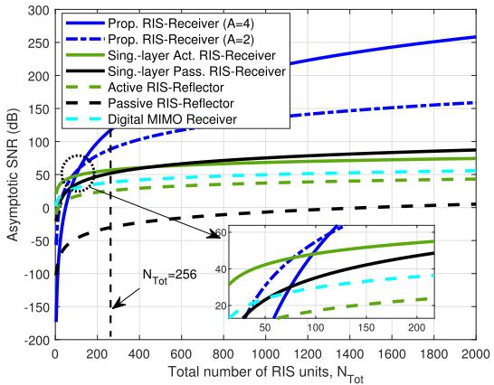

line

| Total number of RIS units, N_Tot | Prop. RIS-Receiver (A=4) | Prop. RIS-Receiver (A=2) | Sing-layer Act. RIS-Receiver | Sing-layer Pass. RIS-Receiver | Active RIS-Reflector | Passive RIS-Reflector | Digital MIMO Receiver |
| -------------------------------- | ------------------------ | ------------------------ | ----------------------------- | ----------------------------- | -------------------- | ---------------------- | --------------------- |
| 0                                | -200                     | -100                     | -100                          | -100                          | -100                 | -100                   | -100                  |
| 200                              | 100                      | 150                      | 50                            | 50                            | 50                   | 50                     | 50                    |
| 400                              | 150                      | 175                      | 75                            | 75                            | 75                   | 75                     | 75                    |
| 600                              | 200                      | 200                      | 100                           | 100                           | 100                  | 100                    | 100                   |
| 800                              | 225                      | 225                      | 125                           | 125                           | 125                  | 125                    | 125                   |
| 1000                             | 250                      | 250                      | 150                           | 150                           | 150                  | 150                    | 150                   |
| 1200                             | 275                      | 275                      | 175                           | 175                           | 175                  | 175                    | 175                   |
| 1400                             | 300                      | 300                      | 200                           | 200                           | 200                  | 200                    | 200                   |
| 1600                             | 325                      | 325                      | 225                           | 225                           | 225                  | 225                    | 225                   |
| 1800                             | 350                      | 350                      | 250                           | 250                           | 250                  | 250                    | 250                   |
| 2000                             | 375                      | 375                      | 275                           | 275                           | 275                  | 275                    | 275                   |
N_Tot = 256

Fig. 3. Asymptotic SNR versus $\begin{array} { r } { N _ { \mathrm { T o t } } = \sum _ { a = 1 } ^ { A } N _ { \mathrm { E } , a } } \end{array}$

Furthermore, as shown in Fig. 3, since the single-layer active RIS-receiver introduces an additional dynamic noise power $\sigma _ { \mathrm { A } } ^ { 2 }$ at the denominator of (48) and it would only experience the attenuation effects induced by $\widehat { \rho }$ instead of bthe large fading of the RIS-Rx link, the single-layer active RIS-receiver outperforms the single-layer passive one only when $\begin{array} { r } { N _ { \mathrm { T o t } } \ = \ \sum _ { a = 1 } ^ { A } N _ { \mathrm { E } , a } \ < \ } \end{array}$ < 468. When $N _ { \mathrm { T o t } } ~ > ~ 4 6 8$ , the SNRs of both single-layer RIS-receiver architectures (passive and active) are approximately the same, which means that the amplitude gain achieved by the active RIS is nullified by the introduced dynamic noise. However, considering the fact that the amplitude of the signal penetrating multi-layer architecture can be also partially controlled in [31], our proposed multilayer RIS-receiver not only can significantly amplify the desired signal power, but also does not introduce additional dynamic noise, which further confirms the superiority of our proposed multi-layer RIS-receiver architecture.

# V. SIMULATION RESULTS

In this section, we provide numerical results to demonstrate the superiority of our proposed architecture and algorithms. The main parameters are listed in Table I.6 The HAP channel model parameters in (6) are the same as those in [4]. Moreover, the CSI uncertainty bound is defined as $\Delta { = } \theta _ { \mathrm { U } } { - } \theta _ { \mathrm { L } }$ , and the HAP’s altitude is D (meters). HAP is deployed at [0, 0, D] m and three MTs are distributed at the directions $\{ ( \theta , \varphi )  ( 3 0 ^ { \circ } , 3 0 ^ { \circ } ) , ( 6 0 ^ { \circ } , 1 5 0 ^ { \circ } ) , ( 7 0 ^ { \circ } , 7 5 ^ { \circ } ) \}$ of HAP with a radius of D m. Here, we compare the following architectures and algorithms:

6The minimum value for harvesting energy guarantees the self-sustainability for MTs. According to [20], [21], [23], and [55], the minimum EH thresholds in both the terrestrial and non-terrestrial networks range from −15 dBm to −25 dBm. Thus, this paper sets the minimum value for harvesting energy as −20 dBm as [21] and [55].

TABLE I   
MAIN SIMULATION PARAMETERS 

<table><tr><td>Parameter</td><td>Values</td></tr><tr><td>Number of HAP&#x27;s transmit antennas,  $N_{\text{H}}$ </td><td> $N_{\text{H}} = 8 \times 8$ </td></tr><tr><td>Number of MTs,  $K$ </td><td> $K = 3$ </td></tr><tr><td>Number of RIS layers,  $A$ </td><td> $A = 2$ </td></tr><tr><td>Number of MT&#x27;s Rx antennas,  $N_{\text{D},k}$ </td><td> $N_{\text{D},k} = 2 \times 2$ </td></tr><tr><td>Noise power at MTs,  $\sigma_{k}^{2}$ </td><td> $\sigma_{k}^{2} = -80 \text{ dBm}$ </td></tr><tr><td>Noise power at EH circuits,  $\delta_{k}^{2}$ </td><td> $\delta_{k}^{2} = -80 \text{ dBm}$ </td></tr><tr><td>Carrier frequency,  $\delta_{k}^{2}$ </td><td>18 GHz</td></tr><tr><td>Maximum power at HAP,  $P_{\text{max}}$ </td><td> $P_{\text{max}} = 40 \text{ dBm}$ </td></tr><tr><td>Minimum rate threshold,  $\Gamma_{k}$ </td><td> $\Gamma_{k} = 1 \text{ bps/Hz}$ </td></tr><tr><td>Harvested energy requirement,  $\varsigma_{\text{max}}$ </td><td> $\varsigma_{\text{max}} = -20 \text{ dBm}$ </td></tr><tr><td>Nonlinear EH model parameters</td><td> $\alpha = 2.463, \beta = 1.635, \varepsilon = 0.826$ </td></tr><tr><td>Smoothing parameter,  $\rho$ </td><td> $\rho = 0.1$ </td></tr><tr><td>Bandwidth,  $W$ </td><td> $W = 1 \text{ MHz}$ </td></tr></table>

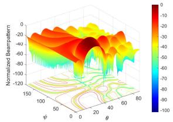

heatmap

| Ψ \ θ | -150 | -120 | -100 | -80 | -60 | -40 | -20 | 0 | 20 | 40 | 60 | 80 |
|---|---|---|---|---|---|---|---|---|---|---|---|---|
| 100 | -100 | -80 | -60 | -40 | -20 | 0 | 20 | 40 | 60 | 80 | 100 | 80 |
| 50 | -120 | -100 | -80 | -60 | -40 | -20 | 0 | 20 | 40 | 60 | 80 | 100 |
| 0 | -150 | -120 | -100 | -80 | -60 | -40 | 0 | 20 | 40 | 60 | 80 | 100 |
| 25 | -150 | -120 | -100 | -80 | -60 | -40 | 0 | 20 | 40 | 60 | 80 | 100 |
| 50 | -150 | -120 | -100 | -80 | -60 | -40 | 0 | 20 | 40 | 60 | 80 | 100 |
| 75 | -150 | -120 | -100 | -80 | -60 | -40 | 0 | 20 | 40 | 60 | 80 | 100 |
| 100 | -150 | -120 | -100 | -80 | -60 | -40 | 0 | 20 | 40 | 60 | 80 | 100 |
The color scale ranges from -15 to +25, likely represents a scalar field or a dimensionless parameter. The contour lines indicate constant values of the scalar field. There is no legend or additional data series present.

(a) 3D Tx beampattern of W1

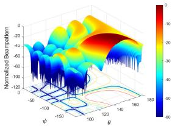

surface_3d

| θ    | φ̄     | Normalized Bearnpattern |
|------|-------|------------------------|
| 160  | -50   | -40                    |
| 160  | -100  | -30                    |
| 160  | -150  | -20                    |
| 160  | -200  | -10                    |
| 160  | -250  | 0                      |
| 160  | -300  | 10                     |
| 160  | -350  | 20                     |
| 160  | -400  | 30                     |
| 160  | -450  | 40                     |
| 160  | -500  | 50                     |
| 150  | -50   | -40                    |
| 150  | -100  | -30                    |
| 150  | -150  | -20                    |
| 150  | -200  | -10                    |
| 150  | -250  | 0                      |
| 150  | -300  | 10                     |
| 150  | -350  | 20                     |
| 150  | -400  | 30                     |
| 150  | -450  | 40                     |
| 150  | -500  | 50                     |
| 140  | -50   | -40                    |
| 140  | -100  | -30                    |
| 140  | -150  | -20                    |
| 140  | -200  | -10                    |
| 140  | -250  | 0                      |
| 140  | -300  | 10                     |
| 140  | -350  | 20                     |
| 140  | -400  | 30                     |
| 140  | -450  | 40                     |
| 140  | -500  | 50                     |
| 130  | -50   | -40                    |
| 130  | -100  | -30                    |
| 130  | -150  | -20                    |
| 130  | -200  | -10                    |
| 130  | -250  | 0                      |
| 130  | -300  | 10                     |
| 130  | -350  | 20                     |
| 130  | -400  | 30                     |
| 130  | -450  | 40                     |
| 130  | -500  | 50                     |
| 120  | -50   | -40                    |
| 120  | -100  | -30                    |
| 120  | -150  | -20                    |
| 120  | -200  | -10                    |
| 120  | -250  | 0                      |
| 120  | -300  | 10                     |
| 120  | -350  | 20                     |
| 120  | -400  | 30                     |
| 120  | -450  | 40                     |
| 120  | -500  | 50                     |
| Note: The actual values for φ̄ are not provided in the code. The data is presented as a table with three columns: θ (ranging from ~-5 to ~2) and φ̄ (ranging from ~-7 to ~7). There is only one data series labeled 'Normalized Bearnpattern'.

(b) 3D Rx beampattern of prop.arch.

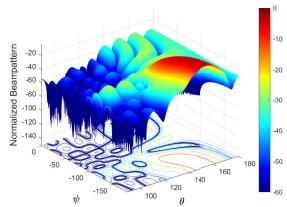

surface_3d

| θ    | Normalized Beampattern | ψ     |
|------|--------------------------|-------|
| -50  | -20                      | -100  |
| -40  | -40                      | -90   |
| -30  | -60                      | -80   |
| -20  | -80                      | -70   |
| -10  | -100                     | -60   |
| 0    | -120                     | -50   |
| 10   | -140                     | -40   |
| 20   | -160                     | -30   |
| 30   | -180                     | -20   |
| 40   | -200                     | -10   |
| 50   | -220                     | 0     |
| 60   | -240                     | 10    |
| 70   | -260                     | 20    |
| 80   | -280                     | 30    |
| 90   | -300                     | 40    |
| 100  | -320                     | 50    |
| 110  | -340                     | 60    |
| 120  | -360                     | 70    |
| 130  | -380                     | 80    |
| 140  | -400                     | 90    |
| 150  | -420                     | 100   |
| 160  | -440                     | 110   |
| 170  | -460                     | 120   |
| 180  | -480                     | 130   |
| 190  | -500                     | 140   |
| 200  | -520                     | 150   |
| 210  | -540                     | 160   |
| 220  | -560                     | 170   |
| 230  | -580                     | 180   |
| 240  | -600                     | 190   |
| 250  | -620                     | 200   |
| 260  | -640                     | 210   |
| 270  | -660                     | 220   |
| 280  | -680                     | 230   |
| 290  | -700                     | 240   |
| 300  | -720                     | 250   |
| 310  | -740                     | 260   |
| 320  | -760                     | 270   |
| 330  | -780                     | 280   |
| 340  | -800                     | 290   |
| 350  | -820                     | 300   |
| 360  | -840                     | 310   |
| 370  | -860                     | 320   |
| 380  | -880                     | 330   |
| 390  | -900                     | 340   |
| 400  | -920                     | 350   |
| 410  | -940                     | 360   |
| 420  | -960                     | 370   |
| 430  | -980                     | 380   |
| 440  | -1000                    | 390   |
| 450  | -1020                    | 400   |
| 460  | -1040                    | 410   |
| 470  | -1060                    | 420   |
| 480  | -1080                    | 430   |
| 490  | -1100                    | 440   |
| 500  | -1120                    | 450   |
| 510  | -1140                    | 460   |
| 520  | -1160                    | 470   |
| 530  | -1180                    | 480   |
| 540  | -1200                    | 490   |
| 550  | -1220                    | 500   |
| 560  | -1240                    | nan    |
| nan    | ~-55                     | nan    |
| nan    | ~-55/65                 | nan    |
| nan    | ~-55/65/65               | nan    |
| nan    | ~-55/65                  | nan    |
| nan    | ~-55/65/65               | nan    |
| nan    | ~-55/65/65               | nan    |
| nan    | ~-55/65                  | nan    |
| nan    | ~-55/65                  | nan    |
| nan    | ~-55/65                  | nan    |
| nan    | ~-55/65                  | nan    |
| nan    | ~-55/65                  | nan    |
| nan    | ~-55/65                  | nan    |
| nan    | ~-55/65                  | nan    |

(c) 3D Rx beampattern of sing.-act. arch.

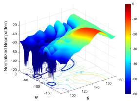

surface_3d

| θ    | φ̅     | Normalized Beampattern |
|------|-------|------------------------|
| -160 | -50   | 0                      |
| -140 | -40   | 10                     |
| -120 | -30   | 20                     |
| -100 | -20   | 30                     |
| -80  | -10   | 40                     |
| -60  | 0     | 50                     |
| -40  | 10    | 60                     |
| -20  | 20    | 70                     |
| 0    | 30    | 80                     |
| 20   | 40    | 90                     |
| 40   | 50    | 100                    |
| 60   | 60    | 110                    |
| 80   | 70    | 120                    |
| 100  | 80    | 130                    |
| 120  | 90    | 140                    |
| 140  | 100   | 150                    |
| 160  | 110   | 160                    |

(d) 3D Rx beampattern of sing.-pass.arch.

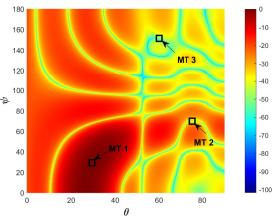

heatmap

| θ   | φ   | Value |
| --- | --- | ----- |
| 60  | 140 | 10    |
| 70  | 60  | 60    |
| 80  | 60  | 60    |

(e) 2D Tx beampattern of W1

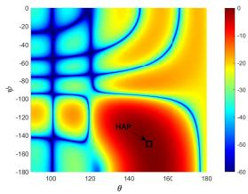

heatmap

| θ    | φₚ   | Value |
|------|------|-------|
| 145  | -140 | -30   |

(f) 2D Rx beampattern of prop. arch.

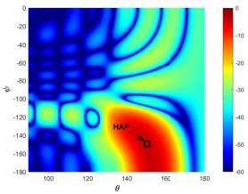

heatmap

| θ    | φ     |
| ---- | ----- |
| 145  | -140  |

(g) 2D Rx beampattern of sing.-act. arch.

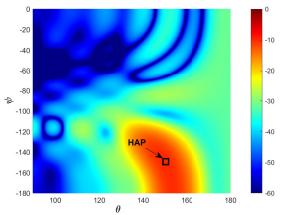

heatmap

| θ    | φ     | Value |
|------|-------|-------|
| 140  | -140  | 0     |
| 150  | -160  | 50    |

(h) 2D Rx beampattern of sing.-pass.arch.   
Fig. 4. Transmit and receive beampattern with different architectures (colorbar is unified for the last 3 subfigures, unit: dB).

• Proposed architecture: the proposed multi-layer refracting RIS-assisted receiver architecture with A layers having $N _ { \mathrm { E } , k a } ~ = ~ N _ { \mathrm { E } }$ on each layer is adopted for SWIPT, and the proposed scalable robust beamforming optimization framework is utilized to solve problem (9).   
• Digital architecture: the fully-digital receiver architecture in [27] with $N = A N _ { \mathrm { E } }$ Rx antennas is adopted, and the MMSE decoder [51] is used to design the decoder.   
• Single-layer active architecture: the single-layer active RIS-aided receiver architecture $N ~ = ~ A N _ { \mathrm { { E } } }$ RIS units is adopted, and the proposed algorithm is applied to obtain $\Xi _ { k }$ . To further highlight the advantages of our proposed architecture, we consider a favorable setting for the single-layer active one, where the maximum amplification factor is set as a constant, while ignoring active RIS’s power constraints.   
• Single-layer passive architecture: the single-layer passive RIS-aided receiver architecture having $N = A N _ { \mathrm { E } }$ RIS units is adopted, and the proposed algorithm is applied to obtain $\Xi _ { k }$ .

• SCA-MM scheme: under the proposed architecture, SCA in [52] and MM in [20] are utilized to handle $\mathbf { w } _ { k }$ and $\Xi _ { k a }$ in problem (9), respectively.   
• ZF-MCCD scheme: under the proposed architecture, zero-forcing (ZF) in [4] and M-CCD in Section III-C are utilized to handle $\mathbf { w } _ { k }$ and $\Xi _ { k a }$ in problem (9).

Fig. 4 presents the transmit (Tx) and receive (Rx) beampattern with different architectures, where $N _ { \mathrm { E } } = 6 \times 6 ,$ $\Delta = 2 ^ { \circ }$ , and $D = 2 0$ km. Here, we focus on investigating the Tx and Rx beampatterns of MT 1. As expected, even under the angular uncertainty $\Delta ,$ the HAP’s transmitter can still accurately generate the mainlobe towards the desired MT with SNR of 0 dB, and simultaneously align the nulls with at least -50 dB depth towards undesired targets, indicating the viability of the transmit precoder generated by our proposed LogSumExp-dual scheme. Besides, since the total RIS units are evenly divided at A layers, the lobe resolution of the proposed architecture is lower than those of both the singlelayer active and the passive architectures with the same number of RIS units. However, the mainlobes of our proposed architecture can be still guaranteed to point to the desired MT with $\Delta .$ In addition, it is worth noting that the received MT’s SNR acheived by the proposed architecture is about 0 dB, while those of the single-layer active and the passive architectures are about -4.2 dB and -10 dB, respectively. This phenomenon suggests that the proposed multi-layer RIS-assisted architecture can amplify the amplitude of the desired signals much more than both the single-layer active and passive ones, which is consistent with Theorem 2. Furthermore, due to the fact that only the phase can be adapted in the single-layer passive RIS-receiver such that the DoF for beamforming design is limited, its corresponding beampattern is not smooth. Conversely, the beampatterns of the proposed and the single-layer active architectures are both smooth, which suggests that the amplitude of the signal penetrating multi-layer architecture can be also partially controlled as in [31]. Thus, an additional DoF is introduced by proposed architecture for beamforming design.

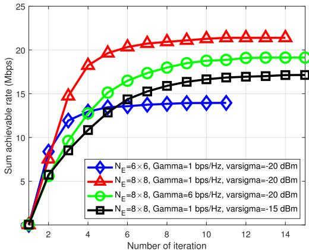

line

| Number of iteration | N_E=6×6, Gamma=1 bps/Hz, varsigma=-20 dBm | N_E=8×8, Gamma=1 bps/Hz, varsigma=-20 dBm | N_E=8×8, Gamma=6 bps/Hz, varsigma=-20 dBm | N_E=8×8, Gamma=1 bps/Hz, varsigma=-15 dBm |
| ------------------- | ------------------------------------------ | ------------------------------------------ | ------------------------------------------ | ------------------------------------------ |
| 0                   | 0                                          | 0                                          | 0                                          | 0                                          |
| 2                   | 8                                          | 10                                         | 6                                          | 5                                          |
| 4                   | 12                                         | 18                                         | 10                                         | 9                                          |
| 6                   | 13                                         | 20                                         | 15                                         | 13                                         |
| 8                   | 13                                         | 21                                         | 17                                         | 15                                         |
| 10                  | 13                                         | 21                                         | 18                                         | 16                                         |
| 12                  | 13                                         | 21                                         | 19                                         | 17                                         |
| 14                  | 13                                         | 21                                         | 19                                         | 17                                         |

Fig. 5. Convergence performance.

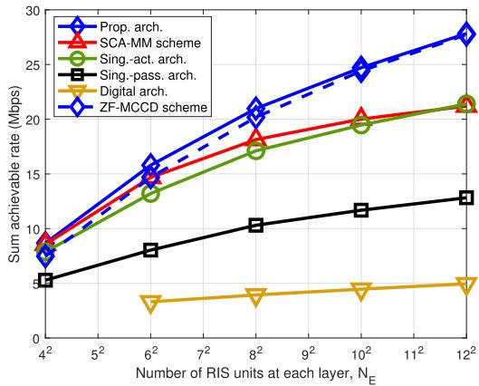

line

| Number of RIS units at each layer, N_E | Prop. arch. | SCA-MM scheme | Sing.-act. arch. | Sing.-pass. arch. | Digital arch. | ZF-MCCD scheme |
| -------------------------------------- | ----------- | ------------- | ---------------- | ----------------- | ------------- | -------------- |
| 4²                                     | 8           | 9             | 8                | 5                 | 3             | 8              |
| 6²                                     | 16          | 15            | 14               | 8                 | 3             | 16             |
| 8²                                     | 21          | 18            | 17               | 10                | 3             | 21             |
| 10²                                    | 25          | 20            | 19               | 12                | 3             | 25             |
| 12²                                    | 28          | 22            | 22               | 13                | 3             | 28             |

Fig. 6. Sum achievable rate versus $N _ { \mathrm { E } } .$

Fig. 5 illustrates the convergence of our proposed optimization algorithm. It is seen that all algorithms converge rapidly within 15 iterations, and larger $N _ { \mathrm { E } }$ or lower $\Gamma _ { k } , \varsigma _ { \mathrm { m a x } }$ achieve a higher sum rate at the cost of slower convergence speed.

Fig. 6 illustrates the sum achievable rate versus the√ number of RIS units at each layer $\sqrt { N _ { \mathrm { E } } }$ . As we can see, the sum achievable rate increases with increasing $N _ { \mathrm { E } }$ , especially when the number of RIS units at each layer increases from $4 \times 4$ to $8 \times 8 .$ Furthermore, it can also be observed that, as $N _ { \mathrm { E } }$ grows, the sum achievable rate of all the benchmark architectures and schemes would converge gradually, and the difference in sum achievable rate between the proposed architecture and the benchmarks becomes larger. This behavior can be explained by the following two reasons. First, as shown in Theorem 2, although the desired signals’ power of the benchmark architectures are proportional to the function of $\left( { \widehat { \rho } } \sum _ { a = 1 } ^ { A } N _ { \mathrm { E } , a } \right)$ , employing more RIS units can also simultaneously boost the inter-user interference strength, thus their sum achievable rate would converge gradually. However, benefiting from the notable potential gain achieved by the proposed architecture, i.e., $\scriptstyle \left( \prod _ { a = 1 } ^ { A } { \widehat { \rho } } N _ { \mathrm { E } , a } \right) ^ { 2 }$ , the desired signal is significantly enhanced as $N _ { \mathrm { E } }$ increases, which is far greater than the inter-user interference. Thus, the gap in sum achievable rate between the architectures increases with $N _ { \mathrm { E } }$ . Second, in the SCA-MM scheme, the tightness between the original problem and the solved ones loosens as $N _ { \mathrm { E } }$ grows, such that the difference between SCA-MM and proposed algorithm becomes larger. In contrast, although the $\mathrm { Z F }$ precoder leads to higher inter-user interference strength than the proposed algorithm, the interference can be further mitigated as $N _ { \mathrm { E } }$ grows, thus eventually decreasing the performance gap between ZF-MCCD and our proposed algorithm. These results confirm both the superiority and the scalability of the proposed architecture and optimization framework as the number of RIS units increases. On the other hand, due to the severe large-scale fading in the HAP-MT link, the digital receiver architecture cannot realize SWIPT for a small $N _ { \mathrm { E } }$ , namely, $N _ { \mathrm { E } } ~ < ~ 6 ~ \times ~ 6 .$ , while we see the converse for RIS-aided HAP communications. In the practice, it is challenging to deploy $N _ { \mathrm { T o t } } > 3 6$ digital antennas at the MT side, whereas RIS can facilitate the employment of largescale arrays, which indicates that HAP-SWIPT can be realized with the assistance of RIS-receivers.

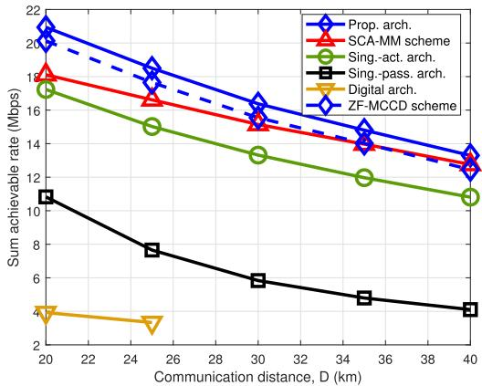

line

| Communication distance, D (km) | Prop. arch. | SCA-MM scheme | Sing.-act. arch. | Sing.-pass. arch. | Digital arch. | ZF-MCCD scheme |
| ------------------------------- | ----------- | ------------- | ---------------- | ----------------- | ------------- | -------------- |
| 20                              | 21.5        | 18.5          | 17.5             | 10.5              | 4.0           | 21.0           |
| 24                              | 19.0        | 17.0          | 15.0             | 7.5               | 3.5           | 18.5           |
| 30                              | 16.5        | 15.5          | 13.5             | 6.0               | -             | 16.0           |
| 34                              | 14.5        | 14.0          | 12.0             | 5.0               | -             | 14.5           |
| 40                              | 13.0        | 13.0          | 11.0             | 4.0               | -             | 13.0           |

Fig. 7. Sum achievable rate versus $D .$

To further reveal the benefits of our proposed multi-layer RIS-aided receiver in the HAP communications, the sum achievable rate versus the HAP’s altitude D in Fig. 7. Here, the other settings are the same as in Figs. 4 and 6. Note that the higher HAP’s altitude implies broader coverage and higher maneuverability, which is an essential factor for HAP communications [3]. We can find that the sum achievable rate decreases with D due to the higher large-scale fading, and the proposed RIS-receiver can still achieve superior performance over the other receivers and SCA-MM/ZF-MCCD as D grows. Besides, the conventional digital receiver cannot communicate with HAP when $D > 2 5$ km, while the RIS-aided receiver can still enable SWIPT even when $D > 4 0$ km, suggesting that the RIS-receiver can significantly enhance the coverage and maneuverability of HAP such that the MT’s quality of service can be impoved, which is consistent with Theorem 2. It can be also observed that the single-layer passive RIS-receiver is more sensitive to the HAP’s altitude $D$ than both the proposed multi-layer RIS-receiver and the single-layer active one. This is because the amplitudes of proposed multi-layer RIS-receiver and the single-layer active one can be also partially or fully adapted, and thus more DoFs are generated to reduce the negative impact of $D ,$ which is consistent with Theorem 3.

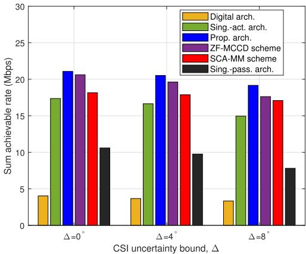

bar

| CSI uncertainty bound, Δ | Digital arch. | Sing.-act. arch. | Prop. arch. | ZF-MCCD scheme | SCA-MM scheme | Sing.-pass. arch. |
| ------------------------ | ------------- | ---------------- | ----------- | -------------- | ------------- | ----------------- |
| Δ=0°                     | 4             | 17.5             | 21          | 20.5           | 18.5          | 10.5              |
| Δ=4°                     | 3.5           | 16.5             | 20.5        | 19.5           | 18            | 9.5               |
| Δ=8°                     | 3             | 15               | 19          | 17.5           | 17            | 7.5               |

Fig. 8. Sum achievable rate versus $\Delta .$

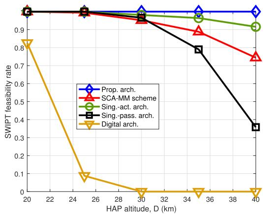

line

| HAP altitude, D (km) | Prop. arch. | SCA-MM scheme | Sing.-act. arch. | Sing.-pass. arch. | Digital arch. |
| --------------------- | ----------- | ------------- | ---------------- | ----------------- | ------------- |
| 20                    | 0.95        | 0.95          | 0.95             | 0.95              | 0.85          |
| 26                    | 0.95        | 0.95          | 0.95             | 0.95              | 0.10          |
| 30                    | 0.95        | 0.95          | 0.95             | 0.95              | 0.00          |
| 34                    | 0.95        | 0.90          | 0.95             | 0.80              | 0.00          |
| 40                    | 0.95        | 0.75          | 0.90             | 0.35              | 0.00          |

Fig. 9. SWIPT feasibility versus $D .$ .

Fig. 8 shows the sum achievable rate versus the CSI uncertainty bound $\Delta .$ , where $N _ { \mathrm { E } } = 6 \times 6$ and $D = 2 0$ km. As expected, the larger CSI uncertainty bound $\Delta$ is, the lower sum achievable rate achieved. It can be also seen that the difference of sum achievable rate between the proposed multilayer RIS-receiver and the two single-layer ones increases as $\Delta$ becomes larger. This is due to the fact that the channel dimension of our proposed architecture is much smaller than those of the two single-layer ones, i.e., $N _ { \mathrm { E } } ~ < ~ A N _ { \mathrm { E } }$ , such that the multi-layer RIS-receivers are not more sensitive to $\Delta$ as compared to the two single-layer ones. On the other hand, at first glance, it seems that the proposed robust optimization framework is more sensitive to $\Delta$ than the SCA-MM scheme, which is not true in fact. The reason behind this counterintuitive behavior is that as $\Delta$ increases, the infeasibility of the SCA-MM scheme becomes larger than that of our proposed robust framework, thus only the satisfactory CSI is feasible for HAP-SWIPT in SCA-MM, such that only high sum achievable rate is counted, thereby leading to more stable performance. In addition, since the inter-user interference strength of the $\mathrm { Z F }$ precoder increases as the uncertainty region $\Delta ,$ , the ZF-MCCD scheme is more sensitive to $\Delta$ than both the SCA-MM scheme and our proposed algorithm. In summary, compared to the benchmarks, both our proposed multi-layer RIS-receiver and robust optimization framework can achieve the superior and stable performance under the CSI uncertainty.

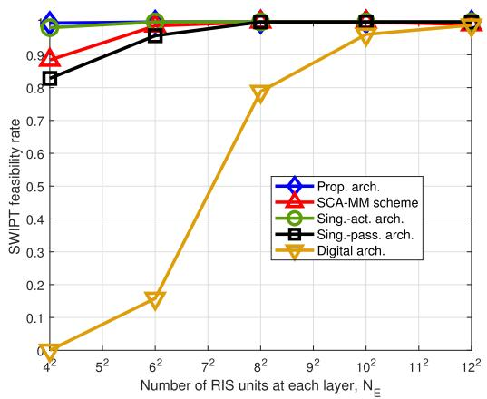

line

| Number of RIS units at each layer, N_E | Prop. arch. | SCA-MM scheme | Sing.-act. arch. | Sing-pass. arch. | Digital arch. |
| -------------------------------------- | ----------- | ------------- | ---------------- | ---------------- | ------------- |
| 4²                                     | 0.95        | 0.90          | 0.95             | 0.85             | 0.00          |
| 6²                                     | 0.95        | 0.95          | 0.95             | 0.90             | 0.15          |
| 8²                                     | 0.95        | 0.95          | 0.95             | 0.95             | 0.80          |
| 10²                                    | 0.95        | 0.95          | 0.95             | 0.95             | 0.95          |
| 12²                                    | 0.95        | 0.95          | 0.95             | 0.95             | 0.95          |

Fig. 10. SWIPT feasibility versus $N _ { \mathrm { E } }$

Figs. 9 and 10 depict the SWIPT feasibility rate $F$ versus D and $N _ { \mathrm { E } }$ , when $N _ { \mathrm { E } } = 6 \times 6$ and $D = 2 0$ km, respectively. We observe that the SWIPT feasibility rate decreases with $D ,$ and increases with $N _ { \mathrm { E } }$ . Similar to the findings in Fig. 4 and $^ { 6 , }$ the digital receiver achieves the worst performance, which further confirms the hardship of the conventional HAP-SWIPT and the positive impacts of RIS-receivers on HAP-SWIPT. Besides, due to the capability of amplitude regulation, the SWIPT feasibility rates of both the proposed and the singlelayer active RIS are not sensitive to $D$ and $N _ { \mathrm { E } } .$ , unlike that of single-layer passive one, especially with $D .$ . Furthermore, we find that the gap in the SWIPT feasibility rate between SCA-MM and our proposed optimization framework increases with increasing $D$ and decreasing $N _ { \mathrm { E } }$ . This is because of the loose approximations used in SCA-MM. These results further confirm the superiority and validity of our proposed optimization framework.

Fig. 11 shows the sum achievable rate versus the minimum rate threshold $\Gamma _ { k }$ and harvested energy requirement ςmax. It can be observed that as $\varsigma _ { \mathrm { m a x } }$ increases, the sum achievable rate significantly decreases. This is because the stringent EH requirement forces the optimization algorithm to allocate more resources for energy harvesting. On the other hand, the sum achievable rate remains stable when $\Gamma _ { k } \ \leq \ 3$ bps/Hz, while it shows significant variation when $\Gamma _ { k } \geq 4$ bps/Hz. This is due to the fact that as $\Gamma _ { k }$ increases, more resources should be allocated to ensure that each MT’s rate is higher than $\Gamma _ { k }$ , which inevitably leads to a lower sum-rate.

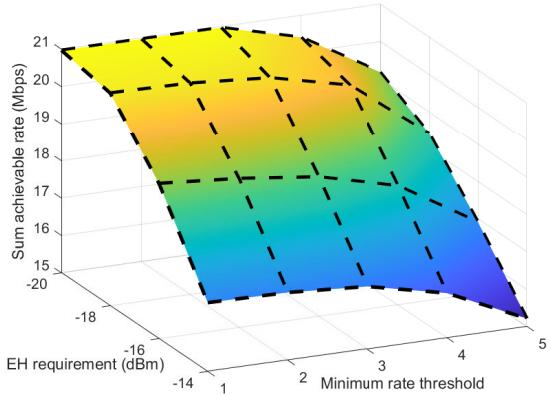  
Fig. 11. Sum achievable rate versus $\Gamma _ { k }$ and ςmax.

# VI. CONCLUSION

This paper investigated HAP-SWIPT networks with our proposed multi-layer refracting RIS-assisted receiver to overcome the severe large-scale fading and the energy scarcity dilemma. Utilizing the proposed architecture and taking the angular CSI imperfection into account, a worst-case sum rate maximization problem was formulated to achieve highlyefficient simultaneous transmission of information and energy. To handle the intractable non-convex problem, a scalable robust optimization framework was developed by leveraging the discretization method, LogSumExp-dual scheme, and the M-CCD, which admits the semi-closed-form solutions of all optimization variables. Moreover, the asymptotic performance of our proposed RIS-receiver was derived to show the notable gain they achieve in HAP communications. The theoretical and simulation results showed that the multilayer RIS-receiver can well overcome the severe “double fading” effect induced by the extreme long-distance HAP links and fully exploit RIS’s degrees-of-freedom (DoFs) for the SWIPT design. To elaborate, both the phase and amplitude of the signal processed by the multi-layer RISreceiver can be adapted in a wide range, such that HAP-SWIPT networks assisted by the multi-layer RIS-receiver can achieve much better performance than those with the single-layer active/passive RIS-receiver and the conventional digital receiver. Furthermore, the proposed algorithm achieves excellent performance with significantly lower complexity compared to the existing ones.

# APPENDIX A PROOF OF LEMMA 1

Recalling $\mathcal { L } \left( \overline { { \mathbf { w } } } \right) { = } \mathcal { L } _ { 1 } \left( \overline { { \mathbf { w } } } \right) { + } \mathcal { L } _ { 2 } \left( \overline { { \mathbf { w } } } \right) { + } \mathcal { L } _ { 3 } \left( \overline { { \mathbf { w } } } \right)$ in (18), we first take the derivative of (18) w.r.t. w. As such, the first-order KKT condition holds if

$$
\begin{array}{l} \partial_ {\overline {{\mathbf {w}}}} \mathcal {L} _ {1} (\overline {{\mathbf {w}}}) + \partial_ {\overline {{\mathbf {w}}}} \mathcal {L} _ {2} (\overline {{\mathbf {w}}}) + \partial_ {\overline {{\mathbf {w}}}} \mathcal {L} _ {3} (\overline {{\mathbf {w}}}) = 0 \\ \Rightarrow \mathbf {M} ^ {\dagger} (\overline {{\mathbf {w}}}) \mathbf {N} (\overline {{\mathbf {w}}}) \overline {{\mathbf {w}}} = \mathcal {L} (\overline {{\mathbf {w}}}) \overline {{\mathbf {w}}}. \tag {A.1} \\ \end{array}
$$

This completes the proof.

# APPENDIX B PROOF OF PROPOSITION 1

Note that w satisfying (20) is a stationary solution of (17) whose gradient is zero since (20) is the firstorder optimality condition. On the other hand, we observe that the condition (20) is a non-linear eigenvalue problem, i.e., eigenvector-dependent non-linear eigenvalue problem (NEPv) [56], where w is an eigenvector of $\mathbf { M } ^ { \dagger } \left( \overline { { \mathbf { w } } } \right) \mathbf { N } \left( \overline { { \mathbf { w } } } \right)$ corresponding to the eigenvalue $\mathcal { L } \left( \overline { { \mathbf { w } } } \right)$ . Furthermore, $\lambda _ { \mathrm { m a x } }$ is equivalent to $\mathcal { L } \left( \overline { { \mathbf { w } } } \right)$ in (18). As such, the leading eigenvector of $\mathbf { M } ^ { \dagger } \left( \overline { { \mathbf { w } } } \right) \mathbf { N } \left( \overline { { \mathbf { w } } } \right)$ can be obtained as the optimal solution of (17), which maximizes the objective function among multiple eigenvectors. Hence, the proof to (22) is completed.

Next, we prove (23). Due to the basis’s properties, we can define $\begin{array} { r } { \overline { { \mathbf { w } } } ^ { ( 0 ) } \dot { } = \sum _ { i = 1 } ^ { N } \kappa _ { i } \mathbf { q } _ { i } } \end{array}$ , where $\mathbf { q } _ { i }$ is the i-th eigenvector and $\kappa _ { i }$ is the weight factor. Denoting $\overline { { \mathbf { M } } } = \mathbf { M } ^ { \dagger } \left( \overline { { \mathbf { w } } } \right) \mathbf { N } \left( \overline { { \mathbf { w } } } \right)$ and $\lambda _ { 1 } \ge \lambda _ { 2 } \ge \cdots \ge \lambda _ { N }$ , we have

$$
\begin{array}{l} \mathcal {D} (\mathbf {q}) = \overline {{\mathbf {M}}} \overline {{\mathbf {w}}} ^ {(i _ {d})} = \sum_ {i = 1} ^ {N} \kappa_ {i} \lambda_ {i} ^ {(i _ {d})} \mathbf {q} _ {i} \\ = \kappa_ {1} \lambda_ {1} ^ {(i _ {d})} \left(\mathbf {q} _ {1} + \underbrace {\sum_ {i = 2} ^ {N} \frac {\kappa_ {i}}{\kappa_ {1}} \left(\frac {\lambda_ {i}}{\lambda_ {1}}\right) ^ {(i _ {d})} \mathbf {q} _ {i}} _ {(a)}\right), \tag {B.1} \\ \end{array}
$$

due to the fact that $\overline { { { \bf M } } } { \bf q } _ { i } = \lambda _ { i } { \bf q } _ { i }$ . Then, we prove that (a) will vanish as $i _ { d } \to \infty$ . For an arbitrary vector ${ \bf q } ,$ the Taylor expansion of $\mathcal { D } \left( \mathbf { q } \right)$ at $\mathbf { q } _ { 1 }$ leads to

$$
\begin{array}{l} \mathcal {D} ^ {H} (\mathbf {q}) \mathbf {q} _ {i} = \mathcal {D} ^ {H} (\mathbf {q} _ {1}) \mathbf {q} _ {i} \\ + \left(\mathbf {q} - \mathbf {q} _ {1}\right) ^ {H} \partial_ {\mathbf {q} _ {1}} \mathcal {D} \left(\mathbf {q} _ {1}\right) \mathbf {q} _ {i} + o \left(\| \mathbf {q} - \mathbf {q} _ {1} \|\right). \tag {B.2} \\ \end{array}
$$

As such, we have

$$
\left(\mathcal {D} ^ {H} (\mathbf {q}) \mathbf {q} _ {1}\right) ^ {2} = \left(\lambda_ {1} + o \left(\| \mathbf {q} - \mathbf {q} _ {1} \|\right)\right) ^ {2}, \tag {B.3}
$$

$$
\sum_ {i = 2} ^ {N} \left(\mathcal {D} ^ {H} (\mathbf {q}) \mathbf {q} _ {i}\right) ^ {2}
$$

$$
\leq \sum_ {i = 2} ^ {N} \left(\lambda_ {i} \left(\mathbf {q} ^ {H} \mathbf {q} _ {i}\right) ^ {2} + 2 \lambda_ {i} \left(\mathbf {q} ^ {H} \mathbf {q} _ {i}\right) ^ {2} o (\| \mathbf {q} - \mathbf {q} _ {1} \|)\right)
$$

$$
+ \theta^ {2} (\| \mathbf {q} - \mathbf {q} _ {1} \|)
$$

$$
\leq \left(\lambda_ {2} \| \mathbf {q} - \mathbf {q} _ {1} \| + o \left(\| \mathbf {q} - \mathbf {q} _ {1} \|\right)\right) ^ {2}. \tag {B.4}
$$

Since the premise $\lambda _ { 1 } \ \geq \ \lambda _ { 2 } \ \geq \ \cdot \ \cdot \ \geq \ \lambda _ { N }$ , by iteratively projecting q onto $\mathcal { D } \left( \mathbf { q } \right)$ with (23), (a) vanishes. Hence, (23) converges to the optimal leading eigenvector $\overline { { \mathbf { w } } } ^ { \star }$ .

# APPENDIX C PROOF OF PROPOSITION 3

First, we prove the convergence of the proposed M-CCD algorithm. The ascent of the objective function (33) can be expressed as

$$
\begin{array}{l} f \left(\xi_ {k a, 1} ^ {(i _ {d})}, \xi_ {k a, 2} ^ {(i _ {d})}, \dots , \xi_ {k a, N _ {\mathrm{E}, k a}} ^ {(i _ {d})}, \vartheta^ {(i _ {d})}, \tau^ {(i _ {d})}\right) \\ \stackrel {a} {\leq} f \left(\xi_ {k a, 1} ^ {(i _ {d})}, \xi_ {k a, 2} ^ {(i _ {d})}, \dots , \xi_ {k a, N _ {\mathrm{E}, k a}} ^ {(i _ {d})}, \vartheta^ {(i _ {d})}, \tau^ {(i _ {d} + 1)}\right) \\ \stackrel {b} {\leq} f \left(\xi_ {k a, 1} ^ {(i _ {d} + 1)}, \xi_ {k a, 2} ^ {(i _ {d})}, \dots , \xi_ {k a, N _ {\mathrm{E}, k a}} ^ {(i _ {d})}, \vartheta^ {(i _ {d})}, \tau^ {(i _ {d} + 1)}\right) \\ \stackrel {c} {\leq} f \left(\xi_ {k a, 1} ^ {(i _ {d} + 1)}, \xi_ {k a, 2} ^ {(i _ {d})}, \dots , \xi_ {k a, N _ {\mathrm{E}, k a}} ^ {(i _ {d})}, \vartheta^ {(i _ {d} + 1)}, \tau^ {(i _ {d} + 1)}\right) \\ \end{array}
$$

$$
\begin{array}{l} \stackrel {b} {\leq} f \left(\xi_ {k a, 1} ^ {(i _ {d} + 1)}, \xi_ {k a, 2} ^ {(i _ {d} + 1)}, \dots , \xi_ {k a, N _ {\mathrm{E}, k a}} ^ {(i _ {d})}, \vartheta^ {(i _ {d} + 1)}, \tau^ {(i _ {d} + 1)}\right) \\ \leq^ {c} f \left(\xi_ {k a, 1} ^ {(i _ {d} + 1)}, \xi_ {k a, 2} ^ {(i _ {d} + 1)}, \dots , \xi_ {k a, N _ {\mathrm{E}, k a}} ^ {(i _ {d})}, \vartheta^ {(i _ {d} + 2)}, \tau^ {(i _ {d} + 1)}\right) \\ \stackrel {b} {\leq} f \left(\xi_ {k a, 1} ^ {(i _ {d} + 1)}, \xi_ {k a, 2} ^ {(i _ {d} + 1)}, \dots , \xi_ {k a, N _ {\mathrm{E}, k a}} ^ {(i _ {d} + 1)}, \vartheta^ {(i _ {d} + N _ {\mathrm{E}, k a} - 1)}, \tau^ {(i _ {d} + 1)}\right) \\ \stackrel {c} {\leq} f \left(\xi_ {k a, 1} ^ {(i _ {d} + 1)}, \xi_ {k a, 2} ^ {(i _ {d} + 1)}, \dots , \xi_ {k a, N _ {\mathrm{E}, k a}} ^ {(i _ {d} + 1)}, \vartheta^ {(i _ {d} + N _ {\mathrm{E}, k a})}, \tau^ {(i _ {d} + 1)}\right). \tag {C.1} \\ \end{array}
$$

The inequality a holds since the duality gap approches zero, i.e., the optimality of $\begin{array} { r } { \operatorname* { m i n } _ { \tau > 0 } \mathrm { m a x } _ { \pmb { \xi } _ { k a } } f \left( \pmb { \xi } _ { k a } , \pmb { \vartheta } , \tau \right) } \end{array}$ is achieved by searching the optimal τ via the bisection search method, inequality c holds from the update of τ [48], and inequality b holds from the fact that ξ(id)ka,i $\dot { \xi } _ { k a , i } ^ { ( i _ { d } ) }$ is a unique element-wise maximizer of $f \left( \pmb { \xi } _ { k a } , \vartheta , \tau \right)$ , which will be given next.

To further prove the convergence of the M-CCD algorithm, we discuss the uniqueness of the element-wise maximizer of subproblem w.r.t. $\xi _ { k a , i }$ . Recalling the solution (38) of problem (37), namely, $\xi _ { k a , i } = \exp \left\{ \bar { j } \arg \left( \widetilde { T } _ { k a , ( i ) } \right) \right\}$ , where $\begin{array} { r l r } { \widetilde { T } _ { k a , ( i ) } } & { { } = } & { \sum _ { j = 1 } ^ { j < i } T _ { k a , ( i , j ) } \xi _ { k a , j } ^ { ( i _ { d } + 1 ) } \ \stackrel { \setminus } { + } \ \sum _ { j > i } ^ { { N } _ { \mathrm { E } , k a } ^ { \setminus } } T _ { k a , ( i , j ) } ^ { ' } \xi _ { k a , j } ^ { ( i _ { d } ) } } \end{array}$ e j)ξ(id+1)ka,j + PNE,kaj>i Tka,(i,j)ξ(id)ka,j , we can show that (38) is the unique elementwise maximizer by contradiction. Denoting $\begin{array} { r l } { \bar { \xi } _ { k a , i } } & { { } = } \end{array}$ = $\exp \left\{ j \arg \left( \widetilde { T } _ { k a , ( i ) } + \theta _ { i } \right) \right\}$ as another element-wise maximizer, where $\theta _ { i }$ is not an integer multiple of $2 \pi .$ , we have

$$
\begin{array}{l} f \left(\boldsymbol {\xi} _ {k a}, \vartheta , \tau\right) = \sum_ {i = 1} ^ {N _ {\mathrm{E}, k a}} T _ {k a, (i, i)} + \sum_ {i = 1} ^ {N _ {\mathrm{E}, k a}} \left| T _ {k a, (i)} \right| \\ f \left(\overline {{{\boldsymbol {\xi}}}} _ {k a}, \vartheta , \tau\right) = \sum_ {i = 1} ^ {N _ {\mathrm{E}, k a}} T _ {k a, (i, i)} + \sum_ {i = 1} ^ {N _ {\mathrm{E}, k a}} \left| T _ {k a, (i)} \right| \cos \left(\theta_ {i}\right). \tag {C.2} \\ \end{array}
$$

Since both ${ \pmb { \xi } } _ { k a }$ and $\bar { \xi } _ { k a }$ maximize $f \left( \xi _ { k a } , \vartheta , \tau \right)$ , we obtain $f \left( \xi _ { k a } , \vartheta , \tau \right) = f \left( \overline { { \xi } } _ { k a } , \vartheta , \tau \right)$ so that $\theta _ { i }$ must be an integer multiple of 2π, which contradicts our assumption. Thus, (38) is the unique element-wise maximizer of $f \left( \xi _ { k a } , \vartheta , \tau \right)$ , such that inequality b holds, which implies that the sequence $\left\{ \pmb { \xi } _ { k a } ^ { ( i _ { d } ) } , \pmb { \vartheta } ^ { ( i _ { d } ) } , \pmb { \tau } ^ { ( i _ { d } ) } \right\}$ is monotonically increasing. Furthermore, the objective function $\left\{ \pmb { \xi } _ { k a } ^ { ( i _ { d } ) } , \vartheta ^ { ( i _ { d } ) } , \tau ^ { ( i _ { d } ) } \right\}$ is upper-bounded by the constraint C4. Hence, $\left\{ \pmb { \xi } _ { k a } ^ { ( i _ { d } ) } , \vartheta ^ { ( i _ { d } ) } , \tau ^ { ( i _ { d } ) } \right\}$ increases to the limited point $\left\{ \pmb { \xi } _ { k a } ^ { ( \infty ) } , \vartheta ^ { ( \infty ) } , \tau ^ { ( \infty ) } \right\}$ .

Next, we show that the limited point is KKT-optimal point of problem (29). Since the objective function of problem (33) is strictly convex, the bisection method can find the unique solution satisfying the complementary slackness condition (39). Then, we consider two cases: 1) $\tau ^ { \star } = 0 ; 2 )$ $\tau ^ { \star } > 0$ .

In the first case, C4 is not tight in the optimum. Thus, the optithat olution is equal to that with is a block-wise maximiz $\tau = 0 .$ . Based on th w.r.t. block $\pmb { \xi } _ { k a } ^ { ( \infty ) }$ $\xi _ { k a } ,$ the solution $\xi _ { k a } ^ { ( \infty ) } \left( 0 \right)$ satisfies the partial KKT conditions of problem (33) w.r.t. $\xi _ { k a , i } ^ { ( \infty ) }$ . For the second case, the equality (40) should hold. Then, we use the method of contradiction to prove the KKT optimum of the second case. First, denote ξ(∞)ka $\pmb { \xi } _ { k a } ^ { ( \infty ) } \left( \tau ^ { \star } \right)$ as the KKT solution corresponding to $\tau ^ { \star }$ , and thus we have

$$
\boldsymbol {\xi} _ {k a} ^ {(\infty), H} \left(\tau^ {\star}\right) \mathbf {Q} _ {k a} \boldsymbol {\xi} _ {k a} ^ {(\infty)} \left(\tau^ {\star}\right) - \widetilde {\gamma} _ {k} = 0, \tag {C.3}
$$

Assume $\pmb { \xi } _ { k a } ^ { ( \infty ) } \left( \tau ^ { \star } \right)$ is not the globally optimal solution of problem (33), then we obtain

$$
f \left(\boldsymbol {\xi} _ {k a} ^ {(\infty)} \left(\tau^ {\star}\right)\right) \leq f \left(\boldsymbol {\xi} _ {k a} ^ {\star , (\infty)}\right). \tag {C.4}
$$

Since $\tau ^ { \star }$ is the optimal Lagrange multiplier, $\pmb { \xi } _ { k a } ^ { ( \infty ) } \left( \tau ^ { \star } \right)$ ξka is the KKT solution of (33) when $\tau = \tau ^ { \star }$ . Then, we have

$$
\begin{array}{l} f \left(\boldsymbol {\xi} _ {k a} ^ {(\infty)} \left(\tau^ {\star}\right)\right) + \tau^ {\star} \boldsymbol {\xi} _ {k a} ^ {(\infty), H} \left(\tau^ {\star}\right) \mathbf {Q} _ {k a} \boldsymbol {\xi} _ {k a} ^ {(\infty)} \left(\tau^ {\star}\right) \\ \geq f \left(\boldsymbol {\xi} _ {k a} ^ {\star , (\infty)}\right) + \tau^ {\star} \boldsymbol {\xi} _ {k a} ^ {\star , (\infty), H} \mathbf {Q} _ {k a} \boldsymbol {\xi} _ {k a} ^ {\star , (\infty)}. \tag {C.5} \\ \end{array}
$$

By substituting (40) and (C.3) into (C.5), we have $f \left( \xi _ { k a } ^ { \left( \infty \right) } \left( \tau ^ { \star } \right) \right) \geq f \left( \xi _ { k a } ^ { \star , \left( \infty \right) } \right)$ , which contradicts (C.4). Thus, the optimum of the second case is the KKT solution. Finally, due to the fact that the duality gap between (33) and (29) approaches zero, problem (37) is equivalent to problem (29). Thus, the KKT solution $\left\{ \stackrel { \cdot } { \xi } _ { k a } ^ { ( \infty ) } , \stackrel { \cdot } { \vartheta } ^ { ( \infty ) } , \tau ^ { ( \infty ) } \right\}$ nξ(∞)ka , ϑ(∞), τ (∞)o is also the Ska KKT-optimal point of problem (29). Besides, according to Theorem 1 in [50], the KKT solutions of M-CCD are equivalent to the coordinatewise optimal solutions. Thus, the proposed M-CCD converges to the coordinatewise optimal solutions.

# APPENDIX D PROOF OF THEOREM 2

Denoting $\mathbf { w } _ { k } = { \boldsymbol { \omega } } ,$ the SNR $\chi _ { \mathrm { P r o p } }$ . maximization problem can be formulated as

$$
\max _ {\omega , \boldsymbol {\Xi} _ {a}} \chi_ {\mathrm{Prop.}} = \frac {\left| \mathbf {h} _ {1} ^ {H} \boldsymbol {\Xi} _ {A} \boldsymbol {\Omega} _ {(1 , A - 1)} \mathbf {f} _ {1} \omega \right| ^ {2}}{\sigma^ {2}}
$$

$$
s. t. \mathrm{C} 3: | \omega | ^ {2} \leq P _ {\max}, \mathrm{C} 4: \left| [ \Xi_ {a} ] _ {n, n} \right| = 1, \forall a, n. \tag {D.1}
$$

Then, by expanding the numerator of $\chi _ { \mathrm { P r o p } }$ ., we have

$$
\begin{array}{l} \mathbf {h} _ {1} ^ {H} \boldsymbol {\Xi} _ {A} \boldsymbol {\Omega} _ {(1, A - 1)} \mathbf {f} _ {1} \\ = \sum_ {i _ {A} = 1} ^ {N _ {\mathrm{E}, A}} h _ {1, i _ {A}} e ^ {j \theta_ {A, i _ {A}}} \prod_ {a = 1} ^ {A - 1} \\ \times \left(\sum_ {i _ {a} = 1} ^ {N _ {\mathrm{E}, a}} b _ {a, (i _ {a + 1}, i _ {a})} e ^ {j \theta_ {a, i _ {a}}}\right) f _ {1, i _ {1}} \tag {D.2} \\ \end{array}
$$

The optimal solution of problem (D.1) is given by

$$
\begin{array}{l} \omega^ {\star} = \sqrt {P _ {\max}}, \theta_ {1, i _ {1}} ^ {\star} = - \angle b _ {1, (i _ {2}, i _ {1})} - \angle f _ {1, i _ {1}} \\ \theta_ {a, i _ {a}} ^ {\star} = - \angle b _ {a, (i _ {a + 1}, i _ {a})}, \forall a = 2, \dots , A. \tag {D.3} \\ \end{array}
$$

By substituting (D.3) into $\chi _ { \mathrm { P r o p . } } ,$ the maximum SNR $\chi _ { \mathrm { P r o p } }$ . can be expressed as

$$
\begin{array}{l} \chi_ {\mathrm{Prop.}} = P _ {\max} / \sigma^ {2} \\ \times \left| \prod_ {a = 2} ^ {A} \left(\sum_ {i _ {a} = 1} ^ {N _ {\mathrm{E}, a}} \left| b _ {a, (i _ {a + 1}, i _ {a})} \right|\right) \right. \\ \sum_ {i _ {1} = 1} ^ {N _ {\mathrm{E}, 1}} \left| b _ {1, (i _ {2}, i _ {1})} \right| \left| f _ {1, i _ {1}} \right| \bigg | ^ {2}. \tag {D.4} \\ \end{array}
$$

Since $\mathbf { f } _ { 1 } ~ \sim ~ \mathcal { C N } \Big ( \mathbf { 0 } , \varsigma _ { f _ { 1 } } ^ { 2 } \mathbf { I } \Big ) , ~ | f _ { 1 , i _ { 1 } } |$ follows the Rayleigh distribution with mean $\sqrt { \pi } \varsigma _ { f _ { 1 } } / 2$ and variance $\left( 4 - \pi \right) \varsigma _ { f _ { 1 } } ^ { 2 } \biggl / 2$ .

By using the central limit theorem, we obtain $\begin{array} { r } { \sum _ { i _ { 1 } = 1 } ^ { N _ { \mathrm { E } , 1 } } | f _ { 1 , i _ { 1 } } | \sim } \end{array}$ NE,1 $\mathcal { C N } \left( N _ { \mathrm { E } , 1 } \sqrt { \pi } \varsigma _ { f _ { 1 } } / 2 , N _ { \mathrm { E } , 1 } \left( 4 - \pi \right) \varsigma _ { f _ { 1 } } ^ { 2 } \middle / 2 \right)$ . Hence, we can transform (D.4) into (47). Equations (48) - (50) can be proved in similar way to proof above, and thus we omit the details here for brevity. The proof is complete. ■

# REFERENCES

[1] Y. Sun, K. An, Z. Lin, Y. Zhu, N. Al-Dhahir, and K.-K. Wong, “Scalable robust beamforming for multi-layer refracting RIS-assisted HAP-SWIPT networks,” in Proc. IEEE Global Commun. Conf., Dec. 2023, pp. 1656–1662.   
[2] M. S. Alam, G. K. Kurt, H. Yanikomeroglu, P. Zhu, and N. D. Ðào, “High altitude platform station based super macro base station constellations,” IEEE Commun. Mag., vol. 59, no. 1, pp. 103–109, Jan. 2021.   
[3] X. Cao, P. Yang, M. Alzenad, X. Xi, D. Wu, and H. Yanikomeroglu, “Airborne communication networks: A survey,” IEEE J. Sel. Areas Commun., vol. 36, no. 9, pp. 1907–1926, Sep. 2018.   
[4] Z. Lin, M. Lin, Y. Huang, T. D. Cola, and W.-P. Zhu, “Robust multiobjective beamforming for integrated satellite and high altitude platform network with imperfect channel state information,” IEEE Trans. Signal Process., vol. 67, no. 24, pp. 6384–6396, Dec. 2019.   
[5] Y. Alsaba, S. K. A. Rahim, and C. Y. Leow, “Beamforming in wireless energy harvesting communications systems: A survey,” IEEE Commun. Surveys Tuts., vol. 20, no. 2, pp. 1329–1360, 2nd Quart., 2018.   
[6] Y. Chen, N. Zhao, and M.-S. Alouini, “Wireless energy harvesting using signals from multiple fading channels,” IEEE Trans. Commun., vol. 65, no. 11, pp. 5027–5039, Nov. 2017.   
[7] R. Zhang and C. K. Ho, “MIMO broadcasting for simultaneous wireless information and power transfer,” IEEE Trans. Wireless Commun., vol. 12, no. 5, pp. 1989–2001, May 2013.   
[8] F. Zhou, Z. Chu, H. Sun, R. Q. Hu, and L. Hanzo, “Artificial noise aided secure cognitive beamforming for cooperative MISO-NOMA using SWIPT,” IEEE J. Sel. Areas Commun., vol. 36, no. 4, pp. 918–931, Apr. 2018.   
[9] W. Feng et al., “UAV-enabled SWIPT in IoT networks for emergency communications,” IEEE Wireless Commun., vol. 27, no. 5, pp. 140–147, Oct. 2020.   
[10] X. Sun, W. Yang, Y. Cai, Z. Xiang, and X. Tang, “Secure transmissions in millimeter wave SWIPT UAV-based relay networks,” IEEE Wireless Commun. Lett., vol. 8, no. 3, pp. 785–788, Jun. 2019.   
[11] W. Wang et al., “Joint precoding optimization for secure SWIPT in UAV-aided NOMA networks,” IEEE Trans. Commun., vol. 68, no. 8, pp. 5028–5040, Aug. 2020.   
[12] C. Wang and N. Liu, “Optimization and analysis of simultaneous wireless information and power transmission for LEO satellite,” in Proc. IEEE Int. Conf. Autom., Electron. Electr. Eng. (AUTEEE), Nov. 2018, pp. 375–379.   
[13] Q. Wu and R. Zhang, “Beamforming optimization for wireless network aided by intelligent reflecting surface with discrete phase shifts,” IEEE Trans. Commun., vol. 68, no. 3, pp. 1838–1851, Mar. 2020.   
[14] Q. Wu and R. Zhang, “Intelligent reflecting surface enhanced wireless network via joint active and passive beamforming,” IEEE Trans. Wireless Commun., vol. 18, no. 11, pp. 5394–5409, Nov. 2019.   
[15] Z. Lin et al., “Refracting RIS-aided hybrid satellite-terrestrial relay networks: Joint beamforming design and optimization,” IEEE Trans. Aerosp. Electron. Syst., vol. 58, no. 4, pp. 3717–3724, Aug. 2022.   
[16] A. Khalili, E. M. Monfared, S. Zargari, M. R. Javan, N. M. Yamchi, and E. A. Jorswieck, “Resource management for transmit power minimization in UAV-assisted RIS HetNets supported by dual connectivity,” IEEE Trans. Wireless Commun., vol. 21, no. 3, pp. 1806–1822, Mar. 2022.   
[17] Y. Sun, K. An, J. Luo, Y. Zhu, G. Zheng, and S. Chatzinotas, “Intelligent reflecting surface enhanced secure transmission against both jamming and eavesdropping attacks,” IEEE Trans. Veh. Technol., vol. 70, no. 10, pp. 11017–11022, Oct. 2021.   
[18] L. You, J. Xiong, D. W. K. Ng, C. Yuen, W. Wang, and X. Gao, “Energy efficiency and spectral efficiency tradeoff in RIS-aided multiuser MIMO uplink transmission,” IEEE Trans. Signal Process., vol. 69, pp. 1407–1421, 2021.   
[19] Z. Zhang et al., “Active RIS vs. passive RIS: Which will prevail in 6G?” IEEE Trans. Commun., vol. 71, no. 3, pp. 1707–1725, Mar. 2023.

[20] C. Pan et al., “Intelligent reflecting surface aided MIMO broadcasting for simultaneous wireless information and power transfer,” IEEE J. Sel. Areas Commun., vol. 38, no. 8, pp. 1719–1734, Aug. 2020.   
[21] S. Zargari, A. Hakimi, C. Tellambura, and S. Herath, “Multiuser MISO PS-SWIPT systems: Active or passive RIS?” IEEE Wireless Commun. Lett., vol. 11, no. 9, pp. 1920–1924, Sep. 2022.   
[22] S. Zargari, S. Farahmand, B. Abolhassani, and C. Tellambura, “Robust active and passive beamformer design for IRS-aided downlink MISO PS-SWIPT with a nonlinear energy harvesting model,” IEEE Trans. Green Commun. Netw., vol. 5, no. 4, pp. 2027–2041, Dec. 2021.   
[23] S. Zargari, A. Hakimi, C. Tellambura, and S. Herath, “User scheduling and trajectory optimization for energy-efficient IRS-UAV networks with SWIPT,” IEEE Trans. Veh. Technol., vol. 72, no. 2, pp. 1815–1830, Feb. 2023.   
[24] H. Ren, Z. Zhang, Z. Peng, L. Li, and C. Pan, “Energy minimization in RIS-assisted UAV-enabled wireless power transfer systems,” IEEE Internet Things J., vol. 10, no. 7, pp. 5794–5809, Apr. 2023.   
[25] Z. Chu, P. Xiao, D. Mi, W. Hao, Y. Xiao, and L.-L. Yang, “Multi-IRS assisted multi-cluster wireless powered IoT networks,” IEEE Trans. Wireless Commun., vol. 22, no. 7, pp. 4712–4728, Jul. 2023.   
[26] Y. Sun et al., “Robust design for RIS-assisted anti-jamming communications with imperfect angular information: A game-theoretic perspective,” IEEE Trans. Veh. Technol., vol. 71, no. 7, pp. 7967–7972, Jul. 2022.   
[27] Y. Sun et al., “RIS-assisted robust hybrid beamforming against simultaneous jamming and eavesdropping attacks,” IEEE Trans. Wireless Commun., vol. 21, no. 11, pp. 9212–9231, Nov. 2022.   
[28] Z. Yang, W. Xu, C. Huang, J. Shi, and M. Shikh-Bahaei, “Beamforming design for multiuser transmission through reconfigurable intelligent surface,” IEEE Trans. Commun., vol. 69, no. 1, pp. 589–601, Jan. 2021.   
[29] S. Alfattani, A. Yadav, H. Yanikomeroglu, and A. Yongaçoglu, “Resource-efficient HAPS-RIS enabled beyond-cell communications,” IEEE Wireless Commun. Lett., vol. 12, no. 4, pp. 679–683, Apr. 2023.   
[30] K. Liu, Z. Zhang, L. Dai, and L. Hanzo, “Compact user-specific reconfigurable intelligent surfaces for uplink transmission,” IEEE Trans. Commun., vol. 70, no. 1, pp. 680–692, Jan. 2022.   
[31] Y. Sun et al., “Energy-efficient hybrid beamforming for multilayer RIS-assisted secure integrated terrestrial-aerial networks,” IEEE Trans. Commun., vol. 70, no. 6, pp. 4189–4210, Jun. 2022.   
[32] C. Liu et al., “A programmable diffractive deep neural network based on a digital-coding metasurface array,” Nat. Electron., vol. 5, no. 2, pp. 113–122, Feb. 2022.   
[33] C. Pan et al., “An overview of signal processing techniques for RIS/IRSaided wireless systems,” IEEE J. Sel. Topics Signal Process., vol. 16, no. 5, pp. 883–917, Aug. 2022.   
[34] Y. Sun, K. An, J. Luo, Y. Zhu, G. Zheng, and S. Chatzinotas, “Outage constrained robust beamforming optimization for multiuser IRS-assisted anti-jamming communications with incomplete information,” IEEE Internet Things J., vol. 9, no. 15, pp. 13298–13314, Aug. 2022.   
[35] E. Choi, M. Oh, J. Choi, J. Park, N. Lee, and N. Al-Dhahir, “Joint precoding and artificial noise design for MU-MIMO wiretap channels,” IEEE Trans. Commun., vol. 71, no. 3, pp. 1564–1578, Mar. 2023.   
[36] X. Pei et al., “RIS-aided wireless communications: Prototyping, adaptive beamforming, and indoor/outdoor field trials,” IEEE Trans. Commun., vol. 69, no. 12, pp. 8627–8640, Dec. 2021.   
[37] S. Abeywickrama, R. Zhang, Q. Wu, and C. Yuen, “Intelligent reflecting surface: Practical phase shift model and beamforming optimization,” IEEE Trans. Commun., vol. 68, no. 9, pp. 5849–5863, Sep. 2020.   
[38] E. Bjoernson, “Optimizing a binary intelligent reflecting surface for OFDM communications under mutual coupling,” in Proc. 25th Int. ITG Workshop Smart Antennas, Nov. 2021, pp. 1–6.   
[39] V. Jamali, A. M. Tulino, G. Fischer, R. R. Muller, and R. Schober, “Intelligent surface-aided transmitter architectures for millimeter-wave ultra massive MIMO systems,” IEEE Open J. Commun. Society, vol. 2, pp. 144–167, 2021.   
[40] H. V. Cheng and W. Yu, “Degree-of-freedom of modulating information in the phases of reconfigurable intelligent surface,” IEEE Trans. Inf. Theory, vol. 70, no. 1, pp. 170–188, Jan. 2024.   
[41] C. Masouros and G. Zheng, “Exploiting known interference as green signal power for downlink beamforming optimization,” IEEE Trans. Signal Process., vol. 63, no. 14, pp. 3628–3640, Jul. 2015.

[42] R. Ma, W. Yang, X. Guan, X. Lu, Y. Song, and D. Chen, “Covert mmWave communications with finite blocklength against spatially random wardens,” IEEE Internet Things J., vol. 11, no. 2, pp. 3402–3416, Jan. 2024.   
[43] L. Wei, C. Huang, G. C. Alexandropoulos, C. Yuen, Z. Zhang, and M. Debbah, “Channel estimation for RIS-empowered multi-user MISO wireless communications,” IEEE Trans. Commun., vol. 69, no. 6, pp. 4144–4157, Jun. 2021.   
[44] Z. Wang, L. Liu, and S. Cui, “Channel estimation for intelligent reflecting surface assisted multiuser communications: Framework, algorithms, and analysis,” IEEE Trans. Wireless Commun., vol. 19, no. 10, pp. 6607–6620, Oct. 2020.   
[45] Study on NR to Support Non-Terrestrial Networks, document 38.811, 3rd Generation Partnership Project, 2017.   
[46] Q. Wu and R. Zhang, “Weighted sum power maximization for intelligent reflecting surface aided SWIPT,” IEEE Wireless Commun. Lett., vol. 9, no. 5, pp. 586–590, Dec. 2020.   
[47] M. M. Azari, F. Rosas, K.-C. Chen, and S. Pollin, “Ultra reliable UAV communication using altitude and cooperation diversity,” IEEE Trans. Commun., vol. 66, no. 1, pp. 330–344, Jun. 2018.   
[48] K. Shen and W. Yu, “Fractional programming for communication systems—Part I: Power control and beamforming,” IEEE Trans. Signal Process., vol. 66, no. 10, pp. 2616–2630, May 2018.   
[49] A. Arora, C. G. Tsinos, M. R. B. Shankar, S. Chatzinotas, and B. Ottersten, “Efficient algorithms for constant-modulus analog beamforming,” IEEE Trans. Signal Process., vol. 70, pp. 756–771, 2022.   
[50] M. Hong, M. Razaviyayn, Z. Luo, and J. Pang, “A unified algorithmic framework for block-structured optimization involving big data: With applications in machine learning and signal processing,” IEEE Signal Process. Mag., vol. 33, no. 1, pp. 57–77, Jan. 2016.   
[51] V. Wong, R. Schober, D. W. K. Ng, and L. C. Wang, Key Technologies for 5G Wireless Systems. Cambridge, U.K.: Cambridge Univ. Press, 2017.   
[52] Z. Lin et al., “Robust secure beamforming for multibeam satellite communication systems,” IEEE Trans. Veh. Technol., vol. 68, no. 6, pp. 6202–6206, Jun. 2019.   
[53] W. Tang et al., “MIMO transmission through reconfigurable intelligent surface: System design, analysis, and implementation,” IEEE J. Sel. Areas Commun., vol. 38, no. 11, pp. 2683–2699, Nov. 2020.   
[54] Y. Sun et al., “Active-passive cascaded RIS-aided receiver design for jamming nulling and signal enhancing,” IEEE Trans. Wireless Commun., early access, Oct. 25, 2024, doi: 10.1109/TWC.2023.3325813.   
[55] Z. Lin, M. Lin, J. Ouyang, W.-P. Zhu, and S. Chatzinotas, “Beamforming for secure wireless information and power transfer in terrestrial networks coexisting with satellite networks,” IEEE Signal Process. Lett., vol. 25, no. 8, pp. 1166–1170, Aug. 2018.   
[56] Y. Cai, L.-H. Zhang, Z. Bai, and R.-C. Li, “On an eigenvector-dependent nonlinear eigenvalue problem,” SIAM J. Matrix Anal. Appl., vol. 39, no. 3, pp. 1360–1382, 2018.

natural_image

Portrait of a young man wearing a white shirt and black backpack against a plain background (no text or symbols visible)

Yifu Sun received the B.Eng. degree in communications engineering from the National University of Defense Technology (NUDT), Changsha, China, in 2019, where he is currently pursuing the Ph.D. degree in information and communications engineering with the College of Electronic Science and Technology. His current research interests include anti-jamming communications, reconfigurable intelligent surface, physical layer security, cooperative and cognitive communications, massive MIMO systems, and signal processing for wireless communications.

natural_image

Portrait of a man wearing glasses and a jacket, with a lakeside background (no text or symbols visible)

Zhi Lin received the B.E. and M.E. degrees in information and communication engineering from the PLA University of Science and Technology in 2013 and 2016, respectively, and the Ph.D. degree in electronic science and technology from the Army Engineering University of PLA, Nanjing, China, in 2020.

From March 2019 to June 2020, he was a Visiting Ph.D. Student with the Department of Electrical and Computer Engineering, McGill University, Montreal, Canada. Since January 2021, he has been with the College of Electronic Engineering, National University of Defense Technology, Hefei, China, where he is currently an Associate Professor. Since February 2023, he has been a Post-Doctoral Fellow with the School of Computer Science and Engineering, Macau University of Science and Technology, Macau, China. His research interests include array signal processing, physical layer security, reconfigurable intelligent surface, and satellite-aerial-terrestrial integrated networks. He was a TPC Member of IEEE flagship conferences, including IEEE ICC, Globecom, Infocom, and VTC. He was listed in the World’s Top 2% Scientists identified by Stanford University in 2023. He was a recipient of the Outstanding Ph.D. Thesis Award of Chinese Institute of Electronics in 2022, Macao Young Scholars Fellowship in 2022, the Best Paper Award from IEEE IWCMC 2023 Conference, and the IEEE ICCT 2023. He was the Symposium Co-Chair of IEEE WCSP’22. He has been serving as an Academic Editor for the Wireless Communications and Mobile Computing since 2023. He was the Lead Guest Editor of the IET Communications Special Issues on Reconfigurable Intelligent Surfaces Aided Physical Layer Security in 6G Wireless Networks.

natural_image

Portrait of a man wearing glasses and a suit (no text or symbols visible)

Kang An received the B.E. degree in electronic engineering from Nanjing University of Aeronautics and Astronautics, Nanjing, China, in 2011, and the Ph.D. degree in communication engineering from the Army Engineering University of PLA, Nanjing, in 2017. He is currently an Associate Professor with the Sixty-Third Research Institute, National University of Defense Technology, Nanjing. He has published more than 100 peer-reviewed research papers in leading journals and flagship conferences and many of them are ESI highly cited papers. He was listed in the World’s Top 2% Scientists identified by Stanford University in 2022 and 2023. He was a recipient of the Exemplary Reviewer of IEEE TRANSACTIONS ON COMMUNICATIONS and IEEE COMMUNICATIONS LETTERS in 2022 and the Outstanding Ph.D. Thesis Award of Chinese Institute of Command and Control in 2019. He was a corecipient of the Best Paper Awards at the IEEE IWCMC 2023 and the IEEE ICCT 2023. He is also serving as an Editor for Frontiers in Communications and Networks and Frontiers in Space Technologies.

natural_image

Portrait photo of a man in formal attire (no text or symbols visible)

Yonggang Zhu received the B.S. degree in electronical engineering and the Ph.D. degree in science of military equipment from the PLA University of Science and Technology, Nanjing, China, in 2004 and 2009, respectively. He is currently a Research Associate Professor with the Sixty-Third Research Institute, National University of Defense Technology, Nanjing. His research interests include compressive sensing, statistical signal processing, reconfigurable intelligent surface, and anti-jamming communication.

natural_image

Portrait of a young man in formal attire (no text or symbols visible)

Wanli Ni (Member, IEEE) received the B.Eng. and Ph.D. degrees from the School of Information and Communication Engineering, Beijing University of Posts and Telecommunications (BUPT), China, in 2018 and 2023, respectively.

He is currently a Post-Doctoral Research Fellow with the Department of Electronic Engineering, Tsinghua University, China. His research interests include federated learning (FL), reconfigurable intelligent surface (RIS), over-the-air computation, semantic communication, performance analysis, and

optimization of machine learning in wireless networks. He was a recipient of the Outstanding Doctoral Dissertation Award from both China Education Society of Electronics (CESE) and BUPT in 2023, the Excellent Graduate of Beijing in 2023, the BUPT Top-10 Campus Pioneers on Academic in 2023, the National Scholarship in 2022 and 2021, the Samsung Scholarship in 2019, the Best Paper Award from the IEEE SAGC Conference in 2020, and the IEEE ComSoc Student Travel Grant from multiple international conferences, including IEEE GLOBECOM, INFOCOM, and ICC. He was selected as an Exemplary Reviewer of IEEE TRANSACTIONS ON COMMUNICATIONS in 2022, the IEEE COMMUNICATIONS LETTERS in 2022, and the IEEE WIRELESS COMMUNICATIONS LETTERS in 2021. He served as the Guest Editor for the Electronic Journal Special Issue on “Edge Learning and Big AI Models in Wireless Communications and Networks.”

natural_image

Portrait of a man in formal suit and tie, wearing glasses (no visible text or symbols)

Naofal Al-Dhahir (Fellow, IEEE) received the Ph.D. degree from Stanford University. He was a Principal Member of Technical Staff with the GE Research Center and the AT&T Shannon Laboratory from 1994 to 2003. He is currently an Erik Jonsson Distinguished Professor and the ECE Associate Head of UT-Dallas. He is the co-inventor of 43 issued patents and the coauthor of about 520 articles. He is an AAIA Fellow, a fellow of U.S. National Academy of Inventors, and a member of European Academy of Sciences and Arts. He was a

co-recipient of five IEEE best paper awards. He received the 2019 IEEE COMSOC SPCC Technical Recognition Award, the 2021 Qualcomm Faculty Award, and the 2022 IEEE COMSOC RCC Technical Recognition Award. He served as the Editor-in-Chief for IEEE TRANSACTIONS ON COMMUNICATIONS from January 2016 to December 2019.

natural_image

Portrait of a man in business attire (no visible text or symbols)

Kai-Kit Wong (Fellow, IEEE) received the B.Eng., M.Phil., and Ph.D. degrees in electrical and electronic engineering from The Hong Kong University of Science and Technology, Hong Kong, in 1996, 1998, and 2001, respectively. After graduation, he took up academic and research positions with The University of Hong Kong; Lucent Technologies; Bell-Labs; Holmdel; the Smart Antennas Research Group, Stanford University; and the University of Hull, U.K. He is the Chair of the Wireless Communications, Department of Electronic and

Electrical Engineering, University College London, U.K. His current research interests include 6G and beyond mobile communications. He is a fellow of IET. He served as the Editor-in-Chief for IEEE WIRELESS COMMUNICATIONS LETTERS from 2020 to 2023.

natural_image

Portrait of a person wearing glasses and a dark jacket (no visible text or symbols)

Dusit Niyato (Fellow, IEEE) received the B.E. degree from the King Mongkuk’s Institute of Technology Ladkrabang (KMITL), Thailand, in 1999, and the Ph.D. degree in electrical and computer engineering from the University of Manitoba, Canada, in 2008. He is currently a Professor with the School of Computer Science and Engineering and, by courtesy, the School of Physical and Mathematical Sciences, Nanyang Technological University, Singapore. He has published more than 380 technical articles

in the area of wireless and mobile networking. He is an inventor of four U.S. and German patents. He has authored four books, including Game Theory in Wireless and Communication Networks: Theory, Models, and Applications (Cambridge University Press). He won the Best Young Researcher Award of IEEE Communications Society (ComSoc) Asia–Pacific (AP) and the 2011 IEEE Communications Society Fred W. Ellersick Prize Paper Award. He was named the 2017, 2018, and 2019 highly cited researcher in computer science. He is serving as a Senior Editor for IEEE WIRELESS COMMUNICATIONS LETTERS, an Area Editor for IEEE TRANSACTIONS ON WIRELESS COMMUNICATIONS (Radio Management and Multiple Access) and IEEE COMMUNICATIONS SURVEYS AND TUTORIALS (Network and Service Management and Green Communication), an Editor for IEEE TRANSACTIONS ON COMMUNICATIONS, and an Associate Editor for IEEE TRANSACTIONS ON MOBILE COMPUTING, IEEE TRANSACTIONS ON VEHICULAR TECHNOLOGY, and IEEE TRANSACTIONS ON COGNITIVE COMMUNICATIONS AND NETWORKING. He was the Guest Editor of IEEE JOURNAL ON SELECTED AREAS IN COMMUNICATIONS. He was a Distinguished Lecturer of the IEEE Communications Society from 2016 to 2017.