# FALCON: A Diffusion Model-Empowered Semantic Communication Framework for Low-Altitude Wireless Networks

Xupeng Niu, Weijie Yuan, Senior Member, IEEE, Qingqing Cheng, Senior Member, IEEE, Long Tan

Abstract—The low-altitude wireless network (LAWN), characterized by reconfigurability and multi-functionality, is enabling diverse applications and fostering enhanced collaboration between unmanned aerial vehicles (UAVs) and terrestrial nodes. Semantic communication, a transformative paradigm in sixthgeneration (6G) networks, offers promising potential to advance the intelligence of LAWN. However, UAV-based semantic communication faces critical challenges, including heterogeneous sensing data, constrained onboard computational resources, and rapidly varying channel conditions. To address these issues, this work proposes a novel multimodal semantic communication framework, named FALCON, tailored for low-altitude UAV scenarios. Towards that end, a multi-source cooperative encoding scheme is developed to alleviate cognitive bias caused by modality heterogeneity. Subsequently, a semantic-aware resource allocation mechanism is proposed to reduce computational and spectral overhead by selectively retaining salient features under multidimensional contextual constraints. Additionally, we integrate diffusion models (DMs) with a range-null spatial decomposition strategy to robustly reconstruct distorted signals, significantly improving reliability under adverse transmission conditions. Extensive experiments validate that the proposed FALCON framework achieves a compelling performance in balancing task performance and transmission efficiency, highlighting its practical effectiveness for next-generation intelligent LAWN.

Index Terms—Low-altitude wireless network, UAV-based semantic communication, generative artificial intelligence, semantic value quantification.

## I. INTRODUCTION

ECENT advances in the low-altitude wireless network (LAWN), driven by unmanned aerial vehicles (UAVs), have spurred a wide range of emerging applications [1], [2]. This paradigm promotes a reconfigurable, unified architecture that tightly integrates connectivity, sensing, control, and computing. Within the context of smart city development, for example, UAVs can be deployed to patrol urban airspaces, enabling dynamic monitoring of public areas. Equipped with multimodal sensors, these UAVs are capable of analyzing crowd density, behavioral patterns, and even emotional tendencies. When potential abnormal behaviors or public safety risks

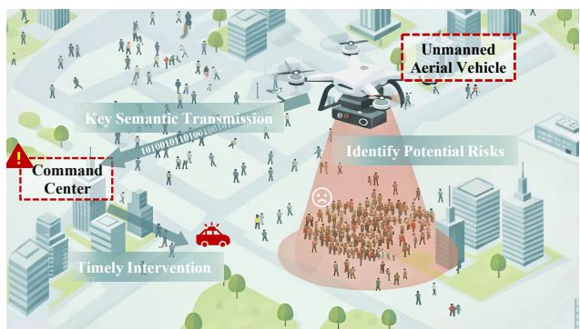  
Fig. 1. UAV-assisted smart city development in LAWN.

are detected, they transmit early warnings to the command center, thereby supporting timely interventions.

Despite these opportunities, the expansion of the Internet of Things (IoT) introduces significant challenges for nascent LAWN [3]. In particular, the widespread deployment of intelligent IoT terminals has triggered an exponential surge in data traffic, intensifying the strain on limited physical channel capacity and constrained onboard energy resources of UAV systems [4], [5]. These mismatches between growing service demand and system capabilities underscore the urgent need for high-density, energy-efficient transmission strategies. Such solutions are essential to support the diverse and ultra-reliable services envisioned for beyond fifth-generation (B5G) and sixth-generation (6G) LAWN [6].

Against this backdrop, semantic communication, empowered by advancements in artificial general intelligence (AGI), is expected to be a key enabler for efficient and reliable information exchange in UAV systems within the LAWN. Moving beyond traditional syntactic methods that rely on bitlevel accuracy (e.g., bit error rate, BER), semantic communication aims to transmit task-relevant content [7], enhancing resilience and spectral efficiency in dynamic and resourceconstrained environments. This shift allows UAVs to evolve from passive data relays into intelligent aerial agents capable of environmental perception and mission-oriented adaptation. By leveraging joint source–channel coding (JSCC) and deep learning (DL) models, raw sensor data can be directly mapped into semantic representations, effectively aligning transmission with wireless channel characteristics and specific task requirements [8]. This end-to-end optimization bypasses limitations of traditional layered protocols, enabling more reliable task performance under adverse channel conditions. The development of generative artificial intelligence (GenAI) further strengthens the semantic capacity of UAVs, facilitating closedloop operations across perception, reasoning, decision-making, and execution. This provides a foundational pathway toward ubiquitous intelligent networks characterized by multi-source collaboration [9].

Despite the progress in individual domains such as visual [8], [10], textual [11]–[13], and acoustic data transmission [14], [15], integrating semantic communication into multimodal UAV systems remains challenging. These challenges are mainly reflected in three key aspects.

(1) Formation of data silos among onboard sensor nodes. Existing multimodal methods can be broadly categorized into two classes. The first class, exemplified by [16], [17], transforms multiple modalities into textual representations at the transmitter to reduce bandwidth consumption. However, this often sacrifices fine-grained semantics and fails to capture cross-modal correlations, potentially degrading task performance or even causing service interruptions. The second class, represented by [18], [19], performs modality fusion at the channel or receiver. Yet, independently encoded modalities are prone to isolation and feature fragmentation, introducing crossmodal semantic bias. These limitations highlight the need for architectures capable of reconciling heterogeneous data with task requirements, enabling robust cross-modal collaborative perception in complex UAV scenarios.

(2) Constraints in onboard computational capabilities and spectrum resources. UAVs are inherently constrained by Size, Weight, and Power (SWaP), which limit onboard processing capabilities and hinder the real-time deployment of complex semantic encoding schemes. These limitations lead to higher end-to-end latency, affecting overall Quality of Service (QoS) [20]. The problem is further aggravated by spectrum scarcity and increased channel contention, particularly during coordinated UAV swarms in mission-driven scenarios such as emergency response. To ensure reliable performance under such constraints, communication frameworks must be both lightweight and resource-efficient [21].

(3) Signal distortion caused by fluctuating air-ground link quality. DL models have been employed in UAV systems for semantic information extraction [22]. However, existing works, exemplified by [23], [24] are limited to single-modality inputs and struggle to generalize to complex tasks. In addition, they decode received signals directly, ignoring the dynamic and uncertain nature of air-ground communication environments, which poses substantial challenges to system reliability. Although UAVs are easier to establish line-ofsight (LoS) connections compared to ground nodes, inevitable physical layer impairments, such as Doppler shifts and electromagnetic interference, can degrade link quality and cause severe signal distortion [25]. So, we propose to investigate advanced GenAI models as a possible solution. It is expected to enable intelligent decoding and adaptive error recovery, thereby improving communication robustness and supporting stable UAV operations in complex environments.

Motivated by the challenges above, we innovatively propose a multi-source collaborative, GenAI-enabled multimodal semantic communication framework for UAV mission execution. Specifically, we develop a semantic alignment strategy to leverage shared prior knowledge across heterogeneous onboard sensors, establishing intermodal cognitive consensus. Subsequently, a semantic importance-aware resource allocation scheme is designed, which adaptively adjusts symbol transmission in conjunction with channel conditions, effectively reducing computational and spectral overhead. Additionally, we design a signal recovery mechanism by integrating diffusion models (DMs) with range-null space decomposition, which significantly improves system robustness under timevarying link conditions. The main contributions of this work are summarized as follows:

• To improve the reliability of UAV-based semantic communication, we propose a Fusion-based, GenAI-Led COgnitive Network architecture, termed FALCON. The system integrates Transformer-based semantic calibration with adaptive feature filtering at the transmitter, while the receiver applies a cross-attention mechanism to enhance decoding accuracy and signal fidelity.

• A Knowledge Enhancement Module (KEM) is developed to facilitate cross-modal attentional interactions through semantic prompts. By incorporating B-spline curve representations, KEM effectively mitigates catastrophic forgetting issues associated with continual model updates. Additionally, we employ a sparsity-aware probabilistic feature selection strategy to enhance spectral efficiency while substantially reducing computational overhead.

• We propose a Range-Null Diffusion Model (RNDM) that adaptively reshapes the signal generation process in response to dynamic channel conditions, while maintaining consistency in distribution and degradation across denoised samples. To improve efficiency, a skip-step sampling strategy aligned with the Markovian training structure is employed, substantially accelerating the denoising process without sacrificing reconstruction quality.

• Extensive simulations on tasks including visual reasoning and sentiment analysis demonstrate the superiority of the proposed framework over state-of-the-art benchmarks. Notably, FALCON reduces computational complexity by 40.67% on average in the high-SNR regime compared to the low-SNR regime, while maintaining comparable accuracy, underscoring its potential for computeconstrained UAV scenarios.

The remainder of this paper is organized as follows. Section II provides the related work. Section III presents the overview of the proposed work. Section IV elaborates on the proposed methodology. Section V describes simulation and performance analysis. Finally, Section VI concludes the paper.

Notation: Boldface letters denote matrices and vectors. The set of real-valued vectors in d-dimensional space is denoted by $\mathbb { R } ^ { d }$ . The notation $\mathcal { C N } ( . , . )$ represents a circularly symmetric complex Gaussian distribution. The symbol ∥·∥ represents the Manhattan norm (i.e., $\ell _ { 1 } { \mathrm { - n o r m } } )$ . The operators $( \cdot ) ^ { \dagger }$ and $( \cdot ) ^ { \top }$ denote the pseudo-inverse and transpose, respectively. The composition of two functions f and g is denoted by $f \circ g .$

## II. RELATED WORK

Recent research has extensively investigated semantic communication, with applications spanning vision, text, audio, and multimodal fusion. Of particular interest is the integration of GenAI with semantic communication, especially for UAV applications.

## A. Development of Semantic Communication

One of the pioneering studies [8] proposed a semantic communication system by leveraging fully convolutional networks, demonstrating robust image reconstruction capabilities under adverse channel conditions. Building on this foundation, subsequent studies [10] have exploited the advantages of semantic communication over traditional image compression techniques such as JPEG. These improvements are attributed to architectural optimizations and the task-specific loss functions tailored to specific application goals. In [22] and [23], semantic communication was further explored in the context of UAVbased image sensing. In the field of natural language processing (NLP), [11] introduced a Transformer-based codec along with a text similarity metric. The model’s generalization was further improved by utilizing transfer learning. To improve the robustness to channel variations, the authors of [12] proposed a hybrid neural architecture compatible with conventional digital communication systems. In the speech domain, [14] proposed an auxiliary encoder to extract compact semantic representations at the transmitter, enhancing speech recognition accuracy. With the rise of multimodal collaboration in IoT applications, [18] designed a unified framework that supports multiple tasks while conserving spectral resources through a masking mechanism. At the channel level, [19] introduced a multi-user, multi-modal feature fusion module, while [26] developed a cross-attention decoder with modality scalability, both achieving notable improvements in semantic-aware tasks. Additionally, [21] achieved semantic resource allocation for UAVs by using deep reinforcement learning.

Despite the above advances, existing methods overlook critical issues such as onboard energy limitations and the heterogeneity of sensor data, which hinder their applicability in bandwidth-constrained UAV scenarios.

## B. Application of GenAI

Building general-purpose intelligence in UAV systems requires support from GenAI techniques. As a representative approach, Generative Adversarial Networks (GANs) [27] have exhibited impressive performance in computer vision tasks by employing adversarial training within a game-theoretic framework. Based on this groundwork, the study in [13] integrated GANs into semantic communication system design, introducing syntactic and semantic similarity constraints to alleviate signal distortion at the receiver. Furthermore, the authors of [28] exploited latent features produced by GANs in Internet of Vehicles (IoV) scenarios, promoting knowledge sharing across heterogeneous networks. However, maintaining a dynamic equilibrium between the generator and discriminator during training remains a major challenge, often resulting in gradient vanishing or mode oscillation. Additionally, GANs are prone to mode collapse in high-dimensional data spaces, which undermines the diversity of generated samples.

To improve model stability and interpretability, the unsupervised Variational Autoencoder (VAE) [29] employs a probabilistic graphical model to map observed data into a latent probability distribution. Building on this framework, the study by [30] employed a hierarchical VAE as the backbone of a semantic communication system, enabling the learning of multi-scale latent representations of visual data and supporting dynamic rate adaptation based on prior knowledge. In a related effort, [31] incorporated regularization constraints into the VAE loss function to promote disentangled representation learning within the latent space. Nevertheless, probabilistic modeling with VAEs continues to face significant challenges. In particular, VAE-generated outputs often suffer from blurriness, reflecting the model’s limited capacity to capture highfrequency details such as fine textures. More critically, when latent variables degenerate toward a standard normal distribution, posterior collapse may occur, severely impairing the model’s generative expressiveness.

Recently, the Denoising Diffusion Probabilistic Model (DDPM) [32] has emerged as a key advancement in GenAI, pushing the boundaries of content generation technologies. DDPM employs two parameterized Markov chains to iteratively predict and eliminate noise from data, enabling the generation of high-quality samples. Several studies, exemplified by [15], [33], [34] have applied DDPM-based implementation with U-Net architecture to mitigate image and audio distortion induced by communication channels. In particular, [24] proposed a semantic decoding method for UAV scenarios that integrates DMs to enhance signal reconstruction. While such efforts represent progress, they are limited to single-modality scenarios and suffer from constrained receptive fields. Moreover, these methods rely on idealized assumptions about signal recovery. For instance, analyses in [35] assume perfect channel state information (CSI). These studies largely overlook the ability to capture fine-grained semantics and the influence of complex, dynamic channel conditions on system reliability, which is an issue particularly critical in UAV communication scenarios.

## III. OVERVIEW OF FALCON

This section presents the FALCON framework, aiming to overcome the limitations of conventional physical-layer architectures and facilitate a deep integration between intelligent perception and communication. By exploiting inherent advantages of aerial platforms in low deployment cost and flexible scheduling, the proposed FALCON positions UAVs as transmitters that perform semantic representation and adaptive transmission of data acquired from onboard sensors. Correspondingly, ground-based base stations function as receivers, performing semantic decoding and knowledge reasoning. Collectively, the framework enhances decision-making capabilities required for the intelligent operation of low-altitude networks. As shown in Fig. 2, the architecture is demonstrated using visual and textual data as representative modalities.

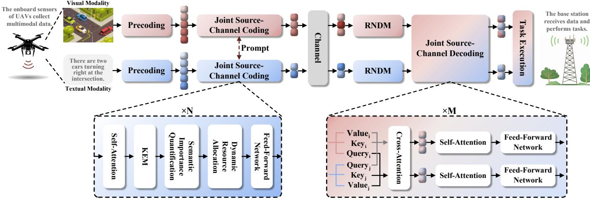  
Fig. 2. Illustration of the proposed semantic communication framework for UAV platforms.

On the transmitter side, a precoding mechanism is introduced to generate structured semantic representations from heterogeneous data sources. Specifically, for the visual modality, a pre-trained Vision Transformer (ViT) model is employed to partition the input image into non-overlapping patches, thereby preserving local texture details [36]. The Transformer’s context-aware capability is then leveraged to generate a token sequence that encapsulates global semantic information. In the case of textual data, a BERT-base model with bidirectional encoding is adopted to perform semantic annotation and word embedding, resulting in discriminative feature vectors [37]. To enable cross-layer collaborative optimization, a JSCC scheme is designed, effectively balancing redundancy reduction and channel adaptability. KEM is embedded between the self-attention layer and the Feedforward Network (FFN) to enrich semantic representations. Cross-modal information flow is further enhanced via shared semantic prompts P between nodes. Considering the bandwidth limitations typically associated with air-to-ground communication links, a semanticaware resource allocation strategy is proposed. It quantifies the semantic importance of each information unit to prioritize transmission and enable adaptive power allocation. To mitigate the information loss commonly caused by traditional singlemask mechanisms, an N-times progressive feature removal method is developed. Formally, the complete encoding process at the transmitter is given by

$$
\tilde { \mathbf { x } } ^ { m } = f _ { \mathrm { J S C C } } \left( f _ { \mathrm { p r e } } ( \mathbf { x } ^ { m } ) , \mathbf { P } ; \eta ^ { m } \right) ,\tag{1}
$$

where $m \in \{ i , j \}$ denotes the modality index. The functions $f _ { \mathrm { p r e } } ( \cdot )$ and $f _ { \mathrm { J S C C } } ( \cdot )$ represent the precoding and JSCC mapping operations, respectively. The parameter set η comprises the optimized model parameters. Subsequently, signal normalization is applied to ensure compliance with the maximum allowable transmission power constraint.

During the transmission process, the signal is often distorted by fading and channel noise. For Rayleigh fading channels, the degradation can be modeled as

$$
\mathbf { y } ^ { m } = \mathbf { H } \tilde { \mathbf { x } } ^ { m } + \mathbf { n } ,\tag{2}
$$

where H represents the complex channel gain matrix, modeling the random amplitude and phase variations induced by fading. The term n $\sim \mathcal { C N } ( 0 , \sigma ^ { 2 } \mathbf { I } )$ denotes Additive White Gaussian Noise (AWGN). Based on this model, the signal-tonoise ratio (SNR) is defined as the ratio of the signal power $P$ to the noise power $\sigma ^ { 2 } ,$ , expressed as

$$
\mathrm { S N R } = 1 0 { \log _ { 1 0 } } { \frac { P } { { \sigma ^ { 2 } } } } .\tag{3}
$$

Notably, the fading coefficient in an AWGN channel is considered constant.

On the receiver side, given the highly dynamic nature of aerial communication environments, along with the robust noise suppression capabilities of DMs, we propose the RNDM to be deployed for signal recovery. It allows the generation of a high-fidelity signal that satisfies both distributional consistency and degradation consistency constraints. For detailed technical derivations, refer to Section IV-C. During the joint sourcechannel decoding (JSCD) stage, the query $\mathbf { Q } ^ { m }$ , key $\mathbf { K } ^ { m }$ , and value $\mathbf { V } ^ { m }$ vectors are derived by applying three independent linear transformations to signal $\tilde { \mathbf { y } } ^ { m }$ in the semantic space, formulated as

$$
( \mathbf { Q } ^ { m } , \mathbf { K } ^ { m } , \mathbf { V } ^ { m } ) = \left( \mathbf { W } _ { Q } ^ { m } \tilde { \mathbf { y } } ^ { m } , \mathbf { W } _ { K } ^ { m } \tilde { \mathbf { y } } ^ { m } , \mathbf { W } _ { V } ^ { m } \tilde { \mathbf { y } } ^ { m } \right) ,\tag{4}
$$

where $\mathbf { W } _ { Q } ^ { m } , \mathbf { W } _ { K } ^ { m }$ , and Wm denote the corresponding learnable weight matrices. The above step enables a cross-attention mechanism to guide semantic alignment across modalities. Further, a self-attention mechanism followed by an FFN is applied to extract fine-grained semantic information, thereby enhancing task-specific performance. The overall processing pipeline at the receiver can be represented as

$$
\begin{array} { r } { \mathbf { z } ^ { m } = g _ { \mathrm { J S C D } } \left( g _ { \mathrm { R N D M } } ( \mathbf { y } ^ { m } ; \boldsymbol { \zeta } ^ { m } ) ; \boldsymbol { \varphi } \right) , } \end{array}\tag{5}
$$

where $g _ { \mathrm { R N D M } } ( \cdot )$ and $g _ { \mathrm { J S C D } } ( \cdot )$ denote the mapping functions of the RNDM and JSCD, respectively. The symbols $\zeta ^ { m }$ and $\varphi$ represent the learnable parameters associated with each respective module. Ultimately, multiple linear layers are employed as task-specific heads for task execution.

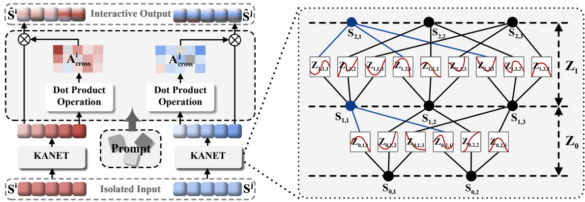  
Fig. 3. The architecture of the knowledge-enhanced module (left) and the KANet framework (right).

## IV. PROPOSED METHOD

In this section, we propose a set of innovative modules for data processing, transmission optimization, and signal recovery to support UAV-based semantic communication. First, the KEM built upon KANet [38] is developed to mitigate the data islanding effects caused by heterogeneous sensor inputs. Then, a semantic-aware dynamic resource allocation strategy is designed to improve bandwidth efficiency. Finally, the RNDM is designed to enhance semantic reliability under highly dynamic air-to-ground channel conditions.

## A. Knowledge-Enhanced Module for Sensor Data

Multimodal data collected by UAV onboard sensors often exhibit structural heterogeneity, resulting in consistencies in semantic interpretation. For example, images represented as pixel grids and point clouds defined by 3D coordinates may describe the same object but in fundamentally different ways. These inconsistencies can be further exacerbated by semantic encoding and channel impairments, affecting the accuracy of downstream decisions. To address this, we propose a KANetbased KEM scheme, which introduces cross-modal constraints through shared prior knowledge, as illustrated in Fig. 3.

Following the Kolmogorov–Arnold representation theorem, KANet (Fig. 3, right) replaces the linear weight matrices in conventional multilayer perceptrons (MLPs) with differentiable univariate functions $\mathrm { Z } ( \cdot )$ , each parameterized as a combination of k-th order B-spline basis functions $B _ { n , k } ( \cdot ) \colon$

$$
\mathrm { Z } ( s ) = \sum _ { \mathrm { n } = 1 } ^ { N } w _ { n } B _ { n , k } ( s ) , \quad s \in [ t _ { k + 1 } , t _ { N + 1 } ] ,\tag{6}
$$

where s is the pre-activation value of a neuron for a single input channel, w denotes trainable coefficients, and n indexes the basis functions up to N. The knot vector $\left\{ \mathrm { t _ { i } } \right\} _ { i = 1 } ^ { N + k + 1 }$ determines the support interval of each basis function. Note that, given the advantages of cubic B-splines in terms of continuity, smoothness, numerical stability, and differentiability [39], the B-spline order is set to four in this work. Specifically, let $S _ { l , a }$ represent the pre-activation of the a-th neuron in the l-th layer. The activation function linking $S _ { l , a }$ to the b-th node in the (l+1)-th layer is denoted by $Z _ { l , a , b }$ . Consequently, the output of the b-th neuron in the next layer is expressed as the aggregate of these transformed activations, given by:

$$
S _ { l + 1 , b } = \sum _ { s = 1 } ^ { n _ { l } } Z _ { l , s , b } \left( S _ { l , s } \right) , \quad b = 1 , \ldots , n _ { l + 1 } ,\tag{7}
$$

where $n _ { l }$ is the number of nodes in the l-th layer. More generally, the activation of the $( l + 1 )$ -th layer can be represented using the spline function matrix $\mathbf { Z } _ { l } \mathbf { : }$

$$
\mathbf { S } _ { l + 1 } = \underbrace { \left[ \begin{array} { c c c c } { Z _ { l , 1 , 1 } ( \cdot ) } & { Z _ { l , 2 , 1 } ( \cdot ) } & { \cdots } & { Z _ { l , n _ { l } , 1 } ( \cdot ) } \\ { Z _ { l , 1 , 2 } ( \cdot ) } & { Z _ { l , 2 , 2 } ( \cdot ) } & { \cdots } & { Z _ { l , n _ { l } , 2 } ( \cdot ) } \\ { \vdots } & { \vdots } & { \ddots } & { \vdots } \\ { Z _ { l , 1 , n _ { l + 1 } } ( \cdot ) } & { Z _ { l , 2 , n _ { l + 1 } } ( \cdot ) } & { \cdots } & { Z _ { l , n _ { l } , n _ { l + 1 } } ( \cdot ) } \end{array} \right] } _ { \mathbf { Z } _ { l } } \mathbf { S } _ { l } .\tag{8}
$$

Accordingly, the function realized by a KANet with L layers can be formulated as a composition of spline transformations, which is:

$$
f _ { \mathrm { K A N e t } } = \left( \mathbf { Z } _ { L - 1 } \circ \mathbf { Z } _ { L - 2 } \circ \cdots \circ \mathbf { Z } _ { 1 } \circ \mathbf { Z } _ { 0 } \right) \mathbf { S } _ { 0 } .\tag{9}
$$

The advantages of this design are twofold: (i) the differentiability of spline functions endows KANet with dynamic adaptability to heterogeneous inputs, enabling effective modeling of complex dependencies without increasing network depth [38], [40]; (ii) the local support property of B-splines facil itates incremental learning, mitigating catastrophic forgetting in high-dimensional data modeling [41]. Building upon these properties, KANet projects heterogeneous, dimensionally inconsistent, and divergent inputs into a unified feature space through cascaded spline transformations, yielding semantically meaningful representations. This more expressive feature mapping provides a solid foundation for subsequent cross-attention and indirectly contributes to the mitigation of data silos.

Subsequently, we introduce a shared semantic prompt, denoted as P, initially defined as a task-specific token sequence. P is iteratively refined in conjunction with the heterogeneous encoders, progressively transforming into a compact sequence that encapsulates essential cross-modal consistent representations. In the cross-attention calculation, P functions as a bridge for cross-modal knowledge interaction, thereby mitigating heterogeneity. Specifically, we compute the scaled dot-product attention between P and the feature tokens of each modality mapped by KANet. For the isolated input $\mathbf { S ^ { i } }$ of modality i, the cross-attention score $\mathbf { A } _ { \mathrm { c r o s s } } ^ { i }$ with the shared prompt is calculated as:

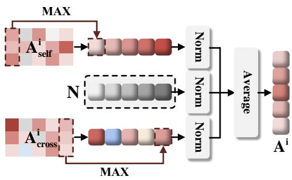  
Fig. 4. Method for quantifying the semantic value of tokens.

$$
\mathbf { A } _ { \mathrm { c r o s s } } ^ { i } = S o f t m a x \left( \frac { \mathbf { P } \cdot \left( f _ { \mathrm { K A N e t } } ^ { i } \left( \mathbf { S } ^ { i } \right) \right) ^ { \top } } { \sqrt { d _ { k } } } \right) ,\tag{10}
$$

where $d _ { k }$ denotes the dimension of the key vectors for scaling purposes. Then, the refined interactive representation $\hat { \mathbf { S } } ^ { i }$ is obtained by weighting the original features according to the attention scores, by

$$
\hat { \mathbf { S } } ^ { i } = \mathbf { A } _ { \mathrm { c r o s s } } ^ { i } \cdot f _ { \mathrm { K A N e t } } ^ { i } \left( \mathbf { S } ^ { i } \right) .\tag{11}
$$

Note that the dimensionality of the input and output semantic tokens is identical in the KEM.

The same procedure is applied to other modalities and is omitted here for brevity. During training, a similarity loss is incorporated to constrain the semantic correlation between representations $\hat { \mathbf { S } } ^ { i }$ and $\hat { \mathbf { S } } ^ { j }$ . This module serves as the encoding-stage multimodal collaboration component of our JSCC transmitter. It explicitly promotes cross-modal exchange of complementary cues and projects heterogeneous modalityspecific features into a shared high-dimensional latent space, thereby improving semantic alignment prior to transmission. As a result, it alleviates semantic inconsistencies caused by structural mismatches and non-uniform feature distributions across modalities, yielding a more coherent and transferable semantic representation for transmission.

## B. Semantic-Driven Feature Selection Mechanism

Given the limited onboard computing capability of UAV platforms and the constrained air-to-ground link bandwidth, we design a semantic-driven feature selection mechanism to control the transmission payload in a task-aware manner. The proposed scheme evaluates each semantic token from three complementary perspectives: (i) instance-level semantic salience, (ii) cross-modal relevance, and (iii) channel noise conditions. Based on the resulting importance scores, the transmitter selectively retains mission-critical tokens and suppresses low-value ones, thereby reducing the effective number of transmitted symbols. This payload control strategy prioritizes the delivery of core semantic content essential for downstream task execution, improving semantic efficiency while maintaining reliable performance.

Semantic Importance Quantification. In this stage, we integrate multi-dimensional indicators to establish a robust foundation for subsequent resource allocation. As shown in Fig. 4, the modality-specific importance scores $\mathbf { A } _ { \mathrm { s e l f } } ^ { i }$ from the self-attention mechanism in the semantic encoder are incorporated into the overall value assessment, given their strong feature representation capability. Accordingly, the importance of the k-th token in modality i is quantified as $\mathrm { M A } \bar { \mathrm { X } } ( \mathbf { A } _ { \mathrm { s e l f } } ^ { i , k } )$ In addition, we introduce the cross-modal importance measure $\mathbf { A } _ { \mathrm { c r o s s } } ^ { i , k }$ , as discussed in Section IV-A (see Eq. 10), alongside the channel noise feature N (obtained via a bilinear mapping of the SNR), to establish a global semantic value evaluation mechanism. To maintain consistency across metrics, all scores are normalized within the range [0, 1], as defined by

$$
\hat { \mathbf { A } } _ { \mathrm { s e l f } } ^ { i , k } = \frac { \mathrm { M A X } ( \mathbf { A } _ { \mathrm { s e l f } } ^ { i , k } ) } { \displaystyle \sum _ { k } \mathrm { M A X } ( \mathbf { A } _ { \mathrm { s e l f } } ^ { i , k } ) } ,\tag{12}
$$

$$
\hat { \mathbf { A } } _ { \mathrm { c r o s s } } ^ { i , k } = \frac { \mathrm { M A X } ( \mathbf { A } _ { \mathrm { c r o s s } } ^ { i , k } ) } { \displaystyle \sum _ { k } \mathrm { M A X } ( \mathbf { A } _ { \mathrm { c r o s s } } ^ { i , k } ) } .\tag{13}
$$

Finally, the comprehensive score for tokens is calculated by taking the mean of the values, which is:

$$
\mathbf { A } ^ { i } = \mathrm { M E A N } ( \hat { \mathbf { A } } _ { \mathrm { s e l f } } ^ { i } , \hat { \mathbf { A } } _ { \mathrm { c r o s s } } ^ { i } , \hat { \mathbf { N } } ) .\tag{14}
$$

Dynamic Resource Allocation. Conventional methods typically employ the Softmax activation function to transform the importance score $\mathbf { A } ^ { \dot { i } }$ into a probability distribution. However, as depicted in Fig. 5a, the smoothing nature of Softmax, driven by exponential operations, results in dense attention across the entire input tokens. This implies that every token contributes to the decision-making process. In UAV communication, this “all-in participation” strategy inevitably results in significant system overhead. To deal with this issue, we introduce the Sparsemax function to generate a sparse attention [42], projecting a input vector q onto the nearest point p within the probability simplex $\Delta \mathrm { d } ,$ formulated as

$$
S p a r s e m a x ( \mathbf { q } ) = \arg \operatorname* { m i n } _ { \mathbf { p } \in \Delta d } \| \mathbf { p } - \mathbf { q } \| ^ { 2 } ,\tag{15}
$$

$$
\Delta d = \{ \mathbf { p } \in \mathbb { R } ^ { d } : \mathbf { p } \geq \mathbf { 0 } , \| \mathbf { p } \| _ { 1 } = 1 \} .\tag{16}
$$

The optimal solution typically lies on the boundary of the simplex, resulting in a sparse probability distribution in which certain token weights are exactly zero (referring to Fig. 5b). The sparsity enables the system to concentrate resources on the most relevant information. Based on this property, we further design a dynamic threshold θ, as given by

$$
\theta = \mathrm { M E A N } \left( S p a r s e m a x ( \mathbf { A } _ { \mathrm { c r o s s } } ^ { i } ) \cdot \mathbf { A } ^ { i } \right) ,\tag{17}
$$

where MEAN(·) denotes the mean operation. Tokens with scores exceeding the threshold θ are selectively retained for power allocation. The sparse design effectively suppresses the transmission of irrelevant or redundant information, thereby improving the efficiency of frequency resource in UAV communication systems.

(b) Sparsemax  
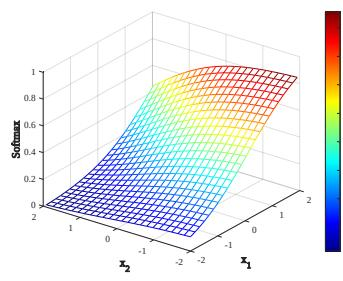

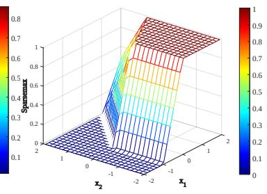  
Fig. 5. Comparison between the smoothness of Softmax function and the sparsity of Sparsemax function.

## C. Range-Null Diffusion Model for Signal Recovery

In highly dynamic aerial environments, Doppler shifts and signal attenuation pose significant challenges to communication reliability. To overcome this challenge, we introduce the RNDM for signal recovery at the receiver.

1) Preliminaries: As representative latent variable generation models grounded in variational inference, DDPM models the data distribution through two coupled Markov chains. Specifically, the forward diffusion process starts from the original input $\mathbf { x } _ { \mathrm { 0 } }$ . Gaussian noise is progressively incorporated at each time step, gradually evolving the data distribution into an isotropic Gaussian prior $q ( \mathbf { x } _ { T } ) \sim \mathcal { N } ( \mathbf { 0 } , \mathbf { I } )$ . Here, T denotes the total number of diffusion steps. Given a linearly increasing variance schedule $\beta _ { t } ,$ the forward process is defined as:

$$
q ( \mathbf { x } _ { t } \mid \mathbf { x } _ { t - 1 } ) = \mathcal { N } \left( \mathbf { x } _ { t } ; \sqrt { 1 - \beta _ { t } } \mathbf { x } _ { t - 1 } , \beta _ { t } \mathbf { I } \right) .\tag{18}
$$

By leveraging the additive properties of Gaussian distributions and the reparameterization trick, the latent variable $\mathbf { x } _ { t }$ at an arbitrary time step can be expressed as a linear combination of the original input $\mathbf { x } _ { \mathrm { 0 } }$ and Gaussian noise $\varepsilon \sim \mathcal { N } ( \mathbf { 0 } , \mathbf { I } )$

$$
\mathbf { x } _ { t } = \sqrt { \bar { \alpha } _ { t } } \mathbf { x } _ { 0 } + \sqrt { 1 - \bar { \alpha } _ { t } } \pmb { \varepsilon } ,\tag{19}
$$

where $\alpha _ { t } = 1 - \beta _ { t }$ and $\begin{array} { r } { \bar { \alpha } _ { t } = \prod _ { n = 1 } ^ { t } \alpha _ { n } } \end{array}$

Conversely, the reverse denoising process, which starts from pure noise $\mathbf { x } _ { T }$ and progressively removes noise from the sample, is modeled as a parameterized set of Gaussian distributions:

$$
p _ { \theta } ( \mathbf { x } _ { t - 1 } \vert \mathbf { x } _ { t } ) = \mathcal { N } ( \mathbf { x } _ { t - 1 } ; \mu _ { \theta } ( \mathbf { x } _ { t } , t ) , \boldsymbol { \Sigma } _ { \theta } ( \mathbf { x } _ { t } , t ) ) ,\tag{20}
$$

where the mean $\mu _ { \theta }$ is parameterized by a neural network, and the variance $\Sigma _ { \theta }$ can be either fixed or learned depending on the implementation. The training objective is to ensure that the predicted noise $\varepsilon _ { \boldsymbol { \theta } } ( \mathbf { x } _ { t } , t )$ approximates the true noise ε as closely as possible, leading to the loss function:

$$
L _ { \theta } = \mathbb { E } _ { t \sim [ 1 , T ] } \Vert \varepsilon - \varepsilon _ { \theta } ( \mathbf { x } _ { t } , t ) \Vert ^ { 2 } .\tag{21}
$$

According to Bayes’ theorem and referring to Eq. 19, we can derive the following expression:

$$
\begin{array} { l } { \displaystyle \mu _ { \boldsymbol { \theta } } ( \mathbf { x } _ { t } , t ) = \frac { 1 } { \sqrt { \alpha _ { t } } } \left( \mathbf { x } _ { t } - \frac { \beta _ { t } } { \sqrt { 1 - \bar { \alpha } _ { t } } } \varepsilon _ { \boldsymbol { \theta } } ( \mathbf { x } _ { t } , t ) \right) } \\ { \displaystyle = \frac { \sqrt { \alpha _ { t } } \left( 1 - \bar { \alpha } _ { t - 1 } \right) } { 1 - \bar { \alpha } _ { t } } \mathbf { x } _ { t } + \frac { \sqrt { \bar { \alpha } _ { t - 1 } } \beta _ { t } } { 1 - \bar { \alpha } _ { t } } \mathbf { x } _ { 0 \mid t } , } \end{array}\tag{22}
$$

Algorithm 1 The sampling process of RNDM   
Input: Noise sample ${ \bf x } _ { T } ,$ , estimated channel gain H˜ , trained   
network parameters θ.   
Output: Signal recovery to obtain $\mathbf { x } _ { \mathrm { 0 } }$   
for t in $[ T , \dots , 1 ]$ do   
$\begin{array} { r } { \varepsilon _ { t } = \varepsilon _ { \theta } \left( \mathbf { x } _ { t } , t \right) . } \end{array}$   
$\mathbf { x } _ { 0 \mid t } = \left( \mathbf { x } _ { t } - \sqrt { 1 - \bar { \alpha } _ { t } } \pmb { \varepsilon } _ { t } \right) / \sqrt { \bar { \alpha } _ { t } } .$   
Derive $\lambda _ { t }$ based on Eq. 29.   
Calculate the corrected $\tilde { \mathbf { x } } _ { 0 \mid t }$ derived from Eq. 28.   
$\begin{array} { r } { \mathbf { x } _ { t - 1 } = \frac { \sqrt { \alpha _ { t } } \left( 1 - \bar { \alpha } _ { t - 1 } \right) } { 1 - \bar { \alpha } _ { t } } \mathbf { x } _ { t } + \frac { \sqrt { \bar { \alpha } _ { t - 1 } } \beta _ { t } } { 1 - \bar { \alpha } _ { t } } \tilde { \mathbf { x } } _ { 0 \mid t } } \end{array}$   
end for   
return x0

where $\mathbf { x } _ { 0 \mid t }$ denotes the estimated original input at timestep t. It is worth noting that the original DDPM sampling procedure is stochastic, i.e., it samples from a Gaussian distribution with non-zero variance, which can introduce additional sampling variability. In our UAV setting, where real-time operation and stable semantic recovery are desired, excessive randomness may lead to less consistent outputs across runs. Therefore, during inference, we adopt a DDIM [43]-style implicit sampling strategy with a deterministic trajectory, so that no extra Gaussian noise is injected at each reverse step. In addition, we use fewer sampling steps at inference time to accelerate generation while maintaining stable reconstruction quality.

2) RNDM: Let the ground-truth (GT) signal x be sampled from the distribution $q ( \mathbf { x } )$ . After passing through the channel degradation process defined in Eq. 2, the observed signal y is obtained. Our objective is to reconstruct a high-fidelity signal ˜x from the distorted observation y, which naturally aligns with the reverse diffusion process of DDPM. Motivated by this connection, we directly regard y as the observation condition and initiate the reverse diffusion process from this point. The soundness of this design, together with its advantage in sampling efficiency, has been validated in [15], [34].

In practical wireless channels, the presence of the degradation operator F necessitates additional processing to ensure that the following constraints are satisfied:

$$
D i s t r i b u t i o n ~ C o n s i s t e n c y : { \tilde { \bf x } } \sim q ( { \bf x } ) .\tag{23}
$$

$$
D e g r a d a t i o n ~ C o n s i s t e n c y : ~ \mathbf { F } \tilde { \mathbf { x } } = \mathbf { y } .\tag{24}
$$

According to the range-null space decomposition theorem, any vector x can be decomposed as:

$$
{ \bf x } = { \bf F } ^ { \dagger } { \bf F } { \bf x } + \left( { \bf I } - { \bf F } ^ { \dagger } { \bf F } \right) { \bf x } ,\tag{25}
$$

where $\mathbf { F } ^ { \dagger }$ represents the pseudo-inverse of matrix F, and I is the identity matrix. The term $\mathbf { F } ^ { \dagger } \mathbf { F } \mathbf { x }$ lies within the range space of F, as it satisfies the identity $\mathbf { F } \mathbf { F } ^ { \dagger } \mathbf { F } \mathbf { x } = \mathbf { F } \mathbf { x }$ . Conversely, the term $\left( \mathbf { I } - \mathbf { F } ^ { \dagger } \mathbf { F } \right) \mathbf { x }$ lies in the null space of F, since F $\left( \mathbf { I } - \mathbf { F } ^ { \dagger } \dot { \mathbf { F } } \right) \mathbf { x } = \mathbf { 0 } .$

Motivated by this decomposition, we construct the general solution by leveraging the channel gain H˜ estimated via the Least Squares (LS) method, as given by

$$
\begin{array} { r } { \tilde { \mathbf { x } } = \tilde { \mathbf { H } } ^ { \dagger } \mathbf { y } + ( \mathbf { I } - \tilde { \mathbf { H } } ^ { \dagger } \tilde { \mathbf { H } } ) \hat { \mathbf { x } } , } \end{array}\tag{26}
$$

Given that $\tilde { \mathbf { H } } \tilde { \mathbf { x } } = \mathbf { y } ;$ , the degradation consistency constraint is inherently satisfied. The optimization variable xˆ thus controls the degree of fitting for the desired distributional consistency. Since channel noise $\mathbf { n } \sim \mathcal { N } \left( 0 , \sigma _ { y } ^ { 2 } \mathbf { I } \right)$ may lead to a mismatch in the solution space, we introduce a gradual denoising mechanism based on DDPM. Specifically, at diffusion time step t, the correction of the estimated GT signal $\mathbf { x } _ { 0 \mid t }$ is formulated as:

$$
\begin{array} { r } { \tilde { \mathbf { x } } _ { 0 \mid t } = \tilde { \mathbf { H } } ^ { \dagger } \mathbf { y } + ( \mathbf { I } - \tilde { \mathbf { H } } ^ { \dagger } \tilde { \mathbf { H } } ) \mathbf { x } _ { 0 \mid t } . } \end{array}\tag{27}
$$

Subsequently, to further correct for the noise component, we introduce a correction coefficient $\lambda _ { t }$ leading to the updated expression [44]:

$$
\tilde { \mathbf { x } } _ { 0 \mid t } = \mathbf { x } _ { 0 \mid t } - \lambda _ { t } \tilde { \mathbf { H } } ^ { \dagger } ( \tilde { \mathbf { H } } \mathbf { x } _ { 0 \mid t } - \mathbf { y } ) ,\tag{28}
$$

where $\lambda _ { t }$ is designed to approach the identity matrix to satisfy the consistency constraint. The specific form is defined as:

$$
\lambda _ { t } = \left\{ \begin{array} { l l } { 1 , } & { \frac { \beta _ { t } \sqrt { \bar { \alpha } _ { t - 1 } } } { 1 - \bar { \alpha } _ { t } } \sigma _ { y } \leq \sigma _ { t } } \\ { 0 , } & { \frac { \beta _ { t } \sqrt { \bar { \alpha } _ { t - 1 } } } { 1 - \bar { \alpha } _ { t } } \sigma _ { y } > \sigma _ { t } } \end{array} \right.\tag{29}
$$

$$
\sigma _ { t } ^ { 2 } = \frac { 1 - \bar { \alpha } _ { t - 1 } } { 1 - \bar { \alpha } _ { t } } \beta _ { t } .\tag{30}
$$

where $\sigma _ { t }$ denotes the diffusion uncertainty at the t-th step. When the propagated channel uncertainty is no larger than the intrinsic diffusion uncertainty, the observation constraint is regarded as reliable and $\lambda _ { t }$ is set to one. Otherwise, $\lambda _ { t }$ is set to zero to avoid noise amplification caused by the pseudo-inverse operation, thereby preserving the distributional consistency of the recovered signal.

Note that the above analysis is conducted based on realistic fading channels. However, in an ideal AWGN channel, where only additive noise is present, RNDM theoretically degenerates to the classical DDPM. In our implementation, we instantiate the denoising network with a Transformer backbone to better model long-range contextual dependencies in semantic representations. Importantly, the distinction between RNDM and classical DDPM lies in the range–null-consistency–guided correction that enforces distribution and degradation consistency under fading channels, independent of the specific denoiser architecture. The entire diffusion procedure of RNDM is summarized in Algorithm 1. At each time step, the noise level of the current sample is first predicted using the Transformerbased model. Based on this estimate, an initial clean sample is computed, after which a correction process based on $\lambda _ { t }$ is applied to generate a denoised sample that satisfies the consistency constraints.

## V. SIMULATION RESULTS

This section details the simulation experimental setup and presents extensive comparative trials and ablation studies to evaluate the performance of the proposed FALCON framework on visual reasoning and sentiment analysis tasks.

## A. Experiment Settings

1) Datasets Description: We evaluate the model on two popular multimodal benchmark datasets. Specifically, the CLEVR dataset consists of synthetic images composed of geometric objects with varying attributes, each paired with five types of natural language queries. It is adopted to assess logical cognitive capabilities, including spatial reasoning, attribute comparison, and logical inference. The CMU-MOSEI dataset comprises text, visual, and acoustic modalities collected from online videos spanning 250 topics, with fine-grained, multidimensional annotations of emotion intensity. The two datasets differ significantly in task objectives, data types, sample complexity, and evaluation focus, providing a complementary and comprehensive testbed for assessing multimodal system performance. Furthermore, we evaluate the model’s generalization ability in real UAV scenarios on the FLAME dataset. This dataset was collected by UAVs in specific stacking and burning scenarios in forest environments, reflecting the complex and variable conditions faced in wildfire monitoring.

2) Implementation Details: The experiments are conducted using the PyTorch framework, executed on an Ubuntu 22.04 workstation equipped with an NVIDIA GeForce RTX 4090 GPU (driver version 550.107.02) and CUDA 12.4 toolkit. The UAV is configured to operate at a flight altitude of 100 m, with a maximum transmit power of 30 dBm, and a bandwidth limit of 2 M Hz. Data transmission is performed adopting orthogonal frequency-division multiplexing (OFDM), with subcarriers modulated using 16-quadrature amplitude modulation (16QAM). The optimization pipeline employs a cosine annealing learning rate scheduler, with the initial learning rate set to $1 \times 1 0 ^ { - 4 }$ and decaying to $1 \times 1 0 ^ { - 7 }$ , spanning the training duration. The AdamW optimizer is configured with exponential decay rates of 0.95 and 0.99 for the firstand second-order moment estimates, respectively. The epsilon value is set to $1 \times 1 0 ^ { - 8 }$ , and the weight decay coefficient is fixed at $5 \times 1 0 ^ { - 3 }$ . Dropout regularization is applied with a retention probability of 0.9. To stabilize gradient propagation during initial training epochs, all fully connected layers are initialized using the Xavier uniform distribution for weight matrices, while bias terms are initialized to zero. In the FALCON architecture, the semantic embedding stage employs BERT-Base-uncased (12 layers, hidden size of 768) for textual inputs and ViT-Base-Patch16-224 (12 layers, hidden size of 768) for visual inputs. The encoder and decoder architectures consist of six stacked Transformer layers and four crossattention layers, respectively.

A phased training strategy is employed to optimize convergence behavior. In the first stage, parameters of the RNDM module are temporarily frozen, and dynamic resource allocation is deactivated, allowing the model to focus on optimizing semantic feature extraction and reconstruction within the backbone network. In the subsequent stage, all parameters are unfrozen to enable end-to-end fine-tuning across the complete parameter space. Such a two-stage optimization strategy facilitates adaptive calibration under diverse channel conditions, thereby enhancing robustness and generalization.

3) Baselines: We select representative baselines from three categories for a comprehensive evaluation: (i) diffusionenhanced JSCC schemes (exemplified by CDDM), (ii) DLbased multimodal JSCC frameworks (such as DeepSC-VQA and U-DeepSC), and (iii) traditional separate source-channel coding (SSCC) pipelines. Note that SSCC is included not as a weak baseline, but as a classical and interpretable layered pipeline that remains prevalent in communication systems. Under the same channel settings, it serves as a fair reference to quantify the gains brought by end-to-end learned JSCC. The specific details of each method are provided as follows:

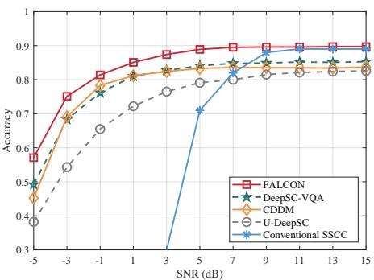  
(a) Counting

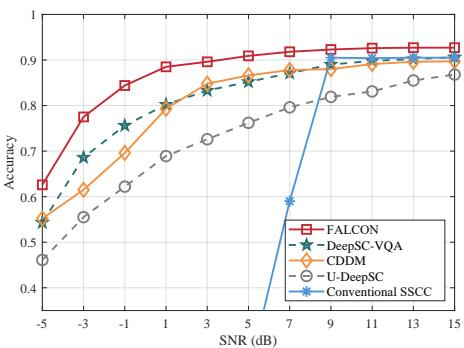  
(b) Attribute Querying

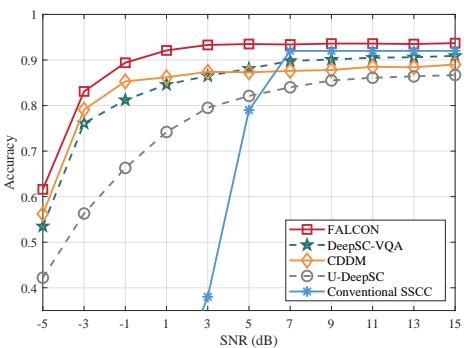  
(c) Existence Judgment

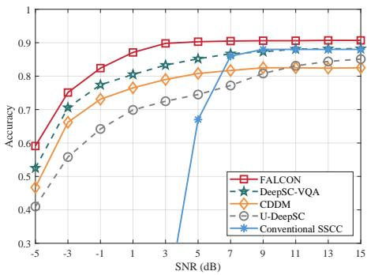  
(d) Integer Comparison

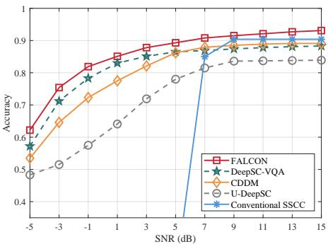  
(e) Attribute Comparison

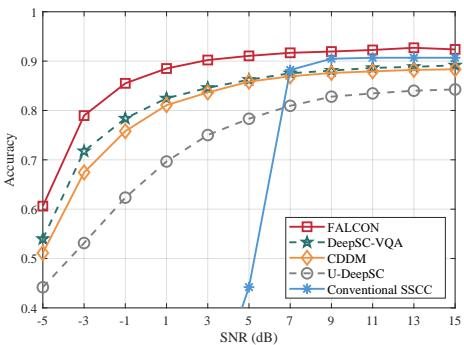  
(f) Total  
Fig. 6. Performance comparison of the proposed FALCON and four benchmark methods on the CLEVR dataset under the AWGN channel. Evaluation is conducted across five task categories: counting, attribute querying, existence judgment, integer comparison, and attribute comparison. Overall task accurac is also reported to assess comprehensive system performance.

• DeepSC-VQA [45]: Designed for joint text and image transmission, the method employs independent encoders and a unified decoder to enable semantic-level fusion. On the receiver side, textual information serves as auxiliary input to guide the fusion of multimodal features. While effective, task-specific retraining is typically required to accommodate different downstream tasks.

• CDDM [34]: Built on Swin Transformers, the architecture is tailored for image transmission and incorporates a U-Net-based DM within the decoder for signal enhancement. To ensure a fair comparison in multimodal settings, we extend its unimodal codec design by duplicating it across modalities without altering its core structure.

• U-DeepSC [18]: A unified multitask semantic communication framework based on a Transformer backbone. It features a hierarchical masking mechanism, which dynamically adjusts the number of transmitted features according to channel conditions, thereby improving transmission efficiency and reducing storage overhead.

• Conventional SSCC: Standard source coding techniques are applied, including UTF-8 for text, JPEG compression for images, and 16-bit pulse code modulation (PCM) for audio. For channel coding, Turbo codes and low-density parity-check (LDPC) codes are employed.

4) Evaluation Indicators: We formulate visual reasoning and sentiment analysis as classification tasks. Both tasks are assessed using classification accuracy, defined as the proportion of correctly predicted instances to the total number of test samples. In addition, we report the floating-point operations (FLOPs) as a quantitative measure of model complexity, where a higher value indicates greater computational overhead.

## B. Performance on the CLEVR Dataset

We conduct a comprehensive evaluation of existing techniques across five cognitive task categories defined in the CLEVR dataset: counting, attribute querying, existence judgment, integer comparison, and attribute comparison. In addition, the performance boundaries of these methods on the integrated task are assessed. As presented in Fig. 6, the accuracy of the proposed FALCON framework is benchmarked against four methods under an AWGN channel, across an SNR range from -5 dB to 15 dB. Notably, the conventional SSCC scheme exhibits a steep degradation in performance as noise increases, resulting in the truncation of its curve in the figure to enhance visual clarity. In contrast, the FALCON framework consistently outperforms competitors across all task dimensions, with particularly pronounced gains observed in the low SNR range of -5 dB to 3 dB. Quantitatively, FALCON achieves performance improvements of up to 6.81% (Fig. 6a, SNR = -5 dB), 8.73% (Fig. 6b, SNR = -3 dB), 7.95% (Fig. 6c, SNR = -1 dB), 7.34% (Fig. 6d, SNR = -5 dB), and 4.67% (Fig. 6e,

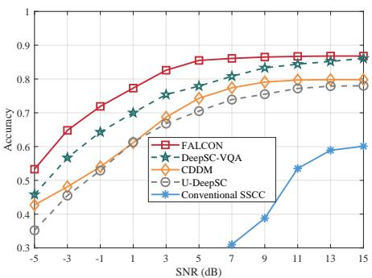  
(a) Counting

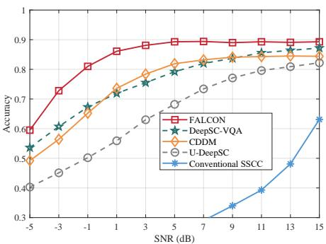  
(b) Attribute Querying

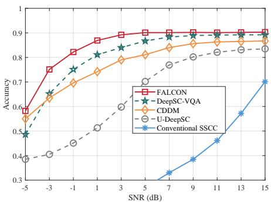  
(c) Existence Judgment

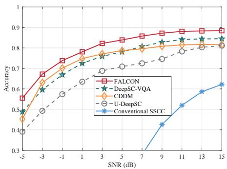  
(d) Integer Comparison

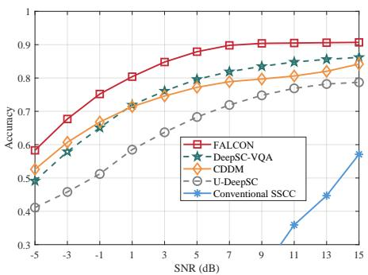  
(e) Attribute Comparison

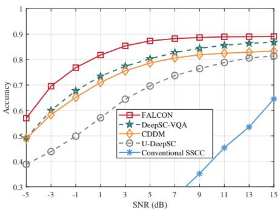  
(f) Total  
Fig. 7. Performance comparison of the proposed FALCON and four benchmark methods on the CLEVR dataset under the Rayleigh fading channel. Evaluation is conducted across five task categories: counting, attribute querying, existence judgment, integer comparison, and attribute comparison. Overall task accurac is also reported to assess comprehensive system performance.

SNR = -5 dB) over DeepSC-VQA for the respective segmented tasks. Moreover, when aggregating results across all tasks (as depicted in Fig. 6f), FALCON demonstrates average gains of 5.08%, 6.52%, and 14.17% relative to DeepSC-VQA, CDDM, and U-DeepSC, respectively. These empirical findings substantiate the efficacy of the proposed cross-modal knowledge enhancement mechanism, combined with the generative signal recovery strategy, in substantially improving semantic fidelity and bolstering communication robustness under challenging channel conditions.

Fig. 7 illustrates the performance of various methods under the Rayleigh fading channel. The results reveal that nonlinear distortions and feature distribution shifts, induced by the timevarying characteristics of the channel, lead to varying degrees of performance degradation across all evaluated methods, compared to the AWGN scenario in Fig. 6. Notably, the proposed FALCON architecture demonstrates superior convergence stability while maintaining a performance advantage. For instance, in the existence judgment task (see Fig. 7c), FALCON reaches a stable performance plateau at an SNR of 3 dB, whereas U-DeepSC exhibits persistent fluctuation at 11 dB. From a holistic perspective (see Fig. 7f), FALCON delivers an average performance gain of 5.98% over DeepSC-VQA, and up to 16.52% compared to U-DeepSC. These results underscore the robustness of the FALCON framework in addressing challenges posed by sensor heterogeneity and volatile air-to-ground links in UAV-based applications.

In summary, the above experiments systematically evaluate

FALCON’s capabilities in visual understanding and multi-step reasoning on the CLEVR dataset. Across five cognitive tasks, the results not only demonstrate FALCON’s superiority in deep content analysis and compositional reasoning but also highlight its ability to accurately capture user query intent with contextually coherent responses. These insights reveal a nuanced grasp of the dataset’s structured challenges. Consequently, FALCON’s performance on CLEVR underscores both its technical strengths and its potential applicability in nextgeneration intelligent LAWN.

## C. Performance on the CMU-MOSEI Dataset

Classification accuracy is employed as the primary evaluation metric for the sentiment analysis task, with comparative experiments conducted on the CMU-MOSEI dataset. As presented in Fig. 8, model performance is evaluated under both AWGN and Rayleigh fading channels across four representative SNR levels: low (-3 dB), lower (3 dB), higher (9 dB), and high (15 dB). In general, classification accuracy exhibits a positive correlation with increasing SNR, reflecting improved transmission reliability. Remarkably, the proposed FALCON framework consistently outperforms all benchmark methods across the full range of SNR conditions. Inspection of Fig. 8a reveals that FALCON achieves accuracy improvements of up to 1.51%, 1.45%, and 5.42% compared to CDDM, DeepSC-VQA, and U-DeepSC, respectively. According to the results in Fig. 8b, while the performance gap among models narrows at higher SNR levels, FALCON still maintains a marginal yet consistent advantage, yielding gains of 0.48% and 0.56% over DeepSC-VQA and CDDM, respectively. At lower SNRs, these improvements become more pronounced, with FALCON surpassing DeepSC-VQA and CDDM by 1.01% and 1.549%, respectively. The superior and stable performance under adverse conditions underscores the strong channel adaptivity and robust generalization of the FALCON framework.

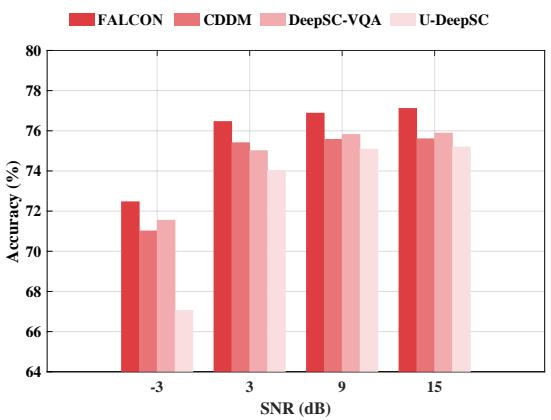  
(a) AWGN

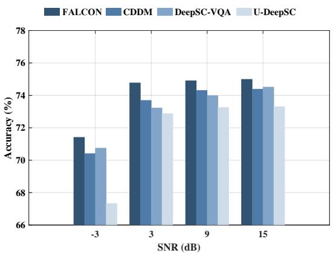  
(b) Rayleigh Fading  
Fig. 8. Comparison of multimodal sentiment analysis performance. The bar chart presents the sentiment classification accuracy of four methods on the CMU-MOSEI dataset.

TABLE I  
COMPARISON OF COMPUTATIONAL COMPLEXITY
<table><tr><td rowspan="3">Methods</td><td colspan="2">AWGN</td><td colspan="2">Fading</td></tr><tr><td>SNR@L</td><td>SNR@H</td><td>SNR@L</td><td>SNR@H</td></tr><tr><td>CDDM</td><td>220.82</td><td>220.33</td><td>225.15</td><td>224.57</td></tr><tr><td>DeepSC-VQA</td><td>209.11</td><td>208.60</td><td>219.35</td><td>218.87</td></tr><tr><td>U-DeepSC</td><td>203.67</td><td>203.35</td><td>214.08</td><td>213.79</td></tr><tr><td>FALCON</td><td>198.48</td><td>117.76</td><td>201.07</td><td>119.30</td></tr></table>

Note: The data represent the average GFLOPs across the considered SNR range.

To further quantify the computational complexity of FAL-CON and various baseline methods under both AWGN and fading channels, we employ GFLOPs as the evaluation metric. As summarized in Table I, the computational burden of each method is reported for low SNR regions (-3 to 6 dB, denoted as SNR@L) and high SNR regions (7 to 15 dB, denoted as SNR@H). It should be noted that all results are based on 40 multimodal samples (a data batch) and account for the combined computational load of both the encoder and decoder. The results indicate that FALCON consistently achieves superior performance across all tested scenarios. Importantly, FALCON exhibits an adaptive response to channel conditions: lower SNRs prompt the system to retain more semantic tokens, increasing computational overhead, whereas higher SNRs allow for selective feature retention, focusing on critical information and optimizing resource usage. Furthermore, due to the model’s dynamic channel-aware mechanism, the measured FLOPs under AWGN and fading channels exhibit minor differences, which are expected and entirely normal. Under both AWGN and Rayleigh fading channels, our method saves 40.67% computational complexity on average in the better channel-quality regime (high SNR) compared to the worse regime (low SNR).

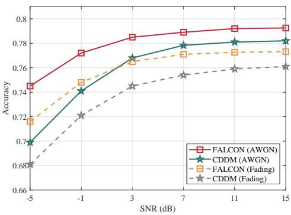  
Fig. 9. Evaluation of model generalization on the FALME dataset.

In practical deployment, particular attention should be paid to the computational demands of the encoder implemented on UAVs. Our analysis indicates that processing a single multimodal data instance at the transmitter requires approximately 2.75 GFLOPs. This level of complexity falls within the capacity of lightweight embedded AI modules, such as the Intel Movidius NCS2 [46] and NVIDIA Jetson Nano [47], and is therefore theoretically sufficient for multimodal data transmission on UAVs. For consumer-grade UAVs lacking external acceleration modules, model compression techniques, such as pruning or knowledge distillation, can be applied to further reduce computational overhead and facilitate feasible deployment [48].

In addition, we report the end-to-end average inference latency under 50 diffusion time steps. The measurements were conducted across 50 batches, with each batch containing 40 samples. The results indicate that the average per-sample inference latency is 6.06 ms for the visual modality, 5.26 ms for the textual modality, and 6.13 ms for the audio modality, resulting in a total latency of approximately 17.45 ms for generating a single multimodal sample instance. This latency falls within the acceptable range for most real-time UAV communication tasks, which typically tolerate delays on the order of tens of milliseconds.

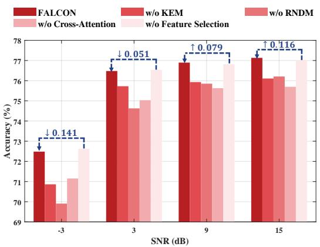  
(a) AWGN

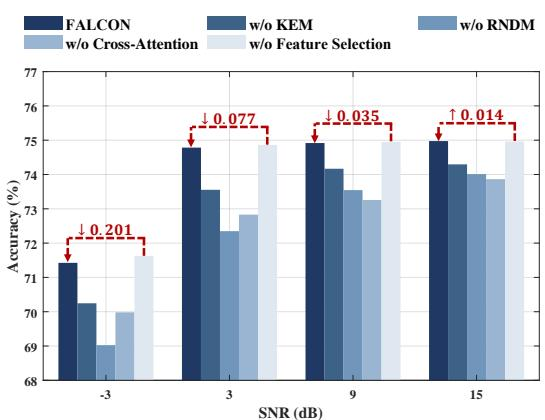  
(b) Rayleigh Fading  
Fig. 10. Ablation study evaluating the contributions of the KEM, RNDM, cross-attention, and semantic-aware resource allocation mechanism under AWGN and Rayleigh fading channels on the CMU-MOSEI dataset.

Overall, the evaluation on the CMU-MOSEI dataset highlights two core strengths of FALCON: (i) efficient alignment and deep fusion of cross-modal information, and (ii) sensitivity to fine-grained factors such as contextual variation. These capabilities underscore its practical value; for instance, in smart city scenarios, FALCON can integrate heterogeneous data from UAV surveillance and environmental sensors to dynamically monitor public areas. Its sensitivity to fine-grained signals enables the detection of abnormal behaviors, while crossmodal fusion and semantic understanding support predictive analysis of crowd risks, facilitating proactive interventions. This lays a solid foundation for deploying multimodal AI in critical task applications.

## D. Performance on the FLAME Dataset

As shown in Figure 9, to further validate the generalization capability of FALCON, we conducted comparative experiments on the FLAME dataset for the task of wildfire recognition. For a fair comparison, we selected the CDDM system equipped with a U-Net–based DM as the competitor to evaluate the architectural design and effectiveness of our RNDM method in signal detection. The results indicate that FALCON delivers competitive recognition accuracy under both ideal AWGN channels and more challenging fading channel conditions, while demonstrating particularly strong robustness in low-SNR scenarios. These findings highlight the unique strengths of FALCON in logical reasoning and finegrained semantic parsing, and provide empirical evidence of its potential for seamless adaptation to complex real-world environments.

## E. Ablation Study

Fig. 10 presents the results of an ablation study conducted on the CMU-MOSEI dataset, aimed at validating the technical contributions of core components within the proposed

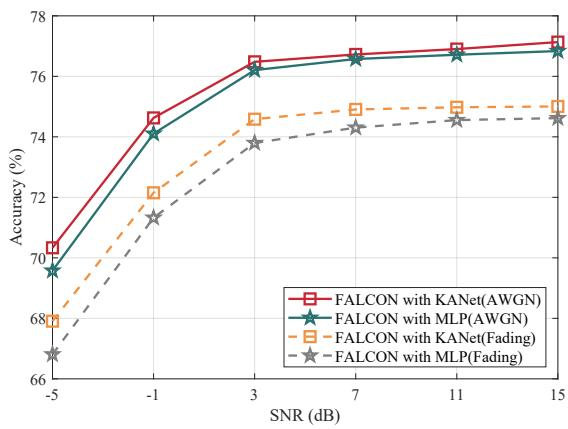  
Fig. 11. Ablation Study of KANet and MLP.

FALCON framework. The findings indicate that FALCON consistently outperforms its KEM-deficient variant under both AWGN and Rayleigh fading channel conditions, thereby demonstrating the effectiveness of the KANet-driven crossmodal prompts in mitigating semantic divergence among heterogeneous modalities. Furthermore, we examine the impact of the RNDM module on system performance. Quantitatively, the exclusion of RNDM results in a performance drop of 0.93% in the high-SNR region under AWGN conditions, which further deteriorates to 2.8% in low-SNR regions. These observations underscore the critical role of GenAI techniques in enhancing signal reconstruction quality in challenging channel dynamics typical in UAV-based semantic communication. Subsequently, we investigate the influence of decoder architecture by replacing the proposed cross-attention mechanism with a standard Transformer block. The resulting decline in accuracy verifies the advantage of our selective semantic integration design, which ensures more effective task-driven information fusion and communication efficiency. Lastly, we examine the contribution of the semantic-driven feature selection strategy. As shown in Fig. 10a, FALCON experiences only minor performance degradation of 0.141% at an SNR of –3 dB and 0.051% at 3 dB, primarily due to the selective pruning of redundant or insignificant tokens. As channel conditions improve, FALCON achieves performance gain. Collectively, these findings validate the superiority of the proposed dynamic feature selection mechanism, which introduces sparsity to balance task performance and computational efficiency. It provides a foundation for enabling intelligent communication in LAWN scenarios.

To validate the effectiveness of KANet in feature mapping and to assess its advantage over a standard MLP, we conduct an ablation study on the CMU-MOSEI dataset. As shown in Fig. 11, we compare KANet and MLP under two channel conditions. The results indicate that, under the AWGN channel, KANet consistently outperforms the MLP baseline across the tested SNR range, with a more noticeable margin in low-SNR regimes. Under the fading channel, the benefit of KANet becomes even more pronounced, achieving up to a 1.098% improvement in accuracy. These findings suggest that KANet provides stronger representational capacity for feature mapping, making it a key component of the KEM module and laying a more reliable foundation for subsequent cross-modal encoding and decoding.

## VI. CONCLUSION

In this work, we proposed FALCON, a novel semantic communication architecture for UAV-based air-ground communication links, intending to enhance communication efficiency through transceiver-level innovations. To mitigate the prevalent issue of cognitive bias arising from heterogeneous sensing nodes, we introduced the KEM, which establishes semantic correlations across diverse data modalities. By leveraging differentiable spline functions, KEM effectively alleviates the curse of dimensionality in high-dimensional feature spaces. In light of the computational limitations of UAV platforms and the scarcity of spectrum resources, we devised a semantic value evaluation mechanism that integrates multi-dimensional constraints, thereby enabling a sparse and adaptive resource allocation. Furthermore, to ensure robustness under adverse channel conditions, we developed the RNDM, which enhances signal fidelity using generative modeling techniques. Comprehensive experiments conducted on multimodal benchmarks validate the superior performance of the FALCON framework, demonstrating its practical potential for next-generation intelligent LAWN.

## REFERENCES

[1] W. Yuan, Y. Cui, J. Wang, F. Liu, G. Sun, T. Xiang, J. Xu, S. Jin, D. Niyato, S. Coleri et al., “From ground to sky: Architectures, applications, and challenges shaping low-altitude wireless networks,” arXiv preprint arXiv:2506.12308, 2025.

[2] J. Wu, Y. Yang, W. Yuan, W. Liu, J. Wang, T. Mao, L. Zhou, Y. Cui, F. Liu, G. Sun et al., “Low-altitude wireless networks: A survey,” arXiv preprint arXiv:2509.11607, 2025.

[3] A. Asheralieva and D. Niyato, “Optimizing age of information and security of the next-generation internet of everything systems,” IEEE Internet Things J., vol. 9, no. 20, pp. 20 331–20 351, Oct. 2022.

[4] H. Du, D. Niyato, Y.-A. Xie, Y. Cheng, J. Kang, and D. I. Kim, “Performance analysis and optimization for jammer-aided multiantenna UAV covert communication,” IEEE J. Sel. Areas Commun., vol. 40, no. 10, pp. 2962–2979, Aug. 2022.

[5] N. Cheng, S. Wu, X. Wang, Z. Yin, C. Li, W. Chen, and F. Chen, “AI for UAV-assisted IoT applications: A comprehensive review,” IEEE Internet Things J., vol. 10, no. 16, pp. 14 438–14 461, Aug. 2023.

[6] W. Xu, Z. Yang, D. W. K. Ng, M. Levorato, Y. C. Eldar, and M. Debbah, “Edge learning for B5G networks with distributed signal processing: Semantic communication, edge computing, and wireless sensing,” IEEE J. Sel. Top. Signal Process., vol. 17, no. 1, pp. 9–39, Jan. 2023.

[7] X. Niu, W. Yuan, L. Tan, N. Su, Y. Zhang, and T. Q. S. Quek, “Beyond connectivity: How large ai models unlock semantic 6g networks?” IEEE Commun. Mag., vol. 64, no. 4, pp. 106–112, 2026.

[8] E. Bourtsoulatze, D. Burth Kurka, and D. Gund¨ uz, “Deep joint source-¨ channel coding for wireless image transmission,” IEEE Trans. Cogn. Commun. Netw., vol. 5, no. 3, pp. 567–579, Mar. 2019.

[9] C. Liang, H. Du, Y. Sun, D. Niyato, J. Kang, D. Zhao, and M. A. Imran, “Generative AI-driven semantic communication networks: Architecture, technologies, and applications,” IEEE Trans. Cognit. Commun. Networking, vol. 11, no. 1, pp. 27–47, Feb. 2025.

[10] W. Zhang, H. Zhang, H. Ma, H. Shao, N. Wang, and V. C. M. Leung, “Predictive and adaptive deep coding for wireless image transmission in semantic communication,” IEEE Trans. Wireless Commun., vol. 22, no. 8, pp. 5486–5501, Aug. 2023.

[11] H. Xie, Z. Qin, G. Y. Li, and B.-H. Juang, “Deep learning enabled semantic communication systems,” IEEE Trans. Signal Process., vol. 69, pp. 2663–2675, Apr. 2021.

[12] S. Yao, K. Niu, S. Wang, and J. Dai, “Semantic coding for text transmission: An iterative design,” IEEE Trans. Cognit. Commun. Networking, vol. 8, no. 4, pp. 1594–1603, Dec. 2022.

[13] J. Mao, K. Xiong, M. Liu, Z. Qin, W. Chen, P. Fan, and K. B. Letaief, “A GAN-based semantic communication for text without CSI,” IEEE Trans. Wireless Commun., vol. 23, no. 10, pp. 14 498–14 514, Oct. 2024.

[14] T. Han, Q. Yang, Z. Shi, S. He, and Z. Zhang, “Semantic-preserved communication system for highly efficient speech transmission,” IEEE J. Sel. Areas Commun., vol. 41, no. 1, pp. 245–259, Jan. 2023.

[15] E. Grassucci, C. Marinoni, A. Rodriguez, and D. Comminiello, “Diffusion models for audio semantic communication,” in Proc. IEEE Int. Conf. Acoust., Speech Signal Process. (ICASSP), Apr. 2024, pp. 13 136– 13 140.

[16] Y. Sun, Y. Liu, S. Guo, X. Qiu, J. Chen, J. Hao, and D. Niyato, “Edge large ai model agent-empowered cognitive multimodal semantic communication,” IEEE Trans. Mob. Comput., pp. 1–18, 2025.

[17] F. Jiang, L. Dong, Y. Peng, K. Wang, K. Yang, C. Pan, and X. You, “Large AI model empowered multimodal semantic communications,” IEEE Commun. Mag., vol. 63, no. 1, pp. 76–82, Jan. 2025.

[18] G. Zhang, Q. Hu, Z. Qin, Y. Cai, G. Yu, and X. Tao, “A unified multitask semantic communication system for multimodal data,” IEEE Trans. Commun., vol. 72, no. 7, pp. 4101–4116, Jul. 2024.

[19] X. Luo, R. Gao, H.-H. Chen, S. Chen, Q. Guo, and P. N. Suganthan, “Multimodal and multiuser semantic communications for channel-level information fusion,” IEEE Wireless Commun., vol. 31, no. 2, pp. 117– 125, Apr. 2024.

[20] J. Wu, W. Yuan, and L. Hanzo, “When UAVs meet ISAC: Realtime trajectory design for secure communications,” IEEE Trans. Veh. Technol., vol. 72, no. 12, pp. 16 766–16 771, Dec. 2023.

[21] H. Hu, X. Zhu, F. Zhou, W. Wu, and R. Q. Hu, “Semantic-oriented resource allocation for multi-modal UAV semantic communication networks,” in Proc. IEEE Global Commun. Conf. (GLOBECOM), Dec. 2023, pp. 7213–7218.

[22] J. Kang, H. Du, Z. Li, Z. Xiong, S. Ma, D. Niyato, and Y. Li, “Personalized saliency in task-oriented semantic communications: Image transmission and performance analysis,” IEEE J. Sel. Areas Commun., vol. 41, no. 1, pp. 186–201, Jan. 2023.

[23] X. Kang, B. Song, J. Guo, Z. Qin, and F. R. Yu, “Task-oriented image transmission for scene classification in unmanned aerial systems,” IEEE Trans. Commun., vol. 70, no. 8, pp. 5181–5192, Aug. 2022.

[24] J. Fan, P. Ren, J. Chen, J. Qian, J. Wang, and C. Jiang, “Diffusionbased semantic communication assisted low-altitude intelligent service for IoT,” IEEE Internet Things J., pp. 1–1, 2025.

[25] W. Yuan, S. Li, Z. Wei, Y. Li, and P. Fan, “On hybrid detection of wireless communications over interference channels: A generalized framework,” IEEE J. Sel. Areas Commun., vol. 43, no. 4, pp. 1214–1229, Apr. 2025.

[26] X. Niu, D. Li, J. Zhao, L. Tan, and R. Bai, “ESCS: An expandable semantic communication system for multimodal data based on contrastive learning,” IEEE Commun. Lett., vol. 29, no. 2, pp. 368–372, Feb. 2025.

[27] I. J. Goodfellow, J. Pouget-Abadie, M. Mirza, B. Xu, D. Warde-Farley, S. Ozair, A. Courville, and Y. Bengio, “Generative adversarial nets,” in Proc. Adv. Neural Inf. Process. Syst. (NeurIPS), vol. 27. Curran Associates, Inc., 2014.

[28] Z. Wang, S. Leng, H. Zhang, and C. Yuen, “Deep semantic communication for knowledge sharing in internet of vehicles,” IEEE Internet Things J., pp. 1–1, 2025.

[29] D. P. Kingma, M. Welling et al., “Auto-encoding variational bayes,” 2013.

[30] G. Zhang, H. Li, Y. Cai, Q. Hu, G. Yu, and R. Zhang, “Learned image transmission with hierarchical variational autoencoder,” Proc. AAAI Conf. Artif. Intell. (AAAI), vol. 39, no. 12, pp. 13 215–13 223, Apr. 2025.

[31] S. Ma, W. Qiao, Y. Wu, H. Li, G. Shi, D. Gao, Y. Shi, S. Li, and N. Al-Dhahir, “Task-oriented explainable semantic communications,” IEEE Trans. Wireless Commun., vol. 22, no. 12, pp. 9248–9262, Dec. 2023.

[32] J. Ho, A. Jain, and P. Abbeel, “Denoising diffusion probabilistic models,” in Proc. Adv. Neural Inf. Process. Syst. (NeurIPS), vol. 33. Curran Associates, Inc., Dec. 2020, pp. 6840–6851.

[33] X. Niu, W. Yuan, L. Tan, J. Wu, and X. Wang, “Toward intelligent iot services: A generative ai-assisted semantic-aware framework,” IEEE Trans. Cognit. Commun. Networking, vol. 12, pp. 6988–7000, 2026.

[34] T. Wu, Z. Chen, D. He, L. Qian, Y. Xu, M. Tao, and W. Zhang, “CDDM: Channel denoising diffusion models for wireless semantic communications,” IEEE Trans. Wireless Commun., vol. 23, no. 9, pp. 11 168–11 183, Sep. 2024.

[35] H. Xie, Z. Qin, Z. Han, and K. B. Letaief, “Hybrid digital-analog semantic communications,” IEEE J. Sel. Areas Commun., vol. 43, no. 7, pp. 2478–2492, Jul. 2025.

[36] A. Dosovitskiy, L. Beyer, A. Kolesnikov, D. Weissenborn, X. Zhai, T. Unterthiner, M. Dehghani, M. Minderer, G. Heigold, and S. Gelly, “An image is worth 16x16 words: Transformers for image recognition at scale,” arXiv preprint arXiv:2010.11929, 2020.

[37] J. Devlin, M.-W. Chang, K. Lee, and K. Toutanova, “BERT: Pretraining of deep bidirectional transformers for language understanding,” in Proceedings of the 2019 Conference of the North American Chapter of the Association for Computational Linguistics: Human Language

Technologies. Minneapolis, Minnesota: Association for Computational Linguistics, Jun. 2019, pp. 4171–4186.

[38] Z. Liu, Y. Wang, S. Vaidya, F. Ruehle, J. Halverson, M. Soljacic, T. Y. Hou, and M. Tegmark, “KAN: Kolmogorov–arnold networks,” in Proc. Int. Conf. on Learn. Representations, Jan. 2025.

[39] H. van Deventer, P. J. van Rensburg, and A. Bosman, “KASAM: Spline additive models for function approximation,” arXiv preprint arXiv:2205.06376, 2022.

[40] S. Somvanshi, S. A. Javed, M. M. Islam, D. Pandit, and S. Das, “A survey on kolmogorov-arnold network,” ACM Comput. Surv., Jun. 2025. [Online]. Available: https://doi.org/10.1145/3743128

[41] Y. Hu, Z. Liang, F. Yang, Q. Hou, X. Liu, and M.-M. Cheng, “KAC: Kolmogorov-Arnold classifier for continual learning,” in Proc. IEEE Conf. Comput. Vis. Pattern Recognit. (CVPR), June 2025, pp. 15 297– 15 307.

[42] A. Martins and R. Astudillo, “From softmax to sparsemax: A sparse model of attention and multi-label classification,” in Proc. Int. Conf. on Mach. Learn., vol. 48. New York, New York, USA: PMLR, Jun. 2016, pp. 1614–1623.

[43] J. Song, C. Meng, and S. Ermon, “Denoising diffusion implicit models,” arXiv preprint arXiv:2010.02502, 2020.

[44] Y. Wang, J. Yu, and J. Zhang, “Zero-shot image restoration using denoising diffusion null-space model,” arXiv preprint arXiv:2212.00490, 2022.

[45] H. Xie, Z. Qin, X. Tao, and K. B. Letaief, “Task-oriented multi-user semantic communications,” IEEE J. Sel. Areas Commun., vol. 40, no. 9, pp. 2584–2597, Sep. 2022.

[46] https://cdrdv2-public.intel.com/749742/neural-compute-stick2-product-brief. pdf, [Accessed 15-09-2025].

[47] “NVIDIA Jetson Nano — nvidia.com,” https://www.nvidia. com/en-us/autonomous-machines/embedded-systems/jetson-nano/ product-development/, [Accessed 15-09-2025].

[48] C. Liu, Y. Zhou, Y. Chen, and S.-H. Yang, “Knowledge distillationbased semantic communications for multiple users,” IEEE Transactions on Wireless Communications, vol. 23, no. 7, pp. 7000–7012, Jul. 2024.

Xupeng Niu received the B.E. degree in Data Science and Big Data Technology and the M.S. degree in Computer Science and Technology from Taiyuan University of Technology, Taiyuan, China. She is currently pursuing the Ph.D. degree with the School of Automation and Intelligent Manufacturing, Southern University of Science and Technology, Shenzhen, China. Her research interests include semantic communication, multi-agent collaborative perception, and low-altitude wireless networks.

Weijie Yuan (Senior Member, IEEE) ’s research interests include Integrated Sensing and Communications (ISAC), Orthogonal Time Frequency Space (OTFS), and the Low-Altitude Wireless Networks (LAWN). He currently serves as the Deputy Editorin-Chief of the Journal of Advances in Signal Processing. He is an Editor for the IEEE Transactions on Communications, IEEE Transactions on Wireless Communications, IEEE Transactions on Mobile Computing, IEEE Communications Magazine, IEEE Communications Standards Magazine, IEEE Trans-

actions on Green Communications and Networking, IEEE Communications Letters, IEEE Open Journal of Communications Society, and npj Wireless Technology. He has led four special issues in IEEE Transactions on Vehicular Technology, IEEE Transactions on Network Science and Engineering, IEEE Journal of Selected Topics in Signal Processing, and China Communications. He was a Guest Editor for IEEE Internet of Things Journal and IEEE Open Journal of Vehicular Technology. He is serving/served as the the General Co-Chair for ISWCS 2026, Symposium Co-Chair for IEEE/CIC ICCC 2026, and Track Co-Chair for IEEE ICC 2025 and IEEE VTC 2025-Spring. He served as an Organizer/the Chair of several workshops and special sessions in flagship IEEE and ACM conferences, including IEEE ICC, IEEE VTC, IEEE GlobeCom, IEEE/CIC ICCC, IEEE SPAWC, IEEE WCNC, IEEE ICASSP, and ACM MobiCom. He is the Founding Chair of the IEEE Aerospace and Electronic System Working Group on LAWN and the ComSoc Special Interest Group (SIG) on LAWN. He was a recipient of the Best Editor from IEEE CommL, the Best Paper Award from IEEE ICC 2023, IEEE/CIC ICCC 2023, IEEE GlobeCom 2024, and IEEE GlobeCom 2025, as well as the 2025 IEEE Communications Society & Information Theory Society Joint Paper Award.

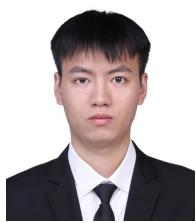

Long Tan is a PhD student with the College of Control Science and Engineering, Zhejiang University. He received his B.E. degree in Hefei University of Technology, and his Master degree in Taiyuan University of Technology. His current research fields include mobile computing and wireless networks.

Qingqing Cheng (Senior Member, IEEE) received her M.E. degree from the Harbin Institute of Technology, China, in 2015, and her Master of Research (MRes) degree from Macquarie University, Australia, in 2016. She received the Ph.D. degree from the University of Technology Sydney, Australia, in 2020. From 2020 to 2024, she was a Postdoctoral Research Fellow at University of New South Wales, Australia. She is currently a Lecturer (equivalent to Assistant Professor) with the Queensland University of Technology, Brisbane, Australia, and a recipient of the 2025 ARC Discovery Early Career Researcher Award (DECRA). Dr. Cheng also serves as an Associate Editor for the IEEE Transactions on Mobile Computing since 2025. She received the Best Paper Award at IEEE Globecom 2023. Her research interests include deep learning for wireless communications, integrated sensing and communications (ISAC), 5G/6G systems, high-mobility networks, privacy preservation, cognitive radio, and massive MIMO.