# FMCW-Enabled Integrated Sensing, Identification, and Backscatter Communication for Low-Altitude Economy

Shanxing Zeng , Graduate Student Member, IEEE, and Ying-Chang Liang , Fellow, IEEE

Abstract—In this paper, we propose a novel frequencymodulated continuous wave (FMCW)-enabled integrated sensing, identification, and backscatter communication (ISIBC) system to support low-altitude economy (LAE). In this system, the ground base station (GBS) utilizes the FMCW signals to estimate the physical parameters (ranges and radial velocities) of multiple unmanned aerial vehicles (UAVs), and simultaneously to identify these UAVs through detecting the symbols transmitted by the backscatter devices (BDs) attached to the UAVs. However, the tight coupling between the UAV parameters and BD symbols presents significant challenges for parameter estimation and BD symbol detection tasks. To overcome these challenges, we first formulate the echo signal model and the explicit discrete beat signal model. These models take into account not only the backscattered component from the BD antennas but also the reflected component from the physical surfaces of UAV-BDs. These models also characterize the synchronization errors between FMCW signals and BD signals. Further, to mitigate the inter-symbol interference (ISI), we propose a zero-padded BD symbol pattern. Next, by employing the proposed BD symbol pattern and a truncation operation, we reformulate the discrete beat signal model into a low-rank matrix model. Based on the low-rank matrix model, we propose a singular value decomposition (SVD)-based two-stage algorithm for joint parameter estimation and BD symbol detection. We first present the twostage algorithm for the single UAV scenario, and then extend it to the multiple UAV scenario. We also derive the Cramer-Rao´ lower bound (CRLB) to assess the performance of parameter estimation. Finally, numerous simulation results are provided to verify the effectiveness and superior performance of the proposed ISIBC system design for LAE.

Index Terms—Integrated sensing, identification, and backscatter communication (ISIBC), FMCW, low-rank matrix, parameter estimation, BD symbol detection, Cramer–Rao lower bound, low-´ altitude economy.

## I. INTRODUCTION

ECENTLY, the emerging low-altitude economy (LAE) and industry, owing to its substantial potential to enable a wide array of critical applications, such as express delivery, geographic surveying and mapping, and traffic monitoring [1]. The successful implementation of LAE imposes stringent demands on sensing and communication capabilities of low-altitude networks, such as comprehensive environmental awareness and ubiquitous connectivity [2]. Fortunately, the integrated sensing and communication (ISAC) technology can empower low-altitude networks with high-precision sensing and robust communication abilities [3], thereby establishing itself as a foundational technology for realizing LAE [4]. Furthermore, in LAE, unmanned aerial vehicles (UAVs) have become the dominant aerial platforms for various flight missions due to their low cost and high flexibility [5]. Therefore, it is crucial to explore the integration of ISAC systems and UAVs.

In current research, the integration of ISAC systems and UAVs is generally classified into two primary paradigms: the UAV-assisted ISAC paradigm and the ISAC-assisted cellularconnected UAV paradigm. In the first paradigm, UAVs act as aerial mobile base stations (BSs), providing communication services to ground users while concurrently performing sensing tasks [6]. Conversely, the second paradigm envisions UAVs as aerial users that execute mission-specific tasks (e.g., parcel delivery), where the ground BS (GBS) provides communication/navigation services for UAVs and simultaneously senses these UAVs [7]. Clearly, the second paradigm demonstrates significantly broader applicability in LAE compared to the first paradigm, and thus constitutes our research focus. Some preliminary efforts have been launched for the application of the second paradigm in LAE [7], [8], [9], [10]. For example, in [10], the collaborative transmission and monitoring of multiple GBSs were explored for the ISAC-assisted cellular-connected UAV system, where the coordinated multi-GBS beamforming and UAV trajectory design significantly improved the performance of sensing and communication.

Although these efforts have achieved notable advancements, the identification of UAVs, i.e., acquiring their identity information and matching it with corresponding physical parameters (e.g., angles), remains a highly challenging issue in existing ISAC-assisted cellular-connected UAV systems. Specifically, in the sensing stage, UAVs only passively reflect the incident sensing signal without actively transmitting any identity information in the echo signals. As a result, the GBS can only estimate the physical parameters from the echo signals, which limits the deeper application of ISAC-assisted cellular-connected UAV systems in LAE. For instance, within the low-overhead echo-based beam alignment framework [11], the GBS can only estimate azimuth angles from the echo signals, and fails to associate these angles with specific UAVs, thereby preventing effective beam alignment.

Motivated by vehicle identification systems that read license plates for traffic management [12], we develop a novel UAV identification system that exploits backscatter communication (BC). In conventional BC systems, battery-less backscatter devices (BDs) harvest ambient radio frequency (RF) energy and transmit information by switching their load impedances according to the preloaded information sequence [13]. We equip each UAV with a BD, thereby forming the UAV–BD pair in which the BD serves as an electronic license plate. Specific portions of the BD’s preloaded information sequence are assigned as the UAV’s pre-registered identity information. After the GBS emits the downlink signal to activate the BDs, the BDs reflect the incident signals, and the GBS collects the resulting echo signals, from which the GBS detects the BD symbols to acquire the identity information of UAVs. The recovered identity information is then compared with the registration database to complete the UAV identification process.

Existing ISAC systems encompass multiple implementation strategies, including time-division ISAC, frequency-division ISAC, and full-domain resource-sharing ISAC [14]. Although full-domain resource sharing can in principle approach the joint optimal trade-off between sensing and communications, it faces significant implementation challenges due to the necessity of fundamentally redesigning existing system architectures and the mutual interference between sensing and communication functions [15]. Consequently, in this work we adopt a time-division ISAC strategy [3], which is simple to implement and compatible with current sensing and communication systems. For the communication stage, given that there exit severe Doppler shifts in low-altitude environments, we select orthogonal time frequency space modulation (OTFS) or orthogonal time sequency multiplexing (OTSM) as the communication waveform. Both OTFS and OTSM have been proposed as novel communication waveforms to address the performance degradation of orthogonal frequency division multiplexing (OFDM) in high-mobility scenarios [16], [17]. Besides, compared with OFDM, OTFS and OTSM also provide higher spectral efficiency and larger diversity gain [18], [19], [20]. For the sensing stage, we employ the wellestablished frequency-modulated continuous wave (FMCW) signal, which is mainly designed to enable sensing functionality [21]. FMCW exhibits several attractive properties for sensing, such as simple self-interference mitigation, long sensing range, and strong robustness to severe Doppler shifts [22].

Inspired by the concept of symbiotic radio (SR) [23], we consider integrating this UAV identification system (referred to as the secondary system) with the time-division ISAC system (referred to as the primary system) to improve resource utilization and enable reciprocal sharing. In this work we concentrate on integrating the secondary system into the sensing stage of the primary system, resulting in the FMCW-enabled integrated sensing, identification, and backscatter communication (ISIBC) system. On the one hand, the BDs in the secondary system can exploit the downlink FMCW signals from the primary system to convey identity information. On the other hand, the existence of

BDs effectively creates additional reflection paths that can strengthen the echo signals and consequently lead to higher sensing precision for the primary system.

In this paper, we propose a novel FMCW-enabled ISIBC system in mobile scenarios for LAE. In this system, during the sensing stage, the GBS emits the FMCW signal, and UAV-BDs utilize BC to embed their own information into the echo signals. The embedded information consists of two parts: UAVs’ identity information such as identity codes, and some other important information such as collected data. Upon receiving all the echo signals, the GBS estimates the ranges and radial velocities of multiple UAVs and concurrently detects the symbols transmitted by the attached BDs. Based on the detected BD symbols, the GBS identifies these UAVs and acquires the other important information. Although three works [24], [25], [26] have made initial attempts to estimate the range between the BD and the receiver (RX) while simultaneously detecting BD symbols using FMCW radars, they have the following limitations. They neglect the reflected component from the physical surfaces in the echo signal and ignore the inter-symbol interference (ISI) caused by transmission delays and imperfect synchronization. More importantly, they only consider static scenarios, making their system designs inapplicable to the proposed ISIBC system for LAE. Besides, the employed parameter estimation algorithms are relatively crude, and the Cramer-Rao lower bound (CRLB) for theo-´ retical performance benchmarking of parameter estimation is not derived. Therefore, to the best of our knowledge, this work is the first to introduce ISIBC into LAE and investigate the potential of FMCW for enabling the ISIBC system in mobile scenarios. However, in this system, due to the tight nonlinear coupling between UAV parameters and BD symbols, it becomes highly challenging to estimate the ranges and radial velocities of UAVs and simultaneously detect the BD symbols. To address these challenges, we have undertaken the following efforts, with the main contributions summarized as follows.

Firstly, we describe the FMCW-enabled ISIBC system, derive the echo signal model, and formulate the explicit discrete beat signal model through rigorous derivation of mixing and sampling operations. These models take into account not only the backscattered component from the BD antennas but also the reflected component from the physical surfaces of UAV-BDs. Besides, we also characterize the errors induced by imperfect synchronization between the backscattered signals from BDs and incident FMCW signals. Further, to eliminate the ISI caused by transmission delays and synchronization errors, we propose a zero-padded BD symbol pattern.

• Secondly, by leveraging the proposed zero-padded BD symbol pattern and a truncation operation, we reformulate the discrete beat signal model into a low-rank matrix model. Subsequently, building on the low-rank matrix model, we propose a singular value decomposition (SVD)-based two-stage algorithm to jointly estimate the ranges and radial velocities of UAVs and detect the symbols transmitted by the attached BDs. For clarity of exposition, we first present our two-stage algorithm for the single UAV-BD scenario, and then extend it to the multiple UAV-BD scenario.

Thirdly, we derive the Fisher Information Matrix (FIM), and accordingly obtain the CRLB to evaluate the performance of parameter estimation. Next, numerous simulation results verify the effectiveness and superior performance of the proposed ISIBC system design for both the single UAV-BD scenario and the multiple UAV-BD scenario. Taking the multiple UAV-BD scenario as an example, the root mean square errors (RMSEs) of range estimation and radial velocity estimation can reach the corresponding CRLBs starting from a signal-to-noise ratio (SNR) of 0 dB. The RMSE of range estimation and radial velocity estimation can reach $\bar { 1 0 ^ { - 3 } }$ m and $1 0 ^ { - 2 }$ m/s at an SNR of 0 dB, respectively. The bit error rate (BER) can be as low as $1 0 ^ { - 2 }$ at an SNR of −6 dB, where the transmission bit rate is set to 10 kbps and the FMCW system’s bandwidth is 500 MHz.

The rest of this paper is organized as follows. In Section II, we introduce the FMCW-enabled ISIBC system and formulate the signal models. In Section III, we derive the low-rank matrix model. Then, we propose the SVD-based two-stage algorithm for the single UAV-BD scenario in Section IV, and extend it to the multiple UAV-BD scenario in Section V. Subsequently, in Section VI, we derive the FIM and obtain the CRLB. Finally, simulation results are presented in Section VII, and conclusions are drawn in Section VIII.

Notations: Scalars, column vectors, and matrices are denoted by lowercases, boldface lowercases, and boldface uppercases, respectively. The blackboard bold letters R and $\mathbb { C }$ denote the real number field and the complex number field, respectively. $( \cdot ) ^ { \mathrm { T } } , ~ ( \cdot ) ^ { \ast } , ~ ( \cdot ) ^ { \mathrm { H } } , ~ ( \cdot ) ^ { - 1 }$ and (·)† represent the transpose operator, complex conjugate operator, Hermitian transpose operator, inverse operator, and Moore-Penrose inverse operator, respectively. $( \cdot ) _ { N } , \lceil \cdot \rceil , \lfloor \cdot \rfloor , \lfloor \cdot \rfloor , \mathcal { R } \{ \cdot \} , \mathcal { T } \{ \cdot \}$ $\mathbb { E } \{ \cdot \}$ , and $\| \cdot \| _ { F }$ represent the modulo-N operation, rounding up operation, rounding down operation, modulus operator, real part operator, imaginary part operator, statistical expectation operation, and Frobenius norm, respectively. \~, }, ⊗, ◦ and $\oslash$ denote the linear convolution, Hadamard product, Kronecker product, outer product and element division operators, respectively. vec(X) and $\mathrm { v e c } ^ { - 1 } ( \mathbf { x } )$ denote the vectorization of the matrix X and the matrixization of the vector x, respectively. rank(X) denotes the rank of X. 1N represents the $N \times 1$ one vector. Besides, Matlab operation notations will be used for the vector and matrix. For example, $\mathbf { x } ( i _ { 1 } : i _ { 2 } ) \in \mathbb { C } ^ { ( i _ { 2 } - i _ { 1 } ) \times }$ 1 denotes the subvector of x from index i1 to index $i _ { 2 } ,$ and $\mathbf { X } ( i , : )$ denotes the i-th row of X. Besides, $\overline { { \mathbf { X } } } = \mathbf { X } ( 2 : e n d , : )$ and $\underline { { \mathbf { X } } } = \mathbf { X } ( 1 : e n d - 1 , : )$

## II. SYSTEM MODEL

In this section, we describe the FMCW-enabled ISIBC system, derive the echo signal model, and formulate an explicit discrete beat signal model through rigorous derivation of mixing and sampling operations.

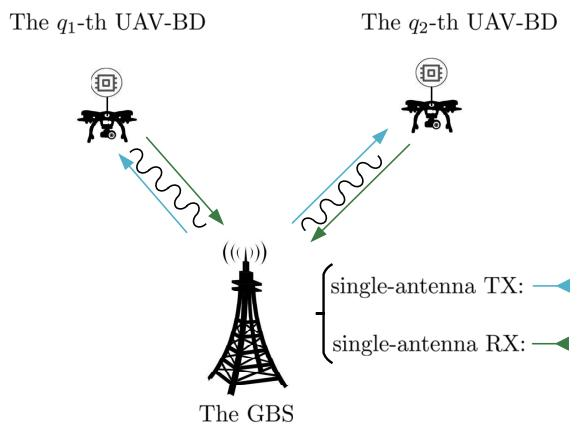

Fig. 1. The FMCW-enabled ISIBC system.  
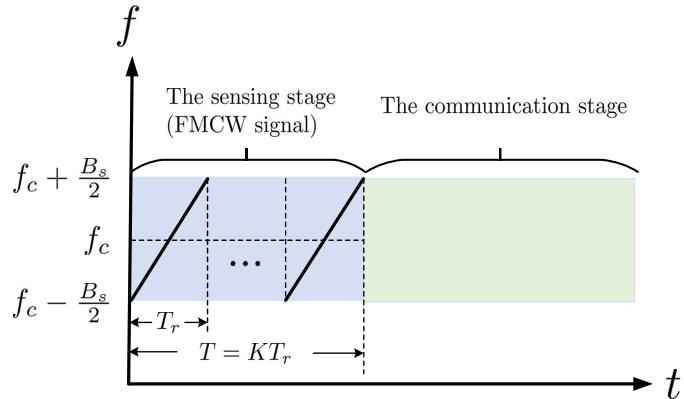  
Fig. 2. A complete ISAC cycle.

## A. System Overview

As illustrated in Fig. 1, the FMCW-enabled ISIBC system consists of a GBS and Q moving UAV-BDs. We define the set $\mathbb { Q }$ as $\mathbb { Q } ~ = ~ \{ 1 , 2 , . . . , Q \}$ Then, $\forall q \ \in \ \mathbb { Q } ,$ the range between the q-th UAV-BD and the GBS is defined as $R _ { q } ,$ and the radial velocity of the q-th UAV-BD is given by $v _ { q } .$ As depicted in Fig. 2, the GBS performs sensing and communication functions in a time-division manner [27], and we focus on the sensing stage. During this stage, the GBS employs a single-antenna transmitter (TX) to emit the FMCW signal, and adopts a single-antenna RX to receive the echo signals from Q UAV-BDs. Upon receiving the echo signals, the GBS estimates the ranges and radial velocities of Q UAVs while concurrently detecting the symbols transmitted by Q BDs. Based on the detected BD symbols, the GBS is able to identify these UAVs and acquire other important information if needed. It is assumed that the self-interference caused by the full-duplex operation has been effectively eliminated through self-interference cancellation techniques [28].

In addition to the self-interference, clutter in low-altitude environments can also affect the execution of sensing and BD symbol detection tasks. However, the focus of this work is on introducing the BC system to address the UAV identification problem in LAE, and integrating it with existing FMCW-based sensing systems to form the FMCW-enabled ISIBC system. Thus, to maintain focus, we only provide a qualitative analysis of the clutter composition and the suppression techniques in this paper. We do not model the clutter and the clutter suppression process in detail, while directly treating the residual clutter after suppression as part of the noise. Note that, clutter suppression is a well-established area in radar systems, and mature suppression techniques are available [29], [30]. For example, in low-altitude environments, static clutter primarily originates from tall buildings, vegetation, and other stationary large infrastructures, which can be effectively suppressed by the Moving Target Indication (MTI) and pulse-Doppler processing techniques [21]. Dynamic clutter arises from slowly or rapidly moving objects, such as swaying vegetation or birds, which can be effectively reduced by the Doppler filtering technique and the micro-Doppler feature of UAVs [31]. In addition, Artificial Intelligence (AI)-based clutter suppression and blind source separation (BSS)-based clutter suppression techniques can also be employed in the ISIBC system [32], [33]. These techniques are compatible with our sensing and BD symbol detection framework and can be directly applied to the proposed ISIBC system.

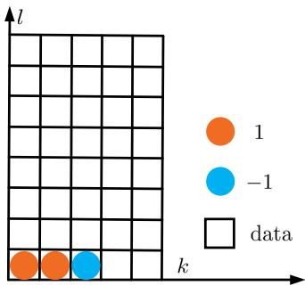  
Fig. 3. The symbol matrix structure for the BD.

## B. The Emitted FMCW Signal

As shown in Fig. 2, we consider the sensing stage in a complete ISAC cycle. Let T denote the duration of the sensing stage, during which the GBS emits K FMCW chirps, each lasting duration $T _ { r } ,$ such that $T = K T _ { r }$ . Then, the emitted FMCW signal can be expressed as [34]

$$
s ( t ) = \sum _ { k = 0 } ^ { K - 1 } e ^ { j \varphi _ { F M } ( t - k T _ { r } ) } \Pi \left( \frac { t - k T _ { r } } { T _ { r } } \right) ,\tag{1}
$$

where Π(·) is the unit rectangular window that is one in the interval [0, 1) and zero otherwise. Besides, $\varphi _ { F M } ( t )$ denotes the phase of the initial FMCW chirp $( k = 0 )$ , which is given by

$$
\begin{array} { c } { { \varphi _ { F M } ( t ) = 2 \pi f _ { c } t - \pi B _ { s } t + \pi \frac { B _ { s } } { T _ { r } } t ^ { 2 } + \varphi _ { 0 } } } \\ { { = 2 \pi f _ { s } t + \pi \frac { B _ { s } } { T _ { r } } t ^ { 2 } + \varphi _ { 0 } . } } \end{array}\tag{2}
$$

In $( 2 ) , f _ { c }$ is the carrier frequency, $B _ { s }$ is the bandwidth, $f _ { s } =$ $\begin{array} { r } { f _ { c } - \frac { B _ { s } } { 2 } } \end{array}$ is the start frequency, and $\varphi _ { 0 }$ is the initial phase.

## C. The Transmitted Waveforms of BDs

BDs modulate their information over the incident FMCW signals through switching their antenna load impedances. The transmitted information comprises two parts: UAVs’ identity information such as identity codes, and some other important information such as collected data. For $\forall q \ \in \ \mathbb { Q } ,$ let $b _ { q } ( t )$

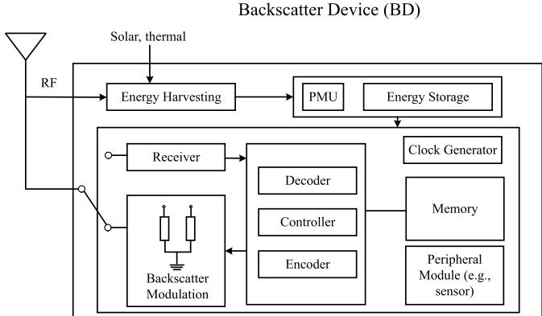  
Fig. 4. The internal structure of the BD.

denote the transmitted waveform of the q-th BD, which consists of L BD symbols within each FMCW period $T _ { r }$ , such that the BD symbol period $T _ { b }$ satisfies $T _ { b } = T _ { r } / L$ . Thus, during the entire sensing stage, the q-th BD transmits KL symbols. For the convenience of the subsequent derivation, these KL symbols are expressed as a symbol matrix of size $L \times K$ . As illustrated in Fig. 3, the symbol matrix consists of two parts: pilot symbols and data symbols. Moreover, let $\omega _ { q , k , l }$ denote the l-th symbol transmitted by the q-th BD in the k-th FMCW period, where $k = 0 , 1 , . . . , K - 1$ and $l = 0 , 1 , . . . , L - 1$ Then, the symbol arrangement $\omega _ { q , k , l }$ of the symbol matrix is formulated by

$$
\omega _ { q , k , l } = \left\{ \begin{array} { l l } { 1 ( \mathrm { k n o w n ~ p i l o t } ) , } & { k = 0 , 1 , l = 0 , } \\ { - 1 ( \mathrm { k n o w n ~ p i l o t } ) , } & { k = 2 , l = 0 , } \\ { \omega _ { q , k , l } ^ { s } , } & { o t h e r w i s e , } \end{array} \right.\tag{3}
$$

where $\omega _ { q , k , l } ^ { s }$ denotes the data symbol and only three pilot symbols are required. Here, without loss of generality, we consider the q-th BD adopts BPSK modulation, which implies $\omega _ { q , k , l } ^ { s } \in \{ - 1 , 1 \}$

Furthermore, to mitigate the ISI caused by transmission delays and synchronization errors1, we design a zero-padded BD symbol pattern. In particular, during each BD symbol period $[ 0 , T _ { b } ) .$ , the $q \mathrm { - }$ -th BD transmits its information by selecting certain antenna load impedance (corresponding to symbol $^ { \circ } - 1 ^ { \circ }$ or symbol $^ { \cdot } 1 ^ { \cdot } )$ to reflect the incident FMCW signal in $[ 0 , T _ { e } )$ , where $T _ { e }$ is the effective symbol duration time. In $[ T _ { e } , T _ { b } )$ , it enters an absorptive mode and absorbs the incident FMCW signal, which can be equivalently seen as the transmission of symbol ‘0’, thereby achieving the zero-padded BD symbol pattern. Thus, the transmitted waveform $b _ { q } ( t )$ can be expressed as

$$
b _ { q } ( t ) = \sum _ { k = 0 } ^ { K - 1 } \sum _ { l = 0 } ^ { L - 1 } \omega _ { q , k , l } \Pi \left( \frac { t - k T _ { r } - l T _ { b } } { T _ { e } } \right) .\tag{4}
$$

Remark 1: To further facilitate the reader’s understanding of the BD information transmission process, we provide an illustration of the internal structure of the BD in Fig. 4. The BD consists of the backscatter modulation module, controller, memory, encoder, energy harvesting module, power management unit (PMU), energy storage module, and other modules. Our work mainly involves the backscatter modulation-based information transmission process. In this process, the controller delivers the data stored in the memory to the encoder, including the UAV’s identity information and some other important information. Then, the encoded data symbols are combined with three pilot symbols to form the complete symbol sequence to be transmitted. Based on this sequence, the controller switches the antenna load impedances in the backscatter modulation module, thereby modulating the incident RF signal to accomplish the BD’s own information transmission [23]. Specifically, let $Z _ { a }$ and $Z _ { L , i }$ represent the antenna impedance and the load impedance of the backscattering circuit, respectively. Based on antenna scattering theory [35], the electric field of the reflected signal can be separated into two components: the structural-mode backscattering component and the antenna-mode backscattering component. The structural-mode component can be interpreted as part of the environmental multipath, whereas the antenna-mode component is determined by the mismatch between the antenna and load impedances. This leads to the reflection coefficient $\Gamma _ { i }$ given by $\begin{array} { r } { \Gamma _ { i } = \frac { Z _ { L , i } - Z _ { a } ^ { * } } { Z _ { L , i } + Z _ { a } } } \end{array}$ . By alternating the load impedances in a periodic manner, the BD produces distinct reflection coefficients, which represent the symbol sequence to be transmitted. Given a specific reflection coefficient $\Gamma _ { i } ,$ the associated load impedance $Z _ { L , i }$ can be calculated as $\begin{array} { r } { Z _ { L , i } = \frac { Z _ { a } ^ { * } + \Gamma _ { i } Z _ { a } } { 1 - \Gamma _ { i } } } \end{array}$

## D. The Received Echo Signal Model

We adopt a short-term stationarity assumption, i.e., within the sensing stage, the ranges and radial velocities of UAV-BDs, as well as corresponding channel fading coefficients, remain constant. This short-term stationarity assumption is widely adopted in the literature, including studies on FMCW radar sensing [21], ISAC for UAVs and vehicles [14], [36], and UAV communications [37].

The noise-free echo signals comprise two components: the backscattered component originating from the BD antennas and the reflected component resulting from the physical surfaces of UAV-BDs [23]. The noise-free reflected component $r _ { u } ( t )$ from the physical surfaces of UAV-BDs can be expressed as

$$
r _ { u } ( t ) = \sum _ { q = 1 } ^ { Q } \beta _ { q } ^ { u } s \left( t - \frac { 2 R _ { q } + 2 v _ { q } t } { c } \right) ,\tag{5}
$$

where $\beta _ { q } ^ { u }$ is the channel fading coefficient, including the round-trip path loss and the reflection attenuation of the physical surface, and c represents the speed of the light. For $\forall q \in \mathbb { Q }$ , given that the q-th BD is affixed to the q-th UAV’s surface, the q-th BD possesses the same parameters $\{ R _ { q } , v _ { q } \}$ as the q-th UAV. Then, the noise-free backscattered component $r _ { b } ( t )$ from the BD antennas can be written as

$$
\begin{array} { l } { \displaystyle r _ { b } ( t ) = \sum _ { q = 1 } ^ { Q } \beta _ { q } ^ { b } s \left( t - \frac { 2 R _ { q } + 2 v _ { q } t } c \right) } \\ { \displaystyle \qquad \times b _ { q } \left( t - \frac { 2 R _ { q } + 2 v _ { q } t } c - \tau _ { q } ^ { s } \right) , } \end{array}\tag{6}
$$

where $\beta _ { q } ^ { b }$ is the channel fading coefficient associated with the antenna of the q-th BD, and $\tau _ { q } ^ { s }$ denotes the synchronization error of the q-th BD. Thus, the received noise-free echo signal $r ( t )$ from Q UAV-BDs can be formulated as

$$
\begin{array} { l } { \displaystyle r ( t ) = r _ { u } ( t ) + { r _ { b } } ( t ) } \\ { \displaystyle \quad = \sum _ { q = 1 } ^ { Q } s \left( t - \frac { 2 R _ { q } + 2 v _ { q } t } { c } \right) } \\ { \displaystyle \quad \quad \times \left( \beta _ { q } ^ { b } b _ { q } \left( t - \frac { 2 R _ { q } + 2 v _ { q } t } { c } - \tau _ { q } ^ { s } \right) + \beta _ { q } ^ { u } \right) . } \end{array}\tag{7}
$$

As observed from $( 7 ) ,$ when BDs remain persistently in the absorption mode without reflecting incident FMCW signals, the received echo signal model (7) degenerates to the echo signal model in the conventional FMCW radar system [38].

## E. The Discrete Beat Signal Model

Next, according to the signal processing procedure of the FMCW radar [38], the beat signal $y ( t )$ can be obtained by mixing the echo signal $r ( t )$ in (7) with the local FMCW signal $s ( t )$ in (1), which can be expressed as

$$
\begin{array} { l } { \displaystyle y ( t ) = s ^ { * } ( t ) r ( t ) } \\ { \displaystyle \quad = \sum _ { q = 1 } ^ { Q } s ^ { * } ( t ) s \left( t - \frac { 2 R _ { q } + 2 v _ { q } t } { c } \right) } \\ { \displaystyle \quad \quad \times \left( \beta _ { q } ^ { b } b _ { q } \left( t - \frac { 2 R _ { q } + 2 v _ { q } t } { c } - \tau _ { q } ^ { s } \right) + \beta _ { q } ^ { u } \right) . } \end{array}\tag{8}
$$

In (8), we define $\begin{array} { r } { y _ { q } ( t ) = s ^ { * } ( t ) s \left( t - \frac { 2 R _ { q } + 2 v _ { q } t } { c } \right) } \end{array}$ . Then, $y _ { q } ( t )$ is given by (9) in the interval $\left\lceil \frac { 2 R _ { q } } { c } , K T _ { r } \right\rceil$ shown at the bottom of the page, and zero otherwise, where $\vec { \delta } ( t )$ denotes the Dirac delta function.

The detailed derivation of (9) is provided in Appendix A. The beat signal $y ( t )$ is uniformly sampled with an interval   
of $T _ { s }$ . Let $N _ { s }$ denote the number of samples in each BD   
symbol period $T _ { b } .$ , which can be expressed as $N _ { s } = \lfloor T _ { b } / T _ { s } \rfloor$   
Let $y _ { k , l , n _ { s } } = y ( t ) | _ { t = k T _ { r } + l T _ { b } + n _ { s } T _ { s } }$ denote the corresponding   
$n _ { s }$ -th sample of the l-th BD symbol in the k-th FMCW   
period, where $\begin{array} { c } { { n _ { s } } } \end{array} = \begin{array} { r c l } { { 0 , 1 , . . . , N _ { s } \ - \ 1 } } \end{array}$ . Then, we define

$$
\begin{array} { l } { { y _ { q } ( t ) = \left[ e ^ { - j \mathrm { 4 } \pi f _ { s } \frac { R _ { q } } { c } } e ^ { - j \mathrm { 4 } \pi \left( \frac { R _ { s } R _ { q } } { c T _ { r } } + \frac { f _ { s } \pi _ { q } } { c } \right) t } \Pi \left( \frac { e I - 2 R _ { q } } { c T _ { r } } \right) \right] \oplus \displaystyle \sum _ { k = 0 } ^ { K - 1 } \delta ( t - k T _ { r } ) e ^ { - j \mathrm { 4 } \pi \frac { f _ { s } \pi _ { q } } { c } k T _ { r } } } } \\ { { + \left[ e ^ { - j \mathrm { 4 } \pi f _ { s } \frac { R _ { q } } { c } } e ^ { j 2 \pi \left( f _ { s } - \frac { B _ { s } } { 2 } \right) T _ { r } } e ^ { - j \mathrm { 4 } \pi \left( \frac { R _ { s } R _ { q } } { c T _ { r } } + \frac { f _ { s } \pi _ { q } } { c } - \frac { B _ { s } } { 2 } \right) t } \Pi \left( \frac { e ( t - T _ { r } ) } { 2 R _ { q } } \right) \right] \oplus \displaystyle \sum _ { k = 0 } ^ { K - 2 } \delta ( t - k T _ { r } ) e ^ { - j \mathrm { 4 } \pi \frac { f _ { s } \pi } { c } k T _ { r } } } } \end{array}\tag{9}
$$

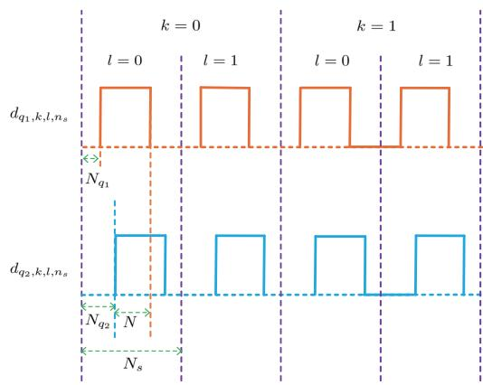  
Fig. 5. The example of signal structures for $d _ { q _ { 1 } , k , l , n _ { s } } \mathrm { a n d } d _ { q _ { 2 } , k , l , n _ { s } } ,$ , where K = 2, L = 2, q1 = arg min $N _ { q } ,$ and q2 = arg max $N _ { q } .$ q∈Q q∈Q

$$
\begin{array} { r l r } { \mathcal { Y } _ { q , k , l , n _ { s } } \qquad = \qquad \mathcal { Y } _ { q } ( t ) | _ { t = k T _ { r } + l T _ { b } + n _ { s } T _ { s } } , } & { \quad d _ { q } ( t ) } & { { } = } \\ { \beta _ { q } ^ { b } b _ { q } \left( t - \frac { 2 R _ { q } + 2 v _ { q } t } { c } - \tau _ { q } ^ { s } \right) \quad + \quad \beta _ { q } ^ { u } , \quad \mathrm { a n d } \quad d _ { q , k , l , n _ { s } } } & { { } = } & { } \end{array}
$$

$d _ { q } ( t ) \rvert _ { t = k T _ { r } + l T _ { b } + n _ { s } T _ { s } } ^ { }$ . Subsequently, the specific expression of the discrete beat signal $y _ { k , l , n _ { s } }$ is given by

$$
y _ { k , l , n _ { s } } = \sum _ { q = 1 } ^ { Q } y _ { q , k , l , n _ { s } } d _ { q , k , l , n _ { s } } .\tag{10}
$$

Obviously, only when $\begin{array} { r } { t = ( k T _ { r } + l T _ { b } + n _ { s } T _ { s } ) \in \left\lceil \frac { 2 R _ { q } } { c } , K T _ { r } \right\rceil } \end{array}$ $y _ { q , k , l , n _ { s } }$ is nonzero. According to (9), we consider $t = ( k T _ { r } \dot { + }$ $\begin{array} { r } { l \dot { T } _ { b } { + } n _ { s } T _ { s } ) \in \left[ \frac { 2 R _ { q } } { c } { + } k T _ { r } , ( k { + } 1 ) T _ { r } \right) } \end{array}$ with $k = 0 , 1 , . . . , K { - } 1$ and obtain

$$
\begin{array} { r l } & { \mathcal { Y } _ { q , k , l , n _ { s } } } \\ & { \ = e ^ { - j 4 \pi f _ { s } \frac { R _ { q } } { c } } e ^ { - j 4 \pi \left( \frac { B _ { s } R _ { q } } { c T _ { r } } + \frac { f _ { s } v _ { q } } { c } \right) \left( l T _ { b } + n _ { s } T _ { s } \right) } e ^ { - j 4 \pi \frac { f _ { s } v _ { q } } { c } k T _ { r } } } \end{array}\tag{11}
$$

Based on (9), we consider $t \ = \ ( k T _ { r } \ + \ l T _ { b } \ + \ n _ { s } T _ { s } ) \in$ $\left[ k T _ { r } , k T _ { r } + \frac { 2 R _ { q } } { c } \right)$ with $k = 1 , 2 , . . . , K - 1$ , and acquire

$$
\begin{array} { r l } & { = e ^ { j 2 \pi f _ { c } T _ { r } } e ^ { - j 2 \pi B _ { s } T _ { r } } e ^ { j 2 \pi B _ { s } \left( l T _ { b } + n _ { s } T _ { s } \right) } } \\ & { \quad \times \ e ^ { - j 4 \pi f _ { s } \frac { R _ { q } } { c } } e ^ { - j 4 \pi \left( \frac { B _ { s } R _ { q } } { c T _ { r } } + \frac { f _ { s } v _ { q } } { c } \right) \left( l T _ { b } + n _ { s } T _ { s } \right) } e ^ { - j 4 \pi \frac { f _ { s } v _ { q } } { c } k T _ { r } } } \end{array}\tag{12}
$$

## III. LOW-RANK MATRIX MODEL

In this section, by leveraging the zero-padded BD symbol pattern and the truncation operation, we effectively eliminate the ISI and reformulate the discrete beat signal model (10) into a low-rank matrix model.

In (10), we first analyze the structure property of $d _ { q , k , l , n _ { s } }$ , and utilize the zero-padded BD symbol pattern to eliminate the ISI. Specifically, given that $v _ { q } T \ \ll \ 1 \ < \ R _ { q } ,$ we ignore the effect of the item $\frac { 2 v _ { q } t } { c }$ in $\begin{array} { r l r } { d _ { q } ( t ) } & { { } = } & { \beta _ { q } ^ { b } b _ { q } \left( t - \frac { 2 R _ { q } } { c } - \frac { 2 v _ { q } t } { c } - \tau _ { q } ^ { s } \right) + \beta _ { q } ^ { u } } \end{array}$ . Then, we define the discrete delay index $N _ { q }$ as $\begin{array} { r l r } { \stackrel { } { \cal N } _ { q } } & { { } = } & { \left\lceil \frac { \frac { 2 R _ { q } } { c } + \tau _ { q } ^ { s } } { T _ { s } } \right\rceil } \end{array}$ Subsequently, we can obtain

$$
d _ { q , k , l , n _ { s } } = \left\{ \begin{array} { l l } { \beta _ { q } ^ { b } \omega _ { q , k , l } + \beta _ { q } ^ { u } , N _ { q } \leq n _ { s } < N _ { s } - N _ { g } + N _ { q } , } \\ { \beta _ { q } ^ { u } , n _ { s } < N _ { q } \mathrm { ~ o r ~ } n _ { s } \geq N _ { s } - N _ { g } + N _ { q } , } \end{array} \right.\tag{13}
$$

where $\begin{array} { r } { N _ { g } ~ = ~ \left. ~ \frac { T _ { b } - T _ { e } } { T _ { s } } \right. } \end{array}$ denotes the length of the equivalent symbol ‘0’ in (4). Let $N _ { q _ { 1 } } = \operatorname* { m i n } _ { q \in \mathbb { Q } } N _ { q }$ and $N _ { q _ { 2 } } = \operatorname* { m a x } _ { q \in \mathbb { Q } } N _ { q }$ denote the minimum and maximum discrete delay indices. As illustrated in Fig. 5, $N _ { g }$ needs to satisfy $N _ { g } \mathrm { ~  ~ { ~ \geq ~ } ~ } N _ { q _ { 2 } }$ to eliminate the ISI.

Next, we reformulate the discrete beat signal model $y _ { k , l , n _ { s } }$ in (10) into a low-rank matrix model through truncation and rearrangement operations. In particular, as depicted in Fig. $5 ,$ we apply the truncation operation to each BD symbol. Within each BD symbol period, we extract a segment of length N starting from the index $n _ { s } = N _ { q _ { 2 } }$ , where the truncated length $N$ is determined by $N = N _ { s } + N _ { q _ { 1 } } - N _ { g } - N _ { q _ { 2 } }$ . Further, let $z _ { k , l , n }$ denote the n-th obtained sample by the truncation operation in the l-th BD symbol period during the k-th FMCW period with $n = 0 , 1 , . . . , N - 1$ . Then, we have

$$
\begin{array} { r l } { \Xi _ { k , l , n } = \mathcal { Y } _ { k , l , n } + \mathcal { N } _ { q , 2 } } \\ { \ } & { = \displaystyle { \sum _ { q = 1 } ^ { Q } e ^ { - j 4 \pi \int _ { a } ^ { \mathcal { R } _ { q } } } e ^ { - j 4 \pi \left( \frac { \mathcal { R } _ { q } \mathcal { R } _ { q } } { c T } + \frac { j \omega \mathcal { Y } _ { q } } { c } \right) N _ { q } T _ { s } } } } \\ { \displaystyle } & { \phantom { = } \mathrm { ~ \ } \times e ^ { - j 4 \pi \left( \frac { \mathcal { R } _ { q } \mathcal { R } _ { q } } { c T } + \frac { j \omega \mathcal { Y } _ { q } } { c } \right) n T _ { s } } e ^ { - j 4 \pi \left( \frac { \mathcal { R } _ { s } \mathcal { R } _ { q } } { c T } + \frac { j \omega \mathcal { Y } _ { q } } { c } \right) T _ { s } } } \\ { \displaystyle } & { \phantom { = } \mathrm { ~ \ } \times e ^ { - j 4 \pi \frac { j \omega \mathcal { Y } _ { q } } { c } k T _ { r } } \left( \beta _ { q } ^ { b } \omega _ { q , k l } + \beta _ { q } ^ { n } \right) } \\ { \displaystyle } &  = \displaystyle { \sum _ { q = 1 } ^ { Q } h _ { q } e ^ { - j 4 \pi \left( \frac { \mathcal { R } _ { s } \mathcal { R } _ { q } } { c T } + \frac { j \omega \mathcal { Y } _ { q } } { c } \right) n T _ { s } } e ^ { - j 4 \pi \left( \frac { \mathcal { R } _ { s } \mathcal { R } _ { q } } { c T _ { r } } + \frac { j \omega \mathcal { Y } _ { q } } { c } \right) T _ { b } } } \\ { \displaystyle } & { \phantom { = } \mathrm { ~ \ } \times e ^ { - j 4 \pi \frac { j \omega \mathcal { Y } _ { q } } { c } k T _ { r } } \left( \omega _ { q , k l } + \beta _ { q } ^ { r } \right) , } \end{array}
$$

where $\begin{array} { r } { h _ { q } = \beta _ { q } ^ { b } e ^ { - j 4 \pi f _ { s } \frac { R _ { q } } { c } } e ^ { - j 4 \pi \left( \frac { B _ { s } R _ { q } } { c T _ { r } } + \frac { f _ { s } v _ { q } } { c } \right) N _ { q _ { 2 } } T _ { s } } } \end{array}$ and $\beta _ { q } ^ { r } =$ $\frac { \beta _ { q } ^ { u } } { \beta _ { q } ^ { b } }$ . Subsequently, the truncated $K L N$ samples are rearranged into the matrix $\mathbf { Z } \in \mathbb { C } ^ { N \times K L }$ , which is expressed as

$$
\mathbf { Z } = \left[ \begin{array} { c c c c } { z _ { 0 , 0 , 0 } } & { z _ { 0 , 1 , 0 } } & { \cdots } & { z _ { K - 1 , L - 1 , 0 } } \\ { \vdots } & { \vdots } & { \vdots } & { \vdots } \\ { z _ { 0 , 0 , N - 1 } } & { z _ { 0 , 1 , N - 1 } } & { \cdots } & { z _ { K - 1 , L - 1 , N - 1 } } \end{array} \right] .\tag{15}
$$

Based on (14) and (15), we define the vector $\mathbf { a } _ { q } \in$ $\mathbb { C } ^ { N \times 1 }$ , the n-th element of which is $e ^ { - j 4 \pi \left( \frac { B _ { s } R _ { q } } { c T _ { r } } + \frac { f _ { s } v _ { q } } { c } \right) n T _ { s } }$ with $\begin{array} { r l r } { n } & { { } = } & { 0 , 1 , . . . , N \mathrm { ~ - ~ } 1 } \end{array}$ , and define the vector $\begin{array} { r l r } { { \bf x } _ { q } } & { { } \in } & { \mathbb { C } ^ { K L \times 1 } , } \end{array}$ , the $( k L + l )$ -th element of which is $\begin{array} { r l } & { \dot { h _ { q } } e ^ { - j 4 \pi \left( \frac { f _ { s } v _ { q } } { c } + \frac { B _ { s } R _ { q } } { c T _ { r } } \right) l T _ { b } } e ^ { - j 4 \pi \frac { f _ { s } v _ { q } } { c } k T _ { r } } ( \omega _ { q , k , l } + \beta _ { q } ^ { r } ) } \end{array}$ with $k =$ $0 , 1 , . . . , K - 1$ and $l = 0 , 1 , . . . , L - 1$ . Then, Z in (15) can be rewritten as

$$
\mathbf { Z } = \sum _ { q = 1 } ^ { Q } \mathbf { a } _ { q } \mathbf { x } _ { q } ^ { \mathrm { T } } + \mathbf { W } = \mathbf { A } \mathbf { X } ^ { \mathrm { T } } + \mathbf { W } ,\tag{16}
$$

where $\mathbf { A } ~ = ~ [ \mathbf { a } _ { 1 } , . . . , \mathbf { a } _ { Q } ] ~ \in ~ \mathbb { C } ^ { N \times Q } , ~ \mathbf { X } ~ = ~ [ \mathbf { x } _ { 1 } , . . . , \mathbf { x } _ { Q } ] ~ \in$ $\mathbb { C } ^ { K L \times Q }$ , and W is the circularly symmetric complex Gaussian (CSCG) noise matrix. In this paper, we consider that the system parameters $\{ K , L , N \}$ satisfy $Q \ < \ \operatorname * { m i n } ( N , K L )$ Therefore, (16) can be regarded as a low-rank matrix model.

## IV. THE SVD-BASED TWO-STAGE ALGORITHM FOR THESINGLE UAV-BD SCENARIO

In this section, based on the low-rank matrix model (16), we present our SVD-based two-stage algorithm for joint

parameter estimation and BD symbol detection in the single UAV-BD scenario. Then, we perform a computational complexity analysis of the SVD-based two-stage algorithm.

In (16), when $Q = 1$ , the subscript q can be omitted and Z can be rewritten as

$$
\mathbf { Z } = \mathbf { a x } ^ { \mathrm { T } } + \mathbf { W } .\tag{17}
$$

We first obtain the estimate aˆ of a and the estimate xˆ of x by solving the following problem

$$
\underset { \mathbf { a } , \mathbf { x } } { \arg \operatorname* { m i n } } \left\| \mathbf { Z } - \mathbf { a x } ^ { \mathrm { T } } \right\| _ { F } ^ { 2 } .\tag{18}
$$

The minimization problem (18) can be addressed by SVD. Specifically, we compute the truncated SVD of Z and get $\{ \bar { \lambda } _ { 1 } , \mathbf { v } _ { 1 } \in \mathbb { C } ^ { N \times 1 } , \mathbf { f } _ { 1 } \in \mathbb { C } ^ { K L \times 1 } \}$ , where $\lambda _ { 1 } , \ \mathbf { v } _ { 1 } .$ , and $\mathbf { f } _ { 1 }$ are the maximum singular value, the corresponding left singular vector, and the corresponding right singular vector, respectively. Accordingly, aˆ and xˆ are expressed as $\lambda _ { 1 } \mathbf { v } _ { 1 }$ and $\mathbf { f } _ { 1 } ^ { * } .$ respectively.

## A. The First Stage

To facilitate the derivation, we first define a parameterized vector $\mathbf { g } ( \rho , F _ { \rho } ) \mathbf { \Omega } \in \mathbb { C } ^ { F _ { \rho } \times 1 }$ with the parameter $F _ { \rho }$ denoting the vector length, the $f _ { \rho }$ -th element of which is expressed as $e ^ { - j 4 \pi \rho f _ { \rho } }$ with $f _ { \rho } = 0 , 1 , . . . , F _ { \rho } - 1$ . Then, we define a parameterized diagonal matrix $\mathbf { G } ( \widetilde { \rho } , F _ { \rho } ) \in \mathbb { C } ^ { F _ { \rho } \times F _ { \rho } }$ with the parameter $F _ { \rho }$ denoting the number of rows or columns, the $f _ { \rho ^ { - } } \mathrm { t h }$ diagonal element of which is given by $e ^ { - j 4 \pi \rho f _ { \rho } }$ with $f _ { \rho } = 0 , 1 , . . . , F _ { \rho } - 1$ . Besides, for the sake of simplicitPy in derivation, we temporarily ignore the noise item.

1) Estimating $\begin{array} { r } { \left( \frac { R { { B } _ { s } } } { c { { T } _ { r } } } + \frac { { { f } _ { s } } v } { c } \right) } \end{array}$ From aˆ: By defining $\psi ~ =$ $\begin{array} { r } { \frac { R B _ { s } } { c T _ { r } } + \frac { f _ { s } v } { c } } \end{array}$ , we have

$$
\mathbf { a } = \mathbf { g } ( \psi T _ { s } , N ) , \hat { \mathbf { a } } = \zeta \mathbf { g } ( \psi T _ { s } , N ) ,\tag{19}
$$

where $\zeta$ denotes the scale ambiguity introduced by the truncated SVD. Subsequently, the estimation problem of ψ can be formulated as

$$
\boldsymbol { \hat { \psi } } = \arg \operatorname* { m i n } _ { \boldsymbol { \psi } } | \hat { \mathbf { a } } - \zeta \mathbf { g } ( \psi T _ { s } , N ) | .\tag{20}
$$

Then, for (20), a correlation-based approach can be employed, which is expressed as

$$
\hat { \psi } = \arg \operatorname* { m a x } _ { \psi } | \hat { \mathbf { a } } ^ { \mathrm { H } } \mathbf { g } ( \psi T _ { s } , N ) | .\tag{21}
$$

The maximization problem (21) can be solved by a onedimensional (1D) search. $N _ { \psi }$ denotes the number of steps in the 1D search in (21), which is typically set to a very large value to achieve high search resolution and thus obtain an accurate estimate of ψ. Besides, under these common parameters $B _ { s } = 0 . 5 ~ \mathrm { G H z } , ~ T _ { r } = 1 0 0 ~ \mu \mathrm { s } , ~ f _ { c } = 2 4 ~ \mathrm { G H z } ,$ $R \in [ 2 5 , ~ 2 2 5 ]$ m, and $v \in [ - 2 5 , \ 2 5 ]$ m/s, the corresponding ψ lies within $[ 4 . 1 6 7 \times 1 0 ^ { 5 } , 3 . 7 5 2 \times 1 0 ^ { 6 } ]$ Hz. Such a wide search interval can lead to a dramatic increase in computational complexity. Therefore, we present a low-complexity estimation method by leveraging the rotational-invariant property of $\hat { \mathbf { a } } ,$ which is given by

$$
\boldsymbol { \hat { \psi } } = - \frac { \angle \left( ( \hat { \mathbf { a } } ( 1 : N - 1 ) ) ^ { \mathrm { H } } \hat { \mathbf { a } } ( 2 : N ) \right) } { 4 \pi T _ { s } } ,\tag{22}
$$

where $\angle$ denotes the phase angle extraction operator. Under high SNR conditions, or when moderate parameter estimation accuracy is acceptable, we can adopt the low-complexity design as a replacement to reduce the overall computational burden.

2) Estimating $\{ R , v , \Omega \}$ From xˆ: We first define the symbol matrix $\Omega \in \dot { \mathbb { C } } ^ { L \times K }$ , where the $( l , k )$ -th element of Ω is $\omega _ { k , l }$ . Then, we define $\hat { \mathbf { X } } = \mathrm { v e c } ^ { - 1 } ( \hat { \mathbf { x } } ) \in \mathbb { C } ^ { L \times K }$ . Based on the definition of x, we have

$$
\hat { { \bf X } } = g { \bf G } ( \psi T _ { b } , L ) \left( \Omega + \beta _ { r } { \bf 1 } _ { L } { \bf 1 } _ { K } ^ { \mathrm { T } } \right) { \bf G } \left( \frac { f _ { s } v } { c } T _ { r } , K \right) ,\tag{23}
$$

where $\begin{array} { r } { g = \frac { h } { \zeta } } \end{array}$ and $\begin{array} { r } { \beta _ { r } = \beta ^ { r } = \frac { \beta ^ { u } } { \beta ^ { b } } } \end{array}$ . Subsequently, we utilize the estimated ψˆ in (21) or (22) to eliminate the effect of the item $\mathbf { G } ( \psi T _ { b } , L )$ , which is expressed as

$$
\begin{array} { r l } & { \tilde { \mathbf { X } } = \mathbf { G } ( - \hat { \psi } T _ { b } , L ) \hat { \mathbf { X } } } \\ & { \quad = g \left( \pmb { \Omega } + \beta _ { r } \mathbf { 1 } _ { L } \mathbf { 1 } _ { K } ^ { \mathrm { T } } \right) \mathbf { G } \left( \frac { f _ { s } v } { c } T _ { r } , K \right) . } \end{array}\tag{24}
$$

Then, we define $\tilde { \mathbf { x } } = \mathrm { v e c } ( ( \tilde { \mathbf { X } } ) ^ { \mathrm { T } } ) \in \mathbb { C } ^ { K L \times 1 }$ , which is written as

$$
\tilde { \mathbf { x } } = g \left( \mathbf { 1 } _ { L } \otimes \mathbf { g } \left( \frac { f _ { s } v } { c } T _ { r } , K \right) \right) \odot \left( \pmb { \mu } + \beta _ { r } \mathbf { 1 } _ { K L } \right)\tag{25}
$$

with $\pmb { \mu } = \mathrm { v e c } ( \Omega ^ { \mathrm { T } } ) \in \mathbb { C } ^ { K L \times 1 }$

Next, based on (25), we propose a method for joint radial velocity estimation and BD symbol detection. To be specific, in (25), let $\mu _ { i }$ denote the i-th element of $\pmb { \mu }$ with $i = 0 , . . . , K L - 1$ . Then, we define $\{ \hat { g } ^ { [ i - 1 ] } , \hat { \beta } _ { r } ^ { [ i - 1 ] } , \hat { v } ^ { [ i - 1 ] } \}$ as the estimates of $\{ g , \beta _ { r } , v \}$ after detecting the $( i \mathrm { ~ - ~ } 1 ) { \cdot } \mathrm { t h }$ BD symbol $\mu _ { i - 1 }$ . Subsequently, we can obtain $\tilde { \mathbf { x } } _ { b } ^ { [ i ] } \in \mathbb { C } ^ { K L \times 1 }$ which is expressed as

$$
\tilde { \mathbf { x } } _ { b } ^ { [ i ] } = \tilde { \mathbf { x } } \oslash \left( \mathbf { 1 } _ { L } \otimes \mathbf { g } \left( \frac { f _ { s } \hat { v } ^ { [ i - 1 ] } } { c } T _ { r } , K \right) \right) = g ( \pmb { \mu } + \beta _ { r } \mathbf { 1 } _ { K L } ) .\tag{26}
$$

Then, the detection of the i-th BD symbol $\mu _ { i }$ can be formulated as

$$
\hat { \mu } _ { i } = \underset { \mu \in \mathcal { B } } { \arg \operatorname* { m i n } } \left| \mu - \tilde { \mathbf { x } } _ { b } ^ { [ i ] } ( i + 1 ) / \hat { g } ^ { [ i - 1 ] } - \hat { \beta } _ { r } ^ { [ i - 1 ] } \right| .\tag{27}
$$

where B is the finite set of all signal constellation points. When the BD adopts the BPSK modulation scheme, we have $B = \{ - 1 , 1 \}$ . After detecting the i-th BD symbol $\mu _ { i } ,$ we update the estimation of $\{ g , \beta _ { r } , v \}$ and obtain the new estimates $\{ \hat { g } ^ { [ i ] } , \hat { \beta } _ { r } ^ { [ i ] } , \hat { v } ^ { [ i ] } \}$ . In particular, we define the vector $\tilde { \mathbf { x } } _ { c } ^ { [ i ] } ~ = ~ \tilde { \mathbf { x } } _ { b } ^ { [ i ] } ( 1 ~ : ~ i ~ + ~ \mathrm { \bar { 1 } } ) ~ \in ~ \mathbb { C } ^ { ( i + 1 ) \times 1 }$ , the vector $\begin{array} { r l } { \mu ^ { [ i ] } } & { { } = } \end{array}$ $[ \mu _ { 0 } , . . . , \mu _ { i } ] ^ { \mathrm { T } } \in \mathbb { C } ^ { ( i + 1 ) \times 1 }$ , the matrix $\mathbf { H } ^ { [ i ] } = [ \mathbf { 1 } _ { i + 1 } , \mu ^ { [ i ] } ] \in$ $\bar { \mathbb { C } } ^ { ( i + 1 ) \times 2 }$ , and the vector $\mathbf { e } = [ g \beta _ { r } , g ] ^ { \mathrm { T } } \in \mathbb { C } ^ { 2 \times 1 }$ . Based on the composition of $\tilde { \mathbf { x } } _ { b } ^ { [ i ] }$ in (26), we have

$$
\tilde { \mathbf { x } } _ { c } ^ { [ i ] } = \mathbf { H } ^ { [ i ] } \mathbf { e } .\tag{28}
$$

Then, we define the vector $\pmb { \hat { \mu } } ^ { [ i ] } = [ \hat { \mu } _ { 0 } , . . . , \hat { \mu } _ { i } ] ^ { \mathrm { T } } \in \mathbb { C } ^ { ( i + 1 ) \times 1 }$ the matrix $\hat { \mathbf { H } } ^ { [ i ] } = [ \mathbf { 1 } _ { i + 1 } , \hat { \pmb { \mu } } ^ { [ i ] } ] \in \mathbb { \ } \tilde { \mathbb { C } } ^ { ( i + 1 ) \times 2 } ,$ and the vector $\hat { \mathbf { e } } ^ { [ i ] } = [ \hat { g } ^ { [ i ] } \hat { \beta } _ { r } ^ { [ i ] } , \hat { g } ^ { [ i ] } ] ^ { \mathrm { T } } \in \mathbb { C } ^ { 2 \times 1 }$ . Based on (28), we have

$$
\hat { \mathbf { e } } ^ { [ i ] } = \left( \hat { \mathbf { H } } ^ { [ i ] } \right) ^ { \dagger } \tilde { \mathbf { x } } _ { c } ^ { [ i ] } ,\tag{29}
$$

and further get $\begin{array} { r } { \left\{ \hat { g } ^ { [ i ] } = \hat { \mathbf { e } } ^ { [ i ] } ( 2 ) , \hat { \beta } _ { r } ^ { [ i ] } = \frac { \hat { \mathbf { e } } ^ { [ i ] } ( 1 ) } { \hat { \mathbf { e } } ^ { [ i ] } ( 2 ) } \right\} } \end{array}$ . Next, according to (25), we define $\tilde { \mathbf { x } } _ { v } ^ { [ i ] } \in \mathbb { C } ^ { ( i + 1 ) \times 1 }$ , which is given by

$$
\tilde { \mathbf { x } } _ { v } ^ { [ i ] } = \tilde { \mathbf { x } } ( 1 : i + 1 ) \oslash ( \hat { \pmb { \mu } } ^ { [ i ] } + \hat { \beta } _ { r } ^ { [ i ] } \mathbf { 1 } _ { i + 1 } ) .\tag{30}
$$

Subsequently, we define $\begin{array} { r l r } { i } & { { } = } & { k ^ { \prime } + l ^ { \prime } K . } \end{array}$ , where $k ^ { \prime } \in$ $\{ 0 , 1 , . . . , K \mathrm { ~ - ~ } 1 \}$ and $l ^ { \prime } ~ \in ~ \{ 0 , 1 , . . . , L - 1 \}$ . Then, by leveraging the rotational-invariant property of $\begin{array} { r } { \mathbf { g } \left( \frac { f _ { s } v } { c } T _ { r } , K \right) } \end{array}$ in (25), the estimate $\hat { v } ^ { [ i ] }$ can be formulated as (31), shown at the bottom of the page.

In addition, as depicted in Fig. 3, there are three known pilot symbols $\{ \mu _ { 0 } ( \omega _ { 0 , 0 } ) , \mu _ { 1 } ( \omega _ { 1 , 0 } ) , \mu _ { 2 } ( \omega _ { 2 , 0 } ) \}$ in the BD symbol matrix, which are employed to obtain the initial estimates $\{ \hat { g } ^ { [ 2 ] } , \hat { \beta } _ { r } ^ { [ 2 ] } , \hat { v } ^ { [ 2 ] } \}$ of $\{ g , \beta _ { r } , v \}$ . Specifically, $\hat { v } ^ { [ 2 ] }$ is given by $\begin{array} { r } { \widetilde { \dot { v } } ^ { [ 2 ] } = - \frac { c } { 4 \pi T _ { r } f _ { s } } \times \angle ( ( \widetilde { \mathbf { x } } ( 1 ) ) ^ { * } \widetilde { \mathbf { x } } ( 2 ) ) } \end{array}$ ). Then, similar to (26), we define $\begin{array} { r } { \tilde { \mathbf { x } } _ { b } ^ { [ 2 ] } = \tilde { \mathbf { x } } \oslash \left( \mathbf { 1 } _ { L } \otimes \mathbf { g } \left( \frac { f _ { s } \hat { v } ^ { [ 2 ] } } { c } T _ { r } , K \right) \right) \in \mathbb { C } ^ { K L \times 1 } } \end{array}$ and $\tilde { \mathbf { x } } _ { c } ^ { [ 2 ] } = \tilde { \mathbf { x } } _ { b } ^ { [ 2 ] } ( 1 : 3 ) \in \overset { \cdot } { \mathbb { C } } ^ { 3 \times 1 }$ . Subsequently, according to (28) and (29), we can get $\hat { \mathbf { e } } ^ { [ 2 ] } = ( \mathbf { H } ^ { [ 2 ] } ) ^ { \dagger } \tilde { \mathbf { x } } _ { 2 } ^ { [ 2 ] } , \hat { g } ^ { [ 2 ] } = \hat { \mathbf { e } } ^ { [ 2 ] } ( 2 )$ , and $\begin{array} { r } { \hat { \beta } _ { r } ^ { [ 2 ] } = \frac { \hat { \bf e } ^ { [ 2 ] } ( 1 ) } { \hat { \bf e } ^ { [ 2 ] } ( 2 ) } } \end{array}$

Besides, after detecting all the BD symbols, we can obtain the estimate Ωˆ of Ω, which can be written as

$$
\hat { \Omega } ( l + 1 , k + 1 ) = \hat { \mu } _ { k + K l } , \hat { \omega } = \mathrm { v e c } ( \hat { \Omega } ) ,\tag{32}
$$

with $k = 0 , 1 , . . . , K - 1$ and $l = 0 , 1 , . . . , L - 1$ . By combing the estimated $\hat { \psi }$ in (21) or (22) and $\hat { v } ^ { [ K L - 1 ] }$ , the range estimate Rˆ and the radial velocity estimate vˆ can be expressed as

$$
\begin{array} { r } { \{ \hat { R } = ( \hat { \psi } - \frac { f _ { s } \hat { v } ^ { [ K L - 1 ] } } { c } ) \times \frac { c T _ { r } } { B _ { s } } , } \\ { \hat { v } = \hat { v } ^ { [ K L - 1 ] } . } \end{array}\tag{33}
$$

So far, we have obtained the range and radial velocity estimates $\{ \hat { R } , \hat { v } \}$ in (33) and the BD symbol matrix estimate Ωˆ in (32).

## B. The Second Stage

Notably, from (14)-(16), we only utilize the structure property of the sequence $\left\{ e ^ { - j 4 \pi \left( { \frac { B _ { s } R } { c T _ { r } } } + { \frac { f _ { s } v } { c } } \right) n T _ { s } } \right\} _ { n = 0 } ^ { N - 1 }$ to estimate the range R and ignore the structure property of the sequence $\left\{ e ^ { - j 4 \pi \left( \frac { B _ { s } R } { c T _ { r } } + \frac { f _ { s } v } { c } \right) l T _ { b } } \right\} _ { l = 0 } ^ { L - 1 }$ . Similarly, when estimating the radial velocity v, we do not utilize the structure property of the sequence $\left\{ e ^ { - j 4 \pi \left( \frac { B _ { s } R } { c T _ { r } } + \frac { f _ { s } v } { c } \right) l T _ { b } } \right\} _ { l = 0 } ^ { L - 1 }$ . Thus, after obtaining the BD symbol matrix estimate Ωˆ in (32), we can eliminate the effect of BD symbols, and further refine range estimation and radial velocity estimation.

To be specific, in (16), we define $\mathbf { z } = \mathrm { v e c } ( \mathbf { Z } ) \in \mathbb { C } ^ { K L N \times 1 }$ which is given by

$$
\begin{array} { c } { { { \bf z } = h \left( { \bf 1 } _ { K } \otimes { \bf g } \left( \frac { B _ { s } R } { c T _ { r } } T _ { b } , L \right) \otimes { \bf g } \left( \frac { B _ { s } R } { c T _ { r } } T _ { s } , N \right) \right) } } \\ { { \mathrm { } ~ \displaystyle \odot \left( { \bf g } \left( \frac { f _ { s } v } { c } T _ { b } , K L \right) \otimes { \bf g } \left( \frac { f _ { s } v } { c } T _ { s } , N \right) \right) } } \\ { { \mathrm { } ~ \displaystyle \odot \left( \left( \omega + \beta _ { r } { \bf 1 } _ { K L } \right) \otimes { \bf 1 } _ { N } \right) , } } \end{array}\tag{34}
$$

with $\pmb { \omega } = \mathrm { v e c } ( \pmb { \Omega } ) \in \mathbb { C } ^ { K L \times 1 }$ . Next, we first refine the range estimate. Based on (34), we eliminate the effects of two items $\begin{array} { r } { \left\{ \mathbf { g } \left( \frac { f _ { s } v } { c } T _ { b } , K L \right) \otimes \mathbf { g } \left( \frac { f _ { s } v } { c } T _ { s } , N \right) , ( \omega + \beta _ { r } \mathbf { 1 } _ { K L } ) \otimes \mathbf { 1 } _ { N } \right\} } \end{array}$ by the estimated $\{ \hat { v } , \hat { \omega } , \hat { \beta } _ { r } \}$ , and obtain $\mathbf { z } ^ { R } \in \mathbb { C } ^ { K L N \times 1 }$ , which is expressed as

$$
\begin{array} { r l } & { \mathbf { z } ^ { R } = \mathbf { z } \oslash \left( \mathbf { g } \left( \frac { f _ { s } \hat { v } } { c } T _ { b } , K L \right) \otimes \mathbf { g } \left( \frac { f _ { s } \hat { v } } { c } T _ { s } , N \right) \right) } \\ & { \qquad \oslash \left( \left( \hat { \omega } + \hat { \beta } _ { r } \mathbf { 1 } _ { K L } \right) \otimes \mathbf { 1 } _ { N } \right) } \\ & { \qquad = h \left( \mathbf { 1 } _ { K } \otimes \mathbf { g } \left( \frac { B _ { s } R } { c T _ { r } } T _ { b } , L \right) \otimes \mathbf { g } \left( \frac { B _ { s } R } { c T _ { r } } T _ { s } , N \right) \right) } \end{array}\tag{35}
$$

Then, we define $\bar { \mathbf { z } } ^ { R } \in \mathbb { C } ^ { L N \times 1 }$ as

$$
\begin{array} { r l r } {  { \bar { \mathbf { z } } ^ { R } = \sum _ { k = 0 } ^ { K - 1 } \mathbf { z } ^ { R } ( 1 + k L N : ( k + 1 ) L N ) } } \\ & { } & { = K h \mathbf { g } ( \frac { B _ { s } R } { c T _ { r } } T _ { b } , L ) \otimes \mathbf { g } ( \frac { B _ { s } R } { c T _ { r } } T _ { s } , N ) . } \end{array}\tag{36}
$$

Subsequently, the refined estimation for the range R can be formulated as

$$
{ \hat { R } } ^ { r } = \underset { R } { \arg \operatorname* { m i n } } \left| { \bar { \mathbf { z } } } ^ { R } - K h \mathbf { g } \left( \frac { B _ { s } R } { c T _ { r } } T _ { b } , L \right) \otimes \mathbf { g } \left( \frac { B _ { s } R } { c T _ { r } } T _ { s } , N \right) \right| .\tag{37}
$$

Similar to the solution of (20), the minimization problem (37) can be addressed using a correlation-based approach, which is given by

$$
= \underset { R } { \arg \operatorname* { m a x } } \left| \left( \bar { \mathbf { z } } ^ { R } \right) ^ { \mathrm { H } } \left( \mathbf { g } \left( \frac { B _ { s } R } { c T _ { r } } T _ { b } , L \right) \otimes \mathbf { g } \left( \frac { B _ { s } R } { c T _ { r } } T _ { s } , N \right) \right) \right| .\tag{38}
$$

The maximization problem (38) can be solved via a 1D search over a narrow interval $\begin{array} { r } { \left\lceil \hat { R } - \frac { \Delta R } { 2 } , \hat { R } + \frac { \Delta R } { 2 } \right\rceil } \end{array}$ , where $\Delta R$ denotes the search interval length. $N _ { R }$ denotes the number of steps in the 1D search in (38), where the localized search requires only a small number of steps, resulting in low computational complexity.

Next, we refine the radial velocity estimate. Based on (34), we first eliminate the effects of two items

$$
\begin{array} { r l } & { \bar { v } ^ { [ i ] } = - \frac { c } { 4 \pi T _ { r } f _ { s } } } \\ & { \times \angle \left( \displaystyle \sum _ { l _ { 1 } = 0 } ^ { l ^ { \prime } } \left( \tilde { \mathbf { x } } _ { v } ^ { [ i ] } \left( 1 + l _ { 1 } K : ( l _ { 1 } + 1 ) K - 1 \right) \right) ^ { \mathbb { H } } \tilde { \mathbf { x } } _ { v } ^ { [ i ] } ( 2 + l _ { 1 } K : ( l _ { 1 } + 1 ) K ) + \displaystyle \sum _ { k _ { 1 } = 0 } ^ { k ^ { \prime } - 1 } \left( \tilde { \mathbf { x } } _ { v } ^ { [ i ] } ( l ^ { \prime } K + k _ { 1 } + 1 ) \right) ^ { \ast } \tilde { \mathbf { x } } _ { v } ^ { [ i ] } ( l ^ { \prime } K + k _ { 1 } + 2 ) \right) } \end{array}\tag{31}
$$

$\begin{array} { r } { \left\{ \mathbf { 1 } _ { K } \otimes \mathbf { g } \left( \frac { B _ { s } R } { c T _ { r } } T _ { b } , L \right) \otimes \mathbf { g } \left( \frac { B _ { s } R } { c T _ { r } } T _ { s } , N \right) , ( \omega + \beta _ { r } \mathbf { 1 } _ { K L } ) \otimes \mathbf { 1 } _ { N } \right\} } \end{array}$ by the estimated $\{ \hat { R } ^ { r } , \hat { \omega } , \hat { \beta } _ { r } \}$ , and obtain $\mathbf { z } ^ { v } \in \mathbb { C } ^ { K L N \times 1 }$ which is given by

$$
\begin{array} { l } { { \displaystyle { \bf z } ^ { v } = { \bf z } \odot \left( { \bf 1 } _ { K } \otimes { \bf g } \left( \frac { B _ { s } \hat { R } ^ { r } } { c T _ { r } } T _ { b } , L \right) \otimes { \bf g } \left( \frac { B _ { s } \hat { R } ^ { r } } { c T _ { r } } T _ { s } , N \right) \right) } } \\ { { \displaystyle ~ \ O \left( \left( \hat { \omega } + \hat { \beta } _ { r } { \bf 1 } _ { K L } \right) \otimes { \bf 1 } _ { N } \right) } } \\ { { \displaystyle ~ = h { \bf g } \left( \frac { f _ { s } v } { c } T _ { b } , K L \right) \otimes { \bf g } \left( \frac { f _ { s } v } { c } T _ { s } , N \right) . \qquad ( 3 \hat { \bf z } } } \end{array}\tag{9}
$$

Thus, the refined estimation for the radial velocity v can be formulated as

$$
\hat { v } ^ { r } = \underset { v } { \arg \operatorname* { m i n } } \left| \mathbf z ^ { v } - h \mathbf g \left( \frac { f _ { s } v } { c } T _ { b } , K L \right) \otimes \mathbf g \left( \frac { f _ { s } v } { c } T _ { s } , N \right) \right|\tag{40}
$$

Similarly, the minimization problem can be solved by leveraging a correlation-based method, which is expressed as

$$
\underset { \boldsymbol { v } } { \arg \operatorname* { m a x } } \left| \left( \mathbf { z } ^ { \boldsymbol { v } } \right) ^ { \mathrm { H } } \left( \mathbf { g } \left( \frac { f _ { s } \boldsymbol { v } } { c } T _ { b } , K L \right) \otimes \mathbf { g } \left( \frac { f _ { s } \boldsymbol { v } } { c } T _ { s } , N \right) \right) \right| .\tag{41}
$$

The maximization problem (41) can be solved via a 1D search over a narrow interval $\begin{array} { r } { \left[ \hat { v } - \frac { \Delta v } { 2 } , \hat { v } + \frac { \Delta v } { 2 } \right] } \end{array}$ , where $\Delta v$ denotes the search interval length. $N _ { v }$ denotes the number of steps in the 1D search in (41), where the localized search requires only a small number of steps, resulting in low computational complexity.

## C. The Computational Complexity

The proposed SVD-based two-stage algorithm consists of eight main steps: the truncated SVD of Z, the estimation of $\psi ,$ the calculation of $\tilde { \mathbf { X } } .$ , the joint radial velocity estimation and BD symbol detection, the calculation of $\bar { \mathbf { z } } ^ { R } \dot { , }$ the refined estimation of the range $R ,$ the calculation of $\mathbf { z } ^ { v }$ , and the refined estimation of the radial velocity v. The truncated SVD of Z has a computational complexity of $\mathcal { O } ( K L N )$ , while the estimation of $\psi$ has a computational complexity of $\mathcal { O } ( N N _ { \psi } )$ The calculation of $\tilde { \mathbf { X } }$ requires a computational complexity of $\mathcal { O } ( K L )$ , whereas the joint radial velocity estimation and BD symbol detection entails a computational complexity of $\mathcal { O } ( 4 K ^ { 2 } L ^ { 2 } )$ ). The calculation of $\bar { \mathbf { z } } ^ { R ^ { \top } }$ has a computational complexity of O(3KLN ), while the refined estimation of the range R has a computational complexity of $\mathcal { O } ( L N N _ { R } )$ The computation of $\mathbf { z } ^ { v }$ requires a computational complexity of O(3KLN ), whereas the refined estimation of the radial velocity v entails a computational complexity of $\mathcal { O } ( K L N N _ { v } )$ Therefore, the overall computational complexity of the SVDbased two-stage algorithm for the single UAV-BD scenario can be expressed as $\mathcal { O } ( 7 K L N + N N _ { \psi } + 4 K ^ { 2 } L ^ { 2 } + L N N _ { R } +$ $K L N N _ { v } + K L )$ . Since $7 K L N \ll K L N N _ { v } , L N N _ { R } \ll$ $K L N N _ { v }$ , and $\dot { K } L \ \ll \ 4 K ^ { 2 } L ^ { 2 }$ , it can be approximated as $\mathcal { O } ( N N _ { \psi } + 4 K ^ { 2 } L ^ { 2 } + K L N N _ { v } )$ . The proposed low-complexity algorithm refers to employing (22) in place of the 1D search, and terminating the algorithm after obtaining (33) without performing the second-stage refinement. Therefore, the overall computational complexity of the low-complexity design is $\mathcal { O } ( K L N + 4 K ^ { 2 } L ^ { 2 } )$ . Under high SNR conditions, or when a moderate level of estimation accuracy is acceptable, this lowcomplexity design can be adopted as a substitute to reduce the overall computational burden.

## V. THE SVD-BASED TWO-STAGE ALGORITHM FOR THE MULTIPLE UAV-BD SCENARIO

In this section, based on the low-rank matrix model (16), we extend the SVD-based two-stage algorithm to the scenario with multiple UAV-BDs. Then, we also conduct a computational complexity analysis of the SVD-based two-stage algorithm.

## A. Estimating the Number of UAV-BDs

In the multiple UAV-BD scenario, it is essential to determine the number of UAV-BDs before performing parameter estimation and BD symbol detection. Although the GBS adopts a single-antenna RX, the low-rank matrix model (16) indicates that the reformulated signal matrix Z can be interpreted as a multi-antenna received signal model with N virtual antennas and $K L$ sampling instances. Thus, the information-theoretic criteria-based method in [39] can be utilized to estimate the number of UAV-BDs. In particular, we first compute the SVD of Z expressed as

$$
\begin{array} { r } { \mathbf Z = \mathbf U _ { z } \mathbf { \Sigma } \pmb { \Sigma } _ { z } \mathbf V _ { z } ^ { \mathrm { H } } , } \end{array}\tag{42}
$$

where $\mathbf { U } _ { z } \in \mathbb { C } ^ { N \times N } , ~ \mathbf { \sum } _ { z } \in \mathbb { C } ^ { N \times K L }$ , and $\mathbf { V } _ { z } \in \mathbb { C } ^ { K L \times K L }$ Defining $M = \operatorname* { m i n } ( N , K L )$ , we can obtain M singular values from $\Sigma _ { z }$ , which are expressed as $| \sigma _ { 1 } | \geq | \sigma _ { 2 } | \geq . . . \geq | \sigma _ { M } |$ Subsequently, by employing the minimum description length (MDL) criterion in [39], the number of UAV-BDs can be estimated as

$$
{ \hat { Q } } = \arg \operatorname* { m i n } _ { Q \in \{ 1 , 2 , \ldots , M \} } \mathrm { M D L } ( Q ) ,\tag{43}
$$

where

$$
\begin{array} { r l } & { \mathrm { M D L } ( Q ) = \mathrm { ~ - ~ } \ln \left( \frac { \prod _ { q = Q + 1 } ^ { M } | \sigma _ { q } | ^ { 2 / ( M - Q ) } } { \frac { 1 } { M - Q } \sum _ { q = Q + 1 } ^ { M } | \sigma _ { q } | ^ { 2 } } \right) ^ { ( M - Q ) K L } } \\ & { \quad \quad \quad + \frac { 1 } { 2 } Q ( 2 M - Q ) \ln ( K L ) . } \end{array}\tag{44}
$$

## B. The SVD-Based Matrix Decomposition

In (16), when $Q > 1$ , it is evident that we cannot directly perform the truncated SVD of Z to obtain the estimates of A and X. Fortunately, we observe that A is a Vandermonde matrix, which can be utilized to facilitate the low-rank matrix decomposition to acquire the estimate Aˆ of A and the estimate Xˆ of X. Subsequently, by sequentially applying the SVDbased two-stage algorithm in Section IV-A and Section IV-B to each column of $\{ \hat { \bf A } , \hat { \bf X } \}$ , we can achieve joint parameter estimation and symbol detection for the multiple UAV-BD scenario. In the following, we present how to utilize the Vandermonde structure of A to conduct the low-rank matrix decomposition.

Given that UAV-BDs are uniformly distributed within the low-altitude region covered by the GBS, we assume that their physical parameters are mutually distinct, thereby ensuring that $r a n k ( \mathbf { A } ) = Q$ . Further, considering the statistical independence of the symbol sequences transmitted by Q BDs, we can obtain $r a n k ( \mathbf { X } ) = Q$ . Thus, we have $r a n k ( \mathbf { Z } ) =$ $r a n k ( \mathbf { A } ) = r a n k ( \mathbf { X } ) = Q$ . Next, we temporarily ignore the noise term, and from the SVD result in (42), we can directly obtain the truncated SVD form of $\mathbf { Z } ,$ which is expressed as

$$
\mathbf { Z } = \mathbf { U } \mathbf { \Sigma } \mathbf { \Sigma } \mathbf { V } ^ { \mathrm { H } } .\tag{45}
$$

In $( 4 5 ) , \mathbf { U } = { \bf U } _ { z } ( : , 1 : Q ) \in \mathbb { C } ^ { N \times Q } , \ \Sigma = \Sigma _ { z } ( 1 : Q , 1 :$ $Q ) \in \mathbb { C } ^ { Q \times Q }$ , and $\mathbf { V } = \mathbf { V } _ { z } ( : , 1 \ : Q ) \in \mathbb { C } ^ { K L \times Q }$ . Note that $\mathbf { Z } = \mathbf { A } \mathbf { X } ^ { \mathrm { T } }$ and $r a n k ( \mathbf { A } ) = r a n k ( \mathbf { U } ) = Q ,$ , and thus there always exists a full rank matrix $\Psi \in \tilde { \mathbb { C } } ^ { Q \times Q }$ satisfying

$$
{ \bf A } = { \bf U } \Psi , { \bf X } = { \bf V } ^ { * } \Sigma \Phi ,\tag{46}
$$

where $\begin{array} { r } { \Phi = ( \Psi ^ { - 1 } ) ^ { \mathrm { T } } } \end{array}$ . Furthermore, we have

$$
\underline { { \mathbf { A } } } = \underline { { \mathbf { U } } } \Psi , \overline { { \mathbf { A } } } = \overline { { \mathbf { U } } } \Psi .\tag{47}
$$

Subsequently, let $\{ \lambda _ { q } \} _ { q \in \mathbb { Q } }$ denote the generators of the Vandermonde matrix A expressed as $\begin{array} { r } { \lambda _ { q } = e ^ { - j 4 \pi \left( \frac { B _ { s } R _ { q } } { c T _ { r } } + \frac { f _ { s } v _ { q } } { c } \right) T _ { s } } } \end{array}$ Considering the Vandermonde structure of A and defining the diagonal matrix $\mathbf { \Delta } \Lambda _ { z } = \operatorname { d i a g } \{ \lambda _ { 1 } , . . . , \lambda _ { Q } \} \in \mathbb { C } ^ { Q \times Q }$ , we have

$$
\underline { { \mathbf { A } } } \mathbf { A } = \overline { { \mathbf { A } } } .\tag{48}
$$

By substituting (47) into (48), we can further obtain

$$
\begin{array} { r } { \Psi \pmb { \Lambda } _ { z } \Psi ^ { - 1 } = \underline { { \mathbf { U } } } ^ { \dagger } \overline { { \mathbf { U } } } . } \end{array}\tag{49}
$$

Then, we compute the eigenvalue decomposition (EVD) of $\mathbf { U } ^ { \dagger } \overline { { \mathbf { U } } }$ , which is expressed as

$$
\underline { { \mathbf { U } } } ^ { \dagger } \overline { { \mathbf { U } } } = \Xi \boldsymbol { \Lambda } \boldsymbol { \Xi } ^ { - 1 } .\tag{50}
$$

Thus, we have $\Xi \ = \ \Psi \Pi _ { z } \Delta _ { z }$ , where Π and $\Delta _ { z }$ are the permutation matrix and the diagonal scaling ambiguity matrix, respectively. Obviously, $\Pi _ { z }$ and $\Delta _ { z }$ do not affect the SVDbased two-stage algorithm, and can be ignored. Thus, we can get the estimates of Ψ and Φ expressed as $\hat { \Psi } = \Xi$ and $\bar { \hat { \Phi } } = ( \hat { \Psi } ^ { - 1 } ) ^ { \mathrm { T } }$ , respectively. Then, based on (46), we can obtain

$$
\hat { \mathbf { A } } = \mathbf { U } \hat { \boldsymbol { \Psi } } , \hat { \mathbf { X } } = \mathbf { V } ^ { * } \Sigma \hat { \boldsymbol { \Phi } } .\tag{51}
$$

After obtaining the estimates $\{ \hat { \bf A } , \hat { \bf X } \}$ , we sequentially employ the SVD-based two-stage algorithm in Section IV-A and Section IV-B to each column of $\{ \hat { \bf A } , \hat { \bf X } \}$ , and estimate the ranges and radial velocities of Q UAVs, as well as detect the symbols of Q BDs.

## C. The Computational Complexity

Compared with the algorithm for the single UAV-BD scenario, the SVD-based two-stage algorithm for the multiple UAV-BD scenario first replaces the truncated SVD of Z with two steps: estimating the number of UAV-BDs (Section V-A) and performing an SVD-based matrix decomposition (Section V-B). After obtaining Aˆ and $\hat { \mathbf X }$ from the decomposition (51), the corresponding columns of Aˆ and Xˆ are extracted, and the two-stage algorithm for the single UAV-BD scenario is applied. This procedure is repeated Q times, enabling the estimation of the range and radial velocity of each UAV as well as the detection of the symbols transmitted by each BD. The computational complexity of estimating the number of UAV-BDs ((42) and (43)) mainly arises from performing the SVD of Z in (42). Consequently, its overall computational complexity is $\mathcal { O } ( K ^ { 2 } L ^ { 2 } N + \bar { K } ^ { 3 } L ^ { 3 } )$ Since the SVD of Z has already been obtained in (42), the truncated SVD of Z can be directly derived without additional computation. Therefore, the computational complexity of the SVD-based matrix decomposition is mainly attributed to (49) and (50), resulting in a computational complexity of $\mathcal { O } ( 3 N Q ^ { 2 } + 2 K L Q ^ { 2 } )$ . Combining with the computational complexity analysis of the algorithm for the single UAV-BD scenario, the overall computational complexity of the proposed SVD-based two-stage algorithm for the multiple UAV-BD scenario can be expressed as $\mathcal { O } ( K ^ { 2 } L ^ { 2 } N + K ^ { 3 } \dot { L ^ { 3 } } + 3 N Q ^ { 2 } +$ $2 K L Q ^ { 2 } + 6 K L N Q + N N _ { \psi } Q + 4 K ^ { 2 } L ^ { 2 } Q + L N N _ { R } Q +$ $K L N N _ { v } Q \ + \ K L Q )$ . Since $6 K L N Q \quad \ll \quad K L N N _ { v } Q .$ $3 N Q ^ { 2 } \ll K L N N _ { v } Q , 2 K L Q ^ { 2 } \ll K L N N _ { v } Q , L N N _ { R } Q \ll$ $K L N N _ { v } Q$ and $K L Q \ll K L N N _ { v } Q$ , it can be approximated as $\mathcal { O } ( K ^ { 2 } L ^ { 2 } N + K ^ { 3 } L ^ { 3 } + N N _ { \psi } Q + 4 K ^ { 2 } L ^ { 2 } Q + K L N N _ { v } Q )$ Accordingly, the overall computational complexity of the lowcomplexity design is expressed as $\mathcal { O } ( K ^ { \bar { 2 } } L ^ { 2 } N ^ { ' } + K ^ { 3 } L ^ { 3 } +$ $4 K ^ { 2 } L ^ { 2 } Q )$

Remark 2: To ensure that the SVD-based matrix decomposition can effectively separate the signals of Q UAV-BDs and obtain the estimates of matrices A and X, two conditions must be satisfied. First, from an algebraic perspective [40], we require $Q < \operatorname* { m i n } ( N , K L )$ . When $Q > \operatorname* { m i n } ( N , K L )$ , the number of signal sources exceeds the dimension of the observation subspace. In this case, the signal components from different UAV-BDs cannot be represented as independent directions in the signal subspace and instead become linearly dependent, which prevents effective separation. Moreover, the method described in Section V-A can no longer reliably estimate the number of UAV-BDs. Second, the separations of Q UAV-BDs’ parameters $\begin{array} { r } { \left\{ \psi _ { q } = \left( \frac { B _ { s } R _ { q } } { c T _ { r } } + \frac { f _ { s } v _ { q } } { c } \right) \right\} _ { q \in \mathbb { O } } } \end{array}$ , should exceed the resolution of the SVD-based matrix decomposition. In the most parameter estimation algorithms, such as Multiple Signal Classification (MUSIC) and Estimation of Signal Parameters via Rotational Invariance Techniques (ESPRIT), resolution limits are ubiquitous and constitute necessary conditions for the algorithm to operate effectively. The design of the SVDbased matrix decomposition is inspired by ESPRIT, and thus it exhibits the same resolution limitation as ESPRIT [41]. Fortunately, ESPRIT is a super-resolution parameter estimator, and correspondingly the resolution of our algorithm is also very small. Therefore, the resolution condition can be easily satisfied. According to [41], this resolution is inversely related to the matrix dimensions $( N , K L )$ and the SNR.

Remark 3: When a large number of UAV-BDs are present in LAE, the above two conditions may no longer hold. We thus propose two feasible strategies: increasing the dimensions $( N , K L )$ of the observation matrix Z and employing a multiantenna receiver. The two strategies are not mutually exclusive and can be directly combined to further handle a large number of UAV-BDs in LAE. First, increasing the dimensions $( N , K L )$ of Z can ensure that the condition $Q < \operatorname* { m i n } ( N , K L )$ still holds, or even achieve $Q \ll \operatorname* { m i n } ( N , K L )$ . Further, it can reduce the resolution limit and enhance the separation capability of the SVD-based matrix decomposition. Moreover, this is a simple and direct strategy that does not require any changes to the RX structure or algorithmic framework. Specifically, N denotes the number of truncated samples within each BD symbol, which depends on the sampling frequency. By appropriately increasing the sampling frequency, N can be enlarged, thereby making the Vandermonde columns of Z more orthogonal and reducing estimation bias. Additionally, we can also increase the number of emitted FMCW chirps K to enlarge the number of columns of Z, i.e., KL, which further enhances subspace separability. Second, the system’s ability to resolve multiple UAV-BDs can be enhanced by equipping the GBS with a multi-antenna RX and thereby introducing additional spatial dimensions. It is worth noting that signal processing along spatial dimensions does not conflict with the algorithmic framework presented in this paper and can be directly integrated with it. The SVD-based matrix decomposition needs to be extended to an SVD-based tensor decomposition. Under this setting, the decomposition conditions are replaced by the uniqueness conditions of tensor decomposition, such as the classical Kruskal conditions [42], which are generally more relaxed and easier to satisfy compared to the two conditions mentioned earlier [43]. Moreover, the constructed tensor has Vandermonde-constrained factor matrices. As shown in [43], tensors with this special structure have even more relaxed uniqueness conditions, enabling effective decomposition even when a large number of UAVs are present.

Remark 4: It should be noted that the current system design does not take hardware impairments into account, which constitutes the major weakness of the proposed design. In practice, hardware impairments such as oscillator drift can degrade the performance of sensing and BD symbol detection. However, since the primary objective of this work is to introduce the FMCW-enabled ISIBC system, establish the fundamental signal models, and design the corresponding sensing and BD symbol detection framework to demonstrate the basic functions, our focus has been placed on theoretical derivations and analytical evaluations rather than hardware implementation. Experimental validation is our research in the future, and in the hardware implementation stage, we will, if necessary, adjust and refine the algorithmic procedures to guarantee robust and stable performance of the ISIBC system. In addition, hardware impairments are common issues in all practical system implementations, and well-established techniques already exist to mitigate impairments in FMCW systems [21]. These mitigation methods are compatible with our sensing and BD symbol detection framework and can be directly applied to the ISIBC system.

## VI. THE CRAMER´ –RAO LOWER BOUND ANALYSIS

In this section, we derive the FIM and obtain the CRLB to assess the parameter estimation performance.

According to (16) and (34), for the multiple UAV-BD scenario, we define $\mathbf { z } _ { q } \in \mathbb { C } ^ { K L N \times 1 }$ as

$$
h _ { q } \left( \mathbf { 1 } _ { K } \otimes \mathbf { g } \left( { \frac { B _ { s } R _ { q } } { c T _ { r } } } T _ { b } , L \right) \otimes \mathbf { g } \left( { \frac { B _ { s } R _ { q } } { c T _ { r } } } T _ { s } , N \right) \right)
$$

$$
\begin{array} { r l } & { \Theta \left( \mathbf { g } \left( \frac { f _ { s } v _ { q } } { c } T _ { b } , K L \right) \otimes \mathbf { g } \left( \frac { f _ { s } v _ { q } } { c } T _ { s } , N \right) \right) } \\ & { \Theta \left( \left( \omega _ { q } + \beta _ { q } ^ { r } \mathbf { 1 } _ { K L } \right) \otimes \mathbf { 1 } _ { N } \right) . } \end{array}
$$

Then, in (16), we define $\mathbf { z } = \mathrm { v e c } ( \mathbf { Z } ) \in \mathbb { C } ^ { K L N \times 1 }$ , which can be expressed as

$$
\mathbf { z } = \sum _ { q = 1 } ^ { Q } \mathbf { z } _ { q } + \mathbf { w } .\tag{52}
$$

In (52), $\mathbf { w } = \mathrm { v e c } ( \mathbf { W } ) \in \mathbb { C } ^ { K L N \times 1 }$ represents the CSCG noise vector with $\sigma ^ { 2 }$ denoting the noise power. Next, we define the parameter vector $\pmb { \eta } \in \bar { \mathbb { R } } ^ { 6 Q \times 1 }$ given by

$$
\begin{array} { r l } & { \eta = [ R _ { 1 } , . . . , R _ { Q } , v _ { 1 } , . . . , v _ { Q } , \mathcal { R } ( h _ { 1 } ) , . . . , \mathcal { R } ( h _ { Q } ) , } \\ & { \mathcal { T } ( h _ { 1 } ) , . . . , \mathcal { T } ( h _ { Q } ) , \mathcal { R } ( \beta _ { 1 } ^ { r } ) , . . . , \mathcal { R } ( \beta _ { Q } ^ { r } ) , \mathcal { T } ( \beta _ { 1 } ^ { r } ) , . . . , \mathcal { T } ( \beta _ { Q } ^ { r } ) ] ^ { \mathrm { T } } . } \end{array}
$$

Then, according to the definition of the FIM [44], the $( i _ { 1 } , i _ { 2 } ) \cdot$ th element of the FIM $\mathbf { J } _ { \eta } \in \mathbb { R } ^ { 6 Q \times 6 Q }$ is expressed as

$$
\mathbf { J } _ { \eta } ( i _ { 1 } , i _ { 2 } ) = \frac { 2 } { \sigma ^ { 2 } } \mathbb { E } \left\{ \mathcal { R } \left\{ \left( \frac { \partial \mathbf { z } } { \partial \eta _ { i _ { 1 } } } \right) ^ { \mathrm { H } } \frac { \partial \mathbf { z } } { \partial \eta _ { i _ { 2 } } } \right\} \right\} ,\tag{53}
$$

where $\eta _ { i _ { 1 } }$ and $\eta _ { i _ { 2 } }$ are the $i _ { 1 } { \cdot } \mathrm { t h }$ and the $i _ { 2 } \mathrm { - t h }$ elements of $\eta ,$ respectively, and $i _ { 1 } , i _ { 2 } \in \{ 1 , . . . , 6 Q \}$

Similar to the definition of $\mathbf { g } ( \rho , F _ { \rho } )$ , we define another parameterized vector $\mathbf { f } ( \rho , F _ { \rho } ) \in \mathbb { C } ^ { F _ { \rho } \times 1 }$ with the parameter $F _ { \rho }$ denoting the vector length, the $f _ { \rho ^ { - } } \mathrm { t h }$ element of which is expressed as $- j 4 \pi \rho f _ { \rho }$ with $f _ { \rho } = \dot { 0 } , 1 , . . . , F _ { \rho } - 1$ . Subsequently, we derive the first-order partial derivatives of z, i.e., $\begin{array} { r } { \left\{ \frac { \partial \mathbf { z } } { \partial R _ { q } } , \frac { \partial \mathbf { z } } { \partial v _ { q } } , \frac { \partial \mathbf { z } } { \partial \mathcal { R } ( h _ { q } ) } , \frac { \partial \mathbf { z } } { \partial \mathcal { L } ( h _ { q } ) } , \frac { \partial \mathbf { z } } { \partial \mathcal { R } ( \beta _ { q } ^ { r } ) } , \frac { \partial \mathbf { z } } { \partial \mathcal { L } ( \beta _ { q } ^ { r } ) } \right\} _ { q \in \mathbb { Q } } \in \mathbb { C } ^ { K L N \times 1 } } \end{array}$ which are given by

$$
\begin{array} { r l } & { \frac { \sigma \mathbf { z } } { \partial R _ { q } } } \\ & { = \mathbf { z } _ { q } \circledcirc \left( \mathbf { 1 } _ { K } \otimes \left( \mathbf { 1 } _ { L } \otimes \mathbf { f } \left( \frac { B _ { s } T _ { s } } { c T _ { r } } , N \right) + \mathbf { f } \left( \frac { B _ { s } T _ { b } } { c T _ { r } } , L \right) \otimes \mathbf { 1 } _ { N } \right) \right) , } \end{array}\tag{54}
$$

$$
= \mathbf { z } _ { q } \odot \left( \mathbf { 1 } _ { K L } \otimes \mathbf { f } \left( \frac { f _ { s } T _ { s } } { c } , N \right) + \mathbf { f } \left( \frac { f _ { s } T _ { b } } { c } , K L \right) \otimes \mathbf { 1 } _ { N } \right) ,\tag{55}
$$

$$
\frac { \partial \mathbf { z } } { \partial \mathcal { R } ( h _ { q } ) } = \frac { \mathbf { z } _ { q } } { h _ { q } } ,\tag{56}
$$

$$
\frac { \partial \mathbf { z } } { \partial T ( h _ { q } ) } = \frac { j \times \mathbf { z } _ { q } } { h _ { q } } ,\tag{57}
$$

$$
\frac { \partial \mathbf { z } } { \partial \mathcal { R } ( \beta _ { q } ^ { r } ) } = \mathbf { z } _ { q } \oslash \left( \left( \omega _ { q } + \beta _ { q } ^ { r } \mathbf { 1 } _ { K L } \right) \otimes \mathbf { 1 } _ { N } \right) ,\tag{58}
$$

$$
\frac { \partial \mathbf { z } } { \partial \mathcal { T } ( \beta _ { q } ^ { r } ) } = j \times \mathbf { z } _ { q } \oslash \left( ( \omega _ { q } + \beta _ { q } ^ { r } \mathbf { 1 } _ { K L } ) \otimes \mathbf { 1 } _ { N } \right) .\tag{59}
$$

Then, we define six matrices

$$
\{ \mathbf { \mathfrak { T } } _ { R } , \mathbf { \mathfrak { T } } _ { v } , \mathbf { \mathfrak { T } } _ { \mathcal { R } ( h ) } , \mathbf { \mathfrak { T } } _ { \mathcal { T } ( h ) } , \mathbf { \mathfrak { T } } _ { \mathcal { R } ( \beta ^ { r } ) } , \mathbf { \mathfrak { T } } _ { \mathcal { T } ( \beta ^ { r } ) } \} \in \mathbb { C } ^ { K L N \times Q } ,
$$

which are expressed as $\begin{array} { r l r } { \mathbf { Y } _ { R } } & { = } & { \bigg [ \frac { \partial \mathbf { z } } { \partial R _ { 1 } } , \hdots , \frac { \partial \mathbf { z } } { \partial R _ { Q } } \bigg ] , \ \mathbf { Y } _ { v } } & { = } \end{array}$ $\begin{array} { r l r } { \left[ \frac { \partial \mathbf { z } } { \partial v _ { 1 } } , . . . , \frac { \partial \mathbf { z } } { \partial v _ { Q } } \right] , } & { { \mathbf { Y } } _ { \mathcal { R } ( h ) } } & { = { \mathbf { \Psi } } \left[ \frac { \partial \mathbf { z } } { \partial \mathcal { R } ( h _ { 1 } ) } , . . . , \frac { \partial \mathbf { z } } { \partial \mathcal { R } ( h _ { Q } ) } \right] , } \\ & { } & \end{array}$ $\begin{array} { r } { \left[ \frac { \partial \mathbf { z } } { \partial \mathcal { Z } ( h _ { 1 } ) } , . . . , \frac { \partial \mathbf { z } } { \partial \mathcal { Z } ( h _ { Q } ) } \right] , \ : \mathbf { \mathcal { Y } } _ { \mathcal { R } ( \beta ^ { r } ) } = \left[ \frac { \partial \mathbf { z } } { \partial \mathcal { R } ( \beta _ { 1 } ^ { r } ) } , . . . , \frac { \partial \mathbf { z } } { \partial \mathcal { R } ( \beta _ { Q } ^ { r } ) } \right] , } \end{array}$ , and

TABLE I  
THE MAIN PARAMETERS IN SIMULATIONS
<table><tr><td rowspan=1 colspan=1> $f _ { c }$ </td><td rowspan=1 colspan=1> $B _ { s }$ </td><td rowspan=1 colspan=1> $T _ { r }$ </td><td rowspan=1 colspan=1>K</td><td rowspan=1 colspan=1>Q</td></tr><tr><td rowspan=1 colspan=1>24 GHz</td><td rowspan=1 colspan=1>500 MHz</td><td rowspan=1 colspan=1>0.1 ms</td><td rowspan=1 colspan=1>16</td><td rowspan=1 colspan=1>5</td></tr><tr><td rowspan=1 colspan=1> $\{ R _ { q } \} _ { q \in \mathbb { Q } }$ </td><td rowspan=1 colspan=1> $\{ v _ { q } \} _ { q \in \mathbb { Q } }$ </td><td rowspan=1 colspan=1>L</td><td rowspan=1 colspan=1> $N _ { s }$ </td><td rowspan=1 colspan=1> $N$ </td></tr><tr><td rowspan=1 colspan=1>[25, 225] m</td><td rowspan=1 colspan=1>[−25, 25] m/s</td><td rowspan=1 colspan=1>10</td><td rowspan=1 colspan=1>100</td><td rowspan=1 colspan=1>85</td></tr></table>

$\begin{array} { r } { \mathbf { Y } _ { \mathcal { T } ( \beta ^ { r } ) } = \left\lceil \frac { \partial \mathbf { z } } { \partial \mathbb { Z } ( \beta _ { 1 } ^ { r } ) } , . . . , \frac { \partial \mathbf { z } } { \partial \mathbb { Z } ( \beta _ { O } ^ { r } ) } \right\rceil } \end{array}$ . Thus, we can get the FIM written as (60), shown at the bottom of the page.

The desired CRLB follows by filling the FIM in (60) with the derivatives computed above, and obtaining the diagonal elements of the inverse FIM.

## VII. SIMULATION RESULTS

In this section, numerous simulation results are presented to verify the effectiveness and superior performance of the proposed ISIBC system design for both the single UAV-BD scenario and the multiple UAV-BD scenario.

The parameter settings of FMCW follow [21], where the carrier frequency $f _ { c } ,$ the bandwidth $B _ { s } ,$ , the duration of a single chirp $T _ { r }$ , and the number of consecutively emitted chirps K are set to 24 GHz, 500 MHz, 0.1 ms, and 16, respectively. In addition, the number of UAV-BDs is set to $Q \ = \ 5$ . Their ranges are randomly generated from [25, 225] m, and the radial velocities are randomly generated from [−25, 25] m/s. According to [37], the channel fading coefficients are modeled as Rician fading, with the Rice K-factor set to 10 dB. The strengths of the line-of-sight (LoS) components are determined by the corresponding ranges and radar cross sections (RCSs). Note that at each SNR level, multiple simulation runs are performed, where the ranges and radial velocities are independently re-generated for each run. Within each run, multiple trials are further conducted. In each trial, the ranges and radial velocities remain fixed, while the channel fading coefficients are generated according to the corresponding Rician distributions. For each BD, the number of BD symbols per chirp $L ,$ the number of samples per BD symbol $N _ { s }$ and the number of samples within one BD symbol after truncation N are set to 10, 100, and 85, respectively. The main parameters are summarized in Table I. Moreover, the BDs adopt BPSK modulation, where the transmitted symbol sequences are randomly generated. Besides, the RMSE and CRLB are employed to evaluate the performance of range estimation and radial velocity estimation. The BER is utilized to assess the performance of BD data transmission. In addition, we define the average SNR of each UAV-BD as the horizontal axis in the subsequent simulation figures, which is given by

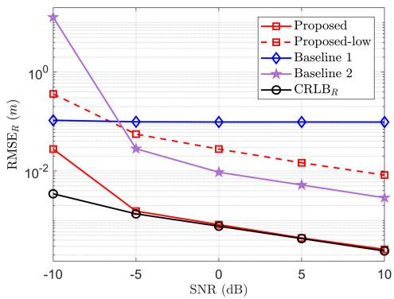  
Fig. 6. $\mathrm { R M S E } _ { R }$ and $\mathrm { C R L B } _ { R }$ versus SNR in the single UAV-BD scenario.

$$
\mathrm { S N R } = \frac { \sum _ { q = 1 } ^ { Q } \mathbb { E } _ { h _ { q } , \omega _ { q } } \left\{ \mathbf { z } _ { q } ^ { \mathrm { H } } \mathbf { z } _ { q } \right\} } { Q \sigma ^ { 2 } } .\tag{61}
$$

In (14)-(16), the presence of the BD symbol $\omega _ { q , k , l }$ disrupts the structure properties of $\mathbf { x } _ { q }$ and $\mathbf { z } _ { q } .$ As a result, many widely employed parameter estimation methods in FMCW radar systems, such as the two-dimensional fast fourier transform (2D-FFT) method [38] and the compressed sensing method [45], are inapplicable to the joint parameter estimation and BD symbol detection problem in this paper. Thus, we design two baselines for performance comparison. In Baseline 1, for each column of Z in (16), we apply the FFT algorithm to estimate $\{ \psi _ { q } \} _ { q \in \mathbb { Q } }$ . Then, maximalratio combining (MRC) is utilized to extract $\{ \mathbf { x } _ { q } \} _ { q \in \mathbb { Q } }$ from $\mathbf { Z } ,$ thereby estimating parameters and detecting BD symbols by methods in Section IV-A.2. In Baseline 2, the orthogonal matching pursuit (OMP) algorithm is executed for each column of Z to generate KL estimates of $\{ \psi _ { q } \} _ { q \in \mathbb { Q } }$ while concurrently obtaining $\{ \mathbf { x } _ { q } \} _ { q \in \mathbb { Q } }$ , thereby enabling the parameter estimation and symbol detection via methods in Section IV-A.2. Besides, the proposed low-complexity design refers to employing (22) in place of the 1D search, and terminating the algorithm after obtaining (33) without performing the second-stage refinement.

## A. The Single UAV-BD Scenario

Fig. 6 depicts the RMSEs of range estimation (denoted by $\mathrm { R M S E } _ { R } )$ and the CRLB (denoted by $\mathrm { C R L B } _ { R } )$ versus SNR in the single UAV-BD scenario. As depicted in Fig. 6, the RMSER of the proposed design consistently decreases as SNR increases. The proposed design attains highly accurate range estimation in the single UAV-BD scenario. In particular, when SNR exceeds −5 dB, the ${ \mathrm { R M S E } } _ { R }$ of the proposed design

$$
\begin{array} { r }  \mathbf { J } _ { \eta } = \frac { 2 } { \sigma ^ { 2 } } \mathcal { R } [ \begin{array} { c c c c c c } { \mathbf { Y } _ { R } ^ { \mathrm { H } } \mathbf { Y } _ { R } } & { \mathbf { Y } _ { R } ^ { \mathrm { H } } \mathbf { Y } _ { v } } & { \mathbf { Y } _ { R } ^ { \mathrm { H } } \mathbf { Y } _ { \mathcal { R } ( h ) } } & { \mathbf { Y } _ { R } ^ { \mathrm { H } } \mathbf { Y } _ { \mathcal { T } ( h ) } } & { \mathbf { Y } _ { R } ^ { \mathrm { H } } \mathbf { Y } _ { \mathcal { R } ( \beta ^ { r } ) } } & { \mathbf { Y } _ { R } ^ { \mathrm { H } } \mathbf { Y } _ { \mathcal { T } ( \beta ^ { r } ) } } \\ { \mathbf { Y } _ { R } ^ { \mathrm { H } } \mathbf { Y } _ { R } } & { \mathbf { Y } _ { R } ^ { \mathrm { H } } \mathbf { Y } _ { v } } & { \mathbf { Y } _ { R } ^ { \mathrm { H } } \mathbf { Y } _ { \mathcal { R } ( h ) } } & { \mathbf { Y } _ { U } ^ { \mathrm { H } } \mathbf { Y } _ { \mathcal { T } ( h ) } } & { \mathbf { Y } _ { U } ^ { \mathrm { H } } \mathbf { Y } _ { \mathcal { R } ( \beta ^ { r } ) } } & { \mathbf { Y } _ { R } ^ { \mathrm { H } } \mathbf { Y } _ { \mathcal { T } ( \beta ^ { r } ) } } \\ { \mathbf { Y } _ { R } ^ { \mathrm { H } } ( h ) \mathbf { Y } _ { R } } & { \mathbf { Y } _ { R } ^ { \mathrm { H } } ( h ) \mathbf { Y } _ { v } } & { \mathbf { Y } _ { R } ^ { \mathrm { H } } ( h ) \mathbf { Y } _ { \mathcal { R } ( h ) } } & { \mathbf { Y } _ { R } ^ { \mathrm { H } } ( h ) \mathbf { Y } _ { \mathcal { T } ( h ) } } & { \mathbf { Y } _ { R } ^ { \mathrm { H } } ( h ) \mathbf { Y } _ { \mathcal { R } ( \beta ^ { r } ) } } &  \mathbf { Y } _  R  \end{array} \end{array}\tag{60}
$$

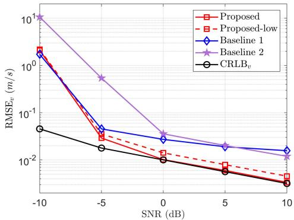  
Fig. 7. RMSEv and $\mathrm { C R L B } _ { v }$ versus SNR in the single UAV-BD scenario.

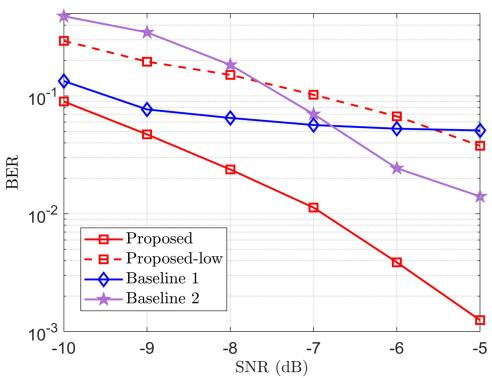  
Fig. 8. The BERs of BD symbol detection versus SNR in the single UAV-BD scenario.

can stay below $1 0 ^ { - 2 }$ m, and can reach ${ \mathrm { R M S E } } _ { R }$ . Besides, the comparison between the curves labeled $\mathrm { \bf ~ \tilde { ~ } P r o p o s e d } ^ { \bf 3 }$ and “Proposed-low” demonstrates that the 1D search in (21) and the refined estimation of the second stage can further improve the range estimation performance. Of course, when SNR is relatively high (e.g., 10 dB), the ${ \mathrm { R M S E } } _ { R }$ of the low-complexity design remains below $1 0 ^ { - 2 }$ m, which is a satisfactory performance. Moreover, across a wide range of SNR values, the range estimation accuracy of the proposed design considerably surpasses that of two baselines.

Fig. 7 presents the RMSEs of radial velocity estimation (denoted by $\mathrm { R M S E } _ { v } )$ and the corresponding CRLB (denoted by $\mathrm { C R L B } _ { v } )$ as functions of SNR in the single UAV-BD scenario. Similarly, the ${ \mathrm { R M S E } } _ { v }$ of the proposed design gradually approaches $\mathrm { C R L B } _ { v } $ , beginning from an SNR $\mathrm { o f } - 5$ dB, which demonstrates the exceptional estimation performance of our proposed design for the radial velocity in the single UAV-BD scenario. Once SNR exceeds 0 dB, the ${ \mathrm { R M S E } } _ { v }$ of the proposed design remains below the level of $1 0 ^ { - 2 }$ m/s. Besides, although the low-complexity design exhibits some performance degradation, its estimation accuracy can also reach $1 0 ^ { - 2 }$ m/s at an SNR of 5 dB. Furthermore, across a broad range of SNR values, the proposed design consistently outperforms two baselines.

Fig. 8 illustrates the BERs of BD symbol detection versus SNR in the single UAV-BD scenario. As observed from Fig. 8, the BER of the proposed design decreases as SNR increases. The BER of the proposed design can reach $1 0 ^ { - 3 }$ at an SNR of −5 dB, demonstrating excellent symbol detection performance in the single UAV-BD scenario. Moreover, the proposed design outperforms two baselines in BD symbol detection.

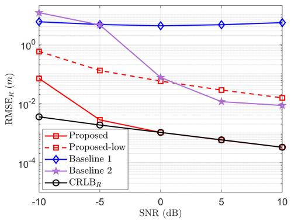  
Fig. 9. $\mathrm { R M S E } _ { R }$ and $\mathrm { C R L B } _ { R }$ versus SNR in the multiple UAV-BD scenario.

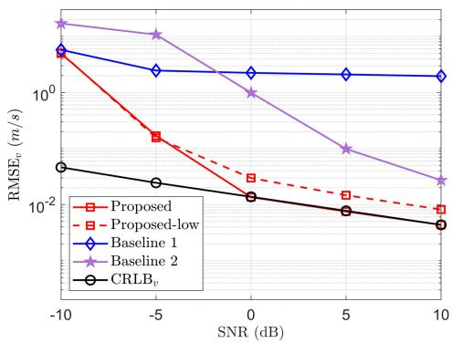  
Fig. 10. ${ \mathrm { R M S E } } _ { v }$ and $\mathrm { C R L B } _ { v }$ versus SNR in the multiple UAV-BD scenario

## B. The Multiple UAV-BD Scenario

Fig. 9 portrays the RMSEs of range estimation and the corresponding CRLB versus SNR in the multiple UAV-BD scenario. As illustrated in Fig. 9, the ${ \mathrm { R M S E } } _ { R }$ of the proposed design can reach the level of $1 0 ^ { - 3 }$ m at an SNR of 0 dB, highlighting its outstanding range estimation performance in the multiple UAV-BD scenario. Besides, the ${ \mathrm { R M S E } } _ { R }$ of the proposed design reaches the theoretical bound $\mathrm { C R L B } _ { R }$ from a low SNR of −5 dB. Moreover, by comparing the curve “Proposed” and the curve “Proposed-low”, it is evident that the second-stage design of the SVD-based two-stage algorithm notably improves the accuracy of range estimation. Additionally, in the multiple UAV-BD scenario, the proposed design achieves more precise range estimation compared to two baselines across a broad range of SNR values.

Fig. 10 presents the RMSEs of radial velocity estimation and the corresponding CRLB as functions of SNR in the multiple UAV-BD scenario. As observed in Fig. 10, the ${ \mathrm { R M S E } } _ { v }$ of the proposed design consistently decreases with increasing SNR. Further, the proposed design can achieve high-precision radial velocity estimation in the multiple UAV-BD scenario. In particular, when SNR exceeds 0 dB, RMSEv is reduced to $\bar { 1 } 0 ^ { - 2 }$ m/s, and it approaches CRLBv. Besides, despite some degradation in radial velocity estimation performance, the accuracy of the low-complexity design remains high, with its ${ \mathrm { R M S E } } _ { v }$ falling below $1 0 ^ { - 2 }$ m/s at an SNR of 10 dB.

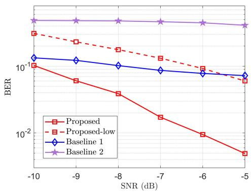

Fig. 11. The BERs of BD symbol detection versus SNR in the multiple UAV-BD scenario.  
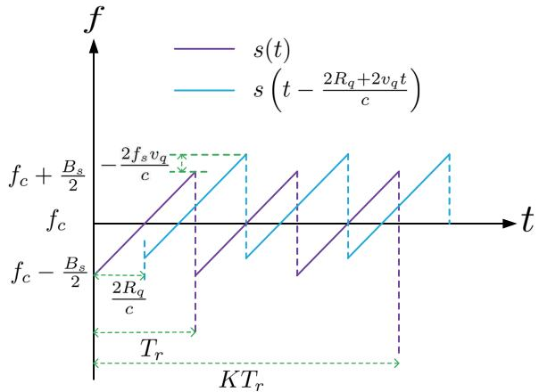  
Fig. 12. The FMCW signal $s ( t )$ and the signal s $\begin{array} { r } { \bigg ( t - \frac { 2 R _ { q } + 2 v _ { q } t } { c } \bigg ) } \end{array}$

Furthermore, the proposed design consistently outperforms both baseline methods across a wide SNR range.

Fig. 11 illustrates the BERs of BD symbol detection versus SNR in the multiple UAV-BD scenario. As shown in Fig. 11, the BER of the proposed design consistently declines as SNR increases. The BER of the proposed design maintains below $1 0 ^ { - 2 }$ starting from an SNR as low as −6 dB, which confirms its robustness in detecting BD symbols in the multiple UAV-BD scenario. Moreover, the proposed design outperforms two baselines in BD symbol detection.

## VIII. CONCLUSION

In this paper, we proposed a novel FMCW-enabled ISIBC system design in mobile scenarios for LAE. We first formulated the accurate echo signal model and discrete beat signal model. Next, by employing the zero-padded BD symbol pattern and the truncation operation, we reformulated the discrete beat signal model into a low-rank matrix model. Subsequently, based on the reformulated low-rank matrix model, we proposed an SVD-based two-stage algorithm for both the single UAV-BD scenario and the multiple UAV-BD scenario. Then, we derived the FIM and obtained the corresponding CRLB to assess the performance of parameter estimation. Finally, numerous simulation results have verified the effectiveness and superior performance of the proposed ISIBC system design.

## APPENDIX A THE DERIVATION OF (9)

As depicted in Fig. 12, $y _ { q } ( t )$ is nonzero only within the interval $\left\lceil \frac { 2 R _ { q } } { c } , K T _ { r } \right\rceil$ . When $t \in \ [ \frac { 2 R _ { q } } { c } , T _ { r } )$ , we have

$$
\begin{array} { c } { { y _ { q } ( t ) = y _ { q } ^ { 1 } ( t ) = s ^ { * } ( t ) s \left( t - \frac { 2 R _ { q } + 2 v _ { q } t } { c } \right) } } \\ { { { } } } \\ { { = e ^ { - j \varphi _ { F M } ( t ) } e ^ { j \varphi _ { F M } \left( t - \frac { 2 R _ { q } + 2 v _ { q } t } { c } \right) } } } \\ { { { } } } \\ { { = e ^ { - j 4 \pi f _ { s } \frac { R _ { q } } { c T _ { \mathrm { ~ } } } } e ^ { - j 4 \pi \frac { B _ { s } R _ { q } } { c T _ { \mathrm { ~ } } } t } e ^ { - j 4 \pi \frac { f _ { s } v _ { q } } { c } t } } } \\ { { { } } } \\ { { { } \mathrm { ~ } \times e ^ { - j 4 \pi \frac { B _ { s v _ { q } } } { c T _ { \mathrm { ~ } } } t ^ { 2 } } e ^ { j 4 \pi \frac { B _ { s } } { T _ { \mathrm { ~ } } } \left( \frac { R q + v _ { q } t } { c } \right) ^ { 2 } } } } \\ { { { \overset { { { ( \mathrm { a } ) } } } { = } e ^ { - j 4 \pi f _ { s } \frac { R _ { q } } { c } } e ^ { - j 4 \pi \left( \frac { B _ { s } R _ { q } } { c T _ { \mathrm { ~ } } } + \frac { f _ { s } v _ { q } } { c } \right) t } . } } } \end{array}\tag{62}
$$

In (62), the term $e ^ { - j 4 \pi \frac { B _ { s } v _ { q } } { c T _ { r } } t ^ { 2 } }$ and the term $e ^ { j 4 \pi \frac { B _ { s } } { T _ { r } } \left( \frac { R q + v _ { q } t } { c } \right) ^ { 2 } }$ can be neglected because $v _ { q } T _ { r } \ll 1 < R _ { q }$ and $\frac { R _ { q } + v _ { q } t } { c } \ll$ $T _ { r }$ , respectively. Then, equality (a) is obtained. When $t \in$ $\begin{array} { r } { \left[ T _ { r } , T _ { r } + \frac { 2 R _ { q } } { c } \right) } \end{array}$ , we have

$$
\begin{array} { r l } & { y _ { q } ( t ) = y _ { q } ^ { 2 } ( t ) = s ^ { * } ( t ) s \left( t - \frac { 2 R _ { q } + 2 v _ { q } t } { c } \right) } \\ & { \qquad = e ^ { - j \varphi _ { F M } ( t - T _ { r } ) } e ^ { j \varphi _ { F M } \left( t - \frac { 2 R _ { q } + 2 v _ { q } t } { c } \right) } } \\ & { \qquad = e ^ { j 2 \pi f _ { s } T _ { r } } e ^ { j 2 \pi B _ { s } t } e ^ { - j \pi B _ { s } T _ { r } } e ^ { - j 4 \pi f _ { s } \frac { R _ { q } } { c } } e ^ { - j 4 \pi \frac { f _ { s } v _ { q } } { c } t } } \\ & { \qquad \times e ^ { - j 4 \pi \frac { B _ { s } R _ { q } } { c T _ { r } } } t e ^ { - j 4 \pi \frac { B _ { s } v _ { q } } { c T _ { r } } t ^ { 2 } } e ^ { j 4 \pi \frac { B _ { s } } { T _ { r } } \left( \frac { R _ { q } + v _ { q } t } { c } \right) ^ { 2 } } } \\ & { \qquad = e ^ { - j 4 \pi f _ { s } \frac { R _ { q } } { c } } e ^ { j 2 \pi \left( f _ { s } - \frac { B _ { s } } { 2 } \right) T _ { r } } e ^ { - j 4 \pi \left( \frac { B _ { s } R _ { q } } { T _ { r } c } + \frac { f _ { s } v _ { q } } { c } - \frac { B _ { s } } { 2 } \right) t } . } \end{array}\tag{63}
$$

Thus, when $\begin{array} { r } { t \in \big [ \frac { 2 R _ { q } } { c } , T _ { r } + \frac { 2 R _ { q } } { c } \big ) } \end{array}$ , the expression of $y _ { q } ( t )$ is given by

$$
y _ { q } ( t ) = y _ { q } ^ { 1 } ( t ) \Pi \left( \frac { c t - 2 R _ { q } } { c T _ { r } - 2 R _ { q } } \right) + y _ { q } ^ { 2 } ( t ) \Pi \left( \frac { c ( t - T _ { r } ) } { 2 R _ { q } } \right)\tag{64}
$$

Considering the periodicity of $s ( t )$ in (1) and the Doppler shift effect among FMCW chirps, we can directly acquire (9).

## REFERENCES

[1] Y. Jiang et al., “6G non-terrestrial networks enabled low-altitude economy: Opportunities and challenges,” 2023, arXiv:2311.09047.

[2] Q. Wu et al., “A comprehensive overview on 5G-and-beyond networks with UAVs: From communications to sensing and intelligence,” IEEE J. Sel. Areas Commun., vol. 39, no. 10, pp. 2912–2945, Oct. 2021.

[3] N. Gonzalez-Prelcic et al., “The integrated sensing and communication´ revolution for 6G: Vision, techniques, and applications,” Proc. IEEE, vol. 112, no. 7, pp. 676–723, Jul. 2024.

[4] K. Meng et al., “UAV-enabled integrated sensing and communication: Opportunities and challenges,” IEEE Wireless Commun., vol. 31, no. 2, pp. 97–104, Feb. 2024.

[5] K. Mao et al., “A survey on channel sounding technologies and measurements for UAV-assisted communications,” IEEE Trans. Instrum. Meas., vol. 73, pp. 1–24, 2024.

[6] K. Meng, Q. Wu, S. Ma, W. Chen, K. Wang, and J. Li, “Throughput maximization for UAV-enabled integrated periodic sensing and communication,” IEEE Trans. Wireless Commun., vol. 22, no. 1, pp. 671–687, Jan. 2023.

[7] S. Hu, X. Yuan, W. Ni, and X. Wang, “Trajectory planning of cellularconnected UAV for communication-assisted radar sensing,” IEEE Trans. Commun., vol. 70, no. 9, pp. 6385–6396, Sep. 2022.

[8] B. Chang, W. Tang, X. Yan, X. Tong, and Z. Chen, “Integrated scheduling of sensing, communication, and control for mmWave/THz communications in cellular connected UAV networks,” IEEE J. Sel. Areas Commun., vol. 40, no. 7, pp. 2103–2113, Jul. 2022.

[9] X. Ye, Y. Mao, X. Yu, S. Sun, L. Fu, and J. Xu, “Integrated sensing and communications for low-altitude economy: A deep reinforcement learning approach,” 2024, arXiv:2412.04074.

[10] G. Cheng, X. Song, Z. Lyu, and J. Xu, “Networked ISAC for low-altitude economy: Coordinated transmit beamforming and UAV trajectory design,” IEEE Trans. Commun., vol. 73, no. 8, pp. 5832–5847, Aug. 2025.

[11] Y. Cui et al., “Specific beamforming for multi-UAV networks: A dual identity-based ISAC approach,” in Proc. IEEE Int. Conf. Commun. (ICC), Jul. 2023, pp. 4979–4985.

[12] J. Shashirangana, H. Padmasiri, D. Meedeniya, and C. Perera, “Automated license plate recognition: A survey on methods and techniques,” IEEE Access, vol. 9, pp. 11203–11225, 2021.

[13] T. Jiang et al., “Backscatter communication meets practical battery-free Internet of Things: A survey and outlook,” IEEE Commun. Surveys Tuts., vol. 25, no. 3, pp. 2021–2051, 3rd Quart., 2023.

[14] F. Liu et al., “Integrated sensing and communications: Toward dualfunctional wireless networks for 6G and beyond,” IEEE J. Sel. Areas Commun., vol. 40, no. 6, pp. 1728–1767, Jun. 2022.

[15] V. Shatov et al., “Joint radar and communications: Architectures, use cases, aspects of radio access, signal processing, and hardware,” IEEE Access, vol. 12, pp. 47888–47914, 2024.

[16] R. Hadani et al., “Orthogonal time frequency space modulation,” in Proc. IEEE Wireless Commun. Netw. Conf. (WCNC), Mar. 2017, pp. 1–6.

[17] T. Thaj, E. Viterbo, and Y. Hong, “Orthogonal time sequency multiplexing modulation: Analysis and low-complexity receiver design,” IEEE Trans. Wireless Commun., vol. 20, no. 12, pp. 7842–7855, Dec. 2021.

[18] P. Raviteja, K. T. Phan, Y. Hong, and E. Viterbo, “Interference cancellation and iterative detection for orthogonal time frequency space modulation,” IEEE Trans. Wireless Commun., vol. 17, no. 10, pp. 6501–6515, Oct. 2018.

[19] Z. Wei et al., “Orthogonal time-frequency space modulation: A promising next-generation waveform,” IEEE Wireless Commun., vol. 28, no. 4, pp. 136–144, Aug. 2021.

[20] Z. Sui et al., “Performance analysis and approximate message passing detection of orthogonal time sequency multiplexing modulation,” IEEE Trans. Wireless Commun., vol. 23, no. 3, pp. 1913–1928, Mar. 2024.

[21] M. Jankiraman, FMCW Radar Design. Norwood, MA, USA: Artech House, 2018.

[22] M. Jankiraman, Design of Multi-Frequency CW Radars, vol. 2. Rijeka, Croatia: SciTech, 2007.

[23] Y.-C. Liang, Q. Zhang, E. G. Larsson, and G. Y. Li, “Symbiotic radio: Cognitive backscattering communications for future wireless networks,” IEEE Trans. Cognit. Commun. Netw., vol. 6, no. 4, pp. 1242–1255, Dec. 2020.

[24] I. Cnaan-On, S. J. Thomas, J. L. Krolik, and M. S. Reynolds, “Multichannel backscatter communication and ranging for distributed sensing with an FMCW radar,” IEEE Trans. Microw. Theory Techn., vol. 63, no. 7, pp. 2375–2383, Jul. 2015.

[25] H. Lu, M. Mazaheri, R. Rezvani, and O. Abari, “A millimeter wave backscatter network for two-way communication and localization,” in Proc. ACM SIGCOMM Conf., New York, NY, USA, Sep. 2023, pp. 49–61.

[26] R. Okubo, L. Jacobs, J. Wang, S. Bowers, and E. Soltanaghai, “Integrated two-way radar backscatter communication and sensing with low-power IoT tags,” in Proc. ACM SIGCOMM Conf., New York, NY, USA, Aug. 2024, pp. 327–339.

[27] Q. Zhang, H. Sun, X. Gao, X. Wang, and Z. Feng, “Time-division ISAC enabled connected automated vehicles cooperation algorithm design and performance evaluation,” IEEE J. Sel. Areas Commun., vol. 40, no. 7, pp. 2206–2218, Jul. 2022.

[28] A. Sabharwal, P. Schniter, D. Guo, D. W. Bliss, S. Rangarajan, and R. Wichman, “In-band full-duplex wireless: Challenges and opportunities,” IEEE J. Sel. Areas Commun., vol. 32, no. 9, pp. 1637–1652, Sep. 2014.

[29] M. A. Richards et al., Fundamentals of Radar Signal Processing, vol. 1. New York, NY, USA: McGraw-Hill, 2005.

[30] D. K. Barton, Radar System Analysis and Modeling. Norwood, MA, USA: Artech House, 2004.

[31] V. C. Chen, The Micro-Doppler Effect in Radar. Norwood, MA, USA: Artech House, 2019.

[32] D. Wang, C. Liu, and C. Wang, “An advanced scheme for radar clutter suppression scheme based on blind source separation,” Remote Sens., vol. 16, no. 9, p. 1544, Apr. 2024.

[33] Z. Wu, Y. Peng, and W. Wang, “Deep learning-based unmanned aerial vehicle detection in the low altitude clutter background,” IET Signal Process., vol. 16, no. 5, pp. 588–600, Jul. 2022.

[34] Z. Xu, S. Qi, and P. Zhang, “High accuracy multi-antenna ranging algorithm and performance analysis for FMCW radar,” IEEE Trans. Radar Syst., vol. 1, pp. 657–668, 2023.

[35] R. C. Hansen, “Relationships between antennas as scatterers and as radiators,” Proc. IEEE, vol. 77, no. 5, pp. 659–662, May 1989.

[36] F. Liu, W. Yuan, C. Masouros, and J. Yuan, “Radar-assisted predictive beamforming for vehicular links: Communication served by sensing,” IEEE Trans. Wireless Commun., vol. 19, no. 11, pp. 7704–7719, Nov. 2020.

[37] A. A. Khuwaja, Y. Chen, N. Zhao, M. Alouini, and P. Dobbins, “A survey of channel modeling for UAV communications,” IEEE Commun. Surveys Tuts., vol. 20, no. 4, pp. 2804–2821, 4th Quart., 2018.

[38] V. Winkler, “Range Doppler detection for automotive FMCW radars,” in Proc. Eur. Radar Conf., Oct. 2007, pp. 166–169.

[39] M. Wax and T. Kailath, “Detection of signals by information theoretic criteria,” IEEE Trans. Acoust., Speech, Signal Process., vol. ASSP-33, no. 2, pp. 387–392, Apr. 1985.

[40] R. A. Horn and C. R. Johnson, Matrix Analysis. Cambridge, U.K.: Cambridge Univ. Press, 2012.

[41] W. Li, W. Liao, and A. Fannjiang, “Super-resolution limit of the ESPRIT algorithm,” IEEE Trans. Inf. Theory, vol. 66, no. 7, pp. 4593–4608, Jul. 2020.

[42] L. D. Lathauwer, B. D. Moor, and J. Vandewalle, “A multilinear singular value decomposition,” SIAM J. Matrix Anal. Appl., vol. 21, no. 4, pp. 1253–1278, Jan. 2000.

[43] M. Sørensen and L. De Lathauwer, “Blind signal separation via tensor decomposition with Vandermonde factor: Canonical polyadic decomposition,” IEEE Trans. Signal Process., vol. 61, no. 22, pp. 5507–5519, Nov. 2013.

[44] H. V. Poor, An Introduction to Signal Detection and Estimation. Cham, Switzerland: Springer, 2013.

[45] L. Wang, Z. Ai, Q. Wang, J. Wang, and X. Zhang, “Swarm sparse range profile recovery from fewer measurements of FMCW radar,” IEEE Trans. Aerosp. Electron. Syst., vol. 60, no. 5, pp. 7056–7074, Oct. 2024.

  
Shanxing Zeng (Graduate Student Member, IEEE) received the B.S. degree in communication engineering from the University of Electronic Science and Technology of China (UESTC), Chengdu, China, in 2022. He is currently pursuing the Ph.D. degree with the National Key Laboratory of Wireless Communications. His research interests include integrated sensing and communication, orthogonal time frequency space modulation, and backscatter communication.

Ying-Chang Liang (Fellow, IEEE) is a Professor with the University of Electronic Science and Technology of China, China. He was a Professor with The University of Sydney, Australia; and a Principal Scientist with the Institute for Infocomm Research (I2R), Singapore. His research interests include 5G/6G networks, cognitive radio, dynamic spectrum access, symbiotic radio, and passive Internet of Things. He was a recipient of several paper awards, including the IEEE Communications Society Award for Advances in Communications in 2022,

the IEEE Communications Society Stephen O. Rice Prize in 2021, and the IEEE Vehicular Technology Society Jack Neubauer Memorial Award in 2014. He also received the Recognition Award and Publication Award from the IEEE Communications Society Technical Committee on Cognitive Networks in 2018 and 2020, respectively. He has been recognized by Clarivate Analytics as a Highly Cited Researcher since 2014. He served as the TPC Chair and the Executive Co-Chair for IEEE Globecom 2017 and the TPC Co-Chair of IEEE Globecom 2024. He was the Founding Editor-in-Chief of IEEE JOURNAL ON SELECTED AREAS IN COMMUNICATIONS: Cognitive Radio Series (2011–2014) and the Editor-in-Chief of IEEE TRANSACTIONS ON COGNITIVE COMMUNICATIONS AND NETWORKING (2019–2022). He was a Guest/Associate Editor of IEEE TRANSACTIONS ON WIRELESS COMMU-NICATIONS, IEEE JOURNAL ON SELECTED AREAS IN COMMUNICATIONS, IEEE Signal Processing Magazine, IEEE TRANSACTIONS ON VEHICULAR TECHNOLOGY, and IEEE TRANSACTIONS ON SIGNAL AND INFORMATION PROCESSING OVER NETWORK. He is currently the Associate Editor-in-Chief of China Communications.