# Fairness-Based 3-D Multi-UAV Trajectory Optimization in Multi-UAV-Assisted MEC System

Yejun He , Senior Member, IEEE, Youhui Gan , Haixia Cui , Senior Member, IEEE, and Mohsen Guizani , Fellow, IEEE

Abstract—Unmanned aerial vehicles (UAVs)-assisted mobileedge computing (MEC) communication system has recently gained increasing attention. In this article, we investigate a 3-D multi-UAV trajectory optimization based on ground devices (GDs) selecting the target UAV for task computing. Specifically, we first design a 3-D dynamic multi-UAV-assisted MEC system in which GDs have real-time mobility and task update. Next, we formulate the system communication, computation, and flight energy consumption as objective functions based on fairness among UAVs. Then, to pursue fairness among UAVs, we theoretically deduce and mathematically prove the optimal GDs’ selectivity and offloading strategy, that is, how GDs select the optimal UAV for task offloading and how much to offload. While ensuring the optimal offloading strategy and GDs’ selectivity between UAVs and GDs at each step, we model UAV trajectories as a sequence of location updates of all UAVs and apply a multiagent deep deterministic policy gradient (MADDPG) algorithm to find the optimal solution. Simulation results demonstrate that we achieve the minimum energy consumption under the premise of fairness and the efficiency of model processing tasks.

Index Terms—Computing offloading, fairness, mobile-edge computing (MEC), multiagent deep deterministic policy gradient (MADDPG), selectivity, trajectory optimization, unmanned aerial vehicles (UAVs).

# I. INTRODUCTION

W ITH the emergence of compute-intensive applications(e.g., autonomous driving, traffic control, and auto- (e.g.,autonomous driving, traffic control, and automatic navigation), the quality of experience (QoE) of mobile users has improved significantly. However, due to the low computing power and limited energy reserve of ground devices (GDs), GDs experience great challenges [1]. Mobile-edge computing (MEC) has emerged as a cutting-edge technology to address these challenges. MEC’s main feature is to sink

Manuscript received 1 November 2022; revised 7 January 2023; accepted 23 January 2023. Date of publication 31 January 2023; date of current version 23 June 2023. This work was supported in part by the National Natural Science Foundation of China (NSFC) under Grant 62071306, and in part by the Shenzhen Science and Technology Program under Grant JCYJ20200109113601723, Grant JSGG20210420091805014, Grant JSGG20210802154203011, and Grant GJHZ20180418190529516. (Corresponding author: Yejun He.)

Yejun He and Youhui Gan are with the College of Electronics and Information Engineering, Shenzhen University, Shenzhen 518060, China (e-mail: heyejun@126.com; youhuigan@qq.com).

Haixia Cui is with the School of Electronics and Information Engineering, South China Normal University, Foshan 528225, China, and also with the School of Physics and Telecommunication Engineering, South China Normal University, Guangzhou 510006, China (e-mail: cuihaixia@m.scnu.edu.cn).

Mohsen Guizani is with the Machine Learning Department, Mohamed Bin Zayed University of Artificial Intelligence, Abu Dhabi, UAE (e-mail: mguizani@ieee.org).

Digital Object Identifier 10.1109/JIOT.2023.3241087

mobile computing to network edge nodes (e.g., base stations and access points) to realize compute-intensive applications on GDs with limited resources [2]. At the same time, extensive Internet of Things (IoT) devices bring us convenience. IoT based on unmanned aerial vehicles (UAVs) can make full use of the air-to-ground (A2G) transmission channel and line-of-sight (LoS) transmission link [3], which not only overcomes geometric restrictions, but also provides reliable data transmission service for remote areas and traffic intensive areas [4]. Therefore, UAVs will play an important role in the IoT vision [5].

In the multi-UAV-assisted wireless communication system, UAVs usually play the role of an aerial base station (BS) or aerial mobile terminal. When the UAVs are used as aerial BS, the GDs communicate with the UAVs via the LoS link. However, massive data transmission between GDs and UAVs may cause channel congestion. When the UAVs are used as aerial mobile terminals, a large number of UAVs will result in the overload of the cellular network. Thus, the UAVs will compete with GDs for limited spectrum resources [6].

UAVs as mobile-edge nodes to assist the MEC system have recently gained increasing attention from academia and industry. UAVs have the characteristics of high flexibility and strong maneuverability and can be combined with wireless communication systems to provide high-speed, large-connection, and low-latency communication services. As mobile-edge nodes, UAVs’ high mobility solves the deployment problem of fixed-edge nodes; their hover stability and LoS transmission characteristics provide GDs with reliable and low-latency communication links [7]. In addition, multi-UAV-assisted MEC systems have many unique advantages. For example, according to the GDs’ real-time locations and tasks, UAVs can adjust their locations and then carefully plan their trajectories based on a given goal (e.g., saving energy or reducing latency). In addition, due to factors such as obstacles, UAVs have a higher probability of establishing LoS links with GDs due to their variable heights, which can help strengthen and expand the UAVs’ coverage [8].

In addition to the above application scenarios, UAVs have also achieved research results in the latest scenarios. In the field of intelligent reflecting surface (IRS), the advantages of UAV and IRS can be combined to further improve communication performance. However, since the air-ground channel between UAVs and GDs are vulnerable to adversarial eavesdropping, the covert communication of UAV-IRS is worth considering [9]. When a disaster occurs and the BS no longer works normally, the UAV-assisted network becomes an effective method to establish emergency communication. In this scenario, the UAV can not only provide wireless services for GDs, but also realize information exchange inside and outside the disaster area [10].

# A. Related Work

1) Computation Offloading and Resource Allocation: Computation offloading can offload tasks to nearby MEC servers to improve quality of service (QoS), which is inseparable from task scheduling and load balance. In [11], the authors proposed a two-layer optimization method for jointly optimizing UAVs deployment and task scheduling, where the UAVs deployment is optimized by the upper layer and the lower layer completed the task scheduling based on the given UAVs deployment. Yang et al. [12] achieved a multi-UAV load balancing while ensuring coverage constraints and satisfying IoT node QoS. In addition, for the task scheduling in a certain UAV, a deep reinforcement learning (DRL) algorithm was designed to improve the task execution efficiency of each UAV. Researchers often regard energy consumption as the optimization goal of communication and computation. Zhang et al. [13] optimized bit allocation, time slot scheduling, power allocation, and UAV trajectory design by minimizing the total energy consumption (including communication, computation, and UAV flight).

At the same time, resource allocation can reasonably distribute resources to GDs to avoid resource waste. In MEC systems, resource allocation is often closely related to computation offloading. Seid et al. [14] proposed a model-free DRL-based collaborative resource allocation and computation offloading scheme in an A2G network. Each UAV cluster head took on the role of the agent and independently allocated resources to Edge Internet of Things (EIoT) devices in a decentralized fashion. Yu et al. [15] proposed an innovative UAV-enabled MEC system in which UAV and edge clouds (ECs) cooperated to provide MEC services for IoT devices. The authors’ proposed system aimed to minimize the weighted sum of service latency and UAV energy consumption for all IoT devices by jointly optimizing UAV location, communication, computing resource allocation, and task-splitting decisions. Under the requirements of heterogeneous QoS, Peng and Shen [16] used a multiagent deep deterministic policy gradient (MADDPG) method to quickly make vehicle association and resource allocation decisions during the online execution phase. Nie et al. [17] jointly optimized resource allocation, user association, and power control in a MEC system with multiple UAVs and proposed a multiagent federated reinforcement learning (RL) algorithm to protect the GDs’ privacy.

2) Trajectory Design: The research on trajectory optimization of UAVs is significant. It can not only reduce the delay and save energy, but also improve the throughput of communication and bring better QoS to GDs. In the 2-D plane single UAV scenario, Ji et al. [18] minimized the weighted energy consumption of UAV and GDs by joint UAV trajectory and resource allocation. Due to the nonconvexity of the problem, the authors alternately optimized the trajectory and resource allocation in each iteration. In the 2-D plane multi-UAV scenario, Qin et al. [19] minimized the task completion time by optimizing the trajectories of all UAVs, while ensuring the collection of information from each sensor. The authors proposed a hover point selection algorithm, in which UAVs sequentially collected information from multiple sensors.

DRL could be an effective solution to tackle the UAV trajectory. Due to the characteristics of large state dimensions and complex actions in UAV communication scenarios, under the framework of RL, the agents learn interactively with the environment and explore the optimal strategy through “trialand-error.” At the same time, deep learning is introduced to reasonably deal with the issue of large data dimensions. In the multi-UAV scenario, the fairness between each UAV is particularly significant. Yin and Yu [20] modeled resource allocation and trajectory design as a decentralized partially observable Markov decision process and proposed a novel distributed multiagent RL framework for overall throughput optimization. Wang et al. [21] jointly optimized the geographic fairness of all GDs, the GDs-load fairness of each UAV, and the overall energy consumption of GDs by independently managing each UAV trajectory. Qin et al. [22] described user-level fairness based on proportional fair scheduling and formulated a weighted throughput maximization problem by designing UAV trajectory.

There have not been many research attempts on the 3-D plane multi-UAV-assisted MEC scenario. Due to the complexity of 3-D plane UAV movements, it is difficult to obtain the optimal solution by using traditional algorithms. Currently, there are only a few researchers using DRL to solve the 3-D multi-UAV trajectory problem. Ding et al. [23] formulated the energy consumption model of a quad-rotor single UAV as a function of the 3-D motion of the single UAV and achieved energy-efficient fair communication and total throughput maximization through trajectory design and frequency band allocation. In [24], efficient 3-D trajectory design for multi-UAV was studied. A constrained deep Q-network (cDQN) algorithm was proposed to solve the multi-UAV 3-D dynamic movement problem.

# B. Motivation and Contributions

Motivated by the advantages of UAV-assisted communication systems and the shortcoming of the existing work, a multi-UAV-assisted MEC system is considered in this article. This work aims to study the joint problems of communication, computation, and flight in the A2G cooperative paradigm, thereby providing ideas for the future three-layer heterogeneous network of A2G [25]. Note that our research has practical implications. In many practical scenarios, such as communication interruption due to natural disasters or sudden increase in traffic in hotspot areas (e.g., campuses and stadiums, or areas where cellular infrastructure is unavailable [26]), UAVs can be quickly deployed to those areas due to their high mobility and flexibility compared to traditional terrestrial base stations. A UAV-assisted MEC has become an efficient means to solve these problems. Therefore, it is necessary and promising to study the multi-UAV-assisted MEC system.

Based on the existing literature mentioned above, we consider a multi-GD and multi-UAV-assisted MEC system. On the GD side, the optimal offloading strategy of each GD task is studied. In addition, in order to avoid overload of UAV caused by the excessive concentration of GDs, the selection of optimal UAV for each GD is also investigated. On the UAV side, how to find the optimal 3-D flight trajectory is studied under the premise that each UAV process as many tasks as possible with as little energy consumption and delay as possible. At the same time, the load fairness between each UAV is also considered.

The main contributions of this article are listed as follows.

1) We design a dynamic scenario for real-time communication and data transmission. Specifically, each UAV makes a series of flight actions, and each GD can offload tasks and update its location during a UAV flight. At the same time, we consider the GDs’ selectivity, that is, the GDs offload tasks by selecting the most suitable UAVs to achieve fairness between UAVs. In addition, each UAV only knows the status information of the connected GDs, which is more reasonable and practical.   
2) We jointly optimize the offloading strategy, GDs’ selectivity, and UAV trajectories design. Since there are too many optimization variables involved, we theoretically analyze some variables that can be optimized without participating in the neural network. Specifically, first, in the case of fixed trajectory actions, we derive and prove the optimal offloading strategy and GDs’ selectivity. Second, under the premise of optimal offloading strategy and GDs’ selectivity, the MADDPG algorithm is used to let each UAV act as an agent and complete the common trajectory optimization through coordination and cooperation between the agents.   
3) Our approach has good convergence after theoretical analysis to reduce the optimization variables. At the same time, we achieve lower energy consumption under the premise of better fairness. In addition, considering a real scene, the 3-D UAV trajectories are more reasonable.

The remainder of this article is organized as follows. Section II demonstrates the system model and problem formulation. Section III introduces the theoretical analysis for the offloading proportion and selection of GDs, and the MADDPG algorithm for trajectory optimization. Section IV gives the simulation results. Section V presents the conclusion drawn from this article’s research.

# II. SYSTEM MODEL AND PROBLEM FORMULATION

In this section, we first present a 3-D dynamic multi-UAVassisted MEC system model. Then, the communication and computation model of the system and the flight model of UAV are proposed. Finally, under the premise of fairness based on the load of each UAV, we formulate the problem as the system’s total energy consumption including communication, computation, and UAV flight. The main notations used in this article are summarized in Table I.

TABLE I LIST OF MAIN NOTATIONS 

<table><tr><td>Notation</td><td>Description</td></tr><tr><td> $k, K, \mathcal{K}$ </td><td>The index,number, and set of GDs</td></tr><tr><td> $K_{m}^{\prime}, \mathcal{K}_{m}^{\prime}$ </td><td>The number and set of GDs that select  $m$ th UAV</td></tr><tr><td> $m, M, \mathcal{M}$ </td><td>The index,number, and set of UAVs</td></tr><tr><td> $t, T, \mathcal{T}$ </td><td>The index,number, and set of time slots</td></tr><tr><td> $X_{size}, Y_{size}, H$ </td><td>The size of 3D plane boundary</td></tr><tr><td> $Q_{uav}^{m}, Q_{gd}^{k}$ </td><td>The location of  $m$ th UAV and  $k$ th GD</td></tr><tr><td> $F_{k}$ </td><td>The number of  $k$ th GD’s CPU cycles</td></tr><tr><td> $F_{m}$ </td><td>The number of  $m$ th UAV’s CPU cycles</td></tr><tr><td> $p_{k,m}^{LoS}$ </td><td>The LoS connection probability</td></tr><tr><td> $p_{k,m}^{NLoS}$ </td><td>The NLoS connection probability</td></tr><tr><td> $\theta_{k,m}$ </td><td>The elevation angle at GD side</td></tr><tr><td> $d_{k,m}$ </td><td>The Euclidean distance</td></tr><tr><td> $L_{k,m}^{LoS}$ </td><td>The mean path loss in LoS link</td></tr><tr><td> $L_{k,m}^{NLoS}$ </td><td>The mean path loss in NLoS link</td></tr><tr><td> $L_{k,m}$ </td><td>The path loss</td></tr><tr><td> $r_{k,m}$ </td><td>The transmission data rate</td></tr><tr><td> $\varphi_{k,m}$ </td><td>The offloading strategy</td></tr><tr><td> $E_{k,m}^{Tra}$ </td><td>The energy consumption for communication</td></tr><tr><td> $T_{k,m}^{Tra}$ </td><td>The delay for communication</td></tr><tr><td> $P_{k}$ </td><td>The transmit power of GDs</td></tr><tr><td> $T_{k}^{Com}$ </td><td>The computing delay at GD side</td></tr><tr><td> $T_{k,m}^{Com}$ </td><td>The computing delay at UAV side</td></tr><tr><td> $f_{k}$ </td><td>The computing resources of GDs</td></tr><tr><td> $f_{k,m}$ </td><td>The computing resources of UAVs</td></tr><tr><td> $E_{k}^{Com}$ </td><td>The computing energy consumption at GD side</td></tr><tr><td> $E_{k,m}^{Com}$ </td><td>The computing energy consumption at UAV side</td></tr><tr><td> $F$ </td><td>The thrust of UAV’s each rotor</td></tr><tr><td> $Pfly$ </td><td>The propulsion power of a single UAV</td></tr><tr><td> $E_{m}^{Fly}$ </td><td>The flight energy consumption</td></tr><tr><td> $C_{m}$ </td><td>The load correlation of  $m$ th UAV</td></tr><tr><td> $I$ </td><td>The fairness index between UAVs</td></tr><tr><td> $E$ </td><td>The total system energy consumption</td></tr></table>

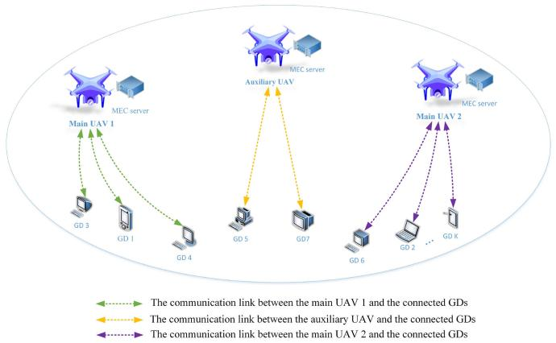

<details>
<summary>flowchart</summary>

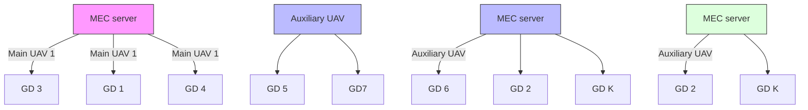
</details>

Fig. 1. System model of 3-D dynamic multi-UAV-assisted MEC.

# A. Network Model

As shown in Fig. 1, we consider a cell with K GDs (with set denoted by K) and M UAVs (with set denoted by M), where each UAV is equipped with a small MEC server for communication and computation. We consider the uplink of GDs generating tasks to the UAVs by using time division multiple access (TDMA). All GDs are randomly distributed in the 3-D plane of $\{ X _ { \mathrm { s i z e } } , Y _ { \mathrm { s i z e } } , 0 \}$ and UAVs fly in the 3-D plane of $\{ X _ { \mathrm { s i z e } } , Y _ { \mathrm { s i z e } } , H \}$ . We consider three UAVs: 1) the main UAV 1; 2) the main UAV 2; and 3) the auxiliary UAV. The main UAVs are responsible for communication and computation with most GDs and have a fixed starting point and ending point. The auxiliary UAV is responsible for a small number of GDs to reduce the pressure of the main UAVs and achieve better load fairness among all UAVs. It is worth noting that the main UAVs and the auxiliary UAV have the same structure, but their respective roles, service objects, and flight trajectories are different.

All UAVs complete a flight mission in T time slots (with a set denoted by  ). In each time slot, UAVs complete the tasks generated by the connected GDs. We assume that in the next time slot, the locations and tasks of the GDs are randomly updated within a certain range, and the GDs reselect the optimal UAV according to its locations and tasks. After a series of time slots and task processing, the UAVs fly from the starting point to the terminal point to complete a trajectory design. Therefore, in the tth slot, we define the location of the mth UAV as $Q _ { \mathrm { u a v } } ^ { m } ( t ) = \{ X _ { m } ( t ) , Y _ { m } ( t ) , Z _ { m } ( t ) \}$ , the location of the kth GD as $\mathcal { Q } _ { g d } ^ { k } ( t ) = \{ x _ { k } ( t ) , y _ { k } ( t ) , 0 \}$ , and the task of the kth GD as

$$
\chi_ {k} (t) = \left\{D _ {k} (t), F _ {k} (t) \right\} \forall k \in \mathcal {K}, t \in \mathcal {T} \tag {1}
$$

where $D _ { k } ( t )$ represents the amount of the kth GD’s data and $F _ { k }$ denotes the number of the kth GD’s CPU cycles required to process 1 bit of data.

# B. Communication Model

In real-world scenarios, UAVs need to change their height for better communication due to factors, such as obstacles and obstructions. Thus, we consider the A2G path loss model [27] that incorporates LoS and Non-LoS (NLoS).

Here, we only consider the task uplink and disregard the downlink. In time slot t, the LoS connection probability between the kth GD and the mth UAV is given by

$$
p _ {k, m} ^ {\mathrm{LoS}} (t) = \frac {1}{1 + \eta_ {a} \exp \left(- \eta_ {b} \left(\theta_ {k , m} - \eta_ {a}\right)\right)} \tag {2}
$$

where $\eta _ { a }$ and $\eta _ { b }$ are the constants related to the type of propagation environment and $\theta _ { k , m } = \arcsin ( [ Z _ { m } ( t ) / d _ { k , m } ( t ) ] )$ is the elevation angle at the GD side. In addition, $d _ { k , m } ( t ) =$ $\| Q _ { g d } ^ { k } ( t ) - Q _ { \mathrm { u a v } } ^ { m } ( t ) \|$ denotes the Euclidean distance between the mth UAV and kth GD. Here, both GDs and UAVs need to move within a certain range defined as

$$
Q _ {g d} ^ {k}, Q _ {\mathrm{uav}} ^ {m} \in \{X _ {\text { size }}, Y _ {\text { size }}, H \}. \tag {3}
$$

Similarly, we can get the NLoS connection probability as $p _ { k , m } ^ { \mathrm { N L o S } } ( t ) \stackrel {  } { = } 1 - p _ { k , m } ^ { \mathrm { L o S } } ( t )$ Pk,m pNLoSk,m (t) = 1 − pLoSk,m ( .

Accordingly, the mean path loss can be modeled as

$$
L _ {k, m} ^ {\xi} (t) = L _ {k, m} ^ {F S} (t) + \eta_ {\xi} \tag {4}
$$

where $\xi$ refers to the propagation group and can be described oS. Also, $\begin{array} { r } { \dot { L } _ { k , m } ^ { F S } ( t ) = 2 0 \dot { \log { d _ { k , m } ( t ) } } + 2 0 \log { f _ { c } } + } \end{array}$ $2 0 \log ( [ 4 \pi / \nu _ { c } ] )$ and mth UAV, while $f _ { c }$ is the system frequency and $\nu _ { c }$ denotes the velocity of light. Thus, the path loss between the kth GD and mth UAV is expressed as

$$
\begin{array}{l} L _ {k, m} (t) = p _ {k, m} ^ {\mathrm{LoS}} (t) L _ {k, m} ^ {\mathrm{LoS}} (t) + p _ {k, m} ^ {\mathrm{NLoS}} (t) L _ {k, m} ^ {\mathrm{NLoS}} (t) \\ = L _ {k, m} ^ {F S} (t) + p _ {k, m} ^ {\mathrm{LoS}} (t) \eta_ {\mathrm{LoS}} + p _ {k, m} ^ {\mathrm{NLoS}} (t) \eta_ {\mathrm{NLoS}} \tag {5} \\ \end{array}
$$

where $\eta _ { \mathrm { L o S } }$ and ηNLoS are the excessive path losses for LoS and NLoS links.

Note that we do not discuss frequency band allocation here, we assume that the bandwidth resource is equally allocated to each GD. Therefore, the transmission data rate between the kth GD and the mth UAV is given by

$$
r _ {k, m} (t) = B \log_ {2} \left(1 + \frac {P _ {k}}{\delta_ {0} ^ {2} 1 0 ^ {L _ {k , m} / 1 0}}\right) \tag {6}
$$

where B denotes the bandwidth equally allocated to each GD, $P _ { k }$ represents transmit power of the kth GD, and $\delta _ { 0 } ^ { 2 }$ is the noise power.

Here, there are three offloading strategies for the kth GD tasks: 1) without offloading (all tasks are processed on the GD side); 2) partial offloading (some tasks are offloaded to the UAV side); and 3) full offloading (all tasks are offloaded to the UAV side), in which partial offloading needs to consider the offloading proportion. We define the offloading strategy as

$$
\varphi_ {k, m} (t) = \left\{ \begin{array}{l l} 0, & \text { without   offloading } \\ \varphi_ {k, m} \in (0, 1), & \text { partial   offloading } \\ 1, & \text { full   offloading. } \end{array} \right. \tag {7}
$$

Thus, the transmission delay and energy consumption of the kth GD communicating with the mth UAV are

$$
T _ {k, m} ^ {T r a} (t) = \frac {\varphi_ {k , m} (t) D _ {k} (t)}{r _ {k , m} (t)} \tag {8}
$$

$$
E _ {k, m} ^ {\text { Tra }} (t) = P _ {k} T _ {k, m} ^ {\text { Tra }} (t) = P _ {k} \frac {\varphi_ {k , m} (t) D _ {k} (t)}{r _ {k , m} (t)}. \tag {9}
$$

# C. Computation Model

The computation model is determined by the offloading strategy. We design the offloading strategy ϕ as a continuous value between [0, 1]. When it is equal to 0, the tasks are all processed on the GD side, and all the tasks are processed by the selected UAV when it is equal to 1, otherwise, ϕ represents the offloading proportion in the case of partial offloading. Therefore, we can calculate the delay for computing at the kth GD side as

$$
T _ {k} ^ {\mathrm{Com}} (t) = \frac {(1 - \varphi_ {k , m} (t)) D _ {k} (t) F _ {k} (t)}{f _ {k} (t)} \tag {10}
$$

where $f _ { k }$ denotes the kth GD’s computing resources. And the computation delay at the mth UAV side is

$$
T _ {k, m} ^ {\mathrm{Com}} (t) = \frac {\varphi_ {k , m} (t) D _ {k} (t) F _ {m} (t)}{f _ {k , m} (t)} \tag {11}
$$

where $F _ { m }$ represents the number of CPU cycles required for the mth UAV to process 1-bit data and $f _ { k , m }$ is the computing resources allocated by the mth UAV to the kth GD.

As such, we can obtain the computational energy consumption of the GD side and the UAV side, respectively, as follows

$$
\begin{array}{l} E _ {k} ^ {\mathrm{Com}} (t) = K _ {a} (f _ {k} (t)) ^ {3} T _ {k} ^ {\mathrm{Com}} (t) \\ = K _ {a} \big (1 - \varphi_ {k, m} (t) \big) D _ {k} (t) F _ {k} (t) (f _ {k} (t)) ^ {2} \tag {12} \\ \end{array}
$$

$$
E _ {k, m} ^ {\mathrm{Com}} (t) = K _ {b} \bigl (f _ {k, m} (t) \bigr) ^ {3} T _ {k, m} ^ {\mathrm{Com}} (t)
$$

$$
= K _ {b} \varphi_ {k, m} (t) D _ {k} (t) F _ {m} (t) \left(f _ {k, m} (t)\right) ^ {2} \tag {13}
$$

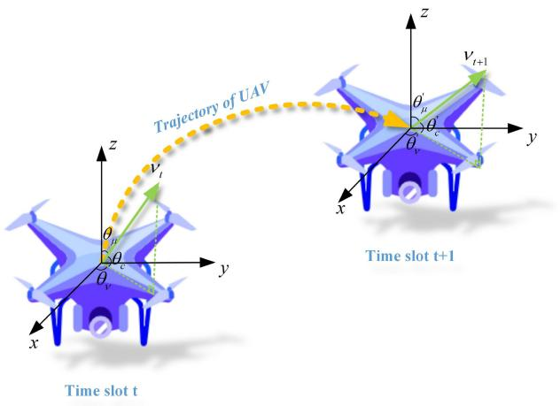

<details>
<summary>text_image</summary>

Trajectory of UAV
z
v_t
θ_u
θ_c
θ_v
y
x
z
v_{t+1}
Time slot t+1
Time slot t
</details>

Fig. 2. Trajectory of a single UAV from time slot t to t+1.

where $K _ { a }$ and $K _ { b }$ denote the CPU capacitance coefficients of GDs and UAVs.

# D. Flight Model

We model a 3-D quad-rotor flight model of UAVs, in which we consider the flight velocity vector $\nu ,$ acceleration vector a, vertical deflection angle $\theta _ { \mu } .$ , and horizontal deflection angle $\theta _ { \nu }$ of each UAV. Similar to [23], we can describe the thrust of each rotor of a single UAV as

$$
F (\boldsymbol {v}, \boldsymbol {a}) = \frac {1}{n} \left\| \left(m _ {u} \| \boldsymbol {a} \| + \frac {1}{2} \rho v ^ {2} S _ {u}\right) \boldsymbol {v} - m _ {u} \boldsymbol {g} \right\| \tag {14}
$$

where n denotes the number of rotors, $m _ { u }$ is the weight of the UAV, ρ is the air density, $\nu = \| v \|$ represents the scalar size of velocity, $\mathbf { \Delta } a = \nu / t$ represents the UAV’s variable acceleration vector in time slot $t ,$ and $S _ { u }$ and $\pmb { g }$ are the equivalent plane area of fuselage and the gravitational acceleration vector.

Thus, we refer to the energy consumption model for computing the 3-D quad-rotor UAV flight trajectory in [23]. The propulsion power of a single UAV is expressed as (15), shown at the bottom of the page, where $c _ { r }$ denotes the local blade section drag coefficient, $c _ { t }$ is the thrust coefficient based on disk area, $A _ { r }$ represents the rotor disc area, $s _ { r }$ is the rotor solidity, and $c _ { f }$ and $d _ { r }$ are the incremental correction factor for induced power and the fuselage drag ratio. In particular, $\theta _ { c }$ is the elevation angle of UAV, where $\theta _ { c }$ is equal to $( \pi / 2 ) - \theta _ { \mu }$ as shown in Fig. 2.

Thus, the flight energy consumption of the mth UAV in time slot t is

$$
\begin{array}{l} E _ {m} ^ {\mathrm{Fly}} (t) = P _ {m} ^ {\mathrm{fly}} (t) T _ {m} ^ {\mathrm{Fly}} (t) \\ = P _ {m} ^ {\text { fly }} (t) \cdot \max \left\{\left[ \max \left\{T _ {k, m} ^ {T r a} (t) \forall k \in \mathcal {K} _ {m} ^ {\prime} \right. \right. \right\} \\ \left. + \sum_ {k = 1} ^ {K _ {m} ^ {\prime}} T _ {k, m} ^ {\operatorname{Com}} (t) \right], \max \left\{T _ {k} ^ {\operatorname{Com}} (t) \forall k \in \mathcal {K} _ {m} ^ {\prime} \right\} \Bigg \} \tag {16} \\ \end{array}
$$

where $K _ { m } ^ { \prime }$ and $\kappa _ { m } ^ { \prime }$ represent the number and the set of GDs that choose to offload the tasks to the mth UAV. It should be noted that, we mainly study energy consumption. To avoid resource waste, we assume that tasks are queued on the UAV side. That is, when the first task is offloaded to the mth UAV, the UAV uses all computing resources to process the task until it is finished, and then processes the next task. Finally, we take the larger value between the maximum time of processing tasks on the GD side and the maximum time for transfer tasks plus the total time of processing tasks on the UAV side as the time required for the mth UAtasks in time slot t, expressed as $T _ { m } ^ { \mathrm { F l y } } ( t )$ ish all connected GD.

# E. Problem Formulation

As shown in the system model, the main UAV 1 and UAV 2 are responsible for handling most of the GDs’ tasks, and the auxiliary UAV is responsible for sharing the pressure of the main UAVs to complete the task within the GDs’ tolerance time. Based on Jain’s fairness index [28], we get the average workload of the mth UAV with the connected GDs in time slot t as follows

$$
C _ {m} (t) = \frac {\sum_ {k = 1} ^ {K _ {m} ^ {\prime}} \varphi_ {k , m} (t)}{K}. \tag {17}
$$

According to the Cauchy inequality, we have

$$
\sum_ {m = 1} ^ {M} C _ {m} (t) ^ {2} \sum_ {m = 1} ^ {M} \overline {{C}} _ {m} (t) ^ {2} \geq \left(\sum_ {m = 1} ^ {M} C _ {m} (t) \overline {{C}} _ {m} (t)\right) ^ {2} \tag {18}
$$

and take the equal sign when $( C _ { 1 } ( t ) / \overline { { C } } _ { 1 } ( t ) ) = ( C _ { 2 } ( t ) / \overline { { C } } _ { 2 } ( t ) ) =$ $\cdots = ( C _ { M } ( t ) / \overline { { C } } _ { M } ( t ) )$ . Here, we let $C _ { 1 } ( t ) = C _ { 2 } ( t ) = \cdot \cdot \cdot =$ $\overline { { C } } _ { M } ( t ) = 1$ , then the Cauchy inequality becomes

$$
M \left(\sum_ {m = 1} ^ {M} C _ {m} (t) ^ {2}\right) \geq \left(\sum_ {m = 1} ^ {M} C _ {m} (t)\right) ^ {2}. \tag {19}
$$

Therefore, we apply the fairness index between UAVs as

$$
I (t) = \frac {\left(\sum_ {m = 1} ^ {M} C _ {m} (t)\right) ^ {2}}{M \left(\sum_ {m = 1} ^ {M} C _ {m} (t) ^ {2}\right)} \tag {20}
$$

and $I ( t ) = 1$ when the average workload of each UAV is equal.

In this article, we aim to minimize the total energy consumption of the entire system based on the offloading strategy, the UAV’s selection by GDs, and multi-UAV 3-D trajectories. First, the total system energy consumption of UAVs and GDs in time slot t is given by

$$
\begin{array}{l} E (t) = \frac {1}{I (t)} \left[ \sum_ {m = 1} ^ {M} \sum_ {k = 1} ^ {K _ {m} ^ {\prime}} \left(E _ {k, m} ^ {T r a} (t) + E _ {k} ^ {\text { Com }} (t) + E _ {k, m} ^ {\text { Com }} (t)\right) \right. \\ \left. + \sum_ {m = 1} ^ {M} \omega E _ {m} ^ {\text { Fly }} (t) \right] \forall k \in \mathcal {K} _ {m} ^ {\prime}, m \in \mathcal {M}, t \in \mathcal {T} \tag {21} \\ \end{array}
$$

$$
P ^ {\text { fly }} (v, F) = n \left[ \frac {c _ {r}}{8} \left(\frac {F}{c _ {t} \rho A _ {r}} + 3 v ^ {2}\right) \sqrt {\frac {F \rho s _ {r} ^ {2} A _ {r}}{c _ {t}}} + (1 + c _ {f}) F \left(\sqrt {\frac {F ^ {2}}{4 \rho^ {2} A _ {r} ^ {2}} + \frac {v ^ {4}}{4}} - \frac {v ^ {2}}{2}\right) ^ {0. 5} + 0. 5 d _ {r} v ^ {3} \rho s _ {r} A _ {r} + \frac {m _ {u} \| \boldsymbol {g} \| v}{n} \sin \theta_ {c} \right] \tag {15}
$$

where ω is the weight of UAV flight energy.

Then, we formulate the optimization problem as

$$
\min _ {\mathcal {K} ^ {\prime}, \Psi , \Theta} \sum_ {t = 1} ^ {T} E (t) \tag {22a}
$$

$\mathrm { s . t . } \quad \mathrm { C 1 } : Q _ { g d } ^ { k } , Q _ { \mathrm { u a v } } ^ { m } \in \{ X _ { \mathrm { s i z e } } , Y _ { \mathrm { s i z e } } , H \} \ : \forall k \in \mathcal { K } , m \in \mathcal { M }$ (22b)

$\mathbf { C } 2 : 0 \leq \varphi _ { k , m } ( t ) \leq 1 \ \forall k \in \mathcal { K } , m \in \mathcal { M } , t \in \mathcal { T }$ (22c)

$\mathbf { C 3 } : \nu _ { \operatorname* { m i n } } \leq \| \pmb { \nu } ( t ) \| \leq \nu _ { \operatorname* { m a x } } \forall t \in \mathcal { T }$ (22d)

$\mathbf { C } 4 : Q _ { \mathrm { u a v } } ^ { m } ( t ) \neq Q _ { \mathrm { u a v } } ^ { m ^ { \prime } } ( t ) \ \forall m , m ^ { \prime } \in \mathcal { M } , t \in \mathcal { T }$ (22e)

$\mathbf { C 5 } : \sum _ { m = 1 } ^ { M } { K _ { m } ^ { \prime } } = \mathcal { K } \ \forall m \in \mathcal { M }$ (22f)

$\mathbf { C } 6 : 0 \leq I ( t ) \leq 1 \forall t \in \mathcal { T }$ (22g)

where $\mathcal { K } ^ { \prime } = \{ \mathcal { K ^ { \prime } } _ { m } \ \forall m \in \mathcal { M } \} , \ \Psi = \{ \varphi _ { k , m } ( t ) \ \forall k \in \mathcal { K } ,$ , m ∈ $\mathcal { M } , t \in \mathcal { T } \} , \ \Theta = \{ \nu ( t ) , \theta _ { \mu } ( t ) , \theta _ { \nu } ( t ) \ \forall t \in \mathcal { T } \}$ . The objective function (22a) is to minimize the total system energy consumption of UAVs to complete a flight. Constraint (22b) is that UAVs and GDs need to move within a certain range. Constraint (22c) is the selectable range of the offloading strategy. Constraints (22d) is the effective flight range of the velocity scalar, and UAVs collision constraint is shown as (22e). Constraint (22f) is the combination of GDs picking UAV, where all GDs need to pick a UAV. The last constraint (22g) is the fairness index range between UAVs, the closer it is to 1, fairer it is.

# III. THEORETICAL ANALYSIS AND ALGORITHM DESIGN

In this section, we address the offloading strategy - of GDs’ tasks, the selectivity $\kappa \prime$ of GDs to UAVs, and 3-D multi-UAV flight trajectories  from theoretical analysis, mathematical derivation, and algorithm demonstration.

We divide this section into three parts: first, as we know  in time slot t, we prove the concavity and convexity of $\kappa \prime$ and - by mathematical derivation, respectively. Then, we obtain the optimal offloading strategy - by the characteristics of the increase and decrease function. At the same time, under the premise of fairness between UAVs, the optimal selectivity of GDs $\kappa \prime$ can be obtained through algorithm iteration by setting an initial value. Finally, while ensuring the optimality of $\kappa \prime$ and - in each time slot t, we use the multiagent DRL algorithm to optimize the 3-D multi-UAV trajectories  in T time slots with the goal of minimizing the system’s total energy consumption.

# A. Offloading Strategy

Given  in time slot t, we fix the selectivity $\kappa \prime$ of GDs to discuss the concavity and convexity of the optimal strategy -. At this point, we simplify the energy consumption problem (21) as

$$
\begin{array}{l} E (t) = \mathcal {I} \cdot \left[ \mathcal {A} \Psi + \mathcal {B} (1 - \Psi) + \mathcal {C} \Psi \right. \\ \left. + \mathcal {F} \cdot \max \left\{\left(\mathcal {A} ^ {\prime} \Psi + \mathcal {C} ^ {\prime} \Psi\right), \mathcal {B} ^ {\prime} (1 - \Psi) \right\} \right], \\ \text { s.t. } \mathcal {A} = \mathcal {P} ^ {\mathrm{Tra}} \mathcal {A} ^ {\prime}, \mathcal {B} = \mathcal {P} _ {k} ^ {\mathrm{Com}} \mathcal {B} ^ {\prime}, \mathcal {C} = \mathcal {P} _ {m} ^ {\mathrm{Com}} \mathcal {C} ^ {\prime} \tag {23} \\ \end{array}
$$

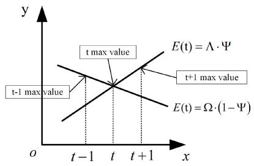

<details>
<summary>line</summary>

| x     | t-1 max value | E(t) = Λ · Ψ | E(t) = Ω · (1 - Ψ) |
|-------|---------------|--------------|---------------------|
| t-1   | 0             | 0            | 0                   |
| t     | 0             | 0            | 0                   |
| t+1   | 0             | 0            | 0                   |
</details>

Fig. 3. Function of offloading strategy on energy consumption.

where  is the fairness coefficient between UAVs,  is the power coefficient, and A, B, and C are the energy consumption coefficient for transmission, computation on the GD side, and computation on the UAV side. Similarly, we have $\mathcal { F }$ as the flight power coefficient for UAVs, A , B , and $\mathcal { C } ^ { \prime }$ as the delay coefficient for transmission, computation on the GD side, and computation on the UAV side. We can see from (23) that E(t) is a linear function of - and is derivable with extreme value. As shown in Fig. 3, ϕ(t) and $1 - \varphi ( t )$ are the increasing or decreasing functions of E(t), respectively. Therefore, to minimize E(t), we only need

$$
\min \left[ \max \left\{\left(\mathcal {A} ^ {\prime} \boldsymbol {\Psi} + \mathcal {C} ^ {\prime} \boldsymbol {\Psi}\right), \mathcal {B} ^ {\prime} (1 - \boldsymbol {\Psi}) \right\} \right] \tag {24a}
$$

$$
\Rightarrow \mathcal {A} ^ {\prime} \Psi + \mathcal {C} ^ {\prime} \Psi = \mathcal {B} ^ {\prime} (1 - \Psi) \tag {24b}
$$

$$
\Rightarrow \Psi = \frac {\mathcal {B} ^ {\prime}}{\mathcal {A} ^ {\prime} + \mathcal {B} ^ {\prime} + \mathcal {C} ^ {\prime}} \tag {24c}
$$

to obtain the specific kth GD which selects the mth UAV’s optimal offloading strategy defined as

$$
\varphi_ {k, m} (t) = \frac {F _ {k} (t) f _ {k , m} (t) r _ {k , m} (t)}{f _ {k} (t) f _ {k , m} (t) + \left(F _ {k} (t) f _ {k , m} (t) + F _ {m} (t) f _ {k} (t)\right) r _ {k , m} (t)}. \tag {25}
$$

# B. GDs’ Selectivity

Given  in time slot t, we discuss the GDs’ selectivity by getting the optimal offloading strategy - of  GDs. The GDs’ selectivity is reflected in ensuring that all GDs can choose one UAV and how many GDs choose UAV 1, UAV 2, or auxiliary UAV. Here, we use the fairness index between UAVs to judge the rationality of the GDs’ selectivity. Therefore, we can simplify the energy consumption problem (21) as

$$
E (t) = \frac {M \sum_ {m = 1} ^ {M} \left(\mathcal {K} _ {m} ^ {\prime}\right) ^ {2}}{\left(\sum_ {m = 1} ^ {M} \mathcal {K} _ {m} ^ {\prime}\right) ^ {2}} \sum_ {m = 1} ^ {M} \mathcal {K} _ {m} ^ {\prime} \left[ \frac {\mathcal {G}}{r \left(d _ {k , m} (t)\right)} \right] + \mathcal {J}
$$

$$
\text { s.t. } \sum_ {m = 1} ^ {M} \mathcal {K} _ {m} ^ {\prime} = \mathcal {K} ^ {\prime} \forall k \in \mathcal {K} _ {m} ^ {\prime}, m \in \mathcal {M} \tag {26}
$$

where r is the transmission data rate function of the Euclidean distance $d _ { k , m } ( t )$ , and $\mathcal { G }$ and $\mathcal { I }$ are the constants after fixing  and -.

Since the number of GDs is constant in a communication interaction, the sum of elements in $\kappa _ { m } ^ { \prime }$ is constant but the combination of elements is variable. Thus, we can see from (26) that $( \partial E / \partial \mathcal { K } _ { m } ^ { \prime } )$ is present and continuous, that is, E has an extreme value for $\kappa _ { m } ^ { \prime }$ . At the same time, we find that the Euclidean distance $d ( t )$ from GDs to UAVs is an important factor affecting the GDs’ selectivity. The mathematical proof that GDs select reliable UAVs based on distance is given in the Appendix. Here, we define the selectivity of K GDs as

Algorithm 1: GDs’ Selectivity Based on Nash Equilibrium   
Initialize GDs' selectivity $E(\Delta_K^*)$ as choosing the nearest UAV;
repeat
    for $k = 1$ to $K$ do
    Keep the selectivity of other GDs unchanged and compute the current optimal choice $\Delta_k$ of the $k$ -th GD and $E(\Delta_k, \Delta_{-k}^*)$ ;
    if $E(\Delta_k, \Delta_{-k}^*) < E(\Delta_K^*)$ then
    Modify $\Delta_k$ to be the optimal choice for the $k$ th GD; $E(\Delta_K^*) = E(\Delta_k, \Delta_{-k}^*)$ ;
    end
    end
until No GD proposes its own better choice;

$$
\Delta_ {K} ^ {*} = \{\Delta_ {1}, \Delta_ {2}, \dots , \Delta_ {k}, \dots , \Delta_ {K} \} \tag {27}
$$

and the selectivity of other GDs except the kth GD is

$$
\Delta_ {- k} ^ {*} = \{\Delta_ {1}, \Delta_ {2}, \dots , \Delta_ {k - 1}, \Delta_ {k + 1}, \dots , \Delta_ {K} \}. \tag {28}
$$

Therefore, the preference basis for GD k to make an individual selection $\Delta _ { k }$ can be expressed as

$$
\min E \big (\Delta_ {k}, \Delta_ {- k} ^ {*} \big). \tag {29}
$$

For any GD, when in the Nash equilibrium state, if $\Delta _ { k }$ is changed and $\Delta _ { - k } ^ { * }$ is unchanged, the energy consumption value E will not be smaller. That is because a sufficiently rational GD has no reason to break the Nash equilibrium if other GDs’ selectivity remains the same.

Definition 1: The selectivity set of K GDs is a Nash equilibrium of the game process, if satisfied

$$
E \big (\Delta_ {K} ^ {*} \big) \leq E \big (\Delta_ {k}, \Delta_ {- k} ^ {*} \big) \forall k \in \mathcal {K}. \tag {30}
$$

According to Definition 1, when in Nash equilibrium state, the GDs’ selectivity is the best and also achieves E minimization in time slot t. The pseudo code of the GDs’ selectivity algorithm is given in Algorithm 1.

# C. MADDPG Algorithm

In our designed communication model, the state and action dimensions of UAVs and GDs are too large. It is difficult for traditional algorithms to obtain the optimal solution. The MADDPG algorithm is an effective method to solve multiagent continuous actions in DRL. Here, we first define a Markov decision process to describe the key quantities in RL. Then the MADDPG algorithm is combined with our proposed communication model to obtain the optimal solution.

1) Markov Decision Process Formulation: We consider each UAV as an agent and define a Markov decision process to describe the environment model as (S, A, T, R, S0). The details of the definition are as follows.

a) States: Consisted by the states of each agent and GDs. It mainly includes the locations of UAVs, the locations of GDs, the amount of data of GDs, and the number of CPU cycles required to compute 1-bit data of GDs connected to the mth UAV. In summary, the states of m-agent can be formulated as

$$
S = \left\{Q _ {\mathrm{uav}} ^ {m} (t), Q _ {g d} ^ {k} (t), D _ {k} (t), F _ {k} (t) \right.
$$

$$
\left. \forall k \in \mathcal {K} _ {m} ^ {\prime}, m \in \mathcal {M}, t \in \mathcal {T} \right\}. \tag {31}
$$

Note that in different time slots, the above four states are changing, which means that the GDs are moving and generating new tasks, and are more in line with reality.

b) Actions: We define the UAV’s velocity, horizontal deflection angle and vertical deflection angle as the actions of each agent, denoted by

$$
A = \left\{\zeta_ {\nu_ {m}} (t), \zeta_ {\theta_ {\nu}} ^ {m} (t), \zeta_ {\theta_ {\mu}} ^ {m} (t) \forall m \in \mathcal {M}, t \in \mathcal {T} \right\} \tag {32}
$$

where $\zeta _ { \nu _ { m } } ( t ) , \zeta _ { \theta _ { \nu } } ^ { m } ( t ) , \zeta _ { \theta _ { \mu } } ^ { m } ( t ) \in [ 0 , 1 ]$ . As shown in Fig. 2, we consider spherical coordinates $( \pmb { \nu } , \theta _ { \nu } , \theta _ { \mu } )$ and apply the normalized representation for the mth agent’s actions as

$$
\boldsymbol {v} _ {m} (t) = \zeta_ {v _ {m}} (t) \cdot v _ {\mathrm{min}} + (v _ {\mathrm{max}} - v _ {\mathrm{min}})
$$

$$
\theta_ {\nu} ^ {m} (t) = \left\{ \begin{array}{l l} \zeta_ {\theta_ {\nu}} ^ {m} (t) \cdot \frac {\pi}{2}, & m = 1 \\ \zeta_ {\theta_ {\nu}} ^ {m} (t) \cdot \pi , & m = 2 \\ \left(\zeta_ {\theta_ {\nu}} ^ {m} (t) + 1\right) \cdot \frac {\pi}{2}, & m = 3 \end{array} \right.
$$

$$
\theta_ {\mu} ^ {m} (t) = \zeta_ {\theta_ {\mu}} ^ {m} (t) \cdot \pi \tag {33}
$$

where $\nu _ { \mathrm { m i n } }$ and $\nu _ { \mathrm { m a x } }$ are the minimum and maximum speed of the UAVs. The horizontal deflection angle $\theta _ { \nu } ^ { m }$ ranges of the three UAVs are: [0, (π/2)], [0, π ], and [(π/2), π ], which are given in Section IV. Similarly, the vertical deflection angle $\theta _ { \mu } ^ { m }$ ranges of the three UAVs belong to [0, π ].

c) Transition probability: $ { \mathbb { T } } \quad = \quad \lbrace p ( s ^ { \prime } | s , a ) \ \forall \ s , s ^ { \prime } \in   \mathbb  $ $S , a \in A \}$ represents the transition probability from states $s = [ s _ { 1 } , \ldots , s _ { M } ]$ to the next states $s ^ { \prime } = [ s _ { 1 } ^ { \prime } , \ldots , s _ { M } ^ { \prime } ]$ through actions $a = [ a _ { 1 } , \dots , a _ { M } ]$ .   
d) Rewards: Based on (21), under the premise of ensuring fairness and optimal offloading strategy, the sum of energy consumption of all agents in T time slots is defined as Rewards. To reflect the rationality of the Rewards, we define the negative value of energy consumption as

$$
R = - \sum_ {t = 1} ^ {T} E (t). \tag {34}
$$

To satisfy (22b) and (22e), we set penalty rewards as

$$
R = R - R _ {\text { bad }}, \text {   if   } Q _ {\text { uav }} ^ {m} \notin \{X _ {\text { size }}, Y _ {\text { size }}, H \}
$$

$$
R = R - R _ {\text { bad }} ^ {\prime}, \text {   if   } Q _ {\text { uav }} ^ {m} = Q _ {\text { uav }} ^ {m ^ {\prime}}. \tag {35}
$$

e) Initial states: We assume that each UAV completes a flight trajectory from the starting point to the terminal point and then returns to the starting point for training until the rewards converge.

2) MADDPG-Based 3-D UAVs-GDs Trajectory Optimization Approach: In our proposed approach, we adopt the framework of centralized training and distributed execution. During the training phase, the critic network of each agent collects the states and actions of all agents and generates a Q value, but the actor network of each agent makes decisions by its own partial state. We extend the critic network to learn from other agents’ policies, so each agent performs a function approximation to the other agents’ policies. Thus, we express the transition probability as

$$
P \big (s ^ {\prime} | s, a, \mu \big) = P \big (s ^ {\prime} | s, a \big) = P \big (s ^ {\prime} | s, a, \mu^ {\prime} \big) \tag {36}
$$

where $\mu \ : = \ : [ \mu _ { 1 } , \ldots , \mu _ { M } ]$ denote the deterministic policies of M agents in actor policy network and $\mu ^ { \prime } = [ \mu _ { 1 } ^ { \prime } , \dots , \mu _ { M } ^ { \prime } ]$ denote the deterministic policies of M agents in target policy network. We use $\theta = [ \theta _ { 1 } , \ldots , \theta _ { M } ]$ to denote the parameters of the deterministic policies $\mu$ in actor policy network. For the cumulative expected reward for the mth agent, we have

$$
J (\theta_ {m}) = \mathbb {E} _ {s, a \sim D} \left[ \sum_ {t = 1} ^ {T} \gamma r _ {m, t} \right] \tag {37}
$$

where D represents the experience reply buffer included $\{ s , a , r , s ^ { \prime }$ , done}, $\boldsymbol { r } = [ r _ { 1 } , \ldots , r _ { M } ]$ is the set of all agents’ reward, done is the termination condition (the UAVs reach the end or fly out of the border), and $\gamma$ denotes the rewards discount factor. For the deterministic policies $\mu ,$ we have the policy gradient

$$
\nabla_ {\theta_ {m}} J \left(\theta_ {m}\right) = \mathbb {E} _ {s, a \sim D} \left[ \nabla_ {\theta_ {m}} \mu_ {m} \left(a _ {m} \mid s _ {m}\right) \nabla_ {a _ {m}} Q _ {m} ^ {\mu} (s, a) \mid_ {a _ {m} = \mu_ {m} \left(s _ {m}\right)} \right] \tag {38}
$$

where $Q _ { m } ^ { \mu }$ represents the centralized action-value function output by the critic network based on the states and actions of all agents as input. $Q _ { m } ^ { \mu }$ is used to evaluate the quality of the actornetwork output strategy. We update the critic policy network $Q _ { m } ^ { \mu }$ by minimizing the loss function as

$$
\mathcal {L} (\theta_ {m}) = \mathbb {E} _ {s, a, r, s ^ {\prime}} \Big [ \big (Q _ {m} ^ {\mu} (s, a) - y \big) ^ {2} \Big ] \tag {39}
$$

where the target value y is

$$
y = \sum_ {t = 1} ^ {T} r _ {m, t} + (1 - \text { done }) \cdot \gamma Q _ {m} ^ {\mu^ {\prime}} \left(s ^ {\prime}, a ^ {\prime}\right) | _ {a _ {m} ^ {\prime} = \mu_ {m} ^ {\prime} \left(s _ {m} ^ {\prime}\right)} \tag {40}
$$

where $a ^ { \prime } = [ \mu _ { 1 } ^ { \prime } ( s _ { 1 } ^ { \prime } ) , \dots , \mu _ { M } ^ { \prime } ( s _ { M } ^ { \prime } ) ]$ is the set of actions of M agents and $Q _ { m } ^ { \mu ^ { \prime } }$ represents the target network based on the set of deterministic policies $\mu ^ { \prime }$ with delayed parameters $\theta ^ { \prime } =$ $[ \theta _ { 1 } ^ { \prime } , \dots , \theta _ { M } ^ { \prime } ]$ . The delayed parameters $\theta ^ { \prime }$ can be updated by

$$
\theta_ {m} ^ {\prime} \leftarrow \tau \theta_ {m} + (1 - \tau) \theta_ {m} ^ {\prime} \tag {41}
$$

where τ is the soft update coefficient.

Due to the unbalanced problem of the 3-D multi-UAV environment, the agent’s policy may overfit the actions of other agents. Thus, when the other agents’ policies change, the agent’s policy may be invalid. Based on [29], we train an ensemble of U different policies denoted as μ(u) m . For the mth agent, the objective function changes from (37) as

$$
J (\mu_ {m}) = \mathbb {E} _ {u \sim \operatorname{unif} (1, U), s, a \sim D ^ {(u)}} \left[ \sum_ {t = 1} ^ {T} \gamma r _ {m, t} \right]. \tag {42}
$$

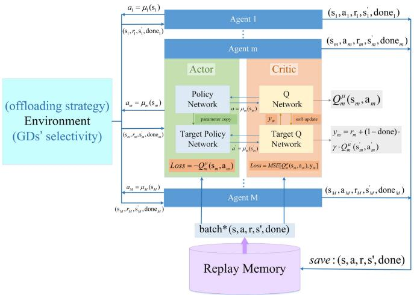

<details>
<summary>flowchart</summary>

```mermaid
graph TD
    subgraph_Agent1["Agent 1"]
        A1["a₁ = μ₁(s₁)"] --> A2["(s₁, r₁, ŝ₁, done₁)"]
        A2 --> A3["(sₘ, aₘ, rₘ, sₘ, doneₘ)"]
        A3 --> A4["(sₘ, a₁, r₁, ŝ₁, done₁)"]
        A4 --> A5["(sₘ, a₁, r₁, ŝ₁, doneₘ)"]
        A5 --> A6["(sₘ, a₁, r₁, ŝ₁, doneₘ)"]
        A6 --> A7["(sₘ, a₁, r₁, ŝ₁, doneₘ)"]
        A7 --> A8["(sₘ, a₁, r₁, ŝ₁, doneₘ)"]
        A8 --> A9["(sₘ, a₁, r₁, ŝ₁, doneₘ)"]
        A9 --> A10["(sₘ, a₁, r₁, ŝ₁, doneₘ)"]
        A10 --> A11["(sₘ, a₁, r₁, ŝ₁, doneₘ)"]
        A11 --> A12["(sₘ, a₁, r₁, ŝ₁, doneₘ)"]
        A12 --> A13["(sₘ, a₁, r₁, ŝ₁, doneₘ)"]
        A13 --> A14["(sₘ, a₁, r₁, ŝ₁, doneₘ)"]
        A14 --> A15["(sₘ, a₁, r₁, ŝ₁, doneₘ)"]
        A15 --> A16["(sₘ, a₁, r₁, ŝ₁, doneₘ)"]
        A16 --> A17["(sₘ, a₁, r₁, ŝ₁, doneₘ)"]
        A17 --> A18["(sₘ, a₁, r₁, ŝ₁, doneₘ)"]
        A18 --> A19["(sₘ, a₁, r₁, ŝ₁, doneₘ)"]
        A19 --> A20["(sₘ, a₁, r₁, ŝ₁, doneₘ)"]
        A20 --> A21["(sₘ, a₁, r₁, ŝ₁, doneₘ)"]
        A21 --> A22["(sₘ, a₁, r₁, ŝ₁, doneₘ)"]
        A22 --> A23["(sₘ, a₁, r₁, ŝ₁, doneₘ)"]
        A23 --> A24["(sₘ, a₁, r₁, ŝ₁, doneₘ)"]
        A24 --> A25["(sₘ, a₁, r₁, ŝ₁, doneₘ)"]
        A25 --> A26["(sₘ, a₁, r₁, ŝ₁, doneₘ)"]
        A26 --> A27["(sₘ, a₁, r₁, ŝ₁, doneₘ)"]
        A27 --> A28["(sₘ, a₁, r₁, ŝ₁, doneₘ)"]
        A28 --> A29["(sₘ, a₁, r₁, ŝ₁, doneₘ)"]
        A29 --> A30["(sₘ, a₁, r₁, ŝ₁, doneₘ)"]
        A30 --> A31["(sₘ, a₁, r₁, ŝ₁, doneₘ)"]
        A31 --> A32["(sₘ, a₁, r₁, ŝ₁, doneₘ)"]
        A32 --> A33["(sₘ, a₁, r₁, ŝ₁, doneₘ)"]
        A33 --> A34["(sₘ, a₁, r₁, ŝ₁, doneₘ)"]
        A34 --> A35["(sₘ, a₁, r₁, ŝ₁, doneₘ)"]
        A35 --> A36["(sₘ, a₁, r₁, ŝ₁, doneₘ)"]
        A36 --> A37["(sₘ, a₁, r₁, ŝ₁, doneₘ)"]
        A37 --> A38["(sₘ, a₁, r₁, ŝ₁, doneₘ)"]
        A38 --> A39["(sₘ, a₁, r₁, ŝ₁, doneₘ)"]
        A39 --> A40["(sₘ, a₁, r₁, ŝ₁, doneₘ)"]
        A40 --> A41["(sₘ, a₁, r₁, ŝ₁, doneₘ)"]
        A41 --> A42["(sₘ, a₁, r₁, ŝ₁, doneₘ)"]
        A42 --> A43["(sₘ, a₁, r₁, ŝ₁, doneₘ)"]
        A43 --> A44["(sₘ, a₁, r₁, ŝ₁, doneₘ)"]
        A44 --> A45["(sₘ, a₁, r₁, ŝ₁, doneₘ)"]
        A45 --> A46["(sₘ, a₁, r₁, ŝ₁, doneₘ)"]
        A46 --> A47["(sₘ, a₁, r₁, ŝ₁, doneₘ)"]
        A47 --> A48["(sₘ, a₁, r₁, ŝ₁, doneₘ)"]
        A48 --> A49["(sₘ, a₁, r₁, ŝ₁, doneₘ)"]
        A49 --> A50["(sₘ, a₁, r₁, ŝ₁, doneₘ)"]
        A50 --> A51["(sₘ, a₁, r₁, ŝ₁, doneₘ)"]
        A51 --> A52["(sₘ, a₁, r₁, ŝ₂"] (parameter copy)
            Target Policy Network
            Target Policy Network
            Target Policy Network
            Target Policy Network
            Target Policy Network
            Target Policy Network
            Target Policy Network
            Target Policy Network
            Target Policy Network
            Target Policy Network
            Target Policy Network
            Target Policy Network
            Target Policy Network
            Target Policy Network
            Target Policy Network
            Target Policy Network
            Target Policy Network
            Target Policy Network
            Target Policy Network
            Target Policy Network
            Target Policy Network

    subgraph_Actor["Actor"]
        B["Policy Network"]
        C["Parameter copy"]
    end

    subgraph_Critic["Critic"]
        D["Q Network"]
        E["Q^μ(m)"] (soft update)
        F["γ^μ = r_m + (1 - done)·γ·Q^μ(m)"] (gamma^μ = γ^μ = γ^μ = γ^μ = γ^μ = γ^μ = γ^μ = γ^μ = γ^μ = γ^μ = γ^μ = γ^μ = γ^μ = γ^μ = γ^μ = γ^μ = γ^μ = γ^μ = γ^μ = γ^μ = γ^μ = γ^μ = γ^μ = γ^μ = γ^μ = γ^μ =γ^μ = γ^μ = γ^μ = γ^μ = γ^μ = γ^μ = γ^μ = γ^μ = γ^μ = γ^μ = γ^μ = γ^μ = γ^μ = γ^μ = γ^μ = γ^μ = γ^μ = γ^μ = γ^μ = γ^μ = γ^μ = γ^μ = γ^μ = γ^μ = γ^μ = ~(α*), (β*), (γ*), (γ*), (γ*), (γ*), (γ*), (γ*), (γ*), (γ*), (γ*), (γ*), (γ*), (γ*), (γ*), (γ*), (γ*), (γ*), (γ*), (γ*), (γ*), (γ*), (γ*), (γ*), (γ*), (γ*), (γ*), (α*)
    end

    subgraph_AgentM["Agent M"]
        M["Agent M"]
        N["batch*(s,a,r,s',done)"]
    end

    subgraph_ReplayMemory["Replay Memory"]
        O["save : (s,a,r,s',done)"]
    end
    subgraph Environment(GDs' selectivity)
    P["offloading strategy"]
    Q["Environment Environment(GDs' selectivity)"]
    R["Replay Memory"]
    S["Replay Memory"]
    T["Replay Memory"]
    U["Replay Memory"]
    V["Replay Memory"]
    W["Replay Memory"]
    X["Replay Memory"]
    Y["Replay Memory"]
    Z["Replay Memory"]
    AA["Replay Memory"]
    AB["Replay Memory"]
    AC["Replay Memory"]
    AD["Replay Memory"]
    AE["Replay Memory"]
    AF["Replay Memory"]
    AG["Replay Memory"]
    AH["Replay Memory"]
    AI["Replay Memory"]
    AJ["Replay Memory"]
    AK["Replay Memory"]
    AL["Replay Memory"]
    AM["Replay Memory"]
    AN["Replay Memory"]
    AO["Replay Memory"]
    AP["Replay Memory"]
    AQ["Replay Memory"]
    AR["Replay Memory"]
    AS["Replay Memory"]
    AT["Replay Memory"]
    AU["Replay Memory"]
    AV["Replay Memory"]
    AW["Replay Memory"]
    AX["Replay Memory"]
    AY["Replay Memory"]
    AZ["Replay Memory"]
    BA["Replay Memory"]
    BB["Replay Memory"]
    BC["Replay Memory"]
    BD["Replay Memory"]
    BE["Replay Memory"]
    BF["Replay Memory"]
    BG["Replay Memory"]
    BH["Replay Memory"]
    BI["Replay Memory"]
    BJ["Replay Memory"]
    BK["Replay Memory"]
    BL["Replay Memory"]
    BM["Replay Memory"]
    BN["Replay Memory"]
    BO["Replay Memory"]
    BP["Replay Memory"]
    BQ["Replay Memory"]
    BR["Replay Memory"]
    BS["Replay Memory"]
    BT["Replay Memory"]
    BU["Replay Memory"]
    BV["Replay Memory"]
    BW["Replay Memory"]
    BX["Replay Memory"]
    BY["Replay Memory"]
    BZ["Replay Memory"]
    CA["Replay Memory"]
    CB["Replay Memory"]
    CC["Replay Memory"]
    CD["Replay Memory"]
    CE["Replay Memory"]
    CF["Replay Memory"]
    CG["Replay Memory"]
    CH["Replay Memory"]
    CI["Replay Memory"]
    CJ["Replay Memory"]
    CK["Replay Memory"]
    CL["Replay Memory"]
    CM["Replay Memory"]
    CN["Replay Memory"]
    CO["Replay Memory"]
    CP["Replay Memory"]
    CS["Replay Memory"]
    CT["Replay Memory"]
    CU["Replay Memory"]
    CV["Replay Memory"]
    CW["Replay Memory"]
    CX["Replay Memory"]
    CY["Replay Memory"]
    CZ["Replay Memory"]
    DA["Replay Memory"]
    DB["Replay Memory"]
    DC["Replay Memory"]
    DD["Replay Memory"]
    EE["Replay Memory"]
    EF["Replay Memory"]
    GF["Replay Memory"]
    GH["Replay Memory"]
    ID["Replay Memory"]
```
</details>

Fig. 4. Optimization process of the MADDPG algorithm based on GDs’ optimal offloading strategy and UAVs’ fairness.

Similarly, the corresponding policy gradient changes from (38) to

$$
\nabla_ {\theta_ {m} ^ {(u)}} J (\mu_ {m}) = \frac {1}{U} \mathbb {E} _ {s, a \sim D ^ {(u)}} \left[ \nabla_ {\theta_ {m} ^ {(u)}} \mu_ {m} ^ {(u)} (a _ {m} \mid s _ {m}) \nabla_ {a _ {m}} Q _ {m} ^ {\mu} (s, a) | _ {a _ {m} = \mu_ {m} ^ {(u)} (s _ {m})} \right]. \tag {43}
$$

As shown in Fig. 4, we give the optimization process of the mth agent (other agents and so on) in the MADDPG algorithm based on the optimal offloading strategy of GDs and the fairness of UAVs. The total pseudo code of the MADDPG-based 3-D UAVs-GDs trajectory optimization algorithm is shown in Algorithm 2.

# IV. SIMULATION RESULTS

In this section, we present the simulation results of the joint offloading strategy, GDs’ selectivity, and UAV trajectories.

# A. Simulation Settings

We consider GDs and UAVs moving in a 1000 m × 1000 m horizontal plane, and UAVs flying at altitudes ranging from 100 to 500 m. Furthermore, we set three UAVs and ten GDs as a reference, among which UAV 1 and UAV 3 are the main UAVs, and UAV 2 is the auxiliary UAV. The flight trajectory of UAV 1 is from the starting point (0 m, 0 m, 100 m) to the terminal point (1000 m, 1000 m, 100 m), the flight trajectory of UAV 3 is from the starting point (1000 m, 0 m, 100 m) to the terminal point (0, 1000 m, 100 m), and the flight trajectory of UAV 2 is from the starting point (500 m, 0 m, 100 m) to the terminal point (x m, 1000 m, 100 m), where x represents the horizontal abscissa that the auxiliary UAV 2 finally stops. The speed size v and the vertical deflection angle $\theta _ { \mu }$ of all UAVs are limited to [30, 50 m/s] and [0, π ]. The horizontal deflection angle $\theta _ { \nu }$ ranges of the three UAVs are: 1) [0, (π/2)]; 2) [0, π ]; and 3) [(π/2), π ]. All UAVs properly adjust their flight heights due to factors, such as LoS and NLoS of communication with GDs. As for GDs, we allow the locations of GDs to move within ± 50 m in each time slot and the task χ of each GD is also updated synchronously.

The simulation results are performed with Python 3.7, parl 2.0.4, and paddlepaddle 2.3. The MADDPG algorithm parameters are as follows: 1) actor–critic network learning rate $l r = 0 . 0 0 0 1 ; 2 )$ reward discount factor $\gamma = 0 . 9 ; 3 )$ soft update coefficient τ = 0.01; and 4) randomly extracting data batch size batch\_size = 512. The actor–critic networks are constructed by using two fully connected layers with 100 neurons in each layer. For the unity and convergence of the

Algorithm 2: MADDPG-Based 3-D UAVs-GDs
Trajectory Optimization

Initialize actor policy network $\mu$ , target policy network $\mu'$ with weights $\theta$ , $\theta'$ for all agents;
Initialize replay memory as rpm;
for episode $ep = 1$ to max_episode do
    Randomly generate a random process $\mathcal{N}$ for actions exploration and limit the output to [0, 1];
    Initialize the state $s_0$ and $step = 0$ ;
    while done = False do
    step = step + 1;
    Select actions $a_m = \mu_m(s_m; \theta_m) + \mathcal{N}_{step}$ for each agent m;
    for all agents do
    Enter all agents' states s and actions a into the environment;
    Execute Algorithm 1: The GDs' selectivity based on Nash equilibrium (with the optimal offloading strategy);
    end
    Obtain all agents' rewards r and next states $s'$ by actions $a = [a_1, \ldots, a_M]$ (with movement and task change of GDs);
    Store ( $s, a, r, s', done$ ) in rpm;
    for agent m = 1 to M do
    Sample a random batch of S as $\{(s^j, a^j, r^j, s^{ij}, done^j), \forall j \in \mathcal{S}\}$ from rpm;
    Set the target value $y^j$ as (40);
    Update critic by minimizing the loss: $\mathcal{L}(\theta_m) = \frac{1}{S} \sum_{j=1}^{S} \left( Q(s^j, a^j - y^j)^2 \right)$ ;
    Update the actor policy using (38): $\frac{1}{S} \sum_{j=1}^{S} \nabla_{\theta_m} J(\theta_m)$ ;
    end
    Update the parameters of target network for each agent m: $\theta'_m \leftarrow \tau \theta_m + (1 - \tau) \theta'_m$ ;
    for all UAVs do
    if UAV m reaches the end then
    done_m = True;
    R = $\sum_{t=1}^{step} r(t)$ ;
    end
    else if UAV m flies out of bounds or collides then
    done_m = True;
    R = $\sum_{t=1}^{step} r(t) - R_{bad}/R'_bad$ ;
    end
    done = all[done_1, $\ldots$ , done_M]
    end
end

TABLE II SIMULATION PARAMETERS 

<table><tr><td>Parameters</td><td>Value</td></tr><tr><td>The number of GDs K</td><td>10</td></tr><tr><td>The number of UAVs M</td><td>3</td></tr><tr><td>The flight altitude of UAVs H</td><td>[100 m, 500 m]</td></tr><tr><td>Horizontal plane range {Xsize, Ysize}</td><td>[1000 m,1000 m]</td></tr><tr><td>The amount of data per GD D</td><td>[1,10] Mbits</td></tr><tr><td>Required CPU cycles per bit per GD Fk</td><td>[500, 1000] cycles/bit</td></tr><tr><td>Propagation environment type constant ηa, ηb</td><td>12.08, 0.11</td></tr><tr><td>The excessive path loss for LoS links ηLos</td><td>1.6 dB</td></tr><tr><td>The excessive path loss for NLoS links ηNLos</td><td>23 dB</td></tr><tr><td>The system frequency fc</td><td>2 GHz</td></tr><tr><td>The velocity of light vc</td><td>3 ×108m/s</td></tr><tr><td>The bandwidth equally allocated to GDs B</td><td>1 MHz</td></tr><tr><td>The transmission power per GD P</td><td>0.5 W</td></tr><tr><td>The noise power δ02</td><td>-70 dBm/Hz</td></tr><tr><td>The computing resources per GD fk</td><td>1 GHz</td></tr><tr><td>The computing resources per UAV fk,m</td><td>5 GHz</td></tr><tr><td>Required CPU cycles per bit per UAV Fk,m</td><td>500 cycles/bit</td></tr><tr><td>The CPU capacitance coefficient per GD Ka</td><td>10-27</td></tr><tr><td>The CPU capacitance coefficient per UAV Kb</td><td>10-28</td></tr><tr><td>The number of rotors per UAV n</td><td>4</td></tr><tr><td>The weight per UAV mu</td><td>2.0 Kg</td></tr><tr><td>The air density ρ</td><td>1.225 Kg/m3</td></tr><tr><td>The equivalent plane area of fuselage per UAV Su</td><td>0.01 m2</td></tr><tr><td>The gravitational acceleration g</td><td>9.8 m/s2</td></tr><tr><td>The local blade section drag coefficient cr</td><td>0.012</td></tr><tr><td>The thrust coefficient based on disk area ct</td><td>0.302</td></tr><tr><td>The rotor disc area Ar</td><td>0.0314 m2</td></tr><tr><td>The rotor solidity sr</td><td>0.0955</td></tr><tr><td>The incremental correction factor cf</td><td>0.131</td></tr><tr><td>The fuselage drag ratio dr</td><td>0.834</td></tr><tr><td>The weight of per UAV&#x27; flight energy ω</td><td>10-4</td></tr></table>

model, we uniformly set the input dimension of the actor network to $3 + 5 \times K .$ , where “3” denotes the dimension of single agent (UAV) location, “5” means the dimension of single GD location and task, and $" K "$ means the number of GDs. Likewise, the input dimension of the critic network is $M \times ( 3 + 5 \times K ) + M \times 3 .$ , which includes M agents (UAVs) states and actions. As for a single agent, since the GDs connected to a single UAV are only a part of all GDs, we zero-padded the part of insufficient input dimension to fit the network input when inputting normalized observations. The communication, computation, and UAV flight-related simulation parameters are shown in Table II.

# B. Performance and Analysis

To the best of our knowledge, there is no existing work for the communication scenarios we consider and the problems we study; thus, we cannot compare our research with other works.

Under fixed GDs’ selectivity and UAV trajectories, we compare average and random offloading with our proposed optimal offloading.

1) Average Offload: We evenly distribute half of the GDs’ tasks to the GD side for computation and the other half to the UAV side, that is $\varphi = 0 . 5$ .   
2) Random Offload: We randomly generate offloading strategy between 0 and 1.

As shown in Fig. 5, after 25 000 rounds of training, the fairness of UAVs based on the optimal offloading strategy converges to 0.95. Note that our test remains converged after 40 000 episodes of training. Although random offloading can also converge to 0.9 due to its randomness, the fairness is not as good as our proposed offloading method. Since the task sizes of GDs vary per slot, average offloading does not apply. For different states of GDs and UAVs, a reasonable selection of offloading strategy can ensure the fairness of UAVs and minimize energy consumption which will be discussed next in this article.

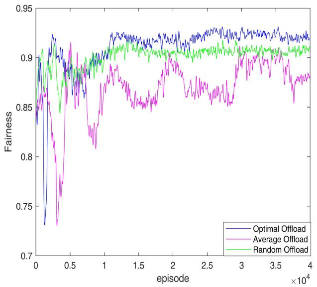

<details>
<summary>line</summary>

| episode (x10^4) | Optimal Offload | Average Offload | Random Offload |
| --------------- | --------------- | --------------- | -------------- |
| 0               | 0.85            | 0.85            | 0.85           |
| 0.5             | 0.92            | 0.73            | 0.88           |
| 1.0             | 0.91            | 0.82            | 0.90           |
| 1.5             | 0.92            | 0.86            | 0.91           |
| 2.0             | 0.92            | 0.87            | 0.91           |
| 2.5             | 0.92            | 0.86            | 0.91           |
| 3.0             | 0.92            | 0.87            | 0.91           |
| 3.5             | 0.92            | 0.88            | 0.91           |
| 4.0             | 0.92            | 0.88            | 0.91           |
</details>

Fig. 5. Fairness comparison of different offloading strategies.   
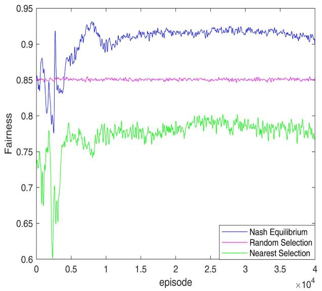

<details>
<summary>line</summary>

| episode (x10^4) | Nash Equilibrium | Random Selection | Nearest Selection |
| --------------- | ---------------- | ---------------- | ----------------- |
| 0               | 0.85             | 0.85             | 0.6               |
| 0.5             | 0.9              | 0.85             | 0.75              |
| 1.0             | 0.92             | 0.85             | 0.78              |
| 1.5             | 0.91             | 0.85             | 0.79              |
| 2.0             | 0.91             | 0.85             | 0.79              |
| 2.5             | 0.91             | 0.85             | 0.79              |
| 3.0             | 0.91             | 0.85             | 0.79              |
| 3.5             | 0.91             | 0.85             | 0.79              |
| 4.0             | 0.91             | 0.85             | 0.79              |
</details>

Fig. 6. Fairness comparison of different GDs’ selectivity.

Under fixed offloading strategy and UAV trajectories, we compare the GDs’ random selection of UAV and the preferential selection of the nearest UAV with our proposed Nash equilibrium-based GDs’ selectivity.

1) Random Selection: All GDs randomly select one of the three UAVs for task offloading.   
2) Nearest Selection: All GDs prefer the UAV closest to them.

Fig. 6 shows the fairness between UAVs corresponding to three different GDs’ selections. We can see that after 10 000 rounds of training, the selection of GDs based on Nash equilibrium converges to about 0.92, indicating that the GDs’

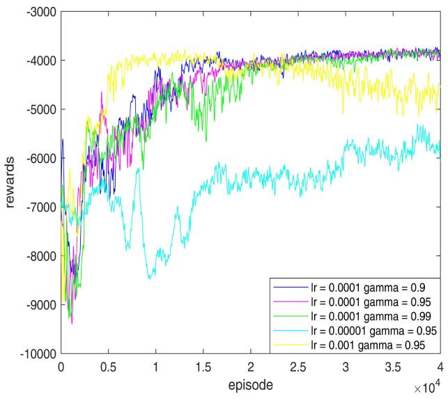

<details>
<summary>line</summary>

| episode (x10^4) | lr = 0.0001 gamma = 0.9 | lr = 0.0001 gamma = 0.95 | lr = 0.0001 gamma = 0.99 | lr = 0.00001 gamma = 0.95 | lr = 0.001 gamma = 0.95 |
| --------------- | ------------------------ | ------------------------- | ------------------------- | -------------------------- | ------------------------ |
| 0               | -9500                    | -9500                     | -9500                     | -9500                      | -9500                    |
| 1               | -4500                    | -4500                     | -4500                     | -6500                      | -4500                    |
| 2               | -4200                    | -4200                     | -4200                     | -6200                      | -4200                    |
| 3               | -4100                    | -4100                     | -4100                     | -6100                      | -4100                    |
| 4               | -4050                    | -4050                     | -4050                     | -6050                      | -4050                    |
</details>

Fig. 7. Training rewards with different learning rates and discount factors.   
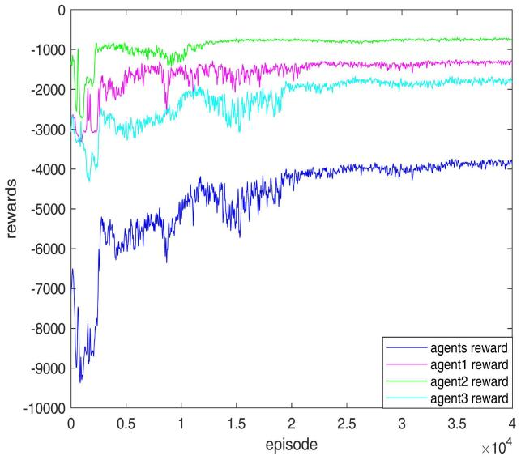

<details>
<summary>line</summary>

| episode (x10^4) | agents reward | agent1 reward | agent2 reward | agent3 reward |
| --------------- | ------------- | ------------- | ------------- | ------------- |
| 0               | -9000         | -3000         | -1000         | -3500         |
| 0.5             | -6000         | -2000         | -1000         | -2500         |
| 1.0             | -5000         | -1500         | -1000         | -2000         |
| 1.5             | -4500         | -1500         | -1000         | -2000         |
| 2.0             | -4000         | -1500         | -1000         | -2000         |
| 2.5             | -4000         | -1500         | -1000         | -2000         |
| 3.0             | -4000         | -1500         | -1000         | -2000         |
| 3.5             | -4000         | -1500         | -1000         | -2000         |
| 4.0             | -4000         | -1500         | -1000         | -2000         |
</details>

Fig. 8. Training rewards for each agent and all agents.

selection of UAV has reached a Nash equilibrium state and the total energy consumption of the system at this time is the smallest. Similarly, since we use a uniform random distribution, when GDs randomly select UAVs, stable fairness can always be maintained between UAVs, but the fairness is not optimal at this time. When the GDs are concentrated near a certain UAV, the adoption of the nearest selection leads to a situation where a certain UAV is overloaded and other UAVs are idle, so the fairness is poor.

Fig. 7 shows the effect of different network parameters on the training rewards. As we can see, on the one hand, when the learning rate $l r = 0 . 0 0 0 1$ , the change of γ only slightly affects the convergence speed of rewards, but does not affect the convergence value. On the other hand, when the discount factor $\gamma = 0 . 9 5$ , the change of lr not only affects the convergence speed of rewards, but also affects the convergence value or even does not converge.

In Fig. 8, we give the training reward of each agent (UAV). As mentioned above, UAV 2 acts as an auxiliary UAV to share the load of the main UAV 1 and UAV 3, so its energy consumption is smaller after reaching equilibrium. Since UAV 1 and UAV 3 fly similar distances, they have similar energy consumption. As we can see from Fig. 8, the rewards of all agents converge after about 20 000 rounds of training, and we take the sum of the rewards of all agents as the total reward of the system. Note that, for conceptual rationality, the negative value of rewards here is energy consumption.

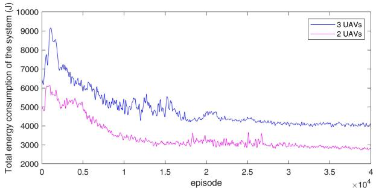

<details>
<summary>line</summary>

| episode (×10⁴) | 3 UAVs | 2 UAVs |
| -------------- | ------ | ------ |
| 0              | 9000   | 6000   |
| 0.5            | 6000   | 4500   |
| 1.0            | 5500   | 3800   |
| 1.5            | 5000   | 3500   |
| 2.0            | 4500   | 3300   |
| 2.5            | 4200   | 3200   |
| 3.0            | 4100   | 3100   |
| 3.5            | 4000   | 3050   |
| 4.0            | 4000   | 3000   |
</details>

(a)

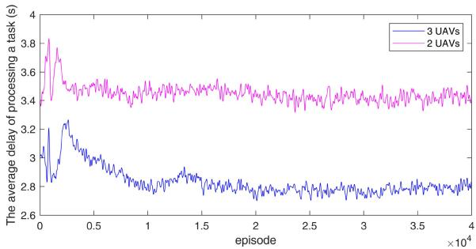

<details>
<summary>line</summary>

| episode (x10^4) | 3 UAVs | 2 UAVs |
| --------------- | ------ | ------ |
| 0               | 3.0    | 3.4    |
| 0.5             | 2.9    | 3.5    |
| 1.0             | 2.8    | 3.5    |
| 1.5             | 2.8    | 3.5    |
| 2.0             | 2.7    | 3.5    |
| 2.5             | 2.7    | 3.5    |
| 3.0             | 2.7    | 3.5    |
| 3.5             | 2.7    | 3.5    |
| 4.0             | 2.7    | 3.5    |
</details>

(b)

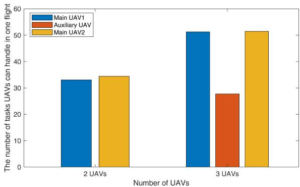

<details>
<summary>bar</summary>

| Number of UAVs | Main UAV1 | Auxiliary UAV | Main UAV2 |
|---|---|---|---|
| 2 UAVs | 33 | 0 | 34.5 |
| 3 UAVs | 51.5 | 27.5 | 51.5 |
</details>

（c）  
Fig. 9. Impact of the presence or absence of auxiliary UAV on the system. (a) Total energy consumption of the system with different number of UAVs. (b) Average delay of processing a task with different number of UAVs. (c) Number of tasks processed in one flight with or without auxiliary UAV.

Fig. 9 shows the impact of the presence or absence of auxiliary UAV on various indicators of the system. Our proposed model is represented by “three UAVs”, and “two UAVs” model is the case without the auxiliary UAV. As shown in Fig. 9(a), the total energy consumption of the system is higher than that of unassisted UAVs due to the additional flight energy consumption required for adding auxiliary UAVs. We can see from Fig. 9(b) that the efficiency of handling all GDs once tasks with the auxiliary UAV is significantly higher than that without the auxiliary UAV. This is because multiple UAVs can work together to complete tasks faster. In Fig. 9(c), we present the number of GDs’ tasks handled by each UAV in one flight cycle. It can be seen that under our proposed cooperative model, although the energy consumption is higher than that of the model without an auxiliary UAV, the number of tasks processed in the same flight cycle is much higher. In our proposed cooperative model, all UAVs handle about 130 tasks and about 67 tasks for the model without the auxiliary UAV.

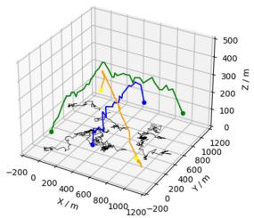

<details>
<summary>line</summary>

| X (m) | Y (m) | Z (m) |
|-------|-------|-------|
| -200  | 0     | 100   |
| 0     | 200   | 200   |
| 200   | 400   | 300   |
| 400   | 600   | 400   |
| 600   | 800   | 500   |
| 800   | 1000  | 400   |
| 1000  | 800   | 300   |
| 1200  | 600   | 200   |
| 1400  | 400   | 100   |
| 1600  | 200   | 50    |
| 1800  | 100   | 25    |
| 2000  | 50    | 10    |
</details>

(a)

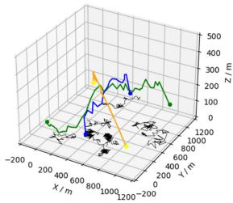

<details>
<summary>line</summary>

| X (m) | Y (m) | Z (m) |
|-------|-------|-------|
| -200  | 0     | 0     |
| 0     | 200   | 100   |
| 200   | 400   | 200   |
| 400   | 600   | 300   |
| 600   | 800   | 400   |
| 800   | 1000  | 500   |
| 1000  | 1200  | 400   |
| 1200  | 1400  | 300   |
| 1400  | 1600  | 200   |
| 1600  | 1800  | 100   |
| 1800  | 2000  | 0     |
| 2000  | 2200  | -100  |
</details>

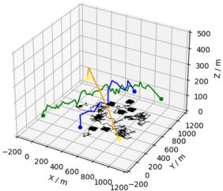

<details>
<summary>line</summary>

| X (m) | Y (m) | Z (m) |
|-------|-------|-------|
| -200  | 0     | 0     |
| 0     | 100   | 100   |
| 200   | 200   | 200   |
| 400   | 300   | 300   |
| 600   | 400   | 400   |
| 800   | 500   | 500   |
| 1000  | 400   | 400   |
| 1200  | 300   | 300   |
| 1400  | 200   | 200   |
| 1600  | 100   | 100   |
| 1800  | 0     | 0     |
| 2000  | -100  | -100  |
| 2200  | -200  | -200  |
| 2400  | -300  | -300  |
| 2600  | -400  | -400  |
| 2800  | -500  | -500  |
| 3000  | -600  | -600  |
| 3200  | -700  | -700  |
| 3400  | -800  | -800  |
| 3600  | -900  | -900  |
| 3800  | -1000 | -1000 |
| 4000  | -1100 | -1100 |
| 4200  | -1200 | -1200 |
| 4400  | -1300 | -1300 |
| 4600  | -1400 | -1400 |
| 4800  | -1500 | -1500 |
| 5000  | -1600 | -1600 |
| 5200  | -1700 | -1700 |
| 5400  | -1800 | -1800 |
| 5600  | -1900 | -1900 |
| 5800  | -2000 | -2000 |
| 6000  | -2100 | -2100 |
| 6200  | -2200 | -2200 |
| 6400  | -2300 | -2300 |
| 6600  | -2400 | -2400 |
| 6800  | -2500 | -2500 |
| 7000  | -2600 | -2600 |
| 7200  | -2700 | -2700 |
| 7400  | -2800 | -2800 |
| 7600  | -2900 | -2900 |
| 7800  | -3000 | -3000 |
| 8000  | -3100 | -3100 |
| 8200  | -3200 | -3200 |
| 8400  | -3300 | -3300 |
| 86₀   | -34₀   | -34₀   |
| 88₀   | -35₀   | -35₀   |
| 9₀    | -36₀   | -36₀   |
| 92₀   | -37₀   | -37₀   |
| 94₀   | -38₀   | -38₀   |
| 96₀   | -39₀   | -39₀   |
| 98₀   | -4₀    | -4₀    |
| 1⁰    | -41₀   | -41₀   |
| 11₂₀  | -42₀   | -42₀   |
| 124₀  | -43₀   | -43₀   |
| 136₀  | -44₀   | -44₀   |
| 148₀  | -45₀   | -45₀   |
| 16₀   | -46₀   | -46₀   |
| 17₂₀  | -47₀   | -47₀   |
| 184₀  | -48₀   | -48₀   |
| 196₀  | -49₀   | -49₀   |
| 2¹    | -5₀    | -5₀    |
| 22₃₀  | -51₀   | -51₀   |
| 236₀  | -52₀   | -52₀   |
| 25     | -53₀   | -53₀   |
|          |       |       |
</details>

（c）

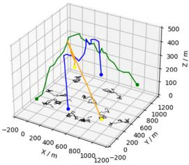

<details>
<summary>line</summary>

| X / m | Z / m |
|-------|-------|
| -200  | 0     |
| 0     | 100   |
| 200   | 200   |
| 400   | 300   |
| 600   | 400   |
| 800   | 500   |
| 1000  | 400   |
| 1200  | 300   |
| 1400  | 200   |
| 1600  | 100   |
| 1800  | 50    |
| 2000  | 0     |
</details>

(d）  
Fig. 10. UAV trajectories with different GDs distributions. (a) UAV trajectories with random distributions of GDs. (b) UAV trajectories with skewed distributions of GDs. (c) UAV trajectories with concentrated distributions of GDs. (d) UAV trajectories with scattered distributions of GDs.

In Fig. 10, we show the UAV trajectories with different GDs distributions, where the green line represents the trajectory of UAV 1, the blue line is the trajectory of auxiliary UAV 2, the yellow line is the trajectory of UAV 3, the black lines represent the movement trajectories of the GDs (10 in total), and the corresponding points are the starting and terminal points. It should be noted that it is difficult to show the UAV 3 flight trajectory due to the 3-D graphics. We can see from Fig. 10(a) that when the GDs are randomly distributed, UAVs typically first ascend to a moderate height and then descend. As shown in Fig. 10(b), when some GDs are located in remote locations, UAVs close to these GDs preferentially fly to them. In Fig. 10(c), when the GDs are concentrated, UAVs fly at lower altitudes to save energy because they do not have to communicate over long distances. Similarly, in Fig. 10(d), when the GDs are dispersed, UAVs fly at higher altitudes for better communication visibility. Therefore, in our designed trajectory algorithm, UAVs adjust their flight trajectories according to the state information of GDs.

# V. CONCLUSION

In this article, we designed a 3-D dynamic multi-UAVassisted MEC system model. Specifically, we studied 3-D cooperative trajectories of multiple UAVs. In each time slot, GDs were characterized by mobility, task update, and so forth. In this system model, we separately discussed the offloading strategy, GDs’ selectivity, and multi-UAV trajectories. In a single time slot t, we obtained feasible solutions for the task offloading strategy and UAV’s selection for each GD from theoretical analysis, mathematical derivation, and algorithm verification. In a complete time slot T, we took advantage of DRL to solve the multi-UAV cooperative trajectory problem based on the MADDPG algorithm. Finally, we minimized the energy consumption of the entire system (including communication, computation, and flight) while ensuring fairness among UAVs. The simulation results also proved the rationality and effectiveness of our algorithm.

In future work, we will investigate multi-UAV communications between multicell and more novel trajectory designs.

# APPENDIX

# GDS SELECT UAVS BASED ON DISTANCE

In this Appendix, we present the effect of the distance between GDs and UAVs on energy consumption. Based on (26), we show in Section III-B that the target value for GDs’ selectivity is differentiable and has extreme values. Thus, we simplify (26) as a function of E versus d and show it as

$$
E (t) = \mathbb {K} ^ {\prime} \left[ \frac {\mathcal {G}}{r (d (t))} \right] + \mathcal {J} \tag {44}
$$

where $\mathbb { K } ^ { \prime }$ represents optimal GDs’ selectivity coefficient. Here, we express the transmission data rate r in another way as

$$
r (d (t)) = B \log_ {2} \left(1 + \frac {P _ {k} \beta_ {0}}{\delta_ {0} ^ {2} d (t)}\right) \tag {45}
$$

where $\beta _ { 0 }$ denotes the channel gain of 1-m reference distance. Then, (44) can be described as

$$
E (t) = \mathbb {K} ^ {\prime} \left[ \frac {\mathcal {G}}{\mathbb {B} \log_ {2} \left(1 + \frac {1}{d (t)}\right)} \right] + \mathcal {J} \tag {46}
$$

where B is the coefficient of channel gain. We take the derivative of d as

$$
\frac {\partial E}{\partial d} = \frac {\mathbb {K} ^ {\prime} \mathcal {G}}{\mathbb {B} \ln 2 \left[ \log_ {2} \left(1 + \frac {1}{d}\right) \right] ^ {2} d (1 + d)}. \tag {47}
$$

Obviously, $( \partial E / \partial d ) > 0 ,$ , we consider E versus d to be a monotonically increasing function. Therefore, we choose the nearest UAV as the initial value of GDs’ selectivity. Then, the game is played until the Nash equilibrium state is reached.

# REFERENCES

[1] F. Zhou, R. Q. Hu, Z. Li, and Y. Wang, “Mobile edge computing in unmanned aerial vehicle networks,” IEEE Wireless Commun., vol. 27, no. 1, pp. 140–146, Feb. 2020.   
[2] Y. Mao, C. You, J. Zhang, K. Huang, and K. B. Letaief, “A survey on mobile edge computing: The communication perspective,” IEEE Commun. Surveys Tuts., vol. 19, no. 4, pp. 2322–2358, 4th Quart., 2017.   
[3] L. Liu, A. Wang, G. Sun, and J. Li, “Multiobjective optimization for improving throughput and energy efficiency in UAV-enabled IoT,” IEEE Internet Things J., vol. 9, no. 20, pp. 20763–20777, Oct. 2022.   
[4] A. Meng, X. Gao, Y. Zhao, and Z. Yang, “Three-dimensional trajectory optimization for energy-constrained UAV-enabled IoT system in probabilistic LoS channel,” IEEE Internet Things J., vol. 9, no. 2, pp. 1109–1121, Jan. 2022.

[5] N. H. Motlagh, T. Taleb, and O. Arouk, “Low-altitude unmanned aerial vehicles-based Internet of Things services: Comprehensive survey and future perspectives,” IEEE Internet Things J., vol. 3, no. 6, pp. 899–922, Dec. 2016.   
[6] P. Zhang, C. Wang, C. Jiang, and A. Benslimane, “UAV-assisted multiaccess edge computing: Technologies and challenges,” IEEE Internet Things Mag., vol. 4, no. 4, pp. 12–17, Dec. 2021.   
[7] Z. Liu, Y. Cao, P. Gao, X. Hua, D. Zhang, and T. Jiang, “Multi-UAV network assisted intelligent edge computing: Challenges and opportunities,” China Commun., vol. 19, no. 3, pp. 258–278, Mar. 2022.   
[8] Y. Xu, T. Zhang, Y. Liu, D. Yang, L. Xiao, and M. Tao, “UAVassisted MEC networks with aerial and ground cooperation,” IEEE Trans. Wireless Commun., vol. 20, no. 12, pp. 7712–7727, Dec. 2021.   
[9] C. Wang et al., “Covert communication assisted by UAV-IRS,” IEEE Trans. Commun., vol. 71, no. 1, pp. 357–369, Jan. 2023.   
[10] N. Zhao et al., “UAV-assisted emergency networks in disasters,” IEEE Wireless Commun., vol. 26, no. 1, pp. 45–51, Feb. 2019.   
[11] Y. Wang, Z.-Y. Ru, K. Wang, and P.-Q. Huang, “Joint deployment and task scheduling optimization for large-scale mobile users in multi-UAVenabled mobile edge computing,” IEEE Trans. Cybern., vol. 50, no. 9, pp. 3984–3997, Sep. 2020.   
[12] L. Yang, H. Yao, J. Wang, C. Jiang, A. Benslimane, and Y. Liu, “Multi-UAV-enabled load-balance mobile-edge computing for IoT networks,” IEEE Internet Things J., vol. 7, no. 8, pp. 6898–6908, Aug. 2020.   
[13] T. Zhang, Y. Xu, J. Loo, D. Yang, and L. Xiao, “Joint computation and communication design for UAV-assisted mobile edge computing in IoT,” IEEE Trans. Ind. Informat., vol. 16, no. 8, pp. 5505–5516, Aug. 2020.   
[14] A. M. Seid, G. O. Boateng, S. Anokye, T. Kwantwi, G. Sun, and G. Liu, “Collaborative computation offloading and resource allocation in multi-UAV-assisted IoT networks: A deep reinforcement learning approach,” IEEE Internet Things J., vol. 8, no. 15, pp. 12203–12218, Aug. 2021.   
[15] Z. Yu, Y. Gong, S. Gong, and Y. Guo, “Joint task offloading and resource allocation in UAV-enabled mobile edge computing,” IEEE Internet Things J., vol. 7, no. 4, pp. 3147–3159, Apr. 2020.   
[16] H. Peng and X. Shen, “Multi-agent reinforcement learning based resource management in MEC- and UAV-assisted vehicular networks,” IEEE J. Sel. Areas Commun., vol. 39, no. 1, pp. 131–141, Jan. 2021.   
[17] Y. Nie, J. Zhao, F. Gao, and F. R. Yu, “Semi-distributed resource management in UAV-aided MEC systems: A multi-agent federated reinforcement learning approach,” IEEE Trans. Veh. Technol., vol. 70, no. 12, pp. 13162–13173, Dec. 2021.   
[18] J. Ji, K. Zhu, C. Yi, and D. Niyato, “Energy consumption minimization in UAV-assisted mobile-edge computing systems: Joint resource allocation and trajectory design,” IEEE Internet Things J., vol. 8, no. 10, pp. 8570–8584, May 2021.   
[19] Z. Qin, A. Li, C. Dong, H. Dai, and Z. Xu, “Completion time minimization for multi-UAV information collection via trajectory planning,” Sensors, vol. 19, no. 18, p. 4032, 2019.   
[20] S. Yin and F. R. Yu, “Resource allocation and trajectory design in UAVaided cellular networks based on multiagent reinforcement learning,” IEEE Internet Things J., vol. 9, no. 4, pp. 2933–2943, Feb. 2022.   
[21] L. Wang, K. Wang, C. Pan, W. Xu, N. Aslam, and L. Hanzo, “Multiagent deep reinforcement learning-based trajectory planning for multi-UAV assisted mobile edge computing,” IEEE Trans. Cogn. Commun. Netw., vol. 7, no. 1, pp. 73–84, Mar. 2021.   
[22] Z. Qin, Z. Liu, G. Han, C. Lin, L. Guo, and L. Xie, “Distributed UAV-BSs trajectory optimization for user-level fair communication service with multi-agent deep reinforcement learning,” IEEE Trans. Veh. Technol., vol. 70, no. 12, pp. 12290–12301, Dec. 2021.   
[23] R. Ding, F. Gao, and X. S. Shen, “3D UAV trajectory design and frequency band allocation for energy-efficient and fair communication: A deep reinforcement learning approach,” IEEE Trans. Wireless Commun., vol. 19, no. 12, pp. 7796–7809, Dec. 2020.   
[24] W. Zhang, Q. Wang, X. Liu, Y. Liu, and Y. Chen, “Three-dimension trajectory design for multi-UAV wireless network with deep reinforcement learning,” IEEE Trans. Veh. Technol., vol. 70, no. 1, pp. 600–612, Jan. 2021.   
[25] J. Wang, C. Jiang, Z. Wei, C. Pan, H. Zhang, and Y. Ren, “Joint UAV hovering altitude and power control for space–air–ground IoT networks,” IEEE Internet Things J., vol. 6, no. 2, pp. 1741–1753, Apr. 2019.   
[26] H. Wang, G. Ding, F. Gao, J. Chen, J. Wang, and L. Wang, “Power control in UAV-supported ultra dense networks: Communications, caching, and energy transfer,” IEEE Commun. Mag., vol. 56, no. 6, pp. 28–34, Jun. 2018.   
[27] A. Al-Hourani, S. Kandeepan, and S. Lardner, “Optimal LAP altitude for maximum coverage,” IEEE Wireless Commun. Lett., vol. 3, no. 6, pp. 569–572, Dec. 2014.

[28] R. Jain, A. Durresi, and G. Babic, “Throughput fairness index: An explanation,” ATM Forum Contribution, Mountain View, CA, USA, document 99-0045, Feb. 1999.   
[29] R. Lowe, Y. Wu, A. Tamar, J. Harb, P. Abbeel, and I. Mordatch, “Multiagent actor-critic for mixed cooperative-competitive environments,” 2017, arXiv:1706.02275.

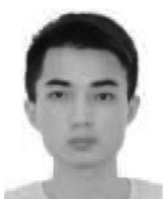

<details>
<summary>natural_image</summary>

Portrait photo of a young man (no text or symbols visible)
</details>

Youhui Gan is currently pursuing the M.S. degree in electronics and communication engineering with the College of Electronics and Information Engineering, Shenzhen University, Shenzhen, China.

His research interests include wireless communications and mobile-edge computing.

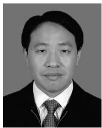

<details>
<summary>natural_image</summary>

Portrait photo of a man in formal attire (no text or symbols visible)
</details>

Yejun He (Senior Member, IEEE) received the Ph.D. degree in information and communication engineering from the Huazhong University of Science and Technology, Wuhan, in 2005.

From 2005 to 2006, he was a Research Associate with the Department of Electronic and Information Engineering, Hong Kong Polytechnic University, Hong Kong. From 2006 to 2007, he was a Research Associate with the Department of Electronic Engineering, Faculty of Engineering, Chinese University of Hong Kong, Hong Kong. In

2012, he was a Visiting Professor with the Department of Electrical and Computer Engineering, University of Waterloo, Waterloo, ON, Canada. From 2013 to 2015, he was an Advanced Visiting Scholar (Visiting Professor) with the School of Electrical and Computer Engineering, Georgia Institute of Technology, Atlanta, GA, USA. Since 2011, he has been a Full Professor with the College of Electronics and Information Engineering, Shenzhen University, Shenzhen, China, where he is the Director of Guangdong Engineering Research Center of BS Antennas and Propagation, and the Director of Shenzhen Key Laboratory of Antennas and Propagation, Shenzhen. He was selected as the Pengcheng Scholar Distinguished Professor, Shenzhen, and the Minjiang Scholar Chair Professor of Fujian Province, China, in 2020 and 2022, respectively. He has authored or coauthored over 260 research papers, seven books, and holds about 20 patents. His research interests include wireless communications, antennas, and radio frequency.

Dr. He was also a recipient of the Shenzhen Overseas High-Caliber Personnel Level B (Peacock Plan Award B) and Shenzhen High-Level Professional Talent (Local Leading Talent). He received the Shenzhen Science and Technology Progress Award in 2017 and the Guangdong Provincial Science and Technology Progress Award two times in 2018 and 2023. He is currently the Chair of IEEE Antennas and Propagation Society-Shenzhen Chapter and obtained the 2022 IEEE APS Outstanding Chapter Award. He has served as a Reviewer for various journals, such as the IEEE TRANSACTIONS ON VEHICULAR TECHNOLOGY, the IEEE TRANSACTIONS ON COMMUNICATIONS, the IEEE TRANSACTIONS ON INDUSTRIAL ELECTRONICS, the IEEE TRANSACTIONS ON ANTENNAS AND PROPAGATION, the IEEE WIRELESS COMMUNICATIONS, the IEEE COMMUNICATIONS LETTERS, the International Journal of Communication Systems, Wireless Communications and Mobile Computing, and Wireless Personal Communications. He has also served as a Technical Program Committee Member or a Session Chair for various conferences, including the IEEE Global Telecommunications Conference, the IEEE International Conference on Communications, the IEEE Wireless Communication Networking Conference, and the IEEE Vehicular Technology Conference. He served as the TPC Chair of IEEE ComComAp 2021, the General Chair of IEEE ComComAp 2019, the TPC Co-Chair of WOCC 2023/2022/2019/2015, and the Organizing Committee Vice Chair of the International Conference on Communications and Mobile Computing 2010. He acted as the Publicity Chair of several international conferences, such as the IEEE PIMRC 2012. He is the Principal Investigator for over 30 current or finished research projects, including the National Natural Science Foundation of China, the Science and Technology Program of Guangdong Province, and the Science and Technology Program of Shenzhen City. He is serving as an Associate Editor of IEEE TRANSACTIONS ON MOBILE COMPUTING, IEEE TRANSACTIONS ON ANTENNAS AND PROPAGATION, IEEE Antennas and Propagation Magazine, IEEE ANTENNAS AND WIRELESS PROPAGATION LETTERS, International Journal of Communication Systems, China Communications, as well as Wireless Communications and Mobile Computing. He served as an Associate Editor of Security and Communication Networks and IEEE NETWORK. He is a Fellow of IET, a Senior Member of the China Institute of Communications, as well as a Senior Member of the China Institute of Electronics.

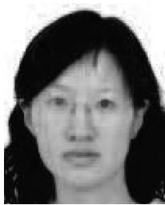

<details>
<summary>natural_image</summary>

Portrait of a woman with dark hair and neutral expression (no text or symbols visible)
</details>

Haixia Cui (Senior Member, IEEE) received the M.S. and Ph.D. degrees in communication engineering from South China University of Technology, Guangzhou, China, in 2005 and 2011, respectively.

She is a Full Professor with the School of Electronics and Information Engineering, South China Normal University, Foshan, China, and also with the School of Physics and Telecommunication Engineering, South China Normal University, Guangzhou. From July 2014 to July 2015, she visited the Department of Electrical and Computer

Engineering, The University of British Columbia, Vancouver, BC, Canada, as a Visiting Scholar. Her research interests are in the areas of cooperative communication, wireless resource allocation, 5G/6G, and antennas.


<details>
<summary>natural_image</summary>

Portrait of a smiling man in a suit and tie (no text or symbols visible)
</details>

Mohsen Guizani (Fellow, IEEE) received the B.S. (with Distinction), M.S., and Ph.D. degrees in electrical and computer engineering from Syracuse University, Syracuse, NY, USA in 1985, 1987, and 1990, respectively.

He is currently a Professor of Machine Learning and the Associate Provost with the Mohamed Bin Zayed University of Artificial Intelligence, Abu Dhabi, UAE. Previously, he worked in different institutions in the USA. He has authored ten books and more than 800 publications. His research interests include applied machine learning and artificial intelligence, Internet of Things, intelligent autonomous systems, smart city, and cybersecurity.

Dr. Guizani was listed as a Clarivate Analytics Highly Cited Researcher in Computer Science in 2019, 2020, and 2021. He has won several research awards, including the 2015 IEEE Communications Society Best Survey Paper Award, the Best ComSoc Journal Paper Award in 2021 and five Best Paper Awards from ICC and Globecom Conferences. He is the author of ten books and more than 800 publications. He is also the recipient of the 2017 IEEE Communications Society Wireless Technical Committee Recognition Award, the 2018 AdHoc Technical Committee Recognition Award, and the 2019 IEEE Communications and Information Security Technical Recognition (CISTC) Award. He served as the Editor-in-Chief of IEEE NETWORK and is currently serving on the editorial boards of many IEEE transactions and magazines. He was the Chair of the IEEE Communications Society Wireless Technical Committee and the Chair of the TAOS Technical Committee. He served as the IEEE Computer Society Distinguished Speaker and is currently the IEEE ComSoc Distinguished Lecturer.