# Fault-Tolerant Aware Task Offloading Based on Reinforcement Learning in Mobile Edge Computing

Saiqin Long , Chongxi Rao, Haolin Liu , Member, IEEE, Yunjie Chen, Zhetao Li , Member, IEEE, Jing Shang, and Qingyong Deng , Senior Member, IEEE

Abstract—In recent years, Mobile Edge Computing (MEC) has been widely used for latency-sensitive tasks, but task scheduling in dynamic edge environments still faces two key challenges. First, edge devices are prone to failures, and existing fault-tolerance mechanisms lack task-aware modeling, making it hard to ensure timeliness and reliability under failures. Second, due to limited perception, high communication costs, and complex task structures, current scheduling strategies still struggle with adaptability and stability in dynamic systems. In this paper, we propose a Fault-Tolerant Discrete Soft Actor-Critic scheduling algorithm (FT-DSAC). Initially, we design a Primary-Backup-based Fault-Tolerant (PBFT) scheduling mechanism, which constrains task offloading locations and start times to effectively mitigate the impact of failures on task execution. Furthermore, we incorporate the Centralized Training and Distributed Execution (CTDE) architecture, which enables implicit collaborative scheduling decisions among edge servers to optimize system performance and reduce communication overhead. Finally, We conduct extensive experiments using both simulated data generated by DAGGEN and real-world workflow data. Experimental results show that the proposed algorithm significantly improves task execution success rates by 6% –19% and reduces latency by 9% –27% compared to mainstream benchmarks.

Index Terms—Mobile edge computing, fault-tolerant, task offloading, deep reinforcement learning.

## I. INTRODUCTION

technologies [1], an increasing number of intelligent applications (such as augmented reality, autonomous driving, interactive gaming, etc. [2]) are being generated and processed at the network edge. These applications are placing growing demands on low-latency operations, while also requiring more computational resources and storage capacity. While traditional cloud computing architectures can provide robust computational and storage capabilities, their reliance on centralized data centers often leads to high latency and bandwidth bottlenecks. To address these limitations, Mobile Edge Computing (MEC) has emerged [3], deploying computational and storage resources at network access points (such as base stations) closer to user devices. This approach effectively reduces transmission delays, mitigates network congestion, and significantly enhances the Quality of Experience (QoE) for users [4].

Despite the remarkable advantages of MEC in supporting latency-sensitive edge applications, it still faces significant reliability risks during practical deployment. On one hand, MEC systems are more susceptible to disruptions caused by environmental dynamics, unstable wide-area network (WAN) connections, resource contention, and security threats [5], making their overall stability more fragile. The impact of infrastructure failures has become increasingly prominent. According to the report by Senseye [6], unplanned downtime due to equipment failures results in an annual loss of up to USD 1.4 trillion for large manufacturing enterprises worldwide, accounting for approximately 11% of their total revenue. On the other hand, MEC is increasingly being used to support complex AI workloads, such as large language models (LLMs) and multimodal inference. As these applications grow in scale, task execution becomes more dependent on collaborative scheduling across devices and regions. Experimental studies in [7] have revealed that, within such cooperative scheduling architectures, resource and network infrastructure failures account for less than 10% of total task failures but lead to over 80% of GPU time being wasted, drastically reducing system utilization. Therefore, designing a reliable scheduling mechanism to ensure tasks can continue running becomes a key issue in optimizing the stability of current MEC systems.

In recent years, fault-tolerant mechanisms have been introduced to enhance the stability and robustness of edge computing systems under dynamic conditions. Several studies [8], [9] have proposed lightweight pipeline replay mechanisms to mitigate the impact of device-level dynamism in distributed training, thereby improving the continuity and stability of the training process. However, these methods are primarily designed for static training scenarios. They lack mechanisms for rapid fault response and seamless task recovery, making them unsuitable for latency-sensitive and highly concurrent edge inference workloads. Awan et al. [10] proposed a Deadline and Fault-Aware Resource Management (DFARM) scheduler, which integrates deadline constraints with fault-aware task adjustment and utilizes a hybrid replication-reexecution strategy for fault tolerance. However, this approach tends to perform coarse-grained analysis of tasks, making it difficult to coordinate task migration and initiation timing across different stages of scheduling. Moreover, from the perspective of scheduling architectures, Multi-Agent Deep Reinforcement Learning (MADRL) [11], [12], [13] have emerged as a promising approach for distributed task offloading. Nevertheless, when applied to fault-tolerant scheduling, it still encounters two major limitations. First, during the training phase, these models often fail to incorporate task-specific scheduling constraints and fault-tolerance objectives, which restricts the generalizability of the learned policies. Second, during execution, local agents typically lack collaborative mechanisms that are aware of failures, making it challenging to ensure both task reliability and sensitivity to latency under dynamic edge conditions.

We can summarize that current edge fault-tolerant scheduling designs face three key challenges: (1) lack of rapid failure response and smooth recovery; (2) the complex temporal dependencies among tasks hinder fine-grained analysis of each stage in the scheduling process; and (3) the difficulty of balancing reliability and latency in heterogeneous edge resource environments.

To address the aforementioned issues, this paper investigates the online task fault-tolerant scheduling problem with deadline constraints in heterogeneous MEC environments. We propose a Fault-Tolerant Discrete Soft Actor-Critic scheduling algorithm (FT-DSAC) to make decisions in a distributed setting. In summary, the main contributions of this paper are as follows.

\- We first design a Primary-Backup-based Fault-Tolerant scheduling mechanism (PBFT), which performs finegrained analysis of the task scheduling process to constrain the scheduling location and activation timing of tasks, thereby enhancing the recoverability and timeliness of task execution chains under server failures. Meanwhile, we introduce a data-driven strategy optimization approach to guide sample collection, improving training efficiency and enhancing policy stability.

We propose an architecture that combines Centralized Training and Distributed Execution (CTDE) to update the FT-DSAC model. During centralized training, global system states are integrated with task constraints to guide policy learning. During decentralized execution, each agent makes independent decisions based on local observations, enabling a scheduling framework that supports both failure-awareness and distributed coordination.

We conduct extensive performance evaluation of the proposed algorithm on real-world workflow datasets and a simulated dataset generated based on DAGGEN [14]. The experimental results demonstrate that our algorithm improves the task execution success rate by 6% -19% and reduces latency by 9% -27% .

The remainder of this article is organized as follows. Section II presents the related work. Section III presents the system model and fault-tolerant scheduling problem. In Section IV, we introduce the algorithm design. Section V provides a comprehensive performance evaluation. Finally, Section VI concludes this article.

## II. RELATED WORK

## A. Fault-Tolerant Techniques in MEC

In MEC systems, fault-tolerance mechanisms are widely employed to enhance task execution stability and overall system robustness. Existing studies can be broadly categorized into three strategies. First, failure-avoidance approaches [15] rely on historical data or probabilistic modeling to predict server failures and proactively bypass high-risk paths. However, these methods are typically confined to static scenarios and lack responsiveness to dynamic or sudden faults. Second, reactive mechanisms [16] initiate recovery procedures upon fault detection and offer a degree of adaptability, yet their high recovery latency often undermines task continuity and real-time guarantees. Third, proactive fault-tolerance mechanisms [17] enhance system availability by pre-deploying task replicas for failure switching. Although it improves system availability, the replica strategy usually does not model the scheduling location and temporal dependencies, resulting in lower resource utilization efficiency.

In recent years, deep learning has been introduced into faulttolerant modeling to enhance systems’ perception capabilities for complex failures. Li et al. [18] proposed FedCPG, a personalized and lightweight federated learning framework guided by class prototypes for cross-factory fault detection. By decoupling the model structure, FedCPG uploads only the base model to the server for aggregation while retaining the specific classification heads locally for personalized updates. However, it lacks effective fault-tolerant mechanisms to handle server failures or data loss. To improve diagnostic robustness, He et al. [19] introduced FedITA, a federated iterative learning algorithm for distributed fault diagnosis in industrial motors, leveraging progressive training and complementary perception. However, its recovery decisions are made at the model level without fine-grained analysis of task-level recovery needs. Tuli et al. [20] proposed DRAGON, a decentralized fault-tolerance method based on Generative Optimization Networks (GON), which independently simulates system states at edge servers to optimize fault tolerance. Nonetheless, model computation load and training latency may pose significant bottlenecks in edge environments. Additionally, Transformer-based approaches [21], [22] have been widely adopted in system-level fault detection. For instance, one work integrates domain knowledge to improve anomaly identification in sensor networks, while Wang et al. combined Transformers with reinforcement learning to generate long-tail risk scenarios in UAV traffic management systems. However, these methods primarily focus on fault perception and privacy preservation, lacking joint modeling support for task recovery, scheduling, and overall system availability. In this paper, we primarily focus on computation-related failures of edge servers (particularly system interruptions), while also considering potential failures of network transmission devices.

TABLE I  
COMPARISON OF REPRESENTATIVE FAULT-TOLERANT SCHEDULING METHODS IN MEC

<table><tr><td>Fault-Tolerant Scheduling Category</td><td>Representative Literature</td><td>Fault-Tolerant Method</td><td>Scheduling Architecture</td><td>Fine-Grained Scheduling</td><td>High Reliability</td><td>Low Communication Latency</td><td>Robustness</td></tr><tr><td rowspan="3">Rule-based Methods</td><td>[8], [9], [23]</td><td>Reactive</td><td>Centralized</td><td>×</td><td>×</td><td>×</td><td>×</td></tr><tr><td>[10], [24]</td><td>Proactive</td><td>Centralized</td><td>√</td><td>√</td><td>×</td><td>×</td></tr><tr><td>[18], [19]</td><td>Failure Avoidance</td><td>Centralized</td><td>×</td><td>√</td><td>×</td><td>×</td></tr><tr><td rowspan="2">Learning-based Methods</td><td>Transformer-based [21], [22], [25]</td><td>Reactive</td><td>Centralized</td><td>×</td><td>×</td><td>√</td><td>×</td></tr><tr><td>DRL-based [26]/ [27], [28]</td><td>Failure Avoidance</td><td>Distributed/ CTDE</td><td>×</td><td>√</td><td>√</td><td>×</td></tr><tr><td>FT-DSAC (Ours)</td><td>—</td><td>Proactive</td><td>CTDE</td><td>√</td><td>√</td><td>√</td><td>√</td></tr></table>

## B. Fault-Tolerant Task Scheduling Strategies in MEC

Fault-tolerant aware task scheduling and offloading strategies are central to research in MEC. Traditional approaches primarily rely on heuristic algorithms or mathematical optimization to design scheduling and fault-tolerance mechanisms. Gandhi et al. [23] proposed the ReCycle system, which reroutes microbatches to data-parallel peers using a greedy strategy when server failures occur, enabling uninterrupted training even under repeated failures. However, ReCycle overlooks the complex dependencies among tasks and lacks systematic modeling of spatial scheduling relations and activation timing. Yao et al. [24] analyzed the fault-tolerant characteristics of task scheduling and virtual machine migration under a Primary-Backup model, and designed a fault-aware elastic cloud workflow scheduling algorithm targeting host and network device failures. Nevertheless, this method incurs significant system overhead due to frequent model and parameter reconstruction.

To improve the adaptability and generalization of scheduling policies, recent studies have increasingly adopted DRL approaches. Gholipour et al. [25] proposed TPTO, a method that integrates Transformer networks with Proximal Policy Optimization (PPO) to offload dependent IoT tasks in edge computing. However, TPTO lacks an effective fault-tolerance mechanism to handle server failures or data loss, limiting its reliability in unstable environments. Dong et al. [26] introduced RLFTWS, an adaptive fault-tolerant workflow scheduling framework that embeds task resubmission and replication into a DRL model, using a Markov Decision Process to adaptively select faulthandling strategies and balance task completion time with resource utilization. Nevertheless, it fails to consider scheduling location and activation timing constraints after fault recovery. Lin et al. [27] proposed O2O-DRL, an offline-to-online task offloading method that incorporates task reliability to maximize long-term success rates, but it overlooks complex task dependencies and failure scenarios, lacking fine-grained modeling of fault recovery. Moreover, CTDE [27], [28], as a dominant paradigm in multi-agent learning, has been widely adopted for training edge agents, but still faces two main challenges in fault-tolerant scheduling: (1) the training phase lacks integration of prior knowledge such as fault-tolerant constraints, limiting policy generalization; and (2) during execution, local agents lack coordination mechanisms, resulting in excessive communication overhead. Table I summarizes representative works on fault-tolerant scheduling methods in MEC and highlights their distinctions across several key dimensions.

In this paper, we propose FT-DSAC, a fault-tolerant offloading algorithm based on the CTDE architecture. Unlike existing studies, our approach incorporates a fine-grained PBFT-based faulttolerance mechanism that explicitly models spatial scheduling positions and task activation times, thereby enabling more reliable and precise replica management. Moreover, this mechanism is seamlessly integrated into the CTDE framework through action masking and trajectory filtering, which not only ensures real-time, low-overhead scheduling but also significantly enhances system robustness under failures and uncertainties.

## III. SYSTEM MODEL AND PROBLEM DEFINITION

In this section, we first define several relevant models, and then introduce the task offloading paradigm in MEC. Finally, the task offloading process is formulated as an optimization problem. Fig. 1 illustrates an example of the system scenario.

## A. System Model

1) Task Model: The applications in MEC system are typically modeled as a DAG. We represent it as $G = \{ \mathcal { N } , \mathcal { V } \}$ where $\mathcal { N }$ =represents the set of tasks, and V is the set of edges representing the data dependencies between tasks. The task set is defined as $\mathcal { N } = \bar { \{ n _ { i } \} } 1 \leq i \leq N \}$ . The edge set is defined as $\mathcal { V } = \{ ( n _ { i } , n _ { j } ) | n _ { i } , n _ { j } \in \mathcal { N } , i < j \}$ , where $( n _ { i } , n _ { j } ) \in \mathcal { V }$ = ( )indicates a data dependency between $n _ { i }$ and $n _ { j }$ ( ). We define $D P ( n _ { i } )$ and $D S ( n _ { i } )$ as the direct predecessor and successor task set of $n _ { i } .$ respectively. Additionally, we designate $n _ { e n t r y }$ and $n _ { e x i t }$ as the entry task set and exit task set, respectively. As shown in Fig. 1(a), this paper adopts the PB model to design a fault-tolerant mechanism to mitigate the impact of failures.In the PB model, each task $n _ { i }$ has two replicas which are scheduled to edge servers in different subnets to achieve fault- tolerance. We use $n _ { i } ^ { P }$ and $n _ { i } ^ { B }$ to represent the primary and backup replicas of $n _ { i } ,$ respectively. For clarity, we use $n _ { i } ^ { Y } , Y \in \{ P , B \}$ to denote any of the task replicas, whether it is the primary or backup.

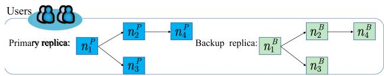  
(a) DAG of Application

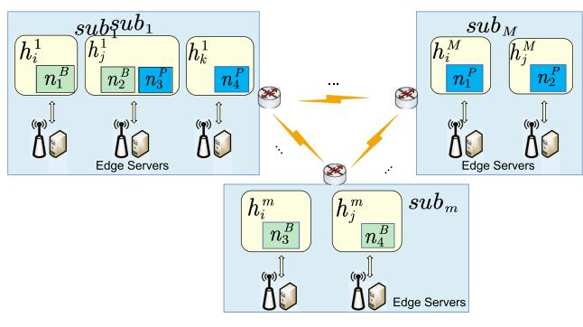  
(b) MEC system  
Fig. 1. An example of the system scenario.

2) Resource Cluster: As depicted in Fig. 1(b), the MEC system comprises of a set of edge servers and their corresponding relay devices. Each edge server is typically connected to a nearby base station and serves as a service provider for mobile users. Moreover, multiple edge servers are interconnected via relay devices (e.g., routers, switches, or gateways), thereby forming multiple logical subnet regions. We define a set of edge servers in the system as $S = \{ s _ { i } | 1 \leq i \leq S \}$ , where i is the index of the edge server. Additionally, we define the subnet set in the system as $\mathbf { S U B } = \{ \mathbf { s u b } _ { 1 } , . . . , \mathbf { s u b } _ { M } \}$ , where sub $\mod ( 1 \leq m \leq M )$ represents the mth subnet and its associated relay devices. Let $h _ { l } ^ { m }$ $( 1 \leq l \leq L _ { m } )$ denote the lth edge server in subnet $\mathrm { s u b } _ { m }$ , where $L _ { m }$ represents the number of edge servers in $s u b _ { m }$

3) System Assumptions: We assume that the edge server resources in the system are heterogeneous, i.e., each edge server in the system differs in terms of computational power, storage capacity, network bandwidth, etc. Each edge server can directly process tasks sent by users or offload tasks to other servers to run. In addition, the edge cluster studied in this paper operates in a fault-prone environment, in which both edge servers and relay devices may fail due to environmental disturbances. Failures of edge servers can affect local task execution, and failures of relay devices can lead to task interruptions and network performance degradation across subnets. We have summarized the main notations in Table II.

## B. Delay Model

Let $s _ { i } ^ { P }$ and $s _ { i } ^ { B }$ denotes the edge server for processing task $n _ { i } ^ { P }$ and $n _ { i } ^ { B } . ~ s u b _ { i } ^ { P }$ and $s u b _ { i } ^ { B }$ represent the subnets of $s _ { i } ^ { \ l }$ and $s _ { i } ^ { \bar { B } } .$ where i is the index of the task. In this paper, if task $n _ { i } ^ { Y } , Y \in$ $\{ P , B \}$ is offloaded, its execution generally involves three steps, though not all tasks necessarily follow this pattern. First, The task data is sent to the target server via a relay device. Second, the target server execute the received task. Finally, the execution result is transmitted to the successor task. Based on this process, we further define the key time elements involved in the process from task execution start to completion, aiming to systematically describe the task scheduling process.

TABLE II MAIN NOTATIONS

<table><tr><td>Notation</td><td>Description</td></tr><tr><td> $\mathcal{S}$ </td><td>Set of MEC servers.</td></tr><tr><td> $\mathcal{A}$ </td><td>Task scheduling plan.</td></tr><tr><td> $sub_{m}$ </td><td>The m-th subnet.</td></tr><tr><td> $s_{i}$ </td><td>The i-th edge server.</td></tr><tr><td> $h_{l}^{m}$ </td><td>The l-th edge server in the m-th subnet.</td></tr><tr><td> $\mathcal{N},\mathcal{V}$ </td><td>Task set and data dependency set.</td></tr><tr><td> $n_{i}$ </td><td>The i-th task.</td></tr><tr><td> $n_{i}^{Y},Y\in\{P,B\}$ </td><td>Primary and backup replicas of  $n_{i}$ .</td></tr><tr><td> $UD(n_{i}^{Y})$ </td><td>Upload delay of  $n_{i}^{Y}$ .</td></tr><tr><td> $ED(n_{i}^{Y})$ </td><td>Execution delay of  $n_{i}^{Y}$ .</td></tr><tr><td> $TD(n_{i}^{Y})$ </td><td>Transmission delay of  $n_{i}^{Y}$ .</td></tr><tr><td> $st(n_{i}^{Y})$ </td><td>Start time of  $n_{i}^{Y}$ .</td></tr><tr><td> $ft(n_{i}^{Y})$ </td><td>Completion time of  $n_{i}^{Y}$ .</td></tr><tr><td> $s_{i}^{Y}$ </td><td>MEC server allocated for  $n_{i}^{Y}$ .</td></tr><tr><td> $sub_{i}^{Y}$ </td><td>Subnets of  $n_{i}^{Y}$ .</td></tr><tr><td> $F(s_{i}^{Y})$ </td><td>Computing capacity of MEC server  $s_{i}^{Y}$ .</td></tr><tr><td> $TR(s_{i}^{Y},s_{j}^{Y})$ </td><td>Transmission rate between  $s_{i}^{Y}$  and  $s_{j}^{Y}$ .</td></tr></table>

1) Upload Delay: In step 1, let $U D ( n _ { i } ^ { Y } )$ represent the time to transfer task from the local server $s _ { 0 } ^ { Y }$ to the target server $s _ { i } ^ { Y }$ which can be calculated by

$$
U D (n _ {i} ^ {Y}) = \left\{ \begin{array}{l l} 0 & i f s _ {0} ^ {Y} = s _ {i} ^ {Y} \\ \frac {u d (n _ {i} ^ {Y})}{T R (s _ {0} ^ {Y} , s _ {i} ^ {Y})} & o t h e r w i s e. \end{array} \right.\tag{1}
$$

where $u d ( n _ { i } ^ { Y } )$ represents the bit size of the $n _ { i } ^ { Y }$ uploaded by itself $( \mathrm { i . e . }$ , the program code and related parameters). $T R ( s _ { 0 } ^ { Y } , s _ { i } ^ { Y } )$ donates the transmission rate between $s _ { 0 } ^ { Y }$ and $s _ { i } ^ { Y }$ ( ), which is expressed in bits per second.

2) Computation Delay: Similarly, in step 2, the computation time of task $n _ { i } ^ { Y }$ on edge server $s _ { i } ^ { Y }$ can be calculated by

$$
C D (n _ {i} ^ {Y}) = \frac {c d (n _ {i} ^ {Y})}{F (s _ {i} ^ {Y})}.\tag{2}
$$

where $c d ( n _ { i } ^ { Y } )$ is the number of CPU cycles required to compute $n _ { i } ^ { Y } . F ( s _ { i } ^ { Y } )$ represents the current computing capacity of $s _ { i } ^ { Y }$ , measured in terms of CPU frequency.

3) Transmission Delay: In addition, let $T D _ { j , Y } ^ { i , Y }$ donate the transmission delay incurred when transmitting the operation results of the task $n _ { i } ^ { Y }$ to its successor tasks $n _ { j } \in D S ( n _ { i } )$ . The delay can be calculated as

$$
T D _ {j, Y} ^ {i, Y} = \left\{ \begin{array}{l l} 0 & \text {if} s _ {i} ^ {Y} = s _ {j} ^ {Y} \text {or} n _ {i} ^ {Y} \in n _ {e x i t} \\ \frac {t d (n _ {i} ^ {Y})}{T R (s _ {i} ^ {Y} , s _ {j} ^ {Y})} & \text {otherwise.} \end{array} \right.\tag{3}
$$

where $t d ( n _ { i } ^ { Y } )$ indicates the size of output data for $n _ { i } ^ { Y }$ . If task $n _ { i } ^ { Y }$ executes on the same edge server as its successor task or task $n _ { i } ^ { Y }$ is an exit task, the transmission delay is 0.

4) Start and Finish Time: During the execution of tasks, we need to consider the order in which tasks are executed. Specifically, task $n _ { i } ^ { Y }$ can only start execution after the transmission data has been received. For generality, we use $s t ( n _ { i } ^ { Y } )$ and $f t ( n _ { i } ^ { Y } )$ to donate the start and finish time of $n _ { i } ^ { Y }$ . The $\dot { f t } ( n _ { i } ^ { Y } )$ ( )can be calculated by

$$
f t (n _ {i} ^ {Y}) = s t (n _ {i} ^ {Y}) + C D (n _ {i} ^ {Y}).\tag{4}
$$

Tasks on edge servers are executed in FIFO (First In, First Out) order and can only begin execution when the server has sufficient idle resources. We assume that each server maintains an execution queue and denote it by $Q ( s _ { i } ^ { Y } )$ , so the idle time can be updated by

$$
a v a (s _ {i} ^ {Y}) = \max (f t (n _ {i} ^ {Y}) | n _ {i} ^ {Y} \in Q (s _ {i} ^ {Y})).\tag{5}
$$

5) Execution Reliability: We define task execution reliability based on potential edge server failures and task transmission reliability based on potential edge-layer network device failures. Any failure scenario can be normalized as a Poisson distribution driven by the failure rate [29]. Based on the previous definitions, the time required for task $n _ { i } ^ { Y }$ to run without failure on edge server $s _ { i } ^ { Y }$ is $C D ( n _ { i } ^ { Y } )$ . During the time interval $[ 0 , C D ( n _ { i } ^ { Y } ) ]$ , failure occurs and is assumed to be a Poisson process with failure rate $\eta _ { 1 } ( s _ { i } ^ { Y } )$ . With reference to the definition in [27], the reliability of a task running on the edge server is defined as

$$
R _ {e} (n _ {i} ^ {Y}, s _ {i} ^ {Y}) = e ^ {- \eta_ {1} (s _ {i} ^ {Y}) \times C D (n _ {i} ^ {Y})}.\tag{6}
$$

Similarly, the transmission reliability of the task $n _ { i } ( n _ { i } \in$ $D P ( n _ { j } ) )$ when transferred from edge server $s _ { i } ^ { Y }$ to $s _ { j } ^ { Y }$ (can be ( ))calculated as

$$
R _ {e} (n _ {i} ^ {Y}, n _ {j} ^ {Y}; s _ {i} ^ {Y}, s _ {j} ^ {Y}) = e ^ {- \eta_ {2} (s _ {i} ^ {Y}, s _ {j} ^ {Y}) \times T D _ {j, Y} ^ {i, Y}}.\tag{7}
$$

where $\eta _ { 2 } ( s _ { i } ^ { Y } , s _ { j } ^ { Y } )$ represents the failure rate of the transmission link between edge severs $s _ { i } ^ { Y }$ and $s _ { j } ^ { Y }$ .

## C. Fault-Tolerant Model

For the scheduling of DAG tasks, the fault- tolerance of the system is highly dependent on the scheduling locations of the primary and backup replicas. Additionally, it is significantly influenced by task dependencies, execution order, and resource allocation. According to (4), $n _ { i } ^ { B }$ and $n _ { i } ^ { P }$ must satisfy the following constraint

$$
s t (n _ {i} ^ {B}) \geq s t (n _ {i} ^ {P}).\tag{8}
$$

It indicates that the backup replica can only be executed after the primary replica fails, thereby lowering resource consumption and ensuring the execution of other tasks. The constraint governing the start time of $n _ { i } ^ { P }$ and $n _ { k } ^ { P } \left( n _ { k } \in { \cal D } P ( n _ { i } ) \right.$ is expressed as

$$
C _ {1}: \quad s t (n _ {i} ^ {P}) \geq \max _ {n _ {k} \in D P (n _ {i})} \{f t (n _ {k} ^ {P}) + T D _ {i, P} ^ {k, P} \}.\tag{9}
$$

Clearly, if no failures occur, the task will execute normally by the equation above. However, when a sever or relay device fails, particularly when $n _ { k } ^ { P }$ fails, the system ensures fault-tolerance by activating its backup replica $\bar { n } _ { k } ^ { B }$ . In such cases, we need to consider the relationship between the start times of the current task’s primary replica $n _ { i } ^ { P }$ and the backup replica $n _ { k } ^ { B }$ of the preceding task. Typically, two scenarios arise.

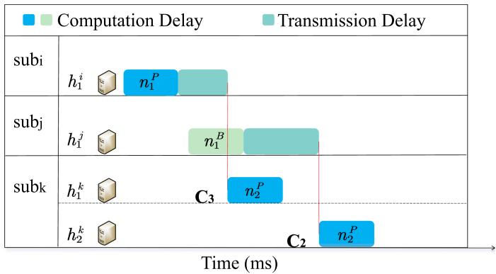  
Fig. 2. A example for $C _ { 2 }$ and $C _ { 3 } ( i \neq j$ and $k \in \{ j \} )$ ).

$$
{C _ {2}} {: s t (n _ {i} ^ {P}) \geq \max _ {n _ {k} \in D P (n _ {i})} \{f t (n _ {k} ^ {B}) + T D _ {i, P} ^ {k, B} \}.}\tag{10}
$$

$$
C _ {3}: \quad s t (n _ {i} ^ {P}) <   \max _ {n _ {k} \in D P (n _ {i})} \{f t (n _ {k} ^ {B}) + T D _ {i, P} ^ {k, B} \}.\tag{11}
$$

As shown in Fig. 2, under the conditions of $C _ { 2 }$ , task $n _ { i } ^ { P }$ can normally receive data from either $n _ { k } ^ { P }$ or $n _ { k } ^ { B }$ and execute sequentially. The start-time control strategy forces tasks to wait for the completion of backup replicas of preceding tasks, significantly increasing scheduling delays, which is unacceptable. In contrast, under the scenario described by $C _ { 3 } ,$ , there is partial overlap in the execution times between $n _ { i } ^ { \dot { P } }$ and $n _ { k } ^ { B }$ , which can better minimize unnecessary waiting time. Therefore, under the objective of maximizing task success rate while minimizing scheduling delays, the mechanism described by $C _ { 3 }$ is more aligned with the system design requirements. Based on the analysis of fault-tolerant task constraints in cloud environments in [24], a similar fault-tolerant task scheduling relation applicable to edge environments can be derived in this paper. We summarize it as Theorem 1.

Theorem 1. Considering the failure of edge servers and network transmission devices, under the requirements $o f C _ { 3 } ,$ , in order to achieve system fault-tolerance, the scheduling positions of task $n _ { i }$ and $n _ { k } | n _ { k } \in D P ( n _ { i } )$ must satisfy the following constraints.

$$
C _ {4}: \quad s u b _ {i} ^ {B} \neq s u b _ {i} ^ {P} \forall n _ {i} \in R.\tag{12}
$$

$$
C _ {5}: \quad s u b _ {i} ^ {B} \neq s u b _ {k} ^ {P} n _ {k} \in D P (n _ {i}).\tag{13}
$$

The start time of $n _ { i } ^ { B }$ and $n _ { k } ^ { B } | n _ { k } \in D P ( n _ { i } )$ must satisfy the following constraint.

$$
C _ {6}: \quad s t (n _ {i} ^ {B}) \geq \max _ {n _ {k} \in D P (n _ {i})} \{f t (n _ {k} ^ {B}) + T D _ {i, B} ^ {k, B} \}.\tag{14}
$$

Proof. We first consider the constraints related to location scheduling. Under the failure scenarios of edge servers and relay devices discussed in this paper, the primary replica $n _ { i } ^ { P }$ and the backup replica $n _ { i } ^ { B }$ of task $n _ { i }$ cannot operate simultaneously on the edge servers within the same subnet. This is because if the $s u b _ { i } ^ { B }$ fails, both $n _ { i } ^ { P }$ and $n _ { i } ^ { B }$ will be unable to transmit their results, and $n _ { i }$ will be considered as failed. Furthermore, the backup task cannot be scheduled to any subnet that satisfies the following condition: The backup task $\bar { n _ { i } ^ { B } }$ cannot be scheduled to any subnet that satisfies $s u b _ { k } ^ { P } | \bar { n } _ { k } \in D \bar { P } ( n _ { i } )$ . We consider two specific cases:

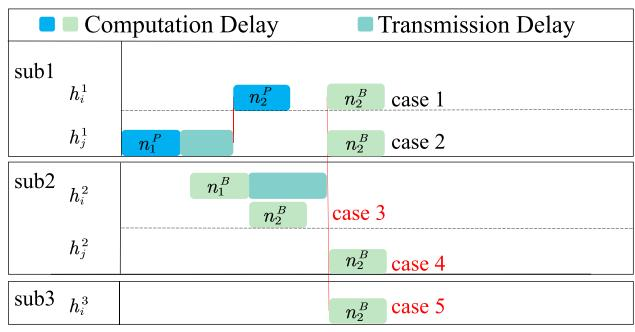

(a) subP = subP  
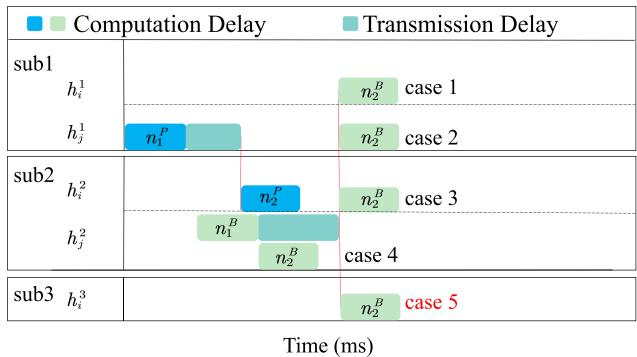  
(b) $s u b _ { 1 } ^ { P } \ne s u b _ { 2 } ^ { P }$  
Fig. 3. A example of task scheduling under $C _ { 3 }$

1. $s u b _ { i } ^ { P } = s u b _ { k } ^ { P }$ . When $s u b _ { k } ^ { P }$ fails, both $n _ { i } ^ { P }$ and $n _ { k } ^ { P }$ will fail regardless of whether they are located on the same server, and their corresponding backup replicas will be activated. If $s u b _ { i } ^ { B } =$ $s u b _ { k } ^ { P } , n _ { i }$ will be considered as a failure.

2. $s u b _ { i } ^ { P } \ne s u b _ { k } ^ { P }$ . When su $b _ { k } ^ { P }$ fails, $n _ { k } ^ { B }$ will be activated. However, task $n _ { i } ^ { \bar { P } }$ cannot be executed under constraint $C _ { 3 }$ because it cannot receive the required result at $s ( n _ { i } ^ { P } )$

Additionally, we assume that task $n _ { k } \ | \ n _ { k } \in D P ( n _ { i } )$ satisfies $\begin{array} { r } { f t ( n _ { k } ^ { B } ) + T D _ { i , B } ^ { k , B } = \operatorname* { m a x } _ { n _ { k } \in D P ( n _ { i } ) } \{ f t ( n _ { k } ^ { B } ) + T D _ { i , B } ^ { k , B } \} } \end{array}$ If $s u b _ { k } ^ { P }$ fails, task $n _ { k } ^ { B }$ will be activated and transmit its output data to $n _ { i } ^ { P }$ or $n _ { i } ^ { B }$ . However, according to $C _ { 3 } , n _ { i } ^ { P }$ cannot start at $s t ( n _ { i } ^ { P } )$ because it cannot receive the data from $n _ { k } ^ { P }$ . Therefore, $n _ { i } ^ { B }$ must start execution after $f t ( n _ { k } ^ { B } ) + T D _ { i , B } ^ { k , B }$ to ensure fault tolerance.

For better understanding, we take $n _ { 1 }$ and $n _ { 2 }$ as examples. Fig. 3 illustrates the scheduling process. As shown in Fig. 3(a), both $n _ { 1 } ^ { P }$ and $n _ { 2 } ^ { P }$ are allocated to $s u b _ { 1 }$ . Since $n _ { 2 } ^ { B }$ cannot coexist with $n _ { 2 } ^ { \overset { \cdot } { P } }$ in the same subnet, it is evident that $n _ { 2 } ^ { B }$ cannot be assigned to $s u b _ { 1 } . \ \mathrm { A t }$ the same time, case 1, case 2, case $^ { 3 , }$ and case 4 are the available offloading options. On the other hand, as shown in Fig. 3(b), $n _ { 2 } ^ { P }$ is allocated to sub or $s u b _ { 3 }$ $n _ { 2 } ^ { B }$ still cannot be allocated to sub . If sub fails, $n _ { 1 } ^ { P }$ will not be able to complete their execution properly and $n _ { 2 } ^ { \mathbf { \hat { B } } }$ will be initiated. However, task $n _ { 2 } ^ { P }$ cannot be executed under constraint $C _ { 3 }$ because it cannot receive the required result at $s t ( n _ { 2 } ^ { P } )$ from $n _ { 1 } ^ { P } \operatorname { o r } n _ { 2 } ^ { P }$ ( ). At this situation, case 5 is the only available offloading option.

Accordingly, the start time $s t ( n _ { i } ^ { Y } )$ of $n _ { i } ^ { Y } ( Y \in \{ P , B \} )$ can be calculate by

$$
s t (n _ {i} ^ {Y}) = \left\{ \begin{array}{l l} \max (\Gamma_ {1} (n _ {i} ^ {Y}), a v a (s _ {i} ^ {Y})) & \text { if } n _ {i} ^ {Y} \in n _ {e n t r y} \\ \max \{\Gamma_ {1} (n _ {i} ^ {Y}), a v a (s _ {i} ^ {Y}), \Gamma_ {2} (n _ {i} ^ {Y}) \} & \text { else. } \end{array} \right.\tag{15}
$$

where $\Gamma _ { 1 } ( n _ { i } ^ { Y } ) = a t + U D ( n _ { i } ^ { Y } )$ and $\Gamma _ { 2 } ( n _ { i } ^ { Y } ) = \mathrm { m a x } _ { n _ { k } \in D P ( n _ { i } ) }$ $\{ f t ( n _ { k } ^ { Y } ) + T D _ { i , Y } ^ { k , Y } \}$ . The parameter at denotes the time when the user submits the task, and $a v a ( s _ { i } ^ { Y } )$ represents the idle time of the edge sever $s _ { i } ^ { Y } . \ \Gamma _ { 1 } ( n _ { i } ^ { Y } )$ represents the time when the task is uploaded to the target sever, and $\Gamma _ { 2 } ( n _ { i } ^ { Y } )$ indicates the time when the parent task completes its transmission. Unlike traditional delay models, the PB model allows task completion delay to be determined by either the primary or backup replica. Therefore, The acutal completion execution time of task $n _ { i }$ can be calculated as

$$
a f t (n _ {i}) = \min (f t (n _ {i} ^ {P}), f t (n _ {i} ^ {B})).\tag{16}
$$

In fact, implementing fault-tolerant scheduling using the PB model inherently introduces additional delays. This arises from the need to coordinate and schedule both primary and backup replicas during task execution, thereby increasing the waiting times for task initiation and completion. The fault-tolerant mechanism proposed in this paper mitigates delays caused by failures to some extent by designing an overlap in execution times between $n _ { i } ^ { P }$ and $\overset { \cdot } { n } _ { k } ^ { B }$ . Moreover, assigning backup replicas to each task and activating them dynamically is costly because edge servers have limited resources. This can cause resource contention and reduce overall system throughput. To address this, backup replicas are assigned only to tasks with low reliability.

## D. Problem Definition

Let the decision variable $x _ { i , Y } ^ { m , l } \in \{ 1 , 0 \}$ } represent whether task $n _ { i } ^ { Y } ( Y \in \{ P , B \} )$ is offloaded to the lth edge server in the subnet $s u b _ { m }$ . Since tasks are the smallest offloading units, each task can only be assigned to a single edge sever. Therefore, the following constraint must be satisfied

$$
C _ {7}: \sum_ {i \in N} x _ {i, P} ^ {m, l} + \sum_ {i \in N} x _ {i, B} ^ {m, l} = 2, \forall m \in M, l \in L _ {m}.\tag{17}
$$

To address the problem of user request scheduling optimization, we establishes a segment-based discrete-time system where each time slot T has an equal duration. Within each time slot, users at the edge may submit tasks to the system. We use $N _ { d d l }$ to represent the set of tasks that have been successfully executed and meeting the deadline requirements, which can be calculated by

$$
N _ {d d l} = \{n _ {i} \mid a f t (n _ {i}) \leq s d (n _ {i}), 1 \leq i \leq N \}\tag{18}
$$

here, $s d ( n _ { i } )$ represents the deadline of task $n _ { i }$ , which can be calculated using the method in [30]. n denotes the number of tasks received within the time period T . This paper aims to determine an optimal set of offloading decisions A, ensuring timely task completion while minimizing the long-term average network delay. In conclusion, we establish the corresponding objective function for the proposed request scheduling optimization problem as follows.

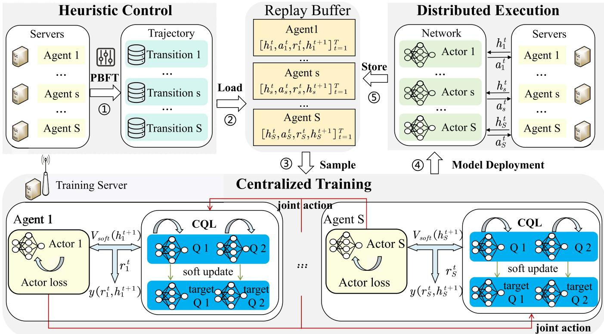  
Fig. 4. Overview of FT-DSAC.

$$
\begin{array}{c} \max _ {x _ {i} ^ {m, l}} \frac {| N _ {d d l} |}{N} \\ s. t. \text {Constraints} C _ {1}, C _ {3} - C _ {6}. \end{array}\tag{19}
$$

In the MEC environment, the joint optimization of task completion rate and delay for user requests has been proven to be an NP-hard problem. Traditional optimization methods are inefficient in addressing such problems. Therefore, this paper proposes a mechanism based on multi-agent deep reinforcement learning to achieve optimization.

## IV. ALGORITHM DESIGN

In this section, we adopt the CTDE framework to train the FT-DSAC model, aiming to achieve efficient fault-tolerant scheduling in MEC. The core principle of the framework is to leverage observations from all agents during the training phase, while only requiring each agent to access its local environment state during the decision-making phase. Fig. 4 provides an overview of the FT-DSAC, where each edge server is considered an different agent. The proposed FT-DSAC approach is composed of Algorithms 1 and 2. First, we collect historical task scheduling information and deploy the PBFT mechanism on each edge server to simulate task scheduling based on local information. This process extracts system context and constructs scheduling trajectory data, which is then input into the training server. Subsequently, the training server selects high-reward trajectory data and incorporates value decomposition techniques to centrally train the DSAC model. Finally, the trained scheduling decision network is deployed on each edge sever. By integrating the PBFT mechanism, the network makes offloading decisions for the primary and backup replicas of tasks based on the local information of each agent. The detailed steps are as follows.

## A. Problem Transformation

The fault-tolerant scheduling problem proposed in this paper can essentially be regarded as a continuous decision-making process. To establish interaction between the environment and agents during scheduling, and to facilitate the conversion of log information into trajectory data, this section models the problem as a Multi-Agent Markov Decision Process (MAMDP). The basic elements are defined as follows.

\- Environment State: The system state information primarily consists of two components: task information and resource information. Therefore, the joint system state observed by each agent at time t can be represented as

$$
S _ {t} = \{h _ {s} ^ {t} = (U _ {t}, I _ {t} ^ {s}) \mid s = 1, 2, \ldots , S \}\tag{20}
$$

where $U _ { t }$ represents a global queue that manages all executable tasks. $I _ { t } ^ { s }$ represents the resource information of edge server $s _ { i } ,$ which includes the server’s computational and data transmission resources, additional resources, and its failure status. At the beginning of each time slot, the observed system states by each agent are updated as well as the $U _ { t }$

\- Action: The action space is regarded as the mapping relationship between the current set of tasks and the available edge servers. When scheduling the primary replica of a task, the initial candidate set includes all edge servers in the environment. However, when scheduling the backup replica, fault-tolerance constraints must be considered to exclude conflicting actions. This can be achieved by masking certain edge servers during the decision-making process. The action mentioned in this paper is the task allocation decision according to the system states at time t. The joint actions of all agents are represented as:

$$
A _ {t} = \left\{a _ {s} ^ {t} \mid s = 1, 2, \dots , S \right\}\tag{21}
$$

where $a _ { s } ^ { t }$ represents the task in $U _ { t }$ that is assigned to edge server $s _ { i }$ . It is important to note that the actions in this paper are considered from the perspective of the edge servers. Since edge servers can only observe local resource information, they are unable to perform global scheduling. Reward: The design of the reward function is closely related to the scheduling objectives. In a multi-agent environment, the reward reflects the quality of the joint action at the current time slot and is always aligned with the optimization of the objective function. We define the reward $R _ { t }$ at time t as follows:

$$
R _ {t} = \sum_ {s = 1} ^ {S} r _ {s} ^ {t}\tag{22}
$$

where $r _ { s } ^ { t }$ represents the sum of the feedback rewards of all tasks on edge server $s _ { i }$ in time slot t. To ensure the system $\mathrm { \ ' } _ { \mathrm { s } }$ fault tolerance and optimize task execution delays, for each task $n _ { i } .$ if the task is completed within the stipulated deadline, the reward is calculated as the difference between the deadline sd $( n _ { i } )$ and the actual completion time $a f t ( n _ { i } )$ . However, if the task is not completed within the deadline or failed, a penalty of − is applied. The global reward function for each time slot is then defined as the sum of the feedback rewards from all edge servers in that particular time slot. This formulation ensures that both task completion time and fault tolerance are effectively balanced in the scheduling process.

## B. PBFT-Based Heuristic Control

At the initial stage, the model is prone to training challenges such as the cold start problem due to the limited amount of training data. To address this, we design a heuristic control method based on the PBFT mechanism and historical task scheduling information to collect trajectory data.

The detailed procedure is provided in Algorithm 1. First, we employ an upward ranking method [31] to determine task priorities, which we refine based on the characteristics of edge severs to generate a scheduling sequence. Next, we define a task processing function (P ROCESS $T A S K ( n , S ) )$ ) to compute the processing time on each server and select suitable servers for the primary and backup replicas according to the specified constraints. If the candidate set is empty, we assign the task to the sever with the highest reliability. Finally, agents capture environmental information before and after task scheduling and generate trajectory data $( S _ { t } , A _ { t } , S _ { t + 1 } , R _ { t } )$ required for reinforcement learning by integrating the DAG task offloading decisions and resource utilization. The data is standardized and stored in the replay buffer of the training server to optimize the task scheduling policy. Subsequently, the DSAC model is trained centrally to improve scheduling performance.

Algorithm 1: PBFT-Based Heuristic Control.

1: Input: Historical task scheduling data.
2: Compute task ranks and store tasks in descending order in  $U_{t}$ ;
3: while  $U_{t} \neq NULL$  do
4: Select task  $n_{i}$  from  $U_{t}$ ;
5: Schedule Primary:
6:  $c(n_{i}^{P}) \leftarrow \text{ProcessTask}(n_{i}^{P}, S)$ ;
7: Schedule Backup:
8:  $c(n_{i}^{B}) \leftarrow \text{ProcessTask}(n_{i}^{B}, S)$ ;
9: Construct trajectory information based on the context before and after scheduling (S, A, R);
10: Remove  $n_{i}$  from  $U_{t}$ .
11: end while
12: Output:  $\{(h_{s}^{t}, a_{s}^{t}, r_{s}^{t}, h_{s}^{t+1})_{S}\}$ .
// Function: ProcessTask
13: function ProcessTaskn, S
14: Initialize candidate set  $CS \leftarrow \emptyset$ ;
15: Define Constraints:
16: For primary:  $C_{P} \leftarrow \{ft(n_{i}) \leq sd(n_{i})\}$ ;
17: For backup:  $C_{B} \leftarrow \{ft(n_{i}) \leq sd(n_{i}), C_{4}, C_{5}\}$ ;
18: for each edge server  $s \in S$  do
19: Calculate  $ft(n_{i})$  by (4);
20: if server s satisfies the respective constraint ( $C_{P}$  or  $C_{B}$ ) then
21:  $CS \leftarrow CS \cup \{s\}$ ;
22: end if
23: end for
24: if  $CS \neq \emptyset$  then
25: returnserver in CS with  $\min\{ft(n_{i})\}$ ;
26: else
27: returnserver with the highest reliability.
28: end if
29: end Function

## C. Centralized Training

To train a global model, we employ a Value Decomposition Network (VDN) architecture, leveraging historical system scheduling data as the training dataset. The core concept of VDN lies in decomposing the team value function into individual agent value functions. In other words, the overall system policy is evaluated as the sum of the rewards accrued from each agent’s policy. Using trajectory data, we perform offline training of a discrete Soft Actor-Critic (SAC) model. SAC is an algorithm grounded in entropy maximization theory, which incorporates entropy into the objective function to significantly enhance the algorithm’s exploration capability and robustness. This enables the model to achieve an optimal balance between cumulative reward and policy entropy.

The process of model updating is presented in Algorithm 2. In this paper, we design two $Q$ networks to reduce the estimation bias of the value function. Let $\varphi _ { 1 }$ and $\varphi _ { 2 }$ represent the parameters of the two $Q$ networks, and $\overline { { \varphi _ { 1 } } }$ and $\overline { { \varphi _ { 2 } } }$ represent the corresponding target network parameters. θ denotes the parameters of the actor network. The trajectories are dynamically selected at runtime from the RL trajectory database, which is generated by the RL agent interacting with the current RL environment. We select the top $T$ trajectories with the highest rewards. Let the dataset selected from the buffer be $\tau _ { \ast }$ , represented as: $\mathcal { T } =$ $\{ ( h _ { s } ^ { t } , a _ { s } ^ { t } , h _ { s } ^ { t + 1 } , r _ { s } ^ { t } ) _ { s = 1 } ^ { S } \} _ { T }$ . The team-Q value function $Q ( S _ { t } , A _ { t } )$ is replaced by a linear combination of individual Q-values. Based on this assumption, the team-Q value in VDN can be approximated as the sum of the individual agent Q-values. The soft value and target value are computed as:

$$
\begin{array}{c} V _ {s o f t} (h _ {s} ^ {t + 1}) = \pi_ {\theta} (a | h _ {s} ^ {t + 1}) ^ {\mathrm{T}} \Bigg (\min _ {j = 1, 2} Q _ {\overline {{\varphi}} _ {j}} (h _ {s} ^ {t + 1}, a) \\ - \alpha \log \pi_ {\theta} (a | h _ {s} ^ {t + 1}) \Bigg). \end{array}\tag{23}
$$

$$
y (r _ {s} ^ {t}, h _ {s} ^ {t + 1}) = r _ {s} ^ {t} + \gamma V _ {s o f t} (h _ {s} ^ {t + 1}).\tag{24}
$$

In VDN, the team soft value and team target value can be expressed as

$$
Q _ {\varphi_ {j}} \left(S _ {t}, A _ {t}\right) = \sum_ {s = 1} ^ {\mathcal {S}} Q _ {\varphi_ {j}} \left(h _ {s} ^ {t}, a _ {s} ^ {t}\right) j = 1, 2.\tag{25}
$$

$$
Y _ {t} = \sum_ {s = 1} ^ {\mathcal {S}} y \left(r _ {s} ^ {t}, h _ {s} ^ {t + 1}\right)\tag{26}
$$

We update each Q-network by minimizing the following Mean Squared Error (MSE) using gradient descent.

$$
J _ {Q} \left(\varphi_ {j}\right) = \nabla_ {\varphi_ {j}} \frac {1}{| \mathcal {T} |} \sum_ {t = 0} ^ {\mathcal {T}} \left(Q _ {\varphi_ {j}} \left(S _ {t}, A _ {t}\right) - Y _ {t}\right) ^ {2} j = 1, 2.\tag{27}
$$

However, due to the distribution shift between the data collected by the heuristic policy and the offline learning policy, CQL regularization [32] is used to address this issue and optimize the Q-network. CQL regularizes the Q-value function to ensure conservative estimates, preventing overestimation during the value function learning process, thus reducing instability in the policy. The regularizer can be expressed as

$$
L (h _ {s} ^ {t}, a _ {s} ^ {t}) = \log \sum_ {a} \exp (Q _ {\varphi_ {j}} (h _ {s} ^ {t}, a)) - Q _ {\varphi_ {j}} (h _ {s} ^ {t}, a _ {s} ^ {t}).\tag{28}
$$

Let $\lambda _ { c }$ be the CQL weight. Using the regularizer, we update the Q network by minimizing the following equation with gradient

Algorithm 2: Updating the DSAC Model.

1: Input: Initialize Q-network parameters  $\varphi_{1}$ ,  $\varphi_{2}$ , target Q-network parameters  $\bar{\varphi}_{1}$ ,  $\bar{\varphi}_{2}$ , actor-network parameters  $\theta$ , buffer, and update count epoch.

2: for  $t \leftarrow 1$  to epoch do

3: Reset the training environment.

4: Sample a batch of size B from the buffer:  $\{(h_{s}^{t}, a_{s}^{t}, r_{s}^{t}, h_{s}^{t+1})_{S}\}$ .

5: Calculate Q-network gradient using CQL regularizer by (29):  $J_{Q}(\phi_{j})$ , j = 1, 2.

6: Calculate actor-network gradient by (30):  $J_{V}^{1}(\omega)$ ,  $J_{\pi}(\theta)$ .

7: Update Q-network and target-network parameters:  $\phi_{j}' = \phi_{j} - \beta J_{Q}(\phi_{j})$ ,

 $\bar{\phi}_{j} = (1 - \tau)\bar{\phi}_{j} + \tau\phi_{j}$ , j = 1, 2.

8: Update actor-network parameters:  $\theta = \theta + \beta J_{\pi}(\theta)$ .

9: end for

10: Output:  $\pi_{\theta}$

descent:

$$
\begin{array}{l} J _ {Q} \left(\varphi_ {j}\right) = \nabla_ {\varphi_ {j}} \frac {1}{| \mathcal {T} |} \sum_ {m = 1} ^ {\mathcal {T}} \left(Q _ {\varphi_ {j}} \left(S _ {t}, A _ {t}\right) - Y _ {t}\right) ^ {2} \\ \qquad + \lambda_ {c} \sum_ {s = 1} ^ {\mathcal {S}} L \left(h _ {s} ^ {t}, a _ {s} ^ {t}\right) \quad j = 1, 2. \end{array}\tag{29}
$$

To update the actor network parameters, we maximize the Mean Squared Error (MSE) using gradient ascent. It can be expressed as

$$
J _ {\pi} (\theta) = \nabla_ {\theta} \frac {1}{| \mathcal {T} |} \sum_ {t = 0} ^ {\mathcal {T}} \sum_ {s = 1} ^ {\mathcal {S}} V _ {s o f t} (h _ {s} ^ {t + 1}).\tag{30}
$$

## D. Distributed Execution

The trained model is deployed to edge servers, where only the actor network needs to be distributed. This network is lightweight and demands minimal computational resources. By leveraging the fault-tolerance mechanism of PBFT, each agent is required to input only locally observed information into the network to make decisions. Each DAG task is executed in accordance with this process. During scheduling, agents interact with the environment to collect new trajectory data. Periodically, the trajectory data is transmitted to the training server for model updates. In the initial stages of training, the data primarily consists of heuristically constructed samples. In contrast, during the later stages, it predominantly comprises data derived from the interactions between agents and the environment.

## V. PERFORMANCE EVALUATION

This section presents the experimental results of the proposed method. First, the algorithmic hyperparameters of FT-DSAC and the details of the simulation environment are introduced. Subsequently, the performance of the proposed fault-tolerant scheduling algorithm is evaluated through comparisons with other benchmark algorithms.

## A. Simulation Environment

The simulation platform is a computation server with AMD Ryzen 7 7745HX CPU, 32 GB RAM and NVIDIA GeForce RTX 4060. FT-DSAC is implemented via PyTorch. In the offlinetrained DRL model, both the actor network and the soft Q network have a single hidden layer with 64 hidden units. The activation function for these networks is ReLU, and the output layer of the actor network is processed using a softmax function. This paper designs an edge collaboration network where the resources of edge servers are heterogeneous. By default, the number of edge servers and tasks is set to 20 and 10, respectively. In all experiments, the data size of tasks follows a uniform distribution within the range of [5, 50] KB, and the number of CPU cycles required for task ranges from $1 0 ^ { 7 }$ to $1 0 ^ { 8 }$ . The number of CPU cores in the edge servers is randomly selected from {4, 8, 16, 24, 32} [24], and the CPU frequency of each core is 1 GHz. The transmission rate of the edge servers is uniformly distributed within the range of [10, 40] MB/s [27]. The failure rate of the edge servers is uniformly distributed within [0, 0.1], and the failure rate of edge transmission devices is uniformly distributed within [0, 0.03] [33].

We implement a synthetic DAG generator based on the DAGGEN tool to simulate heterogeneity. The structure and characteristics of the DAG are determined by four key parameters: the number of tasks, shape factor, dependency density, and communication-to-computation ratio. By default, these parameters are set to 20, 0.8, 0.5, and 0.5, respectively. What’s more, we set the ranges of the fat and density parameters to [0.4, 0.5, 0.6, 0.7, 0.8]. By combining different values of fat and density, we generated a total of 25 DAG sets, each representing a specific mobile user preference scenario. Each dataset consists of 100 DAGs with similar topological characteristics. These DAG sets not only facilitate the analysis of various offloading demands but also provide diverse learning tasks.

We compared the proposed FT-DSAC algorithm with baseline and intelligent algorithms, as detailed below.

\- FT-DSAC-Soft: This simplified variant is based on our proposed FT-DSAC algorithm, with relaxed scheduling constraints. It omits task precedence and replica triggering logic, and adopts a soft fault-tolerance mechanism similar to that in [23], where failed tasks are rerouted to peer servers to ensure execution continuity.

\- FECW [24]: This approach analyzes task dependencies using a PB-based model and pre-deploys replicas to support fault switching.

\- TPTO [25]: This method employs a Transformer network to reduce latency in DAG-structured applications and applies a proximity-based strategy to optimize the offloading of dependent IoT tasks in edge computing. However, it does not incorporate explicit fault-tolerance mechanisms.

O2O-DRL [27]: This method is deployed on each MEC server and aims to maximize the long-term task success rate by evaluating task reliability. Each model is trained using local experience data, which can be viewed as a coarse-grained fault-tolerance strategy. However, it does not account for dependencies among tasks.

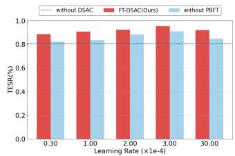  
(a) TESR

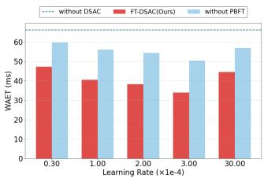  
(b) WAET

Fig. 5. Performance comparison under different learning rates.  
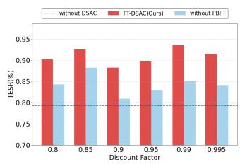  
(a) TESR

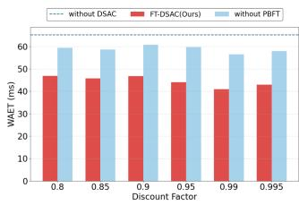  
(b) WAET  
Fig. 6. Performance comparison under different discount factors.

Then, we introduce the following performance metrics to evaluate the simulation results.

Task Execution Success Rate (TESR): It is defined as the ratio of tasks completed within the deadline to the total number of tasks in the tested workflow instance, reflecting the system’s fault- tolerance under edge server and link failure conditions.

Workflow Average Execution Time (WAET): It represents the average execution time of workflows with various topologies, considering task dependencies, resource availability, and network conditions, reflecting both edge server overhead and task completion efficiency.

## B. Simulation Results

1) Ablation Study: To comprehensively evaluate the contributions of the PBFT fault-tolerance mechanism and the reinforcement learning architecture in the proposed method, we have designed an ablation study. The experiment examines the impact of three key hyperparameters—learning rate, discount factor, and batch size. When analyzing the effect of a single factor, the results of the other two factors are averaged over all candidate values to avoid bias from relying on a single hyperparameter configuration. The comparison methods include: FT-DSAC with PBFT, a variant without PBFT, and a heuristic-based method that does not use reinforcement learning. As shown in Figs. 5, 6, and 7, FT-DSAC outperforms its variants and heuristic baselines across all metrics under different learning rates, discount factors, and batch sizes. The results demonstrate that the combination of the PBFT-based fine-grained fault-tolerance mechanism and the reinforcement learning framework effectively improves WAET and TESR, highlighting the robustness and generalization ability of the proposed method.

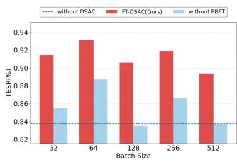  
(a) TESR

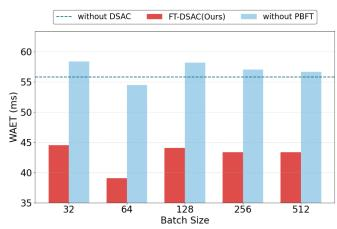  
(b) WAET

Fig. 7. Performance comparison under different batch sizes.  
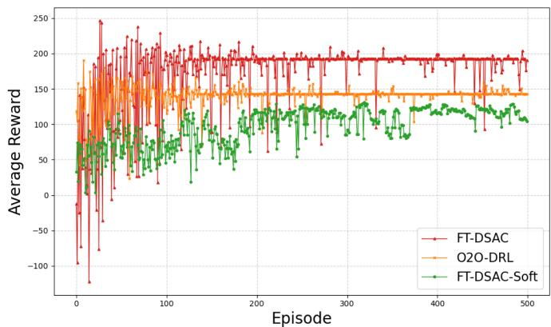  
Fig. 8. The average reward with training episodes.

Based on the results of the ablation study, we optimize the training hyperparameters for FT-DSAC as follows: the discount factor γ is 0.99, the learning rate is 0.0003, and the update parameter τ for the soft Q network is 0.0005. During training, the buffer size is set to 1,000,000, batch size to 128, the entropy regularization parameter α is 0.2, and the CQL regularization weight $\lambda _ { c }$ is 0.2.

2) Details of training: First, Fig. 8 illustrates how the average reward of the reinforcement learning-based methods evolves over the course of training sessions as the number of episodes increases. The maximum number of episodes is set to 500, with 20 iterations per episode. At the end of each episode, multiple tests are conducted to compute the average reward. As shown in Fig. 8, the rewards of all three schemes exhibit an upward trend as the number of episodes increases. During the initial phase of training, due to environment exploration, the initial average rewards are relatively poor. However, after a certain period of training, the reward curves gradually converge. The reward function is designed such that tasks completed earlier receive higher rewards. Compared to other reinforcement learning algorithms, FT-DSAC demonstrates superior training performance. The training time complexity of the FT-DSAC algorithm is $O ( E * N _ { s t e p } * S )$ , where E represents the number of episodes, $N _ { s t e p }$ denotes the number of steps per episode, and S indicates the number of edge severs. Under the configuration of $E = 1 0 0 , N _ { s t e p } = 2 0 , S = 1 0 0$

TABLE III  
COMPARISON OF INFORMATION SYNCHRONIZATION DELAY

<table><tr><td>FT-DSAC-Soft</td><td>FT-DSAC</td><td>FECW</td><td>O2O-DRL</td><td>TPTO</td></tr><tr><td>22.39 ms</td><td>16.371 ms</td><td>29.71 ms</td><td>18.037 ms</td><td>28.85 ms</td></tr></table>

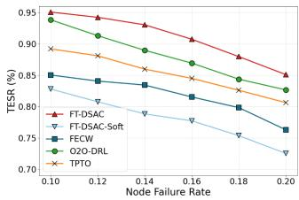  
(a) TESR

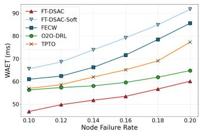  
(b) WAET

Fig. 9. Performance comparison under different sever failure rates.  
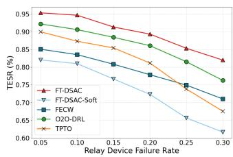  
(a) TESR

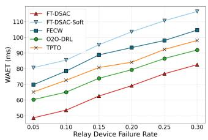  
(b) WAET  
Fig. 10. Performance comparison under different relay device failure rates.

Additionally, Table III presents a comparison of the average communication delay per workflow between FT-DSAC and other methods. By incorporating a value decomposition update strategy, FT-DSAC effectively reduces real-time communication requirements between servers. During execution, CTDE localizes the decision model to individual servers, reducing reliance on frequent global synchronization and significantly lowering communication delay. To comprehensively evaluate the performance of the proposed method, we conduct the following key experiments to examine the impact of various factors on system performance.

3) Impact of Failure Rates: In this section, we evaluate FT-DSAC’s performance under varying failure rates. Fig. 9(a) and (b) show the experiment results with a varied execution failure rate of edge servers which from [0, 0.1] to [0, 0.2]. The results consistently show that FT-DSAC outperforms other baseline methods. FT-DSAC effectively optimizes both TESR and WAET by using a reward function that translates workflow delay requirements into subtask-specific ones, promoting early task completion. O2O-DRL incorporates server reliability and benefits from comprehensive offline training; however, due to its lack of modeling task dependencies, its performance is slightly inferior. FT-DSAC-Soft, on the other hand, adopts a weaker fault-tolerance constraint and shows the poorest ability to mitigate failure impacts, resulting in the lowest overall performance.

Similarly, as shown in Fig. 10, the experimental results with a varied transmission failure rate of relay devices which from [0, 0.05] to [0, 0.3], reflect performance under high-failure , and 9.35% , while simultaneously reducing WAET by 26.54% , 17.37% , 8.55% , and 14.02% , compared to the other algorithms.

TABLE IV  
PERFORMANCE COMPARISON UNDER DIFFERENT REAL WORKFLOWS

<table><tr><td>Workflow</td><td>Metric</td><td>FT-DSAC</td><td>FT-DSAC-Soft</td><td>FECW</td><td>O2O-DRL</td><td>TPTO</td></tr><tr><td rowspan="2">Montage</td><td>TESR(%)</td><td>0.96 ± 0.028 ↑</td><td>0.79 ± 0.030</td><td>0.85 ± 0.027</td><td>0.93 ± 0.030</td><td>0.90 ± 0.029</td></tr><tr><td>WAET(ms)</td><td>59 ± 4 ↓</td><td>77 ± 6</td><td>73 ± 5</td><td>65 ± 4</td><td>69 ± 5</td></tr><tr><td rowspan="2">Epigenomics</td><td>TESR(%)</td><td>0.95 ± 0.027 ↑</td><td>0.72 ± 0.031</td><td>0.83 ± 0.028</td><td>0.90 ± 0.030</td><td>0.88 ± 0.029</td></tr><tr><td>WAET(ms)</td><td>5600 ± 390 ↓</td><td>6621 ± 470</td><td>6238 ± 440</td><td>5719 ± 410</td><td>5866 ± 420</td></tr><tr><td rowspan="2">CyberShake</td><td>TESR(%)</td><td>0.95 ± 0.028 ↑</td><td>0.76 ± 0.032</td><td>0.83 ± 0.029</td><td>0.87 ± 0.028</td><td>0.80 ± 0.030</td></tr><tr><td>WAET(ms)</td><td>273 ± 19 ↓</td><td>361 ± 27</td><td>347 ± 24</td><td>284 ± 20</td><td>355 ± 26</td></tr><tr><td rowspan="2">Inspiral</td><td>TESR(%)</td><td>0.92 ± 0.030 ↑</td><td>0.63 ± 0.034</td><td>0.74 ± 0.030</td><td>0.86 ± 0.030</td><td>0.80 ± 0.029</td></tr><tr><td>WAET(ms)</td><td>1388 ± 100 ↓</td><td>2033 ± 150</td><td>1882 ± 140</td><td>1529 ± 110</td><td>1911 ± 140</td></tr></table>

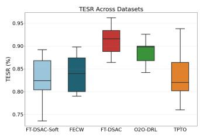  
(a) TESR

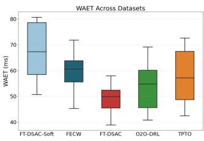  
(b) WAET  
Fig. 11. Performance comparison under different datasets

scenarios. The overall trends in TESR and WAET are consistent with those observed under edge sever failure, but with greater fluctuations. Under high failure rates, TPTO performs worse due to the lack of pretraining on high-quality data, gradually falling behind the pre-deployed replica-based FECW. However, thanks to its transformer-based architecture for optimizing task scheduling latency, it still achieves relatively lower delays. Overall, FT-DSAC achieves a 19.91% , 12.57% , 7.36% , and 9.12% improvement in TESR, while reducing WAET by 27.02% , 20.35% , 12.77% , and 16.32% , respectively, compared to other algorithms.

Next, we investigate how varying network density affects algorithm performance. We denote five levels of network density using Roman numerals I to V, where I represents the sparsest and V the densest configuration. As shown in Fig. 12(a) and (b), with network density increasing from level I to V, the overall performance of all algorithms tends to converge, indicating that denser communication structures help alleviate resource contention in task offloading. Among them, FT-DSAC consistently maintains the best average performance across all density levels. Its convergence value also surpasses that of other methods, demonstrating higher stability.

4) Impact of Task Types and Network Densities: In this section, we first evaluate the performance of various algorithms under different user preferences. To this end, we construct datasets containing both computation-intensive and transmission-intensive tasks to simulate diverse offloading demands in real-world mobile applications. The training and testing parameters are configured according to default settings. Fig. 11(a) and (b) present a comparison of TESR and WAET across different task topologies. FT-DSAC consistently achieves the best average performance and exhibits smaller performance variations across various task structures, demonstrating stronger generalization and scheduling stability. This advantage primarily stems from its capability to model task dependency structures and its strong generalization ability, enabling efficient scheduling even for previously unseen tasks. Furthermore, FT-DSAC effectively avoids dispatching tasks to faulty servers, thereby enhancing scheduling stability. Overall, FT-DSAC achieves significant improvements in TESR, with increases of 12.43% , 8.68% , 6.91%

5) Impact of the Number of Tasks and Edge Servers: This section evaluates the impact of different resource configurations on workflow performance. The training and testing parameters follow default settings, with other configurations consistent with previous experiments. As illustrated in Fig. 13, FT-DSAC consistently delivers the best average performance across all algorithms as the number of tasks increases, demonstrating greater stability and adaptability. Specifically, TESR remains stable even when the task number grows significantly. This robustness stems from the combination of replica allocation constraints introduced by the PBFT mechanism, which mitigate cascading failures, and the generalization ability of the policy trained under the CTDE framework, which enables effective adaptation to larger task scales. In this scenario, O2O-DRL fails to model task dependencies, which may result in suboptimal scheduling and increase the risk of execution delays or failures. TPTO, lacking high-quality pretraining data, is prone to falling into local optima and struggles to handle complex scheduling demands. FECW, on the other hand, preassigns a fixed number of replicas, which can exceed resource thresholds under high task loads, leading to scheduling congestion and inefficiency. Overall, FT-DSAC achieves an average improvement of at least 7.25% in TESR and a reduction of 23.61% in WAET compared to other algorithms.

Similarly, as illustrated in Fig. 14, FT-DSAC consistently outperforms other methods across all tested edge server quantities. The continuous decrease in WAET indicates that increasing computational resources effectively alleviates scheduling pressure, while the rise in TESR reflects improved task reliability with more available resources. The abundance of edge resources enhances scheduling flexibility, and FT-DSAC, leveraging its reinforcement learning strategy and feedback mechanism, efficiently matches tasks to servers within the resource space, thereby optimizing the overall execution path. These results confirm that FT-DSAC is highly scalable to large-scale edge server deployments.

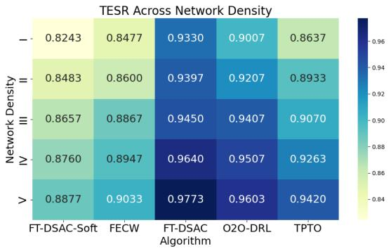  
(a) TESR

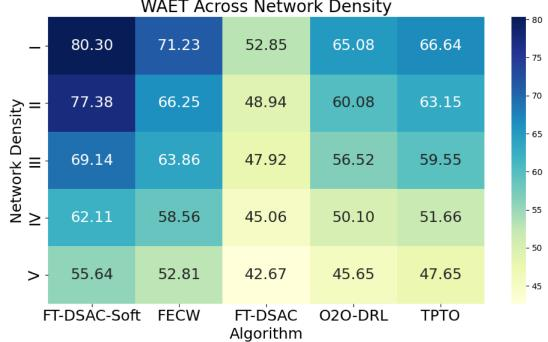  
(b) WAET

Fig. 12. Performance comparison under different network densities.  
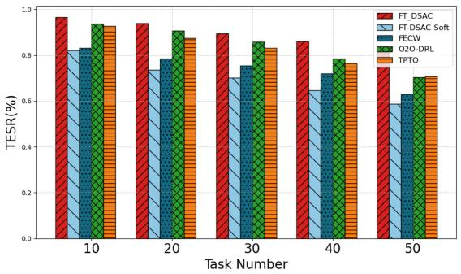  
(a) TESR

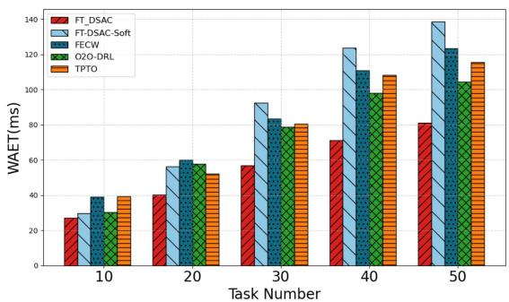  
(b) WAET

Fig. 13. Performance comparison under different task numbers.  
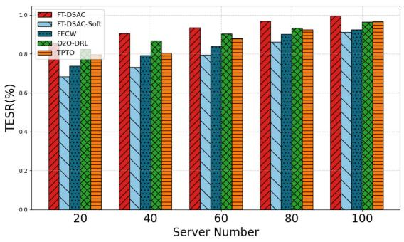  
(a) TESR

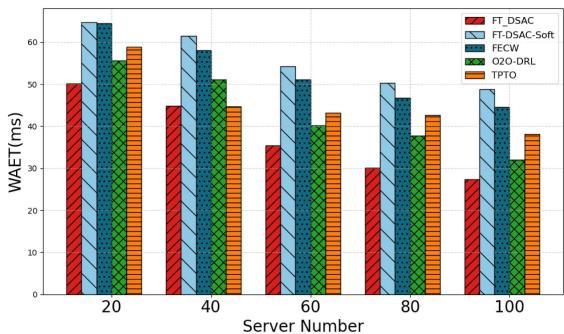  
(b) WAET  
Fig. 14. Performance comparison under different server numbers.

6) Real-world Workflows: In addition to randomly generated workflows, this section evaluates the proposed algorithm using several real-world workflows, including Montage, CyberShake, Epigenomics, Inspiral. These workflows are widely used in workflow scheduling research [24], [34] because of their diverse structures and characteristics, which make them suitable for simulating various application scenarios. For example, Montage focuses on intensive I/O operations and requires minimal CPU resources, while CyberShake is designed for simulating seismic wave propagation, requiring high computational power and complex task dependencies. Epigenomics, on the other hand, is data-intensive and involves the analysis of large-scale genomic data. Inspiral is CPU-intensive workflow with numerous dependencies between preceding and succeeding tasks.

As shown in Table IV, the results indicate that FT-DSAC consistently outperforms other algorithms across all workflows. This advantage is largely attributed to the fault-tolerance mechanism integrated into FT-DSAC, which ensures that critical tasks are completed on time by generating replicas for them. This demonstrates the method’s superior generalization, scalability, and robustness. With its reinforcement learning strategy and structural task modeling, FT-DSAC effectively schedules large workflows and adapts to diverse application demands, showing strong potential for real-world deployment. Other algorithms show some advantages in specific workflows, they generally fall short of FT-DSAC, particularly in fault-handling scenarios.

## VI. CONCLUSION

In this paper, we investigate the online task fault-tolerant scheduling problem with deadline constraints in MEC environments and propose a distributed reinforcement learning method. By designing a PBFT mechanism, we analyze task dependencies, accurately model the spatiotemporal constraints of task scheduling, and optimize the experience dataset using data-driven techniques. The problem is further formulated as a MAMDP for solution. The proposed algorithm adopts a CTDE framework to update the DSAC model. During the centralized training phase, the network is updated using value decomposition techniques, while in the decentralized execution phase, decisions are made independently based on local environmental states. Experimental results demonstrate that the proposed algorithm outperforms existing mainstream methods in dynamic environments, showcasing excellent performance and application potential.

The fault-tolerant mechanism proposed in this paper may face challenges related to computational resources and storage overhead in more complex network environments and user task scenarios. As the scale of tasks grows, especially during the training and inference of large-scale models, the existing fault-tolerant mechanism may require more computational and storage resources, which could affect the system’s efficiency and performance. Therefore, future research will consider applying this fault-tolerant mechanism to more real-world business scenarios, particularly in the training and inference of large language models (LLMs), to assess its scalability in more complex settings. Additionally, optimizing the computational and storage overhead of the algorithm in large-scale systems to ensure efficient operation under varying resource conditions will be an important direction for future work.

## REFERENCES

[1] S. Guo, Y. Qi, Y. Jin, W. Li, X. Qiu, and L. Meng, “Endogenous trusted DRL-based service function chain orchestration for IoT,” IEEE Trans. Comput., vol. 71, no. 2, pp. 397–406, Feb. 2022.

[2] J. Du, F. R. Yu, G. Lu, J. Wang, J. Jiang, and X. Chu, “MEC-assisted immersive VR video streaming over terahertz wireless networks: A deep reinforcement learning approach,” IEEE Internet Things J., vol. 7, no. 10, pp. 9517–9529, Oct. 2020.

[3] N. Abbas, Y. Zhang, A. Taherkordi, and T. Skeie, “Mobile edge computing: A survey,” IEEE Internet Things J., vol. 5, no. 1, pp. 450–465, Feb. 2018.

[4] Y. Wu, K. Ni, C. Zhang, L. P. Qian, and D. H. Tsang, “NOMA-assisted multi-access mobile edge computing: A joint optimization of computation offloading and time allocation,” IEEE Trans. Veh. Technol., vol. 67, no. 12, pp. 12244–12258, Dec. 2018.

[5] M. Pourreza and P. Narasimhan, “Fault tolerant edge computing: Challenges and opportunities,” in Proc. IEEE 7th Int. Conf. Fog Edge Comput., 2023, pp. 73–80.

[6] Siemens AG, “The true cost of downtime 2024,” in Siemens AG. Erlangen, Germany and Alpharetta, GA, USA: White Paper, 2024, Art. no. DICS-B10146-00-7600.

[7] Q. Hu et al., “Characterization of large language model development in the datacenter,” in Proc. 21st USENIX Symp. Netw. Syst. Des. Implementation, vol. 24, pp. 709–729, 2024.

[8] S. Ye, L. Zeng, X. Chu, G. Xing, and X. Chen, “Asteroid: Resourceefficient hybrid pipeline parallelism for collaborative DNN training on heterogeneous edge devices,” in Proc. 30th Annu. Int. Conf. Mobile Comput. Netw., 2024, pp. 312–326.

[9] F. Strati, S. Mcallister, A. Phanishayee, J. Tarnawski, and A. Klimovic, “DéjàVu: KV-cache streaming for fast, fault-tolerant generative LLM serving,” 2024, arXiv:2403.01876.

[10] A. Awan, M. Aleem, A. Hussain, and R. Prodan, “DFarm: A deadlineaware fault-tolerant scheduler for cloud computing,” Cluster Comput., vol. 27, no. 7, pp. 9323–9344, 2024.

[11] Y. Xiao, Y. Song, and J. Liu, “Collaborative multi-agent deep reinforcement learning for energy-efficient resource allocation in heterogeneous mobile edge computing networks,” IEEE Trans. Wireless Commun., vol. 23, no. 6, pp. 6653–6668, Jun. 2024.

[12] H. Gao, X. Wang, W. Wei, A. Al-Dulaimi, and Y. Xu, “Com-DDPG: Task offloading based on multiagent reinforcement learning for informationcommunication-enhanced mobile edge computing in the Internet of Vehicles,” IEEE Trans. Veh. Technol., vol. 73, no. 1, pp. 348–361, Jan. 2024.

[13] M. Kim, H. Lee, S. Hwang, M. Debbah, and I. Lee, “Cooperative multiagent deep reinforcement learning methods for UAV-aided mobile edge computing networks,” IEEE Internet Things J., vol. 11, no. 23, pp. 38040–38053, Dec. 2024.

[14] F. Suter and S. Hunold, “Daggen: A synthetic task graph generator,” 2013. [Online]. Available: https://github.com/frs69wq/daggen

[15] B. T. Tinh, L. D. Nguyen, H. H. Kha, and T. Q. Duong, “Practical optimization and game theory for 6G ultra-dense networks: Overview and research challenges,” IEEE Access, vol. 10, pp. 13311–13328, 2022.

[16] H. Ke, H. Wang, W. Sun, and H. Sun, “Adaptive computation offloading policy for multi-access edge computing in heterogeneous wireless networks,” IEEE Trans. Netw. Service Manag., vol. 19, no. 1, pp. 289–305, Mar. 2022.

[17] Z. Li, H. Yu, G. Fan, and J. Zhang, “Cost-efficient fault-tolerant workflow scheduling for deadline-constrained microservice-based applications in clouds,” IEEE Trans. Netw. Service Manag., vol. 20, no. 3, pp. 3220–3232, Sep. 2023.

[18] H. Li, X. Wang, P. Cao, Y. Li, B. Yi, and M. Huang, “FedCPG: A class prototype guided personalized lightweight federated learning framework for cross-factory fault detection,” Comput. Ind., vol. 164, 2025, Art. no. 104180.

[19] Y. He and W. Shen, “Fedita: A cloud–edge collaboration framework for domain generalization-based federated fault diagnosis of machine-level industrial motors,” Adv. Eng. Inform., vol. 62, 2024, Art. no. 102853.

[20] S. Tuli, G. Casale, and N. R. Jennings, “DRAGON: Decentralized fault tolerance in edge federations,” IEEE Trans. Netw. Service Manag., vol. 20, no. 1, pp. 276–291, Mar. 2023.

[21] V. Nandalal, A. Muruganandham, S. Karthikeyan, J. M. Iqbal, and T. Manikandan, “Fault detection and diagnosis in wireless sensor networks leveraging transformer models,” in Proc. 2nd Int. Conf. Comput. Characterization Techn. Eng. Sci., 2024, pp. 1–5.

[22] Q. Wu, C. Dong, F. Guo, L. Wang, X. Wu, and C. Wen, “Privacy-preserving federated learning for power transformer fault diagnosis with unbalanced data,” IEEE Trans. Ind. Informat., vol. 20, no. 4, pp. 5383–5394, Apr. 2024.

[23] S. Gandhi, M. Zhao, A. Skiadopoulos, and C. Kozyrakis, “Recycle: Resilient training of large DNNs using pipeline adaptation,” in Proc. ACM SIGOPS 30th Symp. Operating Syst. Princ., 2024, pp. 211–228.

[24] G. Yao, X. Li, Q. Ren, and R. Ruiz, “Failure-aware elastic cloud workflow scheduling,” IEEE Trans. Services Comput., vol. 16, no. 3, pp. 1846–1859, May/Jun. 2023.

[25] N. Gholipour, M. D. de Assuncao, P. Agarwal, J. Gascon-Samson, and R. Buyya, “TPTO: A transformer-PPO based task offloading solution for edge computing environments,” in Proc. IEEE 29th Int. Conf. Parallel Distrib. Syst., 2023, pp. 1115–1122.

[26] T. Dong, F. Xue, H. Tang, and C. Xiao, “Deep reinforcement learning for fault-tolerant workflow scheduling in cloud environment,” Appl. Intell., vol. 53, no. 9, pp. 9916–9932, 2023.

[27] H. Lin, L. Yang, H. Guo, and J. Cao, “Decentralized task offloading in edge computing: An offline-to-online reinforcement learning approach,” IEEE Trans. Comput., vol. 73, no. 6, pp. 1603–1615, Jun. 2024.

[28] G. Wu, Y. Zhao, Y. Shen, H. Zhang, S. Shen, and S. Yu, “DRL-based resource allocation optimization for computation offloading in mobile edge computing,” in Proc. IEEE Conf. Comput. Commun. Workshops, 2022, pp. 1–6.

[29] J. Liu et al., “Reliability-enhanced task offloading in mobile edge computing environments,” IEEE Internet Things J., vol. 9, no. 13, pp. 10382–10396, Jul. 2022.

[30] A. Matani, H. R. Naji, and H. Motallebi, “A fault-tolerant workflow scheduling algorithm for grid with near-optimal redundancy,” J. Grid Comput., vol. 18, no. 3, pp. 377–394, 2020.

[31] H. Topcuoglu, S. Hariri, and M.-Y. Wu, “Performance-effective and lowcomplexity task scheduling for heterogeneous computing,” IEEE Trans. Parallel Distrib. Syst., vol. 13, no. 3, pp. 260–274, Mar. 2002.

[32] A. Kumar, A. Zhou, G. Tucker, and S. Levine, “Conservative Q-learning for offline reinforcement learning,” in Proc. Adv. Neural Inf. Process. Syst., 2020, pp. 1179–1191.

[33] X. Qiu, W. Zhang, W. Chen, and Z. Zheng, “Distributed and collective deep reinforcement learning for computation offloading: A practical perspective,” IEEE Trans. Parallel Distrib. Syst., vol. 32, no. 5, pp. 1085–1101, May 2021.

[34] S. Abdi, M. Ashjaei, and S. Mubeen, “Cost-aware workflow offloading in edge-cloud computing using a genetic algorithm,” J. Supercomputing, vol. 80, no. 17, pp. 24835–24870, 2024.

  
Saiqin Long received the PhD degree in computer applications technology from the South China University of Technology, Guangzhou, China, in 2014. She is currently a professor with the College of Information Science and Technology, Jinan University, Guangzhou. She has published 20+ refereed papers in these areas, most of which are published in premium conferences and journals, including IEEE Transactions on Services Computing, IEEE Transactions on Parallel And Distributed Systems, and IEEE Transactions on Mobile Computing. Her research interests

include cloud computing, edge computing, parallel and distributed systems, and Internet of Things. Prof. Long is a member of Chinese Computer Federation.

Zhetao Li (Member, IEEE) received the BEng degree in electrical information engineering from Xiangtan University, in 2002, the MEng degree in pattern recognition and intelligent system from Beihang University, in 2005, and the PhD degree in computer application technology from Hunan University, in 2010. He is a professor with the College of Information Science and Technology, Jinan University. He is a member of CCF.

Haolin Liu (Member, IEEE) received the BEng and PhD degrees from Sichuan University, Chengdu, China, in 2010 and 2015, respectively. He is currently an associate professor with the Key Laboratory of Hunan Province for Internet of Things and Information Security and School of Computer Science, Xiangtan University, Xiangtan, China. His research interests include mobile edge computing, wireless sensor networks, and the Internet of Things.

Jing Shang is a senior engineer with China Mobile Information Technology Center and the Chief Exper at China Mobile. Her main research interests include Big Data, cloud computing, and databases.

Yunjie Chen is currently working toward the graduate degree majoring in software engineering with Jinan University. His research interests include edge computing and task offloading.

Chongxi Rao received the BS degree in information and computational science from the Wuhan Institute of Technology, in 2023. He is currently working toward the MS degree in the College of Information Science and Technology, Jinan University. His research interests are in the areas of mobile edge computing and task offloading.

Qingyong Deng (Senior Member, IEEE) received the master’s degree in signal and information processing from Xiangtan University, China, in 2009, and the PhD degree from the Beijing University of Posts and Telecommunications (BUPT), China, in 2019. He is an associate professor with the School of Computer Science and Engineering & School of Software, Guangxi Normal University, China. He has published more than 30 referred journal papers in his current research interests, including IoT, AI, and wireless network.