# FedLEO: An Offloading-Assisted Decentralized Federated Learning Framework for Low Earth Orbit Satellite Networks

Zhiwei Zhai , Qiong Wu , Shuai Yu , Member, IEEE, Rui Li , Fei Zhang , and Xu Chen , Senior Member, IEEE

Abstract—Low Earth orbit (LEO) satellites enable complex Earth observation tasks (e.g., remote sensing and cooperative monitoring) by leveraging large-scale satellite-generated Earth imageries and state-of-the-art machine learning (ML) techniques. However, due to restricted downlink bandwidth and spotty connectivity, it is infeasible for the satellites to transmit all the imageries to ground stations for ML model training. To address this issue, we use federated learning (FL) to mitigate the significant overhead of raw data transmission only by enabling model parameter exchange. Traditional FL requires a central server for model parameter aggregation, which is impractical for distributed LEO satellite constellation due to the difficulty of identifying a suitable central satellite. To tackle such challenge, we take the unique topological characteristics of the LEO satellite constellation to design a decentralized FL framework that enables efficient model aggregation in LEO satellite networks without a central server. The framework can avoid the reliability and communication bandwidth problems of the central server in centralized FL. To mitigate the straggler effect and address the statistical heterogeneity, we then propose a novel offloading framework for decentralized FL in LEO satellite networks to aid the collaboration among multiple satellites for resource sharing. Based on it, we derive a satellite-centric thresholdbased offloading strategy and a system-wide greedy-based iterative offloading decision making algorithm, in order to achieve delay and accuracy optimization under the computation and communication power constraints. Theoretical analysis demonstrates that the proposed framework contributes to the high training performance of the global model. Extensive experiments based on realistic datasets show that the proposed framework can reduce the system delay by up to 41% on average and improve the global model accuracy by up to 9.39% compared with benchmark policies.

Index Terms—Federated learning, low earth orbit satellite networks, statistical heterogeneity, straggler effect.

Manuscript received 4 December 2022; revised 23 July 2023; accepted 8 August 2023. Date of publication 14 August 2023; date of current version 4 April 2024. This work was supported in part by the National Science Foundation of China under Grants U20A20159 and 61972432; and in part by Guangdong Basic and Applied Basic Research Foundation under Grant 2021B151520008. Recommended for acceptance by E. Aryafar. (Corresponding author: Xu Chen.)

Zhiwei Zhai, Qiong Wu, Shuai Yu, Rui Li, and Xu Chen are with the School of Computer Science and Engineering, Sun Yat-sen University, Guangzhou 510006, China (e-mail: zhaizhw3@mail2.sysu.edu.cn; wuqiong23@mail2. sysu.edu.cn; yushuai@mail.sysu.edu.cn; lirui223@mail2.sysu.edu.cn; chenxu 35@mail.sysu.edu.cn).

Fei Zhang is with the Unmanned Systems Research Center, National Institute of Defense Technology Innovation, Academy of Military Sciences, Beijing 100071, China (e-mail: feizhang100@sina.com).

This article has supplementary downloadable material available at https://doi.org/10.1109/TMC.2023.3304988, provided by the authors.

Digital Object Identifier 10.1109/TMC.2023.3304988

# I. INTRODUCTION

N OWADAYS, satellite technology is growing rapidly, re-sulting in more low Earth orbit (LEO) satellites being sulting in more low Earth orbit (LEO) satelltes being deployed in space. Moreover, advances in hardware technology have led to more powerful satellites in terms of cameras, processors and antennas [2]. Thus, massive amounts of Earth imageries and sensor data are collected by these LEO satellites [3], which can empower machine learning (ML) to support various Earth observation tasks, such as real-time earthquake warning and disaster prediction [4]. While the nature of these tasks necessitates having an accurate (and hence up-to-date) ML model at all times, updating these models continuously is problematic.

To reap the benefits of the massive Earth imageries generated from the LEO satellites, a predominant approach is to collect the scattered imageries to a cloud server (i.e., ground station) for centralized ML model training [5]. However, it is challenging to download all the space data (e.g., high-resolution Earth imageries) to the ground station due to: i) large propagation delay between satellite and ground because of the limited downlink bandwidth, ii) short communication time between satellite and ground station owing to the relatively high velocity of LEO satellites and iii) real-time requirements of the space tasks [6], [7]. The widespread deployment of satellite constellations with high-resolution cameras further exacerbates this problem as more satellites and data are competing for the limited available bandwidth.

Numerous studies have demonstrated that federated learning (FL) [8] offers fresh perspectives on distributed learning for its advances in addressing communication overhead issues. In FL, each client simultaneously trains a model using its own local dataset, and only model parameters are finally transmitted, preventing the transfer of raw data. However, leveraging FL in LEO satellite networks still face the following challenges. First, a central server is needed to collect the model parameters from the clients for aggregation in traditional centralized FL. Nevertheless, in LEO satellite networks, due to the global movement property of LEO satellites, it is challenging to identify a fixed central server to aggregate model parameters while assuring efficiency. Second, although the parallel training structure of FL greatly improves the system efficiency, its performance is still limited due to the straggler effect [9] caused by the heterogeneous nature of satellite hardware resources (i.e., computation capacity) and diverse network connection quality to a fixed central server. Finally, the relatively fixed trajectory of the satellites [10] leads to fewer classes of Earth imageries captured by individual satellites, which results in a higher degree of non-independent identical (non-IID) data distribution among satellites. The statistical heterogeneity [11] among the satellites will cause a detrimental impact on the accuracy of the global model.

To address the above issues, we propose an offloading-assisted decentralized FL framework in LEO satellite networks, namely FedLEO, by leveraging the collaborative training property of FL. Specifically, we exploit the specific orbital nature of the satellite constellation to design a decentralized FL framework for LEO satellite networks that can achieve global model aggregation through parallel communication between adjacent satellites, alleviating the stability and communication bandwidth bottlenecks caused by servers in centralized FL. Additionally, since data exchange in FL is feasible in a trustworthy environment [12], [13], [14], we design a novel offloading framework for decentralized FL in LEO satellite networks to mitigate the straggler effect and address the statistical heterogeneity. In our proposed framework, we introduce an additional iterative process in the offloading policy based on the iterative training characteristic of FL, which is distinguished from the traditional task-oriented offloading model, thus filling the gap of using offloading technology to mitigate the straggler effect in decentralized FL. Particularly, the satellite can offload data to its adjacent satellite via the inter-satellite link (ISL) [15], in which the sharing of computation resources and communication capabilities between satellites have been exploited to improve learning efficiency.1 Moreover, to address the statistical heterogeneity, the explicit relationship between training accuracy and offloaded data size is provided by our proposed framework, allowing the offloading process to be properly guided toward enhancing accuracy.

The main contributions of this article are summarized as follows:

We promote a novel offloading-assisted decentralized FL framework in LEO satellite networks, named FedLEO. The proposed framework has the potential to support various on-orbit resource-intensive training tasks (e.g., image processing) by leveraging in-satellites collaboration. To the best of our knowledge, it is the first collaborative on-orbit offloading framework for decentralized FL in LEO satellite networks.   
. We propose a new methodology on the basis of the weight divergence between centralized ML and FedLEO for measuring the degree of the non-IID data distributions among the satellites, which can effectively imply the training performance of the decentralized FL procedure in LEO satellite networks. Based on it, we propose a training accuracy optimization method for FedLEO. Rigorous theoretical

1We consider the scenarios that the set of satellites belongs to the same operator (e.g., SpaceX) or a consortium of collaborative operators such that the privacy protection is not a primary concern, and partial data exchange among satellites for offloading is allowed to boost the performance of decentralized FL.

analyses are further provided to demonstrate the effectiveness and robust applicability of the proposed optimization method.

We present the delay analysis for FedLEO and formulate the joint delay and accuracy optimization problem under communication and computation power constraints. A satellite-centric threshold-based offloading strategy and a system-wide greedy-based iterative offloading decision making algorithm are designed to achieve an outstanding tradeoff between delay and accuracy. Furthermore, we provide theoretical performance analysis by deriving the approximation ratio of the proposed algorithms.   
- Extensive experiments based on realistic datasets show that the FedLEO can achieve superior performance gain, by reducing the system delay by up to 41% on average and improving the global model accuracy by up to 9.39% compared to benchmark policies, which also demonstrates that the FedLEO can be applied to various tasks with diverse requirements for accuracy and delay.

The rest of this article is organized as follows. The overview of FedLEO is presented in Section II. In Section III, we present the system model and formulate the optimization problem. We transform the problem and decouple it in Section IV. In Section V, a satellite-centric threshold-based offloading strategy and a system-wide greedy-based iterative algorithm are developed to optimize the system delay and training accuracy. We conduct the performance evaluation to verify the proposed scheme in Section VI. We present the related works relevant to this article in Section VII. Finally, the whole article is concluded in Section VIII.

# II. OVERVIEW OF FEDLEO

We consider a general Walker star LEO constellation [10], such as the one illustrated in Fig. 1, where N satellites are evenly distributed in R circular and evenly-spaced polar orbital planes, denoted by a set $\mathcal { N } = \{ 1 , 2 , \dots , N \}$ . Each orbital plane $r \in$ = 1 2R is deployed at a given altitude above the Earth, where $\mathcal { R } =$ $\{ 1 , 2 , \ldots , R \}$ =is the set of orbital planes in the LEO constellation. 1Let $v _ { a } \in \{ v _ { 1 } , v _ { 2 } , \ldots , v _ { N } \}$ , where $v _ { a }$ is a satellite for $a \in \mathcal N$ . The set of satellites adjacent to satellite $v _ { a }$ is denoted as $B ( a )$ . Let $\textstyle { \mathcal { N } } _ { r }$ ( )denote the set of satellites in orbital plane r of size $N _ { r } = N / R$ . Communication between satellites occurs through =the intra-plane inter-satellite link (ISL) [15] and inter-plane ISL. As indicated in Fig. 1(c) and (d), since the satellites on crossseam inter-plane are orbiting the Earth in opposite directions, we assume that the cross-seam inter-plane ISLs are not implemented due to the large relative velocities and Doppler effect [10]. Note that in the mainstream LEO satellite constellations (e.g., Starlink and Telesat), the satellite motion velocity remains constant in the orbital shell at the same altitude according to satellite kinematic characteristics [16]. Moreover, adaptive filtering and advanced modulation schemes have been used to improve the reliability of inter-plane ISLs [17]. Therefore, we assume that inter-plane ISLs other than the cross-seam inter-plane ISLs maintain stable connections.

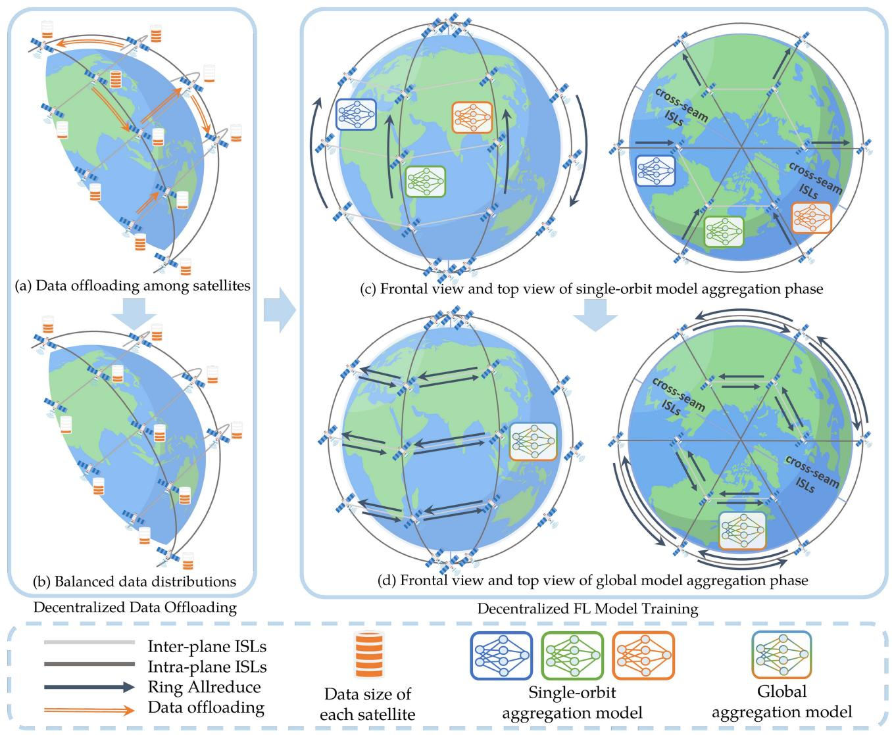  
Fig. 1. Illustration of the FedLEO design.

Regardless of the inclination of the orbital shell, satellites orbiting in the same direction (i.e., ascending or descending satellites) could establish communication links with two satellites in the same orbit and two satellites in adjacent orbits. Moreover, for satellites in cross-seam orbits, there are only three stable communication links to adjacent satellites, i.e., two satellites in the same orbit and one in an adjacent orbit, which will be taken into account in FedLEO (i.e., determine the satellites set $B ( a )$ adjacent to each satellite $v _ { a } , a \in \mathcal { N } )$ ( ). The above characteristics are exemplified in [18] and can be obtained by simulation with Satellite Tool Kit (STK) software. Accordingly, the FedLEO is feasible for any LEO satellite constellation with different inclinations.

Each satellite $v _ { a }$ collects and stores a local dataset $\mathcal { D } _ { a }$ of size $D _ { a } .$ . Hence, the total size of the dataset in LEO satellite networks can be denoted as $\begin{array} { r } { D = \sum _ { a = 1 } ^ { N } D _ { a } } \end{array}$ . In the dataset, a data sample =i usually consists of the input vector xi (e.g., the pixels of an image) and the output scalar yi (e.g., the label of the image). We consider a C-class classification problem defined over a compact space X and a label space $\mathcal { Y } = \{ 1 , 2 , \dots , C \}$ . The data point distributes over $\mathcal { X } \times \mathcal { V }$ following the distribution p. A function f  X → S maps x to the probability simplex S, where $f _ { i }$ :denotes the probability for the i-th class. f is parameterized over the hypothesis class w. We define the population loss l w with the cross-entropy loss as

$$
l (\boldsymbol {w}) = \sum_ {i = 1} ^ {C} p (y = i) \mathbb {E} _ {\boldsymbol {x} | y = i} [ \log f _ {i} (\boldsymbol {x}, \boldsymbol {w}) ]. \tag {1}
$$

The learning problem is defined as

$$
\min \sum_ {i = 1} ^ {C} p (y = i) \mathbb {E} _ {\boldsymbol {x} | y = i} \left[ \log f _ {i} (\boldsymbol {x}, \boldsymbol {w}) \right]. \tag {2}
$$

Here, we take the Stochastic Gradient Descend (SGD) method [19] to solve the optimization problem iteratively in order to determine the model parameters w.

For FedLEO, as shown in Fig. 1, it consists of two phases: decentralized data offloading and decentralized FL model training. In the decentralized data offloading phase, multi-hop flow-based offloading scheme will be performed through the intra-plane

ISL or the inter-plane ISL, in which the system delay and learning performance of decentralized FL model training can be optimized during this phase. Following the decentralized data offloading phase, all satellites in LEO satellite networks perform decentralized FL model training using the revised data distribution among the satellites. Specifically, in each FL round $m \in { \mathcal { M } }$ , each satellite will first perform model training via the SGD method on their local dataset for τ epochs. Then, the satellite will perform the decentralized model aggregation, with each satellite communicating with only one of its adjacent satellites, until a global consensus model is available for all satellites in each FL round. Eventually, the decentralized FL model training phase will be executed for M rounds. The detailed operation procedure of FedLEO is given in Algorithm 1, which is described as follows:

- Model Initialization (Lines 1–2): In the initialization stage, a coordinated satellite or ground station can be designated as a coordinator and the initial model parameters would be received and broadcast to all satellites in LEO satellite networks. At this point, a model with a set of initialized parameters ${ \pmb w } _ { 0 } ^ { ( a ) }$ is instantiated on each satellite $v _ { a }$ in LEO satellite networks, where $a \in \mathcal N$ .   
- Decentralized Data Offloading (Lines 3–4): As illustrated in Fig. 1(a), once the global model is initiated, the systemwide greedy-based iterative offloading decision making algorithm will be performed, in order to mitigate the straggler effect and address the statistical heterogeneity in LEO satellite networks. Note that the straggler referred to in FedLEO is the one brought on by the heterogeneity of satellite computation resources and the unbalanced data size among satellites. The data distribution in LEO satellite networks after the data offloading is depicted in Fig. 1(b). The detailed process of the above will be given in Sections III–V.   
Local Model Training (Lines 6–9): After the data offloading, each satellite will respectively perform model training on their updated local dataset for τ epochs. Here, the parameters are updated via SGD, i.e.,

$$
\begin{array}{l} \boldsymbol {w} _ {\tau} ^ {(a)} = \boldsymbol {w} _ {\tau - 1} ^ {(a)} - \eta \sum_ {i = 1} ^ {C} p ^ {(a)} (y = i) \\ \times \nabla_ {\boldsymbol {w}} \mathbb {E} _ {\boldsymbol {x} | y = i} [ \log f _ {i} (\boldsymbol {x}, \boldsymbol {w} _ {\tau - 1} ^ {(a)}) ], \tag {3} \\ \end{array}
$$

where η is the learning rate and $p ^ { ( a ) } ( y = i )$ is the data distribution of the satellite $v _ { a }$ ( = )after the decentralized data offloading stage is finished.

Single-orbit Model Aggregation (Lines 10–13): When the local update is completed, the satellites in the same orbit synchronously aggregate model parameters at each FL round $m ,$ and update their model parameters via the cooperation between the satellites to obtain the single-orbit aggregation model, namely,

$$
\boldsymbol {w} _ {m \tau} ^ {(r)} = \frac {1}{D _ {r}} \sum_ {a \in \mathcal {N} _ {r}} D _ {a} \boldsymbol {w} _ {m \tau} ^ {(a)}, \tag {4}
$$

where ${ \pmb w } _ { m \tau } ^ { ( r ) }$ denotes the single-orbit aggregation model in orbit $r , D _ { r }$ is the total number of training samples held by all satellites in orbit r. For model synchronization, we employ the Ring-Allreduce algorithm [20], which is well suited to the ring topology of the satellite constellation. The detailed procedure for intra-satellite model synchronization is described as follows. As shown in Fig. 1(c), the satellite in the same orbit will partition its models into $N _ { r }$ pieces during the single-orbit model aggregation stage. Then, the satellites perform $N _ { r } - 1$ communication iter-1ations of the scatter-reduce to simultaneously accumulate the received piece from the previous satellite with its own piece and send the updated piece to the latter satellite. Each satellite obtains a distinct piece of the synchronous model in the same orbit by repeating this communication iteration of scatter-reduce $N _ { r } - 1$ times. Following that, the satellites perform allgather $N _ { r } - 1$ times of piece sends and receives so that each satellite can acquire all the synchronous pieces. The allgather process is similar to the scatter-reduce procedure in that the satellites overwrite the received pieces rather than conducting the accumulation operation. Finally, each satellite in orbit r stitches all pieces together to produce a single-orbit aggregation model, and the model produced by each satellite in orbit r is identical. Global Model Aggregation (Lines $I 4 \mathrm { - } I 7 ) .$ Once the satellites in the same orbit get the single-orbit aggregation model, the satellites in different orbits aggregate their model parameters to get the global aggregation model via inter-satellite cooperation, i.e.,

$$
\boldsymbol {w} _ {m \tau} ^ {(f)} = \frac {1}{D} \sum_ {r \in \mathcal {R}} D _ {r} \boldsymbol {w} _ {m \tau} ^ {(r)}, \tag {5}
$$

where $\pmb { w } _ { m \tau } ^ { ( f ) }$ represents the global aggregation model. The procedure for inter-satellite model synchronization is similar to the single-orbit model aggregation step. As shown in Fig. 1(d), the satellites in different orbits will split their models into R pieces. After that, the satellites undertake R −  repetitions of the scatter-reduce procedure. Then, 1the satellites perform allgather R − times to obtain all 1the synchronous pieces of the global model.2 Finally, the global model will be obtained by each satellite in LEO satellite networks.

It is worth noting that the Ring Allreduce algorithm takes advantage of model segmentation to deliver model parameters across nearby satellites simultaneously, allowing all satellites to generate a weighted average model efficiently in a decentralized manner. Nevertheless, the divergences in data distribution among satellites in terms of workload and statistical heterogeneities make the local training loss and training time between satellites different, which would to a negative impact on both the system delay and convergence performance of FL. Therefore, we will take such issues into account and conduct theoretical modeling and analysis in Section III and IV, in order to optimize the learning efficiency and performance of FedLEO.

2When a direct ISL cannot be established between two satellites in cross-seam orbits, the ground station in between can serve as a relay.

TABLE I MAIN NOTATIONS IN FEDLEO 

<table><tr><td>Notation</td><td>Description</td></tr><tr><td> $\mathcal{N},\mathcal{N}_{r}$ </td><td>Total satellite set, satellite set in each orbital plane  $r$ </td></tr><tr><td> $v_{a},v_{b}$ </td><td>Satellite in FedLEO, adjacent satellite of  $v_{a}$ </td></tr><tr><td> $D_{a},I_{ab}$ </td><td>Dataset size of satellite  $v_{a}$ , offloaded data size from satellite  $v_{a}$  to its adjacent satellite  $v_{b}$ </td></tr><tr><td> $\boldsymbol{w}^{(a)},\boldsymbol{w}^{(l)}$ </td><td>Model parameter of satellite  $v_{a}$ , model parameter of FL before data offloading</td></tr><tr><td> $\boldsymbol{w}^{(f)},\boldsymbol{w}^{(c)}$ </td><td>Model parameter of FedLEO, model parameter of centralized ML</td></tr><tr><td> $M,\tau$ </td><td>Total FL round, local training epochs per FL round</td></tr><tr><td> $t_{a}^{o},t_{a}^{o},t_{\omega}$ </td><td>Data offloading delay and model training delay of satellite  $v_{a}$ , fixed time for model aggregation</td></tr><tr><td> $B_{a},g_{a},\zeta_{a}$ </td><td>Transmission bandwidth, channel characteristic and effective capacitance coefficient of satellite  $v_{a}$ </td></tr><tr><td> $p_{a}^{max},q_{a},C$ </td><td>Power constraint and CPU frequency of satellite  $v_{a}$ , CPU cycles required for training 1-bit data</td></tr><tr><td> $p_{a}^{o},p_{a}^{u}$ </td><td>Communication power and computation power allocated to satellite  $v_{a}$ </td></tr><tr><td> $\kappa,\pi$ </td><td>Weighted parameter to indicate the importance of delay and accuracy in optimization</td></tr><tr><td> $\Psi_{a},\Gamma_{l},\Gamma_{h}$ </td><td>Offloading indicator and offloading threshold</td></tr></table>

# III. SYSTEM MODEL

In this section, we will introduce the theoretical model of the system delay and training accuracy for FedLEO. The main notations in FedLEO are described in Table I.

# A. System Delay Modeling

The delay of each satellite consists of two kinds of delay, i.e., data offloading delay and model training delay. For the data offloading delay of each satellite, it represents the transmission delay of offloading data from satellite $v _ { a }$ to its adjacent satellite $v _ { b } ,$ , which can be denoted as

$$
t _ {a} ^ {o} = \frac {I _ {a b}}{B _ {a} l o g _ {2} \left(1 + p _ {a} ^ {o} g _ {a}\right)}, \tag {6}
$$

where $I _ { a b }$ denotes the offloaded data size from satellite $v _ { a }$ to satellite $v _ { b } , B _ { a }$ denotes the bandwidth for the satellite $v _ { a } , p _ { a } ^ { o }$ denotes the communication power allocated by satellite $v _ { a } , g _ { a } =$ $| h _ { a } | ^ { 2 } / \mathbf { N } _ { 0 } , h _ { a }$ is the channel fading coefficient and $\mathbf { N } _ { 0 }$ =is the variance of complex white Gaussian channel noise [21]. Note that the satellite pairing rule (i.e., selection of the satellite $v _ { b } )$ i s described in detail in Section V-E.

To optimize the delay and training accuracy, we consider a multi-hop flow-based offloading scheme, as shown in the data offloading phase in Fig. 1(a). Specifically, we consider that the satellites offload data serially in each flow, and different flows can offload data concurrently without intersection (i.e., a satellite can serve in one flow due to the physical communication resource constraint). The set of satellites in each flow can be denoted as $\mathcal { L } ( p )$ , where $p \in \{ 1 , 2 , \ldots , P \}$ is the index of the ( ) 1 2flow. The delay of each parallel flow is determined by the accumulated delays of the involved satellites $a ^ { \prime } , { } ^ { 3 }$ which can be denoted as

Algorithm 1: Decentralized FL in LEO Satellite Networks.   
1: ▷ Model initialization
2: All satellites: Initialize global model parameter $\boldsymbol{w}_{0}^{(a)}$ ;
3: ▷ Decentralized data offloading in LEO satellite networks
4: Multi-hop flow-based offloading scheme will be performed;
5: for each FL round $m \in M$ do
6: ▷ Local model training (on-orbit computing)
7: for each satellite $v_{a}, a \in N$ in parallel do
8: $\left| w_{\tau}^{(a)} \leftarrow w_{\tau-1}^{(a)} - \eta \nabla_{w} l(w_{\tau-1}^{(a)}) \right.$ 9: end for
10: ▷ Single-orbit model aggregation (Intra-plane ISLs)
11: for each satellite $v_{a}, a \in N$ in same orbit do
12: $\left| w_{m\tau}^{(r)} \leftarrow \frac{1}{D_r} \sum_{a \in \mathcal{N}_r} D_a w_{m\tau}^{(a)} \right.$ 13: end for
14: ▷ Global model aggregation (Inter-plane ISLs)
15: for each satellite $v_{a}, a \in N$ in different orbit do
16: $\left| w_{m\tau}^{(f)} \leftarrow \frac{1}{D} \sum_{r \in \mathcal{R}} D_r w_{m\tau}^{(r)} \right.$ 17: end for
18: end for
19: return w.

$$
T _ {\mathcal {L} (p)} ^ {o} = \sum_ {a ^ {\prime} \in \mathcal {L} (p)} t _ {a ^ {\prime}} ^ {o}. \tag {7}
$$

For the decentralized data offloading delay of FedLEO, it is determined by the slowest transmission flows in LEO satellite networks, we can denote it as

$$
T ^ {o} = \max _ {p = 1, 2, \dots , P} T _ {\mathcal {L} (p)} ^ {o}. \tag {8}
$$

For the model training delay of each satellite in LEO satellite networks, according to the mini-batch gradient descent algorithm utilized in [8], the model training delay of satellite $v _ { a }$ after offloading and receiving the data from its adjacent satellites can be defined as

$$
t _ {a} ^ {u} = \frac {\tau C \left(D _ {a} - \sum_ {b \in \mathcal {B} (a)} (I _ {a b} - I _ {b a})\right)}{q _ {a}}, \tag {9}
$$

where $I _ { b a }$ denotes the offloaded data size received by satellite $v _ { a }$ from its adjacent satellite $v _ { b } ,$ , τ denotes the total number of epochs, $q _ { a }$ denotes the CPU frequency of satellite $v _ { a }$ and the constant $C$ denotes the number of CPU cycles required for training 1-bit data.

According to [22], the relationship between computation power $p _ { a } ^ { u }$ and frequency $q _ { a }$ can be calculated as

$$
q _ {a} = \sqrt {\frac {p _ {a} ^ {u}}{\zeta_ {a}}}, \tag {10}
$$

where $\zeta _ { a } > 0$ is the effective capacitance coefficient of the satellite $v _ { a }$ 0depending on chip architecture.

For the decentralized FL model training delay of FedLEO, it is determined by the slowest training satellite in LEO satellite networks, so it can be denoted as

$$
T ^ {u} = M \max _ {a \in \mathcal {N}} t _ {a} ^ {u} + M t _ {\omega}, \tag {11}
$$

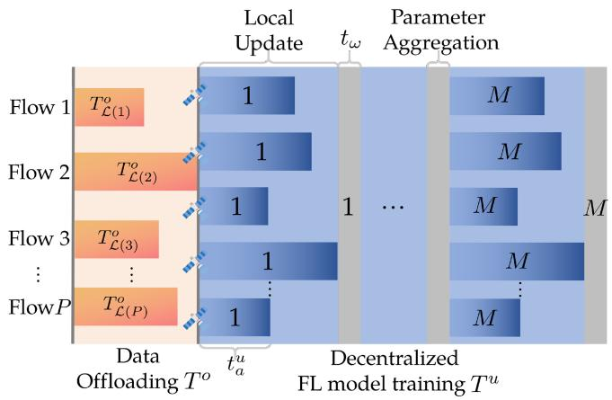

bar_stacked

| Flow    | Data Offloading T^o | Local Update | Parameter Aggregation |
|---------|---------------------|--------------|------------------------|
| Flow 1  | T^o_{L(1)}          | 1            | M                      |
| Flow 2  | T^o_{L(2)}          | 1            | M                      |
| Flow 3  | T^o_{L(3)}          | 1            | M                      |
| ...     | ...                 | ...          | ...                    |
| Flow P  | T^o_{L(P)}          | 1            | M                      |

Fig. 2. Illustration of different kinds of delays in FedLEO.

where $t _ { \omega }$ denotes the fixed time slot for decentralized model aggregation in LEO satellite networks and M denotes the number of FL rounds.

Finally, as shown in Fig. 2, the system delay of FedLEO can be denoted as

$$
T = \max _ {p = 1, 2, \dots , P} \sum_ {a ^ {\prime} \in \mathcal {L} (p)} t _ {a ^ {\prime}} ^ {o} + M \max _ {a \in \mathcal {N}} t _ {a} ^ {u} + M t _ {\omega}. \tag {12}
$$

# B. Training Accuracy Modeling

In LEO satellite networks, the fixed orbits of the satellites lead to a regular range of the Earth captured by individual satellites, which results in fewer image classes for each satellite, thus increasing the non-IID degree of the data distribution among the satellites. So in light of this phenomenon, we need to improve the performance of FL when the local data distributions via satellite differ. To address this statistical challenge of FL, the optimization problem of training accuracy can be denoted as

$$
\min _ {\boldsymbol {w} _ {m \tau} ^ {(f)}} \| \boldsymbol {w} _ {m \tau} ^ {(f)} - \boldsymbol {w} _ {m \tau} ^ {(c)} \|, \tag {13}
$$

where ${ \pmb w } _ { m \tau } ^ { ( c ) }$ represents the weight of the centralized ML after mτ -th update and the centralized SGD performs the following update to optimize the $\mathbf { \delta } _ { w } ( c )$ :

$$
\boldsymbol {w} _ {m \tau} ^ {(c)} = \boldsymbol {w} _ {m \tau - 1} ^ {(c)} - \eta \sum_ {i = 1} ^ {C} p (y = i) \nabla_ {\boldsymbol {w}} \mathbb {E} _ {\boldsymbol {x} | y = i} [ \log f _ {i} (\boldsymbol {x}, \boldsymbol {w} _ {m \tau - 1} ^ {(c)}) ]. \tag {14}
$$

The explanation for the optimization problem represented in (13) is that, due to the non-IID data distribution among the satellites, the local loss surfaces of the satellites are different. The local model of each satellite might reach some local minima on their own surface, however, the aggregated model might not be close to any local minima on the loss surface defined by the union of local datasets. Since the training accuracy is dictated by the model parameters and the centralized ML is trained on the population data distribution, the training accuracy of FL can be reflected by diverging from the weights of the centralized ML [23], [24]. Based on the above analysis, our accuracy optimization can be achieved by minimizing the weight divergence between centralized ML and FedLEO.

# C. Problem Formulation

Based on the above analysis, the system delay and training accuracy optimization problem for FedLEO can be formulated as

$$
\begin{array}{l} \min_{\substack{I_{ab},p_{a}^{o},p_{a}^{u},\\ \boldsymbol{w}_{m\tau}^{(a)},\boldsymbol{w}_{m\tau}^{(f)}}}\quad \max_{p = 1,2,\dots ,P}\sum_{a^{\prime}\in \mathcal{L}(p)}t_{a^{\prime}}^{o} + M\max_{a\in \mathcal{N}}t_{a}^{u} + Mt_{\omega} \\ + \kappa \| \boldsymbol {w} _ {m \tau} ^ {(f)} - \boldsymbol {w} _ {m \tau} ^ {(c)} \| \tag {P1} \\ \end{array}
$$

$\mathrm { s . t . } \mathbf { C 1 } : 0 \leq p _ { a } ^ { o } \leq p _ { a } ^ { o m a x } , \forall a \in \mathcal { N } ,$ (15)

$\mathbf { C 2 } : 0 \leq p _ { a } ^ { u } \leq p _ { a } ^ { u m a x } , \forall a \in \mathcal { N } ,$   
${ \bf C 3 } : 0 \le { \cal I } _ { a b } \le { \cal D } _ { a } , \forall a \in \mathcal { N } , b \in \mathcal { B } ( a ) ,$   
$\mathbf { C 4 } : T ^ { o } + T ^ { u } \leq \operatorname* { m a x } _ { a \in \mathcal { N } } \left\{ M \tau C D _ { a } \sqrt { \frac { \zeta _ { a } } { p _ { a } ^ { u } } } \right\} + M t _ { \omega } ,$   
$\mathbf { C 5 } : \| \boldsymbol { w } _ { m \tau } ^ { ( f ) } - \boldsymbol { w } _ { m \tau } ^ { ( c ) } \| \leq \| \boldsymbol { w } _ { m \tau } ^ { ( l ) } - \boldsymbol { w } _ { m \tau } ^ { ( c ) } \| , m = 1 , 2 , . . . , M .$

In the above, the objective function of P1 captures a tradeoff between the delay and learning performance of FedLEO. The weighted parameter κ indicates the importance of delay and training accuracy in the optimization problem. Since the power of a satellite cannot be infinite due to its physical resource limitation, constraints C1 and C2 bound the maximum available communication power and computation power of each satellite subject to its preset physical constraints on different functional components. Constraint C3 guarantees that the size of data offloaded from satellite $v _ { a }$ is no less than zero and no more than the local data size. Constraint C4 guarantees that the optimized delay will not exceed the original delay (i.e., determined by the slowest training satellite based on the initial data distributions in LEO satellite networks). Constraint C5 guarantees that the weight divergence between centralized ML and FedLEO will be decreased in the optimization, where ${ \pmb w } _ { m \tau } ^ { ( l ) }$ represents the aggregated model parameters of FL before the data offloading.

Note that satellite technology can already achieve high communication rates [25], but the onboard computation capacity is limited [26]. Therefore, the model training delay is generally much higher than the data offloading delay for FL in LEO satellite networks. However, when high-resolution images are transmitted, satellite communication is weak and the number of FL rounds is small, the data offloading delay may be high, at which point the data offloading does not result in any delay improvement. As a result, the constraint C4 is added to ensure that the data offloading delay plus the decentralized FL training delay will not exceed the original delay, otherwise the optimization would not be performed.

# IV. PROBLEM TRANSFORMATION

The challenges in optimizing system delay and training accuracy of FedLEO mainly emerge in four parts. First, due to the multi-hop flow-based offloading, the final data distribution among the satellites can be mutually affected among different flows in LEO satellite networks, which makes it hard to solve in parallel or to initially know the flow with the longest delay. Second, the coupling variables $\left\{ I _ { a b } , p _ { a } ^ { o } , p _ { a } ^ { u } \right\}$ among satellites are theoretically involved to jointly determine. Third, the optimization function of the training accuracy is implicit, and the mapping from local satellites to FedLEO accuracy is missing. Finally, the entire optimization problem is not jointly convex with respect to the optimization variables.

To overcome the above challenging issues, we resort to an efficient approximation algorithm design by transforming the original challenging problem into a series of round-by-round iterative local optimization problems. Based on it, we will exploit the explicit relationship between offloaded data size and training accuracy, enabling the offloading process to be effectively directed toward accuracy improvement. Furthermore, we will conduct theoretical analysis to evaluate the mapping relationship from local satellites to FedLEO accuracy optimization, demonstrating the validity of our methodology and its robust applicability. Further, following the above analysis, we will decouple the problem based on the properties of the transformed problems to address its non-convex issue. Finally, we will derive the performance guarantee in terms of approximation ratio by the proposed multi-round iterative optimization algorithm with respect to the optimal solution of the original problem.

# A. Transform to Iterative Local Optimization

To enable feasible problem solving and avoid the straggler effect in FL, we propose a round-by-round iterative optimization scheme, such that, we select the slowest training satellite $v _ { a }$ for conducting satellite-centric optimization in each iteration round. Additionally, the model training delay of satellite $v _ { a }$ after data offloading in a specific optimization round can be denoted as

$$
t _ {a, L} ^ {u} = \frac {W _ {a}}{q _ {a}} = \frac {\tau C (D _ {a} - I _ {a b})}{q _ {a}}, \tag {16}
$$

and the model training delay of satellite $v _ { b }$ after receiving the offloaded data from satellite $v _ { a }$ in a specific optimization round can be denoted as

$$
t _ {b, L} ^ {u} = \frac {W _ {b}}{q _ {b}} = \frac {\tau C (D _ {b} + I _ {a b})}{q _ {b}}. \tag {17}
$$

Note that the satellite pairing rule is described in detail in Section V-E. Moreover, we assume that the data are offloaded in equal proportions by the class distribution of the satellite $v _ { a }$ (e.g., by random data sampling), then the class distribution of satellite $v _ { a }$ after data offloading in a specific optimization round can be denoted as

$$
p _ {L} ^ {(a)} (y = i) = \frac {D _ {a} ^ {(i)}}{D _ {a} - I _ {a b}} - I _ {a b} \frac {D _ {a} ^ {(i)}}{D _ {a} (D _ {a} - I _ {a b})}, \tag {18}
$$

and the data distribution of satellite $v _ { b }$ after receiving the offloaded data in a specific optimization round can be denoted as

$$
p _ {L} ^ {(b)} (y = i) = \frac {D _ {b} ^ {(i)}}{D _ {b} + I _ {a b}} + I _ {a b} \frac {D _ {a} ^ {(i)}}{D _ {a} (D _ {b} + I _ {a b})}. \tag {19}
$$

Then, the optimization problem in each round can be defined as

$$
\begin{array}{l} \min_{\substack{I_{ab},p_{a}^{o},p_{a}^{u},\\ \boldsymbol{w}_{m\tau}^{(a)},\boldsymbol{w}_{m\tau}^{(f)}}}\quad t_{a}^{o} + M\max_{b\in \mathcal{B}(a)}\left\{t_{a,L}^{u},t_{b,L}^{u}\right\} +Mt_{\omega} \\ + \kappa \| \boldsymbol {w} _ {m \tau} ^ {(f)} - \boldsymbol {w} _ {m \tau} ^ {(c)} \| \tag {P2} \\ \end{array}
$$

s.t. D1 $: 0 \leq p _ { a } ^ { o } \leq p _ { a } ^ { o m a x }$ , (20)

D2 $: 0 \leq p _ { a } ^ { u } \leq p _ { a } ^ { u m a x }$

$\mathbf { D 3 } : 0 \leq I _ { a b } \leq D _ { a } , b \in \mathcal { B } ( a ) ,$

$\mathbf { D 4 } : t _ { a } ^ { o } + M t _ { a , L } ^ { u } \leq M \tau C D _ { a } \sqrt { \frac { \zeta _ { a } } { p _ { a } ^ { u } } } ,$ p ua

$\mathbf { D 5 } : t _ { a } ^ { o } + M t _ { b , L } ^ { u } \leq M \tau C D _ { a } \sqrt { \frac { \zeta _ { a } } { p _ { a } ^ { u } } } , b \in \mathcal { B } ( a ) ,$

$\mathbf { D 6 } : \lVert \boldsymbol { w } _ { m \tau } ^ { ( f ) ( n ) } - \boldsymbol { w } _ { m \tau } ^ { ( c ) } \rVert \leq \lVert \boldsymbol { w } _ { m \tau } ^ { ( f ) ( n - 1 ) } - \boldsymbol { w } _ { m \tau } ^ { ( c ) } \rVert ,$

$$
m = 1, 2, \dots , M.
$$

The tradeoff between optimizing the delay of the selected satellite and improving the learning performance of FedLEO is represented by the objective function of P2. Constraints D1 − D3 correspond to constraints C1 − C3 in problem P1, which bound the computation power, communication power and offloaded data size of the selected satellite, respectively. Constraints D4 and D5 guarantee that the optimized local delay of the selected satellite and its adjacent satellite receiving offload will not exceed the original training delay in each round. Constraint D6 ensures that the weight divergence for FedLEO can be continuously optimized, where ${ \pmb w } _ { m \tau } ^ { ( f ) ( n ) }$ denotes the weight of FedLEO after n satellites perform data offloading.

Due to the multi-round optimization in data offloading, the data distributions of the selected satellites will be updated virtually based on the solved optimal offloaded data size $I _ { a b } ^ { * }$ after a round of optimization by solving the problem $\mathbf { P 2 }$ above, which can be denoted as

$$
D _ {a} \leftarrow D _ {a} - I _ {a b} ^ {*}, \tag {21}
$$

and

$$
D _ {b} \leftarrow D _ {b} + I _ {a b} ^ {*}. \tag {22}
$$

Then the next round of optimization will be performed on the updated virtual datasets in LEO satellite networks. To avoid collision and for energy savings, we further set that a selected satellite will not engage in the subsequent optimization rounds after its offloading data to its adjacent satellite. By repeating the above process, the system delay and training accuracy will be gradually optimized. Furthermore, iterations continue until convergence, at which point no offloading decision of the satellite can be improved. Finally, the offloading flows whose satellites do not intersect are separated according to the offloading order of the preceding optimization procedure, and then the separated flows can perform data transmission in parallel on the initial data distributions in LEO satellite networks. The detailed procedure will be discussed in Section V-E.

# B. Exploring Explicit Accuracy Optimization Method

To explicitly represent the relationship between $\pmb { w } _ { m \tau } ^ { ( f ) }$ and ${ \pmb w } _ { m \tau } ^ { ( c ) }$ w mτ and to optimize the accuracy of FedLEO by solving P2 locally, we first formally bound the weight divergence between satellite $v _ { a }$ and its adjacent satellite $v _ { b }$ . The model parameters of satellite $v _ { a }$ and satellite $v _ { b }$ can be denoted as ${ \pmb w } _ { m \tau } ^ { ( a ) }$ and $\pmb { w } _ { m \tau } ^ { ( b ) }$ . First of all, similar to many existing studies in FL [27], [28], we make the following assumptions.

Assumption 1: The $\nabla _ { \pmb { w } } \mathbb { E } _ { \pmb { x } | \pmb { y } = i } [ \log f _ { i } ( \pmb { x } , \pmb { w } ) ]$ is $\lambda _ { x \mid y = i ^ { - } }$ Lipschitz for each class $i \in C .$ .

Assumption 2: Based on the $\lambda _ { x | y = i } { \mathrm { - L i p s c h i t z } }$ , the training loss $\begin{array} { r } { \sum _ { i = 1 } ^ { C } p ^ { ( a ) } ( y = i ) \lambda _ { x | y = i } } \end{array}$ is bounded: $\forall a \in \mathcal { N } , K \leq$ $\begin{array} { r } { \sum _ { i = 1 } ^ { C } p ^ { ( a ) } ( y = i ) \lambda _ { x | y = i } \leq G . } \end{array}$

( = )Then the following theorems and proposition can be obtained.

Theorem 1: Let Assumption 1 hold. Given two satellites and perform the data offloading process. $I _ { a b }$ denotes the offloaded data size from satellite $v _ { a }$ to satellite $v _ { b }$ . After the data offloading, the satellite $v _ { a }$ following the data distribution $p ^ { ( a ) } ( y = i )$ and the satellite $v _ { b }$ following the data distribution $p ^ { ( b ) } ( y = i )$ ). If the ( = )model aggregation is conducted every τ steps, then, we have the following inequality for the weight divergence between two satellites before the m-th model aggregation

$$
\begin{array}{l} \| \boldsymbol {w} _ {m \tau} ^ {(a)} - \boldsymbol {w} _ {m \tau} ^ {(b)} \| \leq \| \boldsymbol {w} _ {(m - 1) \tau} ^ {(a)} - \boldsymbol {w} _ {(m - 1) \tau} ^ {(b)} \| (x ^ {(a)}) ^ {\tau} \\ + 2 \eta \left\| \frac {D _ {b}}{D _ {b} + I _ {a b}} \right\| \sum_ {t = 0} ^ {\tau - 1} (x ^ {(a)}) ^ {\tau} g _ {\max} (\boldsymbol {w} _ {m \tau - 1 - t} ^ {(b)}), \tag {23} \\ \end{array}
$$

where $\begin{array} { r } { x ^ { ( a ) } = 1 + \eta \sum _ { i = 1 } ^ { C } p ^ { ( a ) } ( y = i ) \lambda _ { x | y = i } } \end{array}$ and $g _ { \mathrm { m a x } } ( \pmb { w } ) =$ $\begin{array} { r } { \operatorname* { m a x } _ { i = 1 } ^ { C } \| \nabla _ { w } \mathbb { E } _ { \pmb { x } | y = i } [ \overline { { \log } } \tilde { f _ { i } } ( \pmb { x } , \pmb { w } ) ] \| } \end{array}$ .

ax [log ( )]Proof: Please see our proof in Appendix A, available online.

Based on Theorem 1, we have Remark 1.

Remark 1: We can obtain from (23) that the weight divergence between satellite $v _ { a }$ and satellite $v _ { b }$ after the m-th synchronization mainly comes from two parts, including the local weight divergence after the $( m - 1 )$ -th divergence, i.e., w( )(m−1)τ $\| \pmb { w } _ { ( m - 1 ) \tau } ^ { ( a ) } - \pmb { w } _ { ( m - 1 ) \tau } ^ { ( b ) } \|$ ( )(m−1)τ , and the term $\left\| \frac { D _ { b } } { D _ { b } + I _ { a b } } \right\|$ which is related to the offloaded data size $I _ { a b }$ b ab. When all satellites in each FL round start from the same initialization, the term $\| \frac { D _ { b } } { D _ { b } + I _ { a b } } \|$ is identified as the root cause of the weight divergence between satellite $v _ { a }$ and satellite $v _ { b } .$ . The impact of this term is affected by the offloaded data size $I _ { a b }$ , the learning rate η, the gradient $g _ { \operatorname* { m a x } } ( w _ { m \tau - 1 - t } ^ { ( b ) } )$ and the number of local training epochs $\tau .$ ( )In particular, We can explicitly observe that as the offloaded data size $I _ { a b }$ increases and the learning rate η decreases, the local weight dtraining epochs $\tau ,$ rgence can be reduced. H it implicitly affects gradient $g _ { \operatorname* { m a x } } ( w _ { m \tau - 1 - t } ^ { ( b ) } )$ plexity of its relationship with local weight divergence, we added experiments in Appendix J, available online to illustrate its effect on weight divergence between satellite $v _ { a }$ and satellite $v _ { b }$ .

Then we will excavate the mapping relationship from weight divergence between local satellites to weight divergence between centralized ML and FedLEO. We assume that all satellites in LEO satellite networks start from the same initialization as the centralized setting. Then we have the following proposition and theorem.

Proposition 1: Let Assumptions 1–2 hold. When the satellite $v _ { a }$ offloads data to the satellite $v _ { b }$ , the weight divergence between centralized ML and FedLEO would be lower. Let $\pmb { w } _ { m \tau } ^ { ( f ) }$ be the to satellite weight of FedLEO after offloading partial data from satellite $v _ { b } ,$ then we have $\lVert \boldsymbol { w } _ { m \tau } ^ { ( f ) } - \boldsymbol { w } _ { m \tau } ^ { ( c ) } \rVert \leq \lVert \boldsymbol { w } _ { m \tau } ^ { ( l ) } - \boldsymbol { w } _ { m \tau } ^ { ( c ) } \rVert .$ $v _ { a }$

Similarly, let $w _ { m \tau } ^ { ( f ) ^ { \prime } }$ denote the weight of FedLEO after satellite $v _ { a }$ offloads all the data to satellite $v _ { b }$ , then we can get that $\lVert \boldsymbol { w } _ { m \tau } ^ { ( f ) ^ { \prime } } - \boldsymbol { w } _ { m \tau } ^ { ( c ) } \rVert \leq \lVert \boldsymbol { w } _ { m \tau } ^ { ( l ) } - \boldsymbol { w } _ { m \tau } ^ { ( c ) } \rVert .$ .

Furthermore, for another form of data offloading in our proposed framework, in which satellite $v _ { a }$ offloads data to satellite $v _ { b } ,$ and then satellite $v _ { b }$ offloads data to the other satellite, the above properties remain valid (i.e., the weight divergence between centralized ML and FedLEO will continue to decrease).

Proof: Please see our proof in Appendix B, available online.

Theorem 2: Let Assumptions 1–2 hold. More satellites offloading data to their adjacent satellite would result in a lower weight divergence for FedLEO. Let ${ \pmb w } _ { m \tau } ^ { ( f ) ( n ) }$ (f)(n) mτ denote the weight of FedLEO after n satellites offload partial data to its adjacent satellite, ${ \overline { { Z } } } ( n )$ denotes the upper bound of $\| \pmb { w } _ { m \tau } ^ { ( l ) } - \pmb { w } _ { m \tau } ^ { ( \bar { c } ) } \| -$ $\lVert \mathbf { w } _ { m \tau } ^ { ( f ) ( n ) } - \mathbf { \bar { w } } _ { m \tau } ^ { ( c ) } \rVert$ . Note that a larger value of $\overline { { Z } } ( n )$ indicates that w( )(mτ ${ \pmb w } _ { m \tau } ^ { ( f ) ( n ) }$ is closer to ${ \pmb w } _ { m \tau } ^ { ( c ) }$ ( ), i.e., our proposed framework decreases the weight divergence for FedLEO more. Then we have the following equation to represent the function $\overline { { Z } } ( 1 )$

$$
\overline {{{Z}}} (1) = \eta \left(\sum_ {t = 0} ^ {\tau - 1} (1 + \eta G) ^ {t} g _ {\max} (\boldsymbol {w} _ {m \tau - 1 - t} ^ {(c)})\right) \left(\frac {2 I _ {a b}}{D} + \frac {2 D _ {b}}{D}\right). \tag {24}
$$

The function above is monotone increasing with the offloaded data size $I _ { a b }$ from satellite $v _ { a }$ to its adjacent satellite $v _ { b }$ . Further, we can get that $\overline { { { Z } } } ( n ) > \overline { { { Z } } } ( n - 1 ) > \cdots > \overline { { { Z } } } ( 2 ) > \overline { { { Z } } } ( 1 )$ , which is proved in Appendix C, available online, thereby demonstrating that more satellites offloading data leads to lower weight divergence for FedLEO.

For the case of full offloading, we define ${ \pmb w } _ { m \tau } ^ { ( f ) ( n ) ^ { \prime } }$ as the weight of FedLEO after having n satellites offload all the data to its adjacent satellite and denote $\overline { { Q } } ( n )$ as the upper bound of $\lVert \mathbf { w } _ { m \tau } ^ { ( l ) } - \mathbf { w } _ { m \tau } ^ { ( c ) } \rVert - \lVert \mathbf { w } _ { m \tau } ^ { ( f ) ( n ) ^ { \prime } } - \mathbf { w } _ { m \tau } ^ { ( c ) } \rVert$ ). The $\overline { { Q } } ( 1 )$ can be found (1)in (67) of Appendix C, available online. Then we have $\overline { { { Q } } } ( n ) >$ $\overline { { { Q } } } ( n - 1 ) > \cdots > \overline { { { Q } } } ( 2 ) > \overline { { { Q } } } ( 1 )$ ( ), which is proved in Appendix $C ,$ ( 1) (2) (1)available online and demonstrates that the weight divergence for FedLEO will continue to decrease as more satellites offload all of their data to the adjacent satellite.

Furthermore, in our proposed framework, for another form in which more satellites have received offloads and then offloaded data to their adjacent satellite, the weight divergence between centralized ML and FedLEO would be lower than if only two individual satellites performed data offloading. Moreover, the weight divergence for FedLEO decreases as the offloaded data size increases in the above data offloading process.

Proof: Please see our proof in Appendix C, available online.

text_image

Data Offloading
Intra-satellite links

(a) Data offloading phase in FedLEO

text_image

Intra-satellite links

(b) Data distributions after offloading

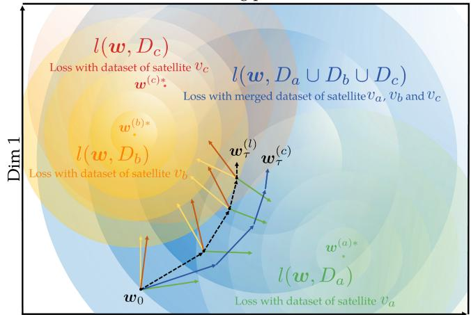

flowchart

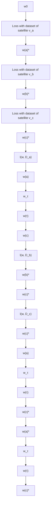

(c) Weight divergence for FedLEO before offloading

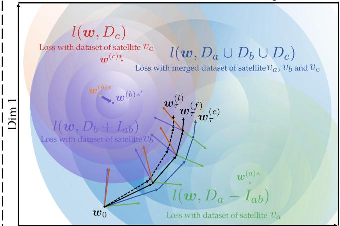

flowchart

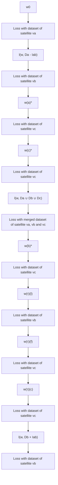

(d) Weight divergence for FedLEO\_after offloading   
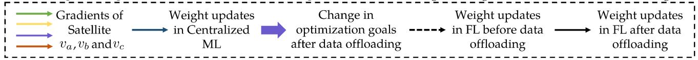

flowchart

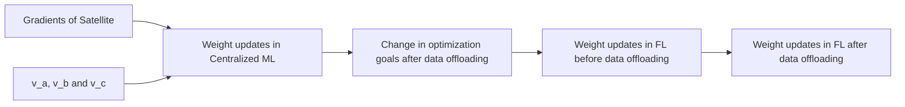

Fig. 3. Variation of the data distributions and the trajectories of model parameters after the data offloading in FedLEO.

Based on Proposition 1 and Theorem 2, we can obtain the following remark.

Remark 2: The value of $\overline { { Z } } ( n )$ increases with the offloaded data size $I _ { a b }$ ( ). This means that when satellite $v _ { a }$ offloads more data to satellite $v _ { b } ,$ the weight divergence between centralized ML and FedLEO would be lower. As a result, a lower value of $\| \pmb { w } _ { m \tau } ^ { ( a ) } - \pmb { w } _ { m \tau } ^ { ( b ) } \|$ will result in a lower value of $\lVert \mathbf { \boldsymbol { w } } _ { m \tau } ^ { ( f ) } - \mathbf { \boldsymbol { w } } _ { m \tau } ^ { ( c ) } \rVert$ thereby satisfying the constraint C5. Since the selected satellites do not participate in subsequent optimization after offloading data in our optimization scheme, only two offloading forms for a selected satellite are available in FedLEO: the satellite only offloads data without receiving data from others, or offloads data after receiving data. In either case, we have proved in Proposition 1 that both of the above offloading forms can reduce weight divergence for FedLEO, thus proving that all the offloading forms in FedLEO can keep the weight divergence between centralized ML and FedLEO decreasing while being executed. Moreover, Theorem 2 shows that when more satellites perform data offloading, the weight divergence between centralized ML and FedLEO will continue to decrease, which indicates that the weight divergence for FedLEO will be optimized round by round with any form of data offloading in FedLEO, thus satisfying constraint D6.

Following Remarks 1 and 2, we see that the weight divergence between centralized ML and FedLEO can be reduced by optimizing the offloaded data size. As shown in Fig. 3(a) and (b), each satellite may scan different parts of the surface of Earth during each orbit, resulting in a large degree of non-IID data distribution among the satellites. After data offloading in FedLEO, the weight divergence between the two satellites will be reduced. Specifically, the optimal model parameters of satellite $v _ { b }$ would shift from w(b)∗ to w(b)∗ , bringing them closer to those of satellite $v _ { a } ,$ thus decrease the weight divergence for FedLEO, as described in Fig. 3(c) and (d). For LEO satellite networks, it is equivalent to reducing the number of satellites virtually, thus making the data distribution more uniform between satellites and making the weight divergence between centralized ML and FedLEO lower, in which the training accuracy can be improved. Then, problem P2 can be transformed into the following form

$$
\min _ {I _ {a b}, p _ {a} ^ {o}, p _ {a} ^ {u}} t _ {a} ^ {o} + M \max _ {b \in \mathcal {B} (a)} \left\{t _ {a, L} ^ {u}, t _ {b, L} ^ {u} \right\} + M t _ {\omega}
$$

$$
+ \kappa \left\| \frac {D _ {b}}{D _ {b} + I _ {a b}} \right\| \tag {P3}
$$

$$
\text { s.t. } \quad \mathbf {D 1} - \mathbf {D 5}. \tag {25}
$$

# C. Problem Decomposition

Since the objective function in P3 is non-convex with respect to the optimization variables, we decouple P3 into a master problem and two subproblems. By fixing $I _ { a b }$ , we can derive two subproblems using $I _ { a b }$ as the coupling variable. The subproblem $\mathbf { P } _ { s u b } ^ { ( 1 ) }$ optimizes the communication power $p _ { a } ^ { o }$ to minimize the data offloading delay, which can be denoted as

$$
\min _ {p _ {a} ^ {o}} \frac {I _ {a b}}{B _ {a} \log_ {2} (1 + p _ {a} ^ {o} g _ {a})} \quad (\mathbf {P} _ {s u b} ^ {(1)})
$$

$$
\text { s.t. } \quad 0 \leq p _ {a} ^ {o} \leq p _ {a} ^ {\text { omax }}. \tag {26}
$$

The subproblem P(2)sub $\mathbf { P } _ { s u b } ^ { ( 2 ) }$ optimizes the computation power $p _ { a } ^ { u }$ to minimize the model training delay, which can be denoted as

$$
\min _ {p _ {a} ^ {u}} \quad \max \left\{\left(D _ {a} - I _ {a b}\right) \sqrt {\frac {\zeta_ {a}}{p _ {a} ^ {u}}}, \left(D _ {b} + I _ {a b}\right) \sqrt {\frac {\zeta_ {b}}{p _ {b} ^ {u}}} \right\} \quad \left(\mathbf {P} _ {s u b} ^ {(2)}\right)
$$

$$
\text { s.t. } \quad 0 \leq p _ {a} ^ {u} \leq p _ {a} ^ {u m a x}. \tag {27}
$$

Then, the master problem $\mathbf { P _ { m a s t e r } }$ optimizes $I _ { a b }$ to jointly optimize total delay and accuracy, which can be denoted as

$$
\min _ {I _ {a b}} T _ {1} ^ {*} \left(I _ {a b}\right) + M \tau C T _ {2} ^ {*} \left(I _ {a b}\right) + M t _ {\omega} + \kappa \left\| \frac {D _ {b}}{D _ {b} + I _ {a b}} \right\|   (\mathbf {P} _ {\text { master }})
$$

$$
\text { s.t. } \quad 0 \leq I _ {a b} \leq D _ {a}, b \in \mathcal {B} (a). \tag {28}
$$

where $T _ { 1 } ^ { * } ( I _ { a b } )$ and $T _ { 2 } ^ { * } ( I _ { a b } )$ are calculated using the derived $p _ { a } ^ { o }$ and $p _ { a } ^ { u }$ from )P(1) $\mathbf { P } _ { s u b } ^ { ( 1 ) }$ ( )b and P(2)sub, $\mathbf { P } _ { s u b } ^ { ( 2 ) }$ respectively.

# V. SOLUTIONS AND ALGORITHM DESIGN

In this section, we will solve P3, i.e., optimizing the delay and the accuracy for a given selected satellite during one optimization round. Some important insights will also be highlighted. Finally, a multi-round system-wide greedy-based iterative offloading decision making algorithm will be presented, and its approximation ratio will also be derived.

# A. Solution to Subproblem 1

The objective function of P(1)sub $\mathbf { P } _ { s u b } ^ { ( 1 ) }$ is convex. So combining it with the linear constraints is still a convex optimization problem.

Theorem 3: Subproblem 1 achieves optimality when the communication power is taken to the upper power limit (i.e., $p _ { a } ^ { o } = p _ { a } ^ { o m a x } )$ ). And the optimal value of subproblem 1 can be =denoted as

$$
T _ {1} ^ {*} \left(I _ {a b}\right) = \frac {I _ {a b}}{G _ {a}}, \tag {29}
$$

where

$$
G _ {a} = B _ {a} \log_ {2} \left(1 + p _ {a} ^ {\text { omax }} g _ {a}\right). \tag {30}
$$

Proof: Please see our proof in Appendix D, available online.

# B. Solution to Subproblem 2

It can be verified that the objective function of P(2)sub $\mathbf { P } _ { s u b } ^ { ( 2 ) }$ is also convex, resulting in a convex optimization problem when combined with the linear constraints.

Theorem $4 { : }$ The optimal value of subproblem 2 is achieved when the computation power of both satellite $v _ { a }$ and satellite $v _ { b }$ is reached to the upper power limit $( \mathrm { i . e . , } p _ { a } ^ { u } = p _ { a } ^ { u m a x }$ and $p _ { b } ^ { u } =$ $p _ { b } ^ { u m a x } )$ =  =. Then the maximum of the optimal values for satellite $v _ { a }$ and satellite $v _ { b }$ can be used to indicate the optimal value of subproblem 2, which can be defined as

$$
T _ {2} ^ {*} \left(I _ {a b}\right) = \max \left\{\sqrt {\frac {d _ {a}}{p _ {a} ^ {u m a x}}}, \sqrt {\frac {e _ {b}}{p _ {b} ^ {u m a x}}} \right\}, \tag {31}
$$

where

$$
d _ {a} = \zeta_ {a} \left(D _ {a} - I _ {a b}\right) ^ {2}, \tag {32}
$$

and

$$
e _ {b} = \zeta_ {b} \left(D _ {b} + I _ {a b}\right) ^ {2}. \tag {33}
$$

Proof: Please see our proof in Appendix E, available online.

# C. Solution to Master Problem

Inserting (29) and (31) into the objective function in $\mathbf { P _ { m a s t e r } } ,$ we can get

$$
\begin{array}{l} \min _ {I _ {a b}} \frac {I _ {a b}}{G _ {a}} + M \tau C \max \left\{\sqrt {\frac {d _ {a}}{p _ {a} ^ {u m a x}}}, \sqrt {\frac {e _ {b}}{p _ {b} ^ {u m a x}}} \right\} \\ + M t _ {\omega} + \kappa D _ {b} \sqrt {\frac {\zeta_ {b}}{e _ {b}}} \tag {P4} \\ \end{array}
$$

$$
\text { s.t. } \quad 0 \leq I _ {a b} \leq D _ {a}, b \in \mathcal {B} (a). \tag {34}
$$

To solve P4, we first consider a satellite $v _ { a }$ is selected, and then define an auxiliary variable T and transform the P4 into an equivalent problem P5 as

$$
\min _ {I _ {a b}, T} \frac {I _ {a b}}{G _ {a}} + M \tau C T + M t _ {\omega} + \kappa D _ {b} \sqrt {\frac {\zeta_ {b}}{e _ {b}}} \tag {P5}
$$

$$
\text { s.t. } \sqrt {\frac {d _ {a}}{p _ {a} ^ {u m a x}}} \leq T, \tag {35}
$$

$$
\sqrt {\frac {e _ {b}}{p _ {b} ^ {u m a x}}} \leq T,
$$

$$
0 \leq I _ {a b} \leq D _ {a}, b \in \mathcal {B} (a).
$$

Remark 3: The objective function in P5 is convex since it is the summation of the convex function and linear function. Moreover, P5 is a convex optimization problem when combined with the linear constraint and the convex constraint. As a result, the Karush-Kuhn-Tucker (KKT) conditions [29] are both necessary and sufficient for the optimal solution of this problem.

Algorithm 2: Satellite-Centric Threshold-based Offloading Strategy for FedLEO.   
Input: $M, \tau, C, B_a, p_a^{umax}, p_b^{umax}, p_a^{omax}, \zeta_a, \zeta_b, g_a, D_a, D_b, \kappa$ Output: $I_{ab}^*$ 1: Initialize iteration round $k = 0$ .
2: Initialize $I_{ab}^{(0)} = 0$ .
3: Initialize $\rho_l = 0, \rho_h = M\tau C$ .
4: while $I_{ab}^{(k+1)} \neq I_{ab}^{(k)}$ for selected satellite $v_a$ and $v_b$ do
5: $k = k + 1$ .
6: Calculate $m^{(k)}, n^{(k)}, d_a^{(k)}, e_b^{(k)}$ and $T_{b-a}^{(k)}$ .
7: if $T_{b-a}^{(k)} > 0$ then
8: $\rho^* = 0$ .
9:    Calculate $\Psi^{(k)}, \Gamma_l^{(k)}$ and $\Gamma_h^{(k)}$ .
10:    if $\Psi_a^{(k)} < \Gamma_l^{(k)}$ then $I_{ab}^{(k+1)} = 0$ ;
11:    else if $\Psi_a^{(k)} > \Gamma_h^{(k)}$ then $I_{ab}^{(k+1)} = D_a$ ;
12:    else $I_{ab}^{(k+1)} = I_{ab}^{case1}$ ;
13: else if $T_{b-a}^{(k)} < 0$ then
14: $\rho^* = M\tau C$ .
15:    Calculate $\Psi_a^{(k)}, \Gamma_l^{(k)}$ and $\Gamma_h^{(k)}$ .
16:    if $\Psi_a^{(k)} < \Gamma_l^{(k)}$ then $I_{ab}^{(k+1)} = 0$ ;
17:    else if $\Psi_a^{(k)} > \Gamma_h^{(k)}$ then $I_{ab}^{(k+1)} = D_a$ ;
18:    else $I_{ab}^{(k+1)} = I_{ab}^{case2}$ ;
19: else
20: $\rho_m = (\rho_l + \rho_h)/2$ .
21: $\rho^* = \rho_m$ .
22:    Calculate $\Psi_a^{(k)}, \Gamma_l^{(k)}$ and $\Gamma_h^{(k)}$ .
23:    if $\Psi_a^{(k)} < \Gamma_l^{(k)}$ then $I_{ab}^{(k+1)} = 0$ ;
24:    else if $\Psi_a^{(k)} > \Gamma_h^{(k)}$ then $I_{ab}^{(k+1)} = D_a$ ;
25:    else $I_{ab}^{(k+1)} = I_{ab}^{case3}$ ;
26:    if $I_{ab}^{(k+1)} > I_{ab}^{(k)}$ then $\rho_l = \rho_m$ ;
27:    if $I_{ab}^{(k+1)} < I_{ab}^{(k)}$ then $\rho_h = \rho_m$ ;
28: end if
29: end while
30: return $I_{ab}^* = I_{ab}^{(k+1)}$ .

In order to obtain the KKT conditions, we first derive the Lagrangian function of P5, which is represented as

$$
\begin{array}{l} F = \frac {I _ {a b}}{G _ {a}} + \rho_ {a} \left(\sqrt {\frac {d _ {a}}{p _ {a} ^ {u m a x}}} - T\right) + \delta_ {b} \left(\sqrt {\frac {e _ {b}}{p _ {b} ^ {u m a x}}} - T\right) \\ + M \tau C T + M \tau C t _ {\omega} + \kappa D _ {b} \sqrt {\frac {\zeta_ {b}}{e _ {b}}}, \tag {36} \\ \end{array}
$$

where $\rho _ { a } > 0$ and $\delta _ { b } > 0$ are the non-negative Lagrangian multipliers.

For notation simplicity, we define

$$
f _ {1} \left(I _ {a b}\right) = \frac {\partial}{\partial I _ {a b}} \left(\frac {I _ {a b}}{G _ {a}}\right) = \frac {1}{G _ {a}}, \tag {37}
$$

$$
f _ {2} \left(I _ {a b}\right) = \frac {\partial}{\partial I _ {a b}} \left(\sqrt {\frac {d _ {a}}{p _ {a} ^ {u m a x}}}\right) = - \frac {\zeta_ {a} \left(D _ {a} - I _ {a b}\right)}{\sqrt {p _ {a} ^ {u m a x} d _ {a}}}, \tag {38}
$$

$$
f _ {3} \left(I _ {a b}\right) = \frac {\partial}{\partial I _ {a b}} \left(\sqrt {\frac {e _ {b}}{p _ {b} ^ {u m a x}}}\right) = \frac {\zeta_ {b} \left(D _ {b} + I _ {a b}\right)}{\sqrt {p _ {b} ^ {u m a x} e _ {b}}}, \tag {39}
$$

$$
f _ {4} \left(I _ {a b}\right) = \frac {\partial}{\partial I _ {a b}} \left(\kappa D _ {b} \sqrt {\frac {\zeta_ {b}}{e _ {b}}}\right) = - \kappa \frac {D _ {b} \zeta_ {b}}{e _ {b}}. \tag {40}
$$

Applying KKT conditions, we can obtain that

$$
\frac {\partial F}{\partial T ^ {*}} = M \tau C - \rho_ {a} ^ {*} - \delta_ {b} ^ {*} = 0, \tag {41}
$$

$$
\sqrt {\frac {d _ {a}}{p _ {a} ^ {u m a x}}} \leq T ^ {*}, \sqrt {\frac {e _ {b}}{p _ {b} ^ {u m a x}}} \leq T ^ {*}, \tag {42}
$$

$$
\rho_ {a} ^ {*} \left(\sqrt {\frac {d _ {a}}{p _ {a} ^ {u m a x}}} - T ^ {*}\right) = 0, \delta_ {b} ^ {*} \left(\sqrt {\frac {e _ {b}}{p _ {b} ^ {u m a x}}} - T ^ {*}\right) = 0, \tag {43}
$$

and the following remark.

Remark 4: Based on KKT conditions, we can get that

$$
\frac {\partial F}{\partial I _ {a b} ^ {*}} = f _ {1} \left(I _ {a b} ^ {*}\right) + \rho_ {a} ^ {*} f _ {2} \left(I _ {a b} ^ {*}\right) + \delta_ {b} ^ {*} f _ {3} \left(I _ {a b} ^ {*}\right) + f _ {4} \left(I _ {a b} ^ {*}\right)
$$

$$
\left\{ \begin{array}{l l} > 0, & I _ {a b} ^ {*} = 0 \\ = 0, & 0 \leq I _ {a b} ^ {*} \leq D _ {a}, \\ <   0, & I _ {a b} ^ {*} = D _ {a} \end{array} \right. \tag {44}
$$

which indicates the relationship between the optimal value of $I _ { a b }$ and the derivative value of $F .$ . Specifically, the value of F increases monotonically with the value of $I _ { a b }$ when the firstorder derivative of the Lagrangian function is greater than 0, implying that the optimal offloaded data size is 0. Then, when the first-order derivative of the Lagrangian function is less than 0, $D _ { a }$ is the optimal offloaded data size. Furthermore, the optimal offloaded data size is between 0 and $D _ { a }$ when the first-order derivative of the Lagrangian function equals 0.

We define the difference of the model training delay between the different satellites as

$$
T _ {b - a} = \sqrt {\frac {e _ {b}}{p _ {b} ^ {u m a x}}} - \sqrt {\frac {d _ {a}}{p _ {a} ^ {u m a x}}}. \tag {45}
$$

According to (41), we have $\delta _ { b } ^ { * } = M \tau C - \rho _ { a } ^ { * }$ . Combining it =with (42) and (43), the optimal solution of P5 can be solved as follows:

1) Case 1: If $T _ { b - a } > 0 .$ , i.e., $\rho _ { a } ^ { * } = 0 $ , we can get that

$$
\frac {\partial F}{\partial I _ {a b} ^ {*}} = f _ {1} \left(I _ {a b} ^ {*}\right) + M \tau C f _ {3} \left(I _ {a b} ^ {*}\right) + f _ {4} \left(I _ {a b} ^ {*}\right). \tag {46}
$$

Then according to Remark 4, we can get that

$$
I _ {a b} ^ {*} = \left\{ \begin{array}{l l} 0, & \kappa \frac {\zeta_ {b} D _ {b}}{e _ {b}} - \frac {1}{G _ {a}} <   \frac {M \tau C \zeta_ {b} D _ {b}}{\sqrt {p _ {b} ^ {u m a x} e _ {b}}}, \\ D _ {a}, & \kappa \frac {\zeta_ {b} D _ {b}}{e _ {b}} - \frac {1}{G _ {a}} > \frac {M \tau C \zeta_ {b} (D _ {a} + D _ {b})}{\sqrt {p _ {b} ^ {u m a x} e _ {b}}}, \\ I _ {a b} ^ {\text { case1 }}, & \text { others }, \end{array} \right. \tag {47}
$$

where

$$
I _ {a b} ^ {\text { case1 }} = \frac {\sqrt {p _ {b} ^ {u m a x} e _ {b}}}{M \tau C \zeta_ {b}} \left(\kappa \frac {\zeta_ {b} D _ {b}}{e _ {b}} - \frac {1}{G _ {a}} - \frac {M \tau C \zeta_ {b} D _ {b}}{\sqrt {p _ {b} ^ {u m a x} e _ {b}}}\right). \tag {48}
$$

2) Case 2: If $T _ { b - a } < 0 , \mathrm { i } .$ e., $\rho _ { a } ^ { * } = M \tau C _ { }$ , we can get that

$$
\frac {\partial F}{\partial I _ {a b} ^ {*}} = f _ {1} \left(I _ {a b} ^ {*}\right) + M \tau C f _ {2} \left(I _ {a b} ^ {*}\right) + f _ {4} \left(I _ {a b} ^ {*}\right). \tag {49}
$$

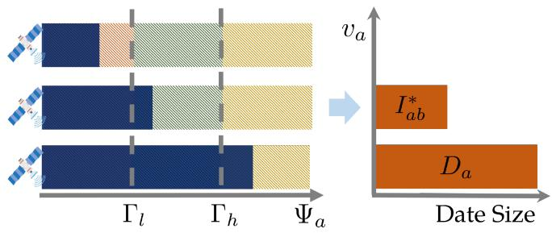

bar

| Category | Value |
| -------- | ----- |
| Segment 1 | Blue segment |
| Segment 2 | Patterned segment |
| Segment 3 | Solid segment |
| Segment 4 | Solid segment |

Fig. 4. Illustration of the offloading strategy for FedLEO.

Then according to Remark $^ { 4 , }$ we can get that

$$
I _ {a b} ^ {*} = \left\{ \begin{array}{l l} 0, & \kappa \frac {\zeta_ {b} D _ {b}}{e _ {b}} - \frac {1}{G _ {a}} <   - \frac {M \tau C \zeta_ {a} D _ {a}}{\sqrt {p _ {a} ^ {u m a x} d _ {a}}}, \\ D _ {a}, & \kappa \frac {\zeta_ {b} D _ {b}}{e _ {b}} - \frac {1}{G _ {a}} > 0, \\ I _ {a b} ^ {\text { case2 }}, & \text { others }, \end{array} \right. \tag {50}
$$

where

$$
I _ {a b} ^ {\text { case2 }} = \frac {\sqrt {p _ {a} ^ {\text { umax }} d _ {a}}}{M \tau C \zeta_ {a}} \left(\kappa \frac {\zeta_ {b} D _ {b}}{e _ {b}} - \frac {1}{G _ {a}} + \frac {M \tau C \zeta_ {a} D _ {a}}{\sqrt {p _ {a} ^ {\text { umax }} d _ {a}}}\right). \tag {51}
$$

3) Case 3: $\mathrm { I f } T _ { b - a } = 0 .$ , i.e., $0 < \rho _ { a } ^ { * } < M \tau C$ , we can get that

$$
\frac {\partial F}{\partial I _ {a b} ^ {*}} = f _ {1} \left(I _ {a b} ^ {*}\right) + \rho_ {a} ^ {*} f _ {2} \left(I _ {a b} ^ {*}\right) + \left(M \tau C - \rho_ {a} ^ {*}\right) f _ {3} \left(I _ {a b} ^ {*}\right) + f _ {4} \left(I _ {a b} ^ {*}\right). \tag {52}
$$

Then according to Remark 4, we have

$$
I _ {a b} ^ {*} = \left\{ \begin{array}{l l} 0, & \kappa \frac {\zeta_ {b} D _ {b}}{e _ {b}} - \frac {1}{G _ {a}} <   \frac {\rho^ {*} \zeta_ {a} D _ {a}}{\sqrt {p _ {a} ^ {u m a x} d _ {a}}} + \frac {(M \tau C - \rho^ {*}) \zeta_ {b} D _ {b}}{\sqrt {p _ {b} ^ {u m a x} e _ {b}}}, \\ D _ {a}, & \kappa \frac {\zeta_ {b} D _ {b}}{e _ {b}} - \frac {1}{G _ {a}} > \frac {(M \tau C - \rho^ {*}) \zeta_ {b} (D _ {a} + D _ {b})}{\sqrt {p _ {b} ^ {u m a x} e _ {b}}}, \\ I _ {a b} ^ {\text { case3 }}, & \text { others }, \end{array} \right. \tag {53}
$$

and the $I _ { a b } ^ { c a s e 3 }$ is given in (54).

$$
\begin{array}{l} I _ {a b} ^ {\text {case3}} = \frac {\sqrt {p _ {a} ^ {\text {umax}} p _ {b} ^ {\text {umax}} d _ {a} e _ {b}}}{\rho^ {*} \zeta_ {a} \sqrt {p _ {b} ^ {\text {umax}} e _ {b}} + (M \tau C - \rho^ {*}) \zeta_ {b} \sqrt {p _ {a} ^ {\text {umax}} d _ {a}}} \\ \times \left(\kappa \frac {\zeta_ {b} D _ {b}}{e _ {b}} - \frac {1}{G _ {a}} + \frac {\rho^ {*} \zeta_ {a} D _ {a}}{\sqrt {p _ {a} ^ {u m a x} d _ {a}}} - \frac {(M \tau C - \rho^ {*}) \zeta_ {b} D _ {b}}{\sqrt {p _ {b} ^ {u m a x} e _ {b}}}\right). \tag {54} \\ \end{array}
$$

# D. Satellite-Centric Threshold-Based Offloading Strategy

Based on the analysis of the preceding three cases, we propose the satellite-centric threshold-based offloading strategy for one round of local optimization in FedLEO with a given selected satellite $v _ { a } ,$ , which structural properties are illustrated in Fig. 4.

Theorem 5: For a given satellite $v _ { a }$ , we define an offloading decision indicator $\Psi _ { a }$ as:

$$
\Psi_ {a} = \kappa \frac {\zeta_ {b} D _ {b}}{e _ {b}} - \frac {1}{G _ {a}}. \tag {55}
$$

We also define the offloading decision threshold $\Gamma _ { l }$ and $\Gamma _ { h }$ as:

$$
\Gamma_ {l} = \frac {\rho^ {*} \zeta_ {a} D _ {a}}{\sqrt {p _ {a} ^ {u m a x} d _ {a}}} + \frac {(M \tau C - \rho^ {*}) \zeta_ {b} D _ {b}}{\sqrt {p _ {b} ^ {u m a x} e _ {b}}}, \tag {56}
$$

$$
\Gamma_ {h} = \frac {(M \tau C - \rho^ {*}) \zeta_ {b} (D _ {a} + D _ {b})}{\sqrt {p _ {b} ^ {u m a x} e _ {b}}}. \tag {57}
$$

Then the offloading strategy for FedLEO has the following properties:

1) If $\Psi _ { a } < \Gamma _ { l }$ , satellite $v _ { a }$ should not offload any data to the satellite $v _ { b } , \mathrm { i . e . , } I _ { a b } ^ { \ast } = 0$ .   
2) If $\Gamma _ { l } \leq \Psi _ { a } \leq \Gamma _ { h }$ 0, satellite $v _ { a }$ requires offloading partial Γ Ψdata to the satellite $v _ { b }$ and the general offloaded data size can be obtained by (54).   
3) If $\Psi _ { a } > \Gamma _ { h }$ , satellite $v _ { a }$ should offload all the data to the Ψ Γsatellite vb, i.e., ${ \cal I } _ { a b } ^ { * } = D _ { a }$ .

=Proof: In accordance with (48), (51) and (54), Theorem 5 can be obtained.

Remark 5: When $\kappa = 0 .$ , i.e., only consider the optimiza-= 0tion of the delay. Then we can find that there always exists $\Psi _ { a } < \Gamma _ { l }$ and $I _ { a b } ^ { * } = 0$ for each satellite when $T _ { b - a } > 0$ . This Ψ Γ = 0 0is due to the fact that offloading does not reduce delay but rather increases the computation overhead of the satellite $v _ { b }$ and total system delay. As a result, we should give up offloading in this case. When $T _ { b - a } \leq 0$ , the offloading decision indicator $\Psi _ { a }$ 0determines whether to offload data for satellite $v _ { a }$ Ψ. Offloading is unnecessary except in two cases. First, the satellite $v _ { a }$ has weak computation capacity in which the $\zeta _ { a }$ of satellite $v _ { a }$ is so large. Second, the satellite $v _ { a }$ has a large dataset size $D _ { a }$ or a high channel gain $g _ { a }$ , which suggests that latency shortening can be achieved by offloading its partial data to the satellite $v _ { b }$ . Moreover, the $I _ { a b } ^ { * }$ in (51) and (54) is a monotonously increasing function concerning $\zeta _ { a }$ and $g _ { a }$ in this case (i.e., set $\kappa = 0 )$ . Note = 0that our offloading framework considers the specific channel model parameter $g _ { a }$ when determining the optimal offloading data size $I _ { a b }$ . This allows our framework to be adaptable to different channel models (i.e., considering the distance between satellites as well as the carrier frequency, etc.) encountered in diverse LEO satellite networks.

Remark 6: When we consider the optimization of the accuracy, $\mathrm { i . e . , } \kappa \neq 0$ . The offloading decision of three cases will be = 0determined by the value of κ in indicator $\Psi _ { a }$ . Moreover, the offloaded data size $I _ { a b } ^ { * }$ Ψin (48), (51) and (54) increases as κ increases. We note that when $T _ { b - a } < 0$ , which means the satellite $v _ { b }$ has a high computation capacity. For this case, the offloading decision parameters $\Psi _ { a } , \Gamma _ { l }$ and $\Gamma _ { h }$ are the determined values. Ψ Γ ΓAs a result, the threshold-based offloading decision strategy will devolve into a simpler method. Furthermore, if we pay more attention to optimizing accuracy, it can be considered offloading all the data to the satellite vb.

Based on the offloading strategy in Theorem 5, the corresponding algorithm is proposed in Algorithm 2.

# E. System-Wide Greedy-Based Iterative Offloading Decision Making

Based on the threshold-based offloading strategy solved for a selected satellite in each round above, we propose Algorithm 3 to make the system-wide multi-round offloading decisions based on the greedy principle. Specifically, the algorithm sequentially selects a satellite and optimizes its offloading decision using the threshold-based offloading strategy to gradually reduce the system delay and optimize the training accuracy. In each iteration t, the slowest training satellite is selected to perform the data offloading. Then, the difference in model training delay and data distribution between satellite $v _ { a }$ and its adjacent satellites is calculated, which can be denoted as

Algorithm 3: System-Wide Greedy-Based Iterative Offloading Decision Making Algorithm for FedLEO.   
Input: N, M, $\tau$ , C, $\kappa$ , $\pi$ , $B_{a}$ , $p_{a}^{umax}$ , $p_{a}^{omax}$ , $\zeta_{a}$ , $g_{a}$ , $D_{a}$ , where $a \in N$ Output: $I_{ab}^{*}$ 1: Initialize optimal offloading matrix $I_{ab}^{*} = 0$ , $\forall a \in N$ , $b \in \mathcal{B}(a)$ .

2: Initialize $Q = T^{u}$ .

3: Initialize iteration round t = 0.

4: while $I_{ab}^{*(t+1)} \neq I_{ab}^{*(t)}$ do

5: $v_{a} \leftarrow \max_{a \in N} \sqrt{\frac{\zeta_{a} D_{a}^{2}}{p_{a}^{umax}}}$ , $v_{b} \leftarrow \max_{b \in \mathcal{B}(a)} U_{b-a}$ .

6: $L = L \cup \{(a, b)\}$ .

7: Obtain $I_{ab}^{*}$ from Algorithm 2.

8: $I_{ab}^{*(t+1)} = I_{ab}^{*}$ .

9: $D_{a}^{(t+1)} = D_{a}^{(t)} - I_{ab}^{*(t+1)}$ , $D_{b}^{(t+1)} = D_{b}^{(t)} + I_{ab}^{*(t+1)}$ .

10: $V = V - \{v_{a}\}$ .

11: $Q^{(t+1)} = T^{o} + T^{u}$ .

12: if $Q^{(t+1)} > Q^{(t)}$ then $I_{ab}^{*(t+1)} = I_{ab}^{*(t)}$ ;

13: $t = t + 1$ .

14: end while

15: Divide the transmission flow with no intersection of satellites into P separate flows.

16: return $I_{ab}^{*}$ for all satellite $v_{a}$ and perform parallel data offloading procedure in LEO satellite networks.

$$
U _ {b - a} = \sqrt {\frac {e _ {b}}{p _ {b} ^ {u m a x}}} - \sqrt {\frac {d _ {a}}{p _ {a} ^ {u m a x}}} + \pi \sum_ {i = 1} ^ {C} \left\| \frac {D _ {b} ^ {(i)}}{D _ {b}} - \frac {D _ {a} ^ {(i)}}{D _ {a}} \right\|, \tag {58}
$$

where π is the weighted parameter, and the satellite selection is based on the sum of the weighted difference in model training delay and data distribution, so as to satisfy different requirements of delay and accuracy optimization. After that, the satellite with the maximum value will be selected to receive the data offloading and the data matrix in LEO satellite networks will be updated virtually based on the offloaded data size solved by satellite-centric threshold-based offloading strategy between these two satellites (i.e., the solution to the P2). The above process corresponds to lines 5–9 of Algorithm 3. Then multiple rounds of iterations are performed until convergence (i.e., no offloading decision of satellite can be improved).

To allow parallel data offloading, as shown in Fig. 5, in each round of optimization, the indexes of selected satellites will be sequentially stored in the set ${ \mathcal { L } } .$ Following optimization, the transmission links without satellite intersection are divided into P parallel flows in accordance with the records in the set ${ \mathcal { L } } ,$ thus allowing data transmission between different flows in parallel. Furthermore, we can analyze the performance (i.e., approximation ratio) of Algorithm 3 with respect to the original optimal solution as follows.

Theorem 6: Let $\boldsymbol { W } _ { a } ^ { * ( t ) }$ be the minimum cost for offloading the data I ab $I _ { a b } ^ { ( t ) }$ from satellite $v _ { a }$ to its adjacent satellite, and ${ W } _ { a b } ^ { ( t ) }$ be the cost for satellite $v _ { a }$ offloading data $I _ { a b } ^ { ( t ) }$ to satellite $v _ { b }$ . Then the approximation ratio of Algorithm 3 is $2 \Upsilon .$ , where $\Upsilon =$ b∈B(a){W (t)ab / $\operatorname* { m a x } _ { b \in B ( a ) } \{ W _ { a b } ^ { ( t ) } / W _ { a } ^ { * ( t ) } \}$ .

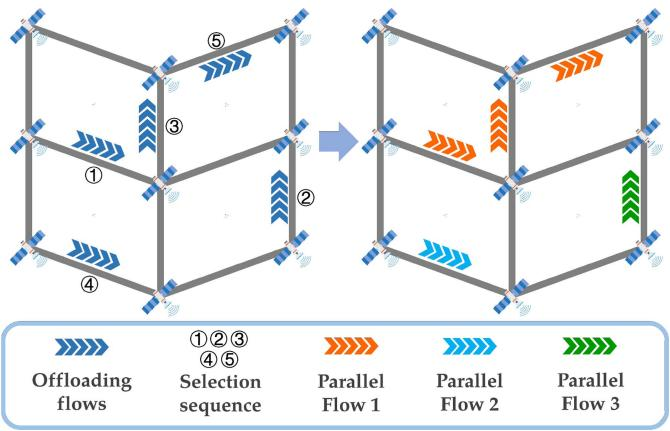

flowchart

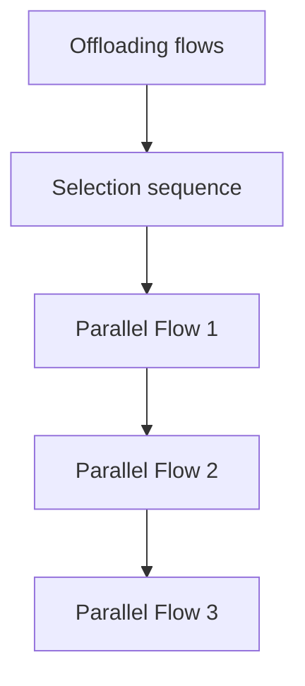

Fig. 5. Illustration of the flow separation in FedLEO.

axProof: Please see our proof in Appendix $\mathrm { F , }$ available online.

Note that for the above optimization process, a coordinated satellite or ground station can be designated as a coordinator for the information collection and conduct offloading decision makings (i.e., run the optimization algorithm) for the LEO satellite networks, such that the satellites can locally execute the optimized decisions in a distributed manner.4 Specifically, information on the initial data distributions and physical parameters of all satellites in LEO satellite networks will be transmitted to the coordinator. Then the coordinator will perform multi-round sequential optimization based on the received information, and the data distribution records in the coordinator will virtually update as a result of each round of optimization based on the offload data size solved by the satellite-centric threshold-based offload strategy, in which the current round optimization is influenced by the previous round optimization. The final data transmission will start in reality after the coordinator announces the offloaded instructions (i.e., the offloaded data size $I _ { a b }$ and the offloaded sequence in the separated flow) to all satellites as the optimization is completed. After receiving the instructions, each satellite can execute its data offloading strategy accordingly in a distributed manner.

Since we set that a satellite will not engage in the subsequent optimization rounds after offloading data to its adjacent satellite (line 10 in Algorithm 3). With such an offloading mechanism, it is guaranteed that the training accuracy can be continuously improved after each round of optimization, as proved in Proposition 1 and Theorem 2. Meanwhile, it would ensure that the separate flows can be formed in LEO satellite networks without collisions, with data transmission proceeding properly and serially in each flow, i.e., a satellite can transmit data to the next hop in sequence after receiving the data offloads. Additionally, the optimization preferences for delay and accuracy can be tuned

4It is also possible to use multiple coordinators to collect information and make decisions collectively to improve the robustness, but it is hard to guarantee converged and consistent decision makings among the multiple coordinators in real-time. We will consider such challenging design in a future work.

TABLE II SIMULATION PARAMETERS 

<table><tr><td>Parameter</td><td>Value</td></tr><tr><td>Number of LEO satellites N</td><td>100</td></tr><tr><td>Number of orbits R</td><td>10</td></tr><tr><td>Channel bandwidth Ba</td><td>20 MHz</td></tr><tr><td>Channel characteristic ga</td><td> $10^3$ </td></tr><tr><td>Channel number per ISL</td><td>1</td></tr><tr><td>Effective capacitance coefficient ζa</td><td> $[10^{-18}, 10^{-17}]$ </td></tr><tr><td>CPU cycles for training 1-bit data C</td><td>500</td></tr><tr><td>Computation power constraint paumax</td><td>5 W</td></tr><tr><td>Communication power constraint paomax</td><td>5 W</td></tr><tr><td>Number of FL rounds M</td><td>100</td></tr><tr><td>Time slot for parameter aggregation tw</td><td>300 ms</td></tr></table>

in FedLEO by adjusting the values of the weighted parameters κ and π. In order to determine the appropriate values of the weighted parameters, which can be achieved by conducting the FL and centralized model training experiments beforehand to obtain the possible range of the weight divergences. Also, the range of the delay can be estimated via numerical emulations beforehand based on the computation and communication conditions of the satellites. Then, based on specific application requirements, the proper values of weighted parameters can be fine-tuned to achieve the desired optimization. Further, for the convergence of Algorithm 3, since we have ensured that the cost for each round of iterative optimization remains decreasing, otherwise the optimization is terminated, thus guaranteeing the convergence of our method and ensuring that the total delay continuously decreases, as indicated in line 12 of Algorithm 3.

# VI. PERFORMANCE EVALUATION

In this section, we conduct extensive experiments to evaluate the FedLEO for optimizing decentralized FL in LEO satellite networks.

# A. Experimental Setup

We consider 100 satellites evenly dispersed across 10 orbits, each orbital plane is distributed at an altitude of about 330 km above the Earth with ◦ inclination. The connectivity infor-90mation between satellites is obtained from the Satellite Tool Kit (STK) simulation software. Referring to [14], [30], [31], other important simulation parameters related to satellites are listed in Table II. Our simulations perform FL training among satellites based on the popular model training datasets MNIST and CIFAR-10, which are widely used for performance evaluation in many FL works [8], [32], to evaluate the performance of FedLEO. The training model for each dataset is described as follows:

\- MNIST [33] is a classic hand-written digit classification dataset with 10 classes. The training model used for MNIST is a Multilayer Perceptron (MLP) model, which has 1 hidden layer with 128 hidden units.

CIFAR-10 [34] is an object recognition dataset with 10 classes. We use two different models for CIFAR-10. The first one is an MLP model (1 hidden layer with 512 hidden units). The second is a Convolution Neural Network (CNN) model with 9 convolutional layers, with one Group Normalization [35] layer between every two convolutional layers.

We perform the partitioning of the dataset into IID and non-IID distributions according to [8], the total data is shuffled and then assigned to 100 satellites with random data sizes. In the case of non-IID, we first sort the data by label, then assign each satellite samples of 1 class with a random size, which has a considerable negative influence on global model accuracy. In addition, the experimental results of the delay analysis are averaged over 5000 rounds of random data allocation simulations.

# B. Evaluation of FedLEO Scheme

To evaluate the performance of the proposed scheme, the following benchmarks are compared.

- Local Computation (LC): In this scheme, each satellite performs FL training on its own initial dataset, without performing any data offloading.   
Coded Computation (CDC) [36]: In this scheme, each satellite will be embedded with computation redundancy, so it only needs to wait for partial satellites in each FL training round.   
Sequential Computation Offloading (SCO) [37]: In this scheme, each satellite makes offloading decisions sequentially based on our proposed threshold-based offloading strategy.   
Single-orbit FedLEO (Single-FedLEO): This scheme is designed for satellite constellations where data can only be offloaded using intra-satellite links, and perform FedLEO scheme.   
Single-orbit Sequential Computation Offloading (Single-SCO): This scheme has the same design as the Single-FedLEO, but it uses the SCO scheme for execution.   
- Full Computation Offloading (FCO): In this scheme, the 20 satellites with the longest model training delay will offload their entire data to their adjacent satellite with the shortest delay.

1) Impact of Power constraint on the System Delay: Fig. 6 shows the system delay curves of six schemes versus the power constraint of each satellite. Since coded computation is another method for mitigating the straggler effect, we also evaluate its delay performance by referring to [36]. Several observations can be made. First, the delays of the six schemes reduce as the power constraint of each satellite grows. The explanation is that, a larger computation and communication power allocated to the satellite leads to the system being more efficient, which results in a lower system delay. Second, the delay optimization of FedLEO will be more obvious as the number of local training epochs increases. The explanation is that, when the number of local training epochs increases, the weight of the model training delay in the optimization increases, thus making the optimization effect of FedLEO more obvious. Next, we find that FedLEO outperforms the coded computation method. The reason is that, despite the fact that the coded computation method only needs to wait for partial satellites during each round, the model training delay difference among these satellites is larger than FedLEO.

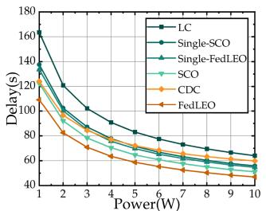

line

| Power(W) | LC   | Single-SCO | Single-FedLEO | SCO  | CDC  | FedLEO |
| -------- | ---- | ---------- | ------------- | ---- | ---- | ------ |
| 1        | 160  | 140        | 120           | 100  | 120  | 100    |
| 2        | 130  | 110        | 90            | 80   | 90   | 70     |
| 3        | 100  | 80         | 70            | 60   | 70   | 50     |
| 4        | 80   | 60         | 55            | 50   | 60   | 45     |
| 5        | 70   | 55         | 50            | 45   | 55   | 40     |
| 6        | 65   | 50         | 45            | 40   | 50   | 35     |
| 7        | 60   | 45         | 40            | 35   | 45   | 30     |
| 8        | 55   | 40         | 35            | 30   | 40   | 25     |
| 9        | 50   | 35         | 30            | 25   | 35   | 20     |
| 10       | 45   | 30         | 25            | 20   | 30   | 15     |

(a) MNIST with τ = 1

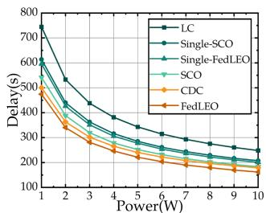

line

| Power(W) | LC   | Single-SCO | Single-FedLEO | SCO  | CDC  | FedLEO |
| -------- | ---- | ---------- | ------------- | ---- | ---- | ------ |
| 1        | 750  | 600        | 550           | 500  | 480  | 450    |
| 2        | 600  | 450        | 400           | 350  | 330  | 300    |
| 3        | 450  | 350        | 300           | 280  | 260  | 240    |
| 4        | 350  | 280        | 250           | 230  | 210  | 190    |
| 5        | 300  | 250        | 220           | 200  | 180  | 160    |
| 6        | 250  | 220        | 200           | 180  | 160  | 140    |
| 7        | 220  | 200        | 180           | 160  | 140  | 120    |
| 8        | 200  | 180        | 160           | 140  | 120  | 100    |
| 9        | 180  | 160        | 140           | 120  | 100  | 80     |
| 10       | 160  | 140        | 120           | 100  | 80   | 60     |

(b) MNIST with T = 5

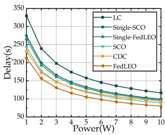

line

| Power(W) | LC   | Single-SCO | Single-FedLEO | SCO  | CDC  | FedLEO |
| -------- | ---- | ---------- | ------------- | ---- | ---- | ------ |
| 1        | 320  | 260        | 240           | 220  | 210  | 200    |
| 2        | 280  | 230        | 210           | 190  | 180  | 170    |
| 3        | 240  | 200        | 180           | 160  | 150  | 140    |
| 4        | 210  | 170        | 150           | 140  | 130  | 120    |
| 5        | 190  | 150        | 130           | 120  | 110  | 100    |
| 6        | 170  | 130        | 110           | 100  | 90   | 80     |
| 7        | 150  | 110        | 90            | 80   | 70   | 60     |
| 8        | 130  | 90         | 70            | 60   | 50   | 40     |
| 9        | 110  | 70         | 50            | 40   | 30   | 20     |
| 10       | 90   | 50         | 30            | 20   | 10   | 5      |

(c) CIFAR-10 with T = 1

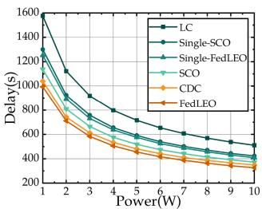

line

| Power(W) | LC    | Single-SCO | Single-FedLEO | SCO   | CDC   | FedLEO |
| -------- | ----- | ---------- | ------------- | ----- | ----- | ------ |
| 1        | 1600  | 1300       | 1200          | 1100  | 1000  | 900    |
| 2        | 1200  | 1000       | 900           | 800   | 700   | 600    |
| 3        | 900   | 800        | 700           | 600   | 500   | 450    |
| 4        | 700   | 650        | 550           | 500   | 450   | 400    |
| 5        | 600   | 600        | 500           | 450   | 400   | 350    |
| 6        | 550   | 550        | 450           | 400   | 350   | 325    |
| 7        | 500   | 500        | 425           | 375   | 325   | 300    |
| 8        | 475   | 475        | 400           | 350   | 300   | 275    |
| 9        | 450   | 450        | 375           | 325   | 275   | 250    |
| 10       | 425   | 425        | 350           | 300   | 250   | 225    |

(d) CIFAR-10 with T = 5   
Fig. 6. Impact of power constraint on system delay.

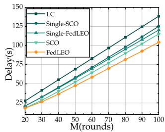

line

| M(rounds) | LC   | Single-SCO | Single-FedLEO | SCO  | FedLEO |
| --------- | ---- | ---------- | ------------- | ---- | ------ |
| 20        | 25   | 25         | 25            | 25   | 25     |
| 30        | 40   | 35         | 30            | 30   | 28     |
| 40        | 60   | 50         | 45            | 40   | 35     |
| 50        | 80   | 65         | 60            | 55   | 50     |
| 60        | 100  | 80         | 75            | 70   | 65     |
| 70        | 120  | 95         | 90            | 85   | 80     |
| 80        | 140  | 110        | 105           | 100  | 95     |
| 90        | 160  | 125        | 120           | 115  | 110    |
| 100       | 180  | 140        | 135           | 130  | 125    |

(a) MNIST with T =1

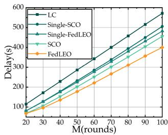

line

| M(rounds) | LC   | Single-SCO | Single-FedLEO | SCO  | FedLEO |
| --------- | ---- | ---------- | ------------- | ---- | ------ |
| 20        | 100  | 100        | 100           | 100  | 100    |
| 30        | 150  | 150        | 150           | 150  | 150    |
| 40        | 200  | 200        | 200           | 200  | 200    |
| 50        | 250  | 250        | 250           | 250  | 250    |
| 60        | 300  | 300        | 300           | 300  | 300    |
| 70        | 350  | 350        | 350           | 350  | 350    |
| 80        | 400  | 400        | 400           | 400  | 400    |
| 90        | 450  | 450        | 450           | 450  | 450    |
| 100       | 500  | 500        | 500           | 500  | 500    |

(b) MNIST with T = 5

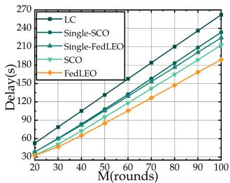

line

| M(rounds) | LC   | Single-SCO | Single-FedLEO | SCO  | FedLEO |
| --------- | ---- | ---------- | ------------- | ---- | ------ |
| 20        | 30   | 30         | 30            | 30   | 30     |
| 30        | 60   | 60         | 60            | 60   | 50     |
| 40        | 90   | 90         | 90            | 90   | 70     |
| 50        | 120  | 120        | 120           | 120  | 90     |
| 60        | 150  | 150        | 150           | 150  | 110    |
| 70        | 180  | 180        | 180           | 180  | 130    |
| 80        | 210  | 210        | 210           | 210  | 150    |
| 90        | 240  | 240        | 240           | 240  | 170    |
| 100       | 270  | 270        | 270           | 270  | 190    |

(c) CIFAR-10 with T = 1

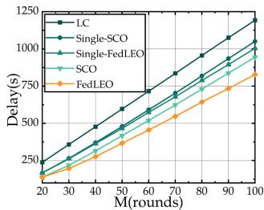

line

| M(rounds) | LC    | Single-SCO | Single-FedLEO | SCO   | FedLEO |
| --------- | ----- | ---------- | ------------- | ----- | ------ |
| 20        | 250   | 250        | 250           | 250   | 250    |
| 30        | 375   | 375        | 375           | 375   | 375    |
| 40        | 500   | 500        | 500           | 500   | 500    |
| 50        | 625   | 625        | 625           | 625   | 625    |
| 60        | 750   | 750        | 750           | 750   | 750    |
| 70        | 875   | 875        | 875           | 875   | 875    |
| 80        | 1000  | 1000       | 1000          | 1000  | 1000   |
| 90        | 1125  | 1125       | 1125          | 1125  | 1125   |
| 100       | 1250  | 1250       | 1250          | 1250  | 1250   |

(d) CIFAR-10 with τ = 5   
Fig. 7. Impact of FL rounds on system delay.

2) Impact of FL Rounds on the System Delay: Fig. 7 illustrates the effect of FL rounds on the system delay of different schemes. One can observe that the system delay will be increased as the FL rounds grow. The explanation is that, more FL rounds result in a larger decentralized FL model training delay, which increases the system delay. Moreover, the delay optimization effect of FedLEO will be more significant with the growth of the FL rounds. The reason is that, the decentralized FL model training delay accounts for a larger proportion of the optimization when the FL rounds increase, resulting in a lower system delay. Additionally, we find that FedLEO has the lowest system delay in both single-orbit offloading and general offloading than alternative schemes that are subject to the same FL rounds, which supports its validity and superiority.

3) Performance of FedLEO Under Different Values of κ: In this experiment, we set different values of κ to verify the scalability of the FedLEO scheme. We denote the importance of accuracy and delay in the optimization by changing the value of κ. The results on MNIST dataset are shown in Figs. 8 and 10, and for CIFAR-10 dataset are shown in Figs. 9 and11. For each dataset, as the value of κ in the satellite-centric threshold-based offloading strategy increases, the test accuracy of the model increases, while the delay also increases. Specifically, for the MNIST dataset, if only delay optimization is considered (i.e., κ ), up to 31.7% of delay can be reduced compared to local computation, and if accuracy optimization is further considered (i.e., κ > ), up to 3.643% of accuracy can be improved with very small delay increases compared to local computation. For the CIFAR-10 dataset, there is a maximum delay optimization of 45.05% and an accuracy optimization of 9.39%. The explanation

is that, the larger value of κ will cause a greater tendency to optimize accuracy in FedLEO, thus the satellite will offload more data to its adjacent satellite to reduce the weight divergence between centralized ML and FedLEO. As a result, κ acts as a hyperparameter that can be carefully tuned to strike a nice balance between global model accuracy and delay. That is, if we prefer a model with higher accuracy, we can assign a relatively high value to κ, and vice versa. Moreover, the delay of FedLEO is always the lowest compared to both local computation and full computation offloading. And according to Theorem 2, even though full computation offloading leads to better accuracy optimization, our accuracy is always close to or even better than it, thus proving that our proposed scheme can make a more efficient tradeoff between delay and accuracy.

4) Performance of FedLEO Under Different Values of π: We further verify the scalability of FedLEO by changing the value of π. The results of increasing the value of π to 0.01 on different datasets are shown in Figs. 10 and 11. Several observations can be made. First, as the value of π increases, the delay of FedLEO increases, but so does the accuracy. The reason is that, a higher value of π will cause the slowest satellite to select its adjacent satellite with higher differences in data distribution for data offloading, which can better reduce the non-IID degree of the overall data distribution in LEO satellite networks. Next, when the values of both κ and π are set to the appropriate values, the accuracy on all datasets will be maximized and the system delay will still be low. So it shows that when we jointly adjust the values of κ and π, FedLEO can achieve the desired accuracy or delay, thus better demonstrating the scalability of our proposed framework.

5) Impact of Non-IID Degree on the Accuracy: In this experiment, we initially assign MNIST and CIFAR-10 datasets to 100 satellites in four ways, i.e., Non-IID-1, Non-IID-2, Non-IID-5 and IID, indicating that each satellite initially possesses data with one, two, five and ten classes, respectively. The effect of the non-IID degree on the accuracy of three schemes is depicted in Fig. 12. It can be observed that as the degree of non-IID increases, the delay required to reach a certain accuracy increases. Nevertheless, the delay of FedLEO is always lower than the other two schemes, and as the degree of non-IID increases, the gap of delay between FedLEO and the other two schemes is getting bigger and bigger. Therefore, FedLEO is resilient to different degrees of non-IID data distribution in LEO satellite networks, which is consistent with Proposition 1 and Theorem 2.

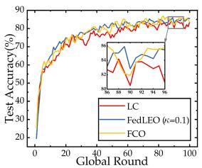

line

| Global Round | LC   | FedLEO (c=0.1) | FCO  |
| ------------ | ---- | -------------- | ---- |
| 0            | 20   | 20             | 20   |
| 20           | 70   | 75             | 72   |
| 40           | 78   | 80             | 79   |
| 60           | 82   | 83             | 81   |
| 80           | 84   | 85             | 83   |
| 100          | 85   | 86             | 84   |

(a) Learning curve with T = 1

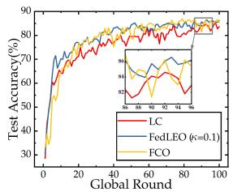

line

| Global Round | LC   | FedLEO (c=0.1) | FCO  |
| ------------ | ---- | -------------- | ---- |
| 0            | 30   | 30             | 30   |
| 20           | 70   | 75             | 72   |
| 40           | 80   | 82             | 81   |
| 60           | 85   | 86             | 85   |
| 80           | 87   | 88             | 87   |
| 100          | 88   | 89             | 88   |

(b) Learning curve with T = 5

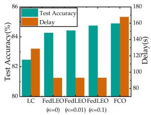

bar

| Method | Test Accuracy(%) | Delay(s) |
| ------ | ---------------- | -------- |
| LC     | 82.5             | 140      |
| FedLEO (k=0) | 84.5         | 100      |
| FedLEO (k=0.01) | 84.8        | 95      |
| FedLEO (k=0.1) | 85.2         | 92      |
| FCO    | 86.0             | 170      |

(c) Test accuracy and delay after 100 global training rounds with T=1

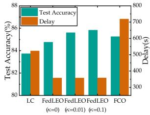

bar

| Method | Test Accuracy(%) | Delay(s) |
| ------ | ---------------- | -------- |
| LC     | 83.5             | 500      |
| FedLEO (k=0) | 84.5         | 350      |
| FedLEO (k=0.01) | 85.5        | 350      |
| FedLEO (k=0.1)   | 86.0        | 350      |
| FCO    | 85.5             | 700      |

(d) Test accuracy and delayafter 100 global training rounds with T=5   
Fig. 8. Performance of FedLEO with MNIST dataset and MLP model under different values of κ (π = 0).

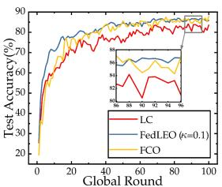

line

| Global Round | LC   | FedLEO (c=0.1) | FCO  |
| ------------ | ---- | -------------- | ---- |
| 0            | 20   | 20             | 20   |
| 20           | 60   | 70             | 65   |
| 40           | 75   | 80             | 78   |
| 60           | 80   | 85             | 83   |
| 80           | 82   | 87             | 85   |
| 100          | 83   | 88             | 86   |

(a) Learning curve with T = 1

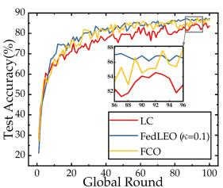

line

| Global Round | LC   | FedLEO (c=0.1) | FCO  |
| ------------ | ---- | -------------- | ---- |
| 0            | 20   | 20             | 20   |
| 20           | 70   | 75             | 72   |
| 40           | 80   | 82             | 81   |
| 60           | 85   | 86             | 85   |
| 80           | 88   | 89             | 88   |
| 100          | 90   | 90             | 90   |

(b) Learning curve with T = 5

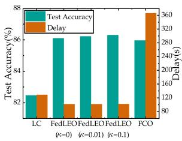

bar

| Method | Test Accuracy(%) | Delay(s) |
| --- | --- | --- |
| LC | 82 | 120 |
| FedLEO (k=0) | 86 | 100 |
| FedLEO (k=0.01) | 86 | 100 |
| FedLEO (k=0.1) | 86 | 100 |
| FCO | 86 | 360 |

(c) Test accuracy and delay after 100 global training rounds with T=1

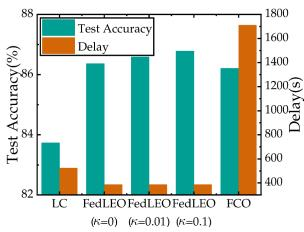

bar

| Method | Test Accuracy(%) | Delay(s) |
| ------ | ---------------- | -------- |
| LC (κ=0) | 83.5 | 500 |
| FedLEO (κ=0.01) | 86.5 | 400 |
| FedLEO (κ=0.1) | 85.5 | 400 |
| FCO | 83.5 | 1700 |

(d) Test accuracy and delay after 100 global training rounds with T=5   
Fig. 10. Performance of FedLEO with MNIST dataset and MLP model under different values of κ (π = 0.01).

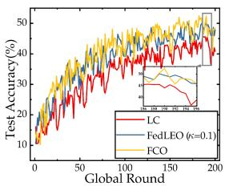

line

| Global Round | LC   | FedLEO (k=0.1) | FCO  |
| ------------ | ---- | -------------- | ---- |
| 0            | 10   | 10             | 10   |
| 50           | 30   | 35             | 38   |
| 100          | 40   | 45             | 48   |
| 150          | 45   | 50             | 52   |
| 200          | 50   | 55             | 58   |

(a) Learning curve with r = 1

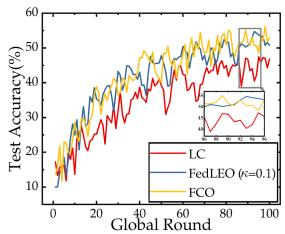

line

| Global Round | LC   | FedLEO (k=0.1) | FCO  |
| ------------ | ---- | -------------- | ---- |
| 0            | 10   | 10             | 10   |
| 20           | 25   | 28             | 27   |
| 40           | 35   | 38             | 37   |
| 60           | 45   | 48             | 47   |
| 80           | 50   | 52             | 51   |
| 100          | 55   | 58             | 57   |

(b) Learning curve with T = 5

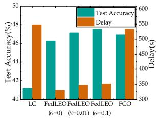

bar

| Method | Test Accuracy(%) | Delay(s) |
| --- | --- | --- |
| LC (k=0) | 41 | 350 |
| FedLEO (k=0.01) | 46 | 350 |
| FedLEO (k=0.1) | 47 | 350 |
| FCO (k=0.1) | 47 | 550 |
| FCO (k=0.2) | 47 | 550 |

(c) Test accuracy and delay after 100 global training rounds with T=1

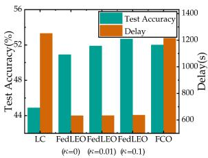

bar

| Method | Test Accuracy(%) | Delay(s) |
| ------ | ---------------- | -------- |
| LC (k=0) | 44 | 1200 |
| FedLEO (k=0.01) | 52 | 600 |
| FedLEO (k=0.1) | 52 | 600 |
| FCO | 52 | 1200 |

(d) Test accuracy and delay after 100 global training rounds with T=5   
Fig. 9. Performance of FedLEO with CIFAR-10 dataset and CNN model under different values of κ (π = 0).

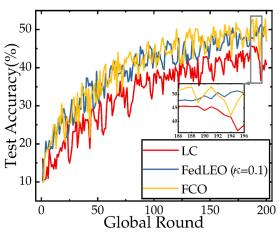

line

| Global Round | LC   | FedLEO (c=0.1) | FCO  |
| ------------ | ---- | -------------- | ---- |
| 0            | 10   | 10             | 10   |
| 50           | 30   | 35             | 35   |
| 100          | 40   | 45             | 45   |
| 150          | 45   | 50             | 50   |
| 200          | 50   | 55             | 55   |

(a) Learning curve with T = 1

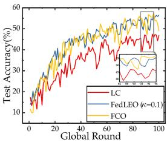

line

| Global Round | LC   | FedLEO (ε=0.1) | FCO  |
| ------------ | ---- | -------------- | ---- |
| 0            | 10   | 10             | 10   |
| 20           | 30   | 35             | 32   |
| 40           | 45   | 48             | 47   |
| 60           | 50   | 52             | 51   |
| 80           | 52   | 54             | 53   |
| 100          | 55   | 56             | 55   |

(b) Learning curve with T = 5

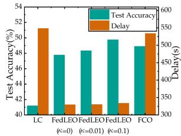

bar

| Method | Test Accuracy(%) | Delay(s) |
| --- | --- | --- |
| LC | 41 | 510 |
| FedLEO (k=0) | 48 | 320 |
| FedLEO (k=0.01) | 48 | 320 |
| FedLEO (k=0.1) | 50 | 320 |
| FCO | 49 | 530 |

(c) Test accuracy and delay after 100 global training rounds with T=1

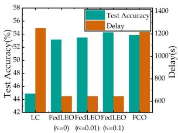

bar

| Method | Test Accuracy(%) | Delay(s) |
| ------ | ---------------- | -------- |
| LC     | 44               | 1200     |
| FedLEO (k=0) | 53              | 600      |
| FedLEO (k=0.01) | 53            | 600      |
| FedLEO (k=0.1) | 54              | 600      |
| FCO    | 53               | 1200     |

(d) Test accuracy and delay after 100 global training rounds with T=5   
Fig. 11. Performance of FedLEO with CIFAR-10 dataset and CNN model under different values of κ (π = 0.01).

6) Effect of the Number of Local Training Epochs: We also investigate the effect of the number of local training epochs on our FedLEO framework. For the delay optimization, we can

observe from Figs. 6 and 7 that the delay optimization will be more obvious when the number of local training epochs increases. The explanation is that, more local training epochs will make the decentralized FL model training delay a larger fraction of the optimization problem, thus making the delay optimization effect more obvious. For accuracy optimization, it can be observed from the rest of the experimental figures that more local training epochs will lead to a more pronounced accuracy optimization and a relatively smoother learning curve, thus demonstrating that suitable local training epochs result in a faster convergence rate. Together these results provide important insights into the fact that FedLEO can achieve good optimization results with different numbers of local training epochs, and the appropriate number of local training epochs will make our proposed framework more effective.

TABLE III AVERAGE OPTIMIZATION ROUNDS AND DATA OFFLOADING DELAY UNDER DIFFERENT NUMBERS OF SATELLITES 

<table><tr><td>Dataset</td><td colspan="4">MNIST</td><td colspan="4">CIFAR-10</td></tr><tr><td>Local training epochs</td><td colspan="2">τ = 5</td><td colspan="2">τ = 1</td><td colspan="2">τ = 5</td><td colspan="2">τ = 1</td></tr><tr><td>Number of satellites</td><td>N = 50</td><td>N = 100</td><td>N = 50</td><td>N = 100</td><td>N = 50</td><td>N = 100</td><td>N = 50</td><td>N = 100</td></tr><tr><td>Delay of LC(s)</td><td>828.96</td><td>524.02</td><td>189.792</td><td>128.804</td><td>1837.4</td><td>1251.775</td><td>391.48</td><td>274.35</td></tr><tr><td>Delay of offloading(s)</td><td>0.0263</td><td>0.0621</td><td>0.026</td><td>0.0463</td><td>0.0782</td><td>0.1903</td><td>0.0762</td><td>0.1488</td></tr><tr><td>Delay of FedLEO(s)</td><td>678.108</td><td>357.983</td><td>159.629</td><td>94.001</td><td>1295.637</td><td>633.422</td><td>283.558</td><td>150.682</td></tr><tr><td>Optimization rounds</td><td>6</td><td>21</td><td>6</td><td>20</td><td>10</td><td>23</td><td>8</td><td>21</td></tr></table>

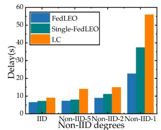

bar

| Non-IID degrees | FedLEO | Single-FedLEO | LC   |
| --------------- | ------ | ------------- | ---- |
| IID             | 6      | 7             | 8    |
| Non-IID-5       | 7      | 7             | 13   |
| Non-IID-2       | 9      | 10            | 14   |
| Non-IID-1       | 22     | 36            | 55   |

(a) Reaching 80% test accuracy on MNIST with τ = 1 (MLP)

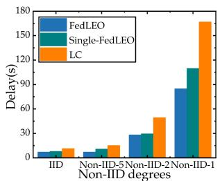

bar

| Non-IID degrees | FedLEO | Single-FedLEO | LC   |
| --------------- | ------ | ------------- | ---- |
| IID             | 5      | 5             | 10   |
| Non-IID-5       | 10     | 10            | 15   |
| Non-IID-2       | 30     | 30            | 50   |
| Non-IID-1       | 90     | 110           | 170  |

(b) Reaching 80% test accuracy on MNIST with τ = 5 (MLP)

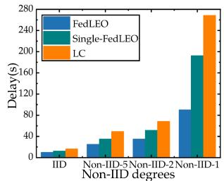

bar

| Non-IID degrees | FedLEO | Single-FedLEO | LC   |
| --------------- | ------ | ------------- | ---- |
| IID             | 5      | 10            | 15   |
| Non-IID-5       | 30     | 40            | 50   |
| Non-IID-2       | 40     | 60            | 70   |
| Non-IID-1       | 90     | 200           | 270  |

(c) Reaching 40% test accuracy on CIFAR-10 with τ= 1 (CNN)

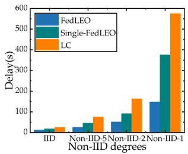

bar

| Non-IID degrees | FedLEO | Single-FedLEO | LC   |
| --------------- | ------ | ------------- | ---- |
| IID             | 10     | 15            | 20   |
| Non-IID-5       | 30     | 40            | 70   |
| Non-IID-2       | 60     | 90            | 150  |
| Non-IID-1       | 140    | 370           | 580  |

(d) Reaching 40% test accuracy on CIFAR-10 with τ = 5 (CNN)   
Fig. 12. The impact of non-IID degree on accuracy.

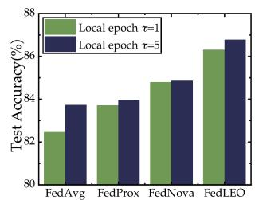

bar

| Method   | Local epoch τ=1 | Local epoch τ=5 |
| -------- | --------------- | --------------- |
| FedAvg   | 82.5            | 83.7            |
| FedProx  | 83.7            | 84.0            |
| FedNova  | 84.8            | 84.9            |
| FedLEO   | 86.2            | 86.8            |

(a)Accuracyofdifferent schemes under MNIST (MLP)

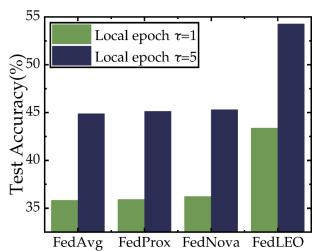

bar

| Method   | Local epoch τ=1 | Local epoch τ=5 |
| -------- | --------------- | --------------- |
| FedAvg   | 35              | 45              |
| FedProx  | 35              | 45              |
| FedNova  | 35              | 45              |
| FedLEO   | 40              | 55              |

FL (b）Accuracy of different FL schemes under CIFAR-10 (CNN)

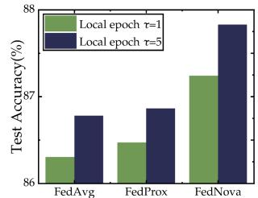

bar

| Method   | Local epoch τ=1 | Local epoch τ=5 |
| -------- | --------------- | --------------- |
| FedAvg   | 86.3            | 86.7            |
| FedProx  | 86.4            | 86.8            |
| FedNova  | 87.2            | 87.9            |

(c) Accuracy on MNIST when using other FL model averaging algorithms in FedLEO (MLP)

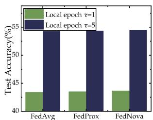

bar

| Method   | Local epoch τ=1 | Local epoch τ=5 |
| -------- | --------------- | --------------- |
| FedAvg   | 43              | 55              |
| FedProx  | 43              | 54              |
| FedNova  | 43              | 54              |

(d) Accuracy on CIFAR-10 when using other FL model averaging algorithms in FedLEO (CNN)   
Fig. 13. Performance comparison with other FL baselines.

7) Performance Comparison of FedLEO With Other FL Baselines: We further compare the performance of FedLEO with other traditional FL baselines (e.g., FedAvg [8], FedProx [38] and FedNova [39]). The value of μ in the proximal term is manually tuned from { . , . , . , . } and the best ex-0 0001 0 001 0 01 0 1perimental result is chosen for comparison. Since the offloading is not performed in other FL baselines, the difference in delay between them is small and both are higher than the delay of FedLEO, as detailed in Figs. 6 and 7 for the LC framework, and we mainly compare their accuracy. As illustrated in Fig. 13(a) and (b), we can observe that the accuracy of FedLEO is superior to other FL baselines, and the accuracy improvement is more evident in the CIFAR-10 dataset trained with CNN models, thus proving the effectiveness of FedLEO in addressing the statistical heterogeneity. Moreover, we have also added the experiments to demonstrate that the proposed offloading framework can also combine with model averaging algorithms in other FL baselines to further achieve higher accuracy. As shown in Fig. 13(c) and (d), there is an accuracy improvement of up to 1.05% when utilizing FedProx or FedNova for FL model aggregation, illustrating that our proposed framework can be combined with advanced model averaging algorithms to enhance performance further.

8) Analyze the Optimization Rounds and Data Offloading Delay: As shown in Table. III, it can be observed that the data offloading delay corresponding to the optimization rounds constitutes a tiny fraction of the overall delay in FedLEO. This is due to the high-speed inter-satellite communications, limited onboard computation capacity and multi-hop flow-based offloading scheme we adopt. Our offloading mechanism allows flows without intersection can perform the data offloading in parallel, which significantly contributes to reducing the communication delay associated with data offloading. Hence, the delay during data offloading is notably less than the delay incurred during FL training. Moreover, we can observe that when the number of satellites increases, the optimization effect of FedLEO simultaneously enhances, leading to a slight increase in the data offloading delay. This effectiveness is attributed to the fact that in scenarios featuring a larger number of satellites, more opportunities for parallel transmission are realized, leading to more effective system delay optimization. Finally, the experiment result also reveals that when the value of τ increases, the effectiveness of FedLEO optimization becomes more obvious and the data offloading delay marginally increases. This is due to the fact that more local training epochs amplify the computation overhead of the system. Nevertheless, given the robust communication capabilities of satellites paired with their limited computation capacities, more data offloading rounds can be conducted while ensuring that the total delay continues to decrease. This enables a more balanced data size distribution, thus reducing the computation overhead as much as possible. Consequently, FedLEO effectively minimizes the total delay to an outstanding extent, thereby improving overall system performance.

For more experiment results (e.g., convergence performance of FedLEO, impact of power constraints on the accuracy under different frameworks, performance of FedLEO under different training models and impact of different local training epochs τ on local weight divergence) can be found in Appendix G-J, available online.

# VII. RELATED WORK

The worldwide mobility of LEO satellites enables them to empower a variety of Earth observation artificial intelligence (AI) tasks, (e.g., carbon emissions and disease spread monitoring [4], [40]). So et al. [41] proposed an asynchronous FL framework for LEO satellite networks, in which the ground station is used as the parameter server. However, there would be a large delay due to the sparse connection between the satellite and the ground station. To achieve efficient model training, references [42], [43] considered utilizing high-altitude platforms (HAPs) as distributed parameter servers into FL for LEO satellite networks, which include communication architecture and model scheduling algorithm. Moreover, the scheduling algorithm based on the predictability of the satellite movement has been designed in previous research works [44], [45] to improve the convergence performance of the FL model training. However, the above works underutilize the capability of on-orbit collaborative computing.

Decentralized FL has become a hot research direction, which alters the centralized topology of conventional FL. Blot et al. [46] proposed a gossip-based decentralized framework that achieved high training accuracy. Lalitha et al. [47] used a Bayesian-like approach to let clients collectively learn a model that best fits the observations over the entire network. The preceding efforts provide results that are comparable to centralized FL. To tackle class imbalance, Li et al. [48] proposed metrics for measuring client similarity and performing the clustering, which results in increased computing overhead and worse efficiency. Furthermore, a topology is designed by Bellet et al. [49] from a holistic perspective. However, the holistic view is unworkable without a central server, and it is challenging for clients to construct such topology with their restricted observations. For the above works, due to the restricted communication, only a subset of clients can receive the consensus model simultaneously, increasing the time required to achieve a specific accuracy and failing to meet the real-time requirement.

Due to the heterogeneous nature of hardware resources as well as data size among clients, the straggler problem is arisen in FL [9]. The lines of work dedicated to straggler mitigation to facilitate efficient FL are the asynchronous updating method [50] and coded computing [36]. Specifically, Chen et al. [51] proposed an asynchronous online FL framework, in which the client performed learning in an asynchronous way using continuous streaming local data. However, the highly dynamic communication topology of LEO satellite networks prevents the satellites from aggregating parameters in time due to communication limitations, which lowers the performance of the asynchronous algorithm. For coded computing, it is a way to mitigate stragglers by embedding computation redundancy. Dhakal et al. [36] applied coded computing to compensate for the performance decrease caused by stragglers in FL, which results in a waste of satellite computation resources due to the additional computation caused by coded computing.

To address the problem of statistical heterogeneity in FL, several efforts have been made. Sattler et al. [11] proposed a hierarchical optimal bi-partitioning for clustering the client population. To entirely segregate all clients with different objectives, the bi-partitioning strategy incurs considerable computation and communication costs. Furthermore, Briggs et al. [52] designed a hierarchical algorithm that reduces clustering to a single step, lowering computation and communication costs. However, it requires iteratively calculating pair-wise distances between various clusters, which is computationally complex. The efforts mentioned above provide useful insights into overcoming the issues of statistical heterogeneity in FL. Nevertheless, such methods require significant computation and communication overhead.

# VIII. CONCLUSION

In this article, we propose a novel offloading-assisted decentralized federated learning (FL) framework in LEO satellite networks, named FedLEO, to mitigate the straggler effect and improve the learning performance of FL in LEO satellite networks. It takes advantage of the collaboration among the satellites and fully utilizes the computation resources in LEO satellite networks, while taking into account the statistical heterogeneity of the data distributions between satellites. Specifically, we consider the unbalanced computation and communication capabilities of the satellites and derive a satellite-centric threshold-based offloading strategy, which also reduces the weight divergence between centralized machine learning and FedLEO. On the basis of the above solution, we design a system-wide greedybased iterative algorithm to optimize the system delay and the training accuracy of FedLEO. Theoretical analyses are further provided to prove the effectiveness and robust applicability of our proposed framework. Extensive experiment results show that FedLEO is superior to comparing methods in terms of accuracy and delay, which also demonstrate that the proposed framework can be applied to various tasks with diverse requirements for accuracy and delay.

# REFERENCES

[1] Z. Zhai, S. Yu, F. Zhang, and X. Chen, “An on-orbit computation offloading framework for satellite edge computing,” in Proc. IEEE/CIC Int. Conf. Commun. China, 2022, pp. 1062–1067.   
[2] M. Harris, “Tech giants race to build orbital internet [news],” IEEE Spectr., vol. 55, no. 6, pp. 10–11, Jun. 2018.   
[3] R. Xie, Q. Tang, Q. Wang, X. Liu, F. R. Yu, and T. Huang, “Satelliteterrestrial integrated edge computing networks: Architecture, challenges, and open issues,” IEEE Netw., vol. 34, no. 3, pp. 224–231, May/Jun. 2020.   
[4] P. Barmpoutis, P. Papaioannou, K. Dimitropoulos, and N. Grammalidis, “A review on early forest fire detection systems using optical remote sensing,” Sensors, vol. 2020, no. 20, 2020, Art. no. 6442.   
[5] M. Marc et al., “Edge computing and communication for energy-efficient earth surveillance with LEO satellites,” 2021, arXiv:2111.09045.   
[6] B. Denby and B. Lucia, “Orbital edge computing: Nanosatellite constellations as a new class of computer system,” in Proc. 25th Int. Conf. Architectural Support Program. Lang. Operating Syst., 2020, pp. 939–954.   
[7] D. Vasisht, J. Shenoy, and R. Chandra, “L2D2: Low latency distributed downlink for LEO satellites,” in Proc. ACM SIGCOMM Conf., 2021, pp. 151–164.   
[8] B. McMahan, E. Moore, D. Ramage, S. Hampson, and B. A. y Arcas, “Communication-efficient learning of deep networks from decentralized data,” in Proc. Artif. Intell. Statist., PMLR, 2017, pp. 1273–1282.   
[9] T. Li, A. K. Sahu, A. Talwalkar, and V. Smith, “Federated learning: Challenges, methods, and future directions,” IEEE Signal Process. Mag., vol. 37, no. 3, pp. 50–60, May 2020.   
[10] I. Leyva-Mayorga, B. Soret, and P. Popovski, “Inter-plane inter-satellite connectivity in dense LEO constellations,” IEEE Trans. Wireless Commun., vol. 20, no. 6, pp. 3430–3443, Jun. 2021.   
[11] F. Sattler, K.-R. Müller, and W. Samek, “Clustered federated learning: Model-agnostic distributed multitask optimization under privacy constraints,” IEEE Trans. Neural Netw. Learn. Syst., vol. 32, no. 8, pp. 3710–3722, Aug. 2021.   
[12] S. Wang, S. Hosseinalipour, M. Gorlatova, C. G. Brinton, and M. Chiang, “UAV-assisted online machine learning over multi-tiered networks: A hierarchical nested personalized federated learning approach,” IEEE Trans. Netw. Service Manag., vol. 20, no. 2, pp. 1847–1865, Jun. 2023.   
[13] G. Tian, Y. Ren, C. Pan, Z. Zhou, and X. Wang, “Asynchronous federated learning empowered computation offloading in collaborative vehicular networks,” in Proc. IEEE Wireless Commun. Netw. Conf., 2022, pp. 315–320.   
[14] Z. Ji, L. Chen, N. Zhao, Y. Chen, G. Wei, and F. R. Yu, “Computation offloading for edge-assisted federated learning,” IEEE Trans. Veh. Technol., vol. 70, no. 9, pp. 9330–9344, Sep. 2021.   
[15] X. Jia, T. Lv, F. He, and H. Huang, “Collaborative data downloading by using inter-satellite links in LEO satellite networks,” IEEE Trans. Wireless Commun., vol. 16, no. 3, pp. 1523–1532, 2017.   
[16] I. Leyva-Mayorga et al., “LEO small-satellite constellations for 5G and beyond-5G communications,” IEEE Access, vol. 8, pp. 184955–184964, 2020.   
[17] E. Ekici, I. F. Akyildiz, and M. D. Bender, “A distributed routing algorithm for datagram traffic in LEO satellite networks,” IEEE/ACM Trans. Netw., vol. 9, no. 2, pp. 137–147, Apr. 2001.   
[18] R. Radhakrishnan, W. W. Edmonson, F. Afghah, R. M. Rodriguez-Osorio, F. Pinto, and S. C. Burleigh, “Survey of inter-satellite communication for small satellite systems: Physical layer to network layer view,” IEEE Commun. Surveys Tut., vol. 18, no. 4, pp. 2442–2473, Fourth Quarter 2016.   
[19] N. Ketkar, “Stochastic gradient descent,” in Deep Learning With Python, Berlin, Germany: Springer, 2017, pp. 113–132.   
[20] A. Gibiansky, “Bringing HPC techniques ro deep learning,” 2021. [Online]. Available: https://andrew.gibiansky.com/blog/machine-learning/ baidu-allreduce/   
[21] I. Leyva-Mayorga et al., “NGSO constellation design for global connectivity,” 2022, arXiv:2203.16597.   
[22] W. Zhang, Y. Wen, K. Guan, and D. Kilper, “Energy-optimal mobile cloud computing under stochastic wireless channel,” IEEE Trans. Wireless Commun., vol. 12, no. 9, pp. 4569–4581, Sep. 2013.   
[23] Z. Zhao et al., “Federated learning with non-IID data in wireless networks,” IEEE Trans. Wireless Commun., vol. 21, no. 3, pp. 1927–1942, Mar. 2022.   
[24] X. Wu, X. Yao, and C.-L. Wang, “FedSCR: Structure-based communication reduction for federated learning,” IEEE Trans. Parallel Distrib. Syst., vol. 32, no. 7, pp. 1565–1577, Jul. 2020.

[25] K. Boumalek, M. Benslama, and S. Aris, “The influence of operating laser wavelengths on doppler effect in LEO optical satellite constellation,” in Proc. 12th Int. Conf. Inf. Commun. Syst., 2021, pp. 189–194.   
[26] B. Shang, Y. Yi, and L. Liu, “Computing over space-air-ground integrated networks: Challenges and opportunities,” IEEE Netw., vol. 35, no. 4, pp. 302–309, Jul./Aug. 2021.   
[27] Y. Zhao, M. Li, L. Lai, N. Suda, D. Civin, and V. Chandra, “Federated learning with non-IID data,” 2018, arXiv: 1806.00582.   
[28] A. Li, J. Sun, P. Li, Y. Pu, H. Li, and Y. Chen, “Hermes: An efficient federated learning framework for heterogeneous mobile clients,” in Proc. 27th Annu. Int. Conf. Mobile Comput. Netw., 2021, pp. 420–437.   
[29] G. Gordon and R. Tibshirani, “Karush-Kuhn-Tucker conditions,” Optimization, vol. 10, no. 725/36, 2012, Art. no. 725.   
[30] A. P. Miettinen and J. K. Nurminen, “Energy efficiency of mobile clients in cloud computing,” HotCloud, vol. 10, no. 4-4, p. 19, 2010.   
[31] C. Li, Y. Zhang, R. Xie, X. Hao, and T. Huang, “Integrating edge computing into low earth orbit satellite networks: Architecture and prototype,” IEEE Access, vol. 9, pp. 39126–39137, 2021.   
[32] Q. Fang, Z. Zhai, S. Yu, Q. Wu, X. Gong, and X. Chen, “Olive branch learning: A topology-aware federated learning framework for space-airground integrated network,” IEEE Trans. Wireless Commun., vol. 22, no. 7, pp. 4534–4551, Jul. 2023.   
[33] Y. Lecun, L. Bottou, Y. Bengio, and P. Haffner, “Gradient-based learning applied to document recognition,” in Proc. IEEE, vol. 86, no. 11, pp. 2278–2324, Nov. 1998.   
[34] A. Krizhevsky, “Learning multiple layers of features from tiny images,” University of Toronto, Tech. Rep. TR-2009, 2009.   
[35] Y. Wu and K. He, “Group normalization,” in Proc. Eur. Conf. Comput. Vis., 2018, pp. 3–19.   
[36] S. Dhakal, S. Prakash, Y. Yona, S. Talwar, and N. Himayat, “Coded federated learning,” in Proc. IEEE Globecom Workshops, 2020, pp. 1–6.   
[37] P. Mach and Z. Becvar, “Mobile edge computing: A survey on architecture and computation offloading,” IEEE Commun. Surveys Tuts., vol. 19, no. 3, pp. 1628–1656, Third Quarter 2017.   
[38] T. Li, A. K. Sahu, M. Zaheer, M. Sanjabi, A. Talwalkar, and V. Smith, “Federated optimization in heterogeneous networks,” in Proc. Mach. Learn. Syst., 2020, pp. 429–450.   
[39] J. Wang, Q. Liu, H. Liang, G. Joshi, and H. V. Poor, “Tackling the objective inconsistency problem in heterogeneous federated optimization,” in Proc. Adv. Neural Inf. Process. Syst., 2020, pp. 7611–7623.   
[40] I. Franch-Pardo, B. M. Napoletano, F. Rosete-Verges, and L. Billa, “Spatial analysis and GIS in the study of COVID-19,” A Rev. Sci. Total Environ., vol. 739, 2020, Art. no. 140033.   
[41] J. So, K. Hsieh, B. Arzani, S. Noghabi, S. Avestimehr, and R. Chandra, “Fedspace: An efficient federated learning framework at satellites and ground stations,” 2022, arXiv:2202.01267.   
[42] M. Elmahallawy and T. Luo, “AsyncFLEO: Asynchronous federated learning for LEO satellite constellations with high-altitude platforms,” 2022, arXiv:2212.11522.   
[43] M. Elmahallawy and T. Luo, “FedHAP: Fast federated learning for LEO constellations using collaborative haps,” in Proc. 14th Int. Conf. Wireless Commun. Signal Process., 2022, pp. 888–893.   
[44] N. Razmi, B. Matthiesen, A. Dekorsy, and P. Popovski, “On-board federated learning for dense LEO constellations,” in Proc. IEEE Int. Conf. Commun., 2022, pp. 4715–4720.   
[45] N. Razmi, B. Matthiesen, A. Dekorsy, and P. Popovski, “Ground-assisted federated learning in LEO satellite constellations,” IEEE Wireless Commun. Lett., vol. 11, no. 4, pp. 717–721, Apr. 2022.   
[46] M. Blot, D. Picard, M. Cord, and N. Thome, “Gossip training for deep learning,” 2016, arXiv:1611.09726.   
[47] A. Lalitha, S. Shekhar, T. Javidi, and F. Koushanfar, “Fully decentralized federated learning,” in Proc. 3rd Workshop Bayesian Deep Learn., 2018, pp. 1–19.   
[48] Z. Li et al., “Mining latent relationships among clients: Peer-to-peer federated learning with adaptive neighbor matching,” 2022, arXiv:2203.12285.   
[49] A. Bellet, A.-M. Kermarrec, and E. Lavoie, “D-cliques: Compensating for data heterogeneity with topology in decentralized federated learning,” in Proc. 41st Int. Symp. Reliable Distrib. Syst., 2022, pp. 1–11.   
[50] C. Xie, S. Koyejo, and I. Gupta, “Asynchronous federated optimization,” 2019, arXiv: 1903.03934.   
[51] Y. Chen, Y. Ning, M. Slawski, and H. Rangwala, “Asynchronous online federated learning for edge devices with non-IID data,” in Proc. IEEE Int. Conf. Big Data, 2020, pp. 15–24.   
[52] C. Briggs, Z. Fan, and P. Andras, “Federated learning with hierarchical clustering of local updates to improve training on non-IID data,” in Proc. Int. Joint Conf. Neural Netw., 2020, pp. 1–9.

natural_image

Portrait photo of a young man with short dark hair wearing a black shirt (no text or symbols visible)

Zhiwei Zhai received the BS degree from the School of Computer Science and Engineering, Central South University, China, in 2021. He is currently working toward the ME degree with the School of Computer Science and Engineering, Sun Yat-sen University, China. His research interests include network optimization, mobile edge computing, and federated learning.

natural_image

Portrait of a young man with short dark hair wearing a black hoodie (no text or symbols visible)

Rui Li received the bachelor’s degree in communication engineering from the South China University of Technology (SCUT), in 2018. He is currently working toward the PhD degree in computer science and engineering with Sun Yat-sen University, Guangzhou, China. His research interests include mobile edge computing and stochastic network optimization.

natural_image

Portrait of a young woman wearing a collared shirt and dark sweater (no text or symbols visible)

Qiong Wu received the BS and ME degrees from the School of Data and Computer Science, Sun Yat-sen University (SYSU), Guangzhou, China, in 2017 and 2019, respectively. She is currently working toward the PhD degree with the School of Data and Computer Science, SYSU. Her primary research interests include social data analysis, mobile edge computing, and federated learning.

natural_image

Portrait photo of a young man in a black shirt (no text or symbols visible)

Fei Zhang received the master’s degree in computer science and technology from the National University of Defense Technology, Changsha, China, in 2013, and the PhD degree from the University of Göettingen, Göettingen, Germany, in 2018. He has worked with the National Supercomputer Center, Tianjin, China, as a researcher for one year in 2012. He has published papers in several referred international conferences, such as COMST, MASCOTS 2016, CC-Grid 2017, JPDC, and SPE. His research interests include cloud computing, mobile-edge computing, and 5G network.

natural_image

Portrait of a man wearing glasses and a suit against a blue background (no text or symbols visible)

Shuai Yu (Member, IEEE) received the BS degree from the Nanjing University of Post and Telecommunications (NJUPT), Nanjing, China, in 2009, the MS degree from the Beijing University of Post and Telecommunications (BUPT), Beijing, China, in 2014, and the PhD degree from University Pierre and Marie Curie (now Sorbonne Université), Paris, France, in 2018. He is now an associate professor with Sun Yat-sen University, Guangzhou, China. His research interests include edge computing, mobile computing, machine learning, and space-air-ground integrated networks.

natural_image

Portrait of a smiling man wearing glasses and a blue checkered shirt (no text or symbols visible)

Xu Chen (Senior Member, IEEE) received the PhD degree in information engineering from the Chinese University of Hong Kong, in 2012. He is a full professor with Sun Yat-sen University, Guangzhou, China, and the vice director of National and Local Joint Engineering Laboratory of Digital Home Interactive Applications. He worked as a postdoctoral research associate with Arizona State University, Tempe, USA, from 2012 to 2014, and a Humboldt scholar fellow with the Institute of Computer Science of the University of Goettingen, Germany from 2014

to 2016. He received the prestigious Humboldt research fellowship awarded by the Alexander von Humboldt Foundation of Germany, 2014 Hong Kong Young Scientist Runner-up Award, 2017 IEEE Communication Society Asia-Pacific Outstanding Young Researcher Award, 2017 IEEE ComSoc Young Professional Best Paper Award, Honorable Mention Award of 2010 IEEE international conference on Intelligence and Security Informatics (ISI), Best Paper Runner-up Award of 2014 IEEE International Conference on Computer Communications (INFOCOM), and Best Paper Award of 2017 IEEE Intranational Conference on Communications (ICC). He is currently an area editor of the IEEE Open Journal of the Communications Society, an associate editor of IEEE Transactions Wireless Communications, IEEE Internet of Things Journal and IEEE Journal on Selected Areas in Communications (JSAC) Series on Network Softwarization and Enablers.