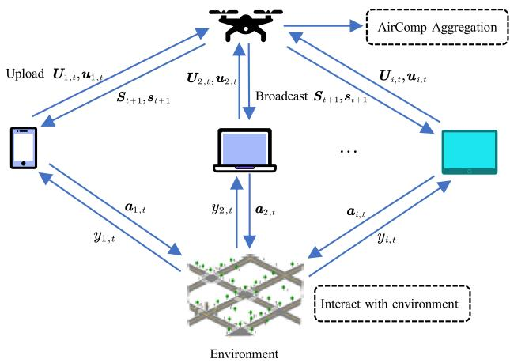
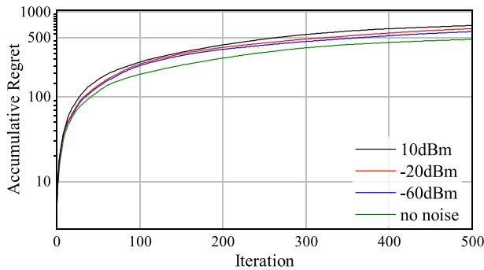
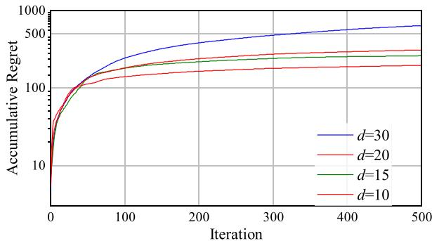
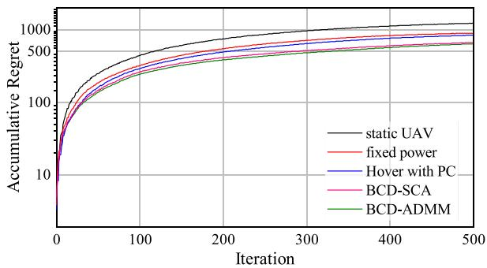
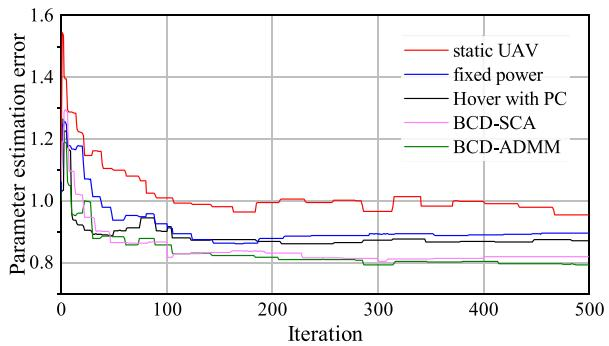
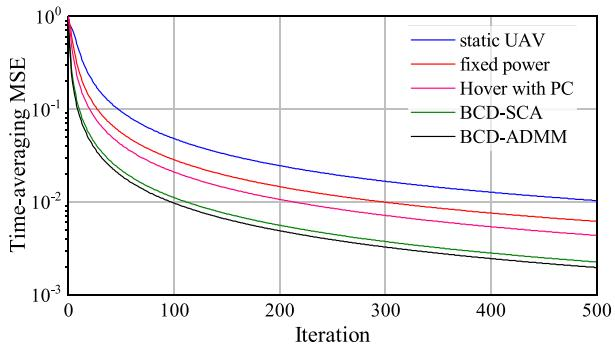
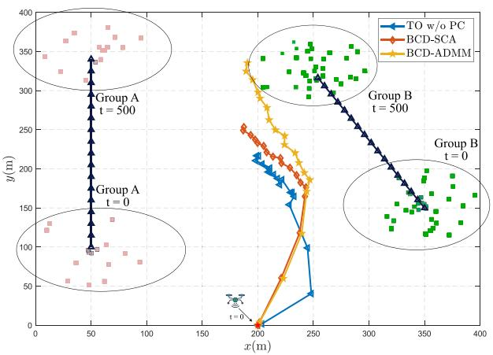
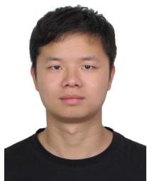

# Federated Linear Bandit Learning via UAV Aided Over-the-Air Computation

Junkai Qian , Student Member, IEEE, Yuning Jiang , Member, IEEE,

Yudi Zhang , Graduate Student Member, IEEE, Xin Liu , Member, IEEE, Ting Wang , Senior Member, IEEE, Yuanming Shi , Senior Member, IEEE, and Colin N. Jones , Senior Member, IEEE

Abstract—This paper investigates federated contextual linear bandit learning in a wireless network with a central server and multiple devices. To reduce communication latency, devices interact with the server via over-the-air computation (AirComp) over noisy, fading channels, where signal distortion can occur due to channel imperfections. Departing from traditional AirComp designs for static networks, we propose a novel federated bandit learning framework that leverages uncrewed aerial vehicles (UAVs) as mobile servers to aggregate data from distributed IoT devices. To optimize this system, we employ a block coordinate descent method combined with the alternating direction method of multipliers (BCD-ADMM), jointly optimizing the UAV trajectory, receive normalization factor, and transmission power to minimize the time-averaged mean square error (MSE) of AirComp. Our approach addresses the challenge of decentralized data across multiple devices, enabling secure and efficient collaboration without direct data sharing. Theoretical analysis establishes an upper bound on the algorithm’s regret, affirming the framework’s scalability and robustness against noise. Simulation results support these findings, highlighting notable performance improvements in federated bandit learning with UAV-assisted AirComp.

Index Terms—Federated Bandit Learning, Over-the-air computation, Federated Learning, UAV trajectory optimization.

Received 9 April 2025; revised 29 November 2025; accepted 3 January 2026. Date of publication 12 January 2026; date of current version 7 May 2026. This work was supported in part by the Key Program of National Natural Science Foundation of China under Grant 62432007, in part by the Natural Science Foundation of Shanghai under Grant 25ZR1401104 and Grant 21ZR1442700, and in part by Shanghai Sailing Program under Grant 22YF1428500. The work of Yuning Jiang and Colin Jones was supported by Swiss National Science Foundation under the NCCRAutomation under Grant 51NF40\_180545. The work of Xin Liu was supported by the National Natural Science Foundation of China under Grant 62302305. The work of Yuanming Shi was supported in part by the National Natural Science Foundation of China under Grant 62522117 and Grant 62271318 and in part by Yangtze River Delta Science and Technology Innovation Community Joint Research (Basic Research) Project under Grant BK 2024CSJZN00303. An earlier version of this paper was presented in part at the 2023 IEEE Global Communications Conference [DOI: 10.1109/GLOBECOM54140.2023.10437441]. Recommended for acceptance by V. Q. Pham. (Junkai Qian and Yuning Jiang contributed equally to this work.) (Corresponding authors: Ting Wang; Xin Liu.)

Junkai Qian, Yudi Zhang, and Ting Wang are with the Shanghai Key Laboratory of Trustworthy Computing, East China Normal University, Shanghai 200050, China (e-mail: 51255902137@stu.ecnu.edu.cn; 51285902059@stu.ecnu.edu.cn; twang@sei.ecnu.edu.cn).

Yuning Jiang and Colin N. Jones are with the Automatic Control Laboratory, EPFL, 1015 Laussane, Switzerland (e-mail: yuning.jiang@ieee.org; colin.jones@epfl.ch).

Xin Liu and Yuanming Shi are with the School of Information Science and Technology, ShanghaiTech University, Shanghai 201210, China (e-mail: liuxin7@shanghaitech.edu.cn; shiym@shanghaitech.edu.cn).

Digital Object Identifier 10.1109/TMC.2026.3651589

## I. INTRODUCTION

ULTI-ARMED bandits (MAB) represent a type of selecting an action to maximize cumulative rewards. Contextual bandits [2] extend the traditional MAB model by incorporating rewards dependent on context and selected actions. Nevertheless, when applied to fields such as recommendation systems and advertising, they face certain limitations: these applications are increasingly dispersed due to their data often being stored across different entities, necessitating cooperation among these entities. To address this issue, contextual linear bandit learning has been introduced [1], [3], [4], [5], [6], [7], [8], [9], which generalizes context across entities. In this model, the reward is assumed to rely on an unknown linear function of the feature vectors of all entities, with each action mapped to a feature vector.

In distributed bandit applications, data is typically situated across different entities, necessitating cooperation among them, which frequently leads to various communication and privacy concerns. Federated learning (FL) [10], [11], [12], [13], [14], [15], [16], [17], supported by various distributed edge devices and large-scale decentralized applications, enables different entities to collaborate to enhance performance without sharing local data. It involves two main participants: clients with diverse data ownership and a central server. Clients update the parameters of their local models based on distributed data and upload these updates to the central server. The central server aggregates the parameters received from the clients to update the global model. Subsequently, the server broadcasts the updated global model to all clients, who then update their local parameters. This iterative process continues until the model converges. Recent research has explored the Federated MAB problem. Integrating MAB and FL addresses a core challenge: many MAB applications, like personalized recommendations, rely on private data distributed across user devices, while traditional centralized methods pose communication and privacy risks. The FL framework enables the collaborative training of a global MAB model without exchanging raw data, thus leveraging vast distributed data to enhance decision-making efficiency in a privacy-preserving manner. A client scheduling algorithm based on the confidence upper bound strategy is proposed in [18] to minimize the training delay, and the convergence performance of federated learning training is analyzed. Many works such as [19] investigated the mixed bandit learning problem that flexibly balances generalization

1536-1233 © 2026 IEEE. All rights reserved, including rights for text and data mining, and training of artificial intelligence and similar technologies. Personal use is permitted, but republication/redistribution requires IEEE permission. See https://www.ieee.org/publications/rights/index.html for more information.

and personalization and proposed a general framework of personalized federated MAB. The study in [20] examined the issue of each agent possessing a heterogeneous local model and solved the model by proposing Federated Double UCB. In [21], a collaborative algorithm was proposed that is capable of handling heterogeneity between clients without exchanging local feature vectors or raw data while achieving near-optimal regret for both disjoint and shared parameter cases. Additionally, other works have concentrated on joint federated MAB problems under privacy constraints [22], [23]. The algorithm proposed in [24] enables clients to collaborate in federated learning settings while ensuring controlled communication costs and linear regret.

In federated learning, clients are typically connected to the server via orthogonal multiple access (OMA) wireless channels, resulting in radio resources scaling linearly with the number of client devices involved. As the number of clients increases, significant communication delay is introduced during the model aggregation process, which subsequently becomes the performance limiting factor of federated learning. AirComp is considered a potential solution to the above problems [25], [26], [27], [28], [29], [30], [31]. In [32], the AirComp algorithm was studied for distributed constrained online convex optimization of noisy channels. AirComp leverages the waveform superposition characteristics of multiple access channels to integrate concurrent data transmission and function calculation from multiple devices [33], [34], [35]. Given that edge servers in FL are primarily interested in aggregated models rather than individual local models, AirComp, as a non-orthogonal multiple access scheme, is considered a promising solution for achieving spectrum efficiency and low-latency FL. A technique for over-the-air aggregation in FL was proposed in [36] to improve aggregation quality and accelerate convergence speed. AirComp enables fast and low-latency data aggregation by leveraging the waveform superposition characteristics of multiple access channels (MAC). To adapt to fading channels and reduce channel distortion, a local learning rate optimization algorithm based on FedAvg was proposed in [37]. Additionally, [38] utilized AirComp technology to achieve second-order optimization on noisy fading channels, thereby enhancing the efficiency of FL. In [39], the author developed a medium access control (MAC) protocol that enables simultaneous transmissions from different users using non-orthogonal orthogonal frequency division multiplexing (OFDM) subcarriers and proposes joint channel decoding and aggregation decoders specifically designed for convolutional codes. [40] proposed a method to improve federated AirComp accuracy by utilizing retransmissions, enhancing performance in resource-constrained wireless networks.

Previous research on bandit applications has primarily concentrated on federated learning without considering channel distortion, leaving a gap in methods for federated learning in noisy fading channels. To address this issue and achieve highperformance aggregation within limited resources, AirComp can be utilized for its rapid aggregation capabilities. Additionally, most studies on federated bandit learning assume static server and client conditions. However, in numerous application scenarios, the client is an IoT device. For instance, in field exploration scenarios, the sparse deployment density of terrestrial base stations (BSs) often leads to mobile IoT client devices exiting BS coverage zones. While increasing BS density could enhance network coverage, physical constraints—such as complex terrain and transmission power limitations—make it challenging to ensure communication link stability and signal quality that satisfy AirComp’s stringent requirements for reliability. Notably, this approach necessitates large-scale deployment of highperformance BS hardware, incurring substantial infrastructure costs, especially in remote, sparsely populated regions. Uncrewed aerial vehicles (UAVs) emerge as a promising alternative to augment ground networks [41], [42], [43], [44], [45], [46], [47], [48], [49], [50]. UAVs can serve as dynamically deployable aerial BSs and edge computing nodes to enable distributed data fusion from IoT devices via AirComp. Compared to static terrestrial BS deployments, UAV-aided AirComp systems offer distinct advantages: First, UAVs adjust their three-dimensional altitude to establish line-of-sight (LoS) links, mitigating terraininduced channel fading. Second, their autonomous mobility enables on-demand tracking of IoT device clusters, dynamically optimizing proximity to reduce communication distances, thereby slashing transmission power consumption for IoT terminals. Third, UAV systems circumvent costly fixed-BS infrastructure and reduce long-term operational complexity in remote areas through an “on-demand deployment-mission-recovery” workflow, ensuring superior economic efficiency and deployment flexibility. In [51], an analytical method for optimizing the altitude of UAVs was presented to maximize coverage for ground users. In [52], the optimization problem of UAV-aided small cell placement was investigated to maximize the number of users that can be covered. Besides the UAV placement optimization, UAVs also offer controllable maneuverability, can track the movement of IoT devices, avoid long-distance transmission, and dynamically balance the communication distance and transmission power of IoT devices, thereby enhancing the performance of AirComp. Reference [53] was based on the theoretical model of propulsion energy consumption for fixed-wing UAVs and proposed a linear state-space approximation along with a sequential convex optimization technique to optimize the UAV trajectory for efficient communication. A multi-UAV-assisted wireless communication system is considered in [54], where block coordinate descent and continuous convex optimization techniques are proposed to maximize the minimum average rate of all users. Reference [55] proposed two solutions, hover mode and flight mode, addressing the problem of efficiently collecting data using multiple UAVs in wireless sensor networks. By applying algorithms and optimization techniques, effective management of UAV trajectories and sensor node scheduling was achieved.

Existing research has not systematically integrated Federated Bandit, AirComp, and UAV, and lacks theoretical modeling and performance analysis frameworks for this fusion scenario. However, such solutions are urgently needed in practical industrial application scenarios. A typical example is reflected in the field of mineral resource exploration, where the decision-making process relies on real-time data fusion of distributed sensing nodes. However, widely deployed sensing nodes face bottleneck problems such as insufficient communication coverage and high transmission latency. By deploying a UAV relay network equipped with AirComp technology, data transmission efficiency and model aggregation accuracy can be significantly improved, thereby achieving dynamic optimization of exploration decision-making mechanisms. This technological path urgently requires rigorous mathematical modeling and convergence analysis in theory, and has significant engineering application value in practice.

TABLE I  
COMPARISON OF RELATED WORKS ON KEY TECHNOLOGIES
<table><tr><td rowspan=1 colspan=1>Paper</td><td rowspan=1 colspan=1>Federatedframework</td><td rowspan=1 colspan=1>BanditLearning</td><td rowspan=1 colspan=1>Aircomp</td><td rowspan=1 colspan=1>Description</td></tr><tr><td rowspan=1 colspan=1>[45], [56], [57]</td><td rowspan=1 colspan=1> $\checkmark$ </td><td rowspan=1 colspan=1>×</td><td rowspan=1 colspan=1>UAV-aided</td><td rowspan=1 colspan=1>Jointly optimizing device scheduling, UAV tra-jectory, and time allocation for UAV-assisted FL</td></tr><tr><td rowspan=1 colspan=1>[1], [19], [20]</td><td rowspan=1 colspan=1> $\checkmark$ </td><td rowspan=1 colspan=1> $\checkmark$ </td><td rowspan=1 colspan=1>Standard</td><td rowspan=1 colspan=1>An AirComp-based federated linear banditscheme for communication-efficient learningover noisy channels.</td></tr><tr><td rowspan=1 colspan=1>This work</td><td rowspan=1 colspan=1> $\checkmark$ </td><td rowspan=1 colspan=1> $\checkmark$ </td><td rowspan=1 colspan=1>UAV-aided</td><td rowspan=1 colspan=1>Proposes a novel synergistic approach thatjointly optimizes the UAV trajectory and Air-Comp resources to enable efficient and robustfederated bandit learning in mobile environ-ments.</td></tr></table>

In this paper, we study a centralized MAB problem involving multiple IoT devices. Specifically, the IoT devices communicate with a central server to optimize the problem. To address the challenges of data privacy and transmission efficiency in multidevice training, this paper adopts the framework of federated air computing. Given issues such as channel fading due to the mobility of IoT devices, we introduce UAV communication base stations in our algorithm. By employing the BCD-ADMM algorithm to jointly optimize both the communication process and the flight trajectory of the UAV, our goal is to maintain proximity to mobile IoT devices and minimize signal loss during transmission. To summarize, this paper makes the following main contributions:

\- We propose a novel federated bandit learning framework based on AirComp, assisted by UAV. By integrating Air-Comp and optimizing the UAVs’ movement trajectories, the communication efficiency between IoT devices and the server has been significantly enhanced.

\- We present a theoretical analysis that establishes the upper bound on the regret of our algorithm as $\mathcal { O } ( \sigma$ $\sqrt { N T d } ( \log ( \gamma _ { \operatorname* { m a x } { } / } \gamma _ { \operatorname* { m i n } { } } + T L ^ { 2 } / d / \gamma _ { \operatorname* { m i n } { } } ) )$ , which illustrates the impact of the regret on the number of devices, iterations, parameter dimensions, and noise levels.

\- We conducted extensive simulations of our algorithm under various parameter settings to support our theoretical analysis results. Additionally, simulation experiments performed under different AirmComp optimization algorithms have demonstrated the significant auxiliary role of UAVs in federated AicComp scenarios.

Many sequential decision-making tasks (i.e., MAB) are naturally distributed with private data on user devices. FL is key to enabling privacy-preserving collaboration. When these devices are mobile IoT nodes in areas with sparse terrestrial infrastructure, communication becomes a new challenge. We address this with a unified framework employing a UAV as a mobile server. The UAV’s mobility to track devices, its ability to establish reliable

LoS channels, and its use of AirComp for efficiency make it a practical solution for this complex problem domain.

To clarify the position and novelty of our work, we provide a comparative summary of key related studies in Table I. The table highlights that while prior research has explored various combinations of these technologies, our work is the first to systematically integrate Federated Learning, Bandit Learning, UAVs, and AirComp into a unified framework. This integrated approach is crucial for addressing the complex challenges of efficient, privacy-preserving, and dynamic decision-making in mobile IoT environments.

The rest of this paper is organized as follows. Section II presents the federated linear bandit framework and introduces the UAV-aided AirComp communication model. Section III details the LinUCB algorithm and provides a theoretical analysis of its regret upper bound. Section IV proposes a BCD-ADMM algorithm to optimize the transmission process for UAV-aided AirComp systems. Section V presents simulation results validating the analytical findings and algorithm performance. Finally, Section VI summarizes the key contributions and concludes the paper.

Notations: We denote the set of $\{ 1 , \ldots , T \}$ by [<sup>T</sup> ] for any $T \in \mathbb { N } _ { + } . \mathbb { E } [ \cdot ]$ denotes the expectation for a given distribution and $< x , y >$ is the inner product of vector x and y. Transposition and conjugate transposition operations are represented as $( \cdot ) ^ { \top }$ and $( \cdot ) ^ { \mathrm { H } }$ , respectively. We use bold uppercase letters to represent matrices, while bold lowercase letters represent vectors. The ellipsoid X-norm of vector y is denoted as $\| \pmb { y } \| _ { X } = \sqrt { \pmb { y } ^ { \top } \pmb { X } \pmb { \updownarrow } }$ y for Positive Semi-Definite (PSD) matrix X if $y ^ { \intercal } X y \leqslant 0 .$ . Besides, we use the notation $\| \cdot \| _ { F }$ to denote the Frobenius norm.

## II. SYSTEM MODEL AND PROBLEM FORMULATION

In this section, we first present the federated linear bandit learning process, integrating it with UAV mobility to model the system. Then, we introduce the AirComp communication model, enabling parameter aggregation during federated learning. Finally, we formulate the federated bandit learning process as two sub-optimization problems.

## A. Federated Linear Bandits

In this work, we consider a federated learning system feature <sup>N</sup> mobile IoT devices, which act as clients, and a single UAV serving as a central server. The mobility model for these IoT devices will be detailed in the subsequent section. The learning process unfolds over <sup>T</sup> iterations. At each round $t \in [ T ]$ , every device $i \in [ N ]$ selects an action, represented by a feature vector ${ \mathbf { } } a _ { i , t } .$ , from a given decision set $\mathcal { D } _ { i , t } \subset \mathbb { R } ^ { d }$ . For <sup>t</sup>-th iteration, the reward of <sup>i</sup>-th device is given in the affine form of

$$
y _ { i , t } = \pmb { a } _ { i , t } ^ { \top } \pmb { \theta } ^ { * } + n _ { i , t } ,
$$

where $\pmb { \theta } ^ { * } \in \mathbb { R } ^ { d }$ is fixed model parameters and $n _ { i , t }$ is a sub-Gaussian noise.

The performance of the federated linear bandit algorithm is evaluated using the Cumulative Group Pseudo-regret, denoted as $\mathcal { R } ( T )$ , which serves as the core metric for quantifying the system’s total opportunity loss. This metric can be decomposed into the following hierarchical components:

\- Instantaneous pseudoregret: This is the foundational measure of loss, calculated for a single device i at a single round t. It is the difference in expected reward between the theoretical optimal action $\boldsymbol { \imath } _ { i , t } ^ { * } ,$ and the action actually chosen by the algorithm, ${ \bf { } } a _ { i , t }$

\- Cumulative Regret: For a single device, the cumulative regret is the sum of its instantaneous regrets over the entire time horizon of <sup>T</sup> rounds.

Cumulative Group Pseudo-regret: The final metric is the aggregation of the cumulative regrets from all <sup>N</sup> devices in the system. This represents the total performance loss for the entire federated group over the course of the learning process.

The goal of the federated linear bandit system is to design a sequence of action-selection strategies $\{ \theta _ { t } \} _ { t = 1 } ^ { T }$ to minimize the cumulative group pseudo-regret:

$$
\mathcal { R } ( T ) = \sum _ { i = 1 } ^ { N } \sum _ { t = 1 } ^ { T } \langle a _ { i , t } ^ { * } - a _ { i , t } , \theta ^ { * } \rangle .\tag{1}
$$

where θ represents the optimization of action selection strategies to maximize the obtained rewards. The core challenge in minimizing regret is resolving the exploration-exploitation trade-off: balancing the need to gather information (exploration) with the need to select currently optimal actions (exploitation).

The Federated Linear Bandit algorithm operates through an iterative process coordinated by a central server. The server begins by broadcasting the global model parameters—a covariance matrix $S _ { t ^ { \prime } }$ and a reward vector ${ \mathbf { } } s _ { t ^ { \prime } } { - } \operatorname { t o }$ all devices. Each device then combines these global parameters with its locally cached data accumulated since the last synchronization to compute a personalized model estimate, $\tilde { \boldsymbol { \theta } } _ { i , t }$ , via ridge regression. To balance the exploration-exploitation trade-off, the device employs the Upper Confidence Bound (UCB) principle to select an action, ${ \mathbf { } } a _ { i , t } ,$ , that maximizes potential reward. After observing a reward, the device updates its local cache. To maintain communication efficiency, an event-triggered mechanism determines when a global update is necessary. When triggered, devices upload their local updates to the server, which aggregates them to form the new global model parameters for the next iteration.

## B. Communication Model

1) UAV Mobility Model: UAVs can optimize their flight paths to maintain proximity to mobile IoT devices, thereby minimizing signal loss during transmission. The UAV’s horizontal position is denoted by $\bar { \mathbf q } _ { t } \bar { = } [ \tilde { x } _ { t } , \tilde { y } _ { t } ] ^ { \top }$ . To simplify the model, we assume that the vertical position of the UAV is fixed, i.e., its cruising altitude is represented as <sup>H</sup>. It is easy to verify that the optimal transmission effect can be achieved when <sup>H</sup> is equal to the minimum cruising altitude of the UAV. Consequently, Within a single time slot, the change in distance $d _ { i , t }$ is negligible compared to the UAV’s altitude <sup>H</sup>, meaning the large-scale path loss component of the channel $h _ { i , t }$ is nearly constant. While the small-scale fading component may vary more rapidly, we assume a quasi-static channel for $h _ { i , t }$ over the slot. This is a common and necessary simplification for tractability, and modeling intra-slot variations remains a direction for future work.

Notably, our framework does not assume a fixed, static coverage area. Instead, coverage is a dynamic outcome of our trajectory optimization algorithm, which actively plans the UAV’s flight path to provide on-demand coverage and ensure highquality communication links with the device clusters.

2) IoT Devices Mobility Model: We assume that the ground IoT devices move in dynamic clusters, which reflects many practical application scenarios, such as groups of agricultural robots working in concert in precision agriculture, or a network of mobile sensors deployed in a specific area for resource exploration. In our model, we assume that each ground IoT device moves along a pre-designed path at a given speed to collect data from different locations. The height of the device is always 0. For the convenience of algorithm design, we discretize the continuous trajectory of IoT devices. As a result, the horizontal position of <sup>i</sup>-th IoT device at time slot <sup>t</sup> can be defined by

$$
\pmb { w } _ { i , t } = \left[ x _ { i , t } , y _ { i , t } \right] ^ { \top } ,
$$

where $x _ { i , t }$ and $y _ { i , t }$ denote the horizontal coordinates. According to the free space path loss model [28], the time-varying channel from device <sup>i</sup> to the UAV at time slot <sup>t</sup> is given by

$$
h _ { i , t } = \sqrt { \chi _ { i , t } } \cdot \tilde { h } _ { i , t }\tag{2}
$$

with $\chi _ { i , t } = \sqrt { \chi _ { 0 } } d _ { i , t } ^ { - 2 }$ representing the large-scale path loss. The term $\ddot { h } _ { i , t }$ represents the small-scale fading coefficient, which captures signal fluctuations from multipath effects, and is modeled as a complex number with unit magnitude, i.e., $| \tilde { h } _ { i , t } | = 1$ Here, $\chi _ { 0 }$ defines channel gain related to distance, and $d _ { i , t }$ denotes the distance between an IoT device and UAV by

$$
d _ { i , t } = \sqrt { H ^ { 2 } + \| \pmb { w } _ { i , t } - \pmb { q } _ { t } \| _ { 2 } ^ { 2 } } ,\tag{3}
$$

where <sup>H</sup> is the cruising altitude of UAV and $\pmb { q } _ { t }$ is the horizontal coordinate of UAV.

3) Transmission: This section focuses on the uplink transmission of local information from IoT devices to the UAV through multi-access fading channels. Due to constraints in size and power, both UAVs and IoT devices are equipped with a single antenna. We assume that downlink transmission is reliable and error-free, given that the transmission power at the edge server is significantly higher than that of the devices [58], [59]. Traditional orthogonal multiple-access wireless communication schemes experience a substantial decrease in transmission efficiency as the number of devices increases. AirComp leverages the superposition property of multiple access channels, enabling simultaneous transmission from all IoT devices, thereby significantly reducing communication latency.

The specific procedure of AirComp is described as follows: we denote by $\pmb { s } _ { i , t } = \phi _ { i } ( \pmb { u } _ { i , t } ) \in \mathbb { R } ^ { d }$ the transmit symbol vector at IoT device <sup>i</sup> in each time slot. Without loss of generality, the transmit symbols are assumed to be independent and normalized to have zero mean and unit variance, i,e., $\mathbb { E } ( s _ { i , t } ^ { \mathrm { H } } s _ { i , t } ) = \mathbf { I } _ { d }$ . After the IoT devices simultaneously send their signal simultaneously, the received signal at the UAV can be represented as

$$
\pmb { y } _ { t } = \sum _ { i = 1 } ^ { N } \alpha _ { i , t } h _ { i , t } \pmb { s } _ { i , t } + n _ { t } ,\tag{4}
$$

where $\alpha _ { i , t }$ denotes the precoder for channel-fading compensation, $h _ { i , t }$ the channel coefficient of device <sup>i</sup> in <sup>t</sup>-th time slot, and $n _ { t }$ the additive white Gaussian noise, $\operatorname { i . e , } \mathcal { C } \mathcal { N } ( 0 , \sigma ^ { 2 } )$ . The peak and average transmit power constraint of device <sup>i</sup> in <sup>t</sup>-th time slot are given by

$$
0 \leqslant | \alpha _ { i , t } | ^ { 2 } \leqslant P _ { 0 } , 0 \leqslant \frac { 1 } { T } \sum _ { t = 1 } ^ { T } | \alpha _ { i , t } | ^ { 2 } \leqslant \bar { P } _ { 0 } ,\tag{5}
$$

where $P _ { 0 }$ and $\bar { P } _ { 0 }$ denote the peak power and maximum average power carried by the channel. We assume that $P _ { 0 }$ and $\bar { P } _ { 0 }$ are time-independent constants for simplicity and $\bar { P } _ { 0 } \leqslant P _ { 0 }$

The estimated average function after post-processing at the UAV upon receiving the signal $y _ { t }$ in (4) is given by $\begin{array} { r } { \hat { \pmb y } _ { t } = \frac { \pmb y _ { t } } { N \eta _ { t } } , } \end{array}$ where $\eta _ { t }$ denotes the receiving normalization factor of the $\mathrm { U A } \mathrm { \ddot { V } } .$ This factor applies to both signal and noise, providing power compensation for the signals and suppressing noise, thereby yielding accurate estimates of the objective function.

To quantify the AirComp performance, the distortion of the aggregated model can be quantified by the MSE between $\hat { \pmb f } _ { t }$ and the target value $\begin{array} { r } { \pmb { f } _ { t } = \frac { 1 } { N } \sum _ { i = 1 } ^ { N } s _ { i , t } } \end{array}$ , This MSE serves as the formal measure for the aggregation error, which is the analog equivalent of imperfect decoding in digital systems, and is used to assess the performance of the global model aggregation, as shown below:

$$
\operatorname { M S E } \left( \hat { \pmb f } _ { t } , \pmb f _ { t } \right) = \mathbb { E } [ \| f _ { t } - \hat { f } _ { t } \| ^ { 2 } ]\tag{6a}
$$

$$
= \frac { 1 } { N ^ { 2 } } \mathbb { E } \left[ \left( \frac { y _ { t } } { \eta _ { t } } - \sum _ { i = 1 } ^ { N } s _ { i , t } \right) ^ { 2 } \right]\tag{6b}
$$

$$
= \frac { 1 } { N ^ { 2 } } \left[ \frac { d \sigma ^ { 2 } } { | \eta _ { t } | ^ { 2 } } + \sum _ { i = 1 } ^ { N } \| \frac { \alpha _ { i , t } h _ { i , t } } { \eta _ { t } } - 1 \| ^ { 2 } \right] .\tag{6c}
$$

Here, $\hat { \pmb { f } } _ { t } = \psi ( \hat { \pmb { y } } _ { t } )$ represents the signal restored by the server. Therefore, the time-averaged MSE over T time slots is represented as

$$
\overline { { \mathrm { M S E } } } = \frac { 1 } { T } \sum _ { t = 1 } ^ { T } \mathrm { M S E } \Big ( \hat { \pmb f } _ { t } , \pmb f _ { t } \Big ) ,\tag{7}
$$

which measures the deviation between the actual received signal and the target signal. Our goal for the AirComp process is to minimize time-average MSE by jointly optimizing $\alpha _ { i , t } , \eta _ { t }$ and

$\pmb q _ { t }$ . As we move forward, we will delve deeper into optimization techniques for minimizing MSE and improving signal accuracy.

The goal of the communication model focuses on optimizing the signal transmission of AirComp in UAV scenarios, i.e.,

$$
\operatorname* { m i n i m i z e } _ { \alpha , \eta , q } \overline { { \mathrm { { M S E } } } }\tag{8a}
$$

$$
\mathrm { s u b j e c t t o } \eta _ { t } \geqslant 0 ,\tag{8b}
$$

$$
\| \pmb q _ { t } - \pmb q _ { t - 1 } \| _ { 2 } \leqslant V ^ { \mathrm { m a x } } ,\tag{8c}
$$

$$
\mathrm { c o n s t r i a n t s \ } ( 5 ) .\tag{8d}
$$

Our objective is to minimize MSE by jointly optimizing parameters α, η and $^ { q , }$ which are the set of $\alpha _ { i , t } , \eta _ { t }$ and $\pmb q _ { t }$ respectively.

The federated bandit learning process is thus formulated as two interconnected sub-problems: a learning problem focused on minimizing cumulative regret (1), and a communication problem focused on minimizing MSE (8a). The success of the overall system hinges on addressing both. A high-quality learning algorithm will fail if the communication channel corrupts the model updates with high MSE. Conversely, a perfect communication channel is of little use if the learning strategy is inefficient.

Our proposed solution addresses this by having the two algorithms work in concert. The Federated LinUCB algorithm, detailed in Section III, orchestrates the high-level learning process, deciding when communication is necessary. When a communication round is triggered, the BCD-ADMM algorithm, detailed in Section IV, is then invoked to optimize the physical layer transmission, ensuring the model parameters are aggregated with the highest possible fidelity.

While our framework relies on AirComp for efficient aggregation, we acknowledge that its practical implementation introduces significant system complexity. Our work assumes the availability of two key prerequisites: accurate Channel State Information (CSI) for power control and tight device synchronization. Modeling the overhead associated with acquiring these is an important consideration for real-world deployment and a direction for future research.

Our framework operates via an iterative loop where two algorithms work in concert. The high-level Federated LinUCB algorithm orchestrates the learning process, with an event-triggering mechanism to decide when global model aggregation is necessary. Upon triggering, the low-level BCD-ADMM algorithm is invoked to optimize the physical layer, jointly tuning the UAV trajectory and AirComp parameters to ensure high-fidelity transmission.

## III. FEDERATED BANDIT LEARNING ALGORITHM VIA UAV-AIDED COMMUNICATION

This section introduces utilizing the Federated Linear Upper Confidence Bound (LinUCB) algorithm to address the federated linear bandits problem via UAV-aided communication.

## A. Algorithm Framework

In this paper, each client <sup>i</sup> is expected to transmit two parameter matrices to the server, representing all observations during

(0<sup>,</sup> <sup>t</sup> ]. The server will receive a disturbed signal at $t ^ { \prime } ,$ i.e, the Gram matrix and the reward vector,

$$
{ \mathbf { } } S _ { t ^ { \prime } } = \sum _ { i = 1 } ^ { N } \sum _ { t = 1 } ^ { t ^ { \prime } } { \mathbf { { a } } _ { i , t } \mathbf { { a } } _ { i , t } ^ { \top } } + { \mathbf { { n } } _ { t ^ { \prime } , S } } ,\tag{9a}
$$

$$
s _ { t ^ { \prime } } = \sum _ { i = 1 } ^ { N } \sum _ { t = 1 } ^ { t ^ { \prime } } y _ { i , t } \pmb { a } _ { i , t } + \pmb { n } _ { t ^ { \prime } , s } ,\tag{9b}
$$

where ${ \mathbf { } } n _ { t { ' } } ^ { S }$ and $ { n _ { t ^ { \prime } } } ^ { s }$ denote the noise in wireless channels. Due to the use of the AirComp aggregation method in this paper, the channel noise during the AirComp transmission process is modeled as Gaussian white noise, i.e., $n _ { t }$ in (4).

Based on the received signal, we explicitly define the total covariance matrix $V _ { i , t }$ used for the ridge regression.It is formed by the sum of two components:the global historical information $\boldsymbol { S } _ { t ^ { \prime } }$ from the last UAV synchronization, and the locally cached information $\begin{array} { r } { \sum _ { \tau = t ^ { \prime } } ^ { t - 1 } \pmb { a } _ { i , \tau } \pmb { a } _ { i , \tau } ^ { \top } } \end{array}$ accumulated by the device since that synchronization. the final form of the parameters at device <sup>i</sup> can be represented as for $t \in ( t ^ { \prime } , T ]$

$$
V _ { i , t } = S _ { t ^ { \prime } } + \sum _ { \tau = t ^ { \prime } } ^ { t - 1 } { { a } _ { i , \tau } } { { a } _ { i , \tau } ^ { \top } } ,\tag{10a}
$$

$$
\tilde { \mathbf { u } } _ { i , t } = \mathbf { { s } } _ { t ^ { \prime } } + \sum _ { \tau = t ^ { \prime } } ^ { t - 1 } y _ { i , \tau } \mathbf { a } _ { i , \tau } .\tag{10b}
$$

To simplify the notions, the (10) can be rewritten as

$$
\begin{array} { r } { V _ { i , t } = S _ { t ^ { \prime } } + U _ { i , t } , } \end{array}\tag{11a}
$$

$$
\tilde { \mathbf { u } } _ { i , t } = \mathbf { s } _ { t ^ { \prime } } + \mathbf { u } _ { i , t } ,\tag{11b}
$$

where $U _ { i , t }$ and ${ \bf { u } } _ { i , t }$ represent the local cache of difference observations during $( t ^ { \prime } , t ]$ on device $i ,$ i.e., $\begin{array} { r } { U _ { i , t } = \sum _ { \tau = t ^ { \prime } } ^ { t - 1 } { \bf a } _ { i , \tau } { \bf a } _ { i , \tau } ^ { \top } } \end{array}$ and $\begin{array} { r } { { \pmb u } _ { i , t } = \sum _ { \tau = t ^ { \prime } } ^ { t - 1 } y _ { i , \tau } { \pmb a } _ { i , \tau } } \end{array}$

Using the total covariance matrix $V _ { i , t }$ and reward vector $\tilde { \mathbf { \boldsymbol { u } } } _ { i , t }$ device <sup>i</sup> computes its local estimate of the unknown true global parameter $\theta ^ { * }$ . This estimate, denoted as $\ddot { \theta } _ { i , t }$ , is calculated via the ridge regression formula $\tilde { \pmb { \theta } } _ { i , t } = \pmb { V } _ { i , t } ^ { - 1 } \tilde { \pmb { u } } _ { i , t }$ ,and has a confidence set $\mathcal { E } _ { i , t }$ for device <sup>i</sup> in iteration <sup>t</sup> given by

$$
\mathcal { E } _ { i , t } = \left\{ \pmb { \theta } \in \mathbb { R } ^ { d } | | \pmb { \theta } - \tilde { \pmb { \theta } } _ { i , t } | | | _ { V _ { i , t } } \leqslant \beta _ { i , t } | \right\}
$$

with radius $\beta _ { i , t } > 0 .$ .To account for the uncertainty of this estimate in the decision-making process, the algorithm constructs a confidence ellipsoid around $\bar { \theta } _ { i , t }$ . This ellipsoid represents a high-probability confidence region that contains the true parameter $\theta ^ { * }$ . The size of this ellipsoid is determined by the confidence radius, $\tilde { \pmb { \theta } } _ { i , t }$ . This parameter is more than just a geometric radius; it is a crucial value that quantifies the uncertainty of the current estimate $\theta _ { i , t }$ . A larger $\beta _ { i , t }$ signifies greater uncertainty, which will encourage the algorithm to perform more exploration in its subsequent action selection. Then, each device solves the following optimization problem at each iteration to select the action that maximizes the upper confidence bound (UCB):

$$
\pmb { a } _ { i , t } = \arg \operatorname* { m a x } _ { \pmb { a } \in \mathcal { D } _ { i , t } } \left( \langle \overline { { \pmb { \theta } } } _ { i , t } , \pmb { a } \rangle + \beta _ { i , t } \Vert \pmb { a } \Vert _ { V _ { i , t } ^ { - 1 } } \right) .\tag{12}
$$

  
Fig. 1. Illustration of UAV-aided federated bandit learning system.

To reduce the number of global updates, we adopted eventtriggered communication as discussed in [60] and [61]. Specifically, a global update is triggered if any device meets the following conditions:

$$
\log \frac { \operatorname* { d e t } \left( V _ { i , t } + a _ { i , t } \pmb { a } _ { i , t } ^ { \top } + \left( \gamma _ { \operatorname* { m a x } } - \gamma _ { \operatorname* { m i n } } \right) \mathbf { I } _ { d } \right) } { \operatorname* { d e t } \left( S _ { i , t } \right) } \geq \frac { D } { \Delta t _ { i } } ,\tag{13}
$$

where $\Delta t _ { i }$ represents the time sample due to the last synchronization, $\gamma _ { \mathrm { m i n } }$ and $\gamma _ { \mathrm { m a x } }$ are constants dependent on channel noise. In this condition, the left-hand side measures the “information gain” from the newly collected data. The parameter $D >$ 0 is a crucial, user-tunable threshold that controls the tradeoff between communication frequency and learning accuracy. For instance, setting a higher <sup>D</sup> value requires more information to be gathered locally before triggering a communication round, which leads to lower communication frequency and saves overhead, but potentially at the cost of slower learning convergence. Upon receiving signals from devices, the edge server aggregates all signals to generate new model parameters.

The framework of the proposed algorithm is shown in Fig. 1. Subsequently, we will describe the algorithm procedure of federated LinUCB Bandit supported by UAV-aided AirComp in Algorithm 1. The mobile UAV plays a central role in aggregating the local updates from IoT devices. The procedure is divided into three distinct stages. Firstly, in the local device computation stage, each device <sup>i</sup> interacts with the environment at each iteration $t ,$ calculates the UCB for each action in the decision set $\mathcal { D } _ { i , t }$ , and selects the action with the highest UCB. Each device will receive reward values based on the selected action and cache two values, i.e., $U _ { i , t } , { \boldsymbol { \mathbf { \mathit { u } } } } _ { i , t }$ . Secondly, in the model aggregation stage, each device <sup>i</sup> checks if the synchronization condition is met. If the condition is true, the edge device transmits its local updates to the UAV via uplink AirComp channels. Due to the mobility of UAVs, the communication channel between UAVs and clients can be optimized by techniques such as UAV trajectory optimization. The UAV receives the updated parameters from the clients and aggregates them through (4). The new $S _ { i , t + 1 } = S _ { t }$ and $\boldsymbol { s } _ { i , t + 1 } = \boldsymbol { s } _ { i }$ revises the parameters accordingly. Thirdly, in the global model broadcasting stage, the UAV disseminates the updated model parameters to all devices through wireless channels. The procedure of aggregation and broadcast repeats enough iterations until the global model converges. This algorithm enables efficient joint linear bandit learning in noisy wireless environments. In the aforementioned federated learning framework, communication models serve as essential carriers. The optimization of communication models will be performed in conjunction with federated learning. Therefore, in Section IV, we will introduce optimization algorithms for communication models between UAVs and clients.

```latex
Algorithm 1: Federated LinUCB Bandit algorithm via UAV
Aided AirComp.
1: Initialize $\begin{array} { r } { \pmb { S } _ { i , 1 } = \gamma _ { \mathrm { m i n } } \mathrm { I } _ { d } , \pmb { s } _ { i , 1 } = 0 , \pmb { U } _ { i , 1 } = 0 , \pmb { u } _ { i , 1 } = 0 } \end{array}$
and $\Delta t _ { i } = 0$
2: for iteration <sup>t</sup> from 1 to <sup>T</sup> do
3: for device <sup>i</sup> from 1 to <sup>N</sup> in parallel do
4: $V _ { i , t } = S _ { i , t ^ { \prime } } + U _ { i , t } , \tilde { { \bf { u } } } _ { i , t ^ { \prime } } = s _ { i , t ^ { \prime } } + { \bf { u } } _ { i , t }$
5: Update regressor $\tilde { \pmb { \theta } } _ { i , t } = \pmb { V } _ { i , t } ^ { - 1 } \tilde { \pmb { u } } _ { i , t }$
6: Compute confidence-set bound $\beta _ { i , t }$
7: Select
$\begin{array} { r } { \pmb { a } _ { i , t } = \arg \operatorname* { m a x } _ { \pmb { a } \in \mathcal { D } _ { i , t } } \big ( \langle \overline { { \pmb { \theta } } } _ { i , t } , \pmb { a } \rangle + \beta _ { i , t } \| \pmb { a } \| _ { V _ { i , t } ^ { - 1 } } \big ) } \end{array}$
8: Observe the reward $y _ { i , t } = \pmb { a } _ { i , t } ^ { \top } \pmb { \theta } ^ { * } + n _ { i , t }$
9: Update local cache $U _ { i , t } , \pmb { u } _ { i , t } \colon$
10: $\pmb { U } _ { i , t + 1 } = \pmb { U } _ { i , t } + \pmb { a } _ { i , t } \pmb { a } _ { i , t } ^ { \top } , \pmb { u } _ { i , t + 1 } = \pmb { u } _ { i , t } + y _ { i , t } \pmb { a } _ { i , t }$
11: $\begin{array} { r } { \mathbf { i f } \log \frac { \operatorname* { d e t } ( V _ { i , t } + a _ { i , t } a _ { i , t } ^ { \top } + ( \gamma _ { \operatorname* { m a x } } - \gamma _ { \operatorname* { m i n } } ) \mathbf { I } _ { d } ) } { \operatorname* { d e t } ( S _ { i , t } ) } \geq \frac { D } { \Delta t _ { i } } } \end{array}$ then
12: IoT devices upload $U _ { i , t }$ and ${ \bf { u } } _ { i , t }$ to the UAV via
AirComp channel
13: UAV receives the aggregated signals via (4)
14: UAV broadcasts $S _ { t + 1 }$ and $s _ { t + 1 }$ to devices through
error-free channels
15: Each device update $S _ { i , t + 1 } = S _ { t }$ and $\pmb { s } _ { i , t + 1 } = \pmb { s } _ { t }$
16: Update iteration parameters:
17: $t ^ { \prime } = t , \Delta t = 0 , U _ { i , t + 1 } = 0 , { \boldsymbol { \mathbf { \mathit { u } } } } _ { i , t + 1 } = 0$
18: else
19: Update iteration parameters:
20: $\begin{array} { r } { { \pmb S } _ { i , t + 1 } = { \pmb S } _ { i , t } , { \pmb s } _ { i , t + 1 } = { \pmb s } _ { i , t } , \Delta t _ { i } = \Delta t _ { i } + 1 } \end{array}$
21: end if
22: end for
23: end for
```

## B. Regret Analysis

In this section, we first introduce some preliminary assumptions and definitions for federated linear bandit learning. Following that, we present an analysis of regret for the proposed federated linear bandit learning.

Assumption 1: For all $i \in [ N ] , t \in [ T ]$ , the action set is constrained by $\| \mathbf { \boldsymbol { a } } _ { i , t } \| \leqslant L$ , the mean reward is constrained by $< \theta ^ { * } , a _ { i , t } > \leqslant 1$ , and the optimal parameter is constrained by $\| \theta ^ { * } \| \leqslant S$ . The reward is bounded by $\left| y _ { i , t } \right| \leqslant B$ , where the noise parameter $n _ { i , t }$ follows a sub-Gaussian distribution.

To establish a meaningful regret bound and control the noise, we introduce the following definition [62], [63], [64].

Definition 1: Consider a sequence [<sup>T</sup> ] of size <sup>m</sup>, noise $\mathbf { \Omega } _ { n _ { t , S } , \forall t } \in [ T ]$ in (9a) is a symmetric matrix with values (uppertriangle) randomly i.i.d. sampled from a Gaussian distribution $\textstyle { \mathcal { N } } ( 0 , \sigma _ { t } ^ { 2 } )$ . Noise $\pmb { n } _ { t , s } i n ( 9 b ) , \forall t \in [ T ]$ is a vector with values constructed in a similar manner. The constraints for $_ { n _ { t , S } }$ and $\boldsymbol { n } _ { t , s }$ are $\left( { \frac { \vartheta } { 2 m N } } \right)$ -accurate:

$$
\| \pmb { n } _ { t , S } \| \le \gamma _ { \operatorname* { m a x } } \triangleq C \sigma _ { t } \sqrt { d } \log \left( \frac { 1 } { \vartheta } \right) ,\tag{14a}
$$

$$
\| n _ { t , S } ^ { - 1 } \| \leq \gamma _ { \operatorname* { m i n } } \triangleq 1 / \left( \frac { \alpha - 2 e ^ { - C d } } { 2 c } \sigma _ { t } \left( \sqrt { d } - \sqrt { d - 1 } \right) \right) ,\tag{14b}
$$

$$
\| \pmb { n } _ { t , s } \| _ { \pmb { n } _ { t , S } ^ { - 1 } } \le \kappa \triangleq \sqrt { 2 C \| \pmb { n } _ { t , S } ^ { - 1 } \| \| \pmb { n } _ { t , s } \| ^ { 2 } } ,\tag{14c}
$$

where $0 \leqslant \rho _ { \mathrm { m i n } } \leqslant \rho _ { \mathrm { m a x } } , \kappa > 0$ and $C ,$ <sup>c</sup> are constants

Definition 2: If a sequence $[ \beta _ { i , t } ]$ meets $\lVert \tilde { { \boldsymbol { \theta } } } _ { i , t } - { \boldsymbol { \theta } } ^ { * } \rVert _ { V _ { i , t } } \leq$ $\beta _ { i , t }$ with probability at least $1 - \vartheta$ , it means $( \vartheta , N , T )$ -accurate for $_ { n _ { t , S } }$ and ${ \mathbf { } } n _ { t , s }$ . Then the $\beta _ { i , t }$ can be upper-bound according to [60]:

$$
\bar { \beta } _ { t } = \sigma \sqrt { 2 \log { \frac { 2 } { \vartheta } } + d \log { \left( \frac { \gamma _ { \mathrm { m a x } } } { \gamma _ { \mathrm { m i n } } } + \frac { t L ^ { 2 } } { d \gamma _ { \mathrm { m i n } } } \right) } } + S \sqrt { \gamma _ { \mathrm { m a x } } } + \kappa .
$$

The confidence-set bounds for the appropriate exploration sequence $\beta _ { i , t }$ are derived for each agent, which are then used to construct the UCB explicitly.

Theorem 1: Assuming that synchronization occurs with a probability of at least $1 - \vartheta$ in round $n = \Omega ( d \log ( \gamma _ { \mathrm { m a x } } / \gamma _ { \mathrm { m i n } } +$ $T L ^ { 2 } / d / \gamma _ { \mathrm { m i n } } ) )$ , the pseudo-regret regret can be bounded as follows:

$$
\mathcal { R } ( T ) \leq 4 \nu \bar { \beta } _ { T } \sqrt { 2 N T d \log _ { \nu } \left( \frac { \gamma _ { \mathrm { m a x } } } { \gamma _ { \mathrm { m i n } } } + \frac { T L ^ { 2 } } { d \gamma _ { \mathrm { m i n } } } \right) + 1 } .
$$

The above <sup>ν</sup> represents the tolerance range of the matrix determinant, which will be introduced in detail in the appendix. Based on [60], the regret bound is obtained:

$$
\mathcal { O } \left( \sigma \sqrt { N T d } \left( \log \left( \gamma _ { \mathrm { m a x } } / \gamma _ { \mathrm { m i n } } + T L ^ { 2 } / d / \gamma _ { \mathrm { m i n } } \right) \right) \right.
$$

by setting $D = 2 T d ( \log ( \gamma _ { \mathrm { m a x } } / \gamma _ { \mathrm { m i n } } + T L ^ { 2 } / d \gamma _ { \mathrm { m i n } } ) + 1 ) ^ { - 1 }$ and $v = e .$

The detailed proof refers to the appendix. Theorem 1 examines the relationship between the number of iterations and the regret bound, given a fixed variance of channel noise, by analyzing the dependence on the noise bounds. For a time horizon $T ,$ the regret $\mathcal { R } ( T )$ is $\mathcal { O } ( \sqrt { T } \log T )$ , which indicates that as $T$ increases, the total regret also escalates. It is expected that a large dimension <sup>d</sup> and the number of IoT devices <sup>N</sup> may also increase the regret bound. The analysis recovers the regret result of single agent in [65]. Regarding the variance of channel noise, characterized by $\gamma _ { \mathrm { m a x } } , \gamma _ { \mathrm { m i n } }$ and $\kappa ,$ Theorem 1 also suggests that channel noise significantly impacts the regret bound. Specifically, a very large effective channel noise variance leads to greater accumulative regret since the received information at the server is significantly disturbed by the noise conditions.

To achieve the bound of the regret value mentioned earlier, channel noise must be constrained (as outlined in Definition 1). An optimization method based on BCD-ADMM will be introduced in the next session to satisfy the channel noise requirements in AirComp communication,

## C. Complexity Anaysis of Algorithm 1

The computational complexity of Algorithm 1 occurs at each device. For a single device at iteration <sup>t</sup>, the main costs are:

\- Parameter Estimation: The primary cost is updating the inverse of the $\mathrm { ~ d ~ x ~ d ~ }$ matrix $V _ { i , t }$ . By applying the Sherman-Morrison formula for the rank-1 update, this is achieved in $\mathcal { O } ( d ^ { 2 } )$ time, avoiding a repetitive $\mathcal { O } ( d ^ { 3 } )$ inversion.

\- Action Selection: The total complexity for computing the UCB value for each of the |D| actions is $\mathcal { O } ( | \mathcal { D } | d ^ { 2 } )$ , which is the dominant recurrent cost.

\- Communication Trigger Check: the condition to check for communication requires calculating a matrix determinant, which has a complexity of $\mathcal { O } ( d ^ { 3 } )$ . This check is performed in every iteration by each device.

In summary, the total per-iteration complexity at each device is the sum of these costs, dominated by $\mathcal { O } ( \vert \mathcal { D } \vert d ^ { 2 } + d ^ { 3 } )$ The total complexity for N devices over T rounds is therefore $\mathcal { O } ( N T ( | \mathcal { D } | d ^ { 2 } + d ^ { 3 } ) )$ 1

## IV. AIRCOMP COMMUNICATION OPTIMIZATION

In this section, we introduce optimizing AirComp’s communication process based on the BCD-ADMM algorithm. To this end, as noted in reference [56], each term $\frac { \alpha _ { i , t } \bar { h } _ { i , t } } { \eta _ { t } }$ must be real and non-negative to attain the minimum MSE. Hense, we set $\begin{array} { r } { \alpha _ { i , t } = \frac { \sqrt { p _ { i , t } } h _ { i , t } ^ { \dagger } } { | h _ { i , t } | } } \end{array}$ to offset the phase, where $p _ { i , t }$ denotes the transmission power of device <sup>i</sup> in time slot <sup>t</sup> and $h _ { i , t } ^ { \dagger }$ represents the conjugate transpose of $h _ { i , t }$ . Consequently, the MSE in (7) can be reformulated as

$$
\overline { { \mathrm { M S E } } } = \frac { 1 } { T N ^ { 2 } } \sum _ { t = 1 } ^ { T } \left[ \frac { \sigma ^ { 2 } } { \eta _ { t } ^ { 2 } } + \sum _ { i = 1 } ^ { N } \left( \frac { \sqrt { p _ { i , t } } \left| h _ { i , t } \right| } { \eta _ { t } } - 1 \right) ^ { 2 } \right] .\tag{15}
$$

To simplify the problem, we introduced the concept of signal quality, i.e., $\varphi _ { i , t } = p _ { i , t } | h _ { i , t } | ^ { 2 }$ . Specifically, $\varphi$ defines the signal quality factor at each time slot <sup>t</sup> as the product of its transmission power and channel gain. Thus, (8a) can be reformulated as

$$
\underset { \eta , q , \varphi } { \mathrm { m i n i m i z e } } \ \frac { 1 } { T N ^ { 2 } } \sum _ { t = 1 } ^ { T } \left[ \frac { \sigma ^ { 2 } } { \eta _ { t } ^ { 2 } } + \sum _ { i = 1 } ^ { N } \left( \frac { \sqrt { \varphi _ { i , t } } } { \eta _ { t } } - 1 \right) ^ { 2 } \right]\tag{16a}
$$

$$
\mathrm { s u b j e c t t o ~ } \eta _ { t } \geqslant 0 , \forall t \in [ T ] ,\tag{16b}
$$

$$
\begin{array} { r } { \| \pmb q _ { t } - \pmb q _ { t - 1 } \| _ { 2 } \leqslant V ^ { \operatorname* { m a x } } , \forall t \in [ T ] , } \end{array}\tag{16c}
$$

$$
0 \leqslant \frac { \varphi _ { i , t } } { | h _ { i , t } | ^ { 2 } } \leqslant P _ { 0 } , \forall t \in [ T ] , \forall i \in [ N ] ,\tag{16d}
$$

$$
0 \leqslant \frac { 1 } { T } \sum _ { t = 1 } ^ { T } \frac { \varphi _ { i , t } } { \left| h _ { i , t } \right| ^ { 2 } } \leqslant { \bar { P } } _ { 0 } , \forall i \in [ N ] ,\tag{16e}
$$

where set $\varphi$ collects $\varphi _ { i , t }$ for all <sup>i</sup> and <sup>t</sup>. Joint optimization of normalization factors $\eta ,$ signal quality factors $\varphi ,$ , and UAV trajectory q to minimize the MSE time averaged is a challenging nonconvex problem due to highly coupled variables. To tackle this, we employ the Block Coordinate Descent (BCD) method [66]. BCD is particularly well-suited for this problem’s structure. While the joint problem is non-convex, it possesses a crucial property: when any two of the three variable blocks are held fixed, the optimization subproblem for the remaining block becomes convex. Furthermore, each of these convex subproblems can be solved efficiently. This characteristic distinguishes it from problem (8a). BCD therefore provides a principled and effective iterative approach to finding a high-quality solution for the otherwise intractable joint optimization problem. In the following subsections, we will detail the optimization of each variable block in an alternating manner.

## A. Normalizing Factors Optimization

In this subsection, we optimize η with fixed q and $\varphi ,$ and the problem is reformulated as

$$
\underset { \eta _ { t } \geqslant 0 , \forall t \in \left[ T \right] } { \mathrm { m i n i m i z e } } \sum _ { i = 1 } ^ { T } { \left[ \sum _ { k = 1 } ^ { N } \left( \frac { \sqrt { \varphi _ { i , t } } } { \eta _ { t } } - 1 \right) ^ { 2 } + \frac { \sigma ^ { 2 } } { \eta _ { t } ^ { 2 } } \right] } ,\tag{17}
$$

which is a convex problem. Problem (17) can be decomposed into $T$ subproblems. Each subproblem aims to optimize $\eta _ { t }$ to minimize the MSE. The <sup>t</sup>-th subproblem is formulated as follows:

$$
\underset { \eta _ { t } \geqslant 0 } { \mathrm { m i n i m i z e } } \sum _ { i = 1 } ^ { N } \left( \frac { \sqrt { \varphi _ { i , t } } } { \eta _ { t } } - 1 \right) ^ { 2 } + \frac { \sigma ^ { 2 } } { \eta _ { t } ^ { 2 } } .
$$

By setting the first derivative to zero, we can derive the optimal solution to the problem given by

$$
\eta _ { t } ^ { * } = \frac { \sigma ^ { 2 } + \sum _ { i = 1 } ^ { N } \varphi _ { i , t } } { \sum _ { i = 1 } ^ { N } \sqrt { \varphi _ { i , t } } } , \forall t \in [ T ] .\tag{18}
$$

## B. Signal Quality Factors Optimization

In this subsection, we optimize ϕ with fixed q and η. Since the optimization focuses on fixed q and η while optimizing $\varphi _ { : }$ the noise term $\frac { \sigma ^ { 2 } } { \eta _ { t } }$ can be disregarded. The problem is reformulated as

$$
\underset { \varphi } { \mathrm { m i n i m i z e } } \sum _ { t = 1 } ^ { T } \sum _ { i = 1 } ^ { N } \left( \frac { \sqrt { \varphi _ { i , t } } } { \eta _ { t } } - 1 \right) ^ { 2 }\tag{19a}
$$

$$
\mathrm { s u b j e c t ~ t o ~ } 0 \leqslant \frac { \varphi _ { i , t } } { | h _ { i , t } | ^ { 2 } } \leqslant P _ { 0 } , \forall t \in [ T ] , \forall i \in [ N ] ,\tag{19b}
$$

$$
0 \leqslant \frac { 1 } { T } \sum _ { t = 1 } ^ { T } \frac { \varphi _ { i , t } } { \left| h _ { i , t } \right| ^ { 2 } } \leqslant \bar { P } _ { 0 } , \forall t \in [ T ] .\tag{19c}
$$

The problem (19) can be decomposed into <sup>N</sup> subproblems as follows:

$$
\underset { \varphi _ { i , t } } { \mathrm { m i n i m i z e } } \sum _ { t = 1 } ^ { T } \left( \frac { \sqrt { \varphi _ { i , t } } } { \eta _ { t } } - 1 \right) ^ { 2 }\tag{20a}
$$

$$
\mathrm { s u b j e c t } \mathrm { t o } 0 \leqslant \frac { \varphi _ { i , t } } { \left| h _ { i , t } \right| ^ { 2 } } \leqslant P _ { 0 } , \forall t ,\tag{20b}
$$

$$
0 \leqslant \frac { 1 } { T } \sum _ { t = 1 } ^ { T } \frac { \varphi _ { i , t } } { \left| h _ { i , t } \right| ^ { 2 } } \leqslant \bar { P } _ { 0 } ,\tag{20c}
$$

which is a convex problem. Due to the strong duality between problem (20a) and its dual problem, the Lagrange-duality method is employed. Let $\zeta _ { t } \geqslant 0$ denote the dual variable associated with the <sup>t</sup>-th constraint in (20b). Additionally, <sup>κ</sup> represents the dual variable of constraint (20c). The Lagrangian function is formulated as:

$$
\begin{array} { r l } & { \displaystyle \sum _ { t = 1 } ^ { T } \left( \frac { \sqrt { \varphi _ { i , t } } } { \eta _ { t } } - 1 \right) ^ { 2 } + \sum _ { t = 1 } ^ { T } \zeta _ { t } \left( \frac { \varphi _ { i , t } } { \left| h _ { i , t } \right| ^ { 2 } } - P _ { 0 } \right) } \\ & { \quad \quad \quad \quad + \kappa \left( \sum _ { t = 1 } ^ { T } \frac { \varphi _ { i , t } } { \left| h _ { i , t } \right| ^ { 2 } } - N \bar { P } _ { 0 } \right) . } \end{array}\tag{21}
$$

Therefore, by applying the Karush-Kuhn-Tucker (KKT) conditions, the optimal solution is given by

$$
\varphi _ { i , t } ^ { * } = \left\{ \begin{array} { l l } { \operatorname* { m i n } \left\{ \eta _ { t } ^ { 2 } , P _ { 0 } \left| h _ { i , t } \right| ^ { 2 } \right\} , } \\ { \qquad \mathrm { i f } \sum _ { t = 1 } ^ { T } \operatorname* { m i n } \left\{ \frac { \eta _ { t } ^ { 2 } } { \left| h _ { i , t } \right| ^ { 2 } } , P _ { 0 } \right\} \le T \bar { P } _ { 0 } , } \\ { \operatorname* { m i n } \left\{ \left( \frac { \eta _ { t } \left| h _ { i , t } \right| ^ { 2 } } { \left| h _ { i , t } \right| ^ { 2 } + \kappa ^ { * } \eta _ { t } ^ { 2 } } \right) ^ { 2 } , P _ { 0 } \left| h _ { i , t } \right| ^ { 2 } \right\} , \mathrm { o t h e r w i s e } , } \end{array} \right.\tag{22}
$$

where $\kappa ^ { * }$ is a constant that satisfies constraint $\begin{array} { r } { \sum _ { t = 1 } ^ { T } \frac { \varphi _ { i , t } ^ { * } } { | h _ { i , t } | ^ { 2 } } = } \end{array}$ $T \bar { P } _ { 0 }$ , which can be determined through the use of binary search. Proof can refer to [56].

Remark 1: Observing that when $\varphi _ { i , t } < \eta _ { t } ^ { 2 }$ , (20a) diminishes as $\varphi _ { i , t }$ increases. Consequently, increasing $\varphi _ { i , t }$ can lead to a reduction in MSE. Furthermore, when $\varphi _ { i , t } < \eta _ { t } ^ { 2 } .$ , both $P _ { 0 } | h _ { i , t } | ^ { 2 }$ and $( \eta _ { t } | h _ { i , t } | ^ { 2 } ) / ( | h _ { i , t } | ^ { 2 } + \kappa ^ { * } \eta _ { t } ^ { 2 } )$ will rise alongside an increase in $| h _ { i , t } | ^ { 2 }$ . Since $\varphi _ { i , t }$ is equal to $P _ { 0 } | h _ { i , t } | ^ { 2 }$ or $\varphi _ { i , t } < \eta _ { t } ^ { 2 }$ , both $P _ { 0 } | h _ { i , t } | ^ { 2 }$ and $( \eta _ { t } | h _ { i , t } | ^ { 2 } ) / ( | h _ { i , t } | ^ { 2 } + \kappa ^ { * } \eta _ { t } ^ { 2 } )$ , the signal quality factors $\varphi _ { i , t }$ can be monotonically increased as channel gains $h _ { i , t }$ increases.

## C. UAV Trajectory Optimization

In this subsection, we optimize q with η and $\varphi .$ . By applying (2) and (3) to (16d) and (16e), the following optimization problems can be obtained:

find q

(23a)

subject to $\eta _ { t } \geqslant 0$

(23b)

$$
0 \leq \| \pmb { w } _ { i , t } - \pmb { q } _ { t } \| ^ { 2 } \leq \hat { P } _ { i , t } , \forall i , \forall t ,\tag{23c}
$$

$$
0 \leq \sum _ { t = 1 } ^ { T } \varphi _ { i , t } \| \pmb { w } _ { i , t } - \pmb { q } _ { t } \| ^ { 2 } \leq \tilde { P } _ { i } , \forall i ,\tag{23d}
$$

$$
\| \pmb q _ { t } - \pmb q _ { t - 1 } \| _ { 2 } \leqslant V ^ { \operatorname* { m a x } } , \forall t ,\tag{23e}
$$

where $\begin{array} { r } { \hat { P } _ { i , t } = \frac { \chi _ { 0 } P _ { 0 } } { \varphi _ { i , t } } - H ^ { 2 } } \end{array}$ and $\begin{array} { r } { \tilde { P _ { i } } = \chi _ { 0 } T \bar { P _ { 0 } } - H ^ { 2 } \sum _ { t = 1 } ^ { T } \varphi _ { i , t } , } \end{array}$ Given that $\hat { P } _ { i , t }$ and $\tilde { P } _ { i }$ are functions of $\eta$ and $\varphi \ ( \eta$ and $\varphi$ are fixed). Consequently, $\hat { P } _ { i , t }$ and $\tilde { P } _ { i }$ can also be treated as constants. The problem (23) is a convex QCQP problem, and we need to transform it into a form with optimization objectives to find an efficient solution. As the distance between the UAV and the IoT device decreases, the channel gain monotonically increases. Furthermore, as the channel gain $h _ { i , t }$ increases, the signal quality factor $\varphi _ { i , t }$ can be enhanced while still satisfying all power constraints according to Remark 1. The improvement in the signal quality factor leads to a reduction in the MSE. The problem (23) can be transformed into

$$
\underset { \ b q } { \mathrm { m i n i m i z e } } \sum _ { t = 1 } ^ { T } \sum _ { i = 1 } ^ { N } \varphi _ { i , t } \| \mathbf { w } _ { i , t } - \mathbf { q } _ { t } \| ^ { 2 }\tag{24a}
$$

subject to constraints (23b)<sup>,</sup> (23c)<sup>,</sup> (23d)<sup>,</sup> (23e)<sup>.</sup>

(24b)

Since it is not feasible to simultaneously reduce the distance between UAV and IoT devices, $\varphi _ { i , t }$ is utilized as the weighting factor. It can be solved by an alternating direction-based algorithm efficiently, such as ADMM [67]. To this end, we denote by $z _ { t } = { q _ { t } } - { q _ { t - 1 } } , Z = [ z _ { 1 } , \dots , z _ { T } ] ^ { \top } \in \mathbb { R } ^ { N \times 2 }$ , and

$$
\begin{array} { r } { \pmb { C } _ { i } = \pmb { Q } = \left[ \pmb { q } _ { I } , \pmb { q } _ { 1 } , \pmb { q } _ { 2 } , \dots , \pmb { q } _ { T } \right] ^ { \top } \in \mathbb { R } ^ { ( T + 1 ) \times 2 } , } \end{array}\tag{25}
$$

where $C _ { i } [ t ]$ denotes the $( t + 1 )$ -th row of the matrix. Equation (23e) can therefore be expressed as:

$$
\begin{array} { r } { \begin{array} { c } { \mathbf { A } _ { 1 } \boldsymbol { Q } = \boldsymbol { Z } , } \\ { \mathrm { s u b j e c t ~ t o ~ } \left\| \boldsymbol { Z } \left[ t \right] \right\| _ { 2 } \leqslant V _ { \mathrm { m a x } } , \quad \forall t } \end{array} } \end{array}
$$

$$
\mathbf { A } _ { 2 } \pmb { Q } = \pmb { q } _ { I } ^ { \top }\tag{26}
$$

where $Z [ t ]$ denotes the <sup>t</sup>-th row of the matrix Z,

$$
\mathbf { A } _ { 1 } = \left[ \begin{array} { c c c c c c c } { - 1 } & { 1 } & { 0 } & { 0 } & { \cdots } & { 0 } & { 0 } \\ { 0 } & { - 1 } & { 1 } & { 0 } & { \cdots } & { 0 } & { 0 } \\ { 0 } & { 0 } & { 0 } & { 0 } & { \ddots } & { 1 } & { 0 } \\ { 0 } & { 0 } & { 0 } & { 0 } & { \cdots } & { - 1 } & { 1 } \end{array} \right] \in \mathbb { R } ^ { T \times ( T + 1 ) } .
$$

and $\mathbf { A } _ { 2 } = [ 1 , 0 , 0 , \ldots , 0 ] \in \mathbb { R } ^ { 1 \times ( T + 1 ) }$

Similarly, we introduce two auxiliary variables

$$
\begin{array} { r l } & { \mathbf { B } _ { i , 1 } = \mathrm { d i a g } \left( 1 , \sqrt { \varphi _ { i , 1 } } , . . . , \sqrt { \varphi _ { i , T } } \right) \in \mathbb { R } ^ { \left( T + 1 \right) \times \left( T + 1 \right) } , } \\ & { \mathbf { B } _ { i , 2 } = \left[ \pmb { q } _ { I } , \pmb { w } _ { i } \right] ^ { \top } \in \mathbb { R } ^ { \left( T + 1 \right) \times 2 } , } \end{array}
$$

where ${ \pmb q } _ { I }$ denotes the initial position of UAV. Thus, constraints (23c) and (23d) can be denoted as

$$
\lVert \boldsymbol { q } _ { t } ^ { \intercal } - \mathbf { B } _ { i , 2 } [ t ] \rVert _ { 2 } ^ { 2 } \leq \hat { P } _ { i , t } , \forall i , \forall t ,\tag{27}
$$

$$
\Vert \mathbf { B } _ { i , 1 } \left( \pmb { Q } - \mathbf { B } _ { i , 2 } \right) \Vert _ { F } ^ { 2 } \leq \tilde { P } _ { i } , \forall i\tag{28}
$$

respectively, where $\mathbf { B } _ { i , 2 } [ t ]$ denotes the (<sup>t</sup> + 1) row of matrix $\mathbf { B } _ { i , 2 }$ . Furthermore, we assume that

$$
V _ { i } = B _ { i , 1 } Q , \quad \forall i , \forall t .\tag{29}
$$

Then, the (24) is equivalent to

$$
\underset { { \cal Q } , { \bf C } , { \bf V } , { \cal Z } } { \mathrm { m i n i m i z e } } \sum _ { i = 1 } ^ { N } \| { \bf B } _ { i , 1 } { \cal Q } - { \bf B } _ { i , 1 } { \bf B } _ { i , 2 } \| _ { F } ^ { 2 }\tag{30a}
$$

subject to $C _ { i } = Q , \forall i ,$

$$
V _ { i } = \mathbf { B } _ { i , 1 } \boldsymbol { Q } , \ \forall i ,\tag{30b}
$$

(30c)

$$
0 \leqslant \| \mathbf { C } _ { i } \left[ t \right] - \mathbf { B } _ { i , 2 } \left[ t \right] \| ^ { 2 } \leqslant \hat { P } _ { i , t } , \quad \forall i , \forall t ,\tag{30d}
$$

$$
\lVert \boldsymbol { V } _ { i } - \mathbf { B } _ { i , 1 } \mathbf { B } _ { i , 2 } \rVert _ { F } ^ { 2 } \leq \tilde { P } _ { i } , ~ \forall i ,\tag{30e}
$$

$$
\mathbf { A } _ { 1 } { Q } = { Z } ,\tag{30f}
$$

$$
\left\| Z \left[ t \right] \right\| _ { 2 } \leqslant V _ { \mathrm { m a x } } , \quad \forall t .\tag{30g}
$$

$$
\mathbf { A } _ { 2 } \pmb { Q } = \pmb { q } _ { I } ^ { \top }\tag{30h}
$$

To simplify the constraints in (30), we introduce indicator function $\mathbb { I } _ { \mathcal { X } }$ for the feasible region, i.e.,

$$
\mathbb { I } _ { \mathcal { X } } \left( \pmb { x } \right) = \left. \begin{array} { l l } { 0 , } & { \mathrm { i f } ~ \pmb { x } \in \mathcal { X } , } \\ { + \infty , } & { \mathrm { o t h e r w i s e } . } \end{array} \right.
$$

The feasible regions of constraints (30d), (30e) and (30g) are defined as C, V and Z, respectively. Subsequently, (30) can be reformulated as

$$
\begin{array} { l } { \displaystyle \underset { \boldsymbol { q } , \mathbf { C } , \mathbf { V } , \boldsymbol { z } } { \mathrm { m i n i m i z e } } ~ \sum _ { i = 1 } ^ { N } { \|      \mathbf { B } _ { i , 1 } \boldsymbol { Q } - \mathbf { B } _ { i , 1 } \mathbf { B } _ { i , 2 } \| _ { F } ^ { 2 } } } \\ { \displaystyle + \mathbb { I } _ { \mathcal { C } } \left( \boldsymbol { C } \right) + \mathbb { I } _ { \mathcal { V } } \left( V \right) + \mathbb { I } _ { \mathcal { Z } } \left( \boldsymbol { Z } \right) } \\ { \mathrm { s u b j e c t ~ t o ~ } \left( 3 0 \mathbf { b } \right) , \left( 3 0 \mathbf { c } \right) , \left( 3 0 \mathbf { f } \right) } \end{array}\tag{31}
$$

where $C$ and V stack $C _ { i }$ and $V _ { i }$ for all $i \in [ N ] ,$ , respectively. Then, we can write down the associated augmented Lagrangian function using the scaled dual variables as

$$
\begin{array} { l } { { \displaystyle \mathcal { L } _ { \rho } \left( C , V , Z , Q , \mathbf { A } , \mathbf { I } , \Upsilon , \Upsilon \right) : = \sum _ { i = 1 } ^ { N } \| \mathbf { B } _ { i , 1 } Q - \mathbf { B } _ { i , 1 } \mathbf { B } _ { i , 2 } \| _ { F } ^ { 2 } } } \\ { ~ } \\ { { \displaystyle + \mathbb { I } _ { \mathcal { C } } \left( C \right) + \mathbb { I } _ { \mathcal { V } } \left( V \right) + \mathbb { I } _ { \mathcal { Z } } \left( Z \right) } } \\ { { \displaystyle ~ + \frac { \rho _ { 1 } } { 2 } \sum _ { i = 1 } ^ { N } \| C _ { i } - Q + \mathbf { A } _ { i } \| _ { F } ^ { 2 } + \frac { \rho _ { 2 } } { 2 } \sum _ { i = 1 } ^ { N } \| V _ { i } - \mathbf { B } _ { i , 1 } Q + \mathbf { T } _ { i } \| _ { F } ^ { 2 } } } \\ { ~ } \\ { { \displaystyle + \frac { \rho _ { 3 } } { 2 } \| Z - \mathbf { A } _ { 1 } Q + \Upsilon \| _ { F } ^ { 2 } } . } \end{array}
$$

Here, we use notations $\pmb { \Lambda } : = \{ \pmb { \Lambda } _ { i } \in \mathbb { R } ^ { ( T + 1 ) \times 2 } , i \in [ T ] \} , \mathbf { \Gamma } \mathbf { \mathbf { \Gamma } } =$ $\{ \boldsymbol { \Gamma } _ { i } \in \mathbb { R } ^ { ( T + 1 ) \times 2 } , i \in [ T ] \}$ and $\mathbf { Y } \in \mathbb { R } ^ { T \times 2 }$ to denote the dual variables of (30b), (30c) and (30f), respectively, and $\rho _ { 1 } , \rho _ { 2 }$ and $\rho _ { 3 }$ denote the penalty parameters.

By splitting the primal variables $\mathcal { L } _ { \rho } ( C , V , Z , Q , \Lambda , \Gamma , \Upsilon )$ into two groups $( C , V , Z )$ and (Q), one can deploy the classical ADMM algorithm [67] to deal with (31) which yields the following iterations

$$
( C ^ { j + 1 } , V ^ { j + 1 } , Z ^ { j + 1 } ) : =
$$

$$
\arg \operatorname* { m i n } _ { C , V , Z } \ L _ { \rho } \left( C , V , Z , Q ^ { j } , \Lambda ^ { j } , \Gamma ^ { j } , \Upsilon ^ { j } \right)\tag{33a}
$$

$$
\begin{array} { r } { Q ^ { j + 1 } : = \underset { Q } { \arg \operatorname* { m i n } } L _ { \rho } \left( C ^ { j + 1 } , V ^ { j + 1 } , Z ^ { j + 1 } , Q , \Lambda ^ { j } , \Gamma ^ { j } , \Upsilon ^ { j } \right) } \end{array}\tag{33b}
$$

$$
\left\{ \begin{array} { l l } { \mathbf { \Lambda } _ { i } ^ { \lambda ^ { j + 1 } } = \mathbf { \Lambda } _ { i } ^ { j } + \mathbf { C } _ { i } ^ { j + 1 } - \mathbf { Q } ^ { j + 1 } , \forall i \in [ N ] } \\ { \mathbf { \Lambda } _ { i } ^ { j + 1 } = \mathbf { \Lambda } _ { i } ^ { j } + \mathbf { V } _ { i } ^ { j + 1 } - \mathbf { A } _ { 1 } Q ^ { j + 1 } , \forall i \in [ N ] } \\ { \mathbf { \Lambda } _ { \mathbf { Y } ^ { j + 1 } } = \mathbf { \Upsilon } _ { \mathbf { Y } ^ { j } } ^ { j } + \mathbf { Z } ^ { j + 1 } - \mathbf { A } _ { 1 } Q ^ { j + 1 } } \end{array} \right.\tag{33c}
$$

Here, the superscript  represents the updated variables during ADMM in the <sup>j</sup>-th iteration. We observe that C, V , and $Z$ are independent of each other and thus can be updated in parallel. The optimization process for the primal updates (33a) and (33b) are detailed as follows:

1) C-Update: Updating $C$ can be reformulated as

$$
\underset { \ b { C } } { \mathrm { m i n i m i z e } } \sum _ { i = 1 } ^ { N } \| \pmb { C } _ { i } - \pmb { Q } ^ { j } + \mathbf { \Lambda } \mathbf { \Lambda } _ { i } ^ { j } \| _ { F } ^ { 2 }
$$

$$
\mathrm { s u b j e c t ~ t o ~ } 0 \leqslant \| { \bf C } _ { i } \left[ t \right] - { \bf B } _ { i , 2 } \left[ t \right] \| ^ { 2 } \leqslant \hat { P } _ { i , t } , \quad \forall i , \forall t .\tag{34}
$$

The problem (34) can be decomposed into <sup>NT</sup> subproblems, i.e.,

$$
\operatorname* { m i n i m i z e } _ { \boldsymbol { C } _ { i } [ t ] } \ \| \boldsymbol { C } _ { i } \left[ t \right] - \boldsymbol { Q } ^ { j } \left[ t \right] + \mathbf { \Lambda } _ { i } ^ { j } \left[ t \right] \| ^ { 2 }
$$

$$
\mathrm { s u b j e c t ~ t o ~ } 0 \leqslant \| C _ { i } \left[ t \right] - { \bf B } _ { i , 2 } \left[ t \right] \| ^ { 2 } \leqslant \hat { P } _ { i , t } ,\tag{35}
$$

which is a QCQP problem. It can be interpreted as the Euclidean projection of point $Q ^ { j } [ t ] + \Lambda _ { i } ^ { j } [ t ]$ onto a Euclidean sphere centered at $\mathbf { B } _ { i , 2 } [ t ]$ with radius $\sqrt { \hat { P } _ { i , t } } .$ , where $\pmb { \Lambda } _ { i } ^ { j } [ t ]$ denotes the $( t + 1 )$ -th row of $\mathbf { \Lambda } _ { i } ^ { j }$ . Thus, the optimal solution is given by:

$$
\begin{array} { r } { C _ { i } ^ { j + 1 } \left[ t \right] = \left\{ \begin{array} { r l } { \mathcal { M } _ { \mathcal { C } } \left( Q ^ { j } \left[ t \right] - \mathbf { A } _ { i } ^ { j } \left[ t \right] - \mathbf { B } _ { i , 2 } \left[ t \right] \right) } & { } \\ { + \mathbf { B } _ { i , 2 } \left[ t \right] , \quad \forall i , \forall t , } \\ { Q ^ { j } \left[ t \right] , \quad t = 0 , } \end{array} \right. } \end{array}\tag{36}
$$

where $\begin{array} { r } { \mathcal { M } _ { \mathcal { C } } ( \pmb { x } _ { i , t } ) = \mathrm { m i n } \{ \frac { \sqrt { \hat { P } _ { i , t } } } { \| \pmb { x } _ { i , t } \| _ { 2 } } , 1 \} } \end{array}$ and ${ \mathbf { } } x _ { i , t }$ is the projection operator associated with the space C.

2) V-Update: The problem for updating V is written as

$$
\operatorname* { m i n i m i z e } _ { V } \ \sum _ { i = 1 } ^ { N } \| V _ { i } - \mathbf { B } _ { i , 1 } \pmb { Q } ^ { j } + \mathbf { \Gamma } \Gamma _ { i } ^ { j } \| _ { F } ^ { 2 }\tag{37a}
$$

$$
\mathrm { s u b j e c t ~ t o } \ \| V _ { i } - \mathbf { B } _ { i , 1 } \mathbf { B } _ { i , 2 } \| _ { F } ^ { 2 } \leq \tilde { P } _ { i } , \forall i .\tag{37b}
$$

The problem (37) can be decomposed into <sup>N</sup> QCQP subproblems, i.e.,

$$
\operatorname* { m i n i m i z e } _ { V _ { i } } \ \| V _ { i } - \mathbf { B } _ { i , 1 } Q ^ { j } + \mathbf { \Gamma } \Gamma _ { i } ^ { j } \| _ { F } ^ { 2 }\tag{38a}
$$

$$
\mathrm { s u b j e c t ~ t o } \| V _ { i } - { \bf B } _ { i , 1 } { \bf B } _ { i , 2 } \| _ { F } ^ { 2 } \leq \tilde { P } _ { i } , \quad \forall i ,\tag{38b}
$$

where $\Gamma _ { i } ^ { j } [ t ]$ denotes the (<sup>t</sup> + 1)-th row of $\Gamma _ { i } ^ { j }$ . Its solution is similar to (34). Thus, the optimal solution is given by:

$$
\begin{array} { r } { V _ { i } ^ { j + 1 } = \mathcal { M } _ { \mathcal { V } } \left( \mathbf { B } _ { i , 1 } Q ^ { j } - \Gamma _ { i } ^ { j } - \mathbf { B } _ { i , 1 } \mathbf { B } _ { i , 2 } \right) + \mathbf { B } _ { i , 1 } \mathbf { B } _ { i , 2 } , } \end{array}\tag{39}
$$

where $\begin{array} { r } { \mathcal { M } _ { \mathcal { V } } ( X _ { i } ) = \operatorname* { m i n } \{ \frac { \sqrt { \tilde { P } _ { i } } } { \| X _ { i } \| _ { F } } , 1 \} } \end{array}$ and $X _ { i }$ is the projection operator associated with the space V.

3) Z-Update: Updating Z can be reformulated as

$$
\operatorname* { m i n i m i z e } _ { Z } ~ \| Z - \mathbf { A } _ { 1 } Q ^ { j } + \mathbf { Y } ^ { j } \| _ { F } ^ { 2 }\tag{40a}
$$

$$
\mathrm { s u b j e c t ~ t o } \parallel Z [ t ] \parallel _ { 2 } \leqslant V _ { \mathrm { m a x } } , \quad \forall t .\tag{40b}
$$

The problem (40) can be decomposed into <sup>T</sup> QCQP subproblems, i.e.,

$$
\operatorname* { m i n i m i z e } _ { Z \left[ t \right] } \ \| Z \left[ t \right] - { \pmb Q } ^ { j } \left[ t \right] + { \pmb Q } ^ { j } \left[ t - 1 \right] + { \pmb \Upsilon } ^ { j } \left[ t \right] \| ^ { 2 }\tag{41a}
$$

subject to $\| Z \left[ t \right] \| _ { 2 } \leqslant V _ { \operatorname* { m a x } } ,$

(41b)

where $\mathbf { \boldsymbol { \Upsilon } } ^ { j } [ t ]$ denotes the <sup>t</sup>-th row of $\Upsilon ^ { j }$ and $Q ^ { j } [ t ]$ denotes the $( t + 1 )$ -th row of $Q ^ { j }$ . Its solution is similar to (34). Thus, the optimal solution is given by:

$$
\pmb { Z } ^ { j + 1 } \left[ t \right] = \mathcal { M } _ { \mathcal { Z } } \left( \pmb { Q } ^ { j } \left[ t \right] - \pmb { Q } ^ { j } \left[ t - 1 \right] - \pmb { \Upsilon } ^ { j } \left[ t \right] \right)\tag{42}
$$

with

$$
\mathcal { M } _ { \mathcal { Z } } \left( \pmb { x } \right) = \operatorname* { m i n } \{ V _ { \operatorname* { m a x } } / \Vert \pmb { Q } ^ { j } \left[ t \right] - \pmb { Q } ^ { j } \left[ t - 1 \right] - \Upsilon ^ { j } \left[ t \right] \Vert _ { 2 } , 1 \}
$$

and x the projection operator associated with the space $\mathcal { Z }$

4) Q-Update: The problem for update Q can be rewritten as

minimize $\sum _ { i = 1 } ^ { N } \big \lVert \mathbf { B } _ { i , 1 } \pmb { Q } - \mathbf { B } _ { i , 1 } \mathbf { B } _ { i , 2 } \big \rVert _ { F } ^ { 2 }$   
Q   
$+ \frac { \rho _ { 1 } } { 2 } \sum _ { i = 1 } ^ { N } \| \boldsymbol { C } _ { i } ^ { j + 1 } - \boldsymbol { Q } + \boldsymbol { \Lambda } _ { i } ^ { j } \| _ { F } ^ { 2 }$   
$+ \frac { \rho _ { 2 } } { 2 } \sum _ { i = 1 } ^ { N } \| \boldsymbol { V } _ { i } ^ { j + 1 } - \boldsymbol { B } _ { i , 1 } \boldsymbol { Q } + \mathbf { \Gamma } _ { i } ^ { j } \| _ { F } ^ { 2 }$   
$+ \frac { \rho _ { 3 } } { 2 } \| Z - \mathbf { A } _ { 1 } Q + \mathbf { Y } ^ { j } \| _ { F } ^ { 2 }$   
subject to $\mathbf { A } _ { 2 } \pmb { Q } = \pmb { q } _ { I } ^ { \top }$

(43a)

(43b)

which is a quadratic program. And Problem (43) can be solved by orthogonal projections onto the affine subspace, i.e.,

$$
\begin{array} { r } { \pmb { Q } = \left( \pmb { I } - \mathbf { A } _ { 2 } ^ { \top } \mathbf { A } _ { 2 } \right) \left( \pmb { F } ^ { - 1 } \pmb { J } \right) + \mathbf { A } _ { 2 } ^ { \top } \pmb { q } _ { I } ^ { \top } . } \end{array}\tag{44}
$$

with

$$
\begin{array} { l } { \displaystyle { J = \sum _ { i = 1 } ^ { N } \left[ 2 \mathbf { B } _ { i , 1 } ^ { \top } \mathbf { B } _ { i , 1 } \mathbf { B } _ { i , 2 } + \rho _ { 1 } \left( C _ { i } ^ { j + 1 } + \mathbf { A } _ { i } ^ { j } \right) \right] } } \\ { \displaystyle { } } \\ { \displaystyle { ~ + \sum _ { i = 1 } ^ { N } \rho _ { 2 } \mathbf { B } _ { i , 1 } ^ { \top } \left( V _ { i } ^ { j + 1 } + \mathbf { T } _ { i } ^ { j } \right) + \rho _ { 3 } \mathbf { A } _ { 1 } ^ { \top } \left( Z ^ { j + 1 } + \mathbf { T } ^ { j } \right) , } } \\ { \displaystyle { } } \\ { \displaystyle { F = \rho _ { 1 } N I + \sum _ { i = 1 } ^ { N } \left( \rho _ { 2 } + 2 \right) \mathbf { B } _ { i , 1 } ^ { \top } \mathbf { B } _ { i , 1 } + \rho _ { 3 } \mathbf { A } _ { 1 } ^ { \top } \mathbf { A } _ { 1 } . } } \end{array}
$$

And $\pmb q _ { t }$ can be obtained from $Q _ { t }$ during the ADMM iteration process.

The proposed BCD-ADMM algorithm outlined in Algorithm 2 optimizes normalizing factors η, signal quality ϕ and UAV trajectory q for AirComp communication. For each BCD outer loop <sup>t</sup>, $\eta _ { t }$ can be optimized through derivation based on fixed $\varphi _ { t - 1 }$ and $\mathbf { \delta } q _ { t - 1 }$ . Subsequently, the optimization of $\pmb q$ is transformed into a convex QCQP problem, which is solved by an ADMM-based algorithm after a series of variable substitutions. In the ADMM-based inner loop, the optimization of $\pmb { q } _ { t }$ is decomposed into the optimization of multiple variables blocks. The ADMM loop terminates once the convergence condition $\mathcal { L } _ { \rho } \le \epsilon$ is met. The procedure of the outer loop repeats until the communication process ends.

## D. Complexity Analysis of Algorithm 2

The complexity of Algorithm 2 is as follows:

\- Normalization and Signal Quality Updates: The update for the normalization factors <sup>η</sup> involves summations over <sup>T</sup> devices, with a complexity of O(<sup>N</sup>). The update for the signal quality factors $\varphi$ involves N independent problems, resulting in a complexity of O(<sup>N T</sup> ).

\- UAV Trajectory Update: This step is the computational bottleneck, solved via an inner ADMM loop where the most expensive operation is the Q-update. The complexity of this step is dominated by the construction $( \mathcal { O } ( N T ^ { 2 } ) )$ and inversion $( \mathcal { O } ( T ^ { 3 } ) )$ of a $( T + 1 ) \times ( T + 1 )$ matrix.

```latex
Algorithm 2: BCD-ADMM Algorithm for Aircomp Com
munication Optimization.
1: Initialize the signal quality $\varphi$ and UAV trajectory q
2: for iteration <sup>t</sup> from 1 to $T$ do
3: Update $\eta _ { t }$ based on fixed $\varphi _ { t - 1 }$ and $\mathbf { \delta } q _ { t - 1 }$ via (18)
4: Update $\varphi _ { t }$ based on fixed $\varphi _ { t }$ and $\mathbf { \delta } q _ { t - 1 }$ via (22)
5: Update $\pmb { q } _ { t }$ based on fixed $\varphi _ { t }$ and $\varphi _ { t }$ via the following
steps:
6: repeat
7: Set iteration $j = 0$
8: Update block $\{ C ^ { j + 1 } , V ^ { j + 1 } , Z ^ { j + 1 } \}$ via (36), (39)
and (42) in parallel based on $\{ Q ^ { j } , \bar { \Lambda } ^ { j } , \Gamma ^ { j } , \Upsilon ^ { j } \}$
9: Update block $\{ Q ^ { j + 1 } \}$ via (44) based on
$\{ \hat { C } ^ { j + 1 } , V ^ { j + 1 } , \hat { Z } ^ { j + 1 } , \Lambda ^ { j } , \Gamma ^ { j } , \Upsilon ^ { j } \}$
10: Update the scaled dual variables via (33c)
11: Update iteration parameter: $j = j + 1$
12: until $\mathcal { L } _ { \rho } < \epsilon$
13: end for
```

In summary, the computational complexity of a single BCD iteration of Algorithm 2 is dominated by the ADMM-based trajectory optimization, resulting in a cost of $\mathcal { O } ( N T ^ { 2 } + T ^ { 3 } )$ per inner ADMM iteration.

## V. NUMERICAL EXPERIMENTS

In this section, we present several experiments to verify the performance of Alg. 1 and Alg. 2. First, in Section ${ \mathrm { V } } { \mathrm { - } } { \mathrm { A } } ,$ we describe the training settings and simulation setup. Then, in Section V-B, we present the changes in regret values under various parameter settings analyzed in Section III-B. In Section V-C, we compare the performance of LinUCB under different Air-Comp optimization algorithms.

## A. Experiment Setting

The operational area of the UAV is confined to a square spanning 400 meters by 400 meters. We assume the UAV’s initial horizontal coordinate is set at (200<sup>,</sup> 0). It maintains a fixed altitude of 100 meters and can travel at a maximum speed of 20 m/s. We assume a unit time length of 0.2 seconds and the total iteration time T is set as 500. The paper considers a federated learning system comprising <sup>K</sup> mobile IoT devices, which are categorized into two groups. Group A includes 0<sup>.</sup>3<sup>K</sup> devices, while Group B consists of $( 1 - 0 . 3 ) K$ devices. Groups A and B exhibit varying parameter characteristics. Initially, the devices in Group A are randomly positioned within a circle centered at (50<sup>,</sup> 100), whereas the devices in Group B are randomly located within a circle centered at (350, 150). The group selects a direction randomly within the range [0<sup>,</sup> <sup>π</sup>] and moves at a constant speed between [1<sup>,</sup> 3] m/s. The initial and final positions of these mobile clusters, along with the resulting UAV trajectories from our compared algorithms, are visualized in Fig. 6. The maximum and average power constraints for clusters A and B are represented as $P _ { 0 } ^ { \mathrm { A } } = 1 0 $ dBm, $P _ { 0 } ^ { \mathrm { B } } = 7 \mathrm { d B m }$ $\bar { P } _ { 0 } ^ { \mathrm { A } } = 5 \mathrm { d B m }$ and $\bar { P } _ { 0 } ^ { \mathrm { B } } = 3 . 5 \mathrm { d B m }$ respectively. The channel gain between the UAV and the devices is set to a constant value of −40 dB. Based on empirical data, we assume $\begin{array} { r } { \rho _ { 1 } = \frac { 8 } { \sqrt { 5 0 } } . } \end{array}$ $\rho _ { 2 } = \frac { 8 } { \sqrt { 5 0 } }$ and $\textstyle \rho _ { 3 } = { \frac { 2 0 } { \sqrt { 5 0 } } }$ . The convergence condition $\epsilon = 1 0 ^ { - 4 }$ for optimizing q in Algorithm 2 is established. For the bandit algorithm, the action dimension is set to $d = 3 0$ . It is assumed that the the reward $y _ { i , t }$ is sampled from a Bernoulli $\left. a _ { i , t } , \theta ^ { \ast } \right. )$ . To ensure the validity of the distribution, we assume the inner product is constrained such that $\left. a _ { i , t } , \theta ^ { * } \right. \in \left[ 0 , 1 \right]$ for all feasible actions.

  
(a) The effect of different noises

  
(b) The effect of action dimension  
Fig. 2. Simulation results of different settings.

## B. Simulation Results of Different Settings

1) Effect of Channel Noises: The number of IoT devices <sup>N</sup> and dimension <sup>d</sup>, are fixed at 50 and 30, respectively. The channel noise power is set to 10 dBm, −20 dBm, −60 dBm, and error-free conditions, respectively. The accumulative regret versus (1) iteration is shown in Fig. 2(a). Under error-free conditions, perfect aggregation without channel noise is achieved. The absence of channel distortion during the training process leads to optimal performance in the error-free scenario. Conversely, the other three cases involving wireless channel fading exhibit greater regret. The results demonstrate that channel noise significantly affects performance during the training process, with poor performance observed under low signal-to-noise ratio (SNR) conditions. This is attributed to the fact that lower SNR introduces more errors during the training process.

2) Effect of Action Dimension: Fig. 2(b) illustrates the cumulative regret value curve under varying action dimensions of IoT devices. The channel noise power is fixed at −20 dBm, and the number of IoT devices <sup>N</sup> is fixed at 50. The graph indicates that cumulative regret increases as the action dimension increases.

  
Fig. 3. Simulation results under different AirComp optimization algorithms.

The result shows that for larger dimensions $d ,$ the total regret increases, thereby validating the regret bound established in the Theorem.

## C. Simulation Results Under Different AirComp Optimization Algorithms

In this section, we aim to investigate the effectiveness of the federated bandit under various AirComp optimization strategies. Consequently, we evaluate the effectiveness by comparing it with several benchmarks as follows:

1) Static UAV: UAV is assumed to be stationary, fixed at the coordinates (200<sup>,</sup> 0). And parameters η and ϕ will be optimized according to (18) and (22).

2) Fixed Transmission Power: This strategy sets the transmission power between the IoT devices and the UAV to the maximum allowable average value. While the UAV η and q are optimized according to BCD-ADMM.

3) Hover With Power Control: In this scheme, the UAV flies in a straight line at maximum speed to the geometric center point of the IoT Device during the last time slot and then remains stationary. If time does not allow, the UAV will instead fly in a straight line at maximum speed to a point along the line between its initial position and the geometric center of the IoT device of the last time slot.

4) Bcd-Sca: The BCD-SCA algorithm [56] jointly optimizes parameters η, q and ϕ to address the problem. Within this framework, the UAV trajectory optimization problem is approximated as a QCQP problem, which is solved using the CVX modeling system and an interior point solver.

Fig. 3 illustrates the correlation between pseudo-regret time duration <sup>T</sup> for various strategies. The BCD-ADMM algorithm achieved the lowest regret value. This is attributed to the BCD-ADMM joint design scheme’s ability to better balance the minimization of link distance and sensor transmission power, leveraging the synergistic effects of trajectory design and power control. Conversely, static UAV designs can lead to changes in channel conditions as IoT devices move, resulting in unstable algorithm performance. Fixed transmission power design can also render UAV movement inefficient, negatively impacting AirComp’s performance. Additionally, maintaining the sensor at average power affects the UAV’s endurance. The BCD-ADMM algorithm is superior to trajectory optimization schemes based on heuristic algorithms (hover with power control). Additionally, compared to the BCD-SCA algorithm, the BCD-ADMM algorithm exhibits enhanced performance. This improvement is attributed to the BCD-ADMM method obtaining the optimal solution for each subproblem, whereas the BCD-SCA method solely optimizes the approximate lower bound of trajectory problems through SCA technology. Experimental results indicate that incorporating the BCD-ADMM algorithm into the UAV-aided federated bandit algorithm can significantly enhance its performance.

  
Fig. 4. Average parameter estimation error under different AirComp optimization algorithms.

  
Fig. 5. Convergence behaviors of different AirComp optimization algorithms.

In Fig. 4, we compared the average MSE loss versus iterations across different AirComp algorithms. The MSE loss quantifies the error between the estimated parameters θ<sup>˜</sup> and the target parameters θ<sup>∗</sup>, and a smaller loss indicates more accurate algorithm results. The federated bandit algorithm employing a static UAV strategy exhibited the lowest accuracy. The effectiveness of the bandit algorithm, based on fixed power and Hover with PC strategy, ranked second, while BCD-SCA and BCD-ADMM achieved the best performance. This overall effect aligns with the cumulative regret value. The MSE loss curve of the parameter shows more fluctuations, which can be attributed to the mobility of devices and UAVs, possibly causing instability in the transmission channel. In the Hover with PC scheme, the UAV consistently flies at maximum speed, resulting in greater fluctuations.

Convergence behaviors of different AirComp optimization algorithms are compared as shown in Fig. 5. The static UAV design shows the highest MSE among the schemes because the mobility of IoT devices can result in unstable channel quality. In contrast, fixed power and hover with PC design achieve enhanced performance over static UAVs by adjusting the UAV’s trajectory. Finally, BCD-SCA and BCD-ADMM achieved the best performance due to their collaborative optimization.

  
Fig. 6. Comparison of UAV Trajectories under Different Optimization Algorithms.

To provide a physical explanation for the performance differences between the algorithms presented in FiguBased on the algorithms whose performance is presented in Fig. 5, we calculated their corresponding flight paths and have plotted them for comparison in Fig. 6. Furthermore, the superior performance of the BCD-ADMM algorithm, particularly in comparison to the Static UAV benchmark as shown in Figs. 3, 4, and 5, serves as strong evidence for the efficacy of the proposed trajectory optimization. The ‘Static UAV’ benchmark employs the same power and normalization factor optimization but with a fixed UAV position. The significant reduction in regret and MSE achieved by our BCD-ADMM approach can therefore be directly attributed to its ability to dynamically optimize the UAV’s trajectory. This implies that the UAV successfully maneuvers to maintain closer proximity to the mobile IoT device clusters, thereby improving average channel conditions and enhancing the overall performance of the federated learning process.

## VI. CONCLUSION

This paper presented a federated linear bandit learning framework using UAV-assisted over-the-air computation (AirComp) to mitigate signal distortion in noisy, fading channels and enable efficient wireless data fusion. By exploiting the signal superposition characteristics of multiple access channels, our AirCompbased approach significantly improved communication efficiency with minimal overhead. The proposed BCD-ADMM algorithm optimizes the UAV trajectory, receive normalization factor, and transmission power to enhance system performance. Additionally, theoretical analysis establishes an upper bound on the cumulative regret, demonstrating the robustness of our approach. Simulation results validate the effectiveness of the proposed framework and algorithm, confirming its potential for efficient and reliable federated learning in wireless systems.

The practical deployment of this framework requires considering several key factors, which also highlight avenues for future research. First, the UAV’s limited energy consumption is a core constraint; future work could address this by incorporating an energy model into the trajectory optimization. Second, the BCD-ADMM algorithm introduces computational overhead at the UAV. While our framework is highly scalable from a communication perspective due to AirComp, this centralized computation may become a bottleneck for a massive number of devices. Therefore, exploring lightweight solvers and decentralized optimization strategies to enhance computational scalability and energy efficiency presents a promising direction for future research.

## REFERENCES

[1] J. Wang, Y. Jiang, X. Liu, T. Wang, and Y. Shi, “Federated linear bandit learning via over-the-air computation,” in Proc. IEEE Glob. Commun. Conf., 2023, pp. 1363–1368.

[2] L. Li, W. Chu, J. Langford, and R. E. Schapire, “A contextual-bandit approach to personalized news article recommendation,” in Proc. 19th Int. Conf. World Wide Web. New York, NY, USA, 2010, pp. 661–670.

[3] A. Kazerouni, M. Ghavamzadeh, Y. Abbasi Yadkori, and B. Van Roy, “Conservative contextual linear bandits,” in Proc. Adv. Neural Inf. Process. Syst., 2017, pp. 3913–3922.

[4] Z. Zhou, R. Xu, and J. Blanchet, “Learning in generalized linear contextual bandits with stochastic delays,” in Proc. Adv. Neural Inf. Process. Syst., 2019, pp. 5197–5208.

[5] M. Dimakopoulou, Z. Zhou, S. Athey, and G. Imbens, “Balanced linear contextual bandits,” in Proc. AAAI Conf. Artif. Intell., 2019, pp. 3445–3453.

[6] R. Shariff and O. Sheffet, “Differentially private contextual linear bandits,” in Proc. Adv. Neural Inf. Process. Syst., 2018, pp. 4301–4311.

[7] F. Lu, K. Zhu, W. Zhai, Y. Cao, and Z.-J. Zha, “Likelihood-aware semantic alignment for full-spectrum out-of-distribution detection,” J. Intell. Comput. Netw., vol. 1, no. 1, pp. 1–13, Aug. 2025. [Online]. Available: https://www.ffspub.com/index.php/jicn/article/view/10

[8] X. Du, Y. Ye, P. Zhang, Y. Yang, M. Chen, and T. Wang, “Situationdependent causal influence-based cooperative multi-agent reinforcement learning,” in Proc. AAAI Conf. Artif. Intell., 2024, pp. 17362–17370.

[9] T. Wang, K. Cheng, and X. Du, “Multi-task reinforcement learning for collaborative network optimization in data centers,” in Proc. IEEE Conf. Comput. Commun., 2025, pp. 1–10.

[10] C. Zhang, Y. Xie, H. Bai, B. Yu, W. Li, and Y. Gao, “A survey on federated learning,” Knowl.-Based Syst., vol. 216, 2021, Art. no. 106775.

[11] Y. Zhao, M. Li, L. Lai, N. Suda, D. Civin, and V. Chandra, “Federated learning with non-IID data,” 2018, arXiv:1806.00582.

[12] Z. Dai, Y. Shu, A. Verma, F. X. Fan, B. K. H. Low, and P. Jaillet, “Federated neural bandits,” in Proc. 11th Int. Conf. Learn. Represent. (ICLR).

[13] K. K. Patel, L. Wang, A. Saha, and N. Srebro, “Federated online and bandit convex optimization,” in Proc. 40th Int. Conf. Mach. Learn., 2023, pp. 27439–27460.

[14] Y. Shi, S. Xia, Y. Zhou, Y. Mao, C. Jiang, and M. Tao, “Vertical federated learning over cloud-RAN: Convergence analysis and system optimization,” IEEE Trans. Wireless Commun., vol. 23, no. 2, pp. 1327–1342, Feb. 2024.

[15] Y. Shi, L. Zeng, J. Zhu, Y. Zhou, C. Jiang, and K. B. Letaief, “Satellite federated edge learning: Architecture design and convergence analysis,” IEEE Trans. Wireless Commun., vol. 23, no. 10, pp. 15212–15229, Oct. 2024.

[16] J. Liu, J. Renrui, and XinyuTong, “Visual assistant: A vision-assisted system for generating Wi-Fi device maps,” J. Intell. Comput. Netw., vol. 1, no. 1, pp. 14–27, Aug. 2025. [Online]. Available: https://www.ffspub. com/index.php/jicn/article/view/23

[17] X. Jia, T. Wang, and X. Du, “Federated multi-objective meta-reinforcement learning for adaptive edge task offloading,” in Proc. IEEE Int. Conf. High Perform. Comput. Commun., 2024, pp. 482–489.

[18] W. Xia, T. Q. Quek, K. Guo, W. Wen, H. H. Yang, and H. Zhu, “Multiarmed bandit-based client scheduling for federated learning,” IEEE Trans. Wireless Commun., vol. 19, no. 11, pp. 7108–7123, Nov. 2020.

[19] C. Shi, C. Shen, and J. Yang, “Federated multi-armed bandits with personalization,” in Proc. 24th Int. Conf. Artif. Intell. Statist., 2021, pp. 2917–2925.

[20] C. Shi and C. Shen, “Federated multi-armed bandits,” in Proc. AAAI Conf. Artif. Intell., 2021, pp. 9603–9611.

[21] R. Huang, W. Wu, J. Yang, and C. Shen, “Federated linear contextual bandits,” in Proc. Adv. Neural Inf. Process. Syst., 2021, pp. 27057–27068.

[22] X. Zhou and S. R. Chowdhury, “On differentially private federated linear contextual bandits,” in Proc. Int. Conf. Learn. Represent. (ICLR), 2023.

[23] T. Li and L. Song, “Privacy-preserving communication-efficient federated multi-armed bandits,” IEEE J. Sel. Areas Commun., vol. 40, no. 3, pp. 773–787, Mar. 2022.

[24] E. Blaser, C. Li, and H. Wang, “Federated linear contextual bandits with heterogeneous clients,” in Proc. 27th Int. Conf. Artif. Intell. Statist., 2024, pp. 631–639.

[25] W. Liu, X. Zang, Y. Li, and B. Vucetic, “Over-the-air computation systems: Optimization, analysis and scaling laws,” IEEE Trans. Wireless Commun., vol. 19, no. 8, pp. 5488–5502, Aug. 2020.

[26] Z. Wang, Y. Zhao, Y. Zhou, Y. Shi, C. Jiang, and K. B. Letaief, “Over-the-air computation for 6G: Foundations, technologies, and applications,” IEEE Internet Things J., vol. 11, no. 14, pp. 24634–24658, Jul. 2024.

[27] Y. Koda, K. Yamamoto, T. Nishio, and M. Morikura, “Differentially private aircomp federated learning with power adaptation harnessing receiver noise,” in Proc. IEEE Glob. Commun. Conf., 2020, pp. 1–6.

[28] X. Cao, Z. Lyu, G. Zhu, J. Xu, L. Xu, and S. Cui, “An overview on over-the-air federated edge learning,” IEEE Wireless Commun., vol. 31, no. 3, pp. 202–210, Jun. 2024.

[29] Y. Shi, Y. Zhou, and Y. Shi, “Over-the-air decentralized federated learning,” in Proc. IEEE Int. Symp. Inf. Theory, 2021, pp. 455–460.

[30] Y. Shi, Y. Yang, and Y. Wu, “Federated edge learning with differential privacy: An active reconfigurable intelligent surface approach,” IEEE Trans. Wireless Commun., vol. 23, no. 11, pp. 17368–17383, Nov. 2024.

[31] X. Wang, B. Liu, X. Bi, and B. Xiao, “Seam-carving localization in digital images,” J. Intell. Comput. Netw., vol. 1, no. 1, pp. 28–42, Aug. 2025. [Online]. Available: https://www.ffspub.com/index.php/jicn/article/view/17

[32] X. Cao and T. Ba¸sar, “Distributed constrained online convex optimization over multiple access fading channels,” IEEE Trans. Signal Process., vol. 70, pp. 3468–3483, 2022.

[33] B. Nazer and M. Gastpar, “Computation over multiple-access channels,” IEEE Trans. Inf. Theory, vol. 53, no. 10, pp. 3498–3516, Oct. 2007.

[34] L. Chen, X. Qin, and G. Wei, “A uniform-forcing transceiver design for over-the-air function computation,” IEEE Wireless Commun. Lett., vol. 7, no. 6, pp. 942–945, Dec. 2018.

[35] G. Zhu and K. Huang, “MIMO over-the-air computation for high-mobility multimodal sensing,” IEEE Internet Things J., vol. 6, no. 4, pp. 6089–6103, Aug. 2019.

[36] H. Guo, A. Liu, and V. K. Lau, “Analog gradient aggregation for federated learning over wireless networks: Customized design and convergence analysis,” IEEE Internet Things J., vol. 8, no. 1, pp. 197–210, Jan. 2021.

[37] C. Xu, S. Liu, Z. Yang, Y. Huang, and K.-K. Wong, “Learning rate optimization for federated learning exploiting over-the-air computation,” IEEE J. Sel. Areas Commun., vol. 39, no. 12, pp. 3742–3756, Dec. 2021.

[38] P. Yang, Y. Jiang, T. Wang, Y. Zhou, Y. Shi, and C. N. Jones, “Over-the-air federated learning via second-order optimization,” IEEE Trans. Wireless Commun., vol. 21, no. 12, pp. 10560–10575, Dec. 2022.

[39] L. You, X. Zhao, R. Cao, Y. Shao, and L. Fu, “Broadband digital over-theair computation for wireless federated edge learning,” IEEE Trans. Mobile Comput., vol. 23, no. 5, pp. 5212–5228, May 2024.

[40] H. Hellström, V. Fodor, and C. Fischione, “Federated learning over-the-air by retransmissions,” IEEE Trans. Wireless Commun., vol. 22, no. 12, pp. 9143–9156, Dec. 2023.

[41] Y. Zeng, Q. Wu, and R. Zhang, “Accessing from the sky: A tutorial on UAV communications for 5G and beyond,” Proc. IEEE, vol. 107, no. 12, pp. 2327–2375, Dec. 2019.

[42] H. Zhang, J. Zhang, and K. Long, “Energy efficiency optimization for NOMA UAV network with imperfect CSI,” IEEE J. Sel. Areas Commun., vol. 38, no. 12, pp. 2798–2809, Dec. 2020.

[43] M. Mozaffari, W. Saad, M. Bennis, and M. Debbah, “Unmanned aerial vehicle with underlaid device-to-device communications: Performance and tradeoffs,” IEEE Trans. Wireless Commun., vol. 15, no. 6, pp. 3949–3963, Jun. 2016.

[44] J. Lyu, Y. Zeng, R. Zhang, and T. J. Lim, “Placement optimization of UAV-mounted mobile base stations,” IEEE Commun. Lett., vol. 21, no. 3, pp. 604–607, Mar. 2017.

[45] M. Fu, Y. Shi, and Y. Zhou, “Federated learning via unmanned aerial vehicle,” IEEE Trans. Wireless Commun., vol. 23, no. 4, pp. 2884–2900, Apr. 2024.

[46] H. Zhang and L. Hanzo, “Federated learning assisted multi-UAV networks,” IEEE Trans. Veh. Technol., vol. 69, no. 11, pp. 14104–14109, Nov. 2020.

[47] Q.-V. Pham, M. Zeng, R. Ruby, T. Huynh-The, and W.-J. Hwang, “UAV communications for sustainable federated learning,” IEEE Trans. Veh. Technol., vol. 70, no. 4, pp. 3944–3948, Apr. 2021.

[48] Y. Qu et al., “Decentralized federated learning for UAV networks: Architecture, challenges, and opportunities,” IEEE Netw., vol. 35, no. 6, pp. 156–162, Nov./Dec. 2021.

[49] Y. Wang, P. Wang, D. Ai, B. Zhan, and S. Wang, “HRL-based multi-graph fusion framework for sequential recommendation,” J. Intell. Comput. Netw., vol. 1, no. 1, pp. 43–53, Aug. 2025. [Online]. Available: https: //www.ffspub.com/index.php/jicn/article/view/12

[50] J. Wang, Y. Ye, T. Wang, and M. Chen, “Lwsa: A learning-based workflow scheduling algorithm for energy-efficient UAV delivery system,” in Proc. IEEE 29th Int. Conf. Parallel Distrib. Syst., 2023, pp. 2075–2082.

[51] A. Al-Hourani, S. Kandeepan, and S. Lardner, “Optimal LAP altitude for maximum coverage,” IEEE Wireless Commun. Lett., vol. 3, no. 6, pp. 569–572, Dec. 2014.

[52] R. I. Bor-Yaliniz, A. El-Keyi, and H. Yanikomeroglu, “Efficient 3-D placement of an aerial base station in next generation cellular networks,” in Proc. IEEE Int. Conf. Commun., 2016, pp. 1–5.

[53] Y. Zeng and R. Zhang, “Energy-efficient UAV communication with trajectory optimization,” IEEE Trans. Wireless Commun., vol. 16, no. 6, pp. 3747–3760, Jun. 2017.

[54] Q. Wu, Y. Zeng, and R. Zhang, “Joint trajectory and communication design for multi-UAV enabled wireless networks,” IEEE Trans. Wireless Commun., vol. 17, no. 3, pp. 2109–2121, Mar. 2018.

[55] C. Zhan and Y. Zeng, “Completion time minimization for multi-UAVenabled data collection,” IEEE Trans. Wireless Commun., vol. 18, no. 10, pp. 4859–4872, Oct. 2019.

[56] M. Fu, Y. Zhou, Y. Shi, W. Chen, and R. Zhang, “UAV aided over-theair computation,” IEEE Trans. Wireless Commun., vol. 21, no. 7, pp. 4909–4924, Jul. 2022.

[57] M. Fu, Y. Zhou, Y. Shi, C. Jiang, and W. Zhang, “UAV-assisted multicluster over-the-air computation,” IEEE Trans. Wireless Commun., vol. 22, no. 7, pp. 4668–4682, Jul. 2022.

[58] M. M. Amiri and D. Gündüz, “Machine learning at the wireless edge: Distributed stochastic gradient descent over-the-air,” IEEE Trans. Signal Process., vol. 68, pp. 2155–2169, 2020.

[59] M. M. Amiri and D. Gündüz, “Federated learning over wireless fading channels,” IEEE Trans. Wireless Commun., vol. 19, no. 5, pp. 3546–3557, May 2020.

[60] A. Dubey and A. Pentland, “Differentially-private federated linear bandits,” in Proc. Adv. Neural Inf. Process. Syst., 2020, pp. 6003–6014.

[61] Y. Wang, J. Hu, X. Chen, and L. Wang, “Distributed bandit learning: Nearoptimal regret with efficient communication,” 2019, arXiv:1904.06309.

[62] O. Sheffet, “Private approximations of the 2nd-moment matrix using existing techniques in linear regression,” 2015, arXiv:1507.00056.

[63] M. Rudelson and R. Vershynin, “Smallest singular value of a random rectangular matrix,” Commun. Pure Appl. Math., J. Issued Courant Inst Math. Sci., vol. 62, no. 12, pp. 1707–1739, 2009.

[64] K. Zajkowski, “Bounds on tail probabilities for quadratic forms in dependent sub-Gaussian random variables,” Statist. Probability Lett., vol. 167, 2020, Art. no. 108898.

[65] T. Lattimore and C. Szepesvári, Bandit Algorithms. Cambridge, U.K.: Cambridge Univ. Press, 2020.

[66] Y. Xu and W. Yin, “A block coordinate descent method for regularized multiconvex optimization with applications to nonnegative tensor factorization and completion,” SIAM J. Imag. Sci., vol. 6, no. 3, pp. 1758–1789, 2013.

[67] S. Boyd et al., “Distributed optimization and statistical learning via the alternating direction method of multipliers,” Foundations Trends Mach. Learn., vol. 3, no. 1, pp. 1–122, 2011.

  
Junkai Qian (Student Member, IEEE) received the bachelor’s degree in computer science and technology from the China University of Mining and Technology, Xuzhou, China, in 2022. He is currently working toward the master’s degree with Software Engineering Institute, East China Normal University, Shanghai, China. His research interests include reinforcement learning, power and energy systems, and machine learning systems.


Yuning Jiang (Member, IEEE) received the BSc degree in electronic engineering from Shandong University, in 2014, and the PhD degree in information engineering from ShanghaiTech University and University of Chinese Academy of Sciences, in 2020. He was a postdoctoral researcher with Automatic Control Laboratory, EPFL and research scientist with L2S at CentraleSupélec, CNRS, and Université Paris-Saclay from 2020 to 2025. He was a visiting scholar with the University of California, Berkeley, University of Freiburg, and Technische Universität Ilmenau. He

is currently a postdoctoral researcher with ETH Zurich. His research interests include learning- and optimization-based control and decision-making for complex systems, with applications to nonlinear autonomous systems (such as autonomous vehicles, robotics, and smart buildings) and large-scale multi-agent systems (such as power and energy systems, the Internet of Things, and traffic networks).


Yudi Zhang (Graduate Student Member, IEEE) received the bachelor’s degree in computer science and technology from Huazhong Agricultural University, Wuhan, China, in 2025. He is currently working toward the master’s degree with Software Engineering Institute, East China Normal University, Shanghai, China. His research interests include reinforcement learning and federated learning.



Xin Liu (Member, IEEE) received the PhD degree in electrical engineering from Arizona State University. He was a postdoctoral research fellow with the Department of Electrical Engineering and Computer Science, University of Michigan, Ann Arbor. He is currently a tenure-track assistant professor with the School of Information Science and Technology, ShanghaiTech University. His research interests include stochastic modeling, analysis, and optimization, online learning and decision-making, and reinforcement learning, with applications in large-scale server systems, communication, and ride-sharing networks.


Ting Wang (Senior Member, IEEE) received the PhD degree in computer science and engineering from the Hong Kong University of Science and Technology, Hong Kong, in 2015. In 2020, he was with Bell Labs as a research scientist from 2015 to 2016 and senior engineer with Huawei from 2016 to 2020. He is currently an associate professor with the Shanghai Key Laboratory of Trustworthy Computing; MoE Engineering Research Center of Software/Hardware Co-design Technology and Application; East China Normal University (ECNU), Shanghai, China. His

research interests include distributed machine learning, edge AI, AI-aided intelligent networking, and cloud/edge computing. He is an associate editor for IEEE Access, founding editor-in-chief of IITCIB, and technical committee member of Computer Communications Elsevier.


Yuanming Shi (Senior Member, IEEE) received the BS degree in electronic engineering from Tsinghua University, Beijing, China, in 2011, and the PhD degree in electronic and computer engineering from The Hong Kong University of Science and Technology (HKUST), in 2015. Since 2015, he has been with the School of Information Science and Technology, ShanghaiTech University, where he is currently a full professor. His research interests include wireless communications, artificial intelligence, and convex optimization. He was the recipient of IEEE Marconi

Prize Paper Award in Wireless Communications in 2016, Young Author Best Paper Award by the IEEE Signal Processing Society in 2016, IEEE ComSoc Asia-Pacific Outstanding Young Researcher Award in 2021, Chinese Institute of Electronics First Prize in Natural Science in 2022, and China Institute of Communications First Prize in Natural Science in 2024. He is the editor of IEEE Transactions on Wireless Communications, IEEE Journal on Selected Areas in Communications, Journal of Communications and Information Networks, and Space Habitation. He is an IET fellow.


Colin N. Jones (Senior Member, IEEE) received the bachelor’s and master’s degrees in electrical engineering and mathematics from the University of British Columbia in Canada, and the PhD degree in 2005 from the University of Cambridge for his work on polyhedral computational methods for constrained control. He was the senior researcher with Automatic Control Lab, ETH Zurich, till 2010. He has been an associate professor with Automatic Control Laboratory, EPFL, Switzerland, since 2017 and assistant professor since 2011. He is the author or co-author of

more than 200 publications. He was awarded an ERC starting grant to study the optimal control of building networks. His research focuses on the of high-speed predictive control and optimization, as well as the control of green energy generation, distribution, and management.