# Fixed-Wing UAV Aided Full-Duplex Amplify-and-Forward Relaying With Constant Ambient Wind

Xuan Zhu , Xiaodong Ji , Ansheng Yin, and Jian-Feng Gu , Member, IEEE

Abstract—This paper studies a fixed-wing unmanned aerial vehicle (UAV) aided full-duplex amplify-and-forward relaying in the presence of a constant ambient wind, where the UAV flies along a predetermined ground track and provides relaying service to two ground users so as to meet their demand of data transmission. According to aerodynamics and the wind triangle, engine power of the UAV under wind disturbance is evaluated. It is shown that the UAV’s engine power is related only to the vertical component of the wind-speed while not to the horizontal component when the UAV performs a level flight at a constant air-speed. On this basis, an optimization problem corresponding to the adjustment of the UAV’s air-speed, flight time and attitude (namely, crab and pitch angles) is studied. According to the wind triangle, three sub-problems are derived from the initial problem and solved by three propositions proposed, which leads to a novel optimization method. Computer simulation results confirmed that the developed optimization method can allow the UAV to fly according to the predetermined ground track and provide satisfactory relaying service for the two ground users through the adjustment of the UAV’s air-speed and flight time as well as its crab and pitch angles.

Index Terms—UAV relaying, full-duplex, amplify-and-forward, constant ambient wind.

## I. INTRODUCTION

ECENTLY fixed-wing unmanned aerial vehicles (UAVs) forward data for ground users (GUs) in various practical applications [1], [2]. From a communication point of view, the benefits of utilizing aerial relays mainly originate from the mobility and flexibility of the deployment in addition to providing line-of-sight (LoS) air-to-ground and groundto-air transmissions with high possibility [3]. Compared to terrestrial relays, however, aerial relays still have drawbacks. On one hand, aerial relays are usually powered by carried batteries with limited capacities due to the size and payload constraints. As a result, the endurance time remaining aloft and providing communication service is very limited. Thus, it is imperative to develop effective strategies for aerial relay aided communications so as to achieve optimal use of the carried energy and offer satisfactory communication services for GUs. On the other hand, aerial relays are deployed in the air and hence due to the presence of wind, side force would be present on aerial relays, causing a yawed flight condition [4]. In this situation, ground-speed and air-speed vectors are not identical any more and both the two together with wind-speed vector follow the wind triangle [5]. From a communication point of view, transmission conditions between aerial relays and ground users depend mainly on their positional relationships. It is known that the relative position between aerial relay and GU is determined by the aerial relay’s ground-speed vector which is actually not identical to the air-speed vector but associated with the air-speed and wind-speed vectors through the wind triangle in the actual environments with wind. It means that aerial relays could deviate from the predetermined ground track or position devised under no-wind assumption when flying in actual windy environments. Thereby, the presence of wind can strongly affect the performance of aerial relay aided communications. Then, it is natural to question how to design effective solutions so as to resist the effects of wind disturbance, offer satisfactory communication services to GUs, and achieve optimal use of the carried energy for an aerial relay aided communication system. According to the investigations, this problem remains open and is well worth studying.

This paper studies a fixed-wing UAV aided full-duplex (FD) amplify-and-forward (AF) relaying in the presence of constant ambient wind, where the UAV acts as a relay to help deliver data for two GUs. In order for the UAV relay to resist the effects of wind disturbance and provide satisfactory relaying service to the two GUs, an optimization problem minimizing energy consumption of the UAV is constructed and solved. The main contributions of the paper are summarized as follows.

According to aerodynamics and the wind triangle, engine power of the UAV under wind disturbance is calculated, where the UAV flies along a predetermined ground track aligned with the direction from the ground source to the ground destination. It is shown that the UAV’s engine power is related only to the vertical component of the wind-speed while not to the horizontal component when the UAV performs a level flight at a constant air-speed.

Base on the calculation of the UAV’s engine power and with the goal of energy minimization, an optimization problem corresponding to the adjustment of the UAV’s air-speed, flight time and attitude (namely, crab and pitch angles) is studied. According to the wind triangle, three sub-problems are derived from the initial problem and solved by three propositions proposed, which leads to a novel optimization method.

The related computer simulations are conducted to validate the studies. The results demonstrated that the developed optimization method can allow the UAV to fly according to the predetermined ground track and provide satisfactory relaying service to the two GUs through the adjustment of the UAV’s air-speed and flight time as well as its crab and pitch angles.

The rest of the paper is organized as follows. First, the related works in literature are depicted in Section II. The UAV aided FD AF relaying together with the wind triangle are given in Section III. In Section IV, engine power of the UAV under wind disturbance is calculated. In Section ${ \mathrm { V } } ,$ an optimization problem corresponding to the adjustment of the UAV’s air-speed, flight time and attitude with the purpose of minimizing energy consumption is constructed and solved. Computer simulations results are presented to validate the proposed optimization method in Section VI. Finally, Section VII summarizes this paper.

## II. RELATED WORKS

In [6], a fixed-wing decode-and-forward (DF) UAV relay was deployed so as to establish a two-hop wireless communication between base station (BS) and GUs. To maximize the ratio of the total data rate to the total energy consumption, a joint optimization method for GU-UAV scheduling, and BS and UAV transmit power control was proposed. The authors of [7] investigated a fixed-wing UAV enabled FD DF relaying. Assuming the UAV flies along a circular path, a joint design of beamforming and power allocation maximizing the instantaneous data rate was proposed. In [8], outage probability performance of fixed-wing UAV aided relaying was studied, where the UAV flied along an elliptical path and provided data forwarding service to GUs and BS. The investigated UAV relaying was compared with the scheme that the UAV flies in a circular path and the fixed relay scheme. In [9], a fixedwing AF UAV relay was deployed and the energy-efficiency gap between the relay link from BS to GUs via UAV and the direct link from BS to GUs was maximized by adjusting the UAV’s flight radius and transmission power allocation. In [10], a fixed-wing UAV served as a half-duplex AF relay to facilitate data delivery in an Internet of things system. In order to achieve green communications, an unconstrained path was devised and compared with the running track and circular paths in terms of energy efficiency. In addition to examining communication issues, [11], [12], [13] took a fixed-wing UAV’s flight parameter, i.e., bank angle, into consideration and studied its effects on communication performance. In [11], UAV’s bank angle and airframe shadowing effects were studied for a fixed-wing UAV aided relaying. In order to maximize the system energy efficiency, an optimal circular path design was developed. In [12] and [13], maximum bank angle limit was imposed on a fixed-wing UAV relay for flight safety and the total energy consumption of the UAV relay was minimized. In [14], a fixed-wing UAV based design of millimeter wave backhaul architecture was developed and analyzed in terms of outage probability and ergodic capacity. It should be noted that wind disturbance is generally present in real environments, which usually causes a yawed flight condition and eventually affects the performance of UAV aided communications. Therefore, it is imperative to develop effective strategies to resist the effects of wind disturbance [15], [16], [17], [18]. Recently, the effects of wind on sway angle of a rotary-wing UAV relay was investigated in [15]. It is confirmed that the beam of directional antenna swings in wind, resulting in a disconnection of the communication link in the repeater section. In [16], a fixed-wing UAV relay aided communication platform was developed for communication loss during a natural disaster, where solar energy was acquired to power the UAV and a wind existing in the horizontal plane was assumed. In [17], a fixed-wing UAV aided data collection system was developed and a joint flight path and communication optimization method subject to marine wind effects was proposed for energy consumption minimization, where the classic model of fixed-wing UAV’s energy cost proposed in [19] is used to approximate the UAV’s actual energy in wind. More recently, a three dimensional (3D) propulsion energy consumption model for rotary-wing UAVs under the stochastic wind modeling and 3D force analysis was derived and then a rotary-wing UAV-enabled downlink communication system was studied, giving a joint optimization scheme for the 3D path design and GU scheduling [18]. According to the investigations, energy model of a fixed-wing UAV in windy environments is still missing and the corresponding issue on resisting the effects of wind disturbance remains open and is well worth studying.

## III. SYSTEM MODEL AND WIND TRIANGLE

Fig. 1 gives the system model, where a source-node $\mathrm { N _ { 1 } }$ located at ${ \bf q 1 } = ( 0 , 0 , 0 )$ wishes to deliver data of size of $Q$ to a destination-node $\mathrm { N _ { 2 } }$ located at $\mathbf { q _ { 2 } } = ( l _ { 1 2 } , 0 , 0 )$ via a fixedwing UAV relay R. Suppose that R performs a straight level flight and follows a ground track aligned with the direction from $\mathrm { N _ { 1 } }$ to $\mathrm { N _ { 2 } ; }$ the distance between $\mathrm { N _ { 1 } }$ and $\mathrm { N _ { 2 } }$ denoted by $l _ { 1 2 }$ is large, and hence their direct link does not exist; the UAV relay R operates in a FD manner and employs an AF relaying protocol so as to aid data delivery between $\mathrm { N _ { 1 } }$ and $\mathrm { N _ { 2 } }$ . Here, $\mathrm { N _ { 1 } }$ and $\mathrm { N _ { 2 } }$ 1each have a antenna, and R has two antennas so as to conduct FD AF relaying. The channel between $\mathrm { N _ { 1 } }$ and R and that between R and $\mathrm { N _ { 2 } }$ are assumed 1 2to follow the free-space path loss model.1 Denote by h the

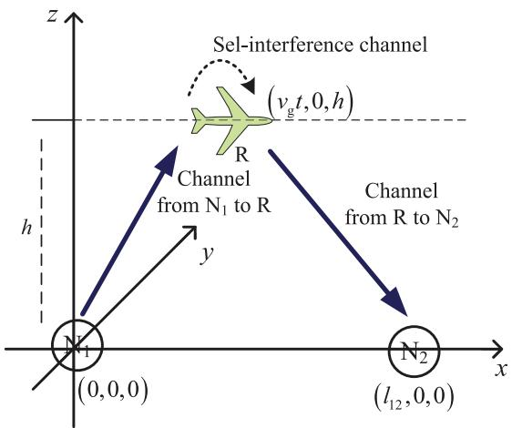  
Fig. 1. System model.

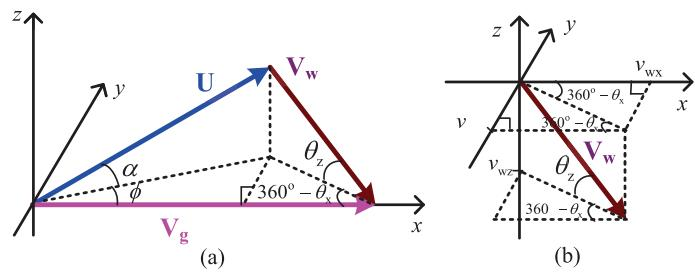  
Fig. 2. Wind triangle and decomposition of a wind-speed vector in the 3D coordinate system: (a) wind triangle, (b) decomposition of a wind-speed vector.

UAV relay’s flight altitude which corresponds to the minimum altitude for obstacle avoidance [3]. Denote by T the period of time during which the UAV relay completes the data collection and delivery.

During the whole process, $\mathrm { N _ { 1 } }$ continuously sends its data 1to the receiver of R, meanwhile, the transmitter of R forwards the received data to $\mathrm { N _ { 2 } }$ , and then $\mathrm { N _ { 2 } }$ acquires the data from $\mathrm { N _ { 1 } }$ via R. Suppose that the Doppler effect due to the UAV mobility can be completely compensated [3]. Since R acts as a FD AF relay to help deliver data from $\mathrm { N _ { 1 } }$ to $\mathrm { N _ { 2 } } .$ , a lowerbound of size of data obtained by $\mathrm { N _ { 2 } }$ 1 2at time t exists, giving $Q _ { \mathrm { l b } } t \ [ 3 ]$ . Here, $Q _ { \mathrm { l b } }$ 2can be expressed as [3]

$$
Q _ { \mathrm { l b } } = \frac { ( \log _ { 2 } e ) \beta _ { 0 } ^ { 2 } P _ { 1 } P _ { \mathrm { R } } } { \left[ \beta _ { 0 } P _ { 1 } + \sigma ^ { 2 } \big ( h ^ { 2 } + l _ { 1 2 } ^ { 2 } \big ) \right] \left[ \beta _ { 0 } P _ { \mathrm { R } } + \sigma ^ { 2 } \big ( h ^ { 2 } + l _ { 1 2 } ^ { 2 } \big ) \right] }\tag{1}
$$

where, $P _ { 1 }$ and $P _ { \mathrm { R } }$ are the transmit powers of $\mathrm { N _ { 1 } }$ and $\mathrm { R , }$ 1respectively, $\beta _ { 0 }$ R 1is the channel power at the reference distance $d _ { 0 } = 1 \mathrm { m } .$ 0l is the distance between $\mathrm { N _ { 1 } }$ and $\mathrm { N _ { 2 } , }$ h is the 0 12UAV’s altitude, $\sigma ^ { 2 }$ is the noise power.

Fig. 2 gives the wind triangle and the decomposition of a wind-speed vector in the 3D coordinate system. The definitions of the adopted terms in Fig. 2 are given below.

Ground-speed vector $\mathbf { V } _ { \mathrm { g } } { \mathrm { : } }$ the UAV’s velocity with respect gto the ground, determining its position with respect to the ground users.

Air-speed vector U: the UAV’s velocity with respect to the surrounding air, governing aerodynamic forces such as lift and drag.

• Wind-speed vector $\mathbf { V } _ { \mathrm { w } } \mathrm { i }$ : the velocity of ambient wind representing wind strength and its direction with respect to the ground.

Vertical angle of wind $\theta _ { \mathrm { { z } } } \mathrm { { : } }$ the angle between the windspeed vector ${ \mathbf { V } } _ { \mathrm { w } }$ zand the horizontal plane and $- 9 0 ^ { \mathrm { o } } \ <$ $\theta _ { \mathrm { z } } < 9 0 ^ { \mathrm { o } }$ is assumed.

zHorizontal angle of wind $\theta _ { \mathrm { { x } } } \mathrm { { : } }$ the angle between the projection of ${ \mathbf { V } } _ { \mathrm { w } }$ xonto the horizontal plane and the x-axis, and $0 ^ { \mathrm { o } } \le \theta _ { \mathrm { x } } \le 3 6 0 ^ { \mathrm { o } }$ is assumed.

Pitch angle α: the angle between the direction pointed by the UAV relay and the horizontal plane [5] and $- 9 0 ^ { \mathrm { o } }$ < $\alpha < 9 0 ^ { \mathrm { o } }$ is assumed.

Crab angle φ: the angle between the projection of U onto the horizontal plane and the x-axis [5] and $0 \leq \phi \leq 3 6 0 ^ { \mathrm { o } }$ is assumed.

v , v and $v _ { \mathrm { W Z } }$ are the components of wind-speed wxvector ${ \mathbf { V } } _ { \mathrm { w } }$ wzalong the $\mathbf { X } ^ { - } , \mathbf { y } ^ { - }$ - and z-axes, respectively.

wIt is worth-mentioning that the UAV relay’s angle of attack is ignored in the paper and hence U is aligned with the direction pointed by the UAV relay. In addition, to facilitate the theoretical analysis, $v _ { \mathrm { g } } ,$ U and $v _ { \mathrm { w } }$ are used to denote the magnitudes of $\mathbf { V } _ { \mathrm { g } }$ , U and $\mathbf { V } _ { \mathrm { w } }$ , respectively, and hence $_ { _ { - } } v _ { \mathrm { g } } =$ $\| \mathbf { V } _ { \mathrm { g } } \| , ~ U = \| \mathbf { U } \|$ and $v _ { \mathrm { w } } = \left\| \mathbf { v _ { \mathrm { w } } } \right\| = \sqrt { v _ { \mathrm { w } x } ^ { 2 } + v _ { \mathrm { w } y } ^ { 2 } + v _ { \mathrm { w } z } ^ { 2 } } .$ wx wyAccording to the wind triangle as shown in Fig. 2, ${ \bf V } _ { \mathrm { g } } = { \bf \Phi }$ $\mathbf { U } + \mathbf { V } _ { \mathrm { w } }$ gholds. It demonstrates that vertical angle of wind $\theta _ { \mathrm { z } }$ wcan be computed as $\theta _ { \mathrm { z } } = \arcsin ( - v _ { \mathrm { w z } } / \Vert \mathbf { v _ { \mathrm { w } } } \Vert \ )$ z. To compute zhorizontal angle of wind $\theta _ { \mathrm { x } } ,$ wz wtwo cases should be considered: 1) if $v _ { \mathrm { w y } } ~ \geq ~ 0 , ~ \theta _ { \mathrm { x } } ~ = ~ \operatorname { a r c c o s } ( v _ { \mathrm { w x } } / \sqrt { v _ { \mathrm { w x } } ^ { 2 } + v _ { \mathrm { w y } } ^ { 2 } ~ } ) ; ~ 2 \rangle$ if $v _ { \mathrm { w y } } < 0 , \theta _ { x } = 3 6 0 ^ { 0 } - \mathrm { a r c c o s } ( v _ { \mathrm { w x } } / \sqrt { v _ { \mathrm { w x } } ^ { 2 } + v _ { \mathrm { w y } } ^ { 2 } } )$ . Of note is that for the case that $0 ^ { \mathrm { o } } \le \theta _ { \mathrm { x } } < ^ { \mathbf { \check { 9 } } } 0 ^ { \mathrm { o } }$ or $2 7 0 ^ { \mathrm { o } } < \theta _ { \mathrm { x } } \leq$ $3 6 0 ^ { \mathrm { o } } ( 9 0 ^ { \mathrm { o } } ~ < ~ \theta _ { \mathrm { x } } ~ < ~ 2 7 0 ^ { \mathrm { o } } )$ , the UAV relay flies downwind (upwind); for the case that $\theta _ { \mathrm { z } } > 0 ^ { \mathrm { o } } ~ ( \theta _ { \mathrm { z } } < 0 ^ { \mathrm { o } } )$ , the UAV relay is subjected to downward (upward) wind pressure.

In order for the UAV relay to follow a ground track aligned with the direction from $\mathrm { N _ { 1 } }$ to $\mathrm { N _ { 2 } } .$ , it needs to crab into the wind, leading to a pitch angle α and a crab angle φ [5]. Here, α can be computed as $\alpha = \arcsin ( - \upsilon _ { \mathrm { w z } } / \Vert \mathbf { U } \Vert )$ . To compute wzcrab angle φ, two cases should be considered: 1) if $v _ { \mathrm { w y } } \geq 0 ,$ $\phi = 3 6 0 ^ { \mathrm { o } } -$ arccos $[ ( v _ { \mathrm { g } } - v _ { \mathrm { w x } } ) / \sqrt { ( v _ { \mathrm { g } } - v _ { \mathrm { w x } } ) ^ { 2 } + v _ { \mathrm { w y } } ^ { 2 } \ : ] } ; 2$ ) if $v _ { \mathrm { w y } } < 0 , \phi = \operatorname { a r c c o s } { \left[ \left( v _ { \mathrm { g } } - v _ { \mathrm { w x } } \right) / \sqrt { \left( v _ { \mathrm { g } } - v _ { \mathrm { w x } } \right) ^ { 2 } + v _ { \mathrm { w y } } ^ { 2 }  } } .\right]$

## IV. CALCULATION OF UAV’S ENGINE POWER

Fig. 3 gives a side view of the forces on a UAV in a level flight with constant ambient wind, where α is the UAV’s pitch angle which is used to resist the downward or upward wind pressure. In case that the UAV relay performs a straight level flight, all its external forces must be balanced, giving [4], [5]

$$
\left\{ \begin{array} { l l } { W \cos \alpha - L = 0 } \\ { W \sin \alpha + D - F = 0 } \end{array} \right.\tag{2}
$$

where W is the wight of the UAV relay, L is the lift obtained by the UAV, D is the drag and F is the thrust produced by the UAV’s engine.

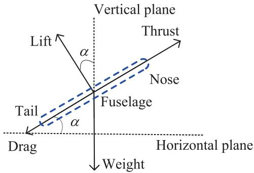  
Fig. 3. Side view of the forces on a UAV in a level flight with constant ambient wind.

According to [4], [5], the UAV relay’s drag can be computed as

$$
D = \frac { 1 } { 2 } C _ { \mathrm { D } _ { 0 } } \rho A U ^ { 2 } + \frac { 2 W ^ { 2 } \mathrm { c o s } ^ { 2 } \alpha } { \pi e _ { 0 } \rho b ^ { 2 } U ^ { 2 } }\tag{3}
$$

where $ { C _ { \mathrm { D } _ { 0 } } }$ is the zero-lift drag coefficient, $\rho$ is the atmosphere Ddensity, A is the wing area, $e _ { 0 }$ is Oswald span efficiency factor, and b is the wing span.

Proposition 1: The engine power of a fixed-wing UAV can be computed as a function of its air-speed, giving

$$
\begin{array} { l } { { \displaystyle E _ { \mathrm { n } } ( U ) = | P ( U ) | } } \\ { { \displaystyle ~ = \left| - W v _ { \mathrm { w z } } + \frac { 1 } { 2 } C _ { \mathrm { D } _ { 0 } } \rho A U ^ { 3 } + \frac { 2 W ^ { 2 } \left( U ^ { 2 } - v _ { \mathrm { w z } } ^ { 2 } \right) } { \pi e _ { 0 } \rho b ^ { 2 } U ^ { 3 } } \right| } } \end{array}\tag{4}
$$

Proof: For a fixed-wing UAV, its engine power is equal to the thrust produced by its engine times the UAV’s air-speed, i.e., $E _ { \mathrm { n } } ( U ) { = } | F | U$ , where the magnitude operator is necessary nfor the situation of reverse thrust with $F ~ < ~ 0$ . According to (2), $F = W \sin \alpha + D$ can be achieved. Then, using (3) and α = arcsin $\left( - v _ { \mathrm { w z } } / \Vert \mathbf { U } \Vert \right)$ , the UAV’s engine power can be computed as (4).

Remark: It can be observed by (4) that for a given air-speed, UAV’s engine power is related only to the vertical component of the wind-speed while not to the horizontal component. However, the three components of the wind-speed will all impact UAV’s ground-speed and hence affect the size of data obtained by the ground destination, which will be explained and confirmed in the following.

The main goal here is to minimize the UAV’s energy consumption while meeting the demand of the GUs, where the UAV relay performs a straight level flight from $\mathrm { N _ { 1 } }$ to $\mathrm { N _ { 2 } }$ According to the wind triangle [5], therefore, the following equation

$$
v _ { \mathrm { g } } ^ { 2 } - 2 v _ { \mathrm { w x } } v _ { g } + v _ { \mathrm { w x } } ^ { 2 } + v _ { \mathrm { w y } } ^ { 2 } + v _ { \mathrm { w z } } ^ { 2 } - U ^ { 2 } = 0\tag{5}
$$

must be satisfied. Here, (5) can be regarded as a quadratic equation involving variable $v _ { \mathrm { g } }$ . To guarantee that the UAV relay flies from $\mathrm { N _ { 1 } }$ to $\mathrm { N _ { 2 } }$ galong a straight path, (5) must have a positive solution of $v _ { \mathrm { g } } .$ . The following proposition gives the solution of (5) with respect to $v _ { \mathrm { g } } .$

gProposition 2: The solution of (5) with respect to $v _ { \mathrm { g } }$ can be classified as the following three cases.

Case 1: $U ^ { 2 } \geq v _ { \mathrm { w v } } ^ { 2 } + v _ { \mathrm { w z } } ^ { 2 }$ and $v _ { \mathrm { w x } } \geq 0$ . In this situation, a positive solution of $v _ { \mathrm { g } }$ wz wxcan always be found and can be further gclassified as the following two sub-cases: 1) if $0 \leq \phi \leq 9 0 ^ { \mathrm { o } }$ or $2 7 0 ^ { o } \leq \phi < 3 6 0 ^ { o }$ holds, the positive solution of $v _ { \mathrm { g } }$ can be expressed as

$$
v _ { \mathrm { g } } = v _ { \mathrm { w x } } + { \sqrt { U ^ { 2 } - v _ { \mathrm { w y } } ^ { 2 } - v _ { \mathrm { w z } } ^ { 2 } } }\tag{6}
$$

2) if $9 0 ^ { \mathrm { o } } < \phi < 2 7 0 ^ { \mathrm { o } }$ holds, the positive solution of $v _ { \mathrm { g } }$ can be expressed as

$$
v _ { \mathrm { g } } = v _ { \mathrm { w x } } - \sqrt { U ^ { 2 } - v _ { \mathrm { w y } } ^ { 2 } - v _ { \mathrm { w z } } ^ { 2 } }\tag{7}
$$

In $( 7 ) , \ v _ { \mathrm { w y } } ^ { 2 } + \upsilon _ { \mathrm { w z } } ^ { 2 } \leq U ^ { 2 } < \upsilon _ { \mathrm { w } } ^ { 2 }$ should be satisfied. It is worth-wy wz wmentioning that according to the wind triangle [5], if $U ^ { 2 } >$ $v _ { \mathrm { w y } } ^ { 2 } + v _ { \mathrm { w z } } ^ { 2 } , v _ { \mathrm { w x } } \geq 0$ and (6) hold, $0 \leq \phi \leq 9 0 ^ { \mathrm { o } }$ or $2 7 0 ^ { o } \ \leq$ $\phi < 3 6 0 ^ { \mathrm { o } }$ z wxholds; if $v _ { \mathrm { w y } } ^ { 2 } + v _ { \mathrm { w z } } ^ { 2 } \leq U ^ { 2 } < v _ { \mathrm { w } } ^ { 2 } , v _ { \mathrm { w x } } \geq 0$ and (7) hold, $9 0 ^ { \mathrm { o } } < \phi < 2 7 0 ^ { \mathrm { o } }$ y wzholds as well.

Case 2: $U ^ { 2 } \geq v _ { \mathrm { w v } } ^ { 2 } + v _ { \mathrm { w z } } ^ { 2 }$ and $v _ { \mathrm { w x } } < 0 .$ . In this situation, wya positive solution of $v _ { \mathrm { g } }$ wz wxcould exist only when $0 \leq \phi \leq 9 0 ^ { \mathrm { o } }$ or $2 7 0 ^ { o } \leq \phi < 3 6 0 ^ { o }$ gholds, and can be given by (6), where $U ^ { 2 } > v _ { \mathrm { w } } ^ { 2 }$ should be ensured. Likewise, according to the wind wtriangle [5], if $U ^ { 2 } > v _ { \mathrm { w } } ^ { 2 } , v _ { \mathrm { w x } } < 0$ and (6) hold, $0 \leq \phi \leq 9 0 ^ { \mathrm { o } }$ or $2 7 0 ^ { o } \leq \phi <$ w wx360 can be satisfied.

Case $3 \colon \mathit { \Delta } U ^ { 2 } < \mathit { v } _ { \mathrm { w y } } ^ { 2 } + \mathit { v } _ { \mathrm { w z } } ^ { 2 }$ . No positive solution of $v _ { \mathrm { g } }$ can be found.

## V. PROBLEM FORMULATION AND SOLUTION

Here, an optimization problem of the UAV relaying is examined. The main goal is to find the optimal air-speed, flight time and attitude (namely, crab and pitch angles) of the UAV relay so as to achieve the purpose of energy minimization while meeting the communication demand of the GUs. Since propulsion energy of a UAV is much greater than communication-related energy [19], here, only the UAV’s propulsion energy is calculated. Therefore, the energy minimization problem can be formulated as

$$
( U ^ { * } , T ^ { * } ) = \arg \operatorname* { m i n } _ { U , T } T E _ { \mathrm { n } } ( U )\tag{8a}
$$

$$
\mathrm { s . t . } \quad U _ { \mathrm { m i n } } \leq U \leq U _ { \mathrm { m a x } }
$$

$$
Q - Q _ { \mathrm { l b } } T \leq 0\tag{8b}
$$

(8c)

$$
T \leq \frac { l _ { 1 2 } } { v _ { \mathrm { g } } }\tag{8d}
$$

where $E _ { \mathrm { n } } ( U )$ is the UAV relay’s engine power and is npresented in Proposition 1, T is the period of time that the demanded amount of data has been delivered from $\mathrm { N _ { 1 } }$ to $\mathrm { N _ { 2 } }$ via R, $U _ { \mathrm { m i n } }$ and $U _ { \mathrm { m a x } }$ 1 2are the UAV’s minimum and maximum minair-speed limits which are related to the lift demanded by the UAV so as to hover in the air and the structural limits of the UAV, $Q _ { \mathrm { l b } } T$ is the lower-bound of the size of data obtained by lbN at time T, (8c) ensures that the actual size of data obtained 2by $\mathrm { N _ { 2 } }$ is larger than and equal to $Q ,$ (8d) means that the task of data delivery should be completed before the UAV relay reaches $( l _ { 1 2 } , 0 , h )$

After solving problem (8) and then obtaining the optimal air-speed $U ^ { * }$ (it is the magnitude of air-speed vector U, i.e., $\| \mathbf { U } \| = U ^ { * } )$ , the optimal direction of the air-speed vector U in 3D space should be derived, which involves the adjustment of pitch angle α and crab angle φ as described at the end of Section III.

It is noticed that (8a) is a monotonically increasing function of T and hence the global optimum is achieved when the inequality constraint (8c) holds with equality, namely, $T =$ $Q / Q _ { \mathrm { l b } }$ . In addition, $T = Q / Q _ { \mathrm { l k } }$ should satisfy (8d), where $v _ { \mathrm { g } }$ lb lbcan be given by (6) or (7) depending on the UAV relay’s air-speed and crab angle as well as the wind-speed. It should be noted that after solving problem (8), the adjustment of the UAV’s pitch and crab angles (which are determined by the wind-speed, air-speed and ground-speed vectors) should be conducted so that the UAV can follow the predetermined ground track. According to Proposition 2, problem (8) can be classified as the following two cases.

Case 1: $v _ { \mathrm { w x } } ~ \geq ~ 0$ . If (6) is used, problem (8) can be converted into (9).

$$
( U _ { 1 1 } ^ { * } , T _ { 1 1 } ^ { * } ) = \arg \operatorname* { m i n } _ { U , T } T E _ { \mathrm { n } } ( U )\tag{9a}
$$

$$
\mathrm { s . t . } \quad U _ { \mathrm { m i n } } \leq U \leq U _ { \mathrm { m a x } }\tag{9b}
$$

$$
U \geq \sqrt { v _ { \mathrm { w y } } ^ { 2 } + v _ { \mathrm { w z } } ^ { 2 } }\tag{9c}
$$

$$
T = { \frac { Q } { Q _ { \mathrm { l b } } } }\tag{9d}
$$

$$
T \leq \frac { l _ { 1 2 } } { v _ { \mathrm { w x } } + \sqrt { U ^ { 2 } - v _ { \mathrm { w y } } ^ { 2 } - v _ { \mathrm { w z } } ^ { 2 } } }\tag{9e}
$$

If (7) is used, problem (8) can be converted into (10).

$$
( U _ { 1 2 } ^ { * } , T _ { 1 2 } ^ { * } ) = \arg \operatorname* { m i n } _ { U , T } T E _ { \mathrm { n } } ( U )\tag{10a}
$$

$$
\mathrm { s . t . } \quad U _ { \mathrm { m i n } } \leq U \leq U _ { \mathrm { m a x } }\tag{10b}
$$

$$
\sqrt { v _ { \mathrm { w y } } ^ { 2 } + v _ { \mathrm { w z } } ^ { 2 } } < U < v _ { \mathrm { w } }\tag{10c}
$$

$$
T = { \frac { Q } { Q _ { \mathrm { l b } } } }\tag{10d}
$$

$$
T \leq \frac { l _ { 1 2 } } { v _ { \mathrm { w x } } - \sqrt { U ^ { 2 } - v _ { \mathrm { w y } } ^ { 2 } - v _ { \mathrm { w z } } ^ { 2 } } }\tag{10e}
$$

Case 2: $v _ { \mathrm { w x } } \ < \ 0$ . In the situation, problem (8) can be converted into

$$
( U _ { 2 } ^ { * } , T _ { 2 } ^ { * } ) = \arg \operatorname* { m i n } _ { U , T } T E _ { \mathrm { n } } ( U )\tag{11a}
$$

$$
\mathrm { s . t . } \quad U _ { \mathrm { m i n } } \leq U \leq U _ { \mathrm { m a x } }\tag{11b}
$$

$$
U > v _ { \mathrm { w } }\tag{11c}
$$

$$
T = { \frac { Q } { Q _ { \mathrm { l b } } } }\tag{11d}
$$

$$
T \leq \frac { l _ { 1 2 } } { v _ { \mathrm { w x } } + \sqrt { U ^ { 2 } - v _ { \mathrm { w y } } ^ { 2 } - v _ { \mathrm { w z } } ^ { 2 } } }\tag{11e}
$$

According to the above analysis, it can be deduced that for the case that $v _ { \mathrm { w x } } < 0$ , problem (11) is equivalent to the initial optimization problem (8), and hence solving problem (11) leads to the solution of (8) and then the $\mathrm { U A V } \mathbf { \hat { s } }$ ground-speed $v _ { \mathrm { g } }$ can be calculated by (6); for the case that $v _ { \mathrm { W X } } \geq 0$ , there are g wxtwo ground-speeds conditioned on the UAV’s crab angle and hence the initial optimization problem (8) can be converted to problem (9) or (10). Since problems (9) and (10) lead to two solutions $( U _ { 1 1 } ^ { * } , T _ { 1 1 } ^ { * } )$ and $( U _ { 1 2 } ^ { * } , T _ { 1 2 } ^ { * } )$ , respectively, the one, i.e., $( U _ { 1 1 } ^ { * } , T _ { 1 1 } ^ { * } )$ 1or $( U _ { 1 2 } ^ { * } , T _ { 1 2 } ^ { * } )$ 2 12having the minimal energy is 11 11 12 12considered as the solution of (8). In case that $( U _ { 1 1 } ^ { * } , T _ { 1 1 } ^ { * } )$ or $( U _ { 1 2 } ^ { * } , T _ { 1 2 } ^ { * } )$ 11 11is the final solution of (8), the UAV’s ground-speed v 12 12can be calculated by (6) or (7).

In the following, three propositions, i.e., Propositions 3, 4 and 5, are presented to solve problems (9), (10) and (11), respectively. It should be noted that a power minimization problem expressed by (13) and its solution are commonly used in solving problems (9), (10) and (11). The objective of problem (13) is to find an optimal air-speed in a given air-speed interval so that the UAV’s engine power can be minimized. The solution of problem (13) will be presented in Proposition 6.

Proposition 3: The solution of problem (9) can be classified as the following three cases.

Case 1: $\begin{array} { r l r } { v _ { \mathrm { W X } } } & { { } \ge } & { 0 } \end{array}$ and $\sqrt { v _ { \mathrm { w y } } ^ { 2 } + v _ { \mathrm { w z } } ^ { 2 } } ~ > ~ U _ { \mathrm { m a x } }$ . In the wy wzsituation, (9b) and (9c) cannot be satisfied simultaneously and hence (9) is infeasible.

Case 2: $v _ { \mathrm { w x } } ~ \geq ~ 0$ and $\begin{array} { r } { U _ { \mathrm { m i n } } \ < \ \sqrt { v _ { \mathrm { w y } } ^ { 2 } + v _ { \mathrm { w z } } ^ { 2 } } \ \le \ U _ { \mathrm { m a x } } . } \end{array}$ Problem (9) can be rewritten as

$$
( U _ { 1 1 } ^ { * } , T _ { 1 1 } ^ { * } ) = \arg \operatorname* { m i n } _ { U , t } T | P ( U ) |\tag{12a}
$$

$$
\begin{array} { r l } { \mathrm { s . t . } \ } & { { } \sqrt { v _ { \mathrm { w y } } ^ { 2 } + v _ { \mathrm { w z } } ^ { 2 } } \leq U \leq U _ { \mathrm { m a x } } } \end{array}\tag{12b}
$$

$$
T = { \frac { Q } { Q _ { \mathrm { l b } } } }\tag{12c}
$$

$$
T \leq \frac { l _ { 1 2 } } { v _ { \mathrm { w x } } + \sqrt { U ^ { 2 } - v _ { \mathrm { w y } } ^ { 2 } - v _ { \mathrm { w z } } ^ { 2 } } }\tag{12d}
$$

Ignoring constraints (12c) and (12d), (12) can be solved by using Proposition 6, giving solution $\begin{array} { r l } { U ^ { \mathrm { o } } } & { { } = } \end{array}$ $O P ( \sqrt { v _ { \mathrm { w y } } ^ { 2 } + v _ { \mathrm { w z } } ^ { 2 } , U _ { \mathrm { m a x } } } )$ . Next, substitute $\mathit { \Delta } T \ = \ Q / Q _ { \mathrm { l b } }$ wy wz max lbinto (12d) and replace U with U in (12d). If (12d) holds, $U _ { 1 1 } ^ { * } \quad = \quad U ^ { \mathrm { o } }$ and $\begin{array} { r l r } { T _ { 1 1 } ^ { * } } & { { } = } & { Q / Q _ { \mathrm { l b } } } \end{array}$ . Otherwise, 11 11 lblet (12d) hold with equality, which leads to $\begin{array} { r l } { U _ { 1 1 } } & { { } = } \end{array}$ $\sqrt { ( Q _ { \mathrm { l b } } l _ { 1 2 } - Q v _ { \mathrm { w x } } ) ^ { 2 } / Q ^ { 2 } \ + v _ { \mathrm { w y } } ^ { 2 } + v _ { \mathrm { w z } } ^ { 2 } } ,$ and then using lb 12 wx wy wzProposition 6, the optimal solution of (12) can be expressed as $U _ { 1 1 } ^ { * } = U ^ { \mathrm { o } } = O P ( \sqrt { v _ { \mathrm { w y } } ^ { 2 } + v _ { \mathrm { w z } } ^ { 2 } , U _ { 1 1 } } )$ and $T _ { 1 1 } ^ { * } = Q / Q _ { \mathrm { l b } }$ Here, $\begin{array} { r c l } { U ^ { \mathrm { o } } } & { = } & { O P ( \sqrt { v _ { \mathrm { w y } } ^ { 2 } + v _ { \mathrm { w z } } ^ { 2 } } , U _ { 1 1 } ) } \end{array}$ denotes the power wy wzminimization problem expressed by (13), $U ^ { \mathrm { o } }$ is its optimal solution, $\sqrt { v _ { \mathrm { w y } } ^ { 2 } + v _ { \mathrm { w z } } ^ { 2 } }$ and $U _ { 1 1 }$ are the lower and upper limits wy wzof the given air-speed interval.

Case 3: $\begin{array} { r l r } { v _ { \mathrm { W X } } } & { { } \ge } & { 0 } \end{array}$ and $\sqrt { v _ { \mathrm { w y } } ^ { 2 } + v _ { \mathrm { w z } } ^ { 2 } } ~ \le ~ U _ { \mathrm { m i n } }$ . In this situation, (9b) and (9c) can be merged into $U _ { \mathrm { m i n } } ~ \leq$ $\begin{array} { r c l } { U } & { \le } & { U _ { \mathrm { m a x } } } \end{array}$ . Likewise, by using Proposition $6 , \ U ^ { \mathrm { o } } \ U =$ $O P ( U _ { \mathrm { m i n } } , U _ { \mathrm { m a x } } )$ is achieved. Next, substitute $T = Q / Q _ { \mathrm { l b } }$ mininto (9e) and replace U with $U ^ { \mathrm { o } }$ lbin (9e). If (9e) holds, $U _ { 1 1 } ^ { * } ~ = ~ U ^ { \mathrm { o } }$ and $T _ { 1 1 } ^ { * } ~ = ~ Q / Q _ { \mathrm { l b } }$ . Otherwise, let (9e) hold 11 11 lbwith equality, which leads to the following two sub-cases: 1) if $\sqrt { ( Q _ { \mathrm { l b } } l _ { 1 2 } - Q v _ { \mathrm { w x } } ) ^ { 2 } / Q ^ { 2 } + v _ { \mathrm { w y } } ^ { 2 } + v _ { \mathrm { w z } } ^ { 2 } \ge U _ { \mathrm { m i n } } }$ holds, lb 12 wx wy wz mthe optimal solution of (9) can be expressed as $U _ { 1 1 } ^ { * } ~ =$ $\begin{array} { r l r } { U ^ { \mathrm { o } } } & { = } & { O P ( U _ { \mathrm { m i n } } , \sqrt { ( Q _ { \mathrm { l b } } l _ { 1 2 } - Q v _ { \mathrm { w x } } ) ^ { 2 } / Q ^ { 2 } \ + v _ { \mathrm { w y } } ^ { 2 } + v _ { \mathrm { w z } } ^ { 2 } } ) } \end{array}$ and $T _ { 1 1 } ^ { * } = Q / Q _ { \mathrm { l b } } \ : , \ : 2 \dot { ) }$ otherwise, (9) is infeasible.

It should be noted that if more than one solution is returned after conducing Proposition 6, the solution with the minimal air-speed is adopted in Proposition 3. This is due to the fact that small air-speed will lead to small ground-speed, which eventually benefits data delivery.

Proposition 4: The solution of problem (10) can be classified as the following six cases.

Case 1: $v _ { \mathrm { w x } } \geq 0$ and $\sqrt { v _ { \mathrm { w y } } ^ { 2 } + v _ { \mathrm { w z } } ^ { 2 } } ~ > ~ U _ { \mathrm { m a x } }$ . In the wy wzsituation, (10b) and (10c) cannot be satisfied simultaneously and hence (10) is infeasible.

Case 2: $v _ { \mathrm { w x } } ~ \ge ~ 0 , ~ U _ { \mathrm { m i n } } ~ < ~ \sqrt { v _ { w y } ^ { 2 } + v _ { w z } ^ { 2 } } ~ \le ~ U _ { \mathrm { m a x } }$ and $U _ { \mathrm { m a x } } \ < \ \upsilon _ { \mathrm { w } }$ wy wz. In this situation, (10b) and (10c) can be merged into $\sqrt { v _ { \mathrm { w y } } ^ { 2 } + v _ { \mathrm { w z } } ^ { 2 } } ~ \le ~ U ~ \le ~ U _ { \mathrm { m a x } }$ . Ignoring con-wy wzstraints (10d) and (10e) and using Proposition 6, $\begin{array} { r l } { U ^ { \mathrm { o } } } & { { } = } \end{array}$ $O P ( \sqrt { v _ { \mathrm { w y } } ^ { 2 } + v _ { \mathrm { w z } } ^ { 2 } , U _ { \mathrm { m a x } } } )$ is achieved. Next, substitute $T =$ $Q / Q _ { \mathrm { l b } } ^ { \prime }$ into (10e) and replace U with $U ^ { \mathrm { o } }$ in (10e). If (10e) lholds, $U _ { 1 2 } ^ { * } = U ^ { \mathrm { o } }$ and $T _ { \mathrm { 1 2 } } ^ { \ast } = Q / Q _ { \mathrm { l b } }$ . Otherwise, let (10e) 12 12 lbhold with equality, which leads to the following two subcases: 1) if $\sqrt { ( Q v _ { \mathrm { w x } } - Q _ { \mathrm { l b } } l _ { 1 2 } ) ^ { 2 } / Q ^ { 2 } + v _ { \mathrm { w y } } ^ { 2 } + v _ { \mathrm { w z } } ^ { 2 } \le U _ { \mathrm { m a x } } }$ lb wy wzholds, the optimal solution of (10) can be expressed as $U _ { 1 2 } ^ { * } =$ $\begin{array} { r l r } { U ^ { \mathrm { o } } } & { = } & { O P ( \sqrt { ( Q v _ { \mathrm { w x } } - Q _ { \mathrm { l b } } l _ { \mathrm { 1 2 } } ) ^ { 2 } / Q ^ { 2 } \ + v _ { \mathrm { w y } } ^ { 2 } + v _ { \mathrm { w z } } ^ { 2 } , U _ { \mathrm { m a x } } ) } } \end{array}$ and $T _ { 1 2 } ^ { * } = Q / \mathrm { Q _ { l b } } \ , 2 )$ wy wotherwise, (10) is infeasible.

Case $3 \colon \ \upsilon _ { \mathrm { w x } } \geq 0 , U _ { \mathrm { m i n } } < \sqrt { v _ { \mathrm { w y } } ^ { 2 } + v _ { \mathrm { w z } } ^ { 2 } } \leq U _ { \mathrm { m a x } }$ and $U _ { \mathrm { m a x } } \ \geq \ v _ { \mathrm { w } }$ wy wz. In this situation, (10b) and (10c) can be merged into $\sqrt { v _ { \mathrm { w y } } ^ { 2 } + v _ { \mathrm { w z } } ^ { 2 } } ~ \le ~ U ~ < ~ v _ { \mathrm { w } }$ . Ignoring con-wy wz wstraints (10d) and (10e) and using Proposition $6 , \ U ^ { \mathrm { o } } \ =$ $O P ( \sqrt { v _ { \mathrm { w y } } ^ { 2 } + v _ { \mathrm { w z } } ^ { 2 } , v _ { \mathrm { w } } } )$ is achieved. Next, substitute $T =$ $Q / Q _ { \mathrm { l b } } ^ { \prime }$ into (10e) and replace U with $U ^ { \mathrm { o } }$ in (10e). If (10e) lholds, $U _ { 1 2 } ^ { * } = U ^ { \mathrm { o } }$ and $T _ { \mathrm { 1 2 } } ^ { \ast } = Q / Q _ { \mathrm { l b } }$ . Otherwise, let (10e) 12 12 lbhold with equality, which leads to the following two sub-cases: 1) if $\sqrt { ( Q v _ { \mathrm { w x } } - Q _ { \mathrm { l b } } l _ { \mathrm { l 2 } } ) ^ { 2 } / Q ^ { 2 } + v _ { \mathrm { w y } } ^ { 2 } + v _ { \mathrm { w z } } ^ { 2 } < v _ { \mathrm { w } } }$ holds, the lb wy wzoptimal solution of (10) can be expressed as $U _ { 1 2 } ^ { * } = U ^ { 0 } = $ $O P ( \sqrt { ( Q v _ { \mathrm { w x } } - Q _ { \mathrm { l b } } l _ { 1 2 } ) ^ { 2 } / Q ^ { 2 } \ + v _ { \mathrm { w y } } ^ { 2 } + v _ { \mathrm { w z } } ^ { 2 } , v _ { \mathrm { w } } ) }$ and $T _ { 1 2 } ^ { * } =$ $Q / Q _ { \mathrm { l b } } ^ { \cdot } , 2 )$ wyotherwise, (10) is infeasible.

Case 4: $v _ { \mathrm { w x } } \geq 0 , ~ \sqrt { v _ { \mathrm { w y } } ^ { 2 } + v _ { \mathrm { w z } } ^ { 2 } } \leq U _ { \mathrm { m i n } }$ and $U _ { \mathrm { m a x } } \leq v _ { \mathrm { w } }$ wy wz minIn this situation, (10b) and (10c) can be merged into $U _ { \mathrm { m i n } } \leq$ $\begin{array} { r c l } { U } & { \le } & { U _ { \mathrm { m a x } } } \end{array}$ min. Ignoring constraints (10d) and (10e), and maxusing Proposition 6, $U ^ { \mathrm { o } } ~ = ~ O P ( U _ { \mathrm { m i n } } , U _ { \mathrm { m a x } } )$ is achieved. Next, substitute $\begin{array} { r c l } { T } & { = } & { Q / Q _ { \mathrm { l b } } } \end{array}$ min maxinto (10e) and replace lbU with U in (10e). If (10e) holds, $U _ { 1 2 } ^ { * } ~ = ~ U ^ { 0 }$ and $\begin{array} { c c c } { T _ { 1 2 } ^ { * } } & { = } & { Q / Q _ { \mathrm { l b } } } \end{array}$ 12. Otherwise, let (10e) hold with equal-12 lbity, which leads to the following two sub-cases: 1) if $\sqrt { ( Q v _ { \mathrm { w x } } - Q _ { \mathrm { l b } } l _ { 1 2 } ) ^ { 2 } / Q ^ { 2 } \ + v _ { \mathrm { w y } } ^ { 2 } + v _ { \mathrm { w z } } ^ { 2 } \ \le \ U _ { \mathrm { m a x } } }$ holds, the lb wy wzoptimal solution of (10) can be expressed as $U _ { 1 2 } ^ { * } ~ =$ $\begin{array} { r l r } { U ^ { \mathrm { o } } } & { = } & { O P ( \sqrt { ( Q v _ { \mathrm { w x } } - Q _ { \mathrm { l b } } l _ { \mathrm { 1 2 } } ) ^ { 2 } / Q ^ { 2 } \ + v _ { \mathrm { w y } } ^ { 2 } + v _ { \mathrm { w z } } ^ { 2 } , U _ { \mathrm { m a x } } ) } } \end{array}$ and $T _ { 1 2 } ^ { * } = Q / \mathrm { Q _ { l b } } \ , 2 )$ wy wotherwise, (10) is infeasible.

Case $5 \colon \mathit { v } _ { \mathrm { w x } } \ \ge \ 0 , \ \sqrt { v _ { \mathrm { w y } } ^ { 2 } + v _ { \mathrm { w z } } ^ { 2 } } \ \le \ U _ { \mathrm { m i n } }$ and $U _ { \mathrm { m i n } } ~ <$ $\begin{array} { r l r } { v _ { \mathrm { w } } } & { { } \le } & { U _ { \mathrm { m a x } } . } \end{array}$ wy wz In this situation, (10b) and (10c) can be w mmerged into $U _ { \mathrm { m i n } } ~ \le ~ U ~ < ~ v _ { \mathrm { w } }$ . Ignoring constraints (10d) min wand (10e), and using Proposition 6, $U ^ { \mathrm { o } } \ = \ O P ( U _ { \mathrm { m i n } } , v _ { \mathrm { w } } )$ is achieved. Next, substitute $\begin{array} { r c l } { T } & { = } & { Q / Q _ { \mathrm { l b } } } \end{array}$ min winto (10e)

and replace U with $U ^ { \mathrm { o } }$ in (10e). If (10e) holds, $U _ { 1 2 } ^ { * } ~ =$ $U ^ { \mathrm { o } }$ and $T _ { 1 2 } ^ { * } ~ = ~ Q / Q _ { \mathrm { l b } }$ 12. Otherwise, let (10e) hold with 12 lbequality, which leads to the following two sub-cases: 1) if $\sqrt { ( Q v _ { \mathrm { w x } } - Q _ { \mathrm { l b } } l _ { 1 2 } ) ^ { 2 } / Q ^ { 2 } \ + v _ { \mathrm { w y } } ^ { 2 } + v _ { \mathrm { w z } } ^ { 2 } } < v _ { \mathrm { w } }$ holds, the wy wzoptimal solution of (10) can be expressed as $U _ { 1 2 } ^ { * } = U ^ { 0 } = $ $O P ( \sqrt { ( Q v _ { \mathrm { w x } } - Q _ { \mathrm { l b } } l _ { 1 2 } ) ^ { 2 } / Q ^ { 2 } + v _ { \mathrm { w y } } ^ { 2 } + v _ { \mathrm { w z } } ^ { 2 } , v _ { \mathrm { w } } ) }$ and $T _ { 1 2 } ^ { * } =$ $Q / Q _ { \mathrm { l b } } ^ { \cdot } , 2 )$ wyotherwise, (10) is infeasible.

lbCase 6: $v _ { \mathrm { w x } } \geq 0$ and $U _ { \mathrm { m i n } } \geq v _ { \mathrm { w } }$ . In this situation, (10b) wx min wand (10c) cannot be satisfied simultaneously and hence (10) is infeasible.

It is worth-mentioning that in Proposition 4, the solution with the maximal air-speed is adopted if Proposition 6 returns more than one solution to air-speed. This is due to the fact that here, large air-speed will lead to small ground-speed, which eventually benefits data delivery.

Proposition 5: The solution of problem (11) can be classified as the following three cases.

Case 1: $v _ { \mathrm { w x } } < 0$ and $U _ { \mathrm { m a x } } \leq v _ { \mathrm { w } }$ . In the situation, (11b) wx max wand (11c) cannot be satisfied simultaneously and hence (11) is infeasible.

Case 2: $v _ { \mathrm { w x } } < 0$ and $U _ { \mathrm { m i n } } < v _ { \mathrm { w } } < U _ { \mathrm { m a x } } ,$ . In this situa-wx min wtion, (11b) and (11c) can be merged into $v _ { \mathrm { w } } < U \le U _ { \mathrm { m a x } } .$ w mIgnoring constraints (11d) and (11e), and using Proposition $^ { 6 , }$ $U ^ { \mathrm { o } } ~ = ~ { \cal O } P ( v _ { \mathrm { w } } , U _ { \mathrm { m a x } } )$ is achieved. Next, substitute $T =$ $Q / Q _ { \mathrm { l b } }$ into (11e) and replace U with $U ^ { \mathrm { o } }$ in (11e). If (11e) lholds, $U _ { 2 } ^ { * } ~ = ~ U ^ { \mathrm { o } }$ and $T _ { \mathrm { 2 } } ^ { \ast } ~ \mathrm { = } ~ Q / Q _ { \mathrm { l b } }$ . Otherwise, let (11e) 2 2 lbhold with equality, which leads to the following two subcases: 1) if $\sqrt { ( Q _ { \mathrm { l b } } l _ { 1 2 } - Q v _ { \mathrm { w x } } ) ^ { 2 } / Q ^ { 2 } + v _ { \mathrm { w y } } ^ { 2 } + v _ { \mathrm { w z } } ^ { 2 } } > v _ { \mathrm { w } } .$ lb 12 wx wy wzthe optimal solution of (11) can be expressed as $U _ { 2 } ^ { * } ~ =$ $\begin{array} { r c l } { { U ^ { \mathrm { o } } } } & { { = } } &  { O P ( v _ { \mathrm { w } } \sqrt { ( Q _ { \mathrm { l b } } l _ { 1 2 } - Q v _ { \mathrm { w x } } ) ^ { 2 } / Q ^ { 2 } \ + v _ { \mathrm { w y } } ^ { 2 } + v _ { \mathrm { w z } } ^ { 2 } ) } } \end{array}$ and $T _ { 2 } ^ { * } = Q / Q _ { \mathrm { l b } } : 2 )$ otherwise, (11) is infeasible. 2Case 3: $v _ { \mathrm { w x } } < 0$ and $U _ { \mathrm { m i n } } \geq v _ { \mathrm { w } }$ . In this situation, (11b) wx miand (11c) can be merged into $U _ { \mathrm { m i n } } \le U \le U _ { \mathrm { m a x } } .$ . Ignoring min maxconstraints (11d) and (11e), and using Proposition $6 , \ U ^ { \mathrm { o } } \ =$ $O P ( U _ { \mathrm { m i n } } , U _ { \mathrm { m a x } } )$ is achieved. Next, substitute $T = Q / Q _ { \mathrm { l b } }$ min maxinto (11e) and replace U with $U ^ { \mathrm { o } }$ lbin (11e). If (11e) holds, $U _ { 2 } ^ { * } ~ = ~ U ^ { \mathrm { o } }$ and $T _ { \mathrm { 2 } } ^ { \ast } ~ = ~ Q / Q _ { \mathrm { l b } }$ . Otherwise, let (11e) hold 2 2 lbwith equality, which leads to the following two sub-cases: 1) if $\begin{array} { r l r } { \sqrt { ( Q _ { \mathrm { l b } } l _ { 1 2 } - Q v _ { \mathrm { w x } } ) ^ { 2 } / Q ^ { 2 } \ + v _ { \mathrm { w y } } ^ { 2 } + v _ { \mathrm { w z } } ^ { 2 } \ } } & { \geq } & { U _ { \mathrm { m i n } } , } \end{array}$ , the lb wy wzoptimal solution of (11) can be expressed as $U _ { 2 } ^ { * } = U ^ { 0 } = $ $O P ( U _ { \mathrm { m i n } } , \sqrt { ( Q _ { \mathrm { l b } } l _ { 1 2 } - Q v _ { \mathrm { w x } } ) ^ { 2 } / Q ^ { 2 } + v _ { \mathrm { w y } } ^ { 2 } + v _ { \mathrm { w z } } ^ { 2 } } )$ and $T _ { 2 } ^ { * } =$ $Q / Q _ { \mathrm { l b } } : 2 )$ lbotherwise, (11) is infeasible.

lbIt should be noted that if more than one solution is returned after conducing Proposition $^ { 6 , }$ the solution with the minimal air-speed is adopted in Proposition 5. This is due to the fact that here, small air-speed will lead to small ground-speed, which eventually benefits data delivery.

In Propositions 3-5, the solution of a power minimization problem expressed by (13) is used so as to acquire the solutions of problems (9), (10) and (11). Proposition 6 gives the solution of this power minimization problem.

Proposition 6: For power minimization problem (13) denoted as $\begin{array} { r c l } { U ^ { \mathrm { o } } } & { = } & { O P ( U _ { \mathrm { l w } } , U _ { \mathrm { u p } } ) } \end{array}$ , where $U _ { \mathrm { l w } }$ and $U _ { \mathrm { u p } }$ lw lware the lower and upper limits of the UAV’s air-speed, the optimal solution $U ^ { \mathrm { o } }$ can be classified as the following seven

cases.

$$
U ^ { 0 } = \arg \operatorname* { m i n } _ { I J } | P ( U ) |\tag{13a}
$$

$$
\begin{array} { r l } { \mathrm { s . t . } \ } & { { } 0 < U _ { \mathrm { l w } } \le U \le U _ { \mathrm { u p } } } \end{array}\tag{13b}
$$

Case 1: $v _ { \mathrm { w z } } ~ { \geq } ~ ( \frac { 1 6 W ^ { 2 } } { 7 2 9 C _ { \mathrm { D } _ { 0 } } e _ { \mathrm { o } } { \pi } A \rho ^ { 2 } b ^ { 2 } } ) ^ { \frac { 1 } { 4 } }$ . The optimal solution is $U ^ { \mathrm { o } } = U _ { \mathrm { l w } }$

Case 2: $v _ { \mathrm { w z } } ~ < ~ ( \frac { 1 6 W ^ { 2 } } { 7 2 9 C _ { \mathrm { D } \mathrm { \Omega } } e _ { \mathrm { o } } \pi A \rho ^ { 2 } b ^ { 2 } } ) ^ { \frac { 1 } { 4 } }$ and $U _ { 1 } ^ { \mathrm { o } } \leq U _ { \mathrm { l w } }$ . The 729C e A b 1solution can be further divided into three sub-cases: 1) if $P ( U _ { \mathrm { l w } } ) \ge 0 , ~ U ^ { \mathrm { o } } = U _ { \mathrm { l w } } ; 2 )$ if $P ( U _ { \mathrm { l w } } ) < 0$ and $P ( U _ { \mathrm { u p } } ) >$ $0 , \ U ^ { \mathrm { o } }$ lwis the solution of $P ( U ) = 0 ;$ , where $U _ { \mathrm { l w } } \ \leq \ \dot { U } \ \leq$ $U _ { \mathrm { u p } } .$ lw, which can be solved by the bisection method $[ 2 1 ] ; 3 )$ if $P ( \dot { U } _ { \mathrm { u p } } ) \leq 0 , \ U ^ { \mathrm { o } } = U _ { \mathrm { u p } } .$

Case 3: $v _ { \mathrm { w z } } ~ < ~ ( \frac { 1 6 W ^ { 2 } } { 7 2 9 C _ { \mathrm { D } \mathrm { 0 } } e _ { \mathrm { o } } \pi A \rho ^ { 2 } b ^ { 2 } } ) ^ { \frac { 1 } { 4 } }$ and $U _ { 2 } ^ { \mathrm { o } } ~ \leq ~ U _ { \mathrm { l w } } ~ <$ $U _ { 1 } ^ { \mathrm { o } } < U _ { \mathrm { u p } }$ 729C e A b. The solution can be further divided into six sub-1 upcases: 1) if $P ( U _ { 1 } ^ { \mathrm { o } } ) ~ \geq ~ 0 , ~ U ^ { \mathrm { o } } ~ = ~ U _ { 1 } ^ { \mathrm { o } } ; ~ 2 )$ if $P ( U _ { \mathrm { l w } } ) ~ < ~ 0$ $P ( U _ { \mathrm { u p } } ) ~ < ~ 0$ 1and $P ( U _ { \mathrm { l w } } ) < P ( U _ { \mathrm { u p } } ) , \ U ^ { \mathrm { o } } = U _ { \mathrm { u p } } ; \ 3 ) \ \mathrm { i f }$ $P ( U _ { \mathrm { l w } } ) < 0 , P ( U _ { \mathrm { u p } } ) < 0$ and $P ( \tilde { U _ { \mathrm { l w } } } ) \geq P ( U _ { \mathrm { u p } } ) , \ U ^ { \mathrm { o } } =$ lwU ; 4) if $P ( U _ { \mathrm { l w } } ) < 0$ and $P ( U _ { \mathrm { u p } } ) \geq 0 \mathrm { { \Omega } }$ up, U is the solution lof $P ( U ) = 0 ;$ lw, where $U _ { 1 } ^ { \mathrm { o } } \le U \le \dot { U } _ { \mathrm { u p } } ; 5 )$ if $P ( U _ { \mathrm { l w } } ) \geq 0$ and $P ( U _ { \mathrm { u p } } ) < 0 , \ U ^ { \mathrm { o } }$ 1is the solution of $P ( U ) = 0$ lw, where $U _ { \mathrm { l w } } \leq$ $U \leq U _ { 1 } ^ { \mathbf { o } } ; 6 )$ if $P ( U _ { \mathrm { l w } } ) \ge 0 , P ( U _ { \mathrm { u p } } ) \ge 0$ and $P ( U _ { 1 } ^ { \mathrm { o } } ) <$ $0 , \ U ^ { \mathrm { o } }$ 1 lw up 1has two forms: a) the minimal one is the solution of $P ( U ) = 0$ , where $U _ { \mathrm { l w } } \leq U \leq U _ { 1 } ^ { \mathrm { o } }$ and b) the maximal one is the solution of $P ( U ) = 0 .$ 1, where $U _ { 1 } ^ { \mathrm { o } } < U \le U _ { \mathrm { u p } }$

Case 4: $v _ { \mathrm { w z } } ~ < ~ ( \frac { 1 6 W ^ { 2 } } { 7 2 9 C _ { \mathrm { D } \mathrm { 0 } } e _ { \mathrm { o } } \pi A \rho ^ { 2 } b ^ { 2 } } ) ^ { \frac { 1 } { 4 } }$ and $U _ { 2 } ^ { \mathrm { o } } ~ \leq ~ U _ { \mathrm { l w } } ~ <$ $U _ { \mathrm { u p } } \ \leq \ U _ { 1 } ^ { \mathrm { o } }$ 729C e A b. The solution can be further divided into three up 1sub-cases: 1) if $P ( U _ { \mathrm { u p } } ) \geq 0 , \ U ^ { \mathrm { o } } = \ U _ { \mathrm { u p } } ; \ 2 ) \ P ( U _ { \mathrm { u p } } ) < 0$ and $P ( U _ { \mathrm { l w } } ) \ge 0 , \ U ^ { \mathrm { o } }$ uis the solution of $P ( U ) = 0$ p, where $U _ { \mathrm { l w } } \le U \le U _ { \mathrm { u p } } ; 3 )$ if $P ( U _ { \mathrm { l w } } ) \leq 0 , \ U ^ { \mathrm { o } } = \dot { U } _ { \mathrm { l w } }$

Case 5: $v _ { \mathrm { w z } } ~ < ~ ( \frac { 1 6 W ^ { 2 } } { 7 2 9 C _ { \mathrm { D } \mathrm { 0 } } e _ { \mathrm { 0 } } \pi A \rho ^ { 2 } b ^ { 2 } } ) ^ { \frac { 1 } { 4 } }$ and $U _ { \mathrm { l w } } ~ < ~ U _ { 2 } ^ { \mathrm { o } } ~ < ~$ $U _ { \mathrm { u p } } < U _ { 1 } ^ { \mathrm { o } }$ 729C e A b. The solution can be further divided into six sub-up 1cases: 1) if $P ( U _ { \mathrm { l w } } ) \geq 0 , P ( U _ { \mathrm { u p } } ) \geq 0$ and $P ( U _ { \mathrm { l w } } ) \leq P ( U _ { \mathrm { u p } } )$ $U ^ { \mathrm { o } } = U _ { \mathrm { l w } } ; 2 ) \mathrm { i f } \ P ( U _ { \mathrm { l w } } ) \ge 0 , P ( U _ { \mathrm { u p } } ) \ge 0$ lwand $P ( U _ { \mathrm { l w } } ) { \mathrm { > } }$ $P ( U _ { \mathrm { u p } } ) , U ^ { \mathrm { o } } = U _ { \mathrm { u p } } ; 3 )$ wif $P ( U _ { \mathrm { l w } } ) \geq 0$ and $P ( U _ { \mathrm { u p } } ) < 0 , \ U ^ { \mathrm { o } }$ upis the solution of $P ( U ) = 0$ lw, where $U _ { \mathrm { 2 } } ^ { \mathrm { o } } \le U \le \overline { { U _ { \mathrm { u p } } } } ; 4 )$ if $P ( U _ { \mathrm { l w } } ) < 0$ and $P ( U _ { \mathrm { u p } } ) \geq 0 , U ^ { \mathrm { o } }$ 2is the solution of ${ \bar { P } } ( U ) =$ lw0, where $U _ { \mathrm { l w } } \le U \le \mathsf { \bar { \delta } } U _ { 2 } ^ { \mathrm { o } } ; 5 )$ if $P ( U _ { \mathrm { l w } } ) < 0 , P ( U _ { \mathrm { u p } } ) < 0$ and $P ( U _ { 2 } ^ { \mathrm { o } } ) \leq 0 , \ U ^ { \mathrm { o } } = \bar { U } _ { 2 } ^ { \mathrm { o } } ; 6 )$ if $P ( U _ { \mathrm { l w } } ) < 0 , P ( U _ { \mathrm { u p } } ) < 0$ and $P ( U _ { 2 } ^ { \mathrm { { \bar { o } } } } ) > 0 , \ U ^ { \mathrm { o } }$ 2 lw uphas two forms: a) the minimal one is 2the solution of $P ( U ) = 0$ , where $U _ { \mathrm { l w } } \leq U \leq U _ { 2 } ^ { \mathrm { o } }$ and b) the maximal one is the solution of $P ( U ) = 0$ 2, where $U _ { 2 } ^ { \mathrm { o } } < U \leq$ $U _ { \mathrm { u p } }$

Case 6: $v _ { \mathrm { w z } } < \bigl ( \frac { 1 6 W ^ { 2 } } { 7 2 9 C _ { \mathrm { D } \alpha } e _ { \mathrm { o } } \pi A \rho ^ { 2 } b ^ { 2 } } \bigr ) ^ { \frac { 1 } { 4 } }$ and $U _ { \mathrm { u p } } \leq U _ { 2 } ^ { \mathrm { o } }$ . The 729C e A b 2solution can be further divided into three sub-cases: 1) if $P ( U _ { \mathrm { l w } } ) \ge 0 , U ^ { \mathrm { o } } = U _ { \mathrm { l w } } ; 2 )$ if $P ( U _ { \mathrm { l w } } ) < 0$ and $P ( U _ { \mathrm { u p } } ) \geq 0 .$ $U ^ { \mathrm { o } }$ lwis the solution of $P ( U ) = 0$ lw, where $U _ { \mathrm { l w } } \leq U \leq U _ { \mathrm { u p } } ;$ 3) if $P ( U _ { \mathrm { u p } } ) < 0 , \ U ^ { \mathrm { o } } = U _ { \mathrm { u p } } .$

Case $\begin{array} { r } { 7 \colon \mathrm { ~ } v _ { \mathrm { w z } } \ < \ ( \frac { 1 6 W ^ { 2 } } { 7 2 9 C _ { \mathrm { D } _ { 0 } } e _ { 0 } \pi A \rho ^ { 2 } b ^ { 2 } } ) ^ { \frac { 1 } { 4 } } } \end{array}$ and $U _ { \mathrm { l w } } ~ < ~ U _ { 2 } ^ { \mathrm { o } } ~ < ~$ $U _ { 1 } ^ { \mathrm { o } } < U _ { \mathrm { u p } }$ 729C e A b. The solution can be further divided into ten sub-1 upcases: 1) If $P ( U _ { \mathrm { l w } } ) \geq 0 , P ( U _ { 1 } ^ { \mathrm { o } } ) \geq 0$ and $P ( U _ { \mathrm { l w } } ) > P ( U _ { 1 } ^ { \mathrm { o } } )$ $U ^ { \mathrm { o } } = U _ { 1 } ^ { \mathrm { o } } ; 2 )$ lif $P ( U _ { \mathrm { l w } } ) \ge \dot { 0 , } P ( U _ { 1 } ^ { \mathrm { o } } ) \ge 0$ lwand $P ( U _ { \mathrm { l w } } ) \overset { \cdot } { \underset {  } { \le } }$ P (U o), $\bar { U } ^ { \mathrm { o } } = U _ { \mathrm { l w } } ; 3 )$ If $P ( U _ { \mathrm { l w } } ) { \mathrm { ~ \bar { ~ } { ~ > ~ } ~ } } 0 , \ P ( U _ { 1 } ^ { \mathrm { o } } ) \ < \ 0$ and $P ( U _ { \mathrm { u p } } ) \ge 0 , \ U ^ { \mathrm { o } }$ lw lw 1has two forms: a) the minimal one is the solution of $P ( U ) = 0$ , where $U _ { 2 } ^ { \mathrm { o } } \leq U \leq U _ { 1 } ^ { \mathrm { o } }$ ; b) the maximal one is the solution of $P ( U ) = 0$ , where $\begin{array} { r } { \hat { U } _ { 1 } ^ { \mathrm { o } } < U \le U _ { \mathrm { u p } } ; } \end{array}$ 4) If $P ( U _ { \mathrm { l w } } ) > 0$ and $P ( U _ { \mathrm { u p } } ) < 0$ 1 up, U is the solution of $P ( U ) = 0 ;$ w, where $U _ { 2 } ^ { \mathrm { o } } \ \le \ U \ \le \ U _ { 1 } ^ { \mathrm { o } } ; \ 5 )$ If $P ( U _ { \mathrm { l w } } ) < 0$ and $P ( U _ { 1 } ^ { \mathrm { o } } ) > 0 , \ U ^ { \mathrm { o } }$ 2is the solution of ${ \overset { \cdot } { P } } ( U ) = 0 .$ lw, where $U _ { \mathrm { l w } } \leq$ $U \leq U _ { 2 } ^ { \mathrm { o } } ; 6 )$ If $P ( U _ { \mathrm { l w } } ) < 0 , P ( U _ { 2 } ^ { \mathrm { o } } ) > 0 , P ( U _ { 1 } ^ { \mathrm { o } } ) \leq 0$ wand $P ( U _ { \mathrm { u p } } ) { \bar { > } } 0 , \ U ^ { \mathrm { o } }$ lw 2 1has three forms: a) the minimal one is the upsolution of $P ( U ) = 0$ , where $U _ { \mathrm { l w } } \leq U \leq U _ { \mathrm { ? } } ^ { \mathrm { o } }$ , b) the median one is the solution of $P ( U ) = 0 $ , where $\begin{array} { r } { \bar { U } _ { 2 } ^ { \mathrm { o } } \ \le \ U \ \le \ U _ { 1 } ^ { \mathrm { o } } ; } \end{array}$ c) the maximal one is the solution of $P ( U ) = \bar { 0 }$ , where $U _ { 1 } ^ { \mathrm { o } } <$ $U \le U _ { \mathrm { u p } } ; 7 )$ If $P ( U _ { \mathrm { l w } } ) < 0 , P ( U _ { 2 } ^ { \mathrm { o } } ) \geq 0$ and $P ( U _ { \mathrm { u p } } ) <$ $0 , \ U ^ { \mathrm { o } }$ up lw 2 uphas two forms: a) the minimal one is the solution of $P ( U ) = 0$ , where $U _ { \mathrm { l w } } ~ \leq ~ U ~ \leq ~ U _ { 2 } ^ { \mathrm { o } }$ ; b) the maximal one is the solution of $P ( U ) = 0 $ , where $U _ { 2 } ^ { \mathrm { o } } \ \le \ U \le \ U _ { 1 } ^ { \mathrm { o } } ; \ 8 )$ If $P ( U _ { \mathrm { l w } } ) < 0 , P ( U _ { 2 } ^ { \mathrm { o } } ) < 0$ and $P ( U _ { \mathrm { u p } } ) > ^ { \overline { { 0 } } , \ U ^ { \mathrm { o } } }$ 1is the solution of $P ( U ) = 0$ 2, where $U _ { 1 } ^ { \mathrm { o } } \le U \le \mathsf { \bar { \delta } } U _ { \mathrm { u p } } ; 9 )$ If $P ( U _ { \mathrm { l w } } ) < 0$ $P ( U _ { 2 } ^ { \mathrm { o } } ) < 0 , P ( U _ { \mathrm { u p } } ) < \bar { 0 }$ and $P ( U _ { \mathrm { 2 } } ^ { \mathrm { o } } ) \dot { \geq } P ( U _ { \mathrm { u p } } ) , U ^ { \mathrm { o } } = U _ { \mathrm { 2 } } ^ { \mathrm { o } }$ 210) If $P ( U _ { \mathrm { l w } } ) < 0 , \ : P ( U _ { 2 } ^ { \mathrm { o } } ) < 0 , \ : P \widetilde ( U _ { \mathrm { u p } } ) < 0$ upand $P ( U _ { \mathrm { u p } } ) \bar { > }$ $P ( U _ { 2 } ^ { 0 } ) , \ U ^ { 0 } = U _ { \mathrm { u p } } .$ 2 upHere, U and U are given in (14), where $p \quad =$ $- 4 W ^ { 2 } / 3 C _ { \mathrm { D _ { 0 } } } ^ { \bullet } e _ { 0 } \pi A \rho ^ { 2 } \breve { b } ^ { 2 }$ and $\overline { { q } } = 4 W ^ { 2 } v _ { w z } ^ { 2 } / C _ { \mathrm { D } _ { 0 } } e _ { 0 } \pi A \bar { \rho ^ { 2 } } b ^ { 2 }$

TABLE I SIMULATION PARAMETERS
<table><tr><td>Parameter</td><td>Value</td><td>Parameter</td><td>Value</td></tr><tr><td>h</td><td>200m</td><td> $C _ { \mathrm { D _ { 0 } } }$ </td><td>0.05</td></tr><tr><td> $l _ { 1 2 }$ </td><td>5000m</td><td> $e _ { \mathrm { o } }$ </td><td>0.74</td></tr><tr><td> $\beta _ { 0 }$ </td><td>-50dB</td><td>b</td><td> $3 . 8 \mathrm { m }$ </td></tr><tr><td> $P _ { 1 } = P _ { \mathrm R }$ </td><td>20dBm</td><td>A</td><td> $2 . 5 \mathrm { m } ^ { 2 }$ </td></tr><tr><td> $\sigma ^ { 2 }$ </td><td>-110dBm</td><td>W</td><td> $\mathrm { 3 0 k g \times 9 . 8 m / s ^ { 2 } }$ </td></tr><tr><td> $U _ { \mathrm { m i n } }$ </td><td>10m/s</td><td>9</td><td> $9 . 8 \mathrm { m } / \mathrm { s } ^ { 2 }$ </td></tr><tr><td> $U _ { \mathrm { m a x } }$ </td><td>50m/s</td><td> $v _ { \mathrm { w } }$ </td><td> $6 \mathrm { m / s }$ </td></tr><tr><td> $\rho$ </td><td> $1 . 2 2 5 \mathrm { k g } / \mathrm { m } ^ { 3 }$ </td><td></td><td></td></tr></table>

$$
\left\{ \begin{array} { l l } { U _ { 1 } ^ { \mathrm { o } } = \left( - \frac { 4 p } { 3 } \right) ^ { \frac { 1 } { 4 } } } \\ { \qquad \times \sqrt { \cos \left[ \frac { 1 } { 3 } \operatorname { a r c c o s } \left( - \frac { q } { 2 } \left( - \frac { 3 } { p } \right) ^ { \frac { 3 } { 2 } } \right) \right] } } \\ { U _ { 2 } ^ { \mathrm { o } } = \left( - \frac { 4 p } { 3 } \right) ^ { \frac { 1 } { 4 } } } \\ { \qquad \times \sqrt { \cos \left[ \frac { 1 } { 3 } \operatorname { a r c c o s } \left( - \frac { q } { 2 } \left( - \frac { 3 } { p } \right) ^ { \frac { 3 } { 2 } } \right) + 2 4 0 ^ { \circ } \right] } } \end{array} \right.\tag{14}
$$

According to the above analysis, an algorithm which solves the initial optimization problem (8) is presented below.

It should be noted that in Algorithm 1, “NaN” stands for “not a number”. In case that a solution is equal to “NaN”, the initial optimization problem is infeasible. In the next section, computer simulations are conducted to validate the studies.

## VI. SIMULATION RESULTS AND DISCUSSIONS

In this section, computer simulations are performed and the sequential quadratic programming available in MATLAB Optimization Toolbox (denoted by “Simulation”) is used to validate the studies. Simulation parameters are set to the values as given in Table I. It should be noted that the values of wing

Algorithm 1 The Solution of Problem (8) and the Adjustment   
of the UAV’s Crab and Pitch Angles Step 1: If $v _ { \mathrm { W X } } \geq 0$ , Proposition 3 is used to solve problem (9), giving the solution $( U _ { 1 1 } ^ { * } , T _ { 1 1 } ^ { * } )$ . Otherwise ${ \bf g 0 }$ to Step 7. Step 2: Proposition 4 is used to solve problem (10), giving the solution $\left( U _ { 1 2 } ^ { * } , T _ { 1 2 } ^ { * } \right)$ Step 3: If $U _ { 1 1 } ^ { * } \stackrel {  } { = } T _ { 1 1 } ^ { * } = U _ { 1 2 } ^ { * } = T _ { 1 2 } ^ { * } = \mathrm { N a N }$ holds, $U ^ { * } =$ $T ^ { * } = \mathrm { { N a N } }$ 11 11 12 1and then go to Step 10. Step 4: If $U _ { 1 1 } ^ { * } = T _ { 1 1 } ^ { * } = \mathrm { N a N }$ holds, the optimal solution of (8) is $\left( U ^ { * } , T ^ { * } \right) = \left( U _ { 1 2 } ^ { * } , T _ { 1 2 } ^ { * } \right)$ and the ground-speed $v _ { \mathrm { g } }$ 12 12can be calculated by (7). Next go to Step 9. Step 5: If $U _ { 1 2 } ^ { * } = T _ { 1 2 } ^ { * } = \mathrm { N a N }$ holds, the optimal solution of (8) is $( U ^ { * } , T ^ { * } ) = \overline { { ( U _ { 1 1 } ^ { * } , T _ { 1 1 } ^ { * } ) } }$ and the ground-speed $v _ { \mathrm { g } }$ 11 11can be calculated by (6). Next go to Step 9. Step 6: If $T _ { 1 1 } ^ { * } E _ { \mathrm { n } } \big ( U _ { 1 1 } ^ { * } \big ) \leq T _ { 1 2 } ^ { * } E _ { \mathrm { n } } \big ( U _ { 1 2 } ^ { * } \big )$ holds, the optimal 11 nsolution of (8) is $\bar { ( U ^ { * } , T ^ { * } ) } ~ = ~ \bar { ( U _ { 1 1 } ^ { * } , T _ { 1 1 } ^ { * } ) }$ , and then the ground-speed $v _ { \mathrm { g } }$ 11 11can be calculated by (6). Otherwise, gthe optimal solution is $\left( U ^ { * } , T ^ { * } \right) = \left( U _ { 1 2 } ^ { * } , T _ { 1 2 } ^ { * } \right)$ , and then 12 12the ground-speed v can be calculated by (7). Next, go to $v _ { \mathrm { g } }$ Step 9. Step 7: Proposition 5 is used to solve problem (11), giving the solution $( U _ { 2 } ^ { * } , T _ { 2 } ^ { * } )$ Step 8: If $U _ { 2 } ^ { \bar { * } } \bar { = } \ T _ { 2 } ^ { \bar { * } } = \mathrm { N a N }$ holds, $U ^ { * } = T ^ { * } = \mathrm { N a N }$ and 2 2then go to Step 10, otherwise, $\left( U ^ { * } , T ^ { * } \right) = \left( U _ { 2 } ^ { * } , T _ { 2 } ^ { * } \right)$ and then the ground-speed $v _ { \mathrm { g } }$ 2can be calculated by (6). gStep 9: The UAV’s pitch angle can be calculated $\begin{array} { r c l } { { \mathrm { a s } } } & { { \alpha } } & { { = } } & { { \arcsin ( - \upsilon _ { \mathrm { w z } } / U ^ { * } ) } } \end{array}$ . The calculation of the wzUAV’s crab angle φ can be classified as the following two case: 1) if $v _ { \mathrm { w y } } \geq 0 , \ \underline { { \phi } } = 3 6 0 ^ { \mathrm { o } } - \frac { } { }$ arccos $\left\lceil \left( v _ { \mathrm { g } } - v _ { \mathrm { w x } } \right) / \sqrt { \left( v _ { \mathrm { g } } - v _ { \mathrm { w x } } \right) ^ { 2 } + v _ { \mathrm { w y } } ^ { 2 } } \right\rceil ; 2 )$ if $v _ { \mathrm { w y } } < 0$ $\phi = \operatorname { a r c c o s } \biggl \lceil \left( v _ { \mathrm { g } } - v _ { \mathrm { w x } } \right) / \sqrt { \left( v _ { \mathrm { g } } - v _ { \mathrm { w x } } \right) ^ { 2 } + v _ { \mathrm { w y } } ^ { 2 } } \biggr \rceil$ Step 10: End of the algorithm.

area A, wing span b and wight W are selected according to the parameter values of Red Dragon 850C (CL-850C) UAV developed by Sagetown Technoloy Co., Ltd. [22]; Oswald span efficiency factor $e _ { 0 }$ is ranged between 0.74 and 0.88 [4] and ohence it is set to 0.74 in the simulation; by conducting a flight test in [23], zero-lift drag coefficient $ { C _ { \mathrm { D } _ { 0 } } }$ is 0.0489 and hence Dit is set to 0.05 in the simulation; atmosphere density $\rho$ is set to the sea level value [4]; the maximum air-speed of the UAV is set to 50m/s which is widely adopted in no-wind conditions [3] and in windy environments [17]; the minimum air-speed of a UAV is also called as stall speed and according to [24], it is set to 10m/s in the simulation; wind-speed $v _ { \mathrm { w } }$ is set to 6m/s wwhich is adopted in [15] for a wind tunnel experiment.

Figs. 4 and 5 plot the UAV’s energy consumption and the size of data received at $\mathrm { N _ { 2 } }$ versus Q, where Q is ranged in [10, 100]. To obtain the actual size of data received at $\mathrm { N _ { 2 } } .$ 2signal-to-noise ratio (SNR) given by Eq. (10) in [3] is used and the residual self-interference (RSI) channel power is set to 60dB in the simulations. Fig. 4 shows that the UAV’s energy consumption increases with increasing the value of Q.

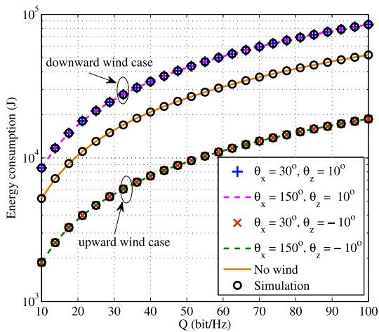  
Fig. 4. Energy consumption versus Q.

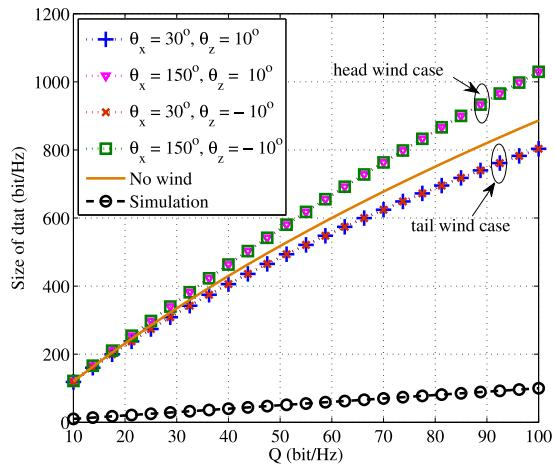  
Fig. 5. Size of data received at $\mathrm { N _ { 2 } }$ versus Q.

It confirms that the $\mathrm { U A V } \mathbf { \hat { s } }$ energy consumption is related only to the vertical component of the wind-speed, i.e., $v _ { \mathrm { W Z } }$ . For the cases having identical values of $v _ { \mathrm { W Z } } .$ wz, the UAV’s energy consumptions are also identical regardless of the values of the wind-speed’s horizontal components. In addition, compared to no-wind conditions, windy environment does not always lead to enhancement in energy consumption, depending on the value of $\theta _ { \mathrm { z } } .$ . For the case that $\theta _ { \mathrm { z } } > 0 ^ { \mathrm { o } }$ , namely, existing a z zdown component of wind, the UAV is subjected to downward wind pressure. In order to resist this pressure, fuselage of the UAV should point upward $( \alpha > 0 ^ { \mathrm { o } }$ , see Table II) which leads to additional energy consumption so as to offset the backward force caused by its gravity. For the case that $\theta _ { \mathrm { z } } ~ < ~ 0 ^ { \mathrm { o } }$ , the zUAV relay is subjected to upward wind pressure which leads to a down inclination of its fuselage $( \alpha < 0 ^ { \mathrm { o } }$ , see Table II). In this situation, the UAV’s gravity will give a forward force reducing UAV’s engine power for the production of thrust. Furthermore, Fig. 4 shows that the UAV’s energy is consistent with the simulation results, indicating the correctness of the studies.

Fig. 5 shows that the actual size of data obtained by $\mathrm { N _ { 2 } }$ is 2larger than the value of Q, indicating the correctness of the studies. In addition, it shows that head wind $( 9 0 ^ { \mathrm { o } } \mathrm { ~ < ~ } \theta _ { \mathrm { x } } \mathrm { ~ < ~ }$ 270 ) leads to large size of data. It is known that head wind will reduce ground-speed compared to the tail wind case, which benefits data delivery between GUs via the UAV relay.

TABLE II  
AIR- AND GROUND- SPEEDS, AND CRAB AND PITCH ANGLES
<table><tr><td rowspan="2">Schemes</td><td rowspan="2"> $\theta _ { x } = 3 0 ^ { \circ }$ </td><td rowspan="2"> $\theta _ { x } = 1 5 0 ^ { \circ }$ </td><td rowspan="2"> $\theta _ { x } = 3 0 ^ { \circ }$   $\theta _ { \mathrm { z } } = - 1 0 ^ { \mathrm { o } }$ </td><td rowspan="2"> $\theta _ { x } = 1 5 0 ^ { \circ }$   $\theta _ { \mathrm { Z } } = - 1 0 ^ { \mathrm { o } }$ </td></tr><tr><td> $\theta _ { \mathrm { Z } } = 1 0 ^ { \mathrm { o } }$   $\theta _ { \mathrm { Z } } = 1 0 ^ { \mathrm { o } }$ </td></tr><tr><td>Parameters Air-speed U (m/s)</td><td>11.5597</td><td>11.5597</td><td>11.5597</td><td>11.5597</td></tr><tr><td>Ground-speed  $v _ { \mathrm { g } }$  (m/s)</td><td>16.2443</td><td>6.0099</td><td>16.2443</td><td>6.0099</td></tr><tr><td>Crab angle φ (degree)</td><td>345.1302</td><td>345.1302</td><td>345.1302</td><td>345.1302</td></tr><tr><td>Pitch angle α (degree)</td><td>5.1711</td><td>5.1711</td><td>-5.1711</td><td>-5.1711</td></tr></table>

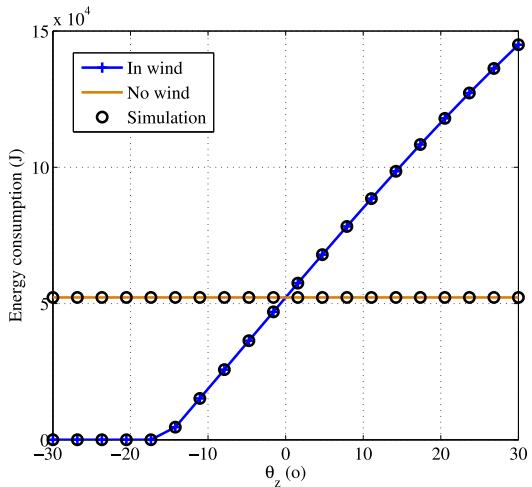  
Fig. 6. Energy consumption versus $\theta _ { \mathrm { { Z } } } ,$ , where $\theta _ { \mathbf { x } } = 2 1 0 ^ { \mathrm { o } }$ and $Q = 1 0 0 .$

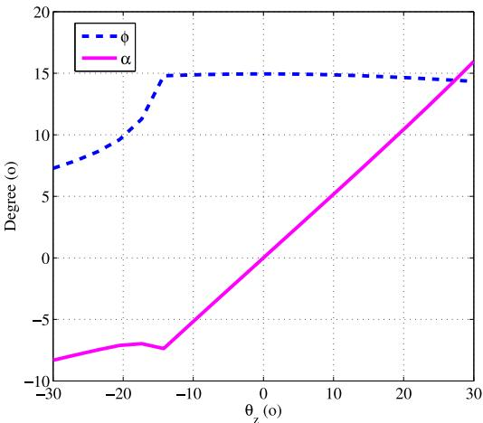  
Fig. 7. Crab and pitch angles versus $\theta _ { \mathrm { z } } ,$ where $\theta _ { \mathbf { x } } = 2 1 0 ^ { \mathrm { o } }$ and $Q = 1 0 0 .$

Table II gives the air-speed and ground-speed, and the crab and pitch angles of the UAV, where the four cases considered in Figs. 4 and 5 are included. It can be seen that air-speeds and crab angles of the four cases are identical; head wind $( \theta _ { \mathrm { { X } } } =$ x150 ) leads to a decrease in ground-speed, which benefits data delivery as shown in Fig. 5. It is worth-mentioning that the UAV’s flight time is always equal to $Q / Q _ { \mathrm { l b } }$ , where $Q _ { \mathrm { l b } }$ is given by (1).

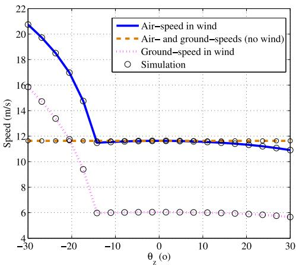  
Fig. 8. Air- and ground-speeds versus $\theta _ { \mathrm { z } } ,$ where $\theta _ { \mathbf { x } } = 2 1 0 ^ { \mathrm { o } }$ and $Q = 1 0 0$

Figs. 6-9 plot the energy consumption, the crab and pitch angles, all kinds of speeds and the size of data obtained by $\mathrm { N _ { 2 } }$ versus $\theta _ { \mathrm { z } } ,$ where $\theta _ { \mathrm { z } }$ is ranged in $[ - 3 0 ^ { \circ } , 3 0 ^ { \circ } ]$ $\theta _ { \mathrm { x } } = 2 1 0 ^ { \mathrm { o } }$ 2and $Q = 1 0 0$ z z x. Fig. 6 shows that the UAV does not need to consume any energy when $\theta _ { \mathrm { z } }$ is extremely small. In this situation, the zpitch angle is very small and less than 0 as shown in Fig. 7. As mentioned earlier, the UAV relay is subjected to upward wind pressure when $\theta _ { \mathrm { z } } < 0$ , which leads to a down inclination of the fuselage $( \alpha < 0 ,$ , see Fig. 7). For the case that $\theta _ { \mathrm { z } } < 0 ,$ forward force component of the gravity increases when the value of $\theta _ { \mathrm { z } }$ decreases. When the value of $\theta _ { \mathrm { z } }$ decreases to a specific level which is called as “zero power threshold” in this paper, forward force component of the gravity is equal to the drag, and hence the UAV’s engine does not need to produce any thrust. When the value of $\theta _ { \mathrm { z } }$ is larger than the “zero power threshold”, the energy consumption monotonically increases with respect to $\theta _ { \mathrm { z } } .$ In addition, Fig. 6 shows that the two energy consumption curves have a intersection when $\theta _ { \mathrm { z } } = 0$ and the UAV’s energy is consistent with the simulation results, indicating the correctness of the studies.

Fig. 7 plots the crab and pitch angles versus $\theta _ { \mathrm { z } }$ . It shows that the crab angle φ increases quite fast with increasing the value of $\theta _ { \mathrm { z } }$ before $\theta _ { \mathrm { z } }$ reaches the “zero power threshold”. When the value of $\theta _ { \mathrm { z } }$ is larger than the “zero power threshold”, the crab angle slightly decreases, and the pitch angle α monotonically increases with increasing the value of $\theta _ { \mathrm { z } }$

zFig. 8 shows that the air-speed and the ground-speed decrease quite fast with increasing the value of $\theta _ { \mathrm { z } }$ before $\theta _ { \mathrm { z } }$ zreaches the “zero power threshold”. When the value of $\theta _ { \mathrm { z } }$ zis larger than the “zero power threshold”, the air-speed and the ground-speed also decrease with increasing the value of $\theta _ { \mathrm { z } } .$ . However, the decrease in value is very small. When the value of $\theta _ { \mathrm { z } }$ is very large, the air-speed in wind will be slightly smaller than that in no-wind conditions. This is due to the fact that with increasing the value of $\theta _ { \mathrm { z } } .$ , the backward force caused by the gravity increases as well. It means that the UAV’s engine needs to produce more thrust to offset the backward force. In this situation, reducing air-speed can prevent the increase of UAV’s engine power. Since $\theta _ { \mathrm { x } } = 2 1 0 ^ { \mathrm { o } }$ , the UAV xflies upwind, and hence ground-speed is less than the air-speed as shown in Fig. 8.

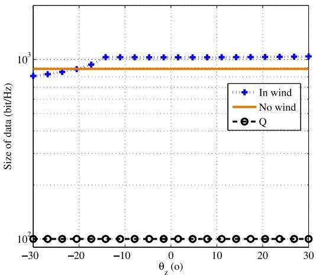  
Fig. 9. Size of data received at $\mathrm { N _ { 2 } }$ versus $\theta _ { \mathbf { Z } } .$ , where $\theta _ { \mathbf { x } } ~ = ~ 2 1 0 ^ { \mathrm { o } }$ and $Q \stackrel { \textstyle - } { = } 1 0 0$

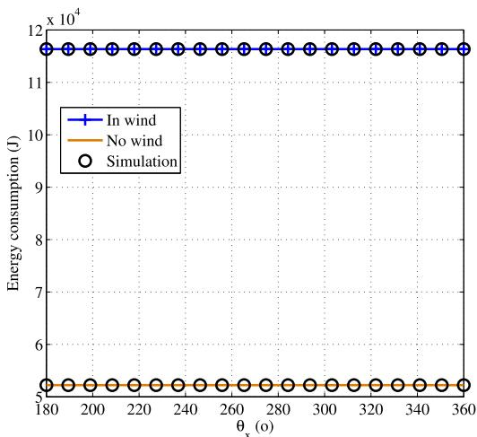  
Fig. 10. Energy consumption versus $\theta _ { \mathrm { { X } } } ,$ , where $\theta _ { \mathrm { Z } } = 2 0 ^ { \mathrm { o } }$ and $Q = 1 0 0$

Fig. 9 gives the actual size of data received at $\mathrm { N _ { 2 } } .$ , where SNR given by Eq. (10) in [3] is used and the RSI channel power is set to 60dB. It shows that the actual size of data is larger than the value of $Q ,$ indicating the correctness of the studies. When the ground-speed in wind is larger than that in no-wind conditions (see Fig. 8), the actual size of data is less than that in no-wind conditions and vice versa, which further confirms that small ground-speed benefits data delivery from $\mathrm { N _ { 1 } }$ to $\mathrm { N _ { 2 } }$ via the UAV relay. It should be stated that here, the 1 2flight time is 108.4s which can be directly calculated by using $T = Q / Q _ { \mathrm { l b } }$

lbFigs. 10-13 plot the energy consumption, the crab and pitch angles, all kinds of speeds and the size of data obtained by $\mathrm { N _ { 2 } }$ versus $\theta _ { \mathrm { x } } .$ , where $\theta _ { \mathrm { x } }$ is ranged in $[ 1 8 0 ^ { \mathrm { o } } , 3 6 0 ^ { \mathrm { o } } ] , \theta _ { \mathrm { z } } = 2 0 ^ { \mathrm { o } }$ 2and $Q = 1 0 0$ . Fig. 10 shows that the UAV’s energy is invariant across the whole range of $\theta _ { \mathrm { x } }$ , confirming that the components xof wind-speed on the horizontal plane do not have any impacts on the energy consumption. Since $\theta _ { \mathrm { z } } > 0$ , a down component of wind exists and hence the UAV is subjected to downward wind pressure. In order to resist this pressure, fuselage of the UAV should point upward (as shown in Fig. 11) which leads to additional energy consumption. Therefore, the energy consumption in wind is larger than that in no-wind conditions.

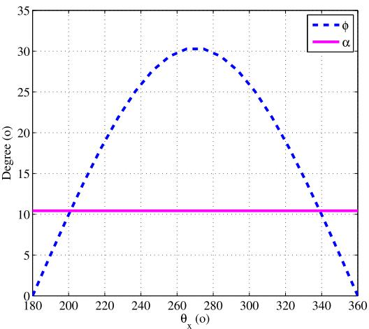  
${ \mathrm { F i g . } }$ 11. Crab and pitch angles versus $\theta _ { \mathrm { x } } ,$ where $\theta _ { \mathrm { Z } } = 2 0 ^ { \mathrm { o } }$ and $Q = 1 0 0 .$

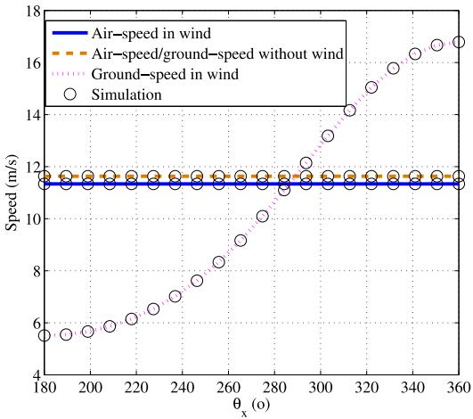  
Fig. 12. Air- and ground-speeds versus $\theta _ { \mathrm { { X } } } ,$ where $\theta _ { \mathrm { Z } } = 2 0 ^ { \mathrm { o } }$ and $Q = 1 0 0$

Since $\theta _ { \mathrm { z } } ~ = ~ 2 0 ^ { \mathrm { o } }$ , the component of wind-speed on the zvertical plane, i.e., $v _ { \mathrm { W Z } }$ is a constant. According to Fig. 12, the air-speed in wind is invariant across the whole range of $\theta _ { \mathrm { x } }$ . Therefore, the pitch angle $\alpha = \arcsin ( - { v _ { \mathrm { w z } } } / { \| \mathbf { U } \| } )$ is also invariant as shown in Fig. 11. In addition, the crab angle $\phi$ increases when $\theta _ { \mathrm { x } }$ is ranged in $[ 1 8 0 ^ { \mathrm { o } } , 2 7 0 ^ { \mathrm { o } } ]$ , while, it decreases when $\theta _ { \mathrm { x } }$ is ranged in $[ 2 7 0 ^ { \mathrm { o } } , 3 6 0 ^ { \mathrm { o } } ]$ . When $\theta _ { \mathrm { x } } = 2 7 0 ^ { \mathrm { o } }$ , namely, the wind-speed vector is perpendicular to the ground-speed vector, crab angle achieves its maximum.

Fig. 12 shows that the air-speed is invariant regardless of the value of $\theta _ { \mathrm { x } }$ as $v _ { \mathrm { W Z } }$ and $Q$ are determined. The UAV flies upwind when $\theta _ { \mathrm { x } }$ is ranged in $[ 1 8 0 ^ { \mathrm { o } } , 2 7 0 ^ { \mathrm { o } } ]$ , while, it flies downwind when $\theta _ { \mathrm { x } }$ is ranged in $[ 2 7 0 ^ { \mathrm { o } } , 3 6 0 ^ { \mathrm { o } } ]$ . With increasing the value of $\theta _ { \mathrm { x } } ,$ the component of wind-speed along the direction of ground-speed increases. Therefore, Fig. 12 shows that the ground-speed monotonically increases when $\theta _ { \mathrm { x } }$ is ranged in $[ 1 8 0 ^ { \mathrm { o } } , 3 6 0 ^ { \mathrm { o } } ]$ . In addition, Fig. 12 shows that the ground-speed is still less than the air-speed when $\theta _ { \mathrm { x } }$ is ranged in $[ 2 7 0 ^ { \mathrm { o } } , 2 8 5 ^ { \mathrm { o } } ]$ , which is actually a tail wind case. As depicted in Proposition 2, the relationship between air-speed and ground-speed depends not only on the wind-speed but also on the crab angle.

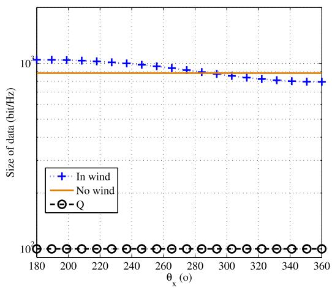  
Fig. 13. Size of data received at $\mathrm { N _ { 2 } }$ versus $\theta _ { \mathrm { x } } ,$ where $\theta _ { \mathrm { Z } } ~ = ~ 2 0 ^ { \mathrm { o } }$ and $\overset { \cdot } { Q } = 1 0 0 \overset { \cdot } { \mathrm { \ i } }$

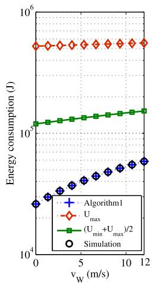

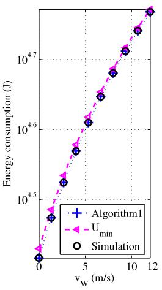  
Fig. 14. Energy consumption versus $v _ { \mathrm { W } }$ , where $\theta _ { \mathrm { x } } = 3 3 0 ^ { \mathrm { o } } , \theta _ { \mathrm { z } } = 1 0 ^ { \mathrm { o } }$ and $Q { \stackrel { - } { = } } 5 0 .$

Fig. 13 gives the actual size of data received at $\mathrm { N _ { 2 } }$ , where 2SNR given in Eq. (10) in [3] is used and the RSI channel power is set to 60dB. It shows that the actual size of data is larger than the value of $Q ,$ indicating the correctness of the studies. When the ground-speed in wind is larger than that in no-wind conditions (see Fig. 12), the actual size of data is less than that in no-wind conditions and vice versa, which further confirms that small ground-speed benefits data delivery from $\mathrm { N _ { 1 } }$ to $\mathrm { N _ { 2 } }$ via the UAV relay. Here, the flight time is 1 2also equal to 108.4s which can be directly calculated by using $T = Q / Q _ { \mathrm { l b } }$

lbFigs. 14-17 plot the energy consumption, the crab and pitch angles, the air- and ground-speeds and the size of data obtained by $\mathrm { N _ { 2 } }$ versus $v _ { \mathrm { w } }$ , where $v _ { \mathrm { w } }$ is ranged in [0, 12], $\theta _ { \mathrm { { X } } } = 3 3 0 ^ { \mathrm { { o } } }$ $\theta _ { \mathrm { Z } } ~ = ~ 1 0 ^ { \mathrm { o } }$ and $Q = 5 0$ w. Since $\theta _ { \mathrm { { X } } } ~ = ~ 3 3 0 ^ { \mathrm { { o } } }$ and $\theta _ { \mathrm { z } } ~ = ~ 1 0 ^ { \mathrm { o } }$ z x zthe UAV flies downwind (a tail wind case) and is subjected to downward wind pressure. Here, the proposed Algorithm1 is compared with three benchmark schemes that the UAV flies at its minimum, maximum and median air-speeds which are denoted as $^ { \ast \ast } U _ { \mathrm { m i n } } , ^ { \ast } U _ { \mathrm { m a x } } { } ^ { , \ast }$ and $\uparrow \zeta ( U _ { \mathrm { m i n } } + U _ { \mathrm { m a x } } ) / 2 \uparrow ,$ min minrespectively. For the four compared schemes, the UAV’s flight time is identical and equal to 54.19s which can be directly calculated by using $T = Q / Q _ { \mathrm { l b } }$

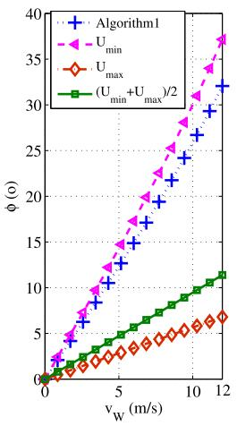

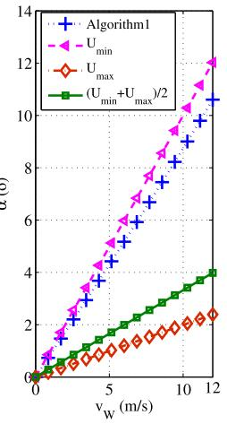  
Fig. 15. Crab and pitch angles versus $v _ { \mathrm { W } } ,$ where $\theta _ { \mathbf { x } } = 3 3 0 ^ { \mathrm { o } }$ $\theta _ { \mathrm { Z } } = 1 0 ^ { \mathrm { o } }$ and $Q = 5 0$

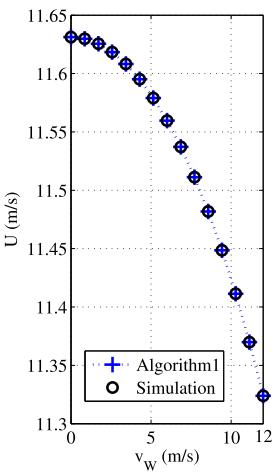

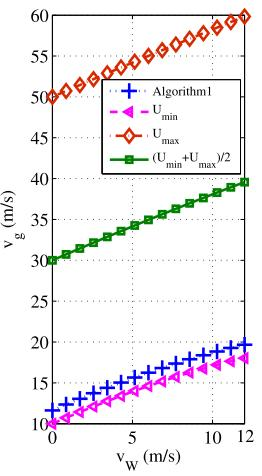  
Fig. 16. Air- and ground-speeds versus $v _ { \mathrm { W } } .$ where $\theta _ { \mathbf { X } } = 3 3 0 ^ { \mathrm { o } }$ $\theta _ { \mathrm { Z } } = 1 0 ^ { \mathrm { o } }$ and $Q = 5 0$

Fig. 14 shows that Algorithm 1 consumes much less energy than the $" U _ { \mathrm { m a x } } ? $ and ${ ^ { \mathrm { t } } } { \cdot } ( U _ { \mathrm { m i n } } + U _ { \mathrm { m a x } } ) / 2 { ^ { \circ } }$ schemes. Compared to the $" U _ { \mathrm { m i n } } \ " { }$ min maxscheme, it can also save about min3% of energy. In addition, Fig. 14 shows that the UAV’s energy is consistent with the simulation results, indicating the correctness of the studies.

Fig. 15 plots the crab and pitch angles versus $v _ { \mathrm { w } }$ . It wshows that in the considered tail wind case with downward wind pressure, crab angle $\phi$ and pitch angle α are both monotonically increasing when wind-speed $v _ { \mathrm { w } }$ increases and the higher the wind-speed, the greater crab and pitch angles will be.

Since the three benchmark schemes have constant airspeeds, Fig. 16 only gives the air-speed of the proposed Algorithm1, and plot all the four compared schemes’ groundspeeds. It can be observed that for the proposed Algorithm 1, air-speed is not a constant, although its dynamic range is quite small. Since the UAV flies downwind, the air-speed of the proposed Algorithm1 decreases with increasing the value of wind-speed. Furthermore, Fig. 16 shows that the groundspeed is closely related to the air-speed, and a high air-speed will result in a high ground-speed.

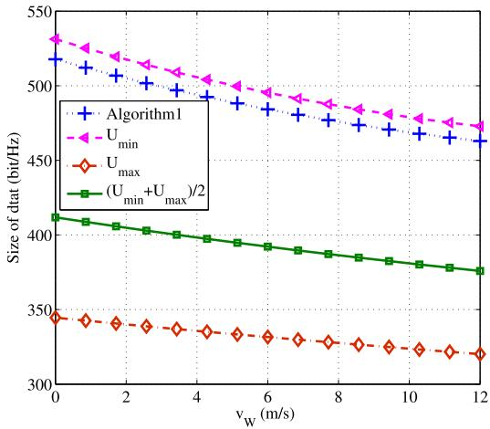  
Fig. 17. Size of data received at $\mathrm { N _ { 2 } }$ versus $v _ { \mathrm { W } } ,$ , where $\theta _ { \mathrm { { x } } } = 3 3 0 ^ { \mathrm { o } } , \theta _ { \mathrm { { z } } } = 1 0 ^ { \mathrm { o } }$ and $Q = 5 0$

Fig. 17 plot the actual size of data obtained by $\mathrm { N _ { 2 } }$ , where SNR given in Eq. (10) in [3] is used and the RSI channel power is set to 60dB. It shows that the actual sizes of data received at $\mathrm { N _ { 2 } }$ of all the compared schemes are monotonically decreasing when wind-speed $v _ { \mathrm { w } }$ increases. As shown in Fig. 16, ground-speeds of the four compared schemes increase when increasing wind-speed $v _ { \mathrm { w } }$ , which further confirms that wsmall ground-speed benefits data delivery from $\mathrm { N _ { 1 } }$ to $\mathrm { N _ { 2 } }$ via 1 2the UAV relay. Furthermore, Fig. 17 depicts that the actual sizes of data of all the compared schemes are larger than the value of $Q ,$ indicating the correctness of the studies.

## VII. CONCLUSION

The paper studied a fixed-wing UAV aided FD AF relaying in the presence of constant ambient wind, where the UAV performs a level flight with constant air-speed and meanwhile provides relaying service to two ground users and follows a predetermined ground track. To enable the demanded amount of data delivery and minimize the energy consumption, a novel optimization method adjusting the UAV’s air-speed, flight time and attitude (crab and pitch angles) is developed so as to resist the effects of wind disturbance. Computer simulations validated the proposed optimization method and confirmed its superiority in energy saving. The results show that the UAV’s energy consumption depends only on the vertical component of the wind-speed while not on the horizontal component. In addition, the presence of wind disturbance is not always harmful to energy saving. When the UAV is subjected to upward wind pressure, there exists a “zero power threshold” with respect to the vertical angle of wind. When the vertical angle of wind is less than and equal to the “zero power threshold”, forward force component of the UAV’s gravity is able to offset the drag, and hence the UAV does not need to produce any thrust, resulting in zero energy consumption. In addition, head wind usually leads to a decrease in groundspeed, which benefits data delivery as the UAV relay can remain aloft between the ground uses for a long duration, extending the communication service time. From the point of view of facilitating data delivery, therefore, a small groundspeed is preferred.

It is worth-mentioning that a constant ambient wind is assumed in the paper, where both the wind strength and direction are time-invariant. However, in a real environment, wind is generally time-varying, leading to dynamic changes in both strength and direction. To cope with this issue, wind field can be regarded as a block-varying vector, where wind strength and direction change over discrete time blocks and within each time block, they remain constants, but they vary independently from one time block to another.

## REFERENCES

[1] B. Li, S. Zhao, R. Miao, and R. Zhang, “A survey on unmanned aerial vehicle relaying networks,” IET Commun., vol. 15, no. 10, pp. 1262–1272, 2021.

[2] Q. Song, Y. Zeng, J. Xu, and S. Jin, “A survey of prototype and experiment for UAV communications,” Sci. China Inf. Sci., vol. 64, pp. 1–21, Feb. 2021.

[3] X. Ji, T. Wang, S. Shi, and J.-F. Gu, “Energy minimization for in-band full-duplex relaying using an amplify-and-forward UAV relay,” Veh. Commun., vol. 45, Feb. 2024, Art. no. 100692.

[4] A. Filippone, Flight Performance of Fixed and Rotary Wing Aircraft. Washington, DC, USA: AIAA, 2006.

[5] R. W. Beard and T. W. McLain, Small Unmanned Aircraft: Theory and Practice. Princeton, NJ, USA: Princeton Univ. Press, 2012.

[6] I. Bastürk, “Energy-efficient communication for UAV-enabled mobile relay networks,” Comput. Netw., vol. 213, Aug. 2022, Art. no. 109071.

[7] Q. Song, F.-C. Zheng, Y. Zeng, and J. Zhang, “Joint beamforming and power allocation for UAV-enabled full-duplex relay,” IEEE Trans. Veh. Technol., vol. 68, no. 2, pp. 1657–1671, Feb. 2019.

[8] W. Pan, N. Lyu, J. Miao, M. Zhu, Y. Pan, and Q. Gao, “Outage probability optimization of UAV relay system based on elliptical trajectory,” Wireless Netw., vol. 29, pp. 3285–3294, Oct. 2023.

[9] C. Xie and X.-L. Huang, “Energy-efficiency maximization for fixedwing UAV-enabled relay network with circular trajectory,” Chin. J. Aeronaut., vol. 35, no. 9, pp. 71–80, 2022.

[10] K. Song, J. Zhang, Z. Ji, J. Jiang, and C. Li, “Energy-efficiency for IoT system with cache-enabled fixed-wing UAV relay,” IEEE Access, vol. 8, pp. 117503–117512, 2020.

[11] D. B. Licea, E. M. Bonilla, M. Ghogho, and M. Saska, “Energy-efficient fixed-wing UAV relay with considerations of airframe shadowing,” IEEE. Commun. Lett., vol. 27, no. 6, pp. 1550–15543, Jun. 2023.

[12] X. Ji and T. Wang, “Energy minimization for fixed-wing UAV assisted full-duplex relaying with bank angle constraint,” IEEE Wireless Commun. Lett., vol. 12, no. 7, pp. 1199–1203, Jul. 2023.

[13] X. Zhu, X. Ji, S. Shi, and J.-F. Gu, “On energy conservation for fixed-wing UAV assisted practical full-duplex relaying with service requirement and bank angle limit,” Veh. Commun., vol. 47, Jun. 2024, Art. no. 100749.

[14] M. T. Dabiri, M. Hasna, N. Zorba, T. Khattab, and K. A. Qaraqe, “Enabling long mmWave aerial backhaul links via fixed-wing UAVs: Performance and design,” IEEE Trans. Commun., vol. 71, no. 10, pp. 6146–6161, Oct. 2023.

[15] Y. Tajima et al., “Analysis of wind effect on drone relay communications,” Drones, vol. 7, no. 23, pp. 1–15, 2023.

[16] G. E. G. Padilla, K.-J. Kim, S.-H. Park, and K.-H. Yu, “Flight path planning of solar-powered UAV for sustainable communication relay,” IEEE Robot. Autom. Lett., vol. 5, no. 4, pp. 6772–6779, Oct. 2020.

[17] Y. Zhang, J. Lyu, and L. Fu, “Energy-efficient trajectory design for UAVaided maritime data collection in wind,” IEEE Trans. Wireless Commun., vol. 21, no. 12, pp. 10871–10886, Dec. 2022.

[18] X. Dai, B. Duo, X. Yuan, and M. D. Renzo, “Energy-efficient UAV communications in the presence of wind: 3D modeling and trajectory design,” IEEE Trans. Wireless Commun., vol. 23, no. 3, pp. 1840–1854, Mar. 2024.

[19] Y. Zeng and R. Zhang, “Energy-efficient UAV communication with trajectory optimization,” IEEE Trans. Wireless Commun., vol. 16, no. 6, pp. 3747–3760, Jun. 2017.

[20] “Study on enhanced LTE support for aerial vehicles; (Release 15),” 3GPP, Sophia Antipolis, France, Rep. TR 36.777, Dec. 2017.

[21] A. Eiger, K. Sikorski, and F. Stenger, “A bisection method for systems of nonlinear equations,” ACM Trans. Math. Softw., vol. 10, no. 4, pp. 376–377, 1984.

[22] (Sagetown Technol., Beijing, China). Red Dragon 850C (CL-850C). Jan. 2023, Accessed: Jul. 2024. [Online]. Available: http://sagetown. com.cn/Product/info.aspx?itemid=193&lcid=28

[23] O. D. Dantsker and M. Vahora, “Comparison of aerodynamic characterization method for design of unmanned aerial vehicles,” in Proc. AIAA Aerosp. Sci. Meeting, 2018, p. 272.

[24] M. Sahraoui, A. Boutemedjet, M. Mekadem, and D. Scholz, “Automated design process of a fixed wing UAV maximizing endurance,” J. Appl. Fluid. Mech., vol. 17, no. 11, pp. 2299–2312, 2024.

  
Xuan Zhu received the B.S. degree in electronic and information engineering from Nantong University, Nantong, China, in 2025. His current research interests include UAV communications and covert communications.

Xiaodong Ji received the B.S. degree (with excellence) in electronic and information engineering from Nantong Institute of Technology, Nantong, China, in 2003, and the M.S. and Ph.D. degrees in signal and information processing from Nanjing University of Posts and Telecommunications, Nanjing, China, in 2006 and 2012, respectively. He is currently a Full Professor with the School of Information Science and Technology, Nantong University. From 2013 to 2015, he was a Postdoctoral Fellow with the

Ansheng Yin received the M.S. degree in computer science and technology, and the Ph.D. degree in information network from Nanjing University of Posts and Telecommunications, Nanjing, China, in 2007 and 2015, respectively, where he is currently an Associate Research Fellow with the Key Lab of National Broadband Wireless Communication and Sensor Network Technology. His research interests include trust computation in trusted network, trust analysis in social network, and trusted Internet of Things.

Department of Electrical and Computer Engineering, Concordia University, Montreal, Canada. His current research interests include cooperative relaying, covert communications, and intelligent communication technologies.

Jian-Feng Gu (Member, IEEE) received the B.E. degree in electrical engineering from Northeast University, Shenyang, China, in 1999, the M.E. and First Ph.D. degrees in electrical engineering from the University of Electronic Science and Technology of China (UESTC), Chengdu, China, in 2004 and 2008, respectively, and the Second Ph.D. degree in electrical engineering from Concordia University, Montréal, QC, Canada, in 2013. He was a Postdoctoral Fellow with UESTC from 2008 to 2010, and the Polytechnique de Montréal from 2013 to 2016. From 2016 to 2017, he was the Director of Algorithms with Zhuhai Naruida Ltd., China. From November 2017 to September 2019, he was a Research Associate with the Polytechnique de Montréal. From September 2019 to November 2019, he was a Research Associate with the École de Technologie Supérieure, Quebec University, Québec City, QC, Canada. He is currently the Chief Scientific Officer of Moonshot Health, Montréal. His research interests include advanced signal processing techniques for communication and radar systems, high-resolution spectral analysis and array processing, adaptive filtering, multiple targets localization and tracking, and knowledge-based signal processing as well as radar and microphone array systems for medical and healthcare applications.