# Fluid Antenna System-Enabled UAV Communications in the Finite Blocklength Regime

Xusheng Zhu , Member, IEEE, Kai-Kit Wong , Fellow, IEEE, Hanjiang Hong , Member, IEEE, Han Xiao , Graduate Student Member, IEEE, Hao Xu , Senior Member, IEEE, Tuo Wu, and Chan-Byoung Chae , Fellow, IEEE

Abstract—This paper develops a comprehensive framework for the performance analysis of fluid antenna system (FAS)-enabled unmanned aerial vehicle (UAV) relaying networks operating in the finite blocklength regime. This work establishes a rigorous methodology for characterizing system reliability under diverse propagation environments. Closed-form expressions for the block error rate (BLER) are derived by employing a tractable eigenvalue-based approximation of the spatially correlated UAV-to-user link, whose underlying independent diversity components are modeled as Nakagami-m fading. This approach addresses both line-of-sight (LoS) dominant rural and probabilistic non-line-of-sight (NLoS) urban scenarios. Furthermore, a high signal-to-noise ratio (SNR) asymptotic analysis is developed, revealing the fundamental diversity order of the UAV-to-user link. Based on this, we further address the practical issue of energy efficiency. A realistic energy efficiency maximization problem is formulated, which explicitly accounts for the time and

energy overhead in the FAS port selection process. An efficient hierarchical algorithm is then proposed to jointly optimize the key system parameters. Extensive numerical results validate the analysis and illustrate that while FASs can yield substantial power gains, the operational overhead introduces a non-trivial tradeoff, leading to an optimal number of ports and fundamentally different UAV deployment strategies in rural versus urban environments. In summary, this work provides both foundational analysis and practical design guidelines for FAS-enabled UAV communications.

Index Terms—Fluid antenna system (FAS), unmanned aerial vehicle (UAV), Nakagami-m fading, rural and urban scenarios.

## I. INTRODUCTION

wave of mission-critical services, including autonomous systems [2] and tactile internet [3], which are fundamentally underpinned by ultra-reliable low-latency communications (URLLC) [4]. Additionally, as 6G networks are anticipated to be even more pervasive, ensuring robust physical layer security is important [5]. A cornerstone for URLLC is the need of short-packet communication to meet stringent latency requirements, often below one millisecond [6]. Nevertheless, operating within this finite blocklength regime fundamentally alters the performance landscape, rendering classical Shannon capacity theorems, predicated on infinitely long codewords, an inadequate benchmark [7]. Instead, system performance in URLLC is governed by information-theoretic limits that explicitly articulate the trade-off between coding rate, blocklength, and a non-negligible decoding error probability [8], [9], [10], [11].

On the other hand, unmanned aerial vehicles (UAVs) have emerged as a pivotal technology for enhancing the flexibility, reliability, and coverage of 6G networks [12], [13], [14]. Deployed as aerial relays, UAVs can dynamically establish robust communication links, circumventing blockages and providing seamless connectivity where terrestrial infrastructure is compromised [15], [16], [17], [18]. This flexibility is particularly essential for disaster relief and emergency response missions, in which rapid restoration of missioncritical connectivity is paramount. Despite growing interest in UAV-enabled URLLC, guaranteeing reliable connectivity to ground terminals (e.g., mobile handsets and Internet-of-Things (IoT) devices) remains challenging, particularly because these devices are subject to stringent size, weight, and power (SWaP) constraints. In this case, achieving spatial diversity with conventional multiple-antenna technology is often impractical.

To tackle this, the fluid antenna system (FAS) concept has emerged as a transformative paradigm capable of harvesting spatial diversity within a compact form factor [19], [20], [21], [22], [23]. First proposed by Wong et al. in [24] and [25], FAS treats the antenna as a reconfigurable physical-layer resource to broaden system design and network optimization, and is a hardware-agnostic system concept. In practice, FAS may be implemented using movable elements [26], liquid-based antennas [27], [28], reconfigurable pixels [29], [30], [31], or metamaterials [32], [33]. In [34], Tong et al. discussed and compared different FAS hardware implementations. Unlike fixed-position antennas (FPAs), one distinctive feature of FAS is to be able to optimize antenna position with fine resolution for enormous spatial diversity [35], [36], [37], [38], [39], [40], [41].

Channel estimation for FAS systems has been addressed in [42], [43]. In [44], the trade-off between system performance and channel estimation overhead in FAS was further analyzed. FAS also provides a new way to mitigate interference, leading to the concept of fluid antenna multiple access (FAMA) with techniques such as fast FAMA [45], [46], slow FAMA [47], [48], [49], [50], [51], compact ultra-massive array (CUMA) [52], [53], channel-coded FAMA [55], and turbo FAMA [56], [57]. Remarkably, FAMA has strong multiplexing capability without relying on CSI at the transmitter side although FAMA can also be applied at the transmitter side [58].

FAS can enhance link reliability and spectral efficiency by leveraging its unique spatial super-selectivity and hardwareefficient architecture with fewer RF chains, making it a promising candidate for SWaP-constrained platforms. Furthermore, combining FAS with UAV provides a URLLC solution that can adapt to the diverse propagation conditions of postdisaster landscapes, ranging from debris-strewn urban centers to remote rural areas. For this reason, a burgeoning body of research has begun to explore such integration. For instance, the authors in [59] investigated a multiuser network with UAV as a relay, in which the base station (BS) employs rate-splitting multiple access (RSMA). Recently, [60] investigated interference resilience through radiation pattern control. Other pioneering works have explored FAS-assisted 3D UAV positioning [61], the synergy with reconfigurable intelligent surfaces (RIS), e.g., FAS-RIS [62], [63] and fluid RIS [64], [65], [66], [67], [68], [69], stacked intelligent metasurfaces (SIM) [70] in UAV networks, and the crucial task of dynamic channel modeling for FAS-UAV communications [71], [72].

Despite these promising advancements, the application of FAS to URLLC-enabled UAV missions remains nascent. A critical limitation of these prior works is that their analyses are implicitly rooted in the infinite blocklength regime, relying on classical metrics like ergodic capacity and outage probability. Such metrics, predicated on capacity-achieving infinitely long codewords, are inadequate for URLLC, which relies on short-packet communication to meet stringent latency requirements. Operating in the finite blocklength regime introduces a fundamentally different performance paradigm, governed by the non-trivial trade-off between reliability and latency. In this finite blocklength regime, the absence of extensive temporal interleaving renders short-packet transmissions highly susceptible to instantaneous deep fading. FAS addresses this challenge through its unique feature of “spatial continuity,” which allows the antenna port to be reconfigured at a fine resolution within a continuous space. Compared to traditional FPAs that are restricted to discrete locations, the spatial selectivity of FAS enables the system to precisely avoid localized deep fades and harvest extraordinary spatial diversity, thereby significantly enhancing link reliability for URLLC missions.

This finite blocklength challenge, coupled with other existing gaps, motivates this work. First, current research lacks a unified analytical framework that jointly considers the compact diversity of FAS-UAVs within the framework of finite blocklength theory. Second, existing studies often rely on oversimplified channel models, failing to capture the diverse nature of air-to-ground propagation across different environments. Third, a common oversight is the neglect of the overhead associated with practical FAS port selection, which incurs nontrivial time delay and energy consumption. Last but not least, the analytical intractability imposed by the complex statistics of spatially correlated channels further compounds these challenges, hindering the development of tractable performance evaluation and optimization frameworks.

Against this background, we aim to bridge these significant gaps by developing a holistic framework for the analysis and optimization of an FAS-enabled UAV relaying network. Our main contributions are summarized as follows:

1) We establish a comprehensive analytical framework for evaluating the performance of FAS-UAV systems in the finite blocklength regime. To overcome the mathematical intractability of spatially correlated channels, we employ a tractable model based on the channel’s underlying eigenvalue-weighted independent diversity branches. This approach facilitates the derivation of closed-form expressions for the block error rate (BLER) considering Nakagami-m fading. The framework is sufficiently general to characterize performance across fundamentally different propagation environments, providing distinct analyses for both line-of-sight (LoS)-dominant rural and probabilistic non-LoS (NLoS) urban scenarios.

2) We derive insightful asymptotic expressions for the BLER that characterize the system’s fundamental performance limits in the high signal-to-noise ratio (SNR) regime. This analysis explicitly quantifies the system’s diversity order, revealing that reliability scales with the product of the channel’s fading severity parameter and the effective spatial degrees of freedom harvested by the FAS. Furthermore, our analysis proves the existence of an error floor in both scenarios, a critical insight demonstrating that the overall system performance becomes fundamentally bottlenecked by the reliability of the firsthop (BS-to-UAV) link at high UAV transmit powers.

3) We formulate an energy efficiency (EE) maximization problem that holistically incorporates the non-negligible time and energy overheads inherent to the FAS port selection mechanism. Unlike idealized models prevalent in the literature, this realistic formulation captures the critical trade-off between the diversity gains afforded by an increasing number of FAS ports and the corresponding operational costs. To address this nonconvex mixed-integer problem, we propose an efficient hierarchical algorithm that decouples the optimization variables to find a high-quality solution with low complexity.

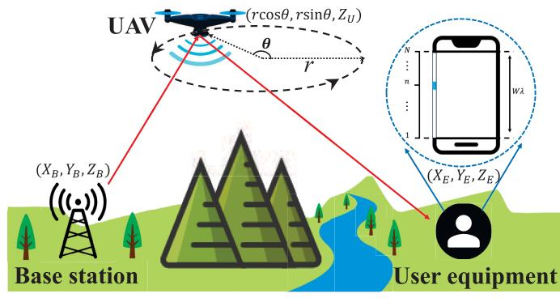  
Fig. 1. System model.

4) Through simulations, we validate our analytical framework and uncover several critical design insights for practical FAS-UAV deployment. Our results demonstrate the existence of an optimal, finite number of FAS ports that maximizes EE, which is a direct consequence of the trade-off between diminishing diversity returns and increasing operational overhead. We also reveal that the optimal UAV deployment strategy is fundamentally different in rural versus urban environments. Additionally, the optimal altitude in urban settings is governed by a non-trivial balance between path loss and blockage probability, in stark contrast to the monotonic behavior observed in rural scenarios. Ultimately, this comprehensive framework facilitates the design and deployment of ultra-reliable low-latency UAV communications, essential for mission-critical IoT applications and the realization of robust aerial edge networks.

The rest of this paper is organized as follows. Section II presents the system and channel models. Section III provides the detailed performance analysis. Section IV formulates and solves the EE maximization problem. In Section V, we present numerical results, and Section VI concludes the paper. The notations of this paper are summarized in Table I.

## II. THE FAS-UAV SYSTEM MODEL

We consider a three-node, UAV-aided downlink communication system, as illustrated in Fig. 1. The system comprises a BS which transmits data to a user equipment (UE) through a half-duplex, decode-and-forward (DF) UAV relay. Specifically, the transmission is divided into two time-orthogonal phases: in Phase I, the BS transmits to the UAV, whereas in Phase II, the UAV forwards the decoded message to the UE. A key feature of this architecture is the adoption of FAS at the UE to provide spatial diversity and enhance link reliability.1 To facilitate a comprehensive analysis, the subsequent sections present the detailed models for the wireless channels, signal structure, and path loss characteristics pertinent to this architecture under both rural and urban deployment scenarios.

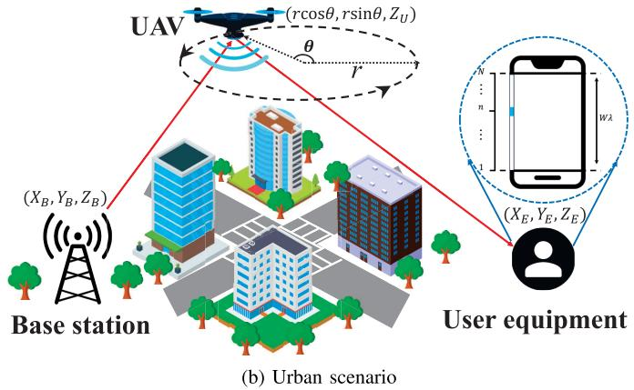

TABLE I  
SUMMARY OF NOTATIONS
<table><tr><td>Notation</td><td>Description</td></tr><tr><td> $x , \mathbf { x } , \mathbf { X }$ </td><td>Scalar, vector, and matrix, respectively</td></tr><tr><td> $\dot { \mathbb { C } } ^ { M \times N }$ </td><td>Space of  $M \times N$  complex-valued matrices</td></tr><tr><td>rank(X)</td><td>Rank of matrix X</td></tr><tr><td> $\underset { - } { \mathrm { d i a g } } ( x _ { 1 } , \dots , x _ { N } )$   $J _ { 0 } ( \cdot )$ </td><td>A diagonal matrix with elements  $x _ { 1 } , \ldots , x _ { N }$  Bessel function of the first kind and zeroth order</td></tr><tr><td> $\mathcal { C N } ( \mu , \sigma ^ { 2 } )$ </td><td>Circularly symmetric complex Gaussian distribu-</td></tr><tr><td> $\mathbb { E } [ \cdot ]$ </td><td>tion</td></tr><tr><td> $\Gamma \dot { ( \cdot ) }$ </td><td>Expectation operator Gamma function</td></tr><tr><td> $\gamma ( s , z )$ </td><td>Lower incomplete gamma function</td></tr><tr><td></td><td></td></tr><tr><td> $\stackrel { \cdot } { Q ( \cdot ) } , \stackrel { \cdot } { Q } ^ { - 1 } ( \cdot )$ </td><td>Gaussian Q-function and its inverse</td></tr></table>

## A. Channel Model

We assume the N ports of FAS are uniformly distributed over a linear aperture of length $W \lambda , ^ { 2 }$ inducing spatial correlation across the small-scale fading channels. We characterize this correlation using the Hermitian Toeplitz matrix J, whose elements are given by the Jakes’ model, $J _ { m , n } = J _ { 0 } ( 2 \pi W ( m - n ) / ( N - 1 ) )$ [36]. The eigendecomposition of the correlation matrix is denoted by $\mathbf { J } = \mathbf { U } \pmb { \Lambda } \mathbf { U } ^ { H }$ where U is a unitary matrix and $\textbf { \em { \Lambda } } = \ \mathrm { d i a g } ( \lambda _ { 1 } , . . . , \lambda _ { N } )$ contains the eigenvalues in non-increasing order. This ordering is adopted for notational convenience to ensure that the first $N _ { \mathrm { e f f } }$ eigenvalues represent the significant diversity components of the spatially correlated channel. This allows the correlated channel vector $\mathbf { h } = [ h _ { 1 } , . . . , h _ { N } ] ^ { T }$ to be represented as

$$
\mathbf { h } = \mathbf { U } \mathbf { A } ^ { 1 / 2 } \mathbf { g } ,\tag{1}
$$

1Although this work focuses on UE-side FAS, integration of FAS at the BS presents another promising dimension. Equipping both ends with FAS (referred to as MIMO-FAS or fluid MIMO) could significantly expand the spatial degrees of freedom, enabling interference cancellation and higher data rate performance. This is particularly relevant for the first-hop (BS-to-UAV) link, which currently acts as the system’s performance bottleneck.

2The results in this paper can be extended to multidimensional FAS structures, while a linear structure is adopted here for simplicity.

in which $\mathbf { g } = [ \mathit { g } _ { 1 } , . . . , \mathit { g } _ { N } ] ^ { T }$ is a vector of independent and identically distributed (i.i.d.) baseband components. To capture a wide range of fading conditions, we adopt the Nakagami-m distribution, where the power of each component, $| g _ { n } | ^ { 2 }$ , follows a Gamma distribution with severity parameter m .

Crucially, as a linear combination of Nakagami-m variates, the physical channel $h _ { n }$ at each port is not Nakagami-m distributed, and its statistics is mathematically intractable. $\mathbf { A }$ direct analysis of the true selected channel gain, max $\{ | h _ { n } | ^ { 2 } \}$ , is therefore infeasible. To circumvent this, we adopt a widely used and effective approach based on the channel’s underlying independent diversity branches [39]. This method provides a tractable yet insightful framework that captures the essence of the diversity offered by the FAS. The number of effective diversity branches is given by the rank of the correlation matrix, $N _ { \mathrm { { e f f } } } \ \triangleq \ \operatorname { r a n k } ( \mathbf { J } )$ . Accordingly, the analytical model for the selected channel power gain is defined as [39], [41]

$$
| h _ { \mathrm { F A S } } | ^ { 2 } \triangleq \operatorname* { m a x } \{ \lambda _ { 1 } | g _ { 1 } | ^ { 2 } , . . . , \lambda _ { N _ { \mathrm { e f f } } } | g _ { N _ { \mathrm { e f f } } } | ^ { 2 } \} .\tag{2}
$$

## B. Relaying Protocol and Signal Model

The communication protocol follows a two-phase DF relaying scheme. The received baseband signals at the UAV and UE are, respectively, expressed as

$$
y _ { 1 } = \sqrt { P _ { 1 } \beta _ { 1 } } g x _ { t } + n _ { 1 } ,\tag{3}
$$

$$
y _ { 2 } = \sqrt { P _ { 2 } \beta _ { 2 } } h _ { \mathrm { F A S } } x _ { t } + n _ { 2 } ,\tag{4}
$$

where $g$ is the first-hop channel coefficient, with its power $| g | ^ { 2 }$ following a Gamma distribution with parameter $m _ { 1 }$ . The term $h _ { \mathrm { F A S } }$ is the effective second-hop channel coefficient, whose power gain is given by the model in (2). Other parameters include the transmit powers $P _ { 1 } , P _ { 2 } ;$ large-scale path loss coefficients $\beta _ { 1 } , \beta _ { 2 } ;$ transmit signal xt; and additive white Gaussian noise (AWGN) terms $n _ { 1 } , n _ { 2 } \sim \mathcal { C N } ( 0 , \sigma ^ { 2 } )$

## C. Path Loss and Large-Scale Fading

We consider a three-dimensional (3)-D) Cartesian coordinate system where the UAV flies on a circular trajectory of radius r at altitude $Z _ { \mathrm { U } }$ , while the BS and UE are at fixed locations. The slant ranges for the BS-UAV and UAV-UE links, $d _ { 1 } ( \theta )$ and $d _ { 2 } ( \theta )$ , are, respectively, given by

$$
\begin{array} { r } { \{ d _ { 1 } ( \theta ) = \sqrt { ( r \cos \theta - X _ { \mathrm { B } } ) ^ { 2 } + ( r \sin \theta - Y _ { \mathrm { B } } ) ^ { 2 } + ( Z _ { \mathrm { U } } - Z _ { \mathrm { B } } ) ^ { 2 } } , } \\ { d _ { 2 } ( \theta ) = \sqrt { ( r \cos \theta - X _ { \mathrm { E } } ) ^ { 2 } + ( r \sin \theta - Y _ { \mathrm { E } } ) ^ { 2 } + ( Z _ { \mathrm { U } } - Z _ { \mathrm { E } } ) ^ { 2 } } . } \end{array}\tag{5}
$$

1) Rural Scenario: The rural environment, see Fig. 1(a), is characterized by predominantly LoS links, for which the freespace path loss model applies. The path loss in dB is given by $L _ { i } ^ { \mathrm { F } \bar { \mathrm { S } } } = 2 0 \log _ { 1 0 } ( 4 \pi f _ { c } \bar { d _ { i } } ( \theta ) / c ) , i \bar { \in } \{ 1 , 2 \}$ , where $f _ { c }$ is the carrier frequency and c is the speed of light. Accordingly, the large-scale fading coefficient is $\beta _ { i } ^ { \mathrm { R S } } = \bar { ( } c / 4 \pi f _ { c } d _ { i } ( \theta ) ) ^ { 2 }$ . This path loss determines the average SNRs for the two hops as

$$
\bar { \gamma } _ { 1 } ^ { \mathrm { R S } } ( \theta ) = \frac { P _ { 1 } \beta _ { 1 } ^ { \mathrm { R S } } ( \theta ) } { \sigma ^ { 2 } } ,\tag{6}
$$

$$
\bar { \gamma } _ { 2 } ^ { \mathrm { R S } } ( \theta ) = \frac { P _ { 2 } \beta _ { 2 } ^ { \mathrm { R S } } ( \theta ) \sum _ { n = 1 } ^ { N _ { \mathrm { e f f } } } \lambda _ { n } } { { \sigma ^ { 2 } } } ,\tag{7}
$$

where the normalization factor $\sum _ { n = 1 } ^ { N _ { \mathrm { e f f } } } \lambda _ { n }$ $\begin{array} { r } { \mathbb { E } \left\lceil \sum _ { n = 1 } ^ { N _ { \mathrm { e f f } } } \lambda _ { n } | g _ { n } | ^ { 2 } \right\rceil } \end{array}$ is the total average power gain across all decorrelated diversity branches. This term serves as an analytical convenience and provides an upper bound on the true average selected channel gain, $\mathbb { E } [ \operatorname* { m a x } _ { n } \{ \lambda _ { n } | g _ { n } | ^ { 2 } \} ]$ The instantaneous SNR for each hop is then obtained by incorporating the small-scale fading as

$$
\gamma _ { 1 } ^ { \mathrm { R S } } = \bar { \gamma } _ { 1 } ^ { \mathrm { R S } } ( \theta ) | g | ^ { 2 } ,\tag{8}
$$

$$
\gamma _ { 2 } ^ { \mathrm { R S } } ( \theta ) = \overline { { \gamma } } _ { 2 } ^ { \mathrm { R S } } ( \theta ) \frac { | h _ { \mathrm { F A S } } | ^ { 2 } } { \sum _ { n = 1 } ^ { N _ { \mathrm { e f f } } } \lambda _ { n } } .\tag{9}
$$

2) Urban Scenario: In contrast to the rural setting, the urban scenario depicted in Fig. 1(b) incorporates a probabilistic mixture of LoS and NLoS conditions. The path loss model is augmented with an excess loss term $\eta ^ { k }$ for each link type $k \in \{ \mathrm { L o S } , \mathrm { N L o S } \}$ , such that $L _ { i } ^ { k } = 2 0 \log _ { 1 0 } ( 4 \pi f _ { c } d _ { i } ( \theta ) / c ) +$ $\eta _ { i } ^ { k }$ . Consequently, the large-scale fading coefficient is $\beta _ { i } ^ { k } = $ $( \dot { c } / 4 \pi f _ { c } d _ { i } ( \theta ) ) ^ { 2 } 1 0 ^ { - \eta _ { i } ^ { k } / 1 0 }$ . For a given hop type k, the average SNRs are defined as

$$
\bar { \gamma } _ { 1 } ^ { k } ( \theta ) = \frac { P _ { 1 } \beta _ { 1 } ^ { k } ( \theta ) } { \sigma ^ { 2 } } ,\tag{10}
$$

$$
\bar { \gamma } _ { 2 } ^ { k } ( \theta ) = \frac { P _ { 2 } \beta _ { 2 } ^ { k } ( \theta ) \sum _ { n = 1 } ^ { N _ { \mathrm { e f f } } } \lambda _ { n } } { { \sigma ^ { 2 } } } .\tag{11}
$$

The corresponding instantaneous SNRs are given by

$$
\gamma _ { 1 } ^ { k } = \bar { \gamma } _ { 1 } ^ { k } ( \theta ) | g ^ { k } | ^ { 2 } ,\tag{12}
$$

$$
\gamma _ { 2 } ^ { k } ( \theta ) = \overline { { { \gamma } } } _ { 2 } ^ { k } ( \theta ) \frac { | h _ { \mathrm { F A S } } ^ { k } | ^ { 2 } } { \sum _ { n = 1 } ^ { N _ { \mathrm { e f f } } } \lambda _ { n } } .\tag{13}
$$

The probability of an LoS condition for hop i is modeled as a function of the elevation angle $\phi _ { i } ( \theta )$ as [73]

$$
P _ { i } ^ { \mathrm { L o S } } ( \theta ) = \frac { 1 } { 1 + a \exp { ( - b [ \phi _ { i } ( \theta ) - a ] ) } } ,\tag{14}
$$

with $P _ { i } ^ { \mathrm { N L o S } } ( \theta ) = 1 - P _ { i } ^ { \mathrm { L o S } } ( \theta )$ . The elevation angle in degrees, $\phi _ { i } ( \theta )$ , is given by $\begin{array} { r } { \phi _ { 1 } ( \theta ) = \frac { 1 8 0 } { \pi } } \end{array}$ arcsin $( ( Z _ { \mathrm { U } } - Z _ { \mathrm { B } } ) / d _ { 1 } ( \theta ) )$ and $\begin{array} { l } { \phi _ { 2 } ( \theta ) ~ = ~ \frac { 1 8 0 } { \pi } } \end{array}$ arcsin $( ( Z _ { \mathrm { U } } - \mathrm { \hat { Z } _ { E } } ) / d _ { 2 } ( \theta ) )$ . For a dense urban environment, empirically, we have $a = 1 2 . 0 8$ and $b = 0 . 1 1$

## III. PERFORMANCE ANALYSIS

For a given finite blocklength and a fixed target error probability of the system, the coding rate $R ( L , \epsilon )$ of a finite blocklength packet is approximated as [8]

$$
R ( L , \epsilon ) = \frac { B } { L } = C ( \gamma ) - \sqrt { \frac { Z ( \gamma ) } { L } } Q ^ { - 1 } ( \epsilon ) + O \left( \frac { \log _ { 2 } L } { L } \right) ,\tag{15}
$$

where B is the packet size in terms of the number of transmission bits, L is the blocklength, $C ( \gamma ) = \log _ { 2 } ( 1 + \gamma )$ is the Shannon capacity, $\begin{array} { r } { Z ( \gamma ) = \left( 1 - \frac { 1 } { ( 1 + \gamma ) ^ { 2 } } \right) ( \log _ { 2 } e ) ^ { 2 } } \end{array}$ , measured in squared information units per channel usage, refers to the channel dispersion that represents the variation of stochastic channel compared with a deterministic channel for the same capacity,  is the expected error probability, $Q ^ { - 1 } ( \cdot )$ is the inverse Gaussian Q-function $\begin{array} { r } { Q ( x ) { \stackrel { . } { = } } \frac { 1 } { \sqrt { 2 \pi } } \int _ { x } ^ { \infty } \mathrm { e x p } ( - t ^ { 2 } / 2 ) d t } \end{array}$ and the term $\begin{array} { r } { O \left( \frac { \log _ { 2 } L } { L } \right) } \end{array}$ represents a remainder of order $\frac { \log _ { 2 } L } { L }$ which becomes negligible for $L \ge 1 0 0$

For tractability, the Nakagami-m parameters $m _ { 1 } , \ m _ { 2 }$ , and $m _ { 2 } ^ { k }$ are assumed to be positive integers; otherwise, the expressions can be retained in terms of incomplete gamma functions.

## A. Rural Scenario

According to (15), the instantaneous BLER in the i-th phase is formally expressed as

$$
\epsilon _ { i } ^ { \mathrm { R S } } \approx Q \left( \frac { C ( \gamma _ { i } ^ { \mathrm { R S } } ) - R } { \sqrt { Z ( \gamma _ { i } ^ { \mathrm { R S } } ) / L } } \right) .\tag{16}
$$

In this manner, the average BLER for the given θ can be calculated as

$$
\bar { \epsilon } _ { i } ^ { \mathrm { R S } } \approx \int _ { 0 } ^ { \infty } Q \left( \frac { C ( x ) - R } { \sqrt { Z ( x ) / L } } \right) f _ { \gamma _ { i } ^ { \mathrm { R S } } } ( x ) d x ,\tag{17}
$$

where $f _ { \gamma _ { \ i } ^ { \mathrm { R S } } } ( x )$ denotes the probability density function (PDF) of $\gamma _ { i } ^ { \mathrm { R S } }$ . However, a direct evaluation of the integral in (17) is analytically intractable due to the complex form of the Q-function in the integrand. To render this integral tractable, we employ an accurate piecewise linear approximation for the Q-function within a defined SNR range $[ \rho _ { L } , \rho _ { H } ] , ^ { 3 }$ given by [16]

$$
\begin{array} { l l } { { Q \left( \frac { C ( \gamma _ { i } ^ { \mathrm { R S } } ) - R } { \sqrt { Z ( \gamma _ { i } ^ { \mathrm { R S } } ) / L } } \right) } } \\ { { } } \\ { { = \left\{ \begin{array} { l l } { { 1 , } } & { { \gamma _ { i } ^ { \mathrm { R S } } \leq \rho _ { L } , } } \\ { { \frac { 1 } { 2 } - \chi ( \gamma _ { i } ^ { \mathrm { R S } } - \tau ) , } } & { { \rho _ { L } < \gamma _ { i } ^ { \mathrm { R S } } < \rho _ { H } , } } \\ { { 0 , } } & { { \gamma _ { i } ^ { \mathrm { R S } } \geq \rho _ { H } , } } \end{array} \right. } } \end{array}\tag{18}
$$

where $\chi = 1 / \sqrt { 2 \pi ( 2 ^ { R } - 1 ) / L } , \tau = 2 ^ { R } - 1 , \rho _ { L } = \tau - 1 / ( 2 \chi )$ and $\rho _ { H } = \tau + 1 / ( 2 \chi )$ . Thus, the average BLER becomes

$$
\bar { \epsilon } _ { i } ^ { \mathrm { R S } } \approx \chi \int _ { \rho _ { L } } ^ { \rho _ { H } } F _ { \gamma _ { i } ^ { \mathrm { R S } } } ( x ) d x ,\tag{19}
$$

in which $F _ { \mathrm { \gamma ^ { R S } } } ( x )$ denotes the cumulative distribution function (CDF) of $\gamma _ { i } ^ { \mathrm { R S } }$ . Afterwards, the average BLER for each hop is derived separately. We begin with the first hop.

1) First-Hop Average BLER: The average BLER for the first hop, $\overline { { \epsilon } } _ { 1 } ^ { \mathrm { R S } }$ , is determined by the statistics of $\gamma _ { 1 } ^ { \mathrm { R S } }$ . Its CDF is provided in the following lemma.

Lemma 1: The expression for $\mathrm { F } _ { \gamma _ { 1 } ^ { \mathrm { R S } } } ( x )$ can be given by

$$
\mathrm { F } _ { \gamma _ { 1 } ^ { \mathrm { R S } } } ( x ) = 1 - e ^ { - x \vartheta _ { 1 } } \sum _ { k = 0 } ^ { m _ { 1 } - 1 } \frac { ( x \vartheta _ { 1 } ) ^ { k } } { k ! } ,\tag{20}
$$

where $\vartheta _ { 1 } ( \theta ) = m _ { 1 } / \bar { \gamma } _ { 1 } ^ { \mathrm { R S } } ( \theta )$

Proof: See Appendix A.

By substituting the CDF from (20) into (19), $\overline { { \epsilon } } _ { 1 } ^ { \mathrm { R S } }$ can be obtained as

$$
\begin{array} { l } { \displaystyle \bar { \epsilon } _ { 1 } ^ { \mathrm { R S } } \approx \chi \int _ { \rho _ { L } } ^ { \rho _ { H } } \left( 1 - e ^ { - x \vartheta _ { 1 } } \sum _ { k = 0 } ^ { m _ { 1 } - 1 } \frac { ( x \vartheta _ { 1 } ) ^ { k } } { k ! } \right) d x } \\ { \displaystyle = \chi \left( \int _ { \rho _ { L } } ^ { \rho _ { H } } d x - \sum _ { k = 0 } ^ { m _ { 1 } - 1 } \frac { \vartheta _ { 1 } ^ { k } } { k ! } \int _ { \rho _ { L } } ^ { \rho _ { H } } x ^ { k } e ^ { - x \vartheta _ { 1 } } d x \right) . } \end{array}\tag{21}
$$

The integral term in (21) is evaluated using the definition of the lower incomplete gamma function, $\begin{array} { r } { \gamma ( s , z ) = \int _ { 0 } ^ { z } t ^ { s - 1 } e ^ { - t } d t . } \end{array}$ which gives

$$
\int _ { \rho _ { L } } ^ { \rho _ { H } } { x ^ { k } e ^ { - x \vartheta _ { 1 } } } d x = \frac { \gamma ( k + 1 , \rho _ { H } \vartheta _ { 1 } ) - \gamma ( k + 1 , \rho _ { L } \vartheta _ { 1 } ) } { \vartheta _ { 1 } ^ { k + 1 } } .
$$

Substituting (22) into (21), we obtain

(22)

$$
\begin{array} { l } { \displaystyle \overline { { \epsilon } } _ { 1 } ^ { \mathrm { R S } } } \\ { \displaystyle \approx \chi \left( ( \rho _ { H } - \rho _ { L } ) - \sum _ { k = 0 } ^ { m _ { 1 } - 1 } \frac { \gamma ( k + 1 , \rho _ { H } \vartheta _ { 1 } ) - \gamma ( k + 1 , \rho _ { L } \vartheta _ { 1 } ) } { k ! \vartheta _ { 1 } } \right) . } \end{array}\tag{23}
$$

Using the identity $\textstyle \gamma ( k + 1 , z ) = k ! \left( 1 - e ^ { - z } \sum _ { j = 0 } ^ { k } z ^ { j } / j ! \right)$ from [74], (23) can be obtained as (24), shown at the bottom of the next page.

In this way, we obtain the average BLER $\bar { \epsilon } _ { 1 } ^ { \mathrm { R S } }$ . For $\bar { \epsilon } _ { 2 } ^ { \mathrm { R S } }$ , we first obtain the CDF of $\gamma _ { 2 } ^ { R S }$ in Lemma 2.

2) Second-Hop Average BLER: For the FAS-enabled second hop, the average BLER is determined by the statistics of $| h _ { \mathrm { F A S } } | ^ { 2 }$ defined in (2). The CDF of the resulting instantaneous SNR is given in the following lemma.

Lemma 2: For $\operatorname { F } _ { \gamma _ { 2 } ^ { \mathrm { R S } } } ( x )$ , the CDF can be expressed as

$$
\mathrm { F } _ { \gamma _ { 2 } ^ { \mathrm { R S } } } \left( x \right) = \prod _ { n = 1 } ^ { N _ { \mathrm { e f f } } } \left( 1 - e ^ { - \frac { x \vartheta _ { 2 } } { \lambda _ { n } } } \sum _ { k = 0 } ^ { m _ { 2 } - 1 } \frac { 1 } { k ! } \left( \frac { x \vartheta _ { 2 } } { \lambda _ { n } } \right) ^ { k } \right) ,\tag{25}
$$

where $\begin{array} { r } { \vartheta _ { 2 } ( \theta ) = m _ { 2 } \sum _ { n = 1 } ^ { N _ { \mathrm { e f f } } } \lambda _ { n } / \bar { \gamma } _ { 2 } ^ { \mathrm { R S } } ( \theta ) , } \end{array}$

Proof: See Appendix B.

Substituting (25) into (19), $\bar { \epsilon } _ { 2 } ^ { \mathrm { R S } }$ can be evaluated as

$$
\bar { \epsilon } _ { 2 } ^ { \mathrm { R S } } \approx \chi \int _ { \rho _ { L } } ^ { \rho _ { H } } \prod _ { n = 1 } ^ { N _ { \mathrm { e f f } } } \left( 1 - e ^ { - \frac { x \vartheta _ { 2 } } { \lambda _ { n } } } \sum _ { k = 0 } ^ { m _ { 2 } - 1 } \frac { 1 } { k ! } \left( \frac { x \vartheta _ { 2 } } { \lambda _ { n } } \right) ^ { k } \right) d x .\tag{26}
$$

To obtain a closed-form solution to (26), we apply the exact derivation method. Specifically, for simplicity, we let

$$
A _ { n } ( x ) \triangleq e ^ { - \frac { x \vartheta _ { 2 } } { \lambda _ { n } } } \sum _ { k = 0 } ^ { m _ { 2 } - 1 } \frac { 1 } { k ! } \left( \frac { x \vartheta _ { 2 } } { \lambda _ { n } } \right) ^ { k } .\tag{27}
$$

By applying the principle of inclusion-exclusion, the product can be expanded into a sum of $2 ^ { N _ { \mathrm { e f f } } }$ terms, i.e.,

$$
\prod _ { n = 1 } ^ { N _ { \mathrm { e f f } } } ( 1 - A _ { n } ( x ) ) = \sum _ { S \subseteq \{ 1 , \ldots , N _ { \mathrm { e f f } } \} } ( - 1 ) ^ { | S | } \prod _ { j \in S } A _ { j } ( x ) ,\tag{28}
$$

where the sum is taken over all possible subsets $s$ of the index set $\{ 1 , . . . , N _ { \mathrm { e f f } } \}$ , and |S| denotes the cardinality of subset S. By convention, if $s = \emptyset$ , the product term is equal to 1.

Substituting (28) into (26), and interchanging the order of the finite summation and integration, we obtain

$$
\overline { { \epsilon } } _ { 2 } ^ { \mathrm { R S } } = \chi \sum _ { S \subseteq \{ 1 , \dots , N _ { \mathrm { e f f } } \} } ( - 1 ) ^ { | S | } \int _ { \rho _ { L } } ^ { \rho _ { H } } \prod _ { j \in S } A _ { j } ( x ) d x .\tag{29}
$$

The problem is now reduced to finding a closed-form solution for the integral corresponding to each subset S. For any nonempty subset S, the integrand has the structure

$$
\begin{array} { l } { \displaystyle \prod _ { j \in S } A _ { j } ( x ) = \prod _ { j \in S } e ^ { - \frac { x \vartheta _ { 2 } } { \lambda _ { j } } } \sum _ { k = 0 } ^ { m _ { 2 } - 1 } \frac { 1 } { k ! } \left( \frac { x \vartheta _ { 2 } } { \lambda _ { j } } \right) ^ { k } } \\ { = e ^ { - x } \frac { \sum _ { j \in S } \frac { \vartheta _ { 2 } } { \lambda _ { j } } } { j \in S } P _ { S } ( x ) , } \end{array}\tag{30}
$$

in which $\begin{array} { r } { P s ( x ) \triangleq \prod _ { j \in \cal S } \sum _ { k = 0 } ^ { m _ { 2 } - 1 } \frac { 1 } { k ! } \left( \frac { x \vartheta _ { 2 } } { \lambda _ { j } } \right) ^ { k } } \end{array}$ is a polynomial in x of degree $| S | ( m _ { 2 } - 1 )$ . To construct the final closed-form expression, we first evaluate the term for the empty set ${ \mathcal { S } } = \emptyset$ in (29), which contributes

$$
\chi \int _ { \rho _ { L } } ^ { \rho _ { H } } 1 \ d x = \chi ( \rho _ { H } - \rho _ { L } ) .\tag{31}
$$

For any non-empty subset S, we define the coefficient

$$
b _ { S } \triangleq \sum _ { j \in S } \frac { \vartheta _ { 2 } } { \lambda _ { j } } ,\tag{32}
$$

As a result, we expand the polynomial $P _ { S } ( x )$ in its canonical monomial basis as

$$
P s ( x ) = \sum _ { a = 0 } ^ { | S | ( m _ { 2 } - 1 ) } c _ { a } ( S ) x ^ { a } ,\tag{33}
$$

where $c _ { a } ( \cal S )$ are found by expanding the product definition of $P _ { S } ( x )$ . The integral for each subset S thus becomes a linear combination of elementary integrals. A standard result from integral calculus states that for a non-negative integer a,

$$
\int x ^ { a } e ^ { - b x } d x = - { \frac { a ! } { b ^ { a + 1 } } } e ^ { - b x } \sum _ { i = 0 } ^ { a } { \frac { ( b x ) ^ { i } } { i ! } } .\tag{34}
$$

To simplify the final expression, we define a helper function $\mathcal { G } ( y ; a , b )$ for the evaluation of the definite integral

$$
\mathcal { G } ( y ; a , b ) \triangleq - \frac { a ! } { b ^ { a + 1 } } e ^ { - b y } \sum _ { i = 0 } ^ { a } \frac { ( b y ) ^ { i } } { i ! } .\tag{35}
$$

Combining these results, the exact closed-form expression for the BLER is meticulously constructed as

$$
\begin{array} { l } { \overline { { \epsilon } } _ { 2 } ^ { \mathrm { R S } } = \chi ( \rho _ { H } - \rho _ { L } ) } \\ { \quad \ + \chi \displaystyle \sum _ { \substack { S \subseteq \{ 1 , \dots , N _ { \mathrm { e f f } } \} } } ( - 1 ) ^ { | S | } \displaystyle \sum _ { a = 0 } ^ { | S | ( m _ { 2 } - 1 ) } c _ { a } ( S ) } \\ { \quad \qquad \quad \times | \mathcal { G } ( \rho _ { H } ; a , b _ { S } ) - \mathcal { G } ( \rho _ { L } ; a , b _ { S } ) | . } \end{array}\tag{36}
$$

In this way, we obtain the average BLER $\overline { { \epsilon } } _ { 2 } ^ { \mathrm { R S } }$

To obtain more useful insights, we consider an approximation that is highly accurate in the high SNR regime.

Theorem 1: In high SNR regime, $\bar { \epsilon } _ { 2 } ^ { \mathrm { R S } }$ can be written as

$$
\begin{array} { c } { { \bar { \epsilon } _ { 2 } ^ { \mathrm { R S } } \approx \frac { \displaystyle \chi \left( \rho _ { H } ^ { m _ { 2 } N _ { \mathrm { e f f } } + 1 } - \rho _ { L } ^ { m _ { 2 } N _ { \mathrm { e f f } } + 1 } \right) } { \displaystyle m _ { 2 } N _ { \mathrm { e f f } } + 1 } } } \\ { { \displaystyle \qquad \times \left( \frac { \vartheta _ { 2 } ^ { m _ { 2 } } } { \Gamma ( m _ { 2 } + 1 ) } \right) ^ { N _ { \mathrm { e f f } } } \prod _ { n = 1 } ^ { N _ { \mathrm { e f f } } } \lambda _ { n } ^ { - m _ { 2 } } . } } \end{array}\tag{37}
$$

Proof: See Appendix C.

Remark 1: Theorem 1 provides a crucial insight into the system’s high-SNR behavior, revealing that the diversity order of the FAS-enabled link is precisely $m _ { 2 } N _ { \mathrm { e f f } }$ . This result quantitatively demonstrates that the performance is jointly determined by the small-scale fading severity $m _ { 2 }$ and the spatial degrees of freedom harvested by the FAS $N _ { \mathrm { e f f } }$

Fixing the UAV position, the average BLER via (24) and (36) can be given by

$$
\begin{array} { r } { \overline { { \epsilon } } _ { T } ^ { \mathrm { R S } } ( \theta ) = 1 - ( 1 - \overline { { \epsilon } } _ { 1 } ^ { \mathrm { R S } } ( \theta ) ) ( 1 - \overline { { \epsilon } } _ { 2 } ^ { \mathrm { R S } } ( \theta ) ) . } \end{array}\tag{38}
$$

Under our model, as the UAV traverses a circular trajectory of radius r at altitude $Z _ { U }$ , the quantity $\bar { \epsilon } _ { T } ^ { \mathrm { R S } }$ depends on the angular parameter θ. Averaging with respect to the heading angle with uniform distribution yields

$$
\bar { \epsilon } _ { O } ^ { \mathrm { R S } } = \int _ { 0 } ^ { 2 \pi } \bar { \epsilon } _ { T } ^ { \mathrm { R S } } ( \theta ) f _ { \theta } ( \theta ) \mathrm { d } \theta = \frac { 1 } { 2 \pi } \int _ { 0 } ^ { 2 \pi } \bar { \epsilon } _ { T } ^ { \mathrm { R S } } ( \theta ) \mathrm { d } \theta ,\tag{39}
$$

where $\begin{array} { r } { f _ { \theta } ( \theta ) = \frac { 1 } { 2 \pi } } \end{array}$ is the density of θ on [0, 2π). Since $\bar { \epsilon } _ { T } ^ { \mathrm { R S } } ( \theta )$ does not admit a closed-form integration, we approximate it by M-point Gauss-Chebyshev quadrature (GCQ) as

$$
\bar { \epsilon } _ { O } ^ { R S } \approx \sum _ { m = 1 } ^ { M } w _ { m } \left[ \bar { \epsilon } _ { 1 } ^ { R S } ( \theta _ { m } ) + ( 1 - \bar { \epsilon } _ { 1 } ^ { R S } ( \theta _ { m } ) ) \bar { \epsilon } _ { 2 } ^ { R S } ( \theta _ { m } ) \right]\tag{40}
$$

where the nodes and weights for Chebyshev quadrature on the interval [−1, 1] are given by

$$
\theta _ { m } = \pi x _ { m } + \pi , \quad w _ { m } = \frac { \pi } { 2 M } \sqrt { 1 - x _ { m } ^ { 2 } } ,\tag{41}
$$

with the nodes $x _ { m }$ as the Chebyshev roots on [−1, 1].

## B. Urban Scenario

Under the urban scenario, the instantaneous BLER $\bar { \epsilon } _ { i } ^ { k }$ can be given by

$$
\epsilon _ { i } ^ { k } \approx Q \left( \frac { C ( \gamma _ { i } ^ { k } ) - R } { \sqrt { Z ( \gamma _ { i } ^ { k } ) / L } } \right) .\tag{42}
$$

Considering a certain UAV location, the average BLER for the k-link in phase i can be written as

$$
\bar { \epsilon } _ { i } ^ { k } \approx \int _ { 0 } ^ { \infty } Q \left( \frac { C ( x ) - R } { \sqrt { Z ( x ) / L } } \right) f _ { \gamma _ { i } ^ { k } } ( x ) d x ,\tag{43}
$$

where $f _ { \gamma _ { i } ^ { k } } ( x )$ is the PDF of $\gamma _ { i } ^ { k }$

$$
\bar { \epsilon } _ { 1 } ^ { \mathrm { R S } } \approx \chi \left[ ( \rho _ { H } - \rho _ { L } ) - \frac { 1 } { \vartheta _ { 1 } } \sum _ { k = 0 } ^ { m _ { 1 } - 1 } \left( e ^ { - \rho _ { L } \vartheta _ { 1 } } \sum _ { j = 0 } ^ { k } \frac { ( \rho _ { L } \vartheta _ { 1 } ) ^ { j } } { j ! } - e ^ { - \rho _ { H } \vartheta _ { 1 } } \sum _ { j = 0 } ^ { k } \frac { ( \rho _ { H } \vartheta _ { 1 } ) ^ { j } } { j ! } \right) \right]\tag{24}
$$

To address this problem, we follow the approach outlined in (19) in the rural scenario. Next, we use Lemmas 3 and 4 to find the CDFs of the first and second phases.

Lemma 3: For the first hop, the CDF of the instantaneous SNR $\gamma _ { 1 } ^ { k }$ for a link type $k \in \{ \mathrm { L o S } , \mathrm { N L o S } \}$ is given by

$$
F _ { \gamma _ { 1 } ^ { k } } ( x ) = 1 - e ^ { - x \vartheta _ { 1 } ^ { k } } \sum _ { j = 0 } ^ { m _ { 1 } - 1 } \frac { ( x \vartheta _ { 1 } ^ { k } ) ^ { j } } { j ! } ,\tag{44}
$$

where we have the parameter $\vartheta _ { 1 } ^ { k } ( \theta ) \triangleq m _ { 1 } / \bar { \gamma } _ { 1 } ^ { k } ( \theta )$

Proof: The proof follows the same steps as in Appendix $\mathbf { A } ,$ with the rural path loss $\beta _ { 1 }$ replaced by $\beta _ { 1 } ^ { k } ( \theta )$ 

Lemma 4: For the FAS-enabled second hop, the CDF of the instantaneous SNR $\gamma _ { 2 } ^ { k }$ for a link type $k \in \{ \mathrm { L o S } , \mathrm { N L o S } \}$ is

$$
F _ { \gamma _ { 2 } ^ { k } } ( x ) = \prod _ { n = 1 } ^ { N _ { \mathrm { e f f } } } \left( 1 - e ^ { - \frac { x \vartheta _ { 2 } ^ { k } } { \lambda _ { n } } } \sum _ { j = 0 } ^ { m _ { 2 } ^ { k } - 1 } \frac { 1 } { j ! } \left( \frac { x \vartheta _ { 2 } ^ { k } } { \lambda _ { n } } \right) ^ { j } \right) ,\tag{45}
$$

where $m _ { 2 } ^ { k }$ is the Nakagami-m parameter for the corresponding link type and $\begin{array} { r } { \vartheta _ { 2 } ^ { k } ( \theta ) \stackrel { \Delta } { = } m _ { 2 } ^ { k } \sum _ { n = 1 } ^ { \hat { N } _ { \mathrm { e f f } } } \lambda _ { n } / \bar { \gamma } _ { 2 } ^ { k } ( \theta ) } \end{array}$ .

Proof: The proof follows the same steps as in Appendix B, using the appropriate Nakagami-m parameter $m _ { 2 } ^ { k }$ and urban path loss $\beta _ { 2 } ^ { k } ( \theta )$ for each case. 

By substituting the CDF from Lemma 3 into the integral form of the average BLER, we arrive at the closed-form expressions for the first and second hops as follows.

1) First-Hop Average BLER: For the first hop, the average BLER for a link type $k \in \{ \mathrm { L o S } , \mathrm { N L o S } \}$ , denoted $\bar { \epsilon } _ { 1 } ^ { k } ( \theta )$ , is found by solving the integral. Similar to (24), we have (46), shown at the bottom of the page, where the parameter $\vartheta _ { 1 } ^ { k } ( \theta )$ is defined in Lemma 3. The total average BLER for the first hop is then the expectation over the link probabilities

$$
\bar { \epsilon } _ { 1 } ^ { \mathrm { U S } } ( \theta ) = \bar { \epsilon } _ { 1 } ^ { \mathrm { L o S } } ( \theta ) P _ { 1 } ^ { \mathrm { L o S } } ( \theta ) + \bar { \epsilon } _ { 1 } ^ { \mathrm { N L o S } } ( \theta ) P _ { 1 } ^ { \mathrm { N L o S } } ( \theta ) .\tag{47}
$$

2) Second-Hop Average BLER: For the FAS-enabled second hop, the derivation for each link type follows the intricate process outlined for the rural case, which involves the principle of inclusion-exclusion. This results in

$$
\begin{array} { r l r } {  { \overline { { \epsilon } } _ { 2 } ^ { k } ( \theta ) \approx \chi ( \rho _ { H } - \rho _ { L } ) } } \\ & { } & { + \chi \sum _ { \substack { S \subseteq \{ 1 , \dots , N _ { \mathrm { e f f } } \} } } ( - 1 ) ^ { | S | } } \\ & { } & { \lesssim \chi \frac { 1 } { \epsilon } \epsilon \varnothing ^ { k } } \\ & { } & { \times \times \sum _ { a = 0 } ^ { | S | ( m _ { a } ^ { k } - 1 ) } c _ { a } ^ { k } ( S ) [ \mathcal { G } ( \rho _ { H } ; a , b _ { S } ^ { k } ) - \mathcal { G } ( \rho _ { L } ; a , b _ { S } ^ { k } ) ] , } \end{array}\tag{48}
$$

where $c _ { a } ^ { k } ( S )$ and $b _ { S } ^ { k }$ are calculated based on the link-specific parameter $\vartheta _ { 2 } ^ { k } ( \theta )$ and $m _ { 2 } ^ { k }$ as defined in Lemma 4.

In the high SNR regime, we can obtain a highly accurate approximation to yield more useful insights.

Theorem 2: In the high SNR regime, the average BLER of the second hop for a given link type $k \in \{ \mathrm { L o S } , \mathrm { N L o S } \}$ denoted $\overline { { \epsilon } } _ { 2 } ^ { k } .$ , can be approximated by

$$
\begin{array} { c } { { \displaystyle \bar { \epsilon } _ { 2 } ^ { k } \approx \frac { \chi ( \rho _ { H } ^ { m _ { 2 } ^ { k } N _ { \mathrm { e f f } } + 1 } - \rho _ { L } ^ { m _ { 2 } ^ { k } N _ { \mathrm { e f f } } + 1 } ) } { m _ { 2 } ^ { k } N _ { \mathrm { e f f } } + 1 } } } \\ { { \displaystyle \qquad \times \left( \frac { ( \vartheta _ { 2 } ^ { k } ) ^ { m _ { 2 } ^ { k } } } { \Gamma ( m _ { 2 } ^ { k } + 1 ) } \right) ^ { N _ { \mathrm { e f f } } } \prod _ { n = 1 } ^ { N _ { \mathrm { e f f } } } \lambda _ { n } ^ { - m _ { 2 } ^ { k } } . } } \end{array}\tag{49}
$$

Proof: The proof follows the same methodology as in Appendix C, by applying the high-SNR approximation to the CDF in Lemma 4 for a specific link type k. 

Remark 2: Theorem 2 reveals that when a specific link condition (LoS or NLoS) is maintained, the FAS link behaves as a power-limited system, where increasing transmit power continuously reduces the BLER at a rate determined by the diversity order $m _ { 2 } ^ { k } N _ { \mathrm { e f f } }$ . This highlights the intrinsic capability of FAS to combat fading under a fixed channel type.

Given the UAV heading angle, the BLER for the second hop is subsequently given by

$$
\bar { \epsilon } _ { 2 } ^ { \mathrm { U S } } ( \theta ) = \bar { \epsilon } _ { 2 } ^ { \mathrm { L o S } } ( \theta ) P _ { 2 } ^ { \mathrm { L o S } } ( \theta ) + \bar { \epsilon } _ { 2 } ^ { \mathrm { N L o S } } ( \theta ) P _ { 2 } ^ { \mathrm { N L o S } } ( \theta ) .\tag{50}
$$

3) End-to-End BLER and Asymptotic Analysis: The average BLER for each hop is now established for any given UAV location θ. We proceed to combine these results to determine the overall system performance. The end-to-end average BLER for the urban scenario, $\bar { \epsilon } _ { T } ^ { \mathrm { U S } } ( \theta )$ , is obtained by substituting the hop-level results from (47) and (50) into the standard DF BLER formula, yielding

$$
\begin{array} { r l } { \overline { { \epsilon } } _ { T } ^ { \mathrm { U S } } ( \theta ) = \overline { { \epsilon } } _ { 1 } ^ { \mathrm { L o S } } ( \theta ) P _ { 1 } ^ { \mathrm { L o S } } ( \theta ) + \overline { { \epsilon } } _ { 1 } ^ { \mathrm { N L o S } } ( \theta ) P _ { 1 } ^ { \mathrm { N L o S } } ( \theta ) ~ } & { } \\ { + \overline { { \epsilon } } _ { 2 } ^ { \mathrm { L o S } } ( \theta ) P _ { 2 } ^ { \mathrm { L o S } } ( \theta ) + \overline { { \epsilon } } _ { 2 } ^ { \mathrm { N L o S } } ( \theta ) P _ { 2 } ^ { \mathrm { N L o S } } ( \theta ) ~ } & { } \\ { - \left[ \overline { { \epsilon } } _ { 1 } ^ { \mathrm { L o S } } ( \theta ) P _ { 1 } ^ { \mathrm { L o S } } ( \theta ) + \overline { { \epsilon } } _ { 1 } ^ { \mathrm { N L o S } } ( \theta ) P _ { 1 } ^ { \mathrm { N L o S } } ( \theta ) \right] ~ } & { } \\ { \times \left[ \overline { { \epsilon } } _ { 2 } ^ { \mathrm { L o S } } ( \theta ) P _ { 2 } ^ { \mathrm { L o S } } ( \theta ) + \overline { { \epsilon } } _ { 2 } ^ { \mathrm { N L o S } } ( \theta ) P _ { 2 } ^ { \mathrm { N L o S } } ( \theta ) \right] . } \end{array}\tag{51}
$$

The overall average BLER, $\bar { \epsilon } _ { O } ^ { \mathrm { U S } }$ , is then found by averaging $\bar { \epsilon } _ { T } ^ { \mathrm { U S } } ( \theta )$ over the UAV’s circular trajectory with respect to the uniform distribution of θ as

$$
\begin{array} { c } { { \displaystyle \overline { { { \epsilon } } } _ { O } ^ { \mathrm { U S } } = \frac { 1 } { 2 \pi } \int _ { 0 } ^ { 2 \pi } \Big \{ \left[ \bar { \epsilon } _ { 1 } ^ { \mathrm { L o S } } ( \theta ) P _ { 1 } ^ { \mathrm { L o S } } ( \theta ) + \bar { \epsilon } _ { 1 } ^ { \mathrm { N L o S } } ( \theta ) P _ { 1 } ^ { \mathrm { N L o S } } ( \theta ) \right] } } \\ { { + \left[ \bar { \epsilon } _ { 2 } ^ { \mathrm { L o S } } ( \theta ) P _ { 2 } ^ { \mathrm { L o S } } ( \theta ) + \bar { \epsilon } _ { 2 } ^ { \mathrm { N L o S } } ( \theta ) P _ { 2 } ^ { \mathrm { N L o S } } ( \theta ) \right] } } \\ { { - \left[ \bar { \epsilon } _ { 1 } ^ { \mathrm { L o S } } ( \theta ) P _ { 1 } ^ { \mathrm { L o S } } ( \theta ) + \bar { \epsilon } _ { 1 } ^ { \mathrm { N L o S } } ( \theta ) P _ { 1 } ^ { \mathrm { N L o S } } ( \theta ) \right] } } \\ { { \times \left[ \bar { \epsilon } _ { 2 } ^ { \mathrm { L o S } } ( \theta ) P _ { 2 } ^ { \mathrm { L o S } } ( \theta ) + \bar { \epsilon } _ { 2 } ^ { \mathrm { N L o S } } ( \theta ) P _ { 2 } ^ { \mathrm { N L o S } } ( \theta ) \right] \Big \} d \theta . ~ \left( 5 \right) } } \end{array}\tag{2}
$$

As this integral does not admit a closed-form solution, again, we employ the M-point GCQ method for a precise numerical approximation as

$$
\bar { \epsilon } _ { O } ^ { U S } \approx \sum _ { m = 1 } ^ { M } w _ { m } \bar { \epsilon } _ { T } ^ { U S } ( \theta _ { m } )\tag{53}
$$

where the nodes $\theta _ { m }$ and weights $w _ { m }$ are defined in (41).

$$
\overline { { \epsilon } } _ { 1 } ^ { k } ( \theta ) \approx \chi \left[ ( \rho _ { H } - \rho _ { L } ) - \frac { 1 } { \vartheta _ { 1 } ^ { k } } \sum _ { j = 0 } ^ { m _ { 1 } - 1 } \left( e ^ { - \rho _ { L } \vartheta _ { 1 } ^ { k } } \sum _ { l = 0 } ^ { j } \frac { ( \rho _ { L } \vartheta _ { 1 } ^ { k } ) ^ { l } } { l ! } - e ^ { - \rho _ { H } \vartheta _ { 1 } ^ { k } } \sum _ { l = 0 } ^ { j } \frac { ( \rho _ { H } \vartheta _ { 1 } ^ { k } ) ^ { l } } { l ! } \right) \right]\tag{46}
$$

Theorem 3: The end-to-end performance in the urban scenario is fundamentally limited by an error floor when the UAV transmit power is sufficiently large. Let E [·] denote the expectation over the uniform distribution of the UAV’s heading angle $\theta \in [ 0 , 2 \pi )$ . For a fixed BS power $P _ { 1 }$ and $P _ { 2 } \to \infty$ , the overall average BLER converges to a floor determined solely by the performance of the first hop

$$
\begin{array} { r l r } & {  { \operatorname* { l i m } _ { P _ { 2 } \to \infty } } } \\ & { \bar { \epsilon } _ { O } ^ { \mathrm { U S } } = \frac { \int _ { 0 } ^ { 2 \pi } [ \bar { \epsilon } _ { 1 } ^ { \mathrm { L o S } } ( \theta ) P _ { 1 } ^ { \mathrm { L o S } } ( \theta ) + \bar { \epsilon } _ { 1 } ^ { \mathrm { N L o S } } ( \theta ) P _ { 1 } ^ { \mathrm { N L o S } } ( \theta ) ] d \theta } { 2 \pi } . } \end{array}\tag{54}
$$

Proof: The proof follows from the asymptotic behavior of the two-hop DF relaying system. For the first hop, with fixed power $P _ { 1 }$ , the average BLER $\overline { { \epsilon } } _ { 1 } ^ { \mathrm { U S } } ( \theta ; P _ { 1 } )$ remains constant regardless of $P _ { 2 }$ . For the second hop, as $P _ { 2 } \to \infty$ , the transmit power becomes sufficient to overcome the path loss of both LoS and NLoS links. Thus, the instantaneous SNR $\gamma _ { 2 } ^ { k }  \infty$ for any channel state $k \in \{ \mathrm { L o S } , \mathrm { N L o S } \}$ , which implies that the BLER of the second hop converges to zero, i.e., $\bar { \epsilon } _ { 2 } ^ { \mathrm { U S } } ( \theta ) \to 0 .$

The end-to-end BLER for a given θ is given by

$$
\begin{array} { r } { \overline { { \epsilon } } _ { T } ^ { \mathrm { U S } } ( \theta ) = 1 - ( 1 - \overline { { \epsilon } } _ { 1 } ^ { \mathrm { U S } } ( \theta ) ) ( 1 - \overline { { \epsilon } } _ { 2 } ^ { \mathrm { U S } } ( \theta ) ) . } \end{array}\tag{55}
$$

Taking the limit as $P _ { 2 }  \infty ,$ , we have

$$
\operatorname* { l i m } _ { P _ { 2 } \to \infty } \overline { { \epsilon } } _ { T } ^ { \mathrm { U S } } ( \theta ) = 1 - ( 1 - \overline { { \epsilon } } _ { 1 } ^ { \mathrm { U S } } ( \theta ) ) ( 1 - 0 ) = \overline { { \epsilon } } _ { 1 } ^ { \mathrm { U S } } ( \theta ) .\tag{56}
$$

Averaging over the distribution of θ completes the proof. 

Remark 3: Theorem 3 reveals a fundamental performance bottleneck in urban UAV relaying systems. The floor provides a crucial insight: for a system with a fixed backhaul (BS-to-UAV link), the overall performance is fundamentally limited by the reliability of that backhaul link. This implies that increasing the $\mathrm { U A V } \mathbf { \hat { s } }$ power $( P _ { 2 } )$ yields diminishing returns; once $P _ { 2 }$ is sufficiently high to make the second hop reliable, any further increase in power is completely ineffective at improving the end-to-end BLER. Therefore, to improve performance beyond this floor, system optimization must focus on enhancing the first hop, for instance by increasing $P _ { 1 }$ or improving the BS-to-UAV channel through trajectory planning.

## IV. EE MAXIMIZATION

In this section, we develop a framework to maximize the EE of the FAS-enabled UAV system under investigation. We formulate a realistic EE model that captures the fundamental trade-off between the diversity gain afforded by FAS and the operational cost incurred during port selection [24], [75]. While a larger number of ports N enhances diversity, it also introduces time and energy overheads for channel estimation and switching, suggesting that an optimal N exists.

## A. Problem Formulation

To capture this trade-off, we define the EE as the number of successfully delivered bits per unit energy (bits/Joule). Specifically, the total energy consumed by the UAV during one transmission block, $E _ { \mathrm { t o t a l } }$ , consists of four components:

transmit energy, static circuit energy, FAS switching energy, and propulsion energy.

The total block duration is denoted by $T _ { \mathrm { b l o c k } } = L / W _ { \mathrm { b a n d } } .$ where L is the blocklength and $W _ { \mathrm { b a n d } }$ is the system bandwidth. The processing time per port, $\tau _ { p } ,$ accounts for the time required by the RF chain to perform channel estimation and by the FAS to execute port switching. By adopting the linear model $T _ { \mathrm { s w } } ( N ) = N \tau _ { p } ,$ , we capture the sequential nature of port probing in practical hardware. This modeling is critical in the finite blocklength regime, as it reflects the inherent conflict between harvesting spatial diversity and maintaining a sufficient effective transmission interval. Thus, the effective data transmission time is given by $T _ { \mathrm { t x } } ( N ) = T _ { \mathrm { b l o c k } } - T _ { \mathrm { s w } } ( N )$

Let $P _ { 2 } , P _ { c } , P _ { \mathrm { s w } }$ , and $P _ { \mathrm { p r o p } }$ denote the UAV transmit power, static circuit power, FAS switching power, and propulsion power, respectively. The propulsion power $P _ { \mathrm { p r o p } }$ represents the mechanical power needed to sustain the UAV’s flight status against aerodynamic drag and gravity. For a UAV performing constant-velocity circular motion at a fixed altitude $Z _ { U } , P _ { \mathrm { p r o p } }$ is fundamentally determined by the platform’s aerodynamic characteristics and can be treated as a scenario-dependent constant during the transmission block. Thus, the total energy consumption is modeled as

$$
E _ { \mathrm { t o t a l } } = P _ { 2 } T _ { \mathrm { t x } } ( N ) + ( P _ { \mathrm { p r o p } } + P _ { c } ) T _ { \mathrm { b l o c k } } + P _ { \mathrm { s w } } T _ { \mathrm { s w } } ( N ) ,\tag{57}
$$

where the first term represents the UAV transmit energy during effective data transmission, the second term accounts for the propulsion and static circuit energy over the whole block duration, and the third term captures the FAS switching energy.

Additionally, the number of successfully delivered bits is $B _ { \mathrm { s u c c } } = B ( 1 - \bar { \epsilon } _ { O } )$ . Therefore, the EE is formulated as

$$
\mathrm { E E } = \frac { B ( 1 - \bar { \epsilon } _ { O } ) } { E _ { \mathrm { t o t a l } } } ,\tag{58}
$$

where $\bar { \epsilon } _ { O }$ applies to both rural and urban scenarios.

Our aim is to maximize the EE by jointly optimizing the blocklength L, UAV altitude $Z _ { \mathrm { U } }$ , transmit power $P _ { 2 } { \mathrm { . } }$ , and the number of FAS ports N. Hence, the problem is cast as4

$$
( \mathrm { P 1 } ) : \operatorname* { m a x } _ { L , Z _ { U } , P _ { 2 } , N } \quad \mathrm { E E } ( L , Z _ { U } , P _ { 2 } , N )\tag{59a}
$$

$$
\begin{array} { r l } { \mathrm { s . t . } } & { { } \hat { \epsilon } _ { O } ( L , Z _ { U } , P _ { 2 } , N ) \le \epsilon _ { \mathrm { t h } } , } \end{array}\tag{59b}
$$

$$
0 < P _ { 2 } \leq P _ { \mathrm { m a x } } ,
$$

$$
Z _ { \mathrm { m i n } } \le Z _ { U } \le Z _ { \mathrm { m a x } } ,\tag{59c}
$$

$$
L _ { \operatorname* { m i n } } \leq L \leq L _ { \operatorname* { m a x } } ,\tag{59d}
$$

$$
N _ { \mathrm { m i n } } \le N \le N _ { \mathrm { m a x } } ,\tag{59e}
$$

$$
N \tau _ { p } < L / W _ { \mathrm { b a n d } } ,\tag{59f}
$$

(59g)

where (59b) ensures communication reliability, while (59c)–(59f) define the operational ranges of the variables, and (59g) is a crucial causality constraint. While the objective function (59a) focuses on the $\mathrm { U A V } \mathbf { \hat { s } }$ energy consumption due to its stringent SWaP constraints, the impact of the BS is inherently captured. Specifically, the BS transmit power $P _ { 1 }$ and its corresponding channel conditions determine the first-hop reliability $\overline { { \epsilon } } _ { 1 }$ , which establishes the fundamental performance floor for the end-to-end communication. Thus, the BS signal parameters directly constrain the feasible optimization space of the UAV’s transmit power $P _ { 2 } { \mathrm { . } }$ , altitude $Z _ { U }$ , and FAS configuration N.

## B. Methodology

Unfortunately, Problem (P1) is a non-convex mixed-integer nonlinear program due to the integer variable N and the nonconvex objective function and constraints with respect to the joint variables. Such problems are NP-hard and cannot be solved directly for the global optimum. We therefore propose a hierarchical decomposition approach that breaks (P1) into a sequence of more manageable subproblems.

1) Transmit Power Minimization: For any fixed set of parameters $( \hat { L } , \hat { Z } _ { U } , \hat { N } )$ , the first subproblem is to find the minimum UAV transmit power $P _ { 2 } ^ { * }$ that satisfies the reliability constraint. This is formulated as

$$
( \operatorname { P 1 . 1 } ) : \operatorname* { m i n } _ { P _ { 2 } } \quad P _ { 2 }\tag{60a}
$$

$$
\mathrm { s . t . } \quad \bar { \epsilon } _ { O } ( P _ { 2 } ; \hat { L } , \hat { Z } _ { U } , \hat { N } ) \leq \epsilon _ { \mathrm { t h } } ,\tag{60b}
$$

$$
0 < P _ { 2 } \leq P _ { \mathrm { m a x } } .\tag{60c}
$$

Leveraging the monotonic relationship between $P _ { 2 }$ and the BLER, this subproblem can be efficiently solved via a bisection search, as detailed in Algorithm 1.

2) Optimal Port Number Determination: For a fixed blocklength Lˆ and altitude $\hat { Z } _ { U }$ , we find the optimal number of ports $N ^ { * }$ that maximizes EE by

$$
( \mathrm { P 1 . 2 } ) : \operatorname* { m a x } _ { N } \quad \mathrm { E E } ( N , P _ { 2 } ^ { * } ( N ) ; \hat { L } , \hat { Z } _ { U } )\tag{61a}
$$

$$
\mathrm { s . t . } N _ { \mathrm { m i n } } \le N \le N _ { \mathrm { m a x , } }\tag{61b}
$$

$$
N \tau _ { p } < \hat { L } / W _ { \mathrm { b a n d } } ,\tag{61c}
$$

where $P _ { 2 } ^ { * } ( N )$ is obtained from solving (P1.1). Since N is an integer, this is solved via an exhaustive search method.

3) Optimal Flying Height Determination: For a fixed blocklength Lˆ, the optimal altitude $Z _ { U } ^ { * }$ is found by

$$
( \mathrm { P 1 . 3 } ) : \operatorname* { m a x } _ { Z _ { U } } \quad \mathrm { E E ^ { * } } ( Z _ { U } ; \hat { L } )\tag{62a}
$$

$$
\mathrm { s . t . } \quad Z _ { \mathrm { m i n } } \leq Z _ { U } \leq Z _ { \mathrm { m a x , } }\tag{62b}
$$

where $\mathrm { E E } ^ { * } ( Z _ { U } ; \hat { L } )$ is the maximum EE from solving (P1.2) using a one-dimensional grid search method.5

4) Overall Solution: The final solution to (P1) is found by performing one-dimensional grid search over the blocklength L. For each candidate L, we solve (P1.3) to find the corresponding maximum EE. The overall optimal solution is the set of parameters that yields the highest EE across all considered blocklengths. This procedure is outlined in Algorithm 2.

Algorithm 1 Bisection Algorithm for Minimum Power   
1: Input: Fixed parameters $\hat { L } , \hat { Z } _ { U } , \hat { N } , { P } _ { \operatorname* { m a x } } ,$ target BLER   
$\epsilon _ { \mathrm { t h } } ,$ tolerance δ.   
2: Output: Minimum required power $P _ { 2 } ^ { * }$   
3: Initialize: $P _ { \mathrm { l o w } }  0 , P _ { \mathrm { h i g h } }  P _ { \mathrm { m a x } } .$   
4: i $\mathrm { ~ \bar { \epsilon } ~ } _ { O } ( P _ { \mathrm { m a x } } ; \hat { L } , \hat { Z } _ { U } , \hat { N } ) > \epsilon _ { \mathrm { t h } }$ then   
5: return Infeasible   
6: end if   
7: while $( P _ { \mathrm { h i g h } } - P _ { \mathrm { l o w } } ) > \delta$ do   
8: $P _ { \mathrm { m i d } }  ( P _ { \mathrm { l o w } } + P _ { \mathrm { h i g h } } ) / 2 .$   
9: if $\bar { \epsilon } _ { O } ( P _ { \mathrm { m i d } } ; \hat { L } , \hat { Z } _ { U } , \hat { N } ) > \epsilon _ { \mathrm { t h } }$ then   
10: $P _ { \mathrm { l o w } }  P _ { \mathrm { m i d } } .$   
11: else   
12: $P _ { \mathrm { h i g h } }  P _ { \mathrm { m i d } } .$   
13: end if   
14: end while   
15: return $P _ { \mathrm { h i g h } } .$

Algorithm 2 Joint Optimization for Maximum EE   
1: Input: Search ranges $[ L _ { \mathrm { m i n } } , L _ { \mathrm { m a x } } ] , \quad [ Z _ { \mathrm { m i n } } , Z _ { \mathrm { m a x } } ] ,$   
$[ N _ { \mathrm { m i n } } , N _ { \mathrm { m a x } } ] ; P _ { \mathrm { m a x } } , \epsilon _ { \mathrm { t h } } ; P _ { c } , P _ { s w } , \tau _ { p } , W _ { \mathrm { b a n d } } .$   
2: Output: Optimal parameters $( \bar { L } ^ { * } , Z _ { U } ^ { * } , N ^ { * } , P _ { 2 } ^ { * } )$ and   
$\mathrm { E E } _ { \mathrm { m a x } } .$   
3: Initialize: $\begin{array} { r } { \mathrm { E E } _ { \operatorname* { m a x } }  0 ; ( L ^ { * } , Z _ { U } ^ { * } , N ^ { * } , P _ { 2 } ^ { * } )  \mathrm { n u l l } . } \end{array}$   
4: for each $L \in [ L _ { \operatorname* { m i n } } , L _ { \operatorname* { m a x } } ]$ do   
5: for each $Z _ { U } \in [ Z _ { \operatorname* { m i n } } , Z _ { \operatorname* { m a x } } ]$ do   
6: $\mathrm { E E } _ { \mathrm { c a n d } }  0 ; N _ { \mathrm { c a n d } } $ null; $P _ { \mathrm { 2 , c a n d } }  \mathrm { n u l l } .$   
7: for each $N \in [ N _ { \operatorname* { m i n } } , N _ { \operatorname* { m a x } } ]$ do   
8: if $N \tau _ { p } \geq L / W _ { \mathrm { b a n d } }$ then continue;   
9: end if   
10: $p _ { \mathrm { c u r r } } \gets \mathrm { A l g o r i t h m ~ } 1 ( L , Z _ { U } , N , P _ { \operatorname* { m a x } } , \epsilon _ { \mathrm { t h } } ) .$   
11: $\mathbf { i f } \ p _ { \mathrm { c u r r } }$ is feasible then   
12: Calculate $\mathrm { E E _ { c u r r } }$ via (58) with $P _ { 2 }  p _ { \mathrm { c u r r } } .$   
13: if $\mathrm { E E } _ { \mathrm { c u r r } } > \mathrm { E E } _ { \mathrm { c a n d } }$ then   
14: $\mathrm { E E } _ { \mathrm { c a n d } }  \mathrm { E E } _ { \mathrm { c u r r } } .$   
15: $N _ { \mathrm { c a n d } }  N ; P _ { \mathrm { 2 , c a n d } }  p _ { \mathrm { c u r r } } .$   
16: end if   
17: end if   
18: end for   
19: if $\mathrm { E E } _ { \mathrm { c a n d } } > \mathrm { E E } _ { \mathrm { m a x } }$ then   
20: $\mathrm { E E } _ { \mathrm { m a x } }  \mathrm { E E } _ { \mathrm { c a n d } }$   
21: $( L ^ { * } , Z _ { U } ^ { * } , N ^ { * } , P _ { 2 } ^ { * } ) \gets ( L , Z _ { U } , N _ { \mathrm { c a n d } } , P _ { 2 , \mathrm { c a n d } } ) .$   
22: end if   
23: end for   
24: end for   
25: return $( L ^ { * } , Z _ { U } ^ { * } , N ^ { * } , P _ { 2 } ^ { * } ) , \mathrm { E E } _ { \mathrm { m a x } } .$

5) Complexity Analysis: Now, we analyze the complexity of Algorithm 2. Let $I _ { L } , I _ { Z } .$ , and $I _ { N }$ be the number of iterations for the search of $L , Z _ { U }$ , and N, respectively. For each set of these parameters, Algorithm 1 executes a bisection search with a complexity of $O ( \log _ { 2 } ( 1 / \delta ) )$ , where δ is the tolerance. Thus, the total complexity of the proposed hierarchical algorithm is $O ( I _ { L } I _ { Z } I _ { N } \log _ { 2 } ( 1 / \delta ) )$ . Compared to the NP-hard nature of the original problem, the proposed algorithm offers a tractable and efficient solution for practical implementation.

TABLE II  
UNIFIED SIMULATION PARAMETERS FOR RURAL AND URBAN SCENARIOS
<table><tr><td rowspan=1 colspan=1>Parameter</td><td rowspan=1 colspan=1>Symbol</td><td rowspan=1 colspan=1>Rural Scenario</td><td rowspan=1 colspan=1>Urban Scenario</td></tr><tr><td rowspan=1 colspan=1>Data bits per packet</td><td rowspan=1 colspan=1>B</td><td rowspan=1 colspan=2> $\overline { { 8 0 ~ \mathrm { b i t s } } }$ </td></tr><tr><td rowspan=1 colspan=1>Carrier frequency</td><td rowspan=1 colspan=1> $\overline { { f _ { c } } }$ </td><td rowspan=1 colspan=2> ${ \overline { { 2 . 5 ~ \mathrm { G H z } } } }$ </td></tr><tr><td rowspan=1 colspan=1>Noise power</td><td rowspan=1 colspan=1> $\overline { { { \sigma } ^ { 2 } } }$ </td><td rowspan=1 colspan=2> $- 1 0 0 ~ \mathrm { d B m }$ </td></tr><tr><td rowspan=1 colspan=1>System bandwidth</td><td rowspan=1 colspan=1> $\overline { { W _ { \mathrm { b a n d } } } }$ </td><td rowspan=1 colspan=2> $\overline { { 1 0 ~ M H z } }$ </td></tr><tr><td rowspan=1 colspan=1>UAV flying radius</td><td rowspan=1 colspan=1>T</td><td rowspan=1 colspan=2> $\overline { { 5 0 \mathrm { ~ m ~ } } }$ </td></tr><tr><td rowspan=1 colspan=1>Propulsion power</td><td rowspan=1 colspan=1> $\overline { { \underline { { P } } _ { \mathrm { p r o p } } } }$ </td><td rowspan=1 colspan=2> $\overline { { 1 0 0 ~ \mathrm { W } } }$ </td></tr><tr><td rowspan=1 colspan=1>Static circuit power</td><td rowspan=1 colspan=1> $P _ { c }$ </td><td rowspan=1 colspan=2> $3 . 1 6 ~ \mathrm { m W }$ </td></tr><tr><td rowspan=1 colspan=1>FAS switching power</td><td rowspan=1 colspan=1> $\overline { { P _ { \mathrm { s w } } } }$ </td><td rowspan=1 colspan=2> $\overline { { { 1 \mathrm { ~ m W } } } }$ </td></tr><tr><td rowspan=1 colspan=1>Port processing time</td><td rowspan=1 colspan=1> $\tau _ { p }$ </td><td rowspan=1 colspan=2> $2 ~ \mu \mathrm { s }$ </td></tr><tr><td rowspan=1 colspan=1>Default number of ports</td><td rowspan=1 colspan=1> $\overline { { N } }$ </td><td rowspan=1 colspan=2>2</td></tr><tr><td rowspan=1 colspan=1>Aperture of length</td><td rowspan=1 colspan=1> $\overline { W }$ </td><td rowspan=1 colspan=2> $\overline { { 0 . 5 \lambda } }$ </td></tr><tr><td rowspan=1 colspan=1>BLER threshold</td><td rowspan=1 colspan=1> $\underline { { \epsilon _ { \mathrm { t h } } } }$ </td><td rowspan=1 colspan=2> $\overline { { \le \mathrm { ~ 1 0 ~ } ^ { - 3 } } }$ </td></tr><tr><td rowspan=1 colspan=1>BS coordinates</td><td rowspan=1 colspan=1> $\overline { { ( \boldsymbol { X } _ { B } , \boldsymbol { Y } _ { B } , \boldsymbol { Z } _ { B } ) } }$ </td><td rowspan=1 colspan=1> $\overline { { ( 1 0 0 0 , 0 , 4 0 ) ~ \mathrm { m } } }$ </td><td rowspan=1 colspan=1> $\overline { { ( 1 0 0 , 0 , 4 0 ) ~ \mathrm { m } } }$ </td></tr><tr><td rowspan=1 colspan=1>UE coordinates</td><td rowspan=1 colspan=1> $\overline { { ( \boldsymbol { X } _ { E } , \boldsymbol { Y } _ { E } , \boldsymbol { Z } _ { E } ) } }$ </td><td rowspan=1 colspan=1>(−1000,1000,0) m</td><td rowspan=1 colspan=1> $\overline { { ( - 1 0 0 , 1 0 0 , 0 ) \mathrm { ~ m ~ } } }$ </td></tr><tr><td rowspan=1 colspan=1>Nakagami-m (Hop 1)</td><td rowspan=1 colspan=1>m1</td><td rowspan=1 colspan=1>7</td><td rowspan=1 colspan=1></td></tr><tr><td rowspan=1 colspan=1>Nakagami-m (Hop 2)</td><td rowspan=1 colspan=1>m2</td><td rowspan=1 colspan=1>7</td><td rowspan=1 colspan=1></td></tr><tr><td rowspan=1 colspan=1>Additional LoS path loss</td><td rowspan=1 colspan=1>ηLoS</td><td rowspan=1 colspan=1></td><td rowspan=1 colspan=1>1.6 dB</td></tr><tr><td rowspan=1 colspan=1>Additional NLoS path loss</td><td rowspan=1 colspan=1>ηNLoS</td><td rowspan=1 colspan=1></td><td rowspan=1 colspan=1>23 dB</td></tr><tr><td rowspan=1 colspan=1>NLoS Nakagami-m factor</td><td rowspan=1 colspan=1> $m _ { \mathrm { N L o S } }$ </td><td rowspan=1 colspan=1></td><td rowspan=1 colspan=1> $\overline { { { 1 \ \mathrm { ( R a y l e i g h ) } } } }$ </td></tr></table>

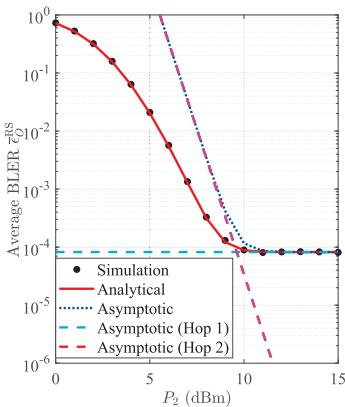

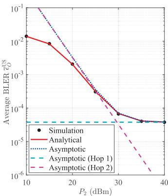  
(a) Rural scenario  
(b) Urban scenario  
Fig. 2. Validation of the analytical framework against Monte-Carlo simulation of the analytical model. Parameters: $L ~ = ~ \mathsf { \bar { 1 } } 0 0 , N ~ = ~ 2 , W ~ = ~ 0 . 5 \lambda$ (a) Rural scenario: $m _ { 1 } = m _ { 2 } = 5 , P _ { 1 } = 1 0$ dBm. (b) Urban scenario: m $\mathrm { \Omega _ { o S } } = 5 , m _ { \mathrm { N L o S } } = 1 , P _ { 1 } = 4 0$ dBm.

## V. NUMERICAL RESULTS AND DISCUSSION

In this section, we present numerical results to validate our analytical framework, and quantify the performance gains of the FAS and the proposed EE maximization. Unless specified otherwise, the simulation parameters are listed in Table II.

We begin by validating our theoretical framework in Fig. 2. The results in this figure compare our derived closed-form expressions for the end-to-end BLER against Monte-Carlo simulations of the underlying analytical model defined in Section II-A. The perfect alignment between the curves and simulation points confirms the correctness and accuracy of our complex mathematical derivations, for both the rural and urban scenarios. To provide deeper theoretical insights, Fig. 2 explicitly demonstrates three distinct asymptotic results: 1) “Asymptotic (Hop 1)”, which corresponds to the firsthop error floor determined by $P _ { 1 }$ as implied by the DF structure and formalized for the urban case in Theorem 3; 2) “Asymptotic (Hop 2)”, which characterizes the diversitydriven performance of the FAS-enabled second hop as derived in Theorems 1 and 2; and 3) the overall system asymptotic curve. The intersection and behavior of these lines signify that while the diversity gain of FAS effectively reduces the second-hop BLER, the end-to-end performance is fundamentally constrained by the backhaul (BS-to-UAV) reliability. This suggests that in practical deployment, once $P _ { 2 }$ reaches a threshold where the overall BLER meets the floor, resources should be redirected toward enhancing the first hop to further improve system performance. Furthermore, the high-SNR asymptotic expressions are shown to capture the diversity slope in the high-SNR regime accurately. A notable phenomenon observed in both scenarios is the occurrence of an error floor. This happens because as the $\mathrm { U A V } ^ { \ , } \mathbf { s }$ transmit power $P _ { 2 }$ increases, the second-hop BLER diminishes, causing the end-to-end BLER to converge to the BLER of the first hop, which acts as a performance bottleneck. This confirms that our framework correctly models the behavior of the UAV DF-relaying system.

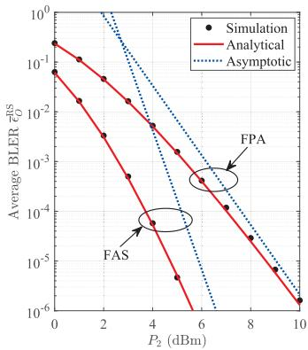  
(a) Rural scenario

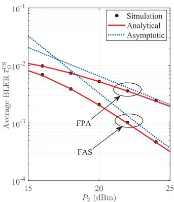  
(b) Urban scenario  
Fig. 3. Performance comparison between FAS (N = 2) and FPA $( N = 1 )$ Parameters are identical to those in Fig. 2.

Fig. 3 compares the BLER of a 2-port FAS with a conventional FPA, which is equivalent to $N = 1$ . First, the figure clearly validates the accuracy of our theoretical derivations, as the Monte-Carlo simulation results are in close agreement with our analytical results. Additionally, in the high SNR regime, the asymptotic analysis accurately reflects the system’s performance trend. Second, the figure compares the performance of our proposed FAS scheme with the traditional FPA baseline. The steeper slope of the FAS curve indicates a higher effective diversity order, enabling it to better combat fading. The results demonstrate that due to the superior spatial diversity gain afforded by FAS, the proposed scheme significantly outperforms the FPA scheme in both scenarios. Finally, the figure visually illustrates the performance difference between rural and urban scenarios. In the rural (LoS-dominant) scenario, the system performs considerably better due to more favorable channel conditions compared to the urban (NLoS) scenario.

Fig. 4 investigates the impact of the FAS aperture size W on BLER for a fixed number of ports $( N \ = \ 8 )$ . In both scenarios, the BLER decreases as W increases because a larger aperture reduces the spatial correlation between the ports, thereby enhancing the effective diversity gain harvested by the FAS. However, this improvement clearly exhibits diminishing returns. As W becomes sufficiently large (e.g., $W \ > \ 2 \lambda )$ the channels at the ports become sufficiently decorrelated, and further increasing the aperture yields only marginal gains. This saturation effect reveals a crucial design insight: the FAS aperture must be large enough to ensure effective diversity, but an excessively large physical footprint is unnecessary.

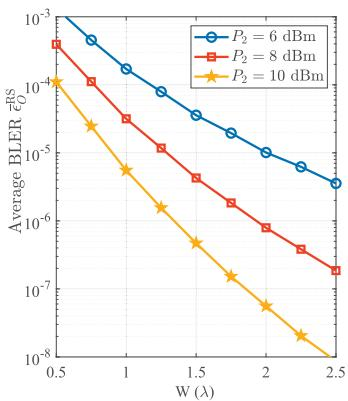

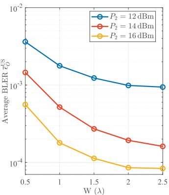  
(a) Rural scenario  
(b) Urban scenario

Fig. 4. End-to-end BLER versus FAS aperture size W for a fixed $N = 8 .$ (a) Rural scenario: $L = 2 0 0 , m _ { 1 } = 5 , m _ { 2 } = 7 , P _ { 1 } = 1 5$ dBm. (b) Urban scenario: $L = 1 0 0 , m _ { \mathrm { L o S } } = 5 , m _ { \mathrm { N L o S } } = 1 , P _ { 1 } = 4 0$ dBm.  
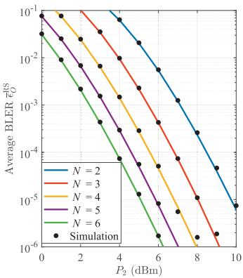

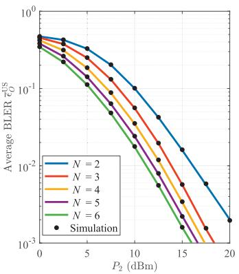  
(a) Rural scenario  
(b) Urban scenario  
Fig. 5. End-to-end BLER versus UAV transmit power $P _ { 2 }$ for different numbers of FAS ports N. (a) Rural scenario: $L = 1 0 0 , m _ { 1 } = 5 , m _ { 2 } = 5$ $P _ { 1 } ~ = ~ 2 0$ dBm. (b) Urban scenario: $L \ = \ 1 0 0 , m _ { \mathrm { L o S } } \ = \ 5 , m _ { \mathrm { N L o S } } \ = \ 1$ $P _ { 1 } = 4 0 ~ \mathrm { d B m } .$

Fig. 5 provides a detailed investigation into the impact of the number of ports, N, on the BLER. Firstly, the results serve as a crucial verification of our theoretical derivations. The Monte-Carlo simulation results are in excellent agreement with our analytical expressions, which confirms the accuracy of our analysis. As theoretically anticipated, increasing N expands the port selection pool, substantially enhancing the spatial diversity gain by increasing the probability of finding a port with favorable channel conditions, thereby significantly lowering the BLER. A key observation is the parallel nature of the performance curves, particularly in the high-SNR regime, when plotted on a log-log scale. This parallelism strongly indicates that the achieved diversity order is directly proportional to $N ,$ confirming that each additional port actively and effectively contributes to the link’s robustness.

Fig. 6 examines the influence of key channel and system parameters on BLER performance. Fig. 6(a) illustrates the effect of fading severity (m-factors) and blocklength (L) in the rural scenario. As shown, increasing the m-factor of either hop (e.g., from 5 to 7) significantly improves performance, as a higher m-factor implies a less severe fading environment. Concurrently, increasing the blocklength from $L ~ = ~ 1 0 0$ to

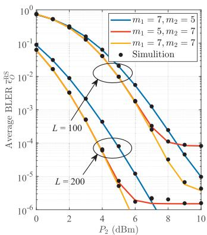

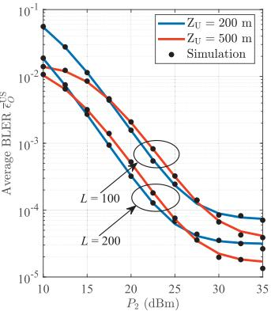  
(b) Urban scenario

(a) Rural scenario  
Fig. 6. Impact of Nakagami-m factors and blocklength L in the rural scenario (a), and UAV altitude $Z _ { U }$ and blocklength L in the urban scenario (b).  
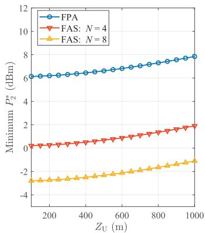

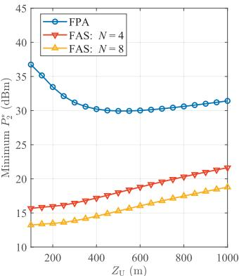  
(a) Rural scenario  
(b) Urban scenario  
Fig. 7. Minimum UAV transmit power $P _ { 2 } ^ { * }$ versus UAV altitude $Z _ { U }$ for $\epsilon _ { \mathrm { t h } } = 1 0 ^ { - 3 }$ and $L = 2 0 0$ . Specific parameters: $P _ { 1 } = 1 5$ dBm (Rural) and P = 46 dBm (Urban).

$L = 2 0 0$ provides a substantial coding gain, thus effectively reducing the BLER for any given $P _ { 2 }$

Fig. 6(b) investigates the impact of UAV altitude $Z _ { U }$ and blocklength L in the urban scenario, revealing an intricate power-dependent trade-off between blockage probability and path loss. In the low $P _ { 2 }$ regime, the system is blockagelimited; thus, a higher altitude $( Z _ { U } = 5 0 0$ m) is superior as it enhances the LoS probability to ensure basic link connectivity. However, as transmit power $P _ { 2 }$ increases, the system obtains sufficient power to overcome the NLoS attenuation, shifting the performance bottleneck to distance-dependent free-space path loss. In this high-power regime, lower altitudes (e.g., $Z _ { U } = 2 0 0 \ \mathrm { m } ,$ ) become more advantageous due to the reduced propagation distance, causing the performance curves to cross. This non-monotonic behavior underscores that no single altitude is universally optimal across all power regimes, thereby providing a strong motivation for the joint altitude and power optimization proposed in this work.

Fig. 7 investigates the minimum UAV transmit power $P _ { 2 } ^ { * }$ required to meet $\epsilon _ { \mathrm { t h } } = 1 0 ^ { - 3 }$ at $L = 2 0 0$ , revealing two key findings. First, the proposed FAS $( N \ = \ 4 , 8 )$ substantially outperforms the conventional FPA $( N = 1 )$ baseline in both scenarios, achieving over 15 dB of power savings in the urban case. This shows the significant diversity gain harvested by FAS. Second, the optimal deployment strategy is scenariodependent: the rural scenario (Fig. 7(a)) is path-loss dominant, favoring the lowest altitude, whereas the urban scenario (Fig. 7(b)) exhibits a convex trend with an optimal altitude at $Z _ { U } ^ { * } \approx 4 5 0 \mathrm { ~ m ~ }$ , balancing NLoS blockage and path loss. In both cases, the incremental gain from $N = 4$ to $N = 8$ is less than from $N \ = \ 1 \ \mathrm { t o } \ N \ = \ 4 .$ , illustrating diminishing returns and validating the premise of our subsequent EE maximization.

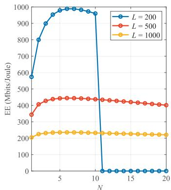  
(a) Rural scenario

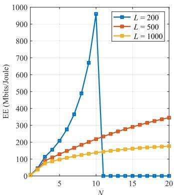  
(b) Urban scenario  
Fig. 8. EE versus the number of FAS ports N for different blocklengths L, with $\epsilon _ { \mathrm { t h } } \leq 1 0 ^ { - 3 }$

Fig. 8 illustrates the maximized EE as a function of the number of FAS ports N, providing a central insight into the system’s operational limits. The EE exhibits a distinct quasiconcave behavior with respect to N, which is driven by a fundamental trade-off between spatial diversity and operational overhead. Initially, increasing N enhances the spatial diversity gain, thereby reducing the required minimum transmit power $P _ { 2 } ^ { * }$ and boosting the overall EE. However, beyond an optimal number of ports $N ^ { * } ~ ( \mathrm { e . g . , } ~ N ^ { * } ~ \approx ~ 8 $ for $L ~ \ge ~ 5 0 0$ in rural scenarios), the linear accumulation of time and energy overhead inherent in the port selection process begins to outweigh the diminishing returns of diversity gains, causing the EE to decline. A pivotal finding highlighted in Fig. 8 is the hard physical limit imposed by the causality constraint, $N \tau _ { p } \ <$ $L / W _ { \mathrm { b a n d } } .$ , particularly in the low-latency URLLC regimes. For short blocklengths $( \mathbf { e . g . } , \ L \ = \ 2 0 0 )$ , the EE abruptly drops to zero when $N \geq 1 0$ , as the time required for port selection consumes the entire available transmission duration. This underscores that in latency-sensitive 6G applications, the configuration of FAS is governed not merely by an EE tradeoff, but by a fundamental timing constraint that dictates the system’s operational feasibility. It is worth noting that $P _ { \mathrm { p r o p } }$ represents a significant baseline in the total energy budget. For a fixed blocklength $L ,$ the propulsion energy $P _ { \mathrm { p r o p } } T _ { \mathrm { b l o c k } }$ is independent of the number of FAS ports N. Therefore, it does not alter the port-selection trade-off with respect to $N ,$ although it affects the absolute EE value and the optimization over L. Consequently, the fundamental trade-off between the FAS-enabled diversity gain and the operational time-energy overhead remains the primary driver of the system’s marginal efficiency with respect to the port configuration.

Next, we use the results in Fig. 9 to analyze the EE as a function of L. In both scenarios, FAS $( N > 1 )$ consistently and substantially outperforms the FPA $( N \ = \ 1 )$ baseline. Notably, in the urban scenario, the FPA system is barely viable, emphasizing that FAS is an enabling technology for efficient and reliable communications in such environments. The EE for all configurations generally decreases as L increases. This is because the data payload B is fixed, so a longer blocklength increases the baseline energy consumption, mainly through $( P _ { \mathrm { p r o p } } + P _ { c } ) T _ { \mathrm { b l o c k } }$ , without increasing the transmitted bits, thus reducing efficiency.

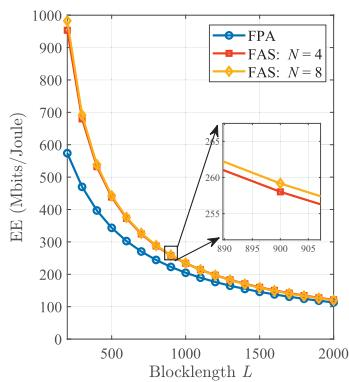  
(a) Rural scenario

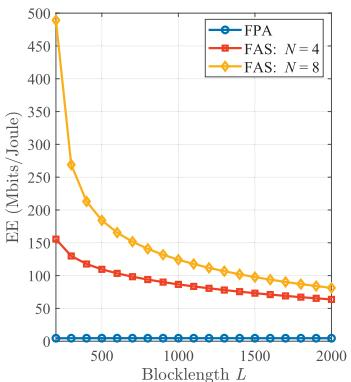  
(b) Urban scenario

Fig. 9. EE versus blocklength L for different FAS configurations, with $\epsilon _ { \mathrm { t h } } \leq 1 0 ^ { - 3 }$  
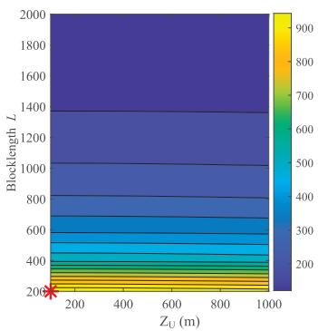  
(a) Rural scenario

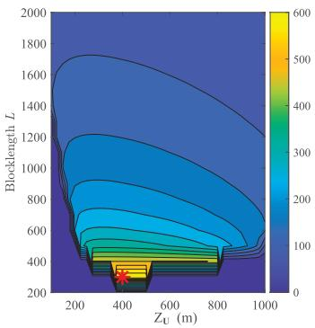  
(b) Urban scenario  
Fig. 10. Contour map of the maximum achievable EE over the $( Z _ { U } , L )$ plane, with $\epsilon _ { \mathrm { t h } } \leq 1 0 ^ { - 3 }$ . The red star marks the globally optimal operating point.

Finally, Fig. 10 provides a global view of the optimization landscape by plotting the maximum achievable EE over the $( Z _ { U } , L )$ plane. At each coordinate, the EE value is the maximum obtained by optimizing over all N. The results visually confirm our findings. In the rural scenario (see Fig. 10(a)), the optimal region is at the lowest altitude $( Z _ { \cal I ^ { \jmath } } ^ { * } = 1 0 0 ~ \mathrm { m } )$ and shortest blocklength $( L ^ { * } ~ = ~ 2 0 0 )$ . This is because in LoS-dominant rural environments, the target reliability $\epsilon _ { \mathrm { t h } }$ can be easily met with short packets, which minimizes the total circuit energy consumption $P _ { c } T _ { \mathrm { b l o c k } }$ . In contrast, the urban scenario (see Fig. 10(b)) reveals a more complex landscape, with the optimal point found at an intermediate blocklength $( L ^ { * } \approx 3 0 0 - 4 0 0 )$ . This shift occurs because urban environments are subject to probabilistic NLoS conditions and severe fading so a longer blocklength is required to harvest sufficient coding gain to meet the reliability constraint. In such scenarios, the performance gain from improved coding reliability outweighs the penalty of increased circuit energy consumption, validating the necessity of our holistic optimization framework.

## VI. CONCLUSION

In this paper, we presented a foundational framework for analyzing FAS-assisted UAV relay networks operating in the finite blocklength regime. We proposed a comprehensive analytical methodology to evaluate the end-to-end BLER, deriving novel closed-form expressions for both rural and urban environments. Our analysis, enabled by high-SNR asymptotic expressions, quantified the diversity order and identified the first-hop link as the ultimate performance bottleneck. Building upon this rigorous analytical foundation, we investigated the maximization of EE. By formulating a realistic model that explicitly accounts for the time and energy overhead associated with FAS port selection, we uncovered the trade-off between diversity gain and operational cost. Our results demonstrated the existence of an optimal, finite number of ports and revealed that optimal UAV deployment strategies differ fundamentally between rural and urban scenarios. This research provides a unified theoretical and practical framework, offering valuable design guidelines for reliable and energy-efficient UAV communication systems. Future work could extend this framework to consider multiuser scenarios and study the impact of imperfect CSI. An especially compelling extension would be the investigation of double-sided FAS architectures, where both the BS and UE dynamically optimize their antenna positions. Such a framework could further mitigate the backhaul bottleneck identified in this study and push the boundaries of achievable data rates in URLLC systems.

## APPENDIX A PROOF OF LEMMA 1

The PDF of a Nakagami-m distributed channel amplitude $| g |$ is given by

$$
f _ { | g | } ( x ) = \frac { 2 m _ { 1 } ^ { m _ { 1 } } } { \Gamma ( m _ { 1 } ) } x ^ { 2 m _ { 1 } - 1 } e ^ { - m _ { 1 } x ^ { 2 } } , ~ x \ge 0\tag{63}
$$

where $\Gamma ( \cdot )$ is the Gamma function and m is the fading severity parameter.

Our goal is to find the CDF of the instantaneous channel power gain, $Y = | g | ^ { 2 }$ . The CDF of Y can be formulated as

$$
F _ { Y } ( y ) = \int _ { 0 } ^ { \sqrt { y } } f _ { | g | } ( x ) d x = \int _ { 0 } ^ { \sqrt { y } } \frac { 2 m _ { 1 } { } ^ { m _ { 1 } } } { \Gamma ( m _ { 1 } ) } x ^ { 2 m _ { 1 } - 1 } e ^ { - m _ { 1 } x ^ { 2 } } d x .\tag{64}
$$

Let us define $u = m _ { 1 } x ^ { 2 }$ and then we have

$$
F _ { Y } ( y ) = \frac { 1 } { \Gamma ( m _ { 1 } ) } \int _ { 0 } ^ { m _ { 1 } y } u ^ { m _ { 1 } - 1 } e ^ { - u } d u .\tag{65}
$$

Because $\begin{array} { r } { \gamma ( s , z ) = \int _ { 0 } ^ { z } t ^ { s - 1 } e ^ { - t } d t . } \end{array}$ , (65) can be written as

$$
F _ { Y } ( y ) = { \frac { \gamma ( m _ { 1 } , m _ { 1 } y ) } { \Gamma ( m _ { 1 } ) } } .\tag{66}
$$

For integer values of $m _ { 1 }$ , this expression can be simplified. Using the identity $\begin{array} { r } { \gamma ( s , z ) = ( s - 1 ) ! \left( 1 - e ^ { - z } \sum _ { k = 0 } ^ { s - 1 } z ^ { k } / k ! \right) } \end{array}$ and $\Gamma ( s ) = ( s - 1 ) !$ , we obtain

$$
F _ { Y } ( y ) = 1 - \frac { \Gamma ( m _ { 1 } , m _ { 1 } y ) } { \Gamma ( m _ { 1 } ) } ,\tag{67}
$$

$$
F _ { \gamma _ { 1 } ^ { \mathrm { R S } } } ( \gamma ) = 1 - e ^ { - \gamma \vartheta _ { 1 } } \sum _ { k = 0 } ^ { \sp { \prime } m _ { 1 } - 1 } \frac { ( \gamma \vartheta _ { 1 } ) \sp k } { k ! } ,\tag{68}
$$

where $\vartheta _ { 1 } = m _ { 1 } / \bar { \gamma } _ { 1 } ^ { \mathrm { R S } } ( \theta )$

Since $\gamma _ { 1 } ^ { \mathrm { R S } } = \bar { \gamma } _ { 1 } ^ { \mathrm { R S } } Y$ , the corresponding CDF is obtained by substituting $y = x / \bar { \gamma } _ { 1 } ^ { \mathrm { R S } }$ into (68). Letting $\vartheta _ { 1 } = m _ { 1 } / \bar { \gamma } _ { 1 } ^ { \mathrm { R S } } ( \theta )$ we get the result (20), which completes the proof.

## APPENDIX B PROOF OF LEMMA 2

Letting $Y _ { n } \triangleq \lambda _ { n } | g _ { n } | ^ { 2 }$ , the CDF of $Y _ { \mathrm { m a x } }$ can be found as

$$
\begin{array} { l } { { \displaystyle F _ { | h _ { \mathrm { F A S } } | ^ { 2 } } ( y ) = \operatorname* { P r } ( \operatorname* { m a x } \{ Y _ { 1 } , . . . , Y _ { N _ { \mathrm { e f f } } } \} \le y ) } } \\ { { \displaystyle \ = \operatorname* { P r } ( Y _ { 1 } \le y , Y _ { 2 } \le y , . . . , Y _ { N _ { \mathrm { e f f } } } \le y ) } } \\ { { \displaystyle \ = \prod _ { n = 1 } ^ { N _ { \mathrm { e f f } } } \operatorname* { P r } ( Y _ { n } \le y ) = \prod _ { n = 1 } ^ { N _ { \mathrm { e f f } } } F _ { Y _ { n } } ( y ) } } \\ { { \displaystyle \ = \prod _ { n = 1 } ^ { N _ { \mathrm { e f f } } } \frac { \gamma \left( m _ { 2 } , \frac { m _ { 2 } y } { \lambda _ { n } } \right) } { \Gamma \left( m _ { 2 } \right) } } . } \end{array}\tag{69}
$$

Recalling that $\begin{array} { r } { \gamma _ { 2 } ^ { \mathrm { R S } } = \frac { P _ { 2 } \beta _ { 2 } ^ { \mathrm { R S } } ( \theta ) } { \sigma ^ { 2 } } | h _ { \mathrm { F A S } } | ^ { 2 } } \end{array}$ , the CDF of $\gamma _ { 2 } ^ { \mathrm { R S } }$ is found by scaling $F _ { \mathrm { | } h _ { \mathrm { F A S } } \mathrm { | } ^ { 2 } } ( y )$ as

$$
F _ { \gamma _ { 2 } ^ { \mathrm { R S } } } ( x ) = \mathrm { P r } ( \gamma _ { 2 } ^ { \mathrm { R S } } \leq x ) = F _ { | h _ { \mathrm { F A S } } | ^ { 2 } } \left( x \left[ \frac { \sigma ^ { 2 } } { P _ { 2 } \beta _ { 2 } ^ { \mathrm { R S } } ( \theta ) } \right] \right) .\tag{70)(70}
$$

Substituting (70) into (69) and replacing y with $\frac { x \sigma ^ { 2 } } { P _ { 2 } \beta _ { 2 } ^ { \mathrm { R S } } ( \theta ) }$ gives

$$
F _ { \gamma _ { 2 } ^ { \mathrm { R S } } } ( x ) = \frac { 1 } { [ \Gamma ( m _ { 2 } ) ] ^ { N _ { \mathrm { e f f } } } } \prod _ { n = 1 } ^ { N _ { \mathrm { e f f } } } \gamma \left( m _ { 2 } , \frac { m _ { 2 } } { \lambda _ { n } } \left[ \frac { x \sigma ^ { 2 } } { P _ { 2 } \beta _ { 2 } ^ { \mathrm { R S } } ( \theta ) } \right] \right) .\tag{71}
$$

We now use the definition of $\vartheta _ { 2 } ( \theta )$ from Lemma 2, which has $\begin{array} { r } { \vartheta _ { 2 } ( \theta ) = m _ { 2 } \sum _ { n = 1 } ^ { N _ { \mathrm { e f f } } } \lambda _ { n } / \overline { { \gamma } } _ { 2 } ^ { \mathrm { R S } } ( \theta ) } \end{array}$ . By substituting the definition of $\dot { \overline { { { \gamma } } } } _ { 2 } ^ { \mathrm { R S } } ( \theta )$ from $( 7 ) , \vartheta _ { 2 } ( \theta )$ simplifies to

$$
\vartheta _ { 2 } ( \theta ) = \frac { m _ { 2 } \sum _ { n = 1 } ^ { N _ { \mathrm { e f f } } } \lambda _ { n } } { \left( P _ { 2 } \beta _ { 2 } ^ { \mathrm { R S } } ( \theta ) \sum _ { n = 1 } ^ { N _ { \mathrm { e f f } } } \lambda _ { n } \right) / \sigma ^ { 2 } } = \frac { m _ { 2 } \sigma ^ { 2 } } { P _ { 2 } \beta _ { 2 } ^ { \mathrm { R S } } ( \theta ) } .\tag{72}
$$

By substituting the result from (72) into (71), we have

$$
F _ { \gamma _ { 2 } ^ { \mathrm { R S } } } ( x ) = \frac { 1 } { [ \Gamma ( m _ { 2 } ) ] ^ { N _ { \mathrm { e f f } } } } \prod _ { n = 1 } ^ { N _ { \mathrm { e f f } } } \gamma \left( m _ { 2 } , \frac { x \vartheta _ { 2 } ( \theta ) } { \lambda _ { n } } \right) .\tag{73}
$$

When $m _ { 2 }$ is a positive integer, we use the identity $\gamma ( m _ { 2 } , z ) =$ $( m _ { 2 } \mathrm { ~ - ~ } 1 ) ! \left( 1 \stackrel { \mathrm { ~ - ~ } } { - } e ^ { - z } \sum _ { k = 0 } ^ { m _ { 2 } \stackrel { \mathrm { ~ - ~ } } { - } 1 } \frac { z ^ { k } } { k ! } \right)$ and $\Gamma ( m _ { 2 } ) \ = \ ( m _ { 2 } \ - \ 1 ) !$ Substituting these into (73) yields the final form of the CDF as presented in Lemma 2. This completes the proof.

## APPENDIX C PROOF OF THEOREM 1

The high SNR regime corresponds to small values of the argument z in the CDF expression. For $z ~  ~ 0$ , the lower incomplete gamma function $\gamma ( s , z )$ can be approximated by the first term of its series expansion as

$$
\gamma ( s , z ) = \sum _ { k = 0 } ^ { \infty } { \frac { ( - 1 ) ^ { k } } { k ! } } { \frac { z ^ { s + k } } { s + k } } \approx { \frac { z ^ { s } } { s } } , { \mathrm { ~ f o r ~ } } z \to 0 .\tag{74}
$$

Recall that the CDF from Lemma 2 is expressed as $F _ { \gamma _ { 2 } ^ { \mathrm { R S } } } ( x ) =$ $\begin{array} { r } { \frac { 1 } { [ \Gamma ( m _ { 2 } ) ] ^ { N _ { \mathrm { e f f } } } } \prod _ { n = 1 } ^ { N _ { \mathrm { e f f } } } \gamma \left( m _ { 2 } , \frac { x \vartheta _ { 2 } } { \lambda _ { n } } \right) } \end{array}$ . By using the approximation $\dot { \gamma } ( m _ { 2 } , \bar { z } ) \approx z ^ { m _ { 2 } } / m _ { 2 }$ to each term in the product, we get

$$
F _ { \gamma _ { 2 } ^ { \mathrm { R S } } } ( x ) \approx \frac { 1 } { [ m _ { 2 } \Gamma ( m _ { 2 } ) ] ^ { N _ { \mathrm { e f f } } } } \prod _ { n = 1 } ^ { N _ { \mathrm { e f f } } } \left( \frac { \vartheta _ { 2 } ^ { m _ { 2 } } x ^ { m _ { 2 } } } { \lambda _ { n } ^ { m _ { 2 } } } \right) .\tag{75}
$$

Separating the terms that depend on n, we obtain

$$
F _ { \gamma _ { 2 } ^ { \mathrm { R S } } } ( x ) \approx \frac { ( \vartheta _ { 2 } ^ { m _ { 2 } } ) ^ { N _ { \mathrm { e f f } } } } { [ m _ { 2 } \Gamma ( m _ { 2 } ) ] ^ { N _ { \mathrm { e f f } } } } \left( \prod _ { n = 1 } ^ { N _ { \mathrm { e f f } } } \lambda _ { n } ^ { - m _ { 2 } } \right) x ^ { m _ { 2 } N _ { \mathrm { e f f } } } .\tag{76}
$$

Using the identity $\Gamma ( m _ { 2 } + 1 ) = m _ { 2 } \Gamma ( m _ { 2 } )$ , the expression simplifies to

$$
F _ { \gamma _ { 2 } ^ { \mathrm { R S } } } ( x ) \approx \left( \frac { \vartheta _ { 2 } ^ { m _ { 2 } } } { \Gamma ( m _ { 2 } + 1 ) } \right) ^ { N _ { \mathrm { e f f } } } \left( \prod _ { n = 1 } ^ { N _ { \mathrm { e f f } } } \lambda _ { n } ^ { - m _ { 2 } } \right) x ^ { m _ { 2 } N _ { \mathrm { e f f } } } .\tag{77}
$$

Define a constant C that groups all terms independent of x as

$$
\mathcal { C } \triangleq \left( \frac { \vartheta _ { 2 } ^ { m _ { 2 } } } { \Gamma ( m _ { 2 } + 1 ) } \right) ^ { N _ { \mathrm { e f f } } } \left( \prod _ { n = 1 } ^ { N _ { \mathrm { e f f } } } \lambda _ { n } ^ { - m _ { 2 } } \right) .\tag{78}
$$

The approximated CDF is now simply $F _ { \gamma _ { \mathrm { 2 } } ^ { \mathrm { R S } } } ( x ) \approx \mathcal { C } x ^ { m _ { 2 } N _ { \mathrm { e f f } } }$ The average BLER is given by an integral involving the CDF. Based on the approximation, we have

$$
\bar { \epsilon } _ { 2 } ^ { \mathrm { R S } } = \chi \int _ { \rho _ { L } } ^ { \rho _ { H } } F _ { \gamma _ { 2 } ^ { \mathrm { R S } } } ( x ) d x \approx \chi \int _ { \rho _ { L } } ^ { \rho _ { H } } \mathcal { C } x ^ { m _ { 2 } N _ { \mathrm { e f f } } } d x .\tag{79}
$$

After that, we perform the integration as

$$
\bar { \epsilon } _ { 2 } ^ { \mathrm { R S } } \approx \frac { \chi \mathcal { C } } { m _ { 2 } N _ { \mathrm { e f f } } + 1 } \left( \rho _ { H } ^ { m _ { 2 } N _ { \mathrm { e f f } } + 1 } - \rho _ { L } ^ { m _ { 2 } N _ { \mathrm { e f f } } + 1 } \right) .\tag{80}
$$

Substituting the full expression for C back gives the result.

## REFERENCES

[1] X. Zhu et al., “UAV-enabled short-packet communication via fluid antenna systems,” 2026, arXiv:2602.06206.

[2] M. Noor-A-Rahim et al., “6G for vehicle-to-everything (V2X) communications: Enabling technologies, challenges, and opportunities,” Proc. IEEE, vol. 110, no. 6, pp. 712–734, Jun. 2022.

[3] M. Simsek, A. Aijaz, M. Dohler, J. Sachs, and G. Fettweis, “5Genabled tactile internet,” IEEE J. Sel. Areas Commun., vol. 34, no. 3, pp. 460–473, Mar. 2016.

[4] P. Popovski et al., “Wireless access in ultra-reliable low-latency communication (URLLC),” IEEE Trans. Commun., vol. 67, no. 8, pp. 5783–5801, Aug. 2019.

[5] H. Niu et al., “A survey on artificial noise for physical layer security: Opportunities, technologies, guidelines, advances, and trends,” IEEE Commun. Surveys Tuts., vol. 28, pp. 341–381, 2026.

[6] C. She, C. Yang, and T. Q. S. Quek, “Radio resource management for ultra-reliable and low-latency communications,” IEEE Commun. Mag., vol. 55, no. 6, pp. 72–78, Jun. 2017.

[7] G. Durisi, T. Koch, and P. Popovski, “Toward massive, ultrareliable, and low-latency wireless communication with short packets,” Proc. IEEE, vol. 104, no. 9, pp. 1711–1726, Sep. 2016.

[8] Y. Polyanskiy, H. V. Poor, and S. Verdu, “Channel coding rate in the finite blocklength regime,” IEEE Trans. Inf. Theory, vol. 56, no. 5, pp. 2307–2359, May 2010.

[9] X. He, W. Chen, Q. Wu, X. Zhu, and N. Cheng, “Movable antenna enhanced NOMA short-packet transmission,” IEEE Commun. Lett., vol. 28, no. 9, pp. 2196–2200, Sep. 2024.

[10] Z. Zhang et al., “Finite-blocklength fluid antenna systems with spatial block-correlation channel model,” IEEE Wireless Commun. Lett., vol. 15, pp. 1911–1915, 2026.

[11] Z. Zhang, K.-K. Wong, J. Dang, Z. Zhang, and C.-B. Chae, “On fundamental limits for fluid antenna-assisted integrated sensing and communications for unsourced random access,” IEEE J. Sel. Areas Commun., vol. 44, pp. 136–149, 2026.

[12] Y. Zeng, Q. Wu, and R. Zhang, “Accessing from the sky: A tutorial on UAV communications for 5G and beyond,” Proc. IEEE, vol. 107, no. 12, pp. 2327–2375, Dec. 2019.

[13] H. Xiao, X. Hu, W. Zhang, W. Wang, K.-K. Wong, and K. Yang, “Energy-efficient STAR-RIS enhanced UAV-enabled MEC networks with bi-directional task offloading,” IEEE Trans. Wireless Commun., vol. 24, no. 4, pp. 3258–3272, Apr. 2025.

[14] H. Xiao, X. Hu, W. Wang, Z. Su, K.-K. Wong, and K. Yang, “STAR-RIS and UAV combination in MEC networks: Simultaneous task offloading and communications,” IEEE Trans. Commun., vol. 73, no. 8, pp. 6169–6184, Aug. 2025.

[15] H. Ren, C. Pan, K. Wang, W. Xu, M. Elkashlan, and A. Nallanathan, “Joint transmit power and placement optimization for URLLC-enabled UAV relay systems,” IEEE Trans. Veh. Technol., vol. 69, no. 7, pp. 8003–8007, Jul. 2020.

[16] L. Yuan, N. Yang, F. Fang, and Z. Ding, “Performance analysis of UAVassisted short-packet cooperative communications,” IEEE Trans. Veh. Technol., vol. 71, no. 4, pp. 4471–4476, Apr. 2022.

[17] M. Elwekeil, A. Zappone, and S. Buzzi, “Power control in cell-free massive MIMO networks for UAVs URLLC under the finite blocklength regime,” IEEE Trans. Commun., vol. 71, no. 2, pp. 1126–1140, Feb. 2023.

[18] P. Liu, J. Si, Z. Li, N. Al-Dhahir, and Y. Gao, “Joint 3-D trajectory and power optimization for dual-UAV-assisted short-packet covert communications,” IEEE Internet Things J., vol. 11, no. 10, pp. 17388–17401, May 2024.

[19] W. K. New et al., “A tutorial on fluid antenna system for 6G networks: Encompassing communication theory, optimization methods and hardware designs,” IEEE Commun. Surveys Tuts., vol. 27, no. 4, pp. 2325–2377, Aug. 2025.

[20] W.-J. Lu et al., “Fluid antennas: Reshaping intrinsic properties for flexible radiation characteristics in intelligent wireless networks,” IEEE Commun. Mag., vol. 63, no. 5, pp. 40–45, May 2025.

[21] H. Hong et al., “A contemporary survey on fluid antenna systems: Fundamentals and networking perspectives,” IEEE Trans. Netw. Sci. Eng., vol. 13, pp. 2305–2328, 2026.

[22] W. K. New et al., “Fluid antenna systems: Redefining reconfigurable wireless communications,” IEEE J. Sel. Areas Commun., vol. 44, pp. 1013–1044, 2026.

[23] T. Wu et al., “Fluid antenna systems enabling 6G: Principles, applications, and research directions,” IEEE Wireless Commun., early access, Dec.17, 2025, doi: 10.1109/MWC.2025.3629597.

[24] K.-K. Wong, A. Shojaeifard, K.-F. Tong, and Y. Zhang, “Fluid antenna systems,” IEEE Trans. Wireless Commun., vol. 20, no. 3, pp. 1950–1962, Mar. 2021.

[25] K. K. Wong, A. Shojaeifard, K.-F. Tong, and Y. Zhang, “Performance limits of fluid antenna systems,” IEEE Commun. Lett., vol. 24, no. 11, pp. 2469–2472, Nov. 2020.

[26] L. Zhu and K. K. Wong, “Historical review of fluid antennas and movable antennas,” 2024, arXiv:2401.02362v2.

[27] Y. Shen et al., “Design and experimental validation of mmWave surfacewave-enabled fluid antennas for future wireless communications,” IEEE Antennas Wireless Propag. Lett., vol. 25, pp. 1467–1471, 2026, doi: 10.1109/LAWP.2026.3657059.

[28] R. Wang et al., “Electromagnetically reconfigurable fluid antenna system for wireless communications: Design, modeling, algorithm, fabrication, and experiment,” IEEE J. Sel. Areas Commun., vol. 44, pp. 1464–1479, 2026.

[29] J. Zhang et al., “A novel pixel-based reconfigurable antenna applied in fluid antenna systems with high switching speed,” IEEE Open J. Antennas Propag., vol. 6, pp. 212–228, 2025.

[30] B. Liu, T. Wu, K.-K. Wong, H. Wong, and K.-F. Tong, “Wideband pixel-based fluid antenna system: An antenna design for smart city,” IEEE Internet Things J., vol. 13, no. 4, pp. 6850–6862, Feb. 2026.

[31] K.-K. Wong, C. Wang, S. Shen, C.-B. Chae, and R. Murch, “Reconfigurable pixel antennas meet fluid antenna systems: A paradigm shift to electromagnetic signal and information processing,” IEEE Wireless Commun., vol. 33, no. 1, pp. 191–198, Feb. 2026.

[32] S. Zhang, Y. Zhang, H. Hashida, Y. C. Eldar, M. Di Renzo, and B. Di, “Fluid antenna systems enabled by reconfigurable holographic surfaces: Beamforming design and experimental validation,” IEEE J. Sel. Areas Commun., vol. 44, pp. 1417–1431, 2026.

[33] B. Liu, K.-F. Tong, K. K. Wong, C.-B. Chae, and H. Wong, “Programmable meta-fluid antenna for spatial multiplexing in fast fluctuating radio channels,” Opt. Exp., vol. 33, no. 13, pp. 28898–28915, 2025.

[34] K.-F. Tong, B. Liu, and K.-K. Wong, “Designs and challenges in fluid antenna system hardware,” Electronics, vol. 14, no. 7, p. 1458, Apr. 2025.

[35] W. K. New, K.-K. Wong, H. Xu, K.-F. Tong, and C.-B. Chae, “Fluid antenna system: New insights on outage probability and diversity gain,” IEEE Trans. Wireless Commun., vol. 23, no. 1, pp. 128–140, Jan. 2024.

[36] W. K. New, K.-K. Wong, H. Xu, K.-F. Tong, and C.-B. Chae, “An information-theoretic characterization of MIMO-FAS: Optimization, diversity-multiplexing tradeoff and q-outage capacity,” IEEE Trans. Wireless Commun., vol. 23, no. 6, pp. 5541–5556, Jun. 2024.

[37] X. Zhu et al., “On the fundamental scaling laws of fluid antenna systems,” 2025, arXiv:2511.03415.

[38] S. Xu et al., “Toward practical fluid antenna systems: Co-optimizing hardware and software for port selection and beamforming,” IEEE Trans. Wireless Commun., vol. 25, pp. 8341–8353, 2026.

[39] H. Zhao and D. Slock, “Analytical insights into outage probability and ergodic capacity of fluid antenna systems,” IEEE Wireless Commun. Lett., vol. 14, no. 5, pp. 1581–1585, May 2025.

[40] T. Wu et al., “Unleashing more potential from FAS: A framework of FAS-CoNOMA systems,” IEEE Trans. Commun., vol. 74, pp. 4820–4836, 2026, doi: 10.1109/TCOMM.2026.3663520.

[41] X. Zhu et al., “Fluid antenna systems: A geometric approach to error probability and fundamental limits,” 2025, arXiv:2509.08815.

[42] H. Xu et al., “Channel estimation for FAS-assisted multiuser mmWave systems,” IEEE Commun. Lett., vol. 28, no. 3, pp. 632–636, Mar. 2024.

[43] Z. Zhang, J. Zhu, L. Dai, and R. W. Heath, “Successive Bayesian reconstructor for channel estimation in fluid antenna systems,” IEEE Trans. Wireless Commun., vol. 24, no. 3, pp. 1992–2006, Mar. 2025.

[44] W. Kiat New, K.-K. Wong, H. Xu, F. Rostami Ghadi, R. Murch, and C.- B. Chae, “Channel estimation and reconstruction in fluid antenna system: Oversampling is essential,” IEEE Trans. Wireless Commun., vol. 24, no. 1, pp. 309–322, Jan. 2025.

[45] K.-K. Wong and K.-F. Tong, “Fluid antenna multiple access,” IEEE Trans. Wireless Commun., vol. 21, no. 7, pp. 4801–4815, Jul. 2022.

[46] K.-K. Wong, K.-F. Tong, Y. Chen, and Y. Zhang, “Fast fluid antenna multiple access enabling massive connectivity,” IEEE Commun. Lett., vol. 27, no. 2, pp. 711–715, Feb. 2023.

[47] K.-K. Wong, D. Morales-Jimenez, K.-F. Tong, and C.-B. Chae, “Slow fluid antenna multiple access,” IEEE Trans. Commun., vol. 71, no. 5, pp. 2831–2846, May 2023.

[48] J. P. Gonzalez-Coma and F. J. L´ opez-Mart´ ´ınez, “Slow fluid antenna multiple access with multiport receivers,” IEEE Wireless Commun. Lett., vol. 15, pp. 1280–1284, 2026.

[49] H. Hong et al., “Multi-port selection for FAMA: Massive connectivity with fewer RF chains than users,” 2025, arXiv:2511.17897.

[50] X. Yuan, N. Guo, Y. Hu, R. Schober, and A. Schmeink, “Optimal antenna configuration filtering and joint power control in fluid antenna multiple access networks,” IEEE J. Sel. Areas Commun., vol. 44, pp. 1227–1242, 2026.

[51] D. Dinis and R. Wichman, “S-FAMA-GP: A low-complexity slow FAMA using interference interpolation,” IEEE Wireless Commun. Lett., vol. 15, pp. 1727–1731, 2026.

[52] K.-K. Wong, C.-B. Chae, and K.-F. Tong, “Compact ultra massive antenna array: A simple open-loop massive connectivity scheme,” IEEE Trans. Wireless Commun., vol. 23, no. 6, pp. 6279–6294, Jun. 2024.

[53] C. Rao, K.-K. Wong, S. Xu, X. Zhu, Y. Zhang, and C.-B. Chae, “Codebook-based port selection and combining for CSI-free uplink fluid antenna multiple access,” IEEE Trans. Wireless Commun., vol. 25, pp. 13401–13415, 2026.

[54] H. Hong, K.-K. Wong, K.-F. Tong, H. Shin, and Y. Zhang, “Coded fluid antenna multiple access over fast fading channels,” IEEE Wireless Commun. Lett., vol. 14, no. 4, pp. 1249–1253, Apr. 2025.

[55] H. Hong et al., “Downlink OFDM-FAMA in 5G-NR systems,” IEEE Trans. Wireless Commun., vol. 24, no. 12, pp. 10116–10132, Dec. 2025.

[56] N. Waqar, K.-K. Wong, C.-B. Chae, and R. Murch, “Turbocharging fluid antenna multiple access,” IEEE Trans. Wireless Commun., vol. 25, pp. 4038–4052, 2026.

[57] N. Waqar, K.-K. Wong, C.-B. Chae, and R. Murch, “Attentional copulaaided turbo fluid antenna massive access,” IEEE Wireless Commun. Lett., vol. 15, pp. 1951–1955, 2026.

[58] Q. Peng, J. Wang, S. Wang, L. Xia, Q. Wang, and H. Ding, “Fluid antenna multiple access at transmitter side,” in Proc. IEEE Int. Conf. Commun. Workshops (ICC Workshops), Jun. 2025, pp. 160–165.

[59] F. Rostami Ghadi, M. Kaveh, F. Hernando-Gallego, D. Mart´ın, K.- K. Wong, and C.-B. Chae, “UAV-relay assisted RSMA fluid antenna system: Outage probability analysis,” IEEE Wireless Commun. Lett., vol. 14, no. 9, pp. 2907–2911, Sep. 2025.

[60] Z. Li, Z. Gao, B. Ning, and Z. Wang, “Radiation pattern reconfigurable FAS-empowered interference-resilient UAV communication,” IEEE J. Sel. Areas Commun., vol. 44, pp. 1110–1127, 2026.

[61] X. Xu, H. Xu, H. Yu, Y. Liu, and M. Chen, “Fluid antenna system (FAS)- assisted 3D UAV positioning performance optimization,” in Proc. IEEE Int. Conf. Commun., Montreal, QC, Canada, Jun. 2025, pp. 2260–2265.

[62] L.-H. Shen and Y.-H. Chiu, “RIS-aided fluid antenna array-mounted AAV networks,” IEEE Wireless Commun. Lett., vol. 14, no. 4, pp. 1049–1053, Apr. 2025.

[63] F. Rostami Ghadi, K.-K. Wong, W. K. New, H. Xu, R. Murch, and Y. Zhang, “On performance of RIS-aided fluid antenna systems,” IEEE Wireless Commun. Lett., vol. 13, no. 8, pp. 2175–2179, Aug. 2024.

[64] H. Xiao, X. Hu, K.-K. Wong, H. Hong, G. C. Alexandropoulos, and C.- B. Chae, “Fluid reconfigurable intelligent surfaces: Joint on-off selection and beamforming with discrete phase shifts,” IEEE Wireless Commun. Lett., vol. 14, no. 10, pp. 3124–3128, Oct. 2025.

[65] F. R. Ghadi, K.-K. Wong, F. J. Lopez-Mart ´ ´ınez, G. C. Alexandropoulos, and C.-B. Chae, “Performance analysis of wireless communication systems assisted by fluid reconfigurable intelligent surfaces,” IEEE Wireless Commun. Lett., vol. 14, no. 12, pp. 3922–3926, Dec. 2025.

[66] H. Xiao, X. Hu, K.-K. Wong, X. Zhu, H. Hong, and C.-B. Chae, “Fluid reconfigurable intelligent surface with element-level pattern reconfigurability: Beamforming and pattern co-design,” IEEE Trans. Wireless Commun., vol. 25, pp. 10791–10806, 2026.

[67] J. D. Vega-Sanchez, V. H. G. Pacheco, N. V. O. Garz ´ on,´ D. A. R. Almeida, and D. P. M. Osorio, “Exploring spatial flexibility and phase design in fluid reconfigurable intelligent surfaces: A physical layer security perspective,” IEEE Open J. Commun. Soc., vol. 7, pp. 965–977, 2026.

[68] F. R. Ghadi, K.-K. Wong, M. Kaveh, F. J. Lopez-Mart ´ ´ınez, C.-B. Chae, and G. C. Alexandropoulos, “FIRES: Fluid integrated reflecting and emitting surfaces,” IEEE Wireless Commun. Lett., vol. 14, no. 11, pp. 3744–3748, Nov. 2025.

[69] X. Zhu, K.-K. Wong, B. Tang, W. Chen, and C.-B. Chae, “Fluid reconfigurable intelligent surface (FRIS) enabling secure wireless communications,” IEEE Wireless Commun. Lett., vol. 15, pp. 2408–2412, 2026.

[70] H. Niu et al., “Introducing meta-fiber into stacked intelligent metasurfaces for MIMO communications: A low-complexity design with only two layers,” IEEE Trans. Wireless Commun., vol. 25, pp. 3016–3032, 2026.

[71] H. Jiang, W. Shi, Z. Chen, Z. Zhang, K.-K. Wong, and H. Shin, “Dynamic channel modeling of fluid antenna systems in UAV communications,” IEEE Wireless Commun. Lett., vol. 14, no. 10, pp. 3169–3173, Oct. 2025.

[72] X. Zhu, K.-K. Wong, Q. Wu, H. Shin, and Y. Zhang, “Fluid antenna system-enabled UAV-to-ground communications,” 2025, arXiv:2511.17416.

[73] A. Al-Hourani, S. Kandeepan, and S. Lardner, “Optimal LAP altitude for maximum coverage,” IEEE Wireless Commun. Lett., vol. 3, no. 6, pp. 569–572, Dec. 2014.

[74] M. Abramowitz and I. A. Stegun, Handbook of Mathematical Functions With Formulas, Graphs, and Mathematical Tables. New York, NY, USA: Dover, 1972.

[75] L. Zhang, Y. Zhao, H. Yang, G. Liang, and J. Hu, “Energy-efficient port selection and beamforming design for integrated data and energy transfer assisted by fluid antennas,” IEEE J. Sel. Areas Commun., vol. 44, pp. 1480–1494, 2026.

Xusheng Zhu (Member, IEEE) received the B.S. degree in optical communications from Jilin University, China, in 2017, the M.Eng. degree in electronics and communications engineering from Lanzhou University, China, in 2022, and the Ph.D. degree in information and communication engineering from Shanghai Jiao Tong University, China, in 2025. He is currently a Marie Skłodowska-Curie Actions (MSCA) Post-Doctoral Fellow with University College London, U.K. His research interests include fluid antenna systems (FAS), reconfigurable intelligent surfaces (RIS), and UAV communications (Kit) Kai-Kit Wong (Fellow, IEEE) was born in Hong Kong in 1973. He received the B.Eng., M.Phil., and Ph.D. degrees in electrical and electronic engineering from The Hong Kong University of Science and Technology, Hong Kong, in 1996, 1998, and 2001, respectively. After graduation, he took up academic and research positions at The University of Hong Kong, Hong Kong, Lucent Technologies, Bell-Labs, Holmdel, the Smart Antennas Research Group of Stanford University, USA, and the University of Hull, U.K. He is currently a Chair

Professor of wireless communications with the Department of Electronic and Electrical Engineering, University College London, U.K. He is a fellow of IET. He served as the Editor-in-Chief for IEEE WIRELESS COMMUNICATIONS LETTERS from 2020 to 2023. He is also the Subject Editor-in-Chief of Wireless Communications for IET ELECTRONICS LETTERS and also on the Advisory Board of IEEE COMMUNICATIONS LETTERS and the Steering Committee of IEEE WIRELESS COMMUNICATIONS LETTERS.

Hanjiang Hong (Member, IEEE) received the B.Eng., M.Eng., and Ph.D. degrees from Shanghai Jiao Tong University, Shanghai, China, in 2016, 2019, and 2023, respectively. She is currently a Research Fellow with the Department of Electronic and Electrical Engineering, University College London, London, U.K. Her research interests include bit-interleaved coding and modulation, fluid antenna systems, fluid antenna multiple access, and other physical layer technologies in broadband communications.

Han Xiao (Graduate Student Member, IEEE) received the M.Eng. degree in vehicle engineering from Dalian University of Technology, Dalian, China, in 2021. He is currently pursuing the Ph.D. degree with the School of Information and Communications Engineering, Xi’an Jiaotong University, Xi’an, China. His research interests include physical layer security, covert communications, mobile edge computing, and reconfigurable intelligent surface. He has been recognized as an Exemplary Reviewer for IEEE WIRELESS COMMUNICATIONS LETTERS.

He has served on the Technical Program Committee (TPC) for several flagship conferences in his field.

Hao Xu (Senior Member, IEEE) received the B.S. degree in communication engineering from Nanjing University of Science and Technology, Nanjing, China, in 2013, and the Ph.D. degree in information and communication engineering from the National Mobile Communications Research Laboratory, Southeast University, Nanjing, in 2019. From 2019 to 2021, he was an Alexander von Humboldt (AvH) Post-Doctoral Research Fellow with the Faculty of Electrical Engineering and Computer Science, Technical University of Berlin, Germany.

From 2021 to 2025, he was a Marie Skłodowska-Curie Actions (MSCA) Individual Fellow with the Department of Electronic and Electrical Engineering, University College London, U.K. He is currently a Professor with the National Mobile Communications Research Laboratory, Southeast University. His research interests include communication theory, information theory, mathematical optimization, MIMO systems, and privacy and security. He was a recipient of the 2024 IEEE ISTT Best Paper Award. He has been serving as an Associate Editor for IEEE TRANSACTIONS ON COMMUNICATIONS since August 2024 and IET Communicationssince August 2021.

Tuo Wu received the B.Eng. degree in telecommunication engineering from South China Normal University, Guangzhou, China, in 2017, the M.S. degree in wireless radio physics from Sun Yatsen University, Guangzhou, in 2021, and the Ph.D. degree from the School of Electronic Engineering and Computer Science, Queen Mary University of London, U.K., in 2024.

From 2024 to 2025, he was a Post-Doctoral Researcher with the School of Electrical and Electronic Engineering, Nanyang Technological Univer-

sity, Singapore. From 2025 to 2026, he was a Research Fellow with the State Key Laboratory of Terahertz and Millimeter Waves, Department of Electronic Engineering, City University of Hong Kong, Hong Kong. He is currently a Professor with the School of Electronic and Information Engineering, South China University of Technology. His research interests include fluid antenna system (FAS), reconfigurable intelligent surface (RIS), and wireless localization and sensing. He is an Editor of IEEE TRANSACTIONS ON COMMUNICATIONS and IEEE WIRELESS COMMUNICATIONS LETTERS. He serves as the Lead Guest Editor for IEEE Communications Magazine and the Co-Lead Guest Editor for IEEE WIRELESS COMMUNICATIONS. He also served as the Guest Editor for IEEE TRANSACTIONS ON COGNITIVE COMMUNICATIONS AND NETWORKING, IEEE Network Magazine, and IEEE OPEN JOURNAL OF THE COMMUNICATIONS SOCIETY.

Chan-Byoung Chae (Fellow, IEEE) received the Ph.D. degree in electrical and computer engineering from The University of Texas at Austin (UT), USA, in 2008.

He was a member with the Wireless Networking and Communications Group (WNCG), UT. Prior to joining UT, he was a Research Engineer at the Telecommunications Research and Development Center, Samsung Electronics, Suwon, South Korea, from 2001 to 2005. He is currently an Underwood Distinguished Professor and a Lee Youn Jae Fellow (Endowed Chair Professor) with the School of Integrated Technology, Yonsei University, South Korea. Before joining Yonsei, he was with Bell Labs, Alcatel-Lucent, Murray Hill, NJ, USA, from 2009 to 2011, as a Member of Technical Staff, and Harvard University, Cambridge, MA, USA, from 2008 to 2009, as a Post-Doctoral Researcher, a fellow, and a Lecturer.

Dr. Chae is an Elected Member of the National Academy of Engineering of Korea. He was a recipient/co-recipient of the IEEE ComSoc Education Award in 2026, the Korean Ministry of ICT and Science Award in 2024, Korean Ministry of Education Award in 2024, the KICS Haedong Scholar Award in 2023, the CES Innovation Award in 2023, the IEEE ICC Best Demo Award in 2022, the IEEE WCNC Best Demo Award in 2020, the Best Young Engineer Award from the National Academy of Engineering of Korea (NAEK) in 2019, the IEEE DySPAN Best Demo Award in 2018, the IEEE/KICS Journal of Communications and Networks Best Paper Award in 2018, the IEEE INFOCOM Best Demo Award in 2015, the IEIE/IEEE Joint Award for Young IT Engineer of the Year in 2014, the KICS Haedong Young Scholar Award in 2013, the IEEE Signal Processing Magazine Best Paper Award in 2013, the IEEE ComSoc AP Outstanding Young Researcher Award in 2012, and the IEEE VTS Dan. E. Noble Fellowship Award in 2008. He has held several editorial positions, including the Editor-in-Chief of IEEE TRANSACTIONS ON MOLECULAR, BIOLOGICAL, AND MULTI-SCALE COMMUNICATIONS, a Senior Editor of the IEEE WIRELESS COMMUNICATIONS LETTERS, and an Editor of the IEEE Communications Magazine, IEEE TRANSACTIONS ON WIRELESS COMMUNICATIONS, and IEEE WIRELESS COMMUNICATIONS LETTERS. He was an IEEE ComSoc Distinguished Lecturer from 2020 to 2023 and is an IEEE VTS Distinguished Lecturer from 2024 to 2025.