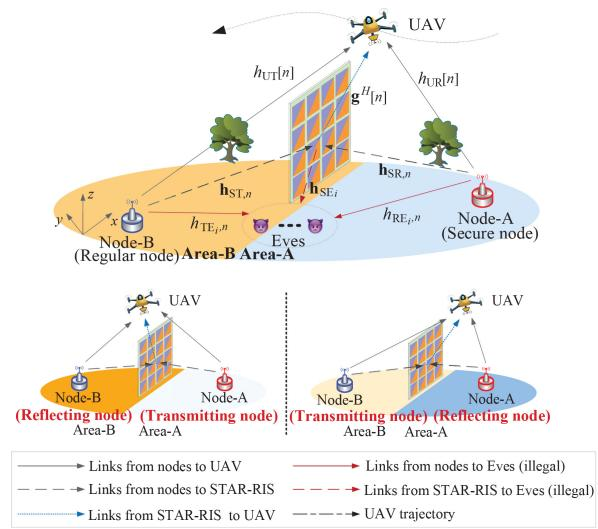
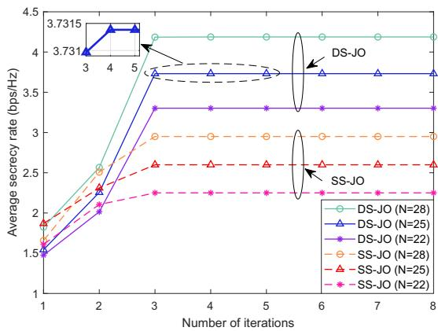
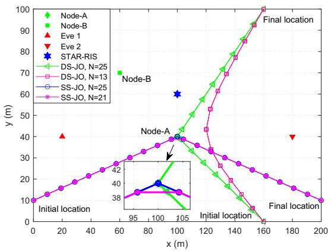
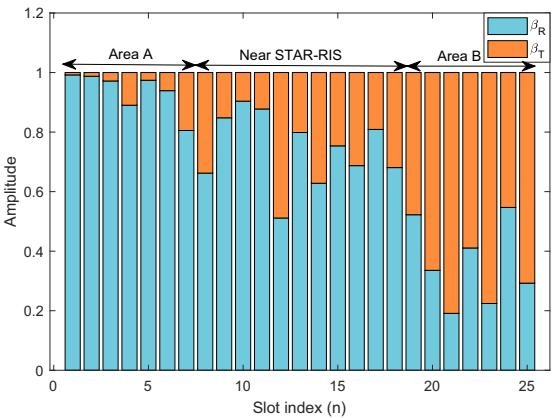
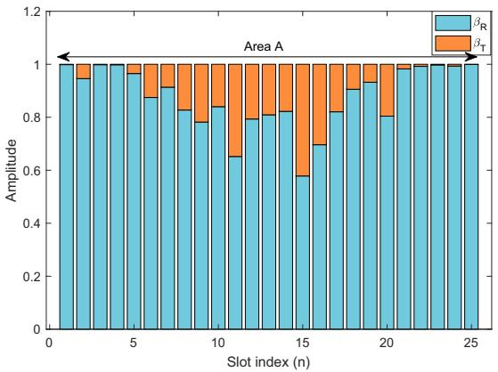
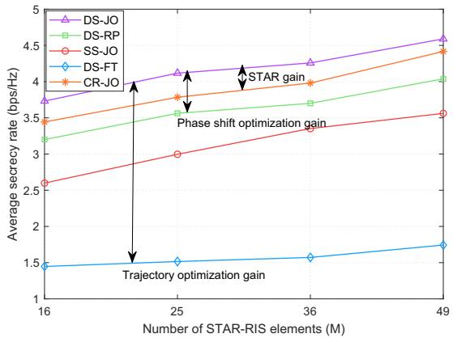
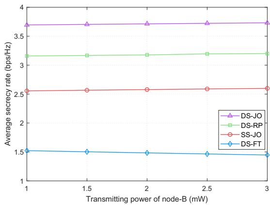
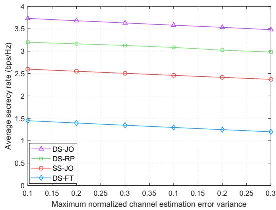

# Full-Space UAV Trajectory Design for STAR-RIS-Assisted Secure Ground–Air Communications

Xiangyun Meng and Xuanli Wu , Member, IEEE

Abstract—In this paper, we study simultaneous transmitting and reflecting reconfigurable intelligent surface (STAR-RIS)- assisted secure ground-air communications. Ground nodes upload data to an unmanned aerial vehicle (UAV) with the assistance of a STAR-RIS, while facing eavesdropping threats targeting confidential information from a secure node. Planning UAV trajectories in a full space instead of only on the single side of a STAR-RIS is helpful to make the most of UAV flexibility. However, the transmission rates of ground nodes is hard to express because cascaded channels vary with the UAV’s location relative to the STAR-RIS. To address this issue, we propose a unified expression of the rate incorporating the UAV-locationdependent cascaded channels. Based on the proposed expression, we maximize the average secrecy rate (ASR) of a secure node while ensuring the rate requirements of a regular node via robust optimization of STAR-RIS coefficients and UAV trajectory. Specifically, we consider the imperfect eavesdropping channel state information. Due to the non-convex structure, the original mixed integer nonlinear programming problem is decomposed into two subproblems. Semidefinite relaxation, -Procedure, and successive convex approximation techniques are used to tackle the non-convex objective function and constraints. Finally, the two subproblems are solved iteratively. Numerical simulations reveal that the proposed scheme achieves the full-space flight of the UAV and outperforms the benchmark schemes in terms of ASR.

Index Terms—STAR-RIS, average secrecy rate maximization, resource allocation, full-space trajectory planning.

## I. INTRODUCTION

S THE ever-advancing metasurfaces and their rapidly evolving manufacturing processes, the vision of recon  
figurable intelligent surface (RIS)-empowered sixth-generation   
wireless networks is becoming a reality [1]. RIS, also known   
as intelligent reflective surface [2], is a 2-dimension surface   
composed of many low-cost reconfigurable elements [3]. The   
phase and amplitude of these elements can be manipulated   
to create artificial line-of-sight (LoS) links for blocked users   
when a RIS is deployed at a proper location [4], [5]. However,

the traditional RIS only serves same-side transceivers because it is only able to reflect signals [6]. This half-space coverage ability restricts the flexible deployment and coverage of RISs. In particular, when the transceivers are not located in the same side of the RIS, the benefits of RIS are unavailable [7]. Fortunately, simultaneous transmitting and reflecting RIS (STAR-RIS) [8], [9], also termed intelligent omni-surface (IOS) [10], [11], is proposed to overcome the geographical deployment restrictions of traditional RISs. STAR-RISs are able to provide 360◦ full-space coverage by reflecting and transmitting wireless signals simultaneously. However, due to the openness of wireless channels, STAR-RIS-assisted networks still face eavesdropping threats [12]. Physical layer security (PLS) is a promising technology to curb eavesdroppers.

STAR-RISs and unmanned aerial vehicles (UAVs) have shown an attractive prospect of securing communications. On the one hand, by jointly controlling active and passive beamforming at a base station and STAR-RISs, respectively, we can improve legitimate links while degrading wiretapping links [13]. On the other hand, considering the high mobility of UAVs, we can shorten the communication distances between UAVs and legitimate users via trajectory design [14], [15], thereby increasing the secrecy rates. Combining a STAR-RIS and a UAV simultaneously leverages their advantages in enhancing PLS, but this combination still faces an obstacle.

The main obstacle is that we lack a mathematical expression to evaluate the performance of STAR-RIS-assisted groundto-air communications. Specifically, during the UAV flight, the cascaded channel between a ground node and the UAV incorporates the dynamic coefficients of STAR-RISs. For example, when the UAV and the node are within the same side of the STAR-RIS, the node’s signals will be reflected to the UAV. Conversely, when the UAV moves to the other side of the STAR-RIS, the UAV will receive the transmitted signals of the ground node through the STAR-RIS [16]. Consequently, the UAV-location-dependent channel makes it challenging to express the signal-to-interference-plus-noise-ratio (SINR) and secrecy rate mathematically. The absence of SINR and secrecy rate expression obstructs the design of STAR-RIS coefficients and UAV trajectory.

## A. Related Work

1) RIS-Assisted PLS: RIS has been attracting wide attention from both academia and industry due to its distinguished capability of adjusting signal-propagation environments based on specific requirements [2], [4]. Many researchers employ RIS to improve PLS by improving legitimate links and degrading wiretapping links. Yu et al. [17] increased the legitimate users’ sum rate via a robust design of transmitting beamforming, artificial noise (AN), and phase shifts of RISs. The UAV trajectory, transmitting power, and phase shifts were jointly optimized to improve the secrecy rate in downlink [18], and uplink-downlink [19] UAV communications. The authors in [20] maximized the sum secrecy capacity of a machinetype communications network by optimizing the transmitting power, receiver beamforming, and phase shifts. However, the deployment of the RISs in these works is heavily limited by geographical factors [13].

2) STAR-RIS-Assisted PLS: Other works adopt STAR-RIS in the PLS to achieve full-space coverage. When designing the secure active and passive beamforming, the authors studied the coupled transmission and reflection phase shift of STAR-RISs [21]. The authors introduced AN to secure confidential information in a downlink NOMA network [22]. Considering the uncertainty of illegal channels, the authors maximized the secrecy rate of uplink [23] and downlink [24] NOMA. The uncertainty of both legitimate and illegal channels was investigated in a downlink NOMA scenario, which is more realistic [25].

Although STAR-RIS has been effectively used in the above works to improve the secrecy rate, two aspects were not considered in these works. On the one hand, these works [21], [22], [23], [24], [25] only explore the utilization of STAR-RISs in the scenarios where all nodes need secure transmission. With the ever-increasing diversification of devices, nodes with diverse secrecy requirements usually coexist in a system [26]. For example, some sensors have confidential data (e.g., infrastructure states), whereas others may have no secrecy requirements (e.g., environmental monitoring sensors). We need to improve the secrecy rate of secure nodes while ensuring the rate requirements of regular nodes. NOMA shows a potential to secure nodes with diverse secrecy requirements. The inherent inter-user interference (IUI) of NOMA can be strategically utilized as jamming signals to safeguard confidential information [27]. This characteristic of NOMA is well-suited to diverse secrecy requirements. Specifically, nonconfidential signals can be used to enhance the security of confidential information. On the other hand, the utilization of UAVs in STAR-RIS-assisted networks can further improve the signal propagation environments due to high mobility, but these works [21], [22], [23], [24], [25] do not employ UAVs in STAR-RIS-assisted networks.

3) STAR-RIS-Assisted UAV Communication: Some researchers employ a STAR-RIS in UAV communication to achieve high-quality channels. UAV location and STAR-RIS beamforming were jointly optimized to increase the sum rate [28] and the secrecy energy efficiency of a mobile edge computing system [29]. The authors reduced the computational offloading latency of a STAR-RIS-empowered uplink NOMA system by joint design of STAR-RIS coefficients, offloading task amount, and SIC decoding sequence [30]. However, the high flexibility of UAVs is not fully utilized in [28], [29], [30], because the UAVs hover above a fixed optimized location. The authors extended the UAV location optimization to a trajectory design to make the most of the UAV flexibility [31], but the UAV flexibility is still limited to half space.

Half-space UAV trajectory planning has disadvantages and some works try to expand the UAV trajectory design to a full space. If a UAV only flies on one side of the STAR-RIS, the ground nodes located on the reverse side have to communicate with the UAV over a long distance. To address this issue, Liu et al. [32] preliminary tried to plan the UAV trajectory in the full space, though the method proposed in [32] mainly focused on single-user scenarios. The authors proposed a reinforcement learning-based algorithm to achieve a fullspace flight of UAV [16]. However, the UAV speed is fixed in this paper.

## B. Motivation

Compared with conventional reflecting-only RIS, STAR-RIS can expand service coverage for ground nodes to a 360◦ full space, giving more flexibility to the deployment of surfaces. However, it is hard to expand the UAV trajectory into the full space in STAR-RIS-assisted networks. The major obstacle to full-space flight in a STAR-RIS-assisted ground-to-air communication network is that we still lack a unified mathematical expression of the transmission rate. To be more specific, the transmission rate of a node includes cascaded channels. These cascaded channels involve STAR-RIS coefficients. However, the coefficients are dynamically varied during the flight because a reflecting node will switch to a transmitting node when the UAV flies to the other side of the STAR-RIS. This dynamic role switch closely interweaves with STAR-RIS coefficients, complicating the transmission rate expression, which is indispensable in resource allocation. Although several works attempt to liberate the UAV from the half-space flight [16], [32], the full-space trajectory planning is conditional in these works. Therefore, a unified mathematical expression of the transmission rate is required to fill a theoretical gap and achieve the unconditional full-space trajectory design in a STAR-RIS-assisted communication network.

## C. Solution and Contribution

As discussed above, existing works reveal that the high flexibility of UAVs and the environment-adjusting capability of STAR-RISs are conducive to enhancing the channel qualities. However, existing works do not provide a unified rate expression that involves the interweaving of STAR-RIS coefficients and role switch. This absence restricts the flexibility of UAVs. To deal with the aforementioned issues, in this paper, we propose a mathematical expression of the transmission rate for a STAR-RIS-assisted ground-to-air communication network. Based on the proposed expression, we investigate a secrecy rate maximization problem in a STAR-RIS-assisted UAV data collection network, where the data-uploading nodes have diverse secrecy requirements. Specifically, we improve the secrecy rate of a secure node while ensuring the rate requirements of a regular node. The main contributions of this paper are summarized as follows:

TABLE I NOTATIONS AND MEANINGS
<table><tr><td rowspan=1 colspan=1>Notation</td><td rowspan=1 colspan=1>Meaning</td></tr><tr><td rowspan=1 colspan=1>WR, WT, WS</td><td rowspan=1 colspan=1>Horizontal coordinates of node-A, node-B, and STAR-RIS, respectively</td></tr><tr><td rowspan=1 colspan=1> $\overline { { \Theta ^ { \mathrm { R } } [ n ] , \Theta ^ { \mathrm { T } } [ n ] } }$ </td><td rowspan=1 colspan=1>Reflection and transmission matrices of STAR-RIS, respectively</td></tr><tr><td rowspan=1 colspan=1> $\frac { \mathbf { \tilde { h } } _ { \mathrm { S R } , n } , \mathbf { h } _ { \mathrm { S T } , n } , \mathbf { g } [ n ] } { \mathbf { \tilde { h } } _ { \mathrm { S R } , n } , \mathbf { h } _ { \mathrm { S T } , n } , \mathbf { g } [ n ] }$ </td><td rowspan=1 colspan=1>Channel vectors from STAR-RIS to node-A, node-B, and UAV, respectively</td></tr><tr><td rowspan=1 colspan=1> $\overline { { h _ { \mathrm { U R } } [ n ] , h _ { \mathrm { U T } } [ n ] } }$ </td><td rowspan=1 colspan=1>Channels from node-A to UAV, from node-B to UAV, respectively</td></tr><tr><td rowspan=1 colspan=1> $\smash { \frac { \mathbf { h } _ { \mathrm { S E } _ { i } , n } , h _ { \mathrm { R E } _ { i } , n } , h _ { \mathrm { T E } _ { i } , n } } { \mathbf { \Theta } _ { \mathrm { ~ ` ~ } } } }$ </td><td rowspan=1 colspan=1>Channel vectors from Eve-i to STAR-RIS, node-A, and node-B, respectively</td></tr><tr><td rowspan=1 colspan=1> $\overline { { d _ { \mathrm { U R } } [ n ] , d _ { \mathrm { U T } } [ n ] , d _ { \mathrm { S U } } [ n ] } }$ </td><td rowspan=1 colspan=1>Distances between the UAV and node-A, node-B, STAR-RIS at slot-n, respectively</td></tr><tr><td rowspan=1 colspan=1> $\overline { { P _ { \mathrm { A } } , P _ { \mathrm { B } } } }$ </td><td rowspan=1 colspan=1>Power of node-A and node-B, respectively</td></tr><tr><td rowspan=1 colspan=1> $\underline { { \tilde { R } _ { \mathrm { A } } [ n ] , R _ { \mathrm { B } } [ n ] , R _ { \mathrm { E } } [ n ] , R _ { \mathrm { S } } [ n ] } }$ </td><td rowspan=1 colspan=1>Rates from node-A to UAV, from node-B to UAV, from node-A to Eves, and secrecy rate of node-A at slot-n, respectively</td></tr><tr><td rowspan=1 colspan=1> $\underline { { \zeta _ { n } , \xi _ { n } } }$ </td><td rowspan=1 colspan=1>Lower bound of RA[n] and upper bound of RE[n], respectively</td></tr></table>

• We present a general mathematical expression of the transmission rate in a STAR-RIS-assisted ground-to-air communication network. The proposed expression of the transmission rate is able to cope with the cascaded channels that change with the relative position of the UAV and the STAR-RIS. Therefore, the UAV trajectory planning is expanded to a full space.

• Based on the proposed mathematical expression of the transmission rate, we aim at improving the secrecy rate of a secure node while ensuring the rate requirements of a regular node. However, the formulated mixed integer nonlinear programming problem is difficult to solve due to the role switch of ground nodes. A doubleside UAV trajectory and STAR-RIS coefficients joint optimization (DS-JO) algorithm is proposed to solve this problem.

The rest of this paper is organized as follows. The system model and problem formulation are given in Section II. Section III details our DS-JO for improving the secrecy rate of the secure node. We present simulations and conclusions in Sections IV and V, respectively. Some important symbols and simulation parameters used in this article are given in Table I and Table II, respectively.

Notations: For a matrix X, $\mathbf { X } ^ { T } , \mathbf { X } ^ { H }$ denote the transpose and conjugate transpose operations, respectively; Tr( ), rank( ), and $| | \mathbf { X } | | _ { 2 }$ Xstand for the trace, rank, and spec-X X 2tral norm of X, respectively; $\mathrm { ~ { ~ \bf ~ X ~ } ~ } \succeq \mathrm { ~ { ~ 0 ~ } ~ }$ means that X is positive semidefinite. ${ \mathbf { I } } _ { M }$ is an M-dimensional identity matrix. Operator - represents the Kronecker product. The set of all $M \ \times \ N$ complex-valued matrices is denoted by $\mathbb { C } ^ { M \times N }$

## II. SYSTEM MODEL AND PROBLEM FORMULATION

## A. Network Architecture

We consider a STAR-RIS-assisted data collection network, as shown in Fig. 1. The STAR-RIS divides the target area into two subareas, i.e., area-A and area-B. Two nodes, node-A, and B, transmit their data to a UAV by NOMA. A rotatorywing UAV is adopted herein. Without loss of generality, the node-A located at ${ \bf w } _ { \mathrm { R } } ~ = ~ ( x _ { \mathrm { R } } , y _ { \mathrm { R } } , 0 ) ^ { T }$ in area-A requires R R Rsecure transmission, whereas the node-B located at $\begin{array} { r l } { \mathbf { w } _ { \mathrm { T } } } & { { } = } \end{array}$ $( x _ { \mathrm { T } } , y _ { \mathrm { T } } , 0 ) ^ { T }$ wTin area-B does not have security requirements. T TI eavesdroppers try to intercept the secret data of node-A. The coordinate of the STAR-RIS is ${ \bf w } _ { \mathrm { S } } = ( x _ { \mathrm { S } } , y _ { \mathrm { S } } , H _ { \mathrm { S } } ) ^ { T }$ . The S S S SUAV flies at a fixed height H. To express the UAV trajectory, the whole flight period T is equally divided into N slots; the length of each slot $( \tau = T / N )$ is short enough so that the

  
Fig. 1. STAR-RIS-assisted data collection network.

UAV’s location at each slot $( \mathbf { q } [ n ] = ( x _ { \mathrm { U } } [ n ] , y _ { \mathrm { U } } [ n ] , H ) ^ { T } , \forall n )$ U Ucan be regarded as approximately static [18], [19], [33]. The initial and final points of the UAV are denoted by and I, respectively. Assume that the UAV, node-A, node-B, and Feavesdroppers are equipped with a single antenna; the STAR-RIS consisting of M elements is a uniform planar array. We denote the reflection- and transmission-coefficient matrices at slot-n by $\Theta ^ { \mathrm { F } } [ n ] = \mathrm { d i a g } ( \sqrt { \beta _ { 1 , n } ^ { \mathrm { F } } } e ^ { j \theta _ { 1 , n } ^ { \mathrm { F } } } , . . . , \sqrt { \beta _ { M , n } ^ { \mathrm { F } } } e ^ { j \theta _ { M , n } ^ { \mathrm { F } } } )$ $\mathrm { ~ F ~ } \in \ \{ \mathrm { R } , \mathrm { T } \}$ , where $\Theta ^ { \mathrm { R } } [ \dot { n } ]$ and $\Theta ^ { \mathrm { T } } [ n ]$ are the reflection Θ Θand transmission matrices, respectively. When the STAR-RIS works in an energy-splitting mode, the amplitude and phase shift of each element satisfy $\beta _ { m , n } ^ { \mathrm { F } } \in [ 0 , 1 ] , \theta _ { m , n } ^ { \mathrm { F } } \in [ \bar { 0 , } 2 \pi )$ $\forall m , n , \mathrm { F ~ \in ~ \{ R , T \} ~ }$ . Although only two ground nodes are considered in this work, this simple scenario is enough to be used to explore the joint STAR-RIS coefficients and full-space UAV trajectory design.1 The method proposed for this simple scenario can be extended to multi-node scenarios by dividing nodes into clusters.2

## B. Channel Model

In the STAR-RIS-assisted ground-to-air communication networks, when the UAV flies on different sides of the STAR-RIS, the role of a ground node will switch between reflecting and transmitting nodes. This role switch results in a varying cascaded channel with the UAV’s position. When the UAV flies in area-A, it receives the reflected signals of node-A and the transmitted signals of node-B. On the contrary, if the UAV flies in area-B, node-A and node-B become transmitting and reflecting nodes, respectively. Specifically, when the UAV flies in area-A, the combined channel vectors from the node-A and node-B to the UAV are express as

$$
\begin{array} { r } { h _ { \mathrm { A } } [ n ] \ = \mathbf { g } ^ { H } [ n ] \Theta ^ { \mathrm { R } } [ n ] \mathbf { h } _ { \mathrm { S R } , n } + h _ { \mathrm { U R } } [ n ] , } \end{array}\tag{1a}
$$

$$
h _ { \mathrm { B A } } [ n ] \ = \mathbf { g } ^ { H } [ n ] \Theta ^ { \mathrm { T } } [ n ] \mathbf { h } _ { \mathrm { S T } , n } + h _ { \mathrm { U T } } [ n ] ,\tag{1b}
$$

respectively, where $\mathbf { h } _ { \mathrm { S R } , n } \in \mathbb { C } ^ { M \times 1 } , \ \mathbf { h } _ { \mathrm { S T } , n } \in \mathbb { C } ^ { M \times 1 }$ $h _ { \mathrm { U R } } [ n ] ~ \in ~ \mathbb { C } .$ , and $h _ { \mathrm { U T } } [ n ] ~ \in ~ \mathbb { C }$ STare the channel vectors UR UTfrom the node-A to the STAR-RIS, from the node-B to the STAR-RIS, from the node-A to the UAV, and from the node-B to the UAV, respectively. The channel from the STAR-RIS to the UAV is $\mathbf { g } [ n ] ~ = ~ \sqrt { \beta _ { 0 } d _ { \mathrm { S U } } ^ { - 2 } [ n ] } \mathbf { g } _ { M } [ n ] ~ \in$ $\mathbb { C } ^ { M \times 1 }$ , where $\beta _ { 0 }$ is the path loss at the reference distance of 1 m, $d _ { \mathrm { S U } } [ n ] ~ = ~ \bar { \sqrt { | \mathbf { q } [ n ] - \mathbf { w } _ { \mathrm { S } } | | ^ { 2 } } }$ represents the SU q wSdistance between the STAR-RIS and the UAV at slot-n, M [n] stands for the array response. $\mathbf { g } _ { M } [ n ]$ is calculated as ${ \bf { \dot { \bf { g } } } } _ { M } [ n ] = [ 1 , e ^ { - j \frac { 2 \pi } { \lambda } d _ { x } \phi _ { x } { \bar { [ } } n ] } , \ldots , e ^ { - j \frac { 2 \pi } { \lambda } { \bar { d } } _ { x } { \bar { ( } } { \bar { M _ { x } } } - 1 ) \phi _ { x } { [ } n ] } ] ^ { T } \otimes $ $[ 1 , e ^ { - j \frac { 2 \pi } { \lambda } d _ { z } \phi _ { z } \left[ n \right] } , \ldots , e ^ { - j \frac { 2 \pi } { \lambda } d _ { z } ( M _ { z } - 1 ) \phi _ { z } \left[ n \right] } ] ^ { T }$ , where $\phi _ { x } [ n ] =$ $( x _ { \mathrm { S } } \mathrm { ~ - ~ } x _ { \mathrm { U } } [ n ] ) / \underline { { d _ { \mathrm { S U } } [ n ] } }$ and $\phi _ { z } [ n ] ~ = ~ ( H ~ - ~ H _ { \mathrm { S } } ) / d _ { \mathrm { S U } } [ n ]$ $h _ { \mathrm { U F } } [ n ] ~ = ~ \sqrt { \beta _ { 0 } d _ { \mathrm { U F } } ^ { - \rho _ { 1 } } [ n ] } \tilde { h } _ { \mathrm { U F } } [ n ] ~ \in ~ \mathbb { C } , \mathrm { F ~ \in ~ \{ R , T \} ~ }$ , where $d _ { \mathrm { U F } } [ n ] = \sqrt { | | \mathbf { q } [ n ] - \mathbf { w } _ { \mathrm { F } } | | ^ { 2 } }$ are the distances from the node-A UF q wFand node-B to the UAV, respectively; $\rho _ { 1 }$ denotes the path-loss exponent; $\tilde { h } _ { \mathrm { U F } } [ n ]$ 1is an independent and identically distributed UFcomplex Gaussian variable with zero mean and unit variance.3 When the UAV flies in area-B, the combined channel vectors from the node-B and node-A to the UAV are given by

$$
\begin{array} { r } { h _ { \mathrm { B } } [ n ] = \mathbf { g } ^ { H } [ n ] \Theta ^ { \mathrm { R } } [ n ] \mathbf { h } _ { \mathrm { S T } , n } + h _ { \mathrm { U T } } [ n ] , } \end{array}\tag{2a}
$$

$$
\begin{array} { r } { h _ { \mathrm { A B } } [ n ] = \mathbf { g } ^ { H } [ n ] \Theta ^ { \mathrm { T } } [ n ] \mathbf { h } _ { \mathrm { S R } , n } + h _ { \mathrm { U R } } [ n ] , } \end{array}\tag{2b}
$$

respectively. To indicate the switch of the nodes’ roles, we use a binary variable $\lambda _ { n } \in \{ 0 , 1 \} , \forall n . \ \lambda _ { n } = 1$ means that node-A is a reflecting node while node-B is a transmitting node; $\lambda _ { n } = 0$ means that node-B is a reflecting node while node-A is a transmitting node. This is expressed as

$$
\lambda _ { n } = { \left\{ \begin{array} { l l } { 1 , { \mathrm { ~ r e f l e c t i n g ~ n o d e - A } } , { \mathrm { t r a n s m i t t i n g ~ n o d e - B } } } \\ { 0 . { \mathrm { ~ r e f l e c t i n g ~ n o d e - B } } , { \mathrm { t r a n s m i t t i n g ~ n o d e - A } } } \end{array} \right. } ^ { } ( 3 )
$$

With the consideration of the UAV’s location, the received signal at the UAV in slot-n is given by

$$
\begin{array} { r } { y _ { \mathrm { U } } [ n ] = ( \lambda _ { n } h _ { \mathrm { A } } [ n ] + ( 1 - \lambda _ { n } ) h _ { \mathrm { A B } } [ n ] ) \sqrt { P _ { \mathrm { A } } } s _ { \mathrm { A } , n } ~ } \\ { + ( \lambda _ { n } h _ { \mathrm { B A } } [ n ] + ( 1 - \lambda _ { n } ) h _ { \mathrm { B } } [ n ] ) \sqrt { P _ { \mathrm { B } } } s _ { \mathrm { B } , n } + n _ { \mathrm { U } , n } , ~ } \end{array}\tag{4}
$$

where $P _ { \mathrm { A } }$ and $P _ { \mathrm { { B } } }$ are the power of the node-A and node-B, Arespectively; $s _ { \mathrm { A } , n } , s _ { \mathrm { B } , n }$ , and $n _ { \mathrm { U } , n } \sim \mathcal { C } \mathcal { N } ( 0 , \sigma ^ { 2 } )$ denote the A B Utransmitted signals of node-A, node-B, and the additive white Gaussian noise at the UAV, respectively. In uplink NOMA, an SIC technique is used at the UAV to reduce inter-user interference. For the SIC of two-user uplink transmission, a receiver first decodes the signals of a strong user while regarding the weak-user signals as interference. Then the receiver decodes the weak-user signals after subtracting the stronguser signals. However, the optimal SIC decoding order at the UAV is challenging to decide because it is highly coupled with the UAV trajectory and STAR-RIS coefficients [31]. From the view of security, the eavesdroppers try to intercept the secret data of node-A. Letting node-A be the strong user by employing higher power than node-B is the worst case for secure transmission. Thus we study the secure transmission of node-A under the given worst-case decoding order, i.e., firstly decoding the signals of node-A and subsequently decoding the signals of node-B after subtracting the node-A signals, which is similar to [25], [31]. According to the principle of SIC [34], when the UAV flies in area-A, the SINRs of node-A and node-B are denoted by $\frac { P _ { \mathrm { A } } | h _ { \mathrm { A } } [ n ] | ^ { 2 } } { P _ { \mathrm { B } } | h _ { \mathrm { B A } } [ n ] | ^ { 2 } + \sigma ^ { 2 } }$ and $\frac { P _ { \mathrm { B } } | h _ { \mathrm { B A } } [ n ] | ^ { 2 } } { \sigma ^ { 2 } }$ , respectively. When the UAV flies in area-B, the SINRs of node-A and node-B are denoted by $\frac { P _ { \mathrm { A } } | h _ { \mathrm { A B } } [ n ] | ^ { 2 } } { P _ { \mathrm { B } } | h _ { \mathrm { B } } [ n ] | ^ { 2 } + \sigma ^ { 2 } }$ and $\frac { P _ { \mathrm { B } } | h _ { \mathrm { B } } [ n ] | ^ { 2 } } { \sigma ^ { 2 } }$ , respectively. To simplify the presentation, we unify the expressions of SINRs of node-A and node-B in different scenarios. Thus the transmission rates of node-A and node-B at slot-n are expressed as

$$
R _ { \mathrm { A } } [ n ] = \log _ { 2 } ( 1 + \gamma _ { \mathrm { A } } [ n ] ) ,\tag{5}
$$

$$
R _ { \mathrm { B } } [ n ] = \log _ { 2 } ( 1 + \gamma _ { \mathrm { B } } [ n ] ) ,\tag{6}
$$

respectively, where

$$
\gamma _ { \mathrm { A } } [ n ] = \frac { P _ { \mathrm { A } } ( \lambda _ { n } | h _ { \mathrm { A } } [ n ] | ^ { 2 } + ( 1 - \lambda _ { n } ) | h _ { \mathrm { A B } } [ n ] | ^ { 2 } ) } { P _ { \mathrm { B } } ( \lambda _ { n } | h _ { \mathrm { B A } } [ n ] | ^ { 2 } + ( 1 - \lambda _ { n } ) | h _ { \mathrm { B } } [ n ] | ^ { 2 } ) + \sigma ^ { 2 } } ,\tag{7}
$$

$$
\gamma _ { \mathrm { B } } [ n ] = \frac { P _ { \mathrm { B } } ( \lambda _ { n } | h _ { \mathrm { B A } } [ n ] | ^ { 2 } + ( 1 - \lambda _ { n } ) | h _ { \mathrm { B } } [ n ] | ^ { 2 } ) } { \sigma ^ { 2 } } .\tag{8}
$$

For the I colluding eavesdroppers, they are only interested in the data of node-A while regarding the non-confidential signals of node-B as interference. The SINR of eavesdropper-i in area-A is given by

$$
\gamma _ { \mathrm { E } _ { i } } [ n ] = \frac { P _ { \mathrm { A } } | \mathbf { h } _ { \mathrm { S E } _ { i } , n } ^ { H } \Theta ^ { \mathrm { R } } [ n ] \mathbf { h } _ { \mathrm { S R } , n } + h _ { \mathrm { R E } _ { i } , n } | ^ { 2 } } { P _ { \mathrm { B } } | \mathbf { h } _ { \mathrm { S E } _ { i } , n } ^ { H } \Theta ^ { \mathrm { T } } [ n ] \mathbf { h } _ { \mathrm { S T } , n } + h _ { \mathrm { T E } _ { i } , n } | ^ { 2 } + \sigma ^ { 2 } } ,\tag{9}
$$

where $\mathbf { h } _ { \mathrm { S E } _ { i } , n } \in \mathbb { C } ^ { M \times 1 } , h _ { \mathrm { R E } _ { i } , n } \in \mathbb { C } ,$ and $h _ { \mathrm { T E } _ { i } , n } \in \mathbb { C }$ denote SE RE TEthe channel vectors from the STAR-RIS to the eavesdropper-i, from the node-A to the eavesdropper-i, and from the node-B to the eavesdropper-i, respectively. The SINR of eavesdroppers in area-B and the mathematical methods to cope with the SINR are similar as those in area-A. We assume that all of eavesdroppers are located in area-A.4 The proposed method to solve $\Theta ^ { \mathrm { R } } [ n ]$ and $\Theta ^ { \mathrm { T } } [ n ]$ in the next section can be easily Θ Θextended to the scenario where eavesdroppers coexist in area-A and area-B. We express the total rate of the colluding eavesdroppers by [37], [38]

$$
R _ { \mathrm { E } } [ n ] = \log _ { 2 } ( 1 + \sum _ { i = 1 } ^ { I } \gamma _ { \mathrm { E } _ { i } } [ n ] ) .\tag{10}
$$

Unlike the channel state information (CSI) of legitimate links that can be estimated based on pilots, the CSI of the eavesdropping links is not easy to get [39]. Although the signal leakage from the colluding eavesdroppers can still be used to estimate illegal channels [17], the acquired channels are usually rough and inaccurate. Thus it is assumed that the CSI of legitimate links is perfectly known by using existing channel estimation techniques [40], [41], whereas a bounded CSI model is adopted herein to characterize the inaccurate illegal channels.

To describe the uncertainty of illegal channels, we reconstruct (9) as

$$
\gamma _ { \mathrm { E } _ { i } } [ n ] = \frac { P _ { \mathrm { A } } ( \mathbf { h } _ { \mathrm { E } _ { i } , n } ^ { \mathrm { R } } ) ^ { H } \tilde { \mathbf { H } } _ { \mathrm { R } , n } \mathbf { V } _ { \mathrm { R } , n } \tilde { \mathbf { H } } _ { \mathrm { R } , n } ^ { H } \mathbf { h } _ { \mathrm { E } _ { i } , n } ^ { \mathrm { R } } } { P _ { \mathrm { B } } ( \mathbf { h } _ { \mathrm { E } _ { i } , n } ^ { \mathrm { T } } ) ^ { H } \tilde { \mathbf { H } } _ { \mathrm { T } , n } \mathbf { V } _ { \mathrm { T } , n } \tilde { \mathbf { H } } _ { \mathrm { T } , n } ^ { H } \mathbf { h } _ { \mathrm { E } _ { i } , n } ^ { \mathrm { T } } + \sigma ^ { 2 } } ,\tag{11}
$$

where $\mathbf { h } _ { \mathrm { E } _ { i } , n } ^ { \mathrm { F } } = [ \mathbf { h } _ { \mathrm { S E } _ { i } , n } ^ { H } , h _ { \mathrm { F E } _ { i } , n } ] ^ { H } , \tilde { \mathbf { H } } _ { \mathrm { F } , n } = \mathrm { d i a g } [ \mathbf { h } _ { \mathrm { S F } , n } ^ { H } , 1 ]$ and $\begin{array} { r l r } { { \bf V } _ { \mathrm { F } , n } } & { = } & { { \bf v } _ { \mathrm { F } , n } { \bf v } _ { \mathrm { F } , n } ^ { H } , \mathrm { F ~ \in ~ \Omega \{ R , T \} . ~ { \bf ~ V } } _ { \mathrm { F } , n } } \end{array}$ SFis obtained by letting $\begin{array} { r c l } { \mathbf { u } _ { n } ^ { \mathrm { F } } } & { = } & { [ \sqrt { \beta _ { 1 , n } ^ { \mathrm { F } } } e ^ { j \theta _ { 1 , n } ^ { \mathrm { F } } } , \dots , \sqrt { \beta _ { M , n } ^ { \mathrm { F } } } e ^ { j \theta _ { M , n } ^ { \mathrm { F } } } ] ^ { T } } \end{array}$ and $\mathbf { v } _ { \mathrm { F } , n } = [ \mathbf { u } _ { n } ^ { \mathrm { F } } ; 1 ]$ . Specifically, ${ \bf h } _ { \mathrm { E } _ { i } , n } ^ { \mathrm { F } }$ is the link related to the F Eeavesdroppers and we use a deterministic model to describe their uncertainties as

$$
\begin{array} { r l } & { { \bf h } _ { \mathrm { E } _ { i } , n } ^ { \mathrm { F } } = \bar { \bf h } _ { \mathrm { E } _ { i } , n } ^ { \mathrm { F } } + \Delta { \bf h } _ { \mathrm { E } _ { i } , n } ^ { \mathrm { F } } , } \\ & { \Omega _ { i , n } = \{ \Delta { \bf h } _ { \mathrm { E } _ { i } , n } ^ { \mathrm { F } } \in \mathbb { C } ^ { M + 1 \times 1 } , \vert \vert \Delta { \bf h } _ { \mathrm { E } _ { i } , n } ^ { \mathrm { F } } \vert \vert _ { 2 } \leq \epsilon \} , \forall i , n , } \end{array}\tag{12}
$$

where $\bar { \mathbf { h } } _ { \mathrm { E } _ { i } , n } ^ { \mathrm { F } } \mathbf { \Omega } = \ [ \bar { \mathbf { h } } _ { \mathrm { S E } _ { i } , n } ^ { H } , \bar { h } _ { \mathrm { F E } _ { i } , n } ] ^ { H }$ is the estimated CSI of ${ \bf h } _ { \mathrm { E } _ { i } , n } ^ { \mathrm { F } }$ Eand $\Delta \mathbf { h } _ { \mathrm { E } _ { i } , n } ^ { \mathrm { F } }$ SEdenotes the estimation error of ${ \bf h } _ { \mathrm { E } _ { i } , n } ^ { \mathrm { F } } .$

## C. Problem Formulation

Due to the uncertainty of the eavesdropper-related channel estimation, our objective is to maximize the worst-case average secrecy rate (ASR) from the node-A to the UAV by jointly optimizing the reflection and transmission coefficients $\mathbf { \Theta } _ { \Theta } \mathbf { F } \mathbf { \Theta } _ { = }$ $\{ { \bf \dot { \Theta } } ^ { \bf \cal { F } } [ n ] \}$ of the STAR-RIS, the UAV trajectory ${ \bf Q } = \{ { \bf q } [ n ] \}$ and the binary variable $\begin{array} { r c l } { \lambda } & { = } & { \left\{ \lambda _ { n } \right\} } \end{array}$ while satisfying the data transmission amount of the non-confidential node-B. The worst-case secrecy rate of node-A at slot-n is given by

$$
R _ { \mathrm { s } } [ n ] = \big [ R _ { \mathrm { A } } [ n ] - \operatorname* { m a x } _ { { \Delta \mathbf { h } } _ { \mathrm { E } _ { i } , n } ^ { \mathrm { F } } \in \Omega _ { i , n } } R _ { \mathrm { E } } [ n ] \big ] ^ { + } ,\tag{13}
$$

where $[ \cdot ] ^ { + } \triangleq$ max{·, 0}. Thus the optimization problem is formulated as

$$
\operatorname* { m a x } _ { \Theta ^ { \mathrm { R } } , \Theta ^ { \mathrm { T } } , \mathbf { Q } , \lambda } \ \frac { 1 } { N } \sum _ { n = 1 } ^ { N } R _ { \mathrm { s } } [ n ]\tag{14}
$$

$$
\mathrm { s . t . } \quad \frac { P _ { \mathrm { A } } ( \lambda _ { n } | h _ { \mathrm { A } } [ n ] | ^ { 2 } + ( 1 - \lambda _ { n } ) | h _ { \mathrm { A B } } [ n ] | ^ { 2 } ) } { P _ { \mathrm { B } } ( | \lambda _ { n } | h _ { \mathrm { B A } } [ n ] | ^ { 2 } + ( 1 - \lambda _ { n } ) | h _ { \mathrm { B } } [ n ] | ^ { 2 } ) } \ge \eta , \quad \forall n\tag{14a}
$$

$$
\sum _ { n = 1 } ^ { N } { \cal R } _ { \mathrm { B } } [ n ] \geq { \cal R } _ { \mathrm { t h } } ,\tag{14b}
$$

$$
{ \boldsymbol { \beta } } _ { m , n } ^ { \mathrm { R } } + { \boldsymbol { \beta } } _ { m , n } ^ { \mathrm { T } } = 1 , \quad \forall m , n
$$

$$
\beta _ { m , n } ^ { \mathrm { R } } , \beta _ { m , n } ^ { \mathrm { T } } \in [ 0 , 1 ] , \quad \forall m , n\tag{14c}
$$

$$
\theta _ { m , n } ^ { \mathrm { R } } , \theta _ { m , n } ^ { \mathrm { T } } \in [ 0 , 2 \pi ) , \quad \forall m , n\tag{14d}
$$

$$
\lambda _ { n } = { \left\{ \begin{array} { l l } { 1 , { \mathrm { r e f l e c t i n g ~ n o d e - A } } , { \mathrm { t r a n s m i t t i n g ~ n o d e - B } } } \\ { 0 , { \mathrm { r e f l e c t i n g ~ n o d e - B } } , { \mathrm { t r a n s m i t t i n g ~ n o d e - A } } } \end{array} \right. } ( 1 4 \mathbf { f } )\tag{14e}
$$

$$
| | \mathbf { q } [ n ] - \mathbf { q } [ n - 1 ] | | \leq V _ { \operatorname* { m a x } } \tau , n = 1 , \dots , N\tag{14g}
$$

$$
{ \bf q } [ 0 ] = { \bf q } _ { \mathrm { I } } , { \bf q } [ N ] = { \bf q } _ { \mathrm { F } } ,\tag{14h}
$$

where the decoding order is determined and successful SIC is achievable only when the difference in the signal strength between node-A and node-B is greater than a threshold $\eta \ [ 4 2 ]$ as shown in (14a); $R _ { \mathrm { t h } }$ is the minimum data transmission threquirement of node-B, as shown in (14b); the passive beamforming constraints are provided in (14c)-(14e), where (14c) is based on the law of energy conservation for passive STAR-RIS elements [30], [43]; (14f) gives the relationship between $\lambda _ { n }$ and the relative position of the UAV and STAR-RIS; (14g) limits the UAV speed below a maximum value $V _ { \mathrm { m a x } } ;$ the initial and final location of the UAV is given in (14h).

## III. RESOURCE ALLOCATION AND TRAJECTORY DESIGN

The problem (14) is a mixed integer nonlinear programming (MINLP) and is difficult to directly solve. We use an alternating optimization to decompose the problem (14) into two subproblems with respect to (w.r.t.) $\{ \Theta ^ { \mathrm { F } } , \lambda \}$ and { }. We first optimizing $\{ \Theta ^ { \mathrm { F } } , \dot { \lambda } \}$ with fixed $\{ \mathbf { Q } \} ;$ ; then the UAV trajectory $\{ \mathbf { Q } \}$ is designed when $\{ \Theta ^ { \mathrm { F } } , \dot { \lambda } \}$ are given. These Q Θtwo subproblems are solved iteratively by using successive convex approximation (SCA), S-procedure, and semidefinite relaxation (SDR) until the objective function converges.

## A. Joint Optimization of $\Theta ^ { F }$ and λ

With the given UAV trajectory { }, the subproblem w.r.t. $\{ \Theta ^ { \mathrm { F } } , \lambda \}$ is rewritten as

$$
\operatorname* { m a x } _ { \Theta ^ { \mathrm { R } } , \Theta ^ { \mathrm { T } } , \lambda } \ \frac { 1 } { N } \sum _ { n = 1 } ^ { N } \log _ { 2 } ( 1 + \gamma _ { \mathrm { A } } [ n ] ) - \operatorname* { m a x } _ { \Delta \mathbf { h } _ { \mathrm { E } _ { i } , n } ^ { \mathrm { F } } \in \Omega _ { i , n } } { R _ { \mathrm { E } } [ n ] }\tag{15}
$$

$$
\mathrm { s . t . } \quad ( 1 4 \mathrm { a } ) { - } ( 1 4 \mathrm { f } ) .\tag{15a}
$$

Firstly, to tackle the non-convexity of $\gamma _ { \mathrm { A } } [ n ]$ in the objective function (15), we slack $P _ { \mathrm { A } } | h _ { \mathrm { A } } [ n ] | ^ { 2 }$ and $\dot { P _ { \mathrm { A } } | } h _ { \mathrm { A B } } [ n ] | ^ { 2 }$ as

$$
\begin{array} { r l } & { \Delta _ { 1 } [ n ] \leq P _ { \mathrm { A } } | h _ { \mathrm { A } } [ n ] | ^ { 2 } , \quad \forall n } \\ & { \Delta _ { 2 } [ n ] \leq P _ { \mathrm { A } } | h _ { \mathrm { A B } } [ n ] | ^ { 2 } , \quad \forall n } \end{array}\tag{16}
$$

where slack variables $\Delta _ { 1 } \triangleq \{ \Delta _ { 1 } [ n ] \}$ and $\Delta _ { 2 } \triangleq \{ \Delta _ { 2 } [ n ] \}$ are the lower bounds of $P _ { \mathrm { A } } | h _ { \mathrm { A } } [ n ] | ^ { 2 }$ and $P _ { \mathrm { A } } | h _ { \mathrm { A B } } [ n ] | ^ { 2 } .$ , respectively. Then we slack $P _ { \mathrm { B } } | h _ { \mathrm { B A } } [ \ddot { n } ] | ^ { 2 }$ and $P _ { \mathrm { B } } | h _ { \mathrm { B } } [ n ] | ^ { 2 }$ as

$$
\begin{array} { r l } & { \Delta _ { 3 } [ n ] \geq P _ { \mathrm { B } } | h _ { \mathrm { B A } } [ n ] | ^ { 2 } , \quad \forall n } \\ & { \Delta _ { 4 } [ n ] \geq P _ { \mathrm { B } } | h _ { \mathrm { B } } [ n ] | ^ { 2 } , \quad \forall n } \end{array}\tag{17}
$$

where slack variables $\Delta _ { 3 } \triangleq \{ \Delta _ { 3 } [ n ] \}$ and $\Delta _ { 4 } \triangleq \{ \Delta _ { 4 } [ n ] \}$ are the upper bounds of $P _ { \mathrm { B } } | h _ { \mathrm { B A } } [ n ] | ^ { 2 }$ and $P _ { \mathrm { B } } | h _ { \mathrm { B } } [ n ] | ^ { 2 }$ , respec-B BA Btively. We further introduce a slack variable $\xi \triangleq \{ \zeta _ { n } \}$ as the lower bound of $\log _ { 2 } ( 1 + \gamma _ { \mathrm { A } } [ n ] )$ , which is expressed as

$$
\zeta _ { n } \leq \log _ { 2 } ( 1 + \frac { 1 } { A _ { n } B _ { n } } ) , \forall n\tag{18}
$$

where $\mathbf { A } \triangleq \{ A _ { n } \}$ and $\mathbf { B } \triangleq \{ B _ { n } \}$ are slack variables satisfying

$$
1 / A _ { n } \leq \lambda _ { n } \Delta _ { 1 } [ n ] + ( 1 - \lambda _ { n } ) \Delta _ { 2 } [ n ] , \quad \forall n\tag{19}
$$

$$
B _ { n } \geq \lambda _ { n } \Delta _ { 3 } [ n ] + ( 1 - \lambda _ { n } ) \Delta _ { 4 } [ n ] + \sigma ^ { 2 } . \quad \forall n\tag{20}
$$

Thereafter, (14a) is transformed into

$$
\begin{array} { r } { \lambda _ { n } \Delta _ { 1 } [ n ] + ( 1 - \lambda _ { n } ) \Delta _ { 2 } [ n ] \geq \eta ( \lambda _ { n } \Delta _ { 3 } [ n ] + ( 1 - \lambda _ { n } ) \Delta _ { 4 } [ n ] ) . \forall n } \end{array}\tag{21}
$$

Secondly, letting a slack variable $\pmb { \xi } \triangleq \{ \xi _ { n } \}$ be the upper bound of $\begin{array} { r } { \log _ { 2 } ( 1 + \sum _ { i = 1 } ^ { I } \gamma _ { \mathrm { E } _ { i } } [ n ] ) } \end{array}$ , we obtain

$$
\xi _ { n } \ge \log _ { 2 } ( 1 + \sum _ { i = 1 } ^ { I } C _ { i , n } D _ { i , n } ) . \forall n\tag{22}
$$

$\mathrm { ~ \bf ~ C ~ } \triangleq \{ C _ { i , n } \}$ and $\textbf { D } \triangleq \{ D _ { i , n } \}$ are slack variables satisfying (23) and (24), where $\Delta \mathbf { h } _ { \mathrm { E } _ { i } , n } ^ { \mathrm { F } } \in \Omega _ { i , n } , \mathrm { F } \in \{ \mathrm { R } , \mathrm { T } \}$

$$
\begin{array} { r } { C _ { i , n } \geq P _ { \mathrm { A } } ( \mathbf { h } _ { \mathrm { E } _ { i } , n } ^ { \mathrm { R } } ) ^ { H } \tilde { \mathbf { H } } _ { \mathrm { R } , n } \mathbf { V } _ { \mathrm { R } , n } \tilde { \mathbf { H } } _ { \mathrm { R } , n } ^ { H } \mathbf { h } _ { \mathrm { E } _ { i } , n } ^ { \mathrm { R } } . \forall i , n } \end{array}\tag{23}
$$

$$
\begin{array} { r l } { { 1 } / { D _ { i , n } } \le P _ { \mathrm { B } } ( \mathbf { h } _ { \mathrm { E } _ { i } , n } ^ { \mathrm { T } } ) ^ { H } \tilde { \mathbf { H } } _ { \mathrm { T } , n } \mathbf { V } _ { \mathrm { T } , n } \tilde { \mathbf { H } } _ { \mathrm { T } , n } ^ { H } \mathbf { h } _ { \mathrm { E } _ { i } , n } ^ { \mathrm { T } } + \sigma ^ { 2 } . \forall i , n } \end{array}\tag{24}
$$

Considering that (14b) is non-convex, we convert (14b) to

$$
\sum _ { n = 1 } ^ { N } \log _ { 2 } ( 1 + u [ n ] / \sigma ^ { 2 } ) \geq R _ { \mathrm { t h } } ,\tag{25}
$$

where $\mathbf { U } \triangleq \{ u [ n ] \}$ is the lower bound of the numerator of $\gamma _ { \mathrm { B } } [ n ]$ and satisfies

$$
u [ n ] \leq \lambda _ { n } \Delta _ { 5 } [ n ] + ( 1 - \lambda _ { n } ) \Delta _ { 6 } [ n ] . \quad \forall n\tag{26}
$$

Slack variables $\Delta _ { 5 } \triangleq \{ \Delta _ { 5 } [ n ] \}$ and $\Delta _ { 6 } \triangleq \{ \Delta _ { 6 } [ n ] \}$ are intro-5 5duced as the lower bounds of $P _ { \mathrm { B } } | h _ { \mathrm { B A } } [ n ] | ^ { 2 }$ 6and $\dot { P } _ { \mathrm { B } } | h _ { \mathrm { B } } [ n ] | ^ { 2 }$ respectively. This can be expressed as

$$
\begin{array} { r l } & { \Delta _ { 5 } [ n ] \leq P _ { \mathrm { B } } | h _ { \mathrm { B A } } [ n ] | ^ { 2 } , \quad \forall n } \\ & { \Delta _ { 6 } [ n ] \leq P _ { \mathrm { B } } | h _ { \mathrm { B } } [ n ] | ^ { 2 } . \quad \forall n } \end{array}\tag{27}
$$

Finally, $\lambda _ { n }$ in (14f) is a variable indicating the role switch of the ground nodes. $\lambda _ { n } = 1$ means that node-A is a reflecting node while node-B is a transmitting node; $\lambda _ { n } = 0$ means that node-B is a reflecting node while node-A is a transmitting node. This reflects the relationship between $\lambda _ { n }$ and the UAV’s trajectory. This constraint is non-convex and difficult to tackle. To make it tractable, we replace (14f) by

$$
\lambda _ { n } y _ { \mathrm { U } } [ n ] < y _ { \mathrm { S } } , \forall n\tag{28}
$$

$$
\lambda _ { n } \in \{ 0 , 1 \} . \forall n\tag{28a}
$$

For (28), when the UAV flies in the area-B, i.e., $y _ { \mathrm { U } } [ n ] > y _ { \mathrm { S } }$ $\lambda _ { n } ~ = ~ 0$ always holds. However, when $y _ { \mathrm { U } } [ n ] ~ < ~ y _ { \mathrm { S } }$ S, both $\lambda _ { n } = 0$ and $\lambda _ { n } = 1$ U Ssatisfy (28); that may violate (14f). To tackle this issue, we introduce a variable $\pmb { \varphi } = \{ \varphi _ { n } \}$ ; it satisfies $\varphi _ { n } = 1 { \mathrm { ~ i f ~ } } y _ { \mathrm { U } } [ n ] > y _ { \mathrm { S } }$ and $\varphi _ { n } = 0 \mathrm { i f } y _ { \mathrm { U } } [ n ] < y _ { \mathrm { S } }$ . This is rewritten as

$$
\varphi _ { n } y _ { \mathrm { S } } < y _ { \mathrm { U } } [ n ] , \quad \forall n\tag{29a}
$$

$$
\varphi _ { n } + \lambda _ { n } = 1 , \quad \forall n\tag{29b}
$$

$$
\varphi _ { n } \in \{ 0 , 1 \} . \quad \forall n\tag{29c}
$$

The constraint (29a) will not hold when $\lambda _ { n } = 0$ for $y _ { \mathrm { U } } [ n ] <$ y . This is because when $y _ { \mathrm { U } } [ n ] < y _ { \mathrm { S } } , \varphi _ { n }$ Umust be 0 and (29b) Sdoes not hold. For $( 2 9 \mathrm { a } ) , \varphi _ { n } = 0$ Smust hold when $y _ { \mathrm { U } } [ n ] < y _ { \mathrm { S } }$

Although $\varphi _ { n } ~ = ~ 0$ or 1 seems possible when $y _ { \mathrm { U } } [ n ] > y _ { \mathrm { S } }$ $\varphi _ { n }$ U Smust be 1 otherwise (29b) is violated. Therefore, (14f) is replaced by (28)-(29c). The problem (15) is reformulated as

$$
\operatorname* { m a x } _ { \Theta ^ { \mathrm { R } } , \Theta ^ { \mathrm { T } } , \lambda , \varphi , \xi , \zeta } \ \frac { 1 } { N } \sum _ { n = 1 } ^ { N } ( \zeta _ { n } - \xi _ { n } )\tag{30}
$$

$$
\mathrm { s . t . } ( 1 4 \mathrm { c } ) - ( 1 4 \mathrm { e } ) , ( 1 6 ) - ( 2 7 ) , ( 2 8 ) - ( 2 9 \mathrm { c } ) .\tag{30a}
$$

The (30) is more tractable than (15) but still non-convex.

The binary variables $\lambda _ { n }$ and $\varphi _ { n }$ are relaxed to

$$
\lambda _ { n } \in [ 0 , 1 ] , \forall n\tag{31}
$$

$$
\varphi _ { n } \in [ 0 , 1 ] . \forall n\tag{32}
$$

By letting $\mathbf { \Omega } _ { , n } = [ \mathbf { g } ^ { H } [ n ]$ diag( ,n ), h [n]] and $\mathbf { H } _ { \mathrm { F } , n } =$ ${ \bf h } _ { \mathrm { F } , n } ^ { H } { \bf h } _ { \mathrm { F } , n } , \mathrm { F } \in \mathrm { ~ \bar { \Omega } ~ } \{ \mathrm { R } , \bar { \mathrm { T } } \}$ SF UF, we can obtain $\begin{array} { r l } { | h _ { \mathrm { A } } [ n ] | ^ { 2 } } & { { } = } \end{array}$ $\mathrm { T r } ( \mathbf { H } _ { \mathrm { R } , n } \mathbf { V } _ { \mathrm { R } , n } ) , \ | h _ { \mathrm { A B } } [ n ] | ^ { 2 } \ = \ \mathrm { T r } ( \mathbf { H } _ { \mathrm { R } , n } \mathbf { V } _ { \mathrm { T } , n } ) , \ | h _ { \mathrm { B A } } [ n ] | ^ { 2 } \ =$ $\operatorname { T r } ( \mathbf { H } _ { \mathrm { T } , n } \mathbf { V } _ { \mathrm { T } , n } )$ AB, and $\begin{array} { r l r } { | h _ { \mathrm { B } } [ n ] | ^ { 2 } } & { = } & { \mathrm { T r } ( \mathbf { H } _ { \mathrm { T } , n } \mathbf { V } _ { \mathrm { R } , n } ) } \end{array}$ , where $\begin{array} { r l r } { { \bf V } _ { \mathrm { F } , n } } & { { } = } & { { { \bf v } _ { \mathrm { F } , n } } { \bf v } _ { \mathrm { F } , n } ^ { H } } \end{array}$ Band $\begin{array} { r l r } { { \bf { v } } _ { \mathrm { { F } } , n } } & { { } = } & { [ { \bf { u } } _ { n } ^ { \mathrm { F } } ; 1 ] } \end{array}$ R. The con-VF vF vF vF ustraint (16), (17), and (27) are transformed into

$$
\Delta _ { 1 } [ n ] \leq P _ { \mathrm { A } } \mathrm { T r } ( \mathbf { H } _ { \mathrm { R } , n } \mathbf { V } _ { \mathrm { R } , n } ) , \Delta _ { 2 } [ n ] \leq P _ { \mathrm { A } } \mathrm { T r } ( \mathbf { H } _ { \mathrm { R } , n } \mathbf { V } _ { \mathrm { T } , n } ) . \forall n
$$

$$
\Delta _ { 3 } [ n ] \ge P _ { \mathrm { B } } \mathrm { T r } ( \mathbf { H } _ { \mathrm { T } , n } \mathbf { V } _ { \mathrm { T } , n } ) , \Delta _ { 4 } [ n ] \ge P _ { \mathrm { B } } \mathrm { T r } ( \mathbf { H } _ { \mathrm { T } , n } \mathbf { V } _ { \mathrm { R } , n } ) . \forall n
$$

$$
\Delta _ { 5 } [ n ] \leq P _ { \mathrm { B } } \mathrm { T r } ( \mathbf { H } _ { \mathrm { T } , n } \mathbf { V } _ { \mathrm { T } , n } ) , \Delta _ { 6 } [ n ] \leq P _ { \mathrm { B } } \mathrm { T r } ( \mathbf { H } _ { \mathrm { T } , n } \mathbf { V } _ { \mathrm { R } , n } ) . \forall\tag{33}
$$

The right-hand side (RHS) of (18) is joint convex w.r.t. $A _ { n }$ and $B _ { n }$ . A convex function is lower bounded by its first-order Taylor expansion. Thus (18) is transformed into

$$
\zeta _ { n } \leq \zeta _ { n } ^ { \mathrm { l b } } , \forall n\tag{34}
$$

where $\zeta _ { n } ^ { \mathrm { l b } }$ is given by

$$
\begin{array} { l } { \displaystyle \log _ { 2 } ( 1 + \frac { 1 } { A _ { n } B _ { n } } ) \geq \log _ { 2 } ( 1 + \frac { 1 } { { \bar { A } } _ { n } { \bar { B } } _ { n } } ) } \\ { \displaystyle - \frac { ( A _ { n } - { \bar { A } } _ { n } ) \log _ { 2 } e } { { \bar { A } } _ { n } ( 1 + { \bar { A } } _ { n } { \bar { B } } _ { n } ) } - \frac { ( B _ { n } - { \bar { B } } _ { n } ) \log _ { 2 } e } { { \bar { B } } _ { n } ( 1 + { \bar { A } } _ { n } { \bar { B } } _ { n } ) } \triangleq \zeta _ { n } ^ { \mathrm { l b } } . } \end{array}\tag{35}
$$

${ \bar { A } } _ { n }$ and ${ \bar { B } } _ { n }$ are the local points of $A _ { n }$ and $B _ { n }$ , respectively, in the current iteration. The (19) and (26) are non-convex due to the coupled variables. To tackle this issue, we express the lower bound of $\lambda _ { n } \Delta _ { \iota } [ n ] , \iota \in \{ 1 , 5 \}$ as

$$
\begin{array} { l } { { \lambda _ { n } \Delta _ { \iota } [ n ] \geq ( \lambda _ { n , 0 } + \bar { \Delta } _ { \iota } [ n ] ) ( \lambda _ { n } + \Delta _ { \iota } [ n ] ) } } \\ { { \phantom { \lambda _ { n } \Delta _ { \iota } [ n ] } - \displaystyle \frac { ( \lambda _ { n , 0 } + \bar { \Delta } _ { \iota } [ n ] ) ^ { 2 } } { 2 } - \displaystyle \frac { \lambda _ { n } ^ { 2 } + \Delta _ { \iota } ^ { 2 } [ n ] } { 2 } \triangleq \varpi _ { \iota , n } , \forall n } } \end{array}\tag{36}
$$

where $\bar { \Delta } _ { \iota } [ n ]$ and $\lambda _ { n , 0 }$ are the local points of $\Delta _ { \iota } [ n ]$ and $\lambda _ { n }$ in 0the current iteration round, respectively. Similarly, the lower bound of $( 1 - \lambda _ { n } ) \Delta _ { \bar { \iota } } [ n ] , \bar { \iota } \in \{ 2 , 6 \}$ is given by

$$
( 1 - \lambda _ { n } ) \Delta _ { \bar { \iota } } [ n ] \geq \Delta _ { \bar { \iota } } [ n ] + ( \lambda _ { n , 0 } - \bar { \Delta } _ { \bar { \iota } } [ n ] ) ( \lambda _ { n } - \Delta _ { \bar { \iota } } [ n ] )
$$

$$
- \frac { ( \lambda _ { n , 0 } + \bar { \Delta } _ { \bar { \imath } } [ n ] ) ^ { 2 } } { 2 } - \frac { \lambda _ { n } ^ { 2 } + \Delta _ { \bar { \imath } } ^ { 2 } [ n ] } { 2 } \triangleq \varpi _ { \bar { \imath } , n } , \forall n\tag{37}
$$

where $\bar { \Delta } _ { \bar { \iota } } [ n ]$ is the local point of $\Delta _ { \bar { \iota } } [ n ]$ . Thus the (19) and (26) are converted to

$$
\begin{array} { c } { 1 / A _ { n } \leq \varpi _ { 1 , n } + \varpi _ { 2 , n } , \forall n } \\ { \varpi _ { 5 , n } + \varpi _ { 6 , n } \geq u [ n ] . \forall n } \end{array}\tag{38}
$$

To deal with the non-convexity in the RHS of (20), we give the upper bound of $\lambda _ { n } \Delta _ { 3 } [ n ]$ and $( 1 - \lambda _ { n } ) \Delta _ { 4 } [ n ]$ as

$$
\lambda _ { n } \Delta _ { 3 } [ n ] \leq ( \Delta _ { 3 } [ n ] - \lambda _ { n } ) ( \lambda _ { n , 0 } - \bar { \Delta } _ { 3 } [ n ] )
$$

$$
+ \frac { ( \lambda _ { n , 0 } - \bar { \Delta } _ { 3 } [ n ] ) ^ { 2 } } { 2 } + \frac { \lambda _ { n } ^ { 2 } + \Delta _ { 3 } ^ { 2 } [ n ] } { 2 } \triangleq \varpi _ { 3 , n } , \forall n\tag{39}
$$

$$
( 1 - \lambda _ { n } ) \Delta _ { 4 } [ n ] \le \Delta _ { 4 } [ n ] - ( \lambda _ { n , 0 } + \bar { \Delta } _ { 4 } [ n ] ) ( \lambda _ { n } + \Delta _ { 4 } [ n ] )
$$

$$
+ \frac { ( \lambda _ { n , 0 } + \bar { \Delta } _ { 4 } [ n ] ) ^ { 2 } } { 2 } + \frac { \lambda _ { n } ^ { 2 } + \Delta _ { 4 } ^ { 2 } [ n ] } { 2 } \triangleq \varpi _ { 4 , n } , \forall n\tag{40}
$$

where ${ \bar { \Delta } } _ { 3 } [ n ]$ and ${ \bar { \Delta } } _ { 4 } [ n ]$ are the local points of $\Delta _ { 3 } [ n ]$ and $\Delta _ { 4 } [ n ]$ 3 4 3in the current iteration round, respectively. Then (20) 4is rewritten as

$$
B _ { n } \geq \varpi _ { 3 , n } + \varpi _ { 4 , n } + \sigma ^ { 2 } . \quad \forall n\tag{41}
$$

Based on (36), (37), (39), and (40), (21) is transformed into

$$
\begin{array} { r } { \varpi _ { 1 , n } + \varpi _ { 2 , n } \ge \eta ( \varpi _ { 3 , n } + \varpi _ { 4 , n } ) . \forall n } \end{array}\tag{42}
$$

For (22), the RHS is not joint concave w.r.t. $C _ { n }$ and $D _ { n }$ Thus we rewrite (22) as

$$
\xi _ { n } \ge \log _ { 2 } ( 1 + \mu _ { n } ) , \forall n\tag{43}
$$

where

$$
\mu _ { n } \geq \sum _ { i = 1 } ^ { I } C _ { i , n } D _ { i , n } . \forall n\tag{44}
$$

Considering that the RHS of (43) is concave, we get the upper bound of $\log _ { 2 } ( 1 + \mu _ { n } )$ and (43) is rewritten as

$$
\xi _ { n } \geq \log _ { 2 } ( 1 + \mu _ { n , 0 } ) + \frac { ( \mu _ { n } - \mu _ { n , 0 } ) } { ( 1 + \mu _ { n , 0 } ) \ln 2 } , \forall n\tag{45}
$$

where $\mu _ { n , 0 }$ is the local point of $\mu _ { n }$ in the current iteration. 0The RHS of (44) is non-convex and it is converted to

$$
\mu _ { n } \geq \sum _ { i = 1 } ^ { I } \frac { \tilde { \omega } _ { i , n } } { 2 } C _ { i , n } ^ { 2 } + \frac { 1 } { 2 \tilde { \omega } _ { i , n } } D _ { i , n } ^ { 2 } , \forall n\tag{46}
$$

where $\tilde { \omega } _ { i , n }$ is updated as $\tilde { \omega } _ { i , n } = \bar { D } _ { i , n } / \bar { C } _ { i , n } , \ \bar { C } _ { i , n }$ and $\bar { D } _ { i , n }$ are the local points of $C _ { i , n }$ and $D _ { i , n } ,$ respectively.

Constraints (23) and (24) are still non-convex due to the uncertainty of $\Delta \mathbf { h } _ { \mathrm { E } _ { i } , n } ^ { \mathrm { F } } , \mathrm { F } \in \{ \mathrm { R } , \mathrm { T } \}$ , which satisfies

$$
( \Delta \mathbf { h } _ { \mathrm { E } _ { i } , n } ^ { \mathrm { F } } ) ^ { H } \Delta \mathbf { h } _ { \mathrm { E } _ { i } , n } ^ { \mathrm { F } } - \epsilon ^ { 2 } \leq 0 .\tag{47}
$$

We use S-procedure [44] to transform these constraints. Lemma 1: (S-Procedure): Denote $\mathbf { A } _ { i } \in \mathbb { H } ^ { M } , \mathbf { b } _ { i } \in \mathbb { C } ^ { M \times 1 }$ $c _ { i } \in \mathbb { R } , i \in \{ 1 , 2 \}$ and define $f _ { i } ( { \bf x } ) = { \bf x } ^ { H } { \bf A } _ { i } { \bf x } + 2 \mathrm { R e } \{ { \bf b } _ { i } ^ { H } { \bf x } \} +$

$c _ { i } .$ , the implication $f _ { 1 } ( \mathbf { x } ) \leq 0 \Rightarrow f _ { 2 } ( \mathbf { x } ) \leq 0$ holds if and only if a $\delta \geq 0$ 1exists such that

$$
\delta \left[ \mathbf { A } _ { 1 } \ \mathbf { b } _ { 1 } \right] - \left[ \mathbf { A } _ { 2 } \ \mathbf { b } _ { 2 } \right] \succeq \mathbf { 0 } .\tag{48}
$$

Based on Lemma 1, (47) implies (23) and (24) if and only if $\delta _ { i , n } ^ { \mathrm { F } } > 0 , \mathrm { F } \in \{ \mathrm { R } , \mathrm { T } \}$ exists such that (49) and (50), shown at the bottom of the page hold.

To reduce the domain of definition of $\lambda _ { n }$ to 0 and 1, we consider the fact that (51) and (52) only hold at the boundary within the target interval [0, 1].

$$
\lambda _ { n } ( 1 - \lambda _ { n } ) \leq 0 , \forall n\tag{51}
$$

$$
\varphi _ { n } ( 1 - \varphi _ { n } ) \leq 0 . \forall n\tag{52}
$$

However, the new constraints (51) and (52) are also nonconvex. By using first-order expansion, the non-convex constraints are rewritten as [35], [45]

$$
\begin{array} { r } { \lambda _ { n , 0 } ^ { 2 } + \lambda _ { n } ( 1 - 2 \lambda _ { n , 0 } ) \le 0 , \forall n } \\ { \varphi _ { n , 0 } ^ { 2 } + \varphi _ { n } ( 1 - 2 \varphi _ { n , 0 } ) \le 0 , \forall n } \end{array}\tag{53}
$$

where $\lambda _ { n , 0 }$ and $\varphi _ { n , 0 }$ are the local points of $\lambda _ { n }$ and $\varphi _ { n }$ in the current iteration round, respectively.

Finally, the problem (30) is reformulated as

$$
\operatorname* { m a x } _ { \mathbf { V } _ { \mathrm { F } } , \boldsymbol { \lambda } , \varphi , \boldsymbol { \xi } , \boldsymbol { \zeta } , \Delta _ { 1 \sim 6 } } \ \frac { 1 } { N } \sum _ { n = 1 } ^ { N } ( \boldsymbol { \zeta } _ { n } - \boldsymbol { \xi } _ { n } )\tag{54}
$$

$$
\mathrm { s . t . } \quad [ \mathbf { V } _ { \mathrm { R } , n } ] _ { m , m } + [ \mathbf { V } _ { \mathrm { T } , n } ] _ { m , m } = 1 ,
$$

$$
[ { \bf V } _ { \mathrm { F } , n } ] _ { M + 1 , M + 1 } = 1 , \forall n\tag{54a}
$$

$$
\mathrm { r a n k } ( { \mathbf { V } } _ { \mathrm { F } , n } ) = 1 , \forall n
$$

$$
{ \mathbf { V } } _ { \mathrm { F } , n } \succeq 0 , \forall n\tag{54b}
$$

$$
\delta _ { i , n } ^ { \mathrm { F } } > 0 , \mathrm { F } \in \{ \mathrm { R } , \mathrm { T } \} , \forall i , n\tag{54c}
$$

$$
( 2 5 ) , ( 2 8 ) , ( 2 9 \mathrm { a } ) , ( 2 9 \mathrm { b } ) , ( 3 1 ) - ( 3 4 ) ,\tag{54d}
$$

$$
( 3 8 ) , ( 4 1 ) , ( 4 2 ) , ( 4 5 ) , ( 4 6 ) , ( 4 9 ) , ( 5 0 ) , ( 5 3 ) .\tag{54e}
$$

(54f)

In (54), the only non-convex constraint is (54b). After using SDR, the problem (54) without (54b) can be solved via a standard convex optimization toolbox but the obtained solution may not satisfy rank $( \mathbf { V } _ { \mathrm { F } , n } ) = 1 .$ A Gaussian randomization Fmethod [46] is used to yield a high-quality feasible solution. The eigenvalue decomposition of ${ \bf V } _ { \mathrm { F } , n }$ can be expressed as ${ \bf V } _ { \mathrm { F } , n } = { \bf S } _ { \mathrm { F } , n } \Sigma _ { \mathrm { F } , n } { \bf S } _ { \mathrm { F } , n } ^ { H } .$ where ${ \bf S } _ { \mathrm { F } , n }$ is a unitary matrix and $\Sigma _ { \mathrm { F } , n }$ SF F SF SFis a diagonal matrix with eigenvalues of ${ \bf V } _ { \mathrm { F } , n }$ . For ${ \mathbf { V } } _ { \mathrm { F } , n } .$ F, we use the Gaussian randomization to make up a suboptimal solution as $\tilde { \mathbf { v } } _ { \mathrm { F } , n } = \mathbf { S } _ { \mathrm { F } , n } \boldsymbol { \Sigma } _ { \mathrm { F } , n } ^ { 1 / 2 } \boldsymbol { \kappa } _ { \mathrm { F } , n }$ , where $\kappa _ { \mathrm { F } , n } \sim$ $\mathscr { C N } ( 0 , \mathbf { I } _ { M + 1 } )$ F F F Fis a Gaussian random vector. For any $\tilde { \mathbf { v } } _ { \mathrm { F } , n }$ , it holds that $\tilde { \mathbf { v } } _ { \mathrm { F } , n } ^ { H } \tilde { \mathbf { v } } _ { \mathrm { F } , n } = \mathrm { T r } ( \Sigma _ { \mathrm { F } , n } ) = \mathrm { T r } ( \mathbf { V } _ { \mathrm { F } , n } )$ . Consequently,

$$
\begin{array} { r } { \left[ \partial _ { i , n } ^ { \mathrm { R } } \mathbf { I } _ { M + 1 } \mathbf { \Lambda } _ { } 0 \mathbf { \Lambda } _ { } \right] ^ { 0 } - P _ { \mathrm { A } } \left[ ( \bar { \mathbf { h } } _ { \mathrm { R } , n } ^ { \mathrm { R } } \mathbf { V } _ { \mathrm { R } , n } \tilde { \mathbf { H } } _ { \mathrm { R } , n } ^ { H } \mathbf { \Lambda } _ { } \tilde { \mathbf { H } } _ { \mathrm { R } , n } ^ { H } \mathbf { \Lambda } _ { } \tilde { \mathbf { H } } _ { \mathrm { R } , n } \tilde { \mathbf { H } } _ { \mathrm { R } , n } ^ { H } \mathbf { \Lambda } _ { } ^ { \mathrm { R } } \mathbf { \Lambda } _ { } \tilde { \mathbf { E } } _ { \mathrm { i } , n } ^ { \mathrm { R } } } \\ { 0 \mathbf { \Lambda } _ { } C _ { i , n } ^ { \mathrm { \Lambda } } - \delta _ { i , n } ^ { \mathrm { R } } \epsilon ^ { 2 } \right] - P _ { \mathrm { A } } \left[ ( \bar { \mathbf { h } } _ { \mathrm { E } _ { i , n } } ^ { \mathrm { R } } ) ^ { H } \tilde { \mathbf { H } } _ { \mathrm { R } , n } \mathbf { V } _ { \mathrm { R } , n } \tilde { \mathbf { H } } _ { \mathrm { R } , n } ^ { H } \mathbf { \Lambda } ( \bar { \mathbf { h } } _ { \mathrm { E } _ { i , n } } ^ { \mathrm { R } } ) ^ { H } \tilde { \mathbf { H } } _ { \mathrm { R } , n } \mathbf { V } _ { \mathrm { R } , n } \tilde { \mathbf { H } } _ { \mathrm { R } , n } ^ { H } \bar { \mathbf { H } } _ { \mathrm { E } _ { i } , n } ^ { \mathrm { R } } \mathbf { \Lambda } _ { } ^ { \mathrm { R } } \right] \succeq 0 } \end{array}\tag{49}
$$

$$
\begin{array} { r } { [ \delta _ { i , n } ^ { \mathrm { T } } \mathbf { I } _ { M + 1 }  \qquad 0 } \\   0 \qquad \sigma ^ { 2 } - 1 / D _ { i , n } - \delta _ { i , n } ^ { \mathrm { T } } \epsilon ^ { 2 } ] + P _ { \mathrm { B } } [ ( \bar { \mathbf { H } } _ { \mathrm { E } _ { i , n } } ^ { \mathrm { T } } ) ^ { H } \bar { \mathbf { H } } _ { \mathrm { T } , n } ^ { H } \tilde { \mathbf { H } } _ { \mathrm { T } , n } ^ { H } \tilde { \mathbf { H } } _ { \mathrm { T } , n } ^ { \mathrm { T } } \tilde { \mathbf { H } } _ { \mathrm { T } , n } \tilde { \mathbf { H } } _ { \mathrm { T } , n } ^ { H } \tilde { \mathbf { H } } _ { \mathrm { E } _ { i , n } } ^ { \mathrm { T } } \tilde { \mathbf { H } } _ { \mathrm { E } _ { i , n } } ^ { \mathrm { T } } \tilde { \mathbf { H } } _ { \mathrm { E } _ { i , n } } ^ { \mathrm { T } } \tilde { \mathbf { H } } _ { \mathrm { E } _ { i , n } } ^ { \mathrm { T } } \tilde { \mathbf { H } } _ { \mathrm { E } _ { i , n } } ^ { \mathrm { T } } \tilde { \mathbf { H } } _ { \mathrm { E } _ { i , n } } ^ { \mathrm { T } } \tilde { \mathbf { H } } _ { \mathrm { E } _ { i , n } } ^ { \mathrm { T } } \tilde { \mathbf { H } } _ { \mathrm { E } _ { i , n } } ^ { \mathrm { T } } \tilde { \mathbf { H } } _ { \mathrm { E } _ { i , n } } ^ { \mathrm { T } } \tilde { \mathbf { H } } _ { \mathrm { E } _ { i , n } } ^ { \mathrm { T } } \tilde { \mathbf { H } } _ { \mathrm { E } _ { i , n } } ^ { \mathrm { T } } \tilde { \mathbf { H } } _ { \mathrm { T } , n } ^ { \mathrm { T } } \tilde { \mathbf { H } } _ { \mathrm { E } _ { i , n } } ^ { \mathrm { T } } \tilde { \mathbf { H } } _  \mathrm { E } _  i  \end{array}\tag{50}
$$

the coefficient matrix of STAR-RIS can be given by $\Theta ^ { \mathrm { F } } [ n ] = $ diag $\cdot \{ \sqrt { \beta _ { 1 , n } ^ { \mathrm { F } } } e ^ { j \angle \frac { [ \tilde { \mathbf { v } } _ { \mathrm { F } , n } ] _ { 1 } } { [ \tilde { \mathbf { v } } _ { \mathrm { F } , n } ] _ { M + 1 } } } , \ldots , \sqrt { \beta _ { M , n } ^ { \mathrm { F } } } e ^ { j \angle \frac { [ \tilde { \mathbf { v } } _ { \mathrm { F } , n } ] _ { M } } { [ \tilde { \mathbf { v } } _ { \mathrm { F } , n } ] _ { M + 1 } } } \}$ , where $[ \mathbf { x } ] _ { i }$ 1denotes the i-th element of the vector x. The coefficient matrix $\Theta ^ { \mathrm { F } } [ n ]$ is obtained by choosing the best $\tilde { \mathbf { v } } _ { \mathrm { F } , n }$ among all $\kappa _ { \mathrm { F } , n }$ vFthat maximizes the objective value while satisfying Fall constraints. This method is widely used in [7], [19], [47].

## B. UAV Trajectory Optimization

When the $\{ \Theta ^ { \mathrm { F } } , \lambda \}$ is fixed, the UAV trajectory optimization problem is rewritten as

$$
\begin{array} { r l } {  { \operatorname* { m a x } _ { \mathbf { Q } } \ \frac { 1 } { N } \sum _ { n = 1 } ^ { N } \log _ { 2 } ( 1 + \gamma _ { \mathrm { A } } [ n ] ) } \quad } & { } \\ & { \mathrm { s . t . } \ ( 1 4 \mathbf { a } ) , ( 1 4 \mathbf { b } ) , ( 1 4 \mathbf { f } ) , ( 1 4 \mathbf { g } ) , ( 1 4 \mathbf { h } ) . } \end{array}\tag{55}
$$

(55a)

The problem (55) is difficult to solve due to the non-concave objective function and the non-concave left-hand sides (LHSs) of (14a) and (14b). Thus the slack variables $\mathbf { A } \triangleq \{ A _ { n } \} , \mathbf { B } \triangleq$ $\{ B _ { n } \}$ and $\mathbf { U } \triangleq \{ u [ n ] \}$ are used to convert (55) to

$$
\operatorname* { m a x } _ { \mathbf { A } , \mathbf { B } , \mathbf { Q } , \mathbf { U } } ~ \frac { 1 } { N } \sum _ { n = 1 } ^ { N } \log _ { 2 } ( 1 + \frac { 1 } { A _ { n } B _ { n } } )\tag{56}
$$

$$
\begin{array} { r } { \mathrm { s . t . } \quad 1 / A _ { n } \leq P _ { \mathrm { A } } ( \lambda _ { n } | h _ { \mathrm { A } } [ n ] | ^ { 2 } + ( 1 - \lambda _ { n } ) | h _ { \mathrm { A B } } [ n ] | ^ { 2 } ) , \forall n , } \end{array}\tag{56a}
$$

$$
B n \geq P _ { \mathrm { B } } ( \lambda _ { n } | h _ { \mathrm { B A } } [ n ] | ^ { 2 } + ( 1 - \lambda _ { n } ) | h _ { \mathrm { B } } [ n ] | ^ { 2 } ) + \sigma ^ { 2 } , \forall n ,\tag{56b}
$$

$$
\sum _ { n = 1 } ^ { N } \log _ { 2 } ( 1 + \frac { u [ n ] } { \sigma ^ { 2 } } ) \geq R _ { \mathrm { t h } } ,\tag{56c}
$$

$$
u [ n ] \leq P _ { \mathrm { B } } ( \lambda _ { n } | h _ { \mathrm { B A } } [ n ] | ^ { 2 } + ( 1 - \lambda _ { n } ) | h _ { \mathrm { B } } [ n ] | ^ { 2 } ) , \forall n\tag{56d}
$$

$$
( 1 4 \mathrm { { a } ) , ( 1 4 \mathrm { { g } ) , ( 1 4 \mathrm { { h } ) , ( 2 8 \mathrm { { a } ) , ( 2 9 \mathrm { { a } ) . } } } } }\tag{56e}
$$

To deal with the non-convexity of (56a), we have

$$
\begin{array} { r l } & { X _ { \mathrm { A } } [ n ] = \lambda _ { n } \vert h _ { \mathrm { A } } [ n ] \vert ^ { 2 } + ( 1 - \lambda _ { n } ) \vert h _ { \mathrm { A B } } [ n ] \vert ^ { 2 } } \\ & { \quad \quad \quad = \underbrace { S _ { \mathrm { A } , n } \beta _ { 0 } d _ { \mathrm { U R } } ^ { - \rho _ { 1 } } [ n ] } _ { F _ { \mathrm { S } , n } } + \underbrace { T _ { \mathrm { A } , n } \beta _ { 0 } d _ { \mathrm { S U } } ^ { - 1 } [ n ] d _ { \mathrm { U R } } ^ { - \frac { \rho _ { 1 } } { 2 } } [ n ] } _ { F _ { \mathrm { T } , n } } } \\ & { \quad \quad \quad + \underbrace { U _ { \mathrm { A } , n } \beta _ { 0 } d _ { \mathrm { S U } } ^ { - 2 } [ n ] } _ { F _ { \mathrm { U } , n } } , } \end{array}\tag{57}
$$

where $S _ { \mathrm { A } , n } , \ T _ { \mathrm { A } , n } .$ , and $U _ { \mathrm { A } , n }$ are constants, i.e., $S _ { \mathrm { A } , n } ~ =$ $\tilde { h } _ { \mathrm { U R } } [ n ] \tilde { h } _ { \mathrm { U R } } ^ { H } [ n ] , \ T _ { \mathrm { A } , n } \ = \ 2 \lambda _ { n } \ \mathrm { R e } \{ { \bf g } _ { M } ^ { H } \Theta ^ { \mathrm { R } } [ n ] { \bf h } _ { \mathrm { S R } , n } \tilde { h } _ { \mathrm { U R } , n } ^ { H } \} \ +$ $2 ( 1 ~ - ~ \lambda _ { n } ) \mathrm { R e } \{ { \bf g } _ { M } ^ { H } { \bf \Theta } { \Theta } ^ { \mathrm { T } } [ n ] { \bf h } _ { \mathrm { S R } , n } \tilde { h } _ { \mathrm { U R } , n } ^ { H } \}$ , and $\begin{array} { r l } { U _ { \mathrm { A } , n } } & { { } = } \end{array}$ $\begin{array} { r l r } { \lambda _ { n } { \bf g } _ { M } ^ { H } \Theta ^ { { \mathrm R } } [ n ] { \bf h } _ { \mathrm { S R } , n } } & { { } ( \Theta ^ { { \mathrm R } } [ n ] { \bf h } _ { \mathrm { S R } , n } ) ^ { H } { \bf g } _ { M } } & { + } & { ( 1 \mathrm { ~  ~ \Gamma ~ } - \mathrm { ~  ~ \lambda ~ } _ { n } ) } \end{array}$ ${ \bf g } _ { M } ^ { H } \bar { \bf \Theta } ^ { \mathrm { T } } [ n ] { \bf h } _ { \mathrm { S R } , n } ( \bar { \bf \Theta } ^ { \mathrm { T } } [ n ] { \bf h } _ { \mathrm { S R } , n } ) ^ { H } { \bf g } _ { M } ^ { \prime }$

SR SRTo give the lower bound of $X _ { \mathrm { A } } [ n ]$ , we introduce slack variables $\mathbf { f } _ { 1 } = \{ f _ { 1 , n } \}$ and $\mathbf { f } _ { 2 } = \{ f _ { 2 , n } \}$ as the upper bounds of $d _ { \mathrm { U R } } [ n ]$ f1and $d _ { \mathrm { S U } } [ n ]$ 2 2, respectively, and obtain $\begin{array} { l } { { \displaystyle { \dot { f } } _ { 1 , n } ^ { 2 } \geq d _ { \mathrm { U R } } ^ { 2 } [ n ] } } \end{array}$ and $f _ { 2 , n } ^ { 2 } \geq d _ { \mathrm { S U } } ^ { 2 } [ n ]$ 1 UR. However, the LHSs of these inequalities 2 SUare non-concave w.r.t. $f _ { 1 , n }$ and $f _ { 2 , n } .$ . By using first-order Taylor expansion, the lower bounds of $f _ { 1 , n } ^ { 2 }$ and $f _ { 2 , n } ^ { \bar { 2 } }$ are given by

$$
- \bar { f } _ { 1 , n } ^ { 2 } + 2 \bar { f } _ { 1 , n } f _ { 1 , n } \geq d _ { \mathrm { U R } } ^ { 2 } [ n ] ,\tag{58}
$$

$$
- \bar { f } _ { 2 , n } ^ { 2 } + 2 \bar { f } _ { 2 , n } f _ { 2 , n } \geq d _ { \mathrm { S U } } ^ { 2 } [ n ] ,\tag{59}
$$

where $\bar { f } _ { 1 , n }$ and $\bar { f } _ { 2 , n }$ are the local points of $f _ { 1 , n }$ and $f _ { 2 , n }$ in 1 2 1 2the current iteration round, respectively. Thereafter, the lower bounds of $F _ { \mathrm { S } , n }$ and $F _ { \mathrm { U } , n }$ are given by

$$
F _ { \mathrm { S } , n } \geq S _ { \mathrm { A } , n } \beta _ { 0 } f _ { 1 , n } ^ { - \rho _ { 1 } }
$$

$$
\begin{array} { r } { \geq S _ { \mathrm { A } , n } \beta _ { 0 } ( ( 1 + \rho _ { 1 } ) \bar { f } _ { 1 , n } ^ { - \rho _ { 1 } } - \rho _ { 1 } \bar { f } _ { 1 , n } ^ { - \rho _ { 1 } - 1 } f _ { 1 , n } ) \triangleq \mathcal { F } _ { \mathrm { S } , n } , } \end{array}\tag{60}
$$

$$
F _ { \mathrm { U } , n } \ge U _ { \mathrm { A } , n } \beta _ { 0 } f _ { 2 , n } ^ { - 2 } \ge U _ { \mathrm { A } , n } \beta _ { 0 } ( 3 \overline { { f } } _ { 2 , n } ^ { - 2 } - 2 \overline { { f } } _ { 2 , n } ^ { - 3 } f _ { 2 , n } ) \triangleq \mathscr { F } _ { \mathrm { U } , n } ( 6 1 )
$$

However, one cannot ensure that $T _ { \mathrm { A } , n }$ is positive. Therefore, $T _ { \mathrm { A } , n }$ Ais considered in two conditions. Firstly, when $T _ { \mathrm { A } , n } \geq 0$ Athe lower bound of $F _ { \mathrm { T } , n }$ is expressed as

$$
\begin{array} { r l } {  { F _ { \mathrm { T } , n } \geq T _ { \mathrm { A } , n } \beta _ { 0 } f _ { 1 , n } ^ { - \frac { \rho _ { 1 } } { 2 } } f _ { 2 , n } ^ { - 1 } } } \\ & { \geq T _ { \mathrm { A } , n } \beta _ { 0 } ( - \frac { v _ { 1 } } { 2 } f _ { 1 , n } ^ { - \rho _ { 1 } } - \frac { 1 } { 2 v _ { 1 } } f _ { 2 , n } ^ { - 2 } ) \triangleq \mathscr { F } _ { \mathrm { T } , n } , } \end{array}\tag{62}
$$

where $v _ { 1 }$ is updated as $v _ { 1 } ~ = ~ \bar { f } _ { 1 , n } ^ { \frac { \rho _ { 1 } } { 2 } } / \bar { f } _ { 2 , n }$ . Secondly, when $T _ { \mathrm { A } , n } ~ < ~ 0$ 1, we introduce slack variables $\mathbf { f } _ { 1 } ^ { \prime } ~ = ~ \{ f _ { 1 , n } ^ { \prime } \}$ and $\mathbf { f } _ { 2 } ^ { \prime } ~ = ~ \{ f _ { 2 , n } ^ { \prime } \}$ as the lower bounds of $d _ { \mathrm { U R } } [ n ]$ and $\mathrm { \Delta } d _ { \mathrm { S U } } [ n ]$ 2 2respectively, and have $f _ { 1 , n } ^ { \prime 2 } ~ \leq ~ d _ { \mathrm { U R } } ^ { 2 } [ n ]$ and $f _ { 2 , n } ^ { \prime 2 } ~ \leq ~ d _ { \mathrm { S U } } ^ { 2 } [ n ]$ 1 UR 2 SUHowever, RHSs of these two inequalities are non-concave. We can obtain the lower bounds of $d _ { \mathrm { U R } } ^ { 2 } [ n ]$ and $d _ { \mathrm { S U } } ^ { 2 } [ n ]$ as

$$
d _ { \mathrm { U R } } ^ { 2 } [ n ] = \lvert | \mathbf { q } [ n ] - \mathbf { w } _ { \mathrm { R } } \rvert | ^ { 2 } + H ^ { 2 } \geq \lvert | \bar { \mathbf { q } } [ n ] - \mathbf { w } _ { \mathrm { R } } \rvert | ^ { 2 }
$$

$$
+ 2 ( \bar { \bf q } [ n ] - { \bf w } _ { \mathrm { R } } ) ^ { T } ( { \bf q } [ n ] - \bar { \bf q } [ n ] ) + { \cal H } ^ { 2 } \triangleq \breve { d } _ { \mathrm { U R } } ^ { 2 } [ n ] ,
$$

$$
\begin{array} { r l } & { d _ { \mathrm { S U } } ^ { 2 } [ n ] = \left. \lvert \mathbf { q } [ n ] - \mathbf { w } _ { \mathrm { S } } \right. \rvert ^ { 2 } + \left( H - H _ { \mathrm { S } } \right) ^ { 2 } \geq \left. \lvert \bar { \mathbf { q } } [ n ] - \mathbf { w } _ { \mathrm { S } } \right. \rvert ^ { 2 } } \\ & { ~ + ~ 2 ( \bar { \mathbf { q } } [ n ] - \mathbf { w } _ { \mathrm { S } } ) ^ { T } ( \mathbf { q } [ n ] - \bar { \mathbf { q } } [ n ] ) + \left( H - H _ { \mathrm { S } } \right) ^ { 2 } \triangleq \check { d } _ { \mathrm { S U } } ^ { 2 } [ n ] , } \end{array}
$$

where $\bar { \mathbf { q } } [ n ]$ is the UAV’s trajectory in the last iteration. qAccordingly, non-convex $f _ { 1 , n } ^ { \prime 2 } \ \overset { \cdot } { \leq } \ d _ { \mathrm { U R } } ^ { 2 } [ n ]$ and $f _ { 2 , n } ^ { \prime 2 } \leq d _ { \mathrm { S U } } ^ { 2 } [ n ]$ are transformed into

$$
f _ { 1 , n } ^ { \prime 2 } \leq \check { d } _ { \mathrm { U R } } ^ { 2 } [ n ] , \quad \forall n
$$

$$
f _ { 2 , n } ^ { \prime 2 } \leq \check { d } _ { \mathrm { S U } } ^ { 2 } [ n ] , \quad \forall n\tag{63}
$$

and the lower bound of $F _ { \mathrm { T } , n }$ is expressed as

$$
\begin{array} { r l } & { F _ { \mathrm { T } , n } \geq T _ { \mathrm { A } , n } \beta _ { 0 } f _ { 1 , n } ^ { \prime - \frac { \rho _ { 1 } } { 2 } } f _ { 2 , n } ^ { \prime - 1 } } \\ & { \qquad \geq \frac { T _ { \mathrm { A } , n } \beta _ { 0 } } { 2 } ( ( f _ { 1 , n } ^ { \prime - \frac { \rho _ { 1 } } { 2 } } + f _ { 2 , n } ^ { \prime - 1 } ) ^ { 2 } - 3 \bar { f } _ { 2 , n } ^ { \prime - 2 } } \\ & { \qquad - ( 1 + \rho _ { 1 } ) \bar { f } _ { 1 , n } ^ { \prime - \rho _ { 1 } } + \rho _ { 1 } \bar { f } _ { 1 , n } ^ { \prime - \rho _ { 1 } - 1 } f _ { 1 , n } ^ { \prime } + 2 \bar { f } _ { 2 , n } ^ { \prime - 3 } f _ { 2 , n } ^ { \prime } ) \triangleq \mathscr { F } _ { \mathrm { T } , n } ^ { \prime } , } \end{array}\tag{64}
$$

where $\bar { f } _ { 2 . n } ^ { \prime }$ is the local point of $f _ { 2 , n } ^ { \prime }$ in the current iteration. Finally, $\textcircled{5 6 4 }$ 2is transformed into (65), i.e., the lower bound of $X _ { \mathrm { A } } [ n ]$ is greater than or equal to $1 / A _ { n }$

$$
1 / A _ { n } \le P _ { \mathrm { A } } ( \mathcal { F } _ { \mathrm { S } , n } + \mathcal { F } _ { \mathrm { U } , n } + x _ { \mathrm { T } , n } \mathcal { F } _ { \mathrm { T } , n } + ( 1 - x _ { \mathrm { T } , n } ) \mathcal { F } _ { \mathrm { T } , n } ^ { \prime } ) ,\tag{65}
$$

where $x _ { \mathrm { T } , n } \in \{ 0 , 1 \}$ is an indicator, i.e., $x _ { \mathrm { T } , n } = 1 \mathrm { i f } \ T _ { \mathrm { A } , n } \geq 0$ and $x _ { \mathrm { T } , n } = 0$ otherwise.

TTo cope with the non-concave RHS of (56d), we have

$$
\begin{array} { r l } & { X _ { \mathrm { B } } [ n ] = \lambda _ { n } | h _ { \mathrm { B A } } [ n ] | ^ { 2 } + ( 1 - \lambda _ { n } ) | h _ { \mathrm { B } } [ n ] | ^ { 2 } } \\ & { \qquad = \underbrace { S _ { \mathrm { B } , n } \beta _ { 0 } d _ { \mathrm { U T } } ^ { - \rho _ { 1 } } [ n ] } _ { J _ { \mathrm { S } , n } } + \underbrace { T _ { \mathrm { B } , n } \beta _ { 0 } d _ { \mathrm { S U } } ^ { - 1 } [ n ] d _ { \mathrm { U T } } ^ { - \frac { \rho _ { 1 } } { 2 } } [ n ] } _ { J _ { \mathrm { T } , n } } } \end{array}
$$

$$
+ \underbrace { U _ { \mathrm { B } , n } \beta _ { 0 } d _ { \mathrm { S U } } ^ { - 2 } [ n ] } _ { J _ { \mathrm { U } , n } } ,\tag{66}
$$

where $S _ { \mathrm { B } , n } , \ T _ { \mathrm { B } , n }$ , and $U _ { \mathrm { B } , n }$ are constants, $. , S _ { \mathrm { B } , n } =$ $\tilde { h } _ { \mathrm { U T } } [ n ] \tilde { h } _ { \mathrm { U T } } ^ { H } [ n ] , \ T _ { \mathrm { B } , n } \ = \ 2 \lambda _ { n } \mathrm { R e } \{ { \bf g } _ { M } ^ { H } \Theta ^ { \mathrm { T } } [ n ] { \bf h } _ { \mathrm { S T } , n } \tilde { h } _ { \mathrm { U T } , n } ^ { H } \} \ +$ $2 ( 1 ~ - ~ \lambda _ { n } ) \mathrm { R e } \{ { \bf g } _ { M } ^ { H } \Theta ^ { \mathrm { R } } [ n ] { \bf h } _ { \mathrm { S T } , n } \tilde { h } _ { \mathrm { U T } , n } ^ { H } \}$ S, and $\begin{array} { r l } { U _ { \mathrm { B } , n } } & { { } = } \end{array}$

$$
\begin{array} { r l } & { \lambda _ { n } \mathbf { g } _ { M } ^ { H } \boldsymbol { \Theta } ^ { \mathrm { T } } [ n ] \mathbf { h } _ { \mathrm { S T } , n } ( \boldsymbol { \Theta } ^ { \mathrm { T } } [ n ] \mathbf { h } _ { \mathrm { S T } , n } ) ^ { H } \mathbf { g } _ { M } + ( 1 - \lambda _ { n } ) \mathbf { g } _ { M } ^ { H } \boldsymbol { \Theta } ^ { \mathrm { R } } [ n ] \mathbf { h } _ { \mathrm { S T } , n } } \\ & { ( \boldsymbol { \Theta } ^ { \mathrm { R } } [ n ] \mathbf { h } _ { \mathrm { S T } , n } ) ^ { H } \mathbf { g } _ { M } . } \end{array}
$$

hST gFor finding the lower bound of $X _ { \mathrm { B } } [ n ]$ , we introduce a slack variable $\mathbf { f } _ { 3 } = \{ f _ { 3 , n } \}$ Bas the upper bound of $d _ { \mathrm { U T } } [ n ] , \mathrm { i } . \mathbf { e } . , f _ { 3 , n } ^ { 2 } \geq$ $d _ { \mathrm { U T } } ^ { 2 } [ n ]$ 3, but it is non-convex. Similar as (58), it is converted to

$$
- \bar { f } _ { 3 , n } ^ { 2 } + 2 \bar { f } _ { 3 , n } f _ { 3 , n } \geq d _ { \mathrm { U T } } ^ { 2 } [ n ] ,\tag{67}
$$

where $\bar { f } _ { 3 , n }$ is the local point of $f _ { 3 , n }$ in the current iteration 3 3round. By exploiting the slack variables $f _ { 3 , n }$ and $f _ { 2 , n }$ , the lower bounds of $J _ { \mathrm { S } , n }$ and $J _ { \mathrm { U } , n }$ 3are expressed as

$$
\begin{array} { r l } & { J _ { \mathrm { S } , n } \geq S _ { \mathrm { B } , n } \beta _ { 0 } f _ { 3 , n } ^ { - \rho _ { 1 } } } \\ & { \qquad \quad \geq S _ { \mathrm { B } , n } \beta _ { 0 } ( ( 1 + \rho _ { 1 } ) \bar { f } _ { 3 , n } ^ { - \rho _ { 1 } } - \rho _ { 1 } \bar { f } _ { 3 , n } ^ { - \rho _ { 1 } - 1 } f _ { 3 , n } ) \triangleq \mathcal { I } _ { \mathrm { S } , n } ; } \\ & { J _ { \mathrm { U } , n } \geq U _ { \mathrm { B } , n } \beta _ { 0 } f _ { 2 , n } ^ { - 2 } } \\ & { \qquad \quad \geq U _ { \mathrm { B } , n } \beta _ { 0 } ( 3 \bar { f } _ { 2 , n } ^ { - 2 } - 2 \bar { f } _ { 2 , n } ^ { - 3 } f _ { 2 , n } ) \triangleq \mathcal { I } _ { \mathrm { U } , n } , } \end{array}\tag{68}
$$

(69)

where $\bar { f } _ { 2 , n }$ is the local point of $f _ { 2 , n }$ in the current iteration. 2Similar as $T _ { \mathrm { A } , n } ,$ 2 one cannot guarantee $T _ { \mathrm { B } , n } ~ \geq ~ 0$ within all slots. When $T _ { \mathrm { B } , n } \geq 0$ , the lower bound of $J _ { \mathrm { T } , n }$ is obtained as

$$
\begin{array} { r l r } {  { J _ { \mathrm { T } , n } \geq T _ { \mathrm { B } , n } \beta _ { 0 } f _ { 3 , n } ^ { - \frac { \rho _ { 1 } } { 2 } } f _ { 2 , n } ^ { - 1 } } } \\ & { } & { \geq T _ { \mathrm { B } , n } \beta _ { 0 } ( - \frac { v _ { 2 } } { 2 } f _ { 3 , n } ^ { - \rho _ { 1 } } - \frac { 1 } { 2 v _ { 2 } } f _ { 2 , n } ^ { - 2 } ) \triangleq \mathscr { I } _ { \mathrm { T } , n } , } \end{array}\tag{70}
$$

where v is updated by $v _ { 2 } = \bar { f } _ { 3 , n } ^ { \frac { \rho _ { 1 } } { 2 } } / \bar { f } _ { 2 , n }$ . When $T _ { \mathrm { B } , n } < 0$ , we introduce a slack variable $\mathbf { f } _ { 3 } ^ { \prime } = \{ f _ { 3 , n } ^ { \prime } \}$ as the lower bound of $d _ { \mathrm { U T } } [ n ]$ , i.e., $f _ { 3 , n } ^ { \prime 2 } \leq d _ { \mathrm { U T } } ^ { 2 } [ n ]$ 3, and use $f _ { 2 , n } ^ { \prime }$ introduced in (63) UT 3 UTto present the lower bound of $J _ { \mathrm { T } , n }$ as

$$
\begin{array}{c} J _ { \mathrm { T } , n } \geq \frac { T _ { \mathrm { B } , n } \beta _ { 0 } } { 2 } ( ( f _ { 3 , n } ^ { \prime - \frac { \rho _ { 1 } } { 2 } } + f _ { 2 , n } ^ { \prime - 1 } ) ^ { 2 } - ( 1 + \rho _ { 1 } ) \bar { f } _ { 3 , n } ^ { \prime - \rho _ { 1 } }  \\ { + \rho _ { 1 } \bar { f } _ { 3 , n } ^ { \prime - \rho _ { 1 } - 1 } f _ { 3 , n } ^ { \prime } - 3 \bar { f } _ { 2 , n } ^ { \prime - 2 } + 2 \bar { f } _ { 2 , n } ^ { \prime - 3 } f _ { 2 , n } ^ { \prime } ) \triangleq \mathcal { I } _ { \mathrm { T } , n } ^ { \prime } , } \end{array}\tag{71}
$$

where $\bar { f } _ { 3 , n } ^ { \prime }$ is the local point of $f _ { 3 , n } ^ { \prime }$ in the current iteration. 3However, the constraint $f _ { 3 , n } ^ { \prime 2 } \leq d _ { \mathrm { U T } } ^ { 2 } [ n ]$ is non-convex. Thus 3 UTby using the first-order expansion, we get the lower bound of $\dot { d _ { \mathrm { U T } } ^ { 2 } } [ n ]$ as

$$
\begin{array} { r l } & { d _ { \mathrm { U T } } ^ { 2 } [ n ] = | | \mathbf q [ n ] - \mathbf w _ { \mathrm { T } } | | ^ { 2 } + H ^ { 2 } \geq | | \bar { \mathbf q } [ n ] - \mathbf w _ { \mathrm { T } } | | ^ { 2 } } \\ & { \qquad + 2 ( \bar { \mathbf q } [ n ] - \mathbf w _ { \mathrm { T } } ) ^ { T } ( \mathbf q [ n ] - \bar { \mathbf q } [ n ] ) + H ^ { 2 } \triangleq \check { d } _ { \mathrm { U T } } ^ { 2 } [ n ] . } \end{array}\tag{72}
$$

As such, $f _ { 3 , n } ^ { \prime 2 } \leq d _ { \mathrm { U T } } ^ { 2 } [ n ]$ is converted to

$$
f _ { 3 , n } ^ { \prime 2 } \leq \mathsf { \check { d } } _ { \mathrm { U T } } ^ { 2 } [ n ] ,\tag{73}
$$

and (56d) is transformed into a convex form (74), which means that the lower bound of $X _ { \mathrm { B } } [ n ]$ is greater than or equal to u[n].

$$
\begin{array} { r l } & { u [ n ] \leq P _ { \mathrm { B } } ( \mathcal { T } _ { \mathrm { S } , n } + \mathcal { I } _ { \mathrm { U } , n } + y _ { \mathrm { T } , n } \mathcal { I } _ { \mathrm { T } , n } } \\ & { \quad \quad + ( 1 - y _ { \mathrm { T } , n } ) \mathcal { I } _ { \mathrm { T } , n } ^ { \prime } ) , \forall n } \end{array}\tag{74}
$$

where $y _ { \mathrm { T } , n } \in \{ 0 , 1 \}$ is an indicator, i.e., $y _ { \mathrm { T } , n } = 1 \mathrm { i f } \ T _ { \mathrm { A } , n } \geq 0$ and $y _ { \mathrm { T } , n } = 0$ otherwise.

TTo transform the non-convex (56b), we use the slack variables $f _ { 3 , n } ^ { \prime }$ and $f _ { 2 , n } ^ { \prime }$ introduced in (71) and (63) and easily 3 2obtain the upper bounds of $J _ { \mathrm { S } , n }$ and $J _ { \mathrm { U } , n }$ as

$$
J _ { \mathrm { S } , n } \leq S _ { \mathrm { B } , n } \beta _ { 0 } f _ { 3 , n } ^ { \prime - \rho _ { 1 } } \triangleq \hat { \mathcal { I } } _ { \mathrm { S } , n } ,\tag{75a}
$$

$$
J _ { \mathrm { U } , n } \leq U _ { \mathrm { B } , n } \beta _ { 0 } f _ { 2 , n } ^ { \prime - 2 } \triangleq \hat { \mathcal { I } } _ { \mathrm { U } , n } .\tag{75b}
$$

The upper bounds of $J _ { \mathrm { T } , n }$ under the conditions that $T _ { \mathrm { B } , n } \geq 0$ and $T _ { \mathrm { B } , n } < 0$ Tare given by

$$
\begin{array} { r l } {  { J _ { \mathrm { T } , n } \leq T _ { \mathrm { B } , n } \beta _ { 0 } f _ { 3 , n } ^ { \prime - \frac { \rho _ { 1 } } { 2 } } f _ { 2 , n } ^ { \prime - 1 } } } \\ & { \leq T _ { \mathrm { B } , n } \beta _ { 0 } ( \frac { v _ { 3 } } { 2 } f _ { 3 , n } ^ { \prime - \rho _ { 1 } } + \frac { 1 } { 2 v _ { 3 } } f _ { 2 , n } ^ { \prime - 2 } ) \triangleq \hat { \mathcal { I } } _ { \mathrm { T } , n } , } \end{array}\tag{76a}
$$

$$
\begin{array} { r l r } {  { J _ { \mathrm { T } , n } \leq T _ { \mathrm { B } , n } \beta _ { 0 } f _ { 3 , n } ^ { - \frac { \rho _ { 1 } } { 2 } } f _ { 2 , n } ^ { - 1 } } } \\ & { } & { \leq T _ { \mathrm { B } , n } \beta _ { 0 } ( - \frac { v _ { 4 } } { 2 } f _ { 3 , n } ^ { - \rho _ { 1 } } - \frac { 1 } { 2 v _ { 4 } } f _ { 2 , n } ^ { - 2 } ) \triangleq \hat { \mathcal { I } } _ { \mathrm { T } , n } ^ { \prime } , } \end{array}\tag{76b}
$$

respectively. v and $v _ { 4 }$ are updated as $v _ { 3 } = \bar { f } _ { 3 , n } ^ { \prime \frac { \rho _ { 1 } } { 2 } } / \bar { f } _ { 2 , n } ^ { \prime }$ and $v _ { 4 } = \bar { f } _ { 3 , n } ^ { \frac { \rho _ { 1 } } { 2 } } / \bar { f } _ { 2 , n } .$ , respectively. Then, (56b) is converted to (77), 3i.e., the upper bound of $X _ { \mathrm { B } } [ n ]$ is less than or equal to $B _ { n }$

$$
\begin{array} { r l } & { B _ { n } \geq P _ { \mathrm { B } } ( \hat { \mathcal { I } } _ { \mathrm { S } , n } + \hat { \mathcal { I } } _ { \mathrm { U } , n } + y _ { \mathrm { T } , n } ^ { \prime } \hat { \mathcal { I } } _ { \mathrm { T } , n } + ( 1 - y _ { \mathrm { T } , n } ^ { \prime } ) } \\ & { \qquad \hat { \mathcal { I } } _ { \mathrm { T } , n } ^ { \prime } ) + \sigma ^ { 2 } , \forall n , } \end{array}\tag{77}
$$

where $y _ { \mathrm { T } , n } ^ { \prime } \in \{ 0 , 1 \}$ is an indicator, i.e., $y _ { \mathrm { T } , n } ^ { \prime } = 1$ if $T _ { \mathrm { A } , n } \geq$ 0 and $y _ { \mathrm { T } , n } ^ { \prime } = 0$ T Aotherwise. Based on (77) and (65), (14a) is Trewritten as

$$
\begin{array} { r l } & { P _ { \mathrm { A } } ( { \mathcal F } _ { \mathrm { S } , n } + { \mathcal F } _ { \mathrm { U } , n } + x _ { \mathrm { T } , n } { \mathcal F } _ { \mathrm { T } , n } + ( 1 - x _ { \mathrm { T } , n } ) { \mathcal F } _ { \mathrm { T } , n } ^ { \prime } ) } \\ & { \quad \geq \eta P _ { \mathrm { B } } ( \hat { \mathcal { I } } _ { \mathrm { S } , n } + \hat { \mathcal { I } } _ { \mathrm { U } , n } + y _ { \mathrm { T } , n } ^ { \prime } \hat { \mathcal { I } } _ { \mathrm { T } , n } + ( 1 - y _ { \mathrm { T } , n } ^ { \prime } ) \hat { \mathcal { I } } _ { \mathrm { T } , n } ^ { \prime } ) \forall n . } \end{array}\tag{78}
$$

Until now, the UAV trajectory planning subproblem are converted to (78), which is a convex problem and can be solved by a standard optimization toolbox.

$$
\operatorname* { m a x } _ { \mathbf { A } , \mathbf { B } , \mathbf { Q } , \mathbf { U } , \zeta } \ \frac { 1 } { N } \sum _ { n = 1 } ^ { N } \zeta _ { n }\tag{79}
$$

$$
\mathrm { { s . t . } ( 1 4 g ) , ( 1 4 h ) , ( 2 8 a ) , ( 2 9 a ) , }\tag{79a}
$$

$$
( 3 4 ) , ( 5 6 \mathrm { c } ) , ( 6 5 ) , ( 7 4 ) , ( 7 7 ) , ( 7 8 ) .\tag{79b}
$$

## C. Overall Algorithm

The non-convex original problem (14) is decomposed into two subproblems and they are solved in the above subsections. By using an AO method, we get a locally optimal solution of (14). The details about this AO method is shown in Algorithm 1, where l denotes the iteration index, $\begin{array} { r l r } { Z _ { 1 } } & { { } = } & { \{ \varphi , \xi , \xi , \Delta _ { 1 \sim 6 } , \mathbf { A } , \mathbf { B } , \mathbf { C } , \mathbf { D } , \mathbf { U } \} } \end{array}$ and $Z _ { 2 }$ = $\{ { \bf A } , { \bf B } , { \bf U } , \boldsymbol { \zeta } , { \bf f } _ { 1 \sim 3 } , { \bf f } _ { 1 \sim 3 } ^ { \prime } \}$ 1 6 2are the slack variables in (54) 1 3and (79), respectively, $\bar { R } _ { \mathrm { S } }$ is the objective value.

SWe give the convergence and the complexity of Algorithm 1. Letting $\bar { R } _ { \mathrm { S } } ( \Theta ^ { \mathrm { F } , \{ l \} } , \lambda ^ { \{ l \} } , \mathbf { Q } ^ { \{ l \} } )$ denote the Sobjective value in the l-th iteration, we get

$$
\begin{array} { r } { \bar { R } _ { \mathrm { S } } ( \Theta ^ { \mathrm { F } , \{ l \} } , \lambda ^ { \{ l \} } , \ \mathbf { , \Delta } \ ^ { \{ l \} } ) \ \mathbf { , \ } \ \mathbf { Q } ^ { \{ l \} } ) \ \stackrel { ( a ) } { \leq } \bar { R } _ { \mathrm { S } } ( \Theta ^ { \mathrm { F } , \{ l + 1 \} } , \lambda ^ { \{ l + 1 \} } , \mathbf { 0 } ^ { \{ l \} } ) } \\ { \mathbf { \ } \stackrel { ( b ) } { \leq } \bar { R } _ { \mathrm { S } } ( \Theta ^ { \mathrm { F } , \{ l + 1 \} } , \lambda ^ { \{ l + 1 \} } , \mathbf { Q } ^ { \{ l + 1 \} } ) , \ ( 8 } \end{array}\tag{0}
$$

where (a) and (b) hold because $\{ \Theta ^ { \mathrm { F } , \{ l + 1 \} } , \lambda ^ { \{ l + 1 \} } \}$ and $\{ \mathbf { Q } ^ { \{ l + 1 \} } \}$ Θare the optimal solutions obtained from steps 9 and 16, respectively. Therefore, $\bar { R } _ { \mathrm { S } } ( \Theta ^ { \mathrm { F } } , \lambda , \mathbf { Q } )$ is a non-Sdecreasing function over steps 2-18. Due to the limited communication time and power, an upper bound of $\bar { R } _ { \mathrm { S } }$ Sexists. Thus the convergence of Algorithm 1 is ensured. The complexity of Algorithm 1 mainly stems from solving (54) and (79). According to [48], the complexity of steps 4-8 is $\mathcal { O } _ { 1 } ( \sqrt { M + 1 } \log ( 1 / \bar { \varepsilon } ) ( 2 N ( M + 1 ) ^ { 3 } + \dot { 4 } N ^ { 2 } ( \dot { M } + 1 ) ^ { 2 } + 8 N ^ { 3 } ) )$ 1The complexity of steps 11-15 is $\mathcal { O } _ { 2 } ( ( 1 1 \dot { N } ) ^ { 3 . 5 } )$ . Hence the complexity of Algorithm 1 is $\mathcal { O } ( L _ { \mathrm { o u t } } ( \mathcal { O } _ { 1 } + \mathcal { O } _ { 2 } ) )$ , where $L _ { \mathrm { o u t } }$ out 1is the iteration number of the outer loop.

Algorithm 1 AO-Based Algorithm to Maximize Secrecy Rate   
in (14)   
1: Initialize variables $\{ \Theta ^ { \mathrm { F } , \{ l \} } , \lambda ^ { \{ l \} } \} , \{ \mathbf { Q } ^ { \{ l \} } \} , \varepsilon > 0 , l = 1 ;$   
2: repeat   
3: $k _ { 1 } = 1 ;$   
4: 1repeat   
5: For the given UAV trajectory $\{ \mathbf { Q } ^ { \{ l \} } \}$ , calculate   
$\{ \Theta _ { k _ { 1 } } ^ { \mathrm { F } } , \lambda _ { k _ { 1 } } \}$ and slack variables $\{ Z _ { 1 , k _ { 1 } } \}$ by solving   
the problem (54);   
6: Obtain $\bar { R } _ { \mathrm { S } } ( k _ { 1 } ) = \bar { R } _ { \mathrm { S } } ( \Theta _ { k _ { 1 } } ^ { \mathrm { F } } , \lambda _ { k _ { 1 } } , Z _ { 1 , k _ { 1 } } ) ;$   
7: $k _ { 1 } = k _ { 1 } + 1 ;$   
8: 1 1until Converge to an accuracy threshold $\varepsilon ;$   
9: Obtain $\{ \Theta ^ { \mathrm { F } , \breve { \{ l + 1 \} } } , \lambda ^ { \{ l + 1 \} } \} = \{ \Theta _ { k _ { 1 } } ^ { \mathrm { F } } , \lambda _ { k _ { 1 } } \} ;$   
10: $k _ { 2 } = 1 ;$   
11: 2repeat   
12: With fixed $\{ \Theta ^ { \mathrm { F } , \{ l + 1 \} } , \lambda ^ { \{ l + 1 \} } \}$ , calculate $\{ \mathbf { Q } _ { k _ { 2 } } \}$ and   
Θslack variables $\{ Z _ { 2 , k _ { 2 } } \}$ by solving the problem (79);   
13: Obtain ${ \bar { R } } _ { \mathrm { S } } ( k _ { 2 } ) = { \bar { R } } _ { \mathrm { S } } ^ { - } ( \mathbf { Q } _ { k _ { 2 } } , Z _ { 2 , k _ { 2 } } ) ;$   
14: $k _ { 2 } = k _ { 2 } + 1 ;$   
15: 2 2until Converge to an accuracy threshold $\varepsilon ;$   
16: Obtain $\{ \mathbf { Q } ^ { \{ l \mp 1 \} } \} = \{ \mathbf { Q } _ { k _ { 2 } } \} ;$   
17: Update $l = l + 1 ;$   
18: until Converge to an accuracy threshold $\varepsilon ;$   
19: Obtain solutions $\Theta ^ { \mathrm { F } * } , \lambda ^ { * }$ and $\mathbf { Q } ^ { \ast }$

TABLE II SIMULATION PARAMETERS
<table><tr><td rowspan=1 colspan=1>Parameters</td><td rowspan=1 colspan=1>Value</td></tr><tr><td rowspan=1 colspan=1>Bandwidth of RF channel (W)</td><td rowspan=1 colspan=1>10 MHz</td></tr><tr><td rowspan=1 colspan=1>Channel power gain of the UAV (β0)</td><td rowspan=1 colspan=1>-60 dB</td></tr><tr><td rowspan=1 colspan=1>Noise power at the UAV (σ2)</td><td rowspan=1 colspan=1>-110 dBm</td></tr><tr><td rowspan=1 colspan=1>Path loss exponent $\overline { { \left( \rho _ { 1 } \right) } }$ </td><td rowspan=1 colspan=1>2.8</td></tr><tr><td rowspan=1 colspan=1>Maximum normalized estimation error $\overline { { ( \kappa _ { \mathrm { F } , i } ^ { 2 } ) } }$ </td><td rowspan=1 colspan=1>0.1</td></tr><tr><td rowspan=1 colspan=1>Number of STAR-RIS elements (M)</td><td rowspan=1 colspan=1>16</td></tr><tr><td rowspan=1 colspan=1>UAV flying altitude (H)</td><td rowspan=1 colspan=1>20 m</td></tr><tr><td rowspan=1 colspan=1>Maximum speed of UAV $\overline { { ( V _ { \mathrm { m a x } } ) } }$ </td><td rowspan=1 colspan=1>10 m/s</td></tr><tr><td rowspan=1 colspan=1>Transmitting power of node-A $\overline { { ( { P _ { \mathrm { A } } } ) } }$ </td><td rowspan=1 colspan=1>50 mW</td></tr><tr><td rowspan=1 colspan=1>Transmitting power of node-B $\overline { { ( P _ { \mathrm { B } } ) } }$ </td><td rowspan=1 colspan=1> $\overline { { 3 \mathrm { \ m W } } }$ </td></tr><tr><td rowspan=1 colspan=1>Minimum throughput requirement $\overline { { ( R _ { \mathrm { t h } } ) } }$ </td><td rowspan=1 colspan=1>50 Mb</td></tr><tr><td rowspan=1 colspan=1>Minimum power difference (η)</td><td rowspan=1 colspan=1>8dB</td></tr></table>

## IV. SIMULATION AND PERFORMANCE ANALYSIS

## A. Simulation Setup

In this section, numerical results are given to evaluate the effectiveness of the designed DS-JO. In the 200 m×100 m area, node-A and node-B are located at (100,40,0) and (60,70,0), respectively. The STAR-RIS is deployed at (100,60,10). The STAR-RIS is deployed such that its plane is perpendicular to the y-axis (i.e., the normal vector of the surface is parallel to the y-axis). During the 25-second mission period, the UAV starts from an initial location (160,0,20) and flies to a final location (160,100,20). The length of a slot $\tau$ is set as 1 s; thus the number of slots $N = 2 5$ . For an easy presentation, the maximum normalized estimation error of ${ \bf { \bar { h } } } _ { \mathrm { { E } } _ { i } , n } ^ { \bf { \bar { F } } ^ { \star } }$ is defined by $\kappa _ { \mathrm { F } , i } = \epsilon / | | \bar { \mathbf { h } } _ { \mathrm { E } _ { i } , n } ^ { \mathrm { F } } | | _ { 2 } , \mathrm { F } \in \{ \mathrm { R } , \mathrm { T } \} , \forall i$ . Other parameters are F hE 2summarized in Table II unless otherwise stated.

## B. Benchmark Schemes

In this subsection, we consider four schemes as benchmarks of the proposed DS-JO scheme: i) Single-side UAV trajectory and STAR-RIS coefficients joint optimization (SS-JO) [31]: Without the proposed unified expression of transmission rate, the UAV only flies in the single side of the STAR-RIS. This scheme can be regarded as a special case of the DS-JO scheme. ii) Double-side UAV trajectory with a random phase of STAR-RIS (DS-RP): The UAV trajectory is optimized in a full space but the phase shift of the STAR-RIS is random. iii) Double-side UAV with STAR-RIS coefficients optimization and fixed trajectory (DS-FT): The STAR-RIS coefficients are optimized but the UAV flies straight from the initial point to the final point. iv) Convention RIS with joint optimization of RIS coefficients and UAV trajectory (CR-JO): A convention RIS is adopted and its coefficients and UAV trajectory are jointly optimized.

## C. Convergence of Proposed Scheme

We plot the convergence of the proposed DS-JO and SS-JO schemes in Fig. 2. We observe that the ASR of these two schemes first increases and then remains stable after four iterations. From Fig. 2, we also find that the ASR becomes higher with the increment of flight time. This is because the UAV has more sufficient time to approach or hover above node-A. As a result, the UAV creates better channel conditions, thereby increasing the ASR.

## D. UAV Trajectory

The UAV trajectories of the DS-JO and SS-JO schemes are shown in Fig. 3. For the DS-JO scheme, the initial and final locations are (160,0,20) and (160,100,20), respectively, while those of the SS-JO scheme are (0,10,20) and (200,10,20), respectively. From Fig. 3, we find that when the flight time is long enough, i.e., N = 25, the UAV flies to, then hovers above, and finally departs from node-A. If the UAV cannot reach node-A within the flight time, it still tends to approach node-A because a shorter distance between the UAV and node-A leads to a better channel condition and higher ASR. The UAV only tends to approach node-A because the objective function is the ASR of this node. The double-side UAV trajectory design degrades to a single-side one in the case that the initial and final locations are determined on the same side of the STAR-RIS. Thus the single-side UAV trajectory design can be regarded as a special case of the proposed double-side one.

## E. Amplitude of Reflection and Transmission Coefficients

Fig. 4 and Fig. 5 give the average amplitudes of the reflection and transmission coefficients over time slots. From Fig. 4, we find that the $\beta _ { \mathrm { R } }$ is greater than $\beta _ { \mathrm { T } }$ when the UAV is flying R Tin the area-A. This is because the node-A is a reflective node in these area-A periods; adopting greater amplitudes of reflective coefficients gets a higher ASR of the node-A. When the UAV flies in area-B, the node-A will become the transmission node. Therefore, $\beta _ { \mathrm { R } }$ is lower than $\beta _ { \mathrm { T } }$ in the last seven slots. In R TFig. 5, the UAV always flies within area-A. Thus node-A is the reflective node in all slots. This means that $\beta _ { \mathrm { R } }$ is greater than $\beta _ { \mathrm { T } }$ R. Furthermore, we observe that the ratio of $\beta _ { \mathrm { T } }$ first T Tincreases and then decreases. The reason is that the effect of increasing $\beta _ { \mathrm { T } }$ is limited for the data offloading of node-B Twhen the UAV is close to the initial and final locations. To complete the data offloading amount of node-B, we need to increase $\beta _ { \mathrm { T } }$ when the UAV is close to the node-B.

  
Fig. 2. Convergence of DS-JO and SS-JO schemes.

  
Fig. 3. UAV trajectories for different N.

## F. Comparison of Different Schemes

We compare the ASR of the proposed scheme versus the number of surface elements in Fig. 6. As expected, the ASR of all schemes becomes higher as increasing the number of elements. The reason is that more elements reflect more power of incident signals and provide higher degrees of freedom to optimize STAR-RIS coefficients. The ASR of the DS-JO is higher than that of the DS-FT because the optimization of the UAV trajectory makes the UAV closer to the node-A and achieves better channels. The gap between the DS-JO scheme and the DS-RP scheme comes from the phase shift optimization. The STAR-RIS can both reflect and transmit signals according to the movement of the UAV, whereas the RIS only reflects signals when the transmitter and receiver are located at the same side. Thus the DS-JO scheme outweighs the CR-JO in terms of ASR. By controlling the STAR-RIS coefficients, we can improve legitimate links while degrading wiretapping links. Fig. 6 reveals the importance of the joint optimization of passive beamforming and UAV trajectory.

  
Fig. 4. Reflection and transmission amplitudes of full-space UAV flight.

  
Fig. 5. Reflection and transmission amplitudes of half-space UAV flight.

  
Fig. 6. Average secrecy rate versus the number of surface elements.

In Fig. 7, we show the ASR versus the power of node-B. The ASR of DS-JO, DS-RP, and SS-JO schemes becomes higher as increasing $P _ { \mathrm { B } } { \mathrm { . } }$ . This reveals the importance of the Bnode-B signals which also act as artificial noise for the eavesdroppers. A higher power of node-B means stronger jamming for the eavesdroppers; thus the ASR of DS-JO, DS-RP, and SS-JO schemes is increasing. However, the ASR of the DS-FT scheme shows an opposite trend as increasing $P _ { \mathrm { { B } } }$ . This is because a larger $P _ { \mathrm { { B } } }$ Bresults in higher inter-user interference Bfor the UAV to decode the signals of node-A.

Fig. 7. Average secrecy rate versus the power of node-B.  
  
Fig. 8. Average secrecy rate versus the normalized estimation error of eavesdropping channels.

Fig. 8 provides the ASR of the proposed scheme and benchmark schemes versus the accuracy of the eavesdroppingchannel estimation. In Fig. 8, a larger $\dot { \kappa } ^ { 2 }$ means less accurate channel estimation. As increasing $\overline { { { \kappa } ^ { 2 } } } .$ , the ASR of all schemes shows a declining trend because we consider the worst-case joint optimization. In other words, the larger uncertainty of eavesdropping-channel estimation results in more difficulties in achieving robust passive beamforming. The ASR of the proposed scheme outperforms that of the DS-RP and DS-FT schemes. This demonstrates the effectiveness of joint passive beamforming and UAV trajectory design.

## V. CONCLUSION

In this paper, we propose a unified mathematical expression of the transmission rate in a STAR-RIS-assisted ground-to-air communication network. The switch of the ground nodes’ roles as the movement of the UAV is considered in the transmission rate. Thus the UAV trajectory can be planned in a full space. Based on the proposed unified expression, we formulate a robust ASR maximization problem where the imperfect CSI of the eavesdroppers is considered. A general UAV trajectory and STAR-RIS coefficients optimization framework is proposed to deal with the transmission rate that varies with the UAV’s location. To be more specific, the ASR maximization problem is decomposed into two subproblems. A bounded error model is adopted to describe the uncertainty of the eavesdropping channels. To tackle the imperfect CSI of the eavesdroppers, we employ S-Procedure to transform the constraints with uncertain terms into a series of deterministic linear matrix inequalities and use SDR to optimize the STAR-RIS coefficients. The SCA technique is utilized to convert the non-convex trajectory constraints. Simulation reveals that the UAV achieves a fullspace flight by using the proposed general framework; the ASR of the proposed scheme is higher than that of the baseline schemes due to the variation of element number and eavesdropping CSI error. In the future, it is worthwhile to design the UAV trajectory and STAR-RIS coefficients online without perfect CSI in advance. Multiple access also deserves more attention to serve more users than this paper. Other working modes of the STAR-RIS, such as time-switching and mode-switching, need to be further studied.e

## REFERENCES

[1] S. Gong, X. Lu, D. T. Hoang, D. Niyato, L. Shu, D. I. Kim, and Y.-C. Liang, “Toward smart wireless communications via intelligent reflecting surfaces: A contemporary survey,” IEEE Commun. Surveys Tuts., vol. 22, no. 4, pp. 2283–2314, 4th Quart., 2020.

[2] Q. Wu and R. Zhang, “Towards smart and reconfigurable environment: Intelligent reflecting surface aided wireless network,” IEEE Commun. Mag., vol. 58, no. 1, pp. 106–112, Jan. 2020.

[3] C. Huang, A. Zappone, G. C. Alexandropoulos, M. Debbah, and C. Yuen, “Reconfigurable intelligent surfaces for energy efficiency in wireless communication,” IEEE Trans. Wireless Commun., vol. 18, no. 8, pp. 4157–4170, Aug. 2019.

[4] Q. Wu and R. Zhang, “Intelligent reflecting surface enhanced wireless network via joint active and passive beamforming,” IEEE Trans. Wireless Commun., vol. 18, no. 11, pp. 5394–5409, Nov. 2019.

[5] Z. Xie, W. Yi, X. Wu, Y. Liu, and A. Nallanathan, “STAR-RIS aided NOMA in multicell networks: A general analytical framework with gamma distributed channel modeling,” IEEE Trans. Commun., vol. 70, no. 8, pp. 5629–5644, Aug. 2022.

[6] S. Zhao, Y. Liu, S. Gong, B. Gu, R. Fan, and B. Lyu, “Computation offloading and beamforming optimization for energy minimization in wireless-powered IRS-assisted MEC,” IEEE Internet Things J., vol. 10, no. 22, pp. 19466–19478, Nov. 2023.

[7] C. Wu, X. Mu, Y. Liu, X. Gu, and X. Wang, “Resource allocation in STAR-RIS-aided networks: OMA and NOMA,” IEEE Trans. Wireless Commun., vol. 21, no. 9, pp. 7653–7667, Sep. 2022.

[8] S. Zhang, H. Zhang, B. Di, Y. Tan, Z. Han, and L. Song, “Beyond intelligent reflecting surfaces: Reflective-transmissive metasurface aided communications for full-dimensional coverage extension,” IEEE Trans. Veh. Technol., vol. 69, no. 11, pp. 13905–13909, Nov. 2020.

[9] J. Xu, Y. Liu, X. Mu, and O. A. Dobre, “STAR-RISs: Simultaneous transmitting and reflecting reconfigurable intelligent surfaces,” IEEE Commun. Lett., vol. 25, no. 9, pp. 3134–3138, Sep. 2021.

[10] H. Zhang and B. Di, “Intelligent omni-surfaces: Simultaneous refraction and reflection for full-dimensional wireless communications,” IEEE Commun. Surveys Tuts., vol. 24, no. 4, pp. 1997–2028, 4th Quart., 2022.

[11] W. Cai, M. Li, Y. Liu, Q. Wu, and Q. Liu, “Joint beamforming design for intelligent omni surface assisted wireless communication systems,” IEEE Trans. Wireless Commun., vol. 22, no. 2, pp. 1281–1297, Feb. 2023.

[12] Z. Xie, Y. Liu, W. Yi, X. Wu, and A. Nallanathan, “Physical layer security for STAR-RIS-NOMA: A stochastic geometry approach,” IEEE Trans. Wireless Commun., vol. 23, no. 6, pp. 6030–6044, Jun. 2024.

[13] M. Ahmed et al., “A survey on STAR-RIS: Use cases, recent advances, and future research challenges,” IEEE Internet Things J., vol. 10, no. 16, pp. 14689–14711, Aug. 2023.

[14] Z. Liu, B. Zhu, Y. Xie, K. Ma, and X. Guan, “UAV-aided secure communication with imperfect eavesdropper location: Robust design for jamming power and trajectory,” IEEE Trans. Veh. Technol., vol. 73, no. 5, pp. 7276–7286, May 2024.

[15] Z. Liu, S. Zhao, Q. Wu, Y. Yang, and X. Guan, “Joint trajectory design and resource allocation for IRS-assisted UAV communications with wireless energy harvesting,” IEEE Commun. Lett., vol. 26, no. 2, pp. 404–408, Feb. 2022.

[16] J. Zhao, Y. Zhu, X. Mu, K. Cai, Y. Liu, and L. Hanzo, “Simultaneously transmitting and reflecting reconfigurable intelligent surface (STAR-RIS) assisted UAV communications,” IEEE J. Sel. Areas Commun., vol. 40, no. 10, pp. 3041–3056, Oct. 2022.

[17] X. Yu, D. Xu, Y. Sun, D. W. K. Ng, and R. Schober, “Robust and secure wireless communications via intelligent reflecting surfaces,” IEEE J. Sel. Areas Commun., vol. 38, no. 11, pp. 2637–2652, Nov. 2020.

[18] X. Pang, N. Zhao, J. Tang, C. Wu, D. Niyato, and K.-K. Wong, “IRS-assisted secure UAV transmission via joint trajectory and beamforming design,” IEEE Trans. Commun., vol. 70, no. 2, pp. 1140–1152, Feb. 2022.

[19] S. Li, B. Duo, M. D. Renzo, M. Tao, and X. Yuan, “Robust secure UAV communications with the aid of reconfigurable intelligent surfaces,” IEEE Trans. Wireless Commun., vol. 20, no. 10, pp. 6402–6417, Oct. 2021.

[20] S. Lv, X. Xu, S. Han, and P. Zhang, “RIS-enhanced secure transmission in MTC networks with finite blocklength,” IEEE Trans. Commun., vol. 71, no. 6, pp. 3513–3527, Jun. 2023.

[21] Z. Wang, X. Mu, Y. Liu, and R. Schober, “Coupled phase-shift STAR-RISs: A general optimization framework,” IEEE Wireless Commun. Lett., vol. 12, no. 2, pp. 207–211, Feb. 2023.

[22] Y. Han, N. Li, Y. Liu, T. Zhang, and X. Tao, “Artificial noise aided secure NOMA communications in STAR-RIS networks,” IEEE Wireless Commun. Lett., vol. 11, no. 6, pp. 1191–1195, Jun. 2022.

[23] Z. Zhang, J. Chen, Y. Liu, Q. Wu, B. He, and L. Yang, “On the secrecy design of STAR-RIS assisted uplink NOMA networks,” IEEE Trans. Wireless Commun., vol. 21, no. 12, pp. 11207–11221, Dec. 2022.

[24] H. Jia, L. Ma, and S. Valaee, “STAR-RIS enabled downlink secure NOMA network under imperfect CSI of eavesdroppers,” IEEE Commun. Lett., vol. 27, no. 3, pp. 802–806, Mar. 2023.

[25] W. Wang, W. Ni, H. Tian, Z. Yang, C. Huang, and K.-K. Wong, “Safeguarding NOMA networks via reconfigurable dual-functional surface under imperfect CSI,” IEEE J. Sel. Topics Signal Process., vol. 16, no. 5, pp. 950–966, Aug. 2022.

[26] H.-M. Wang, X. Zhang, Q. Yang, and T. A. Tsiftsis, “Secure users oriented downlink MISO NOMA,” IEEE J. Sel. Topics Signal Process., vol. 13, no. 3, pp. 671–684, Jun. 2019.

[27] L. Lv, H. Jiang, Z. Ding, Q. Ye, N. Al-Dhahir, and J. Chen, “Secure non-orthogonal multiple access: An interference engineering perspective,” IEEE Netw., vol. 35, no. 4, pp. 278–285, Jul./Aug. 2021.

[28] Y. Su, X. Pang, W. Lu, N. Zhao, X. Wang, and A. Nallanathan, “Joint location and beamforming optimization for STAR-RIS aided NOMA-UAV networks,” IEEE Trans. Veh. Technol., vol. 72, no. 8, pp. 11023–11028, Aug. 2023.

[29] W. Wang, W. Ni, H. Tian, and L. Song, “Intelligent omni-surface enhanced aerial secure offloading,” IEEE Trans. Veh. Technol., vol. 71, no. 5, pp. 5007–5022, May 2022.

[30] X. Zhang, H. Zhang, L. Sun, X. Wang, K. Long, and V. C. M. Leung, “STAR-RIS-aided UAV communication for next generation multiple access with resource allocation,” IEEE J. Sel. Topics Signal Process., vol. 18, no. 7, pp. 1222–1234, Oct. 2024.

[31] Q. Zhang, Y. Zhao, H. Li, S. Hou, and Z. Song, “Joint optimization of STAR-RIS assisted UAV communication systems,” IEEE Wireless Commun. Lett., vol. 11, no. 11, pp. 2390–2394, Nov. 2022.

[32] Y. Liu, B. Duo, Q. Wu, X. Yuan, and Y. Li, “Full-dimensional rate enhancement for UAV-enabled communications via intelligent omnisurface,” IEEE Wireless Commun. Lett., vol. 11, no. 9, pp. 1955–1959, Sep. 2022.

[33] Z. Liu, J. Qi, Y. Shen, K. Ma, and X. Guan, “Maximizing energy efficiency in UAV-assisted NOMA-MEC networks,” IEEE Internet Things J., vol. 10, no. 24, pp. 22208–22222, Dec. 2023.

[34] O. Maraqa, A. S. Rajasekaran, S. Al-Ahmadi, H. Yanikomeroglu, and S. M. Sait, “A survey of rate-optimal power domain NOMA with enabling technologies of future wireless networks,” IEEE Commun. Surveys Tuts., vol. 22, no. 4, pp. 2192–2235, 4th Quart., 2020.

[35] S. Zhao et al., “Exploiting NOMA transmissions in multi-UAV-assisted wireless networks: From aerial-RIS to mode-switching UAVs,” IEEE Trans. Wireless Commun., vol. 24, no. 3, pp. 2530–2544, Mar. 2025.

[36] Y. Lei, Y. Liu, Q. Wu, X. Yuan, J. Ning, and B. Duo, “Enhancing UAVenabled communications via multiple intelligent omni-surfaces,” IEEE Commun. Lett., vol. 27, no. 2, pp. 655–660, Feb. 2023.

[37] A. A. F. Osman, J. M. Moualeu, F. Takawira, K. Yadav, and P. K. Upadhyay, “On secure hybrid RF-FSO MIMO-NOMA systems with colluding and non-colluding eavesdroppers,” IEEE Wireless Commun. Lett., vol. 13, no. 9, pp. 2472–2476, Sep. 2024.

[38] X. Lu, W. Yang, X. Guan, Q. Wu, and Y. Cai, “Robust and secure beamforming for intelligent reflecting surface aided mmWave MISO systems,” IEEE Wireless Commun. Lett., vol. 9, no. 12, pp. 2068–2072, Dec. 2020.

[39] Z. Liu, M. Zhao, K. Y. Chan, Y. Yuan, and X. Guan, “Approach of robust resource allocation in cognitive radio network with spectrum leasing,” IEEE Trans. Green Commun. Netw., vol. 4, no. 2, pp. 413–422, Jun. 2020.

[40] C. Wu, C. You, Y. Liu, X. Gu, and Y. Cai, “Channel estimation for STAR-RIS-aided wireless communication,” IEEE Commun. Lett., vol. 26, no. 3, pp. 652–656, Mar. 2022.

[41] H. Guo and V. K. N. Lau, “Uplink cascaded channel estimation for intelligent reflecting surface assisted multiuser MISO systems,” IEEE Trans. Signal Process., vol. 70, pp. 3964–3977, 2022.

[42] A. Benjebbour, Y. Saito, Y. Kishiyama, A. Li, A. Harada, and T. Nakamura, “Concept and practical considerations of non-orthogonal multiple access (NOMA) for future radio access,” in Proc. Int. Symp. Intell. Signal Process. Commun. Syst., 2013, pp. 770–774.

[43] L. Guo, J. Jia, J. Chen, and X. Wang, “Secure communication optimization in NOMA systems with UAV-mounted STAR-RIS,” IEEE Trans. Inf. Forensics Security, vol. 19, pp. 2300–2314, 2024.

[44] S. Boyd and L. Vandenberghe, Convex Optimization. Cambridge, U.K.: Cambridge Univ., 2004.

[45] L. Lv et al., “Self-sustainable intelligent omni-surface aided wireless networks: Protocol design and resource allocation,” IEEE Trans. Wireless Commun., vol. 23, no. 7, pp. 7503–7519, Jul. 2024.

[46] Z.-Q. Luo, W.-K. Ma, A. M.-C. So, Y. Ye, and S. Zhang, “Semidefinite relaxation of quadratic optimization problems,” IEEE Signal Process. Mag., vol. 27, no. 3, pp. 20–34, May 2010.

[47] Q. Wang et al., “STAR-RIS aided covert communication in UAV air-ground networks,” IEEE J. Sel. Areas Commun, vol. 43, no. 1, pp. 245–259, Jan. 2025.

[48] I. Pólik and T. Terlaky, Interior Point Methods for Nonlinear Optimization. Berlin, Germany: Springer, 2010, pp. 215–276.

Xiangyun Meng received the B.S. degree in electrical engineering and intelligent control from Liaoning Technical University, Huludao, China, in 2019, and the M.S. degree in control science and engineering from Yanshan University, Qinhuangdao, China, in 2022. He is currently pursuing the Ph.D. degree in information and communication engineering with the School of Electronics and Information Engineering, Harbin Institute of Technology, Harbin, China.

He is also a visiting Ph.D. student with the

Department of Electrical, Electronic and Information Engineering “Guglielmo Marconi,” University of Bologna, Cesena, Italy. His current research interests include UAV communications, underwater sensor networks, and convex optimization in wireless resource allocation.

Xuanli Wu (Member, IEEE) received the Ph.D. degree in communication and information systems from Harbin Institute of Technology (HIT), Harbin, China, in 2008.

He is currently a Professor with the School of Electronic and Information Engineering, HIT. His research interests include cooperative communications, ultradense networks, physical-layer security, and reconfigurable intelligent surface technology.

Prof. Wu was a TPC Member for many international conferences, including the IEEE

International Conference on Communications, IEEE Global Communications Conference, IEEE Conference on Vehicular Technology, IEEE Conference on Computer Communications, IEEE Wireless Communications and Networking Conference, and IEEE International Symposium on Personal, Indoor and Mobile Radio Communications. He is the Chair of the IEEE Harbin VTS Chapter.