# GAI-Based Resource Management in RIS-Aided Next-Generation Network and Communication

Zijun Wu , Haijun Zhang , Fellow, IEEE, Linpei Li , Yang Lu, and Jian Yang

Abstract—Reconfigurable intelligent surface (RIS) is introduced as a key technology of the sixth generation mobile network (6G) to build RIS-aided next-generation network and communication. In this paper, according to different devices and scenarios, a flexible channel distribution learning (CDL) method is designed to perform efficient base station (BS)-RISdevice cascade channel estimation to adapt to the dynamic and changeable next-generation network environment. According to different service types, generative artificial intelligence (GAI) and distributional reinforcement learning (DBRL) are innovatively combined to propose a method of on-demand network resource allocation in RIS-aided wireless network. The goal is to maximize system utility of joint energy efficiency (EE) and quality of service satisfaction rate (QoSSR), provide higher quality of service (QoS), and achieve efficient resource allocation and management in the next-generation network and communication environment. In addition, The proposed algorithm’s effectiveness is verified through a lot of simulation and numerical analysis. The results show that this algorithm significantly improves system utility, enhancing adaptability and improving QoS.

Index Terms—RIS, resource management, GAI, channel estimation, next-generation network and communication.

# I. INTRODUCTION

HE SIXTH generation mobile networks (6G) will significantly enhance network performance and service capabilities [1]. It will deliver increased data speeds, extremely low latency, and enhanced device connectivity, providing novel interactive experiences for users and devices, and further advancing applications in the Internet of Things, automation, and smart cities [2].

Received 25 June 2024; revised 6 November 2024; accepted 8 December 2024. Date of publication 17 December 2024; date of current version 9 April 2025. This work is supported in part by the National Natural Science Foundation of China under Grants 62225103, U22B2003, and 62341103, Beijing Natural Science Foundation under Grant L241008, the Fundamental Research Funds for the Central Universities under Grant FRF-TP-22-002C2, the National Key Laboratory of Wireless Communications Foundation under Grant IFN20230201, and Xiaomi Fund of Young Scholar. The associate editor coordinating the review of this article and approving it for publication was J. Kang. (Corresponding author: Haijun Zhang.)

Zijun Wu, Haijun Zhang, and Linpei Li are with the Beijing Engineering and Technology Research Center for Convergence Networks and Ubiquitous Services, University of Science and Technology Beijing, Beijing 10083, China (e-mail: wuzijun@xs.ustb.edu.cn; haijunzhang@ieee.org; linpeili@ustb. edu.cn).

Yang Lu is with the China Electric Power Research Institute Company Ltd., State Grid Corporation of China, Beijing 102209, China (e-mail: luyang1@epri.sgcc.com.cn).

Jian Yang is with the Beijing Institute of Remote Sensing Equipment, China Aerospace Science and Industry Corporation Second Academy, Beijing 100081, China (e-mail: yjht25@163.com).

Digital Object Identifier 10.1109/TCCN.2024.3519384

# A. Related Works

As a pivotal technology in 6G, reconfigurable intelligent surfaces (RIS) possess the capability to dynamically alter electromagnetic wave propagation [3], thereby enhancing signal transmission quality, enhancing the robustness of device connections, and optimizing wireless channels to adapt to the diverse and stringent requirements of next-generation wireless networks. At the same time, RIS [4] offers several benefits, including cost-effectiveness, low power consumption, reduced complexity, and ease of deployment, supports flexible management of spectrum resources, energy efficiency (EE), quality of service (QoS), communication capacity and other resources. This capability meets the individual needs of future communication equipment and adapts to the complexity and diversity of future communication environment [5], [6].

6G puts forward intelligent and adaptive requirements for resource management. Reinforcement learning (RL), deep learning (DL), deep reinforcement learning (DRL), deep neural networks (DNN) and other technologies were widely used in radio resource management [7], [8], [9], [10], [11], [12], [13] to meet network performance or to meet QoS requirements. The authors in [7], [8], [9] proposed a resource management scheme to maximize system profits. This innovative approach leverages DRL to optimize network resources allocation, aiming to enhance efficiency and profitability by dynamically adapting to varying network conditions and user demands. In [10], the authors proposed two different DRL algorithms to effectively allocate system resources to meet the diversified service requirements of users with different needs. In [11], [12], the authors separately proposed two types of hierarchical distributed resource management frameworks, one based on DL and the other on graph neural networks. These frameworks are designed to reduce energy consumption while ensuring the data rate requirements of individual users are met. In [13], the authors utilized unsupervised learning to realize dynamic resource allocation and interference management. By employing unsupervised learning, the proposed method can autonomously identify patterns and optimize the allocation of network resources without requiring labeled training data. This approach enhances the network’s adaptability to changing conditions.

In RIS-aided next wireless communication networks, there has been some work using artificial intelligence (AI) to enhance system maximum throughput and SE, optimize system power allocation and random access, and realize network resource management functions [14], [15], [16], [17], [18], [19]. In [15], the authors proposed a RIS-assisted switching scheme based on DRL to improve the spectrum efficiency (SE) of the system in a congestion environment. Similarly, the authors in [16] introduced a supervised learning method framework that integrates optimization techniques, DL, and integrated learning to achieve resource management and boost SE. The study in [17] proposed an enhanced indoor wireless communication model based on RIS, employing nonorthogonal multiple access technology to improve model SE, invoking the deep deterministic policy gradient to optimize overall user rate, thereby enhancing user service quality. In [18], a RIS-assisted communication system integrated with a multi-input multi-output (MIMO) radar was proposed under a spectral-sharing framework. The authors utilized a meta-RL (MRL) algorithm to jointly optimize the communication precoder, radar emission waveform, and RIS phase shift, achieving significant system-level gains. The authors in [19] used DL and RL algorithms to jointly optimize power distribution and RIS phase shift, aiming to maximize effective throughput of the system within a period.

From the above investigation, it is evident that the application of AI in resource management is the trend of the future. Generative AI (GAI) employs various AI algorithms creatively, enhancing the value and diversity of generated data [20], [21], and promoting the rapid development of large-scale and multimodal applications [22], [23]. Generative adversarial networks (GANs) is an innovative distributed learning architecture that, through adversarial training, the objective is to cultivate a generative model capable of producing samples that are highly similar to a specific target distribution [24], [25]. This approach differs from traditional techniques that rely on Markov chains, such as denoising autoencoders [26], random network generators [27]. These traditional techniques often produce only rough approximations of the target distribution, while GANs can produce more accurate and high-quality distribution samples by eliminating feedback in the generation process. At the same time, the design of GANs allows generator and discriminator to learn from each other in a dynamic adversarial game. The generator attempts to produce samples that resemble real data, while the discriminator works to differentiate between the generated samples and real ones. This setup not only promotes generated sample quality, but also improves the model’s ability to learn complex data structures. Through adversarial training, GANs can effectively mimic real data by capturing intricate details and nuances. GANs is mostly used for model compression and visual learning, but they can also be used for resource management. Because the traditional action-value function, which describes the expected return in RL, was replaced by its distributional form [28], [29]. At the same time, GANs is known for their ability to approximate distributions. Therefore, using GANs to model action-value function can enhance distributional RL (DBRL) [10].

Channel estimation in RIS-aided next wireless networks also faces significant challenges. Due to the introduction of RIS, devices can only estimate the complex cascade channel of base station (BS)-RIS-device. The increased number of BS antennas and RIS elements leads to a substantial increase in pilot overhead for classical algorithms. In [30], the authors proposed separate estimation for passive or semi-passive RIS setups. Their results showed that maximum posterior estimation with auxiliary posterior achieves near-ideal CSI capacity, while using the UE-RIS channel covariance matrix reduces training overhead and enhances spectral efficiency through its low-rank structure. The authors in [31] introduced a DLbased scheme for cascaded channel estimation, significantly improving estimation accuracy and demonstrating strong generalization performance. In [32], a simplified deep back projection network (DBPN) was employed to estimate entire channels from partial samples. The iterative projection structure of DBPN offers accurate estimation with fewer samples. To reduce pilot resource consumption and improve channel estimation accuracy, a novel cascaded channel estimation method combining denoising convolutional neural networks and compressed sensing was proposed [33]. However, devices face unique business requirements and communication conditions in different locations [34], resulting in the data set that can be collected by a single device being limited to a specific channel environment. This leads to a problem: DNNS based on single-device training may not maintain their effectiveness as devices move between different channel environments. Furthermore, with the increase in the number of RIS elements denoted by N, the dimensionality of the cascade channel expands to N times that of the traditional massive MIMO channel. This escalation notably boosts the necessity for more pilots during downlink cascade channel estimation. Taking the traditional least squares (LS) algorithm as an example, the minimum pilot slot count Q is constrained by $Q \geq N M .$ To mitigate pilot frequency consumption, DNNs can be implemented on the device to complete communication tasks such as channel state information feedback and receiver design [34].

# B. Motivations and Contributions

According to the existing research findings, there are relatively few researches on RIS-aided next-generation network resource management and control based on GAI, especially in the optimization of RIS-aided next-generation network resource management and control, which meets the requirements of maximizing system utility, this field has not been fully solved and still has huge research potential. A number of studies have shown that DBRL-based methods have significant performance improvement in resource management and control, so it is particularly important to study new optimization methods. Different from the existing researches, this paper presents the resource management method based on GAI for the first time in RIS-aided next-generation networks. In addition, this paper also presents a distributed channel estimation algorithm, which is a breakthrough development of RIS-aided resource management scenarios in next-generation networks based on GAI.

This study investigates RIS-aided next-generation network resource management based on GAI, while considering EE and QoS challenges to achieve system effectiveness. Here are the main contributions.

• System utility maximization issue of RIS-aided nextgeneration network and communication: A system utility optimization problem which combines system bandwidth, phase adjustment of RIS, transmit power of BS, beamforming and system QoS constraints is proposed. The interaction between multiple optimization parameters makes it a challenge to directly solve the problem of maximizing system utility. To overcome this problem, channel distribution learning (CDL) technology is used to solve the RIS cascade channel estimation problem, and then DBRL based on GAI is used to solve the original resource allocation problem.   
Flexible cascade channel estimation method: Aiming at different devices and service scenarios, a flexible CDL method is designed. DNN is used to perform efficient BS-RIS-device cascade channel estimation, which significantly improves the channel estimation accuracy and computational efficiency in RIS-aided network and communication, and adapts to the dynamic and changeable next-generation network environment.   
• Intelligent resource management and optimization methods: GAI and DBRL are innovatively combined for resource management and optimization in RISaided next-generation network and communication, and network resources are allocated according to service requirements for different service types. To fully improve system performance, the overall optimization of EE and QoS of the system is carried out in this study, so as to achieve efficient resource allocation and management in the complex network environment, and provide a higher service experience for the next-generation network and communication. The scheme provided in this paper can adapt to fluctuations in users, changes in channel conditions, and diverse resource requirements, so as to ensure the continuous operation of the system with high efficiency. In addition, the validity of this approach is confirmed through simulation outcomes.

The following paper is arranged as follows. Section II establishes system model and defines the challenges associated with maximizing system utility. In Section III, the RIS-aided next-generation network resource management solution based on GAI is presented. In Section IV, the numerical results are analyzed and discussed. Section V provides the conclusion of the full text.

Notation: a and A mean vectors and matrices respectively. j is the imaginary unit. $\mathbf { A } ^ { H }$ means the Hermitian transpose of A. diag(A) is the diagonal matrix where the diagonal elements are A. A ⊗ B is the Kronecker product of A and B.

# II. SYSTEM MODEL

As illustrated in Fig. 1, the system model comprises an RIS with N reflective elements and R communication service scenarios, denoted by $R \ = \ \{ 1 , \ . . . , \ r , \ . . . , \ R \}$ . The r-th scenario contains $K _ { r }$ single antenna device, where $K _ { r } \in$ $\{ 1 , \ldots , k , \ldots , K _ { R } \}$ . The BS is equipped with M antennas. Assuming that the building blocks the direct path from the BS to the device, the signal transmission from the BS to the device can be divided into two stages: first, the path from the BS to the RIS, and second, the path from RIS to the device. $ { \mathbf { h } } _ { 1 } \in \mathbb { C } ^ { N \times M }$ represents the communication link between the BS and RIS. And $\mathbf { h } _ { 2 , \mathrm { k } } ^ { r } \in \mathbb { C } ^ { N \times 1 }$ represents the communication link between the RIS and the k-th device in the r-th scenario.

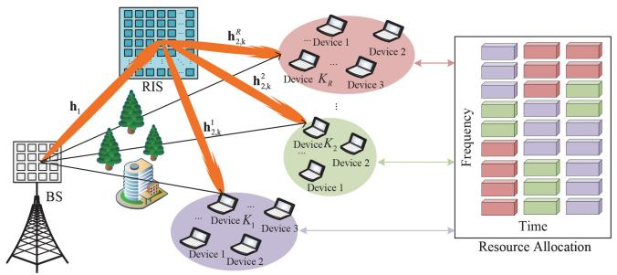

flowchart

```mermaid
graph TD
    BS["BS"] --> h1["h₁"]
    BS --> h2["h₂,k"]
    h1 --> RIS["RIS"]
    h2 --> RIS
    RIS --> hR["hᵣ²,₂ₖ"]
    RIS --> hR2["hᵣ²,₂ₖ"]
    hR --> Device1["Device 1"]
    hR --> Device2["Device 2"]
    hR2 --> Device3["Device 3"]
    h1 --> DeviceK1["Device K₁"]
    h2 --> DeviceK2["Device K₂"]
    h1 --> DeviceK3["Device K₃"]
    h2 --> DeviceK4["Device K₄"]
    h1 --> DeviceK5["Device K₅"]
    h2 --> DeviceK6["Device K₆"]
    h1 --> DeviceK7["Device K₇"]
    h2 --> DeviceK8["Device K₈"]
    h1 --> DeviceK9["Device K₉"]
    h2 --> DeviceK10["Device K₁₀"]
    h1 --> DeviceK11["Device K₁₁"]
    h2 --> DeviceK12["Device K₁₂"]
    h1 --> DeviceK13["Device K₁₃"]
    h2 --> DeviceK14["Device K₁₄"]
    h1 --> DeviceK15["Device K₁₅"]
    h2 --> DeviceK16["Device K₁₆"]
    h1 --> DeviceK17["Device K₁₇"]
    h2 --> DeviceK18["Device K₁₈"]
    h1 --> DeviceK19["Device K₁₉"]
    h2 --> DeviceK20["Device K₂₀"]
    h1 --> DeviceK21["Device K₂₁"]
    h2 --> DeviceK22["Device K₂₂"]
    h1 --> DeviceK23["Device K₂₃"]
    h2 --> DeviceK24["Device K₂₄"]
    h1 --> DeviceK25["Device K₂₅"]
    h2 --> DeviceK26["Device K₂₆"]
    h1 --> DeviceK27["Device K₂₇"]
    h2 --> DeviceK28["Device K₂₈"]
    h1 --> DeviceK29["Device K₂₉"]
    h2 --> DeviceK30["Device K₃₀"]
    h1 --> DeviceK31["Device K₃₁"]
    h2 --> DeviceK32["Device K₃₂"]
    h1 --> DeviceK33["Device K₃₃"]
    h2 --> DeviceK34["Device K₃₄"]
    h1 --> DeviceK35["Device K₃₅"]
    h2 --> DeviceK36["Device K₃₆"]
    h1 --> DeviceK37["Device K₃₇"]
    h2 --> DeviceK38["Device K₃₈"]
    h1 --> DeviceK39["Device K₃₉"]
    h2 --> DeviceK40["Device K₄₀"]
    h1 --> DeviceK41["Device K₄₁"]
    h2 --> DeviceK42["Device K₄₂"]
    h1 --> DeviceK43["Device K₄₃"]
    h2 --> DeviceK44["Device K₄₄"]
    h1 --> DeviceK45["Device K₄₅"]
    h2 --> DeviceK46["Device K₄₆"]
    h1 --> DeviceK47["Device K₄₇"]
    h2 --> DeviceK48["Device K₄₈"]
    h1 --> DeviceK49["Device K₄₉"]
    h2 --> DeviceK50["Device K₅₀"]
    h1 --> DeviceK51["Device K₅₁"]
    h2 --> DeviceK52["Device K₅₂"]
    h1 --> DeviceK53["Device K₅₃"]
    h2 --> DeviceK54["Device K₅₄"]
    h1 --> DeviceK55["Device K₅₅"]
    h2 --> DeviceK56["Device K₅₆"]
    h1 --> DeviceK57["Device K₅₇"]
    h2 --> DeviceK58["Device K₅₈"]
    h1 --> DeviceK59["Device K₅₉"]
    h2 --> DeviceK60["Device K₆₀"]
    h1 --> DeviceK61["Device K₆₁"]
    h2 --> DeviceK62["Device K₆₂"]
    h1 --> DeviceK63["Device K₆₃"]
    h2 --> DeviceK64["Device K₆₄"]
    h1 --> DeviceK65["Device K₆₅"]
    h2 --> DeviceK66["Device K₆₆"]
```

Fig. 1. RIS-aided next-generation network and communication.

# A. Channel Model

In the r-th scenario, the signal received by the k-th device is defined as

$$
y _ {k} ^ {r} = \left(\mathbf {h} _ {2, \mathrm{k}} ^ {r}\right) ^ {H} \operatorname{diag} (\mathbf {v}) \mathbf {h} _ {1} \mathbf {w} _ {k} ^ {r} s _ {k} ^ {r} + n _ {k} ^ {r}, \tag {1}
$$

where $\mathbf { w } _ { k } ^ { r } \ \in \ \mathbb { C } ^ { M \times 1 }$ is precoding vectors for BS, $s _ { k } ^ { r } ~ =$ 1 $\sqrt { p _ { k } ^ { r } } m _ { k } ^ { r }$ is the BS transmission signal, where $m _ { k } ^ { r }$ is information symbol and $\sqrt { p _ { k } ^ { r } }$ is the power transmitted to the r-th scenario k-th device. It is assumed that symbols-bearing data is normalized, so $E [ | m _ { k } ^ { r } ( t ) | ^ { 2 } ] = 1$ and $E [ | s _ { k } ^ { r } ( t ) | ^ { 2 } ] \stackrel { = } { = }$ $p _ { k } ^ { r } . ~ n _ { k } ^ { r }$ is the additive noise, $\mathbf { v } = [ v _ { 1 } , v _ { 2 } , \ldots , v _ { N } ] ^ { T }$ is the actual reflection phase shift coefficient of RIS [4], and $v _ { n } =$ $\beta _ { n } ( \varphi _ { n } ) e ^ { j \varphi _ { n } } . \beta _ { n } ( \varphi _ { n } ) \in [ 0 , 1 ]$ is amplitude after reflection. $\beta _ { n }$ and $\varphi _ { n } \in [ - \pi , \pi ]$ cannot be adjusted independently, so $v _ { n }$ is calculated as [4]

$$
v _ {n} = \left((1 - \beta_ {\mathrm{min}}) \left(\frac {\sin (\varphi_ {n} - \phi) + 1}{2}\right) ^ {\alpha} + \beta_ {\mathrm{min}}\right) e ^ {j \varphi_ {n}}. (2)
$$

Channels h1 and hr2,k $\mathbf { h } _ { 1 }$ $\mathbf { h } _ { 2 , \mathrm { k } } ^ { r }$ are the Saleh-Valenzuela channel model and represented as

$$
\mathbf {h} _ {1} = \sqrt {\frac {M N}{L _ {1}}} \sum_ {l _ {1} = 1} ^ {L _ {1}} \alpha_ {l _ {1}} \mathbf {a} \left(\vartheta_ {l _ {1}} ^ {r}, \varphi_ {l _ {1}} ^ {r}\right) \mathbf {b} \left(\vartheta_ {l _ {1}} ^ {b}, \varphi_ {l _ {1}} ^ {b}\right) ^ {T}, \tag {3}
$$

$$
\mathbf {h} _ {2, \mathrm{k}} ^ {r} = \sqrt {\frac {N}{L _ {2 , \mathrm{k}} ^ {r}}} \sum_ {l _ {2} = 1} ^ {L _ {2, \mathrm{k}} ^ {r}} \alpha_ {l _ {2}} ^ {r, k} \mathbf {a} \left(\vartheta_ {l _ {2}} ^ {r, k}, \varphi_ {l _ {2}} ^ {r, k}\right) ^ {T}, \tag {4}
$$

where $L _ { 1 }$ represents multipath components between BS and RIS, and $L _ { \mathrm { 2 . k } } ^ { r }$ represents multipath components between RIS and the k-th device in the r-th scenario. For the $l _ { 1 }$ component on the BS-RIS path, the compound path gain, azimuth (elevation) angle at RIS and BS are represented by $\alpha _ { l _ { 1 } } , \vartheta _ { l _ { 1 } } ^ { r } ( \varphi _ { l _ { 1 } } ^ { r } )$ , and $\vartheta _ { l _ { 1 } } ^ { b } ( \varphi _ { l _ { 1 } } ^ { b } )$ , respectively. Similarly, for the $l _ { 2 }$ component on the RIS to device path, its path gain and the azimuth (elevation) angle at RIS are represented by αr,l2 $\alpha _ { l _ { 2 } } ^ { r , k } , \vartheta _ { l _ { 2 } } ^ { r , k } ( \varphi _ { l _ { 2 } } ^ { r , k } )$ k , ϑr,k (ϕ l2 ， , respectively. For a typical $N _ { 1 } \times N _ { 2 } \ ( N = N _ { 1 } ^ { \circ _ { 2 } } \times N _ { 2 } )$ uniform planar array (UPA), $\mathbf { a } ( \vartheta , \varphi )$ is written as [34]

$$
\begin{array}{l} \mathbf {a} (\vartheta , \varphi) = \frac {1}{\sqrt {N}} \left(e ^ {\frac {- j 2 \pi d}{\lambda} \cos (\varphi) [ 0, 1, \dots , N _ {1} - 1 ] ^ {T}}\right) \\ \otimes \left(e ^ {\frac {- j 2 \pi d}{\lambda} \sin (\varphi) \cos (\vartheta) [ 0, 1,..., N _ {2} - 1 ] ^ {T}}\right), \tag {5} \\ \end{array}
$$

where the variable λ represents carrier wavelength, and d represents the physical spacing between array antenna elements. For efficient spatial sampling, this interval is usually set to half the wavelength, i.e., $d = \lambda / 2$ .

Let $\mathbf { H } _ { k } ^ { r } = d i a g ( \mathbf { h } _ { 2 , \mathrm { k } } ^ { r } ) \mathbf { h } _ { 1 } .$ , in the r-th scenario, then the signal received by the k-th device is re-represented as

$$
y _ {k} ^ {r} = \mathbf {v} ^ {T} \mathbf {H} _ {k} ^ {r} \mathbf {w} _ {k} ^ {r} s _ {k} ^ {r} + n _ {k} ^ {r}. \tag {6}
$$

To obtain an estimate of the device’s downlink cascade channel $\mathbf { H } _ { k } ^ { r } ,$ the BS sends a predefined pilot signal sequence to the target device via RIS in successive time slots of T. In the t-th time slot, where t ranges from 1 to T, the k-th device located in the r-th scenario receives the guide frequency signal yr,pk,t ∈ C which can be expressed as $y _ { k , t } ^ { r , p } \in \mathbb { C }$ yk,t

$$
y _ {k, t} ^ {r, p} = \mathbf {v} _ {t} ^ {T} \mathbf {H} _ {k} ^ {r} \mathbf {w} _ {k} ^ {r} p _ {k, t} ^ {r} + n _ {k, t} ^ {r}, \tag {7}
$$

where $p _ { k , t } ^ { r }$ represents the pilot signal of the t time slot issued by the BS, vt is the vector reflected by RIS in the same slot, and $n _ { k , t } ^ { r }$ is the received noise at the device end of the t slot, which obeys a complex Gaussian distribution with zero mean and $\sigma _ { n } ^ { 2 }$ variance. After conduction transmission of T time slots, the $T \times 1$ total received conduction vectors $\begin{array} { r l r } { { \bf y } _ { k } ^ { r , p } } & { = } & { [ y _ { k , 1 } ^ { r , p ^ { \prime } } , y _ { k , 2 } ^ { r , p } , \ldots , y _ { k , T } ^ { r , p } ] ^ { T } , \ \Phi = [ v _ { 1 } , v _ { 2 } , \ldots , v _ { T } ] ^ { T } } \end{array}$ [y k ,1 , , $\mathbf { n } _ { k } ^ { r } = [ n _ { k , 1 } ^ { r } , n _ { k , 2 } ^ { r } , \ldots , n _ { k , T } ^ { r } ] ^ { T }$ T can be obtained by assuming $p _ { k , t } ^ { r } = 1$ ,

$$
\mathbf {y} _ {k} ^ {r, p} = \boldsymbol {\Phi} \mathbf {H} _ {k} ^ {r} \mathbf {w} _ {k} ^ {r} + \mathbf {n} _ {k} ^ {r}. \tag {8}
$$

On the basis of $\mathrm { v e c } ( \mathbf { A B C } ) = ( \mathbf { C } ^ { T } \otimes \mathbf { A } ) \mathrm { v e c } ( \mathbf { B } ) \ [ 3 4 ] , \mathbf { y } _ { k } ^ { r , p }$ is reexpressed as

$$
\mathbf {y} _ {k} ^ {r, p} = \left(\mathbf {w} _ {k} ^ {r} \otimes \boldsymbol {\Phi}\right) \operatorname{vec} \left(\mathbf {H} _ {k} ^ {r}\right) + \mathbf {n} _ {k} ^ {r}. \tag {9}
$$

For channel estimation, $\mathbf { w } _ { k } ^ { r }$ and  are predesigned as Φfixed values. During channel estimation, BS and device know $\left( \mathbf { w } _ { k } ^ { r } \otimes \mathbf { \Phi } ^ { \Phi } \right)$ . And the downlink cascade channel ${ \bf { H } } _ { k } ^ { r }$ is estimated Φbased on the known $\left( \mathbf { w } _ { k } ^ { r } \otimes \mathbf { \Phi } ^ { \Phi } \right)$ and $\mathbf { y } _ { k } ^ { r , p }$ . The meticulously designed BS precoding vector $\mathbf { w } _ { k } ^ { r }$ and the RIS reflection matrix facilitate the feedback of the estimated downlink cascaded Φchannel information to the BS, enabling efficient beamforming operations. Specifically, the neural network establishes a complex mapping function that captures the relationship between the received guide frequency signals and the cascaded channels in the downlink transmission and is expressed as

$$
\hat {\mathbf {h}} _ {k} ^ {r} = f _ {\theta} \left(\mathbf {y} _ {k} ^ {r, p}\right). \tag {10}
$$

where $\mathbf { h } _ { k } ^ { r } = \mathrm { v e c } ( \mathbf { H } _ { k } ^ { r } ) , f _ { \theta } : \mathbb { C } ^ { T } \mapsto \mathbb { C } ^ { M N }$ denote nonlinear mapping functions with weight θ. Downlink channel estimation method is shown in Fig. 2.

# B. System Utility Model

In the r-th scenario, the downlink rate of the k-th device is

$$
R _ {k} ^ {r} = B ^ {r} \log (1 + S N R _ {k} ^ {r}), \tag {11}
$$

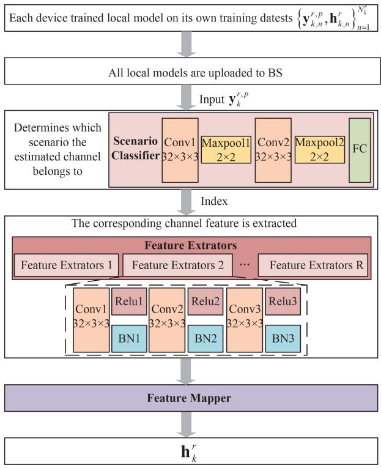

flowchart

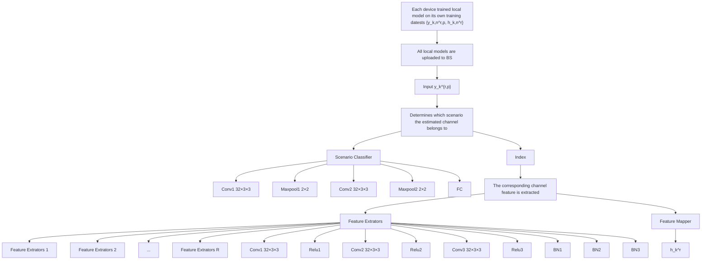

Fig. 2. The proposed CDL.

$$
S N R _ {k} ^ {r} = \frac {\left. p _ {k} ^ {r} \right| \left(\mathbf {w} _ {k} ^ {r} \otimes \boldsymbol {\Phi}\right) \mathbf {h} _ {k} ^ {r} \big | ^ {2}}{\left(\sigma_ {k} ^ {r}\right) ^ {2}}. \tag {12}
$$

The EE, QoS satisfaction rate (QoSSR) are

$$
E E = \frac {\sum_ {r \in R} \sum_ {k \in K _ {r}} R _ {k} ^ {r}}{B P}, \tag {13}
$$

$$
Q o S S R ^ {r} = \frac {\sum_ {k \in K _ {r}} \sum_ {q _ {k} \in Q _ {k}} x _ {q _ {k}}}{\sum_ {k \in K _ {r}} | Q _ {k} |}, \tag {14}
$$

where $Q _ { k }$ represents the total number of packets sent to the k-th device, determined by actual service requirements. The binary variable $x _ { q _ { k } } = 1$ indicates successful receipt of packet $q _ { k } ~ \in ~ Q _ { k }$ by the k-th device, $x _ { q _ { k } } ~ \in ~ ( 0 , 1 )$ , with both the downlink data rate $R _ { k } ^ { r }$ and waiting time $l _ { q _ { k } }$ meeting specified criteria simultaneously. Therefore, $x _ { q _ { k } } ~ = ~ 1$ if and only if $R _ { k } ^ { r } \geq \bar { R } ^ { r }$ and $l _ { q _ { k } } \ \leq \ \bar { l } ^ { r }$ , where $l _ { q _ { k } }$ denotes the delay taking into account queuing and transmission delays. $\bar { R } ^ { r }$ and $\bar { l } ^ { r }$ are the predetermined rate and waiting time values for QoSSR based on the service type.

Then the system utility is defined as

$$
J = c _ {1} E E + \sum_ {r \in R} c _ {2} ^ {r} Q o S S R ^ {r}, \tag {15}
$$

where $c _ { 1 }$ and $c _ { 2 } ^ { r }$ are weighting factors, determined by the importance of EE and QoSSR.

# C. Problem Formulation

Devices in different communication service scenarios have varying resource requirements. To maximize the utility of the whole system, more bandwidth is allocated to scenarios with high resource demand, while fewer resources are allocated to those with low demand. Thus, this paper conducts a resource allocation study. Based on channel estimation, the resource preallocation problem is modeled as

P0: max J

s.t. C 1: $\hat { \mathbf { h } } _ { k } ^ { r } = f _ { \theta } \big ( \mathbf { y } _ { k } ^ { r , p } \big )$ ,

$$
C 2 \colon v _ {n} = \beta_ {n} (\varphi_ {n}) e ^ {j \varphi_ {n}}, \forall n \in \{1, 2, \dots , N \},
$$

$$
C 3 \colon v _ {n} \in V, \forall n,
$$

$$
C 4 \colon \| \mathbf {w} _ {k} \| ^ {2} = 1, \forall k,
$$

$$
C 5 \colon \sum_ {r \in R} B ^ {r} = B,
$$

$$
C 6: \sum_ {r \in R, k \in K _ {r}} p _ {k} ^ {r} \leq P,
$$

$$
C 7: \sum_ {k \in K _ {r}} | Q _ {k} | = d ^ {r},
$$

$$
C 8: x _ {q _ {k}} = \left\{ \begin{array}{l} 1, \text {   if   } R _ {k} ^ {r} \geq \bar {R} ^ {r} \text {   and   } l _ {q _ {k}} \leq \bar {l} ^ {r}, \\ 0, \text {   otherwise.   } \end{array} \right. \tag {16}
$$

In the objective function, constraint C1 represents channel estimation. Constraint C2 and C3 represent the actual RIS discrete reflection coefficient and its set, respectively. Constraint C4 ensures the beamforming vector of the BS remains a unit vector. Constraint C5 represents the set of bandwidth resources. The C6 constraint specifies the maximum transmission power limit of the BS. Constraint C7 means the number of demands received by the r-th scenario is denoted as $d ^ { r }$ . The value of $d ^ { r }$ is influenced by both the quantity of demands and the allocation of bandwidth from the previous time slot. Constraint C8 represents whether packet $q _ { k }$ is received by device k.

# III. GAI-DRIVEN RESOURCE ALLOCATION SCHEME BASE ON CHANNEL ESTIMATION

# A. Channel Distribution Learning

In existing work [30], [31], [32], [33], [34], optimized RL and other techniques are used for cascaded channel estimation of RIS-assisted wireless communication networks. DNNs are deployed in this paper on the device side to estimate downlink cascade channel [34].

The primary objective of DNN training involves modifying network parameters θ to reduce the value of the loss function.

$$
\min _ {\theta} (\theta) = \frac {1}{N _ {k} ^ {r}} \sum_ {n = 1} ^ {N _ {k} ^ {r}} \left\| \hat {\mathbf {h}} _ {k, n} ^ {r} - \mathbf {h} _ {k, n} ^ {r} \right\| _ {2} ^ {2}, \tag {17}
$$

where $N _ { k } ^ { r }$ represents the training data set size of the k-th $\mathbf { y } _ { k , n } ^ { r , p }$ yk,n ce under r-th scenario. Neural networkto predict the output is expressed as r $\hat { \mathbf { h } } _ { k , n } ^ { r } \stackrel { \mathrm { ~ \tiny ~ = ~ } } { = } f _ { \theta } ( \mathbf { y } _ { k , n } ^ { r , \bar { p } } )$ and the label $\mathbf { h } _ { k , n } ^ { r }$ hcan be obtained using a traditional LS hbased channel estimation. The DNN learns on the training set through the iterative i process. In each iteration, the weight θ is updated by gradient descent,

$$
\theta_ {i + 1} = \theta_ {i} - \eta_ {i} \mathbf {g} (\theta_ {i}), \tag {18}
$$

where $\theta _ { i }$ and $\theta _ { i + 1 }$ represent the weights of round i and round $i + 1$ iteration respectively. These parameter sets are gradually optimized during network training to reduce prediction errors and improve estimation accuracy. ${ \bf g } ( \boldsymbol \theta _ { i } )$ is the gradient vector relative to the weight $\theta _ { i }$ at the i iteration, which directs the direction and step size of the parameter update. The learning rate $\eta _ { i }$ is a key hyperparameter that controls the rate of weight adjustment. Upon completion of DNNs training, the device will use this trained model to directly perform channel estimation. This means that devices no longer need to perform complex mathematical operations to extract channel characteristics from the original signal, but can simply feed the received signal into the neural network and get an estimate quickly.

To enhance the channel estimation accuracy across various conditions, the process begins with the establishment of a scenario classifier (SC). This classifier takes the incoming pilot signals and predicts the channel scenario index $r _ { p } ,$ and $r _ { p } \in \{ 1 , 2 , \ldots , R \}$ . Next, for each identified scenario, a dedicated feature extractor (FE) is designed. The pilot signals are subsequently fed into the relevant FE to extract relevant channel attributes. Lastly, these extracted channel attributes are input into a feature mapper (FM), which constructs the comprehensive downlink cascaded channel.

# B. GAI-Driven Resource Allocation

1) DBRL: The Markov decision process is expressed as $\langle \mathsf { S } , \mathsf { A } , \mathsf { R } , \mathsf { P } , \gamma \rangle$ , where S and A represent the spaces of states and actions respectively, R stands for reward function, $\mathsf { P } ( s ^ { \prime } | s , a )$ represents the probability of transitioning to state $s ^ { \prime }$ from state s, and $\gamma$ (ranging between 0 and 1) is the discount factor. A policy $\pi ( \cdot | s )$ maps the state to the distribution on the action.

$$
U _ {q} ^ {\pi} (s, a) = \mathbb {E} _ {\pi , \mathrm{P}} \left[ \sum_ {t = 0} ^ {\infty} \gamma^ {t} \mathrm{R} _ {t} | \mathrm{S} _ {0} = s, \mathrm{A} _ {0} = a \right]. \tag {19}
$$

$U _ { q } ^ { \pi } ( s , a )$ is the action-value function, representing the expected return from s, taking action a, following strategy π. RL aims to identify an optimal policy $\pi ^ { * }$ that maximizes $U _ { q } ( s , a )$ for all states s and actions $a , \ \pi ^ { * }$ is expressed as arg $\operatorname* { m a x } _ { \pi } U _ { q } ^ { \pi } ( s , a )$ , with the corresponding optimal actionvalue function $U _ { q } ^ { * } ( s , a )$ . This optimal function $U _ { q } ^ { * } ( s , a )$ fulfills the Bellman optimality equation [28],

$$
U _ {q} ^ {*} (s, a) = \mathbb {E} _ {\pi^ {*}, \mathrm{P}} \left[ \mathrm{R} + \gamma \max _ {a ^ {\prime} \in \mathrm{A}} U _ {q} ^ {*} \left(s ^ {\prime}, a ^ {\prime}\right) \right]. \tag {20}
$$

The associated Bellman optimality operator is denoted by ${ \mathsf { T } } ^ { * }$ ,

$$
\mathsf {T} ^ {*} U _ {q} (s, a) = \mathbb {E} _ {\pi , \mathsf {P}} \left[ \mathsf {R} + \gamma \max _ {a ^ {\prime} \in \mathsf {A}} U _ {q} \left(s ^ {\prime}, a ^ {\prime}\right) \right]. \tag {21}
$$

In scenarios with high dimensionality, leveraging function approximation to represent action values succinctly is essential. $U _ { q } ^ { \theta } ( s , a )$ is considered as a parametric function characterized by parameters θ, serving as an approximation representation. The optimization objective is to adjust θ so that $U _ { q } ^ { \bar { \theta } } ( s , a )$ closely resembles $U _ { q } ^ { * } ( s , a )$ . This approximation can be refined iteratively through the application of the Bellman optimality operator ${ \mathsf { T } } ^ { * }$ .

Traditional RL minimizes temporal difference error to find an approximator for the optimization function U. While

DBRL focuses on the distribution over returns rather than their expected value $U _ { q } ^ { \pi }$ , enhancing resilience to variations in hyperparameters and environmental noise, as suggested in [35]. The variable $Z ( s , \ a )$ is the return from performing action a from state s by following policy π. The value of $Z ( s ,$ a) is subject to fluctuations due to inherent uncertainties in the environment.

Similarly, the distribution Bellman equation is expressed as

$$
Z (s, a) \stackrel {D} {=} \gamma Z \left(s ^ {\prime}, a ^ {\prime}\right). \tag {22}
$$

The notation $A { \stackrel { D } { = } } B$ signifies that the random variable A follows the same probability distribution as B. Thus, the associated distributional Bellman optimality operator $\mathsf { T } _ { d } ^ { * }$ is

$$
\mathsf {T} _ {d} ^ {*} Z (s, a) \stackrel {{D}} {{=}} \mathsf {R} + \gamma Z \left(s ^ {\prime}, \underset {a ^ {\prime} \in \mathsf {A}} {\arg \max} \left[ Z \left(s ^ {\prime}, a ^ {\prime}\right) \right]\right). \tag {23}
$$

In DBRL, the goal is minimizing the statistical distance

$$
\sup _ {s, a} \text { dist } (\mathsf {T} ^ {*} Z (s, a), Z (s, a)). \tag {24}
$$

The dist $( \mathsf { T } _ { d } ^ { * } Z ( s , a ) , Z ( s , a ) )$ represents the distance between the variables $\mathsf { T } _ { d } ^ { * } Z ( s , a )$ and $Z ( s , \ a ) .$ , it can be measured using the p-Wasserstein metric. The p-Wasserstein distance measures the dissimilarity between two probability distributions by considering their cumulative distribution functions (CDFs). Let two real-valued random variables A and $B ,$ with corresponding CDFs denoted by $F _ { A }$ and $F _ { B }$ . The p-Wasserstein distance quantifies the cost of transforming the distribution of A into that of B, capturing the notion of distributional discrepancy in a geometric context, so $W _ { p } ( A , B )$ is

$$
W _ {p} (A, B) = \left(\int_ {0} ^ {1} \left| F _ {A} ^ {- 1} (w) - F _ {B} ^ {- 1} (w) \right| ^ {p} d w\right) ^ {1 / P}. \tag {25}
$$

In theory, the $\mathsf { T } _ { d } ^ { * }$ acts as a strict contraction with respect to the p-Wasserstein metric, effectively minimizing a specific target function, such as equation (24) in a given context. P-Wasserstein distance can be used to give the optimal distribution of action value.

2) GAI-Driven Resource Allocation Algorithm: GANs are introduced, and a typical GANs encompass a generative model, G, and a discriminative model, D. G is composed of a state embedding layer, a sample embedding layer, each with two neural layers that process states and quantile samples respectively, and a particle generation component with multiple layers that combines the embeddings via Hadamard product to output action value distributions. In contrast, D is a multilayer perceptron culminating in a single output neuron, tasked with distinguishing between genuine and generated data. Network D and G engage in an adversarial game where G strives to fool D with increasingly convincing data, while D improves its ability to detect the counterfeit, driving the evolution of $\vec { G } \ '$ data generation towards indistinguishability from real data.

GANs aim to minimize the discrepancy between the distribution of real data and that of the synthetic data (providing sufficient gradient almost everywhere) [24], [36]. Since the equation for the 1-Wasserstein distance is very tricky, the Wasserstein GANs (WGANs) specifically focuses on reducing the 1-Wasserstein distance, which provides more stable gradients. WGANs leverage the Kantorovich-Rubinstein duality to make the computation of this distance more tractable, which requires the duality to be a proper 1-Lipschitz function. To adhere to this requirement, WGANs enforce a constraint on the node’s weights, keeping them within a limited range determined by a chosen hyperparameter, a technique often referred to as weight clipping [25].

$$
\begin{array}{l} \min _ {G} \max _ {D \in \mathsf {D}} \mathbb {E} _ {\mathbf {x} \sim p _ {d a t a}} [ D (\mathbf {x}) ] - \mathbb {E} _ {\mathbf {z} \sim p _ {\mathbf {z}} (\mathbf {z})} [ D (G (\mathbf {z})) ] \\ + \lambda \mathbb {E} (\| \nabla_ {\hat {\mathbf {x}}} D (\mathbf {x}) \| _ {2} - 1) ^ {2}, \tag {26} \\ \end{array}
$$

where D signifies the set of 1-Lipschitz functions. Real data samples are denoted by x, while z represents samples from a random distribution. The interpolated sample ˆ is a convex combination of x and $G ( \mathbf { z } )$ x, with ε drawn uniformly from the interval [0, 1]. The gradient penalty, $p ( \lambda ) =$ $\lambda \mathbb { E } [ ( \| \nabla _ { \hat { \mathbf { x } } } D ( \mathbf { x } ) \| _ { 2 } - 1 ) ^ { 2 } ]$ adds computational complexity, but it xsignificantly improves the performance of WGANs with gradient penalty over traditional GANs. This improved version of WGANs, incorporating the gradient penalty, is thus employed in the GAI-driven resource allocation algorithm to effectively learn the optimal distribution of action values for resource allocation tasks.

The GAI-driven resource allocation algorithm is shown in Fig. 3. During the t-th iteration, the agent presents the current state $\begin{array} { r l r } { \mathsf { S } _ { t } } & { { } = } & { s } \end{array}$ along with a set of samples $\iota ,$ which are drawn from a uniform distribution, to the G network. The output from network G is a collection of actionvalue particle estimates, referred to as $G ( s , \iota )$ . For a given action a, these particles are specified as $G ^ { ( a ) } ( s , \iota )$ , and the total count of particles N. Subsequently, the agent computes $\begin{array} { r } { U _ { q } ( s , \iota ) ~ = ~ \frac { \bar { \Lambda } } { N } \sum G ^ { ( a ) } ( s , \iota ) , \forall a ^ { \mathrm { ~ \scriptsize ~ \in ~ \bar { A } ~ } } } \end{array}$ , and selects $a _ { i } ^ { * } ~ =$ arg $\operatorname* { m a x } _ { a } U _ { q } ( s , a )$ for execution. The new reward clipping mechanism is proposed in [10].

$$
r = \left\{ \begin{array}{l l} \ell , & J \geq c _ {1}, \\ 0, & c _ {2} <   J <   c _ {1}, \\ - \ell , & J \leq c _ {2}, \end{array} \right. \tag {27}
$$

where $J \ge 0 , c _ { 1 }$ , and $c _ { 2 } \ ( c _ { 1 } \geq c _ { 2 } )$ are predefined thresholds. According to the system utility J, the agent performs the reward tailoring of J, gets the reward r. Subsequently, the environment transitions to next state $\mathsf { S } _ { t + 1 } = s ^ { \prime }$ . This sequence of state, optimal action, reward, and next state, represented as $\langle s , a ^ { * } , r , s ^ { \prime } \rangle$ is archived in the replay buffer B. Once B reaches capacity, the agent updates networks G and D by utilizing all transitions in B every K iterations.

During the training and update cycle, the agent chooses m random samples from B to form a minibatch for the GAIdriven resource allocation training process. Agent applies the $\mathsf { T } _ { d } ^ { * }$ to each transition within the selected minibatch, resulting in the target action-value particles, which is represented as

$$
y _ {i} = r _ {i} + \gamma \hat {G} ^ {\left(a _ {i} ^ {*}\right)} \left(s _ {i} ^ {\prime}, \iota_ {i}\right), \tag {28}
$$

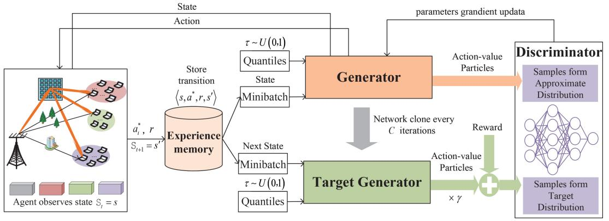

flowchart

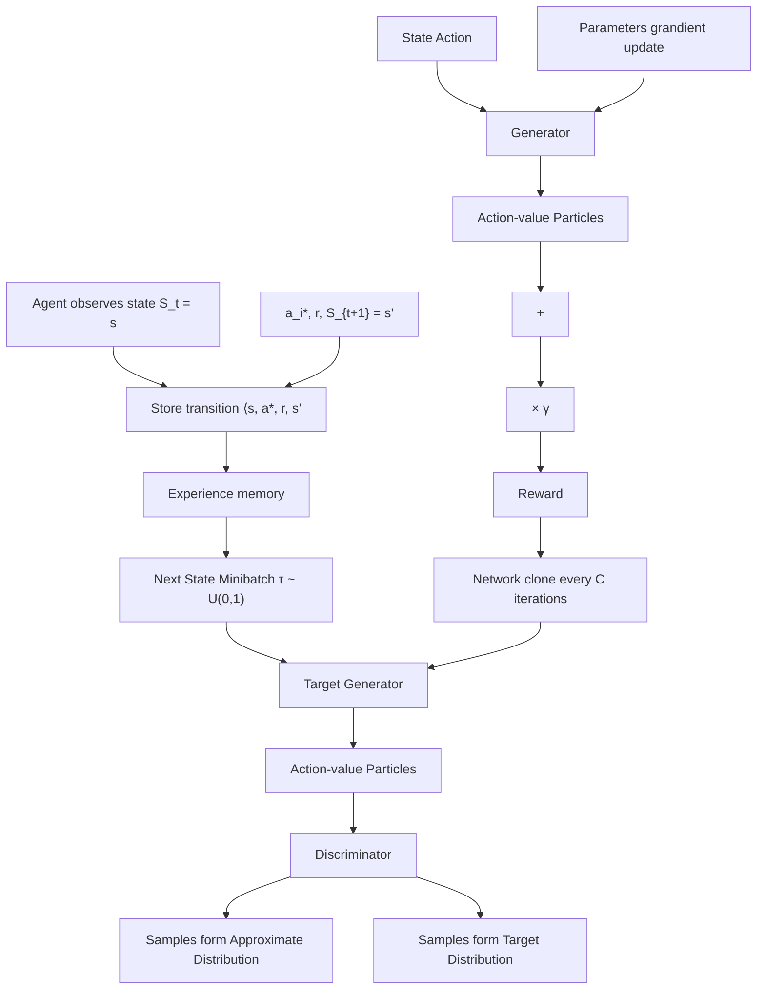

Fig. 3. GAI-driven resource allocation algorithm.

where $a _ { i } ^ { * }$ represents the action that yields the highest expected value among action-value particles. Finally, the agent employs the $\mathcal { L } _ { D }$ and $\mathcal { L } _ { G }$ to train networks D and G, respectively,

$$
\mathcal {L} _ {D} = \underset { \begin{array}{c} \iota \sim U (0, 1) \\ (s, a) \sim \mathcal {B} \end{array} } {\mathbb {E}} \left[ D \left(G ^ {(a)} (s, \iota)\right) \right] - \underset {(s, a, r, s ^ {\prime}) \sim \mathcal {B}} {\mathbb {E}} [ D (y) ] + p (\lambda), \tag {29}
$$

$$
\mathcal {L} _ {G} = - \underset { \begin{array}{c} \iota \sim U (0, 1) \\ (s, a) \sim \mathcal {B} \end{array} } {\mathbb {E}} \left[ D \left(G ^ {(a)} (s, \iota)\right) \right]. \tag {30}
$$

Network D’s training objective is to enhance its precision in differentiating between the target action-value particles and those generated by network G. The goal for network G’s training is to refine its generation of action-value particles to the extent that they deceive network D as effectively as possible. To ensure the stability of the training process, the target network Gˆ is updated every C iterations. GAI-driven resource allocation algorithm based on CDL is shown in Algorithm 1.

# IV. NUMERICAL RESULTS

The advantages of the CDL and GAI-driven resource allocation algorithm in RIS-aided next-generation network and communication are evaluated in this section. The BS comprises an antenna panel with a 4 × 4 uniform planar array. The RIS comprises $8 \times 8$ passive reflective elements arranged in a planar array. The actual reflection phase shift coefficients [4] of the RIS are $\beta _ { \mathrm { m i n } } , ~ \phi = 0 . 4 3 \pi , ~ \alpha = 1 . 6$ . The total bandwidth is set as 10MHz. The power of BS is $P ~ = ~ 1 6$ dBm. It is assumed that a single device can collect 4000 samples, out of which 3000 are used as the training dataset and the remaining 1000 are used as the training dataset. Service scenarios are divided into R = 3 types, namely smart home, virtual reality video and autonomous vehicle. The requirements are as follows: Scenario 1 (smart home) requires a speed greater than 51 Kbps and a delay less than 10 milliseconds (ms). Scenario 2 (virtual reality video) requires a speed greater than 100 Mbps and a delay less than 10 ms. Scenario 3 (autonomous vehicle) requires a delay of less than 1 ms.

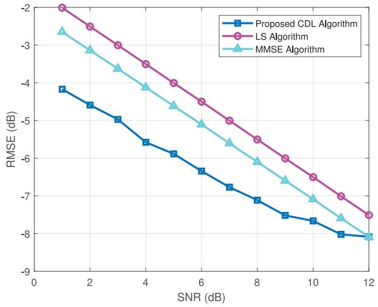

line

| SNR (dB) | Proposed CDL Algorithm | LS Algorithm | MMSE Algorithm |
| -------- | ---------------------- | ------------ | -------------- |
| 1        | -4.2                   | -2.0         | -2.8           |
| 2        | -4.5                   | -2.5         | -3.2           |
| 3        | -4.8                   | -2.9         | -3.6           |
| 4        | -5.2                   | -3.4         | -4.0           |
| 5        | -5.6                   | -3.9         | -4.5           |
| 6        | -6.0                   | -4.4         | -5.0           |
| 7        | -6.4                   | -4.9         | -5.5           |
| 8        | -6.8                   | -5.4         | -6.0           |
| 9        | -7.2                   | -5.9         | -6.5           |
| 10       | -7.6                   | -6.4         | -7.0           |
| 11       | -8.0                   | -6.9         | -7.5           |
| 12       | -8.4                   | -7.4         | -8.0           |

Fig. 4. RMSE vs SNR for different algorithms.

# A. CDL Algorithm

Fig. 4 illustrates the variation of root mean square error (RMSE) with SNR for different channel estimation methods. When the SNR is low, traditional schemes fail to achieve reliable channel estimation in various service scenarios. In contrast, the proposed CDL algorithm consistently demonstrates better RMSE performance across all SNR values. demonstrating both improved estimation accuracy and enhanced robustness while reducing pilot overhead. Specifically, under low SNR conditions, traditional LS and minimum mean square error (MMSE) algorithms struggle to provide accurate channel estimation due to significant noise impact. In contrast, the CDL algorithm, with its unique design and optimization, maintains high estimation accuracy even under such adverse conditions. As the SNR increases, the effect of noise diminishes substantially, making channel estimation primarily dependent on the quality of the signal itself, allowing these algorithms to achieve similar results at high SNR. Furthermore, the pilot cost for traditional schemes increases significantly at high SNR conditions, as they require more pilot symbols to maintain accuracy. In contrast, the CDL algorithm offers a distinct advantage by maintaining high estimation accuracy with significantly lower pilot overhead, regardless of the SNR. This efficiency allows the CDL algorithm to provide reliable and resource-efficient channel estimation across a broad range of SNR conditions, underscoring its value and potential for practical applications.

Algorithm 1 GAI-Driven Resource Allocation Algorithm Based on CDL   
1: The random weights $\theta_{G}$ and $\theta_{D}$ are used to initialize the network G and D. The weight $\theta_{\hat{G}} \leftarrow \theta_{G}$ is used to initialize the target generator $\hat{G}$ .
2: Set initial parameters: particle number N, gradient penalty factor $\lambda$ , batch size b, discount factor $\gamma$ , an empty replay buffer B, iterative index t, weighted value $\theta$ , gradient vector $g_{k}^{r}$ , iteration index i = 0, and scenario number R.
3: repeat
4: Devices train local models on its own training data set $\left\{\mathbf{y}_{k,n}^{r,p},\mathbf{h}_{k,n}^{r}\right\}_{n=1}^{N_{k}^{r}}$ .
5: Each device calculates the gradient vector $\mathbf{g}_{k}^{r}(\theta_{i})$ .
6: Based on $y_{k}^{r,p}$ , scenario classifier predicts $r_{p}$ .
7: Based on $r_{p}$ , the corresponding feature extractor $r_{p}$ aggregates all local gradient vectors $\left\{\mathbf{g}_{k}^{r_{p}}(\theta_{i})\right\}_{k=1}^{K_{rp}}$ under scenario $r_{p}$ .
8: Update iteration index $i \leftarrow i + 1$ .
9: until Predefined stop conditions are met. (e.g., preset number of iterations)
10: The feature mapper constructs the downlink cascaded channel $h_{k}^{r}$ .
11: repeat
12: Agent observes $S_{t} = s$ , calculates $U_{q}(s,\iota) = \frac{1}{N} \times \sum G^{(a)}(s,\iota), \forall a \in A$ , performs $a_{i}^{*} = arg max_{a} U_{q}(s,a)$ , calculates $R_{k}^{r}, EE, QoSSR^{r}$ , and J, gets the reward r by using equation (27), and observes $S_{t+1} = s'$ .
13: Agent stores $\langle s, a^{*}, r, s'\rangle$ transition in B.
14: When the replay buffer B reaches its capacity, the agent updates $\theta_{G}$ and $\theta_{D}$ every K iterations.
15: repeat
16: Randomly sample m transitions from B as batch $\{s, a, r, s'\}_{i=1}^{m}$ for GANs training.
17: Sample minibatch $\{\iota\}_{i=1}^{m} \sim U(0,1)$ and cpmpute target action-value particles by using equation (28).
18: Update discriminator weight $\theta_{D}$ by using equation (29).
19: Update generator weight $\theta_{G}$ by using equation (30).
20: until All transitions in B are utilized for training.
21: Every C iterations, agent clones network G to the target network $\hat{G}$ by resetting $\theta_{\hat{G}} = \theta_{G}$ .
22: Increment iteration index $t + 1 \leftarrow t$ .
23: until Predefined stopping criteria are met.

The prediction accuracy of SCs under different batch sizes and different SC conditions is shown in Fig. 5. Compared with the basic SC, the adopted SC adds a convolutional layer, significantly enhancing feature extraction. The results show that when SNR is greater than 5, the prediction accuracy surpasses 90% and continues to improve with higher SNR values. When SNR is greater than 8, the prediction accuracy of SC can reach more than 95%. In addition, when batchsize = 200,

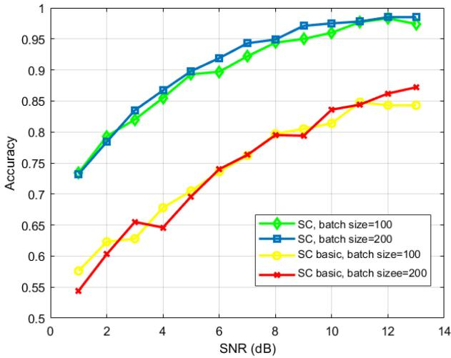

line

| SNR (dB) | SC, batch size=100 | SC, batch size=200 | SC basic, batch size=100 | SC basic, batch size=200 |
| -------- | ------------------ | ------------------ | ------------------------ | ------------------------ |
| 1        | 0.73               | 0.73               | 0.58                     | 0.54                     |
| 2        | 0.80               | 0.79               | 0.63                     | 0.61                     |
| 3        | 0.82               | 0.84               | 0.63                     | 0.66                     |
| 4        | 0.85               | 0.87               | 0.68                     | 0.65                     |
| 5        | 0.89               | 0.90               | 0.71                     | 0.70                     |
| 6        | 0.90               | 0.92               | 0.74                     | 0.74                     |
| 7        | 0.92               | 0.94               | 0.76                     | 0.76                     |
| 8        | 0.94               | 0.95               | 0.80                     | 0.80                     |
| 9        | 0.95               | 0.96               | 0.81                     | 0.80                     |
| 10       | 0.96               | 0.97               | 0.82                     | 0.84                     |
| 11       | 0.97               | 0.98               | 0.85                     | 0.85                     |
| 12       | 0.98               | 0.99               | 0.85                     | 0.86                     |
| 13       | 0.97               | 0.99               | 0.85                     | 0.87                     |

Fig. 5. Accuracy vs SNR for different batchsize and SC.

the prediction accuracy of SC is slightly higher and more stable. This shows that larger batchsize contributes to more reliable predictions by processing more data simultaneously. Additionally, the incorporation of the convolutional layer in the adopted SC provides it with a more powerful mechanism for identifying and learning relevant features from the input data. Overall, the data demonstrates that both the convolutional layer and the batch size are critical factors in the performance of the SC. The adopted SC, with its advanced feature extraction capabilities and appropriate batch size setting, proves to be highly effective in achieving high prediction accuracy across a range of SNR values, making it a robust choice for practical applications.

# B. GAI-Driven Resource Allocation Algorithm

Fig. 6 shows how system EE and QoSSR vary with the number of iterations under different total bandwidth conditions. In Fig. 6(a), it is evident that with a total bandwidth of 10 MHz, the system’s EE is notably higher compared to when the total bandwidth is 5 MHz. This indicates that increasing the bandwidth can enhance the EE of the system. Fig. 6(b) and Fig. 6(d) show that in scenario 1 and scenario 3, QoSSR stays above 1.0 regardless of the total bandwidth of 5 MHz or 10 MHz, indicating high satisfaction with quality of service through resource allocation strategy. In Fig. 6(c), the QoSSR fluctuation of scenario 2 when the total bandwidth is 10 MHz is initially small and gradually stabilizes at about 1.0, while the QoSSR fluctuation of scenario 2 when the total bandwidth is 5 MHz is between 0.9 and 1.0. These results show that larger bandwidth can improve EE in service scenarios and make QoSSR more stable and perform better. Overall, greater bandwidth and reasonable resource allocation can improve the EE of the system and improve the stability and performance of QoSSR in different service scenarios.

Fig. 7 illustrates how system utility evolves with the number of iterations, where $c _ { 1 }$ and $c _ { 2 }$ represent the thresholds set in equation (27). When $c _ { 1 } = 5 . 5$ and $c _ { 2 } = 3 . 5 $ , the system utility initially fluctuates significantly but stabilizes after about 2400 iterations. For $c _ { 1 } ~ = ~ 6 . 5$ and $c _ { 2 } ~ = ~ 4 . 5 .$ , the system utility experiences more drastic initial fluctuations, stabilizing after approximately 2000 iterations. Notably, with larger packet sizes, the system utility stabilizes more quickly, indicating improved data transmission efficiency. These observations highlight that selecting appropriate threshold settings is crucial for achieving rapid convergence and stable system utility. In practical applications such as smart homes, virtual reality, and autonomous vehicles, fine-tuning these thresholds can significantly enhance performance.

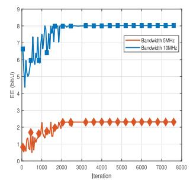

line

| Iteration | Bandwidth 5MHz | Bandwidth 10MHz |
| --------- | -------------- | --------------- |
| 0         | 0.5            | 4.5             |
| 500       | 1.0            | 6.0             |
| 1000      | 1.5            | 7.0             |
| 1500      | 2.0            | 7.5             |
| 2000      | 2.5            | 8.0             |
| 2500      | 2.5            | 8.0             |
| 3000      | 2.5            | 8.0             |
| 3500      | 2.5            | 8.0             |
| 4000      | 2.5            | 8.0             |
| 4500      | 2.5            | 8.0             |
| 5000      | 2.5            | 8.0             |
| 5500      | 2.5            | 8.0             |
| 6000      | 2.5            | 8.0             |
| 6500      | 2.5            | 8.0             |
| 7000      | 2.5            | 8.0             |
| 7500      | 2.5            | 8.0             |
| 8000      | 2.5            | 8.0             |

(a)

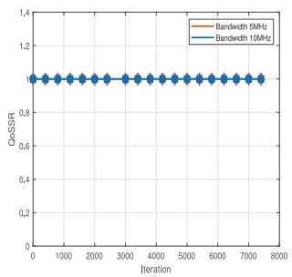

line

| Iteration | Bandwidth 5MHz | Bandwidth 1MHz |
| --------- | -------------- | -------------- |
| 0         | 1.0            | 1.0            |
| 1000      | 1.0            | 1.0            |
| 2000      | 1.0            | 1.0            |
| 3000      | 1.0            | 1.0            |
| 4000      | 1.0            | 1.0            |
| 5000      | 1.0            | 1.0            |
| 6000      | 1.0            | 1.0            |
| 7000      | 1.0            | 1.0            |
| 8000      | 1.0            | 1.0            |

(b)

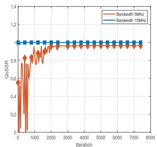

line

| Iteration | Bandwidth 5MHz | Bandwidth 10MHz |
| --------- | -------------- | --------------- |
| 0         | 0.6            | 1.0             |
| 500       | 0.8            | 1.0             |
| 1000      | 0.9            | 1.0             |
| 1500      | 0.95           | 1.0             |
| 2000      | 0.98           | 1.0             |
| 2500      | 0.99           | 1.0             |
| 3000      | 1.0            | 1.0             |
| 3500      | 1.0            | 1.0             |
| 4000      | 1.0            | 1.0             |
| 4500      | 1.0            | 1.0             |
| 5000      | 1.0            | 1.0             |
| 5500      | 1.0            | 1.0             |
| 6000      | 1.0            | 1.0             |
| 6500      | 1.0            | 1.0             |
| 7000      | 1.0            | 1.0             |
| 7500      | 1.0            | 1.0             |
| 8000      | 1.0            | 1.0             |

（c）

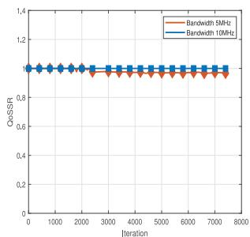

line

| Iteration | Bandwidth 5MHz | Bandwidth 10MHz |
| --------- | -------------- | --------------- |
| 0         | 1.0            | 1.0             |
| 1000      | 1.0            | 1.0             |
| 2000      | 1.0            | 1.0             |
| 3000      | 1.0            | 1.0             |
| 4000      | 1.0            | 1.0             |
| 5000      | 1.0            | 1.0             |
| 6000      | 1.0            | 1.0             |
| 7000      | 1.0            | 1.0             |
| 8000      | 1.0            | 1.0             |

(d)

Fig. 6. (a) EE vs iterations. (b) QoSSR of scenario 1 vs iterations. (c) QoSSR of scenario 2 vs iterations. (d) QoSSR of scenario 3 vs iterations.   
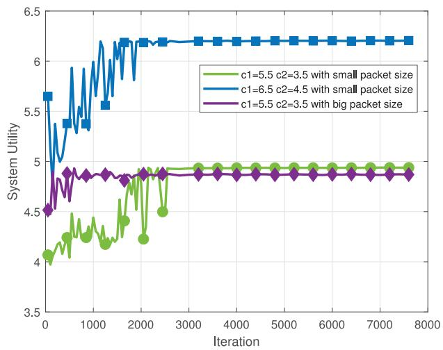

line

| Iteration | c1=5.5 c2=3.5 with small packet size | c1=6.5 c2=4.5 with small packet size | c1=5.5 c2=3.5 with big packet size |
| --------- | ------------------------------------ | ------------------------------------ | ---------------------------------- |
| 0         | 4.0                                  | 5.7                                  | 4.5                                |
| 1000      | 4.3                                  | 5.4                                  | 4.9                                |
| 2000      | 4.9                                  | 6.2                                  | 4.9                                |
| 3000      | 4.9                                  | 6.2                                  | 4.9                                |
| 4000      | 4.9                                  | 6.2                                  | 4.9                                |
| 5000      | 4.9                                  | 6.2                                  | 4.9                                |
| 6000      | 4.9                                  | 6.2                                  | 4.9                                |
| 7000      | 4.9                                  | 6.2                                  | 4.9                                |
| 8000      | 4.9                                  | 6.2                                  | 4.9                                |

Fig. 7. System utility vs iterations for different thresholds and packet sizes.

For a more detailed understanding of the impact of packet size on system utility. The EE and QoSSR that affect system utility are shown in Fig. 8. Through simulation, it is found that when using small data packets, the QoSSR of the system is lower, but its EE is better, which indicates that in scenario 3, the system prioritizes EE over QoSSR. At the cost of QoSSR in Scenario 3, the system EE is satisfied. This tradeoff relationship shows that in practical applications, selecting the appropriate packet size is crucial based on specific requirements and scenarios to strike a balance between EE and service quality.

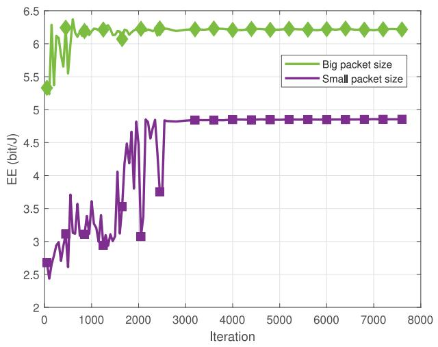

line

| Iteration | Big packet size | Small packet size |
| --------- | --------------- | ----------------- |
| 0         | 5.3             | 2.7               |
| 500       | 6.2             | 3.1               |
| 1000      | 6.1             | 3.2               |
| 1500      | 6.1             | 3.5               |
| 2000      | 6.2             | 4.8               |
| 2500      | 6.2             | 3.7               |
| 3000      | 6.2             | 4.9               |
| 3500      | 6.2             | 4.9               |
| 4000      | 6.2             | 4.9               |
| 4500      | 6.2             | 4.9               |
| 5000      | 6.2             | 4.9               |
| 5500      | 6.2             | 4.9               |
| 6000      | 6.2             | 4.9               |
| 6500      | 6.2             | 4.9               |
| 7000      | 6.2             | 4.9               |
| 7500      | 6.2             | 4.9               |
| 8000      | 6.2             | 4.9               |

(a)

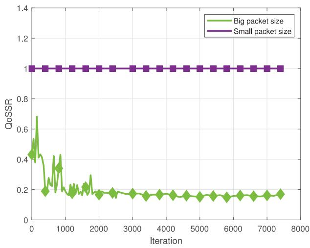

line

| Iteration | Big packet size | Small packet size |
| --------- | --------------- | ----------------- |
| 0         | 0.4             | 1.0               |
| 500       | 0.7             | 1.0               |
| 1000      | 0.3             | 1.0               |
| 1500      | 0.2             | 1.0               |
| 2000      | 0.2             | 1.0               |
| 2500      | 0.2             | 1.0               |
| 3000      | 0.2             | 1.0               |
| 3500      | 0.2             | 1.0               |
| 4000      | 0.2             | 1.0               |
| 4500      | 0.2             | 1.0               |
| 5000      | 0.2             | 1.0               |
| 5500      | 0.2             | 1.0               |
| 6000      | 0.2             | 1.0               |
| 6500      | 0.2             | 1.0               |
| 7000      | 0.2             | 1.0               |
| 7500      | 0.2             | 1.0               |

(b)   
Fig. 8. (a) EE vs iterations for different packet sizes. (b) QoSSR of scenario 3 vs iterations for different packet sizes.

Fig. 9 shows how the system utility is measured by adjusting the weights in equation (15). Specifically, when the QoSSR weight is set to [1, 1, 1], the system utility fluctuates greatly in the initial stage, but becomes stable after about 1500 iterations, and finally stabilizes at about 0.2. When the QoSSR weight is set to [1, 5, 8], the initial fluctuation of system utility is more drastic, and gradually tends to stabilize after about 2000 iterations, and finally stabilizes at about 0.4. This difference shows that different QoSSR weight settings have significant effects on the convergence speed and stability of system utility. Reasonable weight settings is crucial for balancing the complexities of the network environment while meeting diverse QoS requirements.

Different batch sizes have a significant effect on the variation in system utility and are shown in Fig. 10. Larger batch sizes (such as 32, 64, and 128) increase the stability of the system’s utility, reduce fluctuations, and eventually converge to higher utility values. In particular, batchsize = 128 is the best performance, achieving the highest utility values. However, given the limitations of computing resources, batchsize = 32 is a better choice, which strikes a balance between stability and utility values. By selecting batchsize = 32, the experiment ensures an efficient use of computing resources and achieves more accurate convergence results with the least amount of fluctuation. Therefore, in this experiment, the batch size is selected as 32 to ensure that it saves computing resources and has more accurate convergence results.

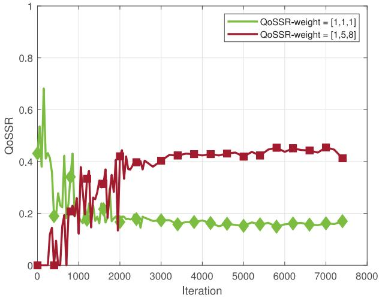

line

| Iteration | QoSSR-weight = [1,1,1] | QoSSR-weight = [1,5,8] |
| --------- | ------------------------ | ------------------------ |
| 0         | 0.4                      | 0.0                      |
| 500       | 0.6                      | 0.1                      |
| 1000      | 0.3                      | 0.2                      |
| 1500      | 0.2                      | 0.3                      |
| 2000      | 0.2                      | 0.4                      |
| 2500      | 0.2                      | 0.4                      |
| 3000      | 0.2                      | 0.4                      |
| 3500      | 0.2                      | 0.4                      |
| 4000      | 0.2                      | 0.4                      |
| 4500      | 0.2                      | 0.4                      |
| 5000      | 0.2                      | 0.4                      |
| 5500      | 0.2                      | 0.4                      |
| 6000      | 0.2                      | 0.4                      |
| 6500      | 0.2                      | 0.4                      |
| 7000      | 0.2                      | 0.4                      |
| 7500      | 0.2                      | 0.4                      |

Fig. 9. System utility vs iterations for different thresholds.

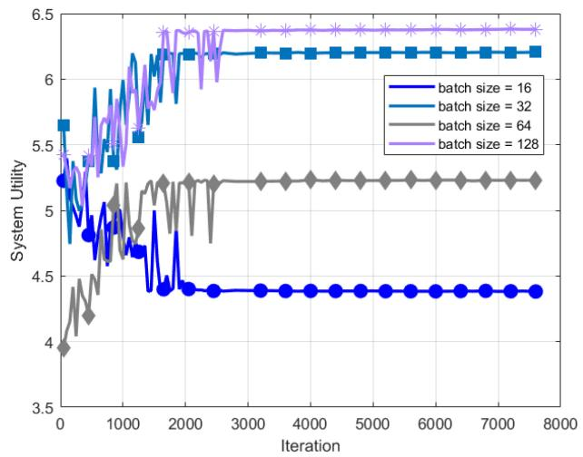

line

| Iteration | batch size = 16 | batch size = 32 | batch size = 64 | batch size = 128 |
| --------- | --------------- | --------------- | --------------- | ---------------- |
| 0         | 5.2             | 5.7             | 4.0             | 5.5              |
| 1000      | 4.8             | 5.9             | 5.0             | 6.0              |
| 2000      | 4.4             | 6.2             | 5.2             | 6.4              |
| 3000      | 4.4             | 6.2             | 5.2             | 6.4              |
| 4000      | 4.4             | 6.2             | 5.2             | 6.4              |
| 5000      | 4.4             | 6.2             | 5.2             | 6.4              |
| 6000      | 4.4             | 6.2             | 5.2             | 6.4              |
| 7000      | 4.4             | 6.2             | 5.2             | 6.4              |
| 8000      | 4.4             | 6.2             | 5.2             | 6.4              |

Fig. 10. System utility vs iterations for different batchsize.

# V. CONCLUSION

This paper studies resource management in next-generation network and communication with the aid of RIS, focusing on system bandwidth, actual RIS phase shift, BS transmit power, beamforming and system QoS to maximize system utility, where system utility is the weighted sum of EE and QoSSR. For different devices and service scenarios, a flexible CDL method is adopted to realize efficient BS-RIS-device cascade channel estimation. Secondly, the GAI-driven resource management algorithm is used to allocate network resources according to the service requirements of different service types on the basis of channel estimation, so as to realize resource allocation and management in complex network environment. In the experiment, the superiority of the proposed algorithm is proved by a large number of simulations. The proposed resource allocation scheme plays a significant role in improving resource utilization and system utility.

# REFERENCES

[1] C.-X. Wang et al., “On the road to 6G: Visions, requirements, key technologies, and testbeds,” IEEE Commun. Surveys Tuts., vol. 25, no. 2, pp. 905–974, 2nd Quart., 2023.   
[2] W. Saad, M. Bennis, and M. Chen, “A vision of 6G wireless systems: Applications, trends, technologies, and open research problems,” IEEE Netw., vol. 34, no. 3, pp. 134–142, May/Jun. 2020.   
[3] Q. Wu, S. Zhang, B. Zheng, C. You, and R. Zhang, “Intelligent reflecting surface-aided wireless communications: A tutorial,” IEEE Trans. Commun., vol. 69, no. 5, pp. 3313–3351, May 2021.   
[4] S. Abeywickrama, R. Zhang, Q. Wu, and C. Yuen, “Intelligent reflecting surface: Practical phase shift model and beamforming optimization,” IEEE Trans. Commun., vol. 68, no. 9, pp. 5849–5863, Aug. 2021.   
[5] C. Huang, A. Zappone, G. C. Alexandropoulos, M. Debbah, and C. Yuen, “Reconfigurable intelligent surfaces for energy efficiency in wireless communication,” IEEE Trans. Wireless Commun., vol. 18, no. 8, pp. 4157–4170, Aug. 2019.   
[6] X. Zhang, H. Zhang, W. Du, K. Long, and A. Nallanathan, “IRS empowered UAV wireless communication with resource allocation, reflecting design and trajectory optimization,” IEEE Trans. Wireless Commun., vol. 21, no. 10, pp. 7867–7880, Oct. 2022.   
[7] Y. Ren et al., “Connected and autonomous vehicles in Web3: An intelligence-based reinforcement learning approach,” IEEE Trans. Intell. Transp. Syst., vol. 25, no. 8, pp. 9863–9877, Aug. 2024, doi: 10.1109/TITS.2024.3355179.   
[8] H. Zhang, H. Wang, Y. Li, K. Long, and A. Nallanathan, “DRL-driven dynamic resource allocation for task-oriented semantic communication,” IEEE Trans. Commun., vol. 71, no. 7, pp. 3992–4004, Jul. 2023.   
[9] X. Zhu, Y. Luo, A. Liu, N. N. Xiong, M. Dong, and S. Zhang, “A deep reinforcement learning-based resource management game in vehicular edge computing,” IEEE Trans. Intell. Transp. Syst., vol. 23, no. 3, pp. 2422–2433, Mar. 2022.   
[10] Y. Hua, R. Li, Z. Zhao, X. Chen, and H. Zhang, “GAN-powered deep distributional reinforcement learning for resource management in network slicing,” IEEE J. Sel. Areas Commun., vol. 38, no. 2, pp. 334–349, Feb. 2020.   
[11] H. Zhang, X. Ma, X. Liu, L. Li, and K. Sun, “GNN-based power allocation and user association in digital twin network for the terahertz band,” IEEE J. Sel. Areas Commun., vol. 41, no. 10, pp. 3111–3121, Oct. 2023.   
[12] H.-S. Lee, D.-Y. Kim, and J.-W. Lee, “Radio and energy resource management in renewable energy-powered wireless networks with deep reinforcement learning,” IEEE Trans. Wireless Commun., vol. 21, no. 7, pp. 5435–5449, Jul. 2022.   
[13] X. Liu, H. Zhang, K. Long, A. Nallanathan, and V. C. M. Leung, “Distributed unsupervised learning for interference management in integrated sensing and communication systems,” IEEE Trans. Wireless Commun., vol. 22, no. 12, pp. 9301–9312, Dec. 2023.   
[14] H. Zhou, M. Erol-Kantarci, Y. Liu, and H. V. Poor, “A survey on model-based, heuristic, and machine learning optimization approaches in RIS-aided wireless networks,” IEEE Commun. Surveys Tuts., vol. 26, no. 2, pp. 781–823, 4th Quart., 2024.   
[15] L. Jiao, P. Wang, A. Alipour-Fanid, H. Zeng, and K. Zeng, “Enabling efficient blockage-aware handover in RIS-assisted mmWave cellular networks,” IEEE Trans. Wireless Commun., vol. 21, no. 4, pp. 2243–2257, Apr. 2022.   
[16] H. Zarini, N. Gholipoor, M. R. Mili, M. Rasti, H. Tabassum, and E. Hossain, “Resource management for multiplexing eMBB and URLLC services over RIS-aided THz communication,” IEEE Trans. Commun., vol. 71, no. 2, pp. 1207–1225, Feb. 2023.   
[17] R. Zhong, X. Liu, Y. Liu, Y. Chen, and Z. Han, “Mobile reconfigurable intelligent surfaces for NOMA networks: Federated learning approaches,” IEEE Trans. Wireless Commun., vol. 21, no. 11, pp. 10020–10034, Nov. 2022.

[18] P. Saikia, K. Singh, O. Taghizadeh, W.-J. Huang, and S. Biswas, “Meta reinforcement learning-based spectrum sharing between RISassisted cellular communications and MIMO radar,” IEEE Trans. Cogn. Commun. Netw., vol. 10, no. 1, pp. 164–179, Feb. 2024.   
[19] R. Zhong, Y. Liu, X. Mu, Y. Chen, and L. Song, “AI empowered RIS-assisted NOMA networks: Deep learning or reinforcement learning?” IEEE J. Sel. Areas Commun., vol. 40, no. 1, pp. 182–196, Jan. 2022.   
[20] H. Du et al., “Enhancing deep reinforcement learning: A tutorial on generative diffusion models in network optimization,” 2024, arXiv:2308.05384.   
[21] M. Xu et al., “Unleashing the power of edge-cloud generative AI in mobile networks: A survey of AIGC services,” IEEE Commun. Surveys Tuts., vol. 26, no. 2, pp. 1127–1170, 2nd Quart., 2024.   
[22] S. Bond-Taylor, A. Leach, Y. Long, and C. G. Willcocks, “Deep generative modelling: A comparative review of VAEs, GANs, normalizing flows, energy-based and autoregressive models,” IEEE Trans. Pattern Anal. Mach. Intell., vol. 44, no. 11, pp. 7327–7347, Nov. 2022.   
[23] J. Zhao, M. Mathieu, and Y. LeCun, “Energy-based generative adversarial network,” 2017, arXiv:1609.03126.   
[24] M. Arjovsky, S. Chintala, and L. Bottou, “Wasserstein GAN,” 2017, arXiv:1701.07875.   
[25] I. Gulrajani, F. Ahmed, M. Arjovsky, V. Dumoulin, and A. Courville, “Improved training of Wasserstein GANs,” in Proc. NIPS, 2017, pp. 5767–5777.   
[26] Y. Bengio, L. Yao, G. Alain, and P. Vincent, “Generalized denoising auto-encoders as generative models,” in Proc. NIPS, 2013, pp. 1–9.   
[27] Y. Bengio, E. Laufer, G. Alain, and J. Yosinski, “Deep generative stochastic networks trainable by backprop,” in Proc. 31st ICML, 2014, pp. 226–234.   
[28] M. G. Bellemare, W. Dabney, and R. Munos, “A distributional perspective on reinforcement learning,” in Proc. 34th ICML, 2017, pp. 449–458.   
[29] W. Dabney, G. Ostrovski, D. Silver, and R. Munos, “Implicit quantile networks for distributional reinforcement learning,” 2018, arXiv:1806.06923.   
[30] F. Fredj, A. Feriani, A. Mezghani, and E. Hossain, “Channel estimation in RIS-enabled mmWave wireless systems: A variational inference approach,” IEEE Trans. Wireless Commun., vol. 23, no. 8, pp. 10350–10365, Aug. 2024.   
[31] H. Feng and Y. Zhao, “mmWave RIS-assisted SIMO channel estimation based on global attention residual network,” IEEE Wireless Commun. Lett., vol. 12, no. 7, pp. 1179–1183, Jul. 2023.   
[32] J. Seo, G. Choi, and S. C. Kim, “DBPN-based uplink channel estimation for multi-user MISO RIS system,” IEEE Wireless Commun. Lett., vol. 12, no. 12, pp. 2143–2147, Dec. 2023.   
[33] S. Liu, Z. Gao, J. Zhang, M. D. Renzo, and M.-S. Alouini, “Deep denoising neural network assisted compressive channel estimation for mmWave intelligent reflecting surfaces,” IEEE Trans. Veh. Technol., vol. 69, no. 8, pp. 9223–9228, Aug. 2020.   
[34] L. Dai and X. Wei, “Distributed machine Learning based downlink channel estimation for RIS assisted wireless communications,” IEEE Trans. Commun., vol. 70, no. 7, pp. 4900–4909, Jul. 2022.   
[35] G. Barth-Maron et al., “Distributed distributional deterministic policy gradients,” 2018, arXiv:1804.08617.   
[36] W. Dabney, M. Rowland, M. G. Bellemare, and R. Munos, “Distributional reinforcement learning with quantile regression,” in Proc. AAAI Conf. Artif. Intell., 2018, pp. 2892–2901.   
[37] H. He, S. Jin, C.-K. Wen, F. Gao, G. Y. Li, and Z. Xu, “Modeldriven deep learning for physical layer communications,” IEEE Wireless Commun., vol. 26, no. 5, pp. 77–83, Oct. 2019.

natural_image

Portrait of a man wearing glasses and a collared shirt (no text or symbols visible)

Haijun Zhang (Fellow, IEEE) is currently a Full Professor and an Associate Dean with the School of Computer and Communications Engineering, University of Science and Technology Beijing, China. He was a Postdoctoral Research Fellow with the Department of Electrical and Computer Engineering, The University of British Columbia, Canada. He received the IEEE CSIM Technical Committee Best Journal Paper Award in 2018, the IEEE ComSoc Young Author Best Paper Award in 2017, the IEEE ComSoc Asia–Pacific Best Young

Researcher Award in 2019. He serves/served as a Track Co-Chair of VTC Fall in 2022 and WCNC in 2020 and 2021, respectively, the Symposium Chair of Globecom in 2019, the TPC Co-Chair of INFOCOM 2018 Workshop on Integrating Edge Computing, Caching, and Offloading in Next Generation Networks, and the General Co-Chair of GameNets in 2016. He serves/served as an Editor for the IEEE TRANSACTIONS ON INFORMATION FORENSICS AND SECURITY, the IEEE TRANSACTIONS ON COMMUNICATIONS, and the IEEE TRANSACTIONS ON NETWORK SCIENCE AND ENGINEERING. He is a Distinguished Lecturer of IEEE.

natural_image

Portrait photo of a woman in formal attire (no visible text or symbols)

Linpei Li received the Ph.D. degree from the Beijing University of Posts and Telecommunications in 2021. She is currently a Lecturer with the University of Science and Technology Beijing, China. Her current research interests include energy efficient UAV-assisted communications, mobile edge computing, and intelligent resource allocation.

natural_image

Portrait of a man wearing glasses and a suit (no text or symbols visible)

Yang Lu received the Ph.D. degree in communication and information system from the Beijing University of Posts and Telecommunications in 2012. In 2013, he joined Karlsruhe Institute of Technology as a Visiting Scholar. He is currently a Senior Engineer (Professor Level) with China Electric Power Research Institute Company Ltd., affiliated to State Grid Corporation of China. His current research interests include electric power intelligent sensing and IoT network technologies.

natural_image

Portrait photo of a woman in formal attire (no visible text or symbols)

Zijun Wu received the B.S. degree from the School of Computer and Communication Engineering, University of Science and Technology of Beijing, Beijing, China, in 2021, where she is currently pursuing the Ph.D. degree. Her research interests include IRS, mobile edge computing, and resource allocation in 6G wireless communication.

natural_image

Portrait of a man wearing glasses and a suit (no text or symbols visible)

Jian Yang received the Ph.D. degree from Harbin Engineering University in 2020. He is a Research Fellow with the Institute of Remote Sensing Equipment, Beijing. His current research interests include wireless communication, data-link, satellite communications, and wireless laser communication.