IEEE TRANSACTIONS ON MOBILE COMPUTING, VOL. XX, NO. XX, XXXX XXXX

# GL-AHG: A Novel Game-Learning Alternating Hierarchical Genetic Algorithm for UAV-Enabled Coverage Path Planning

Liangke Zhou, Jie Chen, Riheng Jia, Member, IEEE, Changbing Tang, Senior Member, IEEE, Yang Liu, Senior Member, IEEE, and Minglu Li, Fellow, IEEE

Abstract—Coverage path planning (CPP) is essential for various unmanned aerial vehicle (UAV)-enabled applications, which can be solved by two sub problems, i.e., the waypoint generation and the path planning. Although prior works have advanced coverage path planning and energy optimization, existing methods largely treat waypoint generation and path planning as decoupled stages. This decoupling fails to exploit the coupling between waypoint distribution and flight path, limiting further gains in performance such as global energy consumption. For this, we propose a novel game-learning alternating hierarchical genetic (GL-AHG) algorithm to address the three-dimensional (3D) UAV-enabled CPP by integrating energy consumption into the waypoint generation. Specifically, we transform the waypoint generation into solving the weighted vertex cover (WVC) problem, where the UAV’s energy consumption is mapped to the weights of vertices. Then, we propose a game-learning algorithm to solve the formulated WVC problem. We finally derive a coverage path based on the generated waypoints by designing an alternating hierarchical genetic algorithm. Extensive simulations demonstrate that our proposed GL-AHG algorithm outperforms existing representative algorithms with respect to the UAV’s energy consumption and flight path length for CPP.

Index Terms—Coverage path planning, unmanned aerial vehicle, weighted vertex cover, game theory, reinforcement learning.

## I. INTRODUCTION

W <sup>ITH</sup> <sup>the</sup> <sup>rapid</sup> <sup>development</sup> <sup>of</sup> <sup>unmanned</sup> <sup>aerial</sup> <sup>vehicle</sup> (UAV) technology, coverage path planning (CPP) has gained widespread attention. Generally, remote area environmental monitoring and visual inspections on large threedimensional (3D) structures often translate into CPP problems [1]. In certain specific scenarios, such as conducting largescale searches or patrols in mountainous regions at night, it becomes necessary to equip a UAV, which is typically outfitted with a photographic sensor, with a searchlight to facilitate illumination during the search operations [2]. In post-disaster urban or mountainous search and rescue operations, LiDAR sensors can also be added to address practical issues [3].

The use of UAV for monitoring and searching in unmanned or hard-to-reach areas has always been a significant practical challenge, particularly in scenarios requiring rapid response and large-scale surveillance. The application of visual coverage techniques using unmanned platforms enables efficient dynamic monitoring and search-and-rescue operations in vast regions shortly after natural disasters or emergencies [4], [5]. UAV offers several key advantages over traditional methods, including autonomous takeoff and landing, high-altitude aerial perspectives, exceptional agility, and high mobility, allowing it to navigate complex environments with ease [6]. Furthermore, its ability to operate in hazardous or inaccessible areas makes it indispensable for disaster response, environmental monitoring, and security applications. Given the autonomous nature of UAV, effective mission planning becomes exceedingly critical, as it directly impacts coverage efficiency, energy consumption, and overall mission success [7].

Therefore, UAVs can be utilized to monitor unmanned areas, while CPP becomes a key technology for solving the problem of fully covering the monitored area [8]. CPP is typically divided into two steps: waypoint generation and path planning. Generally, its goal is to plan an optimal path that meets several constraints to ensure that the UAV can fully cover the task area by using its sensor. Reasonable trajectory planning enables UAVs to shorten flight distance while mitigating potential threats during flight [9]. In recent years, CPP has been successfully applied in various fields, such as area exploration [10], [11], agricultural operations [12], obstacle avoidance planning [13], [14], time-optimal multi-resolution mapping [15], aircraft skin damage detection [16], and multi-UAV cooperative planning [17], [18]. However, most researches prioritized waypoint generation for completing coverage of the target area, overlooking the influence of waypoint generation on path planning, which can result in decreased performance, such as longer path length and higher energy consumption [19], [20]. Thus, in this paper, we will study the 3D UAV-enabled CPP, focusing primarily on the influence of waypoint generation on path planning. Recognizing that waypoint locations directly determine both coverage quality and flight energy, we propose a two-stage framework. Unlike methods that treat waypoints as fixed inputs or rely solely on geometric patterns, our proposed method combines waypoint generation with multi-objective path planning, enabling more efficient and task-oriented coverage in complex 3D environments. Advancing from decoupled or heuristic integration to such a systematically coupled planning system remains an open challenge.

To tackle the above challenge, we propose a novel gamelearning alternating hierarchical genetic (GL-AHG) algorithm, integrating the UAV’s energy consumption, one of the optimization objectives for path planning, into the waypoint generation. Specifically, we map the UAV’s energy consumption to vertices weights during the waypoint generation, and transform the waypoint generation into a weighted vertex cover (WVC) problem. In particular, we propose a novel gamelearning algorithm to obtain optimized waypoints by solving the formulated WVC problem. We then develop an alternating hierarchical genetic algorithm to derive an optimal path in the path planning.

The main contributions of this paper are summarized as follows:

1) We propose a novel GL-AHG algorithmic framework that integrates energy consumption into the waypoint generation phase for 3D UAV-enabled CPP. To the best of our knowledge, this is the first work applying “game-learning” to address the 3D CPP by optimizing waypoint generation with energy considerations. Our work reveals the significant influence of the waypoint generation on the CPP performance.

2) To realize this framework, we make two key technical contributions: a) The waypoint generation is transformed into the WVC problem by mapping UAV energy to vertex weights, which is then solved by a novel game-learning algorithm employing an asymmetric game and temporal-difference learning. b) Based on the generated optimized set of waypoints, we develop a new genetic algorithm called alternating hierarchical genetic algorithm to construct a flight path for the UAV.

3) Extensive simulation results demonstrate that the proposed GL-AHG algorithm outperforms existing representative algorithms concerning the UAV’s energy consumption and flight path length for CPP.

The remainder of this paper is organized as follows. Section II reviews related work. Section III states the problem and presents necessary preliminaries. Section IV elaborates on the modeling and solution methodology for waypoint generation. Section V develops the multi-objective path planning optimization framework. In section VI, numerical simulations are presented to demonstrate the performance of our proposed algorithm. Section VII discusses conclusions and future research directions.

## II. RELATED WORK

General path planning without full coverage constraints, often known as “point-to-point navigation”, aims to find an optimal or feasible path from a start to a goal point. For non-myopic path planning, sampling-based methods such as rapidly-exploring random trees (RRT) have been widely adopted [21]. The optimal variant RRT\* [22] guarantees asymptotic optimality and has been extended in various directions, including informed RRT\* [23] and batch informed trees (BIT\*) [24], which improve convergence rates and scalability. Beyond sampling-based planners, other representative algorithms include Dijkstra’s algorithm [25], particle swarm optimization algorithm [26], differential evolution algorithm [27], [28] and etc. Under full coverage constraints, the task becomes a CPP problem that requires complete area coverage while avoiding repeated coverage and minimizing total path length, energy consumption or other costs [29]. In this section, we first review the methods in coverage-oriented waypoint generation, examining how traditional methods have treated this process separately from path planning. Subsequently, we analyze energy-aware path planning research, emphasizing its disconnect from waypoint generation and the resulting efficiency limitations in CPP.

## A. Coverage-Oriented Waypoint Generation

In previous studies, traditional methods to waypoint generation in UAV coverage tasks primarily focused on achieving geometric completeness of the target area. Current methods generally follow two paradigms. The first combines sampling with planning in a single process. In [30], graph search techniques achieved near-complete coverage of target surfaces while intentionally tolerating minor uncovered regions. The second divides the problem into waypoint generation and path planning. In [20], a sequential approach was adopted, which first generates waypoints in patterns such as zigzag arrangements before separately optimizing the coverage path. Recent advances in 3D environments introduced more sophisticated techniques, including the distributed camera network deployment method developed by Jiang et al. [31] and the coupled iterative algorithm proposed by Liu et al. [32], which effectively balanced image quality with coverage efficiency. However, these methods continued to treat waypoint generation as fundamentally distinct from path planning optimization. In [20], the hierarchical optimization for 3D terrain maintained this separation, while in [33] and [34], the comparative studies of back-and-forth (BF) versus spiral coverage patterns similarly preserved the distinct treatment of waypoint generation. These works largely failed to examine the critical relationship between waypoint generation and subsequent path planning, representing a significant limitation in existing research.

## B. Energy-Aware Path Planning

The optimization of energy consumption in UAV-enabled CPP was extensively investigated, yet consistently in isolation from waypoint generation processes. In [34], the comparative analysis demonstrated that spiral motion paths could reduce energy consumption compared to BF patterns, though this conclusion was based on predetermined waypoints. In [35], the enhanced ant colony algorithm achieved success in multiobjective path optimization while maintaining fixed waypoints. Similarly, in [36], the proposed evolutionary strategy incorporating dimension exploration also preserved this conventional separation. A critical limitation in current research lies in the decoupled treatment of waypoint generation and path planning, which leads to significant efficiency losses. For instance, in [20], although the study employed an efficient zigzag waypoint pattern, it failed to account for path planning requirements, resulting in frequent UAV turns that substantially increased energy consumption. Similarly, research in [33] on planar environments and [35] on complex 3D structures made progress in path energy optimization, but overlooked a crucial factor: the waypoint generation can significantly impact the energy consumption of the final flight path.

Recent research has begun to highlight the importance of synergy between waypoint generation and path planning. For example, in [38], a contour-aligned path generation framework was proposed, which reduces UAV energy consumption over mountainous terrain by extracting contour primitives and optimizing their visiting sequence. Meanwhile, there exist other researches adopting direct coupling to integrate the two stages into a unified optimization process. In [39], a multiobjective path planning methodology was developed for static flow fields, integrating harmonic transformation to handle nofly zones and employing two methods to optimize time and energy. In [40], an energy-efficient UAV routing problem for geohazard monitoring was addressed by combining approximate cellular decomposition with a hybrid metaheuristic. However, these coupled methods still have inherent limitations. The synergy in [38] is highly dependent on terrain contour features, lacking flexibility for scenarios with irregular topographic structures. In [39], it relies on fixed static flow field constraints in environmental modeling, resulting in suboptimal energy efficiency when flow fields deviate from static assumptions. In [40], it retains preliminary grid-based waypoint generation, which imposes inherent constraints on path optimization potential. In sum, most existing methods still consider that waypoints are generated from fixed environmental features (e.g., terrain contours, grid divisions) without proactive global energy optimization, predetermining the lower bound of achievable energy consumption and limiting further performance gains.

In this paper, we mainly focus on the 3D UAV-enabled CPP, and employ the process of partitioning CPP into solving two sub problems. We aim to explore a deeper level of coupling, where we not only plan energy-efficient paths based on given waypoints but also proactively generate an optimal set of aerial waypoints from the outset, with the goal of minimizing global energy consumption.

## III. PROBLEM DESCRIPTION AND PRELIMINARIES

In this section, we systematically introduce the research problem and provide key analytical tools. First, we formally describe the CPP problem. Then, we introduce the WVC problem so that it can be solved subsequently by converting CPP problem into the WVC problem. Additionally, we elaborate on a series of actual perceptual constraints and model assumptions. To solve this distributed optimization problem, we introduce the game theory framework. The snowdrift game presented here is the traditional basic form of the asymmetric snowdrift game in section IV. Finally, we present the temporal difference (TD) learning method as the engine to find the optimal strategy in the game. It is worth emphasizing that the combination of the asymmetric snowdrift game model proposed based on this section’s snowdrift game and the TD learning method is precisely the core pillar of the gamelearning algorithm we proposed in this paper.

TABLE I MAIN NOTATIONS EMPLOYED IN THIS PAPER
<table><tr><td>Notation</td><td>Definition</td></tr><tr><td> $V$ </td><td>set of all players</td></tr><tr><td> $V _ { i }$ </td><td>vertex (player)  $V _ { i }$ </td></tr><tr><td> $E$ </td><td>set of all edges</td></tr><tr><td> $W$ </td><td>set of weights</td></tr><tr><td> $A$ </td><td>strategy set of each player</td></tr><tr><td> $\varphi$ </td><td>energy fitting parameter during turning</td></tr><tr><td> $\beta$ </td><td>energy fitting parameter during straight-line flight</td></tr><tr><td> $_ \alpha$ </td><td>constant step-size coefficient</td></tr><tr><td> $\gamma$ </td><td>discount factor</td></tr><tr><td> $E _ { t } ( S )$ </td><td>eligibility trace at time t under state  $S$ </td></tr><tr><td> $\Theta _ { a b }$ </td><td>slope angle from point a to b</td></tr><tr><td> $\Theta _ { a b c }$ </td><td>turning angle from point a through b to c</td></tr><tr><td> $E _ { j i }$ </td><td>energy consumption from  $V _ { j }$  to Vi</td></tr><tr><td> $\lambda _ { i j }$ </td><td>asymmetric factor</td></tr><tr><td> $U ( W P _ { C } , S P _ { D } )$ </td><td>payoff when player W  $P _ { C }$  I meets player  $S P _ { D }$ </td></tr><tr><td> $S _ { C } ( t )$ </td><td>score of palyer  $V _ { i }$  at time t</td></tr><tr><td> $S _ { P } ( t )$ </td><td>payoff of palyer  $V _ { i }$  at time t</td></tr><tr><td> $S _ { P _ { C } } ( k + 1 )$ </td><td>payoff of player with cooperation at time  $k + 1$ </td></tr><tr><td> $R _ { t + 1 }$ </td><td>difference between time  $t + 1$  and time t</td></tr><tr><td> $P _ { C }$ </td><td>probability of cooperation</td></tr><tr><td> $T _ { P _ { C } } ( t + 1 )$ </td><td>intermediate variable by cooperation</td></tr><tr><td> $F ( \varepsilon )$ </td><td>modified Fermi rule</td></tr><tr><td> $L _ { R a t e }$ </td><td>standard for measuring the length of a path</td></tr><tr><td> $E _ { R a t e }$ </td><td>standard for measuring energy consumption</td></tr></table>

## A. Coverage Path Planning

The CPP problem is a fundamental motion planning problem that extends classical path planning by incorporating coverage requirements. Unlike path planning which only requires connecting start and goal points, CPP demands that every point in the target area be covered. Formally, the CPP problem can be modeled as a tuple $\mathcal { C } = ( S , G , \mathcal { P } , \mathcal { O } )$ , where:

1) S represents the workspace (a 2D or 3D environment);

2) $G = ( R , { \mathcal { M } } )$ describes the agent with:

• $R \colon$ coverage radius,

• M: mobility constraints;

3) ${ \mathcal { P } } : [ 0 , T ] \to S$ represents the path;

4) O is the optimization objective (e.g., path length, time, or energy).

Although the coverage condition ensures all points in S are within distance R of P, the optimization objective O enforces solution quality. Practical applications often introduce additional constraints such as obstacle avoidance, terrain properties, or dynamic environments, making CPP a rich and challenging problem domain at the intersection of robotics, computational geometry, and optimization. For convenience, the main notations of this paper are summarized in TABLE I.

IEEE TRANSACTIONS ON MOBILE COMPUTING, VOL. XX, NO. XX, XXXX XXXX

## B. Weighted Vertex Cover Problem

The WVC problem is a fundamental combinatorial optimization problem that extends the classical vertex cover problem by incorporating vertex weights. When all vertices share identical weights, the WVC problem reduces to the standard vertex cover problem. Formally, the WVC problem can be modeled as a game $G = ( V , E , W , A )$ , where $V = \{ V _ { 1 } , V _ { 2 } , \dots , V _ { n } \}$ denotes the set of vertices (or players) and $E = \{ e _ { i j } \}$ represents the set of weighted edges in the network. If vertices $V _ { i }$ and $V _ { j }$ are connected, $e _ { i j } = 1$ , and the two vertices are considered neighbors; otherwise, $e _ { i j } = 0$ $W = \{ w _ { 1 } , w _ { 2 } , . . . , w _ { n } \}$ defines the weights assigned to each vertex, with $w _ { i }$ being the weight of $V _ { i \cdot } ~ A = \{ C , D \}$ is the strategy space for each player, where C and D represent covered and uncovered strategies, respectively. A weighted vertex cover state (WVC state) is achieved if, for each edge in the network, at least one of its endpoints is covered. Furthermore, a minimum weighted vertex cover state (MWVC state) is attained when the sum of the weights of all covered vertices is minimized.

## C. Sensing Constraints and Model Assumptions

Let $\mathcal { A } \subset R ^ { 3 }$ represents the smooth surface derived from the bounded 3D ground area $\mathcal { G } \subset R ^ { 3 }$ of a digital elevation model. Inspired by [20], we set the following representations of the sensing constraints:

1) Equidistant: For every point on the surface $\mathcal { G } ,$ , a normal vector $\boldsymbol { \mathcal U }$ perpendicular to the surface is set, maintaining a constant distance $d _ { \mathcal { A } }$ along the normal vector to obtain the 3D terrain surface $\mathcal { A } .$

2) Frontal: The UAV must keep the photographic sensor and the searchlight facing the terrain surface, and maintain a perpendicular orientation to the terrain surface at all times.

Consider that the terrain surface is 3D, and every area on the surface is covered by the searchlight of UAV. Assume that:

1) 3D terrain surface can be fitted as a B-spline surface.

2) The camera sensor and searchlight (or additional LiDAR sensor) are fixed to a gimbal stabilizer, that is, the camera itself does not adjust the angle, to keep the camera’s yaw angle consistent with the UAV.

3) The radius r of the searchlight needs to be less than half the width l of the photograph to ensure a complete field of view inside the searchlight.

4) The UAV is assumed to operate in windless or constant light wind conditions, with dynamic wind fields temporarily not considered.

5) The UAV’s mass and speed are assumed constant. Thus, energy consumption exhibits a linear or quasi-linear relationship with distance and turning angle, ignoring the quadratic relationship between air resistance and speed.

6) The battery is assumed to have ideal, linear discharge characteristics, without accounting for real-world voltage decay or temperature effects in actual batteries.

## D. Snowdrift Game

The snowdrift game is a classic model in game theory that describes situations involving cooperation and conflict: Two drivers are trapped on either side of a snowdrift and can choose to shovel (cooperation) or wait (defection). If both choose to cooperate, they share the cost equally, each gaining a payoff of $b - c / 2 ;$ if one cooperates while the other defects, the cooperating player receives $b - c$ while the defecting player gets $b ;$ if both choose to defect, neither gains any benefit [41]. The payoff matrix is shown below

$$
\begin{array} { c } { { \mathrm { { ~ \bf ~ C ~ } ~ } } } \\ { { \mathrm { { ~ \bf ~ C ~ } ~ } \left( \begin{array} { c c } { { b - \frac { c } { 2 } b - c } } \\ { { b } } & { { 0 } } \end{array} \right) . } } \end{array}\tag{1}
$$

## E. Temporal Difference Learning Method

Reinforcement learning enables agents to optimize behavior through environment interactions. Among its approaches, TD learning effectively combines dynamic programming’s bootstrapping with Monte Carlo’s sampling benefits [42].

The TD(λ) method balances multi-step predictions through eligibility traces. We employ the backward-view implementation, where state-value updates consider both immediate rewards and future estimations via trace decay:

$$
E _ { t } ( s ) = { \left\{ \begin{array} { l l } { \sum _ { k = 1 } ^ { t } ( \gamma \lambda ) ^ { t - k } } & { { \mathrm { i f ~ } } s = s _ { k } } \\ { 0 } & { { \mathrm { o t h e r w i s e } } } \end{array} \right. } ,\tag{2}
$$

where s denotes the state, $s _ { k }$ is the state visited at time $k ;$ $\gamma$ and $\lambda$ are discount factors $\mathbf { \xi } \in \left( 0 , 1 \right)$ . The value function is expressed as

$$
\delta _ { t } = r _ { t + 1 } + \gamma V ( s _ { t + 1 } ) - V ( s _ { t } ) ,\tag{3}
$$

$$
V ( s _ { t } ) \gets V ( s _ { t } ) + \alpha \delta _ { t } E _ { t } ( s _ { t } ) ,\tag{4}
$$

where $r _ { t + 1 }$ is the immediate reward received after the action at time $t ; \delta _ { t }$ and α represent the temporal-difference error and the learning rate, respectively. This formulation enables efficient online learning while preserving the theoretical advantages of multi-step returns.

## IV. WAYPOINT GENERATION

In this section, we address the waypoint generation problem to obtain an optimized set of waypoints. The waypoint generation is divided into four steps: First, the distance $d _ { c e n t e r }$ between adjacent camera footprint points is calculated based on the relationship between the radius and image overlap rate. Next, the waypoint generation direction is determined using the minimum grid point principle. Then, based on path length and slope angle, an energy consumption model is established, transforming the waypoint optimization into the WVC problem. Finally, by integrating the asymmetric snowdrift game and TD(λ), a game-learning algorithm is designed to solve this optimization problem, thereby obtaining an energy-optimized set of waypoints.

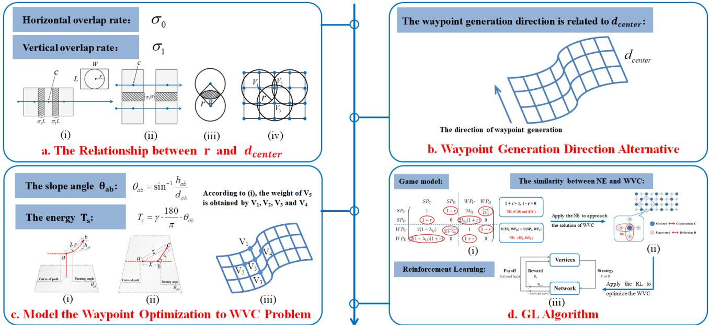  
Fig. 1: The process of waypoint generation.

## A. The Relationship between r and $d _ { c e n t e r }$

Let $\sigma _ { 0 }$ and $\sigma _ { 1 }$ represent the horizontal and vertical overlap rates, respectively. Set the photo length as W and width as $L ,$ with the condition that $W \geq L$ . The camera center footprint is denoted by c, while the coverage of the searchlight is defined by the radius r. When the searchlight begins to overlap, it creates a shadow portion, which corresponds to a central angle denoted by α.

As shown in Fig. 1a (i) and (ii), there will be necessary overlap in the photos during the camera shooting process. Since there must be sufficient overlap between the current view and the next view to record the two views, the literatures [43] and [44] were in-depth studies on the overlap rate design of aerial images. In addition, the literature [45] suggested that the vertical overlap rate $\sigma _ { 1 }$ of the coverage path should not be less than 55%, and the horizontal overlap rate $\sigma _ { 0 }$ should not be less than 30%. However, the effective imaging obtained from photography depends on the searchlight’s radius r, so we need to perform further analysis on the overlap rate.

Fig. 1a (iii) illustrates that the shaded area represents the overlap area, denoted as $S _ { s h a d o w } .$ , which can be calculated as

$$
\begin{array} { c } { { S _ { s h a d o w } = 2 [ \pi r ^ { 2 } \cdot \alpha / 2 \pi - r ^ { 2 } \sin ( \alpha / 2 ) \cos ( \alpha / 2 ) ] } } \\ { { = r ^ { 2 } ( \alpha - \sin \alpha ) . } } \end{array}\tag{5}
$$

Due to the lack of in-depth researches on the overlap rate of circular field-of-view images, and considering the specific modeling of searchlight and LiDAR sensor, we reasonably assume that the vertical and horizontal overlap rates are equal, i.e., $\sigma _ { 0 } = \sigma _ { 1 } = 0 . 3$ . Thus, it holds that

$$
r ^ { 2 } ( \alpha - \sin \alpha ) = 0 . 3 \cdot \pi r ^ { 2 } .\tag{6}
$$

With the help of mathematical software, we obtain the numerical solution $\alpha = 1 . 8 9 1$ rad (≈ 108.38<sup>◦</sup>). Moreover, the distance of the camera footprint points can be expressed as

$$
d _ { c e n t e r } = 2 \cdot r \cdot \cos ( \alpha / 2 ) .\tag{7}
$$

Assume that $W = 4 0 , L = 3 0 , r = 1 5$ , and we find that the spacing for grid partitioning is approximately $d _ { c e n t e r } \approx 1 7 . 5 5$ In the simulation part in Section 5, we set the camera footprint distance for other algorithms as $d _ { c e n t e r } = 1 7 . 5 5$

Fig. 1a (iv) illustrates a coverage scenario that demonstrates the relationship between r and $d _ { c e n t e r }$ . The distance between waypoints $V _ { 1 }$ and $V _ { 3 }$ is 17.55, and the spacing is set to $d _ { c e n t e r } = 1 2 . 4 1$ . In addition, when both adjacent points (i.e., $V _ { 1 }$ and V<sub>2</sub>) are covered vertices, we can obtain the solution $\alpha = 2 . 2 8 8$ rad $( \approx 1 3 1 . 1 2 ^ { \circ } )$ . Consequently, the overlap rate of the illuminated areas captured by the searchlight is approximately 48.87%, which is greater than 30%, thereby clearly satisfying the specified condition.

## B. Waypoint Generation Direction Alternative

Generally, graphics in practical applications are predominantly composed of polygons, which can be either convex or concave. Based on [33], a concave polygon can be decomposed into convex polygons for resolution. Hence, this paper will focus exclusively on convex polygons. As illustrated in Fig. 1b, given a convex region of interest, we denote each edge as $e _ { 1 } , e _ { 2 } , \ldots , e _ { n }$ . Starting from edge $e _ { i } { \mathrm { . } }$ , we perform a grid partition with spacing $d _ { c e n t e r }$ in a direction perpendicular to $e _ { i } .$ . This procedure determines the starting edge with the minimum number of grid points, which also establishes the direction for waypoint generation. The pseudo-code for this process is shown in Algorithm 1.

## C. Model the Waypoint Optimization to WVC Problem

Before performing energy-based modeling, first establish the fundamental geometric relationships between terrain points. As illustrated in Fig. 1c (i), let the distance between

```perl
Algorithm 1 Waypoint generation direction alternative
1: Sort edges $e _ { 1 } , \ldots , e _ { m }$ in decreasing order of length and vertices
$V _ { 1 } , \ldots , \bar { V } _ { n } ;$
2: for $e _ { i } = 1$ : m do
3: waypoint number = 10000
4: max dist edge = 0
5: for $V _ { i } = 1 :$ n do
6: if $d ( e , V ) >$ max dist edge then
7: max dist edge = d(e, V );
8: end if
9: end for
10: longitudinal line number = ⌈max dist edge⌉−1;
11: horizontal line number $= \lceil e _ { i } / d _ { c e n t e r } \rceil { - } 1 ;$
12: Compute the number of waypoints w<sub>i</sub>;
13: if waypoint number> w<sub>i</sub> then
14: waypoint number = w<sub>i</sub>;
15: end if
16: end for
```

points a and b be $d _ { a b }$ and the absolute height difference be $h _ { a b }$ . Then the slope angle $\Theta _ { a b }$ can be expressed as

$$
\Theta _ { a b } = \sin ^ { - 1 } \frac { h _ { a b } } { d _ { a b } } .\tag{8}
$$

As shown in Fig. 1c (ii), the coordinates of the three points are expressed as $a ~ = ~ ( \alpha _ { i } , \beta _ { i } ) , \ b ~ = ~ ( \alpha _ { j } , \beta _ { j } ) , \ c ~ =$ $( \alpha _ { k } , \beta _ { k } )$ . The distance between points a and b is $x \quad =$ $\sqrt { ( \alpha _ { i } - \alpha _ { j } ) ^ { 2 } + ( \beta _ { i } - \beta _ { j } ) ^ { 2 } }$ , the distance between b and c is $\dot { y } = \sqrt { ( \alpha _ { j } - \alpha _ { k } ) ^ { 2 } + ( \beta _ { j } - \beta _ { k } ) ^ { 2 } }$ , and the distance between a and c is $z = \sqrt { ( \alpha _ { k } - \alpha _ { i } ) ^ { 2 } + ( \beta _ { k } - \beta _ { i } ) ^ { 2 } }$ . Using the cosine theorem, the angle $\Theta _ { a b c }$ is expressed by

$$
\Theta _ { a b c } = \pi - \cos ^ { - 1 } \left( \frac { x + y - z } { 2 \sqrt { x y } } \right) .\tag{9}
$$

Then, from literature [45], the energy quantification $T _ { s }$ and $T _ { u }$ of two points and three points are obtained respectively, which are expressed as

$$
T _ { s } = \varphi \cdot \Theta _ { a b } , \quad T _ { u } = \varphi \cdot \Theta _ { a b c } ,\tag{10}
$$

where $\varphi$ is approximately $0 . 0 1 7 3 k J / d e g .$ . Similarly, the energy consumption generated by the path length between two points can be expressed as

$$
E _ { p _ { a b } } = \beta \cdot L _ { a b } ,\tag{11}
$$

where $\beta$ is estimated to be approximately $0 . 1 1 6 4 k J / m$

The grid points are defined sequentially as $V _ { 1 } , V _ { 2 } , \ldots , V _ { n } .$ We denote the neighbor vertices of $V _ { i }$ as $V _ { j } .$ . The energy consumption of each $V _ { j }$ reaching $V _ { i }$ is expressed based on the path length $L _ { i j }$ and the slope angle $\Theta _ { j i }$ , denoted it as

$$
E _ { j i } = \beta \cdot L _ { i j } + \varphi \cdot \Theta _ { j i } .\tag{12}
$$

Obviously, the first term on the right side of the equation represents the energy consumption due to path length, while the second term accounts for the additional energy cost induced by the slope angle. Then, take the average of the energy consumption by all neighbors to reach $V _ { i }$ and map it to the weight of $V _ { i } ,$ denoted it as $E _ { i }$ . Thus, the energy consumption is mapped to the weight information of each waypoint, and the corresponding algorithm pseudo-code is shown in Algorithm 2. As shown in Fig. 1c (iii), the neighboring set of vertex $V _ { 5 }$ is $\{ V _ { 1 } , V _ { 2 } , V _ { 3 } , V _ { 4 } \}$ , and its weight $E _ { 5 }$ can be calculated as follows: first, the energy consumption $E _ { j 5 }$ for each neighboring vertex $V _ { j } ~ ( j = 1 , 2 , 3 , 4 )$ to reach $V _ { 5 }$ is computed based on the path length $L _ { j 5 }$ and the slope angle $\Theta _ { j 5 } ;$ then, the weight of V<sub>5</sub> is obtained by averaging these energy values, expressed as $\begin{array} { r } { E _ { 5 } = \frac 1 4 \sum _ { j = 1 } ^ { 4 } \dot { E _ { j 5 } } } \end{array}$

Algorithm 2 Waypoint weight calculation   
1: Determine the grid vertices $V _ { 1 } , \ldots , V _ { n }$ by the direction of   
waypoint generation;   
2: for $V _ { i } = 1 : n$ do   
3: for each adjacent vertex $V _ { j }$ of $V _ { i }$ do   
4: Compute the slope angel $\Theta _ { j i }$ from $V _ { j }$ to $V _ { i } ;$   
5: Compute the energy consumption $E _ { j i }$ from $V _ { j }$ to $V _ { i } ;$   
6: end for   
7: Compute the average value $E _ { i }$ as the weight of $V _ { i } ;$   
8: end for

## D. Game-learning Algorithm

In the above subsection, we have obtained the weight of each waypoint by calculating energy consumption. In this subsection, we will focus on minimizing the total weight of all waypoints, which essentially addresses the WVC problem, one case of which is shown in Fig. 1d (ii). This formulation is strongly supported by the findings of [46], in which the authors demonstrated planning inherently favors reducing vertical maneuvers and better coordinating vertical and horizontal movements. This insight corroborates our formulation of the problem as a WVC problem, where minimizing the total weight (energy) of selected vertices (waypoints) naturally captures such coordination, rather than simply minimizing geometric distance.

Originally, the snowdrift game was designed for homogeneous vertices, ensuring only a minimal vertex cover without accounting for vertex weights [41]. To address this limitation, we propose an improved asymmetric snowdrift game, incorporating asymmetric factors $\lambda _ { i j }$ to accommodate heterogeneous weighted vertices [47], [48]. Specifically, the asymmetric factor is defined as

$$
\lambda _ { i j } = \lambda _ { j i } = \frac { \operatorname* { m a x } \left\{ w _ { i } , w _ { j } \right\} } { w _ { i } + w _ { j } } , \lambda _ { i j } \in [ 0 . 5 , 1 ) .\tag{13}
$$

Inspired by the snowdrift game, the asymmetric snowdrift game can be described as such a scenario: The driver with a strong desire to go home and the driver with a weak desire to go home, therefore they will respectively show different action trends and benefits. Without loss of generality, normalize $b - c / 2$ to 1, thus the asymmetric snowdrift game can be established as a payoff matrix, where $\lambda _ { i j }$ is an asymmetric factor and the cost-to-benefit ratio is $r = \stackrel { \textstyle \cdot } { c } / ( 2 b - c )$ . For the established asymmetric snowdrift game, when $w _ { i } < w _ { j }$ , player $V _ { i }$ is a weak player (WP), and player $V _ { j }$ is a strong player (SP). Hence, the payoff matrix of the asymmetric snowdrift game is expressed as

$$
\begin{array} { c } { { S P _ { C } } } \\ { { S P _ { C } } } \\ { { W P _ { C } } } \\ { { W P _ { D } } } \end{array} \left( \begin{array} { c c c c } { { S P _ { C } } } & { { S P _ { D } } } & { { W P _ { C } } } & { { W P _ { D } } } \\ { { 1 } } & { { 1 - r } } & { { 2 \lambda _ { i j } } } & { { \frac { 1 - r } { 2 \lambda _ { i j } } } } \\ { { 1 + r } } & { { 0 } } & { { 2 \lambda _ { i j } ( 1 + r ) } } & { { 0 } } \\ { { 2 ( 1 - \lambda _ { i j } ) } } & { { \frac { 1 - r } { 2 ( 1 - \lambda _ { i j } ) } } } & { { 1 } } & { { 1 - r } } \\ { { 2 ( 1 - \lambda _ { i j } ) ( 1 + r ) } } & { { 0 } } & { { 1 + r } } & { { 0 } } \end{array} \right) .\tag{14}
$$

In the payoff matrix, each element represents the payoff obtained by row player after playing against column player, and $r \in ( 0 , 1 )$ . The total payoff for a given player is the sum of all payoffs obtained from interactions with its neighboring players.

To minimize the total weight of all covered vertices, each vertex updates its strategy based on the strategies of its neighbors. Accordingly, it is better to map the covered vertex as a player who chooses cooperation (C), and the uncovered vertex as a player who chooses defection $( D )$ . According to the payoff matrix (14), we can get the Nash equilibrium (NE), which is shown in Fig. 1d (i). If $w _ { i } ~ < ~ w _ { j }$ , when player $V _ { j }$ chooses strategy $C , U ( W P _ { C } , S P _ { C } ) = 2 ( \bar { 1 } - \lambda _ { i j } )$ and $U ( \bar { W } P _ { D } , S P _ { C } ) ~ = ~ 2 ( 1 - \lambda _ { i j } ) ( 1 + r )$ . This implies that $U ( W P _ { C } , S P _ { C } ) \ < \ U ( W P _ { D } , \bar { S } P _ { C } )$ , which means that if player $V _ { j }$ chooses strategy C, player $V _ { i }$ will derive a higher payoff by choosing strategy D. Similarly, when player $V _ { j }$ chooses strategy D, $U ( W P _ { C } , S P _ { D } ) = ( 1 - r ) / ( 2 ( 1 -$ $\lambda _ { i j } ) )$ and $U ( W P _ { D } , S P _ { D } ) ~ = ~ 0$ . Since $U ( W P _ { C } , S P _ { D } ) \ >$ $U ( W P _ { D } , S P _ { D } )$ , if player $V _ { j }$ chooses strategy D, player $V _ { i }$ will obtain a higher payoff by choosing strategy C. Consequently,

$$
U ( W P _ { D } , S P _ { C } ) + U ( S P _ { C } , W P _ { D } ) = 2 ( 1 - \lambda _ { i j } ) ( 1 + r ) + { \frac { 1 - r } { 2 \lambda _ { i j } } } ,\tag{15}
$$

$$
U ( W P _ { C } , S P _ { D } ) + U ( S P _ { D } , W P _ { C } ) = \frac { 1 - r } { 2 ( 1 - \lambda _ { i j } ) } + 2 \lambda _ { i j } ( 1 + r ) .\tag{16}
$$

Since $\lambda _ { i j } > 0 . 5$ , the value of (16) is greater than that of (15).   
If w<sub>i</sub> $> w _ { j }$ , we can get the similar result.

Through the above analysis, we can conclude that if $w _ { i } < w _ { j } , ( W P _ { C } , S P _ { D } )$ is the NE. Similarly, if $w _ { i } ~ > ~ w _ { j }$ $( S P _ { D } , W P _ { C } )$ is the NE. That is to say, in the NE state of game model (14), the player with lower weight tends to adopt strategy $C$ and the player with higher weight leans towards strategy $D .$ This phenomenon is similar to the problem of WVC, where if the focus vertex is covered, its neighbors are in a non-covered state, and vice versa. Inspired by this, we apply the NE of game model (14) to approximate the solution of WVC problem.

This game-theoretic perspective provides a natural foundation for reinforcement learning [48]. Specifically, the immediate reward iteration in TD(λ) relies on a representation that aligns with the system’s objective. By analyzing the asymmetric snowdrift game model, we observe that its Nash equilibrium naturally converges toward the system goal, making it a suitable candidate for integration with TD(λ) to solve the WVC problem. As illustrated in Fig. 1d (iii), the interaction between vertices and the network reflects the optimization process of the combined method of RL and game theory. Here, we define the following algorithm formulas (17)-(20)

to concretize the game-learning algorithm. If $S _ { C } ( t ) = S _ { P } ( t )$ then

$$
T _ { P _ { C } } ( t + 1 ) { = } \alpha { \sum } _ { k = 1 } ^ { t } P _ { C } ^ { t - k } ( k ) ( R _ { k + 1 } + { \gamma } S _ { P _ { C } } ( k + 1 ) { - } S _ { P } ( k ) ) ,\tag{17}
$$

$$
S _ { C } ( t + 1 ) = S _ { P } ( t ) + T _ { P _ { C } } ( t + 1 ) ,\tag{18}
$$

where $S _ { C } ( t )$ is the payoff of player $V _ { i }$ when choosing cooperation at time $t , S _ { P } ( t )$ is the payoff of player $V _ { i }$ at time $t ,$ and $S _ { P _ { C } } ( k + 1 )$ denotes the payoff of player $V _ { i }$ when choosing cooperation at time $k + 1$ . If $S _ { D } ( t ) = S _ { P } ( t )$ , then

$$
T _ { P _ { D } } ( t + 1 ) { = } \alpha { \sum } _ { k = 1 } ^ { t } P _ { D } ^ { t - k } ( k ) ( R _ { k + 1 } + { \gamma } S _ { P _ { D } } ( k + 1 ) { - } S _ { P } ( k ) ) ,\tag{19}
$$

$$
S _ { D } ( t + 1 ) = S _ { P } ( t ) + T _ { P _ { D } } ( t + 1 ) ,\tag{20}
$$

where $S _ { D } ( t )$ is the payoff of player $V _ { i }$ when choosing defection at time $t , S _ { P _ { D } } ( k + 1 )$ is the payoff of player $V _ { i }$ when choosing defection at time $k { + 1 }$ , and $R _ { t + 1 }$ is the payoff difference between time t+1 and t, i.e., $R _ { t + 1 } = S _ { P } ( t + 1 ) - S _ { P } ( t )$ $P _ { C }$ and $P _ { D }$ represent the probabilities of cooperation and defection, respectively, with $P _ { C } \in ( 0 , 1 )$ and $P _ { D } ~ \in ~ ( 0 , 1 )$ The discount factor $\gamma$ is set to 0.95.

Based on the payoff (14), we propose game-learning algorithm. The specific process is as follows and the pseudo-code is shown in Algorithm 3. The specific process is as follows.

Initialization (Lines 1-2): Randomly generate the strategies $A _ { V _ { i } }$ for all vertices $V _ { i }$ and the probability for all players. Sort players and calculate the payoffs obtained by the game model (14).

Strategy iteration process (Lines 3-17): In each iteration, each player computes their payoffs and update their strategies based on the Decision Making Rule (DMR), where $P _ { C } ( 0 ) = P _ { D } ( 0 ) = 0$ (Lines 5-15). The iteration stops when the strategies of all players no longer change.

Specifically, the DMR is described as follows:

1) If $S _ { C } ( t + 1 ) > S _ { D } ( t + 1 )$ , the player will adopt strategy C in the next time step, and $P _ { C } ( t + 1 ) = P _ { C } ( t ) + F ( P _ { C } ( t + 1 ) )$ Consequently, $P _ { D } ( t + 1 ) = P _ { D } ( t ) - F ( P _ { D } ( t + 1 ) )$

$2 ) \mathrm { I f } S _ { C } ( t { + } 1 ) < S _ { D } ( t { + } 1 )$ , the player will adopt strategy D in the next time step, and $P _ { C } ( t + 1 ) = P _ { C } ( t ) - F ( P _ { C } ( t + 1 ) )$ . Accordingly, $P _ { D } ( t + 1 ) = P _ { D } ( t ) + F ( P _ { D } ( t + 1 ) )$

3) If $S _ { C } ( t + 1 ) = S _ { D } ( t + 1 )$ , the player will adopt strategy $D$ in the next time step, and $P _ { C } ( t + 1 ) = P _ { C } ( t )$ . Consequently, $P _ { D } ( t + 1 ) = P _ { D } ( t ) + F ( P _ { D } ( t + 1 ) )$ . Here, the function $F ( \epsilon )$ is the modified Fermi rule [49], which can be expressed as $F ( \varepsilon ( t + 1 ) ) = 1 / \left( 1 + e ^ { [ \varepsilon ( t ) - \varepsilon ( \bar { t } - 1 ) ] / k } \right)$ , where ϵ is $P _ { C }$ or $P _ { D } .$ and k is the Boltzmann constant of $1 0 ^ { 1 7 } , \mathrm { i . e . , } 1 . 3 8 \times 1 0 ^ { - 6 }$

Final strategy correction (Line 18): Player $V _ { i }$ changes its strategy if it and all neighbors choose C. Additionally, the strategies of player $V _ { i }$ and $V _ { j }$ will change if: a) $V _ { i }$ chooses $C$ and only one neighbor $V _ { j }$ chooses D; b) $V _ { i }$ has a higher weight than $V _ { j }$

Remark 1. The DMR shows that the decisions of each player depend not only on the past time steps, but also on learning. Since $P _ { C } , P _ { D } \stackrel { \cdot } { \in } ( 0 , 1 ) , \stackrel { \cdot } { P } _ { C } ^ { t - i }$ and $P _ { D } ^ { i - i }$ will decrease as time step $t - i$ increases. In other words, the influence of the last time step will be greater than that of the past time step. As time step increases, the influence of the initial decision on the current step will gradually weaken.

Algorithm 3 Game-learning algorithm   
Initialization:   
1: Sort players as $V _ { 1 } , \ldots , V _ { n }$ in decreasing order of degree;   
2: Initialize the strategy and the initial probability of all players;   
Strategy iteration process:   
3: repeat   
4: for $V _ { i } = 1 : n$ do   
5: Compute the payoff $S _ { P } ( t ) , S _ { C } ( t + 1 )$ and $S _ { D } ( t + 1 ) ;$   
6: if $S _ { C } ( t + 1 ) > S _ { D } ( t + 1 )$ then   
7: $S _ { C } ( t + 1 ) = S _ { P } ( t + 1 ) ;$   
8: Update $A _ { V _ { i } }$ and compute $P _ { C } , P _ { D }$ by the DMR;   
9: else if $S _ { C } ( t + 1 ) < S _ { D } ( t + 1 )$ then   
10: $S _ { D } ( t + 1 ) = S _ { P } ( t + 1 ) ;$   
11: Update $A _ { V _ { i } }$ and compute $P _ { C } , P _ { D }$ by the DMR;   
12: else   
13: $S _ { D } ( t + 1 ) = S _ { P } ( t + 1 ) ;$   
14: Update $A _ { V _ { i } }$ and compute $P _ { C } , P _ { D }$ by the DMR;   
15: end if   
16: end for   
17: until the strategies of all players no longer change   
Final strategy correction:   
18: Correct the strategy at the end of the iteration.

In this subsection, we address the WVC problem by introducing an asymmetric snowdrift game, which extends the traditional symmetric model to handle weighted vertices through the asymmetric factor $\lambda _ { i j }$ . This method offers several advantages: it effectively captures vertex heterogeneity by encouraging lower-weight vertices to be covered while leaving higher-weight vertices uncovered, aligning the NE with the WVC objective. Moreover, the game-theoretic framework naturally integrates with TD(λ), where payoff-driven interactions guide strategy optimization toward minimal total weight. The model’s dynamic strategy adaptation, governed by DMR and TD learning, ensures robustness and convergence. By combining equilibrium with adaptive learning, our method provides an efficient solution to the formulated WVC problem, thereby obtaining a set of optimized waypoints.

## V. PATH PLANNING

In this section, the UAV path planning is formulated as a multi-objective optimization problem, aiming to simultaneously minimize path length and energy consumption. To address waypoint redundancy caused by sensor constraints in clustered valleys, our method first simplifies dense waypoint clusters by retaining only central representative points. Our proposed alternating hierarchical genetic algorithm then solves this optimization in two phases. This sequential refinement generates a near-optimal trajectory that effectively achieves relative and simultaneous minimization of both objectives.

## A. Multi-objective Optimization Problem

As shown in Fig. 2, once the set of aerial waypoints is determined, the next crucial task is to identify a path that minimizes both energy consumption and path length. In this

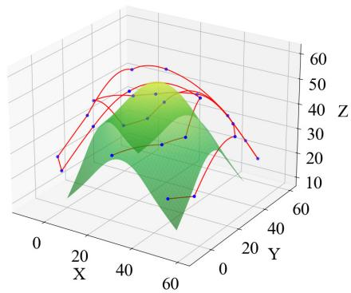  
Fig. 2: Topographic surface and corresponding aerial waypoints covered path.

subsection, the first objective of path planning is to minimize the total path length, which can be expressed as

$$
\begin{array} { r l } { \operatorname* { m i n } } & { { } \mathcal { L } = \sum _ { i = 1 } ^ { N _ { U } } { \sum _ { j = 1 , j \ne i } ^ { N _ { U } } { x _ { i j } L _ { i j } } } } \end{array}\tag{21}
$$

$$
s . t . \sum _ { i = 1 } ^ { N _ { U } } { x _ { i j } } = 1 , \sum _ { j = 1 } ^ { N _ { U } } { x _ { i j } } = 1 , \forall i , j , i \neq j ,\tag{22}
$$

where $N _ { U }$ is the total number of waypoints, and if the UAV travels from i to $j , x _ { i j } = 1 ;$ otherwise, $x _ { i j } = 0$

Since the limited endurance of low-weight UAV batteries, energy conservation is crucial. Thus, the second objective of path planning is to minimize total energy consumption, which can be expressed as

$$
\begin{array} { r l } { \operatorname* { m i n } } & { \displaystyle \mathcal { E } = \sum _ { i = 1 } ^ { N _ { U } } \sum _ { j = 1 , j \neq i } ^ { N _ { U } } \sum _ { k = 1 , k \neq j , i } ^ { N _ { U } } x _ { i j k } ( \beta L _ { i j } + \beta L _ { j k } } \\ & { \quad + \varphi \cdot \frac { 1 8 0 } { \pi } \cdot \Theta _ { i j k } - \beta L _ { 1 2 } - \beta L _ { ( N _ { U } - 1 ) N _ { U } } ) } \end{array}\tag{23}
$$

$$
s . t . \sum _ { i = 1 , i \neq j } ^ { N _ { U } } \sum _ { k = 1 , k \neq i , j } ^ { N _ { U } } x _ { i j k } \leq 1 , \quad \forall j ,\tag{24}
$$

$$
\begin{array} { r } { \sum _ { i = 1 } ^ { N _ { U } } \sum _ { j = 1 , j \ne i } ^ { N _ { U } } \sum _ { k = 1 , k \ne i , j } ^ { N _ { U } } { x _ { i j k } } = N _ { U } - 2 , } \end{array}\tag{25}
$$

$$
\begin{array} { r } { \sum _ { i = 1 , i \neq j , k } ^ { N _ { U } } x _ { i j k } = \sum _ { l = 1 , l \neq j , k } ^ { N _ { U } } x _ { j k l } , \forall j , k ( j \neq k ) , } \end{array}\tag{26}
$$

$$
\sum _ { j = 1 } ^ { N _ { U } } \left( 1 - \sum _ { \substack { i = 1 , i \neq j } } ^ { N _ { U } } \sum _ { k = 1 , k \neq i , j } ^ { N _ { U } } x _ { i j k } \right) = 2 ,\tag{27}
$$

where $\beta$ is approximately $0 . 1 1 6 4 k J / m ,$ , and $\varphi$ is approximately $0 . 0 1 7 3 k J / d e g ; L _ { i j }$ is the distance traveled along the fitted surface between points i and $j .$

## B. Alternating Hierarchical Genetic Algorithm

When UAV navigates through low-lying valley areas, sensor constraints often result in clustered waypoints with significant overlaps. As illustrated in Fig. 3, our method simplifies such clusters by selecting only the central point as the representative waypoint for coverage, while treating other points in the cluster as redundant. This strategy effectively reduces path complexity while maintaining complete area coverage.

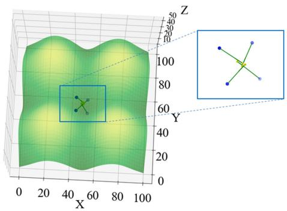  
Fig. 3: The cluster points corresponding to the surface of the valley topography.

To address the multi-objective optimization of both path length and energy consumption, we propose an alternating hierarchical genetic (AHG) algorithm. The pseudo-code of AHG algorithm is shown in Algorithm 4. This algorithm begins by initializing a population of waypoint sequences and an empty Pareto archive for storing non-dominated solutions. We employ a simple yet effective alternating strategy that periodically switches optimization focus between the two objectives. Specifically, our proposed algorithm operates in two alternating phases:

(1) Phase 1 (Distance-oriented): Emphasizes path length reduction with fitness function $F ( s ) = 0 . 7 \mathcal { L } ( s ) + 0 . 3 \mathcal { E } ( s ) ;$

(2) Phase 2 (Energy-oriented): Emphasizes energy consumption reduction with fitness function $F ( s ) = 0 . 3 { \mathcal { L } } ( s ) +$ $0 . 7 \mathcal { E } ( s )$

The phase alternation occurs each 100 generations, creating a hierarchical exploration pattern that prevents premature convergence to local optima in either objective dimension. Furthermore, our algorithm maintains a Pareto archive A that preserves elite non-dominated solutions throughout evolution, enabling explicit exploration of the trade-off frontier. To enhance solution quality, the algorithm periodically injects the best solutions from the archive into the main population each 50 generations, ensuring that promising trade-off solutions influence the evolutionary process.

The genetic operators include tournament selection, order crossover with probability $p _ { c } = 0 . 9 ,$ , and swap mutation with probability $p _ { m } = 0 . 1$ . Those operators operate on the weighted fitness function for $T = 2 0 0 0 0$ generations.

Upon completion, the AHG algorithm selects the final solution from the Pareto archive using normalized objective values:

$$
S ^ { * } = \arg \operatorname* { m i n } _ { s \in \mathcal { A } } \left[ \lambda \cdot \tilde { \mathcal { E } } ( s ) + ( 1 - \lambda ) \cdot \tilde { \mathcal { L } } ( s ) \right] ,\tag{28}
$$

where $\tilde { \mathcal { L } } ( s ) = ( \mathcal { L } ( s ) - \mathcal { L } _ { \operatorname* { m i n } } ) / ( \mathcal { L } _ { \operatorname* { m a x } } - \mathcal { L } _ { \operatorname* { m i n } } )$ and $\tilde { \mathcal { E } } ( s ) =$ $( \mathcal { E } ( s ) - \mathcal { E } _ { \operatorname* { m i n } } ) / ( \mathcal { E } _ { \operatorname* { m a x } } - \mathcal { E } _ { \operatorname* { m i n } } )$ are the normalized objective values, and $\lambda \in [ 0 , 1 ]$ reflects the relative importance of energy consumption versus path length in the application context.

Our proposed AHG algorithm generates a Pareto-optimal waypoint sequence that achieves effective trade-off minimization of both path length $\mathcal { L }$ and energy consumption E , addressing the multi-objective nature of UAV path planning while maintaining computational efficiency and algorithmic transparency.

Algorithm 4 Alternating hierarchical genetic algorithm   
Require: Waypoint set P , population size N, max generations $T ,$   
trade-off parameter $\lambda \in [ 0 , 1 ] ;$   
Ensure: Optimized sequence $S ^ { * }$ , Pareto archive A   
1: Initialize $P o p$ with N random permutations of $P ;$   
2: Initialize Pareto archive $A  \emptyset ;$   
3: phase ← 1, best $ \infty ,$ , stagnate $ 0 ;$   
4: for $t = 1$ to T do   
5: if t mod $1 0 0 = 0$ then   
6: phase ← 3 − phase;   
7: end if   
8: for all $s \in P o p$ do   
9: Compute distance ${ \mathcal { L } } ( s )$ and energy ${ \mathcal { E } } ^ { \circ } ( s ) ;$   
10: if $p h a s e = 1$ then   
11: Fitness $\mathbf { \Phi } ( s ) \gets 0 . 7 \mathcal { L } ( s ) + 0 . 3 \mathcal { E } ( s ) ;$   
12: else   
13: Fitnes $\begin{array} { r } { \mathrm { \Lambda } _ { \{ s \} }  0 . 3 \mathcal { L } ( s ) + 0 . 7 \mathcal { E } ( s ) ; } \end{array}$   
14: end if   
15: end for   
16: curr best $ \operatorname* { m i n } _ { { s } \in { P o p } }$ Fitness(s);   
17: if |curr best − best| < 0.001 × |best| then   
18: stagnate ← stagnate + 1;   
19: if stagnate ≥ 200 then   
20: break   
21: end if   
22: else   
23: best ← curr best, stagnate $ 0 ;$   
24: end if   
25: for all $s \in P o p$ do   
26: if s is non-dominated in P op ∪ A then   
27: Add s to A;   
28: end if   
29: end for   
30: Remove dominated solutions from A;   
31: P arents ← TournamentSelect(P op);   
32: Offspring ← OrderCrossover(P arents, p<sub>c</sub>);   
33: Offspring ← SwapMutation(Offspring, $\phantom { } _ { p _ { m } ) } ;$   
34: combined ← P op ∪ Offspring;   
35: Sort combined by fitness;   
36: P op ← first N individuals from combined;   
37: if t mod $5 0 = 0$ and $| { \mathcal { A } } | > 0$ then   
38: Inject 2 best solutions from A into $P o p ;$   
39: end if   
40: if no improvement for 200 generations then   
41: Increase population diversity;   
42: end if   
43: end for   
44: Normalize objectives in $\mathcal { A } \colon$   
45: $\tilde { \mathcal { L } } \gets ( \mathcal { L } - \operatorname* { m i n } ( \mathcal { L } ) ) / ( \operatorname* { m a x } ( \mathcal { L } ) - \operatorname* { m i n } ( \mathcal { L } ) ) ;$   
46: E<sup>˜</sup> ← (E − min(E ))/(max(E ) − min(E ));   
47: $\mathrm { S c o r e } ( s ) \gets \lambda \cdot \tilde { \mathcal { E } } ( s ) + ( 1 - \lambda ) \cdot \tilde { \mathcal { L } } ( s ) ;$   
48: S<sup>∗</sup> ← arg min<sub>s∈A</sub> Score(s);   
49: return $S ^ { * } , A$

Remark 2. In sum, our proposed AHG algorithm imple-

IEEE TRANSACTIONS ON MOBILE COMPUTING, VOL. XX, NO. XX, XXXX XXXX

ments a multi-objective path optimization framework that systematically explores the trade-off between path length and energy consumption by alternating objective emphasis and maintaining a Pareto archive. This alternating mechanism establishes a dynamic balance between exploration and exploitation, while periodic injection of archived solutions effectively prevents premature convergence. Compared to complex adaptive schemes, our proposed AHG algorithm offers robust optimization performance with a concise implementation.

## C. Computational Complexity

The computational complexity of our proposed AHG algorithm is $\mathcal { O } ( T \cdot ( N ^ { 2 } + N \cdot M ) )$ , where T is the maximum generations, N is the population scale, and M is the number of waypoints. This maintains comparable efficiency to singleobjective methods while providing genuine multi-objective optimization capabilities.

## VI. SIMULATION EXPERIMENT AND ANALYSIS

To validate the effectiveness of the GL-AHG algorithm, we design systematic comparative experiments. Aiming at the UAV-enabled CPP in complex environments, the experiments construct two typical mountainous terrains: a four-peak scenario and an eight-peak scenario, to simulate geographical environments with varying complexity levels. Furthermore, we have also incorporated a realistic mountain terrain scenario to further enhance the practicality and challenge of the experiment. By establishing multiple evaluation metrics, the performance of various comparison algorithms is quantitatively assessed. Based on the experimental results, comparative analysis and discussion are conducted, revealing the performance advantages of the GL-AHG algorithm under different terrain conditions.

## A. Simulation Environment Setup

In the simulation, we test on two sets of peaks: four peaks measuring 100 × 100 m (as shown in Fig. 4(a)) and eight peaks measuring 200 × 100 m (as shown in Fig. 4(b)), with the UAV flight altitude set at 10 m. The code mentioned in this paper are edited using Visual Studio Code 1.97.2 in Python 3.12.2. The machine used for the simulation experiment is a desktop computer with Precision 3650 Tower Intel(R) Core(TM) i9- 11900 CPU @ 2.50GHz.

## B. Compared Algorithms and Performance Metrics

The comparative evaluation includes the following seven algorithms: the BF algorithm [33], Spiral algorithm [34], HO-CTP algorithm [20], APPMS algorithm [35], MOEA-2DE algorithm [36], MOEA/D algorithm [37] and our proposed GL-AHG algorithm. The codes of those comparison algorithms have been appropriately adapted for the proposed project. The BF and Spiral algorithms are adapted for 3D surfaces. In contrast, the objectives of the HO-CTP, APPMS, MOEA-2DE and MOEA/D algorithms are modified to focus on minimizing path length and energy consumption, respectively. The BF and Spiral algorithms are considered classic solutions to UAVenabled CPP. Among existing methods, the HO-CTP, APPMS, MOEA-2DE and MOEA/D algorithms serve as representative techniques for multi-objective optimization.

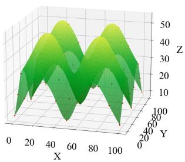  
(a) Four peaks

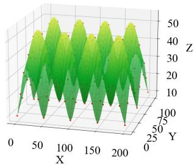  
(b) Eight peaks  
Fig. 4: Simulation of four peaks and eight.

To avoid collisions or cutting through the mountain’s interior, we assume that the UAV follows the terrain surface defined by the normal vector endpoints based on sensing constraints. Subsequently, to measure the performance improvement of our proposed algorithm compared to the baseline algorithm, we define two metrics, which are expressed as

$$
L _ { R a t e } = \frac { L _ { B F } - L } { L _ { B F } } , E _ { R a t e } = \frac { E _ { B F } - E } { E _ { B F } } ,\tag{29}
$$

where $L _ { B F }$ is the path length of the BF algorithm, and L is the path lengths of other algorithms; $E _ { B F }$ is the energy consumption of the BF algorithm, while E is the energy consumption of other algorithms.

## C. Performance Comparison on Four Peaks

TABLE II presents the simulation results for the seven algorithms on the terrain surface of four peaks, with the specific paths shown in Fig. 5. In TABLE II, the GL-AHG algorithm achieves the shortest path length, showing a 33.6% improvement over the BF algorithm and an 11.4% reduction in energy consumption compared to it. The remaining four algorithms require longer paths and greater energy to complete the coverage task. Here, we can notice that the performance of MOEA-2DE algorithm is not very ideal. This is mainly due to the fact that the performance of MOEA-2DE algorithm in [36] is mainly targeted at terrain obstacle avoidance scenarios, which optimizes low altitude flight paths by excluding steep terrain through hard constraints. However, this study focuses on the problem of full CPP, with no terrain obstacle constraints and different optimization objectives. Under these conditions, swarm intelligence algorithms such as APPMS may have more advantages: their distributed collaboration mechanism can achieve regional coverage more efficiently, and their dynamic adjustment ability also makes them perform better in full coverage tasks. Furthermore, by integrating multiobjective metaheuristics like MOEA/D, the algorithm can simultaneously optimize multiple competing objectives, thereby providing a more comprehensive and balanced solution for complex multi-criteria coverage problems.

TABLE III SIMULATIONS FOR EIGHT PEAKS  
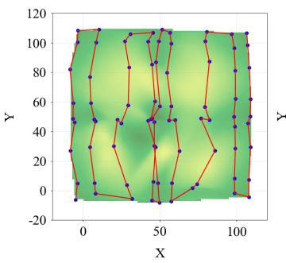  
(a)

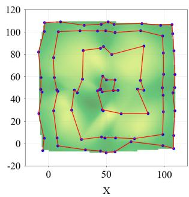  
(b)

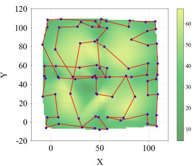  
(c)

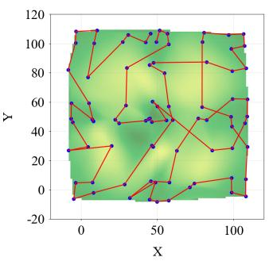  
(d)

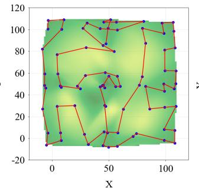  
(e)

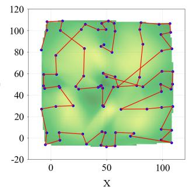  
(f)

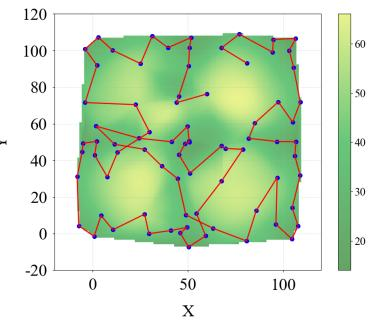  
(g)  
Fig. 5: The top view of final path generation. For four peaks: (a) BF; (b) Spiral; (c) MOEA-2DE; (d) HO-CTP; (e) MOEA/D; (f) APPMS; (g) GL-AHG.

TABLE II  
SIMULATIONS FOR FOUR PEAKS
<table><tr><td>Algorithm</td><td>Length(m)</td><td>Energy(kJ)</td><td> $L _ { R a t e }$ </td><td> $E _ { R a t e }$ </td></tr><tr><td>BF</td><td>2029.1</td><td>282.6</td><td>0.0%</td><td>0.0%</td></tr><tr><td>Spiral</td><td>1766.1</td><td>284.7</td><td>13.0%</td><td>-0.8%</td></tr><tr><td>MOEA-2DE</td><td>1750.9</td><td>298.0</td><td>13.7%</td><td>-5.4%</td></tr><tr><td>HO-CTP</td><td>1649.1</td><td>290.9</td><td>18.7%</td><td>-2.9%</td></tr><tr><td>MOEA/D</td><td>1630.6</td><td>279.9</td><td>19.6%</td><td>1.0%</td></tr><tr><td>APPMS</td><td>1531.4</td><td>272.4</td><td>24.5%</td><td>3.6%</td></tr><tr><td>GL-AHG(Ours)</td><td>1348.3</td><td>250.4</td><td>33.6%</td><td>11.4%</td></tr></table>

Overall, although the APPMS and MOEA/D algorithms achieve relative minimization of both path length and energy consumption, the GL-AHG algorithm outperforms this algorithm in both aspects, resulting in better performance. This indicates that our proposed algorithm can significantly reduce flight path length while saving energy consumption, thus saving time and reducing the possibility of encountering uncertainties during flight.

<table><tr><td>Algorithm</td><td>Length(m)</td><td>Energy(kJ)</td><td> $L _ { R a t e }$ </td><td> $E _ { R a t e }$ </td></tr><tr><td>BF</td><td>3453.0</td><td>525.7</td><td>0.0%</td><td>0.0%</td></tr><tr><td>Spiral</td><td>3348.6</td><td>549.3</td><td>3.0%</td><td>-4.5%</td></tr><tr><td>MOEA-2DE</td><td>3241.3</td><td>565.4</td><td>6.1%</td><td>-7.6%</td></tr><tr><td>HO-CTP</td><td>3189.3</td><td>554.4</td><td>7.6%</td><td>-5.5%</td></tr><tr><td>MOEA/D</td><td>3031.1</td><td>515.8</td><td>12.2%</td><td>1.9%</td></tr><tr><td>APPMS</td><td>2606.2</td><td>485.0</td><td>24.5%</td><td>7.7%</td></tr><tr><td>GL-AHG(Ours)</td><td>2301.4</td><td>447.0</td><td>33.4%</td><td>15.0%</td></tr></table>

In this subsection, we conduct simulation experiments on a more general terrain surface. As shown in Fig. 6, we simulate a terrain with eight peaks and compare the seven algorithms. As shown in TABLE III, we observe that while the APPMS algorithm achieves relative minimization of both path length and energy consumption, outperforming the BF algorithm in both aspects, our proposed GL-AHG algorithm demonstrates

## D. Performance Comparison on Eight Peaks

significant improvements. After simplifying the cluster points, the GL-AHG algorithm achieves a 33.4% reduction in path length and an 15.0% reduction in energy consumption compared to the BF algorithm, thereby achieving a superior performance and outperforming the other algorithms significantly. This has significant practical value in the real world, where UAV can save energy to complete search, patrol and other coverage tasks while storing excess energy for emergencies. In addition, the length of the flight path is reduced to save time and minimize the possibility of encountering uncertain events, such as thunderstorms, bird collisions, etc.

The comparative simulations on four-peak and eight-peak terrains demonstrate the superior performance of GL-AHG in both path length and energy consumption. While swarm intelligence algorithms like APPMS show advantages, our GL-AHG algorithm achieves more significant improvements through its innovative waypoint generation and hierarchical optimization method. These results confirm that GL-AHG not only outperforms traditional methods but also maintains its optimization advantages in more complex terrain scenarios, offering practical benefits for real-world UAV operations including extended mission endurance and reduced exposure to flight risks. The consistent performance across different terrain complexities suggests the algorithm’s robustness for various coverage applications.

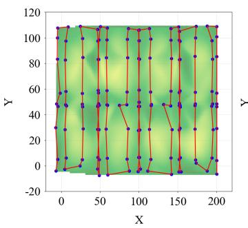  
(a)

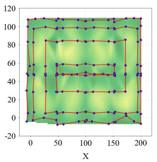  
(b)

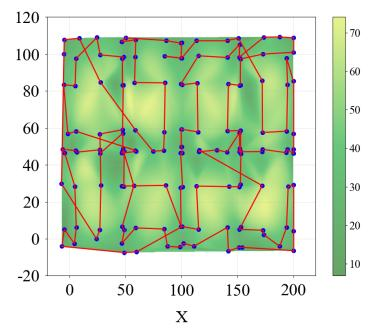  
(c)

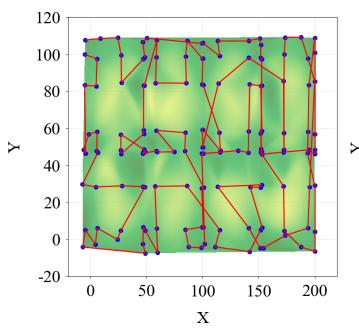  
(d)

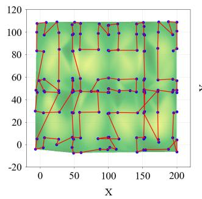  
(e)

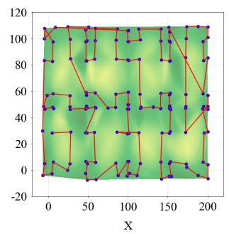  
(f)

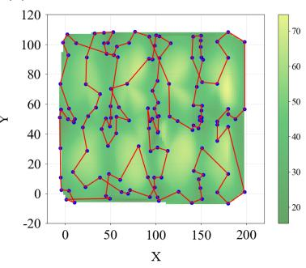  
(g)  
Fig. 6: The top view of final path generation. For eight peaks: (a) BF; (b) Spiral; (c) MOEA-2DE; (d) HO-CTP; (e) MOEA/D; (f) APPMS; (g) GL-AHG.

## E. Real Terrain Experiment

To enhance the universality of the algorithm in typical hilly regions and strengthen the validation, this paper introduces a dataset based on a real geographical environment. The data originate from Wucheng district, Jinhua city, which is situated in the central Zhejiang hilly basin and features gently undulating, representative topography. The dataset is constructed based on publicly available digital elevation model data, with an elevation range spanning from 60 meters to 240 meters. The terrain exhibits complex and continuous slope variations, effectively simulating the practical terrain constraints and challenges faced by low-altitude UAVs when performing tasks in hilly regions. Fig. 7 presents a 3D visualization of this terrain.

In order to comprehensively evaluate the performance of our proposed GL-AHG algorithm, we compared it with six advanced or classic benchmark algorithms on real terrain. TABLE IV presents the simulation results for the seven algorithms, with the specific paths shown in Fig. 8. As shown in TABLE IV, we observe that the Spiral algorithm performed poorly. Compared with the benchmark BF algorithm, its path length and energy consumption increased by 13.5% and 9.3% respectively. This is due to its inability to adapt to the significant elevation changes in the vast and complex terrain, resulting in inefficient flight paths with excessive climbs and detours. In contrast, optimization-based algorithms (e.g., MOEA/D, HO-CTP) achieve positive improvements in both metrics. Notably, compared to the structured multi-peak simulation, the continuous and irregular slopes of the real terrain amplify the differences in energy optimization among algorithms. Ultimately, our proposed GL-AHG algorithm achieves the best overall performance, reducing path length and energy consumption by 29.2% and 30.6%, respectively. It demonstrates the effectiveness of its hierarchical optimization framework and intelligent waypoint generation in handling complex slope variations. Those results confirm the robustness and superiority of GL-AHG algorithm in real-world scenarios, supporting its practical application in UAV coverage tasks over hilly terrain.

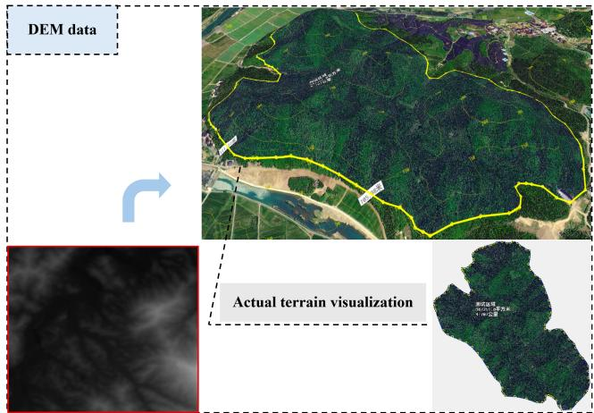  
Fig. 7: A schematic diagram of the real-data experimental dataset.

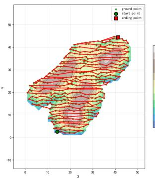  
(a)

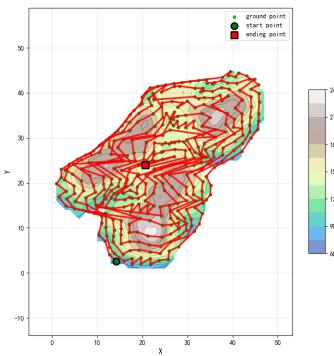  
(b)

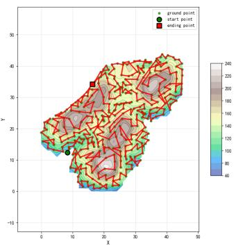  
(c)

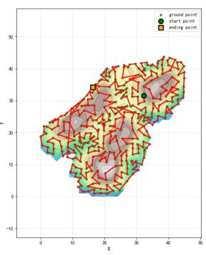  
(d)

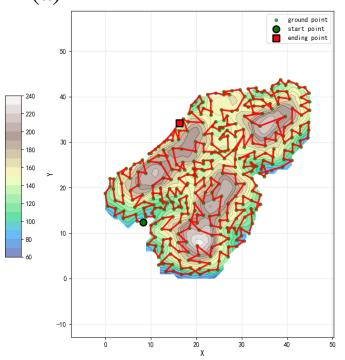  
(e)

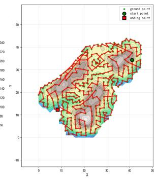  
(f)

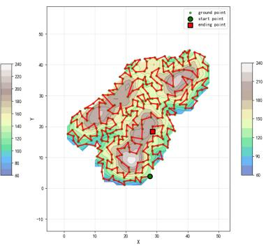  
(g)  
Fig. 8: The top view of final path generation. For real terrain: (a) BF; (b) Spiral; (c) MOEA-2DE; (d) HO-CTP; (e) MOEA/D; (f) APPMS; (g) GL-AHG.

TABLE IV  
SIMULATIONS FOR REAL TERRAIN
<table><tr><td>Algorithm</td><td>Length(m)</td><td>Energy(kJ)</td><td> $L _ { R a t e }$ </td><td> $E _ { R a t e }$ </td></tr><tr><td>BF</td><td>26889.1</td><td>3816.7</td><td>0.0%</td><td>0.0%</td></tr><tr><td>Spiral</td><td>29630.3</td><td>4170.7</td><td>-13.5%</td><td>-9.3%</td></tr><tr><td>MOEA-2DE</td><td>24195.0</td><td>3270.5</td><td>10.0%</td><td>14.3%</td></tr><tr><td>HO-CTP</td><td>23621.6</td><td>3124.6</td><td>12.2%</td><td>18.1%</td></tr><tr><td>MOEA/D</td><td>22359.7</td><td>2998.7</td><td>16.8%</td><td>21.4%</td></tr><tr><td>APPMS</td><td>20997.1</td><td>3056.6</td><td>21.9%</td><td>19.9%</td></tr><tr><td>GL-AHG(Ours)</td><td>19043.2</td><td>2648.3</td><td>29.2%</td><td>30.6%</td></tr></table>

## VII. CONCLUSION AND FUTURE RESEARCHES

In this paper, we have proposed a novel game-learning alternating hierarchical genetic, i.e., GL-AHG algorithm, incorporating energy consumption into the waypoint generation. Specifically, we transformed the waypoint optimization into a WVC problem by identifying optimal path direction and mapping the associated weights of waypoints. Subsequently, we proposed an asymmetric snowdrift game model and utilized the first sub-algorithm of the GL-AHG algorithm, i.e., the game-learning algorithm, to derive an optimized set of waypoints. Based on the generated waypoints, we applied the second sub-algorithm of the GL-AHG algorithm, i.e., the alternating hierarchical genetic algorithm, to significantly reduce flight path length while conserving energy consumption. The simulation results confirmed that our algorithm can achieve relative minimization of both path length and energy consumption, greatly enhancing the effectiveness of solving the corresponding problem.

In the future, research on UAV-enabled CPP should prioritize multi-UAV collaborative systems to enhance operational efficiency, particularly in ground-to-air coordination scenarios with base stations. Furthermore, for the UAV-enabled CPP, it is essential to expand more complex 3D terrains, as this will facilitate faster data collection and subsequent rapid responses. Additionally, analyzing the impact of environmental uncertainties (e.g., wind and sensor noise) on system performance is crucial, and we identify this as a core direction for our research efforts.

## REFERENCES

[1] H. Liu, Y. P. Tsang, C. K. M. Lee, and C. H. Wu, “UAV Trajectory Planning via Viewpoint Resampling for Autonomous Remote Inspection of Industrial Facilities,” IEEE Transactions on Industrial Informatics, vol. 20, no. 5, pp. 7492-7501, 2024.

[2] B. Wen, and Y. Chen, “Night-Time Measurement and Skeleton Recognition Using Unmanned Aerial Vehicles Equipped with LiDAR Sensors Based on Deep-Learning Algorithms,” IEEE Sensors Journal, vol. 23, no. 19, pp. 23474-23485, 2023.

[3] X. Wang, X. Wang, Z. Zhou, and Y. Song, “A Deep-Learning Method Based on the Multistage Fusion of Radar and Camera in UAV Obstacle Avoidance,” IEEE Transactions on Aerospace and Electronic Systems, vol. 60, no. 5, pp. 6734-6751, 2024.

[4] W. Wang, C. Fang, and T. Liu, “Multiperiod Unmanned Aerial Vehicles Path Planning with Dynamic Emergency Priorities for Geohazards Monitoring,” IEEE Transactions on Industrial Informatics, vol. 18, no. 12, pp. 8851-8859, 2022.

[5] E. Yanmaz, H. M. Balanji, and <sup>˙</sup>I. Guven, “Dynamic Multi-UAV Path¨ Planning for Multi-Target Search and Connectivity,” IEEE Transactions on Vehicular Technology, vol. 73, no. 7, pp. 10516-10528, 2024.

[6] Y. Lyu, M. Cao, S. Yuanz, and L. Xie, “Vision-Based Plane Estimation and Following for Building Inspection with Autonomous UAV,” IEEE Transactions on Systems, Man, and Cybernetics: Systems, vol. 53, no. 12, pp. 7475-7488, 2023.

[7] Z. Sun, G. G. Yen, J. Wu, H. Ren, H. An, and J. Yang, “Mission Planning for Energy-Efficient Passive UAV Radar Imaging System Based on Substage Division Collaborative Search,” IEEE Transactions on Cybernetics, vol. 53, no. 1, pp. 275-288, 2023.

[8] H. Bao, Y. Wang, H. Zhu, and D. Wang, “Area Complete Coverage Path Planning for Offshore Seabed Organisms Fishing Autonomous Underwater Vehicle Based on Improved Whale Optimization Algorithm,” IEEE Sensors Journal, vol. 24, no. 8, pp. 12887-12903, 2024.

[9] J. Chang, N. Dong, F. Li, W. H. Ip, and K. L. Yung, “Skeleton Extraction and Greedy-Algorithm-Based Path Planning and Its Application in UAV Trajectory Tracking,” IEEE Transactions on Aerospace and Electronic Systems, vol. 58, no. 6, pp. 4953-4964, 2022.

[10] L. Jiao, Z. Peng, L. Xi, S. Ding and J. Cui, “Multi-Agent Coverage Path Planning via Proximity Interaction and Cooperation,” IEEE Sensors Journal, vol. 22, no. 6, pp. 6196-6207, 2022.

[11] H. Gong, B. Huang, and B. Jia, “Energy-Efficient 3-D UAV Ground Node Accessing Using the Minimum Number of UAVs,” IEEE Transactions on Mobile Computing, vol. 23, no. 12, pp. 12046-12060, 2024.

[12] D. P. Arab, M. Spisser, and C. Essert, “Complete Coverage Path Planning for Wheeled Agricultural Robots,” Journal of Field Robotics, vol. 40, no. 6, pp. 1460-1503, 2023.

[13] J. Fu, G. Sun, J. Liu, W. Yao, and L. Wu, “On Hierarchical Multi-UAV Dubins Traveling Salesman Problem Paths in a Complex Obstacle Environment,” IEEE Transactions on Cybernetics, vol. 54, no. 1, pp. 123-135, 2024.

[14] R. Chen, J. Wang, H. Zhou, Y. Bai, Y. Zhao, and X. Chen, “Path Planning and Control for Multiagent Traversing Numerous Obstacles,” IEEE Transactions on Industrial Electronics, vol. 72, no. 3, pp. 2938- 2947, 2025.

[15] Y. -C. Ko, and R. -H. Gau, “UAV Velocity Function Design and Trajectory Planning for Heterogeneous Visual Coverage of Terrestrial Regions,” IEEE Transactions on Mobile Computing, vol. 22, no. 10, pp. 6205-6222, 2023.

[16] L. Shao, J. He, X. Lu, B. Hei, J. Qu, and W. Liu, “Aircraft Skin Damage Detection and Assessment From UAV Images Using GLCM and Cloud Model,” IEEE Transactions on Intelligent Transportation Systems, vol. 25, no. 3, pp. 3191-3200, 2024.

[17] L. V. Nguyen, M. D. Phung and Q. P. Ha, “Game Theory-Based Optimal Cooperative Path Planning for Multiple UAVs,” IEEE Access, vol. 10, pp. 108034-108045, 2022.

[18] H. Qiu, W. Yu, G. Zhang, X. Xia, and K. Yao, “Multi-robot Collaborative 3D Path Planning Based On Game Theory and Particle Swarm Optimization Hybrid Method,” The Journal of Supercomputing, vol. 81, no. 3, 2025.

[19] J. Lu, B. Zeng, J. Tang, T. L. Lam, and J. Wen, “TMSTC\*: A Path Planning Algorithm for Minimizing Turns in Multi-Robot Coverage,” IEEE Robotics and Automation Letters, vol. 8, no. 8, pp. 5275-5282, 2023.

[20] H. Wang, S. Zhang, X. Zhang, X. Zhang, and J. Liu, “Near-Optimal 3-D Visual Coverage for Quadrotor Unmanned Aerial Vehicles under Photogrammetric Constraints,” IEEE Transactions on Industrial Electronics, vol. 69, no. 2, pp. 1694-1704, 2022.

[21] S. M. Lavalle, “Rapidly-Exploring Random Trees: A New Tool for Path Planning,” The annual research report, 1998.

[22] S. Karaman and E. Frazzoli, “Sampling-based algorithms for optimal motion planning,” International Journal of Robotics Research, vol. 30, pp. 846-894, 2011.

[23] J. D. Gammell, S. S. Srinivasa and T. D. Barfoot, “Informed RRT\*: Optimal sampling-based path planning focused via direct sampling of an admissible ellipsoidal heuristic,” IEEE/RSJ International Conference on Intelligent Robots and Systems, pp. 2997-3004, 2014.

[24] J. D. Gammell, S. S. Srinivasa and T. D. Barfoot, “Batch Informed Trees (BIT\*): Sampling-based optimal planning via the heuristically guided search of implicit random geometric graphs,” IEEE International Conference on Robotics and Automation (ICRA), pp. 3067-3074, 2015.

[25] J. Wang, Y. Li, R. Li, H. Chen, and K. Chu, “Trajectory Planning for UAV Navigation in Dynamic Environments with Matrix Alignment Dijkstra,” Soft Computing, vol. 26, no. 22, pp. 12599-12610, 2022.

[26] C. Huang, H. Ma, X. Zhou, and W. Deng, “Cooperative Path Planning of Multiple Unmanned Aerial Vehicles Using Cylinder Vector Particle Swarm Optimization With Gene Targeting,” IEEE Sensors Journal, vol. 25, no. 5, pp. 8470-8480, 2025.

[27] X. Chai, Z. Zheng, J. Xiao, L. Yan, B. Qu, P. Wen, H. Wang, Y. Zhou, and H. Sun, “Multi-Strategy Fusion Differential Evolution Algorithm for UAV Path Planning in Complex Environment,” Aerospace Science and Technology, vol. 121, no. 12, 2022.

[28] C. Huang, X. Zhou, X. Ran, J. Wang, H. Chen, and W. Deng, “Adaptive Cylinder Vector Particle Swarm Optimization with Differential Evolution for UAV Path Planning,” Engineering Applications of Artificial Intelligence, vol. 121, 2023.

[29] F. Shan, J. Huang, R. Xiong, F. Dong, J. Luo, and S. Wang, “Energy-Efficient General PoI-Visiting by UAV With a Practical Flight Energy Model,” IEEE Transactions on Mobile Computing, vol. 22, no. 11, pp. 6427-6444, 2023.

[30] W. Jing, D. Deng, Z. Xiao, Y. Liu, and K. Shimada, “Coverage Path Planning Using Path Primitive Sampling and Primitive Coverage Graph for Visual Inspection,” IEEE/RSJ International Conference on Intelligent Robots and Systems (IROS), pp. 1472-1479, 2019.

[31] F. Jiang, X. Zhang, X. Chen, and Y. Fang, “Distributed Optimization of Visual Sensor Networks for Coverage of a Large-Scale 3-D Scene,” IEEE/ASME Transactions on Mechatronics, vol. 25, no. 6, pp. 2777- 2788, 2020.

[32] X. Liu, M. Piao, H. Li, Y. Li, and B. Lu, “Quality and Efficiency of Coupled Iterative Coverage Path Planning for the Inspection of Large Complex 3D Structures,” Drones, vol. 8, no. 8, 2024.

[33] M. Torres, D. A. Pelta, J. L. Verdegay, and J. C. Torres, “Coverage Path Planning with Unmanned Aerial Vehicles for 3D Terrain Reconstruction,” Expert Systems with Applications, vol. 55, pp. 0957-4174, 2016.

[34] T. M. Cabreira, C. D. Franco, P. R. Ferreira, and G. C. Buttazzo, “Energy-Aware Spiral Coverage Path Planning for UAV Photogrammetric Applications,” IEEE Robotics and Automation Letters, vol. 3, no. 4, pp. 3662-3668, 2018.

[35] Y. Wan, Y. Zhong, A. Ma, and L. Zhang, “An Accurate UAV 3- D Path Planning Method for Disaster Emergency Response Based on an Improved Multiobjective Swarm Intelligence Algorithm,” IEEE Transactions on Cybernetics, vol. 53, no. 4, pp. 2658-2671, 2023.

[36] X. Xu, C. Xie, Z. Luo, C. Zhang, and T. Zhang, “A Multi-Objective Evolutionary Algorithm Based on Dimension Exploration and Discrepancy Evolution for UAV Path Planning Problem,” Information Sciences, vol. 657, 2024.

[37] X. Zhou, X. Wang, and X. Gu, “Welding robot path planning problem based on discrete MOEA/D with hybrid environment selection,” Neural Computing and Applications, vol. 33, pp. 12881–12903, 2021.

[38] Q. Shao, X. Mao and W. Xu, “Energy-Aware UAV Coverage Planning in Mountainous Terrain via Contour-Aligned Path Generation,” IEEE Robotics and Automation Letters, vol. 10, no. 12, pp. 12373-12380, 2025.

[39] V. C. d. S. Campos, A. A. Neto and D. G. Macharet, “semi-Lagrangian approach for time and energy path planning optimization in static flow fields,” Journal of the Franklin Institute, vol. 362, no. 7, pp. 107612, 2025.

[40] Z. Han, C. Fang, W. Wang and J. Xu, “Energy-Efficient UAV routing problem based on approximate cellular decomposition for geohazards monitoring,” Computers & Operations Research, vol. 183, pp. 107154, 2025.

[41] Y. Yang, and X. Li, “Towards a Snowdrift Game Optimization to Vertex Cover of Networks,” IEEE Transactions on Cybernetics, vol. 43, no. 3, pp. 948–956, 2013.

[42] R. S. Sutton, and A. G. Barto, “Reinforcement Learning: An Introduction,” MIT Press, pp. 287-320, 2018.

[43] J. I. Vasquez-Gomez, J. C. Herrera-Lozada, and M. Olguin-Carbajal, “Spatial Resolution Optimization for Terrain Coverage with UAVs,” International Conference on Mechatronics, Electronics and Automotive Engineering (ICMEAE), pp. 37-42, 2017.

[44] C. Xing, J. Wang, and Y. Xu, “Overlap Analysis of the Images from Unmanned Aerial Vehicles,” International Conference on Electrical and Control Engineering, pp. 1459-1462, 2010.

[45] J. Modares, F. Ghanei, N. Mastronarde, and K. Dantu, “UB-ANC Planner: Energy Efficient Coverage Path Planning with Multiple Drones,” IEEE International Conference on Robotics and Automation (ICRA), pp. 6182-6189, 2017.

[46] N. Michel, A. Patnaik, Z. Kong and X. Lin, “Energy-Optimal Planning of Waypoint-Based UAV Missions-Does Minimum Distance Mean Minimum Energy?,” IEEE/RSJ International Conference on Intelligent Robots and Systems (IROS), pp. 10362-10369, 2024.

[47] C. Tang, A. Li, and X. Li, “Asymmetric Game: A Silver Bullet to Weighted Vertex Cover of Networks,” IEEE Transactions on Cybernetics, vol. 48, no. 10, pp. 2994–3005, 2018.

[48] C. Tang, L. Zhou, J. Chen, J. Lai and G. Chen, “TD(λ)-GA: A Reinforcement Learning-Based Game Algorithm for Weighted Vertex Cover of Networks,” IEEE Transactions on Artificial Intelligence, 2026, doi: 10.1109/TAI.2026.3664774.

[49] L. Xue, C. Sun, D. Wunsch, Y. Zhou, and F. Yu, “An Adaptive Strategy via Reinforcement Learning for the Prisoner’s Dilemma Game,” IEEE/CAA Journal of Automatica Sinica, vol. 5, no. 1, pp. 301-310, 2018.

  
Liangke Zhou received the M.Sc. degree in mathematics from the School of Mathematical Sciences, Zhejiang Normal University, Jinhua, China. He is currently pursuing the Ph.D. degree at the School of Mathematical Sciences, Beijing University of Posts and Telecommunications, Beijing, China.  
His current research interests focus on evolutionary game theory, complex systems, and distributed optimization.

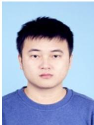

Jie Chen received the M.S. degree in electrical engineering from the School of Automation, Central South University, Changsha, China, in 2018, and the Ph.D. degree in circuits and systems from School of Information Science and Engineering, Fudan University, Shanghai, China, in 2023.

He is currently a Research Associate Professor in the Department of Automation, University of Science and Technology of China (USTC), Hefei, China. His current research interests focus on multiagent collaborative control, game-theoretical optimization of complex networks, and reinforcement learning.

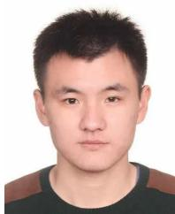

Riheng Jia (Member, IEEE) received the B.E. degree in electronics and information engineering from the Huazhong University of Science and Technology, China, in 2012, and the Ph.D. degree in computer science and technology from Shanghai Jiao Tong University, Shanghai, China, in 2018. He is currently an Associate Professor with the School of Computer Science and Technology, Zhejiang Normal University, China. His current research interests include wireless networks, energy harvesting networks, and the smart IoT. He is a member of ACM.


Changbing Tang (M’16—SM’23) received the B.S. and M.S. degrees in mathematics and applied mathematics from Zhejiang Normal University, Jinhua, China, in 2004 and 2007, respectively, and the Ph.D. degree in circuits and systems from the Department of Electronic Engineering, Fudan University, Shanghai, China, in 2014.

He is currently an Associate Professor with the School of Mathematical Sciences, Zhejiang Normal University. His research interests include game theory and its applications, complex networked sys-

tems, and distributed reinforcement learning.

Dr. Tang was the Recipient of the Academic New Artist Doctoral Post Graduate from the Ministry of Education of China in 2012 and the Recipient of the Academician Pairing Training Program for Young Talents of Zhejiang Province in 2019.


Yang Liu (M’15-SM’21) received the B.S. degree in mathematics from Zhejiang Normal University, Zhejiang, China, in 2003, and the Ph.D. degree from Tongji University, Shanghai, in 2008. He is currently the dean of Hangzhou School of Automation and also a distinguished professor with School of Mathematical Sciences, Zhejiang Normal University. His research interests include logical systems, hybrid systems and distributed optimization. He has authored over 100 publications and three books. He is an IET Fellow, and he is an Associate Editor of

Neural Processing Letters (Springer), Alexandria Engineering Journal, and Control and Decision. He was recognized by Elsevier as a Most Cited Chinese Researcher in 2020-2024, and by Clarivate Analytics as a Highly Cited Researcher in 2019-2022.


Minglu Li received the Ph.D. degree in computer software from Shanghai Jiao Tong University in 1996. He is a Full Professor and the director of Artificial Intelligence Internet of Things (AIoT) Center at Zhejiang Normal University. He is also holding the director of Network Computing Center at Shanghai Jiao Tong University. He has published more than 400 papers in academic journals and international conferences. He was the chairman of Technical Committee on Services Computing (TCSVC) (2004-2016) and Technical Committee on

Distributed Processing (TCDP) (2005-2017), of IEEE Computer Society in Great China region. He served as a general co-chair of IEEE SCC, IEEE CCGrid, IEEE ICPADS, and IEEE IPDPS, and a vice chair of IEEE INFOCOM. He also served as a PC member of more than 50 international conferences including IEEE INFOCOM 2009-2016, IEEE CCGrid 2008, etc. His research interests include vehicular networks, big data, cloud computing, and wireless sensor networks. He is a fellow of IEEE.