# Game-Based Multi-UAV Dynamic Collaborative With Energy-Efficient Hierarchical Information Sharing for Mobile Crowdsensing

Xiaoliang Guang, Yuhuai Peng , and Chenlu Wang

Abstract—The multiple Uncrewed Aerial Vehicles (multi-UAV) collaborative system significantly augments perception capabilities and coverage range of task environments through the establishment of a comprehensive three-dimensional monitoring network, emerging as an indispensable technological cornerstone for future Mobile Crowdsensing (MCS) systems. However, the co-existence of environmental dynamics and device heterogeneity induces nontrivial energy efficiency imbalances across the UAVs, posing a substantial challenge to achieving sustained and efficient multi-UAV exploration. Therefore, we propose an energy-efficient cluster cooperative exploration method that jointly optimizes information sharing and task allocation. To balance communication energy efficiency among UAVs, we introduce an energy-efficient hierarchical information sharing mechanism that dynamically adjusts relay nodes based on real-time attributes of UAVs. In order to improve the utilization of resources, a multi-UAV cooperative task allocation model was developed using cooperative game. It has also been proven that a fair task allocation strategy exists, which is acceptable to all UAVs. Furthermore, the approximate Shapley value of every UAV is calculated using the improved Monte Carlo sampling method combined with incremental update mechanism to ensure fair task allocation. Experimental results demonstrate that the maximum enhancement of task completion ratio is 12%, 26%, and 10%, respectively, at task-critical thresholds for systems utilizing 5, 10, and 15 UAVs. Moreover, the proposed method demonstrated superior performance in energy consumption ratio, synergy, and energy consumption difference compared to benchmarks.

Index Terms—Mobile crowdsensing, energy efficient, information sharing, task allocation, cooperative game.

## I. INTRODUCTION

OBILE Crowdsensing (MCS) represents a novel achieving efficient environmental data acquisition through the integration of the sensing capabilities of distributed intelligent devices [1], [2]. The technology has demonstrated significant application value in the fields of environmental monitoring, smart city construction and disaster rescue [3], [4], [5]. The integration of UAVs into this ecosystem offers distinct advantages, including enhanced mobility and flexibility in deployment [4], [6]. These characteristics contribute to the optimization of data collection efficiency and spatial coverage, thereby expanding the boundaries of mobile swarm intelligence sensing systems. Consequently, UAVs are regarded as the pivotal enabling element for the development of the next-generation mobile swarm sensing system [3], [7].

In the deployment of MCS systems, task allocation is a fundamental area of research [8], [9], particularly critical when UAVs are constrained by energy limitations while being tasked with continuous operations [10]. Considering the dynamic nature of operational environments, characterized by the continuous emergence of new tasks and the evolving architecture of UAV networks, traditional centralized approaches to task allocation struggle to effectively adapt to these time-varying scenarios [11]. Consequently, there is an urgent need to develop distributed task allocation strategies that incorporate a global optimization perspective [12]. These strategies aim to ensure sustainable and reliable perception services in dynamic environments, ultimately leading to an improvement in overall mission success rates.

While multi-UAV can monitor dynamic and complex environments, energy consumption constraints limit their ability to perform continuous exploration, reducing task completion rates [13]. Excessive energy consumption in UAV systems is primarily driven by the communication costs between UAVs and the energy required for task execution. As the number of UAV increases, information exchange volumes grow exponentially. Inefficient communication methods overload certain UAVs, causing inconsistent energy consumption rates [14]. Furthermore, an imbalanced distribution of tasks has been identified as a primary factor contributing to inconsistent energy consumption levels [15]. Task allocation should align with the energy levels and consumption rates of UAVs to achieve energy balance, ensuring sustainable exploration and improved task completion rates.

Research on enhancing energy efficiency has focused on specific aspects, such as optimizing UAV’s trajectories [16], designing flexible methods of information sharing [17], adjusting device attributes dynamically [18], and intelligent task allocation [15], [19]. However, few studies have investigated the combined impact of information-sharing mechanism and task allocation on energy efficiency. It is evident that joint optimization of information-sharing methods and task allocation for collaborative sensing in dynamic environments can significantly improve task completion rates [20]. Optimized information-sharing ways reduce unnecessary transmissions, minimizing energy waste [17], [21]. Efficient task allocation enables each unit to complete tasks in minimal time, preventing resource idling and redundancy [22]. This joint optimization not only improves the efficiency of task execution and completion rates but also significantly increases the overall performance of the system [14].

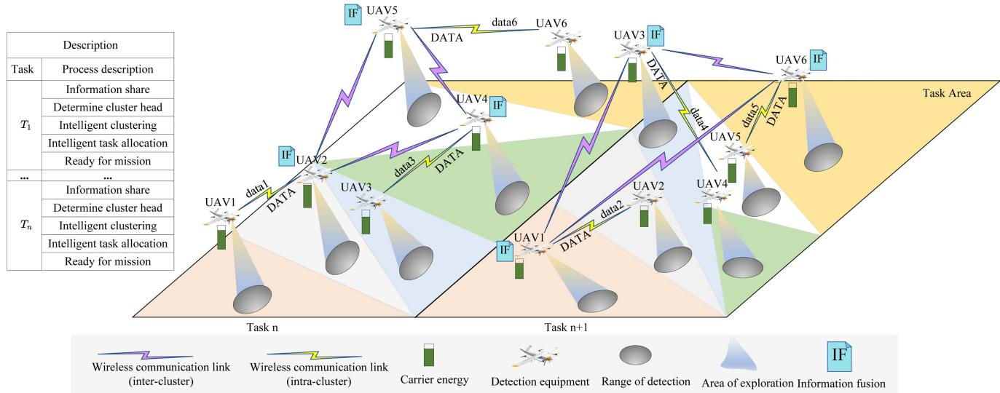  
Fig. 1. Multi-UAV collaborative detection architecture for successive exploration tasks.

To address the challenge of energy efficiency in cluster systems for environmental exploration, we propose a novel collaborative detection framework that integrates a hierarchical information sharing mechanism with task allocation(HISWTA). The main contributions of this work are as follows:

1) We propose a dynamic hierarchical information sharing mechanism that enables intelligent clustering across multi-UAV exploration systems and provides a theoretically optimal number of clusters. The inter-cluster information-sharing is reformulated as a Traveling Salesman Problem (TSP), solved using an improved Tabu Search algorithm, which improving inter-cluster information sharing path solution speed and quality. Additionally, a fuzzy logic inference-based intra-cluster informationsharing method is introduced that ensuring network stability and connectivity.

2) A cooperative game-based multi-UAV task allocation method is proposed, which frames the task allocation as a payoff distribution problem. It is proven that our cooperative game model for multi-UAV task allocation exists a stable and fair task allocation strategy. To address the computational challenge of Shapley value calculation, we propose a multi-criteria early-stop Monte Carlo sampling method that significantly reduces computation time while maintaining accuracy. Furthermore, we design a dynamic incremental update mechanism for Shapley values that leveraging historical data to enable real-time, adaptive payoff distribution in response to environmental changes, enhancing system responsiveness and scalability.

3) Simulation experiments demonstrate that the maximum enhancements in task completion ratio were 12%, 26%, and 10% at task-critical thresholds for systems using 5, 10, and 15 UAVs, respectively. The proposed algorithm was found to have superior performance in terms of energy consumption ratio, synergy and energy consumption difference compared to the benchmark algorithm.

The paper is organized as follows: Section II reviews related work, Section III presents the system model and problem description, and Sections IV and V introduce the joint optimization algorithm. Section VI presents simulation verification and result analysis. Finally, Section VII concludes the paper.

## II. RELATED WORKS

The multi-uncrewed system is gaining significant academic attention for its efficient coverage, adaptability, fault tolerance, and robustness. Research focuses on minimizing task completion time, enhancing efficiency, and increasing task volume to advance environmental perception. To reduce task completion time or enhance execution efficiency, Seraj et al. [23] proposed a hierarchical framework for collaborative tasking in dynamic environments, employing a centralized approach to allocate tasks efficiently among robots, thereby improving task completion rates. Yi et al. [24] introduced an improved auction algorithm for large-scale task allocation among UAVs, effectively decreasing task completion times. Meng et al. [25] developed a task overlap allocation method for multi-UAV, shortening task completion durations. Dai et al. [26] proposed an additional heuristic task allocation algorithm was devised to minimize maximum task completion times. Han et al. [15] presented a reverse-auction-based task allocation method considering dynamic task spatiotemporal requirements, which reduces drone energy consumption and addresses battery capacity limitations while enhancing task completion efficiency. Although these studies reduced task completion times, they seldom considered the impact of equipment energy on task completion, failing to address continuous task demands under conditions of difficult energy replenishment.

Similarly, researchers have explored methods to increase the task completion volume in multi-uncrewed systems. Zhu et al. [27] proposed a multi-stage decision strategy that first assigns tasks among multiple robots without overlap, then models each robot’s tasks as partially observable Markov decision processes, ultimately enhancing search coverage in unknown environments. B.P.L. Lau et al. [28] suggested an exploration method with memory for task allocation, ensuring diverse tasks for different robots and extending the duration and scope of exploration by setting exploration times for every AGV. Zhang et al. [29] proposed a low-bandwidth multi-drone distributed cooperative exploration method, optimizing bandwidth usage through reduced information synchronization and distributed task allocation, thus enhancing exploration efficiency and volume. Another study by Zhang et al. [30] introduced an improved belief function task allocation method combined with obstacle avoidance and formation control algorithms to increase surveillance coverage. Han et al. [31] developed a versatile task allocation method applicable across various scenarios, featuring a task load balancing mechanism that extends system operational time and data collection range. Liu et al. [32] employed deep reinforcement learning for global task allocation of UAVs, achieving dual objectives of energy conservation and increased task completion volume. While these studies have primarily emphasized the influence of task allocation on enhancing task completion volumes, they have largely overlooked the critical role of communication methods during the task allocation process. This oversight is noteworthy, as communication mechanisms can substantially impact energy efficiency, thereby affecting the sustainability of task execution in multi-uncrewed systems.

## III. SYSTEM MODEL AND PROBLEM FORMULATION

## A. System Model

Fig. 1 illustrates the proposed multi-UAV cooperative detection system architecture, which is designed to support successive exploration missions in dynamic and heterogeneous environments. The system operates in a hierarchical structure, where UAVs are organized into clusters under the coordination of designated cluster heads. Upon the completion of each task cycle, the system performs dynamic re-clustering based on UAVs’ current operational states, including remaining energy, energy consumption ratio, geographical position, and communication link quality. This adaptive reorganization ensures that the system maintains high flexibility and responsiveness to environmental changes and UAV status variations. Within each cluster, communication and coordination are managed by the cluster head, which collects local sensing data, schedules task execution among cluster members, and maintains intra-cluster synchronization. Inter-cluster coordination is achieved through periodic information exchange among cluster heads, enabling the system to maintain global situational awareness and support cooperative decision-making across the entire UAV network.

The framework is designed to support heterogeneous UAVs through a parametric, adaptive architecture. Every UAV is modeled using a state vector that includes energy capacity, remaining energy, communication range, sensing range, and computational power. These parameters drive dynamic re-clustering and task allocation, ensuring UAVs are grouped and assigned based on capabilities and mission needs. UAVs with higher energy reserves and sensing range are prioritized for long-range tasks, while low-energy or shorter sensing range UAVs handle nearby or domain-specific missions. The cluster head selection algorithm weights communication and computational capabilities, ensuring leadership by the most suitable UAVs. This approach enables robust coordination and optimal resource use across diverse hardware, enhancing scalability and real-world applicability in heterogeneous UAVs deployments.

## B. Network Model

A mobile self-organizing network is a communication network consisting of multi-UAV, each with distinctive energy and communication range characteristics. The network is organized in a hierarchical structure, consisting of two primary components: cluster head and cluster member. With regard to the transmission of data, this originates from the cluster member and subsequently converges at the cluster head. The cluster head then processes and fuses the received data before forwarding it to other members within the same cluster or to other cluster heads.

## C. Mobile Model

The UAV adopt Random WayPoint (RWP) mobility model [33] for environmental exploration. Based on the specified task, it automatically generates a trajectory of the target area using existed methods. The UAV uses its current location as the origin and the next point along the designated path as the destination. During movement, it selects an appropriate speed $v \in [ v _ { \operatorname* { m i n } } , v _ { \operatorname* { m a x } } ]$ within the allowable speed range, and moves in a straight line toward the destination. Upon reaching each point along the path, the UAV remains stationary for a period $\tau _ { p } \in [ t _ { \operatorname* { m i n } } , t _ { \operatorname* { m a x } } ]$ , during which it senses the surrounding environment. Subsequent to the stationary period, the UAV repeats this process, following the planned trajectory until it reaches the final target point.

## D. Energy Consumption Model

The energy consumption consists of two primary components: communication energy consumption between UAVs and task execution energy consumption for each UAV. The communication energy consumption is modeled using a first-order radio model [34]. The energy consumed by the transmitter to send m bits of data to a receiver at distance d is given by:

$$
E _ { T X } ( m , d ) = \left\{ \begin{array} { l l } { m E _ { e l e c } + m \varepsilon _ { f s } d ^ { 2 } , } & { d < d _ { 0 } } \\ { m E _ { e l e c } + m \varepsilon _ { m p } d ^ { 4 } , } & { o t h e r s } \end{array} \right.\tag{1}
$$

Similarly, the energy consumed by the receiving node to receive one bit of data is:

$$
E _ { R X } = E _ { e l e c }\tag{2}
$$

where $E _ { e l e c }$ represents the energy consumed per bit for sending or receiving data; $\varepsilon _ { f s }$ and $\varepsilon _ { m p }$ are the energy consumption coefficients of the amplifier circuits for free-space and multi-path fading models, respectively. The threshold distance $\begin{array} { r } { d _ { 0 } = \sqrt { \frac { \varepsilon _ { f s } } { \varepsilon _ { m p } } } } \end{array}$

The task execution energy consumption for UAV depends on the task volume completed. The task execution energy consumption for UAV i in k-th task cycle is calculated as:

$$
E _ { i , k } = T _ { i , k } ^ { c } E _ { c }\tag{3}
$$

where, $E _ { i , k }$ denotes the energy consumed by UAV i for executing tasks in the k-th task cycle, $T _ { i , k } ^ { c }$ represents the volume of tasks completed by UAV i in the k-th task cycle, $E _ { c }$ is the energy consumption per unit task for UAV i.

## E. Problem Formulation

The goal of multiple UAVs is to explore as many unknown regions of the environment as possible under energy constraints. It is assumed that the energy consumed by UAV i for communication is $E _ { i } ^ { c }$ , and the number of available UAVs in k-th task cycle is $M _ { k }$ . The environment exploration task consists of $K = \{ 1 , 2 , 3 , 4 . . . n \}$ cycles, with the amount of tasks to be performed in the k-th cycle being $\begin{array} { r } { T _ { k } = \sum _ { i = 1 } ^ { M _ { k } } T _ { i , k } ^ { c } } \end{array}$ . The amount =of completed and allocated tasks of UAV i in the k-th task cycle are denoted as $T _ { i , k } ^ { c }$ and $T _ { i , k } ^ { a }$ , respectively. The communication energy consumption of UAV i is denoted as $E _ { c o m , i }$ . Therefore, the problem can be expressed as $P _ { 1 }$

$$
P _ { 1 } : \operatorname* { m a x } \sum _ { k \in K } \sum _ { i = 1 } ^ { M _ { k } } T _ { i , k } ^ { c }\tag{4a}
$$

$$
\begin{array} { l l } { \mathrm { s . t . } } & { T _ { i , k } ^ { c } \leq T _ { i , k } ^ { a } } \end{array}\tag{4b}
$$

$$
0 \leq T _ { i , k } ^ { c } \times E _ { c } \leq E _ { i }\tag{4c}
$$

$$
0 \leq E _ { c o m , i } \leq E _ { i }\tag{4d}
$$

where (4b) indicates that the total task completed by UAV does not exceed its allocated. (4c) and (4d) denote the energy consumption for task completion, and the communication energy consumption is within a reasonable range, respectively.

## IV. HIERARCHICAL INTELLIGENT INFORMATION-SHARING MECHANISM

To improve the efficiency of information sharing and energy utilization for multi-UAV systems in dynamic environments, we proposes a hierarchical intelligent information-sharing mechanism, consisting of three components: network structure optimization, inter-cluster information sharing path planning, and intra-cluster network dynamic management.

To achieve adaptive optimization of the network topology and energy-efficient resource allocation, a cooperative mechanism integrating multi-criteria constrained clustering with dynamic cluster head selection is presented, along with an analytically derived expression for determining the optimal number of cluster heads.

To enhance inter-cluster information transmission performance, an improved tabu search algorithm is proposed, featuring a greedy initialization strategy, dynamic search operators, a sliding window-based tabu list, and a heuristic amnesty mechanism inspired by simulated annealing, all aimed at improving the efficiency of information-sharing path planning.

To strengthen intra-cluster communication stability, a dynamic cluster head replacement mechanism based on a dualinput single-output fuzzy inference system is constructed. This mechanism integrates trapezoidal membership functions with a fuzzy rule base to enable intelligent evaluation of intra-cluster communication quality and supports adaptive switching of the cluster head node, thereby ensuring local network connectivity.

## A. Inter-Cluster Information Sharing Mechanism Based on Improved Tabu Search Algorithm

1) Clustering Algorithms With Multi-Criteria Constraints: The hierarchical information sharing mechanism has demonstrated effective network management capabilities, allowing the system to adapt to dynamic environmental conditions while optimizing energy consumption across UAVs.

Theorem 1: In a multi-UAV cooperative exploration system, the energy overhead associated with information sharing is minimized when the number of clusters is optimized to (5).

$$
N _ { c h } ^ { * } = \frac { 2 A E _ { e l e c } + B \varepsilon _ { f s } - E _ { f u } } { 2 \left( g _ { b i t } E _ { e l e c } + m _ { b i t } ^ { f u } \left( E _ { e l e c } + \varepsilon _ { m p } \overline { { d _ { c h 2 c h } ^ { 4 } } } \right) \right) } + 1\tag{5}
$$

where $A = m _ { b i t } + n _ { b i t } + l _ { b i t } + k _ { b i t } ^ { f u }$ and $B = k _ { b i t } ^ { f u } \overline { { d _ { c h 2 c m } ^ { 2 } } } +$ $m _ { b i t } d _ { c m 2 c h } ^ { 2 } + n _ { b i t } d _ { c m 2 c h } ^ { 2 } + l _ { b i t } \overline { { { d _ { c h 2 c m } ^ { 2 } } } }$

Proof. Under a fixed number of clusters, the overall system overhead is minimized when each cluster maintains an equal number of members [35]. Assume that the total number of UAVs involved in cooperative detection is $N _ { d }$ and the number of cluster heads is $N _ { c h }$ . Consequently, every cluster contains $N _ { d } / N _ { c h }$ UAVs.

It is assumed that the multi-path fading model is applied for information transfer between cluster head, and the free-space loss model is used for information transfer between members and cluster head. Therefore, the energy consumption for the cluster head and member within each cluster can be expressed as (6) and (7), respectively.

$$
\begin{array} { r l } & { E _ { c h } = \left( l _ { b i t } \left( E _ { e l e c } + \varepsilon _ { f s } \overline { { d _ { c h 2 c o n } ^ { 2 } } } \right) + m _ { b i t } F _ { e l e c } \right. } \\ & { + \left. k _ { b i t } ^ { f u } \left( E _ { e l e c } + \varepsilon _ { f s } \overline { { d _ { c h 2 c o n } ^ { 2 } } } \right) + n _ { b i t } E _ { e l e c } \right) \times \left( \frac { N _ { d } } { N _ { c h } } - 1 \right) } \\ & { + \left( g _ { b i t } E _ { e l e c } + m _ { b i t } ^ { f u } \left( E _ { e l e c } + \varepsilon _ { m p } \overline { { d _ { c h 2 c h } ^ { 2 } } } \right) \right) \times \left( N _ { c h } - 1 \right) } \\ & { + E _ { f u } } \\ & { E _ { c m } = l _ { b i t } E _ { e l e c } + m _ { b i t } \left( E _ { e l e c } + \varepsilon _ { f s } d _ { c m 2 c h } ^ { 2 } \right) + k _ { b i t } ^ { f u } E _ { e l e c } } \\ & { \qquad + \left. n _ { b i t } \left( E _ { e l e c } + \varepsilon _ { f s } d _ { c m 2 c h } ^ { 2 } \right) \right. } \end{array}\tag{6}
$$

7)

where, $l _ { b i t } , m _ { b i t } , k _ { b i t } ^ { f u } , n _ { b i t } , g _ { b i t } , m _ { b i t } ^ { f u }$ and $E _ { f u }$ represent the amount of data sent to cluster members for joining the cluster, the amount of data received from cluster members confirming their join, the amount of data sent to cluster’s members, the amount of data received from cluster’s members, the amount of data sent to cluster members from other clusters, the amount of data received from cluster members, and the energy consumed for information fusion, respectively.

Therefore, the communication overhead of multi-UAV cooperative exploration system can be formulated as (8).

$$
\begin{array} { r l r } & { E _ { c } ^ { s u r n } = ( l _ { b i t } ( E _ { e l e c } + \varepsilon _ { f } \hat { d } _ { e h 2 c m } ^ { 2 } ) + m _ { b i t } E _ { e l e c }  } \\ & { +  l _ { b i t } ^ { \prime \prime } ( E _ { e l e c } + \varepsilon _ { f } \overline { { d } } _ { e h 2 c n } ^ { 2 } ) + n _ { b i t } E _ { e l e c }  } \\ & { + l _ { b i t } E _ { e l e c } + m _ { b i t } ( E _ { e l e c } + \varepsilon _ { f s } \hat { d } _ { c m 2 c h } ^ { 2 } ) } \\ & { + l _ { b i t } ^ { \prime \prime } E _ { e l e c } + n _ { b i t } ( E _ { e l e c } + \varepsilon _ { f s } \hat { d } _ { e m 2 c h } ^ { 2 } ) \times ( N _ { d } - N _ { c h } ) } \\ & { +  ( g _ { b i t } E _ { e l e c } + m _ { b i t } ^ { \prime \prime } ( E _ { e l e c } + \varepsilon _ { m p } \hat { d } _ { e h 2 c h } ^ { 4 } ) ) \times ( N _ { c h } ^ { 2 } - N _ { c h } )  } \\ & {  + ( g _ { b i t } N _ { c l e c } + m _ { b i t } ^ { \prime \prime } ( E _ { e l e c } + \varepsilon _ { m p } \hat { d } _ { e h 2 c h } ^ { 4 } ) ) \times ( N _ { c h } ^ { 2 } - N _ { c h } )  } \\ & {  + E _ { f u l } N _ { c h }  } & {   ( 8 )  } \end{array}
$$

The optimal number of clusters is derived by setting the partial derivative of $N _ { c h }$ in (8) to zero. It is determined by the interplay of energy, data volume, and spatial factors. Specifically, $N _ { c h } ^ { * }$ increases with higher $E _ { f u } ,$ as more clusters help distribute the energy cost of information fusion. In contrast, increasing $E _ { e l e c } , \varepsilon _ { f s } , \mathrm { o r } \varepsilon _ { m p }$ reduces $N _ { c h } ^ { * }$ due to higher communication energy costs. Larger data volume parameters such as $l _ { b i t } , m _ { b i t } .$ $k _ { b i t } ^ { f u } , n _ { b i t } , g _ { b i t }$ , and $m _ { b i t } ^ { f u }$ also lead to fewer clusters due to increased transmission overhead. Finally, distance-related terms like $\overline { { d _ { c h 2 c m } ^ { 2 } } } , d _ { c m 2 c h } ^ { 2 }$ , and especially $\overline { { d _ { c h 2 c h } ^ { 4 } } }$ , show negative correlations with $N _ { c h } ^ { * }$ , highlighting the strong impact of long-distance inter-cluster communication on optimal clustering.

To reduce energy losses associated with frequent cluster head changes, cluster head selection considers multiple criteria including energy, distance, and connectivity, as defined in (9).

$$
\begin{array} { r l } & { P _ { r i } = E _ { i } ^ { \eta _ { e } } \times D _ { i } ^ { \eta _ { d } } \times C _ { i } ^ { \eta _ { c } } } \\ & { \mathrm { s . t . } \eta _ { e } + \eta _ { d } + \eta _ { c } = 1 } \\ & { \qquad 0 \leq \eta _ { e } , \eta _ { d } , \eta _ { c } \leq 1 } \end{array}\tag{9}
$$

where, $\eta _ { d } , \eta _ { e } , \eta _ { c }$ represent the weights assigned to the distance factor, energy factor, and connectivity factor, respectively. These weights reflect the relative importance of each factor in the cluster head selection process and are determined based on the specific application scenario, system objectives, and environmental conditions. In energy-critical tasks, a higher value be assigned to $\eta _ { e }$ to prioritize energy efficiency, while in highly dynamic environments, $\eta _ { d } \mathrm { ~ o r ~ } \eta _ { c }$ be emphasized to ensure stable communication. $D _ { i } , E _ { i } , C _ { i }$ denote the distance factor, energy factor, and connectivity factor for UAV i, respectively.

The distance factor $D _ { i }$ is employed to accurately quantify the dispersion between the current UAV and other UAVs, as shown

in (10).

$$
D _ { i } = \sqrt { \frac { 1 } { N _ { c } } \sum _ { j = 1 } ^ { N _ { c } } \left( d _ { i j } - \overline { { d _ { i j } } } \right) ^ { 2 } }\tag{10}
$$

where, $d _ { i j }$ and $\overline { { d _ { i j } } }$ denotes the distance between UAVs, and the average distance to the UAVs within the cluster, respectively. $\begin{array} { r } { N _ { c } = \frac { N _ { d } } { N _ { c b } } - 1 } \end{array}$ represents the number of members in the cluster, excluding the cluster head.

The energy factor relates to the current residual energy and energy consumption ratio of the UAV. Then, the energy factor $E _ { i }$ is represented as (11).

$$
E _ { i } = \left\{ \begin{array} { l l } { \frac { E _ { t + 1 } ^ { i } \Delta t } { E _ { t + 1 } ^ { i } - E _ { t } ^ { i } } , } & { E _ { t + 1 } ^ { i } \neq E _ { t } ^ { i } } \\ { 0 , } & { o t h e r s } \end{array} \right.\tag{11}
$$

where $E _ { t + 1 } ^ { i }$ and $E _ { t } ^ { i }$ denote the residual energy of UAV i at the current and previous moments, respectively, and t represents the time interval.

The connectivity factor relates to the signal strength between UAVs, the connectivity factor $C _ { i }$ is represented as (12).

$$
{ C } _ { i } = \left\{ \begin{array} { l l } { \left( \frac { R _ { i j } - R _ { t } } { R _ { i j } ^ { m } - R _ { t } } \right) ^ { \varepsilon _ { s } } , } & { d _ { i j } \leq { R _ { c o } } } \\ { 0 , } & { o t h e r s } \end{array} \right.\tag{12}
$$

where, $R _ { i j }$ denotes the signal strength received by UAV i from $\mathrm { U A V } \ j . \ R _ { t }$ represents the threshold value, and $R _ { i j } ^ { m }$ denotes the maximum Received Signal Strength Indicator (RSSI) value between the $\mathrm { U A V s . } ~ d _ { i j }$ indicates the distance between UAVs, while $R _ { c o }$ represents the communication distance of the UAV. $\varepsilon _ { s }$ is a moderating factor used to balance the impact of the heterogeneous $\mathrm { U A V } _ { \mathrm { \Delta } }$ attributes on the RSSI measurement. The general formula for RSSI is as follows.

$$
R = A - 1 0 \times n \times l ( d )\tag{13}
$$

where, A is a constant representing the signal strength at a distance of $d _ { 0 } . n$ is the path loss exponent, and d denotes the straight-line distance between the sender and receiver. $l ( d )$ is a logarithmic transformation of the normalized distance. It is used to model how signal strength attenuates in a log-distance path loss model, which is usually represented by $\begin{array} { r } { l ( d ) = \log _ { 1 0 } ( \frac { d } { d _ { 0 } } ) } \end{array}$

Within the cooperative detection system, every UAV calculates its priority via (9), subsequently caching the result for future link prediction. During the initialization phase, the UAVs take broadcast communication for information exchange. Every UAV gathers and stores the priorities of all UAVs, arranging them in descending order. The top $\lfloor N _ { c h } ^ { * } \rfloor$ UAVs are designated as the new cluster heads. In cases of identical computed priorities, UAVs are ranked by connectivity factor, energy factor, and distance factor, in that order.

Once a cluster head is determined among the UAVs, it sends a cluster entry message to all UAVs within its communication range. If a UAV receives only one cluster entry message, it chooses to join the cluster and sends an acknowledge frame to the cluster head. If a UAV receives several cluster entry messages, it selects a cluster head based on the priority value. If the priority values are identical, the selection is made in the following order: connectivity factor, energy factor and distance factor. If these three factors are also identical, a cluster head is randomly assigned and an acknowledge frame is sent. The cluster joining process is repeated until all UAVs have joined the cluster.

2) Inter-Cluster Information Sharing Strategy Based on Improved Tabu Search Algorithm: When performing reconnaissance missions in unknown environments, UAVs undergo two distinct phases: positional movement and data acquisition. Due to sensor performance limitations, power consumption constraints, and other characteristics, the UAV needs to remain stationary at specific locations for a predetermined duration to complete data collection. This residence time for information acquisition is referred to as the time window for information sharing, simply the time window.

The information share network, consisting of heterogeneous UAVs, can be abstracted as a graph $G ( N _ { o } , E _ { d } )$ , where $N _ { o }$ represents the UAV and $E _ { d }$ denotes the weighted edges between them. Hierarchical information share is divided into intra-cluster sharing and inter-cluster sharing.

In intra-cluster sharing, the cluster head acts as a relay node to facilitate information transfer between nodes within the cluster. It is evident that the distance between the cluster head and its members is one hop, and the distance between members is two hops. Consequently, the primary focus is shifted to inter-cluster sharing.

The search for the information sharing path between distributed cluster heads is a typical combinatorial optimization problem. It can be modeled as a Hamiltonian path problem. This problem is denoted as $P _ { 2 }$

$$
P _ { 2 } : \quad { \mathrm { M i n } } \quad f ( x ) = \sum _ { i = 1 } ^ { n } \sum _ { j = 1 } ^ { n } d _ { i j } \cdot x _ { i j }\tag{14a}
$$

$$
\mathrm { s . t . } \quad \sum _ { j = 1 } ^ { n } x _ { i j } = 1 , \forall i , j \in \{ 1 , 2 , \ldots , n \} ,\tag{14b}
$$

$$
\sum _ { i = 1 } ^ { n } x _ { i j } = 1 , \forall i , j \in \{ 1 , 2 , \ldots , n \} ,\tag{14c}
$$

$$
t _ { i } ^ { \operatorname* { m i n } } \leq t _ { i } \leq t _ { i } ^ { \operatorname* { m a x } } , \forall i , j \in \{ 1 , 2 , \ldots , n \} ,\tag{14d}
$$

$$
\sum _ { i = 1 } ^ { n } x _ { i i } = 1 ,\tag{14e}
$$

$$
u _ { i } - u _ { j } + n \cdot x _ { i j } \leq n - 1 , \forall i , j \in \{ 2 , 3 , \ldots , n \} ,\tag{14f}
$$

$$
x _ { i j } \in \{ 0 , 1 \} .\tag{14g}
$$

where $d _ { i j }$ denotes the Euclidean distance between node i and node $j$ . (14b) and (14c) ensure that each node is visited exactly once. (14d) ensures that the time for a message to reach node i adheres to the time window for the node’s presence at location $P _ { i }$ . (14e) indicates that the path forms a closed loop. (14f) ensures the exclusion of sub-loops within the path. $u _ { i }$ denotes the order of node i, and n represents the total number of nodes. (14g) is an indicator variable that takes a value of 0 or 1. If the path includes an edge from node i to node $j ,$ , then $x _ { i j } = 1$

The Tabu search algorithm [36] has proven effective for combinatorial optimization problems, particularly in the context of the Traveling Salesman Problem (TSP) and its variants. To determine an optimal path strategy for information transfer between cluster heads, we present an optimized tabu search algorithm incorporate with greedy strategy, the method is as follows.

Initialization: Information-sharing nodes are scheduled using a greedy algorithm that sorts nodes in ascending order of their time window start times. For nodes with identical start times, those with shorter durations are prioritized. When both start times and durations are identical, the node with the greater Euclidean distance from the previously scheduled node is selected.

Search Operators and Domain Solution: The 2-optimization (2-opt) and inverse search operators are utilized. During the initial phase of the search, some of the path node sequences are reversed using the inverse search operator to enhance the diversity of solutions. In the later phase, the 2-opt operator is applied for local optimization, addressing localized issues, such as roundabouts or zigzags without substantially altering most of the paths, thereby reducing the overall path length. These two search operators are applied adaptively based on solution quality. The current solution is to be denoted $X _ { c } ,$ the optimal solution $X _ { o } ,$ and the path lengths of these solutions $f ( X _ { c } )$ and $f ( X _ { o } )$ . If the change rate in the path length, $\begin{array} { r } { \Delta f = \frac { | f ( X _ { c } ) - \dot { f } ( X _ { o } ) | } { f ( X _ { o } ) } } \end{array}$ , satisfies condition $\Delta f < \delta t h$ , the 2-opt operator is employed for local perturbation. Otherwise, the inverse operator is used to increase the diversity of solutions.

Dynamic Tabu List: We propose an adaptive dynamic tabu list based on sliding window. This approach allows the length of the tabu list to adjust dynamically, depending on the quality of the current solution, thereby ensuring a balanced trade-off between local and global search. The formula for the dynamic tabu list is as follows.

$$
L _ { \mathrm { n e w } } = \left\{ \begin{array} { l l } { \mathrm { m a x } ( L _ { \mathrm { m i n } } , L _ { c } - L _ { \delta } ) , } & { \Delta _ { i , i - 1 } > p ^ { \mathrm { u } } } \\ { \mathrm { m i n } ( L _ { \mathrm { m a x } } , L _ { c } + L _ { \delta } ) , } & { \Delta _ { i , i - 1 } < p ^ { \mathrm { d } } } \\ { L _ { c } , } & { \mathrm { o t h e r w i s e } } \end{array} \right.\tag{15}
$$

where $L _ { \mathrm { m i n } }$ represents the shortest length of the tabu list, $L _ { \mathrm { m a x } }$ denotes the maximum length of the tabu list, and $L _ { c }$ indicates the length of the tabu list in the current iteration. $L _ { \delta }$ is the step size for adaptation, while $p ^ { u }$ and $p ^ { d }$ are the upper and lower thresholds of the change in adaptation rate, respectively. Additionally $\textstyle \mathcal { A } , i - 1$ represents the rate of change in adaptation for two adjacent sliding windows, which is calculated as follows.

$$
\Delta _ { i , i - 1 } = \frac { \sum _ { i } ^ { i + k } \Delta F _ { i , i + 1 } } { F _ { i } } , i \in \{ 1 , 2 , 3 , . . . , N _ { c h } ^ { * } \}\tag{16}
$$

where, $\begin{array} { r } { \Delta F _ { i , i + 1 } = F _ { i + 1 } - F _ { i } , F _ { i } = \frac { f ( j + k ) - f ( j ) } { k } } \end{array}$ . k denotes the Δ =sliding window size, and $f ( j )$ represents the adaptation value at the j-th iteration.

Amnesty and Termination Criterion: Similar to the acceptance probability in the simulated annealing algorithm, it permits a certain probability of accepting a worse solution. When the fitness of the current solution is better than the optimal solution, the acceptance probability is set to 1, thus allowing the operation even if it is in the tabu list. Otherwise, the acceptance probability depends on the number of algorithm iterations. As the number of iterations increases, the acceptance probability gradually decreases. The acceptance probability of a solution is calculated by (17).

Algorithm 1: Inter-cluster Information-sharing Mechanism.   
1: Input: UAVs’ positions $p ,$ task volume T , initial number   
of clusters K, UAV’s energy, number of UAVs N   
2: Output: Cluster head list and its members   
3: Initialization:   
4: $\eta _ { d } , \eta _ { e } , \eta _ { c } , \varepsilon _ { s } , A , p ^ { u } , p ^ { d } , I _ { \mathrm { m a x } }$   
5: for all nodes $p$ do   
6: Calculate priority for $p$ by (9)   
7: if Node p meets cluster head criteria then   
8: Create a cluster and assign $p$ as cluster head   
9: Broadcast join request to neighbors   
10: end if   
11: end for   
12: for all non-cluster head nodes $p$ do   
13: Collect join requests and select the best cluster head   
based on priority   
14: if Multiple join requests received then   
15: Prioritize by energy, connectivity, distance;   
randomly choose if tied   
16: end if   
17: Join the selected cluster and acknowledge   
18: end for   
19: for all clusters $C _ { k }$ do   
20: Set up multi-hop paths within each cluster to the   
cluster head   
21: end for   
22: for all clusters $C _ { k }$ do   
23: Establish communication between cluster heads using   
on-demand path for urgent tasks   
24: end for

$$
P _ { a } = \left\{ \begin{array} { l l } { 1 , } & { f ( X _ { \mathrm { n e w } } ) < f ( X _ { \mathrm { b e s t } } ) } \\ { \frac { 1 } { 1 + \exp \left( \frac { I _ { c } } { I _ { m } } \right) } , } & { \mathrm { o t h e r w i s e } } \end{array} \right.\tag{17}
$$

where $f ( \bullet )$ represents the fitness function, $I _ { m }$ denotes the maximum number of iterations of the algorithm, and $I _ { c }$ indicates the current iteration number.

## B. Intra-Cluster Information Sharing Mechanism Based on Fuzzy Logic Inference

1) Affiliation Function: The proposed fuzzy logic reasoner is a two-input, single-output system, with packet loss rate and delay as inputs, and the RSSI as the output. A trapezoidal affiliation function is employed, offering computational efficiency along with well-defined upper and lower limits and linear transition zones.

The packet loss rate is represented by five affiliation functions, corresponding to the fuzzy sets of very low, low, medium, high, and very high. These affiliation functions operate within the fuzzy set range of , .

TABLE I RULE TABLE
<table><tr><td>Rule</td><td>Packet Loss Rate</td><td>Delay</td><td>RSSI</td></tr><tr><td>Rule 1</td><td>Very Low</td><td>Low</td><td>Good</td></tr><tr><td>Rule 2</td><td>Very Low</td><td>Medium</td><td>Good</td></tr><tr><td>Rule 3</td><td>Very Low</td><td>High</td><td>Good</td></tr><tr><td>Rule 4</td><td>Very Low</td><td>Very High</td><td>Medium</td></tr><tr><td>Rule 5</td><td>Low</td><td>Low</td><td>Good</td></tr><tr><td>Rule 6</td><td>Low</td><td>Medium</td><td>Good</td></tr><tr><td>Rule 7</td><td>Low</td><td>High</td><td>Medium</td></tr><tr><td>Rule 8</td><td>Low</td><td>Very High</td><td>Weak</td></tr><tr><td>Rule 9</td><td>Medium</td><td>Low</td><td>Medium</td></tr><tr><td>Rule 10</td><td>Medium</td><td>Medium</td><td>Medium</td></tr><tr><td>Rule 11</td><td>Medium</td><td>High</td><td>Weak</td></tr><tr><td>Rule 12</td><td>Medium</td><td>Very High</td><td>Weak</td></tr><tr><td>Rule 13</td><td>High</td><td>Low</td><td>Weak</td></tr><tr><td>Rule 14</td><td>High</td><td>Medium</td><td>Weak</td></tr><tr><td>Rule 15</td><td>High</td><td>High</td><td>Weak</td></tr><tr><td>Rule 16</td><td>High</td><td>Very High</td><td>Weak</td></tr><tr><td>Rule 17</td><td>Very High</td><td>Low</td><td>Weak</td></tr><tr><td>Rule 18</td><td>Very High</td><td>Medium</td><td>Weak</td></tr><tr><td>Rule 19</td><td>Very High</td><td>High</td><td>Weak</td></tr><tr><td>Rule 20</td><td>Very High</td><td>Very High</td><td>Weak</td></tr></table>

The latency is represented by four affiliation functions corresponding to the fuzzy sets of low, medium, high, and very high [37]. The fuzzy set for latency spans the range , , with each affiliation function taking values between 0 and 1.

The fuzzy set for RSSI ranges from , , and is classified into three levels: good, medium, and weak.

2) Network Topology Self-Discovery and Self-Healing: The fuzzy control rule base is formulated using IF-THEN rules, and the constructed rule base is presented in Table I. The network link status between a member node and the cluster head is determined through logical inference using the established rule base. The maximum affiliation method is employed for defuzzification to determine the RSSI value of the cluster head node. Subsequently, the connection status of cluster $i _ { c }$ is evaluated using (11).

If the connection state of the current cluster head $C h _ { i }$ satisfies the condition $\overline { { C } } _ { i } \leq C _ { t h }$ , a new cluster head is reselected, where $\overline { { C _ { i } } }$ is mean value of connectivity factor, $C _ { t h }$ is thresholds for connectivity factors. Once a new cluster head is selected, the information is propagated to the cluster heads of other clusters. If two clusters simultaneously select new cluster heads, the update messages are sent to their respective original cluster heads for synchronization.

## V. COOPERATIVE GAME-BASED TASK ALLOCATION

In order to realize efficient, fair, and stable task allocation for multi-UAV in complex environments, we propose a cooperative game-based task allocation mechanism. The mechanism constructs a two-dimensional benefit function that integrates environmental threat perception and energy consumption control, enabling dynamic evaluation of task execution benefits under different coalition structures. Based on this framework, we design a task allocation method utilizing the Shapley value and introduce a multi-criteria early-stop Monte Carlo sampling strategy to efficiently compute the initial Shapley values. Furthermore, we develop an incremental updating mechanism for the Shapley values, which dynamically optimizes the current values using historical allocation results, thereby avoiding the need to recompute them from scratch. This approach effectively alleviates the “dimensional catastrophe” and high computational complexity associated with traditional Shapley value computation, significantly improving the real-time performance and scalability of the task allocation process.

Algorithm 2: Intra-cluster Information-sharing Mechanism.   
1: Input: Current network state, cluster labels, cluster head   
list C   
2: Output: Updated network state   
3: Initialization: Initialize fuzzy logic system and network   
state   
4: for all nodes p do   
5: Use fuzzy logic to evaluate connection status by Table   
I   
6: obtain cluster head’s RSSI by maximum affiliation   
method   
7: end for   
8: for all clusters $C _ { k }$ do   
9: Calculate connection state for cluster $C _ { k }$   
10: if Current cluster head does not meet connection   
criteria then   
11: Select new cluster head and broadcast update   
12: end if   
13: end for

## A. Cooperative Game-Based Task Allocation Model

The cooperative game model for task allocation is represented as $( N , v )$ . N is the cooperative game’s player set, representing n heterogeneous UAVs engaged in collaborative detection. The characteristic function υ $\bar { 2 } ^ { \bar { N } } $ R defines the mapping of players to the collective benefits derived from their synergy. A subset S of heterogeneous UAVs forms a coalition if $S \subseteq N .$ The coalition S may be the empty set or an individual UAV. The function υ S denotes the collective payoff for coalition S during cooperative detection. By solving for the optimal coalition structure, efficient task allocation is achieved.

Collaborative exploration can reduce threats and improve energy efficiency, both of which are task-scale dependent. In unknown environments, large undetected areas increase potential threats, while accelerated task progress elevates energy consumption.

Assume that the amount of exploration tasks in k-th task cycle is $T _ { k }$ and the associated potential threat is $T _ { k } ^ { h }$ , where the volume of the task and the potential threat are related by the linear mapping function $T _ { k } ^ { h } = g ( T _ { k } )$ . The volume of the task completed by the UAV i in k-th task cycle is $T _ { i , k } ^ { c }$ . Thus, the potential threat reduction achieved by UAV i in k-th task cycle is given by:

$$
R _ { i , k } = T _ { k } ^ { h } \left( 1 - \frac { T _ { i , k } ^ { c } } { T _ { k } } \right)\tag{18}
$$

The size of the cooperative exploration task accomplished by any coalition of UAVs be denoted by $T _ { S _ { m } }$ . The collaborative

exploration task volume equal to the sum of the individual task sizes, i.e., $\begin{array} { r } { T _ { S _ { m } } = \sum _ { i = 1 } ^ { m } { T _ { i , k } ^ { c } } } \end{array}$ . Thus, the potential threat gain for coalition $S _ { m }$ in k-th task cycle can be represented as (19).

$$
R _ { S , k } = T _ { k } ^ { h } \left( 1 - \frac { \zeta ^ { \varrho } \sum _ { i = 1 } ^ { m } T _ { i , k } ^ { c } } { T _ { k } } \right)\tag{19}
$$

where, ζ represents the collaboration efficiency within the coalition, with values ranging from , .  is a discount factor that controls the influence of coalition collaborative gains, with values in the range , ∞ .

The energy consumption of each UAV is directly related to the volume of tasks it completes. Assume that the current energy of UAV i is $E _ { i , k } ^ { 0 }$ . Thus, the energy gain of UAV i in k-th task cycle can be represented as follows.

$$
E _ { i , k } ^ { s } = E _ { i , k } ^ { 0 } - \xi \times T _ { i , k } ^ { c } \times E _ { C }\tag{20}
$$

where, ξ represents the task completion ability, with a range of , ∞ .

Define the energy consumption of coalition $S _ { m }$ during coordinated detection in k-th task cycle as $E _ { S _ { m } , k } ^ { C }$ . Energy consumption for cooperative detection satisfies $\begin{array} { r } { E _ { S _ { m } , k } ^ { C } = \sum _ { i = 1 } ^ { m } T _ { i , k } ^ { c } \times E _ { C } } \end{array}$ Consequently, the energy gain of coalition $S _ { m }$ in k-th task cycle is given by:

$$
\mathit { { E } } _ { S , k } ^ { s } = \sum _ { i \in \cal { S } } \mathit { { E } } _ { i , k } - \xi ^ { \psi } \times \mathit { { E } } _ { S _ { m } , k } ^ { C }\tag{21}
$$

where, $\psi$ represents the synergistic capacity among coalition members and ranges from , ∞ .

The combined potential threat gain and energy gain for UAV i and coalition $S _ { m }$ in k-th task cycle can be expressed (22) and (23) respectively.

$$
v ( i , k ) = - \eta \times R _ { i , k } + \mu \times E _ { i , k } ^ { s }
$$

$$
v ( S , k ) = - \eta \times R _ { S , k } + \mu \times E _ { S , k } ^ { s }\tag{22}
$$

(23)

where, $\mu$ and η are weight coefficients used to balance the relative importance between environmental threats and energy benefits, with their values ranging from 0 to 1.

We thus propose the optimization problem, denoted as $P 2$ 2which seeks to maximize the coalition’s benefits under energy constraints.

$$
P _ { 3 } : \operatorname* { m a x } \upsilon ( S , k )\tag{24a}
$$

$$
\mathrm { s . t . } \eta + \mu = 1 , \eta , \mu > 0 ,\tag{24b}
$$

$$
\sum _ { i = 1 } ^ { m } T _ { i , k } ^ { c } \leq T _ { k } ,\tag{24c}
$$

$$
E _ { i , k } \geq 0 .\tag{24d}
$$

The (24b) represents the relative importance of the potential threat and energy benefits in environment. (24c) ensure that the sum of tasks assigned by all coalition members does not exceed the current amount of tasks that need to be completed. (24d) ensure that UAVs have energy.

## B. Task Allocation Based on Shapley Value

The Shapley value is a well-established benefit distribution strategy in cooperative games. It calculates member’s marginal utility based on the coalition utility of joining different coalitions. The formula for the marginal benefit [38] is provided in (25).

$$
S _ { i , k } = \sum _ { S \in N } \frac { ( | s | - 1 ) ! ( n - | s | ) ! } { n ! } [ v ( s , k ) - v ( s - i , k ) ]\tag{25}
$$

where, s represents the synergistic alliance formed by member i and the remaining members, while n denotes the total number of members.

Theorem 2. For a cooperative game of multi-UAV task allocation, there is a task allocation strategy that ensures stable cooperation within the cluster.

Proof. When the kernel of the cooperative game employed for multi-UAV task allocation is non-empty, this indicates the existence of a task allocation strategy that makes it acceptable to all UAVs. Consequently, this ensures a stable collaborative relationship in the cluster. Assume that there are n coalitions, denoted as $S _ { 1 } , S _ { 2 } , \ldots , S _ { n }$ , with no common members between any two that satisfy (26).

$$
S = \sum _ { i = 1 } ^ { n } S _ { i } , ~ S _ { i } \cap S _ { j } = \emptyset , ~ \forall i , j \in N ^ { + }\tag{26}
$$

Then, it is necessary to determine whether the eigenfunction satisfies the condition $\vartheta ( S , k ) - \vartheta ( S _ { i } , k ) \geq 0$ , where $i \in$ $\{ 1 , 2 , 3 , . . . , n \}$ , to confirm whether the kernel is non-empty. According to (23), $\vartheta ( S , k ) - \vartheta ( S _ { i } , k )$ can be represented by (27).

$$
\vartheta ( S , k ) - \vartheta ( S _ { i } , k ) = T _ { h } \left( \frac { \zeta ^ { \varrho } \left( \sum _ { j = 1 } ^ { m } T _ { j , k } ^ { c } - \sum _ { i = 1 } ^ { n } T _ { i , k } ^ { c } \right) } { T _ { k } } \right)
$$

$$
+ \mu \left( \sum _ { j \in S / S _ { i } } E _ { j , k } - \xi ^ { \psi } \times \sum _ { j \in S / S _ { i } } T _ { j , k } ^ { c } \times E _ { C } \right)\tag{27}
$$

It is obvious that the (27) is greater than or equal to 0. Therefore, the constructed cooperative game model for multi-UAV collaborative detection task allocation has a non-empty core, signifying the existence of a task allocation strategy that is mutually acceptable to all UAVs.

Theorem 3. Within the framework of the constructed cooperative game model for multi-UAV exploration task allocation, a task allocation strategy exists that guarantees both stability and fairness.

Proof. When the cooperative game for multi-UAV exploration task allocation is structured as a convex game, the Shapley value lies within the kernel. This implies the existence of a task allocation scheme that enables UAV clusters to achieve both stable cooperation and an energy consumption equilibrium. In a cooperative game, a game $G = ( N , v )$ is considered convex if it satisfies (28).

$$
v ( S _ { i } \cup S _ { j } ) + v ( S _ { i } \cap S _ { j } ) \geq v ( S _ { i } ) + v ( S _ { j } ) , \quad \forall S _ { i } , S _ { j } \in N\tag{28}
$$

The rearrangement of the terms in (28) gives rise to the (29).

$$
v ( S _ { i } \cup S _ { j } ) \geq v ( S _ { i } ) + v ( S _ { j } ) - v ( S _ { i } \cap S _ { j } )\tag{29}
$$

Based on the principle of inclusion-exclusion, the number of UAVs in the coalition $S _ { i }$ and $S _ { j }$ is the sum of the members in both coalitions minus the common members. The task size completed by the coalition $S _ { i } \cup S _ { j }$ is at least equal to the sum of the tasks completed by the individual coalitions $S _ { i }$ and $S _ { j }$ According to the characteristic function of the cooperative game $v ( S )$ , the gain obtained by the coalition $S _ { i } \cup S _ { j }$ is at least equal to the sum of the gains of the individual coalitions $S _ { i }$ and $S _ { j } { \mathrm { : } }$ consistent with the definition of a convex game. Therefore, the proposed cooperative game model for multi-UAV task allocation ensures a fair and efficient distribution of tasks.

The Monte Carlo sampling of Shapley values provides an effective approximation of multi-UAV intelligence gains, closely matching the exact values derived from the Shapley value definition [39]. To improve computational efficiency, a multi-criteria early stopping method is proposed. The first criterion, variance reduction, stops sampling when the variance of the Shapley value for each participant falls below a threshold $\tau _ { s , k ; }$ , as shown in (30) to (32). The second criterion, computational budgeting, halts sampling if the maximum iteration limit- $I _ { s }$ is reached.

$$
\mathrm { V a r } ( \phi , k ) = \frac { 1 } { n - 1 } \sum _ { i = 1 } ^ { n } \left( \widehat { \phi _ { i , k } } - \bar { \phi } \right) ^ { 2 } < \tau _ { s , k } , n \leq I _ { s }\tag{30}
$$

$$
\tau _ { s , k } = \operatorname* { m a x } \{ \tau _ { s , k - 1 } + \alpha \cdot | \boldsymbol { r } _ { k } | \cdot \mathrm { V a r } ( \phi , k - 1 ) , \tau _ { \operatorname* { m i n } } \}\tag{31}
$$

$$
r _ { k } = \frac { \mathrm { V a r } ( \phi , k ) - \mathrm { V a r } ( \phi , k - 1 ) } { \mathrm { V a r } ( \phi , k - 1 ) }\tag{32}
$$

where, $\operatorname { V a r } ( \phi , k )$ represents the sample variance of the participant’s Shapley value calculation in k-th sample, φ is the sample mean, $\mathsf { \bar { \phi } } _ { i , k }$ is the estimate of the Shapley value obtained from the first sample of i, and n denotes the number of samples, $\tau _ { s , k - 1 }$ denotes the variance threshold calculated in the previous task cycle, $\tau _ { \mathrm { m i n } }$ is the minimum variance threshold, and α is a scaling factor to adjust the sensitivity of the variance threshold.

To improve the computational efficiency of Shapley value estimation, an incremental update method is proposed that eliminates the need for resampling. By leveraging prior Shapley value assignments, this approach enables real-time updates for dynamic task allocation, significantly reducing computational overhead while maintaining accuracy. Assuming that the Shapley value of UAV i in the previous task cycle is represented by $\phi _ { i , k - 1 }$ and the set of available UAVs in the current task cycle is denoted by A, the set of currently unavailable UAVs is defined as U \ A. The updated Shapley value $\phi _ { i , k } ^ { \prime }$ for each available UAV $i \in A$ is calculated as follows:

$$
\phi _ { i , k } ^ { \prime } = \phi _ { i , k - 1 } + \left( \frac { \phi _ { i , k - 1 } } { \sum _ { m \in A } \phi _ { m , k - 1 } } \right) \cdot \sum _ { j \in U \backslash A } \phi _ { j , k - 1 } , \forall i \in A\tag{33}
$$

where $\frac { \phi _ { i , k - 1 } } { \sum _ { m \in A } \phi _ { m , k - 1 } }$ denotes the ratio of the Shapley value of UAV i to the sum of the Shapley values of all available UAVs in the previous task cycle, and $\textstyle \sum _ { j \in U \backslash A } \phi _ { j , k - 1 }$ denotes the sum of

Algorithm 3: Task Allocation Using Cooperative Game.   
1: Input: Number of UAVs N, Task size, Potential threat   
function $g ( \bullet )$ , Maximum iterations $I _ { \mathrm { m a x } } .$ , Variance   
threshold $\tau _ { s , k } , \tau _ { \mathrm { m i n } } , \mathrm { U A V ^ { \circ } s }$ energy   
2: Output: Allocated task results $T _ { \mathrm { a l l o c } }$   
3: Initialization:   
4: $T _ { \mathrm { a l l o c } } = \emptyset , I = 0 , I _ { s } , \eta , \mu , \zeta , \varrho , \xi , \psi , v ( S )$   
5: while $I < I _ { \mathrm { m a x } }$ 0do   
6: for all UAV i do   
7: Sample a random coalition $\boldsymbol { \mathcal { S } }$ excluding UAV i   
8: Compute $V ( S \cup \{ i \} )$ using the value function by   
(23)   
9: Update the Shapley value estimate $\hat { \phi } _ { i , k }$ based on the   
sampled coalition   
10: end for   
11: Calculate the variance $\sigma ^ { 2 }$ of the Shapley values across   
all UAVs   
12: if $\sigma ^ { 2 } < \tau _ { s }$ then   
13: Stop early: Current approximation is final   
14: returnAllocate tasks based on $\hat { \phi } _ { i , k }$   
15: end if   
16: Increment iteration $I \gets I + 1$   
17: Task Allocation:   
18: for all UAV i do   
19: Allocate tasks to UAV i based on (34)   
20: Update task allocation results $T _ { \mathrm { a l l o c } }$ for UAV i   
21: end for   
22: end while   
23: return $T _ { \mathrm { a l l o c } }$

the Shapley values of all unavailable UAVs in the previous task cycle.

Therefore, UAV i is assigned the following amount of tasks in the k-th task cycle.

$$
T _ { i , k } ^ { a } = \frac { \phi _ { i , k } ^ { \prime } } { \sum _ { j \in A } \phi _ { j , k } ^ { \prime } } \cdot T _ { k } , \quad \forall i \in A\tag{34}
$$

## VI. SIMULATION RESULTS

## A. Simulation Setting

In our simulation, we designed mobile swarm sensing systems with UAVs at varying scales. The location of each UAV was randomly generated around the geometric center of the exploration space. Initial energy for each UAV is 350,000,000J, and communication radius is 100 meters. The tasks are ongoing and new tasks are added incrementally at a rate of 10,000 square meters per round. The cluster entry message $l _ { b i t }$ of each member is 1 bit, the acknowledgment frame message $m _ { b i t }$ sent by each member to the cluster head node is 1 $b i t .$ and the amount of information sent by a cluster member to the cluster head node $n _ { b i t }$ is 100 bit. The free-space channel gain factor $\varepsilon _ { f s }$ is $1 0 p J / b i t / m ^ { 2 }$ the multi-path fading channel gain factor $\varepsilon _ { m p }$ is configured as $0 . 0 0 1 3 \bar { n } J / b i t / m \bar { ^ { 4 } }$ , and basic circuit energy consumption $E _ { e l e c }$ 013is 50 ${ n J } / { b i t }$ [34]. The weights for the cluster head selection criteria are set as $\eta _ { e } = 0 . 4 , \eta _ { d } = 0 . 3 ,$ and $\eta _ { c } = 0 . 3 .$ The synergistic capacity ψ is set to 0, while the task completion ability $\xi$ is calibrated at 0.9. Both the collaboration efficiency $\zeta$ and the discount factor $\varrho$ are initialized to 1. The weight coefficients for environmental threats, η, and energy benefits, μ, are each assigned a value of 0.5. The UAV’s energy consumption for completing one unit of task is $E _ { c } = 1 5 0 0 0 J .$ The variance threshold $\tau _ { s , k }$ is initialized to 0.001, and the maximum number of iterations $I _ { s }$ for Monte Carlo sampling is 10000.

## B. Benchmarks and Performance Metrics

To evaluate the performance of the HISWTA algorithm, we compared it with four algorithms: FLCG, HRR, RACER [40], and MSCIDC [41]. FLCG uses flooding for information sharing and allocates tasks through cooperative game, while HRR employs the same hierarchical information sharing method as ours but assigns tasks randomly.

The sustainability of environmental exploration was evaluated in terms of energy consumption ratio (ECR), task completion ratio (TCR), synergies, and energy consumption differences between UAVs. The performance metrics are defined as follows:

The energy consumption ratio is defined as the ratio of the energy expended by the UAV during task execution to its initial energy prior to task initiation.

The task completion ratio is defined as the ratio of successfully completed tasks across all devices to the total number of scheduled tasks.

Synergy quantifies the collaborative capacity of a multidevice system, measured by the number of available UAVs. System performance scales with the number of UAVs demonstrating effective interoperability and joint task completion capabilities.

The energy consumption difference between UAVs is defined as the difference between the maximum and minimum energy consumption of the swarm.

## C. Simulation Results

1) Ablation Experiments: The effectiveness of the proposed information sharing mechanism and task allocation method was evaluated through a series of ablation experiments. In order to analyze their respective performances, the dynamic information sharing mechanism was contrasted with the two-by-two information sharing strategy. Additionally, the task allocation module was assessed by comparing it against a conventional centralized approach that utilizes the Particle Swarm Optimization (PSO) algorithm. The performance of the system was evaluated using four key metrics: the average energy consumption ratio (AECR), the task completion ratio (TCR), the energy consumption ratio difference which is represented by ECR and Synergy. The experimental results have been summarized in Table II.

A comparison between TBTWTA and HISWTA demonstrates that the hierarchical information sharing mechanism in UAVs reduces inter-UAV communication energy consumption disparities through dynamic clustering, thereby minimizing unnecessary overhead and enhancing mission completion rates. The HISWPSOTA versus HISWTA reveals that the cooperative game-based task allocation method substantially decreases energy consumption imbalances among UAVs compared to the PSO-based approach. This finding suggests that cooperative game-based allocation ensures fair task distribution, maintains UAV availability, and consequently improves task completion ratio.

TABLE II  
ABLATION STUDY OF ALGORITHMIC COMPONENTS ACROSS DIFFERENT UAV SWARM SCALES AND TASK VOLUMES
<table><tr><td rowspan="2">Algorithm</td><td colspan="4"> $N = 5 , T = 1 1 0 0 0 0$ </td><td colspan="4"> $N = 1 0 , T = 2 3 0 0 0 0$ </td><td colspan="4"> $N = 1 5 , T = 3 4 0 0 0 0$ </td></tr><tr><td>AECR</td><td>Δ ECR</td><td>Synergy</td><td>TCR</td><td>AECR</td><td>Δ ECR</td><td>Synergy</td><td>TCR</td><td>AECR</td><td>Δ ECR</td><td>Synergy</td><td>TCR</td></tr><tr><td> $\mathbf { T B T } + \mathbf { T A }$ </td><td>98.52%</td><td>6.40%</td><td>3</td><td>95.93%</td><td>98.87%</td><td>4.79%</td><td>3</td><td>97.99%</td><td>98.67%</td><td>8.6%</td><td>5</td><td>98.13%</td></tr><tr><td> $\mathbf { H I S } + \mathbf { P S O T A }$ </td><td>97.09%</td><td>11.5%</td><td>3</td><td>98.21%</td><td>98.79%</td><td>6.24%</td><td>3</td><td>98.36%</td><td>98.10%</td><td>13.42%</td><td>6</td><td>98.57%</td></tr><tr><td> $\mathbf { H } \mathbf { I } \mathbf { S } + \mathbf { T } \mathbf { A }$ </td><td>95.27%</td><td>5.79%</td><td>4</td><td>99.31%</td><td>98.58%</td><td>0.89%</td><td>10</td><td>100%</td><td>97.31%</td><td>0.64%</td><td>15</td><td>100%</td></tr></table>

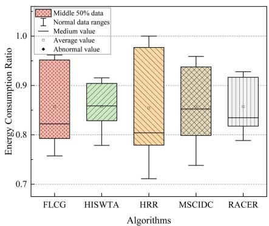  
(a) 5 UAVs

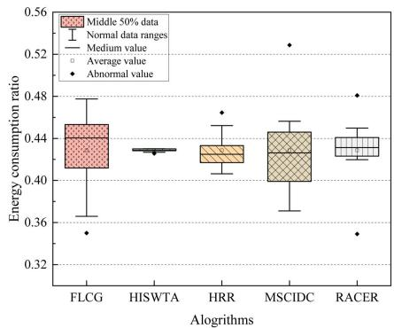  
(b) 10 UAVs

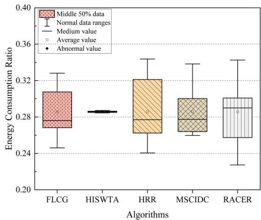  
(c) 15 UAVs  
Fig. 2. Comparison of the average energy consumption ratio of different algorithms at a total task size of 100000.

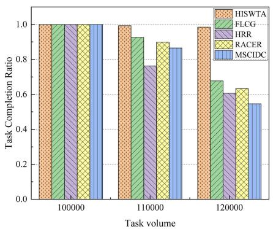  
(a) 5 UAVs

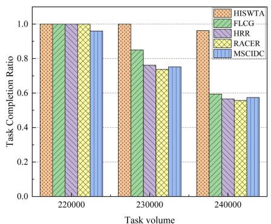  
(b) 10 UAVs

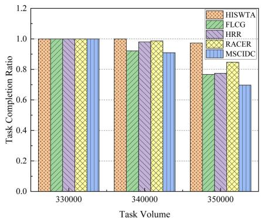  
(c) 15 UAVs  
Fig. 3. Comparison of the task completion ratio of different algorithms for different scales of the number of UAVs.

2) Comparative Experiments: Fig. 2 presents a comparison of the energy consumption ratio across different algorithms with a total task size of 100,000 for 5, 10, and 15 UAVs, respectively. As shown in Fig. 2, the HISWTA demonstrates a smaller difference between maximum and minimum energy consumption ratio compared to others. This efficiency is primarily due to the dynamic hierarchical information-sharing mechanism, which selects relay nodes based on UAV’s location, remaining energy, and connectivity to neighboring nodes. By balancing communication energy consumption across UAVs, the method reduces energy depletion rates, mitigating the “energy hole” effect. Moreover, the dynamic cooperative game-based task allocation method ensure equitable task distribution based on UAV’s performance and the specific environmental exploration requirements, leading to balanced energy consumption ratio across UAVs.

Fig. 3 illustrates the task completion ratio when tasks of varying volumes are performed for 5, 10 and 15 UAVs, respectively. As demonstrated in Fig. 3, the task completion ratio of the algorithms decline progressively as the task volume increases. Meanwhile, the HISWTA is capable of performing a greater volume of tasks than others, irrespective of the number of devices involved. Furthermore, the maximum enhancements in task completion ratio were recorded at the task-critical thresholds of 5, 10, and 15 UAVs within the system, with improvements of 12%, 26%, and 10%, respectively. Notably, the most substantial performance improvement is observed when the number of UAVs increases from 5 to 10. This indicates that the system achieves an optimal balance between resource availability and task processing capability at this scale. However, the performance gain diminishes when the number of UAVs is increased further from 10 to 15. This non-monotonic trend can be attributed to several interrelated factors. First, as tasks are introduced incrementally at a fixed rate (10,000 square meters per round), the marginal benefit of adding additional UAVs decreases beyond a certain threshold, resulting in sublinear performance gains. Second, an increased number of UAVs introduces greater coordination overhead during coalition formation and negotiation phases, thereby slightly reducing overall system efficiency.

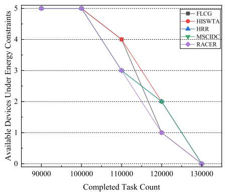  
(a) 5 UAVs

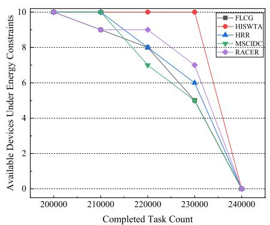  
(b) 10 UAVs

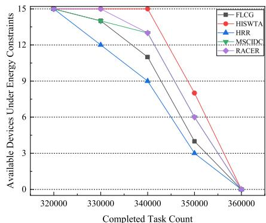  
(c) 15 UAVs  
Fig. 4. Relationship between task completion and number of available UAVs in cluster.

The reason is that the FLCG algorithm employs a task allocation approach comparable to ours, it utilizes a flooding communication method to information sharing, which results in greater communication energy consumption. The HRR use informationsharing approach similar to ours but adopts a random task allocation strategy, leading to task overload on certain UAVs and premature depletion of their energy resources. Although RACER incorporates a balanced task allocation approach, it employs two-by-two UAV interactions for information transfer, neglecting the impact of communication energy consumption on UAV performance, which restricts its ability to support continuous detection. Meanwhile, MSCIDC adopts a broadcast communication strategy coupled with equal task allocation, disregarding both the energy demands of communication and the influence of task volume on UAV performance. In scenarios where a UAV has numerous communicable neighbors or faces communication disruptions, energy consumption can increase substantially. This often results in the rapid depletion of certain UAVs, ultimately inhibiting continuous task execution.

Fig. 4 shows the correlation between the number of remaining available UAVs and the total tasks for different algorithms across different UAV number scales. The Fig. 4 demonstrates that the number of available UAVs of HISWTA is not less than that of the other algorithms under different number of UAVs. The energy balance advantage of HISWTA becomes more obvious with the gradual increase in the number of UAVs. The superior performance of the HISWTA algorithm is due to its effective optimization of resource utilization and its promotion of balanced energy consumption across UAVs. Unlike other algorithms, HISWTA comprehensively accounts for the effects of communication energy consumption and task allocation on cluster performance.

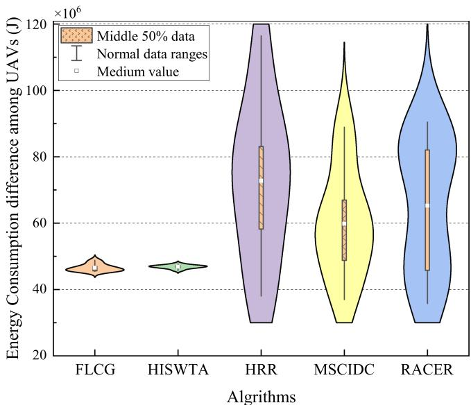  
Fig. 5. Distribution of energy consumption difference between UAVs at different communication radii.

Fig. 5 illustrates the comparative analysis of energy consumption distribution among UAVs with respect to different communication ranges. In this controlled experiment, the number of UAVs was set to 5, and the communication radius was varied from 10 to 100 meters in 10-meter increments. The Fig. 5 demonstrates that the HISWTA algorithm exhibits reduced fluctuations in energy consumption differences compared to other algorithms. Additionally, the data distribution of the HISWTA algorithm is highly concentrated, indicating robust adaptability and excellent stability, with consistent energy consumption performance across different communication radii. Although the energy consumption difference range of the FLCG algorithm is slightly larger than that of the HISWTA algorithm, it remains smaller than those of other algorithms. This can be attributed to the FLCG algorithm’s use of cooperative game theory, which facilitates reasonable task allocation based on UAV energy statuses, ensuring effective energy distribution. However, the FLCG algorithm’s information transmission method has limitations, as some nodes may repeatedly receive and forward information, leading to unnecessary energy consumption. This is the primary reason for its higher energy consumption difference compared to the HISWTA algorithm. Meanwhile, the HRR, MSCIDC, and RACER algorithms exhibit similar variances in UAV energy consumption differences. The HRR algorithm shows a more concentrated distribution of energy consumption differences compared to the MSCIDC and RACER algorithms.

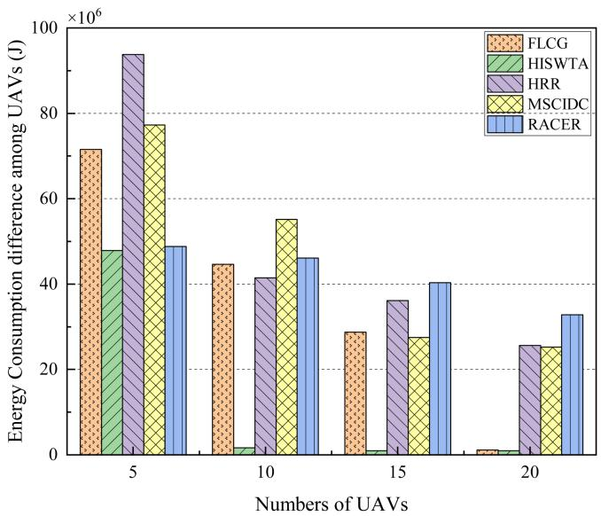  
Fig. 6. Comparison of energy consumption difference between UAVs under different numbers of UAVs.

As demonstrated in Fig. 6, the comparison of energy consumption differences under varying numbers of UAVs is illustrated at the communication radius of each UAV is 100 meters. It can be seen from Fig. 6, as the number of UAVs increases, the energy consumption difference among individual UAVs within the cluster gradually decreases. The HISWTA algorithm demonstrates a significantly lower energy consumption difference compared to other algorithms when handling UAV clusters of different sizes. This superior performance of the HISWTA algorithm can be attributed primarily to its dynamic hierarchical information-sharing mechanism and equitable task allocation strategy. These collectively enable UAV to achieve more balanced energy consumption. It is note that there is a significant increase in the energy consumption difference of the HISWTA algorithm when the number of UAVs is five, in comparison to other cluster sizes. The reason is that, in smaller UAV clusters, there is a greater disparity in communication energy consumption between cluster heads and members, which has a consequential effect on the overall energy balance. Meanwhile, the HRR algorithm demonstrates a substantially higher energy consumption disparity in comparison to alternative algorithms. This is primarily attributable to its random task allocation mechanism, which results in certain UAVs bearing excessive workloads. Consequently, this leads to disproportionate energy depletion and further exacerbates energy consumption disparities.

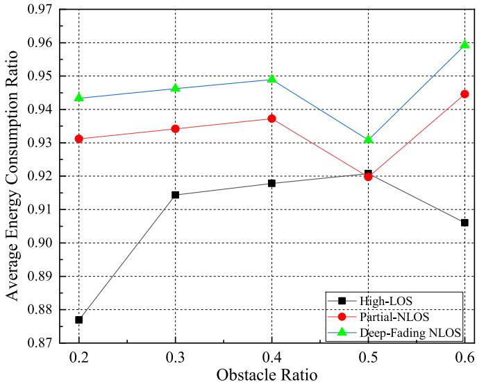

(a) Urban canyons environment  
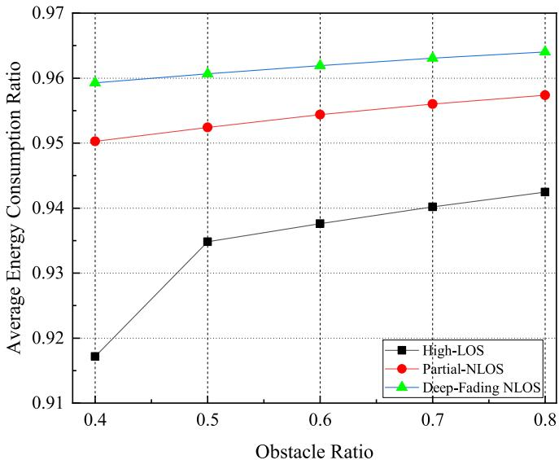  
(b) Mountainous areas environment  
Fig. 7. Average energy consumption ratio of the UAV swarm under different mission environments and channel conditions.

Fig. 7 shows the relationship of the average energy consumption ratio of a UAV swarm under different wireless channel conditions in two typical mission environments: mountainous areas and urban canyons. The simulation is conducted with a UAV swarm consisting of 10 UAVs, each having a communication radius of 100 meters. The total task workload across all scenarios is fixed at 230,000 task units. This experiment adopts three types of channel models based on standard propagation mechanisms: high line-of-sight probability channel (High-LOS Channel), partial non-line-of-sight fading channel (Partial-NLOS Channel), and deep-fading non-line-of-sight channel (Deep-Fading NLOS Channel). Among them, the High-LOS Channel uses a Rician fading model (K-factor of 10 dB), a path loss exponent of 2.0, an average signal-to-noise ratio (SNR) of no less than 20 dB, shadow fading standard deviation is $\sigma = 4 ~ \mathrm { d B }$ , and LOS probability higher than 90%. The Partial-NLOS Channel employs Rician fading $( K = 3 \mathrm { d B } )$ combined with log-normal shadowing $( \sigma = 6 \mathrm { d B } )$ , path loss exponent is 3.0, an average SNR of approximately 12 dB, and introduces a maximum Doppler shift of 30 Hz to characterize the link dynamics under moderate occlusion, with LOS probability about 50%–70%. The Deep-Fading NLOS Channel adopts Nakagami-m fading $( m = 0 . 7 )$ combined with a dual-slope path loss model (near-end exponent is set to 3.0, far-end exponent is set to 4.2). The probability of LOS is below 30%, and an average SNR not exceeding 8dB.

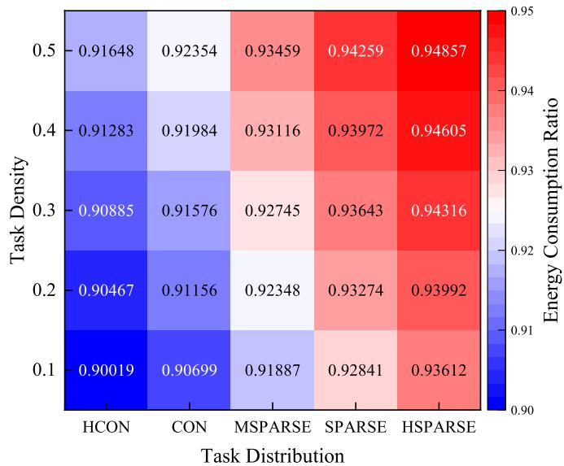  
Fig. 8. Average energy consumption ratio of the UAV swarm under varying task density and spatial distribution.

As shown in Fig. 7, in mountainous environments, higher obstacle ratio and poor channel condition lead to increased average energy consumption ratio in the UAV swarm, as degraded channels incur higher communication overhead. In urban canyon environments, the AECR varies nonlinearly with task density and channel conditions. Under High-LOS channel conditions, AECR rises with obstacle ratio, peaks at 0.5, and slightly declines at 0.6. This suggests that, under high task loads, the HISWTA method leverages the stable communication environment to achieve efficient task allocation through hierarchical information sharing and game-theoretic coordination, improving execution efficiency and partially mitigating communication and mobility costs. Under Partial-NLOS and Deep-Fading NLOS channel conditions, AECR drops significantly at an obstacle ratio of 0.5, forming a concave-shaped inflection point, indicating an improved balance between information exchange cost and task execution efficiency. However, as the obstacle ratio increases to $0 . 6 ,$ AECR rises again, especially under Deep-Fading NLOS channel conditions, due to frequent negotiation overhead and increased network topology dynamics, which elevate the maintenance cost of the hierarchical structure and further increase UAV energy consumption.

Fig. 8 illustrates the relationship among task distribution, task density, and the average energy consumption ratio (AECR) of the UAV swarm. Task density is defined as the ratio of total task detection regions to the entire operational area. Higher task density indicates a heavier overall workload for the UAV swarm. Task distribution, denoted as $T _ { d } .$ , measures the spatial dispersion of task locations and is computed as the average Euclidean distance from each task point to the centroid of the task set, normalized by the spatial extent of the region. The value of $T _ { d }$ ranges from 0 to 1, where $T _ { d } = 0$ indicates = 0all tasks are located at the centroid (perfectly concentrated), and $T _ { d } = 1$ represents maximum dispersion. Five categories are defined accordingly: highly concentrated (HCON) $( 0 . 0 \leq$ $T _ { d } < 0 . 2 )$ , concentrated (CON) $( 0 . 2 \leq T _ { d } < 0 . 4 )$ , moderately sparse (MSPARSE) $( 0 . 4 \leq T _ { d } < 0 . 6 )$ , sparse $( 0 . 6 \leq T _ { d } < 0 . 8 )$ and highly sparse (HSPARSE) $( 0 . 8 \leq T _ { d } \leq 1 . 0 )$ . A smaller $T _ { d }$ value indicates stronger spatial clustering around the centroid. All simulations were conducted in an open-field environment with no obstacles and high line-of-sight channel conditions. The UAV swarm consisted of 10 UAVs, each with a communication radius of . Across all scenarios, the total task workload 100 mwas fixed at 230,000 task units. As shown in Fig. 8, more concentrated task distributions and lower task density result in a lower AECR for the UAV swarm. When task distribution is fixed, an increase in task density leads to higher AECR because every UAV must complete more tasks within a confined space, increasing local congestion and individual energy consumption ratio due to prolonged hovering and sensing. When task density is fixed, sparser task distributions (higher $T _ { d } )$ lead to higher AECR due to increased communication and motion overheads associated with larger travel distances between geographically dispersed task areas.

## VII. CONCLUSION

We propose a collaborative exploration method which jointly optimizes information sharing strategies and task allocation. By designing a hierarchical information sharing mechanism, effectively mitigate the energy hole problem during task collaboration, achieving energy equilibrium among heterogeneous UAVs. The game theory-based task allocation method ensures a fair distribution of tasks according to every UAV’s marginal benefit to the overall coalition. This approach balances communication and task completion energy consumption among cluster members. Simulation experiments have shown that the highest improvements in task completion ratio were 12%, 26%, and 10% at the task-critical thresholds of 5, 10, and 15 UAVs within the system. Additionally, it was found that the proposed algorithm performs better than the benchmark in terms of energy consumption ratio, synergy, and energy consumption difference. The framework also demonstrates strong potential for real-world applications. In 6G-enabled edge intelligence, it can support low-latency and reliable coordination among aerial base stations and edge devices. In multi-UAV emergency communication scenarios, such as post-disaster search and rescue, it enhances operational endurance and coverage robustness in infrastructure-limited environments. Moreover, the underlying principles of energy-aware, heterogeneous agent coordination can be extended to low-earth-orbit (LEO) satellite constellations to enable autonomous global sensing and intersatellite networking. These applications highlight the method’s practical relevance and position it as a promising solution for future resilient and intelligent space-air-ground integrated networks.

## REFERENCES

[1] Z. Dai, C. H. Liu, R. Han, G. Wang, K. K. Leung, and J. Tang, “Delaysensitive energy-efficient UAV crowdsensing by deep reinforcement learning,” IEEE Trans. Mobile Comput., 22, no. 4, pp. 2038–2052, Apr. 2023.

[2] X. Li and X. Zhang, “Multi-task allocation under time constraints in mobile crowdsensing,” IEEE Trans. Mobile Comput., 20, no. 4, pp. 1494–1510, Apr. 2021.

[3] C. H. Liu, Z. Chen, and Y. Zhan, “Energy-efficient distributed mobile crowd sensing: A deep learning approach,” IEEE J. Sel. Areas Commun., 37, no. 6, pp. 1262–1276, Jun. 2019.

[4] W. Liu, Y. Zhou, and Y. Fu, “Learning based dynamic resource allocation in UAV-assisted mobile crowdsensing networks,” in Proc. IEEE Wireless Commun. Netw. Conf., 2024, pp. 1–6.

[5] S. Dongare, A. Ortiz, and A. Klein, “Deep reinforcement learning for task allocation in energy harvesting mobile crowdsensing,” in Proc. GLOBE-COM IEEE Glob. Commun. Conf., 2022, pp. 269–274.

[6] X. Liu et al., “A coverage-aware task allocation method for UAVassisted mobile crowd sensing,” IEEE Trans. Veh. Technol., 73, no. 7, pp. 10642–10654, Jul. 2024.

[7] H. Gao, J. Feng, Y. Xiao, B. Zhang, and W. Wang, “A UAV-assisted multitask allocation method for mobile crowd sensing,” IEEE Trans. Mobile Comput., 22, no. 7, pp. 3790–3804, Jul. 2023.

[8] J. Wang et al., “HyTasker: Hybrid task allocation in mobile crowd sensing,” IEEE Trans. Mobile Comput., 19, no. 3, pp. 598–611, Mar. 2020.

[9] Y. Fu, Y. Zhang, Z. Shi, H. Wang, and Y. Liu, “Subband and sensing task allocation for next-generation mobile crowdsensing networks: An optimal framework,” in Proc. IEEE Wireless Commun. Netw. Conf., 2024, pp. 1–6.

[10] T. Cai et al., “Cooperative data sensing and computation offloading in UAV-assisted crowdsensing with multi-agent deep reinforcement learning,” IEEE Trans. Netw. Sci. Eng., 9, no. 5, pp. 3197–3211, Sep./Oct. 2022.

[11] D. Liu, L. Dou, R. Zhang, X. Zhang, and Q. Zong, “Multi-agent reinforcement learning-based coordinated dynamic task allocation for heterogenous UAVs,” IEEE Trans. Veh. Technol., 72, no. 4, pp. 4372–4383, Apr. 2023.

[12] Y. Li, Z. Zhang, Z. He, and Q. Sun, “A heuristic task allocation method based on overlapping coalition formation game for heterogeneous UAVs,” IEEE Internet Things J., 11, no. 17, pp. 28945–28959, Sep. 2024.

[13] T. T. Sari, S. Ahmad, A. Aral, and G. Seçinti, “Collaborative smart environmental monitoring using flying edge intelligence,” in Proc. IEEE Glob. Commun. Conf., 2023, pp. 5336–5341.

[14] X. Fu, X. Huang, Q. Pan, P. Pace, G. Aloi, and G. Fortino, “Cooperative data collection for UAV-assisted maritime IoT based on deep reinforcement learning,” IEEE Trans. Veh. Technol., 73, no. 7, pp. 10333–10349, Jul. 2024.

[15] X. Han, B. Lin, Z. Na, B. Li, C. Zhang, and R. Zhang, “Spatial crowdsourcing-based task allocation for UAV-assisted maritime data collection,” IEEE Trans. Veh. Technol., vol. 74, no. 2, pp. 3375–3388, Feb. 2025.

[16] M. Tao, X. Li, J. Feng, D. Lan, J. Du, and C. Wu, “Multi-agent cooperation for computing power scheduling in UAVs empowered aerial computing systems,” IEEE J. Sel. Areas Commun., vol. 42, no. 12, pp. 3521–3535, Dec. 2024.

[17] J. Zhang et al., “Multi-UAV collaborative surveillance network recovery via deep reinforcement learning,” IEEE Internet Things J., 11, no. 21, pp. 34528–34540, Nov. 2024.

[18] J. Tang and J. Chen, “Throughput maximization for UAV-assisted data collection with hybrid NOMA,” IEEE Trans. Wireless Commun., 23, no. 10, pp. 13068–13081, Oct. 2024.

[19] J. Zhang, J. Ren, Y. Cui, D. Fu, and J. Cong, “Multi-USV task planning method based on improved deep reinforcement learning,” IEEE Internet Things J., 11, no. 10, pp. 18549–18567, May 2024.

[20] Y. Wang, N. Xia, B. Chen, Y. Yin, S. Wei, and K. Zhang, “Multi-AUV cooperative data collection for underwater acoustic sensor networks using stackelberg game,” IEEE Sensors J., 24, no. 20, pp. 33442–33454, Oct. 2024.

[21] Y. Bai, H. Zhao, X. Zhang, Z. Chang, R. Jäntti, and K. Yang, “Toward autonomous multi-UAV wireless network: A survey of reinforcement learning-based approaches,” IEEE Commun. Surveys Tuts., 25, no. 4, pp. 3038–3067, Fourthquarter 2023.

[22] S. Shan, Z. Peng, and X. Zeng, “Two-stage multi-robot task allocation algorithms in local communication scenarios,” in Proc. IEEE 18th Int. Conf. Control Automat., 2024, pp. 791–797.

[23] E. Seraj, L. Chen, and M. C. Gombolay, “A hierarchical coordination framework for joint perception-action tasks in composite robot teams,” IEEE Trans. Robot., 38, no. 1, pp. 139–158, Feb. 2022.

[24] B. Yi, J. Lv, J. Chen, X. Wang, and K. Li, “Digital twin constructed spatial structure for flexible and efficient task allocation of drones in mobile networks,” IEEE J. Sel. Areas Commun., 41, no. 11, pp. 3430–3443, Nov. 2023.

[25] K. Meng, X. He, Q. Wu, and D. Li, “Multi-UAV collaborative sensing and communication: Joint task allocation and power optimization,” IEEE Trans. Wireless Commun., vol. 22, no. 6, pp. 4232–4246, Jun. 2023.

[26] L.-L. Dai, Q.-K. Pan, Z.-H. Miao, P. N. Suganthan, and K.-Z. Gao, “Multi-objective multi-picking-robot task allocation: Mathematical model and discrete artificial bee colony algorithm,” IEEE Trans. Intell. Transp. Syst., 25, no. 6, pp. 6061–6073, Jun. 2024.

[27] L. Zhu, J. Cheng, H. Zhang, W. Zhang, and Y. Liu, “Multi-robot environmental coverage with a two-stage coordination strategy via deep reinforcement learning,” IEEE Trans. Intell. Transp. Syst., 25, no. 6, pp. 5022–5033, Jun. 2024.

[28] B. Pik et al., “Multi-AGV’s temporal memory-based RRT exploration in unknown environment,” IEEE Robot. Automat. Lett., vol. 7, no. 4, pp. 9256–9263, Oct. 2022.

[29] T. Zhang, H. Shen, Y. Yin, J. Xu, J. Yu, and Y. Pan, “LECES: A lowbandwidth and efficient collaborative exploration system with distributed multi-UAV,” IEEE Robot. Automat. Lett., vol. 9, no. 9, pp. 7795–7802, Sep. 2024.

[30] J. Zhang, J. Sha, G. Han, J. Liu, and Y. Qian, “A cooperative-controlbased underwater target escorting mechanism with multiple autonomous underwater vehicles for underwater Internet of Things,” IEEE Internet Things J., vol. 8, no. 6, pp. 4403–4416, Mar. 2021.

[31] S. Han, T. Zhang, X. Li, J. Yu, T. Zhang, and Z. Liu, “The unified task assignment for underwater data collection with multi-auv system: A reinforced self-organizing mapping approach,” IEEE Trans. Neural Netw. Learn. Syst., 35, no. 2, pp. 1833–1846, Feb. 2024.

[32] D. Liu, B. Fei, W. Bao, X. Zhu, and X. Li, “DAWN: Dynamic task planning of multi-UAV with two-layer optimization mechanism in uncertain environments,” IEEE Internet Things J., vol. 11, no. 23, pp. 37813–37830, Dec. 2024.

[33] M. Alzard, S. Althunibat, and N. Zorba, “On the performance of nonorthogonal multiple access considering random waypoint mobility model,” in Proc. IEEE Int. Conf. Commun., 2022, pp. 721–725.

[34] L. Cai, R. Huang, Z. Li, L. Luo, Z. Xiong, and Y. Chen, “A clustering election game-based and two-level management protocol for wireless sensor networks,” IEEE Internet Things J., vol. 11, no. 7, pp. 12058–12070, Apr. 2024.

[35] J. Liu, X. Zhang, R. Zhang, T. Huang, and F. R. Yu, “Reliable and lowoverhead clustering in LEO small satellite networks,” IEEE Internet Things J., vol. 9, no. 16, pp. 14844–14856, Aug. 2022.

[36] J. Cai, Q. Zhu, Q. Lin, Z. Ming, and K. C. Tan, “Decomposition-based multiobjective evolutionary optimization with tabu search for dynamic pickup and delivery problems,” IEEE Trans. Intell. Transp. Syst., vol. 25, no. 10, pp. 14830–14843, Oct. 2024.

[37] J. Liu, H. Weng, Y. Ge, S. Li, and X. Cui, “A self-healing routing strategy based on ant colony optimization for vehicular ad hoc networks,” IEEE Internet Things J., vol. 9, no. 22, pp. 22695–22708, Nov. 2022.

[38] A. Ribeiro et al., “A shapley value-based strategy for resource allocation in vehicular clouds,” in Proc. IEEE Glob. Commun. Conf., 2022, pp. 5801–5806.

[39] A. Heuillet, F. Couthouis, and N. Dıáz-Rodrı ´guez, “Collective eXplainable AI: Explaining cooperative strategies and agent contribution in multiagent reinforcement learning with Shapley values,” IEEE Comput. Intell. Mag., vol. 17, no. 1, pp. 59–71, Feb. 2022.

[40] B. Zhou, H. Xu, and S. Shen, “RACER: Rapid collaborative exploration with a decentralized multi-UAV system,” IEEE Trans. Robot., vol. 39, no. 3, pp. 1816–1835, Jun. 2023.

[41] J. John, K. Harikumar, J. Senthilnath, and S. Sundaram, “An efficient approach with dynamic multiswarm of UAVs for forest firefighting,” IEEE Trans. Syst., Man, Cybern. Syst., vol. 54, no. 5, pp. 2860–2871, May 2024.

Xiaoliang Guang received the ME degree in information and communication engineering from Shenyang Ligong University, Shenyang, China, in 2020. He is currently working toward the PhD degree with the School of Computer Science and Engineering, Northeastern University, Shenyang, China. His research interests include intelligent information network, artificial intelligence and Internet of things.

Chenlu Wang received the ME degree in information and communication engineering from Shenyang Aerospace University, Shenyang, China, in 2020. He is currently working toward the PhD degree with the School of Computer Science and Engineering, Northeastern University, Shenyang, China. His research interests include artificial intelligence, industrial Internet of things and satellite Internet.

Yuhuai Peng received the PhD degree in communication and information systems from Northeastern University, Shenyang, China, in 2013. He is currently a professor with the Department of Communications and Electronic Information, Northeastern University. His research interests include Internet of Things (IoT), Cyber Physical Systems (CPS), intelligent information networks, industrial communication networks, edge computing, and Prognostics and Health Management (PHM).