# Game-Theoretic Optimization of Multiple Interfering Base Stations Deployment

Xiaomeng Ma , Mohan Yu , Haoxuan Xu , Taohan Sun , Yangguang Zhao , and Meiguo Gao

Abstract—The use of malicious uncrewed aerial vehicle (UAV) poses a threat to the security of sensitive airspace such as airports and military bases, and this potential threat requires interference devices to neutralize and weaken it. This paper investigates the optimization of navigation and communication interference base stations (IBSs) deployment for UAV approaching sensitive target by adjusting IBSs positions to maximize interference along the UAV’s optimal flight path, while simultaneously minimizing interference with the supportive devices of the interference system. Specifically, this article formulates the IBSs deployment optimization as a game-theoretic mathematical framework to determine the optimal deployment strategy. First, an objective function is defined to assess the communication and navigation performance of both the UAV and supportive devices, incorporating a probabilistic channel attenuation model. This function aims to maximize interference on the UAV while minimizing impact on supportive equipment by optimizing the IBSs deployment strategy. Second, within the framework of the optimization problem, the IBSs deployment problem is demonstrated to constitute an exact potential game, thereby ensuring the existence of a pure-strategy Nash equilibrium (NE). To further validate that the IBSs deployment strategy derived from the optimal UAV trajectory—characterized as the path with minimal interference—is indeed equilibrium, we also develop a game-theoretic framework that integrates both IBSs deployment and UAV path planning strategies. The NE strategy derived from this framework establishes a robust theoretical foundation for the subsequent optimization algorithm of IBSs deployment and UAV flight path determination. Finally, in response to the complexity and highly dynamic nature of the deployment problem, we specifically propose an algorithm architecture for solving NE strategies based on maximum entropy reinforcement learning (MERL) techniques. Simulation and comparision experiments have demonstrated that the algorithm can achieve maximum interference to UAV and minimum interference to supportive devices by optimizing IBSs deployment, showcasing advantages in balancing internal and external interference.

Index Terms—UAV, interference, navigation, communication, deployment optimization, game theory.

## I. INTRODUCTION

HE proliferation of uncrewed aerial vehicle (UAV) has T led to an increase in unauthorized UAV incidents in sensitive airspaces, posing serious safety risks to areas such as airports and command centers [1], [2], [3]. Particularly in military confrontations, effectively eliminating UAV threats has become a challenging issue [4]. Current solutions have focused on developing anti-UAV systems that integrate detection, reconnaissance, and jamming devices. Additionally, advancements in software-defined radio (SDR) technology [5] provide technical support for comprehensive signal detection and interference decision-making.

Drones operate as a cyber-physical system (CPS) for communication and navigation control, and research [6] has indicated that GNSS navigation [7], [8] and wireless communication interference are the most effective ways to disrupt a UAV’s access to external navigation information. However, current studies lack an analysis of jamming decision-making from the perspective of the jammer, particularly regarding strategies involving a combination [9], [10] of GNSS navigation and wireless communication interference, power allocation [11], and base station deployment [12]. This paper addresses the current state of anti-UAV technology research by focusing on optimizing interference base stations (IBSs) deployment to maximize the overall probability of disrupting UAV flight trajectories in sensitive airspaces.

Related research [12], [13] has identified base station location optimization as a challenging problem, and game theory provides theoretical analysis methods and distributed decisionmaking solutions. In optimizing the deployment of multiple IBSs, we consider both the effectiveness of interference against drones and the passive interference to supportive devices.1 To solve the tradeoff between external and internal interference, we firstly construct the problem as a mathematical framework of a multiple IBSs anti-UAV game (MIAUG), optimizing each IBS’s interference performance while taking into account the comprehensive interference performance of all interference stations. Here, comprehensive interference performance refers to maximizing the likelihood of disrupting the UAV system while minimizing the likelihood of disrupting supportive devices. Based on this objective, we have demonstrated that MIAUG constitutes an exact potential game, ensuring the existence of equilibrium strategies for IBSs deployment. Subsequently, we model the IBSs deployment and UAV path planning strategies as the IBSs Deployment and Drone Path Planning Game (IBSs-DPPG). In this game, the proof of the Nash equilibrium (NE) strategy ensures that the IBSs deployment derived from the optimal UAV path guarantees maximum interference efficacy. These theoretical foundations provide essential guidance for the subsequent algorithmic development.

Overall, to achieve the optimal deployment plan based on GNSS navigation and wireless communication IBSs, this study first constructs a mathematical framework for gain distribution in a specific area based on a probability channel and small-scale fading model. This gain distribution framework considers the attenuation differences of mountains, forests, and buildings on GNSS navigation and wireless communication interference channels, providing a universal mathematical model for analyzing complex counter-interference scenarios. Subsequently, with the objective of maximizing the overall interference performance of hybrid interference, we prove that the MIAUG is a exact potential game and the NE strategy in IBSs-DDPG based on game theory. Finally, to derive the NE solution, a multi-IBS deployment optimization algorithm based on Soft Actor-Critic (SAC) [14] is proposed, with its performance compared against baseline algorithms including proximal policy optimization (PPO) [16], Q-learning [15] and binary log-linear learning (B3L) [17], [18]. In addition, experiments are conducted to optimize the deployment of IBSs under conventional UAV flight strategies.

In summary, the main contributions of this paper include the following:

1. To the best of our knowledge, this is the first paper to investigate, via game theory, the optimization of deploying IBSs for GNSS navigation and wireless communication from a jammer’s perspective targeting unauthorized UAVs, providing theoretical guidance for anti-UAV system design optimization.

2. This paper utilize the game theory to solve the optimal IBSs deployment strategy, which comprehensively considers the interference performance index of maximizing the disruption probability of unauthorized UAV communication and navigation while minimizing the disruption to supportive devices, i.e. external and internal interference. Specifically, theoretically proving that the MIAUG framework is a exact potential game, and the NE strategy in IBSs-DPPG, which provides a theoretical basis for solving the feasibility of the optimal IBSs deployment strategy.

3. An algorithm based on SAC is proposed to solve the optimal deployment strategy for multiple IBSs and its advantages in harmonizing internal and external conflicts within the interference system is compared with baseline algorithms and strategies. Additionally, the complexity of the algorithm has been analyzed.

The remaining sections are structured as follows. Section II presents related works and highlights the study’s innovations. Section III establishes the framework for optimizing multi-IBSs deployment. Section IV and V utilize game theory to validate the feasibility of IBSs deployment optimization and provide a solution, respectively. Section VI offers simulation results and comparative analyses, while Section VII concludes with a summary.

## II. RELATED WORKS

Our optimization work of IBSs deployment draws insights from the deployment optimization studies of UAV mobile communication base stations [19], [20], [21]. In recent years, there has been extensive attention on utilizing UAVs as auxiliary base station devices for enhancing communication service quality [22].

The service interference challenges posed by heterogeneous UAV networks serving ground users are examined in [23], where a potential game-based mathematical framework is proposed to determine optimal UAV deployment schemes, enhancing global welfare and utility outcomes. In [24], an optimization framework for integrated aerial-terrestrial networks (IATN) leverages clustered cell-free massive MIMO (C-CF-M-MIMO) to maximize deployment cost-effectiveness, addressing UAV cooperation, power constraints, and user clustering. Numerical evaluations demonstrate its superiority over conventional methods. Furthermore, [25] presents a flexible soft frequency reuse (F-SFR) approach for flying base stations (FlyBSs) that improves throughput and user satisfaction for cell-edge users via a graph theory-based resource allocation and a low-complexity deep neural network, achieving a 16-26% throughput increase and up to 25% enhancement in user satisfaction over existing models. In [26], a multi-UAV coverage strategy based on deterministic radio wave propagation and ray-tracing is formulated, modeling cooperative search and coverage as a potential game. Experimental results in urban areas such as Haikou and Guangzhou indicate significant performance advantages over traditional statistical models. Several recent studies explore advanced frameworks for UAV coordination in surveillance and communication optimization. Reference [18] presents a game-theoretic cooperative search approach with UAVs, breaking down the task into motion coordination, sensing, and information fusion, and using a potential game model for control, yielding effective and adaptive results. Reference [27] introduces a dynamic discrete pigeon-inspired optimization (DPIO) method for UAV search-attack missions, optimizing performance via probability-guided mapping and solution acceptance, with strong performance demonstrated through simulations. Similarly, [12] proposes a congestion game model for dis tributed UAV swarm deployment to improve adaptability and anti-jamming capabilities, validated by NE analysis. Power allocation and 3D UAV-BS deployment in ultra-dense networks are addressed in [13] through a price-based proximal policy optimization (3PO) algorithm, enhancing throughput and energy efficiency. Finally, [28] offers a UAV-BS deployment model optimizing coverage and energy use through a hybrid genetic and gray wolf optimization, outperforming conventional strategies in spatial efficiency.

Through the above research, it is evident that game theory has become an important theoretical tool for optimizing base station deployment, stemming from its application in wireless communication [29]. The derived NE strategies can reduce internal interference in clustered communications and maximize communication quality of service. In contrast to interference mitigation studies, optimizing interference decisions to maximize the disruption effectiveness against unauthorized UAV can also be addressed through game theory, reflecting the inherent contradiction between these two aspects. The paper [30], [31] constructs the jamming confrontation process between anti-UAV systems and UAV as a Stochastic

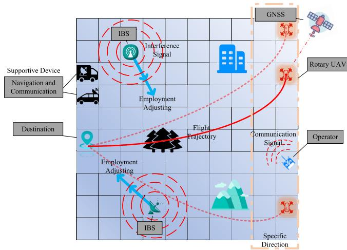  
Fig. 1. IBSs deployment scenario.

Game mathematical framework, exploring the equilibrium characteristics between IBSs deployment and UAV path node selection strategies based on average utility theory and cumulative prospect theory, while analyzing the impact of irrational factors on equilibrium strategies from both subjective and objective perspectives. Furthermore, the joint optimization of base station deployment and interference power allocation can achieve better jamming effectiveness, as validated in [13] and [32].

In contrast to recent research, this study focuses on optimizing the deployment of IBSs to equilibrating the contradiction between internal and external interference during unauthorized UAV flights, this is pioneering research. Similar to the aforementioned studies, this is a multi-objective optimization problem in which we utilize game theory to analyze and determine the optimal deployment strategy.

## III. SYSTEM MODEL

This paper examines a scenario in which an unauthorized UAV from a specified direction and penetrates a defined rectangular sensitive airspace to conduct reconnaissance over a designated target area, as illustrated in Fig. 1. The UAV navigates to its destination using GNSS and communication signals, while multiple IBSs are strategically repositioned to maximize interference with the UAV’s flight path, simultaneously minimizing disruption to supportive devices. Note that the mountains, forests, and buildings will have varying degrees of impact on the communication and interference signal channels, resulting in gain attenuation.

## A. Interference Network Model

The UAV utilizes a GNSS navigation module to obtain realtime positioning information [7], while its uplink employs orthogonal frequency-division multiplexing (OFDM) [18] to receive wireless communication signals from the ground control station for flying to destination $L d \ = \ ( x d , y d , 0 )$ Additionally, when the UAV cannot decode flight control information from ground operator $L o \ = \ ( x o , y o , 0 )$ , it can autonomously fly using GNSS navigation data. At time t, the $\mathrm { U A V } \mathbf { \hat { s } }$ position is denoted as $L u ( t ) = ( x u ( t ) , y u ( t ) , h u )$ . The

UAV ground operator communicates with the UAV via m channels, transmitting at power pm satisfing $p m \in ( 0 , P c ]$ and $\sum m = 1 ^ { M } p m \in ( 0 , P c ]$ , where $P c$ denotes the maximum allowable power. The communication over this channel operates with a bandwidth of $B c$ . The power of the signal from the n-th satellite, received across all positions in the sensitive area, is denoted as $p n$ with a bandwidth of $B n$

The interference system consists of global controller, multiple IBSs, electronic reconnaissance devices, radar detection, and support devices. The global controller is responsible for algorithm computation and exchanging information with support devices in the system. The IBSs disrupt GNSS navigation and wireless communication signals, preventing the UAV from performing standard flight control operations. The electronic reconnaissance devices continuously monitor the communication frequency band $m$ utilized by the UAV and the characteristics of the n-th satellite signal, which is accessible due to the open nature of the GNSS protocol. For the j-th IBS positioned at $L b s , j ~ = ~ ( x b s , j , y b s , j , 0 )$ with $j \in \{ 1 , 2 , . . . , J \}$ , interference is applied through communication power $p j , m \in [ 0 , P j , m ]$ and navigation power $p j , n \in [ 0 , P j , n ]$ , both utilizing directional gain. Additionally, the detection device provides real-time position information of the UAV, enabling the main lobe of the IBSs’ antenna to dynamically align with the $\mathrm { U A V } ^ { \ , } \mathbf { s }$ direction.

Supportive devices fixed at positions $L ^ { s } k = ( x ^ { s } k , y ^ { s } k , h ^ { s } k )$ for $k = 1 , \cdots , K$ provide real-time communication and navigation information to the global controller $\boldsymbol { L } \boldsymbol { c } = \{ x c , y c , h c \}$ while receiving relevant information therefrom. However, during directional interference tracking of the UAV by IBSs, some impact on supportive devices is inevitable. This interference stems primarily from two sources: overlap in communication and navigation frequency bands and leakage of sidelobe interference energy from the IBSs. Given that the UAV possesses some anti-jamming capability, it can access signalrelated information from supportive devices within the global controller, leading to interference effects on the operational frequency bands of supportive devices during UAV tracking by the IBSs. We define the power of the communication and navigation signals for supportive devices as $p ^ { s } m ^ { \prime }$ and $p ^ { s } n ^ { \prime }$ where $m ^ { \prime }$ and $n ^ { \prime }$ denote specific variations under different UAV channel conditions, and the superscript s represents a supportive device. Additionally, as the IBSs engage in directional tracking and interference with the UAV, leakage of interference energy toward supportive devices is unavoidable. Note that the received energy is influenced by the angular relationship between the IBSs’ interference main lobe and the supportive device. To comprehensively assess the channel overlap and interference energy leakage of communication and navigation signals, we introduce $\tau j .$ , m and $\tau j ,$ , nav, which serve as intrinsic reason of internal interference in the IBSs deployment and whose methodology will be introduced in sections III-D.

## B. Channel Model

The influence of environmental elements such as air, mountains, forests, and buildings, positioned at $L _ { o b , i } ~ = ~ ( x _ { o b , i } ,$ $y _ { o b , i } , h _ { o b , i } )$ for $i = 0 , 1 , \cdots , I ,$ on the signals received by both the UAV and the IBSs is characterized through gain attenuation. This paper employs probabilistic channel models and small-scale fading [10], [13], [15] to quantify gain impacts from path propagation, multipath, scattering, etc., thereby precisely establishing attenuation models for communication and navigation channels in complex environments. The channel gain between transmitter and receiver is [33]:

$$
g = \sqrt { g _ { p } } g _ { s } ,\tag{1}
$$

where $g _ { p }$ denotes the probabilistic channel component incorporating both line-of-sight (LoS) and non-line-of-sight (NLoS) propagation mechanisms, while $g _ { s }$ represents the small-scale fading coefficient satisfing Nakagami-m distribution.

Set the coordinates of any point within the region as $L =$ $( x , y , h )$ , and its distance from j-th IBS $L _ { b s , j }$ is $\rho _ { j } = \| L -$ $L _ { b s , j } | |$ , where $\| \cdot \|$ denotes modular operation. The probability of their LoS link is

$$
p ^ { l o s } = \frac { 1 } { 1 + a _ { i } \exp { ( - b _ { i } [ \frac { 1 8 0 } { \pi } \arctan ( \frac { h } { \| ( x , y ) - ( x _ { j } , y _ { j } ) \| } ) - a _ { i } ] ) } } ,\tag{2}
$$

where h is relative height, the parameters $a _ { i } , b _ { i }$ is determined by predefined environment, including mountains, forests, and buildings. Then, the probability of NLoS link can be denoted as $p ^ { n l o s } = 1 - p ^ { l o s }$ . The path loss of communication interference signal between $L$ and $L _ { b s , j }$ can be denoted as

$$
P L = \sum _ { l \in \{ l o s , n l o s \} } p ^ { l } ( \varpi + \varpi ^ { l } ) ,\tag{3}
$$

where $\varpi ^ { l o s }$ and $\varpi ^ { n l o s }$ denotes average additional path loss of LoS and NLoS link, respectively. \$ is the free space path loss (FSPL), which can be cauculated as

$$
\varpi = \varpi _ { 0 } + 1 0 \sigma \log _ { 1 0 } \left( \frac { \rho _ { j } } { \rho _ { 0 } } \right) ,\tag{4}
$$

where

$$
\varpi _ { 0 } = 2 0 \log _ { 1 0 } { \left( \frac { 4 \pi } { c } \right) } + 2 0 \log _ { 1 0 } ( f _ { c } ) + 1 0 \sigma \log _ { 1 0 } ( \rho _ { 0 } )
$$

is the path attenuation in reference distance $\rho _ { 0 } , \ f _ { c }$ is the carrier frequency of communication signal, c is light speed, $\sigma$ is the attenuation factor of free space. The corresponding probabilistic channel gain $g _ { p }$ can be derived based on the path loss P L. Ultimately, the total gain $g$ can be derived by incorporating the small-scale fading $g _ { s }$ . Similarly, when the carrier frequency is switched to the GNSS signal carrier $f _ { n } ,$ equation (4) represents the attenuation of satellite signals. Note that this path loss applies to communication, navigation, and interference signals alike.

Considering the differences in the structures of communication and navigation signals, we use communication rate and signal-to-interference-to-noise ratio (SINR) to evaluate the performance of communication and navigation, respectively. The SINR under the interference of the j-th IBS can be expressed as

$$
\eta _ { j } = \frac { \sum _ { m = 1 } ^ { M } p _ { m } g _ { m } } { \sigma _ { c } ^ { 2 } + \sum _ { m = 1 } ^ { M } p _ { j , m } g _ { j , m } } ,\tag{5}
$$

where $g _ { m }$ and $g _ { j , m }$ denote the communication and interference gain, $\sigma _ { c } ^ { 2 }$ is noise power. Considering that the interference signals from IBSs are non-coherent noise interference, the SINR follows the relationship below when multiple interferences exist simultaneously:

$$
\eta ^ { \Sigma } = \frac { \sum _ { m = 1 } ^ { M } p _ { m } g _ { m } } { \sigma _ { c } ^ { 2 } + \sum _ { j = 1 } ^ { J } \sum _ { m = 1 } ^ { M } p _ { j , m } g _ { j , m } } ,\tag{6}
$$

which delineates the impact of all IBSs on communication performance. Then, the communication rate $\zeta _ { j } = \log ( 1 + \eta _ { j } )$ also satisfies $\zeta ^ { \Sigma } = \log ( 1 + \eta ^ { \Sigma } ) $ . Equation (5) and (6) are applicable to GNSS signal’s SINR, which is denoted as $\eta _ { \mathrm { j } } ,$ nav and $\eta _ { \mathrm { n a v } } ^ { \Sigma }$

## C. UAV’s Constrained Motion Sets

The UAV navigates toward the target area from a specified direction. This paper considers a constrained action space for UAV flight to meet the requirements of constrained flight areas, as detailed in references [18], [26]. The constrained action space can be described by setting the vector angle of the UAV’s flight speed to satisfy $\theta \in$ $\Theta \ = \ \{ - 1 3 5 , - 9 0 , - 4 5 , 0 , 4 5 , 9 0 , 1 3 5 , 1 8 0 \} ^ { \circ }$ , where the $0 ^ { \circ }$ reference X-axis direction. When the UAV is at the boundary of the area, the feasible set of speed vector angles in horizontal plane can be represented as follows.

$$
{ \overline { { \Theta } } } = \{ - 1 3 5 , - 9 0 , - 4 5 , 0 , 1 8 0 \} ^ { \circ } ,
$$

$$
\overline { { \Theta } } | = \{ 1 8 0 , - 1 3 5 , - 9 0 \} ^ { \circ } ,\tag{7a}
$$

$$
| \overline { { \Theta } } = \{ - 9 0 , - 4 5 , 0 \} ^ { \circ } ,\tag{7b}
$$

$$
\Theta | = \{ - 1 3 5 , - 9 0 , 9 0 , 1 3 5 , 1 8 0 \} ^ { \circ } ,\tag{7c}
$$

$$
| \Theta = \{ - 9 0 , - 4 5 , 0 , 4 5 , 9 0 \} ^ { \circ } ,\tag{7d}
$$

$$
\underline { { \Theta } } = \{ 0 , 4 5 , 9 0 , 1 3 5 , 1 8 0 \} ^ { \circ } ,\tag{7e}
$$

(7f)

$$
\underline { { \Theta } } | = \{ 9 0 , 1 3 5 , 1 8 0 \} ^ { \circ } ,\tag{7g}
$$

$$
\underline { { \Theta } } = \{ 0 , 4 5 , 9 0 \} ^ { \circ } ,\tag{7h}
$$

where horizontal and vertical lines with Θ represent that the UAV locate at boundaries. The UAV’s velocity can be denoted as

$$
\mathbf { v } = | \mathbf { v } | * [ \cos \theta , \sin \theta ] , \mathrm { s . t . } \theta \in \Theta ^ { \prime } ,\tag{8}
$$

where $\Theta ^ { \prime }$ can be replaced by $\Theta , { \overline { { \Theta } } } ,$ , and otherwise.

## D. Problem Formulation

To comprehensively assess the probability of UAV captured under interference affecting communication and navigation functions, we utilize communication rate and SINR to construct the UAV’s probability of being captured. Given that UAV communication and navigation operate over distinct frequency bands, mutual interference between them is absent—specifically, communication-related and navigationrelated interference events are mutually independent. When the UAV is subjected to a joint communication and navigation interference attack, it faces the risk of losing ground control information and satellite navigation positioning data. To characterize the probability of the UAV being captured by the interference system, we first define the capture probability under the j-th IBS as follows:

$$
\varrho _ { j } = \omega _ { c } \frac { \overline { { \zeta } } - \zeta _ { j } } { 2 \overline { { \zeta } } } + \omega _ { \mathrm { n a v } } \frac { \overline { { \eta } } - \eta _ { \mathrm { j , n a v } } } { 2 \overline { { \eta } } } ,\tag{9}
$$

where $\bar { \zeta }$ and η respectively represent the maximum value of communication rate and navigation SINR, which can be calculated by $p _ { j , m } = 0$ and $p _ { j , n } = 0 . \omega _ { c }$ and $\omega _ { \mathrm { n a v } }$ are the probability weights, satisfying $\omega _ { c } + \omega _ { \mathrm { n a v } } = 1$ , and difference between them influences the propensity for disrupting the communication and navigation functions of the UAV. Furthermore, the capture probability under multiple IBSs can be denoted as

$$
\mathbb { P } = \omega _ { c } \frac { \overline { { \zeta } } - \zeta ^ { \Sigma } } { 2 \overline { { \zeta } } } + \omega _ { \mathrm { n a v } } \frac { \overline { { \eta } } - \eta _ { \mathrm { n a v } } ^ { \Sigma } } { 2 \overline { { \eta } } } .\tag{10}
$$

It is evident that as the interference system adjusts the deployment of IBSs, the relative distance $\rho _ { j }$ in the path loss model in (4) will change accordingly, leading to attenuation or amplification of the gain distribution $g$ in (5) across the entire sensitive area. Furthermore, obstructions from mountains, buildings, and forests will complicate the gain distribution. To identify the optimal deployment location for IBSs in such a complex electromagnetic environment, we aim to maximize the capture probability along the UAV’s optimal flight path. Additionally, the IBSs deployment should minimize interference with supportive devices $L _ { k } ^ { s }$ . We assume some overlap between UAV and supportive devices communication channels and interference power, and the impact of this overlap $\tau _ { j , m }$ on the supportive devices’ communication rate can be expressed as

$$
\zeta _ { j } ^ { s } = \log \left( 1 + \frac { \sum _ { m ^ { \prime } = 1 } ^ { M } p _ { m ^ { \prime } } ^ { s } g _ { m ^ { \prime } } ^ { s } } { \sigma + \sum _ { m = 1 } ^ { M } \tau _ { j , m } p _ { j , m } g _ { j , m } } \right) ,\tag{11}
$$

where $\tau _ { j , m }$ denotes overlap degree of m-th channel. The variable $\tau _ { j , m }$ comprehensively accounts for both the channel coverage and the impact of the j-th IBS antenna orientation. Considering the energy attenuation characteristics of the interference signal sidelobes, the attenuation model is simplified here

$$
\tau _ { j , m } = \left\{ \begin{array} { l l } { \tau _ { 0 } \exp ( - \theta ^ { s } ) } & { \mathrm { i f ~ } 0 \leq \theta ^ { s } \leq \theta _ { \mathrm { t h } } ^ { s } , } \\ { \tau _ { \mathrm { t i n y } } } & { \mathrm { i f ~ } \theta ^ { s } > \theta _ { \mathrm { t h } } ^ { s } , } \end{array} \right.\tag{12}
$$

where $\tau _ { 0 }$ denotes the main lobe interference strength factor, $\theta ^ { s }$ represents the angle between the main lobe and the sidelobe, and $\theta _ { \mathrm { t h } } ^ { s }$ denotes the sidelobe influence angle threshold. When $\theta ^ { s } > \theta _ { \mathrm { t h } } ^ { s }$ , the interference $\tau _ { \mathrm { t i n y } }$ is deemed negligible. In such cases, the interference signal emitted by the j-th IBS impairs the UAV’s operation without encompassing the supportive device, thereby satisfying $\tau _ { j , m } ~ = ~ 0$ . Note that, the aforementioned attenuation characteristics are equally applicable to navigation interference signals $\tau _ { j , \mathrm { n a v } }$ . Due to the universality of GNSS signals, only the differences in IBSs antenna directivity will be considered when calculating the navigation SINR of supportive devices.

In this paper, a problem framework is formulated by comprehensively considering the impact of interference on the communication and navigation performance metrics of supportive devices—specifically, communication rate and navigation SINR—as well as the UAV’s probability of being captured. Combining (9), (10), and (11), we formulate the optimization problem as

$$
\mathcal { P } 1 : \arg \operatorname* { m a x } _ { L _ { b s , j } } \mathbb { E } \left[ \sum _ { t = 1 } ^ { T } \mathbb { P } ( t ) + \sum _ { t = 1 } ^ { T } \sum _ { j = 1 } ^ { J } \varrho _ { j } ^ { s } ( t ) \right] ,\tag{13a}
$$

$$
\mathrm { s . t . } \ x _ { \mathrm { m i n } } \leq x _ { b s , j } \leq x _ { \mathrm { m a x } } ,\tag{13b}
$$

$$
y _ { \mathrm { m i n } } \le y _ { b s , j } \le y _ { \mathrm { m a x } } ,
$$

$$
0 < p _ { j , m } \leq P _ { j , m } , \forall j , \forall m ,\tag{13c}
$$

(13d)

$$
0 < p _ { j , n } \leq P _ { j , n } , \forall j ,\tag{13e}
$$

$$
0 < p _ { m } \leq P _ { c } , \forall m ,\tag{13f}
$$

$$
0 < \sum _ { m } p _ { m } \leq P _ { c } ,\tag{13g}
$$

where

$$
\varrho _ { j } ^ { s } = \overline { { \zeta } } _ { j } ^ { s } + \overline { { \eta } } _ { \mathrm { j , n a v } } ^ { s }
$$

is supportive devices’ interrupt metric, $\begin{array} { r c l } { \overline { { \zeta } } _ { j } ^ { s } } & { = } & { \zeta _ { j } ^ { s } / \overline { { \zeta } } ^ { s } } \end{array}$ and $\overline { { \eta } } _ { \mathrm { j , n a v } } ^ { s } = \eta _ { \mathrm { j , n a v } } ^ { s } / \overline { { \eta } } ^ { s }$ denote indices normalized by the maximum communication rate $\bar { \zeta } ^ { s }$ and the navigation SINR $\overline { { \eta } } ^ { s }$ , respectively, under the scenario where the supportive equipment remains undisturbed. E[·] denotes the expectation, specifically in relation to varying starting points of UAV flights along a specific direction, and $x _ { \operatorname* { m i n } } , x _ { \operatorname* { m a x } } , y _ { \operatorname* { m i n } }$ and $y _ { \mathrm { m a x } }$ construct the coordinate boundary of the sensitive area, t denotes the time stream.

The problem P1 involves optimizing the deployment of multiple IBSs within a constrained region to maximize the capture probability of a UAV during its flight period [0, T ], while simultaneously minimizing the impact of interference on the navigation and communication capabilities of supportive devices. Due to the fact that the deployment of each IBS in optimizing interference with UAV can impact the overall interests of the interference system, game theory provides an approach to resolve such potential internal conflicts, ensuring equilibrium in the strategies of the IBSs. Therefore, this paper will employ game theory for the analysis and solution of this problem. It is important to note that the positions of the IBSs remain fixed throughout the UAV’s flight, accounting for the costs associated with adjusting their deployment locations [30].

## IV. IBSS STRATEGY CHARACTERISTIC ANALYSES

The key to solving problem P1 lies in identifying the UAV’s optimal flight path that minimizes the cumulative probability of being captured during its mission. Below, we apply gametheoretic methods to theoretically demonstrate a fundamental principle: by maximizing the minimum capture probability along the UAV’s optimal trajectory, the UAV encounters substantial interference across all feasible flight paths.

## A. NE Existence of MIAUG

To establish the existence of an optimal solution for the deployment of multiple IBSs, we first verify the guaranteed presence of a NE strategy in the cooperative deployment game of multiple IBSs. This equilibrium strategy reflects a trade-off between internal and external interference: internal interference refers to the disruption caused by IBSs to supportive devices, while external interference pertains to the jamming effect of IBSs on UAV.

Definition 1: (MIAUG): The MIAUG in strategy form is a triplet $\mathcal { G } _ { 1 } = ( \mathcal { I } , ( S _ { j } ) _ { j \in J } , ( u _ { j } ) _ { j \in \mathcal { I } } )$ , where

$\mathcal { I }$ is finite set of IBSs, i.e., $\mathcal { I } = \{ 1 , 2 , \cdots , J \}$

$S _ { j }$ is the available strategies for j-th IBS.

$u _ { j } : S _ { j } \to \mathbb { R }$ is the utility (payoff) of j-th IBS, with $S _ { 1 } \times \cdot \cdot \cdot \times S _ { j } \times \cdot \cdot \cdot \times S _ { J }$

The IBSs seeks to maximize the probability of capturing the UAV by adjusting its deployment strategy $L _ { b s , j }$ , where the IBSs’ strategy is subject to a constrained set of possible locations. While IBS $j$ aims to maximize the probability of UAV captured, it must simultaneously minimize interference with the communication and navigation functions of suppotive devices. Therefore, the utility function can be expressed as

$$
u _ { j } ( s _ { j } , s _ { - j } ) = \frac { 1 } { T } \mathbb { E } \left[ \sum _ { t = 1 } ^ { T } \mathbb { P } ( t ) + \sum _ { t = 1 } ^ { T } \sum _ { j \in \mathcal { I } _ { o } } \varrho _ { j } ^ { s } ( t ) \right] ,\tag{14}
$$

where $- j$ represents other IBSs besides player j, $s _ { j } ~ \in ~ S _ { j }$ $\mathcal { I } _ { o }$ denotes the set of IBSs impacting supportive devices, excluding those whose interference energy does not leak into the channels of the supportive devices, i.e., $\tau _ { j , m } \neq 0$ in (11) and $\tau _ { j , \mathrm { n a v } } \neq 0$

The strategy space of MIAUG, consisting of IBSs coordinates under constraints $y _ { \mathrm { m i n } } ~ \le ~ y _ { \mathrm { b s } } ~ \le ~ y _ { \mathrm { m a x } }$ . Each $S _ { j } ,$ bounded by $x _ { \mathrm { m i n } } , x _ { \mathrm { m } }$ max, ymin, ymax, forms a bounded set; their Cartesian product $S$ remains bounded. Defined by closed interval intersections, $S _ { j }$ is closed, and S retains closedness under product topology, satisfying compactness via the Heine-Borel theorem. As closed rectangles, $S _ { j }$ are convex; S, as their Cartesian product, remains convex (a property of finite convex set products). Thus, the MIAUG strategy space is compact and convex.

Definition 2 (Exact Potential Game): A game is an exact (cardinal) potential game if there exists an exact potential function Φ : S → R such that

$$
\begin{array} { r l } & { \Phi ( s _ { j } , s _ { - j } ) - \Phi ( s _ { j } ^ { \prime } , s _ { - j } ) = u _ { j } ( s _ { j } , s _ { - j } ) - u _ { j } ( s _ { j } ^ { \prime } , s _ { - j } ) , } \\ & { \forall s _ { j } ^ { \prime } \in S _ { j } , \forall s _ { j } \in S _ { j } . } \end{array}\tag{15}
$$

Corollary 1: Every finite potential game (exact or ordinal) exists at least one pure strategy NE.

Theorem 1: MIAUG is the exact potential game, which has at least one pure strategy NE.

Proof: We construct an exact potential function as

$$
\Phi ( s _ { j } , s _ { - j } ) = \sum _ { j = 1 } ^ { J } \left[ \overline { { { \varrho } } } _ { j } ( s _ { j } , s _ { - j } ) - \overline { { { \varrho } } } _ { j } ^ { s } ( s _ { j } , s _ { - j } ) \right] ,\tag{16a}
$$

$$
\overline { { \varrho } } _ { j } \big ( s _ { j } , s _ { - j } \big ) = \frac { 1 } { T } \mathbb { E } \left[ \sum _ { t = 1 } ^ { T } \varrho _ { j } ( t ) \right] ,\tag{16b}
$$

$$
\overline { { { \varrho } } } _ { j } ^ { s } ( s _ { j } , s _ { - j } ) = \frac { 1 } { T } \mathbb { E } \left[ \sum _ { t = 1 } ^ { T } \varrho _ { j } ^ { s } ( t ) \right] ,\tag{16c}
$$

where (16b) and (16c) are respectively the average capture probability and performance metric. It is obvious that the problem architecture in (13) is exactly $T$ times the exact potential function Φ, that is

$$
\Phi ( s _ { j } , s _ { - j } ) = \frac { 1 } { T } \mathbb { E } \left[ \sum _ { t = 1 } ^ { T } \mathbb { P } ( t ) + \sum _ { t = 1 } ^ { T } \sum _ { j = 1 } ^ { J } \left( \overline { { \zeta } } _ { j } ^ { s } ( t ) + \overline { { \eta } } _ { \mathrm { j , n a v } } ^ { s } ( t ) \right) \right] .\tag{17}
$$

When the IBS $j$ unilaterally adjusts its strategy $s _ { j }$ to $s _ { j } ^ { \prime } ,$ the change in utility function obtained is illustrated in (18), shown at the bottom of the page, where

$$
\zeta ^ { \Sigma ^ { \prime } , s } = \log \left( 1 + \frac { \sum _ { m ^ { \prime } = 1 } ^ { M } p _ { m ^ { \prime } } g _ { m ^ { \prime } } } { \sigma + \sum _ { j \in J _ { o } } \sum _ { m = 1 } ^ { M } \tau _ { j , m } p _ { j , m } g _ { j , m } } \right) ,\tag{19a}
$$

$$
\begin{array} { r } { \eta _ { \mathrm { n a v } } ^ { \Sigma ^ { \prime } , s } = \frac { p _ { n } g _ { n } } { \sigma + \sum _ { j \in J _ { o } } \tau _ { j , \mathrm { n a v } } p _ { j , n } g _ { j , n } } , } \end{array}\tag{19b}
$$

and the calculation process for $\zeta _ { j } ^ { { \cal Z } ^ { \prime } , s ^ { \prime } }$ and $\eta _ { \mathrm { i , n a v } } ^ { \Sigma ^ { \prime } , s ^ { \prime } }$ is similar to (19), and $\mathbb { P } ^ { \prime } ( t )$ denote the variation of $\mathrm { \Delta U A V ^ { \prime } s }$ capture probability by j-th IBS’s strategy adjusting.

At the same time, the variation of the exact potential function is illustrated in (20), shown at the bottom of the next page, where the set $J _ { - o }$ denotes the IBSs that do not cause interference to supportive devices, i.e., $\tau _ { j , m } = 0$ and $\tau _ { j , \mathrm { n a v } } = 0$ . Therefore, the deployment adjustment of j-th IBS does not affect the interference power received by supportive devices while $j \in J _ { - o } ,$ For $\forall j \in J _ { - o } ,$ it satisfies

$$
\varrho _ { j } ^ { s } ( s _ { j } , s _ { - j } ) - \varrho _ { j } ^ { s } ( s _ { j } ^ { \prime } , s _ { - j } ) = 0 .\tag{21}
$$

Combining with (19), we can get

$$
\begin{array} { r l } & { u _ { j } ( s _ { j } , s _ { - j } ) - u _ { j } ( s _ { j } ^ { \prime } , s _ { - j } ) = \Phi ( s _ { j } , s _ { - j } ) - \Phi ( s _ { j } ^ { \prime } , s _ { - j } ) , } \\ & { \forall s _ { j } ^ { \prime } \in S _ { j } , \forall s _ { j } \in S _ { j } , } \end{array}\tag{22}
$$

$$
\begin{array} { l } { \displaystyle u _ { j } ( s _ { j } , s _ { - j } ) - u _ { j } ( s _ { j } ^ { \prime } , s _ { - j } ) = \frac { 1 } { T } \mathbb { E } [ \displaystyle \sum _ { t = 1 } ^ { T } \mathbb { P } ( t ) + \displaystyle \sum _ { t = 1 } ^ { T } \sum _ { j \in \mathcal { I } _ { o } } \varrho _ { j } ^ { s } ( t ) ] - \frac { 1 } { T } \mathbb { E } [ \displaystyle \sum _ { t = 1 } ^ { T } \mathbb { P } ^ { \prime } ( t ) + \displaystyle \sum _ { t = 1 } ^ { T } \sum _ { j \in \mathcal { I } _ { o } } \varrho _ { j } ^ { s ^ { \prime } } ( t ) ] } \\ { \displaystyle \qquad = \frac { 1 } { T } \mathbb { E } [ \displaystyle \sum _ { t = 1 } ^ { T } ( \mathbb { P } ( t ) - \mathbb { P } ^ { \prime } ( t ) ) ] + \frac { 1 } { T } \mathbb { E } [ \displaystyle \sum _ { t = 1 } ^ { T } \sum _ { j \in \mathcal { I } _ { o } } ( \varrho _ { j } ^ { s } ( t ) - \varrho _ { j } ^ { s ^ { \prime } } ( t ) ) ] } \\  \displaystyle \qquad = \frac { 1 } { T } \mathbb { E } [ \displaystyle \sum _ { t = 1 } ^ { T } ( \mathbb { P } ( t ) - \mathbb { P } ^ { \prime } ( t ) ) ] + \frac { 1 } { T } \mathbb { E } [ \displaystyle \sum _ { t = 1 } ^ { T } ( \displaystyle \sum _ { \bar { \zeta } ^ { * } } \int _ { t = 1 } ^ { \zeta ^ { \prime \prime } , s } + \displaystyle \frac { \eta _ { m \mathrm { t s t } } ^ { \Sigma ^ { \prime \prime } , s } ( t ) } { \overline { { \eta } } ^ { s } } - \displaystyle \frac { \zeta ^ { \Sigma ^ { \prime \prime } , s ^ { \prime } } ( t ) } { \bar { \zeta } ^ { s } } - \displaystyle \frac { \eta _ { m \mathrm { t s t } } ^ { \Sigma ^ { \prime \prime } , s ^ { \prime } } ( t ) } { \overline { { \eta } } ^ { s } }  \end{array}\tag{18}
$$

then the MIAUG is a exact potential game. The corllary 1 shows that there exists at least one NE strategy in the MIAUG. 

Utility function (14) temporally quantifies real-time interference from individual IBSs on UAV and supportive devices, reflecting their strategy impact as a player metric. Potential function (16) synthesizes, across all IBSs, UAV and device performance under integrated jamming, embodying MIADG’s core objective. Verifying consistent effects of individual IBS strategy adjustments on both functions confirms that maximizing UAV interference while minimizing friendly impact arises from sequential IBS positioning optimization—a hallmark of an exact potential game. Notably, $\mathcal { I } _ { 0 }$ in (14) inherently expresses the NE strategy-seeking process for MIAUG’s global optimization.

Remark 1: Theorem 1 provides a key result for problem $\mathcal { P } 1$ demonstrating that there exists at least one optimal multi-IBS deployment strategy that maximizes the capture probability of the UAV system while minimizing interference with supportive communication and navigation devices. Specifically, $\varrho _ { j } ( t )$ in (14) represents the probability of the UAV being captured by j-th IBS through directional tracking at time t, where directional tracking means the IBSs’ main lobe is constantly aimed at the UAV. In contrast, $\overline { { \zeta } } _ { j } ^ { s } ( t )$ and $\overline { { \eta } } _ { \mathrm { j , n a v } } ^ { s } ( t )$ in (14) reflect the impact of the IBSs’ sidelobe signals at time t, primarily affecting supportive systems. By optimizing IBSs placement, it is possible to track the UAV with the main lobe while minimizing or even eliminating sidelobe interference to supportive equipment, thus achieving maximum utility.

The uniqueness of the NE strategy in MIAUG requires the strategy space $( S _ { j } ) _ { j \in J }$ to be compact and convex, and the potential function $\Phi ( s _ { j } , s _ { - j } )$ to be a continuously differentiable function on the interior of $( S _ { j } ) _ { j \in J }$ and strictly concave on $( S _ { j } ) _ { j \in J }$ [29]. The previous theoretical analysis has confirmed the compactness and convexity of the strategy space; thus, the properties of the potential function will affect the uniqueness of the MIAUG NE strategy. The potential function is a continuously differentiable function with respect to the strategy space. However, due to the nonlinear coupling of communication and navigation performance parameters between the UAV and supportive devices in the potential function, it is difficult to conduct an analytical analysis of its concavity-convexity properties. The Hessian matrix analysis of the potential function is difficult to fully derive, making it challenging to theoretically prove the uniqueness of the NE strategy.

## B. NE Strategy Characteristic of IBSs-DPPG

In solving problem P1 in (13), another critical issue arises: how can we obtain the maxmum cumulative probability of the UAV being captured along its entire flight path. Given the numerous possible trajectories for the UAV to reach its destination, maximizing the capture probability for a particular trajectory may not guarantee an optimal IBSs deployment strategy. To address this, we apply a game-theoretic approach.

During the jamming process by IBSs, the UAV can adjust its trajectory to minimize interference. Thus, the utility function for the UAV can be defined as

$$
u _ { u } = - \frac { 1 } { T } \mathbb { E } \left[ \sum _ { t \in \tau } \mathbb { P } ( t ) \right] ,\tag{23}
$$

where $\tau = \{ 1 , 2 , . . . , T \}$ represents the available flight trajectories departing from different starting points, and $\tau \subset \Gamma$ with Γ denoting the UAV’s set of all flight strategies. The UAV’s strategy is denoted as $s _ { u } = \tau \subset \Gamma$ . Let $\tau ^ { * } \in \{ 1 ^ { * } , 2 ^ { * } , . . . , T ^ { * } \}$ represent the optimal flight path that minimizes the capture probability, we can get

$$
\begin{array} { r } { u _ { u } ( L _ { \mathrm { b s } } , \tau ^ { * } ) \geq u _ { u } ( L _ { \mathrm { b s } } , \tau ) , \forall \tau \subset \Gamma , } \end{array}\tag{24}
$$

where the $L _ { \mathrm { { b s } } }$ is all IBSs strategy set, $L _ { \mathrm { b s } } \in \mathbf { S } = S _ { 1 } \times S _ { 2 } \times$ $\cdots \times S _ { J }$ . Now, we can define the game formulation between IBSs and the UAV as

Definition 3 (IBSs-DPPG): G2 = $( ( \mathcal { I } , \mathcal { U } ) , ( \mathbf { S } , S _ { u } ) , ( u _ { J } , u _ { u } ) )$ , where ${ \mathcal { I } } , { \mathcal { U } }$ denotes the IBSs and the UAV player, $s \in \mathbf { S } , s _ { u } \in S _ { u }$ are IBSs and UAV strategy space, and $u _ { J } = u _ { j }$

Note that we are currently focusing on the game characteristics between multiple IBS and the UAV. We now consider the equilibrium characteristics of the optimal deployment strategy for IBSs in two scenarios. Let $L _ { \mathrm { b s } } ^ { * }$ represent the optimal

$$
\begin{array} { l } { \displaystyle \Phi ( s _ { j } , s _ { - j } ) - \Phi ( s _ { j } ^ { \prime } , s _ { - j } ) = \sum _ { j = 1 } ^ { J } \Big [ \Xi _ { j } ( s _ { j } , s _ { - j } ) + \Xi _ { j } ^ { s } ( s _ { j } , s _ { - j } ) \Big ] - \sum _ { j = 1 } ^ { J } \Big [ \Xi _ { j } ( s _ { j } ^ { \prime } , s _ { - j } ) + \Xi _ { j } ^ { s } ( s _ { j } ^ { \prime } , s _ { - j } ) \Big ] } \\ { \displaystyle = \frac { 1 } { T } \mathbb { E } \left[ \sum _ { j = 1 } ^ { J } \sum _ { t = 1 } ^ { T } \Big ( \varrho _ { j } ( s _ { j } , s _ { - j } ) - \varrho _ { j } ( s _ { j } ^ { \prime } , s _ { - j } ) \Big ) + \sum _ { j = 1 } ^ { J } \sum _ { t = 1 } ^ { T } \left( \varrho _ { j } ^ { s } ( s _ { j } , s _ { - j } ) - \varrho _ { j } ^ { s ^ { \prime } } ( s _ { j } ^ { \prime } , s _ { - j } ) \right) \right] } \\ { \displaystyle = \frac { 1 } { T } \mathbb { E } \left[ \sum _ { t = 1 } ^ { T } ( \mathbb { P } ( t ) - \mathbb { P } ^ { \prime } ( t ) ) \right] + \frac { 1 } { T } \mathbb { E } \left\{ \sum _ { t = 1 } ^ { T } \left[ \sum _ { j \in J _ { \rho } } \left( \varrho _ { j } ^ { s } ( s _ { j } , s _ { - j } ) - \varrho _ { j } ^ { s ^ { \prime } } ( s _ { j } ^ { \prime } , s _ { - j } ) \right) \right] \right\} } \\  \displaystyle \qquad + \frac { 1 } { T } \mathbb { E } \left\{ \sum _ { t = 1 } ^ { T } \left[ \sum _ { j \in J _ { - \rho } } \left( \varrho _ { j } ^ { s } ( s _ { j } , s _ { - j } ) - \varrho _ { j } ^ { s ^ { \prime } } ( s _ { j } ^ { \prime } , s _ { - j } ) \right) \right] \right. \end{array}\tag{20}
$$

strategy that maximizes the capture probability of the UAV’s optimal path $\tau ^ { * }$ , i.e.,

$$
L _ { \mathrm { b s } } ^ { * } = \arg \operatorname* { m a x } _ { L _ { \mathrm { b s } } } \frac { 1 } { T } \mathbb { E } \left[ \sum _ { t \in \tau ^ { * } } \mathbb { P } ( t ^ { * } ) + \sum _ { t \in \tau ^ { * } } \mathbb { P } ^ { s } ( t ^ { * } ) \right] ,\tag{25}
$$

while $\overline { { L } } _ { \mathrm { b s } }$ represents the optimal strategy which maximizes capture probability in UAV’s arbitrary trajectories $\tau ,$ i.e.,

$$
\overline { { L } } _ { \mathsf { b s } } = \arg \operatorname* { m a x } _ { L _ { \mathrm { b s } } } \frac { 1 } { T } \mathbb { E } \left[ \sum _ { t \in \tau } \mathbb { P } ( t ) + \sum _ { t \in \tau } \mathbb { P } ^ { s } ( t ) \right] ,\tag{26}
$$

where $\begin{array} { r } { \mathbb { P } ^ { s } = \sum _ { i \in \mathcal { I } _ { \mathrm { o } } } ( \overline { { \zeta } } _ { j } ^ { s } ( t ) + \overline { { \eta } } _ { \mathrm { i , n a v } } ^ { s } ( t ) ) } \end{array}$

Definition 4 (Nash Equilibrium [29]): A strategy profile $( s ^ { * } , s u ^ { * } )$ is a pure strategy NE of game G2 if and only if no player can unilaterally deviate from their strategy to achieve a higher payoff, i.e.

$$
u _ { J } ( s ^ { * } , s _ { u } ^ { * } ) \geq u _ { J } ( s , s _ { u } ^ { * } ) , \quad \forall s \in \mathbf { S } ,\tag{27}
$$

$$
u _ { u } ( s ^ { * } , s _ { u } ^ { * } ) \geq u _ { u } ( s ^ { * } , s _ { u } ) , \quad \forall s _ { u } \in S _ { u } .\tag{28}
$$

Now, we can get following theorem.

Theorem 2: The game $\mathcal { G } _ { 2 }$ between IBS’s deployment and UAV’s trajectory selection exists NE, which satisfies

$$
u _ { J } ( L _ { \mathrm { b s } } ^ { * } , \tau ^ { * } ) \geq u _ { J } ( L _ { \mathrm { b s } } , \tau ^ { * } ) ,\tag{29}
$$

$$
u _ { u } ( L _ { \mathrm { b s } } ^ { * } , \tau ^ { * } ) \geq u _ { u } ( L _ { \mathrm { b s } } ^ { * } , \tau ) ,\tag{30}
$$

while $\overline { { L } } _ { \mathrm { b s } }$ and $\tau$ cannot prove the NE.

Proof: When the obtained IBSs deployment strategy $L _ { \mathrm { { b s } } }$ satisfies (25) and (26), the conditions

$$
\begin{array} { r } { u _ { J } ( L _ { \mathrm { b s } } ^ { * } , \tau ^ { * } ) \geq u _ { J } ( L _ { \mathrm { b s } } , \tau ^ { * } ) , \quad \forall L _ { \mathrm { b s } } \in \mathbf { S } , } \end{array}\tag{31}
$$

$$
u _ { J } ( \overline { { L } } _ { \mathrm { b s } } , \tau ) \geq u _ { J } ( L _ { \mathrm { b s } } , \tau ) , \quad \forall L _ { \mathrm { b s } } \in \mathbf { S } ,\tag{32}
$$

are established. When $L _ { \mathrm { { b s } } }$ in (24) equals the obtained optimal policy $L _ { \mathrm { b s } } ^ { * }$

$$
u _ { u } ( L _ { \mathrm { b s } } ^ { * } , \tau ^ { * } ) \geq u _ { u } ( L _ { \mathrm { b s } } ^ { * } , \tau ) , \quad \forall \tau \subset \Gamma .\tag{33}
$$

Similarly, when $L _ { \mathrm { b s } } = \overline { { L } } _ { \mathrm { b s } }$

$$
\begin{array} { r } { u _ { u } ( \overline { { L } } _ { \mathrm { b s } } , \tau ^ { \prime } ) \geq u _ { u } ( \overline { { L } } _ { \mathrm { b s } } , \tau ) , \quad \exists \tau ^ { \prime } = \tau ^ { * } \subset \Gamma , } \end{array}\tag{34}
$$

In other words, under the optimal deployment strategy of the IBSs, $\overline { { L } } _ { \mathrm { b s } }$ , there must exist an alternative trajectory $\tau ^ { * }$ whose capture probability is less than or equal to that of the current trajectory τ .

The equations (31) and (33) shows that under the equilibrium strategies $L _ { \mathrm { b s } } ^ { * }$ and $\tau ^ { * }$ , neither the IBSs nor the UAV can improve their utility or payoff by unilaterally adjusting their strategies. However, as shown in (32) and (34), the UAV can increase its utility by adjusting its trajectory τ under the dominant strategy $\overline { { L } } _ { \mathrm { b s } }$ of the IBSs. In summary, $L _ { \mathrm { b s } } ^ { * }$ and $\tau ^ { * }$ ensure the NE of the game, whereas $\overline { { L } } _ { \mathrm { b s } }$ and τ do not. 

Remark 2: Theorem 2 demonstrates that adjusting the IBSs deployment strategy along the UAV’s optimal flight trajectory $\tau ^ { * }$ leads to a NE solution. Specifically, the optimal deployment strategy, derived from the UAV’s minimum capture probability trajectory, ensures that the UAV cannot reduce its capture probability by selecting an alternative path. In essence, once the optimal flight trajectory is disrupted, the UAV has no viable alternatives. Specifically, through comparing the $u _ { J }$ values corresponding to the minimum capture probability trajectories $\tau ^ { * }$ under different deployment configurations of multiple jamming stations, the deployment position yielding the maximum $u _ { J }$ is identified as the optimal solution. Additionally, it should be noted that adjusting the UAV flight strategy does not affect the proof of MIAUG as an exact potential game.

The existence proof of the NE strategy in IBSs-DDPG indicates that the optimal IBSs deployment strategy $L _ { \mathrm { b s } } ^ { * }$ under the UAV’s optimal flight trajectory $\tau ^ { * }$ constitutes an NE strategy pair. The uniqueness of the NE strategy requires a strictly unique one-to-one correspondence between $\tau ^ { * }$ and $L _ { \mathrm { b s } } ^ { * } .$ First, under the specific deployment of $L _ { \mathrm { b s } } ^ { * }$ , there cannot be two or more optimal flight trajectories $\tau _ { \iota } ^ { \ast } \left( \iota \in \{ 1 , 2 , \cdots , T _ { \iota } \} \right)$ such that $u _ { J } ( L _ { \mathrm { b s } } ^ { * } , \tau ^ { * } ) = u _ { J } ( L _ { \mathrm { b s } } ^ { * } , \tau _ { \iota } ^ { * } )$ with $\tau ^ { * } \neq \tau _ { \iota } ^ { * }$ . Due to the complexity of channel attenuation in the environment, this condition is difficult to hold. Second, the optimal deployment strategy corresponding to the optimal flight trajectory $\tau ^ { * }$ must be unique. Since adjustments to the deployment strategy $L _ { \mathrm { { b s } } }$ will change the interference distribution in the environment, leading to changes in the UAV’s optimal flight strategy, it is difficult to satisfy $u _ { u } ( L _ { \mathrm { b s } } ^ { * } , \tau ^ { * } ) ~ = ~ u _ { u } ( L _ { \mathrm { b s } , \iota } ^ { * } , \tau ^ { * } )$ with $L _ { \mathrm { b s } } ^ { * } \neq L _ { \mathrm { b s } , \iota } ^ { * } .$ , where $L _ { \mathrm { b s } , \iota } ^ { * } \left( \iota \in \left\{ 1 , 2 , \cdot \cdot \cdot , T _ { \iota } \right\} \right)$ ) denotes multiple optimal deployment strategies. Therefore, $\tau ^ { * }$ and $L _ { \mathrm { b s } } ^ { * }$ are in unique one-to-one correspondence, and the IBSs-DDPG’s NE strategy satisfies uniqueness.

## V. IBSS DEPLOYMENT OPTIMAL ALGORITHM

The equilibrium characteristics analysis in section IV of MIAUG and IBSs-DPPG provides insights for deriving an optimal IBSs deployment strategy within P1. The overall approach for solving the problem can be summarized as follows: first, by determining the optimal flight path $\tau ^ { * }$ for the UAV in a navigation and communication interference environment, the interference strength between supportive devices and the UAV under the impact of IBSs is then comprehensively analyzed to search for the optimal IBSs deployment strategy $L _ { \mathrm { b s } } ^ { * }$

In this paper, a reinforcement learning (RL) algorithm is employed to solve for the optimal flight trajectory of the UAV, and then an exhaustive search is utilized to obtain the optimal deployment strategy.

## A. MDP of UAV Agent

The MDP of UAV Flight Strategy consists of five elements $( O , A , P , R , \gamma )$ , including the state space O, action space A, state transition probability matrix P , reward function $R ,$ and discount factor $\gamma .$ The details of elements related to the UAV agent are as follows.

• State Space O: The state space comprises three categories of information: spatial position information $o _ { 1 } .$ relative distance information $O _ { 2 }$ , and communication navigation performance parameters $o _ { 3 }$ . Specifically, $o _ { 1 }$ includes the real-time position of the UAV $L _ { u } ,$ , the position of the ground operator $L _ { o } ,$ the flight destination $L _ { d } ,$ and the positions of obstacles $L _ { o b , i \cdot } \ o _ { 2 }$ covers the relative distances from the UAV to other coordinate points in $\mathrm { ~ \textit ~ { ~ O ~ 1 ~ . ~ } ~ } O _ { 3 }$ encompasses the communication rate $\bar { \zeta } ^ { \Sigma } .$ , the communication SINR $\eta ^ { \Sigma }$ , the navigation SINR $\eta _ { \mathrm { n a v } } ^ { \Sigma }$ , and the capture probability P. Information such as altitude, obstacle data, and relative distance can be utilized in UAV optimal path planning to simultaneously address line-of-sight communication, obstacle avoidance, and goal-oriented navigation. In summary, the state space is defined as follows:

$$
O = \{ o _ { 1 } , o _ { 2 } , o _ { 3 } \} .\tag{35}
$$

Here, |O| denotes the dimension of the state space.

• Action Space A: In the process of solving the optimal deployment strategy for jamming stations, exhaustive search demands high computational complexity. To reduce the complexity of solving UAV flight trajectories, the UAV agent employs a discrete action space:

$$
\begin{array} { r l } & { A = [ v _ { x } , v _ { y } , v _ { z } ] \ast | v _ { 0 } | , } \\ & { \quad \mathrm { s . t . ~ } v _ { x } , v _ { y } , v _ { z } \in \{ - 1 , 0 , 1 \} , } \end{array}\tag{36}
$$

where $v _ { x } , v _ { y }$ and $v _ { z }$ denote the velocities in the X, Y and Z axes, respectively, and $v _ { 0 }$ represents the velocity step value. Here, $| A |$ is used to represent the action space dimension.

State Transition Probability P: The state transition matrix, which encapsulates the probability of transitioning to any state after taking an action in a given state, adheres to the Markov property. In model-based RL algorithms, these probabilities are utilized to compute value functions. However, the UAV agent policy in this paper is solved using model-free RL algorithms, where state transitions are solely determined by the actions output by the adopted algorithm.

Reward function R: A UAV must minimize the interception probability P during its flight to the destination; however, relying solely on the interception probability cannot guarantee the UAV reaches the destination. Meanwhile, the UAV needs to consider factors such as collision with scene boundaries and obstacles during flight. Therefore, the reward function for the UAV agent is constructed as:

$$
R = - \omega _ { 1 } \mathbb { P } + \omega _ { 2 } ( 1 - \overline { { \rho } } ) + C ,\tag{37}
$$

where $\omega _ { 1 }$ and $\omega _ { 2 }$ are weight factors, C is the collision cost, and $\overline { { \rho } }$ is the normalized distance between the UAV and its destination.

## B. Algorithm Framework

In jammed environments, obstacles introduce complex, dynamic perturbations to signal attenuation, rendering the optimal UAV trajectory planning problem susceptible to local minima. Conventional methods often trap UAVs in lowjamming-intensity regions, failing to reach the destination. To address this, we propose a Maximum Entropy Reinforcement Learning (MERL)-based approach using SAC. SAC’s entropy regularization and Actor-Critic framework synergistically enhance exploration-exploitation balance and learning stability, ensuring robust performance under environmental uncertainties.

Unlike traditional RL, which solely focuses on maximizing cumulative expected rewards, the optimization objective of MERL balances rewards and policy entropy. Specifically, it aims to maximize both cumulative rewards and entropy, formulated as:

$$
\pi ^ { * } = \arg \operatorname* { m a x } _ { \pi } \mathbb { E } \left[ \mathcal { R } ( o _ { t } , a _ { t } ) + \alpha \mathcal { H } ( \pi ( \cdot | o _ { t } ) ) \right] ,\tag{38}
$$

where $o \in O , a \in A , \pi$ denotes the policy distribution, α is an adjustable temperature coefficient balancing exploration and exploitation, and H is the policy entropy.

In the context of UAV flight strategy optimization, the MERL framework facilitates the assignment of comparable probability distributions to multiple effective flight directions, particularly when factoring in the interplay between capture probability and destination arrival constraints. This uniform distribution over viable trajectories mitigates the risk of being trapped in local optima characterized by suboptimal lowcapture regions, a limitation inherent in traditional methods that often yield unimodal distributions concentrated around a single peak state-action value $\mathcal { Q } ( o _ { t } , a _ { t } )$ . Such Q-maximizing strategies may inadvertently overlook adjacent or even superior flight paths. MERL addresses this by enforcing consideration of all actions with similar Q values through an exponential policy formulation:

$$
\pi ( a | o ) \propto \exp ( \mathcal { Q } ( o , a ) ) ,\tag{39}
$$

which adheres to the Boltzmann distribution. This construction ensures that actions with marginally lower Q values still retain non-negligible selection probabilities, thereby promoting intrinsic exploration driven by entropy maximization. Crucially, this approach has been theoretically proven as the optimal solution to the MERL objective [34], providing a principled mechanism to balance exploitation of known rewards with systematic exploration of alternative trajectories.

In the context of MERL, the challenge of balancing exploration and exploitation is addressed by the Soft Bellman Equations for state-action and state values:

$$
\begin{array} { r l } & { \mathcal { Q } _ { \mathrm { s o f t } } ( o _ { t } , a _ { t } ) = \mathcal { R } ( o _ { t } , a _ { t } ) + \gamma \mathbb { E } _ { o _ { t + 1 } , a _ { t + 1 } } \left[ \mathcal { Q } _ { \mathrm { s o f t } } ( o _ { t + 1 } , a _ { t + 1 } ) \right. } \\ & { ~ \left. ~ + \alpha \mathcal { H } ( \pi ( a _ { t + 1 } \vert o _ { t + 1 } ) ) \right] , } \end{array}\tag{40}
$$

$$
\mathcal { V } _ { \mathrm { s o f t } } ( o _ { t } ) = \mathbb { E } _ { a _ { t } \sim \pi } \left[ \mathcal { Q } _ { \mathrm { s o f t } } ( o _ { t } , a _ { t } ) + \alpha \mathcal { H } ( \pi ( a _ { t + 1 } \vert o _ { t + 1 } ) ) \right] .\tag{41}
$$

These equations integrate policy entropy H scaled by temperature parameter α into the standard Bellman framework, ensuring optimal policies explicitly maximize action diversity alongside expected returns.

Considering the continuity of the state space, our algorithm integrates neural networks into both the policy and value estimation networks. Specifically, the policy network is parameterized as π , and the value network as $\mathcal { Q } _ { \phi }$ , with θ and φ denoting the respective neural network parameters. The update rule for the $\mathcal { Q } _ { \phi }$ network is formulated as:

$$
\begin{array} { r l } & { \mathcal { L } _ { \mathcal { Q } } ( \phi ) = \mathbb { E } _ { ( o _ { t } , a _ { t } , r _ { t } , o _ { t + 1 } ) \sim \mathcal { D } , a _ { t + 1 } \sim \pi _ { \theta } ( \cdot | o _ { t + 1 } ) } [ \frac { 1 } { 2 } ( \mathcal { Q } _ { \phi } ( o _ { t } , a _ { t } )  } \\ & { \quad  - ( r _ { t } + \gamma \displaystyle \operatorname* { m i n } _ { j = 1 , 2 } \mathcal { Q } _ { \phi _ { j } ^ { - } } ( o _ { t + 1 } , a _ { t + 1 } ) + \alpha \mathcal { H } ( \pi ( a _ { t + 1 } | o _ { t + 1 } ) ) ) ^ { 2 } ) ] , } \end{array}\tag{42}
$$

where D denotes the experience replay buffer, and ${ \phi } _ { j } ^ { - }$ represents the parameters of the $j \mathrm { - t h }$ target network. Policy improvement is achieved by minimizing the Kullback-Leibler divergence between the current policy and a target distribution:

$$
\mathcal { L } _ { \pi } ( \theta ) = \mathbb { E } _ { o _ { t } \sim \mathcal { D } } \left[ D _ { K L } \left( \pi _ { \theta } ( \cdot | o _ { t } ) | | \frac { \exp { \left( \frac { 1 } { \alpha } \mathcal { Q } _ { \theta } ( o _ { t } , \cdot ) \right) } } { Z ( o _ { t } ) } \right) \right] .\tag{43}
$$

Given that the partition function $Z ( o _ { t } )$ does not affect policy network parameter updates, it can be omitted. Consequently, the policy network’s loss function simplifies to:

$$
\mathcal { L } _ { \pi } ( \theta ) = \mathbb { E } _ { o _ { t } \sim \mathcal { D } , a _ { t } \sim \pi _ { \theta } } \left[ - \alpha \mathcal { H } ( \pi _ { \theta } ( a _ { t } | o _ { t } ) ) - \operatorname* { m i n } _ { j = 1 , 2 } \mathcal { Q } _ { \phi _ { j } } ( o _ { t } , a _ { t } ) \right] ,\tag{44}
$$

where $\phi _ { j }$ denotes the parameters of the j-th $\mathcal { Q }$ network.

In the training process of the algorithm, the adaptive adjustment mechanism of the entropy regularization coefficient α plays a crucial role in policy optimization. This mechanism dynamically balances exploration and exploitation by constraining the expected policy entropy: when the policy distribution has not converged, the algorithm enhances exploration by increasing the spatial information entropy; when the policy gradually converges to the optimal action sequence, it improves exploitation efficiency through an entropy reduction process. Specifically, the optimization objective function is extended to include an entropy constraint:

$$
\begin{array} { r l } & { \arg \operatorname* { m a x } _ { \boldsymbol { \pi } } \mathbb { E } \left[ \sum _ { t } R ( o _ { t } , a _ { t } ) \right] , } \\ & { \mathrm { s . t . } \mathbb { E } _ { ( o _ { t } , a _ { t } ) \sim \mathcal { D } } \left[ \mathcal { H } ( \pi _ { \boldsymbol { \theta } } ( f _ { \boldsymbol { \theta } } ( \epsilon _ { t } ; o _ { t } ) | o _ { t } ) ) \right] \geq \mathcal { H } _ { 0 } , } \end{array}\tag{45}
$$

where $f _ { \theta } \big ( \epsilon _ { t } ; o _ { t } \big ) \big | o _ { t } \big )$ employs the reparameterization trick to ensure the expected policy entropy does not fall below a preset threshold $\mathcal { H } _ { \mathrm { 0 } }$ . To achieve adaptive adjustment of $\alpha ,$ its loss function is designed as:

$$
\mathcal { L } ( \alpha ) = \mathbb { E } _ { o _ { t } \sim \mathcal { D } , a _ { t } \sim \pi ( \cdot | o _ { t } ) } \left[ \alpha \mathcal { H } ^ { s } \left( \pi _ { \theta } ( f _ { \theta } ( \epsilon _ { t } ; o _ { t } ) | o _ { t } ) \right) - \alpha \mathcal { H } _ { 0 } \right] .\tag{46}
$$

This loss function features gradient-driven adaptivity: when the policy entropy is lower than $\mathcal { H } _ { 0 } .$ , gradient descent automatically increases α to promote exploration; in the later stages of training, as the policy converges, the decrease in α allows the algorithm to focus more on value evaluation, forming a complete dynamic exploration-exploitation balance mechanism.

To determine the optimal deployment strategy for IBSs, we use an exhaustive search to compute $\mathbb { P } ( t ^ { * } )$ and $\mathbb { P } ^ { s } ( t ^ { * } )$ in (25) across spatial regions. For each fixed IBS position $L _ { \mathrm { { b s } } } .$ , the optimal UAV trajectory $\tau ^ { * }$ is derived via a SAC framework to assess the capture probability and navigation-communication performance under the current deployment. After evaluating all strategies, we construct a comprehensive utility table $\mathbf { T } ( L _ { \mathrm { b s } } ^ { 1 } , L _ { \mathrm { b s } } ^ { \bar { 2 } } , \cdot \cdot \cdot , L _ { \mathrm { b s } } ^ { \aleph } )$ , where $\aleph = N _ { 1 } N _ { 2 } \cdot \cdot \cdot N _ { j } \cdot \cdot \cdot N _ { J }$ and $N _ { j }$ denotes the number of available deployment positions for the j-th IBS.

Based on the above content, the IBSs deployment optimization algorithm is constructed in Algorithm 1, named the IBSs-DO.

Algorithm 1 IBSs Deployment Optimization, IBSs-DO   
Construting the spatial area with $x _ { \operatorname* { m i n } } , x _ { \operatorname* { m a x } } ,$ ymin, ymax.   
Initialize $N _ { e } , \aleph , L _ { o b , j } , L _ { b s , j } , L _ { o } , L _ { k } ^ { s } , L _ { u } ( 0 )$   
Initialize IBSs’ utility table $\mathbf { T } ( L _ { \mathrm { b s } } ^ { 1 } , \tilde { L } _ { \mathrm { b s } } ^ { 2 } , \cdot \cdot \cdot , L _ { \mathrm { b s } } ^ { \aleph } )$   
Adjusting IBSs Deployment strategy   
for i in ℵ do   
Deployment the IBSs by $_ { L _ { \mathrm { b s } } ; }$   
Initialization of the networks:   
Initialize $\pi _ { \boldsymbol { \theta } } , \mathcal { Q } _ { \boldsymbol { \phi } _ { j } } , \mathcal { Q } _ { \boldsymbol { \phi } _ { i } ^ { - } , j = 1 , 2 } ;$   
Initialize the number of training episodes $N _ { e } ;$   
for $n _ { e }$ in $N _ { e }$ do   
Environment Interaction:   
Sampling $o _ { t } ;$   
for each step do   
Samples an action $a _ { t }$ according to πθ;   
Obtains $o _ { t + 1 }$ and $r _ { t }$ based on $a _ { t } ;$   
$o _ { t } \gets o _ { t + 1 } ;$   
$o _ { t } , a _ { t } , r _ { t } , o _ { t + 1 }  \mathcal { D } ;$   
end for   
Update of network parameters:   
When $| \mathcal D |$ meets the update condition:   
Update value network parameters $\phi _ { 1 } , \phi _ { 1 } ^ { - } , \phi _ { 2 } , \phi _ { 2 } ^ { - }$ by   
(42);   
Update policy network parameters $\theta$ by (44);   
Update entropy regularization coefficient α by (46);   
end for   
Determining UAV’s optimal trajectory by πθ;   
Record $\mathbb { P } ( t )$ , and $\mathbb { P } ^ { s }$ in (25), while $t \in \tau ^ { * } ;$   
Calculating the comprehensive utility in (14);   
Update $\mathbf { T } ( L _ { \mathrm { b s } } ^ { 1 } , L _ { \mathrm { b s } } ^ { 2 } , \dot { \cdot } \cdot \cdot , L _ { \mathrm { b s } } ^ { \aleph } ) ;$   
end for   
return $\begin{array} { r } { L _ { \mathrm { b s } } ^ { * } = \arg \operatorname* { m a x } _ { L _ { \mathrm { b s } } ^ { n } } { \bf T } ( L _ { \mathrm { b s } } ^ { 1 } , L _ { \mathrm { b s } } ^ { 2 } , \cdot \cdot \cdot , L _ { \mathrm { b s } } ^ { \aleph } ) , n \in \aleph . } \end{array}$

The above algorithm addresses both IBS deployment strategies for UAVs entering sensitive areas from fixed positions and UAV flight strategies from multiple initial points toward a fixed destination in specific directions. Since UAV starting point variations may result in different optimal paths under a given deployment strategy $L _ { \mathrm { b s } } .$ , the expected capture probabilities of these paths characterize deployment performance in the specified direction, denoted by E in (25), and (14).

## C. Computation Complexity Analysis

Inherently, the IBSs-DO algorithm exhibits exponential complexity $\mathcal { O } ( N _ { 1 } N _ { 2 } \cdot \cdot \cdot N _ { J } )$ due to its exhaustive search architecture. In interference countermeasure research [7], [11], network parameter-based complexity analysis [35] has established that the computational complexity of the SAC algorithm architecture is tightly linked to the number of sampling samples K, episodes G, and action space dimension |A|. Leveraging these analyses, the computational complexity for solving UAV trajectory in the IBSs-DO algorithm is:

$$
\Gamma = { \mathcal { O } } ( G K | A | ) .\tag{47}
$$

Overall, the computational complexity of the IBSs-DO algorithm is $\mathcal { O } ( N _ { 1 } N _ { 2 } \cdot \cdot \cdot N _ { J } G K | A | )$ .

TABLE I  
IBSS-DO ALGORITHM PARAMETERS
<table><tr><td rowspan=1 colspan=1>Symbol</td><td rowspan=1 colspan=1>Meaning</td><td rowspan=1 colspan=1>Value</td></tr><tr><td rowspan=1 colspan=1> $v _ { 0 }$ </td><td rowspan=1 colspan=1>UAV&#x27;s velocity step value</td><td rowspan=1 colspan=1> $[ 1 0 , 2 ] \mathrm { m } / \mathrm { s }$ </td></tr><tr><td rowspan=1 colspan=1> $\overline { { \mathcal { H } _ { 0 } } }$ </td><td rowspan=1 colspan=1>Target entropy</td><td rowspan=1 colspan=1> $\textstyle { \overline { { - \log ( | A | ) } } }$ </td></tr><tr><td rowspan=1 colspan=1>α</td><td rowspan=1 colspan=1>Entropy regularization coefficient</td><td rowspan=1 colspan=1>0.05</td></tr><tr><td rowspan=1 colspan=1> $\tau$ </td><td rowspan=1 colspan=1>Soft update parameter</td><td rowspan=1 colspan=1>0.005</td></tr><tr><td rowspan=1 colspan=1> $\lambda _ { \alpha }$ </td><td rowspan=1 colspan=1>Learning rate of α</td><td rowspan=1 colspan=1> $\overline { { 1 0 ^ { - 4 } } }$ </td></tr><tr><td rowspan=1 colspan=1> $\lambda _ { \theta } , \lambda _ { \phi }$ </td><td rowspan=1 colspan=1>Learning rate of πθ and $\underline { { \mathcal { Q } _ { \phi } } }$ </td><td rowspan=1 colspan=1> $\overline { { 1 0 ^ { - 5 } , 1 0 ^ { - 4 } } }$ </td></tr><tr><td rowspan=1 colspan=1> $\gamma$ </td><td rowspan=1 colspan=1>Discount factor</td><td rowspan=1 colspan=1>0.99</td></tr></table>

To mitigate this complexity with a trade-off of some precision loss in deployment strategies, increasing the spacing between available IBS positions during the construction of the IBS position set can reduce ℵ. Notely, increasing jamming station spacing reduces computation but degrades deployment accuracy; thus, our algorithm requires implementation under specific precision constraints.

## VI. SIMULATIONS

To validate IBSs-DO, extensive comparative simulations are conducted against other algorithms and conventional strategies. For optimal UAV trajectory planning, it is compared with baseline algorithms: PPO, Q-Learning, Sarsa, and B3L (which adopts the Constrained Motion Sets in Section III-C); for traditional tabular RL, the MDP uses time steps as the state space, with other elements consistent with IBSs-DO. Additional comparisons include conventional strategies: maximum-step (UAV travels along boundaries to the destination) and nearest (UAV flies directly to the destination).

Environment parameters: The global controller of the interference system is located at (0, 0, 0) m, with supporting devices at (300, 450, 5) m and (400, 800, 5) m. Two IBSs (J=2) have fixed X-positions at 100 m and 200 m, while their Y-positions range from 0 to 1000 m at 50 m intervals. The UAV operator is positioned at (990, 300, 0) m, with the destination at (0, 850, 30) m and the UAV’s initial position at (990, 0, 5) m. Mountains $L _ { o b , 1 }$ are situated at (290, 300, 100) m, (600, 400, 120) m, and (700, 800, 90) m, with widths of 50 m, 40 m, and 30 m respectively. Buildings $L _ { o b , 2 }$ are at (500, 600, 60) m and (800, 350, 50) m, with widths of 20 m and 30 m. Forests $L _ { o b , 3 }$ are located at (750, 800, 10) m and (900, 750, 10) m, with widths of 50 m and 60 m. For these three obstacle types, the probabilistic channel model parameters (a, b) are (0.1, 10), (5, 8), and (4, 9); additional LOS/NLoS attenuations $\varpi ^ { l o s } , \varpi ^ { n l o s }$ are (2, 15) dB, (5, 25) dB, and (10, 30) dB; and small-scale attenuations $g _ { s }$ are 90 dB, 93 dB, and 87 dB. Probabilistic channel models and small-scale fading in Section III-B will provide a detailed characterization of how parameters such as mountains, forests, buildings, and other obstacles affect channel gain.

This paper focuses on location deployment strategy research, employing simplified channel and power models in experiments. Based on related UAV jamming countermeasure studies [11], the parameter settings are as follows: the number of IBSs is $ { \mathcal { Z } } \delta ( J = 2 )$ . The communication frequency band parameters are set as $M = 1 , p m = 1 0 0 \mathrm { m W } ,$ and $B m \ = \ 2 0 \mathrm { M H z }$ . The communication jamming power is pj, $\begin{array} { r } { m \ = \ 1 0 \mathrm { { m } } \mathrm { { W } } . } \end{array}$ For navigation signals, based on GPS, the parameters are $p n \ = \ - 1 3 0 \mathrm { d B m }$ and $B n \ = \ 1 0 \mathbf { M } \mathrm { H z } .$ The navigation jamming power is set to $p j , n \ = \ 3 0 \mathrm { { m W } , }$ and the channel overlap level is $\tau j , m \ = \ 0 . 8$ while main lobe is facing the supportive device. To equally prioritize jamming the drone’s communication and navigation capabilities, the weighting coefficients are assigned as $\omega c = 0 . 5$ and ωnav = 0.5. IBSs-DO algorithm parameters are in Table I.

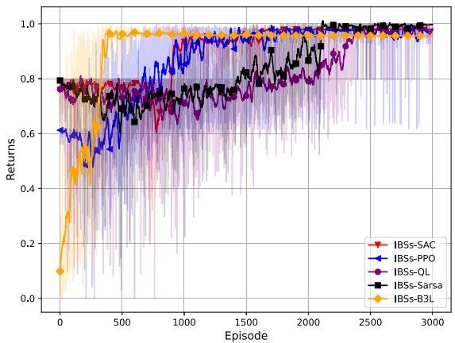  
Fig. 2. Return curve of different algorithms.

Initially, we examine the IBSs-DO algorithm’s performance with the UAV’s starting position fixed in a specified region, analyzing its optimal flight trajectories and corresponding IBS deployment strategies (Sections VI-A, VI-B). Section VI-C presents IBS deployment results under varying trajectory starting points, with UAVs originating from arbitrary regions along specified directions. IBSs-DO involves two sequential stages: RL-based optimal UAV path planning, followed by optimal deployment strategy determination.

## A. Optimal Trajectory Training

Under a specific IBS deployment strategy $L _ { \mathrm { b s } } .$ , Fig. 2 shows reward values from 3000 training episodes for five algorithms optimizing UAV flight strategies (all curves use identical smoothing). Curves ‘IBSs-SAC’, ‘IBSs-PPO’, ‘IBSs-QL’, ‘IBSs-Sarsa’, and ‘IBSs-B3L’ correspond to training results of SAC, PPO, Q-learning, Sarsa, and B3L architectures, respectively, with all converging successfully. To ensure convergence across algorithms, reward function weights $\omega _ { 1 }$ and $\omega _ { 2 }$ are adjusted, and all reward curves are normalized to [0,1] for uniform comparison. RL algorithms like SAC, which incorporate long-term rewards via discount factor γ in Q-value-based state-action evaluation, converge slower than B3L. B3L’s evaluation mechanism lacks such foresight, enabling faster convergence when pursuing optimal paths—differences reflected in subsequent UAV path selection.

The optimal flight strategy of UAV is influenced by the deployment strategy of IBSs. This study documents the training processes of IBSs-DO algorithms following each adjustment of the IBSs deployment strategy, with the corresponding reward curves illustrated in Fig. 3. This result indicates that the training processes for the optimal paths of UAV converge after each deployment $L _ { \mathrm { b s } }$ . Such findings provide a foundational basis for subsequent comparisons of the advantages and disadvantages of different IBSs deployment strategies.

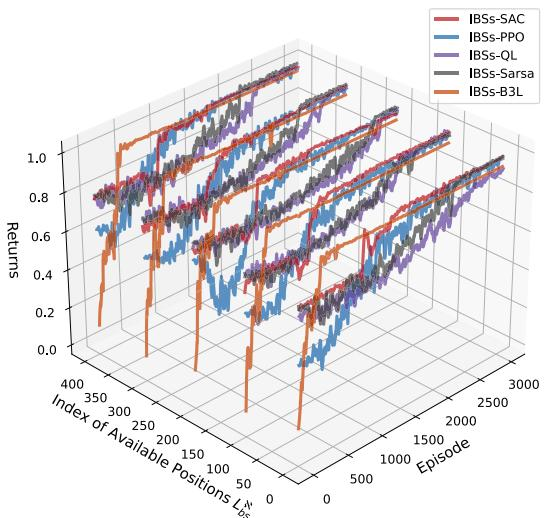

Fig. 3. Return curve with different IBSs deployment.  
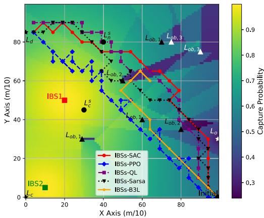  
Fig. 4. Capture probabilities of UAV trajectories under interference from Two IBSs.

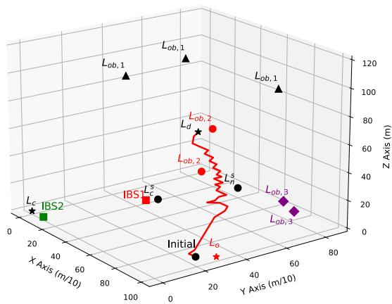  
Fig. 5. UAV trajectory (3D) under IBSs-SAC algorithm.

The Fig. 4 illustrates the flight trajectories of the UAV trained using these algorithms under complex interference environment with specific IBSs deployment strategy. In the figure, deeper colors indicate a lower probability of UAV captured, revealing significant navigation and communication interference near the jammers IBS1 and IBS2. Additionally, obstacles obstruct both the communication and navigation signals, exacerbating the interference. It is important to note that, when plotting the capture probability diagram, we assume that the main lobe of the IBSs radiates simultaneously in every direction. This assumption diverges from the directional radiation observed in actual simulation experiments, but it serves the purpose of illustrating the overall differences in UAV flight strategies. Thus, Fig. 4 comprehensively depicts the impact of interference signals on the communication and navigation performance of UAV in a complex propagation environment. IBSs-SAC, IBSs-QLearning, and IBSs-Sarsa effectively train the UAV to pursue paths minimizing capture probability while adjusting dynamically to evade subsequent stronger interference. In contrast, IBSs-PPO adopts a more direct flight strategy with lower sensitivity to interception risk. The two IBSs-B3L flight strategies, however, suffer from local optimality—stagnating in regions of low capture probability without escape. The variations in the probability of UAV captured along the path are illustrated in Fig. 6. Considering both the algorithm’s training process and the UAV’s flight trajectories, it can be concluded that the UAV possesses the ability to plan optimal flight paths. Furthermore, only the 3D obstacle-avoidance flight trajectory of the UAV under the IBSs-SAC algorithm is presented herein, as illustrated in Fig. 5.

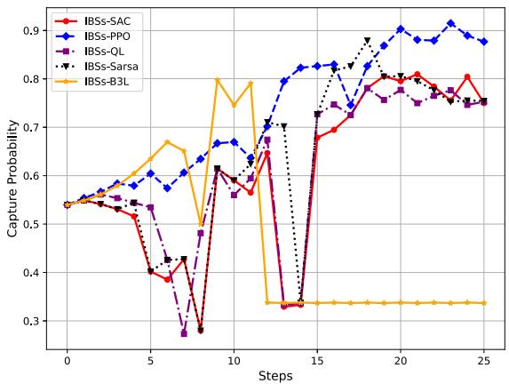  
Fig. 6. Capture probability with UAV flight trajectory.

Fig. 6 shows the UAV’s capture probability variation along its flight path (Fig. 4) under fixed IBSs deployment, while Fig. 7 presents average capture probability statistics across 400 IBSs deployments. In Fig. 6, all algorithms exhibit increasing capture probabilities as the UAV nears its destination, mirroring rising interference intensity. In Fig. 7, capture probabilities follow a sinusoidal cycle—attributed to repeated X-axis placement of one IBS during deployment adjustments. Notably, varying extrema of these curves reflect trajectory adaptations under different IBSs deployments. The outliers in IBSs-B3L correspond to entrapment in local minima of capture probability, as seen in Fig. 4 and 6. Combining Fig. 6 and 7 reveals stark differences in capture probabilities across algorithms. Results confirm that IBSs-SAC outperforms others, achieving the lowest overall capture probability while ensuring destination arrival—attributed to its entropy-driven exploration-exploitation balance and the training stability of the Actor-Critic framework.

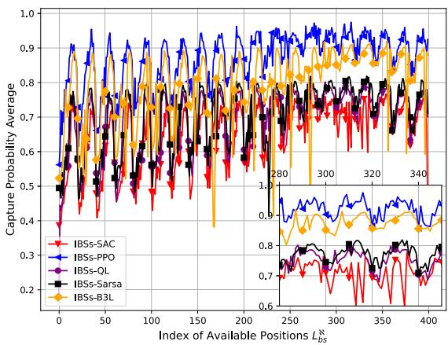  
Fig. 7. Capture probability average with different IBSs deployment.

Overall, five algorithms are used for UAV optimal path planning under navigation and communication interference. Their varying performance leads to differences in optimal paths, which in turn affect the optimal IBSs deployment strategy. Thus, only by selecting the IBSs-SAC flight strategy—with the lowest capture probability—can the UAV’s NE strategy be ensured. Moreover, the expected capture probability curves in Fig. 7 show that no two UAV paths exhibit identical capture probabilities under specific IBSs deployments, corroborating the NE uniqueness analysis in Section IV-B.

## B. IBSs Deployment Optimization

In the process of UAV interference by IBSs, the adjustment of the interference signal’s direction causes sidelobe signals to impact the navigation and communication performance of supportive devices. This section will demonstrate the performance degradation of supportive devices and analyze the influence of IBSs deployment strategies on comprehensive performance, including the effects on supportive devices and the probability of UAV captured. Based on this, the optimal IBSs deployment scheme will be determined.

Section VI-A examines UAV’s probability of being captured; this section expands on how IBSs deployment strategies affect supportive devices’ communication and navigation performance. Figure 8 synthesizes the comprehensive metrics for three performance parameters in (14): UAV’s probability of being captured, supportive devices’ normalized communication rate, and navigation SINR. Notably, incorporating supportive device performance parameters disrupts the sinusoidal variation of UAV’s probability of being captured, elevating the comprehensive index within the 200-350 range. Moreover, IBSs-SAC’s comprehensive performance curve shows a greater elevation than other algorithms, reflecting its lower interference impact on supportive devices. The IBSs deployment strategy corresponding to the maximum comprehensive index ensures both the highest UAV’s probability of being captured and optimal supportive device performance. This aligns with Section IV-B’s theoretical analysis and Theorem 2, confirming that optimizing IBSs deployment under the UAV’s optimal trajectory yields a NE solution.

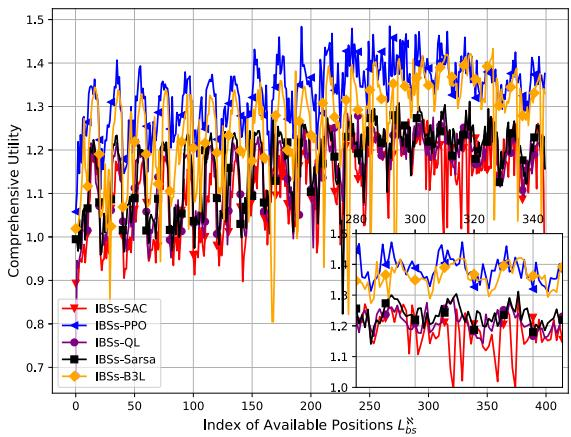  
Fig. 8. Comprehensive interference performance with different IBSs deployment.

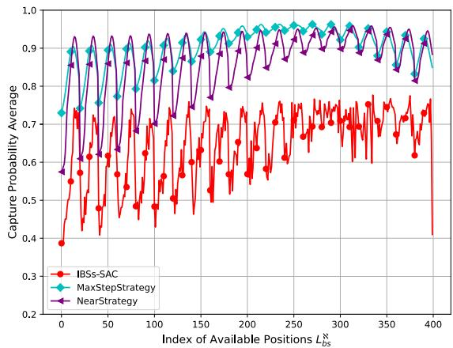  
Fig. 9. Capture probability with different flight strategy.

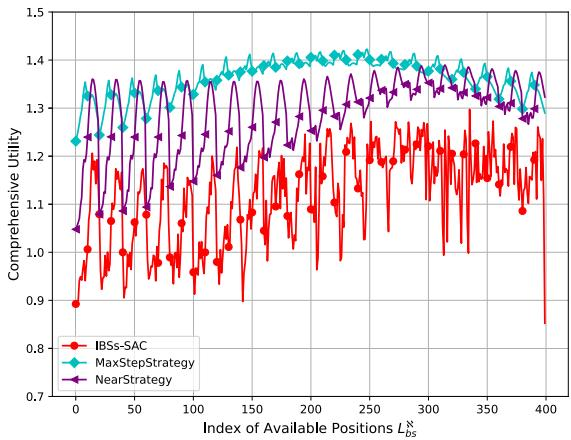  
Fig. 10. Comprehensive interference performance with different flight strategy.

Figure 9 and 10 respectively illustrate the capture probability and comprehensive interference performance under different IBSs deployments $L _ { \mathrm { b s } } ^ { \aleph }$ for both the IBSs-SAC algorithm and normalized strategies (maximum-step and nearest).

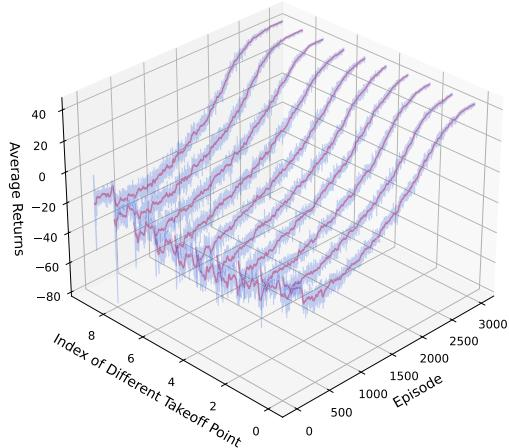  
Fig. 11. Return curve of different UAV origin.

In Fig. 9, among the capture probability curves for the three strategies, the ‘MaxStep’ and ‘Near’ strategy exhibits the highest risk of captured, whereas the IBSs-SAC strategies show lowest captured probabilities. This subtle difference arises from the IBSs-SAC algorithm’s capability to optimize the UAV flight trajectory by seeking paths with minimal capture probability. In Fig. 10, the IBSs-SAC strategy demonstrates superior performance in balancing interference from supportive devices and UAVs, further underscoring the significance of optimal UAV path planning for determining effective IBSs deployment strategies. Based on the interference performance curve in Fig. 8 and 10 obtained through the IBSs-SAC flight strategy, the maximum values are identified at 335, i.e. y-axis indices of 800 and 750m. Combined with the x-axis coordinates of 100m and 200m from the simulation setup, the optimal deployment strategy for the two IBSs is determined as (100, 800) m and (200, 750) m, respectively.

Section VI-A experimentally shows that the IBSs-SAC algorithm yields the unique optimal UAV flight strategy, with Section VI-B solving for its uniquely corresponding optimal deployment strategy. These experiments effectively validate the existence and uniqueness of the NE strategy, confirming the accuracy of the theoretical analysis in Section IV. Moreover, the findings demonstrate that searching for the optimal IBSs deployment strategy within the UAV’s ideal path is a reliable approach—effectively maximizing interference along the UAV’s trajectory while minimizing disruptions to supportive equipment. The training process exhibits stable convergence even without proven uniqueness of NE strategies, enabled by a constrained disturbance environment, a tailored state space, and a targeted reward function that collectively drive UAVs to consistent near-optimal paths.

## C. IBSs Deployment Under Specific Direction

Beyond the aforementioned performance tests with 400 IBSs deployments under a fixed UAV takeoff point, this section evaluates 10 distinct takeoff points to determine the optimal deployment strategy for specific directions. UAV starting points are initialized by segmenting the 1000-meter y-axis range at 100-meter intervals, with the x-axis fixed at

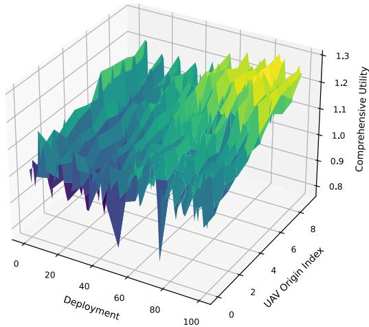

Fig. 12. Comprehensive performance of 100 deployments with different UAV origin.  
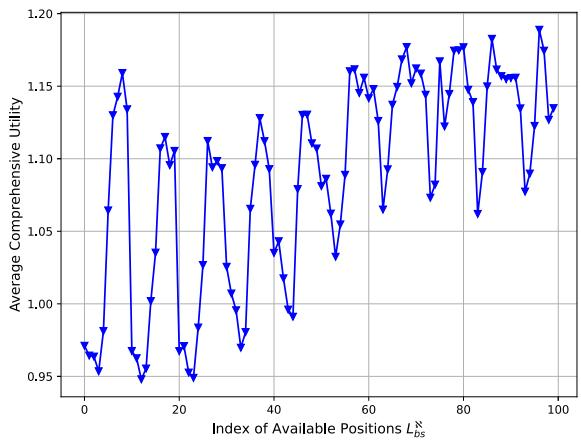  
Fig. 13. Comprehensive performance average of 100 deployments.

1000 meters, yielding ten unique takeoff positions. Fig. 11 presents the return curves generated by the IBSs-SAC algorithm for optimizing UAV paths in a specific direction across these ten takeoff points. It should be noted that the expected return represents the mean value of the training return curves across all IBSs deployments $L _ { \mathrm { b s } } ^ { \aleph }$ . The results indicate that all training processes under different scenario initializations converge successfully.

In solving for the equilibrium strategy of IBSs deployment, we calculate comprehensive internal and external interference metrics based on the obtained UAV tracking capabilities. For IBSs deployment, the y-axis coordinates of the two IBSs are set at 100-meter intervals, resulting in 100 deployment strategies and a $1 0 0 \times 1 0$ comprehensive metric table, with corresponding values illustrated in Fig. 12. Along the dimension of IBSs deployment strategies, the comprehensive metric values exhibit sinusoidal oscillations with varying peaks. Along the UAV takeoff point dimension, the performance of comprehensive metrics shows extreme values, stemming from significant interference exerted by IBSs on supportive devices along the UAV’s optimal path. To determine the optimal IBSs deployment strategy for a specific direction, we compute the mean across the UAV takeoff point dimension, yielding the comprehensive metric curve in Fig. 13. Notably, different

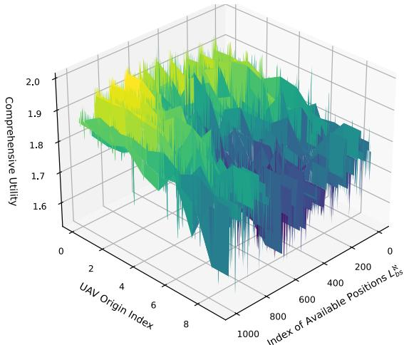

Fig. 14. Comprehensive performance of 1000 deployments with different UAV origin.  
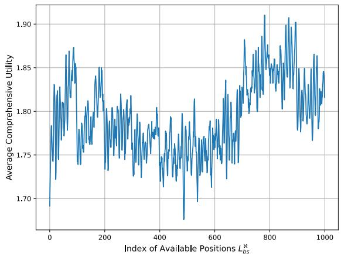  
Fig. 15. Comprehensive performance average of 1000 deployments.

IBSs deployment strategies induce substantial variations in the comprehensive interference metrics for UAV and supportive devices in the specified direction, highlighting the necessity of solving for the optimal IBSs deployment strategy. By comparing these comprehensive interference metrics, the optimal y-axis coordinates for the two IBSs are determined as 900 and 600 meters. Given fixed x-axis coordinates, the optimal IBSs deployment strategy is identified as (100, 900) meters and (200, 600) meters.

We further optimize the deployment of three IBSs (J = 3). Fig. 14 presents 10 × 1000-dimensional comprehensive performance index results, and Fig. 15 shows expected results under the takeoff point dimension. Increasing the number of IBSs enhances volatility in the original sinusoidal variation curve of comprehensive index values, while raising the peak of comprehensive interference performance. The optimal IBS deployment positions, determined by maximum comprehensive performance indices, are (400,700), (100,800), and (200,100) meters.

Taken together, the IBSs-DO algorithm effectively solves the multi-IBS deployment optimization problem in P1, with its derived strategy balancing UAV interference and impacts on supportive equipment. Experimental data confirm that the optimal deployment strategy under the $\mathrm { U A V } \mathbf { \hat { s } }$ optimal trajectory is both existent and unique, validating the paper’s analysis of NE strategy characteristics.

## VII. CONCLUSION

This study focuses on optimizing IBSs deployment strategies targeting malicious UAVs originating from specific regions and directions, addressing the issue from two perspectives: internal interference conflicts affecting supportive devices and external conflicts that disrupt UAV operations. The comprehensive interference effects of IBSs deployment can be formulated as an exact potential game $\mathcal { G } _ { 1 }$ , thereby proving the existence of an equilibrium IBSs deployment strategy. A NE exists in the game $\mathcal { G } _ { 2 }$ between IBSs deployment and UAV path selection, indicating that the IBSs deployment strategy obtained under the $\mathrm { U A V } \mathbf { \hat { s } }$ optimal flight path is indeed equilibrium. Simulations and comparative experiments demonstrate that the IBSs deployment strategy derived from the IBSs-DO algorithm yields an optimal set of deployment positions. This strategy maximizes the UAV’s probability of being captured along its flight trajectory while optimizing the communication and navigation performance of supportive devices, further validating the existence and uniqueness of the NE strategy.

While IBSs deployment incurs location migration costs, it offers significant practical value for enhancing regional protection and disrupting hostile UAV communication/navigation. Compared to traditional methods like physical interception and spectrum control, location deployment strategies demonstrate unique advantages in flexibility and adaptability—particularly for multi-target collaborative management in complex dynamic environments.

## REFERENCES

[1] Z. Haiwang and W. Jing, “Design and implementation of anti-UAV system based on satellite navigation interference,” in Proc. IEEE 6th Inf. Technol. Mechatronics Eng. Conf. (ITOEC), Chongqing, China, Mar. 2022, pp. 1226–1230, doi: 10.1109/ITOEC53115.2022.9734358.

[2] A. Ahmad, S. AlAmeri, Y. Ibrahim, and H. A. Marzouqi, “A machine learning approach for detecting unauthorized drone operators,” in Proc. Adv. Sci. Eng. Technol. Int. Conf. (ASET), Dubai, United Arab Emirates, Feb. 2023, pp. 1–6, doi: 10.1109/ASET56582.2023.10180485.

[3] H. Xu and F. Chen, “Design of civil UAV counter system based on BDS,” in Proc. 4th Int. Conf. Mech., Control Comput. Eng. (ICMCCE), Hohhot, China, Oct. 2019, pp. 578–5784, doi: 10.1109/ ICMCCE48743.2019.00133.

[4] Z. Yu, Z. Wang, J. Yu, D. Liu, H. Herbert Song, and Z. Li, “Cybersecurity of unmanned aerial vehicles: A survey,” IEEE Aerosp. Electron. Syst. Mag., vol. 39, no. 9, pp. 182–215, Sep. 2024, doi: 10.1109/MAES.2023.3318226.

[5] U. Saeed et al., “Software-defined radio-based contactless localization for diverse human activity recognition,” IEEE Sensors J., vol. 23, no. 11, pp. 12041–12048, Jun. 2023, doi: 10.1109/JSEN.2023.3265867.

[6] Z. Yu, H. Gao, X. Cong, N. Wu, and H. H. Song, “A survey on cyber–physical systems security,” IEEE Internet Things J., vol. 10, no. 24, pp. 21670–21686, Dec. 2023, doi: 10.1109/JIOT.2023.3289625.

[7] X. Ma, M. Gao, Y. Zhao, and M. Yu, “A novel navigation spoofing algorithm for UAV based on GPS/INS-integrated navigation,” IEEE Trans. Veh. Technol., vol. 73, no. 10, pp. 15424–15439, Oct. 2024, doi: 10.1109/TVT.2024.3401856.

[8] A. Eldosouky, A. Ferdowsi, and W. Saad, “Drones in distress: A gametheoretic countermeasure for protecting UAVs against GPS spoofing,” IEEE Internet Things J., vol. 7, no. 4, pp. 2840–2854, Apr. 2020, doi: 10.1109/JIOT.2019.2963337.

[9] L. Xiao, C. Xie, M. Min, and W. Zhuang, “User-centric view of unmanned aerial vehicle transmission against smart attacks,” IEEE Trans. Veh. Technol., vol. 67, no. 4, pp. 3420–3430, Apr. 2018, doi: 10.1109/TVT.2017.2785414.

[10] C. Fan, H. Liu, B. Li, C. Zhao, and S. Mao, “Adversarial game against hybrid attacks in UAV communications with partial information,” IEEE Trans. Veh. Technol., vol. 71, no. 2, pp. 2204–2208, Feb. 2022, doi: 10.1109/TVT.2021.3132934.

[11] Z. Lv, L. Xiao, Y. Du, G. Niu, C. Xing, and W. Xu, “Multiagent reinforcement learning based UAV swarm communications against jamming,” IEEE Trans. Wireless Commun., vol. 22, no. 12, pp. 9063–9075, Dec. 2023, doi: 10.1109/TWC.2023.3268082.

[12] C. Han, A. Liu, K. An, G. Zheng, and X. Tong, “Distributed UAV deployment in hostile environment: A game-theoretic approach,” IEEE Wireless Commun. Lett., vol. 11, no. 1, pp. 126–130, Jan. 2022, doi: 10.1109/LWC.2021.3122127.

[13] S. Fu, X. Feng, A. Sultana, and L. Zhao, “Joint power allocation and 3D deployment for UAV-BSs: A game theory based deep reinforcement learning approach,” IEEE Trans. Wireless Commun., vol. 23, no. 1, pp. 736–748, Jan. 2024, doi: 10.1109/TWC.2023.3281812.

[14] T. Haarnoja, A. Zhou, P. Abbeel, and S. Levine, “Soft actor-critic: Offpolicy maximum entropy deep reinforcement learning with a stochastic actor,” in Proc. Int. Conf. Mach. Learn., Jul. 2018, pp. 1861–1870. [Online]. Available: https://proceedings.mlr.press/v80/haarnoja18b

[15] Z. Yin, Y. Lin, Y. Zhang, Y. Qian, F. Shu, and J. Li, “Collaborative multiagent reinforcement learning aided resource allocation for UAV anti-jamming communication,” IEEE Internet Things J., vol. 9, no. 23, pp. 23995–24008, Dec. 2022, doi: 10.1109/JIOT.2022.3188833.

[16] J. Schulman, F. Wolski, P. Dhariwal, A. Radford, and O. Klimov, “Proximal policy optimization algorithms,” 2017, arXiv:1707.06347.

[17] G. Arslan, J. R. Marden, and J. S. Shamma, “Autonomous vehicle-target assignment: A game-theoretical formulation,” J. Dyn. Syst., Meas., Control, vol. 129, no. 5, pp. 584–596, Apr. 2007, doi: 10.1115/1.2766722.

[18] P. Li and H. Duan, “A potential game approach to multiple UAV cooperative search and surveillance,” Aerosp. Sci. Technol., vol. 68, pp. 403–415, Sep. 2017, doi: 10.1016/j.ast.2017.05.031.

[19] I. Valiulahi and C. Masouros, “Multi-UAV deployment for throughput maximization in the presence of co-channel interference,” IEEE Internet Things J., vol. 8, no. 5, pp. 3605–3618, Mar. 2021, doi: 10.1109/ JIOT.2020.3023010.

[20] Y. Aydin, G. K. Kurt, E. Ozdemir, and H. Yanikomeroglu, “Group handover for drone base stations,” IEEE Internet Things J., vol. 8, no. 18, pp. 13876–13887, Sep. 2021, doi: 10.1109/JIOT.2021.3068297.

[21] L. Wang, H. Zhang, S. Guo, and D. Yuan, “3D UAV deployment in multi-UAV networks with statistical user position information,” IEEE Commun. Lett., vol. 26, no. 6, pp. 1363–1367, Jun. 2022, doi: 10.1109/ LCOMM.2022.3161382.

[22] M. E. Mkiramweni, C. Yang, J. Li, and W. Zhang, “A survey of game theory in unmanned aerial vehicles communications,” IEEE Commun. Surveys Tuts., vol. 21, no. 4, pp. 3386–3416, 4th Quart., 2019, doi: 10.1109/COMST.2019.2919613.

[23] H. E. Hammouti, D. Hamza, B. Shihada, M.-S. Alouini, and J. S. Shamma, “The optimal and the greedy: Drone association and positioning schemes for Internet of UAVs,” IEEE Internet Things J., vol. 8, no. 18, pp. 14066–14079, Sep. 2021, doi: 10.1109/JIOT.2021.3070209.

[24] V. Mittal, H. Tabassum, and E. Hossain, “Deployment cost-aware UAV and BS collaboration in cell-free integrated aerial-terrestrial networks,” IEEE Trans. Mobile Comput., vol. 23, no. 8, pp. 8033–8049, Aug. 2024, doi: 10.1109/TMC.2023.3341809.

[25] M. S. Hossain and Z. Becvar, “Soft frequency reuse with allocation of resource plans based on machine learning in the networks with flying base stations,” IEEE Access, vol. 9, pp. 104887–104903, 2021, doi: 10.1109/ACCESS.2021.3099535.

[26] X. Gong, T. Su, W. Zhao, K. Chi, Y. Yang, and C. Yao, “A potential game approach to multi-UAV accurate coverage based on deterministic radio wave propagation model in urban area,” IEEE Access, vol. 11, pp. 68560–68568, 2023, doi: 10.1109/ACCESS.2023. 3292127.

[27] H. Duan, J. Zhao, Y. Deng, Y. Shi, and X. Ding, “Dynamic discrete pigeon-inspired optimization for multi-UAV cooperative search-attack mission planning,” IEEE Trans. Aerosp. Electron. Syst., vol. 57, no. 1, pp. 706–720, Feb. 2021, doi: 10.1109/TAES.2020.3029624.

[28] Q. Zeng, Y. Jia, C. Li, and L. Liu, “3-D deployment of UAV-BSs for effective communication coverage,” IEEE Internet Things J., vol. 11, no. 14, pp. 25162–25172, Jul. 2024, doi: 10.1109/JIOT.2024.3392950.

[29] Z. Han, D. Niyato, W. Saad, T. BaS¸ ar, and A. Hjørungnes, Game Theory in Wireless and Communication Networks. Cambridge, U.K.: Cambridge Univ. Press, 2011.

[30] A. Sanjab, W. Saad, and T. Basar, “A game of drones: Cyberphysical security of time-critical UAV applications with cumulative prospect theory perceptions and valuations,” IEEE Trans. Commun., vol. 68, no. 11, pp. 6990–7006, Nov. 2020, doi: 10.1109/TCOMM.2020. 3010289.

[31] A. Sanjab, W. Saad, and T. Basar, “Prospect theory for enhanced cyberphysical security of drone delivery systems: A network interdiction game,” in Proc. IEEE Int. Conf. Commun. (ICC), Paris, France, May 2017, pp. 1–6, doi: 10.1109/ICC.2017.7996862.

[32] M. Nikooroo and Z. Becvar, “Optimal positioning of flying base stations and transmission power allocation in NOMA networks,” IEEE Trans. Wireless Commun., vol. 21, no. 2, pp. 1319–1334, Feb. 2022, doi: 10.1109/TWC.2021.3103639.

[33] A. B. M. Adam, M. S. A. Muthanna, A. Muthanna, T. N. Nguyen, and A. A. A. El-Latif, “Toward smart traffic management with 3D placement optimization in UAV-assisted NOMA IIoT networks,” IEEE Trans. Intell. Transp. Syst., vol. 24, no. 12, pp. 15448–15458, Dec. 2023, doi: 10.1109/TITS.2022.3182651.

[34] Z. Xia et al., “Multi-agent reinforcement learning aided intelligent UAV swarm for target tracking,” IEEE Trans. Veh. Technol., vol. 71, no. 1, pp. 931–945, Jan. 2022, doi: 10.1109/TVT.2021.3129504.

[35] G.-B. Huang, “Learning capability and storage capacity of two-hiddenlayer feedforward networks,” IEEE Trans. Neural Netw., vol. 14, no. 2, pp. 274–281, Mar. 2003, doi: 10.1109/TNN.2003.809401.