# Generative Radio Map-Assisted Channel Estimation in Low-Altitude Economy

Bin Yang , Graduate Student Member, IEEE, Wei Wang , Senior Member, IEEE, Weizheng Zhang , Member, IEEE, and Wei Zhang , Fellow, IEEE

Abstract—The low-altitude economy (LAE) is inherently dependent on unmanned aerial vehicles (UAVs) as its core operational infrastructure, with applications spanning logistics, surveillance, and smart city development. Despite growing attention, LAE’s practical deployment faces substantial obstacles, particularly in maintaining reliable UAV operations. These UAVs require secure and efficient wireless communication services delivered by base stations (BSs), yet their high mobility, combined with multipath effects, creates significant channel estimation challenges that threaten the seamless connectivity. According to the fixed airspace and planned routes characteristics of LAE scenarios, in this paper we construct the radio map to assist channel estimation using sensing information. First, a grid-based UAV channel measurement scheme is proposed to collect CSI data labeled with discrete locations and velocities. Then, a new generative adversarial network (GAN)-based model named continuous vector-conditioned GAN (CVCGAN) is developed to complete the discrete map by establishing the mapping from continuous sensing information to their channel space. After that, an integrator is designed to fuse the channel state information (CSI) provided by radio map with that estimated by pilots. Simulation results validate the superiority of the proposed method, which outperforms state-of-the-art (SOTA) approaches including ChannelNet, conditional GAN (CGAN), RadioUNet and long short-term memory (LSTM).

Index Terms—Channel estimation, GAN, LAE, radio map, UAV.

## I. INTRODUCTION

N RECENT years, there has been a growing demand for aerial services such as logistics and transportation, envi  
ronmental monitoring, and emergency rescue [1]. In addition,   
advancements in technology particularly in unmanned aerial ve  
hicles (UAVs) [2], wireless communications and sensing [3], and   
artificial intelligence (AI), have propelled the concept of low  
altitude economy (LAE) into the spotlight. As a new economic   
form, LAE refers to various flying activities creating commercial   
and social values conducted at altitudes below 1,000 meters [4].

At present, governments worldwide have published a series of policies to support and promote the development of LAE. In the United States, the Federal Aviation Administration (FAA) has developed the Low Altitude Authorization and Notification Capability (LAANC) [5] to enable the safe and efficient operation of small unmanned aerial systems within controlled airspace at altitudes below 400 feet (121.92 meters). In China, the Civil Aviation Administration of China (CAAC) has revised more than 30 civil aviation regulations according to the guiding opinions on promoting the development of the general aviation industry [6]. In Europe, the European Union Aviation Safety Agency (EASA) has launched the U-space [7] project to manage drone traffic in European airspace using connectivity and information services.

## A. Difficulties and Challenges

Despite the growing interest in LAE, the practical deployment faces significant challenges. To be specific, the safe flight and mission implementation of UAVs rely on high-speed and reliable wireless communication services provided by base stations (BSs) [8]. Therefore, BSs need accurate downlink channel state information (CSI) of UAVs for beamforming to enhance the received signal strength while reducing the interference [9]. However, accurate channel estimation for UAVs is challenging due to the following aspects. The high mobility of UAVs introduces Doppler shifts, resulting in a rapidly time-varying channel. Additionally, in the scenarios of LAE, urban high-rise buildings contribute to multipath effects in UAV communications, causing frequency-selective fading. Furthermore, the interaction of multipath effects and Doppler shifts induces Doppler spread, leading to time-selective fading. The fading that is both frequency- and time-selective is also known as doubly selective fading [10], which causes rapid variations of the channel across both time and frequency domains.

A commonly adopted strategy to address the problem of doubly selective fading is the insertion of dense pilots in both the time and frequency domains. In time-division duplex (TDD) systems, pilots are inserted into the uplink for channel estimation at the BS. However, the assumption of uplink-downlink channel reciprocity no longer holds due to channel aging [11] issue in high mobility scenarios. In frequency-division duplex (FDD) systems, pilots are transmitted in the downlink. The user equipment (UE) needs to estimate the downlink CSI and then send feedback via the uplink [12]. In multiple-input multiple-output (MIMO) [13] systems, multiple antennas are required to transmit pilots in separate time-frequency resources, which increases the pilot overhead in the spatial domain [14]. The need for pilots in space, time and frequency dimensions makes the pilot overhead unbearable for data transmission.

## B. Related Works and Limitations

Classical channel estimation methods include least squares (LS) [15], minimum mean-square error (MMSE) [16], linear MMSE (LMMSE) [17], which are widely used in current wireless communications. These traditional methods are simple to implement, but their performance heavily depends on the number of pilots. Compressed sensing [18], [19] can achieve higher estimation accuracy with limited pilots by utilizing the sparsity of channels. Classical CS-based algorithms include the basis pursuit (BP) [20], subspace pursuit (SP) [21], and orthogonal matching pursuit (OMP) [22]. However, the underlying theory of these CS-based algorithms is established under some ideal assumptions, e.g., sparsity known a priori and discrete support. Bayesian learning-enhanced methods relax these idealized assumptions by placing probabilistic sparsity priors on the channel. In [23], a sparsifying dictionary is first learned via batchdelayed online learning to address dictionary mismatch issues. Then Bayesian CS-aided channel estimation is performed on the learned basis for hybrid near- and far-field THz ultra-massive MIMO. The proposed approach shows significant improvement and rapid convergence in channel estimation.

With the development of AI and its successful applications in various fields, neural networks have been applied to channel estimation, achieving remarkable progress in this area [24]. In [25], a deep neural network (DNN) is utilized for channel estimation and signal detection. An end-to-end approach is applied to estimate CSI implicitly and recover the transmitted symbols directly. However, the high dimensionality of the channel leads to an excessive number of neural network parameters. In [26], a pipeline named ChannelNet is proposed which is composed of a super-resolution convolutional neural network (SRCNN) and a denoising CNN (DnCNN). The main idea is to treat the channel estimated by pilots as a low-resolution image and use CNN to reconstruct the high-resolution image and perform denoising, thereby achieving accurate channel estimation. In [27], a combination of DNN and long short-term memory (LSTM) is designed for channel estimation and tracking in UAV communication systems.

Recently, AI-generated content (AIGC) [31] has attracted significant attention, and generative models such as generative adversarial networks (GANs) [32] have also been applied to channel estimation. In [28], GAN is employed to establish a mapping from a low dimensional space to a high dimensional channel space. Then, the input vector is optimized to generate the estimated CSI. Leveraging the powerful generative capabilities of GANs, this method can well characterize complex and dynamic channels. In [29], a conditional GAN (CGAN) [33] is developed by taking received signals and pilots as conditional input. It is worth noting that the large language model (LLM) is also applied for channel prediction and demonstrates excellent performance [30].

## C. Contributions and Paper Organization

In the scenarios of LAE, fixed areas (i.e., air corridors [34]) are generally assigned for UAVs accounting for safety and management reasons. Besides, UAVs are required to follow the planned routes, with most segments being straight considering energy constraints. These features make it possible to build radio maps [35] for LAE scenarios. Radio map is a promising technology that connects the UE’s location with its CSI [36], [37]. In this paper, we introduce velocity information into the radio map and extend its application from static scenarios to high mobility scenarios. Specifically, we propose a scheme for grid-based partitioning of the air corridor, where UAVs conduct channel measurements at various speeds within each grid. This approach yields the discrete radio map containing the channel data labeled with geographic locations and velocities.

Next, since UAVs operate at varying locations and speeds within the assigned area, the measured discrete radio map requires interpolation to ensure completeness. Therefore, we need to establish the mapping from the given continuous vectors consisting of locations and velocities to the channel space. However, the low dimensionality of the input labels limits the amount of information available for accurately reconstructing the complex characteristics of the channel. To address this issue, the generative model GAN is employed due to its satisfactory performance in image generation. In particular, the variant of GAN called CGAN can generate corresponding images with given labels. However, CGAN only supports discrete scalar labels, which is not applicable for continuous vector labels. Therefore, we develop continuous vector-conditioned GAN (CVCGAN) by improving CGAN in two aspects. On the one hand, a pre-trained estimator is introduced to estimate the UAV’s location and velocity based on its CSI. The estimator was trained on the data collected in the previous step and is then used in the adversarial training to predict the location and velocity of the generated CSI. On the other hand, we customize the generator’s loss function by adding a mean squared error (MSE) term between the given labels of the generator and the estimator’s predicted labels. These modifications require the generator not only to produce realistic CSI to deceive the discriminator but also closely aligned with the given labels to challenge the estimator.

After obtaining the seamless radio map, CSI can be generated based on the location and velocity information from the UAV’s global positioning system (GPS) and speed sensor. The generated CSI closely resembles the real CSI and aligns with the channel distribution corresponding to the specified position and velocity. Therefore, the generated CSI and the sample to be estimated are identically distributed to some extent. By integrating the prior information provided by radio map and the sample observations from the pilots, a posterior estimation of the channel can be achieved. To facilitate this estimation, an integrator is designed to fuse the CSI generated by radio map with that estimated by pilots for accurate channel estimation.

TABLE I  
THE COMPARISON OF THE KEY CONSIDERATIONS IN OUR RADIO MAP WITH RELATED WORKS
<table><tr><td>Key considerations</td><td>Classical methods [15]-[17]</td><td>CS, Bayesian learning [20]–[23]</td><td>Common neural networks [25]–[27]</td><td>Generative AI [28]-[30]</td><td>Our radio map</td></tr><tr><td>Robust to pilot contamination</td><td>x</td><td>x</td><td>√</td><td>√</td><td>√</td></tr><tr><td>No sparsity assumption required</td><td>√</td><td>x</td><td>√</td><td>√</td><td>√</td></tr><tr><td>Robust to doubly selective fading</td><td>x</td><td>√</td><td>√</td><td>√</td><td>√</td></tr><tr><td>Robust under low pilot overhead</td><td>x</td><td>√</td><td>x</td><td>√</td><td>√</td></tr><tr><td>Exploit sensing information</td><td>x</td><td>x</td><td>x</td><td>x</td><td>√</td></tr></table>

The key considerations of this paper are compared in Table I, and contributions are summarized as follows.

\- We analyze the characteristics of the LAE scenarios and propose a grid-based UAV channel measurement scheme to collect CSI data labeled with discrete locations and velocities.

\- We develop a new GAN-based model named CVCGAN to complete the discrete radio map. The generator is trained by competing with the discriminator and a pre-trained estimator to produce realistic CSI with given continuous vector labels.

\- We design an integrator to fuse the prior information obtained from the generator with the CSI estimated by pilots to perform radio map-assisted channel estimation.

We validate the performance of the proposed method through numerical simulations. The results demonstrate that the designed CVCGAN can effectively generate realistic channels with given labels. The integrator significantly improves channel estimation performance, outperforming state-of-the-art (SOTA) approaches including Channel-Net [26], CGAN [29], RadioUNet [38] and LSTM [27].

The remainder of the paper is organized as follows. In Section II, the system model of channel estimation in LAE scenarios is presented. In Section III, the grid-based UAV channel measurement scheme is proposed for discrete radio map. In Section IV, CVCGAN is proposed to complete the discrete radio map. In Section V, an integrator is designed to fuse the CSI provided by radio map with that estimated by pilots. In Section VI, numerical simulations and results are given. Analysis and discussion are provided in Section VII, followed by conclusions in Section VIII.

Notations: a, a and A represent a scalar, a vector, and a matrix, respectively. $( \cdot ) ^ { * }$ and $( \cdot ) ^ { T } , ( \cdot ) ^ { H }$ represent conjugate, transpose and conjugate transpose operations, respectively. ${ \mathcal { N } } ( \mu , \sigma ^ { 2 } )$ represents Gaussian distribution with the mean $\mu$ and the standard deviation $\sigma . \mathcal { U } ( a , b )$ denotes uniform distribution from a to b. ⊗ denotes the Kronecker product. || · || denotes the $l _ { 2 }$ (Euclidean) norm. $\nabla$ represents the gradient operator. R and C stand for the set of real and complex numbers, respectively.

## II. SYSTEM MODEL

The scenario of LAE is depicted in Fig. 1, where a BS is responsible for providing wireless communication services for UAVs engaged in various applications such as cargo delivery, aerial taxi, and photography in the assigned areas.

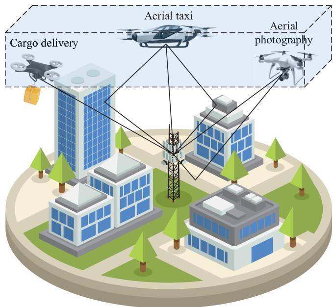  
Fig. 1. The scenario of low-altitude economy.

## A. Motion Model

In practice, the assigned airspace is three-dimensional, encompassing multiple flight levels. For simplicity, a two-dimensional plane is considered in our model. In addition, UAVs are assumed to follow straight routes for energy issues and the routes are parallel to each other to avoid possible collisions. A two-dimensional Cartesian coordinate system is established for the airspace, where the x-axis is aligned with the UAV flight path. The initial location of the UAV is given by $( x _ { 0 } , y _ { 0 } )$ . The UAV’s speed varies over time, with the speed at time t denoted as v t . Therefore, the location of the UAV at time t can be written as

$$
\left\{ \begin{array} { l } { x _ { t } = x _ { 0 } + \int _ { 0 } ^ { t } v ( \tau ) d \tau + n _ { x } } \\ { y _ { t } = y _ { 0 } + n _ { y } } \end{array} \right. ,\tag{1}
$$

where $n _ { x } , n _ { y } \sim \mathcal N ( 0 , \sigma ^ { 2 } )$ are additive Gaussian noise terms accounting for course deviations caused by environmental factors such as wind disturbance.

## B. Channel Model

We consider a multi-input single-output (MISO)-orthogonal frequency division multiplexing (OFDM) communication system in the model. The BS is equipped with a uniform planar array (UPA) consisting of $N _ { t } = N _ { t , x } \times N _ { t , y }$ transmit antennas. UAVs are assumed to be single-antenna due to size, weight, and power (SWaP) constraints. The system bandwidth is denoted by B, and the number of subcarriers is $K$

As shown in Fig. 1, UAV communications are impacted by multipath effects caused by urban high-rise buildings as well as the ground. In addition, each propagation path is also affected by Doppler shifts induced by the UAV’s motion. As a result, the channel exhibits doubly selective fading in both time and frequency domains, which can be modeled by the delay-Doppler response [39] as

$$
\begin{array} { l } { { \displaystyle { \pmb { h } } ( \tau , \nu ) = \sum _ { l = 1 } ^ { L } \sqrt { p _ { l } } \cdot { \bf a } _ { r } ( \theta _ { l } ^ { r } , \phi _ { l } ^ { r } ) \cdot { \bf a } _ { t } ^ { T } ( \theta _ { l } ^ { t } , \phi _ { l } ^ { t } ) \cdot e ^ { j \varphi _ { l } } } } \\ { { \displaystyle \delta ( \tau - \tau _ { l } ) \cdot \delta ( \nu - \nu _ { l } ) } , } \end{array}\tag{2}
$$

where L is the total number of paths, $p _ { l } , \varphi _ { l } , \tau _ { l }$ and $\nu _ { l }$ are the power, phase, delay and Doppler of the l-th path, respectively, $\delta ( \cdot )$ is the Dirac delta function. $\mathbf { a } _ { r } ( \theta _ { l } ^ { r } , \phi _ { l } ^ { r } )$ and $\mathbf { a } _ { t } ( \theta _ { l } ^ { t } , \phi _ { l } ^ { t } )$ are the receive and transmit array responses, respectively. The parameters $\theta _ { l } ^ { r } , \phi _ { l } ^ { r } , \theta _ { l } ^ { t }$ , and $\phi _ { l } ^ { t }$ are the elevation angle of arrival (EAoA), azimuth angle of arrival (AAoA), elevation angle of departure (EAoD), and azimuth angle of departure (AAoD), respectively. In the MISO model, $\mathbf { a } _ { r } = 1$ for single receive antenna, and $\mathbf { a } _ { t } = \mathbf { a } _ { t , x } \otimes \mathbf { a } _ { t , y }$ for UPA transmit antennas, where $\mathbf { a } _ { t , x }$ and $\mathbf { a } _ { t , y }$ are the elemental array response vectors along the x-axis and y-axis with [40]

$$
\mathbf { a } _ { t , x } = \left[ 1 , e ^ { j \frac { 2 \pi d } { \lambda } \sin \theta \cos \phi } , \ldots , e ^ { j \frac { 2 \pi d } { \lambda } \left( N _ { t , x } - 1 \right) \sin \theta \cos \phi } \right] ^ { T } ,\tag{3}
$$

$$
\mathbf { a } _ { t , y } = \left[ 1 , e ^ { j \frac { 2 \pi d } { \lambda } \sin \theta \sin \phi } , \ldots , e ^ { j \frac { 2 \pi d } { \lambda } \left( N _ { t , y } - 1 \right) \sin \theta \sin \phi } \right] ^ { T } .\tag{4}
$$

In the above expressions, d denotes the antenna spacing and λ is the wavelength corresponding to the carrier frequency $f _ { c } ,$ typically with $d = \lambda / 2$ to avoid spatial aliasing. The Doppler shift can be calculated by $\begin{array} { r } { \nu _ { l } = f _ { c } \frac { v _ { l } } { c } } \end{array}$ , where $v _ { l } = v$ sin $\theta _ { l }$ φl is the radial velocity on the l-th path and c is the speed of light.

The delay-Doppler response of (2) can be transformed to its time-variant impulse response as

$$
\begin{array} { l } { { \displaystyle g ( \tau , t ) = \int _ { - \infty } ^ { \infty } h ( \tau , \nu ) \cdot e ^ { j 2 \pi \nu ( t - \tau ) } \mathrm { d } \nu } } \\ { ~ } \\ { { \displaystyle ~ = \sum _ { l = 1 } ^ { L } \sqrt { p _ { l } } \cdot \mathbf { a } _ { r } ( \theta _ { l } ^ { r } , \phi _ { l } ^ { r } ) \cdot \mathbf { a } _ { t } ^ { T } ( \theta _ { l } ^ { t } , \phi _ { l } ^ { t } ) \cdot e ^ { j \varphi _ { l } } } } \\ { { \displaystyle e ^ { j 2 \pi \nu _ { l } ( t - \tau ) } \cdot \delta ( \tau - \tau _ { l } ) } . } \end{array}\tag{5}
$$

Then, the time-frequency response can be obtained by performing the Fourier transform on (5), i.e.,

$$
\begin{array} { l } { { \displaystyle { \cal H } ( f , t ) = \int _ { - \infty } ^ { \infty } g ( \tau , t ) \cdot e ^ { - j 2 \pi f \tau } \mathrm { d } \tau } \ ~ } \\ { { \displaystyle ~ = \sum _ { l = 1 } ^ { L } \sqrt { p _ { l } } \cdot \mathbf { a } _ { r } ( \theta _ { l } ^ { r } , \phi _ { l } ^ { r } ) \cdot \mathbf { a } _ { t } ^ { T } ( \theta _ { l } ^ { t } , \phi _ { l } ^ { t } ) \cdot e ^ { j \varphi _ { l } } } \ ~ } \\ { { \displaystyle ~ e ^ { - j 2 \pi \tau _ { l } f } \cdot e ^ { j 2 \pi \nu _ { l } t } \cdot e ^ { - j 2 \pi \nu _ { l } \tau _ { l } } } , } \end{array}\tag{6}
$$

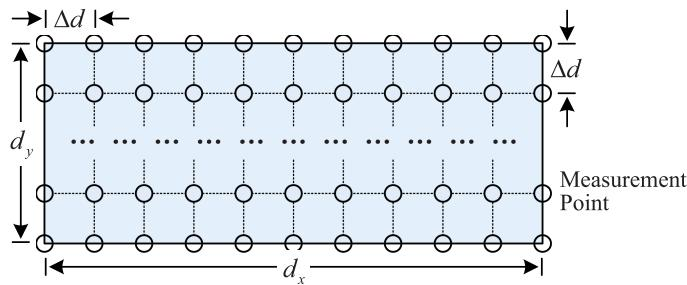  
Fig. 2. The grid-based division for measurement points.

where the term $e ^ { - j 2 \pi \tau _ { l } f }$ represents the frequency-dependent phase rotation induced by the propagation delay, $e ^ { j 2 \pi \nu _ { l } t }$ accounts for the time-varying phase rotation due to the Doppler shift. Notably, the coupling term $e ^ { - j 2 \pi \nu _ { l } \tau _ { l } }$ arises from the joint effect of delay and Doppler, and captures the intrinsic phase distortion introduced during the transformation from the delay-Doppler domain to the time-frequency representation.

To facilitate the implementation of OFDM systems, the continuous time-frequency channel response is discretized along both the frequency and time domains. In this context, it is assumed that the channel remains approximately constant over the duration of a single subcarrier and one OFDM symbol, i.e., within each time-frequency resolution element. Under this assumption, the discretized channel response can be formulated by

$$
\begin{array} { l } { { \displaystyle { \bf H } ( k \Delta f , m T ) = \sum _ { l = 1 } ^ { L } \sqrt { p _ { l } } \cdot { \bf a } _ { r } ( \theta _ { l } ^ { r } , \phi _ { l } ^ { r } ) \cdot { \bf a } _ { t } ^ { T } ( \theta _ { l } ^ { t } , \phi _ { l } ^ { t } ) \cdot e ^ { j \varphi _ { l } } } } \\ { { \displaystyle e ^ { - j 2 \pi \tau _ { l } k \Delta f } \cdot e ^ { j 2 \pi \nu _ { l } m T } \cdot e ^ { - j 2 \pi \nu _ { l } \tau _ { l } } } , } \end{array}\tag{7}
$$

where $\Delta f = B / K$ is the subcarrier spacing, $T = 1 / \Delta f$ is the period of the OFDM symbol.

Remark 1: In the implementation of OFDM systems, the subcarrier spacing is assumed to be sufficiently large relative to the Doppler shift. Therefore, the orthogonality of OFDM subcarriers is preserved, and the intercarrier interference (ICI) can be negligible under this assumption [41].

## III. GRID-BASED CHANNEL MEASUREMENT SCHEME

The features of LAE scenarios, with fixed airspace and planned routes, provide the possibility for radio map construction. To build the radio map, the continuous airspace needs to be divided for discrete measurement points. Considering the division for $\mathfrak { i } d _ { x } \times d _ { y }$ airspace as shown in Fig. 2. The area is uniformly divided into multiple small grids with spacing d. The measurement points are placed at each grid vertex with $N _ { x } =$ $d _ { x } / \Delta d + 1$ vertices along the x-axis and $N _ { y } = d _ { y } / \Delta d + 1$ vertices along the y-axis. Therefore, a total of $N _ { x } \cdot N _ { y }$ measurement points are set for the airspace.

After setting the measurement points, the UAV must traverse each point at various speeds to conduct channel measurements. UAV takes off from outside the measurement area and accelerates to the desired speed. It then traverses all measurement points at the specified speed by applying a corridor scan strategy. When the UAV reaches the return point, the CSI at each measurement point with the desired velocity can be collected. Next, the UAV returns to its starting point by retracing its original flight path. Therefore, the CSI for all $N _ { x } \times N _ { y }$ measurement points under the set velocity can be obtained by one round trip. After that, by repeating the above process for $N _ { v }$ velocity levels, a total of $N _ { l } = N _ { x } \times N _ { y } \times N _ { v }$ distinct labels can be obtained.

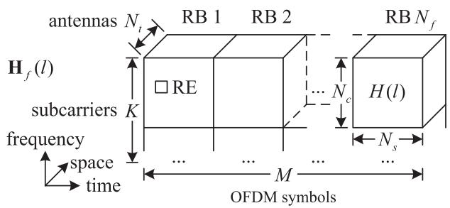  
Fig. 3. The illustration of collected CSI data per label.

Algorithm 1: Data Preprocessing.   
Input: $\overline { { \mathbf { H } _ { f } ( l ) \in \mathbb { C } ^ { K \times N _ { t } \times M } } }$   
Output: $\dot { H ( l ) } \in \mathbb { C } ^ { N _ { c } \times N _ { t } \times N _ { s } }$   
1: $\mathbf { H } _ { f } ^ { \prime } ( l )  \mathbf { H } _ { f } ( l ) [ 0 : N _ { c } , : , : ]$   
2: $\mathbf { H } _ { f } ^ { \prime \prime } ( l )  \mathrm { r e s h a p e } ( \mathbf { H } _ { f } ^ { \prime } ( l ) , \ [ N _ { c } , \ N _ { t } , \ N _ { s } , \ N _ { f } ] )$   
3: $\mathbf { \check { H } } _ { n } ( l ) \gets \mathbf { \check { H } } _ { f } ^ { \prime \prime } ( l ) [ : , : , : , n ] , n = 1 , \dots , N _ { f }$   
4: $H ( l )$ ← normalized $\mathbf { H } _ { n } ( l ) , n \in \{ 1 , . . . , \dot { N } _ { f } \}$   
(Return: $H ( l )$

For channel measurement in low-speed scenarios, CSI can be assumed to be time-invariant and solely dependent on location. Thus, it is sufficient to collect frequency-spatial CSI labeled with locations for the radio map. However, UAV channels exhibit time-varying characteristics due to high mobility. In addition to the frequency and spatial dimensions, it is imperative to collect the CSI over the time domain to reflect the temporal variations of the channel. Assuming that the frequency-spatial CSI with K subcarriers and $N _ { t }$ transmit antennas is measured over M OFDM symbol periods, a frequency-spatial-temporal CSI $\mathbf { H } _ { f }$ can be obtained, where $\mathbf { H } _ { f } \in \dot { \mathbb { C } } ^ { K \times N _ { t } \times M }$ is expressed in (8) shown at the bottom of this page and illustrated in Fig. 3.

Before building the continuous radio map, the collected channel data of $N _ { l }$ CSI samples $\mathbf { H } _ { f }$ need to be preprocessed. For compliance purposes, the concept of resource block (RB) is introduced. In 3GPP technical specification (TS) 38.211 for release 18 [42], an RB is defined as 12 consecutive subcarriers in the frequency domain, and an OFDM subframe contains 14 OFDM symbols in the time domain. A resource element (RE) is the smallest time-frequency unit, i.e., one subcarrier over one OFDM symbol. The first $N _ { c } = 1 2$ subcarriers are considered for simplicity, and M temporal samples are divided into $N _ { f }$ OFDM subframes, each containing $N _ { s } = 1 4$ OFDM symbols, where $N _ { f } \times N _ { s } = M$ = 14. In this manner, there are $N _ { f }$ RB samples of CSI for a given position and velocity. For better performance, all the RB samples are normalized such that the magnitude of the complex channel gains lie within the range of [0,1], so as the labels. The velocity in the label is replaced with radical velocity to govern the Doppler shift during training. The sampling function $H ( l )$ is defined as an arbitrary normalized RB sample at the coordinate $( x , y )$ with radical velocity v as illustrated in Fig. 3. The procedure of the data preprocessing is summarized in Algorithm 1.

## IV. CVCGAN-BASED RADIO MAP CONSTRUCTION

After obtaining the discrete radio map through the proposed grid-based channel measurement scheme, it becomes essential to complete the discrete channel map to acquire a seamless and continuous map for practical application. The complete map allows the channel distributions for UAVs to be generated based on their continuous positions and velocities.

## A. The Classical CGAN

To clearly illustrate the proposed CVCGAN and its improvements based on GAN, we first briefly introduce GAN and its variant CGAN. GAN comprises two neural networks named the generator and the discriminator. These two models engage in an adversarial training process to improve the quality of generated samples. This process can be formalized as a two-player minimax game concerning the value function $V ( G , D )$ as [32]

$$
\begin{array} { r l } & { \underset { \ b { G } } { \mathop { \operatorname* { m i n } } } \underset { \ b { D } } { \operatorname* { m a x } } V ( \boldsymbol { D } , \boldsymbol { G } ) = \mathbb { E } _ { H \sim p _ { \mathrm { d a t a } } ( H ) } \left[ \log \boldsymbol { D } ( H ) \right] } \\ & { ~ + \mathbb { E } _ { z \sim p _ { z } ( z ) } \left[ \log ( 1 - D ( G ( z ) ) ) \right] , } \end{array}\tag{9}
$$

where H is the real sample from the distribution of $p _ { \mathrm { d a t a } } ( H ) , z$ is the input noise from the distribution of $p _ { z } ( z )$ . As expressed in (9), the discriminator aims to distinguish real samples from generated ones, classifying real samples as genuine and generated samples as fake. Conversely, the generator strives to produce samples that closely resemble real ones, thereby deceiving the discriminator into misclassifying the generated data as real.

However, GAN cannot control the modes of data being generated. To address this issue, CGAN was proposed, and its architecture is shown in Fig. 4. The label is embedded into lthe space with the same size as the noise . Next, the embedded label is multiplied with  and the product is input to the generator. Additionally,  is also embedded into the space matching the dimensionality of the sample for concatenation. The concatenation

$$
\mathbf { H } _ { f } = \left[ \begin{array} { c c c c } { \mathbf { H } ( 0 , 0 ) } & { \mathbf { H } ( 0 , T ) } & { \cdots } & { \mathbf { H } \left( 0 , ( M - 1 ) T \right) } \\ { \mathbf { H } ( \Delta f , 0 ) } & { \mathbf { H } ( \Delta f , T ) } & { \cdots } & { \mathbf { H } \left( \Delta f , ( M - 1 ) T \right) } \\ { \vdots } & { \vdots } & { \ddots } & { \vdots } \\ { \mathbf { H } \left( ( K - 1 ) \Delta f , 0 \right) } & { \mathbf { H } \left( ( K - 1 ) \Delta f , T \right) } & { \cdots } & { \mathbf { H } \left( ( K - 1 ) \Delta f , ( M - 1 ) T \right) } \end{array} \right] .\tag{8}
$$

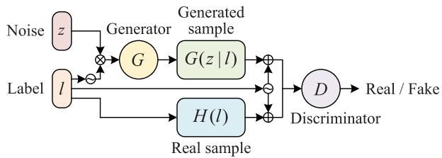  
Fig. 4. The architecture of the CGAN [33].

is then passed to the discriminator for judgment. The minimax problem of $V ( G , D )$ for CGAN can be expressed as [33]

$$
\begin{array} { r l } & { \underset { G } { \operatorname* { m i n } } \underset { D } { \operatorname* { m a x } } V ( D , G ) = \mathbb { E } _ { H \sim p _ { \mathrm { d a t a } } ( H ) } \left[ \log D ( H ( l ) | l ) \right] } \\ & { \qquad + \mathbb { E } _ { z \sim p _ { z } ( z ) } \left[ \log ( 1 - D ( G ( z | l ) | l ) ) \right] . } \end{array}\tag{10}
$$

According to (10), the generator can only deceive the discriminator by generating realistic data with the specified label.

Algorithm 2: Estimator Training.   
Input:   
lOutput: $\theta _ { \mathrm { e } } ^ { \ast }$   
1: while $\theta _ { \mathrm { e } }$ has not converged do   
2: $\{ l ^ { ( i ) } \} _ { i = 1 } ^ { N _ { b } } $ Sample batch size of $N _ { b }$ labels   
3: $\{ H ( l ^ { ( i ) } ) \} _ { i = 1 } ^ { N _ { b } }$ ← Sample from the collected data   
4: $\mathcal { L } _ { \mathrm { e } } ^ { ( i ) } \gets \big | \big | w ( E ( H ( l ^ { ( i ) } ) ) - l ^ { ( i ) } ) ) \big | \big | ^ { 2 } , i = 1 , \dots , N _ { b }$   
5: $\begin{array} { r } { \theta _ { \mathrm { e } } \gets \mathrm { A d a m } ( \nabla _ { \theta _ { \mathrm { e } } } \frac { 1 } { N _ { b } } \sum _ { i = 1 } ^ { N _ { b } } \mathcal { L } _ { \mathrm { e } } ^ { ( i ) } , \theta _ { \mathrm { e } } , \alpha , \beta _ { 1 } , \beta _ { 2 } ) } \end{array}$   
6: end while   
7: $\theta _ { \mathrm { e } } ^ { * }  \theta _ { \mathrm { e } }$   
Return: $\theta _ { \mathrm { e } } ^ { \ast }$

## B. The Proposed CVCGAN

CGAN is capable of generating data with discrete scalar labels, but it is not suitable for continuous vector labels due to two aspects [43]. On one hand, CGAN can only generate data for trained labels, and since it is not trained for continuous labels, it cannot perform well with continuous labels. On the other hand, CGAN requires label embedding. This operation necessitates knowing the number of all discrete labels, which is obviously not feasible for infinite continuous labels.

To generate the channel samples for continuous positions and velocities, we develop CVCGAN, whose architecture is shown in Fig. 5. In the proposed CVCGAN, a new neural network named estimator is introduced. The added estimator is utilized to estimate the position and velocity information of the channel, and it is trained based on real channel samples before the adversarial training between the generator and the discriminator, indicated by Fig. 6. The loss function of the estimator is defined as the weighted MSE between the estimated labels and the actual labels, i.e.,

$$
\mathcal { L } _ { \mathrm { e } } = \big | \big | \boldsymbol { w } \left( E ( H ( l ) ) - l ) \right) \big | \big | ^ { 2 } ,\tag{11}
$$

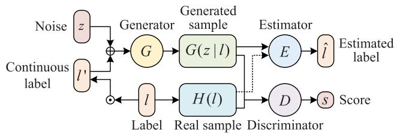  
Fig. 5. The architecture of the proposed CVCGAN.

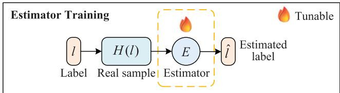  
Fig. 6. The training of the estimator in the proposed CVCGAN.

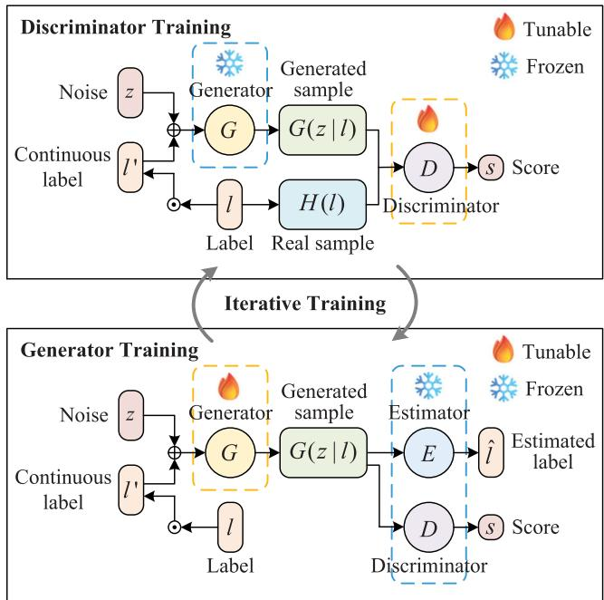  
Fig. 7. The iterative training of the discriminator and the generator in the proposed CVCGAN.

where $\mathbf { \nabla } \mathbf { w } = ( w _ { x } , w _ { y } , w _ { v } )$ represents the weight vector assigned to different estimated parameters. The training process of the estimator is given in Algorithm 2, where $\theta _ { \mathrm { e } }$ is the set of the parameters of the estimator, $\alpha , \beta _ { 1 }$ and $\beta _ { 2 }$ are hyperparameters of the Adam [44] optimizer, representing the learning rate, the decay rates of the first moment estimate and the second moment estimate, respectively. After that, the weights of the estimator are frozen during the following adversarial training to prevent any degradation in its performance caused by synthetic CSI produced by the generator.

The subsequent adversarial training is illustrated in Fig. 7, where the generator produces channel samples with the concatenation of noise and continuous label 	. The continuous label 	 is generated by performing interpolation on discrete label . In practice, the interpolation is implemented by uniformly generating labels 	 within the range of the sampled labels , i.e.,

$$
l _ { j } ^ { \prime } \sim \mathcal { U } \left( \operatorname* { m i n } _ { i } l _ { j } ^ { ( i ) } , \operatorname* { m a x } _ { i } l _ { j } ^ { ( i ) } \right) ,\tag{12}
$$

where $l _ { i } ^ { ( i ) } , i = 1 , \ldots , N _ { l } , j = 1 , 2 , 3$ is the j-th element of the l = 1 = 1 2 3i-th label in the dataset. This interpolation ensures that the generated continuous labels 	 remains in-distribution of sampled labels , which allows the trained estimator to reliably map the synthetic CSI output by the generator to the corresponding sensing information during adversarial training. The input 	 helps the generator learn how to generate samples based on continuous labels during training, addressing the first limitation of CGAN. During the training of the discriminator, the set of the parameters of the generator $\theta _ { \mathrm { g } }$ is frozen. The generated samples $G ( z | l )$ , as well as the real samples $H ( l )$ , are fed into the discriminator, which is trained to assign a score to evaluate the quality of the input sample. The discriminator does not need to determine whether the sample matches the label, avoiding the label embedding operation and filling the second deficiency of CGAN. After the discriminator is trained, its parameters set $\theta _ { \mathrm { d } }$ is frozen at the training phase of the generator. The generator’s output samples are input to both the estimator and the discriminator. The estimator is responsible for inferring the position and velocity information of the generated samples, while the discriminator evaluates the quality of the generated samples. The discriminator and generator are trained iteratively until $\theta _ { \mathrm { g } }$ converges.

To avoid gradient vanishing in classical GANs, Wasserstein GAN (WGAN) [45] with gradient penalty (WGAN-GP) [46] is adopted in the proposed CVCGAN. WGAN applies Wasserstein distance, a.k.a. Earth-Mover (EM) distance instead of Jensen-Shannon (JS) divergence to quantify the difference between two distributions. Besides, gradient penalty is incorporated to enforce the Lipschitz constraint on the discriminator to improve the training stability. The corresponding minimax problem about $V ( G , D )$ for the proposed CVCGAN is formulated as

$$
\begin{array} { r l } { \underset { G } { \mathrm { m i n } } \underset { D } { \mathrm { m a x } } V ( D , G ) } \\ & { = \underset { \mathrm { B } \underset { G  p _ { \mathbf { f } \alpha } ( G ) } { \mathbb { E } } [  D ( H ( l ) ) ] - \underset { \mathrm { A } \mathrm { e r e s r a t } } { \mathbb { E } } [  D ( G ( z | l ^ { \prime } ) ) | } { \mathrm { B o t e r s t } } } \\ & { - \underset { \mathrm { B } \underset { G  p _ { \mathbf { f } \alpha } ( G ) \mid \alpha } { \underbrace { \lambda _ { \mathrm { g r e s r } } P _ { \mathrm { \tilde { H } } } } } } { \mathrm { \underbrace { n i n } } } [ ( | \nabla _ { \mathbf { \tilde { H } } } D ( \mathbf { \tilde { H } } ) | | - 1 ) ^ { 2 } ] } \\ & { + \underset { \mathrm { A } \underset { G  p _ { \mathbf { f } \alpha } ( G ) \mid \alpha } { \mathrm { M a t e r s p a r i o } } } { \underbrace { \lambda _ { \mathrm { e r e s p } } ( z ) | l | \sigma ( E ( \mathbf { \tilde { Z } } ) ^ { \prime } ) - l ^ { \prime } ) } } | | ^ { 2 } , \qquad \mathrm { C a } } \end{array}\tag{13}
$$

where $\lambda _ { \mathrm { g p } }$ and $\lambda _ { \mathrm { e } }$ are coefficients that control the strength of the gradient penalty and the estimate loss terms, respectively, H represents the interpolated samples and can be acquired by performing interpolation between real samples and generated

samples, i.e.,

$$
\widetilde { \bf H } = \epsilon \cdot H ( l ) + ( 1 - \epsilon ) \cdot D ( G ( z | l ^ { \prime } ) ) ,\tag{14}
$$

where the parameter  is a random number that follows a uniform distribution from 0 to 1. It can be inferred from (13) that the discriminator is required to distinguish real samples from generated samples, assigning high scores to real samples and low scores to generated samples. Simultaneously, the discriminator must maintain its gradient variation. The loss function of the discriminator can be written as

$$
\begin{array} { r l } & { \mathcal { L } _ { \mathrm { d } } = \mathcal { L } _ { \mathrm { d a } } + \lambda _ { \mathrm { g p } } \cdot \mathcal { L } _ { \mathrm { g p } } } \\ & { \quad = - D ( H ( l ) ) + D ( G ( z | l ^ { \prime } ) ) + \lambda _ { \mathrm { g p } } \cdot \Big ( \big | \big | \nabla _ { \widetilde { \mathbf { H } } } D ( \widetilde { \mathbf { H } } ) \big | \big | - 1 \Big ) ^ { 2 } , } \end{array}\tag{15}
$$

where $\mathcal { L } _ { \mathrm { d a } }$ is the adversarial loss of the discriminator. As for the generator, it is required not only to produce realistic samples to deceive the discriminator into awarding a high score, but also to meet the requirements from the estimator, ensuring that the generated samples closely correspond to the provided labels. The loss function of the generator can be expressed as

$$
\begin{array} { r l } & { \mathcal { L } _ { \mathrm { g } } = \mathcal { L } _ { \mathrm { g a } } + \lambda _ { \mathrm { e } } \cdot \mathcal { L } _ { \mathrm { e } } ^ { \prime } } \\ & { \quad = - D ( G ( z | l ^ { \prime } ) ) + \lambda _ { \mathrm { e } } \cdot \big \vert \big \vert w \left( E ( G ( z | l ^ { \prime } ) ) - l ^ { \prime } \right) \big \vert \big \vert ^ { 2 } , } \end{array}\tag{16}
$$

where $\mathcal { L } _ { \mathrm { g a } }$ is the adversarial loss for the generator. The training of the discriminator and the generator is conducted in an iterative way and the process is summarized in Algorithm 3.

Remark 2: Many works have explored conditional generation from different perspectives. InfoGAN [47] aims to establish the relationship between the latent code and the generated sample by maximizing mutual information. However, it offers only implicit and relatively weak control. VecGAN [48] learns a latent direction for each tag and modulates it with a scalar strength inferred from discrete attribute labels. As a result, it cannot reliably generate samples that match a specified continuous numerical level. Continuous conditional GAN (CcGAN) [43] handles continuous scalar labels through the designed vicinal empirical losses and label-injection mechanisms, yet these strategies do not scale to multi-dimensional continuous vectors. The proposed CVCGAN is inspired by these prior ideas, particularly the pursuit of interpretable conditioning and controllable generation. Moreover, CVCGAN advances these approaches by introducing an estimator-in-the-loop framework that provides explicit, differentiable label-sample consistency supervision, enabling more precise and reliable generation conditional in this work.

## C. Backbone

Regarding the specific network design, CNN is employed due to its wide application in image processing [49]. The detailed network architectures of the estimator, discriminator, and generator are presented as below and are also available in the released code.1

Algorithm 3: CVCGAN Training.   
Input: $\overline { { { l , \theta _ { \mathrm { e } } ^ { * } } } }$   
lOutput: $\theta _ { \mathrm { g } } ^ { * }$   
1: while $\theta _ { \mathrm { g } }$ has not converged do   
2: Discriminator Training:   
3: $\{ l ^ { ( i ) } \} _ { i = 1 } ^ { N _ { b } } $ Sample batch size of $N _ { b }$ labels   
4: $\{ H ( l ^ { ( i ) } ) \} _ { i = 1 } ^ { N _ { b } }$ ← Sample from the collected data   
5: $\{ \nearrow \{ i \} \} _ { i = 1 } ^ { N _ { b } }$ ← Sample from $p _ { z } ( z )$   
6: $\{ l ^ { \prime ( i ) } \} _ { i = 1 } ^ { N _ { b } }  \mathbf { S }$ ample from the uniform distribution   
within the range of   
7: $\{ G ( z ^ { ( i ) } | \breve { l ^ { \prime ( i ) } } ) \} _ { i = 1 } ^ { N _ { b } }  \{ z ^ { ( i ) } \} _ { i = 1 } ^ { N _ { b } } , \{ l ^ { \prime ( i ) } \} _ { i = 1 } ^ { N _ { b } }$   
8: $\widetilde { \mathbf { H } } ^ { ( i ) }  \epsilon ^ { ( i ) } \cdot H ( l ^ { ( i ) } ) + ( 1 - \epsilon ^ { ( i ) } ) \cdot G ( z ^ { ( i ) } | l ^ { \prime ( i ) } )$   
9: $\mathcal { L } _ { \mathrm { d } } ^ { ( i ) } \gets - D ( H ( l ^ { ( i ) } ) ) + D ( G ( z ^ { ( i ) } | l ^ { \prime ( i ) } ) ) + \lambda _ { \mathrm { g p } }$   
$( \big | \big | \nabla _ { \widetilde { \mathbf { H } } ^ { ( i ) } } D ( \widetilde { \mathbf { H } } ^ { ( i ) } ) \big | \big | - 1 ) ^ { 2 }$   
10: $\begin{array} { r } { \theta _ { \mathrm { d } } \gets \mathrm { A d a m } ( \nabla _ { \theta _ { \mathrm { d } } } \frac { 1 } { N _ { b } } \sum _ { i = 1 } ^ { N _ { b } } \mathcal { L } _ { \mathrm { d } } ^ { ( i ) } , \theta _ { \mathrm { d } } , \alpha , \beta _ { 1 } , \beta _ { 2 } ) } \end{array}$   
11: (Generator Training:   
12: $\{ z ^ { ( i ) } \} _ { i = 1 } ^ { N _ { b } }  $ ample from $p _ { z } ( z )$   
13: $\{ l ^ { \prime ( i ) } \} _ { i = 1 } ^ { N _ { b } }  \mathrm { S }$ ample from the uniform distribution   
within the range of   
14: $\{ G ( z ^ { ( i ) } | \overline { { l ^ { \prime ( i ) } } } ) \} _ { i = 1 } ^ { N _ { b } }  \{ z ^ { ( i ) } \} _ { i = 1 } ^ { N _ { b } } , \{ l ^ { \prime ( i ) } \} _ { i = 1 } ^ { N _ { b } }$   
15: $\begin{array} { r } { \mathcal { L } _ { \mathtt { g } } ^ { ( i ) }  - D ( G ( z ^ { ( i ) } | l ^ { \prime ( i ) } ) ) + \lambda _ { \mathtt { e } } \cdot | | w ( E ( G ( z ^ { ( i ) } | } \end{array}$   
$l ^ { \prime ( i ) } ) ) - l ^ { \prime ( i ) } ) \vert \vert ^ { 2 }$   
16: $\begin{array} { r } { \theta _ { \mathrm { g } } \gets \mathrm { A d a m } ( \nabla _ { \theta _ { \mathrm { g } } } \frac { 1 } { N _ { b } } \sum _ { i = 1 } ^ { N _ { b } } \mathcal { L } _ { \mathrm { g } } ^ { ( i ) } , \theta _ { \mathrm { g } } , \alpha , \beta _ { 1 } , \beta _ { 2 } ) } \end{array}$   
17: end while   
18: $\theta _ { \mathrm { g } } ^ { * }  \theta _ { \mathrm { g } }$   
Return: $\theta _ { \mathrm { g } } ^ { * }$

1) Estimator: The estimator is trained on real channel data and is utilized to estimate the position and velocity information of the generated CSI. First, the normalized CSI is divided into real and imaginary parts with shape $( N _ { c } , N _ { t } , N _ { s } , 2 )$ . Then, three convolutional layers with kernel dimensions of $3 \times 3 \times 3$ are added to reduce the data spatial size while increasing the number of channels. In this process, 3D convolution is employed to extract joint features across the frequency, spatial and temporal domains, capturing complex interdependencies and improving the overall representation of the channel characteristics. Besides, rectified linear unit (ReLU) [50] is applied as the activation function. Next, the tensor with a shape of (2,4,2,128) is flattened into a vector with 2048 units, followed by a fully connected (FC) layer with sigmoid to obtain the normalized estimates of position and velocity.

2) Discriminator: The role of the discriminator is to score both real and generated CSI. The real and imaginary parts of the real/generated CSI are input to the network. Next, three convolutional layers are also employed to extract frequency, spatial and temporal features of the CSI. To enhance the stability of the network training, Leaky ReLU (LReLU) [51] is applied as the activation function. Compared to ReLU, LReLU prevents the dying ReLU problem by providing non-zero gradients for negative inputs, improving gradient flow and convergence stability. Additionally, dropout [52] layers are incorporated to randomly deactivate a subset of neurons, reducing the dependency on specific features and improving generalization capability. Subsequently, the acquired tensor is flattened and passed through an FC layer with a linear output for Wasserstein distance computation.

3) Generator: The generator serves as the core component and ultimate output of the proposed CVCGAN. Upon completion of training, the generator can produce CSI for arbitrary positions and velocities within the constructed radio map. First, the noise with a dimensionality of 500, is concatenated with the label containing 2D location and 1D radical velocity information, yielding the combined vector with a dimensionality of 503. Then, the combination is fed to the FC layer to expand the dimensionality from 503 to 4096. Next, the expanded vector is reshaped to a tensor with a shape of (2,4,2,256). After that, multiple convolutional layers are used to gradually generate the desired CSI. Here, we adopt the combination of upsampling and convolution instead of transposed convolution to mitigate the issue of checkerboard artifacts [53]. Furthermore, batch normalization (BN) [54] and LReLU are incorporated to enhance the training stability. Finally, the obtained tensor is cropped to match the desired output dimension. Hyperbolic tangent (Tanh) is applied as the activation function to constrain the output CSI to the range − , .

## V. THE INTEGRATION OF RADIO MAP AND PILOTS

After the completion of radio map through the proposed CVCGAN, the channel of the UAV at an arbitrary position and velocity within the built map can be generated, which is denoted by $\mathbf { H } _ { \mathrm { m } }$ . Due to the high dynamic characteristic of the UAV, the channel exhibits rapid time-varying properties. Therefore, $\mathbf { H } _ { \mathrm { m } }$ obtained from the radio map may significantly deviate from the actual channel H to be estimated. Although $\mathbf { H } _ { \mathrm { m } }$ cannot be directly utilized as an estimate of H, it can serve as prior information regarding the distribution of H. To be specific, channels sampled from the same position at the same speed have the same characteristics. In other words, they can be seen as following an identical distribution, i.e., $H ( l ) \sim p ( \mathbf { H } | l )$ , where $p ( \mathbf { H } | l )$ represents the conditional distribution of the channel given the label . Therefore, by conditioning the generator on the UAV’s sensing information , synthetic $\mathbf { C S I H } _ { \mathrm { m } }$ that follow the same distribution as H can be obtained, i.e.,

$$
\mathbf { H } , \mathbf { H } _ { \mathrm { m } } \sim p ( \mathbf { H } | l ) .\tag{17}
$$

In comparison to the radio map, pilot-based measurement offers a real-time approach to channel acquisition. For example, the LS method aims to obtain the pilot-based estimation $\mathbf { H } _ { \mathrm { p } }$ by minimizing the squared error between the received pilot signal and its predicted value, i.e.,

$$
\mathbf { H } _ { \mathrm { p } } = \underset { \mathbf { H } } { \arg \operatorname* { m i n } } \ : | | \mathbf { y } _ { \mathrm { p } } - \mathbf { H } \mathbf { x } _ { \mathrm { p } } | | ^ { 2 } ,\tag{18}
$$

where $\mathbf { x } _ { \mathrm { p } }$ and $\mathbf { y } _ { \mathrm { p } }$ are pilot symbols and received signal, respectively. Thus, channel estimation based on pilots $\mathbf { H } _ { \mathrm { p } }$ can serve as the estimation of H directly. However, the limited length of the pilot sequence constrains its ability to provide only partial observations of the channel, failing to achieve accurate channel estimation particularly in scenarios where the channels experience doubly selective fading. To address this issue, the prior distribution information provided by the radio map is integrated with partial observations obtained from pilot measurements. According to Bayes’ theorem, a posterior estimation of the channel can be obtained by incorporating prior information with limited observations.

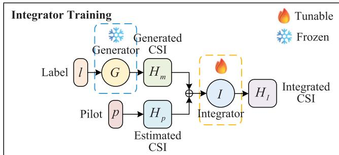  
Fig. 8. The training of the integrator.

Algorithm 4: Integrator Training.   
Input: ${ \overline { { { l , \theta _ { \mathrm { g } } ^ { * } } } } }$   
Output: H   
1: while $\theta _ { \mathrm { i } }$ has not converged do   
2: $\{ \mathbf { H } _ { \mathrm { m } } ^ { ( i ) } \} _ { i = 1 } ^ { N _ { b } }  G ( z ^ { ( i ) } | l ^ { ( i ) } )$   
3: $\{ \mathbf { H } _ { \mathrm { p } } ^ { ( i ) } \} _ { i = 1 } ^ { N _ { b } } $ Pilot estimation   
4: $\mathcal { L } _ { \mathrm { i } } ^ { ( i ) } \gets \big \lvert \big \lvert I ( \mathbf { H } _ { \mathrm { m } } ^ { ( i ) } , \mathbf { H } _ { \mathrm { p } } ^ { ( i ) } ) - \mathbf { H } ^ { ( i ) } \big \rvert \big \rvert ^ { 2 } , i = 1 , \dots , N _ { b }$   
5: $\begin{array} { r } { \theta _ { \mathrm { i } }  \mathrm { A d a m } ( \nabla _ { \theta _ { \mathrm { i } } } \frac { 1 } { N _ { b } } \sum _ { i = 1 } ^ { N _ { b } } \mathcal { L } _ { \mathrm { i } } ^ { ( i ) } , \theta _ { \mathrm { i } } , \alpha , \beta _ { 1 } , \beta _ { 2 } ) } \end{array}$   
6: end while   
7: H $ I ( \mathbf { H } _ { \mathrm { m } } , \mathbf { H } _ { \mathrm { p } } )$   
Return: $\hat { \bf H }$

However, the prior distribution of $p ( \mathbf { H } | l )$ is learned by radio map and is challenging to represent explicitly. To avoid giving expressions of the distribution, a neural network-based integrator is designed to exact distribution cues from the prior sample $\mathbf { H } _ { \mathrm { m } }$ and measurement information from the pilot-based estimate $\mathbf { H } _ { \mathrm { p } } .$ The output of the integrator serves as the final channel estimate as

$$
\hat { \mathbf { H } } = I \left( \mathbf { H } _ { \mathrm { m } } , \mathbf { H } _ { \mathrm { p } } \right) .\tag{19}
$$

The objective of the integrator is to estimate H accurately so the loss function is customized to be the MSE between the network output and the target channel, i.e.,

$$
\mathcal { L } _ { \mathrm { i } } = \big | \big | I \left( \mathbf { H } _ { \mathrm { m } } , \mathbf { H } _ { \mathrm { p } } \right) - \mathbf { H } \big | \big | ^ { 2 } .\tag{20}
$$

The training process of the integrator is given in Fig. 8 and summarized in Algorithm 4, where $\theta _ { \mathrm { i } }$ denotes the set of parameters of the neural network for integration.

CNN is employed as the backbone for the integrator and the architecture is presented as follows. First, $\mathbf { H } _ { \mathrm { m } }$ generated by radio map and $\mathbf { H } _ { \mathrm { p } }$ estimated by pilots are decomposed into their real and imaginary components, which are concatenated to form a tensor of shape $( N _ { c } , N _ { t } , N _ { s } , 4 )$ . The resulting tensor is then processed through a three-layer convolutional network, progressively increasing the volume from $( N _ { c } , N _ { t } , N _ { s } , 4 )$ to $\left( N _ { c } , N _ { t } , N _ { s } , 1 2 8 \right)$ to extract richer features. The convolutional kernel size is set to $3 \times 3 \times 3$ , and both stride and zero-padding are set to 1 to ensure the size remains unchanged. Additionally, BN and LReLU are also applied after each convolutional layer. For the output layer, the expanded tensor is aggregated to a $( N _ { c } , N _ { t } , N _ { s } , 2 )$ tensor via convolution, with Tanh as activation function to constrain the output range between −1 and 1. Finally, two channels of the output tensor are merged for the final estimation.

## VI. NUMERICAL SIMULATIONS AND RESULTS

In this section, the detailed simulation settings are provided, followed by the presentation and discussion of the results.

## A. Dataset and Parameters

In the numerical simulations, ray-tracing is applied to generate channel parameters for each propagation path, including amplitude, phase, AoD and AoA. After that, CSI can be constructed with the generated parameters according to (7). As a deterministic modeling technique for wireless communications, ray-tracing can simulate the propagation paths of electromagnetic waves based on a given map, as well as the positions of the BS and the UE. Unlike empirical models that rely on measurements and generalizations, ray-tracing provides a physics-based method to characterize complex propagation environments. Therefore, ray-tracing is widely used in wireless communication simulations such as DeepMIMO [55] empowered by REMCOM [56], and Sionna RT [57] developed by NVIDIA.

However, existing emulators are not well-suited for LAE scenarios due to the following two main aspects. On the one hand, the available scenarios are predefined and lack flexibility, preventing users from deploying customized environments tailored to LAE. On the other hand, the trajectories are also predetermined, restricting the ability to adjust flight paths. Therefore, we develop an emulator2 for simulations by leveraging the ray-tracing toolbox3 provided by MathWorks. The scenarios can be arbitrarily selected from OpenStreetMap.4 Furthermore, the routes can be customized while accounting for the varying Doppler shift along the specific route. In this work, we select a representative LAE scenario shown in Fig. 9, characterized by a relatively open airspace with numerous high-rise buildings in the vicinity. The blue zone represents the airspace for LAE, and the red and blue markers indicate the BS and the UAV, respectively.

In our setup, a × m airspace region at an altitude of 100 m is uniformly partitioned with an interval of $\Delta d = 1 0 \mathrm { ~ r ~ }$ m. Consequently, $N _ { x } = 2 1$ vertices along the x-axis and $N _ { y } = 1 1$ vertices along the y-axis can be obtained, yielding a total of $N _ { x } \cdot N _ { y } = 2 3 1$ measurement points. After that, a corridor scan strategy is employed by the UAV to conduct channel measurement at each point. The speeds of the UAV for measurement are set to six levels containing 5, 10, 15, 20, 25 and 30 m/s.

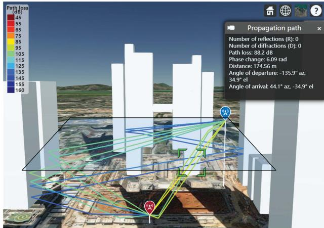  
Fig. 9. The simulation diagram of ray-tracing for LAE.

The UAV acquires CSI annotated with geographical position and radial velocity labels by traversing different measurement points with varying flight speeds.

The communication parameters are set as follows. The carrier frequency $f _ { c } \operatorname { i s } 3 . 5 \mathrm { G H z } ,$ , which serves as a primary frequency for 5G. The configuration of the subcarrier spacing and the number of subcarriers follows the specifications in 3GPP TS 38.104 [58] of release 18. The subcarrier spacing is set to be 15 kHz and the number of subcarriers is 624, corresponding to 52 RBs. For simplicity, the first RB, which consists of $N _ { c } = 1 2$ consecutive subcarriers, is focused on. During the measurement, an OFDM frame is collected at each measurement point, which contains $N _ { f } = 1 0$ OFDM subframes and each subframe has $N _ { s } = 1 4$ OFDM symbols. The average signal-to-noise ratio (SNR) of the CSI collected at all measurement points is assumed to be 30 dB, rather than being considered noise-free. A UPA is deployed at the BS with $8 \times 4 = 3 2$ transmit antennas, while the UAV is equipped with a single receive antenna. The pilot length is 32, which is equal to the number of transmit antennas. Therefore, a total of 13860 different CSI matrices, each of shape $1 2 \times 3 2 \times$ are contained in the dataset.

Regarding the training settings for the neural networks, the collected measurements are divided into three distinct subsets: the training set, validation set, and test set, following a ratio of $2 : 2 : 1$ . The training set is utilized to update the neural network parameters, and a monitoring mechanism is employed to save the model that achieves the lowest validation loss for testing. The network is optimized using the Adam optimizer with a changeable learning rate if the validation loss does not decrease over the set epochs. The batch size is set to 128.

## B. Training of the CVCGAN

The estimator is trained according to Algorithm 2, with an initial learning rate of $1 \times 1 0 ^ { - 3 }$ , which is reduced by a factor of 0.1 if no improvement is observed over 20 epochs. The exponential decay rates for the first moment estimate $\beta _ { 1 }$ and the second moment estimate $\beta _ { 2 }$ are set to 0.9 and 0.999, respectively. The weights for the estimated parameters x, y and v are 2, 1 and 0.3, respectively. The training and validation losses of the estimator versus epochs are shown in Fig. 10. Both losses decrease rapidly during the initial epochs and tend to stabilize after 120 epochs, indicating the convergence of the training.

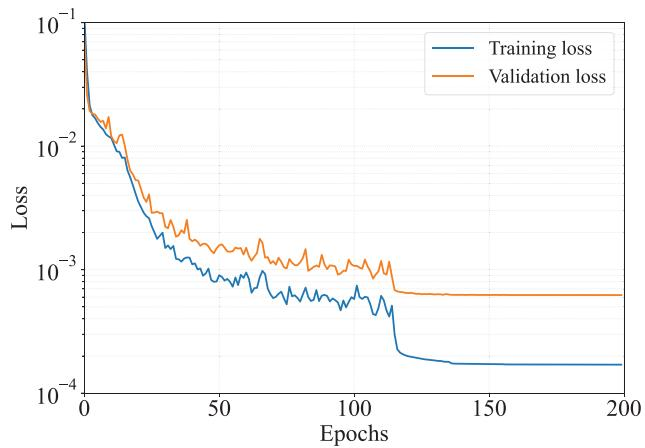

Fig. 10. The training and validation losses of the estimator versus epochs.  
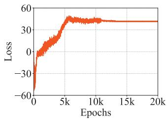

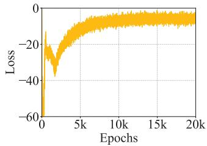  
(b) $\mathcal { L } _ { \mathrm { d a } }$

(a) $\mathcal { L } _ { \mathrm { g a } }$  
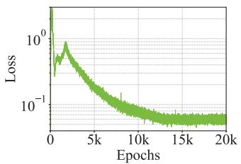  
(c) ${ \mathcal { L } } _ { \mathrm { g p } }$

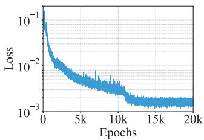  
(d) $\mathcal { L } _ { \mathrm { e } } ^ { \prime }$  
Fig. 11. The training losses of the CVCGAN.

The generator is trained following Algorithm 3, which involves both adversarial training with the discriminator and deception training against the pre-trained estimator. To ensure training stability, the initial learning rate is set to $1 \times 1 0 ^ { - 4 }$ which will also be decayed by 0.1 if the adversarial loss of the discriminator fails to reduce over a span of 2,000 epochs. The first and second moment estimate $\beta _ { 1 }$ and $\beta _ { 2 }$ are set to 0.1 and 0.999, respectively. The relatively small $\beta _ { 1 }$ is chosen to prevent gradient accumulation, which could otherwise destabilize the training process. The hyperparameters $\lambda _ { \mathrm { g p } }$ and $\lambda _ { \mathrm { e } }$ are set to 10 and 1000, respectively, to balance the importance of different training objectives.

The training losses of the CVCGAN versus epochs are given in Fig. 11. The value of the adversarial loss of the generator $\mathcal { L } _ { \mathrm { g a } }$ holds no intrinsic significance and is observed to stabilize after approximately 10,000 epochs. In contrast, the adversarial loss for the discriminator $\mathcal { L } _ { \mathrm { d a } }$ represents the Wasserstein distance between the real and generated CSI, exhibits significant oscillations during the early stages but gradually converges toward zero. This convergence indicates the success of the adversarial training, as the generator learns to produce CSI samples that closely resemble real CSI. In Fig. 11(c), $\mathcal { L } _ { \mathrm { g p } }$ initially fluctuates but gradually decreases and stabilizes near zero. According to the expression of the gradient penalty term in (13), this suggests that the gradient norm approaches 1, ensuring that the Lipschitz constraint is well satisfied, thereby enabling the discriminator to effectively estimate the Wasserstein distance. Meanwhile, $\mathcal { L } _ { \mathrm { e } } ^ { \prime }$ plotted in Fig. 11(d) progressively decreases and stabilizes after 12,000 epochs. A lower estimation loss signifies the success of the deception training, demonstrating that the generator has effectively learned to generate CSI samples that align with the given labels, thereby misleading the estimator.

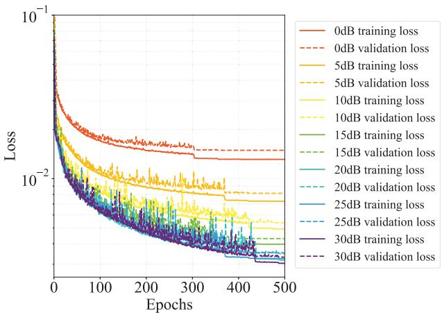  
Fig. 12. The training and validation losses of the integrator versus epochs under different average SNRs.

## C. Performance of the Integration

The integrator undergoes training following the procedure outlined in Algorithm 4, which fuses the radio map with pilotbased channel estimations under different average SNRs. The initial learning rate is $1 \times 1 0 ^ { - 3 }$ and will decay by 0.1 for 20 epochs without improvement. Besides, the exponential decay rates for $\beta _ { 1 }$ and $\beta _ { 2 }$ are 0.9 and 0.999, respectively. The training and validation losses of the integrator versus epochs are shown in Fig. 12, where the average SNR denotes the mean SNR computed across all sampled locations in the scenario, rather than the instantaneous SNR observed at any specific point. The steadily decreasing loss suggests that the designed integrator effectively leverages the prior distribution information provided by the radio map and the measurements observed from pilots, thereby achieving posterior estimation of the channel across various average SNR levels.

After the training, the integrator can perform radio mapassisted channel estimation, and its performance is evaluated by normalized MSE (NMSE). The NMSEs of the radio map with other approaches under different average SNRs at different velocities are compared in Fig. 13, where LS method serves as the baseline and four benchmarks consist of ChannelNet [26], CGAN [29], RadioUNet [38] and DNN+LSTM [27] are chosen.

As shown in Fig. 13, the NMSEs of all approaches decrease as SNR increases and remain unchanged when SNR exceeds 20 dB. In Fig. 13(a) where the velocity is 10 m/s, CGAN, RadioUNet and DNN+LSTM demonstrate superior performance under low SNR conditions. However, when the average SNR exceeds 10 dB, the proposed radio map approach begins to outperform these benchmarks. This advantage becomes even more pronounced in high-speed scenarios. Specifically, in Fig. 13(b), with the UAV flying at 20 m/s, the radio map approach consistently outperforms all other methods across the average SNR range from 0 to 30 dB, and the performance gap widens as the SNR increases. In Fig. 13(c), where the speed reaches 30 m/s, the NMSEs of the benchmarks remain around 0.1, getting limited profit from increasing SNR. This is due to the rapid variation of the channel, which makes it difficult to accurately estimate the CSI using only pilot-based partial observations. In contrast, the radio map approach leverages sensing information to effectively learn the prior distribution of the channel. As a result, its estimation performance improves significantly with increasing SNR, reaching nearly an order of magnitude better than these benchmarks.

In addition, we also compare the performances of these approaches versus velocities at different average SNRs in Fig. 14. It can be observed from Fig. 14 that the performances of all methods deteriorate as velocity increases. Fig. 14(a) presents the results at an average SNR of 0 dB. At this noise level, the classical LS method suffers from severe performance degradation. CGAN, RadioUNet and DNN+LSTM methods outperform others when the UAV speed is below 20 m/s. However, when the speed exceeds 20 m/s, the proposed radio map approach begins to show superior performance. As the average SNR increases, the advantage of the radio map approach becomes increasingly dominant. To be specific, in Figs. 14(b) and 14(c), the radio map method consistently outperforms three benchmarks across all velocity levels. In addition, radio map demonstrates greater robustness to increasing velocities, maintaining stable performance even in high-mobility scenarios. This suggests that radio map effectively learns prior information and translates it into improved channel estimation performance.

## VII. ANALYSIS AND DISCUSSION

This section provides in-depth analysis beyond the main results, including complexity analysis for online inference, ablation studies that isolate the contributions of the developed CVCGAN and the integrator, and generalization discussion across scenarios and trajectories.

## A. Complexity Analysis

1) Ls: Under an orthogonal pilot design, the LS estimator simplifies to element-wise scaling. Then, the computational cost is proportional to the pilot length $N _ { p }$ . To avoid an underdetermined problem, we set $N _ { p } = N _ { t }$ . Consequently, the complexity of LS is $\mathcal { O } ( N _ { t } )$

2) Channelnet: ChannelNet [26] consists of a SRCNN and a DnCNN. The complexity of CNN is determined by the input volume including the size and channels, the convolution kernel size, and the output volume. The input and the output volumes are both $N _ { \mathrm { C S I } } = N _ { c } \times N _ { t } \times N _ { s } ,$ , and the convolution kernel size for the 3D convolution is denoted as $k ^ { 3 }$ . Therefore, the complexity for ChannelNet is $\mathcal { O } ( k ^ { 3 } ~ N _ { \mathrm { C S I } } ^ { 2 } )$

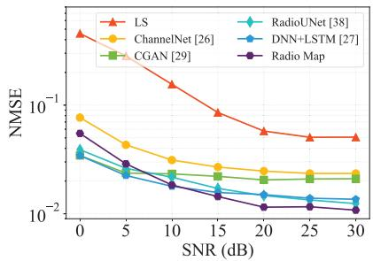  
(a) 10m/s

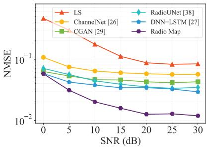  
(b) 20m/s

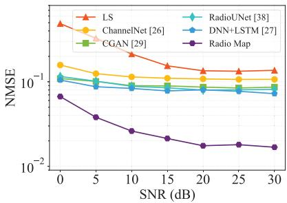  
(c) 30m/s

Fig. 13. The NMSEs of the radio map compared with other approaches versus average SNRs at different velocities.  
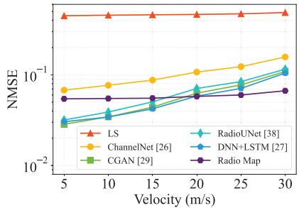  
(a) OdB

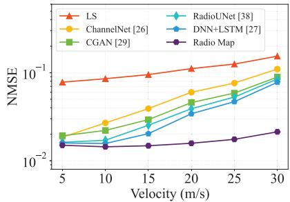  
(b) 15dB

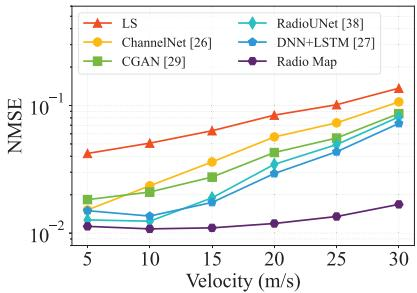  
(c) 30dB  
Fig. 14. The NMSEs of the radio map compared with other approaches versus velocities at different average SNRs.

3) CGAN: CGAN [29] applies a FC layer before the convolutional layers. The FC layer takes the concatenation of a noise vector with dimension $N _ { z }$ and the real/imaginary parts of the pilots with dimension $2 N _ { t }$ , and maps it to a vector of length $N _ { \mathrm { C S I } }$ 2. The complexity for the FC layer is $\mathcal { O } ( ( N _ { z } + 2 N _ { t } ) N _ { \mathrm { C S I } } )$ The complexity of the subsequent convolutional layers is the same as ChannelNet. As a result, the complexity of CGAN is $\mathcal { O } ( k ^ { 3 } N _ { \mathrm { C S I } } ^ { 2 } + ( N _ { z } + 2 N _ { t } ) N _ { \mathrm { C S I } } )$

4) Radiounet: RadioUNet [38] adopts a UNet architecture based on CNN, whose computations are dominated by convolutional layers, similar to ChannelNet. Consequently, its online inference complexity is $\mathcal { O } ( k ^ { 3 } N _ { \mathrm { C S I } } ^ { 2 } )$ , and remains of the same order as that of ChannelNet.

5) Dnn+Lstm: In DNN+LSTM [27], the DNN maps the real/imaginary parts of the pilots to a vector of length $N _ { \mathrm { C S I } }$ whose complexity is $O ( 2 N _ { t } N _ { \mathrm { C S I } } )$ . As for the LSTM, its complexity is $\mathcal { O } ( 8 N _ { \mathrm { C S I } } ^ { 3 } )$ . Accordingly, the total complexity is $\mathcal { O } ( 8 N _ { \mathrm { C S I } } ^ { 3 } + 2 N _ { t } N _ { \mathrm { C S I } } )$

6) Radio Map: The complexity of the proposed radio map approach is contributed by the CVCGAN and the integrator. In the CVCGAN, although three networks are trained, it is important to note that the estimator and the discriminator are only auxiliary for training the generator. During online inference, only the trained generator is invoked while the estimator and the discriminator are not. Consequently, the inference complexity of the CVCGAN reduces to that of the generator alone. The generator involves a FC layer and several convolutional layers and its complexity is $\mathcal { O } ( N _ { z } N _ { \mathrm { C S I } }$ $+ k ^ { 3 } N _ { \mathrm { C S I } } ^ { 2 } )$ . The integrator also utilizes CNN for the integration of radio map and pilots. Therefore, the total complexity for the proposed approach is $\mathcal { O } ( 2 k ^ { 3 } N _ { \mathrm { C S I } } ^ { 2 } + N _ { z }$ $N _ { \mathrm { C S I } } )$

In our setup, $N _ { t } , N _ { z } \ll N _ { \mathrm { C S I } }$ and can thus be negligible. As a result, the online complexities of ChannelNet, CGAN and RadioUNet are comparable, while the complexity of our radio map is approximately twice theirs, remaining within the same order of magnitude. This moderate increase in complexity yields substantial performance gains, including significantly improved channel estimation accuracy and robustness under high mobility. Given the rapid advancement of computing hardware and AI accelerators, an approximately twofold increase in computation is generally considered practical and acceptable, especially when accompanied by the performance improvements demonstrated in our results.

All the network training in this paper was conducted on a NVIDIA Tesla V100 GPU with 32 GB bandwidth memory and 5120 CUDA cores.

## B. Ablation Study

We conducted two ablation studies to isolate and quantify the contributions of the CVCGAN and the integrator.

1) Without CVCGAN: We remove the CVCGAN and instead feed the integrator with the CSI randomly selected from the collected real samples that are not associated with the current location and velocity label. This ablation probes the integrator’s behavior under prior mismatch, i.e., when the radio map is inaccurate or under distribution shift.

TABLE II  
THE NMSES OF ABLATION STUDY VERSUS AVERAGE SNRS AT 20 M/S
<table><tr><td>SNR (dB)</td><td>0</td><td>5</td><td>10</td><td>15</td><td>20</td><td>25</td><td>30</td></tr><tr><td>w/o CVCGAN 0.099 0.071 0.061 0.057</td><td></td><td></td><td></td><td></td><td></td><td>0.0550.054 0.053</td><td></td></tr><tr><td>w/o integrator</td><td>0.9270.7330.5460.392 0.2770.1990.146</td><td></td><td></td><td></td><td></td><td></td><td></td></tr><tr><td>with both</td><td></td><td></td><td></td><td></td><td></td><td>0.058 0.031 0.020 0.016 0.013 0.013 0.012</td><td></td></tr></table>

TABLE III  
THE NMSES OF ABLATION STUDY VERSUS VELOCITIES AT 15 DB
<table><tr><td>Velocity (m/s)</td><td>5</td><td>10</td><td>15</td><td>20</td><td>25</td><td>30</td></tr><tr><td>w/o CVCGAN</td><td>0.016</td><td>0.024</td><td>0.037</td><td>0.057</td><td>0.073</td><td>0.107</td></tr><tr><td>w/o integrator</td><td>0.365</td><td>0.381</td><td>0.379</td><td>0.392</td><td>0.392</td><td>0.434</td></tr><tr><td>with both</td><td>0.015</td><td>0.014</td><td>0.015</td><td>0.016</td><td>0.018</td><td>0.021</td></tr></table>

2) Without Integrator: The proposed Bayesian integrator is replaced with a simple linear combination of the radio map prior and the pilot-based estimate. The weights vary linearly with the average SNR expressed in dB. In particular, the weights of the radio map and the pilots are $w _ { \mathrm { m } } = 0 . 5 - 0 . 0 1$ · SNR and $w _ { \mathfrak { p } } = 0 . 5 + 0 . 0 1 \cdot \mathrm { S N R }$ , respectively.

= 0 5 + 0 01The NMSEs of ablation study versus average SNRs at 20 m/s and versus velocities at 15 dB are presented in Tables II and III, respectively. In addition, the performance of the proposed radio map with both the CVCGAN and the integrator is provided for comparison. For w/o CVCGAN, its channel estimation performance is markedly inferior to the radio map in Table II. When the average SNR is 0 dB, its NMSE is roughly twice that of the radio map, and this ratio increases significantly with SNR. In Table III, at low velocities where the estimation problem is easier, w/o CVCGAN is only slightly worse than the radio map. As velocity increases, the task becomes substantially more challenging, and the gap widens obviously. These observations indicate that the CVCGAN effectively learns the relationship between sensing information and CSI feature, and the learned prior help the integrator yields consistent performance gains.

The performance of w/o integrator is poor, even worse than the pilot-only scheme. This is because the radio map provides a sample drawn from the CSI distribution conditioned on the sensing label, rather than an exact estimate of the current CSI. Therefore, the linear combination fails to exploit this distribution prior and can even degrade the performance. This demonstrates that our integrator is not a simple weighted sum. The integrator learns the distribution induced by CVCGAN and fuses it with the partial pilot observations to obtain accurate channel estimates.

## C. Generalization Discussion

1) Scenario Generalization: Radio map construction is inherently environment-dependent, which relies on specific channel data and corresponding location labels collected in the target scenario. Radio map generalization for different scenarios is another interesting topic, and several recent works explore this direction. In [59], cross-BS radio map inference is proposed. However, this work assumes that these BSs share the same wireless environment, which leads to their respective radio maps. In [60], transfer learning is leveraged to estimate the radio map in a new wireless environment using a pre-trained model. However, the model should be trained in a wireless environment sufficiently similar to the target and then fine-tuned with additional data from the new environment. Therefore, the radio map built for one scenario cannot be directly transferred to a different scenario without adaptation.

(0,100)  
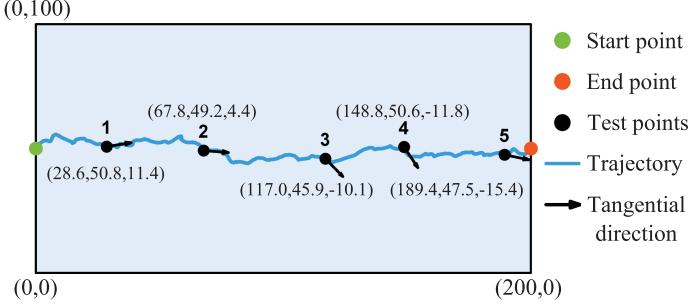  
Fig. 15. The illustration of the trajectory generalization test.

However, the radio map’s scenario generalization issue does not affect the practical feasibility of our approach. In our framework, the radio map is built and maintained for each BS, customized to the BS and limited to its own service area. On the one hand, a BS can naturally collect channel data within its coverage during radio map construction. On the other hand, the BS is not responsible to serve users outside its coverage when using the radio map.

2) Height Generalization: The operational airspace for LAE is usually three-dimensional and spans multiple flight levels. When height-dependent propagation variations are modest, channel statistics vary smoothly with altitude, and a model trained at a single flight level typically generalizes to nearby levels. However, when height-dependent variability is pronounced or the altitude separation is large, the cross-height generalization degrades. In such cases, augmenting the training data with CSI from the new heights and fine-tuning the networks is advisable.

In our system model, a two-dimensional plane is considered to keep the dataset size manageable, not due to any limitation of the method. The proposed pipeline naturally extends to 3D scenarios by augmenting the conditioning label with altitude, i.e., replacing $\boldsymbol { l } = ( x , y , v )$ with $( x , y , h , v )$ , where h represents the height.

3) Trajectory Generalization: In LAE applications, UAVs typically follow planned routes for safety. Accordingly, all data collection, network training, and performance tests in this work are conducted during regular flights. To assess generalization to unseen trajectories, an additional extreme stress test is performed within the same airspace as shown in Fig. 15. The start and end waypoints are fixed at (0,50)m and (200,50)m, respectively.

TABLE IV  
THE NMSES OF THE RADIO MAP COMPARED WITH OTHER APPROACHES FORTHE TRAJECTORY GENERALIZATION TEST
<table><tr><td>Test points</td><td>1</td><td>2</td><td>3</td><td>4</td><td>5</td></tr><tr><td>LS</td><td>0.161</td><td>0.098</td><td>0.126</td><td>0.119</td><td>0.182</td></tr><tr><td>ChannelNet [26]</td><td>0.089</td><td>0.032</td><td>0.069</td><td>0.078</td><td>0.121</td></tr><tr><td>CGAN [29]</td><td>0.052</td><td>0.057</td><td>0.115</td><td>0.031</td><td>0.235</td></tr><tr><td>RadioUNet [38]</td><td>0.061</td><td>0.049</td><td>0.100</td><td>0.038</td><td>0.333</td></tr><tr><td>DNN+LSTM [27]</td><td>0.049</td><td>0.030</td><td>0.055</td><td>0.015</td><td>0.239</td></tr><tr><td>Radio Map</td><td>0.023</td><td>0.018</td><td>0.021</td><td>0.017</td><td>0.033</td></tr></table>

The path is modeled as a continuous-time Gaussian process, a.k.a. Brownian bridge. The instantaneous speed of UAV is drawn from a Gaussian distribution with mean 20 m/s and variance $\mathrm { 1 0 ( m / s ) ^ { 2 } }$ . It is worth emphasizing that such a case with frequent heading changes and fluctuating speed is not representative of normal operations, it is intentionally designed to stress the proposed approach. Along the generated path, five test points are randomly selected. The noise power is set to yield an average SNR of 15 dB. The sensing labels of these points are annotated in Fig. 15, which contain positions and radical velocities.

We evaluate our approach against the same benchmarks applied in Figs. 13 and 14. The comparison of the NMSEs for the trajectory generalization test is provided in Table IV. It can be observed from the table that the proposed radio map method remains superior, indicating that the learned prior and integrator generalize well to more complex and out-of-distribution trajectories.

## VIII. CONCLUSION

In this paper, we propose a paradigm that utilizes radio map to assist channel estimation for LAE. First, a grid-based UAV channel measurement scheme is proposed to build the discrete radio map for the airspace. Then, CVCGAN is proposed to transform the discrete map into a seamless representation. After that, a neural network-based integrator is developed to perform channel estimation with the prior distribution information provided by the radio map and partial observations obtained from pilot measurements. The proposed method outperforms SOTA approaches including ChannelNet, CGAN, RadioUNet and LSTM. The provided in-depth analysis and discussion further strengthen its practicality, offering a promising solution for channel estimation in LAE scenarios.

## REFERENCES

[1] M. Mozaffari, W. Saad, M. Bennis, Y.-H. Nam, and M. Debbah, “A tutorial on UAVs for wireless networks: Applications, challenges, and open problems,” IEEE Commun. Surveys Tuts., vol. 21, no. 3, pp. 2334–2360, thirdquarter 2019.

[2] Y. Wei et al., “Multi-UAV collaborative edge computing algorithm for joint task offloading and channel resource allocation,” J. Commun. Inf. Netw., vol. 9, no. 2, pp. 137–150, Jun. 2024.

[3] W. Xu et al., “Edge learning for B5G networks with distributed signal processing: Semantic communication, edge computing, and wireless sensing,” IEEE J. Sel. Topics Signal Process., vol. 17, no. 1, pp. 9–39, Jan. 2023.

[4] Y. Jiang et al., “Integrated sensing and communication for low altitude economy: Opportunities and challenges,” IEEE Commun. Mag., vol. 63, no. 12, pp. 72–78, Dec. 2025.

[5] LAANC for industry, May 2017. [Online]. Available: https://www.faa. gov/uas/programs\_partnerships/data\_exchange

[6] CAAC holds symposium on general aviation management policy, Sep. 2017. [Online]. Available: https://www.caac.gov.cn/English/News/ 202305/t20230515\_218990.html

[7] What is u-space, Jun. 2017. [Online]. Available: https://www.easa.europa. eu/en/what-u-space

[8] Z. Xiao et al., “A survey on millimeter-wave beamforming enabled UAV communications and networking,” IEEE Commun. Surveys Tuts., vol. 24, no. 1, pp. 557–610, Firstquarter 2021.

[9] Y. Zeng, Q. Wu, and R. Zhang, “Accessing from the sky: A tutorial on UAV communications for 5G and beyond,” Proc. IEEE, vol. 107, no. 12, pp. 2327–2375, Dec. 2019.

[10] Y. Yang, F. Gao, X. Ma, and S. Zhang, “Deep learning-based channel estimation for doubly selective fading channels,” IEEE Access, vol. 7, pp. 36579–36589, 2019.

[11] K. T. Truong and R. W. Heath, “Effects of channel aging in massive MIMO systems,” J. Commun. Netw., vol. 15, no. 4, pp. 338–351, Aug. 2013.

[12] C.-K. Wen, W.-T. Shih, and S. Jin, “Deep learning for massive MIMO CSI feedback,” IEEE Wireless Commun. Lett., vol. 7, no. 5, pp. 748–751, Oct. 2018.

[13] E. G. Larsson, O. Edfors, F. Tufvesson, and T. L. Marzetta, “Massive MIMO for next generation wireless systems,” IEEE Commun. Mag., vol. 52, no. 2, pp. 186–195, Feb. 2014.

[14] L. Dai, Z. Wang, and Z. Yang, “Spectrally efficient time-frequency training OFDM for mobile large-scale MIMO systems,” IEEE J. Sel. Areas Commun., vol. 31, no. 2, pp. 251–263, Feb. 2013.

[15] E. Karami, “Tracking performance of least squares MIMO channel estimation algorithm,” IEEE Trans. Commun., vol. 55, no. 11, pp. 2201–2209, Nov. 2007.

[16] Y. Li, L. J. Cimini, and N. R. Sollenberger, “Robust channel estimation for OFDM systems with rapid dispersive fading channels,” IEEE Trans. Commun., vol. 46, no. 7, pp. 902–915, Jul. 1998.

[17] O. Edfors, M. Sandell, J.-J. Van de Beek, S. K. Wilson, and P. O. Borjesson, “OFDM channel estimation by singular value decomposition,” IEEE Trans. Commun., vol. 46, no. 7, pp. 931–939, Jul. 1998.

[18] D. L. Donoho, “Compressed sensing,” IEEE Trans. Inf. Theory, vol. 52, no. 4, pp. 1289–1306, Apr. 2006.

[19] W. Wang and W. Zhang, “Orthogonal projection-based channel estimation for multi-panel millimeter wave MIMO,” IEEE Trans. Commun., vol. 68, no. 4, pp. 2173–2187, Apr. 2020.

[20] E. J. Candes and T. Tao, “Decoding by linear programming,” IEEE Trans. Inf. Theory, vol. 51, no. 12, pp. 4203–4215, Dec. 2005.

[21] W. Dai and O. Milenkovic, “Subspace pursuit for compressive sensing signal reconstruction,” IEEE Trans. Inf. Theory, vol. 55, no. 5, pp. 2230–2249, May 2009.

[22] J. A. Tropp and A. C. Gilbert, “Signal recovery from random measurements via orthogonal matching pursuit,” IEEE Trans. Inf. Theory, vol. 53, no. 12, pp. 4655–4666, Dec. 2007.

[23] Y. Li and A. Madhukumar, “Hybrid near- and far-field THz UM-MIMO channel estimation: A sparsifying matrix learning-aided Bayesian approach,” IEEE Trans. Wireless Commun., vol. 24, no. 3, pp. 1881–1897, Mar. 2025.

[24] K. B. Letaief, W. Chen, Y. Shi, J. Zhang, and Y.-J. A. Zhang, “The roadmap to 6G: AI empowered wireless networks,” IEEE Commun. Mag., vol. 57, no. 8, pp. 84–90, Aug. 2019.

[25] H. Ye, G. Y. Li, and B.-H. Juang, “Power of deep learning for channel estimation and signal detection in OFDM systems,” IEEE Wireless Commun. Lett., vol. 7, no. 1, pp. 114–117, Feb. 2018.

[26] M. Soltani, V. Pourahmadi, A. Mirzaei, and H. Sheikhzadeh, “Deep learning-based channel estimation,” IEEE Commun. Lett., vol. 23, no. 4, pp. 652–655, Apr. 2019.

[27] J. Yu, X. Liu, Y. Gao, C. Zhang, and W. Zhang, “Deep learning for channel tracking in IRS-assisted UAV communication systems,” IEEE Trans. Wireless Commun., vol. 21, no. 9, pp. 7711–7722, Sep. 2022.

[28] B. Zhang, D. Hu, J. Wu, and Y. Xu, “An effective generative model based channel estimation method with reduced overhead,” IEEE Trans. Veh. Technol., vol. 71, no. 8, pp. 8414–8423, Aug. 2022.

[29] Y. Dong, H. Wang, and Y.-D. Yao, “Channel estimation for one-bit multiuser massive MIMO using conditional GAN,” IEEE Commun. Lett., vol. 25, no. 3, pp. 854–858, Mar. 2020.

[30] B. Liu, X. Liu, S. Gao, X. Cheng, and L. Yang, “LLM4CP: Adapting large language models for channel prediction,” J. Commun. Inf. Netw., vol. 9, no. 2, pp. 113–125, Jun. 2024.

[31] Y. Cao et al., “A comprehensive survey of AI-generated content (AIGC): A history of generative AI from GAN to ChatGPT,” Mar. 2023, arXiv:2303.04226.

[32] I. Goodfellow et al., “Generative adversarial nets,” in Proc. Adv. Neural Inf. Process. Syst., Dec. 2014, vol. 27, pp. 1–9.

[33] M. Mirza and S. Osindero, “Conditional generative adversarial nets,” Nov. 2014, arXiv:1411.1784.

[34] L. Yu, Z. Li, N. Ansari, and X. Sun, “Hybrid transformer based multiagent reinforcement learning for multiple unmanned aerial vehicle coordination in air corridors,” IEEE Trans. Mobile Comput., vol. 24, no. 6, pp. 5482–5495, Jun. 2025.

[35] W. B. Chikha, M. Masson, Z. Altman, and S. B. Jemaa, “Radio environment map based inter-cell interference coordination for massive-MIMO systems,” IEEE Trans. Mobile Comput., vol. 23, no. 1, pp. 785–796, Jan. 2024.

[36] W. Wang, B. Yang, and W. Zhang, “Deep learning-based radio map for MIMO-OFDM downlink precoding,” J. Commun. Inf. Netw., vol. 8, no. 3, pp. 203–211, Sep. 2023.

[37] B. Yang, W. Wang, and W. Zhang, “Cell-free massive MIMO beamforming based on radio map,” in Proc. IEEE Int. Conf. Commun., Jun. 2024, pp. 1–6.

[38] R. Levie, C. Yapar, G. Kutyniok, and G. Caire, “RadioUNet: Fast radio map estimation with convolutional neural networks,” IEEE Trans. Wireless Commun., vol. 20, no. 6, pp. 4001–4015, Jun. 2021.

[39] T. Thaj, E. Viterbo, and Y. Hong, “Orthogonal time sequency multiplexing modulation: Analysis and low-complexity receiver design,” IEEE Trans. Wireless Commun., vol. 20, no. 12, pp. 7842–7855, Dec. 2021.

[40] W. Wang and W. Zhang, “Jittering effects analysis and beam training design for UAV millimeter wave communications,” IEEE Trans. Wireless Commun., vol. 21, no. 5, pp. 3131–3146, May 2021.

[41] M. Morelli, C.-C. J. Kuo, and M.-O. Pun, “Synchronization techniques for orthogonal frequency division multiple access (OFDMA): A tutorial review,” Proc. IEEE, vol. 95, no. 7, pp. 1394–1427, Jul. 2007.

[42] 3GPP, “NR; Physical channels and modulation,” TS 38.211, v18.1.0, Jan. 2024. [Online]. Available: https://portal.3gpp.org/desktopmodules/ Specifications/SpecificationDetails.aspx?specificationId=3213

[43] X. Ding, Y. Wang, Z. Xu, W. J. Welch, and Z. J. Wang, “Continuous conditional generative adversarial networks: Novel empirical losses and label input mechanisms,” IEEE Trans. Pattern Anal. Mach. Intell., vol. 45, no. 7, pp. 8143–8158, Jul. 2023.

[44] D. P. Kingma and J. Ba, “Adam: A method for stochastic optimization,” in Proc. Int. Conf. Learn. Representation, May 2015, pp. 1–15.

[45] M. Arjovsky, S. Chintala, and L. Bottou, “Wasserstein generative adversarial networks,” in Proc. Int. Conf. Mach. Learn., Aug. 2017, pp. 214–223.

[46] I. Gulrajani, F. Ahmed, M. Arjovsky, V. Dumoulin, and A. C. Courville, “Improved training of wasserstein GANs,” in Proc. Adv. Neural Inf. Process. Syst., Dec. 2017, vol. 30, pp. 1–11.

[47] X. Chen, Y. Duan, R. Houthooft, J. Schulman, I. Sutskever, and P. Abbeel, “InfoGAN: Interpretable representation learning by information maximizing generative adversarial nets,” in Proc. Adv. Neural Inf. Process. Syst., Dec. 2016, pp. 2172–2180.

[48] Y. Dalva, S. F. Altındi¸s, and A. Dundar, “VecGAN : Image-to-image translation with interpretable latent directions,” in Proc. Eur. Conf. Comput. Vis., Oct. 2022, pp. 153–169.

[49] A. Krizhevsky, I. Sutskever, and G. E. Hinton, “ImageNet classification with deep convolutional neural networks,” in Proc. Adv. Neural Inf. Process. Syst., Dec. 2012, pp. 1–9.

[50] V. Nair and G. E. Hinton, “Rectified linear units improve restricted boltzmann machines,” in Proc. Int. Conf. Mach. Learn., Jun. 2010, pp. 807–814.

[51] A. L. Maas, A. Y. Hannun, and A. Y. Ng, “Rectifier nonlinearities improve neural network acoustic models,” in Proc. Int. Conf. Mach. Learn., Jun. 2013, vol. 30, no. 1, pp. 1–6.

[52] N. Srivastava, G. Hinton, A. Krizhevsky, I. Sutskever, and R. Salakhutdinov, “Dropout: A simple way to prevent neural networks from overfitting,” J. Mach. Learn. Res., vol. 15, no. 1, pp. 1929–1958, Jun. 2014.

[53] A. Odena, V. Dumoulin, and C. Olah, “Deconvolution and checkerboard artifacts,” Distill, Oct. 2016. [Online]. Available: http://distill.pub/2016/ deconv-checkerboard

[54] S. Ioffe and C. Szegedy, “Batch normalization: Accelerating deep network training by reducing internal covariate shift,” in Proc. Int. Conf. Mach. Learn., Jul. 2015, pp. 448–456.

[55] A. Alkhateeb, “DeepMIMO: A generic deep learning dataset for millimeter wave and massive MIMO applications,” in Proc. IEEE Inf. Theory Appl. Workshop, Feb. 2019, pp. 1–8.

[56] Remcom, “Wireless InSite,” 2024. Online. Available: http://www. remcom.com/wireless-insite

[57] J. Hoydis et al., “Sionna: An open-source library for next-generation physical layer research,” Mar. 2022, arXiv:2203.11854.

[58] 3GPP, “NR; base station (BS) radio transmission and reception,” TR 38.104, v18.7.0, Sep. 2024. [Online]. Available: https: //portal.3gpp.org/desktopmodules/Specifications/SpecificationDetails. aspx?specificationId=3202

[59] Z. Dai, D. Wu, Y. Zeng, X. Xu, and X. Wang, “BS-1-to-N: Diffusionbased environment-aware cross-BS channel knowledge map generation for cell-free networks,” Jul. 2025, arXiv:2507.23236.

[60] R. K. Jaiswal, M. Elnourani, S. Deshmukh, and B. Beferull-Lozano, “Leveraging transfer learning for radio map estimation via mixture of experts,” IEEE Trans. Cogn. Commun. Netw., vol. 12, no. 1, pp. 846–863, 2026.

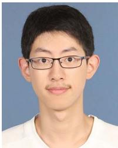  
Bin Yang (Graduate Student Member, IEEE) received the BS degree in telecommunication engineering from the Nanjing University of Posts and Telecommunications, Nanjing, China, in 2018, and the MS degree in communications and information systems from Xidian University, Xi’an, China, in 2021. He is currently working toward the PhD degree with The University of New South Wales, Sydney, Australia. His research interests include radio map, wireless communications, and machine learning.

Wei Wang (Senior Member, IEEE) received the BS degree from Central South University, Changsha, China, in 2010, the MS degree from Southeast University, Nanjing, China, in 2013, and the PhD degree from The University of New South Wales, Sydney, Australia, in 2017. From 2018 to 2021, he was a postdoctoral research fellow with The University of New South Wales. From 2022 to 2025, he was a senior research scientist with Peng Cheng Laboratory, Shenzhen, China. Since 2026, he has been a professor with the School of Information Science and Technol-

ogy, Harbin Institute of Technology, Shenzhen. His research interests include millimeter-wave communications and machine learning for wireless communications. He was the recipient of the 2023 IEEE ComSoc AP Outstanding Young Researcher Award and the Best Paper Awards with the IEEE ICCC 2016 and 2024. He was an editor for IEEE Transactions on Mobile Computing and previously was an editor for IEEE Wireless Communications Letters. He was also Co-Chair for multiple symposia and workshops at major IEEE conferences.

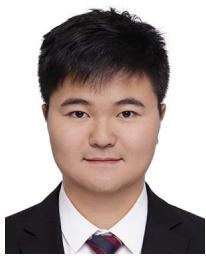

Weizheng Zhang (Member, IEEE) received the BEng degree from the Southeast University, China, in 2015, and the PhD degree from the University of New South Wales, Sydney, Australia, in 2019. From 2020 to 2023, he was a postdoctoral research fellow with University of New South Wales. Since 2024, he has been a professor with the School of Information Science and Technology, Harbin Institute of Technology, Shenzhen. His current research interests include UAV communications, channel knowledge map, and AI for physical layer communications. He was an editor for

IEEE Wireless Communication Letters and IEEE Open Journal of Vehicular Technology. He was the TPC co-chair of IEEE/CIC ICCC 2024 and WCSP 2024.

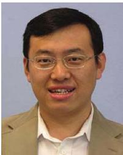

Wei Zhang (Fellow, IEEE) received the PhD degree from The Chinese University of Hong Kong, in 2005. He is currently a professor with the School of Electrical Engineering and Telecommunications, The University of New South Wales, Sydney, Australia. His current research interests include UAV communications, 5 G, and beyond. He was a member for various ComSoc boards/standing committees, including Journals Board, Technical Committee Recertification Committee, Finance Standing Committee, Information Technology Committee, and Steering Committee

for IEEE Transactions on Green Communications and Networking and IEEE Networking Letters. He was the recipient of the six best paper awards from the IEEE conferences and ComSoc technical committees. He was an area editor for IEEE Transactions on Wireless Communications and the Editor-in-Chief for Journal of Communications and Information Networks. He was an editor for IEEE Transactions on Communications, IEEE Transactions on Wireless Communications, IEEE Transactions on Cognitive Communications and Networking, and IEEE Journal on Selected Areas in Communications Cognitive Radio Series. Within the IEEE ComSoc, he has taken many leadership positions, including the Member-at-Large on the Board of Governors from 2018 to 2020, Chair of the Wireless Communications Technical Committee from 2019 to 2020, Vice Director of the Asia-Pacific Board from 2016 to 2021, Editor-in-Chief of IEEE Wireless Communications Letters from 2016 to 2019, Technical Program Committee Chair of APCC 2017 and ICCC 2019, and Award Committee Chair of the Asia-Pacific Board and Technical Committee on Cognitive Networks. He was an IEEE ComSoc Distinguished Lecturer from 2016 to 2017. He was the Vice President of the IEEE Communications Society from 2022 to 2025.