# Generative-Adversarial-Network-Enhanced DRL for ISAC With Double Active RISs

Jifa Zhang , Min Sheng , Fellow, IEEE, Chengwen Xing , Member, IEEE, Junyu Liu , Member, IEEE, Nan Zhao , Senior Member, IEEE, and George K. Karagiannidis , Fellow, IEEE

Abstract—Integrated sensing and communication (ISAC) is a promising paradigm to alleviate spectrum congestion and facilitate a variety of emerging Internet of Things (IoT) applications. However, the direct links from the ISAC base station (BS) to the users may be blocked due to the obstacles. In this article, we investigate the double-active reconfigurable intelligent surfaces (RISs) assisted ISAC, where two active RISs are used to establish virtual line-of-sight (LoS) links from the ISAC BS to the users. In addition, the sum of the minimum sensing signal-to-interferenceplus-noise ratios (SINRs) among multiple targets during a series of time slots is maximized, subject to Quality of Service (QoS) and transmit power constraints, through the joint optimization of transmit, reflection and receive beamforming. We first transform this nonconvex optimization problem in the dynamic environment into a Markov decision process (MDP), and then propose a twin delayed deep deterministic policy gradient (TD3)-based algorithm to solve it. Moreover, to enhance the generalization and stability, we integrate the generative adversarial network (GAN) into the TD3 algorithm and propose a GAN-TD3-based algorithm to handle the beamforming optimization problem. Compared with the TD3-based algorithm, the proposed GAN-TD3-based algorithm achieves the better performance and higher stability at the cost of higher computational complexity and slower convergence speed. Simulation results are presented to verify the effectiveness of our proposed algorithms and the superiority of the active RIS over the passive counterpart.

Index Terms—Active reconfigurable intelligent surface (RIS), beamforming design, deep reinforcement learning (DRL), generative artificial intelligence (GAI), Internet of Things (IoT), integrated sensing and communication (ISAC).

# I. INTRODUCTION

ODAY, many emerging Internet of Things (IoT) applications in fifth-generation (5G) cellular networks, such

Received 29 October 2024; revised 11 December 2024; accepted 30 December 2024. Date of publication 20 January 2025; date of current version 9 May 2025. This work was supported in part by the National Natural Science Foundation of China (NSFC) under Grant U23A20271 and Grant 62271099. (Corresponding author: Nan Zhao.)

Jifa Zhang and Nan Zhao are with the School of Information and Communication Engineering, Dalian University of Technology, Dalian 116024, Liaoning, China (e-mail: jifazhang@mail.dlut.edu.cn; zhaonan@dlut.edu.cn).

Min Sheng and Junyu Liu are with the State Key Laboratory of Integrated Service Networks, Xidian University, Xi’an 710071, China (e-mail: msheng@ mail.xidian.edu.cn; jyliu@stu.xidian.edu.cn).

Chengwen Xing is with the School of Information and Electronics, Beijing Institute of Technology, Beijing 100081, China (e-mail: xingchengwen@ gmail.com).

George K. Karagiannidis is with the Department of Electrical and Computer Engineering, Aristotle University of Thessaloniki, 54124 Thessaloniki, Greece (e-mail: geokarag@auth.gr).

Digital Object Identifier 10.1109/JIOT.2025.3527441

as vehicle-to-everything (V2X) and smart home, place higher demands on both sensing accuracy and communication rate [1]. In addition, the wireless spectrum is becoming increasingly congested due to the exponential growth of wireless devices and scarce spectral resources. Fortunately, integrated sensing and communication (ISAC), which integrates communication and sensing into a unified platform with spectrum and hardware sharing, is becoming a promising solution to address these issues [2]. In addition, ISAC not only outperforms the separate setups in power consumption, spectral efficiency, and hardware size, but also enables the mutual benefits between communication and sensing, which has received much research interest [3]. Great efforts have been made to facilitate the ISAC from various aspects, including waveform design [4], [5] and beamforming optimization [6], [7]. For example, Liu et al. [4] investigated the waveform design for ISAC, and the performance tradeoff between two functionalities was considered. Bazzi and Chafii [5] proposed a dual-function waveform design scheme where multiuser interference (MUI) was minimized subject to waveform similarity and peak-to-average power ratio (PAPR) constraints. Qi et al. [6] studied the hybrid beamforming design for ISAC and the beampattern mismatch was minimized while satisfying the constraints of transmit power and communication Quality of Service (QoS). A robust ISAC beamforming scheme was proposed by Zhao et al. [7], and the maximum Cramér-Rao bound (CRB) of angle estimation for multiple targets was minimized.

On the other hand, the reconfigurable intelligent surface (RIS) can intelligently reconfigure the wireless propagation environment by changing the amplitude and phase shift of the incident signal, illustrating the huge potential in enhancing the performance of ISAC [8]. Specifically, the RIS can not only provide the additional line-of-sight (LoS) links for target acquisition, but also extend the communication coverage. As a result, the RIS-aided ISAC is becoming a hot topic, attracting a lot of researchers to delve into it. For example, Zhong et al. [9] investigated the joint transmit waveform and phase shift design for RIS-aided ISAC, in which the sensing signal-to-interference-plus-noise ratio (SINR) was maximized and the communication MUI was minimized at the same time. Zhao et al. [10] minimized the general Schur concave objective for the RIS-supported ISAC network by the joint active and passive beamforming design. In [11], two cooperative RISs were used by Xiang et al. to assist the ISAC in both target acquisition and information transmission. In addition, Zhang et al. [12] investigated the transmission power minimization for the double RIS-assisted ISAC. Compared with the traditional passive RIS, the active one can amplify the power of the incident signal, which is expected to overcome the “double fading” effect of reflection links and further improve the performance of ISAC [13]. In addition, the active RIS is superior to the active relay in power consumption, complexity, and deployment flexibility [14]. Therefore, researchers pay more and more attention to the active RIS-based ISAC [15], [16], [17], [18]. For example, Salem et al. [15] used an active RIS to enhance the security of ISAC, and maximized the secrecy rate by jointly optimizing the transmit beamforming, receive beamforming, and reflection coefficients in the active RIS. Zhang et al. [16] proposed a secure transmission scheme for the active RISsupported ISAC and verified the superiority of the active RIS over the passive counterpart. Zhu et al. [17] used an active RIS to improve the target estimation accuracy and communication service quality of the ISAC system, and the CRB was minimized while satisfying the communication QoS. Two active RISs were used by Liu et al. [18] to eliminate the interference from the communication system to the radar receiver under the coexistence scenario of radar and communication.

TABLE I COMPARISON BETWEEN OUR WORK AND THE RELATED PUBLICATIONS 

<table><tr><td>Reference</td><td>RIS</td><td>Algorithm</td><td>Objective function</td><td>Complexity</td></tr><tr><td>[9]</td><td>Passive RIS</td><td> $BCD^1$ </td><td> $WSMSS^2$ </td><td>High</td></tr><tr><td>[10]</td><td>Passive RIS</td><td> $AO^3$ </td><td>General Schur-concave objective</td><td>High</td></tr><tr><td>[11]</td><td>Double passive RISs</td><td> $AO, SDR^4$ </td><td>Sum of minimum sensing and communication SINRs</td><td>High</td></tr><tr><td>[12]</td><td>Double passive RISs</td><td>AO, SDR</td><td>Transmit power</td><td>High</td></tr><tr><td>[15]</td><td>Active RIS</td><td>BCD</td><td>Sensing SINR</td><td>High</td></tr><tr><td>[16]</td><td>Active RIS</td><td>AO</td><td>Secrecy rate</td><td>High</td></tr><tr><td>[17]</td><td>Active RIS</td><td>AO</td><td>CRB</td><td>High</td></tr><tr><td>[18]</td><td>Double active RISs</td><td>Penalty dual decomposition</td><td>Achievable rate</td><td>High</td></tr><tr><td>[25]</td><td>STAR-RIS</td><td> $DDPG^5, SAC^6$ </td><td>Secrecy rate</td><td>Low</td></tr><tr><td>[26]</td><td>Passive RIS</td><td> $PPO^7$ </td><td>System capacity</td><td>Low</td></tr><tr><td>[27]</td><td>Passive RIS</td><td> $TD3^8$ </td><td>Weighted sum of MUI and waveform discrepancies</td><td>Low</td></tr><tr><td>[28]</td><td>STAR-RIS</td><td>SAC, PPO</td><td>Weighted sum of sensing SINR and achievable rate</td><td>Low</td></tr><tr><td>This work</td><td>Double active RISs</td><td>TD3, GAN-TD3</td><td>Minimum sensing SINRs among multiple targets</td><td>Low</td></tr></table>

1BCD:Blockcdatet,:gedfUandsOleatiatioD:sdeii DDPG:deepeetool:tdeee gradient.

Nevertheless, all the aforementioned schemes are based on the conventional convex/nonconvex optimization algorithms, which face the challenges of high-computational complexity due to the complicated operations and iterative nature [19], [20]. Fortunately, deep reinforcement learning (DRL) has been an effective method to deal with the multistage decision in the dynamic environment [21], [22]. Unlike the traditional convex/nonconvex optimization algorithms, DRL aims to learn the optimal policy that can maximize the cumulative discount reward in a trial-and-error manner without the need for complicated derivations [23]. Moreover, the training samples are obtained through the interplay between the agent and the environment, which makes it more suitable for wireless communication than deep learning, especially when the training samples are scarce [24]. Therefore, the DRL-based ISAC design becomes a promising direction. For example, in [25], two DRL-based algorithms were developed by Zhu et al. to deal with the secrecy rate maximization for the simultaneous transmitting and reflecting reconfigurable intelligent surfaces (STAR-RIS)-assisted secure ISAC network. Liu et al. [26] developed a DRL-based algorithm to address the joint beamforming and phase shift optimization for the RIS-supported ISAC system. Zhang et al. [27] proposed a DRL-based algorithm to handle the joint transmit waveform and phase shift design for the STAR-RIS-aided ISAC. Zhang et al. [28] proposed a multiagent DRL framework for the target-mounted STAR-RIS-assisted ISAC.

Although the DRL excels in handling the multistep decision in a dynamic scenario, it suffers from the challenges of low-sampling efficiency and generalization [29]. Fortunately, generative artificial intelligence (GAI) is expected to address the aforementioned issues of DRL. Unlike the traditional AI techniques that focus on classification and feature extraction, GAI aims to generate the fake samples that are similar to the real training samples, which has been widely used for digital content generation [30]. In addition, GAI also demonstrates the advantages of high-sampling efficiency and generalization, which is expected to improve the performance of DRL [31]. For example, Sun et al. [32] discussed the great potential of GAI in improving the performance of DRL and developed four GAI-enhanced DRL frameworks. Kasgari et al. [33] developed a generative adversarial network (GAN)-enhanced DRL framework, where GAN was used to pretrain the DRL algorithm to improve its generalization and performance. Hua et al. [34] leveraged the DRL to tackle bandwidth allocation in a dynamic environment, and the GAN was leveraged to learn the distribution of state-action value.

The motivation of this article can be summarized as below. First, the beamforming design for the active RISs aided ISAC has not been well investigated. Second, most ISAC beamforming designs are based on the traditional optimization algorithms, undergoing the challenges of high-computational complexity and struggling in the dynamic environment. Finally, the GAI-enhanced DRL is still in its infancy. Table I compares our work with the related publications, and the contributions are listed as below.

1) This article investigates the joint transmit, reflection and receive beamforming design for the double active RISsaided ISAC. In particular, the sum of minimum sensing SINRs among multiple targets during a series of time slots is maximized subject to the constraints of transmit power and communication rate of each user. We develop two DRL-based algorithms to deal with this nonconvex problem in the dynamic environment.   
2) We first transform the original optimization problem into a Markov decision process (MDP) and define its essential elements, including the state, action, and reward. Furthermore, the penalty-based method and normalization operations are leveraged to make the output solution satisfy the constraints. Then, a TD3-based algorithm is developed to learn the optimal policy via the interplay between the agent and environment.   
3) To enhance the sample efficiency and generalization, we integrate the GAN into the TD3 algorithm, and propose a GAN-TD3-based algorithm for beamforming design. Specifically, the inherent adversarial mechanism of GAN is leveraged to boost the estimation accuracy of Q-value. The GAN-TD3-based algorithm outperforms the TD3 counterpart in performance and stability at the cost of computational complexity and convergence speed.

The remainder of this article is organized as below. Section II introduces the system model and problem formulation. The TD3-based algorithm and GAN-TD3-based one for the beamforming design are presented in Sections III and IV, respectively. Section V provides the simulation results with the conclusion in Section VI.

Notation: $\sqrt { \cdot } , \ ( \cdot ) ^ { - 1 } , \ ( \cdot ) ^ { T }$ , and $( \cdot ) ^ { H }$ stand for square root, inverse, transpose, and Hermitian, respectively. | · | and ∠ are the modulus and angle of a complex number, respectively. ·2 and $\| \cdot \| _ { F }$ represent the $\ell _ { 2 }$ norm and Frobenius norm, respectively. $\mathscr { C N } ( \pmb { \mu } , \pmb { \Upsilon } )$ denotes the circularly symmetric complex Gaussian distribution with mean μ and covariance matrix ϒ. diag(a) returns a diagonal matrix whose diagonal elements consist of the vector a. j represents the imaginary unit and ∇ refers to the gradient operation. $\otimes$ denotes the Kronecker product and $\mathbb { E } ( \cdot )$ stands for the mathematical expectation. vec(X) transforms the matrix X into a column vector in a column-first manner and % refers to the mod operation.

# II. SYSTEM MODEL AND PROBLEM FORMULATION

In this section, we first present the investigated system model of the double active RISs aided ISAC. Afterwards, the joint transmit, reflection and receive beamforming design is formulated.

# A. System Model

Consider a double active RISs aided ISAC system in Fig. 1, where the Nt-antenna ISAC-base station (BS) delivers the downlink information to $K \ > \ 1$ single-antenna users and detects $J \ > \ 1$ point-like targets simultaneously. Due to the severe blockage, there is no direct link from the ISAC-BS to the users, and two active RISs are leveraged to establish virtual LoS links. For convenience, let ${ \mathcal { K } } \triangleq \{ 1 , \dots , K \}$ and ${ \mathcal { I } } \ { \stackrel { \triangle } { = } }$ $\{ 1 , \ldots , J \}$ represent the sets of users and targets, respectively. The positions of the jth target, kth user and ith active RIS are denoted as $\mathbf { p } _ { t , j } = [ x _ { t , j } , y _ { t , j } , H ] ^ { T } , \mathbf { p } _ { u , k } = [ x _ { k } , y _ { k } , 0 ] ^ { T }$ and $\mathbf { p } _ { I , i } = [ x _ { I , i } , y _ { I , i } , H ] ^ { T } \ \forall j \in \mathcal { I } , k \in \mathcal { K } , i = 1 , 2 ,$ respectively. In addition, the position of BS is $[ 0 , 0 , H ] ^ { T }$ . We investigate the joint transmit, reflection and receive beamforming design during $L > 1$ time slots. Assume that the number of reflection elements at the active RIS 1 and RIS 2 are $M > 1$ , and $\Phi _ { i , \ell } =$ diag $( \pmb { \nu } _ { i , \ell } ) \in \mathbb { C } ^ { M \times M }$ refers to the reflection coefficient matrix of the ith active RIS in the -th time slot, $i = 1 , 2 ,$ where $\pmb { \nu } _ { i , \ell } ( m ) = \beta _ { i , \ell , m } e ^ { J \phi _ { i , \ell , m } }$ represents the reflection coefficient of the mth element, and $\beta _ { i , \ell , m } > 1$ and $\phi _ { i , \ell , m } \in [ 0 , 2 \pi ]$ stand for the amplitude and phase shift, respectively.

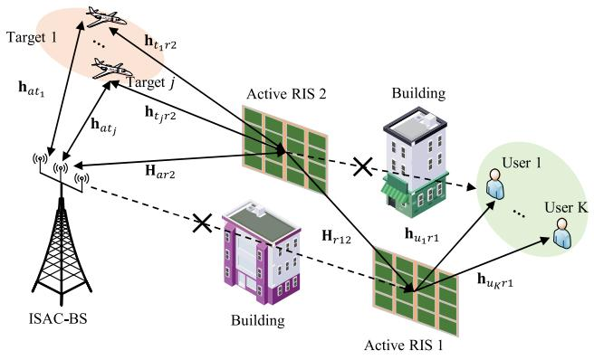

flowchart

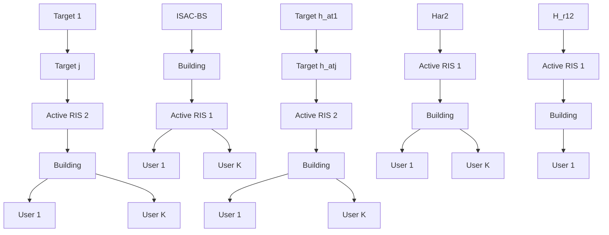

Fig. 1. Double active RISs aided ISAC.

The transmitted signal at the ISAC-BS in the -th time slot can be given by

$$
\mathbf {x} _ {\ell} = \sum_ {k = 1} ^ {K} \mathbf {v} _ {k, \ell} c _ {k, \ell} + \sum_ {j = 1} ^ {J} \mathbf {w} _ {j, \ell} s _ {j, \ell} \forall \ell \in \mathcal {L} \tag {1}
$$

where $\begin{array} { r } { c _ { k , \ell } \ \sim \ \mathcal { C N } ( 0 , 1 ) } \end{array}$ and $\mathbf { v } _ { k , \ell } ~ \in ~ \mathbb { C } ^ { N _ { t } \times 1 }$ stand for the information symbol and corresponding transmit beamforming vector for the kth user, respectively. $s _ { j , \ell } ~ \sim ~ \mathcal { C N } ( 0 , 1 )$ and $\mathbf { w } _ { j , \ell } \in { \mathbb { C } } ^ { N _ { t } \times 1 }$ refer to the probing signal and the corresponding transmit beamforming vector for the jth target, respectively.

In the -th time slot, the link between the ISAC-BS transmitter and the jth target can be formulated as

$$
\mathbf {h} _ {a t _ {j}, \ell} = \sqrt {\rho d _ {a t _ {j}} ^ {- \beta}} \left[ 1, e ^ {J \pi \sin \theta_ {t _ {j}, \ell}}, \dots , e ^ {J \pi (N _ {t} - 1) \sin \theta_ {t _ {j}, \ell}} \right] ^ {T} \tag {2}
$$

where $\theta _ { t _ { j } , \ell } \in [ 0$ , 2π ] denotes the angle of the jth target with respect to (w.r.t) the ISAC-BS, ρ refers to the channel gain at the reference distance d = 1 m, $d _ { a t _ { j } }$ is the distance between the ISAC-BS and the jth target, and $\beta$ represents the path-loss exponent.

The steering vector of the ith active RIS can be given by

$$
\mathbf {g} (\theta , \phi) = \mathbf {a} _ {M _ {x}} (\sin \theta \cos \phi) \otimes \mathbf {a} _ {M _ {z}} (\cos \theta) \tag {3}
$$

with

$$
\mathbf {a} _ {M} (y) \triangleq \left[ 1, e ^ {J \pi y}, \dots , e ^ {J \pi (M - 1) y} \right] ^ {T} \tag {4}
$$

where θ and φ stand for the elevation and azimuth with respect√ √ to the ith active RIS, $M _ { x } = \sqrt { M }$ and $M _ { z } = \sqrt { M }$ are the element number along the x-axis and z-axis, respectively.

Assume that the channels between the active RIS 1 and users are Rician channels [27]. Consequently, in the -th time slot, the channel between the kth user and active RIS 1 can be formulated as

$$
\mathbf {h} _ {u _ {k} r 1, \ell} = \sqrt {\rho d _ {u _ {k}} ^ {- \beta}} \left(\sqrt {\frac {\kappa}{1 + \kappa}} \mathbf {h} _ {u _ {k} r 1} ^ {\mathrm{LoS}} + \sqrt {\frac {1}{1 + \kappa}} \mathbf {h} _ {u _ {k} r 1, \ell} ^ {\mathrm{NLoS}}\right) \tag {5}
$$

where κ denotes the Rician factor, $d _ { u _ { k } } = \| \mathbf { p } _ { u , k } - \mathbf { p } _ { I , 1 }$ 2 denotes the distance between the kth user and active RIS 1, $\mathbf { \Delta h } _ { u _ { k } r 1 , \ell } ^ { \mathrm { N L o S } } \sim$ $\mathcal { C N } ( \mathbf { 0 } , \mathbf { I } )$ is the non LoS component, and $\mathbf { h } _ { u _ { k } r 1 } ^ { \mathrm { L o S } }$ ukr1 denotes the LoS component, formulated as

$$
\mathbf {h} _ {u _ {k} r 1} ^ {\mathrm{LoS}} = \mathbf {a} _ {M _ {x, 1}} \left(\sin \theta_ {u _ {k}} \cos \phi_ {u _ {k}}\right) \otimes \mathbf {a} _ {M _ {z, 1}} \left(\cos \theta_ {u _ {k}}\right) \tag {6a}
$$

$$
\sin \theta_ {u _ {k}} \cos \phi_ {u _ {k}} = \frac {x _ {k} - x _ {I , 1}}{d _ {u _ {k}}}, \cos \theta_ {u _ {k}} = \frac {H}{d _ {u _ {k}}}. \tag {6b}
$$

The links between the two active RISs, the active RIS 2 and targets, the active RIS 2 and ISAC-BS are assumed as the LoS channels, which can be formulated as the product of the transmit and receive steering vectors, and the details are omitted for brevity.

The received signal at the ISAC-BS in the -th time slot can be formulated as1

$$
\mathbf {y} _ {\ell} = \sum_ {j = 1} ^ {J} \alpha_ {j} \tilde {\mathbf {h}} _ {j, \ell} \tilde {\mathbf {h}} _ {j, \ell} ^ {H} \mathbf {x} _ {\ell} + \mathbf {n} _ {\ell} \tag {7a}
$$

$$
\approx \sum_ {j = 1} ^ {J} \alpha_ {j} \tilde {\mathbf {H}} _ {j, \ell} \mathbf {x} _ {\ell} + \mathbf {n} _ {\ell} \tag {7b}
$$

where $\alpha _ { j } ~ \in ~ \mathcal { C N } ( 0 , \sigma _ { j } ^ { 2 } )$ refers to the complex reflection coefficient of the jth point-like target, $\mathbf { n } _ { \ell } \sim \mathcal { C N } ( \mathbf { 0 } , \sigma _ { n } ^ { 2 } \mathbf { I } )$ denotes the additive white Gaussian noise (AWGN) vector, $\tilde { \mathbf { h } } _ { j , \ell } \triangleq ( \mathbf { h } _ { a t _ { i } , \ell } ^ { H } + \mathbf { h } _ { t _ { i } r 2 } ^ { H } \Phi _ { 2 , \ell } \mathbf { H } _ { a r 2 } ) ^ { H }$ (hHatj,- + hHtjr22,-Har2)H refers to the equivalent link from the ISAC-BS to the jth target, and $\tilde { \mathbf { H } } _ { j , \ell } \triangleq \mathbf { h } _ { a t _ { j } , \ell } \mathbf { h } _ { a t _ { j } , \ell } ^ { H } +$ $\mathbf { h } _ { a t _ { j } , \ell } \mathbf { h } _ { t _ { i } r 2 } ^ { H } \Phi _ { 2 , \ell } \mathbf { H } _ { a r 2 } + \mathbf { H } _ { a r 2 , \ell } ^ { H } \Phi _ { 2 , \ell } ^ { H } \mathbf { h } _ { t _ { j } r 2 , \ell } \mathbf { h } _ { a t _ { i } , \ell } ^ { H } \ \forall j \in \mathcal { I }$ .

To enhance the sensing performance, the ISAC-BS receiver leverages J linear filters to perform the receive beamforming on the received signal. Moreover, the output of the jth linear filter can be formulated as

$$
y _ {j, \ell} = \mathbf {u} _ {j, \ell} ^ {H} \mathbf {y} _ {\ell} \forall j \in \tilde {\mathcal {J}}, \ell \in \mathcal {L} \tag {8}
$$

where $\mathbf { u } _ { i , \ell } \in \mathbb { C } ^ { N _ { r } \times 1 }$ refers to the coefficient of the jth linear filter and $\tilde { \mathcal { T } } \triangleq \{ 1 , \dots , J \}$ denotes the set of all linear filters.

Accordingly, the sensing SINR of the jth target in the -th time slot can be formulated as

$$
\mathrm{SINR} _ {t, j, \ell} = \frac {\sigma_ {j} ^ {2} \| \mathbf {u} _ {j , \ell} ^ {H} \tilde {\mathbf {H}} _ {j , \ell} \mathbf {W} _ {\ell} \| _ {2} ^ {2}}{\sum_ {i \neq j} ^ {J} \sigma_ {i} ^ {2} \| \mathbf {u} _ {j , \ell} ^ {H} \tilde {\mathbf {H}} _ {i , \ell} \mathbf {W} _ {\ell} \| _ {2} ^ {2} + \sigma_ {n} ^ {2} \| \mathbf {u} _ {j , \ell} \| _ {2} ^ {2}} \forall j \in \mathcal {J} (9)
$$

where $\mathbf { W } _ { \ell } \triangleq [ \mathbf { v } _ { 1 , \ell } , \hdots , \mathbf { v } _ { K , \ell } , \mathbf { w } _ { 1 , \ell } , \hdots , \mathbf { w } _ { J , \ell } ] .$

1This article does not consider the signal reflected by the target or active RIS more than twice owing to the signal attenuation.

The received signal at the kth user can be formulated as

$$
\tilde {y} _ {k, \ell} = \mathbf {h} _ {u _ {k} r 1, \ell} ^ {H} \boldsymbol {\Phi} _ {1, \ell} \mathbf {H} _ {r 1 2} \boldsymbol {\Phi} _ {2, \ell} \mathbf {H} _ {a r 2} \mathbf {x} _ {\ell} + n _ {k, \ell} \forall k \in \mathcal {K} \tag {10}
$$

where $n _ { k , \ell } \sim \mathcal { C N } ( 0 , \sigma _ { n } ^ { 2 } )$ denotes the AWGN and $\sigma _ { n } ^ { 2 }$ represents the noise power.

Accordingly, the SINR of the kth user in the -th time slot can be formulated as

$$
\begin{array}{l} \mathrm{SINR} _ {u _ {k}, \ell} \\ = \frac {\left| \tilde {\mathbf {h}} _ {u _ {k} , \ell} ^ {H} \mathbf {v} _ {k , \ell} \right| ^ {2}}{\sum_ {i \neq k} ^ {K} \left| \tilde {\mathbf {h}} _ {u _ {k} , \ell} ^ {H} \mathbf {v} _ {i , \ell} \right| ^ {2} + \sum_ {j = 1} ^ {J} \left| \tilde {\mathbf {h}} _ {u _ {k} , \ell} ^ {H} \mathbf {w} _ {j , \ell} \right| ^ {2} + \sigma_ {n} ^ {2}} \forall k \in \mathcal {K} \tag {11} \\ \end{array}
$$

where h˜ H $\tilde { \mathbf { h } } _ { u _ { k } , \ell } ^ { H } \triangleq \mathbf { h } _ { u _ { k } r 1 , \ell } ^ { H } \Phi _ { 1 , \ell } \mathbf { H } _ { r 1 2 } \Phi _ { 2 , \ell } \mathbf { H } _ { a r 2 }$ hHukr1,-1,-Hr122,-Har2 refers to the cascaded channel from the ISAC-BS to the kth user. In addition, the achievable rate of kth user in the -th time slot can be formulated as

$$
R _ {u _ {k}, \ell} = \log_ {2} \left(1 + \operatorname{SINR} _ {u _ {k}, \ell}\right) \forall k \in \mathcal {K}. \tag {12}
$$

The incident signal at the active RIS 2 in the -th time slot can be formulated as

$$
\mathbf {y} _ {I _ {2}, \ell} = \underbrace {\mathbf {H} _ {a r 2} \mathbf {x} _ {\ell}} _ {\text { ISAC - BS - RIS   2 }} + \sum_ {j = 1} ^ {J} \underbrace {\alpha_ {j} \mathbf {h} _ {t _ {j} r 2 , \ell} \mathbf {h} _ {a t _ {j} , \ell} ^ {H} \mathbf {x} _ {\ell}} _ {\text { ISAC - BS - target   j - RIS   2 }} + \mathbf {n} _ {I _ {2}, \ell} \tag {13}
$$

power where $\mathbf { n } _ { I _ { 2 } , \ell } \sim \mathcal { C N } ( \mathbf { 0 } , \sigma _ { d } ^ { 2 } \mathbf { I } )$ $\sigma _ { d } ^ { 2 }$ . refers to the noise vector with the

Assuming that the maximum transmit power at the active RISs is $P _ { A } > 0$ , we have the output power constraint at the active RIS 2 as

$$
\begin{array}{l} \| \boldsymbol {\Phi} _ {2, \ell} \mathbf {H} _ {a r 2} \mathbf {W} _ {\ell} \| _ {F} ^ {2} + \sum_ {j = 1} ^ {J} \sigma_ {j} ^ {2} \| \boldsymbol {\Phi} _ {2, \ell} \mathbf {h} _ {t _ {j} r 2, \ell} \mathbf {h} _ {a t _ {j}, \ell} ^ {H} \mathbf {W} _ {\ell} \| _ {F} ^ {2} \\ + \sigma_ {d} ^ {2} \| \boldsymbol {\Phi} _ {2, \ell} \| _ {F} ^ {2} \leq P _ {A} \forall \ell \in \mathcal {L}. \tag {14} \\ \end{array}
$$

Similarly, the output power at the active RIS 1 should satisfy

$$
\left\| \boldsymbol {\Phi} _ {1, \ell} \mathbf {H} _ {r 1 2} \boldsymbol {\Phi} _ {2, \ell} \mathbf {H} _ {a r 2} \mathbf {W} _ {\ell} \right\| _ {F} ^ {2} + \sigma_ {d} ^ {2} \left\| \boldsymbol {\Phi} _ {1, \ell} \right\| _ {F} ^ {2} \leq P _ {A} \forall \ell \in \mathcal {L}. \tag {15}
$$

# B. Problem Formulation

We aim to maximize the sum of minimum sensing SINRs among J targets during L time slots via jointly optimizing the transmit beamforming vectors, receive beamforming vectors, and reflection coefficient matrices, yielding the optimization problem as (16), shown at the bottom of the next page, where $P _ { A }$ represents the maximum output power at each active RIS, and $\Gamma _ { k , \ell } > 0$ refers to the communication rate threshold of the kth user in the -th time slot. Equation (16b) refers to the communication rate constraint, (16c) and (16d) stand for the transmit power constraints at the kth user and ISAC-BS, (16e) and (16f) refer to the output power constraints at the active RIS 1 and active RIS 2, and (16g) denotes the power constraint of receive beamforming vector.

Nevertheless, (16) is a complicated nonconvex optimization problem with the coupled variables, nonconvex constraints and objective function, making the traditional optimization algorithms intractable. Fortunately, (16) can be viewed as an MDP in the dynamic environment, and in the following sections, we propose two DRL-based algorithms to obtain high-quality suboptimal solutions.

# III. TD3-BASED BEAMFORMING DESIGN

In this section, we first provide an overview on the DRL. Then, we transform the original problem into an MDP. Finally, a TD3-based algorithm is proposed to tackle it.

# A. DRL Overview

DRL is the combination of deep learning and reinforcement learning (RL), which demonstrates the satisfactory decisionmaking capabilities in many fields. RL is based on the MDP, which consists of the agent, environment, policy function, state space $s ,$ action space ${ \mathcal { A } } ,$ reward function, state transition function, and discount factor. By interacting with the environment, the agent aims to learn a policy $\pi ^ { * }$ that maximizes the cumulative discount reward. Specifically, under the state $\mathbf { S } _ { \ell }$ in the -th time step, the agent takes the action $\mathbf { a } _ { \ell }$ from the action space  according to the policy $\pmb { \pi } ( \mathbf { a } _ { \ell } | \mathbf { s } _ { \ell } )$ . After that, the environment converts $\mathbf { S } _ { \ell }$ to $\mathbf { s } _ { \ell + 1 }$ and calculates the instant reward $r _ { \ell }$ according to the state transition function $p ( \mathbf { s } _ { \ell + 1 } | \mathbf { a } _ { \ell } , \mathbf { s } _ { \ell } )$ and reward function $r _ { \ell } = r ( \mathbf { s } _ { \ell } , \mathbf { a } _ { \ell } , \mathbf { s } _ { \ell + 1 } )$ , respectively. The 4-tuple $( { \bf s } _ { \ell } , { \bf a } _ { \ell } , r _ { \ell } , { \bf s } _ { \ell + 1 } )$ is stored in the replay buffer to train the agent, bypassing the need for manual labeling.

The cumulative discount reward can be formulated as

$$
R _ {\ell} = \sum_ {\tau = 0} ^ {\infty} \gamma^ {\tau} r _ {\ell + \tau + 1} \tag {17}
$$

where $\gamma ~ \in ~ [ 0 , 1 ]$ denotes the discount factor, determining the importance of current and future rewards. Moreover, the importance of the future reward increases with $\gamma .$

The Q-value function, which estimates the cumulative discount reward from (s, a), can be given by

$$
Q ^ {\pi} (\mathbf {s}, \mathbf {a}) = \mathbb {E} \left[ \sum_ {\ell = 0} ^ {\infty} \gamma^ {\ell} r _ {\ell} | \mathbf {a} _ {\ell} \sim \boldsymbol {\pi} (\cdot | \mathbf {s} _ {\ell}), \mathbf {s} _ {0} = \mathbf {s}, \mathbf {a} _ {0} = \mathbf {a} \right] \tag {18}
$$

where π refers to the policy adopted by the agent.

Furthermore, the optimal Q-value function can be defined as

$$
Q ^ {*} (\mathbf {s}, \mathbf {a}) = \max _ {\pi} Q ^ {\pi} (\mathbf {s}, \mathbf {a}) \forall \mathbf {s} \in \mathcal {S}, \mathbf {a} \in \mathcal {A} \tag {19}
$$

and the optimal policy can be obtained by

$$
\boldsymbol {\pi} ^ {*} = \arg \max _ {\boldsymbol {\pi}} Q ^ {\boldsymbol {\pi}} (\mathbf {s}, \mathbf {a}). \tag {20}
$$

According to the optimal Bellman equations, $Q ^ { * } ( \mathbf { s } _ { \ell } , \mathbf { a } _ { \ell } )$ can be approximated as

$$
Q ^ {*} (\mathbf {s} _ {\ell}, \mathbf {a} _ {\ell}) \approx r _ {\ell} + \gamma \max _ {\mathbf {a} \in \mathcal {A}} Q ^ {*} (\mathbf {s} _ {\ell + 1}, \mathbf {a}). \tag {21}
$$

# B. MDP Reformulation

Since the optimization problem (16) can be treated as a multistep decision in the dynamic environment, we reformulate it as an MDP. Specifically, the double active RISs aided ISAC can be viewed as the environment, and the ISAC-BS acts as the agent. Moreover, the state, action and reward are defined as below.

1) Action: In the -th time slot, the action is made up of all the optimization variables, $\begin{array} { r l r l } { \mathrm { i . e . , ~ } } & { { } \mathbf { a } _ { \ell } } & { } & { { } \triangleq } \end{array}$ $[ \tilde { \mathbf { v } } _ { 1 , \ell } ^ { T } , \dots , \mathbf { v } _ { K , \ell } ^ { T } , \mathbf { w } _ { 1 , \ell } ^ { T } , \dots , \mathbf { w } _ { J , \ell } ^ { T } , \mathbf { u } _ { 1 , \ell } ^ { T } , \dots , \mathbf { u } _ { J , \ell } ^ { T } , \mathbf { v } _ { 1 , \ell } ^ { T } , \mathbf { v } _ { 2 , \ell } ^ { T } ] .$

Since the neural network (NN) prefers to the real-number operations, the real and image parts of $\mathbf { a } _ { \ell }$ should be fed into it, respectively. Consequently, the dimension of action is $D _ { a } \triangleq 2 N _ { t } ( K + 2 J ) + 4 M$ .

2) State: In general, the state should contain all the parameters that affect the action. Therefore, the state in the -th time slot is made up of the action in the (-−1)th time slot, the achievable rate of users in the (- − 1)th time slot, the sensing SINR of targets in the (-−1)th time slot, and the communication and sensing channels in the -th time slot. In particular, the communication rate and sensing SINR parts can be given by $[ R _ { u , 1 , \ell - 1 } , \dots , R _ { u , K , \ell - 1 } ]$ and $[ \mathrm { S I N R } _ { t , 1 , \ell - 1 } , \dots , \mathrm { S I N R } _ { t , J , \ell - 1 } ] .$ , respectively. To reduce the dimension of state space, we only consider the individual channels, and the cascaded channels are not taken into consideration. Therefore, the parts of communication and sensing channel can be formulated as $[ \mathbf { h } _ { u _ { 1 } r 1 , \ell } ^ { T } , \dots , \mathbf { h } _ { u _ { K } r 1 , \ell } ^ { T } , { \mathrm { v e c } } ( \mathbf { \tilde { H } } _ { r 1 2 } ) ^ { T } , { \mathrm { v e c } } ( \mathbf { H } _ { a r 2 } ) ^ { T } , \mathbf { h } _ { a t _ { 1 } , \ell } ^ { T } , \dots ,$ [hT u1r1,-, . hTuKr1,-, vec(Hr12)T , vec(Har2)T , hTat1 , hT $\mathbf { h } _ { a t _ { J } , \ell } ^ { T } , \mathbf { h } _ { t _ { 1 } r 2 , \ell } ^ { T } , \ldots , \mathbf { h } _ { t _ { J } r 2 , \ell } ^ { \vec { T } ^ { } } ]$ . In summary, the dimension of state is $D _ { s } \triangleq  { \hat { 2 } } M ( K + M + N _ { t } + 2 ) + 2 J ( N _ { t } + M + 2 N _ { t } ) + K ( 2 N _ { t } + 1 ) + J .$

$$
\max _ {\mathbf {v} _ {k, \ell}, \mathbf {w} _ {j, \ell}, \mathbf {u} _ {m, \ell}, \mathbf {v} _ {1, \ell}, \mathbf {v} _ {2, \ell}} \quad \sum_ {\ell = 1} ^ {L} \min _ {j \in \mathcal {J}} \operatorname{SINR} _ {t, j, \ell} \tag {16a}
$$

$$
\text { s.t. } \quad R _ {u _ {k}, \ell} \geq \Gamma_ {k, \ell} \forall k \in \mathcal {K}, \ell \in \mathcal {L} \tag {16b}
$$

$$
\left\| \mathbf {v} _ {k, \ell} \right\| _ {2} ^ {2} \leq P \forall k \in \mathcal {K}, \ell \in \mathcal {L} \tag {16c}
$$

$$
\left\| \mathbf {w} _ {j, \ell} \right\| _ {2} ^ {2} \leq P \forall j \in \mathcal {J}, \ell \in \mathcal {L} \tag {16d}
$$

$$
\left\| \boldsymbol {\Phi} _ {1, \ell} \mathbf {H} _ {r 1 2} \boldsymbol {\Phi} _ {2, \ell} \mathbf {H} _ {a r 2} \mathbf {W} _ {\ell} \right\| _ {F} ^ {2} + \sigma_ {d} ^ {2} \| \boldsymbol {\Phi} _ {1, \ell} \| _ {F} ^ {2} \leq P _ {A} \forall \ell \in \mathcal {L} \tag {16e}
$$

$$
\left\| \boldsymbol {\Phi} _ {2, \ell} \mathbf {H} _ {a r 2} \mathbf {W} _ {\ell} \right\| _ {F} ^ {2} + \sum_ {j = 1} ^ {J} \sigma_ {j} ^ {2} \left\| \boldsymbol {\Phi} _ {2, \ell} \mathbf {h} _ {t _ {j} r 2, \ell} \mathbf {h} _ {a t _ {j}, \ell} ^ {H} \mathbf {W} _ {\ell} \right\| _ {F} ^ {2} + \sigma_ {d} ^ {2} \left\| \boldsymbol {\Phi} _ {2, \ell} \right\| _ {F} ^ {2} \leq P _ {A} \forall \ell \in \mathcal {L} \tag {16f}
$$

$$
\left\| \mathbf {u} _ {m} \right\| _ {2} ^ {2} = 1 \forall m \in \tilde {\mathcal {J}} \tag {16g}
$$

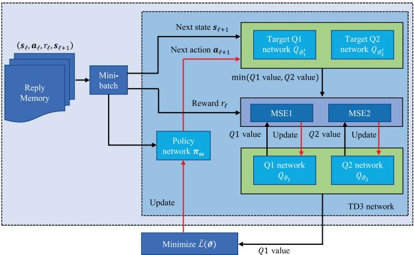

flowchart

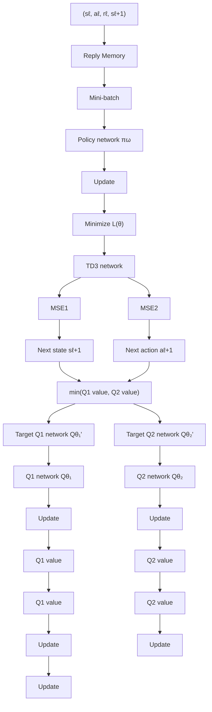

Fig. 2. Framework of TD3-based algorithm.

3) Reward: Although the minimum sensing SINR among J targets, i.e., minj∈ $\mathrm { S I N R } _ { t , j , \ell } .$ , can be utilized as the instant reward, it may not satisfy the communication rate constraint. To deal with this issue, we move (16b) into the objective function as the penalty term, yielding the optimization problem as

$$
\max_ {\substack {\mathbf {v} _ {k, \ell}, \mathbf {w} _ {j, \ell}, \\ \mathbf {u} _ {m, \ell}, \boldsymbol {v} _ {1, \ell}, \boldsymbol {v} _ {2, \ell}}} \sum_ {\ell = 1} ^ {L} \left(\min_ {j \in \mathcal {J}} \operatorname{SINR} _ {t, j, \ell} + \varrho \sum_ {k = 1} ^ {K} \left[ R _ {u _ {k}, \ell} - \Gamma_ {k, \ell} \right] ^ {+}\right) \tag{22a}
$$

$\mathrm { s . t . } ( 1 6 \mathrm { c } ) - ( 1 6 \mathrm { g } )$ (22b)

where $\varrho \mathrm { ~ > ~ } 0$ refers to the penalty coefficient and $[ x ] ^ { + } \ \triangleq$ max(x, 0). Therefore, the instant reward in the -th time slot can be formulated as $\begin{array} { r } { \tilde { r } _ { \ell } \triangleq \operatorname* { m i n } _ { j \in \mathcal { T } } \mathrm { S I N R } _ { t , j , \ell } + \varrho \sum _ { k = 1 } ^ { K } \left[ R _ { u _ { k } , \ell } - \ell \right. } \end{array}$ $\Gamma _ { k , \ell } ] ^ { + }$ , which is the weighted sum of the original objective function and penalty term. Constraints $( 1 6 \mathrm { c } )  ( 1 6 \mathrm { g } )$ can be satisfied via performing the normalization of the action, which will be described in the following subsection.

# C. TD3-Based Algorithm

Since all optimization variables in (22) are continuous, we propose a TD3-based algorithm, which can keep a good balance between exploration and exploitation, to train the agent to learn the optimal policy [27]. The framework of TD3- based algorithm is illustrated in Fig. 2, which are described as below.

1) Policy Network: The policy network is utilized to fit the policy π. Moreover, to avoid the overestimation, the policy network consists of one main policy network $\pi _ { \omega }$ and one target policy network $\pi _ { \omega ^ { \prime } }$ , whose learnable parameters are denoted as ω and $\omega ^ { \prime } ,$ , respectively.

The main policy network is a G˜ -layer feedforward neural network (FNN) with $F _ { p } \ > \ 1$ neurons per hidden layer, which takes the state as input and outputs the action, and the rectified linear unit (ReLU) is utilized as the activation function. Moreover, we perform the layer normalization (LN) on the state before feeding it into the policy network to boost the training stability, and the main policy and target policy networks are identical.

Note that the action should be normalized to satisfy the power constraints $( 1 6 \mathrm { c } )  ( 1 6 \mathrm { g } )$ . Taking (16c) as an example, the normalization can be given by

$$
\mathbf {v} _ {k, \ell} = \left\{ \begin{array}{l l} \mathbf {v} _ {k, \ell}, & \text { if   } \| \mathbf {v} _ {k, \ell} \| _ {2} ^ {2} \leq P \\ \frac {\sqrt {P} \mathbf {v} _ {k , \ell}}{\| \mathbf {v} _ {k , \ell} \| _ {2}}, & \text { otherwise. } \end{array} \right. \tag {23}
$$

The other normalization operations to satisfy (16d)–(16g) are similar, and the details are omitted for brevity.2

2) Critic Network: The critic network is a H˜ -layer FNN with $F _ { c }$ neurons per hidden layer, aiming at fitting the Q-function. In particular, the critic network takes the concatenation of the state and action as input, and outputs the Q-value. To overcome the overestimation, the critic network of TD3 algorithm is made up of two main critic networks $\mathcal { Q } _ { \vartheta _ { 1 } }$ and $Q _ { \vartheta _ { 2 } }$ and two target critic networks $Q _ { \vartheta _ { 1 } ^ { \prime } }$ and $Q _ { \vartheta _ { \gamma } ^ { \prime } }$ , whose learnable parameters are denoted as $\vartheta _ { 1 } , \vartheta _ { 2 } , \vartheta _ { 1 } ^ { \prime }$ and $\bar { \pmb { \vartheta } } _ { 2 } ^ { \prime } ,$ respectively. In addition, the architectures of main critic networks and target critic networks are the same.   
3) Network Training: The continuous interplay between the agent and environment generates a large number of experience tuples, which are stored into the replay buffer to train the agent. The training period begins until the enough experience tuples are obtained. To improve the training efficiency and avoid the overfitting, a mini-batch  with the fixed number of experience tuples is randomly sampled from the replay buffer and then leveraged to train the policy and critic networks.

The loss function of the ith main critic network can be defined as

$$
\tilde {\mathcal {L}} (\boldsymbol {\vartheta} _ {i}) = \frac {1}{| \mathcal {B} |} \sum_ {(\mathbf {s} _ {\ell}, \mathbf {a} _ {\ell}) \in \mathcal {B}} \left(\hat {r} _ {\ell} - Q _ {\boldsymbol {\vartheta} _ {i}} (\mathbf {s} _ {\ell}, \mathbf {a} _ {\ell})\right) ^ {2}, i = 1, 2 \tag {24}
$$

where $| B | > 1$ refers to the batch size, $\hat { r } _ { \ell } - Q _ { \vartheta _ { i } } ( \mathbf { s } _ { \ell } , \mathbf { a } _ { \ell } )$ denotes the temporal difference (TD) error, and $\hat { r } _ { \ell }$ denotes the target Q-value, given by

$$
\hat {r} _ {\ell} = r _ {\ell} + \gamma \left(\min _ {i = 1, 2} Q _ {\vartheta_ {i} ^ {\prime}} (\mathbf {s} _ {\ell + 1}, \boldsymbol {\pi} _ {\omega^ {\prime}} (\mathbf {s} _ {\ell}))\right). \tag {25}
$$

The parameters of main critic networks are optimized by the gradient descent algorithm as

$$
\boldsymbol {\vartheta} _ {i} = \boldsymbol {\vartheta} _ {i} - \lambda \nabla_ {\boldsymbol {\vartheta} _ {i}} \tilde {\mathcal {L}} (\boldsymbol {\vartheta} _ {i}), i = 1, 2 \tag {26}
$$

where $\lambda > 0$ stands for the learning rate (LR).

Moreover, the soft update algorithm is utilized to optimize the parameters of target critic networks as

$$
\boldsymbol {\vartheta} _ {i} ^ {\prime} = \zeta \boldsymbol {\vartheta} _ {i} + (1 - \zeta) \boldsymbol {\vartheta} _ {i} ^ {\prime}, i = 1, 2 \tag {27}
$$

where $\zeta \in [ 0 , 1 ]$ denotes the weighting coefficient.

The learnable parameters of main policy network can be optimized as

$$
\boldsymbol {\omega} = \boldsymbol {\omega} - \tilde {\lambda} \frac {1}{| \mathcal {B} |} \sum_ {i = 1} ^ {| \mathcal {B} |} \nabla_ {\mathbf {a} _ {i}} Q _ {\vartheta_ {1}} (\mathbf {s} _ {i}, \mathbf {a} _ {i}) \nabla_ {\boldsymbol {\omega}} \pi_ {\boldsymbol {\omega}} (\mathbf {s} _ {i}) \tag {28}
$$

where $\tilde { \lambda } > 0$ denotes the LR.

2For simplicity, the transmit and receive beamforming vectors should be normalized first, and then the reflection coefficients at the active RIS 2 and RIS 1 are normalized subsequently.

In addition, the parameters of target policy network are also optimized via the soft update algorithm as

$$
\omega^ {\prime} = \zeta \omega + (1 - \zeta) \omega^ {\prime}. \tag {29}
$$

# D. Algorithm Analysis

Algorithm 1 presents the training procedure of the TD3- based algorithm,3 which is trained over I episodes with L time steps per episode to learn the optimal policy. In particular, the parameters of the TD3-based algorithm are first initialized, and the experience tuples can be obtained by the interaction between the agent and the environment, which are stored in the replay buffer for training. The training phase starts as soon as enough experience tuples are obtained. In addition, to encourage exploration, the exploration noise is added to the output actions of both the main policy and target policy networks. As shown in lines 14–17 of the algorithm, the policy network and the target critic network are updated per $f _ { c } > 1$ time steps to avoid overestimation. By continuously interacting with the environment, the agent aims to learn the optimal policy from experience.

According to [35], the computational complexity of TD3 algorithm can be given by

$$
\begin{array}{l} \mathcal {O} \left(2 I L \left(D _ {i, p} F _ {p} + (G - 2) F _ {p} ^ {2} + F _ {p} D _ {o, p}\right) / f _ {c} \right. \\ \left. + 4 I L (D _ {i, c} F _ {p} + (\tilde {H} - 2) F _ {c} ^ {2} + F _ {c} D _ {o, c})\right) \tag {30} \\ \end{array}
$$

where $D _ { i , p }$ and $D _ { o , p }$ refer to the dimensions of the input and output layers of the policy network, and $D _ { i , c }$ and $D _ { o , c }$ stand for the dimensions of the input and output layers of the critic network, respectively.

# IV. GAN-TD3-BASED BEAMFORMING DESIGN

In this section, we integrate the GAN into the TD3 algorithm to boost its generalization and stability. Specifically, we first provide a brief review on the GAN, and then develop a GAN-TD3-based algorithm to tackle the beamforming optimization. Finally, the comparison between the TD3-based algorithm and the GAN-TD3-based one is presented.

# A. Brief Review on GAN

The GAN is a representative GAI algorithm that can generate fake samples similar to the real ones, and has been widely used to generate various digital contents, such as text and images. As shown in Fig. 3, the GAN consists of a generator G and a discriminator D. The generator aims at transforming the random noise into fake samples that resemble the real ones. In contrast, the discriminator, as a binary classifier, focuses on distinguishing the real samples from the fake ones generated by the generator.

Accordingly, the objectives of generator and discriminator can be formulated as

$$
\max _ {G} \mathbb {E} _ {\mathbf {z} \sim \tilde {p}} \log (1 - D (G (\mathbf {z}))) \tag {31a}
$$

$$
\min _ {D} \mathbb {E} _ {\mathbf {x} \sim p} \log D (\mathbf {x}) + \mathbb {E} _ {\mathbf {z} \sim \tilde {p}} \log (1 - D (G (\mathbf {z}))) \tag {31b}
$$

3The proposed algorithms can be extended to the case with direct links from the ISAC-BS to the users.

Algorithm 1 Training Procedure of TD3-Based Algorithm   
1: Initialize the state $\mathbf{s}_1$ , the main policy, and the critic network parameters $\omega$ , $\vartheta_1$ and $\vartheta_2$ .
2: Set $\omega' = \omega$ , $\vartheta'_1 = \vartheta_1$ and $\vartheta'_2 = \vartheta_2$ .
3: for $i = 1$ to $I$ do
4:    for $\ell = 1$ to $L$ do
5:    Feed the state $\mathbf{s}_\ell$ into the policy network to obtain the action $\mathbf{a}_\ell$ .
6:    Add the exploration noise to $\mathbf{a}_\ell$ and perform the normalization.
7:    Based on the state $\mathbf{s}_\ell$ and action $\mathbf{a}_\ell$ , the environment calculates the reward $r_\ell$ and transforms $\mathbf{s}_\ell$ to $\mathbf{s}_{\ell+1}$ .
8:    Store the tuple $(\mathbf{s}_\ell, \mathbf{a}_\ell, r_\ell, \mathbf{s}_{\ell+1})$ into the replay buffer.
9:    if the replay buffer contains more than $R_{th}$ experience tuples then
10:    Sample a mini-batch $\mathcal{B}$ from the replay buffer randomly.
11:    Taking $\mathbf{s}_\ell$ as the input, the target policy network outputs $\tilde{\mathbf{a}}_{\ell+1}$ .
12:    Add the exploration noise to $\tilde{\mathbf{a}}_{\ell+1}$ followed by the normalization.
13:    Update $\vartheta_1$ and $\vartheta_2$ via (26).
14:    if $\ell \% f_c = 0$ then
15:    Update $\omega$ by (28).
16:    Update $\vartheta'_1$ and $\vartheta'_2$ via (27).
17:    Update $\omega'$ via (29).
18:    end if
19:    end if
20:    end for
21: end for
22: Output: optimal policy.

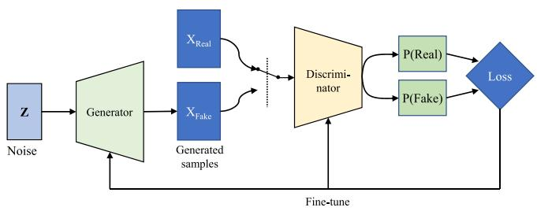

flowchart

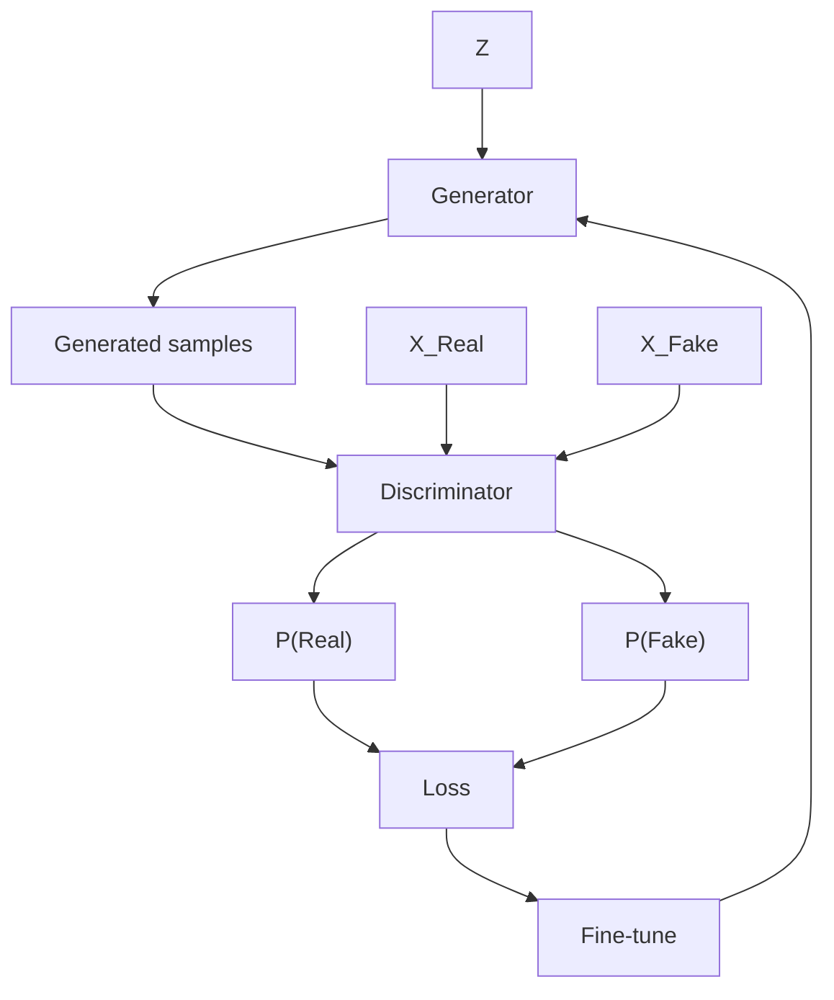

Fig. 3. Framework of GAN.

respectively, where $p$ and $\tilde { p }$ denote the distribution of real samples and generative model, x and z refer to the real sample and random noise, and G(z) is the generated fake sample.

In the training period, the generator and discriminator are alternately optimized in an adversarial manner, which can be given by

$$
\begin{array}{l} \min _ {G} \max _ {D} V (D, G) \\ = \min _ {G} \max _ {D} \left[ \mathbb {E} _ {\mathbf {x} \sim p} \log D (\mathbf {x}) + \mathbb {E} _ {\mathbf {z} \sim \tilde {p}} \log (1 - D (G (\mathbf {z}))) \right]. \tag {32} \\ \end{array}
$$

Though the adversarial training, it can enhance the performance of both [36]. Finally, the generator and discriminator reach the Nash equilibrium, and the distribution of fake samples is very close to that of the real ones.

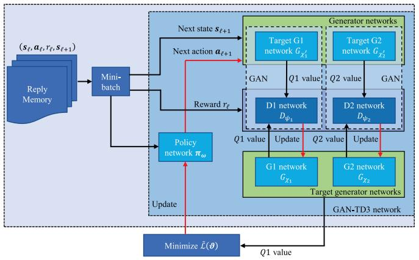

flowchart

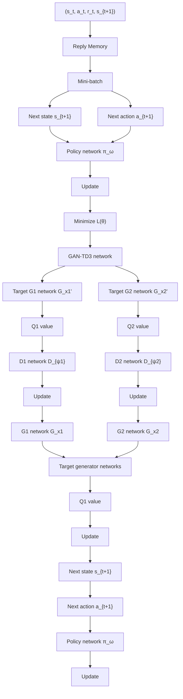

Fig. 4. Framework of GAN-TD3.

# B. GAN-TD3-Based Algorithm

Leveraging its powerful learning capabilities, we investigate the GAN into the TD3 algorithm to improve its stability and sample efficiency. Fig. 4 illustrates the framework of GAN-TD3-based algorithm, which is described as following.

1) Policy Network: The policy network is employed to fit the policy π, and consists of a main policy network $\pi _ { \omega }$ and a target policy network $\pi _ { \omega ^ { \prime } }$ . As shown in Fig. 5(a), the policy network in the GAN-TD3 algorithm is the same as that in the TD3 algorithm, and the details are omitted for brevity.   
2) Generator: The generator in GAN-TD3 aims at estimating the Q-value, playing the similar role to the critic network in the TD3 algorithm. To avoid the overestimation, the generator is made up of two main generators $G _ { \chi _ { 1 } }$ and $G _ { \chi _ { 2 } }$ with the parameters $\chi _ { 1 }$ and $\chi _ { 2 }$ , and two target generators $G _ { \chi _ { 1 } ^ { \prime } }$ and $G _ { \chi _ { \gamma } ^ { \prime } }$ , with the learnable parameters $\chi _ { 1 } ^ { \prime }$ and $\chi _ { 2 } ^ { \prime }$ . Each generator is a H˜ -layer FNN and there are $F _ { c }$ neurons in each hidden layer. Different from the critic network in the TD3-based algorithm, the input of the generator is the collection of the state, action and random noise,4 as illustrated in Fig. 5 (b).   
3) Discriminator: The discriminator tends to minimize the distance between the estimated Q-value and target Q-value, which consists of two discriminator networks $D _ { \psi _ { 1 } }$ and $D _ { \psi _ { 2 } }$ with the parameters $\psi _ { 1 }$ and ψ2. Fig. 5 (c) depicts the architecture of each discriminator, which is a $H _ { g }$ -layer FNN with $F _ { g }$ neurons per hidden layer, and the dimensions of both input and output are one. It can be observed that $G _ { \chi _ { 1 } }$ and $D _ { \psi _ { 1 } }$ , and $G _ { \chi _ { 2 } }$ and $D _ { \psi _ { 2 } }$ form two GANs, whose adversarial mechanism is expected to learn the action-value distribution, improving the performance and stability of TD3 algorithm.   
4) Networking Training: Similar to the training procedure of TD3 algorithm, a mini-batch of experience tuples are randomly sampled from the replay buffer to train the GAN-TD3 network. Furthermore, the loss of the ith main generator can be given by

$$
\mathcal {L} _ {G _ {\chi_ {i}}} = \sum_ {(\mathbf {s} _ {\ell}, \mathbf {a} _ {\ell}) \in \mathcal {B}} \frac {- \log \left(1 - D _ {\psi_ {i}} (\hat {r} _ {\ell})\right) + \left(\hat {r} _ {\ell} - G _ {\chi_ {i}} (\mathbf {s} _ {\ell} , \mathbf {a} _ {\ell})\right) ^ {2}}{| \mathcal {B} |}, i = 1, 2 \tag {33}
$$

4The random noise is a 1-dimension random variable, following the Gaussian distribution with zero mean and unit variance.

where

$$
\hat {r} _ {\ell} = r _ {\ell} + \gamma \left(\min _ {i = 1, 2} G _ {\chi_ {i}} (\mathbf {s} _ {\ell + 1}, \boldsymbol {\pi} _ {\omega^ {\prime}} (\mathbf {s} _ {\ell}))\right). \tag {34}
$$

The loss of the ith discriminator network can be written as

$$
\mathcal {L} _ {D _ {\psi_ {i}}} = - \sum_ {(\mathbf {s} _ {\ell}, \mathbf {a} _ {\ell}) \in \mathcal {B}} \frac {\log \left(D _ {\psi_ {i}} (G _ {\chi_ {i}} (\mathbf {s} _ {\ell} , \mathbf {a} _ {\ell}))\right) + \log \left(1 - D _ {\psi_ {i}} (\hat {r} _ {\ell})\right)}{| \mathcal {B} |} i = 1, 2. \tag {35}
$$

The parameters of $G _ { \xi _ { i } }$ and $D _ { \psi _ { i } }$ can be updated as

$$
\xi_ {i} = \xi_ {i} - \lambda \nabla_ {\xi_ {i}} \mathcal {L} _ {G _ {\chi_ {i}}}, i = 1, 2, \tag {36a}
$$

$$
\psi_ {i} = \psi_ {i} - \tilde {\lambda} \nabla_ {\psi_ {i}} \mathcal {L} _ {D _ {\psi_ {i}}}, i = 1, 2 \tag {36b}
$$

respectively.

In addition, the parameter of target generator network can be optimized via the soft updating as

$$
\chi_ {i} ^ {\prime} = \zeta \chi_ {i} + (1 - \zeta) \chi_ {i} ^ {\prime}, i = 1, 2. \tag {37}
$$

# C. Algorithm Analysis

The training procedure of the GAN-TD3-based algorithm is presented in Algorithm 2, which is based on the framework of the TD3-based algorithm in Section III, and the details are omitted. From Algorithm 2, the GAN-TD3-based algorithm integrates GAN into the underlying TD3 framework, and the generator acts as a critic network in the TD3-based algorithm to estimate the Q-value. In addition, the discriminator focuses on discriminating the current Q-value and the target Q-value. The inherent adversarial mechanism between the generator and the discriminator enhances the estimation accuracy for the Q-value of the generator, which shows the great potential in enhancing the performance of the underlying DRL algorithm, which is verified by simulation results.

The computational complexity of GAN-TD3-based algorithm can be formulated as

$$
\begin{array}{l} \mathcal {O} \Big (2 I L (D _ {i, p} F _ {p} + (G - 2) F _ {p} ^ {2} + F _ {p} D _ {o, p}) / f _ {c} \\ + 4 I L (D _ {i, c} F _ {p} + (\tilde {H} - 2) F _ {c} ^ {2} + F _ {c} D _ {o, c}) \\ \left. + 2 I L \left(F _ {g} + (\tilde {H} - 2) F _ {g} ^ {2} + F _ {g}\right)\right). \tag {38} \\ \end{array}
$$

# D. Comparison Between TD3-Based and GAN-TD3-Based Algorithms

We compare the GAN-TD3-based algorithm with the TD3- based algorithm across several aspects as follows.

1) Architecture: Compared with the TD3-based algorithm, the GAN-TD3-based algorithm introduces two discriminators, which form two GANs with generators (critic networks). In addition, the input of generator in the GAN-TD3-based algorithm is made up of the state, action and random noise. Furthermore, the loss function of generator (critic network) takes both the TD error and cross entropy into consideration, and the generator and discriminator are trained in an adversarial manner.   
2) Complexity: Under the same parameter setting, it can be seen from (30) and (38) that the GAN-TD3-based algorithm is inferior to the TD3-based counterpart in

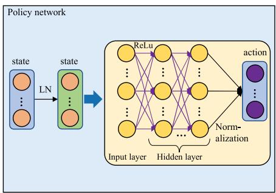

flowchart

```mermaid
graph LR
    A["state"] -->|LN| B["state"]
    B --> C["Input layer"]
    C --> D["Hidden layer"]
    D --> E["Action"]
    C --> F["ReLu"]
    F --> G["..."]
    F --> H["..."]
    F --> I["..."]
    F --> J["..."]
    F --> K["..."]
    F --> L["..."]
    F --> M["..."]
    F --> N["..."]
    F --> O["..."]
    F --> P["..."]
    F --> Q["..."]
    F --> R["..."]
    F --> S["..."]
    F --> T["..."]
    F --> U["..."]
    F --> V["..."]
    F --> W["..."]
    F --> X["..."]
    F --> Y["..."]
    F --> Z["..."]
    F --> AA["..."]
    F --> AB["..."]
    F --> AC["..."]
    F --> AD["..."]
    F --> AE["..."]
    F --> AF["..."]
    F --> AG["..."]
    F --> AH["..."]
    F --> AI["..."]
    F --> AJ["..."]
    F --> AK["..."]
    F --> AL["..."]
    F --> AM["..."]
    F --> AN["..."]
    F --> AO["..."]
    F --> AP["..."]
    F --> AQ["..."]
    F --> AR["..."]
    F --> AS["..."]
    F --> AT["..."]
    F --> AU["..."]
    F --> AV["..."]
    F --> AW["..."]
    F --> AX["..."]
    F --> AY["..."]
    F --> AZ["..."]
    F --> BA["..."]
    F --> BB["..."]
    F --> BC["..."]
    F --> BD["..."]
    F --> BE["..."]
    F --> BF["..."]
    F --> BG["..."]
    F --> BH["..."]
    F --> BI["..."]
    F --> BJ["..."]
    F --> BK["..."]
    F --> BL["..."]
    F --> BM["..."]
    F --> BN["..."]
    F --> BO["..."]
    F --> BP["..."]
    F --> BQ["..."]
    F --> BR["..."]
    F --> BS["..."]
    F --> BT["..."]
    F --> BU["..."]
    F --> BV["..."]
    F --> BW["..."]
    F --> BX["..."]
    F --> BY["..."]
    F --> BZ["..."]
    F --> CA["..."]
    F --> CB["..."]
    F --> CC["..."]
    F --> CD["..."]
    F --> CE["..."]
    F --> CF["..."]
    F --> CG["..."]
    F --> CH["..."]
    F --> CI["..."]
    F --> CJ["..."]
    F --> CK["..."]
    F --> CL["..."]
    F --> CM["..."]
    F --> CN["..."]
    F --> CO["..."]
    F --> CP["..."]
    F --> CQ["..."]
    F --> CR["..."]
    F --> CS["..."]
    F --> CT["..."]
    F --> CU["..."]
    F --> CV["..."]
    F --> CW["..."]
```

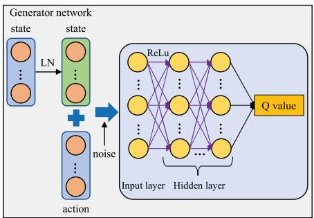

flowchart

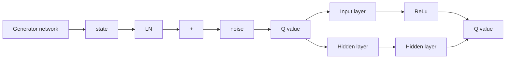

(b)

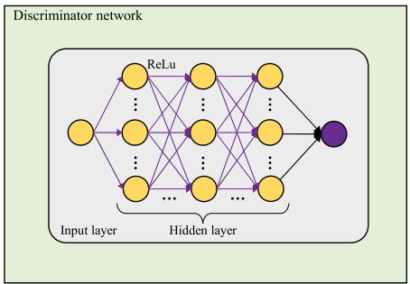

flowchart

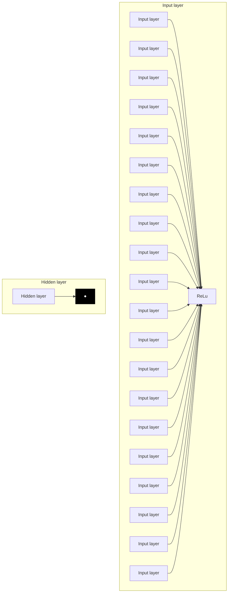

Fig. 5. Network architecture of GAN-TD3 algorithm. (a) Policy network, (b) generator network, and (c) discriminator network.

Algorithm 2 Training Procedure of GAN-TD3-Based Algorithm   
1: Initialize the state $s_{1}$ , the main policy, generator and discriminator network parameters $\omega$ , $\chi_{1}$ , $\chi_{2}$ , $\psi_{1}$ , and $\psi_{2}$ .
2: Set $\omega' = \omega$ , $\chi_{1}' = \chi_{1}$ and $\chi_{2}' = \chi_{2}$ .
3: for i = 1 to I do
4:    for $\ell = 1$ to L do
5:    Obtain the action $a_{\ell}$ via feeding the state $s_{\ell}$ into the policy network.
6:    Add the exploration noise to $a_{\ell}$ and perform the normalization.
7:    The environment returns the reward $r_{\ell}$ and transforms $s_{\ell}$ to $s_{\ell+1}$ according to the state $s_{\ell}$ and action $a_{\ell}$ .
8:    Store the tuple $(\mathbf{s}_{\ell}, \mathbf{a}_{\ell}, r_{\ell}, \mathbf{s}_{\ell+1})$ into replay buffer.
9:    if the number of experience tuples in the replay buffer is more than $R_{th}$ then
10:    Sample a mini-batch B from the replay buffer randomly.
11:    Feed $s_{\ell}$ to the target policy network to obtain $\tilde{a}_{\ell+1}$ .
12:    Add exploration noise to $\tilde{a}_{\ell+1}$ followed by the normalization.
13:    Update $\zeta_{1}$ and $\zeta_{2}$ via (36a).
14:    Update $\psi_{1}$ and $\psi_{2}$ via (36b).
15:    if $\ell \% f_{c} = 0$ then
16:    Update $\omega$ by (28).
17:    Update $\chi_{1}'$ and $\chi_{2}'$ via (37).
18:    Update $\omega'$ via (29).
19:    end if
20:    end if
21:    end for
22: end for
23: Output: optimal policy.

computational complexity owing to the introduction of the discriminators.

3) Performance: Leveraging the inherent adversarial training mechanism, the generator in GAN-TD3-based algorithm can obtain the higher estimation accuracy of Q-value than the critic network in the TD3-based counterpart, which has a great potential in boosting the performance and stability of convergence curves. The

TABLE II HYPERPARAMETERS OF TD3 AND GAN-TD3 ALGORITHM 

<table><tr><td>Parameter</td><td>Value</td><td>Parameter</td><td>Value</td></tr><tr><td> $\gamma$ </td><td>0.95</td><td> $\lambda$ </td><td> $5 \times 10^{-5}$ </td></tr><tr><td> $\tilde{\lambda}$ </td><td> $1 \times 10^{-4}$ </td><td>LR deacy</td><td> $1 \times 10^{-4}$ </td></tr><tr><td> $I$ </td><td> $8 \times 10^{3}$ </td><td> $L$ </td><td>20</td></tr><tr><td> $|\mathcal{B}|$ </td><td>128</td><td>Replay buffer size</td><td> $1 \times 10^{5}$ </td></tr><tr><td> $\zeta$ </td><td> $1 \times 10^{-4}$ </td><td> $R_{th}$ </td><td>1280</td></tr><tr><td> $f_{c}$ </td><td>4</td><td> $\tilde{H}$ </td><td>3</td></tr><tr><td> $F_{c}$ </td><td>512</td><td> $F_{g}$ </td><td>512</td></tr><tr><td> $F_{p}$ </td><td> $2(D_{a} + D_{s})$ </td><td> $\tilde{G}$ </td><td>3</td></tr></table>

superiority of TD3-GAN-based algorithm over the TD3- based algorithm will be verified in the simulation results.

# V. SIMULATION RESULTS

In this section, simulation results are presented to verify the effectiveness of the proposed algorithms. If not specified, we set $N _ { t } = 1 0 , L = 2 0 , M = 2 5 , M _ { x } = M _ { y } = 5 , J = 3 , K = 2 ,$ , $\sigma _ { n } ^ { 2 } = \sigma _ { d } ^ { 2 } = - 1 1 0$ dBm, $\sigma _ { t } ^ { 2 } = - 1 0$ dBm, $P = 2 0$ dBm, $P _ { A } =$ 3 dBm, $\Gamma _ { k , \ell } = 0 . 1$ bps/Hz ∀ k, -, β = 2.2, κ = 10,  = 2 and $\rho = 0 . 0 1$ . The positions of active RIS 1 and RIS 2 are set as [40, 0, 10]T and [5, 15, 10]T in meters, respectively. The positions of J targets are set as $[ - 8 , 1 0 , 1 0 ] ^ { T } , [ \bar { 0 , } 1 0 , 1 0 ] ^ { T }$ and [8, 10, 10]T in meters, respectively. In addition, the K users are located at $[ 3 5 , 1 , 0 ] ^ { T }$ and $[ 4 5 , 1 , 0 ] ^ { T }$ in meters, respectively. The hyperparameters of TD3 and GAN-TD3 algorithms are presented in Table II [27]. All simulation results are conducted on a Nvidia RTX 4090 GPU. The results in Figs. 11 and 12 are averaged over 30 episodes.

Fig. 6 shows the convergence curves of the proposed algorithms versus LR.5 It can be seen that the convergence points of the proposed algorithms are close and the GAN-TD3 algorithm is superior to the TD3 counterpart in stability and performance under the same LR at the cost of slow convergence speed due to the inherent adversarial training mechanism. In addition, the LR has an important influence on the convergence curves of both TD3 and GAN-TD3 and should be chosen carefully. A small LR slows down the convergence speed of the proposed algorithms, while a large LR is expected to yield a better solution at the cost of oscillations in the convergence curves. Both the TD3 and GAN-TD3 algorithms can maintain a good balance between convergence speed and stability when $\mathrm { L R } = 5 \times 1 0 ^ { - 5 }$ . Therefore, the LR is set to $5 \times 1 0 ^ { - 5 }$ in the following.

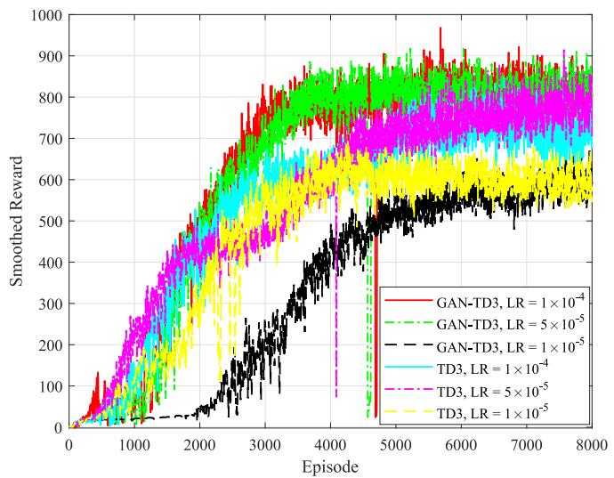

line

| Episode | GAN-TD3, LR = 1 × 10⁻⁴ | GAN-TD3, LR = 5 × 10⁻⁵ | GAN-TD3, LR = 1 × 10⁻⁵ | TD3, LR = 1 × 10⁻⁴ | TD3, LR = 5 × 10⁻⁵ | TD3, LR = 1 × 10⁻⁵ |
| ------- | ------------------------ | ------------------------ | ------------------------ | ------------------- | ------------------- | ------------------- |
| 0       | 0                        | 0                        | 0                        | 0                   | 0                   | 0                   |
| 1000    | ~200                     | ~200                     | ~200                     | ~200                | ~200                | ~200                |
| 2000    | ~400                     | ~400                     | ~400                     | ~400                | ~400                | ~400                |
| 3000    | ~600                     | ~600                     | ~600                     | ~600                | ~600                | ~600                |
| 4000    | ~750                     | ~750                     | ~750                     | ~750                | ~750                | ~750                |
| 5000    | ~850                     | ~850                     | ~850                     | ~850                | ~850                | ~850                |
| 6000    | ~900                     | ~900                     | ~900                     | ~900                | ~900                | ~900                |
| 7000    | ~950                     | ~950                     | ~950                     | ~950                | ~950                | ~950                |
| 8000    | ~950                     | ~950                     | ~950                     | ~950                | ~950                | ~950                |

Fig. 6. Convergence curves of our proposed algorithms versus LR.

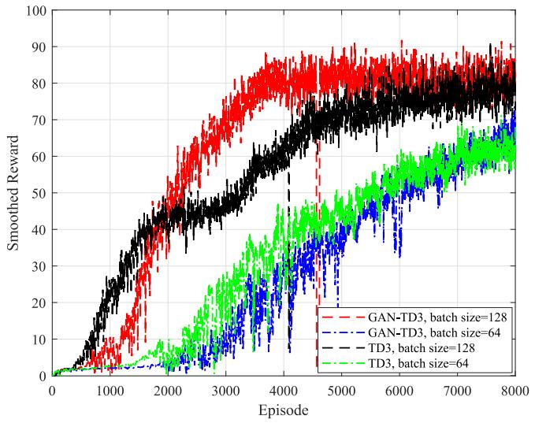

line

| Episode | GAN-TD3, batch size=128 | GAN-TD3, batch size=64 | TD3, batch size=128 | TD3, batch size=64 |
| ------- | ------------------------ | ----------------------- | -------------------- | ------------------- |
| 0       | 0                        | 0                       | 0                    | 0                   |
| 1000    | ~15                      | ~5                      | ~25                  | ~5                  |
| 2000    | ~40                      | ~10                     | ~45                  | ~15                 |
| 3000    | ~60                      | ~20                     | ~60                  | ~30                 |
| 4000    | ~75                      | ~35                     | ~75                  | ~45                 |
| 5000    | ~85                      | ~50                     | ~85                  | ~60                 |
| 6000    | ~90                      | ~60                     | ~90                  | ~70                 |
| 7000    | ~90                      | ~65                     | ~90                  | ~75                 |
| 8000    | ~90                      | ~70                     | ~90                  | ~80                 |

Fig. 7. Convergence curves of the proposed algorithms versus batch size.

Fig. 7 shows the convergence curves of the proposed algorithms as a function of batch size. From the figure, we can see that a large batch size can not only increase the stability and convergence speed, but also improve the performance of both GAN-TD3 and TD3 algorithms because more training samples are fed into the NN at the same time to fine-tune its parameters. Therefore, the batch size is set to 128 in the following. Compared with the GAN-TD3 algorithm, the performance of the TD3 algorithm deteriorates significantly as the batch size decreases. In addition, the GAN-TD3 algorithm is more robust to batch size than its TD3 counterpart. The main reason for this is the inherent adversarial training mechanism of GAN.

For performance comparison, we consider the deep deterministic policy gradient (DDPG) algorithm as a benchmark. Fig. 8 shows the GPU training time versus M for the proposed algorithms and the benchmark, with $I = 1 0 0 0$ . It can be seen that the GPU training time increases with M for all algorithms due to the increase of the input and hidden layer dimensions. In addition, the GPU training time of GAN-TD3 is slightly higher than that of its TD3 counterpart due to the more complicated network architecture. Furthermore, the training time of the DDPG algorithm increases much faster with M than that of the proposed algorithms because the policy and target critic networks in the proposed algorithms are optimized per $f _ { c } > 1$ time steps, while the DDPG algorithm updates its policy and target critic networks per time step.

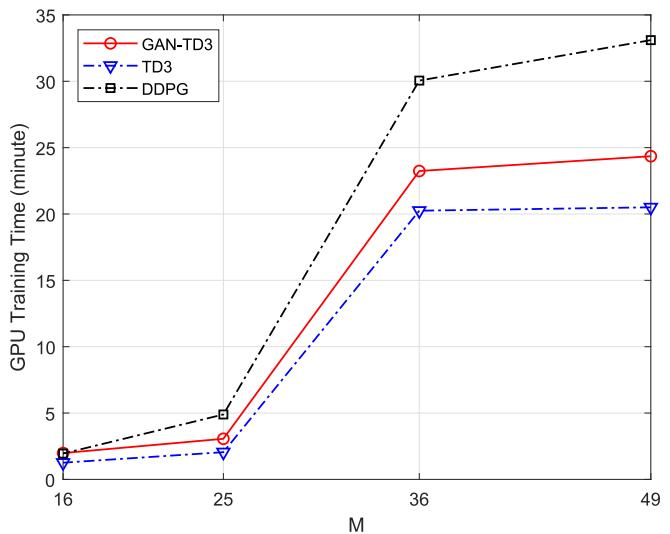

line

| M   | GAN-TD3 | TD3  | DDPG |
| --- | ------- | ---- | ---- |
| 16  | 2.0     | 1.5  | 2.0  |
| 25  | 3.0     | 2.0  | 5.0  |
| 36  | 23.0    | 20.0 | 30.0 |
| 49  | 24.0    | 20.5 | 33.0 |

Fig. 8. GPU training time versus M for the proposed algorithms and benchmark with I = 1000.

Fig. 9 shows the smoothed episode sensing $\mathrm { S I N R } ^ { 6 }$ with different number of RIS elements for the proposed algorithms and the benchmark. From Fig. 9, each algorithm converges to a higher episode sensing SINR with M at the cost of a slower convergence speed. On the one hand, a large M increases the spatial degrees of freedom (DoFs) at the RIS, which is beneficial for increasing the sensing SINR. On the other hand, increasing M spans the dimensions of both the action and state spaces, requiring a larger number of interactions between the agent and the environment to obtain an optimal policy. Moreover, the GAN-TD3 algorithm achieves the comparable performance with the TD3 one and outperforms the DDPG benchmark in both stability and quality of solution, verifying the effectiveness of the proposed algorithms.

Fig. 10 shows the smoothed episode sensing SINR with different number of transmit antennas for the proposed algorithms and the benchmark. We can see that the smoothed episode sensing SINRs of all algorithms increase with $N _ { t }$ due to the increased spatial DoFs, and a large number of transmit antennas slows down the convergence speed because a large action space has to be explored for the agent. There is a tradeoff between performance and computational complexity. Furthermore, GAN-TD3 shows superior performance over its TD3 counterpart, and the proposed algorithms outperform

6The episode sensing SINR is defined as the sum of the minimum sensing SINR among J targets during L time slots.

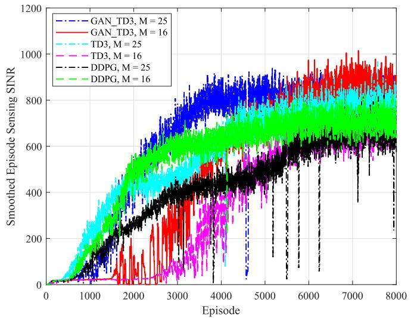

line

| Episode | GAN_TD3, M = 25 | GAN_TD3, M = 16 | TD3, M = 25 | TD3, M = 16 | DDPG, M = 25 | DDPG, M = 16 |
| ------- | --------------- | --------------- | ----------- | ----------- | ------------ | ------------ |
| 0       | 0               | 0               | 0           | 0           | 0            | 0            |
| 1000    | ~100            | ~50             | ~150        | ~50         | ~100         | ~150         |
| 2000    | ~400            | ~200            | ~400        | ~200        | ~300         | ~400         |
| 3000    | ~600            | ~400            | ~600        | ~400        | ~500         | ~600         |
| 4000    | ~700            | ~500            | ~700        | ~500        | ~600         | ~700         |
| 5000    | ~800            | ~600            | ~800        | ~600        | ~700         | ~800         |
| 6000    | ~900            | ~700            | ~900        | ~700        | ~800         | ~900         |
| 7000    | ~950            | ~800            | ~950        | ~800        | ~900         | ~950         |
| 8000    | ~1000           | ~900            | ~1000       | ~900        | ~1000        | ~1000        |

Fig. 9. Smoothed episode sensing SINR with different number of RIS elements for the proposed algorithms and benchmark.

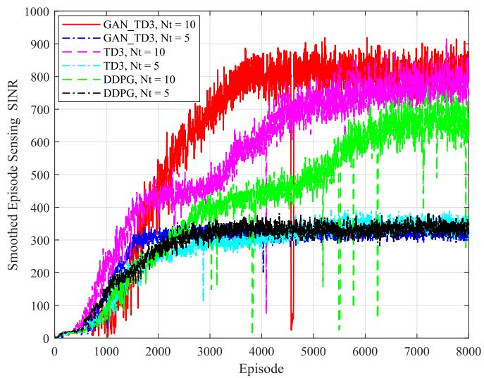

line

| Episode | GAN_TD3, Nt = 10 | GAN_TD3, Nt = 5 | TD3, Nt = 10 | TD3, Nt = 5 | DDPG, Nt = 10 | DDPG, Nt = 5 |
| ------- | ---------------- | --------------- | ------------ | ----------- | ------------- | ------------ |
| 0       | 0                | 0               | 0            | 0           | 0             | 0            |
| 1000    | ~200             | ~150            | ~250         | ~100        | ~150          | ~100         |
| 2000    | ~400             | ~300            | ~450         | ~250        | ~350          | ~250         |
| 3000    | ~600             | ~350            | ~650         | ~350        | ~450          | ~350         |
| 4000    | ~750             | ~350            | ~750         | ~350        | ~550          | ~350         |
| 5000    | ~850             | ~350            | ~850         | ~350        | ~650          | ~350         |
| 6000    | ~850             | ~350            | ~850         | ~350        | ~750          | ~350         |
| 7000    | ~850             | ~350            | ~850         | ~350        | ~850          | ~350         |
| 8000    | ~850             | ~350            | ~850         | ~350        | ~850          | ~350         |

Fig. 10. Smoothed episode sensing SINR with different transmit antenna number for the proposed algorithms and benchmark.

the DDPG algorithm. Consequently, the effectiveness of the proposed algorithms can be verified.

We also consider the traditional passive RIS as a benchmark, which replaces the active RIS with the passive counterpart and the GAN-TD3 is utilized to handle the beamforming design. The average episode reward versus P for the proposed algorithms and the benchmark is shown in Fig. 11. From the results, we can observe that the average episode reward of each algorithm increases approximately with P because a large transmit power can increase both the sensing and communication SINRs. Moreover, the proposed GAN-TD3 algorithm achieves the comparable performance with TD3, and both the GAN-TD3 and TD3 algorithms are superior to the DDPG. Moreover, the passive RIS-based scheme is inferior to all the active RIS-based schemes, and the performance gap increases with P, verifying the effectiveness of active RIS.

Fig. 12 depicts the average episode sensing SINR versus P for the proposed algorithms and benchmarks. We can observe that the average episode sensing SINR of each algorithm increases with P. In addition, the GAN-TD3 algorithm achieves the comparable performance to the TD3 counterpart, and is superior to the DDPG benchmark. Moreover, the superiority of the active RIS over the passive counterpart is verified.

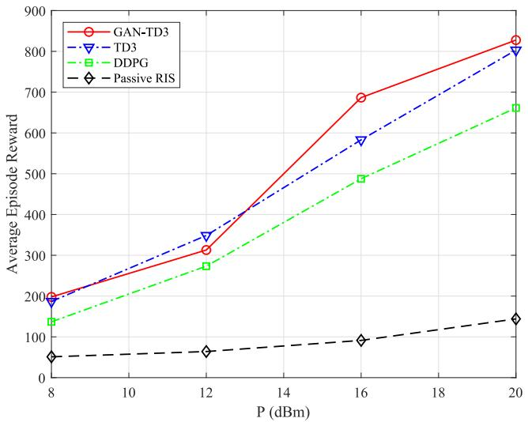

line

| P (dBm) | GAN-TD3 | TD3  | DDPG | Passive RIS |
| ------- | ------- | ---- | ---- | ----------- |
| 8       | 200     | 190  | 140  | 60          |
| 12      | 310     | 350  | 270  | 70          |
| 16      | 690     | 580  | 490  | 90          |
| 20      | 830     | 810  | 660  | 140         |

Fig. 11. Average episode reward versus P for the proposed algorithms and benchmarks.

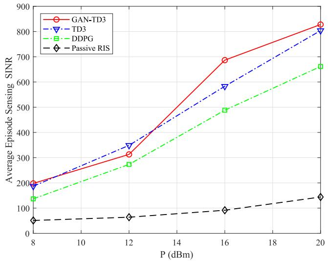

line

| P (dBm) | GAN-TD3 | TD3  | DDPG | Passive RIS |
| ------- | ------- | ---- | ---- | ----------- |
| 8       | 200     | 190  | 140  | 60          |
| 12      | 320     | 350  | 270  | 70          |
| 16      | 690     | 580  | 490  | 90          |
| 20      | 830     | 810  | 660  | 140         |

Fig. 12. Average episode sensing SINR versus P for the proposed algorithms and benchmarks.

# VI. CONCLUSION

In this article, we have investigated the beamforming design for the dual active RISs-supported ISAC network. In particular, the sum of the minimum detection SINRs among multiple targets during a series of time slots is maximized under the constraints of QoS and transmit power by jointly optimizing the transmit beamforming, receive beamforming, and reflection beamforming. To deal with this nonconvex optimization problem with highly coupled optimization variables in the dynamic environment, we first transform it into an MDP. Then, two DRL-based algorithms, named TD3 and GAN-TD3, are developed to solve it. Simulation results demonstrate the effectiveness of the proposed algorithms and the superiority of the active RIS over the passive counterpart. Moreover, the GAN-TD3 algorithm is superior to its TD3 counterpart in terms of convergence speed and stability at the cost of higher computational complexity.

# REFERENCES

[1] S. Lu et al., “Integrated sensing and communications: Recent advances and ten open challenges,” IEEE Internet Things J., vol. 11, no. 11, pp. 19094–19120, Jun. 2024.   
[2] A. Hassanien, M. G. Amin, E. Aboutanios, and B. Himed, “Dualfunction radar communication systems: A solution to the spectrum congestion problem,” IEEE Signal Proc. Mag., vol. 36, no. 5, pp. 115–126, Sept. 2019.   
[3] H. Xie, T. Zhang, X. Xu, D. Yang, and Y. Liu, “Joint sensing, communication, and computation in UAV-assisted systems,” IEEE Internet Things J., vol. 11, no. 18, pp. 29412–29426, Sept. 2024.   
[4] F. Liu, L. Zhou, C. Masouros, A. Li, W. Luo, and A. Petropulu, “Toward dual-functional radar-communication systems: Optimal waveform design,” IEEE Trans. Signal Proc., vol. 66, no. 16, pp. 4264–4279, Aug. 2018.   
[5] A. Bazzi and M. Chafii, “On integrated sensing and communication waveforms with tunable PAPR,” IEEE Trans. Wireless Commun., vol. 22, no. 11, pp. 7345–7360, Nov. 2023.   
[6] C. Qi, W. Ci, J. Zhang, and X. You, “Hybrid Beamforming for Millimeter wave MIMO integrated sensing and communications,” IEEE Commun. Lett., vol. 26, no. 5, pp. 1136–1140, May 2022.   
[7] Z. Zhao, L. Zhang, R. Jiang, X.-P. Zhang, X. Tang, and Y. Dong, “Joint Beamforming scheme for ISAC systems via robust Cramér-Rao bound optimization,” IEEE Wireless Commun. Lett., vol. 13, no. 3, pp. 889–893, Mar. 2024.   
[8] Q. Li et al., “Cooperative backscatter communications with reconfigurable intelligent surfaces: An APSK approach,” IEEE Trans. Wireless Commun., vol. 23, no. 11, pp. 16218–16233, Nov. 2024.   
[9] K. Zhong, J. Hu, C. Pan, M. Deng, and J. Fang, “Joint waveform and Beamforming design for RIS-aided ISAC systems,” IEEE Signal Process. Lett., vol. 30, pp. 165–169, Feb. 2023.   
[10] X. Zhao, H. Liu, S. Gong, X. Ju, C. Xing, and N. Zhao, “Dual-functional MIMO Beamforming optimization for RIS-aided integrated sensing and communication,” IEEE Trans. Commun., vol. 72, no. 9, pp. 5411–5427, Sept. 2024.   
[11] W. Xiang, Y. Chen, Z. Lu, and X. Wen, “Cooperative double-IRS assisted integrated sensing and communication under NLoS conditions,” in Proc. IEEE ICC 2023, Rome, Italy, May 2023.   
[12] Q. Zhang, H. Bian, Y. Yao, Y. Wu, F. Shu, and J. Wang, “Transmit power minimization for double-RIS-enabled ISAC system,” in Pro. IEEE ICCC 2024, Hangzhou, China, Aug. 2024, pp. 1437–1442.   
[13] K. Zhi, C. Pan, H. Ren, K. K. Chai, and M. Elkashlan, “Active RIS versus passive RIS: Which is superior with the same power budget?” IEEE Wireless Commun. Lett., vol. 26, no. 5, pp. 1150–1154, May 2022.   
[14] Z. Zhang et al., “Active RIS vs. passive RIS: Which will prevail in 6G?” IEEE Trans. Commun., vol. 71, no. 3, pp. 1707–1725, Mar. 2023.   
[15] A. A. Salem, M. H. Ismail, and A. S. Ibrahim, “Active reconfigurable intelligent surface-assisted MISO integrated sensing and communication systems for secure operation,” IEEE Trans. Veh. Tech., vol. 72, no. 4, pp. 4919–4931, Apr. 2023.   
[16] Y. Zhang et al., “Secure wireless communication in active RIS-assisted DFRC systems,” IEEE Trans. Veh. Tech., to appear.   
[17] Q. Zhu, M. Li, R. Liu, and Q. Liu, “Cramér-Rao bound optimization for active RIS-empowered ISAC systems,” IEEE Trans. Wireless Commun., vol. 23, no. 9, pp. 11723–11736, Sept. 2024.   
[18] M. Liu et al., “Joint Beamforming design for double active RISassisted radar-communication coexistence systems,” IEEE Trans. Cogn. Commun. Netw., to appear.   
[19] J. Zhang et al., “Intelligent waveform design for integrated sensing and communication,” IEEE Wireless Comm., to appear.   
[20] G. Sun et al., “Joint task offloading and resource allocation in aerialterrestrial UAV networks with edge and fog computing for post-disaster rescue,” IEEE Trans. Mob. Comput., vol. 23, no. 9, pp. 8582–8600, Sep. 2024.

[21] R. Saleem, W. Ni, M. Ikram, and A. Jamalipour, “Deep-reinforcementlearning-driven secrecy design for intelligent-reflecting-surface-based 6G-IoT networks,” IEEE Internet Things J., vol. 10, no. 10, pp. 8812–8824, May 2023.   
[22] J. Li et al., “Collaborative ground-space communications via evolutionary multi-objective deep reinforcement learning,” IEEE J. Sel. Areas Commun., to appear.   
[23] T. Zhang, P. Ren, D. Xu, and Z. Ren, “RIS Subarray optimization with reinforcement learning for green symbiotic communications in Internet of Things,” IEEE Internet Things J., vol. 10, no. 22, pp. 19454–19465, Nov. 2023.   
[24] Y. Huang, C. Xu, C. Zhang, M. Hua, and Z. Zhang, “An overview of intelligent wireless communications using deep reinforcement learning,” J. Commun. Netw., vol. 4, no. 2, pp. 15–29, Jun. 2019.   
[25] Z. Zhu, M. Gong, G. Sun, M. De, F. Liu, and Y. Liu, “AI-enabled STAR-RIS aided MISO ISAC secure communications,” arXiv preprint arXiv:2402.16413, 2024.   
[26] X. Liu, H. Zhang, K. Long, M. Zhou, Y. Li, and H. V. Poor, “Proximal policy optimization-based transmit Beamforming and phase-shift design in an IRS-aided ISAC system for the THz band,” IEEE J. Sel. Areas Commun., vol. 40, no. 7, pp. 2056–2069, Jul. 2022.   
[27] J. Zhang et al., “Joint design for STAR-RIS aided ISAC: Decoupling or learning,” IEEE Trans. Wireless Commun., to appear.   
[28] H. Zhang, R. Liu, M. Li, W. Wang, and Q. Liu, “Joint sensing and communication optimization in target-mounted STARS-assisted vehicular networks: A MADRL approach,” IEEE Trans. Veh. Tech., vol. 73, no. 7, pp. 10011–10025, Jul. 2024.   
[29] H. Du et al., “Enhancing deep reinforcement learning: A tutorial on generative diffusion models in network optimization,” IEEE Commun. Surv. Tutor., to appear.   
[30] M. Xu et al., “Unleashing the power of edge-cloud generative AI in mobile networks: A survey of AIGC services,” IEEE Commun. Surv. Tutor., vol. 26, no. 2, pp. 1127–1170, 2nd Quart 2024.   
[31] J. Wang et al., “Generative AI based secure wireless sensing for ISAC networks,” arXiv preprint arXiv:2408.11398, 2024.   
[32] G. Sun et al., “Generative AI for deep reinforcement learning: Framework, analysis, and use cases,” arXiv preprint arXiv:2405.20568, 2024.   
[33] A. T. Z. Kasgari, W. Saad, M. Mozaffari, and H. V. Poor, “Experienced deep reinforcement learning with generative adversarial networks (GANs) for model-free ultra reliable low latency communication,” IEEE Trans. Commun., vol. 69, no. 2, pp. 884–899, Feb. 2021.   
[34] Y. Hua, R. Li, Z. Zhao, H. Zhang, and X. Chen, “GAN-based deep distributional reinforcement learning for resource management in network slicing,” in Proc. IEEE GLOBECOM 2019, Waikoloa, HI, USA, Dec. 2019, pp. 1–6.   
[35] J. Zhang, M. Liu, J. Tang, N. Zhao, D. Niyato, and X. Wang, “Joint design for RIS-aided ISAC via deep unfolding learning,” IEEE Trans. Cogn. Commun. Netw., to appear.   
[36] I. J. Goodfellow et al., “Generative adversarial nets,” in Proc. IEEE NIPS 2014, Cambridge, MA, USA, Dec. 2014.

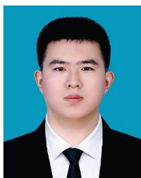

natural_image

Portrait photo of a man in formal attire against a blue background (no text or symbols visible)

Jifa Zhang received the M.S. degree from Beihang University, Beijing, China, in 2023. He is currently pursuing the Ph.D. degree with the School of Information and Communication Engineering, Dalian University of Technology, Dalian, China.

His current research interests include artificial intelligence, optimization theory, and integrated sensing and communication.

Mr. Zhang won the Best Paper Award in WCSP 2024.

natural_image

Portrait of a woman with short dark hair wearing a light blue blazer and earrings against a solid blue background (no text or symbols visible)

Min Sheng (Fellow, IEEE) received the M.S. and Ph.D. degrees in communication and information systems from Xidian University, Xi’an, Shaanxi, China, in 2000 and 2004, respectively.

She is currently a Full Professor and the Director with the State Key Laboratory of Integrated Service Networks, Xidian University. Her general research interests include mobile ad hoc networks, 5G mobile communication systems, and satellite communications networks.

Prof. Sheng is a Fellow of the China Institute of

Electronics and the China Institute of Communications.

natural_image

Portrait of a man wearing glasses and a striped shirt against a blue background (no text or symbols visible)

Nan Zhao (Senior Member, IEEE) received the Ph.D. degree in information and communication engineering from Harbin Institute of Technology, Harbin, China, in 2011.

He is currently a Professor with Dalian University of Technology, Dalian, China.

Prof. Zhao won the Best Paper Awards in IEEE VTC 2017 Spring, ICNC 2018, WCSP 2018, and WCSP 2019. He also received the IEEE Communications Society Asia Pacific Board Outstanding Young Researcher Award in 2018. He

is serving on the editorial boards for IEEE WIRELESS COMMUNICATIONS and IEEE WIRELESS COMMUNICATIONS LETTERS.

natural_image

Portrait of a man wearing glasses and a suit (no text or symbols visible)

Chengwen Xing (Member, IEEE) received the B.Eng. degree from Xidian University, Xi’an, China, in 2005, and the Ph.D. degree from The University of Hong Kong, Hong Kong, in 2010.

Since September 2010, he has been with the School of Information and Electronics, Beijing Institute of Technology, Beijing, China, where he is currently a Full Professor. His current research interests include machine learning, statistical signal processing, convex optimization, multivariate statistics, and array signal processing.

natural_image

Close-up of a man speaking into a microphone (no visible text or symbols)

George K. Karagiannidis (Fellow, IEEE) received the Ph.D. degree in telecommunications engineering from the Electrical Engineering Department, University of Patras, Patras, Greece, in 1998.

He is currently a Professor with the Electrical and Computer Engineering Department, Aristotle University of Thessaloniki, Thessaloniki, Greece, and the Head of Wireless Communications and Information Processing Group. His research interests are in the areas of wireless communications systems and networks, signal processing, optical wireless

natural_image

Portrait of a man in business attire (no text or symbols visible)

Junyu Liu (Member, IEEE) received the B.Eng. and Ph.D. degrees in communication and information systems from Xidian University, Xi’an, Shaanxi, China, in 2007 and 2016, respectively.

He is currently a Full Professor with the State Key Laboratory of Integrated Service Networks, Xidian University. His research interests include capacity analysis and wireless coverage technology in heterogeneous networks.

communications, wireless power transfer, and signal processing for biomedical engineering.

Dr. Karagiannidis received three prestigious awards, such as The 2021 IEEE ComSoc RCC Technical Recognition Award, the 2018 IEEE ComSoc SPCE Technical Recognition Award, and the 2022 Humboldt Research Award from Alexander von Humboldt Foundation. He is one of the Highly Cited Authors across all areas of Electrical Engineering, recognized from Clarivate Analytics as the Web-of-Science Highly-Cited Researcher in the ten consecutive years in 2015–2024. He is the Editor-in Chief of IEEE TRANSACTIONS ON COMMUNICATIONS and in the past was the Editor-in Chief of IEEE COMMUNICATIONS LETTERS.