# GENERATIVE AI FOR INTEGRATED SENSING AND COMMUNICATION: INSIGHTS FROM THE PHYSICAL LAYER PERSPECTIVE

Jiacheng Wang, Hongyang Du, Dusit Niyato, Jiawen Kang, Shuguang Cui, Xuemin (Sherman) Shen, and Ping Zhang

# ABSTRACT

As generative artificial intelligence (GAI) models continue to evolve, their generative capabilities are increasingly enhanced, and being used extensively in content generation. Furthermore, GAI also excels in data modeling and analysis, benefiting wireless communication systems. In this article, we investigate applications of GAI in the physical layer and analyze its support for integrated sensing and communications (ISAC) systems. Specifically, we first provide an overview of GAI and ISAC, touching on GAI's potential support across multiple layers of ISAC. We then thoroughly investigate GAI's applications in the physical layer, such as channel estimation, which demonstrates the benefits that GAI-enhanced physical layer technologies bring to ISAC systems. Finally, in the case study, we present a diffusion model-based method for estimating signal direction of arrival in near-field scenarios using uniform linear arrays with antenna spacing over half the wavelength. With a mean square error of 1.03 degrees, the method confirms GAI's support for the physical layer in near-field sensing and communications.

# INTRODUCTION

The unprecedented growth in user data and the continuous advancement of generative artificial intelligence (GAI) models have led to groundbreaking applications such as Google Bard and ChatGPT. As users increasingly benefit from these applications, their attention is concurrently shifting to the principles of GAI $[1]$ , which powers these applications. Unlike traditional AI (TAI) models that prioritize sample analysis, training, and classification, GAI specializes in understanding and modeling the distribution of complex data. By leveraging statistical properties of the training data, GAI can generate data similar to the training data $[2]$ . For example, the ControlNet $[3]$ can generate images with outstanding quality, in terms of resolution and naturalness, demonstrating great efficiency. In the context of the rapid evolving of wireless network services, GAI is poised to meet the various and ever-changing content generation needs of users.

Besides content generation, GAI has also catalyzed research across other various domains. In device-to-device communications, a contract theory based incentive mechanism is proposed to facilitate information sharing, in which the diffusion model is employed to generate optimal contract designs $[2]$ . While attempts have been made to integrate GAI into wireless communication, they remain limited, particularly with the rise of technologies, such as near-field communications and integrated sensing and communication (ISAC) $[4]$ . For instance, ISAC encompasses both communication and sensing modules, as shown in Fig. 1, and each module has specific demands for bandwidth, power, and other resources. This complexity imposes new challenges in designing efficient wireless resource allocation strategies at the network layer to balance sensing and communication.

Moreover, physical layer technologies such as antenna array and waveform design are also crucial for ISAC. For instance, enhancing transmission reliability in multipath fading channels necessitates large antenna spacing to ensure independent signals across antennas. On the other hand, for sensing, estimating signal direction of arrival (DoA) usually requires antenna spacing to be less than or equal to half the wavelength to avoid ambiguities. These conflicting requirements introduce new challenges in the design of the antenna array for ISAC systems. Fortunately, the emergence of GAI and its applications in wireless communications offers a promising solution to these dilemmas. Therefore, a thorough exploration of GAI's role in ISAC systems, especially at the physical layer, is essential.

Recognizing above challenges, this article conducts an extensive investigation on the application of GAI in the physical layer and the corresponding potential support for ISAC systems. Concretely, we first present an overview of five major GAI models and ISAC. After that, we thoroughly analyze the potential support of these GAI-enhanced physical layer technologies for ISAC from both sensing and communication perspectives. Finally, we provide a practical use case to explain how GAI can be used to tackle challenges in signal DoA estimation, a critical component of ISAC. Overall, the contributions

Digital Object Identifier:10.1109/MWC.013.2300485

Jiacheng Wang, Hongyang Du and Dusit Niyato are with Nanyang Technological University, Singapore; Jiawen Kang (corresponding author) is with Guangdong University of Technology, China; Shuguang Cui is with Chinese University of Hong Kong, China; Xuemin Shen is with University of Waterloo, Canada; Ping Zhang is with Beijing University of Posts and Telecommunications, China.

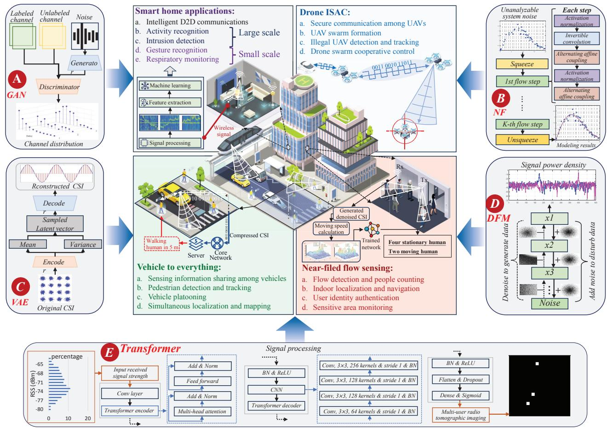  
FIGURE 1. The role of GAI in the physical layer and its support for ISAC applications. The GAI models can be utilized to enhance several physical layer technologies, including channel state information (CSI) compression and signal detection. On this basis, the GAI enhanced physical layer technologies can further augment ISAC system performance across various applications, such as indoor human detection and outdoor vehicle to vehicle communication.

of this article are summarized as follows:

- We conduct a review of five major GAI models and the ISAC system. Building on this, we analyze the potential applications of the GAI models in the ISAC physical, network, and application layers, providing insights for emerging sensing, localization, and communication technologies.   
- From different perspectives such as beamforming and signal detection, we investigate how GAI models enhance physical layer technologies. We then discuss how GAI-enhanced physical layer technologies support communication and sensing, outlining technical issues and viable solutions.   
- We propose a signal spectrum generator (SSG) to tackle the near-field DoA estimation problem when antenna spacing exceeds half the wavelength. Experimental results reveal that SSG yields a mean square error (MSE) of around 1.03 degrees in DoA estimation, confirming SSG's effectiveness while highlighting the importance of integrating GAI into the ISAC physical layer.

# OVERVIEW OF GENERATIVE AI AND ISAC

This section first introduces the concepts of GAI and presents five representative GAI models. Following that, we introduce ISAC and generally explain GAI's potential support for it from the physical, network, and application layers.

# GENERATIVE AI

GAI is a specific category of AI, trained on extensive datasets to learn data distribution patterns, thereby enabling the generation of new and unique content that resembles the training data. GAI models outperform TAI models in understanding and capturing the distribution characteristics of training data, leading to their wide application across different fields [1]. In various GAI models, GANs, normalizing flows (NFs), variational autoencoders (VAEs), diffusion models (DFMs), and Transformers not only excel in generating content but also demonstrate applicability in the physical layer of wireless communications. Hence we offer a brief introduction to their fundamental principles:

- GANs (Fig. 1A) consist of a generator and a discriminator that compete during training, aiming for a particular equilibrium [5]. The training is completed when the discriminator cannot differentiate between real and fake data. After that, the generator can produce similar, yet new data in a parallel manner. However, the training process is complex, as finding the equilibrium is harder than optimizing an objective function.   
- NFs (Fig. 1B) use invertible transformations to map basic distributions to target spaces for detailed analysis [6]. These transformations create a flow that can be reversed, facilitating likelihood estimation. NFs can sample from complex probability distributions, which is use-

<table><tr><td>PropertiesGAI Models</td><td>Principles [1]</td><td>Advantages and Disadvantages</td><td>Potential applications [2]</td></tr><tr><td>GANs</td><td>Train generators to produce fake samples by competing with a discriminator</td><td>a. Data generation in parallel mannerb. End-to-end training mechanismc. Difficult to train as finding a Nash equilibrium may be more difficult than optimizing the functiond. Sensitive to hyperparameters</td><td rowspan="5">a. Physical layer:Channel estimation, signal detection and enhancement, joint source-channel coding, beamforming, CSI compression, non-orthogonal multiple access (NOMA), secure transceiver design, synchronization, etc.b. Network layer:Resource (bandwidth, power, channel, etc) allocation strategy design, scheduling plan design (resource offloading, networking, crowdsourcing, etc), and incentive mechanism (auction, contract, etc) generation.c. Application layer:ISAC data generation for model training, data repair and enhancement, high dimensional ISAC data distribution modeling and analysis, data feature extraction, data denoising and dimensionality reduction, etc.</td></tr><tr><td>NFs</td><td>Use invertible transformations to convert simple distributions into complex ones for data analysis and generation</td><td>a. Posterior distribution computing of latent variablesb. Understandable training processc. Sensitive to the choice of the base distributiond. Struggle with the discrete and categorical data</td></tr><tr><td>VAEs</td><td>Compress and rebuild data by encoding it into a latent space and then decoding it back to the original space</td><td>a. Suitable for complex data processing (such as data with high dimensional and complex distribution)b. Suitable for distributed trainingc. Suffer from posterior collapsedd. Require function to be continuous and differentiable</td></tr><tr><td>DFMs</td><td>Learn optimal parameters by adding noise to samples and generate samples by applying these parameters for denoising</td><td>a. Flexible model structure (can be scaled to accommodate different levels of complexity)b. Supports each step&#x27;s probability distribution calculationc. Low sampling rate (may need thousands of evaluation steps to draw a single sample)</td></tr><tr><td>Transformers</td><td>Compute a weighted sum of the input sequence elements, allowing more attention on the important parts of the input sequence</td><td>a. Capture long-range dependenciesb. Parallel processing of sequencesc. Difficult to interpret and visualized. Limited ability to handle variable-sized inputs</td></tr></table>

TABLE 1. Five typical GAI models and corresponding potential support for ISAC at different layers.

ful for the unanalyzable data. However, many transformations may make the training process time-consuming.

\- VAEs (Fig. 1C) are neural networks designed to compress and reconstruct data. Unlike traditional autoencoders, VAEs can model the latent distribution and sample from the modeled space, benefiting data dimension reduction and feature extraction [7]. Additionally, they can estimate the uncertainty in predictions and generate plausible outputs for a given input. However, generated samples are not always interpretable, as they are derived from the latent space.

\- DFMs (Fig. 1D) attract significant attention due to their image generation capabilities. During the training, DFMs corrupt training data with random noise and subsequently denoise the data to learn optimal hyperparameters [8]. Once trained, they can apply the learned parameters to generate samples. DFMs can be trained on incomplete datasets with a stable process, but inference requires many steps, making them less efficient for generating large datasets.

\- Transformers (Fig. 1E) are neural network architectures based on the self-attention, which can model long-range dependencies between elements in the input sequence and support parallel sequences processing, suitable for tasks involving substantial sequence data. Their design needs minimal inductive biases and is inherently suited for set-functions, enabling them to process multiple modalities using similar processing blocks [9].

The principles presented above reveal that the GAI model possesses strong capabilities in data analysis, processing, and generation. ISAC

involves extensive and in-depth signal processing (essentially data processing), while existing research reveals its certain limitations due to insufficient processing capabilities, such as unsatisfactory sensing performance under low signal-to-noise ratio (SNR) conditions. Therefore, it is necessary to integrate GAI into ISAC to alleviate these issues to some extent, especially in signal enhancement and ISAC data compression, thereby supporting sensing and communication.

# INTEGRATED SENSING AND COMMUNICATION

ISAC focuses on integrating wireless sensing and communication into a unified system. This aims at the efficient use of limited resources, while facilitating both functions $[4]$ . From the physical layer, ISAC can be broadly classified into non-overlapping and overlapping systems. Specifically, non-overlapping systems include time-division, frequency-division, and space-division ISAC. For example, time-division ISAC allocates distinct signals to individual time slots for either sensing or communication tasks, allowing them to use their preferred waveforms. The overlapping systems can be divided into sensing-centric, communication-centric, and joint designs. For example, the communication-centric design can be achieved by appropriately modifying existing communication systems, and a representative example is WiFi sensing $[10]$ . Compared to traditional wireless communication and sensing systems, the ISAC systems offer several advantages.

Higher Efficiency: By allowing communication and sensing to share resources, ISAC boosts the overall efficiency of wireless networks.

Lower Cost: By eliminating the need for separate communication and sensing modules, ISAC lowers both hardware and power consumption costs for wireless devices.

More Versatile Services: ISAC is capable of fulfilling users' communication requirements while concurrently offering sensing function, allowing it to deliver more services.

Benefiting from these advantages, ISAC systems can be applied across various scenarios, making them a key technology for future 6G networks.

# POTENTIAL APPLICATIONS OF GAI IN ISAC SYSTEMS

As aforementioned, GAI can serve ISAC systems from multiple perspectives, which can be broadly categorized into the physical, network, and application layers.

Physical Layer: GAI can be employed for channel estimation, anomaly signal identification, encoding, beamforming, etc, as shown in Fig. 1. These GAI-enhanced physical layer technologies can improve the communication performance (e.g., reducing bit error rate (BER)) and enhance the sensing accuracy (e.g., optimizing signal beams to increase target detection accuracy while avoiding interference in ISAC systems).

Network Layer: GAI can be utilized for designing resource allocation strategies, scheduling schemes, and incentive mechanisms, which could not only lower the system cost but also boost the operation efficiency. While methods such as deep reinforcement learning (DRL) are applicable here, GAI has been shown to be more effective in tasks like resource allocation [2].

Application Layer: GAI can be used to offer support in data generation, analysis, and feature extraction for various ISAC applications. This support not only facilitates in-depth analysis of communication or sensing data but also generates a substantial amount of data for both communication and sensing model training, which is difficult for other existing AI models.

In Table 1, we summarize the above mentioned GAI models and their potential support for ISAC systems. Next, we detail GAI's applications in the physical layer.

# GAI-ENHANCED PHYSICAL LAYER TECHNOLOGIES FOR ISAC

The physical layer includes several key technologies such as codebook design and channel estimation. In this section, we investigate how GAI strengthens various physical layer technologies and discuss their potential support for ISAC systems from both sensing and communication perspectives.

# FROM COMMUNICATION PERSPECTIVE

Signal Detection: Detecting signals in cases with unpredictable noise is challenging. NFs can infer latent variables, offering an effective solution. Hence, the authors in [6] propose a probabilistic machine-learning detection framework that employs NFs to approximate the unknown system noise in MIMO systems without any prior information. This approximation is driven by unsupervised learning with only noise samples, which is difficult to achieve with TAI models. In a $4 \times 4$ MIMO system with $\alpha = 1.9$ , the proposed system reduces Euclidean distance-maximum likelihood estimation detection error to approximately 1.1 percent and demonstrates resilience against impulsive noise, even with unknown noise distributions. Besides NFs, other GAI models like Transformers and VAEs can be also used for signal detection. In ISAC systems, the integration of communication and sensing creates more complex noise, additionally, differences in signal waveforms and other aspects between these two modules could exacerbate the issue. Therefore, NFs can also be employed to model the unknown noise, improving signal detection capability of ISAC systems.

Secure Transceiver Design: The complexity of ISAC architectures and channel models complicates the design of security technologies. With the ability of processing complex data, VAEs can automatically manage codeword variation, which can be modeled as noise during transmission, making VAEs suitable for building secure transceiver pairs. In [7], the authors modify the VAE loss function at the receiver to include a security term, enhancing the receiver security. The unsupervised training is further used to strengthen the robustness against random codeword variations. In the case of imperfect CSI with the SNR range from -5 dB to 10 dB, the BER of this method at the eavesdropper is 0.05 higher than that of the autoencoder based on traditional neural networks. The same approach can be integrated into ISAC systems to enhance the security of the receiver and the robustness to codeword variations. However, when sensing and communication share the receiver, it is crucial to consider how adding the security term to a loss function might affect the sensing module.

Sparse Code Multiple Access: In ISAC, various smart devices like unmanned aerial vehicles participate in communication and sensing, causing severe interference among devices. To mitigate this, combining GAI models with non-orthogonal multiple access (NOMA) techniques is a promising solution. The authors in [11] introduce a GAN-based sparse code multiple access (SCMA) encoding and decoding approach. At the SCMA encoder, the generator is used to shorten the sequences, and a noise layer is introduced to improve the noise immunity. At the decoder, PatchGAN serves as the discriminator to reduce the computational load, and an attention mechanism is inserted between the GAN's generator and discriminator to enhance the BER performance. The evaluation shows under Gaussian channel conditions with M = 16 and BER = 0.1, the propose system outperforms CR and OCB codebooks by 3.1 dB and 2 dB, respectively. Such designs can offer better connectivity of various smart devices involved in communication for ISAC, ensuring that control, scheduling, and other information can be timely transmitted to each device.

Joint Source-Channel Coding: Coding is crucial for mitigating channel noise and interference, making it essential for communication of ISAC. Joint source-channel coding (JSCC) is an effective encoding method, but the complexity and discontinuity of the source data distribution present design challenges. To address this, in [12], the authors employ the VAE encoder to transform source data into a low-dimensional latent space and use the decoder to revert it to the original data for JSCC. During this process, one of multiple encoders is selected for transmission to tackle the issue of discontinuous projection. The evaluations show that

The complexity of ISAC architectures and channel models complicates the design of security technologies. With the ability of processing complex data, VAEs can automatically manage codeword variation, which can be modeled as noise during transmission, making VAEs suitable for building secure transceiver pairs.

<table><tr><td rowspan="2">Layers Issues</td><td colspan="4">Model layer</td><td>ISAC application layer</td></tr><tr><td>GANs</td><td>NFs</td><td>VAEs</td><td>DFM</td><td>Communication and sensing perspectives</td></tr><tr><td>Multiple access</td><td>Source data enhancement</td><td>-</td><td>-</td><td>-</td><td rowspan="4">Potential benefits for communication:a. Stronger signal detection capabilities in systems with unknown channel noiseb. More secure communication with lower BERc. Better anomaly signal detection capabilitiesd. Stronger spoofing signal generation and defense capabilitiese. More efficient coding with higher PSNrf. Enhanced access capabilities for multiple devices</td></tr><tr><td>Signal detection</td><td>Learn the channel transition probability</td><td>Model unanalyzable system noise</td><td>Learn the probability distribution of the input signal</td><td>Signal power spectral density generation</td></tr><tr><td>Communication security</td><td>Spoofing signal generation</td><td>-</td><td>Handle the influence of random codeword variations</td><td>-</td></tr><tr><td>Coding</td><td>Codebook design</td><td>-</td><td>Source data dimension transformation</td><td>Channel distribution generation</td></tr><tr><td>CSI compression</td><td>CSI data compression and decompression</td><td>-</td><td>-</td><td>-</td><td rowspan="4">Potential benefits for sensing:a. Superior data compression ratio and improved reconstruction accuracyb. Advanced CSI estimation accuracy for sensingc. Enhanced beamforming performance with lower overhead for beam alignmentd. Repair and generate the sensing signal</td></tr><tr><td>Beamforming</td><td>Map the channels for precoder extraction</td><td>-</td><td>Learn the distribution of the dynamic beams</td><td>-</td></tr><tr><td>Channel estimation</td><td>Model the complex channel distribution</td><td>-</td><td>Model unknown channel distribution</td><td>Learn the distribution of wireless channel</td></tr><tr><td>Signal enhancement</td><td>Synthetic micro-Doppler spectrum signature</td><td>-</td><td>-</td><td>Produce and recover the denoised channel</td></tr></table>

TABLE 2. The use of GAI in the physical layer and its potential support for communications of ISAC. The empty cells denote unexplored areas.

the proposed system outperforms the rule-based system by 0.17dB and 0.11dB, when sending 3 and 4 symbols over the AWGN channel, respectively. In ISAC systems where communication and sensing modules have independent encoding requirements and the channel is modeled as an additive Gaussian noise channel, such a method can directly contribute to the JSCC efficiency of communication module in ISAC.

# FROM SENSING PERSPECTIVE

CSI Compression: Sensing in ISAC may need a significant amount of CSI from multiple antennas and subcarriers, especially in WiFi based sensing. Hence, efficient compression, which facilitates the CSI storage and transmission, is essential. Given the superiority over traditional multi-layer perceptrons when output dimensionality far exceeds input, GANs are a preferred choice for CSI compression. In [5], the authors use the CSiNet encoder at the transmitter to compress original CSI into a low-dimensional vector. Then, at the receiver, a deep convolutional GAN decoder reconstructs the original CSI from this compressed vector with the discriminator assessing its quality. The evaluations show that the normalized MSE of the proposed method is -7.05 dB, which is lower than -2.46 dB of CS-CsiNet based on deep learning, when the compression ratio is 1/64. Besides GANs, VAEs are also suitable for this task. These CSI compression methods show excellent reconstruction accuracy across varying compression ratios, providing support to reduce the overhead of CSI transmission and storage.

Beamforming: Beamforming is a critical element in ISAC systems, and adaptive beam alignment remains a central challenge in this area. To address this, the authors in $[13]$ introduce a VAE based dual timescale learning and adaptation framework. For the long timescale, a deep recurrent VAE (DR-VAE) is proposed to learn a probabilistic model of beam dynamics based on noisy beam-training observations. For short timescales, the adaptive beam-training procedure is designed as a partially observable Markov decision process, optimized with point-based value iteration by incorporating beam-training feedback and probabilistic predictions of the strongest beam pair from the DR-VAE. The evaluation shows DR-VAE outperforms a naive approach that ignores beam-training feedback errors and the Baum-Welch algorithm by 92 percent and 86 percent, respectively. Additionally, it achieves near-optimal spectral efficiency, surpassing a thorough scanning policy for dominant beam pairs by 85 percent and a state-of-the-art POMDP policy by 18 percent. In ISAC, such a method not only minimizes the overhead associated with beam alignment during sensing process, but also boosts spectral efficiency, thereby increasing communication throughput.

Channel Estimation: Channel estimation is important for sensing reliability, particularly in sensing systems that rely on CSI. Diffusion models, excel at learning high-dimensional gradients and model the log distribution of the data, are well-suited for modeling high-dimensional millimeter-wave MIMO channels. In [8], the authors introduce a MIMO channel estimation method using score-based diffusion models. They first train a score-based generative model in an unsupervised manner using a database of known channels, which is independent of pilot symbols. Then, annealed Langevin dynamics is used for channel estimation by sampling from the posterior distribution. Compared to conventional supervised deep learning methods, this approach can offer a communication gain of up to 5 dB to the end-to-end coded communication system can reach up to 5 dB. More importantly, within ISAC systems, this approach holds the potential to solve the problems of estimating the channel in an out-of-distribution setting, that is, the environments not seen during training, thereby providing more robust data support for the CSI-based sensing in complex channel conditions.

Signal Enhancement: Signal parameter estimation is crucial for wireless sensing in ISAC systems, as it provides valuable observations for tasks like target detection and localization. Estimating signal parameters in low SNR conditions is particularly challenging. One effective strategy to address this issue is to improve the SNR using the generative capabilities of GAI models. Hence, in [14], the authors convert low-SNR complex signals into images. Then, they employ a Unet structure as the GAN's generator to encode these images, effectively boosting the SNR. The experimental results indicate that the proposed method outperforms the MUSIC algorithm in terms of DoA estimation error at SNRs below -4 dB, and matches the accuracy of both the MUSIC and deep neural network-based methods at SNRs above -4 dB. Adapting this concept to ISAC, incomplete and low-SNR signals can be converted into images. GAI models, once trained, can then refine these images, effectively boosting the signal SNR and thereby improving parameter estimation and sensing performance.

Besides the aforementioned applications, GAI can also be applied to sensing signal processing. For instance, in [9], the Transformer is used to capture inter-feature correlations among received signal strength observations, thereby boosting the multi-target localization capability. We summarize the above observations in Table 2.

# DISCUSSION

As can be seen, various GAI models have been integrated into the physical layer, offering potential support for both the communication and sensing of ISAC systems from diverse perspectives. From the investigations, we can see these designs leverage the following prominent capabilities of GAI.

Capability of Capturing Complex Data Distributions: For datasets with complex distributions that are difficult, or even impossible to analyze directly, such as the noise and dynamic features of users, GAI models can be employed to capture their latent distributions. On this basis, the acquired distributions can be sampled, thereby supporting corresponding physical layer technologies, like signal detection $[6]$ in the system with complex noise and beam prediction in dynamic environments $[13]$ .

Capability of Transforming and Processing Data Across Various Dimensions: For high-dimensional data, GAI models can reduce its dimensionality through encoding and subsequently decode it to recover the original high-dimensional data. This facilitates the efficient compression [5], storage, and transmission of high-dimensional data within the ISAC system. For data with simpler distributions, GAI models can project them to more complex target spaces, thereby aiding in more efficient sampling and more accurate density estimation.

Capability of Restoring and Enhancing Data: For data in the ISAC system with a low SNR, such as the covariance matrix of received signals with low SNR as mentioned earlier $[14]$ , GAI models can effectively restore them. This restoration contributes to enhanced outcomes in subsequent stages, like more precise parameter estimation. Moreover, the generative capabilities of GAI can also recover incomplete data, ensuring that the subsequent processing can be effectively carried out.

# CASE STUDY

Signal DoA estimation, which helps in identifying the location of the signal source, is crucial in both near-field and far-field ISAC systems. Besides, it also facilitates beamforming, enhancing the active near-field communication (NFC) [15]. However, when the antenna spacing exceeds half the wavelength (i.e., $\lambda$ ), the DoA estimation becomes challenging due to phase ambiguity. In this section, we show how to use GAI, that is, diffusion models, to address this challenge, thereby providing support for near-field ISAC.

# PROBLEM DESCRIPTION

Using a uniform linear array, DoA estimation relies on the phase difference between signals received by adjacent antennas. Specifically, from the array response in Fig. 2, given the values of $r$ , $\lambda$ , and $n$ , this phase difference is solely related to the antenna spacing and the DoA. When $d \leq 0.25\lambda$ , this difference uniquely determines the DoA, enabling the MUSIC algorithm [14] to calculate a clear signal spectrum for DoA estimation, as shown in Fig. 2. However, larger $d$ may cause phase differences over $2\pi$ , creating ambiguities with multiple DoAs corresponding to one phase difference. In this case, the signal spectrum becomes ambiguous, as shown in Fig. 2, thereby leading to estimation failure.

# PROPOSED DESIGN

The signal spectrum is a matrix, which describes the signal DoA via data distribution. When $d \leq 0.25\lambda$ , the signal spectrum is clear and the data distribution effectively reflects the signal's DoA. However, as d increases, the spectrum becomes ambiguous, indicating a shift in data distribution and hence making it unable to accurately describe the correct signal DoA. The diffusion model, with strong inference capability, can explore implicit relationships between different distributions. Hence, we propose a diffusion model-based signal spectrum generator (SSG), as illustrated in Fig. 3. By training with paired data distributions of clear and ambiguous spectra, SSG is used to learn the implicit relationships between these distributions. Therefore, once trained, the SSG can generate the clear spectrum distribution based on the given ambiguous one, enabling DoA estimation.

Concretely, with N = 4 and $d = 0.5\lambda$ , we produce 10,000 paired signal spectra via simulation,

Channel estimation is important for sensing reliability, particularly in sensing systems that rely on CSI. Diffusion models, excel at learning high-dimensional gradients and model the log distribution of the data, are well-suited for modeling high-dimensional millimeter-wave MIMO channels.

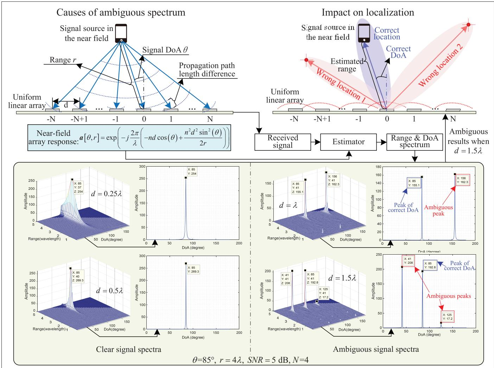

$$
\theta = 8 5 ^ {\circ}, r = 4 \lambda , S N R = 5 \mathrm{dB}, N = 4
$$

FIGURE 2. The cause of ambiguous signal spectrum and its impact on applications. Here, $\lambda$ is the signal wavelength, d is the antenna spacing, $\theta$ is the DoA, r is the distance between the signal source and the reference antenna, $2N + 1$ is the total number of antennas. When d is less than half of the $\lambda$ , the signal DoA can be accurately estimated. However, as d increases, for instance, to $\lambda$ or $1.5\lambda$ , the signal spectrum becomes ambiguous, obstructing the identification of the true signal DoA and subsequently impacting further operations such as localization and beamforming.

assigning 80 percent for training and 20 percent for testing. In the simulation, three signal sources with randomly generated DoAs and ranges (from transmitter to receiver) within 0-180 degrees and 0-6λ, respectively, and SNRs between 0-5 dB are used. To ensure consistency, the ambiguous spectra are obtained via MUSIC using the signals captured by antennas with odd index (corresponding to $d = \lambda$ ), while signals from antennas 3 to 7 generate the corresponding correct spectra. Subsequently, the ambiguous spectrum serves as the observation, while the correct spectrum acts as the expert solution for training the SSG.

As shown in Fig. 3, during the training, the paired spectra are fed to SSG first. Then, the SSG generates Gaussian noise, whose intensity is managed by the schedule, and adds the noise to the expert solution, as Steps 3 and 4 show. This process is repeated 10 times and the intensity of the noise added each time is different, thereby disrupting the expert spectrum. After that, SSG progressively denoise the disrupted expert solution, that is, learn how to reduce noise at each step to generate the spectrum, as shown in Step 5. In Step 6, the denoising score matching based loss function aims to minimize the difference between the original noise ( $\varepsilon$ ) corrupting the expert solution and the model-estimated noise ( $\varepsilon_{\varphi}$ ), considering step (t) and the current observation (g). Through this way, the denoising network hyperparameters, which establish the denoising criteria and guide the diffusion model's inference based on the observations, are refined. SSG undergoes training for 700 epochs, and after that, SSG can generate the clear signal spectra based on the given ambiguous signal spectra via the trained denoising network.

# PERFORMANCE EVALUATION

The Part (i)-a in Fig. 4 demonstrates the change of the testing reward as the number of training epochs increases. As training progresses, the reward approaches 0 and eventually stabilizes around -10. $^{1}$ This demonstrates that SSG can learn the denoising network's hyperparameters through training and effectively generate a clear spectrum for a given ambiguous spectrum. Meanwhile, as training deepens, the disparity between the spectrum generated by SSG and the expert solution gradually narrows, indicating that the network's hyperparameters are gradually optimizing and demonstrating the effectiveness of the training process. In comparison, the reward of the DRL based approach remains around -80, indi-

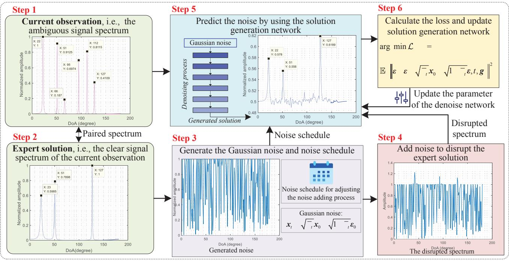  
arg min L =

FIGURE 3. The training process of the proposed SSG. In Steps 1 and 2, the ambiguous signal spectrum and the corresponding expert solution are obtained first. Then, Steps 3–6 detail the training process via forward and backward diffusion. Using the expert solution, the loss function is designed to minimize the discrepancy between the noise added in Step 4 and the noise estimated by the model in Step 5.

cating almost ineffective learning. This could be attributed to the challenge faced by DRL in prioritizing crucial points associated with the signal's DoA in the spectrum, hence failing to effectively learn the correct solution.

Leveraging the trained SSG, Part (ii) in Fig. 4 displays the process of generating the clear signal spectrum using Part (i)-b as the input. Its paired expert solution is shown in Part (i)-c. This process reveals that through 10 steps of sequential denoising, SSG can generate the clear spectrum, with its radar and signal spectrum representations shown in Part (ii) at the 10th step and Part (i)-d, respectively. Meanwhile, we can see that the clear signal spectrum generated by SSG shows the DoAs of three signal sources are 31, 99, and 146 degrees, respectively, which are close to the DoAs in the paired expert solution in Part (i)-c, revealing the effectiveness of the generation. Building on this, we conduct 2000 times of generation and the statistical results show that the SSG's MSE in DoA estimation can reach about 1.03 degrees.

We further analyze the impact of SSG on signal source localization under near-field conditions. During localization, we assume that the range between the signal source and the reference antenna is correctly estimated, and the antenna's location is known. Then, three DoAs with the highest amplitudes are extracted from the spectrum and combined with distance and antenna location to form constraints for source localization. The results in Part (i)-e indicate that without SSG, the median signal source localization error is about $1.25\lambda$ . However, using SSG reduces this error to approximately $0.21\lambda$ . This is intuitive since, without SSG, the system may select incorrect DoAs from an ambiguous spectrum for localization, thereby leading to significant localization errors.

# FUTURE DIRECTIONS

# GAI APPLICATION SECURITY

While GAI has demonstrated its potential in the physical layer, it also poses certain risks. For instance, attacks on the training datasets can lead to training non-convergence or even failure, thereby wasting significant computational resources. Attacks on the GAI model itself could cause more severe consequences, such as ineffective channel estimation and coding, ultimately impacting the ISAC performance. Hence, future research should address these security issues from both the dataset and model perspectives. Blockchain technology can ensure data authenticity and provider reliability, while offering a unified management for multi-party data, hence serving as one effective approach to resolving these security issues.

# RESOURCE ALLOCATION

The training and operation of GAI models consume computational, storage, and communication resources, disrupting the resource balance of the original system. Hence, integrating GAI models into the physical layer necessitates reallocating resources to ensure stable system operation. When local resources are abundant, strategies should be developed to maximize benefits while minimizing resource consumption based on task complexity and real-time requirements. When local resources are constrained, incentivization mechanisms, such as dynamic spectrum access, should be considered to ensure functional effectiveness, and then maximize benefits.

# CELL FREE ISAC

The decentralized architecture of cell-free massive MIMO effectively reduces the distance between the access point and the user, thereby minimizing the path loss. This configuration is naturally conducive to the utilization of millimeter wave and terahertz frequencies for ISAC performance. Within this framework, GAI can be utilized to optimize factors such as precoding and combining. This integration has the potential to generate high-gain, narrow beams in a mobile cell-free setting, further enhancing the efficacy of both target tracking and high-capacity wireless fronthaul.

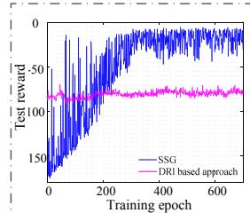

line

| Training epoch | SSG     | DRI based approach |
| -------------- | ------- | ------------------ |
| 0              | 0       | 100                |
| 100            | -50     | 100                |
| 200            | -25     | 100                |
| 300            | -10     | 100                |
| 400            | -5      | 100                |
| 500            | 0       | 100                |
| 600            | 5       | 100                |

Training process

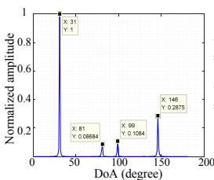

line

| DoA (degree) | Normalized amplitude |
| ------------ | --------------------- |
| 31           | 1.0                   |
| 81           | 0.1                   |
| 99           | 0.15                  |
| 146          | 0.3                   |

b. Ambiguous spectrum

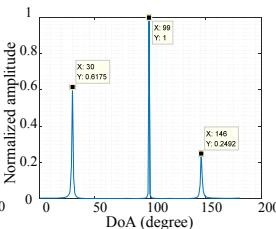

line

| DoA (degree) | Normalized amplitude |
| ------------ | -------------------- |
| 30           | 0.6175               |
| 69           | 1                    |
| 146          | 0.2462               |

c. Clear spectrum (expert solution)

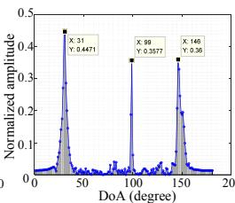

line

| DoA (degree) | Normalized amplitude |
| ------------ | -------------------- |
| 31           | 0.4471               |
| 99           | 0.3277               |
| 146          | 0.36                 |

d. Generated result in signal spectrum representation

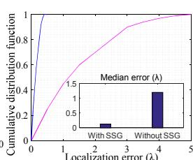

line

| Localization error (λ) | Cumulative distribution function |
| ---------------------- | ---------------------------------- |
| 0                      | 0.0                                |
| 1                      | 0.5                                |
| 2                      | 0.7                                |
| 3                      | 0.8                                |
| 4                      | 0.9                                |
| 5                      | 1.0                                |

e. Localization comparison

Part (i)   
Part (ii)   
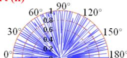  
Result of the 1st step of denoising

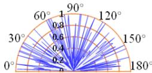  
Result of the 6th step of denoising

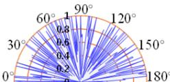  
Result of the 2nd step of denoising

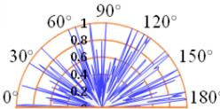  
Result of the 7th step of denoising

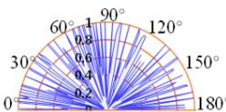  
Result of the 3rd step of denoising

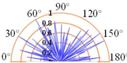  
Result of the 8th step of denoising

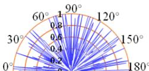  
Result of the 4th step of denoising

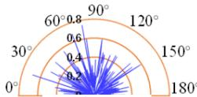  
Result of the 9th step of denoising

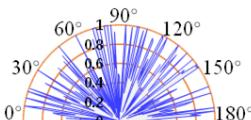  
Result of the 5th step of denoising

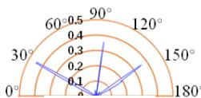  
Result of the 10th step of denoising   
Radar representation of the generation process   
FIGURE 4. The experimental results. The Part (i) describes the training process of SSG as well as the comparison among the generated signal spectrum, the observed ambiguous spectrum, and the corresponding clear spectrum. The results presented in Part (ii) illustrate the generation process of the proposed SSG using radar representation.] During the inference process, the SSG starts with the noise and uses the trained denoising network to denoise it. As the number of inference steps increases, the noise in the spectrum gradually diminishes. Finally, after 10 steps of denoising, the clear signal spectrum is obtained.

# CONCLUSION

In this article, we investigated GAI's use in the physical layer from various perspectives. We concluded that these applications primarily leverage GAI's capabilities in complex data feature extraction, transformation, and enhancement. Subsequently, we analyzed how GAI-enhanced physical layer technologies can potentially support ISAC systems, considering both sensing and communication aspects. In the case study, we introduced the diffusion model based SSG. Operating in the physical layer, SSG addresses the DoA estimation problem that arises when array spacing exceeds half the wavelength. These insights emphasize the crucial role of GAI in the ISAC physical layer and the pressing need for a further exploration of its applications.

# ACKNOWLEDGMENT

This work is supported in part by the National Natural Science Foundation of China (NSFC) under Grants No. 62102099, No. U22A2054, the Pearl River Talent Recruitment Program under Grant 2021QN02S643, and Guangzhou Basic Research Program under Grant 2023A04J1699; in part by the National Research Foundation, Singapore, and Infocomm Media Development Authority under its Future Communications Research & Development Programme, DSO National Labora tories under the AI Singapore Programme (AISG Award No: AISG2-RP-2020-019 and FCP-ASTARTG-2022-003), and MOE Tier 1 (RG87/22)

# REFERENCES

[1] S. Bond-Taylor et al., "Deep Generative Modelling: A Comparative Review of Vaes, Gans, Normalizing Flows, Energy-Based and Autoregressive Models," IEEE Trans. Pattern Analysis and Machine Intelligence, vol. 44, no. 11, 2022, pp. 7327–47.   
[2] H. Du et al., "Beyond Deep Reinforcement Learning: A Tutorial on Generative Diffusion Models in Network Optimization," arXiv preprint arXiv:2308.05384, 2023.   
[3] J. Wang et al., "A Unified Framework for Guiding Generative Ai With Wireless Perception in Resource Constrained Mobile Edge Networks," arXiv preprint arXiv:2309.01426, 2023.   
[4] Y. Cui et al., "Integrating Sensing and Communications for Ubiquitous IoT: Applications, Trends, and Challenges," IEEE Network, vol. 35, no. 5, 2021, pp. 158–67.   
[5] B. Tolba et al., "Massive MIMO CSI Feedback Based on Generative Adversarial Network," IEEE Commun. Letters, vol. 24, no. 12, 2020, pp. 2805-08.   
[6] K. He et al., "Learning-Based Signal Detection for MIMO Systems With Unknown Noise Statistics," IEEE Trans. Commun., vol. 69, no. 5, 2021, pp. 3025–38.   
[7] C.-H. Lin et al., "A Variational Autoencoder-Based Secure Transceiver Design Using Deep Learning," Proc. 2020 IEEE Global Commun. Conf., IEEE, 2020, pp. 1–7.   
[8] M. Arvinte and J. I. Tamir, "MIMO Channel Estimation Using Score-Based Generative Models," IEEE Trans. Wireless Commun., 2022.   
[9] Z. Lu, H. Liu, and X. Zhang, "Radio Tomographic Imaging Localization Based on Transformer Model," Proc. 2023 IEEE 6th Information Technology, Networking, Electronic and Automation Control Conf., vol. 6. IEEE, 2023, pp. 1134-38.   
[10] J. Wang et al., "Through the Wall Detection and Localization of Autonomous Mobile Device in Indoor Scenario," IEEE J. Sel. Areas Commun., vol. 42, no. 1, 2024, pp. 161–76.   
[11] C. Duan et al., "SCMA-TPGAN: A New Perspective on Sparse Codebook Multiple Access for UAV System," Computer Commun., vol. 200, 2023, pp. 161–70.   
[12] Y. M. Saidutta, A. Abdi, and F. Fekri, "Joint Source-Channel Coding Over Additive Noise Analog Channels Using Mixture of Variational Autoencoders," IEEE J. Sel. Areas Commun., vol. 39, no. 7, 2021, pp. 2000–13.   
[13] M. Hussain and N. Michelusi, "Adaptive Beam Alignment in Mm-Wave Networks: A Deep Variational Autoencoder Architectue," Proc. 2021 IEEE Global Commun. Conf., IEEE,

2021, pp. 1-6.

[14] X. Cao et al., "Pix2pix-Based DoA Estimation With Low SNR," Proc. 2022 IEEE 10th Asia-Pacific Conf. Antennas and Propagation, IEEE, 2022, pp. 1–2.

[15] Y. Liu ET AL., "Near-Field Communications: A Tutorial Review," arXiv preprint arXiv:2305.17751, 2023.

# BIOGRAPHIES

JIACHENG WANG (jiacheng.wang@ntu.edu.sg) is the postdoctoral research fellow in the College of Computing and Data Science, Nanyang Technological University, Singapore. Prior to that, he received the Ph.D. degree in School of Communications and Information Engineering, Chongqing University of Posts and Telecommunications, Chongqing, China. His research interests include wireless sensing, generative artificial intelligence, and semantic communications.

HONGYANG DU (hongyang001@e.ntu.edu.sg) is working toward his Ph.D. degree with the College of Computing and Data Science, the Energy Research Institute @ NTU, Interdisciplinary Graduate Program, Nanyang Technological University, Singapore. He was the recipient of IEEE Daniel E. Noble Fellowship Award in 2022. His research interests include generative AI, semantic communications, and communication theory.

DUSIT NIYATO [F] (dniyato@ntu.edu.sg) is a professor in the College of Computing and Data Science, Nanyang Technological University, Singapore. He received Ph.D. in Electrical and Computer Engineering from the University of Manitoba, Canada in 2008. His research interests are in the areas of sustainability, edge intelligence, decentralized machine learning, and incentive mechanism design.

JIAWEN KANG (kavinkang@gdut.edu.cn) received the Ph.D. degree from the Guangdong University of Technology, China in 2018. He has been a postdoc at Nanyang Technological University, Singapore from 2018 to 2021. He currently is a full professor at Guangdong University of Technology, China. His research interests focus on blockchain, security and privacy protection.

SHUGUANG CUI [F] (shuguangcui@cuhk.edu.cn) received the Ph.D. degree from Stanford University in 2005.

He is currently a Distinguished Presidential Chair Professor with the Chinese University of Hong Kong, Shenzhen. His current research interest is data-driven largescale information analysis and system design.

XUEMIN (SHERMAN) SHEN [F] (sshen@uwaterloo.ca) received the Ph.D. degree in electrical engineering from Rutgers University, New Brunswick, NJ, USA, in 1990. He is a University Professor in electrical and computer engineering with the University of Waterloo, Canada. His research focuses on wireless communication networks, including capacity analysis, mobility, and radio resource management.

PING ZHANG [F] (pzhang@bupt.edu.cn) received the M.S. degree in electrical engineering from Northwestern Polytechnical University, Xi'an, China, in 1986, and the Ph.D. degree in electric circuits and systems from BUPT, Beijing, China, in 1990. He is currently a Professor with the School of Information and Communication Engineering, Beijing University of Posts and Telecommunications (BUPT), and the Director of the State Key Laboratory of Networking and Switching Technology. He is also an Academician with the Chinese Academy of Engineering (CAE). His research interests mainly focus on wireless communications.