# Generative AI for Secure Physical Layer Communications: A Survey

Changyuan Zhao , Hongyang Du , Graduate Student Member, IEEE, Dusit Niyato , Fellow, IEEE, Jiawen Kang , Senior Member, IEEE, Zehui Xiong , Senior Member, IEEE, Dong In Kim , Fellow, IEEE, Xuemin Shen , Fellow, IEEE, and Khaled B. Letaief , Fellow, IEEE

Abstract—Generative Artificial Intelligence (GAI) stands at the forefront of AI innovation, demonstrating rapid advancement and unparalleled proficiency in generating diverse content. Beyond content creation, GAI has significant analytical abilities to learn complex data distribution, offering numerous opportunities to resolve security issues. In the realm of security from physical layer perspectives, traditional AI approaches frequently struggle, primarily due to their limited capacity to dynamically adjust to the evolving physical attributes of transmission channels and the complexity of contemporary cyber threats. This adaptability and analytical depth are precisely where GAI excels. Therefore, in this paper, we offer an extensive survey on the various applications of GAI in enhancing security within the physical layer of communication networks. We first emphasize the importance of advanced GAI models in this area, including Generative

Manuscript received 19 February 2024; revised 11 June 2024; accepted 13 July 2024. Date of publication 5 August 2024; date of current version 7 February 2025. This research is supported in part by the National Research Foundation, Singapore, and Infocomm Media Development Authority under its Future Communications Research & Development Programme, Defence Science Organisation (DSO) National Laboratories under the AI Singapore Programme (AISG Award No: AISG2-RP-2020-019 and FCP-ASTAR-TG-2022-003), Singapore Ministry of Education (MOE) Tier 1 (RG87/22), and the NTU Centre for Computational Technologies in Finance (NTU-CCTF); in part by the National Natural Science Foundation of China (NSFC) under Grants No. 62102099, No. U22A2054; in part by the Ministry of Education, Singapore, under its SMU-SUTD Joint Grant (22-SIS-SMU-048), and SUTD Kickstarter Initiative (SKI 20210204); in part by the National Research Foundation of Korea (NRF) Grant funded by the Korean Government (MSIT) under Grant 2021R1A2C2007638 and the MSIT under the ICT Creative Consilience program (IITP-2020-0-01821) supervised by the IITP (Institute for ICT Planning & Evaluation); in part by the Hong Kong Research Grants Council under the Areas of Excellence scheme grant AoE/E-601/22-R. The associate editor coordinating the review of this article and approving it for publication was Z. Qin. (Corresponding author: Dong In Kim.)

Changyuan Zhao is with the College of Computing and Data Science, Nanyang Technological University, Singapore, and also with CNRS@CREATE, Singapore 138602 (e-mail: zhao0441@e.ntu.edu.sg).

Hongyang Du is with the Department of Electrical and Electronic Engineering, University of Hong Kong, Hong Kong (e-mail: duhy@eee.hku.hk).

Dusit Niyato is with the College of Computing and Data Science, Nanyang Technological University, Singapore (e-mail: dniyato@ntu.edu.sg).

Jiawen Kang is with the School of Automation, Guangdong University of Technology, Guangzhou 510006, China (e-mail: kavinkang@gdut.edu.cn).

Zehui Xiong is with the Pillar of Information Systems Technology and Design, Singapore University of Technology and Design, Singapore (e-mail: zehui xiong@sutd.edu.sg).

Dong In Kim is with the Department of Electrical and Computer Engineering, Sungkyunkwan University, Suwon 16419, South Korea (e-mail: dongin@skku.edu).

Xuemin Shen is with the Department of Electrical and Computer Engineering, University of Waterloo, Waterloo, ON N2L 3G1, Canada (e-mail: sshen@uwaterloo.ca).

Khaled B. Letaief is with the Department of Electrical and Computer Engineering, Hong Kong University of Science and Technology, Hong Kong (e-mail: eekhaled@ust.hk).

Digital Object Identifier 10.1109/TCCN.2024.3438379

Adversarial Networks (GANs), Autoencoders (AEs), Variational Autoencoders (VAEs), and Diffusion Models (DMs). We delve into the roles of GAI in addressing challenges of physical layer security, focusing on communication confidentiality, authentication, availability, resilience, and integrity. Furthermore, we also present future research directions focusing model improvements, multi-scenario deployment, resource-efficient optimization, and secure semantic communication, highlighting the multifaceted potential of GAI to address emerging challenges in secure physical layer communications and sensing.

Index Terms—Generative AI, physical layer communications, physical layer security, wireless sensor network, anomaly detection.

# I. INTRODUCTION

ENERATIVE Artificial Intelligence (GAI) represents a G transformative category of Artificial Intelligence (AI) technologies capable of creating content, ranging from text, images, music, to complex simulations [1]. As a kind of unsupervised learning, GAI is trained on vast amounts of data to understand the underlying structure and dynamics of that data. Unlike traditional AI, which primarily focuses on analyzing and interpreting data, GAI takes a step further by generating new, original outputs based on learned patterns and datasets [2]. Once trained, these models can produce outputs that mimic the original data’s style, tone, and complexity, often indistinguishable from content produced by humans [3]. Reflecting on its inherent capabilities, GAI has been successfully deployed in a wide range of mature applications across different fields, including Stable Diffusion [4], DALL-E 3 [5], and ChatGPT [6], etc. Beyond its prowess in generating varied content forms, GAI also demonstrates powerful capabilities in enhancing cybersecurity measures, by generating sophisticated simulations and datasets for threat detection and system strengthening [7]. The innovative essence and wide-ranging applicability of GAI have captivated the research community, leading to an upsurge in interest to uncover its capabilities in addressing intricate challenges and driving innovation across various fields.

In wireless communications, security is a critical aspect of information technology, ensuring the confidentiality, integrity, and availability of data transmitted across networks [8]. Techniques such as encryption, secure socket layers, and digital signatures are employed to protect sensitive information during its transmission over the Internet or other communication networks [9]. In the Open Systems Interconnection model of communications [10], physical layer security plays a pivotal role in protecting communication networks by utilizing the inherent physical characteristics of the communication channel to thwart unauthorized access and guarantee data integrity [11]. This fundamental security layer capitalizes on the inherent unpredictability of channel properties, serving to enhance conventional encryption techniques by adding an extra layer of defense against eavesdropping and cyber-attacks. Given its critical significance, researchers have dedicated extensive efforts to conduct in-depth studies on physical layer security [12].

TABLE I SUMMARY OF RELATED SURVEYS 

<table><tr><td>Scope</td><td>Reference</td><td>Emphasis</td><td>Overview</td></tr><tr><td rowspan="4">GAI for Communication Networks</td><td>[23]</td><td>GAI in mobile networks</td><td>A survey of the recent work in the field of GAI with application to mobile telecommunications networks</td></tr><tr><td>[52]</td><td>Edge-Cloud GAI</td><td>An overview of research activities related to AIGC, GAI, and mobile edge intelligence</td></tr><tr><td>[53]</td><td>GAI-driven SemCom</td><td>A summary on the interplay between GAI and SemCom in wireless communication networks</td></tr><tr><td>[24]</td><td>GAI for Physical Layer Communications</td><td>A survey of GAI&#x27;s applications to address diverse problems in physical layer communications</td></tr><tr><td rowspan="7">AI for Secure Communication</td><td>[25]</td><td>AI for IoT security</td><td>A summary of the contribution of AI to the IoT security in Edge computing</td></tr><tr><td>[54]</td><td>AI for Security and Privacy of 6G</td><td>A overview of security and privacy issues based on prospective technologies for 6G in the physical, connection, and service layers</td></tr><tr><td>[55]</td><td>AI-based Intrusion Detection System</td><td>A survey on machine learning-based intrusion detection systems for secure communication in IoTs</td></tr><tr><td>[56]</td><td>AI in IoT Security</td><td>A overview of applying machine learning for cyber threat detection in IoT environments</td></tr><tr><td>[57]</td><td>AI-based Physical Layer Security</td><td>A summary on intelligent wireless physical layer security by concentration on physical layer authentication, antenna selection, and relay node selection</td></tr><tr><td>[58]</td><td>AI-assisted Secure Data Transmission</td><td>An in-depth analysis of the role of AI in optimizing and designing the intelligent physical layer security techniques</td></tr><tr><td>[26]</td><td>AI-based Physical Layer Security</td><td>A survey about employing DL-based physical layer security techniques for solving various security concerns in 5G and beyond networks</td></tr></table>

With the advancement of AI, the integration of Deep Learning (DL) methods has revolutionized communication security, offering enhanced capabilities for anomaly detection, automatic threat identification, and adaptive security measures based on real-time data analysis [13], [14], [15]. For instance, Convolutional Neural Networks (CNNs) are employed to design physical layer security techniques such as in the development of an intrusion detection system [16], multi-user authentication [17]. In addition, Recurrent Neural Networks (RNNs) have found utility in various studies including automatic modulation classification [18], secure channel coding [19], and intrusion detection [20].

However, traditional AI methods often fall short in addressing physical layer security challenges due to their inability to dynamically adapt to the continuously changing physical characteristics of transmission channels and the sophisticated nature of modern cyber threats [21]. Specifically, traditional AI models are typically trained on datasets from specific environments, limiting their effectiveness when deployed under unfamiliar conditions. Furthermore, the complexity and variability of noise patterns, signal interference, and channel conditions within the physical layer lead to difficulties in collecting sufficient labeled data for physical layer attacks. These challenges can be effectively addressed by deploying GAI models. Due to its ability to thoroughly learn data features via unsupervised or self-supervised learning, GAI can adapt to changing environmental factors in communication systems, ensuring continuous maintenance of robust security measures [22].

Confronted with the critical challenges in secure physical layer communications, and recognizing the distinct advantages provided by GAI, this paper provides a thorough survey of GAI’s applications in tackling various issues in physical layer security.

# A. Related Surveys and Contribution

1) GAI for Communication Networks: Recent literature has witnessed a notable increase in the exploration of GAI applications within communication networks (Table I). The work [23] delves into the utilization of GAI to address contemporary challenges in mobile telecommunications networks. This article underscores the pivotal role of GAI in the advancement of mobile network technologies, particularly in the overcoming of existing obstacles. Reference [52] shifts the focus to the deployment of Artificial Intelligence Generated Content (AIGC) in mobile networks, providing comprehensive insights into GAI and mobile edge intelligence. Additionally, [53] investigates the interplay between GAI and Semantic Communication (SemCom) in wireless networks. Their research demonstrates the utility of GAI in the creation, transmission, and efficient management of information within these networks. Moreover, the authors in [24] present an analysis of GAI applications in the physical layer, addressing various applications but the security issues are not the main focus.

2) AI for Secure Communication: AI has significantly transformed the landscape of communication network security and privacy. In [54], a systematic overview is presented on prospective technologies for 6G networks, focusing on the physical, connection, and service layers, along with lessons learned from existing security architectures. The authors in [25] discuss the contribution of AI to Internet of Things (IoTs) security within Edge Computing (EC) environments, particularly emphasizing AI’s role in augmenting security features. Regarding attack detection, [55] provides a detailed survey on AI-based intrusion detection systems, with a focus on securing communication within the IoT. Similarly, [56] delves into machine learning applications, with a specific emphasis on cyber threat detection in IoT environments. For physical layer security, the utilization of AI in optimizing and designing intelligent security techniques is thoroughly explored in [58]. Reference [57] introduces intelligent wireless physical layer security by concentrating on physical layer authentication, antenna selection, and relay node selection. In a related vein, [26] investigates DL based physical layer security techniques, concentrating on their application in addressing various security concerns in 5G and beyond networks. However, it is noted that there is a lack of detailed analysis regarding the role of GAI in physical layer security.

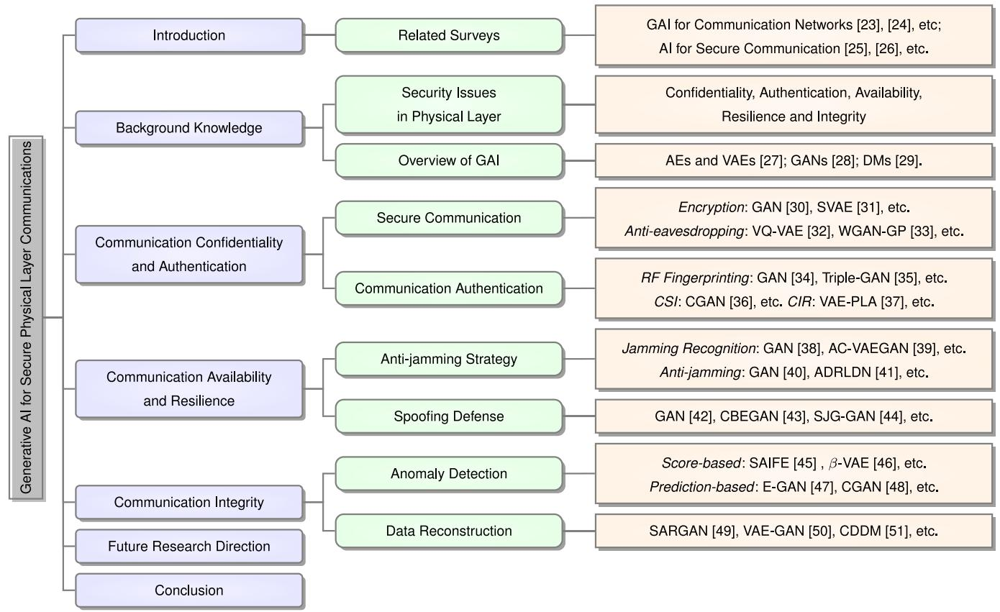

<details>
<summary>flowchart</summary>

```mermaid
graph TD
    A["Generative AI for Secure Physical Layer Communications"] --> B["Introduction"]
    A --> C["Background Knowledge"]
    A --> D["Communication Confidentiality and Authentication"]
    A --> E["Communication Availability and Resilience"]
    A --> F["Communication Integrity"]
    A --> G["Future Research Direction"]
    A --> H["Conclusion"]

    B --> I["Related Surveys"]
    I --> J["GAI for Communication Networks [23"], [24], etc.; AI_for_Secure_Communication["25"], [26], etc.]

    C --> K["Security Issues in Physical Layer"]
    K --> L["Confidentiality, Authentication, Availability, Resilience and Integrity"]

    C --> M["Overview of GAI"]
    M --> N["AEs and VAEs [27"]; GANs["28"]; DMs["29"].]

    D --> O["Secure Communication"]
    O --> P["Encryption: GAN [30"], SVAE["31"], etc. Anti-eavesdropping: VQ-VAE["32"], WGAN-GP["33"], etc.]

    D --> Q["Communication Authentication"]
    Q --> R["RF Fingerprinting: GAN [34"], Triple-GAN["35"], etc. CSI: CGAN["36"], etc. CIR: VAE-PLA["37"], etc.]

    E --> S["Anti-jamming Strategy"]
    S --> T["Jamming Recognition: GAN [38"], AC-VAEGAN["39"], etc. Anti-jamming: GAN["40"], ADRLDN["41"], etc.]

    E --> U["Spoofing Defense"]
    U --> V["GAN [42"], CBEGAN["43"], SJG-GAN["44"], etc.]

    F --> W["Anomaly Detection"]
    W --> X["Score-based: SAIFE [45"], β-VAE["46"], etc. Prediction-based: E-GAN["47"], CGAN["48"], etc.]

    F --> Y["Data Reconstruction"]
    Y --> Z["SARGAN [49"], VAE-GAN["50"], CDDM["51"], etc.]
```
</details>

Fig. 1. The structure of the survey paper, where we introduce GAI methods for physical layer security through Communication Confidentiality and Authentication (Section III), Communication Availability and Resilience (Section IV), and Communication Integrity (Section V).

Distinct from existing surveys and tutorials, our survey distinguishes itself by specifically focusing on the integration of GAI in secure physical layer for communication networks. Unlike previous works, which either broadly address GAI applications in communication networks or delve into AI’s role in network security without a concentrated emphasis on GAI, this survey offers a unique perspective by marrying the capabilities of GAI with the requirements of physical layer security. It fills a critical gap in the literature by providing an in-depth analysis of how GAI can enhance security measures, detect and mitigate threats in the physical layer that have been previously underexplored or only briefly mentioned.

The key contributions of this paper are summarized as follows:

• Our comprehensive analysis reveals how to employ GAI models to enhance key security properties such as communication confidentiality, authentication, availability, resilience, and integrity. These advancements are facilitated by GAI’s ability to understand complex data distributions, perform encrypted data transformation and processing, and detect cyber threats and anomalies within the network infrastructure. This summary provides essential insights for further exploration and development of GAI applications in physical layer security.   
• We explore how GAI addresses the challenges of data sparsity and incompleteness in physical layer security, significantly impacting the efficacy of traditional AI models. GAI’s contribution to data reconstruction and augmentation showcases its unparalleled ability to enhance physical layer security, surpassing the limitations of transitional AI approaches.   
• We outline crucial future research directions for the applications of GAI in physical layer security, including model improvements, multi-scenario deployment, resource-efficient optimization and secure semantic communication. These directions are considered from multiple perspectives, underscoring the multifaceted potential of GAI to address emerging challenges.

TABLE II LIST OF ABBREVIATIONS 

<table><tr><td>Abbreviation</td><td>Description</td><td>Abbreviation</td><td>Description</td></tr><tr><td>AI</td><td>Artificial Intelligence</td><td>GAI</td><td>Generative Artificial Intelligence</td></tr><tr><td>CNN</td><td>Convolutional Neural Network</td><td>RNN</td><td>Recurrent Neural Networks</td></tr><tr><td>AIGC</td><td>Artificial Intelligence Generated Content</td><td>DL</td><td>Deep Learning</td></tr><tr><td>DAI</td><td>Discriminative AI</td><td>AE</td><td>Autoencoder</td></tr><tr><td>VAE</td><td>Variational Autoencoder</td><td>GAN</td><td>Generative Adversarial Network</td></tr><tr><td>DM</td><td>Diffusion Models</td><td>DRL</td><td>Deep Reinforcement Learning</td></tr><tr><td>WGAN-GP</td><td>Wasserstein GAN with Gradient Penalty</td><td>CGAN</td><td>Conditional GAN</td></tr><tr><td>ACGAN</td><td>Auxiliary Classifier GAN</td><td>AAE</td><td>Adversarial Autoencoder</td></tr><tr><td>SNR</td><td>Signal-to-Noise Ratio</td><td>JNR</td><td>Jamming-to-Noise Ratio</td></tr><tr><td>PCA</td><td>Principal Component Analysis</td><td>MIMO</td><td>Multi-Input Multi-Output</td></tr><tr><td>CIR</td><td>Channel Impulse Response</td><td>CSI</td><td>Channel State Information</td></tr><tr><td>RF</td><td>Radio Frequency</td><td>LSTM</td><td>Long Short-Term Memory</td></tr><tr><td>SU</td><td>Secondary User</td><td>PU</td><td>Primary User</td></tr><tr><td>SemCom</td><td>Semantic Communication</td><td>IoT</td><td>Internet of Things</td></tr><tr><td>EC</td><td>Edge Computing</td><td>EH</td><td>Energy Harvesting</td></tr><tr><td>JSCC</td><td>Joint Source Channel Coding</td><td>BER</td><td>Bit Error Rate</td></tr><tr><td>AWGN</td><td>Additive White Gaussian Noise</td><td>BLER</td><td>Block Error Rate</td></tr></table>

The structure of this survey is outlined in Fig. 1. Section II introduces the fundamental concepts of GAI and offer a review of related works. In section III, a comprehensive exploration into Communication Confidentiality and Authentication is presented. Section IV discusses approaches for Communication Availability and Resilience. Section V introduces GAI methods for Communication Integrity. Section VI discusses future research directions, and Section VII concludes the paper. Additionally, Table II lists the abbreviations commonly employed throughout this survey.

# II. BACKGROUND KNOWLEDGE

In this section, we delve into the security challenges inherent to the physical layer of communication networks, arguing that addressing security at this foundational level is of paramount importance. Furthermore, we introduce the fundamental concepts of GAI, including its architecture, classification, and basic models.

# A. Security Issues in Physical Layer

Security at the physical layer is deemed paramount compared to other layers since it provides the foundation for all subsequent security protocols [59]. Therefore, a breach at this foundational level will jeopardize the entire communication system. This layer is susceptible to a broad spectrum of physical threats, including eavesdropping, jamming, and spoofing, making it a critical point of vulnerability that must be robustly protected [60]. By securing the physical layer, potential attacks can be preemptively thwarted, thereby preventing attackers’ initial access points for further intrusions.

The subsequent discussion will introduce the CIA triad [61]: Confidentiality, Integrity, and Availability, alongside two additional critical focuses: Resilience and Authentication in physical layer security.

Communication Confidentiality: Communication confidentiality in the physical layer involves the use of techniques and mechanisms to secure data transmission over communication channels, preventing unauthorized access and eavesdropping [62].

• Communication Authentication: Communication authentication at the physical layer is a critical security measure that verifies the identities of entities engaged in data exchange to thwart impersonation and unauthorized access. This verification leverages unique attributes intrinsic to the transmission’s physical medium, such as radio-frequency fingerprints or specific channel properties [63].

Communication Availability: Ensuring communication availability at the physical layer, particularly through anti-jamming measures, involves deploying strategies and mechanisms to protect wireless communication networks from deliberate interference or jamming attacks. Techniques such as frequency hopping and direct sequence spread spectrum are pivotal, as they disperse the signal across a broader bandwidth, complicating the attacker’s ability to disrupt communications [12].

Communication Resilience: Communication resilience at the physical layer, particularly in safeguarding against a range of attacks, where spoofing attacks being a typical example, necessitates the implementation of strategies aimed at detecting and neutralizing attacks signals. Central to this defensive approach is the use of unique physical features or signatures, such as Radio Frequency (RF) fingerprints or channel state information [64].

• Communication Integrity: To safeguard communication integrity at the physical layer, it is essential to detect anomalous data and complete missing information [65]. Techniques such as DL algorithms are employed to learn normal behavior patterns and subsequently identify outliers or irregularities in real-time data flows. Furthermore, data reconstruction techniques are applied to correct or mitigate the impact of these anomalies and incomplete data, guaranteeing the precise and dependable transmission of information [66].

# B. Overview of GAI

GAI aims to learn the underlying features of input data to generate new content that is similar to real data, in contrast to Discriminative AI (DAI), which focuses on predicting the probability or labels of data. GAI is capable of generating a wide variety of data, including text, images, videos, and so on [1]. Usually, these generated outputs are refereed as AIGC. With the widespread adoption of AIGC, there has been a significant boost in the efficiency of content creation, even revolutionizing the production paradigms of several companies and individual creators.

Currently, GAI models used in communication networks can be categorized as follows:

Autoencoder (AEs) and Variational Autoencoders (VAEs): An Autoencoder is a type of artificial neural network used to learn efficient codings of unlabeled data in an unsupervised manner [27]. It works by compressing the input into a lower-dimensional code and then reconstructing the output from this representation as close as possible to the original input. By shifting from a deterministic encoding process to a probabilistic one, VAEs can learn to represent input data as a distribution in latent space [67]. Through latent distributions, VAEs generate new instances that resemble the input data by sampling from the learned distribution in the latent space, making them highly effective in tasks including image generation, data augmentation, and anomaly detection [68]. Building upon the foundational principles of VAEs, more advanced variants such as the Vector Quantized-Variational Autoencoder (VQ-VAE) have been developed to improve the generation quality [69].

• Generative Adversarial Networks (GANs): Generative Adversarial Network model is a form of unsupervised learning [28]. Within a GAN, the generator network is responsible for creating data, and concurrently, the discriminator network assesses the authenticity of this generated data. Using an adversarial mechanism, the discriminator is trained to discern between real and fake data, while the generator aims to produce data indiscernible from real data. GANs have evolved into diverse variants, each enhancing the original concept for specific purposes. The Conditional GAN (CGAN) introduces conditionality to direct the generative process with greater precision [70]. In parallel, the Wasserstein GAN with Gradient Penalty (WGAN-GP) marks a significant stride in stabilizing the training process with its innovative loss function [71]. The Auxiliary Classifier GAN (ACGAN) ingeniously integrates an auxiliary classifier into the discriminator, elevating the diversity of the generated images [72]. The Adversarial Autoencoder (AAE) forges a pathway by blending AEs with adversarial training, enforcing specialized distributions within the latent space [73]. The Variational Auto-Encoding Generative Adversarial Network (VAEGAN) synergies the latent spaces of VAEs with the superior generation capabilities of GANs [74].

Diffusion Models (DMs): Diffusion Model, also called the score-based generative model, is a type of generative model inspired by non-equilibrium thermodynamics [29]. Similarly to VAEs, DMs aim to learn the distribution of the original data. By adding noise to the original

data, the data distribution can approach a normal distribution. Through denoising steps, the noise from the normal distribution is reverted back to data from the original distribution. As an emerging technology in recent years, DMs can achieve higher quality generation results than AEs, VAEs, and GANs in many traditional generation tasks such as image, audio, and video generation. Although their applications in physical layer communication security are currently limited, they are promising for future communication applications [2].

In summary, the core goal of all three GAI models is to learn the distribution of a dataset. They achieve this by using a neural network model, including the decoder in AEs and VAEs, the generator in GANs, and the denoising stage in DMs, to transform the known distribution of data (e.g., the normal distribution) into a distribution that accurately reflects the original dataset. Therefore, different network models also determine the advantages and disadvantages of the three methods. The decoder in AEs and VAEs decodes the data sampled from the latent space which is encoded by the encoder. However, they have limitations such as the tendency to produce blurry outputs, and challenges in balancing the reconstruction fidelity and the latent space regularization during training [3]. On the other hand, the generator in GANs excels in generating highquality, realistic content and learning data distributions without explicit modeling. However, they are challenged by training difficulties, potential for mode collapse, and the generation of nonsensical outputs. Additionally, multi-step denoising in DMs can achieve better fitting results for unknown distributions than VAE single-step decoding, resulting in generating highly realistic results. Nevertheless, DMs typically require long training times due to their iterative refinement process and the computational complexity of simulating detailed data distributions.

Given the powerful generative capabilities, the integration of GAI into physical layer security in wireless communications is a burgeoning field with promising potential. Collectively, GAI can play several roles in enhancing security at the physical layer: 1) Encrypted Communication; 2) Signals Authentication; 3) Attacks Defense; 4) Anomaly Detection; 5) Adaptive Signal Processing (Table III). Since the GAN comprises the generator and discriminator, this structure is more adept at addressing identification and detection tasks in security issues than other GAI models, including jamming recognition, anomaly detection, and authentication. AEs and VAEs can assist in communication coding to eliminate threats such as eavesdropping due to their encoder and decoder structure. DMs will be proficient in data recovery and enhancement via the diffusion and denoising process, such as noise elimination tasks. Based on the potential applications of the GAI method in physical layer security, it offers many advantages for two critical aspects of physical layer communication security: communication and sensing (Table III). From the communication perspective, GAI methods can use time-varying information to extract valuable features that are resilient to changing environments, thus ensuring communication security. In terms of sensing, GAI methods can aid in identifying abnormal sensors and avoiding complex parametric signal analysis, thereby enhancing physical layer communication security at the hardware level.

TABLE III THE USE OF GAI IN THE PHYSICAL LAYER AND ITS POTENTIAL SUPPORT FOR SECURITY 

<table><tr><td>Model Issues</td><td>GANs</td><td>AEs and VAEs</td><td>DMs</td><td>Communication &amp; Sensing Perspectives</td></tr><tr><td>Confidentiality</td><td>Key generationChannel response approximationsAnti-eavesdropping communications</td><td>Wiretap code designTransceiver designVAE-based JSCC</td><td>-</td><td rowspan="3">Potential benefits for communication:Robustness to the changing environmentSimulate noise channel effectsUtilize time-varying informationExtract valuable features from various data</td></tr><tr><td>Availability</td><td>Jamming recognitionAnti-jamming strategy</td><td>-</td><td>-</td></tr><tr><td>Resilience</td><td>Spoofing recognitionSpoofing defense</td><td>-</td><td>-</td></tr><tr><td>Integrity</td><td>Sensors anomaly detectionSignals anomaly detectionRadio anomaly detectionSpectral information completionElectromagnetic data reconstruction</td><td>Spectrum anomaly detectionSensors anomaly detectionDSSS signals reconstruction</td><td>Noise elimination</td><td rowspan="2">Potential benefits for sensing:Identify abnormal sensorsNot affected by data imbalanceAvoid complex parametric analysis of the signalsNot require any information of the missing band locations</td></tr><tr><td>Authentication</td><td>RF fingerprinting authenticationCSI authentication</td><td>CIR authentication</td><td>-</td></tr></table>

# III. COMMUNICATION CONFIDENTIALITY AND AUTHENTICATION

In wireless communications, the principles of confidentiality and authentication stand as critical pillars ensuring the security and integrity of transmitted information [65]. However, cyber threats, such as eavesdropping and unauthenticated attacks in physical layer, significantly compromise communication security, leading to unauthorized access and information breaches [75]. This section provides an overview of employing GAI techniques to ensure communication confidentiality and authenticity.

# A. Secure Communication

Eavesdropping is a typical attack in physical layer which involves intercepting and accessing confidential information transmitted over networks [79], [80]. To improve confidentiality and achieve anti-eavesdropping, secure data is usually encrypted through various encryption algorithms [81]. However, once the math problem used for encryption is solved effectively, the security of the encryption method will be seriously compromised. Moreover, several transitional methods including Error-Correcting Codes (ECCs) [82] suffer from a dilemma that they cannot achieve the trade-off between the reliability and data leakage because of the fixed code parameters. GAI methods, particularly those employing AEs or VAEs, offer enhanced security via generating complex structures that are difficult to decipher or reverse-engineer.

AEs, characterized by its encoder and decoder components, enable the efficient encoding of information into a compressed, less interpretable format for transmission. Based on this, the authors proposed an AE-based framework in [76], which allows a flexible design of finite blocklength wiretap codes (Fig. 2). The operating point with respect to the trade-off between Block Error Rate (BLER) and information leakage can be changed easily due to the higher flexibility. In the scenario with Additive White Gaussian Noise (AWGN) channels as noise [76], all tested AEs perform slightly worse than the polar wiretap code [83]. The proposed framework achieve a BLER of around 26.2% and a leakage around 1.46bits while the polar wiretap code achieves a leakage around 1.33bits at a similar BLER of around 26.4% [76]. Even though the performance is not better than the polar wiretap code, the proposed framework can take the advantage of the flexibility to trade-off between the BLER and leakage, and may improve performance with deeper neural networks.

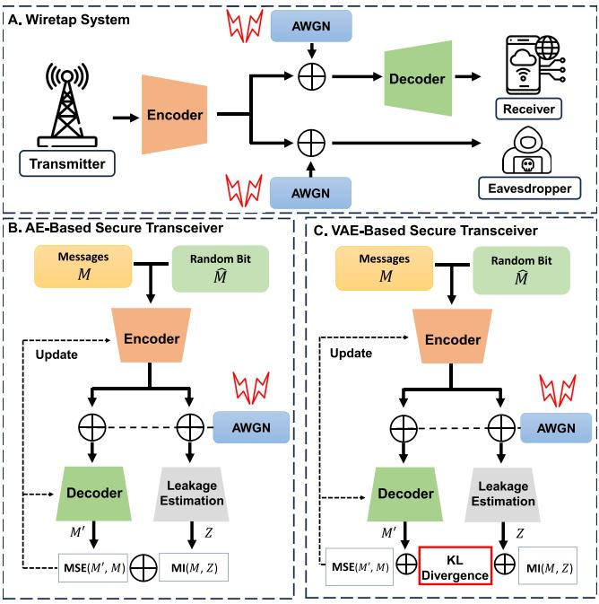

<details>
<summary>flowchart</summary>

```mermaid
graph TD
    subgraph A. Wiretap System
        A1["Transmitter"] --> B1["Encoder"]
        B1 --> C1["+"]
        C1 --> D1["Decoder"]
        D1 --> E1["Receiver"]
        E1 --> F1["Eavesdropper"]
        B1 --> G1["+"]
        G1 --> H1["AWGN"]
    end

    subgraph B. AE-Based Secure Transceiver
        B2["Messages M"] --> C2["Encoder"]
        C2 --> D2["+"]
        D2 --> E2["AWGN"]
        D2 --> F2["Decoder"]
        F2 --> G2["+"]
        G2 --> H2["Leakage Estimation"]
        H2 --> I2["M'(M', M)"]
        I2 --> J2["+"]
        J2 --> K2["M(I(M, Z)"]
    end

    subgraph C. VAE-Based Secure Transceiver
        C3["Messages M"] --> D3["Encoder"]
        D3 --> E3["+"]
        E3 --> F3["Decoder"]
        F3 --> G3["+"]
        G3 --> H3["Leakage Estimation"]
        H3 --> I3["M'(M', M)"]
        I3 --> J3["+"]
        J3 --> K3["KL Divergence"]
        K3 --> L3["M(I(M, Z)"]
    end

    B1 --> C1
    C1 --> D1
    D1 --> E1
    E1 --> F1
    F1 --> G1
    G1 --> H1
    H1 --> I1
    I1 --> J1
    J1 --> K1
    K1 --> L1
    L1 --> M1["M'(M', M)"]
    M1 --> N1["+"]
    N1 --> O1["M(I(M, Z)"]
    style B1 fill:#f9f,stroke:#333
    style B2 fill:#f9f,stroke:#333
    style B3 fill:#f9f,stroke:#333
    style B4 fill:#f9f,stroke:#333
    style B5 fill:#f9f,stroke:#333
    style B6 fill:#f9f,stroke:#333
    style B7 fill:#f9f,stroke:#333
    style B8 fill:#f9f,stroke:#333
    style B9 fill:#f9f,stroke:#333
    style B10 fill:#f9f,stroke:#333
    style B11 fill:#f9f,stroke:#333
    style B12 fill:#f9f,stroke:#333
    style B13 fill:#f9f,stroke:#333
    style B14 fill:#f9f,stroke:#333
    style B15 fill:#f9f,stroke:#333
    style B16 fill:#f9f,stroke:#333
    style B17 fill:#f9f,stroke:#333
    style B18 fill:#f9f,stroke:#333
    style B19 fill:#f9f,stroke:#333
    style B20 fill:#f9f,stroke:#333
    style B21 fill:#f9f,stroke:#333
    style B22 fill:#f9f,stroke:#333
    style B23 fill:#f9f,stroke:#333
    style B24 fill:#f9f,stroke:#333
    style B25 fill:#f9f,stroke:#333
    style B26 fill:#f9f,stroke:#333
    style B27 fill:#f9f,stroke:#333
    style B28 fill:#f9f,stroke:#333
    style B29 fill:#f9f,stroke:#333
    style B30 fill:#f9f,stroke:#333
    style B31 fill:#f9f,stroke:#333
    style B32 fill:#f9f,stroke:#333
    style B33 fill:#f9f,stroke:#333
    style B34 fill:#f9f,stroke:#333
    style B35 fill:#f9f,stroke:#333
    style B36 fill:#f9f,stroke:#333
    style B37 fill:#f9f,stroke:#333
    style B38 fill:#f9f,stroke:#333
    style B39 fill:#f9f,stroke:#333
    style B40 fill:#f9f,stroke:#333
    style B41 fill:#f9f,stroke:#333
    style B42 fill:#f9f,stroke:#333
    style B43 fill:#f9f,stroke:#333
    style B44 fill:#f9f,stroke:#333
    style B45 fill:#f9f,stroke:#333
    style B46 fill:#f9f,stroke:#333
    style B47 fill:#f9f,stroke:#333
    style B48 fill:#f9f,stroke:#333
    style B49 fill:#f9f,stroke:#333
```
</details>

Fig. 2. The overall architecture of the AE-based [76] and VAE-based secure transceiver [31]. Part A demonstrates a wiretap system model with Additive White Gaussian Noise (AWGN). Part B illustrates the whole framework of AE-based secure transceiver, which is trained by two loss functions: the Mean-Squared Error (MSE) between transmitter messages and reconstructed messages and the Mutual Information (MI) between the messages and the received symbols by the eavesdropper. In Part C, the VAE-based secure transceiver adds additional loss function: KL divergence.

To train a secure communication system based on AEs, loss gradients need to be passed backward from the output layer of the receiver to the input layer of the transmitter. However, a practical challenge arises due to the unknown gradients of the physical channel. This issue is often circumvented by assuming channel models with known analytic expressions, such as AWGN and Rayleigh fading channels [84]. However, these models may not accurately reflect real-world channel conditions. To overcome this limitation, the authors in [30] proposed a communication channel density estimating GAN, inspired by BicycleGAN [85]. The proposed method focuses on channels characterized by a combination of nonlinear amplifier distortion, pulse shape filtering, inter-symbol interference, frequency-dependent group delay, multipath, and non-Gaussian statistics. They conducted a comparative analysis of the marginalized probability density functions of the channel with a trained generator. Through experiments conducted on four different channels, the results indicate that the proposed model is capable of generating high-accuracy approximations of the channel [30].

One of the shortcomings of this AE-based framework is that it is trained based on the fixed Signal-to-Noise Ratio (SNR). When the SNR varies in the testing phase, their method cannot provide the optimal solution. To address this issue, the authors in [31] proposed a VAE-based scheme for secrecy systems in changing environment (Fig. 2). In this framework, they proposed a secure VAE (SVAE) to perform as a transceiver designed with a loss function which can measure the information leakage. Its loss function is specifically designed to increase the difficulty for eavesdroppers to recover data, thereby meeting diverse application requirements of the transceiver. In experiments, Bit Error Rate (BER) is adopted to evaluate the communication quality. Compared with the AE-based method [76], the BER of SVAE achieves around $5 \times 1 0 ^ { - 6 }$ when SNR is 10 dB where the BER of AE-based achieves $1 0 ^ { - 2 }$ in a perfect CSI scenario. Moreover, the BER at eavesdropper of SVAE keeps at 0.5 where AEbased’s BER has marked decrease [31]. With this high BER at eavesdropper and low BER at legitimate, the eavesdropper cannot recover correct information and the legitimate can keep a high communication quality.

However, the model in [76] only focuses on channel coding, where source and channel coding are performed separately, might not be as efficient in dynamic communication networks. Joint Source Channel Coding (JSCC) can dynamically adjust the coding strategy based on both the source content and the channel conditions which is more suitable for dynamic networks [86]. The authors in [77] proposed a data-driven approach using VAE-based JSCC. The proposed model aims to minimize the information leakage and emphasises hiding an underlying sensitive information.

The VAE enables precise control over latent distributions and practical variational approximation computation, crucial for calculating information security dynamics in the proposed model. Evaluated on colored MNIST dataset, the proposed method provides minimally distorted source transmission with maximum channel capacity [77]. Similarly, the authors of [32] proposed a VQ-VAE [69] based JSCC wireless communication framework. This framework interprets both channel and source encoder (ENC) and decoder (DEC) as variational techniques. A notable feature of the VQ-VAE is the codebook, which facilitates the modeling of noisy channels in communication. Specifically, noise is represented by codeword through an index of binary digits to improve generalization [87].

Beyond directly employing VAEs for encoding transmitted information, [78] investigated the application of a GAN-inspired model for covert communication through Direct-Sequence Spread Spectrum (DSSS). This model is designed to secure communications between two parties, Alice and Bob, by preventing an eavesdropper, Eve, from detecting in an AWGN environment. In this setup, Alice transmits a message to Bob using a spreading code from a shared codebook. The GAN-inspired model utilizes the information eavesdropped by Eve to generate the spreading code used by Alice and Bob. The system is jointly trained with a combined loss function, aiming to minimize Bob’s reconstruction error while maximizing Eve’s. Furthermore, spreading sequences with low Peak Side Lobe can improve model convergence. However, when Eve employs Auto-Correlationbased Detection techniques, Eve detected the presence of the DSSS signal with an accuracy of 70% at -6 dB SNRs or higher [78]. This significant level of detection accuracy indicates that the proposed method must adopt more proactive strategies to ensure enhanced security in communications.

Key generation that exploits the unpredictable characteristics of wireless channels can provide information-theoretic security for communication confidentiality [88]. By utilizing the unique and unpredictable characteristics of channels, key generation methods can effectively prevent eavesdroppers from gaining access to the encrypted data. However, when directly adopting AEs or VAEs, the unpredictability of the hidden layer output and the inability to estimate high-dimensional features in advance pose challenges for applying these methods to key generation in the physical layer of communication systems. Therefore, a physical layer key generation method based on WGAN-GP [71] based AAE was proposed in [33]. This model is designed to efficiently extract features between legitimate nodes in a way that these features align with a Gaussian distribution. Compared with the Principal Component Analysis (PCA) method [89], the proposed method can yield higher security key capacity and a lower key error rate 15% which is lower than PCA with feedback, and 10% lower than the without feedback PCA. Additionally, the key generation ratio of this method is much higher than that achieved with PCA [33].

As summarized in Table IV, due to its ability to learn distributions and extract features, GAI can significantly improve the security of data transmission by generating encryption algorithms preventing evolving threats. However, existing encryption methods [30], [31], [76] mostly depend on specific dataset reducing the generality of the method. Improving the generalization ability of the GAI model while maintaining accuracy may be a research direction in the future.

TABLE IV SUMMARY OF GAI FOR SECURE COMMUNICATION IN PHYSICAL LAYER BLUE CIRCLES DESCRIBE THE METHODS; GREEN CORRECT MARKERS AND RED CROSS MARKERS REPRESENT PROS AND CONS RESPECTIVELY 

<table><tr><td>Techniques</td><td>Reference</td><td>Algorithm</td><td>Pros &amp; Cons</td></tr><tr><td rowspan="3">Encrypted Communication</td><td>[76]</td><td>AE</td><td>A flexible wiretap code design for Gaussian wiretap channels under finite blocklength by AEsFlexibility to trade-off between the BLER and leakageAchieve decent performance with simple network structuresSlightly worse performance than the polar wiretap codes.Trained with fixed SNR</td></tr><tr><td>[30]</td><td>GAN</td><td>A GAN architecture to learn non-linearities, memory effects, and non-Gaussian statisticsApproximate the channel response under different conditionsBased on a specific distribution dataset</td></tr><tr><td>[31]</td><td>SVAE</td><td>A DL-based transceiver design for secrecy systemsNovel loss to measure the information leakageRobustness to the changing environmentTrained in an unsupervised fashion without labeling effortLimited scalability of the code.Learning high-dimensional codes is computationally challenging.</td></tr><tr><td rowspan="4">Anti-eavesdropping</td><td>[77]</td><td>VAE</td><td>A data-driven approach using VAE-based JSCCHide the sensitive information different from the original signalThe eavesdropper&#x27;s channel quality is assumed to be significantly worse.</td></tr><tr><td>[32]</td><td>VQ-VAE</td><td>A JSCC scheme based on VQ-VAE for point-to-point wireless communicationSimulate noise channel effectsLearn joint codewords incorporating the characteristics of the message channelHighly dependent on training set</td></tr><tr><td>[78]</td><td>GAN</td><td>A GAN inspired approach using DSSS to ensure that a transmitter and receiver can communicate safeUse low Peak Side Lobe to improve model convergenceUse of multiple spreading codes instead of one shared codeRelatively high reconstruction accuracy of eavesdroppers</td></tr><tr><td>[33]</td><td>WGAN-GP</td><td>A physical layer key generation method based on WGAN-GP AAEOvercome the difficulty of quantifying the extracted featuresReduce the quantization complexityThe key randomness is related to the interpretability of neural network.</td></tr></table>

# B. Communication Authentication

In physical layer communications, safety-critical messages are frequently transmitted. These include vital communications such as collision warnings, speed limit notifications, and updates on traffic conditions in vehicular networks [93]. To guarantee the authenticity and reliability of these messages, it is crucial to implement an authentication process to prevent malicious activities. The current authentication methods primarily incorporate RF fingerprinting, Channel State Information (CSI), and Channel Impulse Response (CIR) [94]. These three types of information focus on hardware characteristics, channel information, and signal changes within the channel, encompassing the main aspects of wireless communication processes. Based on these information, authentication serves as a security checkpoint to verify the identity of users or systems, effectively distinguishing legitimate entities from impostors.

RF fingerprinting is a technique used to identify and authenticate wireless devices based on the distinctive characteristics inherent in RF signals. Given its ability to accurately pinpoint the source of a transmission, RF fingerprinting is seen as a crucial tool for device authentication and access control [95]. Recently, several traditional AI methods have been adopted as the standard approach for RF fingerprinting [96], [97]. However, the authors in [34] revealed a weakness of these approaches that a malicious GAN can be trained to introduce signal imperfections without modifying the contents of the signal to force classifier errors. Then they showed that the classifier, trained by the augmented dataset with adversarial examples from GAN, can mitigate this vulnerability. The experiment results demonstrate that the Receiver Operating

Characteristic (ROC) curves with GAN-augmented training has nearly 1 Area Under the Curve (AUC), where 90% of the networks without GAN perform even worse than random guessing at 40 dB SNR [34]. Similarly, in [90] the Radio Frequency Adversarial Learning (RFAL) framework was proposed for building a robust system to identify rogue RF transmitters by designing and implementing a GAN. The GAN utilizes the In-phase and Quadrature (IQ) imbalance [95] to extract unique high-dimensional features from the RF signals. Using the augmented data from the generator, a discriminator model can classify the trusted and the counterfeit ones with 99.9% accuracy.

Inspired by [90], the authors in [91] proposed a GAN based wireless transmitter identification scheme. The proposed framework uses a multi-classifier to both detect malicious attacker and classify trusted transmitter without any extra classifier. Once trained, discriminators are employed to check whether the captured unknown IQ data comes from a corresponding trusted transmitter. If the label vector, made up of 1s and 0s, shows all 0s, the data is not from a trusted source, suggesting a high probability of it being sourced from an attacker. Additionally, the authors in [35] introduced the Triple-GAN structure [98] to adopt semi-supervised classification. With the modified structure, the classification accuracy of the proposed framework can achieve over 90%, only 1% of the training data samples are labeled [35].

CSI is an important parameter of a communication link in the physical layer. By leveraging its unique properties, CSI can be utilized in an authentication context [93], [99]. However, attackers can modify various aspects of their transmission setup, including antenna properties, transmission timing, power levels, or use reflectors [100]. These alterations enable them to change their CSI as measured by the receiver. To address these issues, the author in [92] proposed a GAN based model to authenticate devices in Multi-Input Multi-Output (MIMO) communication systems. The proposed model employs adversarial training to improve the authentication process. The discriminative model at the receiver is trained by a generator that creates fake CSI samples looking like the authentic samples. Simulation results show that the discriminator achieves 100% accuracy for SNR greater than or equal to 10 dB. For SNR less than 10 dB, while the discriminator makes errors in correctly recognizing legitimate samples, it consistently succeeds in preventing illegitimate samples from being authenticated [92].

TABLE V SUMMARY OF GAI FOR COMMUNICATION AUTHENTICATION IN PHYSICAL LAYER BLUE CIRCLES DESCRIBE THE METHODS; GREEN CORRECT MARKERS AND RED CROSS MARKERS REPRESENT PROS AND CONS RESPECTIVELY 

<table><tr><td>Techniques</td><td>Reference</td><td>Algorithm</td><td>Pros &amp; Cons</td></tr><tr><td rowspan="4">RF Fingerprinting Authentication</td><td>[34]</td><td>GAN</td><td>A GAN framework adapted for use within the RF fingerprinting contextIntroduce a weakness in conventional AI methodsAugment the train datasetCannot handle fast time-varying information</td></tr><tr><td>[90]</td><td>GAN</td><td>A framework for building a robust system to identify rogue RF transmittersExploit transmitter specific “signatures” including I/Q imbalanceRequire additional classifier</td></tr><tr><td>[91]</td><td>GAN</td><td>A robust wireless transmitter identification scheme using GANUse a multi-classifier to both detect attackers and transmittersReal wireless channel effect is not reflected</td></tr><tr><td>[35]</td><td>Triple-GAN</td><td>A semi-supervised specific emitter identification using GANExtract the overall feature hidden in the original signalsRequire relatively long training time</td></tr><tr><td rowspan="2">CSI Authentication</td><td>[92]</td><td>GAN</td><td>The use of GAN and measured MIMO communications channel information to make authenticationEffective in a variety of wireless environmentsUse adversarial training for the discriminative modelCannot handle fast time-varying informationRelatively limited performance at low SNR</td></tr><tr><td>[36]</td><td>CGAN</td><td>A method for physical layer authentication using two variations of CGANUtilize time-varying CSI as conditional inputHandle stochastic nature of the wireless channelNot outstanding performance.</td></tr><tr><td>CIR Authentication</td><td>[37]</td><td>HVAE-PLA</td><td>HVAE algorithm applied for learning industrial wireless channelsWithout requiring attackers’ prior channel informationExtract valuable features of high-dimensional CIRsRequire relatively long training timeA trade-off between the involved class number and the authentication performance</td></tr></table>

To handle the time-varying CSI in fast-changing environment, the authors in [36] proposed a CGAN based model combining with LSTM and gated recurrent unit (GRU) cells. Compared with the method in [92], the proposed model utilizes a CGAN instead of a conventional one, which can incorporate the previous CSI elements associated with time as the conditional information (Fig. 3). This approach allows for a more detailed generation and analysis of CSI data in the temporal aspect and historical patterns. In experiments, the CGAN-GRU network typically performed as well as or better than the standalone LSTM or GRU networks. Especially when mean-square error threshold is -25 dB, all of them can achieve accuracy at almost 99% [36].

In addition to CSI, the CIR is another significant parameter in wireless communications providing a detailed characterization of how a wireless signal propagates from the transmitter to the receiver in a specific environment. In [37], the authors proposed a CIR-based hierarchical VAE physical-layer authentication (HVAE-PLA) scheme. The HVAE-PLA consists of an

AE module and a VAE module. The AE module is dedicated to extracting the characteristics of CIR, providing insights into how signals propagate in specific environments. The VAE module building upon this aims to enhance the representational capacity of the extracted CIR characteristics. The simulations show that the proposed method can improve the authentication performance by 17.18%–69.3% compared to the vanilla AEs and VAEs [37].

The integration of GAI in communication authentication through specific information has highlighted GAI’s ability to enhance the uniqueness and reliability of identifying devices in a network, as summarized in Table V. However, generative models require relatively long training and inference times due to their complex structure [35]. When facing fast time-varying information [34], they have difficulty to infer and adapt to additional new information in real time. Therefore, pruning the model size and enhancing model real-time adaptation are urgently needed for security authorization.

# IV. COMMUNICATION AVAILABILITY AND RESILIENCE

The concepts of communication availability and resilience emerge as fundamental components to maintain continuous and reliable access for communication systems [101]. Challenges such as network disruptions and deliberate cyber attacks can severely impact the availability of digital communication services, leading to significant downtime and loss of connectivity [102]. This section aims to explore the integration of advanced strategies and GAI techniques to ensure the communication availability and resilience via solving two common cyber attacks: jamming and spoofing in physical layers.

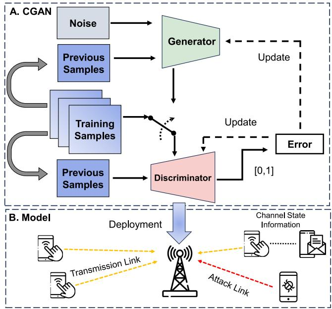

<details>
<summary>flowchart</summary>

```mermaid
graph TD
    subgraph_CGAN_A["CGAN"]
        A1["Noise"] --> G["Generator"]
        B1["Previous Samples"] --> G
        C1["Training Samples"] --> G
        D1["Previous Samples"] --> G
        G --> E["Error"]
    end

    subgraph_ChannelSModel_B["Channel State Information"]
        E --> F["Deployment"]
        F --> G
        G --> H["Transmission Link"]
        H --> I["Attack Link"]
        I --> J["Mobile Phone"]
        I --> K["Phone with 🐦"]
    end

    style CGAN_A fill:#f9f,stroke:#333
    style ChannelSModel_B fill:#bbf,stroke:#333
```
</details>

Fig. 3. Proposed CGAN training architecture in [36]. In Part A, the conditional information is the previous magnitudes of the CSI elements associated with time. The output of the discriminator is the probability value, representing the likelihood from zero to one based on its perception of whether the sample is fake or authentic. Part B illustrates the system model structure.

# A. Anti-Jamming Strategy

The jamming attack is a vital threat to communication availability at the physical layer, aimed at disrupting legitimate communications by introducing noise [109]. By recognizing jamming, communication systems can effectively identify whether the received signal is being jammed, triggering the protection mechanism of systems. Specifically, when a jamming attack is detected, the system can quickly adjust and resist the attack through anti-jamming strategies such as selecting optimal communication channels, ensuring the availability of communication. In summary, to ensure communication availability, detecting and mitigating jamming attacks represents a critical initial defense.

There are several conventional methods employed wireless jamming attacks, including random and sensing-based jamming [110]. However, with the increasing integration of machine learning techniques into communication systems, both legitimate transmitters and malicious jammers leverage machine learning algorithms to understand the spectrum environment better which introduces new emerging types of attacks including adversarial attacks.

In [38], the authors present an adversarial learning strategy employing GAN to facilitate adversarial jamming attacks. This approach enables jammers to generate synthetic data based on a small number of real data samples. These synthetic samples are then integrated into the training dataset. Simulation results indicate that the detection accuracy of a jammer closely approximates, within 0.19% for misdetection and 3.14% for false alarms, that of a jammer trained with a larger dataset of real samples collected over a long duration [38]. Furthermore, based on the attack characteristics, they proposed a defense strategy for the transmitter, centered on rendering its behavior unpredictable. This can be achieved by the transmitter intentionally performing incorrect actions, such as transmitting on a busy channel or refraining from transmitting on an idle channel, during strategically selected time slots. Additionally, the authors in [103] proposed an input-agnostic adversarial attack technique, which adopts GAN to create perturbations in advance. These pre-generated perturbations can then be efficiently applied to a variety of incoming signals. Furthermore, this approach has the potential to substantially aid in the development of classifiers that exhibit robustness against adversarial jamming attacks.

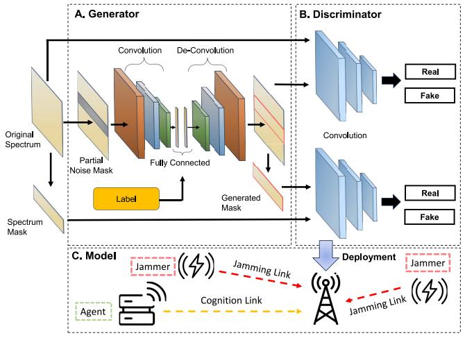

<details>
<summary>flowchart</summary>

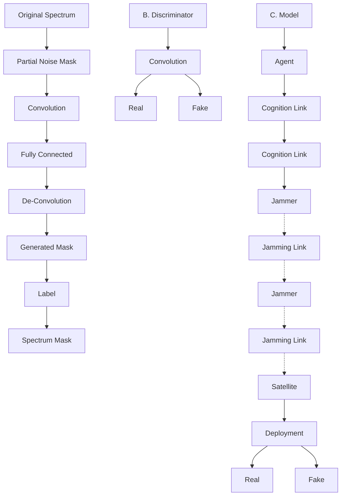
</details>

Fig. 4. The overall network structure in [104]. Part A illustrates the generator, which is designed as an AE comprising a convolution layer, a fully connected layer, and a de-convolution layer. In Part B, two discriminator modules are crafted using a convolution network and are optimized to focus on local and global details, respectively. Part B describes the system model structure.

In the case of small sample datasets, the performance of autonomous feature extraction and classification of DL will be reduced [111]. Especially in real-world network communications, it is difficult to obtain enough sample data for anti-jamming due to the privacy policy and the inadequacy of technical methods. To generate more realistic data, the authors in [39] proposed a jamming recognition method based on AC-VAEGAN, which combines the VAEGAN [74] and ACGAN [72]. In this model, the latent space of a small amount of signal dataset is obtained by VAE firstly. Then, the datasets will be expanded by sampling points of the latent space and decoding them. Finally, the discriminator of the GAN framework is extracted for jamming recognition. In experiments, when the Jamming-to-Noise Ratio (JNR) is - 10dB, the average correct recognition rate of AC-VAEGAN network is approximately 65%, where the rate of ACGAN and CNN network is only about 55% [39].

Except the scarcity of data, the occurrence of jamming attacks frequently leads to incomplete data, which hinders the ability of anti-jamming strategies to discern jamming attacks [38]. To complete the missing information, the authors in [104] proposed an efficient algorithm based on a GAN focusing on spectrum waterfall completion, where spectrum waterfall is a thermodynamic block diagram defining the environmental state [112]. The algorithm can automatically mine the relationship of the data and complete the missing data accurately. Different from the noise input in the original GAN, they use the spectrum waterfall with missing data as generator input, which can limit generator artistry (Fig. 4). From the corresponding complement results, the proposed algorithm is better than the method without pre-classification, since the generator that adds auxiliary information is more targeted to the data. The accuracy is more than 95%, where the latter is nearly 80% [104].

Several studies have demonstrated that anti-jamming communications, enhanced by Deep Reinforcement Learning (DRL) [113], [114], can achieve near-optimal performance in dynamic and unpredictable environments [115], [116], [117]. In [40], the authors proposed a framework combining the GAN and DRL. The proposed framework consists of two stages: the offline stage and online stage (Fig. 5). Initially, a GAN is trained to complete missing spectrum data using historical data. Once the GAN training is complete, the generator is implemented as Spectrum Completion Network (SCN) during the online stage. Subsequently, with the augmented spectrum data, a DRL-based Channel Selection Network (CSN) is employed. The CSN utilizes the enriched spectrum data to assist users in selecting optimal communication channels for anti-jamming. The performance of the proposed scheme notably surpasses that of the conventional DRL-based method in [115], as well as the scheme that combines K-Nearest-Neighbor Interpolation (KNNI) and DRL [118] in all missing rates. Especially, the proposed scheme achieves the discounted accumulative reward of 8.3 when the missing rate is 10%. In comparison, the conventional method scores 4.4, and the KNNI-DRL combination scores 6.5 [40].

Additionally, the authors in [105] introduced a dynamic spectrum anti-jamming access scheme in the cognitive radio based network [119] that is friendly to Primary Users (PU) while also safeguarding Secondary Users (SU) from indiscriminate jamming attack by jammers. Similar to the scheme in [40], this proposed framework is divided into two stages: the offline stage and the online stage where the key difference lies in the GAN model used in the first stage. Here, the GAN is trained to accurately simulate the Spectrum Environment (SE), which is considered a Virtual Environment (VE). By pre-training the Channel Decision Network (CDN) offline in this VE, the SU is equipped to evade both PU signals and jamming in the actual SE, following the guidance of the trained CDN. According to the experiments, it takes about 90s for the proposed scheme to converge to the optimal policy while the CDN trained in SE from scratch spends about 160s [105].

Existing anti-jamming technologies rely on hidden antijamming strategies, but their performance tends to diminish when facing with more sophisticated or complex jamming types [120]. In [41], the authors proposed a DRL algorithm with a double network structure, named ADRLDN, which adopts the hidden anti-jamming idea and can deal with various types of complex jamming in actual scenarios. In this framework, they designed a GAN network-based user and jammer decision-making correlation judgment module. The GAN is trained to fit the environmental state under known user information, and evaluates whether the user information is obtained by the jammer. The DRL network is trained to guarantee the user’s decision not obtained by jammers. In this situation, there are two key points: compare the fitted environmental state with the real environmental state; ensure both the generation and the evaluation of the effect of the network. These happen to be the essential characteristics of GAN networks. According to the simulation experiment results, ADRLDN is superior in anti-jamming performance than the current anti-jamming method based on avoiding the idea (ADRLA) [115] by reducing the probability of users being jammed by 15%.

As for Cognitive Internet of Things (CIoT), a major challenge is extending the system’s lifespan. Energy Harvesting (EH) technology is a promising solution to provide sustainable energy to energy-constrained mobile devices in CIoT systems [121], [122]. However, EH-CIoT systems encounter significant jamming attacks due to the wireless channels, which exposes information transmissions to potential security risks. In [106], the study considered an EH-CIoT system where the communication security of the SU network is threatened. To enhance security, the authors propose a DRL algorithm that integrates LSTM and GAN models. This algorithm aims to maximize the system’s secrecy rate while minimizing the Secrecy Outage Probability (SOP). The GAN network is utilized to mitigate the time-varying CSI and the adverse effects of random noise at the receivers. Simultaneously, the LSTM network is employed for extracting features from the input environment. The study’s findings reveal that the convergence speed of the proposed algorithm is significantly faster 1.69 and 3.15 times than that of other algorithms that do not incorporate the GAN model [106]. The integration of the GAN and LSTM model significantly enhances the algorithm’s ability to quickly capture environmental information and learn optimal strategies.

SemCom is a revolutionary way of communicating that helps overcome the limitations of previous methods by using DL to send necessary information, which reduces the amount of data sent [123]. With the focus on semantic-level transmission, new challenges in jamming and anti-jamming arise. Attackers will aim to create more effective jamming methods to degrade the quality-of-experience (QoE) for users in communications [124]. In [107], a framework for intelligent jamming and anti-jamming in semantic communication was proposed based on the GAN. In the framework, the transmitter sends data with semantic features, and the receiver tries to understand it correctly while a jammer tries to mess up this process. The authors designed a GAN model where the jammer learns to generate disruptive signals, the receiver is trained to selectively focus on legitimate segments of the incoming data, thereby enhancing its proficiency in identifying and mitigating semantic jamming.

In jamming attacks, a key factor for their success is the jammer’s ability to accurately determine the frequency of signal transmission. This capability is vital for generating jamming noise powerful enough to disrupt the SNR within the same frequency band. To mitigate jamming attacks, the author in [108] developed an anti-jamming communication system model based on GANs. The proposed model employs generator and discriminator integrated with minmax game theory, to automatically adapt to the dynamics of the spectrum. The training of the proposed model within this defense mechanism is designed to mislead jammers, preventing them from effectively targeting the transmission

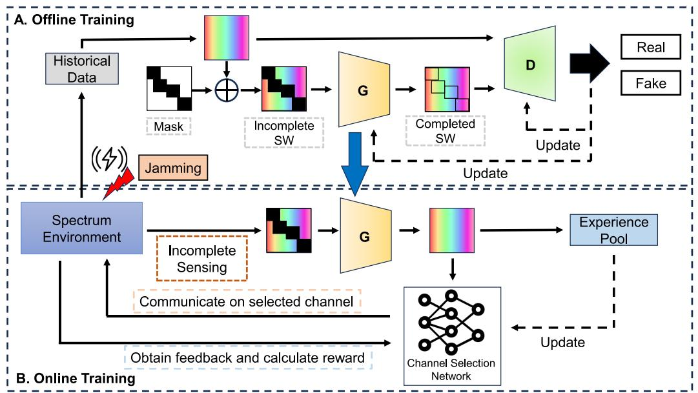

<details>
<summary>flowchart</summary>

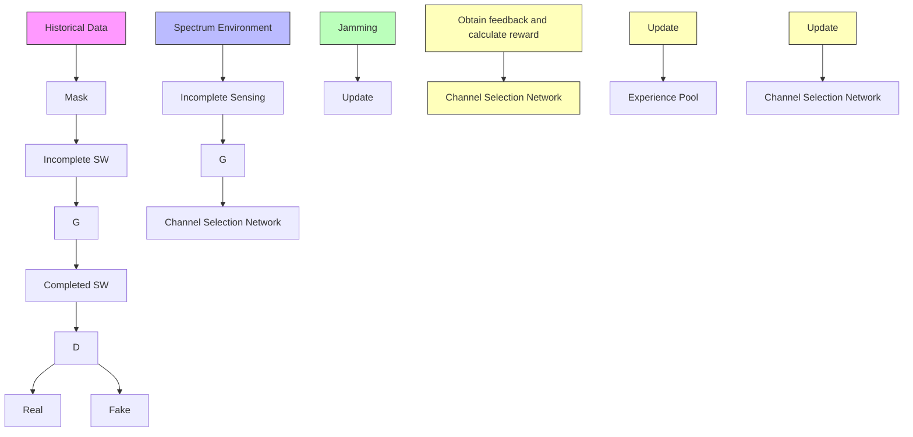
</details>

Fig. 5. Overall structure of the proposed anti-jamming spectrum access scheme in [40]. In Part A, a GAN with the Generator (G) and Discriminator (D) is trained to complete missing spectrum data using historical data. In Part B, the generator (G) is implemented as SCN. The CSN utilizes the enriched spectrum data to assist users in selecting optimal communication channels for anti-jamming.

TABLE VI SUMMARY OF GAI FOR ANTI-JAMMING STRATEGY IN PHYSICAL LAYER BLUE CIRCLES DESCRIBE THE METHODS; GREEN CORRECT MARKERS AND RED CROSS MARKERS REPRESENT PROS AND CONS RESPECTIVELY 

<table><tr><td>Techniques</td><td>Reference</td><td>Algorithm</td><td>Pros &amp; Cons</td></tr><tr><td rowspan="4">Jamming Recognition</td><td>[38]</td><td>GAN</td><td>● An adversarial machine learning approach launch jamming attacks on wireless communications✓ Rely on a small amount of sample data✓ Do not need any knowledge of transmitter&#x27;s algorithm✗ Limited resilience of the strategy in highly dynamic and unpredictable wireless environments</td></tr><tr><td>[103]</td><td>GAN</td><td>● An input-agnostic adversarial attack technique based on GANs and multi-task loss✓ Quickly craft small imperceptible perturbations✓ Not depend on the original samples✗ Just consider certain scenarios</td></tr><tr><td>[39]</td><td>AC-VAEGAN</td><td>● A jamming recognition method based on AC-VAEGAN✓ Stable recognition performance in the case of small samples✗ Require relatively long training time✗ Unsuitable for large-scale deployment</td></tr><tr><td>[104]</td><td>GAN</td><td>● An algorithm based on GAN to mine the relationship of the data and complete the missing data✓ Complete spectrum data in multiple jamming patterns✗ Less emphasis on real-world testing</td></tr><tr><td rowspan="6">Anti-Jamming</td><td>[40]</td><td>GAN</td><td>● A GAN based spectrum completion network✓ Complete the partially missing spectrum data✓ Achieve high reward of the policy✗ Slightly poor performance in the high missing rate scenario</td></tr><tr><td>[105]</td><td>GAN</td><td>● A PU-friendly dynamic spectrum anti-jamming scheme combining offline training and online deployment✓ Focus on both PU and SU✓ Converge fast to the optimal policy✗ Still slow convergence speed</td></tr><tr><td>[41]</td><td>ADRLDN</td><td>● A decision related judgment module between jammer and user based on GAN✓ Adapt to complex types of jamming✓ Superior in anti-jamming performance than the current anti-jamming method✗ Require relatively long training time</td></tr><tr><td>[106]</td><td>GAN</td><td>● The secrecy communication in an EH-enabled Cognitive EH-CIoT network with a cooperative jammer✓ Maximize the system&#x27;s secrecy rate while minimizing the SOP✗ Potential limitations in real-world implementation✗ complexity of the DRL framework</td></tr><tr><td>[107]</td><td>GAN</td><td>● An intelligent jamming and anti-jamming framework to promote the security of semantic communication✓ A GAN-like game strategy to reflect the relationship between the semantic jammer and receiver✗ Not suitable for other multilingual model</td></tr><tr><td>[108]</td><td>GDNN</td><td>● A communication model in cognitive radios to learn the dynamics of jamming attacks✓ Adapt to the dynamics of the spectrum✗ Require relatively long training time</td></tr></table>

of data. This strategic deception, rooted in game theory, hinders the jammers’ ability to accurately select time slots for their attacks, leading to erroneous predictions on classification sources, which in turn prevents significant transmission losses.

As summarized in Table VI, GAI has demonstrated the effectiveness in identifying jamming activities and developing suitable anti-jamming strategies. However, most existing works only consider certain scenarios and lack real-world testing [103], [104], [107]. Due to the complex architectures, GAI models are also unsuitable for large-scale deployment [39]. Therefore, designing a model that can be used in realistic anti-jamming scenarios especially on a large scale needs to be considered.

# B. Spoofing Defense

Authenticating wireless signals at the physical layer is essential for ensuring communication resilience. Despite employing numerous features discussed in Section III, wireless signal spoofing remains a pervasive threat. In spoofing, attackers insert fake identification information into genuine communications to join or corrupt the systems [128]. Therefore, it enables unauthorized access and data manipulation, causing substantial harm to the communication resilience.

Currently, DL methods have proven effective against simple spoofing attacks. For example, the study in [42] examines a basic spoofing technique like the replay attack, which partially replicates original signals. However, adversarial spoofing attacks, as discussed in [38], pose a more profound threat by evading traditional security measures. The research in [42] explored this issue from both the attacker’s and defender’s perspectives, proposing a GAN model to create indistinguishable signals. The GAN is trained to emulate the pattern of intended transmissions which significantly improves the possibility of a successful attack compared to random signal and replay attacks, even when node locations vary between training and testing phases [42]. Moreover, the proposed GANbased model provides defense mechanism by using GAI to distinguish and counteract signal spoofing attacks. In [125], the authors further provided a detailed analysis of the proposed GAN-based spoofing attack, including its implementation on embedded platforms. This implementation is carried out on two distinct embedded platforms: an embedded Graphics Processing Unit (GPU) [129] and a Field-Programmable Gate Array (FPGA) [130]. The effectiveness of the proposed attack is noteworthy, with a success probability ranging from 60.6% to 97.8%. However, the technique’s dependence on real-time compensation for transmission channels causes considerable overhead. This feature elevates the risk of detection due to an expanded communication footprint.

Simulating and imitating RF signals is a basic tactic employed by spoofers. While GAI has demonstrated effectiveness in augmenting short time series segments, challenges remain in accurately generating RF signals, such as the length of signals, and radio environments [126]. The authors in [126] explored the potential of GAN models to accomplish full-band spectral generation for anti-spoofing attacks. They implement the WGAN-GP model [71] to improve training stability. Drawing on its proven effectiveness in the image domain, they utilize spectral representations of OFDM signals called LTE [131], treating them as 2D images. However, the study shows that using GANs to create long sequences over time is quite a challenge. It is harder to capture small details and features in these long sequences than in the shorter ones [126].

To overcome the limitations of existing methods, [43] introduces a controllable wireless spoofing attack scheme that leverages a Conditional Boundary Equilibrium Generative Adversarial Network (CBEGAN) [132] in conjunction with auxiliary channel sensing. The CBEGAN network combines with an AAE, which is a neural network architecture for computer vision-related tasks enabling learning with few samples [73]. It facilitates more precise and effective spoofing attacks by simulating a variety of emitters and modulation types. Additionally, the integration of auxiliary channel sensing effectively compensates for transmission channel effects. Since it allows the attack model to be trained offline, it significantly reduces the likelihood of detection by legitimate communication pairs. Under the same channel conditions, the proposed spoofing attack scheme reaches a success probability of 85.7%. In contrast, the comparative attack scheme mentioned in [125] achieves a lower success rate, with a probability of 76.2% [43].

One sophisticated form of spoofing attack is spoofing jamming, where the attacker broadcasts analog signals designed to imitate authentic signals. This can lead to a target receiver obtaining false information instead of the true data. Due to their long-distance transmission from satellites to receivers, Global Navigation Satellite System (GNSS) signals are more prone to disruptions from spoofing jamming attacks [133]. To detect spoofing jamming attacks, the authors in [127] proposed a spoofing signal detection method based on the GAN in the acquisition stage, which is one of several phases in character recognition that also includes preprocessing, feature extraction, classification, and post-processing [134]. The proposed model specifically considers the classification of authentic and spoofing signals within the context of navigation tasks. In this setup, both the training and test datasets are derived from the GPS receiver code. According to the simulation results, the successful detection of small-delay spoofing signals is achieved through the use of adversarial learning within the GAN. Additionally, while the overall performance of the GAN is comparable to that of the CNN, the GAN exhibits a slight advantage over the CNN, particularly when the pseudo-code phase offset is equal to or greater than 0.5 chip [127].

However, Spoofing jamming’s creation is complex and resource-intensive, requiring extensive prior information. So far, only specific authorized or civilian systems have successfully executed such attacks [135]. Drawing inspiration from [42], the authors in [44] introduced a GAN-based approach, termed Spoofing Jamming Generation (SJG-GAN), for crafting spoofing jamming attacks (Fig. 6). This model is adept at learning the latent distribution of DSSS signals and generating a set of synthetic signals. Upon completion of training, a improved Pearson correlation coefficient is used as an evaluation metric to select the most aggressive synthetic signals for the DSSS system as spoofing jamming signals. Notably, the one-dimensional GAN model of SJG-GAN simplifies the generation process, making it more cost-effective and feasible for a variety of communication systems, as demonstrated in simulations [42].

TABLE VII SUMMARY OF GAI FOR SPOOFING DEFENSE IN PHYSICAL LAYER BLUE CIRCLES DESCRIBE THE METHODS; GREEN CORRECT MARKERS AND RED CROSS MARKERS REPRESENT PROS AND CONS RESPECTIVELY 

<table><tr><td>Techniques</td><td>Reference</td><td>Algorithm</td><td>Pros &amp; Cons</td></tr><tr><td rowspan="6">Spoofing Defense</td><td>[42]</td><td>GAN</td><td>● An approach of spoofing wireless signals by using a GAN✓ Provide GAN-based model defense mechanism✗ Limited to simulated environments</td></tr><tr><td>[125]</td><td>GAN</td><td>● A DL-based spoofing attack to generate synthetic wireless signals✓ Detailed analysis and implementation✗ Not fully explore the potential countermeasures against such attacks</td></tr><tr><td>[126]</td><td>WGAN-GP</td><td>● The task of full-band spectral generation in addition to single signal generation✓ Treat LTE signals as 2D images✗ Poor performance of generated signals</td></tr><tr><td>[43]</td><td>CBEGAN</td><td>● A wireless spoofing attack scheme against the defense mechanism with adversarial DL✓ Compensate for transmission channel effects via auxiliary channel sensing✗ Consider specific channel conditions✗ Limited to simulated environments</td></tr><tr><td>[127]</td><td>GAN</td><td>● A GNSS anti-spoofing method based on the idea of confrontation evolution of a GAN✓ Detect small delay spoofing signals✓ Extract features of slight differences✗ The overall performance is not remarkable.</td></tr><tr><td>[44]</td><td>SJG-GAN</td><td>● A generation method for spoofing jamming signals✓ Learn the latent distribution of DSSS signals✓ Propose a improved Pearson correlation coefficient✗ Lack real-world testing</td></tr></table>

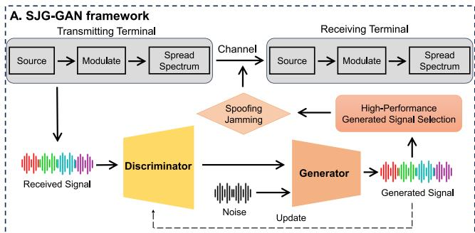

<details>
<summary>flowchart</summary>

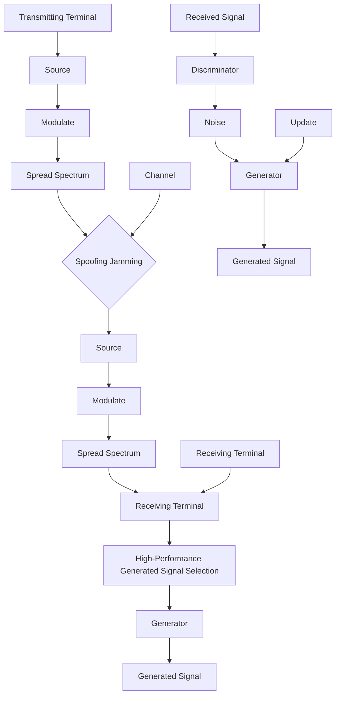
</details>

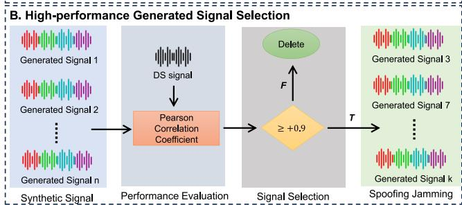

<details>
<summary>flowchart</summary>

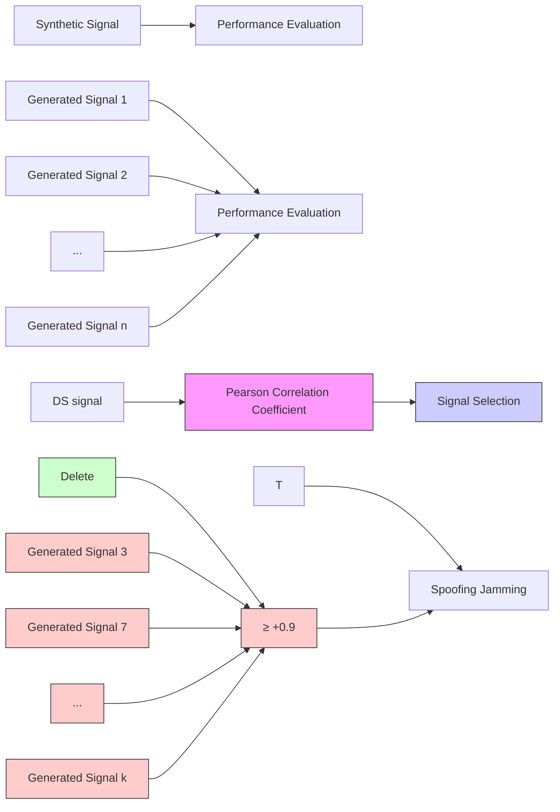
</details>

Fig. 6. The overall network structure in [44]. Part A illustrates the SJG-GAN framework consisting of two parts: signal generation and the high-performance generated signal selection. In Part B, the process of the high-performance generated signal selection is shown. It can be split into two steps: the evaluation and the selection.

In conclusions, GAI models can offer sophisticated mechanisms to both detect and counteract spoofing attacks, as summarized in Table VII. However, since they are limited to simulated environments, the detection accuracy in actual scenarios still needs further investigation.

# V. COMMUNICATION INTEGRITY

Communication integrity in the physical layer of a network involves ensuring that the data transmitted over a physical medium, such as copper wires, fiber-optic cables, or wireless signals, is delivered accurately and reliably, without corruption or alteration [65]. This often requires mechanisms for anomaly detection or data reconstruction to maintain the fidelity of the data as it moves from one device to another, thereby preserving the integrity of communication.

# A. Anomaly Detection

Anomaly detection is a method used to identify and mitigate unexpected deviations or irregularities in the communication channel [143]. However, due to the unpredictable characteristics of potential anomalies, it is difficult to gather enough abnormal data for training samples in traditional AI methods [144]. Thus, there is an urgent need for an unsupervised, automatic feature-extraction learning model, such as GAI techniques for anomaly detection [145]. Generally, GAI for anomaly detection can be divided into two categories: reconstruction-based [136] and prediction-base detection [47].

1) Reconstruction-Based Detection: Reconstruction-based methods identify anomalies through anomaly scores, which are usually the reconstruction error in GAI models. In the study [136], the authors proposed a deep AE-based approach for anomaly detection in the spectrum. The time-frequency features of preprocessed signal data are utilized to train the proposed network. To differentiate between normal and anomalous data, the method applies a threshold to the reconstruction errors, transforming these errors into a binary outcome. The threshold value is strategically selected to tradeoff a balance between the probabilities of false alarms and missed alarms, and it is determined as the median of a sequence of reconstruction errors in this study.

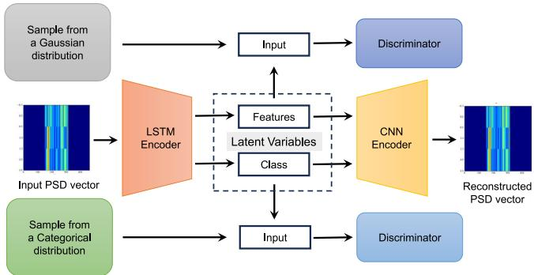

<details>
<summary>flowchart</summary>

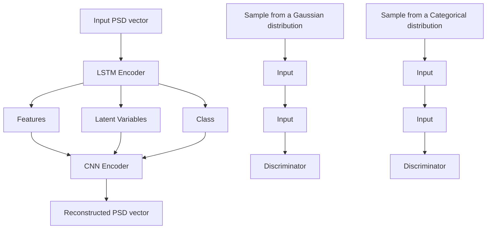
</details>

Fig. 7. The proposed model architecture in [45]. The AAE architecture is trained in a semi-supervised learning for making the features more interpretable while the reconstruction is fully unsupervised.

While the model presented in [136] demonstrates effectiveness, it lacks interpretable feature extraction capabilities, such as signal bandwidth and position. This limitation necessitates the training of multiple copies of the model for different frequency bands. Addressing this issues, the authors in [45] introduced Spectrum Anomaly Detector with Interpretable Features (SAIFE), which is an AAE based model (Fig. 7). SAIFE enables the training of a single model across multiple bands in an unsupervised manner, thereby eliminating the need for multiple model instances for different bands. Moreover, the AAE architecture provides a flexible and robust platform for semi-supervised learning, enabling the extraction of interpretable features based on Power Spectral Density (PSD) data [146]. Furthermore, the reconstructed signals are a key asset for localizing anomalies within the wireless spectrum. Impressively, the model demonstrates exceptional performance in wireless band classification, achieving an accuracy close to 100% while only utilizing 20% labeled samples [45]. Similar to the SAIFE model [45], the study in [137] also designed an anomaly score based on latent representations for electromagnetic waveform anomaly detection. This design differs from the SAIFE model, as the generator in the proposed method is composed of two AEs connected in series. These encoders map original and reconstructed data to the latent space, respectively.

In response to the complexity and training overhead of GANs and the low accuracy of traditional AE networks in anomaly detection of electromagnetic signals, the authors in [138] proposed a ResNet-AE network model. This model integrates the encoder and decoder with ResNet architecture and LSTM architectures for efficient feature mapping and data reconstruction. To process the anomaly detection results and establish an adaptive decision threshold, a K-Means classifier with two categories is constructed, using a random initial clustering center to categorize the anomaly scores. After iterative clustering, the centers for normal and abnormal signal scores are determined, and the mean value of these centers is used as the threshold for anomaly judgment. When applied to radar signal anomaly detection, the proposed ResNet-AE method achieves a high recognition accuracy, exceeding 85% [138].

To further investigate the impact of different weightings of the KL divergence in the loss function of VAEs, the authors of [46] proposed an approach for data anomaly detection using a β-VAE [147]. This advanced model, employing a multivariate normal distribution, introduces a coefficient $\beta$ to control the KL term. It allows for a more disentangled representation of data, where each unit in the latent code is responsive to a single generative element, enhancing the model’s interpretability and effectiveness. However, the study does not specify the method for selecting the optimal value of the $\beta$ coefficient.

While existing methods have proven effective in anomaly detection, they often involve transmitting large volumes of raw data, resulting in significant channel interference and energy consumption. To address the substantial demand for computational resources, the study [139] introduces an AEbased distributed anomaly detection approach in Wireless sensor network (WSN), characterized by its simplicity with only three layers. Each sensor in the proposed approach is equipped with a copy of the AE and is responsible for two primary tasks, in addition to its regular sensing function. The first task involves providing the input and output data of the AE to the IoT cloud, which serves as the training data. This data transfer occurs through a gateway or cluster head at a significantly lower frequency compared to the sensing rate. The second task is the execution of anomaly detection, which is conducted locally at the sensor level. This process is independent of any communication with other sensors, the gateway, or the IoT cloud, thereby enabling efficient and autonomous anomaly detection within each sensor unit, offering a more efficient and autonomous approach to anomaly detection in WSN [139].

2) Prediction-Based Detection: Besides reconstructionbased methods, prediction-based methods have also proven to be effective for anomaly detection, which directly predict the probability of an anomaly without defining an anomaly score [47], [48], [140], [141].

A primary challenge in physical layer sensing is the large amount of unclean and irrelevant data collected from sensors, known as data imbalance [148]. This issue often results in traditional AI models misclassifying all samples as abnormal, further complicating anomaly detection [149]. To tackle the data imbalance problem, [140] introduces the MSGAN model, a GAN-based data augmentation strategy specifically designed for sensor anomaly detection. This model integrates WGAN-GP [71] with a novel adaptive update strategy during offline training. The adoption of an adaptive update strategy allows the MSGAN to accelerate training convergence and improve the quality of synthetic samples.

In SAIFE [45], the distribution captured by AAEs corresponds more to the latent representations than to the original training samples. To address this limitation, the study in [47] introduced an Encoder-GAN (E-GAN) structure, which incorporates an encoder network into the original GAN framework to reconstruct the spectrogram. By integrating an encoder into the standard GAN, the latent representations are controlled by the encoder rather than being randomly selected, which ensures that the generator produces data within the actual data distribution. Consequently, the E-GAN model is more adept at capturing the distribution of input samples than the SAIFE. However due to the convolutional structure in E-GAN, the time complexity of the proposed algorithm is higher than that of the SAIFE model [47].

TABLE VIII SUMMARY OF GAI FOR ANOMALY DETECTION IN PHYSICAL LAYER BLUE CIRCLES DESCRIBE THE METHODS; GREEN CORRECT MARKERS AND RED CROSS MARKERS REPRESENT PROS AND CONS RESPECTIVELY 

<table><tr><td>Techniques</td><td>Reference</td><td>Algorithm</td><td>Pros &amp; Cons</td></tr><tr><td rowspan="6">Reconstruction-based Detection</td><td>[136]</td><td>AE</td><td>The AE neural networks to detect the anomalies of spectrum via time-frequency diagramThe threshold selected to trade-off a balance between the probabilities of false and missed alarms.Include potential biases in signal data selection</td></tr><tr><td>[45]</td><td>SAIFE</td><td>An AAE-based anomaly detector for wireless spectrum anomaly detection using PSD dataA single model across multiple bands to extract interpretable featuresThe distribution corresponds more to the latent representations than to the original training samples.</td></tr><tr><td>[137]</td><td>GAN</td><td>A GAN-based system trained on available EM signals to detect unseen types of EM waveformsTwo AEs connected in series to fully extract the features of EM waveformsRequire relatively long training time</td></tr><tr><td>[138]</td><td>ResNet-AE</td><td>An anomaly detection method based on ResNet-AEEstablish an adaptive decision thresholdCannot classify the types of anomalies</td></tr><tr><td>[46]</td><td>β-VAE</td><td>A VAE model uses multivariate normal distribution with a parameter β in the KL divergence termInvestigate the impact of different weightings of the KL divergenceNot specify how to select the optimal value of the β coefficient</td></tr><tr><td>[139]</td><td>AE</td><td>The AE neural networks into WSN to solve the anomaly detection problemSatisfy the demand for limited computational resourcesLack of analysis that extends to large scale sensor networks</td></tr><tr><td rowspan="5">Prediction-based Detection</td><td>[140]</td><td>MSGAN</td><td>A domain-specific framework consisting of offline training and online inference to detect anomalies in the scenario of industrial robotic sensorsUse an adaptive update strategy during offline trainingLack of analysis that extends to diversity scenarios</td></tr><tr><td>[47]</td><td>E-GAN</td><td>A radio anomaly detection algorithm based on modified GANLatent representations are controlled rather than being randomly selected.Capture the distribution of input samplesRelatively high time complexity</td></tr><tr><td>[48]</td><td>CGAN</td><td>The GAI-based abnormality Detection techniques at the physical layer in CRImplement a hybrid structure for low- and high-dimensionality dataLimited by signal types tested</td></tr><tr><td>[141]</td><td>Multiple</td><td>The GAI frameworks used to detect anomalies inside the dynamic radio spectrumA comparative analysis of three deep generative modelsCannot be employed to characterize and classify the anomalous signals</td></tr><tr><td>[142]</td><td>Multiple</td><td>GAI-based anomaly detection methods to detect a set of anomalous activities in several radio bandThree deep generative models are applied to spectral density functionsNeed to consider proper methods or ensembles of methods to achieve the best performance</td></tr></table>

In [48], a framework integrating Dynamic Bayesian Networks (DBNs) [150] and GANS was proposed to detect abnormalities. A distinctive aspect of this approach is the use of a generalized state vector [151], consisting of the signal feature extracted from the Stockwell Transform (ST) and the corresponding derivatives, as the input for the model. In the proposed framework, DBNs are used to learn switching models where each switching variable can be associated with a different linear dynamic model. This approach is particularly suited for scenarios involving low-dimensionality data due to the vocabulary size of switching variables. Conversely, CGAN is employed for scenarios involving high-dimensionality data. While GANs are capable of effectively managing a high number of different dynamic models implicitly, they have a notable limitation: unlike DBNs, GANs cannot manage uncertainty with probabilistic knowledge [48].

According the results in [48], it is demonstrated that approaches utilizing generative learning of deep features yield superior results in anomaly detection when compared to conventional techniques, particularly the Cyclostationary Feature Detector (CFD) [152]. Therefore, the authors in [141] conducted a comparative analysis of three deep generative models: the CGAN, the ACGAN, and the VAE for spectrum anomaly detection in the millimeter Wave (mmWave) communications. Tested on a real dataset collect by The National Instruments mmWave Transceiver System [141], all three models demonstrated commendable performance in anomaly detection, particularly the AC-GAN. The ROC curves from these tests confirmed that these models have a high probability of detection while maintaining a low false alarm rate.

Similarly, the authors in [142] explored a range of generative model approaches, including U-Net WGAN, ResNet WGAN, and ResNet VAE applied to spectral density functions. The anomaly scoring mechanism employed varies with the model: binary cross-entropy loss is used between the input and reconstruction for U-Net WGAN and ResNet VAE, while mean-squared error loss is applied for ResNet WGAN. For comparison and validation, three well-known anomaly detection methods are used as baselines: Isolation Forest [153], One-class SVM [154], and fAnoGAN [155]. The results demonstrate excellent performance of these generative models compared to traditional baseline approaches for various types of anomalies. In particular, the Unet GAN achieves the highest average in four out of the five metrics [142].

As summarized in Table VIII, GAI models showcase superior performance in anomaly detection within complicated feature data than traditional AI models. However, some methods cannot be employed to characterize and classify the anomalous signals [138], [141], which holds critical importance for the subsequent maintenance and security of network equipment. Consequently, future research should concentrate on creating advanced GAI models capable of detecting and classifying various anomalous signals.

# B. Data Reconstruction

Data reconstruction focuses on retrieving the original signal or information from corrupted or incomplete datasets [158]. This process involves various techniques to restore or approximate the original data, aiming to overcome the issues caused by interference and noise.

Traditional reconstruction methods, based on sparse representation and low-rank matrix completion [159], assume that both full-spectrum data and their corrupted counterparts are sparsely represented with a full-spectrum and a gapped-spectrum dictionary, respectively. Therefore, both representations are similarly sparse and share identical sparse codes. Consequently, these reconstruction methods lack the ability and robustness to distinguish closely situated targets at high resolution accurately without prior knowledge of the missing frequency bands. However, GAI models excel in learning complex data patterns, effectively reducing the dependency on prior knowledge of missing frequency bands. Moreover, GAI models leverage their advanced learning capabilities to data gaps, offering a more robust and flexible approach to signal reconstruction.

In [49], the authors introduced a GAN framework named SARGAN, designed to reconstruct missing spectral information in Ultra-wideband (UWB) radar systems across multiple frequency bands. Specifically, SARGAN focuses on recovering Synthetic Aperture Radar (SAR) data [160]. To train the GAN model, the model uses numerous data pairs, each comprising an uncorrupted scene and its frequencycorrupted version. The corrupted datasets are simulated by removing random frequency bands from the original data. A significant advantage over conventional spectral recovery methods is that the proposed model does not need any prior knowledge of the missing data. This is particularly beneficial in unpredictable scenarios including battlefield conditions, where jamming and interference can occur unexpectedly. The simulation results show that the recovered signals using SARGAN achieve an average gain of over 18 dB in SNR, even when up to 90% of the operating spectrum is missing.

Compared to radar data, DSSS signals possess more complex structures which makes it challenging to characterize accurately the properties of a target signal. To extract more properties such as Pseudonoise (PN) sequence [161], a method based on VAE-GAN [74] for reconstructing DSSS signals was proposed in [50]. By integrating VAE and GAN, the encoder provides the generator with a loss function that measures the discrepancy between real and generated data. Furthermore, the proposed framework incorporates a Deep Residual Shrinkage Network (DRSN) [162] and a self-attention mechanism [163] into the encoder and discriminator. The DRSNs are effective in minimizing redundant information in the collected signal, particularly noise-induced redundancy. Meanwhile, the self-attention mechanism facilitates the establishment of longdistance dependencies within the input sequences. However, while the proposed model is adaptable to PN sequences with varying code lengths, its performance in low SNR environments significantly diminishes. Particularly, when the SNR falls below 13 dB, there is a sharp decline in the model’s performance [50].

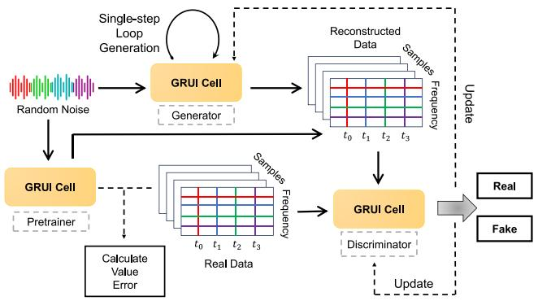

<details>
<summary>flowchart</summary>

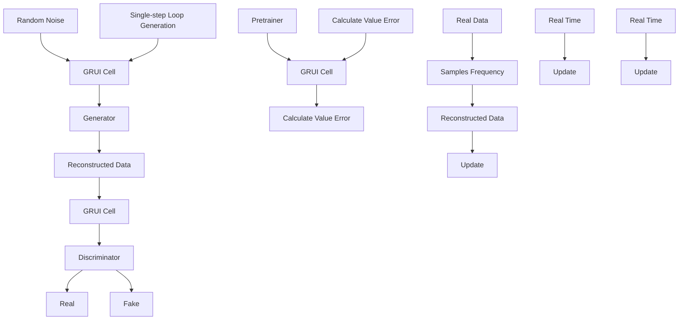
</details>

Fig. 8. The MTS-GAN data completion network structure [156]. The generator network is built by the gated loop unit GRUI for data interpolation. GRUI can simulate time irregularities allowing for more accurate extraction of the distribution characteristics of time-frequency signal data.

To improve the precision of reconstructing electromagnetic environment data, the authors in [156] developed a high-precision method using a Multi-Component Time Series Generation Adversarial Network (MTS-GAN). This approach effectively utilizes multivariate time series data to better capture the correlations between the time and frequency domains of electromagnetic data (Fig. 8). A key component of this method is the use of a Gate Recursive Unit (GRUI), which simulates time irregularities. The GRUI allows more accurate extraction of the distribution characteristics of time-frequency signal data and reduces the impact of random losses.

Besides GANs, VAEs are recognized as another powerful GAI model for effective data reconstruction. In [157], a VAE-based model was proposed for data construction in noisy channels. The AE and VAE models are particularly effective in regularizing the latent space distribution, a feature that is highly beneficial in data reconstruction with Gaussian noise channels.

DMs have garnered attention in the field of wireless communications due to their inherent ability to progressively remove noise, especially in aiding receivers to mitigate channel noise. In response to this potential, the study [51] introduced Channel Denoising Diffusion Models (CDDM) specifically designed for wireless communications. CDDM aims to leverage the noise reduction properties of DMs to enhance the quality and reliability of signal reception in wireless communication channels. CDDM is trained using a specialized noise schedule specifically adapted to the wireless channel, enabling the effective elimination of channel noise through sampling algorithm. The training algorithm for the combined CDDM and JSCC system is structured into three distinct stages. In the first and last stages, the JSCC encoder and decoder are trained to minimize the reconstruction error. The second stage involves fixing the parameters of the JSCC encoder, thereby allowing the CDDM to learn the distribution of latent representations. This stage utilizes a noise schedule that closely simulates the distribution of channel noise, rendering the CDDM adaptable to a variety of channel conditions. The results demonstrate that systems incorporating CDDM consistently outperform those without CDDM across all SNR regimes. Notably, under an AWGN channel and a Rayleigh fading channel at 20 dB SNR, the CDDM achieves 0.49 dB gain and 1.06 dB gain, respectively [51].

The applications of GAI for data reconstruction in Table IX showcase its remarkable ability to process and regenerate missing or corrupted data, ensuring communication integrity. However, the performance is still limited in low SNR scenarios [50]. Therefore, proposing more accurate models in high noise situations is a future direction.

# VI. FUTURE RESEARCH DIRECTION

Despite its impressive capabilities in complex data feature extraction, reconstruction, and enhancement, the applications of GAI in physical layer security are still in its early stages. This section aims to explore the open issues and research directions related to the integration of GAI in physical layer security.

# A. Model Improvements

Enhancing physical layer security necessitates models that significantly advance in terms of robustness and efficiency requiring model improvements. By incorporating advanced neural network architectures, GAI systems can learn to simulate and counteract time related attack patterns more effectively [164]. Enhancements in adversarial training techniques will also enable GAI models to better mitigate potential vulnerabilities [165]. Moreover, GAI-aided encryption may be further explored in conjunction with the near-field beam focusing via Extremely large-scale multiple-input-multipleoutput (XL-MIMO) that exploits the propagation characteristics of both distance and direction. The latter enables to focus the transmitted signal energy onto an intended user, so as not to induce information leakage to eavesdroppers. This certainly enhances the physical layer security for emerging 6G Wireless equipped with XL-MIMO [166].

# B. Multi-Scenario Deployment

As the deployment of GAI in physical layer security, its application across various scenarios emerges as a critical area of focus. The intricate architecture of GAI poses challenges for its implementation on edge devices, often requiring the transmission of additional data [139]. Incorporating distributed deployment strategies, GAI can efficiently leverage edge computing capabilities, thus minimizing latency and reducing the need for extensive data transmission by processing information closer to its source [167]. Furthermore, the Mixture of Experts (MoE) model can dynamically assign tasks to specialized submodels or ‘experts’ [168]. It presents a promising avenue for enhancing the adaptability and efficiency of GAI in addressing the multifaceted and intricate scenarios encountered in physical layer security. Exploring the integration of the MoE model with GAI to leverage the strengths of both approaches is a noteworthy direction for future research.

# C. Resource-Efficient Optimization

Compared with traditional AI, GAI usually requires more resources for training and inference due to its complex mission objectives. It causes serious burden and impact on the normal process operation of the device, especially for devices with limited resources such as mobile phones. Therefore, future directions should emphasize the development of lightweight GAI models that can operate with minimal computational resources while maintaining high security standards [169]. For instance, adapting model pruning techniques to remove unnecessary parameters from GANs without compromising their ability to generate or discriminate can significantly reduce the computational load [170]. Additionally, exploring federated learning approaches could decentralize the training process, allowing GAIs to learn from diverse datasets across multiple devices while ensuring data privacy and reducing the need for centralized, powerful computing resources [171]. These strategies promise to enhance the scalability of GAIs in securing the physical layer and ensure their applicability in resource-constrained environments including IoT devices and edge computing platforms, where security and efficiency are paramount.

# D. Secure SemCom

“GAI-aided Secure SemCom” is certainly a vital future research direction. The task-oriented SemCom aims at minimizing the transmission overhead in resource-constrained networks, such as AI-native wireless networks [53]. Additionally, it focuses on performing a given task properly with the aid of GAI as well as knowledge base at both ends, even though the reconstructed data is not exactly same as the original data [123]. Consequently, the performance metric changes from accuracy to task fulfillment within a specified QoE value, with shared knowledge base. Therefore, this paradigm shift necessitates a GAI model design criteria within SemCom, focusing on task fulfillment levels facilitated by the synergistic use of GAI and a shared knowledge base in physical layer security [124].

# VII. CONCLUSION

This paper has presented a comprehensive survey on the applications of GAI in physical layer security, attributed to its remarkable capabilities in extracting, reconstructing, and enhancing complex data features. It introduced the background of GAI, encompassing its architecture, classification, and foundational models. Subsequently, it explored various security properties such as communication confidentiality, authentication, availability, resilience, and integrity. Finally, it highlighted crucial future research directions for generative AI in physical layer security, which underscores the potential of GAI to further enhance security measures, demonstrating its vital role in safeguarding communication networks against evolving security threats.

TABLE IX SUMMARY OF GAI FOR DATA RECONSTRUCTION IN PHYSICAL LAYER BLUE CIRCLES DESCRIBE THE METHODS; GREEN CORRECT MARKERS AND RED CROSS MARKERS REPRESENT PROS AND CONS RESPECTIVELY 

<table><tr><td>Techniques</td><td>Reference</td><td>Algorithm</td><td>Pros &amp; Cons</td></tr><tr><td rowspan="5">Data Reconstruction</td><td>[49]</td><td>SARGAN</td><td>A GAN network to recover this missing spectral informationNot require any information of the missing band locationsAll computational complexity is at the training phase.The requirement for extensive training data</td></tr><tr><td>[50]</td><td>VAE-GAN</td><td>A VAE-GAN-based method for reconstructing DSSS signalsAvoid complex parametric analysis of the signalIntegrate DRSNs and self-attention in VAE-GANUnsatisfactory effect in low SNR</td></tr><tr><td>[156]</td><td>MTS-GAN</td><td>A high-precision reconstruction method for electromagnetic environment data based on MTS-GANUse the GRUI to simulate time irregularitiesHigh accuracy and convergence speedThe specific requirements for training and implementing</td></tr><tr><td>[157]</td><td>VAE</td><td>Investigate the performance of VAEs and compare the results with standard AEsUse SSIM metric instead of the peak signal-to-noise ratioLimited in terms of the variety of noise models</td></tr><tr><td>[51]</td><td>CDDM</td><td>A channel denoising diffusion models for wireless communications to eliminate the channel noiseEliminate the channel nosie under Rayleigh fading channel and AWGN channelRelatively long sampling time</td></tr></table>

# REFERENCES

[1] D. Baidoo-Anu and L. O. Ansah, “Education in the era of generative artificial intelligence (AI): Understanding the potential benefits of ChatGPT in promoting teaching and learning,” J. AI, vol. 7, no. 1, pp. 52–62, Jan. 2023.   
[2] H. Du et al., “The age of generative AI and AI-generated everything,” 2023, arXiv:2311.00947.   
[3] Y. Cao et al., “A comprehensive survey of AI-generated content (AIGC): A history of generative ai from GAN to ChatGPT,” 2023, arXiv:2303.04226.   
[4] R. Rombach, A. Blattmann, D. Lorenz, P. Esser, and B. Ommer, “High-resolution image synthesis with latent diffusion models,” 2021, arXiv:2112.10752.   
[5] J. Betker et al., “Improving image generation with better captions,” Comput. Sci., vol. 2, no. 3, p. 8, 2023. [Online]. Available: https://api.semanticscholar.org/CorpusID:264403242   
[6] T. Wu et al., “A brief overview of ChatGPT: The history, status quo and potential future development,” IEEE/CAA J. Automatica Sinica, vol. 10, no. 5, pp. 1122–1136, May 2023.   
[7] I. K. Dutta, B. Ghosh, A. Carlson, M. Totaro, and M. Bayoumi, “Generative adversarial networks in security: A survey,” in Proc. 11th IEEE Annu. Ubiquitous Comput., Electron. Mobile Commun. Conf., 2020, pp. 399–405.   
[8] S. Aldossary and W. Allen, “Data security, privacy, availability and integrity in cloud computing: Issues and current solutions,” Int. J. Adv. Comput. Sci. Appl., vol. 7, no. 4, pp. 1–14, Apr. 2016.   
[9] Y. Zhang, Y. Lu, R. Zhang, B. Ai, and D. Niyato, “Deep reinforcement learning for secrecy energy efficiency maximization in RIS-assisted networks,” IEEE Trans. Veh. Technol., vol. 72, no. 9, pp. 12413–12418, Sep. 2023.   
[10] S. Kumar, S. Dalal, and V. Dixit, “The OSI model: Overview on the seven layers of computer networks,” Int. J. Comput. Sci. Inf. Technol. Res., vol. 2, no. 3, pp. 461–466, Mar. 2014.   
[11] J. Zhang, H. Du, Q. Sun, B. Ai, and D. W. K. Ng, “Physical layer security enhancement with reconfigurable intelligent surface-aided networks,” IEEE Trans. Inf. Forensics Security, vol. 16, pp. 3480–3495, 2021.   
[12] Y.-S. Shiu, S. Y. Chang, H.-C. Wu, S. C.-H. Huang, and H.-H. Chen, “Physical layer security in wireless networks: A tutorial,” IEEE Wireless Commun., vol. 18, no. 2, pp. 66–74, Apr. 2011.   
[13] Z. Lv, A. K. Singh, and J. Li, “Deep learning for security problems in 5G heterogeneous networks,” IEEE Netw., vol. 35, no. 2, pp. 67–73, Mar./Apr. 2021.   
[14] C. Jiang, H. Zhang, Y. Ren, Z. Han, K.-C. Chen, and L. Hanzo, “Machine learning paradigms for next-generation wireless networks,” IEEE Wireless Commun., vol. 24, no. 2, pp. 98–105, Apr. 2017.   
[15] J. Wang, C. Jiang, H. Zhang, Y. Ren, K.-C. Chen, and L. Hanzo, “Thirty years of machine learning: The road to Pareto-optimal wireless networks,” IEEE Commun. Surveys Tuts., vol. 22, no. 3, pp. 1472–1514, 3rd Quart., 2020.

[16] W. Wang, M. Zhu, X. Zeng, X. Ye, and Y. Sheng, “Malware traffic classification using convolutional neural network for representation learning,” in Proc. Int. Conf. Inf. Netw., 2017, pp. 712–717.   
[17] T. M. Hoang, A. Vahid, H. D. Tuan, and L. Hanzo, “Physical layer authentication and security design in the machine learning era,” IEEE Commun. Surveys Tuts., early access, Feb. 8, 2024, doi: 10.1109/COMST.2024.3363639,   
[18] D. Hong, Z. Zhang, and X. Xu, “Automatic modulation classification using recurrent neural networks,” in Proc. 3rd IEEE Int. Conf. Comput. Commun., 2017, pp. 695–700.   
[19] X. Xiao, B. Vasic, R. Tandon, and S. Lin, “Designing finite alphabet ´ iterative decoders of LDPC codes via recurrent quantized neural networks,” IEEE Trans. Commun., vol. 68, no. 7, pp. 3963–3974, Jul. 2020.   
[20] J. Kim and H. Kim, “Applying recurrent neural network to intrusion detection with hessian free optimization,” in Proc. Int. Workshop Inf. Security Appl., 2015, pp. 357–369.   
[21] J. Wang et al., “Generative AI for integrated sensing and communication: Insights from the physical layer perspective,” 2023, arXiv:2310.01036.   
[22] T. O’shea and J. Hoydis, “An introduction to deep learning for the physical layer,” IEEE Trans. Cogn. Commun. Netw., vol. 3, no. 4, pp. 563–575, Dec. 2017.   
[23] A. Karapantelakis, P. Alizadeh, A. Alabassi, K. Dey, and A. Nikou, “Generative AI in mobile networks: A survey,” Ann. Telecommun., vol. 79, pp. 15–33, Feb. 2024.   
[24] N. Van Huynh et al., “Generative AI for physical layer communications: A survey,” 2023, arXiv:2312.05594.   
[25] Z. Xu, W. Liu, J. Huang, C. Yang, J. Lu, and H. Tan, “Artificial intelligence for securing IoT services in edge computing: A survey,” Secur. Commun. Netw., no. 1, pp. 1–13, 2020.   
[26] H. Sharma and N. Kumar, “Deep learning based physical layer security for terrestrial communications in 5G and beyond networks: A survey,” Phys. Commun., vol. 57, Apr. 2023, Art. no. 102002.   
[27] J. Zhai, S. Zhang, J. Chen, and Q. He, “Autoencoder and its various variants,” in Proc. IEEE Int. Conf. Syst., man, Cybern., 2018, pp. 415–419.   
[28] I. Goodfellow et al., “Generative adversarial networks,” Commun. ACM, vol. 63, no. 11, pp. 139–144, 2020.   
[29] J. Ho, A. Jain, and P. Abbeel, “Denoising diffusion probabilistic models,” in Proc. Adv. Neural Inf. Process., vol. 33, 2020, pp. 6840–6851.   
[30] A. Smith and J. Downey, “A communication channel density estimating generative adversarial network,” in Proc. IEEE Cogn. Commun. Aerosp. Appl. Workshop, 2019, pp. 1–7.   
[31] C.-H. Lin, C.-C. Wu, K.-F. Chen, and T.-S. Lee, “A variational autoencoder-based secure transceiver design using deep learning,” in Proc. IEEE Global Commun. Conf., 2020, pp. 1–7.   
[32] M. Nemati, J. Park, and J. Choi, “VQ-VAE empowered wireless communication for joint source-channel coding and beyond,” in Proc. IEEE Global Commun. Conf., 2023, pp. 3155–3160.

[33] J. Han, Y. Zhou, G. Liu, T. Liu, and X. Zeng, “A novel physical layer key generation method based on WGAN-GP adversarial autoencoder,” in Proc. 4th Int. Conf. Commun., Inf. System Comput. Eng., 2022, pp. 1–6.   
[34] K. Merchant and B. Nousain, “Securing IoT RF fingerprinting systems with generative adversarial networks,” in Proc. IEEE Mil. Commun. Conf., 2019, pp. 584–589.   
[35] J. Gong, X. Xu, Y. Qin, and W. Dong, “A generative adversarial network based framework for specific emitter characterization and identification,” in Proc. 11th Int. Conf. Wireless Commun. Signal Process., 2019, pp. 1–6.   
[36] K. S. Germain and F. Kragh, “Mobile physical-layer authentication using channel state information and conditional recurrent neural networks,” in Proc. IEEE 93rd Veh. Technol. Conf., 2021, pp. 1–6.   
[37] R. Meng et al., “Physical-layer authentication based on hierarchical variational autoencoder for Industrial Internet of Things,” IEEE Internet Things J., vol. 10, no. 3, pp. 2528–2544, Feb. 2023.   
[38] T. Erpek, Y. E. Sagduyu, and Y. Shi, “Deep learning for launching and mitigating wireless jamming attacks,” IEEE Trans. Cogn. Commun. Netw., vol. 5, no. 1, pp. 2–14, Mar. 2019.   
[39] Y. Tang, Z. Zhao, X. Ye, S. Zheng, and L. Wang, “Jamming recognition based on AC-VAEGAN,” in Proc. 15th IEEE Int. Conf. Signal Process., vol. 1, 2020, pp. 312–315.   
[40] H. Han et al., “Better late than never: GAN-enhanced dynamic antijamming spectrum access with incomplete sensing information,” IEEE Wireless Commun. Lett., vol. 10, no. 8, pp. 1800–1804, Aug. 2021.   
[41] Y. Wang, X. Liu, and M. Wang, “A double network structure antijamming algorithm based on deep reinforcement learning,” J. Phys. Conf. Ser., no. 1, 2021, Art. no. 12106.   
[42] Y. Shi, K. Davaslioglu, and Y. E. Sagduyu, “Generative adversarial network for wireless signal spoofing,” in Proc. ACM Workshop Wireless Secur. Mach. Learn., 2019, pp. 55–60.   
[43] M. Ma, Y. Zhang, T. Zhao, W. Zhang, and Z. He, “Controllable wireless spoofing attack based on conditional BEGAN and auxiliary channel sensing,” Electronics, vol. 12, no. 1, p. 84, 2022.   
[44] Y. Yang, L. Zhu, Q. He, and X. Deng, “A simple high-performance generation method for spoofing jamming signals,” in Proc. Int. Symp. Netw., Comput. Commun., 2022, pp. 1–5.   
[45] S. Rajendran, W. Meert, V. Lenders, and S. Pollin, “Unsupervised wireless spectrum anomaly detection with interpretable features,” IEEE Trans. Cogn. Commun. Netw., vol. 5, no. 3, pp. 637–647, Sep. 2019.   
[46] S. Harini, K. Nivedha, B. G. Selva Keerthana, R. Gokul, and B. Jayasree, “Data anomaly detection in wireless sensor networks using β-variational autoencoder,” in Proc. Int. Conf. Intell. Syst. Commun., IoT Security, 2023, pp. 631–636.   
[47] X. Zhou, J. Xiong, X. Zhang, X. Liu, and J. Wei, “A radio anomaly detection algorithm based on modified generative adversarial network,” IEEE Wireless Commun. Lett., vol. 10, no. 7, pp. 1552–1556, Jul. 2021.   
[48] A. Toma et al., “AI-based abnormality detection at the PHY-layer of cognitive radio by learning generative models,” IEEE Trans. Cogn. Commun. Netw., vol. 6, no. 1, pp. 21–34, vol. 6, no. 1, pp. 21–34, Mar. 2020.   
[49] D. N. Tran, T. D. Tran, and L. Nguyen, “Generative adversarial networks for recovering missing spectral information,” in Proc. IEEE Radar Conf., 2018, pp. 1223–1227.   
[50] Q. Feng, J. Zhang, L. Chen, and F. Liu, “Waveform reconstruction of DSSS signal based on VAE-GAN,” Wireless Commun. Mob. Comput., no. 1, 2022, Art. no. 3667592.   
[51] T. Wu et al., “CDDM: Channel denoising diffusion models for wireless communications,” 2023, arXiv:2305.09161.   
[52] M. Xu et al., “Unleashing the power of edge-cloud generative ai in mobile networks: A survey of AIGC services,” IEEE Commun. Commun. Surveys Tuts., vol. 26, no. 2, pp. 1127–1170, 2nd Quart., 2024,   
[53] C. Liang et al., “Generative AI-driven semantic communication networks: Architecture, technologies and applications,” 2023, arXiv:2401.00124.   
[54] V.-L. Nguyen, P.-C. Lin, B.-C. Cheng, R.-H. Hwang, and Y.-D. Lin, “Security and privacy for 6G: A survey on prospective technologies and challenges,” IEEE Commun. Surveys Tuts., vol. 23, no. 4, pp. 2384–2428, 4th Quart., 2021.   
[55] S. Santhosh Kumar, M. Selvi, and A. Kannan, “A comprehensive survey on machine learning-based intrusion detection systems for secure communication in Internet of Things,” Comput. Intell. Neurosci., no. 1, 2023, Art. no. 8981988.

[56] F. Alwahedi, A. Aldhaheri, M. A. Ferrag, A. Battah, and N. Tihanyi, “Machine learning techniques for IoT security: Current research and future vision with generative AI and large language models,” Internet Things Cyber-Phys. Syst., vol. 4, pp. 167–185, Jan. 2024.   
[57] A. K. Kamboj, P. Jindal, and P. Verma, “Machine learning-based physical layer security: Techniques, open challenges, and applications,” Wireless Netw., vol. 27, pp. 5351–5383, Nov. 2021.   
[58] H. Sharma, G. Sharma, and N. Kumar, “AI-assisted secure data transmission techniques for next-generation HetNets: A review,” Comput. Commun., vol. 215, pp. 74–90, Feb. 2024.   
[59] J. Wang, H. Du, D. Niyato, M. Zhou, J. Kang, and H. V. Poor, “Acceleration estimation of signal propagation path length changes for wireless sensing,” 2023, arXiv:2401.00160.   
[60] J. Wang et al., “Through the wall detection and Localization of autonomous mobile device in indoor scenario,” IEEE J. Sel. Areas Commun., vol. 42, no. 1, pp. 161–176, Jan. 2024.   
[61] S. Samonas and D. Coss, “The CIA strikes back: Redefining confidentiality, integrity and availability in security,” J. Inf. Syst. Secur., vol. 10, no. 3, pp. 21–45, 2014.   
[62] J. M. Hamamreh, H. M. Furqan, and H. Arslan, “Classifications and applications of physical layer security techniques for confidentiality: A comprehensive survey,” IEEE Commun. Surveys Tuts., vol. 21, no. 2, pp. 1773–1828, 2nd Quart., 2018.   
[63] L. Bai, L. Zhu, J. Liu, J. Choi, and W. Zhang, “Physical layer authentication in wireless communication networks: A survey,” J. Commun. Inf. Netw., vol. 5, no. 3, pp. 237–264, Sep. 2020.   
[64] C. Shahriar et al., “PHY-layer resiliency in OFDM communications: A tutorial,” IEEE Commun. Surveys Tuts., vol. 17, no. 1, pp. 292–314, 1st Quart., 2014.   
[65] M. Shakiba-Herfeh, A. Chorti, and H. V. Poor, “Physical layer security: Authentication, integrity, and confidentiality,” Physical Layer Security. Cham, Switzerland: Springer, 2021, pp. 129–150.   
[66] H. Shen et al., “Missing information reconstruction of remote sensing data: A technical review,” IEEE Trans. Geosci. Remote Sens., vol. 3, no. 3, pp. 61–85, Sep. 2015.   
[67] C. Doersch, “Tutorial on variational autoencoders,” 2016, arXiv:1606.05908.   
[68] A. Oussidi and A. Elhassouny, “Deep generative models: Survey,” in Proc. Int. Conf. Intell. Syst. Comput. Vis., 2018, pp. 1–8.   
[69] A. Van Den Oord, O. Vinyals, an K. Kavukcuoglu, “Neural discrete representation learning,” in Proc. Adv. Neural Inf. Process., vol. 30, 2017, pp. 1–10.   
[70] M. Mirza and S. Osindero, “Conditional generative adversarial nets,” 2014, arXiv:1411.1784.   
[71] M. Arjovsky, S. Chintala, and L. Bottou, “Wasserstein GAN,” 2017, arXiv:1701.07875.   
[72] A. Odena, C. Olah, and J. Shlens, “Conditional image synthesis with auxiliary classifier GANs,” in Proc. Int. Conf. Mach. Learn., 2017, pp. 2642–2651.   
[73] A. Makhzani, J. Shlens, N. Jaitly, I. Goodfellow, and B. Frey, “Adversarial autoencoders,” 2015, arXiv:1511.05644.   
[74] A. B. L. Larsen, S. K. Sønderby, H. Larochelle, and O. Winther, “Autoencoding beyond pixels using a learned similarity metric,” in Proc. Int. Conf. Mach. Learn., 2016, pp. 1558–1566.   
[75] Y. Zou, J. Zhu, X. Wang, and L. Hanzo, “A survey on wireless security: Technical challenges, recent advances, and future trends,” Proc. IEEE, vol. 104, no. 9, pp. 1727–1765, Sep. 2016.   
[76] K.-L. Besser, C. R. Janda, P.-H. Lin, and E. A. Jorswieck, “Flexible design of finite blocklength wiretap codes by autoencoders,” in Proc. IEEE Int. Conf. Acoust., Speech Signal Process., 2019, pp. 2512–2516.   
[77] E. Erdemir, P. L. Dragotti, and D. Gündüz, “Privacy-aware communication over a wiretap channel with generative networks,” in Proc. IEEE Int. Conf. Acoust., Speech Signal Process., 2022, pp. 2989–2993.   
[78] M. K. Fadul, D. R. Reising, K. Arasu, and M. R. Clark, “Adversarial machine learning for enhanced spread spectrum communications,” in Proc. IEEE Mil. Commun. Conf., 2021, pp. 783–788.   
[79] M. S. Sheikh, J. Liang, and W. Wang, “A survey of security services, attacks, and applications for vehicular Ad Hoc networks (VANETs),” Sensors, vol. 19, no. 16, p. 3589, 2019.   
[80] H. Yang, Z. Xiong, J. Zhao, D. Niyato, L. Xiao, and Q. Wu, “Deep reinforcement learning-based intelligent reflecting surface for secure wireless communications,” IEEE Trans. Wireless Commun., vol. 20, no. 1, pp. 375–388, Jan. 2021.   
[81] W. Shi et al., “Physical layer security techniques for future wireless networks,” 2021, arXiv:2112.14469.   
[82] P. Sweeney, Error Control Coding. London, U.K.: Prentice Hall, 1991.

[83] H. Mahdavifar and A. Vardy, “Achieving the secrecy capacity of wiretap channels using polar codes,” IEEE Trans. Inf. Theory, vol. 57, no. 10, pp. 6428–6443, Oct. 2011.   
[84] B. Sklar, “Rayleigh fading channels in mobile digital communication systems. I. characterization,” IEEE Comm. Mag., vol. 35, no. 7, pp. 90–100, Sep. 1997.   
[85] J.-Y. Zhu et al., “Toward multimodal image-to-image translation,” in Proc. 31st Adv. Neural Inf. Process., vol. 30, 2017, pp. 465–476.   
[86] N. Farsad, M. Rao, and A. Goldsmith, “Deep learning for joint sourcechannel coding of text,” in Proc. IEEE Int. Conf. Acoust., Speech Signal Process., 2018, pp. 2326–2330.   
[87] B. Sklar, Digital Communications: Fundamentals and Applications. London, U.K.: Pearson Educ., 2021.   
[88] J. Zhang et al., “Experimental study on key generation for physical layer security in wireless communications,” IEEE Access, vol. 4, pp. 4464–4477, 2016.   
[89] G. Li, A. Hu, J. Zhang, L. Peng, C. Sun, and D. Cao, “Highagreement uncorrelated secret key generation based on principal component analysis preprocessing,” IEEE Trans. Commun., vol. 66, no. 7, pp. 3022–3034, Jul. 2018.   
[90] D. Roy, T. Mukherjee, M. Chatterjee, E. Blasch, and E. Pasiliao, “RFAL: Adversarial learning for RF transmitter identification and classification,” IEEE Trans. Cogn. Commun. Netw., vol. 6, no. 2, pp. 783–801, Jun. 2020.   
[91] H. Han et al., “Radio frequency fingerprint based wireless transmitter identification against malicious attacker: An adversarial learning approach,” in Proc. Int. Conf. Wireless Commun. Signal Process., 2020, pp. 310–315.   
[92] K. S. Germain and F. Kragh, “Physical-layer authentication using channel state information and machine learning,” in Proc. 14th Int. Conf. Signal Process. Commun. Syst., 2020, pp. 1–8.   
[93] R. Zhang et al., “Generative AI-enabled vehicular networks: Fundamentals, framework, and case study,” 2023, arXiv:2304.11098.   
[94] Y. Chapre, A. Ignjatovic, A. Seneviratne, and S. Jha, “CSI-MIMO: An efficient Wi-Fi fingerprinting using channel state information with MIMO,” Pervasive Mobile Comput., vol. 23, pp. 89–103, Oct. 2015.   
[95] A. Jagannath, J. Jagannath, and P. S. P. V. Kumar, “A comprehensive survey on radio frequency (RF) fingerprinting: Traditional approaches, deep learning, and open challenges,” Comput. Netw., vol. 219, Dec. 2022, Art. no. 109455.   
[96] K. Merchant, S. Revay, G. Stantchev, and B. Nousain, “Deep learning for RF device fingerprinting in cognitive communication networks,” IEEE J. Sel. Topics Signal Process., vol. 12, no. 1, pp. 160–167, Feb. 2018.   
[97] R. Das, A. Gadre, S. Zhang, S. Kumar, and J. M. Moura, “A deep learning approach to IoT authentication,” in Proc. IEEE Int. Conf. Commun., 2018, pp. 1–6.   
[98] Z. Gan et al., “Triangle generative adversarial networks,” in Proc. 31st Adv. Neural Inf. Process., vol. 30, 2017, pp. 5253–5262.   
[99] Z. Wang et al., “A survey of user authentication based on channel state information,” Wireless Commun. Mobile Comput., pp. 1–16, Jul. 2021.   
[100] A. Siegman, “The antenna properties of optical heterodyne receivers,” Appl. Opt., vol. 5, no. 10, pp. 1588–1594, 1966.   
[101] M. Bishop, M. Carvalho, R. Ford, and L. M. Mayron, “Resilience is more than availability,” in Proc. New Security Paradigms Workshop, 2011, pp. 95–104.   
[102] W. Wang, Y. Xu, and M. Khanna, “A survey on the communication architectures in smart grid,” Comput. Netw., vol. 55, no. 15, pp. 3604–3629, 2011.   
[103] P. F. de Araujo-Filho, G. Kaddoum, M. Naili, E. T. Fapi, and Z. Zhu, “Multi-objective GAN-based adversarial attack technique for modulation classifiers,” IEEE Commun. Lett., vol. 26, no. 7, pp. 1583–1587, Jul. 2022.   
[104] Y. Cai, F. Song, Y. Xu, X. Liu, X. Zhang, and H. Han, “Spectrum waterfall completion in jamming environment: A general adversarial networks method,” in Proc. IEEE 9th Joint Int. Inf. Technol. Artif. Intell. Conf., 2020, pp. 1661–1665.   
[105] H. Han et al., “Primary-user-friendly dynamic spectrum anti-jamming access: A GAN-enhanced deep reinforcement learning approach,” IEEE Wireless Commun. Lett., vol. 11, no. 2, pp. 258–262, Feb. 2022.   
[106] R. Lin, H. Qiu, J. Wang, Z. Zhang, L. Wu, and F. Shu, “Physical-layer security enhancement in energy-harvesting-based cognitive Internet of Things: A GAN-powered deep reinforcement learning approach,” IEEE Internet Things J., vol. 11, no. 3, pp. 4899–4913, Feb. 2024.

[107] R. Tang, D. Gao, M. Yang, T. Guo, H. Wu, and G. Shi, “GAN-inspired intelligent jamming and anti-jamming strategy for semantic communication systems,” in Proc. IEEE Int. Conf. Commun. Workshops, 2023, pp. 1623–1628.   
[108] E. Jayabalan and R. Pugazendi, “Generative adversarial networks for secure data transmission in wireless network,” Intell. Autom. Soft Comput., vol. 35, no. 3, p. 3757, 2023.   
[109] Y. Huo, Y. Tian, L. Ma, X. Cheng, and T. Jing, “Jamming strategies for physical layer security,” IEEE Wireless Commun., vol. 25, no. 1, pp. 148–153, Feb. 2018.   
[110] H. Pirayesh and H. Zeng, “Jamming attacks and anti-jamming strategies in wireless networks: A comprehensive survey,” IEEE Commun. Surveys Tuts., vol. 24, no. 2, pp. 767–809, 2nd Quart., 2022.   
[111] Z. Wu, Y. Zhao, Z. Yin, and H. Luo, “Jamming signals classification using convolutional neural network,” in Proc. IEEE Int. Symp. Signal Process. Inf. Technol., 2017, pp. 062–067.   
[112] Y. Cai, K. Shi, F. Song, Y. Xu, X. Wang, and H. Luan, “Jamming pattern recognition using spectrum waterfall: A deep learning method,” in Proc. IEEE 5th Int. Conf. Comput. Commun., 2019, pp. 2113–2117.   
[113] K. Arulkumaran, M. P. Deisenroth, M. Brundage, and A. A. Bharath, “Deep reinforcement learning: A brief survey,” IEEE Signal Process. Mag., vol. 34, no. 6, pp. 26–38, Nov. 2017.   
[114] Z. Liu, L. Huang, Z. Gao, M. Luo, S. Hosseinalipour, and H. Dai, “GA-DRL: Graph neural network-augmented deep reinforcement learning for DAG task scheduling over dynamic vehicular clouds,” IEEE Trans. Netw. Service, early access, Apr. 11, 2024, doi: 10.1109/TNSM.2024.3387707.   
[115] X. Liu, Y. Xu, L. Jia, Q. Wu, and A. Anpalagan, “Anti-jamming communications using spectrum waterfall: A deep reinforcement learning approach,” IEEE Commun. Lett., vol. 22, no. 5, pp. 998–1001, May 2018.   
[116] X. Hou, J. Wang, C. Jiang, X. Zhang, Y. Ren, and M. Debbah, “UAVenabled covert federated learning,” IEEE Trans. Wireless Commun., vol. 22, no. 10, pp. 6793–6809, Oct. 2023.   
[117] H. Yang et al., “Intelligent reflecting surface assisted anti-jamming communications: A fast reinforcement learning approach,” IEEE Trans. Wireless Commun., vol. 20, no. 3, pp. 1963–1974, Mar. 2020.   
[118] Z. Li, J. Cao, H. Wang, and M. Zhao, “Sparsely self-supervised generative adversarial nets for radio frequency estimation,” IEEE J. Sel. Areas Commun., vol. 37, no. 11, pp. 2428–2442, Nov. 2019.   
[119] S. Kavaiya, D. K. Patel, Z. Ding, Y. L. Guan, and S. Sun, “Physical layer security in cognitive vehicular networks,” IEEE Trans. Commun., vol. 69, no. 4, pp. 2557–2569, Apr. 2021.   
[120] Y. Wang, X. Liu, M. Wang, and Y. Yu, “A hidden anti-jamming method based on deep reinforcement learning,” 2020, arXiv:2012.12448.   
[121] D. S. Gurjar, H. H. Nguyen, and H. D. Tuan, “Wireless information and power transfer for IoT applications in overlay cognitive radio networks,” IEEE Internet Things J., vol. 6, no. 2, pp. 3257–3270, Apr. 2018.   
[122] D. Xu and H. Zhu, “Secure transmission for SWIPT IoT systems with full-duplex IoT devices,” IEEE Internet Things J., vol. 6, no. 6, pp. 10915–10933, Dec. 2019.   
[123] H. Du et al., “Semantic communications for wireless sensing: RISaided encoding and self-supervised decoding,” IEEE J. Sel. Areas Commun., vol. 41, no. 8, pp. 2547–2562, Aug. 2023.   
[124] H. Du et al., “Rethinking wireless communication security in semantic Internet of Things,” IEEE Wireless Commun., vol. 30, no. 3, pp. 36–43, Jun. 2023.   
[125] Y. Shi, K. Davaslioglu, and Y. E. Sagduyu, “Generative adversarial network in the air: Deep adversarial learning for wireless signal spoofing,” IEEE Trans. Cogn. Commun. Netw., vol. 7, no. 1, pp. 294–303, Mar. 2021.   
[126] T. Roy, T. O’Shea, and N. West, “Generative adversarial radio spectrum networks,” in Proc. ACM Workshop Wireless Secur. Mach. Learn., 2019, pp. 12–15.   
[127] J. Li, X. Zhu, M. Ouyang, W. Li, Z. Chen, and Q. Fu, “GNSS spoofing jamming detection based on generative adversarial network,” IEEE Sens. J., vol. 21, no. 20, pp. 22823–22832, Oct. 2021.   
[128] M. H. Yılmaz and H. Arslan, “A survey: Spoofing attacks in physical layer security,” in Proc. IEEE 40th Local Comput. Netw. Conf. Workshops, 2015, pp. 812–817.   
[129] (NVIDIA, Santa Clara, CA, USA). Jetson Nano Developer Kit. Accessed: Aug. 1, 2024. [Online]. Available: https://developer.nvidia. com/embedded/jetson-nano-developer-kit   
[130] (Xilinx Inc., San Jose, CA, USA). Zynq UltraScale+ MPSoC. Accessed: Aug. 1, 2024. [Online]. Available: https://www.xilinx.com/ products/silicon-devices/soc/zynq-ultrascalempsoc.html

[131] C. U. Ndujiuba, O. Oni, and A. E. Ibhaze, “Comparative analysis of digital modulation techniques in LTE 4G systems,” J. Wireless Commun. Netw., vol. 5, no. 2, pp. 60–66, Feb. 2015.   
[132] A. Marzouk, P. Barros, M. Eppe, and S. Wermter, “The conditional boundary equilibrium generative adversarial network and its application to facial attributes,” in Proc. Int. Joint Conf. Neural Netw., 2019, pp. 1–7.   
[133] E. D. Kaplan and C. Hegarty, Understanding GPS/GNSS: Principles and Applications. Norwood, MA, USA: Artech House, 2017.   
[134] Y. Alginahi et al., “Preprocessing techniques in character recognition,” Character Recognition, vol. 1. London, U.K.: IntechOpen, 2010, pp. 1–19.   
[135] J. Bhatti and T. E. Humphreys, “Hostile control of ships via false GPS signals: Demonstration and detection,” Navig. J. Inst., vol. 64, no. 1, pp. 51–66, 2017.   
[136] Q. Feng, Y. Zhang, C. Li, Z. Dou, and J. Wang, “Anomaly detection of spectrum in wireless communication via deep auto-encoders,” J. Supercomput., vol. 73, pp. 3161–3178, 2017.   
[137] A. Gkelias and K. K. Leung, “GAN-based detection of adversarial EM signal waveforms,” in Proc. IEEE Mil. Commun. Conf., 2022, pp. 356–361.   
[138] D. Cheng, Y. Fan, S. Fang, M. Wang, and H. Liu, “ResNet-AE for radar signal anomaly detection,” Sensors, vol. 22, no. 16, p. 6249, 2022.   
[139] T. Luo and S. G. Nagarajan, “Distributed anomaly detection using autoencoder neural networks in WSN for IoT,” in Proc. IEEE Int. Conf. Commun., 2018, pp. 1–6.   
[140] H. Lu, M. Du, K. Qian, X. He, and K. Wang, “GAN-based data augmentation strategy for sensor anomaly detection in industrial robots,” IEEE Sensors J., vol. 22, no. 18, pp. 17464–17474, Sep. 2022.   
[141] A. Toma, A. Krayani, L. Marcenaro, Y. Gao, and C. S. Regazzoni, “Deep learning for spectrum anomaly detection in cognitive mmWave radios,” in Proc. IEEE 31st Annu. Int. Symp. Pers., Indoor Mobile Radio Commun., 2020, pp. 1–7.   
[142] G. Rathinavel, N. Muralidhar, N. Ramakrishnan, and T. O’Shea, “Efficient generative wireless anomaly detection for next generation networks,” in Proc. IEEE Mil. Commun. Conf., 2022, pp. 594–599.   
[143] V. Chandola, A. Banerjee, and V. Kumar, “Anomaly detection: A survey,” ACM Comput. Surv., vol. 41, no. 3, pp. 1–58, 2009.   
[144] S. El Hajjami, J. Malki, M. Berrada, and B. Fourka, “Machine learning for anomaly detection. performance study considering anomaly distribution in an imbalanced dataset,” in Proc. 5th Int. Conf. Cloud Comput. Artif. Intell.: Technol. Appl., 2020, pp. 1–8.   
[145] Y. Liu et al., “Deep generative model and its applications in efficient wireless network management: A tutorial and case study,” 2023, arXiv:2303.17114.   
[146] J. M. Elson and J. M. Bennett, “Calculation of the power spectral density from surface profile data,” Appl. Opt., vol. 34, no. 1, pp. 201–208, 1995.   
[147] M. Fil, M. Mesinovic, M. Morris, and J. Wildberger, “β-VAE reproducibility: Challenges and extensions,” 2021, arXiv:2112.14278.   
[148] F. Thabtah, S. Hammoud, F. Kamalov, and A. Gonsalves, “Data imbalance in classification: Experimental evaluation,” Inf. Sci., vol. 513, pp. 429–441, Mar. 2020.   
[149] J. Lee and K. Park, “GAN-based imbalanced data intrusion detection system,” Pers. Ubiquitous Comput., vol. 25, pp. 121–128, Feb. 2021.   
[150] M. Ravanbakhsh et al., “Learning multi-modal self-awareness models for autonomous vehicles from human driving,” in Proc. 21st Int. Conf. Inf. Fus., 2018, pp. 1866–1873.   
[151] K. Friston, B. Sengupta, and G. Auletta, “Cognitive dynamics: From attractors to active inference,” Proc. IEEE, vol. 102, no. 4, pp. 427–445, 2014.   
[152] A. Martian, B. T. Sandu, O. Fratu, I. Marghescu, and R. Craciunescu, “Spectrum sensing based on spectral correlation for cognitive radio systems,” in Proc. 4th Int. Conf. Wireless Commun., Veh. Technol., Inf. Theory Aerosp. Electron. Syst., 2014, pp. 1–4.   
[153] F. T. Liu, K. M. Ting, and Z.-H. Zhou, “Isolation forest,” in Proc. 8th IEEE Int. Conf. Data Min., 2008, pp. 413–422.   
[154] Y. Wang, J. Wong, and A. Miner, “Anomaly intrusion detection using one class SVM,” in Proc. 5th Annu. IEEE SMC Inf. Assur. Workshop, 2004, pp. 358–364.   
[155] T. Schlegl, P. Seeböck, S. M. Waldstein, G. Langs, and U. Schmidt-Erfurth, “f-AnoGAN: Fast unsupervised anomaly detection with generative adversarial networks,” Med. Image Anal., vol. 54, pp. 30–44, May 2019.

[156] L. Guo, Y. Liu, Y. Li, and K. Yang, “High-precision reconstruction method based on MTS-GAN for electromagnetic environment data in SAGIoT,” EURASIP J. Adv. Signal Process, no. 1, p. 125, 2023.   
[157] A. H. Estiri, M. R. Sabramooz, A. Banaei, A. H. Dehghan, B. Jamialahmadi, and M. J. Siavoshani, “A variational auto-encoder approach for image transmission in noisy channel,” in Proc. 10th Int. Symp. Telecommun., 2020, pp. 227–233.   
[158] X. Chai, H. Gu, F. Li, H. Duan, X. Hu, and K. Lin, “Deep learning for irregularly and regularly missing data reconstruction,” Sci. Rep., vol. 10, no. 1, p. 3302, 2020.   
[159] L. H. Nguyen, T. Tran, and T. Do, “Sparse models and sparse recovery for ultra-wideband SAR applications,” IEEE Trans. Aerosp. Electron. Syst., vol. 50, no. 2, pp. 940–958, Feb. 2014.   
[160] A. Moreira, P. Prats-Iraola, M. Younis, G. Krieger, I. Hajnsek, and K. P. Papathanassiou, “A tutorial on synthetic aperture radar,” IEEE Geosci. Remote Sens. Mag., vol. 1, no. 1, pp. 6–43, Jan. 2013.   
[161] T. Helleseth and C. Li, “Pseudo-noise sequences,” in Concise Encyclopedia of Coding Theory. Boca Raton, FL, USA: Chapman Hall, 2021, pp. 613–644.   
[162] W. Jiang and A. Liu, “Image motion deblurring based on deep residual shrinkage and generative adversarial networks,” Comput. Intell. Neurosci., pp. 1–15, Jan. 2022.   
[163] A. Vaswani et al., “Attention is all you need,” in Proc. Adv. Neural Inf. Process. Syst., vol. 30, 2017, pp. 6000–6010.   
[164] Y. Jiang, S. Chang, and Z. Wang, “TransGAN: Two transformers can make one strong GAN,” 2021, arXiv:2102.07074.   
[165] T. K. Boppana and P. Bagade, “GAN-AE: An unsupervised intrusion detection system for MQTT networks,” Eng. Appl. Artif. Intell., vol. 119, Mar. 2023, Art. no. 105805.   
[166] Z. Wang et al., “A tutorial on extremely large-scale MIMO for 6G: Fundamentals, signal processing, and applications,” IEEE Commun. Surveys Tuts., early access, Jan. 2, 2024, doi: 10.1109/COMST.2023.3349276.   
[167] H. Du et al., “Exploring collaborative distributed diffusion-based AIgenerated content (AIGC) in wireless networks,” IEEE Netw., vol. 38, no. 3, pp. 178–186, May 2024.   
[168] Y. Shi, B. Paige, and P. Torr, “Variational mixture-of-experts autoencoders for multi-modal deep generative models,” in Proc. Adv. Neural Inf. Process. Syst., vol. 32, 2019, pp. 1–12.   
[169] X. Hou, J. Wang, C. Jiang, Z. Meng, J. Chen, and Y. Ren, “Efficient federated learning for metaverse via dynamic user selection, gradient quantization and resource allocation,” IEEE J. Sel. Areas Commun., vol. 42, no. 4, pp. 850–866, Apr. 2024.   
[170] D. M. Vo, A. Sugimoto, and H. Nakayama, “PPCD-GAN: Progressive pruning and class-aware distillation for large-scale conditional GANs compression,” in Proc. IEEE/CVF WCACV, 2022, pp. 2436–2444.   
[171] H. Du et al., “Beyond deep reinforcement learning: A tutorial on generative diffusion models in network optimization,” 2023, arXiv:2308.05384.


<details>
<summary>natural_image</summary>

Portrait photo of a man in formal attire (no text or symbols visible)
</details>

Changyuan Zhao received the B.Sc. degree in computing and information science from the University of Science and Technology of China, Hefei, China, in 2020, and the MA.Eng. degree in computer science from the Institute of Software, CAS, Beijing, China, in 2023. He is currently pursuing the Ph.D. degree with the College of Computing and Data Science, Nanyang Technological University, Singapore. His research interests include generative AI, communication security, and resource allocation.


<details>
<summary>natural_image</summary>

Portrait of a young man wearing glasses and a dark shirt, with a classical sculpture in the background (no visible text or symbols)
</details>

Hongyang Du (Graduate Student Member, IEEE) received the B.Eng. degree from the School of Electronic and Information Engineering, Beijing Jiaotong University, Beijing, China, in 2021, and the Ph.D. degree from the Interdisciplinary Graduate Program, College of Computing and Data Science, Energy Research Institute@NTU, Nanyang Technological University, Singapore, in 2024. He is an Assistant Professor with the Department of Electrical and Electronic Engineering, The University of Hong Kong, Hong Kong. His research

interests include edge intelligence, generative AI, semantic communications, and network management. He is the recipient of the IEEE Daniel E. Noble Fellowship Award from the IEEE Vehicular Technology Society in 2022, the IEEE Signal Processing Society Scholarship from the IEEE Signal Processing Society in 2023, the Chinese Government Award for Outstanding Students Abroad in 2023, and the Singapore Data Science Consortium (SDSC) Dissertation Research Fellowship in 2023. He was recognized as an Exemplary Reviewer of the IEEE TRANSACTIONS ON COMMUNICATIONS and IEEE COMMUNICATIONS LETTERS in 2021. He is the Editor-in-Chief Assistant of IEEE COMMUNICATIONS SURVEYS & TUTORIALS from 2022 to 2024.


<details>
<summary>natural_image</summary>

Portrait of a man in formal business attire (suit and tie), no visible text or symbols
</details>

Zehui Xiong (Senior Member, IEEE) received the Ph.D. degree from Nanyang Technological University (NTU), Singapore. He is currently an Assistant Professor with the Singapore University of Technology and Design, and also an Honorary Adjunct Senior Research Scientist with Alibaba-NTU Singapore Joint Research Institute, Singapore. He was a Visiting Scholar with Princeton University and with the University of Waterloo. His research interests include wireless communications, Internet of Things, blockchain, edge intelligence, and meta-

verse. He is the recipient of many prestigious awards, including the Forbes Asia 30u30, the IEEE Early Career Researcher Award for Excellence in Scalable Computing, the IEEE Technical Committee on Blockchain and Distributed Ledger Technologies Early Career Award, the IEEE Internet Technical Committee Early Achievement Award, the IEEE TCSVC Rising Star Award, the IEEE TCI Rising Star Award, the IEEE TCCLD Rising Star Award, the IEEE ComSoc Outstanding Paper Award, the IEEE Best Land Transportation Paper Award, the IEEE CSIM Technical Committee Best Journal Paper Award, the IEEE SPCC Technical Committee Best Paper Award, and the IEEE VTS Singapore Best Paper Award. Recognized as a Highly Cited Researcher, he has published more than 200 research papers in leading journals, and he has won over ten Best Paper Awards in international flagship conferences. He is currently serving as an Editor or a Guest Editor for many leading journals, including IEEE JOURNAL ON SELECTED AREAS IN COMMUNICATIONS, IEEE TRANSACTIONS ON VEHICULAR TECHNOLOGY, IEEE INTERNET OF THINGS JOURNAL, IEEE TRANSACTIONS ON COGNITIVE COMMUNICATIONS AND NETWORKING, and IEEE TRANSACTIONS ON NETWORK SCIENCE AND ENGINEERING.


<details>
<summary>natural_image</summary>

Portrait of a person wearing glasses and a dark jacket (no visible text or symbols)
</details>

Dusit Niyato (Fellow, IEEE) received the B.Eng. degree from the King Mongkuts Institute of Technology Ladkrabang, Thailand, and the Ph.D. degree in electrical and computer engineering from the University of Manitoba, Canada. He is a Professor with the College of Computing and Data Science, Nanyang Technological University, Singapore. His research interests are in the areas of mobile generative AI, edge intelligence, decentralized machine learning, and incentive mechanism design.


<details>
<summary>natural_image</summary>

Portrait of a young man wearing glasses and a dark polo shirt against a blue background (no text or symbols visible)
</details>

Jiawen Kang (Senior Member, IEEE) received the Ph.D. degree from the Guangdong University of Technology, China, in 2018. He was a Postdoctoral Fellow with Nanyang Technological University, Singapore, from 2018 to 2021. He is currently a Full Professor with the Guangdong University of Technology. He has published more than 170 research papers in leading journals and flagship conferences, including 12 ESI highly-cited papers and three ESI hot papers. His research interests mainly focus on blockchain, security, and privacy protection in wireless communications and networking. He has won the IEEE VTS Best Paper Award, the IEEE Communications Society CSIM Technical Committee Best Journal Paper Award, the IEEE Best Land Transportation Paper Award, the IEEE HITC Award for Excellence in Hyper-Intelligence Systems (Early Career Researcher Award), the IEEE Computer Society Smart Computing Special Technical Community Early-Career Award, and 14 best paper awards of international conferences.


<details>
<summary>natural_image</summary>

Portrait of a man wearing glasses and a dark turtleneck (no text or symbols visible)
</details>

Dong In Kim (Fellow, IEEE) received the Ph.D. degree in electrical engineering from the University of Southern California at Los Angeles, Los Angeles, CA, USA, in 1990. He was a Tenured Professor with the School of Engineering Science, Simon Fraser University, Burnaby, BC, Canada. He is currently a Distinguished Professor with the College of Information and Communication Engineering, Sungkyunkwan University, Suwon, South Korea. He received several research awards, including the 2023 IEEE ComSoc Best Survey Paper Award and the 2022 IEEE Best Land Transportation Paper Award. He was selected the 2019 recipient of the IEEE ComSoc Joseph LoCicero Award for Exemplary Service to Publications. He was the first recipient of the NRF of Korea Engineering Research Center in Wireless Communications for RF Energy Harvesting from 2014 to 2021. He has been listed as a Highly Cited Researcher by Clarivate Analytics in 2020 and 2022. Since 2001, he has been serving as an Editor, an Editor-at-Large, and an Area Editor for Wireless Communications I for IEEE TRANSACTIONS ON COMMUNICATIONS. From 2002 to 2011, he served as an Editor and a Founding Area Editor for Cross-Layer Design and Optimization for IEEE TRANSACTIONS ON WIRELESS COMMUNICATIONS. From 2008 to 2011, he served as the Co-Editor-in-Chief for the IEEE/KICS JOURNAL OF COMMUNICATIONS AND NETWORKS. He served as the Founding Editor-in-Chief for the IEEE WIRELESS COMMUNICATIONS LETTERS from 2012 to 2015. He was the General Chair of the IEEE ICC 2022, Seoul. He is a Fellow of the Korean Academy of Science and Technology and a member of the National Academy of Engineering of Korea.


<details>
<summary>natural_image</summary>

Portrait photo of a middle-aged man in a light blue shirt (no text or symbols visible)
</details>

Xuemin (Sherman) Shen (Fellow, IEEE) received the Ph.D. degree in electrical engineering from Rutgers University, New Brunswick, NJ, USA, in 1990.

He is a University Professor with the Department of Electrical and Computer Engineering, University of Waterloo, Canada. His research focuses on network resource management, wireless network security, Internet of Things, AI for networks, and vehicular networks. He received the “West Lake Friendship Award” from Zhejiang Province in 2023, the President’s Excellence in Research from the University of Waterloo in 2022, the Canadian Award for Telecommunications Research from the Canadian Society of Information Theory in 2021, the R.A. Fessenden Award in 2019 from IEEE, Canada, the Award of Merit from the Federation of Chinese Canadian Professionals, Ontario, in 2019, the James Evans Avant Garde Award in 2018 from the IEEE Vehicular Technology Society, the Joseph LoCicero Award in 2015 and the Education Award in 2017 from the IEEE Communications Society (ComSoc), and the Technical Recognition Award from Wireless Communications Technical Committee in 2019 and the AHSN Technical Committee in 2013. He has also received the Excellent Graduate Supervision Award in 2006 from the University of Waterloo and the Premier’s Research Excellence Award in 2003 from the Province of Ontario, Canada. He served as the Editor-in-Chief of the IEEE INTERNET OF THINGS JOURNAL, IEEE NETWORK, and IET Communications. He is the President of the IEEE Communications Society. He was the Vice President for Technical and Educational Activities, the Vice President for Publications, a Member-at-Large on the Board of Governors, the Chair of the Distinguished Lecturer Selection Committee, and a member of IEEE Fellow Selection Committee of the ComSoc. He is a registered Professional Engineer of Ontario, Canada, an Engineering Institute of Canada Fellow, a Canadian Academy of Engineering Fellow, a Royal Society of Canada Fellow, a Chinese Academy of Engineering Foreign Member, and a Distinguished Lecturer of the IEEE Vehicular Technology Society and Communications Society.


<details>
<summary>natural_image</summary>

Portrait of a man in business attire (no visible text or symbols)
</details>

Khaled. B. Letaief (Fellow, IEEE) received the B.S. degree (with Distinction), M.S., and Ph.D. degrees in electrical engineering from Purdue University, West Lafayette, IN, USA, in December 1984, August 1986, and May 1990, respectively, and the Honorary degree from the University of Johannesburg, South Africa, in 2022.

Since 1993, he has been with the Hong Kong University of Science and Technology (HKUST), where he has held many administrative positions, including a Senior Advisor to the President, an Acting Provost, the Head of the Electronic and Computer Engineering Department, the Director of the Wireless IC Design Center, and the Director of the Hong Kong Telecom Institute of Information Technology. While at HKUST, he has also served as a Chair Professor and the Dean of Engineering. From September 2015 to March 2018, he joined HBKU as a Provost to help establish a research-intensive university in Qatar in partnership with strategic partners that include Northwestern University, Carnegie Mellon University, Cornell, and Texas A&M. He is an internationally recognized leader in wireless communications and networks with research interest in artificial intelligence, integrated sensing and communication, mobile cloud and edge computing, tactile Internet, and 6G systems. In these areas, he has over 700 papers with over 53 570 citations and an H-index of 102 along with 15 inventions, including 11 U.S. patents.

Dr. Letaief is the recipient of many distinguished awards and honors, including the 2024 Distinguished Purdue University Alumni Award, the 2022 IEEE Communications Society Edwin Howard Armstrong Achievement Award, the 2021 IEEE Communications Society Best Survey Paper Award, the 2019 IEEE Communications Society and Information Theory Society Joint Paper Award, the 2016 IEEE Marconi Prize Paper Award in Wireless Communications, the 2011 IEEE Communications Society Harold Sobol Award, the 2007 IEEE Communications Society Joseph LoCicero Publications Exemplary Award; and over 20 IEEE Best Paper Awards. He is also recognized by Thomson Reuters as an ISI Highly Cited Researcher and was listed among the 2020 top 30 of AI 2000 Internet of Things Most Influential Scholars. He is well recognized for his dedicated service to professional societies and IEEE, where he has served in many leadership positions. These include a Founding Editor-in-Chief of the prestigious IEEE TRANSACTIONS ON WIRELESS COMMUNICATIONS. He also served as the President of the IEEE Communications Society from 2018 to 2019, the world’s leading organization for communications professionals with headquarter in New York City and members in 162 countries. He is a member of the United States National Academy of Engineering, of the India National Academy of Sciences, and of the Hong Kong Academy of Engineering Sciences, and a Fellow of the Hong Kong Institution of Engineers.