# Generative AI for the Optimization of Next-Generation Wireless Networks: Basics, State-of-the-Art, and Open Challenges

Fahime Khoramnejad and Ekram Hossain , Fellow, IEEE

Abstract—Next-generation (xG) wireless networks, with their complex and dynamic nature, present significant challenges to using traditional optimization techniques. Generative Artificial Intelligence (GAI) emerges as a powerful tool due to its unique strengths. Unlike traditional optimization techniques and other machine learning methods, GAI excels at learning from realworld network data, capturing its intricacies. This enables safe, offline exploration of various configurations and generation of diverse, unseen scenarios, empowering proactive, data-driven exploration and optimization for xG networks. Additionally, GAI’s scalability makes it ideal for large-scale xG networks. This paper surveys how GAI-based models unlock optimization opportunities in xG wireless networks. We begin by providing a review of GAI models and some of the major communication paradigms of xG (e.g., Sixth Generation) wireless networks. We then delve into exploring how GAI can be used to improve resource allocation and enhance overall network performance. Additionally, we briefly review the networking requirements for supporting GAI applications in xG wireless networks. The paper further discusses the key challenges and future research directions in leveraging GAI for network optimization. Finally, a case study demonstrates the application of a diffusion-based GAI model for load balancing, carrier aggregation, and backhauling optimization in non-terrestrial networks, a core technology of xG networks. This case study serves as a practical example of how the combination of reinforcement learning and GAI can be implemented to address real-world network optimization problems.

Index Terms—Generative AI, xG wireless networks, datadriven optimization, resource allocation, network-assisted generative AI.

# I. INTRODUCTION

N ETWORK optimization entails enhancing theperformance and efficiency of communication networks performance and efficiency of communication networks through various strategies and technologies. These methods aim to improve data transfer speeds, reduce latency, increase network capacity, and ensure reliable and secure connectivity. In the realm of Next-Generation (xG) wireless communications, such as Fifth Generation (5G) and Sixth Generation (6G) , significant challenges include managing increased network complexity

Received 21 May 2024; revised 23 September 2024 and 11 November 2024; accepted 23 January 2025. Date of publication 28 January 2025; date of current version 19 December 2025. The work was supported by the Discovery Grant from the Natural Sciences and Engineering Research Council of Canada (NSERC). (Corresponding author: Ekram Hossain.)

The authors are with the Department of Electrical and Computer Engineering, University of Manitoba, Winnipeg, MB R3T 5V6, Canada (e-mail: fahimeh.khoramnejad@umanitoba.ca; ekram.hossain@ umanitoba.ca).

Digital Object Identifier 10.1109/COMST.2025.3535554

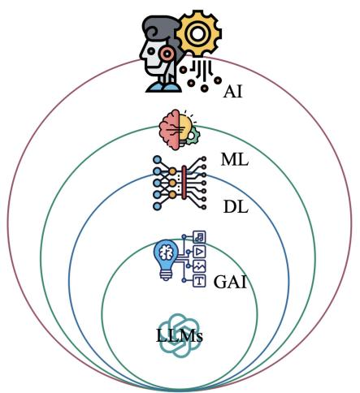

flowchart

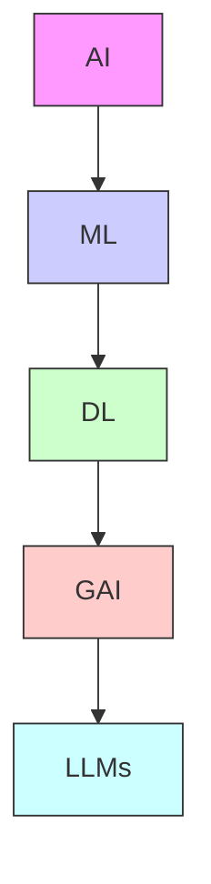
```mermaid
graph TD
    A["AI"] --> B["ML"]
    B --> C["DL"]
    C --> D["GAI"]
    D --> E["LLMs"]
    style A fill:#f9f,stroke:#333
    style B fill:#ccf,stroke:#333
    style C fill:#cfc,stroke:#333
    style D fill:#fcc,stroke:#333
    style E fill:#cff,stroke:#333
```

Fig. 1. AI, machine learning, deep learning, and GAI: A hierarchical overview.

and scale, dynamically adapting to service demands, achieving energy and resource sustainability, maintaining quality of service and user experience across diverse applications, and enhancing security to counter evolving threats. The integration of heterogeneous networks also presents a considerable challenge in maintaining seamless connectivity across various network types. To address these challenges and ensure seamless user experiences in the future, xG wireless networks require innovative solutions. Artificial Intelligence (AI) offers significant potential in this area.

AI refers to the capability of a machine to imitate intelligent human behavior. AI systems aim to perform tasks that typically require human intelligence, such as understanding natural language, recognizing patterns, solving problems, and making decisions by combining computer science, data analysis, and more. This enables the machine to perform tasks intelligently. As illustrated in Fig. 1, AI encompasses Machine Learning (ML), Deep Learning (DL), Generative AI (GAI), and Large Language Models (LLMs). ML allows machines to learn from data, while DL uses neural networks with multiple layers to learn from vast datasets. GAI is a specialized subset of AI that excels in creating new content from learned data patterns, such as text, images, videos, or code. This capability enables GAI systems to generate data instances that resemble, but are not exact copies of, their training examples. LLMs are a further specialization within GAI and DL, designed for natural language processing tasks. LLMs leverage the principles of

DL and the generative capabilities of AI to understand and generate human-like text and perform a variety of languagebased tasks such as translation and summarization.

The integration of AI such as DL and Reinforcement Learning (RL) into Long-Term Evolution (LTE) and 5G networks substantially advances their management and optimization. As the current generation of wireless networks evolves into xG networks (e.g., 6G networks), GAI would play a pivotal role in optimizing these advanced systems, ensuring they meet the increasing demands for speed, connectivity, and reliability in an ever-connected world. Different GAI models include Generative Adversarial Networks (GANs), Generative Flow Networks (GFlowNets), Generative Diffusion Models (GDMs), Variational Autoencoders (VAEs), and autoencoders. In GANs, two neural networks, a generator and a discriminator, compete against each other to produce realistic data over time. GFlowNets use invertible mappings between data distributions and latent spaces to generate new data samples, learning to model the probability distribution of the training data directly. By iteratively refining random noise through a learned diffusion process, GDMs progressively transform simple noise into complex data that resembles the training set. Autoencoders, which are used for data generation and dimensionality reduction, consist of an encoder that maps input data to a latent representation and a decoder that reconstructs the data from this representation.

GAI’s ability to rapidly produce unique and customizable content significantly boosts productivity across various industries by automating creative processes and supporting critical decision-making in fields like design and scientific research, including drug discovery. In wireless communications, GAI improves network design and optimization by simulating and testing complex network scenarios, which enhances signal coverage, facilitates capacity planning, and supports the deployment of advanced technologies. Consequently, GAI can promote more efficient and reliable communication services.

In xG wireless networks, optimization refers to the strategic enhancement of various network parameters to maximize performance, efficiency, and user experience. This involves optimizing resource allocation, such as Bandwidth (BW) and power, to ensure they are used efficiently and effectively. It also includes improving energy efficiency, reducing latency, managing interference, and balancing network loads to maintain high-quality service. Recently, advanced AI techniques have been employed to enable the networks to adapt dynamically to changing conditions. However, AI techniques such as ML, DL, and RL face significant limitations when applied to the complex and dynamic environments of xG networks. These methods typically require extensive amounts of labeled data for training and are often designed to address specific, narrowly defined problems. In the context of xG networks, which involve highly dynamic scenarios with vast numbers of variables and potential configurations, the reliance on pre-existing data and fixed models can lead to inefficiencies and suboptimal performance. Additionally, these models can struggle with adaptability, as they are not inherently designed to generate novel solutions in real-time. This is where GAI demonstrates its superiority: by creating synthetic data, simulating diverse network conditions, and rapidly developing novel solutions in real-time, GAI can more effectively optimize xG networks. GAI’s ability to continuously adapt and evolve with the network’s needs makes it a more robust and efficient tool for ensuring the optimal performance of xG wireless communication systems. The following subsections will discuss the basics of GAI models and explore how these models further contribute to the optimization of xG wireless networks.

# A. Key Technologies Shaping xG Wireless Networks

The landscape of wireless communication is enriched by the emergence of novel technologies. Some of these key technologies will be explained in detail below.

Artificial Intelligence-Generated Content (AIGC): It refers to any type of content created by AI models, including text, images, audio, and video. At the core of AIGC lies ML. AI models are trained on massive datasets relevant to the content they generate. During training, the model identifies patterns and relationships within the data, learning the underlying structure and style. This knowledge allows the model to generate entirely new content that resembles the training data, but with an original twist. AIGC has a wide range of applications, including content creation, product design, art and music, and education. It can automate content creation, saving time and resources, and explore a wider range of creative possibilities than humans alone.

One exciting application of AIGC is its use on mobile devices, known as mobile AIGC. Mobile AIGC leverages advancements in mobile hardware and software. Powerful processors, efficient memory utilization, and on-device machine learning capabilities allow for running AIGC models directly on smartphones and other mobile devices. This eliminates the need for constant Internet connectivity and cloud processing, making mobile AIGC more accessible and user-friendly. Unlike traditional AIGC focused on large-scale content creation, mobile AIGC emphasizes user-centric applications that can be readily used on the go. This could include real-time content creation, image and video editing, and Augmented Reality (AR) enhancements.

GAI plays a crucial role in enhancing AIGC applications such as ChatGPT within xG wireless networks. By deploying GAI models at edge devices instead of relying solely on centralized cloud servers, network traffic and latency can be reduced. Additionally, GAI can create synthetic data for training AI models while preserving user privacy, unlocking entirely new possibilities for AIGC applications in xG networks. This approach has the potential to significantly change how AIGC is deployed in wireless networks [1].

Integrated Sensing and Communications (ISAC): This technology is a key concept in 6G that aims to revolutionize wireless networks by breaking the traditional barrier between communication and sensing functionalities in wireless networks. Instead of operating as separate systems, as depicted in Fig. 2, ISAC allows the network infrastructure itself to act as a distributed sensor. ISAC exploits the unique properties of radio waves used for communication. By analyzing how these waves propagate, reflect, and scatter, the network can gather valuable information about its surroundings. Network elements like Base Stations (BSs), user devices, and even Reconfigurable Intelligent Surfaces $( \mathrm { R I S } ) ^ { 1 }$ become data collection points. The information gathered includes user location and mobility patterns, as well as signal propagation characteristics. This allows for dynamic resource allocation, optimizing network performance and user experience.

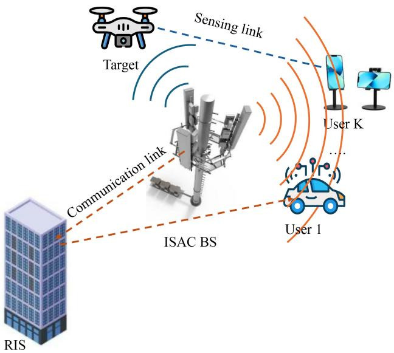

flowchart

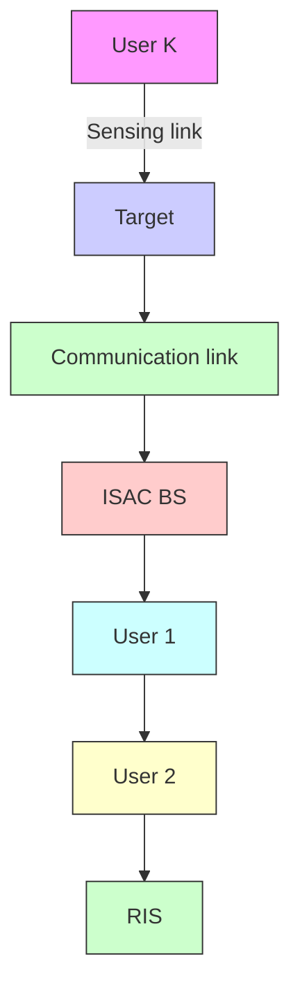
```mermaid
graph TD
    A["User K"] -->|Sensing link| B["Target"]
    B --> C["Communication link"]
    C --> D["ISAC BS"]
    D --> E["User 1"]
    E --> F["User 2"]
    F --> G["RIS"]
    style A fill:#f9f,stroke:#333
    style B fill:#ccf,stroke:#333
    style C fill:#cfc,stroke:#333
    style D fill:#fcc,stroke:#333
    style E fill:#cff,stroke:#333
    style F fill:#ffc,stroke:#333
    style G fill:#cfc,stroke:#333
```

Fig. 2. Communication and sensing in ISAC-enabled network with RIS.

ISAC would be essential for future wireless networks, such as 6G, because it maximizes spectrum efficiency by combining communication and sensing within the same infrastructure. This dual-functionality enhances situational awareness, enabling real-time data collection that improves resource allocation and network performance. ISAC is also crucial for supporting advanced 6G applications, such as autonomous vehicles and smart cities, by providing the precise environmental data they require. Additionally, ISAC enhances energy efficiency by eliminating the need for separate sensing systems and strengthens network security through continuous monitoring of the environment. These capabilities make ISAC a fundamental component of 6G networks, allowing for smarter, more reliable, and efficient communication systems.

Leveraging GAI in ISAC can unlock its full potential. GAI-based frameworks not only provide comprehensive historical sensing data but also enable predicting future environmental changes. This capability adapts to variations in user behavior and environmental conditions [2]. Additionally, they can improve sensing accuracy, enabling dynamic adaptation, and optimizing resource management. It enhances the accuracy of Channel State (CS) estimation through synthetic data generation, and can reconstruct missing or noisy sensing data, ensuring reliable communication even in challenging

1In RIS, a surface composed of numerous small, reconfigurable elements is deployed. This surface can adaptively manipulate the phase and/or amplitude of the incoming electromagnetic waves. By doing so, RIS can control the propagation of wireless signals, enabling beamforming, signal focusing, interference mitigation, and other advanced techniques to enhance communication performance.

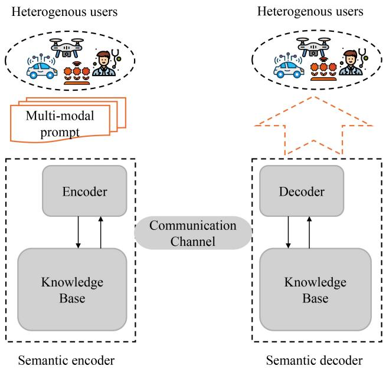

flowchart

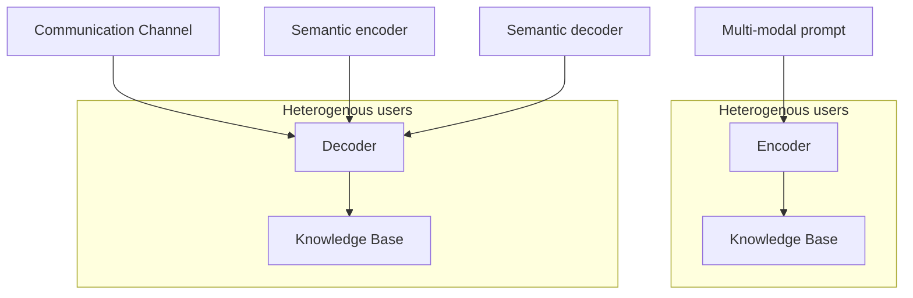
```mermaid
graph TD
    subgraph Heterogenous users
        A["Encoder"] --> B["Knowledge Base"]
    end
    subgraph Heterogenous users
        C["Decoder"] --> D["Knowledge Base"]
    end
    E["Multi-modal prompt"] --> A
    F["Communication Channel"] --> C
    G["Semantic encoder"] --> C
    H["Semantic decoder"] --> C
```

Fig. 3. Architecture of a SemCom system with a semantic encoder and decoder, utilizing KBs and multi-modal prompts.

environments. GAI helps ISAC systems optimize resource allocation, leading to more efficient and intelligent network operations.

Semantic Communications (SemCom): SemCom focuses on conveying the meaning of the information being transmitted, rather than just the exact data bits. SemCom utilizes techniques from ML and information theory to understand the meaning of the data being transmitted. This could involve recognizing patterns, relationships, or even the intended purpose of the information. By exploiting inherent redundancy in data formats, SemCom compresses data packets by transmitting only the essential information needed to convey the meaning. It can take into account real-time network conditions such as channel quality or congestion. By understanding the content, the system can adjust transmission strategies such as power levels to prioritize the most critical information for successful communication. SemCom can improve network efficiency and reliability, reduce latency, and support innovative applications.

SemCom enhances 6G networks by transmitting only meaningful data, improving BW efficiency and reducing latency. This is crucial for handling the vast data generated by applications like the metaverse and AI-driven services. SemCom’s context-aware approach prioritizes essential information, ensuring reliable communication even in constrained BW conditions. It also optimizes AI-driven applications and machine-to-machine interactions while improving user experiences in immersive environments like VR/AR by focusing on the meaning of transmitted data.

In SemCom, as depicted in Fig. 3, the process involves some key components to ensure the efficient transfer of meaning between sender and receiver. The semantic encoder plays a critical role in converting raw data into a compressed semantic representation, focusing on the essential meaning rather than the exact data. At the receiver’s end, the semantic decoder reconstructs the transmitted message based on this compressed representation. Both the encoder and decoder rely on Knowledge Bases (KBs), which contain shared context and background information that help in accurately interpreting the message’s meaning. These KBs can vary across users but are crucial for ensuring that both the sender and receiver are aligned in their understanding of the transmitted data. This structured approach allows for more efficient communication between heterogeneous users, as it enables the system to handle variations in user capabilities and knowledge, ensuring that the essential meaning of the information is preserved during transmission.

In SemCom, a key challenge lies in efficiently designing the encoders and decoders that handle semantic processing. Traditionally, both the encoder and decoder require joint training, making the process complex and energy-demanding. Recently, GAI has emerged as a potential solution to overcome these limitations, particularly in decoder design. GAI models excel at efficiently retrieving the original information (source information) without the need for joint encoder training. This capability makes GAI a promising tool for developing robust and efficient semantic decoders in SemCom systems [3]. Moreover, GAI enhances context-aware communication, allowing the system to adapt data interpretation to user-specific needs. By reconstructing missing information during transmission, GAI ensures the integrity of the message while minimizing the data that needs to be sent. This leads to lower BW usage, improved transmission efficiency, and greater resilience in dynamic network environments.

Security of xG communications: Secure communication in xG networks goes beyond traditional notions of data encryption and access control. It encompasses protecting the confidentiality, integrity, and availability of data across the entire network infrastructure, from user devices to network core elements. This includes protecting against a wide range of threats, such as cyber attacks, eavesdropping, and unauthorized access. The dynamic nature of xG networks, characterized by features such as network slicing and integration of diverse technologies, necessitates adaptable security solutions capable of learning and evolving alongside potential threats. Accordingly, GAI would be a promising tool for enhancing security in xG communications.

# B. GAI for Network Optimization

Based on what is discussed above, the power of GAI for xG network optimization lies in its two-fold approach: learning from vast datasets and generating new scenarios. GAI models are trained on real-world information critical for xG networks, including network traffic patterns, signal propagation characteristics, and resource allocation history, excelling at uncovering hidden patterns and relationships. This knowledge becomes the foundation for GAI’s ability to generate new and realistic scenarios. A vast range of possibilities can be explored through these generated scenarios, which represent potential network conditions, eliminating the need for time-consuming and resource-intensive real-world data collection. The simulated scenarios can encompass diverse situations like fluctuations in user traffic, variations in signal propagation, or even entirely new network configurations. Optimal network configurations and strategies that maximize efficiency and user experience in xG networks can be identified by testing and evaluating network performance under these diverse GAI-generated scenarios. This approach also facilitates the development of robust configurations that function well in various real-world conditions.

Based on their mentioned ability for learning and scenario generation, GAI offers several key applications for optimizing xG wireless networks. One crucial area is proactive resource allocation for efficiently utilizing BW and infrastructure by adapting resources to anticipated demands and constraints. Another application lies in channel modeling. GAI can generate realistic channel conditions that encompass diverse propagation scenarios, overcoming the limitations of realworld xG network measurements. Accordingly, integrating GAI into xG networks can lead to a more efficient use of network resources, improved overall performance in xG networks, and accelerated exploration of novel technologies and network designs for xG networks.

However, deploying GAI models for networking applications presents unique challenges. These challenges include the massive size of GAI models, requiring significant computational power and network BW for transmission. Additionally, training effective GAI models for networking tasks often necessitates large and specialized datasets. Fortunately, advancements such as distributed learning techniques, edge computing, on-device processing capabilities, and the utilization of GPUs for parallel computing, pave the way for efficient GAI deployment within networking environments. The synergy between GAI and xG networks is explored in the following.

# C. Synergy of GAI and xG Networks

The xG wireless networks will be characterized by high-dimensional configurations, non-linear relationships, and complex decision-making processes. As has been mentioned above, the ability of learning and scenario generation for the GAI models enable them to develop robust and efficient configuration for real-world applications in xG wireless networks. Therefore, recent research in xG wireless network optimization has focused on leveraging the transformative potential of GAI, marking a groundbreaking milestone extending AI’s horizons beyond conventional boundaries.

GAI can optimize mobile AIGC by efficiently utilizing computational resources across the entire network, benefiting both users and providers. Additionally, through efficient user allocation and by selecting AIGC service providers with sufficient resources to manage content storage effectively, the network can be optimized in terms of BW [4].

In SemCom, GAI offers possibilities for making it more personalized, efficient, and reliable. GAI can enable context-aware communication, improve semantic reliability, and reduce misunderstandings [5]. GAI-based optimization for covert communication aligns with SemCom applications requiring high levels of security and privacy [3]. To grasp deeper meaning beyond explicit communication, employing

GAI models allows for richer communication experiences [6]. AI-generated contracts showcase GAI’s potential for establishing trust and promoting efficient resource utilization within decentralized 6G networks with SemCom [7]. Finally, for optimal BW allocation in SemCom-enabled networks, GAI models demonstrate the ability to handle complex network dynamics [8].

GAI has the potential to significantly enhance ISAC systems, transforming how they capture, interpret, and transmit data. They offer significant potential for optimizing ISACenabled networks by providing accurate and comprehensive Channel State Information (CSI). They can improve signal processing by removing noise and reconstructing incomplete data, leading to more reliable communication [9], [10]. GAI can also optimize network parameters for user association, and enable proactive handover decisions in order to minimize user disruptions on the move [2].

GAI models can offer a new frontier in securing xG communication networks. Their ability to enrich the training dataset with a wide range of synthetic data that mimics real network behaviors can improve intrusion detection accuracy, model training efficiency, and data handling at the network’s edge [11]. They can enhance anomaly detection accuracy and handling of data imbalance as in [12]. Data privacy and integrity, collaborative learning efficiency, adaptability and scalability of intrusion detection systems [13], and trust management [14] can be improved by using the GAI models.

Several works in the literature survey the application of AI and GAI in enabling the above technologies within xG wireless networks. In the following, we briefly review these studies.

# D. Related Works

In the domain of AIGC, the study in [15] provides an overview of ChatGPT, a powerful language model. It explains the foundation of ChatGPT, which is based on pre-trained LLMs trained on massive amounts of text data. These LLMs enable ChatGPT to understand and generate human-like language. Additionally, the study discusses how ChatGPT utilizes human feedback to improve its performance, allowing it to refine its responses and better align with human expectations. It also highlights the potential risks associated with ChatGPT’s misuse, such as the spread of misinformation or the automation of tasks that could displace human workers. Regarding the applications of AIGC, its core aspects such as general architecture, enabling technologies, working modes, key characteristics, and its potential through modern prototypes are explored in [16]. This study discusses the challenges of security, privacy, and ethics in AIGC, analyzing potential threats and existing defense mechanisms. Furthermore, it explores intellectual property protection concerns and reviews techniques for safeguarding AIGC models and content which can lead to the development of a more efficient, secure, and trustworthy AIGC ecosystem. In [17], the challenges in enabling vehicular networks like limited BW and communication latency are addressed by proposing a GAI-based framework. This framework is the one with a multi-modal architecture for handling both text and image data.

Deep RL (DRL) is used to optimize resource allocation and maximize the overall Quality of Experience (QoE) within the network’s limitations. The authors in [18] study NetGPT, an approach for personalized LLMs. NetGPT leverages a collaborative cloud-edge architecture, deploying a distributed system with smaller, efficient LLMs positioned at the network edge (closer to users). This empowers NetGPT to personalize user experiences by utilizing location-based information and the edge LLM’s ability to predict trends and infer user intent. Furthermore, by fostering deeper integration between communication and computing resources, NetGPT promotes a more AI-native network architecture. The collaborative approach of NetGPT, with its logical AI workflow, addresses resource limitations at the edge while enabling enhanced LLM synergy between edge and cloud.

Regarding the ability of Deep Generative Models (DGMs) to create realistic and complex data, the authors in [1], [19], [20] highlight the strengths and wide applicability of DGMs and propose frameworks that incorporate DGMs into network optimization. Specifically, [20] showcases practical applications through a series of case studies. These include integration with DRL for network control, designing incentive mechanisms to influence network behavior, and optimizing communication in Internet of Vehicles (IoV) networks. The survey in [1] focuses on mobile AIGC networks, an approach that leverages AI to provide customized AIGC services at the network edge. By explaining generative models and the life cycle of AIGC services within this mobile architecture and highlighting the collaborative cloud-edge-mobile infrastructure, the study explores the applications for text, image, video, and 3D content generation. While showcasing the potential benefits of mobile AIGC networks, the research discusses implementation challenges such as resource allocation, security concerns, and privacy risks.

Turning to SemCom in the xG wireless networks, [21] investigates how to overcome limitations in context reasoning and Background Knowledge (BK). Recognizing the potential of GAI for creating diverse and personalized content, this work explores its application to SemCom. The proposed solution is a GAI-Assisted SemCom Network (GAI-SCN) framework. This cloud-edge-mobile architecture leverages GAI models at both global and local levels, enabling capabilities like multimodal semantic content creation, semantic-level coding, and AI-generated content integration. However, challenges such as high computational demands and potential AIGC reliability issues remain to be addressed. The Causal Semantic Communication (CSC) is studied in [22] to tackle the challenge of BW limitations in the context of Digital Twin (DT)-based wireless systems. Inspired by imitation learning, CSC leverages the DT’s knowledge to train the receiver via SemCom over a BW-constrained channel. The transmitter acts as a teacher, identifying causal relationships within the data and transmitting causally-invariant semantic representations. The receiver, as the apprentice, employs a semantic decoder and builds a network state model to understand the environment dynamics. To overcome the limitations of imitation learning methods, CSC utilizes model-based reinforcement learning and semantic information metrics which is based on integrated information theory.

In the context of securing communications systems, [23] surveys the current state-of-the-art research on leveraging GANs to address challenges within Intrusion Detection Systems (IDS). This review encompasses not only existing research on GAN-based IDS techniques, but also the specific datasets used for evaluation, the design methodologies of the employed GAN models, and the metrics utilized for performance assessment. By emphasizing on healthcarespecific privacy concerns, the study in [24], [25] explores the role of Federated Learning (FL) in preserving privacy within smart healthcare systems that utilize Internet of Medical Things (IoMT) devices. The authors study how recent AI models, such as DRL and GANs [24], and blockchain [25], can be integrated to enhance privacy protection within FL for IoMT networks. The survey in [26] focuses on DL-based methods for digital watermarking and steganography. To address the issue of lacking a dedicated examination of deep watermarking, it explores DL techniques in both digital watermarking and steganography. It categorizes existing DL models based on their application (watermarking or steganography) and noise injection methods. By supporting the idea of the unification of watermarking and steganography under a software engineering approach, [26] emphasizes the importance of building a more secure and trustworthy digital environment. In [27], complex networks with a k-core structure are considered. The k-core structure of a network graph is defined as the largest subgraph in which each node has at least k neighbors. This study investigates the security threat through which malicious actors can disrupt the network by strategically removing edges, particularly targeting the highly connected innermost core. Two heuristic algorithms are proposed to efficiently identify critical edges for removal. The survey in [28] provides a systematic analysis of the impact of Adversarial Machine Learning (AML) across all layers of wireless and mobile systems, from physical signals to network and application layers. It delves into the state-of-the-art techniques for generating and detecting adversarial samples, exploring methods such as GANs for crafting malicious data and the Fast Gradient Sign Method (FGSM) for identification. Additionally, it examines AML from both attacker and defender perspectives, emphasizing on methods for defense using adversarial models and reinforced learning.

# E. Motivation, Contributions, and Organization

This paper focuses on GAI’s transformative potential for optimizing xG wireless networks, particularly in 6G technology, bridging the gap between theoretical understanding and real-world implementation. While existing research provides a valuable foundation for understanding AI and GAI in wireless networks, this paper takes a distinct approach. It offers a structured learning experience, beginning with the fundamentals of GAI models and advancing to practical applications through the use cases. By showcasing the performance gains achievable through GAI’s unique capabilities, this work highlights the potential synergy between GAI and existing data-driven approaches commonly used in network optimization.

Our contributions can be summarized as follows:

GAI models for xG network optimization: We review the GAI models including GFlowNet, GANs, and GDMs with their potential for optimizing xG networks.

GAI for optimization and enhanced resource management of xG Networks: We explore the use cases illustrating how these GAI models contribute to ongoing resource management and optimization in wireless networks, leading to ultimately enhanced overall network performance.

Integrating GAI with existing AI for xG network intelligence: We introduce a new case study on utilizing GAI for resource allocation in Non-Terrestrial Networks (NTNs) employing Carrier Aggregation (CA). This section delves into how GAI can improve the exploration in high-dimensional space and facilitates learning optimal resource allocation strategies, enhancing the intelligence and efficiency of xG networks.

The rest of the paper is organized as follows. The background of the GAI models is presented in Section II. Following this, Sections III–V review case studies where GAI-based schemes are derived for optimization and resource allocation in the networks equipped with AIGC, ISAC, SemCom technologies, respectively. Employing GAI for security in xG communication is studied in Section VI. The role of networking in facilitating the functionalities of GAI is studied in Section VII. The case study is presented in Section VIII. Finally, Section IX highlights future studies and challenges for employing GAI models in xG wireless networks and the conclusion is given in Section X.

# II. BASICS OF THE GAI MODELS

In recent years, ML has played a vital role in the optimization of wireless networks. Traditionally, nongenerative ML models such as decision trees, Support Vector Machine (SVM), and neural networks have been used to address network optimization challenges by learning patterns from labeled data. However, the rise of GAI models, including GANs, GFlowNets, and GDMs, has introduced a new paradigm, enabling the generation of synthetic data, enhancing network simulations, and offering more flexible optimization strategies. Table I presents a comparison between non-generative and generative ML models, highlighting their respective strengths, limitations, and applications in wireless networks.

In this section, we delve into the mathematical foundations underpinning GAI models which are used by the studies in literature, i.e., GFlowNets, GANs, and GDMs. Although other generative AI models, such as variational autoencoders, transformers, and autoregressive models, have their own strengths and potential applications in xG networks (as discussed in [29], [30]), GFlowNets, GANs, and GDMs, have the capabilities to handle the complex, dynamic, and multiobjective optimization challenges inherent in xG networks. These models excel in generating high-quality, diverse data and exploring a wide range of possible configurations, making them particularly suitable for critical tasks such as resource allocation in xG wireless networks.

TABLE I COMPARISON OF NON-GENERATIVE AND GENERATIVE ML MODELS, INCLUDING THEIR FOCUS, TRAINING, APPLICATIONS, ADVANTAGES, LIMITATIONS, AND EXAMPLES 

<table><tr><td>Aspect</td><td>Non-generative ML Models</td><td>Generative ML Models</td></tr><tr><td>Focus</td><td>Learn patterns from labeled data to perform tasks such as classifications or regression</td><td>Learn the underlying distribution of data and generate new, realistic data samples</td></tr><tr><td>Training</td><td>Learn relationships between data classes but do not model the underlying data distribution</td><td>Capture the full data distribution to generate unseen scenarios or synthetic data</td></tr><tr><td>Application</td><td>Effective for tasks like image classification and prediction</td><td>Excel in data generation, simulation, dynamic resource allocation and real-time decision making</td></tr><tr><td>Advantages</td><td>Work well with structured and labeled dataset</td><td>Can generate new data, handle incomplete data, and adapt to real-time conditions</td></tr><tr><td>Limitations</td><td>Struggle with handling new or unseen scenarios, require large amounts of labeled data</td><td>Computationally intensive and requires more complex training</td></tr><tr><td>Examples</td><td>Decision trees, SVMs, DNNs</td><td>GANs, Diffusion models, GFlowNets,VAEs</td></tr></table>

Generative models, such as GFlowNets, GANs, and GDMs leverage statistical and algebraic concepts to generate new data instances that mimic the distribution of a given dataset. Let us denote the dataset by $\mathcal { X } = \{ \mathbf { x } _ { i } | i = 1 , \dots N \}$ . In what follows, we will explore key mathematical principles including probability distributions, optimization algorithms, and loss functions, which facilitate the training and convergence of these models.

# A. Generative Adversarial Networks

As depicted in Fig. 5, GANs are a class of DL models that consist of two competing Neural Networks (NNs), a generator and a discriminator, which work in tandem through an adversarial process. The generator aims to create realistic synthetic data by transforming random noise into structured outputs, such as images or text, that resemble the real dataset. The discriminator, on the other hand, evaluates both real and generated data, attempting to distinguish between the two. The adversarial dynamic between these networks drives the training process: the generator constantly improves to fool the discriminator, while the discriminator gets better at identifying fake data. This competition can be formalized as a minimax game where the generator seeks to minimize the discriminator’s ability to discern real from fake data, while the discriminator maximizes its performance. The goal is to reach a point where the generator produces data indistinguishable from real data, effectively causing the discriminator to make random guesses. GANs are a powerful tool in unsupervised learning and are widely applied in fields such as image generation, super-resolution, and data augmentation. However, they pose challenges in terms of training stability, with common issues like mode collapse, where the generator produces limited variations of data. Variants like Deep Convolutional GAN (DCGAN) and Wasserstein GAN (WGAN) have been introduced to mitigate these issues, improving the quality of generated outputs and training stability. In the following, after discussing the applications of GANs in xG wireless communication and other fields, the mathematical concepts underlying GANs will be explained in detail.

GANs provide a powerful ML framework for learning probability distributions of various data types. This generative model is applied in various fields. In video processing, GANs predict future frames and create deepfakes. Medical imaging benefits from GANs through enhanced image resolution and noise reduction. In creative arts, GANs facilitate advanced photo editing and new artwork creation. Additionally, they generate 3D models from 2D images, useful in Virtual Reality (VR) and Computer-Aided Design (CAD) applications.

1) Application of GANs in xG Wireless Networks: As illustrated in Fig. 4, GANs can offer significant potential in xG wireless networks due to their ability to generate realistic, high-quality data and model complex distributions. Their applications in xG wireless networks range from beamforming design [31] and resource optimization [32] to traffic prediction [33], channel estimation [9], [10], and security enhancement [13], [23]. In these areas, GANs can lead to more robust, efficient, and secure network operations, thereby improving the performance and reliability of xG networks. For instance, in [13], [31], conditional GANs are used for learning data distributions; in [32], GANs generates a more diverse set of offspring solutions in evolutionary algorithms, and in [33], GANs is employed to generate data samples. In [9], GANs are used to denoise channel data, and in [10], GANs generate data that facilitates faster training of neural networks. It is noteworthy that several DL libraries offer GAN implementations, ranging from general-purpose frameworks like TensorFlow and PyTorch to specialized libraries like NVIDIA’s StyleGAN.

2) Mathematical Principles Behind GANs: As discussed in [34] and illustrated in Fig. 5, this framework is based on an adversarial process where two multilayer perception models compete: a generator and a discriminator. During training, both models are trained simultaneously. The generator’s objective is to create data samples that closely mimic a target distribution, learning to fool the discriminative model into making mistakes. While the discriminator strives to differentiate between true samples and the generator’s creations. In xG communications, GANs can be used for channel modeling and estimation, anomaly detection, and privacy preservation, as discussed in [12], [35], [36]. This framework corresponds to a minimax two-player game. The details for the game are given below.

Let $D _ { \omega } ( \mathbf { x } ) : \mathbb { R } ^ { n }  [ 0 , 1 ]$ and $G _ { \theta } ( \mathbf { z } ) : \mathbb { R } ^ { d }  \mathbb { R } ^ { n }$ denote the discriminator function and the generator function, respectively.

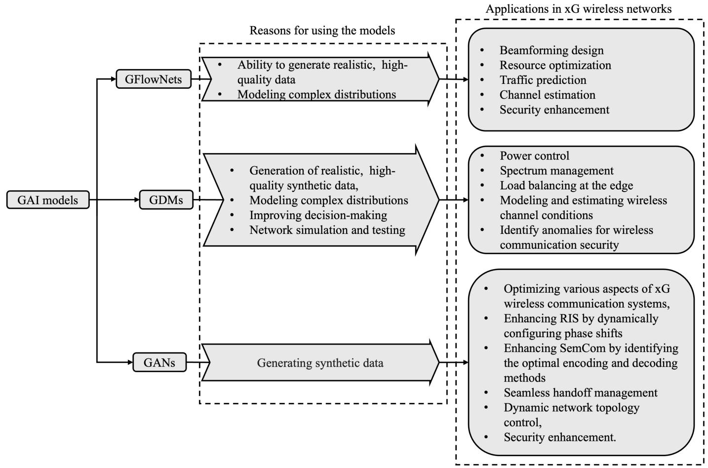

flowchart

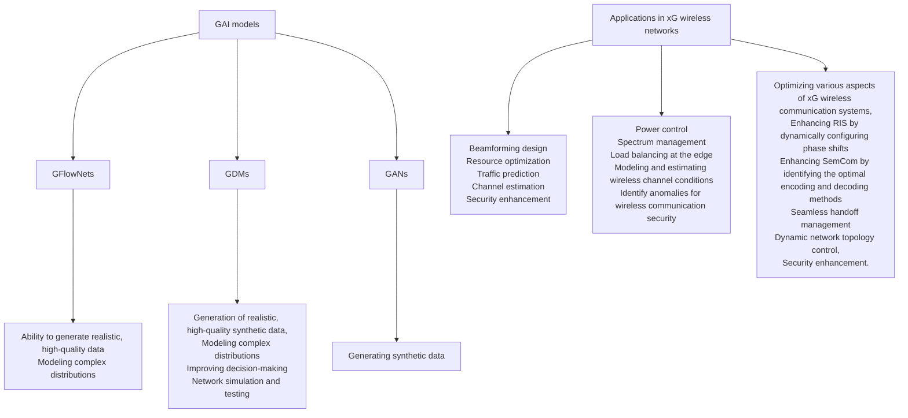
```mermaid
graph TD
    A["GAI models"] --> B["GFlowNets"]
    A --> C["GDMs"]
    A --> D["GANs"]
    B --> E["Ability to generate realistic, high-quality data\nModeling complex distributions"]
    C --> F["Generation of realistic, high-quality synthetic data,\nModeling complex distributions\nImproving decision-making\nNetwork simulation and testing"]
    D --> G["Generating synthetic data"]
    H["Applications in xG wireless networks"] --> I["Beamforming design\nResource optimization\nTraffic prediction\nChannel estimation\nSecurity enhancement"]
    H --> J["Power control\nSpectrum management\nLoad balancing at the edge\nModeling and estimating wireless channel conditions\nIdentify anomalies for wireless communication security"]
    H --> K["Optimizing various aspects of xG wireless communication systems,\nEnhancing RIS by dynamically configuring phase shifts\nEnhancing SemCom by identifying the optimal encoding and decoding methods\nSeamless handoff management\nDynamic network topology control,\nSecurity enhancement."]
```

Fig. 4. Why and how the GAI models, GANs, GDMs, and GFlowNets, are used in xG wireless communications.   
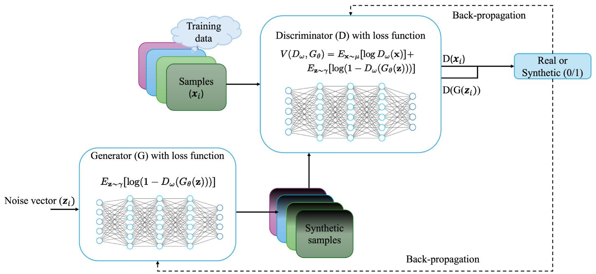

flowchart

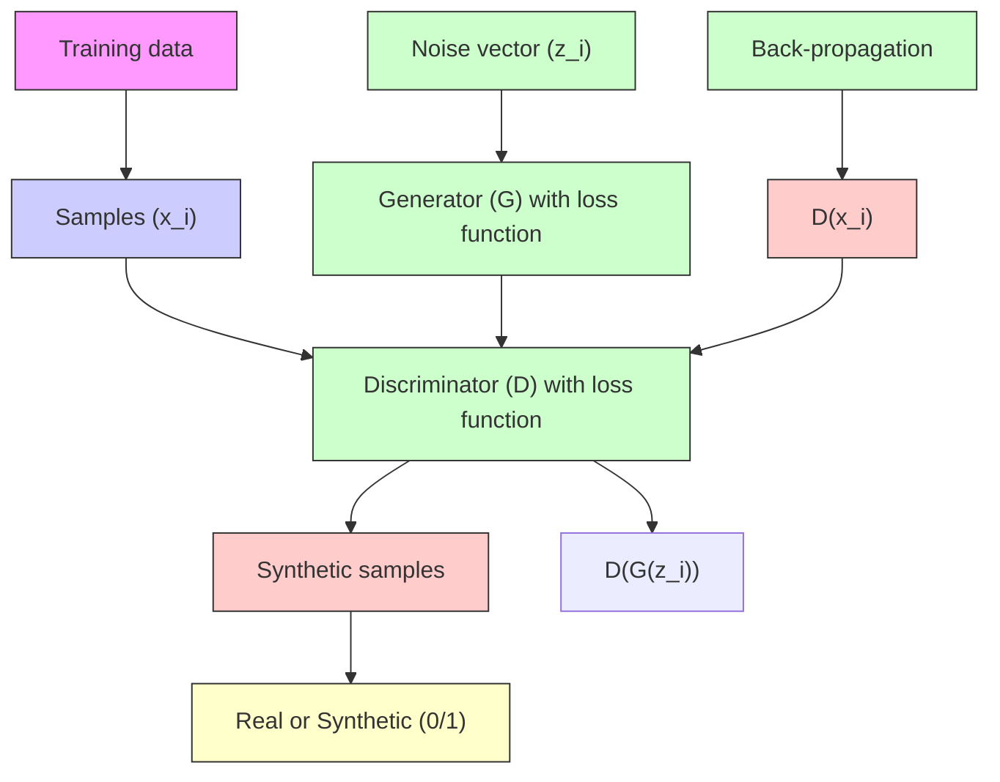
```mermaid
graph TD
    A["Training data"] --> B["Samples (x_i)"]
    B --> C["Discriminator (D) with loss function"]
    C --> D["Synthetic samples"]
    D --> E["Real or Synthetic (0/1)"]
    F["Noise vector (z_i)"] --> G["Generator (G) with loss function"]
    G --> C
    H["Back-propagation"] --> I["D(x_i)"]
    I --> C
    C --> J["D(G(z_i))"]
    style A fill:#f9f,stroke:#333
    style B fill:#ccf,stroke:#333
    style C fill:#cfc,stroke:#333
    style D fill:#fcc,stroke:#333
    style E fill:#ffc,stroke:#333
    style F fill:#cfc,stroke:#333
    style G fill:#cfc,stroke:#333
    style H fill:#cfc,stroke:#333
    style I fill:#fcc,stroke:#333
```

Fig. 5. Architecture of a GAN: The generator network takes training data and produces fake data, while the discriminator network distinguishes between real and fake data, outputting 0 or 1 depending on whether the input data is real or generated.

The generator $G _ { \theta }$ turns random samples $\textbf { z } \in \mathbb { R } ^ { d }$ from distribution $\gamma$ into generated samples $G _ { \theta } ( \mathbf { z } )$ . In this setup, there are two main players: the discriminator $D _ { \omega }$ and the generator $G _ { \theta }$ . The discriminator’s role is to differentiate between real training samples and those generated by $G _ { \theta }$ . Essentially, it acts as a detective, attempting to spot the differences between genuine and fake data. On the other hand, the generator aims to produce samples that are as similar as possible to the real data, effectively trying to fool the discriminator into believing its creations are authentic. Therefore, the objective of the game is to minimax the following target:

Algorithm 1: GANs Algorithm   
1 for number of training iterations do :
2    for k steps do :
3    Samples minibatch $\{z_{i} \mid i = 1, \ldots, m\}$ where $z_{i} \in R^{d}$ from distribution $\gamma$ ;
4    Samples minibatch $\{x_{i} \mid i = 1, \ldots, m\} \subset X$ from the training set X;
5    Update the parameters for the discriminator $D_{\omega}$ by ascending its stochastic gradient with respect to $\omega$ , i.e., $\nabla_{\omega}\frac{1}{m}\sum_{i=1}^{m}\left[\log D_{\omega}(\mathbf{x}_{i})+\log(1-D_{\omega}(G_{\theta}(\mathbf{z}_{i})))\right]$ ;
6
7 Samples minibatch $\{z_{i} \mid i = 1, \ldots, m\}$ where $z_{i} \in R^{d}$ from distribution $\gamma$ ;
8 Update the parameters for the generator $G_{\theta}$ by descending its stochastic gradient with respect to $\theta$ , i.e., $\nabla_{\theta}\frac{1}{m}\sum_{i=1}^{m}\log(1-D_{\omega}(G_{\theta}(\mathbf{z}_{i})))$ ;
9

$$
V (D _ {\omega}, G _ {\theta}) = E _ {\mathbf {x} \sim \mu} [ \log D _ {\omega} (\mathbf {x}) ] +
$$

$$
E _ {\mathbf {z} \sim \gamma} [ \log (1 - D _ {\omega} (G _ {\theta} (\mathbf {z}))) ] \tag {1}
$$

In (1), the explicit expression for the target distribution μ is not available. However, $V ( D _ { \omega } , G _ { \theta } )$ can be approximated by using the samples. Specifically, let M be a subset of samples from the training data set X and B be a minibatch of samples in $\mathbb { R } ^ { d }$ drawn from the distribution γ. The expectation values in (1) can be approximated as follows:

$$
E _ {\mathbf {x} \sim \mu} [ \log D _ {\omega} (\mathbf {x}) ] \approx \frac {1}{| \mathcal {M} |} \sum_ {\mathbf {x} \in \mathcal {M}} \log D _ {\omega} (\mathbf {x}), \tag {2a}
$$

$$
E _ {\mathbf {z} \sim \gamma} [ \log (1 - D _ {\omega} (G _ {\theta} (\mathbf {z}))) ] \approx \frac {1}{| \mathcal {B} |} \sum_ {\mathbf {z} \in \mathcal {B}} \log (1 - D _ {\omega} (G _ {\theta} (\mathbf {z}))). \tag {2b}
$$

Based on the above, the GAN algorithm is given in Algorithm 1. In this algorithm, the number of training steps for the discriminator, denoted by the parameter k, is a hyperparameter. In the original GAN paper [34], the authors opted for the least computationally expensive option, setting $k = 1$ for their experiments. While the convergence of the algorithm has been heuristically studied in [34], training GANs is known to be a delicate and unstable process. As a result, guaranteeing their convergence can be challenging. Additionally, trained generative models may suffer from a lack of diversity, meaning they might focus on generating samples that exhibit only a few recurring patterns instead of exploring the full data distribution. Recently, diffusion models have emerged as an alternative approach for data denoising. We will delve into the details of diffusion models in the following section.

# B. Generative Diffusion Models

GDMs are a powerful class of generative models designed to synthesize complex data by leveraging a process that mimics physical diffusion phenomena. These models work by progressively corrupting data with noise through a sequence of steps, which is known as the forward diffusion process, and then learning to reverse this noise to recover the original data, known as the reverse diffusion process. The forward process gradually adds Gaussian noise to an input sample, such as an image or audio, in small increments over several steps, ultimately transforming the data into pure noise. This process is defined in a way that each noisy version of the data depends only on the previous noisy version, forming a Markov chain structure. The purpose of this forward process is to deconstruct the structured data into a simple, random distribution, usually resembling Gaussian noise.

The innovation of diffusion models lies in the reverse diffusion process, where the model is trained to undo the noiseadding process step by step. Starting from pure noise, the model progressively removes the noise in small increments, reconstructing the data in the process. At each step, the model predicts and subtracts the noise that was added in the corresponding step of the forward process, transforming noisy data into refined, structured data that closely resembles the original input. This reverse process is also modeled as a Markov chain, where each denoised sample is dependent only on the previous state, ensuring gradual and coherent recovery of the data.

Training a diffusion model involves teaching the model to perform this denoising process effectively by minimizing a loss function that measures how accurately the model can predict and remove the added noise at each step. Typically, a NN is used to parameterize the reverse process, allowing the model to iteratively refine its predictions as it learns to reverse the noise. The training process itself is more stable than that of other generative models like GANs because it avoids problems such as mode collapse, where the model fails to generate diverse outputs and instead produces limited variations of the data.

Once trained, sampling from a diffusion model starts with pure noise, and the learned reverse process is applied iteratively to gradually transform this noise into a realistic data sample, such as an image. This stepwise refinement yields high-quality outputs, and because of the probabilistic nature of the model, the outputs tend to be highly diverse and true to the data distribution.

The underlying mathematical framework of diffusion models is rooted in probability theory, where the forward process defines a probabilistic chain that gradually destroys the structure of the data, while the reverse process learns the conditional probabilities needed to reconstruct it. This probabilistic approach gives diffusion models a rigorous foundation for data generation, ensuring that the reverse process can reconstruct data accurately. The details will be discussed.

Diffusion models have shown remarkable success in generating high-quality outputs, often surpassing GANs in fields such as image generation, text-to-image synthesis, and audio generation. One of the key strengths of diffusion models is their training stability, which makes them easier to train and less prone to common issues like unstable optimization and mode collapse, which are challenges often encountered with GANs. Denoising Diffusion Probabilistic Model (DDPM) and score-based models are among the most prominent types of diffusion models, both focusing on the gradual reversal of the diffusion process to generate realistic outputs.

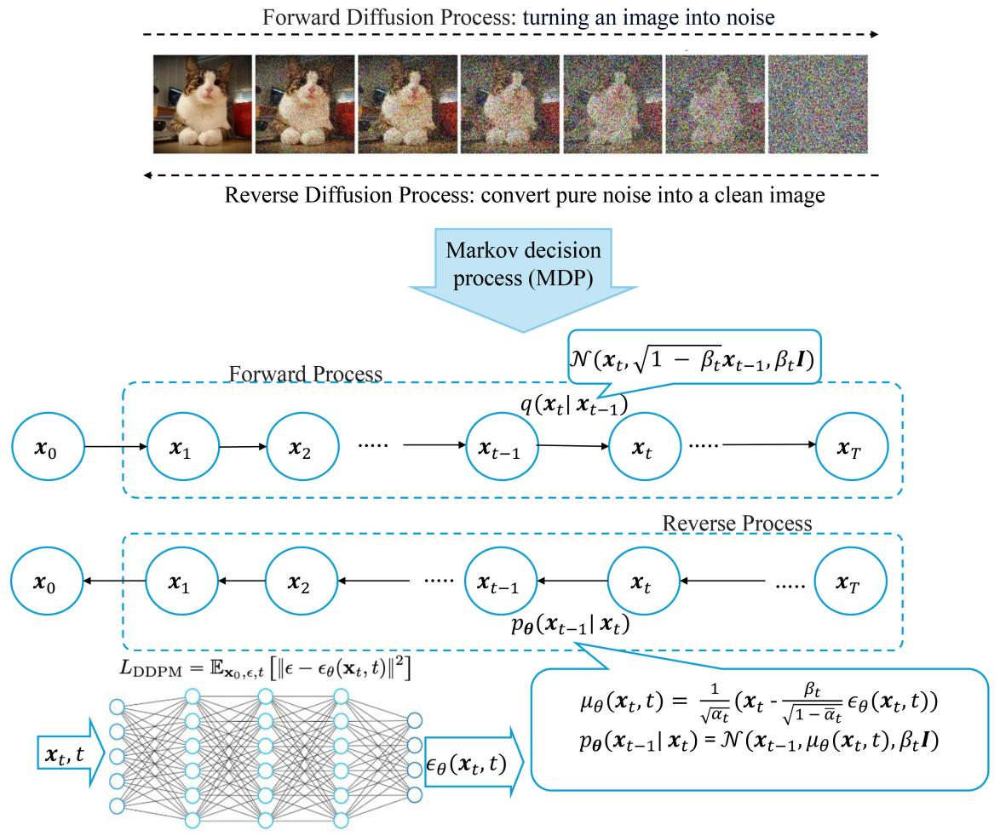

flowchart

```mermaid
graph TD
    A["Forward Diffusion Process: turning an image into noise"] --> B["Reverse Diffusion Process: convert pure noise into a clean image"]
    B --> C["Markov decision process (MDP)"]
    C --> D["Forward Process"]
    D --> E["x₀"]
    D --> F["x₁"]
    D --> G["x₂"]
    D --> H["..."]
    D --> I["x_{t-1}"]
    I --> J["x_t"]
    I --> K["..."]
    I --> L["x_T"]
    L --> M["N(x_t, √(1 - β_t)x_{t-1}, β_tI)"]
    M --> N["q(x_t|x_{t-1})"]
    N --> O["x_0"]
    N --> P["x_1"]
    N --> Q["x_2"]
    N --> R["..."]
    N --> S["x_{t-1}"]
    S --> T["x_t"]
    S --> U["..."]
    S --> V["x_T"]
    V --> W["p_θ(x_{t-1}|x_t)"]
    W --> X["x_0"]
    W --> Y["x_1"]
    W --> Z["x_2"]
    W --> AA["..."]
    W --> AB["x_{t-1}"]
    AB --> AC["x_t"]
    AB --> AD["..."]
    AB --> AE["x_T"]
    AE --> AF["p_θ(x_{t-1}|x_t)"]
    AF --> AG["L_DDPM = E_{x₀,ε,t} [||ε - εθ(xₜ,t)||²"]]
    AG --> AH["x_t,t"]
    AH --> AI["εθ(xₜ,t)"]
    AI --> AJ["p_θ(x_{t-1}|x_t) = N(x_{t-1},μθ(xₜ,t),βₜI)"]
    AJ --> AK["μθ(xₜ,t) = 1/√αₜ(xₜ - βₜ/√(1 - α̅ₜ)εθ(xₜ,t))"]
    AK --> AL["pθ(x_{t-1}|xₜ)"]
```

Fig. 6. Forward and Reverse Diffusion Processes in DDPM. The forward process gradually adds noise to an image, converting it into a noisy representation. The reverse process iteratively denoises the noisy data, reconstructing the clean image from pure noise, following a Markov Decision Process (MDP).

In practice, diffusion models have been used in cuttingedge applications like DALL-E 2 and Stable Diffusion, where they are applied to generate high-quality images from textual descriptions. They have also been used in natural language processing, speech synthesis, and time series forecasting. These models demonstrate the ability of diffusion models to generate diverse, realistic, and high-fidelity outputs. Libraries such as Hugging Face’s Diffusers, OpenAI’s DDPM, and Stability AI’s Stable Diffusion are widely used to implement and experiment with diffusion models.

1) Application of GDMs in xG Wireless Networks: As illustrated in Fig. 4, GDMs are powerful generative models that can be applied to a wide range of tasks in xG wireless networks, particularly those involving the generation of realistic, high-quality synthetic data, modeling of complex distributions, improving decision-making, and network simulation and testing. The strength of GDMs in generating diverse and accurate synthetic data makes them especially valuable for optimizing xG networks, such as in power control [3], [7], [37], spectrum management [8], and load balancing at the edge [4]. In [38], GDMs are used to model and estimate wireless channel conditions. In [39], a DDPM is employed to identify anomalies, which is critical for wireless communication security.

In [7], the diffusion model simulates the spread of potential contract terms and conditions through a network of possible designs. In [3], GDMs are used to model target distributions. The GDM model is used for improving decision-making in [4], [8], [37]. The authors in [38] use GDMs for generating diverse and high-fidelity samples. Combined with an autoencoder, the authors in [39] employ DDPMs to learn the distribution of normal signals and their power spectral density.

2) Mathematical Principles Behind GDMs: Our focus in this part is on the mathematical principles behind DDPM, due to its widespread use in the literature for generating highquality samples and distributions through iterative denoising processes. The DDPM is a specific type of GDM that defines denoising steps in a particular manner [4]. DDPMs explicitly model the transition from noisy data to clean data probabilistically, learning to remove a specific amount of noise at each step until the original clean data distribution is achieved. As illustrated in Fig. 6, DDPM involves a forward process modeled as a Markov chain that gradually adds Gaussian noise to data, transforming it into pure noise. The reverse process then incrementally denoises this noisy data back into its original form, also modeled as a Markov chain. A neural network, trained to predict the original data from its noisy versions at each step, facilitates this reverse diffusion. While DDPMs are computationally intensive, they offer a flexible and effective framework for modeling complex data distributions, achieving state-of-the-art results in various generative tasks. The details are given in what follows.

DDPMs rely on a two-step process involving a forward diffusion process and a reverse denoising process. The forward process gradually corrupts a data point $\mathbf { x } _ { 0 }$ over a sequence 0of time steps, generating noisy versions x , $, \mathbf { x } _ { 2 } , \ldots , \mathbf { x } _ { T }$ . This 1 2process is modeled as a Markov chain, where each transition $q \big ( \mathbf { x } _ { t } | \mathbf { x } _ { t - 1 } \big )$ is a Gaussian distribution given by $q ( \mathbf { x } _ { t } | \mathbf { x } _ { t - 1 } ) =$ $\mathcal { N } ( \mathbf { x } _ { t } ; \sqrt { 1 - \beta _ { t } } \mathbf { x } _ { t - 1 } , \beta _ { t } \mathbf { I } )$ where $\beta _ { t }$ 1controlling the amount of 1noise added at each time step. This equation be equivalently expressed as:

$$
q (\mathbf {x} _ {t} | \mathbf {x} _ {0}) = \mathcal {N} \big (\mathbf {x} _ {t}; \sqrt {\bar {\alpha} _ {t}} \mathbf {x} _ {0}, (1 - \bar {\alpha} _ {t}) \mathbf {I} \big) \tag {3}
$$

where $\begin{array} { r } { \bar { \alpha } _ { t } = \prod _ { s = 1 } ^ { t } ( 1 - \beta _ { s } ) } \end{array}$ , allowing direct sampling of $\mathbf { x } _ { t }$ given $\mathbf { x } _ { 0 } .$ .

0The reverse process seeks to recover $\mathbf { x } _ { 0 }$ by learning the posterior distribution $q \big ( \mathbf { x } _ { t - 1 } | \mathbf { x } _ { t } \big )$ 0, modeled as another Gaussian:

$$
p _ {\theta} (\mathbf {x} _ {t - 1} | \mathbf {x} _ {t}) = \mathcal {N} (\mathbf {x} _ {t - 1}; \boldsymbol {\mu} _ {\theta} (\mathbf {x} _ {t}, t), \Sigma_ {\theta} (\mathbf {x} _ {t}, t)) \tag {4}
$$

where the mean ${ \pmb \mu } _ { \theta }$ is parameterized by a neural network and $\begin{array} { r l } { \Sigma _ { \theta } ( \mathbf { x } _ { t } , t ) } & { { } = \ \beta _ { t } \mathbf { I } } \end{array}$ [40]. The goal is to minimize the discrepancy between the true posterior $q ( \mathbf { x } _ { t - 1 } | \mathbf { x } _ { t } , \mathbf { x } _ { 0 } )$ and the 1 0learned reverse distribution. This is achieved by minimizing the Variational Lower Bound (VLB) on the data likelihood,

$$
\log p _ {\theta} (\mathbf {x} _ {0}) \geq \mathbb {E} _ {q} \left[ \log \frac {p _ {\theta} (\mathbf {x} _ {0 : T})}{q (\mathbf {x} _ {1 : T} | \mathbf {x} _ {0})} \right] \tag {5}
$$

where $\begin{array} { r l r } { p _ { \theta } ( \mathbf { x } _ { 0 : T } ) } & { { } = } & { p ( \mathbf { x } _ { T } ) \prod _ { t = 1 } ^ { T } p _ { \theta } ( \mathbf { x } _ { t - 1 } | \mathbf { x } _ { t } ) } \end{array}$ and $\begin{array} { r } { q ( \mathbf { x } _ { 1 : T } | \mathbf { x } _ { 0 } ) = \prod _ { t = 1 } ^ { T } q ( \mathbf { x } _ { t } | \mathbf { x } _ { t - 1 } ) } \end{array}$ =1 1. This can be simplified to a 1: 0 =1 1practical loss function as follows,

$$
L _ {\mathrm{DDPM}} = \mathbb {E} _ {\mathbf {x} _ {0}, \epsilon , t} \left[ \| \epsilon - \epsilon_ {\theta} (\mathbf {x} _ {t}, t) \| ^ {2} \right] \tag {6}
$$

where $\epsilon _ { \theta }$ predicts the noise added at time t. The training process minimizes this loss over the dataset, allowing the model to reverse the diffusion process and generate realistic samples from pure noise by iteratively denoising through the learned reverse Markov chain. The structured pseudocode of the DDPM is given in Algorithm 2 [40].

# C. Generative Flow Networks

GFlowNets are a unique class of generative models designed to sample complex, structured objects by constructing them step by step in a sequential and probabilistic manner. Unlike traditional models such as GANs or diffusion models that generate complete data points in a single step, GFlowNets operate by navigating through a sequence of actions that progressively build the final object. Each action represents a small transformation or addition to a partial structure, and the process continues until the complete object is generated.

Algorithm 2: DDPM Algorithm   
Input: Data samples $x_{0}$ , noise schedule $\beta_{1},\ldots,\beta_{T}$ , neural network $\epsilon_{\theta}$ Output: Generated data sample $\hat{x}_{0}$ 1 Forward Diffusion Process:
2 Input: Data sample $x_{0}$ ;
3 for t=1:T do
4 $q(\mathbf{x}_{t}|\mathbf{x}_{t-1})=\mathcal{N}(\mathbf{x}_{t};\sqrt{1-\beta_{t}}\mathbf{x}_{t-1},\beta_{t}\mathbf{I})$ ;
5 Sample noisy data at step t:

$$
\mathbf {x} _ {t} = \sqrt {\bar {\alpha} _ {t}} \mathbf {x} _ {0} + \sqrt {1 - \bar {\alpha} _ {t}} \epsilon , \quad \epsilon \sim \mathcal {N} (0, \mathbf {I})
$$

where $\begin{array} { r } { \bar { \alpha } _ { t } = \prod _ { s = 1 } ^ { t } ( 1 - \beta _ { s } ) } \end{array}$

6 end

7 Reverse Diffusion Process (Sampling):

8 Input: Gaussian noise $\mathbf { x } _ { T } \sim \mathcal { N } ( 0 , \mathbf { I } )$

9 for $t = T : I$ do

10 Predict noise using neural network $\epsilon _ { \theta } ( \mathbf { x } _ { t } , t ) ;$

11 Compute the mean for reverse step:

$$
\pmb {\mu} _ {\theta} (\mathbf {x} _ {t}, t) = \frac {1}{\sqrt {\alpha_ {t}}} \bigg (\mathbf {x} _ {t} - \frac {\beta_ {t}}{\sqrt {1 - \bar {\alpha} _ {t}}} \epsilon_ {\theta} (\mathbf {x} _ {t}, t) \bigg)
$$

12 Sample from reverse distribution:

$$
\mathbf {x} _ {t - 1} \sim \mathcal {N} (\mathbf {x} _ {t - 1}; \boldsymbol {\mu} _ {\theta} (\mathbf {x} _ {t}, t), \Sigma_ {\theta} (\mathbf {x} _ {t}, t))
$$

13 end

14 Return the final sample ${ \bf x } _ { 0 } ;$

15 Training Objective:

16 Minimize the loss function:

$$
L _ {\mathrm{DDPM}} = \mathbb {E} _ {\mathbf {x} _ {0}, \epsilon , t} \Big [ \| \epsilon - \epsilon_ {\theta} (\mathbf {x} _ {t}, t) \| ^ {2} \Big ]
$$

where  is the noise added during the forward process.

This approach makes GFlowNets particularly well-suited for tasks where the data is naturally sequential or hierarchical, such as graph generation, molecular design, or combinatorial optimization problems.

The core concept behind GFlowNets is the flow-based representation, where probability mass is distributed across different paths in a network. As illustrated in Fig. 7 and discussed later in detail, each path represents a possible sequence of actions leading from an initial state (such as an empty graph or a random structure) to a final state (the complete object). The goal of the model is to learn a policy that guides the flow of probability mass through this network, ensuring that highquality objects are more likely to be generated. Importantly, GFlowNets ensure that the total probability mass flowing into any intermediate state matches the total mass flowing out, maintaining a consistent flow across all possible paths. This flow-based mechanism allows GFlowNets to explore a wide range of solutions and efficiently sample diverse outputs from the target distribution.

GFlowNets operate within an MDP framework, where each state corresponds to a partially constructed object and each action modifies that state. The model learns a policy that

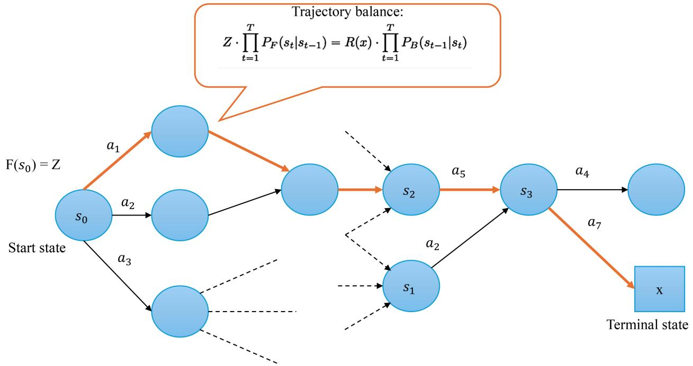

flowchart

```mermaid
graph TD
    s0[" s₀ "] -->|a₁| s0_1[" "]
    s0 -->|a₂| s0_2[" "]
    s0 -->|a₃| s0_3[" "]
    s0_1 --> s0_1
    s0_2 --> s0_2
    s0_3 --> s0_3
    s0_1 -.-> s0_1
    s0_2 -.-> s0_2
    s0_3 -.-> s0_3
    s0_1 -.-> s0_1
    s0_2 -.-> s0_2
    s0_3 -.-> s0_3
    s0_1 -.-> x["Terminal state"]
    s0_2 -.-> x
    s0_3 -.-> x
    style F(s₀) = Z fill:#f9f,stroke:#333
    style a1 fill:#ccf,stroke:#333
    style a2 fill:#ccf,stroke:#333
    style a3 fill:#ccf,stroke:#333
    style a4 fill:#ccf,stroke:#333
    style a5 fill:#ccf,stroke:#333
    style a6 fill:#ccf,stroke:#333
    style a7 fill:#ccf,stroke:#333
```

Modeling the Markovian flow by neural network Fe with loss function

$$
L _ {\mathrm{TBL}} (\tau) = \left(\log Z _ {\theta} + \sum_ {t = 1} ^ {T} \log P _ {F} (s _ {t} | s _ {t - 1}; \theta) - \right.
$$

$$
\log R (x) - \sum_ {t = 1} ^ {T} \log P _ {B} (s _ {t - 1} | s _ {t}; \theta)) ^ {2}
$$

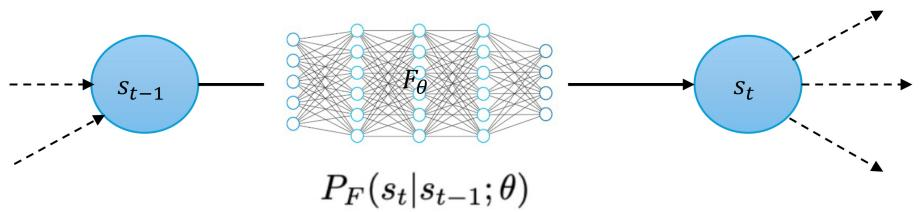

flowchart

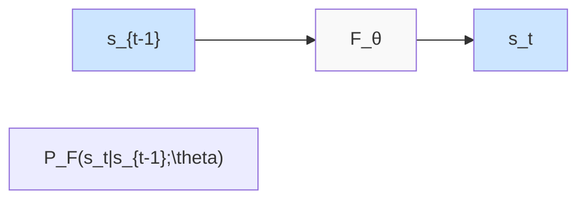
```mermaid
graph LR
    A["s_{t-1}"] --> B["F_θ"]
    B --> C["s_t"]
    style A fill:#cce5ff
    style B fill:#f9f9f9
    style C fill:#cce5ff
    note1["P_F(s_t|s_{t-1};\theta)"]
```

Fig. 7. Flow network (F) in a GFlowNet architecture: the starting state s0 starts with an inflow Z, and transitions between states $( s _ { 1 } , s _ { 2 } , s _ { 3 } )$ occur via actions $( a _ { 1 } , a _ { 2 } , a _ { 3 } , a _ { 4 } , a _ { 5 } , a _ { 7 } )$ ( ) ( ). Each state follows the flow balance equation ensuring the sum of incoming flows equals the sum of outgoing flows. The ( )terminal state (x) has an outflow denoted as R(x).

maximizes the expected flow of probability mass to highreward final states. The reward function plays a crucial role in guiding this process, assigning higher rewards to desirable objects based on their quality or suitability for the task at hand. For instance, in molecular generation tasks, the reward function could evaluate the chemical properties or effectiveness of the generated molecules, and the GFlowNet would prioritize paths leading to high-reward molecules.

One of the major advantages of GFlowNets is their ability to generate diverse samples from the target distribution.2 Unlike

2The target distribution refers to the desired probability distribution over the terminal states (i.e., the generated objects) that GFlowNets aim to model. Specifically, GFlowNets are trained to generate samples (terminal states) in proportion to a reward function R(x) that is assigned to each terminal state x.

other generative models that may focus on a narrow set of high-probability outputs, GFlowNets are designed to distribute probability mass across multiple paths that lead to a variety of high-reward solutions. This ensures that the model does not collapse to a single mode or a small set of similar solutions but instead explores a broad range of possibilities. This diversity is particularly valuable in tasks like drug discovery, where multiple candidate molecules with desirable properties need to be generated and tested, or in combinatorial optimization tasks, where there may be several equally valid solutions.

The flow-based policy learning in GFlowNets ensures that the model can adapt to different types of structured data, making them highly versatile. By incrementally building objects, GFlowNets are able to model complex dependencies between different parts of the data, capturing intricate patterns and relationships that would be difficult to model with traditional generative approaches. Their step-by-step approach also makes them particularly well-suited for tasks where the generation process is inherently sequential.

Based on the above, GFlowNets can be used for generating diverse samples efficiently across various domains. Their primary applications would include the generation of novel chemical structures, active learning, and Bayesian optimization, where they search for molecules, DNA sequences, or proteins with desired properties. GFlowNets can also be applied in training energy-based models, structure learning of causal graphs, and in the E-step of the Expectation-Maximization (EM) algorithm for latent variable models. Additionally, they are utilized for learning distributions over graphs and performing tasks like estimating marginal probabilities and computing conditional distributions, making them invaluable for scientific discovery and hypothesis testing. Some repositories and libraries provide implementations that cover a range of tasks, from molecular generation to combinatorial optimization. The GFlowNet GitHub repositories from the original authors in [41] and their applications in molecular design are excellent starting points.

1) Application of GFlowNets in xG Wireless Networks: As illustrated in Fig. 4, GFlowNets offers the potential for optimizing various aspects of xG wireless communication systems. They can be applied to enhance RIS by dynamically configuring phase shifts for improved signal propagation and system throughput [42]. They enhance SemCom by identifying the optimal encoding and decoding methods [5]. Other applications can include seamless handoff management, dynamic network topology control, and security enhancement. By efficiently exploring complex configuration spaces, GFlowNets drive advancements in performance, efficiency, and reliability in xG networks. The details of GFlowNet fundamentals, and training objectives are given below.

2) Mathematical Principles Behind GFlowNets: GFlowNets operate by learning a stochastic policy that guides the generation of the objects through a series of actions. This process involves constructing a flow network where nodes represent states and edges represent actions transitioning between states. The network includes a source node (starting state) and sink nodes (terminal states) with associated rewards. The key is to ensure flow consistency, where the total incoming flow to each state equals the total outgoing flow. The learned policy, $\pi ( a | s )$ , determines the probability of taking action a in state s based on flow values, ensuring that the probability of reaching a terminal state is proportional to its reward. This is achieved through iterative optimization to satisfy flow consistency equations. The details are given in what follows.

Unlike traditional generative models, which focus on maximizing likelihood or reward, GFlowNets aim to generate objects with a probability proportional to an unnormalized reward function R(x). Given a set of terminal states $x \in \mathcal { X }$ and a reward R(x), the objective of a GFlowNet is to ensure that the probability of generating a terminal state x is proportional to R(x), i.e., $P ( x ) \propto R ( x )$ .

As depicted in Fig. 7, GFlowNets can mathematically be represented as a MDP, where nodes represent states s and edges represent actions a, which define transitions between states. As aforementioned, the goal is to learn a stochastic policy that generates trajectories $\tau = ( s _ { 0 } \to s _ { 1 } \to \cdot \cdot \cdot \to$ $s _ { T } \ = \ x )$ , starting from an initial state $s _ { 0 }$ 1and terminating 0at a state x. Each trajectory corresponds to a sequence of actions leading to a terminal state, and the likelihood of a trajectory should reflect the target reward distribution over terminal states.

Here, we focus on the training method which is proposed in [43]. Approaches such as flow matching [41] and detailed balance [44], relied on ensuring that the flow of probability into a state equals the flow out of it, or balancing the forward and backward transition probabilities along each edge. However, these methods often suffer from inefficient credit assignment, especially in environments with long sequences of actions. To address this limitation, the Trajectory Balance (TB) objective was introduced in [43]. Instead of focusing on individual state transitions, the TB objective balances the forward and backward probabilities over entire trajectories. Let F be a Markovian flow, T be the complete trajectories and P the corresponding distribution over complete trajectories, i.e., $F : \mathcal T \to \mathbb { R } _ { \geq 0 }$ . Given a trajectory $\tau = ( s _ { 0 } \to s _ { 1 } \to \cdot \cdot \cdot \to$ $s _ { T } = x )$ 0 0 1, the trajectory balance condition can be expressed as [43]:

$$
Z \cdot \prod_ {t = 1} ^ {T} P _ {F} (s _ {t} | s _ {t - 1}) = R (x) \cdot \prod_ {t = 1} ^ {T} P _ {B} (s _ {t - 1} | s _ {t}), \tag {7}
$$

where $P _ { F } ( s _ { t } | s _ { t - 1 } )$ is the forward policy for transitioning from state $s _ { t - 1 }$ 1to state $s _ { t } , P _ { B } ( s _ { t - 1 } | s _ { t } )$ is the backward policy, Z 1 1is a normalization constant, and R(x) is the reward assigned to the terminal state x. The TB objective ensures that the forward trajectory probabilities, scaled by Z, are balanced with the backward trajectory probabilities, scaled by the reward R(x). In [43], this balance is achieved by minimizing the Trajectory Balance Loss (TBL), defined as:

$$
L _ {\mathrm{TBL}} (\tau) = \left(\log Z _ {\theta} + \sum_ {t = 1} ^ {T} \log P _ {F} (s _ {t} | s _ {t - 1}; \theta) - \right.
$$

$$
\log R (x) - \sum_ {t = 1} ^ {T} \log P _ {B} (s _ {t - 1} | s _ {t}; \theta)) ^ {2}, \tag {8}
$$

where θ is the parameters for the model $F _ { \theta }$ which is used for estimating $P _ { F } ( - | - ; \theta ) , P _ { F } ( - | - ; \theta )$ , and $Z _ { \theta } = F _ { \theta } ( s _ { 0 } )$ ). This 0loss function ensures efficient credit assignment over long trajectories, leading to faster convergence and better performance in tasks with large action spaces or long sequences. Let $\pi _ { \theta }$ be a training policy (usually given by $P _ { F } ( - | - ; \theta )$ . The training procedure is given in Algorithm 3.

# D. Comparison of GAI Models in xG Wireless Communication Applications

While GDMs and GANs may share similar reasons for being used in xG wireless networks, GDMs have certain

Algorithm 3: Training a GFlowNet With Trajectory Balance Loss   
Input: Reward function $R(x)$ for terminal states $x \in X$ , Initial model parameters $\theta$ for forward policy $P_{F}(a|s;\theta)$ , backward policy $P_{B}(s|a;\theta)$ , and normalization constant $Z_{\theta}$ , Learning rate $\eta$   
Output: Trained model $F _ { \theta }$

1 while not converged do   
2 Sample a trajectory $\tau = (s_{0} \rightarrow s_{1} \rightarrow \cdots \rightarrow s_{T} = x)$ from the forward policy $P_{F}$ ;   
3 Compute the reward $R ( x )$ of the terminal state x;   
4 Compute the TBL:

$$
L _ {\mathrm{TBL}} (\tau) = \left(\log Z _ {\theta} + \sum_ {t = 1} ^ {T} \log P _ {F} (s _ {t} | s _ {t - 1}; \theta) - \right.
$$

$$
\log R (x) - \sum_ {t = 1} ^ {T} \log P _ {B} (s _ {t - 1} | s _ {t}; \theta)) ^ {2}
$$

Update the model parameters θ using stochastic gradient descent:

$$
\theta \leftarrow \theta - \eta \nabla_ {\theta} L _ {\mathrm{TBL}} (\tau)
$$

5 end

characteristics that might make them more suitable in specific contexts. GDMs are generally more stable during training, which can lead to a more reliable generation process, especially in tasks that require high diversity and accuracy across a wide range of conditions. GDMs utilize a diffusion process where noise is gradually reduced to generate data. This method can offer better control over the generative process and is often more robust, particularly when generating data with complex dependencies. Although GDMs are also computationally intensive, their iterative denoising process can sometimes be more tractable and easier to tune compared to the adversarial training required in GANs. Additionally, compared to GANs, GFlowNets focus on learning to sample from distributions in combinatorial or structured spaces, where elements have varying sizes or complexities. GFlowNets generate diverse, high-reward outputs such as molecular graphs, action sequences, and other structured data. Based on the discussion above, the key differences and considerations between GANs, GDMs, and GFlowNets in xG wireless networks are outlined in Table II.

# E. Other GAI Models

In addition to GANs, Generative GDMs, and GFlowNets, other important classes of generative AI models have made significant contributions to various domains. These models, such as LLMs, Autoencoders, and VAEs, play pivotal roles in generating content across different modalities, including text, images, and more. Each model type leverages unique architectural features and training methods to address diverse generative tasks. Below, we explore how LLMs, Autoencoders, and VAEs contribute to the broader landscape of GAI.

1) Large Language Models: LLMs are a class of generative models specifically designed for Natural Language Processing (NLP) tasks. These models, typically based on DL architectures such as transformers, are trained on vast amounts of text data, allowing them to understand and generate humanlike text. LLMs can be used for tasks such as text generation, translation, summarization, and answering complex questions. Notable examples include Generative Pretrained Transformer (GPT) models, Bidirectional Encoder Representations from Transformers (BERT), and Text-To-Text Transfer Transformer (T5). LLMs have gained significant attention for their ability to produce coherent and contextually relevant language outputs, demonstrating the power of generative models in NLP. However, due to their massive size and data requirements, training and deploying LLMs can be computationally expensive and resource-intensive.

As studied by the authors in [45], the integration of LLMs in wireless networks is opening up new opportunities for enhancing communication systems through advanced language processing capabilities. LLMs can be employed to optimize network management tasks such as resource allocation, traffic prediction, and automated configuration in complex, dynamic wireless environments. By leveraging their ability to process and generate human-like text, LLMs can facilitate intelligent decision-making in real-time, enabling autonomous network operations in areas such as 5G and beyond. In decentralized and resource-constrained environments, LLMs can work with edge devices to improve network efficiency by reducing latency and offloading tasks traditionally handled by centralized cloud systems. Additionally, LLMs can enhance natural language interfaces for network operators, simplifying the control and management of wireless systems through conversational AI agents. Their application in security protocols is also noteworthy, as LLMs can assist in detecting anomalous behavior or cyber threats in wireless networks, ensuring robust security measures at the edge.

2) Autoencoders: Autoencoders are a type of neural network used primarily for data compression and reconstruction, making them ideal for tasks like dimensionality reduction and denoising. An autoencoder consists of two main components: an encoder that maps the input data into a lowerdimensional latent space and a decoder that reconstructs the input from this latent representation. The network is trained to minimize the difference between the input and its reconstruction, ensuring that the latent space effectively captures the most important features of the data. Autoencoders can be used for various generative tasks, such as generating synthetic data, image restoration, and anomaly detection. Despite their simplicity, autoencoders have proven to be a powerful tool in data-driven tasks where feature extraction and efficient data representation are critical.

Autoencoders can contribute to the optimization of xG wireless networks by enabling efficient data compression, denoising, and anomaly detection. Their ability to learn lowdimensional representations of high-dimensional data makes them highly effective for compressing data in BW-constrained environments, optimizing transmission efficiency without losing critical information [46]. In addition, autoencoders are used for channel estimation, and in noisy wireless environments, particularly denoising autoencoders help recover clean signals [47]. Furthermore, they enhance network security by detecting anomalies in network traffic, identifying potential threats or failures [48]. Autoencoders are also valuable in resource allocation, where they analyze usage patterns to optimize power, and other network resources [49].

TABLE II COMPARISON AMONG GANS, GDMS, AND GFLOWNETS IN XG WIRELESS COMMUNICATION APPLICATIONS 

<table><tr><td>Model</td><td>Advantages</td><td>Disadvantages</td></tr><tr><td>GANs</td><td>High-quality data generation:Generates realistic, high-fidelity data, useful for simulation and modeling.Adversarial training:Capable of modeling complex distributions through the adversarial process.Versatile applications:Applicable in diverse areas such as resource management, and security.</td><td>Training instability:Prone to mode collapse and other training difficulties, requiring careful tuning.Computationally intensive:Requires significant computational resources, particularly for balancing the generator and discriminator.Limited interpretability:The adversarial process can make the model&#x27;s decisions hard to interpret.</td></tr><tr><td>GDMs</td><td>Stable training:Generally more stable and less prone to issues like mode collapse compared to GANs.High-quality sample generation:Effective at producing high-quality, realistic samples.Effective for sequential data:Suitable for tasks involving time-series data.</td><td>Computational complexity:The iterative denoising process can be computationally expensive.Complex implementation:Requires careful design and tuning, making it challenging to implement effectively.Less mature:A relatively newer model, with fewer established applications compared to GANs.</td></tr><tr><td>GFlowNet</td><td>Diverse solution generation:Excels at generating a wide range of high-quality solutions, which is useful for exploring multiple configurations.Sequential decision-makingWell-suited for tasks requiring a sequence of decisions, such as dynamic resource management.Adaptability:Can adapt to changing conditions, making it effective for dynamic environments like xG networks.</td><td>Complex training process:Training GFlowNets can be complex and resource-intensive.Limited maturity:As a newer model, GFlowNets have fewer established applications and community support in wireless networks.High computational demand:Requires substantial computational resources, especially for large-scale applications.</td></tr></table>

3) Variational Autoencoders: VAEs build upon the traditional autoencoder framework by introducing a probabilistic approach to the latent space representation. Instead of learning a single deterministic encoding, VAEs learn a distribution (usually Gaussian) over the latent space, allowing them to generate new data by sampling from this distribution. This makes VAEs particularly useful for generative tasks such as image synthesis, where generating new, plausible data samples is important. The VAE framework encourages smooth and continuous latent spaces, where small changes in the latent variables produce meaningful variations in the generated data. The loss function of a VAE is composed of a reconstruction loss (like standard autoencoders) and a regularization term, which ensures that the latent space follows the desired probabilistic distribution. VAEs have been widely used for tasks like image generation, interpolation between data points, and creating interpretable latent representations.

VAEs can improve efficiency, security, and adaptability in wireless networks through their ability to learn compact and probabilistic representations of complex data. One key application is in channel estimation and modeling, where VAEs capture the variations in wireless channels, particularly in dynamic environments like Millimeter-Wave (mmWave) and Autonomous Aerial Vehicle (AAV) assisted systems, enabling more accurate and efficient channel estimation [50]. Additionally, VAEs are useful for data compression, allowing high-dimensional data from sensors or network traffic to be transmitted more efficiently in BW-constrained settings [51]. VAEs also contribute to resource allocation optimization by learning compact latent embeddings from CSI, preserving spatial and geometric features for more efficient spectrum and power optimization [52].

# F. Complexity of GAI Models

While GAI models offer significant potential for optimizing various aspects of xG wireless networks, their practical deployment depends on managing their computational complexity. Different GAI models inherently possess varying complexity levels. For instance, GAN-based channel estimation complexity, as detailed in [9], [10], is directly tied to the model architecture, including the number of convolutional layers, features per layer, mini-batch size, and iterations. Therefore, an approach analyzing factors such as model architecture, training processes, and inference requirements is required.

Research in [37] explores the use of Efficient Layer Aggregation Network (ELAN) modules to reduce model parameters and computational complexity in object detection tasks. While originally developed for image recognition and Computer Vision (CV), ELAN modules hold promise for network optimization as well. Similarly, the GAI-based SemCom approach in [3] achieves complexity reduction by eliminating the need for joint decoder-encoder training. Additionally, designing the interest point encoder within the semantic encoder with an explicit decoder, as suggested in [7], can further reduce computational costs. Here, the interest point encoder acts as a pre-processing step, identifying key locations (interest points) in the input data. This allows the semantic encoder to build a higher-level understanding using these identified points, leading to a more efficient model. Finally, feature selection techniques, as employed in [11], [13], [14], can also be leveraged to improve training speed and reduce complexity by focusing on the most relevant data features.

The following sections explore key communication paradigms in xG wireless networks, including SemCom, mobile AIGC networks, ISAC, and xG communication security. Integrating these technologies offers significant benefits for wireless networks, such as enhanced safety, a richer user experience, and improved sustainability. We will then delve into how GAI can further optimize networks empowered by these technologies, and how it can address potential challenges associated with their implementation in xG communication.

# III. GAI-BASED OPTIMIZATION IN MOBILE AIGC NETWORKS

# A. Mobile AIGC Networks

Mobile AIGC networks combine the power of AIGC with the low-latency benefits of mobile edge computing, allowing for personalized AIGC services delivered directly to mobile devices. This functionality is achieved through seamless cooperation among computing and storage resources distributed across the cloud, the network edge, and even mobile devices themselves.

GAI models offer significant benefits in optimizing mobile AIGC networks. Throughout the various stages of the AIGC service lifecycle, pre-training, fine-tuning, and inference, GAI models can unlock efficiency gains by leveraging data generated locally on devices like IoT sensors and smartphones [1]. Excelling in both reconfigurability and accuracy, GAI models can adapt seamlessly to evolving network demands and user preferences. This ultimately facilitates the production of a vast amount of personalized content [1]. Furthermore, ongoing advancements in green AIGC architectures such as cooperative cloud-edge computing, hardware innovations, and energy-efficient algorithms are aimed at reducing the overall energy consumption and carbon footprint compared to traditional AIGC operations [16]. Therefore, although GAI models require substantial energy for training and deployment, integrating these models with green AIGC advancements, including cooperative cloud-edge computing, neuromorphic hardware innovations, and energy-efficient algorithms, has the potential to optimize resource use and minimize environmental impact throughout the AI lifecycle. We begin this section by exploring how the GAI model is employed to optimize content generation within the metaverse. We will then discuss the efficiency gains that can be obtained through this optimization process.

While AIGC models offer vast potential for content generation in the metaverse, their deployment can be hindered by the challenge of demanding training requirements. To address this, recent research [4] proposes an AIGC-as-a-Service (AaaS) architecture where AIGC models are deployed at the network’s edge. This strategic placement enables users to access these services ubiquitously, from any device and at any location. Motivated by this paradigm shift, the study in [4] focuses on the problem of AIGC Service Provider (ASP) selection. The objective is to maximize user utility while considering the total resource availability constraints of each service provider. User utility cannot be fully known in advance and is instead determined dynamically using a human-aware content quality assessment function. This function might consider factors such as contrast, sharpness, and texture for image-based content. This service provider selection problem can be modeled as a RL system. To address this challenge, a deep diffusion RL-based method is employed, which leverages the combined strengths of both actor-critic model and DDPM. The following describes the specifics of this approach.

Within the developed RL system, the state-space encompasses two key elements: total available resources across the network and the current resource availability of each ASP. The action space defines the set of all possible decisions for assigning the current metaverse user task to a specific ASP. Finally, the reward function is designed in terms of the user utility. To achieve optimal service provider selection, this RL system aims to train the parameters for the DDPM model. This is accomplished through an actor-critic architecture consisting of actor networks (target and online), critic networks (target and online), and replay buffer. The core of the actor-network is based on the reverse process of diffusion model illustrated in Fig. 6. The parameters for the DNNs in actor-network are updated to maximize the expectation of Q-values3 overall actions to improve the policy for choosing ASPs. Meanwhile, the critic network, specifically a double-critic network, reduces overestimation bias and evaluates ASPs’ selection. During training, the Q-value (which is used to update the actornetwork) is the minimum of the two Q-value estimates from the two critic networks. The critic networks, on the other hand, are trained to minimize the Temporal Difference (TD) error between the target Q-value (i.e., the output of the target critic network) and the evaluated Q-value (i.e., the output of the online critic network). Experiences from user interactions are stored in a replay buffer and used to update both the actor and critic networks.

# B. How GAI Models Are Used for Network Optimization

In [4], the generative AI model, i.e., DDPM, plays a critical role in encouraging exploration within the selection process. The DDPM’s output effectively captures the dependencies between the user’s observation space and the available ASPs (action space). This allows the RL agent to understand how different resource allocations at each ASP might impact its utility. By feeding the DDPM’s output into a softmax function, the system generates a probability distribution for each potential ASP selection. This probability distribution, informed by the DDPM’s predictions, guides the RL agent’s policy function, encouraging it to not only prioritize highutility selections but also explore less-explored options. This exploration aspect is crucial for the agent to continually learn and adapt to potential variations in resource availability and AIGC model performance over time.

Based on the above discussion, in [4], by guiding the RL agent’s policy function through a diffusion-based approach, the system achieves efficient utilization of computational resources across the entire network. This benefits both users (improved service quality) and providers (avoided system overload), ultimately maintaining network performance. Additionally, this GAI-driven approach indirectly contributes to network optimization in terms of BW (through efficient user allocation) and storage (by selecting providers with sufficient resources to manage content storage effectively).

# IV. GAI-BASED OPTIMIZATION IN ISAC-ENABLED NETWORKS

# A. GAI and ISAC-Enabled Networks

ISAC is a design approach that merges sensing and communication functionalities. It leverages existing wireless communication systems for sensing purposes. The insights gained from this wireless sensing are then used to optimize the communication itself [53]. GAI can significantly enhance ISAC performance in wireless networks. In ISAC systems, these models find applications in various areas, including data augmentation, anomaly detection, and time-series forecasting [29]. In the following, we will delve into the details of how GAI empowers ISAC.

One of the most promising advancements in ISAC-enabled networks is the incorporation of RIS. This technology involves the use of programmable surfaces to manipulate electromagnetic waves, thus controlling the wireless propagation environment. This capability is crucial for improving signal quality, extending coverage, and enhancing energy efficiency in ISAC systems. However, the effective deployment and optimization of RIS in dynamic and complex wireless environments pose significant challenges, particularly in terms of real-time adaptation and resource management.

GAI’s data modeling and analysis capabilities hold promise for optimizing wireless communications systems with ISAC [35], [36]. Specifically, GAI can play a transformative role in optimizing RIS within ISAC-enabled networks. By leveraging its advanced data modeling and analysis capabilities, GAI can generate synthetic data that enhances ML models used for channel estimation and prediction. This is especially important in RIS-aided systems, where accurate CSI is essential for configuring the RIS to achieve optimal performance. Furthermore, GAI can be employed to develop algorithms that dynamically adjust the RIS configuration based on network conditions, for instance RIS phase optimization, thereby maximizing the effectiveness of ISAC operations.

1) Application of GANs for Channel Estimation: The studies in [9], [10] investigate the application of GANs for channel estimation in RIS-aided communication systems. In [9], the Convolutional Adaptive Denoising GAN (GAN-CBD) [54] is used to denoise channel data and improve CSI estimation. GAN-CBD offers a novel approach to image denoising. Unlike traditional methods requiring clean image examples for training, GAN-CBD leverages the power of GANs, effectively removing noise from images without prior knowledge of the specific noise type through the adversarial training process. It helps train the generator network to create more realistic outputs. The details are given in what follows.

In [9], the generator network for the GAN-CBD system employs two subnetworks: a noise level estimation subnetwork and a non-blind denoising subnetwork. The noise level estimation subnetwork tackles the challenge of noise in the wireless channel. It receives the received signal, separated into its real and imaginary parts, and combines them for processing. Convolutional layers then analyze the combined signal to estimate the level of noise present. Additional SoftMax layers interpret the results, providing a final, single-value estimate of the noise level. The non-blind denoising subnetwork focuses on cleaning the received signal and estimating the actual data channel. It leverages two inputs, the received signal (containing both data and noise) and the estimated noise level obtained from the previous subnetwork. The combined signal and noise information are fed through residual block layers,4 which act like filters. These layers analyze both the signal and the estimated noise level to remove noise and recover the original, clean signal. Finally, after noise removal, the system estimates the actual channel the signal traveled through. A loss function continuously monitors the subnetwork’s performance by comparing the estimated noise level with the actual noise level. This comparison helps the system refine its noise removal and channel estimation capabilities over time.

The study in [10] proposes a novel approach to address the challenges of instability and inefficiency associated with using GANs for CSI estimation in Intelligent Reflecting Surface (IRS) aided communication systems.5 The solution leverages model-driven DL techniques [55] by incorporating prior knowledge about the inherent properties of the channels into the network structure of the GAN model. This approach facilitates faster training of the NNs. In the scenario with one user, the generative model within the proposed IRS-GAN framework is comprised of three distinct nodes: a BS-IRS (BI) node, an IRS-User (IU) node, and a Cascading (C) node. In this framework, the C node is a component that merges and refines the outputs from the BI and IU nodes

4Residual block layers are a key architectural element in CNNs. They address the vanishing gradient problem, a challenge where information weakens as it travels through many layers. These blocks introduce shortcut connections that allow the original input to be directly added to the processed output within the layer. This ensures the network retains important information even if processing weakens it. This improvement in learning allows deep networks to train faster, achieve better accuracy, and ultimately perform more effectively on various tasks.

5RIS and IRS refer to a technology that uses a surface composed of numerous passive, reconfigurable elements capable of dynamically adjusting the phase, amplitude, and polarization of electromagnetic waves to improve signal propagation. The distinction depends on the emphasis of the specific application. To maintain consistency with the terms used by the authors in [10], we have opted to use IRS in this work.

through a series of fully-connected layers to generate the final reflected channel samples. The BI node serves a crucial role in transforming an input random noise vector, initially drawn from a fixed distribution like uniform or Gaussian, into a matrix (denoted by G˜ ) that approximates the actual BS-IRS channel (denoted by G). This transformation leverages the concept of treating the channel matrix G as a two-dimensional image. Consequently, a two-dimensional Convolutional Neural Network (CNN) is employed within the BI node to effectively capture the inherent correlations between the various elements within the channel matrix. Many DL frameworks operate exclusively with real numbers. To address this limitation and handle complex-valued input channels like the channel matrix G, the proposed approach decomposes G into its real and imaginary parts. These parts are then treated as separate image color channels with real-valued entries. Additionally, the Line-of-Sight (LoS) component within G, which exhibits minimal temporal variation, is incorporated as a separate bias term independent of the input noise vector. Similar to the BI node, the IU node also transforms a random noise vector. The IU node employs a multi-layer fully-connected network for this transformation. Additionally, a bias term is added to account for any constant value present in the IRS-user channel. The C node combines the information extracted by the BI and IU nodes. It first performs a concatenation operation on the outputs from these nodes, essentially merging them. This combined data is then passed through a series of fullyconnected layers. These layers further refine the approximation of the reflected channel. Finally, the C node outputs the generated reflected channel samples. The study leverages the Wasserstein distance the generated channel distributions and the true channel distributions [56] as the loss function for training the IRS-GAN framework. The Wasserstein distance is both continuous and differentiable everywhere. This property contributes to the improved training stability and convergence of the proposed IRS-GAN. The training process itself is iterative and consists of two main loops. Within each outer loop, three inner loops are executed sequentially: a generative loop, a discriminative loop, and a testing loop. During each inner loop, the corresponding network (generative or discriminative) undergoes training for a fixed number of iterations. The testing loop, on the other hand, focuses on estimating the Wasserstein distance between the true channel distribution and the generated channel distribution. This estimated distance is then stored for comparison in subsequent testing loops.

The proposed IRS-GAN framework demonstrates potential for extension to multi-user scenarios. This is because each reflecting element within the IRS reflects signals from the BS to various users through the same BS-IRS channel. Consequently, the reflected channel for any user can be considered a scaled version of the channels experienced by other users. By leveraging this insight, a single GAN can be constructed to learn the reflected channels for all users simultaneously. This approach offers a significant advantage compared to employing multiple independent, identical IRS-GANs. It allows for a simplified network structure and a reduction in the overall number of network parameters required. The proposed IRS-GAN framework scales efficiently to multi-user scenarios. It comprises a single generative model and K independent discriminative models, where K represents the number of users. The generative model leverages a single BI node to capture the strong correlation among the reflected channels inherently within its network structure. It further incorporates K separate IU nodes and K separate C nodes, each dedicated to a specific user. The discriminative models, meanwhile, maintain the same structure as in the single-user case. A key advantage of this proposed framework lies in the simultaneous training of the generative and discriminative models. This enables the learning of reflected channels for all users within a single training process. The loss function for the generative model incorporates the sum of Wasserstein distances between the generated channel distributions and the true channel distributions for each user. The loss function for each discriminative model focuses on a gradient penalty term. To accelerate training further, all K discriminative models can be trained in parallel.

2) Optimizing XR Experiences Over THz Wireless Systems: The study in [2] tackles optimizing Extended Reality (XR) experiences over Terahertz (THz) wireless systems using RIS. It achieves this by minimizing handover costs while ensuring Quality of Personal Experience (QoPE) for XR users across the reality-virtuality spectrum, leveraging comprehensive and predictive sensing information.

As shown in [2], by concatenating and tensor-factoring received signals from Uplink (UL) snapshots, an optimization problem can estimate RIS subarray sensing parameters for user path attenuation factors. However, this estimation has limitations. It doesn’t account for potential blockages, whether a LoS connection exists, or the user’s Degrees of Freedom (DoF) during Non-Line-of-Sight (NLoS) scenarios. Consequently, it fails to capture the complete picture of user behavior and environmental dynamics in THz. To address this, the study proposes a DL approach based on Non-Autoregressive (NAR) models through which the entire input is analyzed together to predict the entire output sequence simultaneously. This approach predicts the missing values within the LoS and NLoS sensing matrices, resulting in comprehensive and continuous sensing information. These comprehensive, timevarying vectors are then fed into an encoder-decoder based GAI framework for the prediction of future time slots based on continuous and comprehensive sensing data. The details are given in what follows.

The DL model uses a two-part architecture: forwardbackward encoder for imputation, and multi-resolution decoder for forecasting. In forward-backward encoder, the encoder processes incomplete sequences of LoS and NLoS sensing data. It utilizes a combination of Forward Recurrent Neural Network (FRNN) and Backward Recurrent Neural Networks (BRNN)6 to model the conditional distribution of hidden states based on the available sensing information

6Information in an FRNN flows strictly forward through the network, one step at a time. FRNN struggles with long sequences because the information from earlier parts of the sequence can fade or disappear as it travels through the network. BRNNs address this by incorporating a backward pass of information, allowing the network to consider information from both the past and the future of a specific point in the sequence.

and masked inputs. In multi-resolution decoder, the decoder leverages the hidden representations generated by the encoder to predict the missing sensing values. It can handle different time scales within the data, allowing the model to capture both short-term and long-term environmental changes. This multi-scale learning capability improves the generalizability and accuracy of the imputation process.

To proactively anticipate and respond to user and environmental changes, the system incorporates an encoder-decoder based transformer structure with an auxiliary discriminator. Encoder-decoder transformers excel at time series forecasting thanks to their multi-head attention layers. Multi-head attention layers within the encoder allow the encoder-decoder model to focus on the most relevant parts of the input sequence, attending to specific elements based on their importance to the overall meaning. This refined understanding is then passed to the decoder, which generates the output sequence based on the encoded information. Therefore, these layers allow the transformer to identify long-term dependencies within the continuous stream of imputed sensing data. To understand relationships between elements within a sequence, a novel architecture called the α−Exam transformer [57] is chosen. Fenchel-Young loss is used in this transformer which is a convex loss function for a regularized prediction [57]. Additionally, to enhance the generalizability of the AI framework and effectively capture the inherent randomness (stochasticity) of the data, an adversarial training process is employed. This process improves the robustness of the model by regularizing the sensing data, enabling it to handle data variations and learn from both observed and unobserved information. This, in turn, strengthens the model’s ability to generalize to new, unseen data. Furthermore, a discriminator network is added to improve the accuracy of predictions across different time scales. This network consists of three fully connected linear layers with Leaky ReLU activation functions.

Leveraging comprehensive and predictive sensing information, the system defines the QoPE for XR users across the reality-virtuality spectrum. To minimize disruptions caused by frequent handovers, a user-centric handover cost is also defined. This cost considers factors like the user’s association with a specific RIS subarray, their movement speed, total travel distance, and the handover delay itself. By minimizing the overall handover cost, the system aims to maximize the collective utility for all active RIS subarrays. This optimization must be achieved while ensuring acceptable QoPE for users. To address this challenge, the problem is first modeled as a multiagent RL system. This model is then tackled using a Hysteretic Deep Recurrent Q-Network (HDRQN) approach [58]. HDRQN learns complex patterns within the sequence of observations and actions which can be particularly helpful in tasks with long-term dependencies. In such tasks, the optimal action at any given point depends on a series of past events.

The discussion presented in this subsection highlights the key strategies for enhancing channel estimation, RIS configuration, and optimizing XR experiences in ISAC environments, using GAI models such as GANs and GFlowNets. These concepts are summarized in Fig. 8, which provides an overview of the integration and adaptation of these techniques in real-time dynamic scenarios such as 6G wireless networks.

# B. How GAI Models Are Used for ISAC-Enabled Network Optimization?

Table III summarizes the application of GAI for optimizing ISAC-enabled network performance across different scenarios in [2], [9], [10], [42]. Based on it, in [9], GAI, through a GAN-CBD, offers an approach to improve signal processing by denoising data. Unlike traditional methods, GAN-CBD does not require prior knowledge of specific noise types. It tackles noisy channel data, a significant challenge for accurate CSI estimation. GAN-CBD estimates noise levels and performs non-blind denoising by employing a two-stage subnetwork architecture.

In [10], the limitations of traditional GANs for CSI estimation in IRS-aided communication systems is addressed. The proposed IRS-GAN framework leverages model-driven DL, incorporating prior knowledge about channel properties to achieve faster and more stable training. The GAI in this framework captures spatial correlations and userspecific channel characteristics. It employs a Wasserstein distance loss function [56], promoting training stability and convergence. Additionally, IRS-GAN demonstrates efficient scalability to multi-user scenarios. A single generative model can learn reflected channels for all users simultaneously, reducing network complexity compared to using separate GANs. Finally, by enabling parallel training for its multiple discriminative models (one per user), the framework achieves further acceleration of the overall training process. GAI, as demonstrated in studies [9], [10], can optimize networks by providing accurate CSI. This enables better decision-making regarding other network parameters, ultimately leading to enhanced network performance.

The study in [2] addresses the issue of incomplete sensing information by employing a DL model to predict missing values in sensing data. This leads to comprehensive and continuous information about user behavior and environmental dynamics. By leveraging this richer data set, GAI optimizes network parameters like user association. It enables proactive handover decisions through an encoder-decoder transformer structure, minimizing disruptions for users.

GFlowNets address the challenges in [42] by being conditioned on a low-dimensional representation of the wireless environment, known as a channel chart. This chart preserves the spatial relationships between channel observations, allowing GFlowNets to dynamically adapt to changes in the environment, such as receiver mobility and varying channel conditions. Through this method, GFlowNets can generate scalable and effective RIS configurations in real-time, thereby maximizing communication rates and ensuring the network operates at optimal performance even in complex and dynamic scenarios.

# V. GAI-BASED OPTIMIZATION IN SEMCOM-ENABLED NETWORKS

# A. GAI in SemCom-Enabled Networks

In wireless communications, SemCom represents an emerging paradigm that operates on the innovative concept of semantic-meaning passing [59]. At its core, SemCom involves

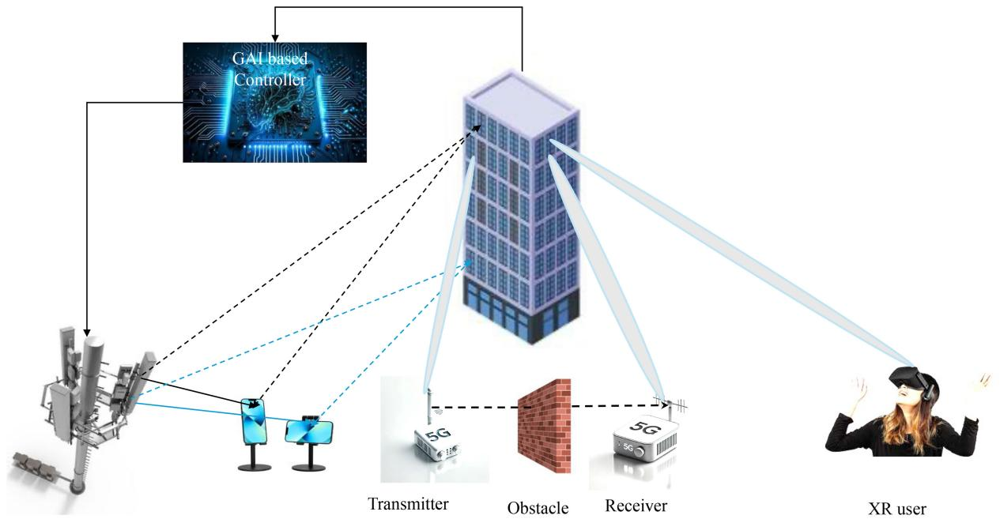

flowchart

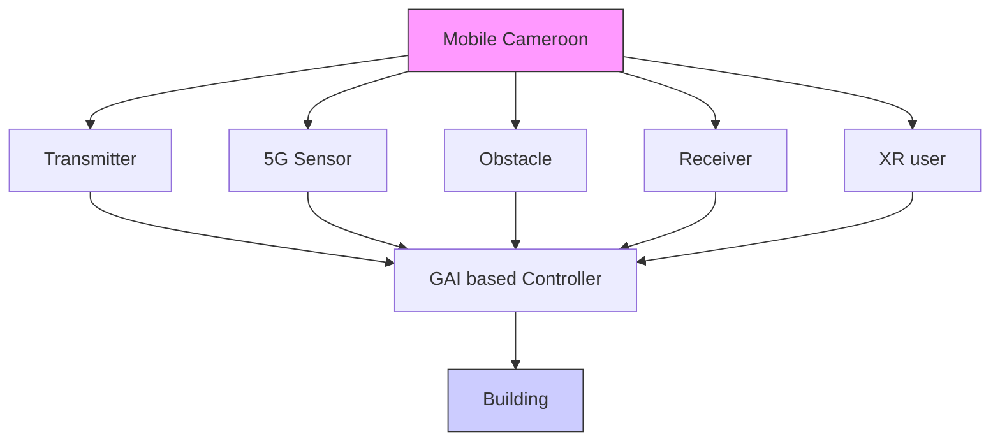
```mermaid
graph TD
    A["Mobile Cameroon"] --> B["Transmitter"]
    A --> C["5G Sensor"]
    A --> D["Obstacle"]
    A --> E["Receiver"]
    A --> F["XR user"]
    B --> G["GAI based Controller"]
    C --> G
    D --> G
    E --> G
    F --> G
    G --> H["Building"]
    style A fill:#f9f,stroke:#333
    style H fill:#ccf,stroke:#333
```

# Application of GANs for channel estimation

# Channel estimation and noise removal:

· Use CBD-GAN for denoising and channel estimation, enhancing CSI accuracy in ISAC.

# Model-driven DL:

· Incorporate prior channel knowledge for efficient training and real-time adaptation in ISAC.

# Multi-user and multi-scenario extensions:

· IRS-GAN handles multi-user/multi-target scenarios, scaling with ISAC's needs.

# Training efficiency and stability:

· Wasserstein distance improves GAN training stability, crucial for reliable ISAC in dynamic environments.

# Simultaneous multi-user training:

· Streamline ISAC operations with simultaneous model training, supporting real-time adaptation.

# Configuration Optimization via GFlowNets

# Dynamic RIS configuration:

· Use GFlowNets for optimal RIS configurations with real-time adaptation in dynamic environments.

# Scalable phase optimization:

· GFlowNets optimize RIS phase shifts, handling discrete shifts and complexity.

# Channel chart for dimensionality:

· Channel charts reduce dimensionality, preserving spatial relationships, and aiding GFlowNets in adapting to mobility and varying conditions.

# Real-time adaptation:

· GFlowNets support real-time RIS configuration, enabling rapid adaptation to changing conditions in ISAC.

# Optimizing XR experiences over THz wireless systems

# Optimizing XR experiences in THz systems:

· Minimize handover costs and ensure QoPE in XR experiences using predictive sensing data.

# Advanced sensing data imputation and prediction:

· A DL model predicts missing values in LoS/NLoS matrices, enhancing ISAC sensing accuracy.

# Transformer-based time series forecasting:

·A transformer-based model forecasts time slots, improving real-time response to changes.

# Adversarial training:

· Adversarial training enhances robustness and generalizability of sensing data.

# Minimizing handover costs:

· A multi-agent RL system with HDRQN minimizes user-centric handover costs and optimizes RIS subarrays.

Fig. 8. Application of GAI models in optimizing the RIS within ISAC-enabled networks.

extracting meanings from transmitted information at the transmitter. This process is facilitated by a matched KB between the transmitter and the receiver, i.e., provisioning massive data samples to serve diverse AI learning and prediction tasks [21]. As a result, AI plays a pivotal role in enabling SemCom.

1) GFlowNet for Intent-Based SemCom: For the intentbased SemCom framework developed in [5], the smart system performs three key functions: measuring confidence in information, enhancing reasoning abilities in devices, and optimizing information transmission and reception. Confidence in the KB is assessed using a probabilistic method based on fuzzy semantics. Here, the concept of Neuro-Symbolic AI (NeSy AI) plays a crucial role. NeSy AI leverages the strengths of both NNs and symbolic AI to create more powerful, flexible, and interpretable intelligent systems. NNs excel at pattern recognition and learning from data, while symbolic AI relies on well-defined knowledge representations and logic rules. The combination allows NeSy AI to provide deeper insights into its decision-making processes and potentially learn from smaller datasets compared to pure neural networks. This is particularly advantageous in scenarios with limited data availability or high data collection costs. Consequently, NeSy AI is well-suited for tackling problems that require both perception (understanding the environment through sensors) and reasoning (combining knowledge and logic).

TABLE III OPTIMIZING ISAC-ENABLED NETWORKS WITH GAI 

<table><tr><td>Ref.</td><td>GAI model</td><td>Optimizing variable</td><td>Objective/loss function</td><td>Improved performance</td></tr><tr><td>[9]</td><td>GAN-CBD</td><td>CSI</td><td>MSE of the estimated channel and true channel</td><td>Normalized MSE of estimated channel and true channel</td></tr><tr><td>[10]</td><td>GAN</td><td>CSI</td><td>Wasserstein distance of generated channel and true channel distributions</td><td>Achievable rate, PDF of average singular value of reflected channels</td></tr><tr><td>[2]</td><td>Encoder-decoder based transformer with auxiliary discriminator</td><td>User association</td><td>Handover cost</td><td>Spectral efficiency, Reliability and resilience, QoPE of XR users</td></tr><tr><td>[42]</td><td>Conditional GFlowNets</td><td>Phase shifts</td><td>Communication rate</td><td>Achievable rate, Generalization across different scenarios</td></tr></table>

NeSy AI in [5] is employed to empower end nodes with reasoning capabilities, making them more intelligent. In pursuit of selecting the most suitable message for transmission, the objective function is formulated based on parameters for the GFlowNet. These parameters account for physical channel effects, imperfections in the KB at the destination node, and the causal structure learning of the data generator (Bayesian network). The objective is to minimize the causal influence on SemCom capturing the causal impact of the sender’s message as observed through a channel. This objective also quantifies the discrepancies between the KB of the sender and that of the receiver. This problem is subjected to the constraint of semantic reliability which is given in terms of the squared error between the sender’s transmitted message and the receiver’s learned message. It is noteworthy that the optimization problem aims to identify optimal encoding and decoding methods, achieved through GFlowNet training. Acting as a NN-based brain, GFlowNet manages encoding and decoding processes efficiently. As mentioned in [5], the objective function of the problem is convex and by backpropagation to fine-tune the GFlowNet and encoder/decoder DNN weights, the unique optimal solution is obtained.

2) GDM-Based Models for Covert Communication in SemCom Systems: Joint training of encoder-decoder pairs in SemCom systems can lead to significant computational overhead, which poses a considerable challenge for deploying network devices. However, the advanced learning capabilities of GAI offer a solution by allowing semantic decoders to reconstruct source messages using limited semantic information, such as prompts. While this approach eliminates the need for joint training with semantic encoders, the diverse abilities of GAI may introduce instability in the output. To address this, multi-modal prompts, including textual descriptions and structural information from images, are utilized in [3]. These prompts are extracted at the semantic encoder stage. The semantic decoder then utilizes this information to generate the source image. The network consists of a transmitter, a receiver, a friendly jammer, and a warden in an open wireless environment. This work employs covert communication technique aiming to hide the transmission behaviour. The warden is presented with two possibilities: either the transmitter is inactive or actively sending a message. By evaluating factors like transmit power, jamming power, and signal degradation over distance, the warden attempts to make a decision. However, the success of covert communication hinges on misleading the warden. This is achieved by maximizing the Detection Error Probability (DEP), which reflects the warden’s likelihood of making incorrect decisions (false alarms or missed detections). A high DEP signifies the warden’s confusion, making it difficult to determine if a secret message is being transmitted. Covert communication is successful when the DEP exceeds a threshold. Both the semantic encoder and decoder employ GDM-based models to extract prompts and generate images. Increasing the number of steps in the diffusion-based model can enhance robustness against noise but may lead to excessive energy consumption. To strike a balance between the number of diffusion steps required for extracting/generating images and energy consumption, joint GDM-based optimization is performed in [3]. The details are given in what follows.

The transmitter’s objective is to transmit images to the receiver while evading detection by a warden, achieving covert communication. This necessitates concealing the very existence of the transmission. To achieve this, both the transmitter and receiver leverage GDM-based models: the transmitter for prompt extraction and the receiver for image generation. The primary goal is to maximize the structural similarity between the original and reconstructed images. Achieving this objective is subjected to the constraint of ensuring that communications remain covert. Additionally, the total power consumption, encompassing the transmitter, jammer, and computational steps of the GDM model, must be below a predefined threshold.

To address this challenge, a two-stage GDM-based algorithm is employed. The first stage introduces a condition vector that encapsulates various factors influencing the optimal resource allocation scheme. These factors include distances between the transmitter/jammer and the warden, path loss exponents for their respective communication links, and smallscale fading effects. This condition vector informs a scheme evaluation network that predicts the effectiveness of a given resource allocation scheme for a specific scenario. The second stage leverages a scheme generation network, trained to generate resource allocation schemes that maximize the image reconstruction quality while maintaining covertness (high DEP). The collaboration between the stages approach allows the generation network to learn efficient resource allocation strategies for diverse conditions.

3) GAN-Based Architecture for Enhancing Message Interpretation in SemCom: The work in [6] proposes an architecture for implicit Semantic-Aware Communication (iSAC). iSAC allows the intended (destination) user to recognize and interpret hidden information within a message, such as hidden relations, concepts, and implicit reasoning processes, that are not directly conveyed by the source signal. The architecture operates in two phases: training and communication. The details are given in what follows.

Based on the system model developed in [6], the source user side consists of an explicit semantics detector, explicit semantic encoder, and semantic comparator. Explicit semantics detector is an encoder that first identifies basic elements in the signal, such as objects or spoken words. However, these labels only capture a surface level of meaning. To truly grasp the full message, these labels should be linked to additional factors like hidden features and relationships between the identified elements. Explicit semantic encoder compresses the high-dimensional data into a semantic constellation space suitable for physical channels. The study in [6] aims to achieve both compression and robustness in a single step. The function can handle joint or separate encoding of entities and relations, significantly reducing the data dimension for transmission. Semantic comparator focuses on how well the intended meaning is conveyed. A key metric is semantic distance, which measures the difference between the sender’s intended meaning and the receiver’s interpretation. This study proposes a method to evaluate this distance by comparing the semantic reasoning paths inferred from the transmitted information. The paths represent the broader understanding derived from the message’s explicit elements. For communication channel, a limited-capacity channel with noise and fading is considered. The received signal is a combination of the encoded message, the channel’s clarity, and background noise. Since the sender does not know how clear the channel is, the receiver needs to interpret the meaning from the noisy version of the transmitted information. The receiver utilizes a semantic interpreter to understand the intended meaning behind the transmitted information. This interpreter builds and analyzes possible reasoning paths. It can identify likely hidden relations and entities that the sender might have intended. The interpreter continuously learns and improves its reasoning abilities based on the data it receives.

Given the system model above, the primary objective in [6] is to develop a system that empowers the receiver to automatically infer the intended meaning behind the transmitted information. This is particularly challenging because communication messages can often contain hidden layers of meaning and relationships between elements. To address this complexity, the problem to minimize the difference (semantic distance) between the sender’s intended meaning paths and the receiver’s estimated meaning paths. However, due to the complexity of real-world communication, a straightforward solution is impractical. Therefore, a generative imitation learning-based framework is derived, allowing the receiver’s semantic interpreter to learn from successful examples and progressively improve its ability to infer the intended meaning from the received information. In the developed iSAC architecture for addressing the aforementioned problem, the details for semantic encoding, semantic distance, semantic comparator at user side, and semantic interpreter at destination side are given in what follows.

The semantic encoding scheme has two crucial properties: efficiency and robustness. The encoding process utilizes a projection-based function to compress the semantic information into a lower-dimensional semantic constellation space, enabling efficient transmission through physical channels. To enhance robustness against channel corruption, the system leverages the sender’s past communication patterns. Frequently used combinations of entities and relations are preferred and encoded in a way that makes them distinct from less frequent combinations. This allows the receiver to make guesses about the intended meaning even if some elements are corrupted during transmission. The projection function can be pre-trained by the sender and shared with the receiver beforehand, eliminating the need for the receiver to possess knowledge of the sender’s specific communication history. For measuring the semantic distance between the intended and inferred meanings, a statistic-based distance measure is proposed that focuses on the reasoning process. The sender shares example paths, and the receiver utilizes them to train its own reasoning mechanism to mimic their behavior. The semantic distance is then measured by comparing the probabilities of taking different reasoning paths between the expert and the receiver’s model. And, the problem of minimizing the semantic distance between the sender’s intended meaning paths and the receiver’s estimated meaning paths is reformulated as minimizing this Jensen-Shannon (JS) divergence-based semantic distance. This problem would bridge the gap between the sender’s intended meaning and the receiver’s interpretation.

Since the destination user cannot directly observe the expert semantic paths, providing effective feedback for training its reasoning mechanism presents a challenge. Sharing the true probability distributions of reasoning paths, is impractical as these depend on the unknown expert reasoning process. To address this, semantic comparator utilizing a discriminator network is developed. This network is trained to distinguish between expert semantic paths from the source user and the paths inferred by the destination user’s reasoning mechanism. As shown in [6], the network’s ability to perform this discrimination is mathematically equivalent to the true semantic distance between the reasoning mechanisms. This eliminates the need for revealing any confidential information about the expert paths or probabilities. The source user can simply use the output of the discriminator network to measure the semantic distance and guide the destination user’s model correction and training. This feedback loop allows the destination user to progressively improve its reasoning mechanism, ultimately leading to a better understanding of the implicit meaning conveyed in the messages.

The main component at the destination side is the semantic interpreter, aiming to minimize the semantic distance between the expert semantic paths and the interpreted paths generated by the policy network of the destination user. In [6], for the destination user, the implicit semantic reasoning process from the received explicit semantics is formulated as a MDP problem. The MDP developed in [6] guides the destination user in inferring implicit meaning. The state space reflects progress in understanding by considering various reasoning paths of different lengths. Actions involve choosing the next relation to extend a path. The reward function incentivizes the generation of paths semantically close to the source’s intended meaning, even without explicit expert paths. The system learns it through indirect feedback and optimizes for efficient transmission of generated paths. Acting as the system’s brain, the policy network determines the most promising relation to explore the next understanding based on the current one, ultimately guiding the system towards paths that align with the source’s meaning.

During the training phase, the semantic interpreter at the destination side aims to generate reasoning paths that extend from the recovered explicit semantics, acting as an AI to understand the deeper meaning behind the message. Specifically, through a series of reasoning steps (episodes), the interpreter builds the reasoning path. In each episode, the interpreter considers the current state (based on the recovered explicit semantics) and chooses an action. This action involves selecting a set of relations (concepts linking entities) to extend the path further. After selecting relations, the interpreter updates the current reasoning path by adding the chosen relations and the newly linked entities. This process of selecting actions and updating the path repeats until the path reaches its maximum allowed length. The value of allowed length is determined based on the complexity of the message (depth of meaning) typically observed in past communication between the source and destination users.

4) GDM-Based Power Control for Semantic AAV Communications: GDM-based power control is proposed in [37] to determine the portion of the transmit power level for a AAV that is assigned to an object to be transmitted to the user. The semantic features of each object are derived by an object detector. To maximize the total semantic transmission quality score for the objects, given in terms of their importance, the combination of the DRL and DDPM algorithms is employed. The output, which is denoised data, determines the transmission power weight for each object.

5) GDM-Based Models for Full-Duplex D2D SemCom: In [7], a full-duplex Device-to-Device (D2D) semantic communication scheme is proposed to support information sharing among multiple Mixed-Reality (MR) users. This scheme enables efficient synchronization of free-space and semantic information. To encourage MR users for semantic information sharing, the authors design an optimal contract using a diffusion model. Within the proposed framework, semantic information is extracted from a user’s view image. First, the image is fed into a semantic encoder that extracts interest points and descriptions. This encoder leverages the selfsupervised SuperPoint architecture [60], which consists of a shared CNN for dimensionality reduction and separate encoders for interest points and descriptors. Extracted interest

points and descriptions from other users are then received through D2D wireless communication for information matching. The framework utilizes SuperGlue [61] as a semantic matching network architecture. This architecture employs an attentional graph neural network to enhance the uniqueness of interest points and descriptors, followed by an optimal matching layer that generates a partial assignment matrix. Additionally, it is trained in a supervised manner using a negative likelihood loss function for the assignment matrix. Finally, a payment plan is developed that incentivizes both the Semantic Information Producer (SIP) and the Semantic Information Receiver (SIR) to cooperate. The utility for the SIP considers the quality of the shared information and its transmit power level. The SIR’s utility is based on the quality of the information received from both itself and the SIP. The plan aims to maximize the SIR’s utility while satisfying a constraint that ensures the SIP’s utility is met. A diffusionbased model (i.e., DDPM) is used to solve this problem, ultimately deriving an AI-generated contract.

6) GDM-Based Framework for Integrated SemCom and AIGC in Metaverse Applications: The study [8] explores the potential of a unified framework for Integrated SemCom and AIGC (ISGC) within metaverse applications. This framework aims to enhance both communication and content generation in the metaverse, including semantic, inference (AIGC), and rendering modules. ISGC offers several key functionalities including generating visually appealing and highly relevant content to the user’s context and needs. Its adaptability to the user’s context and needs can address two major challenges in the metaverse such as inefficient resource utilization and low-quality content.

Based on the findings in [8], the problem of BW allocation in the metaverse is expressed as a MDP to maximize utility for Metaverse Service Providers (MSPs). The state space encompasses various parameters relevant to SemCom performance, including semantic entropy, average transmitted symbols from the semantic module, and channel gains. Additionally, it incorporates transmit power and channel gain from the semantic module, and those the inference module to the rendering module. Furthermore, the state space accounts for computing resources and additive Gaussian noises present at both the AIGC and rendering modules. The action space encompasses the available BW allocation from the semantic, AIGC, and rendering modules, respectively. Finally, a reward function is defined based on the utility for the MSP. To solve this MDP and achieve optimal BW allocation, a combination of a diffusion model and DRL is employed. The details are given the following.

At each step, the method commences by observing the current state. This information serves as the initial input. Subsequently, Gaussian noise is injected into the system to initialize candidate actions. The reverse diffusion process is then employed to refine these actions, effectively removing the noise and generating suitable control signals. To encourage exploration within the environment, exploration noise is further added to the resulting actions. Following action execution, the corresponding reward, determined by a pre-defined utility function, is obtained. Additionally, the complete environment record, encompassing both state and reward information, is stored within a replay buffer for future training iterations. To further enhance the model’s performance, a mini-batch of records is randomly sampled from the replay buffer. Leveraging these samples, the critic networks are updated by computing the loss function and applying the policy gradient. Finally, the target networks are updated to synchronize their parameters with the critic networks.

The concepts discussed in this subsection, the integration of GAI models such as GFlowNet for enhanced semantic communication are given in Fig. 9. This figure provides a visual summary of how these techniques contribute to robust and efficient communication in diverse scenarios.

# B. How GAI Models Are Used for SemCom-Enabled Network Optimization?

The application of GAI for optimizing SemCom network performance across different scenarios in [3], [5], [6], [7], [8], [37] is summarized in Table IV. By leveraging NeSy AI [5], GAI empowers devices (end nodes) with reasoning capabilities, enabling them to grasp the context and implications of information for more efficient and targeted communication. Furthermore, NeSy AI facilitates the selection of optimal messages for transmission by considering channel effects, potential KB discrepancies between sender and receiver, and the causal structure of the transmitted data. This allows for the minimization of misunderstandings and ensures the intended causal impact on the receiver. The framework also tackles the trade-off between semantic reliability, minimizing message distortion, and transmission efficiency, using a specifically designed objective function to train the GFlowNet. Notably, NeSy AI’s ability to learn effectively from limited data makes it advantageous in scenarios where data collection is restricted.

The focus of study in [3] is on covert communication, where the goal is to transmit messages undetected by a monitoring entity. To ensure covertness, the system prioritizes maximizing the DEP, which signifies the warden’s confusion regarding the presence of a hidden message. A GDM-based optimization is implemented to strike a balance between achieving high DEP (covertness) and minimizing energy consumption by the transmitter, jammer, and the GDM models themselves. GAI model in this study addresses the computational efficiency, stability, covertness, and energy usage.

In [6], to optimize networking for implicit semantic-aware communication, a GAI model empowers the receiver to grasp the hidden meaning behind messages, encompassing relationships and concepts that go beyond what is explicitly conveyed. GAI facilitates receiver learning of implicit meaning via generative imitation learning. The receiver’s semantic interpreter progressively improves its ability to infer hidden meaning by learning from successful examples (expert paths). A discriminator network, also powered by GAI, distinguishes between expert and receiver-generated paths, revealing the semantic distance without sharing confidential information. This feedback guides the receiver’s model correction and training. GAI enables learning from indirect feedback through a reward function that incentivizes the generation of semantically close paths. By incorporating these GAI-powered techniques, the system fosters a more robust understanding of the information being communicated.

In the context of MR user communication explored in [7], GAI optimizes networking for efficient semantic information sharing through AI-generated contract. A critical challenge in information sharing is ensuring cooperation between users. This study addresses this by employing DDPM to design an optimal contract. This GAI-powered contract incentivizes both SIP and SIR to cooperate by considering factors like transmission power for the SIP, and contract parameters. The DDPM iteratively refines the contract terms to find a solution that maximizes the SIR’s utility while ensuring the SIP’s needs are met.

In the context of metaverse applications explored in [8], GAI optimizes network parameters for ISGC-enabled network. To achieve optimal BW allocation within this complex MDP, the study utilizes a combination of a diffusion model and DRL. The diffusion model acts as a refinement tool. It injects noise into candidate actions and then employs a reverse diffusion process to remove the noise, effectively guiding the system towards suitable control signals for BW allocation.

# VI. GAI-BASED OPTIMIZATION IN XG COMMUNICATIONS SECURITY

# A. GAI in xG Communications Security

In xG networks, GAI would be a promising tool to ensure robust security communication. This section delves into recent research exploring how GAI can be leveraged to address security challenges in xG communication.

1) GANs for Intelligent Intrusion Detection in IoT-Enabled Networks: Securing xG wireless networks that employ Internet-of-Things (IoT) devices for edge computing presents distinct challenges. Limited computing and storage capacities at edge nodes, reliance on open networks like satellites and WiFi for data transmission, and the inability of existing IDSs to identify novel attacks (e.g., new Distributed Denial-of-Service attacks) are key concerns. To address these issues, a solution for intelligent intrusion detection in IoT-based edge computing is proposed in [11]. This scheme leverages fuzzy rough sets for efficient and rapid feature extraction from data, coupled with a deep convolutional GAN to augment training samples.

Feature selection in intrusion detection systems is a multistep process. The first step involves information processing, where raw network data from edge nodes undergoes preprocessing (e.g., using CICFlowMeter) to generate standardized features that aid in attack data identification without disrupting normal traffic. The second step focuses on choosing the proper features. Here, a decision system denoted as ${ \textit { S } } =$ $( U , C \bigcup D _ { x } , V )$ is employed. Within this system, U represents the set of collected data items, C represents the set of characteristics describing these items, $D _ { x }$ represents the label assigned to each item in U, and V represents the set of all possible values for both the features in C and the decision labels in $D _ { x }$ . This phase leverages a two-step approach. First,

# GAN-based architecture for enhancing message interpretation in SemCom

# Implicit semantic-aware communication (iSAC):

· GAI aids in interpreting hidden meanings.   
·A semantic interpreter infers the sender's intent.   
· Compression into lower-dimensional space for efficient transmission.   
·Enhanced robustness allows clear interpretationin noisy conditions.

# Semantic encoding and robustness:

# Minimizing semantic distance:

· GAI uses JS divergence to align sender's intent with receiver's inference.   
· A discriminator network refines receiver's reasoning.

# MDP-based reasoning process:

· Reasoning modeled as an MDP; policy network selects relations to match sender's intent.   
· Continuous feedback optimizes reasoning paths.

# Training phase and reasoning path construction:

· Receiver's AI builds reasoning paths during training,refining interpretation to optimal path length.

# GDM-based framework for integrated SemCom and AIGC in metaverseapplications

# Integrated SemCom and AIGC framework in metaverse:

·Combines SemCom and AIGC to enhance metaverse communication and content, targeting resource efficiencies and content quality.

# MDP-based bandwidth allocation:

· Models bandwidth allocation as an MDP, optimizing utility for MSPs by adjusting bandwidth across SemCom, AIGC,and rendering modules.

# Optimization using diffusion models and DRL:

· Uses diffusion models and DRL to refine and optimize bandwidth strategies, enhancing decision-making with model-generated rewards.

# Replay buffer for continuous learning:

· Maintains a replay buffer to continuously update and synchronize the model, enhancing long-term performance.

# GFlowNet for intent-based SemCom

# GFlowNet for SemCom:

# Neuro-Symbolic AI (NeSy AI):

# Semantic reliability and knowledge base discrepancies:

·Manages encoding and decoding to optimize information transmisson, considering channel effects and knowledge base imperfections.   
· Fine-tunes to ensure semantic reliability.   
· Combines neural networks and symbolic AI to enhance reasoning, ideal for data-limited scenarios.   
· Empowers end nodes for intelligent message selection.   
· Utilizes fuzzy semantics to assess information confidence.   
· Aligns knowledge between sender and receiver to reduce semantic discrepancies.

Fig. 9. Application of GAI models in optimizing SemCom-enabled networks.

the membership degree of all elements within the data set U is calculated (as described in [11]). Then, to select relevant features from the set C, two metrics are evaluated for each feature by using the membership degrees: decision loss and

# GDM-based models for semantic UAV and D2D communications

# GDM-based power control for Semantic UAV communications:

·Uses GDM for power allocation in UAVs based on object importance.   
· Employs DRL and DDPM to maximize semantic transmission quality.

# GDM-based models for full-duplex D2D SemCom:

· Implements a full-duplex D2D scheme for MR user interaction.   
· Uses SuperPoint and SuperGlue architectures for semantic encoding and matching.   
· Develops an AI-generated contract with DDPM to optimize user incentives and information quality.

Heterogenous users   
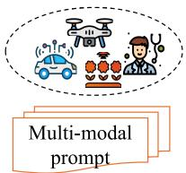

text_image

Multi-modal
prompt

Heterogenous users   
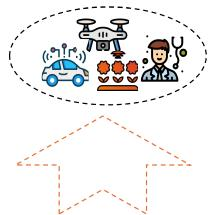

text_image

Diagram showing drone operation with car, medical professional, and plant, above a star-shaped outline

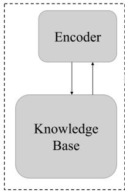

flowchart

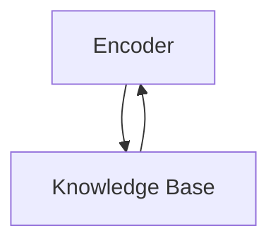
```mermaid
graph TD
    A["Encoder"] --> B["Knowledge Base"]
    B --> A
```

Semantic encoder   
Communication Channel

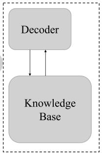

flowchart

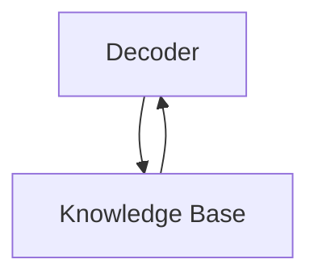
```mermaid
graph TD
    A["Decoder"] --> B["Knowledge Base"]
    B --> A
```

Semantic decoder

# GDM-Based models for covert communication in Sem- Com systems

Enhanced Decoder Capabilities: GAI enables decoders to reconstruct messges from limited prompts,reducing dependency on joint training. Uses multi-modal prompts for image generation.

Covert communication: GAI employs GDM-based models for covert communication, optimizing prompt extraction and image generation to maximize similarity and evade detection.

Optimization of diffusion models: Balances image quality and energy use with a two-stage algorithm for evaluating and generating resource allocation schemes.

4. Resource allocation: GAI-driven strategies optimize resource allocation for covert communication andenhanced image reconstruction, adjusting to environmental factors.

the difference between the individual feature and the entire feature set C. These metrics leverage the membership degrees of the elements in U. This difference is quantified using the Fuzzy Knowledge Distance (FKD) metric, as detailed in [62].

TABLE IV OPTIMIZING SEMCOM-ENABLED NETWORKS WITH GAI 

<table><tr><td>Ref.</td><td>GAI model</td><td>Optimizing variable</td><td>Objective/loss function</td><td>Improved performance</td></tr><tr><td>[5]</td><td>GFlowNet</td><td>DNNs&#x27; parameters for encoder, decoder, and GFlowNet</td><td>Causal influence on SemCom</td><td>Amount of transmitted bits, Semantic reliability</td></tr><tr><td>[3]</td><td>GDM</td><td>Transmitter and warden power, number of steps for diffusion model</td><td>Structural similarity of the source and receiver images (SSM)</td><td>Detection error probability, SSM</td></tr><tr><td>[6]</td><td>Generative imitation learning</td><td>Parameters of the semantic interpreter at the destination user</td><td>JS divergence-based semantic distance between the intended and inferred meanings</td><td>Implicit meaning interpretation at destination user</td></tr><tr><td>[37]</td><td>GDM</td><td>Portions of the UAV transmit power level</td><td>Total semantic transmission quality score for the objects</td><td>Transmission quality, Bit error rate</td></tr><tr><td>[7]</td><td>GDM</td><td>Transmit power level for SIP, Contract parameters</td><td>SIR utility</td><td>Bit error probability for a user, Achievable rate for a user, Contract values</td></tr><tr><td>[8]</td><td>GDM</td><td>BW</td><td>Utility for the MSPs</td><td>BW utilization for enhancing user experience</td></tr></table>

If both the decision loss and the FKD value for a particular feature exceed predefined thresholds, that feature is selected for further analysis.

While feature selection can improve intrusion detection efficiency, it can also lead to data loss and potentially impact accuracy. To address this, [11] incorporates feature correlation modeling. This approach leverages the FKD metric to analyze the relationships between features within the selected data set. By constructing a feature correlation mechanism based on FKD, features can be prioritized for efficient extraction, ultimately enhancing the accuracy of network intrusion detection.

Benefiting from the power of CNNs combining CNNs with a GAN, intrusion detection is then implemented. By generating synthetic attack data, this scheme can potentially achieve similar training results with a smaller actual dataset, which would be more suitable for edge nodes. This enables the system to handle diverse network scenarios.

The study in [12] introduces an AI-based network IDS that leverages the Boundary Equilibrium GAN (BEGAN), to address critical data imbalance issues inherent in network traffic. This system enhances detection capabilities by generating synthetic attack data, thus enriching the training sets and enabling the detection models to learn a wider array of attack behaviors, including those that are rare and complex. The four-stage architecture of the system- preprocessing, generative model training, autoencoder training, and predictive model training- ensures data processing and feature extraction, boosting the accuracy and reliability of threat detection. The details are explained in what follows.

The first stage, preprocessing, focuses on refining the raw data set. This involves three subprocesses: outlier analysis, one-hot encoding, and feature scaling. Outlier analysis utilizes the Median Absolute Deviation (MAD) measure to identify and remove data points that deviate significantly from the expected normal distribution of the attributes. The standard deviation is then calculated based on the MAD and used as a threshold for outlier filtering. Next, the remaining attributes are transformed into one-hot vectors. This encoding method represents each categorical attribute value (e.g., protocol values like TCP, UDP, and ICMP) as a separate binary feature within a vector. The size of the vector corresponds to the total number of possible attribute values. Finally, the system scales the numeric attributes using the min-max normalization method.

Following preprocessing, this refined data is used to train a generative model called BEGAN. This model builds upon the concept of autoencoders, which are neural networks that learn to compress and reconstruct data. BEGAN utilizes a reconstruction error-based objective function, meaning it aims to minimize the difference between the original data and the data it reconstructs. The BEGAN model’s discriminator architecture is based on a symmetrical autoencoder with five layers. The generator, in turn, mirrors the decoder portion of this autoencoder architecture. In BEGAN, multiple generative models are built, typically one for each class of data. After training, each generative model specializes in producing synthetic data that corresponds only to its assigned class. BEGAN offers a unique advantage during training. Unlike some generative models, BEGAN can reach a state of equilibrium, where the generator and discriminator are evenly matched. This characteristic simplifies the training process by making it easier to determine when to stop training.

After the preprocessing and generative model training phases, the system leverages the expanded training set for the final two stages: autoencoder training and detection model training. The autoencoder, a type of NN, is trained to learn compressed representations of the network traffic data. This compressed data can be beneficial for dimensionality reduction, which can improve the efficiency of training the subsequent detection model.

For the detection model, the system offers flexibility in choosing from various architectures, including basic DNNs, CNNs, and LSTM networks. Each architecture is suited to extract different features from the network traffic data. Basic DNNs provide a good general-purpose option, CNNs excel at extracting spatial features, and LSTMs are particularly adept at analyzing sequential data with temporal dependencies. The choice of architecture depends on the specific characteristics of the network traffic data and the desired outcome of the detection model.

In IoT networks assisted by AAVs, as the number of AAVs increases, the risk of cyber attacks also rises. Additionally, some AAVs suffer from limited local data samples and imbalanced data distribution, hindering the efficiency of local model updates and the robustness of IDS models. To address these challenges, [13] proposes an IDS that uses conditional GANs to effectively learn the data distribution and guide balanced data generation. To address the challenges of vanishing gradients, retaining long-term contextual information, and capturing subtle variations between normal and attack data, the IDS employs Long Short-Term Memory (LSTM) networks in both the generator and discriminator of the conditional GAN. The LSTM network in the generator leverages its ability to capture fine-grained features of sequential data to generate new samples based on the corresponding conditional labels. These generated samples are then fed into the discriminator alongside real, labeled data, where the LSTM within the discriminator attempts to distinguish between them. This adversarial training process, where the generator aims to produce increasingly realistic data and the discriminator strives to identify forgeries accurately, iterates alternately. Ultimately, the trained LSTM network within the discriminator becomes a powerful classifier, enabling the IDS to detect and accurately classify attack data. By leveraging the feature extraction ability of LSTMs, the GAN-generated data acts as augmented data, enhancing intrusion detection and classification performance.

While the conditional GANs-based method explained above can effectively learn data representations from the limited datasets collected by individual drones, these representations may be biased due to variations in data type, volume, and collection methods across AAVs. Furthermore, encountering a new attack type necessitates retraining each drone with the new data, a time-consuming process. In [13], instead of sharing data directly between drones, distributed FL is employed, providing a more efficient and secure alternative by enabling AAVs to collaboratively train a model by sharing only the trained model parameters, not the raw data itself. Specifically, a novel approach for collaborative intrusion detection is proposed in [13]. This framework leverages a blockchain-powered distributed FL architecture to enhance performance. It operates in two stages: local model training at the AAV level and global model aggregation at the Mobile Edge Computing (MEC) level. The details are given in what follows.

During the local training phase, each AAV operates as a federated learning participant, independently training its IDS model using conditional cGANs on its locally collected data. To ensure data privacy, Gaussian noise is added to both the data features and the locally trained model parameters before transmitting them to the aggregation node. In the global model aggregation phase, a MEC node serves as both the computational hub and the blockchain maintainer, aggregating the received model parameters from all AAVs into a global IDS model. Additionally, the MEC node securely logs these parameters as blockchain transactions to enhance data integrity and transparency in the federated learning process. The MEC node then aims to minimize a global loss function, which is given in terms of the combined loss function from all AAVs and the sum of their model parameters. This distributed approach utilizes multiple MEC nodes for collaborative training, fostering robustness through a secure blockchain network. The blockchain stores the evolving global model and facilitates consensus among nodes on its validity, eliminating single points of failure and ensuring data integrity. Additionally, MEC nodes with better performing models contribute more significantly to the global model, incentivizing participation and promoting overall accuracy.

To achieve a continuously improving global intrusion detection model, a trust-based update process is employed. MEC nodes calculate trust values for each AAV. When a trust value exceeds a predefined threshold, the MEC node receives the local model parameters from the AAV. These local parameters are then aggregated across all AAVs. The resulting global parameters are subsequently broadcast back to each AAV, where they are incorporated into the local model training process. This iterative process of local training, parameter aggregation, and global model distribution continues until the overall model converges, enabling accurate detection and classification of attack data.

2) GAN-Based Models for Trust Management in Industrial Wireless Sensor Networks: The dynamic nature of Industrial Wireless Sensor Networks (IWSNs) demands robust security. Hence, a trust management scheme is crucial to distinguish legitimate data from malicious attacks and tolerate network issues for reliable communication. As demonstrated in [14], such a scheme can be developed with functionalities like trust evidence collection, trust classification, and trust redemption.

For trust evidence collection, the IWSNs should have the ability to distinguish between trustworthy and malicious nodes. In doing so, [14] focuses on collecting evidence regarding data transmissions, such as packet drops, delays, and tampering attempts. However, the industrial environment can introduce uncertainties – node faults or interference can mimic attacks. To account for this ambiguity, the scheme leverages Interval Type-2 Fuzzy Logic, excelling at handling both fuzziness and randomness inherent in the collected evidence. The scheme calculates trust attributes like packet loss rate and transfer delay rate, and utilizes fuzzy sets to categorize these attributes into low, medium, or high trust levels. Furthermore, predefined fuzzy rules map these trust attributes to a final trust value for each node. This approach allows the system to make robust trust evaluations even in the presence of uncertainties within the IWSN.

Traditional trust classification methods struggle in industrial applications due to limited experience and the dynamic environment. Inspired by GANs’ ability to learn sample distributions, the authors in [14] propose a encoder-decoder structure for trust classification. Trust values from the initial deployment (assumed to have few malicious nodes) are used to create training data (real samples) in the form of trust vectors (sequences of historical trust values). A conditional GAN acts as the decoder, while a standard GAN serves as the encoder. The encoder learns a compressed representation (latent data) of a trust vector. The decoder reconstructs a trust vector based on the latent data and conditional information (changes in trust values). Both the GAN and CGAN are optimized through adversarial training. Batch normalization is employed to improve training stability and convergence.7 After training, the current trust vector of a node is fed into the encoder-decoder structure. The reconstruction loss is then used to determine whether the node is trustworthy or not.

For trust redemption, it is critical to mitigate the effects of false positive malicious node detection. In [14], a GANbased trust redemption model is proposed. This model allows potentially good nodes, mistakenly identified as malicious, to regain trust within the network. During steady operation, the system gathers sequences of trust evidence from labeled malicious nodes. These sequences are then processed to create attack probability vectors, forming the training data for the GAN. The GAN’s generator attempts to learn the features of real attack probabilities and predict missing information. The GAN’s discriminator, on the other hand, aims to distinguish between genuine and generated data. Through an iterative training process, the model refines its ability to predict attack probabilities. Subsequently, this trained model can assess future attack likelihood for suspect nodes. If the model predicts a low probability of malicious behavior, the node can potentially be reintegrated into the network, improving overall network efficiency.

In [14], GANs are leveraged to address critical security challenges in IWSNs because traditional classification methods often struggle due to limited data and the dynamic nature of these networks. In this study, the GAN-based encoder-decoder structure analyzes historical trust data and distinguishes trustworthy nodes from potential attackers, effectively handling uncertainties inherent in the network. Moreover, GANs play a key role in the trust redemption model, which mitigates the effects of false positives. By analyzing evidence from labeled malicious nodes, the model can predict the likelihood of future attacks. This allows the network to potentially reintegrate good nodes that were mistakenly flagged, leading to a more robust and efficient IWSN security system.

The core ideas discussed in this subsection, such as the use of GANs for intelligent intrusion detection, data augmentation, and trust management in IoT-enabled xG networks, are illustrated in Fig. 10, illustrating how advanced GAN-based models contribute to improving security, trust evaluation, and data handling in resource-constrained and dynamic network environments.

# B. How GAI Models Are Used for Network Security Optimization?

As discussed previously through studies [11] and summarized in Table V, GAI can optimize security in xG communication.

The proposed GAI-based security schemes in [11], [12], [13] aim for a proactive security posture which is an objective for security in wireless networks, especially given the dynamic and often vulnerable nature of wireless communications. It refers to a strategic approach in cybersecurity where measures are implemented to prevent security incidents before they occur, rather than merely responding to them after they happen. This proactive stance involves anticipating potential threats and vulnerabilities and taking preemptive actions to mitigate or eliminate risks. In these studies, this objective is obtained by generating synthetic attack data. GAI expands the range of scenarios that the IDS can experience and learn from, ensuring that emerging threats can be detected early and accurately.

In [11], FKD plays a critical role in streamlining the data that the IDS needs to process. By focusing on the most relevant features, it reduces the computational complexity and speeds up the detection process. To efficiently learn representations (encoding) of the data while reducing dimensionality, autoencoder is used in [12]. This compressed feature representation helps in focusing on the most significant aspects of the data, enhancing the detection of anomalies by reducing the influence of noise and irrelevant information. Anomalies are detected based on the reconstruction error, which is the difference between the original input and its reconstruction from the compressed representation. In AAV networks in [13], where data may have temporal dependencies, LSTM is used effectively to capture these dynamics. It contributes to recognizing complex patterns and sequences in data, which are crucial for detecting sophisticated cyberthreats that may unfold over time. Additionally, FL allows multiple AAVs to collaboratively learn a shared intrusion detection model while keeping all the training data local to each AAV. This approach not only preserves the privacy of the data but also reduces the BW needed for transferring large datasets. Blockchain builds trust in the system’s integrity and the validity of shared data and model updates. Type-2 fuzzy logic in [14] is used to evaluate the trustworthiness of each sensor node in the network dynamically. By continuously assessing the trust levels of sensor nodes, the system can make informed decisions about data credibility and node reliability.

# VII. NETWORK-ASSISTED EXECUTION OF GAI MODELS

Previously, the potential of the GAI models for optimizing the xG wireless networks was explored. In this section, as briefly discussed in Table VII, we expand the focus and delve into the role of efficient networking in facilitating the functionalities of GAI.

# A. Blockchain-Enabled Lifecycle Management for Edge AIGC Products

The recently proposed edge AIGC paradigm, where AIGC services are distributed to edge devices, effectively addresses latency issues but introduces significant challenges in managing the lifecycle of AIGC products. These challenges include tampering, plagiarism, and ensuring overall trustworthiness. To tackle these issues, a blockchain-powered framework is proposed in [63] that comprehensively manages the lifecycle of AIGC products across three stages. In the first stage, generation, Edge Service Providers (ESPs) utilize carefully crafted prompts to generate content using advanced AI models. Following creation, the AIGC products transition into the

7Batch normalization tackles exploding or vanishing gradients, a problem in DNNs. It normalizes layer outputs during training, leading to faster convergence and more stable training.

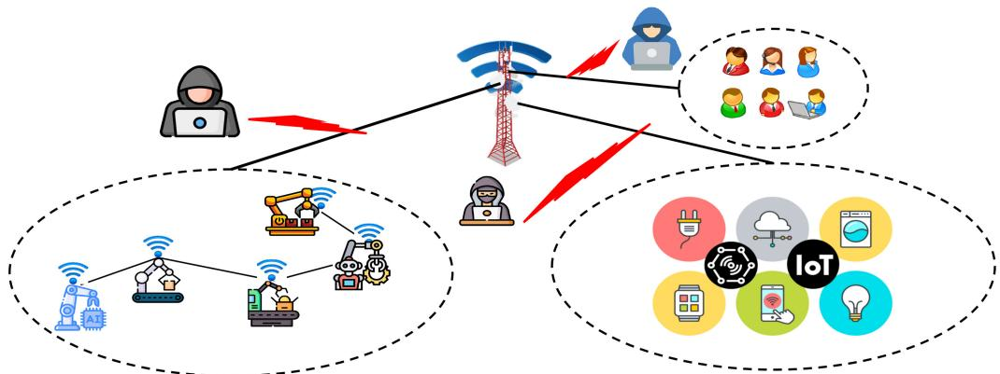

flowchart

```mermaid
graph TD
    A["Security Personnel"] --> B["Central Tower"]
    C["Robot Arm"] --> D["Robot Arm"]
    E["Robot Robot"] --> F["Robot Robot"]
    G["Robot Server"] --> H["Robot Server"]
    I["Robot Server"] --> J["Robot Server"]
    K["Robot Server"] --> L["Robot Server"]
    M["Robot Server"] --> N["Robot Server"]
    O["Robot Server"] --> P["Robot Server"]
    Q["Robot Server"] --> R["Robot Server"]
    S["Robot Server"] --> T["Robot Server"]
    U["Robot Server"] --> V["Robot Server"]
    W["Robot Server"] --> X["Robot Server"]
    Y["Robot Server"] --> Z["Robot Server"]
    AA["Robot Server"] --> AB["Robot Server"]
    AC["Robot Server"] --> AD["Robot Server"]
    AE["Robot Server"] --> AF["Robot Server"]
    AG["Robot Server"] --> AH["Robot Server"]
    AI["Robot Server"] --> AJ["Robot Server"]
    AK["Robot Server"] --> AL["Robot Server"]
    AM["Robot Server"] --> AN["Robot Server"]
    AO["Robot Server"] --> AP["Robot Server"]
    AQ["Robot Server"] --> AR["Robot Server"]
    AS["Robot Server"] --> AT["Robot Server"]
    AU["Robot Server"] --> AV["Robot Server"]
    AW["Robot Server"] --> AX["Robot Server"]
    AY["User Laptop"] --> Z
    AZ["Laptop"] --> AA
    BA["Laptop"] --> BB["Laptop"]
    BC["Laptop"] --> BD["Laptop"]
    BE["Laptop"] --> BF["Laptop"]
    BG["Laptop"] --> BH["Laptop"]
    BI["Laptop"] --> BJ["Laptop"]
    BK["Laptop"] --> BL["Laptop"]
    BM["Laptop"] --> BN["Laptop"]
    BO["Laptop"] --> BP["Laptop"]
    BQ["Laptop"] --> BR["Laptop"]
    BS["Laptop"] --> BT["Laptop"]
    BU["Laptop"] --> BV["Laptop"]
    BW["Laptop"] --> BX["Laptop"]
    BY["Laptop"] --> BZ["Laptop"]
```

GAN-based models for trust management in industrial wireless sensor networks   
GANs for intelligent intrusion detection in IoT-enabled networks

# Trust management in IWSNs:

IWSNs require a robust trust management system to differentiate between legitimate and malicious data, ensuring reliable communication despite network uncertainties.

# Trust evidence collection:

Interval Type-2 Fuzzy Logic is used to categorize trust attributes (e.g., packet loss, delays) and handle ambiguities in node behavior, allowing more accurate trust evaluations in the presence of uncertainties.

# Trust classification with GANs:

A GAN-based encoder-decoder model classifies trustworthiness by analyzing historical trust data. The system encodes and reconstructs trust vectors, using reconstruction loss to determine if a node is trustworthy.

# Trust redemption using GANs:

A GAN-based model helps falsely flagged nodes regain trust by predicting the likelihood of future attacks using attack probability vectors, reducing false positives and improving network efficiency.

# GANs in IWSN security:

GANs enhance security in IWSNs by improving trust classification and facilitating trust redemption, making the network more resilient and efficient.

# Challenges in IoT-enabled xG networks:

· Securing IoT edge networks in xG systems is challenging due to limited resources, reliance on open networks, and the limitations of traditional IDSs in detecting novel attacks (e.g., DDoS).

# GANs for intelligent intrusion detection:

· IoT intrusion detection: Fuzzy rough sets and dep convolutional GANs enhance feature extraction and augment training data to improve IDS in resource-constrained edge networks.   
· Feature selection: Metrics like decision loss and FKD are used to select relevant features without losing critical data, boosting detection accuracy.   
· Data augmentation: CNNs combined with GANs generate synthetic attack data, improving IDS performance with smaller datasets.

# BEGAN for data imbalance:

·BEGAN addresses data imbalance by generating synthetic data with autoencoder-based architecture.   
·Multi-stage system: Data preprocessing (outlier analysis, one-hot encoding, scaling), BEGAN training, autoencoder compression,and model training (using DNNs, CNNs, 0r LSTMs).

# LSTM-based conditional GAN for UAV-assisted IoT networks:

· LSTM-based conditional GANs generate new samples for IDS, enhancing performance in UAV-assisted IoT networks with imbalanced data.

# FL and blockchain for collaborative IDS:

· FL with blockchain allows UAVs to train IDS models collaboratively without sharing raw data.   
· Two-stage process: Local GAN-based training on UAVs and global model aggregation at MEC nodes secured via blockchain. Trust-based updates further enhance model accuracy.

Fig. 10. Application of GAI models in optimizing xG communication security.

distribution stage, where they are disseminated across various platforms, ranging from popular social media to specialized AIGC platforms dedicated to sharing and consuming AI-generated content. The final stage, trading, involves the economic aspects of AIGC, typically modeled as transfers of ownership or rights between parties. The blockchain framework central to this approach involves multiple stakeholders, including producers, ESPs, consumers, and potential attackers.

TABLE V SECURITY IN XG WIRELESS NETWORKS WITH GAI 

<table><tr><td>Ref.</td><td>GAI model</td><td>Objective</td><td>Methodology for enhancement</td><td>Challenge</td><td>Network Improvement</td></tr><tr><td>[11]</td><td>Deep convolutional GANs</td><td>Intrusion detection</td><td>FKD for feature selection</td><td>Data scarcity and model training efficiency at the network&#x27;s edge</td><td>Accuracy</td></tr><tr><td>[12]</td><td>Wasserstein GANs</td><td>Intrusion detection</td><td>Autoencoder for anomaly detection</td><td>Data imbalance in network traffic and anomaly detection</td><td>Accuracy</td></tr><tr><td>[13]</td><td>Conditional GANs-LSTM</td><td>Intrusion detection</td><td>FL and blockchain for data integrity</td><td>Collaborative learning in dynamic UAV environments with emphasis on privacy</td><td>Accuracy</td></tr><tr><td>[14]</td><td>GANs-encoder and decoder</td><td>Trust management</td><td>Type-2 fuzzy logic systems for trust evaluation</td><td>Trust management in dynamic and potentially hostile industrial environments</td><td>Network lifetime, Network throughput, Packet dropping attack, Packet delaying attack.</td></tr></table>

TABLE VI ANALYSIS OF NETWORKING ENHANCEMENTS FOR INTEGRATION OF GAI-BASED APPLICATIONS 

<table><tr><td>Ref.</td><td>Focus</td><td>Networking role</td><td>Contributions</td><td>Improvement</td></tr><tr><td>[63]</td><td>Managing AIGC lifecycle with blockchain integration in edge networks.</td><td>Facilitating decentralized management and secure transactions of AI content between edge devices and networks.</td><td>Blockchain for transaction integrity, copyright protection, and trust in AI content distribution.</td><td>Blockchain latency</td></tr><tr><td>[64]</td><td>Efficient AI content generation using collaborative and distributed computing in wireless networks.</td><td>Enables collaborative processing of AI tasks across distributed devices,</td><td>Distributed diffusion processes to share the computational load across networked devices.</td><td>Network resources and computational efforts</td></tr><tr><td>[65]</td><td>Privacy-preserving training of AI models for content generation using FL in wireless networks.</td><td>Supporting the distribution of AI model training across various clients without central data aggregation</td><td>FL for decentralized AI training across networked devices, maintaining data privacy.</td><td>Privacy and BW usage</td></tr><tr><td>[66]</td><td>Secure and efficient AIGC in the Metaverse using blockchain and SemCom technologies.</td><td>Efficiently handling large data transfers required for AI content generation</td><td>Secure framework for transmitting semantic data efficiently across entities, using blockchain and ZKPs for added security.</td><td>Security</td></tr></table>

It provides a traceable and immutable ledger and supports essential on-chain mechanisms such as proof of AIGC, incentive mechanisms, and ESP selection.

The proof of AIGC involves two critical phases: proof generation and challenge phase. During the former phase, each ESP registers its AIGC products on the blockchain, establishing ownership rights for the producers. The latter phase allows original content creators to protect their copyrights by identifying and challenging unauthorized copies on the blockchain, potentially leading to their deregistration.

The incentive mechanism is designed to motivate all stakeholders to actively participate in lifecycle management by incorporating mechanisms like coinbase transactions, which reward block creators, and ensuring atomic execution of trades involving funds and ownership.

During ESP Selection, producers assess ESPs based on a reputation system that accounts for past interactions (both positive and negative) and includes a manually set uncertainty factor reflecting the quality of communication. This reputation system guides producers in choosing the most reliable ESP for their needs.

# B. Collaborative Distributed Diffusion for Energy-Efficient AIGC Execution

The focus of the study detailed in [64] revolves around enhancing network functionalities to mitigate the limitations encountered during the deployment of AIGC. The study introduces a collaborative distributed diffusion-based AIGC framework designed to optimize computing energy usage and improve user experience by promoting device collaboration. This collaboration addresses the challenges faced by resourceconstrained devices in executing AIGC services.

As discussed in Section II, diffusion models such as DDPM progressively generate new data by iteratively removing noise from a latent representation. The study proposes three network architectures to support this process: edge-to-multiple devices, device-to-device, and multi-device clustering, which can function with or without an edge server’s involvement.

In the edge-to-multiple devices architecture, an edge server serves as a central hub, processing shared denoising steps for groups of user devices tasked with semantically similar AIGC projects. Subsequently, each user completes the specific denoising steps independently, yielding benefits such as reduced latency, optimized resource allocation, and effective load balancing. The D2D architecture facilitates direct collaboration between two devices on AIGC tasks. Here, agreed-upon shared processing steps are performed by one device, after which intermediate results are exchanged, allowing each device to finalize the process independently. This approach promotes energy efficiency and enhances privacy. Furthermore, the clustering architecture involves groups of user devices collaborating to manage AIGC tasks. These clusters may be formed with the assistance of an edge server or through self-organization based on the capabilities of the devices involved. Devices within a cluster cooperatively handle shared processing steps, exchange intermediate results, and then independently complete the remaining tasks. This model is recognized for its adaptability, scalability, and efficient resource utilization.

Irrespective of the chosen architecture, the collaborative AIGC process commences with the training of high-quality AIGC models on robust computing platforms using extensive datasets. Post-training, these models are distributed to both edge servers and user devices to facilitate efficient task execution. Users initiate this process by submitting requests that describe their desired AIGC content. The system strategically analyzes these requests to optimize resource distribution and performance, employing a knowledge graph for semantic analysis to identify and group similar tasks. This facilitates the customization of shared processing steps for each group, thereby enhancing overall efficiency. The knowledge graph is dynamically updated to accommodate new tasks and adapt to user reclustering needs effectively.

For groups with analogous tasks, shared processing steps are executed on a central server using any relevant prompt from the group. Intermediate results are then forwarded to edge devices for subsequent processing. Ultimately, user devices receive these intermediate results and perform the final steps specific to their requests. This localized processing approach conserves energy, safeguards privacy, and empowers users to efficiently generate the AIGC content they desire. By distributing the processing load between a central server and user devices, this collaborative approach not only balances the workload but also minimizes latency, ensuring the generation of high-quality content.

# C. FL for Distributed Training of Large-Scale AIGC Models

The study in [65] introduces a FL technique tailored for training large-scale AIGC models using massive datasets. This approach permits distributed clients to collaboratively train the model while retaining all training data locally, thereby preserving privacy.

This study investigates FL as a method to train high-capacity AIGC models, with a specific focus on the stable diffusion model, renowned for its high-quality image generation capabilities. FL-based methods enable distributed clients to collaboratively train the model while maintaining the privacy of their data. However, applying FL to AIGC models presents several challenges. For instance, in conventional FL, where each client trains the entire model, the computational demand can be high for clients with limited resources. Furthermore, when clients have varying data sizes and computational capabilities, the overall training process, particularly the convergence rate, can be adversely affected.

Parallel FL provides a degree of privacy protection but necessitates that all participants train the full model, which can be computationally intensive. On the other hand, the split learning approach within FL seeks to mitigate the computational load on resource-constrained clients by allowing them to take part in the training process. This method, however, requires a distinct separation of data roles among participants: one group holds all the training input samples, and another possesses only the corresponding labels. This requirement renders split learning inappropriate for certain AIGC models where local training at each client’s site needs both the input data and its labels for effective backpropagation.

Given these limitations, the study proposes an optimized FL approach for fine-tuning the stable diffusion model, incorporating a D2D model-sharing technique to expedite the training process. This process unfolds in several steps. Specifically, in initialization step, the parameter server selects a client and transmits the current model weights. In local training, the chosen client updates the model using its data and then exits the active pool. During round completion, if all clients have participated, the round ends; otherwise, the active client selects another from the remaining pool to continue training. In training completion, after a predetermined number of rounds, the base model and the refined weights merge to form a personalized model capable of generating customized content efficiently. This federated approach leverages network infrastructure to enable seamless communication among clients, facilitating collaborative model training while maintaining data privacy. This distributed training relies on adequate network BW to handle model weight exchanges and client coordination effectively.

# D. Securing SemCom in Virtual Transportation Networks With Blockchain

Virtual transportation networks in the metaverse challenge Virtual Service Providers (VSPs) with data collection, transmission efficiency, and security. A recent study [66] proposes a framework integrating AIGC, blockchain technology, and SemCom to address these concerns. This framework facilitates seamless interactions between the physical and virtual worlds. However, a security vulnerability exists – attackers could manipulate semantic data, altering its meaning before it reaches the blockchain.

To address this, the framework incorporates Zero-Knowledge Proofs (ZKPs). ZKPs allow secure processing of semantic data while guaranteeing the validity of any transformations, without revealing the actual data. Edge devices (like smartphones) capture real-world images and convert them into semantic data. VSPs interpret this data and use AIGC services to render corresponding visuals within the metaverse. To distinguish manipulated data, edge devices apply spatial transformations (e.g., blurring) to the authentic data. ZKPs then ensure the blurred data originates from legitimate transformations. Edge devices leverage a security parameter and a program to generate a shared secret string containing keys for both performing the computations (evaluation key) and verifying the results (verification key). The evaluation key allows edge devices to generate a zeroproof demonstrating the relationship between the original and transformed data, without revealing the data itself. The verification process is handled jointly by the blockchain, edge devices, and VSPs. All parties can query the verification results stored on the blockchain, fostering trust in a decentralized manner. The verification key, stored as a smart contract input, determines whether to accept or reject the proof based on the provided outputs. As shown in [66], this defense mechanism satisfies completeness, soundness, and zero-knowledge.

# VIII. CASE STUDY: DIFFUSION-BASED CA, LOAD BALANCING, AND BACKHAULING IN NTNS

In the preceding sections, we have discussed the powerful capabilities of GAI models in addressing the complexities of xG wireless networks. Motivated by the need for innovative solutions to optimize resource allocation and enhance network performance, this case study focuses on the practical application of diffusion-based GAI models for resource allocation in NTNs. Traditional methods such as optimization theory or game theory, while effective in certain scenarios, face significant limitations in NTNs due to the highly dynamic and complex nature of LEO satellite constellations. These methods often struggle with scalability, adaptability, and real-time decision-making in environments with constantly changing network conditions and heterogeneous resources.

Additionally, traditional ML-based methods such as RL techniques, though useful, can be limited in their ability to explore the action space thoroughly. GAI enhances RL by encouraging agents to explore more diverse actions and potential solutions through the generation of novel scenarios and actions. In this case study, we concretely demonstrate how the practical application of DDPM in NTNs can overcome the limitations of traditional ML based methods and other GAI models like GANs and GFlowNets. This is achieved through the enhancement of policy improvement processes, spectrum utilization, data rate optimization, and overall network efficiency. By directly applying DDPM, we will illustrate how this model addresses the challenges posed by NTNs, such as high variability in network conditions and the need for robust, real-time decision-making.

While GANs can generate realistic synthetic data and complex network scenarios, their application in NTNs is hindered by training instability and high computational overhead due to the simultaneous training of two networks. This can lead to challenges in achieving convergence and poor performance in noisy environments typical of wireless networks [67]. GFlowNets, on the other hand, are effective at generating diverse samples proportional to reward distributions, thus enhancing exploration in reinforcement learning. However, their complexity arises from the need to carefully tune flow network parameters and satisfy flow consistency equations [68], [69], making the training process computationally intensive and sensitive to reward structures.

In contrast, DDPM provides a more stable and robust solution for policy improvement in NTNs. Its ability to generate high-quality samples with robustness to noise and relatively straightforward implementation makes it particularly suited for enhancing policy decisions in the dynamic and heterogeneous conditions of NTNs. This study leverages these strengths of DDPM to refine policies that optimize spectrum utilization, improve data rates, and enhance overall network efficiency in NTNs. It not only highlights the transformative potential of GAI models but also provides an example of how DDPM can be effectively employed in NTNs to improve the network performance.

# A. Background

Future communication systems need extensive connectivity, reliable coverage, and strong backhaul links. xG wireless systems, including 6G networks, are looking to NTNs to improve global communication infrastructure. LEO satellite constellations like Starlink and Lightspeed aim to provide faster data and lower latency, but managing limited spectrum resources and avoiding interference among these satellites is a major challenge. CA is proposed as a solution to improve data rates, coverage, and resource utilization in LEO-based NTNs. CA combines multiple frequency bands to improve user experience and spectrum efficiency. In terrestrial networks, CA enhances throughput for UEs by allowing them to access extra bands. This case study proposes a resource management framework for LEO Satellite (LEOS) networks that leverages CA and load balancing across these bands for improved network performance and spectrum utilization.

CA in NTNs presents major challenges for resource management. These challenges stem from the dynamic and unpredictable nature of the network, the diverse range of devices served, and the varying QoS requirements of different applications. While DRL has been explored for CA in dynamic 5G environments [70], its dependence on exploration-exploitation trade-offs can lead to suboptimal policies. To overcome this limitation and achieve better sub-optimal decisions regarding Component Carrier (CC)8 activation/deactivation for LEOS in these dynamic settings, we propose a hybrid approach. This approach combines a GDM, specifically the DDPM, with a multi-agent DRL model. DDPM offers a probabilistic framework that explicitly handles uncertainty, aiding in effective decision-making and exploration [20], [40].

# B. Network Model and Problem Formulation

Fig. 11 depicts an NTN consisting of LEOS and a set of User Equipments (UEs), distributed across the Earth’s surface. These LEOS connect to a ground station via a backhaul link, which acts as the gateway to the terrestrial Internet infrastructure. The LEOS operate on predefined circular orbits, moving horizontally around the Earth. Additionally, they are equipped with CA technology and have on-board processing capabilities and decision-making algorithms that autonomously activate or deactivate CCs. It is important to note that the utilization of CA in NTNs is contingent on the constellation design, allowing for the flexible use of CCs across different frequency bands such as L-band, S-band, and Ka-band. Our analysis considers a set of non-overlapping and non-orthogonal CCs, where each CC consists of multiple Resource Blocks (RBs). Each LEOS can activate multiple CCs to serve the UEs within its coverage

8In the context of LTE and 5G NR networks, a CC refers to a discrete block of frequency channels used to carry user data. These carriers can vary in BW, typically ranging from 1.4 MHz to 20 MHz in LTE and extending further in 5G NR.

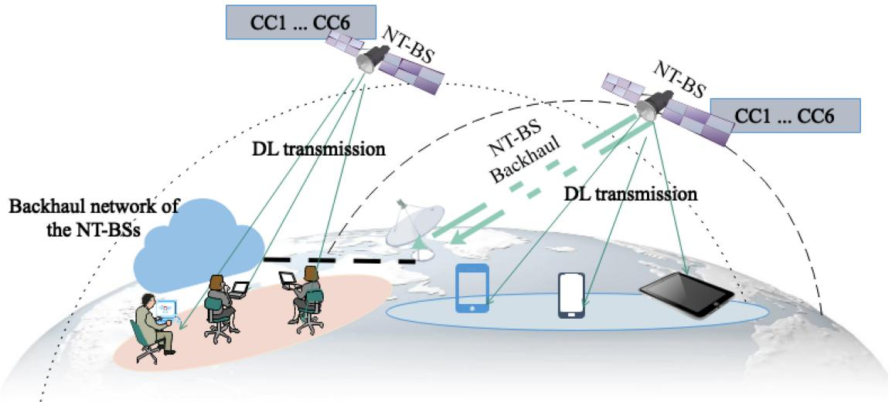

flowchart

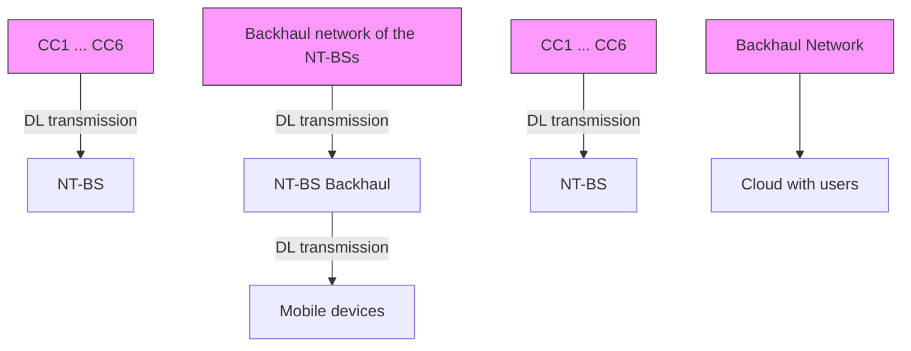
```mermaid
graph TD
    A["CC1 ... CC6"] -->|DL transmission| B["NT-BS"]
    C["Backhaul network of the NT-BSs"] -->|DL transmission| D["NT-BS Backhaul"]
    D -->|DL transmission| E["Mobile devices"]
    F["CC1 ... CC6"] -->|DL transmission| G["NT-BS"]
    H["Backhaul Network"] --> I["Cloud with users"]
    style A fill:#f9f,stroke:#333
    style C fill:#f9f,stroke:#333
    style F fill:#f9f,stroke:#333
    style H fill:#f9f,stroke:#333
```

Fig. 11. System model of a LEOS-based non-terrestrial network with carrier aggregation technology.

area. LEOS’s set of CCs includes both the Primary CC (PCC) and Secondary CCs (SCCs). The PCC serves as the main and always-active CC for each LEOS. In this case study, we employ a Round Robin algorithm to assign the PCC to a LEOS. SCCs, acting as auxiliary CCs, can be activated or deactivated for a LEOS to improve its achievable data rate. The backhauling network utilizes the Ka-band, which is further divided into multiple subchannels.

The transmission model considers factors like active CCs for LEOS and path gain between LEOS and UEs. It defines a load factor to represent the portion of resources a LEOS dedicates to its covered UEs on a specific CC. This load factor is influenced by the amount of UE demand served on that CC. While backhaul model focuses on how data from LEOS is transmitted to the gateway on Earth via SCs in the Ka-band. The model considers factors like path gain between LEOS and the gateway, achievable rates, and backhaul capacity limitations. It defines a backhaul constraint that ensures the amount of data a LEOS transmits to users does not exceed its backhaul capacity.

In our main optimization problem for NTN resource management, we aim to find the optimal way to activate CCs, distribute traffic among them, and allocate backhaul resources for each LEOS. This problem balances two goals: maximizing overall network throughput (data transfer rate) and minimizing the total load on the LEOS across all CCs. Subject to the constraints of UE demand satisfaction and backhaul limitations, the problem can be stated as follows:

$\mathrm { m a x ~ T o t a l ~ a c h i e v a b l e ~ r a t e ~ f o r ~ t h e ~ L E O s }$ (9a)

$\mathrm { \small ~ \operatorname* { m i n } ~ T o t a l ~ l o a d ~ o n ~ t h e ~ L E O S ~ a c r o s s ~ a l l ~ C C s ~ \Delta ~ ( 9 b ) }$

$\mathrm { s . t . ~ D e m a n d ~ r e q u i r e m e n t ~ f o r ~ t h e ~ U E s }$ (9c)

$\mathrm { B a c k h a u l \ l i m i t a t i o n s }$ (9d)

$\mathrm { v a r . ~ L o a d ~ f a c t o r ~ o v e r ~ e a c h ~ C C }$ (9e)

$\mathrm { S C s ~ a n d ~ C C s ~ i n d i c a t o r s } .$ (9f)

Due to the complexity of (9), the solution approach will involve a combination of DDPM and a multi-agent RL technique. The details are given in the next subsection.

# C. The Proposed Method

To address the complexity of the problem formulated earlier, we break it down into two smaller, interdependent problems. The first problem focuses on activating/deactivating CCs and assigning Subchannels (SCs) for backhaul. The objective of this subproblem is to maximize the total achievable rate for LEOS (9a) while satisfying the backhaul constraints (9d). The second problem deals with load balancing, optimizing how much each CC is utilized by the LEOS to serve its users. The objective of this problem is to minimize the total load on the LEO satellite across the CCs (9b) while meeting the demand requirements of the UEs (9c).

We model the joint CA and backhauling sub-problem as a multi-agent RL system, where each LEOS functions as an independent agent. The goal of each LEOS is to maximize its long-term reward, defined in terms of network-wide throughput and energy efficiency. The state space in this system is characterized by the backhaul constraint (9d), while the action space is defined by options to activate or deactivate a CC and assign SCs. Due to the high dimensionality of both the state and action spaces for each agent, traditional RL methods struggle with effective exploration, leading to suboptimal results. To address this challenge, we leverage the Generative AI-based Decision-Making (GADM) framework, which is based on DDPM. As illustrated in Fig. 12, the GADM framework employs the backward process of DDPM to uncover the latent characteristics of the environment and determine the probability distribution of actions. For a given state, the backward process begins with Gaussian noise and then gradually removes the noise over several steps. This process, modeled as a Markov chain, reconstructs the original date by effectively learning the denoising patterns. DL models are utilized to guide this denoising process, progressively refining the data from noise back to a usable form. The GADM algorithm capitalizes on this approach to generate high-quality outputs by learning the probability distributions for actions in the environment, ensuring accurate decision-making in a complex, high-dimensional space.

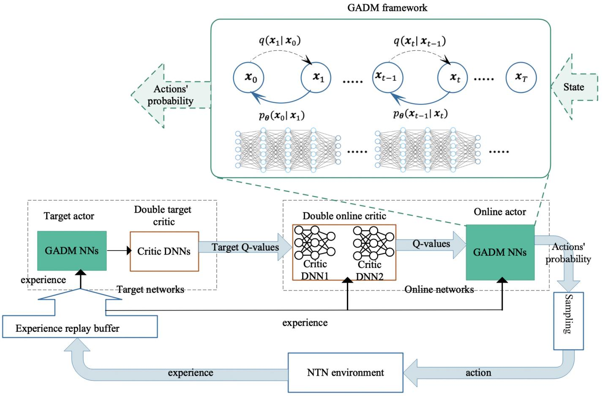

flowchart

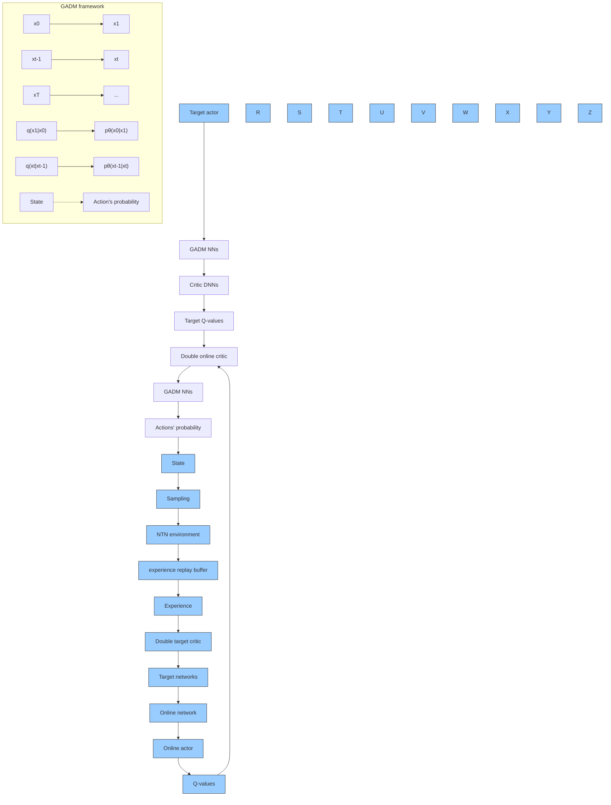
```mermaid
graph TD
    A["Target actor"] --> B["GADM NNs"]
    B --> C["Critic DNNs"]
    C --> D["Target Q-values"]
    D --> E["Double online critic"]
    E --> F["GADM NNs"]
    F --> G["Actions' probability"]
    G --> H["State"]
    H --> I["Sampling"]
    I --> J["NTN environment"]
    J --> K["experience replay buffer"]
    K --> L["Experience"]
    L --> M["Double target critic"]
    M --> N["Target networks"]
    N --> O["Online network"]
    O --> P["Online actor"]
    P --> Q["Q-values"]
    Q --> E
    style A fill:#99CCFF,stroke:#333
    style H fill:#99CCFF,stroke:#333
    style I fill:#99CCFF,stroke:#333
    style J fill:#99CCFF,stroke:#333
    style K fill:#99CCFF,stroke:#333
    style L fill:#99CCFF,stroke:#333
    style M fill:#99CCFF,stroke:#333
    style N fill:#99CCFF,stroke:#333
    style O fill:#99CCFF,stroke:#333
    style P fill:#99CCFF,stroke:#333
    style Q fill:#99CCFF,stroke:#333
    style R fill:#99CCFF,stroke:#333
    style S fill:#99CCFF,stroke:#333
    style T fill:#99CCFF,stroke:#333
    style U fill:#99CCFF,stroke:#333
    style V fill:#99CCFF,stroke:#333
    style W fill:#99CCFF,stroke:#333
    style X fill:#99CCFF,stroke:#333
    style Y fill:#99CCFF,stroke:#333
    style Z fill:#99CCFF,stroke:#333
    subgraph GADM framework
        AA["x0"] --> AB["x1"]
        AC["xt-1"] --> AD["xt"]
        AE["xT"] --> AF["..."]
        AG["q(x1|x0)"] --> AH["pθ(x0|x1)"]
        AI["q(xt|xt-1)"] --> AJ["pθ(xt-1|xt)"]
        AK["State"] -.-> AL["Action's probability"]
    end
```

Fig. 12. Architecture and trajectory of the proposed diffusion-based method for CA and SC allocation.

In the actor-critic architecture, the actor network integrates GADM to select actions, while the critic networks evaluate the effectiveness of those actions by estimating the Q-values. The critic networks consist of double neural networks that help mitigate issues such as overestimation of Q-values during training. Both the actor (which consists of the NNs in the GADM framework) and the critic networks are trained iteratively, collecting experiences and updating their parameters based on the learned rewards. The actor network uses these experiences to refine the policy and improve the accuracy of the actions chosen. This architecture not only facilitates more effective exploration in the high-dimensional state and action space but also improves the learning of optimal resource allocation strategies for LEO satellites in the network. The GADM framework allows the system to efficiently navigate the complexities of wireless communication environments, ensuring that the joint CA and backhauling problem is solved optimally and in a scalable manner.

The second sub-problem, load balancing, is formally expressed as a convex optimization problem with a unique optimal solution. It can be demonstrated that the optimality for this problem is achieved when constraint (9c) holds with equality. Using this information, we derive an iterative update function to determine the optimal load factors across the CCs. This function considers user demands served by each LEO satellite and their Signal-to-Interference-Plus-Noise Ratio (SINR) to calculate an updated load factor for each LEO on each CC.

In the developed Intelligent Joint CA, Load balancing and Backhauling (IJCALB) algorithm, the previously described intelligent and iterative schemes operate together. Specifically, the IJCALB algorithm operates over multiple episodes, where each episode represents a cycle of learning and adjustment. The core of the algorithm involves two DNNs, an actor and a critic, for each LEOS. These networks interact to learn the optimal policy for allocating resources, i.e., CCs and SCs. During each episode, taking the current network state into account, a sub-optimal policy for a specific LEOS regarding CA and SC assignment is obtained. For each episode, once the LEOS has a proposed allocation policy, it calculates the load factor across its activated CCs through the distributed and iterative load balancing scheme. As the algorithm progresses through multiple episodes, the actor-critic networks in each LEOS learn and adjust. This process leads them towards an optimal policy for resource allocation – the best possible strategy for activating/deactivating CCs and assigning SCs. Correspondingly, the fixed point reached by the load updating also converges to the optimal load factor for that LEOS. The IJCALB algorithm allows each LEOS to learn and adapt its resource allocation strategy through a multi-episode training process, ultimately achieving an optimal configuration for the entire network.

TABLE VII LEOS-BASED NETWORK PARAMETERS AND TRAINING HYPERPARAMETERS 

<table><tr><td>Network parameters</td><td>Value</td><td>Hyperparameters</td><td>Value</td></tr><tr><td>DL transmit power for LEOS</td><td>10 Watt</td><td>Diffusion step (T)</td><td>5</td></tr><tr><td>Carrier setting</td><td>CC1-CC5 are in K-band 400 MHz BW and frequency of 26 GHz,</td><td>Learning rates for actor and critic networks</td><td> $10^{-4}$ ,  $10^{-3}$ </td></tr><tr><td>Orbit radius for LEOS</td><td>8 km</td><td>entropy regularization ( $\zeta$ )</td><td>0.05</td></tr><tr><td>UE&#x27;s max. demand</td><td>1.5 MHz</td><td>Discount factor ( $\lambda$ )</td><td>0.95</td></tr><tr><td>Number of SCs</td><td>6</td><td>Batch size and replay buffer size</td><td>64,  $10^{5}$ </td></tr><tr><td>velocity of LEOS</td><td>7.9 km/sec</td><td> $T_{\text{episod}}$ ,  $T_{\text{step}}$ </td><td>200, 200</td></tr><tr><td>Total number of UEs</td><td>400</td><td>Weight of soft update</td><td>0.005</td></tr></table>

# D. Numerical Results

This section evaluates the performance of the proposed diffusion-based IJCALB algorithm against three RL-based algorithms for joint CA, load balancing, and backhauling LEO-based networks. These algorithms are, UCB-based JCALB (UJCALB), DDQN-based JCALB (DJCALB), and Diffusion UCB-based JCALB (DUJCALB). In UJCALB algorithm, Upper Confidence Bound (UCB) strategy is used to handle the discrete nature of the CA and SC allocation problem. UCB encourages exploration of less-tested options while balancing estimated rewards. DJCALB leverages the Double Deep Q-Network (DDQN) algorithm in multi-agent RL for handling CA and backhauling. DDQN is a wellestablished technique for solving multi-agent RL problems. DUJCALB combines the UCB strategy with the GADM algorithm to provide additional guidance for the UCB policy, potentially leading to improved performance.

To evaluate the performance of our proposed diffusionbased IJCALB algorithm, we consider a 60 km × 60 km square area. We assume that 400 UEs are uniformly scattered in the area, and the covering satellites have a circular orbit with an 8 km radius and randomly selected origin. Each LEOS covers a set of UEs, and not all UEs are necessarily covered by the LEOS’. Each of the LEOS is moving at a velocity of 7.9 km/sec. For CA, we assume that the CCs are in the Ka-band. Additionally, the channel between the satellites and the gateway is divided into some SCs. The network parameters and the hyperparameters employed by the diffusion-based GADM algorithm are given in Table VII.

We evaluate the performance of the presented algorithms (IJCALB, DUJCALB, DJCALB, and UJCALB) across a varying number of LEOS in the network. The number of LEOS considered is I ∈ {3, 9, 15, 21, 27}. In IJCALB and DUJCALB, the policy for activating/deactivating the CCs and assigning the SCs to each LEOS is obtained through the diffusion-based GADM algorithm, while DJCALB employs DRL and traditional UCB is used by UJCALB. Figs. 13 and 14 illustrate the average total rate, average load factors over each activated CC, the average number of activated CCs, and the average number of assigned SCs per LEOS, respectively.

Fig. 13(b) illustrates that the load factor per activated CC per LEOS increases with the growing number of LEOS. A higher number of LEOS often indicates denser coverage areas, resulting in a greater number of served UEs. Consequently, there is an increased demand for spectrum resources from each CC, leading to a higher load factor for each LEOS. The increase in load factor per CC results in heightened interference between the UEs covered by LEOS’ transmitting over the same CC. Fig. 13(a) illustrates that this interference can degrade the quality of received signals, thereby reducing the achievable data rate for the UEs and, consequently, for each LEOS. As shown in Fig. 13(b), the DDPM-based algorithms outperform the DDQN-based algorithm in terms of load factor. The DDPM-based policies employed in the IJCALB and DUJCALB algorithms enable them to estimate uncertainty. By incorporating this into the action selection process, these algorithms can make more informed decisions in dynamic environments. Thus, by employing the DDPMbased algorithms, CCs with better channel conditions would be activated for the LEOS’, resulting in a lower load factor for the LEOS’ over the activated CCs. In contrast, the DDQN-based DJCALB algorithm may struggle to effectively handle uncertainty. The inferior performance of the traditional UCB-based UJCAB algorithm can be attributed to its limitation in exploration, which would prevent it from discovering optimal policies for activating/deactivating the CCs and assigning SCs compared to the DDQN and the DDPM algorithms.

Fig. 14 illustrates that a lower number of CCs and SCs are allocated to the LEOS’ when using the two DDPM-based algorithms, i.e., IJCALB and DUJCALB algorithms. Based on the objectives of the subproblems, the DDPM-based algorithms aim to maximize the total rate for a LEOS’. Additionally, the state space is defined in terms of the achievable rate for the covered UEs, their QoS demand, and the dynamic backhaul constraint for the LEOS’. By leveraging the DDPM algorithm’s ability to estimate uncertainty, the algorithm can select the CCs and SCs that are most likely to provide highquality and reliable connections for the LEOS’ and their covered UEs. As a result, a lower number of activated CCs and assigned SCs with higher achievable rates are obtained. It can also be inferred that the DDPM-based algorithms would be more energy-efficient due to the lower activation/deactivation of the CCs.

The DJCALB algorithm’s fluctuations in the average number of activated CCs per LEOS, as seen in Fig. 14, can be attributed to the dynamic and adaptive nature of the algorithm. Specifically, the DJCALB algorithm leverages DDPM to derive a policy that optimizes the activation and deactivation of CCs in real-time, responding to varying network conditions such as user demand and interference levels. These fluctuations reflect the algorithm’s continuous adjustments to the number of active CCs based on the current state of the network. Similar fluctuations can also be observed in the DUJCALB algorithm, combining the UCB strategy with the DDPM algorithm to provide additional guidance for the UCB policy.

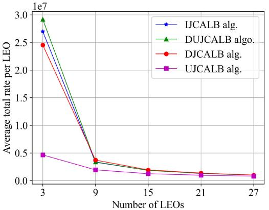

line

| Number of LEOs | IJCALB alg. | DUJCALB algo. | DJCALB alg. | UJCALB alg. |
|---|---|---|---|---|
| 3 | 2.7e7 | 2.9e7 | 2.45e7 | 0.45e7 |
| 9 | 0.35e7 | 0.35e7 | 0.35e7 | 0.18e7 |
| 15 | 0.15e7 | 0.15e7 | 0.15e7 | 0.12e7 |
| 21 | 0.12e7 | 0.12e7 | 0.12e7 | 0.10e7 |
| 27 | 0.10e7 | 0.10e7 | 0.10e7 | 0.08e7 |

(a)

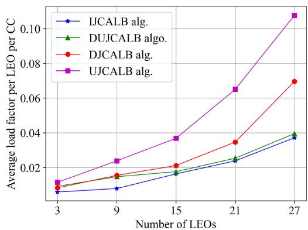

line

| Number of LEOs | IJCALB alg. | DUJCALB algo. | DJCALB alg. | UJCALB alg. |
| -------------- | ----------- | ------------- | ----------- | ----------- |
| 3              | 0.01        | 0.01          | 0.01        | 0.01        |
| 9              | 0.01        | 0.015         | 0.015       | 0.025       |
| 15             | 0.015       | 0.02          | 0.02        | 0.035       |
| 21             | 0.02        | 0.025         | 0.035       | 0.065       |
| 27             | 0.035       | 0.04          | 0.07        | 0.11        |

(b)

Fig. 13. Average achievable total rate per LEOS and average load factor for each LEOS per CC versus the number of LEOS.   
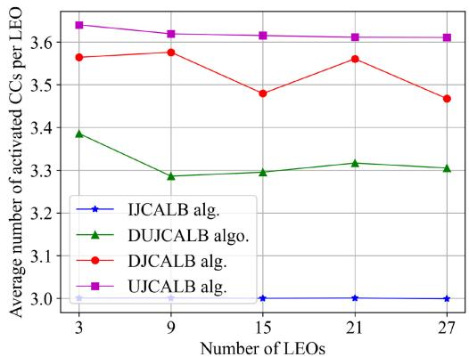

line

| Number of LEOs | IJCALB alg. | DUJCALB algo. | DJCALB alg. | UJCALB alg. |
| -------------- | ----------- | ------------- | ----------- | ----------- |
| 3              | 3.0         | 3.4           | 3.6         | 3.7         |
| 9              | 3.0         | 3.3           | 3.6         | 3.7         |
| 15             | 3.0         | 3.3           | 3.5         | 3.7         |
| 21             | 3.0         | 3.3           | 3.6         | 3.7         |
| 27             | 3.0         | 3.3           | 3.5         | 3.7         |

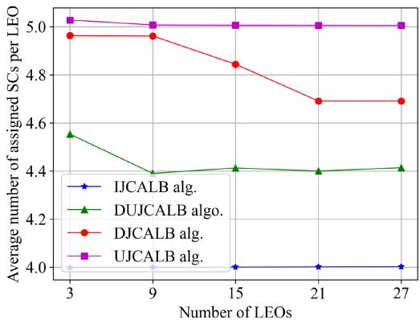

line

| Number of LEOs | IJCALB alg. | DUJCALB algo. | DJCALB alg. | UJCALB alg. |
| -------------- | ----------- | ------------- | ----------- | ----------- |
| 3              | 4.0         | 4.55          | 4.95        | 5.0         |
| 9              | 4.0         | 4.4           | 4.95        | 5.0         |
| 15             | 4.0         | 4.4           | 4.85        | 5.0         |
| 21             | 4.0         | 4.4           | 4.7         | 5.0         |
| 27             | 4.0         | 4.4           | 4.7         | 5.0         |

Fig. 14. Average number of activated CC per LEOS and average number of assigned SCs per LEOS versus the number of LEOS.

In contrast, the algorithms based on traditional UCB and DDQN exhibit a more stable downtrend in the average number of activated CCs. Traditional UCB is designed to balance exploration and exploitation by gradually reducing uncertainty in decision-making. This gradual reduction in uncertainty leads to the algorithm consistently selecting optimal actions, resulting in a more stable and predictable policy over time. Additionally, DDQN utilizes an epsilon-greedy strategy for decision-making, where it balances exploration (trying out different actions) and exploitation (choosing the best-known action). As training progresses, the algorithm increasingly favors exploitation, resulting in a more stable policy.

It is worth mentioning that the IJCALB algorithm exhibits better performance compared to the DUJCALB algorithm due to its integration of DDPM into an actor and critic model.

# IX. CHALLENGES AND FUTURE STUDIES

As discussed in Sections III–VI, xG wireless communication networks stand to benefit significantly from the adoption of GAI frameworks. Specifically, based on Tables III, IV, V, GAI models offer the potential to revolutionize mobile networks by fostering enhanced efficiency, encompassing both energy efficiency and scalability. They can also promote network sustainability through improved resource management and reduced energy consumption. Additionally, GAI facilitates dynamic reconfigurability, enabling the network to adapt to changing demands and optimize performance in real-time. GAI holds promise for improving the reliability and accuracy of wireless communication. Through real-time prediction and control of network elements, GAI empowers proactive network management, leading to improved decision-making capabilities.

However, as discussed in Section II-F, GAI models may have highly demanding training requirements. Their increasing complexity necessitates high-performance computing platforms to address these needs. These platforms typically offer features like scalable hardware with powerful GPUs or Tensor Processing Units (TPUs), enhanced networking for efficient data transfer, and specialized efficient memory management and software libraries optimized for generative AI tasks.

Cloud-based infrastructure options further enhance the development and training experience.

While high-performance platforms are essential for training powerful GAI models, ensuring their efficient deployment within resource-constrained wireless networks requires further optimization. This optimization goes beyond just the hardware. Researchers are actively exploring techniques that address the trade-off between model accuracy and computational efficiency. This includes designing GAI model architectures specifically the ones for wireless networking tasks by considering limitations on devices such as smartphones and BSs. Additionally, training on high-quality data that reflects realworld network scenarios is crucial. Techniques like data augmentation can further enrich this data and potentially reduce training costs. Finally, advancements in quantization and pruning aim to decrease the number of parameters or precision requirements in GAI models. These optimization strategies bridge the gap between powerful GAI models and their practical application within next-generation wireless networks. The details are given below.

# A. Trade-Off Between Model Accuracy and Computational Efficiency

GAI paves the way for the development of intelligent and adaptable xG wireless communication. However, the tradeoff between accuracy and computational efficiency remains a major challenge in applying GAI for network optimization. To address this challenge, several key aspects can be explored. The details are given in what follows.

1) Designing GAI Model Architectures: As discussed, different GAI models, including GANs, GDMs, and GFlowNets, are currently used to generate high-fidelity data for networking tasks and optimization. However, standard accuracy metrics alone may not be sufficient. To capture the efficiency aspects of the chosen models, alternative metrics that encompass both the quality of generated data (realism and usefulness) and the computational resources required for training and inference should be considered. Additionally, researchers are exploring the benefits of using pre-trained GAI models or transferring knowledge from larger, more accurate models to smaller, more efficient ones [71], [72]. Exploring collaborative learning approaches is another ongoing research field. This involves utilizing multiple GAI models, each specializing in specific aspects of network data generation. By combining their strengths, these models could achieve high accuracy with improved overall efficiency.

2) High-Quality Training Data: Current research on gathering high-quality data to train GAI models for optimizing xG wireless networks covers several areas. It focuses on network traffic data, utilizes network simulations, and explores synthetic data generation techniques [73], [74]. Efficient and scalable methods for labeling network data, such as crowdsourcing or semi-supervised learning techniques, normalization, and outlier removal [74], [75], [76] are explored. These methods can accurately reflect the diverse scenarios and complexities of real-world networks.

While generic network data is valuable, ongoing research should place a greater emphasis on domain-specific data collection. For example, data for congestion prediction might differ from data needed for resource allocation optimization. Therefore, the GAI model should learn the specific patterns relevant to the desired network behavior. Additionally, traditional data collection might be resource-intensive. Ongoing research explores techniques like active/adaptive learning [77], [78], where the GAI model itself identifies the most informative data points for further collection or annotation. Finally, network data often contains sensitive information. FL-based techniques [79], [80] can be explored to leverage the benefits of larger, diverse datasets while maintaining data privacy.

3) Quantization and Pruning: For efficient GAI models for networking, quantization and pruning techniques would play a crucial role. Various quantization methods to reduce the precision of weights and activations within GAI models involve techniques like post-training quantization and quantization-aware training. The former involves quantizing a pre-trained model to a lower bit-width representation (e.g., from 32-bit floats to 8-bit integers). While the latter trains the model from scratch with lower precision weights and activations. On the other hand, different pruning strategies remove redundant connections within the GAI model architecture. Accordingly, the focus of current research is the trade-off between the level of quantization/pruning [81], [82], [83], [84] and the accuracy of the generated network data.

It is noteworthy that quantized models need to be compatible with the target hardware platforms used for network applications. Therefore, designing quantization techniques which are compatible with Network Processing Units (NPUs) or Field-Programmable Gate Arrays $( { \mathrm { F P G A s } } ) ^ { 9 }$ enhances the efficiency. Additionally, ongoing research can focus on jointly optimize both the GAI model architecture and the quantization/pruning techniques. This could involve co-designing the model with specific considerations for efficient quantization or incorporating pruning strategies within the training process.

# B. High-Performance Platform for GAI

GAI models are a subclass of DL, and rely heavily on the capabilities of the underlying DL platform. In other words, optimizing the DL platform as the base of GAI, is critical to unlocking GAI’s full potential and achieving desired results. The details are discussed below.

1) Scalable Hardware: Training DNNs used in GAI models requires specialized Hardware (HW) accelerators to efficiently handle the heavy computational demands of training algorithms. These accelerators include GPU-based, TPUs, FPGA-based, and Application-Specific Integrated Circuit (ASIC)-based designs.10

9FPGAs are semiconductor devices that offer both flexibility and speed. They are built from tiny building blocks called logic blocks, which can be programmed to do different jobs. Unlike regular processors that follow fixed instructions, FPGAs can be rewired to connect these blocks in different ways. This lets data and control signals move freely around the chip, making FPGAs useful for tackling complex tasks that can change over time.

10ASICs are built for a targeted task, letting them to achieve peak performance, lower power consumption, and smaller size compared to their flexible counterparts. This specialization makes ASICs ideal for high-volume production in devices like smartphones and AI accelerators.

For choosing a GPU, theoretical performance metrics such as peak performance and memory BW are a starting point, but do not capture the whole picture. To assess real-world performance for a specific task, reference benchmarks like MLPerf [85] can be used. Different vendors like AMD, Intel, and NVIDIA propose different architectures. For instance, NVIDIA DGX systems specifically designed for DL workloads using GPUs, combine high-performance CPUs with multiple GPUs interconnected through NVIDIA’s high-speed NVLink technology [86], [87]. Additionally, TPUs have become prominent due to the prevalence of matrix multiplication operations in DL, especially for large CNNs. Google pioneered TPUs and keeps improving their performance [88], [89], [90].

FPGAs are also popular for hardware acceleration owing to their ability to be reconfigured. For instance, Microsoft’s Project Brainwave adopts FPGAs to exploit their reconfigurability for handling various deep learning models [91]. FPGA-based accelerators often leverage a heterogeneous architecture to meet the diverse computational needs of DL workloads. The key components include a generalpurpose processor, dedicated computational modules, and a custom memory architecture. The general-purpose processor handles software tasks like model loading and pre-processing [92], [93]. Meanwhile, dedicated computational modules are tailored for specific DL operations, such as convolutions, de-convolutions, and pooling. These modules exploit the inherent parallelism of FPGAs to achieve high efficiency [94], [95]. Additionally, data movement between the processing units and external memory is optimized by the custom memory architecture, minimizing latency and maximizing throughput. Deeply pipelined multi-FPGA designs are explored to handle large models, with ongoing research on optimization [96].

For DL inference using ASIC-based accelerators, accelerating the computations within the data path is crucial. Key techniques to achieve this include: reduced-precision convolutions [97] to improve computational efficiency, approximate multipliers [98] that trade lower power consumption for a slight accuracy reduction, and bit-width reduction techniques [99] that focus on reducing the number of bits used in multiplications. Additionally, NPUs can be incorporated into ASIC-based accelerators to further improve performance and energy efficiency [100]. Single-chip NPUs offer advantages over CPUs and GPUs for DNN processing in both cloud and edge computing scenarios, due to their optimized data flow that minimizes memory access [101].

As discussed in [102], future paradigms in DL accelerator design envision the development of accelerators for sparse matrices [103], 3D-stacked processing-in-memory [104], inmemory computing [105], neuromorphic accelerators [106], and multi-chip modules [107]. These DL accelerators will be employed across various computing systems deployed in xG wireless networks, ranging from ultra-low-power and resourceconstrained devices at the edge to servers and data centers.

2) Enhanced Networking: Studies in Section VII highlight how networking strategies can enhance GAI models by enabling secure and traceable data flow and communication [63], [66], decentralized network management (e.g., blockchain [63]), optimized resource allocation and reduced latency for improved user experience (e.g., device collaboration [64]), scalability, privacy preservation, and improved efficiency for resource-constrained devices (e.g., federated learning [65]).

Ongoing research and development in network technologies for high-performance GAI platforms needs to address several challenges: scalability and performance, security and privacy, resource constraints and heterogeneity, and integration and interoperability.

Scalability and performance: High-performance GAI platforms demand efficient communication with minimal latency. Techniques like blockchain in [63] and secure data transmission (e.g., ZKPs in [66]) offer benefits but can introduce overhead. Optimizations or alternative approaches are needed to balance these trade-offs, while network infrastructure must scale to manage communication between a potentially large number of distributed processing units.

Security and privacy: High-performance GAI platforms require robust security to mitigate network vulnerabilities that could compromise training data or manipulate models. Additionally, they should ensure both security and efficiency. In other words, these measures need to be balanced to avoid sacrificing performance or introducing excessive latency.

Resource constraints and heterogeneity: GAI platforms encompass devices with varying capabilities. Network protocols and resource allocation strategies need to adapt to this heterogeneity. Lightweight communication protocols and techniques are crucial for enabling the efficient participation of resource-constrained devices while optimizing the utilization of all available resources.

Integration and interoperability: For broader adoption, GAI platforms need standardized network protocols and APIs to simplify integration between diverse hardware and software components. This interoperability must seamlessly coexist with existing network infrastructure, even as GAI platforms introduce new functionalities and security measures.

3) Memory Management and Software Libraries: Existing libraries like TensorFlow and PyTorch provide building blocks for GAI development, e.g., [108], [109]. However, research can focus on specialized libraries optimized for specific GAI tasks (e.g., image generation, natural language processing) or hardware platforms. For memory management, training methods such as Automatic Mixed-Precision (AMP) training and Gradient Accumulation (GA) are employed. The frameworks offering built-in AMP functionalities automatically analyze the model and identify parts where lower precision calculations can be used without significantly impacting accuracy [110], [111]. While GA accumulates the gradients calculated for each mini-batch over several iterations before performing a single update. This technique effectively simulates training with larger batch size, even if GPU memory constraints limit data processing in smaller chunks [112], [113]. Further research directions can be given as follows.

Memory management for emerging architectures: Neuromorphic computing, inspired by the human brain’s structure and function, utilizes artificial neurons and synapses for parallel processing with potentially lower power consumption. To effectively leverage these emerging architectures in GAI platforms, memory management becomes crucial. This area necessitates exploring techniques like sparse data structures (e.g., compressed sparse row format) and model compression (e.g., pruning, quantization) to reduce memory footprint. Additionally, in-memory computing techniques hold promise for further efficiency gains.

Heterogeneous memory management: In heterogeneous computing environments often used in GAI platforms, it is crucial to develop strategies for efficient memory management. This may involve optimizing data movement between CPUs, GPUs, TPUs, and potentially other hardware components.

Domain-specific software libraries: To improve memory access patterns and reduce computational overhead, specialized software libraries should be developed. These libraries should be optimized for specific GAI tasks or application domains.

Auto-tuning and optimization: This method can include exploring frameworks that can automatically select or configure memory management strategies and software libraries based on the specific GAI model, hardware platform, and user requirements.

Addressing the aforementioned research directions can create more efficient and scalable memory management solutions and software libraries for high-performance GAI platforms. It is noteworthy that standardization of these techniques would facilitate easier integration of different tools and frameworks within a GAI platform, enhancing platform flexibility and developer productivity.

4) Cloud-Based Infrastructure: Cloud computing has emerged as a game-changer for training and deploying GAI models [114]. Cloud-based infrastructure offers several benefits for GAI models, including scalability, costeffectiveness, collaboration, and flexibility. Specifically, these platforms provide on-demand access to vast computing resources (CPUs, GPUs, TPUs) that can be scaled up or down based on training needs. Users only pay for the resources they utilize. By providing a shared workspace for accessing training data, models, and code, cloud-based infrastructure facilitates collaboration among researchers and developers, streamlining the development process and promoting faster innovation. Finally, in terms of flexibility, these platforms offer a variety of pre-configured DL environments and tools, allowing users to choose the best fit for their specific needs and reducing the time and effort required to set up training infrastructure.

Some of the leading cloud platforms for GAI include Amazon SageMaker [115], Google Vertex AI [116], and Microsoft Azure Cognitive Services [117]. These platforms offer a comprehensive suite of tools and resources specifically designed for training and deploying both DL and generative models. They seamlessly integrate with TensorFlow and other popular DL frameworks, streamlining the development process. Notably, while these platforms provide cloud resources for training custom generative models, they also offer pre-trained generative models as APIs for tasks like text generation, image manipulation, and speech synthesis [117].

The landscape of cloud-based platforms for GAI is constantly evolving. Cloud computing plays a crucial role in GAI research areas such as resource optimization, security and privacy, FL for GAI, and automating model training pipelines. The details are given below.

Resource optimization: Optimizing resource utilization within the cloud environment are continuously explored. This includes developing algorithms for efficient task scheduling and data transfer, minimizing idle time and energy consumption.

Security and privacy: As discussed in Section VII, ongoing research in cloud-based GAI prioritizes the development of robust security and privacy-preserving techniques. This is crucial as concerns regarding the potential misuse of data generated by powerful GAI models continue to grow. These techniques will be essential for ensuring the safe and ethical training and deployment of generative models in cloud environments.

FL for GAI: FL techniques are particularly well-suited for training generative models on distributed datasets residing on different devices or cloud instances without directly sharing the data itself. This is crucial for scenarios where data privacy is paramount, such as in healthcare or finance. Ongoing research actively investigates how to adapt and improve FLbased approaches for training generative models efficiently across geographically distributed cloud environments.

Automating model training pipelines: In ML, a model training pipeline refers to a series of interconnected steps that automate the process of building, training, and deploying an ML model. Automating model training pipelines is an active research area in GAI, particularly focusing on tasks like hyperparameter tuning, model selection, and resource allocation. This automation makes the process more efficient and accessible to a broader range of users.

# C. Insights and Prospects for Future Studies

As discussed in previous sections, integrating GAI into xG wireless networks offers significant opportunities for optimization, flexibility, and enhanced performance. GAI models, such as GANs, GDMs, and GFlowNets, excel in simulating diverse network conditions and generating realistic synthetic data. These models enable us to explore a wide range of configurations, improving resource allocation, channel estimation, and overall network performance. For instance, combining GAI with RL enhances decision-making capabilities, offering a powerful tool for managing complex, high-dimensional optimization challenges in xG environments such as NTNs. Additionally, GAI’s ability to generate diverse datasets strengthens intrusion and anomaly detection systems, providing more effective protection against evolving threats in wireless communication environments.

While GAI models have shown great potential in solving complex challenges for optimizing xG wireless networks, a major challenge remains in improving the generalizability of these models to ensure robust and scalable performance across unseen network conditions and configurations. Future research should focus on these aspects to unlock GAI’s potential in xG wireless systems. Below are some directions for future research.

Current GAI models, such as GANs and GFlowNets, often struggle to generalize beyond their training data, particularly when applied to unseen scenarios. This is especially crucial in addressing Domain Generalization (DG) challenges, where models face performance degradation when trained in one domain and tested in different, unseen domains. DG can tackle distribution shifts between training and deployment environments in xG networks. By leveraging hybrid learning models, which combine generative and discriminative approaches, future GAI-based algorithms can improve generalizability. The focus here should be on developing hybrid architectures that identify and learn domain-invariant features, minimizing the impact of domain shifts on model performance.

Regularization techniques, such as Invariant Risk Minimization (IRM), can be applied to ensure models learn features that generalize across multiple domains. Therefore, the model performs well on unseen domains by leveraging features that generalize across multiple environments. The key idea is to minimize the risk across all environments while ensuring that the representations remain stable, and independent of environmental variations. GAI models, such GANs or GDMs, can be used to generate diverse environments or scenarios (e.g., network conditions). These generative models produce synthetic data from multiple domains. The IRM framework can then be applied to learn invariant features across these synthetic domains. The objective function for GANs or GDM in this setup could be subjected to the IRM constraint.

By integrating IRM with GAI, the learned representations become robust across unseen domains, allowing models to adapt to diverse network scenarios without performance loss. This combination also strengthens robustness against adversarial attacks, as IRM focuses on extracting domain-invariant features, reducing the impact of adversarially generated conditions. Furthermore, GAI models guided by IRM can generate higher-quality data, ensuring that synthetic samples capture critical domain-agnostic features, thereby improving overall model generalization and resilience in dynamic environments.

# X. CONCLUSION

We have explored the potential of GAI models, such as GANs, GDMs, and GFlowNEts, in addressing the critical challenges of optimizing xG wireless networks. By considering key technologies in 6G including mobile AIGC, SemCom, ISAC, and security communication, we have reviewed how GAI’s ability to learn complex network dynamics, generate diverse scenarios, and adapt to changing conditions can offer significant advantages over traditional optimization techniques. This survey has also explored how network infrastructure can be improved to utilize GAI-based models more effectively. The integration of GAI with existing AI-based network optimization models has been discussed in a case study, further expanding its capabilities. While challenges remain in terms of model complexity and training data requirements, ongoing research in distributed learning, edge computing, and ondevice processing holds great promise for overcoming these issues.

# REFERENCES

[1] M. Xu et al., “Unleashing the power of edge-cloud generative AI in mobile networks: A survey of AIGC services,” IEEE Commun. Surveys Tuts., vol. 26, no. 2, pp. 1127–1170, 2nd Quart., 2024.   
[2] C. Chaccour, W. Saad, M. Debbah, and H. V. Poor, “Joint sensing, communication, and AI: A trifecta for resilient THz user experiences,” IEEE Trans. Wireless Commun., vol. 23, no. 4, pp. 11444–11460, Sep. 2024.   
[3] H. Du et al., “Generative AI-aided joint training-free secure semantic communications via multi-modal prompts,” 2023, arXiv:2309.02616v1.   
[4] H. Du et al., “Diffusion-based reinforcement learning for edge-enabled AI-generated content services,” IEEE Trans. Mobile Comput., vol. 23, no. 9, pp. 8902–8918, Sep. 2024.   
[5] C. K. Thomas and W. Saad, “Neuro-symbolic artificial intelligence (AI) for intent based semantic communication,” in Proc. IEEE Global Commun. Conf., Rio de Janeiro, Brazil, Dec. 2022, pp. 2698–2703.   
[6] Y. Xiao et al., “Reasoning over the air: A reasoning-based implicit semantic-aware communication framework,” IEEE Trans. Wireless Commun., vol. 23, no. 4, pp. 3839–3855, Apr. 2024.   
[7] H. Du, J. Wang, D. Niyato, J. Kang, Z. Xiong, and D. I. Kim, “AI-generated incentive mechanism and full-duplex semantic communications for information sharing,” IEEE J. Sel. Areas Commun., vol. 41, no. 9, pp. 2981–2997, Sep. 2023.   
[8] Y. Lin et al., “A unified framework for integrating semantic communication and AI-generated content in metaverse,” IEEE Netw., vol. 38, no. 4, pp. 174–181, Jul. 2024.   
[9] Y. Jin et al., “Multiple residual dense networks for reconfigurable intelligent surfaces cascaded channel estimation,” IEEE Trans. Veh. Technol., vol. 71, no. 2, pp. 2134–2139, Feb. 2022.   
[10] Y. Wei, M.-M. Zhao, and M.-J. Zhao, “Channel distribution learning: Model-driven GAN-based channel modeling for IRS-aided wireless communication,” IEEE Trans. Commun., vol. 70, no. 7, pp. 4482–4497, Jul. 2022.   
[11] Y. Wu, L. Nie, S. Wang, Z. Ning, and S. Li, “Intelligent intrusion detection for Internet of Things security: A deep convolutional generative adversarial network-enabled approach,” IEEE Internet Things J., vol. 10, no. 4, pp. 3094–3106, Feb. 2023.   
[12] C. Park, J. Lee, Y. Kim, J.-G. Park, H. Kim, and D. Hong, “An enhanced AI-based network intrusion detection system using generative adversarial networks,” IEEE Internet Things J., vol. 10, no. 3, pp. 2330–2345, Feb. 2023.   
[13] X. He, Q. Chen, L. Tang, W. Wang, and T. Liu, “CGAN-based collaborative intrusion detection for UAV networks: A blockchainempowered distributed federated learning approach,” IEEE Internet Things J., vol. 10, no. 1, pp. 120–132, Jan. 2023.   
[14] L. Yang, S. X. Yang, Y. Li, Y. Lu, and T. Guo, “Generative adversarial learning for trusted and secure clustering in industrial wireless sensor networks,” IEEE Trans. Ind. Electron., vol. 70, no. 8, pp. 8377–8387, Aug. 2023.   
[15] T. Wu et al., “A brief overview of ChatGPT: The history, status quo and potential future development,” IEEE/CAA J. Automatica Sinica, vol. 10, no. 5, pp. 1122–1136, May 2023.   
[16] Y. Wang, Y. Pan, M. Yan, Z. Su, and T. H. Luan, “A survey on ChatGPT: AI—Generated contents, challenges, and solutions,” IEEE Open J. Comput. Soc., vol. 4, pp. 280–302, 2023.   
[17] R. Zhang et al., “Generative AI-enabled vehicular networks: Fundamentals, framework, and case study,” IEEE Netw., vol. 38, no. 4, pp. 259–267, Jul. 2024.   
[18] Y. Chen et al., “NetGPT: An AI-native network architecture for provisioning beyond personalized generative services,” IEEE Netw., vol. 38, no. 6, pp. 404–413, Nov. 2024.   
[19] Y. Liu et al., “Deep generative model and its applications in efficient wireless network management: A tutorial and case study,” IEEE Wireless Commun., vol. 31, no. 4, pp. 199–207, Aug. 2024.   
[20] H. Du et al., “Beyond deep reinforcement learning: A tutorial on generative diffusion models in network optimization,” 2023, arXiv:2308.05384v1.

[21] L. Xia et al., “Generative AI for semantic communication: Architecture, challenges, and outlook,” 2023, arXiv:2308.15483v2.   
[22] C. K. Thomas, W. Saad, and Y. Xiao, “Causal semantic communication for digital twins: A generalizable imitation learning approach,” IEEE J. Sel. Areas Inf. Theory, vol. 4, pp. 698–717, 2023.   
[23] A. Dunmore, J. Jang-Jaccard, F. Sabrina, and J. Kwak, “A comprehensive survey of generative adversarial networks (GANs) in cybersecurity intrusion detection,” IEEE Access, vol. 11, pp. 76071–76094, 2023.   
[24] M. Ali, F. Naeem, M. Tariq, and G. Kaddoum, “Federated learning for privacy preservation in smart healthcare systems: A comprehensive survey,” IEEE J. Biomed. Health Inform., vol. 27, no. 2, pp. 778–789, Feb. 2023.   
[25] O. Aouedi, A. Sacco, K. Piamrat, and G. Marchetto, “Handling privacy-sensitive medical data with federated learning: Challenges and future directions,” IEEE J. Biomed. Health Inform., vol. 27, no. 2, pp. 790–803, Feb. 2023.   
[26] Z. Wang et al., “Data hiding with deep learning: A survey unifying digital watermarking and steganography,” IEEE Trans. Comput. Soc. Syst., vol. 10, no. 6, pp. 2985–2999, Dec. 2023.   
[27] B. Zhou, Y. Lv, J. Wang, J. Zhang, and Q. Xuan, “Attacking the core structure of complex network,” IEEE Trans. Comput. Soc. Syst., vol. 10, no. 4, pp. 1428–1442, Aug. 2023.   
[28] J. Liu, M. Nogueira, J. Fernandes, and B. Kantarci, “Adversarial machine learning: A multilayer review of the state-of-the-art and challenges for wireless and mobile systems,” IEEE Commun. Surveys Tuts., vol. 24, no. 1, pp. 123–159, 1st Quart., 2022.   
[29] A. Celik and A. M. Eltawil, “At the dawn of generative (AI) era: A tutorial-cum-survey on new frontiers in 6G wireless intelligence,” IEEE Open J. Commun. Soc., vol. 5, pp. 2433–2489, 2024.   
[30] H. Zhou et al., “Large language model (LLM) for telecommunications: A comprehensive survey on principles, key techniques, and opportunities,” 2024, arXiv:2405.10825.   
[31] Q. Zhang, A. Ferdowsi, W. Saad, and M. Bennis, “Distributed conditional generative adversarial networks (GANs) for data-driven millimeter wave communications in UAV networks,” IEEE Trans. Wireless Commun., vol. 21, no. 3, pp. 1438–1452, Mar. 2022.   
[32] Y. Wang, S. Qin, G. Feng, J. Zhou, and F. Wei, “GAN-based Pareto optimization for self-healing of radio access network slices,” IEEE Trans. Netw. Service Manag., vol. 19, no. 1, pp. 146–157, Mar. 2022.   
[33] Y. Xiao et al., “Distributed traffic synthesis and classification in edge networks: A federated self-supervised learning approach,” IEEE Trans. Mobile Comput., vol. 23, no. 2, pp. 1815–1829, Feb. 2024.   
[34] I. J. Goodfellow et al., “Generative adversarial nets,” in Proc. Int. Conf. Neural Inf. Process. Syst., Dec. 2014, pp. 2672–2680.   
[35] D. Wen et al., “Task-oriented sensing, computation, and communication integration for multi-device edge AI,” IEEE Trans. Wireless Commun., vol. 23, no. 3, pp. 2486–2502, Mar. 2024.   
[36] J. Wang et al., “Generative AI for integrated sensing and communication: Insights from the physical layer perspective,” IEEE Wireless Commun., vol. 31, no. 5, pp. 246–255, Oct. 2024.   
[37] B. Du et al., “YOLO-based semantic communication with generative AI-aided resource allocation for digital twins construction,” IEEE Internet Things J., vol. 11, no. 5, pp. 7664–7678, Mar. 2024.   
[38] U. Sengupta, C. Jao, A. Bernacchia, S. Vakili, and D.-S. Shiu, “Generative diffusion models for radio wireless channel modelling and sampling,” in Proc. IEEE Global Commun. Conf., Kuala Lumpur, Malaysia, Dec. 2023, pp. 4779–4784.   
[39] J. Zeng, X. Liu, and Z. Li, “Radio anomaly detection based on improved denoising diffusion probabilistic models,” IEEE Commun. Lett., vol. 27, no. 8, pp. 1979–1983, Aug. 2023.   
[40] J. Ho, A. Jain, and P. Abbeel, “Denoising diffusion probabilistic models,” in Proc. Adv. Neural Inf. Process. Syst., vol. 33, 2020, pp. 6840–6851.   
[41] E. Bengio, M. Jain, M. Korablyov, D. Precup, and Y. Bengio, “Flow network based generative models for non-iterative diverse candidate generation,” in Proc. Adv. Neural Inf. Process. Syst., Dec. 2021, pp. 27381–27394.   
[42] C. B. Chaaya and M. Bennis, “RIS phase optimization via generative flow networks,” IEEE Wireless Commun. Lett., vol. 13, no. 7, pp. 1988–1992, Jul. 2024.   
[43] N. Malkin, M. Jain, E. Bengio, C. Sun, and Y. Bengio, “Trajectory balance: improved credit assignment in GFlowNets,” in Proc. 36th Int. Conf. Neural Inf. Process. Syst., New Orleans, LA, USA, 2024, pp. 5955–5967.   
[44] Y. Bengio, S. Lahlou, T. Deleu, E. J. Hu, M. Tiwari, and E. Bengio, “GFlowNet foundations,” J. Mach. Learn. Res., vol. 24, no. 1, pp. 10006–10060, 2024.

[45] O. Friha, M. A. Ferrag, B. Kantarci, B. Cakmak, A. Ozgun, and N. Ghoualmi-Zine, “LLM-based edge intelligence: A comprehensive survey on architectures, applications, security and trustworthiness,” IEEE Open J. Commun. Soc., vol. 5, pp. 5799–5856, 2024.   
[46] L. D. Chamain, S. Qi, and Z. Ding, “End-to-End image classification and compression with variational autoencoders,” IEEE Internet Things J., vol. 9, no. 21, pp. 21916–21931, Nov. 2022.   
[47] S. Huang, M. Zhang, Y. Gao, and Z. Feng, “MIMO radar aided mmWave time-varying channel estimation in MU-MIMO V2X communications,” IEEE Trans. Wireless Commun., vol. 20, no. 11, pp. 7581–7594, Nov. 2021.   
[48] R. Li, Q. Li, J. Zhou, and Y. Jiang, “ADRIoT: An edge-assisted anomaly detection framework against IoT-based network attacks,” IEEE Internet Things J., vol. 9, no. 13, pp. 10576–10587, Jul. 2022.   
[49] L. Li, Z. Zhang, and L. Yang, “Influence of autoencoder-based data augmentation on deep learning-based wireless communication,” IEEE Wireless Commun. Lett., vol. 10, no. 9, pp. 2090–2093, Sep. 2021.   
[50] W. Xia et al., “Generative neural network channel modeling for millimeter-wave UAV communication,” IEEE Trans. Wireless Commun., vol. 21, no. 11, pp. 9417–9431, Nov. 2022.   
[51] B. A. Lungisani, A. M. Zungeru, C. K. Lebekwe, and A. Yahya, “Optimized block-based lossy image compression technique for wireless sensor networks,” IEEE Access, vol. 11, pp. 131245–131259, 2023.   
[52] M. Marwani and G. Kaddoum, “Scalable spatial and geometric learning approach for joint power control and channel allocation,” IEEE Trans. Wireless Commun., vol. 23, no. 11, pp. 16976–16991, Nov. 2024.   
[53] H. Li, J. Xu, C. Sun, S. Wang, X. Wang, and H. Zhang, “Integrated sensing and communication: 3GPP standardization progress,” in Proc. Int. Symp. Model. Optim. Mobile Ad Hoc Wireless Netw., Aug. 2023, pp. 1–9.   
[54] J. Chen, J. Chen, H. Chao, and M. Yang, “Image blind denoising with generative adversarial network based noise modeling,” in Proc. IEEE/CVF Conf. Comput. Vis. Pattern Recognit., Salt Lake City, UT, USA, Jun. 2018, pp. 3155–3164.   
[55] H. He, S. Jin, C.-K. Wen, F. Gao, G. Y. Li, and Z. Xu, “Model-driven deep learning for physical layer communications,” IEEE Wireless Commun., vol. 26, no. 5, pp. 77–83, Oct. 2019.   
[56] I. Gulrajani, F. Ahmed, M. Arjovsky, V. Dumoulin, and A. Courville, “Improved training of Wasserstein GANs,” in Proc. Int. Conf. Neural Inf. Process. Syst., Long Beach, CA, USA, Dec. 2017, pp. 5769–5779.   
[57] M. Blondel, A. F. T. Martins, and V. Niculae, “Learning with Fenchelyoung losses,” J. Mach. Learn. Res., vol. 21, no. 1, pp. 1–69, 2020.   
[58] M. Sana, A. De Domenico, W. Yu, Y. Lostanlen, and E. Calvanese Strinati, “Multi-agent reinforcement learning for adaptive user association in dynamic mmWave networks,” IEEE Trans. Wireless Commun., vol. 19, no. 10, pp. 6520–6534, Oct. 2020.   
[59] X. Luo, H.-H. Chen, and Q. Guo, “Semantic communications: Overview, open issues, and future research directions,” IEEE Wireless Commun., vol. 29, no. 1, pp. 210–219, Feb. 2022.   
[60] D. DeTone, T. Malisiewicz, and A. Rabinovich, “SuperPoint: Selfsupervised interest point detection and description,” in Proc. IEEE/CVF Conf. Comput. Vis. Pattern Recognit. Workshops, Salt Lake City, UT, USA, Jun. 2018, Art. no. 33712.   
[61] P.-E. Sarlin, D. DeTone, T. Malisiewicz, and A. Rabinovich, “SuperGlue: Learning feature matching with graph neural networks,” in Proc. IEEE/CVF Conf. Comput. Vis. Pattern Recognit., Seattle, WA, USA, Jun. 2020, pp. 4937–4946.   
[62] J. Yang, G. Wang, Q. Zhang, and H. Wang, “Knowledge distance measure for the multigranularity rough approximations of a fuzzy concept,” IEEE Trans. Fuzzy Syst., vol. 28, no. 4, pp. 706–717, Apr. 2020.   
[63] Y. Liu et al., “Blockchain-empowered lifecycle management for AIgenerated content products in edge networks,” IEEE Wireless Commun., vol. 31, no. 3, pp. 286–294, Jun. 2024.   
[64] H. Du et al., “Exploring collaborative distributed diffusion-based AIgenerated content (AIGC) in wireless networks,” IEEE Netw., vol. 38, no. 3, pp. 178–186, May 2024.   
[65] X. Huang et al., “Federated learning-empowered AI-generated content in wireless networks,” IEEE Netw., vol. 38, no. 5, pp. 304–313, Sep. 2024.   
[66] Y. Lin et al., “Blockchain-aided secure semantic communication for AI-generated content in metaverse,” IEEE Open J. Comput. Soc., vol. 4, pp. 72–83, 2023.   
[67] D. Saxena and J. Cao, “Generative adversarial networks (GANs): Challenges, solutions, and future directions,” ACM Comput. Surveys, vol. 54, no. 3, pp. 1–42, 2021.

[68] S. Lahlou et al., “A theory of continuous generative flow networks,” in Proc. 40th Int. Conf. Mach. Learn., Honolulu, HI, USA, Jul. 2023, p. 234.   
[69] L. Pan, D. Zhang, M. Jain, L. Huang, and Y. Bengio, “Stochastic generative flow networks,” in Proc. 39th Conf. Uncertainty Artif. Intell., vol. 216. Pittsburgh, PA, USA, Jul. 2023, pp. 1628–1638.   
[70] F. Khoramnejad et al., “Delay-aware and energy-efficient carrier aggregation in 5G using double deep Q-networks,” IEEE Trans. Commun., vol. 70, no. 10, pp. 6615–6629, Oct. 2022.   
[71] D. Ye, X. Wang, and X. Chen, “Lightweight generative joint sourcechannel coding for semantic image transmission with compressed conditional GANs,” in Proc. IEEE/CIC Int. Conf. Commun. China, Dalian, China, Sep. 2023, pp. 1–6.   
[72] T. Jiang, X. Qin, X. Xu, J. Chen, and W. Dong, “Lightweight quadruple-GAN for interference source recognition in Wi-Fi networks,” in Proc. IEEE Int. Conf. Comput. Commun., Chengdu, China, Feb. 2020, pp. 1077–1083.   
[73] M. Xu, Y. Li, M. Li, H. Cui, J. Jiang, and Y. Du, “A denoising diffusion probabilistic model based data augmentation method for wireless channel,” in Proc. Int. Conf. Wireless Commun. Signal Process., Hangzhou, China, Feb. 2023, pp. 195–200.   
[74] S. A. Junoh and J.-Y. Pyun, “Enhancing indoor localization with semicrowdsourced fingerprinting and GAN-based data augmentation,” IEEE Internet Things J., vol. 11, no. 7, pp. 11945–11959, Apr. 2024.   
[75] G. Lee, J. Lee, Y. Kim, and J.-G. Park, “Network flow data recollecting approach using 5G testbed for labeled dataset,” in Proc. Int. Conf. Adv. Commun. Technol., PyeongChang, South Korea, Feb. 2021, pp. 254–258.   
[76] Z. Ren, P. Ren, and T. Zhang, “Deep RF device fingerprinting by semisupervised learning with meta pseudo time-frequency labels,” in Proc. IEEE Wireless Commun. Netw. Conf., Austin, TX, USA, Apr. 2022, pp. 2369–2374.   
[77] F. Garbuglia, W. Raes, J. De Bruycker, N. Stevens, D. Deschrijver, and T. Dhaene, “Bayesian active learning for received signal strength-based visible light positioning,” IEEE Photon. J., vol. 14, no. 6, pp. 1–8, Dec. 2022.   
[78] A. Saviolo, J. Frey, A. Rathod, M. Diehl, and G. Loianno, “Active learning of discrete-time dynamics for uncertainty-aware model predictive control,” IEEE Trans. Robot., vol. 40, pp. 1273–1291, 2024.   
[79] D. C. Nguyen et al., “Federated learning for Industrial Internet of Things in future industries,” IEEE Wireless Commun., vol. 28, no. 6, pp. 192–199, Dec. 2021.   
[80] X. Wei and L. Zhou, “AI-enabled cross-modal communications,” IEEE Wireless Commun., vol. 28, no. 4, pp. 182–189, Aug. 2021.   
[81] N. Xu, X. Chen, Y. Cao, and W. Zhang, “Hybrid post-training quantization for super-resolution neural network compression,” IEEE Signal Process. Lett., vol. 30, pp. 379–383, 2023.   
[82] F. M. A. Khan, H. Abou-Zeid, and S. A. Hassan, “Deep compression for efficient and accelerated over-the-air federated learning,” IEEE Internet Things J., vol. 11, no. 15, pp. 25802–25817, Aug. 2014.   
[83] G. Li, P. Yang, C. Qian, R. Hong, and K. Tang, “Stage-wise magnitudebased pruning for recurrent neural networks,” IEEE Trans. Neural Netw. Learn. Syst., vol. 35, no. 2, pp. 1666–1680, Feb. 2024.   
[84] P. Rajapaksha and N. Crespi, “Explainable attention pruning: A metalearning-based approach,” IEEE Trans. Artif. Intell., vol. 5, no. 6, pp. 2505–2516, Jun. 2016.   
[85] P. Mattson et al., “MLPerf: An industry standard benchmark suite for machine learning performance,” IEEE Micro, vol. 40, no. 2, pp. 8–16, Mar./Apr. 2020.   
[86] NVIDIA Corporation. “NVIDIA DGX platform: The best of NVIDIA AI—All in one place.” 2023. [Online]. Available: https://www.nvidia.com/en-us/data-center/dgx-platform   
[87] NVIDIA Corporation. “NVLink and NVSwitch.” 2023. [Online]. Available: https://www.nvidia.com/en-us/data-center/nvlink   
[88] N. Jouppi et al., “In-datacenter performance analysis of a tensor processing unit,” in Proc. ACM/IEEE Annu. Int. Symp. Comput. Architect., Toronto, ON, Canada, Jun. 2017, pp. 1–12.   
[89] N. Jouppi et al., “TPU v4: An optically reconfigurable supercomputer for machine learning with hardware support for embeddings,” in Proc. Annu. Int. Symp. Comput. Architect., Orlando, FL, USA, Jun. 2023, pp. 1–14.   
[90] N. Jouppi, C. Young, N. Patil, and D. Patterson, “Motivation for and evaluation of the first tensor processing unit,” IEEE Micro, vol. 38, no. 3, pp. 10–19, May/Jun. 2018.   
[91] J. Fowers et al., “A configurable cloud-scale DNN processor for realtime AI,” in Proc. ACM/IEEE 45th Annu. Int. Symp. Comput. Architect., Los Angeles, CA, USA, Jul. 2018, pp. 1–14.

[92] Y. Ma, Y. Cao, S. Vrudhula, and J.-S. Seo, “Optimizing the convolution operation to accelerate deep neural networks on FPGA,” IEEE Trans. Very Large Scale Integr. (VLSI) Syst., vol. 26, no. 7, pp. 1354–1367, Jul. 2018.   
[93] A. Yazdanbakhsh, H. Falahati, P. J. Wolfe, K. Samadi, N. S. Kim, and H. Esmaeilzadeh, “GANAX: a unified MIMD-SIMD acceleration for generative adversarial networks,” in Proc. Annu. Int. Symp. Comput. Architect., Los Angeles, CA, USA, Jun. 2018, pp. 650–661.   
[94] F. Spagnolo, S. Perri, and P. Corsonello, “Aggressive approximation of the SoftMax function for power-efficient hardware implementations,” IEEE Trans. Circuits Syst. II, Exp. Briefs, vol. 69, no. 3, pp. 1652–1656, Mar. 2022.   
[95] F. Spagnolo, S. Perri, and P. Corsonello, “Approximate down-sampling strategy for power-constrained intelligent systems,” IEEE Access, vol. 10, pp. 7073–7081, 2022.   
[96] Y. Qi, S. Zhang, and T. M. Taha, “TRIM: A design space exploration model for deep neural networks inference and training accelerators,” IEEE Trans. Comput.-Aided Des. Integr. Circuits Syst., vol. 42, no. 5, pp. 1648–1661, May 2023.   
[97] H. Wang, W. Xu, Z. Zhang, X. You, and C. Zhang, “An efficient stochastic convolution architecture based on fast FIR algorithm,” IEEE Trans. Circuits Syst. II, Exp. Briefs, vol. 69, no. 3, pp. 984–988, Mar. 2022.   
[98] N. Petra, D. De Caro, V. Garofalo, E. Napoli, and A. G. M. Strollo, “Design of fixed-width multipliers with linear compensation function,” IEEE Trans. Circuits Syst. I, Reg. Papers, vol. 58, no. 5, pp. 947–960, May 2011.   
[99] A. G. M. Strollo, E. Napoli, D. De Caro, N. Petra, G. Saggese, and G. Di Meo, “Approximate multipliers using static segmentation: Error analysis and improvements,” IEEE Trans. Circuits Syst. I, Reg. Papers, vol. 69, no. 6, pp. 2449–2462, Jun. 2022.   
[100] J.-M. Hung, C.-J. Jhang, P.-C. Wu, Y.-C. Chiu, and M.-F. Chang, “Challenges and trends of nonvolatile in-memory-computation circuits for AI edge devices,” IEEE Open J. Solid-State Circuits Soc., vol. 1, pp. 171–183, 2021.   
[101] Y. Chen, Y. Xie, Linghao, F. Chen, and T. Tang, “A survey of accelerator architectures for deep neural networks,” Engineering, vol. 6, no. 3, pp. 264–274, 2020.   
[102] C. Silvano et al., “A survey on deep learning hardware accelerators for heterogeneous HPC platforms,” 2023, arXiv:2306.15552v1.   
[103] X. Zhang, Z. Li, R. Liu, X. Chen, and Y. Han, “GAS: General-purpose in-memory-computing accelerator for sparse matrix multiplication,” IEEE Trans. Comput., vol. 73, no. 6, pp. 1427–1441, Jun. 2024.   
[104] R. Wang et al., “An efficient GCNs accelerator using 3-D-stacked processing-in-memory architectures,” IEEE Trans. Comput.-Aided Des. Integr. Circuits Syst., vol. 43, no. 5, pp. 1360–1373, May 2024.   
[105] F. Zhang et al., “On-device continual learning with STT-assisted-SOT MRAM based in-memory computing,” IEEE Trans. Comput.-Aided Des. Integr. Circuits Syst., vol. 43, no. 8, pp. 2393–2404, Aug. 2024.   
[106] A. Amaravati, S. B. Nasir, J. Ting, I. Yoon, and A. Raychowdhury, “A 55-nm, 1.0–0.4v, 1.25-pj/mac time-domain mixed-signal neuromorphic accelerator with stochastic synapses for reinforcement learning in autonomous mobile robots,” IEEE J. Solid-State Circuits, vol. 54, no. 1, pp. 75–87, Jan. 2019.   
[107] B. Zimmer et al., “A 0.32–128 TOPS, scalable multi-chipmodule-based deep neural network inference accelerator with ground-referenced signaling in 16 nm,” IEEE J. Solid-State Circuits, vol. 55, no. 4, pp. 920–932, Apr. 2020.   
[108] TensorFlow. “Deep convolutional generative adversarial network.” 2020. [Online]. Available: https://www.tensorflow.org/tutorials/ generative/dcgan   
[109] PyTorch. “Disco diffusion.” 2022. [Online]. Available: https://github. com/lucidrains/denoising-diffusion-pytorch   
[110] S. Samsi, M. Jones, and M. M. Veillette, “Compute, time and energy characterization of encoder-decoder networks with automatic mixed precision training,” in Proc. IEEE High Perform. Extreme Comput. Conf., Waltham, MA, USA, Sep. 2020, pp. 1–6.   
[111] P. Sun, Y. Wen, R. Han, W. Feng, and S. Yan, “GradientFlow: Optimizing network performance for large-scale distributed DNN training,” IEEE Trans. Big Data, vol. 8, no. 2, pp. 495–507, Apr. 2022.   
[112] Z. Huang, B. Jiang, T. Guo, and Y. Liu, “Measuring the impact of gradient accumulation on cloud-based distributed training,” in Proc. IEEE/ACM Int. Symp. Clust. Cloud Internet Comput., Jul. 2023, pp. 344–354.   
[113] X. Wang et al., “ROME: Robustifying memory-efficient NAS via topology disentanglement and gradient accumulation,” in Proc. IEEE/CVF Int. Conf. Comput. Vis., Jul. 2023, pp. 5916–5926.

[114] AWS. “Generative AI for every business.” 2021. [Online]. Available: https://aws.amazon.com/generative-ai   
[115] AWS. “Why Amazon SageMaker?” 2022. [Online]. Available: https:// aws.amazon.com/sagemaker   
[116] G. Cloud. “Innovate faster with enterprise-ready AI, enhanced by Gemini models.” 2012. [Online]. Available: https://cloud.google.com/ vertex-ai   
[117] M. Azure. “Azure AI services.” 2023. [Online]. Available: https://azure. microsoft.com/en-us/products/ai-services

natural_image

Portrait of a woman wearing a patterned headscarf (no visible text or symbols)

Fahime Khoramnejad received the B.Sc., M.Sc., and first Ph.D. degrees in computer engineering from Amirkabir University of Technology, Tehran, Iran, in 2000, 2009, and 2018, respectively, and the second Ph.D. degree in electrical engineering and computer science from the University of Ottawa, Ottawa, ON, Canada, in 2023. Since June 2023, she has been a Postdoctoral Fellow with the Department of Electrical and Computer Engineering, University of Manitoba, Winnipeg, Canada. Her current research interests include next-generation wireless systems optimization, generative AI, reinforcement learning, optimization theory, and game theory.

natural_image

Portrait of a man in a suit and white shirt, smiling (no text or symbols visible)

Ekram Hossain (Fellow, IEEE) is a Professor and the Associate Head (Graduate Studies) of the Department of Electrical and Computer Engineering, University of Manitoba, Canada. He has won several research awards, including the 2017 IEEE Communications Society Best Survey Paper Award and the 2011 IEEE Communications Society Fred Ellersick Prize Paper Award. He was listed as a Clarivate Analytics Highly Cited Researcher in Computer Science in 2017–2024. Also, he received the 2024 IEEE Communications Society Education Award “for teaching and education in wireless communications and networking,” and the 2024 IEEE Canada J.M. Ham Outstanding Engineering Educator Silver Medal Award “for exceptional contributions to education and training in wireless communications and networks.” He served as the Editor-in-Chief for the IEEE Press from 2018 to 2021 and the IEEE COMMUNICATIONS SURVEYS AND TUTORIALS from 2012 to 2016. He was a Distinguished Lecturer of the IEEE Communications Society and the IEEE Vehicular Technology Society. He served as the Director of Magazines from 2020 to 2021 and the Director of Online Content from 2022 to 2023 for the IEEE Communications Society. He is a member (Class of 2016) of the College of the Royal Society of Canada. He is also a Fellow of the Canadian Academy of Engineering and the Engineering Institute of Canada.