# GeoAgg-HSAC: An RL-Based Framework for Trajectory and Resource Optimization in Mountainous UAV Integrated Localization and Communication Networks

Yaqi Xie , Li Wang , Senior Member, IEEE, Zheng Chang , Senior Member, IEEE, Lianming Xu , Senior Member, IEEE, Suzhi Bi , Senior Member, IEEE, and Zhu Han , Fellow, IEEE

Abstract—In mountainous environments, terrain occlusion causes non-line-of-sight (NLoS) transmission, significantly reducing the signal propagation range. To improve emergency rescue efficiency, a mobile uncrewed aerial vehicle (UAV)-based integrated localization and communication (ILAC) network should be deployed to achieve optimal performance through adaptive trajectory planning and resource allocation. However, irregular and unpredictable terrain occlusions, coupled with dynamic users, make traditional optimization ineffective and reinforcement learning (RL) inefficient. To address these challenges, this paper proposes a hybrid action space soft Actor-Critic with geographic information-based state aggregation (GeoAgg-HSAC) decision-making scheme. First, an RL state aggregation method based on graph contrastive learning is designed. Through a pre-trained graph neural network (GNN), the UAV network states experiencing the same occlusion are mapped to similar low-dimensional representations. This method reduces the state dimension and allows similar states to share policy experience,

thereby improving sample efficiency and accelerating convergence. A hybrid action space SAC network is then designed, which simultaneously makes decisions for continuous UAV trajectories and discrete resource allocation. Finally, a simulation environment based on real mountain terrain and wireless data is built for the experiment. The experimental results show that the proposed scheme has significant advantages for optimizing communication and localization performance.

Index Terms—UAV emergency network, integrated communication and localization, graph contrastive learning, soft actor critic.

## I. INTRODUCTION

N MOUNTAIN disaster rescue scenarios, the destruction of public communication base stations often results in network outages. Meanwhile, complex terrain occlusions not only drastically reduce the coverage area of emergency base stations but also significantly degrade the localization accuracy of Global Navigation Satellite Systems (GNSS), potentially rendering localization services completely unavailable [1]. This makes it challenging for emergency networks to achieve complete coverage of communication and localization in the disaster area, posing serious threats to the safety of rescuers. In recent years, uncrewed aerial vehicles (UAVs) have been widely deployed as aerial base stations to enhance network communication and localization performance [2], [3], [4], [5], [6], [7] due to their high mobility. Therefore, UAV-based networks have become an effective approach to ensure reliable emergency communication and localization services [8], [9].

Traditional UAV communication and localization systems typically operate independently [10], making effective coordination difficult and failing to meet the high requirements for real-time response and flexibility in emergency rescue scenarios. Integrated Sensing and Communication (ISAC) has recently emerged as a key paradigm in wireless networks [11], [12]. A typical application is Integrated Localization and Communication (ILAC), which supports communication and positioning through shared wireless resources [14]. In the UAV-based ILAC system, the UAV base station can insert localization frames between communication frames, send ranging or angle measurement signals to users, and use technologies such as time difference of arrival (TDOA) and angle of arrival (AOA) for user localization. User locations can further guide UAV deployment, for example, by adjusting flight trajectories to cover more users or optimizing resource allocation to improve service quality.

However, in ILAC systems, there exists a conflict between localization and communication tasks during trajectory planning and resource allocation. Localization typically requires UAVs to establish multidirectional line-of-sight (LoS) links with each user and conduct multiple ranging measurements, along with increasing transmit power to reduce ranging errors. These requirements limit UAV coverage and exacerbate inter-UAV interference, ultimately degrading communication performance. Therefore, optimizing UAV trajectory planning and resource allocation to balance localization accuracy and communication throughput is a key issue in improving ILAC UAV network performance.

For the resource allocation problem, [15] proposes a novel fusion metric of communication and localization and solves it through an iterative joint resource allocation (JRA) strategy. Reference [16] proposes a closed-form expression between the allocation of time-frequency resources and the performance of communication and localization. For the UAV trajectory planning problem, [17] adopts the D-opt as the localization metric and derives the geometric characteristics of feasible UAV hovering regions in both 2D and 3D spaces. By transforming the simplified 2D deployment problem into a minimum hitting set problem, a low-complexity algorithm is designed to efficiently obtain the solution.

However, these methods primarily rely on simplified channel models and overlook the impact of terrain-induced non-line-of-sight (NLoS) propagation on both communication and localization. Several studies have introduced 3D map information to address this limitation to optimize UAV communication and localization performance [18], [19], [20]. In communication scenarios, [19] leverages hidden structures extracted from fine-grained real-world terrain data within raytracing models to increase the probability of establishing LoS links. In [22], 3D map data is leveraged to model building blockages, and UAV deployment and power allocation are jointly optimized under constraints on link capacity, maximum transmit power, and blockage effects. In localization scenarios, [21] utilizes map-assisted information along with received signal strength (RSS) to enhance UAV localization accuracy. In ILAC scenarios, [23] proposes a novel localization metric that transforms occlusion avoidance constraints into an equivalent, easily analyzable form and presents an efficient iterative algorithm for optimizing UAV deployment.

Although these methods effectively address trajectory planning and resource allocation for ILAC UAV networks in typical urban environments, they generally model obstacles as simple geometric shapes, which are not suitable for representing the irregular and rugged terrain found in mountainous regions. Moreover, the signal propagation characteristics in mountainous areas differ significantly from those in urban environments. In such terrains, signal scattering becomes more pronounced due to the irregular surfaces and rugged topography. However, owing to the scarcity of dense reflective structures, the number of effective multipath components is substantially reduced, making LoS links the primary mode of signal propagation [24]. As a result, terrain occlusions in mountainous areas not only lead to frequent signal interruptions but also help mitigate inter-UAV interference by limiting simultaneous LoS communication opportunities. Therefore, it is particularly important to account for complex terrain occlusions when designing trajectory planning and resource allocation strategies for ILAC UAV networks operating in mountainous environments.

Reinforcement learning (RL) is known for its strong adaptability to real-world environments and has demonstrated success in performing obstacle avoidance, communication, and navigation tasks in complex 3D terrains. For example, [25] introduces REL-DDPG, a deep deterministic policy gradient algorithm with relevant experience learning, and trains it in a complex unknown simulation environment based on real UAV parameters, significantly improving UAV decision-making in dynamic environments. Reference [26] proposes an RL-based UAV trajectory optimization scheme for 3D environments, aiming to maximize data transmission rates while minimizing resource consumption. Additionally, [27] presents an integrated navigation and radio map framework that constructs outage probability maps in dense 3D urban environments, providing additional environmental awareness for RL agents and significantly improving learning efficiency. In our scenario, RL environments can be constructed using real 3D maps to enable policy networks to learn the impacts of complex terrain on communication and localization performance.

However, in mountainous environments, the state space is high-dimensional and complex. The action space includes both continuous decisions (trajectory planning and power allocation) and discrete decisions (user association), resulting in low sample efficiency and slow policy learning in RL. In recent years, contrastive learning has been widely applied to state representation learning [28]. Its core principle is to quantify the similarity between states, mapping similar states into adjacent regions in a low-dimensional embedding space while separating dissimilar states. This approach extracts key features and reduces state dimensionality, thereby improving RL sample efficiency. Given the inherent graph structure of wireless networks, graph neural networks (GNN), due to their permutation invariance, have been extensively used for wireless network feature representation [29], [30], [31]. Based on this, we design a GNN-based state representation network trained with contrastive learning. The network aggregates UAV network states affected by the same terrain obstacles in the embedding space, generating low-dimensional and highly discriminative state representations [32]. This reduces the RL exploration space and significantly accelerates policy convergence. Additionally, by parameterizing discrete actions, we design a hybrid action space Soft Actor-Critic (HSAC) [33] network, enabling efficient trajectory planning and resource allocation.

To address the challenges posed by complex terrain occlusion and dynamic conditions in mountainous environments, this paper proposes a novel decision-making framework. The main contributions are as follows:

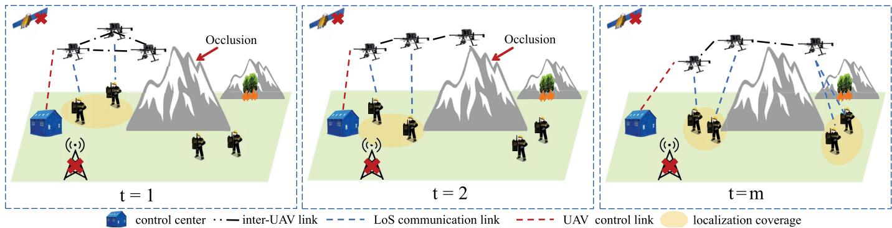  
Fig. 1. ILAC UAV emergency rescue scenario. Users move according to the rescue task requirement, and the ILAC UAV network avoids obstacles and provides users with LoS communication and localization services.

To our knowledge, this paper is the first to investigate UAV trajectory planning and resource allocation in ILAC networks within real mountainous environments and formulate it as a Markov Decision Process (MDP). To address the challenge of low sample efficiency in high-dimensional complex environments, we propose GeoAgg-HSAC, an RL framework that leverages a pretrained geographic information-based state aggregation GNN to enhance the sample efficiency of HSAC.

• We propose a geographic information-based state representation optimization method based on Graph Contrastive Learning (GCL), which significantly enhances RL sample efficiency. Specifically, we design a GNN for state representation based on Bipartite Graph Attention (BiGAT). By sampling UAV network states affected by terrain occlusions in a 3D environment, we construct a contrastive learning dataset and train the GNN to map states influenced by the same obstacle to similar representations while improving the differences between states under different occlusions. This approach generates low-dimensional and highly discriminative state representations, effectively reducing state space dimensionality and improving RL sample efficiency.

• We verify the superiority of the proposed framework in an environment built based on realistic data. Using 3D reconstructed maps, ray tracing, and measured channel gain data, we accurately replicate UAV communication and localization scenarios in real mountainous terrain. Experimental results demonstrate that GeoAgg-HSAC significantly outperforms other RL methods in improving communication efficiency and minimizing localization errors, confirming its effectiveness and robustness in realworld complex environments.

The rest paper is organized as follows: Section II introduces the system model and problem formulation. Section III introduces the proposed GeoAgg-HSAC framework. Section IV conducts an experimental evaluation and compares it with various existing RL algorithms. Finally, Section V summarizes the main contributions of this paper.

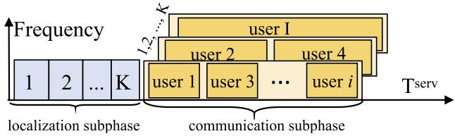  
Fig. 2. Frame structure of time-division ILAC UAV base station.

## II. SYSTEM MODEL AND PROBLEM FORMULATION

## A. System Model

As shown in Figure 1, we consider a UAV network consisting of a set of UAVs $\mathcal { K } = \{ 1 , \ldots , k , \ldots , K \}$ and a set of users $\mathcal { T } = \{ 1 , \ldots , i , \ldots , I \}$ in a complex mountainous area with obstructions. Each UAV is equipped with an ILAC base station, while each user carries an ILAC terminal. UAVs broadcast localization signals to locate users and provide downlink communication services to users. All UAVs serve T cycles, where each cycle $t \in [ 1 , T ]$ has a duration of T cyc. All users move along the mountain surface in response to tasks that occur randomly, with a speed not exceeding the maximum limit $V _ { \mathrm { m a x } } ^ { u } .$ . Due to the limitations of mountainous terrain, the $V _ { \mathrm { m a x } } ^ { u }$ is kept at a low level, making the user’s position approximately static within a T cyc. Mountainous obstacles block GNSS signals, rendering them unavailable to ground users. The position of each UAV at cycle t is denoted as $q _ { k , t } =$ $( X _ { k , t } , Y _ { k , t } , Z _ { k , t } )$ , which is obtained from the GNSS onboard. A centralized decision-making paradigm is adopted due to the nature of emergency rescue tasks and responsibility structure, as it ensures clear accountability, streamlined coordination, and effective leadership in time-sensitive operations [34]. All UAVs communicate through an inter-UAV network and are managed by a control center, which collects measurement data and makes decisions. Since the link between UAVs is an Airto-Air link with high communication rates, the delay caused by the data collection process can be neglected. One $T ^ { \mathrm { c y c } }$ is divided into a service phase T serv, and a control phase $T ^ { \mathrm { c t r l } }$ Since $T ^ { \mathrm { c t r l } } \ll T ^ { \mathrm { s e r } }$ , its impact on user performance evaluation is negligible.

As shown in Figure 2, the service phase includes a localization subphase and a communication subphase. UAVs first broadcast localization signals in turn to measure the distance $d _ { i , k , t }$ between UAVs and users. Then, in the communication subphase, each UAV uses Time Division Multiple Access (TDMA) to serve its associated users in the downlink, ensuring no interference between users. However, UAVs share a common frequency band, which cause users to experience interference from other UAVs. When the communication or localization signal strength is lower than the minimum threshold $\gamma ^ { m i n }$ , the communication link cannot be established. UAVs collect the ranging data $d _ { i , k , t }$ and the estimated channel gain data $\hat { g } _ { i , k , t }$ from the ILAC base station and transmit them back to the control center. To ensure uninterrupted communication services, the localization subphase occupies a much shorter time in the cycle than the communication subphase.

In the control phase, based on data from the previous cycle, the control center determines the user location $\hat { q } _ { i , t }$ and estimates whether each link is a LoS link $( o _ { i , k , t } = 1 )$ or a NLoS link $( \hat { o } _ { i , k , t } ~ = ~ 0 )$ . It then optimizes the UAV positions $q _ { k , t + 1 } \in \{ ( x , y , z ) | z \} \ : > \ : h ( x , y ) \}$ transmission power $p _ { k , t + 1 } ^ { \mathrm { t r a n s } } \ \in \ ( P _ { \operatorname* { m i n } } , P _ { \operatorname* { m a x } } )$ , and user-UAV associations $\beta _ { i , k , t + 1 }$ for communication. $h ( x , y )$ represents the height of the mountainous terrain. The binary variable $\beta _ { i , k , t }$ indicates the service relationship between UAV k and user i at time t, with $\beta _ { i , k , t } = 1$ meaning UAV k serves user $i ,$ and $\beta _ { i , k , t } = 0$ otherwise. The computed adjustments are then transmitted to the UAVs via the control link, ensuring coordinated trajectory adjustments and resource reallocation.

## B. Localization Model

In the localization subphase, the Two-Way Ranging (TWR) method is employed to measure the distances between users and UAVs [36]. Specifically, all UAVs sequentially broadcast localization signals and receive echo signals from users. By calculating the difference of signal arrival time, the distance $\hat { d } _ { i , k , t }$ between user i and UAV k at t cycle can be determined. Then in the control phase, the position $\hat { q } _ { i , t } = ( \hat { x } _ { i , t } , \hat { y } _ { i , t } , \hat { z } _ { i , t } )$ of any user i at time slot t can be calculated by localization algorithm such as maximum likelihood estimation [36]. In addition, by analyzing the ranging error and the deviation between the real-time channel gain $\hat { g } _ { i , k , t }$ and the estimated value, it is possible to accurately determine whether the link is LoS.

Similar to GNSS, the performance of the UAV localization system is mainly affected by two factors: the ranging error and the UAV geometric configuration. Ranging error refers to the gap between the measured distance and the actual distance from the UAV to the user, which is mainly caused by signal interference, multi-path effect, or hardware error. UAV geometric configuration refers to the spatial distribution of UAVs. A wide and uniform UAV distribution is considered to be the optimal geometric configuration for maximizing positioning accuracy, as supported by previous work on Geometric Dilution of Precisio (GDOP) [35]. GDOP is the amplification factor of ranging errors due to the spatial distribution of the UAV. A lower GDOP indicates a higher localization accuracy and vice versa. With high-precision crystal oscillators and signal processing chips, hardware errors can be ignored. However, mountain obstruction causes a reduction in LoS links. Consequently, the number of available LoS links and the UAV geometric configuration are the key factors determining localization accuracy in such environments.

To avoid ranging errors caused by multi-path effects, only LoS measurements $( \hat { o } _ { i , k , t } ~ = ~ 1 )$ are considered for position estimation. Since user mobility is limited, LoS measurements $\hat { d } _ { i , k , t ^ { \prime } } , t ^ { \prime } \in [ t - \eta , t ]$ obtained within the past η cycles are still used for calculating user locations in $t ,$ even if they may introduce minor errors.

The set of valid measured distances for user i at cycle t is defined as:

$$
\hat { \mathcal { D } } _ { i , t } = \left\{ \hat { d } _ { i , k , t ^ { \prime } } \Big | k \in K , \hat { g } _ { i , k , t ^ { \prime } } \geq \gamma ^ { l } , \hat { o } _ { i , k , t ^ { \prime } } = 1 , t ^ { \prime } \in [ t - \eta , t ] \right\} ,\tag{1}
$$

where K denotes the set of UAVs that provide valid LoS measurements for user i at $t ^ { \prime } \in [ t - \eta , t ]$ , and $\gamma ^ { l }$ represents the minimum required channel gain threshold, ensuring the ranging error is within the acceptable range. Each measurement $\dot { d } _ { i , k , t ^ { \prime } }$ corresponds to a UAV k at time $t ^ { \prime } ,$ and the known position of UAV k is $q _ { k , t ^ { \prime } } = ( X _ { k , t ^ { \prime } } , Y _ { k , t ^ { \prime } } , Z _ { k , t ^ { \prime } } )$

The ranging error of $\ddot { d } _ { i , k , t ^ { \prime } }$ that satisfies the above constraints is within the acceptable range, and the localization error is mainly affected by the geometric distribution of the UAVs used for measurement. To characterize the amplification effect of the UAV geometric distribution on the ranging error, the GDOP is employed to characterize the user localization accuracy. Note that, in order to use trilateration for positioning, for each user, it must be ensured that at least three independent distance measurements are involved in the positioning calculation; otherwise, the position is undetermined [35]. The GDOP of user i at time t is given by:

$$
\mathcal { G } _ { i , t } = \sqrt { t r \mathopen { } \mathclose \bgroup \left( H _ { i , t } ^ { T } H _ { i , t } \aftergroup \egroup \right) ^ { - 1 } } ,\tag{2}
$$

where $H _ { i , t }$ is the Jacobian matrix of the measurement function concerning the position $\hat { q } _ { i , t } = ( x _ { i , t } , y _ { i , t } , z _ { i , t } )$ of user i [35]. For every valid measurement $\hat { d } _ { i , k , t ^ { \prime } } \in \hat { \mathcal { D } } _ { i , t }$ , the corresponding row of $H _ { i , t }$ is given by:

$$
\begin{array} { r } { h _ { i , k , t ^ { \prime } } = \left[ \frac { x _ { i , t } - X _ { k , t ^ { \prime } } } { \hat { d } _ { i , k , t ^ { \prime } } } , \frac { y _ { i , t } - Y _ { k , t ^ { \prime } } } { \hat { d } _ { i , k , t ^ { \prime } } } , \frac { z _ { i , t } - Z _ { k , t ^ { \prime } } } { \hat { d } _ { i , k , t ^ { \prime } } } \right] , } \end{array}\tag{3}
$$

and $H _ { i , t }$ is constructed as:

$$
H _ { i , t } = \left[ h _ { i , k _ { 1 } , t _ { 1 } ^ { \prime } } , h _ { i , k _ { 2 } , t _ { 2 } ^ { \prime } } , \dots , h _ { i , k _ { J } , t _ { J } ^ { \prime } } \right] ^ { T } .\tag{4}
$$

The localization performance metric at cycle t is:

$$
L _ { i , t } = \left\{ \begin{array} { l l } { \frac { 1 } { \mathcal { G } _ { \mathrm { i , t } } } } & { \mathcal { G } _ { \mathrm { i , t } } < \gamma ^ { G D O P } , } \\ { 0 } & { \left| \hat { D } _ { i , t } \right| < 3 \mathrm { o r } , \mathcal { G } _ { \mathrm { i , t } } \leq \gamma ^ { G D O P } , } \end{array} \right.\tag{5}
$$

where $\gamma ^ { G D O P }$ indicates the threshold of GDOP. The lower the GDOP value, the more favorable the satellite distribution and the higher the positioning accuracy [43]. When the GDOP is too high (for example, greater than 10), the positioning accuracy may not meet the needs of emergency scenarios. The inverse of $\frac { 1 } { \mathcal { G } _ { \mathrm { i , t } } }$ is used to transform the minimization of localization error into a maximization objective for localization performance. When localization is not possible due to poor UAV geometry or insufficient LoS links, $L _ { i , t } = 0$ . The average localization performance for all users at t cycle is quantified as:

$$
\bar { L } _ { t } = \frac { \displaystyle \sum _ { i \in \mathcal { I } } L _ { i , t } } { \displaystyle | \mathcal { I } | } .\tag{6}
$$

## C. Communication Model

During the communication subphase, UAVs transmit critical emergency rescue information, such as disaster maps, to users. The total available bandwidth, denoted as $B ,$ is shared among all UAVs. To represent the user-UAV association, we define a binary variable $\beta _ { i , k , t }$ , where $\beta _ { i , k , t } = 1$ indicates that UAV k serves user i at time t, and $\beta _ { i , k , t } = 0$ otherwise. To maximize the number of users served per time-slot and ensure equal access opportunities for every user, we assign exactly one UAV per user in each slot. Meanwhile, each UAV can accommodate multiple users by employing TDMA for resource allocation. It can be donated as:

$$
\sum _ { k \in \mathcal { K } } \beta _ { i , k , t } = 1 , \quad \forall i \in \mathcal { I } , \forall t \in [ 1 , T ] ,\tag{7}
$$

and the number of users served by UAV k at cycle t is:

$$
N _ { k , t } = \sum _ { i \in \mathcal { I } } \beta _ { i , k , t } , \quad \forall k \in K , \forall t \in [ 1 , T ] .\tag{8}
$$

Since the transmit power of UAV k at cycle t is $p _ { k , t } ^ { t r a n s } \in$ $( p ^ { \mathrm { m i n } } , p ^ { \mathrm { m a x } } )$ . The downlink communication rate of user i at cycle t refers to the data transmission rate during the communication subphase. It is expressed as:

$$
C _ { i , t } = B \sum _ { k \in K } \frac { \beta _ { i , k , t } } { N _ { k , t } } \log \left( 1 + \frac { p _ { k , t } ^ { t r a n s } \hat { g } _ { i , k , t } } { \sum _ { k ^ { \prime } \in K , k ^ { \prime } \neq k } p _ { k , t } ^ { t r a n s } \hat { g } _ { i , k ^ { \prime } , t } + \omega ^ { 2 } } \right) ,\tag{9}
$$

where $\hat { g } _ { i , k , t }$ is the channel gain on the link from UAV k to user i during service cycle t, and $\omega ^ { 2 }$ is the noise power. $\beta _ { i , k , t }$ is employed to indicate which UAV serves user i. The time slot length assigned to each user is determined by the total number of users served by the UAV they are associated with, donated as $\begin{array} { r } { N _ { k , t } . \ \frac { 1 } { N _ { k , t } } } \end{array}$ represents the ratio of the slot length assigned to user i to the total slot length. The more users a UAV serves, the shorter the slot assigned to each user, thus affecting their communication rate. The average communication performance at t cycle is quantified as:

$$
\bar { C } _ { t } = \frac { \displaystyle \sum _ { i \in \mathcal { I } } C _ { i , t } } { \displaystyle | \mathcal { I } | } .\tag{10}
$$

## D. UAV Model

In the control phase, the UAVs fly to their designated locations $^ { q _ { k , t + 1 } }$ with a velocity of $v _ { k , t }$ . The constraints of UAV velocity $v _ { k , t } = ( v _ { k , t , x } , v _ { k , t , y } , v _ { k , t , z } )$ are given by:

$$
\sqrt { v _ { k , t , x } ^ { 2 } + v _ { k , t , y } ^ { 2 } + v _ { k , t , z } ^ { 2 } } \leq V _ { \operatorname* { m a x } } ^ { U } ,\tag{11}
$$

where $\vert v _ { k , t , x } \vert \leq v _ { x } ^ { \operatorname* { m a x } } , \vert v _ { k , t , y } \vert \leq v _ { y } ^ { \operatorname* { m a x } } , \vert v _ { k , t , z } \vert \leq v _ { z } ^ { \operatorname* { m a x } }$ . The UAV trajectory is subject to the following restrictions:

$$
\lvert | q _ { k , t + 1 } - q _ { k , t } \rvert | \leq V _ { \operatorname* { m a x } } ^ { U } T ^ { \operatorname { c t r l } } ,\tag{12}
$$

where $\begin{array} { r l r } { q _ { k , t + 1 } } & { { } = } & { ( X _ { k , t } + v _ { k , x , t } T ^ { \mathrm { c t r l } } , Y _ { k , t } + v _ { k , y , t } T ^ { \mathrm { c t r l } } } \end{array}$ $Z _ { k , t } + v _ { k , z , t } T ^ { \mathrm { c t r l } } )$ . The initial energy of UAV is $E ^ { i n i t }$ . According [39], the power of UAV is:

$$
p _ { k , t } ^ { \mathrm { f i y } } = P _ { 0 } \left( 1 + \frac { 3 v _ { k , t } ^ { 2 } } { U _ { t i p } ^ { 2 } } \right) + \frac { 1 } { 2 } d _ { 0 } \rho \varsigma A v _ { k , t } ^ { 3 }
$$

$$
+ ( 1 + \kappa ) \frac { ( F ) ^ { \frac { 3 } { 2 } } } { \sqrt { 2 \rho A } } \left( \sqrt { 1 + \frac { v _ { k , t } ^ { 4 } } { 4 v _ { h } ^ { 4 } } } - \frac { v _ { k , t } ^ { 2 } } { 2 v _ { h } ^ { 2 } } \right) ^ { \frac { 1 } { 2 } } ,\tag{13}
$$

where $P _ { 0 }$ is a constant, and $F$ is the gravity of the UAV. $\begin{array} { r } { v _ { h } = \sqrt { \frac { F } { 2 \rho A } } } \end{array}$ is the average rotor induced speed of the UAV when it is hovering, $d _ { 0 }$ is the fuselage drag ratio and $\varsigma$ is the rotor compactness, $\rho$ and A represents air density and rotor disk area respectively, v is the UAV speed, and $U _ { t i p }$ is the rotor blade tip speed. κ is the incremental correction factor to induced power. For UAV $k ,$ the total energy consumption can be expressed as:

$$
e _ { k } = \sum _ { i = 1 } ^ { | \mathcal { Z } | } ( T ^ { \mathrm { s e r v e } } { p _ { k , t } } ^ { t r a n s } + T ^ { c t r l } p _ { k , t } ^ { \mathrm { f l y } } ) ,\tag{14}
$$

where $p _ { k , t } ^ { t r a n s }$ is the transmit power and $p _ { k , t } ^ { \mathrm { f l y } }$ is the UAV power.

## E. Problem Formulation

The optimization problem $\phi _ { o p t }$ aims to maximize the users’ average communication and localization performance by jointly optimizing the UAVs’ positions, transmit powers,and the allocation of UAVs and users. The problem is formulated as follows:

$$
\begin{array} { r l } { \phi _ { o p t } : \displaystyle { \operatorname* { m a x } _ { v _ { k } , \xi , k _ { k } ^ { \prime } , k _ { k } ^ { \prime } , k _ { k } ^ { \prime } } } \frac { 1 } { T } \sum _ { i = 1 } ^ { T } ( \bar { C } _ { i } + \lambda \bar { L } _ { k } ) } & { } \\ { s . t . } \\ { c . 1 \{ \mathbf { q } _ { i , k , i + 1 } - \mathbf { q } _ { k , i } \} < V _ { \mathrm { m a x } } \mathrm { T } ^ { \mathrm { c m } } } \\ { \displaystyle c . \{ \mathbf { q } _ { i , k ^ { \prime } , i } - \mathbf { q } _ { k , i } \} > D _ { \mathrm { m i n } } \mathrm { V } _ { k , k ^ { \prime } } \mathrm { F } ^ { \mathrm { c m } } } \\ { c . 4 : \displaystyle { \sum _ { i = 1 } ^ { T / \partial u _ { i , k , i } } } \mathrm { s } . 6 . 5 ( 1 , k \in \mathbb { K } _ { i }  } \\ { c . 5 ( \bar { S } _ { i , k , i } - 1 ) } & { } \\ { c . 5 ( \bar { S } _ { \mathrm { m i n } } \leq p _ { k , i } ^ { \mathrm { a m } } \leq P _ { \mathrm { m a x } }  } \\ { c . 5 ( c . ( \mathrm { e } ^ { i } + \mathrm { e } ^ { i } + \mathrm { e } ^ { i } )   } \\ { c . 6 . ( \mathrm { e } ^ { i } + \mathrm { e } ^ { i } ) } \end{array}\tag{15}
$$

where $\lambda$ is a coefficient that adjusts the weights of localization and communication performance in the optimization objective. $c _ { 1 }$ constrains the maximum flight distance of the UAV in each cycle. $c _ { 2 }$ ensures that all UAVs maintain a safe distance. $c _ { 3 }$ is the UAV energy constraint. $c _ { 4 }$ ensures that each user is served by only one UVA. $c _ { 5 }$ constrains the UAV maximum power $. c _ { 6 }$ and $c _ { 7 }$ indicate that all user rates and localization performance should be greater than $\gamma ^ { r }$ and $\begin{array} { r } { \gamma ^ { l } , \gamma ^ { l } = \frac { 1 } { \gamma ^ { G D O P } } } \end{array}$ $\Theta = \{ ( x , y , z ) | z > h ( x , y ) \}$ represents the feasible flight space of UAVs. $h ( x , y )$ is the height of the mountainous terrain.

φopt is an online mixed-integer programming (MIP) problem that involves optimizing communication and localization performance under complex terrain constraints. The 3D terrain constraint $c _ { 8 }$ introduces significant nonlinear effects, as obstructions cause abrupt changes in channel quality and localization accuracy. This leads to a highly uncertain and nonconvex solution space, making traditional optimization methods less effective. On one hand, gradient-based and convex optimization techniques rely on smooth and continuous mathematical models, which are unsuitable for handling the abrupt, non-convex variations introduced by terrain obstructions. On the other hand, mixed-integer programming approaches often suffer from excessive computational complexity, making real-time optimization infeasible. In contrast, RL is well-suited for this problem, as it can dynamically adapt to nonlinear environmental changes, as discussed in [40], balance exploration and exploitation, and generate real-time optimization strategies without requiring an explicit mathematical model. Therefore, it offers a more efficient and scalable solution for communication and localization under complex terrain constraints.

## F. MDP Formulation

$\phi _ { o p t }$ can be described as a Markov decision process, and related concepts are defined as follows:

1) Environment: The geographical environment is represented by a 3D map, and the wireless environment is generated by a simulator built based on measured data and ray tracing data. All users $\mathcal { T } = \{ 1 , \ldots , i \ldots , I \}$ move along the mountain surface in response to tasks that occur randomly.

2) Agent: The control center is an agent that obtains all the observations of the UAVs and distributes the results of the decisions through the inter-UAV networks.

3) State: The state s includes observations of all UAVs at t cycle. $s _ { t } = \{ q _ { k , t } , q _ { \hat { k } , t } , \hat { o } _ { i , k , t } , \widehat { \mathfrak { g } } _ { i , k , t } , | \hat { \mathcal { D } } _ { i , t } | , p _ { k , t } \} , k \in \mathcal { K } , i \in \mathcal { T } .$ $q _ { k , t }$ is the position of UAV $k , \hat { q } _ { i , t }$ is the estimated position of user $i , \hat { o } _ { i , k , t }$ represents the LoS information of all links, $\widehat { \mathrm { g } } _ { i , k , t }$ is the observed channel gain, $| \hat { \mathcal { D } } _ { i , t } |$ is the number of LoS links that can be used to calculate the users’ positions at t cycle, ${ p } _ { k , t }$ is the transmit power of UAV k.

4) Action: A hybrid action space adopted to control the UAV trajectory and resource allocation. Continuous actions include the velocity $v _ { k , t }$ and transmit power ${ p } _ { k , t }$ of all UAVs, and the discrete part represents the service relationship between users and $\mathbf { U A V s } \ \beta _ { i , k , t } .$ . So, the hybrid action at t cycle can be donated as $\{ v _ { k , t } , p _ { k , t } ^ { \mathrm { t r a n s } } , \beta _ { i , k , t } \} , k \in \mathcal { K } , i \in \mathcal { T }$

5) Reward: The reward $r _ { t }$ is designed based on a transformation of the optimization problem $\phi _ { o p t }$ , where some constraints $( c _ { 2 } , \ c _ { 3 } , \ c _ { 6 } , \ c _ { 7 } , \ c _ { 8 } )$ are incorporated as penalty terms, while others $( c _ { 1 } , c _ { 4 }$ and $c _ { 5 } )$ , are enforced by limiting the range of actions output by the network, thus ensuring that the optimization process automatically satisfies these constraints. The new optimization problem structure can be expressed as follows:

$$
\operatorname* { m a x } _ { \boldsymbol { v } _ { k , t } , \boldsymbol { p } _ { k , t } ^ { t r a n s } , \beta _ { i , k , t } } \frac { 1 } { T } \sum _ { t = 1 } ^ { T } \bar { C } _ { t } + \lambda \bar { L } _ { t } - \left( \delta _ { t } ^ { q } + \delta _ { t } ^ { c } + \delta _ { t } ^ { l } + \delta _ { t } ^ { e } \right)\tag{16}
$$

where $\hat { C } _ { t }$ represents the average communication performance, ${ \bar { L } } _ { t }$ represents the average localization performance, $\delta _ { t } ^ { q } , \delta _ { t } ^ { c } , \delta _ { t } ^ { l }$ and $\delta _ { t } ^ { e }$ are the penalty terms corresponding to the constraints on UAV collision $( c _ { 2 } , \ c _ { 8 } )$ , communication rate $\left( c _ { 6 } \right)$ , localization accuracy (c7), and energy consumption (c3) in $\phi _ { o p t }$ respectively.Based on the above problem transformation, the reward $r _ { t }$ is designed as follows:

$$
r _ { t } = r ^ { c } { _ t } + \lambda r ^ { l } { _ t } - \delta _ { t } ,\tag{17}
$$

where $\boldsymbol { r } _ { t } ^ { c }$ is the communication reward, $r _ { t } ^ { l }$ is the localization reward, λ is the weight coefficient of positioning and communication performance. $\delta _ { t }$ is the total penalty.

$\boldsymbol { r } _ { t } ^ { c }$ and $r _ { t } ^ { l }$ are constructed based on potential-based reward shaping, specifically reflecting improvements in communication rate and localization accuracy. This method is widely used in reward shaping and does not alter the optimal policy [41]. $\boldsymbol { r } _ { t } ^ { c }$ is expressed as:

$$
r _ { t } ^ { c } = \frac { 1 } { | I | } \sum _ { i = 1 } ^ { | I | } \left( f ( C _ { i , t } ) - f ( C _ { i , t - 1 } ) \right) ,\tag{18}
$$

where $f$ is a piecewise logarithmic function, which donated as:

$$
f ( C _ { i , t } ) = \left\{ \begin{array} { l l } { - \frac { \log _ { 1 0 } \left( \frac { \gamma ^ { r } } { C _ { i , t } } \right) } { 1 0 \log _ { 1 0 } \left( 1 0 \right) } } & { \mathrm { i f } C _ { i , t } < \gamma ^ { r } , } \\ { \frac { \log _ { 1 0 } \left( \frac { C _ { i , t } } { \gamma ^ { r } } \right) } { 1 0 \log _ { 1 0 } \left( 1 0 \right) } } & { \mathrm { i f } C _ { i , t } \geq \gamma ^ { r } . } \end{array} \right.\tag{19}
$$

To ensure that all users achieve the minimum communication rate, the communication rate $C _ { i , t }$ is below the target rate $\gamma ^ { r } ,$ , a negative reward is provided to encourage performance improvement; when $C _ { i , t }$ exceeds the target rate, a positive reward is given. Although $f$ is a piecewise logarithmic function, it is continuous and differentiable at $\gamma ^ { r }$ , ensuring the smoothness of the reward function and thus stabilizing the learning process [42]. $r _ { t } ^ { l }$ is donated as:

$$
r _ { t } ^ { c } = \frac { 1 } { | I | } \sum _ { i = 1 } ^ { | I | } \left( L _ { i , t } - L _ { i , t - 1 } \right) ,\tag{20}
$$

where $L _ { i , t }$ is the localization performance of user i in t cycle. The penalty term $\delta _ { t }$ includes all penalty terms in Equation 16. In addition, the NLoS link penalty $\delta _ { t } ^ { o }$ is also used to minimize the communication performance degradation. $\delta _ { t }$ can be expressed as:

$$
\delta _ { t } = \delta _ { t } ^ { q } + \delta _ { t } ^ { o } + \delta _ { t } ^ { c } + \delta _ { t } ^ { l } + \delta _ { t } ^ { e } .\tag{21}
$$

where the penalty $\delta _ { t } ^ { e }$ is set to −100 when the UAV’s energy is depleted but the task is not completed, and $\delta _ { t } ^ { e } = 0$ otherwise. The penalty terms for communication and localization, $\delta _ { t } ^ { c }$ and $\delta _ { t } ^ { l } ,$ , are set to $- 0 . 1 \times N _ { t } ^ { f a i l }$ , where $N _ { t } ^ { f a i l }$ is the number of users who do not meet the communication or localization constraints. The NLoS link penalty $\delta _ { t } ^ { q }$ is:

$$
\delta _ { t } ^ { q } = \mu \left( \sum _ { k \in \mathcal { K } } \alpha _ { k , t } ^ { q } + \sum _ { k \in \mathcal { K } } \alpha _ { k , t } ^ { q ^ { \prime } } \right) ,\tag{22}
$$

where $\mu = - 2 , \alpha _ { k , t } ^ { q }$ indicate whether UAV k collides with the mountain at t cycle, and $\alpha _ { k , t } ^ { q ^ { \prime } }$ is the collision penalty between UAVs, which are expressed as:

$$
\begin{array} { r } { \boldsymbol { \alpha } _ { k , t } ^ { q } = \left\{ \begin{array} { l l } { 1 } & { Z _ { k , t } \leq h ( X _ { k , t } , Y _ { k , t } ) , } \\ { 0 } & { Z _ { k , t } > h ( X _ { k , t } , Y _ { k , t } ) , } \end{array} \right. } \end{array}\tag{23}
$$

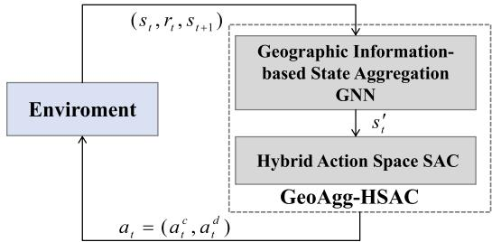  
Fig. 3. The overall architecture of the GeoAgg-HSAC framework.

$$
\alpha _ { k , t } ^ { q ^ { \prime } } = \left\{ \begin{array} { l l } { 1 } & { \displaystyle \sum _ { k ^ { \prime } \in K k ^ { \prime } \neq k } q _ { k , t } - q _ { k , t } \leq D _ { \operatorname* { m i n } } , } \\ { 0 } & { e l s e . } \end{array} \right.\tag{24}
$$

The collision penalty $\delta _ { t } ^ { o }$ is:

$$
\delta _ { t } ^ { o } = \varsigma \left( \sum _ { i \in I } \alpha _ { k , t } ^ { o } - \alpha _ { k , t - 1 } ^ { o } + \sum _ { i \in I } \alpha _ { k , t } ^ { \beta } - \alpha _ { k , t - 1 } ^ { \beta } \right) .\tag{25}
$$

where $\varsigma = 0 . 2 , \alpha _ { i , t } ^ { o }$ reflects whether there is at least one LoS link between user i and UAV at t cycle. $\alpha _ { i , t } ^ { \beta }$ penalty NLoS communication service, which are expressed as:

$$
\begin{array} { r l } & { \alpha _ { i , t } ^ { o } = \left\{ \begin{array} { l l } { 1 } & { \displaystyle \sum _ { k \in \mathcal { K } } \hat { o } _ { i , k , t } \ge 1 , } \\ { 0 } & { \mathrm { e l s e } , } \end{array} \right. } \\ & { \alpha _ { i , t } ^ { \beta } = \left\{ \begin{array} { l l } { 1 } & { \displaystyle \sum _ { k \in \mathcal { K } } \hat { \beta } _ { i , k , t } \hat { o } _ { i , k , t } = 1 , } \\ { 0 } & { \mathrm { e l s e } . } \end{array} \right. } \end{array}\tag{26}
$$

(27)

Reliable communication and localization in mountainous environments fundamentally rely on maintaining persistent LoS links between UAVs and ground users [37]. Consequently, ensuring continuous LoS connectivity is essential to enable uninterrupted communication and accurate user localization in such complex terrains. However, effectively learning strategies to maintain stable LoS communication and localization in environments characterized by complex terrain remains a significant challenge for traditional RL methods, relying solely on reward shaping. These methods often face common challenges, including poor sample efficiency and limited generalization capabilities, particularly in high-dimensional, non-stationary environments [40].

## III. GEOAGG-HSAC: A RL FRAMEWORK FOR ILAC UAV NETWORKS

## A. Overview of the GeoAgg-HSAC Framework

In this section, we propose the GeoAgg-HSAC framework. As illustrated in Figure 3 the GeoAgg-HSAC framework leverages a geographic information-based state aggregation GNN for efficient state representation and employs a Hybrid Action Space SAC algorithm to handle mixed discrete- continuous action spaces, enabling simultaneous optimization of UAV flight paths, power control, and user association strategies.

Specifically, the Geographic Information-Based State Aggregation GNN is designed to extract UAV network features by incorporating node position and link state information into the graph structure and message-passing process. Furthermore, GCL is applied to train the GNN, encouraging it to produce similar low-dimensional representations for UAV network states that are affected by the same terrain-induced occlusions. This mechanism enables the aggregation of network states with similar LoS/NLoS distributions, significantly reducing the state space complexity and improving the sample efficiency and generalization capability of the RL agent.

Based on the above state representations, the HSAC opti mizes the UAVs’ trajectories and power (continuous actions) and user allocation (discrete actions). The hybrid actions allow fine-grained trajectory adjustments to maintain LoS links while dynamically optimizing UAV power and user associations to maximize network performance.

## B. Geographic Information-Based State Aggregation GNN

The UAV network inherently has a graph structure. We define the bipartite graph of the UAV network $G _ { t } = \langle \tau _ { : }$ , K, E, $\mathcal { H } _ { t } ^ { u s e r } , \mathcal { H } _ { t } ^ { \bar { U } A V } , \bar { \mathcal { H } } _ { t } ^ { \mathcal { E } } \rangle$ at cycle t, in which UAVs and users serve as heterogeneous nodes $\{ 1 , 2 , \ldots K \}$ and $\{ 1 , 2 , \ldots I \}$ and the link between UAV k and user i represented by edges $\varepsilon _ { i , k }$ and $\varepsilon _ { k , i } . \ \mathcal { H } _ { t } ^ { u s e r }$ and $\mathcal { H } _ { t } ^ { U A V }$ are the feature matrices of the users and the UAVs at t cycle, respectively. $\mathcal { H } _ { t } ^ { \mathcal { E } }$ is the edge feature matrix.

The GNN is shown in Figure 4. It consists of two BiGAT layers for node feature aggregation, along with a Set2Set pooling layer and a fully connected layer for global feature extraction.

1) Input: The input features $\begin{array} { r l } { [ X _ { k , t } , Y _ { k , t } , Z _ { k , t } , p _ { k , t } ] } & { { } \in } \end{array}$ $\mathcal { H } _ { t } ^ { U A V }$ of UAV nodes include the UAV’s position and transmission power, while the features of user nodes $\left| x ^ { \prime } { } _ { i , t } , y ^ { \prime } { } _ { i , t } , z ^ { \prime } { } _ { i , t } , \vert \hat { D } _ { i , t } \vert \right| \in \mathcal { H } _ { t } ^ { u s e r }$ consist of the user’s position and the number of LoS links available for localization. The edge features $\hat { \bf g } _ { i , k , t } \in \mathcal { H } _ { t } ^ { \mathcal { E } }$ is the channel gain of the link $\varepsilon _ { i , k }$ 2) BiGAT: Let $\mathbf { h _ { i } }$ represent the feature of $i \in \ \mathcal { Z } ,$ , hk represent the feature of $k \in \mathcal K$ . The new features $\mathbf { h _ { k } ^ { ' } }$ and ${ \bf { h } } _ { \bf { i } } ^ { ' }$ after linear transformation can be defined as:

$$
\begin{array} { r } { \mathbf { h _ { k } ^ { ' } = W _ { 1 } h _ { k } + b _ { 1 } } } \\ { \mathbf { h _ { i } ^ { ' } = W _ { 2 } h _ { i } + b _ { 2 } } , } \end{array}\tag{28}
$$

where W is learnable weight matrice, b is bias term. The node features $\mathbf { h } _ { \mathbf { k } } ^ { \prime } , ~ \mathbf { h } _ { \mathbf { i } } ^ { \prime }$ and edge features are used to calculate the attention coefficient. For edge $\varepsilon _ { i k } .$ , the attention coefficient is:

$$
\alpha _ { i , k } = \mathrm { L e a k y R e L U } \left( \mathbf { W } _ { a t t } ^ { T } \left[ \mathbf { h } _ { \mathbf { i } } ^ { \prime } \mid \mid \mathbf { h } _ { \mathbf { k } } ^ { \prime } \right] \right) \cdot g _ { i , k , t } ,\tag{29}
$$

where $g _ { i , k , t }$ is the edge feature, $\mathbf { W } _ { a t t } ^ { T }$ is a learnable weight vector, k denotes concatenation, and LeakyReLU is the activation function. The normalized attention weights $\hat { \alpha } _ { i k }$ can be expressed as:

$$
\hat { \alpha } _ { i , k } = \frac { \exp ( \alpha _ { i , k } ) } { \sum _ { j \in \mathcal { T } } \exp ( \alpha _ { i , j } ) }\tag{30}
$$

The above calculations are also applicable to node k. So, the updated features of node i and node k can be donated as:

$$
\begin{array} { l } { { \displaystyle { \bf h _ { i } ^ { ( 1 ) } = \sigma \left( M L P \left( \sum _ { k \in \mathcal { K } } \hat { \alpha } _ { k , i } { \bf h _ { k } ^ { ( 0 ) } } \right) \right) , } } } \\ { { \displaystyle { \bf h _ { k } ^ { ( 1 ) } = \sigma \left( M L P \left( \sum _ { i \in \mathcal { T } } \hat { \alpha } _ { i , k } { \bf h _ { i } ^ { ( 0 ) } } \right) \right) . } } } \end{array}\tag{31}
$$

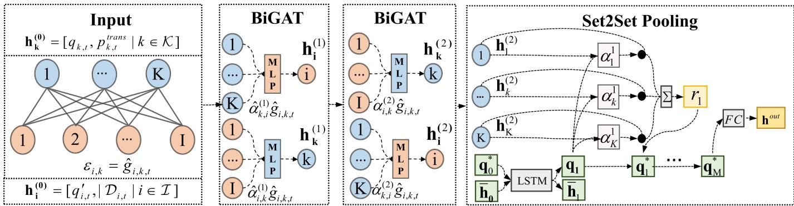  
Fig. 4. GNN network structure. It consists of two BiGAT layers for node feature aggregation, a Set2Set pooling module for global feature extraction.

BiGAT incorporates a channel gain-based edge attention mechanism to enhance the aggregation of high-quality link information. Its two-layer architecture enables UAV nodes to aggregate features from user nodes and further integrate information from other UAV nodes through user intermediaries. This design allows UAV nodes to capture inter-UAV competition for users and signal interference, significantly enhancing their representation capability. By aggregating these UAV node representations, comprehensive global network features can be effectively constructed. The feature of k UAV after two BiGAT layer is $\bar { \mathbf { h } _ { k } ^ { ( 2 ) } } \in \mathbb { R } ^ { d }$

3) Set2Set Pooling: The Set2Set pooling module encodes the UAV features through Long Short-Term Memory(LSTM) networks and outputs the synthesized feature representation in combination with the attention mechanism.

At each time step $m ,$ the LSTM updates the hidden state of each UAV based on the query vector $\mathbf { q } _ { m - 1 }$ and the LSTM hidden state $\bar { \bf h } _ { \bf m - 1 }$ . Take the first time step as an example, the LSTM computes the new query vector $\rho _ { \mathbf { 0 } }$ and hidden state h:

$$
\mathbf { q _ { 1 } } , \bar { \mathbf { h } } _ { 1 } = \mathrm { L S T M } ( \mathbf { q } _ { 0 } ^ { * } , \bar { \mathbf { h } } _ { 0 } ) ,\tag{32}
$$

where $\bar { \mathbf { h } } _ { 0 } = \mathbf { 0 } \in \mathbb { R } ^ { d } , \mathbf { q } _ { 0 } = \mathbf { 0 } \in \mathbb { R } ^ { d } , \mathbf { r } _ { 0 } = \mathbf { 0 } , \mathbf { q } _ { 0 } ^ { * } = [ \mathbf { q } _ { 0 } , \mathbf { r } _ { 0 } ] ^ { \top } \mathbf { \Omega } _ { \phi }$ ∈ $\mathbb { R } ^ { 2 d }$ . The attention weight $\tilde { \alpha } _ { k } ^ { 1 }$ for each UAV is:

$$
\alpha _ { k } ^ { 1 } = \mathrm { s o f t m a x } _ { k } \big ( \mathbf { h } _ { k } ^ { ( 2 ) } \mathbf { \Sigma } ^ { \top } \mathbf { q } _ { 1 } \big ) ,\tag{33}
$$

where $\mathbf { h } _ { k } ^ { ( 2 ) }$ is UAV features and $\mathbf { q _ { 1 } }$ is query vector. The UAV features are weighted by the attention weights $\alpha _ { k } ^ { 1 }$ , and they are aggregated into a graph-level feature $\mathbf { r } _ { 1 }$ using global add pooling:

$$
\mathbf { r } _ { 1 } = \sum _ { k \in \mathcal { K } } \Big ( \alpha _ { \mathrm { k } } ^ { 1 } \cdot \mathbf { h } _ { \mathrm { k } } ^ { ( 2 ) ) } \Big ) ,\tag{34}
$$

where $\mathbf { h } _ { \mathbf { k } } ^ { ( 2 ) }$ is the features of UAV k. The updated query vector for the next step is the concatenation of ${ \bf q } _ { 1 }$ and $\mathbf { r } _ { 1 } \mathbf { : }$

$$
\mathbf { q } _ { 1 } ^ { * } = \left[ \begin{array} { l } { \mathbf { q } _ { 1 } } \\ { \mathbf { r } _ { 1 } } \end{array} \right] ,\tag{35}
$$

After M steps, the final graph representation is expressed as:

$$
{ \bf h } ^ { \mathrm { o u t } } = \mathrm { F C } \left( { \bf q } _ { M } ^ { * } \right) ,\tag{36}
$$

where $F C$ is a fully connected layer.

In our task, UAV networks with the same LoS/NLoS link states are expected to have similar embeddings, while those with different link states should be distinguishable in the embedding space. Therefore, for a given graph data sample $( G _ { t } , O _ { t } )$ , where $O _ { t }$ denotes the set of LoS/NLoS link states between UAVs and users at cycle $t ,$ we define positive pairs as graph pairs with identical link state distributions, and negative pairs as those with different link state distributions.

4) Positive Sample: For a given data $\left( G _ { t } , \hat { O } _ { t } \right)$ , one of its positive sample is $( G _ { t } ^ { + } , \hat { O } _ { t } )$ where $G _ { t } ^ { + } \neq G _ { t }$

5) Negative Sample: For a given data $\left( G _ { t } , \hat { O } _ { t } \right)$ , one of its negative sample is $( G _ { t } ^ { - } , \hat { O } _ { t } ^ { \prime } )$ where $G _ { t } ^ { - } \neq G _ { t }$ and $O _ { t } \neq \hat { O } _ { t } ^ { \prime }$

For a $G _ { t } ,$ a new state $G _ { t } ^ { \prime }$ can be generated by perturbing the position of the UAV network in a simulated environment based on a 3D map. Using the ray tracing algorithm, it can be determined whether the LoS/NLoS state of each link changes so that a comparative sample can be constructed according to the above definitions of positive and negative samples.

The InfoNCE contrastive loss function pairs the target embeddings with the corresponding positive samples, while other samples are used as negative samples to guide model learning. According to the definition of positive and negative samples, the loss function can be constructed as follows:

$$
\mathcal { L } _ { I n f o N C E } = - \log \frac { \exp \left( \sin ( \mathbf { h _ { t } ^ { o u t } } , \mathbf { h _ { t } ^ { o u t + } } ) / \zeta \right) } { \sum \exp \left( \sin ( \mathbf { h _ { t } ^ { o u t - } } , \mathbf { h _ { t } ^ { o u t } } ) / \zeta \right) } ,\tag{37}
$$

where $\mathbf { h } _ { \mathbf { t } } ^ { \mathbf { o u t } }$ is the embeddings of sample $G _ { t }$ in Dataset N and $\mathbf { h _ { t } ^ { o u t } } ^ { + }$ is positive embeddings of $\mathbf { h _ { t } ^ { o u t } . \ h _ { t } ^ { o u t } } ^ { - }$ represents the negative samples. sim $. ( \cdot , \cdot )$ is used to evaluate the similarity between two embedding vectors, which is implemented here by calculating the dot product of the two vectors. The temperature parameter $\zeta$ is a hyperparameter that changes the relative distance between positive and negative samples.

Algorithm 1 presents the training process of the proposed GNN model based on graph contrastive learning. The dataset is constructed according to the aforementioned positive and negative sample generation strategy, and the model is optimized with the InfoNCE loss.

## C. HSAC for Trajectory and Resource Optimization

To make hybrid action decisions, we extend the traditional SAC algorithm to a hybrid version. The objective of HSAC is to learn a policy $\pi ( a | s )$ to effectively handle UAV trajectory planning and resource allocation.

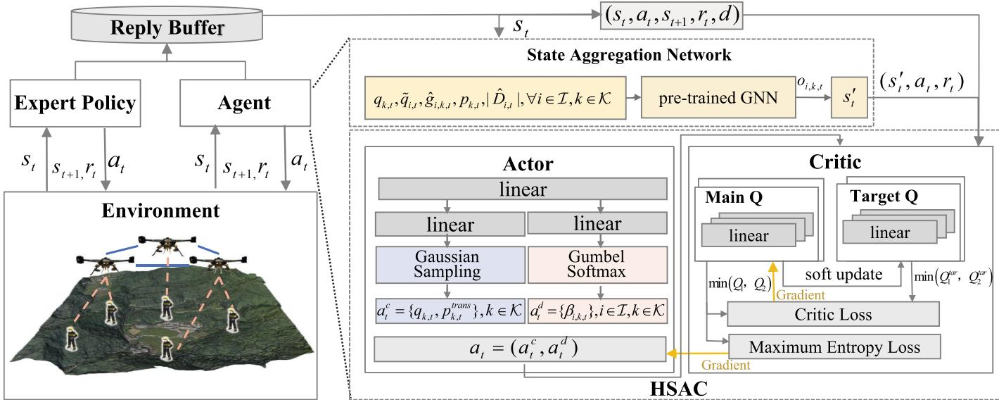  
Fig. 5. HSAC network structure and training, with GNN-based state aggregation providing inputs for hybrid action optimization. It adopts off-policy training with an experience replay buffer that stores trajectories collected from both the agent and an expert policy.

Algorithm 1 Graph Contrastive Learning With InfoNCE Loss   
1: Initialize $\overline { { \mathrm { G N N } _ { \theta } } }$ network   
2: Set learning rate $\eta ,$ temperature $\zeta ,$ and epochs M   
3: Sample $G _ { t }$ from the environment to form a dataset $\mathcal { N }$   
4: for each epoch $m = 1 , 2 , . . . , M$ do   
5: for each graph $G _ { t }$ do   
6: Generate positive samples $G _ { t } ^ { + }$   
7: Compute embeddings:   
$\mathbf { h } _ { \mathbf { t } } ^ { \mathbf { o u t } } = \mathbf { G N N } _ { \theta } ( G _ { t } ) , \mathbf { h } _ { \mathbf { t } } ^ { \mathbf { o u t } ^ { + } } = \mathbf { G N N } _ { \theta } ( G _ { t } ^ { + } )$   
8: Compute similarity between $\mathbf { h } _ { \mathbf { t } } ^ { \mathbf { o u t } }$ and $\mathbf { h _ { t } ^ { o u t } } ^ { + } ;$   
$\mathrm { s i m ( h _ { t } ^ { o u t } , h _ { t } ^ { o u t } ^ { + } ) } = \frac { \mathbf { h _ { t } ^ { o u t } } \cdot \mathbf { h _ { t } ^ { o u t } } ^ { + } } { \| \mathbf { h _ { t } ^ { o u t } } \| \| \mathbf { h _ { t } ^ { o u t } } ^ { \scriptscriptstyle { o u t } + } \| }$   
9: Compute negative similarities sim $( \mathbf { h _ { t } ^ { o u t } } , \mathbf { h _ { t } ^ { o u t } } ^ { - } )$   
10: Compute InfoNCE Loss LInfoNCE   
11: Update GNN parameters: $\theta \gets \theta - \eta \nabla _ { \theta } \mathcal { L } _ { \mathrm { I n f o N C E } }$   
12: end for   
13: end for   
14: Output the trained model $\operatorname { G N N } _ { \theta }$

As shown in Figure 5, to enable effective policy learning in complex environments, HSAC utilizes compact state representations $s _ { t } ^ { \prime }$ generated by the pre-trained GNN. The HSAC consists of an actor network and a critic network. In the actor network, Gaussian distribution and Gumbel-softmax are used to output continuous and discrete continuous action parameters, respectively, where Gumbel-softmax can ensure continuous gradient backpropagation [38]. The critic network includes two independently trained Q networks $Q _ { \phi _ { 1 } }$ and $Q _ { \phi _ { 2 } }$ and two target networks, and the Q network consists of three linear layers. The critic network is utilized to evaluate the Q value of the current state and action. The HSAC algorithm conducts off-policy training using an experience replay buffer that incorporates both agent and expert policy experiences. The inclusion of expert experience improves learning efficiency and policy quality.

The hybrid action at t cycle can be donated as $\begin{array} { r l } { a _ { t } } & { { } = } \end{array}$ $\{ v _ { k , t } , p _ { k , t } ^ { \mathrm { t r a n s } } , \beta _ { i , k , t } \} , k \in \mathcal { K } , i \in \mathcal { I } ,$ where continuous action $a _ { t } ^ { c } = \{ \stackrel { } { v } _ { k , t } , p _ { k , t } ^ { \mathrm { t r a n s } } \} \in \mathbb { R } ^ { 4 \times | K | }$ and discrete $a _ { t } ^ { d } ~ = ~ \{ \beta _ { i , k } \} ~ \in$ R $\tau | \times | \mathcal { K } | .$ . The continuous policy $\pi _ { c }$ is modeled as a multivariate Gaussian distribution, where each action dimension is sampled independently.

$$
\pi _ { c } ( a _ { t } ^ { c } | s _ { t } ) = \prod _ { m = 1 } ^ { 4 \times | K | } \mathcal { N } ( a _ { t , m } ^ { c } | \mu _ { \theta , m } ( s _ { t } ) , \sigma _ { \theta , m } ^ { 2 } ( s _ { t } ) ) ,\tag{38}
$$

where $a _ { t , m } ^ { c }$ is m-th dim of $\boldsymbol { a } _ { t } ^ { c } ,$ the $\mu _ { \theta , m } ( s _ { t } )$ is the mean and $\sigma _ { \theta , m } ( s _ { t } )$ is the variance, both parameterized by the policy network. The policy for the discrete action is $\pi _ { d }$ , which employs Gumbel-Softmax to maintain the differentiability of gradients during the sampling of discrete actions. This ensures that HSAC can adapt to the hybrid action space. $a _ { t } ^ { d } = \{ \beta _ { i , k } \} \in \mathbb { R } ^ { | \mathcal { T } | \times | \mathcal { K } | }$ is multi-dimensional and independent across dimensions, the product of the policies for each action dimension $\pi ( \boldsymbol a _ { t } ^ { d } | \boldsymbol s _ { t } )$ is:

$$
\pi _ { d } ( a _ { t } ^ { d } | s _ { t } ) = \prod _ { i = 1 } ^ { | \mathcal { Z } | } \pi _ { d , i } ( a _ { t , i } ^ { d } = k | s _ { t } ) , k \in \mathcal { K } ,\tag{39}
$$

where the $\pi _ { d , i } \left( a _ { t , i } ^ { d } = k \mid s _ { t } \right)$ is the dimension i of action $a _ { t } ^ { d } .$ . The probability for choosing k for action i at cycle t is represented by the Gumbel-Softmax sampling result, which is donated as:

$$
\pi _ { d , i } \left( a _ { t , i } ^ { d } = k \mid s _ { t } \right) = \frac { \exp \left( \frac { h _ { t , i , k } + g _ { t , i , k } } { \tau } \right) } { \sum _ { j = 1 } ^ { \lvert K \rvert } \exp \left( \frac { h _ { t , i , j } + g _ { t , i , j } } { \tau } \right) } ,\tag{40}
$$

where $h _ { t , i , k }$ represents the output logits and |K| is the number of categories in the i -th action dimension. Where

$g _ { t , i , k } \sim$ Gumbel(0, 1) is the Gumbel noise, and τ is the temperature parameter.

The entropy for continuous actions is given by:

$$
\mathcal { H } \left( \pi _ { c } ( \cdot \mid s _ { t } ) \right) = \frac { 1 } { 2 } \sum _ { m = 1 } ^ { 4 \times \lvert K \rvert } \left( 1 + \log \left( 2 \pi \sigma _ { \theta , m } ^ { 2 } ( s _ { t } ) \right) \right) ,\tag{41}
$$

where $\sigma _ { \theta , m } ^ { 2 } ( s _ { t } )$ is the variance of the m-th action for the current state. For discrete actions, the entropy is computed as:

$$
\mathcal { H } ( \pi _ { d } ( \cdot | s _ { t } ) ) = - \sum _ { i = 1 } ^ { | \mathcal { X } | } \sum _ { k = 1 } ^ { | \mathcal { K } | } \pi _ { d , i } ( a _ { t , i } ^ { d } = k | s _ { t } ) \log \pi _ { d , i } ( a _ { t , i } ^ { d } = k | s _ { t } ) ,\tag{42}
$$

where $\pi _ { d , i }$ represents the probability of the user i being assigned to each UAV. The total policy entropy is the sum of the continuous and discrete components:

$$
\begin{array} { r } { \mathcal { H } \big ( \pi ( \cdot | s _ { t } ) \big ) = \alpha ^ { c } \mathcal { H } \big ( \pi _ { c } ( \cdot | s _ { t } ) \big ) + \alpha ^ { d } \mathcal { H } \big ( \pi _ { d } ( \cdot | s _ { t } ) \big ) , } \end{array}\tag{43}
$$

where $\alpha ^ { c }$ and $\alpha ^ { d }$ are the temperature parameters for controlling the continuous and discrete actions entropy.

The target Q value y of HSAC can be estimated by the target network:

$$
\begin{array} { c } { y = r _ { t } + \gamma ( 1 - d _ { t + 1 } ) ( Q _ { \phi } ^ { \operatorname* { m i n } } ( s _ { t + 1 } , a _ { t + 1 } ) } \\ { - \alpha \log \pi ( a _ { t + 1 } | s _ { t + 1 } ) ) , } \\ { Q _ { \phi } ^ { \operatorname* { m i n } } ( s _ { t + 1 } , a _ { t + 1 } ) = \operatorname* { m i n } ( Q _ { \phi _ { 1 } } ^ { \mathrm { t a r } } ( s _ { t + 1 } , a _ { t + 1 } ) , Q _ { \phi _ { 2 } } ^ { \mathrm { t a r } } ( s _ { t + 1 } , a _ { t + 1 } ) ) , } \end{array}\tag{44}
$$

where $r _ { t }$ is the reward of the current step. $d _ { t + 1 }$ indicates whether it is in the termination state. γ is the discount factor. To reduce overestimation, the minimum Q value estimated by target Q networks $Q _ { \phi _ { 1 } } ^ { \mathrm { t a r } }$ and $Q _ { \phi _ { 2 } } ^ { \mathrm { t a r } }$ and y is the target Q value.

The optimization objective of the Q network is to minimize the mean squared error between the current Q value and the target Q value. Its objective function is:

$$
J _ { Q } ( \phi _ { m } ) = \mathbb { E } _ { \mathcal { D } } [ ( Q _ { \phi _ { m } } ( s _ { t } , a _ { t } ) - y ) ^ { 2 } ] ,\tag{45}
$$

where $m \in \{ 1 , 2 \}$ . The update of target network parameters is usually achieved through soft update, which is expressed as:

$$
\theta _ { m } ^ { \mathrm { t a r } }  \tau \theta _ { m } + ( 1 - \tau ) \theta _ { m } ^ { \mathrm { t a r } } ,\tag{46}
$$

where $m \in \{ 1 , 2 \} , \theta _ { m }$ are the parameter of the current Q networks, $\theta _ { m } ^ { \mathrm { t a r } }$ the parameter of the target Q networks. The objective of the Actor network is to maximize the expected Q value while also maximizing the entropy of the policy to encourage exploration. The objective function is:

$$
J _ { \pi } ( \theta ) = \mathbb { E } _ { s _ { t } \sim \mathcal { D } } \left[ \mathbb { E } _ { a _ { t } \sim \pi _ { \theta } } \left[ \mathcal { H } ( \pi _ { \theta } ( \cdot | s _ { t } ) ) - Q _ { \phi } ^ { \mathrm { m i n } } ( s _ { t } , a _ { t } ) \right] \right] ,\tag{47}
$$

where θ represents the parameters of the Actor network, $Q _ { \phi } ( s _ { t } , a _ { t } )$ is the Q value output by the current critic network and $\mathcal { H } ( \pi _ { \theta } ( \cdot | s _ { t } ) )$ is the entropy of the hybrid action weighted by the temperature parameter $\alpha ^ { c }$ and $\dot { \alpha ^ { d } }$ . By maximizing the target entropy, the temperature parameters $\alpha ^ { c }$ and $\alpha ^ { d }$ can be dynamically adjusted, and its updated target is:

$$
J ( \alpha ^ { c } ) = \mathbb { E } _ { a _ { t } ^ { c } \sim \pi _ { \theta } ^ { c } } \left[ - \alpha ^ { c } \left( \log \pi _ { \theta } ^ { c } ( a _ { t } ^ { c } | s _ { t } ) + \mathcal { H } _ { \mathrm { t a r } } ^ { c } \right) \right] ,\tag{48}
$$

$$
J ( \alpha ^ { d } ) = \mathbb { E } _ { a _ { t } ^ { d } \sim \pi _ { \theta } ^ { d } } \left[ - \alpha ^ { d } \left( \log \pi _ { \theta } ^ { d } ( a _ { t } ^ { d } | s _ { t } ) + \mathcal { H } _ { \mathrm { t a r } } ^ { d } \right) \right] ,\tag{49}
$$

where $\mathcal { H } _ { \mathrm { t a r } } ^ { c }$ and $\mathcal { H } _ { \mathrm { t a r } } ^ { d }$ are target entropy employed to control the exploratory of the policy $\pi _ { \theta } ^ { c }$ and $\pi _ { \theta } ^ { d } .$

During training, the experience replay buffer contains two types of data: agent experiences from interactions with the environment and expert experiences based on a greedy strategy. The expert policy prioritizes increasing UAV altitude to expand LoS coverage, assigning users to UAVs with better channel conditions to improve resource allocation, and adjusting UAV positions to maintain sufficient distance, reducing interference and collision risks. As training progresses, the proportion of expert demonstrations in the buffer gradually decreases, and the agent increasingly relies on its policy for learning.

Algorithm 2 HSAC Algorithm   
1: Train $\overline { { G N N _ { \theta } } }$ by Algorithm 1 and freeze parameters θ   
2: Initialize critic networks $Q _ { \phi _ { 1 } } ( s , a ) , Q _ { \phi _ { 2 } } ( s , a )$ and actor   
network $\pi _ { \boldsymbol { \theta } } ( a | \boldsymbol { s } )$ with random parameters $\phi _ { 1 } , \phi _ { 2 } , \theta$   
3: Initialize target critic networks with parameters $\phi _ { \mathrm { t a r _ { 1 } } } $   
$\phi _ { 1 } , \phi _ { \mathrm { t a r _ { 2 } } }  \phi _ { 2 }$   
4: Initialize temperature parameter α   
5: Initialize replay buffer D and add some experience gen  
erated by greedy strategies   
6: for $\mathrm { ~ n ~ } \leq 8 0 0 0$ do   
7: for each episode do   
8: Sample action $a _ { t } = ( a _ { t } ^ { c } , a _ { t } ^ { d } ) \sim \pi _ { \theta } ( \cdot | s _ { t } )$   
9: Action $a _ { t } = a _ { t } ^ { g r e e d y }$ with probability ε   
10: Execute action $a _ { t }$ in the environment, observe   
reward $r _ { t }$ and next state $s _ { t + 1 }$   
11: Store $\left( { { s _ { t } } , { a _ { t } } , { r _ { t } } , { s _ { t + 1 } } } \right)$ in replay buffer D   
12: Sample a mini-batch o $\operatorname { f } ( s _ { t } , a _ { t } , r _ { t } , s _ { t + 1 } )$ from D   
13: Compute state feature $\mathbf { h _ { t } ^ { o u t } }$ of $s _ { t }$ by $G N N _ { \theta }$   
14: Generate a new state $s _ { t } ^ { \prime } = [ \mathbf { h } _ { \mathbf { t } } ^ { \mathbf { o u t } } | | \hat { O } _ { t } ]$   
15: Compute target Q-value y   
16: Compute critic Loss for $Q _ { \phi _ { 1 } }$ and $Q _ { \phi _ { 2 } }$   
17: Update Q networks by minimizing $\dot { J } _ { Q } ( \phi _ { 1 } ) , J _ { Q } ( \phi _ { 2 } )$   
18: Compute actor Loss: $J _ { \pi } ( \theta )$   
19: Update actor network by minimizing $J _ { \pi } ( \theta )$   
20: Compute temperature Loss: $J ( \alpha ^ { c } )$ and $J ( \alpha ^ { d } )$   
21: Update temperature parameter $\alpha ^ { c }$ and $\alpha ^ { d }$ by mini  
mizing $J ( \alpha ^ { c } )$ and $J ( \alpha ^ { d } )$   
22: Soft update target Q networks $\phi _ { 1 } ^ { \mathrm { t a r } } , \phi _ { 2 } ^ { \mathrm { t a r } }$   
23: end for   
24: n=n+1   
25: end for

The HSAC training process is summarized in Algorithm 2. A pre-trained geographic information aggregation GNN is integrated into the framework to provide efficient state representations, which reduces the training time and enhances the overall learning efficiency.

## IV. EXPERIMENTAL EVALUATION

## A. Experimental Setting

To make the training environment more realistic, we construct a 3D map of a typical mountainous area using UAV oblique photography technology and measure the channel gain of the air-to-ground link in the area, eventually forming the BUPT-UAV-mountain dataset. Based on this dataset, a simulated geographic and wireless environment was constructed within the Gym framework. The 3D map is used as the geographic environment, restricting users to move only on the ground. The ray tracing algorithm is used to calculate the LoS and NLoS states of the links. For the LoS channel, we adopt a model that incorporates an additional loss specific to forest environments [46] as described below:

TABLE I NOTATIONS
<table><tr><td>Parameter</td><td>Value</td></tr><tr><td>UAV</td><td>k</td></tr><tr><td>User</td><td>i</td></tr><tr><td>Serve cycle</td><td>t</td></tr><tr><td>Duration of each service cycle</td><td>Tcycle</td></tr><tr><td>UAV position</td><td> ${ q } _ { k , t }$ </td></tr><tr><td>Communication rate threshold</td><td> $\gamma ^ { r }$ </td></tr><tr><td>GDOP threshold</td><td> $\gamma ^ { G D O P }$ </td></tr><tr><td>Channel gain</td><td> $g _ { \hat { g } _ { i , k , t } }$ </td></tr><tr><td>Measured distance between UAV and user Bandwidth</td><td> $d _ { \hat { g } _ { i , k , t } }$ </td></tr><tr><td>Localization performance</td><td> $B$ </td></tr><tr><td>Communication performance</td><td> $L _ { i , t }$ </td></tr><tr><td>Communication and localization performance coefficient</td><td> $C _ { i , t }$ </td></tr><tr><td>UAV energy</td><td></td></tr><tr><td></td><td>ek</td></tr><tr><td>UAV transmit power Feasible flight space</td><td> $p _ { k , t } ^ { \mathrm { t r a n s } }$ </td></tr></table>

TABLE II  
EXPERIMENTAL PARAMETERS
<table><tr><td>Parameter</td><td>Value</td></tr><tr><td>UAV number |K|</td><td>5</td></tr><tr><td>User number  $| \mathcal { T } |$ </td><td>15</td></tr><tr><td>Maximum user movement speed  $V _ { m a x } ^ { u s e r }$ </td><td>2m/s</td></tr><tr><td>Maximum UAV speed  $V _ { m a x }$ </td><td>10m/s</td></tr><tr><td>Initial energy of UAV  $e ^ { i n i t }$ </td><td>40000kJ</td></tr><tr><td>Number of service cycles</td><td>50</td></tr><tr><td>Duration of each service cycle Tcycle</td><td>100s</td></tr><tr><td>UAV flight time Ttrans</td><td>10s</td></tr><tr><td>Bandwidth B</td><td>10M</td></tr><tr><td>Communication rate threshold  $\gamma ^ { r }$ </td><td>0.3Mbps</td></tr><tr><td>GDOP threshold  $\gamma ^ { G D O P }$ </td><td>10</td></tr><tr><td>Communication and localization performance coefficient λ</td><td>0.5</td></tr></table>

$$
P L = 8 { \log _ { 1 0 } } d + 4 8 . 3 + 6 4 . 2 \operatorname { t a n h } ( d / 2 0 ) + 2 0 { \log _ { 1 0 } } f ,\tag{50}
$$

where d is the distance between user and UAV, f is the frequency. For the NLoS channel, we add an extra loss $P L _ { N L o S } ~ = ~ - 6 0 d B$ in aforementioned model, which is calculated by averaging the extra path loss of NLoS links compared to LoS links, based on ray tracing simulations conducted across multiple geographic locations with similar terrain. The simulated environment is used to generate a comparison dataset for training GNNs and train the GeoAgg-HSAC algorithm. The simulation experiments are conducted on a server equipped with an NVIDIA GTX 4090 GPU, with the simulation parameters set as shown in the table II.

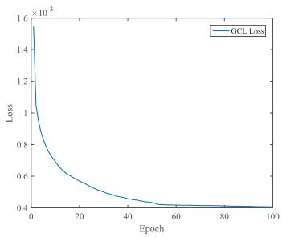  
(a) GCL Loss

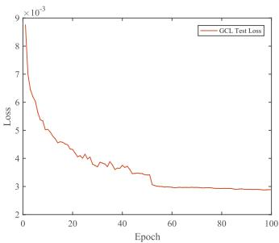  
(b) GCL Test Loss

Fig. 6. GCL training Loss.  
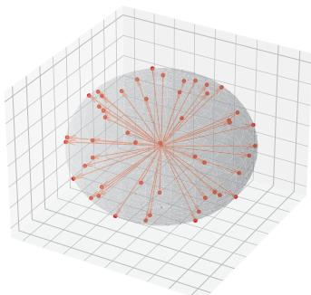

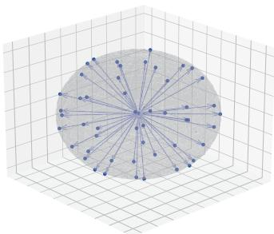

(a) Negative samples before GNN  
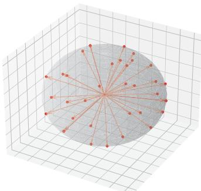

(b) Positive samples before GNN  
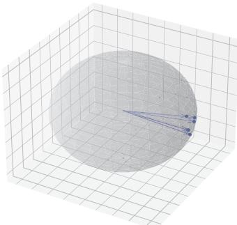  
(c) Negative samples after GNN  
(d) Positive samples after GNN  
Fig. 7. Visualization of geographic information state aggregation. Negative sample cluster (red), positive sample cluster (blue).

## B. Performance of Geographic Information-Based State Aggregation GNN

In Experiment 1, the feature extraction network GNN is trained according to Algorithm 1 to generate feature embeddings for the state of UAV networks. Positive and negative samples of the network state are generated according to their definitions, and GNNθ is trained based on the above samples according to Algorithm 1. The range of random variables $\delta _ { x } , \delta _ { y } , \delta _ { z } \ \in \ [ 0 , 1 0 0 ] , \ \delta _ { p } \ \in \ [ 0 , 2 0 ]$ . Figure 6(a) shows the model’s Loss on the training set decreasing as the number of epoch increases. The training set contains 500,000 samples. Figure 6(b) shows the model’s loss performance on the test set, which contains 20,000 network state sample pairs. It can be seen that the model’s loss on both the training set and the test set has converged.

Experiment 2 shows the effect of GNN feature extraction. According to the method of generating positive and negative samples in Section III, several positive and negative samples can be generated. Figure7 (a) and (b) show two groups of 50 network state samples after PCA dimensionality reduction, where the left ones are negative samples of each other, and the right ones are positive samples of each other. Figure7 (c) and (d) show the distribution of feature vectors of the above samples after feature extraction by GCL network. In order to facilitate the display, the feature vectors are also reduced by PCA.

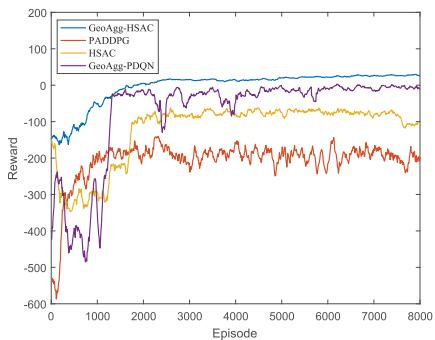  
Fig. 8. Comparison of RL-based schemes.

As shown in Figure 7, the GNN can generate similar feature representations for positive samples and different feature representations for negative samples. This means that the GNN can effectively learn the differences in channel gain distribution caused by the sudden change in the line of sight relationship in the network.

## C. Performance of GeoAgg-HSAC

Experiment 3 compares different RL-based schemes in our simulation environment.

PADDPG: Parameterized Action Space Deep Deterministic Policy Gradient (PADDPG) [44] is an extension of traditional DDPG, including a deterministic policy network that generates mixed action parameters, a Q-value network that estimates the state-action value function, and a target network for stable training.

• HSAC: HSAC is a variant of GeoAgg-HSAC that removes the pre-trained GNN layer, with the original state being directly used as the input to the network.

GeoAgg-PDQN The GeoAgg-PDQN is a variant of Parametrized Deep Q-Networks (PDQN) [45], which adds a pre-trained GNN layer to the network for state aggregation. PDQN consists of a continuous action Q network and a discrete action Q network, where the output of the continuous action Q network and the state serve as the input of the discrete action Q network.

As shown in Figure 8, compared to other algorithms, GeoAgg-HSAC not only converges faster than the baseline algorithms, but it also achieves a higher and more stable average reward, indicating both accelerated learning and improved policy performance. A comparison between HSAC and PAD-DPG reveals that adding a pre-trained GNN can effectively avoid severe penalty caused by collisions and rapidly adapt to complex terrain. This is due to the GNN aggregating similar states, which makes the Q-value estimation more focused on the core features of the states, improving the stability of the estimation and accelerating policy convergence. Compared to the GeoAgg-PDQN algorithm, GeoAgg-HSAC shows clear advantages in high-dimensional mixed-action decision-making. This is because PDQN inherits DDPG’s limitations, such as susceptibility to local optima, unstable policies, and inefficient exploration in large action spaces. In contrast, HSAC leverages maximum entropy strategies to enhance exploration and improve overall performance.

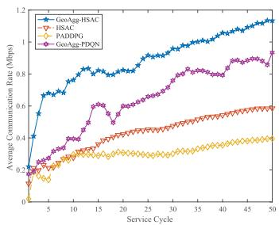  
(a) Average communication rate.

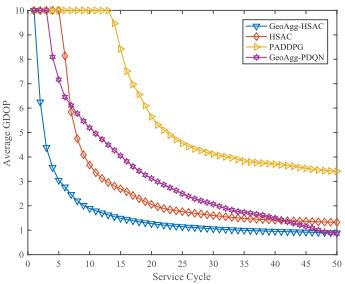  
(b) Average localization GDOP.  
Fig. 9. Comparison of Average Communication Rate and GDOP across Different RL-Based Schemes.

Figure 9(a) illustrates the variation in average communication rate over service time when using different RL algorithms. The horizontal axis represents service cycles, while the vertical axis indicates the average rate of users. Note that when calculating the user rate, if the rate is less than threshold γc, it is 0. Since GeoAgg-HSAC can rapidly improve communication rates within just a few service cycles and achieve steady rate improvements in subsequent cycles, effectively meeting user communication needs. Compared with SAC, PADDPG and GeoAgg-PDQN, GeoAgg-HSAC improves the average communication rate by 106.73%, 193.24% and 43.7% respectively. The continuous increase in performance is due to the system dynamically adapting to users’ movements, with UAVs adjusting their positions to optimize communication links and improve communication rate.

Figure 9(b) shows the trend of average localization performance over service time when deploying UAVs by different RL algorithms. The horizontal axis represents service cycles, while the vertical axis indicates the average GDOP of users, displayed on an exponential scale. When users cannot be positioned or the average GDOP exceeds 10 which is regard as unreliable, the average GDOP is marked as 10. Since GeoAgg-HSAC algorithm can dynamically adjust UAVs positions to quickly establish LoS links with users, thereby providing stable localization services more efficiently. Compared with SAC, PADDPG and GeoAgg-PDQN, GeoAgg-HSAC improves the average GDOP by 77.93%, 257.66% and 98.8% respectively.

Furthermore, Experiment 4 compared several optimizationbased real-time decision-making schemes,including the Kmeans-Greedy scheme and the Search-Opt scheme. KMeans-Greedy, uses the KMeans algorithm to optimize UAV trajectories, determining the UAV’s next movement by calculating user center positions and avoiding terrain collisions. The greedy algorithm selects the best UAV for each user based on channel conditions, and allocates power by considering the signal strength to the served user and interference to others. Search-Opt, employs a local search for UAV trajectory optimization, enhancing the LoS links between UAVs and users while avoiding collisions. The optimal matching algorithm calculates the UAV-user service relationships, and convex optimization is used to adjust the power allocation accordingly.

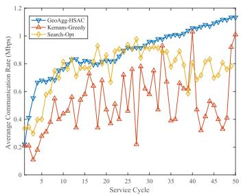  
(a) Average communication rate.

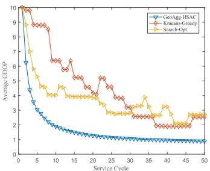  
(b) Average localization GDOP.

Fig. 10. Comparison of average communication rate and GDOP between the proposed scheme and the optimization-based schemes.  
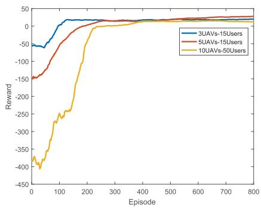  
Fig. 11. Different configurations of UAVs and users.

As shown in Figure 10, compared to GeoAgg-HSAC, the optimization-based schemes exhibit larger performance fluctuations. This is because the optimization approach can only make simultaneous decisions for UAV trajectory and resource allocation based on the current link state, and during trajectory optimization, it is challenging to accurately estimate the link state at the target location. This leads to a mismatch between the decisions and actual requirements. In contrast, the GeoAgg-HSAC scheme, based on reinforcement learning, learns the link state variation patterns for the current terrain through pre-training, enabling user association and power allocation outputs that align with the target UAV position. Furthermore, through continuous interaction with the environment and policy optimization based on long-term rewards, Geoagg-SAC dynamically adjusts its decisions to adapt to link state changes, thereby avoiding the performance fluctuations.

Experiment 5 compares different configurations of UAVs and users to analyze their impact on the convergence speed and final reward of a reinforcement learning model. The experimental setup includes three configurations: 3 UAVs and 15 users, 5 UAVs and 15 users, and 10 UAVs and 50 users.As shown in Figure 11 the model’s convergence speed significantly slows as the number of UAVs and users increases. When the number of UAVs increases while the number of users remains constant, the training convergence speed decreases, but the final reward increases. This suggests that more UAVs can more effectively share tasks, improving overall system performance. When the ratio of UAVs to users remains constant but the number of users increases, the system complexity increases significantly, resulting in slower training convergence and lower final rewards.

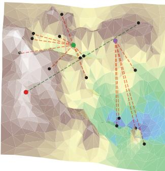

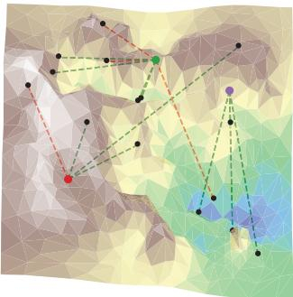  
(b) T=10

(a) T=1  
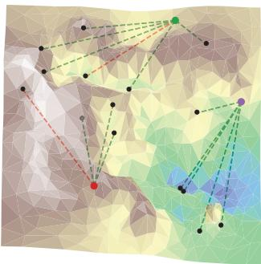

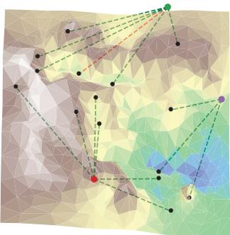  
(d) T=30

(c) T=20  
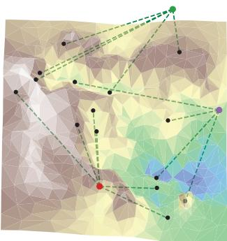  
(e) T=40

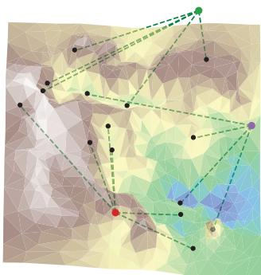  
(f) T=50  
Fig. 12. The process of 3 UAVs serving 15 users in 50 cycles.

Figure 12 illustrates the process of three UAVs serving 15 users, with the users randomly moving in a mountainous environment. The links between the UAVs and users are shown in red for NLoS conditions and in green for LoS conditions. After a period of UAV position adjustments, all users are able to maintain continuous communication with the UAVs through LoS links, ensuring that the communication rate meets the user requirement. Furthermore, all users can calculate their positions based on the low-error distance measurements from the LoS links, guaranteeing that the localization accuracy meets the user requirements. This demonstrates that the proposed method can effectively avoid mountain obstructions, enhancing both communication and localization performance for users.

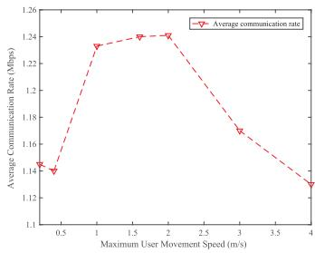  
(a) Communication rate

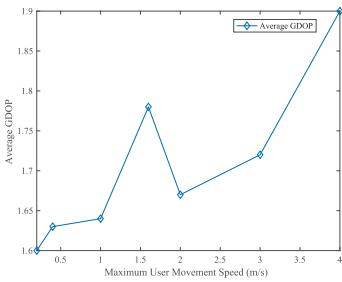  
(b) GDOP

Fig. 13. Average communication rate and GDOP under different user speeds.  
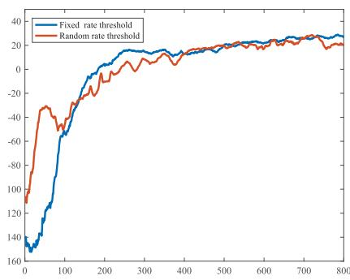  
Fig. 14. Comparison of Algorithm Performance under Fixed and Varying Minimum User Rate Requirements Threshold.

Experiment 6 aims to investigate whether GeoAgg-HSAC model trained with a fixed maximum user speed can generalize to scenarios where the maximum user speed varies. Specifically, the model was trained with a maximum user speed of 2 m/s, and then its performance was evaluated at different maximum speeds. During both training and testing, the actual user speed was randomly selected within the predefined maximum speed range. The experiment explores the adaptability of the trained model to user speeds outside of the training condition, testing its robustness to changes in user mobility.

Figure 13(a) illustrates the variation in average communication rate under different user movement speeds. The communication rate increases significantly at a user speed of 2 m/s, corresponding to the training scenario, but declines as the speed continues to rise. However, performance degradation remains minimal, with the communication rate maintaining at least 90.4% of the rate achieved at the trained speed, demonstrating strong adaptability to varying user mobility.

As Figure 13(b) shows, localization performance significantly deteriorates as user speed increases, but the model trained at a user speed of 2 m/s achieves noticeably improved localization accuracy, reflected by a substantial reduction in GDOP values. This demonstrates that training based on a specific speed can effectively enhance localization performance. Nevertheless, the algorithm can still maintain an average GDOP of less than 2 at a user speed of 4 m/s, indicating reliable localization performance.

Experiment 7 aims to investigate the impact of random minimum user requirement threshold on algorithm performance. Since the minimum localization requirement threshold to keep user safety are relatively fixed in rescue operations, this experiment compare the performance of GeoAgg-HSAC under fixed minimum user rate requirement threshold versus varying minimum user rate requirement threshold. In the experiment, the fixed threshold scenario has each user’s communication rate threshold set to 0.3 Mbps. In the random threshold scenario, each user’s communication rate threshold is randomly set between 0.1 Mbps and 0.5 Mbps, with an average value of 0.3 Mbps, and the rate is maintained constant throughout the service process. As shown in Figure 14, despite changes in user rate requirements, the method can still effectively adapt and maintain good performance. This demonstrates the robustness of the framework in both fixed and dynamic communication rate scenarios.

## V. CONCLUSION

This paper proposes a GeoAgg-HSAC framework, which integrates a GNN-based geographic state aggregation module with an HSAC network capable of jointly optimizing continuous UAV trajectories and discrete resource allocation. The framework maps the states of UAV networks experiencing similar occlusions into compact low-dimensional representations, reducing state dimensionality and enabling policy sharing among similar states. This design improves sample efficiency and accelerates convergence. Experimental results validate the effectiveness of the proposed GeoAgg-HSAC framework.

In the emergency recure, as the application of UAVs becomes increasingly widespread, the demand for large-scale UAV and user networks is also growing. The current centralized decision-making approach may face limitations due to the increase in state and action space, resulting in slower convergence and a decline in decision quality, and future work will explore integrating centralized training with decentralized execution (CTDE) to enhance scalability and adaptability in UAV-based emergency response systems.

## REFERENCES

[1] Z. Wang et al., “Toward reliable UAV-enabled positioning in mountainous environments: System design and preliminary results,” IEEE Trans. Rel., vol. 71, no. 4, pp. 1435–1463, Dec. 2022.

[2] H. Ren, C. Pan, K. Wang, W. Xu, M. Elkashlan, and A. Nallanathan, “Joint transmit power and placement optimization for URLLC-enabled UAV relay systems,” IEEE Trans. Veh. Technol., vol. 69, no. 7, pp. 8003–8007, Jul. 2020.

[3] R. Fan, J. Cui, S. Jin, K. Yang, and J. An, “Optimal node placement and resource allocation for UAV relaying network,” IEEE Commun. Lett., vol. 22, no. 4, pp. 808–811, Apr. 2018.

[4] J. Sabzehali, V. K. Shah, H. S. Dhillon, and J. H. Reed, “3D placement and orientation of mmWave-based UAVs for guaranteed LoS coverage,” IEEE Wireless Commun. Lett., vol. 10, no. 8, pp. 1662–1666, Aug. 2021.

[5] W. Lee and K. Lee, “Robust trajectory and resource allocation for UAV communications in uncertain environments with no-fly zone: A deep learning approach,” IEEE Trans. Intell. Transp. Syst., vol. 25, no. 10, pp. 14233–14244, Oct. 2024.

[6] F. Demiane, S. Sharafeddine, and O. Farhat, “An optimized UAV trajectory planning for localization in disaster scenarios,” Comput. Netw., vol. 179, Oct. 2020, Art. no. 107378.

[7] C. Zhang, L. Zhang, L. Zhu, T. Zhang, Z. Xiao, and X.- G. Xia, “3D deployment of multiple UAV-mounted base stations for UAV communications,” IEEE Trans. Commun., vol. 69, no. 4, pp. 2473–2488, Apr. 2021.

[8] N. P. Sharvari, D. Das, J. Bapat, and D. Das, “Connectivity and collision constrained opportunistic routing for emergency communication using UAV,” Comput. Netw., vol. 220, Jan. 2023, Art. no. 109468.

[9] T. Do-Duy, L. D. Nguyen, T. Q. Duong, S. R. Khosravirad, and H. Claussen, “Joint optimisation of real-time deployment and resource allocation for UAV-aided disaster emergency communications,” IEEE J. Sel. Areas Commun., vol. 39, no. 11, pp. 3411–3424, Nov. 2021.

[10] K. Zhuang, L. Xu, L. Li, L. Wang, and A. Fei, “GA-MADDPG: A demand-aware UAV network adaptation method for joint communication and positioning in emergency scenarios,” in Proc. IEEE Wireless Commun. Netw. Conf. (WCNC), Mar. 2023, pp. 1–6.

[11] Z. Wei et al., “Integrated sensing and communication signals toward 5G-A and 6G: A survey,” IEEE Internet Things J., vol. 10, no. 13, pp. 11068–11092, Jul. 2023.

[12] K. Meng et al., “UAV-enabled integrated sensing and communication: Opportunities and challenges,” IEEE Wireless Commun., vol. 31, no. 2, pp. 97–104, Apr. 2024.

[13] Z. Xiao and Y. Zeng, “An overview on integrated localization and communication towards 6G,” Sci. China Inf. Sci., vol. 65, no. 3, Mar. 2022, Art. no. 131301.

[14] W. Zhu, Y. Han, L. Wang, L. Xu, Y. Zhang, and A. Fei, “Pilot optimization for OFDM-based ISAC signal in emergency IoT networks,” IEEE Internet Things J., vol. 11, no. 18, pp. 29600–29614, Sep. 2024.

[15] B. Li, X. Wang, Y. Xin, and E. Au, “Value of service maximization in integrated localization and communication system through joint resource allocation,” IEEE Trans. Commun., vol. 71, no. 8, pp. 4957–4971, Aug. 2023.

[16] Y. Gao, H. Hu, J. Zhang, Y. Jin, S. Xu, and X. Chu, “On the performance of an integrated communication and localization system: An analytical framework,” IEEE Trans. Veh. Technol., vol. 73, no. 7, pp. 10845–10849, Jul. 2024.

[17] Z. Yang, S. Bi, and Y.-J.-A. Zhang, “Deployment optimization of dualfunctional UAVs for integrated localization and communication,” IEEE Trans. Wireless Commun., vol. 22, no. 12, pp. 9672–9687, Dec. 2023.

[18] D. Gesbert, O. Esrafilian, J. Chen, R. Gangula, and U. Mitra, “UAVaided RF mapping for sensing and connectivity in wireless networks,” IEEE Wireless Commun., vol. 30, no. 4, pp. 116–122, Aug. 2023.

[19] J. Chen, U. Mitra, and D. Gesbert, “3D urban UAV relay placement: Linear complexity algorithm and analysis,” IEEE Trans. Wireless Commun., vol. 20, no. 8, pp. 5243–5257, Aug. 2021.

[20] O. Esrafilian, R. Gangula, and D. Gesbert, “UAV-aided wireless node localization using hybrid radio channel models,” in Proc. IEEE Int. Conf. Commun. Workshops (ICC Workshops), May 2022, pp. 1083–1088.

[21] O. Esrafilian, R. Gangula, and D. Gesbert, “Three-dimensional-mapbased trajectory design in UAV-aided wireless localization systems,” IEEE Internet Things J., vol. 8, no. 12, pp. 9894–9904, Jun. 2021.

[22] P. Yi, L. Zhu, L. Zhu, Z. Xiao, Z. Han, and X.-G. Xia, “Joint 3-D positioning and power allocation for UAV relay aided by geographic information,” IEEE Trans. Wireless Commun., vol. 21, no. 10, pp. 8148–8162, Oct. 2022.

[23] S. Bi, Z. Zhuo, X.-H. Lin, Y. Wu, and Y.-J.-A. Zhang, “Physicalenvironment-map-aided 3-D deployment optimization for UAV-assisted integrated localization and communication in urban areas,” IEEE Internet Things J., vol. 11, no. 9, pp. 15490–15503, May 2024.

[24] Z. Zhang, Y. Liu, J. Huang, J. Zhang, J. Li, and R. He, “Channel characterization and modeling for 6G UAV-assisted emergency communications in complicated mountainous scenarios,” Sensors, vol. 23, no. 11, p. 4998, May 2023.

[25] H. Zijian, G. Xiaoguang, W. Kaifang, Y. Zhai, and Q. Wang, “Relevant experience learning: A deep reinforcement learning method for UAV autonomous motion planning in complex unknown environments,” Chin. J. Aeronaut., vol. 34, no. 12, pp. 187–204, Dec. 2021.

[26] K. K. Nguyen, T. Q. Duong, T. Do-Duy, H. Claussen, and L. Hanzo, “3D UAV trajectory and data collection optimisation via deep reinforcement learning,” IEEE Trans. Commun., vol. 70, no. 4, pp. 2358–2371, Apr. 2022.

[27] Y. Zeng, X. Xu, S. Jin, and R. Zhang, “Simultaneous navigation and radio mapping for cellular-connected UAV with deep reinforcement learning,” IEEE Trans. Wireless Commun., vol. 20, no. 7, pp. 4205–4220, Jul. 2021.

[28] M. Laskin, A. Srinivas, and P. Abbeel, “CURL: Contrastive unsupervised representations for reinforcement learning,” in Proc. 37th Int. Conf. Mach. Learn., vol. 119, 2020, pp. 5639–5650.

[29] M. Eisen and A. Ribeiro, “Optimal wireless resource allocation with random edge graph neural networks,” IEEE Trans. Signal Process., vol. 68, pp. 2977–2991, 2020.

[30] M. Lee, G. Yu, and G. Y. Li, “Graph embedding-based wireless link scheduling with few training samples,” IEEE Trans. Wireless Commun., vol. 20, no. 4, pp. 2282–2294, Apr. 2021.

[31] Y. Shen, Y. Shi, J. Zhang, and K. B. Letaief, “Graph neural networks for scalable radio resource management: Architecture design and theoretical analysis,” IEEE J. Sel. Areas Commun., vol. 39, no. 1, pp. 101–115, Jan. 2021.

[32] S. Munikoti, D. Agarwal, L. Das, M. Halappanavar, and B. Natarajan, “Challenges and opportunities in deep reinforcement learning with graph neural networks: A comprehensive review of algorithms and applications,” IEEE Trans. Neural Netw. Learn. Syst., vol. 35, no. 11, pp. 15051–15071, Nov. 2024.

[33] S. Chen, X. Qiu, X. Tan, Z. Fang, and Y. Jin, “A model-based hybrid soft actor-critic deep reinforcement learning algorithm for optimal ventilator settings,” Inf. Sci., vol. 611, pp. 47–64, Sep. 2022.

[34] National Incident Management System Emergency Operations Center How-to Quick Reference Guide, U.S. Department of Homeland Security, Federal Emergency Management Agency, Washington, DC, USA, 2022.

[35] Y. Liu, Z. Yang, X. Wang, and L. Jian, “Location, localization, and localizability,” J. Comput. Sci. Technol., vol. 25, no. 2, pp. 274–297, 2010.

[36] Q. Hu, L. Wang, Y. Luo, Y. Cheng, Z. Kou, and Z. Xie, “Iterative maximum-likelihood estimation algorithm for clock offset and skew correction in UWB systems assisted by 5G NR multipath,” Measurement, vol. 242, Jan. 2025, Art. no. 115823.

[37] S. Ali, A. Abu-Samah, N. F. Abdullah, and N. L. M. Kamal, “Propagation modeling of unmanned aerial vehicle (UAV) 5G wireless networks in rural mountainous regions using ray tracing,” Drones, vol. 8, no. 7, p. 334, Jul. 2024.

[38] P. Christodoulou, “Soft actor-critic for discrete action settings,” 2019, arXiv:1910.07207.

[39] Y. Zeng, J. Xu, and R. Zhang, “Energy minimization for wireless communication with rotary-wing UAV,” IEEE Trans. Wireless Commun., vol. 18, no. 4, pp. 2329–2345, Apr. 2019.

[40] S. Padakandla, “A survey of reinforcement learning algorithms for dynamically varying environments,” ACM Comput. Surveys, vol. 54, no. 6, pp. 1–25, Jul. 2022.

[41] A. Y. Ng, D. Harada, and S. Russell, “Policy invariance under reward transformations: Theory and application to reward shaping,” in Proc. 16th Int. Conf. Mach. Learn. (ICML), San Francisco, CA, USA, 1999, pp. 278–287.

[42] E. Smirnova and E. Dohmatob, “On the convergence of smooth regularized approximate value iteration schemes,” in Proc. Adv. Neural Inf. Process. Syst., vol. 33, 2020, pp. 6540–6550.

[43] M. Tahsin, S. Sultana, T. Reza, and M. Hossam-E-Haider, “Analysis of DOP and its preciseness in GNSS position estimation,” in Proc. Int. Conf. Electr. Eng. Inf. Commun. Technol. (ICEEICT), Savar, Bangladesh, May 2015, pp. 1–6.

[44] M. Hausknecht and P. Stone, “Deep reinforcement learning in parameterized action space,” in Proc. 4th Int. Conf. Learn. Represent. (ICLR), San Juan, Puerto Rico, May 2015, pp. 1–10.

[45] J. Xiong et al., “Parametrized deep Q-networks learning: Reinforcement learning with discrete-continuous hybrid action space,” Oct. 2018, arXiv:1810.06394.

[46] Z. Xiao et al., “Propagation path loss models in forest scenario at 605 MHz,” in Proc. IEEE 96th Veh. Technol. Conf. (VTC-Fall), Sep. 2022, pp. 1–5.

Yaqi Xie received the B.E. and M.S. degrees from China University of Petroleum, Beijing, in 2019 and 2022, respectively. She is currently pursuing the Ph.D. degree with the School of Computer Science (National Pilot Software Engineering School), Beijing University of Posts and Telecommunications (BUPT). Her research interests include wireless communication and networks, with a particular focus on integrated localization and communication (ILAC) in UAV networks.

Li Wang (Senior Member, IEEE) received the Ph.D. degree from Beijing University of Posts and Telecommunications (BUPT), Beijing, China, in 2009.

She held visiting positions with the School of Electrical and Computer Engineering, Georgia Tech, Atlanta, GA, USA, from December 2013 to January 2015, and the Department of Signals and Systems, Chalmers University of Technology, Gothenburg, Sweden, from August 2015 to November 2015 and from July 2018 to August 2018. She is currently a Full Professor with the School of Computer Science (National Pilot Software Engineering School), BUPT. She is the Associate Dean and the Head of the High Performance Computing and Networking Laboratory. She is also the Vice Dean of the Key Laboratory of Application Innovation in Emergency Command Communication Technology, Ministry of Emergency Management, and a member with the Key Laboratory of the Universal Wireless Communications, Ministry of Education, Beijing. She has authored or co-authored almost 70 journal articles and four books. Her research interests include wireless communications, distributed networking and storage, vehicular communications, social networks, and edge AI. She was a recipient of the 2013 Beijing Young Elite Faculty for Higher Education Award, the Best Paper Awards from several IEEE conferences, such as IEEE ICCC 2017, IEEE GLOBECOM 2018, and IEEE WCSP 2019, and Beijing Technology Rising Star Award in 2018. She also serves on the editorial boards for IEEE TRANSACTIONS ON VEHICULAR TECHNOLOGY, IEEE TRANSACTIONS ON COGNITIVE COMMUNICATIONS AND NETWORKING, Computer Networks, and China Communications. She was an Associate Editor of IEEE TRANSAC-TIONS ON GREEN COMMUNICATIONS AND NETWORKING, the Symposium Chair of the IEEE ICC 2019 on Cognitive Radio and Networks Symposium, and the Tutorial Chair of IEEE VTC. She is also the Chair of the Special Interest Group on Sensing, Communications, Caching, and Computing in Cognitive Networks for IEEE Technical Committee on Cognitive Networks. She was the Vice Chair of the Meetings and Conference Committee for IEEE Communication Society Asia–Pacific Board from 2020 to 2021. She served for TPC of multiple IEEE conferences, including IEEE Infocom, Globecom, International Conference on Communications, IEEE Wireless Communications and Networking Conference, and IEEE Vehicular Technology Conference in recent years.

Zheng Chang (Senior Member, IEEE) received the B.Eng. degree from Jilin University, Changchun, China, in 2007, the M.Sc. (Tech.) degree from the Helsinki University of Technology (Now Aalto University), Espoo, Finland, in 2009, and the Ph.D. degree from the University of Jyvaskyl ¨ a, Jyv ¨ askyl ¨ a,¨ Finland, in 2013.

Since 2008, he has been holding various research positions at Helsinki University of Technology, University of Jyvaskyl ¨ a, and Magister Solutions Ltd.,¨ Finland. He was a Visiting Researcher with Tsinghua

University, China, from June to August 2013, and the University of Houston, TX, USA, from April to May 2015. His research interests include federated learning, cloud/edge computing, UAV/vehicular networks, and green communications. He has been awarded by the Ulla Tuominen Foundation, the Nokia Foundation, and the Riitta and Jorma J. Takanen Foundation for his research excellence. He has been awarded the 2018 IEEE Communications Society best young researcher for Europe, Middle East, and Africa Region, and the 2021 IEEE Communications Society MMTC Outstanding Young Researcher. He has published over 200 papers in journals and conferences and received best paper awards from IEEE ICC in 2023, IEEE TCGCC, and APCC in 2017. He has participated in organizing workshop and special session in Globecom’19, WCNC’18–‘24, SPAWC’19, and ISWCS’18. He also serves as the Symposium/Track Co-Chair for IEEE ICC’20, Globecom’23, VTS’25S, and ICC’26, the Publicity Co-Chair for IEEE Infocom’22, the Workshop Co-Chair for ICCC’22 and VTS’25F, the TPC Co-Chair for IEEE iThing’22, and a TPC Member for many IEEE major conferences, such as INFOCOM, ICC, and Globecom. He serves as an Editor for IEEE WIRELESS COMMU-NICATIONS LETTERS, IEEE TRANSACTIONS ON MACHINE LEARNING IN COMMUNICATIONS AND NETWORKING, and China Communications, and a Guest Editor for IEEE NETWORK, IEEE WIRELESS COMMUNICATIONS, IEEE Communications Magazine, IEEE INTERNET OF THINGS JOURNAL, and IEEE TRANSACTIONS ON INDUSTRIAL INFORMATICS. He was the Best Editor of IEEE WIRELESS COMMUNICATIONS LETTERS and China Communications in 2024 and the Exemplary Reviewer of IEEE WIRELESS COMMUNICATIONS LETTERS in 2018.

  
Lianming Xu (Senior Member, IEEE) received the B.E. degree from Hefei University of Technology, Hefei, China, in 2003, and the Ph.D. degree from Beijing University of Posts and Telecommunications (BUPT), Beijing, China, in 2009. He is currently an Assistant Professor with the School of Electronic Engineering, BUPT. His research interests include cooperative positioning, edge intelligence, edge caching, and computing.

Suzhi Bi (Senior Member, IEEE) received the B.E. degree in communications engineering from Zhejiang University, China, in 2009, and the Ph.D. degree in information engineering from The Chinese University of Hong Kong, in 2013. From 2013 to 2015, he was a Post-Doctoral Research Fellow with the Department of Electrical and Computer Engineering, National University of Singapore. He is currently a Full Professor with the College of Electronics and Information Engineering, Shenzhen University, China. His research interests include optimization and machine learning techniques for wireless resource allocation, mobile computing, and wireless sensing. He received the 2019 IEEE ComSoc Asia–Pacific Outstanding Young Researcher Award, the 2021 IEEE ComSoc Asia–Pacific Outstanding Paper Award, and the Conference Best Paper Award of IEEE SmartGridComm 2013, IEEE/CIC ICCC 2021, IEEE VTC-Spring 2022, and WCSP 2024. He is an Editor of IEEE TRANSACTIONS ON WIRELESS COMMUNICATIONS and IEEE WIRELESS COMMUNICATIONS LETTERS.

Zhu Han (Fellow, IEEE) received the B.S. degree in electronic engineering from Tsinghua University in 1997 and the M.S. and Ph.D. degrees in electrical and computer engineering from the University of Maryland, College Park, in 1999 and 2003, respectively.

From 2000 to 2002, he was a Research and Development Engineer with JDSU, Germantown, Maryland. From 2003 to 2006, he was a Research Associate with the University of Maryland. From 2006 to 2008, he was an Assistant Professor with

Boise State University, Idaho. He is currently a John and Rebecca Moores Professor with the Electrical and Computer Engineering Department and the Computer Science Department, University of Houston, TX, USA. His research interests include the novel game-theory related concepts critical to enabling efficient and distributive use of wireless networks with limited resources. His other research interests include wireless resource allocation and management, wireless communications and networking, quantum computing, data science, smart grid, carbon neutralization, security, and privacy. He received the NSF Career Award in 2010, the Fred W. Ellersick Prize of the IEEE Communication Society in 2011, the EURASIP Best Paper Award for the EURASIP Journal on Advances in Signal Processing in 2015, the IEEE Leonard G. Abraham Prize in the field of communications systems (Best Paper Award in IEEE Journal on Selected Areas in Communications) in 2016, the IEEE Vehicular Technology Society 2022 Best Land Transportation Paper Award, and several best paper awards in IEEE conferences. He was an IEEE Communications Society Distinguished Lecturer from 2015 to 2018, an ACM Distinguished Speaker from 2022 to 2025, an AAAS fellow since 2019, and an ACM Fellow since 2024. He has been a 1% highly cited researcher since 2017 according to Web of Science. He is also the winner of the 2021 IEEE Kiyo Tomiyasu Award (the IEEE Field Award), for outstanding early to mid-career contributions to technologies holding the promise of innovative applications, with the following citation: for contributions to game theory and distributed management of autonomous communication networks.