# Goal-Oriented Semantic Twinning-Enabled Collaborative Target Tracking in Communication-Constrained Satellite-UAV Networks

Tianle Liao, Shaohua Wu, Senior Member, IEEE, Yifei Qiu, Xin Jin, and Qinyu Zhang, Senior Member, IEEE

Abstract—In satellite and uncrewed aerial vehicle (UAV) networks, dynamic network topology, unstable channels, and distributed computing resources severely degrade collaborative tracking performance under communication constraints. This paper presents a goal-oriented semantic twinning (GOST) system that enables globally accurate perception and efficient collaborative decision-making through on-demand modeling and semantic transmission. To counter data staleness from high latency and packet loss, we design a multidimensional data inference mechanism exploiting temporal, kinematic, spatial, and causal features. Leveraging the global perspective of GOST, we develop a satellite-UAV collaborative decision-making framework based on multiagent deep deterministic policy gradient (MADDPG) algorithm, with incremental learning via elastic weight consolidation (EWC) and sample-weighted replay for dynamic adaptation. Simulation results demonstrate that GOST reduces the age of information (AoI) by 68% and positioning error by 75% compared to conventional digital twin (DT) approaches under communicationconstrained channels, achieving a 50% reduction in the target loss, and improves sample efficiency by 66% when the target motion pattern changes, thereby significantly enhancing robustness.

Index Terms—Satellite-UAV networks, goal-oriented semantic twin, semantic communication, collaborative tracking, multiagent reinforcement learning

## I. INTRODUCTION

In recent years, the continuous expansion of human activities has led to rapidly growing operational demands in remote, infrastructure-weak environments such as distant seas and high-altitude regions. Traditional ground-based sensing, communication, and computing systems struggle to fulfill these requirements. As the cornerstone of 6G, the space-airground-sea integrated network (SAGSIN) incorporates crossdomain heterogeneous networks into a unified framework, establishing a global, multi-tiered collaborative system aimed at all-weather, all-domain communication connectivity and service sharing [1]. Within SAGSIN, low-Earth orbit satellite networks, as part of the space-based network, provide continuous and stable service support to remote areas owing to their wide coverage, substantial communication bandwidth, and onboard edge-computing capabilities [2]. Meanwhile, aerial platforms such as uncrewed aerial vehicles (UAVs), benefiting from flexible deployment, high maneuverability, and costeffectiveness, play a critical role in remote emergency response and environmental monitoring, significantly improving the efficiency of remote operations [3]. In this paper, we investigates collaborative target tracking in satellite-UAV networks within such remote environments.

Although SAGSIN offers a unified architecture for satellites and UAVs, communication and collaboration in satellite-UAV networks still face considerable challenges. The irregular dynamic topology of UAV networks, large transmission distances between satellites and UAVs, and unstable channel conditions contribute to limited bandwidth, high latency, frequent packet loss, and network congestion, which severely impair the timeliness of data exchange. Moreover, the dispersion and heterogeneity of perception, communication, and computing resources substantially increase the complexity of resource scheduling [4]. For time-sensitive collaborative tracking, which involves key phases such as target perception, situational fusion, and decision-making, such communicationconstrained networks restrict real-time interaction and global situational sharing, leading to degraded collaboration efficiency. Consequently, there is an urgent need for an intelligent and collaborative architecture with global visibility and adaptive decision-making to schedule and coordinate remote satellite-UAV networks.

As a pivotal enabler for precise perception and real-time control, digital twin (DT) establishes virtual replicas of physical entities to support timely monitoring, prediction and optimization of complex systems [5], emerging as a transformative solution for network management and service empowerment. In network-resource scheduling, the digital twin network (DTN) facilitates real-time perception and intelligent scheduling through systematic collection and modeling of network resources and status. For multi-UAV collaborative tasks, DT enables accurate prediction and decision-making by dynamically mapping flight attitudes, visual fields, environmental conditions, and task progress [6].

However, extreme communication constraints in satellite-UAV networks severely hinder the direct deployment and application of DT. Since DT relies on high-frequency, highfidelity data exchange between physical entities and virtual models to maintain state synchronization and real-time responsiveness, the high latency and frequent packet loss in satellite-UAV networks lead to delayed model updates and perceptual distortion, thereby undermining precise decision-making [7]. Furthermore, the highly decentralized computing resources entail considerable computational overhead and resource consumption for building and maintaining fully replicated highfidelity twin models, which cannot be met by edge-computing capabilities [8]. Notably, in communication-constrained networks, the network serves both as the object of twinning

This article has been accepted for publication in IEEE Transactions on Mobile Computing. This is the author's version which has not been fully edited and content may change prior to final publication. Citation information: DOI 10.1109/TMC.2026.3700322

and as the hardware foundation of twinning. This inherent contradiction demands that the twinning system adopt more efficient data transmission and processing technologies, along with distributed computing architectures. Otherwise, twinning may not only fail to assist in resource scheduling and network collaboration, but also impose additional communication and computing burdens on the network [9].

To overcome the limitations of DT in communicationconstrained satellite-UAV networks, this paper presents a goaloriented semantic twinning (GOST) [10] system to enable satellite-UAV collaborative tracking. The term “goal-oriented” refers, on the one hand, to the service-based slicing and scheduling of network resources, and on the other hand, to the understanding and planning of goals in resource-limited and communication-constrained environments so as to select appropriate modeling scope and granularity, thereby achieving on-demand twinning. Besides, “semantic” denotes the taskcritical information and data characteristics within the twinning system and its information flow. Moreover, in resourcedispersed networks, GOST employs a distributed architecture and leverages key semantic information across perception, transmission, computation, and actuation, ensuring efficient closed-loop control.

The main contributions in this paper are summarized as follows:

We present a GOST system for collaborative tracking in communication-constrained satellite-UAV networks, addressing the fundamental limitation of conventional DT that relies on high-fidelity global replication. GOST dynamically selects modeling granularity and scope according to tasks and resources. Through semantic-driven data acquisition and transmission, it enables real-time and accurate global situational awareness and enhances collaborative performance, with low computational overhead.

We develop a modeling approach for twinning of satellite-UAV networks, which uses graph models to map network states and employs the age of information (AoI) to assess timeliness. Different from the isolated data feature extraction methods of existing semantic communication, we design a multidimensional data inference and semantic transmission mechanism to counteract data staleness, ensuring accurate perception and timely response.

• We design a satellite-UAV collaborative decision-making agent based on multi-agent reinforcement learning (MARL). To enable model adaptation in dynamic samplelimited environments, an incremental learning approach combining elastic weight consolidation (EWC) and sample-weighted replay is adopted. Simulation results show that the GOST-enabled decision-making significantly enhances both accuracy and robustness of multi-UAV target tracking.

The rest of this paper is organized as follows: Section II introduces related works on DT and semantic communicaion. Section III details the satellite-UAV networks and remote collaborative tracking. Section IV presents the modeling and synchronization methods of GOST, while Section V examines its decision support and dynamic adaptation for satellite-UAV collaboration. Simulations are presented in Section VI, which demonstrate the advantages of GOST in enabling situationawareness, collaborative decision-making and dynamic adaptability in communication-constrained networks. Finally, conclusions are given in Section VII.

## II. RELATED WORKS

## A. Digital Twin

DT was first proposed by M. Grieves, defined as an integrated encompassing system physical entities, their virtual counterparts, and the interactive processes between them [5]. Building upon this concept, DTN enables network modeling and resource management through creating digital mappings of network components, resources, and services [11]. In terms of modeling methodologies, these elements are commonly represented using unified graph models, where data interactions are standardized via network protocols and optimized through graph neural networks (GNNs) [12]. For service-specific requirements, Tao et al. [13] emphasized that DTNs necessitate flexible network slicing mechanisms to instantiate multiple virtual networks with tailored architectures and resources for diverse services. Leveraging its global network awareness, DTN facilitates efficient resource scheduling, failure detection, task offloading, and other customized functions [14], [15].

In the domain of multi-UAV coordination, DT integrates multi-source perceptual data with prior knowledge to construct virtual task environments. This capability enables dynamic simulation and optimization for applications such as formation flight, area coverage, and target tracking. For instance, Zhou et al. [16] enhanced multi-UAV joint perception through multilayer DT to support real-time collaboration. Similarly, Cao et al. [17] developed a DT and MARL-based verification environment for multi-UAV target search to evaluate collaboration and decision-making performance.

## B. Semantic Communication and Twinning

As network scale and data volume grow, data transmission and processing in DT systems face a significant burden. Some studies have attempted to reduce the data volume of twinning systems using methods such as temporal compression [18] and clustering [19], but these approaches have limited performance and are difficult to scale. Semantic communication, which is recognized as a promising technology for constrained channels, gradually becomes a potential key technology for data transmission in twinning systems. It extracts and encodes task-relevant information at the transmitter, while the receiver decodes the semantics to reconstruct the essential data, thereby reducing transmission overhead [20].

Typical semantic communication methods include knowledge graph-driven inference, deep learning-based feature encoders, and joint source-channel coding (JSCC), with the transmission objects covering text, images, voice and multimodal data [21]. In the theoretical research of semantic communication, Stavrou et al. [22] extend Shannon’s information theory to goal-oriented semantic communication, optimizing semantic transmission and semantic source reconstruction by selecting semantic distortion constraints. In the application of semantic communication, authors in [23] applied semantic communication for sampling and reconstruction in a robotic arm DT, achieving on-demand twinning through feature selection and deep reinforcement learning (DRL). Besides, [24] proposed a distributed cooperative semantic communication mechanism for multi-UAV networks, enabling the network to detect channel defects and resource states, thereby significantly optimizing communication efficiency and cooperative performance.

Semantics of data can also be interpreted in terms of its intrinsic characteristics and relational features. In communication-constrained environments where data is prone to rapid obsolescence, twinning systems require robust feature extraction and data inference mechanisms to ensure model completeness. For example, Deng et al. [25] employed long short-term memory (LSTM) networks to compensate for delays in outdated network data in DT, enabling precise network control. For sample-scarce scenarios, authors in [26] utilized causal inference to derive causal structures of environmental states, achieving “inference from cause to effect” and sample generation.

In recent years, with advances in generative artificial intelligence (AI), semantic communication has evolved into more intelligent paradigms [27]. By leveraging generative AI, large language models (LLMs) can perform semantic extraction and intent understanding on raw data based on user prompts, retaining key information for users [28]. Besides, through advanced joint source-channel encoding mechanisms based on diffusion models, semantic communication systems can handle more complex channel noise, thereby enhancing link reliability and resilience [29].

However, the aforementioned twinning, data transmission methods primarily focus on isolated data dimensions or specific task segments, lacking a unified framework for collaborative tracking in satellite-UAV networks. This work integrates and innovates upon these researches to achieve efficient collaboration in satellite-UAV networks. Unlike conventional DT pursuing high-fidelity global replication, GOST adopts goal-oriented, on-demand modeling via semantic-driven mechanisms, reducing synchronization overhead. Beyond isolated semantic encoding, GOST integrates semantics across the entire closed-loop—from data acquisition and multidimensional inference to modeling and decision-making—forming a unified semantic twin framework. Furthermore, addressing dispersed resources and dynamic environments, GOST employs a distributed architecture with incremental learning, overcoming the adaptability bottlenecks of static twinning systems.

## III. SYSTEM MODEL

In this section, we construct a collaborative tracking scenario within satellite-UAV networks, as illustrated in Fig. 1. Due to the absence of ground infrastructure, UAVs rely on satellite-UAV links to transmit situational information and receive control commands. To ensure comprehensive perception, multiple UAV clusters cooperate to perform target tracking. Within each cluster, a single designated “leader” UAV maintains the satellite link. Different clusters are geographically separated such that direct inter-cluster communication is not considered. Meanwhile, an LEO satellite constellation with limited onboard computing capability is deployed to provide continuous coverage over the operational area. The GOST system of the remote satellite-UAV network is implemented as an edge computing module on the satellites, which integrates situational awareness data from all UAVs to form a global view, generate control commands, and support edge services such as multidimensional evaluation and model training. Furthermore, a ground control station (GCS) also connects to the network via the LEO satellites, receiving comprehensive task information and issuing task requirements. The main notations are listed in Table I.

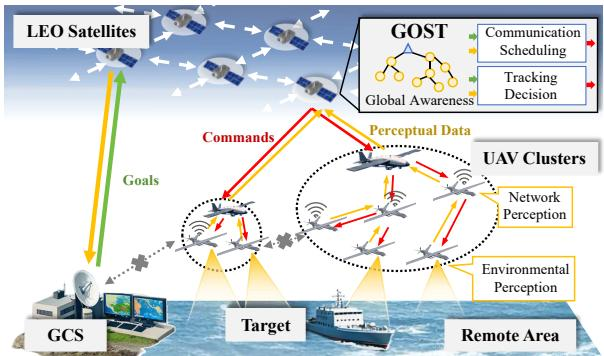  
Fig. 1: System model of remote satellite-UAV collaborative tracking.

TABLE I: Main Notations & Definitions
<table><tr><td>Notation</td><td>Definition</td></tr><tr><td> $c , u , v$ </td><td>A UAV cluster, a UAV, and the tracking target.</td></tr><tr><td> $x _ { u } , v _ { u }$ </td><td>Position and velocity of UAV u.</td></tr><tr><td> $P _ { t } , f _ { t }$ </td><td>Transmission power and frequency band.</td></tr><tr><td> $Q$ </td><td>Length of the transmission queue.</td></tr><tr><td> $P _ { r } , I _ { r }$ </td><td>Receiving signal power and interference power.</td></tr><tr><td> $\Gamma , \gamma _ { \mathrm { t h } }$ </td><td>SINR and its threshold at the receiver.</td></tr><tr><td> $R _ { s } , R _ { p }$ </td><td>Data rate of sensors and data processing.</td></tr><tr><td> $R _ { t } , R _ { r }$ </td><td>Data rate of transmission and reception.</td></tr><tr><td> $P _ { \mathrm { s u m } } , E$ </td><td>Total power consumption and remaining energy.</td></tr></table>

## A. Satellite-UAV Networks and Communication Scheduling

The analysis begins with the interaction between the satellite and a single UAV cluster, where we simplify the model migration between satellites. For a given cluster c, let $u _ { j }$ $( j ~ \in ~ [ 1 , N _ { u } ] )$ denote the j-th UAV in the cluster, with $u _ { 1 }$ specifically designated as the leader. The UAV cluster maintains a static routing table: All uplink packets destined for the satellite are first routed internally to the leader $u _ { 1 }$ before transmission. Conversely, commands from the satellite are disseminated to the cluster members via $u _ { 1 }$ . Intra-cluster communication employs frequency division multiple access (FDMA), where $N _ { u }$ UAVs share a set of frequency bands $\{ f _ { 1 } , f _ { 2 } , \cdot \cdot \cdot , f _ { N _ { f } } \} ( N _ { f } \ < \ N _ { u } )$ , giving rise to potential cochannel interference. Each UAV must periodically report its status to the satellite to enable network performance evaluation and dynamic resource allocation, thereby optimizing overall transmission efficiency.

The key states reported by each UAV includes: (1) Motion states: position $x _ { u }$ and velocity $v _ { u } . ~ ( 2 )$ Communication and computation states: transmission queue length $Q ,$ processing rate $R _ { \mathrm { p } } { \mathrm { . } }$ transmission power $P _ { \mathrm { t } } .$ frequency $f _ { \mathrm { t } } ,$ , signal to interference plus noise ratio (SINR) Γ, transmission rate $R _ { \mathrm { t } }$ , and reception rate $R _ { \mathrm { r } }$ . (3) Energy consumption: total power consumption $P _ { \mathrm { s u m } }$ and remaining energy E. These parameters are sampled periodically by onboard sensors (e.g., GPS, communication interfaces, battery management systems) and reported to the CPU. Additionally, since communication scheduling serves collaborative tracking tasks, UAVs also continuously generate perceptual data (e.g., from infrared cameras and LiDAR) that requires transmission to the satellite. Therefore, UAVs additionally monitor the data format and generation rate $R _ { \mathrm { s } }$ of perceptual data to facilitate reservation of the necessary communication resources for collaborative tracking.

The UAV motion is governed by the following kinematic equations:

$$
x _ { u } ( t + 1 ) = x _ { u } ( t ) + v _ { u } ( t ) T _ { \mathrm { s } } + n _ { x } ( t ) ,\tag{1}
$$

where t and $T _ { \mathrm { s } }$ denote discrete time labels and the slot duration, respectively, with $n _ { x }$ representing motion control error. During each decision interval $T _ { \mathrm { { d } } } .$ , the UAV receives an acceleration command a from the satellite and updates its velocity by

$$
v _ { u } ( t + 1 ) = v _ { u } ( t ) + a ( t ) T _ { \mathrm { s } } + n _ { v } ( t ) ,\tag{2}
$$

where $n _ { v }$ denotes the velocity control error.

For a communication link from node i to node $j$ within the network, the received signal power is:

$$
P _ { \mathrm { r } , i , j } = P _ { \mathrm { t } , i } | h _ { i j } | ^ { 2 } ,\tag{3}
$$

where the term $| h _ { i j } | ^ { 2 }$ represents the channel gain, which is influenced by propagation distance, frequency, channel fading, and beamforming. When transmitting in frequency band $f _ { i } ,$ node $j$ also receives interference as

$$
I _ { \mathrm { r } , j } = \sum _ { f _ { k } = f _ { i } , k \neq i , j } P _ { \mathrm { r } , k , j } .\tag{4}
$$

Consequently, the SINR Γ and transmission rate $R _ { \mathrm { t } }$ for this link are calculated by

$$
\Gamma _ { i , j } = P _ { \mathrm { r } , i , j } / ( N + I _ { \mathrm { r } , j } ) ,\tag{5}
$$

$$
R _ { i , j } = B _ { i } \log ( 1 + \Gamma _ { i , j } ) ,\tag{6}
$$

where $N$ is the noise power and $B _ { i }$ is the bandwidth of the frequency band of $f _ { i }$

On this basis, considering signal scattering from sea and UAV surfaces, we model the small-scale fading as Rician fading. For UAV-to-UAV channels, the Rician factor is taken as $K = 1 0$ dB [30]. For the satellite-to-UAV channel, according to [31], the relationship between K and the communication elevation angle $\theta _ { e }$ is given by

$$
K ( \theta _ { e } ) = \kappa _ { 0 } \exp [ \frac { 2 } { \pi } \ln ( \frac { \kappa _ { \frac { \pi } { 2 } } } { \kappa _ { 0 } } ) \cdot \theta _ { e } ] ,\tag{7}
$$

where $\kappa _ { 0 } = 5$ dB and $\kappa _ { \frac { \pi } { 2 } } = 1 5 ~ \mathrm { d B }$ . Defining $\gamma _ { \mathrm { t h } }$ as the SINR threshold of the communication module, the probability of successful transmission over the fading channel can be given by

$$
p _ { \mathrm { s } } = \mathrm { P r } ( \Gamma > \gamma _ { \mathrm { t h } } ) = \exp ( - \frac { \gamma _ { \mathrm { t h } } } { \Gamma } ) .\tag{8}
$$

Furthermore, energy constraints are critical for UAV operation. The aforementioned motion, communication, and sensing processes all involve energy consumption. Here, we focus on power consumption outside of flight control, which is expressed as

$$
P _ { \mathrm { s u m } } = g ( P _ { \mathrm { t } } , R _ { \mathrm { s } } , R _ { \mathrm { p } } , R _ { \mathrm { r } } , R _ { \mathrm { t } } ) .\tag{9}
$$

Equation (9) aggregates the power required for radio transmission, sensor operation, and data processing (including forwarding and packaging). The power drawn by sensors and transmitting antennas typically constitute the dominant share of $P _ { \mathrm { s u m } }$ . Notably, power consumption related to data processing increases significantly during local computationally intensive tasks or high-volume data transmission.

After sampling the aforementioned states, UAVs transmit the data to the GOST system on the satellite to form a global perception. Then, a DRL-based decision agent $\pmb { \mu } _ { \mathrm { c o m } }$ generates communication scheduling commands $A _ { \mathrm { { c o m } } }$ , defined as

$$
A _ { \mathrm { c o m } } = [ P _ { \mathrm { t , 1 } } , f _ { \mathrm { t , 1 } } , P _ { \mathrm { t , 2 } } , f _ { \mathrm { t , 2 } } , \cdot \cdot \cdot , P _ { \mathrm { t } , N _ { u } } , f _ { \mathrm { t } , N _ { u } } ] .\tag{10}
$$

## B. Satellite-UAV Collaborative Tracking

Building upon the communication framework within the satellite-UAV networks, we consider a scenario where multiple UAV clusters, denoted as $c _ { 1 } , c _ { 2 } , \cdots , c _ { N _ { c } }$ , collaboratively track a target v (e.g., a suspicious vessel, UAV, or other maritime object). Each UAV monitors the target using its onboard sensors and transmits the acquired perceptual data to the satellite to contribute to a global situational awareness. The target’s motion is modeled as

$$
x _ { v } ( t + 1 ) = x _ { v } ( t ) + v _ { v } ( t ) T _ { \mathrm { s } } ,\tag{11}
$$

where $v _ { v }$ represents the target velocity, following an unknown motion strategy. Perception of the target by a UAV is expressed as $z = \hat { x } _ { v } ,$ , presenting the estimated target position. Depending on the sensor data format $( \mathrm { e . g . }$ , images, point clouds), z may constitute a significant volume of data.

Upon integrating the perceptual data uploaded from UAV clusters, the onboard GOST system generates a precise target estimation. Subsequently, for tracking control, a DRL-based agent $\pmb { \mu } _ { \mathrm { t r a c k } }$ outputs action commands for the $N _ { c }$ clusters, formulated as:

$$
A _ { \mathrm { t r a c k } } = [ a _ { c _ { 1 } } , a _ { c _ { 2 } } , \cdot \cdot \cdot , a _ { c _ { N _ { \mathrm { c } } } } ] .\tag{12}
$$

It is important to note that the tracking control loop described above relies on a statically pretrained perception and decision-making model running on the satellite edge. When the environment dynamically changes (e.g., target maneuver patterns shift, or new terrain features appear), the static model $\pmb { \mu } _ { \mathrm { t r a c k } }$ may fail to adapt effectively. Furthermore, the satellite typically lacks the extensive samples and computational resources required to retrain a new model from scratch, which would lead to a rapid degradation in tracking performance. Therefore, the decision-making model within GOST must be capable of detecting environmental changes and updating itself efficiently with limited new data.

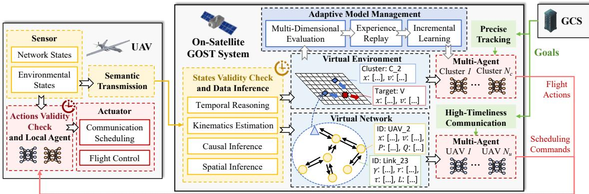  
Fig. 2: Architecture of the GOST system for satellite-UAV collaborative tracking.

## IV. MODELING AND SYNCHRONIZATION OF GOST

In this section, we detail the modeling and synchronization method of GOST for the collaborative tracking in satellite-UAV networks, as illustrated in Fig. 2. Following the principle of on-demand modeling, the collaborative tracking task is decomposed into two primary goals: high-timeliness communication and precise tracking. Each goal is modeled with appropriate methods and granularities, and synchronized through data inference and semantic transmission mechanisms.

## A. Modeling of Virtual Networks

For high-timeliness communication scheduling, the GOST system monitors the status of UAVs, communication links, and resource distribution across the network to optimize data transmission via communication resource allocation. For satellite-UAV networks, a directed graph $G _ { \mathrm { n e t } }$ is utilized to model the virtual network, with core components including:

Network components are mapped as nodes and edges in $G _ { \mathrm { n e t } } ,$ , where nodes represent physical devices (UAVs and satellites), and edges represent communication links between them. The graph topology is constructed based on the real-time routing table of the network.

Resource elements are embedded as attributes of the corresponding nodes and edges. Aligning with the observable states, node attributes encompass motion, communication, computation, and energy states. Edge attributes include channel quality metrics such as SINR and transmission rate.

Service mapping bridges network management and tracking performance by translating task objectives into specific metrics and optimization variables. For the goal of high-timeliness communication, GOST evaluates network performance using the AoI of the collected status data [32], and optimizes the transmission power $P _ { \mathrm { { t } } }$ and frequency band $f _ { \mathrm { t } }$ for each UAV.

For precise target tracking, the GOST system models the motion of both the UAV clusters and the target, generating a virtual environment $E _ { \mathrm { t r a c k } }$ to store and analyze tracking trajectories while evaluating task performance. In this model, clusters and the target are abstracted as points with defined position and velocity, with their motion governed by the kinematic equations (1) and (2). To obtain an accurate estimate of the target state, GOST performs a fusion estimation based on historical target information and the perceptual data z uploaded by UAVs, which is expressed as

$$
[ \hat { x } _ { v } ( t ) , \hat { v } _ { v } ( t ) ] = F ( \{ z _ { j } ( t ) \} , \hat { x } _ { v } ( t - T _ { \mathrm { d } } ) , \hat { v } _ { v } ( t - T _ { \mathrm { d } } ) ) .\tag{13}
$$

Accordingly, the twinning environment for tracking is represented as

$$
E _ { \mathrm { t r a c k } } = [ x _ { c _ { 1 } } , v _ { c _ { 1 } } , \cdot \cdot \cdot , x _ { c _ { N _ { c } } } , v _ { c _ { N _ { c } } } , \hat { x } _ { v } , \hat { v } _ { v } , \mathcal { E } ] ,\tag{14}
$$

where $x _ { c }$ and $v _ { c }$ denote the collective position and velocity of an entire cluster, while E encompasses other environmental factors such as obstacles and restricted zones.

## B. Multidimensional Data Inference

As a twinning system, the core function of GOST is to accurately and timely map the state of the physical network into the digital space. In communication-constrained networks where data transmission is unreliable, GOST must be able to autonomously infer and compensate for missing or anomalous data. This is achieved by leveraging historical context and semantic information to reconstruct the current operational scenario, thereby supporting precise decision-making.

Consider a state sample $\xi _ { t }$ collected in GOST, where t denotes its timestamp. Due to variations in sampling frequency and transmission delay, time of sampling and decision-making is always asynchronous. Consequently, to ensure the validity of the states data, the GOST system introduces a delay threshold $T _ { \mathrm { t h } }$ to determine whether the data has staled, given by

$$
0 \leq t _ { \mathrm { n o w } } - t \leq T _ { \mathrm { t h } } .\tag{15}
$$

If condition (15) is not satisfied, a new state $\hat { \xi } _ { t ^ { \prime } }$ must be inferred for a timestamp $t ^ { \prime }$ that fulfills (15). Based on the dimensions of data features, data inference in GOST is categorized into temporal, kinematic, spatial, and causal inference.

This article has been accepted for publication in IEEE Transactions on Mobile Computing. This is the author's version which has not been fully edited and content may change prior to final publication. Citation information: DOI 10.1109/TMC.2026.3700322

1) Temporal Inference: Time-series data consists of information collected chronologically, where each sample corresponds to a specific time instant and is typically measured at regular intervals. Such datasets inherently contain temporal characteristics such as trends, periodicity, and random fluctuations, which can serve as predictive features for estimating missing values and is regard as a common approach in twinning systems. In this paper, temporal inference of GOST is implemented by autoregressive integrated moving average (ARIMA) model [33]. ARIMA is a flexible and adaptable statistical model that does not rely on extensive training samples and requires only straightforward parameter adjustment, which is well-suited for short-term prediction of non-stationary data in sample-limited environments. For a time series $Y _ { t } .$ , the model $\mathrm { A R I M A } ( p , d , q )$ is expressed as

$$
Y _ { t } ^ { * } = \Delta ^ { d } Y _ { t } ,\tag{16}
$$

$$
Y _ { t } ^ { * } = c + \varphi _ { 1 } Y _ { t - 1 } ^ { * } + \varphi _ { 2 } Y _ { t - 2 } ^ { * } + \cdot \cdot \cdot + \varphi _ { p } Y _ { t - p } ^ { * }
$$

$$
+ \theta _ { 1 } \epsilon _ { t - 1 } + \theta _ { 2 } \epsilon _ { t - 2 } + \cdot \cdot \cdot + \theta _ { q } \epsilon _ { t - q } + \epsilon _ { t } .\tag{17}
$$

In $\mathrm { A R I M A } ( p , d , q )$ , the current value is predicted using the autoregressive model of the past $p$ data points and the moving average of the past $q$ data points, after performing the d-order difference on the sequence. Since predictions depend on the past max $\{ p , q \}$ data points, any gaps in the historical data must first be filled via interpolation. Furthermore, to handle dynamic temporal patterns, the Akaike Information Criterion (AIC) is employed for adaptive parameter tuning.

As ARIMA essentially relies on linear combinations of past differenced data, it struggles to accurately predict highly nonlinear sequences where consecutive samples show little correlation. This limitation typically arises when the sampling frequency is lower than the state-transition frequency. Consequently, not all state parameters can be reliably predicted using time-series methods. Temporal inference is applicable only to states that evolve slowly relative to the sampling cycle, such as the data-generation rate $R _ { \mathrm { s } }$ (on the order of seconds) within a millisecond-level decision cycle $T _ { \mathrm { d } }$ . For rapidly fluctuating states like SINR and instantaneous transmission rates, alternative inference methods are required.

2) Kinematics Inference: Kinematic data exemplifies a case where temporal inference is often unsuitable, as its evolution depends primarily on control inputs rather than intrinsic temporal correlations. Kinematic data inference primarily focuses on estimating the position and velocity. In this paper, the GOST system employs Kalman filtering (KF) for UAV motion estimation, which is a standard algorithm in UAV localization. The KF first predicts the current position based on the previous motion state and the current control command by (1). This prediction is then corrected using positioning signals from the onboard GPS. Due to the control errors and positioning errors, the prediction step and calibration step jointly achieve precise position and velocity estimation. Since control information is satellite-derived, GOST can substitute the KF prediction for the final estimate when GPS data is missing, albeit with an increase in positioning error.

Kinematic inference is also applied to estimate target motion states from multi-UAV observations. It should be noted that the UAV observation process is nonlinear (providing distance and bearing), and the target’s own control inputs are unknown, preventing the direct use of a standard KF. To address this, unscented information filter (UIF) is adopted in the GOST system for semantic fusion of observational data and target estimation [34], which achieves accurate prediction of nonlinear processes and efficient multi-source fusion estimation through unscented transform and information representation.

3) Spatial Inference: As UAVs transmit and receive electromagnetic signals via antennas, their beams inevitably spread out, which can cause co-channel interference between signals on different links, as calculated in (4). Spatial feature inference models the electromagnetic environment of the network by analyzing transmission power and frequency data from each UAV’s communication port, capturing signal propagation characteristics.

The modeling is implemented by a graph attention network (GAT) [35]. The core component of the GAT is a graphattention layer with multiple attention heads. In this layer, feature propagation between nodes (each representing a UAV) is not a simple linear summation but is governed by attention weights. This mechanism enables the model to assess the relative “importance” of different nodes’ contributions and flexibly simulate the signal propagattion and scattering, which captures link correlation more quickly than models such as CNNs and eliminates the complex calculations of electromagnetic field simulation.

For electromagnetic environment modeling, each node ini tially inputs its transmission power $P _ { \mathrm { { t } } }$ at a specific frequency band and its position coordinates $x _ { u } .$ The power information serves as the node’s feature, while the coordinates are used to calculate link distances $d _ { i j }$ and beam-spread angles $\theta _ { i j }$ . In the graph-attention layer, $d _ { i j }$ and $\theta _ { i j }$ are utilized to compute attention coefficients, which then perform weighted aggregation on the feature vector of $P _ { \mathrm { { t } } }$ to simulate signal strength at different distances and directions. After obtaining the network electromagnetic environment model, the GOST system can predict the SINR at each receiver based on the transmission powers across frequency bands, enabling a global assessment of link quality. Concurrently, the regularly uploaded SINR reports from UAVs allow GOST to detect environmental changes, such as increased interference or channel fading, and subsequently adjust the decision strategy.

4) Causal Inference: Causal inference aims to infer unobservable or missing states by uncovering causal dependencies among variables. We represent the set of state parameters through a directed graph model $G _ { \mathrm { S C M } }$ , termed a structural causal model (SCM). Unlike $G _ { \mathrm { n e t } }$ used to characterize UAV networks, $G _ { \mathrm { S C M } }$ captures abstract causal relationships between state variables, with its adjacency matrix indicating the strength of causal influence between variables. Causal relationships are modeled as an additive noise model. For variable $s _ { i } ,$ , it can be expressed as

$$
s _ { i } = F _ { i } \big ( s _ { \mathrm { p a } ( i ; G _ { \mathrm { S C M } } ) } \big ) + n _ { i } .\tag{18}
$$

Specifically, $s _ { i }$ is obtained by applying a function $F _ { i }$ to the set of its parent nodes in $G _ { \mathrm { S C M } }$ , plus independent Gaussian noise $n _ { i } .$

In this paper, causal inference within GOST are performed by the deep end-to-end causal inference (DECI) model. DECI employs a multi-layer perceptron (MLP) to extract data features from variable samples and uses a binary adjacency matrix GSCM to represent the existence of causal links. After integrating the features of parent nodes, another MLP outputs the inferred value. This architecture integrates causal discovery and inference capabilities in DECI, allowing it to be trained, deployed, and fine-tuned more efficiently in complex scenarios compared to other standalone causal discovery and reasoning models. During training, DECI must simultaneously fit the output results and learn the underlying causal graph $G _ { \mathrm { S C M } }$ to achieve reliable inference. Since the causal graph is a sparse directed acyclic graph (DAG), the training loss incorporates terms for the data likelihood, DAG constraints, and the norm of $G _ { \mathrm { S C M } }$ , as detailed in [26].

In satellite-UAV networks, the causal relationships among variables emerge from the physical interplay of parameters within a UAV hardware system. For instance, (9) reflects mutual dependencies between the data throughput and power consumption of each onboard module, establishing a causal structure among these variables. Through the causal inference, GOST can infer and compute values for missing variables.

Although both DECI and GAT implement the inference formalized in (18), their principles and applications differ. DECI primarily uses MLPs to extract high-dimensional features from raw data and identify causal relationships, relying on a comparatively simple graphical representation $\left( G _ { \mathrm { S C M } } \right)$ . In contrast, GAT focuses on modeling how influence propagates between variables through multiple attention heads, emphasizing spatial-relational patterns.

Based on the multi-dimensional data inference mechanism, GOST not only infers missing data but also designs an state synchronization mechanism based on the “significance” of variables [36], thereby making full use of channel resources while avoiding the communication overhead caused by highfrequency global synchronization in conventional DTNs [37].

This significance is defined by the inferability of state variables. Leveraging the spatial and causal inference introduced above, the GOST system infers unknown variables from known ones. For instance, when inferring an N-variable set $S ^ { N }$ from an M -variable set $S ^ { M }$ , the sampling frequencies can be adjusted from a fixed baseline $\begin{array} { r } { F _ { p } \mathrm { ~ t o ~ } \big ( 1 + \frac { \ v N } { \ v M } ( 1 - \epsilon ) \big ) F _ { p } } \end{array}$ for $S ^ { M }$ and $\epsilon F _ { p }$ for $S ^ { N }$ , where ϵ is a small positive coefficient that enables periodic model validation and anomaly detection. Under the same communication budget, the probability of fully collecting $\{ S ^ { M } , S ^ { N } \}$ increases from $p _ { \mathrm { s } } ^ { M + \mathrm { \bar { \cal N } } } ~ { \mathrm { t o } } ~ [ 1 - \mathrm { \bar { ( } 1 - \bar { \cal N } ~ }$ $p _ { \mathrm { s } } ) ^ { \bar { 1 } + \frac { N } { M } ( 1 - \epsilon ) } ] ^ { \bar { M } }$

## C. Latency and Computational Overhead

In the satellite-UAV network, the LEO satellites deploying the GOST system have limited computing power and energy budgets. Therefore, quantitative analysis of data processing latency and computing load is a key link to verify the feasibility of the system. This section estimates the computational overhead and delay of on-board semantic inference based on the inference methods described in Section IV-B. In terms of hardware configuration, we referred to the Jetson Nano development board with a computing power of 472 GFLOPS and a power consumption of 5 to 10 W.

Temporal inference: The computational complexity of ARIMA is $O ( p \cdot d \cdot q )$ ; the computing power required for a single inference is less than 1 KFLOPs, with a computational delay of approximately 2.1 ns.

Kinematics inference: For an n-dimensional motion state, the computational complexity of KF is $O ( n ^ { 3 } )$ , the computing power required for a single inference is 5 KFLOPs, and the computing delay is approximately 10.6 ns; Computational complexity of UIF is $O ( N _ { u } \cdot n ^ { \dot { 3 } } )$ , the computing power required for an inference is about 15 KFLOPs, and the computing delay is less than 31.8 ns.

Spatial inference: The computational complexity of GAT is $O ( N _ { u } ^ { 2 } )$ . The model adopted in this paper has a single inference computing power of approximately 600 KFLOPs and a computing delay of 1.27 µs.

Causal inference: Complexity of the DECI in modeling d variables is $O ( d ^ { k } )$ , where $k \in [ 1 , 2 ]$ is related to the density of the causal graph. Computing power required for a single inference is approximately 820 KFLOPs, and the computing delay is 1.74 $\mu \mathrm { s }$

Within one decision-making cycle, for a UAV network containing $N _ { u }$ UAVs, GOST needs to perform $d \cdot N _ { u }$ times of ARIMA, $N _ { u }$ KF, 1 UIF, 1 GAT and $N _ { u }$ DECI. With $N _ { u } = 6 .$ the total delay is 0.012 ms, which can be ignored for a data interaction cycle of the order of 10 ms. It is worth noting that the neural networks-based semantic inference—spatial and causal inference—consume a large amount of computing power, with their complexity increasing superlinearly with the number of UAVs and the number of states. Therefore, for larger and more complex networks, more powerful hardware support is needed.

## V. COLLABORATIVE AND ADAPTIVE DECISION-MAKING

Based on the timely and accurate global perception, the GOST system generates commands for communication scheduling and collaborative tracking. Due to the highly dynamic nature of satellite-UAV networks, the continuous and high-dimensional state spaces, and the partial uncertainty of environmental models, traditional optimization methods (such as convex optimization) struggle to compute optimal policies in real time. In this paper, we employ DRL-based agents for decision-making; through end-to-end learning, DRL agents can directly approximate optimal policies from highdimensional observations, making them particularly wellsuited for such complex scenarios. Besides, given the constraints of satellite-UAV networks and the dispersed computing resources, the decision-making process must balance communication and computational reliability. While the satellite offers a global perspective supporting precise control, transmission failures of perceptual data and commands can undermine the effectiveness of centralized scheduling. Therefore, this section presents the satellite-UAV collaborative decision-making mechanism and the incremental learning scheme within GOST, which enable adaptive decision-making.

## A. Satellite-UAV Collaborative Decision-Making

Considering the computational latency in global decisionmaking, along with downlink delays, packet loss, and network congestion, similar to (15), UAVs must verify the timeliness of received commands in each decision cycle. As illustrated in Fig. 2, for staled commands, the UAV switches to a local backup agent that generates actions based on its localized perception. Consequently, we consider two set of MARL systems: a global scheduling model $\pmb { \mu } ~ = ~ [ \mu _ { 1 } , \mu _ { 2 } , \cdots , \mu _ { N } ]$ and a local decision model $\mu ^ { \prime } = [ \mu _ { 1 } ^ { \prime } , \mu _ { 2 } ^ { \prime } , \cdot \cdot \cdot , \mu _ { N } ^ { \prime } ]$ . Here, $\mu _ { i }$ follows a centralized training and execution paradigm, taking global state s from GOST as input and outputting a control command $a _ { i }$ for the i-th object (a UAV or a cluster); while $\mu _ { i } ^ { \prime }$ is trained centrally but executed in a decentralized manner, relying only on local observation $o _ { i }$ to compute a backup action $a _ { i } ^ { \prime } .$ . Notably, the global scheduling model $\pmb { \mu }$ composed of multiple $\mu _ { i }$ essentially remains a single-agent system by mapping global states to global actions. Nevertheless, we retain a multi-agent formulation to improve model scalability and training convergence.

In DRL, the agent’s interaction with the environment is formulated as a Markov decision process (MDP), represented by the tuple $\left( { { s _ { t } } , { a _ { t } } , { r _ { t } } , { s _ { t + 1 } } } \right)$ , denoting the state at time $t ,$ the taken action, the reward, and the resulting state at $t + 1$ The action $a _ { t }$ is computed based on the agent’s policy $\mu ,$ while the rewards $r _ { t }$ and the next state $s _ { t + 1 }$ are given by the environment. In multi-agent systems, we use s and a to denote the global states and actions, with all agents sharing the same reward r.

For communication scheduling, after acquiring and inferring the global network state $G _ { \mathrm { n e t } }$ , the satellite uses the decision agent $\pmb { \mu } _ { \mathrm { c o m } }$ to compute optimal scheduling commands. To avoid an excessively large state space that would hinder convergence, we select a subset of key states as input features: $o _ { i } = [ P _ { \mathrm { t } , i } , f _ { \mathrm { t } , i } , R _ { \mathrm { t } , i } , Q _ { i } , P _ { \mathrm { s u m } , i } ]$ for each UAV i. The global scheduling state is then $\textbf { \textit { s } } = ~ \left[ o _ { 1 } , o _ { 2 } , . . . , o _ { N _ { u } } \right]$ . Each agent outputs a scheduling command $a _ { i } = [ P _ { \mathrm { t } } , f _ { \mathrm { t } } ]$ for its assigned UAV. Consistent with the discrete $f _ { \mathrm { t } } , \ P _ { \mathrm { t } }$ is also discretized into $N _ { P }$ values. Under power constraints, the reward function for communication scheduling is defined as

$$
r = \frac { 1 } { N _ { u } } \sum _ { i = 1 } ^ { N _ { u } } \mathrm { A o I } _ { i } - \lambda _ { P } \sum _ { i = 1 } ^ { N _ { u } } \mathbb { I } _ { i } ( P _ { \mathrm { s u m } , i } > P _ { \mathrm { t h } } ) ,\tag{19}
$$

where $\operatorname { A o I } _ { i }$ denotes the AoI of status from the i-th UAV, I is an indicator function that penalizes power consumption exceeding the threshold $P _ { \mathrm { t h } }$ , and $\lambda _ { P }$ is a penalty coefficient.

For collaborative tracking, the agent $\pmb { \mu } _ { \mathrm { t r a c k } }$ generates flight actions for each cluster. The local observation of a cluster is denoted as $\begin{array} { r } { \rho _ { i } = [ X _ { c _ { i } } ^ { \prime } , \hat { X } _ { v } ^ { \prime } ] } \end{array}$ , which inherently contains measurement noise. Using the fused estimate from (14), the global tracking state is defined as

$$
\pmb { \mathscr { s } } = [ X _ { c _ { 1 } } , X _ { c _ { 2 } } , \cdots , X _ { c _ { N _ { c } } } , \hat { X } _ { v } ] .\tag{20}
$$

Similar to $\mu _ { \mathrm { c o m } } ,$ each agent outputs a flight action $a _ { c _ { i } }$ for its corresponding cluster, containing acceleration α and angular velocity $\omega ,$ , discretized into $N _ { \alpha }$ and $N _ { \omega }$ values respectively. In the tracking scenario shown in Fig. 3, the reward function incorporates the cluster’s field of view, safe tracking distance, and collision-avoidance requirements. Let each cluster’s observation region $O _ { i }$ be a sector with radius $L _ { \mathrm { m a x } }$ and angle $2 \theta _ { \mathrm { m a x } }$ Defining $d _ { c , v } ^ { \mathrm { s a f e } }$ and $d _ { c , c } ^ { \mathrm { s a f e } }$ as the safe tracking distance and safe inter-cluster distance, respectively, the reward is calculated by

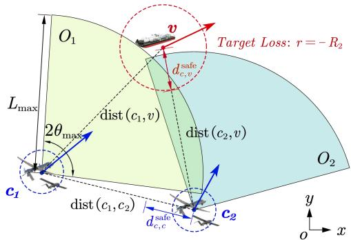  
Fig. 3: Illustration of collaborative tracking and rewards.

$$
\begin{array} { r l } & { r = R _ { 1 } \mathbb { I } ( v \in O _ { 1 } \& v \in O _ { 2 } ) - R _ { 2 } \mathbb { I } ( v \not \in O _ { 1 } \& v \not \in O _ { 2 } ) } \\ & { \qquad - R _ { 3 } \mathbb { I } ( \exists i , \mathrm { d i s t } ( c _ { i } , v ) < d _ { c , v } ^ { \mathrm { s a f e } } ) } \\ & { \qquad - R _ { 4 } \mathbb { I } ( \exists i , j , \mathrm { d i s t } ( c _ { i } , c _ { j } ) < d _ { c , c } ^ { \mathrm { s a f e } } ) , } \end{array}\tag{21}
$$

where $R _ { 1 }$ rewards successful tracking, while $R _ { 2 } , R _ { 3 } , R _ { 4 }$ penalize target loss, violation of the safe tracking distance, and inter-cluster collisions, respectively.

Although the decision-making of communication scheduling and collaborative tracking control different physical processes, their decision-making frameworks share a similar distributed architecture and methodology: both involve planning coordinated actions for multiple entities from a global or local perspective. Therefore, we uniformly adopt the multi-agent deep deterministic policy gradient (MADDPG) algorithm for model training [38]. Compared to single-agent DRL, MAD-DPG adopts a “centralized training, distributed execution” paradigm. During training, it leverages global information to mitigate environmental non-stationarity, while during execution it relies solely on local observations. This approach combines the advantages of global optimization with distributed deployment, making it ideally suited to the communication and computational constraints of satellite-UAV networks. Noting that $\mu _ { i } ^ { \prime }$ and $\mu _ { i }$ differ primarily in their input dimensions, we unify the notation: $\left( o _ { i , t } , a _ { i , t } , r _ { i , t } , o _ { i , t + 1 } \right)$ represents a single agent’s experience, and $\left( { { s _ { t } } , { a _ { t } } , { r _ { t } } , { s _ { t + 1 } } } \right)$ denotes a global experience of all agents.

## B. Structure of MADDPG

In the MADDPG algorithm, each agent is constructed and trained based on the DDPG framework, with its fundamental architecture illustrated in Fig. 4. This architecture comprises a policy network $\mu ^ { \pmb { \theta } _ { i } }$ , a value network $Q ^ { \omega _ { i } }$ , and two target networks $\mu ^ { \pmb { \theta } _ { i } ^ { - } }$ and $Q ^ { \omega _ { i } ^ { - } }$

In multi-agent systems, multiple agents interact and update synchronously. Although the policy network $\mu ^ { \pmb { \theta } _ { i } }$ only maps from $o _ { i }$ to $a _ { i } ,$ the value network $Q ^ { \omega _ { i } }$ evaluates global states and actions $( s , a )$ . Specifically, during the sampling phase, each agent interacts with the environment once under random noise ${ \mathcal { N } } ,$ denoted as $\mathbf { \delta } \mathbf { a } _ { t } = \mu ( \mathbf { \boldsymbol { s } } _ { t } )$ , yielding a global sample $\left( { { s _ { t } } , { a _ { t } } , { r _ { t } } , { s _ { t + 1 } } } \right)$ and storing into the experience replay pool D. In the training phase, for samples $\left( { { s _ { k } } , { a _ { k } } , { r _ { k } } , { s _ { k + 1 } } } \right)$ in $D ,$ agent $\mu _ { i }$ utilizes its target network to calculate the temporal difference (TD) objective $y ,$ which is given as

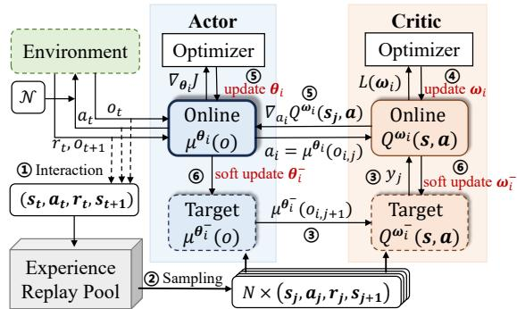  
Fig. 4: Structure and training flowchart of MADDPG.

$$
y _ { k } = r + \gamma Q ^ { \omega _ { i } ^ { - } } \big ( s _ { k + 1 } , \pmb { \mu } ^ { \theta ^ { - } } \big ( s _ { k + 1 } \big ) \big ) ,\tag{22}
$$

where $\gamma$ is the discount factor. For N samples, the loss function of the online value network is given by

$$
L ( \omega _ { i } ) = \frac { 1 } { N } \sum _ { k = 1 } ^ { N } ( y _ { k } - Q ^ { \omega _ { i } } ( s _ { k } , \mathbf { a } _ { k } ) ) ^ { 2 } .\tag{23}
$$

Based on this, the update gradient of the online policy network is expressed as

$$
\begin{array} { l } { \displaystyle \nabla _ { \pmb { \theta } _ { i } } J ( \mu _ { i } ) \approx } \\ { \displaystyle \frac { 1 } { N } \sum _ { k = 1 } ^ { N } \nabla _ { \pmb { \theta } _ { i } } \mu ^ { \pmb { \theta } _ { i } } ( o _ { i , k } ) \nabla _ { a _ { i } } Q ^ { \omega _ { i } } ( \pmb { s } _ { k } , \pmb { a } _ { k } ) | _ { a _ { i , k } = \mu ^ { \pmb { \theta } _ { i } } ( o _ { i , k } ) } . } \end{array}\tag{24}
$$

Note that all agents update their networks synchronously. For the N samples in $D ,$ each agent must compute the loss functions (23) and (24) and update its network parameters $\theta _ { i } , \omega _ { i } .$ . Finally, each agent performs soft updates on the target network, calculated by

$$
\omega ^ { - }  \tau \omega + ( 1 - \tau ) \omega ^ { - } , \theta ^ { - }  \tau \theta + ( 1 - \tau ) \theta ^ { - } ,\tag{25}
$$

where $\tau$ is a small positive number that ensures the target network approaches the online network gradually and stably.

After the training of the model, the online policy networks of each agent $\mu ^ { \pmb { \theta } _ { i } }$ are extracted and deployed in the GOST system of the satellite or the CPU of the UAV to enable decision-making. Meanwhile, the sample replay pool, value network, and target network are stored onboard the satellite and accessed when the model requires updates.

## C. Incremental Learning

In the MDP for collaborative tracking, state transitions depend not only on the actions of $\pmb { \mu } _ { \mathrm { t r a c k } }$ , but also on the motion strategy of the target. In a dynamic tracking environment, a change in the target’s motion strategy can cause the real-world state transitions to deviate from those experienced during the training of $\pmb { \mu } _ { \mathrm { t r a c k } }$ , leading to degraded decision-making performance. To maintain robustness, $\pmb { \mu } _ { \mathrm { t r a c k } }$ needs to continually assess the adaptability and collect new environmental samples for fine-tuning.

As MADDPG is an off-policy algorithm, a straightforward approach would be to continuously collect new samples from the changed environment and store them into the experience replay pool D, then directly train $\pmb { \mu } _ { \mathrm { t r a c k } }$ . However, since maintaining task performance is foremost in GOST, we cannot risk that online model updating might overwrite previously acquired tracking knowledge, a phenomenon known as catastrophic forgetting, which would impair decision quality [39]. Although performance might eventually recover after sufficient training on new samples, such fluctuations may pose unacceptable risks during collaborative tracking. To address this, we introduce incremental learning based on Fisher information matrix and EWC, allowing $\pmb { \mu } _ { \mathrm { t r a c k } }$ to adapt to dynamic environments while preserving performance on earlier tasks [40].

For a model with parameter θ, the Fisher information matrix is defined as the covariance of the gradient of the loglikelihood function, which is given as

$$
F ( \pmb { \theta } ) = \mathbb { E } _ { \boldsymbol { x } \sim p ( \boldsymbol { x } | \pmb { \theta } ) } [ ( \nabla _ { \pmb { \theta } } \log p ( \boldsymbol { x } | \pmb { \theta } ) ) ( \nabla _ { \pmb { \theta } } \log p ( \boldsymbol { x } | \pmb { \theta } ) ) ^ { T } ] .\tag{26}
$$

Equation (26) quantifies the sensitivity of the model’s output distribution $p ( x )$ to changes in parameters θ for a given input x. For a model trained on task A with optimal parameters $\pmb { \theta } ^ { * }$ the empirical Fisher matrix can be approximated by

$$
F \approx \frac { 1 } { N } \sum _ { k = 1 } ^ { N } ( \nabla _ { \pmb { \theta } ^ { * } } \log p ( x _ { k } | \pmb { \theta } ^ { * } ) ) ( \nabla _ { \pmb { \theta } ^ { * } } \log p ( x _ { k } | \pmb { \theta } ^ { * } ) ) ^ { T } .\tag{27}
$$

Therefore, using the collected experience $D _ { \mathcal { A } }$ from task A and standard back-propagation, we can evaluate the importance of each parameter for A. Given that θ consists of many components $\theta _ { j }$ with varying importance, the loss function for model updating on a new task B is defined as

$$
L _ { \mathrm { E W C } } = L _ { B } + \lambda _ { \mathrm { E W C } } \sum _ { j } F _ { j } ( \theta _ { j } - \theta _ { j } ^ { * } ) ^ { 2 } ,\tag{28}
$$

where $\lambda _ { \mathrm { E W C } }$ is a regularization coefficient, and $L _ { B }$ denotes the standard MADDPG loss for the policy network $\mu ^ { \pmb { \theta } _ { i } }$ and the value network $Q ^ { \omega _ { i } }$ as defined in (24) and (23), respectively.

The incremental learning procedure operates as follows. Initially, the Fisher matrix for each agent’s policy $\mu _ { i }$ is computed using samples from a pretrained experience buffer $D _ { 0 }$ During operation, GOST continuously monitors environmental dynamics and decision performance. If the target’s motion deviates significantly from the learned distribution, or if the average reward falls below a preset threshold, new interaction data are stored in a separate buffer $D _ { \mathrm { n e w } }$ , triggering a modelrefinement phase. To balance rapid adaptation with memory retention, training samples are drawn from a mixture of $D _ { \mathrm { o l d } }$ and $D _ { \mathrm { n e w } }$ . Let $\beta$ denote the fraction of samples taken from $D _ { \mathrm { n e w } }$ , the ratio is adjusted using an exponential moving average as

$$
\beta _ { n + 1 } = 0 . 9 9 \beta _ { n } + 0 . 0 1 \beta ^ { * } ,\tag{29}
$$

where n is the iteration index, with $\beta _ { 0 } = 0 . 7$ and $\beta ^ { * } = 0 . 3 .$ This schedule allows the model to adapt quickly to the new environment early in training, then gradually strengthen consolidation of prior knowledge as performance stabilizes. Based on mixed sampling, the model is updated via the MAD-DPG algorithm regularized by the EWC term in (28). Once convergence criteria are met, the Fisher matrix is recomputed using $D _ { \mathrm { n e w } }$ , and the samples in $D _ { \mathrm { n e w } }$ are then merged into $D _ { \mathrm { o l d } }$ as historical experience, preparing the system for the next adaptation cycle.

## D. Computational Burden Analysis

Assuming a single agent has an S-dimensional state space and an A-dimensional action space, with two hidden layers of width H between its input and output layers. In the MADDPG algorithm, each agent consists of a value network, a policy network, and their corresponding target networks. The total number of parameters per agent can be expressed as

$$
P = 4 H ( S + H + A ) + 1 0 H + 2 A + 2 .\tag{30}
$$

For the decision-making inference, specifically the forward propagation of $\mu _ { i } ,$ , the required computational cost is

$$
C _ { \mathrm { i n f e r } } = C _ { \mu } = 2 H ( S + H + A ) \ ( \mathrm { F L O P s } ) .\tag{31}
$$

For model training, consider running M episodes, with each generating L new samples and using a batch of N samples for updates. The approximate total computational load per agent during training is

$$
C _ { \mathrm { t r a i n } } = 2 M H [ ( S + H + A ) ( L + 1 0 N ) + 6 N ] \ ( \mathrm { F L O P s } ) .\tag{32}
$$

When incremental learning is applied, which requiring $K$ samples to compute the Fisher information matrix and the EWC regularization, the computational overhead per update session becomes

$$
C _ { \mathrm { u p d a t e } } = 3 K ( C _ { \mu } + C _ { Q } ) + C _ { \mathrm { t r a i n } } + 3 M P ~ \mathrm { ( F L O P s ) } .\tag{33}
$$

For the tracking scenario in this paper, with parameters set as $S = 1 2 , A = 4 , H = 1 2 8 , M = 5 0 0 , L = 8 0 , N = K =$ 1024, each agent contains about 75K parameters and occupies only 300 KB of memory, indicating a compact footprint. A single inference operation demands 37 KFLOPs, with the latency less than 0.1 $\mu \mathrm { s }$ on the Jetson Nano hardware, which is negligible in interactions on the order of 10 ms. Model training and incremental learning require around 200 GFLOPs, yet this cost is amortized over $M \times L$ interactions, still feasible for satellite edge computing.

## VI. SIMULATION

In this section, we construct a collaborative tracking scenario within satellite-UAV networks. The number of UAV clusters and the number of UAVs per cluster are set to $N _ { c } = 2$ and $N _ { u } = 6$ , respectively. Through simulations, we evaluate the performance of the GOST-enabled collaborative tracking system, focusing on the accuracy and timeliness of twinning data under varying communication conditions, along with the decision-making effectiveness and adaptability in dynamic environments. For comparison, we also implement a DT system and a local-only model. Although the fundamental goal of a DT system is to collect high-fidelity global information, in communication-constrained environments, it must trade data compression for more communication resources. Therefore, based on the transmission mechanism in Section IV-B, to fully demonstrate the advantages of GOST’s semantic inference, we assume that the DT system increases the data transmission frequency for all states from $F _ { p }$ to $\begin{array} { r } { ( 1 + \frac { N } { M } ) F _ { p } } \end{array}$ through data compression, to achieve a data transmission probability similar to that of GOST; nevertheless, this introduces additional quantization error. Other key parameters of the system are listed in Table II.

TABLE II: Parameter Settings in Simulations
<table><tr><td>Parameters</td><td>Values</td><td>Parameters</td><td>Values</td></tr><tr><td> $P _ { \mathrm { t } }$ </td><td>50~200 mW</td><td> $\overline { { N _ { P } } }$ </td><td>10</td></tr><tr><td> $B$ </td><td>20 MHz</td><td> $N _ { f }$ </td><td>3</td></tr><tr><td> $R _ { \mathrm { s } }$ </td><td> $5 0 \sim 2 5 0 ~ \mathrm { k b p s }$ </td><td> $P _ { \mathrm { t h } }$ </td><td>300 mW</td></tr><tr><td>αmax</td><td> $- 1 0 \sim 1 0 ~ \mathrm { m / s ^ { 2 } }$ </td><td> $N _ { \alpha }$ </td><td>10</td></tr><tr><td> $\omega _ { \mathrm { m a x } }$ </td><td> $- 0 . 0 5 \sim 0 . 0 5 ~ \mathrm { r a d / s }$ </td><td> $N _ { \omega }$ </td><td>10</td></tr><tr><td> $v _ { u }$ </td><td> $1 0 0 \sim 4 0 0 ~ \mathrm { m / s }$ </td><td> $v _ { v }$ </td><td>150~ 350 m/s</td></tr><tr><td> $L _ { \mathrm { m a x } }$ </td><td>5 km</td><td> $\theta _ { \mathrm { m a x } }$ </td><td>0.25π rad</td></tr><tr><td> $d _ { c , v } ^ { \mathrm { s a f e } }$ </td><td>2 km</td><td> $d _ { c , c } ^ { \mathrm { s a f e } }$ </td><td>1 km</td></tr><tr><td> $\gamma$ </td><td>0.95</td><td> $\tau$ </td><td>0.01</td></tr><tr><td> $\lambda _ { P }$ </td><td>100</td><td> $\lambda _ { \mathrm { E W C } }$ </td><td>100</td></tr><tr><td> $R _ { 1 }$ </td><td>20</td><td> $R _ { 2 }$ </td><td>100</td></tr><tr><td> $R _ { 3 }$ </td><td>40</td><td> $R _ { 4 }$ </td><td>25</td></tr></table>

## A. Accurate Twinning and High-Timeliness Communication

We first examine the transmission and inference of UAV situational awareness data. Fig. 5 compares the data accuracy of GOST and DT systems under different channel conditions, where the receiver SINR threshold $\gamma _ { \mathrm { t h } }$ represents varying channel qualities according to (8). Fig. 5 displays the rootmean-square error (RMSE) for four key variables, including sensor’s data generation rate $R _ { \mathrm { s } }$ , UAV position ${ \hat { x } } _ { u } ,$ interference power $I _ { \mathrm { r } } ,$ , and total power consumption $P _ { \mathrm { s u m } }$ , for both GOST and DT systems, corresponding to the temporal, kinematic, spatial, and causal inference in Section IV. Among these, $R _ { \mathrm { s } }$ is assumed to be inversely proportional to the square of the tracking distance, which approximately represents the cropped target image size. For the time scale and kinematic scenarios in this simulation, the predefined search range for ARIMA parameters is $p , q \in \{ 0 , 1 , 2 , 3 , 4 , 5 \} , \ d \in \{ 0 , 1 , 2 \}$ . The UAV position $\hat { x } _ { u }$ is sampled from the onboard positioning module, and $I _ { \mathrm { r } }$ and $P _ { \mathrm { s u m } }$ are calculated according to Section III-A.

In Fig. 5a and Fig. 5b, simulation results show that for vari ables with temporal dependencies, DT can still maintain high data accuracy by increasing the data transmission frequency under certain channel conditions. Yet when communication conditions continue to deteriorate and result in significant packet loss, the system must rely on inference models to estimate the current state. In scenarios where unknown variables are inferred from known variables in $\mathrm { F i g . }$ . 5c and Fig. 5d, the performance gap between GOST and DT becomes more pronounced. Notably, both $I _ { \mathrm { r } }$ and $P _ { \mathrm { s u m } }$ exhibit strong coupling with the scheduling commands $P _ { \mathrm { { t } } }$ and $f _ { \mathrm { t } } ,$ making them highly stochastic and fast-varying within several scheduling cycle. This characteristic makes them difficult to estimate via temporal inference, and any packet loss renders information from the previous cycle practically useless. Consequently, their estimation errors rise significantly as channel quality deteriorates.

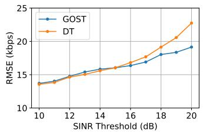  
(a) Temporal variable $R _ { \mathrm { s } }$

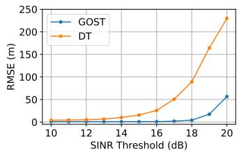  
(b) Kinematics variable $\hat { x } _ { u }$

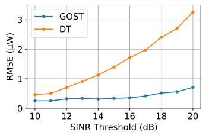  
(c) Spatial variable $I _ { \mathrm { r } }$

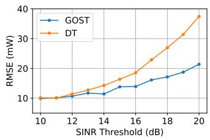  
(d) Casual variable $P _ { \mathrm { s u m } }$

Fig. 5: Data accuracy of DT and GOST system under different channel conditions.  
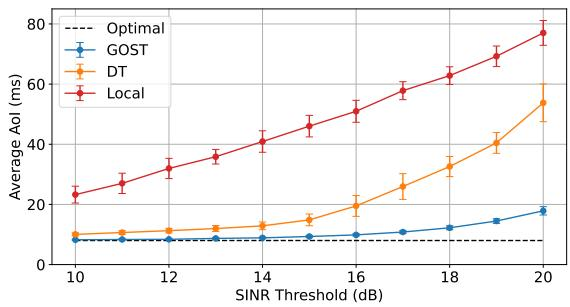  
Fig. 6: Communication scheduling performance of GOST, DT and local model under different channel conditions, with the error bars representing the standard deviation.

On this basis, we apply $\pmb { \mu } _ { \mathrm { c o m } }$ for communication scheduling in GOST and DT. Assuming $\pmb { \mu } _ { \mathrm { c o m } }$ is deployed on LEO satellites with continuous coverage for the UAVs, with the delay and Rician factor calculated by the communication distance and elevation in the satellite simulation. The minimum sampling period for state variables is set to 5 ms, allocated according to their predefined significance. For comparison, we also include a local model $\mu _ { \mathrm { { c o m } } } ^ { \prime }$ trained via MADDPG, which uses only the state of a single node to generate local commands. This local model ensures timely and accurate input information, independent of channel conditions.

Simulation results are presented in Fig. 6, in which we define the “optimal” AoI as the age considering only the sampling period and propagation delay. It is demonstrated that the GOST system, which integrates semantic communication and data inference, achieves superior and more stable communication performance across various channel conditions, underscoring its advantages for situational awareness and synchronization in communication-constrained networks. For the local communication scheduling, transmission AoI increases approximately linearly with SINR thresholds, resulting in virtually no scheduling capability. Meanwhile, DT—which relies on global data compression for transmission—maintains suboptimal performance under low SINR thresholds; however, its performance drops sharply once the threshold increased to 15 dB, and the delay jitter also increases significantly. These observations highlight the limitations of conventional DT systems that rely on massive, dense sensing in remote satellite-UAV networks.

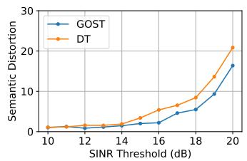

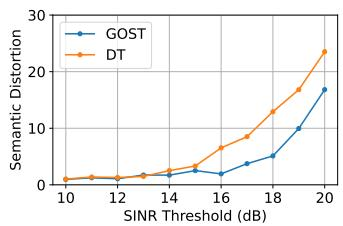

(a) Temporal variable $R _ { \mathrm { s } }$  
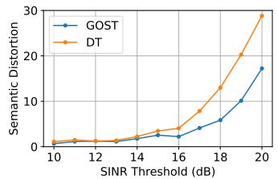

(b) Kinematics variable $\hat { x } _ { u }$  
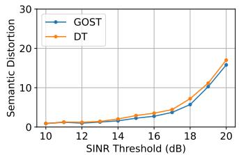  
(c) Spatial variable $I _ { \mathrm { r } }$  
(d) Casual variable $P _ { \mathrm { s u m } }$  
Fig. 7: Semantic distortion of state variables in DT and GOST system under different channel conditions.

To illustrate GOST’s advantage on goal-oriented semantic transmission, we also investigate the semantic fidelity of state variables in GOST and DT system. Inspired by [22], the semantic distortion of variable x consists of two parts: the impact of single-sample bias on task performance and the impact of sample distribution bias on task stability, which is defined as

$$
d _ { s } ( \boldsymbol { x } , \hat { \boldsymbol { x } } ) = \mathbb { E } [ \frac { \partial r } { \partial x _ { i } } ( \hat { x } _ { i } - x _ { i } ) ] ^ { 2 } + \lambda _ { s } \mathbf { K } \mathbf { L } ( p ( r | \boldsymbol { x } ) | | p ( r | \hat { x } ) ) ,\tag{34}
$$

where x represents the true value sequence of the variable, serving as an ideal control group to simulate the performance of the communication scheduling model under fully faithful transmission conditions; xˆ is the estimated value of this variable obtained after DT compression or GOST semantic inference. KL(·) denotes the Kullback-Leibler divergence (KLD), with a weight parameter $\lambda _ { s } = 1 0 .$ . r denotes the reward from (19), and $p ( r | x )$ denotes the distribution of r given the input x. In the simulation, we sample a sufficient number of network states and replace the specified variables in the input of $\pmb { \mu } _ { \mathrm { c o m } }$ with x and xˆ respectively, thereby estimating the empirical distribution of $p ( r | x )$ and $p ( r | \hat { x } )$ based on the feedback r from the environment.

Corresponding to Fig. 5, we test the impact of estimation errors on the rewards for each state variable individually and calculate the semantic distortion by comparing them with the ideal model (error-free decision-making). Simulation results are shown in Fig. 7, which indicate that semantic distortion of variables is influenced by both compression/inference accuracy and the inherent channel quality, while GOST achieves superior semantic fidelity under all channel conditions, thereby enhancing the timeliness, accuracy, and stability of data transmission. Besides, among the tested variables, the interference power has the greatest impact on decision-making performance, as it directly influences the estimation of link quality, whereas the impact of total power consumption is relatively minor.

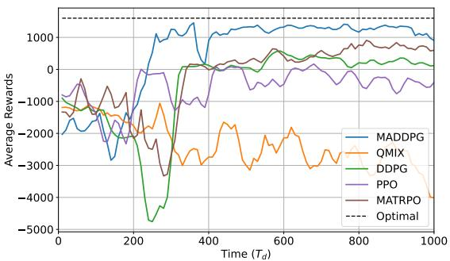  
Fig. 8: Training returns of different RL algorithms in multi-UAV tracking tasks.

## B. Effective Tracking Decisions

Building upon the real-time and reliable transmission of situational information, the tracking decision agent $\pmb { \mu } _ { \mathrm { t r a c k } }$ in the GOST system computes cluster actions $A _ { \mathrm { t r a c k } }$ . In the simulation, the target’s motion is assumed to match the pattern in the training phase, with its velocity vector $v _ { v }$ sampled from a distribution $D _ { v } .$ , and state transitions following a Markov process.

We first verify the effectiveness of the MADDPG algorithm in multi-UAV tracking tasks, as shown in Fig. 8. For comparison, we also consider the multi-agent algorithm heterogeneous-agent trust region policy optimisation (MA-TRPO), QMIX and single-agent algorithms DDPG and proximal policy optimization (PPO). Simulation results show that the MADDPG algorithm converges to the optimal strategy quickly and stably in 300 episodes. Toward the end of training, MATRPO’s returns gradually converged to those of MADDPG and demonstrated suboptimal convergence performance. Yet as an on-policy algorithm, the low sample efficiency makes it difficult to apply in dynamic environments. The other multi-agent algorithm QMIX is completely unable to learn an effective strategy, and its returns drop rapidly to a low level after the model begins to update.This is because in the highly dynamic environments with sparse rewards and limited samples, Qlearning-based DRL algorithms are prone to inaccurate Qvalue estimation, thereby leading to convergence difficulties. The single-agent algorithms DDPG and PPO converge to a suboptimal strategy. Considering the vast state and action space in the multi-UAV tracking scenario, the convergence efficiency of a single agent is lower than that of the multiagent algorithm.

Based on the flight decision-making based on MADDPG, we investigate the performance of GOST, DT and local models in the joint tracking task. The target-estimation accuracy and communication timeliness for both GOST and DT are derived from the performance shown in Fig. 5 and Fig. 6. Simulation results under different SINR thresholds are shown in Fig. 9, where the optimal reward represents the maximum achievable value. Furthermore, as shown in Fig. 10, we evaluate tracking performance using four metrics: (1) Multi-cluster collaboration rate, which measures the probability that the target remains within the combined field of view of all clusters. (2) Target loss rate, indicating the probability that the target exits the field of view of every clusters. (3) Tracking risk, representing the probability that at least one cluster enters within the safe tracking distance $d _ { c , v } ^ { \mathrm { s a f e } }$ , where the target could deploy countermeasures. (4) Collision risk, measuring the probability that the distance between any two clusters falls below the safety threshold $d _ { c , c } ^ { \mathrm { s a f } \epsilon }$

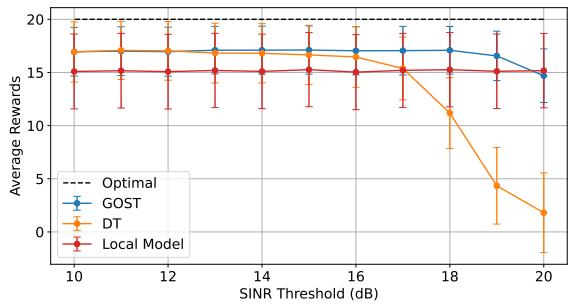  
Fig. 9: Tracking rewards of GOST, DT and local model under different channel conditions, with the error bars representing the standard deviation.

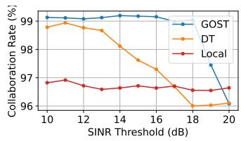

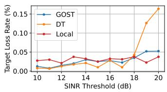  
(b) Target loss rate

(a) Collaboration rate  
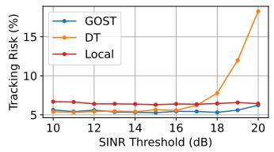  
(c) Tracking risk

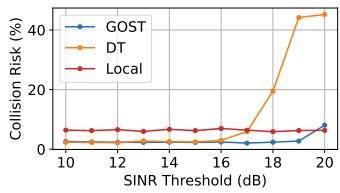  
(d) Collision risk  
Fig. 10: Comparison of GOST, DT and local model in task metrics under different channel conditions.

Simulation results show that the GOST system delivers the best and most stable performance across all task metrics under most channel conditions. The performance of the DT system correlates strongly with the target-estimation accuracy shown in Fig. 5b. Without accurate data support, DT struggles to perform effective tracking and only surpasses GOST under near-ideal channel conditions. Notably, when communication quality degrades beyond a certain point, GOST relying on edge computing may fail to generate effective commands, requiring the local decision system to take over to maintain a baseline level of performance until the communication link recovers.

This article has been accepted for publication in IEEE Transactions on Mobile Computing. This is the author's version which has not been fully edited and content may change prior to final publication. Citation information: DOI 10.1109/TMC.2026.3700322  
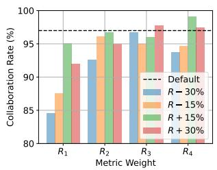  
(a) Collaboration rate

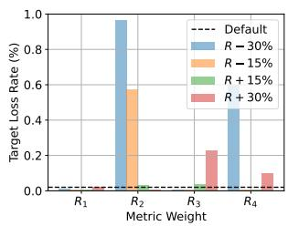

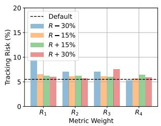  
(c) Tracking risk

(b) Target loss rate  
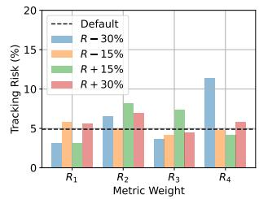  
(d) Collision risk  
Fig. 11: The sensitivity of task performance to the reward weight of evaluation metrics.

From the perspective of multi-task metrics, GOST effectively prioritizes objectives through (21): securing target acquisition is the primary goal, followed by maintaining safe distances and avoiding collisions. This design results in a target loss rate that remains 1-2 orders of magnitude lower than the rates of other risk metrics, demonstrating GOST’s ability to correctly interpret and prioritize task-critical objectives. In Fig. 11, we apply shifts of ±15% and ±30% to $R _ { 1 } \sim R _ { 4 } .$ respectively, to investigate the impact of metric weight shifts on model performance and the model’s robustness. Simulation results indicate that the multi-metric weighted reward function exhibits overall stability against weight fluctuations. Among these, the collaboration rate and target loss rate are more sensitive to weight changes, which is because they are learned by the single positive weight and a sufficiently large negative weight, respectively. It should be noted that, given the correlations among the metrics and the interdependencies among the weights, changes in weights and metric performance are not monotonic or linear. This experiment examined only the effect of a single parameter on performance. In actual deployment and application, weight allocation requires comprehensive assessment and flexible adjustment based on the costs or risks associated with different metrics.

## C. Adaptive Decision-Making in Dynamic Environments

Finally, to validate the adaptability of $\pmb { \mu } _ { \mathrm { t r a c k } }$ in dynamic environments, we set a relatively favorable channel condition and simulate a scenario where the target’s motion pattern changes continuously. Each change increases the average speed in the velocity distribution $D _ { v }$ by 5%. We consider five distinct stages of target-motion adjustments. To evaluate both the convergence of model updates and the steady-state performance after adaptation, each stage spans an duration of 24000 $T _ { \mathrm { d } }$ . In addition to the incremental learning introduced in this paper, we also compare the performance of online learning method and static models. The online learning method continues standard MADDPG training by directly updating the model with newly collected samples, while the static model serves as a control group to illustrate the performance degradation of the initial policy without any adaptation. Simulation results are presented in Fig. 12, where different stages are indicated by shaded backgrounds and the reward curves are smoothed to demonstrate the model’s performance. Fig. 13 further records the task-specific metrics after the model has converged within each stage.

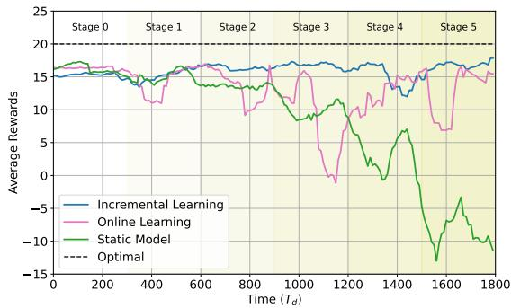  
Fig. 12: Tracking rewards for incremental learning, online learning, and static models in dynamic environments.

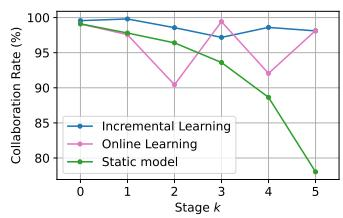  
(a) Collaboration rate

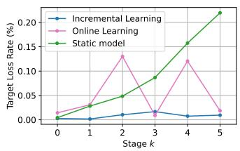  
(b) Target loss rate

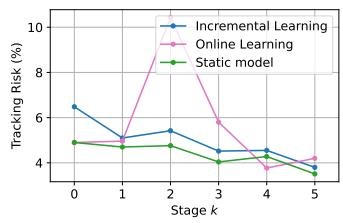  
(c) Tracking risk

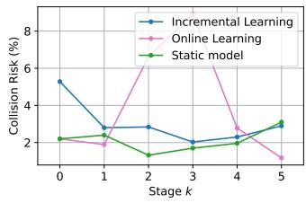  
(d) Collision risk  
Fig. 13: Comparison of GOST, DT and local model in task metrics in dynamic environments.

From the performance of the static model, it retains some degree of adaptability during the initial stage of target-motion change, without a significant drop in performance. However, upon entering the third stage, its decision-making performance declines sharply. Since the increase in target speed primarily affects the UAVs’ ability to keep pace, the environmental change has a particularly strong impact on the collaboration rate and the target loss rate. Although the model updated via online learning achieves convergence within each stage, it exhibit large performance fluctuations during the training periods, with some actions performing even worse than the static model. Moreover, especially in stages 2, 3 and 5, although the model is considered converged, the rewards obtained during subsequent interactions remain highly unstable. The tracking risk and collision risk also increase significantly, indicating that new environmental samples have altered some critical policy parameters.

In contrast, the incremental learning method demonstrates superior adaptability to dynamic changes. During each training phase, the reward curve shows significantly reduced fluctuations, indicating that the model is successfully updated while preserving previously acquired competence. All performance metrics remain a good level throughout the stages, with some even improving over the initial performance. To ensure sufficient sample collection, we set a minimum training duration of $T _ { \mathrm { m i n } } = 1 2 0 0 0 T _ { \mathrm { d } }$ . Under this setting, incremental learning requires approximately 66% of the sample volume needed by online learning, demonstrating its superior sample efficiency, which is a critical advantage in sample-scarce satellite-UAV networks.

## VII. CONCLUSION

In this paper, we have presented a goal-oriented semantic twin (GOST) system for communication-constrained satellite-UAV networks, designed for collaborative target tracking tasks. Utilizing on-demand modeling and semantically driven data transmission, GOST achieves efficient closed-loop control. The system employs multi-dimensional data inference (including temporal, kinematic, spatial, and causal inference), and semantic transmission mechanisms to effectively mitigate data loss and data stale issues caused by unstable channels, significantly improving the accuracy and timeliness of the twinning system. For task decision-making, a collaborative decision-making framework based on MADDPG, combined with an incremental learning mechanism based on EWC and sample-weighted replay, enables the system to achieve rapid adaptation while maintaining stable performance in dynamic environments. Simulation results demonstrate that GOST significantly outperforms conventional DT solutions in terms of AoI, data accuracy, collaborative tracking performance, and sample efficiency, providing a valuable reference for the design and optimization of future SAGSIN twinning system.

Apart from this study, further research should investigate the generalization capability of GOST in more complex, highly dynamic, and heterogeneous SAGSIN scenarios, combining with advanced architectures such as generative AI and LLMs, ultimately contributing to a reliable and efficient management paradigm for ubiquitous collaboration in the 6G era.

## REFERENCES

[1] H. Guo, J. Li, J. Liu, N. Tian, and N. Kato, “A Survey on Space-Air-Ground-Sea Integrated Network Security in 6G,” IEEE Commun. Surv. Tutorials, vol. 24, no. 1, pp. 53–87, 2022.

[2] Y. Li, M. Wang, K. Hwang, Z. Li, and T. Ji, “LEO Satellite Constellation for Global-Scale Remote Sensing With On-Orbit Cloud AI Computing,” IEEE J. Sel. Top. Appl. Earth Obs. Remote Sens., vol. 16, pp. 9369– 9381, 2023.

[3] G. Sun, L. He, Z. Sun, Q. Wu, S. Liang, J. Li, D. Niyato, and V. C. M. Leung, “Joint Task Offloading and Resource Allocation in Aerial-Terrestrial UAV Networks With Edge and Fog Computing for Post-Disaster Rescue,” IEEE Trans. Mob. Comput., vol. 23, no. 9, pp. 8582– 8600, 2024.

[4] Y. Zhou, R. Zhang, J. Liu, T. Huang, Q. Tang, and F. R. Yu, “A Hierarchical Digital Twin Network for Satellite Communication Networks,” IEEE Commun. Mag., vol. 61, no. 11, pp. 104–110, 2023.

[5] S. Mihai, M. Yaqoob, D. V. Hung, W. Davis, P. Towakel, M. Raza, M. Karamanoglu, B. Barn, D. Shetve, R. V. Prasad, H. Venkataraman, R. Trestian, and H. X. Nguyen, “Digital Twins: A Survey on Enabling Technologies, Challenges, Trends and Future Prospects,” IEEE Commun. Surv. Tutorials, vol. 24, no. 4, pp. 2255–2291, 2022.

[6] J. Kang, Y. Zhong, M. Xu, J. Nie, J. Wen, H. Du, D. Ye, X. Huang, D. Niyato, and S. Xie, “Tiny Multiagent DRL for Twins Migration in UAV Metaverses: A Multileader Multifollower Stackelberg Game Approach,” IEEE Internet Things J., vol. 11, no. 12, pp. 21021–21036, 2024.

[7] Y. Liu, J. Yan, and X. Zhao, “Deep Reinforcement Learning Based Latency Minimization for Mobile Edge Computing With Virtualization in Maritime UAV Communication Network,” IEEE Trans. Veh. Technol., vol. 71, no. 4, pp. 4225–4236, 2022.

[8] M. Abrar, U. Ajmal, Z. M. Almohaimeed, X. Gui, R. Akram, and R. Masroor, “Energy Efficient UAV-Enabled Mobile Edge Computing for IoT Devices: A Review,” IEEE Access, vol. 9, pp. 127779–127798, 2021.

[9] D. Van Huynh, S. R. Khosravirad, A. Masaracchia, O. A. Dobre, and T. Q. Duong, “Edge Intelligence-Based Ultra-Reliable and Low-Latency Communications for Digital Twin-Enabled Metaverse,” IEEE Wireless Commun. Lett., vol. 11, no. 8, pp. 1733–1737, 2022.

[10] Y. Qiu, T. Liao, X. Jin, Q. Zhang, and S. Wu, “Twinning for Space-Air-Ground-Sea Integrated Networks: Beyond Conventional Digital Twin Towards Goal-Oriented Semantic Twin,” arXiv preprint arXiv:2512.16058, Dec. 2025.

[11] S. M. Raza, R. Minerva, N. Crespi, M. Alvi, M. Herath, and H. Dutta, “A comprehensive survey of Network Digital Twin architecture, capabilities, challenges, and requirements for EdgeCloud Continuum,” Comput. Commun., vol. 236, p. 108144, 2025.

[12] Y. Lu, Y. Li, R. Zhang, W. Chen, B. Ai, and D. Niyato, “Graph Neural Networks for Wireless Networks: Graph Representation, Architecture and Evaluation,” IEEE Wireless Commun., vol. 32, no. 1, pp. 150–156, 2025.

[13] Z. Tao, W. Xu, Y. Huang, X. Wang, and X. You, “Wireless Network Digital Twin for 6G: Generative AI as a Key Enabler,” IEEE Wireless Commun., vol. 31, no. 4, pp. 24–31, 2024.

[14] T. Liu, L. Tang, W. Wang, Q. Chen, and X. Zeng, “Digital-Twin-Assisted Task Offloading Based on Edge Collaboration in the Digital Twin Edge Network,” IEEE Internet Things J., vol. 9, no. 2, pp. 1427–1444, 2022.

[15] Y. Zhang, W. Liang, Z. Xu, and X. Jia, “Mobility-Aware Service Provisioning in Edge Computing via Digital Twin Replica Placements,” IEEE Trans. Mob. Comput., vol. 23, no. 12, pp. 11295–11311, 2024.

[16] L. Zhou, S. Leng, and T. Q. S. Quek, “Hierarchical Digital-Twin-Enhanced Cooperative Sensing for UAV Swarms,” IEEE Internet Things J., vol. 11, no. 20, pp. 33204–33216, 2024.

[17] P. Cao, L. Lei, G. Shen, S. Cai, X. Liu, and X. Liu, “AAV Swarm Cooperative Search Based on Scalable Multiagent Deep Reinforcement Learning With Digital Twin-Enabled Sim-to-Real Transfer,” IEEE Trans. Mob. Comput., vol. 24, no. 6, pp. 5173–5188, 2025.

[18] Z. Miao, W. Li, and X. Pan, “Multivariate time series collaborative compression for monitoring systems in securing cloud-based digital twin,” J Cloud Comp, vol. 13, p. 16, Jan. 2024.

[19] J. Lu, X. Tian, C. Feng, C. Zhang, Y. Zhao, Y. Zhang, and Z. Wang, “Clustering compression-based computation-efficient calibration method for digital twin modeling of HVAC system,” Build. Simul., vol. 16, pp. 997–1012, June 2023.

[20] M. Kountouris and N. Pappas, “Semantics-Empowered Communication for Networked Intelligent Systems,” IEEE Commun. Mag., vol. 59, no. 6, pp. 96–102, 2021.

[21] Z. Yan and D. Li, “Semantic Communications for Digital Signals via Carrier Images,” IEEE Wireless Commun. Lett., vol. 14, no. 6, pp. 1816– 1820, 2025.

[22] P. A. Stavrou and M. Kountouris, “The Role of Fidelity in Goal-Oriented Semantic Communication: A Rate Distortion Approach,” IEEE Trans. Commun., vol. 71, no. 7, pp. 3918–3931, 2023.

[23] S. Chen, E. Spyrakos-Papastavridis, Y. Jin, and Y. Deng, “Goal-Oriented Semantic Communication for Robot Arm Reconstruction in Digital

Twin: Feature and Temporal Selections,” IEEE J. Sel. Areas Commun., vol. 43, no. 9, pp. 3072–3087, 2025.

[24] M. Tang, C. Feng, and T. Q. S. Quek, “Decentralized Semantic Communication and Cooperative Tracking Control for a UAV Swarm Over Wireless MIMO Fading Channels,” IEEE Trans. Veh. Technol., vol. 75, no. 2, pp. 3354–3359, 2026.

[25] J. Deng, Q. Zheng, G. Liu, J. Bai, K. Tian, C. Sun, Y. Yan, and Y. Liu, “A Digital Twin Approach for Self-optimization of Mobile Networks,” in 2021 IEEE Wireless Communications and Networking Conference Workshops (WCNCW), pp. 1–6, 2021.

[26] C. Kurisummoottil Thomas, W. Saad, and Y. Xiao, “Causal Semantic Communication for Digital Twins: A Generalizable Imitation Learning Approach,” IEEE J. Sel. Areas Inf. Theory, vol. 4, pp. 698–717, 2023.

[27] C. Liang and D. Li, “Generative AI-Enabled Semantic Communication: State-of-the-Art, Applications, and the Way Ahead,” IEEE Commun. Surv. Tutorials, vol. 28, pp. 3976–4015, 2026.

[28] C. Liang and D. Li, “Image Generation With Supervised Selection Based on Multimodal Features for Semantic Communications,” IEEE Trans. Commun., vol. 73, no. 12, pp. 14469–14485, 2025.

[29] C. Liang and D. Li, “Joint Source-Channel Noise Adding With Adaptive Denoising for Diffusion-Based Semantic Communications,” IEEE Internet Things J., vol. 12, no. 21, pp. 45909–45912, 2025.

[30] A. A. Khuwaja, Y. Chen, N. Zhao, M.-S. Alouini, and P. Dobbins, “A Survey of Channel Modeling for UAV Communications,” IEEE Commun. Surv. Tutorials, vol. 20, no. 4, pp. 2804–2821, 2018.

[31] M. M. Azari, F. Rosas, K.-C. Chen, and S. Pollin, “Ultra Reliable UAV Communication Using Altitude and Cooperation Diversity,” IEEE Trans. Commun., vol. 66, no. 1, pp. 330–344, 2018.

[32] M. A. Abd-Elmagid, N. Pappas, and H. S. Dhillon, “On the Role of Age of Information in the Internet of Things,” IEEE Commun. Mag., vol. 57, no. 12, pp. 72–77, 2019.

[33] E. Özkan, brahim Kök, and S. Özdemir, “System Development Life-Cycle Assisted Digital Twin Development Model for Smart Microgrids,” Internet Things, vol. 31, p. 101580, 2025.

[34] D.-J. Lee, “Nonlinear Estimation and Multiple Sensor Fusion Using Unscented Information Filtering,” IEEE Signal Process Lett., vol. 15, pp. 861–864, 2008.

[35] P. Velikovi, G. Cucurull, A. Casanova, A. Romero, P. Liò, and Y. Bengio, “Graph Attention Networks,” in International Conference on Learning Representations, 2018.

[36] S. Meng, S. Wu, J. Zhang, J. Cheng, H. Zhou, and Q. Zhang, “Semantics-Empowered Space-Air-Ground-Sea Integrated Network: New Paradigm, Frameworks, and Challenges,” IEEE Commun. Surv. Tutorials, vol. 27, no. 1, pp. 140–183, 2025.

[37] Z. Wang, D. Jiang, and S. Mumtaz, “Network-Wide Data Collection Based on In-Band Network Telemetry for Digital Twin Networks,” IEEE Trans. Mob. Comput., vol. 24, no. 1, pp. 86–101, 2025.

[38] R. Lowe, Y. WU, A. Tamar, J. Harb, O. Pieter Abbeel, and I. Mordatch, “Multi-Agent Actor-Critic for Mixed Cooperative-Competitive Environments,” in Advances in Neural Information Processing Systems (I. Guyon, U. V. Luxburg, S. Bengio, H. Wallach, R. Fergus, S. Vishwanathan, and R. Garnett, eds.), vol. 30, pp. 6379–6390, Curran Associates, Inc., 2017.

[39] T. Liao, S. Wu, Y. Qiu, D. Chen, P. Duan, and Q. Zhang, “Semantic-Twin-Enabled Bifurcated Control for Remote Multi-UAV Tasks,” IEEE Internet Things J., pp. 1–16, early access, Nov. 3, 2025.

[40] J. Kirkpatrick, R. Pascanu, N. Rabinowitz, J. Veness, G. Desjardins, A. Rusu, K. Milan, J. Quan, T. Ramalho, A. Grabska-Barwinska, D. Hassabis, C. Clopath, D. Kumaran, and R. Hadsell, “Overcoming catastrophic forgetting in neural networks,” PNAS, vol. 114, 12 2016.

  
Tianle Liao received the B.S. degree in communication engineering from the Harbin Institute of Technology, Shenzhen, China, in 2025. He is currently pursuing the Ph.D. degree in information and communication engineering with Harbin Institute of Technology, Shenzhen, China. His research interests include satellite and space communications, digital twin, and the Internet of Agents.

Shaohua Wu (Senior Member, IEEE) received the Ph.D. degree in communication engineering from the Harbin Institute of Technology in 2009. From 2009 to 2011, he held a post-doctoral position at the Department of Electronics and Information Engineering, Shenzhen Graduate School, Harbin Institute of Technology, where he has been with since 2012. From 2014 to 2015, he was a Visiting Researcher with BBCR, University of Waterloo, Canada. He is currently a Full Professor with the Harbin Institute of Technology (Shenzhen), China. He is also a

Professor with the Pengcheng Laboratory, Shenzhen, China. His research interests include satellite and space communications, advanced channel coding techniques, space-air-ground-sea integrated networks, and B5G/6G wireless transmission technologies. He has authored or coauthored over 100 papers in these fields and holds over 40 Chinese patents.

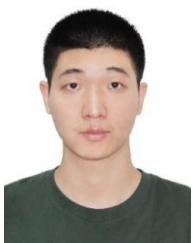

Yifei Qiu received the B.S. degree in electronics and information engineering from Chongqing University, Chongqing, China, in 2020, and the M.S. degree from the Harbin Institute of Technology, Shenzhen, China, in 2023. He is currently pursuing the Ph.D. degree in information and communication engineering with Harbin Institute of Technology, Shenzhen, China. His research interests include age of information, space communications, wireless networked control systems, and wireless sensor network.

Xin Jin received the B.S. degree in communication engineering from the Harbin Institute of Technology, Shenzhen, China, in 2024. He is currently pursuing the M.S. degree in information and communication engineering with Harbin Institute of Technology, Shenzhen, China. His research interests include multi-UAV control, sensor information fusion, and digital twin.

Qinyu Zhang (Senior Member, IEEE) received the bachelors degree in communication engineering from the Harbin Institute of Technology (HIT), Harbin, China, in 1994, and the Ph.D. degree in biomedical and electrical engineering from the University of Tokushima, Tokushima, Japan, in 2003. From 1999 to 2003, he was an Assistant Professor with the University of Tokushima. From 2003 to 2005, he was an Associate Professor with the Shenzhen Graduate School, HIT. He was the Founding Director of the Communication Engineering Re-

search Center, School of Electronic and Information Engineering (EIE). Since 2005, he has been a Full Professor and the Dean of the EIE School, HIT. His research interests include aerospace communications and networks, wireless communications and networks, cognitive radios, signal processing, and biomedical engineering. Dr. Zhang was an Associate Chair for Finance of the International Conference on Materials and Manufacturing Technologies 2012. He was the TPC Co-Chair of the IEEE/CIC ICCC 2015. He was the Symposium Co-Chair of the CHINACOM 2011 and the IEEE Vehicular Technology Conference 2016 (Spring). He was the Founding Chair of the IEEE Communications Society Shenzhen Chapter. He is on the Editorial Board of some academic journals, such as Journal of Communication, KSII Transactions on Internet and Information Systems, and Science China Information Sciences. He has been a TPC Member for the Infocom, IEEE ICC, IEEE GLOBECOM, IEEE Wireless Communications and Networking Conference, and other flagship conferences in communications.