# Graph-Based Spatiotemporal RL Framework for Sequential Task Offloading in Multi-UAV Systems

Meiyan Teng , Member, IEEE, Xin Li , Member, IEEE, Xuyun Zhang , Member, IEEE, Jianqiu Xu , Member, IEEE, and Kun Zhu , Member, IEEE

Abstract—Efficient collaboration among Uncrewed Aerial Vehicles (UAVs) has significant performance improvement for UAVbased applications. Task offloading is the typical collaboration form for UAV system. However, it still be a challenging problem for UAV system due to task dependencies and the UAV mobility which makes the traditional offloading approaches inefficiency. In this paper, we model the offloading problem as the Sequential Task Offloading Problem (sTOP), which takes the task spatiotemporal dependencies into account. We propose a Graph-based Spatiotemporal Reinforcement Learning (GSTRL) framework, where the environment is modeled as a heterogeneous graph to capture the diverse relationships among system entities. A spatiotemporal state extraction module is designed, which integrates a Heterogeneous Graph Neural Network (HGNN) for spatial dependency modeling and a Long Short-Term Memory (LSTM) network for temporal dynamics. Based on the extracted representations, a masked Proximal Policy Optimization (mPPO) algorithm is proposed to make valid and efficient offloading decisions under multiple system constraints. Extensive experiments using real UAV trajectory and building distribution datasets validate that the proposed method improves the average reward by approximately 25% over stateof-the-art DRL-based and heuristic baselines, by increasing task success rate and operational effectiveness ratio (OER) to 30–50%, while reducing execution time by up to 40% in complex multi-UAV systems.

Index Terms—Multi-UAV collaboration, sequential task offloading, heterogeneous graph neural network (HGNN), long short-term memory (LSTM), proximal policy optimization (PPO).

## I. INTRODUCTION

adopted in various fields such as disaster relief [1], smart city surveillance [2], agricultural monitoring [3], infrastructure inspection [4], and military reconnaissance [5]. With their high mobility, flexible deployment, and scalability, UAVs outperform traditional fixed edge nodes, particularly in scenarios where infrastructure is lacking or damaged, by swiftly establishing communication and computing networks to enhance system reliability [6]. However, in these typical application scenarios, the tasks performed by UAVs often exhibit strong sequential dependencies, meaning that the execution of a task relies on the completion of its predecessor. For instance, in disaster relief [1], area reconnaissance must be conducted prior to initiating rescue efforts. Similarly, in power grid inspection [4], defect identification typically precedes image collection and analysis. With the advancement of communication technologies [7], UAVs are capable of achieving higher data transmission rates and lower latency, which significantly enhances the efficiency of multi-UAV task coordination and enables their deployment in more complex and dynamic application scenarios.

Despite the significant advantages of multi-UAV collaborative systems, several challenges remain in practical applications. On one hand, the communication links among UAVs are highly susceptible to environmental interference and UAV mobility, leading to link disruptions and fluctuations in communication quality [7], [8]. These issues give rise to a dynamic network topology, which complicates task offloading decisions. On the other hand, the sequential dependencies among tasks means that task execution order is closely coupled with the spatial positions and resource states of the UAVs [9], [10], leading to spatiotemporal coupling constraints in task offloading decisions. The coexistence of dynamic network topology and spatiotemporal coupling greatly increases the complexity and difficulty of task offloading decisions. Effectively optimizing sequential task offloading under these multi-constraint conditions is essential for enhancing the overall performance of multi-UAV collaborative systems.

Among existing studies, some have examined task offloading in single-UAV systems [11], while others have extended this to multi-UAV-assisted edge computing [9], [12], [13], [14], mainly focusing on offloading between UAVs, ground devices, and edge servers. More recent works have considered space– air–ground integrated architectures [15]. However, these studies typically neglect the potential of collaborative computing facilitated by inter-UAV communications. A few works have explored multi-UAV collaborative systems with dynamic communication topologies [7], [8], but they generally assume idealized task models where tasks are independent. In practice, UAVs’ limited energy makes it infeasible to execute complex jobs as a whole, highlighting the need for decomposing them into interdependent subtasks. However, task dependency and multi-UAV cooperation introduce inherent and strong spatiotemporal coupling constraints into the dynamic offloading decision process.

These constraints not only significantly increase the problem complexity but also expose the limitations of conventional methods in capturing both topological dynamics and sequential task dependencies. This highlights the need for novel modeling and decision-making approaches based on spatiotemporal feature extraction to enable efficient and reliable dynamic offloading.

To address these challenges, this paper investigates a dynamic multi-UAV collaborative system in which each UAV can either execute tasks requested by nearby devices or offload them to other UAVs within communication range for cooperative processing. The system exhibits heterogeneous features, encompassing diverse UAV and task characteristics, as well as a dynamically evolving network topology. Leveraging deep neural network techniques, we first employ a Graph Neural Network (GNN) to embed the features of UAVs and tasks within the system environment. The embedding states are then input into a Deep Reinforcement Learning (DRL) algorithm to determine the offloading decisions. The framework is designed to achieve multi-objective optimization with respect to task latency, energy consumption, execution success rate, and load balancing. The main contributions of this paper are summarized as follows:

Model and Problem Formulation: Considering the dynamic communication topology and limited energy of UAVs, a multi-UAV cooperative system is developed to address the problem of sequential task offloading (sTOP). The system enables each UAV to either execute tasks locally or cooperatively offload them to other UAVs, while accounting for heterogeneous capabilities, task dependencies, and dynamic communication topology. To jointly optimize delay, energy consumption, load balancing, and task success rate, the sTOP is formulated as a multi-objective optimization problem.

\- Algorithm Design: To address this problem, a Graph-based Spatiotemporal Reinforcement Learning (GSTRL) framework is proposed, where the environment is represented as a heterogeneous graph. A spatiotemporal state extraction module, integrating a Heterogeneous Graph Neural Network (HGNN) and Long Short-Term Memory (LSTM) networks, is employed to jointly capture spatial heterogeneity and temporal task dependencies. The resulting embedding states are subsequently utilized by a masked Proximal Policy Optimization (mPPO) algorithm to derive efficient and feasible offloading decisions under multiple constraints.

Validation: To evaluate the effectiveness of our algorithm, we conduct extensive comparative experiments against DRL-based methods (PPO, DQN, and DDQN) and heuristic approaches (MAB, local greedy, and random). To ensure realistic evaluation, we simulate multi-UAV scenarios using publicly datasets of UAV trajectories and building distributions. Experimental results indicate that our method achieves superior performance in terms of task latency, execution success rate, and operational efficiency ratio (OER), confirming its effectiveness in realistic and complex environments.

The reminder of this article is organized as follows. The related work is presented in Section II. Section III establishes the system model and formulates a sequential task offloading problem. Section IV proposes a Graph-based Spatiotemporal Reinforcement Learning (GSTRL) framework. In Section V, performance evaluation results are presented. Finally, the conclusion is drawn in Section VI.

## II. RELATED WORKS

Currently, research on the task offloading problem has become relatively mature, with most existing works focusing solely on static optimization within a single time slot (e.g., [16], [17]). These studies typically assume fixed system resources and oneshot task execution, and are commonly addressed using convex optimization techniques [18] or heuristic algorithms [19]. However, in real-world scenarios, system states evolve over time, with both computing and communication resources vary, and tasks often arrive dynamically across multiple time slots [20], [21]. Although user mobility is addressed in [21], both [20] and [21] restrict their models to stationary edge nodes, which limits their ability to capture the dynamic evolution of system topology.

With the continuous advancement and maturation of uncrewed aerial vehicle (UAV) technologies, UAV-assisted edge computing systems exhibit significant advantages over conventional fixed edge nodes, offering high flexibility and scalability with adaptable coverage, making them well-suited for dynamic environments. Nevertheless, the high mobility of UAVs also introduces greater challenges for research into task offloading. For instance, Reference [11] investigates dynamic task offloading in a space–air–ground integrated edge computing system, modeling multi-user competition as a stochastic game and leveraging reinforcement learning (RL) to develop an Age of Update (AoU)-aware offloading strategy. However, the work remains limited to the single-UAV setting, thereby constraining its generalizability.

In recent years, an increasing number of studies have explored UAV-assisted edge computing systems involving multiple UAVs, as demonstrated in [9], [12], [13], [14], [15], [22]. Among them, references [14] and [15] examine task offloading in a twodimensional space, assuming fixed UAV trajectories without considering UAV mobility or dynamic scheduling. In contrast, references [9] and [12] investigate the joint optimization of UAV deployment and task offloading in a three-dimensional space, with [9] leveraging a deep Q-network (DQN) method. Most of these studies focus solely on communication between UAVs and ground devices or users. Notably, Fan et al. [13] constructs a two-tier graph structure, where UAVs connect upward to access points (APs) and downward to users, while tang et al. [22] employs a distributed RL framework in which each UAV independently makes offloading decisions. While research on multi-UAV-assisted edge computing has expanded rapidly, most studies still fail to incorporate dynamic inter-UAV communication and collaboration. However, such interactions introduce critical spatial coupling constraints that are indispensable for realistic modeling and reliable offloading.

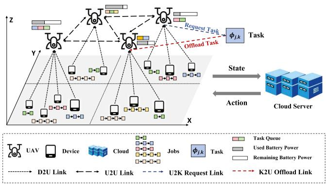  
Fig. 1. A dynamic multi-UAV collaborative system.

In contrast, reference [8] investigates a collaborative task offloading mechanism for multiple UAVs, employing a twostage task partitioning and scheduling strategy to maximize system energy efficiency under dynamic and stochastic task arrivals. Reference [7] presents a DDQN-based collaborative target search framework for multiple UAVs, designed to jointly optimize computation offloading and UAV trajectories, thereby reducing regional uncertainty and enhancing search reliability under uncertain environments. Although both studies account for the dynamic spatial characteristics of UAVs, their task models are relatively idealized and do not consider inter-task dependencies. Consequently, they overlook the spatiotemporal coupling constraints arising from these dependencies.

Our research focuses on the problem of sequential task offloading in dynamic multi-UAV collaborative systems. It jointly considers spatial characteristics such as dynamic collaboration among UAVs and variations in network topology, as well as the temporal dependencies inherent in sequential task execution. The objective is to optimize system response quality by devising efficient offloading strategies tailored for sequential tasks.

## III. SYSTEM MODEL AND PROBLEM FORMULATION

## A. A Dynamic Multi-UAV Collaborative System

Fig. 1 illustrates a dynamic multi-UAV collaborative system comprising a cloud server, UAVs, and devices. Devices without computing capabilities move in a 2D space and generate Poisson-distributed job requests consisting of sequential tasks, while UAVs operate in a 3D space, collaborate to share resources, and execute tasks within their coverage. Each UAV, equipped with a single computing core [7], can process only one task at a time. The cloud server dynamically optimizes task processing and offloading decisions based on the real-time global system status.

We consider a area of size $X \times Y \times Z .$ , which is partitioned into $L _ { x } \times L _ { y }$ cells, each covered by a UAV. The time horizon is discretized into T equal-length slots, $\mathcal { T } = \{ 1 , 2 , \dots , t , \dots , T \}$ with the system assumed quasi-static within each slot. The set of UAVs is denoted as $\mathbf { U } = \{ 1 , 2 , . . . , u , . . . , U \}$ , and the set of jobs is represented by $\mathbf { J } = \{ 1 , 2 , . . . , j , . . . , J \}$ . At each time slot t, the adjacency matrix $\mathbf { A } _ { t } = \{ a _ { u , v } ^ { t } | u , v \in \mathbf { U } \}$ is defined to the connectivity between UAVs, where $a _ { u , v } ^ { t } = 1$ if a communication link exists between UAV u and UAV v, and $a _ { u , v } ^ { t } = 0$ otherwise. Each UAV u demonstrates a unique performance $I _ { u , t } = \left\{ C _ { u } , P _ { u } , E _ { u } ^ { m a x } , L _ { u , t } , Q _ { u , t } ^ { i d l e } , \mathbf { J } _ { u , t } \right\}$ . Here, $C _ { u } ,$ $P _ { u }$ and $E _ { u } ^ { m a x }$ represent the computing power, transmission power, and energy limitation of UAV u, respectively. Meanwhile, $L _ { u , t } = \{ x _ { u , t } , y _ { u , t } , z _ { u , t } \}$ denotes the location for UAV u, and the $Q _ { u , t } ^ { i d l \epsilon }$ indicates the idle time of the task queue for UAV u at time slot t. At time slot t, the set of job requests from devices within the coverage of UAV u is denoted by $\mathbf { J } _ { u , t } \subseteq \mathbf { J }$ . Each job is composed of a sequence of tasks and is characterized by a unique performance $I _ { j } ^ { J } = \{ T _ { j } ^ { m a x } , K _ { j } , \Psi _ { j } \}$ . T max represents the maximum response time, while $K _ { j }$ indicates the number of tasks comprising job j. The task set is defined as $\Psi _ { j } =$ $\{ \psi _ { j , 1 } , . . . , \psi _ { j , K _ { j } } \}$ , where each task $\psi _ { j , k }$ is associated with a performance $I _ { j , k } ^ { \check { K } } = \{ R _ { j , k } , O _ { j , k } , \varphi _ { j , k } ^ { c o m p } , \varphi _ { j , k } ^ { d a t a } \}$ . Here, $R _ { j , k }$ and $O _ { j , k }$ represent the UAVs that requested and offloaded task $\psi _ { j , k }$ respectively. $\varphi _ { j , k } ^ { c o m p }$ and $\varphi _ { j , k } ^ { d a t a }$ refer to the computing resource and input data size required by task $\psi _ { j , k } ,$ , respectively. When the UAV completes execution of offloaded task $\psi _ { j , k }$ , it subsequently requests its successor task $\psi _ { j , k + 1 }$ . In this work, each job is modeled as a linear sequence of tasks, a widely adopted abstraction in UAV applications. More complex DAG-structured jobs can be transformed into equivalent sequences [23], which reduces problem complexity and minimizes communication overhead.

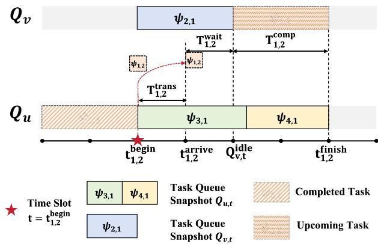  
Fig. 2. Sequence task execution model.

## B. Sequence Task Execution Model

This section presents the sequential task execution model, as shown in Fig. 2. A job’s response time is defined as the sum of the execution times of its sequential tasks, where each task’s execution time comprises transmission, waiting, and computing times, as detailed in (1).

$$
T _ { j } = \sum _ { k = 1 } ^ { K _ { j } } T _ { j , k } = \sum _ { k = 1 } ^ { K _ { j } } \left( T _ { j , k } ^ { \mathrm { t r a n s } } + T _ { j , k } ^ { \mathrm { w a i t } } + T _ { j , k } ^ { \mathrm { c o m p } } \right) .\tag{1}
$$

1) Transmission Time: Before task execution, input data must be transmitted from the requesting UAV to the offloading UAV, incurring transmission time. A task can be offloaded only if the requesting and offloading UAVs are identical or connected $( { a } _ { R _ { j , k } , O _ { j , k } } ^ { t } = 1 )$ . Additionally, the requesting UAV for task $\psi _ { j , k }$ is set as the offloading UAV of its preceding task $\psi _ { j , k - 1 }$ , i.e., $R _ { j , k } = O _ { j , k - 1 }$ . The U2U channel model is configured based on a probabilistic path loss model [7], considering both line-of-sight (LoS) and non-line-of-sight (NLoS) conditions. The euclidean distance between UAVs u and v at time t is denoted by $d _ { u , v } ^ { t } ,$ as shown in (2). The path loss of LoS and NLoS links between UAVs u and v can be expressed respectively by the following (3)–(4).

$$
d _ { u , v } ^ { t } = \sqrt { ( x _ { u , t } - x _ { v , t } ) ^ { 2 } + ( y _ { u , t } - y _ { v , t } ) ^ { 2 } + ( z _ { u , t } - z _ { v , t } ) ^ { 2 } } ,\tag{2}
$$

$$
L _ { u , v , t } ^ { \mathrm { L o S } } = 2 0 \log _ { 1 0 } \frac { 4 \pi f _ { c } d _ { u , v } ^ { t } } { c } + \eta _ { \mathrm { L o S } } ,\tag{3}
$$

$$
L _ { u , v , t } ^ { \mathrm { N L o S } } = 2 0 \log _ { 1 0 } \frac { 4 \pi f _ { c } d _ { u , v } ^ { t } } { c } + \eta _ { \mathrm { N L o S } } .\tag{4}
$$

Here, $f _ { c }$ denotes the carrier frequency, c is the speed of light, and $\eta _ { \mathrm { L o S } }$ and $\eta _ { \mathrm { N L o S } }$ represent additional attenuation factors for LoS and NLoS links, respectively. The environment influences the LoS probability in U2U communication, as suburban areas with fewer obstructions predominantly feature LoS links. The average path loss is defined as (5). And, the U2U transmission rate between UAV u and UAV v is simulated as (6).

$$
L _ { u , v , t } ^ { \mathrm { a v g } } = P r _ { u , v , t } ^ { \mathrm { L o S } } L _ { u , v , t } ^ { \mathrm { L o S } } + \left( 1 - P r _ { u , v , t } ^ { \mathrm { L o S } } \right) L _ { u , v , t } ^ { \mathrm { N L o S } } .\tag{5}
$$

$$
r _ { u , v } ^ { t } = B _ { u , v } ^ { t } \log _ { 2 } \left( 1 + \frac { P _ { u } \cdot 1 0 ^ { - L _ { u , v , t } ^ { a v g } / 1 0 } } { \sigma ^ { 2 } } \right) .\tag{6}
$$

Consistent with prior study [8], when two UAVs are within the effective communication range, the link is regarded as reliable and thus $a _ { R _ { i , k } , O _ { i , k } } ^ { t } = 1$ . Otherwise, if their distance exceeds the reliable range, no communication link exists and task execution fails, i.e., $a _ { R _ { j , k } , O _ { j , k } } ^ { t } = 0$ . In the latter case, the task cannot be executed; in the former case, the transmission time $T _ { j , k } ^ { \mathrm { t r a n s } }$ is given by:

$$
\begin{array} { r } { T _ { j , k } ^ { \mathrm { t r a n s } } = \left\{ \begin{array} { l l } { 0 , } & { R _ { j , k } = O _ { j , k } , } \\ { \frac { \varphi _ { j , k } ^ { d a t a } } { r _ { R _ { j , k } , O _ { j , k } } ^ { t } } , } & { R _ { j , k } \neq O _ { j , k } . } \end{array} \right. } \end{array}\tag{7}
$$

2) Computing Time: The computing time of a task depends on the UAV’s computing power and the task’s computational demand. Each UAV is assumed to process only one task at a time with constant computing power. UAV computing power is measured in Giga Operations Per Second (GOPS) [24], where the number of operations corresponds to the computational resources allocated to tasks. Accordingly, the computing time of task $\psi _ { j , k }$ offloaded to UAV $O _ { j , k }$ is given by:

$$
T _ { j , k } ^ { \mathrm { c o m p } } = \frac { \varphi _ { j , k } ^ { c o m p } } { C _ { u } } , O _ { j , k } = u \in \mathbf { U } .\tag{8}
$$

Energy consumption is a critical constraint for UAVs in executing computational tasks. Due to limited battery capacity, excessive energy usage reduces operational endurance and restricts mission coverage. Therefore, energy constraints must be considered when designing task offloading strategies. The energy consumed by UAV $O _ { j , k } = u$ during the execution of task $\psi _ { j , k }$ is given by:

$$
E _ { u , t } = k _ { u } \left( f _ { n } ^ { l } \right) ^ { 3 } T _ { k , j } ^ { c o m p } .\tag{9}
$$

3) Waiting Time: Each UAV u maintains a buffer queue $\mathbf { Q } _ { u }$ to store incoming tasks, following a First Come First Serve (FCFS) discipline. A task must wait until all preceding tasks in the queue are completed. As shown in Fig. 2, once the predecessor task $\psi _ { 1 , 1 }$ is processed, task $\psi _ { 1 , 2 }$ initiates its offloading decision at time slot t. The queue states of UAVs u and v at time t are denoted by $\mathbf { Q } _ { u , t }$ and $\mathbf { Q } _ { v , t }$ , respectively. If $\psi _ { 1 , 2 }$ is offloaded to UAV v, it can begin execution only when $\mathbf { Q } _ { v }$ is idle. Accordingly, the waiting time is defined as:

$$
\begin{array} { r } { T _ { j , k } ^ { \mathrm { w a i t } } = \operatorname* { m a x } \left\{ ( t _ { j , k } ^ { \mathrm { a r r i } } - Q _ { v , t } ^ { i d l e } ) , 0 \right\} . } \end{array}\tag{10}
$$

## C. Problem Formulation and Analysis

Given the heterogeneous delay tolerances determined by the distinct maximum response times of individual jobs, the response quality is formulated as $\begin{array} { r } { \mathcal { Q } ^ { t i m e } = \sum _ { j \in J } \mathsf { \bar { ( } } T _ { j } ^ { \operatorname* { m a x } } - T _ { j } ) } \end{array}$ to quantify the overall system performance in delay requirements. To further prevent resource bottlenecks, load balancing is incorporated into the objective by minimizing the workload disparity across UAVs. Specifically, the load quality is defined as $\begin{array} { r } { \mathcal { Q } ^ { l o a d } = \sum _ { t \in \mathcal { T } } ( \bar { \operatorname* { m i n } } _ { u \in \mathbf { U } } \{ \dot { Q } _ { u , t } ^ { i d l e } \} - \operatorname* { m a x } _ { v \in \mathbf { U } } \{ Q _ { v , t } ^ { i d l e } \} ) } \end{array}$ , which penalizes scenarios where certain UAVs are heavily loaded while others remain underutilized. Accordingly, the Sequential Task Offloading Problem (sTOP) is formulated to maximize response and load quality under constraints.

$$
\mathrm { s T O P : ~ } \operatorname* { m a x } ( \mathcal { Q } ^ { t i m e } + \mathcal { Q } _ { t } ^ { l o a d } ) ,\tag{11}
$$

$$
C _ { 1 } : \quad T _ { j } \leq T _ { j } ^ { \operatorname* { m a x } } , \qquad \forall j \in J ,\tag{11a}
$$

$$
C _ { 2 } : ~ O _ { j , k - 1 } = R _ { j , k } , \qquad \forall \psi _ { j , k } \in \Psi _ { j } , \forall j \in J ,
$$

$$
C _ { 3 } : \quad a _ { R _ { j , k } , O _ { j , k } } ^ { t } = 1 , \qquad \forall \psi _ { j , k } \in \Psi _ { j } , \forall j \in J ,\tag{11b}
$$

(11c)

$$
C _ { 4 } : \quad \sum _ { t \in \mathcal { T } } E _ { u , t } \leq E _ { u } ^ { m a x } , \forall u \in \mathbf { U } ,\tag{11d}
$$

$$
C _ { 5 } : \quad O _ { j , k } \in \mathbf { U } , \qquad \forall \psi _ { j , k } \in \Psi _ { j } , \forall j \in J .\tag{11e}
$$

Constraint $C _ { 1 }$ limits the actual response time within the maximum allowable time. Constraint $C _ { 2 }$ enforces consistency between the offloading UAV of task $\psi _ { j , k - 1 }$ and the requesting UAV of task $\psi _ { j , k }$ . Constraint $C _ { 3 }$ ensures a communication link exists between the requesting and offloading UAVs at each time slot. Constraint $C _ { 4 }$ limits the total energy consumption within the UAVs’ maximum battery capacity. Constraint $C _ { 5 }$ restricts the offloading variable to the set of UAVs.

Theorem 1: The sequential task offloading problem (sTOP) is NP-hard.

Proof: We prove the NP-hardness of the sequential task offloading problem (sTOP) by a polynomial-time reduction from the Resource-Constrained Project Scheduling Problem (RCPSP), a well-known NP-hard problem [25].

In the RCPSP, a project consists of a set of activities $\mathbf { A } =$ $\{ 1 , \ldots , a , \ldots , A \}$ . Each activity a requires a specific execution duration $d _ { a } .$ , governed by the duration constraint, and must satisfy precedence constraints, such that $t _ { a } ^ { s t a r t } \geq t _ { a - 1 } ^ { f i n i s h }$ . Moreover, N renewable resources, each with a capacity $R _ { n } \left( n \in \mathbf { N } \right)$ are shared among activities, with the simultaneous resource usage bounded by $R _ { n } ^ { u s e } \leq R _ { n }$ . The objective is to minimize the project makespan, i.e., min $t _ { A } ^ { f i n i s h }$

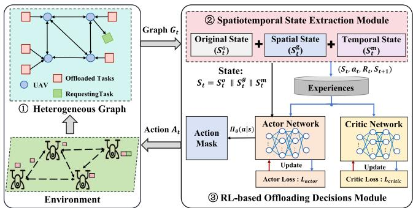  
Fig. 3. A graph-based spatiotemporal reinforcement learning (GSTRL) framework.

We construct a polynomial-time reduction by mapping the RCPSP to a simplified version of the sTOP. Specifically, each activity a in RCPSP corresponds to a task $\psi _ { j , k }$ in sTOP. The duration and precedence constraints in RCPSP are directly reflected by constraints $C _ { 1 }$ and $C _ { 2 }$ in sTOP, respectively. Assuming fully connected communications among UAVs, the set of UAVs U is mapped to the set of resources N. Additionally, the maximum energy of UAV $E _ { u } ^ { m a x }$ is equated to the capacity of resource $R _ { n }$ , thereby aligning constraint $C _ { 4 }$ in sTOP with the resource constraints in RCPSP. In the simplified sTOP, the objective is to maximize the response quality $\begin{array} { r } { \mathcal { Q } ^ { t i m e } = \sum _ { j \in \mathbf { J } } ( T _ { j } ^ { \operatorname* { m a x } } - T _ { j } ) } \end{array}$ Since $T _ { j } ^ { \mathrm { m a x } }$ is constant, maximizing $\mathcal { Q } ^ { t i m e }$ is equivalent to minimizing the total execution time min $\textstyle \sum _ { j \in \mathbf { J } } T _ { j }$ , which aligns with minimizing the makespan min $t _ { A } ^ { f i n i s h }$ in RCPSP, as shown in (12).

$$
\begin{array} { r l } & { t _ { A } ^ { \mathrm { f i n i s h } } = t _ { A } ^ { \mathrm { s t a r t } } + T _ { A } ^ { e x e } = t _ { A - 1 } ^ { \mathrm { s t a r t } } + T _ { A - 1 } ^ { e x e } + T _ { A } ^ { e x e } } \\ & { \qquad = t _ { 1 } ^ { \mathrm { s t a r t } } + T _ { 1 } ^ { e x e } + \cdot \cdot \cdot + T _ { A } ^ { e x e } = t _ { 1 } ^ { \mathrm { s t a r t } } + \displaystyle \sum _ { a = 1 } ^ { A } T _ { a } ^ { e x e } . } \end{array}\tag{12}
$$

Therefore, the simplified sTOP can be reduced from the RCPSP. Since the RCPSP is NP-hard and the reduction is polynomial, it follows that sTOP is also NP-hard. -

## IV. GRAPH-BASED SPATIOTEMPORAL REINFORCEMENT LEARNING (GSTRL) FRAMEWORK

## A. Framework Overview

This section presents a Graph-based Spatiotemporal Reinforcement Learning (GSTRL) framework for optimizing sequential task offloading in dynamic multi-UAV collaborative systems, as illustrated in Fig. 3. The framework consists of three main components: (1) Heterogeneous Graph Model: A dynamic heterogeneous graph is constructed to represent UAVs and tasks (both requesting and offloaded), capturing the evolution of network topology and task distribution. (2) Spatiotemporal

State Extraction Module: Spatial, temporal, and original system features are jointly extracted to characterize the system state. Specifically, a heterogeneous graph neural network (HGNN) captures the topological relationships between UAVs and tasks, a long short-term memory (LSTM) network models the temporal dependencies of sequential tasks, and the original state features provide system-level information such as UAV energy and task attributes. These components are concatenated into a unified hybrid representation $S _ { t }$ for subsequent decision-making. (3) Reinforcement Learning-based Offloading Decision Module: A masked Proximal Policy Optimization (m-PPO) algorithm optimizes offloading decisions based on spatiotemporal states $S _ { t }$ adaptively improving latency and energy efficiency by capturing spatial and temporal dynamics.

## B. Heterogeneous Graph Model

Heterogeneous graphs are a type of graph structure that consists of multiple types of nodes and edges, representing diverse entities and their complex relationships [26]. They are particularly useful for modeling real-world systems where interactions between different types of objects need to be captured. As shown in Fig. 3, we construct a heterogeneous graph to model dynamic system by defining nodes as UAVs (U), Offloaded Tasks (Ko), and Requesting Tasks (Kr), where U, Ko, and Kr represent distinct node types. Heterogeneous edges include UAV-to-UAV (U2U) communication edges, Task-to-UAV (K2U) offloaded edges, and UAV-to-Task (U2K) requesting edges. Symbolically, the graph at time slot t is denoted as $\mathbf { G } _ { t } =$ $( \bar { \mathbfcal { N } _ { t } } , \pmb { \varepsilon } _ { t } )$ , where $\mathcal { N } _ { t } = \mathbf { U } _ { t } \cup \mathbf { K } _ { t } ^ { o } \cup \{ k _ { t } ^ { r } \}$ (with $k _ { t } ^ { r } \in \mathbf { K } _ { t } ^ { r } )$ , and $\pmb { \mathcal { E } } _ { t } = \{ E _ { t } ^ { u 2 u } , E _ { t } ^ { k 2 u } , E _ { t } ^ { u 2 k } \}$ . The adjacency matrices, $\mathbf { A } _ { t } ^ { u 2 u } \in$ $\mathbb { R } ^ { | \mathbf { U } _ { t } | \times \left| \mathbf { U } _ { t } \right| } , \mathbf { A } _ { t } ^ { k 2 \overline { { u } } } \in \mathbb { R } ^ { | \mathbf { \check { K } _ { t } ^ { o } } | \times | \mathbf { U } _ { t } | }$ , and $\mathbf { A } _ { t } ^ { u 2 k } \in \mathbb { R } ^ { | \mathbf { U } _ { t } | \times 1 }$ , capture interactions between nodes of specific types. This heterogeneous graph models dynamic collaboration and task dependencies in the system.

## C. Spatiotemporal State Extraction Module

As illustrated in Fig. 4, the spatiotemporal state is obtained by concatenating spatial features derived from the HGNN, temporal features extracted by the LSTM, and original system attributes. This unified representation effectively captures both topological interactions and time-varying dynamics, thereby enhancing the robustness and efficiency of task offloading decisions within the RL-based module.

1) Spatial Features via HGNN: To capture the dynamic spatial states of UAVs for real-time strategy optimization, we partition the heterogeneous graph into three directed sub-graphs based on edge types, defined as follows:

$$
\begin{array} { r } { \mathbf { G } _ { t } ^ { \Phi _ { 1 } } = ( \pmb { \mathscr { N } } _ { t } ^ { \Phi _ { 1 } } , \pmb { \mathscr { E } } _ { t } ^ { \Phi _ { 1 } } ) , \pmb { \mathscr { N } } _ { t } ^ { \Phi _ { 1 } } = \pmb { U } _ { t } , \qquad \pmb { \mathscr { E } } _ { t } ^ { \Phi _ { 1 } } = \pmb { E } _ { t } ^ { u 2 u } , } \end{array}\tag{13}
$$

$$
\mathbf { G } _ { t } ^ { \Phi _ { 2 } } = ( \pmb { \mathscr { N } } _ { t } ^ { \Phi _ { 2 } } , \pmb { \mathscr { E } } _ { t } ^ { \Phi _ { 2 } } ) , \pmb { \mathscr { N } } _ { t } ^ { \Phi _ { 2 } } = \pmb { K } _ { t } ^ { o } \cup \pmb { U } _ { t } , \qquad \pmb { \mathscr { E } } _ { t } ^ { \Phi _ { 2 } } = \pmb { E } _ { t } ^ { k 2 u } ,\tag{14}
$$

$$
\mathbf { G } _ { t } ^ { \Phi _ { 3 } } = ( \pmb { \mathscr { N } } _ { t } ^ { \Phi _ { 3 } } , \pmb { \mathscr { E } } _ { t } ^ { \Phi _ { 3 } } ) , \pmb { \mathscr { N } } _ { t } ^ { \Phi _ { 3 } } = \pmb { U } _ { t } \cup \{ k _ { t } ^ { r } \} , \quad \pmb { \mathscr { E } } _ { t } ^ { \Phi _ { 3 } } = \pmb { E } _ { t } ^ { u 2 k } .\tag{15}
$$

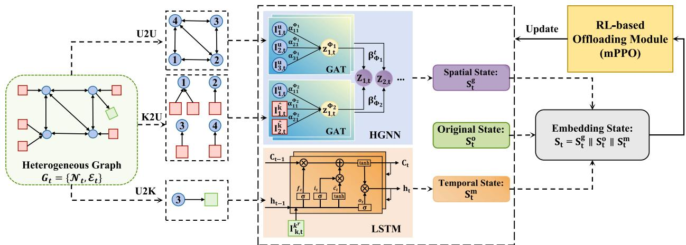  
Fig. 4. A spatiotemporal state extraction module.

The spatial state of a UAV depends on both its own attributes and those of its in-neighbors. According to Definition 1, the in-neighbors of a UAV node u at time slot t are identified across different subgraphs as follows: $i N e i _ { t } ^ { \Phi _ { 1 } } ( u ) = \{ v | v \in$ U, $\mathbf { A } _ { t } ^ { u 2 u } [ v ] [ u ] = 1 \}$ for U2U interactions, and $i N e i _ { t } ^ { \Phi _ { 2 } } ( u ) =$ $\{ k | k \in \mathbf { K } ^ { o } , \mathbf { A } _ { t } ^ { k 2 u } [ k ] [ u ] = 1 \}$ for K2U connections.

Definition 1: In a directed graph $\mathbf { G } = ( \mathcal { N } , \mathcal { E } )$ , the inneighbors of a node are the set of nodes from which a directed edge points to that node. Specifically, if there is a directed edge from node v to node u, then node v is considered an in-neighbor of node u.

Next, we focus on the embedding of UAV nodes using the Heterogeneous Graph Neural Network (HGNN), which is consistent with Heterogeneous Graph Attention Network (HAN) [27]. It employs a Graph Attention Network (GAT) [28] to capture node features within each sub-graph and applies semantic-level attention to assess and aggregate the importance of different subgraphs. According to (13)–(15), since the UAV node in subgraph $\Phi _ { 3 }$ has no in-neighbors, only the UAV nodes in subgraphs $\Phi _ { 1 }$ and $\Phi _ { 2 }$ are embedded.

As described in Section III-A, the feature set for UAVs at time slot t is denoted as $\mathbf { I } _ { t } ^ { U }$ and the general feature set for tasks is labeled as $\mathbf { I } ^ { K }$ . For the offloaded tasks at time slot t, represented as ${ \bf K } _ { t } ^ { o }$ , the corresponding features are denoted as $\mathbf { I } _ { t } ^ { \bar { K ^ { o } } }$ , which is a subset of $\mathbf { I } ^ { K }$ . Similarly, the feature of the requesting task $k ^ { r }$ is denoted as $\mathbf { I } _ { t } ^ { k ^ { r } } \in \mathbf { I } ^ { K }$ . Since the UAV and task nodes have different feature spaces, we first use a transformation matrix to project the features of task nodes into the same feature space as UAV nodes.

$$
\hat { \mathbf { I } } _ { k , t } ^ { K ^ { o } } = \mathbf { M } _ { k 2 u } \times \mathbf { I } _ { k , t } ^ { K ^ { o } } ,\tag{16}
$$

where $\mathbf { I } _ { k , t } ^ { K ^ { o } }$ and $\hat { \mathbf { I } } _ { k , t } ^ { K ^ { o } }$ are the original and projected feature of task $k ,$ respectively. For clarity, the input feature of each node i (where $i \in \mathbf { U } \cup \mathbf { K } ^ { o } )$ , is uniformly represented as ${ \bf { I } } _ { i , t }$ (with $\mathbf { I } _ { i , t } \in \mathbf { I } _ { t } ^ { U } \cup \hat { \mathbf { I } } _ { t } ^ { K ^ { o } } )$

The GAT network initially computes the $l ^ { t h }$ layer feature $\mathbf { I } _ { i , t } ^ { ( l ) }$ by applying a linear transformation to the preceding $( l - 1 ) ^ { t h }$ layer features $\mathbf { I } _ { i , t } ^ { ( l - 1 ) }$ , parameterized by a trainable weight matrix $\mathbf { W } ^ { l }$ learned to capture node interactions.

$$
\mathbf { I } _ { i , t } ^ { ( l ) } = \mathbf { W } ^ { ( l ) } \mathbf { I } _ { i , t } ^ { ( l - 1 ) } .\tag{17}
$$

Then, the attention coefficient $e _ { i j } ^ { t }$ between each node i and its in-neighbor nodes $j$ (where $j \in \mathbf { i N e i } _ { t } ^ { \Phi _ { 1 } } ( i ) \cup \mathbf { i N e i } _ { t } ^ { \Phi _ { 2 } } ( i ) )$ is calculated as given in (18). Here, $\mathbf { a } \in \mathbb { R } ^ { 2 d }$ , where $d = \dim ( I _ { i , t } )$ is a learnable attention vector, 	 represents vector concatenation, and LeakyReLU(·) is a nonlinear activation function. The $i N e i _ { t } ^ { \Phi _ { 1 } } ( i ) , i \bar { N } e i _ { t } ^ { \Phi _ { 2 } } ( i )$ denote the in-neighbors of i under edge types $\Phi _ { 1 }$ (U2U) and $\Phi _ { 2 }$ (K2U), respectively.

$$
\begin{array} { r } { \pmb { e } _ { i j } ^ { t } = \mathrm { L e a k y R e L U } ( \mathbf { a } ^ { T } [ \mathbf { I } _ { i , t } ^ { ( l ) } \ \lVert \ \mathbf { I } _ { j , t } ^ { ( l ) } ] ) . } \end{array}\tag{18}
$$

Next, the normalized attention weight $\alpha _ { i j } ^ { t }$ is computed by applying a softmax over the attention coefficients $e _ { i j } ^ { t }$ of all in-neighbors $\mathbf { i N e i } _ { t } ^ { \Phi } = \{ \mathbf { i N e i } _ { t } ^ { \Phi _ { 1 } } , \mathbf { i N e i } _ { t } ^ { \Phi _ { 2 } } \}$ of node i.

$$
\alpha _ { i j } ^ { t } = \mathrm { s o f t m a x } _ { j } ( e _ { i j } ^ { t } ) = \frac { \exp ( e _ { i j } ^ { t } ) } { \sum _ { m \in \mathbf { i N e i } _ { t } ^ { \Phi } ( i ) } \exp ( e _ { i m } ^ { t } ) } .\tag{19}
$$

Finally, the features of in-neighbors are aggregated using the attention weights, and the updated representation of node i is obtained by applying a nonlinear activation function $\sigma { : }$

$$
z _ { i , t } ^ { \Phi } = \sigma \bigg ( \sum _ { j \in \mathbf { i N e i } _ { t } ^ { \Phi } ( i ) } \alpha _ { i j } ^ { t } \mathbf { I } _ { i , t } ^ { ( l ) } \bigg ) .\tag{20}
$$

Since distinct subgraphs capture heterogeneous spatial features of UAV nodes, fusing their representations across subgraphs is critical. The attention mechanism is used to calculate the importance of different subgraphs to UAV nodes. The attention weight is calculated as follows:

$$
\beta _ { \Phi } ^ { t } = \frac { \exp \left( \mathbf { q } ^ { T } \operatorname { t a n h } \left( \mathbf { W } _ { s } z _ { i , t } ^ { \Phi } + \mathbf { b } _ { s } \right) \right) } { \sum _ { \Phi \in \{ \Phi _ { 1 } , \Phi _ { 2 } \} } \exp \left( \mathbf { q } ^ { T } \operatorname { t a n h } \left( \mathbf { W } _ { s } z _ { i , t } ^ { \Phi } + \mathbf { b } _ { s } \right) \right) } ,\tag{21}
$$

where $\mathbf { W } _ { s } , \mathbf { b } _ { s }$ and q are parameters to be learned. The node features $\boldsymbol { z } _ { i , t } ^ { \Phi }$ updated from each sub-graphs, are then weighted and fused to obtain the final node representation.

$$
Z _ { i , t } = \sum _ { \Phi \in \{ \Phi _ { 1 } , \Phi _ { 2 } \} } \beta _ { \Phi } ^ { t } z _ { i , t } ^ { \Phi } .\tag{22}
$$

In conclusion, the spatial states of UAVs at time slot t are denoted by (23). This equation encapsulates the aggregated spatial feature representations of all UAVs, obtained by HGNN, which are crucial for subsequent offloading decision-making within the dynamic multi-UAV collaborative system.

$$
\mathbf { S } _ { t } ^ { g } = \{ Z _ { u , t } | u \in \mathbf { U } \} .\tag{23}
$$

2) Temporal Features via LSTM: In sequential task offloading, tasks exhibit temporal dependencies, where each task relies on its predecessors. Traditional methods often struggle with long-range dependencies, leading to suboptimal decisions. To address this, we employ Long Short-Term Memory (LSTM) [29] to mitigate vanishing gradients and preserve crucial information over long sequences.

The basic structure of LSTM is described by Fig. 4, which captures long-range dependencies using memory cell $C _ { t }$ regulated by three gates: a forget gate $f _ { t } ,$ an input gate $i _ { t } ,$ , and a output gate $\mathbf { } _ { o _ { t } }$ . At time slot $t ,$ the input is the feature of the requesting task $k ^ { r }$ , denoted as $\pmb { I } _ { t } ^ { k ^ { r } } \in \pmb { I } ^ { \bar { K } }$ . The hidden state $h _ { t - 1 }$ and memory cell $C _ { t - 1 }$ from the previous time slot are used to update $C _ { t }$ and $h _ { t }$ as follows:

$$
\pmb { f } _ { t } = \left( W _ { f } \cdot \left[ h _ { t - 1 } , \pmb { I } _ { t } ^ { k ^ { r } } \right] + b _ { f } \right) ,\tag{24}
$$

$$
i _ { t } = \sigma \left( W _ { i } \cdot \left[ h _ { t - 1 } , I _ { t } ^ { k ^ { r } } \right] + b _ { i } \right) ,\tag{25}
$$

$$
\tilde { c } _ { t } = \operatorname { t a n h } \left( W _ { c } \cdot \left[ h _ { t - 1 } , I _ { t } ^ { k ^ { r } } \right] + b _ { c } \right) ,\tag{26}
$$

$$
{ \cal C } _ { t } = f _ { t } \odot { \cal C } _ { t - 1 } + i _ { t } \odot \tilde { { \boldsymbol { c } } } _ { t } ,\tag{27}
$$

$$
\begin{array} { r } { \pmb { o } _ { t } = \sigma \left( \pmb { W } _ { o } \cdot \left[ \pmb { h } _ { t - 1 } , \pmb { I } _ { t } ^ { k ^ { r } } \right] + \pmb { b } _ { o } \right) , } \end{array}\tag{28}
$$

$$
h _ { t } = { \pmb { O } } _ { t } \odot \operatorname { t a n h } \left( { \pmb { C } } _ { t } \right) .\tag{29}
$$

Here, $\sigma ( \cdot )$ denotes the Sigmoid activation function, denote as $\begin{array} { r } { \sigma ( x ) = \frac { 1 } { 1 + e ^ { - x } } } \end{array}$ . The notation $[ h _ { t - 1 } , { \cal I } _ { t } ^ { k ^ { r } } ]$ represents the concatenation of $h _ { t - 1 }$ and $\boldsymbol { I } _ { t } ^ { k ^ { r } }$ . The weights $W _ { f } , W _ { i } , W _ { c } , W _ { c }$ along with the biases $b _ { f } , b _ { i } , b _ { c } , b _ { o }$ , facilitate the gate operations. The operator indicates element-wise multiplication. The candidate memory state $\tilde { c } _ { t }$ is modulated by the tanh(·) activation function, which normalize its values within the range [−1, 1]. In conclusion, the temporal states of sequential tasks at time slot t are denoted as following:

$$
\mathbf { S } _ { t } ^ { m } = { h } _ { t } .\tag{30}
$$

These mechanisms control information flow, preserving relevant past data while mitigating the vanishing gradient issue. By leveraging its gated architecture, our framework effectively models task dependencies, improving decision accuracy and optimizing offloading strategies in dynamic environments.

3) Original System Features: The spatiotemporal state extraction module not only captures the dynamic spatial features of UAVs and the temporal features of sequential tasks, but also preserves real-time original system states, enabling a more comprehensive representation of the system for accurate offloading decisions. The original system features are categorized into two dimensions: the UAV state feature set ${ \bf S } _ { t } ^ { o } ( U )$ , delineated in (31), encompasses computing power $C _ { u } ,$ transmission power $P _ { u } ,$ remaining energy $\begin{array} { r } { E _ { u , t } ^ { r e m } = E _ { u } ^ { m a x } - \sum _ { t } E _ { u , t } , } \end{array}$ , task queue $Q _ { u , t } ^ { i d l e }$ , location $L _ { u , t }$ , number of requests $N u m _ { u , t }$ , and

UAV load $L o a _ { u , t }$ . The current request task state feature set $\mathbf { S } _ { t } ^ { o } ( k ^ { r } )$ , presented in (32), includes task id $k ^ { r }$ , job id $j ,$ data size $\varphi _ { j , k ^ { r } } ^ { d a t a }$ , computing requirements $\varphi _ { j , k ^ { r } } ^ { c o m p }$ , requested UAV $R _ { j , k ^ { r } }$ , task arrival time slot $t _ { j , k ^ { r } } ^ { a r r i }$ , and remaining execution time $\begin{array} { r } { T _ { j , k ^ { r } } ^ { r e m } = T _ { j } ^ { m a x } - \sum _ { k = 1 } ^ { k ^ { r } - 1 } T _ { j , k } } \end{array}$ of the job.

$$
\mathbf { S } _ { t } ^ { o } ( U ) = \left\{ C _ { u } , P _ { u } , E _ { u , t } ^ { r e m } , Q _ { u , t } ^ { i d l e } , L _ { u , t } , \right.
$$

$$
N u m _ { u , t } , L o a _ { u , t } | u \in { \bf U } \} ,\tag{31}
$$

$$
\mathbf { S } _ { t } ^ { o } ( k ^ { r } ) = \{ k ^ { r } , j , \varphi _ { j , k ^ { r } } ^ { d a t a } , \varphi _ { j , k ^ { r } } ^ { c o m p } , R _ { j , k ^ { r } } , t _ { j , k ^ { r } } ^ { a r r i v a l } , T _ { j , k ^ { r } } ^ { r e m } \} .\tag{32}
$$

Consequently, the original state, encapsulating these features, is formally defined as

$$
\mathbf { S } _ { t } ^ { o } = \mathbf { S } _ { t } ^ { o } ( U ) \parallel \mathbf { S } _ { t } ^ { o } ( k ^ { r } ) .\tag{33}
$$

By employing the spatiotemporal state extraction model, the reinforcement learning input layer developed in this study comprehensively captures system dynamics. This detailed feature modeling provides a critical foundation for task offloading decisions by incorporating spatiotemporal dependencies, resource constraints, and state evolution, thereby facilitating intelligent decision-making in dynamic environments.

## D. RL-Based Decision Offloading Making

In this section, we first formulate the sequential task offloading problem as a Markov Decision Process (MDP), where the state is derived from the spatiotemporal state extraction module. We then introduce a mask-based Proximal Policy Optimization (mPPO) algorithm to optimize sequential task offloading in dynamic systems.

1) MDP-Based Problem: The sequential task offloading problem is modeled as a Markov Decision Process (MDP) represented by $( \pmb { S } , \pmb { A } , \pmb { \mathcal { R } } , \pmb { \mathcal { P } } )$ ). We define these elements in our system as follows.

\- State Space $\pmb { S } = \{ S _ { t } | t \in \mathcal { T } \}$ : At the beginning of each time slot t, the agent integrates the original states $\mathbf { } S _ { t } ^ { o }$ from the environment with the spatial states $S _ { t } ^ { g }$ computed by the HGNN and the temporal states $S _ { t } ^ { m }$ output by the LSTM network. Thus, the spatiotemporal state space $S _ { t }$ at time slot t represented as

$$
\begin{array} { r } { \pmb { S } _ { t } = \pmb { S } _ { t } ^ { o } \parallel \pmb { S } _ { t } ^ { g } \parallel \pmb { S } _ { t } ^ { m } . } \end{array}\tag{34}
$$

\- Action Space $\pmb { \mathscr { s } } = \{ A _ { t } | t \in \mathcal { T } \}$ : After perceiving state $S _ { t }$ the agent make offloading decisions. Thus, the action space at time slot t is defined as $A _ { t } = O _ { j , k ^ { r } } \in \mathbf { U }$

\- Reward Function $\pmb { \mathcal { R } } = \{ R _ { t } | t \in \pmb { \mathcal { T } } \}$ : Immediate reward $R _ { t }$ $( \pmb { S } \times \pmb { A } \times \pmb { S } \mapsto \mathbb { R } )$ is assigned when action $A _ { t }$ is taken at state $\mathbf { S } _ { t } ,$ comprising four components: execution success, execution time, system load, and energy consumption, as defined in (35). Specifically, a reward $\pm \theta _ { s }$ is issued if the final task of job j is completed within (or beyond) the deadline, denoted $r _ { t } ^ { s u c } \}$ ; execution time contributes a negative reward, denotes $r _ { t } ^ { t i m e }$ ; system load is measured by the load difference across UAVs, denotes $r _ { t } ^ { l o a d }$ ; and an energy penalty $- \rho _ { e }$ applies if task offloading exhausts

UAV battery, denotes $r _ { t } ^ { e n e }$

$$
\begin{array} { r l } & { { r _ { t } ^ { s u c } } = \left\{ \begin{array} { l l } { \theta _ { s } , } & { T _ { j } \leq T _ { j } ^ { m a x } , k ^ { r } = K _ { j } , } \\ { - \theta _ { s } , } & { T _ { j } > T _ { j } ^ { m a x } , k ^ { r } = K _ { j } . } \end{array} \right. } \\ & { { r _ { t } ^ { t i m e } } = - T _ { j , k ^ { r } } , } \\ & { { r _ { t } ^ { l o a d } } = \displaystyle { \operatorname* { m i n } _ { u \in \mathbf { U } } { L o a _ { u , t } } - \operatorname* { m a x } _ { u \in \mathbf { U } } { L o a _ { u , t } } } , } \\ & { { r _ { t } ^ { e n e } } = \left\{ \begin{array} { l l } { - \rho _ { e } , } & { E _ { u , t } ^ { r e m } \leq 0 , A _ { t } = u , } \\ { 0 , } & { E _ { n e } ^ { r e m } > 0 , A _ { t } = u . } \end{array} \right. } \end{array}\tag{35}
$$

To mitigate scale-induced bias among heterogeneous objectives, each reward component is normalized using running mean–variance statistics. Let $\mathbf { r } _ { t } =$ $[ r _ { t } ^ { s u \bar { c } } , r _ { t } ^ { t i m e } , r _ { t } ^ { \bar { l } o a } , r _ { t } ^ { e n e } ] ^ { \top } \in \mathbb { R } ^ { 4 }$ denote the raw reward vector at time t. The normalized rewards $\mathcal { N } ( { \bf r } _ { t } )$ are computed as in (36), where $\pmb { \mu } _ { t }$ and $\sigma _ { t }$ denote the running estimates of the mean and standard deviation updated during training, and $\varepsilon = 1 0 ^ { - 8 }$ is add to ensure numerical stability. The overall reward $R _ { t }$ is subsequently calculated as a weighted sum, see (37), where $\omega = [ \omega _ { 1 } , \omega _ { 2 } , \omega _ { 3 } , \omega _ { 4 } ] ^ { \top }$ is weight vector and $| | \omega | | _ { 1 } = 1$

$$
\mathcal { N } ( { \bf r } _ { t } ) = \frac { ( { \bf r } _ { t } - \pmb { \mu } _ { t } ) } { ( \pmb { \sigma } _ { t } + \varepsilon ) } .\tag{36}
$$

$$
R _ { t } = \omega ^ { \top } \mathcal { N } ( { \bf r } _ { t } ) = \sum _ { i = 1 } ^ { 4 } ( \omega _ { i } \hat { r } _ { t , i } ) , \omega _ { i } \ge 0 .\tag{37}
$$

\- Transition Probability $\mathcal { P } = \{ P _ { t } | t \in \mathcal { T } \}$ : The $P _ { t } ~ \left( \pmb { S } \times \right.$ $\pmb { \mathcal { A } } \times \pmb { \mathcal { S } } \mapsto [ 0 , 1 ] )$ gives the probability of state transition. At each time slot t, agent selects an action $a _ { t }$ from state $S _ { t }$ receives an immediate reward $r _ { t } .$ , and transactions to next state $S _ { t + 1 }$ with probability $P _ { t } ( S _ { t + 1 } | S _ { t } , A _ { t } )$ . The agent aims to learn an optimal policy $\pi ^ { * } \left( { \pmb S } \times { \pmb A } \mapsto [ 0 , 1 ] \right)$ that maximizes the long-term return $\begin{array} { r l } { ~ } & { { } \mathbb { E } _ { \pi } [ \sum _ { t \in \mathcal { T } } \gamma ^ { t } R _ { t } ] } \end{array}$ , where γ is the discount factor.

In a classical MDP, if transition probabilities are known, the optimal policy can be derived via dynamic programming and Bellman equations. However, in practice, these probabilities are often unknown or intractable, motivating RL methods that directly parameterize the policy as $\pi _ { \boldsymbol { \theta } } ( \mathbf { \mathcal { A } } | \mathbf { \mathcal { S } } )$ and θ optimize to maximize the expected long-term return.

2) mPPO Algorithm: This section presents the mPPO algorithm, illustrated in $\operatorname { F i g } . 3$ , for RL-based task offloading. The algorithm consists of an actor network $\pi _ { \boldsymbol { \theta } } ( \mathbf { \mathcal { A } } | \mathbf { \mathcal { S } } )$ , a critic network $V _ { \phi } ( \pmb { S } )$ , a replay buffer, and a masking module. These components interact with the environment and the spatiotemporal state extraction module. The input spatiotemporal state $S _ { t }$ (defined in (34)) is processed to train the network.

During each training iteration, the spatiotemporal state module embeds the environmental graph $G _ { t }$ into a low-dimensional vector $S _ { t }$ . This vector is fed into an actor network (an MLP outputting logits $\{ z _ { u } \} )$ and a critic network (an MLP outputting a scalar value $V _ { \phi } ( S _ { t } ) )$ . To guarantee feasibility, we introduce a masking mechanism to filter out unavailable UAV selections. Specifically, for a ready task $( j , k )$ requested by UAV $R _ { j , k }$ , we define two binary masks: (i) an U2U topology mask ensuring that the requesting UAV can only offload to connected UAVs or execute locally, $\mathbf { m } _ { t } ^ { u 2 u } [ u ] = \mathbb { I } \{ a _ { R _ { i , k } , u } ^ { t } = 1 \mathrm { o r } u = R _ { j , k } \}$ , and (ii) an energy mask excluding UAVs whose remaining energy is below a threshold, $\mathbf { m } _ { t } ^ { e n e } [ u ] = \mathbb { I } \{ E _ { u , t } ^ { r e m } - \widehat { \Delta E _ { u } } ( j , k ) > 0 \}$ . The aggregated mask is obtained by element-wise multiplication, $\mathbf { m } _ { t } ^ { \tilde { a } g g } = \mathbf { m } _ { t } ^ { u 2 u } \odot \mathbf { m } _ { t } ^ { e n e }$ , and applied to the actor logits before the softmax operation:

$$
\widetilde { \pi } _ { \boldsymbol { \theta } } \left( A _ { t } = u \mid \mathbf { S } _ { t } \right) = \frac { \exp \left( z _ { u } + \log \mathbf { m } _ { t } ^ { a g g } [ u ] \right) } { \sum _ { v \in \mathbf { U } } \exp \left( z _ { v } + \log \mathbf { m } _ { t } ^ { a g g } [ v ] \right) } .\tag{38}
$$

Infeasible actions are thus assigned zero probability. If all entries are zero, the mask degenerates to m $\cdot t ^ { 2 u }$ to preserve basic connectivity. A valid action is then sampled from $\tilde { \pi } _ { \boldsymbol { \theta } } ( \cdot  { | } \mathbf { S } _ { t } )$ , and the state transition tuple $( S _ { t } , A _ { t } , R _ { t } , S _ { t + 1 } )$ is stored in the replay buffer.

To update the network, a batch of experiences is sampled from the replay buffer. The advantage function $\hat { A } _ { t }$ is computed using Generalized Advantage Estimation (GAE) to evaluate the longterm benefit of an action in state $S _ { t }$ , as defined in the following equation (39).

$$
\hat { A } _ { t } = \sum _ { \tau = 0 } ^ { T - t - 1 } \left[ ( \gamma \lambda ) ^ { \tau } \left( R _ { t + \tau } + \gamma V ( S _ { t + \tau + 1 } ) - V ( S _ { t + \tau } ) \right) \right] .\tag{39}
$$

Then, we compute the probability ratio between the old policy and the current policy, defined as in (40).

$$
r _ { t } ( \theta ) = \frac { \pi _ { \theta } ( A _ { t } | S _ { t } ) } { \pi _ { \theta _ { o l d } } ( A _ { t } | S _ { t } ) }\tag{40}
$$

Next, we update the parameters of the Actor, Critic and Embedding networks using gradient descent. Specifically, the Actor network directly optimizes the policy, and its loss function stabilizes updates by limiting deviations between new and old policies (refer to (41)).

$$
L _ { a c t o r } ( \theta ) = \mathbb { E } \left[ \operatorname* { m i n } \left( r _ { t } ( \theta ) \hat { A } _ { t } , c l i p \left( r _ { t } ( \theta ) , 1 - \epsilon , 1 + \epsilon \right) \hat { A } _ { t } \right) \right] .\tag{41}
$$

In contrast, the Critic network estimates the state value using a mean squared error (MSE) loss to measure the discrepancy between the predicted and the target state value (see (42)).

$$
L _ { c r i t i c } ( \phi ) = \mathbb { E } \left[ ( R _ { t } + V _ { \phi } ( S _ { t + 1 } ) - V _ { \phi } ( S _ { t } ) ) ^ { 2 } \right] .\tag{42}
$$

Additionally, in order to update the spatiotemporal encoder including HGNN and LSTM networks with parameters $\varphi ,$ we compute the total loss by summing the weighted losses of the Actor and Critic networks, seen as (43).

$$
L _ { t o t a l } ( \varphi ) = L _ { a c t o r } ( \theta ) + L _ { c r i t i c } ( \phi ) .\tag{43}
$$

The procedure of the Graph-based Spatiotemporal Reinforcement Learning (GSTRL) framework for sequential task offloading is implemented through the GNN-based Masked Proximal Policy Optimization (G-MPPO) algorithm, as outlined in Algorithm 1. The algorithm comprises four main stages: heterogeneous graph construction (Line 4), spatiotemporal state extraction (Lines 7-19, corresponding to Fig. 4), offloading decision-making using the mPPO method (Lines 21-28), and network parameter updates (Lines 30-31). Finally, model evaluation and the generation of offloading strategies and corresponding rewards are performed in Lines 34-37.

Algorithm 1: The GNN-Based Masked Proximal Policy   
Optimization (G-MPPO) Algorithm.   
1: Initialize: The Environment $\mathbf { G } _ { t } = ( \mathcal { N } _ { t } , \pmb { \mathcal { E } } _ { t } )$ , the   
Agent with parameters $\theta , \phi , \varphi ,$ and Replay Buffer $B ;$   
2: for episode $e = \{ 0 , 1 , . . . , e ^ { m a x } \}$ do   
3: i. Heterogeneous Graph Construction:   
4: Initialize the graph state ${ \bf G } _ { 0 } ;$   
5: for each slot $t = \{ 0 , 1 , . . . , T \}$ do   
6: ii. Spatiotemporal State Extraction (see Fig. 4):   
7: Calculate sub-graphs $\mathbf { G } _ { t } ^ { \Phi _ { 1 } } , \mathbf { G } _ { t } ^ { \Phi _ { 2 } } , \mathbf { G } _ { t } ^ { \Phi _ { 3 } }$ based on   
(13)–(15);   
8: for $\mathbf { G } _ { t } ^ { \Phi } \in \{ \mathbf { G } _ { t } ^ { \Phi _ { 1 } } , \mathbf { G } _ { t } ^ { \Phi _ { 2 } } , \mathbf { G } _ { t } ^ { \Phi _ { 3 } } \}$ do   
9: for $u \in U$ do   
10: Get in-neighbors $i N e i _ { t } ^ { \Phi } ( u ) ;$   
11: i ${ \mathrm { \Omega } } ^ { \dag } i N e i _ { t } ^ { \Phi } ( u ) \neq \emptyset$ then   
12: Calculate the feature $z _ { u , t } ^ { \Phi }$ by (20);   
13: end if   
14: end for   
15: end for   
16: Get spatial features $\mathbf { S } _ { t } ^ { g }$ by (21)–(23);   
17: Get temporal features $\mathbf { S } _ { t } ^ { m }$ by (24)–(30);   
18: Get original features ${ \bf S } _ { t } ^ { 0 }$ by (31)–(33);   
19: Get embedding state $\dot { \pmb { S } _ { t } } = \pmb { S } _ { t } ^ { o } \parallel \pmb { S } _ { t } ^ { g } \parallel \pmb { S } _ { t } ^ { m }$   
20: iii. mPPO (Training):   
21: Get action logits $\left\{ { z } _ { u } \right\}$ by Actor Network;   
22: Get U2U topology mask $\mathbf { m } _ { t } ^ { u 2 u }$ , energy mask   
$\mathbf { m } _ { t } ^ { e n e }$ , and aggregated mask $\mathbf { m } _ { t } ^ { a g g }$ , and apply   
mask to logits based on (38);   
23: Sample an action $A _ { t }$ to update next environment   
state $G _ { t + 1 }$ (encoded into $S _ { t + 1 }$ by lines 7-19),   
isT erminal, and receive a reward $R _ { t } ;$   
24: Store an experience $( S _ { t } , A _ { t } , R _ { t } , S _ { t + 1 } )$ in Replay   
Buffer $B ;$   
25: if isT erminal then   
26: break;   
27: end if   
28: end for   
29: iv. mPPO (Update):   
30: Sample the experience $( S _ { t } , A _ { t } , R _ { t } , S _ { t + 1 } )$ from $B ;$   
31: Update the parameters θ, φ, and $\varphi$ by losses in   
(41)–(42);   
32: end for   
33: v. mPPO (Evaluate):   
34: Initialize the graph state $\mathbf { G } _ { 0 }$ and load the trained agent;   
35: Execute lines $5 \textrm { - } 2 8$ to get offloading strategy   
$O = \{ O _ { j , k ^ { r } } | t \in \mathcal { T } \}$   
36: Calculate an average reward $\begin{array} { r } { \tilde { R } = \sum _ { t = 0 } ^ { T } R _ { t } / T ; } \end{array}$   
37: Output: Offloading strategy O and average reward ${ \tilde { R } } .$

## V. EXPERIMENT EVALUATION

In this section, we present the simulation setup and model parameters. A series of experiments are conducted to evaluate the proposed algorithm against RL-based baselines and traditional heuristic methods, demonstrating superior performance. To further assess applicability and robustness, additional experiments are performed in realistic environments based on real-world UAV trajectory [30] and building distribution datasets [31]. Results confirm the effectiveness and robustness of the proposed approach across diverse scenarios.

## A. Experiment Setup

We consider a $\mathrm { 3 0 0 \times 3 0 0 ~ m ^ { 2 } }$ area where N heterogeneous UAVs are deployed, each covering a $1 0 0 \times 1 0 0 ~ m ^ { 2 }$ region. Devices within each region generate task requests, which are processed or offloaded by the corresponding UAV. UAVs are heterogeneous in computation and communication capabilities and operate at altitudes within 100 meters. They can communicate and collaborate to complete tasks, but communication links are disrupted when inter-UAV distances exceed a specified threshold. UAV-to-UAV (U2U) communication follows the channel model in [26], with Line-of-Sight (LoS) and Non-Line-of-Sight (NLoS) probabilities of [0.4, 0.6] in dense-urban and [0.8, 0.2] in suburban environments, respectively. Neural network models are implemented using TensorFlow 2.9 with Python 3.9 on macOS Sequoia 15. Both the actor and critic networks adopt fully connected architectures with two hidden layers of 64 nodes each and ReLU activation functions. The learning rate and discount factor are set to 0.0001 and 0.95, respectively. The GAT module employs a single attention head generating a 3-D feature vector, with a dropout rate of 0.5 to mitigate overfitting. Additional simulation parameters are summarized in Table I. Each training session consists of 4000 iterations, and all experiments are independently repeated five times under three random seeds (0, 42, 128) to ensure robustness.

## B. Performance Evaluation

In this section, simulations are conducted in a dense-urban scenario with LoS and NLoS link probabilities set to 0.4 and 0.6, respectively. Two categories of comparative experiments are designed, employing classical RL algorithms and traditional optimization methods as baselines. Specifically, we first analyze the convergence of the proposed algorithm under different parameter settings and compare it with other RL algorithms. Additionally, we comprehensively compare its performance against classical RL methods and traditional optimization techniques using multiple metrics to demonstrate its effectiveness and superiority.

The classical RL-based baselines are as follows:

\- PPO [32]: Take the initial environment state $\pmb { S } ^ { o }$ as input and directly outputs task offloading decisions via a policy (Actor) network.

\- RGNN [26]: Employ a GAT to perform heterogeneous graph embedding on state $\pmb { S } ^ { o }$ , and its output is fed into a recurrent neural network (RNN) to produce task offloading decisions.

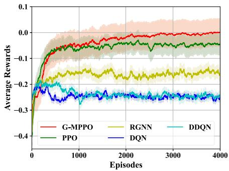  
(a) Number of UAVs: N=4.

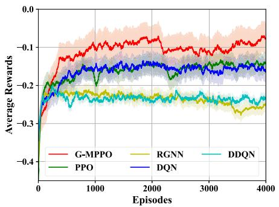  
Fig. 5. Convergence performance.  
(b) Number of UAVs: N=8.

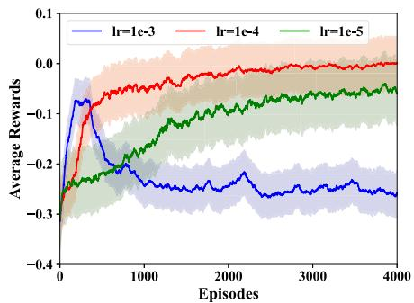  
(c) Learning Rate.

TABLE I  
SIMULATION PARAMETERS SETTING
<table><tr><td>Category</td><td>Parameters</td><td>Values</td></tr><tr><td rowspan="4">UAV [7], [26]</td><td>The UAVs coverage</td><td> $\overline { { 1 0 0 \times 1 0 0 ~ m ^ { 2 } } }$ </td></tr><tr><td>The altitude of UAVs</td><td>100 m</td></tr><tr><td>The computer power</td><td>[50, 100] MHz</td></tr><tr><td>The transmission power  $P _ { u }$ </td><td>[10, 20] dBm</td></tr><tr><td rowspan="4">Task [12], [16], [32]</td><td>The number of tasks  $K _ { j }$ </td><td>[1,4] [10, 20] s</td></tr><tr><td>The maximum time  $T _ { j } ^ { m a x }$ </td><td>[200,500]</td></tr><tr><td>The computing resource  $\varphi _ { j , k }$ </td><td>Megacycle</td></tr><tr><td>The input data size  $\varphi _ { j , k }$ </td><td>[500, 1000] Kb</td></tr><tr><td rowspan="6">U2U [26]</td><td>The bandwidth B</td><td> $\overline { { 1 8 0 \times 1 0 ^ { 3 } \mathrm { ~ H z } } }$ </td></tr><tr><td>The frequency  $f _ { c }$ </td><td> $2 . 9 \times 1 0 ^ { 9 } ~ \mathrm { H z }$ </td></tr><tr><td>The noise power  $\sigma ^ { 2 }$ </td><td> $\mathrm { - 1 7 0 ~ d B m / H z }$ </td></tr><tr><td>The path loss  $\eta _ { \mathrm { L o S } } , \eta _ { \mathrm { N L o S } }$ </td><td>1 dB, 20 dB</td></tr><tr><td>The probabilities of LoS/NLoS in</td><td></td></tr><tr><td>dense-urban&#x27; and &#x27;suburban&#x27;  $[ P r ^ { L o s } , P r ^ { N L o S } ]$ </td><td>[0.4, 0.6], [0.8, 0.2]</td></tr><tr><td rowspan="8">Agent [7], [9], [26], [32]</td><td>Seeds</td><td>{0, 42, 128}</td></tr><tr><td>Training Iterations</td><td>4000</td></tr><tr><td>Learning Rate</td><td>0.0001</td></tr><tr><td>Discount Factor</td><td>0.95</td></tr><tr><td>Hidden Layers</td><td>2</td></tr><tr><td>Number of Node for Hidden Layer</td><td>(64, 64)</td></tr><tr><td>Activation Function</td><td>ReLU</td></tr><tr><td></td><td></td></tr><tr><td rowspan="5"></td><td>Optimizer</td><td>Adam</td></tr><tr><td>Number of GAT Head</td><td>1</td></tr><tr><td>GAT Output Layer Dimensions</td><td>3</td></tr><tr><td></td><td></td></tr><tr><td>Dropout of GAT Network</td><td>0.5</td></tr></table>

\- DQN [9]: Input the environment state $\pmb { S } ^ { o }$ into a Deep Q-Network (DQN), directly generating task offloading action decisions through the Q-network.

\- DDQN [7]: Receive state $\pmb { S } ^ { o }$ and adopt the same neural network architecture as DQN, but incorporate a Double Q-Network mechanism to mitigate the overestimation bias inherent in Q-value estimations.

The traditional heuristic baselines are as follows:

\- Local offloading: All tasks are offloaded and executed on the local UAV.

\- Random offloading: Tasks are offloaded randomly to any UAV within the system for execution.

\- UCB-MAB [33]: A task offloading method using the Upper Confidence Bound Multi-armed Bandit (UCB-MAB) algorithm, where each UAV is treated as an arm and selected based on observed performance.

1) Convergence Performance: We first evaluate the convergence of the algorithm under various parameter settings. For clarity of presentation, all convergence curves are smoothed using exponential moving average (EMA) with $\alpha = 0 . 0 3$ , and the shaded regions indicate the standard deviation of the smoothed values. Fig. 5(a) and (b) illustrate the convergence behavior of the algorithms in scenarios with 4 and 8 UAVs, respectively. It can be observed that the our algorithm (G-MPPO) exhibits significantly superior convergence performance compared to the other algorithms, demonstrated by higher average reward values and more stable convergence trends. The PPO algorithm ranks second, clearly outperforming RGNN, DQN, and DDQN. Additionally, Fig. 5(c) investigates the impact of different learning rates on the convergence of the G-MPPO algorithm. Among the tested learning rates, a learning rate of $l r = 0 . 0 0 0 1$ achieves the best convergence performance, showing stable convergence and the highest average reward value. The experimental results in Fig. 6 indicate that the algorithm exhibits a stable convergence trend under different random seeds (0, 42, 128). Specifically, the average reward gradually increases and stabilizes as the number of training episodes progresses. Although slight variations are observed during the initial training phases across different seeds, the final convergence levels are very similar, and the standard deviation region remains narrow. This demonstrates that the proposed algorithm has strong stability and robustness in varying stochastic environments.

2) Comparison With RL-Based Methods: Fig. 7 evaluates the performance of various RL-based methods with 100 devices under different UAV counts, demonstrating that the G-MPPO algorithm consistently achieves significant performance across all scenarios. Specifically, Fig. 7(a) illustrates that the G-MPPO algorithm achieves significantly higher and more stable average reward values compared to other benchmark algorithms. In Fig. 7(b), the task execution time of G-MPPO consistently remains the lowest, highlighting its superior timeliness. Additionally, Fig. 7(c) demonstrates that G-MPPO consistently achieves a task success rate exceeding 90% in most cases, substantially outperforming other algorithms and demonstrating superior task completion capability and robustness. Furthermore, to comprehensively evaluate the overall performance, we introduce the Operational Efficiency Ratio (OER), defined as follow:

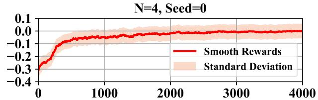

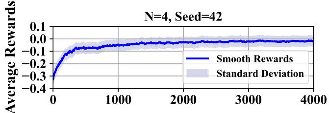

N=4, Seed=128  
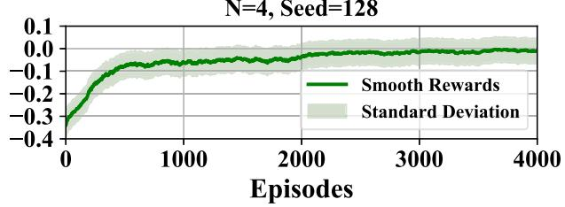  
Fig. 6. Convergence under different seeds.

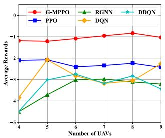  
(a) Average Rewards Evaluation.

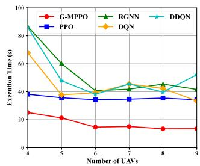  
(b) Execution Time Evaluation.

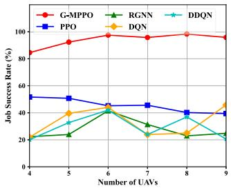  
(c) Success Rate Evaluation.

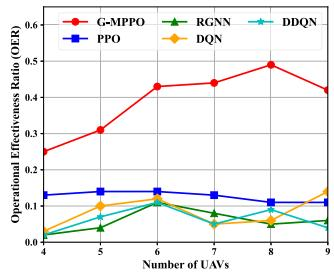  
(d) OER Evaluation.  
Fig. 7. Comparison with RL-based methods.

$$
O E R = \sum _ { t = 0 } ^ { T } \frac { r _ { t } ^ { s u c } } { | r _ { t } ^ { t i m e } | + | r _ { t } ^ { e n e } | + | r _ { t } ^ { l o a d } | } .\tag{44}
$$

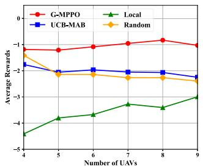  
(a) Average Rewards Evaluation.

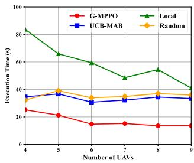  
(b) Execution Time Evaluation.

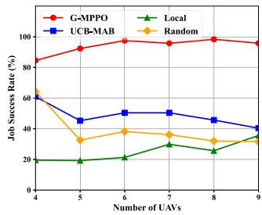  
(c) Success Rate Evaluation.

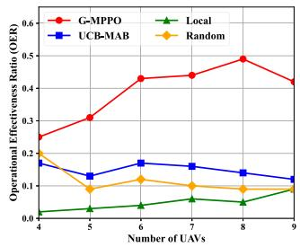  
Fig. 8. Comparison with traditional methods.  
(d) OER Evaluation.

As shown in Fig. 7(d), G-MPPO achieves the highest OER among all methods, highlighting its advantage in resource efficiency and task execution. It is also observed that G-MPPO performance improves with more UAVs but gradually levels off as limited connectivity causes some UAVs to become isolated in larger networks. Overall, G-MPPO maintains robust and efficient performance while exhibiting increasing returns in large-scale multi-UAV deployments.

3) Comparison With Heuristic Methods: Similarly, Fig. 8 compares the performance of the proposed G-MPPO algorithm with three conventional heuristic methods (UCB-MAB, Local, and Random) under varying numbers of UAVs with 100 devices, from four perspectives: average reward, execution time, task success rate, and OER. As shown in Fig. 8(a), G-MPPO consistently achieves the highest and most stable average rewards, indicating superior task offloading decisions. In contrast, the Local strategy performs the worst, reflecting its inability to leverage cooperative UAV resources. In Fig. 8(b), G-MPPO exhibits the lowest execution time, which further decreases as UAVs increase, demonstrating its scheduling efficiency. Meanwhile, the Local strategy shows the highest and most variable delays, underscoring its poor resource management. The success rate results in Fig. 8(c) show that G-MPPO maintains a high success rate above 90%, significantly outperforming the baselines. UCB-MAB and Random methods remain below 40%, with considerable instability as UAV numbers vary. Finally, Fig. 8(d) reveals that G-MPPO achieves the highest OER across all scenarios, with values increasing alongside UAV numbers, highlighting its advantage in optimizing both efficiency and task effectiveness. In summary, these results demonstrate that G-MPPO achieves superior performance across all evaluation metrics, validating its robustness, adaptability, and efficiency in multi-UAV task offloading scenarios.

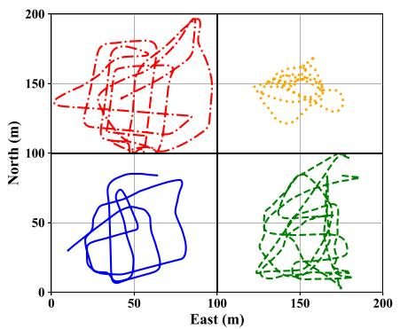  
(a) UAV Trajectory Dataset [30]

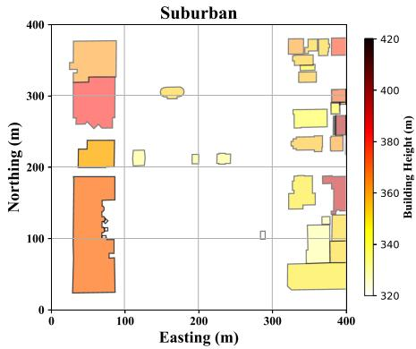  
(b) Building Dataset in Suburban [31].

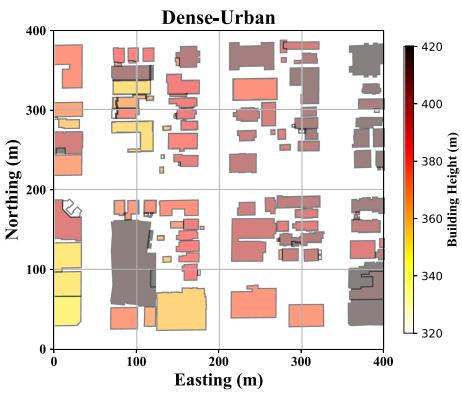  
(c) Building Dataset in Dense-urban [31]

Fig. 9. Dataset 2D visualization.  
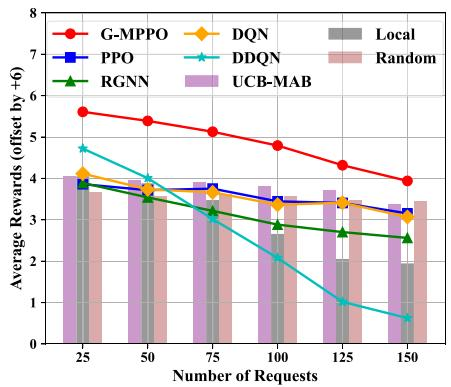  
(a) Average Reward Evaluation.

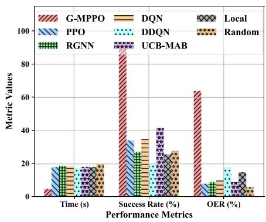  
(b) Small-Scale Case: 50 Requests.

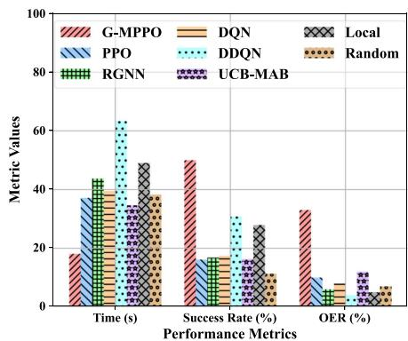  
(c) Large-Scale Case: 150 Requests.  
Fig. 10. Performance evaluation under suburban scenarios (N=9), corresponding to Fig. 9(b).

## C. Real-World Scenarios Analysis

1) Datasets: To more accurately simulate real-world application scenarios, we modeled and analyzed UAV flight trajectories and urban environments using two publicly available datasets. These datasets contain UAV trajectory data and building spatial distribution data, respectively, and are both representative and well-suited for experimental evaluation. As shown in Fig. 9(a), we selected four distinct UAV trajectory datasets provided by [30] and visualized them using different colors and line styles. This effectively illustrates the spatial distribution of each trajectory in a two-dimensional space. Fig. 9(b) and (c) present building datasets obtained from the City of Seattle ArcGIS online platform [31], representing two typical urban scenarios: Suburban and Dense Urban areas, respectively. The geographical distribution of buildings is depicted using polygons, with color gradients indicating building height, approximately spanning from 320 to 420 meters. This dataset offers high accuracy and diversity, enabling effective simulation of critical factors such as communication blockage and path loss across different urban densities. Consequently, it provides a solid foundation for research on UAV-assisted computation offloading in real-world environments. In summary, this dataset establishes an experimental foundation that integrates spatial trajectories with urban terrain, providing a realistic and comprehensive testing environment for evaluating our algorithm.

2) Suburban and Dense-Urban Scenarios: We evaluate the proposed algorithm using real UAV trajectory and building distribution datasets, as illustrated in Fig. 9, to verify its robustness across different scenarios. As shown in Figs. 10 and 11, G-MPPO consistently outperforms all baseline methods in both suburban and dense-urban scenarios. Specifically, the building distributions for the suburban and dense-urban scenarios correspond to Fig. 9(b) and (c), respectively. Figs. 11(a) and 10(a) present the average reward performance, where all reward values are offset by +6 to enable a clearer comparison between G-MPPO and the baseline methods. G-MPPO achieves the highest average reward, while DDQN and Local offloading exhibit the largest fluctuations. With the number of UAVs fixed at N = 9, the average reward generally decreases as the number of requests increases, mainly due to resource limitations that degrade system response quality. In the suburban scenario, we evaluate each algorithm under Small-Scale (50 requests) and Large-Scale (150 requests) cases. As shown in Fig. 10(b) and (c), G-MPPO achieves the highest success rate (approximately 90%)

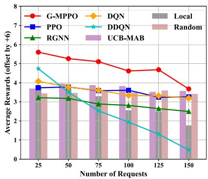  
(a) Average Reward Evaluation.

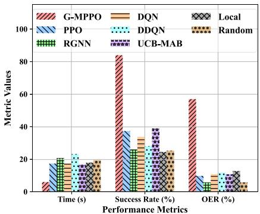  
(b) Small-Scale Case: 50 Requests.

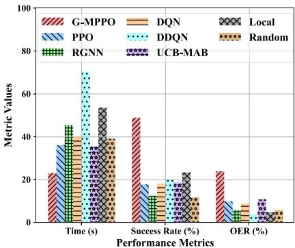  
(c) Large-Scale Case: 150 Requests.  
Fig. 11. Performance evaluation under dense-urban scenarios (N=9), corresponding to Fig. 9(c).

and maintains an execution time within 20 seconds under the Small-Scale case. Although the success rates of all algorithms decline as the number of requests increases to 150, G-MPPO still leads with a success rate close to 70% and the highest OER. In the dense-urban scenario, shown in Fig. 11(b) and (c), G-MPPO continues to outperform the baselines, achieving the highest success rates, lower execution times, and consistently superior OER values, highlighting its strong scalability, stability, and efficient resource utilization.

## VI. CONCLUSION

In this paper, we study the sequential task offloading problem in dynamic multi-UAV collaborative systems, where both the network topology and task characteristics vary over time. We propose a Graph-based Spatiotemporal Reinforcement Learning (GSTRL) framework, which models the system as a heterogeneous graph and extracts spatiotemporal features using a Heterogeneous Graph Neural Network (HGNN) and Long Short-Term Memory (LSTM) network. Based on these features, a masked Proximal Policy Optimization (mPPO) algorithm is designed to make offloading decisions. Extensive simulations validate the convergence and superior performance of the proposed method over various baselines. To further evaluate robustness, experiments are conducted on UAV trajectory and building distribution datasets, demonstrating consistent advantages in average reward, response delay, execution success rate, and operational efficiency ratio (OER). While this study focuses on sequential task models, the proposed GSTRL framework is readily extensible to DAG-structured tasks, and future work will explore this direction to strengthen its applicability to complex real-world scenarios.

## REFERENCES

[1] G. Sun et al., “Joint task offloading and resource allocation in aerialterrestrial UAV networks with edge and fog computing for post-disaster rescue,” IEEE Trans. Mobile Comput., vol. 23, no. 9, pp. 8582–8600, Sep. 2024.

[2] P. Chen, L. Luo, D. Guo, X. Luo, X. Li, and Y. Sun, “Secure task offloading for rural area surveillance based on UAV-UGV collaborations,” IEEE Trans. Veh. Technol, vol. 73, no. 1, pp. 923–937, Jan. 2024.

[3] T. Bao, A. Syed, W. S. Kennedy, and M. Erol-Kantarci, “Sustainable task offloading in secure UAV-assisted smart farm networks: A multi-agent DRL with action mask approach,” IEEE Trans. Netw. Service Manag., vol. 22, no. 4, pp. 3191–3200, Aug. 2025.

[4] D. Yang, J. Wang, F. Wu, L. Xiao, Y. Xu, and T. Zhang, “Energy efficient transmission strategy for mobile edge computing network in UAV-based patrol inspection system,” IEEE Trans. Mobile Comput., vol. 23, no. 5, pp. 5984–5998, May 2024.

[5] S. A. Huda and S. Moh, “Survey on computation offloading in UAVenabled mobile edge computing,” J. Netw. Comput. Appl., vol. 201, 2022, Art. no. 103341.

[6] A. M. Seid, J. Lu, H. N. Abishu, and T. A. Ayall, “Blockchain-enabled task offloading with energy harvesting in multi-UAV-assisted IoT networks: A multi-agent DRL approach,” IEEE J. Sel. Areas Commun., vol. 40, no. 12, pp. 3517–3532, Dec. 2022.

[7] Q. Luo, T. H. Luan, W. Shi, and P. Fan, “Deep reinforcement learning based computation offloading and trajectory planning for multi-UAV cooperative target search,” IEEE J. Sel. Areas Commun., vol. 41, no. 2, pp. 504–520, Feb. 2023.

[8] X. Qi, J. Chong, Q. Zhang, and Z. Yang, “Collaborative computation offloading in the multi-UAV fleeted mobile edge computing network via connected dominating set,” IEEE Trans. Veh. Technol, vol. 71, no. 10, pp. 10832–10848, Oct. 2022.

[9] H. Guo, X. Zhou, J. Wang, J. Liu, and A. Benslimane, “Intelligent task offloading and resource allocation in digital twin based aerial computing networks,” IEEE J. Sel. Areas Commun., vol. 41, no. 10, pp. 3095–3110, Oct. 2023.

[10] Z. Cao, X. Deng, S. Yue, P. Jiang, J. Ren, and J. Gui, “Dependent task offloading in edge computing using GNN and deep reinforcement learning,” IEEE Internet Things J., vol. 11, no. 12, pp. 21632–21646, Jun. 2024.

[11] X. Chen et al., “Information freshness-aware task offloading in air-ground integrated edge computing systems,” IEEE J. Sel. Areas Commun., vol. 40, no. 1, pp. 243–258, Jan. 2022.

[12] Z. Liao, Y. Ma, J. Huang, J. Wang, and J. Wang, “HOTSPOT: A UAVassisted dynamic mobility-aware offloading for mobile-edge computing in 3-D space,” IEEE Internet Things J., vol. 8, no. 13, pp. 10940–10952, Jul. 2021.

[13] B. Fan, L. Jiang, Y. Chen, Y. Zhang, and Y. Wu, “UAV assisted traffic offloading in air ground integrated networks with mixed user traffic,” IEEE Trans. Intell. Transp. Syst., vol. 23, no. 8, pp. 12601–12611, Aug. 2022.

[14] Y. Chen, K. Li, Y. Wu, J. Huang, and L. Zhao, “Energy efficient task offloading and resource allocation in air-ground integrated MEC systems: A distributed online approach,” IEEE Trans. Mobile Comput., vol. 23, no. 8, pp. 8129–8142, Aug. 2024.

[15] J. Liu, X. Zhao, P. Qin, S. Geng, and S. Meng, “Joint dynamic task offloading and resource scheduling for WPT enabled space-air-ground power Internet of Things,” IEEE Trans. Netw. Sci. Eng., vol. 9, no. 2, pp. 660–677, Mar./Apr. 2022.

[16] M. Teng, X. Li, and K. Zhu, “Joint optimization of sequential task offloading and service deployment in end-edge-cloud system for energy efficiency,” IEEE Trans. Sustain. Comput., vol. 9, no. 3, pp. 283–298, May/Jun. 2024.

[17] M. Teng et al., “Integrated resource allocation for sequential task offloading in edge computing,” IEEE Trans. Services Comput., vol. 18, no. 4, pp. 2115–2128, Jul./Aug. 2025.

[18] D. Wang, H. Zhu, C. Qiu, Y. Zhou, and J. Lu, “Distributed task offloading in cooperative mobile edge computing networks,” IEEE Trans. Veh. Technol, vol. 73, no. 7, pp. 10487–10501, Jul. 2024.

[19] S. Rong, W. Zhong, X. Huang, J. Kang, S. Xie, and C. Yuen, “Joint path selection, energy trading, and task offloading in electric vehicle charging and computing network,” IEEE Internet Things J., vol. 11, no. 10, pp. 17067–17081, May 2024.

[20] J. Xu, Y. Yao, X. Xu, W. Feng, and P. Li, “Joint optimization of task offloading and resource allocation of fog network by considering matching externalities and dynamics,” IEEE Trans. Mobile Comput., vol. 24, no. 4, pp. 2534–2550, Apr. 2025.

[21] X. Wei, X. Gao, K. Ye, C.-Z. Xu, and Y. Wang, “A quantum reinforcement learning approach for joint resource allocation and task offloading in mobile edge computing,” IEEE Trans. Mobile Comput., vol. 24, no. 4, pp. 2580–2593, Apr. 2025.

[22] F. Tang, H. Hofner, N. Kato, K. Kaneko, Y. Yamashita, and M. Hangai, “A deep reinforcement learning-based dynamic traffic offloading in spaceair-ground integrated networks (SAGIN),” IEEE J. Sel. Areas Commun., vol. 40, no. 1, pp. 276–289, Jan. 2022.

[23] J. Wang, J. Hu, G. Min, W. Zhan, A. Y. Zomaya, and N. Georgalas, “Dependent task offloading for edge computing based on deep reinforcement learning,” IEEE Trans. Comput., vol. 71, no. 10, pp. 2449–2461, Oct. 2022.

[24] L. Lamberti et al., “Distilling tiny and ultra-fast deep neural networks for autonomous navigation on nano-UAVs,” IEEE Internet Things J., vol. 11, no. 20, pp. 33269–33281, Oct. 2024.

[25] R. Ganian, T. Hamm, and G. Mescoff, “The complexity landscape of resource-constrained scheduling,” in Proc. 29th Int. Conf. Int. Joint Conf. Artif. Intell., 2021, pp. 1741–1747.

[26] X. Zhang, H. Zhao, J. Wei, C. Yan, J. Xiong, and X. Liu, “Cooperative trajectory design of multiple UAV base stations with heterogeneous graph neural networks,” IEEE Trans. Wireless Commun., vol. 22, no. 3, pp. 1495–1509, Mar. 2023.

[27] X. Wang et al., “Heterogeneous graph attention network,” in Proc. World Wide Web Conf., 2019, pp. 2022–2032.

[28] P. Veliˇckovi´c, G. Cucurull, A. Casanova, A. Romero, P. Lio, and Y. Bengio, “Graph attention networks,” 2017, arXiv: 1710.10903.

[29] X. Ren, X. Chen, L. Jiao, X. Dai, and Z. Dong, “Joint optimization of UAV trajectory planning, video cache placement and transcoding in UAVassisted 6G networks: A PPO-L based approach,” in Proc. 27th Int. Conf. Comput. Supported Cooperative Work Des., 2024, pp. 1310–1315.

[30] J. Li, J. Murray, D. Ismaili, K. Schindler, and C. Albl, “Reconstruction of 3D flight trajectories from ad-hoc camera networks,” in Proc. 2020 IEEE/RSJ Int. Conf. Intell. Robots Syst., 2020, pp. 1621–1628.

[31] City of Seattle ArcGIS Online, Building Outlines 2015. Feature Service, 2015. Updated on: Jan. 09, 2025. [Online]. Available: https://data-seattlecitygis.opendata.arcgis.com/search?q=Building% 20Outlines%202015

[32] W. Zhao, C. Wu, R. Zhong, K. Shi, and X. Xu, “Edge computing and caching optimization based on PPO for task offloading in RSU-assisted IOV,” in Proc. IEEE 9th World Forum Internet Things, 2023, pp. 01–06.

[33] L. Wang and J. Zhang, “Adaptive multi-armed bandit learning for task offloading in mobile edge computing,” in Proc. 2024 IEEE Int. Conf. Acoust. Speech Signal Process., 2024, pp. 5285–5289.

  
Meiyan Teng (Member, IEEE) received the BS degree from the Nanjing University of Information Science & Technology, in 2018, and the MS degree from the Nanjing University of Aeronautics and Astronautics (NUAA). She is currently working toward the PhD degree with the College of Computer Science and Technology, NUAA. Her research interests include edge computing and edge intelligence.

Xin Li (Member, IEEE) received the BS and PhD degrees from Nanjing University, in 2008 and 2014, respectively. Currently, he is an associate professor with the College of Computer Science and Technology, Nanjing University of Aeronautics and Astronautics. His research interests include distributed computing, cloud computing, and data management.

Xuyun Zhang (Member, IEEE) received the BS and ME degrees in computer science from Nanjing University, Nanjing, China, in 2008 and 2011, respectively, and the PhD degree from the University of Technology Sydney, NSW, Australia, in 2014. He worked as a postdoctoral fellow with the Machine Learning Research Group, NICTA (currently, Data61, CSIRO), Sydney, NSW, Australia. He is currently an associate professor with the Department of Computing, Macquarie University, Sydney. His primary research interests include Internet of Things and smart cities, Big Data, cloud computing, scalable machine learning and data mining, data privacy and security, and web service technology.

Jianqiu Xu (Member, IEEE) received the bachelor’s and master’s degrees from the Nanjing University of Aeronautics and Astronautics, in 2005 and 2008, respectively, and the PhD (magna cum laude) degree from FernUniversität, Hagen, Germany, in 2012, supervised by Prof. Dr. Ralf Hartmut Güting (retired in February, 2021). He mainly focused on moving objects with multiple transportation modes. He is a member of the ACM SIGSPATIAL (since 2014) and ACM (since 2019).

Kun Zhu (Member, IEEE) received the PhD degree from the School of Computer Engineering, Nanyang Technological University, Singapore, in 2012. He was a research fellow with the Wireless Communications Networks and Services Research Group, University of Manitoba, Canada, from 2012 to 2015. He is currently a professor with the College of Computer Science and Technology, Nanjing University of Aeronautics and Astronautics, China. He is also a Jiangsu specially appointed professor. His research interests include resource allocation in wireless networks, au-

tonomous driving networks, and edge intelligence. He has published more than eighty technical papers and has served as TPC for several conferences. He won several research awards including IEEE WCNC 2019 Best paper awards, ACM China rising star chapter award.