# Graph Attention Network-Driven Hierarchical Learning for Anti-Jamming UAV Communications

Xiao Tang , Member, IEEE, Kexin Zhao, Chao Shen , Senior Member, IEEE, Chenhao Lin , Member, IEEE, Shuai Liu , Member, IEEE, Bohui Wang, Senior Member, IEEE, Dusit Niyato , Fellow, IEEE, and Zhu Han , Fellow, IEEE

Abstract—Jamming attacks pose a significant threat to the security of air-ground communications, where the challenge becomes more severe when involving multiple unmanned aerial vehicles (UAVs) incurring complex interference. To address this issue, this paper proposes a graph attention-based reinforcement learning strategy for anti-jamming UAV communications. Specifically, we consider the multi-UAV transmission and deployment in the presence of jamming attacks. Then, we formulate a zerosum game with the legitimate side and adversary to maximize and minimize the overall transmission rate, respectively. Given the complicated structure of the game, we decompose it into two layers, tackled in a hierarchical learning framework. Particularly, the inner layer addresses the legitimate beamforming, for which we establish the graph attention network (GAT) to track the complicated interference and jamming relationship based on the graph representation of the UAV network. The outer layer

address the legitimate UAV deployment and adversarial jamming policy, which is reinterpreted in a multi-agent deep reinforcement learning framework to obtain the strategies of both sides. The inner GAT is then nested within the outer multi-agent learning framework in a hierarchical manner to approximate the equilibrium of the original game model. Simulation results demonstrate the convergence and the performance superiority of the proposed learning scheme in terms of anti-jamming transmission rate. Also, the results exhibit significant generalization capability to cover different network configurations and parameters with reliable communication performance.

Index Terms—UAV communications, anti-jamming communi cations graph attention network, deep reinforcement learning.

## I. INTRODUCTION

U NMANNED aerial vehicles (UAVs) are envisioned as a key enabler towards 6G ubiquitous coverage and seamless connections. The convenient deployment and flexible mobility of UAVs facilitate different applications in various scenarios, such as agricultural production, industrial automation, disaster relief, and so on [1]. Towards this vision, the information security accounts for the fundamental requirement for the efficient operation of UAVs [2]. However, due to the open and shared spectrum environment, the UAV communications are highly vulnerable to the unintentional interference and malicious jamming that widely exist in the networks. In this regard, the line-of-sight transmission, which is usually taken as an advantageous feature in UAV communications, makes the system more sensitive to jamming attacks [3]. Therefore, effective jamming mitigation is the fundamental requirement for not only the information security, but also prosperous application of UAV communications [4].

Conventionally, the jamming mitigation is implemented through advanced signal processing, agile power control, advanced filtering, or intelligent spectrum management [5]. Although these approaches can also be applied in UAV communications, the implementation usually requires high computation power or resource diversity, which is challenging for the capability- and resource-limited UAVs. Meanwhile, these approaches are initially designed for the (quasi-) static communication scenarios, which may struggle to adapt to the rapidly changing conditions and complex environmental characteristics of UAV communications [6]. In this regard, the UAV dynamics provide a new dimension to achieve the antijamming transmissions, as the flexible mobility enables spatial diversity for security enhancement [7]. The UAV deployment optimization leads to more favorable topology for communications while downgrading or even avoiding jamming signals. Consequently, the joint design of anti-jamming transmission strategy with UAV deployment not only helps alleviate the resource requirement in the network, but also enables more effective jamming mitigation for UAV networks [8].

However, effective anti-jamming transmission design can be rather challenging, due to the complex interference pattern and mutual interactions between the conflicting adversaries, let alone the varying topology due to UAV location updates [9]. For this issue, the learning-based approaches become increasingly attractive due to their offline training with online inference capability, which is capable to accommodate the consistently changing UAV communication scenarios and provide effective transmission strategies [10]. To achieve this goal, besides the data-driven characterization of the inherent pattern of the physical scenario, the neural network design needs to be empowered with generalization capability for cross-scenario applications. In this respect, the graph neural network (GNN) emerges as a fascinating choice. The GNN is established on a graph reinterpretation of the communication network, which provides a stable basis regardless of the changing topology with UAVs [11]. Moreover, the mutual interactions among different entities in the UAV networks can be well represented through the graph elements, where the relative weights or importance can be conveniently adapted through the message-passing process in GNNs [12]. Therefore, we can expect the efficient, adaptive, and scalable antijamming strategy through GNN-based design to safeguard the communications.

Furthermore, when jointly considering the UAV deployment with anti-jamming transmissions, the problem becomes highly intricate due to the complex relationship within the locationdependent fading model and communication performance [10]. In this respect, the deep reinforcement learning can be adopted to allow an agent to constantly interact with the environment for deployment updates. As such, the agent learns the policy through interactions, which is highly desirable in the dynamic, complex, and constantly changing UAV scenarios [13]. More importantly, the deep reinforcement learning with multiple agents allows independent decision makings, which is well suited for the anti-jamming communications with adversarial opponents [14]. Consequently, we can leverage the deep reinforcement learning for jamming-aware deployment refinement in UAV communications, and employ GNN to adapt to different topology for anti-jamming transmissions. The integration of different learning techniques is expected to achieve effective optimization of multi-fold factors to fully exploit the potential of UAV communications.

Motivated by the facts above, in this paper, we consider the multi-pair UAV communications in the presence of jamming attacks. To achieve efficient jamming mitigation, we propose a hierarchical learning framework to address the anti-jamming beamforming and deployment optimization for the UAVs. The main contributions are summarized as follows:

• We consider a network that comprises multiple UAV communication pairs, along with multiple jammers, where the legitimate and adversary sides compete to maximize and minimize the sum transmission rate, respectively. We characterize the multi-party decision making process as a zero-sum game, where the legitimate side aims to joint design of UAV deployment and beamforming, and the adversary optimizes the jamming policy.

• We decompose the formulated problem into two layers in a hierarchical framework, where the inner layer addresses the single-sided beamforming for the UAVs, and outer layer tackles the reduced game model to determine the UAV deployment and jamming strategy for the legitimate side and the adversary, respectively.

• For the inner-layer subproblem, we introduce the graph representation of the anti-jamming communication network, and develop a graph attention network (GAT) to determine the beamforming. The system interference and jamming conditions are represented and adapted through message passing, where attention mechanism is employed to achieve effective aggregation of the messages.

• The outer-layer game is reinterpreted within a multi-agent deep reinforcement learning framework, for which the inner GAT-based beamforming is exploited to help evaluate the reward function for the learning agents. Through the interaction with the environment and interplaying between the agents, we propose the deep deterministic policy gradient (DDPG)-based approach to enable the agents to approximate their optimal policies.

The rest of this paper is organized as follows. Sec. II reviews the related work. Sec. III introduces the system model and formulates the problem of the anti-jamming UAV communications. Sec. IV reinterprets the inner-layer as a GAT model and propose the learning-based beamforming. Sec. V tackles the outer-layer game through multi-agent learning with DDPGbased algorithm design. Sec. VI evaluates the performance of the proposed approach with numerical results, and finally Sec. VII concludes this paper.

## II. RELATED WORK

## A. UAV Anti-Jamming Communications

Since jamming attacks widely exist and significantly degrade the communication performance, anti-jamming strategies have long been attracting the research interest. The majority of existing efforts either resort to resource diversity to avoid the jamming attacks, or exploit advanced processing approaches to mitigate or cancel the jamming signals [15], [16]. In [17], the authors exploit multi-channel diversity to cancel jamming attacks by exploiting the preamble sequence of the legitimate UAV communication links. In [18], the authors investigate the UAV-assisted positioning against jamming, where multiple UAVs are utilized for time-difference-of-arrival measurement so as to cooperatively mitigate jamming signals and improve the positioning accuracy. In [19], the authors deploy the reconfigurable intelligent surface to assist the UAVbased sensorial data collection under jamming attacks, the reflection-enabled jamming mitigation is achieved to improve the information freshness of the collected data.

Although the classical ideas to exploit resource or computation diversity effectively combat jamming attacks, they are relatively resource-demanding and may not always fit the UAV communications. In this respect, we may actively exploit the flexible mobility of UAVs for additional degree of freedom against malicious jamming. In [20], the authors construct the radio maps incorporating the path loss and jamming information, which is then used to guide the UAVs to determine the anti-jamming flying paths. In [21], the authors consider the mobility of both UAV and jammer, and establish the interactive reward region characterization problem, for which the trajectory and transmit power of the competitive sides are explored. In [22], the UAV-enabled relaying communication is considered in the presence of jamming, the UAV trajectory and transmission strategies are jointly optimized to maximize the end-to-end throughput. In [23], the authors address the UAV-assisted computation offloading with an aerial jamming attacker, for which a joint optimization of computation offloading, user association, multi-UAV trajectory control is tackled to achieve efficient edge computation. In [24], the authors employ reconfigurable intelligent surface to combat simultaneous jamming and eavesdropping attacks for UAV communications, and the attack-aware transmission, reflection, and trajectory optimization is achieved to safeguard the legitimate communications.

## B. Learning-Based Anti-Jamming Communications

Besides the anti-jamming communication design from conventional optimization perspectives, increasing research efforts have been devoted to the learning-based approaches, mainly attracted by the offline training and online inference feature to facilitate efficient anti-jamming strategy determination. In [25], the authors propose to adopt the Transformer-based learning to predict the jamming behavior, along with random channel selection to combat the jamming attacks for UAV communications. In [26], the authors investigate the jamming detection issue in UAV communications, and a hidden Markov model-based method is proposed without relying on prior knowledge of legitimate users or channel. In [27], the authors consider the communications among multiple UAVs with jammers, where the anti-jamming communication game is tackled through deep Q-learning. In [28], the authors address the anti-jamming UAV communications with knowledge-based learning, where domain knowledge is exploited to compress the state representations to achieve efficient learning. In [29], the authors present a reconfigurable intelligent surface-assisted jamming suppression so as to augment the radio environment for UAV-based data delivery. In [30], the authors investigate jamming-resilient UAV path planning strategies for data collection, where the mission deadline, kinematic constraints, and jamming mitigation are collectively learned within a dueling double deep Q-network. In [31], the authors address the hover point selection and resource management under jamming attacks for UAV edge system, and maximize computing efficiency through deep reinforcement learning-based algorithm. In [32], the authors consider the anti-jamming UAV communications with joint channel and power allocation, and then a collaborative multi-agent learning is proposed based on the potential game interpretation to mitigate jamming attacks.

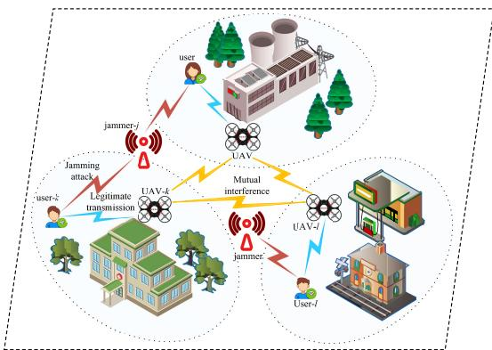  
Fig. 1. Anti-jamming UAV communications.

Accordingly, we can see that the most of the existing learning-based anti-jamming designs for UAV communications adopt the deep reinforcement learning approach. Despite their effectiveness, the reinforcement learning models may suffer from large state and action spaces with complex environment when the UAV network becomes large and dynamic, which further motivates the development of more efficient representation method and learning designs to combat the jamming attacks.

Table I summarizes several representative studies from the surveyed literature, highlighting their main contributions, advantages, and limitations in contrast to our work.

## III. SYSTEM MODEL AND PROBLEM FORMULATION

## A. System Model

We consider an area with multiple UAVs conducting airground communications in the presence of multiple malicious jammers, as shown in Fig. 1. In the area, denoted by Q, there are K UAVs as aerial base stations serving their corresponding receivers, for which we denote the legitimate pairs as $\kappa =$ $\{ 1 , 2 , \ldots , K \}$ . The UAVs are equipped with N antennas while the each user has one antenna, where they conduct concurrent downlink transmissions in the shared spectrum. Meanwhile, the jammers set is denoted by $\mathcal { I } ~ = ~ \{ 1 , 2 , \dotsc , J \}$ , where each jammer is with one antenna emitting jamming signals to disrupt the legitimate communications.

In the considered system, the UAVs have the capability of flexible deployment and 3D coordinates of UAV-k are denoted by $[ w _ { k } ^ { \mathrm { ( x ) } } , w _ { k } ^ { \mathrm { ( y ) } } , H ]$ , where the UAVs are assumed of the same altitude of H, and we define $\pmb { w } _ { k } = [ w _ { k } ^ { ( \mathrm { x } ) } , w _ { k } ^ { ( \mathrm { y } ) } ]$ for notation simplicity. Then, the channel gain between UAV-k and legitimate user-l is denoted by $h _ { k , l } ( \pmb { w } _ { k } ) \in \mathbb { C } ^ { N }$ , as a function of location of UAV-k. Meanwhile, the channel between jammer-j to legitimate user-k is given as $g _ { j , k } \in \mathbb { C } .$ . Suppose the transmit beamformer at UAV-k is $\scriptstyle f _ { k }$ , subject to the power constraint $\| \pmb { f } _ { k } \| \le P _ { k }$ with $P _ { k }$ being the maximum transmit power. Also, jammer-jattacks with a power ofpjsubject $\mathrm { t o } p _ { j } \le P _ { j }$ and a collective power constrain $\begin{array} { r } { \sum _ { j \in \mathcal { I } } p _ { j } \stackrel { \cdot } { \leq } P _ { \operatorname* { m a x } } , } \end{array}$ where $P _ { j }$ and $P _ { \mathrm { m a x } }$ are the individual and overall jamming power threshold, respectively. Then, the received signal at the legitimate user-kis

TABLE I  
CONCISE COMPARISON OF RELATED STUDIES ON UAV ANTI-JAMMING COMMUNICATIONS
<table><tr><td>Paper</td><td>Considered problem</td><td>Pros</td><td>Potential cons</td></tr><tr><td>Wang et al. [21], TWC&#x27;23</td><td>UAV jammer with power &amp; mobility control, Optimization-based design.</td><td>Strong theoretical insight, closed-form power solution, captures trajectory-power coupling.</td><td>Relies on modeled environment.</td></tr><tr><td>Wu et al., [22], TVT&#x27;21</td><td>UAV relay under, joint trajectory &amp; power control via optimization.</td><td>Alternating optimization with convergence, throughput gains, with short flight time.</td><td>No multi-UAV interfer- ence.</td></tr><tr><td>Nguyen et al., [23], TWC&#x27;25</td><td>Edge computing with jamming, multi-factor optimization.</td><td>System-level breadth, provides low-complexity heuristics alongside optimization design.</td><td>Heavy joint optimization.</td></tr><tr><td>Shang et al., [24], TITS’24</td><td>RIS-assisted secrecy with jammer, Optimization-based design.</td><td>RIS environment configuration for high secrecy gain.</td><td>Additional complexity due to RIS.</td></tr><tr><td>Elleuch et al., [25], OJ-COM&#x27;24</td><td>Predictive anti-jamming for UAV, Transformer-based learning.</td><td>Proactive defense, improved success/prediction rates under heavy jamming.</td><td>Data-dependence, single- link solution.</td></tr><tr><td>Li et al., [28], IoT-J&#x27;21</td><td>Multiple maneuvering smart jammers, deep reinforcement learning.</td><td>Sample-efficient, knowledge-based deep reinforcement learning with physics priors.</td><td>Engineered priors, no beamforming.</td></tr><tr><td>Hu et al., [29], IoT-J&#x27;23</td><td>RIS jamming rejection with path planning, reinforcement learning.</td><td>Avoids channel estimation burden, improved learning design.</td><td>Single UAV, needs RIS deployment.</td></tr><tr><td>Liu et al., [31], TCOM&#x27;24</td><td>UAV edge with intelligent jammer, deep reinforcement learning.</td><td>Explicit intelligent-jammer modeling, achieving reward/throughput gains.</td><td>All-in-one learning framework.</td></tr><tr><td>Yin et al., [32], IoT-J’22</td><td>Collaborative channel/power design, multi-agent reinforcement learning.</td><td>Potential game-based pure-strategy equilibrium, reduced overhead.</td><td>Discrete actions, no beamforming.</td></tr><tr><td>This work</td><td>Multi-UAV anti-jamming, beamform- ing and deployment, explicit conflict modeling</td><td>Hierarchical learning incorporating graph learning and reinforcement learning, cross- scenario generalization and equilibrium-seeking.</td><td>Two-stage training, approximated equilibrium.</td></tr></table>

$$
y _ { k } = \pmb { h } _ { k , k } ^ { \mathsf { H } } \pmb { f } _ { k } s _ { k } + \sum _ { l \in K \backslash \{ k \} } h _ { l , k } ^ { \mathsf { H } } \pmb { f } _ { l } s _ { l } + \sum _ { j \in \mathcal { I } } g _ { j , k } \sqrt { p _ { j } } s _ { j } + n _ { k } ,\tag{1}
$$

where $s _ { k }$ is the transmitted signal of UAV-k with ${ \mathbb E } \{ | s _ { k } | ^ { 2 } \} = 1$ , and $s _ { j }$ is the attacking signal from jammer- $j$ with $\mathbb { E } \{ | s _ { j } | ^ { 2 } \} = 1 , n _ { k }$ denotes the background noise which is assumed of identical power at all users as $\sigma _ { 0 } ^ { 2 } .$ . Here, we omit the UAV deployment as the argument of UAV-related channel gains for notation simplicity.

Based on the transmitted signal model, the communication signal-to-interference-plus-noise ratio (SINR) at user-k is obtained as

$$
\gamma _ { k } = \frac { \lvert { h } _ { k , k } ^ { \sf H } { \bf f } _ { k } \rvert ^ { 2 } } { \displaystyle \sum _ { l \in \mathcal { K } \backslash \{ k \} } \lvert { h } _ { l , k } ^ { \sf H } { \bf f } _ { l } \rvert ^ { 2 } + \sum _ { j \in \mathcal { I } } p _ { j } \lvert g _ { j , k } \rvert ^ { 2 } + \sigma _ { 0 } ^ { 2 } } .\tag{2}
$$

Accordingly, the achievable rate for user-k is

$$
R _ { k } = \log \left( 1 + \gamma _ { k } \right) ,\tag{3}
$$

where we assume unit bandwidth without loss of generality. Here, we can see that the communication SINR and achievable rate are a function of transmission beamforming, UAV location, as well as jamming policy. Then, the system sum rate is expressed as

$$
R = \sum _ { k \in \mathcal { K } } R _ { k } .\tag{4}
$$

## B. Problem Formulation and Decomposition

As we consider an adversarial network environment, the legitimate side naturally intends to maximize the system rate, while the adversaries attempt to downgrade or even interrupt

the communications, where the UAVs may adjust their transmit beamformer and aerial deployment while the jammers adapt the jamming power, specified as

$$
\operatorname* { m a x } _ { \{ f _ { k } , { w _ { k } } \} _ { k \in \kappa } } R\tag{5a}
$$

$$
\mathrm { s . t . } \ \lVert \pmb { f } _ { k } \rVert ^ { 2 } \leq P _ { k } , \quad \forall k \in \mathcal { K } ,
$$

$$
{ \pmb w } _ { k } \in \mathcal { Q } , \quad \forall k \in \mathcal { K } ,\tag{5b}
$$

(5c)

and

$$
\operatorname* { m i n } _ { \{ p _ { j } \} _ { j \in \mathcal { I } } } R\tag{6a}
$$

$$
\mathrm { s . t . } ~ p _ { j } \leq P _ { j } , \quad \forall j \in \mathcal { I } ,\tag{6b}
$$

$$
\sum _ { j \in \mathcal { I } } p _ { j } \leq P _ { \operatorname* { m a x } } ,\tag{6c}
$$

for the legitimate and adversary sides, respectively.

Given the conflicting goals of the adversaries, the networked problem can be formulated as a zero-sum game, specified as

$$
\mathcal { G } = \left\{ \left\{ \mathcal { K } , \mathcal { I } \right\} , \left\{ \left\{ \mathcal { F } \times \mathcal { Q } ^ { K } \right\} , \mathcal { P } \right\} , \left\{ R , - R \right\} \right\} ,\tag{7}
$$

where the game players include the legitimate-side UAVs and jammers, and

$$
\mathcal { F } = \prod _ { k \in \mathcal { K } } \{ \pmb { f } _ { k } | \Vert \pmb { f } _ { k } | \} \le P _ { k } \} ,\tag{8}
$$

specifies the feasible region for beamforming, which acts together with the area for deployment to constitute the strategy space of the legitimate side. Also, denote the jamming power vector as $\pmb { p } = [ p _ { j } ] _ { j \in \mathcal { I } }$ , the jammer-side feasible region is given as

$$
\mathcal { P } = \left\{ p \Bigg | 0 \leq p _ { j } \leq P _ { j } , \forall j \in \mathcal { I } , \sum _ { j \in \mathcal { I } } p _ { j } \leq P _ { \operatorname* { m a x } } \right\} .\tag{9}
$$

Finally, the system sum rate is employed as the utility function of the legitimate side, and adversary takes the opposite, and therefore leads to the zero-sum non-cooperative game.

For the formulated game, the solution is characterized by the equilibrium where either the legitimate side or the adversary side would unilaterally deviate if the other remains at the equilibrium strategy. However, for the considered problem, the equilibrium strategy consists of the transmission beamformer, aerial deployment, and jamming, which is a highly complex problem in terms of strategy space structure and the functional relationship with the utility, as well as the interplaying in the game model. In this respect, the conventional approaches such as alternating optimization would be rather challenging, as it is difficult to directly fit the conflicting structure, and the multi-scale and multi-factor joint optimization would potentially suffer numerical instability for convergence.

Considering the multi-fold difficulties in analyzing and deriving the equilibrium of the formulated game in conventional manners, we adopt the multi-agent learning approach where the game players learns to approximate their optimal strategies by the interacting with the environment and their opponents. However, if we reinterpret the game in conventional manners with learning model directly, the complicated structure of strategy space can significantly impede the efficient learning processes. Accordingly, we decompose the problem-solving in a hierarchical learning framework. Since the legitimate side decision incorporates the transmission beamforming and the UAV deployment, which corresponds the small-scale and large-scale contributing factors, respectively, we separate them into different layers. Particularly, the legitimate transmission beamforming is tackled as the inner-layer subproblem, on the condition of given deployment and jamming strategy. Meanwhile, the UAV deployment and jamming attacks at both sides constitute the outer-layer subproblem, where the adversarial relationship preserves in the form of game. In this aspect, the inner-layer beamforming is now a single-sided problem with the objective to maximize the transmission rate, which can be conveniently tackled. Also, the outer-layer game are now with simplified strategy space and decision makings, facilitating the multi-agent learning towards the equilibrium.

## IV. GRAPH ATTENTION LEARNING FOR BEAMFORMING

We first consider the inner-layer transmission beamforming under fixed deployment and jamming strategy. For the resultant single-sided multi-user beamforming optimization, the researchers have proposed effective approach to approximate the solution. However, the optimization-based methods are hardly computationally efficient, and also lack the ability to adapt to new scenarios. This cannot meet the requirement of efficient inner problem-solving because the outer-layer learning needs to constantly call the inner beamforming solution as a reference to support outer strategy updates. In this regard, we resort to learning-based solution at the inner layer, which features offline training and online inference with prompt strategy determination.

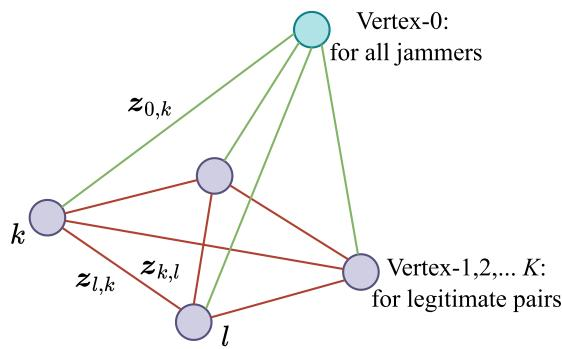  
Fig. 2. Graph representation of the anti-jamming UAV network.

## A. Graph Representation

With given UAV deployment and jamming strategy, the legitimate transmission beamforming is formulated as

$$
\operatorname* { m a x } _ { \{ f _ { k } \} _ { k \in \mathcal K } } R\tag{10a}
$$

$$
\mathrm { s . t . } \ \lVert \pmb { f } _ { k } \rVert ^ { 2 } \leq P _ { k } , \quad \forall k \in \mathcal { K } ,\tag{10b}
$$

as a reduced version of (5). As noted, the multi-user beamforming in (10) can be solved by existing optimization-based approach. Yet the presence of mutual interference among the legitimate users and jamming attacks hinder the efficient computation. Hence, we resort to GAT-based learning to facilitate efficient beamforming design.

To facilitate the GAT-based design, we first reinterpret the network as a graph. Specifically, for the graph model, each legitimate transmission pair is represented as a vertex, and the jammers are collectively modeled as one single vertex. Therefore, there are $K + 1$ vertices in the graph structure, as shown in Fig. 2. Meanwhile, there are edges established among the vertices of legitimate users which correspond to the mutual interference links. Moreover, there are edges connecting the jammer vertex and legitimate-side vertices, corresponding to the jamming links. Thus, we have established a graph representation of the communication network, which is a heterogeneous graph with different types of vertices.

## B. GAT With Message Passing

To construct a GAT model based on the heterogeneous graph, features need to be defined for the elements of graph. Specifically, for the vertices of legitimate users, the feature is defined as the legitimate channel condition, given by

$$
z _ { k } ^ { ( 0 ) } = \left[ \Re \mathfrak { e } \left\{ h _ { k , k } ^ { \mathsf { H } } \right\} , \Im \mathfrak { m } \left\{ h _ { k , k } ^ { \mathsf { H } } \right\} \right] ^ { \mathsf { H } } , \quad \forall k \in \mathcal { K } ,\tag{11}
$$

where the superscript-0 indicates the initial input of the GAT, and real and imaginary parts are separated to facilitate realvalued operations. For the vertex for jammers, the feature is defined as the jamming policy given by the outer layer as

$$
z _ { 0 } ^ { ( 0 ) } = \left[ \left[ p _ { j } \right] _ { j \in \mathcal { I } } ^ { \mathsf { T } } , \mathbf { 0 } _ { 2 N - J } ^ { \mathsf { T } } \right] ^ { \mathsf { T } } ,\tag{12}
$$

where the subscript 0 indicates the collective jammers, and the feature is with additional zero padding such that it has the same dimension of features in (11) to facilitate neural network

calculations. Meanwhile, for the edges between the legitimate users, the feature is defined as the link condition as

$$
\begin{array} { r } { \boldsymbol { z } _ { l , k } ^ { ( 0 ) } = \left[ \Re \boldsymbol { \mathfrak { e } } \left\{ \boldsymbol { h } _ { l , k } ^ { \mathsf { H } } \right\} , \Im \mathfrak { m } \left\{ \boldsymbol { h } _ { l , k } ^ { \mathsf { H } } \right\} \right] ^ { \mathsf { H } } , \quad \forall l , k \in \mathcal { K } , } \end{array}\tag{13}
$$

where there are two directional edges between two legitimate vertices due to the mutual interference. Similarly, for the edges from the jammer vertex to the legitimate vertices, the feature is defined as

$$
{ z } _ { 0 , k } ^ { ( 0 ) } = \left[ \mathfrak { R e } \left\{ \left[ g _ { j , k } \right] _ { j \in \mathcal { I } } ^ { \mathsf { H } } \right\} , \mathfrak { I m } \left\{ \left[ g _ { j , k } \right] _ { j \in \mathcal { I } } ^ { \mathsf { H } } \right\} \right] ^ { \mathsf { H } } , : : \forall k \in \mathcal { K } ,\tag{14}
$$

where, similarly to (12), the subscript 0 denotes the jammers.

The features introduced before to the graph elements are adopted as the initial input of the GAT. To allow the information flow within the established graph model, the message passing mechanism is established in the GAT. Specifically, the GAT incorporates D layers, where for the d-th layer, the input is the generated messages at the vertices in the form of

$$
\begin{array} { r } { \pmb { m } _ { k } ^ { \left( d \right) } = \Phi _ { \mathrm { g e n } , k } ^ { \left( d \right) } \left( \pmb { z } _ { k } ^ { \left( d - 1 \right) } \right) , \quad \forall k \in \mathcal { K } \cup \{ 0 \} , } \end{array}\tag{15}
$$

where $m _ { k } ^ { ( d ) }$ denotes the generated message through the operation $\Phi _ { \mathrm { g e n } , k } ^ { ( d ) }$ , implemented as a fully-connected layer.

Then, the generated messages are passed among the vertices through aggregation and combination operations. Particularly, considering the mutual interference and malicious jamming in the network that degrade the legitimate transmissions, we introduce the attention mechanism to enable more effective message aggregation. Through attention coefficient calculation, we may implicitly incorporate the importance of neighbors in message aggregation and thus enable interference-aware beamforming. Specifically, the attention score is computed with joint consideration of features of the source node, target nodes, and edge from source to the target, in the form of

$$
e _ { l , k } ^ { ( d ) } = \Phi _ { \mathrm { a t t } } ^ { ( d ) } \left( z _ { l } ^ { ( d - 1 ) } \left\| z _ { k } ^ { ( d - 1 ) } \right\| z _ { l , k } ^ { ( d - 1 ) } \right) , : : \forall l , k \in K \cup \{ 0 \} ,\tag{16}
$$

in the d-th layer, where · k· denotes concatenation operation, and $\Phi _ { \mathrm { a t t } } ^ { ( d ) }$ is a multilayer perceptron (MLP) for edge score calculation. The attention score is normalized using softmax over all neighbors to obtain the attention coefficient as

$$
\alpha _ { l , k } ^ { ( d ) } = \frac { \exp { \left( e _ { l , k } ^ { ( d ) } \right) } } { \displaystyle \sum _ { l ^ { \prime } \in { \mathcal { K } } \cup \{ 0 \} } \exp { \left( e _ { l ^ { \prime } , k } ^ { ( d ) } \right) } } , \quad \forall l , k \in { \mathcal { K } } \cup \{ 0 \} ,\tag{17}
$$

in the d-th layer. Then, the message aggregated at a vertex is conducted by exploiting the attention coefficient as

$$
\boldsymbol { c } _ { k } ^ { ( d ) } = \mathsf { L e a k y R e L U } \left( \sum _ { l \in \mathcal { K } \cup \{ 0 \} \setminus \{ k \} } \alpha _ { l , k } ^ { ( d ) } \boldsymbol { m } _ { l } ^ { ( d ) } \right) , \quad \forall k \in \mathcal { K } ,\tag{18}
$$

where LeakyReLU is the activation function used for aggregation. Technically, a specified neighbor set needs to be settled for each vertex, in our considered model, the vertices are mutually connected with edges and thus the neighbor is defined as all the rest vertices. Finally, the message update is conducted as

$$
\begin{array} { r } { z _ { k } ^ { ( d ) } = \Phi _ { \mathrm { u p d } } ^ { ( d ) } ( z _ { k } ^ { ( d - 1 ) } | | c _ { k } ^ { ( d ) }  ) , \quad \forall k \in \mathcal { K } , } \end{array}\tag{19}
$$

by combining the message aggregated from the neighbors with its own message, through a MLP-based update function, denoted by $\Phi _ { \mathrm { u p d } } ^ { ( d ) }$ . Here, the message aggregation and update are conducted for the vertices of legitimate users, while the message for the jammer vertex and edges remains unchanged such that the jamming state and channel condition in the physical network can be preserved to continually shape the legitimate beamforming.

In the formulated GAT model, the graph features are updated with D rounds through the D GAT layers. In this regard, the inherent interference and jamming pattern of the communication network can be accurately characterized and represented in the updated features, which can be then used to generate the beamformers. Specifically, for the final output, it is mapped through normalization operations to fit the power constraint as

$$
\pmb { f } _ { k } = \sqrt { P _ { k } } \cdot \frac { \pmb { z } _ { k } ^ { ( D ) } [ 1 : N ] + \jmath \pmb { z } _ { k } ^ { ( D ) } [ N + 1 : 2 N ] } { \left\| \pmb { z } _ { k } ^ { ( D ) } \right\| } , : : \forall k \in \mathcal { K } ,\tag{20}
$$

where $\boldsymbol { z } _ { k } ^ { ( D ) }$ is the last-layer feature whose first and last N dimensions are used to construct the real and imaginary parts of the legitimate beamforming vector, respectively, with  being the imaginary unit. The overall message-passing graph learning process is shown in Fig. 3.

## C. Loss Function and Training

As the mapping of inner-layer beamforming optimization, the GAT constructed takes the network channel condition and jamming strategy as input to produce the legitimate beamforming vectors. Then, we need to train the GAT such that it can adapt to different network scenarios to effectively output high-quality beamforming solutions. The GAT-based mapping is denoted by $\Psi \left( H , p ; \Theta \right)$ , where H and p are the vectors of channel state and jamming strategy, respectively, and Θ is the collective neural network parameters. Then, In consistence with the objective to maximize the transmission rate in (10a), the loss function is defined based on achieved transmission rate as

$$
\mathsf { L } \left( \boldsymbol { \Theta } \right) = \mathbb { E } _ { H \sim \mathcal { H } , p \sim \mathcal { P } } R \left( \Psi \left( H , p ; \boldsymbol { \Theta } \right) ; H , p \right) ,\tag{21}
$$

where $\mathcal { H }$ and $\mathcal { P }$ are, respectively, the conforming distributions of channel condition fitting the considered scenario and jamming policy while satisfying the constraint in (9). The GAT is trained while considering all possible channel and jamming conditions with expectation operations.

To facilitate the loss function calculation concerning the complex-valued channel and beamforming vectors, whereas the GAT operations are conducted in the real domain, we define

$$
\begin{array} { r } { \boldsymbol { \Upsilon } _ { l , k } = \left[ \Re \boldsymbol { \mathfrak { e } } ( h _ { l , k } ^ { \mathsf { H } } ) \ - \Im \boldsymbol { \mathfrak { m } } ( h _ { l , k } ^ { \mathsf { H } } ) \right] \left[ \Re \boldsymbol { \mathfrak { e } } ( f _ { l } ) \right] , } \\ { \Im \mathfrak { m } ( h _ { l , k } ^ { \mathsf { H } } ) \ \mathfrak { R e } ( h _ { l , k } ^ { \mathsf { H } } ) } \end{array}\tag{22}
$$

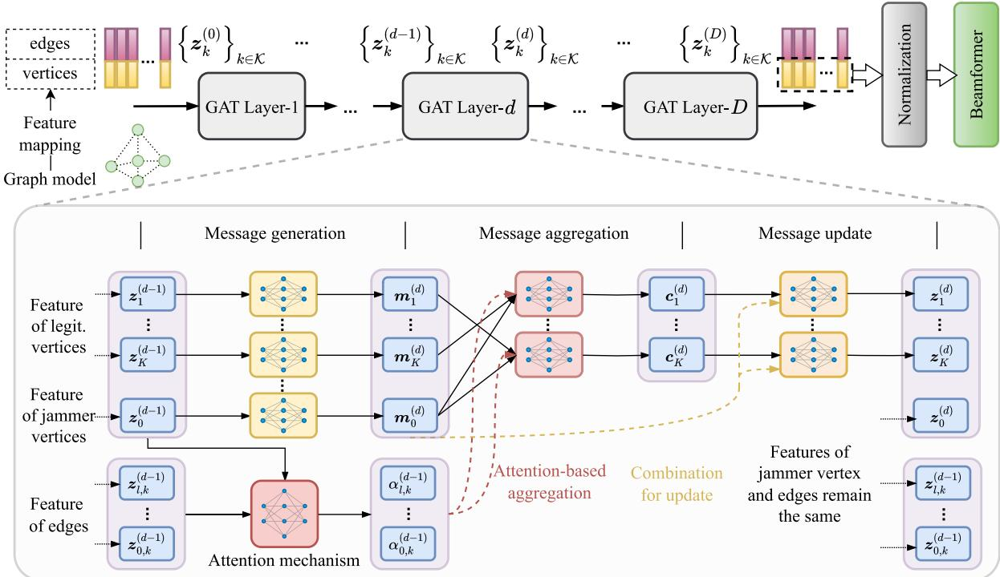  
Fig. 3. GAT architecture for legitimate beamforming.

which allows the reorganization of SINR in (2) as

$$
\gamma _ { k } = \frac { \left. \mathbf { Y } _ { k , k } \right. ^ { 2 } } { \displaystyle \sum _ { l \in K \backslash \{ k \} } \left. \mathbf { Y } _ { l , k } \right. ^ { 2 } + \sum _ { j \in \mathcal { I } } p _ { j } \vert g _ { j , k } \vert ^ { 2 } + \sigma _ { 0 } ^ { 2 } } ,\tag{23}
$$

and thus enables the real-valued loss function calculation. As the operations in (22) and (23) avoid complex-valued operations, they also facilitate the gradient calculation to train the network parameters.

The GAT model is trained in an unsupervised manner that for each instance of communication network scenario, i.e., the channel condition (due to UAV location) and jamming strategy obtained from the upper-layer subproblem, a graph is constructed with features embedded for the graph elements. Then, the message passing procedures are conducted in the GAT layers to update the features of vertices, until the last layer outputs the beamforming vectors with normalizations. The obtained the beamformer are used to calculate the loss function and further update the GAT parameters. Here, we adopt stochastic gradient approach for neural network training, and the GAT structure allows batch operations and thus the training can be conducted rather efficiently. Also, since the GAT is expected provide the beamforming results used in the outer-layer problem solving, the GAT needs to be trained over diversified network scenarios to provide high-quality solutions to be used in the outer-layer problem.

For the proposed GAT-based approach, the scalability is one of the key advantages which stems from the permutation equivariance property of the graph neural network. In this regard, the model parameters depend on the graph structure rather than the exact number of network nodes. This allows the model trained on a specific network setting to be transferred to the cases with different configurations. Such scalability not only enables efficient training of GAT as the inner solution, but also facilitates the outer-layer training where the inner GAT inference is employed.

Note that although the in considered model there is one user associated with one UAV, the model can be extended to the cases when each UAV serves more than one user. In this regards, the graph structure remains the same, while the features associated with the vertices and edges may have varied dimensions. Then, we can align the dimensions by properly designing the message generation function, which then facilitates the attention-based message passing, and train the neural network with transmission rate-based loss function. The obtained beamformer in the inner layer is similarly transferred to the outer layer for the operations therein.

## V. MULTI-AGENT LEARNING FOR DEPLOYMENT AND JAMMING

As the legitimate transmit beamforming is determined through inner GAT, the outer layer is expected to solve the UAV deployment and jamming policy. In consistence with the game formulation in (7) to track the conflicting goals between the adversaries, with the inner-layer provided beamforming, the game in the outer layer is reduced as

$$
\mathcal { G } ^ { \prime } = \left\{ \left\{ \mathcal { K } , \mathcal { I } \right\} , \left\{ \mathcal { Q } ^ { K } , \mathcal { P } \right\} , \left\{ R , - R \right\} \right\} ,\tag{24}
$$

where the utility function can be specified as $R \left( \pmb { w } , \pmb { p } ; \Psi \left( \pmb { H } \left( \pmb { w } \right) , \pmb { p } \right) \right)$ ), with $\begin{array} { r c l } { \pmb { w } } & { = } & { \big [ \pmb { w } _ { k } \big ] _ { k \in \mathcal { K } } } \end{array}$ collecting all the UAV locations. As we can see, the utility functions at both sides depend on the UAV deployment and jamming policy, with GAT-based beamforming implicitly incorporated to facilitate the calculation. Accordingly, the outer layer is expect to solve reduced game model for the equilibrium. However, given the complicated relationship between the utility and strategies, and the interplaying between the two sides, the equilibrium is rather difficult to be derived in conventional manners. Consequently, we resort to multiagent deep reinforcement learning to solve the problem as elaborated below.

## A. Multi-Agent Learning Framework

To solve the outer-layer adversarial game introduced above, we adopt a multi-agent deep reinforcement learning framework based on deterministic policy gradient methods. Here, we consider the legitimate side and adversary side each as an agent, and thus there are two agents in the learning model. Though it is also feasible to consider each legitimate user and jammer as an independent agent, the two-agent model is in consistence with the utility shared by the nodes of each side. Then, the agent in each side learns their own policy to maximize its own utility function.

To facilitate the learning framework, we first recast the generic zero-sum game in (24) as a Markov game. Specifically, we consider a series of time instance as $\mathcal { T } = \{ 1 , 2 , \dots , t , \dots \}$ allowing the agents to learn to update their policies. Then, the Markov model incorporates the following components.

State space S: The state is characterized by the collective channel conditions in the network, the UAV locations, and the jamming strategies, denoted as

$$
\begin{array} { r } { \pmb { s } ( t ) = \left\{ \{ h _ { l , k } \} _ { l , k \in \mathcal { K } } , \{ g _ { j , k } \} _ { j \in \mathcal { I } , k \in \mathcal { K } } , \pmb { w } , \pmb { p } , \pmb { w } _ { 0 } \right\} , } \end{array}\tag{25}
$$

where the state variables are also with argument-t which is omitted for clarity, and we include an additional vector $\pmb { w } _ { 0 }$ specifying the locations of ground nodes to allow the agent to learn the spatial node distribution in the topology and improve the deployment strategy.

Action space $A _ { 1 } , A _ { 2 } \colon$ For the two agents considered, they are associated with subscript 1 and 2, respectively, for the legitimate side and adversary side. For the legitimate-side agent, the action is defined as the deployment update of the UAVs, specified as

$$
\begin{array} { r } { \pmb { a } _ { 1 } ( t ) = [ \Delta \pmb { w } _ { k } ] _ { k \in \mathcal { K } } , } \end{array}\tag{26}
$$

where $\Delta { \pmb w } _ { k } \ = \ \left\lceil \Delta { \pmb w } _ { k } ^ { ( \mathrm { x } ) } , \Delta { \pmb w } _ { k } ^ { ( \mathrm { y } ) } \right\rceil \ \in \ [ - \delta _ { W } , \delta _ { W } ] ^ { 2 }$ with $\delta _ { W }$ being the maximum movement in each horizontal direction. If the updated location of UAV is outside the considered area, it is remapped to the nearest boundary. Meanwhile, for the jamming-side agent, the action is defined as the jamming vector update, specified as

$$
\begin{array} { r } { \mathbf { \boldsymbol { a } } _ { 2 } ( t ) = \left[ \Delta p _ { j } \right] _ { j \in \mathcal { I } } , } \end{array}\tag{27}
$$

where $\begin{array} { r l r } { \Delta p _ { j } } & { { } \in } & { [ - \delta _ { P } , \delta _ { P } ] } \end{array}$ with $\delta _ { P }$ being the maximum power update, followed by the clipping min $\left\{ \operatorname* { m a x } \left\{ 0 , p _ { j } + \Delta p _ { j } \right\} , P _ { j } \right\}$ to guarantee the individual power constraint. Also, the operation

$$
p + \Delta p \gets \frac { P \left( p + \Delta p \right) } { \sum _ { j \in \mathcal { I } } p _ { j } + \Delta p _ { j } } , : : \mathrm { i f } : \sum _ { j \in \mathcal { I } } p _ { j } + \Delta p _ { j } \geq P ,\tag{28}
$$

is conducted to guarantee the sum jamming power constraint.

Reward function R: In accordance with the game in (24) exploits the transmission rate-based utility functions, the instantaneous reward at the legitimate agent and adversary agent are defined as the transmission rate and its negative, respectively. Here, to calculate the instantaneous reward function, the current network conditions induced from state and action from the outer layer are fed into the inner-layer GAT, where the GAT outputs the legitimate beamforming vector such that the transmission rate can be obtained. In this regard, the transmission rate can be written as $R ( s , a _ { 1 } , a _ { 2 } )$ , which is then transferred to the agents to learn their policy, denoted by $\pi ~ = ~ \left[ \pi _ { 1 } , \pi _ { 2 } \right]$ , to maximize and minimize the expected cumulative reward function as

$$
\mathsf { R } ( \pi ) = \mathbb { E } _ { \pmb { \pi } } \left[ \sum _ { { t } \in \mathcal { T } } \eta ^ { t } R ( s , { \pmb { a } } _ { 1 } , { \pmb { a } } _ { 2 } ) \right] ,\tag{29}
$$

at the legitimate agent and adversary agent, respectively, where $\eta \in [ 0 , 1 ]$ is the discount factor.

## B. MADDPG-Based Algorithm

As we reinterpret the outer-layer game in (24) as a multiagent learning framework, we then introduce the multi-agent DDPG (MADDPG) algorithm that allows the agents to learn to approximate the equilibrium. MADDPG can be particularly suited to multi-agent systems with competitive or cooperative dynamics. Each agent learns a deterministic policy with centralized training, and the inference can be conducted in a decentralized manner to facilitate practical implementation.

Generally, for a DDPG process, the agent maintains an actor network, denoted by $\mu _ { i } ,$ , a critic network, denoted by $Q _ { i } ,$ , and their corresponding target networks, denoted by $\mu _ { i } ^ { \prime }$ and $Q _ { i } ^ { \prime } .$ respectively. The actor network is given $\mu _ { i } : S  A _ { i } , i = 1 , 2 .$ which maps current state to a deterministic action given as $a _ { i } , i = 1 , 2$ . The critic network, specified as $Q _ { i } ( s , \pmb { a } _ { 1 } , \pmb { a } _ { 2 } ) , i =$ 1, 2, estimates the action-value function based on current state and action taken by the agents. The target networks are the counterparts with delayed updates for more stable learning.

The procedure for the agents to learn their policy is conducted in the following manner. First, the agents need to collect some experiences by interacting with the environment and opponent to fill the replay buffer. For current state $s ,$ the agents select an action according to their actor networks with an additional noise as

$$
\pmb { a } _ { i } = \mu _ { i } ( \pmb { s } ) + \pmb { n } _ { i } , \quad i = 1 , 2 ,\tag{30}
$$

where the noise allows further exploration to more possibilities. The action taken needs to satisfy their individual constraints, i.e., the deployment within the area and the jamming power not exceeding the thresholds. The actions taken are then applied to the environment and the state, including the UAV deployment, jamming power, and channel conditions, is updated. Then, the updated scenario conditions are fed into the inner GAT to produce the legitimate beamforming, which is further used to calculate the transmission rate, and transferred to the agents to obtained their instantaneous reward as $r _ { 1 } = R$ and $r _ { 2 } = - R$ . As such, we obtain a transaction tuple denoted as $( \pmb { s } ( t ) , \{ \pmb { a } ( t ) _ { i } \} _ { i = 1 , 2 } , R ( t ) , - R ( t ) , \pmb { s } ( t + 1 ) )$ , which is stored in the replay buffer for the further strategy update at the agents.

For each training step, a mini-batch of transition tuple is sampled from the replay buffer, denoted as B. The agents then update their critic networks by minimizing the loss function as

$$
\mathsf { L } _ { i } ^ { Q } = \mathbb { E } _ { B } \left\{ \left( Q _ { i } ( s , a _ { 1 } , \pmb { a } _ { 2 } ) - y _ { i } \right) ^ { 2 } \right\} , \quad i = 1 , 2 ,\tag{31}
$$

where $y _ { i } , i = 1 , 2$ is obtained from the target networks as

$$
y _ { i } = r _ { i } + \eta Q _ { i } ^ { \prime } \left( s ^ { \prime } , \mu _ { 1 } ^ { \prime } \left( s ^ { \prime } \right) , \mu _ { 2 } ^ { \prime } \left( s ^ { \prime } \right) \right) , \quad i = 1 , 2 .\tag{32}
$$

For the actor networks, the network parameters are updated via policy gradient as

$$
\begin{array} { r } { \nabla \mathsf { R } _ { i } = \mathbb { E } _ { \boldsymbol { \mathcal { B } } } \left[ \nabla _ { a _ { i } } Q _ { i } ( s , a _ { 1 } , a _ { 2 } ) \big | _ { a _ { i } = \mu _ { i } ( s ) } \nabla \mu _ { i } ( s ) \right] , \quad i = 1 , 2 . } \end{array}\tag{33}
$$

where the gradient against the reward function and policy mapping are taken over the actor network parameters. Here the two agents update their critic and actor network alternatively, where one agent hold current action when the other conducts updates. To stabilize the training process, the soft update approach is applied with sufficiently low update coefficients.

For the MADDPG training process noted above, we can see that the inner-layer GAT is invoked as a pre-trained neural network to provide the legitimate beamforming to facilitate the reward calculation. Therefore, for the overall problem solving, we need to separately train the inner GAT beforehand, which is then exploited to support the outer-layer multi-agent deep reinforcement learning training. Accordingly, the GAT training needs to traverse different UAV deployments and jamming strategies such that the output legitimate beamforming can remain high-quality during the outer-layer learning process. In this respect, the scalability of GAT helps maintain reliable performance for potential unseen environment.

When the outer-layer multi-agent learning model is sufficiently trained, the inference is conducted in the following manner. Given current network topology and condition, the legitimate side and adversary side exploit the trained network to update their deployment and jamming power, respectively, where the trained GAT is also adopted to evaluate the performance. As both inner- and outer-layer neural networks are trained, the inference can be conducted in a prompt manner, enabling low-latency and decentralized decision-making at the agents to obtain the UAV deployment and transmission strategy, as well as the jamming power allocation policy.

As can be expected, the learned strategy through the MAD-DPG framework is promising to approximate the equilibrium of the formulated zero-sum anti-jamming game between the legitimate and adversary sides. The equilibrium indicates that, the legitimate agent arrives at a deployment state that maximizes the communication rate against the strongest jamming policy it encountered during training, and the malicious agent learns to minimize the rate for the best response of the legitimate side. Meanwhile, the inner GAT also effectively approaches a locally optimal beamforming under current outerlayer settled condition. While the solution may not strictly represent a theoretical equilibrium due to the function approximation through neural networks, it exhibits the required properties of the equilibrium, i.e., neither player is likely to unilaterally deviate at the convergence.

Given the complex coupling and non-convexity, along with the conflicting nature of the considered problem, the rigorous convergence proof of the proposed learning approach is rather challenging. A few high-level remarks on the convergence and stability are presented as follows. Regarding the innerlayer GAT to solve the beamforming, supervised learning is conducted to minimize a well-defined loss function. This is a common learning task, where the training can be rather stably conducted over a wide spectrum of input conditions. For the outer layer, its establishment over the well-structured inner pre-trained GAT along with the centralized critics effectively contribute to the stability of learning process.

The complexity of the proposed hierarchical learning approach is analyzed as follows. For the inner GAT is established over a graph with $K + 1$ vertices with $K ^ { 2 }$ directed edges, with F -dim hidden feature, the per-layer complexity is $\mathcal { O } ( K ^ { 2 } F ^ { 2 } )$ Given the D GAT layers, $L _ { G }$ total batches with a batch size $B _ { G }$ , the GAT training has a complexity of $\mathcal { O } ( L _ { G } B _ { G } D K ^ { 2 } F ^ { 2 } )$ , with an inference complexity of $\mathcal { O } ( D K ^ { 2 } \dot { F } ^ { 2 } )$ . For the outer-layer, each step includes the GAT-based inference, reward calculation, and the actor/critic updates. The reward calculation is based on the SINR and thus is of a complexity of $\mathcal { O } ( K ^ { 2 } N + J K )$ . Assume the actor/critic is a $L _ { R }$ MLP with $M _ { R }$ hidden units, the complexity is $\mathcal { O } ( B _ { R } L _ { R } M _ { R } ^ { 2 } )$ with $B _ { R }$ batches. Consider a $E _ { R }$ episodes training with $T _ { R }$ steps in each episode, the training complexity is $\mathcal { O } ( \bar { E } _ { R } T _ { R } B _ { R } ( D \bar { K } ^ { 2 } F ^ { 2 } + \bar { K } ^ { 2 } \bar { N } + J K + L _ { R } \bar { M _ { R } ^ { 2 } } ) )$ , and the inference complexity is $\mathcal { O } ( D K ^ { 2 } F ^ { 2 } + K ^ { 2 } N + J \bar { K } + L _ { R } M _ { R } ^ { 2 } )$

For the implementation of the proposed hierarchical learning framework, the channel state information in the network is required as a prerequisite. The obtained channel information are then mapped into the input features fed in the graph to facilitate the learning process, which accounts as an additional overhead in our proposed design. As a further note, although we in this work assume perfect channel state information to design the hierarchical learning approach, this framework can be conveniently extended to the case with imperfect information. In such cases, the input feature of inner GAT would be adapted to the adversary signal locally measured, and the outer MADDPG would handle the partial observations by maintaining a belief to assist the decision making. Additionally, the commonly adopted centralized training with decentralized execution paradigm can be employed to train the model at the central controller to facilitate the practical implementation.

## VI. SIMULATION RESULTS

In this section, we show the simulation results of the proposed learning-based anti-jamming UAV communications. We consider a 400 m×400 m area, where the UAVs as aerial base stations are horizontally randomly located with a height of 100 m. The intended legitimate user of each UAV is randomly placed with an average horizontal distance of 30 m. The location of jammers are also randomly determined.

There are 4 legitimate pairs and 2 jammers, and the UAVs are equipped with 8 antennas. The maximum transmit power of UAV is 1 W, and the background noise power is $1 . 2 \times 1 0 ^ { - 1 3 }$ W. The wireless links are of Rician model, where the large-scale attenuation follows model of $3 0 + 2 2 \log ( d )$ in dB based on the distance between the transmitter and receiver denoted by $d ,$ and the Rician coefficient is set as 10 dB.

For the neural networks, the inner layer incorporates 3 GAT layers, where each layer is established over a graph convolutional network with attention mechanism. The inner neural network is trained over 300 episodes with a learning rate of 0.005 by using 50 000 training samples, for which the training experiences different settings of UAV deployments and jamming strategies to improve the generalization capability. For the outer-layer multi-agent deep reinforcement learning, the action of deployment is defined as the movement of unit length over each horizontal directions for the UAV, and action of jamming power is defined with a unit adjustment of 0.01 W. The model is trained over 3 000 episodes, where the learning rate for the actor and critic networks is 0.00001, the soft update is conducted with a coefficient of 0.9 and the discount factor for reward function is 0.9.

For inner-layer beamforming, we consider the baselines of successive convex approximation (SCA)-based approach, and the general MLP-based learning, and also the graph convolutional network (GCN)-based learning without attention mechanism. For the GAT implementation, the internal MLPs used for message processing have hidden layers of 256 units, producing a final output feature dimension of 16. The MLP baseline consists of three hidden layers with [256, 128, 64] neurons, ensuring a comparable number of trainable parameters to our GAT model. Meanwhile, for the UAV deployment strategy, we also conduct multi-agent double deep Q-network (DDQN), with explicitly discrete deployment and power level migration to find the deployment. Additionally, we also use the genetic algorithm as a heuristic-manner baseline to determine the UAV locations, where the fitness of each generated deployment solution is calculated using the inner-layer GAT to determine the resulting sum-rate.

In Fig. 4, we show the convergence of inner GAT learning process, with fixed out-layer deployment and jamming strategies, where we show the training process of MLP and use the case of optimization as a reference. Here we show a few training trials for the learning schemes with different initializations. For both learning techniques, the convergence can be achieved rather quickly, implying that both techniques can efficiently learn the beamforming in the presence of jamming attacks. Also indicated by different learning trials, the learning convergence is verified rather stable. Compared with the cases with MLP, the GAT-based learning achieves higher transmission rate (lower loss), implying improved learning capability of GAT for beamforming. This is because that the GAT builds upon the graph interpretation of the network, with more effective representation of the network structure to track the mutual interference among the UAVs. For the same reason, the neural network architecture of GAT is generally more complicated as compared with that of MLP, which leads to more evident fluctuations in the GAT learning process.

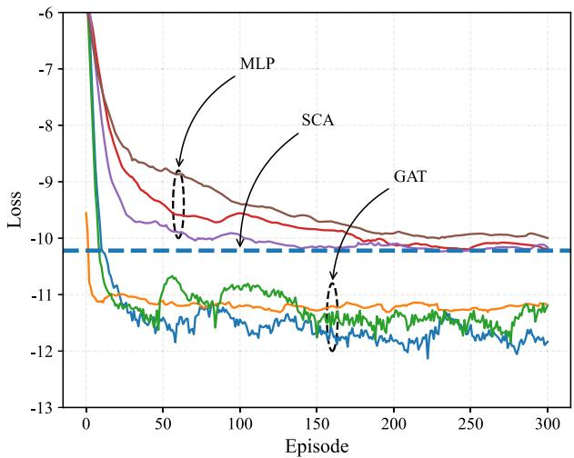  
Fig. 4. Convergence of GAT.

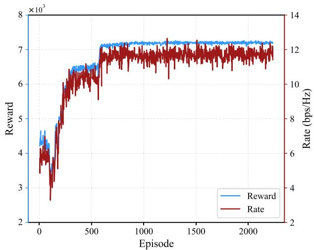  
Fig. 5. Convergence of multi-agent learning.

In Fig. 5, we show the convergence of the multi-agent deep reinforcement learning process at the outer layer, where the trained GAT is exploited as the inner-layer beamforming provider to help evaluate the reward function. As the reward defined for the legitimate side and jamming side are the opposite, we show the reward of the former for illustration. As shown in Fig. 5, the achieved reward along with the transmission rate gradually increases along with the training process, and the convergence is achieved in a relatively efficient manner. Although the two agents in the outer-layer learning have conflicting goals (different from the more commonly seen case that the rewards of different agents are aligned), the convergence can still be obtained rather stably. Also, the gradually improved reward function of the legitimate side implies that the deployment optimization is rather effective in combating jamming attacks. Furthermore, the achieved transmission rate follows the same trend of reward function, indicating that the joint deployment and transmission strategy updates in the two-layer architecture protects the legitimate transmissions, despite the fluctuations due to the adversarial attacks.

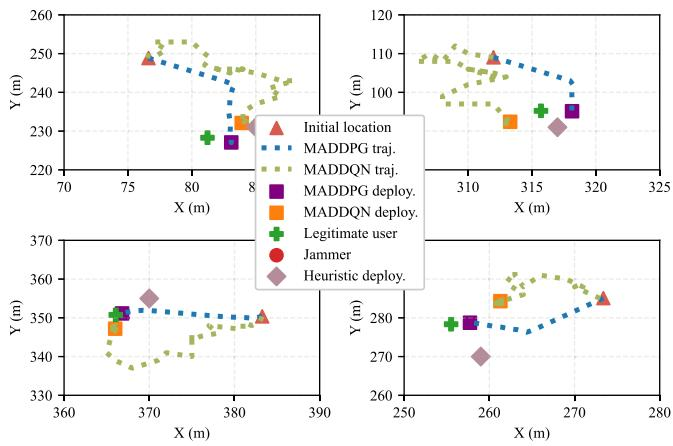  
Fig. 6. Anti-jamming deployment updates in the learning process.

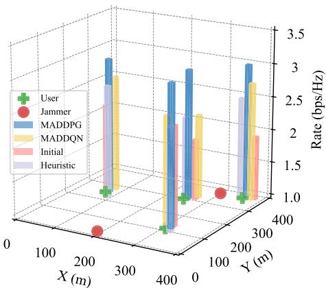  
Fig. 7. Achieved transmission rate under different deployment strategies.

Along with the convergence of the multi-agent learning process, we show the deployment updates of the UAVs in Fig. 6, where we show the results of each UAV in its local area for clearer illustration. The UAVs as the aerial base stations to serve the ground users, move gradually to approach the intended user for improved link quality. While in this process, the learning agent evaluates the mutual interference in the network and the jamming attacks, and guides the UAVs such that they can be relatively separated and move away from the jammers. This is partially verified by the results through heuristic approach, although the exact deployment results are different, the final UAV locations are near their respective users by different approaches. Also, we can see that, in consistence with the nature of DDPG-based learning, the trajectory from the initial deployment to the final deployment is relatively deterministic and without much fluctuations. In contrast, for the multi-agent DDQN-based policy, we can see that the final deployments are quite close. However, the learned trajectory from the initial point to the final location sees a bit more fluctuation, which is partially contributed due to the discrete action under DDQN method.

For the performance comparison, we show the achieved transmission rate of each UAV under different approaches in Fig. 7. Evidently, from the initial location to the learned deployment, the transmission rate is significantly improved, verifying the effectiveness of the proposed method. Also, compared with the DDQN-based method and heuristic deployment, although the UAV locations are relatively close by different approaches, the gap between the achieved transmission rate is still quite noticeable. This indicates the importance of deployment in UAV communications, which affects the largescale link quality and thus deserves delicate treatment. As a further note, the results in Figs. 6 and 7 can be interpreted in an ablation perspective. It reveals the effectiveness of the actorcritic learning component that updates the UAV deployment in a smoother way, and improve the anti-jamming performance through optimized UAV deployment.

The anti-jamming communication performance is further evaluated in Fig. 8 under different network configurations. Thanks to the scalability of GAT, we train the neural network at the default simulation settings, and generalize the inference to new communication scenarios with efficient fine-tune. In contrast, the trained MLP baseline may scale to different transmit power settings but fails to directly cover other changing parameters and thus requires re-training. The case of optimization requires from-scratch computation whatever the parameter changes. In Fig. 8(a), we show the performance with respect to the number of legitimate pairs. As expected, the transmission rate increases with larger number of users. Despite the mutual interference becomes more severe, more users can better exploit the spatial diversity in the area and thus alleviate the averaged jamming attacks. For the considered schemes, the proposed GAT-based method outperforms all the baselines. Specifically, the GCN without attention mechanism is dominated by the proposed method in terms of of anti-jamming performance, suggesting that the attention mechanism is critical in challenging wireless scenarios with complex interference and jamming. Meanwhile, SCA-based optimization also struggle to tackle the intricate and dynamic wireless environment and thus difficult to locate the optimal solution. For MLP-based design, it is a general neural network architecture and is difficult to be trained to well fit the considered anti-jamming communication scenario, and thus the limited representation hinders effective strategy output. In contrast, for the proposed GAT-based design, the graph interpretation tracks the structure of the physical network, and embedded attention mechanism adapts to the interference and jamming attacks in the network and thus is effective to approximate the optimal solution.

Moreover, we demonstrate the performance with respect to the number of jammers in Fig. 8(b), where the achieved transmission rate is downgraded when encountered more jammers. Also, the cases with varying transmit power of the UAVs are shown in Fig. 8(c), as higher power leads to increased transmission rate. For the performance comparison among different schemes, similar results can be observed that the proposed scheme dominates the baselines, and the reasons can be similarly explained. Interpreted as an ablation study by the results in Fig. 8, the comparison among different learning approach emphasize the critical role of graph representation and attention mechanism in our proposal, which tracks the structure of the physical network and adapts to the interference and jamming attacks, respectively, and thus enables more effective anti-jamming solutions. Moreover, from the results in Fig. 8, we can see that the proposed learning approach can well adapt to different network configurations to provide robust communication performance to combat the jamming attacks.

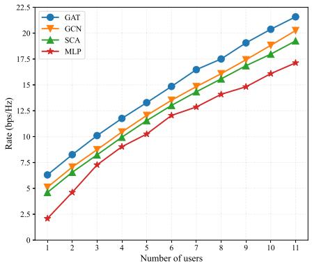

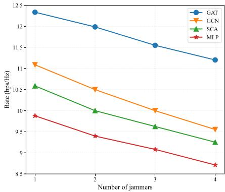

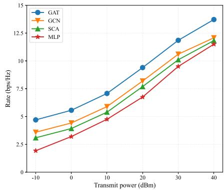  
(a) Performance with respect to number of users. (b) Performance with respect to number of jam- (c) Performance with respect to transmit power. mers.

Fig. 8. Performance under different network scenarios. (GAT is trained at default setting and generalized to other network configurations with fine tune.)  
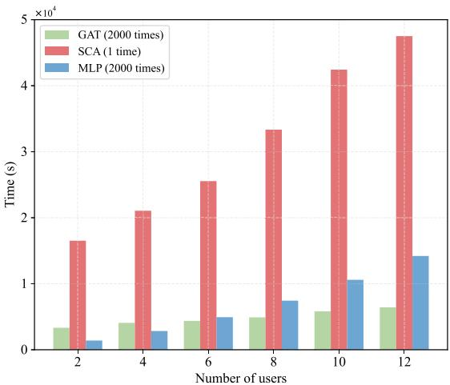  
Fig. 9. Runtime evaluation of different approaches.

As a note on the complexity of the baseline (c.f. the complexity analysis before of our proposal), the MLP-based approach generally has a complexity of $\mathcal { O } ( L _ { M } Q ^ { 2 } )$ , with $L _ { M }$ being the depth with $Q$ neurons in each layer. The SCA-based optimization has a complexity $\mathcal { O } ( L _ { S } ( K N ) ^ { 3 . 5 } )$ , with $L _ { S }$ being the times of iterations. Besides these asymptotic analysis, we conduct the empirical studies for different schemes. The results are given in Fig. 9, where the performance of GCN is omitted due to its close performance to that of GAT. Particularly, we collectively consider the 2 000 times inference from the trained neural networks. The results are rather straightforward, as we can see that optimization-based method requires much longer time to calculate in large and complex UAV networks. For the MLP-based learning, the scale of neural network needs to fit the number of users and thus the required inference time, which depends on the neural network size, is largely proportional to the number of users. In contrast, for GATbased design, the permutation equivariance properties allow it to be applied to new scenario with slight adjustments, and thus the inference time remains relatively stable.

## VII. CONCLUSION

This paper considers the air-ground communications with multiple UAVs in the presence of jamming attacks. The zero-sum game formulation of the anti-jamming UAV communication is then tackled as a layered graph reinforcement learning model, where the inner-layer GAT is exploited for legitimate beamforming, and the outer-layer multi-agent reinforcement learning is employed for UAV deployment and jamming strategy determination. Results verified the convergence of the proposed hierarchical learning method to approximate the equilibrium of the anti-jamming game. Also, it reveals that the proposed method effective tracks the network structure and adapts to the interference and jamming scenarios, and effectively protects the UAV communications from jammng attacks. Moreover, the graph-based learning can be conveniently migrated to different network settings and generalized to cross-scenario applications with maintained performance.

## REFERENCES

[1] G. Geraci et al., “What will the future of UAV cellular communications be? A flight from 5G to 6G,” IEEE Commun. Surveys Tuts., vol. 24, no. 3, pp. 1304–1335, 3rd Quart., 2022.

[2] O. Ceviz, S. Sen, and P. Sadioglu, “A survey of security in UAVs and FANETs: Issues, threats, analysis of attacks, and solutions,” IEEE Commun. Surveys Tuts., 2024.

[3] P. Lohan, B. Kantarci, M. Amine Ferrag, N. Tihanyi, and Y. Shi, “From 5G to 6G networks: A survey on AI-based jamming and interference detection and mitigation,” IEEE Open J. Commun. Soc., vol. 5, pp. 3920–3974, 2024.

[4] H. Jeon and H. Baek, “Military non-terrestrial networks architecture and spectrum sharing method for mitigating jamming attacks and multiple access interference,” IEEE J. Sel. Areas Commun., vol. 42, no. 5, pp. 1465–1474, May 2024.

[5] L. Jia et al., “Game theory and reinforcement learning for anti-jamming defense in wireless communications: Current research, challenges, and solutions,” IEEE Commun. Surveys Tuts., vol. 27, no. 3, pp. 1798–1838, Jun. 2025.

[6] Z. Yu, Z. Wang, J. Yu, D. Liu, H. Herbert Song, and Z. Li, “Cybersecurity of unmanned aerial vehicles: A survey,” IEEE Aerosp. Electron. Syst. Mag., vol. 39, no. 9, pp. 182–215, Sep. 2024.

[7] X. Tang, Z. Xiong, L. Dong, R. Zhang, and Q. Du, “UAV-enabled aerial active RIS with learning deployment for secured wireless communications,” Chin. J. Aeronaut., vol. 38, no. 10, Oct. 2025, Art. no. 103383.

[8] J. Yu, Y. Gong, J. Fang, R. Zhang, and J. An, “Let U.S. work together: Cooperative beamforming for UAV anti-jamming in space–air–ground networks,” IEEE Internet Things J., vol. 9, no. 17, pp. 15607–15617, Sep. 2022.

[9] A. S. Ali et al., “RF jamming dataset: A wireless spectral scan approach for malicious interference detection,” IEEE Commun. Mag., vol. 62, no. 11, pp. 114–120, Nov. 2024.

[10] D. Guo, L. Tang, X. Zhang, and Y.-C. Liang, “Joint optimization of trajectory and jamming power for multiple UAV-aided proactive eavesdropping,” IEEE Trans. Mobile Comput., vol. 23, no. 5, pp. 5770–5785, May 2024.

[11] X. Tang et al., “Deep graph reinforcement learning for UAV-enabled multi-user secure communications,” IEEE Trans. Mobile Comput., vol. 24, no. 9, pp. 8780–8793, Sep. 2025.

[12] X. Tang et al., “Unfolded deep graph learning for networked over-the-air computation,” IEEE Trans. Wireless Commun., 2025.

[13] P. Valianti, K. Malialis, P. Kolios, and G. Ellinas, “Cooperative multiagent jamming of multiple rogue drones using reinforcement learning,” IEEE Trans. Mobile Comput., vol. 23, no. 12, pp. 12345–12359, Dec. 2024.

[14] Z. Lv, L. Xiao, Y. Du, G. Niu, C. Xing, and W. Xu, “Multiagent reinforcement learning based UAV swarm communications against jamming,” IEEE Trans. Wireless Commun., vol. 22, no. 12, pp. 9063–9075, Dec. 2023.

[15] M. Abughalwa and M. O. Hasna, “A secrecy study of UAV based networks with fountain codes and FD jamming,” IEEE Commun. Lett., vol. 25, no. 6, pp. 1796–1800, Jun. 2021.

[16] X. Tang, Y. Jiang, J. Liu, Q. Du, D. Niyato, and Z. Han, “Deep learningassisted jamming mitigation with movable antenna array,” IEEE Trans. Veh. Technol., vol. 74, no. 9, pp. 14865–14870, Sep. 2025.

[17] B. Wang, J. Fang, J. Du, and S. Shao, “Jamming-resistant AAV communications: A multichannel-aided approach,” IEEE Wireless Commun. Lett., vol. 14, no. 7, pp. 1939–1943, Jul. 2025.

[18] Z. Wang, R. Liu, Q. Liu, L. Han, and J. S. Thompson, “Feasibility study of UAV-assisted anti-jamming positioning,” IEEE Trans. Veh. Technol., vol. 70, no. 8, pp. 7718–7733, Aug. 2021.

[19] P. Wang, K. Liu, Y. Ma, and Q. Gao, “AoI and energy-aware data collection for IRS-assisted UAV-IoT networks under jamming,” IEEE Internet Things J., vol. 12, no. 9, pp. 12166–12180, May 2025.

[20] Y. Dong, C. He, Z. Wang, and L. Zhang, “Radio map assisted path planning for UAV anti-jamming communications,” IEEE Signal Process. Lett., vol. 29, pp. 607–611, 2022.

[21] H. Wang, G. Ding, J. Chen, Y. Zou, and F. Gao, “UAV anti-jamming communications with power and mobility control,” IEEE Trans. Wireless Commun., vol. 22, no. 7, pp. 4729–4744, Jul. 2023.

[22] Y. Wu, W. Yang, X. Guan, and Q. Wu, “UAV-enabled relay communication under malicious jamming: Joint trajectory and transmit power optimization,” IEEE Trans. Veh. Technol., vol. 70, no. 8, pp. 8275–8279, Aug. 2021.

[23] M. D. Nguyen, W. Ajib, W.-P. Zhu, and G. K. Kurt, “Integrated user association, computation offloading, resource allocation, and UAV trajectory control against jamming for UAV-based wireless networks,” IEEE Trans. Wireless Commun., vol. 24, no. 7, pp. 5588–5604, Jul. 2025.

[24] Y. Shang, Y. Peng, R. Ye, and J. Lee, “RIS-assisted secure UAV communication scheme against active jamming and passive eavesdropping,” IEEE Trans. Intell. Transp. Syst., vol. 25, no. 11, pp. 16953–16963, Nov. 2024.

[25] I. Elleuch, A. Pourranjbar, and G. Kaddoum, “Leveraging transformer models for anti-jamming in heavily attacked UAV environments,” IEEE Open J. Commun. Soc., vol. 5, pp. 5337–5347, 2024.

[26] C. Zhang, L. Zhang, T. Mao, Z. Xiao, Z. Han, and X.-G. Xia, “Detection of stealthy jamming for UAV-assisted wireless communications: An HMM-based method,” IEEE Trans. Cognit. Commun. Netw., vol. 9, no. 3, pp. 779–793, Jun. 2023.

[27] Z. Yin et al., “UAV communication against intelligent jamming: A Stackelberg game approach with federated reinforcement learning,” IEEE Trans. Green Commun. Netw., vol. 8, no. 4, pp. 1796–1808, Dec. 2024.

[28] Z. Li, Y. Lu, X. Li, Z. Wang, W. Qiao, and Y. Liu, “UAV networks against multiple maneuvering smart jamming with knowledge-based reinforcement learning,” IEEE Internet Things J., vol. 8, no. 15, pp. 12289–12310, Aug. 2021.

[29] S. Hu, X. Yuan, W. Ni, X. Wang, and A. Jamalipour, “RIS-assisted jamming rejection and path planning for UAV-borne IoT platform: A new deep reinforcement learning framework,” IEEE Internet Things J., vol. 10, no. 22, pp. 20162–20173, Nov. 2023.

[30] X. Wang and M. C. Gursoy, “Resilient path planning for UAVs in data collection under adversarial attacks,” IEEE Trans. Inf. Forensics Security, vol. 18, pp. 2766–2779, 2023.

[31] S. Liu, H. Yang, L. Xiao, M. Zheng, H. Lu, and Z. Xiong, “Learningbased resource management optimization for UAV-assisted MEC against jamming,” IEEE Trans. Commun., vol. 72, no. 8, pp. 4873–4886, Aug. 2024.

[32] Z. Yin, Y. Lin, Y. Zhang, Y. Qian, F. Shu, and J. Li, “Collaborative multiagent reinforcement learning aided resource allocation for UAV anti-jamming communication,” IEEE Internet Things J., vol. 9, no. 23, pp. 23995–24008, Dec. 2022.

  
Xiao Tang (Member, IEEE) received the B.S. degree in information engineering (Elite Class named after Tsien Hsue-Shen) and the Ph.D. degree (Hons.) in information and communication engineering from Xi’an Jiaotong University, Xi’an, China, in 2011 and 2018, respectively. He is currently an Associate Professor with the School of Information and Communication Engineering, Xi’an Jiaotong University, China. He is on a quest to have fun exploring research.

Kexin Zhao received the B.E. degree in information engineering from Nanjing University of Aeronautics and Astronautics, Nanjing, China, in 2022, and the M.S. degree in information and communication engineering from Northwestern Polytechnical University, Xi’an, China, in 2025. She is with CSG Digital Grid Technology (Guangdong) Company Ltd., Guangzhou, China. Her research interests include unmanned aerial vehicle communications, physical layer security, and graph neural networks.

Chao Shen (Senior Member, IEEE) received the B.S. degree in automation and the Ph.D. degree in control theory and control engineering from Xi’an Jiaotong University, China, in 2007 and 2014, respectively. He is currently a Professor with the Faculty of Electronic and Information Engineering, Xi’an Jiaotong University. His current research interests include AI security, insider/intrusion detection, behavioral biometrics, and measurement and experimental methodology.

Chenhao Lin (Member, IEEE) received the B.E. degree in automation from Xi’an Jiongtong University, China, in 2011, the M.Sc. degree in electrical engineering from Columbia University in 2013, and the Ph.D. degree from The Hong Kong Polytechnic University in 2018. He is currently a Professor at Xi’an Jiongtong University. His research interests include artificial intelligence security, intelligent identity security, and adversarial machine learning.

  
Shuai Liu (Member, IEEE) received the B.S. degree in control science and engineering and the Ph.D. degree in electronic science and technology from Xidian University, Xi’an, China, in 2009 and 2017, respectively. She is currently an Associate Professor at the School of Software Engineering, Xi’an Jiaotong University, Xi’an. Her major research interests include artificial intelligence applications and security, large language models (LLMs), and software design.

Dusit Niyato (Fellow, IEEE) received the B.Eng. degree from the King Mongkut’s Institute of Technology Ladkrabang (KMITL), Thailand, and the Ph.D. degree in electrical and computer engineering from the University of Manitoba, Canada. He is a Professor at the College of Computing and Data Science, Nanyang Technological University, Singapore. His research interests include mobile generative AI, edge intelligence, quantum computing and networking, and incentive mechanism design.

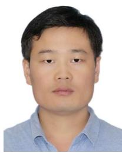

Bohui Wang (Senior Member, IEEE) received the B.S. degree in computer science and technology from Shaanxi University of Technology, Shaanxi, China, the M.S. degree in computer science and technology from Xi’an University of Science and Technology, Shaanxi, in 2012, and the Ph.D. degree in control science and engineering from Shanghai Jiao Tong University, Shanghai, China, in 2016. He was a Lecturer with the School of Aerospace Science and Technology, Xidian University, Xi’an, China, in 2016. Since 2018, he has been a full-time Research

Staff with the Department of Electrical and Electronic Engineering, Nanyang Technological University, Singapore. He is currently a Full Professor with the School of Cyber Science and Engineering, Xi’an Jiaotong University, Xi’an. His research interests include agents and autonomous systems, distributed parameter systems, fault-tolerant control, intelligent traffic control, distributed energy systems, AI algorithms, and cyber-physical systems.

Dr. Wang is an Active Reviewer of Automatica and IEEE TRANSACTIONS ON AUTOMATIC CONTROL (more than 200). He is/was an Associate Editor for IEEE TRANSACTIONS ON AUTOMATIC CONTROL, IEEE TRANSAC-TIONS ON AEROSPACE AND ELECTRONIC SYSTEMS, IEEE TRANSACTIONS ON SYSTEMS, MAN, AND CYBERNETICS: SYSTEMS, IEEE ROBOTICS AND AUTOMATION LETTERS, IEEE ACCESS, IET Information Security, IET Signal Processing, IET Intelligent Transport Systems, PLOS One, International Conference on Control, Automation, Robotics and Vision, International Conference on Robotics and Automation, and IFAC.

Zhu Han (Fellow, IEEE) received the B.S. degree in electronic engineering from Tsinghua University in 1997 and the M.S. and Ph.D. degrees in electrical and computer engineering from the University of Maryland, College Park, in 1999 and 2003, respectively.

From 2000 to 2002, he was a Research and Development Engineer at JDSU, Germantown, Maryland. From 2003 to 2006, he was a Research Associate at the University of Maryland. From 2006 to 2008, he was an Assistant Professor at Boise State University,

Idaho. He is a John and Rebecca Moores Professor at the Department of Electrical and Computer Engineering and the Department of Computer Science, University of Houston, TX. His research interests include wireless resource allocation and management, wireless communications and networking, game theory, big data analysis, security, and smart grid. He has been an AAAS Fellow since 2019 and an ACM Distinguished Member since 2019. He is a 1% highly cited researcher since 2017 according to Web of Science. He is also the winner of the 2021 IEEE Kiyo Tomiyasu Award, for outstanding early to mid-career contributions to technologies holding the promise of innovative applications, with the following citation: “for contributions to game theory and distributed management of autonomous communication networks.” He received an NSF Career Award in 2010, the Fred W. Ellersick Prize of the IEEE Communication Society in 2011, the EURASIP Best Paper Award for Journal on Advances in Signal Processing in 2015, the IEEE Leonard G. Abraham Prize in communications systems (Best Paper Award in IEEE JOURNAL ON SELECTED AREAS IN COMMUNICATIONS) in 2016, and several best paper awards in IEEE conferences. He was an IEEE Communications Society Distinguished Lecturer from 2015 to 2018.