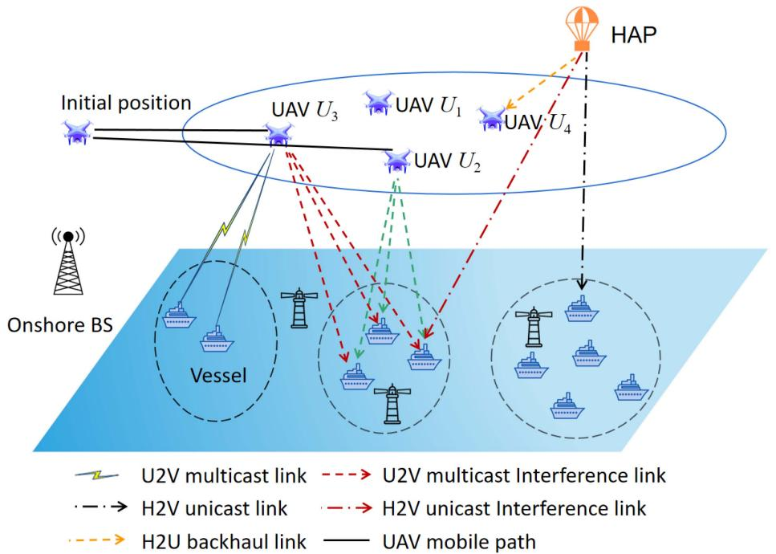
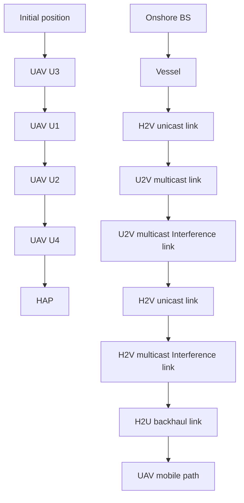
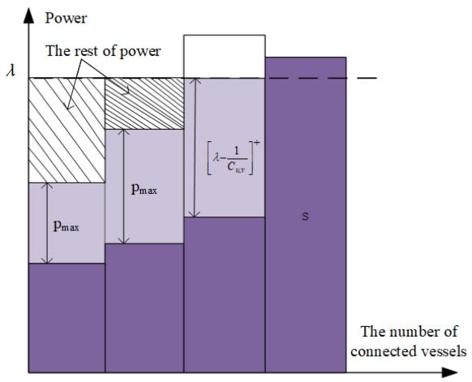
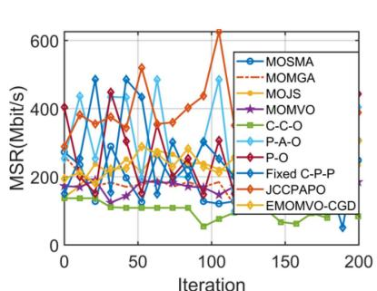
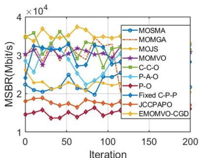
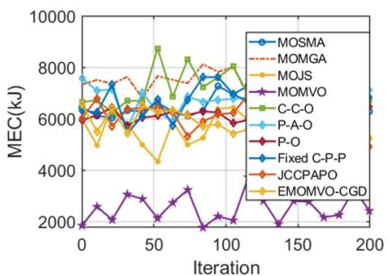
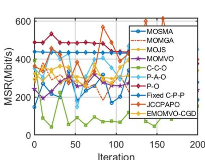
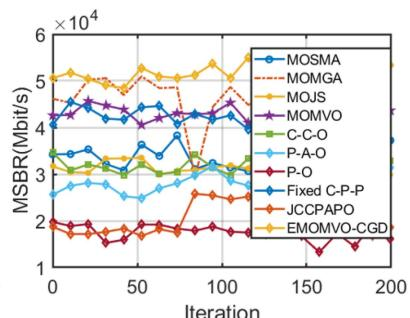
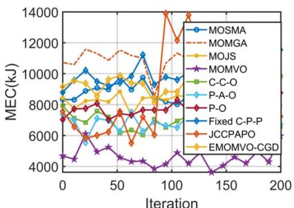

# HAP-UAV-Assisted Maritime IoT Communication Network

Lingling Liu , Chong Shen , Feng Shu , Member, IEEE, Feng Wang , Member, IEEE, Shujing Li , and Tony Q.S. Quek , Fellow, IEEE

Abstract—The advancement of wireless networks has spurred an increasing demand for high-quality maritime communication services. This study presents an innovative unicast-multicast access and backhaul maritime communication network (UMABMCN), in which a high-altitude platform (HAP) provides HAP-to-vessel (H2V) unicast services to vessels and backhaul support to unmanned aerial vehicles (UAVs) through HAP-to-UAV (H2U) links. Additionally, multiple UAVs are deployed to deliver UAV-tovessel (U2V) multicast transmission services to vessels. Specifically, we formulate a HAP-UAV-assisted unicast-multicast cooperation multi-objective optimization problem (UMCMOP) aimed at maximizing the sum achievable rate of base stations (BS)-to-vessel (B2V), maximizing the sum backhaul rate of H2U, and minimizing the energy consumption of UAVs via jointly optimizing communication connection between BSs and vessels, power allocations of UAVs, along with the placement of UAVs. The formulated UMCMOP is a mixed integer non-linear programming (MINLP) problem. To address this, we propose an enhanced multi-objective multiverse optimization (EMOMVO-CGD) algorithm, which integrates a chaos probability operator, gray wolf exploitation operator, and discrete update operator. To further validate the performance of

Received 20 September 2024; revised 16 April 2025; accepted 29 July 2025. Date of publication 5 August 2025; date of current version 3 December 2025. This work was supported in part by the National Key Research and Development Program of China under Grant 2023YFF0612900, Grant 2023YFC3106404, and Grant 2024YFC2816904, in part by the National Natural Science Foundation of China under Grant U22A2002 and Grant 62561024, in part by Hainan Province Science and Technology Special Fund under Grant ZDYF2024GXJS292, in part by the Scientific Research Fund Project of Hainan University under Grant KYQD(ZR)-21008 and Grant XJ2400012663, in part by the Collaborative Innovation Center of Information Technology, Hainan University under Grant XTCX2022XXC07, and in part by the National Research Foundation, Singapore and Infocomm Media Development Authority under its Future Communications Research & Development Programme. Recommended for acceptance by N. Zhang. (Corresponding authors: Chong Shen; Feng Shu.)

Lingling Liu is with the School of Information and Communication Engineering, Hainan University, Haikou 570228, China, and also with the Information Systems Technology and Design (ISTD) Pillar, Singapore University of Technology and Design, Singapore 487372 (e-mail: llliu2024@hainanu.edu.cn).

Chong Shen is with the School of Electronic Science and Technology, Hainan University, Haikou 570228, China (e-mail: chongshen@hainanu.edu.cn).

Feng Shu is with the School of Information and Communication Engineering, Hainan University, Haikou 570228, China, and also with the School of Electronic and Optical Engineering, Nanjing University of Science and Technology, Nanjing 210094, China (e-mail: shufeng@njust.edu.cn).

Feng Wang is with the Information System Technology and Design (ISTD) Pillar, Singapore University of Technology and Design, Singapore 487372 (e-mail: feng2\_wang@sutd.edu.sg).

Shujing Li is with the School of Information Science and Technology, Hainan Normal University, Haikou 571158, China (e-mail: lsj202jlu@163.com).

Tony Q.S. Quek is with the Singapore University of Technology and Design, Singapore 487372, and also with the Department of Electronic Engineering, Kyung Hee University, Yongin 17104, South Korea (e-mail: tonyquek@ sutd.edu.sg).

Digital Object Identifier 10.1109/TMC.2025.3596169

EMOMVO-CGD, a joint communication connection, power allocation and placement optimization (JCCPAPO) method is proposed. Simulation results demonstrate that the two proposed algorithms outperform benchmark strategies in optimizing the aforementioned objectives.

Index Terms—High -altitude platform (HAP), unmanned aerial vehicles (UAV), unicast and multicast communication, maritime communication, backhaul rate.

# I. INTRODUCTION

T HE substantial costs and technical challenges of deployingmaritime communication infrastructure, along with the bandwidth limitations of satellite networks, result in existing maritime communication systems falling short of 5G performance [1]. Unmanned aerial vehicles (UAVs), with their high 3D maneuverability, on-demand deployment, and reliable line-ofsight (LoS) transmission [2], [3], have gained significant attention as flexible aerial platforms that can efficiently supplement maritime communication infrastructure and provide on-demand maritime services.

Nevertheless, the capacity and on-board energy of UAVs are limited, which results in a decrease in their communication performance [4]. Moreover, the overhead of building maritime communication base stations (BSs) is significant, and the capacity of the wireless backhaul link rate of onshore BSs is often insufficient, which seriously decreases the quality of service provided by onshore BSs. In this case, the high altitude platforms (HAP) highlights their advantages by providing wider wireless coverage and establishes robust connections with UAVs as a backhaul link to assist ubiquitous access [5].

The demand of maritime users is constantly rising, for some scenarios where multiple users might be interested in accessing the same content, such as live sports broadcasts or weather and ocean conditions updates. To effectively transmit such data, the third generation partnership program (3GPP) has introduced multicast services [6]. Furthermore, real-world application systems now consider both unicast and multicast transmission, where unicast offers higher transmit rates for individual users, thus spurring research into joint unicast and multicast transmission strategies [7].

However, the capacity of UAVs is usually constrained, making it crucial for UAVs to deliver data with higher rate to vessels. An effective approach is to establish a backhaul link for UAV network via a HAP, which can offer higher data rates and lower path loss. Therefore, in the areas where coverage from offshore

1536-1233 © 2025 IEEE. All rights reserved, including rights for text and data mining, and training of artificial intelligence and similar technologies. Personal use is permitted, but republication/redistribution requires IEEE permission. See https://www.ieee.org/publications/rights/index.html for more information.

BSs and UAV-oriented maritime BSs is lacking, UAVs can serve as multicast access terminals, while HAP provides unicast services for each vessel and wireless backhaul links for UAVs. This promising wireless solution has the potential to enhance and support existing aerial, ground, and maritime networks [8].

Furthermore, channel estimation in HAP-UAV-assisted unicast and multicast transmission encounters several challenges [9]. First, the performance of multicast transmission is hampered by the worst channel conditions among the covered vessels [10]. Second, the discrepancy in distance between multiple UAVs and HAP imposes limitations on the transmit rate of backhaul links. Finally, it will increase the energy consumption when UAVs move, which consequently shortens the system lifespan. These objectives are in a state of balanced interrelation, to address these issues comprehensively, we must consider the trade-off relationship between them.

# A. Contributions

In this article, we focus on a HAP-UAV-assisted maritime communication system, where a HAP and UAVs provide unicast and multicast services for maritime vessels respectively, while UAVs obtain backhaul support from the HAP. Unlike previous studies that employed a single method to address these challenges, we proposes two distinct methods to tackle them. The primary contributions of this paper can be summarized as follows.

- HAP-UAV-assisted maritime scenario: The scenario being considered is a HAP-UAV-assisted unicast-multicast access and backhaul maritime communication network (UMABMCN), where multiple UAVs deliver multicast services to vessels, and a single HAP offers unicast services to vessels while providing wireless backhaul support for UAVs.   
Formulation of complex MOP: In UMABMCN system, multiple factors need to be considered simultaneously, including UAV locations, power allocation, and the communication connections between vessels and BSs. To address this, we formulate a HAP-UAV-assisted unicast-multicast cooperation multi-objective optimization problem (UMC-MOP) to maximize the sum achievable rate of BSs1-tovessels (B2V), maximize the sum backhaul rate of the HAP to UAVs (H2U), and minimize the energy consumption of UAVs.   
Proposals of two different optimization methods: The formulated UMCMOP is a mixed integer non-linear programming (MINLP) problem, for which no universal solution methods currently exist. Consequently, two different optimization methods are proposed to solve it and compared. in which one is an enhanced multi-objective multi-verse optimization (EMOMVO-CGD) algorithm with chaos probability operator, gray wolf exploitation operator, and discrete update operator. The global search capability is enhanced by introducing DE mutation factors, chaotic probability operation avoids the solution from falling into

the local optimum through random perturbations, gray wolf optimization avoids the solution from converging prematurely, and discrete update factors update discrete variables.

- Another method is traditional mathematical optimization methods. The formulated complex UMCMOP is decomposed into three sub-problems, that are, communication connection optimization, power allocation to vessels optimization, and placement optimization of UAVs, which can be solved by a step-by-step manner, i.e., communication connection algorithm, power allocation algorithm, and PSO-based UAV placement, named as JCCPAPO.   
Simulations are carried out to evaluate the performance and effectiveness of the proposed JCCPAPO and EMOMVO-CGD. Furthermore, the performance of the proposed methods is compared to other benchmarks, which reveals their superior outcomes. Specifically, both the proposed JCC-PAPO and EMOMVO-CGD effectively improve the sum achievable rate at vessels and the sum backhaul rate, and reduce the energy consumption of UAVs.

# B. Paper Outline

The remainder of this paper is structured as follows. Section II reviews the related works. The detailed multicast and unicast system models are specified in Section III. Section IV mathematically formulates the UMCMOP, in which the sum achievable rate of B2V and backhaul rate of H2U are strengthened, and the energy consumption of UAVs is decreased. The proposed EMOMVO-CGD and JCCPAPO methods are described in Sections V and VI. The simulation results are demonstrated in Section VII. Section VIII discusses the improvement of the work, the communication mechanism of the UAV and the motivation of the two proposed algorithms. The conclusion is drawn in Section IX.

# II. RELATED WORK

The rapid and continuous development of the marine economy poses significant challenges to the enhancement of maritime communication services quality. Satellites and veryhigh-frequency technologies can be employed to support the development of oceanic systems, with international maritime satellite system providing high-speed maritime information services [11]. In [12], the authors propose an intelligent spectrum sharing strategy suitable for heterogeneous mobile networks integrated with satellite-maritime systems. However, the varying orbital altitudes of satellites lead to different levels of path loss attenuation in the communication links between satellites and terminal stations, resulting in increased latency and service delays.

To address these challenges, numerous studies have proposed using aerial platforms as relays or BSs to provide services for maritime Internet of Things applications. Zhang et al. [13] propose a multiple UAV-assisted maritime Internet of Things architecture, where multiple UAVs hover above sensor nodes and collect data packets from nodes. Lin et al. [14] propose a robust beamforming strategy for integrating satellites and HAP networks, in which a multi-objective optimization problem (MOP) is proposed to achieve the Pareto optimal trade-off between total transmission rate and power consumption. However, it is noteworthy that these previous works have not considered the joint utilization of UAVs and HAPs as integrated aerial platforms for maritime communication, which could potentially offer more flexible and robust service delivery.

Several research efforts aimed at improving transmission communication performance and providing connectivity for non-terrestrial networks are presented in this work [15]. To this end, some studies address the limited capacity and energy constraints of relays and BSs through wireless backhaul links. The authors in [16] study the uplink sum-rate maximization problem in a distributed massive MIMO system with limited backhaul capacity. To provide seamless and fast global connectivity for non-terrestrial networks, low earth orbit (LEO) has been widely studied [17]. Moreover, Wang et al. [18] propose that LEO constellations can provide reliable data services to mobile platform such as UAVs, especially when these platforms operate in areas lacking terrestrial network coverage. Nevertheless, the abovementioned studies do not explicitly address whether unicast or multicast services are provided to maritime users, leaving a gap in understanding the suitability of such systems for different maritime communication scenarios.

Moreover, traditional unicast transmission often lead to substantial data duplication and inefficient use of limited maritime communication resources. In contrast, multicast transmission can simultaneously deliver data to multiple destinations, thereby conserving resources and mitigating redundancy. Consequently, many practical applications utilize a combination of unicast and multicast transmission. In maritime communication systems, the relatively lower reception rates of edge devices compared to those of central network devices is a significant bottleneck in the overall multicast transmission process. To address this, Chen et al. [19] propose a bottleneck aware opportunistic multicast strategy to reduce propagation delay while considering the effect of broadcast rate. Duan et al. [20] develop a cooperative multicast communication scheme for maritime users, incorporating beamforming optimization and relay design to improve both throughput and energy efficiency. Guan et al. [21] introduce a maritime giant cellular network architecture that provides wide-area, seamless coverage for offshore users and delivers high-speed, cost-effective services to offshore users via using joint multicast beamforming and relay mechanisms. However, the abovementioned works does not explore the potential benefits of incorporating UAVs or HAPs as aerial communication platforms, which could further improve system flexibility and coverage in maritime environments.

Taking inspiration from the aforementioned aerial communication techniques and multicast/unicast transmission strategies, this work investigates a HAP-UAV-assisted hybrid unicast and multicast transmission framework. Unlike prior studies that primarily focus on enhancing individual communication performance through unicast, multicast, or their combination, the feasibility and effectiveness of integrating these transmission modes with UAVs for maritime communication remain largely

TABLE I KEY SYMBOLS 

<table><tr><td>Symbol</td><td>Parameters</td></tr><tr><td colspan="2">UAV parameters</td></tr><tr><td>The uth UAV</td><td>u</td></tr><tr><td>The set of UAV</td><td> $U = \{1,2,...,U\}$ </td></tr><tr><td>Location of UAV</td><td> $\mathcal{Q}_{u}^{U} = [x_{u}^{U},y_{u}^{U},z_{u}^{U}]$ </td></tr><tr><td>Altitude of UAV</td><td> $h_{u}$ </td></tr><tr><td>Transmit power of UAV u</td><td> $P_{min} \leq p_{u} \leq P_{max}$ </td></tr><tr><td>Distance between UAV u and vesselv</td><td> $d_{u,v}$ </td></tr><tr><td>Pathloss between UAV u and vesselv</td><td> $\alpha_{u,v}$ </td></tr><tr><td>Environment-related constant parameters</td><td> $\phi_{LoS}, \phi_{NLoS}, w$  and q</td></tr><tr><td>Bandwidth between u and v</td><td>B</td></tr><tr><td colspan="2">HAP parameters</td></tr><tr><td>Index of HAP</td><td> $h_{a}$ </td></tr><tr><td>Location of HAP</td><td> $\mathcal{Q}_{h_{a}}^{H} = [x_{h_{a}}^{H},y_{h_{a}}^{H},z_{h_{a}}^{H}]$ </td></tr><tr><td>Transmit power of HAP  $h_{a}$ </td><td> $P_{h_{a}}$ </td></tr><tr><td>Speed of light</td><td> $C_{li}$ </td></tr><tr><td>Distance between HAP  $h_{a}$  and vesselv</td><td> $d_{h_{a},v}$ </td></tr><tr><td>Ricean small-scale gain bwtween  $h_{a}$  and v</td><td> $\eta_{h_{a},v}$ </td></tr><tr><td>Attenuation gain caused by environment effects</td><td> $G_{a}$ </td></tr><tr><td>Bandwidth between  $h_{a}$  and v</td><td> $B_{0}$ </td></tr><tr><td colspan="2">Vessel parameters</td></tr><tr><td>The vth vessel</td><td>v</td></tr><tr><td>The set of vessel</td><td> $V = \{1,2,...,v\}$ </td></tr><tr><td>Location of vessel</td><td> $\mathcal{Q}_{v}^{V} = [x_{v}^{V},y_{v}^{V},z_{v}^{V}]$ </td></tr></table>

unexplored. To address this gap, we formulate the problem as a MOP and propose corresponding solution methods to efficiently address the associated challenges.

# III. SYSTEM MODELS

# A. System Configuration

Fig. 1 illustrates the proposed UMABMCN architecture that consists of a HAP, U UAVs, and V vessels. The group of BSs is represented as $\mathcal { M } = \{ 0 , 1 , 2 , . . . , U \}$ , and the set of vessels is denoted as $\mathcal { V } = \{ 1 , 2 , . . . , V \} ^ { 2 }$ . For the purpose of transmitting data to V maritime vessels, UAV network might use the same spectrum resources, which indicates that there is interference between the vessels served by different UAVs. Additionally, it is assumed that the access links of vessels connected to the same UAV are orthogonal, which helps to minimize co-channel interference. Unlike radio communications between UAVs and vessels, the HAP fixed at a specific location provides backhaul connections for all UAVs, with each connection being orthogonal to the others. In addition, the key symbols utilized throughout this paper are summarized in Table I.

Without loss of generality, the 3D coordinates of vessel v, UAV u, and HAP $h _ { a }$ are respectively defined as $\mathcal { Q } _ { v } ^ { V } =$ $[ x _ { v } ^ { V } , y _ { v } ^ { V } , z _ { v } ^ { V } ] , \mathcal { Q } _ { u } ^ { U } = [ x _ { u } ^ { U } , y _ { u } ^ { U } , z _ { u } ^ { U } ]$ , and d $\dot { \mathcal { Q } _ { h _ { a } } ^ { H } } = [ x _ { h _ { a } } ^ { H } , y _ { h _ { a } } ^ { H } , \check { z } _ { h _ { a } } ^ { H } ]$ [x ha , y ha , z ha ]. For the purpose of avoiding frequent ascent and descent of UAVs, it is assumed that the altitudes of them remain unchanged during movement [23], and the horizontal coordinates of UAV u can be denoted as $\mathcal { L } _ { u } ^ { U } = [ x _ { u } ^ { U } , y _ { u } ^ { U } ]$ ]. In addition, the transmit power of UAV u is denoted as $p _ { u }$ , constrained by $0 \leq p _ { u } \leq P _ { \operatorname* { m a x } }$ , with $P _ { \mathrm { m a x } }$ in W denoting the maximum transmit power of UAVs.

flowchart

Fig. 1. Illustration of a UMABMCN with U2V mulicast, H2V unicast and H2U backhaul links.

# B. U2V Multicast Channel Model

As aerial BSs, UAVs deliver U2V multicast wireless connection services to the vessels within their coverage area when hovering. The maritime users (i.e., vessels) can receive the signals sent by the composite channels of UAVs, which includes small-scale fading channel $h _ { u , v }$ and large-scale fading channel $\alpha _ { u , v } [ 1 ] . h _ { u , v }$ follows a complex Gaussian distribution with zero mean and unit variance. Then the pathloss in dB between UAV u and vessel v is stated as [24].

$$
\alpha_ {u, v} = \frac {A}{1 + w e ^ {- q (\rho_ {u , v} - w)}} + B _ {u, v}, \tag {1a}
$$

$$
A = \phi_ {L o S} - \phi_ {N L o S}, \tag {1b}
$$

$$
B _ {u, v} = 2 0 \log_ {1 0} (4 \pi f _ {c} d _ {u, v}) - 2 0 \log_ {1 0} (3 0 0) + \phi_ {N L o S}, \tag {1c}
$$

$$
\rho_ {u, v} = \frac {1 8 0}{\pi} \arcsin \left(\frac {h _ {u}}{d _ {u , v}}\right), \tag {1d}
$$

where $\phi _ { L o S } , \phi _ { N L o S } ,$ , w and q denote the environment-related constant parameters. $d _ { u , v }$ is the distance between UAV u and vessel v. $h _ { u }$ and $f _ { c }$ represent the altitude of UAV u and carrier frequency in MHz, respectively. Moreover, the multicast achievable rate is constrained by the rate of the worst channel conditions within the same group [10], [25]. Therefore, the multicast achievable rate $R _ { u , v } ^ { m u l }$ in bps at vessel v can be expressed as follows:

$$
R _ {u, v} ^ {m u l} = \min _ {v \in V} B \log_ {2} \left(1 + \frac {p _ {u , v} \alpha_ {u , v}}{\sum_ {k = 1 , k \neq u} ^ {U} p _ {k , v} \alpha_ {k , v} + \sigma^ {2}}\right), \tag {2}
$$

where B in Hz and $\sigma ^ { 2 }$ respectively represent bandwidth and additive white Gaussian noise (AWGN), which follows a mean of 0 and a variance of 1. $\textstyle \sum _ { k = 1 , k \neq u } ^ { U } p _ { k , v } \alpha _ { k , v }$ is the interference from other UAVs except for UAV u.

# C. H2V Unicast Channel Gain Model

In addition to requiring the same content information, the vessels also have specific information needs. To cater to V vessels with distinct content requirements, the HAP is deployed at a higher altitude than UAVs, providing H2V unicast transmission services for vessels with a larger bandwidth. The channel gains between HAP and vessels are determined by the instantaneous values of large-scale fading and small-scale fading. Thereupon, the channel gain between HAP $h _ { a }$ and vessel v is given as [26]:

$$
h _ {h _ {a}, v} = \left(\frac {C _ {l i}}{4 \pi d _ {h _ {a} , v} f _ {c}}\right) ^ {2} G _ {a} \eta_ {h _ {a}, v}, \tag {3}
$$

where $d _ { h _ { a } , v }$ indicates the distance between the HAP $h _ { a }$ and vessel v. $C _ { l i }$ denotes the speed of light. $\eta _ { h _ { a } , v }$ is the Ricean small-scale gain between HAP $h _ { a }$ and vessel v. $G _ { a } =$ $1 0 ^ { ( [ 3 \kappa d _ { h a } , v ] / ( 1 0 H ) ) }$ represents the attenuation gain caused by downlink H2V unicast achievable rate environment effects, such as cloud and rain [27]. Therefore, the $R _ { h _ { a } , v } ^ { u n i }$ in bps between HAP $h _ { a }$ and vessel v can be expressed as:

$$
R _ {h _ {a}, v} ^ {u n i} = B _ {0} \log_ {2} \left(1 + \frac {p _ {h _ {a}} h _ {h _ {a} , v}}{B _ {0} N _ {0}}\right), \tag {4}
$$

where $N _ { 0 }$ is the AWGN at vessels. $B _ { 0 }$ in Hz represents the bandwidth corresponding to the H2V communication link. It is supposed that each vessel can only communicate with one of BSs, and a binary vector $\epsilon _ { s , v } ( s \in \{ 0 , 1 , . . . , U \}$ for HAP and $\mathrm { U A V s } )$ is defined to indicate the communication connection, in which $\epsilon _ { s , v } = 1 $ if the vessel v is associated with BS s, otherwise $\epsilon _ { s , v } = 0$ . Moreover, based on the correspondence between vessels and BSs, that is, a BS can cover multiple vessels, while a vessel can only communicate with a BS, we have the following constraints:

$$
\sum_ {s = 0} ^ {U} \epsilon_ {s, v} \leq 1, \forall v. \tag {5}
$$

Therefore, the access link achievable rate between vessel v and BS s can be designed as follows:

$$
\begin{array}{l} R _ {s, v} ^ {t r a n s} \\ = \left\{ \begin{array}{c} \min _ {v \in V} \epsilon_ {u, v} B \log_ {2} \left(1 + \frac {p _ {u , v} \alpha_ {u , v}}{\sum_ {k = 1 , k \neq u} ^ {U} p _ {k , v} \alpha_ {k , v} + \sigma^ {2}}\right), \\ s \in U, \\ \epsilon_ {0, v} B _ {0} \log_ {2} \left(1 + \frac {p _ {h _ {a}} h _ {h _ {a} , v}}{B _ {0} N _ {0}}\right), \\ s = 0. \end{array} \right. \tag {6} \\ \end{array}
$$

Accordingly, the vessels may receive two different types of information transmitted by BSs, where one is the multicast information $M ^ { U }$ transmitted by UAV $u ,$ and the other is unicast information $M ^ { h _ { c } }$ transmitted by HAP $h _ { a }$ . Following the traditional multi-user linear-precoding (MU-LP) transmission mechanism [28], the unicast information $M ^ { h _ { a } }$ and multicast information $M ^ { U }$ are respectively encoded as data streams $S _ { 1 } ^ { h _ { a } }$ ,..., $S _ { V } ^ { h _ { a } } , S _ { 1 } ^ { U } , . . . , S _ { V } ^ { U } . ^ { 3 }$ Therefore, the corresponding superimposed signals sent by UAV u and HAP $h _ { a }$ are given as:

$$
x ^ {U} = \sum_ {u = 1} ^ {U} \alpha_ {u, v} S _ {u, v} ^ {U}, \tag {7a}
$$

$$
x ^ {h _ {a}} = h _ {h _ {a}, v} S _ {v} ^ {h _ {a}}, \tag {7b}
$$

The signal received by vessels is determined by the associated BSs. If the signal is transmitted by UAVs, the received signal at vessel v is designed as follows:

$$
\begin{array}{l} y _ {u, v} ^ {U} = \underbrace {\sum_ {u \in U} \epsilon_ {u , v} \alpha_ {u , v} p _ {u , v} S _ {u , v} ^ {U}} _ {\text { Intended   multicast   signal }} + \underbrace {\sum_ {v \in V} \epsilon_ {0 , v} \alpha_ {u , v} p _ {h _ {a} , v} S _ {v} ^ {h _ {a}}} _ {\text { Unicast   interference }} \\ + \underbrace {\sum_ {u \in U} \sum_ {j \in V \backslash v} \epsilon_ {u , j} \alpha_ {u , v} p _ {u , j} S _ {u , j} ^ {U}} _ {\text { Multicast   interference }} + \underbrace {N} _ {\text { Noise }}, \tag {8} \\ \end{array}
$$

where the incoming noise N at vessels is described by a complicated Gaussian random variable with 0 mean and variance $\sigma _ { u , v } ^ { 2 } = 1$ . As can be seen from (8) that the co-channel interference is not considered. This is due to the use of a non-orthogonal multiple access (NOMA) channel for communication between UAVs and vessels within the same multicast group. Similarly, the unicast signal received by vessel v from HAP is stated as follows:

$$
y _ {h _ {a}, v} ^ {H} = \underbrace {\epsilon_ {0 , v} h _ {h _ {a} , v} p _ {h _ {a} , v} S _ {v} ^ {h _ {a}}} _ {\text {   Intended   unicast   stream   }}
$$

3Note that, it is supposed that the vessels communicating with the same UAV are divided into the same group, which implies that the quantity of groups is identical to the quantity of UAVs U.

$$
\begin{array}{l} + \underbrace {\sum_ {u \in U} \sum_ {v \in V} \epsilon_ {u , v} h _ {h _ {a} , v} p _ {u , v} S _ {u , v} ^ {U}} _ {\text { Multicast   interference }} \\ + \underbrace {\sum_ {j \in V \backslash v} \epsilon_ {0 , j} h _ {h _ {a} , v} P _ {h _ {a} , j} S _ {j} ^ {h _ {a}}} _ {\text { Unicast   interference }} + \underbrace {N} _ {\text { Noise }}, \tag {9} \\ \end{array}
$$

Similar to the traditional two-user downlink NOMA transmission for “strong” user, vessels first detect the multicast signal and remove it from the received integrated signal after decoding, leaving behind unintended information signal and noise [29]. Thereby, the SINR $\Gamma _ { u , v } ^ { U }$ of intended multicast signal received by vessel v is represented as:

$$
\Gamma_ {u, v} ^ {U} = \frac {\sum_ {u = 1} ^ {U} \epsilon_ {u , v} | \alpha_ {u , v} p _ {u , v} | ^ {2}}{I _ {u , j} ^ {U} + I _ {v} ^ {H _ {a}} + N}, \tag {10}
$$

where $\begin{array} { r } { I _ { u , j } ^ { U } = \sum _ { u \in U } \sum _ { j \in V \backslash v } \epsilon _ { u , j } | \alpha _ { u , v } p _ { u , j } | ^ { 2 } } \end{array}$ represents intragroup interference. $I _ { v } ^ { H _ { a } } = \epsilon _ { 0 , v } | \alpha _ { u , v } p _ { h _ { a } , v } | ^ { 2 }$ is the interference v received from HAP. The achievable rate $R _ { u , v } ^ { U }$ i n bps of decoding multicast signal at vessel v can be written as:

$$
R _ {u, v} ^ {U} = \log_ {2} (1 + \Gamma_ {u, v} ^ {U}). \tag {11}
$$

After successfully decoding the multicast signal, it is removed from the received signal using successive interference cancellation (SIC). Each vessel in the same group decodes the intended unicast signal by regarding other signal stream as interference. The SINR of decoding the intended unicast signal at vessel v is expressed as follows:

$$
\Gamma_ {v} ^ {H _ {a}} = \frac {\epsilon_ {0 , v} | h _ {h _ {a} , v} p _ {h _ {a} , v} | ^ {2}}{I _ {j} ^ {H _ {a}} + I _ {u , v} ^ {U} + N}, \tag {12}
$$

where $\begin{array} { r } { I _ { j } ^ { H _ { a } } = \sum _ { j \in V \backslash v } \epsilon _ { 0 , j } \vert h _ { h _ { a } , v } p _ { h _ { a } , j } \vert ^ { 2 } } \end{array}$ and $\textstyle I _ { u , v } ^ { U } = \sum _ { u \in U }$ $\begin{array} { r } { \sum _ { v \in V } \epsilon _ { u , v } | h _ { h _ { a } , v } p _ { u , v } | ^ { 2 } } \end{array}$ are respectively the interference of HAP on other vessels and all UAVs. Therefore, the achievable rate of decoding multicast and unicast information at vessel v are respectively designed as:

$$
R _ {u, v} ^ {U} = \log_ {2} \left(1 + \Gamma_ {u, v} ^ {U}\right),
$$

$$
R _ {v} ^ {H _ {a}} = \log_ {2} \left(1 + \Gamma_ {v} ^ {H _ {a}}\right). \tag {13}
$$

The achievable rate of multicast signal is constrained by the minimum achievable rate in the same group, which can be expressed as:

$$
R _ {u} ^ {U} = \min \left\{R _ {u, 1} ^ {U}, \dots , R _ {u, n _ {u}} ^ {U} \right\}, \tag {14}
$$

where $n _ { u }$ denotes the number of vessels receiving multicast services of UAV u.

# D. Backhaul Link Model

Based on the locations of vessels and the effectiveness of backhaul link, it is assumed that UAV u can be connected to the HAP via a backhaul link. Additionally, there is no interference between the wireless backhaul link and the radio access link of UAVs since they employ separate spectrum resources. Moreover, it is also supposed that all UAVs can be connected to the

HAP through backhaul link [30]. Consequently, the backhaul link rate for UAV u is calculated as follows [30]:

$$
R _ {h _ {a}, u} ^ {\text { back }} = B _ {0} \log_ {2} \left(1 + \frac {P _ {h a} h _ {h _ {a} , u}}{B _ {0} N _ {0}}\right), \tag {15}
$$

where $P _ { h a }$ in W is the transmit power of HAP $h _ { a }$ .

# E. UAV Energy Consumption

Since the energy consumption of UAVs during hovering is significantly lower compared to the propulsion energy consumption [31], we primarily focus on the energy consumption associated with UAV movement in this study. Mobile energy consumption refers to the energy expended by UAVs when travelling from their initial positions to their optimal positions. The movement distance $D _ { s , u }$ of each UAV from its initial position s to its final position u is calculated as $D _ { s , u }$ :

$$
D _ {s, u} = \left\| Q _ {s} ^ {U} - Q _ {u} ^ {U} \right\| _ {2}, \forall u \in U, \tag {16}
$$

where $Q _ { s } ^ { U }$ and $Q _ { u } ^ { U }$ are the coordinates of the starting position and optimal position of UAV u, respectively. The energy consumption $E _ { u } ^ { f }$ in J can be calculated as:

$$
E _ {u} ^ {f} = p _ {u} ^ {f} T _ {u} ^ {m} = p _ {u} ^ {f} \frac {D _ {s , u}}{V _ {u}}, \tag {17}
$$

where $T _ { u } ^ { m }$ is the mobile time of UAV u, and $p _ { u } ^ { f }$ represents the mechanical power of UAV u at constant speed of $V _ { u } \left[ 3 1 \right]$ . Thereupon, the total energy consumption of all UAVs is calculated by:

$$
E _ {t o t} = \sum_ {u = 1} ^ {U} E _ {u} ^ {f}. \tag {18}
$$

# IV. UMCMOP FORMULATION AND ANALYSIS

# A. UMCMOP Formulation

As depicted in Fig. 1, a single HAP and multiple UAVs are utilized to deliver H2V unicast and U2V multicast services for V maritime vessels, respectively. Additionally, the HAP provides backhaul links for UAVs to support it in successfully completing tasks.

It is significant for maritime navigation to real time monitor the sea conditions and activities of vessels. However, the longer distances between maritime vessels and onshore BSs, along with the high cost and difficulty of deploying BSs at sea, make it impractical to rely on onshore BS services through multiple hops. Additionally, when multiple vessels simultaneously request the same information, multicast methods can be utilized to efficiently meet these needs. Furthermore, with the advantages of flexible deployment and low operational cost of UAVs, they can be deployed as aerial BSs to provide U2V multicast services for vessels. Additionally, the deployment height of UAVs limits their coverage range, and the capacity of UAVs is also constrained, which reduces service continuity. To overcome this limitation, a HAP can be deployed to not only meet the basic information needs of individual vessels through H2V unicast transmission but also provide backhaul support to UAVs via H2U links, thereby further enhancing the reliability and continuity of UAV services.

Although the combination of HAP and UAVs can meet the bandwidth and spectrum resource requirements for serving maritime vessels, it also introduces several challenges. First, when UAVs or HAP serve vessels on-demand, the achievable access rate of vessels further away from BSs is reduced, leading to longer serving times for BSs. Second, UAVs require sufficient resources from the HAP via H2U backhaul links to ensure services for vessels. However, the varying distances between UAVs and HAP result in fluctuations in the resources acquired by UAVs from HAP, which further impacts the communication continuity between UAVs and vessels. Finally, the movement of UAVs incurs a certain amount of energy consumption, which typically shortens the lifespan of UAVs. Given the limited power resources of UAVs, it is crucial to develop efficient transmission schemes to maximize resource utilization.

To sum up, there are trade-off relationships between the abovementioned challenges, which makes it a intractable problem to solve. Therefore, we propose a HAP-UAV-assisted UM-CMOP, which is efficiently solved by jointly optimizing UAV positions $( \mathcal { L } = [ x _ { 1 } ^ { U } , . . . , x _ { u } ^ { \bar { U } } , y _ { 1 } ^ { U } , . . . , \bar { y } _ { u } ^ { \bar { U } } ] )$ , UAV transmit power $( \mathcal { P } = [ p _ { 0 } , p _ { 1 } , . . . , p _ { u } ] )$ , and access relationships between B2V $\Theta = [ \epsilon _ { s , 1 } , . . . , \epsilon _ { s , V } ]$ . Therefore, we denote the solutions of the formulated UMCMOP as $\mathcal { X } = [ ~ \mathcal { L } , ~ \mathcal { P } , ~ \Theta ]$ . Accordingly, the specific optimization objectives are defined as follows.

1) Maximizing sum rate (MSR): The multicast sum achievable rate of B2V serves as a key metric for evaluating the overall performance of the UMABMCN system, and the objective function to maximize sum achievable rate of all vessels is designed as follows:

$$
f _ {1} (\mathcal {X}) = \epsilon_ {u, v} \sum_ {s = 1} ^ {U} \sum_ {v = 1} ^ {V} R _ {u, v} ^ {U} + \epsilon_ {0, v} \sum_ {v = 1} ^ {V} R _ {v} ^ {v _ {a}}, v \in V. \tag {19}
$$

2) Maximizing sum backhaul rate (MSBR): To maintain continuity of UAV services, the achievable rate for H2U backhaul link between HAP and UAVs must be guaranteed. Therefore, the objective function can be represented as follows:

$$
f _ {2} (\mathcal {X}) = \epsilon_ {0, v} \sum_ {u = 1} ^ {U} R _ {h _ {a}, u} ^ {\text { back }}. \tag {20}
$$

3) Minimizing energy consumption (MEC): In an effort to enhance the quality and effectiveness of communication services for vessels, UAVs must be deployed in optimal locations, which entails energy consumption and potentially reduces the sustainability of U2V services. To this end, the third objective is to minimize the movement energy consumption of UAVs, and the function is given as:

$$
f _ {3} (\mathcal {X}) = \sum_ {u = 1} ^ {U} E _ {u} ^ {f}. \tag {21}
$$

Based on the above analysis, the UMCMOP in the considered UMABMCN can be formulated as follows:

$$
\left(\mathbf {P 1}\right): \min _ {\mathcal {X}} F = \left\{- f _ {1}, - f _ {2}, f _ {3} \right\} \tag {22a}
$$

$$
\text { s.t. } C 1: X _ {\min} \leqslant x _ {u, v} \leqslant X _ {\max}, \forall u, v, \tag {22b}
$$

$$
C 2: Y _ {\min} \leqslant y _ {u, v} \leqslant Y _ {\max}, \forall u, v, \tag {22c}
$$

$$
C 3: P _ {\min} \leqslant p _ {u, v} \leqslant P _ {\max}, \forall u, v, \tag {22d}
$$

$$
C 4: 0 \leqslant \sum_ {v = 1} ^ {V} \epsilon_ {s, v} p _ {s, v} \leqslant \hat {P} _ {s}, \forall s, v, \tag {22e}
$$

$$
C 5: \sum_ {s = 0} ^ {U} \epsilon_ {s, v} \leq 1, \forall s, v, \tag {22f}
$$

$$
C 6: \sum_ {v = 1} ^ {V} \epsilon_ {s, v} \in \{0, 1 \}, \forall s, v, \tag {22g}
$$

where constraints C1 and C2 together define the effective 2D coordinate range of UAV. $P _ { \mathrm { m i n } }$ and $P _ { \mathrm { m a x } }$ are the minimum and maximum transmit power of UAVs, respectively. The constraint C4 represents the peak power constraints of communication connection of U2V and H2V. The fifth constraint C5 ensures that each vessel can only be correlated with one BS, while the constraint C6 denotes whether the vessel v is correlated with the BS s.

# B. Problem Analysis

1) Trade-Offs: In the formulated UMCMOP, efforts to improve system throughput, namely the sum access achievable rate of B2V and sum backhaul rate of H2U, require increased power allocation for communication. However, this improvement comes at the cost of higher transmit power for UAVs, which significantly contributes to increased energy consumption. On the contrary, excessive energy consumption by UAVs to achieve higher achievable rates may significantly reduce their operational lifespan, which thereby shorten the sustainability and reliability of long-term communication. Therefore, these objectives are conflicted with each other, which is a fundamental characteristic of multi-objective optimization problems (MOP). MOP involve optimizing two or more conflicting objectives that cannot be simultaneously maximized or minimized without trade-offs.

2) Motivations of Two Different Methods: Despite the availability of numerous approaches for tackling constrained MINLP problems, attaining the global minimum in general nonlinear programming problems remains a challenge due to the lack of a universally reliable method. Constrained optimization techniques can be broadly categorized into deterministic and stochastic methods. Deterministic methods, such as gradientbased techniques, attempt to find an optimal solution that is typically closest to the starting point, which may lead to either a local or a global optimum. However, these methods are often sensitive to the initial conditions and may struggle with highly nonlinear or discontinuous problems. In contrast, stochastic methods have gained increasing attention in recent years due to their ability to handle complex optimization problems with non-differentiable, discontinuous, and highly nonlinear objectives. However, these methods sometimes converge prematurely to suboptimal solutions if the population diversity is not maintained throughout the optimization process. Given the strengths and limitations of both approaches, we introduce two distinct methods in next section,

that are EMOMVO-CGD and JCCPAPO to solve the formulated UMCMOP.

# V. PROPOSED EMOMVO-CGD

# A. Motivation for Proposing EMOMVO-CGD

In HAP-UAV-assisted maritime communication network, the objectives are inherently conflicting to a certain extent, and cannot be be simultaneously maximized or minimized without significant compromise. To this end, various methods have been proposed, such as metaheuristic methods, among which multiobjective evolutionary algorithms (MOEAs) are one of the most popular methods. Comparing to alternating iteration method, MOEAs do not require decomposing the problem into multiple sub-problems, which is also one of the advantages of MOPs.

The typical characteristic of multi-objective optimization (MOO) lies in the inherent conflicting relationship between the objectives being considered. This means that improving one objective may inadvertently result in the deterioration of another objective. However, MOEAs address this challenge by obtaining a set of solutions rather than a single solution. Each solution in this set achieves the objectives at an acceptable level and is not outperformed by any other solution [32].

The multi-verse optimization (MVO) algorithm introduces the concept of multiple universes, where interactions and evolution among these universes result in diverse solutions covering different regions of the solution space, enabling global search within the solution space. As one of the recently proposed superior algorithms, MVO stands out for its effectiveness. Therefore, in this paper, MVO is employed as the fundamental algorithm to solve the formulated UMCMOP.

# B. Basic MOMVO

The theory of multiple universes in physical world has prompted the development of multi-verse optimization (MVO) algorithm, and their interactions have been simulated [33], whereas the multi-objective version of MVO is proposed in [34]. In this theory, each universe contains three distinct celestial bodies, that are white holes, black holes, and worm holes. The black and white holes are utilized to explore search spaces, while worm holes assist MVO in exploiting search spaces [33]. Each solution in MVO is considered as a universe, with each variable within a solution regarded as an object within the universe. Additionally, the effectiveness of solutions can be evaluated using the inflation rate, which is proportional to the fitness function value of related solutions. In other words, white holes tend to be more abundant in universes with high rates of inflation, while black holes are more prevalent in worlds with low inflation rates [35]. Additionally, objects can traverse between different universes via black holes or white holes based on their inflation rate. However, regardless of the inflation rate, all objects in the universe will randomly migrate toward the best universe through wormholes. This movement of objects across universes with varying inflation rates contributes to increasing the overall inflation rate of the universe. The ith universe can be denoted as $U _ { i } ,$ with its normalized inflation rate represented as $N I ( U _ { i } )$ . Furthermore, the $j \mathrm { t h }$ objective of the ith universe can be expressed as:

$$
x _ {i} ^ {j} = \left\{ \begin{array}{l l} x _ {k} ^ {j}, & r _ {1} <   N I (U _ {i}), \\ x _ {i} ^ {j}, & r _ {1} \geq N I (U _ {i}), \end{array} \right. \tag {23}
$$

where $r _ { 1 }$ states the random number in (0,1). $x _ { k } ^ { j }$ stands for the jth objective of the kth universe determined by a roulette wheel selection mechanism. In addition, the principal update expressions of MOMVO are provided as follows [34]:

$$
x _ {i} ^ {j} = \left\{ \begin{array}{c c} \left\{x _ {j} ^ {B} + \mathrm{TDR} \times \left(\left(u _ {j} - l _ {j}\right) * r _ {4} + l _ {j}\right), \quad r _ {3} <   0. 5, \right. \\ x _ {j} ^ {B} - \mathrm{TDR} \times \left(\left(u _ {j} - l _ {j}\right) * r _ {4} + l _ {j}\right), & r _ {3} \geq 0. 5, \\ r _ {2} <   \text {WEP}, \\ x _ {i} ^ {j}, \quad r _ {2} \geq \text {WEP}, \end{array} \right. \tag {24}
$$

where $x _ { i } ^ { j }$ is the jth dimension of the ith solution, and $x _ { j } ^ { B }$ denotes the jth dimension of the best universe achieved so far. $u _ { j }$ and $l _ { j }$ respectively represent the upper and lower of jth objective. $r _ { 2 } , r _ { 3 } $ , and $r _ { 4 }$ indicate the random number in the range of (0,1). TDR and WEP denote respectively the travelling distance rate (TDR) and wormhole existence probability (WEP), and can be respectively stated as follows:

$$
\mathrm{WEP} = l _ {\min} + i t \times \frac {W _ {\max} - W _ {\min}}{T}, \tag {25}
$$

$$
\mathrm{TDR} = 1 - \frac {i t ^ {1 / p}}{T ^ {1 / p}}, \tag {26}
$$

where $W _ { \mathrm { m i n } }$ and $W _ { \mathrm { m a x } }$ are the minimum and maximum WEP, respectively. it and T indicate separately the current iteration and total number of iterations. p is proportional to the exploitation accuracy. Different from MVO, the archive set is introduced into MOMVO to store the best non-dominated solutions obtained so far. Moreover, a roulette wheel selection mechanism is adopted by MOMVO to choose solutions from archive set to create relevance between solutions, and the expression can be designed as follows:

$$
P _ {r} (i) = \frac {C _ {o}}{N _ {i}}, \tag {27}
$$

where $P _ { r } ( i )$ denotes the probability that a solution is selected from the less populated regions of archive. $C _ { o }$ is a constant greater than 1, and it should be kept unchanged when calculating the probability of all segments [34]. $N _ { i }$ represents the quantity of solutions close to the ith solution. The quantity of solutions in the archive set can serve as an indicator of coverage and diversity, and the size of archive set may reach its maximum during optimization process. Thus, it is advantageous to eliminate some unnecessary solutions from the archive set, which could include solutions with many adjacent counterparts. Therefore, the following expression can be utilized to aid in removing certain solutions:

$$
P _ {r} (i) ^ {\prime} = \frac {N _ {i}}{C _ {o}}, \tag {28}
$$

Based on these operators, MOMVO has the ability to put Pareto optimal solutions into archive and improves them through iterations. Moreover, more information about MOMVO4 is provided in [34], and the overall framework is listed in Algorithm 1 in Appendix A.

As one of the population-based stochastic metaheuristic optimization algorithms, MOMVO still encounters challenges in solving the developed UMCMOP, despite its capabilities of exploration and exploitation through object shuffling between black holes, white holes, and wormholes. However, conventional MOMVO is primarily designed to tackle continuous optimization problems and may not effectively handle discrete variable problems. To address this limitation, we propose a strategy of segregating discrete and continuous solutions for optimizing UMCMOP. Moreover, the solution will converge prematurely when solving the formulated UMCMOP, and may lead to the solution falling into local optimal in later stages of evolution.

# C. Emomvo-Cgd

In this section, we propose an EMOMVO-CGD to address the formulated UMCMOP, which effectively overcomes the limitations of conventional MOMVO algorithm. The performance of EMOMVO-CGD is enhanced by incorporating key operators such as DE mutation initialization operator, chaotic probability operator, gray wolf exploitation operator, and discrete optimization operator. Algorithm 2 in Appendix B provides the basic framework of EMOMVO-CGD, and the details are as follows:

1) DE Mutation Initialization Operator: As we all known, the initialization of EAs is random, which can potentially lead to solutions being trapped in local optima and constrain the diversity of solutions. Thereby, it is necessary to optimize the initialization of solutions to improve the diversity of population. As a heuristic optimization method proposed by Storn and Price, DE significantly outperforms simulated annealing and simple methods in testing functions, and is equal to or better than some common EAs [36]. Unlike other EAs that use probability distribution functions to alter individuals of the population, DE utilizes the difference between pairs of objective vectors to perform mutation operations. Specifically, the individual z is obtained by multiplying a positive control parameter H by the difference between two randomly selected individuals $x _ { s 1 }$ 1 and $x _ { s 2 }$ , and add this difference to the third individual $x _ { s 3 }$ . The expression is provided as follows:

$$
\vec {X} _ {z, t} = \vec {x} _ {s _ {3}, t} + H \cdot (\vec {x} _ {s _ {1}, t} - \vec {x} _ {s _ {2}, t}) \tag {29}
$$

where t represents the current iteration. $s _ { 1 } , s _ { 2 }$ and $s _ { 3 }$ are three random integers, with $s _ { 1 } \neq s _ { 2 } \neq s _ { 3 }$ . The mutation operator of DE enables the algorithm to explore the search space of the population and maintain diversity of solutions.

2) Chaotic Probability Operator: In classical MOMVO, wormholes are constructed via using the optimal universe, TDR and WEP. The overall process is to first determine its existence based on WEP and then create wormholes by utilizing TDR and

4The source code of MOMVO can be available at https://ww2.mathworks.cn/ matlabcentral/fileexchange/63796-multi-objective-multi-verse-optimizationmomvo-algorithm?requestedDomain=zh and https://seyedalimirjalili.com/mvo the optimal universe, with the latter relying on the random probability $r _ { 3 } .$ . One of the characteristics of random probability is its inherent randomness, which implies the difficulty in predicting its direction of change. Moreover, this randomness may lead to wormhole falling into local optima, thereby reducing system exploitation capabilities.

As one of the popular methods for enhancing random optimization, chaos has been successfully integrated into various optimization techniques, such as GSA [37], PSO [38] to efficiently deploy UAVs and strengthen the performance of the algorithms. In this work, a chaotic probability operator is utilized to construct wormholes, aiming to enhance solution quality. The Sinusoidal map is employed to replace the random probability, and the expression is calculated as follows:

$$
x (i + 1) = 2. 3 * x (i) ^ {2} * \sin ((\pi * x (i))) * r, \tag {30}
$$

where $x ( i )$ is a random number, i is a given integer, and $r$ is a uniformly distributed random number.

3) Gray Wolf Exploitation Operator: When optimizing the proposed UMCMOP by using original MOMVO, the exploration ability of the solution is poor and often leads to premature convergence. Thereby, we propose a gray wolf exploitation operator to address the issue.

The gray wolf optimization (GWO) algorithm is one population-based optimization technique that imitates the hunting tactics and leadership structure of wolves in the wild. Moreover, gray wolves typically dwell in groups [39], in which the wolves are divided into four hierarchy leader, that are alpha, beta, omega, in addition to delta. After GWO initialization, the algorithm is continuously updated with the iteration to keep a trade-off between the capabilities of exploration and exploitation. In addition, the position of the best gray wolf and the position of each gray wolf are collectively used to update the position of each wolf [40].

$$
A _ {3} = \left| A _ {2} \cdot X _ {b} (i t) - X (i t) \right|, \tag {31a}
$$

$$
X (i t + 1) = X _ {b} - A _ {1} \cdot A _ {3}, \tag {31b}
$$

$$
A _ {1} = 2 \cdot c \cdot r _ {1} - c, \tag {31c}
$$

$$
A _ {2} = 2 \cdot r _ {2}, \tag {31d}
$$

where $A _ { 1 }$ and $A _ { 2 }$ are coefficients. $X _ { b } ( i t )$ is the optimal position for the current iteration it, and X(it) denotes the position of gray wolf at iteration it. c indicates a parameter that varies linearly with the number of iterations. $r _ { 1 }$ and $r _ { 2 }$ represent random number within (0,1).

4) Discrete Optimization Operator: Due to the fact that in the proposed optimization problem, communication connection variables are discrete, whereas conventional MOMVO is designed to address continuous optimization issues. To accommodate this difference, a method of updating discrete and continuous variables separately is proposed in this section. Explicitly, the solutions of the formulated UMCMOP are comprised of the hovering position of UAVs, the transmit power of UAVs, in addition to the communication connection. The first two are all continuous variables, which can be updated by applying the optimization mechanism of standard MOMVO. However, due to their different optimization ranges, it is particularly important to optimize them separately within their different ranges. Moreover, concerning communication connection, each vessel can only communicate with a single UAV at a time, while one UAV can simultaneously communicate with multiple vessels. Implementing reasonable constraints can effectively improve system performance and reduce UAV energy consumption. Therefore, we design the following expression to describe the communication connection between maritime vessel v and BS s.

$$
A (v, s) = \text { randerr } (1, S), \tag {32}
$$

where $S$ is the quantity of BSs. randerr is exploited to generate a binary matrix, with the number of rows and columns being the number of vessels and BSs, respectively. Each row in the matrix has and only has one non-zero element, and the positions of non-zero element in each row are random, indicating that when vessel v communicates with BS $s , A ( v , s ) = 1$ , otherwise $A ( v , s ) = 0$ . Note that, the discrete optimization operator needs to be utilized throughout the entire iteration processes of the algorithm.

# VI. PROBLEM DECOMPOSITION AND PROPOSED JCCPAPO

# A. Problem Formulation for JCCPAPO

The aim of this study is to optimize three conflicting objectives, and the optimization must meet several key constraints, including the U2V achievable rate requirement between vessels and UAVs, the H2U backhaul link rate requirement between HAP and UAVs, and the available onboard energy of UAVs. The UMCMOP in (22) is converted as:

$$
(\mathbf {P 2}): \min _ {\mathcal {X}} F = \left\{- f _ {1} - f _ {2} + f _ {3} \right\} \tag {33a}
$$

$$
\text { s.t. } C 1, C 2, C 3, C 4, C 5, C 6, \tag {33b}
$$

$$
C 7: \sum_ {u = 1} ^ {U} R _ {h _ {a}, u} ^ {\text { back }} \geq \sum_ {u = 1} ^ {U} \sum_ {v = 1} ^ {V} R _ {u, v} ^ {\text { trans }}, \forall u, v, \tag {33c}
$$

$$
C 8: R _ {u, v} ^ {\text { trans }} \geq r _ {u, v}, \forall u, v, \tag {33d}
$$

$$
C 9: R _ {h _ {a}, u} ^ {\text { back }} \geq r _ {h _ {a}, v}, \forall u, v, \tag {33e}
$$

$$
C 1 0: \sum_ {u = 1} ^ {U} E _ {u} ^ {f} \leq r _ {E}, \tag {33f}
$$

where C7 is used to ensure that the H2U backhaul link rate of UAVs from HAP is greater than the rate of U2V access achievable rate. Constraints C8 and C9 are applied to ensure communication reliability and continuity. C10 limits the energy consumption of UAVs. Furthermore, the objective function (33a) and constraints $C 7$ to C10 are non-convex, and all optimization variables are tightly coupled. In summary, the problem (P2) is a mixed-integer non-convex optimization problem, making it challenging to find the optimal solutions. Therefore, we propose to decompose the UDCMOP into three sub-problems and employ three distinct optimization methods to solve them separately. The details are as follows:

# B. Problem Decomposition

Given the fixed position of HAP, we first optimizing the communication connection between BSs and vessels (i.e., Θ) by using Algorithm 3, under fixing the initial random deployment locations and uniform transmit power of UAVs, i.e., $p _ { u , v } =$ $\hat { P } _ { s } / N _ { u } ,$ , in which $N _ { u }$ is the number of vessels covered by UAV u. Second, we adjust the transmit power of UAVs (i.e., P) to its ideal values by using Algorithm 4 for the optimized connection and the given initial deployment locations of UAVs. Finally, we employ a particle swarm optimization (PSO) algorithm to optimize the locations $( \mathrm { i } . \mathrm { e } . , \mathcal { L } )$ of UAVs, taking into account the connection between BSs and vessels, in addition to the transmit power of UAVs. The proposed JCCPAPO algorithm is summarized accordingly.

1) Subproblem 1-Communication Connection Optimization: For the purpose of effectively dealing with the binary constrain in (P2), it is assumed that UAVs randomly allocate initial power to the covered vessels, and UAVs are randomly deployed over the optimization area. Thereby, for the given $\{ \mathcal { P } , \mathcal { L } \}$ , the communication connection subproblem (P2.1) can be designed by:

$$
\left(\mathbf {P} 2. 1\right): \max _ {\epsilon} \Gamma_ {s, v} = \epsilon_ {s, v} \left(\sum_ {u = 1} ^ {U} \sum_ {v = 1} ^ {V} R _ {u, v} ^ {U} + \sum_ {v = 1} ^ {V} R _ {v} ^ {H _ {a}}\right), \tag {34a}
$$

$$
\text { s.t. } s \in \{0, \dots , U \}, (3 3 e), (3 3 f). \tag {34b}
$$

It can be observed that under the supposition of initial power allocation and random deployment of UAVs, C1 ∼ C3, and C9 of P2 have been assured. Nevertheless, due to the presence of 0-1 variables, the (P2.1) is an integer programming problem. To establish communication connections between BSs and vessels, an effective method is to associate each vessel with a BS that achieves a better SINR level. This process is outlined in Algorithm 3.

2) Subproblem 2-Power Allocation to Vessels: When the communication connection in step 1 is obtained, $\epsilon _ { s , v }$ is fixed to 1 or 0, which implies that the integer variables of related expressions can be eliminated. Therefore, with respect to the vessel v correlated with UAV u or HAP $H _ { a }$ , we have the definitions as follows:

$$
\Gamma_ {u, v} ^ {U} ^ {\prime} = \frac {\left| \alpha_ {u , v} p _ {u , v} \right| ^ {2}}{\sum_ {k \in V \backslash v} ^ {V} \left| \alpha_ {u , v} p _ {u , k} \right| ^ {2} + I _ {v} ^ {H _ {a}} + N}, v = 1, \dots , V, \tag {35}
$$

$$
\Gamma_ {v} ^ {H _ {a} \prime} = \frac {\left| h _ {h _ {a} , v} p _ {h _ {a} , v} \right| ^ {2}}{I _ {j} ^ {H _ {a}} + I _ {u , v} ^ {U} + N}, \tag {36}
$$

The achievable rates at vessel v after determining communication connection are stated as follows:

$$
R _ {u, v} ^ {U} ^ {\prime} = \log_ {2} (1 + \Gamma_ {u, v} ^ {U} ^ {\prime}), \tag {37}
$$

$$
R _ {v} ^ {H _ {a} \prime} = \log_ {2} (1 + \Gamma_ {v} ^ {H _ {a} \prime}). \tag {38}
$$

bar_stacked

| Power Level | Total Power |
|-------------|-------------|
| λ           | p_max       |
| λ           | p_max       |
| λ           | [λ - 1/(Cuv)]^+ |
| s           | (no explicit label) |

Fig. 2. An example of the water-filling algorithm.

Accordingly, the sub-problem for power allocation to each vessel is designed by:

$$
\text { (P2.2) }: \max _ {\mathcal {P}, p _ {u, v}} \sum_ {u = 1} ^ {U} \sum_ {v = 1} ^ {V} R _ {u, v} ^ {U} ^ {\prime} + R _ {v} ^ {H _ {a} ^ {\prime}} \tag {39a}
$$

$$
\text { s.t. } C 1: \sum_ {v = 1} ^ {V} \epsilon_ {u, v} p _ {u, v} \leqslant P _ {\max}, \forall u, v, \tag {39b}
$$

$$
C 2: 0 \leq p _ {u, v}, \forall u, v, \tag {39c}
$$

$$
C 3: p _ {u, v} = \max (0, \min (\lambda - \frac {1}{C _ {u , v}}, P _ {\max})),
$$

$$
\forall u, v, \tag {39d}
$$

$$
(3 3 \mathrm{d}), (3 3 \mathrm{g}), (3 3 \mathrm{h}), (3 3 \mathrm{i}), \tag {39e}
$$

The communication connection algorithm in step 1 is suboptimal because it utilizes a random power distribution method for each vessel. To address this limitation, we propose an effective improvement of the water-filling algorithm to facilitate optimal power distribution [41]. Specifically, the power $p _ { u , v }$ allocated to the associated vessel v is limited by the threshold value $P _ { \mathrm { m a x } } ,$ and the remaining power will be allocated to other vessels with lower channel gains, as depicted in Fig. 2.

The transmit power optimization subproblem is non-convex, we can rewrite the $R _ { u , v } ^ { U } { } ^ { \prime }$ and $R _ { v } ^ { H _ { a } \prime }$ into the forms of difference

$$
R _ {u, v} ^ {U} ^ {\prime} = \log_ {2} \left(\sum_ {k = 1} ^ {V} \left| \alpha_ {u, v} p _ {u, k} \right| ^ {2} + I _ {v} ^ {H _ {a}} + N + 1\right) - \tilde {R} _ {u, v} ^ {U} ^ {\prime}, \tag {40}
$$

where

$$
\tilde {R} _ {u, v} ^ {U} ^ {\prime} = \log_ {2} \left(\sum_ {k \in V \backslash v} ^ {V} | \alpha_ {u, v} p _ {u, k} | ^ {2} + I _ {v} ^ {H _ {a}} + N + 1\right), \tag {41}
$$

and

$$
R _ {v} ^ {H _ {a} \prime} = \log_ {2} \left(\sum_ {v = 1} ^ {V} \left| h _ {h _ {a}, v} p _ {h _ {a}, v} \right| ^ {2} + I _ {u, v} ^ {U} + N + 1\right) - \tilde {R} _ {v} ^ {H _ {a} \prime}, \tag {42}
$$

where

$$
\tilde {R} _ {v} ^ {H _ {a} \prime} = \log_ {2} (I _ {j} ^ {H _ {a}} + I _ {u, v} ^ {U} + N + 1). \tag {43}
$$

The subproblem (P2.2) can be solved by using successive convex scheme, according to (40)–(43) until its objective value converges. $\tilde { R } _ { u , v } ^ { U }$  in (41) is concave in terms of $P _ { u , v } ,$ therefore, according to first-order Taylor expansion of $\tilde { R } _ { u , v } ^ { U } { } ^ { \prime }$ at $P _ { u , v } ,$ its upper bound can be given as follows:

$$
\begin{array}{l} \tilde {R} _ {u, v} ^ {U} ^ {\prime} = \log_ {2} \left(\sum_ {k \in V \backslash v} ^ {V} | \alpha_ {u, v} p _ {u, k} | ^ {2} + I _ {v} ^ {H _ {a}} + N\right) \\ \leqslant \sum_ {j \in V \backslash v} ^ {V} R U \cdot (p _ {u, v} - p _ {u, v} ^ {(b)}) \\ + \log_ {2} \left(\sum_ {k \in V \backslash v} ^ {V} | \alpha_ {u, v} p _ {u, k} ^ {(b)} | ^ {2} + I _ {v} ^ {H _ {a}} + N\right) \\ \triangleq \tilde {R} _ {u, v} ^ {U [ u p ]}, \tag {44} \\ \end{array}
$$

where

$$
R U = \frac {2 \left| \alpha_ {u , v} p _ {u , v} \right| \cdot \left| \alpha_ {u , v} \right| \log_ {2} (e)}{\sum_ {j = 1 , j \neq v} ^ {V} \left| \alpha_ {u , v} p _ {u , j} \right| + I + N + 1}. \tag {45}
$$

$\tilde { R } _ { v } ^ { H _ { a } \prime } \colon$

$$
\begin{array}{l} \tilde {R} _ {v} ^ {H _ {a} \prime} = \log_ {2} (I _ {j} ^ {H _ {a}} + I _ {u, v} ^ {U} + N + 1) \\ \leqslant R H \cdot (p _ {h _ {a}, j} - p _ {h _ {a}, j} ^ {(b)}) \\ + \log_ {2} (I _ {j} ^ {H _ {a}} + I _ {u, v} ^ {U} + N + 1) \\ \triangleq \tilde {R} _ {v} ^ {H _ {a} [ u p ]}, \tag {46} \\ \end{array}
$$

where

$$
R H = \frac {2 | h _ {h _ {a} , v} p _ {h _ {a} , j} | \cdot | p _ {h _ {a} , j} | \log_ {2} (e)}{I _ {j} ^ {H _ {a}} + I _ {u , v} ^ {U} + N + 1}. \tag {47}
$$

Proposition 1: The optimal power allocation $p _ { u , v } ^ { * }$ is defined as:

$$
p _ {u, v} ^ {*} = \max \left(0, \min \left(\lambda - \frac {1}{C _ {u , v}}, P _ {\max}\right)\right), \forall u, v, \tag {48}
$$

where λ is the water level, and $\begin{array} { r } { \sum _ { k = 1 } ^ { n _ { u } } p _ { u , k } = P _ { \mathrm { m a x } } } \end{array}$ is hold. $C _ { u , v }$ denotes the channel power gain from UAV u to vessel v, and it can be defined as $C _ { u , v } = R U$ . The optimal power allocated to each multicast vessel is constrained by $P _ { \mathrm { m a x } }$ . It can be seen from (48) that λ is the optimal water level selected, therefore the following conditions can be met.

$$
p _ {u, v} = P _ {\max} - \sum_ {j \in n _ {u} \backslash v} p _ {u, j}, \forall u \in U. \tag {49}
$$

Based on the description provided above, we can iteratively determine the optimal power allocation for each vessel by employing the water-filling algorithm to maximize the achievable rate at vessels. The pseudocode of power allocation can be obtained in Algorithm 4.

3) Subproblem 3-Placement Optimization of UAVs: After obtaining the communication connection of B2V and transmit power of UAVs, the problem can be further defined as follows:

$$
\left(\mathbf {P} 2. 3\right): \min _ {\mathcal {X}, \mathcal {Y}} F = \left\{\sum_ {u = 1} ^ {U} R _ {h _ {a}, u} ^ {b a c k} + \sum_ {u = 1} ^ {U} E _ {u} ^ {f} \right\} \tag {50a}
$$

$$
\text { s.t. } C 1: X _ {\min} \leqslant x _ {u, v} \leqslant X _ {\max}, \forall u, v, \tag {50b}
$$

$$
C 2: Y _ {\min} \leqslant y _ {u, v} \leqslant Y _ {\max}, \forall u, v, \tag {50c}
$$

It can be observed from (50) that problem (P2.3) remains non-convex, rendering it intractable to solve via using standard convex optimization techniques. To this end, it is important to introduce a simple and effective method to solve it. PSO is a heuristic search technique that iteratively moves virtual particles to locate global optima [42], which offers advantages in solving non-convex optimization problems and is superior to simplified gradient descent methods [43]. Moreover, PSO is suitable for searching the global optimal values of more complex search spaces, and it exhibits faster convergence rates [44]. Additionally, PSO continuously optimizes the position and speed of particles by tracking two positions, namely local optima and global optima, to prevent solutions from falling into local optimal, which makes it one of the widely-used strategies that performs well in various scenarios [43].

In PSO framework, the initial location vectors of the proposed schemes is denoted by $\mathcal { L } ^ { 0 }$ , which is regarded as the first generation of UAV locations. Moreover, the location vectors corresponding to the best objective function of the ith generation and all generations are represented as $\mathcal { L } ^ { ( i ) * }$ and $\mathcal { L } _ { g } ^ { \ast } .$ , respectively. Afterwards, the next two steps will determine how UAV location vectors are updated:

$$
V _ {j} ^ {(i + 1)} = \Upsilon V _ {j} ^ {(i)} + c _ {1} \mu_ {1} (\mathcal {L} ^ {(i) *} - \mathcal {L} ^ {(i)}) + c _ {2} \mu_ {2} (\mathcal {L} _ {g} ^ {*} - \mathcal {L} ^ {(i)}), \tag {51a}
$$

$$
\mathcal {L} ^ {(i + 1)} = \mathcal {L} ^ {(i)} + V _ {j} ^ {(i + 1)}, \tag {51b}
$$

where $V _ { j }$ and Υ are respectively the velocity and inertia weight of particles. $c _ { 1 }$ and $c _ { 2 }$ denote respectively the local and global learning factors. $\mu _ { 1 }$ and $\mu _ { 2 }$ represent the random numbers greater than 0. The pseudocode of PSO-based UAV placement can be shown in Algorithm 5.

# C. Complexity Analysis

1) The proposed EMOMVO-CGD: It is assumed that the numbers of universes and objects are respectively $N _ { p o p }$ and d. The one of key operators of the proposed EMOMVO-CGD, DE mutation operator enhances the diversity of solutions, and the complexity is $O ( N _ { p o p } )$ since there is only one inner loop, which is consistent with the original MOMVO. While the chaotic probability operator is conducted in each iteration, and the number of inner loops in this operator is not increased. Moreover, the evolution of gray wolf optimization algorithm will not change the number of algorithm loops.

Therefore, the computational complexity of the proposed EMOMVO-CGD relies on the amount of universes, roulette wheel selection strategy, universe sorting strategy, in addition to the amount of iterations. In EMOMVO-CGD, the Quicksort algorithm is employed to sort universe, and it has respectively $O ( N _ { p o p } ^ { 2 } )$ and $O ( N _ { p o p }$ log $N _ { p o p } )$ complexities in worst and best cases. Moreover, in each dimension of universe, the roulette wheel selection mechanism is carried out, which will generate $O ( N _ { p o p } )$ and $O ( \log N _ { p o p } )$ computational complexities in worst and best cases. As a result, the overall complexity is calculated as follows:

$$
\begin{array}{l} O (\text { EMOMVO } - \text { CGD }) = O (T (O (\text { Quicksort })) \\ + N _ {p o p} \cdot d \cdot (O (\text { roulette   wheel }))), (52a) \\ = O \big (T (N _ {p o p} ^ {2} + N _ {p o p} \cdot d \cdot \log N _ {p o p}) \big), (52b) \\ \end{array}
$$

Note that, the discrete update operator in the proposed EMOMVO-CGD is used to strengthen the performance of discrete solutions, whereas the complexity remains unchanged since the inner loop is not changed. In the above statement, the number of vessels V in JCCPAPO is equal to the population size $N _ { p o p }$ in EMOMVO-CGD, i.e. $V = N _ { p o p }$ . Thereby, the complexity of EMOMVO-CGD is $O ( T \cdot V ^ { 2 } )$ .

2) The Proposed JCCPAPO: Algorithm 6 gives the specific procedure of JCCPAPO. It can be seen that the communication connection Θ of B2V, the transmit power P of UAVs, along with the placement L of UAVs are iteratively optimized.

Algorithm 6 in Appendix F outlines the step-by-step process of JCCPAPO. It is evident that the algorithm iteratively optimize the communication connection Θ of B2V, the transmit power $\mathcal { P }$ of UAVs, and the placement L of UAVs. First, random power assignment applies all U2V multicast vessels, and UAVs are deployed randomly across the monitoring area. The communication connections of B2V are then determined by maximizing SINR of B2V until the algorithm reaches the maximum iteration number T . Second, with the obtained B2V communication connections and the randomly distributed UAV placements, the transmit power of vessels from UAVs is optimized via using an improved water-filling algorithm until the maximum iteration number is reached. Finally, based on the obtained communication connections and power allocation, the PSO algorithm is used to optimized the positions of UAVs.

It is supposed that the maximum number of iterations and population size respectively are T and $N _ { p o p }$ . The number of UAVs and vessels are set to U and V , respectively, and the number of BSs is set to S. Correspondingly, the dimension of solutions is $3 U + V$ . Determining the communication connection of B2V requires $\mathcal { O } ( T \cdot V \cdot S )$ computational complexity. The water-filling power allocation algorithm has $\mathcal { O } ( T \cdot S \cdot V ^ { 2 } )$ computational complexity. The PSO-based UAV placement method is with complexity of $\mathcal { O } ( T \cdot V ^ { 2 } ) )$ . Therefore, the overall complexity of proposed JCCPAPO algorithm is $\mathcal { O } ( T \cdot S \cdot V ^ { 2 } )$ . From these two complexities, we can see that the two methods have similar performance.

# VII. SIMULATION RESULTS

# A. Simulation Setups

In our simulations, we consider a square area covering 25 km2 [1]. We assume that UAVs move at the fixed altitude5 $z ^ { U }$ of 100 m [45], and the maximum velocity of UAVs is $V _ { \mathrm { m a x } } = 2 0$ m/s. $f _ { c } = 5 . 8$ GHz for A2G communication. The channel parameters related to the link between UAVs and vessels are assumed to $\phi _ { L o S } = 2 . 3 $ , $\phi _ { N L o S } = 3 4 $ , $w = 5 . 0 1 8 8$ , $q =$ 0.3511, and $\kappa = 2$ [27]. In addition, we consider the location of HAP as (0, 12.5 km, 300 m). The maximum transmit power of UAVs and HAP are respectively given as 10 and 20 W. The bandwidth B of UAV is 1 MHz. The bandwidth $B _ { 0 }$ of HAP in access and backhaul links are 1 and 10 MHz, respectively. It is supposed that the noise power $N _ { 0 }$ and $\sigma ^ { 2 }$ from the HAP and UAVs are respectively set $\mathrm { t o } \mathrm { ~ - } 1 7 4$ dBm and −114 dBm. The statistical results represent the average of 200 iterations, with each experiment repeated 30 times.

In order to validate the superiority and performance of the proposed EMOMVO-CGD and JCCPAPO algorithms, we employ the following benchmarks to compare the results of these suggested algorithms:

- The communication connection optimization (C-C-O) algorithm. In C-C-O, the power of UAVs and HAP are initialized to $p _ { u , v } = \bar { p } * r a n d / v$ and $p _ { h _ { a } , v } = \bar { p _ { b } } :$ ∗ $r a n d / v , \forall u , v$ , respectively. UAVs are randomly distributed above the deployment region, and the communication connections between BSs and vessels are optimized by using Algorithm 3 in Appendix C.   
The power allocation optimization (P-A-O) algorithm. In P-A-O method, the placement of UAVs are kept the same with C-C-O, the connections are randomly given, and the power is allocated according to Algorithm 4 in Appendix D.   
The placement optimization of UAVs (P-O) algorithm. In P-O, the communication connections between UAVs and vessels are kept up with P-A-O algorithm, the power of UAVs is the same with C-C-O algorithm, and the placement of UAVs is optimized by adopting Algorithm 5 in Appendix E.   
Fixed communication connection between UAVs and vessels, power allocation of UAVs, in addition to the placement of UAVs (Fixed C-P-P) algorithm, in which the communication connections are the same with P-A-O algorithm, and the power allocation and placement of UAVs keep pace with C-C-O algorithm.   
Except the abovementioned methods, several evolutionary algorithms are used to verify the performance of the proposed methods, including MOJS [46], MOSMA [47], MOEA/D [48], in addition to the conventional MOMVO.

# B. The Results of EMOMVO-CGD and JCCPAPO

In this work, we carry on two cases of simulations to evaluate the efficiency of the proposed EMOMVO-CGD, in which the amount of vessels and UAVs in the first case are individually set to 60 and 20, and they are set to 70 and 30 in the second case, respectively.

line

| Iteration | MOSMA | MOMGA | MOJS | MOMVO | C-C-O | P-A-O | P-O | Fixed C-P-P | JCCPAPO | EMOMVO-CGD |
| --------- | ----- | ----- | ---- | ----- | ----- | ----- | --- | ----------- | ------- | ---------- |
| 0         | 200   | 400   | 200  | 150   | 150   | 200   | 400 | 200         | 300     | 150        |
| 50        | 400   | 300   | 250  | 150   | 150   | 450   | 350 | 250         | 500     | 150        |
| 100       | 200   | 350   | 250  | 150   | 150   | 500   | 350 | 250         | 600     | 150        |
| 150       | 200   | 350   | 250  | 150   | 150   | 450   | 350 | 250         | 350     | 150        |
| 200       | 200   | 350   | 250  | 150   | 150   | 450   | 350 | 250         | 350     | 150        |

(a)

line

| Iteration | MOSMA | MOMGA | MOJS | MOMVO | C-C-O | P-A-O | P-O | Fixed C-P-P | JCCPAPO | EMOMVO-CGD |
| --------- | ----- | ----- | ---- | ----- | ----- | ----- | --- | ----------- | ------- | ---------- |
| 0         | 25000 | 30000 | 35000 | 30000 | 35000 | 25000 | 15000 | 30000       | 20000   | 35000      |
| 50        | 30000 | 35000 | 35000 | 35000 | 35000 | 25000 | 15000 | 35000       | 25000   | 35000      |
| 100       | 25000 | 35000 | 35000 | 35000 | 35000 | 25000 | 15000 | 35000       | 25000   | 35000      |
| 150       | 25000 | 35000 | 35000 | 35000 | 35000 | 25000 | 15000 | 35000       | 25000   | 35000      |
| 200       | 25000 | 35000 | 35000 | 35000 | 35000 | 25000 | 15000 | 35000       | 25000   | 35000      |

(b)

line

| Iteration | MOSMA | MOMGA | MOJS | MOMVO | C-C-O | P-A-O | P-O | Fixed C-P-P | JCCPAPO | EMOMVO-CGD |
| --------- | ----- | ----- | ---- | ----- | ----- | ----- | --- | ----------- | ------- | ---------- |
| 0         | 6500  | 6500  | 6500 | 2000  | 6500  | 6500  | 6500| 6500        | 6500    | 6500       |
| 50        | 7000  | 7000  | 4500 | 3000  | 8500  | 6500  | 6500| 6500        | 6500    | 6500       |
| 100       | 7500  | 7500  | 6500 | 2500  | 8500  | 6500  | 6500| 6500        | 6500    | 6500       |
| 150       | 7500  | 7500  | 6500 | 2500  | 8500  | 6500  | 6500| 6500        | 6500    | 6500       |
| 200       | 7500  | 7500  | 6500 | 2500  | 8500  | 6500  | 6500| 6500        | 6500    | 6500       |

(c)   
Fig. 3. The objective function values obtained by different algorithms versus iterations for first case with $\delta = 1$ .

TABLE II NUMERICAL RESULTS OBTAINED BY DIFFERENT METHODS FOR CASE 1 (20 UAVS) 

<table><tr><td rowspan="2">Iteration</td><td rowspan="2">Algorithm</td><td colspan="3">Objective function</td></tr><tr><td>f1(Mbit/s)</td><td>f2(Mbit/s)</td><td>f3(kJ)</td></tr><tr><td rowspan="10">50 times</td><td>C-C-O</td><td>108.8414</td><td>33200.6136</td><td>8737.7898</td></tr><tr><td>P-A-O</td><td>197.0971</td><td>28974.2705</td><td>6243.3307</td></tr><tr><td>P-O</td><td>151.7972</td><td>15204.3455</td><td>6120.0774</td></tr><tr><td>Fixed C-P-P</td><td>433.5911</td><td>32908.8502</td><td>6765.1953</td></tr><tr><td>MOSMA</td><td>158.2839</td><td>20905.1390</td><td>6264.3611</td></tr><tr><td>MOMGA</td><td>180.9371</td><td>29335.5350</td><td>7270.0260</td></tr><tr><td>MOJS</td><td>192.1775</td><td>21356.5872</td><td>5576.1705</td></tr><tr><td>MOMVO</td><td>171.3381</td><td>28166.5727</td><td>4504.2611</td></tr><tr><td>JCCPAPO</td><td>519.9083</td><td>17389.4990</td><td>6433.5172</td></tr><tr><td>EMOMVO-CGD</td><td>207.4069</td><td>34063.5546</td><td>6353.2850</td></tr><tr><td rowspan="10">100 times</td><td>C-C-O</td><td>76.3792</td><td>31694.0203</td><td>8046.1602</td></tr><tr><td>P-A-O</td><td>485.3466</td><td>28480.4438</td><td>6779.0671</td></tr><tr><td>P-O</td><td>306.7136</td><td>15086.8688</td><td>5830.4684</td></tr><tr><td>Fixed C-P-P</td><td>252.6410</td><td>27703.6192</td><td>6968.1675</td></tr><tr><td>MOSMA</td><td>159.5861</td><td>21675.1203</td><td>6109.8901</td></tr><tr><td>MOMGA</td><td>187.4250</td><td>30774.6990</td><td>7395.9600</td></tr><tr><td>MOJS</td><td>201.5081</td><td>22231.0102</td><td>5725.3231</td></tr><tr><td>MOMVO</td><td>177.0494</td><td>30076.1575</td><td>3653.5727</td></tr><tr><td>JCCPAPO</td><td>625.7492</td><td>17068.0166</td><td>6223.4599</td></tr><tr><td>EMOMVO</td><td>229.3556</td><td>34976.4682</td><td>6250.4124</td></tr><tr><td rowspan="10">150 times</td><td>C-C-O</td><td>62.3087</td><td>27256.2616</td><td>7346.0818</td></tr><tr><td>P-A-O</td><td>200.2373</td><td>31742.5377</td><td>5826.6564</td></tr><tr><td>P-O</td><td>251.1948</td><td>15212.7062</td><td>6180.4657</td></tr><tr><td>Fixed C-P-P</td><td>390.4744</td><td>26685.9942</td><td>7269.1837</td></tr><tr><td>MOSMA</td><td>201.7311</td><td>20859.0138</td><td>6159.5412</td></tr><tr><td>MOMGA</td><td>192.3626</td><td>31498.9471</td><td>7579.4534</td></tr><tr><td>MOJS</td><td>210.0009</td><td>22067.1299</td><td>5799.4454</td></tr><tr><td>MOMVO</td><td>179.0829</td><td>30678.9018</td><td>3041.7378</td></tr><tr><td>JCCPAPO</td><td>442.2562</td><td>18196.7302</td><td>6112.0184</td></tr><tr><td>EMOMVO</td><td>221.5704</td><td>35422.3664</td><td>6085.3795</td></tr><tr><td rowspan="10">200 times</td><td>C-C-O</td><td>74.0183</td><td>32231.2916</td><td>6078.0418</td></tr><tr><td>P-A-O</td><td>254.1163</td><td>30291.3682</td><td>7783.7463</td></tr><tr><td>P-O</td><td>250.6620</td><td>14038.8414</td><td>6505.5668</td></tr><tr><td>Fixed C-P-P</td><td>254.9760</td><td>31876.9476</td><td>7313.6640</td></tr><tr><td>MOSMA</td><td>200.7910</td><td>22141.9801</td><td>6386.8696</td></tr><tr><td>MOMGA</td><td>192.6692</td><td>30713.0158</td><td>7472.7945</td></tr><tr><td>MOJS</td><td>220.9599</td><td>22646.6536</td><td>5604.4802</td></tr><tr><td>MOMVO</td><td>174.3341</td><td>30594.3017</td><td>2643.2978</td></tr><tr><td>JCCPAPO</td><td>310.9282</td><td>18617.8584</td><td>6623.9071</td></tr><tr><td>EMOMVO</td><td>236.8168</td><td>35238.1762</td><td>5961.2033</td></tr></table>

1) Optimization Results of the First Case: The numerical results for objectives of MSR $f _ { 1 }$ , MSBR $f _ { 2 }$ and MEC $f _ { 3 }$ are presented in Table II. As can be seen, comparing to other methods, the proposed EMOMVO-CGD gets the best performance in terms of second objectives. More specifically, the first and second objective function values demonstrate significant improvements compared to the original MOMVO. Notably, JCCPAPO achieves the best value in objective function $f _ { 1 }$ . The two methods achieved similar results on the third objective. This superiority may stem from the fact that within the solution set of EMOMVO-CGD, the enhancement of the first and second objective function values comes at the expense of a decrease in the third objective function value. This observation aligns with the principles of MOO dominance relationship, wherein an increase in the value of any objective function will cause changes in the values of other objective functions.

Fig. 3(a) gives the values of $f _ { 1 }$ obtained by different algorithms versus iteration numbers in threshold δ = 1. It can be seen from the figures that, the proposed JCCPAPO algorithm achieves better results with faster convergence, while the EMOMVO-CGD algorithm produces more stable results. This indicates that the objective function $f _ { 1 }$ may have convex properties, enabling it to find the global optimum more quickly. However, MOEAs may not effectively utilize the convex nature of the problem due to their different search strategies, and may even require more iterations to find the global optimum.

Similarly, Fig. 3(b) and (c) demonstrate the variation of the second and third objective function values with the increase of iterations, respectively. As we can see from Fig. 3(b) that, the proposed EMOMVO-CGD algorithm achieves better results with stable performance. This indicates that the objective function $f _ { 2 }$ exhibits clear non-convex properties. MOEAs are suitable for handling non-convex and complex optimization problems, as they possess strong global search capabilities, which makes them find the global optimum. Conversely, convex optimization algorithms may get trapped into local optima when solving this problem. Moreover, it demonstrates from Fig. 3(c) that, both EMOMVO-CGD and JCCPAPO consume a significant amount of energy. This may be attributed to the complexity of the objective function $f _ { 3 } ,$ , which causes both algorithms to incur energy consumption as a cost in optimizing the first two objectives with respect to UAV energy. As a result, they may become trapped in local optima, and the algorithms may require more iterations to converge to satisfactory solutions.

2) Optimization Results of the Second Case: Similar to case 1, in terms of three objective functions abovementioned, the numerical summary are displayed in Table III. As we can see from the table that, the suggested JCCPAPO and EMOMVO-CGD has the best value in the first and second objectives, respectively. This may be because when the objective functions are optimized, the second objective functions are greatly improved, while the remaining objective functions have various degrees of improvement on the basis of MOMVO. This also indicates the characteristics of MOO, i.e., one set of solutions of MOEAs cannot simultaneously make all solutions reach optimal state.

line

| Iteration | MOSMA | MOMGA | MOJS | MOMVO | C-C-O | P-A-O | P-O | Fixed C-P-P | JCCPAPO | EMOMVO-CGD |
| --------- | ----- | ----- | ---- | ----- | ----- | ----- | --- | ----------- | ------- | ---------- |
| 0         | 450   | 350   | 300  | 250   | 150   | 380   | 500 | 350         | 250     | 350        |
| 50        | 450   | 350   | 300  | 250   | 150   | 380   | 500 | 350         | 250     | 350        |
| 100       | 450   | 350   | 300  | 250   | 150   | 380   | 500 | 350         | 250     | 350        |
| 150       | 450   | 350   | 300  | 250   | 150   | 380   | 500 | 350         | 250     | 350        |
| 200       | 450   | 350   | 300  | 250   | 150   | 380   | 500 | 350         | 250     | 350        |

(a)

line

| Iteration | MOSMA | MOMGA | MOJS | MOMVO | C-C-O | P-A-O | P-O | Fixed C-P-P | JCCPAO | EMOMVO-CGD |
| --------- | ----- | ----- | ---- | ----- | ----- | ----- | --- | ----------- | ------ | ---------- |
| 0         | 4.0   | 4.5   | 5.0  | 4.5   | 3.5   | 2.5   | 2.0 | 4.0         | 3.0    | 3.0        |
| 50        | 4.5   | 4.8   | 5.2  | 4.8   | 3.8   | 2.8   | 2.2 | 4.2         | 3.2    | 3.5        |
| 100       | 4.2   | 4.6   | 5.5  | 4.6   | 3.6   | 2.6   | 2.1 | 4.1         | 3.1    | 3.3        |
| 150       | 4.0   | 4.4   | 5.3  | 4.4   | 3.4   | 2.4   | 2.0 | 4.0         | 3.0    | 3.2        |
| 200       | 3.8   | 4.2   | 5.1  | 4.2   | 3.2   | 2.2   | 1.9 | 3.8         | 2.9    | 3.1        |

(b)

line

| Iteration | MOSMA | MOMGA | MOJS | MOMVO | C-C-O | P-A-O | P-O | Fixed C-P-P | JCCPAPO | EMOMVO-CGD |
| --------- | ----- | ----- | ---- | ----- | ----- | ----- | --- | ----------- | ------- | ---------- |
| 0         | 8000  | 10500 | 9000 | 7000  | 6000  | 7500  | 7000 | 8500        | 8500    | 8500       |
| 50        | 10500 | 11500 | 9500 | 6500  | 6500  | 8000  | 7500 | 9000        | 8500    | 8500       |
| 100       | 11500 | 13500 | 8500 | 4500  | 6500  | 8500  | 8000 | 9500        | 8500    | 8500       |
| 150       | 9500  | 12500 | 8500 | 4500  | 6500  | 8500  | 8500 | 9500        | 8500    | 8500       |
| 200       | 9500  | 12500 | 8500 | 4500  | 6500  | 8500  | 8500 | 9500        | 8500    | 8500       |

Fig. 4. The objective function values obtained by different algorithms versus iterations for second case with $\delta = 1 .$

TABLE III NUMERICAL RESULTS OBTAINED BY DIFFERENT METHODS FOR CASE 2 (30 UAVS) 

<table><tr><td rowspan="2">Iteration</td><td rowspan="2">Algorithm</td><td colspan="3">Objective function</td></tr><tr><td>f1(Mbit/s)</td><td>f2(Mbit/s)</td><td>f3(kJ)</td></tr><tr><td rowspan="10">50 times</td><td>C-C-O</td><td>91.0189</td><td>32091.9324</td><td>6164.9385</td></tr><tr><td>P-A-O</td><td>148.3574</td><td>24871.6635</td><td>6279.9694</td></tr><tr><td>P-O</td><td>382.3781</td><td>19200.2591</td><td>7417.9490</td></tr><tr><td>Fixed C-P-P</td><td>381.0372</td><td>44327.7406</td><td>9408.4387</td></tr><tr><td>MOSMA</td><td>246.9424</td><td>32129.6720</td><td>8944.1605</td></tr><tr><td>MOMGA</td><td>273.8907</td><td>47126.8211</td><td>10982.3467</td></tr><tr><td>MOJS</td><td>279.1409</td><td>30536.6361</td><td>8177.9215</td></tr><tr><td>MOMVO</td><td>171.3381</td><td>28166.5727</td><td>4504.2611</td></tr><tr><td>JCCPAPO</td><td>384.1426</td><td>16755.0527</td><td>7546.2806</td></tr><tr><td>EMOMVO-CGD</td><td>304.5865</td><td>49788.4707</td><td>9695.2627</td></tr><tr><td rowspan="10">100 times</td><td>C-C-O</td><td>66.8810</td><td>29775.5026</td><td>6939.0365</td></tr><tr><td>P-A-O</td><td>294.0891</td><td>28544.4243</td><td>6520.1922</td></tr><tr><td>P-O</td><td>387.8469</td><td>17668.8450</td><td>8307.4803</td></tr><tr><td>Fixed C-P-P</td><td>431.0932</td><td>42616.8981</td><td>9607.8726</td></tr><tr><td>MOSMA</td><td>268.8311</td><td>32635.4160</td><td>8990.0514</td></tr><tr><td>MOMGA</td><td>267.4286</td><td>47214.4442</td><td>10969.0170</td></tr><tr><td>MOJS</td><td>290.2327</td><td>31102.3809</td><td>8049.4239</td></tr><tr><td>MOMVO</td><td>264.0892</td><td>42528.8387</td><td>6195.8526</td></tr><tr><td>JCCPAPO</td><td>388.9437</td><td>24608.9112</td><td>12159.9948</td></tr><tr><td>EMOMVO-CGD</td><td>302.7765</td><td>50201.2586</td><td>9089.4937</td></tr><tr><td rowspan="10">150 times</td><td>C-C-O</td><td>103.3509</td><td>28493.1403</td><td>7921.8712</td></tr><tr><td>P-A-O</td><td>250.9272</td><td>27533.3614</td><td>6505.4124</td></tr><tr><td>P-O</td><td>386.2055</td><td>13281.2983</td><td>7629.5352</td></tr><tr><td>Fixed C-P-P</td><td>380.7715</td><td>46534.4409</td><td>10098.9045</td></tr><tr><td>MOSMA</td><td>256.0932</td><td>32317.6519</td><td>8907.1936</td></tr><tr><td>MOMGA</td><td>264.7009</td><td>45400.6825</td><td>10854.4130</td></tr><tr><td>MOJS</td><td>294.5717</td><td>31621.5538</td><td>8174.1123</td></tr><tr><td>MOMVO</td><td>272.8189</td><td>43401.8235</td><td>5373.2692</td></tr><tr><td>JCCPAPO</td><td>414.2966</td><td>17703.0813</td><td>5930.4358</td></tr><tr><td>EMOMVO-CGD</td><td>323.2862</td><td>51021.5940</td><td>9275.5435</td></tr><tr><td rowspan="10">200 times</td><td>C-C-O</td><td>151.8871</td><td>25003.2774</td><td>6583.9685</td></tr><tr><td>P-A-O</td><td>314.6502</td><td>30354.7870</td><td>5929.5595</td></tr><tr><td>P-O</td><td>338.9018</td><td>17846.3255</td><td>7216.4077</td></tr><tr><td>Fixed C-P-P</td><td>301.9366</td><td>43764.9947</td><td>9745.9168</td></tr><tr><td>MOSMA</td><td>244.7572</td><td>33609.7233</td><td>8923.0918</td></tr><tr><td>MOMGA</td><td>274.7083</td><td>46759.4433</td><td>10932.5189</td></tr><tr><td>MOJS</td><td>296.1850</td><td>32169.8557</td><td>8279.2141</td></tr><tr><td>MOMVO</td><td>261.2579</td><td>43521.0737</td><td>4690.9491</td></tr><tr><td>JCCPAPO</td><td>397.5038</td><td>16830.9522</td><td>5425.4655</td></tr><tr><td>EMOMVO-CGD</td><td>316.8580</td><td>51764.6186</td><td>9234.7031</td></tr></table>

Fig. 4 directly illustrates the variation of three objective function values obtained by different algorithms with the number of iterations. As can be seen from these figures that, the solutions of the proposed JCCPAPO have the optimal MSR, the EMOMVO-CGD has optimal MSBR, and both of them have similar MEC. This may be because $f _ { 1 }$ exhibits convex properties, making JCCPAPO suitable for solving convex optimization problems. On the other hand, $f _ { 2 }$ shows apparent non-convex properties, and EMOMVO-CGD demonstrates strong global search capabilities when solving non-convex optimization problems. When solving problem $f _ { 3 } ,$ , JCCPAPO relies on solutions obtained from $f _ { 1 }$ and $f _ { 2 }$ , without giving significant consideration to energy consumption, leading to being trapped in local optima. EMOMVO-CGD may require more iterations to simultaneously optimize all three objectives or may easily get trapped into local optima.

# VIII. DISCUSSION

# A. Differences and Improvements of Our Work

Our work is slightly different from the works listed in the literature, which are mainly reflected as follows: (1) Network architecture; (2) Unique optimization algorithms; (3) Performance improvement.

1) Network Architecture: Existing maritime communication systems face several challenges, including coverage and connectivity gaps in complex environments, limited scalability and flexibility due to dependence on fixed infrastructure, and high energy consumption. In contrast, the proposed UMABMCN effectively addresses these problems by comprehensively considering the complex interactions among HAP, UAVs, and vessels, as well as the characteristics of the marine environment. Moreover, existing models often only focus on a subset of these factors. The unique hierarchical architecture of our designed model improves the scalability and flexibility of system, while maintaining a balance between long-range coverage and localized high-throughput communication.

2) Unique Optimization Algorithms: Our work proposes two distinct algorithms, i.e., EMOMVO-CGD and JCCPAPO, to dynamically optimize UAV positions L, UAV transmit power $\mathcal { P } _ { \cdot }$ , and communication connections of B2V Θ, which significantly improves the communication performance under more practical maritime conditions. While the existing algorithms focus on single-objective optimization, EMOMVO-CGD are designed for multi-objective optimization, which considers sum achievable rate of B2V, sum backhaul rate of H2U, and energy consumption of UAVs, simultaneously. The search efficiency and convergence speed of EMOMVO-CGD are notably enhanced by the novel integration of DE mutation initialization operator, chaotic probability, and gray wolf exploitation, and discrete update operator.

Moreover, the proposed JCCPAPO decomposes the complex UMCMOP into three sub-problems, that are communication connection, power allocation to vessels, and placement optimization of UAVs, and the corresponding algorithms are communication connection algorithm, power allocation algorithm, and PSO-based UAV placement algorithm. The step-by-step decomposition of complex problem and the application of specialized techniques for each sub-problem make the JCCPAPO algorithm a powerful tool in optimizing the formulated UMCMOP of maritime communication network, which offers a distinct and effective alternative to existing solutions.

3) Performance Improvement: Simulation results verified that, the proposed EMOMVO-CGD and JCCPAPO attains a higher sum access achievable rate and sum backhaul rate while consuming less energy. Moreover, compared to other methods, the overall communication performance of the system has been significantly enhanced.

# B. The Adoption of Two Different Optimization Methods

In this work, we use two different optimization methods, EMOMVO-CGD and JCCPAPO, to solve the formulated UM-CMOP. In fact, the adoption of two independent optimization methods is a strategic decision, motivated by the inherent complexity of the formulated UMCMOP, which involves multiple conflicting objectives and a highly non-convex solution space. Meanwhile, each method is specifically designed to address the distinct aspects of UMCMOP, and their independent application facilitates a more comprehensive exploration of the solution space, which enhances the overall effectiveness and robustness of the optimization process. Below, we will explain the reasons for using these two different methods and their respective advantages:

First, the formulated UMCMOP in HAP-UAV-assisted maritime communication network include three conflicting objectives, i.e., maximizing sum achievable rate of B2V, maximizing the sum backhaul rate of H2U, and minimizing the energy consumption of UAVs, while the factors like dynamic channel conditions, limited resources, and discrete decision variables further increase problem complexity.

Second, it may not be sufficient using a single optimization method to handle all these aspects effectively. By adopting two independent methods, we can explore different optimization strategies simultaneously. Specifically, one method can focus on a certain set of objectives or problem characteristics, while the other can approach the problem from a different perspective. This parallel exploration increases the probability of finding high-quality solutions and achieves a better trade-off among the multiple objectives. The advantages about them are displayed as follows:

1) In terms of EMOMVO-CGD: The advantages of EMOMVO-CGD mainly include three aspects, that are, (a) Comprehensive multi-objective optimization: EMOMVO-CGD is designed to handle multiple conflicting objectives within a unified framework. Specifically, it can simultaneously optimize three objectives. This is critical for maritime communication networks where different performance indicators need to be balanced. (b) Global search capability: The algorithm incorporates DE mutation initialization operator, chaotic probability, gray wolf exploitation, and discrete update operator. DE provides a powerful global search mechanism to explore a wide range of solution space. The chaotic probability operator helps the algorithm avoid getting trapped in local optima by introducing random perturbations. The gray wolf optimization part utilizes the social behavior of wolves to guide the search towards promising regions and avoid premature convergence. Moreover, the discrete update operator is adopted to update discrete variables to overcome the shortcomings of traditional optimization algorithms. (c) Adaptability to complex constraints: EMOMVO-CGD can adapt to the complex constraints presenting in maritime communication network, such as power limitations, communication range restrictions, and discrete decision variables. The discrete optimization step in the algorithm (Initialization → DE mutation → Discrete optimization → Archive update) ensures that the solutions obtained satisfy these constraints.

2) In terms of JCCPAPO: Similarly, the advantages of JCC-PAPO are mainly reflected in three aspects, namely (a) Problem decomposition for efficiency: JCCPAPO decomposes the complex optimization problem into three manageable sub-problems, that are communication connection, power allocation, and UAV placement. This decomposition simplifies the problem structure and allows for more efficient optimization, as each sub-problem can be tackled using specialized methods suited to its characteristics. (b) Efficient resource allocation: For power allocation, the algorithm employs an improved water-filling mechanism that optimally distributes power among different communication links, which maximizes the B2V (BS-to-vessel) achievable rates under the given power constraints. In addition, for UAV placement, a PSO approach is adopted, which offers fast convergence to high-quality solutions while effectively balancing coverage and energy consumption. (c) Practical and intuitive approach: The step-by-step structure of the JCCPAPO algorithm enhances its suitability in real-world deployment. By decomposing the complex optimization problem into smaller, more tractable subproblems and leveraging proposed optimization techniques at each stage, the algorithm becomes more understandable, easier to implementable, and more suitable for practical deployment in maritime communication systems.

In conclusion, the independent application of EMOMVO-CGD and JCCPAPO enables us to exploit their respective advantages and addresses the complexity of the formulated UMCMOP in a more comprehensive manner.

# C. Hovering Communication of UAVs in Maritime Communication

In complex maritime communication scenarios, it is assumed that there is no communication during UAV movement, based on the consideration of the following four key factors.

1) Stable and Reliable Maritime Communications: In maritime communications scenario, the dynamic nature of vessels and the vast coverage area pose significant challenges to communication performance. Hovering-based communication enables

UAVs to provide more stable links with vessels, which reduces the effects of mobility-induced channel variations and ensure reliable date transmission. In contrast, communicating while moving introduces frequent variations in channel conditions, which increases the risk of transmission errors and link failures.

2) Energy Efficiency Prioritization: Maintaining communication during UAV flight increases energy consumption due to the continuous transmit power required. In maritime scenarios, the demand for wide-area coverage necessitates UAVs with long endurance and robust communication capabilities. However, in-flight communication further exacerbates energy consumption as it involves uninterrupted power transmission. By optimizing the hovering positions of UAVs, propulsion energy can be minimized and resource allocation can be made more efficient, thereby reducing overall energy expenditure.

3) System Management and Objectives Optimization: The hovering-and-communication strategy can simplify system design and enhances operational efficiency. By optimizing communication strategy at designated hovering positions, the system can achieve more effective power control, resource allocation, and interference management, thereby improving throughput while reducing energy consumption. In contrast, enabling UAVs to communicate while in motion introduces considerable complexity to these processes, which further degrades overall system performance.

4) Practical Maritime Communications Missions: Many maritime communications tasks require UAVs to hover over specific areas to ensure the complete and accurate collection of data. If the UAV moves too fast, it may fail to gather sufficient information, resulting in incomplete or fragmented data transmission. Many maritime missions, including environmental monitoring, search and rescue operations, and ship-to-ship coordination, rely on UAVs maintaining in stable positions to support reliable and effective communication.

# IX. CONCLUSION

This paper investigates a UMABMCN, where a HAP provides H2V unicast services to vessels, while multiple UAVs are employed to deliver U2V multicast services. The HAP supplements the multicast transmission of UAVs by offering backhaul connections. First, a UMCMOP is formulated to cooperatively maximize the access achievable rate between UAVs and vessels, maximize the sum backhaul rate of H2U, and minimize the energy consumption of UAVs. This is achieved by optimizing the B2V communication connections, UAV power allocation, and UAV locations. Moreover, given the mixed integer and non-convex nature of UMCMOP, JCCPAPO and EMOMVO-CGD are proposed to solve the formulated UMC-MOP. Finally, the simulation results validate the effectiveness of these methods, demonstrating their unique advantages when addressing different objectives. Specifically, EMOMVO-CGD and JCCPAPO exhibit superior performance for objectives with convex and non-convex properties. Both methods outperform MOEAs, including MOSMA, MOMGA, MOJS, and standard MOMVO, and traditional approaches such as C-C-O, P-A-O, P-O, Fixed C-P-P, in handling the first and second objectives of UAVDMOP.

Considering that our current work simplifies the model by neglecting vessel mobility and the impact of environmental factors such as weather phenomena, climatic conditions, sea waves, and underwater obstacles (e.g., reefs), future research will aim to incorporate more realistic and dynamic channel conditions reflective of practical maritime communication environments. Furthermore, we intent to integrate advanced technologies, including artificial intelligence/machine learning and reconfigurable intelligent surfaces RIS, to further enhance system performance. In addition, we will explore the extension of the proposed EMOMVO-CGD and JCCPAPO in terrestrial and satellite-terrestrial hybrid networks to improve communication efficiency across diverse deployment scenarios.

# REFERENCES

[1] Y. Wang, W. Feng, J. Wang, and T. Q. Quek, “Hybrid satellite-UAVterrestrial networks for 6G ubiquitous coverage: A maritime communications perspective,” IEEE J. Sel. Areas Commun., vol. 39, no. 11, pp. 3475–3490, Nov. 2021.   
[2] Y. Li, A. H. Aghvami, and D. Dong, “Path planning for cellular-connected UAV: A DRL solution with quantum-inspired experience replay,” IEEE Trans. Wireless Commun., vol. 21, no. 10, pp. 7897–7912, Oct. 2022.   
[3] Y. Li and A. H. Aghvami, “Radio resource management for cellularconnected UAV: A learning approach,” IEEE Trans. Commun., vol. 71, no. 5, pp. 2784–2800, May 2023.   
[4] J.-H. Lee, J. Park, M. Bennis, and Y.-C. Ko, “Integrating LEO satellites and multi-UAV reinforcement learning for hybrid FSO/RF non-terrestrial networks,” IEEE Trans. Veh. Technol., vol. 72, no. 3, pp. 3647–3662, Mar. 2023.   
[5] Z. Jia, Q. Wu, C. Dong, C. Yuen, and Z. Han, “Hierarchical aerial computing for Internet of Things via cooperation of HAPs and UAVs,” IEEE Internet Things J., vol. 10, no. 7, pp. 5676–5688, Apr. 2023.   
[6] D. Lecompte and F. Gabin, “Evolved multimedia broadcast/multicast service (eMBMS) in LTE-advanced: Overview and rel-11 enhancements,” IEEE Commun. Mag., vol. 50, no. 11, pp. 68–74, Nov. 2012.   
[7] Z. Mohamed and S. Aissa, “Energy-efficient joint broadcast-unicast communications via dual-polarized aerial RIS,” IEEE Trans. Wireless Commun., vol. 22, no. 3, pp. 2113–2126, Mar. 2023.   
[8] A. Alsharoa and M.-S. Alouini, “Improvement of the global connectivity using integrated satellite-airborne-terrestrial networks with resource optimization,” IEEE Trans. Wireless Commun., vol. 19, no. 8, pp. 5088–5100, Aug. 2020.   
[9] Y. Li and A. S. Madhukumar, “Hybrid near- and far-field THz UM-MIMO channel estimation: A sparsifying matrix learning-aided Bayesian approach,” IEEE Trans. Wireless Commun., vol. 24, no. 3, pp. 1881–1897, Mar. 2025.   
[10] Q. Xu, Z. Su, D. Fang, and Y. Wu, “Hierarchical bandwidth allocation for social community-oriented multicast in space-air-ground integrated networks,” IEEE Trans. Wireless Commun., vol. 22, no. 3, pp. 1915–1930, Mar. 2023.   
[11] J. G. Puente, “The emergence of commercial digital satellite communications,” IEEE Commun. Mag., vol. 48, no. 7, pp. 16–20, Jul. 2010.   
[12] R. Wu, Z. Li, Z. Xie, and X. Liang, “Intelligent spectrum sharing strategy for integrated satellite-maritime heterogeneous mobile networks,” IEEE Trans. Veh. Technol., vol. 73, no. 5, pp. 6780–6794, May 2024.   
[13] Y. Zhang, B. Lin, X. Hu, and Z. Wang, “Deployment and optimization of multi-UAV-assisted maritime Internet of Things for waterway data collection,” in Proc. Int. Conf. Security, Pattern Analysis, Cybern., 2021, pp. 577–580.   
[14] Z. Lin, M. Lin, Y. Huang, T. d. Cola, and W.-P. Zhu, “Robust multiobjective beamforming for integrated satellite and high altitude platform network with imperfect channel state information,” IEEE Trans. Signal Process., vol. 67, no. 24, pp. 6384–6396, Dec. 2019.   
[15] Y. Li, R. Zhao, Y. Deng, F. Shu, Z. Nie, and A. H. Aghvami, “Harvest-andopportunistically-relay: Analyses on transmission outage and covertness,” IEEE Trans. Wireless Commun., vol. 19, no. 12, pp. 7779–7795, Dec. 2020.

[16] M. Sadeghi, C. Yuen, and Y. H. Chew, “Sum rate maximization for uplink distributed massive MIMO systems with limited backhaul capacity,” in Proc. IEEE Globecom Workshops, 2014, pp. 308–313.   
[17] F. Wang, D. Jiang, Z. Wang, J. Chen, and T. Q. S. Quek, “Seamless handover in LEO based non-terrestrial networks: Service continuity and optimization,” IEEE Trans. Commun., vol. 71, no. 2, pp. 1008–1023, Feb. 2023.   
[18] F. Wang, S. Zhang, J. Shi, Z. Li, and T. Q. S. Quek, “Sustainable UAV mobility support in integrated terrestrial and non-terrestrial networks,” IEEE Trans. Wireless Commun., vol. 23, no. 11, pp. 17115–17128, Nov. 2024.   
[19] X. Chen et al., “BOOM: Bottleneck-aware opportunistic multicast strategy for cooperative maritime sensing,” IEEE Internet Things J., vol. 11, no. 3, pp. 3733–3748, Feb. 2024.   
[20] R. Duan, J. Wang, H. Zhang, Y. Ren, and L. Hanzo, “Joint multicast beamforming and relay design for maritime communication systems,” IEEE Trans. Green Commun. Netw., vol. 4, no. 1, pp. 139–151, Mar. 2020.   
[21] S. Guan, J. Wang, C. Jiang, R. Duan, Y. Ren, and T. Q. S. Quek, “MagicNet: The maritime giant cellular network,” IEEE Commun. Mag., vol. 59, no. 3, pp. 117–123, Mar. 2021.   
[22] Q. Wu, Y. Zeng, and R. Zhang, “Joint trajectory and communication design for multi-UAV enabled wireless networks,” IEEE Trans. Wireless Commun., vol. 17, no. 3, pp. 2109–2121, Mar. 2018.   
[23] F. Zhou, Y. Wu, R. Q. Hu, and Y. Qian, “Computation rate maximization in UAV-enabled wireless-powered mobile-edge computing systems,” IEEE J. Sel. Areas Commun., vol. 36, no. 9, pp. 1927–1941, Sep. 2018.   
[24] A. Al-Hourani, S. Kandeepan, and S. Lardner, “Optimal LAP altitude for maximum coverage,” IEEE Wireless Commun. Lett., vol. 3, no. 6, pp. 569–572, Dec. 2014.   
[25] C. Deng, W. Xu, C.-H. Lee, H. Gao, W. Xu, and Z. Feng, “Energy efficient UAV-enabled multicast systems: Joint grouping and trajectory optimization,” in Proc. IEEE Glob. Commun. Conf., 2019, pp. 1–7.   
[26] A. Ibrahim and A. S. Alfa, “Using Lagrangian relaxation for radio resource allocation in high altitude platforms,” IEEE Trans. Wireless Commun., vol. 14, no. 10, pp. 5823–5835, Oct. 2015.   
[27] S. Wang et al., “Federated learning for task and resource allocation in wireless high-altitude balloon networks,” IEEE Internet Things J., vol. 8, no. 24, pp. 17460–17475, Dec. 2021.   
[28] Y. Mao, B. Clerckx, and V. O. Li, “Rate-splitting for multi-antenna non-orthogonal unicast and multicast transmission: Spectral and energy efficiency analysis,” IEEE Trans. Commun., vol. 67, no. 12, pp. 8754–8770, Dec. 2019.   
[29] X. Mu, Y. Liu, L. Guo, J. Lin, and L. Hanzo, “NOMA-aided joint radar and multicast-unicast communication systems,” IEEE J. Sel. Areas Commun., vol. 40, no. 6, pp. 1978–1992, Jun. 2022.   
[30] A. Alzidaneen, A. Alsharoa, and M.-S. Alouini, “Resource and placement optimization for multiple UAVs using backhaul tethered balloons,” IEEE Wireless Commun. Lett., vol. 9, no. 4, pp. 543–547, Apr. 2020.   
[31] Y. Zeng, J. Xu, and R. Zhang, “Energy minimization for wireless communication with rotary-wing UAV,” IEEE Trans. Wireless Commun., vol. 18, no. 4, pp. 2329–2345, Apr. 2019.   
[32] A. Konak, D. W. Coit, and A. E. Smith, “Multi-objective optimization using genetic algorithms: A tutorial,” Rel. Eng. System Saf., vol. 91, no. 9, pp. 992–1007, 2006.   
[33] S. Mirjalili, S. M. Mirjalili, and A. Hatamlou, “Multi-verse optimizer: A nature-inspired algorithm for global optimization,” Neural Comput. Appl., vol. 27, pp. 495–513, 2016.   
[34] S. Mirjalili, P. Jangir, S. Z. Mirjalili, S. Saremi, and I. N. Trivedi, “Optimization of problems with multiple objectives using the multi-verse optimization algorithm,” Knowl.-Based Syst., vol. 134, pp. 50–71, 2017.   
[35] U. Lakhina, N. Badruddin, I. Elamvazuthi, A. Jangra, T. H. B. Huy, and J. M. Guerrero, “An enhanced multi-objective optimizer for stochastic generation optimization in islanded renewable energy microgrids,” Mathematics, vol. 11, no. 9, 2023, Art. no. 2079.   
[36] R. Storn and K. Price, “Differential evolution–a simple and efficient heuristic for global optimization over continuous spaces,” J. Glob. Optim., vol. 11, pp. 341–359, 1997.   
[37] K. Jiao, J. Chen, B. Xin, L. Li, Y. Zheng, and Z. Zhao, “Three dimensional path planning for UAV based on chaotic gravitational search algorithm,” in Proc. 7th Int. Workshop Adv. Comput. Intell. Intell. Inform., 2021, pp. 1–6.   
[38] H. Chu, J. Yi, and F. Yang, “Chaos particle swarm optimization enhancement algorithm for UAV safe path planning,” Appl. Sci., vol. 12, no. 18, 2022, Art. no. 8977.   
[39] E.-S. El-Kenawy and M. Eid, “Hybrid gray wolf and particle swarm optimization for feature selection,” Int. J. Innov. Comput. Inf. Control, vol. 16, no. 3, pp. 831–844, 2020.

[40] S. Mirjalili, S. M. Mirjalili, and A. Lewis, “Grey wolf optimizer,” Adv. Eng. Soft., vol. 69, pp. 46–61, 2014.   
[41] S. Fu, F. Fang, L. Zhao, Z. Ding, and X. Jian, “Joint transmission scheduling and power allocation in non-orthogonal multiple access,” IEEE Trans. Commun., vol. 67, no. 11, pp. 8137–8150, Nov. 2019.   
[42] W. Zhang and W. Zhang, “An efficient UAV localization technique based on particle swarm optimization,” IEEE Trans. Veh. Technol., vol. 71, no. 9, pp. 9544–9557, Sep. 2022.   
[43] M. Shabanighazikelayeh and E. Koyuncu, “Optimal UAV deployment for rate maximization in IoT networks,” in Proc. IEEE 31st Annu. Int. Symp. Pers., Indoor Mobile Radio Commun., 2020, pp. 1–6.   
[44] M. Mahmood, A. Koc, and T. Le-Ngoc, “PSO-based joint UAV positioning and hybrid precoding in UAV-assisted massive MIMO systems,” in Proc. IEEE 96th Veh. Technol. Conf., 2022, pp. 1–6.   
[45] Y. Hu, M. Chen, and W. Saad, “Joint access and backhaul resource management in satellite-drone networks: A competitive market approach,” IEEE Trans. Wireless Commun., vol. 19, no. 6, pp. 3908–3923, Jun. 2020.   
[46] J.-S. Chou and D.-N. Truong, “Multiobjective optimization inspired by behavior of jellyfish for solving structural design problems,” Chaos, Solitons Fractals, vol. 135, 2020, Art. no. 109738.   
[47] M. Premkumar, P. Jangir, R. Sowmya, H. H. Alhelou, A. A. Heidari, and H. Chen, “MOSMA: Multi-objective slime mould algorithm based on elitist non-dominated sorting,” IEEE Access, vol. 9, pp. 3229–3248, 2021.   
[48] Q. Zhang and H. Li, “MOEA/D: A multiobjective evolutionary algorithm based on decomposition,” IEEE Trans. Evol. Comput, vol. 11, no. 6, pp. 712–731, Dec. 2007.

natural_image

Portrait photo of a woman in professional attire (no text or symbols visible)

Lingling Liu received the BS degree in network engineering from Jinzhong University, in 2018, and the PhD degree in computer science and technology from Jilin University, in 2024. Since 2024, she has been with the School of Information and Communication Engineering, Hainan University, Haikou, China. Her research interests include UAV networks, wireless sensor networks, reconfigurable intelligence surface, and antenna array optimization.

natural_image

Portrait of a man wearing glasses and a suit (no text or symbols visible)

Chong Shen received the BE degree in telecommunications from Wuhan University, China, in 2003, the EEE MPhil degree from the University of Strathclyde, Scotland, in 2005, and the EEE PhD degree from Munster Technological University, Ireland, in 2008. He has been a postdoc researcher with Tyndall National Institute, Ireland since 2009 and senior research engineer with Bell Labs, Dublin, Ireland, since 2020. He joined the School of Electrical Engineering, Wuhan University, as a lecturer. He is currently with Hainan University as a full time level 2 professor

about 12 years. He has authored or coauthored more than 150 research papers including IEEE Transactions on Vehicular Technology, IEEE Transactions on Communications, and IEEE Sensors Journal. He also owns more than 50 IPs and serves as PI of 40 plus International, national projects. His research interests include micro-systems, indoor locating chips development, coordinated marine communications, and IoT. He was the recipient of 2nd place Hainan province Science and Technology Awards(1 candidate) 2015, 2nd place Hainan province Science and Technology Awards(1 candidate) 2018, 1st place Hainan province Science and Technology Awards(1 candidate) 2021, and 1st place Hainan province Science and Technology Awards(4 candidate) 2022. He is a senior member IET, IEEE Vehicular Technology Society, and China State Council special allowance receiver.

natural_image

Portrait of a man wearing glasses and a plaid shirt, outdoors with blurred background figures (no text or symbols visible)

Feng Shu (Member, IEEE) was born in 1973. He received the BS degree from Fuyang Teaching College, Fuyang, China, in 1994, the MS degree from Xidian University, Xian, China, in 1997, and the PhD degree from Southeast University, Nanjing, China, in 2002. From Jul. 2007 to Sep. 2007, he was a visiting scholar with the Royal Melbourne Institute of Technology, Melbourne, VIC, Australia. From 2009 to 2010, he was a visiting postdoctoral fellow with the University of Texas at Dallas, Richardson, TX, USA. From 2005 to 2020, he was with the School of Electronic and Optical Engineering, Nanjing University of Science and Technology, Nanjing, where he was promoted from an associate professor to a full professor of supervising Ph.D. students in 2013. Since 2020, he has been with the School of Information and Communication Engineering, Hainan University, Haikou, China, where he is currently a professor and supervisor of Ph.D. and graduate students. He has authored or coauthored more than 300 in archival journals with more than 150 papers on IEEE journals and 250 SCI-indexed papers. His citations are more than 8000 times. He holds one US patent and more than 40 Chinese patents. He is also a PI or CoPI for eight national projects. His research interests include wireless networks, wireless location, and array signal processing. He was awarded with the Leading-Talent Plan of Hainan Province in 2020, Fujian Hundred-Talent Plan of Fujian Province in 2018, and Mingjian Scholar Chair Professor in 2015. He was an exemplary reviewer of IEEE Transactions on Communications in 2020. He is also the Editor of IEEE Wireless Communications Letters and guest editor for the journals Chinese Journal of Aeronautics and Journal of Electronics & Information Technology. He was the Editor of IEEE Systems Journal from 2019 to 2021 and IEEE Access from 2016 to 2018 and guest editor for IET Communications and Security and Safety.

natural_image

Portrait of a man wearing glasses and a suit against a blue background (no text or symbols visible)

Shujing Li received the BS, MS, and PhD degrees from the School of Computer Science and Technology, Jilin University, in 2008, 2011, and 2020, respectively. From 2011 to 2012, he was an assistant engineer with Jiangsu Automation Research Institute, Lianyungang, China and engineer from 2013 to 2017. He was a postdoctoral with Jilin University in 2024. He is currently an associate professor with the School of Information Science and Technology, Hainan Normal University. His research focuses on wireless ad hoc networks such as WBAN and VANET, especially network protocol design and cross-layer optimization.

natural_image

Portrait of a smiling man in a blue striped shirt (no text or symbols visible)

Tony Q.S. Quek (Fellow, IEEE) received the BE and ME degrees in electrical and electronics engineering from the Tokyo Institute of Technology, in 1998 and 2000, respectively, and the PhD degree in electrical engineering and computer science from the Massachusetts Institute of Technology, in 2008. He is currently an associate provost (AI & Digital Innovation) and Cheng Tsang Man chair professor with the Singapore University of Technology and Design. He is also the director of Future Communications R&D Programme, ST Engineering distinguished

natural_image

Portrait photo of a man in formal attire against a blue background (no text or symbols visible)

Feng Wang (Member, IEEE) received the BS and PhD degrees from the University of Electronic Science and Technology of China, in 2016 and 2022, respectively. From 2021 to 2022, he was an international research visitor with Singapore University of Technology and Design (SUTD), where he is currently a postdoctoral research fellow with Information Systems Technology and Design Pillar. His research interests include non-terrestrial networking and satellite mobility management.

professor, and AI-on-RAN working group chair in AI-RAN Alliance. His current research interests include wireless communications and networking, network intelligence, non-terrestrial networks, open radio access network, and 6G. Dr. Quek was honored with 2008 Philip Yeo Prize for Outstanding Achievement in Research, 2012 IEEE William R. Bennett Prize, 2015 SUTD Outstanding Education Awards – Excellence in Research, 2016 IEEE Signal Processing Society Young Author Best Paper Award, 2017 CTTC Early Achievement Award, 2017 IEEE ComSoc AP Outstanding Paper Award, 2020 IEEE Communications Society Young Author Best Paper Award, 2020 IEEE Stephen O. Rice Prize, 2020 Nokia Visiting Professor, 2022 IEEE Signal Processing Society Best Paper Award, 2024 IIT Bombay International Award For Excellence in Research in Engineering and Technology, and IEEE Communications Society WTC Recognition Award 2024. He is an IEEE fellow, WWRF fellow, and fellow of the Academy of Engineering Singapore.