# HAP-UAV-assisted hierarchical aerial computing framework for video offloading: a deep reinforcement learning approach

1 ·  2 ·  1 ·  1 ·  3

Received: 23 May 2025 / Accepted: 12 September 2025 / Published online: 24 October 2025 © The Author(s) 2025

# Abstract

Unmanned aerial vehicles (UAVs) and high altitude platforms (HAPs) can work together to provide real-time video analytics for ground camera equipments (CEs) in disaster rescue. Resource-constrained UAV can offload video analytics tasks to HAP to optimize computation delay, but long-distance wireless video transmission from UAV to HAP with limited bandwidth leads to unacceptable transmission delay, making it necessary to transcode video into a lower bitrate before transmission. However, bitrate compression degrades video quality and sacrifices image detail, which reduces video analytics accuracy. To improve the tradeoff between delay, including transmission and computation delay, and video quality for video offloading, this paper develops a hierarchical aerial computing framework consisting of multiple UAVs and an HAP. Firstly, we employ an adaptive UAV-HAP cooperative computing and video transcoding scheme. Each UAV collects video from CEs within its coverage and selects the optimal offloading ratio, one portion is transcoded into an appropriate bitrate, then offloaded to HAP, and the other is computed locally. Secondly, we build a quality of experience (QoE) model as the optimization objective and jointly optimize offloading ratio, transcoding ratio and HAP computation resource allocation. This nonconvex problem is modeled as a Markov decision process (MDP). To achieve continuous action control, we propose a deep deterministic policy gradient (DDPG) algorithm to solve this optimization problem. Simulation results validate the superiority of our proposed framework and algorithm in balancing delay and video quality for video offloading in aerial computing scenarios.

Keywords Hierarchical aerial computing · Video offloading · Video transcoding · Simulation-based optimization · Deep deterministic policy gradient (DDPG)

# Introduction

Natural disasters such as earthquakes, floods and mudslides often cause great loss of human life and property. Effective and rapid emergency response is essential in post-disaster rescue. In recent years, the proliferation of camera equipments (CEs) and the development of artificial intelligence

(AI) have made video analytics, such as human detection [1] and damage assessment [2], an important role in empowering post-disaster rescue operations [3]. Since terrestrial base stations (TBSs) are destructed by catastrophes, unmanned aerial vehicles (UAVs) [4] and high altitude platforms (HAPs) [5] based aerial computing has become a feasible method in the Sixth Generation (6 G) [43] network architecture to offer computing services to CEs for real-time video analytics in disaster areas [6].

Compared with general tasks, video analytics are computation-intensive and data-intensive, so there are two major characteristics of video offloading in aerial computing scenarios [7]. On the one hand, video inference by deep neural networks (DNNs) consumes significant computation resource. Video analytics are typically based on DNNs models, such as Convolutional Neural Networks (CNN) [8], Transformer [9], etc. These models involve complex matrix multiplications and activation functions across numerous layers. Neuron computation in a large network requires substantial processing power, especially when dealing with high-dimensional data such as images and even videos. On the other hand, video transmission under harsh channel conditions in aerial computing is challenging. With CEs continuously working, massive video of high resolution and frame rate may overwhelm limited wireless bandwidth, especially when transmitted to high-altitude HAP, longdistance communication further exacerbates the problem. Faced with these difficulties above, low-flying UAVs have the advantage of flexible deployment [10] and low costs [11], making it convenient to collect video data generated by CEs. Unfortunately, because of limited payload [12], UAVs don’t have enough computing hardware to complete computationintensive video analytics within an acceptable delay. In this case, HAP, with wide coverage and large payload [13] [14], is proposed as a promising solution to make up for the shortage of UAVs’ computation resource. In detail, HAP maintains a near-stationary position in the stratosphere at an altitude of around 20 kms, dramatically enhancing the potential for ubiquitous connectivity [15]. With more payload, HAP is able to carry more computing hardware than UAVs [16]. In terms of energy supply, HAP mainly runs on sustainable energy due to its great utilization of solar energy and large energy storage units [17]. All of these above make HAP a high-performance edge computing server and UAVs can offload their video analytics tasks to HAPs to optimize computation delay (Note that the direct connection from CEs with limited power supplies to an HAP is unrealistic [18], CEs must seek help from UAVs for task offloading to reduce communication cost [19]). Nevertheless, given the tens of kilometers hovering altitude of HAP and limited uplink bandwidth, the single-hop video transmission from UAVs with low transmit power to HAP may cause an unallowable transmission delay [15], so it is necessary to transcode video into a lower bitrate before offloading to HAP in order to reduce video transmission pressure [45].

Based on the analysis above, however, it also brings a new problem to be tackled. According to [20, 44], Quality of experience (QoE), as an important measurement of edge computing services, depends not only on service delay but also on video analytics accuracy (e.g., object detection accuracy) which is significantly affected by video quality [21]. Bitrate compression can reduce offloading delay but degrade video quality and sacrifice image detail, leading to negative impact on video analytics accuracy. Moreover, video quality is not only directly related to transcoding rate, but also indirectly affected by the amount of video offloaded to HAP. Offloading more video means it needs to be transcoded to lower bitrate to ensure transmission delay, thus resulting in lower video quality. Accordingly, it is important to find an optimal offloading ratio and transcoding strategy to minimize delay and maximize video quality for video offloading.

In recent years, researchers have conducted preliminary studies on task offloading in UAV and HAP based aerial computing systems. Jia et al. [22] designed a hierarchical aerial computing system consisting of HAPs and UAVs and optimized for task binary offloading to maximize the total IoT data. For task partial offloading problem, Lakew et al. [23] jointly optimized devices association, partial offloading ratio, and communication resource allocation in heterogeneous Aerial Access IoT (AAIoT) networks to enhance user service satisfaction. To unlock greater computationa potential of hierarchical aerial computing systems, Kang et al. [24] explored the combinative computing between UAVs and HAPs. These studies mainly focus on general task offloading. However, very little work, as far as we know, has been done for video analytics tasks offloading in aerial computing systems.

In an effort to improve the tradeoff between delay and video quality for video offloading in aerial computing scenarios, in this paper, we develop a UAV-HAP hierarchical aerial computing framework for video analytics where multiple UAVs and an HAP are both available to provide computing services for CEs. Specifically, we propose the following solutions. Firstly, we adopt an adaptive UAV-HAP cooperative computing and video transcoding scheme. In particular, Each UAV is responsible for collecting video generated by CEs within its coverage and then selects the optimal offloading ratio. One portion is transcoded into an appropriate bitrate and then offloaded to HAP while the remaining portion is executed locally. Each UAV can flexibly adjust the offloading ratio and transcoding ratio to balance delay and video quality according to the current situation (e.g., the size of the collected video data). Secondly, we construct a QoE model measured by the delay and transcoding strategy and make it the optimization objective In order to meet the adaptive ratio of video offloading and transcoding and achieve the optimal tradeoff between delay and video quality. We construct a noval QoE model measured by delay and transcoding strategy to guide the optimization of system. The QoE model is maximized by jointly optimizing offloading ratio, video transcoding ratio and HAP computation resource allocation.

This optimization problem is non-convex and highly complex, thus applying traditional optimization methods is not feasible. Deep reinforcement learning (DRL) [46, 47], which has achieved excellent performance in solving complex decision-making problems in recent years [25], becomes our first choice. We firstly model the proposed framework and then transform the formulation of this problem into a Markov decision process (MDP) problem. In order to achieve continuous action control, we design a deep deterministic policy gradient (DDPG) algorithm to solve this optimization problem.

The main contributions of our work are as follows:

• We develop a UAV-HAP hierarchical aerial computing framework for video offloading by employing an adaptive UAV-HAP cooperative computing and video transcoding scheme. After collecting the video from CEs, UAV can flexibly select the optimal ratio of offloading and transcoding for the video offloaded to HAP in order to balance delay and video quality.   
• To achieve the adaptive ratio of offloading and transcoding, we build a QoE model measured by delay and transcoding strategy and maximizing it by jointly optimizing offloading ratio, video transcoding ratio and HAP computation resource allocation.   
• DRL is adopted to solve this optimization problem. We establish the optimization problem as a MDP and make the designed QoE as reward. To realize continuous action control, We propose a DDPG algorithm to optimize this problem.   
We carry out extensive simulation experiments to evaluate our proposed algorithm and framework. Results show that the DDPG algorithm outperforms baselines and the proposed framework can greatly reduce delay with minor and acceptable sacrifice of video quality.

The remainder of this article is structured as follows. A review of related works is presented in Sect. 2. The system modeling and problem formulation is provided in Sects. 3 and 4 gives a DDPG algorithm to solve it. The experiment setting and simulation results are shown in Sect. 5. Section 6 makes a conclusion for this article.

# Related work

To explore the potential for video offloading in hierarchical aerial computing scenarios, in this section, we conduct a thorough investigation of the latest research on hierarchical aerial computing networks in Sect. 2.1 and edge video offloading in Sect. 2.2.

# Hierarchical aerial computing networks

To address the deficiency of computing capabilities in UAVassisted edge computing networks, UAV-HAP hierarchical aerial computing networks have been proposed as a new paradigm for 6 G networks and have been preliminarily studied by scholars in recent years.

Zhang et al. [26] introduced a UAV jamming method which aims to maximize the secure capacity through the joint optimization of UAV trajectory, UAV transmit power and UAV jamming power, but the HAP was utilized for centralized training rather than functioning as a computational server. Liu et al. [27] established a two-layer UAVs maritime communication network featuring a centralized top-UAV (T-UAV) and a group of distributed bottom-UAVs (B-UAVs), both of which can provide offloading services for maritime users. But the author only considered the communication delay from B-UAV to T-UAV and computation delay of T-UAV instead of optimizing the entire system. Jia et al. [22] developed a hierarchical aerial computing framework consisting of HAPs and UAVs to offer MEC services to diverse IoT applications. It optimized for task binary offloading to maximize total IoT data. Also for binary offloading problem in hierarchical aerial computing systems, Wang et al. [18] formulated a non-divisible task offloading problem and optimized it to reduce long-term task processing costs while adhering to the queuing mechanism during the stages of task offloading and processing. In terms of task partial offloading problem, Lakew et al. [23] explored and defined the problem of joint devices association, partial offloading and communication resource allocations in AAIoT networks, aimed at enhancing service satisfaction for devices while reducing overall energy consumption.

In these scenarios above, the tasks generated by devices are limited to being processed by either UAVs or HAPs, leading to a long computation delay. To remedy this shortcoming, Kang et al. [24] firstly explored the combinative computing between UAVs and HAPs within a hierarchical aerial computing system to meet the quality of service (QoS) needs of users. Kim et al. [28] utilized the stackelberg-evolutionary game model to the cooperation of UAVs and HAPs to increase service satisfaction for terrestrial devices. The HAP determines its pricing strategy through an evolutionary learning process while the UAVs decide on partial offloading of their computation tasks by considering various objectives. These methods all well optimized the computation delay in hierarchical aerial computing systems by combining UAVs and HAPs.

However, existing studies mainly focus on offloading general tasks and almost no work, to our best knowledge, pays attention to video analytics tasks which is different from other computation tasks. In view of the computation-intensive and data-intensive nature of video analytics tasks, video offloading in hierarchical aerial computing networks is challenging especially in reducing delay of computation and transmission while maintaining video quality.

# Edge video offloading

Among task offloading problems, video offloading is no doubt a more challenging issue in edge computing networks because it requires taking into account the accuracy of video analytics under constraints such as delay and energy consumption. In recent years, edge video offloading optimization problems are extensively studied in many works.

Wang et al. [29] designed a real-time video analytics edge computing framework named EVA and proposed an adaptive offloading algorithm to balance delay, accuracy and bandwidth usage. Liu et al. [30] investigated the problem of server resource awareness and adaptive video offloading, aiming to achieve a better balance between accuracy and frame processing speed. Wang et al. [31] developed an edge video analytics system and studied in depth the relationship between video degradation and detection accuracy. In order to minimize the computation delay and maximize the inference accuracy, frame degradation and bandwidth allocation are jointly optimized. Similarly, Ma et al. [32] considered a tradeoff between video quality and delay in the video offloading problems to achieve high video quality and low service migration costs under circumstance of uncertain device mobility. Zhao et al. [33] proposed a personalized and privacy-aware scheme for offloading video streams. The scheme is designed to accommodate users’ individual and time-varying privacy needs to minimize latency and energy consumption.

Despite video offloading being well studied in many different scenarios, there is little research on video offloading for hierarchical aerial computing networks. These efforts can be great references for our research.

# System modeling and problem formulation

In this section, we first describe the overall system model of the proposed hierarchical aerial computing framework in Sect. 3.1. Then, we present the video collection model in Sect. 3.2, video transcoding model in Sect. 3.3 and video inference model in Sect. 3.4.1. We also discuss the energy consumption of UAV in Sect. 3.5. Lastly, we formulate the optimization problem in Sect. 3.6. For ease of retrieval, the notions related to this system model are listed in Table 1.

# System overview

In the event of natural disasters such as earthquakes, floods and mudslides, TBSs are severely destructed and become unavailable. In order to provide effective video analytics services for post-disaster rescue, we construct a hierarchical aerial computing framework as shown in Fig. 1.

The hierarchical aerial computing system consists of multiple UAVs denoted by $\mathcal { U } = \{ 1 , 2 , \cdots , U \}$ and one HAP. Each UAV flies along a fixed circular trajectory and has the same available resources. The HAP hovers at a fixed height and maintains a stationary position. The set of CEs is denoted by $\mathcal { M } = \{ 1 , 2 , \cdots , M \}$ . Each CE is allowed to offload video to only one UAV per round. We divide the period of video generation into several time slots where elemental slot has the same length δ and the system processing round set is $\mathcal { T } = \{ 1 , 2 , \cdots , I \}$ . The video generated by each CE in each time slot is packaged into a video chunks for video offloading. In round $i \in \mathcal { T }$ , the system processes all video chunks generated in i-th time slot. We assume that the CE has storage and the video chunk generated in (i 1)-th time slot is cached locally until system processing round i is finished. In order to achieve better tradeoff between delay and video quality, we propose an adaptive UAV-HAP cooperative computing and video transcoding scheme. The specific steps in one system processing round are as shown in Fig. 2: 1) Video collecting. 2) Video transcoding. 3) Video offloading and inference. During the video collecting phase, UAVs collect video data generated by CEs. The CE-UAV association design has been well studied in many previous works [22] [23] [24]. So, in each round, we assume that the CE association pattern matrix between a CE and a UAV is given in advance. During the video transcoding phase, a portion of the collected video data in each UAV need to be offloaded to the HAP for processing due to the constrained UAV computing capability. Each UAV selects an optimal offloading ratio according to the size of collected video and the conditions of UAV-HAP channel. Before transmitted to the HAP, video will be transcoded by UAVs into a lower bitrate to optimize transmission delay because of the long distance transmission and limited UAV transmit power. Meanwhile, the quality of the transcoded video should not be so low as to affect the video analytics accuracy. The ratio of offloading and transcoding is adaptive. During the video offloading and inference phase, the transcoded video will be transmitted to HAP by UAVs. In the end, UAVs and the HAP will perform video analytics simultaneously. The video inference outputs are typically of minimal size and can be ignored for practical purposes [34]. Thus, the transmission delay associated with the downlink is not taken into consideration.

The goal of this paper is to minimize delay (time cost of each system processing round) and maximizing average video bitrate (average bitrate of video processed on UAV and HAP) by joint optimization of offloading ratio, video transcoding ratio and HAP computation resource allocation. To achieve a better tradeoff between delay and video bitrate, we build a novel QoE model as the optimization objective.

# Video collection model

The video data generated by CEs during the whole period is normalized to several video chunks with same bitrate and resolution (e.g., bitrate of 2.75 Mbps and resolution of 1080p HD). Each CE packages the video data generated during (i 1)-th time slot into a video chunk at the beginning of i-th time slot. The size of video chunk is same and denoted by v. In round i, the CEs served by UAV u is described as a subset $\mathcal { M } _ { u } ( i ) \subseteq \mathcal { M }$ . UAV u collects the video chunks via ground-to-UAV channel including both LoS and NLoS links. Let $g _ { m , u } ( i )$ denotes the average channel gain between CE $m \ \in \mathcal { M } _ { u } ( i )$ and UAV u. Drawn on [35], $g _ { m , u } ( i )$ can be expressed as

Table 1 Notions and definitions 

<table><tr><td>Notation</td><td>Definition</td></tr><tr><td> $\mathcal{I}$ </td><td>System processing round set,  $i \in \mathcal{I}$ </td></tr><tr><td> $\mathcal{U}$ </td><td>UAV set,  $u \in \mathcal{U}$ </td></tr><tr><td> $\mathcal{M}$ </td><td>CE set,  $m \in \mathcal{M}$ </td></tr><tr><td> $\mathcal{M}_{u}$ </td><td>Set of CEs served by UAV  $u$ ,  $\mathcal{M}_{u}(i) \subseteq \mathcal{M}$ </td></tr><tr><td> $v$ </td><td>Size of one video chunk</td></tr><tr><td> $D_{u}$ </td><td>Size of total video chunks collected by UAV  $u$ </td></tr><tr><td> $g_{m,n}$ </td><td>Channel gain between CE  $m$  and UAV  $u$ </td></tr><tr><td> $\mathbf{q}_{m}^{\mathrm{D}}, \mathbf{q}_{u}^{\mathrm{U}}, \mathbf{q}^{\mathrm{H}}$ </td><td>Horizon location of CE  $m$ , UAV  $u$  and HAP</td></tr><tr><td> $H_{u}, H_{h}$ </td><td>Height of UAV  $u$  and HAP</td></tr><tr><td> $B_{u}, B_{h}$ </td><td>Bandwidth of UAV and HAP</td></tr><tr><td> $P_{m}, P_{u}$ </td><td>Transmit power of CE and UAV</td></tr><tr><td> $f_{\text{UAV}}, f_{\text{HAP}}$ </td><td>Computation resource cost of UAV and HAP to process 1bit data</td></tr><tr><td> $r_{m,u}$ </td><td>Transmission rate from CE  $m$  to UAV  $u$ </td></tr><tr><td> $r_{u,h}$ </td><td>Transmission rate from UAV  $u$  to HAP</td></tr><tr><td> $\eta_{u}$ </td><td>Offloading ratio of UAV  $u$ </td></tr><tr><td> $\epsilon_{u}$ </td><td>Whether UAV  $u$  transcodes video</td></tr><tr><td> $\varepsilon_{u}$ </td><td>Video transcoding ratio of UAV  $u$ </td></tr><tr><td> $\varphi_{u}$ </td><td>computation resource allocation for UAV  $u$ </td></tr><tr><td> $p_{u}$ </td><td>CPU cycle required to transcode video by UAV  $u$ </td></tr><tr><td> $T_{u}^{\text{coll}}$ </td><td>Delay of UAV  $u$  to collect video chunks</td></tr><tr><td> $T_{u}^{\text{code}}$ </td><td>Delay of UAV  $u$  to transcode video</td></tr><tr><td> $T_{u}^{\text{off}}$ </td><td>Delay of UAV  $u$  to transmit video to HAP</td></tr><tr><td> $T_{u}^{\text{UAVcom}}$ </td><td>Delay of UAV  $u$  computing</td></tr><tr><td> $T_{u}^{\text{HAPcom}}$ </td><td>Delay of HAP computing</td></tr><tr><td> $E^{\text{b}}$ </td><td>Basic operation energy cost of UAV  $u$ </td></tr><tr><td> $E_{u}^{\text{tran}}$ </td><td>Transmission energy cost of UAV  $u$ </td></tr><tr><td> $E_{u}^{\text{com}}$ </td><td>Computation energy cost of UAV  $u$ </td></tr></table>

$$
g _ {m, u} (i) = \beta_ {0} [ P _ {\mathrm{LoS}} (\psi (i)) + \kappa P _ {\mathrm{NLoS}} (\psi (i)) ] d _ {m, u} (i) ^ {- 2}, \tag {1}
$$

$$
P _ {\mathrm{NLoS}} (\psi (i)) = 1 - P _ {\mathrm{LoS}} (\psi (i)), \tag {2}
$$

where $\beta _ { 0 }$ denotes the channel power at reference distance d0 1 m. $d _ { m , u } ( i ) = \sqrt { \| \mathbf { q } _ { m } ^ { \mathrm { D } } ( i ) - \mathbf { q } _ { u } ^ { \mathrm { U } } ( i ) \| ^ { 2 } + H _ { u } ^ { 2 } }$ represents the distance between CE m and UAV u. $\mathbf { q } _ { m } ^ { \mathrm { D } } ( i )$ and $\mathbf { q } _ { u } ^ { \mathrm { U } } ( i )$ denote the horizon location of CE m and UAV u. Constant $H _ { u }$ is the flight height of UAV u. The probability of LoS $P _ { \mathrm { L o S } }$ can be written as a Sigmoid function of the elevation angle ψ (i ) in (3) according to [36],

$$
P _ {\mathrm{LoS}} (\psi (i)) = \frac {1}{1 + \lambda_ {1} \exp \left(- \lambda_ {2} (\psi (i) - \lambda_ {1})\right)}, \tag {3}
$$

$$
\psi (i) = 1 8 0 \pi^ {- 1} \arctan \left(\frac {H _ {u}}{d _ {m , u} (i)}\right), \tag {4}
$$

where $\lambda _ { 1 }$ and $\lambda _ { 2 }$ are S-curve parameters and environment dependent. We assume that all CEs operate on the mode of orthogonal frequency division multiple access (OFDMA), which means there is no interference from CE $m \in \mathcal { M } _ { u } ( i )$ to UAV u. For UAV u, the available bandwidth $B _ { u }$ is equally divided into $| \mathcal { M } _ { u } ( i ) |$ shares, so the bandwidth between CE m and UAV u can be written as $\frac { B _ { u } } { | \mathcal { M } _ { u } ( i ) | }$ . Then, the transmission |M |rate from CE m to UAV u is given by

$$
r _ {m, u} (i) = \frac {B _ {u}}{| \mathcal {M} _ {u} (i) |} \log_ {2} \left(1 + \frac {P _ {m} g _ {m , u} (i)}{\sigma^ {2}}\right), \tag {5}
$$

where $P _ { m }$ is the CE transmit power, $\sigma ^ { 2 }$ represents power spectral density of white noise. So the transmission delay in video collecting phase of UAV u can be calculated by

$$
T _ {u} ^ {\text { coll }} (i) = \max _ {m \in \mathcal {M} _ {u} (i)} \left\{\frac {v}{r _ {m , u} (i)} \right\}. \tag {6}
$$

The total size of all video chunks collected by UAV u in round i is expressed as

$$
D _ {u} (i) = | \mathcal {M} _ {u} (i) | v. \tag {7}
$$

Fig. 1 System model   
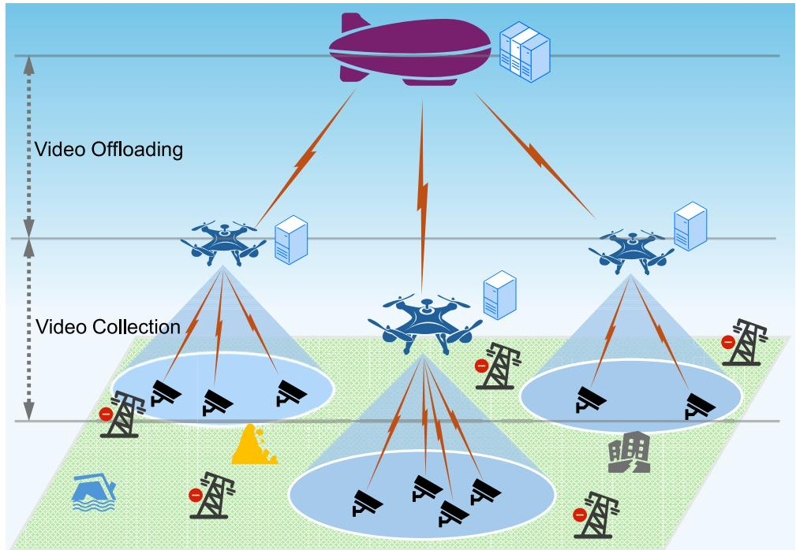

flowchart

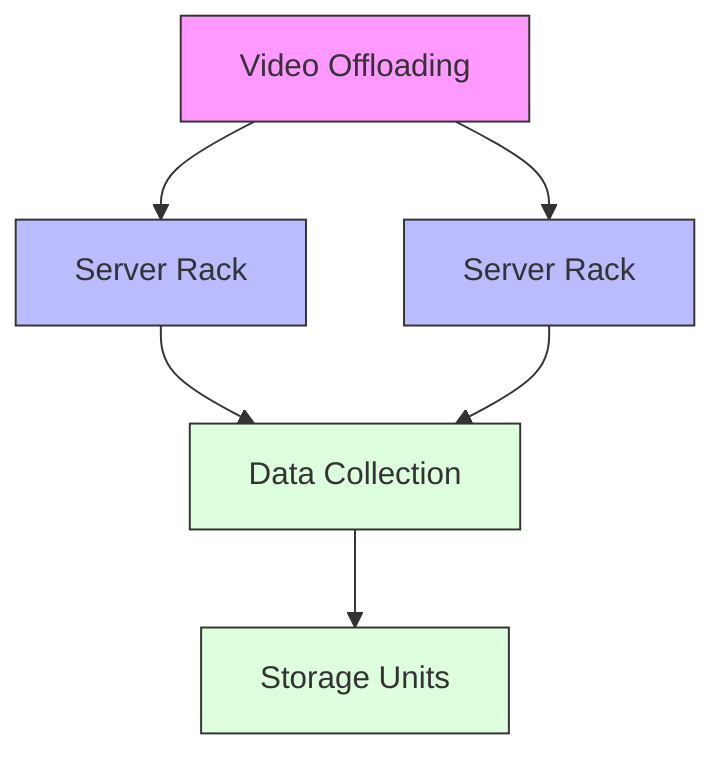

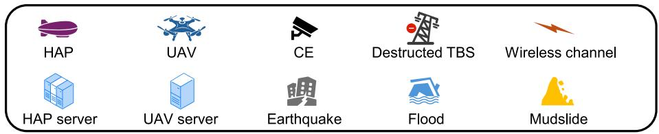

text_image

HAP
UAV
CE
Destructed TBS
Wireless channel
HAP server
UAV server
Earthquake
Flood
Mudslide

Fig. 2 Structure of system processing round   
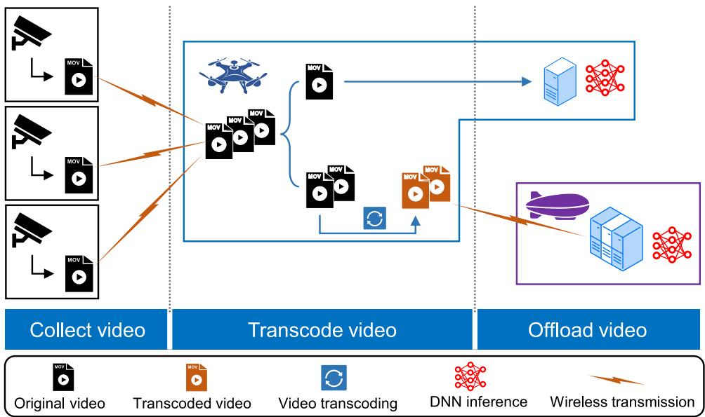

flowchart

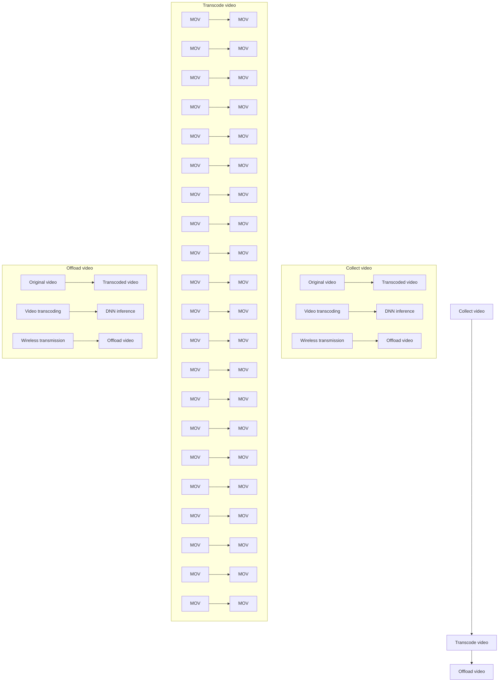

# Video transcoding model

Since the constrained computing capacity cannot allow UAV alone to well complete video analytics tasks, it need to offload a portion of the video to the HAP for processing. After collecting video in round i, UAV u first determines the offloading ratio $\eta _ { u } ( i ) ~ \in ~ [ 0 , 1 ]$ which indicates the proportion of the

video offloaded to HAP and $( 1 - \eta _ { u } ( i ) )$ represents the remaining video to be processed by UAV u.

When a great amount of video is transmitted through low UAV transmit power over tens of kilometers to HAP, long transmission time cannot be ignored. To tackle this problem, video transcoding can be utilized to compress video bitrate if the size of video to be offloaded is too large, thereby reducing transmission delay and even relieving stress of computation on HAP. So, we introduce an adaptive video transcoding mechanism. In particular, we let a binary variable $\epsilon _ { u } ( i )$ denotes whether UAV u need to transcode video before offloading, i.e.,

$$
\epsilon_ {u} (i) = \left\{ \begin{array}{l l} 1, & \text { UAV   } u \text {   trancodes   video   to   be   offloaded   }, \\ 0, & \text { otherwise }. \end{array} \right.
$$

More concretely, when $\epsilon _ { u } ( i ) = 1$ , UAV u needs to choose an appropriate transcoding ratio $\varepsilon _ { u } ( i ) \in \mathsf { \Gamma } [ \varepsilon _ { \operatorname* { m i n } } , 1 )$ $( \varepsilon _ { \mathrm { m i n } }$ is the minimum threshold that enables video analytics to function properly) for the portion to be offloaded based on the video size $\eta _ { u } ( i ) D _ { u } ( i )$ and the channel condition before offloading video to HAP. In practice, transcoding video also consumes some computation resource, thus bringing about delay of video trasncoding. According to [37], the computation resource required to transcode video by UAV u can be expressed as

$$
p _ {u} (i) = \epsilon_ {u} (i) \cdot \zeta (\varepsilon_ {u} (i) \eta_ {u} (i) D _ {u} (i)) ^ {\xi}, \tag {8}
$$

Where ζ and ξ are parameters of the fitting model of the transcoding CPU curves. Then, the delay of video transcoding by UAV u can be given by

$$
\begin{array}{l} T _ {u} ^ {\text { code }} (i) = \frac {p _ {u} (i)}{f _ {\mathrm{UAV}}} \\ = \frac {\epsilon_ {u} (i) \cdot \zeta (\varepsilon_ {u} (i) \eta_ {u} (i) D _ {u} (i)) ^ {\xi}}{f _ {\mathrm{UAV}}}, \\ \end{array}
$$

where $f _ { \mathrm { U A V } }$ denotes the computation resource consumed by HAP to compute 1bit data, i.e., the CPU cycles.

# Video offloading and inference model

After transcoded, the portion to be offloaded is transmitted to the HAP for video inference. Meanwhile, the other portion is executed locally on UAV. The delay of this phase mainly consists of video transmission delay and computation delay of video analytics.

# Video transmission to HAP

Once completing video transcoding, UAV u needs to transmit the transcoded video to HAP. According to [22], the transmission rate of UAV-to-HAP channel is given by

$$
r _ {u, h} (i) = \frac {B _ {h}}{| \mathcal {U} |} \log_ {2} \left(1 + \frac {P _ {u} G _ {h} L _ {l} L _ {s}}{k _ {B} T _ {h} B _ {h} / | \mathcal {U} |}\right), \tag {10}
$$

where $B _ { h }$ is the available bandwidth of uplink transmission to HAP and UAVs equally share it with each UAV occupies bandwidth resource of $\frac { B _ { h } } { | \boldsymbol { \mathcal { U } } | } . \ P _ { u }$ Bh denotes the transmit power of UAV u. $G _ { h }$ Urepresents the antenna power gain. $k _ { B }$ is the Boltzmann’s constant. $T _ { h }$ denotes the system noise temperature. $L _ { l }$ indicates the total line loss and $\begin{array} { r } { L _ { s } = \left( \frac { c } { 4 \pi d _ { u , h } f _ { h } } \right) ^ { 2 } } \end{array}$ represents the free space loss. Wherein, c is the speed of light, $f _ { h }$ is the center frequency, $d _ { u , h }$ is the distance between UAV u and HAP. It should be noted that the moving distance and flight height of UAV can be neglected compared to HAP hovering altitude, so $d _ { u , h }$ can be seen as a constant which is described as $d _ { u , h } = \sqrt { \| \mathbf { q } _ { u } ^ { \mathrm { U } } ( 1 ) - \mathbf { q } ^ { \mathrm { H } } \| ^ { 2 } + H _ { h } ^ { 2 } . \mathbf { q } _ { u } ^ { \mathrm { U } } ( 1 ) }$ is the initial horizon location of UAV $u , \mathbf { q } ^ { \mathrm { H } }$ is the stationary horizon location of HAP and $H _ { h }$ is HAP hovering altitude. Therefore, the transmission delay from UAV u to HAP can be given by

$$
\begin{array}{l} T _ {u} ^ {\mathrm{offl}} (i) = \epsilon_ {u} (i) \cdot \frac {\varepsilon_ {u} (i) \eta_ {u} (i) D _ {u} (i)}{r _ {u , h} (i)} \\ + \left(1 - \epsilon_ {u} (i)\right) \cdot \frac {\eta_ {u} (i) D _ {u} (i)}{r _ {u , h} (i)}. \tag {11} \\ \end{array}
$$

# Computation of video analytics

The DNN inference of video analytics on UAV u is synchronized with the video offloading to HAP. The combinative computation mainly involves inference of $\eta _ { u } ( i )$ video on UAV and inference of $( 1 - \eta _ { u } ( i ) )$ video on HAP. Separately, the computation delay for UAV u in round i is calculated by

$$
T _ {u} ^ {\mathrm{UAVcom}} (i) = \frac {(1 - \eta_ {u} (i)) D _ {u} (i) \cdot s}{f _ {\mathrm{UAV}}}, \tag {12}
$$

where s denotes the number of processing cycles required to execute 1 bit data. Because of ample computation resource, HAP can provide computing services for UAVs. We define $f _ { \mathrm { H A P } }$ and $\varphi _ { u } ( i )$ as the computing capacity of HAP and the proportion of computation resource allocated to UAV u, which satisfies $\begin{array} { r } { \varphi _ { u } ( i ) \in ( 0 , 1 ) , \sum _ { u \in \mathcal { U } } \varphi _ { u } ( i ) = 1 } \end{array}$ . Hence, the delay for DNN inference on HAP of video offloaded from UAV u is given by

$$
\begin{array}{l} T _ {u} ^ {\mathrm{HAPcom}} (i) = \epsilon_ {u} (i) \cdot \frac {\varepsilon_ {u} (i) \eta_ {u} (i) D _ {u} (i) s}{\varphi_ {u} (i) f _ {\mathrm{HAP}}} \\ + \left(1 - \epsilon_ {u} (i)\right) \cdot \frac {\eta_ {u} (i) D _ {u} (i) s}{\varphi_ {u} (i) f _ {\mathrm{HAP}}}. \\ \end{array}
$$

Then the total delay of video collection, transcoding, offloading and inference for UAV u in round i can be written as

$$
\begin{array}{l} T _ {u} ^ {\text { total }} (i) = T _ {u} ^ {\text { coll }} (i) + T _ {u} ^ {\text { code }} (i) \\ + \max \left\{T _ {u} ^ {\mathrm{UAVcom}} (i), T _ {u} ^ {\text { offfl }} (i) + T _ {u} ^ {\mathrm{HAPcom}} (i) \right\}. \tag {14} \\ \end{array}
$$

Therefore, the delay of this hierarchical aerial computing framework is expressed as

$$
T ^ {\text { sys }} (i) = \max \left\{\max _ {u \in \mathcal {U}} T _ {u} ^ {\text { total }} (i), \delta \right\} \tag {15}
$$

# UAV energy consumption model

Due to the limited UAV battery power, UAV energy consumption needs to be constrained. So in the system modeling, we consider the UAV energy consumption model.

We let $E _ { u } ( i )$ denotes the total energy consumption of UAV u in round i, which is comprised of basic operation energy $E ^ { \mathrm { b } } \ \mathrm { ( e . g . }$ ., hovering and flying energy), transmission energy $E _ { u } ^ { \mathrm { t r a n } } ( i )$ and computation energy $E _ { u } ^ { \mathrm { c o m } } ( i )$ . More specifically,

$$
\begin{array}{l} E _ {u} (i) = E ^ {\mathrm{b}} + E _ {u} ^ {\mathrm{tran}} (i) + E _ {u} ^ {\mathrm{com}} (i) \\ = \delta e ^ {\text { hover }} \\ + P _ {u} T _ {u} ^ {\text { offfl }} (i) \tag {16} \\ + \varsigma f _ {\mathrm{UAV}} ^ {3} \left(T _ {u} ^ {\mathrm{code}} (i) + T _ {u} ^ {\mathrm{UAVcom}} (i)\right), \\ \end{array}
$$

where $e ^ { \mathrm { h o v e r } } = 4 . 9 1 7 H _ { u } + 2 7 5 . 2 0 4 [ 3 8 ]$ represents the energy consumption of hovering at an altitude of $H _ { u }$ for 1 s. ς denotes the energy consumption coefficient related to the chip structure of UAV’s processor [39]. With the limitation of UAV battery capacity $E , E _ { u } ( i )$ must satisfy the constraint (17).

$$
\sum_ {i \in \mathcal {I}} E _ {u} (i) \leq E, \quad \forall u \in \mathcal {U}. \tag {17}
$$

# Problem formulation

Based on the proposed video offloading scheme, We can minimize delay by changing the strategy of offloading, transcoding and HAP resource allocation. However, in practice, the video analytics accuracy, which also determines the QoE of users, is directly affected by video quality. Lower bitrate video reduces delay but results in lower accuracy. In order to balance delay and video quality, we construct a QoE model and use it as the optimization objective to guide the offloading strategy. Specifically, this QoE model is designed by the following form,

$$
Q o E (i) = Q (i) - \alpha T ^ {\text { sys }} (i), \tag {18}
$$

where $T ^ { \mathrm { s y s } } ( i )$ is the delay according to (15). Q(i) represents the video quality model related to the transcoding ratio. Constant coefficient α denotes the relative weight of delay and video quality. To measure the relationship between video quality and video transcoding ratio, we model the video quality as a natural logarithm function of transcoding ratio as follows according to [40],

$$
\begin{array}{l} Q (i) = \sum_ {u \in \mathcal {U}} \left(\eta_ {u} (i) \ln \left(\frac {\epsilon_ {u} (i) \varepsilon_ {u} (i) + 1 - \epsilon_ {u} (i)}{\varepsilon_ {\mathrm{min}}}\right) \right. \\ + (1 - \eta_ {u} (i)) \ln \left(\frac {1}{\varepsilon_ {\min}}\right). \tag {19} \\ \end{array}
$$

Therefore, the optimization objective is written as (20a). We maximize the cumulative QoE by jointly optimizing offloading ratio, video transcoding ratio and HAP computation resource allocation to minimize delay and maximize average video bitrate. Accordingly, The optimization problem is formulated as

$$
\max _ {\substack {\eta_ {u} (i), \epsilon_ {u} (i), \\ \varepsilon_ {u} (i), \varphi_ {u} (i)}} \sum_ {i \in \mathcal {I}} Q o E (i), \tag{20a}
$$

$\begin{array} { r } { \mathrm { s . t . } \quad 0 \leq \eta _ { u } ( i ) \leq 1 , \quad \forall u \in \mathcal { U } , i \in \mathcal { I } , } \end{array}$ (20b)

$$
\epsilon_ {u} (i) \in \{0, 1 \}, \quad \forall u \in \mathcal {U}, i \in \mathcal {I}, \tag {20c}
$$

$$
\varepsilon_ {\min} \leq \varepsilon_ {u} (i) <   1, \quad \forall u \in \mathcal {U}, i \in \mathcal {I}, \tag {20d}
$$

$$
0 \leq \varphi_ {u} (i) \leq 1, \quad \forall u \in \mathcal {U}, i \in \mathcal {I}, \tag {20e}
$$

$$
\sum_ {u \in \mathcal {U}} \varphi_ {u} (i) = 1, \quad \forall i \in \mathcal {I}, \tag {20f}
$$

$$
\sum_ {i \in \mathcal {I}} E _ {u} (i) \leq E, \quad \forall u \in \mathcal {U}, \tag {20g}
$$

where constraint (20b) denotes the range of values of offloading ratio. Constraint (20c) indicates whether the video to be offloaded should be transcoded or not. Constraint (20d) denotes the range of video transcoding ratio with a minimum acceptable threshold $\varepsilon _ { \mathrm { { m i n } } }$ . Constraints (20e) and (20f) denote the computation resource allocation ratio of HAP and ensure the HAP computing capacity is fully utilized. Constraint (20g) ensures that the energy consumption of each UAV during the whole period does not exceed the their own battery capacity.

The formulated optimization problem is a mixed integer programming (MIP) problem which involves discrete and continuous variables. Solving this non-convex and NP-hard problem is challenge for traditional optimization approaches, especially under dynamic environments. Since DRL is quite adept at dealing with highly complex optimization problem, in the following, we model the problem (20a) as an MDP, and then propose a DRL-based algorithm named Deep Deterministic Policy Gradient (DDPG) algorithm to achieve continuous action control and obtain the optimal solution.

We treat the proposed hierarchical aerial computing system as an agent for action making. Because video offloading decisions only depend on the current environment state, the problem can be formulated as a MDP which can be described as a tuple $( \boldsymbol { S } , \boldsymbol { A } , \mathcal { P } , \boldsymbol { r } )$ , where  denotes the state space, denotes the action space, $p ( s _ { i + 1 } | s _ { i } , a _ { i } ) \ \in \ \mathcal { P }$ represents the transition probability of moving to state $s _ { i + 1 } \in S$ when action $a _ { i } ~ \in ~ { \mathcal { A } }$ is taken in state $s _ { i } ,$ and $r : \mathcal { S } \times \mathcal { A }  \mathcal { R }$ denotes the reward function. We define policy as π : $S  A ,$ , which indicates the mapping from a given state to the selected action. Specifically, these essential elements of the MDP are described as follows. Note that bold letters indicate matrices $( \mathrm { e . g . , } \eta _ { u } ( i ) = [ \eta _ { 1 } ( i ) , \cdot \cdot \cdot , \eta _ { u } ( i ) , \cdot \cdot \cdot , \eta _ { U } ( i ) ] )$ .

1) State Space: According to (1), (5), (7) and (10), the CEs association of each UAV along with the location of CEs and UAVs in round i are the main influential factor on video offloading decisions because they affect the transmission distance and the number of video chunks collected by each UAV. So the state space can be given by

$$
\mathcal {S} = \{\mathbf {q} _ {m} ^ {\mathrm{D}} (i), \mathbf {q} _ {u} ^ {\mathrm{U}} (i), \mathcal {M} _ {u} (i) \}. \tag {21}
$$

2) Action Space: Based on the environment state, each UAV should make appropriate decisions on offloading ratio, video transcoding ratio, and HAP needs to allocate right proportion of computation resource for tasks offloaded from UAVs. So the action space of the hierarchical aerial computing system is expressed as

$$
\mathcal {A} = \{\eta_ {u} (i), \epsilon_ {u} (i), \varepsilon_ {u} (i), \varphi_ {u} (i) \}. \tag {22}
$$

3) Reward: In the MDP framework, the reward function is utilized to quantify the consequence of actions taken by the agent at a specific state and serves as feedback for updating policy. In particular, in each round, The agent chooses actions in response to the observed state, subsequently receiving a reward value and next state. Guided by the reward value, the agent constantly learns and updates its policy. Considering the optimization objective, the reward function can be represented as

$$
r _ {i} = Q (i) - \alpha T ^ {\mathrm{sys}} (i). \tag {23}
$$

The agent aims to learn the optimal policy $\pi ^ { * }$ that maximizes the accumulated reward over time, and the discounted return which represents the accumulated reward involving a discount factor $\gamma \in [ 0 , 1 )$ from round i to termination can be expressed as

$$
R _ {i} = \sum_ {n = i} ^ {I} \gamma^ {n - i} r _ {n}. \tag {24}
$$

We define the state-value function as follows to denote the expected discounted return from state $s _ { i }$ under policy π,

$$
V _ {\pi} (s _ {i}) = \mathbb {E} _ {\pi} [ R _ {i} | s _ {i} ]. \tag {25}
$$

Furthermore, (25) can be reformulated into the Bellman equation as follows,

$$
V _ {\pi} (s _ {i}) = \mathbb {E} _ {\pi} \big [ r _ {i} + \gamma V _ {\pi} (s _ {i + 1}) \big ]. \tag {26}
$$

Similarly, the action-value function which represents the expected discounted return after selecting action $a _ { i }$ in state $s _ { i }$ under policy π can be also given by

$$
Q _ {\pi} (s _ {i}, a _ {i}) = \mathbb {E} _ {\pi} [ R _ {i} | s _ {i}, a _ {i} ], \tag {27}
$$

$$
= \mathbb {E} _ {\pi} \big [ r _ {i} + \gamma Q _ {\pi} (s _ {i + 1}, a _ {i + 1}) \big ]. \tag {28}
$$

Since our goal is to find the optimal policy $\pi ^ { * }$ , the optimal action at each state can be obtained from the optimal statevalue function as

$$
V ^ {*} (s _ {i}) = \max _ {a \in \mathcal {A}} \mathbb {E} _ {\pi} \big [ r _ {i} + \gamma V _ {\pi} (s _ {i + 1}) \big ]. \tag {29}
$$

Accordingly, the optimal action-value function can be written as

$$
Q ^ {*} (s _ {i}, a _ {i}) = \mathbb {E} _ {\pi} \big [ r _ {i} + \gamma V ^ {*} (s _ {i + 1}) \big ]. \tag {30}
$$

By continuously updating the policy π to infinitely approximate the optimal action-value function, we can harvest the optimal policy π∗. Based on the above basic principles of DRL, it is important to design an effective policy updating algorithm.

# Design of DDPG-based algorithm

In this section, we propose a DDPG algorithm to solve the optimization problem (20a). Given that the action space of the agent is continuous, DDPG algorithm can be regarded as a suitable choice because it uses a deterministic policy that maps a given state directly to a specific action. This is particularly advantageous in continuous action spaces because it avoids the need to sample actions from a probability distribution, which can be complex and computationally expensive.

The structure of the DDPG framework is shown in Fig. 3.

DDPG is an improved actor-critic (AC) algorithm, which means it has two main components:

1) Actor: This is the policy network $\mu$ with parameter $\theta _ { \mu }$ that outputs the actions for the agent to take when given a specific state. The policy in DDPG is defined as a deterministic function rather than a probability distribution over actions. To encourage exploration during training, noise is often added to the actions but it does not change the underlying deterministic nature of the policy. This approach is useful for continuous action spaces, where precise action selection is important.

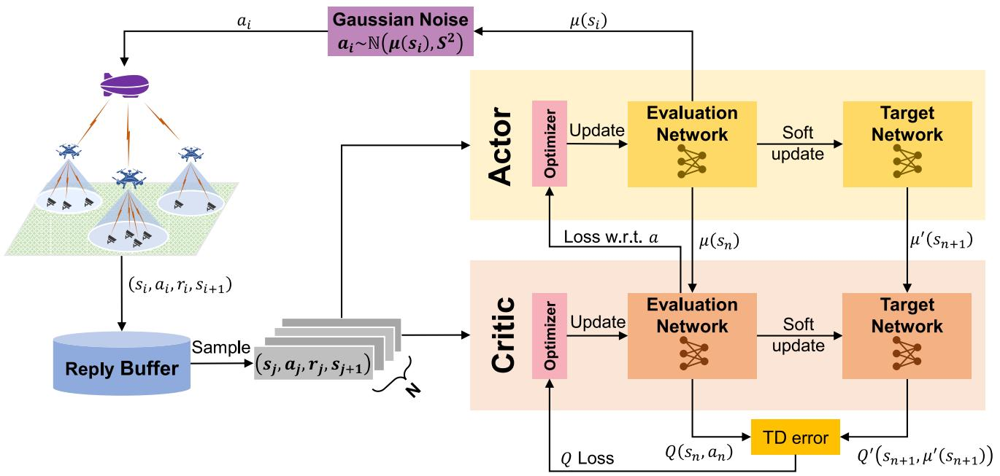

flowchart

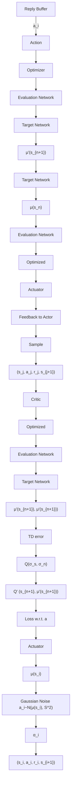

Fig. 3 The structure of DDPG framework

2) Critic: This is the value network $Q$ with parameter $\theta _ { Q }$ that estimates the action-value function (Q-function). The critic network evaluates the state-action pairs by approximating the action-value function. This estimate helps the actor to learn which actions are more beneficial in different states, allowing it to update its policy to maximize the expected return. In essence, the critic guides the actor towards making better decisions by assessing the value of different actions in various states.

Moreover, to stabilize the learning process, DDPG adds two target networks called target critic network $Q ^ { \prime }$ with parameter $\theta _ { Q ^ { \prime } }$ and target actor network $\mu ^ { \prime }$ with parameter $\theta _ { \mu ^ { \prime } }$ which are coupled with actor network and critic network respectively. These target networks are essentially copies of the main actor and critic networks, but they are updated less frequently and in a specific way to provide a more stable target for the training process. By lagging the target networks behind the main networks, DDPG can achieve more stable and effective learning in complex, continuous action spaces.

Besides, DDPG employs an experience replay buffer ${ \mathcal { C } } ,$ , which is a finite-size memory that stores previous experiences in the form of state, action, reward, and next state tuples $( s _ { i } , a _ { i } , r _ { i } , s _ { i + 1 } )$ . At each training step, a fixed number of experiences, with a minibatch N , are randomly selected from the buffer to update the neural networks. By mixing recent experiences with older ones, this mechanism helps to break the temporal correlation between consecutive samples, allowing the network to learn more effectively from a diverse set of experiences. This is crucial because it prevents the learning process from being overly influenced by the most recent experiences, which can lead to a biased estimate of the action-value function and thereby provide a more robust and generalized policy.

The specific algorithm flow is summarized in Algorithm 1.

1: Initialize actor network $\mu(s|\theta_{\mu})$ , critic network $Q(s,a|\theta_Q)$ , target actor network $\mu'(s|\theta_{\mu'})$ and target critic network $Q'(s,a|\theta_{Q'})$ 2: Initial replay buffer $\mathcal{C}$ 3: for episode $e=1:E$ do
4:    for $i=1:I$ do
5:    Perform action $a_i \sim \mathbb{N}(\mu(s_i|\theta_\mu, S^2))$ 6:    Get reward $r_i$ according to (23) and next state $s_{i+1}$ 7:    if $\mathcal{C}$ is not full then
8:    Store tuple $(s_i, a_i, r_i, s_{i+1})$ into $\mathcal{C}$ 9:    else
10:    Replace one tuple with $(s_i, a_i, r_i, s_{i+1})$ in $\mathcal{C}$ 11:    Randomly sample a batch of $N$ tuples from $\mathcal{C}$ 12:    Set $y_n = r_n + \gamma Q'(s_{n+1}, \mu'(s_{n+1}|\theta_{\mu'})|\theta_{Q'})$ 13:    Update $Q(s, a|\theta_Q)$ by minimizing the loss as (31)
14:    Update $\mu(s|\theta_\mu)$ through policy gradient as (32)
15:    Soft update the target networks as (33) and (34)
16:    end if
17:    end for
18: end for
19: Return $\mu(s|\theta_\mu)$

# Algorithm 1: DDPG algorithm.

Firstly, the parameters of actor network, critic network, target actor network and target critic network are initialized, the reply buffer  is emptied. Each training episode consists of I steps which represent I rounds during one working period of the hierarchical aerial computing system. At the beginning of step i, the system performs an action $a _ { i }$ from the actor network $\mu ( s | \theta _ { \mu } )$ with Gaussian noise and then gets a transition defined by a tuple $( s _ { i } , a _ { i } , r _ { i } , s _ { i + 1 } )$ . If the reply buffer is not full, this tuple will be stored into . Otherwise, this tuple will randomly replace an old experience and then sample a batch of N tuples from for next training. The algorithm updates the critic network Q by minimize the loss as

$$
L (\theta_ {Q}) = \frac {1}{N} \sum_ {n = 1} ^ {N} \left(y _ {n} - Q (s _ {n}, a _ {n} | \theta_ {Q})\right) ^ {2}, \tag {31}
$$

where $y _ { n } = r _ { n } + \gamma Q ^ { \prime } ( s _ { n + 1 } , \mu ^ { \prime } ( s _ { n + 1 } | \theta _ { \mu ^ { \prime } } ) | \theta _ { Q ^ { \prime } } )$ denotes the target value of the action-value function in the current state, which is the sum of the immediate reward $r _ { n }$ and discounted target action-value obtained from the target critic network $Q ^ { \prime } ( s , a | \theta _ { Q ^ { \prime } } )$ . The difference $( y _ { n } - Q ( s _ { n } , a _ { n } | \theta _ { Q } ) )$ ) is defined as temporal difference (CE) error. By minimizing the difference between the estimate the expected return for taking particular actions in given states. Furthermore, the actor network $\mu ( s | \theta _ { \mu } )$ can be updated by the policy gradient as

$$
\nabla_ {\theta_ {\mu}} J (\theta_ {\mu}) = \frac {1}{N} \sum_ {n = 1} ^ {N} \left(\nabla_ {\theta_ {\mu}} \mu (s _ {n} | \theta_ {\mu}) \nabla_ {a} Q (s _ {n}, a | \theta_ {Q}) | _ {a = \mu (s _ {n})}\right). \tag {32}
$$

Instead of adjusting parameters through gradient descent, the target networks adopt soft update to renew parameters as

$$
\theta_ {\mu^ {\prime}} \leftarrow \tau \theta_ {\mu} + (1 - \tau) \theta_ {\mu^ {\prime}}, \tag {33}
$$

$$
\theta_ {Q ^ {\prime}} \leftarrow \tau \theta_ {Q} + (1 - \tau) \theta_ {Q ^ {\prime}}, \tag {34}
$$

where the constant $\tau \in ( 0 , 1 )$ is the soft update factor. After E episodes, the actor network $\mu ( s | \theta _ { \mu } )$ is output as the final policy function.

# Simulation results and discussions

In this section, we first introduce the environment and parameters settings of the simulation experiment in Sect. 5.1. The convergence performance of the proposed DDPG algorithm is validated in Sect. 5.2 and we compare DDPG algorithm with other traditional DRL algorithms such as AC and Deep Q-Network (DQN) in Sect. 5.3 to highlights the effectiveness of our algorithm. Then, in Sect. 5.4, we compare our system with nonhierarchical computing systems and the system without video transcoding mechanism in terms of QoE, total delay (time cost of all system processing rounds) and average video bitrate under the influence of different variable factors to verify the superiority of our framework.

# Simulation setting

The experiment is conducted by simulation. As shown in the Fig. 4, in a Cartesian coordinate system (unit in meter, m), we set the area of a rectangular disaster region as 10 km × 10 km. One HAP is deployed at the origin at (0, 0), which is the central position of the region, and hovers at a fixed height of 20 km [18]. Three UAVs (U = 3) fly at the height of 1 km and move in uniform clockwise circular motion around circles of radius 1250 m centered at (0,2500), (2500,-2500) and (-2500,-2500) respectively. They all move at a constant speed of 10 m/s, starting from independently and uniformly random positions on their respective circumferences. Each UAV is responsible for a rectangular area of 5 km x 5 km designated as A1, A2, and A3, respectively, with the center of each UAV’s trajectory as the center point. Twenty CEs (M  20) on the ground are randomly distributed among these three areas at the beginning of each time slot. Although this setting does not strictly mimic the real environment, it satisfies the requirement of randomness and achieves the same simulation effect. Each CE generates video data and transmits one video chunk with data size v = 5Mbit. We set the original bitrate of the video chunk is 2.75 Mbps (1080p) and the correlation coefficients ζ and ξ of video transcoding in (8) are set as 1.54 and 0.08 respectively according to [37]. Each episode contains I = 100 system processing rounds. Except for the last experiment, the specific value of the coefficient α in the reward function is set to 0.05 in the experiments presented in Sects. 5.2, 5.3 and 5.4. Other simulation parameters of the system are shown in Table 2. All the algorithms are implemented by Python 3.7 and Tensorflow 2.11. The experiment runs on a desktop with 2.5GHz Intel Core i5-12400F, NVIDIA GeForce RTX 4060 8 G and 16 GB of RAM.

# Convergence evaluation

To assess the convergence performance of the proposed algorithm and obtain the hyperparameters best for algorithm convergence, we set different learning rates for the actor network and critic network in DDPG for iterative training. Fig. 5 shows the convergence results under different actor learning rates (L\_A) and critic learning rates (L\_C). It is obvious that, under different learning rates, the total reward increases with the growth of iterations, eventually converging to a value around a certain maximum, which demonstrates the effectiveness of the proposed DDPG algorithm in terms of convergence.

Among these learning rates, $\mathrm { L } \_ { \mathrm { A } / \mathrm { L } } \_ { \mathrm { C } = 1 } \mathrm { e } { - } 3 / 1 \mathrm { e } { - } 3$ is bestperforming, enabling the algorithm to converge to the maximum total reward more quickly than others. However, both excessively high and low learning rates, such as L\_A/L\_C=1e-2/1e-2 and L\_A/L\_C=1e-6/1e-6, play a negative impact on the algorithm’s convergence because they can lead to local optimal and suboptimal solutions. Therefore, we choose L\_A/L\_C=1e-3/1e-3 as the learning rate setting for further evaluation experiments.

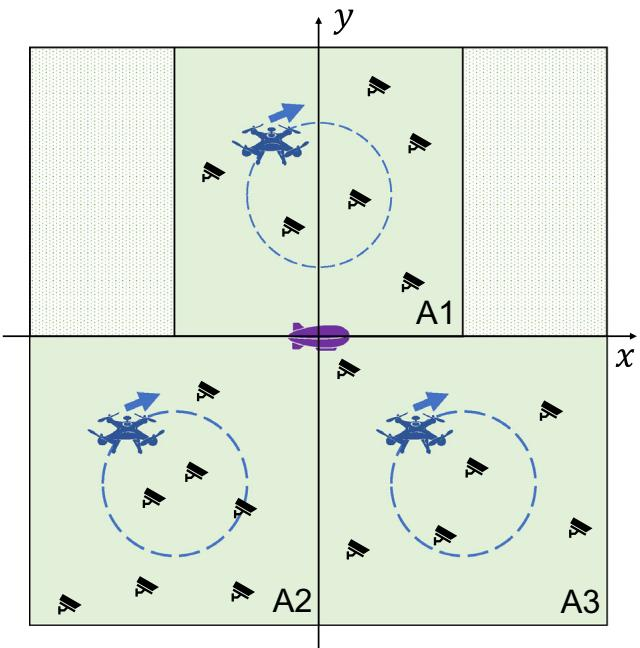

text_image

y
A1
x
A2
A3

Fig. 4 Simulation setting

Table 2 Simulation parameters 

<table><tr><td>Parameter</td><td>Value</td><td>Parameter</td><td>Value</td></tr><tr><td> $U$ </td><td>3</td><td> $M$ </td><td>20</td></tr><tr><td> $H_{u}$ </td><td>1 km</td><td> $H_{h}$ </td><td>20 km</td></tr><tr><td> $B_{u}$ </td><td>2 MHz</td><td> $B_{h}$ </td><td>10 MHz</td></tr><tr><td> $P_{m}$ </td><td>100 mW</td><td> $P_{u}$ </td><td>200 mW</td></tr><tr><td> $f_{\text{UAV}}$ </td><td>1 GHz</td><td> $f_{\text{HAP}}$ </td><td>50 GHz</td></tr><tr><td> $s$ </td><td> $10^{3}$  cycles/bit</td><td> $\varsigma$ </td><td> $10^{-28}$ </td></tr><tr><td> $v$ </td><td>5 Mbit</td><td> $L_{\text{max}}$ </td><td>10 km</td></tr><tr><td> $\sigma^{2}$ </td><td>-100 dBm/Hz</td><td> $G_{h}$ </td><td>15 dB</td></tr><tr><td> $T_{h}$ </td><td>1000 K</td><td> $k_{B}$ </td><td> $1.38 \times 10^{-23}$  J/K</td></tr><tr><td> $\lambda_{1}$ </td><td>9.61</td><td> $\lambda_{2}$ </td><td>0.16</td></tr><tr><td> $\zeta$ </td><td>1.54</td><td> $\xi$ </td><td>0.08</td></tr></table>

# Algorithm comparison

To verify the effectiveness of DDPG algorithm in terms of dealing with continuous action space under complex and dynamic environment, we compare the proposed algorithm with mainstream and classic reinforcement learning algorithms including DQN algorithm [41] and AC algorithm [42]. As shown in Fig. 6, the DDPG achieves the best performance in accumulated reward, which indicates DDPG algorithm is more adept at addressing optimization problems of this nature.

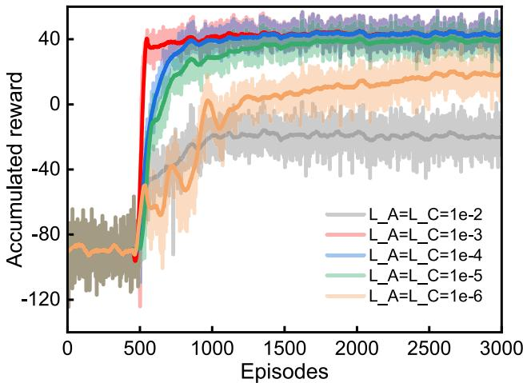

line

| Episodes | L_A=L_C=1e-2 | L_A=L_C=1e-3 | L_A=L_C=1e-4 | L_A=L_C=1e-5 | L_A=L_C=1e-6 |
| -------- | ------------ | ------------ | ------------ | ------------ | ------------ |
| 0        | -80          | -80          | -80          | -80          | -80          |
| 500      | -40          | -120         | -40          | -40          | -40          |
| 1000     | -20          | 40           | 40           | 40           | 40           |
| 1500     | -10          | 40           | 40           | 40           | 40           |
| 2000     | -5           | 40           | 40           | 40           | 40           |
| 2500     | -5           | 40           | 40           | 40           | 40           |
| 3000     | -5           | 40           | 40           | 40           | 40           |

Fig. 5 Convergence performance of DDPG

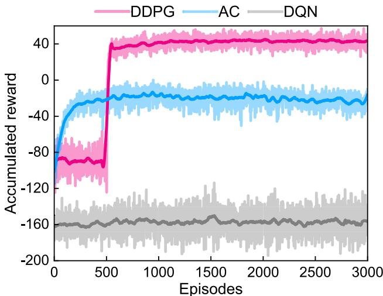

line

| Episodes | DDPG  | AC    | DQN   |
| -------- | ----- | ----- | ----- |
| 0        | -120  | -80   | -160  |
| 500      | 40    | -20   | -160  |
| 1000     | 40    | -20   | -160  |
| 1500     | 40    | -20   | -160  |
| 2000     | 40    | -20   | -160  |
| 2500     | 40    | -20   | -160  |
| 3000     | 40    | -20   | -160  |

Fig. 6 The performance of different algorithms

Notably, DQN does not converge. Since DQN relies on finding the action that maximizes the action-value function, it requires iterating over an infinite number of possible actions in continuous action space, this process is computationally intractable and not feasible. Although AC can handle continuous action space, it does not work well in complex and dynamic environment environments because updates to the critic network can affect the policy outputted by actor network, leading to instability in the learning process. DDPG, by contrast, uses target networks and experience replay mechanism to reduce variance in the training process, thereby improving its stability and convergence.

# Performance evaluation

To evaluate the performance of the proposed hierarchical computing framework in video offloading. We compare the proposed system with nonhierarchical computing systems including UAV-only system (only UAVs compute) and HAP-only system (only HAP computes) to demonstrate the advantage of hierarchical aerial computing in handling computation-intensive video analytics. Moreover, we make whether to adopt a video transcoding mechanism as a variable for comparative experiments to highlight the effectiveness of video transcoding in optimizing delay. Average QoE, total delay and average video bitrate as evaluation metrics.

Figure 7a uses average QoE as a metric to comprehensively evaluate delay and video quality. Our scheme achieves the best performance. To demonstrate the effectiveness of the constructed QoE model in trading off delay and video quality, we make total delay and average video bitrate as independent metrics to evaluate in separate experiments. Figure 7b shows the total delay in one working period with different systems and algorithms. It is obvious that our proposed system attains the lowest delay. The HAP-only system results in more transmission delay due to long-distance single-hop transmission of larger volumes of video data. The UAV-only system causes more computational delay because the limited computation resource of UAVs cannot handle computation-intensive video analytics. It is noteworthy that the hierarchical system without video transcoding (HAP+UAV w.o.tra) leads to more delay, which verifies the proposed adaptive video transcoding mechanism can well optimize delay and can hold significant value in real-time applications. In the matter of video quality, as show in Fig. 7c, the average video bitrate considerably drops in HAP-only system, down to below 2000 kbps. A reasonable explanation is that the amount of video to be offloaded to HAP is too large and needed to be transmitted at a lower bitrate to make the transmission delay allowable. In contrast, the average bitrate of the offloaded video can reach 2458 kbps in the proposed hierarchical aerial computing system. In comparison to the original video bitrate of 2750kbps, 10.6% reduction in video bitrate contributes to 18.2% improvement in total delay, enhancing the average QoE without a substantial loss in the accuracy of DNN model inference. The above set of experiments not only verifies the superiority of the proposed system in video offloading, but also proves the validity of the constructed QoE model.

We explore the influence of different factor variations on the performance of the proposed system. We choose three main factors that affect the system latency, namely, task size (size of video chunk), UAV computing capacity, and UAV-HAP communication bandwidth.

Figure 8 shows the impacts of the size of video chunk on the performance under different system settings. The results clearly indicate that the proposed video offloading system excels in optimizing delay when faced with different size of video data. Especially when the video chunk is larger, the proposed method shows a greater advantage compared to other system settings. Even with a loss in video quality, our proposed method still has a significant superiority in video bitrate compared to HAP-only system.

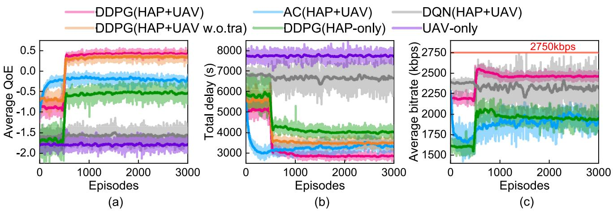

Fig. 7 Comparison of a average QoE, b total delay, and c average video bitrate with different settings   
Fig. 8 Comparison of a average QoE, b total delay, and c average video bitrate versus size of video chunk v of the proposed and comparison schemes: $B _ { h } =$ 10 MHz, $f _ { \mathrm { U A V } } = 1 ~ \mathrm { G H z }$   
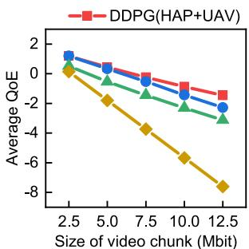

line

| Size of video chunk (Mbit) | DDPG(HAP+UAV) |
| -------------------------- | ------------- |
| 2.5                        | 0.0           |
| 5.0                        | -1.0          |
| 7.5                        | -2.0          |
| 10.0                       | -3.0          |
| 12.5                       | -4.0          |

（a)

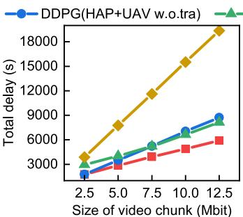

line

| Size of video chunk (Mbit) | DDPG(HAP+UAV w.o. tra) | DDPG |
| -------------------------- | ---------------------- | ---- |
| 2.5                        | 3000                   | 3000 |
| 5.0                        | 6000                   | 4000 |
| 7.5                        | 9000                   | 5000 |
| 10.0                       | 12000                  | 6000 |
| 12.5                       | 18000                  | 9000 |

(b)

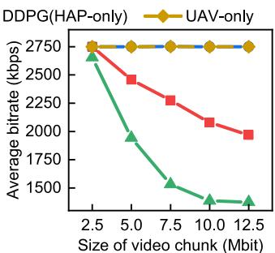

line

| Size of video chunk (Mbit) | DDPG(HAP-only) | UAV-only |
| -------------------------- | -------------- | -------- |
| 2.5                        | 2750           | 2750     |
| 5.0                        | 2750           | 2750     |
| 7.5                        | 2750           | 2750     |
| 10.0                       | 2750           | 2750     |
| 12.5                       | 2750           | 2750     |

（c）

Fig. 9 Comparison of a average QoE, b total delay, and c average video bitrate versus UAV computing capacity fUAV of the proposed and comparison schemes: $B _ { h } = 1 0  { \mathrm { M H z } }$ , v = 5 Mbit   
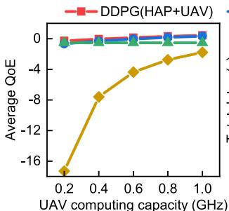

line

| UAV computing capacity (GHz) | DDPG(HAP+UAV) | DDPG(HAP+UAV) | DDPG(HAP+UAV) |
| ---------------------------- | ------------- | ------------- | ------------- |
| 0.2                          | -16           | -1           | -1            |
| 0.4                          | -8            | -1           | -1            |
| 0.6                          | -4            | -1           | -1            |
| 0.8                          | -2            | -1           | -1            |
| 1.0                          | 0             | -1           | -1            |

（a)

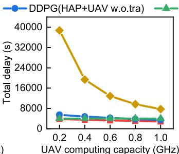

line

| UAV computing capacity (GHz) | DDPG(HAP+UAV w.o. tra) | Total delay (s) |
| ---------------------------- | ---------------------- | --------------- |
| 0.2                          | ~6000                  | 40000           |
| 0.4                          | ~5000                  | 20000           |
| 0.6                          | ~4000                  | 15000           |
| 0.8                          | ~3000                  | 10000           |
| 1.0                          | ~2000                  | 8000            |

（b)

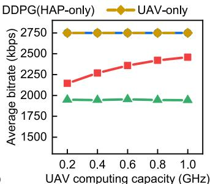

line

| UAV computing capacity (GHz) | DDPG(HAP-only) | UAV-only |
| ---------------------------- | -------------- | -------- |
| 0.2                          | 2750           | 2100     |
| 0.4                          | 2750           | 2250     |
| 0.6                          | 2750           | 2350     |
| 0.8                          | 2750           | 2450     |
| 1.0                          | 2750           | 2500     |

Figure 9 investigates the effect of UAV computing capacity on system performance for video transcoding delay and UAV task computation delay are directly related to UAV computing capacity. We can view that when UAV computing capacity is weaker, the average video bitrate of the offloaded video is lower. The reason for this result is UAVs need to offload more video chunks to HAP. Additionally, in video transcoding, more computation resource are required if the target bitrate is higher according to (8), which can also explain the decline in video quality as the UAV computing capacity decreases. It is commendable that the proposed method has the lower delay than other settings under different UAV computing capacity.

Because of the single-hop distance of tens kilometers and limited UAV transmit power, the bandwidth between UAV and HAP is also an influential factor that cannot be ignored on delay. So we further evaluate the performance of the proposed method under different UAV-HAP bandwidth in Fig. 10. We can observe that the adaptive video transcoding mechanism has remarkable improvement in delay when the UAV-HAP bandwidth is low. With the increase of bandwidth, the performance is getting closer to the hierarchical system without video transcoding mechanism (HAP+UAV w.o.tra), that is because high bandwidth makes UAVs do not need to transcode video to optimize transmission delay. This explanation can also be reflected in Fig. 10c, where the average bitrate moves closer to original bitrate 2750kbps when bandwidth is higher.

Fig. 10 Comparison of a average QoE, b total delay, and c average video bitrate versus available bandwidth resource $B _ { h }$ at the HAP of the proposed and comparison schemes: $f _ { \mathrm { U A V } } = 1$ GHz, v = 5 Mbit   
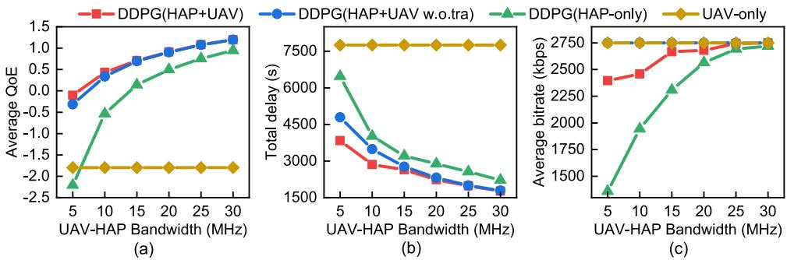

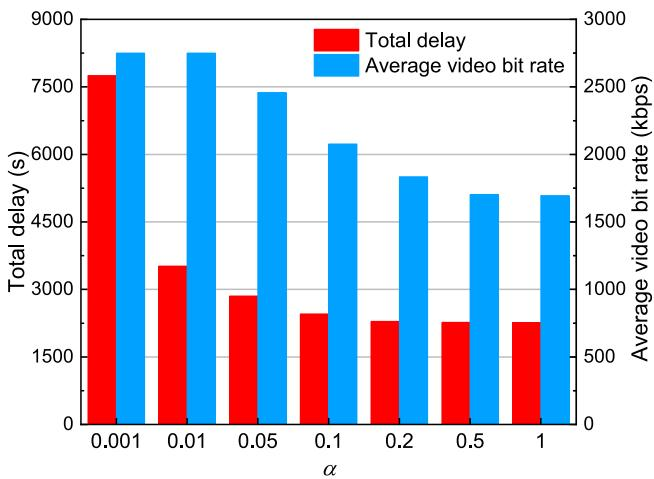

bar_line

| α     | Total delay (s) | Average video bit rate (kbps) |
|-------|-----------------|-------------------------------|
| 0.001 | 7600            | 2800                          |
| 0.01  | 3200            | 2800                          |
| 0.05  | 2900            | 2400                          |
| 0.1   | 2800            | 2100                          |
| 0.2   | 2700            | 1800                          |
| 0.5   | 2700            | 1700                          |
| 1     | 2700            | 1650                          |

Fig. 11 Effect of different value of coefficient α

Finally, in order to better guide the real-world deployment of the algorithm and satisfy diverse application demands, we explore the effect of different values of coefficient α in (18) on the optimization results in Fig. 11. We observe that the total delay and the average video bitrate decrease as the value of α increases. Algorithm users can adjust the value of coefficient α to achieve different emphases on delay and video quality. For example, we can set a higher value for α to achieve higher video quality, or a lower value to achieve lower delay. This experiment therefore serves as an operational deployment guide.

# Conclusion

This paper designs a hierarchical aerial computing framework for video offloading in disaster rescue. To improve tradeoff between delay and video quality, we adopt an adaptive UAV-HAP cooperative computing and video transcoding scheme. We allow the UAVs to partially offload video to the HAP for video analytics and introduce video transcoding to ensure the video is transmitted to the HAP at an appropriate bitrate. In order to achieve adaptive ratio of video offloading and transcoding, a QoE model measured by delay and transcoding strategy is constructed as the optimization objective. Considering the complexity of this optimization problem, the problem is transformed into an MDP. Then we propose a DDPG algorithm to solve this problem by jointly optimizing offloading ratio, video transcoding ratio and HAP computation resource allocation. Extensive simulation experiments have demonstrated the advantages of the proposed hierarchical aerial computing system and DDPG algorithm. The problem investigated in this paper is novel and focuses on video offloading task, which is a good complement to research on traditional offloading tasks in aerial computing. However, limitations of this study are that only simulation experiments are used to validate the proposed method, and the experimental scale was relatively small [48]. Additionally, the UAV trajectory control is not discussed in this paper, which would also be a fruitful area for further work.

Author Contributions Yifei Bao: Investigation, Methodology, Software, Writing-original draft. Jinghui Zhang: Supervision, Writingreview & editing. Yi Cheng: Writing-review & editing. Dengyin Zhang: Funding acquisition, Investigation. Rongguo Fu: Investigation.

Funding This work was supported by National Natural Science Foundation of China [No. 62471241]; and Postgraduate Research & Practice Innovation Program of Jiangsu Province [KYCX24\_1201].

Data availability The data generated or analyzed during the current study are available from the corresponding author [Zhang] or the email 2023070806@njupt.edu.cn upon reasonable request.

# Declarations

Conflict of interest All authors certify that they have no affiliations with or involvement in any organization or entity with any financial interest or non-financial interest in the subject matter or materials discussed in this manuscript.

Consent for publication Not applicable

Open Access This article is licensed under a Creative Commons Attribution-NonCommercial-NoDerivatives 4.0 International License, which permits any non-commercial use, sharing, distribution and reproduction in any medium or format, as long as you give appropriate credit to the original author(s) and the source, provide a link to the Creative Commons licence, and indicate if you modified the licensed material. You do not have permission under this licence to share adapted material derived from this article or parts of it. The images or other third party material in this article are included in the article’s Creative Commons licence, unless indicated otherwise in a credit line to the material. If material is not included in the article’s Creative Commons licence and your intended use is not permitted by statutory regulation or exceeds the permitted use, you will need to obtain permission directly from the copyright holder. To view a copy of this licence, visit http://creativecommons.org/licenses/by-nc-nd/4.0/.

# References

1. Valarmathi B, Kshitij J, Dimple R et al (2023) Human detection and action recognition for search and rescue in disasters using yolov3 algorithm. J Electr Comput Eng 1:5419384. https://doi.org/ 10.1155/2023/5419384   
2. Kizilay F, Narman MR, Song H et al (2024) Evaluating fine tuned deep learning models for real-time earthquake damage assessment with drone-based images. AI Civil Eng 3(1):1–18. https://doi.org/ 10.1007/s43503-024-00034-6   
3. Niyazi M, Behnamian J (2023) Application of emerging digital technologies in disaster relief operations: a systematic review. Arch Comput Methods Eng 30(3):1579–1599. https://doi.org/10.1007/ s11831-022-09835-3   
4. C. Luo, J. Zhang, J. Guo, Y. Hong, Z. Chen and S. Gu, “Energy Efficiency Maximization in RISs-Assisted UAVs-Based Edge Computing Network Using Deep Reinforcement Learning,” in Big Data Mining and Analytics, vol. 7, no. 4, pp. 1065–1083, December 2024, https://doi.org/10.26599/BDMA.2024.9020022   
5. Song T, Lopez D, Meo M, et al (2024) High altitude platform stations: the new network energy efficiency enabler in the 6g era. In: 2024 IEEE wireless communications and networking conference (WCNC), IEEE, pp 1–6, https://doi.org/10.1109/WCNC57260. 2024.10571153   
6. Wang D, Giordani M, Alouini MS et al (2021) The potential of multilayered hierarchical nonterrestrial networks for 6g: a comparative analysis among networking architectures. IEEE Veh Technol Mag 16(3):99–107. https://doi.org/10.1109/MVT.2021.3085168   
7. Xu R, Razavi S, Zheng R (2023) Edge video analytics: a survey on applications, systems and enabling techniques. IEEE Commun Surv Tutor. https://doi.org/10.1109/COMST.2023.3323091   
8. Krichen M (2023) Convolutional neural networks: a survey. Computers 12(8):151. https://doi.org/10.3390/computers12080151   
9. Han K, Wang Y, Chen H et al (2022) A survey on vision transformer. IEEE Trans Pattern Anal Mach Intell 45(1):87–110. https://doi.org/ 10.1109/TPAMI.2022.3152247   
10. Coutinho RW, Boukerche A (2022) Uav-mounted cloudlet systems for emergency response in industrial areas. IEEE Trans Industr Inf 18(11):8007–8016. https://doi.org/10.1109/TII.2022.3174113   
11. Oddi L, Cremonese E, Ascari L et al (2021) Using uav imagery to detect and map woody species encroachment in a subalpine grassland: advantages and limits. Remote Sens 13(7):1239. https://doi. org/10.3390/rs13071239   
12. Shi B, Chen Z, Xu Z (2024) A deep reinforcement learning based approach for optimizing trajectory and frequency in energy constrained multi-uav assisted mec system. IEEE Trans Netw Serv Manag. https://doi.org/10.1109/TNSM.2024.3362949   
13. Alam MS, Kurt GK, Yanikomeroglu H et al (2021) High altitude platform station based super macro base station constel-

lations. IEEE Commun Mag 59(1):103–109. https://doi.org/10. 1109/MCOM.001.2000542   
14. Jia Z, Sheng M, Li J, et al (2021) Joint data collection and transmission in 6g aerial access networks. In: 2021 IEEE global communications conference (GLOBECOM), IEEE, pp 1–6, https://doi.org/ 10.1109/GLOBECOM46510.2021.9685072   
15. Kurt GK, Khoshkholgh MG, Alfattani S et al (2021) A vision and framework for the high altitude platform station (haps) networks of the future. IEEE Commun Surv Tutor 23(2):729–779. https:// doi.org/10.1109/COMST.2021.3066905   
16. Nauman A, Alruwais N, Alabdulkreem E et al (2023) Empowering smart cities: high-altitude platforms based mobile edge computing and wireless power transfer for efficient iot data processing. Internet Things 24:100986. https://doi.org/10.1016/j.iot.2023.100986   
17. Mershad K, Dahrouj H, Sarieddeen H et al (2021) Cloud-enabled high-altitude platform systems: challenges and opportunities. Front Commun Netw 2:716265. https://doi.org/10.3389/frcmn. 2021.716265   
18. Wang Y, Zhang C, Ge T et al (2024) Computation offloading via multi-agent deep reinforcement learning in aerial hierarchical edge computing systems. IEEE Trans Netw Sci Eng. https://doi.org/10. 1109/TNSE.2024.3391289   
19. Wu K, Cao X, Yang P et al (2023) Qoe-driven video transmission: energy-efficient multi-uav network optimization. IEEE Trans Netw Sci Eng 11(1):366–379. https://doi.org/10.1109/ TNSE.2023.3298782   
20. Laghari AA, Zhang X, Shaikh ZA et al (2024) A review on quality of experience (qoe) in cloud computing. J Reliab Intell Environ 10(2):107–121. https://doi.org/10.1007/s40860-023-00210-y   
21. Chen X, Hwang JN, Meng D et al (2016) A quality-of-contentbased joint source and channel coding for human detections in a mobile surveillance cloud. IEEE Trans Circuits Syst Video Technol 27(1):19–31. https://doi.org/10.1109/TCSVT.2016.2539758   
22. Jia Z, Wu Q, Dong C et al (2022) Hierarchical aerial computing for internet of things via cooperation of haps and uavs. IEEE Internet Things J 10(7):5676–5688. https://doi.org/10.1109/JIOT.2022. 3151639   
23. Lakew DS, Tran AT, Dao NN et al (2022) Intelligent offloading and resource allocation in heterogeneous aerial access iot networks. IEEE Internet Things J 10(7):5704–5718. https://doi.org/10.1109/ JIOT.2022.3161571   
24. Kang H, Chang X, Miši´c J et al (2023) Cooperative uav resource allocation and task offloading in hierarchical aerial computing systems: a mappo-based approach. IEEE Internet Things J 10(12):10497–10509. https://doi.org/10.1109/JIOT.2023. 3240173   
25. Ladosz P, Weng L, Kim M et al (2022) Exploration in deep reinforcement learning: a survey. Inf Fusion 85:1–22. https://doi.org/ 10.1016/j.inffus.2022.03.003   
26. Zhang Y, Mou Z, Gao F et al (2020) Uav-enabled secure communications by multi-agent deep reinforcement learning. IEEE Trans Veh Technol 69(10):11599–11611. https://doi.org/10.1109/TVT. 2020.3014788   
27. Liu Y, Yan J, Zhao X (2022) Deep reinforcement learning based latency minimization for mobile edge computing with virtualization in maritime uav communication network. IEEE Trans Veh Technol 71(4):4225–4236. https://doi.org/10.1109/TVT.2022. 3141799   
28. Kim S (2024) Hierarchical aerial offload computing algorithm based on the Stackelberg-evolutionary game model. Comput Netw 245:110348. https://doi.org/10.1016/j.comnet.2024.110348   
29. Wang Z, He X, Zhang Z et al (2022) Edge-assisted real-time video analytics with spatial-temporal redundancy suppression. IEEE Internet Things J 10(7):6324–6335. https://doi.org/10.1109/ JIOT.2022.3224750

30. Liu H, Cao G (2022) Deep learning video analytics through online learning based edge computing. IEEE Trans Wirel Commun 21(10):8193–8204. https://doi.org/10.1109/TWC.2022.3164598   
31. Wang S, Bi S, Zhang YJA (2023) Edge video analytics with adaptive information gathering: a deep reinforcement learning approach. IEEE Trans Wirel Commun 22(9):5800–5813. https:// doi.org/10.1109/TWC.2023.3237202   
32. Ma W, Mashayekhy L (2024) Video offloading in mobile edge computing: dealing with uncertainty. IEEE Trans Mob Comput. https://doi.org/10.1109/TMC.2024.3369685   
33. Zhao P, Yang Z, Zhang G (2024) Personalized and differential privacy-aware video stream offloading in mobile edge computing. IEEE Trans Cloud Comput 12(1):347–358. https://doi.org/10. 1109/TCC.2024.3362355   
34. Shao J, Zhang X, Zhang J (2023) Task-oriented communication for edge video analytics. IEEE Trans Wirel Commun. https://doi.org/ 10.1109/TWC.2023.3314888   
35. Gapeyenko M, Moltchanov D, Andreev S et al (2021) Line-of-sight probability for mmwave-based uav communications in 3d urban grid deployments. IEEE Trans Wirel Commun 20(10):6566–6579. https://doi.org/10.1109/TWC.2021.3075099   
36. Al-Hourani A, Kandeepan S, Lardner S (2014) Optimal lap altitude for maximum coverage. IEEE Wirel Commun Lett 3(6):569–572. https://doi.org/10.1109/LWC.2014.2342736   
37. Aparicio-Pardo R, Pires K, Blanc A, et al (2015) Transcoding live adaptive video streams at a massive scale in the cloud. In: Proceedings of the 6th ACM multimedia systems conference, pp 49–60, https://doi.org/10.1145/2713168.2713177   
38. Panda KG, Wilson A, Sen D (2022) Energy-efficient initial deployment and ml-based postdeployment strategy for uav network with guaranteed qos. IEEE Trans Aerosp Electron Syst 58(6):5220– 5239. https://doi.org/10.1109/TAES.2022.3167386   
39. Qin Z, Wang H, Wei Z et al (2021) Task selection and scheduling in uav-enabled mec for reconnaissance with time-varying priorities. IEEE Internet Things J 8(24):17290–17307. https://doi.org/ 10.1109/JIOT.2021.3078746   
40. Sun Y, Yin X, Jiang J, et al (2016) Cs2p: Improving video bitrate selection and adaptation with data-driven throughput prediction. In: Proceedings of the 2016 ACM SIGCOMM conference, pp 272– 285, https://doi.org/10.1145/2934872.2934898

41. Bouazizi M, Yang S, Ohtsuki T (2024) A low-complexity clustering-aided dqn method for dynamic antenna control in haps. In: 2024 IEEE 99th vehicular technology conference (VTC2024-Spring), IEEE, pp 1–6, https://doi.org/10.1109/ VTC2024-SPRING62846.2024.10683063   
42. Zhang L, Tan R, Zhang Y et al (2024) Uav-assisted dependencyaware computation offloading in device-edge-cloud collaborative computing based on improved actor-critic drl. J Syst Architect 154:103215. https://doi.org/10.1016/j.sysarc.2024.103215   
43. S. Kumar (2024) AI/ML Enabled Automation System for Software Defined Disaggregated Open Radio Access Networks: Transforming Telecommunication Business. Big Data Min Anal 7(2), 271– 293, June 2024, https://doi.org/10.26599/BDMA.2023.9020033   
44. Zhao H, Shi Y, Liu M, Zhu H, Xun W (2025) Fairness Can Save Lives: A MAB Based Client Selection Strategy for Federated Learning Towards IoV Assisted ITS. IEEE Trans Veh Technol 74(4):5430–5441. https://doi.org/10.1109/TVT.2024.3507358   
45. Jiang C, Xu J, Yin L (2025) Improved Aerial Video Compression for UAV System Based on Historical Background Redundancy. Tsinghua Sci Techno 30(6):2366–2383. https://doi.org/10.26599/ TST.2024.9010110   
46. Ahmad S, Zhang J, Nauman A, Khan A, Abbas K, Hayat B (2025) Deep-EERA: DRL-Based Energy-Efficient Resource Allocation in UAV-Empowered Beyond 5G Networks. Tsinghua SciTechnol 30(1):418–432. https://doi.org/10.26599/TST.2024.9010071   
47. Du H, Liu M, Liu N, Li D, Li D, Xu L (2025) Scheduling of Low-Latency Medical Services in Healthcare Cloud with Deep Reinforcement Learning. Tsinghua Sci Technol 30(1):100–111. https://doi.org/10.26599/TST.2024.9010033   
48. Zhao H, Pan C, Liu M, Jiao D, Zhu H (2025) Adaptive Noise Trap of Layered Differential Privacy Against Privacy Leakage for Large-Scale Industrial Federated Learning. IEEE Trans Netw Sci Engi 12(5):4044–4059. https://doi.org/10.1109/TNSE.2025.3568030

Publisher’s Note Springer Nature remains neutral with regard to jurisdictional claims in published maps and institutional affiliations.