# Hammurabi: Establish Cooperative Order From Pre-Trained Policies in Multi-UAV Networks

Dezhi Chen , Hongchuan He, Qi Qi , Senior Member, IEEE, Jingyu Wang, Senior Member, IEEE, Rongxin Han , Bo He , Zirui Zhuang , Qianlong Fu, Jianxin Liao, and Zhu Han , Fellow, IEEE

Abstract—Multi-agent cooperation is an open challenge in intelligent transportation systems (ITS). Traditional rule-based algorithms struggle to adapt to dynamic and uncertain environments, while learning-based algorithms are hindered by the scarcity and cost of labeled data. Reinforcement Learning (RL) offers a promising solution within ITS, as it allows for data acquisition through environmental interaction. However, our investigation has identified two primary issues when deploying RL-based algorithms: (1) The design of the reward function should strike a balance between the cooperative and competitive attributes of the system. Purely cooperative reward designs are challenging to learn due to delayed and sparse feedback, while individualized competitive reward designs may promote selfish behavior and rely heavily on expert knowledge. (2) Learning RL from scratch is also problematic due to the reliance of data generation on policy exploration. Pre-training can provide an initial model to circumvent learning difficulties, but its performance is constrained by the traditional algorithm that supplies the data, necessitating novel solutions to further improve model performance. In this paper, we introduce Hammurabi, a framework designed to enhance cooperation and improve the pre-training model within ITS. Hammurabi employs

Received 31 July 2024; revised 15 October 2025; accepted 5 January 2026. Date of publication 19 January 2026; date of current version 3 February 2026. This work was supported in part by the National Key R&D Program of China under Grant 2024YFE0200800, in part by the National Natural Science Foundation of China under Grant 62401080, Grant 62321001, Grant 62471055, Grant U23B2001, Grant 62101064, Grant 62171057, Grant 62201072, and Grant 62071067, in part by the Ministry of Education Discipline Breakthrough Pilot Program under Grant 102105252350010000032, in part by the High-Quality Development Project of the MIIT under Grant 2440STCZB2584, in part by the Ministry of Education and China Mobile Joint Fund under Grant MCM20200202 and Grant MCM20180101, in part by the Project funded by China Postdoctoral Science Foundation under Grant 2023TQ0039, Grant 2024M750257, and Grant GZC20230320, in part by the Fundamental Research Funds for the Central Universities under Grant 2024PTB-004, in part by the 2025 Education and Teaching Reform Project Funding at Beijing University of Posts and Telecommunications under Grant 2025YZ005, in part by the NSFECCS under Grant 2302469, and in part by Amazon and Japan Science and Technology Agency (JST) Adopting Sustainable Partnerships for Innovative Research Ecosystem. Recommended for acceptance by Y. Yang. (Corresponding authors: Jingyu Wang; Qi Qi.)

Digital Object Identifier 10.1109/TPDS.2026.3654605

a social dilemma tool to assess the cooperative properties of the pre-trained policy and incorporates them into specific game models. Based on specific game models, we can leverage existing mature conclusions from game theory to assist in the design of reinforcement learning, thereby enhancing agent cooperation. Theoretical analysis shows that by adopting a multi-agent reinforcement learning scheme with policy shared parameters, Hammurabi can converge multi-agent policies to Nash equilibrium. We illustrate the application of Hammurabi in addressing practical issues within a multi-objective optimization multi-UAV system, demonstrating performance improvements across various optimization objectives compared to baseline algorithms.

Index Terms—Intelligent transportation system (ITS), UAV, multi-agent deep reinforcement learning (RL), social dilemmas, pre-train, reward.

## I. INTRODUCTION

W ITH the rapid development of technology and urban-ization, intelligent transportation systems (ITS) have ization, intelligent transportation systems (ITS) have become an important area of research that aims at improving mobility, safety, efficiency, and sustainability. In ITS scenarios, various services involve multiple agents that need to make autonomous decisions based on their local observations and interactions with other agents, such as flexible air base stations provided by uncrewed aerial vehicle (UAV) [1], [2], [3], [4], [5], joint offloading decision and resource allocation in mobile edge computing [6], [7], [8], [9], and intelligent automation in transportation [10], [11], [12]. Despite decades of development, multi-agent cooperation remains an open challenge for ITS applications. Expert rule-based algorithms lacking flexibility are hard to adapt to dynamic and uncertain environments. Learning-based algorithms have potential to overcome this issue by learning to generate deep neural network (DNN) from data. However, learning-based algorithms are limited by the scarcity and cost of labeled data that is needed for supervised learning.

Reinforcement learning (RL) [13] is a learning paradigm that does not depend on labeled data, but rather learns from its own experience through interaction with the environment. Deep reinforcement learning (DRL) [14], [15], [16] is a branch of RL that uses deep neural networks to approximate complex policy functions. The optimization objective of DRL is to maximize a predefined function that reflects the agent’s goal or preference, which is called a reward. However, our investigation reveals two key challenges that need to be addressed for designing effective DRL-based multi-agent cooperation solutions:

i) The design of the reward function plays a pivotal role in shaping the behavior of DRL agents, particularly in terms of cooperation and competition. One straightforward approach to enhance cooperation is to use system optimization objectives as rewards for the agents. This strategy, known as system-level reward design, is purely cooperative in nature. Unfortunately, system-level rewards pose a challenge due to the potential mismatch between an individual agent’s actions and rewards, which can complicate the RL training process. The system-level rewards are contingent on the collective behavior of all agents, meaning that all agents receive identical rewards, irrespective of whether their actions are appropriate or inappropriate. This issue is exemplified in Table I, which illustrates the problems encountered in a UAV-assisted ITS. Moreover, system-level rewards are often associated with the sequential actions of agents, resulting in delayed and sparse reward feedback, which further exacerbates the training difficulty.

TABLE I  
TOY DEMONSTRATION IN FOUR UAVS INTELLIGENT TRANSPORTATION SYSTEM 1
<table><tr><td>Agents</td><td>Actions2</td><td>Coverage Gain 4</td><td>Fairness Gain 5</td><td>Consumption</td><td>System-level Reward 6</td><td>Agent-level Reward</td></tr><tr><td>UAV 1</td><td>Accelerate Left</td><td>3</td><td>0.2</td><td>2</td><td>1.7</td><td>1.2</td></tr><tr><td>UAV 2</td><td>Cruise Left</td><td>2</td><td>0.2</td><td>1</td><td>1.7</td><td>1.2</td></tr><tr><td>UAV 3</td><td>Cruise Right 3</td><td>0</td><td>0.2</td><td>1</td><td>1.7</td><td>-0.8</td></tr><tr><td>UAV 4</td><td>Hover</td><td>2</td><td>0.2</td><td>1.5</td><td>1.7</td><td>0.7</td></tr></table>

1 We design a simple four-UAVs intelligent transportation system similar to that shown in Fig. 1. UAVs provide users with emergency communications services in areas where terrestrial communications are lacking. UAVs need to cover as many users as possible while ensuring that the service time enjoyed by each user is as equal as possible.  
2 We assume that the system consists of a rotary-wing UAV with three flight modes (actions): accelerate, cruise and hover. UAVs adopt reasonable flight mode and correct flight direction to obtain better system performance.  
3 For simplicity, we assume that the target user is on the left side of the UAVs, so the system coverage gain flying to the right is 0.  
4 Coverage is the number of users currently covered by individual UAV. Please refer to Section 4.2 for more detailed definitions.  
5 Fairness is a system performance related to all users and it is difficult to decouple to individual UAV. For illustration purposes, we assume a current fairness of 0.2.  
6 System-level reward is calculated as the sum of the coverage gains of all UAVs plus the system fairness gain and subtracting the consumption of all UAVs. Similarly, the calculation of agent-level reward only considers the ÚAV itself.

To mitigate the problem of reward-action mismatch, experts can define fine-grained agent-level rewards. However, the complexity of the system state and the interactions among numerous agents necessitate extensive expert knowledge and fine-tuning to define these agent-level rewards, which can impede the deployment of DRL in production systems. Furthermore, even if an expert defines an agent-level reward function for each agent individually, it may induce selfish behavior among agents. This is because agents, by nature, tend to maximize their own long-term cumulative rewards. However, if some agents adopt cooperative behaviors, the selfish agents can avoid their own cost and obtain more rewards by “hitchhiking”. As depicted in Table I, each UAV faces a dilemma: whether to consume resources for higher collective rewards or to conserve energy to maximize its own agent-level reward. When most agents are cooperative, a selfish agent may yield better outcomes for some agents and satisfy DRL’s optimization objectives. However, when most agents are selfish, it may drastically degrade system performance. This phenomenon mirrors social dilemmas in sociology [17], [18], [19], where individual rationality conflicts with collective rationality. Therefore, agent-level rewards alone are insufficient for achieving optimal cooperative behavior.

ii) In DRL, transitioning from the initial model training to a usable agent policy necessitates a balance between policy exploration and exploitation, effective and adequate reward signals, and ample computational resources as shown in Fig. 2. Traditional DRL approaches initialize the policy model randomly and train the model through a process of trial and error, also known as exploration. However, this random initialization results in the absence of an available policy during training, which subsequently leads to the inability to obtain effective reward feedback. In practical applications, reward feedback is dependent on long action sequences, and the probability of obtaining continuous effective exploration actions is minuscule, akin to the scenario depicted in the “Infinite Monkey Theorem” where a monkey is expected to write Hamlet. Although massive exploration might address this issue, in multi-agent scenarios, particularly in tasks oriented towards system-level rewards, this difficulty escalates exponentially as the number of agents increases, leading to an unacceptable computational resource overhead.

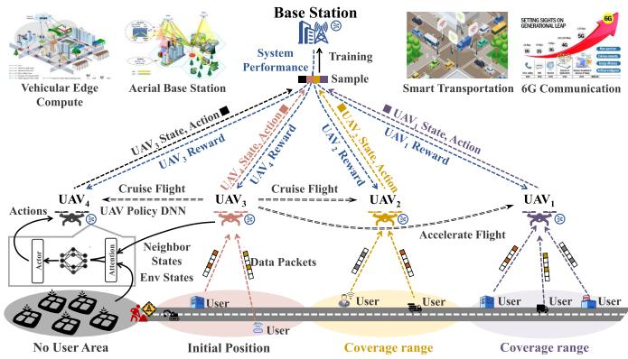  
Fig. 1. Multi-UAV intelligent transportation system using deep reinforcement learning.

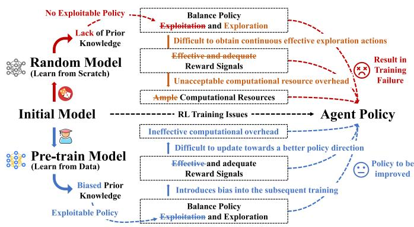  
Fig. 2. Training issue form initial model to agent policy.

The provision of an exploitable initial policy model through pre-training can assist the agent in quickly obtaining training samples with reward signals. However, the performance ceiling of pre-trained models is contingent on the traditional algorithms used to gather the data, and it inevitably introduces bias into the subsequent training. This paper discusses the bias resulting from the cooperative nature of traditional algorithms. For instance, when discussing agent-level rewards in issue (i), rewards might induce the agent to adopt a selfish policy, leading to “hitchhiking” behavior or even a catastrophic degradation in system performance. Such selfish preferences might also manifest in the pre-trained model, for example, the pre-training data collected from a greedy-oriented heuristic algorithm. Researchers need to address such biases in the subsequent RL training stage to further enhance model performance.

In light of the observations made, we introduce the Hammurabi1 framework. Hammurabi is designed to foster cooperation among pre-trained DRL agents, thereby enhancing the overall system performance. Drawing parallels with a judge who scrutinizes individuals’ behavior before referring to legal provisions for informed decision-making, Hammurabi assesses the cooperative attributes of an agent’s pre-trained policy. Subsequently, it integrates them into a suitable game model. Hammurabi aids researchers in leveraging well-established conclusions from the field of game theory to facilitate the design of reinforcement learning. This includes the selection of suitable intrinsic incentives to reward functions, which in turn boosts model performance. Theoretical analysis indicates that Hammurabi, by implementing a multi-agent reinforcement learning scheme with shared policy parameters, can guide the convergence of multi-agent policies to a Nash equilibrium.

In this paper, we present a case study of a UAV-assisted intelligent transportation system, where UAVs provide communication coverage services and cooperate to meet various practical needs of users. We use Hammurabi to analyze the UAVs behaviors, and find that the UAVs swarm is trapped in public goods games dilemmas. Therefore, we design an inequality aversion reward [20] to help UAVs escape dilemmas through reinforcement learning. Our experiments show that Hammurabi can outperform the baselines, improving the energy efficiency by 25.89%, average coverage score by 16.16% and fairness by 16.64%.

Hammurabi’s novelty and technical contributions summarize as follows:

\- We presents a case study of an intelligent transportation system where UAVs provide communication coverage services.

\- We identify two challenges for designing effective RLbased multi-agent cooperation solutions due to reward and pre-train bias.

\- We propose Hammurabi, a novel framework designed to foster cooperation among pre-trained DRL agents, thereby enhancing the overall system performance.

\- We propose an inequality aversion reward based on Hammurabi framework that helps UAVs escape public goods games dilemmas through further learning.

\- Hammurabi can improve the energy efficiency, average coverage score and fairness of the UAVs swarm compared to baseline algorithms.

The rest of this paper is organized as follows: Section II lists relevant literature on multi-agent deep reinforcement learning. Section III describes the Hammurabi frameworks. Section IV presents a case study of Hammurabi in UAV-assisted ITS. Section V provides the simulation results. Finally, Section VI concludes this paper.

## II. PRELIMINARY

In this paper, we focus on a set of reinforcement learning agents that share a common environment. Learning in multiagent system is fundamentally difficult since agents not only interact with the environment but also with each other. In multiagent reinforcement learning (MARL), the objective of each agent is to learn a policy that maximizes a value function. Nash equilibrium is an important concept that measures whether the policy value function of a single agent is optimal under the joint policy of all agents.

## A. Stochastic Game

Stochastic games [21] are a common tool for modeling multiagent system. An N-agent stochastic game is defined by the tuple $\Gamma \triangleq ( \mathcal S , \mathcal A ^ { 1 } , \hdots , \mathcal A ^ { N } , r ^ { 1 } , \hdots , \bar { r ^ { N } } , p , \gamma )$ , where S is the state space, and $\mathcal { A } ^ { i }$ is the action space of agent $i \in \{ 1 , \ldots , N \}$ The reward function $r ^ { i } : \mathcal { S } \times \mathcal { A } ^ { \bar { 1 } } \times \ldots \times \bar { \mathcal { A } } ^ { N } \to \bar { \mathbb { R } }$ is used to measure the quality of the agent policy. Its definition emphasizes that even if the agent has a private task goal, its reward is determined by the policies of all agents. Besides, $p$ serves as the transition probability function that delineates the stochastic evolution of states over time, and constant $\gamma \in [ 0 , 1 )$ signifies the reward discount factor across time.

The agent i select action a according to its policy $\pi ^ { i } : { \mathcal { S } } $ $\mathcal { A } ^ { i } .$ , which could be a set of expert rules, heuristic search, or a trained deep neural network. The joint policy of all agents denote $\pi \triangleq [ \bar { \pi } ^ { i } , \dots , \pi ^ { N } ]$ . The value function of agent i under a the joint policy π, starting from an initial state $s ,$ can be denoted as

$$
v _ { \pi } ^ { i } ( s ) = v ^ { i } ( s ; \pi ) = \displaystyle \sum _ { t = 0 } ^ { \infty } \gamma ^ { t } \mathbb { E } _ { \pi , p } \left[ r _ { t } ^ { i } \mid s _ { 0 } = s , \pi \right] .\tag{1}
$$

In some studies [22], [23], [24], [25], [26], [27], [28], the actionvalue function (or called Q-function)

$$
Q _ { \pi } ^ { i } ( s , \pmb { a } ) = r ^ { i } ( s , \pmb { a } ) + \gamma \mathbb { E } _ { s ^ { \prime } \sim p } \left[ v _ { \pmb { \pi } } ^ { i } \left( s ^ { \prime } \right) \right]\tag{2}
$$

is used as a variant of the value function, representing the cumulative reward return when the initial state is $( s , a )$ , where $s ^ { \prime }$ is next state and Q-function follow

$$
v _ { \pi } ^ { j } ( s ) = \mathbb { E } _ { a \sim \pi } \left[ Q _ { \pi } ^ { j } ( s , \pmb { a } ) \right] .\tag{3}
$$

## B. Reinforcement Learning

Agent policy iteration and improvement can be achieved through reinforcement learning (RL) based on value functions or Q-functions [29], [30], [31], [32], [33]. RL can be divided into two parts: (1) value function estimation; (2) policy evolution. During the learning phase, the RL agent updates the value function in a cyclical manner

$$
\begin{array} { r } { Q _ { t + 1 } ( s , a ) = ( 1 - \alpha ) Q _ { t } ( s , a ) + \alpha \left[ r + \gamma v _ { t } ( s ^ { \prime } ) \right] , } \end{array}\tag{4}
$$

where α is learning rate. With the advancement of deep learning (DL) technologies, employing DNN to approximate value function and policy functions in complex problems has emerged as a novel paradigm. As a result, various deep reinforcement learning (DRL) variants have been proposed, such as DQN [34], DDPG [29], SAC [30], TD3 [31], and PPO [32] (TRPO [33]).

## C. Multi-Agent Reinforcement Learning

Many real-world problems involve multiple decision makers, pushing RL toward multi-agent reinforcement learning (MARL) [22], [23], [24], [35], [36]. A simple baseline is independent Q-learning (IQL) [25], but simultaneous policy updates across agents induce non-stationarity and instability. To address this, value-factorization methods—VDN and QMIX [26], [27]—optimize under the individual–global– maximization (IGM) principle for fully cooperative tasks; more expressive variants include QTRAN and QPLEX [37], [38]. Policy-gradient approaches with centralized critics (e.g., COMA [28]) tackle credit assignment and non-stationarity; recent advances improve scalability and optimization via factored critics (FACMAC) and trust-region updates (HA-TRPO/HAPPO) [39], [40]. In practice, PPO-style baselines (IPPO, MAPPO) offer strong and robust performance with simple configurations [41], [42]. Complementary directions learn when/what to communicate and how to specialize, including graph-based communication (MAGIC, DHCG, CommFormer) and role learning (RODE) [43], [44], [45], [46]. Positioning. Orthogonal to these training backbones, we establish cooperative order from pre-trained policies using an Markov social dilemma game-theoretic regularization together with policy-parameter sharing; our design remains compatible with centralized training distribution execution (CTDE)/value factorization, PPO-style training, and learned communication.

## D. Policy Parameter Sharing

Scaling MARL is challenging because many methods implicitly assume fixed agent counts or require costly retraining when the population changes [47], [48]. A pragmatic alternative for large (often homogeneous) systems is policy parameter sharing [49]: all agents share one policy (and optionally value)

network, while heterogeneity appears through each agent’s observations and local context. This enables strong single-agent learners (e.g., TRPO/PPO) to scale effectively [33], [41], [42], treats lightweight inter-agent messages as part of the observation, and substantially reduces model/engineering complexity. In our multi-UAV setting, parameter sharing provides the desired generalization and deployability while remaining compatible with centralized critics or communication modules when beneficial.

## E. Nash Equilibrium in MARL

Nash equilibrium is formalized by a particular joint policy $\pi _ { * } \triangleq [ \pi _ { * } ^ { 1 } , \cdot \cdot \cdot , \pi _ { * } ^ { N } ]$ and it satisfies

$$
v ^ { i } \left( s ; \pi _ { * } \right) = v ^ { i } \left( s ; \pi _ { * } ^ { i } , \pi _ { * } ^ { - i } \right) \geq v ^ { i } \left( s ; \pi ^ { i } , \pi _ { * } ^ { - i } \right) ,\tag{5}
$$

where $\pi _ { * } ^ { - j }$ is the joint policy of all agents except i. Under Nash equilibrium, each agent action is the best response to the policies of the other agents. It is crucial to recognize that in a stochastic game, multiple Nash equilibriums can coexist. The collective rewards that agents receive under different Nash equilibrium strategies may differ. This variability adds a layer of complexity to the strategic decision-making process in stochastic games.

In simple scenarios (such as tabular value functions), Nash reinforcement learning [50] describes a method to generate Nash equilibrium policies through alternating two-step iterations: (1) Use the Lemke-Howson algorithm to solve for the Nash equilibrium policy of the current game stage. (2) Improve the estimation of the value function under the new Nash equilibrium. This process allows for the dynamic adjustment and optimization of strategies within the game environment. The Nash operator ${ \mathcal H } ^ { \mathrm { N a s h } }$ used for iterative computation can be expressed as

$$
\begin{array} { r } { \mathcal { H } ^ { \mathrm { N a s h } } Q ( s , \boldsymbol { a } ) = \mathbb { E } _ { s ^ { \prime } \sim p } \left[ r ( s , \boldsymbol { a } ) + \gamma v ^ { \mathrm { N a s h } } \mathbf { \Pi } ( s ^ { \prime } ) \right] , } \end{array}\tag{6}
$$

where $Q \triangleq [ Q ^ { 1 } , \dots , Q ^ { N } ]$ and $\pmb { r } \triangleq [ r ^ { 1 } , \ldots , r ^ { N } ]$ . The actionvalue function will ultimately settle at the value obtained in a game’s Nash equilibrium, known as the Nash Q-value.

## III. HAMMURABI

In this section, we will provide a detailed description of the framework process of Hammurabi. Hammurabi first applies pre-train learning to fit traditional algorithm policies into a deep neural network as shown in Section III-A. Subsequently, Hammurabi uses the social dilemma tool to judge the cooperative properties of the pre-trained neural network policy in new scenarios and inducts them into specific game models (such as prisoner dilemma or public goods game). Section III-B describes the social dilemma tool which is used to judge the game model type. Finally, Hammurabi helps researchers choose mature conclusions from the existing game theory field to assist in the design of reinforcement learning, such as selecting appropriate intrinsic incentives to customize reward functions, thereby improving model performance. Theoretical analysis in Section III-C shows that by adopting a multi-agent reinforcement learning scheme with policy shared parameters, Hammurabi can converge multi-agent policies to Nash equilibrium. In Section III-D, we have provided a complexity analysis of the

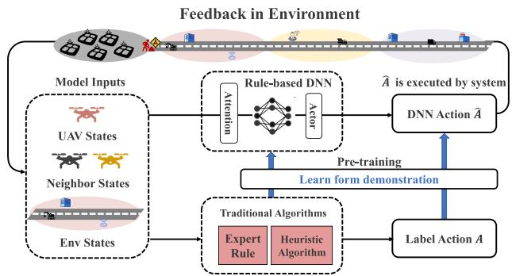  
Fig. 3. Pre-training learning is performed through rule algorithm demonstrations, and the DNN is used to fit the rule policy.

Hammurabi. Besides, we discuss the multiple Nash equilibriums co-exist in Section III-E.

## A. Pre-Train Learning

The pre-train fine-tune paradigm is well established in CV/NLP [51], [52] and is advancing in DRL [53]. Survey [53] groups RL pretraining into (i) representation pre-training, (ii) model/world pre-training, and (iii) policy/value pretraining from demonstrations or logs (e.g., Alpha-Go’s supervised warm start [54]). These typically assume sizable task-relevant data and transfer features or behaviors, but do not inherently ensure cooperation in multi-agent settings. Hammurabi differs as follows: (1) uses small, rule-based simulation trajectories (Fig. 3) as a low-cost, safe initializer without heavy expert labeling or reward annotation; (2) induces cooperation during fine-tuning via social-dilemma–aware shaping at system and agent levels, rather than relying on the prior to encode cooperation; (3) remains robust under domain shift (e.g., changing PoI layouts or fleet sizes) by re-diagnosing the dilemma structure and shaping updates accordingly.

## B. Markov Social Dilemma

Social dilemmas [55] represent situations where there is a conflict between individual immediate self-interest and longterm collective benefit. On one hand, each individual tends to act in their own interest in specific situations. On the other hand, if everyone acts for the greater good, everyone ultimately benefits. The current game’s entrapment in a social dilemma can be determined through a payoff matrix, when its four payoffs satisfy the following social dilemma inequalities

\- R (reward of mutual cooperation) > P (punishment arising from mutual defection): Mutual cooperation is preferred to mutual defection.

${ \mathrm { ~ R ~ } > \mathrm { ~ S ~ } }$ (sucker outcome obtained by the player who cooperates with a defecting partner): Mutual cooperation is preferred to being exploited by a defector.

$2 \mathrm { R } > \mathrm { S } + \mathrm { T }$ (temptation outcome achieved by defecting against a cooperator): This ensures that mutual cooperation is preferred to an equal probability of unilateral cooperation and defection.

\- either greed: $\mathrm { \Delta T > R }$ , exploiting a cooperator is preferred over mutual cooperation; or fear: $\mathbf { P } > \mathbf { S }$ , mutual defection is preferred over being exploited.

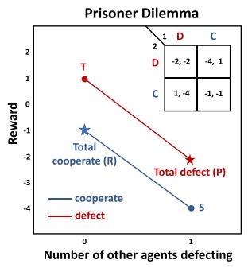  
(a)

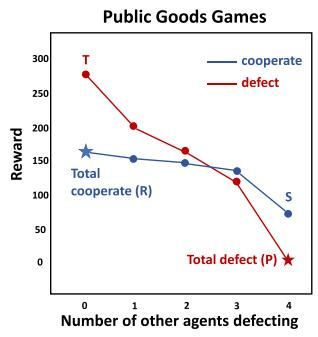  
(b)  
Fig. 4. Schelling diagrams for two classical games: Fig. 4(a) prisoner dilemma [56] and Fig. 4(b) public goods game [57].

Schelling diagrams are a class of tools used to represent game payoffs matrix. By observing Schelling diagrams, we can assess the cooperative attributes of an agent’s policy in the current environment and incorporate them into a specific game model. We show Schelling diagrams for two classical games: Fig. 4(a) prisoner dilemma [56] and Fig. 4(b) public goods game [57]. In simple terms, a Schelling diagram describes the relative payoffs to an agent for choosing to cooperate or defect given a fixed number of remaining defectors. Therefore, the horizontal axis of the Schelling diagram is the number of agents that choose to defect among the remaining agents except the agent shown by the line chart in the figure; the vertical axis is the corresponding reward (payoff) of the agent that chooses cooperation and defection respectively.

However, payoff matrix designed for atomic actions struggle to describe agent policies fitted by DNN in real-world scenarios. In particular, it does not account for the following aspects: (i) temporal extension: the assumption that the agents’ actions are atomic (cooperate or defect) in MGSD, which ignores the agent behavior is consist of long-term interactions; (ii) policy-based cooperation and defection: the definition of cooperation and defection as labels in MGSD, which does not account for the fact that in RL, the agents’ behavior is determined by their policy DNN; (iii) gradation of cooperativeness: cooperativeness may be a graded quantity, and payoff matrix is model as reward function; (iv) partial observability: how agents can deal with uncertainty and incomplete information. These aspects are essential for understanding the dynamics and outcomes of social dilemmas in realistic settings.

Inspired by Leibo [58] and Hughes [59], we extend matrix game social dilemma to the multi-agent Markov game, called Markov social dilemma (MSD). MSD discuss a multi-agent game scenario based on policy-based temporally extended sequential actions rather than atomic actions. An N-agent MSD is a tuple $( \mathcal { M } , \Pi = \Pi _ { c } \sqcup \Pi _ { d } )$ . c and $\Pi _ { d }$ are two disjoint policy sets, which contain policies labeled as cooperation and defection, respectively. The policy profile of N-agent can be expressed as $\left( \pi _ { c , 1 } , \ldots , \pi _ { c , \ell } , \pi _ { d , 1 } , \ldots , \pi _ { d , m } \right) \in \Pi _ { c , \ell } \times \Pi _ { d , m }$ , where $\ell +$ $m = N$ . Define the average payoff of the cooperative policy adopted by agent i when facing  cooperative policy agents as $R _ { c } ( \ell )$ and the remaining $N - \ell$ agents adopt the defect policy. Correspondingly, the average payoff for agent i to adopt a defect policy is $R _ { d } ( \ell )$ . In MSD, $R ( \ell )$ should satisfy the following conditions:

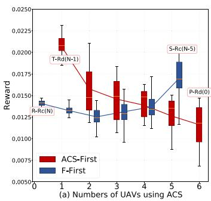

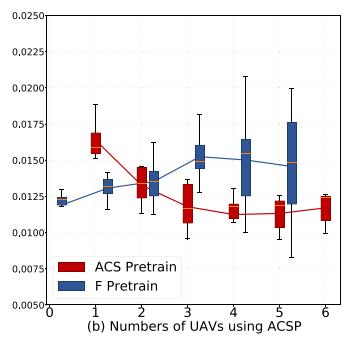  
Fig. 5. Schelling Diagram for agent policy in multi-UAV networks.

$R _ { c } ( N ) > R _ { d } ( 0 )$ , mutual cooperation is preferred to mutual defection.

$R _ { c } ( N ) > R _ { c } ( 0 )$ , mutual cooperation is preferred to being exploited by defectors.

\- either greed: $R _ { d } ( \ell ) > R _ { c } ( \ell )$ for sufficiently large ; or fear: $R _ { d } ( \ell ) > R _ { c } ( \ell )$ ( ) ( )for sufficiently small .

Among them, condition (i) and (ii) guarantee that the cooperation payoff is the largest, and condition (iii) provides the motivation for the agent to choose the defect.

Markov social dilemma provides a method to judge whether an N-player game belongs to social dilemmas. By constructing Schelling diagrams, we can systematically classify the game structure that emerges from the agents interactions and environmental factors. We use a box plot: a standard way to describe the distribution of data through 5 numbers (minimum, first quartile, median, third quartile, and maximum) to show the rewards obtained by different algorithms. Besides, we added a line chart to represent the average reward for each box. Fig. 5(a) illustrates the Schelling diagram based on agent policies in a multi-UAV network trapped in a public goods game dilemma, comparing two types of algorithms: the ACS-First algorithm (preferring individual interest) and the F-First algorithm (preferring collective benefit). Each box contains data for 20 different UAV examples as shown in Fig. 5. The $( S - R ( \ell ) )$ pair in the red square indicates: the matrix game payoff (R,S,T,P) and the corresponding MSD $R ( \ell )$ meaning. It is worth noting that policies are still pre-categorized into cooperation and defection, and the labeling of policies is still an open question. In DNN, the DNN fitting policy often needs to consider the mixture of cooperation and defection. During the DRL training process, the gradient of cooperation and defection data will act on the same DNN, resulting in new trade-offs and ambiguities.

## C. Convergence of Hammurabi

In this section, we demonstrate that despite the Hammurabi framework utilizing deep reinforcement learning algorithms, the outcomes ultimately converge to a Nash equilibrium.

The evidence for this claim is founded on the assumptions that follow:

Assumption 1: Each action-value pair is encountered an infinite number of times, and the reward is limited by a constant $K$

Assumption 2: Agent’s policy is Greedy in the Limit with Infinite Exploration (GLIE).

Assumption 3: For each game $[ Q _ { \pi } ^ { 1 } ( s ) , \ldots , Q _ { \pi } ^ { N } ( s ) ]$ at time t and in state s in training, for all $t , s , i \in \{ 1 , \ldots , N \}$ )], the Nash equilibrium $\pmb { \pi } _ { * } = [ \pi _ { * } ^ { 1 } , \overline { { \ } } . \ . . \ , \pi _ { * } ^ { N } ]$ is recognized either as (7) the global optimum or (8) a saddle point expressed as:

$$
\mathbb { E } _ { \pi _ { * } } [ Q _ { t } ^ { i } ( s ) ] \geq \mathbb { E } _ { \pi } [ Q _ { t } ^ { i } ( s ) ] , \forall \pi \in \Omega \left( \prod _ { k } { \mathcal { A } } ^ { k } \right) ,\tag{7}
$$

$$
\mathbb { E } _ { \pi _ { * } } [ Q _ { t } ^ { i } ( s ) ] \geq \mathbb { E } _ { \pi ^ { i } } \mathbb { E } _ { \pi _ { * } ^ { - i } } [ Q _ { t } ^ { i } ( s ) ] , \forall \pi ^ { i } \in \Omega \left( \prod _ { k } { \cal A } ^ { k } \right) ,
$$

$$
\mathbb { E } _ { \pi _ { * } } [ Q _ { t } ^ { i } ( s ) ] \leq \mathbb { E } _ { \pi _ { * } ^ { i } } \mathbb { E } _ { \pi ^ { - i } } [ Q _ { t } ^ { i } ( s ) ] , \forall \pi ^ { - i } \in \Omega \left( \prod _ { k \neq i } { \cal A } ^ { k } \right) .\tag{8}
$$

The proof is also built upon the two lemmas as follows:

Lemma 1: Under Assumption 3, define the Nash operator ${ \mathcal H } ^ { \mathrm { N a s h } }$ in (6): forms a contraction mapping on the complete metric space from Q to Q with the fixed point being the Nash Q-value of the entire game, such as $\mathcal { H } ^ { \mathrm { N a s \bar { h } } } Q _ { * } = Q ,$ .

Proof 1: See Theorem 17 in [50].

Lemma 2: The random process $\{ \Delta _ { t } \}$ define in R as

$$
\Delta _ { t + 1 } ( x ) = ( 1 - \alpha _ { t } ( x ) ) \Delta _ { t } ( x ) + \alpha _ { t } ( x ) F _ { t } ( x )\tag{9}
$$

converges to zero with probability 1 when

1) $\begin{array} { r } { 0 \leq \alpha _ { t } ( x ) \leq 1 , \sum _ { t } \alpha _ { t } ( x ) = \infty , \sum _ { t } \alpha _ { t } ^ { 2 } ( x ) < \infty ; } \end{array}$

2) $x \in \mathcal X$ , the set of possible states, and $| { \mathcal { X } } | < \infty ;$

3) $\| \mathbb { E } [ F _ { t } ( x ) | \mathcal { F } _ { t } ] \| _ { W } \leq \gamma \| \Delta _ { t } \| _ { W } + c _ { t } ,$ , where $\gamma \in [ 0 , 1 )$ and $c _ { t }$ converges to zero w.p.1;

4) var $[ F _ { t } ( x ) | \mathcal { F } _ { t } ] \leq K ( 1 + \| \Delta _ { t } \| _ { W } ^ { 2 } )$ with constant $K > 0$ Here $\mathcal { F } _ { t }$ ( ) ] (1 + Δ ) 0denotes the filtration of an increasing sequence of $\sigma { - } f i e l d s$ including the history of processes; $\alpha _ { t } , \Delta _ { t } , F _ { t } \in \mathcal { F } _ { t }$ and · W is a weighted maximum norm.

Proof 2: See Theorem 1 in [60] and Corollary 5 [61] for detailed derivation.

The convergence theorem for reinforcement learning based Hammurabi framework is stated below.

Theorem 1: In a stochastic game with finite states, if ${ \mathrm { A s } } -$ sumptions 1-3 and the first and second conditions of Lemma 2 are satisfied, the Q-values calculated using the update rule (6) will converge to the Nash Q-value $Q _ { * }$

Proof 3: Assumption 1 is obvious based on the design of a large number of training samples and reward functions. When Assumption 1 is satisfied, if Assumption 2 is established, it should also satisfy:

$$
\begin{array} { l } { \displaystyle \operatorname* { l i m } _ { k \to \infty } \pi _ { k } ( a \vert s ) = 1 } \\ { \displaystyle a = \operatorname * { a r g m a x } _ { a ^ { \prime } \in \mathcal { A } } Q _ { k } ( s , a ^ { \prime } ) . } \end{array}\tag{10}
$$

In reinforcement learning, because the policy is always updated towards the direction of maximum Q-value (e.g. DQN, DDPG, TD3) or select a direction that will not worsen the policy (e.g. TRPO, PPO), the algorithms will automatically stop updating. At this point, there will be a certain policy approach that satisfies Assumption 2.

According to the reinforcement learning Q-value common update rule of (4) and (9) in Lemma 2, we construct the difference between current policy Q-value and Nash Q-value $Q _ { \pi _ { * } }$ as

$$
\begin{array} { r l } & { \pmb { \Delta } _ { t } ( x ) = \pmb { Q } _ { \pi } ( s , \pmb { a } ) - \pmb { Q } _ { \pi _ { * } } ( s , \pmb { a } ) , } \\ & { \pmb { F } _ { t } ( x ) = \pmb { r } _ { t } + \gamma \pmb { v } _ { t } ^ { \mathrm { D R L } } \left( s _ { t + 1 } \right) - \pmb { Q } _ { \pi _ { * } } \left( s _ { t } , \pmb { a } _ { t } \right) , } \end{array}\tag{11}
$$

where $x \triangleq ( s _ { t } , a _ { t } )$ denotes the visited state-action pair at time t. In $( 9 ) \alpha ( t )$ represents the learning rate, where $\alpha _ { t } ( s ^ { \prime } , a ^ { \prime } ) = 0$ for all $( s ^ { \prime } , a ^ { \prime } ) \neq ( s _ { t } , a _ { t } )$ ( ) = 0. This is because each agent only updates its Q-function for the state $s _ { t }$ and actions $a _ { t }$ that visited at time t. Lemma 2 indicates that $\Delta _ { t } ( x )$ will converge to zero, implying Δ (that if it holds, the sequence of $Q$ will asymptotically approach the Nash $Q _ { * }$

Let $\mathcal { F } _ { t }$ represent the σ-field generated by the cumulative random variables of the stochastic game until time $t { : }$ $\left( s _ { t } , \alpha _ { t } , \pmb { a } _ { t } , r _ { t - 1 } , \ldots , s _ { 1 } , \alpha _ { 1 } , \pmb { a } _ { 1 } , \pmb { Q } _ { 0 } \right)$ . Notice that $Q _ { t }$ is a random variables originating from the historical trajectory until time t. Considering that all $Q _ { \tau }$ with $\tau < t$ are $\mathcal { F } _ { t }$ -measurable, it follows that both $\Delta _ { t }$ and $\mathbf { \Delta } F _ { t - 1 }$ are also $\mathcal { F } _ { t }$ -measurable, which met the measurability condition of Lemma 2.

To apply Lemma 2, we need to demonstrate that the DRL operator $\mathcal { \dot { H } } ^ { \mathrm { { D R L } } }$ satisfies the third and fourth conditions of Lemma 2. For third condition of Lemma 2, we begin with (11) that

$$
\begin{array} { r l r } {  { F _ { t } ( s _ { t } , \boldsymbol { a } _ { t } ) = \boldsymbol { r } _ { t } + \gamma \boldsymbol { v } _ { t } ^ { \mathrm { D R L } } ( \boldsymbol { s } _ { t + 1 } ) - Q _ { * } ( s _ { t } , \boldsymbol { a } _ { t } ) } } \\ & { } & { ~ = \boldsymbol { r } _ { t } + \gamma \boldsymbol { v } _ { t } ^ { \mathrm { N a s h } } ( \boldsymbol { s } _ { t + 1 } ) - Q _ { * } ( \boldsymbol { s } _ { t } , \boldsymbol { a } _ { t } ) } \\ & { } & { ~ + \gamma [ \boldsymbol { v } _ { t } ^ { \mathrm { D R L } } ( \boldsymbol { s } _ { t + 1 } ) - \boldsymbol { v } _ { t } ^ { \mathrm { N a b h } } ( \boldsymbol { s } _ { t + 1 } ) ] } \\ & { } & { ~ = [ \boldsymbol { r } _ { t } + \gamma \boldsymbol { v } _ { t } ^ { \mathrm { N a s h } } ( \boldsymbol { s } _ { t + 1 } ) - Q _ { * } ( \boldsymbol { s } _ { t } , \boldsymbol { a } _ { t } ) ] + C _ { t } ( \boldsymbol { s } _ { t } , \boldsymbol { a } _ { t } ) } \\ & { } & { ~ = F _ { t } ^ { \mathrm { N a s h } } ( \boldsymbol { s } _ { t } , \boldsymbol { a } _ { t } ) + C _ { t } ( \boldsymbol { s } _ { t } , \boldsymbol { a } _ { t } ) . } \end{array}
$$

Notice that $\boldsymbol { F } _ { t } ^ { \mathrm { N a s h } }$ in (12) fundamentally corresponds to $\mathbf { } F _ { t }$ in Lemma 2, which is crucial for establishing the convergence of the Nash reinforcement learning algorithm. From Lemma 1, it is evident that $\mathbf { \nabla } \mathbf { F } _ { t } ^ { \mathrm { N a s h } }$ constitutes a contraction mapping with the norm $| | \cdot | | _ { \infty }$ representing the maximum norm on a. Therefore, we have the following equation for all t that

$$
\left. \mathbb { E } \left[ F _ { t } ^ { \mathrm { N a s h } } \left( s _ { t } , a _ { t } \right) \vert \mathcal { F } _ { t } \right] \right. _ { \infty } \leq \gamma \left. Q _ { t } - Q _ { * } \right. _ { \infty } = \gamma \left. \Delta _ { t } \right. _ { \infty }\tag{13}
$$

To satisfy the third condition of Lemma 2, we derive from (12) the subsequent equation

$$
\begin{array} { r l } & { \left\| \mathbb { E } \left[ F _ { t } | \mathcal { F } _ { t } \right] \right\| _ { \infty } \leq \left\| F _ { t } ^ { \mathrm { N a s h } } | \mathcal { F } _ { t } \right\| _ { \infty } + \left\| C _ { t } | \mathcal { F } _ { t } \right\| _ { \infty } } \\ & { \qquad \leq \gamma \left\| \Delta _ { t } \right\| _ { \infty } + \left\| C _ { t } \left( s _ { t } , { a } _ { t } \right) | \mathcal { F } _ { t } \right\| _ { \infty } . } \end{array}\tag{14}
$$

We are left to prove that $c _ { t } = \| C _ { t } ( s _ { t } , \pmb { a } _ { t } | \mathcal { F } _ { t } ) \|$ converges to zero with probability 1. According to Assumption 3, for each game stage, all the saddle point equilibrium(s) share the same Nash value, so does the globally optimal equilibrium(s). Lemma 1 shows that the policy based on the action-value function forms a contraction mapping. With homogeneous agents (parameter sharing in Hammurabi) and all optima/saddle points share the same Nash value, ${ \pmb v } _ { t } ^ { \mathrm { D R L } }$ will asymptotically converge to ${ \pmb v } _ { t } ^ { \mathrm { N a s h } }$ and satisfy the third condition of Lemma 2.

Regarding the fourth condition of Lemma 2, we use the conclusion that the aforementioned ${ \pmb v } _ { t } ^ { \mathrm { D R L } }$ will asymptotically converge to ${ \pmb v } _ { t } ^ { \mathrm { N a s h } }$ and ${ \mathcal { H } } ^ { \mathrm { { D R L } } }$ thus also forms a contraction mapping, such as $\mathcal { H } ^ { \mathrm { { D R L } } } Q _ { * } = Q _ { * }$ , which leads to

$$
\begin{array} { r l } & { \quad \mathrm { v a r } \left[ F _ { t } \left( s _ { t } , a _ { t } \right) \vert \mathcal { F } _ { t } \right] } \\ & { = \mathbb { E } \left[ \left( r _ { t } + \gamma v _ { t } ^ { \mathrm { D R L } } \left( s _ { t + 1 } \right) - Q _ { * } \left( s _ { t } , a _ { t } \right) \right) ^ { 2 } \right] } \\ & { = \mathbb { E } \left[ \left( r _ { t } + \gamma v _ { t } ^ { \mathrm { D R L } } \left( s _ { t + 1 } \right) - \mathcal { H } ^ { \mathrm { D R L } } \left( Q _ { * } \right) \right) ^ { 2 } \right] } \\ & { = \mathrm { v a r } \left[ r _ { t } + \gamma v _ { t } ^ { \mathrm { D R L } } \left( s _ { t + 1 } \right) \vert \mathcal { F } _ { t } \right] } \\ & { \leq K \left( 1 + \Vert \Delta _ { t } \Vert _ { W } ^ { 2 } \right) } \end{array}\tag{15}
$$

In the final step of (15), we apply Assumption 1, which states that the reward $\mathbf { \nabla } _ { \mathbf { r } _ { t } }$ is consistently bounded by a certain constant. Finally, with all conditions met, it follows Lemma 2 that $\Delta _ { t }$ converges to zero with probability 1 such as $Q _ { t }$ converges to $Q _ { * }$

Practical note: Observations in our multi-UAV setting are continuous (positions, velocities, headings); we do not grid inputs. Neural function approximation clusters nearby continuous states and, with reward clipping/normalization and $\gamma < 1$ - yields bounded TD targets (returns bounded by $K / ( 1 - \gamma )$ when $| r _ { t } | \le K )$ . Assumption 1 is approximated by ensuring sufficient coverage on a compact operating domain via randomized resets/domain randomization, stochastic policies or decaying action noise, and replay that revisits previously seen neighborhoods. Assumption 2 is treated as an approximate GLIE-like condition under function approximation and continuous actions: DQN use slowly annealed ε-greedy; DDPG/TD3 use decaying action noise; PPO/SAC use stochastic policies with an entropy coefficient (fixed or adaptive), giving early exploration and near-greedy behavior later. We do not restate Assumption 3; instead, under CTDE or parameter sharing we track a simple unilateral-improvement (best-response) gap on held-out rollouts and stop once it is below a small tolerance.

## D. Complexity of Algorithm

In the Hammurabi framework, the complexity of the algorithm can be bifurcated into two phases: the task execution phase and the model training phase. During the task execution phase, the agent performs a single inference of the DNN based on the input states, resulting in a computational complexity of $O ( 1 )$ . The speed of inference is solely dependent on the scale of the parameters of the deployed DNN. This efficiency in the execution phase is a significant advantage of DL methods over heuristic and iterative optimization algorithms. It is important to note that calculating the algorithmic complexity for the training phase of DRL is still an open research question. Traditional DRL methods necessitate repeated exploration to generate training samples. Each exploration requires a complete task, leading to substantial computational overhead. Moreover, training a model from randomly initialized parameters also increases computational overhead. In contrast, the Hammurabi framework generates initial training samples using the traditional algorithms.

This allows the Hammurabi agent to commence pre-training from baseline algorithms, thereby eliminating the computational overhead required for exploration. Fine-tuning is then carried out starting from the pre-trained model using a minimal number of exploration samples. This strategy circumvents the considerable computational overhead associated with exploration from an initialized model, effectively reducing the computational complexity of reinforcement learning training.

## E. Discussion of Nash Equilibrium(s)

In game theory, a Nash equilibrium represents a state where each agent has chosen their optimal policy, taking into account the policies of other agents. In certain scenarios, multiple Nash equilibriums may exist. Consider a simple game where two players can choose “left” or “right”. If both players choose “left” or both choose “right”, they receive a reward. In this case, there are two Nash equilibriums: (left, left) and (right, right).

However, different Nash equilibriums may lead to different system performance. For instance, consider a traffic network where each driver (agent) can choose their route. In this scenario, there may exist multiple Nash equilibriums, each corresponding to a different traffic flow distribution. Different traffic flow distributions may result in different overall traffic delays (system performance). Under equilibrium policies, RL agents struggle to explore actions with higher rewards, preventing further evolution of the strategy. Therefore, we aim to find a method to select a Nash equilibrium that maximizes system payoff. Selecting a Nash equilibrium can be achieved in several ways. One method is to introduce some “perturbations” into the system, such as small randomness, making one Nash equilibrium more attractive than others. Another method involves the concept of “mixed policies”, where players choose each pure strategy with a certain probability. This can make a particular Nash equilibrium superior in expected payoff. The selection of an appropriate Nash equilibrium depends on existing game theory research results. Assisting in the discovery of suitable game models and selecting appropriate mechanisms is precisely the problem Hammurabi aims to solve.

## IV. A HAMMURABI APPLICATION

In this section, we will demonstrate how to utilize the Hammurabi to select appropriate research outcomes to address practical problems. We present a case study of multi-UAVs area coverage problem (ACP) in Section IV-A. Section IV-B introduces the multi-UAV system settings, and then define the evaluation metrics. Sections IV-C and IV-D describe the definition of systemlevel reward and agent-level reward in the multi-UAVs system, and introduce their limitations respectively. Then, Section IV-E describe how to deploy MARL. In Section IV-F, through the analysis using social dilemma tools, it is discovered that the multi-UAV ACP has fallen into the public goods game dilemma. In Section IV-G, an inequality aversion mechanism is proposed to induce RL agent policy to converge to a Nash equilibrium that prefers cooperation, thereby escaping from the aforementioned dilemma. Finally, Section IV-H, Tables II and III introduce the UAV model and important parameters in this paper.

LIST OF IMPORTANT VARIABLES  
TABLE II
<table><tr><td>Variables</td><td>Variable meaning</td></tr><tr><td> $N , K$ </td><td>Number of UAVs and PoIs (Default: 6, 100)</td></tr><tr><td> $T , \delta$ </td><td>Mission Time slots (Default: 256, 1)</td></tr><tr><td> $\omega , v$ </td><td>Flight direction and speed of UAV</td></tr><tr><td> $c$ </td><td>Coverage score</td></tr><tr><td> $f$ </td><td>Fairness index</td></tr><tr><td> $\zeta$ </td><td>Energy efficiency</td></tr><tr><td> $\bar { \boldsymbol { s } } , \boldsymbol { A } , \mathcal { O }$ </td><td>State, action, and observation space</td></tr><tr><td> $\tau$ </td><td>The transfer function</td></tr><tr><td> $\Delta ( \cdot )$ </td><td>Probability distribution</td></tr><tr><td> $r , R$ </td><td>Reward function</td></tr><tr><td> $V , Q , A$ </td><td>Value, action-value, advantage function</td></tr><tr><td> $\pi , \Pi$ </td><td>Policy</td></tr><tr><td> $\gamma$ </td><td>Discount factor (Default: 0.99)</td></tr><tr><td> $\epsilon$ </td><td>Exploration probability</td></tr><tr><td> $\theta$ </td><td>Neural network parameters</td></tr><tr><td> $\alpha , \beta$ </td><td>Inequality aversion parameters (Default: 5, 0.05)</td></tr></table>

TABLE III

UAV MODEL PARAMETERS
<table><tr><td>Parameter</td><td>Value</td><td>Meaning</td></tr><tr><td> $H _ { i }$ </td><td>120 meters</td><td>The default height of UAV i</td></tr><tr><td> $P _ { C }$ </td><td>30W</td><td>UAV control system power</td></tr><tr><td> $P _ { F 0 }$ </td><td>79.86W</td><td>The blade profile power</td></tr><tr><td> $P _ { F 1 }$ </td><td>88.63W</td><td>The induced power</td></tr><tr><td> $P _ { H }$ </td><td>168W</td><td>Hovering power of UAVs</td></tr><tr><td> $v _ { \mathrm { m i n } } , P _ { F , \mathrm { m i n } }$ </td><td>10m/s, 126w</td><td>UAV minimum consumption</td></tr><tr><td> $v _ { t i p }$ </td><td>120 m/s</td><td>UAV rotor tip speed</td></tr><tr><td> $\tilde { v } _ { 0 }$ </td><td>4.03 m/s</td><td>Mean rotor induced velocity</td></tr><tr><td> $d _ { 0 }$ </td><td>0.6</td><td>The fuselage drag ratio</td></tr><tr><td> $\rho$ </td><td> $1 . 2 2 5 \mathrm { k g } / \mathrm { m } ^ { 3 }$ </td><td>The density of the air</td></tr><tr><td> $s$ </td><td>0.05</td><td>The rotor solidity</td></tr><tr><td> $A _ { \mathrm { d i s c } }$ </td><td>0.503 s2</td><td>The rotor disc area</td></tr><tr><td> $E _ { \mathrm { l i m i t } }$ </td><td>1.2e5 J</td><td>The maximum energy of UAV</td></tr></table>

## A. Multi-UAVs Area Coverage Problem

Compared with conventional terrestrial networks, UAVs have the characteristics of flexible deployment and strong adaptability, which are an important supplement to future ITS. In UAV-assisted ITS [62], [63], [64], UAV path planning for multi-objectives optimization is a long-standing challenge. We study one of the important cases: the UAVs area coverage problem [65], [66], [67], [68], [69], [70].

A single-agent DRL-based energy-efficient control for coverage and connectivity $\mathrm { ( D R L \mathrm { - } E C ^ { 3 } ) }$ is proposed in [65], which first defines the area coverage problem and achieves better results than random and greedy algorithms. The ACP was extended to the 3-D position in [66]. According to [67], the ACP under mutual interference between UAVs is discussed. These early works support multi-UAV system based on a central DNN, making it difficult to scale the number of UAVs in the system. Besides, the system-level rewards are difficult to distinguish which agent plays a key role. The paper [68] and [69] extends the DRL-EC3 algorithm to a distributed control scheme by agent-level reward. According to [70], a new DRL algorithm TRPO [33] and a new structure neural network feature embedding [71] are introduced, in order to further improve the scalability of the system. These works achieved distributed control through agent-level rewards and parameter sharing, but they did not discuss the possible issues of agent-level rewards, such as selfishness.

## B. System Setting

In this paper, we investigate the multi-UAVs area coverage problem of N UAVs providing communication services to users in a specified target area, as shown in Fig. 1. Due to their limited coverage and power, optimizing the usage of UAVs to meet the following requirements is of utmost importance: (i) maximizing the coverage of users, (ii) ensuring a fair distribution of coverage time to each user, and (iii) minimizing the power consumption while maximizing energy efficiency. UAVs are indexed by i. The target area is divided into K cells, which are represented by their geometric centers, referred to as Points-of-Interest (PoIs). For simplicity, we assume that the coverage of a PoI is considered complete when it falls within the range of a UAV.

We use the corresponding coverage score $c _ { k }$ to represent the coverage metric of PoI k:

$$
c _ { t , k } = \left\{ { \begin{array} { l l } { 1 , \ } & { { \mathrm { P o I ~ i s ~ c o v e r e d ~ b y ~ a ~ U A V } } } \\ { \ } & { { \mathrm { a n d ~ c h a n n e l ~ i s ~ a c t i v e } } , } \\ { 0 , \ } & { { \mathrm { o t h e r w i s e } } } \end{array} } \right.
$$

$$
c _ { k } = \frac { \sum _ { t = 1 } ^ { T } c _ { t , k } } { T } , k \in \{ 1 , \ldots , K \} .\tag{16}
$$

where $T$ is overall communication service time. PoI k may be covered by multiple UAVs at the same time. We use average coverage score (ACS) to define the coverage performance by

$$
\bar { c } _ { T } = \frac { \sum _ { k = 1 } ^ { K } c _ { k } } { K } .\tag{17}
$$

However, the definition of the average coverage score suggests that UAVs may attain similar performance by covering certain points of interest (PoIs) for extended durations. Consequently, UAVs are inclined to follow routes that forsake remote PoIs. However, this approach may result in uneven coverage, which could negatively impact the user experience. To address this issue, we introduce the fairness index, as described by [68], [70], [72],

$$
f _ { T } = \frac { ( \sum _ { k = 1 } ^ { K } c _ { k } ) ^ { 2 } } { K \sum _ { k = 1 } ^ { K } ( c _ { k } ) ^ { 2 } } ,\tag{18}
$$

which provides a measure of PoIs coverage fairness. It is imperative to avoid instances where some PoIs receive prolonged coverage while others are neglected, even if the average coverage score remains the same.

The optimization objective of the multi-UAV assisted ITS is to find a way to maximize the average coverage score and fairness index of PoIs while minimizing energy consumption. The system energy efficiency [65], [68], [70] is considered and can be expressed as:

$$
\zeta _ { t } = \frac { f _ { t } ( \sum _ { k = 1 } ^ { K } \Delta c _ { t , k } ) } { \sum _ { i = 1 } ^ { N } \Delta E _ { t , i } } ,\tag{19}
$$

where $\Delta c _ { t , k } = c _ { t , k } - c _ { t - 1 , k }$ is the incremental coverage score Δof PoI k, and $\Delta E _ { t , i } = E _ { t , i } - E _ { t - 1 , i }$ is the incremental energy Δ =consumption of UAV i, and $f _ { t }$ is (18) at time t. The energy efficiency of the entire task process can be expressed as

$$
\zeta _ { T } = \frac { f _ { T } \cdot \bar { c } _ { T } } { \Delta E _ { T } } .\tag{20}
$$

The state space is defined as S. Denote the state $s _ { t , i }$ of UAV i at time slot t:

$t \in [ 0 , T ] ;$ : The current time slot t;

$E _ { t , i } \colon$ the current energy consumption of UAV i;

$c _ { t , k } \in [ 0 , 1 ]$ : the current coverage score of each PoI k;

$n _ { t , k } \mathrm { : }$ the number of UAVs covering PoI k in time slot t;

$p _ { t , k } \colon$ UAV i can observe the position information of POI k;

$p _ { t , j } \colon$ UAV i can observe the location information of UAV j in its communication range;

$E _ { t , j } \colon$ the current energy consumption of UAV j.

It is worth noting that the UAV can observe the states of the variable number of neighbor UAVs and PoIs within its communication range.

The action space of each UAV agent i is defined as $\mathbf { \mathcal { A } } _ { i }$ . In each time slot, a UAV agent decides actions based on the part of the observation information in the state space and obtains rewards. Denote the action $\boldsymbol { a } _ { t , i }$ of UAV i at time slot t:

$\omega _ { t , i } \in ( 0 , 2 \pi ]$ : flight direction of UAV i;

$\pmb { v } _ { t , i } \in [ 0 , 1 ]$ : flight speed of UAV i, which is normalized by a maximum speed ${ \pmb v } _ { m a x } .$ . If $\boldsymbol { v } _ { t , i } = 0$ , UAV i hovers at the current location.

Each UAV agent i obtains a predefined reward $r _ { i } : S \times \mathcal { A } _ { 1 } \times$ $\cdot \cdot \cdot \times \mathcal { A } _ { N }  \mathbb { R }$ :when UAV interaction with environment.

## C. System-Level Reward

It is a prevalent approach in DRL to employ the optimization objective, such as system performance or task completion count, as the basis for RL reward, which we called system-level reward. The system-level performance design a cooperative objective, which makes DRL-based agents have no selfish motivation. System-level reward can be represented as a vector $\vec { r } = ( 0 , \ldots , 0 , R _ { T } )$ . Although system-level reward setting is consistent with the performance of the system, it is very sparse. To cope with the problem, more dense rewards can be defined through either average form $\mathbf { r } _ { t } = \{ R _ { T } / T \} _ { 1 } ^ { T }$ or expert design such as (19). Unluckily, redefined dense rewards are accompanied with a series of new challenges.

The evaluation of individual agent actions in cooperative multi-agent systems is often hindered by the use of systemlevel rewards that are uniform among all agents, as shown in Table I. Although system-level reward may align with overall objectives of the system, they may not provide sufficient granularity to accurately assess the contribution of individual agents. Therefore, we refer to system-level reward as the cooperative ambiguous reward. Consequently, relying on a uniform reward signal may incentive both correct and incorrect actions, leading to suboptimal training model or even training failure.

## D. Agent-Level Reward: Defect and Cooperate

For the ambiguity of system-level reward, the researchers [68], [70] propose an agent-level reward based on (19) in the multi-UAV area coverage problem

$$
r _ { t , i } = \frac { f _ { T } ( \sum _ { k = 1 } ^ { K _ { i } } \Delta c _ { t , k } ) } { \Delta E _ { t , i } } ,
$$

$$
\Delta c _ { t , k } = \frac { 1 } { n _ { t , k } } ,\tag{21}
$$

where $K _ { i }$ is the number of PoIs covered by UAV i and $n _ { t , k }$ is the number of UAVs covering PoI k. The design idea of this agent-level reward is simple: distribute rewards to individual UAV as much as possible while reserving the part $f _ { T }$ that are hard to partition to encourage cooperative behavior among them.

When only a part of the UAVs need to be accelerated to achieve ideal system performance, the rest of the agents can choose to cover users in close range to reduce their own energy consumption and obtain more rewards. For example, UAV 2 in the table I hitches a ride with UAV 1. The optimization objective of DRL-based agent is to maximize individual reward benefits, which makes it a key issue how to make some agents in the group give up part of their own benefits to maximize the overall benefits. In some literature [73], the behavior of an agent that pursues the maximization of individual interests is called “rationality” or “selfish” and we mentioned is called “defect”.

The agent-level reward (21) aims to strike a balance between the cooperative objective (fairness) and the individual interest objective (average coverage score) for the UAV agent. The UAV policies, which are trained by the DRL based on (21), will result in a mixed strategy that encompasses both cooperation and defection. If the DRL training process satisfies the conditions of Hammurabi’s assumptions (as discussed in Section III-C) and the sharing of agent policy parameters (as outlined in Section II-D), then the policy of the UAV intelligent agent will converge to a Nash equilibrium, as detailed in Section III-E. However, the challenge lies in selecting an appropriate mechanism or tool that can further promote cooperation while retaining some benefits from the defection policy. The goal is to guide the system towards a Nash equilibrium policy that results in higher system performance or accumulated rewards. This is precisely the task that the Hammurabi framework aims to accomplish.

## E. Policy Training

Considering Hammurabi’s emphasis on the influence of reward functions and the initial model obtained from pre-training, it is essential to validate Hammurabi’s effectiveness across a range of mainstream RL algorithms and baselines within the multi-UAV ACP context. This validation is essential to ensure that Hammurabi can adapt under different training conditions.

Upon investigation, the mainstream methods in ACP are based on the standard DRL algorithm for distributed expansion, such as distributed DRL-EC3 [68] (based on DDPG [29]) and Mean-Field TRPO [70] (based on TRPO [33]). For a more comprehensive verification, we supplement two additional mainstream standard DRL methods which do not appear in ACP, including SAC [30] and TD3 [31]. It is noteworthy that DDPG, TRPO (or its variant PPO [32]), SAC and TD3 are designed for singleagent settings. Therefore, Hammurabi selects policy parameter sharing (Section II-D) to expand to a multi-agent setting, and the training process is depicted in Fig. 6. The reason we did not adopt DQN [34], another mainstream DRL algorithm, is that the action space of UAV is continuous, while DQN is suitable for discrete, labeled action spaces. In addition, we also verify the MARL algorithm based on central control, such as DRL-EC3 [65] (a baseline in ACP) and VDN [26] (a mainstream MARL algorithm).

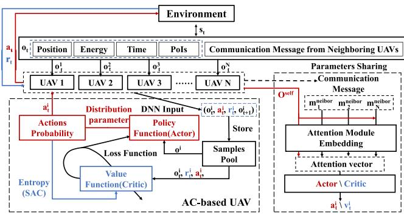  
Fig. 6. Distributed DRL decision model for each UAV.

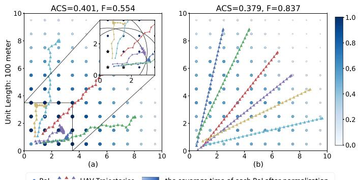  
Pol    UAV Trajectoriesthe coverage time of each Pol after normalization  
Fig. 7. The flight trajectory of UAVs based on (a) ACS-First and (b) F-First solution with the number of UAVs 6 and PoIs 100. The blue color bar indicates the coverage time of each PoI after normalization. The black arc in the upper right sub-figure of (a) is a circle whose star mark indicates that the PoI position is the center and the coverage range is the radius.

The provision of an exploitable initial policy model through pre-training can assist the agent in quickly obtaining training samples with reward signals. However, due to the ACP’s aim to optimize multiple objectives with UAVs, to our knowledge, a lack of learning-free existing methods (such as convex optimization algorithms). Therefore, we have chosen two rule-based methods to generate initial data through various attempts:

\- ACS-First: In each time slot, UAVs fly straight to the nearest uncovered PoIs within the observable range, and each UAV flies at cruising speed to avoid violating energy constraints, as shown in Fig. 7(a).

\- F-First: This method is based on a specific topology for artificial UAV trajectory design, so that UAVs can cover as many PoIs as possible. In the regular PoIs topology, we keep the UAV at an energy-efficient cruise speed, and each UAV covers a sector of $\pi / 2 4$ , as shown in Fig 7(b).

Based on the data obtained by the rule algorithm, we obtain the rule-based DNN using the pre-training method mentioned in Section III-A. The flight trajectory of rule-based DNN is shown in Fig. 8, and it is easy to find that the DNN policy fits the rule algorithm. It is important to note that Hammurabi’s design can accommodate the initial policy model trained by the initial data generated by any algorithm. Hammurabi aims to analyze the game model of the initial policy model in the current problem environment, and then utilize existing research results (such as game theory mechanisms) for subsequent optimization.

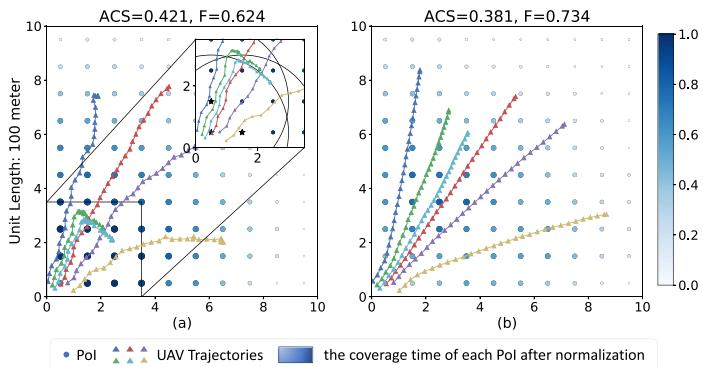  
Fig. 8. The flight trajectory of UAVs based on (a) pre-train ACS-First and (b) pre-train F-First solution with the number of UAVs 6 and PoIs 100.

## F. Social Dilemma in Multi-UAV Networks

We demonstrate the algorithms’ Schelling diagram in a 6- UAV system, shown in Figs. 5, 9, and 10. By comparing Fig. 4(b) and (a), we can observe that the 6-UAV system satisfies the public goods game, and ACS-first algorithm has a clear tendency to defect and F-first algorithm tends to cooperate. We trained the above mentioned DRL algorithms through agent-level reward (21), and constructed a Schelling diagram between the DRL algorithms and the rule-based algorithms. In the interaction with the relatively selfish ACS-First algorithm, the DRL algorithms show a tendency to “cooperate” as shown in Fig. 9; while in the interaction with the relatively cooperative F-First algorithm, the performance of the DRL algorithms tend to “defect” as shown in Fig. 10. This reflects what we described in Section IV-D that the DNN policy trained by the DRL is a mixture of “defect” and “cooperate”. On the one hand, this is conducive to the improvement of system performance, but on the other hand, it also causes difficulties in policy training.

Hammurabi employs the social dilemma tool to judge the cooperative properties of agent policies, subsequently incorporating them into specific game models. By observing R, P, S, T attributes of the Schelling diagram (Figs. 5, 9, and 10), we found that the UAVs system of this case study generally aligns with the trend of public goods games. Therefore, we select inequality aversion from the existing literature [20], [59] to further refine rewards and improve system performance. As shown in Section III-E, Hammurabi use inequality aversion to induce a Nash equilibrium that maximizes system payoff, thereby facilitating further training of the initial policy model.

## G. Inequality Aversion

Inequality aversion [20], [59] is a mechanism that has been proven to be an effective solution to social dilemmas. The

inequality aversion utility function $U _ { i }$ is as follows:

$$
\begin{array} { r } { U _ { i } \left( r _ { i } , \dots r _ { N } \right) = r _ { i } - \cfrac { \alpha _ { i } } { N - 1 } \displaystyle \sum _ { j \neq i } \operatorname* { m a x } \left( r _ { j } - r _ { i } , 0 \right) } \\ { - \cfrac { \beta _ { i } } { N - 1 } \displaystyle \sum _ { j \neq i } \operatorname* { m a x } \left( r _ { i } - r _ { j } , 0 \right) . } \end{array}\tag{22}
$$

Parameters α and $\beta$ represent inequality aversion. When the rewards of other agents are greater than a UAV agent, this agent will gain a disadvantageous inequality aversion loss. Correspondingly, when the reward of agent is greater than the rest of the agents, an advantageous inequality aversion loss will also occur. The empirical results [59] suggest that $\alpha > \beta .$ . Unlike the matrix game, the agents in MSD can express the benefits of the current policy through sequential actions. Therefore, inequality aversion reward $r _ { I }$ in MSD should be expanded to

$$
\begin{array} { l } { { r _ { I , i } = r _ { i } \left( s _ { t } , \vec { a } _ { t } \right) - \displaystyle \frac { \alpha _ { i } } { N - 1 } \sum _ { j \neq i } \mathrm { m a x } \left( R _ { \vec { \pi } , j } - R _ { \vec { \pi } , i } , 0 \right) } } \\ { { \displaystyle \qquad - \frac { \beta _ { i } } { N - 1 } \sum _ { j \neq i } \mathrm { m a x } \left( R _ { \vec { \pi } , i } - R _ { \vec { \pi } , j } , 0 \right) , } } \end{array}\tag{23}
$$

inequality aversion uses disadvantageous inequality α to provide intrinsic rewards to regulate social dilemmas, and advantageous inequality $\beta$ is used to punish possible defectors who have received excessive rewards to promote cooperation. Based on (21), we design the following inequality aversion rewards $r _ { I }$ in multi-UAV network as

$$
\begin{array} { r } { r _ { I , t , i } = r _ { t , i } - \frac { \alpha _ { i } } { ( N - 1 ) t } \displaystyle \sum _ { j \neq i } \operatorname* { m a x } \left( \displaystyle \sum _ { \tau = 0 } ^ { t } r _ { \tau , j } - \displaystyle \sum _ { \tau = 0 } ^ { t } r _ { \tau , i } , 0 \right) } \\ { - \frac { \beta _ { i } } { ( N - 1 ) t } \displaystyle \sum _ { j \neq i } \operatorname* { m a x } \left( \displaystyle \sum _ { \tau = 0 } ^ { t } r _ { \tau , i } - \displaystyle \sum _ { \tau = 0 } ^ { \tau } r _ { \tau , j } , 0 \right) . } \end{array}\tag{24}
$$

In inequality aversion reward, each UAV agent compares the accumulated rewards already obtained, and spontaneously punishes the defecting behavior (the reward is too high) and the backward policy (the reward is too low). This enables agents to escape social dilemmas through mutual learning.

## H. UAV Model

The air-to-ground (A2G) channel, described in 3GPP TR 36.777 [74], is characterized by Line-of-Sight (LoS) link dominance. The LoS probability between UAV i and terrestrial user k is modeled by $\mathrm { \mathit { P } _ { L o S } } .$ , as shown in (25) shown at the bottom of this page, where $d _ { i , k }$ denote their distance, $d _ { 0 } = 2 9 4 . 0 5 \log _ { 1 0 } H _ { i } -$ . and $p _ { 1 } = 2 3 8 . 9 8 \log _ { 1 0 } H _ { i } - 0 . 9 5$ . To simplify the prob-432 94 = 238 98 loglem, based on the threshold $d _ { 0 }$ of $P _ { \mathrm { L o S } }$ 5, we define the ground area with a LoS probability of 1 as the coverage area of UAV.

$$
\begin{array} { r } { P _ { \mathrm { L o S } } = \left\{ \begin{array} { l l } { 1 , } & { \mathrm { i f ~ } \sqrt { d _ { i , k } ^ { 2 } - H _ { i } ^ { 2 } } \leq d _ { 0 } } \\ { \frac { d _ { 0 } } { \sqrt { d _ { i , k } ^ { 2 } - H _ { i } ^ { 2 } } } + \exp \left\{ \left( - \frac { \sqrt { d _ { i , k } ^ { 2 } - H _ { i } ^ { 2 } } } { p _ { 1 } } \right) \left( 1 - \frac { d _ { 0 } } { \sqrt { d _ { i , k } ^ { 2 } - H _ { i } ^ { 2 } } } \right) \right\} , } & { \mathrm { i f ~ } \sqrt { d _ { i , k } ^ { 2 } - H _ { i } ^ { 2 } } > d _ { 0 } } \end{array} \right. } \end{array}\tag{25}
$$

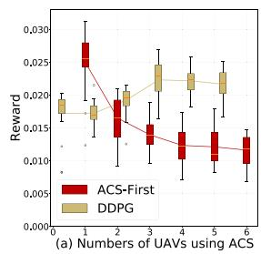

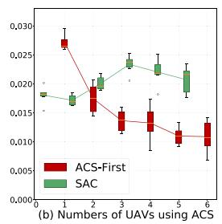

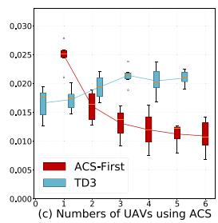  
Fig. 9. Schelling diagrams of ACS-First algorithm with (a) DDPG, (b) SAC, (c) TD3 and (d) PPO.

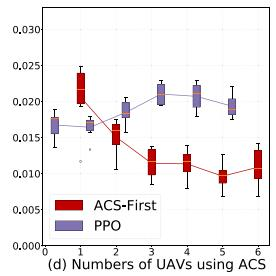

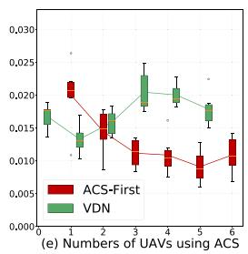

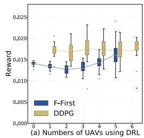

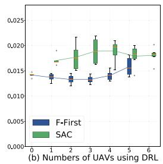

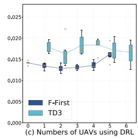

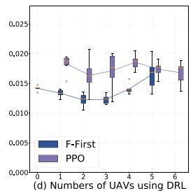

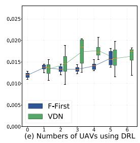

Fig. 10. Schelling diagrams of F-First algorithm with (a) DDPG, (b) SAC, (c) TD3 and (d) PPO.  
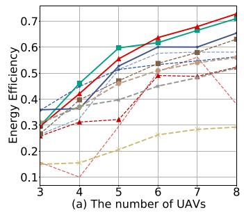

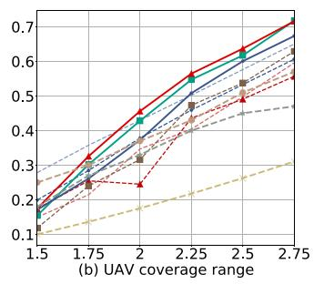

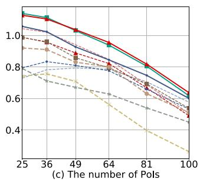

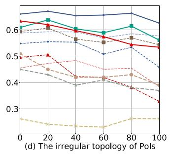  
Fig. 11. The impact of (a) the number of UAVs, (b) the communication coverage range of ${ \mathrm { U A V s } } ,$ (c) the number of PoIs, and (d) the irregular topology on energy efficiency. The rest of the parameters settings are default values in Section V-A. In the figure we use the following abbreviations: ACS-First Pre-train (ACSP), F-First Pre-train (FP) and inequality aversion (IA).

In this paper, we use rotary-wing UAVs in the network. Referring to [75], the UAV propulsion power is model as

$$
\begin{array} { r l r } {  { P _ { F } ( v ) = P _ { F 0 } ( 1 + \frac { 3 v ^ { 2 } } { v _ { \mathrm { t i p } } ^ { 2 } } ) + P _ { F 1 } ( \sqrt { 1 + \frac { v ^ { 4 } } { 4 \tilde { v } _ { 0 } ^ { 4 } } } - \frac { v ^ { 2 } } { 2 \tilde { v } _ { 0 } ^ { 2 } } ) ^ { \frac { 1 } { 2 } } } } \\ & { } & { \qquad + \frac { 1 } { 2 } d _ { 0 } \rho s A _ { \mathrm { d i s c } } v ^ { 3 } , \qquad ( 2 \ell ^ { 2 } ) ^ { { \ l } } } \end{array}\tag{6}
$$

where v is the speed of the $\mathrm { U A V } , v _ { t i p }$ is the tip speed of the UAV’s rotor blade and $\tilde { v } _ { 0 }$ is the mean rotor induced velocity in hover. $P _ { F 0 }$ and $P _ { F 1 }$ are the blade profile power and induced power in a hovering state respectively. $d _ { 0 }$ denotes the fuselage drag ratio, s denotes the rotor solidity, $A _ { \mathrm { d i s c } }$ is the rotor disc area and $\rho$ is the density of the air. From (26), when the UAV is hovering (UAV speed $v = 0 )$ , the UAV power model is ${ \cal P } _ { H } = { \cal P } _ { F } ( 0 ) =$ $P _ { F 0 } + P _ { F 1 }$

It is worth noting that the transmission power is in the milliwatt range [76], which is significantly lower than the default hovering power of 168 W. So we factor in this power consumption when calculating the overall energy usage of the UAV control system power $P _ { C }$

It is worth noting that th DRL model utilizes a centralized training distribution execution approach, where the heavy load of training occurs on a central server and the trained model is then loaded onto the UAV. The UAV only performs the DNN inference part according to the input state. Similarly, in computer vision, training occurs in data centers and clients only require inputting images into the DNN for inference. The power consumption of DNN inference is also incorporated into the UAV control system consumption power $P _ { C }$ . Table II lists default UAV parameters. Based on the above analyses, the UAV energy consumption limitation model is

$$
\int _ { 0 } ^ { T } P _ { F } \mathopen { } \mathclose \bgroup \left( v \mathopen { } \mathclose \bgroup \left( t \aftergroup \egroup \right) \right) + P _ { H } + P _ { C } d t \leq E _ { \mathrm { l i m i t } } ,\tag{27}
$$

where $E _ { \mathrm { l i m i t } }$ is the maximum on-board energy of the UAV and $\mathcal { T } _ { \mathrm { m a x } }$ is the maximum system time.

ACS-First ---- ACS-Pretrain ---- Agent-level reward ACSP-IA DRL-EC^3 -\*-·A\* F-First F-Pretrain Agent-level reward-IA FP-IA VDN  
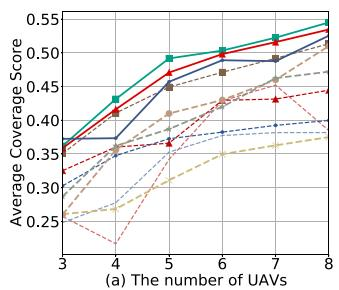

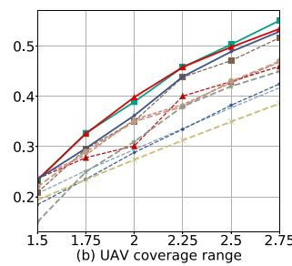

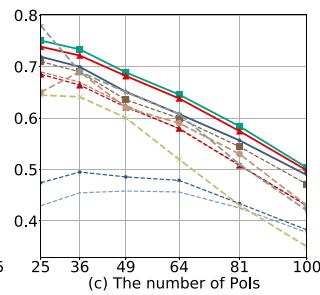

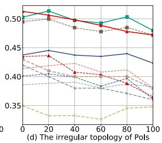

Fig. 12. The impact of (a) the number of UAVs, (b) the communication coverage range of UAVs, (c) the number of PoIs, and (d) the irregular topology on average coverage score. The rest of the parameters settings are default values in Section V-A.  
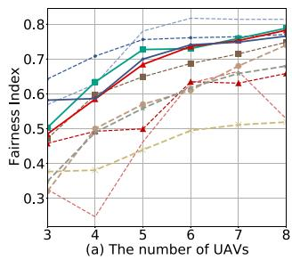

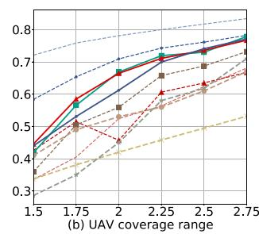

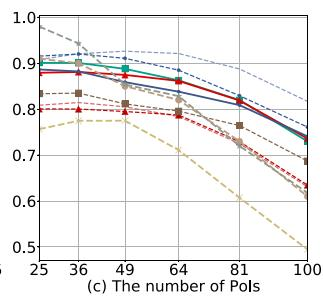

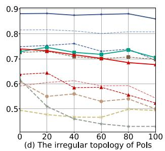

Fig. 13. The impact of (a) the number of UAVs, (b) the communication coverage range of UAVs, (c) the number of PoIs, and (d) the irregular topology on fairness. The rest of the parameters settings are default values in Section V-A.  
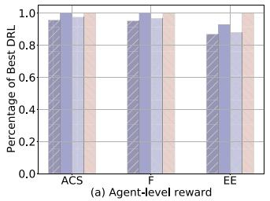

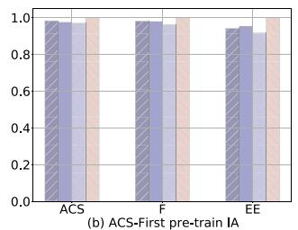

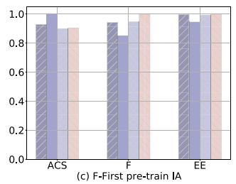

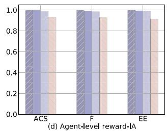  
Fig. 14. The system performance of the four DRL algorithms (DDPG, SAC, TD3 and PPO) under different reward settings and initial model: (a) Agent-leve reward and randomly initialized models; (b) Inequality aversion reward and ACS-First pre-train model; (c) Inequality aversion reward and F-First pre-train model; (d) Inequality aversion reward and Agent-level reward DRL training model.

## V. SIMULATION

## A. Simulation Settings

In this paper, we present a case study of UAV-assisted ITS. The simulation focus on the multi-UAV area coverage problems settings as shown in Section IV-B. In regular topology, we design a square area of  ×  units as the target area, and the geometric center of each unit is PoI, as shown in Fig. 7. The side length of each unit is 100 meters. In the target area, we have designed 6 UAVs to provide communication services for PoIs by default. The communication coverage range of UAVs is 250 meters by default. The default communication range among UAVs is 500 meters. We limit UAVs to only start from the access point and need to return after completing the mission. The total time of the coverage task is 256 time slots. In each time slot, the maximum flight speed of UAVs is 25 m/s, and the most energy-efficient cruise flight speed is 10 m/s. We use the energy efficiency, average coverage score and fairness index, as described in Section IV-B, to evaluate the performance of the trained model. In the proposed algorithm, each UAV network consists of two parts: the input embedding layer using 3 attention modules with 2 heads and 32 hidden units followed by the ReLU layer; the output critic and actor network using 2 multi-layer perceptron (MLP) modules with 32/(1, 2) hidden units.

We compare Hammurabi with the following baseline algorithms to perform ablation experiments to verify the effectiveness:

\- A∗: The A-Star (A∗) algorithm, a heuristic-based method, is widely acknowledged as one of the most efficient direct search strategies for identifying the shortest path in a static road network. This algorithm necessitates the exploration of nodes on the map and the establishment of an appropriate heuristic function (referred to as the reward function in this paper) for guidance. By assessing the cost associated with each node, it determines the optimal node for expansion until the final destination is reached.

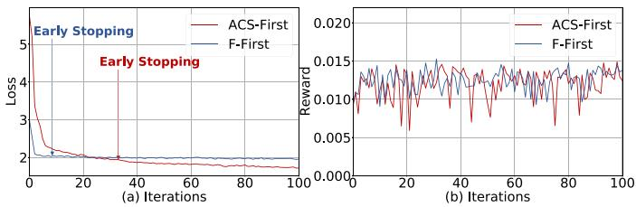

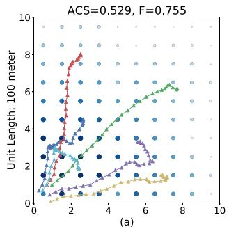

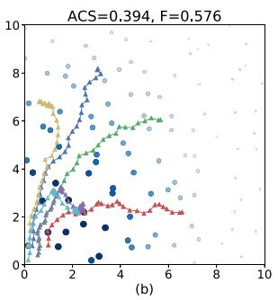

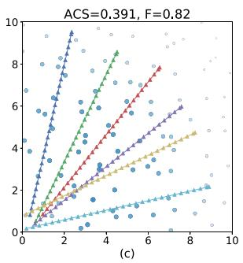

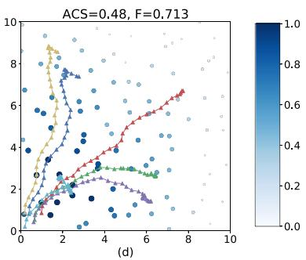  
Pol  UAV Trajectories the coverage time of each Pol after normalization  
Fig. 15. The flight trajectory of UAVs based on (a) inequality aversion reward model, (b) ACS-First, (c) F-First, and (d) inequality aversion reward model same as Fig. 15(a).  
Fig. 16. (a) Training loss of the ACS-First pre-train and F-First pre-train models; (b) the test rewards obtained in the default parameter environment during the pre-training process.

\- Expert: Inspired by the inherent greedy concept in the A-star algorithm, we have devised two expert baseline solutions for multi-UAV ACP. (i) ACS-First: In each time slot, UAVs proceed directly to the closest uncovered PoIs within the observable range, maintaining a cruising speed to prevent energy constraint violations, as shown in Fig. 7(a). (ii) F-First: This strategy is predicated on a specific topology for the design of artificial UAV trajectories, enabling UAVs to cover as many PoIs as feasible. In the regular PoIs topology, we maintain the UAV at an energy-efficient cruising speed, with each UAV covering a sector of π/ , as shown in Fig. 7(b).

\- Pre-train: We use 10 episodes (8 ACS-First and 2 F-First trajectories) of the expert algorithm to generate data to initialize the model by a baseline-assisted pre-training scheme.

DRL-based baselines: We test the Hammurabi framework based on four DRL algorithms (DDPG, SAC, TD3 and PPO) under different reward settings and initial model. These DRL algorithms essentially replicate some basic reinforcement learning algorithms at the algorithm level, for example, agent-level reward with DDPG is equivalent to work in [65], and agent-level reward with PPO is equivalent to works in [68] and [70]. We have chosen the four most mainstream benchmark DRL algorithms. However, since this paper focuses on reward function and pre-train bias, this part is decoupled from the model gradient update process that DRL algorithms focus on. Therefore, other DRL algorithms can also be conveniently replaced within the Hammurabi framework.

TABLE IV  
NUMERICAL PERFORMANCE IMPROVEMENTS 1
<table><tr><td></td><td>ACS-First</td><td>F-First</td><td>ACS-P</td><td>F-P</td><td>Agent-level</td></tr><tr><td>EE</td><td>25.89%</td><td>10.48%</td><td>29.76%</td><td>12.70%</td><td>14.83%</td></tr><tr><td>ACS</td><td>16.16%</td><td>31.99%</td><td>15.96%</td><td>27.87%</td><td>6.82%</td></tr><tr><td>F</td><td>16.64%</td><td>-9.92%</td><td>15.95%</td><td>-2.67%</td><td>6.23%</td></tr></table>

This table reflects the improvement ratio of IA-based DRL to the baseline algorithms under the default environment parameters as shown in Section 5.1. ACS-First and F-First algorithms are compared with the best IA-based DRL results. ACS-First pretrain, ACS-First pre-train and agent-level reward will be compared with IA-based DRL based on subsequent training of these three types of algorithm models respectively.

VDN: Value-decomposition networks (VDN) [26] is a mainstream MARL algorithm which intrinsically demands an environment that complies with the individual-globalmaximization principle and rely on the collective shared critic network. VDN implies a purely cooperative setting where all agents are governed by the same reward function.

## B. System Performance and Ablation Experiments

We test the effects of different UAV numbers, coverage ranges, PoI numbers and topological regularity on energy efficiency, average coverage score and fairness. We train policy DNN with default 6 UAVs, 100 PoIs, 250 m coverage range and regular topology. Then, we test the policy DNN with different system setting as shown in Figs. 11, 12, and 13. For convenience, we abbreviate inequality aversion as IA in the experimental diagram. IA-based DRL starts training from the optimal model generated by other algorithms. Experimental results show that the inequality aversion mechanism selected by the Hammurabi framework can make the policy DNNs escape from the original local optimum. Compared with the rule algorithm and agent-level reward, the application of inequality aversion reward can improve the system performance. Numerical performance improvement results are shown in Table IV. In addition, in order to avoid a large number of overlapping lines in Figs. 11, 12, and 13, we show the system performance of the four DRL algorithms (DDPG, SAC, TD3 and PPO) under different reward settings and initial model in Fig. 14. It is easy to find that these standard DRL algorithms have similar performance. Fig. 15(a) shows the flight trajectories on the regular topology.

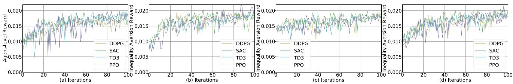  
Fig. 17. The evolution of rewards obtained in the default parameter environment of the four DRL algorithms (DDPG, SAC, TD3 and PPO) under different reward settings and initial model: (a) Agent-level reward and randomly initialized models; (b) Inequality aversion reward and ACS-First pre-train model; (c) Inequality aversion reward and F-First pre-train model; (d) Inequality aversion reward and Agent-level reward DRL training model.

## C. From Regular to Irregular

In production systems, the distribution of users is not necessarily regular, and they may be randomly distributed in the task area. We directly run the policy DNN trained on the regular topology on the random topology, and the experimental results are shown in Figs. 11, 12, 13(d). Due to the generalization and robustness of DNN, the model is still effective. Fig. 15(d) shows the flight trajectories on the irregular topology.

## D. The Evolution of Policy

We examine how the policies evolve as training iterations increase. Fig. 16 shows the training loss of the ACS-First pretrain and F-First pre-train models and the test rewards obtained in the default parameter environment during the pre-training process. In each iteration, 16 time slots of data are randomly selected from replay buffer for training (batch size  16). We adopt the “early stopping” technique commonly used in the field of supervised learning, and use the first model whose loss is no longer significantly reduced to conduct follow-up experiments, in order to alleviate the problem of over-fitting.

In Fig. 17, we show the trend of rewards obtained in the default parameter environment during the DRL training. In DRL training phase, every 24 iterations, the UAVs interact with the environment to generate a new set of trajectories (256 time slots). In each iteration, 16 time slots of data are randomly selected from replay buffer for training (batch size 16). Fig. 17(a) shows the DRL training process of agent-level reward, whose initial model is obtained by random initialization. This demonstrates the effectiveness of DRL algorithms that can achieve convergent suboptimal results. Fig. 17(b)–(d) show the DRL training process based on inequality aversion reward. The training model in Fig. 17(b)–(d) is continuously trained based on the suboptimal model obtained from pre-training and agent-level reward. It can be found that inequality aversion reward further improves the system performance without changing the DRL algorithms, which reflects the effectiveness of the Hammurabi framework.

## VI. CONCLUSION

In this paper, we consider that game theory is leveraged in the multi-UAV assisted intelligent transportation system. In multi-UAV system, UAVs need to optimize energy efficiency and coverage fairness at the same time. DRL-based UAVs learns policy based on predefined rewards. In previous MADRL-based fair and efficient multi-UAV system, such as DRL-EC3, the predefined rewards are related to system performance. Although the system performance as an optimization objectives can effectively promote the cooperation of UAVs, it will cause the problem of mismatch between UAVs actions and rewards. Agent-level reward can effectively solve the above problem, but the DRL is based on maximizing individual rewards which makes UAV agents fall into a dilemma: whether to consume resources for higher collective rewards or to save energy in order to maximize its own agent-level reward. We propose the Hammurabi framework, and further design inequality aversion rewards by analyzing the Schelling diagram of UAV systems. Our experiments show that Hammurabi can outperform the baselines, improving the 25.89% in energy efficiency, 16.16% in average coverage score and 16.64% in fairness.

## REFERENCES

[1] P. A. Apostolopoulos, G. Fragkos, E. E. Tsiropoulou, and S. Papavassiliou, “Data offloading in UAV-assisted multi-access edge computing systems under resource uncertainty,” IEEE Trans. Mobile Comput., vol. 22, no. 1, pp. 175–190, Jan. 2023.

[2] X. Dai, Z. Xiao, H. Jiang, and J. C. Lui, “UAV-assisted task offloading in vehicular edge computing networks,” IEEE Trans. Mobile Comput., vol. 23, no. 4, pp. 2520–2534, Apr. 2024.

[3] H. Gao, J. Feng, Y. Xiao, B. Zhang, and W. Wang, “A UAV-assisted multitask allocation method for mobile crowd sensing,” IEEE Trans. Mobile Comput., vol. 22, no. 7, pp. 3790–3804, Jul. 2023.

[4] R. Fu, Q. Quan, M. Li, and K.-Y. Cai, “Practical distributed control for cooperative multicopters in structured free flight concepts,” IEEE Trans. Intell. Transp. Syst., vol. 24, no. 4, pp. 4203–4216, Apr. 2023.

[5] S. Kuutti, R. Bowden, Y. Jin, P. Barber, and S. Fallah, “A survey of deep learning applications to autonomous vehicle control,” IEEE Trans. Intell. Transp. Syst., vol. 22, no. 2, pp. 712–733, Feb. 2021.

[6] L. Wang, K. Wang, C. Pan, W. Xu, N. Aslam, and L. Hanzo, “Multi-agent deep reinforcement learning-based trajectory planning for multi-UAV assisted mobile edge computing,” IEEE Trans. Cogn. Commun. Netw., vol. 7, no. 1, pp. 73–84, Mar. 2021.

[7] M. Tang and V. W. Wong, “Deep reinforcement learning for task offloading in mobile edge computing systems,” IEEE Trans. Mobile Comput., vol. 21, no. 6, pp. 1985–1997, Jun. 2022.

[8] L. Wang, K. Wang, C. Pan, W. Xu, N. Aslam, and A. Nallanathan, “Deep reinforcement learning based dynamic trajectory control for UAV-assisted mobile edge computing,” IEEE Trans. Mobile Comput., vol. 21, no. 10, pp. 3536–3550, Oct. 2022.

[9] M. Asim, M. ELAffendi, and A. El-Latif, “Multi-irs and multi-UAVassisted MEC system for 5G/6G networks: Efficient joint trajectory optimization and passive beamforming framework,” IEEE Trans. Intell. Transp. Syst., vol. 24, no. 4, pp. 4553–4564, Apr. 2023.

[10] Y. Xiao and M. Krunz, “Adaptivefog: A modelling and optimization framework for fog computing in intelligent transportation systems,” IEEE Trans. Mobile Comput., vol. 21, no. 12, pp. 4187–4200, Dec. 2022.

[11] S. Aradi, “Survey of deep reinforcement learning for motion planning of autonomous vehicles,” IEEE Trans. Intell. Transp. Syst., vol. 23, no. 2, pp. 740–759, Feb. 2022.

[12] L. Ni, B. Sun, X. Tan, and D. H. K. Tsang, “Mobility and energy management in electric vehicle based mobility-on-demand systems: Models and solutions,” IEEE Trans. Intell. Transp. Syst., vol. 24, no. 4, pp. 3702–3713, Apr. 2023.

[13] R. S. Sutton and A. G. Barto, Reinforcement Learning: An Introduction, 2nd. Cambridge, MA, USA: MIT Press, 2018.

[14] Z. Shen, K. Yang, X. Zhao, J. Zou, and W. Du, “DeepAPP: A deep reinforcement learning framework for mobile application usage prediction,” IEEE Trans. Mobile Comput., vol. 22, no. 2, pp. 824–840, Feb. 2023.

[15] R. F. Prudencio, M. R. O. A. Maximo, and E. L. Colombini, “A survey on offline reinforcement learning: Taxonomy, review, and open problems,” IEEE Trans. Neural Netw. Learn. Syst., vol. 35, no. 8, pp. 10237–10257, Aug. 2024.

[16] X. Wang et al., “Deep reinforcement learning: A survey,” IEEE Trans. Neural Netw. Learn. Syst., vol. 35, no. 4, pp. 5064–5078, Apr. 2024.

[17] R. Axelrod and W. D. Hamilton, “The evolution of cooperation,” Science, vol. 211, no. 4489, pp. 1390–1396, Jul. 1981.

[18] W. B. Liebrand, “A classification of social dilemma games,” Simul. Games, vol. 14, no. 2, pp. 123–138, Jun. 1983.

[19] M. A. Nowak and K. Sigmund, “Tit for tat in heterogeneous populations,” Nature, vol. 355, no. 6357, pp. 250–253, Jan. 1992.

[20] E. Fehr and K. M. Schmidt, “A theory of fairness, competition, and cooperation,” Quart. J. Econ., vol. 114, no. 3, pp. 817–868, Aug. 1999.

[21] L. S. Shapley, “Stochastic games,” Proc. Nat. Acad. Sci. USA, vol. 39, no. 10, pp. 1095–1100, Oct. 1953.

[22] J. Hao et al., “Exploration in deep reinforcement learning: From singleagent to multiagent domain,” IEEE Trans. Neural Netw. Learn. Syst., vol. 35, no. 7, pp. 8762–8782, Jul. 2024.

[23] A. Wong, T. Bäck, A. V. Kononova, and A. Plaat, “Deep multiagent reinforcement learning: Challenges and directions,” Artif. Intell. Rev., vol. 56, pp. 5023–5056, Oct. 2023.

[24] S. Gronauer and K. Diepold, “Multi-agent deep reinforcement learning: A survey,” Artif. Intell. Rev., vol. 1, no. 55, pp. 895–943, Feb. 2022.

[25] A. Tampuu et al., “Multiagent cooperation and competition with deep reinforcement learning,” PLoS One, vol. 12, no. 4, pp. 1–15, Apr. 2017.

[26] P. Sunehag et al., “Value-decomposition networks for cooperative multiagent learning based on team reward,” in Proc. Int. Conf. Auton. Agents Multiagent Syst., Stockholm, Sweden, Jul. 2018, pp. 2085–2087.

[27] T. Rashid, M. Samvelyan, C. S. De Witt, G. Farquhar, J. Foerster, and S. Whiteson, “Monotonic value function factorisation for deep multi-agent reinforcement learning,” J. Mach. Learn. Res., vol. 21, no. 178.

[28] J. N. Foerster, G. Farquhar, T. Afouras, N. Nardelli, and S. Whiteson, “Counterfactual multi-agent policy gradients,” in Pro. 32nd AAAI Conf. Artif. Intell., New Orleans, LA, Sep. 2018, pp. 2974–2982.

[29] T. P. Lillicrap et al., “Continuous control with deep reinforcement learning,” in Proc. Int. Conf. Learn. Representations, San Juan, Puerto Rico, May 2016, pp. 1–14.

[30] T. Haarnoja, A. Zhou, P. Abbeel, and S. Levine, “Soft actor-critic: Offpolicy maximum entropy deep reinforcement learning with a stochastic actor,” in Proc. Int. Conf. Mach. Learn., Stockholm, Sweden, Jul. 2018, pp. 1–10.

[31] F. Scott, H. Herke, and M. David, “Addressing function approximation error in actor-critic methods,” in Proc. Int. Conf. Mach. Learn., Stockholm, Sweden, Jul. 2018, pp. 1587–1596.

[32] J. Schulman, F. Wolski, P. Dhariwal, A. Radford, and O. Klimov, “Proximal policy optimization algorithms,” Jul. 2017, arXiv:1707.06347.

[33] J. Schulman, S. Levine, P. Abbeel, M. Jordan, and P. Moritz, “Trust region policy optimization,” in Proc. 32nd Int. Conf. Mach. Learn., Lille, France, Jul. 2015, pp. 1889–1897.

[34] V. Mnih et al., “Human-level control through deep reinforcement learning,” Nature, vol. 518, no. 7540, pp. 529–533, Feb. 2015.

[35] D. Huh and P. Mohapatra, “Multi-agent reinforcement learning: A comprehensive survey,” Jul. 2024, arXiv:2312.10256.

[36] Z. Ning and L. Xie, “A survey on multi-agent reinforcement learning and its applications,” J. Automat. Intell., vol. 3, no. 2, pp. 73–91, Feb. 2024.

[37] S. Kyunghwan et al., “QTRAN: Learning to factorize with transformation for cooperative multi-agent reinforcement learning,” in Proc. Int. Conf. Mach. Learn., Long Beach, CA, Jun. 2019, pp. 1–10.

[38] J. Wang, Z. Ren, T. Liu, Y. Yu, and C. Zhang, “QPLEX: Duplex dueling multi-agent Q-learning,” in Proc. Int. Conf. Learn. Representations, Virtual Only, May 2021, pp. 1–27.

[39] B. Peng et al., “FACMAC: Factored multi-agent centralised policy gradients,” in Proc. Int. Conf. Neural Inf. Process. Syst., Virtual Only, Dec. 2020, Art. no. 934.

[40] K. Jakub, C. GrudzienW. RuiqingMuning, and W. Ying, “Trust region policy optimisation in multi-agent reinforcement learning,” Aug. 2022, arXiv:2109.11251.

[41] D. W. Christian, G. SchröderM. TarunDenys, and M. Viktor, “Is independent learning all you need in the starcraft multi-agent challenge,” Nov. 2020, arXiv:2011.09533.

[42] C. Yu et al., “Trust region policy optimisation in multi-agent reinforcement learning,” in Proc. Int. Conf. Neural Inf. Process. Syst., Red Hook, NY, Nov. 2022, pp. 1–27.

[43] Y. Niu, R. Paleja, and M. Gombolay, “Multi-agent graph-attention communication and teaming,” in Proc. Int. Found. Auton. Agents Multiagent Syst., Richland, SC, May 2021, pp. 964–973.

[44] Z. Liu, L. Wan, X. Sui, Z. Chen, K. Sun, and X. Lan, “Deep hierarchical communication graph in multi-agent systems,” in Proc. 32nd Int. Joint Conf. Artif. Intell., Macao, P. R. China, Aug. 2023, pp. 208–216.

[45] S. Hu, L. Shen, Y. Zhang, and D. Tao, “Learning multi-agent communication from graph modeling perspective,” in Proc. Int. Conf. Learn. Representations, Vienna Austria, May 2024.

[46] T. Wang, G. Tarun, M. Anuj, and P. Bei, “Rode: Learning roles to decompose multi-agent tasks,” in Proc. Int. Conf. Learn. Representations, Virtual Only, May 2021, pp. 1–24.

[47] T. T. Nguyen, N. D. Nguyen, and S. Nahavandi, “Deep reinforcement learning for multiagent systems: A review of challenges, solutions, and applications,” IEEE Trans. Cybern., vol. 50, no. 9, pp. 3826–3839, Sep. 2020.

[48] R. Han et al., “Parallel network slicing for multi-SP services,” in Proc. Int. Conf. Parallel Process., Bordeaux, France, Jan. 2023, Art. no. 56.

[49] J. K. Gupta, M. Egorov, and M. Kochenderfer, “Cooperative multi-agent control using deep reinforcement learning,” in Proc. Int. Conf. Auton. Agents Multiagent Syst., Sao Paulo, Brazil, May 2017, pp. 66–83.

[50] J. Hu and M. P. Wellman, “Nash Q-learning for general-sum stochastic games,” J. Mach. Learn. Res., vol. 4, pp. 1039–1069, Nov. 2003.

[51] J.-B. Grill et al., “Bootstrap your own latent a new approach to selfsupervised learning,” in Proc. 34th Int. Conf. Neural Inf. Process. Syst., Vancouver, BC, Canada, Dec. 2020, pp. 21271–21284.

[52] P. Liu, W. Yuan, J. Fu, Z. Jiang, H. Hayashi, and G. Neubig, “Pre-train, prompt, and predict: A systematic survey of prompting methods in natural language processing,” ACM Comput. Surv., vol. 55, no. 9, Jan. 2023, Art. no. 195.

[53] Z. Xie, Z. Lin, J. Li, S. Li, and D. Ye, “Pretraining in deep reinforcement learning: A survey,” Nov. 2022, arXiv:2211.03959.

[54] D. Silver et al., “Mastering the game of go with deep neural networks and tree search,” Nature, vol. 529, no. 7587, pp. 484–489, Jan. 2016.

[55] M. Michael and W. F. Andreas, “Learning dynamics in social dilemmas,” Proc. Nat. Acad. Sci. USA, vol. 99, no. 3, pp. 7229–7236, May 2002.

[56] R. Axelrod, “Effective choice in the prisoner’s dilemma,” J. Conflict Resolution, vol. 24, no. 1, pp. 3–25, Mar. 1980.

[57] F. C. Santos, M. D. Santos, and J. M. Pacheco, “Social diversity promotes the emergence of cooperation in public goods games,” Nature, vol. 454, no. 7201, pp. 213–216, Jul. 2008.

[58] J. Z. Leibo, V. Zambaldi, M. Lanctot, J. Marecki, and T. Graepel, “Multiagent reinforcement learning in sequential social dilemmas,” in Proc. Int. Conf. Auton. Agents Multiagent Syst., Sao Paulo, Brazil, May 2017, pp. 464–473.

[59] E. Hughes et al., “Inequity aversion improves cooperation in intertemporal social dilemmas,” in Proc. Adv. Neural Inf. Process. Syst., Montreal, Canada, Dec. 2018, pp. 3330–3340.

[60] T. Jaakkola, M. I. Jordan, and S. P. Singh, “Convergence of stochastic iterative dynamic programming algorithms,” in Proc. Adv. Neural Inf. Process. Syst., Denver, USA, Dec. 1994, pp. 703–710.

[61] C. Szepesvári and M. L. Littman, “A unified analysis of value-functionbased reinforcement-learning algorithms,” Neural Computation, vol. 11, no. 8, pp. 2017–2060, Nov. 1999.

[62] Z. Ye, K. Wang, Y. Chen, X. Jiang, and G. Song, “Multi-UAV navigation for partially observable communication coverage by graph reinforcement learning,” IEEE Trans. Mobile Comput., vol. 22, no. 7, pp. 4056–4069, Jul. 2023.

[63] Z. Mou, F. Gao, J. Liu, and Q. Wu, “Resilient UAV swarm communications with graph convolutional neural network,” IEEE J. Sel. Areas Commun., vol. 40, no. 1, pp. 393–411, Jan. 2022.

[64] S. Rahmani, A. Baghbani, N. Bouguila, and Z. Patterson, “Graph neural networks for intelligent transportation systems: A survey,” IEEE Trans. Intell. Transp. Syst., vol. 24, no. 8, pp. 8846–8885, Aug. 2023.

[65] C. H. Liu, Z. Chen, J. Tang, J. Xu, and C. Piao, “Energy-efficient UAV control for effective and fair communication coverage: A deep reinforcement learning approach,” IEEE J. Sel. Areas Commun., vol. 36, no. 9, pp. 2059–2070, Sep. 2018.

[66] H. Qi, Z. Hu, H. Huang, X. Wen, and Z. Lu, “Energy efficient 3-D UAV control for persistent communication service and fairness: A deep reinforcement learning approach,” IEEE Access, vol. 8, pp. 53172–53184, 2020.

[67] H. V. Abeywickrama, Y. He, E. Dutkiewicz, B. A. Jayawickrama, and M. Mueck, “A reinforcement learning approach for fair user coverage using uav mounted base stations under energy constraints,” IEEE Open J. Veh. Technol., vol. 1, no. 1, pp. 67–81, Feb. 2020.

[68] C. H. Liu, X. Ma, X. Gao, and J. Tang, “Distributed energy-efficient multi-UAV navigation for long-term communication coverage by deep reinforcement learning,” IEEE Trans. Mobile Comput., vol. 19, no. 6, pp. 1274–1285, Jun. 2020.

[69] I. A. Nemer, T. R. Sheltami, S. Belhaiza, and A. S. Mahmoud, “Energyefficient UAV movement control for fair communication coverage: A deep reinforcement learning approach,” Sensors, vol. 22, no. 5, Feb. 2022, Art. no. 1919.

[70] D. Chen, Q. Qi, Z. Zhuang, J. Wang, J. Liao, and Z. Han, “Mean field deep reinforcement learning for fair and efficient UAV control,” IEEE Internet Things J., vol. 8, no. 2, pp. 813–828, Jan. 2021.

[71] M. Huttenrauch, A. Sosic, and G. Neumann, “Deep reinforcement learning for swarm systems,” J. Mach. Learn. Res., vol. 20, no. 54, pp. 1–31, Feb. 2019.

[72] R. K. Jain, D.-M. W. Chiu, and W. R. Hawe, “A quantitative measure of fairness and discrimination for resource allocation in shared computer systems,” Sep. 1998, arXic:cs/9809099.

[73] G. Hardin, “The tragedy of the commons,” J. Natural Resour. Policy Res., vol. 1, no. 3, pp. 243–253, Jul. 2009.

[74] 3GPP TR 36.777, “Study on enhanced LTE support for aerial vehicles (Release 15),” Dec. 2017.

[75] Y. Zeng, J. Xu, and R. Zhang, “Energy minimization for wireless communication with rotary-wing UAV,” IEEE Trans. Wireless Commun., vol. 18, no. 4, pp. 2329–2345, Apr. 2019.

[76] M. Yi, X. Wang, J. Liu, Y. Zhang, and B. Bai, “Deep reinforcement learning for fresh data collection in UAV-assisted IoT networks,” in Proc. IEEE Conf. Comput. Commun. Workshops, Toronto, ON, Canada, Jul. 2020, pp. 716–721.

  
Dezhi Chen is currently working toward the PhD degree with the Beijing University of Posts and Telecommunications, Beijing, China. His research interests include UAV control, game theory, and nextgeneration mobile communication networks using reinforcement learning, and artificial intelligence technologies.

Qi Qi (Senior Member, IEEE) received the PhD degree from the Beijing University of Posts and Telecommunications, Beijing, China, in 2010. She is currently an associate professor with the State Key Laboratory of Networking and Switching Technology, Beijing University of Posts and Telecommunications. She has authored or co-authored more than 30 papers in the international journal and is the recipient of two National Natural Science Foundations of China. Her research interests include edge computing, cloud computing, the Internet of Things, ubiquitous services, deep learning, and deep reinforcement learning.

Jingyu Wang (Senior Member, IEEE) received the PhD degree from the Beijing University of Posts and Telecommunications, Beijing, China, in 2008. He is currently a tenured professor with the State Key Laboratory of Networking and Switching Technology, Beijing University of Posts and Telecommunications. He is selected for the Yangtse River Scholar Award Program by the Ministry of Education. He has published more than 200 papers in such as the ToN, TMC, JSAC, NSDI, ASPLOS and so on. His research interests include broad aspects of intelligent networks, Edge/cloud computing, machine learning, self-driving network, IoV/IoT, knowledge-defined network and intent-driven networking.

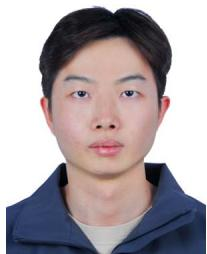

Rongxin Han received the BSc degree from the Beijing University of Posts and Telecommunications, Beijing, China, in 2021, where he is currently working toward the PD degree with the State Key Laboratory of Networking and Switching Technology, Beijing University of Posts and Telecommunications. He has published some articles in ASPLOS 2024, IEEE/ACM Transactions on Networking, IEEE Transactions on Parallel and Distributed Systems, ICPP 2022. His research interests include network slice, configuration synthesis, deep reinforcement learning, and graph model.

Bo He received the PhD degree from the Beijing University of Posts and Telecommunications, China, in 2023. He is currently a postdoctoral researcher with the State Key Laboratory of Networking and Switching Technology, Beijing University of Posts and Telecommunications. From 2021 to 2022, He was a visiting PhD student with the University of Waterloo, Canada. His research interests include 5 G/6 G networks, multipath networks, collective communication, transmission control, and deep reinforcement learning.

  
Hongchuan He is currently working towards a master’s degree with the Beijing University of Posts and Telecommunications, Beijing, China. His research interests include intelligent networks and management for next-generation network communications.

Zirui Zhuang is currently working toward the PhD degree with the Beijing University of Posts and Telecommunications, Beijing, China. His research interests include network routing and management for next generation network infrastructures, using machine learning, and artificial intelligence techniques.

  
Qianlong Fu is currently working toward the master’s degree with the the Beijing University of Posts and Telecommunications, Beijing, China. His research interests include network routing and management for next-generation network infrastructures, using machine learning, and artificial intelligence techniques.

Jianxin Liao received the PhD degree from the University of Electronics Science and Technology of China, Chengdu, China, in 1996. He is currently the dean with the Network Intelligence Research Center and a full professor with the State Key Laboratory of Networking and Switching Technology, Beijing University of Posts and Telecommunications. He has authored or coauthored hundreds of research papers and several books. He has won several prizes in China for his research achievements, which include the Premiers Award of Distinguished Young Scientists from

National Natural Science Foundation of China in 2005, and the specially invited Professor of the “Yangtse River Scholar Award Program” by the Ministry of Education in 2009. His main research interests include cloud computing, mobile intelligent network, service network intelligence, networking architectures and protocols, and multimedia communication.

Zhu Han (Fellow, IEEE) received the BS degree in electronic engineering from Tsinghua University, in 1997, and the MS and PhD degrees in electrical and computer engineering from the University of Maryland, College Park, in 1999 and 2003, respectively. From 2000 to 2002, he was an R&D engineer of JDSU, Germantown, Maryland. From 2003 to 2006, he was a research associate with the University of Maryland. From 2006 to 2008, he was an assistant professor with Boise State University, Idaho. Currently, he is a John and Rebecca Moores professor

with the Electrical and Computer Engineering Department as well as in the Computer Science Department, University of Houston, Texas. His main research targets on the novel game-theory related concepts critical to enabling efficient and distributive use of wireless networks with limited resources. His other research interests include wireless resource allocation and management, wireless communications and networking, quantum computing, data science, smart grid, carbon neutralization, security and privacy. He received an NSF Career Award in 2010, the Fred W. Ellersick Prize of the IEEE Communication Society in 2011, the EURASIP Best Paper Award for the Journal on Advances in Signal Processing in 2015, IEEE Leonard G. Abraham Prize in the field of Communications Systems (best paper award in IEEE JSAC) in 2016, IEEE Vehicular Technology Society 2022 Best Land Transportation Paper Award, and several best paper awards in IEEE conferences. He was an IEEE Communications Society Distinguished Lecturer from 2015 to 2018 and ACM Distinguished Speaker from 2022 to 2025, AAAS fellow since 2019, and ACM fellow since 2024. He is a 1% highly cited Researcher since 2017 according to Web of Science. He is also the winner of the 2021 IEEE Kiyo Tomiyasu Award (an IEEE Field Award), for outstanding early to mid-career contributions to technologies holding the promise of innovative applications, with the following citation: “for contributions to game theory and distributed management of autonomous communication networks.”