JOURNAL OF LAT X CLASS FILES, VOL. 14, NO. 8, JANUARY 2026

# Heuristic-Supervised-DRL: A Unified Optimization Framework with Convergence Analysis

Wei Zhao, Member, IEEE, Kai Wang, Member, IEEE, Xiangyu Liu, Member, IEEE, Zhi Liu, Seinor Member, IEEE, and Nei Kato, Fellow, IEEE

Abstract—Many real-world problems involve hierarchical multi-objective optimization over coupled sequential decisions. A common strategy is to combine heuristic planning with deep reinforcement learning (DRL). While existing hybrid methods often show strong empirical performance, the coupled closedloop learning dynamics between upper-tier planning and lowertier control are typically analyzed only empirically, and explicit convergence guarantees for the integrated scheme remain limited. To address this gap, we propose a heuristic-supervised-DRL (HSD) framework that tightly couples (i) a heuristic planner for upper-tier decision making, (ii) a DRL agent for lower-tier execution, and (iii) an online supervised predictor that serves as an adaptive bridge between planning and execution. The key novelty of HSD lies in this closed-loop architecture and its accompanying theoretical treatment. By formulating the coupled updates as a two-timescale stochastic approximation process, we show that, under standard conditions, the supervised predictor tracks a quasi-stationary regression target and the overall joint process converges almost surely to an asymptotically stable equilibrium. We further analyze robustness under approximate planning errors. As a case study, we instantiate HSD in a multi-UAV-assisted mobile edge computing system. Experimental results show that the proposed framework consistently outperforms representative baselines in key performance metrics, demonstrating both its practical effectiveness and its value as a principled framework for hierarchical optimization in dynamic environments.

Index Terms—UAV, MEC, TTSSA, heuristic algorithm, DRL, supervised model, HSD

## I. INTRODUCTION

such as robotic fleets, communication networks, power grids, and emerging computing power networks, often involves coupled decisions evolving on different timescales [1]–[3]. In such systems, infrequent upper-tier strategic decisions (e.g., path planning, infrastructure deployment, or policy setting) shape the operating context, while fast lower-tier operational decisions (e.g., resource allocation, device control, or power management) must react to instantaneous states and uncertainties (see Fig. 1). Because the upper tier constrains the lower tier and its quality can only be assessed through downstream lower-tier responses, the resulting optimization is inherently hierarchical, strongly coupled, and difficult to solve in a large non-convex mixed-variable space [4].

A natural approach is to rely on meta-heuristics, such as particle swarm optimization (PSO) and genetic algorithms (GA), to explore the high-dimensional upper-tier space. However, their major bottleneck lies in fitness evaluation: accurately scoring one candidate strategy typically requires expensive rollouts of the subsequent lower-tier process, which makes online, state-dependent planning computationally prohibitive. Consequently, heuristic planners are often deployed in offline or open-loop settings rather than in fully online, statedependent control.

Meanwhile, deep reinforcement learning (DRL) has become a powerful paradigm for learning reactive lower-tier policies from interaction. Yet, when long-horizon upper-tier variables are folded into the action space, the induced combinatorial explosion often leads to unstable training and poor longterm planning. Existing directions (e.g., temporal abstraction via options, structured or factored actions, and model-based lookahead) can partially mitigate this issue, but they typically introduce additional design burdens (e.g., sub-goal specification) or suffer from model bias and compounding errors in learned dynamics.

Taken together, the above discussion suggests that heuristic optimization and DRL are complementary rather than competing paradigms: heuristics are better suited to upper-tier global search, whereas DRL is more effective for lower-tier reactive control. This complementarity has naturally motivated hybrid heuristic–DRL designs. Representative existing studies mainly follow two patterns. In the first, a heuristic or decompositionbased optimizer determines an upper-tier plan (e.g., trajectory, scheduling, or deployment), after which a DRL agent performs lower-tier real-time control under the fixed plan [5], [6]. Such serial decomposition reduces the action dimension faced by DRL, but the upper-tier plan is not continuously revised according to the lower-tier capability actually learned online. In the second, surrogate-assisted optimization uses predictive models to reduce the cost of heuristic fitness evaluation [7]– [9]. However, these methods are most natural when the input–output mapping to be approximated is relatively stable, whereas in our setting the value of an upper-tier decision depends on a lower-tier DRL policy that itself evolves during online learning. Moreover, representative hybrid application studies mainly emphasize empirical performance, while explicit convergence analysis of the coupled learning loop is rarely provided under clear assumptions.

These observations indicate that a stronger hybrid framework should satisfy two requirements. First, upper-tier planning should be informed online by the lower-tier capability that is actually being learned, rather than by a fixed plan or a stationary offline surrogate. Second, the resulting cross-layer interaction should admit a rigorous dynamical characterization, so that the framework is supported not only empirically but also theoretically. This is precisely the gap that motivates the present work.

To address this gap, we propose the heuristic-supervised-DRL (HSD) framework, which integrates (i) a heuristic planner for upper-tier decisions, (ii) a DRL agent for lower-tier execution, and (iii) an adaptive supervised model as an online bridge. This design addresses the above limitations in a oneto-one manner. Unlike open-loop serial decomposition, HSD repeatedly re-guides upper-tier search using current estimates of lower-tier execution capability. Unlike stationary surrogateassisted schemes, the supervised bridge is updated online from execution feedback and can therefore track the nonstationarity induced by policy learning. In this way, HSD turns the interaction between planning and execution into a closedloop hierarchical process rather than a one-shot or offline coupling.

The intuition of HSD is to close the loop between uppertier planning and lower-tier execution without paying the cost of evaluating every candidate upper-tier decision by full rollouts. The heuristic planner explores the non-convex uppertier decision space, the supervised bridge provides cheap performance predictions under the current lower-tier capability, and the DRL agent supplies reactive per-slot control while continuously generating feedback to refine the bridge. Beyond this algorithmic intuition, HSD is not presented as a purely empirical hybrid. By modeling the predictor update as a fast-timescale recursion and the DRL/MARL policy update as a slow-timescale recursion, we cast the coupled learning dynamics into a two-timescale stochastic approximation (TTSSA) framework. Under standard TTSSA conditions, the joint process converges almost surely to an asymptotically stable equilibrium. At that equilibrium, the supervised bridge is optimal in the mean-squared-error sense within the chosen function class for the quasi-stationary policy, and the DRL/MARL policy is a stationary point of the induced control objective. Thus, the theoretical contribution of HSD is a convergence/stability guarantee for the closed-loop learning process, rather than a claim of global optimality.

To concretize the above paradigm, we instantiate HSD in a multi-UAV-assisted MEC network, where upper-tier heuristic planning determines UAV trajectories and lower-tier MARL performs real-time communication and computing resource allocation. This case study is particularly suitable because UAV mobility continuously reshapes communication topology, offloading feasibility, and service quality, creating a natural two-timescale coupling between long-term planning and fast online control in a challenging multi-objective setting.

The primary contributions of this work are threefold:

• We propose HSD, a systematic and adaptable framework for hierarchical optimization, featuring a closed-loop coupling between heuristic planning and DRL via an online supervised performance predictor.

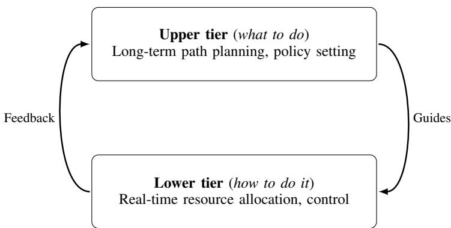  
Fig. 1. Hierarchical decision-making: infrequent, high-impact upper-tier choices guide fast, real-time lower-tier actions; a feedback loop from lowertier outcomes informs future strategy.

• We provide a theoretical foundation for HSD through a TTSSA-based convergence/stability analysis of its closedloop learning dynamics. Under Assumptions A1–A2 and Conditions C1–C4, the coupled predictor–policy updates converge almost surely to an asymptotically stable equilibrium.

• We instantiate and validate HSD in UAV-assisted MEC, and extensive experiments demonstrate consistent improvements over representative baselines in task completion ratio, service latency, and resource utilization.

The remainder of this paper is organized as follows. Section II reviews related work in heuristic algorithms, DRL, and hybrid optimization. Section III details the engineering blueprint of the HSD framework. Section IV establishes its theoretical foundation with a convergence analysis. Section V introduces the UAV-MEC case study and details its formulation as an instantiation of the HSD framework. Section VI presents the extensive experimental validation and analysis. Finally, Section VII concludes the paper and discusses future research directions for the HSD framework.

## II. RELATED WORK

The HSD framework couples heuristic upper-tier planning, DRL-based operational control, and an online supervised bridge model; we briefly review each line of work to pinpoint the gap that HSD fills.

## A. Heuristic Optimization for Upper-tier Planning

Heuristic and meta-heuristic algorithms, such as PSO [10] and GA [11], are widely used for optimization in large, non-convex decision spaces. In unmanned systems and wireless communications, they have been extensively applied to UAV trajectory planning, 3D placement, energy-efficient pathing, and relay coordination [12], [13]. Recent studies have further extended these methods to hierarchical and multistage decision-making scenarios, such as two-stage deployment for non-orthogonal-multiple-access networks [14], radio frequency-based localization [15], [16], and asynchronous caching for connected and autonomous vehicles [17].

JOURNAL OF LAT X CLASS FILES, VOL. 14, NO. 8, JANUARY 2026

Despite their global search capability, heuristics suffer from the high cost of fitness evaluation in dynamic, stochastic systems: assessing an upper-tier decision (e.g., a UAV flight plan) often requires expensive rollouts of downstream lowertier operations and environment responses. As a result, such planners are typically used offline and remain open-loop, with limited ability to adapt to real-time, state-dependent dynamics [18]. To address this, techniques such as learned surrogates and multi-fidelity evaluation have been proposed to approximate fitness [7], [19], [20].

## B. DRL for Lower-tier Control

Recent surveys highlight DRL and MARL as state-of-theart methods for lower-tier control in wireless networks [21]– [25]. These methods excel in dynamic resource management, with related learning-based advances also appearing in lowcomplexity communication signal processing, such as CNNbased detection for faster-than-Nyquist signaling [26]. In UAVassisted networks, they have been successfully applied to joint trajectory design, throughput enhancement, and power transfer optimization [27], [28].

The MARL paradigm further extends these capabilities to cooperative scenarios, addressing challenges like nonstationarity [29]. Notable applications include interference mitigation in NOMA-based UAV networks [30] and cooperative task offloading in distributed wireless systems [31]–[33]. For instance, in vehicular networks, integrating predictive modules with DRL has been shown to mitigate mobility-induced uncertainty, leading to more stable offloading decisions [34]. However, despite these successes, DRL’s strengths remain primarily lower-tier reactive control. Incorporating upper-tier variables (e.g., long-horizon waypoints) into the action space triggers the “curse of dimensionality” [35]. This combinatorial explosion often restricts exploration and destabilizes convergence, preventing DRL from effectively handling coupled upper-lower optimization.

To mitigate the resulting dimensionality issues, several architectural solutions have been proposed. Hierarchical RL employs temporally extended options to separate upper-tier planning from execution [1], [36]. Parameterized action spaces factorize discrete strategies and continuous parameters to reduce branching [37], while branching architectures utilize shared trunks to turn exponential complexity into near-linear forms [35]. Additionally, action masking techniques improve stability by proactively pruning infeasible or dominated actions via constraints [38].

## C. Hybrid and Predictive Model-assisted Optimization

To exploit the global search ability of heuristics and the real-time inference of DRL, various hybrid approaches have been proposed. However, existing works largely fall into two categories, each with distinct limitations that our framework seeks to overcome.

1) Open-loop Serial Decomposition: A predominant pattern in current literature is a simple two-stage decomposition. In these works, a heuristic algorithm first generates a static upper-tier plan (such as a UAV flight path), which is then fixed and passed to a DRL agent for lower-tier resource allocation [5], [6]. While this effectively reduces the dimension of the DRL action space, it suffers from a fundamental “open-loop” drawback: the upper-tier planner operates without feedback regarding the DRL agent’s actual capability. Consequently, the upper-tier plan cannot adapt if the lower-tier policy evolves or if the environment dynamics shift, often leading to a mismatch between the planned trajectory and the real-time service requirements.

2) Offline Surrogate-assisted Optimization: Another line of research focuses on reducing the evaluation cost of heuristics using surrogate-assisted evolutionary algorithms (SAEA). These methods employ predictive models (e.g., neural networks or kriging) to approximate fitness functions [8], [9]. However, standard SAEA approaches typically train the surrogate model on a static, offline dataset before optimization begins. This assumption of stationarity renders them unsuitable for the hierarchical control problems addressed in this paper, where the “fitness” of an upper-tier decision is determined by a DRL agent that is continuously learning and changing. Existing offline surrogates cannot track such non-stationary distributions effectively.

## D. Summary and Positioning of HSD

Unlike existing methods that rely on open-loop planning or stationary offline surrogates, HSD couples a heuristic planner and a DRL controller via an online supervised bridge. This creates a closed-loop mechanism that continuously tracks evolving lower-tier capabilities. Crucially, we underpin this integration with a TTSSA-based convergence analysis, providing a theoretical guarantee largely missing in prior hybrid works.

## III. THE HEURISTIC-SUPERVISED-DRL FRAMEWORK

This section introduces the HSD framework. We first outline its modules, consisting of the heuristic planner, the DRL agent, and the adaptive supervised model, and describe how they exchange information. We then formalize the crosslayer update rules that drive the closed-loop learning and performance improvement over time.

## A. Framework Overview and Information Flow

HSD decomposes each decision slot into an upper-tier planning variable $x \in \chi$ and a lower-tier control action $a \in A .$ The upper tier addresses the “what to do” question by selecting a strategic decision that shapes the operating context for a period, while the lower tier addresses the “how to do it” question by reacting to instantaneous states under the chosen upper-tier guidance. This decomposition is motivated by timescale separation in dynamic systems and by the need to avoid monolithic optimization over a large mixed-variable space.

The framework implements this abstraction through three interacting components, as illustrated in Fig. 2. First, the heuristic planner performs global exploration over candidate upper-tier decisions and selects an upper-tier strategy using the current state and the supervised predictor. Second, the DRL agent executes lower-tier control conditioned on the chosen upper-tier decision, producing rewards and transitions through interaction with the environment. Third, the adaptive supervised model serves as an online bridge: it provides cheap performance estimates $f _ { \theta } ( s _ { t } , x ^ { \prime } )$ for upper-tier candidates and is continuously refined using execution feedback. In this way, information flows from planning to execution and back, forming a closed loop between upper-tier search and lower-tier learning.

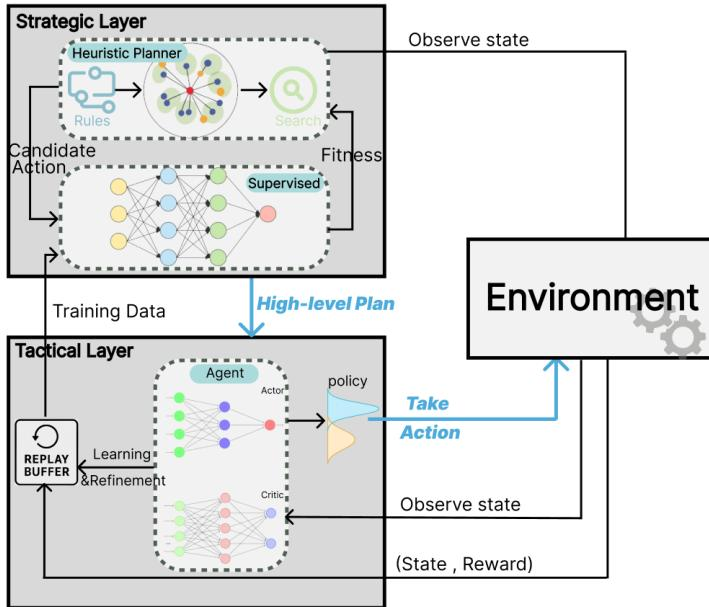  
Fig. 2. The architectural blueprint of the HSD framework. It illustrates the closed-loop information flow between the heuristic planner, the supervised learning, and the DRL agent that interacts with the environment.

To clarify the above design, we follow three principles: (i) isolate expensive global exploration in the upper tier, (ii) use an online supervised bridge for fast fitness evaluation, and (iii) couple planner and MARL via TTSSA-compatible updates. Detailed design rationale is provided in Section I of the Supplementary Material.

## B. Closed-loop Operation

The combined effect of HSD arises from a repeated plan– execute–learn cycle. At slot t, the heuristic planner first selects an upper-tier decision

$$
x _ { t } ^ { * } = \arg \operatorname* { m a x } _ { x } f _ { \theta } ( s _ { t } , x ) ,
$$

using the current predictor as a cheap surrogate for downstream performance. Conditioned on $\boldsymbol { x } _ { t } ^ { * }$ , the DRL agent then executes a lower-tier action $a _ { t } \sim \pi _ { \psi } ( \cdot \mid s _ { t } , x _ { t } ^ { * } )$ , interacts with the environment, and observes the next state and reward. The resulting experience is subsequently used to update both the supervised predictor, from $\theta _ { t }$ to $\theta _ { t + 1 } .$ , and the DRL policy, from $\psi _ { t }$ to $\psi _ { t + 1 }$

This cycle ensures that upper-tier planning is continuously grounded in the lower tier’s evolving execution capability. As the policy improves, the supervised bridge becomes a more accurate performance oracle, which in turn guides the planner toward better upper-tier decisions. This co-evolution motivates the coupled two-timescale stochastic-approximation model developed in the next section.

## IV. THEORETICAL ANALYSIS OF THE HSD FRAMEWORK

The HSD framework relies on two learning components: the supervised learning and the DRL agent. This section provides the mathematical foundation for this stability, demonstrating that their coupled updates converge to a desirable equilibrium. Our analysis is grounded in the theory of TTSSA [39], [40].

## A. The Coupled Learning Dynamics

As described in Section III, the HSD framework involves two interdependent learning processes operating at different rates. Let $t = 0 , 1 , 2 , . . .$ . denote the discrete decision-slot index of the closed-loop HSD operation. At the beginning of slot t, the supervised model and the DRL policy have parameters $\theta _ { t }$ and $\psi _ { t } ,$ , respectively. During slot t, they are updated with step sizes $\alpha _ { t }$ and $\eta _ { t }$ , yielding $\theta _ { t + 1 }$ and $\psi _ { t + 1 }$ Their coupled updates can be expressed in the general form of stochastic recursions:

$$
\theta _ { t + 1 } = \theta _ { t } + \alpha _ { t } \left[ h ( \theta _ { t } , \psi _ { t } ) + M _ { t + 1 } ^ { ( 1 ) } \right] ,\tag{1}
$$

$$
\psi _ { t + 1 } = \psi _ { t } + \eta _ { t } \left[ g ( \theta _ { t } , \psi _ { t } ) + M _ { t + 1 } ^ { ( 2 ) } \right] .\tag{2}
$$

Here, $\alpha _ { t }$ and $\eta _ { t }$ are the learning rates for the $\mathrm { \ " { f a s t } \ " }$ supervised learning update and the $\mathrm { \overrightarrow { s l o w } } ^ { \mathrm { \overrightarrow { s } } }$ policy update, respectively. The functions $h ( \cdot , \cdot )$ and $g ( \cdot , \cdot )$ represent the mean-field update directions (i.e., the expected gradients), and $M _ { t + 1 } ^ { ( 1 ) }$ and $\bar { M } _ { t + 1 } ^ { ( 2 ) }$ are zero-mean martingale difference noise terms representing the stochasticity of the learning process.

## B. Assumptions for Convergence

The convergence of this coupled system can be established under the following assumptions/conditions.

Assumption A1 (Perfect heuristic planner): At each time step t, the heuristic planner algorithm efficiently computes a near-optimal upper-tier decision $x _ { t }$ with respect to the current supervised learning model $f _ { \theta _ { t } }$ , such that:

$$
x _ { t } \approx \arg \operatorname* { m a x } _ { x ^ { \prime } \in \mathcal { X } } f _ { \theta _ { t } } ( s _ { t } , x ^ { \prime } ) .
$$

For our main convergence analysis (Theorem 1), we consider an idealized scenario where this approximation is asymptotically perfect. We will later relax this in Section IV-D to analyze the framework’s robustness to a quantifiable, persistent search error.

Assumption A2 (Well-behaved reward function): The true reward function $R ( s , x , a )$ is continuous and bounded over its domain.

Condition C1 (Learning rates): The step-size sequences $\left\{ \alpha _ { t } \right\}$ and $\{ \eta _ { t } \}$ , indexed by the decision-slot counter $t ,$ satisfy the classical Robbins–Monro conditions for stochastic approximation (SA), along with the critical time-scale separation requirement:

$$
\sum _ { t = 0 } ^ { \infty } \alpha _ { t } = \infty , \quad \sum _ { t = 0 } ^ { \infty } \eta _ { t } = \infty , \quad \sum _ { t = 0 } ^ { \infty } \alpha _ { t } ^ { 2 } < \infty , \quad \sum _ { t = 0 } ^ { \infty } \eta _ { t } ^ { 2 } < \infty ,
$$

JOURNAL OF LAT X CLASS FILES, VOL. 14, NO. 8, JANUARY 2026

$$
\mathrm { a n d } \operatorname* { l i m } _ { t  \infty } \frac { \eta _ { t } } { \alpha _ { t } } = 0 .
$$

This separation theoretically grounds the two-level decision hierarchy defined in Section III: it ensures the supervised model (fast time-scale) can continuously adapt to the lowertier policy (slow time-scale) to provide accurate guidance for upper-tier planning, thereby stabilizing the closed-loop system.

Condition C2 (Regularity of models): The supervised learning model $f _ { \theta } ( \cdot )$ and the DRL policy $\pi _ { \psi } ( \cdot )$ are implemented as neural networks with sufficient expressive capacity, bounded and differentiable activation functions, and Lipschitzcontinuous gradients.

Condition C3 (Stability of the limiting mean-field ordinary differential equations (ODEs): a scope condition): For each fixed policy parameter ψ, the mean-field ODE on the fast timescale, $\dot { \theta } = h ( \theta , \psi )$ , admits a (locally/globally) asymptotically stable equilibrium $\theta ^ { * } ( \psi )$ . This condition can be satisfied, for example, when the supervised objective $L ( \theta \mid \psi )$ is convex in $\theta ,$ or more generally when it satisfies a Polyak–Łojasiewicz (PL) inequality locally in the relevant region, in which case the fast-timescale recursion admits a locally asymptotically stable attractor (and the attractor reduces to the minimizer within the function class under PL).

For each fixed predictor parameter θ (or under the tracking regime $\theta \approx \theta ^ { * } ( \psi ) )$ , the slow-timescale mean-field dynamics $\dot { \psi } ~ = ~ g ( \theta , \psi )$ admit an asymptotically stable invariant set corresponding to stationary points of the underlying MARL objective. We emphasize that this is an assumption on the employed DRL/MARL update, rather than a claim that arbitrary MARL always converges.

Condition C4 (Markov-game ergodicity under a frozen joint policy: a stochastic-approximation condition for MARL): Consider the lower tier as a Markov game with global state $s _ { t }$ and joint action $a _ { t } = ( a _ { 1 , t } , \dots , a _ { M , t } )$ . Let $\psi = \left( \psi _ { 1 } , \dots , \psi _ { M } \right)$ denote the stacked policy parameters of all agents, and let the induced joint policy be $\begin{array} { r } { \pi _ { \psi } ( a \mid s ) = \prod _ { m = 1 } ^ { M } \pi _ { \psi _ { m } } ( a _ { m } \mid o _ { m } ) } \end{array}$ where $o _ { m }$ denotes the local observation of agent m. For every fixed ψ in a compact parameter set, the controlled Markov chain $\left\{ { { s } _ { t } } \right\}$ induced by $\pi _ { \psi }$ is ergodic and admits a unique stationary distribution $d _ { \psi } ;$ moreover, the dependence of $d _ { \psi }$ on ψ is regular (e.g., Lipschitz in total-variation on the compact set), so that mean-field expectations under $d _ { \psi }$ are well-defined. Remark (Why “agent-wise non-stationarity” does not violate TTSSA). In MARL, if one views the environment from the perspective of a single agent, other agents’ evolving policies can make the agent’s perceived dynamics appear nonstationary. Our TTSSA analysis, however, is posed on the joint stochastic recursion with the stacked parameter vector $\psi = \left( \psi _ { 1 } , \dots , \psi _ { M } \right)$ . Under Condition C4, for any frozen $\psi$ the induced process is stationary with respect to $d _ { \psi }$ , and thus the slow-timescale drift can be written as a mean-field expectation

$$
g ( \theta , \psi ) \ = \ \mathbb { E } _ { s \sim d _ { \psi } , a \sim \pi _ { \psi } ( \cdot | s ) } \Big [ \widehat { \nabla } _ { \psi } J ( \psi ; \theta , s , a ) \Big ] .
$$

Consequently, defining the noise term as the deviation between the stochastic update and its conditional expectation yields a martingale-difference sequence with respect to the natural filtration, matching the standard SA form in Eqs. (1)–(2). The coupling among agents is fully captured inside the joint policy $\pi _ { \psi }$ and the induced Markov kernel $P _ { \psi }$ , and therefore does not invalidate the SA requirements. We emphasize that the remaining convergence/stability requirement is encoded by Condition C3, which is a scope condition on the employed MARL update (e.g., stable limiting ODE/invariant set), rather than a claim that arbitrary deep MARL updates always converge.

Limitations and practical implications. Assumptions A1–A2 and Conditions C1–C4 are standard for establishing a TTSSAbased stability result, but they also describe the scope of our guarantee.

First, Assumption A1 idealizes the heuristic search as asymptotically perfect; in practice, the planner runs for a finite budget and thus introduces a persistent search bias, whose effect is analyzed explicitly in Section IV-D.

Second, Condition C3 should be viewed as a scope condition: it requires that the fast-timescale supervised recursion admits a locally asymptotically stable attractor (e.g., around a low-loss stationary point), and that the employed DRL/MARL update is stable in the stochastic-approximation sense. If these stability properties are violated (e.g., constant step sizes, severe non-stationarity, or large off-policy bias), the coupled dynamics may only exhibit neighborhood stability or even oscillatory behavior rather than point convergence.

In practical deep MARL implementations, these assumptions are usually only approximately satisfied rather than exactly enforced. In our simulations, this regime is encouraged by several concrete design choices. First, we use explicit two-timescale step-size schedules, with the supervised model updated on the faster timescale and the MARL policy updated on the slower timescale (cf. Table I), which directly matches Condition C1. Second, the MARL component is trained with conservative PPO stabilization mechanisms, including a small clipping parameter, KL-based early stopping, and bounded policy updates, which help avoid abrupt policy drift and support the stochastic-approximation interpretation required by Condition C3. Third, the supervised bridge is trained from a replay buffer with sliding-window sampling, which smooths high-variance targets induced by the evolving policy and reduces oscillation in the surrogate predictions. Finally, reward normalization, gradient clipping, and bounded action constraints help keep the stochastic updates numerically well behaved. Therefore, our theorem should be interpreted as a conditional stability result whose assumptions are practically approximated by these implementation choices, rather than as an unconditional guarantee for arbitrary deep MARL algorithms.

## C. Main Convergence Theorem

Under Assumptions A1–A2 and Conditions C1–C4, we establish a conditional joint stability result for the coupled updates in Eqs. (1)–(2) using the standard TTSSA framework [39]. This result characterizes convergence to a stable equilibrium (stationary point) of the associated mean-field dynamics, rather than global optimality.

Theorem 1 (Joint convergence for the HSD framework): The joint process $( \theta _ { t } , \psi _ { t } )$ , governed by the interdependent updates in Eq. (1)–(2), converges almost surely to an asymptotically stable equilibrium point $( \theta ^ { * } , \psi ^ { * } )$ . At this equilibrium:

• The supervised model $f _ { \theta ^ { * } }$ ∗ corresponds to a predictor that minimizes the mean squared error (MSE) within the chosen function class for the regression target induced by the quasi-stationary policy $\pi _ { \psi ^ { * } } ;$ i.e., it is optimal in the MSE sense under $\psi ^ { * }$

• The DRL policy $\pi _ { \psi ^ { * } }$ represents a stationary point of the underlying optimization problem, conditioned on the upper-tier guidance provided by the equilibrium predictor $f _ { \theta ^ { \ast } }$

Furthermore, this equilibrium is a solution to the coupled mean-field equations $h ( \theta ^ { * } , \psi ^ { * } ) = 0$ and $g ( \theta ^ { * } , \psi ^ { * } ) = 0$

The proof of Theorem 1 follows the classical TTSSA separation-of-timescales argument [39]. On the fast timescale, for any quasi-static policy parameter $\psi ,$ the supervisedlearning iterate $\theta _ { t }$ tracks the stable equilibrium $\theta ^ { * } ( \psi )$ of the mean-field ODE $\dot { \theta } = h ( \theta , \psi )$ . On the slow timescale, substituting this tracking relation yields an averaged ODE for the policy update, under which $\psi _ { t }$ converges to a stationary point ψ∗. Combining these two steps gives $( \theta _ { t } , \psi _ { t } )  ( \theta ^ { * } , \psi ^ { * } )$ . The key steps are formalized in the following lemmas.

Lemma 1 (Fast-scale convergence of the supervised learning): For a fixed DRL policy $\psi ,$ parameters $\theta _ { t }$ in the supervised learning model, updated via the fast recursion (1), converge almost surely to a local minimizer, which need not be unique, $\theta ^ { * } ( \psi )$ of the expected mean squared error:

$$
L ( \theta \mid \psi ) = \mathbb { E } \left[ \frac { 1 } { 2 } \left( f _ { \theta } ( s , x ) - R ( s , x , \pi _ { \psi } ) \right) ^ { 2 } \right] .
$$

Proof: The full proof is provided in Section II of the Supplementary Material. ■

Lemma 2 (Slow-scale convergence of the DRL policy): Parameters ψt in the DRL policy, updated via the slow recursion (2), converge almost surely to a stationary point $\psi ^ { * }$ of the DRL objective function $J ( \psi )$ , where the mean-field dynamics are governed by the converged supervised learning model, i.e., $g ( \theta ^ { * } ( \psi ^ { * } ) , \psi ^ { * } ) = 0$

Proof: The full proof is provided in Section III of the Supplementary Material.

Combining the fast-scale convergence from Lemma 1 and the slow-scale convergence from Lemma 2, the main theorem of TTSSA guarantees the joint convergence of the coupled process, thus proving Theorem 1.

Interpretation. Lemmas 1–2 and Theorem 1 together explain why HSD is effective in closed loop: on the fast timescale, the supervised bridge tracks a local MSE-minimizing predictor of the return induced by the current policy, enabling cheap surrogate-based evaluation for upper-tier search; on the slow timescale, the policy update then evolves under the tracked equilibrium model and converges to a stationary point of the averaged objective. As a result, the overall “planner → execution → feedback update” loop remains stable and converges to a coupled equilibrium, with time-scale separation being the key mechanism that prevents the planner from chasing a rapidly drifting surrogate.

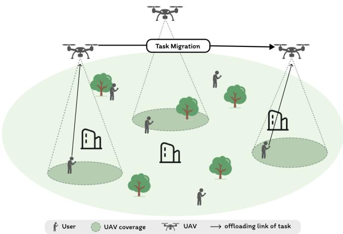

Fig. 3. System diagram of multi-UAV MEC with joint flight, communication, and computation.  
  
Fig. 4. The structure of time slots.

## D. Robustness Analysis

While the preceding analysis assumes an ideal planner, practical heuristics (like PSO) may return suboptimal solutions. We analyze the robustness of HSD under a bounded planner error assumption. Detailed definitions and the formal proof are provided in Section IV of the Supplementary Material. The theoretical result confirms that if the heuristic error vanishes asymptotically, HSD converges to the ideal equilibrium; if the error is persistently bounded, the system converges to a compact neighborhood of the optimal solution, whose radius scales linearly with the error bound. This provides a controllable accuracy-computation trade-off. Furthermore, the stability under supervised-model overfitting and replay buffer staleness is also analyzed in the Supplementary Material, showing similar bounded-perturbation properties.

A detailed assumption-by-assumption discussion is deferred to Section V of the Supplementary Material. In brief, the TTSSA guarantee relies on bounded rewards, time-scale separation, regularity of the function approximators, stability of the invariant sets, and ergodicity under a frozen joint policy.

## V. CASE STUDY: MULTI-OBJECTIVE OPTIMIZATION IN UAV-ASSISTED EDGE COMPUTING

The preceding sections define HSD in generic terms; here we instantiate it in a multi-UAV-assisted MEC network. This domain is a suitable testbed because it combines upper-tier UAV trajectory planning with lower-tier real-time communication/computing control under strong cross-layer coupling and multi-objective trade-offs. In this instantiation, PSO serves as the upper-tier planner, MARL performs lower-tier resource allocation, and a feed-forward supervised predictor estimates the performance of candidate flight plans.

JOURNAL OF LAT X CLASS FILES, VOL. 14, NO. 8, JANUARY 2026

## A. System Model for UAV-MEC Networks

As shown in Fig. 3, we consider a MEC network in which flight, communication, and computing resources are jointly optimized. Each discrete time slot, denoted by $t \in \{ 0 , \ldots , T - 1 \}$ is synchronized across all UAVs. As shown in Fig. 4, each slot is structured into two distinct phases: a fixed-duration flight phase of length $T _ { 1 }$ , and a subsequent variable-duration service phase of length $T _ { 2 }$

## 1) Network Entities and Frame Structure:

a) UAV Swarm: A swarm comprising M rotary-wing UAVs, indexed by $\mathcal { M } = \{ 1 , \dots , M \}$ , operates at a constant altitude h. The horizontal position of UAV m at the beginning of time slot t is denoted by $l _ { m } ( t ) \in  { \mathbb { R } } ^ { 2 }$ . During the flight phase, UAV m selects a two-dimensional velocity vector $v _ { m } ( t )$ , subject to the mobility constraint:

$$
\| l _ { m } ( t + 1 ) - l _ { m } ( t ) \| \le v _ { \operatorname* { m a x } } T _ { 1 } , \quad \forall m \in \mathcal { M } , \forall t ,\tag{3}
$$

where $v _ { \mathrm { m a x } }$ is the maximum speed and $T _ { 1 }$ is the duration of the flight phase. UAVs are also assumed to maintain a minimum safe separation distance $d _ { \mathrm { s a f e } }$ from each other and operate within a defined geographical area bounded by coordinates $[ X _ { \mathrm { m i n } } , X _ { \mathrm { m a x } } ]$ and $[ Y _ { \mathrm { m i n } } , Y _ { \mathrm { m a x } } ]$

b) Ground Users: The network includes N static ground users, indexed by $\begin{array} { r } {  { \mathcal { N } } ~ = ~ \{ 1 , \ldots , N \} } \end{array}$ , positioned at fixed horizontal coordinates $w _ { n } \ \in \ \mathbb { R } ^ { 2 } .$ . In each decision slot t, user n generates a computation task with probability $p _ { n } ,$ characterized by the tuple $( Q _ { n } ( t ) , D _ { n } ( t ) , \delta _ { n } ( t ) )$ . Here, $p _ { n }$ is a slot-level Bernoulli arrival probability defined on the decision-slot index, rather than a continuous-time arrival rate normalized by the physical slot duration. This abstraction is adopted to model whether a new latency-sensitive request appears at each closed-loop decision epoch and to keep the exogenous workload process consistent across all compared methods. $Q _ { n } ( t )$ represents the task size (in bits), $D _ { n } ( t )$ denotes the maximum tolerable delay, and $\delta _ { n } ( t )$ indicates the computational resources required per bit (in CPU cycles/bit). Tasks are non-buffered, meaning that each task is delaysensitive with a hard freshness constraint and is considered expired (dropped) if it is not scheduled/served within its originating slot.

c) Time Structure: We adopt a widely used “move-andhover” (a.k.a. fly-hover-communicate) protocol to decouple high-mobility repositioning from stable service provisioning [41]. Each decision slot is divided into two distinct phases. The first is the flight phase with a fixed duration $T _ { 1 }$ . This fixed interval ensures global synchronization for the UAV swarm to reconfigure its topology, mitigating the channel instability and Doppler effects associated with high-bandwidth communication during high-speed maneuvering [42], [43]. The second is the service phase with a variable duration $T _ { 2 }$ , during which UAVs hover to provide quasi-stationary links and stable computing/communication services. This variable duration adapts the common service window to the current stochastic workload while preserving slot-level synchronization for joint trajectory updating, user association, inter-UAV migration, and service control. The phase concludes when the slowest task across the network, including any offloaded components, is completed. Define the completion time of UAV m in slot t as

$$
T _ { m } ( t ) \triangleq \operatorname* { m a x } _ { n \in \mathcal { R } _ { m } ( t ) } \tau _ { m , n } ( t ) ,\tag{4}
$$

where $\mathcal { R } _ { m } ( t )$ denotes the set of task components executed on UAV m, and $\tau _ { m , n } ( t )$ is the (component-wise) completion time on UAV m, detailed in (7). Consequently, the service duration is defined as:

$$
T _ { 2 } ( t ) = \operatorname* { m a x } _ { m \in \mathcal { M } } T _ { m } ( t ) ,\tag{5}
$$

which maintains slot-level synchronization without introducing additional guard intervals.

2) Communication and Computation Model: We adopt orthogonal uplink sub-channel access and parallel MEC computing on UAVs. Let $\phi _ { m , n } ^ { k } ( t ) \in \{ 0 , 1 \}$ denote the allocation of sub-channel k (bandwidth $B _ { k } )$ for user n to UAV m in slot t. The uplink rate is

$$
R _ { m , n } ( t ) = \sum _ { k = 1 } ^ { K } \phi _ { m , n } ^ { k } ( t ) B _ { k } \log _ { 2 } \biggl ( 1 + \frac { P _ { n } g _ { m , n } ( t ) } { N _ { 0 } B _ { k } + I _ { m , n , k } ( t ) } \biggr ) ,\tag{6}
$$

where $g _ { m , n } ( t )$ is the air-to-ground (A2G) channel gain and $I _ { m , n , k } ( t )$ denotes co-channel interference. Each UAV m allocates CPU cycles $c _ { m , n } ( t )$ to users with $\begin{array} { r } { \sum _ { n } c _ { m , n } ( t ) \leq C _ { m } ^ { \mathrm { m a x } } } \end{array}$ To balance load, UAV m may migrate a fraction $\rho _ { m , m ^ { \prime } } ^ { n } ( t ) \in$ [0, 1] of user $n \mathrm { { : } }$ workload to a paired UAV $m ^ { \prime } ;$ pairing is updated per slot and fixed within the slot. Detailed association/interference, the A2G channel/LoS model, and the pairing scheme are provided in Section VI of the Supplementary Material.

3) Delay Modeling: The total delay experienced by a task in slot t consists of four components: (i) the transmission delay $\tau _ { m , n } ^ { \mathrm { t r } } ( t )$ from the ground user to the UAV, (ii) the local computation delay $\tau _ { m , n } ^ { \mathrm { l o c } } ( t )$ at the serving UAV, (iii) the migration delay $\tau _ { m , m ^ { \prime } , n } ^ { \mathrm { m i g } } ( t )$ when the fraction of a task is offloaded to a cooperating UAV, and (iv) the remote execution delay $\tau _ { m ^ { \prime } , n } ^ { \mathrm { o f f } } ( t )$ at the cooperating UAV. Formally, these components are expressed as:

$$
\tau _ { m , n } ^ { \mathrm { t r } } ( t ) = \frac { Q _ { n } ( t ) } { R _ { m , n } ( t ) } ,\tag{7a}
$$

$$
\tau _ { m , n } ^ { \mathrm { l o c } } ( t ) = \frac { [ 1 - \rho _ { m , m ^ { \prime } } ^ { n } ( t ) ] Q _ { n } ( t ) \delta _ { n } ( t ) } { c _ { m , n } ( t ) } ,\tag{7b}
$$

$$
\tau _ { m , m ^ { \prime } , n } ^ { \mathrm { m i g } } ( t ) = \frac { \rho _ { m , m ^ { \prime } } ^ { n } ( t ) Q _ { n } ( t ) } { R _ { m , m ^ { \prime } } ( t ) } ,\tag{7c}
$$

$$
\tau _ { m ^ { \prime } , n } ^ { \mathrm { o f f } } ( t ) = \frac { \rho _ { m , m ^ { \prime } } ^ { n } ( t ) Q _ { n } ( t ) \delta _ { n } ( t ) } { C _ { m ^ { \prime } } ^ { \mathrm { m a x } } } .\tag{7d}
$$

Here, $R _ { m , m ^ { \prime } } ( t )$ is the inter-UAV link rate, given by:

$$
R _ { m , m ^ { \prime } } ( t ) = B \log _ { 2 } \left( 1 + \frac { P _ { \mathrm { t x } } G _ { m , m ^ { \prime } } ( t ) } { N _ { 0 } B } \right) ,\tag{8}
$$

where B is the dedicated bandwidth for inter-UAV backbone links, $P _ { \mathrm { t x } }$ is the transmit power, and $G _ { m , m ^ { \prime } } ( t )$ is the channel gain between UAVs m and $m ^ { \prime }$ . The completion time of an offloaded task at UAV m′ considers sequential processing and is given by:

$$
\tau _ { m ^ { \prime } , n } ^ { \prime } ( t ) = \tau _ { m ^ { \prime } , n } ^ { \mathrm { o f f } } ( t ) + \tau _ { m , m ^ { \prime } , n } ^ { \mathrm { m i g } } ( t ) + \operatorname* { m a x } _ { n ^ { \prime } \in \mathcal { R } _ { m ^ { \prime } } } \tau _ { m ^ { \prime } , n ^ { \prime } } ( t ) ,\tag{9}
$$

where $\mathcal { R } _ { m ^ { \prime } }$ denotes the set of tasks covered by UAV $m ^ { \prime } .$ , and $\tau _ { m ^ { \prime } , n ^ { \prime } } ( t )$ represents the processing time of each such task. The term $\mathrm { m a x } _ { n ^ { \prime } \in { \mathcal R } _ { m ^ { \prime } } } \tau _ { m ^ { \prime } , n ^ { \prime } } ( t )$ captures the fact that the migration

task starts only after UAV $m ^ { \prime }$ has completed all its assigned tasks. The total end-to-end delay is then expressed as:

$$
\tau _ { n } ( t ) = \operatorname* { m a x } \left. \tau _ { m , n } ^ { \mathrm { t r } } ( t ) + \tau _ { m , n } ^ { \mathrm { l o c } } ( t ) , \tau _ { m ^ { \prime } , n } ^ { \prime } ( t ) \right. .\tag{10}
$$

This model summarizes the spatio-temporal interactions among mobility, communication, and computation, laying the groundwork for our optimization problem.

## B. Multi-objective Problem Formulation

Given the system model, our goal is to jointly determine the UAV velocity vectors, sub-channel assignments, CPUcycle allocations, and inter-UAV migration ratios over a $T \mathrm { - }$ slot horizon. We formulate it as a multi-objective optimization problem aimed at minimizing delay, idle time, and penalty of deadline violation.

a) Soft deadline satisfaction and bounded delay for expired tasks.: To avoid discontinuous reward feedback caused by a hard deadline indicator and to ensure the delay term is well-defined even when a task is not scheduled within its originating slot, we define the effective (virtual) delay as

$$
\begin{array} { r } { \tilde { \tau } _ { n } ( t ) = \left\{ \begin{array} { l l } { \tau _ { n } ( t ) , } & { \mathrm { i f ~ \ s e r v e d , } } \\ { D _ { n } ( t ) + \Delta , } & { \mathrm { o t h e r w i s e , } } \end{array} \right. } \end{array}\tag{11}
$$

where $\Delta > 0$ is a small slack constant. We further replace the binary indicator $\mathbb { I } ( \tau _ { n } ( t ) \le D _ { n } ( t ) )$ with a smooth deadlinesatisfaction score:

$$
s _ { n } ( t ) = \sigma ( \kappa \left( D _ { n } ( t ) - \tilde { \tau } _ { n } ( t ) \right) ) \in ( 0 , 1 ) , \sigma ( x ) = \frac { 1 } { 1 + e ^ { - x } } ,\tag{12}
$$

where $\kappa > 0$ controls the sharpness (larger κ yields a closer approximation to the hard indicator).

The optimization problem, denoted as P0, is formally stated as:

$$
\operatorname* { m i n } _ { \{ \mathbf { v } , \phi , c , \rho \} } \ w _ { 1 } \sum _ { n = 1 } ^ { N } \sum _ { t = 0 } ^ { T - 1 } \tilde { \tau } _ { n } ( t ) - w _ { 2 } \sum _ { n = 1 } ^ { N } \sum _ { t = 0 } ^ { T - 1 } s _ { n } ( t )
$$

$$
+ w _ { 3 } \sum _ { t = 0 } ^ { T - 1 } \sum _ { m = 1 } ^ { M } \big [ T _ { 2 } ( t ) - T _ { m } ( t ) \big ]\tag{13}
$$

$$
\begin{array} { r l } { \mathrm { s . t . } } & { { } \left\| l _ { m } ( t + 1 ) - l _ { m } ( t ) \right\| \leq v _ { \operatorname* { m a x } } T _ { 1 } , \quad \forall m , t } \end{array}\tag{13a}
$$

$$
\begin{array} { r } { \| l _ { m } ( t ) - l _ { m ^ { \prime } } ( t ) \| \geq d _ { \mathrm { s a f e } } , \quad \forall m \neq m ^ { \prime } , t } \end{array}\tag{13b}
$$

$$
X _ { \operatorname* { m i n } } \leq l _ { m , x } ( t ) \leq X _ { \operatorname* { m a x } } , Y _ { \operatorname* { m i n } } { \leq } l _ { m , y } ( t ) \leq Y _ { \operatorname* { m a x } } , \forall m , t\tag{13c}
$$

$$
\sum _ { n \in \mathcal { N } } c _ { m , n } ( t ) \leq C _ { m } ^ { \operatorname* { m a x } } , \quad c _ { m , n } ( t ) \geq 0 , \quad \forall m , t\tag{13d}
$$

$$
\sum _ { n \in N } \phi _ { m , n } ^ { k } ( t ) \leq 1 , \quad \phi _ { m , n } ^ { k } ( t ) \in \{ 0 , 1 \} , \quad \forall m , k , t\tag{13e}
$$

$$
0 \leq \rho _ { m , m ^ { \prime } } ^ { n } ( t ) \leq 1 . \quad \forall m , n , t\tag{13f}
$$

Here, $w _ { 1 } , w _ { 2 } , w _ { 3 } > 0$ are weighting coefficients corresponding to the aggregate effective delay, soft deadline-satisfaction score, and synchronization-induced UAV idling time, respectively. Specifically, the term $T _ { 2 } ( t ) - T _ { m } ( t )$ quantifies the waiting time of UAV m after completing its assigned service but before the common slot boundary is reached. For reproducibility and to mitigate hand-tuning bias, we (i) normalize the three objective components by their respective nominal maxima so that they are commensurate and dimensionless, and (ii) constrain the weights to the simplex $w _ { 1 } + w _ { 2 } + w _ { 3 } = 1$ , so that $( w _ { 1 } , w _ { 2 } , w _ { 3 } )$ represents a pure preference trade-off rather than scale compensation. The optimization is subject to the following constraints: mobility constraints (13a), collision avoidance constraints (13b), area boundary constraints (13c), on-board CPU capacity constraints (13d), orthogonal spectrum access constraints (13e), and migration feasibility constraints (13f).

This problem remains a mixed-integer nonlinear programming (MINLP) and is NP-hard due to the non-convex objective (e.g., the max operator and the smooth nonlinearity in $s _ { n } ( t ) )$ and binary decision variables. Such complexity motivates the application of our HSD framework to find tractable solutions.

## C. HSD Instantiation: The PSO-MARL Approach

We now detail the specific implementation of the HSD framework for this UAV-MEC problem. Our approach, termed PSO-MARL, maps the general HSD components to concrete algorithms adapted for this case study.

1) Upper-tier Planner (PSO for Flight Trajectory Optimization): The upper-tier decision in our case study is to generate a flight plan for the UAV swarm. We instantiate the upper-tier planner with PSO. Unlike conventional PSO that relies on rollout/simulation-based fitness evaluation, our PSO scores candidate trajectories using the online-updated surrogate $f _ { \theta _ { t } } ( s _ { t } , x )$ , which enables sufficiently large swarm sizes and iterations under low latency. Moreover, the upper-tier utility is only revealed through downstream MARL execution, making the objective effectively black-box and gradient-free; thus a derivative-free population-based search is appropriate, while hard constraints can be enforced via projection/repair. Finally, HSD is planner-agnostic, and our robustness analysis explicitly covers imperfect planners with bounded/vanishing search errors. It is worth noting that the PSO planner is executed at the beginning of every time slot t. In conventional hierarchical approaches, upper-tier planning is often performed intermittently (e.g., every K slots) to avoid the prohibitive computational cost of simulation-based fitness evaluation. However, in our HSD framework, the fitness is evaluated via the lightweight supervised model $f _ { \theta _ { t } }$ , which requires only low-latency neural network inference. This computational efficiency makes per-slot re-planning entirely feasible. Consequently, instead of following a rigid, pre-calculated trajectory, the UAV swarm operates in a receding-horizon control (RHC) fashion. This continuous re-optimization allows the system to instantly adjust its topology in response to stochastic task arrivals and time-varying channel conditions observed at each step, thereby preventing the upper-tier plan from becoming stale.

State Representation $( s _ { t } ) \colon$ At the beginning of the flight phase $T _ { 1 }$ , the environment state $s _ { t }$ is observed, incorporating UAV positions, task queues, delay requirements, and more:

$$
\begin{array} { r } { s _ { t } \triangleq \big ( \mathbf { L } ( t ) , \mathbf { Q } ( t ) , \mathbf { D } ( t ) , \pmb { \delta } ( t ) , \mathbf { G } ( t ) \big ) , } \end{array}\tag{14}
$$

where:

$\mathbf { L } ( t ) = ( l _ { 1 } ( t ) , \ldots , l _ { M } ( t ) )$ : spatial positions of the M UAVs;

$\mathbf { Q } ( t ) = ( Q _ { 1 } ( t ) , \ldots , Q _ { N } ( t ) ) \colon$ task sizes of the N tasks;

$\mathbf { D } ( t ) = ( D _ { 1 } ( t ) , \ldots , D _ { N } ( t ) )$ : delay requirements of the N tasks;

${ \pmb \delta } ( t ) = ( \delta _ { 1 } ( t ) , \ldots , \delta _ { N } ( t ) )$ : per-bit resource demands of the N tasks;

$\mathbf { G } ( t ) = ( g _ { 1 , 1 } ( t ) , \ldots , g _ { M , N } ( t ) )$ : channel gains between UAVs and ground users.

Action Space (Upper-tier): The upper-tier action $a _ { t } ^ { \mathrm { { f i g h t } } }$ is defined as a vector of target waypoints for all UAVs.

PSO-based Search: The PSO algorithm explores the highdimensional flight-plan space. The fitness of each candidate plan (i.e., particle) is evaluated using the supervised learning model $f _ { \theta } ,$ , which enables rapid planning without the need for costly simulations.

• Optimization Problem: A neural predictor $f _ { t } ,$ trained on collected data, predicts the expected return for candidate actions. The optimization objective is:

$$
a _ { t } ^ { \mathrm { { f l i g h t } } } = \arg \operatorname* { m a x } _ { a ^ { \mathrm { { f l i g h t } } } } f _ { t } ( [ s _ { t } , a ^ { \mathrm { { f l i g h t } } } ] ; \theta _ { t } ) ,\tag{15}
$$

where $\theta _ { t }$ denotes the parameters of the supervised learning model. The solution is subject to UAV mobility constraints (see Equations 13a–13c).

• PSO Implementation: The PSO algorithm is employed here given its strengths in continuous action spaces. In this setup, each particle i represents a candidate decision $a _ { i } ^ { \mathrm { { f i g h t } } }$ with position $x _ { i }$ in a 2M-dimensional space. For fitness evaluation, the supervised learning model predicts the system cost; since PSO maximizes fitness, we define it as Fitness $( \boldsymbol { a } _ { i } ^ { \mathrm { { f l i g h t } } } ) = f _ { t } ( [ \boldsymbol { s } _ { t } , \boldsymbol { a } _ { i } ^ { \mathrm { { f l i g h t } } } ] ; \boldsymbol { \theta } _ { t } )$ , thereby avoiding the computational overhead of full MARL simulations. Upon convergence, the output action corresponds to the global best position $p _ { g } ( \mathrm { \dot { i } . e . , ~ } a _ { t } ^ { \mathrm { f i g h t } } = p _ { g } )$ , which is then used to update UAV positions via $l _ { m } ( t + 1 )$ = update $( l _ { m } ( t ) , a _ { m , t } ^ { \mathrm { f i g h t } } )$

2) Lower-tier Controller (MARL for Resource Orchestration): The lower-tier decisions involve real-time resource allocation during the service phase $T _ { 2 }$ . We implement the proposal as a MARL system in which each UAV is an independent agent.

• Local State and Action Spaces (Lower-tier): Given the flight plan from the upper tier, each UAV agent m observes its local state $s _ { m , t }$ and selects a lower-tier action $a _ { m , t } ^ { \mathrm { s e r v i c e } }$ , which includes CPU allocation, channel assignment, and task migration ratios. The local state includes: (i) current UAV position $l _ { m } ( t )$ , (ii) user-side per-slot task arrival size $Q _ { n } ( t )$ , (iii) delay requirement $D _ { n } ( t )$ , (iv) per-bit computational demand $\delta _ { n } ( t )$ , and (v) channel gain $g _ { m , n } ( t )$ . Thus, the full local state for agent m can be written as:

$s _ { m , t } = \bigl ( l _ { m } ( t ) , \{ Q _ { n } ( t ) , D _ { n } ( t ) , \delta _ { n } ( t ) , g _ { m , n } ( t ) \} _ { n \in \mathcal { N } _ { m } ( t ) } \bigr )$ ， where $\mathcal { N } _ { m } ( t )$ denotes the set of ground users that are within the communication range of UAV m at time t.

• Action Space $( a _ { m , t } ^ { \mathrm { s e r v i c e } } )$ : Each UAV agent m selects actions including computational resource allocation $c _ { m } ,$ communication channel assignments $\phi _ { m } ^ { k } ,$ and task offloading ratios $\rho _ { m , m ^ { \prime } }$ to collaborating UAVs for each potential collaborator $m ^ { \prime }$ . Therefore, the complete service action of agent m at time t can be expressed as:

$$
\begin{array} { l } { { a _ { m , t } ^ { \mathrm { s e r v i c e } } = \big ( \{ c _ { m , n } ( t ) \} _ { n \in \mathcal { N } } , } } \\ { { \{ \phi _ { m , n } ^ { k } ( t ) \} _ { n \in \mathcal { N } , k \in \mathcal { K } } , } } \end{array}
$$

$$
\{ \rho _ { m , m ^ { \prime } } ^ { n } ( t ) \} _ { n \in \mathcal { N } , m ^ { \prime } \in \mathcal { M } \backslash \{ m \} } \ ) .\tag{16}
$$

• Reward Function: After executing the joint lower-tier action, a reward $r _ { t }$ is calculated based on the objective function in (13). This reward signal guides the learning of the MARL policies. The reward is defined as the negative of the instantaneous system cost, incorporating delay penalties, deadline satisfaction, and synchronizationinduced UAV idling:

$$
\begin{array} { c } { { \displaystyle r _ { t } = - w _ { 1 } \sum _ { n = 1 } ^ { N } \tilde { \tau } _ { n } ( t ) + w _ { 2 } \sum _ { n = 1 } ^ { N } s _ { n } ( t ) } } \\ { { \displaystyle ~ - w _ { 3 } \sum _ { m = 1 } ^ { M } \big ( T _ { 2 } ( t ) - T _ { m } ( t ) \big ) . } } \end{array}\tag{17}
$$

3) The Adaptive Bridge (Supervised Update): The supervised learning serves to approximate the mapping between a given state–flight plan and the expected environment reward.

• Data Collection and Training: The experience tuples $\Big ( ( s _ { t } , a _ { t } ^ { \mathrm { f i g h t } } ) , r _ { t } \Big )$ generated from the MARL execution are stored in a replay buffer D. Specifically, after the MARL-based lower-tier execution, a combined state $\bar { s } _ { t } =$ $[ s _ { t } , a _ { t } ^ { \mathrm { f i g h t } } ]$ is formed and recorded with its corresponding reward $r _ { t } .$

• Data Accumulation: These collected experience tuples are continuously accumulated into an online dataset $\mathcal { D } .$ . Crucially, the use of a replay buffer decouples the supervised training from the immediate high-variance output of the latest policy update. By sampling mini-batches from a sliding window of history, the supervised model smooths out the stochastic noise of the DRL agent, preventing oscillation in the fitness predictions.

• Supervised Update: The parameters $\theta _ { t }$ in the supervised learning model are refined online using stochastic gradient descent (SGD), aiming to minimize the MSE between predicted and actual rewards:

$$
\theta _ { t + 1 } = \theta _ { t } - \alpha _ { t } \nabla _ { \theta } \mathcal { L } _ { \mathrm { s u p e r v i s e d } } ( \theta _ { t } ) ,\tag{18}
$$

$$
\mathcal { L } _ { \mathrm { s u p e r v i s e d } } ( \theta _ { t } ) = \frac { 1 } { 2 } \mathbb { E } _ { ( \bar { s } , r ) \sim \mathcal { D } } \left[ \left( f ( \bar { s } ; \theta _ { t } ) - r \right) ^ { 2 } \right] .\tag{19}
$$

In practice, the expectation is approximated with a minibatch $\boldsymbol { B } _ { t } \subset \mathcal { D }$ , yielding:

$$
\widehat { \mathcal { L } } _ { \mathrm { s u p e r v i s e d } } ( \theta _ { t } ) = \frac { 1 } { 2 | \mathcal { B } _ { t } | } \sum _ { ( \bar { s } , r ) \in \mathcal { B } _ { t } } \left( f ( \bar { s } ; \theta _ { t } ) - r \right) ^ { 2 } .\tag{20}
$$

4) The Integrated PSO-MARL Algorithm: The complete workflow of our HSD instantiation is summarized in Algorithm 1. The tight, two-timescale coupling between the PSO-based planner and the MARL-based controller, mediated by the adaptive supervised learning, allows the system to efficiently navigate the complex decision space and converge to a robust, high-performance policy.

As outlined in Algorithm 1, the process repeats for each time slot t. Note that the upper-tier flight plan $a _ { t } ^ { \mathrm { { f i g h t } } }$ is recomputed at every step. This is not redundant; rather, it allows the UAVs to dynamically adjust their topology in response to the stochastic task arrivals and time-varying channel fading $g _ { m , n } ( t )$ observed at the start of the slot, a responsiveness made possible by the low-latency inference of the supervised model. To further ensure reliable learning under stochastic feedback, we next clarify the exploration drivers in both stages and the stabilization measures adopted in the coupled updates.

Algorithm 1 The HSD Framework Instantiated for the $\overline { { \mathrm { U A V _ { - } } } }$   
MEC Case Study (PSO-MARL)   
Require: Initial state $s _ { 0 } ,$ supervised learning model params   
$\theta _ { 0 } ,$ MARL params ψ0, replay buffer ${ \mathcal { D } } \gets \emptyset ,$ rates $\{ \alpha _ { t } , \eta _ { t } \}$   
PSO hyper-params $( N _ { p } , \omega , c _ { 1 } , c _ { 2 } , I _ { \mathrm { m a x } } )$   
1: for $t = 0 , 1 , 2 , \ldots$ . do   
2: Phase 1: PSO-based flight planning (T1)   
3: Observe $s _ { t }$   
4: Initialize swarm $\{ ( x _ { i } , v _ { i } ) \} _ { i = 1 } ^ { N _ { p } }$   
5: for $k = 1  I _ { \mathrm { m a x } }$ do   
6: for $i = 1  N _ { p }$ do   
7: $\mathrm { f i t n e s s } _ { i } \gets \top _ { \theta _ { t } } ( [ s _ { t } , x _ { i } ] )$   
8: Update personal best $p _ { i }$ and global best $p _ { g }$   
9: $v _ { i }  \omega v _ { i } + c _ { 1 } r _ { 1 } ( p _ { i } - x _ { i } ) + c _ { 2 } r _ { 2 } ( p _ { g } - x _ { i } )$   
10: $x _ { i } \gets x _ { i } + v _ { i }$ ▷ project onto feasible set   
11: end for   
12: end for   
13: $a _ { t } ^ { \mathrm { f i g h t } }  p _ { g }$   
14: $\mathrm { U A V s }$ move according to $a _ { t } ^ { \mathrm { { f i g h t } } }$   
15: Phase 2: MARL-based resource orchestration $( T _ { 2 } )$   
16: for all agents $m = 1 , \ldots , M$ do   
17: Observe $s _ { m , t } ,$ sample $a _ { m , t } ^ { \mathrm { s e r v i c e } } \sim \pi _ { \psi _ { t } } ( \cdot | s _ { m , t } )$   
18: end for   
19: Execute joint $a _ { t } ^ { \mathrm { s e r v i c e } } ,$ get $r _ { t } ,$ next state $s _ { t + 1 }$   
20: $\psi _ { t + 1 }  \psi _ { t } + \eta _ { t } \mathbin { \ddot { \nabla } } _ { \psi } J ( \psi _ { t } )$   
21: Supervised update   
22: Store $( [ s _ { t } , a _ { t } ^ { \mathrm { f l i g h t } } ] , r _ { t } )$ in D   
23: Sample minibatch $B \subset D$   
24: $\begin{array} { r } { \theta _ { t + 1 }  \theta _ { t } - \frac { \alpha _ { t } } { | \mathcal { B } | } \sum _ { ( x , r ) \in \mathcal { B } } ( f _ { \theta _ { t } } ( x ) - r ) \nabla _ { \theta } f _ { \theta _ { t } } ( x ) } \end{array}$   
25: end for

5) Exploration and Stabilization Mechanisms: At each slot, the upper-tier PSO planner explores the trajectory space via random swarm initialization and the stochastic cognitive/social terms in the velocity update, where $r _ { 1 } , r _ { 2 } \sim \mathcal { U } ( 0 , 1 )$ , while the global-best term provides exploitation pressure toward the best-known solution. Meanwhile, the lower-tier MARL layer maintains exploration during training by sampling service actions from a stochastic policy, i.e., $a _ { m , t } ^ { \mathrm { s e r v i c e } } \sim \pi _ { \psi _ { t } } ( \cdot \mid s _ { m , t } )$ rather than using greedy execution, which supports persistent exploration in the mixed action space. To mitigate sparse or noisy learning signals, we design a dense reward by combining delay/utilization terms with a smooth deadline-satisfaction score (instead of a purely binary completion indicator). Furthermore, the supervised bridge is updated from a replay buffer with sliding-window sampling, which smooths high-variance targets and helps prevent oscillatory fitness predictions that could otherwise destabilize the PSO–MARL coupling.

## VI. EXPERIMENTAL RESULTS AND ANALYSIS

In this section, we evaluate our instantiated PSO-MARL approach in the UAV-MEC case study to demonstrate its practical benefits and to verify the core principles of the HSD architecture. First, we examine the convergence and stability of the coupled learning system. Second, we benchmark PSO-MARL against representative baselines and report ablations/sensitivity analyses to isolate key design choices. Third, we evaluate scalability with respect to key system parameters (e.g., fleet size and user load). Finally, we quantify the computational overhead and runtime scalability of the proposed architecture.

## A. Simulation Setup

TABLE I SIMULATION PARAMETERS  
Parameters Settings   
Simulation Area Size 1000 m × 1000 m   
Number of $\mathrm { U A V s } \ ( M )$ 4   
Number of Ground Users (N) 10   
UAV Altitude (h) 100 m   
Maximum UAV Speed $\left( v _ { \mathrm { m a x } } \right)$ 12 m/s   
Flight Phase Duration (T1) 10 s   
Per-Slot Task Arrival Probability $( p _ { n } )$ 0.7   
Max Task Size $( Q _ { m a x } )$ 1.2e7 bits   
Min Task Size $( Q _ { m i n } )$ 5e6 bits   
Max Tolerable Delay $( D _ { m a x } )$ 20 s   
Max CPU Cycles per Bit $( \delta _ { m a x } )$ 500 cycles/bit   
Min CPU Cycles per Bit $( \delta _ { m i n } )$ 100 cycles/bit   
User Transmit Power $( P _ { n } )$ 0.5 W   
Number of Orthogonal Sub-channels 3   
(K)   
Sub-channel Bandwidth $( B _ { k } )$ 2e7 Hz   
Noise Power Spectral Density $( N _ { 0 } )$ −174 dBm/Hz   
Path Loss Exponent (ζ) 3   
LoS Parameters $( a , b )$ (9.61, 0.16)   
Inter-UAV Link Bandwidth (B) 2e7 Hz   
Inter-UAV Transmit Power $( P _ { \mathrm { t x } } )$ 1 W   
Peak CPU Capacity per UAV $( C _ { m } ^ { \mathrm { m a x } } )$ 1e10 cycles/s   
Effective Switched Capacitance (ϵ) $1 e - 7$ J/cycle   
Number of Particles $( N _ { p } )$ 15   
Initial Actor Step Size $( \eta _ { 0 } ^ { ( a ) } )$ $1 \times 1 0 ^ { - 4 }$   
Initial Critic Step Size $( \eta _ { 0 } ^ { ( c ) } )$ $3 \times 1 0 ^ { - 4 }$   
Initial Supervised Step Size (α0) $1 \times 1 0 ^ { - 3 }$   
Policy Step-size Schedule $( \eta _ { t } )$ $\eta _ { t } = \eta _ { 0 } / ( 1 + t )$   
Supervised Step-size Schedule (αt) $\alpha _ { t } = \alpha _ { 0 } / ( 1 + t ) ^ { 0 . 6 }$   
Time-scale Separation $\eta _ { t } / \alpha _ { t } ~  ~ 0$ (since $1 \ >$   
0.6)   
Inertia Weight (ω) 0.5   
Acceleration Coefficients $( c _ { 1 } , c _ { 2 } )$ (1.5, 2.0)   
Max Iterations $\left( I _ { \mathrm { m a x } } \right)$ 10   
Discount Factor $( \gamma _ { \mathrm { M A R L } } )$ 0.95   
GAE Parameter $( \lambda _ { \mathrm { G A E } } )$ 0.95   
Replay Buffer Size 1024   
Minibatch Size (B) 64   
PPO Clip Parameter $( \epsilon _ { \mathrm { c l i p } } )$ 0.1   
Entropy Coefficient $( \beta _ { \mathrm { e n t } } )$ 0.03   
Value Loss Coefficient $( c _ { v } )$ 0.5   
PPO Update Epochs $( K _ { \mathrm { e p o c h } } )$ 6   
Hidden Layer Width (H) 128   
Gradient Clipping (max-norm) 0.5   
Value Function Clip Range ±0.2   
KL Early-Stopping Threshold 0.015   
Adam Epsilon $( \epsilon _ { \mathrm { A d a m } } )$ $1 \times 1 0 ^ { - 5 }$

We consider a simulated environment with M UAVs and N ground users distributed in a 2D area. The specific parameters used in our simulations are detailed in Table I. To align the implementation with the TTSSA condition in Section IV, we use a slower-decaying and larger supervised step size, $\alpha _ { t } = \alpha _ { 0 } / ( 1 + t ) ^ { 0 . 6 } .$ , and faster-decaying policy-related step sizes, $\eta _ { t } = \eta _ { 0 } / ( 1 + t )$ , so that $\eta _ { t } / \alpha _ { t }  0$ asymptotically. The per-slot task generation probability $p _ { n }$ for each user $n$ is set to a specific value, and task sizes $Q _ { n } ( t )$ , maximum tolerable delays $D _ { n } ( t )$ , and computational resource requirements $\delta _ { n } ( t )$ are drawn from predefined distributions. Here, $p _ { n }$ is defined on the decision-slot index to determine whether a new task request appears at a given closed-loop decision epoch. The UAVs operate at a constant altitude $h .$ The flight phase duration $T _ { 1 }$ is fixed, while the service phase duration $T _ { 2 }$ is variable. We compare our proposed algorithm, denoted as PSO-MARL, with the following baseline methods:

• PPO-JO (centralized PPO baseline): We implement a centralized PPO baseline in our UAV–MEC simulator following the PPO framework [44]. We use [45] as an implementation reference for applying PPO to UAV optimization; note that its trajectory/throughput setting differs from our UAV–MEC offloading problem. To handle our mixed action space, the policy uses (i) squashed Gaussian/Beta heads for continuous variables (e.g., velocity and offloading/migration ratios) and (ii) a masked categorical head for sub-channel assignment. All DRL baselines are trained under the same interaction budget and the same backbone size for a fair comparison.

• MADDPG with DTLCM: This baseline employs multiagent deep deterministic policy gradient (MADDPG) augmented by the distance to task location and capability match (DTLCM) mechanism [46]. It represents the stateof-the-art centralized training with decentralized execution (CTDE) approach, where agents utilize a centralized critic to learn cooperative behaviors (e.g., for interference mitigation) while executing policies in a decentralized manner.

• Greedy Offloading: A myopic heuristic that offloads tasks either to the geographically closest UAV or to the one with the earliest-deadline task queue, without any longterm optimization.

• PSO-MARL-No (no predictive supervised learning): An ablated variant of our framework in which predictive supervised learning used to guide PSO during the flight planning step is removed and replaced by a simple nonpredictive fitness function, allowing us to isolate the contribution of the predictive component.

To ensure a rigorous comparison between the proposed hierarchical architecture and monolithic JO baselines, we standardize the experimental conditions along the following axes. First, all methods operate in the same simulation environment with identical state observability, reward definition, and operational constraints. Second, all DRL-based baselines are trained under the same interaction budget (total training time steps/episodes). Third, we keep the policy backbone size the same across DRL baselines to avoid gains caused purely by larger function approximators. Finally, since HSD introduces an explicit planning stage, we additionally report per-slot runtime/latency to make the compute–performance trade-off transparent. The performance metrics are:

• Average task completion ratio: the percentage of tasks

successfully completed before their deadlines.

• Average end-to-end delay: the average delay experienced by all successfully completed tasks.

• UAV idling time: the total time UAVs spend idling during the service phase.

• Network coverage ratio: the proportion of ground users that lies within the effective communication range of at least one UAV during each slot.

To mitigate overfitting and replay staleness, we adopt the following practices. The predictor $f _ { \theta }$ is trained with weight decay and dropout, and we monitor its validation loss on a held-out subset of replay data for early stopping. For both the supervised model and MARL agents, the replay buffer is implemented as a sliding window with a fixed capacity, and sampling is slightly biased toward recent transitions. This recency-aware replay design keeps the effective distribution close to that of the current policies and prevents very outdated samples from dominating the updates, which is consistent with the bounded-perturbation assumptions used in our TTSSAbased robustness analysis in Section IV.

## B. Convergence and Stability

Fig. 5a shows that the MARL reward increases from ≈ 15 to a stable plateau around 135 after ∼ 3,500 episodes, with mild oscillations due to stochastic task arrivals.

Fig. 5b shows that the supervised MSE drops from $4 . 6 \times 1 0 ^ { 3 }$ to below $1 0 ^ { 2 }$ within 1,000 iterations and converges $\mathrm { t o } \approx 8$ after $2 \times 1 0 ^ { 4 }$ updates, enabling O(1) fitness evaluation during PSO. This rapid reduction in prediction error demonstrates the effectiveness of the online supervised bridge in HSD. Initially, the model faces high variance because it has limited knowledge of how upper-tier flight decisions translate into system rewards under an immature MARL policy. As more experience tuples $\big ( ( s _ { t } , a _ { t } ^ { \mathrm { f i g h t } } ) , r _ { t } \big )$ are collected from actual lower-tier executions and stored in the replay buffer, the fasttimescale update continuously refines $f _ { \theta } ,$ , making its fitness predictions increasingly aligned with the true long-term returns produced by the evolving policy $\pi _ { \psi }$ . Consequently, the PSO planner receives progressively more accurate guidance for trajectory selection without any costly full MARL rollouts. This observed evolution of prediction accuracy directly realizes the TTSSA tracking property in practice: the surrogate adapts on the fast timescale to track the quasi-stationary performance surface induced by the slower-evolving lower-tier policy, thereby closing the feedback loop between planning and execution.

These trends are consistent with TTSSA: the supervised bridge is updated on a fast timescale (step size $\alpha _ { t } )$ to track the quasi-static return surface induced by the current policy, while the MARL policy parameters evolve on a slow timescale (step size $\eta _ { t } \ll \alpha _ { t } )$ , promoting closed-loop stability. We note that this guarantee is asymptotic in the TTSSA sense; in finitehorizon simulations, the adopted learning-rate schedules are a practical approximation to the ideal two-timescale regime rather than an exact finite-sample enforcement. Fig. 5c further confirms consistent improvements in delay/idle time and coverage-related metrics.

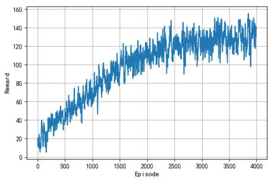  
(a)

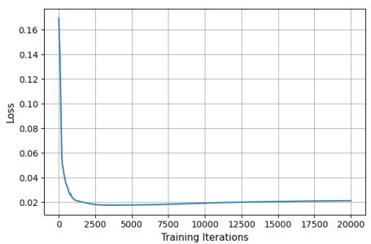  
(b)

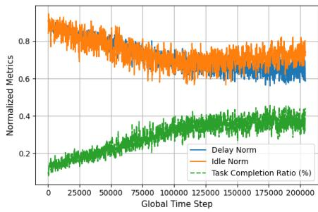  
(c)  
Fig. 5. Convergence behavior of the coupled learning system: (a) Convergence of the MARL component—smoothed cumulative reward over 4 000 training episodes; (b) Training curve of the supervised learning—mean-squared predictive loss versus SGD iteration; (c) Evolution of key normalized metrics over 200 000 time steps (window = 2 000).

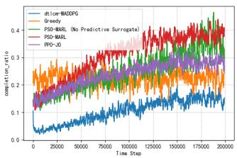  
(a) Task-completion ratio

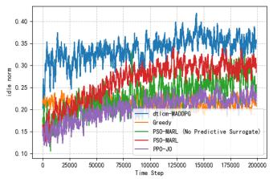  
(c) Normalized UAV idle time

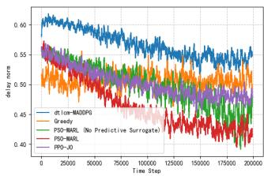  
(b) Normalized delay

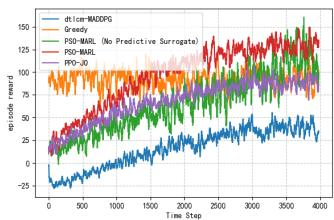  
(d) Episode reward  
Fig. 6. Comparative performance evaluation of the proposed PSO-MARL framework against baseline algorithms, illustrating: (a) task-completion ratio, (b) normalized delay, (c) normalized UAV idle time, and (d) episode reward.

## C. Comparative Performance Against Baselines

To quantify the practical benefit of the proposed PSO-MARL scheme, we benchmark it against four representative baselines: DTLCM–MADDPG, Greedy Offloading, PPO-JO, and PSO-MARL-No (without the predictive supervised bridge) under a fixed configuration of M = 4 and N = 10. As shown in Fig. 6a–6d, PSO-MARL consistently achieves the best overall performance among all methods: it reaches the highest task-completion ratio (about 0.40 at $t = 2 \times 1 0 ^ { 5 } )$ , the lowest normalized delay (about 0.42), and the highest longterm reward (about 125–135 near convergence). In contrast, PPO-JO and Greedy remain clearly inferior, while DTLCM– MADDPG performs worst overall. Moreover, removing the predictive bridge degrades completion (from about 0.40 to 0.36), delay (from about 0.42 to 0.45), and reward (from about 125–135 to about 110–120), indicating that the online supervised surrogate improves both final solution quality and convergence speed by providing cheaper but informative guidance for upper-tier search.

A noteworthy observation is that PSO-MARL does not minimize UAV idle ratio; instead, it converges to a moderate idle level (about 0.30), which is slightly higher than Greedy, PPO-JO, and PSO-MARL-No. This is desirable rather than wasteful: the learned policy appears to accept limited waiting/repositioning or to avoid low-quality offloading opportunities, thereby preventing congestion and achieving better end-to-end QoS. Hence, the gain of HSD comes not from aggressive resource saturation, but from a better cross-layer trade-off between service completion, latency, and utilization.

## D. Ablation and Sensitivity Analysis

1) Replay Staleness and Supervised-model Stability: Due to space limitations, the detailed comparison between windowed replay (proposed) and full-history replay (ablation) is deferred to Sec. VII-A of the Supplementary Material, where windowed replay is shown to yield faster and smoother convergence with lower residual prediction error.

2) Objective-weight Sensitivity: We test three preference profiles (balanced, delay-sensitive, and throughput-oriented). All settings converge stably without retuning learning hyperparameters. Since reweighting changes the scale of the optimized objective, the scalar rewards are not directly comparable across profiles; therefore, we interpret preference shifts using external metrics (delay/completion/idle). Full results are reported in the Supplementary Material (Sec. VII-B).

3) Heuristic-budget Sensitivity $( I _ { \mathrm { m a x } } ) { : }$ To address the practical concern that Assumption A1 (near-perfect planning) is rarely met in real-time systems, we explicitly quantify the impact of the heuristic planner’s quality on system performance. As established in our approximate-planner convergence analysis, a non-perfect planner introduces a persistent error bound $\bar { \varepsilon } _ { b } ,$ which theoretically limits the precision of the final equilibrium.

In our PSO-MARL instantiation, the ”quality” of the planner is directly controlled by the number of PSO iterations $( I _ { \mathrm { m a x } } )$ executed per time slot. We varied $I _ { \mathrm { m a x } } \in \{ 5 , 1 0 , 1 5 , 2 0 \}$ while keeping the particle size fixed at $N _ { p } = 1 5$

a) Impact on Convergence and Optimality: Fig. 7 compares the learning curves under different PSO iteration budgets. All settings converge stably, confirming that reducing the planner budget does not break the closed-loop stability, but a smaller $I _ { \mathrm { m a x } }$ enlarges the steady-state convergence neighborhood. In particular, $I _ { \mathrm { m a x } } = 5$ reaches a lower plateau (≈ 119.9), while the default $I _ { \mathrm { m a x } } ~ = ~ 1 0$ achieves the best reward (≈ 133.7); further increasing the budget to 15 or 20 yields only comparable performance (≈ 130.2 and ≈ 131.8), indicating diminishing returns beyond a moderate planning budget.

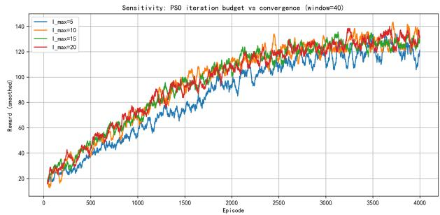  
Fig. 7. Impact of heuristic planner budget (PSO iterations $I _ { \mathrm { m a x } } )$ on convergence speed and final reward quality. Lower iterations reduce computation but lead to a looser convergence neighborhood (lower steady-state reward).

TABLE II  
PLANNER BUDGET TRADE-OFF $( N _ { p } \mathrm { = } 1 5 )$
<table><tr><td> $I _ { \mathrm { m a x } }$ </td><td>Time (ms) Reward</td><td></td><td> $\Delta { \ } \mathrm { v s . } \ I _ { \mathrm { m a x } } { = } 1 0$ </td></tr><tr><td> $^ { 5 }$ </td><td>126.1</td><td>119.9</td><td> $- 1 0 . 3 \%$ </td></tr><tr><td>10 (Def.)</td><td>139.5</td><td>133.7</td><td>0</td></tr><tr><td>15</td><td>267.1</td><td>130.2</td><td> $- 2 . 6 \%$ </td></tr><tr><td>20</td><td>376.3</td><td>131.8</td><td>-1.4%</td></tr></table>

b) Impact on Real-time Execution Time: Table II quantifies the wall-clock planning time per decision slot. As expected, increasing $I _ { \mathrm { m a x } }$ substantially raises the planning overhead (from ≈ 126 ms at $I _ { \mathrm { m a x } } { = } 5 ~ \mathrm { t o } \approx 3 7 6$ ms at $I _ { \mathrm { m a x } } { = } 2 0 )$ while the steady-state reward shows diminishing returns beyond moderate budgets $( \mathbf { e } . \mathbf { g } . , I _ { \mathrm { m a x } } { = } 1 0 { - } 2 0 )$ .

This analysis empirically validates our approximate-planner convergence result: reducing the planner’s computational budget (increasing $ { \varepsilon } _ { t } )$ does not break the closed-loop stability but leads to a larger steady-state convergence neighborhood.

## E. Scalability with Network Size

1) Varying UAV Fleet Size (M): To evaluate scalability with respect to the UAV fleet size, the number of UAVs was varied from 1 to 9 while keeping the number of ground users fixed. Fig. 8 summarizes the resulting task-completion ratio, normalized delay, normalized UAV idle time, and episode reward.

Task-completion Ratio, Delay, and Idle Time: As M increases from 1 to moderate fleet sizes, the task-completion ratio improves substantially, showing that additional UAVs enhance spatial coverage and service flexibility. However, this improvement is not monotonic for larger fleets, and the dispersion across runs becomes more pronounced, indicating higher sensitivity to coordination difficulty and environment stochasticity. The delay results provide a complementary view: adding UAVs does not consistently reduce delay, which remains relatively high for most moderate values of M and only shows a clearer reduction at the largest fleet size. Meanwhile, the idle-time distributions indicate that larger fleets introduce more spare capacity, but this does not translate into proportional efficiency gains. Taken together, these results reveal a clear utilization–latency tension: extra UAVs can improve service capability, yet the benefit is increasingly offset by coordination overhead and channel contention.

Overall Reward: The episode reward is consistent with the above trends. It improves markedly when moving from very small fleets to moderate ones, and the best overall performance is achieved around $M = 4 { - } 6$ , where the framework attains a favorable balance among throughput, latency, and resource utilization. Beyond this range, the reward becomes more variable and may even deteriorate, suggesting that the marginal benefit of adding more UAVs rapidly diminishes once coordination overhead becomes dominant.

2) Varying Number of Users (N): To examine scalability under increasing user demand, the UAV fleet size was fixed at $M = 4$ while the number of simultaneously active ground users was varied from $N \ = \ 5$ to $N \ = \ 2 5$ . The resulting performance is shown in Fig. 9.

Task-completion Ratio, Delay, and Idle Time: The completion ratio remains relatively stable under light loads, but it declines as the number of users increases further, indicating that successful service completion becomes more difficult under heavier demand. Minor non-monotonic fluctuations at lowto-moderate loads can be attributed to stochastic user geometry and the resulting variation in link quality. At the same time, the normalized delay generally rises with N, while the idle time decreases, showing that communication and computing resources are becoming more fully utilized and progressively congested. Overall, these three metrics consistently indicate that the proposed framework remains effective under light-tomoderate user loads, but its scalability becomes increasingly constrained once contention and CPU saturation begin to dominate.

Overall Reward: The episode reward remains positive in the light-to-moderate loading regime and reaches its best level around $N \approx 1 0 .$ , indicating an effective balance between resource utilization and service pressure. As the user population continues to grow, however, the reward declines steadily and eventually becomes negative under heavy load, which confirms that excessive demand overwhelms the available communication and computation resources.

## F. Computational Overhead and Scalability Analysis

A critical consideration for hybrid architectures is the additional computational latency introduced by the heuristic planning layer. To address this, we analyze the theoretical complexity and compare the empirical runtime of PSO-MARL against the DRL-only baselines.

1) Theoretical Complexity: Let M denote the number of UAVs, N the number of users, and $S _ { i n }$ the size of the input state vector, where $S _ { i n } \propto ( M + N )$

• DRL Baselines (e.g., PPO-JO, MADDPG): The computational cost is dominated by the forward pass of the actor neural networks. For a fully connected architecture with layers of width H, the complexity per time-step is

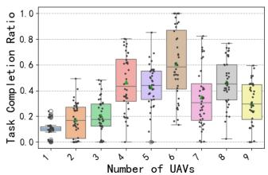  
(a) Task-completion ratio

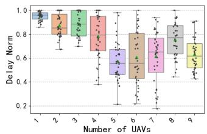  
(b) Normalized delay

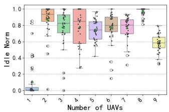  
(c) Normalized idle time

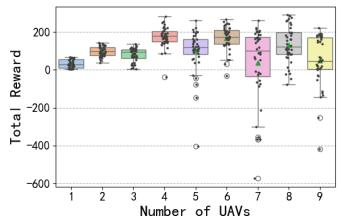  
(d) Episode reward  
Fig. 8. Influence of UAV fleet size on the performance of the proposed PSO-MARL framework.

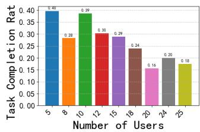

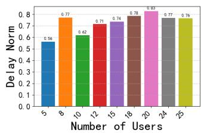  
(a) Task-completion ratio  
(b) Normalized delay

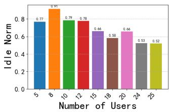  
(c) Normalized idle time

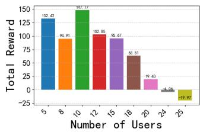  
(d) Episode reward  
Fig. 9. Influence of the number of ground users on the performance of the proposed PSO-MARL framework.

O $\left( L \cdot H ^ { 2 } + H \cdot S _ { i n } \right)$ . Since inference is a single pass, this is extremely fast.

• HSD (PSO-MARL): The complexity comprises two parts: the upper-tier planning (Phase 1) and the lower-tier execution (Phase 2). In the planning phase, the PSO algorithm iterates $I _ { \mathrm { m a x } }$ times with $N _ { p }$ particles. In each iteration, every particle requires a forward pass of the supervised model $f _ { \theta }$ for fitness evaluation. The complexity is $\mathcal { O } ( I _ { \operatorname* { m a x } } \cdot N _ { p } \cdot ( L _ { s u p } \cdot H _ { s u p } ^ { 2 } ) )$ . In the execution phase, it is identical to the DRL baseline, $\mathcal { O } ( L \cdot H ^ { 2 } )$

The theoretical overhead ratio is roughly proportional to $I _ { \mathrm { m a x } }$ $N _ { p }$ . While this represents a linear increase in computation, it avoids the exponential complexity of exhaustive search and the combinatorial explosion faced by DRL when exploring joint continuous-discrete spaces.

2) Empirical Runtime Comparison: We measured the average wall-clock decision latency per slot on the simulation hardware (Intel i5 CPU, NVIDIA GTX 1050 Ti GPU). The results for the default scenario $( M ~ = ~ 4 , N ~ = ~ 1 0 )$ are summarized in Table III, where we decompose the latency into: (i) Planning time (only applicable to hybrid methods with an explicit planning stage), and (ii) Inference time (policy forward pass and lightweight action post-processing). The reported Total is their sum.

TABLE III  
AVERAGE RUNTIME LATENCY PER DECISION SLOT $( M { = } 4 , N { = } 1 0 )$
<table><tr><td rowspan=1 colspan=1>Algorithm</td><td rowspan=1 colspan=1>Planning</td><td rowspan=1 colspan=1>Inference</td><td rowspan=1 colspan=1>Total</td></tr><tr><td rowspan=1 colspan=1>DRL-only</td><td rowspan=1 colspan=1>N/A</td><td rowspan=1 colspan=1>5.536</td><td rowspan=1 colspan=1>5.536</td></tr><tr><td rowspan=1 colspan=1>MADDPG with DTLCM</td><td rowspan=1 colspan=1>N/A</td><td rowspan=1 colspan=1>7.6</td><td rowspan=1 colspan=1>7.6</td></tr><tr><td rowspan=1 colspan=1>PPO-JO</td><td rowspan=1 colspan=1>9.823</td><td rowspan=1 colspan=1>0.764</td><td rowspan=1 colspan=1>10.587</td></tr><tr><td rowspan=1 colspan=1>PSO-MARL (Ours)</td><td rowspan=1 colspan=1>396.627</td><td rowspan=1 colspan=1>9.658</td><td rowspan=1 colspan=1>406.285</td></tr></table>

The DRL-only baselines incur only a few milliseconds per slot (5.536 ms for DRL-only and 7.6 ms for MADDPG with DTLCM). Our hybrid methods introduce an additional planning stage, which dominates the overall overhead: for PPO-JO, planning accounts for 9.823 ms out of 10.587 ms total; for PSO-MARL (with $I _ { \mathrm { m a x } } ~ = ~ 2 0$ and $N _ { p } ~ = ~ 2 0 )$ planning accounts for 396.627 ms out of 406.285 ms total. Despite this extra computation, the end-to-end decision latency remains well within the physical slot duration. Specifically, the flight-phase duration is $T _ { 1 } ~ = ~ 1 0 \mathrm { s }$ (10,000 ms), so the per-slot decision overhead consumes only 0.055%–0.076% for the DRL-only baselines, 0.106% for PPO-JO, and 4.06% for PSO-MARL. This confirms that, even after accounting for the planning layer, the proposed hybrid architectures remain feasible for real-time control under the considered system time scale.

3) Scalability with Network Size: We further evaluated how the decision latency of our hybrid controller scales with the network size by increasing the swarm size from $M \ = \ 4 \ \mathrm { t o } M \ = \ 1 2 . \ \mathrm { F i g }$ . 10 reports the per-slot wallclock latency of PSO-MARL, decomposed into the planning stage (PSO optimization with supervised-model evaluations) and the inference stage (policy forward pass and lightweight post-processing). As M increases, the total latency rises from 458.5 ms (M=4) to 1468.2 ms (M=12), where the growth is primarily dominated by the planning component (448.2 ms $ ~ 1 4 5 3 . 8 \mathrm { m s } )$ . In contrast, the inference latency remains comparatively small and stable (about 10.3–14.4 ms across all tested M), indicating that the overhead stems mainly from the upper-tier planner rather than the lower-tier policy execution. Importantly, even at M=12, the overall decision latency (1.468 s) remains within the physical slot duration used in our simulator $( T _ { 1 } \mathrm { { = } } 1 0 \ : \mathrm { s ) }$ , consuming about 14.68% of the slot budget, which confirms the real-time feasibility of the proposed hybrid architecture under the considered time scale. All latency numbers were obtained on a relatively older simulation platform (Intel i5 CPU and an NVIDIA GTX 1050 Ti GPU). Therefore, the reported per-slot decision time should be viewed as a conservative upper bound, and lower latency is expected on modern hardware.

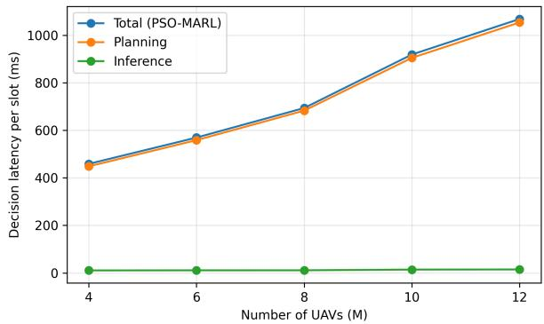  
Fig. 10. Scalability of per-slot decision latency of PSO-MARL with respect to swarm size (M), decomposed into planning and inference components.

## G. Discussion

The empirical results from our UAV-MEC case study provide strong evidence for the effectiveness of the HSD architecture. Beyond demonstrating superior performance, the experiments offer insights into why the framework succeeds, validating its core design principles.

1) The Power of Predictive Coupling: The significant performance gap between PSO-MARL and PSO-MARL-No clearly confirms the advantage of the proposal. The supervised module is not a minor enhancement; it is a core component of the framework. It provides the heuristic planner with the necessary foresight, transforming its “blind” search into an intelligent, goal-directed exploration. This validates that the component of “the adaptive bridge” enables effective coordination between the upper and lower layers.

2) Validating Two-time-scale Convergence in Practice: The smooth learning curves observed in Fig. 5a and Fig. 5b serve as an empirical counterpart to the TTSSA-based analysis. In particular, the supervised loss drops rapidly at the beginning and then stabilizes, which is consistent with the intended fast-timescale adaptation of the surrogate model. Meanwhile, the MARL reward improves more gradually on a slower timescale, indicating that the policy evolves on top of a predictive model that becomes sufficiently stable after the initial training stage. We note that this does not prove the assumptions exactly; rather, it provides practical evidence that the stability conditions are approximately satisfied in our simulator. This approximation is supported by the training design used in our implementation, including explicit timescale separation in the step sizes, PPO clipping and KL-based early stopping for conservative policy updates, replay-bufferbased supervised updates with sliding-window sampling, and normalization/clipping mechanisms that reduce oscillatory behavior. Thus, the observed training dynamics are consistent with the scope conditions required by the convergence theorem.

3) Scalability through Decomposition: The scalability experiments (Fig. 8 and Fig. 9) reveal another fundamental benefit of HSD’s architectural decomposition. By assigning the high-dimensional upper-tier planning (UAV positioning) to a heuristic and the reactive control (resource allocation) to DRL, the framework avoids the “curse of dimensionality”. The system finds the best solution within its constraints, rather than suffering from failure or training divergence. This highlights HSD’s potential as a robust solution for large-scale real-world problems.

4) Mitigating Prediction Bias via Closed-Loop Correction: A critical concern in surrogate-assisted optimization is prediction bias, where the planner might exploit model errors to select strategies that appear promising in the surrogate landscape but perform poorly in reality. The HSD framework mitigates this through its closed-loop active learning mechanism.

If the supervised model $f _ { \theta }$ contains a positive bias for a suboptimal strategy $x _ { \mathrm { b a d } }$ (i.e., predicting high performance), the heuristic planner is likely to select $x _ { \mathrm { b a d } }$ . Upon execution, the DRL agent observes the true, lower reward $r _ { \mathrm { r e a l } }$ . This tuple $( x _ { \mathrm { b a d } } , r _ { \mathrm { r e a l } } )$ is added to the replay buffer. The subsequent gradient update on the supervised model explicitly minimizes the error $( f _ { \theta } ( x _ { \mathrm { b a d } } ) - r _ { \mathrm { r e a l } } ) ^ { 2 }$ , thereby “correcting” the bias $x _ { \mathrm { b a d } }$ . Consequently, the probability of selecting this poor strategy decreases in future iterations. This self-correcting dynamic ensures that model errors lead to exploration that refines the model itself, preventing the system from getting stuck in “hallucinated” optima.

## VII. CONCLUSION

In this paper, we addressed the challenge of hierarchical optimization in complex dynamic environments by introducing HSD, a novel and principled framework. The central contribution of HSD is its ability to create an effective collaboration between upper-tier planning and lower-tier control, a gap that has traditionally led to suboptimal, decoupled solutions. We demonstrated that by considering their interaction with adaptive supervised learning, it is possible to transform a planner’s “blind” search into an intelligent, goal-directed exploration. The framework’s reliability is not merely an empirical claim; it is supported by a convergence proof grounded in TTSSA.

The practical power and theoretical reliability of this architecture were validated through an extensive case study in UAV-assisted MEC. Our specific implementation, PSO-MARL, not only significantly outperformed state-of-the-art baselines but also empirically confirmed the crucial role of predictive supervised learning. The results showed that its foresight is critical for enabling the system to effectively balance long-term objectives with short-term dynamics, leading to superior performance in task completion, latency, and resource utilization.

We note that the UAV–MEC case study adopts a synchronized slot-based control abstraction, where different UAVs share common decision boundaries for flight and service coordination. This design is chosen to enable a tractable closed-loop coupling between upper-tier planning and lowertier control, while the resulting synchronization-induced idling is explicitly modeled and penalized in the objective. A fully asynchronous/event-driven formulation may further improve efficiency, but would require a substantially different control and analysis framework and is left for future work.

Although this paper validates HSD on a UAV–MEC case study, the framework is defined through a generic state– strategy–action interface and is applicable to hierarchical decision problems that exhibit: (i) a two-timescale coupling between upper-tier planning and lower-tier control, (ii) expensive evaluation of upper-tier candidates due to downstream lower-tier responses, and (iii) online feedback that can be used to refine both the predictor and the policy in closed loop. A compact non-UAV toy instantiation on energy-aware datacenter provisioning and job scheduling, including the setup and illustrative results, is provided in the Supplementary Material. Comprehensive multi-domain validation is left for future work.

## REFERENCES

[1] M. C. Machado, A. Barreto, D. Precup, and M. Bowling, “Temporal abstraction in reinforcement learning with the successor representation,” Journal of machine learning research, vol. 24, no. 80, pp. 1–69, 2023.

[2] W. Zhao, Y. Yu, B. Mao, and N. Kato, “A survey on computing power networks: Architecture, resource allocation, and ai services enablement,” IEEE Transactions on Network Science and Engineering, vol. 13, pp. 6225–6242, 2026.

[3] M. N. Luu, M.-D. Nguyen, E. Bedeer, V. D. Nguyen, D. T. Hoang, D. N. Nguyen, and Q.-V. Pham, “Energy-efficient and real-time sensing for federated continual learning via sample-driven control,” IEEE Transactions on Mobile Computing, 2025.

[4] Z. Guo, F. Tang, L. Luo, M. Zhao, and N. Kato, “A survey on applications of large language model-driven digital twins for intelligent network optimization,” IEEE Communications Surveys & Tutorials, 2025.

[5] M. Shi, Y. Xing, X. Guo, X. Zhu, Z. Zhu, and J. Zhou, “Task offloading and trajectory optimization for uav-assisted mobile edge computing,” in 2024 International Conference on Ubiquitous Communication (Ucom), 2024, pp. 432–437.

[6] B. Li, Q. Li, Y. Zeng, Y. Rong, and R. Zhang, “3d trajectory optimization for energy-efficient uav communication: A control design perspective,” IEEE Transactions on Wireless Communications, vol. 21, no. 6, pp. 4579–4593, 2022.

[7] C. He, Y. Zhang, D. Gong, and X. Ji, “A review of surrogate-assisted evolutionary algorithms for expensive optimization problems,” Expert Systems with Applications, vol. 217, p. 119495, 2023.

[8] S. Liu, H. Wang, W. Peng, and W. Yao, “Surrogate-assisted evolutionary algorithms for expensive combinatorial optimization: a survey,” Complex & Intelligent Systems, vol. 10, no. 4, pp. 5933–5949, 2024.

[9] G. Sun, Y. Wang, Z. Sun, Q. Wu, J. Kang, D. Niyato, and V. C. M. Leung, “Multi-objective optimization for multi-uav-assisted mobile edge computing,” IEEE Transactions on Mobile Computing, vol. 23, no. 12, pp. 14 803–14 820, 2024.

[10] J. Kennedy and R. Eberhart, “Particle swarm optimization,” Proceedings of ICNN’95-International Conference on Neural Networks, vol. 4, pp. 1942–1948, 1995.

[11] J. H. Holland, Adaptation in natural and artificial systems: an introductory analysis with applications to biology, control, and artificial intelligence. MIT press, 1992.

[12] S. Agrawal, B. K. Patle, and S. Sanap, “A systematic review on metaheuristic approaches for autonomous path planning of unmanned aerial vehicles,” Drone Systems and Applications, vol. 12, pp. 1–28, 2024.

[13] Y. Li, R. Wu, L. Gan, and P. He, “Development of an effective relay communication technique for multi-uav wireless network,” IEEE Access, vol. 12, pp. 74 087–74 095, 2024.

[14] L. Qin, Y. Zheng, and Y. Gao, “Enhancing uav-based edge computing: a study on nonhovering operations and two-stage optimization strategies,” Applied Intelligence, vol. 54, no. 21, pp. 10 780–10 801, 2024.

[15] M. Kato, T. Koketsu Rodrigues, T. Abe, and T. Suganuma, “Exploiting radio frequency characteristics with a support unmanned aerial vehicle to improve wireless sensor location estimation accuracy,” IEEE Internet of Things Journal, vol. 11, no. 24, pp. 39 570–39 578, 2024.

[16] H. Feng, E. Bedeer, M. Zeng, X. Li, S. Gong, and Q.-V. Pham, “Phaseaware localization in pinching antenna systems: Crlb analysis and ml estimation,” arXiv preprint arXiv:2602.21162, 2026.

[17] B. Mao, Y. Liu, H. Guo, Y. Xun, J. Wang, J. Liu, and N. Kato, “On a hierarchical content caching and asynchronous updating scheme for non-terrestrial network-assisted connected automated vehicles,” IEEE Journal on Selected Areas in Communications, vol. 43, no. 1, pp. 64–74, 2025.

[18] K. Sorensen, “Metaheuristics—the metaphor exposed,” ¨ International Transactions in Operational Research, vol. 22, no. 1, pp. 3–18, 2015.

[19] B. Do and R. Zhang, “Multifidelity bayesian optimization: A review,” AIAA Journal, vol. 63, no. 6, pp. 2286–2322, 2025.

[20] K. Li and F. Li, “Multi-fidelity methods for optimization: A survey,” arXiv preprint arXiv:2402.09638, 2024.

[21] M. Chen, D. Gund¨ uz, K. Huang, W. Saad, M. Bennis, A. Vulgarakis Fel-¨ jan, and H. V. Poor, “Distributed learning in wireless networks: Recent progress and future challenges,” IEEE Journal on Selected Areas in Communications, vol. 39, no. 12, pp. 3579–3605, 2021.

[22] A. Feriani and E. Hossain, “Single and multi-agent deep reinforcement learning for ai-enabled wireless networks: A tutorial,” IEEE Communications Surveys & Tutorials, vol. 23, no. 2, pp. 1226–1252, 2021.

[23] W. Zhao, S. Cui, W. Qiu, Z. He, Z. Liu, X. Zheng, B. Mao, and N. Kato, “A survey on drl-based uav communications and networking: Drl fundamentals, applications and implementations,” IEEE Communications Surveys & Tutorials, vol. 28, pp. 3911–3941, 2026.

[24] R. S. Sutton and A. G. Barto, Reinforcement learning: An introduction. MIT press, 2018.

[25] C. Zhu, M. Dastani, and S. Wang, “A survey of multi-agent deep reinforcement learning with communication,” Autonomous Agents and Multi-Agent Systems, vol. 38, 2024.

[26] O. Tokluoglu, E. Cavus, E. Bedeer, and H. Yanikomeroglu, “A novel cnn based standalone detector for faster-than-nyquist signaling,” IEEE Transactions on Communications, 2025.

[27] X. Luo, C. Chen, C. Zeng, C. Li, J. Xu, and S. Gong, “Deep reinforcement learning for joint trajectory planning, transmission scheduling, and access control in uav-assisted wireless sensor networks,” Sensors, vol. 23, no. 10, p. 4691, 2023.

[28] J. Won, D. Kim, Y. Park, and J. Lee, “A survey on uav placement and trajectory optimization in communication networks: From the perspective of air-to-ground channel models,” ICT Express, vol. 9, no. 3, pp. 385–397, 2023.

[29] A. Oroojlooy and D. Hajinezhad, “A review of cooperative multi-agent deep reinforcement learning,” Applied Intelligence, vol. 53, pp. 1–49, 2023.

[30] Y. Li, H. Zhang, K. Long, C. Jiang, and M. Guizani, “Joint resource allocation and trajectory optimization with qos in uav-based noma wireless networks,” IEEE Transactions on Wireless Communications, vol. 20, no. 10, pp. 6343–6355, 2021.

[31] X. Zhang and X. Hu, “Multi-agent deep deterministic policy gradienbased task offloading resource allocation joint offloading,” Journal of Computer and Communications, vol. 12, no. 6, pp. 152–168, 2024.

[32] W. Zeng, X. Yan, F. Mo, Z. Zhang, S. Li, P. Wang, and C. Wang, “Knowledge-enhanced deep reinforcement learning for multi-agent game,” Electronics, vol. 14, no. 7, p. 1347, 2025.

[33] B. Mao, Y. Liu, Z. Wei, H. Guo, Y. Xun, J. Wang, J. Liu, and N. Kato, “A blockchain-enabled cold start aggregation scheme for federated reinforcement learning-based task offloading in zero trust leo satellite networks,” IEEE Journal on Selected Areas in Communications, 2025.

[34] W. Zhao, P. Gao, X. Hong, X. Zheng, and N. Kato, “Ppo-based task offloading with ekf for position prediction in rsu-assisted iov,” IEEE Transactions on Cognitive Communications and Networking, vol. 12, pp. 703–713, 2026.

[35] A. Mohan, A. Zhang, and M. Lindauer, “Structure in deep reinforcement learning: A survey and open problems,” Journal of Artificial Intelligence Research, vol. 79, pp. 1167–1236, 2024.

[36] R. S. Sutton, D. Precup, and S. Singh, “Between MDPs and semi-MDPs: A framework for temporal abstraction in reinforcement learning,” Artificial Intelligence, vol. 112, no. 1-2, pp. 181–211, 1999.

[37] T. Wang, Y. Deng, Z. Yang, Y. Wang, and H. Cai, “Parameterized deep reinforcement learning with hybrid action space for edge task offloading,” IEEE Internet of Things Journal, vol. 11, no. 6, pp. 10 754– 10 767, Mar. 2024.

[38] Y. Yao, V. W. Tam, J. Wang, K. N. Le, and A. Butera, “Automated construction scheduling using deep reinforcement learning with valid action sampling,” Automation in Construction, vol. 166, p. 105622, Oct 2024.

[39] V. S. Borkar, “Stochastic approximation with two time scales,” Systems & Control Letters, vol. 29, no. 5, pp. 291–294, 1997.

[40] H. J. Kushner and G. G. Yin, Stochastic Approximation and Recursive Algorithms and Applications, 2nd ed., ser. Stochastic Modelling and Applied Probability. New York: Springer, 2003, vol. 35.

[41] Y. Zeng, J. Xu, and R. Zhang, “Energy minimization for wireless communication with rotary-wing uav,” IEEE transactions on wireless communications, vol. 18, no. 4, pp. 2329–2345, 2019.

[42] A. A. Khuwaja, Y. Chen, N. Zhao, M.-S. Alouini, and P. Dobbins, “A survey of channel modeling for uav communications,” IEEE Communications Surveys & Tutorials, vol. 20, no. 4, pp. 2804–2821, 2018.

[43] Y. Zeng, Q. Wu, and R. Zhang, “Accessing from the sky: A tutorial on uav communications for 5g and beyond,” Proceedings of the IEEE, vol. 107, no. 12, pp. 2327–2375, 2019.

[44] J. Schulman, F. Wolski, P. Dhariwal, A. Radford, and O. Klimov, “Proximal policy optimization algorithms,” arXiv preprint arXiv:1707.06347, 2017.

[45] S. S. Hassan, Y. M. Park, Y. K. Tun, W. Saad, Z. Han, and C. S. Hong, “3to: Thz-enabled throughput and trajectory optimization of uavs in 6g networks by proximal policy optimization deep reinforcement learning,” in ICC 2022-IEEE International Conference on Communications. IEEE, 2022, pp. 5712–5718.

[46] S. A. Zakaryia, M. Meaad, T. Nabil, and M. K. Hussein, “Task offloading and resource allocation for multi-uav asset edge computing with multiagent deep reinforcement learning,” Computing, vol. 107, p. 126, 2025.

  
Kai Wang is currently working toward the master’s degree in engineering with the Anhui University of Technology, Ma’anshan, China. His research interests include deep reinforcement learning and edge computing. By leveraging advanced computing techniques, he aims to enhance decision-making processes and overall performance for various applications.

Highly Cited Researcher, a Fellow of the Engineering Academy of Japan, a Fellow of IEEE, and a Fellow of IEICE.

Wei Zhao (S’12-M’16) received his Ph.D. degree in the Graduate School of Information Sciences, Tohoku University. He is currently a professor at the School of Computer Science and Technology, Anhui University of Technology. His research interests include deep reinforcement learning, edge computing, and resource allocation in wireless networks. He was the recipient of IEEE WCSP-2014 Best Paper Award, and IEEE GLOBECOM-2014 Best Paper Award. He is now an editorial board member of the Internet of Things Journal. He is a member of IEEE.

Nei Kato (M’04, SM’05, F’13) is a Distinguished Professor with Graduate School of Information Sciences, Tohoku University. He served as the Dean of Graduate School of Information Sciences from 2021 to 2025. His research areas include computer networking, wireless mobile communications, satellite communications, ad hoc & sensor & mesh networks, UAV networks, AI, IoT, and Big Data. He is the Editor-in-Chief of IEEE Internet of Things Journal, the Vice President for publication, IEEE Communications Society. He is a Clarivate Analytics

Xiangyu Liu received his Ph.D. degree from the People’s Public Security University of China, in 2023. He is currently a Lecturer with the School of Computer Science and Technology, Anhui University of Technology, China. His research interests include wireless communication networks, Internet of Things, and network traffic analysis.

Zhi Liu (S’11-M’14-SM’19) received the Ph.D. degree in informatics in National Institute of Informatics. He is currently an Associate Professor at the University of Electro-Communications. His research interests include video network transmission and MEC. He is now an editorial board member of IEEE Transactions on Multimedia, IEEE Network, and Internet of Things Journal. He is a senior member of IEEE.