# Hierarchical Control Multi-Agent DRL for Vehicle Twin Migration with Workload Prediction in UAV-Assisted Vehicular Metaverses

Junlong Chen\*, Yingkai Kang\*, Jiawen Kang, Minrui Xu, Yongju Tong, Fan Wu, and Dusit Niyato, Fellow, IEEE

Abstract—Vehicular metaverses enable immersive digital experiences through seamless Vehicle Twin (VT) services. As vehicles move, VT service instances must migrate between RoadSide Units (RSUs) to sustain low-latency interactions. However, RSUs face significant challenges from dynamic workload fluctuations and uneven geographical distribution. These limitations often result in service degradation during peak demand periods. Unmanned Aerial Vehicles (UAVs) offer promising solutions to augment fixed infrastructure capacity. Nevertheless, their energy constraints and trajectory optimization create additional complexity for resource management. To address these challenges, we develop a novel framework integrating workload forecasting with coordinated decision-making for VT migration and UAV routing. We first design a long short-term memory-based workload prediction model. This model predicts workload patterns by combining spatial feature extraction with temporal dependency modeling. We enhance the prediction capability through noiseaugmented training to improve robustness. Then, we formulate the VT migration and UAV routing optimization as a markov decision process, which captures the sequential nature of decisionmaking. Finally, we propose a hierarchical control multi-agent deep reinforcement learning algorithm where the upper-layer controller uses multi-agent proximal policy optimization for collaborative decision-making, and the lower-layer controller handles VT migration and UAV routing execution. Simulation results show that the proposed approach reduces average latency by 25.70% and validation loss by 63.70% for workload prediction compared to baseline methods.

Index Terms—Vehicular metaverses, vehicle twins, service migration, workload prediction, deep reinforcement learning.

## I. INTRODUCTION

Metaverses are integrated digital ecosystems that facilitate seamless interaction between virtual and physical realities [1]. As an emerging paradigm, vehicular metaverses integrate intelligent transportation systems with digital environments through advanced Digital Twin (DT) and artificial intelligence technologies, seamlessly connecting vehicles, users, and environments [2]. Vehicle Twins (VTs) are the key component of this ecosystem, which function as digital representations of physical vehicles and provide precise behavioral modeling throughout the vehicle operational lifecycle [3]. These digital representations enable advanced applications, including augmented reality navigation and embodied intelligence services [4]. Given the high computational demands of VT services, local processing is inadequate, requiring offloading to nearby Roadside Units (RSUs) with adequate processing and bandwidth capabilities [5]. However, this offloading strategy faces significant challenges due to dynamic RSU workloads, limited infrastructure coverage, and high vehicular mobility.

Deep Reinforcement Learning (DRL) has emerged as a promising solution for managing the computational complexities inherent in VT service provisioning. This methodology enables adaptive decision-making capabilities essential for dynamic vehicular environments [6]. For instance, Lu et al. [7] developed a DRL-based DT migration framework that selects optimal edge servers based on real-time network conditions. Their approach achieved substantial latency reduction compared to conventional static allocation strategies. Chen et al. [8] further enhanced decision-making efficiency by introducing hybrid action spaces integrated with the Proximal Policy Optimization (PPO) algorithm, which improved exploration-exploitation mechanisms. Recognizing that vehicular networks involve multiple interacting entities, Chen et al. [9] developed a Multi-Agent DRL (MADRL) framework incorporating spatio-temporal trajectory generation capabilities. This framework enables coordinated VT migration decisions across multiple vehicles under dynamic mobility patterns. Nevertheless, these existing approaches assume that adequate computational resources remain consistently available in RSUs. When RSUs experience overload or become unavailable, service discontinuities emerge that migration optimization alone cannot resolve.

Unmanned Aerial Vehicles (UAVs) present a viable solution to overcome the computational limitations of RSUs. These mobile aerial platforms can function as dynamic edge servers, providing additional computational resources when terrestrial infrastructure becomes overloaded or unavailable [10]. Dai et al. [11] developed a UAV-assisted vehicular task offloading framework that optimizes workload allocation between RSUs and UAVs to minimize service latency. Zhao et al. [12] introduced software-defined networking architectures that enable dynamic resource orchestration between UAVs and Multi-access Edge Computing (MEC) servers. Their approach demonstrated significant operational cost reductions. Recently, Tong et al. [13] incorporated diffusion-based DRL algorithms to optimize VT migration decisions in UAV-assisted vehicular metaverses. Despite these advances, existing approaches often treat UAV positioning and trajectory planning as static configurations, neglecting dynamic path optimization that can further reduce VT migration latency and energy consumption.

The limitations of static UAV deployment necessitate an efficient framework that jointly optimizes UAV trajectories, VT migration, and workload distribution in dynamic air-ground integrated networks [14], [15]. Such optimization is challenging, as vehicle and UAV mobility, fluctuating wireless conditions, and dynamic service demands introduce tight coupling among decision variables, which complicates coordination under workload and energy constraints. Hierarchical control provides a structured framework to manage this complexity through its functional and operational abstractions [16]. Functional abstraction reduces the coupled problem to a compact set of upper-layer decision variables, thereby lowering the complexity of decision-making arising from interdependent system feedback. Operational abstraction subsequently maps these decision variables to feasible actions that satisfy workload and energy constraints under time-varying channel conditions and mobility. This separation enhances tractability and enables efficient adaptation in dynamic networks by decoupling upperlayer coordination from lower-layer execution. Furthermore, accurate workload prediction enables more effective decisionmaking in the hierarchical framework. By anticipating spatiotemporal demand variations, the framework can coordinate UAV deployment and VT migration before congestion occurs, thereby preventing service degradation rather than reacting to overload conditions [17].

To address the above challenges, we introduce a UAVvehicle collaborative heterogeneous VT migration framework that integrates a Long Short-Term Memory (LSTM)-based workload prediction model with a Hierarchical Control Multi-Agent PPO (HC-MAPPO) algorithm. In contrast to existing approaches that decouple UAV routing from VT migration decisions, our framework enables UAVs to operate as mobile aerial edge servers with adaptive trajectory planning capabilities. By leveraging predictive insights from the LSTMbased workload prediction model, the HC-MAPPO algorithm enables coordinated and optimized decision-making across vehicle and UAV agents. The main contributions of this paper are summarized as follows:

‚ We propose a novel UAV-vehicle collaborative heterogeneous VT migration framework that enables dynamic edge server selection between RSUs and UAVs. Unlike prior studies that separately address RSU and UAV optimization, our framework achieves joint resource orchestration with adaptive task prioritization and energy-aware UAV deployment. This integrated approach effectively addresses uneven RSU distribution and dynamic workload variations in vehicular metaverses, ensuring seamless VT service across heterogeneous air-ground networks.

‚ We develop an Accurate Convolutional Neural Network-Bidirectional LSTM (ACB-LSTM) workload prediction model that combines CNN for local feature extraction with BiLSTM for bidirectional temporal dependency modeling. To enhance robustness in dynamic vehicular environments, the model incorporates noise-augmented training for improved generalization. This hybrid architecture enables accurate workload forecasting across various RSU load conditions, providing essential predictive insights for VT migration decisions.

‚ We model VT migration and UAV trajectory planning as a Markov Decision Process (MDP) and develop an HC-MAPPO algorithm for decision-making. By decoupling upper-layer strategic coordination from lower-layer operational control, the hierarchical control architecture supports efficient integration of VT migration and UAV routing. This design allows the HC-MAPPO algorithm to jointly optimize multiple objectives, including VT service latency, energy efficiency, and edge resource utilization.

The rest of this paper is organized as follows. Section II reviews the related work. Section III outlines the system model and problem formulation. In Section IV, we explain the ACB-LSTM model for the RSU workload prediction. The proposed HC-MAPPO algorithm is detailed in Section V. The numerical results are presented in Section VI, and the paper concludes with Section VII.

## II. RELATED WORK

In this section, we review related work on UAV-assisted vehicular networks, workload prediction, and service migration. Furthermore, we summarize the differences between the related works and our work in Table I.

## A. UAV-Assisted Vehicular Networks in Metaverses

To meet the stringent low-latency and high-reliability demands of immersive services in metaverses, numerous studies have leveraged UAVs to enhance the computational service capabilities of vehicular networks [18]. Compared with fixedly deployed RSUs, UAVs offer greater mobility and flexibility, enabling on-demand deployment in high-demand areas to provide efficient and cost-effective computational coverage [19]. For instance, Yuan et al. [20] designed an intelligent UAVassisted rendering and caching scheme for metaverses, where multiple UAVs collaborate with ground base stations to execute immersive vehicular tasks. They optimized the resource allocation between vehicles and UAVs through a double auction model, significantly reducing the system response latency. Moreover, Kang et al. [21] focused on dynamic migration of digital avatar tasks in vehicular metaverses and proposed a MADRL approach. In their framework, UAVs and RSUs jointly manage on-demand task offloading across air–ground networks, enabling low-latency and continuous avatar execution. Through air-ground collaboration, UAVs and RSUs can provide enhanced connectivity and computational support for metaverse services as vehicles move across different coverage areas [22]. However, existing UAV-vehicle collaborative schemes lack adaptive trajectory planning mechanisms to dynamically balance service demands and energy constraints, limiting their ability to maintain continuous UAV service under highly dynamic vehicular mobility patterns.

## B. Workload Prediction in Service Migration

In highly dynamic edge environments, service node workloads fluctuate constantly with time and vehicle distribution [23]. Without proactive workload prediction, delayed migration decisions may lead to edge server overload and degraded service performance. In recent years, deep learning models have been widely adopted for workload prediction. Among them, Recurrent Neural Networks (RNNs) and their variants have shown superior performance in capturing temporal patterns. In particular, LSTM RNNs effectively capture long-term dependencies through gating mechanisms, achieving promising results in traffic and workload forecasting [24]. Building upon this foundation, various improved models have been proposed. Zhao et al. [25] employed a CNN-LSTM architecture, leveraging CNNs for spatial feature extraction and LSTMs for temporal sequence modeling to predict edge device CPU utilization. Yuan et al. [26] developed a hybrid prediction model by integrating bidirectional LSTM and grid LSTM to fully exploit the bidirectional dynamics and complex workload patterns, thereby accelerating model convergence. To further improve prediction accuracy, advanced deep learning architectures have emerged. Yin et al. [27] combined LSTM with transformer models for long-term forecasting and incorporated these predictions into service migration, preventing overload during peak periods. Despite these advances, existing workload prediction models lack robustness mechanisms against sudden traffic fluctuations and have limited capability in capturing multi-scale temporal patterns under highly dynamic vehicular network conditions.

TABLE I: Summarization of comparisons between existing works
<table><tr><td rowspan=1 colspan=1>Paper</td><td rowspan=1 colspan=1>Computing resources</td><td rowspan=1 colspan=1>Optimization objective</td><td rowspan=1 colspan=1>Solution method</td><td rowspan=1 colspan=1>Prediction model</td></tr><tr><td rowspan=1 colspan=1>[4]</td><td rowspan=1 colspan=1>RSU</td><td rowspan=1 colspan=1>Maximize autonomous vehicleutility</td><td rowspan=1 colspan=1>Generative diffusion model-basedDRL algorithm</td><td rowspan=1 colspan=1></td></tr><tr><td rowspan=1 colspan=1>[8]</td><td rowspan=1 colspan=1>RSU + Cloud</td><td rowspan=1 colspan=1>Minimize system latency</td><td rowspan=1 colspan=1>Hybrid-action MAPPO algorithm</td><td rowspan=1 colspan=1>Coverage-aware LSTM</td></tr><tr><td rowspan=1 colspan=1>[9]</td><td rowspan=1 colspan=1>RSU</td><td rowspan=1 colspan=1>Maximize user&#x27;sQuality-of-experience</td><td rowspan=1 colspan=1>Multi-agent split DRL algorithm</td><td rowspan=1 colspan=1>Efficient spatio-temporaltrajectory generation</td></tr><tr><td rowspan=1 colspan=1>[17]</td><td rowspan=1 colspan=1>MEC server</td><td rowspan=1 colspan=1>Maximize migration utility</td><td rowspan=1 colspan=1>Lyapunov-based proactive migrationalgorithm</td><td rowspan=1 colspan=1>Gated recurrent unit + Graphconvolutional network</td></tr><tr><td rowspan=1 colspan=1>[19]</td><td rowspan=1 colspan=1>RSU + UAV</td><td rowspan=1 colspan=1>MaximizeVehicle-to-everything coverage</td><td rowspan=1 colspan=1>Voronoi-diagram placement algorithm</td><td rowspan=1 colspan=1></td></tr><tr><td rowspan=1 colspan=1>[20]</td><td rowspan=1 colspan=1>Base station + UAV</td><td rowspan=1 colspan=1>Minimize response time andenergy consumption</td><td rowspan=1 colspan=1>Diffusion-based rendering algorithm +DL-based caching algorithm</td><td rowspan=1 colspan=1></td></tr><tr><td rowspan=1 colspan=1>[21]</td><td rowspan=1 colspan=1>RSU + UAV</td><td rowspan=1 colspan=1>Minimize system latency</td><td rowspan=1 colspan=1>Transformer-based MAPPO algorithm</td><td rowspan=1 colspan=1></td></tr><tr><td rowspan=1 colspan=1>[23]</td><td rowspan=1 colspan=1>MEC server</td><td rowspan=1 colspan=1>Minimize task waiting time</td><td rowspan=1 colspan=1>Sliding-window UCB algorithm +off-policy bandit learning</td><td rowspan=1 colspan=1></td></tr><tr><td rowspan=1 colspan=1>[24]</td><td rowspan=1 colspan=1></td><td rowspan=1 colspan=1>Minimize prediction error</td><td rowspan=1 colspan=1>Supervised LSTM RNN</td><td rowspan=1 colspan=1>LSTM + RNN</td></tr><tr><td rowspan=1 colspan=1>[25]</td><td rowspan=1 colspan=1>MEC server</td><td rowspan=1 colspan=1>Minimize offloading latencyand energy consumption</td><td rowspan=1 colspan=1>Distributed greedy offloadingalgorithm</td><td rowspan=1 colspan=1>LSTM + CNN</td></tr><tr><td rowspan=1 colspan=1>[26]</td><td rowspan=1 colspan=1></td><td rowspan=1 colspan=1>Minimize prediction error</td><td rowspan=1 colspan=1>Hybrid prediction model</td><td rowspan=1 colspan=1>BiLSTM + GridLSTM</td></tr><tr><td rowspan=1 colspan=1>[27]</td><td rowspan=1 colspan=1>RSU + UAV + Satellite</td><td rowspan=1 colspan=1>Minimize migration latencyand packet loss</td><td rowspan=1 colspan=1>Dynamic-mask MAPPO algorithm</td><td rowspan=1 colspan=1>LSTM-based Transformer</td></tr><tr><td rowspan=1 colspan=1>[28]</td><td rowspan=1 colspan=1>MEC server</td><td rowspan=1 colspan=1>Maximize user&#x27;sQuality-of-service</td><td rowspan=1 colspan=1>Deep recurrent actor-critic migrationalgorithm</td><td rowspan=1 colspan=1></td></tr><tr><td rowspan=1 colspan=1>[29]</td><td rowspan=1 colspan=1>RSU</td><td rowspan=1 colspan=1>Minimize system latency</td><td rowspan=1 colspan=1>Confidence-regulated generativediffusion algorithm</td><td rowspan=1 colspan=1></td></tr><tr><td rowspan=1 colspan=1>[30]</td><td rowspan=1 colspan=1>MEC server</td><td rowspan=1 colspan=1>Minimize service latency</td><td rowspan=1 colspan=1>Intelligent service migration algorithm</td><td rowspan=1 colspan=1></td></tr><tr><td rowspan=1 colspan=1>[31]</td><td rowspan=1 colspan=1>MEC server</td><td rowspan=1 colspan=1>Minimize communicationlatency and cost</td><td rowspan=1 colspan=1>DQN-based migration path selectionalgorithm</td><td rowspan=1 colspan=1></td></tr><tr><td rowspan=1 colspan=1>Ourwork</td><td rowspan=1 colspan=1>RSU + UAV</td><td rowspan=1 colspan=1>Minimize service latency andenergy consumption</td><td rowspan=1 colspan=1>Hierarchical control MAPPOalgorithm</td><td rowspan=1 colspan=1>ACB-LSTM</td></tr></table>

— denotes not reported or not applicable.

## C. Markov Decision Process in Service Migration

Given the sequential decision-making nature of service migration [28]–[30], recent studies have modeled it as an MDP and adopted reinforcement learning methods for the solution. Wang et al. [31] proposed a cost-aware service migration path selection approach, which treats path selection as a constrained MDP and applies Deep Q-Networks (DQNs) to generate lowlatency, low-cost migration routes, cutting latency and cost by more than 15% on multiple real-world datasets relative to heuristic baselines. Li et al. [32] modeled migration as a partially observable MDP, exploiting hidden-state inference and cross-entropy planning to minimize long-term latency when only local user information is available. Additionally, Andreou et al. [33] considered the high dynamics of future 6G three-dimensional networks and developed an energyefficient and secure service migration MDP model. Overall, the MDP framework provides an effective tool for optimizing service migration. However, most existing methods adopt flat decision structures where agents simultaneously handle strategic planning and operational execution, resulting in large state-action spaces and slow convergence when coordinating multiple heterogeneous agents in dynamic environments.

## III. SYSTEM MODEL AND PROBLEM FORMULATION

The proposed UAV-vehicle collaborative heterogeneous VT migration framework comprises three main entity sets, as shown in Fig. 1. These include a set of RSUs $\begin{array} { r l } { \mathcal { E } } & { { } = } \end{array}$ $\{ 1 , \ldots , e , \ldots , E \}$ , a set of UAVs $\mathcal { U } ~ = ~ \{ 1 , \dots , u , \dots , U \}$ and a set of vehicles $\mathcal { V } ~ = ~ \{ 1 , \dots , v , \dots , V \}$ in the UAVassisted vehicular metaverse. Each RSU e possesses GPU computing resources $C _ { e }$ and operates under a maximum workload $L _ { e } ^ { m a x }$ [21]. The communication capabilities include uplink bandwidth $B _ { e } ^ { u }$ for receiving data requests from vehicles and downlink bandwidth $B _ { e } ^ { d }$ for transmitting VT task results. Unlike fixed RSUs, UAVs can move with vehicles, enabling continuous VT task execution. Each UAV $u \in \mathcal { U }$ is equipped with GPU computing resources $C _ { u }$ and maintains a maximum workload capacity $L _ { u } ^ { m a x }$ . These aerial platforms possess link bandwidth $B _ { u } ^ { d } .$ , which is used for receiving task requests from vehicles and returning computation results.

In this framework, time is discretely divided into time slots, denoted as $T = \{ 1 , \dots , t , \dots , T _ { m a x } \}$ [21]. At time slot t, vehicles generate VT tasks that are computationally intensive and need to be offloaded to RSUs for efficient processing. Due to the limited workload and signal coverage of RSUs, vehicles may offload a portion of VT tasks to the currently connected RSU while pre-migrating the remaining portion to the next RSU to ensure service continuity [5]. When RSUs experience heavy loading, task latency increases significantly, degrading the immersive experience for vehicular users [34]. To alleviate RSU overload and maintain service quality, vehicles can alternatively offload VT tasks to UAVs. Benefiting from their mobility, UAVs can accompany vehicles and provide lowlatency computing support without requiring VT migration. However, UAVs are constrained by limited onboard energy. To capture this constraint, we define the maximum energy capacity of each UAV $u ~ \in ~ \mathcal { U }$ as $E _ { u } ^ { \mathrm { m a x } }$ , which must be considered during task scheduling and migration decisions.

Given the above constraints and dynamics of the UAVvehicle collaborative heterogeneous VT migration framework, our objective is to jointly optimize VT service latency and UAV energy consumption. To achieve this optimization goal, we systematically introduce the network model, VT migration model, computation model, energy model, and the corresponding problem formulation.

## A. Network Model

Considering the predominance of downlink traffic over uplink traffic due to the larger data size of downlink transmissions in air-ground integrated vehicular networks [14], our model simplifies the latency analysis by focusing solely on downlink latency. The downlink latency represents the time required for vehicles to receive VT task results from RSUs, which is critical for VT service quality. Let $B _ { e } ^ { d }$ and $B _ { u } ^ { d }$ denote the total downlink bandwidth capacity of RSU e and UAV u, respectively. In each time slot, an RSU or UAV schedules multiple concurrent vehicles using orthogonal frequency division multiple access, which enables flexible subcarrier allocation in the frequency domain to support simultaneous transmissions [35]. We employ an equal-share slicing policy to allocate bandwidth among active vehicles. When $N _ { e } ( t )$ vehicles are simultaneously served by RSU e at time slot t, the total downlink bandwidth capacity $B _ { e } ^ { d }$ is equally divided among these vehicles, with each vehicle v receiving an allocated bandwidth of $\begin{array} { r } { B _ { v , e } ^ { d } ( t ) = \frac { B _ { e } ^ { d } } { N _ { e } ( t ) } } \end{array}$ . Similarly, when UAV u serves $N _ { u } ( t )$ concurrent vehicles at time slot t, the allocated bandwidth for each vehicle v is $\begin{array} { r } { B _ { v , u } ^ { d } ( t ) = \frac { B _ { u } ^ { d } } { N _ { u } ( t ) } . } \end{array}$ The downlink transmission rate from RSU e or UAV u to vehicle v is computed as [36]

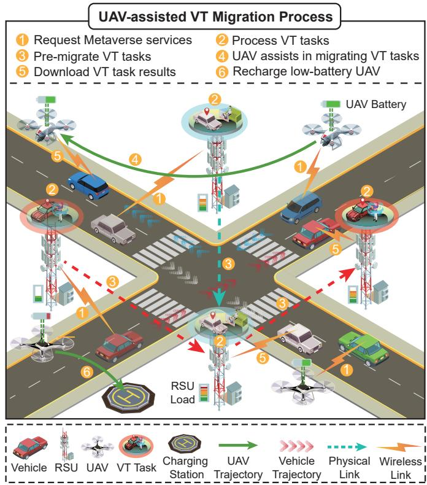  
Fig. 1: System architecture of UAV-assisted vehicular metaverse, where VT tasks are offloaded to RSUs and seamlessly migrated as vehicles move. When RSUs are overloaded or coverage is limited, UAVs with edge resources host and process the migrated tasks. The computation results are returned to vehicles, and UAVs manage their energy through timely recharging.

$$
R _ { v , i } ^ { d } ( t ) = { B _ { v , i } ^ { d } } ( t ) \log _ { 2 } \left( 1 + \frac { p _ { v } h _ { v , i } ( t ) } { \sigma _ { i } ^ { 2 } } \right) , \quad i \in \{ e , u \} ,\tag{1}
$$

where i denotes either RSU e or UAV u, $p _ { v }$ represents the transmit power of vehicle $v , h _ { v , i } ( t )$ characterizes the Rayleigh fading channel gain, and $\sigma _ { i }$ denotes the noise power.

The downlink latency calculation requires considering both the VT task result sizes and transmission rates for different service providers. We define $D _ { v , e } ^ { d } ( t )$ and $D _ { v , u } ^ { d } ( t )$ as the VT task result sizes from RSU e and UAV u to vehicle v at time slot t, respectively. To distinguish between computational scenarios, we introduce a binary indicator $^ { g , }$ where $g \ = \ 1$ indicates UAV-based processing and $g = 0$ represents RSUbased processing. For RSU-based scenarios, let $\mathcal { E } _ { v } ( t )$ denote the set of RSUs serving vehicle v at time slot t. Given that UAVs exhibit similar downlink characteristics to RSUs [21], the downlink latency is calculated as

$$
\begin{array} { r } { T _ { v } ^ { d } ( t ) = \left\{ \begin{array} { l l } { \frac { D _ { v , u } ^ { d } ( t ) } { R _ { v , u } ^ { d } ( t ) } } & { \mathrm { ~ i f ~ g = 1 , } } \\ { \quad } \\ { \sum _ { e \in \mathscr { E } _ { v } ( t ) } \frac { D _ { v , e } ^ { d } ( t ) } { R _ { v , e } ^ { d } ( t ) } } & { \mathrm { ~ o t h e r w i s e . } } \end{array} \right. } \end{array}\tag{2}
$$

## B. Migration Model

To maintain service continuity as vehicles traverse different coverage areas, the VT migration model enables proactive task transfer between RSUs based on anticipated mobility patterns [8]. The migration process involves transferring a portion of VT tasks from the current serving RSU e to a destination RSU $e _ { m }$ before the vehicle actually moves to the new coverage area. At time slot t, we define the pre-migration proportion $\alpha \in [ 0 , 1 ]$ to represent the fraction of the total VT task size $D _ { v } ^ { t a s k } ( t )$ that should be pre-migrated to RSU $e _ { m }$ . The pre-migration latency is determined by the physical link bandwidth $B _ { e , e _ { m } }$ between RSU e and RSU $e _ { m }$ and is calculated as

$$
T _ { v } ^ { m } ( t ) = \frac { \alpha D _ { v } ^ { t a s k } ( t ) } { B _ { e , e _ { m } } } .\tag{3}
$$

## C. Computation Model

The VT task computation model encompasses task processing across both the current serving RSU and the premigration RSU, aiming to optimize computational efficiency and minimize service latency. The residual task workload processed locally at the current serving RSU e is calculated as $\phi _ { v , e } ( t ) \ : = \ : D _ { v } ^ { t a s k } ( t ) - \alpha D _ { v } ^ { t a s k } ( t )$ , where $D _ { v } ^ { t a s k } ( t )$ is the total computational workload of the VT task generated by vehicle v during time slot $t ,$ and $\alpha D _ { v } ^ { t a s k } ( t )$ is the premigrated task portion as specified in the migration model. The computation latency experienced by vehicle v at the serving RSU e incorporates both the existing task queue and the newly allocated workload, which can be calculated as

$$
T _ { v , e } ^ { p } ( t ) = \frac { L _ { e } ( t ) + \phi _ { v , e } ( t ) f _ { v } } { c _ { e } } ,\tag{4}
$$

where $L _ { e } ( t )$ denotes the current workload of RSU e in gigahertz-seconds, quantifying the accumulated GPU cycles required to process all queued tasks at time slot t. $f _ { v }$ represents the number of GPU cycles required per unit data for vehicle $v ,$ and $c _ { e }$ indicates the GPU computing resources available at RSU e [8]. Simultaneously, the pre-migrated task segment undergoes processing at the destination RSU $e _ { m }$ . The computation latency at the migration destination with computational resources $c _ { e _ { m } }$ is calculated as

$$
T _ { v , e _ { m } } ^ { p } ( t ) = \frac { L _ { e _ { m } } ( t ) + \alpha D _ { v } ^ { t a s k } ( t ) f _ { v } } { c _ { e _ { m } } } ,\tag{5}
$$

where $L _ { e _ { m } } ( t )$ represents the current workload at the destination RSU $e _ { m }$

Given the parallel execution of local task processing and pre-migration operations, the overall computation latency is determined by the bottleneck among these concurrent processes, which can be calculated as

$$
\begin{array} { r } { T _ { v } ^ { p } ( t ) = \operatorname* { m a x } \{ T _ { v , e } ^ { p } ( t ) , T _ { v , e _ { m } } ^ { p } ( t ) + T _ { v } ^ { m } ( t ) \} . } \end{array}\tag{6}
$$

When vehicular metaverse users opt to offload VT tasks directly to UAVs, bypassing the RSU infrastructure entirely, the processing latency is calculated as

$$
T _ { v } ^ { o f f } ( t ) = \frac { L _ { u } ( t ) + D _ { v } ^ { t a s k } ( t ) f _ { v } } { c _ { u } } ,\tag{7}
$$

where $L _ { u } ( t )$ is the current workload of UAV $u ,$ and $c _ { u }$ is the GPU computing resources available on UAV u.

Upon completion of VT task processing, the vehicle experiences a downlink transmission latency $T _ { v } ^ { d } ( t )$ when receiving the processed results from either RSUs or UAVs. Therefore, the overall latency for the complete VT service $T _ { v } ( t )$ is calculated as

$$
\begin{array} { r } { T _ { v } ( t ) = \left\{ \begin{array} { l l } { T _ { v } ^ { o f f } ( t ) + T _ { v } ^ { d } ( t ) } & { \mathrm { i f ~ g = 1 , } } \\ { T _ { v } ^ { p } ( t ) + T _ { v } ^ { d } ( t ) } & { \mathrm { o t h e r w i s e . } } \end{array} \right. } \end{array}\tag{8}
$$

## D. Energy Model

The energy model characterizes the power requirements of UAVs during their operational support for vehicular edge computing services. Following the established methodology by Ahmed et al. [37], the energy consumption accounts for two distinct operational modes that UAVs encounter while providing computational assistance to vehicular networks.

The first component addresses the energy consumption during horizontal flight operations, where UAVs traverse between different service locations to maintain optimal coverage and computational support. The energy consumption per unit horizontal distance is defined as $E _ { u } ^ { d } .$ , representing the power efficiency characteristics of the UAV platform during translational movement. Simultaneously, UAVs must maintain stationary hovering capabilities to provide stable computational services, particularly when executing VT tasks that require sustained processing periods. The hovering energy consumption per unit time is characterized by $E _ { u } ^ { \bar { h } }$ , which accounts for the power required to counteract gravitational forces and maintain positional stability.

Given these operational requirements, the total energy consumption of UAV u during time slot t is the aggregation of both flight and hovering energy expenditures, which can be calculated as

$$
\begin{array} { r } { E _ { u } ( t ) = E _ { u } ^ { d } \times d _ { s } + E _ { u } ^ { h } \times t _ { h } , } \end{array}\tag{9}
$$

where $t _ { h }$ is the hovering duration, and $d _ { s }$ is the horizontal flight distance traversed during the operational period.

## E. Problem Formulation

To minimize VT service latency while optimizing energy consumption and computational resource utilization across UAVs and RSUs, the optimization problem can be formulated as follows:

$$
\operatorname* { m i n } _ { A } \quad \sum _ { t = 1 } ^ { T _ { \operatorname* { m a x } } } \biggl ( \sum _ { v = 1 } ^ { V } T _ { v } ( t ) + \sum _ { u = 1 } ^ { U } E _ { u } ( t ) \biggr )\tag{10a}
$$

$$
\begin{array} { r } { \mathrm { s . t . } \quad L _ { e } ( t ) \leqslant L _ { e } ^ { \mathrm { m a x } } , } \end{array}
$$

$$
L _ { u } ( t ) \leqslant L _ { u } ^ { \mathrm { m a x } } ,
$$

$$
\forall e \in { \mathcal { E } } ,\tag{10b}
$$

$$
\forall u \in \mathcal { U } ,\tag{10c}
$$

$$
E _ { u } ( t ) \leqslant E _ { u } ^ { \mathrm { m a x } } ,
$$

$$
\forall u \in \mathcal { U } ,\tag{10d}
$$

$$
k _ { v } ( t ) = e ,
$$

$$
\forall v \in \mathcal { V } , \forall e \in \mathcal { E } ,\tag{10e}
$$

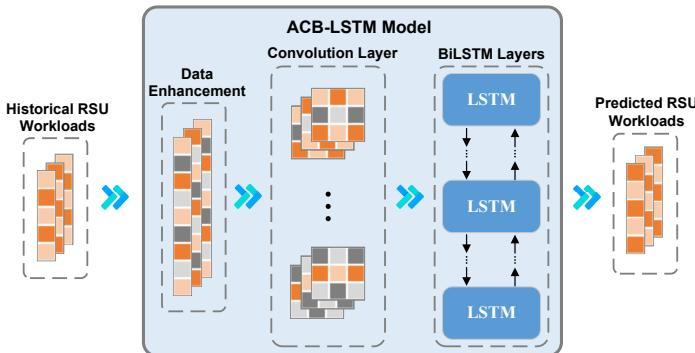  
Fig. 2: ACB-LSTM model for RSU workload prediction. Historical RSU workload sequences are first augmented with Gaussian noise to enhance robustness. The noise-enhanced data then pass through a convolution layer to extract local temporal features, and a BiLSTM subsequently models long-range dependencies. Finally, the predicted RSU workloads are used by the HC-MAPPO algorithm to support VT migration and UAV path planning.

The optimization problem is defined over a finite time horizon $T _ { m a x } .$ Constraints (10b) and (10c) ensure that the workloads of RSUs and UAVs remain within their respective allowable limits at all times. Constraint (10d) ensures that the energy consumption of each UAV remains within its maximum limit. Constraint (10e) ensures that each vehicle’s VT task is assigned to only one RSU. Since the VT task migration optimization problem is NP-hard [8], we formulate the problem as an MDP and solve it using the HC-MAPPO algorithm.

## IV. ACCURATE LSTM-BASED MODEL FOR RSU WORKLOAD PREDICTION

Accurate workload prediction supports proactive migration strategies that mitigate service degradation under RSU overload conditions. Existing LSTM-based prediction approaches face specific challenges in vehicular metaverse environments [24]–[26]. Traditional LSTM networks capture only unidirectional temporal dependencies, which limits their ability to model bidirectional workload correlations induced by vehicle mobility and service handover dynamics. BiLSTM networks enable bidirectional modeling but lack explicit local feature extraction mechanisms, which may fail to capture sudden workload spikes caused by vehicle clustering or traffic congestion. CNN-BiLSTM architectures incorporate convolutional pre-processing but typically assume clean inputs, which limits their robustness against measurement uncertainties induced by wireless channel variations and dynamic topology changes. To overcome these limitations, we propose the ACB-LSTM model that integrates local feature extraction, bidirectional temporal modeling, and noise-augmented training, as shown in Fig. 2. The ACB-LSTM model operates on historical RSU workload sequences $\mathbf { X } = \{ x _ { t - \tau } , x _ { t - \tau + 1 } , \ldots , x _ { t - 1 } , x _ { t } \}$ where $x _ { t }$ denotes the RSU workload at time slot $t ,$ and $\tau$ represents the length of the historical observation window.

To enhance the robustness of the model against unexpected workload fluctuations and improve generalization performance, we apply a Gaussian noise injection strategy at the input layer. This pre-processing step augments the original input data before it enters the neural network components. The noise injection process can be expressed as

$$
\mathbf { X } ^ { \prime } = \mathbf { X } + \epsilon ,\tag{11}
$$

where X represents the original input sequence, $\epsilon \sim \mathcal { N } ( 0 , \sigma ^ { 2 } )$ denotes Gaussian noise with zero mean and variance $\sigma ^ { 2 } .$ and $\mathbf { X } ^ { \prime }$ is the noise-enhanced input sequence. Training on perturbed inputs encourages the model to extract features that remain invariant to minor fluctuations, thereby improving generalization to noisy observations [38]. This approach enhances robustness against measurement uncertainties that arise from wireless channel variations and vehicle mobility dynamics.

Following noise injection, the CNN layer processes the noise-enhanced input sequence $\mathbf { X } ^ { \prime }$ to extract local temporal patterns through convolution operations [39]. These local features capture temporal correlations between adjacent time steps, enabling the model to identify short-term workload fluctuations. The CNN transformation can be expressed as

$$
{ \bf Z } = f _ { C N N } ( { \bf X ^ { \prime } } ; \theta _ { C N N } ) ,\tag{12}
$$

where $f _ { C N N } ( \cdot )$ represents the CNN transformation function encompassing convolution, activation, and pooling operations, $\theta _ { C N N }$ denotes the learnable parameters including weights and biases, and Z represents the extracted local feature maps.

The extracted local features Z are subsequently processed by the BiLSTM network to capture long-term temporal dependencies in the workload data [40]. Unlike unidirectional LSTM that processes sequences in only one direction, BiL-STM accesses both past and future context [41], enabling more comprehensive temporal modeling for accurate workload prediction. For each time slot t, the forward hidden state $\overrightarrow { \mathbf { h } } _ { t }$ and backward hidden state $\textstyle \overleftarrow { \mathbf { h } } _ { t }$ are computed as

$$
\begin{array} { r } { \overrightarrow { \mathbf { h } } _ { t } = \overrightarrow { \mathrm { L S T M } } ( \mathbf { z } _ { t } , \overrightarrow { \mathbf { h } } _ { t - 1 } ; \theta _ { \overrightarrow { \mathrm { L S T M } } } ) , } \\ { \overleftarrow { \mathbf { h } } _ { t } = \overleftarrow { \mathrm { L S T M } } ( \mathbf { z } _ { t } , \overleftarrow { \mathbf { h } } _ { t + 1 } ; \theta _ { \overleftarrow { \mathrm { L S T M } } } ) , } \end{array}\tag{13}
$$

where $\mathbf { z } _ { t }$ is the local feature vector at time slot t extracted by the CNN, and $\theta _ { \overrightarrow { \mathrm { L S T M } } }$ and $\theta _ { \mathrm { { f S T M } } }$ are the learnable parameters of the forward and backward LSTM units, respectively. The final bidirectional hidden representation is obtained by concatenating the two directional states as

$$
\mathbf { h } _ { t } = [ \overline { { \mathbf { h } } } _ { t } ; \mathbf { \widetilde { h } } _ { t } ] .\tag{14}
$$

The last prediction layer transforms the comprehensive bidirectional hidden representation into the predicted RSU workload for the subsequent time slot. This layer employs a fully connected neural network to map the high-dimensional feature space to the target prediction space, effectively translating the learned temporal patterns into concrete workload predictions. The prediction process can be expressed as

$$
\hat { L } _ { t + 1 } = f _ { o u t } ( \mathbf { h } _ { t } ; \theta _ { o u t } ) ,\tag{15}
$$

where $f _ { o u t }$ is the mapping function implemented by a fully connected layer, $\theta _ { o u t }$ denotes the learnable parameters of the output layer, and $\hat { L } _ { t + 1 }$ represents the estimated RSU workload at time slot $t + 1$

During the training phase, we optimize the model parameters by minimizing the Mean Squared Error (MSE) loss function, which quantifies the discrepancy between the predicted and actual workload values. The MSE loss function is suited for regression tasks as it heavily penalizes larger prediction errors [42], thereby encouraging the model to achieve accurate predictions. The loss function can be expressed as

$$
\mathcal { L } _ { M S E } = \frac { 1 } { N _ { t o t } } \sum _ { i = 1 } ^ { N _ { t o t } } ( L ^ { i } - \hat { L } ^ { i } ) ^ { 2 } ,\tag{16}
$$

where $L ^ { i }$ and $\hat { L } ^ { i }$ denote the actual and predicted workloads of the i-th training sample, and $N _ { t o t }$ is the total number of training samples.

The trained ACB-LSTM model generates workload predictions that are incorporated as part of the input to the HC-MAPPO algorithm. By integrating these predictions with other state information, the system can anticipate future workload patterns and make proactive decisions on resource allocation and task scheduling. The training process of the ACB-LSTM model is shown in Algorithm 1.

## V. HIERARCHICAL CONTROL MULTI-AGENT DEEP REINFORCEMENT LEARNING FOR VT MIGRATION DECISION

The proposed HC-MAPPO algorithm addresses the VT migration problem by dividing it into manageable sub-tasks. As shown in Fig. 3, the algorithm decomposes complex multiagent decision-making problems into two layers, where the upper-layer controller is responsible for policy learning and uses the MADRL algorithm to learn the optimal policy in a dynamic environment. The lower-layer controller is responsible for execution control and uses a deterministic algorithm to convert the upper-layer policy into specific operations.

In the following, we first model the multi-agent decisionmaking problem as an MDP, then introduce the specific implementation of the HC-MAPPO algorithm, and finally analyze its computational complexity.

## A. MDP Modeling

In the UAV-assisted vehicular metaverse, the VT migration and the UAV path-planning decision can be modeled as an MDP as follows:

## 1) State Space

At time slot $t ,$ the state space is defined as $\begin{array} { r l } { S ( t ) } & { { } = } \end{array}$ $\{ s _ { v } ( t ) , s _ { u } ( t ) \mid v \in \mathcal { V } , u \in \mathcal { U } \}$ , where $s _ { v } ( t )$ is the state for vehicle agent v at time slot t, and $s _ { u } ( t )$ is the state for UAV agent u at time slot t.

The state for vehicle agent v is defined as $\begin{array} { r l } { s _ { v } ( t ) } & { { } = } \end{array}$ $[ \alpha , g ( t - 1 ) , L _ { \mathcal { E } } ( t ) , \hat { L } _ { \mathcal { E } } ( t + 1 ) , T _ { v } ( t - 1 ) , u _ { a v a } ( t ) ]$ , where α is the pre-migration ratio for VT service. $g ( t - 1 ) \in \{ 0 , 1 \}$ is the UAV usage flag, indicating whether at time slot t ´ 1 the vehicle offloaded its task to a UAV. $L _ { \mathcal { E } } ( t )$ is the actual load set of all RSUs at time slot t, while $\hat { L } _ { \mathcal { E } } ( t + 1 )$ represents the predicted load set at time slot t \` 1, generated by the ACB-LSTM model. $T _ { v } ( t - 1 )$ is the total VT service latency experienced by vehicle agent v at time slot t ´ 1, helping the agent assess network conditions. $u _ { a v a } ( t ) \in \{ 0 , 1 \}$ is the UAV availability flag at time slot t, indicating whether there exists at least one UAV in the communication range of vehicle agent v that is in service. If so $u _ { a v a } ( t ) = 1$ , otherwise $u _ { a v a } ( t ) = 0$ The state for UAV agent u is defined as $\begin{array} { r l } { s _ { u } ( t ) } & { { } = } \end{array}$ $[ b _ { u } ( t ) , L _ { \mathcal { E } } ( t ) , \hat { L } _ { \mathcal { E } } ( t + 1 ) , q _ { u } ( t ) , x _ { u } ( t ) , y _ { u } ( t ) ]$ , where $b _ { u } ( t )$ is the battery level of UAV agent u at time slot t, reflecting its sustained service capability. $q _ { u } ( t ) \in \{ 0 , 1 \}$ is the service status of UAV agent u at time slot t, with $q _ { u } ( t ) = 1$ indicating active service to vehicles and $q _ { u } ( t ) = 0$ indicating non-service (e.g., flying or charging). $( x _ { u } ( t ) , y _ { u } ( t ) )$ are the coordinates of UAV agent u at time slot $t ,$ determining its spatial relationship with RSUs and vehicles.

Algorithm 1 ACB-LSTM Model   
1: Input historical RSU workload sequences X, noise vari  
ance $\sigma ^ { 2 }$ , learning rate $\eta ,$ maximum epochs $E ;$   
2: Initialize ACB-LSTM model parameters Θ randomly;   
3: for epoch $e = 1$ to E do   
4: for each training sample $\mathbf { X } ( i )$ in dataset do   
5: Generate noise $\epsilon \sim \mathcal { N } ( 0 , \sigma ^ { 2 } ) ;$   
6: Compute noise-enhanced input according to (11);   
7: Extract local features according to (12);   
8: for sequence index k “ 1 to τ do   
9: Compute forward hidden state $\overrightarrow { \mathbf { h } } _ { k }$ according to   
(13);   
10: Compute backward hidden state $\mathbf { \Pi } _ { \mathbf { h } _ { k } } ^ {  }$ according to   
(13);   
11: Concatenate bidirectional states according to (14);   
12: end for   
13: Generate prediction according to (15);   
14: Compute MSE loss according to (16);   
15: Update parameters $\Theta  \Theta - \eta \nabla _ { \Theta } \mathcal { L } _ { M S E } ;$   
16: end for   
17: end for   
18: Output trained ACB-LSTM model parameters $\Theta ;$

## 2) Action Space

The action space A is defined as the set of decisions made by all agents at time slot t, i.e. $A ( t ) = \{ a _ { v } ( t ) , a _ { u } ( t ) \ | \ v \ \in$ V, $u \in \mathcal { U } \}$ . For vehicle agent v, its action $a _ { v } \in \{ 0 , 1 , \ldots , 4 \}$ is discrete, where each index uniquely maps to an offloading decision. $a _ { v } ( t ) = 0$ indicates offloading the VT service to an available UAV, while $a _ { v } ( t ) = k \in \{ 1 , 2 , 3 , 4 \}$ corresponds to offloading to the k-th neighboring RSU within communication range. This design enables vehicle agent v to intelligently select the optimal edge server among nearby RSUs based on network state and predicted load for efficient VT migration.

For UAV agent u, its action $a _ { u } ~ \in ~ [ 0 , 1 ]$ is continuous, where $a _ { u } ( t )$ represents the task priority weight. $\mathrm { A s } a _ { u } ( t )  1$ UAV u prioritizes flying to the most heavily loaded area to balance system load. As $a _ { u } ( t ) \to 0$ , UAV u prioritizes flying to the nearest charging station to replenish energy. This design allows UAVs to fine-tune their behavior strategy, balancing task execution and energy consumption.

## 3) State Transition

State transitions are driven by two dynamic processes, namely vehicle mobility and UAV path planning, which interact through network load distribution and service availability.

Multiple factors influence the state of vehicle agent v. Vehicle mobility changes network topology, affecting accessible RSUs and communication quality. Historical migration decisions $a _ { v } ( t - 1 )$ affect current slot service latency $T _ { v } ( t )$ and the UAV usage flag $g ( t )$ . RSU load $L _ { e } ( t + 1 )$ evolves according to traffic patterns, and UAV availability $u _ { a v a } ( t + 1 )$ depends on UAV trajectories and scheduling.

For UAV agent u, battery level is updated as $b _ { u } ( t + 1 ) =$ $b _ { u } ( t ) - E _ { u } ( t )$ , where $E _ { u } ( t )$ denotes the energy consumed by UAV u at time slot t. Load relief $\Delta L _ { u } ( t )$ reflects the UAV’s contribution to load balancing. Service state $q _ { u } ( t + 1 )$ switches between service and non-service based on task scheduling and energy constraints, balancing execution and energy management. Position coordinates $( x _ { u } ( t + 1 ) , y _ { u } ( t + 1 ) )$ are updated by the path planning algorithm.

## 4) Reward Function

The reward function represents the immediate return obtained by an agent after executing an action based on its current state. To simultaneously minimize VT service latency and maximize UAV energy utilization, we design distinct rewards for different agents. For vehicle agent v, its reward is defined as

$$
\begin{array} { r } { r _ { v } ( t ) = - T _ { v } ( t ) , } \end{array}\tag{17}
$$

where $T _ { v } ( t )$ is the total VT service latency of vehicle agent v at time slot t. This negative reward incentivizes the agent to choose actions that minimize service latency. For UAV agent $u ,$ its reward is defined as

$$
\boldsymbol { r } _ { u } ( t ) = \Delta L \boldsymbol { \mathbf { \mathit { \Pi } } } _ { u } ( t ) + \lambda \cdot \boldsymbol { \mathbf { \mathit { q } } } _ { u } ( t ) ,\tag{18}
$$

where $\Delta L _ { u } ( t )$ denotes the load relieved by UAV u in time slot $t ,$ reflecting its contribution to system load balancing. $q _ { u } ( t ) \in \{ 0 , 1 \}$ is the service state indicator, and λ is the weight coefficient for service state, encouraging the UAV to remain in service to improve overall system efficiency.

## B. HC-MAPPO Algorithm

The VT migration and UAV routing optimization requires vehicle agents to select edge servers based on workload conditions and UAV agents to balance task priorities against energy constraints. Flat MADRL approaches learn policies that directly map system states to executable actions. The joint action space of multiple agents expands exponentially with the number of agents, severely hampering learning efficiency and scalability [43]. Hierarchical control architecture addresses these challenges by separating policy learning from operational execution [16], enabling agents to focus on high-level decision-making while delegating constraint satisfaction to specialized lower-layer mechanisms. Therefore, we design the HC-MAPPO algorithm with two core components, an upperlayer controller and a lower-layer controller. The pseudocode of the HC-MAPPO is presented in Algorithm 2.

## 1) Upper-Layer Controller

The upper-layer controller uses the MAPPO algorithm for multi-agent collaborative decision-making. This algorithm can jointly handle the discrete VT migration decisions of vehicle agents and the continuous routing weight selection of UAV agents, addressing the optimization problem of the hybrid action space. The discrete action network of vehicle agent v is parameterized as $\pi _ { \theta _ { v } } ( a _ { v } ( t ) \mid s _ { v } ( t ) )$ , where $\theta _ { v }$ denotes the policy network parameters of the vehicle agent, and the network outputs the probability distribution of selecting discrete action $a _ { v } ( t )$ conditioned on state $s _ { v } ( t )$ . The continuous action network of UAV agent u is parameterized as $\pi _ { \theta _ { u } } ( a _ { u } ( t ) \mid s _ { u } ( t ) )$ where $\theta _ { u }$ represents the policy network parameters of the UAV agent, producing a probability density function for continuous action $a _ { u } ( t )$ The corresponding critic networks $V _ { \omega _ { v } } ( s _ { v } ( t ) )$ and $V _ { \omega _ { u } } ( s _ { u } ( t ) )$ evaluate the values of states for each agent, where $\omega _ { v }$ and $\omega _ { u }$ denote the value network parameters of the vehicle agent and UAV agent, respectively, providing baseline estimates for actor optimization.

To ensure stable training, MAPPO employs a clipping mechanism that limits the probability ratio between the updated and prior policies [44]. The corresponding objective functions for discrete and continuous action spaces can be expressed as

$$
\begin{array} { r l } & { L ^ { C L I P } ( \theta _ { v } ) = \mathbb { E } _ { \tau } \Big [ \operatorname* { m i n } \big ( r _ { t } ( \theta _ { v } ) A _ { v } ( t ) , } \\ & { \qquad \mathrm { c l i p } \big ( r _ { t } ( \theta _ { v } ) , 1 - \epsilon , 1 + \epsilon \big ) A _ { v } ( t ) \big ) \Big ] , } \end{array}\tag{19}
$$

$$
\begin{array} { r l } & { L ^ { C L I P } ( \theta _ { u } ) = \mathbb { E } _ { \tau } \Big [ \operatorname* { m i n } \big ( r _ { t } ( \theta _ { u } ) A _ { u } ( t ) , } \\ & { ~ \mathrm { c l i p } \big ( r _ { t } ( \theta _ { u } ) , 1 - \epsilon , 1 + \epsilon \big ) A _ { u } ( t ) \big ) \Big ] , } \end{array}
$$

where τ denotes trajectory samples, $\begin{array} { r } { r _ { t } ( \theta _ { v } ) = \frac { \pi _ { \theta _ { v } } ( a _ { v } ( t ) | s _ { v } ( t ) ) } { \pi _ { \theta _ { \eta } , } ^ { o l d } ( a _ { v } ( t ) | s _ { v } ( t ) ) } } \end{array}$ is the probability ratio between new and old discrete policies, and $\begin{array} { r } { r _ { t } \dot { ( \theta _ { u } ) } = \frac { \dot { \pi } _ { \theta _ { u } } ( a _ { u } ( t ) | s _ { u } ( t ) ) } { \pi _ { \theta _ { u } } ^ { o l d } ( a _ { u } ( t ) | s _ { u } ( t ) ) } } \end{array}$ is the probability density ratio between new and old continuous policies. $\pi _ { \theta _ { v } } ^ { o l d }$ and $\pi _ { \theta _ { u } } ^ { o l d }$ represent the policy network parameters of the vehicle agent and UAV agent before the update. ϵ is the clipping parameter used to restrict the magnitude of policy updates. $A _ { v } ( t )$ and $A _ { u } ( t )$ are the advantage functions for discrete and continuous actions, respectively.

MAPPO uses Generalized Advantage Estimation (GAE) to compute the advantage functions, balancing bias and variance [21]. The advantage functions for vehicle agent v and UAV agent u are defined as follows:

$$
A _ { v } ( t ) = \sum _ { l = 0 } ^ { \infty } ( \gamma \lambda ) ^ { l } \delta _ { v , t + l } ^ { V } , \quad A _ { u } ( t ) = \sum _ { l = 0 } ^ { \infty } ( \gamma \lambda ) ^ { l } \delta _ { u , t + l } ^ { V } ,\tag{20}
$$

where $\gamma$ is the discount factor, λ is the GAE parameter controlling the bias-variance trade-off, the temporal difference error of the vehicle agent at time slot $t + l$ is $\delta _ { v , t + l } ^ { V } =$ $r _ { v } ( t + l ) + \gamma V _ { \omega _ { v } } ( s _ { v } ( t + l + 1 ) ) - V _ { \omega _ { v } } ( s _ { v } ( t + l ) )$ , and the temporal difference error of the UAV agent at time slot $t + l$ is $\begin{array} { r } { \delta _ { u , t + l } ^ { \bar { V } } = r _ { u } ( t + l ) + \gamma V _ { \omega _ { u } } \big ( s _ { u } ( t + l + 1 ) \big ) - V _ { \omega _ { u } } \big ( s _ { u } ( t + l ) \big ) } \end{array}$ $V _ { \omega _ { \tau } }$ and $V _ { \omega _ { u } }$ are the value functions of the vehicle agent and UAV agent, respectively.

The critic networks are updated in parallel by minimizing the MSE between the predicted state values and actual returns, serving as baselines for computing advantage functions. The critic loss functions for the vehicle and UAV agents are given as follows

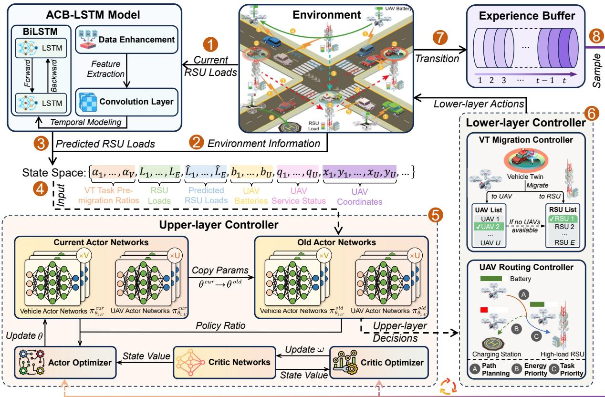  
Fig. 3: Framework of the proposed HC-MAPPO algorithm. The environment first provides system information, including vehicle states, UAV states, and RSU loads. The RSU loads are then collected by the ACB-LSTM model, which predicts future workload patterns. By integrating these predictions with other system states, the complete state space is provided to the controller. The upper-layer controller learns policies for vehicles and $\mathrm { U A V s } ,$ and the lower-layer controller executes these upper-layer decisions into concrete VT migration and UAV routing actions. The resulting interactions with the environment are stored as transitions in the experience buffer, and the sampled trajectories from the buffer are finally used to update the actor-critic networks.

$$
\begin{array} { r } { L ^ { V } ( \omega _ { v } ) = \mathbb { E } _ { \tau } \big [ ( V _ { \omega _ { v } } ( s _ { v } ( t ) ) - \hat { V } _ { v , t } ) ^ { 2 } \big ] , } \\ { L ^ { V } ( \omega _ { u } ) = \mathbb { E } _ { \tau } \big [ ( V _ { \omega _ { u } } ( s _ { u } ( t ) ) - \hat { V } _ { u , t } ) ^ { 2 } \big ] , } \end{array}\tag{21}
$$

where $\begin{array} { r } { \hat { V } _ { v , t } = \sum _ { l = 0 } ^ { \infty } \gamma ^ { l } r _ { v } ( t + l ) } \end{array}$ and $\begin{array} { r } { \hat { V } _ { u , t } = \sum _ { l = 0 } ^ { \infty } \gamma ^ { l } r _ { u } ( t + l ) } \end{array}$ denote the discounted cumulative return estimates for the vehicle and UAV agents, respectively. In the UAV-assisted VT migration environment, each agent evaluates values independently based on states, ensuring the effectiveness of distributed decision-making.

## 2) Lower-Layer Controller

Based on the learned policies, the upper-layer controller outputs high-level decisions for each agent. Vehicle agents output edge server selections, and UAV agents output task priority weights. The lower-layer controller receives these decisions and maps them to executable operations that satisfy system constraints, including workload capacities, energy budgets, and network connectivity. This mapping is performed through two specialized modules, the VT migration controller for vehicle agents and the UAV routing controller for UAV agents.

The VT migration controller converts the decision $a _ { v } ( t )$ from the upper-layer controller into executable migration actions. When $a _ { v } ( t ) = 0$ , the controller first evaluates UAV availability by detecting service-ready UAVs in communication range. If available UAVs exist, the controller executes UAV offloading. If no UAVs are available, the controller selects the nearest RSU to prioritize link stability and minimize transmission latency. When $a _ { v } ( t ) \ = \ k$ where $k \geqslant 1$ , the controller selects the k-th nearest RSU as the migration target. If the specified index k exceeds the total number of available RSUs $N _ { e } ( t )$ , the controller automatically maps the action to the $N _ { e } ( t )$ -th nearest RSU. This mapping mechanism ensures action validity under dynamic network topology while maintaining the preference for remote migration targets.

After determining the target edge server, the VT migration controller performs task partitioning based on the preset migration ratio α, migrating the corresponding proportion of computational load to the target edge server. Based on the network state, the controller calculates the total latency and synchronously updates the load status of RSUs and UAVs.

The UAV routing controller converts the task priority weight $a _ { u } ( t ) \ \in \ [ 0 , 1 ]$ from the upper-layer controller into specific flight paths, achieving a dynamic trade-off between task execution and energy management. To accomplish this objective, the controller uses the A-star algorithm for optimal path planning [45]. For UAV $u ,$ the cost function of the A-star algorithm is defined as follows:

$$
f _ { u } ( n ) = g _ { u } ( n ) + h _ { u } ( n ) ,\tag{22}
$$

Algorithm 2 HC-MAPPO algorithm   
1: Initialize actor-critic networks $\{ ( \pi _ { \theta _ { i } } , V _ { \omega _ { i } } ) | i \in \mathcal { V } \cup \mathcal { U } \}$ for   
vehicle and UAV agents, VT migration controller and UAV   
routing controller, experience buffer $\begin{array} { r } { B ; { } } \end{array}$   
2: for each training epoch $e = 1 , 2 , \ldots , E$ do   
3: for each timestep $t = 1 , 2 , \dots , T$ do   
4: for each agent i P V Y U do   
5: Observe state $s _ { i } ( t )$ and sample action $a _ { i } ( t )$   
through actor network $\pi _ { i } ( \cdot | _ { s _ { i } ( t ) } )$ for edge server   
selection and trajectory planning;   
6: end for   
7: Select edge server and execute VT service migration   
through VT migration controller for vehicles;   
8: Compute energy-efficient flight paths through UAV   
routing controller using A-star algorithm for UAVs;   
9: Store transitions $( S ( t ) , A ( t ) , R ( t ) , S ( t + 1 )$ in B;   
10: end for   
11: Sample a batch of trajectories from experience buffer   
$\begin{array} { r } { B ; { } } \end{array}$   
12: for each agent $i \in \mathcal { V } \cup \mathcal { U }$ do   
13: Compute advantage $A _ { i }$ using GAE method according   
to (20);   
14: Update policy $\pi _ { \theta _ { i } }$ using MAPPO clipped objective   
according to (19);   
15: Update value function $V _ { \omega _ { i } }$ by minimizing MSE loss   
according to (21);   
16: end for   
17: end for   
18: return optimized policies $\{ \pi _ { \theta _ { i } } | i \in \mathcal { V } \cup \mathcal { U } \}$

where $\begin{array} { r } { g _ { u } ( n ) ~ = ~ \sum _ { i \in P ( s t , n ) } c _ { u , i } } \end{array}$ denotes the cumulative cost along the optimal path $P ( s , n )$ from start to node n, with $c _ { u , i }$ representing the cost of visiting grid cell i. The heuristic function $h _ { u } ( n ) = | x _ { n } - x _ { g } | + | y _ { n } - y _ { g } |$ calculates the Manhattan distance to the goal node, which serves as an admissible heuristic to avoid overestimating the actual minimum cost in grid-based movement [46].

To realize the adaptive trade-off mechanism, the controller employs differentiated node costs based on grid cell types. For RSU cells, the cost is given by

$$
c _ { u , e } ( n ) = ( C _ { m a x } - L _ { e } ( t ) ) \times ( 1 - a _ { u } ( t ) ) ,\tag{23}
$$

where $C _ { m a x }$ represents the maximum cost constant and $L _ { e } ( t )$ denotes the workload of RSU e at time slot t. When task priority is high $( \mathrm { i . e . , ~ } a _ { u } ( t )  1 )$ , this design creates lower costs for heavily loaded RSUs, effectively guiding UAV u toward areas requiring load balancing. For charging station cells, the cost is given by

$$
c _ { u , C } ( n ) = ( C _ { m a x } - L _ { m i n } ) \times a _ { u } ( t ) ,\tag{24}
$$

where $L _ { m i n }$ is the minimum system load. This design ensures that when energy priority is high $( \mathrm { i . e . , ~ } a _ { u } ( t ) \  \ 0 )$ , UAVs are directed toward charging facilities. For empty grid cells, a fixed cost is assigned as $c _ { u , B } ( n ) = C _ { m a x } .$

Through this adaptive cost structure, the system enables intelligent path selection where UAVs prioritize high-load

RSU areas when $a _ { u } ( t ) \ \to \ 1$ and charging stations when $a _ { u } ( t ) \ \to \ 0$ , thereby balancing between task execution and energy management. The UAV routing controller implements this strategy through target selection, path planning, and dynamic adjustment phases. The controller first identifies the RSU with the highest workload, then computes an optimal path based on the $\mathrm { U A V } \mathbf { \hat { s } }$ current location, battery level, and task priority weight $a _ { u } ( t )$ . During execution, the UAV consumes $E _ { u } ( t )$ units of energy while following the planned route and autonomously takes over the RSU’s workload upon arrival. If the battery level falls below the safety threshold, the controller redirects the UAV to the nearest charging station to maintain operational continuity.

## C. Complexity Analysis

The computational complexity of the HC-MAPPO algorithm is composed of those of the upper-layer and lower-layer controllers.

The upper-layer controller uses MAPPO to implement multi-agent decision-making. Each agent’s policy network is a fully connected neural network with L layers and H neurons per layer. During the training phase, the policy update process includes both forward and backward propagation. The computational complexity of the forward propagation for an agent is $O ( H ( | S | + ( L - 1 ) H + | A | ) )$ [47], where |S| and |A| are the state and action dimensions, respectively. Since vehicle agents and UAV agents face different decision-making tasks, the dimensions of their state and action spaces differ. Per-agent computation cost is defined as $C _ { v } = H ( | S _ { v } | + ( L - 1 ) H + | A _ { v } | )$ for vehicle agents and $C _ { u } = H ( | S _ { u } | + ( L - 1 ) H + | A _ { u } | )$ for UAV agents. Backward propagation has the same order as the forward propagation, and processing a batch of B samples scales the cost by B.

The lower-layer controller consists of two submodules. The VT migration controller executes rule-based decisions with complexity $O ( K )$ , where K is the number of candidate edge servers. The UAV routing controller performs A-star path planning with complexity $O ( b ^ { d } )$ [45], where b is the branching factor and d is the depth of the shortest path.

The HC-MAPPO algorithm training consists of two main phases, including online interaction and policy update. The training process is configured to run for E epochs, where each epoch includes T time steps of environment interaction and M policy parameter updates. The environment contains V vehicle agents and U UAV agents. Therefore, the overall training complexity of the HC-MAPPO algorithm is $O ( E T ( V ( C _ { v } +$ $K ) + U ( C _ { u } + b ^ { d } ) ) + E M B ( V C _ { v } + U C _ { u } ) )$

## VI. NUMERICAL RESULTS

To evaluate the performance of our proposed approach, we conduct simulation experiments in a UAV-assisted vehicular metaverse environment. The system architecture integrates three key components. RSUs are deployed to provide edge computing services with limited computational resources. Vehicles require continuous VT services and may perform migration decisions as they move across coverage areas. UAVs are deployed as mobile aerial edge servers to provide supplementary computational support when RSUs experience high workload.

TABLE II: Key Parameter Settings
<table><tr><td>Parameter Number of intelligent vehicles</td><td>Value 10</td></tr><tr><td>Number of random vehicles Number of edge servers Number of UAVs Task data size range Task result size range GPU cycles per MB RSU computing resources range UAV computing resources Total number of epochs Learning rate of actor and critic networks Discount factor GAE parameter PPO clip parameter Maximum capacity of the replay buffer Batch size ACB-LSTM historical steps ACB-LSTM prediction steps LSTM cells per layer</td><td>[50, 150] 9 2 [5, 15] MB [2, 8] MB 500 cycles/MB [20, 60] GHz 40 GHz 150  $1 \times 1 0 ^ { - 4 }$  0.99 0.95 0.2  $2 \times 1 0 ^ { 4 }$  128 5 1 10</td></tr></table>

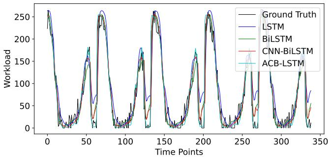  
Fig. 4: Comparison of actual and predicted RSU workloads over time using different prediction algorithms.

In our experimental configuration, we deploy 9 RSUs, 2 UAVs, 150 random vehicles, and 10 intelligent vehicles in a realistic urban road network. The 150 random vehicle trajectories are selected from the Beijing urban road network GPS dataset [9], and each random vehicle offloads VT tasks to the nearest available RSU based on signal coverage. The aggregated computational demands from these random vehicles generate dynamic workload patterns across RSUs over time. These workload patterns serve as ground truth for training the ACB-LSTM prediction model. The 10 intelligent vehicles leverage the workload predictions from ACB-LSTM to perform proactive VT migration through our HC-MAPPO algorithm. The algorithm enables coordinated decision-making across heterogeneous agents. Intelligent vehicles select optimal migration targets based on predicted workload, while UAVs adjust their trajectories to assist overloaded RSUs. The key experimental parameters are listed in Table II [8], [9], [21].

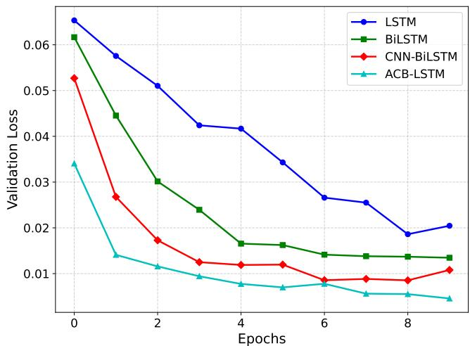  
Fig. 5: Comparison of validation loss over training epochs across different prediction algorithms.

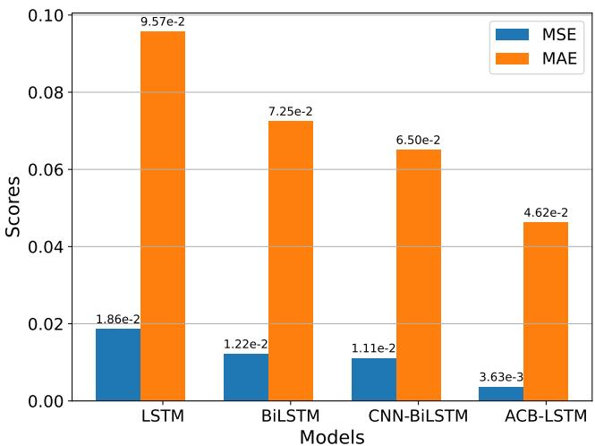  
Fig. 6: Comparison of workload prediction performance across different prediction algorithms by MSE and MAE metrics.

## A. LSTM-based Workload Prediction

To comprehensively validate the effectiveness of the proposed workload prediction model, we compare ACB-LSTM with LSTM, BiLSTM, and CNN-BiLSTM. ACB-LSTM integrates convolutional layers to extract local temporal patterns and correlations between adjacent time steps, a bidirectional LSTM to capture long-term dependencies from both past and future contexts, and a Gaussian noise injection strategy to enhance robustness under fluctuating real-world workloads. This hybrid design enables ACB-LSTM to achieve superior fitting accuracy to actual RSU workloads compared to the baselines as presented in Fig. 4. Fig. 5 shows that the validation loss of ACB-LSTM converges faster and reaches a lower value, outperforming LSTM by 75.00%, BiLSTM by 61.54%, and CNN-BiLSTM by 54.55%, which highlights the model’s ability to learn complex temporal dependencies inherent in vehicular network workloads.

We further provide a quantitative assessment using MSE and Mean Absolute Error (MAE) in Fig. 6. MSE penalizes larger deviations through a quadratic penalty while MAE reflects average prediction accuracy and remains robust to outliers [42], [48]. Across both metrics ACB-LSTM shows substantial improvements, reducing MSE by 80.48% relative to LSTM, 71.42% relative to BiLSTM, and 67.30% relative to CNN-BiLSTM, and lowering MAE by 51.72%, 36.28%, and 28.92%, respectively. These results confirm that the combined convolutional, bidirectional, and noise-augmented design enables ACB-LSTM to minimize both large deviations and average errors and to capture complex workload dynamics for proactive RSU workload prediction.

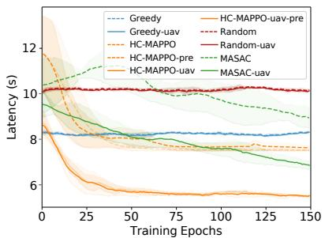  
(a) Average VT service latency over time.

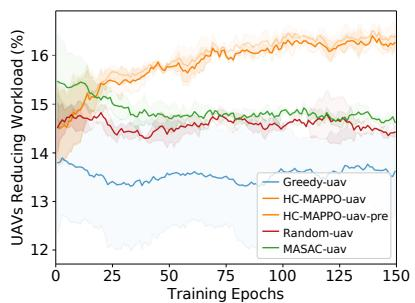  
(b) UAVs’ reducing RSU over time.

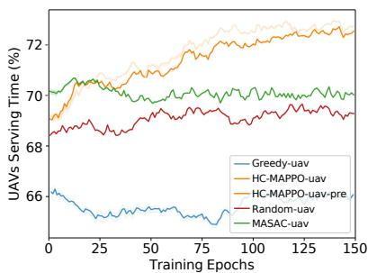  
(c) UAVs’ serving time over time.

Fig. 7: Performance metrics comparison of various algorithms over time. The proposed HC-MAPPO algorithm consistently achieves lower VT service latency. With workload prediction, it further migrates tasks from RSUs to UAVs, leading to greater RSU workload reduction and more balanced UAV task durations.  
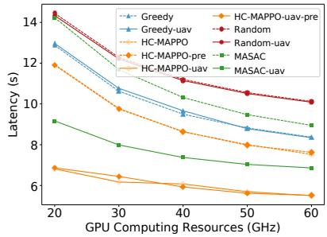  
(a) GPU computing resources vs. latency.

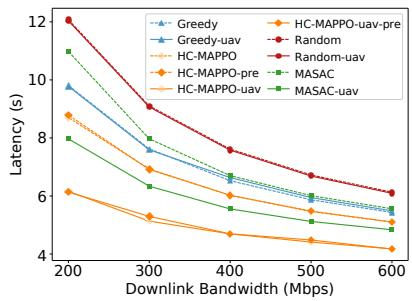  
(b) Downlink bandwidths vs. latency.

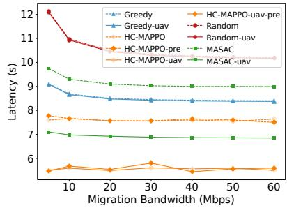  
(c) Migration bandwidths vs. latency.  
Fig. 8: VT service latency under varying network and resource conditions. With varying GPU capacity, downlink bandwidth, and migration bandwidth, the HC-MAPPO algorithm consistently achieves the lowest latency, especially under constrained RSU resources, which is attributed to adaptive allocation and prediction-based pre-migration.

## B. Convergence Analysis

Fig. 7a illustrates the average latency curve of HC-MAPPO and other baselines in UAV-assisted vehicular metaverses. The superior performance of HC-MAPPO-uav-pre stems from the synergistic integration of hierarchical control with accurate workload prediction, enabling proactive decision-making that anticipates future system states. This predictive capability allows the system to optimize VT migration strategies before congestion occurs, resulting in HC-MAPPO-uav-pre outperforming Random-uav by 45.54%, Greedy-uav by 32.93%, MASAC-uav by 22.54%, and HC-MAPPO-uav by 1.79%. The faster convergence compared to HC-MAPPO-uav demonstrates how workload prediction enhances learning efficiency by providing additional information for decision-making.

The system’s load balancing capabilities are further validated through workload distribution. As shown in Figs. 7b and

7c, the hierarchical control mechanism effectively coordinates UAV deployment to achieve optimal resource utilization. HC-MAPPO-uav-pre and HC-MAPPO-uav reduce RSU workload by up to 2.60% while increasing UAV serving time by 5.60%, demonstrating the algorithm’s ability to dynamically redistribute computational tasks from overloaded RSUs to available UAVs, thereby maintaining system performance under varying traffic conditions.

## C. Performance Evaluation in Different Scenarios

Fig. 8 compares the average VT service latency of different algorithms under varying RSU GPU computing capacity, downlink bandwidth, and migration bandwidth. Across all tested settings, the HC-MAPPO-based variants achieve the lowest latency among the compared methods. This performance advantage comes from the adaptive resource allocation mechanism that dynamically adjusts UAV deployment based on real-time system conditions and predicted workload patterns. As RSU GPU resources decrease, UAV-assisted variants show a larger latency reduction relative to their non-UAV counterparts, which indicates that auxiliary computing and mobility support can mitigate the bottleneck at constrained RSUs. Moreover, the pre-migration variants consistently further reduce latency compared with the corresponding nonprediction variants, highlighting the benefit of anticipatory decisions under time-varying workload and link conditions.

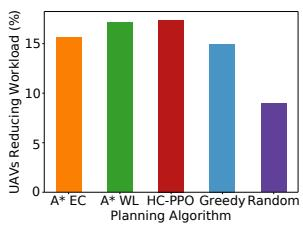

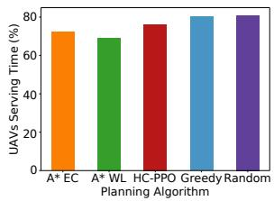  
(a) UAV’s reducing workload vs. (b) UAV’s serving time vs. planning planning algorithm. algorithm.  
Fig. 9: Comparison of UAV performance metrics across different planning algorithms.

Figs. 9a and 9b collectively illustrate the comprehensive performance advantages of our proposed HC-MAPPO algorithm. The workload reduction analysis demonstrates that UAVs effectively reduce system workload by 2.34% compared to baseline approaches, while simultaneously maintaining high UAV serving time. This dual optimization is achieved through the multi-agent coordination framework that balances individual UAV performance with system-wide efficiency, where the hierarchical structure enables the upper-layer controller to coordinate global resource allocation while the lower-layer controller optimizes local UAV operations.

## VII. CONCLUSION

In this paper, we have proposed a UAV-vehicle collaborative heterogeneous VT migration framework to address challenges from dynamic RSU workloads and limited infrastructure coverage in UAV-assisted vehicular metaverses. We have modeled VT migration and UAV routing as an MDP and designed an ACB-LSTM model, providing accurate RSU workload predictions that enable proactive resource allocation for the HC-MAPPO algorithm. The proposed HC-MAPPO algorithm leverages these predictive insights with upper-layer decisionmaking through MAPPO and lower-layer execution control using deterministic algorithms for VT migration and UAV path planning. Numerical results have demonstrated that our proposed approach significantly reduces VT service latency and effectively balances computational loads under different RSU resources. For future work, we plan to extend the evaluation to larger scales with higher vehicle densities and more frequent handovers to further validate system scalability and robustness.

## REFERENCES

[1] T. Baidya and S. Moh, “Comprehensive survey on resource allocation for edge-computing-enabled metaverse,” Computer Science Review, vol. 54, p. 100680, 2024.

[2] Z. Wang, C. Lv, and F.-Y. Wang, “A new era of intelligent vehicles and intelligent transportation systems: Digital twins and parallel intelligence,” IEEE Transactions on Intelligent Vehicles, vol. 8, no. 4, pp. 2619–2627, 2023.

[3] Z. Hu, S. Lou, Y. Xing, X. Wang, D. Cao, and C. Lv, “Review and perspectives on driver digital twin and its enabling technologies for intelligent vehicles,” IEEE Transactions on Intelligent Vehicles, vol. 7, no. 3, pp. 417–440, 2022.

[4] Y. Zhong, J. Kang, J. Wen, D. Ye, J. Nie, D. Niyato, X. Gao, and S. Xie, “Generative Diffusion-Based Contract Design for Efficient AI Twin Migration in Vehicular Embodied AI Networks,” IEEE Transactions on Mobile Computing, vol. 24, no. 5, pp. 4573–4588, 2025.

[5] W. Fan, Y. Zhang, G. Zhou, and Y. Liu, “Deep Reinforcement Learning-Based Task Offloading for Vehicular Edge Computing With Flexible RSU-RSU Cooperation,” IEEE Transactions on Intelligent Transportation Systems, vol. 25, no. 7, pp. 7712–7725, 2024.

[6] X. Xu, L. Zuo, X. Li, L. Qian, J. Ren, and Z. Sun, “A reinforcement learning approach to autonomous decision making of intelligent vehicles on highways,” IEEE Transactions on Systems, Man, and Cybernetics: Systems, vol. 50, no. 10, pp. 3884–3897, 2018.

[7] Y. Lu, S. Maharjan, and Y. Zhang, “Adaptive edge association for wireless digital twin networks in 6g,” IEEE Internet of Things Journal, vol. 8, no. 22, pp. 16 219–16 230, 2021.

[8] J. Chen, J. Kang, M. Xu, Z. Xiong, D. Niyato, C. Chen, A. Jamalipour, and S. Xie, “Multi-agent deep reinforcement learning for dynamic avatar migration in AIoT-enabled vehicular metaverses with trajectory prediction,” IEEE Internet of Things Journal, 2023.

[9] J. Chen, J. Kang, M. Xu, F. Wu, H. Zhang, H. Huang, D. Niyato, and S. Mao, “Efficient Twin Migration in Vehicular Metaverses: Multi-Agent Split Deep Reinforcement Learning With Spatio-Temporal Trajectory Generation,” IEEE Transactions on Mobile Computing, vol. 24, no. 9, pp. 8214–8227, 2025.

[10] X. Xia, S. M. M. Fattah, and M. A. Babar, “A survey on UAV-enabled edge computing: Resource management perspective,” ACM Computing Surveys, vol. 56, no. 3, pp. 1–36, 2023.

[11] X. Dai, Z. Xiao, H. Jiang, and J. C. S. Lui, “Uav-assisted task offloading in vehicular edge computing networks,” IEEE Transactions on Mobile Computing, vol. 23, no. 4, pp. 2520–2534, 2024.

[12] L. Zhao, K. Yang, Z. Tan, X. Li, S. Sharma, and Z. Liu, “A Novel Cost Optimization Strategy for SDN-Enabled UAV-Assisted Vehicular Computation Offloading,” IEEE Transactions on Intelligent Transportation Systems, vol. 22, no. 6, pp. 3664–3674, 2021.

[13] Y. Tong, J. Kang, J. Chen, M. Xu, G. Li, W. Zhang, and X. Yan, “Diffusion-based Reinforcement Learning for Dynamic UAV-assisted Vehicle Twins Migration in Vehicular Metaverses,” in IEEE Global Communications Conference, 2024, pp. 5156–5161.

[14] Y. Xiao, Z. Ye, M. Wu, H. Li, M. Xiao, M.-S. Alouini, A. Al-Hourani, and S. Cioni, “Space-Air-Ground Integrated Wireless Networks for 6G: Basics, Key Technologies, and Future Trends,” IEEE Journal on Selected Areas in Communications, vol. 42, no. 12, pp. 3327–3354, 2024.

[15] Z. Huang, L. Bai, M. Sun, and X. Cheng, “A LiDAR-Aided Channel Model for Vehicular Intelligent Sensing-Communication Integration,” IEEE Transactions on Intelligent Transportation Systems, vol. 25, no. 12, pp. 20 105–20 119, 2024.

[16] S. Pateria, B. Subagdja, A.-h. Tan, and C. Quek, “Hierarchical reinforcement learning: A comprehensive survey,” ACM Computing Surveys (CSUR), vol. 54, no. 5, pp. 1–35, 2021.

[17] C. Wang, J. Peng, L. Cai, H. Peng, W. Liu, X. Gu, and Z. Huang, “AI-Enabled Spatial-Temporal Mobility Awareness Service Migration for Connected Vehicles,” IEEE Transactions on Mobile Computing, vol. 23, no. 4, pp. 3274–3290, 2024.

[18] M. Mozaffari, W. Saad, M. Bennis, Y.-H. Nam, and M. Debbah, “A Tutorial on UAVs for Wireless Networks: Applications, Challenges, and Open Problems,” IEEE Communications Surveys & Tutorials, vol. 21, no. 3, pp. 2334–2360, 2019.

[19] A. Andreou, C. X. Mavromoustakis, J. M. Batalla, E. K. Markakis, and G. Mastorakis, “UAV-Assisted RSUs for V2X Connectivity Using Voronoi Diagrams in 6G+ Infrastructures,” IEEE Transactions on Intelligent Transportation Systems, vol. 24, no. 12, pp. 15 855–15 865, 2023.

[20] L. Yuan, G. Wu, K. Jin, Y. Li, J. Tang, and S. Li, “Intelligent and efficient Metaverse rendering and caching in UAV-aided vehicular edge computing,” Vehicular Communications, vol. 53, p. 100904, 2025.

[21] J. Kang, J. Chen, M. Xu, Z. Xiong, Y. Jiao, L. Han, D. Niyato, Y. Tong, and S. Xie, “Uav-assisted dynamic avatar task migration for vehicular metaverse services: A multi-agent deep reinforcement learning approach,” IEEE/CAA Journal of Automatica Sinica, vol. 11, no. 2, pp. 430–445, 2024.

[22] A. Telikani, A. Sarkar, B. Du, F. Santoso, J. Shen, J. Yan, J. Yong, and E. Yap, “Unmanned Aerial Vehicle-Aided Intelligent Transportation Systems: Vision, Challenges, and Opportunities,” IEEE Communications Surveys & Tutorials, pp. 1–1, 2025.

[23] A. Bozorgchenani, S. Maghsudi, D. Tarchi, and E. Hossain, “Computation Offloading in Heterogeneous Vehicular Edge Networks: On-Line and Off-Policy Bandit Solutions,” IEEE Transactions on Mobile Computing, vol. 21, no. 12, pp. 4233–4248, 2022.

[24] Y. Tian and L. Pan, “Predicting short-term traffic flow by long shortterm memory recurrent neural network,” in 2015 IEEE international conference on smart city/SocialCom/SustainCom (SmartCity). IEEE, 2015, pp. 153–158.

[25] M. Zhao, Y. Li, S. Asif, Y. Zhu, and F. Tang, “C-LSTM: CNN and LSTM based offloading prediction model in mobile edge computing (MEC),” in 2022 IEEE 23rd International Conference on High Performance Switching and Routing (HPSR). IEEE, 2022, pp. 245–251.

[26] H. Yuan, J. Bi, S. Li, J. Zhang, and M. Zhou, “An improved LSTMbased prediction approach for resources and workload in large-scale data centers,” IEEE Internet of Things Journal, 2024.

[27] P. Yin, W. Liang, J. Wen, J. Kang, J. Chen, and D. Niyato, “Multiagent DRL for multi-objective twin migration routing with workload prediction in 6G-enabled IoV,” arXiv preprint arXiv:2505.07290, 2025.

[28] J. Wang, J. Hu, G. Min, Q. Ni, and T. El-Ghazawi, “Online Service Migration in Mobile Edge With Incomplete System Information: A Deep Recurrent Actor-Critic Learning Approach,” IEEE Transactions on Mobile Computing, vol. 22, no. 11, pp. 6663–6675, 2023.

[29] Y. Kang, J. Kang, J. Wen, T. Zhang, Z. Yang, D. Niyato, and Y. Zhang, “Confidence-Regulated Generative Diffusion Models for Reliable AI Agent Migration in Vehicular Metaverses,” arXiv preprint arXiv:2505.12710, 2025.

[30] X. Li, S. Chen, Y. Zhou, J. Chen, and G. Feng, “Intelligent Service Migration Based on Hidden State Inference for Mobile Edge Computing,” IEEE Transactions on Cognitive Communications and Networking, vol. 8, no. 1, pp. 380–393, 2022.

[31] B. Cao, H. Ye, J. Liu, B. Tang, Z. Tao, and S. Deng, “SMART: Cost-Aware Service Migration Path Selection Based on Deep Reinforcement Learning,” IEEE Transactions on Intelligent Transportation Systems, vol. 25, no. 9, pp. 12 421–12 436, 2024.

[32] X. Li, Y. Zhou, Y. Sun, S. Chen, J. Chen, and G. Feng, “Dynamic Service Migration with Partially Observable Information in Mobile Edge Computing,” in IEEE Global Communications Conference, 2021, pp. 1– 6.

[33] A. Andreou and C. X. Mavromoustakis, “6G+ Networks Through Enhanced Efficiency and Sustainability With MADDPG-Driven Network Slicing in SoS Environments,” IEEE Transactions on Green Communications and Networking, 2024.

[34] Y.-J. Ku, P.-H. Chiang, and S. Dey, “Real-Time QoS Optimization for Vehicular Edge Computing With Off-Grid Roadside Units,” IEEE Transactions on Vehicular Technology, vol. 69, no. 10, pp. 11 975– 11 991, 2020.

[35] S. Zhou, L. Xiang, Y. Wang, K. Yang, K. K. Wong, and C.-B. Chae, “Extended Target Adaptive Beamforming for ISAC: A Perspective of Predictive Error Ellipse,” IEEE Transactions on Wireless Communications, vol. 25, pp. 10 604–10 617, 2026.

[36] Y. Kang, J. Wen, J. Kang, T. Zhang, H. Du, D. Niyato, R. Yu, and S. Xie, “Hybrid-Generative Diffusion Models for Attack-Oriented Twin Migration in Vehicular Metaverses,” IEEE Transactions on Vehicular Technology, vol. 74, no. 9, pp. 14 720–14 734, 2025.

[37] S. Ahmed, A. Mohamed, K. Harras, M. Kholief, and S. Mesbah, “Energy efficient path planning techniques for UAV-based systems with space discretization,” in 2016 IEEE wireless communications and networking conference, 2016, pp. 1–6.

[38] J. Xing, T. Lv, W. Li, W. Ni, and A. Jamalipour, “Joint Optimization of Beamforming and Noise Injection for Covert Downlink Transmissions in Cell-Free Internet of Things Networks,” IEEE Internet of Things Journal, vol. 11, no. 6, pp. 10 525–10 536, 2024.

[39] C. Song, Y. Lin, S. Guo, and H. Wan, “Spatial-temporal synchronous graph convolutional networks: A new framework for spatial-temporal network data forecasting,” in Proceedings of the AAAI conference on artificial intelligence, vol. 34, no. 01, 2020, pp. 914–921.

[40] Z. Cui, R. Ke, Z. Pu, and Y. Wang, “Stacked bidirectional and unidirectional LSTM recurrent neural network for forecasting networkwide traffic state with missing values,” Transportation Research Part C: Emerging Technologies, vol. 118, p. 102674, 2020.

[41] S. Siami-Namini, N. Tavakoli, and A. S. Namin, “The performance of LSTM and BiLSTM in forecasting time series,” in 2019 IEEE International conference on big data (Big Data). IEEE, 2019, pp. 3285–3292.

[42] J. Terven, D.-M. Cordova-Esparza, J.-A. Romero-Gonzalez, A. Ram´ ´ırez-Pedraza, and E. Chavez-Urbiola, “A comprehensive survey of loss´ functions and metrics in deep learning,” Artificial Intelligence Review, vol. 58, no. 7, p. 195, 2025.

[43] A. Wong, T. Back, A. V. Kononova, and A. Plaat, “Deep multiagent re-¨ inforcement learning: Challenges and directions,” Artificial Intelligence Review, vol. 56, no. 6, pp. 5023–5056, 2023.

[44] L. Feng, X. Jiang, Y. Sun, D. Niyato, Y. Zhou, S. Gu, Z. Yang, Y. Yang, and F. Zhou, “Resource Allocation for Metaverse Experience Optimization: A Multi-Objective Multi-Agent Evolutionary Reinforcement

Learning Approach,” IEEE Transactions on Mobile Computing, vol. 24, no. 4, pp. 3473–3488, 2025.

[45] Z. Lin, K. Wu, R. Shen, X. Yu, and S. Huang, “An Efficient and Accurate A-Star Algorithm for Autonomous Vehicle Path Planning,” IEEE Transactions on Vehicular Technology, vol. 73, no. 6, pp. 9003– 9008, 2024.

[46] L. Liu, X. Wang, X. Yang, H. Liu, J. Li, and P. Wang, “Path planning techniques for mobile robots: Review and prospect,” Expert Systems with Applications, vol. 227, p. 120254, 2023.

[47] A. Kohan, E. A. Rietman, and H. T. Siegelmann, “Signal Propagation: The Framework for Learning and Inference in a Forward Pass,” IEEE Transactions on Neural Networks and Learning Systems, vol. 35, no. 6, pp. 8585–8596, 2024.

[48] X. Shen, H. Liu, G. Qiu, Y. Liu, J. Liu, and S. Fan, “Interpretable Interval Prediction-Based Outlier-Adaptive Day-Ahead Electricity Price Forecasting Involving Cross-Market Features,” IEEE Transactions on Industrial Informatics, vol. 20, no. 5, pp. 7124–7137, 2024.

  
Junlong Chen received the B.Eng. degree from Guangdong University of Technology, China, in 2025.

His research interests mainly include deep reinforcement learning, Internet of Things, and Metaverses.

Yingkai Kang is currently pursuing a B.S. degree at the Guangdong University of Technology, China.

His research interests mainly include deep reinforcement learning, AIGC, and Metaverse.

Jiawen Kang (Senior Member, IEEE)received the Ph.D. degree from Guangdong University of Technology, China, in 2018. He has been a postdoc at Nanyang Technological University, Singapore, from 2018 to 2021.

He is currently a full professor at Guangdong University of Technology, China. His research interests mainly focus on generative AI, blockchain, security, and privacy protection in wireless communications and networking.

Minrui Xu (Graduated Student Member, IEEE) received the B.S. degree from Sun Yat-Sen University, Guangzhou, China, in 2021. He is currently working toward the Ph.D. degree in the School of Computer Science and Engineering, Nanyang Technological University, Singapore.

His research interests mainly focus on Metaverse, deep reinforcement learning, and mechanism design.

Yongju Tong received the B.Eng. degree from Guangdong University of Technology, China, in 2023. She is currently pursuing an M.S. degree with the School of Automation, Guangdong University of Technology, China.

Her research interests include deep reinforcement learning, blockchain, and Metaverse.

  
Central South University.

Fan Wu (Member, IEEE) received the PhD degree in computer science and technology from Central South University, Changsha, China, in 2020. During 2018-2019, he was a visiting PhD student with the BBCR Group, Department of Electrical and Computer Engineering, University of Waterloo, Canada. He worked as a postdoctoral fellow with the Department of Computer Science and Technology, Tsinghua University, from Jul. 2020 to November 2022. He is currently an assistant professor with the School of Computer Science and Engineering,

His research interests include Internet of Things, mobile edge computing, data mining, and big data.

Dusit Niyato (Fellow, IEEE) is a professor in the College of Computing and Data Science at Nanyang Technological University, Singapore. He received a B.Eng. from King Mongkut’s Institute of Technology, Ladkrabang (KMITL), Thailand, and a Ph.D. in Electrical and Computer Engineering from the University of Manitoba, Canada.

His research interests are in the areas of mobile generative AI, edge intelligence, decentralized machine learning, and incentive mechanism design.