# Hierarchical Aerial Computing for Internet of Things via Cooperation of HAPs and UAVs

Ziye Jia , Member, IEEE, Qihui Wu, Senior Member, IEEE, Chao Dong Member, IEEE, Chau Yuen , Fellow, IEEE, and Zhu Han , Fellow, IEEE

Abstract—With the explosive increment of computation requirements, the multiaccess edge computing (MEC) paradigm appears as an effective mechanism. Besides, as for the Internet of Things (IoT) in disasters or remote areas requiring MEC services, unmanned aerial vehicles (UAVs) and high altitude platforms (HAPs) are available to provide aerial computing services for these IoT devices. In this article, we develop the hierarchical aerial computing framework composed of HAPs and UAVs, to provide MEC services for various IoT applications. In particular, the problem is formulated to maximize the total IoT data computed by the aerial MEC platforms, restricted by the delay requirement of IoT and multiple resource constraints of UAVs and HAPs, which is an integer programming problem and intractable to solve. Due to the prohibitive complexity of the exhaustive search, we handle the problem by presenting the matching game theory-based algorithm to deal with the offloading decisions from IoT devices to UAVs, as well as a heuristic algorithm for the offloading decisions between UAVs and HAPs. The external effect affected by the interplay of different IoT devices in the matching is tackled by the externality elimination mechanism. Besides, an adjustment algorithm is also proposed to make the best of aerial resources. The complexity of proposed algorithms is analyzed and extensive simulation results verify the efficiency of the proposed algorithms, and the system performances are also analyzed by the numerical results.

Index Terms—Aerial access network (AAN), aerial computing, high altitude platform (HAP), matching game theory, multiaccess edge computing (MEC), resource allocation, unmanned aerial vehicle (UAV).

# I. INTRODUCTION

A S THE advent and development of the sixth-generationwireless systems (6G), the issue related to Internet of

Manuscript received 29 September 2021; revised 15 December 2021; accepted 7 February 2022. Date of publication 16 February 2022; date of current version 24 March 2023. This work was supported in part by the Natural Science Foundation of China under Grant 61931011; in part by the National Key Research and Development Program of China under Grant 2018YFB1800801; in part by the Primary Research and Development Plan of Jiangsu Province under Grant BE2021013-4; and in part by the Natural Science Foundation under Grant CNS-2107216 and Grant EARS-1839818. (Corresponding author: Chao Dong.)

Ziye Jia, Qihui Wu, and Chao Dong are with the College of Electronic and Information Engineering, Nanjing University of Aeronautics and Astronautics, Nanjing 210000, China (e-mail: jiaziye@nuaa.edu.cn; wuqihui@nuaa.edu.cn; dch@nuaa.edu.cn).

Chau Yuen is with the Engineering Product Development Pillar, Singapore University of Technology and Design, Singapore (e-mail: yuenchau@ sutd.edu.sg).

Zhu Han is with the Department of Electrical and Computer Engineering, University of Houston, Houston, TX 77004 USA, and also with the Department of Computer Science and Engineering, Kyung Hee University, Seoul 446-701, South Korea (e-mail: zhan2@uh.edu).

Digital Object Identifier 10.1109/JIOT.2022.3151639

Things (IoT) has attracted more and more attentions, due to the explosive increment of IoT devices, such as a surveillance camera, smart wearable devices, smart framing, and the IoT equipments in disasters or remote areas [1], [2]. Most IoT applications have requirements of intensive computation with delay restriction. However, IoT devices are typically equipped with limited computing and energy resources, which restrict the intensive computation demand being completed locally by IoT [3]. Fortunately, the advent of multiaccess edge computing (MEC) paradigm provides an effective mechanism to help IoT tackle the computation tasks [4]–[7]. Since the IoT devices in remote areas or emergency circumstances lack services from terrestrial cellular networks, the platforms in the aerial access network (AAN), such as high altitude platforms (HAPs) and unmanned aerial vehicles (UAVs) equipped with computation resources, are introduced as effective MEC candidates [8]–[11]. Although both HAPs and UAVs in AAN can extend the connectivity for IoT devices, they are characterized by the different flight heights, load capacity, and endurance time. The cooperation of HAPs and UAVs can provide powerful MEC services for terrestrial IoT devices [12]–[15].

Generally, HAPs can endure at a fixed position around the altitude of 20 km for several months, which can serve as stable base stations in the air due to large coverages and powerful payloads [16], [17]. Accordingly, HAPs can provide large and stable coverage for both terrestrial IoT devices and UAVs in low altitude. Besides, HAPs can carry powerful loading equipments, such as computing devices and batteries. There exist significant research for HAPs in the industry. For example, the solar HAPs developed by HAPSMobile aim to provide network services in the sky [18], [19]. However, the direct connection to HAPs by IoT devices with a limited power supply is unacceptable for the delay requirement. Alternatively, compared with HAPs, the advantage of UAVs is addressed by flexible flight with low altitude, and the rotarywing UAV is able to float at a quasistatic position for a couple of hours. Consequently, UAVs can provide available access for the ground IoT devices due to the possible proximity [20]–[22]. However, UAVs’ resources (e.g., computation, energy, and transmission power) and endurance time are limited due to the small carrying capacity, and the IoT data offloaded on the UAV may not be satisfied within the tolerant delay [23]. In this account, the cooperation of HAPs and UAVs to provide MEC services for IoT is necessary, in which UAVs play two roles: completing the lightweight computation IoT tasks, and relay other IoT data to HAPs for MEC services.

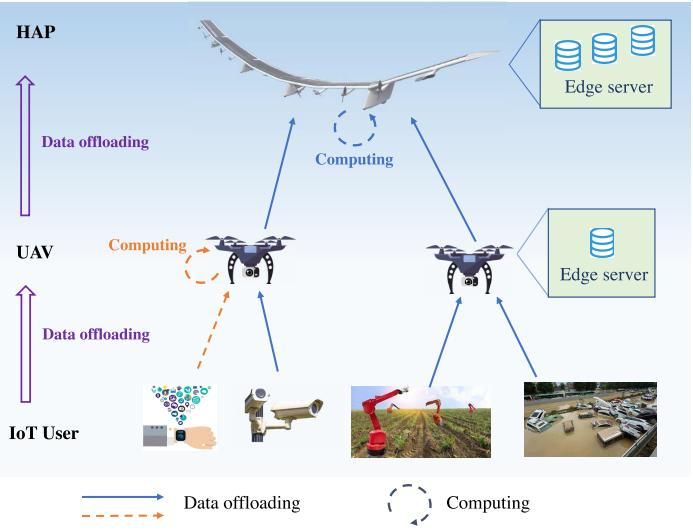

flowchart

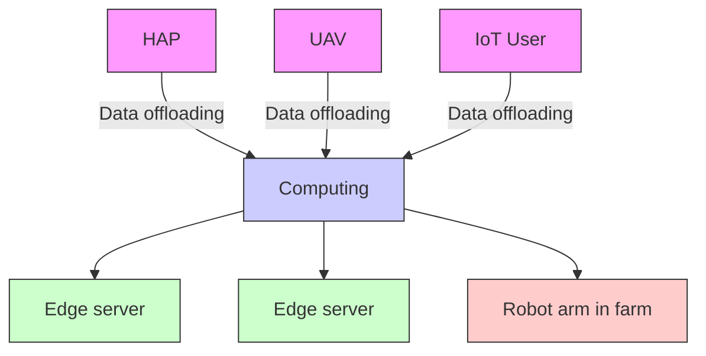

Fig. 1. Hierarchical aerial computing framework.

In this article, we propose the hierarchical aerial computing framework, as shown in Fig. 1, which is composed of HAPs and UAVs in the air to provide MEC services for the terrestrial IoT devices. Specifically, an IoT device can offload the computation demands to a UAV, and the data can be processed by the UAV if the total time cost, including transmission and computation, can meet the IoT’s delay requirement. Otherwise, as for the heavy computing IoT demands, the IoT data can be relayed by a UAV to an HAP and leverage the HAP’s powerful computation capacity. Notice here, the offloading decisions have a tradeoff between UAVs and HAPs if the aerial resources are abundant. Taking all of these issues into account, we focus on maximizing the total data being successfully computed by UAVs and HAPs, constrained by multiple resources limitations as well as integer decision restrictions. The problem is in the form of integer programming and is intractable to obtain an effective solution, due to the prohibitive complexity of the exhaustive search, especially in a large-scale network.

To address the challenge for solutions based on the above discussion and inspired by the matching game theory [24], we primarily adopt the matching game-based algorithm to deal with the data offloading decision from IoT devices to UAVs. Therein, the preference list construction for the participants is the key issue, since the objective as well as a couple of constraints of the original problem need to be implied in the preference lists [25]. In addition, since the offloading decisions from different IoT devices may give rise to the variation of IoT’s preference lists, which is termed as the external effect. In order to handle the issue of preference list variation, we further present the externality elimination algorithm to restabilize the matching between IoT devices and UAVs. In terms of the data offloading decision from UAVs to HAPs, we propose a heuristic algorithm to satisfy more IoT with rigorous delay restriction. Moreover, after the data offloading from UAVs to HAPs, UAVs may have redundant resources. In this case, if there still exist unserved IoT devices, we further design the adjustment algorithm to take full advantage of aerial resources.

Taking all the above discussions into account, the main contributions of this article are summarized as follows.

1) We propose the hierarchical aerial computing framework composed of HAPs and UAVs. Both HAPs and UAVs can provide the MEC service for the terrestrial IoT devices, while HAPs have powerful computing and energy payloads, which assist UAVs to complete the computing-intensive tasks. Besides, the detailed problem is formulated to maximize the total successful computed data, constrained by multiple resource limitations, and binary contact restriction.   
2) Due to the prohibitive complexity to directly solve the formulated problem, we tackle the problem into two stages. We present the matching game-based algorithm as well as the externality elimination algorithm to handle the data offloading problem from IoTs to UAVs in the first stage, and a heuristic algorithm for the data offloading problem from UAVs to HAPs. Besides, an adjustment algorithm is further proposed to optimize the usage of aerial resources. The time complexity of the proposed algorithms is also analyzed.   
3) Simulations are conducted and verify the efficiency of proposed algorithms, and the effect of different algorithms are also evaluated from the numerical results. Besides, the influence of system parameters such as the computation ability of HAPs and UAVs are also analyzed.

The remainder of this article is arranged as follows. In Section II, the literature review of recent related works is discussed. We present the system model and corresponding problem formulation in Section III. The specific algorithm design is proposed in Section IV, followed by the numerical results and performance evaluation in Section V. Finally, this article is concluded in Section VI.

# II. LITERATURE REVIEW

As for the UAV-based aerial computing, there exist abundant related works. For example, Zhou et al. [26] investigated the coupling of MEC and wireless power transfer on UAVs, and two computation offloading modes, including the partial and binary modes, have been considered. The problem has focused on maximizing the total weighted computation rate by optimizing multiple metrics, such as transmission power, offloading times, and trajectory of the UAV. Yang et al. [27] have jointly optimized the total energy consumption of UAVs and users in the multiple UAV-enabled MEC networks, considering the latency requirement and UAV location planning. Yang et al. [28] provided the multi-UAV enabled MEC framework for IoT computation offloading, and both the processing efficiency and load balance have been considered to optimize the network design. Yang et al. [29] have focused on the edge computing on UAVs to identify a mobile target and keep tracking, considering the stringent and accurate latency requirement, and a tradeoff has been obtained between the total cost and inference error. Zhan et al. [30] have proposed the UAV assisted MEC framework for the time-sensitive IoT users, and the number of successfully served IoT devices and the resource-efficient UAV trajectory has been coupled to been optimized. A reconnaissance task selection and scheduling by the UAV-based MEC structure has been investigated in [31], in which the reconnaissance task has time-varying priority, and the total reconnaissance utility has been maximized in the optimization problem. Chen et al. [32] have investigated the computation offloading optimization of UAVs in different layers by combining the channel allocation and position scheduling as well, in which the Stackelberg game has been employed to model the leader and follower relations between the two-layer UAVs.

Different from UAVs, HAPs are characterized by higher flight altitude and stronger payload, so that HAPs can provide intensive computing services. A couple of recent works with respect to the HAP-based aerial computing have been presented. For example, Wang et al. [33] have focused on the task computation in the computing-enabled high-altitude balloons, which are deemed as wireless base stations, and the federated learning-based algorithm has been designed to minimize the energy and time consumption during the data offloading procedure. In [34], a network composed of HAPs to provide massive access and edge computing services has been presented, aiming to guarantee efficient connection and low latency for massive IoT users. Ren et al. [35] have proposed an HAP-based caching and computation offloading framework to improve the latency of intelligent transportation systems, and a reinforcement learning mechanism has been designed to tackle the corresponding mixed-integer nonlinear programming problem with efficiency. Yang et al. [36] have presented the computation offloading structure in the HAPs-MEC-cloud networks, as the computing, communication, and caching resource allocation problem with intractability, and a column generation-based algorithm has been designed to handle the problem.

As for the multiple layers of computation platforms in the air, [37] has proposed a MEC architecture composed of drones and HAPs, providing both radio access and computing tasks for the terrestrial users, and the concept of the end-to-end slice has also been presented as well as the logic architecture of the user–drone–HAP system. Zhang et al. [38] have focused on the data offloading in the space–air–ground networks, in which HAPs serve the aerial computing platforms to complete the MEC tasks, and the corresponding problem is formulated to maximize the sum data rate and is tackled by the hypergraph-based mechanism. Mao et al. [39] have proposed a space–air–ground-enabled edge-cloud computing framework composed of UAVs and satellites, in which UAVs can serve the low-delay MEC requirement while satellites enable ubiquitous cloud computing. Liao et al. [40] have presented the space– air–ground networks with MEC and cloud computing for data offloading, and the Lyapunov-based mechanism has been employed to tackle the queue-aware optimization problem.

With the above discussions with respect to aerial computing, there exists a couple of works related to UAVs and HAPs. However, to the extent of our knowledge, as for the cooperation of UAVs and HAPs to provide the hierarchical MEC service for IoT, the detailed cooperation model as well as corresponding schemes have not been investigated. Hence, in this work, the issue of how to efficiently leverage the hierarchical aerial resources of UAVs and HAPs will be addressed.

TABLE I NOTATION LIST 

<table><tr><td>Notations</td><td>Parameters</td></tr><tr><td> $\mathcal{I}$ </td><td>IoT user set,  $i \in \mathcal{I}$ .</td></tr><tr><td> $\mathcal{U}$ </td><td>UAV set,  $u \in \mathcal{U}$ .</td></tr><tr><td> $\mathcal{H}$ </td><td>HAP set,  $h \in \mathcal{H}$ .</td></tr><tr><td> $\sigma_i$ </td><td>Data size of IoT  $i \in \mathcal{I}$ .</td></tr><tr><td> $D_i$ </td><td>Maximum delay tolerated by IoT  $i \in \mathcal{I}$ .</td></tr><tr><td> $\rho_u$ </td><td>Computation resource cost of UAV  $u$  to process 1bit data.</td></tr><tr><td> $\mu_h$ </td><td>Computation resource cost of HAP  $h$  to process 1bit data.</td></tr><tr><td> $c_{iu}$ </td><td>Data rate of channel I2U.</td></tr><tr><td> $c_{uh}$ </td><td>Data rate of channel U2H.</td></tr><tr><td> $\mathbf{q}_u$ </td><td>Horizon location of UAV  $u$ .</td></tr><tr><td> $\mathbf{q}_i$ </td><td>Horizon location of IoT  $i$ .</td></tr><tr><td> $H_u$ </td><td>Flight altitude of UAV  $u$ .</td></tr><tr><td> $N_u$ </td><td>The maximum number of IoT a UAV can serve.</td></tr><tr><td> $T_{iu}$ </td><td>Time cost to transmit the data of IoT  $i$  to UAV  $u$ .</td></tr><tr><td> $T_{uh}$ </td><td>Time cost to transmit the data to HAP  $h$  by UAV  $u$ .</td></tr><tr><td> $T_u^i$ </td><td>Time cost by UAV to complete the computation for IoT  $i$ .</td></tr><tr><td> $T_h^i$ </td><td>Time cost by HAP  $h$  to complete the computation for IoT  $i$ .</td></tr><tr><td> $P_{i}^{tr}$ </td><td>Transmission power of IoT  $i$  to UAV  $u$ .</td></tr><tr><td> $P_{u}^{tr}$ </td><td>Transmission power of UAV  $u$  to HAP  $h$ .</td></tr><tr><td> $\varsigma_u$ </td><td>Energy consumption coefficient of UAV based computation.</td></tr><tr><td> $\varsigma_h$ </td><td>Energy consumption coefficient of HAP based computation.</td></tr><tr><td> $E_i^c$ </td><td>Total energy cost of IoT  $i$ .</td></tr><tr><td> $E_i^o$ </td><td>Basic operation energy cost of IoT  $i$ .</td></tr><tr><td> $E_i^{tr}$ </td><td>Energy cost for data transmission from IoT  $i$  to UAV  $u$ .</td></tr><tr><td> $E_i$ </td><td>Energy budget of IoT .</td></tr><tr><td> $E_u^c$ </td><td>Total energy cost of UAV  $u$ .</td></tr><tr><td> $E_u^o$ </td><td>Basic energy operation cost of UAV  $u$ .</td></tr><tr><td> $E_u^{co}$ </td><td>Energy cost for computation of UAV  $u$ .</td></tr><tr><td> $E_u^{tr}$ </td><td>Energy cost for data transmission from UAV  $u$  to HAP  $h$ .</td></tr><tr><td> $E_u$ </td><td>Energy budget of UAVs.</td></tr><tr><td> $E_h^c$ </td><td>Total energy cost of HAP  $h$ .</td></tr><tr><td> $E_h^o$ </td><td>Basic operation cost of HAP  $h$ .</td></tr><tr><td> $E_h^{co}$ </td><td>Energy cost of HAP  $h$  for computation.</td></tr><tr><td> $E_h$ </td><td>Energy budget of HAPs.</td></tr><tr><td> $C_u$ </td><td>Computing capability of UAV  $u$ .</td></tr><tr><td> $C_h$ </td><td>Computing capability of HAP  $h$ .</td></tr><tr><td> $\mathcal{M}_1$ </td><td>Matching in Algorithm 1.</td></tr><tr><td> $\mathcal{M}_2$ </td><td>Matching in Algorithm 2.</td></tr><tr><td></td><td>Decision Variables</td></tr><tr><td> $x_u^i$ </td><td> $x_u^i \in \{0,1\}$  indicates whether the task of IoT  $i \in \mathcal{I}$  is offloaded to UAV  $u$ .</td></tr><tr><td> $\beta_u^i$ </td><td> $\beta_u^i \in \{0,1\}$  indicates whether the task of IoT  $i \in \mathcal{I}$  is computed by UAV  $u$ .</td></tr><tr><td> $y_h^{i,u}$ </td><td> $y_h^{i,u} \in \{0,1\}$  indicates whether the task from IoT  $i$  is forwarded to HAP  $h$  by UAV  $u$ .</td></tr><tr><td> $\gamma_h^i$ </td><td> $\gamma_u^i \in \{0,1\}$  indicates whether the task of IoT  $i \in \mathcal{I}$  is computed by HAP  $h$ .</td></tr></table>

# III. SYSTEM MODEL AND PROBLEM FORMULATION

In this section, we first present the system model in detail, including the hierarchical aerial computing scenario in Section III-A, the communication model in Section III-B, the computing model in Section III-C, and the energy cost model in Section III-D. Finally, the problem formulation is proposed in Section III-E. Besides, for clarity, the notations used in this work are listed in Table I.

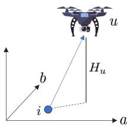

text_image

u
b
H_u
i
a

Fig. 2. Relative location of UAV and IoT.

# A. Hierarchical Aerial Computing Scenario

As shown in Fig. 1, the hierarchical aerial computing framework is composed of UAVs and HAPs in the air, and terrestrial IoT users in various applications, e.g., smart wearable devices, surveillance cameras, smart framing, and IoT in disasters. Note that only the rotary-wing UAV is considered in the scenario, which is able to float at a quasistatic position for a couple of hours. Besides, HAPs serve as stable base stations in the air. Hence, the hierarchical aerial computing model in the work is deemed as quasistatic. Both UAVs and HAPs are equipped with edge servers, and HAPs have stronger load capacity than UAVs. The ground IoT users have various computing demands, but with limited computing capability, especially for the small size IoT device. As for the lightweight computation demands, IoT devices can complete computing locally. However, due to the limited computing and energy resources of IoT devices, the computation-intensive demands may not be completed locally by the IoT devices, and UAVs equipped with edge servers can provide the computing service for these IoT devices via data offloading. Furthermore, the payload for computation of UAV is limited, the computing tasks on the UAV may fail. In this case, HAPs with stronger payload can assist UAVs to accomplish the computation task from IoT devices. In such a way, the UAV serves as a relay for the data from IoT offloading to the HAP, rather than computation on the UAV. Besides, only binary computation offloading is considered in this model, i.e., the computing task has two choices1: offloading to a UAV and computed by the edge server of the UAV, or offloading to the HAP and computed by the edge server of the HAP, according to the resource provision, as depicted in Fig. 1.

# B. Communication Model

1) Channel Model From IoT to UAV (I2U): To avoid congestions, the orthogonal frequency division is applied for the I2U channel, and the channel from IoT devices to UAVs is line of sight [41], [42]. Following [21] and [43], the channel gain between IoT i and UAV u is

$$
\begin{array}{l} G _ {i u} = \frac {G _ {0}}{d _ {i u} ^ {2}} = \frac {G _ {0}}{(a _ {u} - a _ {i}) ^ {2} + (b _ {u} - b _ {i}) ^ {2} + H _ {u} ^ {2}} \\ = \frac {G _ {0}}{\| \mathbf {q} _ {u} - \mathbf {q} _ {i} \| ^ {2} + H _ {u} ^ {2}} \quad \forall i \in \mathcal {I}, u \in \mathcal {U} \tag {1} \\ \end{array}
$$

where $d _ { i u }$ indicates the distance between IoT i and UAV $u ,$ and $G _ { 0 }$ denotes the reference I2U channel gain at $d _ { i u } = 1$ m. As shown in Fig. 2, $\mathbf { q } _ { u } = \{ a _ { u } , b _ { u } \}$ and $\mathbf { q } _ { i } = \{ a _ { i } , b _ { i } \}$ denote the

1The local computing by the IoT device itself is omitted in the model, since local computing does not participate the offloading decisions.

horizon location of UAV u and IoT i, respectively. $H _ { u }$ is the flight altitude of UAV u. Then, the available data rate of the channel from IoT i to UAV u is calculated as

$$
\begin{array}{l} c _ {i u} = B _ {i u} \cdot \log_ {2} \left(1 + \frac {P _ {i} ^ {t r} G _ {i u}}{\delta^ {2}}\right) \\ = B _ {i u} \cdot \log_ {2} \left(1 + \frac {P _ {i} ^ {t r} \iota_ {0}}{\| \mathbf {q} _ {u} - \mathbf {q} _ {i} \| ^ {2} + H _ {u} ^ {2}}\right) \quad \forall i \in \mathcal {I}, u \in \mathcal {U} \tag {2} \\ \end{array}
$$

where $B _ { i u }$ denotes the bandwidth of the I2U channel and $\iota _ { 0 } =$ $( G _ { 0 } / \delta ^ { 2 } )$ indicates the reference signal-to-noise ratio. Recall that $G _ { i u }$ is the channel gain between IoT i and UAV u. Hence, the time cost to transmit the data of IoT i to UAV u is

$$
T _ {i u} = \frac {\sigma_ {i} x _ {u} ^ {i}}{c _ {i u}} \quad \forall i \in \mathcal {I}, u \in \mathcal {U} \tag {3}
$$

in which binary variable $x _ { u } ^ { i }$ indicates whether the task of IoT i is offloaded to UAV $u ,$ i.e.,

$$
x _ {u} ^ {i} = \left\{ \begin{array}{l} 1, \text {   task   of   IoT   } i \text {   is   offloaded   to   UAV   } u \\ 0, \text {   otherwise } \end{array} \right.
$$

and $\sigma _ { i }$ is the data size of IoT i.

2) Channel Model From UAV to HAP (U2H): According to [21] and the Shannon theory, the achievable data rate of the U2H channel is

$$
c _ {u h} = B _ {u h} \cdot \log_ {2} \left(1 + \frac {P _ {u} ^ {t r} G _ {u h} L _ {s} L _ {l}}{k _ {B} T _ {s} B _ {u h}}\right) \quad \forall u \in \mathcal {U}, h \in \mathcal {H} \tag {4}
$$

where $B _ { u h }$ is the bandwidth of U2H channel, $G _ { u h }$ is the antenna power gain, $L _ { l }$ is the total line loss, and $L _ { s } = ( c / [ 4 \pi d _ { u h } f _ { u h } ] ) ^ { 2 }$ is the free space loss. Wherein, c is the speed of light, $d _ { u h }$ is the distance between UAV u and HAP h, and $f _ { u h }$ is the center frequency. $k _ { B }$ is Boltzmann’s constant, and $T _ { s }$ denotes the system noise temperature. Besides, due to the long distance between a UAV and an HAP, $d _ { u h }$ is deemed as the perpendicular distance between UAV u and HAP h. Note that to avoid congestions, the orthogonal frequency division is also applied for the U2H channel.

Hence, the time cost to transmit the data of IoT i to HAP h from UAV u can be calculated as

$$
T _ {u h} = \frac {\sigma_ {i} y _ {h} ^ {i , u}}{c _ {u h}} \quad \forall u \in \mathcal {U}, h \in \mathcal {H} \tag {5}
$$

where $y _ { h } ^ { i , u } \in \{ 0 , 1 \}$ indicates whether the task from IoT i is forwarded to HAP h by UAV u, i.e.,

$y _ { h } ^ { i , u } = \left\{ { 1 \atop 0 } \right.$ , data of IoT i is forwarded to HAP h by UAV u , otherwise.

# C. Computing Model

For an IoT user, the computing demand can be offloaded to a UAV and complete the computation on the UAV, or relayed by a UAV to an HAP and complete the computation by the HAP [35].

1) UAV-Based Computing: In light of [31], denote $\rho _ { u }$ as the computing resource consumed on UAVs to handle 1bit IoT data, i.e., the CPU cycles. Thus, the time cost by UAV to complete the computation for IoT i is

$$
T _ {u} ^ {i} = \frac {\sigma_ {i} \beta_ {u} ^ {i}}{C _ {u} / \rho_ {u}} = \frac {\sigma_ {i} \beta_ {u} ^ {i} \rho_ {u}}{C _ {u}} \quad \forall i \in \mathcal {I}, u \in \mathcal {U} \tag {6}
$$

where $C _ { u }$ denotes the computation capability of UAV u, and $\beta _ { u } ^ { i }$ is the binary variable denoting whether the task of IoT $i \in \mathcal { Z }$ is computed by UAV u, in detail

$$
\beta_ {u} ^ {i} = \left\{ \begin{array}{l} 1, \text {   task   of   IoT   } i \text {   is   computed   by   UAV   } u \\ 0, \text {   otherwise. } \end{array} \right.
$$

2) HAP-Based Computing: If the remaining computing resource of UAV cannot afford the IoT computing task, the task will be offloaded to the HAP relayed by the UAV. Let $\mu _ { h }$ denote the computing resource cost of HAP h to process 1-bit IoT data, and $C _ { h }$ indicates the computation capacity of HAP h. Accordingly, the time cost to complete the computation for IoT i by HAP h is calculated as

$$
T _ {h} ^ {i} = \frac {\sigma_ {i} \gamma_ {h} ^ {i}}{C _ {h} / \mu_ {h}} = \frac {\sigma_ {i} \gamma_ {h} ^ {i} \mu_ {h}}{C _ {h}} \quad \forall i \in \mathcal {I}, h \in \mathcal {H} \tag {7}
$$

in which binary variable $\gamma _ { u } ^ { i } \in \{ 0 , 1 \}$ indicates whether the task of IoT $i \in \mathcal { Z }$ is computed by HAP h

$$
\gamma_ {u} ^ {i} = \left\{ \begin{array}{l} 1, \text {   task   of   IoT   } i \text {   is   computed   by   HAPh } \\ 0, \text {   otherwise. } \end{array} \right.
$$

As above, the total time cost for IoT i to complete necessary transmission and computation is derived as

$$
\begin{array}{l} T _ {i} = \sum_ {u \in \mathcal {U}} \left(T _ {i u} + T _ {u} ^ {i} + \sum_ {h \in \mathcal {H}} T _ {u h}\right) + \sum_ {h \in \mathcal {H}} T _ {h} ^ {i} \\ = \sum_ {u \in \mathcal {U}} \left(\frac {\sigma_ {i} x _ {u} ^ {i}}{c _ {i u}} + \frac {\sigma_ {i} \beta_ {u} ^ {i} \rho_ {u}}{C _ {u}} + \sum_ {h \in \mathcal {H}} \frac {\sigma_ {i} y _ {h} ^ {i , u}}{c _ {u h}}\right) + \sum_ {h \in \mathcal {H}} \frac {\sigma_ {i} \gamma_ {h} ^ {i} \mu_ {h}}{C _ {h}} \quad \forall i \in \mathcal {I}. \tag {8} \\ \end{array}
$$

Note that the delay to complete computation for IoT i is related with the time cost of transmission and computation processing. Besides, due to the small data size of the computation result, the delay as well as the energy cost of computing result transmission are omitted [39], [44].

# D. Energy Cost Model

1) Energy Cost of IoT: The energy cost $E _ { i } ^ { c }$ of IoT i is mainly composed by the basic operation cost $E _ { i } ^ { o }$ and the transmission cost $E _ { i } ^ { t r }$

$$
\begin{array}{l} E _ {i} ^ {c} = E _ {i} ^ {o} + E _ {i} ^ {t r} = E _ {i} ^ {o} + \sum_ {u \in \mathcal {U}} P _ {i} ^ {t r} T _ {i u} \\ = E _ {i} ^ {o} + \sum_ {u \in \mathcal {U}} \frac {P _ {i} ^ {t r} \sigma_ {i} x _ {u} ^ {i}}{c _ {i u}} \quad \forall i \in \mathcal {I}, u \in \mathcal {U} \tag {9} \\ \end{array}
$$

in which $P _ { i } ^ { t r }$ denotes the transmission power from IoT i to UAV u.

2) Energy Cost of UAV: The total energy cost $E _ { u } ^ { c }$ of UAV u is composed of the basic operation energy cost $E _ { u } ^ { o } , \ \mathrm { e . g . }$ ., UAV hovering, the energy cost $E _ { u } ^ { c o }$ for computation, and the transmission energy cost $E _ { u } ^ { t r }$ . More concretely

$$
\begin{array}{l} E _ {u} ^ {c} = E _ {u} ^ {o} + E _ {u} ^ {c o} + E _ {u} ^ {t r} = E _ {u} ^ {o} + \sum_ {i \in \mathcal {I}} \varsigma_ {u} C _ {u} ^ {3} T _ {u} ^ {i} + \sum_ {i \in \mathcal {I}} \sum_ {h \in \mathcal {H}} P _ {u} ^ {t r} T _ {u h} \\ = E _ {u} ^ {o} + \sum_ {i \in \mathcal {I}} \varsigma_ {u} C _ {u} ^ {2} \sigma_ {i} \rho_ {u} \beta_ {u} ^ {i} + \sum_ {i \in \mathcal {I}} \sum_ {h \in \mathcal {H}} \frac {P _ {u} ^ {t r} \sigma_ {i} y _ {h} ^ {i , u}}{c _ {u h}} \quad \forall u \in \mathcal {U} (1 0) \\ \end{array}
$$

where $\varsigma _ { u }$ denotes the energy consumption coefficient depending on the chip structure of UAV’s processor [31]. $P _ { u } ^ { t r }$ is the power for UAV-based transmission to the HAP.

3) Energy Cost of HAP: The total h is composed of basic operation cost rgy cost and the $E _ { h } ^ { t o }$ of HAPergy cost $E _ { h } ^ { o }$ $E _ { h } ^ { c }$ for computation

$$
\begin{array}{l} E _ {h} ^ {c} = E _ {h} ^ {o} + E _ {h} ^ {c} = E _ {i} ^ {o} + \sum_ {u \in \mathcal {U}} P _ {i} ^ {t r} T _ {h} ^ {i} \\ = E _ {h} ^ {o} + \sum_ {i \in \mathcal {I}} \varsigma_ {u} C _ {h} ^ {2} \sigma_ {i} \gamma_ {h} ^ {i} \mu_ {h} \quad \forall h \in \mathcal {H} \tag {11} \\ \end{array}
$$

where $\varsigma _ { u }$ is the energy consumption coefficient depending on the chip structure of the HAP’s processor.

# E. Problem Formulation

The objective is addressed to maximize the total IoT data computed by the hierarchical aerial computing platforms (UAVs and HAPs), and restricted by multiple resource and offloading decision constraints

$$
\begin{array}{l} \text {(P0)} \colon \max _ {x, \beta , y, \gamma} \quad \sum_ {i \in \mathcal {I}} \sum_ {u \in \mathcal {U}} \sum_ {h \in \mathcal {H}} \sigma_ {i} \big (\beta_ {u} ^ {i} + \gamma_ {h} ^ {i} \big) \\ \text { s.t. } \sum_ {u \in \mathcal {U}} x _ {u} ^ {i} \leq 1 \quad \forall i \in \mathcal {I} (12) \\ \beta_ {u} ^ {i} + y _ {h} ^ {i, u} = x _ {u} ^ {i} \quad \forall i \in \mathcal {I}, u \in \mathcal {U}, h \in \mathcal {H} (13) \\ \sum_ {i \in \mathcal {I}} x _ {u} ^ {i} \leq N _ {u} \quad \forall u \in \mathcal {U}, (14) \\ \gamma_ {h} ^ {i} \leq \sum_ {u \in \mathcal {U}} y _ {h} ^ {i, u} \quad \forall i \in \mathcal {I}, h \in \mathcal {H} (15) \\ \end{array}
$$

$$
E _ {i} ^ {c} \leq E _ {i} \quad \forall i \in \mathcal {I} \tag {16}
$$

$$
E _ {u} ^ {c} \leq E _ {u} \quad \forall u \in \mathcal {U} \tag {17}
$$

$$
E _ {h} ^ {c} \leq E _ {h} \quad \forall h \in \mathcal {H} \tag {18}
$$

$$
T _ {i} \leq D _ {i} \quad \forall i \in \mathcal {I}, \tag {19}
$$

$$
x _ {u} ^ {i} \in \{0, 1 \} \quad \forall i \in \mathcal {I}, u \in \mathcal {U} \tag {20}
$$

$$
\beta_ {u} ^ {i} \in \{0, 1 \} \quad \forall i \in \mathcal {I}, u \in \mathcal {U} \tag {21}
$$

$$
y _ {h} ^ {i, u} \in \{0, 1 \} \quad \forall i \in \mathcal {I}, u \in \mathcal {U}, h \in \mathcal {H} \tag {22}
$$

$$
\gamma_ {h} ^ {i} \in \{0, 1 \} \quad \forall i \in \mathcal {I}, h \in \mathcal {H} \tag {23}
$$

where we have $\begin{array} { r } { \pmb { x } = \{ x _ { u } ^ { i } \ \forall i \in \mathcal { T } , u \in \mathcal { U } \} , \beta = \{ \beta _ { u } ^ { i } \ \forall i \in \mathcal { T } } \end{array}$ , u ∈ $\mathcal { U } \} , \boldsymbol { y } = \{ y _ { h } ^ { i , u } \ \forall i \in \mathcal { T } , u \in \mathcal { U } , h \in \mathcal { H } \}$ , and $\gamma = \{ \gamma _ { h } ^ { i } \forall i \in \mathcal { I } , h \in$ }, denoting the variable vectors of IoT data offloading to the UAV, UAV-based MEC, IoT data offloading to the HAP, and HAP-based MEC, respectively. In P0, constraint (12) denotes that each IoT can only connect to at most one UAV. Note that not all IoT data can be successfully offloaded to a UAV due to the resource limitation. Constraint (13) implies the data flow conservation at a UAV. Constraint (14) refers to the quota restriction of the UAV, i.e., the accommodated IoT devices by a UAV cannot exceed the quota $N _ { u } .$ . Constraint (15) depicts the coupled relation between $\gamma _ { h } ^ { i }$ and $y _ { h } ^ { i , u }$ . Constraints (16)–(18) denote the energy capacity restrictions, and $E _ { i } , ~ E _ { u } ,$ and $E _ { h }$ are the energy budget of IoT, UAV, and HAP, respectively. Constraint (19) enforces the total time cost cannot exceed the maximum tolerant delay $D _ { i }$ of IoT i.

It is observed that P0 is an integer programming problem, and is intractable to solve especially in the case of largescale networks. Since the complexity of exhaustive searching is related with the number of decision variables of P0, i.e., $\mathcal { O } ( 2 ^ { | \mathcal { T } | \cdot ( 2 | \mathcal { U } | + | \mathcal { U } | \cdot | \mathcal { H } | + | \mathcal { U } | ) } )$ ), and the various constraints further aggravate the complexity. Therefore, efficient algorithms will be designed to deal with the complicated problem in the following section.

# IV. ALGORITHM DESIGN

As the above discussion, P0 is in the form of integer programming, which is intractable to directly obtain the solution. In this section, we adopt the matching game-based mechanisms to handle the offloading decision from IoT devices to UAVs in Section IV-A. Further, to eliminate the external effect among different IoT devices, the externality elimination algorithm is presented in Section IV-B. As for the data offloading from UAVs to HAPs, a heuristic algorithm is designed in Section IV-C. Besides, an adjustment algorithm is proposed to take full advantage of aerial resources in Section IV-D.

# A. Matching-Based Algorithm for IoT Data Offloading to UAV

1) Preliminary of Matching Game Theory: As a Nobel Prize-winning mechanism in Economic Science, matching game theory can handle the social and marketing problems in a distributed mode [24]. Besides, matching game theory finds wide applications in network management [45], [46]. The primary advantage of matching game theory is that it considers the preference of the participated agents and provides the distributed solutions. The common thread in the matching game theory is to find a stable matching for the participated agents with special preference over another set of agents.

2) Matching Between IoT and UAV: Inspired by the matching game theory, the offloading problem from IoT devices to UAVs in P0 can be deemed as a matching problem with two sets of agents: 1) IoT devices and 2) UAVs, and the problem is a two-sided matching. Besides, the constraints in P0 can be implied in the preference lists of IoT devices and UAVs, respectively. Since an IoT user can only connect to one UAV, and each UAV can serve a couple of IoT users, the matching between IoT devices and UAVs is in the many-to-one form.

Primarily, the preference list of IoT devices on UAVs is defined as

$$
P L _ {i} = \lambda_ {1} C _ {u} ^ {r} + \lambda_ {2} E _ {u} ^ {r} + \lambda_ {3} c _ {i u} \tag {24}
$$

since IoT devices prefer the UAV with larger residual computing capacity $C _ { u } ^ { r } ,$ residual energy budget $E _ { u } ^ { r } ,$ and available channel capacity $c _ { i u } .$ , and $\lambda _ { 1 } , \lambda _ { 2 } .$ , and $\lambda _ { 3 }$ denote the weighted parameters. For example, IoT i prefers UAVs $u ^ { 1 }$ to $u ^ { 2 }$ if UAV $u ^ { 1 }$ has priority over UAV $u ^ { 2 }$ in $P L _ { i }$ , and it is expressed as $u ^ { 1 } \succ _ { i } u ^ { \hat { 2 } }$ . In this case, IoT i will choose UAV $u ^ { 1 }$ in matching $\mathcal { M } _ { 1 }$ , represented as $\mathcal { M } _ { 1 } ( i ) = u ^ { 1 }$ .

Algorithm 1 Many-to-One Matching Between IoT and UAV (MIU)   
Require: $\mathcal{I},\mathcal{U},\sigma_i$ , and $D_{i}$ Ensure: Stable matching $\mathcal{M}_1$ , and $\pmb{x}$ 1: Initialization: Construct preference lists $PL_{i}$ and $PL_{u}$ . Set $\mathcal{M}_1 = \emptyset$ , and flag $= 1$ 2: while flag $== 1$ do   
3: flag $= 0$ 4: for each unmatched IoT i do   
5: if $PL_{i}\neq \emptyset$ then   
6: Select the most preferred UAV $u\in PL_i$ as $\mathcal{M}_1(i)$ 7: if $|\mathcal{M}_1(i)| == N_u$ then   
8: Select the worst matched IoT $i^{\prime}$ in $\mathcal{M}_1(i)$ 9: if $i\succ_u i'$ then   
10: Swap i and $i^\prime$ in $\mathcal{M}_1(i)$ 11: else   
12: Delete i from $PL_{i}$ 13: end if   
14: Set flag $= 1$ 15: end if   
16: Add pair $(i,u)$ to $\mathcal{M}_1$ 17: end if   
18: end for   
19: end while

The preference list of UAVs on IoT devices is expressed as

$$
P L _ {u} = \iota_ {1} \sigma_ {i} + \iota_ {2} D _ {i}. \tag {25}
$$

Recall that $\sigma _ { i }$ is the data size of IoT i and $D _ { i }$ is the maximum delay tolerated by IoT $i ,$ and so UAVs prefer the IoT devices with a large data size and tolerant delay, which is in accordance with the objective of P0. ι1 and ι2 indicate the weighted parameters. For example, if there exist two IoT devices $i ^ { 1 }$ and $i ^ { 2 }$ in $P L _ { u } .$ , UAV u will select IoT $i ^ { 2 }$ as its partner, i.e., $\mathcal { M } _ { 1 } ( u ) = i ^ { 2 }$ , if $i ^ { 2 } \succ u i ^ { 1 }$ and UAV u has only one vacancy; in another hand, if UAV u has more than one residual quota, both IoT devices $i ^ { 1 }$ and $i ^ { 2 }$ can be matched to the UAV.

In particular, to indicate whether a matching arrives stable, the blocking pair in many-to-one matching is defined as follows.

Definition 1 (Blocking Pair in Many-to-One Matching): In the many-to-one matching between IoT devices and a UAV, a pair $( i , u ) \notin \mathcal { M } _ { 1 }$ is deemed as a blocking pair for $\mathcal { M } _ { 1 }$ if: 1) IoT i is unserved or IoT i prefers UAV u to its current matching $\mathcal { M } _ { 1 } ( i )$ and 2) UAV u is underutilized or prefers IoT i to at least one existed matching $\mathcal { M } _ { 1 } ( u )$ in $\mathcal { M } _ { 1 }$ .

Inspired by the Gale–Shapley mechanism [47], the many-toone matching between IoT devices and a UAV is detailed in Algorithm 1. To begin with, the preference lists of IoT devices and UAVs are, respectively, constructed following (24) and (25). $\mathcal { M } _ { 1 }$ is initialized as ∅ and flag is applied to controlling algorithm execution. Then, the algorithm starts from IoT i (IoT-oriented) and it selects the most preferred UAV u in $P L _ { i }$ as its partner, i. $\therefore , u = \mathcal { M } _ { 1 } ( i )$ , constructing a pair $( i , u )$ . If the selected UAV u is undersubscribed, directly add (i, u) to $\mathcal { M } _ { 1 }$ , as step 16 of Algorithm 1. Otherwise, if the quota of UAV u is full, i.e., $| \mathcal { M } _ { 1 } ( i ) | = = N _ { u } ,$ IoT i is compared with the worst matched IoT $i ^ { \prime }$ in $\mathcal { M } _ { 1 }$ . If IoT i is superior to $i ^ { \prime }$ in the UAV’s preference list $P L _ { u } , ( i , u )$ is a blocking pair for matching $\mathcal { M } _ { 1 }$ , and i and $i ^ { \prime }$ are swapped for stable; or i will be deleted from $P L _ { u } .$ . Note that the UAV’s quota constraint (14) in P0 is implied in Algorithm 1. A stable matching $\mathcal { M } _ { 1 }$ is obtained after the termination of Algorithm 1, when there exists no blocking pair or all preference lists of IoT are empty. The complexity of Algorithm 1 is related to the number of potential IoT–UAV pairs [46], i.e., O(|I | · |U |).

Notice that if the preference lists $P L _ { i }$ and $P L _ { u }$ are fixed, the preference of any participant merely depends on the certain information about the participants in another set. However, from (24), we observe that the $\mathrm { I o T } { \mathrm { s } }$ preference is influenced by the choices of other participants, since the residual computing resource and energy budget of UAVs may change with different matching decision, and the matching result $\mathcal { M } _ { 1 }$ from Algorithm 1 may not stable incurred by varying preference of IoT. Such a matching with the interplay of different participants’ preferences is the matching with externality [25]. Notice here, the external effect is caused by any matching with the interdependence of the participants’ preferences [46]. For example, if a UAV is chosen by too many IoT devices, and in this case only a small part of the computation and energy of the UAV is allocated to each IoT user, so some IoT devices may have the incentive to change to a different UAV that has more available resources. Hence, the issue of externality should be tackled for a final stable matching.

# B. Eliminating the Externality

As discussed above, the externality in the matching between IoT devices and UAVs should be dealt with, and we propose the externality elimination algorithm to restabilize the matching in Algorithm 2. Specifically, the invalid IoT–UAV pair, i.e., the IoT failed to be matched with all UAVs by Algorithm 1, should be removed from $P _ { u }$ and UAVs’ preference lists are updated. Then, the matching will be restabilized, and at this point, the new strategy focuses on how to improve the performance of IoT devices, since the preference of IoT devices is affected by the externality. More concretely, it becomes a problem in regard to one-side stability. Such stability based on the equilibrium among all IoT devices, and it is defined as “Pareto optimal” as follows [24].

Definition 2 (Pareto Optimal): A matching M is in Pareto optimal, if there exists no other matching $\mathcal { M } ^ { \prime }$ so that some IoT are better off in $\mathcal { M } ^ { \prime }$ and no IoT is worse off.

Accordingly, the definition of the blocking pair in one-sided matching is expressed as follows.

Definition 3 (Blocking Pair in One-Sided Matching): An IoT pair $( i , i ^ { \prime } )$ is a blocking pair in the one-sided matching if both IoT devices i and i 	 can be better off if they swap with their matched UAVs.

Algorithm 2 Externality Elimination Algorithm (EEA)

Require: Matching result $\mathcal { M } _ { 1 }$ from Algorithm 1, and the updated preference list $P L _ { i }$ related with $\mathcal { M } _ { 1 }$ .

Ensure: Re-stabilized pairwise-stable matching $\mathcal { M } _ { 2 }$ , and x.   
1: $M_{2} = M_{1}$ .
2: Remove invalid (IoT, UAV) pairs related IoT devices.
3: while $M_{2}$ is not Pareto optimal do
4:    Search the unstable (IoT, IoT) blocking pairs BL in terms of $PL_{i}$ .
5:    for each $(i, i') \in BL$ do
6:    if $\exists i \in \mathcal{M}_{2}(u) \cup \mathcal{M}_{2}(u')$ , $\triangle U(i) > 0$ then
7: $(i, i')$ are permitted to switch partners.
8:    else
9: $(i, i')$ are not permitted to switch partners.
10:    end if
11:    end for
12:    Find the optimal blocking pair $(i^{*}, i'^{*})$ .
13: $i^{*}$ and $i'^{*}$ exchange partners.
14: $\mathcal{M}_{2} = \mathcal{M}_{2}/\{(i^{*}, \mathcal{M}_{2}(i^{*})), (i'^{*}, \mathcal{M}_{2}(i'^{*}))\}$ .
15: $\mathcal{M}_{2} = \mathcal{M}_{2} \cup \{(i^{*}, \mathcal{M}_{2}(i'^{*})), (i'^{*}, \mathcal{M}_{2}(i^{*}))\}$ .
16: end while

The eternality elimination algorithm is detailed in Algorithm 2. Specifically, the matching result $\mathcal { M } _ { 1 }$ from Algorithm 1 and the updated preference list $P L _ { i }$ related with $\mathcal { M } _ { 1 }$ are regarded as the input for Algorithm 2, and finally a restabilized matching $\mathcal { M } _ { 2 }$ is acquired. First, the invalid (IoT, UAV) pairs related IoTs are removed. Then, the Pareto optimality of matching $\mathcal { M } _ { 2 }$ is checked and the unstable (IoT, IoT) blocking pairs are found. In addition, $\mathcal { M } _ { 2 } ( i ) = u$ and $\mathcal { M } _ { 2 } ( i ^ { \prime } ) = u ^ { \prime }$ denote that in matching $\mathcal { M } _ { 2 } .$ , IoT i and UAV u are paired while IoT i	 and UAV u	 are paired. Define the utility of IoT i as

$$
U (i) = \lambda_ {1} C _ {u} ^ {r} + \lambda_ {2} E _ {u} ^ {r} + \lambda_ {3} c _ {i u} \tag {26}
$$

and

$$
\triangle U (i) = U (i) ^ {\prime} - U (i) \tag {27}
$$

in which $U ( i ) ^ { \prime }$ refers to the utility of IoT i after switching partner with IoT i 	 . Accordingly, the optimal blocking pair is expressed as

$$
(i ^ {*}, i ^ {\prime *}) = \underset {(i, i ^ {\prime})} {\operatorname{argmax}} \left(\sum_ {i \in \mathcal {M} _ {2} (u)} \triangle U (i) + \sum_ {i ^ {\prime} \in \mathcal {M} _ {2} (u ^ {\prime})} \triangle U (i ^ {\prime})\right) \tag {28}
$$

and the IoT pair $( i ^ { * } , i ^ { \prime * } )$ is permitted to exchange partners as step 13 of Algorithm 2. After that, matching $\mathcal { M } _ { 2 }$ is updated as steps 14 and 15 in Algorithm 2. Due to the irreversibility of each switch and the limited number of IoT pairs, the convergence of Algorithm 2 is guaranteed. Actually, since the realization of Algorithm 2 relies on iteratively searching the best blocking pair and exchanging their partners, and the key is to find all blocking pairs, which require traversing the preferences lists of all IoT devices. The number of comparing operation is related to | | · | |. Besides, the number of iterations to search and swap blocking pairs are related to | | · | |. In the worst case, the termination for Algorithm 2 has a time complexity of $\mathcal { O } ( | \mathcal { T } | \cdot | \mathcal { U } | \cdot | \mathcal { T } | \cdot | \mathcal { T } | )$ , i.e., $\mathcal { O } ( | \mathcal { T } | ^ { 3 } \cdot | \mathcal { U } | )$ .

Algorithm 3 Heuristic Algorithm for Data Offloading From UAV to HAP (HA)   
Require: $M_{2}$ , $\sigma_{i}$ and $D_{i}$ of IoT in $M_{2}$ , and x.
Ensure: $\beta$ , y and $\gamma$ of P0.
1: Initialize $\Omega = \emptyset$ .
2: Check the IoT data at UAVs:
3: for each UAV u do
4: if $\exists$ matched IoT i, the delay requirement cannot be satisfied by UAV u then
5: Rank these IoT data according to $\iota_{1}\sigma_{i} + \iota_{1}D_{i}$ in a descending order, and add into $\Omega$ .
6: Offload the first IoT's data in $\Omega$ to HAP.
7: if the residual IoT data in $\Omega$ can be satisfied by u then
8: Go to step 14.
9: else
10: $\Omega$ is updated by deleting the offloaded IoT data, and go to step 6.
11: end if
12: end if
13: end for
14: Check the IoT data at the HAP:
15: if $\exists$ IoT whose the delay requirement cannot be satisfied by the HAP then
16: Delete the IoT with the smallest data size $\sigma_{i}$ , update the residual resources of the HAP, and go to step 14.
17: else
18: Return $\beta$ , y and $\gamma$ .
19: end if

In practice, the time complexity is lower than the theoretical analysis.

# C. Data Offloading From UAV to HAP

After Algorithms 1 and 2, IoT devices are successfully matched with UAVs, and the data from IoT devices can be offloaded to the matched UAVs. However, due to the limited computation capacity and energy budget of UAVs, the delay requirement of IoT devices may not be satisfied. Note that HAPs are still unoccupied, and UAVs can offload some IoT data to HAPs to alleviate the overload on UAVs, and satisfy the delay requirement of IoT devices. To address this issue, we propose the heuristic algorithm for data offloading from UAVs to HAPs, detailed in Algorithm 3, and we only consider one HAP in this work since the multiple HAPs can be handled with tractability. The results from Algorithm 2 act as the input of Algorithm 3, and an auxiliary parameter Ω is set as ∅. Then, the IoT data offloaded at UAVs are checked. In particular, with regard to a UAV $u ,$ if there exist IoT data on the UAV whose delay requirement cannot be satisfied, these IoT data are ranked according to $\iota _ { 1 } \sigma _ { i } + \iota _ { 1 } D _ { i }$ in a descending order and added in set Ω. After that, the first IoT data in Ω is offloaded to the HAP. Afterward, the satisfaction of residual IoT in Ω is further checked from steps 7 to 11 of Algorithm 3, since the available resource of the UAV increases after offloading data to the HAP. Then, the IoT data offloaded at the HAP

Algorithm 4 Algorithm for Adjustment (AA)   
1: Initialize $\Omega = \emptyset$ .
2: Check if there are any unserved IoT after Algorithm 3.
3: if $\exists$ unserved IoT devices then
4: Rank these IoT devices in terms of $D_i / \sigma_i$ in a descending order in a set $\Omega$ .
5: while $\Omega \neq \emptyset$ do
6: for each UAV $u$ do
7: if the UAV can accommodate the first IoT $i$ in $\Omega$ then
8: IoT $i$ is offloaded to the UAV. $\Omega = \Omega / i$ . Update residual resources of the UAV. Go to step 5.
9: end if
10: end for
11: $\Omega = \Omega / i$ .
12: end while
13: end if

are checked: the IoT data whose delay requirement cannot be satisfied are found and the IoT data with the smallest data size $\sigma _ { i }$ is deleted, updating the residual resources of the HAP and continuing the iteration until all IoT data at the HAP can be satisfied. In the end of Algorithm 3, variables β, y, and γ in P0 are obtained.

The complexity of Algorithm 3 is composed of two parts: 1) checking the IoT’s data at the UAV and 2) checking the IoT data at the HAP. In the worst case, the complexity in the first stage is related to | | · | |, and the second stage is incurred by | | · | |. Accordingly, the complexity of Algorithm 3 is $\mathcal { O } ( ( \left| \mathcal { U } \right| + \left| \mathcal { H } \right| ) \cdot \left| \mathcal { T } \right| )$ .

# D. Adjustment Algorithm

Since a couple of IoT data are offloaded from UAVs to the HAP by Algorithm 3, UAVs may own some redundant resources. In this case, if there exist some unserved IoT devices after execution of Algorithm 3, we further propose Algorithm 4 to take full advantage of UAVs’ resources. First, initialize the assistant parameter Ω as ∅. Then, if there exist unserved IoT devices after Algorithm 3, these IoT devices are ranked in terms of $D _ { i } / \sigma _ { i }$ in a descending order in a set Ω, since the IoT devices with large $D _ { i } / \sigma _ { i }$ have a greater possibility to be served by the UAV with residual resources. The first IoT device in Ω has the advantage of offloading to UAVs, as shown in the steps 6–10. The iteration is terminated until Ω = ∅. With regard to the complexity, it is incurred by the size of Ω , at worst with | |, and the size of , i.e., O(|I | · |U |).

# V. PERFORMANCE EVALUATION

In this section, we conduct simulations to evaluate the hierarchical aerial computing mechanism and the proposed algorithms. The algorithm design is implemented in MATLAB, and the optimization tools CVX as well as MOSEK are also employed.

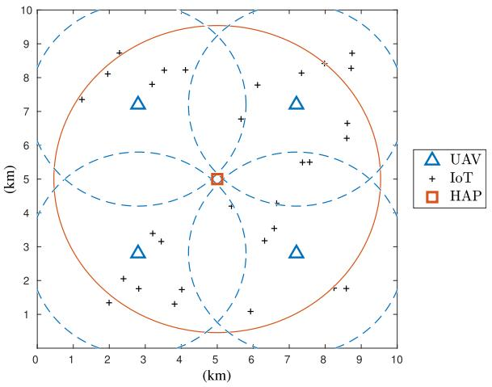  
Fig. 3. Coverage of the UAV and HAP for IoT $( | \mathcal { T } | = 3 0 )$ .

# A. Simulation Setup

Simulations are conducted in the scenario: one HAP with height of 20 km, four UAVs with altitude of 2 km are uniformly distributed in the area with size of 10 km × 10 km, and terrestrial IoT users are randomly distributed in this area. An illustration of the simulation scenario with respect to the coverage relationships of the UAV and the HAP for IoT devices is shown in Fig. 3. Note that UAVs are in the coverage of the HAP, and terrestrial users are in the coverage of UAVs. The data size of IoT $\sigma _ { i }$ is randomly generated from [10 Mbit,100 Mbit], and the maximum delay $D _ { i }$ tolerated by IoT devices is randomly generated in [10 s, 200 s] [30]. The quota of a UAV is set as $N _ { u } = 5 0$ . Besides, following [27], [28], [35], and [38], the computation and communication-related parameters are set as $\rho _ { u } =$ 270 cycles/bit, $\mu _ { h } ~ = ~ 1 1 0 0$ cycles/bit, $C _ { u } \ = \ 1 0 ^ { 9 }$ cycles/s, $C _ { h } = 5 \times 1 0 ^ { 1 0 }$ cycles/s, $\varsigma _ { u } = \varsigma _ { h } = 1 0 ^ { - 2 8 }$ , Buh = 20 MHz, Guh = 15 dB, kB = 1.38 × 10−23 J/K, Ts = 1000 K, and fuh = 2.4 GHz. The power-related parameters are set as $P _ { i } ^ { t r } = 0 . 5 \mathrm { ~ W } , P _ { u } ^ { t r } = 1 0 \mathrm { ~ W } , E _ { i } = 1 0 0 \mathrm { ~ J } , E _ { u } = 1 0 0 \mathrm { ~ K J }$ , and $E _ { h } = 1 0 0 0 ~ \mathrm { K J } .$ . In addition, the parameters in the matchingbased algorithm are set as $\lambda _ { 1 } = \lambda _ { 2 } = 0 . 4 , \lambda _ { 3 } = 0 . 2 \nonumber$ , and $\iota _ { 1 } = \iota _ { 2 } = 0 . 5$ .

# B. Performance Evaluation

To evaluate the efficiency of the proposed algorithms, we compare the combination of algorithms MIU + HA (MH), MIU + EEA + HA (MEH), MIU + HA + AA (MHA), MIU + EEA + HA + AA (MEHA), as well as the optimal solution (OP) obtained by the optimization tools, and the greedy offloading strategy. Specifically, Fig. 4 provides the performance of the proposed algorithms, including the complexity in Fig. 4(a) and optimization results in Fig. 4(b). It is observed that the MEHA can obtain the near OP with low complexity, compared with the OP. The combined algorithms MEH without adjustment of Algorithm 4, and MHA without the externality elimination by Algorithm 2 perform worse than MEHA. Besides, the performance of the algorithm MH without adjustment and externality elimination, as well as the greedy strategy is undesirable, especially with a large number of IoT.

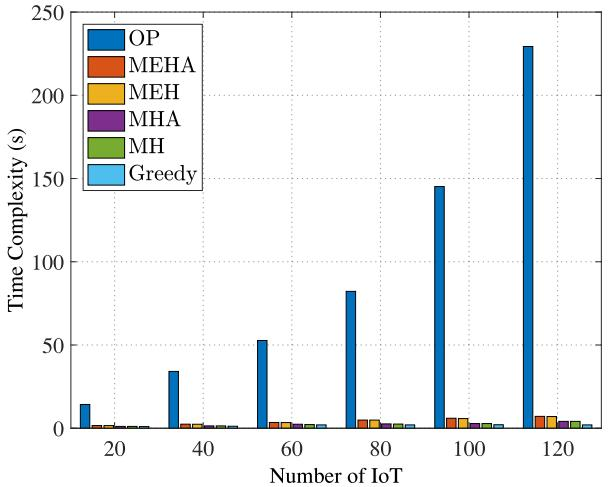

bar

| Number of IoT | OP   | MEHA | MEH  | MHA  | MH   | Greedy |
| ------------- | ---- | ---- | ---- | ---- | ---- | ------ |
| 20            | 15   | 2    | 1    | 1    | 1    | 1      |
| 40            | 35   | 3    | 2    | 1    | 1    | 1      |
| 60            | 55   | 3    | 3    | 2    | 2    | 2      |
| 80            | 85   | 5    | 3    | 2    | 2    | 2      |
| 100           | 145  | 7    | 4    | 2    | 2    | 2      |
| 120           | 230  | 8    | 5    | 3    | 3    | 2      |

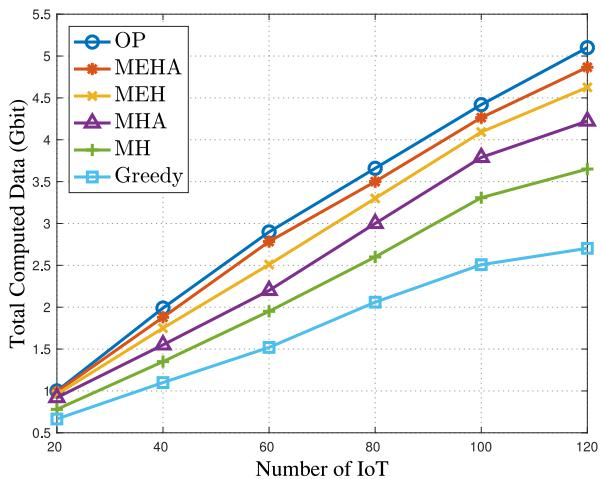

line

| Number of IoT | OP    | MEHA  | MEH   | MHA   | MH    | Greedy |
| ------------- | ----- | ----- | ----- | ----- | ----- | ------ |
| 20            | 1.0   | 1.0   | 1.0   | 1.0   | 1.0   | 0.5    |
| 40            | 2.0   | 1.9   | 1.8   | 1.6   | 1.4   | 1.1    |
| 60            | 3.0   | 2.8   | 2.5   | 2.2   | 2.0   | 1.5    |
| 80            | 3.7   | 3.5   | 3.3   | 3.0   | 2.6   | 2.1    |
| 100           | 4.4   | 4.2   | 4.0   | 3.8   | 3.3   | 2.5    |
| 120           | 5.1   | 4.9   | 4.6   | 4.2   | 3.7   | 2.7    |

Fig. 4. Performance of proposed algorithms. (a) Complexity. (b) Optimization results.

In Fig. 5, we explore the performance of different aerial computing mode, including UAV + HAP modes (hierarchical computing mode we proposed in this work), UAV-based aerial computing mode (without HAP), and HAP-based aerial computing mode (without UAV). In particular, algorithm MEHA is applied to the UAV + HAP mode, Algorithm 1 is used for the UAV mode, and the HAP mode employs the many-to-one matching-based strategy. It is observed that the proposed hierarchical computing mode composed of UAVs and HAPs performs better than both the UAV-based aerial computing mode and the HAP-based aerial computing mode in terms of total computed data and the number of served users. The reason that the UAV-based computing mode is better than the HAP-based computing mode boils down to the closer distance between IoT devices and UAVs, the limited IoT transmission power, and there exist IoT devices out of the coverage of the HAP. Hence, the advantage of cooperating UAVs and HAPs to provide hierarchical aerial computing for IoT devices is verified.

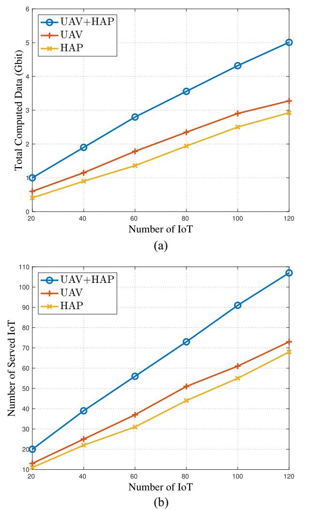  
Fig. 5. Performance of different aerial computing mode. (a) Total computed data. (b) Number of served IoT.

We further study the impacts of computation capacity of UAVs and HAPs on the optimization performance in Fig. 6. Specifically, in Fig. 6(a), the decrement of HAP’s computation capability imposes a negative impact on the total computed data, and there exists a similar effect from the UAV’s computation capability on the total computed data in Fig. 6(b). It is noted that the variation of HAP’s computation capacity has more prominent impacts than the variation of UAV’s computation capacity on the optimization results, since the powerful computing capability of the HAP provides computation service for a large number of IoT devices. In fact, with the decrement of UAV’s computing capacity, the IoT data being computed at the UAV deceases and the UAV will have more energy to relay the IoT data to the HAP, so the impact of UAV’s computation capacity variation is mild.

Moreover, Fig. 7 reveals the effect from the computation capability of HAPs and UAVs on total energy consumption. In particular, from Fig. 7(a), we can observe that the total energy cost has an increment with the increasing of HAP’s computation capability, and similarly from Fig. 7(b), the total energy consumption is increasing with the increment of UAV’s computation capacity. Such trends are in accordance with (10) and (11). Besides, note that HAP’s computation capability variation has a stronger effect on the total energy cost than UAVs, since the HAP equipped with large computing and energy capacity provides service for more IoT devices.

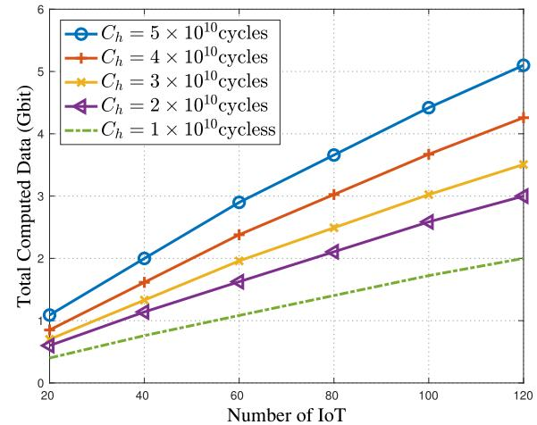

line

| Number of IoT | C_h = 5 × 10^10 cycles | C_h = 4 × 10^10 cycles | C_h = 3 × 10^10 cycles | C_h = 2 × 10^10 cycles | C_h = 1 × 10^10 cycles |
| ------------- | ---------------------- | ---------------------- | ---------------------- | ---------------------- | ---------------------- |
| 20            | 1.0                    | 0.8                    | 0.7                    | 0.6                    | 0.5                    |
| 40            | 2.0                    | 1.6                    | 1.4                    | 1.2                    | 0.9                    |
| 60            | 3.0                    | 2.4                    | 2.0                    | 1.6                    | 1.3                    |
| 80            | 3.7                    | 3.1                    | 2.5                    | 2.1                    | 1.7                    |
| 100           | 4.4                    | 3.7                    | 3.0                    | 2.6                    | 2.0                    |
| 120           | 5.1                    | 4.3                    | 3.5                    | 3.0                    | 2.3                    |

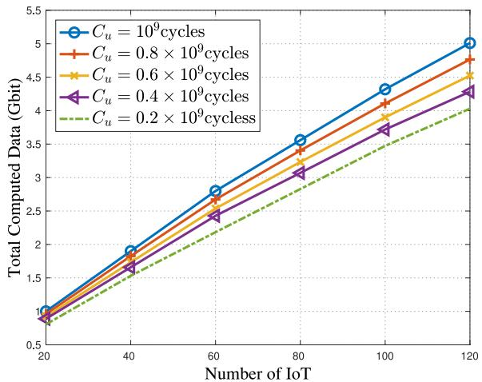

line

| Number of IoT | Cu = 10^9 cycles | Cu = 0.8 × 10^9 cycles | Cu = 0.6 × 10^9 cycles | Cu = 0.4 × 10^9 cycles | Cu = 0.2 × 10^9 cycles |
| ------------- | ---------------- | ---------------------- | ---------------------- | ---------------------- | ---------------------- |
| 20            | 1.0              | 1.0                    | 1.0                    | 1.0                    | 0.8                    |
| 40            | 1.9              | 1.8                    | 1.7                    | 1.6                    | 1.5                    |
| 60            | 2.8              | 2.6                    | 2.5                    | 2.4                    | 2.3                    |
| 80            | 3.6              | 3.4                    | 3.3                    | 3.2                    | 3.1                    |
| 100           | 4.4              | 4.2                    | 4.1                    | 4.0                    | 3.9                    |
| 120           | 5.0              | 4.8                    | 4.7                    | 4.6                    | 4.5                    |

(b)   
Fig. 6. Impact of computation capability on network performance. (a) Impact of HAP’s computation capability $( C _ { \underline { { u } } _ { \alpha } } \overset { \cdot } { = } ~ 1 0 ^ { 9 } \mathrm { c y c l e s } )$ ). (b) Impact of UAV’s computation capability $( C _ { h } ^ { ' } = 5 \times 1 0 ^ { 1 0 } \mathrm { c y c l e s } )$ .

# VI. CONCLUSION AND FUTURE WORK

In this article, we have investigated the hierarchical aerial computing to serve the terrestrial IoT devices by cooperating HAPs and UAVs. Two offloading schemes have been considered: 1) IoT data being offloaded to UAVs and computed at UAVs and 2) IoT data being relayed by UAVs to HAPs and computed at HAPs. The problem of maximizing the total successful computed data of IoT users has been formulated, which is in the form of integer programming and is intractable to solve. Hence, we have presented the computationally tractable matching game-based algorithm to deal with the data offloading from IoT to UAVs, and the external effect among different IoT devices has also been tackled. Besides, a heuristic algorithm regarding to the data offloading from UAVs to HAPs has been designed, and after that, to take full advantage of the aerial resources, an adjustment algorithm has been proposed. The complexity of the proposed algorithms has been analyzed and numerical results have verified that the proposed algorithms can efficiently achieve the near OP, compared with the exhaustive searching. Moreover, the advantages of the IoT-UAV-HAP offloading scheme as well as the influence from various network parameters have been analyzed, conducive to the resource management in practical applications. There exist a couple of open issues to be addressed in future works. First, the issue of dynamic network with varying traffic load as well as the metric of channel utilization will be considered in the aerial computing networks. Second, we will further optimize the data rate and equipment utilization in the aerial computing framework. Finally, we plan to explore the mutual data offloading between UAVs through networking to improve the calculation rate.

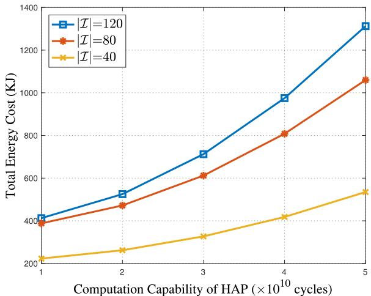  
(a)

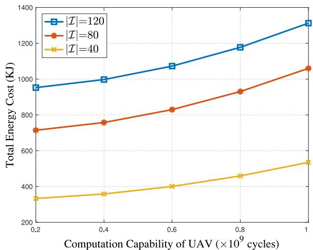  
(b)   
Fig. 7. Impact of computation capability on energy cost. (a) Impact of HAP’s computation capability $( C _ { u } = 1 0 ^ { \bar { 9 } } \mathrm { c y c l e s } )$ . (b) Impact of UAV’s computation capability $( C _ { h } = 5 \times 1 0 ^ { 1 0 } \mathrm { c y c l e s } )$ .

# REFERENCES

[1] Z. Zhang et al., “6G wireless networks: Vision, requirements, architecture, and key technologies,” IEEE Veh. Technol. Mag., vol. 14, no. 3, pp. 28–41, Sep. 2019.

[2] Y. Zhao et al., “A comprehensive survey of 6G wireless communications,” Feb. 2021, arXiv:2101.03889.   
[3] Z. Zhao et al., “A novel framework of three-hierarchical offloading optimization for MEC in industrial IoT networks,” IEEE Trans. Ind. Informat., vol. 16, no. 8, pp. 5424–5434, Aug. 2020.   
[4] N.-N. Dao et al., “Survey on aerial radio access networks: Toward a comprehensive 6G access infrastructure,” IEEE Commun. Surveys Tuts., vol. 23, no. 2, pp. 1193–1225, 2nd Quart., 2021.   
[5] N.-N. Dao, Q.-V. Pham, D.-T. Do, and S. Dustdar, “The sky is the edge—Toward mobile coverage from the sky,” IEEE Internet Comput., vol. 25, no. 2, pp. 101–108, Mar./Apr. 2021.   
[6] M. Zeng, W. Hao, O. A. Dobre, Z. Ding, and H. V. Poor, “Massive MIMO-assisted mobile edge computing: Exciting possibilities for computation offloading,” IEEE Veh. Technol. Mag., vol. 15, no. 2, pp. 31–38, Jun. 2020.   
[7] K. Xiong, S. Leng, C. Huang, C. Yuen, and Y. L. Guan, “Intelligent task offloading for heterogeneous V2X communications,” IEEE Trans. Intell. Transp. Syst., vol. 22, no. 4, pp. 2226–2238, Apr. 2021.   
[8] G. K. Kurt et al., “A vision and framework for the high altitude platform station (HAPS) networks of the future,” IEEE Commun. Surveys Tuts., vol. 23, no. 2, pp. 729–779, 2nd Quart., 2021.   
[9] G. K. Kurt and H. Yanikomeroglu, “Communication, computing, caching, and sensing for next-generation aerial delivery networks: Using a high-altitude platform station as an enabling technology,” IEEE Veh. Technol. Mag., vol. 16, no. 3, pp. 108–117, Sep. 2021.   
[10] X. Jiang et al., “Covert communication in UAV-assisted air-ground networks,” IEEE Wireless Commun., vol. 28, no. 4, pp. 190–197, Aug. 2021.   
[11] J. Zhang et al., “Aeronautical adhoc networking for the Internet-abovethe-clouds,” Proc. IEEE, vol. 107, no. 5, pp. 868–911, May 2019.   
[12] Z. Jia, M. Sheng, J. Li, D. Zhou, and Z. Han, “Joint HAP access and LEO satellite backhaul in 6G: Matching game-based approaches,” IEEE J. Sel. Areas Commun., vol. 39, no. 4, pp. 1147–1159, Apr. 2021.   
[13] W. Wang et al., “Robust 3D-trajectory and time switching optimization for dual-UAV-enabled secure communications,” IEEE J. Sel. Areas Commun., vol. 39, no. 11, pp. 3334–3347, Nov. 2021.   
[14] Q.-V. Pham, M. Zeng, R. Ruby, T. Huynh-The, and W.-J. Hwang, “UAV communications for sustainable federated learning,” IEEE Trans. Veh. Technol., vol. 70, no. 4, pp. 3944–3948, Apr. 2021.   
[15] N. Zhao et al., “UAV-assisted emergency networks in disasters,” IEEE Wireless Commun., vol. 26, no. 1, pp. 45–51, Feb. 2019.   
[16] M. S. Alam, G. K. Kurt, H. Yanikomeroglu, P. Zhu, and N. D. Dào, “High altitude platform station based super macro base station constellations,” IEEE Commun. Mag., vol. 59, no. 1, pp. 103–109, Jan. 2021.   
[17] Z. Jia, M. Sheng, J. Li, D. Zhou, and Z. Han, “Joint data collection and transmission in 6G aerial access networks,” in Proc. IEEE Global Commun. Conf., Madrid, Spain, Dec. 2021, pp. 1–6.   
[18] “HAPS MOBILE.” Dec. 2020. [Online]. Available: https://www.hapsmobile.com/en/   
[19] Z. Jia, M. Sheng, J. Li, and Z. Han, “Towards data collection and transmission in 6G space–air–ground integrated networks: Cooperative HAP and LEO satellite schemes,” IEEE Internet Things J., early access, Oct. 21, 2021, doi: 10.1109/JIOT.2021.3121760.   
[20] C. Dong et al., “UAVs as an intelligent service: Boosting edge intelligence for air-ground integrated networks,” IEEE Netw., vol. 35, no. 4, pp. 167–175, Jul./Aug. 2021.   
[21] Z. Jia, M. Sheng, J. Li, D. Niyato, and Z. Han, “LEO-satellite-assisted UAV: Joint trajectory and data collection for Internet of remote things in 6G aerial access networks,” IEEE Internet Things J., vol. 8, no. 12, pp. 9814–9826, Jun. 2021.   
[22] J. Wang, C. Jiang, Z. Han, Y. Ren, R. G. Maunder, and L. Hanzo, “Taking drones to the next level: Cooperative distributed unmannedaerial-vehicular networks for small and mini drones,” IEEE Veh. Technol. Mag., vol. 12, no. 3, pp. 73–82, Sep. 2017.   
[23] H. Zhang, L. Song, and Z. Han, Unmanned Aerial Vehicle Applications Over Cellular Networks for 5G and Beyond. Cham, Switzerland: Springer Int., 2020.   
[24] D. F. Manlove, Algorithmics of Matching Under Preferences. Singapore: World Sci., Apr. 2013.   
[25] A. E. Roth and M. A. O. Sotomayor, Two-Sided Matching: A Study in Game-Theoretic Modeling and Analysis (Econometric Society Monographs). Cambridge, U.K.: Cambridge Univ. Press, 1992.   
[26] F. Zhou, Y. Wu, R. Q. Hu, and Y. Qian, “Computation rate maximization in UAV-enabled wireless-powered mobile-edge computing systems,” IEEE J. Sel. Areas Commun., vol. 36, no. 9, pp. 1927–1941, Sep. 2018.

[27] Z. Yang, C. Pan, K. Wang, and M. Shikh-Bahaei, “Energy efficient resource allocation in UAV-enabled mobile edge computing networks,” IEEE Trans. Wireless Commun., vol. 18, no. 9, pp. 4576–4589, Sep. 2019.   
[28] L. Yang, H. Yao, J. Wang, C. Jiang, A. Benslimane, and Y. Liu, “Multi-UAV-enabled load-balance mobile-edge computing for IoT networks,” IEEE Internet Things J., vol. 7, no. 8, pp. 6898–6908, Aug. 2020.   
[29] B. Yang, X. Cao, C. Yuen, and L. Qian, “Offloading optimization in edge computing for deep-learning-enabled target tracking by Internet of UAVs,” IEEE Internet Things J., vol. 8, no. 12, pp. 9878–9893, Jun. 2021.   
[30] C. Zhan, H. Hu, Z. Liu, Z. Wang, and S. Mao, “Multi-UAVenabled mobile-edge computing for time-constrained IoT applications,” IEEE Internet Things J., vol. 8, no. 20, pp. 15553–15567, Oct. 2021.   
[31] Z. Qin et al., “Task selection and scheduling in UAV-enabled MEC for reconnaissance with time-varying priorities,” IEEE Internet Things J., vol. 8, no. 24, pp. 17290–17307, Dec. 2021.   
[32] J. Chen et al., “A multi-leader multi-follower Stackelberg game for coalition-based UAV MEC networks,” IEEE Wireless Commun. Lett., vol. 10, no. 11, pp. 2350–2354, Nov. 2021.   
[33] S. Wang et al., “Federated learning for task and resource allocation in wireless high-altitude balloon networks,” IEEE Internet Things J., vol. 8, no. 24, pp. 17460–17475, Dec. 2021.   
[34] M. Ke et al., “An edge computing paradigm for massive IoT connectivity over high-altitude platform networks,” Jun. 2021, arXiv:2106.13476.   
[35] Q. Ren, O. Abbasi, G. K. Kurt, H. Yanikomeroglu, and J. Chen, “Caching and computation offloading in high altitude platform station (HAPS) assisted intelligent transportation systems,” Jun. 2021, arXiv:2106.14928.   
[36] Y. Yang, X. Chang, Z. Jia, Z. Han, and Z. Han, “Towards 6G joint HAPS-MEC-cloud 3C resource allocation for delay-aware computation offloading,” in Proc. IEEE Int. Conf. ISPA/BDCloud/SocialCom/SustainCom, Exeter, U.K., Dec. 2020, pp. 175–182.   
[37] F. Granelli, C. Costa, J. Zhang, R. Bassoli, and F. H. P. Fitzek, “Design of an on-demand agile 5G multi-access edge computing platform using aerial vehicles,” IEEE Commun. Stand. Mag., vol. 4, no. 4, pp. 34–41, Dec. 2020.   
[38] L. Zhang, H. Zhang, C. Guo, H. Xu, L. Song, and Z. Han, “Satelliteaerial integrated computing in disasters: User association and offloading decision,” in Proc. IEEE Int. Conf. Commun. (ICC), Dublin, Ireland, Jul. 2020, pp. 554–559.   
[39] S. Mao, S. He, and J. Wu, “Joint UAV position optimization and resource scheduling in space–air–ground integrated networks with mixed cloud-edge computing,” IEEE Syst. J., vol. 15, no. 3, pp. 3992–4002, Sep. 2021.   
[40] H. Liao, Z. Zhou, X. Zhao, and Y. Wang, “Learning-based queue-aware task offloading and resource allocation for space–air–ground-integrated power IoT,” IEEE Internet Things J., vol. 8, no. 7, pp. 5250–5263, Apr. 2021.   
[41] Y. Zeng, Q. Wu, and R. Zhang, “Accessing from the sky: A tutorial on UAV communications for 5G and beyond,” Proc. IEEE, vol. 107, no. 12, pp. 2327–2375, Dec. 2019.   
[42] Y. Qu et al., “Service provisioning for UAV-enabled mobile edge computing,” IEEE J. Sel. Areas Commun., vol. 39, no. 11, pp. 3287–3305, Nov. 2021.   
[43] Y. Yu, X. Bu, K. Yang, H. Yang, X. Gao, and Z. Han, “UAV-aided low latency multi-access edge computing,” IEEE Trans. Veh. Technol., vol. 70, no. 5, pp. 4955–4967, May 2021.   
[44] Q.-V. Pham, H. T. Nguyen, Z. Han, and W.-J. Hwang, “Coalitional games for computation offloading in NOMA-enabled multi-access edge computing,” IEEE Trans. Veh. Technol., vol. 69, no. 2, pp. 1982–1993, Feb. 2020.   
[45] N. Raveendran, H. Zhang, L. Song, L.-C. Wang, C. S. Hong, and Z. Han, “Pricing and resource allocation optimization for IoT fog computing and NFV: An EPEC and matching based perspective,” IEEE Trans. Mobile Comput., early access, Sep. 18, 2020, doi: 10.1109/TMC.2020.3025189.   
[46] Y. Gu, C. Jiang, L. X. Cai, M. Pan, L. Song, and Z. Han, “Dynamic path to stability in LTE-unlicensed with user mobility: A matching framework,” IEEE Trans. Wireless Commun., vol. 16, no. 7, pp. 4547–4561, Jul. 2017.   
[47] D. Gale and L. S. Shapley, “College admissions and the stability of marriage,” Amer. Math. Monthly, vol. 69, no. 1, pp. 9–15, Mar. 1962.

natural_image

Portrait of a smiling woman with short hair and glasses (no text or symbols visible)

Ziye Jia (Member, IEEE) received the B.E., M.S., and Ph.D. degrees in communication and information systems from Xidian University, Xi’an, China, in 2012, 2015, and 2021, respectively.

She was a visiting Ph.D. student with the Department of Electrical and Computer Engineering, University of Houston, Houston, TX, USA, from 2018 to 2020. She is currently an Associated Research Fellow with the Key Laboratory of Dynamic Cognitive System of Electromagnetic Spectrum Space, Ministry of

Industry and Information Technology, Nanjing University of Aeronautics and Astronautics, Nanjing, China. Her current research interests include resource allocation and NFV techniques in space–air–ground networks.

natural_image

Portrait of a man in formal attire with glasses and a patterned tie (no text or symbols visible)

Qihui Wu (Senior Member, IEEE) received the B.S. degree in communications engineering and the M.S. and Ph.D. degrees in communications and information systems from the Institute of Communications Engineering, Nanjing, China, in 1994, 1997, and 2000, respectively.

He was a Postdoctoral Research Associate with Southeast University, Nanjing, from 2003 to 2005. He was an Associate Professor with the College of Communications Engineering, PLA University of Science and Technology, Nanjing, from 2005 to

2007, where he was a Full Professor from 2008 to 2016. He has been a Full Professor with the College of Electronic and Information Engineering, Nanjing University of Aeronautics and Astronautics, Nanjing, since May 2016. He was an Advanced Visiting Scholar with the Stevens Institute of Technology, Hoboken, TX, USA, from March 2011 to September 2011. His current research interests span the areas of wireless communications and statistical signal processing, with emphasis on system design of software defined radio, cognitive radio, and smart radio.

natural_image

Portrait of a young man wearing a hoodie (no text or symbols visible)

Chao Dong (Member, IEEE) received the Ph.D. degree in communication engineering from the PLA University of Science and Technology, Nanjing, China, in 2007.

He worked as a Postdoctoral Fellow with the Department of Computer Science and Technology, Nanjing University, Nanjing, China, from 2008 to 2011. He was an Associate Professor with the Institute of Communications Engineering, PLA University of Science and Technology from 2011 to 2017. He is currently a Full Professor with the

College of Electronic and Information Engineering, Nanjing University of Aeronautics and Astronautics, Nanjing. His current research interests include D2D communications, UAVs swarm networking, and anti-jamming network protocol.

Prof. Dong is member of ACM and IEICE.

natural_image

Portrait of a man wearing glasses and a striped shirt (no text or symbols visible)

Chau Yuen (Fellow, IEEE) received the B.E. and Ph.D. degrees from Nanyang Technological University, Singapore, in 2000 and 2004, respectively.

He was a Postdoctoral Fellow with the Lucent Technologies Bell Labs, Murray Hill, NJ, USA, in 2005, and a Visiting Assistant Professor with The Hong Kong Polytechnic University, Hong Kong, in 2008. He was with the Institute for Infocomm Research, Singapore, from 2006 to 2010, where he was involved in an Industrial Project on Developing

an 802.11n Wireless LAN system and participated actively in 3GPP long-term evolution (LTE) and LTE-Advanced (LTE-A) standardization. He has been with the Singapore University of Technology and Design, Singapore, since 2010.

Dr. Yuen was a recipient of the Lee Kuan Yew Gold Medal, the Institution of Electrical Engineers Book Prize, the Institute of Engineering of Singapore Gold Medal, the Merck Sharp and Dohme Gold Medal, and twice a recipient of the Hewlett Packard Prize. He received the IEEE Asia–Pacific Outstanding Young Researcher Award in 2012 and the IEEE VTS Singapore Chapter Outstanding Service Award in 2019. He serves as an Editor for the IEEE TRANSACTIONS ON VEHICULAR TECHNOLOGY and the IEEE SYSTEM JOURNAL, where he was awarded as the Top Associate Editor from 2009 to 2015. He served as the Guest Editor for several special issues, including the IEEE JOURNAL ON SELECTED AREAS IN COMMUNICATIONS, IEEE Communications Magazine, and IEEE TRANSACTIONS ON COGNITIVE COMMUNICATIONS AND NETWORKING. He is a Distinguished Lecturer of IEEE Vehicular Technology Society.

natural_image

Portrait of a smiling man wearing a dark turtleneck (no text or symbols visible)

Zhu Han (Fellow, IEEE) received the B.S. degree in electronic engineering from Tsinghua University, Beijing, China, in 1997, and the M.S. and Ph.D. degrees in electrical and computer engineering from the University of Maryland, College Park, MD, USA, in 1999 and 2003, respectively.

He was a Research and Development Engineer with JDSU, Germantown, MD, USA, from 2000 to 2002. He was a Research Associate with the University of Maryland from 2003 to 2006. He was an Assistant Professor with Boise State University,

Boise, ID, USA, from 2006 to 2008. He is currently a John and Rebecca Moores Professor with the Electrical and Computer Engineering Department as well as the Computer Science Department, University of Houston, Houston, TX, USA. His research interests include wireless resource allocation and management, wireless communications and networking, game theory, big data analysis, security, and smart grid.

Dr. Han received the NSF Career Award in 2010, the Fred W. Ellersick Prize of the IEEE Communication Society in 2011, the EURASIP Best Paper Award for the Journal on Advances in Signal Processing in 2015, the IEEE Leonard G. Abraham Prize in the field of Communications Systems (Best Paper Award in IEEE JOURNAL ON SELECTED AREAS IN COMMUNICATIONS) in 2016, and several best paper awards in IEEE conferences. He is also the winner of the 2021 IEEE Kiyo Tomiyasu Award, for outstanding early to mid-career contributions to technologies holding the promise of innovative applications, with the following citation: “for contributions to game theory and distributed management of autonomous communication networks.” He has been a 1% Highly Cited Researcher since 2017 according to Web of Science. He was an IEEE Communications Society Distinguished Lecturer from 2015 to 2018, and has been an AAAS Fellow since 2019 and an ACM Distinguished Member since 2019.