# HybridRAG-Based LLM Agents for Low-Carbon Optimization in Low-Altitude Economy Networks

Jinbo Wen , Cheng Su , Jiawen Kang , Jiangtian Nie , Yang Zhang , Jianhang Tang , Member, IEEE, Dusit Niyato , Fellow, IEEE, and Chau Yuen , Fellow, IEEE

Abstract—Low-Altitude Economy Networks (LAENets) are emerging as a promising paradigm to support various low-altitude services through integrated air-ground infrastructure. To satisfy low-latency and high-computation demands, the integration of Unmanned Aerial Vehicles (UAVs) with Mobile Edge Computing (MEC) systems plays a vital role, which offloads computing tasks from terminal devices to nearby UAVs, enabling flexible and resilient service provisions for ground users. To promote the development of LAENets, it is significant to achieve low-carbon multi-UAV-assisted MEC networks. However, several challenges hinder this implementation, including the complexity of multidimensional UAV modeling and the difficulty of multi-objective coupled optimization. To this end, this paper proposes a novel Retrieval Augmented Generation (RAG)-based Large Language Model (LLM) agent framework for model formulation. Specifically, we develop HybridRAG by combining KeywordRAG, VectorRAG, and GraphRAG, empowering LLM agents to efficiently retrieve structural information from expert databases and generate more accurate optimization problems compared with traditional RAG-based LLM agents. After customizing carbon emission optimization problems for multi-UAV-assisted MEC networks, we

propose a Double Regularization Diffusion-enhanced Soft Actor-Critic (R<sup>2</sup>DSAC) algorithm to solve the formulated multi-objective optimization problem. The R<sup>2</sup>DSAC algorithm incorporates diffusion entropy regularization and action entropy regularization to improve the performance of the diffusion policy. Furthermore, we dynamically mask unimportant neurons in the actor network to reduce the carbon emissions associated with model training. Simulation results demonstrate the reliability of the proposed HybridRAG-based LLM agent framework, which achieves a 6.6% improvement in F1 scores over traditional RAG, and validate the effectiveness of the R<sup>2</sup>DSAC algorithm, which outperforms the SAC algorithm by up to 64.17%.

Index Terms—Low-altitude economy, low-carbon multi-UAVassisted MEC networks, LLMs, HybridRAG, regularization diffusion models, deep reinforcement learning.

## I. INTRODUCTION

and aerial vehicle technologies, Low-Altitude Economy Networks (LAENets) are emerging as a transformative paradigm, enabling dynamic, large-scale, and intelligent communication infrastructure within low-altitude airspace below 1,000 meters [1], [2]. The primary goal of LAENets is to harness low-flying equipment with high mobility and operational flexibility capabilities, such as Unmanned Aerial Vehicles (UAVs), to carry out a wide range of economic activities, including logistics delivery, intelligent transportation, and environmental surveillance, thereby generating significant commercial and societal value [2]. As a critical architecture in LAENets, UAV-assisted Mobile Edge Computing (MEC) networks enable low-latency intelligent services for ground users through offloading computing tasks to proximate UAVs, mitigating the inherent limitations of resource-constrained mobile devices [3], [4].

Driven by the prosperous vision of LAENets [1], [2], achieving low-carbon multi-UAV-assisted MEC networks has garnered substantial interest from academia and industry [5]. The reduction of carbon emissions in multi-UAV-assisted MEC networks becomes a central focus in this pursuit [6]. However, several challenges hinder its implementation:

Challenge I. Complexity of Multi-dimensional UAV Modeling: In multi-UAV-assisted MEC networks, the complexity of UAV mathematical modeling primarily arises from four interrelated dimensions [4], [7], [8]: mobility (e.g., trajectory and velocity), communication (e.g., channel power gain and interference), and energy consumption (e.g., propulsion, computation, and transmission). Each dimension requires precisely calibrated modeling to ensure the accuracy and reliability of UAV system representations, posing a significant challenge for both interdisciplinary researchers and newcomers to this field.

Challenge II. Difficulty of Multi-objective Coupled Optimization: Unlike single-UAV-assisted MEC networks, the coupling of multiple objective variables, such as task offloading, resource allocation, and trajectory planning, significantly increases the difficulty of carbon emission optimization in multi-UAV-assisted MEC networks [6]. Some researchers have adopted heuristic algorithms to solve multi-objective coupled optimization problems for energy consumption reduction [3], [5], [6], [8], but many of these problems are NP-hard, making it difficult for heuristic algorithms to find optimal or near-optimal solutions [9]. As an alternative, Deep Reinforcement Learning (DRL) algorithms provide greater adaptability in dynamic and uncertain scenarios by learning polices through continuous interaction with the environment, which makes them suitable for addressing complex joint optimization issues [4], [7], [10]. Nevertheless, they are susceptible to falling into suboptimal solution exploration due to the high dimensionality of the action space.

Large Language Model (LLM) agents with Retrieval Augmented Generation (RAG) techniques have been developed to support network optimization tasks [9], [11], which are capable of generating effective optimization strategies through interactive sessions with human users. Specifically, by comprehending the context and deep meaning of natural language, LLM agents can generate accurate content leveraging RAG techniques to retrieve relevant information from external databases [12], [13]. Although RAG can refine the outputs of LLMs and mitigate hallucination issues, it exhibits limitations when applied to carbon emission optimization in multi-UAVassisted MEC networks. First, traditional RAG techniques are often inefficient in capturing structural and relational information [14], such as the influence of Line-of-Sight (LoS) probability on Ground-to-Air (G2A) communications, which cannot be represented through semantic similarity alone. Second, traditional RAG techniques lack the capability to comprehensively grasp global contextual information, as they typically retrieve only a limited subset of documents, especially constrained to those appearing at the beginning or end of the documents [15].

Fortunately, GraphRAG, as an innovative extension of RAG, provides a promising solution to overcome the inherent limitations of RAG [14], [15]. In contrast to traditional RAG, GraphRAG can capture intertextual relationships and retrieve graph elements enriched with relational knowledge from a constructed graph database [14], enabling more accurate and efficient retrieval of structured relational information. Therefore, to address Challenge I, we propose a HybridRAG-based LLM agent framework that synergistically integrates RAG and GraphRAG techniques. By leveraging the contextual knowledge retrieval capability of RAG and the structured reasoning capability of GraphRAG over interconnected parameters [13], [14], the proposed HybridRAG-based LLM agents can efficiently retrieve expert knowledge and generate accurate carbon emission optimization problems for multi-UAV-assisted MEC networks. To address Challenge II, we employ diffusion models owing to their strong ability to capture high-dimensional and intricate features within network environments [16], [17]. Unlike traditional generative models, diffusion models leverage forward and reverse processes that not only mitigate model collapse but also provide a natural form of regularization, which is critical for stabilizing DRL training in dynamic environments. Therefore, we propose a double regularization diffusion-enhanced DRL algorithm to generate optimal strategies of multi-objective carbon emission optimization problems formulated by HybridRAG-based LLM agents. Our contributions are summarized as follows:

HybridRAG-based LLM Agent Framework: We develop a HybridRAG-based LLM agent framework for carbon emission optimization in multi-UAV-assisted MEC networks. Specifically, we develop HybridRAG by merging KeywordRAG, VectorRAG, and GraphRAG. Through the blend of vector and keyword retrieval, LLM agents can not only assess vast embedded knowledge but also retrieve expert knowledge from external documents. Moreover, we construct a structured and queryable knowledge graph, enabling the LLM agents to retrieve structural relational information, thereby generating more accurate carbon emission optimization problems for multi-UAV-assisted MEC networks. (For Challenge I)

Double Regularization Diffusion-enhanced DRL: We propose a Double Regularization Diffusion-enhanced Soft Actor-Critic (R<sup>2</sup>DSAC) algorithm to identify optimal strategies of the carbon emission optimization problem formulated by the HybridRAG-based LLM agent. Specifically, we employ diffusion models as the policy to generate strategies through forward and reverse processes. To enhance policy performance, we incorporate diffusion entropy regularization and action entropy regularization into the policy learning objective function. Moreover, we apply dynamic pruning techniques in the diffusion-based actor network to suppress the activity of unimportant neurons, thereby reducing the carbon emissions associated with model training. (For Challenge II)

Extensive Performance Evaluation: To evaluate the performance of the developed HybridRAG, we utilize a finegrained framework called RAGChecker<sup>1</sup>. Specifically, we comprehensively adopt three types of metrics, including overall, retriever, and generator metrics, to rigorously analyze the performance of HybridRAG. Simulation results demonstrate that our HybridRAG outperforms traditional RAG techniques [18], achieving a 6.6% improvement in F1 scores. In addition, we compare the proposed R<sup>2</sup>DSAC algorithm with several DRL benchmark algorithms and conduct the ablation experiment. Simulation results demonstrate the effectiveness of the proposed R<sup>2</sup>DSAC algorithm for carbon emission optimization in multi-UAV-assisted MEC networks, which achieves up to a 64.17% improvement over the SAC algorithm [19].

The rest of the paper is organized as follows: Section II reviews the related work. Section III introduces the proposed HybridRAG-based LLM agent framework for carbon emission optimization in multi-UAV-assisted MEC networks. In Section IV, we present the architecture of the R<sup>2</sup>DSAC algorithm. Section V conducts extensive simulations to demonstrate the effectiveness of the proposed HybridRAG and the R<sup>2</sup>DSAC algorithm. In Section VI, we conclude the paper.

## II. RELATED WORK

## A. Energy-Efficient Multi-UAV-Assisted MEC Networks

In multi-UAV-assisted MEC networks, task offloading has emerged as a prominent research focus in recent studies [4], [7], [20], [21]. An increasing number of researchers are dedicating their efforts to optimizing resource allocation during the task offloading process, aiming to achieve energy-efficient multi-UAV-assisted MEC networks [3], [4], [5], [7], [8]. For instance, the authors in [4] formulated a mixed integer programming problem by jointly optimizing the trajectory design of UAVs, offloading decisions, and computing and communication resource management. In [3], the authors formulated a multi-objective optimization problem with respect to computing resource allocation, task offloading, and UAV trajectory control, thereby reducing the total task completion delay and UAV energy consumption. In [5], the authors jointly optimized the flight trajectories of UAVs, computing resource allocation, and task offloading scheduling, thereby minimizing the carbon emissions of blockchain-enabled UAV-assisted MEC systems.

However, the aforementioned studies typically construct intricate optimization problems manually, introducing a susceptibility to human errors that can compromise the precision of the devised strategy [9]. Moreover, a significant proportion of current researchers neglect the investigation of reducing the carbon emissions associated with multi-UAV-assisted MEC networks, which is a critical aspect in the context of sustainable low-altitude economies. To address this research gap, we propose leveraging LLM agents as auxiliary tools to formulate carbon emission optimization problems for multi-UAV-assisted MEC networks, ultimately enabling sustainable and low-carbon operation in such systems.

## B. RAG-Based LLM Agents in Network Optimization

As a core component of agentic Artificial Intelligence (AI), LLM agents are capable of creating novel text through chain-ofthought reasoning [22], [23], [24]. Empowered by RAG, which is an advanced technique for enhancing the reliability and accuracy of Generative AI (GenAI) models [13], LLM agents can generate highly accurate outputs by retrieving relevant contextual information from external databases. Some researchers have explored the applications of RAG-based LLM agents in network optimization [9], [11]. Specifically, the authors in [9] proposed a RAG-based GenAI agent framework to customize problem formulation in satellite communication networks. In [11], the authors proposed an LLM-enabled carbon emission optimization framework for task offloading, which designed pluggable

LLM and RAG modules to generate accurate and reliable carbon emission optimization problems. While RAG has demonstrated promise in static information retrieval tasks [9], [11], [13], its performance often degrades in complex and dynamic optimization scenarios that require connecting disparate pieces of information. Therefore, we develop HybridRAG by integrating GraphRAG, KeywordRAG, and VectorRAG, thereby enhancing the robustness and adaptability of LLM agents to complex network optimization scenarios.

## C. Diffusion-Based DRL Algorithms

Diffusion models have gained significant research attention in DRL due to their exceptional expressiveness in policy representation and inherent multimodality for capturing diverse solution spaces [16], [25], [26], [27]. For instance, the authors in [25] leveraged a conditional diffusion model to represent the Q-learning policy. In [26], the authors proposed an efficient diffusion policy that approximately constructs actions from corrupted ones during training. Diffusion-based DRL algorithms have been utilized for network optimization [11], [16], [28], [29]. For instance, the authors in [11] employed diffusion-based DRL algorithms to identify optimal carbon emission strategies for task offloading. In [28], the authors proposed a multi-dimensional contract design policy based on diffusion models to generate optimal contracts, thereby enhancing the efficiency of embodied agent AI twin migrations. Inspired by the successful applications of diffusion models in network optimization [16], we adopt diffusion-based DRL algorithms to solve the optimization problem formulated by the proposed HybridRAG-based LLM agent framework.

## III. HYBRIDRAG-BASED LLM AGENT FRAMEWORK

In this section, we propose the HybridRAG-based LLM agent framework for carbon emission optimization in multi-UAVassisted MEC networks.

## A. Expert Dataset Introduction

1) System Model: As shown in Fig. 1, we consider a multi-UAV-assisted MEC network that consists of a set $\mathcal { M } =$ $\{ 1 , \ldots , m , \ldots , M \}$ of <sup>M</sup> rotary-wing UAVs and a set $\kappa =$ $\{ 1 , \ldots , k , \ldots , K \}$ of <sup>K</sup> users. Without loss of generality, the multi-UAV-assisted MEC network is under a continuous duration [30]. To transform the continuous problem into a tractable sequential decision process, we divide the continuous duration into a set $\mathcal { N } = \{ 1 , \dots , n , \dots , N \}$ of <sup>N</sup> time slots with an equal time duration $\delta _ { t } .$ . At each time slot, each user <sup>k</sup> generates an indivisible computing-intensive task $I _ { k } ( n ) = ( D _ { k } ( n ) , C _ { k } ( n ) )$ [5], [7], where $D _ { k } ( n )$ (bits) represents the task size, and $C _ { k } ( n )$ (cycles<sup>/</sup>bit) represents the number of Central Processing Unit (CPU) cycles required for computing one bit of task data.

Due to the limited computing ability of user devices, each user can offload the generated task (e.g., healthy data analysis) to a rotary-wing UAV equipped with one or multiple MEC servers [3], [5]. Compared with fixed-wing UAVs, rotarywing UAVs can hover near user devices to provide computing services for users with better channel quality [30]. In addition, rotary-wing UAVs are generally equipped with multiple antennae [4], and multiple users can communicate with UAVs through orthogonal frequency division multiple access at the same time [7], indicating that interference between multiple users in the coverage area of a UAV can be ignored [7].

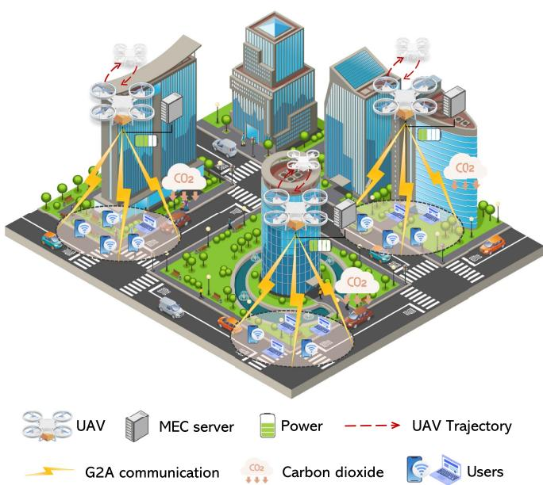  
Fig. 1. An illustration of LAENets, where users offload computing tasks to proximate UAVs. The ${ \mathrm { U A V s } } ,$ equipped with mobile computing capabilities, provide low-latency intelligent services to users while generating carbon dioxide during computing service provisions.

2) UAV Mobility Model: We consider a three-dimensional Cartesian coordinate system in the multi-UAV-assisted MEC network, where the coordinate of each user <sup>k</sup> at time slot <sup>n</sup> is denoted as $\mathbf v _ { k } ( n ) = [ x _ { k } ( n ) , y _ { k } ( n ) , 0 ] ^ { T }$ . In addition, we consider that UAVs hover at a certain height <sup>H</sup> [30], and the coordinate of each UAV <sup>m</sup> at time slot <sup>n</sup> is denoted as $\mathbf { w } _ { m } ( n ) = [ x _ { m } ( n ) , y _ { m } ( n ) , H ] ^ { T }$ . To ensure that UAVs operate within the designated rectangular area, their positions must satisfy the following constraints, which are given by [31]

$$
x _ { m } ( n ) \in [ 0 , X _ { \operatorname* { m a x } } ] , y _ { m } ( n ) \in [ 0 , Y _ { \operatorname* { m a x } } ] , \forall m \in \mathcal { M } , \forall n \in \mathcal { N } ,\tag{1}
$$

where $X _ { \mathrm { m a x } }$ and $Y _ { \mathrm { m a x } }$ are the side lengths of the designated rectangular area, respectively. Notably, the next positions of UAV <sup>m</sup> is determined by its horizontal angle $\theta _ { m } ( n ) \in [ 0 , 2 \pi )$ and its flight speed $v _ { m } ( n )$ , and we can obtain

$$
\begin{array} { r } { x _ { m } ( n + 1 ) = x _ { m } ( n ) + \delta _ { t } v _ { m } ( n ) \cos ( \theta _ { m } ( n ) ) , \forall n \in \mathcal { N } , } \end{array}\tag{2}
$$

$$
y _ { m } ( n + 1 ) = y _ { m } ( n ) + \delta _ { t } v _ { m } ( n ) \sin ( \theta _ { m } ( n ) ) , \forall n \in \mathcal { N } .\tag{3}
$$

The mobility model of UAVs is constrained by the maximum instantaneous speed $V _ { \mathrm { m a x } }$ and the minimum collision avoidance distance $D _ { \mathrm { m i n } }$ [4], [7], which are expressed as

$$
\frac { \| \mathbf { w } _ { m } ( n + 1 ) - \mathbf { w } _ { m } ( n ) \| } { \delta _ { t } } \leq V _ { \operatorname* { m a x } } , \forall m \in \mathcal { M } , \forall n \in \mathcal { N } ,\tag{4}
$$

$$
\| \mathbf { w } _ { m } ( n ) - \mathbf { w } _ { m ^ { \prime } } ( n ) \| \geq D _ { \operatorname* { m i n } } , \forall m , m ^ { \prime } \in \mathcal { M } , m \neq m ^ { \prime } ,\tag{5}
$$

where  ·  represents the Euclidean norm [30]. When user <sup>k</sup> is within the coverage region of UAV $m ,$ the task $I _ { k } ( n )$ generated by user <sup>k</sup> can be offloaded to UAV <sup>m</sup> at each time slot $n ,$ and the corresponding constraint is expressed as

$$
\| \mathbf { w } _ { m } ( n ) - \mathbf { v } _ { k } ( n ) \| ^ { 2 } \leq r _ { \operatorname* { m a x } } ^ { 2 } + H ^ { 2 } , \forall m \in \mathcal { M } , \forall k \in \mathcal { K } ,\tag{6}
$$

where $r _ { \mathrm { m a x } }$ represents the coverage area radius of UAVs.

3) Communication Model: In real environments, many different objects act as scatterers or obstacles during G2A communications [8]. Radio signals emitted by UAVs or user devices do not propagate in free space but may be affected by scattering or shadowing caused by objects [8], resulting in additional path loss. Thus, we capture the G2A communication by a probabilistic path loss model rather than a simplified free path loss model [4], [7], [8]. Specifically, the probabilistic path loss model considers the occurrence probability of each path and the path loss of LoS and Non-LoS (NLoS) links. The occurrence probabilities of LoS and NLoS communications between user <sup>k</sup> and UAV <sup>m</sup> at time slot <sup>n</sup> are expressed as [8]

$$
P _ { k , m } ^ { \mathrm { L o S } } ( n ) = \frac { 1 } { 1 + a \exp ( - b ( \theta _ { k , m } ( n ) - a ) ) } ,\tag{7}
$$

$$
P _ { k , m } ^ { \mathrm { N L o S } } ( n ) = 1 - P _ { k , m } ^ { \mathrm { L o S } } ( n ) ,\tag{8}
$$

where <sup>a</sup> and <sup>b</sup> are constant parameters related to the environment, and $\begin{array} { r } { \theta _ { k , m } ( n ) = \frac { 1 8 0 } { \pi } } \end{array}$ arcsin( $\frac { H } { \| \mathbf { w } _ { m } ( n ) - \mathbf { v } _ { k } ( n ) \| } )$ represents the elevation angle of user <sup>k</sup> to UAV <sup>m</sup>.

In the probabilistic path loss model, Free-Space Path Loss (FSPL) is the foundation of the signal attenuation in ideal conditions, and the FSPL for the communication between user <sup>k</sup> and UAV <sup>m</sup> is given by

$$
L _ { k , m } ( n ) = 2 0 \left[ \lg ( \| \mathbf { w } _ { m } ( n ) - \mathbf { v } _ { k } ( n ) \| ) + \lg ( f ) + \lg \left( { \frac { 4 \pi } { c } } \right) \right] ,\tag{9}
$$

where <sup>f</sup> is the carrier frequency and $c = 3 \times 1 0 ^ { 8 } ~ \mathrm { m / s }$ is the speed of light. Thus, the average path loss for the G2A communication between user <sup>k</sup> and UAV <sup>m</sup> is given by [4]

$$
\begin{array} { r l } & { \overline { { P L } } _ { k , m } ( n ) ( \mathrm { d B } ) = P _ { k , m } ^ { \mathrm { L o S } } ( n ) \left( L _ { k , m } ( n ) + \eta ^ { \mathrm { L o S } } \right) } \\ & { \qquad + P _ { k , m } ^ { \mathrm { N L o S } } ( n ) \left( L _ { k , m } ( n ) + \eta ^ { \mathrm { N L o S } } \right) , } \end{array}\tag{10}
$$

where $\eta ^ { \mathrm { L o S } }$ and $\eta ^ { \mathrm { N L o S } }$ are the excessive path loss for LoS and NLoS links, respectively. Therefore, the uplink transmission rate from user <sup>k</sup> to UAV <sup>m</sup> at time slot <sup>n</sup> is given by [7]

$$
R _ { k , m } ( n ) = B _ { k , m } ^ { \mathrm { G 2 A } } \log _ { 2 } { \left( 1 + \frac { p _ { k } ( n ) } { \overline { { P L } } _ { k , m } ( n ) \delta ^ { 2 } } \right) } ,\tag{11}
$$

where $B _ { k , m } ^ { \mathrm { G 2 A } }$ is the uplink bandwidth from user <sup>k</sup> to UAV $m _ { : }$ $p _ { k } ( n )$ is the transmit power of user <sup>k</sup>, and $\delta ^ { 2 }$ is the additive Gaussian white noise power at the receiving end. Additionally, the total uplink bandwidth from users to UAV <sup>m</sup> cannot exceed the maximum uplink bandwidth of G2A communications [7], and the corresponding constraint is given by

$$
\sum _ { k = 1 } ^ { K } B _ { k , m } ^ { \mathrm { G 2 A } } \leq B _ { \operatorname* { m a x } } ^ { \mathrm { G 2 A } } , \forall m \in \mathcal { M } .\tag{12}
$$

The size of uploaded tasks is generally larger than the size of calculation results [5]. Therefore, without loss of generality, we do not consider the latency and energy consumption of downlink transmission [3], [5].

4) Computing Energy Consumption Model: The computing energy consumption model consists of two parts, i.e., the energy consumption for uplink transmission and the energy consumption for UAV calculating offloading tasks. The energy consumption for uplink transmission from user <sup>k</sup> to UAV <sup>m</sup> at time slot <sup>n</sup> is expressed as [4]

$$
E _ { k , m } ^ { \mathrm { T r a n } } ( n ) = \frac { p _ { k } ( n ) D _ { k } ( n ) } { R _ { k , m } ( n ) } .\tag{13}
$$

In addition, the energy consumption for UAV <sup>m</sup> calculating the task $I _ { k } ( n )$ offloaded by user <sup>k</sup> at time slot <sup>n</sup> is given by

$$
E _ { k , m } ^ { \mathrm { C a l } } ( n ) = \epsilon _ { m } D _ { k } ( n ) C _ { k } ( n ) ( f _ { k , m } ( n ) ) ^ { 2 } ,\tag{14}
$$

where $\epsilon _ { m }$ denotes the effective switching capacitance that depends on the CPU architecture of the MEC server installed on UAV <sup>m</sup> [3], and $f _ { k , m } ( n )$ (cycles<sup>/</sup>s) represents the computing capability allocated by UAV <sup>m</sup> to user <sup>k</sup> at time slot <sup>n</sup>.

We denote $\alpha _ { k , m } ( n )$ as a task offloading variable and consider that each user only offloads one task to a UAV at each time slot [5], and the corresponding constraint is given by

$$
\sum _ { m = 1 } ^ { M } \alpha _ { k , m } ( n ) = 1 , \forall k \in \mathcal { K } , n \in \mathcal { N } ,\tag{15}
$$

where $\alpha _ { k , m } ( n ) = 1$ indicates that user <sup>k</sup> offloads a computing task to UAV <sup>m</sup> at time slot <sup>n</sup>, and otherwise $\alpha _ { k , m } ( n ) = 0$

5) UAV Propulsion Consumption Model: The propulsion energy consumption of UAV <sup>m</sup> flying at speed $v _ { m } ( n )$ at time slot <sup>n</sup> is expressed as [3], [5], [30]

$$
\begin{array} { l l r } { \displaystyle { E _ { m } ^ { \mathrm { F l y } } ( n ) = \delta _ { t } \Biggl [ P _ { 0 } \biggl ( 1 + \frac { 3 ( v _ { m } ( n ) ) ^ { 2 } } { ( U ^ { \mathrm { T i p } } ) ^ { 2 } } \biggr ) + \frac { 1 } { 2 } d _ { 0 } \zeta s A ( v _ { m } ( n ) ) ^ { 3 } } } \\ { \displaystyle { ~ + P _ { 1 } \sqrt { \sqrt { 1 + \frac { ( v _ { m } ( n ) ) ^ { 4 } } { 4 v _ { 0 } ^ { 4 } } } - \frac { ( v _ { m } ( n ) ) ^ { 2 } } { 2 v _ { 0 } ^ { 2 } } } \Biggr ] , } } & { \mathrm { ~ } ( 1 \ell } \end{array}\tag{6}
$$

where $P _ { 0 }$ and $P _ { 1 }$ represent the blade profile power and the induced power for hovering, respectively, $U ^ { \mathrm { T i p } }$ represents the blade tip speed of the rotor blade, $d _ { 0 }$ represents the UAV fuselage drag ratio, <sup>ζ</sup> represents the air density, <sup>s</sup> represents the rotor solidity, <sup>A</sup> represents the rotor disk area, and $v _ { 0 }$ represents the average rotor induced speed.

6) Optimization Model: The total energy consumption of the multi-UAV-assisted MEC network is expressed as

$$
\begin{array} { r l r } {  { E ^ { \mathrm { T o t a l } } = \sum _ { n = 1 } ^ { N } \sum _ { m = 1 } ^ { M } \sum _ { k = 1 } ^ { K } \alpha _ { k , m } ( n ) [ E _ { k , m } ^ { \mathrm { T r a n } } ( n ) + E _ { k , m } ^ { \mathrm { C a l } } ( n ) ] } } \\ & { } & { + \sum _ { n = 1 } ^ { N } \sum _ { m = 1 } ^ { M } E _ { m } ^ { \mathrm { F l y } } ( n ) . \qquad ( } \end{array}\tag{17}
$$

The optimization model in this paper is to minimize the carbon emissions of the multi-UAV-assisted MEC network, thereby promoting LAENets. According to [5], [32], the carbon emissions

of the multi-UAV-assisted MEC network are related to the total energy consumption of the multi-UAV-assisted MEC network, which can be expressed as

$$
C ^ { \mathrm { T o t a l } } = \varsigma ^ { \mathrm { C a r b o n } } \cdot \tau \cdot E ^ { \mathrm { T o t a l } } ,\tag{18}
$$

where $\varsigma ^ { \mathrm { C a r b o n } } = 3 . 7 7 3 \times 1 0 ^ { - 4 }$ represents that the power generation equipment of a UAV will generate $3 . 7 7 3 \times 1 0 ^ { - 4 }$ kg when consuming 1 Watt-hour (Wh) of electricity, and <sup>τ</sup> denotes the conversion coefficient between Whs and joules.

Remark 1: Network designers need to carefully configure the above six models to manually construct a reliable carbon emission optimization problem for multi-UAV-assisted MEC networks [9]. Nevertheless, for network designers unfamiliar with UAVs or carbon emission reduction, there may be some human errors in formulating the carbon emission optimization problem [9], [11], such as ignoring UAV flight propulsion consumption or the conversion coefficient between Whs and joules, affecting the accuracy of the strategies derived from the constructed optimization problem for reducing carbon emissions in the multi-UAV-assisted MEC network.

RAG-based LLM agents have been developed to assist network designers in formulating accurate network optimization problems [9], [11], which can generate optimization problems through multiple interactions with network designers. Although traditional RAG excels in quickly generating coherent responses from related textual documents [22], it may lose critical contextual information due to paragraph-level chunking. Fortunately, GraphRAG, as an innovative RAG technique, takes into account the interconnections between textual documents, allowing for more accurate and comprehensive retrieval of relational information [15]. However, GraphRAG enhances contextual understanding while resulting in higher token and time costs compared with traditional RAG. Moreover, both traditional RAG and GraphRAG cannot effectively perform hybrid question answering [23], especially in complex network optimization scenarios, where hybrid questions require both textual and relational information to be answered correctly [23]. For example, in the multi-UAV-assisted MEC network, “the data transmission rate between user <sup>k</sup> and UAV <sup>m</sup> at time slot $t ^ { \ast }$ is the textual information, and “the G2A communication link” is the relational information. To this end, we develop a HybridRAG-based LLM agent by merging KeywordRAG, VectorRAG, and GraphRAG.

Remark 2: By combining the advantages of both traditional RAG and GraphRAG, the HybridRAG-based LLM agent can effectively analyze the retrieved expert knowledge and accurately generate the configurations of each model based on the hybrid questions from network designers. In particular, the developed HybridRAG-based LLM agent framework can adapt to various network optimization tasks through the corresponding external databases.

## B. HybridRAG-Based LLM Agents

The HybridRAG comprises three core modules: KeywordRAG, VectorRAG, and GraphRAG [22]. In the following, we introduce the working principle of HybridRAG.

1) KeywordRAG: KeywordRAG, as the key component of the HybridRAG framework, enables LLM agents to retrieve expert knowledge from external documents via keyword matching, instead of relying on semantic search [33]. This functionality is especially crucial in wireless communication contexts characterized by dense and nuanced domain-specific terminology. To enhance the performance of KeywordRAG, we align expert-curated keyword segments with domain-specific terms extracted from optimization-related queries, facilitating faster, more precise, and more efficient retrieval of relevant knowledge passages from external databases.

We first perform semantic segmentation on the original external dataset D and extract hierarchical heading structures from the source corpus. The extracted heading structures function as contextual keywords and serve as hierarchical indices for the segmented text units, collectively forming the retrieval database $\mathcal { D } ^ { \prime }$ [23]. During the interaction between the network designer and the LLM agent regarding the formulation of carbon emission optimization problems, the LLM agent extracts the relevant keyword set W from input queries Q and performs keyword-based matching against the index structure in $\mathcal { D } ^ { \prime } .$ , which is expressed as

$$
\begin{array} { r l } & { W = { \mathcal { F } } _ { \mathrm { k e y w o r d } } ( Q ) , } \\ & { W ^ { \prime } = \{ w _ { i } \in W \mid w _ { i } \in W _ { \mathrm { i n d e x } } \} , } \end{array}\tag{19}
$$

where $\mathcal { F } _ { \mathrm { k e y w o r d } } ( \cdot )$ represents a prompt-based LLM function designed to extract keywords from input queries Q, $W _ { \mathrm { i n d e x } }$ represents the pre-defined keyword set associated with the indexed corpus, and $W ^ { \prime }$ represents the filtered set of valid keywords used for matching.

After keyword filtering, the retrieved documents are ranked based on keyword frequency and relevance [22]. The weight of each document $c _ { j }$ is defined as

$$
\kappa ( \boldsymbol { c } _ { j } ) = \sum _ { \boldsymbol { w } _ { i } \in \boldsymbol { W } ^ { \prime } } \mathbb { I } \left( \boldsymbol { w } _ { i } \in \mathcal { T } ( \boldsymbol { c } _ { j } ) \right) ,\tag{20}
$$

where $\mathcal { C } = \{ c _ { 1 } , \ldots , c _ { j } , \ldots , c _ { J } \}$ is the set of all documents in $\mathcal { D } ^ { \prime } , \mathcal { T } ( c _ { j } )$ represents the set of keywords associated with document $c _ { j }$ , and $\mathbb { I } ( \cdot )$ denotes the indicator function, which yields 1 if the condition is satisfied, and 0 otherwise. Then, the top $G _ { \mathrm { t o p } }$ ranked documents are selected and returned to the LLM agent, which is given by

$$
\mathcal { C } _ { \mathrm { k e y w o r d } } = \mathrm { a r g m a x } \sum _ { c _ { j } \in \mathcal { C } } \kappa ( c _ { j } ) , | \mathcal { C } _ { \mathrm { k e y w o r d } } | = G _ { \mathrm { t o p } } ,\tag{21}
$$

where $\mathcal { C } _ { \mathrm { k e y w o r d } }$ denotes the set of selected documents and $G _ { \mathrm { t o p } }$ represents the maximum number of text blocks retrieved for downstream processing. The retrieved passages are subsequently concatenated with the initial query and forwarded to the LLM agent, enabling the generation of responses that are contextually aligned with the carbon emission optimization setting in multi-UAV-assisted MEC networks [13], [23].

2) GraphRAG: GraphRAG is an advanced technique that incorporates knowledge graphs into traditional RAG, enabling structured semantic representation and relational reasoning [14], [15]. Within the context of multi-UAV-assisted MEC networks, GraphRAG can capture the complex relationships among domain-specific entities by leveraging the structured semantics of knowledge graphs [15]. These entities include “UAVs,” “MEC servers,” “User devices,” “Computing tasks,” and “Network resources,” and their interrelations can be modeled through semantic triplets such as “UAVs equipped with MEC servers,” “User devices offload computing tasks to UAVs,” and “MEC servers allocate computing resources.”

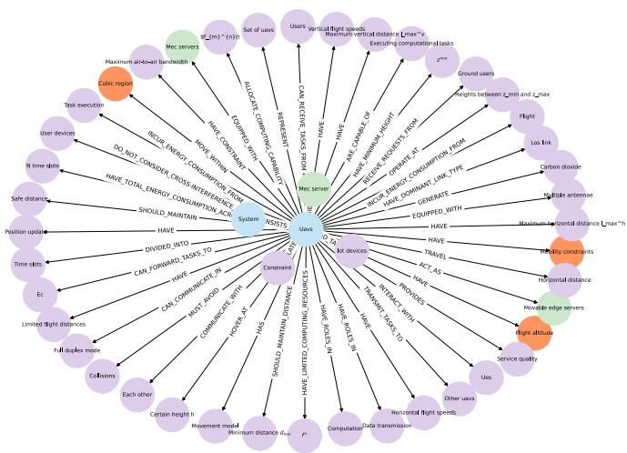  
Fig. 2. A structured and queryable knowledge graph for the formulation of carbon emission optimization problems. We construct the knowledge graph based on expert data consisting of academic papers from IEEE Xplore, involving carbon emission reduction, resource allocation, and task offloading in multi-UAV-assisted MEC networks.

We first utilize LLMs to construct a domain-specific knowledge graph from expert data, as shown in Fig. 2. By systematically analyzing the interconnections among entities, GraphRAG enhances logical consistency and precision in the formulation of optimization objectives and constraints. The GraphRAG pipeline comprises three key stages:

Knowledge Graph Construction: Building upon the retrieval database $\mathcal { D } ^ { \prime }$ , we define a triplet extraction task facilitated by LLMs. Each unstructured document in $\mathcal { D } ^ { \prime }$ is processed to extract relevant entities and their relationships [15], [22], which is expressed as

$$
\begin{array} { r l } & { G = \mathcal { F } _ { \mathrm { t r i p l e t } } ( \pmb { T } ) } \\ & { \quad = \{ ( s _ { 1 } , p _ { 1 } , o _ { 1 } ) , \dots , ( s _ { I } , p _ { I } , o _ { I } ) \} , } \end{array}\tag{22}
$$

where $G$ represents the set of semantic triplets extracted from a text segment $\pmb { T } \in \mathcal { D } ^ { \prime }$ and $\mathcal { F } _ { \mathrm { t r i p l e t } } ( \cdot )$ represents a prompt-based LLM function designed for triplet extraction. Each triplet $( s _ { i } , p _ { i } , o _ { i } )$ consists of a subject $s _ { i }$ , a predicate $p _ { i }$ , and an object $o _ { i } .$ . All extracted triplets are organized based on the subject-object relationships and stored in the Neo4j graph database<sup>2</sup>, providing a structured and queryable knowledge graph for downstream reasoning and retrieval tasks.

\- Query Processing: Upon receiving a new input query $Q ,$ GraphRAG first parses Q to identify relevant entities and their synonyms, as well as potential relationships among them, which is expressed as

$$
E = \mathcal { F } _ { \mathrm { e n t i t y } } ( Q ) , E ^ { \prime } = \mathcal { F } _ { \mathrm { s y n o n y m } } ( E ) ,\tag{23}
$$

$$
E _ { \mathrm { f i n a l } } = E \cup E ^ { \prime } ,\tag{24}
$$

where $\mathcal { F } _ { \mathrm { e n t i t y } } ( \cdot )$ and $\mathcal { F } _ { \mathrm { s y n o n y m } } ( \cdot )$ represent prompt-based LLM functions responsible for entity recognition and synonym expansion, respectively. The final entity set ${ \cal E } _ { \mathrm { f i n a l } }$ is obtained by taking the union of the recognized entities E and their corresponding synonyms $E ^ { \prime }$ . Then, the system traverses the constructed knowledge graph to identify paths connecting the entities in ${ \cal E } _ { \mathrm { f i n a l } }$ , thereby uncovering the semantic and structural relationships in the domain [14], [15].

\- Information Retrieval and Generation: Based on the paths discovered within the knowledge graph, GraphRAG retrieves semantically relevant and structurally coherent information, which is expressed as

$$
\mathcal { C } _ { \mathrm { g r a p h } } = \mathrm { s t r } \left( \mathcal { H } _ { \mathrm { g r a p h } } ( E _ { \mathrm { f i n a l } } , d ) \right) ,\tag{25}
$$

where $\mathcal { C } _ { \mathrm { g r a p h } }$ represents the set of semantic triplets $\mathrm { r e \mathrm { - } }$ trieved from the knowledge graph, $\mathcal { H } _ { \mathrm { g r a p h } } ( \cdot )$ is the subgraph retrieval function, $\mathrm { s t r } ( \cdot )$ is the function that translates the retrieved subgraph data into string, and <sup>d</sup> represents the depth of graph traversal. Due to the structured nature of the knowledge graph, the retrieved information inherently captures the mathematical and logical dependencies among domain-specific variables [15]. The retrieved subgraph data is then provided as input to the LLM agent, alongside the original query $Q ,$ to generate a context-sensitive and domain-aligned response.

3) HybridRAG: The proposed HybridRAG technique integrates the advantages of KeywordRAG, VectorRAG, and GraphRAG [22], enabling effective adaptation to various query types and data sources [18], which is particularly suitable for the dynamic and heterogeneous characteristics of multi-UAVassisted MEC networks.

Building upon the outputs of KeywordRAG $( \mathcal { C } _ { \mathrm { k e y w o r d } } )$ and GraphRAG $( \mathcal { C } _ { \mathrm { g r a p h } } )$ , HybridRAG further incorporates the retrieval results from the VectorRAG module $( \mathcal { C } _ { \mathrm { v e c t o r } } )$ [12], [18], which is the traditional RAG based on vector databases. Finally, these outputs are merged to form the set of final retrieval results $\mathcal { C } _ { \mathrm { f i n a l } }$ , which is given by

$$
\mathcal { C } _ { \mathrm { f i n a l } } = \mathcal { C } _ { \mathrm { k e y w o r d } } \cup \mathcal { C } _ { \mathrm { g r a p h } } \cup \mathcal { C } _ { \mathrm { v e c t o r } } .\tag{26}
$$

To ensure relevance and balance between accuracy and efficiency, the merged final results are re-ranked based on their composite relevance scores, which are obtained by weighting and summing the normalized relevance scores of each retrieval component, expressed as

$$
\tilde { \mathcal { C } } _ { \mathrm { f i n a l } } = \frac { \mathcal { G } ( \mathcal { C } _ { \mathrm { k e y w o r d } } ) + \mathcal { G } ( \mathcal { C } _ { \mathrm { g r a p h } } ) + \mathcal { G } ( \mathcal { C } _ { \mathrm { v e c t o r } } ) } { 3 } ,\tag{27}
$$

where $\mathcal { G } ( \cdot )$ represents a normalization function that calculates normalized relevance scores for each retrieval component and sort the retrieval components according to their scores.

Finally, the retrieval results selected from $\tilde { \mathcal { C } } _ { \mathrm { f i n a l } }$ with the original user query $Q$ are then fed into LLM agents to generate comprehensive responses. The developed HybridRAG can enhance the retrieval quality by effectively integrating relevant information from different retrieval strategies. As a result, LLM agents can progressively generate domain-specific components of the carbon emission optimization problem.

## C. Problem Formulation

After implementing the proposed framework, we leverage the HybridRAG-based LLM agent to formulate the carbon emission optimization problem for multi-UAV-assisted MEC networks through multiple interactions, as illustrated in Fig. 3. The generated optimization problem involves jointly optimizing task offloading scheduling ${ \cal A } = \{ \alpha _ { k , m } ( n ) , \ \forall k \in$ $\mathcal { K } , m \in \mathcal { M } , n \in \mathcal { N } \}$ , computing resource allocation ${ \pmb F } =$ $\{ f _ { k , m } ( n ) , \forall k \in K , m \in \mathcal { M } , n \in \mathcal { N } \}$ , and UAV trajectory control $V = \{ \mathbf { w } _ { m } ( n ) , \forall m \in \mathcal { M } , n \in \mathcal { N } \}$ . We then simply organize the generated problem as needed, and this process is non-complicated [9], [11]. The final carbon emission optimization problem for multi-UAV-assisted MEC networks can be expressed as

$$
\operatorname* { m i n } _ { \{ A , F , V \} } { C ^ { \mathrm { T o t a l } } }\tag{28a}
$$

$$
\mathrm { s . t . } \alpha _ { k , m } ( n ) \in \{ 0 , 1 \} ,\tag{28b}
$$

$$
\sum _ { m = 1 } ^ { M } \alpha _ { k , m } ( n ) = 1 ,\tag{28c}
$$

$$
x _ { m } ( n ) \in [ 0 , X _ { \operatorname* { m a x } } ] , y _ { m } ( n ) \in [ 0 , Y _ { \operatorname* { m a x } } ] ,\tag{28d}
$$

$$
\begin{array} { r } { \| \mathbf { w } _ { m } ( n + 1 ) - \mathbf { w } _ { m } ( n ) \| \leq \delta _ { t } V _ { \operatorname* { m a x } } , } \end{array}\tag{28e}
$$

$$
\| \mathbf { w } _ { m } ( n ) - \mathbf { w } _ { m ^ { \prime } } ( n ) \| \geq D _ { \operatorname* { m i n } } , \forall m , m ^ { \prime } , m \neq m ^ { \prime } ,\tag{28f}
$$

$$
\alpha _ { k , m } ( n ) \| \mathbf { w } _ { m } ( n ) - \mathbf { v } _ { k } ( n ) \| ^ { 2 } \leq r _ { \operatorname* { m a x } } ^ { 2 } + H ^ { 2 } ,\tag{28g}
$$

$$
\sum _ { k = 1 } ^ { K } B _ { k , m } ^ { \mathrm { G 2 A } } \leq B _ { \operatorname* { m a x } } ^ { \mathrm { G 2 A } } ,\tag{28h}
$$

$$
\sum _ { k = 1 } ^ { K } \alpha _ { k , m } ( n ) f _ { k , m } ( n ) \leq F _ { m } ^ { \operatorname* { m a x } } ,\tag{28i}
$$

$$
0 \leq f _ { k , m } ( n ) \leq F _ { m } ^ { \operatorname* { m a x } } .\tag{28j}
$$

Constraints (28b) and (28c) represent the task offloading constraints of users. Constraints (28d)–(28g) depict the mobility restrictions imposed on UAVs. Constraint (28h) represents the uplink bandwidth constraint for G2A communications. Constraints (28i) and (28j) represent the computing resource restrictions of UAVs, which cannot exceed the maximum computing capacity of UAVs $F _ { m } ^ { \mathrm { m a x } }$

Theorem 1: The optimization problem (28) is a non-convex and NP-hard function.

Proof: The objective variables involve binary variables (i.e., task offloading scheduling A) and continuous variables (i.e., computing resource allocation F and UAV trajectory control V ). In addition, the constraint (28b) is non-convex. Thus, the optimization problem (28) is a mixed-integer nonlinear programming NP-hard problem, which is non-convex. -

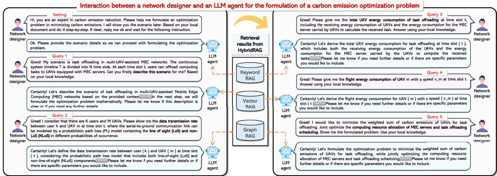  
Fig. 3. The formulation process of a carbon emission optimization problem for multi-UAV-assisted MEC networks by using the proposed HybridRAG-based LLM agent. The corresponding code and the whole formulation process can be referred to https://github.com/secretcheng/HybridRAG-for-Network-Optimization.

According to Theorem 1, it is computationally intractable to directly solve the optimization problem (28) by using heuristic algorithms with finite time. Furthermore, the multi-UAVassisted MEC network environment is highly dynamic, with variables such as user locations and channel conditions between users and UAVs constantly changing. To address these challenges, we adopt DRL algorithms, which enable model-free policy learning through data sampling to tackle the optimization problem (28). In particular, Proximal Policy Optimization (PPO), as an on-policy algorithm, improves decision-making by iteratively updating the policy, while SAC, as an off-policy algorithm, learns a stochastic policy with entropy regularization to effectively balance exploration and exploitation. However, traditional DRL algorithms often struggle with exploration in high-dimensional and complex network environments [16], [34], leading to convergence to suboptimal policies. Therefore, we introduce diffusion models as DRL policies, leveraging their superior abilities to capture multi-dimensional network features. Building upon this foundation, we propose the R<sup>2</sup>DSAC algorithm to effectively learn optimal policies to solve the optimization problem (28), where the stochastic policy formulation of SAC naturally facilitates diffusion-based action modeling.

## IV. DOUBLE REGULARIZATION DIFFUSION-ENHANCED SOFTACTOR-CRITIC ALGORITHMS

In this section, we first model the optimization problem (28) as a Markov Decision Process (MDP). Then, we present the architecture of the proposed R<sup>2</sup>DSAC algorithm.

## A. MDP Modeling

In the multi-UAV-assisted MEC network, UAVs are generally coordinated by a central UAV manager, which is responsible for both information management and UAV control [8]. Considering that the current actions, namely task offloading scheduling A, computing resource allocation F , and UAV trajectory control

V , taken by the UAV manager may affect the following environmental state [31], we formulate the optimization problem (28) as a MDP $\langle S , \mathcal { A } , \mathcal { P } , \mathcal { R } , \gamma \rangle$ , where S is the state space, A is the action space of the DRL agent (i.e., the central UAV manager), P represents the state transition probability, R is the reward function of the DRL agent, and $\gamma \in [ 0 , 1 ]$ is the discount factor controlling future returns. The detailed designs are shown as follows:

1) State Space: At each time slot <sup>n</sup>, the UAV manager can receive task information from users and clearly know the positions of UAVs [4]. Thus, the state s(<sup>n</sup>) is composed of task information $I _ { k } ( n )$ and UAV positions $\mathbf { w } _ { m } ( n ) = [ x _ { m } ( n ) , y _ { m } ( n ) , H ] ^ { T }$ which is given by

$$
\mathbf { s } ( n ) \triangleq \{ \mathbf { w } _ { m } ( n ) , { \cal I } _ { k } ( n ) , \forall k \in \mathcal { K } , m \in \mathcal { M } \} ,\tag{29}
$$

$$
( 2 K + 3 M )
$$

2) Action Space: The action of the DRL agent a(<sup>n</sup>) involves A, F , and V . To reduce the dimensionality of a(<sup>n</sup>), we define $i _ { k } ( n ) \in \{ 1 , \dots , m , \dots , M \}$ to represent the task offloading destination of user <sup>k</sup> at time slot <sup>n</sup> [4], where $i _ { k } ( n ) = m$ indicates that user <sup>k</sup> offloads its task to UAV <sup>m</sup>. Thus, the action a(<sup>n</sup>) at time slot <sup>n</sup> is given by

$$
\begin{array} { r } { \mathbf { a } ( n ) \triangleq \{ i _ { k } ( n ) , f _ { k , m } ( n ) , v _ { m } ( n ) , \theta _ { m } ( n ) , \forall k \in \mathcal { K } , m \in \mathcal { M } \} , } \end{array}\tag{30}
$$

where the total dimensionality of the action ${ \bf a } ( n )$ is $( 2 M +$ $K ( M + 1 ) )$ . Since $i _ { k } ( n )$ is a discrete variable, we convert it into a continuous representation using a uniform segmentation manner, thus mitigating instability in policy learning caused by the hybrid action space.

3) Reward Function: The reward function typically accounts for both the objective and the associated constraints of the optimization problem. We denote $C ( n )$ as the carbon emissions of the multi-UAV-assisted MEC network at time slot <sup>n</sup>, where $\begin{array} { r } { \sum _ { n = 1 } ^ { N } C ( n ) = C ^ { \mathrm { T o t a l } } } \end{array}$ . According to [4], [7], [31], the reward function $\mathcal { R } ( \mathbf { a } ( n ) | \mathbf { s } ( n ) )$ can be given by

$$
\begin{array} { r } { \mathcal { R } ( { \bf a } ( n ) | { \bf s } ( n ) ) = - C ( n ) + \underbrace { \Omega _ { d } + \Omega _ { f } + \Omega _ { g } + \Omega _ { i } } _ { \mathrm { C o n s t r a i n t ~ t e r m s } } , } \end{array}\tag{31}
$$

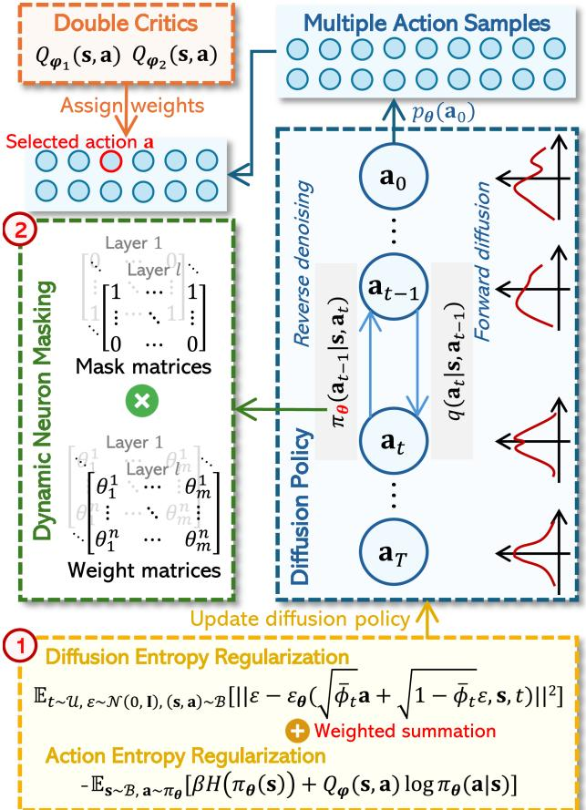  
Fig. 4. The architecture of the $\mathrm { R } ^ { 2 } \mathrm { D S A C }$ algorithm, with two improvements to traditional diffusion-based DRL algorithms. The first improvement is that we incorporate diffusion entropy regularization and action entropy regularization into the diffusion policy, thereby enhancing policy performance. The second improvement is that we dynamically mask unimportant neurons of diffusionbased actor networks, thereby reducing carbon emissions due to model training.

where $\Omega _ { d } , \Omega _ { f } , \Omega _ { g }$ , and $\Omega _ { i }$ are designed through reward shaping based on human knowledge [35]. Specifically, $\Omega _ { d }$ is to ensure that the UAV positions are within the boundaries of the area, $\Omega _ { f }$ is to prevent collisions among $\mathrm { U A V s } , \Omega _ { g }$ is to guarantee that $\mathrm { U A V s }$ remain within the operational area for task offloading, and $\Omega _ { i }$ is to impose the computation constraint of UAVs. These constraint terms guide the action of the DRL agent ${ \bf a } ( n )$ to minimize total carbon emissions while satisfying the constraints (28d), (28f), (28g), and (28i). Notably, other constraints in (28) can be guaranteed by linearly mapping original actions [9].

## B. Algorithm Architecture

1) Diffusion Policy: As illustrated in Fig. 4, at each time slot $n ,$ conditioned on the observed environment state s, a diffusion policy $\pi _ { \boldsymbol { \theta } } ( \mathbf { s } )$ generates multiple action samples from an action probability distribution $p _ { \theta } ( \mathbf { a } _ { 0 } )$ through two sequential Markov processes: forward diffusion and reverse denoising. We consider that the forward diffusion process consists of $T$ steps, denoted as $\mathcal { U } = \{ 1 , \dots , t , \dots , T \}$ . During the forward diffusion process, the Gaussian noise is gradually added to the target action $\mathbf { a } _ { 0 }$ across $T$ steps, and we can obtain latent actions $\mathbf { a } _ { 1 } , \mathbf { a } _ { 2 } , \ldots , \mathbf { a } _ { T }$ Owing to the Markov chain property [36], the Gaussian noise sample $\mathbf { a } _ { T } \sim \mathcal { N } ( 0 , \mathbf { I } )$ can be obtained by cumulatively multiplying the transition from $\mathbf { a } _ { t - 1 } \ \mathrm { t o } \ \mathbf { a } _ { t }$ , which is given by [16], [25]

$$
q ( \mathbf { a } _ { T } | \mathbf { a } _ { 0 } ) = \prod _ { t = 1 } ^ { T } \mathcal { N } \left( \mathbf { a } _ { t } ; \sqrt { 1 - \psi _ { t } } \mathbf { a } _ { t - 1 } , \psi _ { t } \mathbf { I } \right) .\tag{32}
$$

Here, I denotes the identity matrix, and $\psi _ { t }$ represents the noise variance controlled by the variational posterior scheduler at step $t ,$ which can be calculated as [16], [36]

$$
\psi _ { t } = 1 - e ^ { - \frac { \psi _ { \mathrm { m i n } } } { T } - \frac { 2 t - 1 } { 2 T ^ { 2 } } \left( \psi _ { \mathrm { m a x } } - \psi _ { \mathrm { m i n } } \right) } ,\tag{33}
$$

where $\psi _ { \mathrm { m i n } }$ and $\psi _ { \mathrm { m a x } }$ are constant parameters.

In the reverse denoising process, $\mathbf { a } _ { 0 }$ is progressively reconstructed from the noise sample $\mathbf { a } _ { T }$ through a step-by-step denoising procedure, and the transition from $\mathbf { a } _ { t }$ to $\mathbf { a } _ { t - 1 }$ follows a Gaussian distribution [16], [36], which is given by

$$
p _ { \theta } ( \mathbf { a } _ { t - 1 } | \mathbf { a } _ { t } ) = { \mathcal { N } } \left( \mathbf { a } _ { t - 1 } ; \mu _ { \theta } ( \mathbf { a } _ { t } , \mathbf { s } , t ) , \Sigma _ { \theta } ( \mathbf { a } _ { t } , t ) \right) ,\tag{34}
$$

where

$$
\mu _ { \theta } ( \mathbf { a } _ { t } , \mathbf { s } , t ) = \frac { 1 } { \sqrt { \phi _ { t } } } \bigg ( \mathbf { a } _ { t } - \frac { \psi _ { t } \operatorname { t a n h } ( \varepsilon _ { \theta } ( \mathbf { a } _ { t } , \mathbf { s } , t ) ) } { \sqrt { 1 - \bar { \phi } _ { t } } } \bigg ) ,\tag{35}
$$

$$
\Sigma _ { \pmb { \theta } } ( \mathbf { a } _ { t } , t ) = \frac { \psi _ { t } ( 1 - \bar { \phi } _ { t - 1 } ) } { 1 - \bar { \phi } _ { t } } \mathbf { I } .\tag{36}
$$

Here, $\begin{array} { r } { \phi _ { t } = 1 - \psi _ { t } , \bar { \phi } _ { t } = \prod _ { i = 1 } ^ { t } \phi _ { i } } \end{array}$ , and $\varepsilon _ { \boldsymbol { \theta } } ( \mathbf { a } _ { t } , \mathbf { s } , t )$ is a deep network parameterized by $\theta ,$ which generates denoising noises conditioned on the state s and the current denoising step <sup>t</sup>. It is worth noting that the tanh function aligns with the normalized noise distribution in diffusion models [37]. Therefore, the generative action distribution $p _ { \theta } ( \mathbf { a } _ { 0 } )$ conditioned on $\prod _ { t = 1 } ^ { T } ( 1 - \dot { \psi } _ { t } ) \approx 0$ is given by

$$
p _ { \theta } ( \mathbf { a } _ { 0 } ) = \mathcal { N } ( \mathbf { a } _ { T } ; 0 , \mathbf { I } ) \prod _ { t = 1 } ^ { T } p _ { \theta } ( \mathbf { a } _ { t - 1 } | \mathbf { a } _ { t } ) .\tag{37}
$$

Finally, the resulting action ${ \bf a } _ { 0 }$ can be sampled from the learned generative distribution $p _ { \theta } ( \mathbf { a } _ { 0 } )$ , representing the most probable choice among multiple candidate actions [36]. We then apply a linear mapping to convert ${ \bf a } _ { 0 }$ into a, which can be directly executed in the environment.

2) Q-Learning Guidance: To facilitate the diffusion policy $\pi _ { \boldsymbol { \theta } } ( \mathbf { s } )$ to generate actions that contribute to minimizing carbon emissions in the multi-UAV-assisted MEC network, we employ Q-learning guidance into the learning of $\varepsilon _ { \boldsymbol { \theta } } ( \mathbf { a } _ { t } , \mathbf { s } , t )$ during the reverse denoising process, enabling $\pi _ { \boldsymbol { \theta } } ( \mathbf { s } )$ to sample actions with high $Q$ values. Specifically, we first construct two Q-networks $Q _ { \varphi _ { 1 } } , Q _ { \varphi _ { 2 } }$ and two target networks $Q _ { \hat { \varphi } _ { 1 } } , Q _ { \hat { \varphi } _ { 2 } }$ . These critic networks possess the same network architecture. To optimize $\varphi _ { i }$ for $i = 1 , 2$ , we minimize the temporal difference error, which is expressed as

$$
\begin{array} { r l } & { \mathbb { E } _ { ( \mathbf { s } ( n ) , \mathbf { a } ( n ) , \mathbf { s } ( n + 1 ) , \mathcal { R } ) \sim \mathcal { O } } \Bigg [ \sum _ { i = 1 , 2 } ( \mathcal { R } ( \mathbf { a } ( n ) | \mathbf { s } ( n ) ) + \gamma ^ { n } ( 1 - d _ { n + 1 } ) } \\ & { ( Q _ { \hat { \varphi } } ( \mathbf { s } ( n + 1 ) ) - \beta \log \pi _ { \hat { \pmb { \theta } } } ( \mathbf { s } ( n + 1 ) ) ) - Q _ { \varphi _ { i } } ( \mathbf { s } ( n ) , \mathbf { a } ( n ) ) ) ^ { 2 } \Bigg ] , } \end{array}\tag{38}
$$

where O is a mini-batch of transitions sampled from a relay buffer B $\left. 3 , Q _ { \hat { \varphi } } ( \mathbf { s } ) = \operatorname* { m i n } \{ Q _ { \hat { \varphi } _ { 1 } } ( \mathbf { s } ) , Q _ { \hat { \varphi } _ { 2 } } ( \mathbf { s } ) \} [ 1 6 ] , d _ { n + 1 } \in \{ 0 , 1 \} \right.$ is a terminated flag [16], with $d _ { n + 1 } = 1$ meaning that the training episode (i.e., <sup>N</sup> time slots) is ended, $\beta$ is a temperature coefficient that controls the trade-off between the entropy term and the reward [19], and $\pi _ { \hat { \pmb { \theta } } } ( \mathbf { s } )$ is the target diffusion policy.

3) Policy Improvement Module: To optimize the diffusion policy $\pi _ { \boldsymbol { \theta } } ( \mathbf { s } )$ , instead of directly optimizing the state-value function $V ^ { \pi } ( \mathbf { s } )$ [38], two issues need to be resolved for the practical implementation of the ${ \mathrm { R } } ^ { 2 } { \mathrm { D S A C } }$ algorithm in multi-UAV-assisted MEC networks:

\- Negative Q values: In the reward function (31), since $- C ( n )$ is inherently negative, it becomes difficult to guarantee that the returned reward always remains nonnegative, resulting in negative $Q$ values for certain stateaction pairs [36], which may lead to the instability of diffusion policy learning.

Limited high-quality training samples: In multi-UAVassisted MEC networks, it is challenging to obtain expert datasets consisting of state-action samples with high $Q$ values to effectively guide policy learning [36]. In the absence of expert behavior guidance, the diffusion policy may be overly confident in specific actions, potentially leading to convergence to a suboptimal solution [16].

To address the above issues, we incorporate action entropy regularization and diffusion entropy regularization into the policy learning objective function. Specifically, we introduce an action entropy regularization term to encourage the policy to generate a more uniform action distribution, as given by

$$
\begin{array} { r } { \mathcal { L } _ { \mathrm { a c t } } ( \pmb { \theta } ) = - \mathbb { E } _ { \mathbf { s } \sim \mathcal { B } , \mathbf { a } \sim \pi _ { \theta } } [ \beta H ( \pi _ { \theta } ( \mathbf { s } ) ) + Q _ { \varphi } ( \mathbf { s } , \mathbf { a } ) \log \pi _ { \theta } ( \mathbf { a } | \mathbf { s } ) ] , } \end{array}\tag{39}
$$

where $Q _ { \varphi } ( \mathbf { s } , \mathbf { a } ) = \operatorname* { m i n } \{ Q _ { \varphi _ { 1 } } ( \mathbf { s } , \mathbf { a } ) , Q _ { \varphi _ { 2 } } ( \mathbf { s } , \mathbf { a } ) \}$ and $H ( \pi _ { \pmb { \theta } } ( \mathbf { s } ) )$ denotes the entropy of the action probability distribution [16], [19]. It is worth noting that the action entropy regularization in (39) serves to prevent the policy from prematurely converging to a suboptimal solution [16].

The diffusion entropy regularization is a sampling-based approach that requires only the random sampling of state-action pairs $( \mathbf { s } ( n ) , \mathbf { a } ( n ) )$ from the relay buffer B and the current policy [25]. Inspired by the process of denoising diffusion probabilistic models in image generation, we utilize the mean squared error loss to represent the diffusion entropy regularization [25], which is given by

$$
\mathcal { L } _ { \mathrm { d i f f } } ( \theta ) = \mathbb { E } \Bigg [ \Bigg | \Bigg | \varepsilon - \varepsilon _ { \theta } \bigg ( \sqrt { \bar { \phi } _ { t } } \mathbf { a } + \sqrt { 1 - \bar { \phi } _ { t } } \varepsilon , \mathbf { s } , t \bigg ) \Bigg | \Bigg | ^ { 2 } \Bigg ] ,\tag{40}
$$

where $\varepsilon \sim \mathcal { N } ( 0 , \mathbf { I } )$ and $\sqrt { \bar { \phi } _ { t } } \mathbf { a } + \sqrt { 1 - \bar { \phi } _ { t } } \varepsilon$ represents the expert action after the reverse denoising process. Notably, ${ \mathcal { L } } _ { \mathrm { d i f f } } ( \theta )$ can be seen as a behavior-cloning loss.

Therefore, we formulate the final policy-learning objective as a weighted combination of the diffusion entropy regularization and the action entropy regularization, as given by [25]

$$
\pi = \underset { \pi _ { \theta } } { \operatorname { a r g m i n } } ( \mathcal { L } ( \theta ) = \rho \mathcal { L } _ { \operatorname { a c t } } ( \theta ) + ( 1 - \rho ) \mathcal { L } _ { \operatorname { d i f f } } ( \theta ) ) ,\tag{41}
$$

where $\rho \in [ 0 , 1 ]$ represents a behavior-cloning weight. By integrating diffusion entropy regularization and action entropy regularization into the actor network, the ${ \mathrm { R } } ^ { 2 } { \mathrm { D S A C } }$ algorithm achieves more robust and efficient identification of optimal strategies in complex environments.

4) Dynamic Pruning Module: The actor model $\varepsilon _ { \boldsymbol { \theta } } ( \mathbf { a } _ { t } , \mathbf { s } , t )$ incorporates temporal information by using sinusoidal position embeddings with multiple Fully Connected Layers (FCLs) [16]. The encoded time vector is concatenated with the state s and the noise sample $\mathbf { a } _ { T }$ and passed through a Multi-Layer Perceptron (MLP). Finally, this MLP maps the concatenated input to an output action $\mathbf { a } _ { 0 }$ bounded by a tanh activation. To reduce carbon emissions associated with model training, we design a dynamic pruning module to dynamically suppress the activity of unimportant neurons in FCLs of $\varepsilon _ { \boldsymbol { \theta } } ( \mathbf { a } _ { t } , \mathbf { s } , t )$ [39]. Specifically, at the beginning of each train episode, the pruning module first evaluates the importance of neurons in each $\mathrm { F C L } ,$ and then it masks the top $\lfloor \bar { \boldsymbol { \theta } } ^ { ( \ell ) } \vert \cdot \varrho \rfloor$ neurons with the lowest importance scores, indicating that their corresponding weight vectors are assigned to 0, where $| \pmb \theta ^ { ( \ell ) }$ | denotes the total number of neurons in the FCL <sup></sup> and $\varrho \in [ 0 , 1 )$ is the pruning rate. This mathematical process can be expressed as

$$
\pmb { \theta } ^ { ( \ell ) }  \pmb { \theta } ^ { ( \ell ) } \odot \mathbf { M } ^ { ( \ell ) } ,\tag{42}
$$

where  is the Hadamard product, and $M ^ { ( \ell ) }$ represent the mask matrix for the FCL <sup></sup>, with values of either 0 or 1. Similarly, the unimportant parameters of the target actor network are also masked by the dynamic pruning module. Overall, by suppressing the activity of unimportant neurons, the dynamic pruning module effectively reduces carbon emissions during model training, as demonstrated in [39]. For clarity, we summarize the influences of the dynamic pruning module on model training from three major aspects:

Convergence speed: The dynamic pruning module slows down convergence in the early training stages. The reason is that dynamic pruning adaptively removes low-contribution parameters, which alters the network structure and temporarily disturbs the gradient flow.

Convergence stability: Although convergence becomes slower, pruning helps suppress redundant parameters and mitigate gradient oscillations. Consequently, the training process exhibits smoother learning curves and smaller variance across episodes, indicating improved stability.

\- Final policy quality: Due to the reduced model capacity after dynamic pruning, the final policy quality is lower than that of the proposed R<sup>2</sup>DSAC algorithm. Nevertheless, it is higher than that of the SAC algorithm.

5) Parameter Updates: At the end of the training episode, we use the Adam optimizer to update the policy parameters $\theta ,$ which is given by

$$
\pmb { \theta } _ { e + 1 }  \pmb { \theta } _ { e } - \sigma \nabla _ { \pmb { \theta } } \mathcal { L } ( \pmb { \theta } ) ,\tag{43}
$$

where $\pmb { \theta } _ { e }$ are the policy parameters in the <sup>e</sup>th training episode and $\sigma \in ( 0 , 1 ]$ is the learning rate of the policy. In addition, we perform a soft update to the parameters of the target actor and

```powershell
Algorithm $\mathbf { 1 } { \cdot } \mathrm { R } ^ { 2 } \mathrm { D S A C } .$
1 Initialize parameters $\theta , \varphi , \hat { \theta } , \hat { \varphi }$ and relay buffer $B .$
2 Initialize mask matrices M.
3 Initialize hyperparameters and pruning rate $\varrho .$
4 for the episode $e = 1$ to $E _ { \mathrm { m a x } }$ do
5 for $n = 1$ to $N$ do
6 Observe state $\mathbf { s } ( n )$ and randomly initialize a
normal sample $\mathbf { a } _ { T } \sim \mathcal { N } ( 0 , \mathbf { I } )$
7 for $t = 1$ to $T$ do
8 ### Reverse denoising ###
9 Construct a denoising network $\varepsilon _ { \boldsymbol { \theta } } ( \mathbf { a } _ { t } , \mathbf { s } , t )$
10 Calculate the mean and covariance by using
(35) and (36), respectively.
11 Obtain the action $\mathbf { \delta } _ { \mathbf { \alpha } } \mathbf { a } _ { 0 }$ based on (37).
12 end
13 ### Experience collections ###
14 Linearly map $\mathbf { \delta } _ { \mathbf { a } _ { 0 } }$ to ${ \pmb a } ( n )$ and perform ${ \pmb a } ( n )$
15 Observe the next state $\mathbf { s } ( n + 1 )$ and obtain the
corresponding reward $\mathcal { R } ( \mathbf { a } ( n ) | \mathbf { s } ( n ) )$
16 Store record (s(n), a(n), s(n + 1), R) into $B .$
17 end
18 ### Dynamic pruning ###
19 Evaluate the importance of neurons in $\pmb \theta$ and $\hat { \pmb \theta } .$
20 Dynamically mask the unimportant neurons of $\pmb { \theta }$
and $\hat { \pmb { \theta } }$ according to the pruning rate $\varrho .$
21 $\# \# \#$ Parameter updates $\# \# \#$
22 Sample a random mini-batch of transitions $\mathcal { O }$ with
size O from B.
23 Update $Q _ { \varphi _ { 1 } } , Q _ { \varphi _ { 2 } }$ using $\boldsymbol { B }$ to minimize (38).
24 Update the policy parameters $\theta$ using B by (43).
25 Update target network parameters $\boldsymbol { \hat { \theta } } , \boldsymbol { \hat { \varphi } }$ by (44).
26 end
27 return the policy networks.
```

critic networks [25], respectively, as given by

$$
\begin{array} { r l } & { \hat { \pmb { \theta } } _ { e + 1 }  \xi { \pmb { \theta } } _ { e } + ( 1 - \xi ) \hat { \pmb { \theta } } _ { e } , } \\ & { \hat { \pmb { \varphi } } _ { e + 1 }  \xi \varphi _ { e } + ( 1 - \xi ) \hat { \varphi } _ { e } , } \end{array}\tag{44}
$$

where $\varphi _ { e }$ are the Q-function parameters $\varphi _ { i , e } , i \in \{ 1 , 2 \}$ in the <sup>e</sup>th training episode and $\xi \in ( 0 , 1 ]$ is the update rate of target networks.

## C. Complexity Analysis

Algorithm 1 presents the comprehensive process for implementing the R<sup>2</sup>DSAC algorithm. In the following, we analyze its computational complexity.

1) Algorithm Initialization: The computational overhead of algorithm initialization mainly comes from the initialization of network parameters and mask matrices, and the computational complexity of this part is $\mathcal { O } ( 4 | \pmb { \theta } | + 2 | \pmb { \varphi } | )$ .

2) Action Sampling: The computational complexity of action sampling arises from the reverse diffusion process, which is given by $\mathcal { O } ( E _ { \mathrm { m a x } } N T | \pmb { \theta } | )$ [16].

3) Experience Collections: We define the complexity of the DRL agent interacting with the environment as <sup>V</sup> . The computational complexity of experience collections is $\mathcal { O } ( E _ { \mathrm { m a x } } N V ) \left[ 1 6 \right]$

4) Dynamic Pruning: In the dynamic pruning module, the computational overhead comes from the evaluation of neuron importance and the Hadamard product. Hence, the computational complexity of dynamic pruning is $\mathcal { O } ( 2 E _ { \mathrm { m a x } } | \theta | )$ [39].

5) Parameter Updates: The computational complexity of parameter updates consists of three parts: ${ \mathcal { O } } ( O E _ { \operatorname* { m a x } } | \pmb \theta | )$ for policy improvement, $\mathcal { O } ( O E _ { \operatorname* { m a x } } | \varphi | )$ for critic network improvement, and $\mathcal { O } ( E _ { \mathrm { m a x } } ( | \pmb { \theta } | + | \varphi | ) )$ for target network improvement. Thus, the computational complexity of parameter updates is $\mathcal { O } ( E _ { \mathrm { m a x } } ( O + 1 ) ( \lvert \pmb { \theta } \rvert + \lvert \pmb { \varphi } \rvert ) )$ [16].

Based on the above analysis, the computational complexity of the $\mathrm { R } ^ { 2 } \mathrm { D S A C }$ algorithm is $\mathcal { O } ( 4 \vert \pmb { \theta } \vert + 2 \vert \varphi \vert + E _ { \mathrm { m a x } } N ( T \vert \pmb { \theta } \vert +$ $V ) + 2 E _ { \mathrm { m a x } } | \pmb { \theta } | + E _ { \mathrm { m a x } } ( O + 1 ) ( | \pmb { \theta } | + | \pmb { \varphi } | ) )$

## V. SIMULATION RESULTS

In this section, we first introduce the experimental setup. We then employ the RAGChecker framework to evaluate the performance of the developed HybridRAG. Finally, we validate the effectiveness of the proposed R<sup>2</sup>DSAC algorithm.

## A. Experimental Setup

We consider a multi-UAV-assisted MEC network where 2 UAVs possess offloaded tasks and provide services to 10 users in $\mathrm { a 1 0 0 0 \times 1 0 0 0 m ^ { 2 } }$ rectangular area, $\mathrm { i . e . , } X _ { \mathrm { m a x } } = Y _ { \mathrm { m a x } } = 1 0 0 0$ The service duration is configured as $N = 1 0 0$ time slots, with $\delta _ { t } = 1 \mathrm { ~ s ~ } [ 3 0 ]$ . Each UAV is equipped with an MEC server and is capable of serving up to 5 users at each time slot [41]. Without loss of generality, the initial positions of UAVs are set to (400<sup>,</sup> 400<sup>,</sup> 100) and (600<sup>,</sup> 600<sup>,</sup> 100), respectively. Table I shows the simulation parameters, and the experiments for the performance evaluation of the ${ \mathrm { R } } ^ { 2 } { \mathrm { D S A C } }$ algorithm are conducted on an NVIDIA GeForce RTX 3080 Laptop GPU by using PyTorch with CUDA 12.0.

For the construction of HybridRAG, we call the Qwen2.5- 72B model through API as the pluggable LLM module, with the temperature set to 0.85 and the context window configured to 8192 tokens. Moreover, we utilize the BGE-M3 Embedding model<sup>3</sup> to transform textual data into high-dimensional vector representations, and the chunk size is set to 1024, with a default chunk overlap of 20 tokens. Furthermore, we employ Qdrant to store the high-dimensional vectors, utilize Neo4j to manage the knowledge graph, and adopt the Simple Keyword Table Index for keyword extraction from the text. The experiments for the performance evaluation of HybridRAG are conducted on an Intel Xeon(R) Gold 6133 CPU and two NVIDIA RTX A6000 GPUs.

## B. Performance Evaluation of HybridRAG

We apply RAGChecker to evaluate the performance of HybridRAG [42]. Prior to evaluation, we construct a baseline test dataset consisting of Question-Answer (QA) pairs generated by the HybridRAG-based LLM agent, as shown in Fig. 5.

TABLE I SIMULATION PARAMETERS
<table><tr><td rowspan=1 colspan=1>Parameters</td><td rowspan=1 colspan=1>Values</td></tr><tr><td rowspan=1 colspan=1>Data sizes of computing tasks (Dk (n)) [40]</td><td rowspan=1 colspan=1>[100, 300) MB</td></tr><tr><td rowspan=1 colspan=1>Number of CPU cycles required forcomputing one bit of task data (Ck (n)) [31]</td><td rowspan=1 colspan=1>[100, 200)cycles/bit</td></tr><tr><td rowspan=1 colspan=1>Fixed flight altitude of UAVs (H) [30]</td><td rowspan=1 colspan=1>100 m</td></tr><tr><td rowspan=1 colspan=1>Maximum speed of UAVs (Vmax) [3]</td><td rowspan=1 colspan=1>60 m/s</td></tr><tr><td rowspan=1 colspan=1>Safe distance between UAVs (Dmin) [30]</td><td rowspan=1 colspan=1>10 m</td></tr><tr><td rowspan=1 colspan=1>Coverage area radius of UAVs (rmax) [30]</td><td rowspan=1 colspan=1>100 m</td></tr><tr><td rowspan=1 colspan=1>Constant parameters (a, b) [7]</td><td rowspan=1 colspan=1>9.61, 0.16</td></tr><tr><td rowspan=1 colspan=1>Carrier frequency of UAVs (f) [40]</td><td rowspan=1 colspan=1>2 GHz</td></tr><tr><td rowspan=1 colspan=1>Excessive path loss for LoS and NLoS links $( \eta ^ { \mathrm { L o S } } , \eta ^ { \mathrm { N L o S } } )$ [4]</td><td rowspan=1 colspan=1>1,20</td></tr><tr><td rowspan=1 colspan=1>Maximum uplink bandwidth (BG2A)max) [3]</td><td rowspan=1 colspan=1>20 MHz</td></tr><tr><td rowspan=1 colspan=1>Transmit power of user k (pk (n)) [40]</td><td rowspan=1 colspan=1>23 dBm</td></tr><tr><td rowspan=1 colspan=1>Additive Gaussian white noise power (δ2) [3]</td><td rowspan=1 colspan=1>-100 dBm</td></tr><tr><td rowspan=1 colspan=1>Effective switching capacitance (€m) [3]</td><td rowspan=1 colspan=1>10-27</td></tr><tr><td rowspan=1 colspan=1>Computing capacity of UAV m (Fmax) [30]</td><td rowspan=1 colspan=1>5GHz</td></tr><tr><td rowspan=1 colspan=1>Blade profile power (P0) [30]</td><td rowspan=1 colspan=1>79.8563Watt</td></tr><tr><td rowspan=1 colspan=1>Induced power for hovering (P1) [30]</td><td rowspan=1 colspan=1>88.6279Watt</td></tr><tr><td rowspan=1 colspan=1>Blade tip speed (UTip) [30]</td><td rowspan=1 colspan=1>120 m/s</td></tr><tr><td rowspan=1 colspan=1>UAV fuselage drag ratio (d0) [30]</td><td rowspan=1 colspan=1>0.6</td></tr><tr><td rowspan=1 colspan=1>Air density (ζ) [30]</td><td rowspan=1 colspan=1>1.225 kg/m³</td></tr><tr><td rowspan=1 colspan=1>Rotor solidity (s) [30]</td><td rowspan=1 colspan=1>0.05</td></tr><tr><td rowspan=1 colspan=1>Rotor disk area (A) [30]</td><td rowspan=1 colspan=1>0.503 m²</td></tr><tr><td rowspan=1 colspan=1>Average rotor induced speed (vo) [30]</td><td rowspan=1 colspan=1>4.03 m/s</td></tr><tr><td rowspan=1 colspan=1>Conversion coefficient between watt-hoursand joules (τ) [5]</td><td rowspan=1 colspan=1>1/3600</td></tr></table>

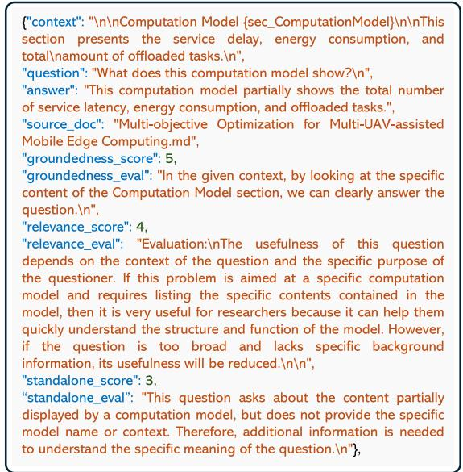  
Fig. 5. QA pairs outputted by the HybridRAG-based LLM agent, which can serve as the test dataset to evaluate the performance of HybridRAG.

The RAGChecker adopts a claim-level checking method to enable fine-grained performance evaluation. It leverages LLMs to perform two roles: extracting claims from the test dataset as text-to-claim extractors and verifying their accuracy as claimentailment checkers [42]. In our implementation, we utilize Qwen2.5-14B models as extractors and checkers. To evaluate the performance of HybridRAG, we adopt three categories of evaluation metrics: overall metrics, generator metrics, and retriever metrics [42], as illustrated in Table II.

TABLE II  
PERFORMANCE EVALUATION RESULTS OF HYBRIDRAG
<table><tr><td rowspan="2">Metrics</td><td colspan="2">RAG Systems</td></tr><tr><td>VectorRAG + KeywordRAG</td><td>HybridRAG</td></tr><tr><td>Prec.↑</td><td>44.6</td><td>46.2</td></tr><tr><td>Rec.↑</td><td>74.4</td><td>76.5</td></tr><tr><td>F1↑</td><td>49.9</td><td>53.2</td></tr><tr><td rowspan="2">CR↑ CP↑</td><td>82.7</td><td>83.1</td></tr><tr><td>32.4</td><td>33.4</td></tr><tr><td>CU↑</td><td>75.8</td><td>80.2</td></tr><tr><td>NS(I)↓</td><td>30.5</td><td>28.6</td></tr><tr><td>NS(II)↓</td><td>18.1</td><td>18</td></tr><tr><td>Hallu.↓</td><td>6.7</td><td>7.2</td></tr><tr><td>SK↓</td><td>0.4</td><td>0.4</td></tr><tr><td>Faith.↑</td><td>92.8</td><td>92.4</td></tr></table>

1) Overall Metrics: To assess the overall response quality of HybridRAG, we compute claim-level Precision (Prec.) and Recall (Rec.), where Prec. measures the proportion of correct claims among all response claims, while Rec. quantifies the proportion of correct claims in all ground-truth answer claims. Moreover, we compute the F1 score as the overall performance metric by calculating the harmonic mean of Prec. and Rec. We observe that HybridRAG can achieve a higher F1 score compared with the combined performance of VectorRAG and KeywordRAG, indicating superior overall performance.

2) Retriever Metrics: To evaluate the retrieval ability of HybridRAG, we compute Claim Recall (CR) and Context Precision (CP), where CR measures the proportion of claims involved in ground-truth answers among retrieved chunks, while CP quantifies the proportion of relevant chunks in the retrieval context. We observe that HybridRAG outperforms the combination of VectorRAG and KeywordRAG in terms of both CR and CP metrics, indicating superior retrieval performance.

3) Generator Metrics: Generator metrics are utilized to evaluate the response quality and generation performance of HybridRAG-based LLM agents, and we adopt six generator metrics covering various aspects of response generation [42]: Context Utilization (CU) reflecting the extent of effectively utilizing relevant information in the context, Relevant Noise Sensitivity (NS(I)) representing the proportion of incorrect claims entailed in relevant chunks, Irrelevant Noise Sensitivity (NS(II)) representing the proportion of incorrect claims entailed in irrelevant chunks, Hallucination (Hallu.) representing the proportion of incorrect claims not entailed in any retrieved chunk, Self-Knowledge (SK) representing the proportion of correct claims generated by the LLM agent, and Faithfulness (Faith.) describing the extent of using the retrieval context by the LLM agent. We observe that, in addition to Faith. and Hallu. metrics, HybridRAG possesses better performance in other generator metrics. The reason is that the developed HybridRAG primarily enhances retrieval diversity and relevance by combining KeywordRAG, VectorRAG, and GraphRAG, thereby enhancing the informativeness and contextual alignment of the generated responses. It is worth noting that the performance of HybridRAG on both Hallu. and Faith. metrics can be further enhanced through prompt engineering techniques [42]. Overall, HybridRAG outperforms traditional RAG in the context of optimization problem formulation for multi-UAV-assisted MEC networks.

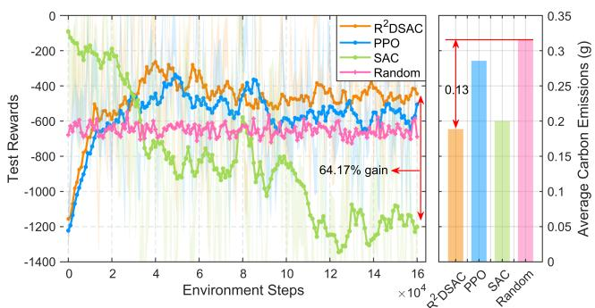  
(a) Comparisons of test rewards for different algorithms.  
Fig. 6. Performance evaluation of the R<sup>2</sup>DSAC algorithm in carbon emission optimization.

## C. Performance Evaluation of the Proposed Algorithm

In Fig. 6, we present the performance evaluation of the proposed R<sup>2</sup>DSAC algorithm for carbon emission optimization in multi-UAV-assisted MEC networks. Specifically, Fig. 6(a) shows the performance comparison of the R<sup>2</sup>DSAC algorithm with the random algorithm and two representative DRL algorithms for dynamic decision-making, i.e., SAC and PPO. We observe that the R<sup>2</sup>DSAC algorithm achieves the highest test rewards among them and converges more rapidly than both PPO and SAC algorithms. Furthermore, it exhibits performance improvements of 64% and 19.9% over SAC and PPO, respectively. This improvement stems from the diffusion policy with double entropy regularization, which enables the DRL agent to explore optimal strategies more effectively. Moreover, the R<sup>2</sup>DSAC algorithm achieves the lowest carbon emissions for task offloading in multi-UAV-assisted MEC networks. The reason is that the diffusion process of the ${ \mathrm { R } } ^ { 2 } { \mathrm { D S A C } }$ algorithm helps mitigate the effects of noise and randomness during the generation of optimal strategies. Notably, to demonstrate that the algorithm itself does not introduce significant additional carbon emissions during strategy generation for multi-UAV task offloading, we employ CodeCarbon<sup>4</sup> and estimate that the carbon emissions generated during model training are approximately 70<sup>.</sup>3 g. After completing model training, the ${ \mathrm { R } } ^ { 2 } { \mathrm { D S A C } }$ algorithm can be directly used to generate optimal strategies, with an estimated carbon emission of only 0<sup>.</sup>025 g per inference. In Fig. 6(b), we conduct ablation experiments to evaluate the effectiveness of algorithm modules. Specifically, we compare the R<sup>2</sup>DSAC algorithm with three baseline variants: 1) Behavior-Cloning Diffusion-SAC (BCDSAC) algorithm without the dynamic pruning module;

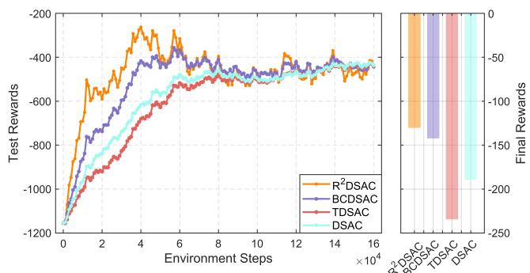  
(b) Ablation experiments

2) Tiny Diffusion-SAC algorithm (TDSAC) without the policy improvement module; 3) Diffusion-SAC (DSAC) algorithm without both modules. We observe that the R<sup>2</sup>DSAC algorithm outperforms the three baseline variants, achieving the highest final reward. This improvement can be attributed to two critical factors: diffusion entropy regularization, which provides stable imitation learning signals to help prevent policy collapse; and action entropy regularization, which encourages the DRL agent to explore a wider range of strategies, thereby avoiding convergence to a local optimum. Overall, the above results demonstrate the effectiveness of the proposed R<sup>2</sup>DSAC algorithm.

As illustrated in Fig. 7, we evaluate the impacts of pruning rate <sup></sup>, diffusion step <sup>T</sup> , and behavior-cloning weight <sup>ρ</sup> on final rewards, training time, and carbon emissions associated with model training, normalized to [0,1]. In each evaluation, we only adjust one parameter while fixing the others. From Fig. 7(a), we observe that the comprehensive performance of the R<sup>2</sup>DSAC algorithm is optimal when $\varrho = 0 .$ 1, achieving the lowest training time and carbon emissions while maintaining strong model performance. From Fig. 7(b), we observe that the normalized values of both training time and carbon emissions decrease as the number of diffusion steps increases, indicating that the length of the diffusion chain significantly influences the computational overhead of model training. Moreover, the algorithm achieves its best performance when $T = 3 ,$ , yielding the highest final reward. From Fig. 7(c), we observe that as the behavior-cloning weight increases, the DRL agent is more likely to fall into suboptimal solution spaces. This occurs because excessive reliance on behavioral cloning can lead to insufficient exploration, limiting the DRL agent from discovering optimal strategies.

In Fig. 8, we show the UAV trajectories of two UAVs generated by the proposed R<sup>2</sup>DSAC algorithm within a single episode under varying environmental states. Each environmental state represents a specific user position set. Initially, the two UAVs depart from their respective fixed starting positions. At each time slot, the UAV manager determines the flying directions and velocities of the UAVs based on the current user request condition. We observe that, regardless of the environmental state, the end positions of the two UAVs tend to be located in areas with high user density, indicating the stability of the R<sup>2</sup>DSAC algorithm. Moreover, we add directional arrows to show the movement direction of each UAV. We see that the directional patterns vary across different environmental states, indicating that the UAVs adapt their flight paths according to specific user demands and environmental dynamics.

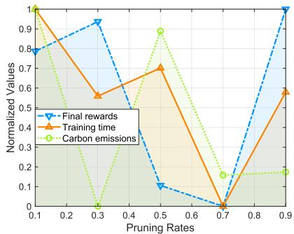  
(a) Pruning rate impact.

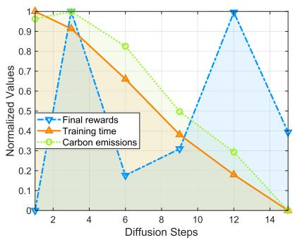  
(b) Diffusion step impact.

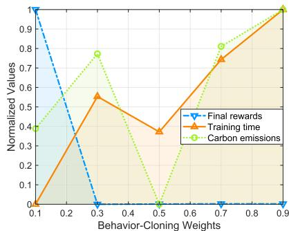  
(c) Behavior-cloning weight impact.

Fig. 7. Impacts of pre-defined parameters on final rewards, training time, and carbon emissions during model training.  
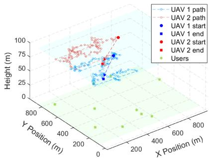  
(a) Environmental state 1.

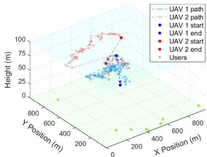  
(b) Environmental state 2.

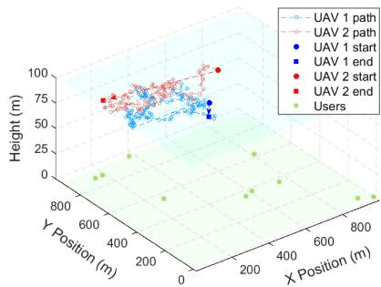  
(c) Environmental state 3.  
Fig. 8. UAV trajectories generated by the R<sup>2</sup>DSAC algorithm within a single episode under varying environmental states.

## VI. CONCLUSION AND FUTURE WORK

In this paper, we have studied the implementation of LLM agents for enabling low-carbon LAENets. Specifically, we have developed a HybridRAG-based LLM agent framework for carbon emission optimization in multi-UAV-assisted MEC networks. In this framework, we have developed HybridRAG by merging KeywordRAG, VectorRAG, and GraphRAG, enabling LLM agents to generate more precise carbon emission optimization problems through the effective retrieval of structural relational information. To solve the formulated problem, we have proposed the R<sup>2</sup>DSAC algorithm, which incorporates diffusion entropy regularization and action entropy regularization to enhance policy learning and prevent suboptimal convergence. Furthermore, we have designed a dynamic pruning module that masks unimportant neurons in the diffusion-based actor network, thereby reducing carbon emissions during model training. Simulation results demonstrate that the proposed HybridRAGbased LLM agent framework achieves a 6.6% improvement in F1 scores compared with the traditional RAG-based LLM agent framework, and the proposed ${ \mathrm { R } } ^ { 2 } { \mathrm { D S A C } }$ algorithm achieves a 64.17% improvement in test rewards over the SAC algorithm, highlighting the effectiveness and superiority of the proposed framework and algorithm. For future work, we plan to explore prompt engineering techniques to optimize the interaction process between network designers and LLM agents. Additionally, we aim to develop multi-agent diffusion model-based DRL algorithms to derive optimal strategies for carbon emission optimization in LANets.

## REFERENCES

[1] L. Cai et al., “Secure physical layer communications for low-altitude economy networking: A survey,” 2025, arXiv:2504.09153.

[2] L. Cai et al., “Large language model-enhanced reinforcement learning for low-altitude economy networking,” 2025, arXiv:2505.21045.

[3] G. Sun et al., “Multi-objective optimization for multi-UAV-assisted mobile edge computing,” IEEE Trans. Mobile Comput., vol. 23, no. 12, pp. 14803–14820, Dec. 2024.

[4] H. Hao, C. Xu, W. Zhang, S. Yang, and G.-M. Muntean, “Joint task offloading, resource allocation, and trajectory design for multi-UAV cooperative edge computing with task priority,” IEEE Trans. Mobile Comput., vol. 23, no. 9, pp. 8649–8663, Sep. 2024.

[5] L. Yu et al., “Efficient and emission-reducing blockchain-enabled multi-UAV-assisted MEC system in IoT networks,” IEEE Internet of Things J., vol. 11, no. 24, pp. 40645–40655, Dec. 2024.

[6] X. Gao and L. Zhai, “Service experience oriented cooperative computing in cache-enabled UAVs assisted MEC networks,” IEEE Trans. Mobile Comput., vol. 23, no. 10, pp. 9721–9736, Oct. 2024.

[7] Z. Wang, T. Wei, G. Sun, X. Liu, H. Yu, and D. Niyato, “Multi-UAV enabled MEC networks: Optimizing delay through intelligent 3-D trajectory planning and resource allocation,” IEEE Trans. Intell. Transp. Syst., vol. 26, no. 11, pp. 20897–20911, Nov. 2025.

[8] H. Guo, Y. Wang, J. Liu, and C. Liu, “Multi-UAV cooperative task offloading and resource allocation in 5G advanced and beyond,” IEEE Trans. Wireless Commun., vol. 23, no. 1, pp. 347–359, Jan. 2024.

[9] R. Zhang et al., “Generative AI agents with large language model for satellite networks via a mixture of experts transmission,” IEEE J. Sel. Areas Commun., vol. 42, no. 12, pp. 3581–3596, Dec. 2024.

[10] Z. Feng, M. Huang, D. Wu, E. Q. Wu, and C. Yuen, “Multi-agent reinforcement learning with policy clipping and average evaluation for UAV-assisted communication Markov game,” IEEE Trans. Intell. Transp. Syst., vol. 24, no. 12, pp. 14281–14293, Dec. 2023.

[11] J. Wen et al., “Generative AI for low-carbon artificial intelligence of things with large language models,” IEEE Internet Things Mag., vol. 8, no. 1, pp. 82–91, Jan. 2025.

[12] P. Lewis et al., “Retrieval-augmented generation for knowledge-intensive NLP tasks,” in Proc. Adv. Neural Inf. Process. Syst., 2020, pp. 9459–9474.

[13] Y. Gao et al., “Retrieval-augmented generation for large language models: A survey,” 2023, arXiv:2312.10997.

[14] B. Peng et al., “Graph retrieval-augmented generation: A survey,” 2024, arXiv:2408.08921.

[15] Y. Xiong et al., “When graph meets retrieval augmented generation for wireless networks: A tutorial and case study,” 2024, arXiv:2412.07189.

[16] H. Du et al., “Diffusion-based reinforcement learning for edge-enabled AI-generated content services,” IEEE Trans. Mobile Comput., vol. 23, no. 9, pp. 8902–8918, Sep. 2024.

[17] J. Wen et al., “From generative AI to generative Internet of Things: Fundamentals, framework, and outlooks,” IEEE Internet Things Mag., vol. 7, no. 3, pp. 30–37, May 2024.

[18] C. Su et al., “Hybrid RAG-empowered multimodal LLM for secure data management in Internet of Medical Things: A diffusion-based contract approach,” IEEE Internet of Things J., vol. 12, no. 10, pp. 13428–13440, May 2025.

[19] T. Haarnoja, A. Zhou, P. Abbeel, and S. Levine, “Soft actor-critic: Offpolicy maximum entropy deep reinforcement learning with a stochastic actor,” in Proc. 35th Int. Conf. Mach. Learn., 2018, pp. 1861–1870.

[20] Z. Feng, D. Wu, M. Huang, and C. Yuen, “Graph-attention-based reinforcement learning for trajectory design and resource assignment in multi-UAV-assisted communication,” IEEE Internet of Things J., vol. 11, no. 16, pp. 27421–27434, Aug. 2024.

[21] H. Pan, Y. Liu, G. Sun, J. Fan, S. Liang, and C. Yuen, “Joint power and 3D trajectory optimization for UAV-enabled wireless powered communication networks with obstacles,” IEEE Trans. Commun., vol. 71, no. 4, pp. 2364– 2380, Apr. 2023.

[22] B. Sarmah, D. Mehta, B. Hall, R. Rao, S. Patel, and S. Pasquali, “HybridRAG: Integrating knowledge graphs and vector retrieval augmented generation for efficient information extraction,” in Proc. 5th ACM Int. Conf. AI Finance, 2024, pp. 608–616.

[23] M.-C. Lee et al., “HybGRAG: Hybrid retrieval-augmented generation on textual and relational knowledge bases,” 2024, arXiv:2412.16311.

[24] J. Guo et al., “Large language models and artificial intelligence generated content technologies meet communication networks,” IEEE Internet of Things J., vol. 12, no. 2, pp. 1529–1553, Jan. 2025.

[25] Z. Wang, J. J. Hunt, and M. Zhou, “Diffusion policies as an expressive policy class for offline reinforcement learning,” in Proc. Int. Conf. Learn. Representations, 2023.

[26] B. Kang, X. Ma, C. Du, T. Pang, and S. Yan, “Efficient diffusion policies for offline reinforcement learning,” in Proc. Adv. Neural Inf. Process. Syst., 2023, pp. 67195–67212.

[27] J. Wen et al., “Diffusion-based dynamic contract for federated AI agent construction in mobile metaverses,” 2025, arXiv:2504.14326.

[28] Y. Zhong et al., “Generative diffusion-based contract design for efficient AI twin migration in vehicular embodied AI networks,” IEEE Trans. Mobile Comput., vol. 24, no. 5, pp. 4573–4588, May 2025.

[29] J. Liu et al., “Optimizing resource allocation for multi-modal semantic communication in mobile AIGC networks: A diffusion-based game approach,” IEEE Trans. Cogn. Commun. Netw., vol. 11, no. 5, pp. 3346–3360, Oct. 2025.

[30] Z. Qin et al., “AoI-aware scheduling for air-ground collaborative mobile edge computing,” IEEE Trans. Wireless Commun., vol. 22, no. 5, pp. 2989–3005, May 2023.

[31] N. Zhao, Z. Ye, Y. Pei, Y.-C. Liang, and D. Niyato, “Multi-agent deep reinforcement learning for task offloading in UAV-assisted mobile edge computing,” IEEE Trans. Wireless Commun., vol. 21, no. 9, pp. 6949–6960, Sep. 2022.

[32] A. Goodchild and J. Toy, “Delivery by drone: An evaluation of Unmanned Aerial Vehicle technology in reducing CO<sub>2</sub> emissions in the delivery service industry,” Transp. Res. Part D: Transport Environ., vol. 61, pp. 58–67, 2018.

[33] R. Ren et al., “Retrieval-augmented generation for mobile edge computing via large language model,” 2024, arXiv:2412.20820.

[34] J. Wen et al., “Diffusion-model-based incentive mechanism with prospect theory for edge AIGC services in 6G IoT,” IEEE Internet of Things J., vol. 11, no. 21, pp. 34187–34201, Nov. 2024.

[35] P. Yin, W. Liang, J. Wen, J. Kang, J. Chen, and D. Niyato, “Multi-agent DRL for multi-objective twin migration routing with workload prediction in 6G-enabled IoV,” 2025, arXiv:2505.07290.

[36] S. Ding et al., “Diffusion-based reinforcement learning via q-weighted variational policy optimization,” in Proc. Adv. Neural Inf. Process. Syst., 2024, pp. 53945–53968.

[37] J. Ho, A. Jain, and P. Abbeel, “Denoising diffusion probabilistic models,” in Proc. Adv. Neural Inf. Process. Syst., 2020, pp. 6840–6851.

[38] Y. Kang et al., “Confidence-regulated generative diffusion models for reliable AI agent migration in vehicular metaverses,” 2025, arXiv:2505.12710.

[39] J. Wen, J. Kang, D. Niyato, Y. Zhang, and S. Mao, “Sustainable diffusionbased incentive mechanism for generative AI-driven digital twins in industrial cyber-physical systems,” IEEE Trans. Ind. Cyber- Phys. Syst., vol. 3, pp. 139–149, 2025.

[40] Y. K. Tun, T. N. Dang, K. Kim, M. Alsenwi, W. Saad, and C. S. Hong, “Collaboration in the sky: A distributed framework for task offloading and resource allocation in multi-access edge computing,” IEEE Internet Things J., vol. 9, no. 23, pp. 24221–24235, Dec. 2022.

[41] Y. Zhang, Z. Kuang, Y. Feng, and F. Hou, “Task offloading and trajectory optimization for secure communications in dynamic user multi-UAV MEC systems,” IEEE Trans. Mobile Comput., vol. 23, no. 12, pp. 14427–14440, Dec. 2024.

[42] D. Ru et al., “RAGChecker: A fine-grained framework for diagnosing retrieval-augmented generation,” in Proc. Adv. Neural Inf. Process. Syst., 2024, pp. 21999–22027.

  
Jinbo Wen received the BEng degree from the Guangdong University of Technology, Guangzhou, China, in 2023. He is currently working toward the MS degree with the College of Computer Science and Technology, Nanjing University of Aeronautics and Astronautics, China. His research interests include generative AI for networking, incentive mechanism design, blockchain, and the metaverse.


Cheng Su received the BEng degree from the Guangdong University of Technology, Guangzhou, China, in 2023. He is currently working toward the MS degree with the School of Automation, Guangdong University of Technology, China. His research interests include generative AI, AI for IoMT, and the metaverse.


Jiawen Kang received the PhD degree from the Guangdong University of Technology, China, in 2018. He was a postdoc with Nanyang Technological University, Singapore, from 2018 to 2021. He is currently a full professor with the Guangdong University of Technology, China. His research interests mainly focus on generative AI, blockchain, security, and privacy protection in wireless communications and networking.


Jiangtian Nie received the BEng degree with honors in electronics and information engineering from the Huazhong University of Science and Technology, Wuhan, China, and the PhD degree from ERI@N in the Interdisciplinary Graduate School, Nanyang Technological University (NTU), Singapore. She was a visiting student with Princeton University and the University of Waterloo. She is currently a lecturer in computer science with the University of Aberdeen. Her research interests include network economics, game theory, wireless blockchain, and crowd sensing and learning.


Dusit Niyato (Fellow, IEEE) received the BEng degree from the King Mongkut’s Institute of Technology Ladkrabang (KMITL), Thailand, and the PhD degree in electrical and computer engineering from the University of Manitoba, Canada. He is a professor with the College of Computing and Data Science, Nanyang Technological University, Singapore. His research interests are in the areas of mobile generative AI, edge general intelligence, quantum computing and networking, and incentive mechanism design.


Yang Zhang received the BEng and MEng degrees from Beihang University, in 2008 and 2011, respectively, and the PhD degree in computer engineering from Nanyang Technological University, Singapore, in 2015. He is currently an associate professor with the College of Computer Science and Technology, Nanjing University of Aeronautics and Astronautics, Nanjing, China. He is an editor of IEEE Transactions on Machine Learning in Communications and Networking. His current research topic is edge computing and multi-agent unmanned systems.


Jianhang Tang (Member, IEEE) received the MS degree in applied statistics from Lanzhou University, Lanzhou, China, in 2015, and the PhD degree in computer science and technology from the Wuhan University of Technology, Wuhan, China, in 2021. He is currently a professor with the State Key Laboratory of Public Big Data, Guizhou University, Guiyang, China. From 2021 to 2022, he was a lecturer with the School of Information Science and Engineering, Yanshan University, Qinhuangdao, China. He has published more than 40 research papers in leading journals and flagship conferences, such as ACM Transactions on Embedded Computing Systems, IEEE Transactions on Cloud Computing, IEEE Transactions on Network and Service Management, ACM Computing Surveys, and IEEE Wireless Communications, where two of them are ESI Highly Cited Papers. His research interests include edge computing-assisted AIGC, edge intelligence, and the Metaverse.


Chau Yuen (Fellow, IEEE) received the BEng and PhD degrees from Nanyang Technological University, Singapore, in 2000 and 2004, respectively. He was a post-doctoral fellow with Lucent Technologies Bell Labs, Murray Hill, in 2005. From 2006 to 2010, he was with the Institute for Infocomm Research, Singapore. From 2010 to 2023, he was with the Engineering Product Development Pillar, Singapore University of Technology and Design. Since 2023, he has been with the School of Electrical and Electronic Engineering, Nanyang Technological University. He is the Provost’s chair in Wireless Communications, assistant dean in Graduate College, and cluster director for Sustainable Built Environment, ER@IN. He received the IEEE Communications Society Leonard G. Abraham Prize (2024), IEEE Communications Society Best Tutorial Paper Award (2024), IEEE Communications Society Fred W. Ellersick Prize (2023), IEEE Marconi Prize Paper Award in Wireless Communications (2021), IEEE APB Outstanding Paper Award (2023), and EURASIP Best Paper Award for Journal on Wireless Communications and Networking (2021). He currently serves as editor-in-chief for Springer Nature Computer Science, editor for IEEE Transactions on Vehicular Technology, IEEE Transactions on Neural Networks and Learning Systems, and IEEE Transactions on Network Science and Engineering, where he was awarded as IEEE TNSE Excellent Editor Award 2024 and 2022, and Top associate editor for TVT from 2009 to 2015. He also served as the guest editor for several special issues, including IEEE Journal on Selected Areas in Communications, IEEE Wireless Communications, IEEE Communications Magazine, IEEE Vehicular Technology Magazine, and IEEE Transactions on Cognitive Communications and Networking. He is listed as a Top 2% scientist by Stanford University, and also a Highly Cited Researcher by Clarivate Web of Science from 2022. He has 4 US patents and has published more than 700 research papers.