IEEE TRANSACTIONS ON INTELLIGENT TRANSPORTATION SYSTEMS

# Hybrid CNN-Mamba Network and Air-Ground Platform for Pavement Crack Evaluation

Longqi Cheng , Decheng Wu , Yuanyuan Li , Peng Wang, Rui Li , Xinglong Gong , Hailin Cao , and Xiaoheng Tan

Abstract—Pavement crack detection is a fundamental task for maintaining the stability and sustainability of transportation infrastructure systems. Previous convolutional neural network (CNN) and Transformer-based methods have achieved high accuracy in general crack detection. However, processing slender crack images collected by uncrewed aerial vehicles (UAVs) and inspection vehicles remains extremely challenging. To this end, this paper proposes a pavement crack evaluation framework using a hybrid CNN-Mamba network and an air-ground platform. Firstly, the framework employs an air-ground platform composed of UAVs and vehicles to collect pavement crack data and perform preprocessing. Secondly, a hybrid CNN-Mamba network with wavelet transform, named WTCMamba, is proposed to achieve crack segmentation. Specifically, the network consists of a lightweight encoder composed of multiple dual convolution (DC) modules, a Mamba decoder, and a contextual spatial feature propagation (CSFP) module. The key innovation of the network is that the Mamba decoder comprises multiple wavelet-guided Mamba (WGM) modules, which introduce wavelet transform to convert feature channels into the frequency domain and fuse features in the global space. Finally, a grid-based quantitative risk evaluation method and a correlation analysis method are employed to analyze the overall risk of crack clusters and the morphological features of individual cracks. In addition, WTCMamba is deployed and tested on edge computing devices, achieving 35.63 FPS. Extensive experiments demonstrate that

WTCMamba achieves excellent crack detection performance using only 2.31 M parameters and outperforms 12 state-of-the-art methods.

Index Terms—Slender crack detection, CNN, Mamba, wavelet transform, edge deployment.

## I. INTRODUCTION

N OWADAYS, transportation infrastructure remains a key potential driver of economic growth for both countries and regions [1]. However, due to more intense climate change and more frequent transportation transactions, roads, the most widely found building in transportation infrastructure, have sufered multiple types of damage and become increasingly fragile [2]. Among these damages, cracks are one of the most common and critical structural defects that can endanger the safety of human driving and cargo transportation [3]. To ensure the reliability of highway facilities, many countries have invested large amounts of resources in road maintenance. However, due to the diversity of crack topologies, a lot of background noise, and interference from other road information, crack detection remains a challenging task [4]. Early road crack detection mainly relied on manual visual inspection, which was time-consuming and posed potential safety risks [5].

With the rapid development of digital electronic equipment, digital image processing technology is also widely used in crack detection tasks. Zalama et al. [6] proposed a Gabor filterbased method for the detection of longitudinal and transverse cracks and established a large crack database. Byrne et al. [7] designed a semi-automatic enhanced texture segmentation method that computes a classification matrix through statistical analysis of neighboring pixels in color space. Amhaz et al. [8] proposed a method based on minimum path selection to consider both the brightness and geometry of images. These methods have achieved valuable results in some scenarios. However, traditional methods are not suitable for a wider range of application scenarios because variable lighting and background limit their detection performance.

In the past decade, deep learning-based image classification, object detection, and image segmentation methods have provided new ideas and solutions for many traditional image processing tasks. Among them, due to its eficient pixel-level representation learning capabilities, the image segmentation model achieves excellent performance in multiple vision tasks. Badrinarayanan et al. [9] proposed a fully convolution model specifically for pixel segmentation. Lin et al. [10] proposed a model that uses chained residual pooling and multi-path refinement architecture. Yang et al. [11] constructed a spatial pyramid pooling network by introducing dilated convolution to expand the receptive field. Chen et al. [12] designed a network that combines spatial pyramids and encoder-decoder structures. Since excessive pooling and stride convolutions tend to lose key spatial features, Gu et al. [13] proposed a context encoder network to segment 2D medical objects.

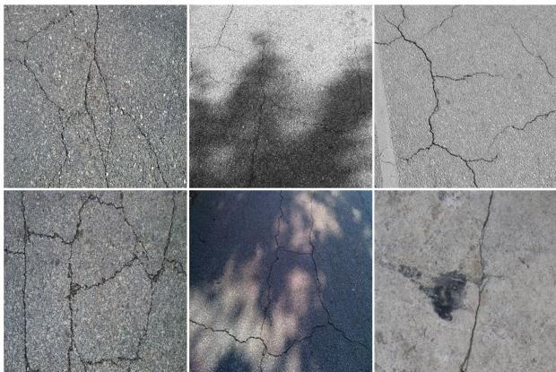  
Fig. 1. Challenging case of slender cracks. There are many interferences in the image, including meshes, low contrast, shadows, road markings, and stains.

The numerous successes in image segmentation have greatly promoted the application of related work in the crack detection field. To professionally process crack images, Zou et al. [14] designed an end-to-end convolutional network that captures crack structure information by fusing multi-scale features. Li et al. [15] proposed a channel-spatial attention-based U-Net model and produced a multi-scene crack dataset. Zhang et al. [16] proposed a crack segmentation model based on groupwise normalization attention and padding-shifting-cutting convolution to capture meaningful and long-range features. Lin et al. [17] proposed a deep multi-scale crack feature learning network to deal with crack objects with variable shapes and complex structures. Liu et al. [18] built a crack detection dataset that combines thermal infrared images and visible light images and designed a convolution model based on infrared thermography. Shi et al. [19] converted grayscale images into four-channel images and introduced a novel local intensity order transformation to learn curve structure features. In addition, Liu et al. [20] proposed a Transformer network for fine-grained crack detection. Although the above methods have achieved advanced results and promoted practical applications of crack detection, the consideration for the slender object characteristics of crack images and the lightweight of models is not in-depth enough.

Recently, automated crack detection methods based on UAVs and road inspection vehicles have attracted widespread interest. These methods provide quantifiable, real-time data for the operation and decision-making of pavement-management systems (PMS), significantly improving maintenance eficiency throughout the pavement life cycle. Afected by factors such as the performance of collection equipment, safety distances, and the characteristics of infrastructure materials, the collected real images of the road surface often contain a large number of slender cracks [21]. Compared with conventional-scale cracks, slender cracks have a larger lengthto-width ratio and more critical edge features. Fig. 1 shows some challenging cases of slender cracks, which have complex structures and are easily disturbed by the background [22]. Specifically, road markings, shadows, stains, and other information are prone to causing structural misdetections. Meanwhile, due to the extreme imbalance in the class proportion of target and background, detection results often lose details. Therefore, to address the challenges of extreme class imbalance and multiple interferences, the detection model needs to possess both global skeleton perception and local edge-capturing capabilities [23]. Global skeleton perception enables the model to capture the skeleton of cracks from a broader perspective and reduce false detections, while local edge-capturing capability helps avoid the loss of details.

Previous segmentation works have confirmed that CNNs can suficiently extract local details [14], [17], while Transformers can efectively capture global information [24]. However, these methods struggle to focus on global and local features simultaneously. To address this, the preliminary CNN-Transformer model [25] was designed to enhance segmentation performance. Considering the requirements of edge deployment, the model’s lightweight nature and real-time performance are also crucial [26]. Therefore, due to the quadratic computational complexity of the Transformer, this hybrid model often struggles to balance its computational eficiency and performance. Recently, the visual Mamba [27] architecture built on the statespace model [28] (SSM) has shown the advantage of linear complexity in long-distance sequence modeling tasks and can serve as an efective alternative to the Transformer.

In this paper, a hybrid CNN-Mamba network with wavelet transform (WTCMamba) is proposed. Based on this network and the air-ground platform, an integrated framework is constructed to achieve real-time crack segmentation and automated risk evaluation for slender cracks. The contributions of this paper can be summarized as follows:

1) A novel hybrid CNN-Mamba network is proposed to address the challenge of slender crack detection and outperforms 12 state-of-the-art models on several public datasets.

2) A WGM module is designed to achieve global spatial frequency fusion modeling in class-imbalanced crack images.

3) A grid-based quantitative risk evaluation method is proposed to rapidly quantify the overall risk of pavement cracks and the rehabilitation area.

## II. RELATED WORK

## A. Deep Learning-Based Image Segmentation

In the deep learning era, the revolutionary changes in image segmentation are inseparable from the rise of CNN. As a fully convolutional neural network with an encoder-decoder structure, U-Net [29] was originally used for cell segmentation tasks in the medical field. Oktay et al. [30] proposed a U-Net variant integrated with an attention gate to focus on medical objects of diferent shapes and sizes. Recently, CNNs combined with other strategic methods have significantly advanced the field of crack segmentation. Kulkarni et al. [31] introduced a segmentation dataset named CrackSeg9k, consisting of 9,000 crack images, and proposed a method to enhance crack detection performance by fusing semi-supervised attention with CNNs. Chen et al. [32] proposed a novel two-phase clusteringinspired representation learning framework (CIRL) to address the ambiguity issue in marginal non-crack regions for crack segmentation. Due to its powerful self-attention mechanism, the vision Transformer (ViT) [33] based model has gradually become a mainstream segmentation method. Xie et al. [24] proposed a segmentation model that combines a hierarchical Transformer and a fully connected multi-layer perceptron. Yang et al. [34] proposed a global-local fusion model based on edge enhancement and Transformer for pixel-level pavement crack segmentation. Although the Transformer architecture can handle more diverse and complex segmentation scenarios, it typically consumes more computing resources.

## B. State Space Model

Recently, Mamba [28], a SSM, has been proposed and has become a strong competitor for the Transformer network. Due to its theoretical linear complexity and global receptive field, Mamba has been rapidly introduced into several computer vision tasks and has achieved advanced results. For example, Liu et al. [27] proposed a visual SSM and verified its efectiveness in various visual recognition tasks by extensive experiments. Lei et al. [35] proposed a lightweight superresolution Mamba network that uses residual SSM to extract pixel features and adopts a knowledge distillation strategy. To address the problem of pathological characterization in gigapixel whole slide images, Nasiri-Sarvi et al. [36] developed a self-supervised learning algorithm based on vision Mamba. To solve the global modeling problem of large remote sensing data, Zhao et al. [37] proposed an ultra-high resolution remote sensing Mamba model. Li et al. [38] developed a wearable sensor-based human activity recognition network that combines a bidirectional Mamba module and a hardwareaware strategy. Although Mamba has high computational eficiency, its ability to model fine-grained features in visual tasks still needs to be explored.

## C. Hybrid Network

The hybrid network combining the two models can leverage their advantages to achieve superior performance. For example, Chen et al. [25] designed a hybrid CNN-Transformer segmentation model that combines the global context understanding ability of the Transformer and the local feature extraction ability of the U-Net to handle complex medical images. Cho et al. [39] developed a hybrid cost aggregation method, which adopted a Transformer to establish global consensus among related images and introduced convolutional blocks to reduce computational cost. To reconstruct highresolution face images from low-resolution images, Gao et al. [40] proposed a collaborative network based on CNN-Transformer. Ye et al. [41] designed a hybrid framework that utilizes CNN stem and Transformer stem in parallel to capture fine-grained and long-range features. Yuan et al. [42] developed a balanced and low-cost hybrid network to address the challenges of color imbalance and detail inconsistency in the single-image dehazing task. Wang et al. [43] proposed a dual-path network with hybrid CNN-Transformer to address the challenges of thin cracks and cluttered backgrounds. Yang et al. [44] proposed an innovative streaming channel modeling method based on the CNN encoder-Mamba decoder network to quickly and efectively solve the color similarity problem in remote sensing image segmentation. Compared with the hybrid CNN-Transformer network, the hybrid CNN-Mamba network can more elegantly balance the segmentation performance and computational cost.

## D. Wavelet Transform

Due to its multi-directional signal decomposition characteristics and multi-scale analysis capabilities, wavelet transform can be widely used in various visual tasks. Gao et al. [45] proposed a model with a learnable discrete wavelet transform to achieve single-image motion deblurring from coarse to fine. Xiang et al. [46] designed a hybrid entropy model that uses discrete wavelets to transform image features into sparse wavelet features. Hu et al. [47] designed a multi-scale wavelet guidance model to address the low contrast and boundary ambiguity. Zhang et al. [48] proposed a dual-encoder model for crack segmentation, which combines wavelet transform with multi-head self-attention to focus on both high-frequency and low-frequency features. To efectively balance performance and computational cost, this paper explores the joint strategy of wavelet transform and Mamba in the task of slender crack detection.

## III. METHODOLOGY

## A. Overall Architecture

In this paper, an automated framework based on a hybrid CNN-Mamba network and an air-ground platform is proposed for pavement crack segmentation and evaluation, as illustrated in Fig. 2. The framework mainly consists of three components: data acquisition, network deployment, and crack evaluation. First, the data acquisition component employs a professional air-ground platform composed of UAVs and vehicles to rapidly collect pavement crack data in engineering scenarios. The auxiliary information from the acquisition platform is used for geometric correction and data cleaning. Second, in the network deployment component, a parameterized hybrid CNN-Mamba network is deployed on professional edge computing devices to achieve real-time crack segmentation. The parameters of the network are obtained by hybrid training on a slender crack dataset and a large public dataset. Finally, the crack evaluation component extracts the morphological features of cracks using the medial skeleton algorithm to analyze their correlation and divide risk regions. A grid-based analysis method is also adopted in this component to quantify the overall risk level of cracks and the required rehabilitation area. The proposed framework aims to realize the long-term monitoring of individual crack features and the quantitative evaluation of overall pavement risk.

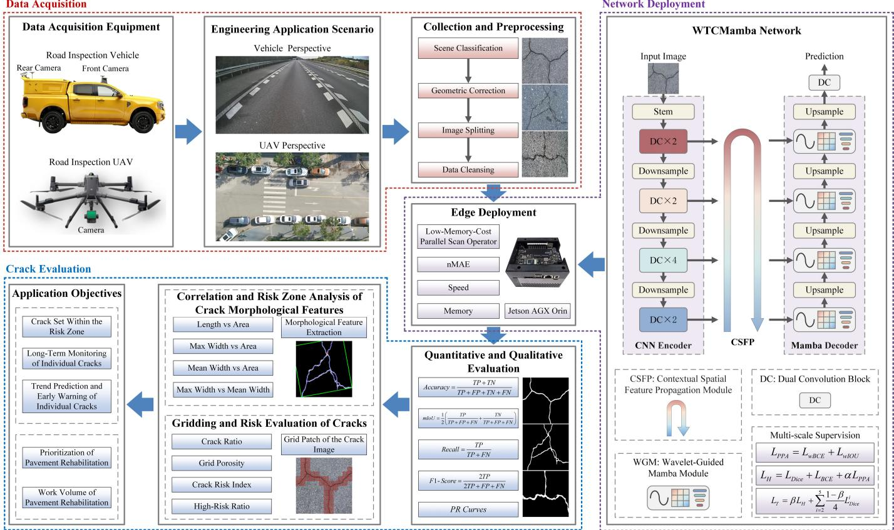  
Fig. 2. The framework for pavement crack detection and risk evaluation using hybrid CNN-Mamba network and air-ground platforms.

## B. WTCMamba Network

In this study, slender crack detection is viewed as a problem of spatial frequency fusion modeling for slender objects. Cracks constitute a minimal proportion of detection images and exhibit complex and variable structures. Due to its advantage in extracting local details, CNN is employed to coarsely extract crack features. Meanwhile, an information propagation component is embedded between the feature extraction and feature fusion components to enhance the collaborative performance of the network. Finally, the Mamba encoder with wavelet transform is used to model the global information and fuse multi-level features. Wavelet transform can deconstruct features into high-frequency and low-frequency components, thereby enhancing the module’s ability to distinguish cracks and backgrounds.

In Fig. 2, WTCMamba refers to the proposed hybrid CNN-Mamba network with wavelet transform. It is an encoder-decoder network with spatial feature interaction that uses a three-stage structure to decompose the challenging crack detection task into multiple interrelated subtasks. The network consists of three main components: 1) A CNN encoder based on DC blocks is used to extract multi-scale rough features from the original crack image. 2) The CSFP module can fully fuse skeleton features from the deep layers and detail features from the shallow layers within the network. 3) A Mamba decoder consisting of WGM modules projects the frequency features into the channel dimension via wavelet transform and models them in global spaces via a progressive fusion approach. Through these three components, object features can be efectively separated from complex backgrounds.

Since most cracks are thin structures, the network’s deep layers have dificulty capturing their features completely. To address this, multi-scale supervision is introduced during training. The ground-truth (GT) mask is downsampled through multiple maxpooling layers to create label maps at multiple scales. Full-stage supervision is achieved by computing the loss between the prediction maps and these multi-scale GT labels. During testing, only the largest-scale prediction map is retained as the final segmentation result.

## C. Encoder Based on Dual Convolution Blocks

Lightweight model backbone design has always been an essential subtask of crack detection. The task aims to achieve a balance between extremely low computational cost and excellent performance. Recently, the ViT [31] has shown superior performance on the crack detection task. However, this model tends to have high complexity and latency, making it unsuitable for edge devices in crack detection. Therefore, a convolution-based lightweight backbone model can be a reasonable solution.

In this section, a lightweight CNN encoder based on dual convolution (DC) blocks is constructed. The encoder achieves an optimal trade-of between performance and complexity. The encoder uses a $3 2 0 \times 3 2 0$ RGB image as the input of the network. The input image is expressed $\boldsymbol { X } \in \mathbb { R } ^ { C \times H \times W }$ , where C, H, and W represent the number of channels, height, and width, respectively. As shown in Fig. 3, features are input into two interacting paths to extract basic crack features. The encoder consists of four stages, extracting four feature streams of diferent scales from an input image, whose shapes are $4 8 \times$ $\begin{array} { r } { \frac { H } { 4 } \times \frac { W } { 4 } , 9 6 \times \frac { H } { 8 } \times \frac { W } { 8 } , 1 9 2 \times \frac { H } { 1 6 } \times \frac { W } { 1 6 } } \end{array}$ , and $\overline { { 3 8 4 } } \ \times \ \frac { H } { 3 2 } \ \times \ \frac { W } { 3 2 }$ respectively. Compared with the popular backbone network, the number of DC blocks in the 4 stages of the CNN encoder is significantly reduced to 2, 2, 4, and 2, respectively. In addition, the downsampling layers are implemented by convolution with the sampling stride set to 4, 2, 2, and 2, respectively.

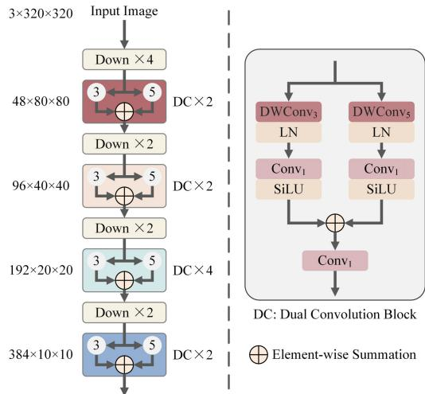  
Fig. 3. The structure of CNN encoder.

Specifically, the DC block maps features to diferent parameter spaces and increases the network width, thereby preserving key information of diferent spatial frequencies as much as possible. The input features are simultaneously fed into two symmetrical convolution branches. Each branch consists of a series of depth-wise convolution, layer normalization (LN), point-wise convolution, and SiLU activation functions. The diference lies in the kernel size of the depthwise convolution. Here, compared to batch normalization (BN) and group normalization (GN), LN can normalize each sample independently, thereby ensuring a more stable training process and avoiding the statistical interference of large crack images on slender crack images. Finally, the outputs of the two branches are combined and input into a $1 \times 1$ convolutional layer to obtain the output features of the block. The DC block is defined as

$$
\left\{ \begin{array} { l } { { X ^ { K 3 } = S i L U \left( C o n \nu _ { 1 } \left( L N \left( D W C o n \nu _ { 3 } \left( X \right) \right) \right) \right) } } \\ { { X ^ { K 5 } = S i L U \left( C o n \nu _ { 1 } \left( L N \left( D W C o n \nu _ { 5 } \left( X \right) \right) \right) \right) } } \\ { { X ^ { D C } = C o n \nu _ { 1 } \left( X ^ { K 3 } \oplus X ^ { K 5 } \right) } } \end{array} \right.\tag{1}
$$

where S iLU(·) means SiLU activation function; Conv (·) means the convolution with a kernel size of $i \times i ; L N ( \cdot )$ represents layer normalization; DWConv (·) is the depth-wise convolution with a kernel size of $i \times i ;$ ⊕ denotes the elementwise summation.

## D. Contextual Spatial Feature Propagation Module

Multi-scale feature fusion is essential for pixel-level crack detection. Although pyramid fusion architectures aggregate contextual semantics through top-down or bottom-up paths, their bilinear upsampling and isotropic pooling neglect local geometry, causing discontinuities at abrupt crack-width variations. To mitigate this, a contextual spatial feature propagation (CSFP) module is proposed. As illustrated in Fig. 4, CSFP replaces the fixed operators with learnable sampling—deconvolution or max-pooling followed by ${ \textbf { a } } 3 \times 3$ convolution—coupled with spatial attention, enabling adaptive gating of crack skeletons and fine details during upsampling and downsampling. Each lateral pathway retains only a $. 1 \times 1$ pointwise convolution and a skip connection, reducing complexity while compensating for information loss. Owing to this multi-path aggregation strategy, the CSFP module produces crack features that are more complete and finer than its input.

The input of the CSFP module comes from the CNN encoder, and the four inputs are represented as $\left\{ X _ { i } ^ { D C } \right\} _ { i = 1 } ^ { 4 } .$ Firstly, 1×1 convolutional layers and LN layers are employed to normalize these input features, resulting in four new features $\{ F _ { i } \} _ { i = 1 } ^ { 4 }$ . The output channel size of the convolution is uniformly set to a fixed value of 48. Then, three skeleton enhancement (SE) blocks are applied between these features to build a bottom-up path. The purpose of this path is to fuse skeleton features from diferent levels and enhance the focus on the main structure of the cracks. Here, the feature is denoted as $\left\{ \boldsymbol { F } _ { i } ^ { S E } \right\} _ { i = 1 } ^ { 3 }$ . There is detail information in each level of features, with the shallowest features containing the finest structures. Therefore, spatial attention (SA) [49] block is introduced to generate the most refined spatial attention weights $( W ^ { S A } )$ from the shallowest features and fuse them with features at diferent levels to obtain the feature $\left\{ F _ { i } ^ { S A } \right\} _ { i = 1 } ^ { 4 }$ . Among these features, slender objects are highlighted by spatial weighting. Subsequently, three detail injection (DI) blocks are embedded between features at diferent levels to construct a top-down path. This path can fuse detail information from multiple levels to obtain features $\left\{ F _ { i } ^ { D I } \right\} _ { i = 2 } ^ { 4 }$ . The SE block and DI block are both implemented using a ${ \bar { 3 } } \times 3$ convolutional layer and a scale coeficient. This scale coeficient is a learnable value within the range of [0, 1], which can control the magnitude of the input features. Finally, the features $\{ F _ { i } \} _ { i = 1 } ^ { 4 }$ before interaction and the features $F _ { 1 } ^ { S A }$ and $\left\{ F _ { i } ^ { D I } \right\} _ { i = 2 } ^ { 4 }$ after interaction are aggregated into the output feature $\left\{ F _ { i } ^ { S C } \right\} _ { i = 1 } ^ { 4 }$ of the module by the skip connection (SC) block. Here, the skip connection block is constructed using a $1 \times 1$ convolutional layer, SiLU activation function, and scaling coeficient. Mathematically, the process of the CSFP module can be expressed as

$$
F _ { i } = L N \left( C o n \nu _ { 1 } \left( X _ { i } ^ { D C } \right) \right) , \quad i = 1 , 2 , 3 , 4\tag{2}
$$

$$
\left( F _ { 4 } ^ { S E } = S E \left( F _ { 3 } , F _ { 4 } \right) \right.
$$

$$
\begin{array} { r } {  F _ { i } ^ { S E } = S E ( F _ { i } , F _ { i + 1 } ^ { S E } ) , \quad i = 1 , 2 } \end{array}\tag{3}
$$

$$
\boldsymbol { W } ^ { S A } = \boldsymbol { S } \boldsymbol { A } \left( \boldsymbol { F } _ { 1 } ^ { S E } \right)\tag{4}
$$

$$
\left\{ \begin{array} { l l } { F _ { 1 } ^ { S A } = F _ { i } ^ { S E } \odot W ^ { S A } } \\ { F _ { i } ^ { S A } = F _ { i } ^ { S E } \odot D o w n _ { i - 1 } \left( W ^ { S A } \right) , \quad i = 2 , 3 } \\ { F _ { 4 } ^ { S A } = F _ { 4 } \odot D o w n _ { 3 } \left( W ^ { S A } \right) } \end{array} \right.\tag{5}
$$

$$
\left\{ F _ { 2 } ^ { D I } = D I \left( F _ { 1 } ^ { S A } , F _ { 2 } ^ { S A } \right) \right.
$$

$$
\backslash F _ { i + 1 } ^ { D I } = D I ( F _ { i } ^ { D I } , F _ { i + 1 } ^ { S A } ) , \quad i = 2 , 3\tag{6}
$$

$$
\left\{ \begin{array} { l } { { F _ { 1 } ^ { S C } = S C \left( F _ { 1 } , F _ { 1 } ^ { S A } \right) } } \\ { { F _ { i } ^ { S C } = S C \left( F _ { i } , F _ { i } ^ { D I } \right) , \quad i = 2 , 3 , 4 } } \end{array} \right.\tag{7}
$$

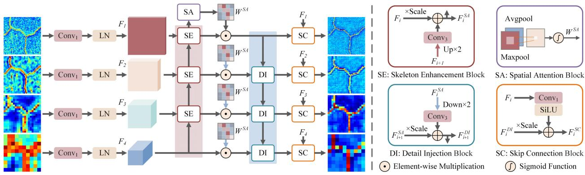  
Fig. 4. The structure of CSFP module. There are two propagation paths, a bottom-up path (red) and a top-down path (blue).

where S E(·) denotes the skeleton enhancement block; S A(·) refers to the spatial attention block;  denotes the elementwise multiplication; Downi(·) denotes the downsampling operation with a scale factor of 2i; DI(·) represents the detail injection block; S C(·) means the skip connection block.

## E. Wavelet-Guided Mamba Module

Since decoder fusion strategies typically rely on simple addition to merge low- and high-resolution features, noise from small-scale features can propagate into large-scale ones. It is therefore crucial to efectively distinguish slender cracks from background noise. In this section, a wavelet-guided Mamba (WGM) module is designed to fuse global spatial frequency information and reduce the influence of background interference. Wavelet transform can transform spatial features into the frequency domain. Here, the wavelet transform utilizes the Haar wavelet to eficiently extract high- and low-frequency features while minimizing computational cost. Finally, through the global perception enabled by the state-space block and the suficient fusion of features across diferent frequencies, slender objects can be efectively distinguished from complex backgrounds.

The Mamba decoder uses the multi-scale features $\left\{ F _ { i } ^ { S C } \right\} _ { i = 1 } ^ { 4 }$ from the CSFP module as input. As shown in Fig. 5, the input features of each WGM module can be represented as $F _ { i } ^ { \bar { S } C }$ and $Y _ { i + 1 } ^ { F G L }$ respectively. Here, $Y _ { i + 1 } ^ { F G L }$ denotes the output from the previous WGM module and upsampling. $F _ { i } ^ { S C }$ and $Y _ { i + 1 } ^ { F G L }$ are aggregated into feature $Y _ { i }$ by element-wise addition. To reduce the calculation amount, the channel size of the aggregated features is compressed to $1 / 4$ of the original by a 1 × 1 convolutional layer. Meanwhile, LN is used to adjust the feature distribution. Subsequently, the compressed features are input into the discrete wavelet transform function to obtain the features of four frequencies, namely $F _ { A } , F _ { H } , F _ { V }$ and $F _ { D }$ Specifically, $F _ { A }$ is a feature containing low-frequency approximation information, $F _ { H }$ is a feature containing horizontal high-frequency information, $F _ { V }$ is a feature containing vertical high-frequency information, and $F _ { D }$ is a feature containing diagonal high-frequency information. These frequency features are concatenated in the channel dimension and expanded to the same shape size as the aggregated features $Y _ { i }$ through deconvolution to obtain channel frequency features $Y _ { i } ^ { F }$

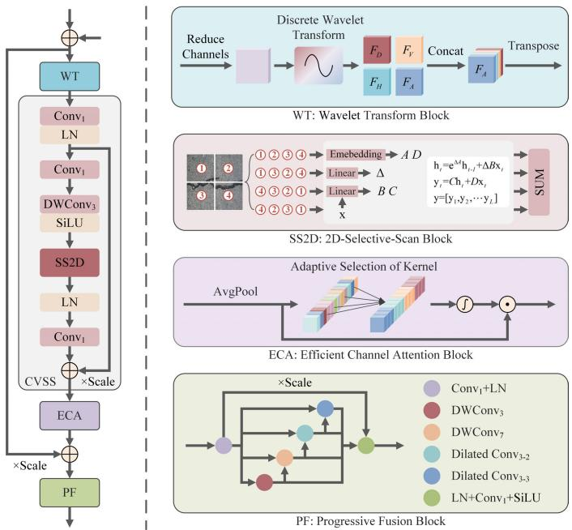  
Fig. 5. The illustration of WGM module.

Then, the channel frequency features are input into the convolutional visual state space (CVSS) block and the eficient channel attention (ECA) [50] block to obtain the global frequency fusion features $Y _ { i } ^ { F G }$ . In particular, this CVSS block is designed based on the visual state space (VSS) [27] block. Here, the CVSS block draws on the design of the VSS block, utilizes the SS2D block, and deletes the multiplication branch to improve computational eficiency. The key diference from the VSS block is that the CVSS block removes the feedforward network (FFN) at the output of the module. Each module should focus on exploring its potential to obtain the optimal solution for the entire network. Therefore, the CVSS block can achieve lower-complexity global dynamic modeling, thereby generating global object features at diferent frequencies.

Subsequently, the ECA block is placed after the CVSS block to select global frequency-domain features and enhance the awareness of key frequency features. To reduce feature discarding, the aggregated features $Y _ { i }$ are added to the global frequency fusion features $Y _ { i } ^ { F G }$ by skip connections with scale factors to obtain residual features $Y _ { i } ^ { F G + }$ . Finally, to achieve joint modeling of global and local space, the residual features are input into the progressive fusion (PF) block to obtain the spatial frequency fusion features $Y _ { i } ^ { F G L }$

Mathematically, the process of the WGM module can be expressed as

$$
Y _ { i } = F _ { i } ^ { S C } \oplus Y _ { i + 1 } ^ { F G L }\tag{8}
$$

$$
Y _ { i } ^ { F } = W T \left( Y _ { i } \right)\tag{9}
$$

$$
Y _ { i } ^ { F G - } = L N \left( C o n \nu _ { 1 } \left( Y _ { i } ^ { F } \right) \right)\tag{10}
$$

$$
Y _ { i } ^ { F G * } = C o n \nu _ { 1 } \Biggl ( L N \biggl ( S S 2 D \biggl ( S i L U \biggl ( D W C o n \nu _ { 3 } \biggl ( C o n \nu _ { 1 }
$$

$$
\biggl ( Y _ { i } ^ { F G - } \biggl ) \Bigl ) \Bigl ) \Bigl ) \Bigl ) \Bigl )\tag{11}
$$

$$
Y _ { i } ^ { F G + } = E C A \left( Y _ { i } ^ { F G * } \oplus Y _ { i } ^ { F G - } \right) \oplus Y _ { i }\tag{12}
$$

$$
Y _ { i } ^ { F G L } = P F \left( Y _ { i } ^ { F G + } \right)\tag{13}
$$

where WT (·) denotes the wavelet transform block; S S 2D(·) represents the 2D selective scanning block; ECA(·) refers to the eficient channel attention block; PF(·) means the progressive fusion block.

To fully fuse multi-scale frequency features, depth-wise separable convolutions and dilated convolutions are embedded into the PF block. First, the feature undergoes a $1 \times 1$ convolutional layer and LN layer, and is split into four sub-features, namely $Y _ { i } ^ { \bullet _ { G L - 1 } } , Y _ { i } ^ { F G L - 2 } , Y _ { i } ^ { F G L - 3 }$ and $Y _ { i } ^ { F G L - 4 }$ . Subsequently, the four sub-features are sequentially input into diferent types of convolutional layers and their feature flows are concatenated. Finally, the sub-features are concatenated and input into a $1 \times 1$ convolutional layer to obtain the output features. To avoid forgetting key information, the features before splitting are jump-connected to the output.

## F. Loss Function

To deal with the problem of sample imbalance in crack detection tasks, Dice loss was introduced as the basis of the total loss. This indicator can be expressed as

$$
L _ { D i c e } = 1 - \frac { 2 | P \cap G | } { | P | + | G | }\tag{14}
$$

where P and G denote the predicted and ground-truth value of the crack, respectively. Meanwhile, BCE loss is introduced to optimize prediction accuracy and improve stability, which measures the loss of the model by calculating the probability diference between the label and the prediction, and it is defined as

$$
L _ { B C E } = - \left( G \log \left( P \right) + \left( 1 - G \right) \log \left( 1 - P \right) \right)\tag{15}
$$

In addition, a PPA loss [51] is introduced to mine structural features and focus on dificult samples. PPA loss uses positionweighted BCE loss to focus on local structures and uses weighted IOU loss to focus on global structures. The PPA loss can be expressed as

$$
{ \cal L } _ { P P A } = { \cal L } _ { w B C E } + { \cal L } _ { w I O U }\tag{16}
$$

Then, the hybrid loss $L _ { H }$ can written as

$$
L _ { H } = L _ { D i c e } + L _ { B C E } + \alpha L _ { P P A }\tag{17}
$$

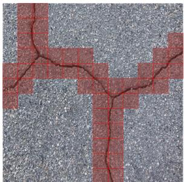

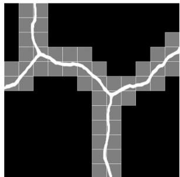  
(a) Grid patch of RGB  
(b) Grid patch of prediction  
Fig. 6. Grid patch of the crack image.

where is set to 0.4. Compared with common pixel-level detection objects, thin cracks have richer details.

The application of downsampling layers often causes crack features to be discarded in deep layers. To fully tap the learning ability of deep networks, multi-scale supervision strategies are applied to network training. Therefore, the total loss $L _ { T }$ can be defined as

$$
L _ { T } = \beta L _ { H } + \sum _ { i = 2 } ^ { 5 } { \frac { 1 - \beta } { 4 } } L _ { D i c e } ^ { i }\tag{18}
$$

where $L _ { D i c e } ^ { i }$ represents the loss of the i-th layer. Since the shallowest prediction map has the richest object information, $\beta$ is set to 0.5 to balance the deep supervision and the overall supervision of the network.

## G. Grid-Based Quantitative Risk Evaluation

A grid-based quantitative evaluation method is designed to quantitatively evaluate the risk and repair area of cracks. This method utilizes the morphological features of cracks and construction constraints to partition the crack grids. As shown in Fig. 6, such crack grid patches can be approximated as the road repair area, providing reference and assistance for road repair and construction. Since the grid explicitly introduces the width and area of cracks and implicitly correlates with crack length, it can efectively quantify the crack risk in the measured area.

The core of this quantitative analysis method lies in calculating the length of the grid cell $( s _ { \mathrm { g r i d } } )$ . In crack images, the grid cell length is jointly determined by the pixel-to-physical length conversion factor and the average crack width. Meanwhile, the pixel length of a single grid should be constrained by road repair equipment. The $s _ { \mathrm { g r i d } }$ can be expressed as

$$
s _ { \mathrm { g r i d } } = \operatorname* { m a x } \left[ s _ { \mathrm { m i n } } , \operatorname* { m i n } [ \lambda \cdot k _ { \mathrm { p i x - m e a s u r e } } \cdot w _ { \mathrm { m e a n } } , s _ { \mathrm { m a x } } ] \right]\tag{19}
$$

where $s _ { \mathrm { m i n } }$ denotes the lower bound of the $s _ { \mathrm { g r i d } }$ , determined by construction accuracy and empirically set to $1 6 ; ~ s _ { \mathrm { m a x } }$ denotes the upper bound of the $s _ { \mathrm { g r i d } }$ , determined by operation width and empirically set to 64; is a dimensionless coeficient, empirically set to $0 . 1 ; k _ { \mathrm { p i x - m e a s u r e } }$ represents the scaling factor between unit pixel length and unit centimeter length.

Crack ratio (C ) is defined as the ratio of the number of crack-containing grids $( N _ { \mathrm { c r a c k } } )$ to the total number of grids $( N _ { \mathrm { g r i d } } )$ , and can be expressed as

$$
C _ { \mathrm { r } } = { \frac { N _ { \mathrm { c r a c k } } } { N _ { \mathrm { g r i d } } } }\tag{20}
$$

Grid porosity $( C _ { \mathfrak { p } } )$ is defined as the ratio of the crack area $( A _ { \mathrm { c r a c k } } )$ to the corresponding grid area $( A _ { \mathrm { g r i d } } )$ , and can be expressed as

$$
C _ { \mathfrak { p } } = { \frac { A _ { \mathrm { c r a c k } } } { A _ { \mathrm { g r i d } } } }\tag{21}
$$

Crack risk index (CRI) integrates crack ratio and grid porosity, and is defined as

$$
C R I = 1 - \left( 1 - C _ { \mathrm { r } } \right) \left( 1 - C _ { \mathrm { p } } \right)\tag{22}
$$

The CRI can be used for the overall risk evaluation of a road segment.

High-risk ratio $( C _ { 0 . 5 \mathrm { r } } )$ is defined as the proportion of highrisk grids $( N _ { \mathrm { c r a c k , } C R I > 0 . 5 } )$ with a CRI value exceeding 0.5 in the total number of grids, and can be expressed as

$$
C _ { 0 . 5 \mathrm { r } } = \frac { N _ { \mathrm { c r a c k , } C R I > 0 . 5 } } { N _ { \mathrm { g r i d } } }\tag{23}
$$

## IV. DATASET PREPARATION

In this paper, the proposed method is evaluated on four public crack detection datasets, including CFD [52], Crack500 [53], CrackTree200 [54] and DeepCrack [55]. The CFD dataset consists of 118 standard crack images with an image resolution of $4 8 0 \times 3 2 0 .$ , which can reflect the conditions of some urban cracks. The Crack500 dataset contains a total of 500 high-resolution crack images with a resolution of $1 5 0 0 \times 2 0 0 0$ . The dataset contains scenes such as shadows, occlusions, and strong light, and can serve as an efective evaluation benchmark. The CrackTree200 dataset contains 206 crack images with a resolution of $8 0 0 \times 6 0 0$ . Since crack objects are almost all thin, this dataset is quite challenging. DeepCrack contains 537 images of concrete surface cracks, and the resolution of the images is unified to 544 × 384. The dataset contains cracks of various widths and some scenes with interference.

Due to the small number of original samples in these datasets, direct evaluation may lead to random performance. To increase the reliability of the evaluation data, this paper adopts the split-filter method to increase the evaluation benchmark. First, all images in the four datasets were split into four equal parts, and images without cracks were deleted. Since objects with a large proportion are more like rifts than cracks, images with a proportion greater than 20% were removed. Secondly, split images with too small a target ratio often lose the basic features of the cracks. To retain the unique distribution characteristics of each data set, the lower quartile Q1 is determined as the standard, and images with a ratio value less than Q1 are deleted. Finally, the filtered datasets are defined as new datasets, named CFD-S, Crack500-S, CrackTree200-S, and DeepCrack-S.

As shown in Table I, the four newly acquired datasets and the four original datasets are divided into training sets, validation sets, and test sets in a ratio of 6:1:3. During training, a training set of 2951 images and a validation set of 493 images are used. During testing, 8 diferent test sets are used to evaluate the performance of the model. Fig. 7 shows the violin plots of test datasets, which clearly illustrate their target proportion distribution.

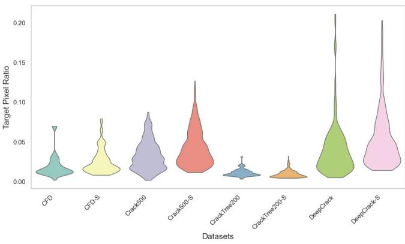

Fig. 7. The violin plots of target pixel ratios on test datasets. CFD, Crack500, CrackTree200, and DeepCrack are public datasets. CFD-S, Crack500-S, CrackTree200-S, and DeepCrack-S are newly added datasets. CrackTree200 and CrackTree200-S have many images with low object ratios. DeepCrack and DeepCrack-S have many images with high object ratios.

TABLE I  
PARTITIONING OF THE DATASET
<table><tr><td colspan="4"></td></tr><tr><td rowspan="5">Total: 4924</td><td colspan="3">Valid: 493</td></tr><tr><td rowspan="3">Test: 1480</td><td>CFD: 36</td><td>CFD-S: 96</td></tr><tr><td>Crack500:150</td><td>Crack500-S: 417</td></tr><tr><td>CrackTree200: 62</td><td>CrackTree200-S: 177</td></tr><tr><td colspan="3">DeepCrack: 162</td></tr></table>

## V. EXPERIMENT AND DISCUSSION

## A. Implementation Details

The proposed method was implemented using PyTorch and trained on a desktop computer equipped with an NVIDIA GeForce RTX 4080S GPU. During training, the batch size and epochs were set to 8 and 150, respectively. The model uses the AdamW optimizer with an initial learning rate of 0.005 and the cosine learning rate scheduler with a half-cycle equal to the epoch. Since small cracks are easily lost by linear downsampling, an area-based resampling from OpenCV is introduced to unify the size of the crack image to [320, 320] in the preprocessing stage.

## B. Evaluation Metrics

Several convincing metrics are selected to evaluate the performance of diferent models, including Accuracy, mIoU, Recall, F1 − S core and PR curves. Among them, the first four indicators with the larger ratio denote better segmentation performance. The PR curve shows the trade-of between precision and recall under diferent thresholds. The larger the area under the PR curve, the better the model’s performance. The four indicators can be written as

$$
A c c u r a c y = { \frac { T P + T N } { T P + F P + T N + F N } }\tag{24}
$$

$$
m I o U = \frac { 1 } { 2 } \left( \frac { T P } { T P + F P + F N } + \frac { T N } { T P + F P + F N } \right)\tag{25}
$$

$$
R e c a l l = { \frac { T P } { T P + F N } }\tag{26}
$$

CHENG et al.: HYBRID CNN-MAMBA NETWORK AND AIR-GROUND PLATFORM FOR PAVEMENT CRACK EVALUATION

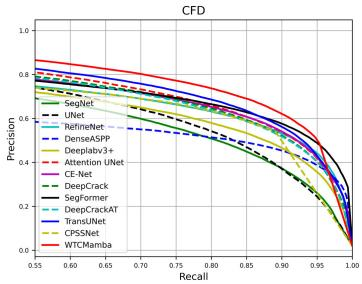  
(a) CFD

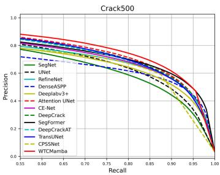  
(b) Crack500  
(c) CrackTree200 CrackTree200-S

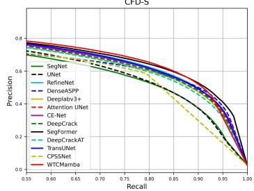  
(e) CFD-S

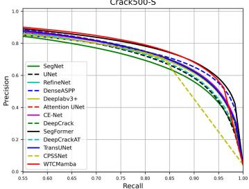  
(f) Crack500-S  
Fig. 8. PR curves comparison of diferent models on 8 datasets.

$$
F 1 - S c o r e = \frac { 2 T P } { 2 T P + F P + F N }
$$

where T P (true positive) means crack pixels are correctly detected; FN (false negative) means crack pixels are misdetected as background; FP (false positive) means background pixels are misdetected as cracks; T N (true negative) means background pixels are correctly detected.

To evaluate the conversion efectiveness between the PyTorch model and the ONNX model, the normalized mean absolute error (nMAE) is introduced. The nMAE is defined as

$$
\mathrm { \ n M A E } = \frac { \displaystyle \sum _ { i = 1 } ^ { N } | P y _ { i } - O _ { i } | } { \displaystyle \sum _ { i = 1 } ^ { N } | P y _ { i } | }\tag{28}
$$

(27)

## C. Comparative Study

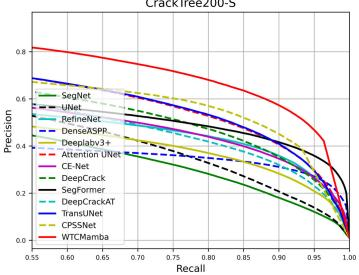

where $P y _ { i }$ denotes the output value of the PyTorch model at the i-th pixel position, $O _ { i }$ denotes the output value of the ONNX model at the i-th pixel position, and N denotes the total number of pixels in the image.

To illustrate the advantages of the proposed approach, 12 representative models were included in the comparative study, including SegNet [9], U-Net [29], RefineNet [10], DenseA-SPP [11], Deeplabv3 + [12], Attention U-Net [30], CE-Net [13], DeepCrack [14], SegFormer [24], DeepCrackAT [17], TransUNet [25], CPSSNet [44].

1) Quantitative Evaluation: Fig. 8 shows the PR curves of all models on diferent datasets. Table II and Table III show the quantitative evaluation results of diferent models on 8 datasets. 1) WTCMamba achieves higher results in the PR curve on most datasets. This shows that the proposed method outperforms these comparison models under various threshold conditions. 2) In Tables II and III, the proposed model achieves the best performance on most datasets, outperforming other methods. For example, on the Crack500 dataset, the mIoU of SegFormer and DeepCrackAT reached 79.34% and 78.63% respectively, while the proposed model achieves 81.48% and has a superior segmentation performance. 3) In particular, compared with other models, the proposed model has unique advantages in dealing with slender cracks that are dificult to detect. Specifically, on the CrackTree200-S dataset, the Recall and mIoU of the proposed model are 12.09% and 4.87% higher than those of TransUNet, respectively. This result is due to the enhanced capture capability of our model for the crack skeleton. As shown in Table II, on the original dataset, the metrics of the proposed model are significantly higher than other models. Because the proportion of cracks in the original dataset is smaller than that in the supplemented dataset, it is dificult for these compared models to fully detect these cracks. 4) On most datasets, the Recall of the proposed model is significantly higher than that of some comparison models. For example, on the CFD and CrackTree200 datasets, WTCMamba’s Recall is 9.98% and 21.79% higher than the second-ranked model. This shows that the proposed model is more efective at detecting missed cracks.

(g) CrackTree200-S  
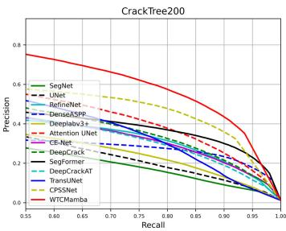

(d) DeepCrack  
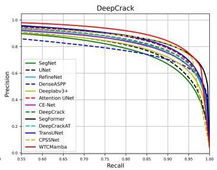

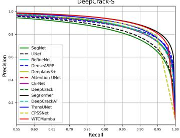  
(h) DeepCrack-S

2) Qualitative Evaluation: Fig. 9 shows a visual comparison of the proposed model with multiple models. In the first and fourth rows, although most of the comparative models were successful in capturing the main framework of the mesh-like cracks, they tended to obscure the geometry in between. In contrast, the model in this paper can extract more complete reticular cracks. In the second, third, and fifth rows, other models tend to keep the trunk of the object and ignore the branches at the edges. In most cases, our model suppresses this unfavorable tendency. Due to the excessive thinness of the cracks, the interference of shadows, and low contrast, the last five photos are highly challenging scenes. In these scenarios, most comparison models produced fuzzy or incomplete segmentation maps. However, the unique spatial frequency fusion modeling capabilities have prompted WTCMamba to efectively overcome this challenge.

TABLE II  
QUANTITATIVE COMPARISONS OF DIFFERENT METHODS ON THE CFD, CRACK500, CRACKTREE200 AND DEEPCRACK DATASETS
<table><tr><td rowspan="2">Method</td><td colspan="3">CFD</td><td colspan="3">Crack500</td><td colspan="3">CrackTree200</td><td colspan="3">DeepCrack</td></tr><tr><td>Accuracy (%)</td><td>Recall (%)</td><td>mIoU (%)</td><td>Accuracy (%)</td><td>Recall (%)</td><td>mIoU (%)</td><td>Accuracy (%)</td><td>Recall (%)</td><td>mIoU (%)</td><td>Accuracy (%)</td><td>Recall (%)</td><td>mIoU (%)</td></tr><tr><td>SegNet</td><td>98.48</td><td>60.15</td><td>71.27</td><td>98.14</td><td>66.38</td><td>76.15</td><td>98.20</td><td>31.14</td><td>57.54</td><td>98.49</td><td>80.68</td><td>83.47</td></tr><tr><td>U-Net</td><td>98.54</td><td>66.14</td><td>73.02</td><td>98.25</td><td>66.63</td><td>77.04</td><td>98.38</td><td>40.89</td><td>60.60</td><td>98.57</td><td>81.29</td><td>84.19</td></tr><tr><td>RefineNet</td><td>98.68</td><td>69.91</td><td>75.01</td><td>98.32</td><td>70.64</td><td>78.22</td><td>98.55</td><td>42.82</td><td>62.12</td><td>98.73</td><td>81.42</td><td>85.51</td></tr><tr><td>DenseASPP</td><td>98.31</td><td>47.84</td><td>67.21</td><td>98.07</td><td>65.96</td><td>75.54</td><td>98.66</td><td>20.40</td><td>56.92</td><td>98.59</td><td>78.79</td><td>84.02</td></tr><tr><td>Deeplabv3+</td><td>98.58</td><td>67.08</td><td>73.54</td><td>98.23</td><td>68.67</td><td>77.25</td><td>98.48</td><td>40.69</td><td>61.23</td><td>98.58</td><td>80.27</td><td>84.15</td></tr><tr><td>Attention U-Net</td><td>98.78</td><td>71.22</td><td>76.24</td><td>98.47</td><td>73.11</td><td>79.87</td><td>98.77</td><td>58.20</td><td>67.25</td><td>98.88</td><td>83.35</td><td>87.03</td></tr><tr><td>CE-Net</td><td>98.75</td><td>70.14</td><td>75.80</td><td>98.35</td><td>74.37</td><td>79.08</td><td>98.51</td><td>54.77</td><td>64.30</td><td>98.69</td><td>81.78</td><td>85.22</td></tr><tr><td>DeepCrack</td><td>98.74</td><td>71.68</td><td>75.93</td><td>98.44</td><td>73.19</td><td>79.65</td><td>98.52</td><td>56.89</td><td>64.82</td><td>98.76</td><td>83.45</td><td>86.03</td></tr><tr><td>SegFormer</td><td>98.79</td><td>68.95</td><td>76.02</td><td>98.42</td><td>72.41</td><td>79.34</td><td>98.86</td><td>32.28</td><td>61.88</td><td>99.03</td><td>85.52</td><td>88.66</td></tr><tr><td>DeepCrackAT</td><td>98.77</td><td>65.81</td><td>75.14</td><td>98.40</td><td>69.16</td><td>78.63</td><td>98.71</td><td>33.51</td><td>61.04</td><td>98.72</td><td>78.34</td><td>85.03</td></tr><tr><td>TransUNet</td><td>98.85</td><td>71.62</td><td>77.14</td><td>98.43</td><td>68.85</td><td>78.79</td><td>98.87</td><td>54.34</td><td>67.51</td><td>98.78</td><td>80.15</td><td>85.77</td></tr><tr><td>CPSSNet</td><td>98.77</td><td>68.98</td><td>75.53</td><td>98.28</td><td>74.16</td><td>78.51</td><td>98.99</td><td>58.04</td><td>67.91</td><td>99.04</td><td>87.60</td><td>88.92</td></tr><tr><td>WTCMamba (Ours)</td><td>98.97</td><td>81.66</td><td>79.85</td><td>98.52</td><td>80.83</td><td>81.48</td><td>99.07</td><td>79.99</td><td>74.65</td><td>99.05</td><td>89.58</td><td>89.22</td></tr></table>

TABLE III

QUANTITATIVE COMPARISONS OF DIFFERENT METHODS ON THE CFD-S, CRACK500-S, CRACKTREE200-S AND DEEPCRACK-S DATASETS
<table><tr><td rowspan="2">Method</td><td colspan="3">CFD-S</td><td colspan="3">Crack500-S</td><td colspan="3">CrackTree200-S</td><td colspan="3">DeepCrack-S</td></tr><tr><td>Accuracy (%)</td><td>Recall (%)</td><td>mIoU (%)</td><td>Accuracy (%)</td><td>Recall (%)</td><td>mIoU (%)</td><td>Accuracy (%)</td><td>Recall (%)</td><td>mIoU (%)</td><td>Accuracy (%)</td><td>Recall (%)</td><td>mIoU (%)</td></tr><tr><td>SegNet</td><td>98.26</td><td>57.45</td><td>72.10</td><td>97.87</td><td>66.22</td><td>77.37</td><td>98.80</td><td>52.42</td><td>64.79</td><td>98.29</td><td>81.28</td><td>85.02</td></tr><tr><td>U-Net</td><td>98.36</td><td>59.46</td><td>73.27</td><td>97.99</td><td>68.90</td><td>78.61</td><td>98.89</td><td>61.67</td><td>67.42</td><td>98.37</td><td>82.46</td><td>85.66</td></tr><tr><td>RefineNet</td><td>98.47</td><td>65.67</td><td>75.49</td><td>98.11</td><td>73.30</td><td>80.15</td><td>98.96</td><td>62.86</td><td>68.45</td><td>98.67</td><td>84.76</td><td>87.96</td></tr><tr><td>DenseASPP</td><td>98.36</td><td>66.46</td><td>74.69</td><td>98.09</td><td>74.38</td><td>80.19</td><td>98.92</td><td>25.31</td><td>59.03</td><td>98.71</td><td>86.98</td><td>88.47</td></tr><tr><td>Deeplabv3+</td><td>98.41</td><td>64.08</td><td>74.67</td><td>98.01</td><td>71.47</td><td>79.18</td><td>98.84</td><td>59.13</td><td>66.48</td><td>98.64</td><td>84.72</td><td>87.79</td></tr><tr><td>Attention U-Net</td><td>98.47</td><td>64.02</td><td>75.12</td><td>98.10</td><td>72.40</td><td>79.92</td><td>99.15</td><td>73.72</td><td>72.92</td><td>98.59</td><td>83.93</td><td>87.36</td></tr><tr><td>CE-Net</td><td>98.45</td><td>62.51</td><td>74.63</td><td>98.07</td><td>74.35</td><td>80.09</td><td>99.02</td><td>64.44</td><td>69.53</td><td>98.60</td><td>83.95</td><td>87.41</td></tr><tr><td>DeepCrack</td><td>98.42</td><td>63.52</td><td>74.58</td><td>98.10</td><td>73.08</td><td>80.03</td><td>99.03</td><td>71.42</td><td>70.88</td><td>98.61</td><td>84.79</td><td>87.54</td></tr><tr><td>SegFormer</td><td>98.53</td><td>70.53</td><td>76.88</td><td>98.21</td><td>78.14</td><td>81.88</td><td>99.16</td><td>47.29</td><td>67.71</td><td>99.00</td><td>89.73</td><td>90.83</td></tr><tr><td>DeepCrackAT</td><td>98.38</td><td>59.92</td><td>73.58</td><td>97.99</td><td>70.94</td><td>78.98</td><td>99.06</td><td>57.14</td><td>68.61</td><td>98.61</td><td>82.88</td><td>87.38</td></tr><tr><td>TransUNet</td><td>98.47</td><td>63.78</td><td>75.11</td><td>98.09</td><td>71.57</td><td>79.71</td><td>99.20</td><td>71.93</td><td>73.50</td><td>98.77</td><td>85.24</td><td>88.77</td></tr><tr><td>CPSSNet</td><td>98.34</td><td>65.07</td><td>74.28</td><td>98.07</td><td>74.24</td><td>80.02</td><td>99.29</td><td>62.99</td><td>64.33</td><td>98.88</td><td>89.38</td><td>89.93</td></tr><tr><td>WTCMamba (Ours)</td><td>98.47</td><td>76.38</td><td>77.32</td><td>98.24</td><td>80.33</td><td>82.11</td><td>99.37</td><td>84.02</td><td>78.37</td><td>98.92</td><td>91.22</td><td>90.37</td></tr></table>

## D. Model Complexity and Speed Analysis

Due to resource limitations of edge computing equipment, the size and running speed of the model are critical to road crack detection tasks. Therefore, supplementary experiments are necessary to evaluate the detection eficiency of the proposed model. To ensure fairness in the comparison, all models were tested on the same NVIDIA RTX 4080S GPU, and 320 × 320 was used as the size of the input image.

Table IV shows the evaluation results, including model size (Params), floating point operations (FLOPs), running speed (Speed), and F1-score. The smaller the Params and FLOPs, the better the model performance. Expectations for Speed and F1-score are the opposite. Based on experimental results, it can be seen that the proposed model achieves an elegant balance of high accuracy and low complexity. Specifically, the parameters of the proposed model are only 2.31M, which is about 2% of TransUNet. In terms of Speed, the proposed model achieves a high FPS of 191.49 and is fully competent for real-time detection tasks. Compared with CPSSNet, this model not only achieves higher results on the F1-score indicator but also reduces FLOPs by 10.38 G. Experimental results demonstrate that the proposed method is an extremely eficient solution that can support real-time crack detection activities.

## E. Generalizability Evaluation

The aforementioned experiments have validated the unique advantages of the proposed model for slender cracks. To illustrate the generalization capability of the proposed model, we conducted an evaluation comparison on a large-scale general crack dataset, CrackSeg9k. This dataset contains over 9,000 standardized images with diverse backgrounds, crack types, surfaces, and ground-truth annotations. The CrackSeg9k dataset is divided into training, validation, and test sets in a ratio of 6:1:3. The evaluation results of our model compared with six typical methods are presented in Table V, where our model achieved the overall best results. Specifically, compared with SegFormer, the proposed model improved the Recall and F1-score by 4.94% and 1.29%, respectively. This indicates that the proposed model has strong generalization ability and can eficiently handle crack detection tasks in a variety of scenarios.

## F. Efect of Mamba Decoder

To validate the efectiveness of our Mamba decoder, we select competitive pure-CNN and Transformer baselines.

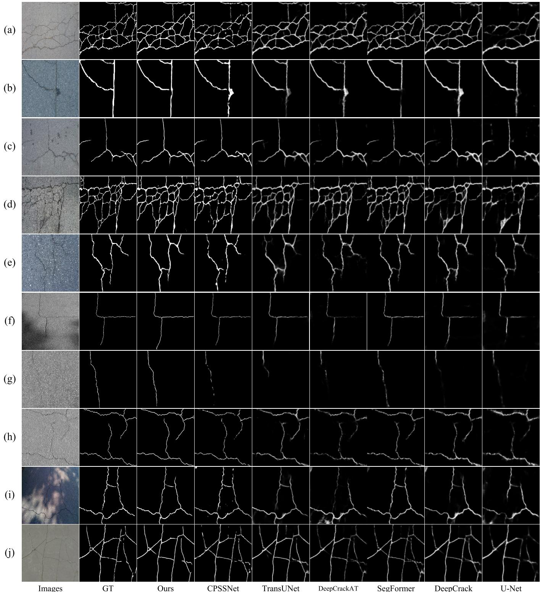  
Fig. 9. Comparative visualizations of the diferent segmentation models. Scenes (a) and (b) are from the CFD and CFD-S datasets, respectively; scenes (c)–(e) are from the Crack500 dataset; scenes (f)–(h) are from the CrackTree200 and CrackTree200-S datasets, respectively; scenes (i) and (j) are from the DeepCrack dataset.

Specifically, the pure CNN decoder is implemented following Attention U-Net, and the Transformer decoder is constructed based on SegFormer. We conduct experiments on eight datasets and report F1-scores in Fig. 10. The Mamba decoder ranks first on all datasets. On DeepCrack-S, it achieves the highest F1-score of 90%. On CrackTree200, it improves upon the CNN and Transformer decoders by 10.9% and 7.9%, respectively, by better extracting and fusing global features to represent complete crack skeletons.

Moreover, the feature maps of the wavelet-transform block are displayed in Fig. 11 to clearly illustrate the pivotal role of the wavelet transform. As can be observed, the output of the wavelet transform exhibits noticeably less noise and more coherent structures than the input. Specifically, $F _ { A }$ yields a cleaner result but sufers from discontinuous cracks. $F _ { H }$ highlights vertically oriented cracks, $F _ { V }$ highlights horizontal ones, and $F _ { D }$ retains only a few oblique cracks. By fusing the low-noise low-frequency band with the structure-highlighting high-frequency bands, the wavelet-transform block yields an output that is simultaneously low-noise and structurally salient.

TABLE IV  
PARAMETERS AND RUNNING SPEED COMPARISONS OF DIFFERENT MODELS
<table><tr><td rowspan="2">Method</td><td rowspan="2">Params (M)</td><td rowspan="2">FLOPs (G)</td><td rowspan="2">Speed (FPS)</td><td colspan="4">F1-score (%)</td></tr><tr><td>CFD-S</td><td>Crack500</td><td>CrackTree200-S</td><td>DeepCrack</td></tr><tr><td>SegNet</td><td>29.44</td><td>62.72</td><td>111.07</td><td>62.98</td><td>70.30</td><td>47.08</td><td>81.31</td></tr><tr><td>U-Net</td><td>19.51</td><td>71.83</td><td>183.81</td><td>65.05</td><td>71.68</td><td>52.90</td><td>82.25</td></tr><tr><td>RefineNet</td><td>109.87</td><td>113.79</td><td>111.57</td><td>68.87</td><td>73.55</td><td>55.01</td><td>83.95</td></tr><tr><td>DenseASPP</td><td>10.2</td><td>16.83</td><td>213.50</td><td>67.59</td><td>69.32</td><td>32.15</td><td>82.00</td></tr><tr><td>Deeplabv3+</td><td>40.35</td><td>27.07</td><td>189.44</td><td>67.51</td><td>72.05</td><td>50.88</td><td>82.20</td></tr><tr><td>Attention U-Net</td><td>34.88</td><td>104.21</td><td>134.14</td><td>68.24</td><td>76.01</td><td>63.67</td><td>85.86</td></tr><tr><td>CE-Net</td><td>29.00</td><td>13.91</td><td>447.18</td><td>67.40</td><td>74.89</td><td>57.19</td><td>83.58</td></tr><tr><td>DeepCrack</td><td>30.91</td><td>214.09</td><td>67.32</td><td>67.35</td><td>75.70</td><td>59.87</td><td>84.63</td></tr><tr><td>SegFormer</td><td>27.35</td><td>22.17</td><td>156.42</td><td>71.18</td><td>75.23</td><td>53.23</td><td>87.85</td></tr><tr><td>DeepCrackAT</td><td>13.33</td><td>146.44</td><td>32.89</td><td>65.60</td><td>74.14</td><td>55.25</td><td>83.31</td></tr><tr><td>TransUNet</td><td>105.43</td><td>53.25</td><td>111.90</td><td>68.23</td><td>74.36</td><td>64.69</td><td>84.27</td></tr><tr><td>CPSSNet</td><td>31.73</td><td>12.05</td><td>65.50</td><td>66.89</td><td>74.05</td><td>64.33</td><td>88.17</td></tr><tr><td>WTCMamba (Ours)</td><td>2.31</td><td>1.67</td><td>191.49</td><td>71.96</td><td>78.41</td><td>72.92</td><td>88.53</td></tr></table>

TABLE V

QUANTITATIVE COMPARISONS OF DIFFERENT METHODS ON THE CRACKSEG9K DATASET
<table><tr><td rowspan="2">Method</td><td colspan="4">CrackSeg9k</td></tr><tr><td>Accuracy (%)</td><td>Recall (%)</td><td>mIoU (%)</td><td>F1-score (%)</td></tr><tr><td>U-Net</td><td>98.12</td><td>68.10</td><td>78.83</td><td>74.68</td></tr><tr><td>RefineNet</td><td>98.16</td><td>70.07</td><td>79.41</td><td>75.55</td></tr><tr><td>Attention U-Net</td><td>98.17</td><td>70.97</td><td>79.62</td><td>75.87</td></tr><tr><td>CE-Net</td><td>98.11</td><td>70.86</td><td>79.22</td><td>75.30</td></tr><tr><td>SegFormer</td><td>98.19</td><td>74.70</td><td>80.40</td><td>77.05</td></tr><tr><td>TransUNet</td><td>98.22</td><td>73.26</td><td>80.36</td><td>76.96</td></tr><tr><td>WTCMamba (Ours)</td><td>98.21</td><td>79.64</td><td>81.27</td><td>78.34</td></tr></table>

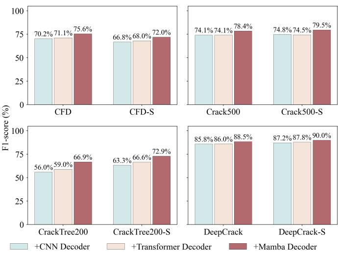  
Fig. 10. Comparison of diferent decoders.

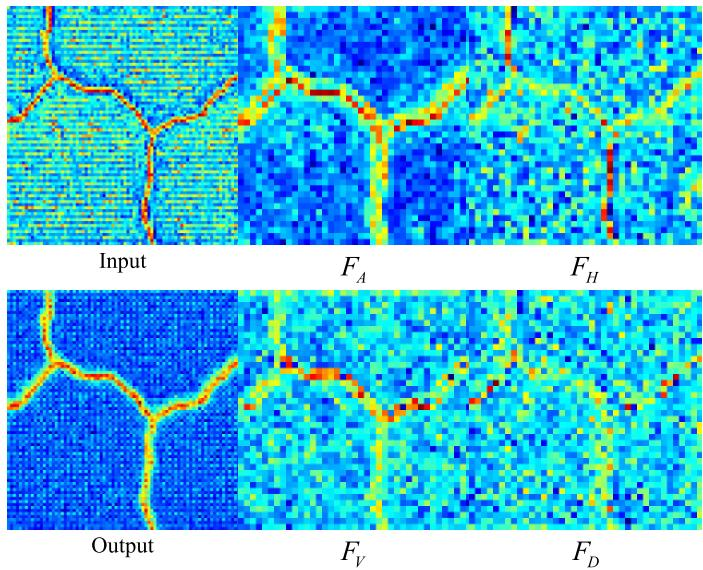  
Fig. 11. Visualization of feature maps based on wavelet transform.

## G. Ablation Study

To comprehensively evaluate the proposed model, ablation studies were conducted on 4 public datasets and 4 supplementary datasets. As shown in Table VI, four experimental models were defined:

• Model-1: a DC block-based CNN encoder and a simple convolutional decoder are constructed, and the structure of the simple decoder mainly refers to U-Net.

• Model-2: a DC block-based CNN encoder and CSFP Module are composed.

• Model-3: a DC block-based CNN encoder and a Mamba decoder that deletes wavelet transform are composed.

• Model-4: a DC block-based CNN encoder and a Mamba decoder with wavelet transform are constructed.

1) Ablation Experiments on CFD and CFD-S Datasets: The ablation results on CFD and CFD-S datasets are shown in Table VII. It can be seen that when the CSFP and WGM modules are removed, all indicators decrease significantly. Specifically, on the two datasets, the mIoU of Model-1 drops by 5.51% and 3.97%, and the F1-score drops by 8.78% and

TABLE VI  
MODEL DEFINITION FOR ABLATION EXPERIMENTS
<table><tr><td rowspan="2">Model</td><td rowspan="2">DC</td><td rowspan="2">CSFP</td><td colspan="2">WGM</td><td rowspan="2">Params (M)</td></tr><tr><td>-WT</td><td>+WT</td></tr><tr><td>U-Net</td><td></td><td rowspan="5"></td><td rowspan="5"></td><td></td><td>19.51</td></tr><tr><td>Model-1</td><td>√</td><td></td><td>1.98</td></tr><tr><td>Model-2</td><td>√</td><td></td><td>2.15</td></tr><tr><td>Model-3</td><td>√ √</td><td></td><td>2.10</td></tr><tr><td>Model-4 Ours</td><td></td><td>√ √</td><td>2.14 2.31</td></tr></table>

TABLE VII

RESULTS OF ABLATION STUDIES ON THE CFD AND CFD-S DATASETS
<table><tr><td rowspan="2">Model</td><td colspan="3">CFD</td><td colspan="3">CFD-S</td></tr><tr><td>Recall (%)</td><td>mIoU (%)</td><td>F1-score (%)</td><td>Recall (%)</td><td>mIoU (%)</td><td>F1-score (%)</td></tr><tr><td>U-Net</td><td>66.14</td><td>73.02</td><td>64.43</td><td>59.46</td><td>73.27</td><td>65.05</td></tr><tr><td>Model-1</td><td>74.97</td><td>74.34</td><td>66.80</td><td>63.24</td><td>73.35</td><td>65.29</td></tr><tr><td>Model-2</td><td>78.39</td><td>76.95</td><td>71.10</td><td>66.02</td><td>74.28</td><td>66.90</td></tr><tr><td>Model-3</td><td>76.63</td><td>75.95</td><td>69.49</td><td>67.44</td><td>75.25</td><td>68.52</td></tr><tr><td>Model-4</td><td>80.19</td><td>78.38</td><td>73.35</td><td>71.00</td><td>75.12</td><td>68.39</td></tr><tr><td>Ours</td><td>81.66</td><td>79.85</td><td>75.58</td><td>76.38</td><td>77.32</td><td>71.96</td></tr></table>

TABLE VIII

RESULTS OF ABLATION STUDIES ON THE CRACK500 AND CRACK500-S DATASETS
<table><tr><td rowspan="2">Model</td><td colspan="3">Crack500</td><td colspan="3">Crack500-S</td></tr><tr><td>Recall (%)</td><td>mIoU (%)</td><td>F1-score (%)</td><td>Recall (%)</td><td>mIoU (%)</td><td>F1-score (%)</td></tr><tr><td>U-Net</td><td>66.63</td><td>77.04</td><td>71.68</td><td>68.90</td><td>78.61</td><td>74.45</td></tr><tr><td>Model-1</td><td>73.72</td><td>77.84</td><td>73.05</td><td>70.78</td><td>77.55</td><td>72.93</td></tr><tr><td>Model-2</td><td>75.43</td><td>78.86</td><td>74.58</td><td>72.25</td><td>78.59</td><td>74.49</td></tr><tr><td>Model-3</td><td>76.00</td><td>79.38</td><td>75.35</td><td>76.27</td><td>79.98</td><td>76.55</td></tr><tr><td>Model-4</td><td>77.25</td><td>79.95</td><td>76.19</td><td>75.08</td><td>79.21</td><td>75.44</td></tr><tr><td>Ours</td><td>80.83</td><td>81.48</td><td>78.41</td><td>80.33</td><td>82.11</td><td>79.54</td></tr></table>

6.67%, respectively. This demonstrates the efectiveness of the proposed CSFP and WGM module. In addition, the Params of Model-1 are approximately 10% of U-Net, while the Recall indicators of Model-1 are improved by 8.83% and 3.78% respectively. This shows that the proposed DC block has extremely eficient feature extraction capabilities.

2) Ablation Experiments on the Crack500 and Crack500-S Datasets: Table VIII shows the results of ablation experiments on the Crack500 and Crack500-S datasets. It can be seen that our proposed model achieved the best experimental results. Specifically, Recall was 80.83% and 80.33%, mIoU was 81.48% and 82.11%, F1-score was 78.41% and 79.54%, respectively. Comparing Model-2 and Model-4, we can find that the WGM module contributes the most to segmentation performance. Compared with Model-1, Model-2 ’s F1-score indicator increased by 1.53% and 1.56% respectively, while Model-4’s F1-score increased by 3.14% and 2.51% respectively.

3) Ablation Experiments on the CrackTree200 and CrackTree200-S Datasets: As shown in Table IX, Ablation experiments were also conducted on the CrackTree200 and CrackTree200-S datasets to clearly demonstrate the impact of diferent modules on slender crack detection.

TABLE IX  
RESULTS OF ABLATION STUDIES ON THE CRACKTREE200 AND CRACKTREE200-S DATASETS
<table><tr><td rowspan="2">Model</td><td colspan="3">CrackTree200</td><td colspan="3">CrackTree200-S</td></tr><tr><td>Recall (%)</td><td>mIoU (%)</td><td>F1-score (%)</td><td>Recall (%)</td><td>mIoU (%)</td><td>F1-score (%)</td></tr><tr><td>U-Net</td><td>40.89</td><td>60.60</td><td>37.18</td><td>61.67</td><td>67.42</td><td>52.90</td></tr><tr><td>Model-1</td><td>62.05</td><td>63.59</td><td>44.93</td><td>76.83</td><td>70.26</td><td>58.79</td></tr><tr><td>Model-2</td><td>76.51</td><td>67.70</td><td>53.95</td><td>81.28</td><td>72.73</td><td>63.44</td></tr><tr><td>Model-3</td><td>57.82</td><td>63.33</td><td>44.23</td><td>78.71</td><td>69.94</td><td>58.19</td></tr><tr><td>Model-4</td><td>73.95</td><td>70.00</td><td>58.40</td><td>82.53</td><td>74.98</td><td>67.36</td></tr><tr><td>Ours</td><td>79.99</td><td>74.65</td><td>66.88</td><td>84.02</td><td>78.37</td><td>72.92</td></tr></table>

TABLE X

RESULTS OF ABLATION STUDIES ON THE DEEPCRACK AND DEEPCRACK-S DATASETS
<table><tr><td rowspan="2">Model</td><td colspan="3">DeepCrack</td><td colspan="3">DeepCrack-S</td></tr><tr><td>Recall (%)</td><td>mIoU (%)</td><td>F1-score (%)</td><td>Recall (%)</td><td>mIoU (%)</td><td>F1-score (%)</td></tr><tr><td>U-Net</td><td>81.29</td><td>84.19</td><td>82.25</td><td>82.46</td><td>85.66</td><td>84.41</td></tr><tr><td>Model-1</td><td>85.15</td><td>84.85</td><td>83.15</td><td>86.41</td><td>86.78</td><td>85.83</td></tr><tr><td>Model-2</td><td>87.62</td><td>86.48</td><td>85.22</td><td>86.84</td><td>87.58</td><td>86.78</td></tr><tr><td>Model-3</td><td>86.98</td><td>85.58</td><td>84.09</td><td>88.00</td><td>87.79</td><td>87.04</td></tr><tr><td>Model-4</td><td>86.99</td><td>86.63</td><td>85.40</td><td>89.01</td><td>88.10</td><td>87.41</td></tr><tr><td>Ours</td><td>89.58</td><td>89.22</td><td>88.53</td><td>91.22</td><td>90.37</td><td>90.03</td></tr></table>

On the CrackTree200 dataset, compared with Model-2, Model-4’s mIoU indicator increased by 2.3%, while the Recall indicator decreased by 2.56%. This shows that the multi-scale feature interaction module is necessary to search for slender cracks, and the Mamba decoder provides stronger overall performance. In addition, compared with Model-4, the F1-score of Model-3 decreased by 14.17% and 9.17%, respectively. This indicates that the wavelet transform can efectively extract high-value frequency features and significantly enhance the model’s ability to distinguish slender cracks from complex backgrounds.

4) Ablation Experiments on the DeepCrack and DeepCrack-S Datasets: Table X shows the results of ablation experiments achieved on the DeepCrack and DeepCrack-S datasets. By analyzing all models, we can draw some reasonable conclusions. The CNN encoder based on DC blocks can provide balanced and reliable basic performance. The CSFP module can enhance the focus on the crack framework. The WGM module can distinguish between cracks from backgrounds and generate the clearest segmentation results.

5) Visualization of Ablation Experiments: To better illustrate the efectiveness and characteristics of each module, the segmentation results are visualized in Fig. 12. Since discerning slender cracks is visually taxing, the ratios of TP, FN, and FP to the actual crack area are annotated on each image. The figure shows that WTCMamba delivers more accurate and refined results for eficient pixel-level crack detection. In the third and fourth images, compared with Model-1, Model-2 demonstrates a strong focus on the target structure and significantly improves TP/GT, enabling the detection of more slender objects. This indicates that CSFP is capable of preserving detailed features efectively. However, the segmentation result for wide cracks remain incomplete, since low-contrast objects are dificult to identify. In the first three figures, compared with Model-1, Model-3 yields more coherent structures and a lower FN/GT. This demonstrates that the Mamba block can model features at the global scale, while the PF block fully aggregates frequency characteristics. In the last three figures, the analysis of Models 3 and 4 shows that integrating wavelet transform enhances the ability to extract sharp crack edges and small geometric features.

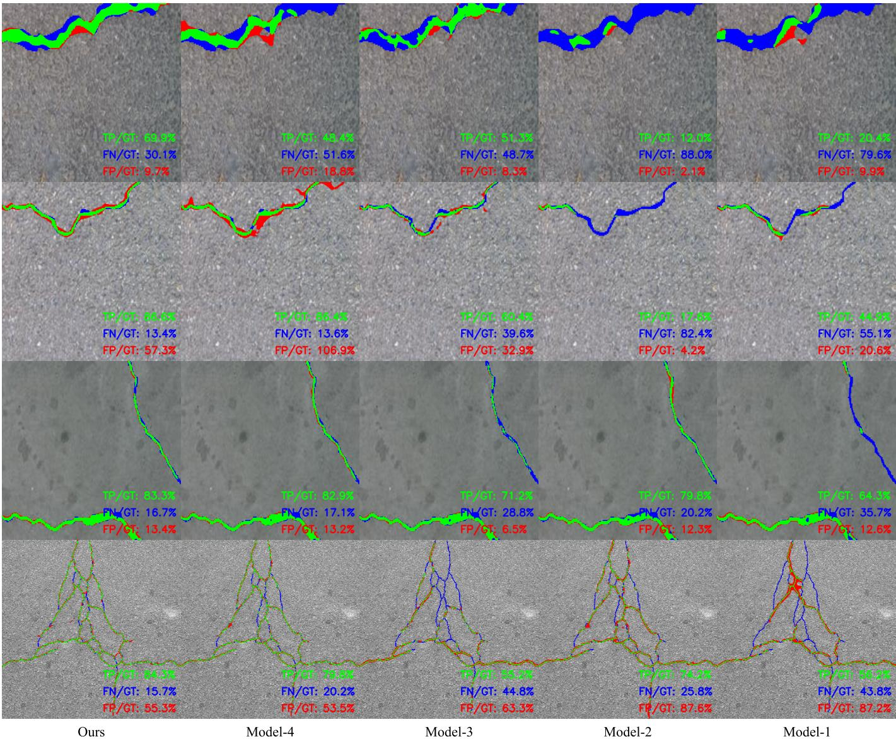  
Fig. 12. Visual results with TP/FN/FP annotations of the ablation studies. Green indicates TP, blue indicates FN, and red indicates FP. The ratios TP/GT, FN/GT, and FP/GT are each computed as the area of the corresponding-colored region divided by the total crack area in the ground truth.

## H. Edge Deployment

Edge deployment has become a common solution for crack detection tasks due to its superior real-time performance and privacy preservation. A mainstream approach for edge deployment is GPU inference on NVIDIA platforms using the ONNX model format. However, the built-in parallel scan operator of Mamba is often incompatible with ONNX conversion frameworks, resulting in an extremely high nMAE. A straightforward solution involves replacing it with a loop-based scanning operator implemented purely in PyTorch, which circumvents this issue. However, this operator runs extremely slowly, which significantly conflicts with the real-time demand for road crack detection.

TABLE XI  
PERFORMANCE ANALYSIS OF ONNX-FORMAT WTCMAMBA BASED ON DIFFERENT SCAN OPERATORS ON EDGE DEVICES
<table><tr><td>Scan Operator</td><td>nMAE (%)</td><td>Speed (FPS)</td><td>Memory (GB)</td><td>Recall (%)</td><td>mIoU (%)</td><td>F1-score (%)</td></tr><tr><td>Official</td><td>20.90</td><td>71.79</td><td>0.64</td><td>73.01</td><td>78.05</td><td>73.60</td></tr><tr><td>Pytorch</td><td>0.01</td><td>1.45</td><td>0.72</td><td>80.66</td><td>81.79</td><td>79.03</td></tr><tr><td>LMC-Belloch</td><td>0.02</td><td>35.63</td><td>0.68</td><td>80.43</td><td>81.63</td><td>78.80</td></tr></table>

To address the above problems, a low-memory-cost parallel scan operator based on the Belloch algorithm is designed, called LMC-Belloch. This operator incorporates the Belloch algorithm and optimizes dimension operations to achieve

(px)

<table><tr><td rowspan="2">Visualization</td><td></td><td rowspan="2"></td><td rowspan="2"></td></tr><tr><td></td></tr><tr><td>Length (px)</td><td>358</td><td>420</td><td>477 951</td></tr><tr><td>Area (px²)</td><td>2789</td><td>1613.5</td><td>1345.5 13016</td></tr><tr><td>Max Width (px)</td><td>18.62</td><td>8.26</td><td>9.68 11.31</td></tr><tr><td>Mean Width (px)</td><td>6.02</td><td>3.33</td><td>3.24 3.42</td></tr></table>

Fig. 13. Results of geometric feature extraction based on medial skeleton.

eficient selective parallel scanning. Meanwhile, it adopts Triton kernel optimization and operator fusion, which significantly reduces the memory overhead. We have completed the full-process deployment and performance evaluation on the NVIDIA Jetson AGX Orin 32GB edge computing module, and the performance analysis results are presented in Table XI. This device integrates an Ampere-architecture GPU and 32 GB 256-bit LPDDR5 memory, delivering an AI computing power of 200 TOPS (INT8). nMAE quantifies the average conversion error between the pure PyTorch and ONNX models. Speed denotes the inference frames per second for a single batch input on edge devices. Memory represents the GPU memory consumption of models with diferent scanning operators. The results of Recall, mIoU, and F1-score were obtained by testing on the combination of the eight test datasets and the CrackSeg9k test dataset. As shown in the table, compared with the oficial operator, our operator reduces the nMAE by 20.88%, indicating a significant improvement in adaptability. Meanwhile, compared with pure PyTorch loop operators, our operator achieves 35.63 FPS, which meets the real-time requirements of crack detection tasks. In addition, LMC-Belloch achieves performance comparable to pure PyTorch looping operators with lower memory overhead. The proposed operator ofers favorable scalability and excellent compatibility with mainstream edge deployment frameworks.

## I. Correlation and Risk Zones of Crack Morphological Features

To more clearly demonstrate the intrinsic correlation among crack morphological parameters and the risk distribution, we select the more scenario-specific Crack500-S dataset. We employ a morphological feature extraction method based on medial skeleton to extract the length, area, max width, and mean width of cracks. Several result samples are presented in Fig. 13. The visualization shows the crack region (green), skeleton line (blue), and maximum width location (red). In particular, the orientation of the circumscribed rectangle of the crack can be used for the classification of individual cracks.

To demonstrate the significant value of multiple crack features for road risk analysis, we employ a correlation and risk region evaluation method, with the evaluation results presented in Fig. 14. This method measures the correlation among length, area, max width, and mean width using scatter distribution and the Pearson correlation coeficient. In Fig. 14(a–c), the method defines 5% of the total image area as the risk boundary for the crack area. In Fig. 14(a), twice the image width is defined as the risk boundary for crack length. In Fig. 14(b), 10% of the image width is set as the risk boundary for crack max width. In Fig. 14(c), 5% of the image width is defined as the risk boundary for crack mean width. In addition, the overlapping parts of the risk regions indicate high risk. In Fig. 14(d), if a large number of points appear near the 45◦ axis, it may indicate an extreme abnormal event such as neat pavement fracture. Such visualization results clearly highlight the crack objects that road health monitors should prioritize, facilitating the long-term monitoring and trend early warning of high-risk cracks.

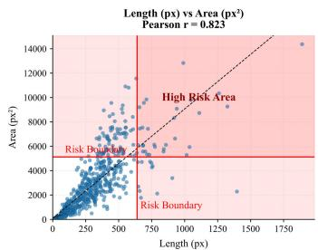  
(a) Correlation and risk zones between length and area

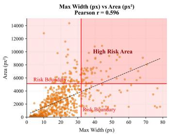  
(b) Correlation and risk zones between max width and area

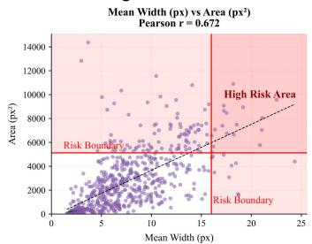  
(c) Correlation and risk zones between mean width and area

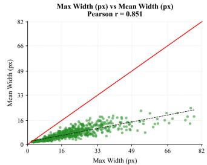  
(d) Correlation and risk zones between max width and mean width

Fig. 14. Correlation and risk zones.  
Comparison of Crack Indicators Between Crack500-S and CrackTree200-S  
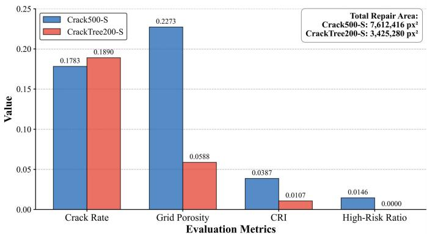  
Fig. 15. Comparison of risk evaluation results on the Crack500-S and CrackTree200-S datasets.

## J. Grid-Based Risk Evaluation of Cracks

To quantitatively evaluate the overall risk and repair area of road cracks, this paper adopts a grid-based risk evaluation method. In the evaluation, the Crack500-S and CrackTree200- S datasets were adopted, both containing two typical crack scenarios respectively. The grid unit was set to $3 2 \times 3 2$ and the evaluation results are shown in Fig. 15. It can be seen from the figure that the grid porosity, CRI and high-risk rate of the Crack500-S scenario is higher, indicating a higher repair priority and greater repair dificulty. Compared with Crack500-S, the CrackTree200-S scenario shows a wider crack distribution per unit area but a lower risk level. This evaluation experiment intuitively presents the risk and repair indicators under diferent scenarios, and can provide a reference for priority ranking and engineering quantity in road repair tasks.

## VI. CONCLUSION

In this paper, we propose an integrated pavement crack evaluation framework based on a hybrid CNN-Mamba network and an air-ground platform composed of UAVs and inspection vehicles. Within this framework, we present a novel hybrid CNN-Mamba network with wavelet transform, named WTC-Mamba. The network employs the designed WGM module to transform the pixel-level crack detection task into a spatialfrequency fusion modeling process, addressing the eficiency issues and slender object issues in these tasks. Specifically, a DC block-based CNN encoder is designed to eficiently extract underlying crack details from the original image. To realize global structure awareness of objects in diferent frequencies, a WGM module is proposed. It uses wavelet transform to separate low-frequency and various high-frequency information, employs CVSS blocks to process long sequence features, and utilizes PF blocks to fuse frequency features. A CSFP module is embedded between the encoder and decoder to propagate skeleton information from bottom to top and detail information from top to bottom. To improve the reliability of the datasets, we proposed a split-filter method and established four corresponding supplementary datasets based on the four public datasets. The proposed WTCMamba is also deployed and tested on edge computing devices, achieving 35.63 FPS. The superior performance of the proposed model was verified by extensive experiments on several datasets. In particular, the proposed model contains only 2.31 M parameters and achieves 79.85%, 81.48%, 74.65%, and 89.22% mIoU on the CFD, Crack500, CrackTree200, and DeepCrack datasets, respectively. Based on the segmentation results, a grid-based quantitative risk evaluation method and a correlation analysis method are employed to assess the overall risk and morphological characteristics. We hope that our work can provide some positive insights into research fields such as real-time defect detection, slender object detection, medical object segmentation, and lightweight models to address related challenges.

In this work, although WTCMamba demonstrates the best overall performance, two limitations remain to be addressed: 1) the proposed method should be evaluated on more realistic crack data acquired from UAVs and professional vehicles, as such data better reflect the value of automated visual inspection of cracks for infrastructure-health monitoring. In particular, crack images captured from moving platforms may sufer from motion blur, surface reflections, and oblique views, thus providing a more comprehensive benchmark. 2) The model parameters and computational complexity of WTC-Mamba can be further optimized. A lighter model alleviates the constraints on compute-unit selection and reduces deployment cost for resource-limited crack-detection tasks. Motivated by these limitations, we will construct a multi-scenario bridge-and-pavement crack-detection dataset and exploit novel optimization techniques to boost both inference speed and accuracy, thereby enabling edge-based trafic-infrastructure health monitoring.

## REFERENCES

[1] C. Wang, M. K. Lim, X. Zhang, L. Zhao, and P. T.-W. Lee, “Railway and road infrastructure in the belt and road initiative countries: Estimating the impact of transport infrastructure on economic growth,” Transp. Res. A, Policy Pract., vol. 134, pp. 288–307, Apr. 2020.

[2] T. Wang, Z. Qu, Z. Yang, T. Nichol, G. Clarke, and Y.-E. Ge, “Climate change research on transportation systems: Climate risks, adaptation and planning,” Transp. Res. D, Transp. Environ., vol. 88, Nov. 2020, Art. no. 102553.

[3] D. Ai, G. Jiang, S.-K. Lam, P. He, and C. Li, “Computer vision framework for crack detection of civil infrastructure—A review,” Eng. Appl. Artif. Intell., vol. 117, Jan. 2023, Art. no. 105478.

[4] Z. Gao, X. Zhao, M. Cao, Z. Li, K. Liu, and B. M. Chen, “Synergizing low rank representation and deep learning for automatic pavement crack detection,” IEEE Trans. Intell. Transp. Syst., vol. 24, no. 10, pp. 10676–10690, Oct. 2023.

[5] L. Fan, S. Li, Y. Li, B. Li, D. Cao, and F.-Y. Wang, “Pavement cracks coupled with shadows: A new shadow-crack dataset and a shadowremoval-oriented crack detection approach,” IEEE/CAA J. Autom. Sinica, vol. 10, no. 7, pp. 1593–1607, Jul. 2023.

[6] E. Zalama, J. Gomez-Garc ´ ´ıa-Bermejo, R. Medina, and J. Llamas, “Road crack detection using visual features extracted by Gabor filters,” Comput.-Aided Civil Infrastruct. Eng., vol. 29, no. 5, pp. 342–358, May 2014.

[7] M. O’Byrne, F. Schoefs, B. Ghosh, and V. Pakrashi, “Texture analysis based damage detection of ageing infrastructural elements,” Comput.- Aided Civil Infrastruct. Eng., vol. 28, no. 3, pp. 162–177, Mar. 2013.

[8] R. Amhaz, S. Chambon, J. Idier, and V. Baltazart, “Automatic crack detection on two-dimensional pavement images: An algorithm based on minimal path selection,” IEEE Trans. Intell. Transp. Syst., vol. 17, no. 10, pp. 2718–2729, Oct. 2016.

[9] V. Badrinarayanan, A. Kendall, and R. Cipolla, “SegNet: A deep convolutional encoder–decoder architecture for image segmentation,” IEEE Trans. Pattern Anal. Mach. Intell., vol. 39, no. 12, pp. 2481–2495, Dec. 2017.

[10] G. Lin, A. Milan, C. Shen, and I. Reid, “RefineNet: Multi-path refinement networks for high-resolution semantic segmentation,” in Proc. IEEE Conf. Comput. Vis. Pattern Recognit. (CVPR), Jul. 2017, pp. 5168–5177.

[11] M. Yang, K. Yu, C. Zhang, Z. Li, and K. Yang, “DenseASPP for semantic segmentation in street scenes,” in Proc. IEEE/CVF Conf. Comput. Vis. Pattern Recognit., Jun. 2018, pp. 3684–3692.

[12] L.-C. Chen, Y. Zhu, G. Papandreou, F. Schrof, and H. Adam, “Encoder–decoder with Atrous separable convolution for semantic image segmentation,” in Proc. Eur. Conf. Comput. Vis. (ECCV), Sep. 2018, pp. 833–851.

[13] Z. Gu et al., “CE-Net: Context encoder network for 2D medical image segmentation,” IEEE Trans. Med. Imag., vol. 38, no. 10, pp. 2281–2292, Oct. 2019.

[14] Q. Zou, Z. Zhang, Q. Li, X. Qi, Q. Wang, and S. Wang, “DeepCrack: Learning hierarchical convolutional features for crack detection,” IEEE Trans. Image Process., vol. 28, no. 3, pp. 1498–1512, Mar. 2019.

[15] Y. Li, M. Yu, D. Wu, R. Li, K. Xu, and L. Cheng, “Automatic pixel-level detection method for concrete crack with channel-spatial attention convolution neural network,” Struct. Health Monit., vol. 22, no. 2, pp. 1460–1477, Mar. 2022.

[16] J. Zhang, F. Huang, Y. Lv, Z. Zeng, and Y. Gui, “Training surface crack segmentation networks with groupwise normalization attention and padding–shifting–cutting convolution,” IEEE Sensors J., vol. 24, no. 13, pp. 21093–21107, Jul. 2024.

[17] Q. Lin, W. Li, X. Zheng, H. Fan, and Z. Li, “DeepCrackAT: An efective crack segmentation framework based on learning multi-scale crack features,” Eng. Appl. Artif. Intell., vol. 126, Nov. 2023, Art. no. 106876.

[18] F. Liu, J. Liu, and L. Wang, “Asphalt pavement crack detection based on convolutional neural network and infrared thermography,” IEEE Trans. Intell. Transp. Syst., vol. 23, no. 11, pp. 22145–22155, Nov. 2022.

[19] T. Shi, N. Boutry, Y. Xu, and T. Geraud, “Local intensity order´ transformation for robust curvilinear object segmentation,” IEEE Trans. Image Process., vol. 31, pp. 2557–2569, 2022.

[20] H. Liu, X. Miao, C. Mertz, C. Xu, and H. Kong, “CrackFormer: Transformer network for fine-grained crack detection,” in Proc. IEEE/CVF Int. Conf. Comput. Vis. (ICCV), Oct. 2021, pp. 3763–3772.

[21] C. Li et al., “CrackCLF: Automatic pavement crack detection based on closed-loop feedback,” IEEE Trans. Intell. Transp. Syst., vol. 25, no. 6, pp. 5965–5980, Jun. 2023.

[22] X. Cheng, T. He, F. Shi, M. Zhao, X. Liu, and S. Chen, “Selective feature fusion and irregular-aware network for pavement crack detection,” IEEE Trans. Intell. Transp. Syst., vol. 25, no. 5, pp. 3445–3456, May 2023.

[23] H. Zhang et al., “Robust semantic segmentation for automatic crack detection within pavement images using multi-mixing of global context and local image features,” IEEE Trans. Intell. Transp. Syst., vol. 25, no. 9, pp. 11282–11303, Sep. 2024.

[24] E. Xie, W. Wang, Z. Yu, A. Anandkumar, J. M. Alvarez, and P. Luo, “SegFormer: Simple and eficient design for semantic segmentation with transformers,” in Proc. Adv. Neural Inf. Process. Syst. (NeurIPS), Dec. 2021, pp. 12077–12090.

[25] J. Chen et al., “TransUNet: Rethinking the U-Net architecture design for medical image segmentation through the lens of transformers,” Med. Image Anal., vol. 97, Oct. 2024, Art. no. 103280.

[26] Y. Zhang and C. Liu, “Real-time pavement damage detection with damage shape adaptation,” IEEE Trans. Intell. Transp. Syst., vol. 25, no. 11, pp. 18954–18963, Nov. 2024.

[27] Y. Liu et al., “VMamba: Visual state space model,” 2024, arXiv:2401.10166.

[28] A. Gu and T. Dao, “Mamba: Linear-time sequence modeling with selective state spaces,” 2023, arXiv:2312.00752.

[29] O. Ronneberger, P. Fischer, and T. Brox, “U-Net: Convolutional networks for biomedical image segmentation,” in Proc. Int. Conf. Med. Image Comput. Comput.-Assist. Intervent., Oct. 2015, pp. 234–241.

[30] O. Oktay et al., “Attention U-Net: Learning where to look for the pancreas,” 2018, arXiv:1804.03999.

[31] S. Kulkarni, S. Singh, D. Balakrishnan, S. Sharma, S. Devunuri, and S. C. R. Korlapati, “CrackSeg9k: A collection and benchmark for crack segmentation datasets and frameworks,” in Proc. Eur. Conf. Comput. Vis. (ECCV), Feb. 2022, pp. 179–195.

[32] Z. Chen, Z. Lai, J. Chen, and J. Li, “Mind marginal non-crack regions: clustering-inspired representation learning for crack segmentation,” in Proc. IEEE/CVF Conf. Comput. Vis. Pattern Recognit. (CVPR), Jun. 2024, pp. 12698–12708.

[33] A. Dosovitskiy et al., “An image is worth 16 × 16 words: Transformers for image recognition at scale,” in Proc. Int. Conf. Learn. Represent. (ICLR), Jun. 2020, pp. 1–21.

[34] L. Yang, M. Ma, Z. Wu, and Y. Liu, “A global-local fusion model via edge enhancement and transformer for pavement crack defect segmentation,” IEEE Trans. Intell. Transp. Syst., vol. 26, no. 2, pp. 1964–1981, Feb. 2025.

[35] X. Lei, W. Zhang, and W. Cao, “DVMSR: Distillated vision mamba for eficient super-resolution,” in Proc. IEEE/CVF Conf. Comput. Vis. Pattern Recognit. Workshops (CVPRW), Jun. 2024, pp. 6536–6546.

[36] A. Nasiri-Sarvi, V. Q.-H. Trinh, H. Rivaz, and M. S. Hosseini, “Vim4Path: Self-supervised vision mamba for histopathology images,” in Proc. IEEE/CVF Conf. Comput. Vis. Pattern Recognit. Workshops (CVPRW), Jun. 2024, pp. 6894–6903.

[37] S. Zhao, H. Chen, X. Zhang, P. Xiao, L. Bai, and W. Ouyang, “RSmamba for large remote sensing image dense prediction,” IEEE Trans. Geosci. Remote Sens., vol. 62, 2024, Art. no. 5633314.

[38] S. Li et al., “HARMamba: Eficient and lightweight wearable sensor human activity recognition based on bidirectional mamba,” IEEE Internet Things J., vol. 12, no. 3, pp. 2373–2384, Feb. 2025.

[39] S. Cho, S. Hong, and S. Kim, “CATs++: Boosting cost aggregation with convolutions and transformers,” IEEE Trans. Pattern Anal. Mach Intell., vol. 45, no. 6, pp. 7174–7194, Jun. 2023.

[40] G. Gao, Z. Xu, J. Li, J. Yang, T. Zeng, and G.-J. Qi, “CTCNet: A CNNtransformer cooperation network for face image super-resolution,” IEEE Trans. Image Process., vol. 32, pp. 1978–1991, 2023.

[41] D. Ye, Z. Ni, H. Wang, J. Zhang, S. Wang, and S. Kwong, “CSformer: Bridging convolution and transformer for compressive sensing,” IEEE Trans. Image Process., vol. 32, pp. 2827–2842, 2023.

[42] S. Yuan, J. Chen, W. Jiang, Z. Zhao, and S. Guo, “LHNetV2: A balanced low-cost hybrid network for single image dehazing,” IEEE Trans. Multimedia, vol. 26, pp. 8197–8209, 2024.

[43] J. Wang et al., “Dual-path network combining CNN and transformer for pavement crack segmentation,” Autom. Construction, vol. 158, Feb. 2024, Art. no. 105217.

[44] Y. Yang, G. Yuan, and J. Li, “Dual-branch network for spatial–channel stream modeling based on the state-space model for remote sensing image segmentation,” IEEE Trans. Geosci. Remote Sens., vol. 63, 2025, Art. no. 5907719.

[45] X. Gao et al., “Eficient multi-scale network with learnable discrete wavelet transform for blind motion deblurring,” in Proc. IEEE/CVF Conf. Comput. Vis. Pattern Recognit. (CVPR), Jun. 2024, pp. 2733–2742.

[46] S. Xiang, Q. Liang, and L. Fang, “Discrete wavelet transform-based Gaussian mixture model for remote sensing image compression,” IEEE Trans. Geosci. Remote Sens., vol. 61, 2023, Art. no. 3000112.

[47] K. Hu, H. Tan, Y. Zhang, W. Huang, and X. Gao, “MWG-Net: Multiscale wavelet guidance network for COVID-19 lung infection segmentation from CT images,” IEEE Trans. Instrum. Meas., vol. 72, pp. 1–15, 2023.

[48] J. Zhang, Z. Zeng, P. K. Sharma, O. Alfarraj, A. Tolba, and J. Wang, “A dual encoder crack segmentation network with Haar wavelet-based high–low frequency attention,” Expert Syst. Appl., vol. 256, Dec. 2024, Art. no. 124950.

[49] S. Woo, J. Park, J. Y. Lee, and I. S. Kweon, “CBAM: Convolutional block attention module,” in Proc. Eur. Conf. Comput. Vis. (ECCV), vol. 2018, pp. 3–19.

[50] Q. Wang, B. Wu, P. Zhu, P. Li, W. Zuo, and Q. Hu, “ECA-Net: Eficient channel attention for deep convolutional neural networks,” in Proc. IEEE/CVF Conf. Comput. Vis. Pattern Recognit. (CVPR), Jun. 2020, pp. 11531–11539.

[51] J. Wei, S. Wang, and Q. Huang, “F3Net: Fusion, feedback and focus for salient object detection,” in Proc. AAAI Conf. Artif. Intell., Feb. 2019, pp. 12321–12328.

[52] Y. Shi, L. Cui, Z. Qi, F. Meng, and Z. Chen, “Automatic road crack detection using random structured forests,” IEEE Trans. Intell. Transp. Syst., vol. 17, no. 12, pp. 3434–3445, Dec. 2016.

[53] F. Yang, L. Zhang, S. Yu, D. Prokhorov, X. Mei, and H. Ling, “Feature pyramid and hierarchical boosting network for pavement crack detection,” IEEE Trans. Intell. Transp. Syst., vol. 21, no. 4, pp. 1525–1535, Apr. 2020.

[54] Q. Zou, Y. Cao, Q. Li, Q. Mao, and S. Wang, “CrackTree: Automatic crack detection from pavement images,” Pattern Recognit. Lett., vol. 33, no. 3, pp. 227–238, Feb. 2012.

[55] Y. Liu, J. Yao, X. Lu, R. Xie, and L. Li, “DeepCrack: A deep hierarchical feature learning architecture for crack segmentation,” Neurocomputing, vol. 338, pp. 139–153, Apr. 2019.

  
Longqi Cheng received the M.S. degree from Chongqing University of Posts and Telecommunications, Chongqing, China, in 2023. He is currently pursuing the Ph.D. degree with Chongqing University. His research interests include image segmentation, multi-modal image processing, and salient object detection.

Decheng Wu received the Ph.D. degree in circuits and systems from Chongqing University, Chongqing, China, in 2020. He is currently a Lecturer with the School of Automation, Chongqing University of Posts and Telecommunications. His research is focused on deep learning and signal processing.

Xinglong Gong received the bachelor’s and master’s degrees from the Department of Modern Mechanics, University of Science and Technology of China, Hefei, China, in 1988 and 1991, respectively, and the Ph.D. degree from the Faculty of Engineering, Saitama University, Saitama, Japan, in 1996. He is currently a Professor and a Doctoral Supervisor with the Department of Modern Mechanics, University of Science and Technology of China. His research interests include imitation learning, intelligent robotics, and structural mechanics and their applications in civil structures and vehicles. He was a recipient of the National Science Fund for distinguished young scholars.

Yuanyuan Li received the Ph.D. degree from China University of Mining and Technology, Xuzhou, China, in 2021. She is currently a Professor-Level Senior Engineer and a Doctor Tutor with Chongqing University of Posts and Telecommunications, Chongqing, China. Her research interests include machine learning and image processing.

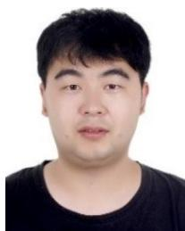

Peng Wang received the M.S. degree in instrument science and technology from Chongqing University of Posts and Telecommunications, Chongqing, China, in 2021. From 2019 to 2021, he was a Visiting Student at the Bio-Inspired Robotics and Intelligent Materials Laboratory, Institute of Advanced Manufacturing Technology, Chinese Academy of Sciences, Changzhou, China. He is currently the Manager of the AI Center, Shenzhen Streamap Technology Company Ltd., Shenzhen, China, where he is engaged in computer vision development. His research interests include intelligent transportation, smart urban management, and road inspection technologies.

Hailin Cao received the B.Sc. and Ph.D. degrees in electric science and technology from Chongqing University, Chongqing, China, in 2003 and 2010, respectively. He is currently an Associate Professor with the School of Microelectronics and Communication Engineering, Chongqing University. His research interests include array signal processing and machine learning.

intelligent sensing, intelligent robots, intelligent electromechanical structures, and intelligent manufacturing.

Rui Li received the B.S. degree from Chongqing University of Technology, Chongqing, China, in 1999, and the M.S. and Ph.D. degrees from Chongqing University, Chongqing, in 2004 and 2009, respectively. He is currently a Professor with the College of Automation, Chongqing University of Posts and Telecommunications, Chongqing. He is also the Head of Chongqing University Innovation Research Group and the Director of the Laboratory Instrument Subcommittee of the China Instrument and Control Society. His research interests include

Xiaoheng Tan received the B.E. and Ph.D. degrees in electrical engineering from Chongqing University, Chongqing, China, in 1998 and 2003, respectively. He was a Visiting Scholar with The University of Queensland, Brisbane, QLD, Australia, from 2008 to 2009. He is currently a Professor with the School of Microelectronics and Communication Engineering, Chongqing University. His current research interests include modern communications technologies and systems, communications signal processing, pattern recognition, and machine learning.