# Hybrid Near- and Far-Field THz UM-MIMO Channel Estimation: A Sparsifying Matrix Learning-Aided Bayesian Approach

Yuanjian Li and A. S. Madhukumar , Senior Member, IEEE

Abstract— Channel estimation (CE) is a critical challenge in harnessing the potential of Terahertz (THz) ultra-massive multiple-input multiple-output (UM-MIMO) systems. Sparsityexploiting compressed sensing (CS)-aided CE (CSCE) can enhance THz UM-MIMO CE performance with affordable pilot overhead. However, the near-field propagation region becomes significant in THz UM-MIMO networks due to the large array aperture and high carrier frequency, leading to a more profound coexistence of near- and far-field radiation patterns. This hybrid-field propagation characteristic renders existing CSCE frameworks ineffective due to the lack of an appropriate sparsifying matrix. In this work, we investigate the uplink THz UM-MIMO CE problem, by developing a practical THz UM-MIMO channel model that incorporates near- and farfield paths, molecular absorption, and reflection attenuation. We propose a dictionary learning (DL)-aided Bayesian THz CSCE solution to achieve accurate, robust and pilot-efficient CE, even in ill-posed scenarios. Specifically, we tailor a batch-delayed online DL (BD-ODL) algorithm to generate an appropriate dictionary for the hybrid-field THz UM-MIMO channel model. Furthermore, we propose a Bayesian learning (BL)-enabled CSCE framework to leverage THz sparsity and utilize the learnt dictionary. To establish a lower bound for the mean squared error (MSE), we derive the Bayesian Cramér-Rao bound (BCRB). We also conduct a complexity analysis to quantify the required computational resources. Numerical results show a significant improvement in normalized MSE (NMSE) performance compared to conventional CE and CSCE baselines, and demonstrate rapid convergence.

Index Terms— Terahertz communications, ultra-massive multiple-input multiple-output systems, channel estimation, compressed sensing, dictionary learning.

# I. INTRODUCTION

ERAHERTZ (THz) transmissions, operating in the 0.1-10 THz frequency range, offer the potential for ultra-high data rates, reaching up to several Terabits per second (Tbps) with ultra-broad spectrum blocks. This capability

Received 12 June 2024; revised 26 September 2024; accepted 3 December 2024. Date of publication 17 December 2024; date of current version 12 March 2025. This research is supported by the National Research Foundation, Singapore and Infocomm Media Development Authority under its Future Communications Research & Development Programme and the National Research Foundation, Singapore under its Competitive Research Programme. The associate editor coordinating the review of this article and approving it for publication was Y. Zhu. (Corresponding author: Yuanjian Li.)

The authors are with the College of Computing and Data Science, Nanyang Technological University, Singapore 639798 (e-mail: yuanjian.li@ntu.edu.sg; asmadhukumar@ntu.edu.sg).

Digital Object Identifier 10.1109/TWC.2024.3514141

is considered a key building block of the forthcoming 6G communications in supporting applications such as immersive virtual reality (VR), edge intelligence, and holographic communications [1], [2], [3], [4]. However, the appealing multi-Gigahertz bandwidth comes with severe propagation attenuation due to substantial atmospheric and spreading losses from molecular absorption and high carrier frequency, respectively [5]. An emerging solution to broadening THz transmission coverage is ultra-massive multiple-input multioutput (UM-MIMO) technology, which offers high-level array gain to compensate THz propagation losses by forming pencil-thin directional radiation beams [6]. Taking advantage of THz signal’s extremely short wavelength, UM-MIMO can be practically implemented on a small-scale footprint, where vast numbers of radiating elements (REs), say, thousands of antennas, are delicately embedded. To achieve costeffective THz UM-MIMO systems, the partially-connected (PC) hybrid UM-MIMO transceiver configuration, such as the array-of-subarrays (AoSA) [6], [7], is considered the most competitive candidate. In this setup, multiple REs are associated with an individual radio frequency (RF) chain via dedicated phase shifters, with various signal processing operations divided between analog and digital domains. Accurate and robust channel estimation (CE) is crucial for realizing the full potential of THz UM-MIMO systems as high-quality channel state information (CSI) is essential for analog/digital beamforming and combining [8]. However, THz UM-MIMO CE poses significant challenges due to low transmit power and numerous REs [5]. Besides, the energy- and hardware-efficient PC hybrid UM-MIMO architecture complicates CE because it requires recovering the high-dimensional THz channel from a highly compressed received pilot sequence.

# A. Related Works

1) THz UM-MIMO Channel Modelling (CM): In general, the electromagnetic propagation area can be categorised into near- and far-field regions. In the near-field region, the wavefronts are considered to be spherical, while in the far-field region, they are approximately planar [18], [19]. The planar wavefront (PW) approximation remains accurate when the array aperture is small and the carrier wavelength is relatively large. In such cases, the near-field region becomes negligible, extending only a few meters or even centimeters, as seen in 1G-5G wireless systems [20]. However, recent literature [13], [21], [22], [23], [24] reported that it is no longer practical to oversight the existence of near-field radiations for future wireless systems associated with UM-MIMO transceivers and high operational frequency such as the millimeter wave (mmWave) and THz bands. The authors in [21] proposed a two-stage hybrid-field beam training scheme for a UM-MIMO system with a PC hybrid combining architecture, which can be applied for both near- and far-field transmissions. In [22], the authors developed a hybrid pre-coded mmWave massive MIMO CE scheme that takes spherical wavefront (SW) CM into account. The large antenna array was segmented into multiple subarrays (SAs) that can be estimated separately. The authors in [13] developed a CE solution for AoSA-based THz UM-MIMO communications, where the hybrid sphericaland planar-wave (HSPW) CM was adopted to characterize the THz UM-MIMO transmissions. They proposed a dictionary reduction-aided compressive CE strategy to exploit the spatial sparsity, which was reported to hit a good trade-off between training overhead and CE accuracy. In THz UM-MIMO communications, the radius of the near-field region is on the order of hundreds of meters, which cannot be overlooked in practice. Existing literature in THz UM-MIMO CE mainly considers far-field radiation scenario, which limits their practicality and suitability in terms of modelling fidelity. In [5], [11], [15], [16], and [25], the authors adopted raybased Saleh-Valenzuela (SV) THz MIMO channel model, where the array response vectors (ARVs) and/or array steering vectors (ASRs) depend on angular parameters, e.g., angleof-arrival (AoA) and angle-of-departure (AoD), and therefore only far-field radiation characteristics were captured. Fortunately, some recent works [1], [7], [8], [13] took near-field propagation into account. In [8], a HSPW CM scheme was investigated for THz UM-MIMO systems, where SW was considered among SAs while PW was adopted within each SA. The HSPW CM method was then introduced to characterize the cascaded channel in the intelligent reflecting surface (IRS)- mounted THz UM-MIMO networks [9]. Following this, the spatial multiplexing gains for both near- and far-field areas were analyzed. In [7], a hybrid-field THz UM-MIMO CM strategy was investigated, in which ARVs were modelled differently for the far- and near-field regions, and the proportion of these regions varies among THz channel samples. In [1], the HSPW CM scheme was extended to the cross-field CM method, where SW, HSPW and PW were invoked to formulate THz UM-MIMO channels in near-, intermediateand far-field regions, respectively. These prior works aim to find a subtle trade-off between CM accuracy and evaluation complexity for THz UM-MIMO systems because the most accurate SW CM suffers from extremely high computational complexity [1], [8].

2) THz UM-MIMO CE: Conventional CE strategies, such as least square (LS) and minimum mean squared error (MMSE) estimators, are inefficient in THz UM-MIMO communications due to their excessively high pilot overhead, which results in constrained spectral efficiency (SE) [26]. Besides, LS/MMSE estimators cannot exploit the spatial sparsity of THz UM-MIMO channels caused by profound link directionality, sparse scattering, strong propagation loss and blockage sensitivity [5]. It was reported that even mmWave channels are less sparse than THz UM-MIMO links [6], [27]. In this regard, compressed sensing (CS)-aided CE (CSCE) frameworks can be beneficial for efficient THz UM-MIMO CE with manageable pilot-length requirements [5], [10], [11], [12]. In [5], the authors exploited the angular sparsity of THz MIMO channel to design a Bayesian learning (BL)-aided CSCE solution, after which they designed the optimal pair of transmit precoder and receiver combiner. In [10], a threestage wideband CSCE method was proposed for THz massive MIMO systems, where the coarse estimates of AoAs and AoDs were refined by the expectation-maximization (EM) stage. In [11], the authors proposed a CSCE solution aided by a wideband dictionary to obtain the CSI for THz massive MIMO systems with affordable training overhead, where the spatial-wideband effect was taken into account. However, these prior works only consider sparsity in the angular domain, which makes their approaches inefficient for the near-field radiation case. Some existing literature investigated CSCE that is tailored for near-field THz UM-MIMO transmissions. In [12], a frequency-dependent CSCE solution was proposed to estimate various multi-path components of the near-field IRS-aided THz link, where polar-domain sparsity and common support properties were exploited. In [28], the authors initiated a near-field CE and localization approach for IRS-assisted THz transmissions, in which a down-sampled Toeplitz covariance matrix was designed to achieve decoupled estimation of distances and AoAs. In [14], the authors proposed a deep unfolding-empowered CSCE scheme for wideband near-field THz massive MIMO systems, where the domain transformation was achieved by adopting a frequency-dependent polar-domain dictionary matrix. However, it remains an open challenge to achieve accurate CSCE for THz UM-MIMO systems where near- and far-field propagation paths coexist [7]. Though the authors in [1] applied a polar-domain dictionary matrix for near-field CE, and angular-domain sparsifying matrix for both far- and intermediate-field CEs, their approach fails to capture the hybrid-field scenario where THz channel sample contains a mixture of near- and farfield paths. In [9], the applied SA-based on-grid codebook is a block-diagonal matrix consisting of discrete Fourier transform (DFT) codebooks, which cannot well support hybrid-field case where near-field components appear. The authors in [7] proposed a fixed point network-aided deep learning framework to address the hybrid-field THz UM-MIMO CE problem. However, their approach requires a carefully designed network structure, expertise in managing a complex training process, and extensive hyperparameter tuning. Besides, it does not exploit the intrinsic sparsity of THz UM-MIMO link. In [17], an SA-based CSCE solution was proposed for hybrid-field wideband THz UM-MIMO systems, where angular-domain sparsity of individual SA was exploited. Despite the authors arguing that the near-field region of each SA is less significant than that of the AoSA, their proposed CSCE scheme neglects the possible existence of near-field paths in the hybrid-field channel model for each SA. Due to the energy spread effect, this will result in sparsifying loss.

TABLE I COMPARISON OF THE KEY CONSIDERATIONS IN THIS WORK WITH THE STATE-OF-THE-ART LITERATURE 

<table><tr><td></td><td>[1]</td><td>[5]</td><td>[7]</td><td>[8]</td><td>[9]</td><td>[10]</td><td>[11]</td><td>[12]</td><td>[13]</td><td>[14]</td><td>[6]</td><td>[15]</td><td>[16]</td><td>[17]</td><td>Ours</td></tr><tr><td>UPA-Based AoSA Architecture</td><td></td><td></td><td>√</td><td>√</td><td>√</td><td></td><td></td><td></td><td>√</td><td></td><td>√</td><td></td><td></td><td></td><td>√</td></tr><tr><td>Hybrid-Field THz UM-MIMO CM</td><td></td><td></td><td>√</td><td></td><td></td><td></td><td></td><td></td><td>√</td><td></td><td></td><td></td><td></td><td>√</td><td>√</td></tr><tr><td>THz Channel Sparsity Exploitation</td><td>√</td><td>√</td><td></td><td></td><td>√</td><td>√</td><td>√</td><td>√</td><td>√</td><td>√</td><td></td><td>√</td><td>√</td><td>√</td><td>√</td></tr><tr><td>Hybrid-Field Sparsifying Dictionary</td><td></td><td></td><td></td><td></td><td></td><td></td><td></td><td></td><td></td><td></td><td></td><td></td><td></td><td></td><td>√</td></tr><tr><td>BL-Aided CSCE</td><td></td><td>√</td><td></td><td></td><td></td><td></td><td></td><td></td><td></td><td>√</td><td></td><td></td><td>√</td><td></td><td>√</td></tr><tr><td>Bayesian Cramér-Rao Lower Bound</td><td></td><td>√</td><td></td><td></td><td></td><td></td><td></td><td></td><td></td><td></td><td></td><td></td><td>√</td><td></td><td>√</td></tr><tr><td>Reflection Attenuation Modelling</td><td>√</td><td>√</td><td>√</td><td></td><td></td><td></td><td>√</td><td></td><td></td><td></td><td></td><td></td><td></td><td></td><td>√</td></tr><tr><td>Molecular Absorption Modelling</td><td>√</td><td>√</td><td></td><td></td><td></td><td></td><td></td><td></td><td></td><td></td><td></td><td></td><td></td><td></td><td>√</td></tr></table>

# B. Motivations and Contributions

Considering the above observations, on-demand THz UM-MIMO CE with low pilot overhead requires practical CM strategies that account for the significant near-field propagation paths. Additionally, it calls for tailored CE solutions with appropriately designed sparsifying matrices to handle the unprecedented hybrid-field phenomenon and exploit the inherent spatial sparsity of THz UM-MIMO channels. To date, limited research has been made to investigate the THz UM-MIMO CSCE problem with a practical hybrid-field THz CM. To address this research gap, we propose a dictionarylearning (DL)-aided Bayesian CSCE solution for hybrid-field THz UM-MIMO transmissions, considering a uniform planar array (UPA)-based AoSA architecture. Besides, we adopt the practical complex propagation loss model that incorporates molecular absorption, reflection attenuation and spreading loss. This approach contrasts with most prior works that assume the complex path gain as a Rayleigh fading variable. These key considerations make this work outstanding from the perspective of proper THz UM-MIMO CM and thus pave the way towards a more realistic THz UM-MIMO CE. For ease of interpretation, a comparison between this work’s core considerations and the current state-of-the-art THz UM-MIMO literature is summarized in Table I. The main contributions of this paper are detailed as follows.

• The hybrid-field THz channel comprises a blend of nearand far-field paths, making existing CSCE frameworks inefficient for direct application. This inefficiency arises because the corresponding sparsity cannot be adequately characterized by either angular- or polar-domain dictionary alone. To properly handle this issue, we propose a DL algorithm that can generate adaptive sparsifying matrix to efficiently and robustly transform hybrid-field THz channel samples into their sparse representations. Then, we develop a BL-aided CSCE solution to exploit the sparsity to perform high-quality THz channel recovery with low pilot overhead, even for the ill-posed cases. To gauge the mean squared error (MSE) performance of the proposed DL-empowered Bayesian THz CSCE strategy, the Bayesian Cramér-Rao bound (BCRB) is provided. Besides, thorough complexity analysis is derived to quantify the computational resource cost.

• We extensively analyze numerical results to demonstrate the effectiveness of the proposed DL-aided Bayesian THz UM-MIMO CSCE approach. We compare its performance with representative baselines such as LS, MMSE, the focal underdetermined system solver (FOCUSS), the unitary approximate message passing (UAMP)- based sparse BL (AMP-SBL), and the fast iterative shrinkage-thresholding (FISTA) algorithms, to highlight the corresponding performance gains over conventional CE and other CSCE methods. Besides, simulations show that the proposed approach achieves rapid convergence, which can reach convergence, empirically within 10 iterations.

# C. Organization and Notation

Section II presents the system and channel models, and the considered CE problem. Section III details the proposed DL-aided Bayesian CE solution, including the batch-delayed online DL scheme, the BL-enabled CSCE method, the BCRB, and the complexity analysis. Simulation results are given in Section IV, while conclusions are drawn in Section V.

Bold-face uppercase and lowercase letters represent matrices and vectors, respectively, while ${ \mathbf I } _ { n }$ denotes the identity matrix of size $n \times n$ . Moreover, $\mathbf { M } ^ { ( a , b ) } , \mathbf { M } ^ { ( a , : ) }$ , and $\mathbf { M } ^ { ( : , \bar { b } ) }$ indicate the $( a , b ) \cdot \operatorname { t h }$ element of M, the a-th row vector of M, and the b-th column vector of M, respectively. Similarly, $\mathbf { v } ^ { ( a , : ) }$ captures the a-th element of a column vector, while $\mathbf { v } ^ { ( : , b ) }$ represents the b-th element of a row vector. Note that blkdiag $( \cdot , \cdot , \cdot \cdot , \cdot )$ constructs a block diagonal matrix from given matrices or vectors, $\mathcal { C N } ( \boldsymbol { \mu } , \boldsymbol { \Sigma } )$ denotes the complex Gaussian distribution with mean vector $\pmb { \mu }$ and covariance matrix $\Sigma , \circ$ indicates the Hadamard product, det(·) calculates the determinant, E {·} captures the expectation, Tr {·} represents the trace of a matrix, and the uniform distribution Uniform(a, b) is defined over the interval $[ a , b ]$ . Furthermore, subscripts $( \cdot ) ^ { T } , \ ( \cdot ) ^ { * } , \ ( \cdot ) ^ { H }$ , and $( \cdot ) ^ { - 1 }$ denote the transpose, complex conjugate, Hermitian (conjugate transpose), and inverse operators, respectively. Additionally, | · | generates the absolute value of a variable or the cardinality of a set, while $\| \cdot \| _ { 1 }$ and $\| \cdot \| _ { 2 }$ calculate the $\ell _ { 1 }$ and $\ell _ { 2 }$ norms, respectively.

# II. SYSTEM MODEL

An uplink THz UM-MIMO CE problem is investigated, where the base station (BS) is equipped with a UPA-AoSA to facilitate THz communications with several single-antenna user equipments (UEs). The layout of this planar AoSA is depicted in Fig. 1(a). Specifically, each SA comprises $\bar { N } _ { \mathrm { S A } } =$ $\bar { N } \times \bar { M }$ REs in the form of rectangular UPA, while the amount of SAs is denoted by $N _ { \mathrm { S A } } ~ = ~ N \times M$ . Therefore, the AoSA consists of $A = \bar { N } _ { \mathrm { S A } } N _ { \mathrm { S A } }$ antennas/REs in total. According to the principle of half-wavelength antenna spacing, REs inside each SA are uniformly separated by a displacement of $D _ { \mathrm { R E } } = \lambda _ { c } / 2$ in meter, where $\lambda _ { c } = \mathcal { V } / f _ { c }$ in meter indicates the carrier wavelength, V in meter/second denotes the speed of light, and $f _ { c }$ represents the carrier frequency. Besides, a widespacing SA configuration is adopted to enhance combining performance, reduce inter-element interference, and aid in thermal management [7], [8]. To this end, the distance between neighbouring SAs is defined as $D _ { \mathrm { S A } } = w D _ { \mathrm { R E } }$ , where $w \gg$ 1 stands. As illustrated in Fig. 1(b), an energy-efficient hybrid combining (HC) structure is implemented at the AoSA, where

TABLE II KEY ABBREVIATIONS AND THE ASSOCIATED FULL TERMS 

<table><tr><td>THz|UM-MIMO</td><td>Terahertz|ultra-massive multiple-input multiple-output</td></tr><tr><td>CE|CS|CSCE</td><td>channel estimation|compressed sensing|CS-aided CE</td></tr><tr><td>DL|BD-ODL</td><td>dictionary learning|batch-delayed online DL</td></tr><tr><td>BL|BCRB</td><td>Bayesian learning|Bayesian Cramér-Rao bound</td></tr><tr><td>MSE|NMSE|PC</td><td>mean squared error|normalized MSE|partially-connected</td></tr><tr><td>RE|AoSA|RF</td><td>radiating element|array-of-subarrays|radio frequency</td></tr><tr><td>PW|SW|ARV</td><td>planar wavefront|spherical wavefront|array response vector</td></tr><tr><td>AoA|AoD|CM</td><td>angle-of-arrival|angle-of-departure|channel modelling</td></tr><tr><td>DFT|UPA</td><td>discrete Fourier transform|uniform planar array</td></tr><tr><td>HC|PCHC|UE</td><td>hybrid combining|PC HC|user equipment</td></tr><tr><td>OMP|STOMP</td><td>orthogonal matching pursuit|soft-thresholding OMP</td></tr><tr><td>BLPM|EM</td><td>BL parameter matrix|expectation-maximization</td></tr><tr><td>tSNR|NSND</td><td>transmit SNR|normalized square norm difference</td></tr><tr><td>PDF|MMSE</td><td>probability density function|minimum mean squared error</td></tr><tr><td>BLPV|CDF</td><td>BL parameter vector|cumulative distribution function</td></tr></table>

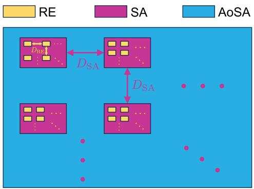

flowchart

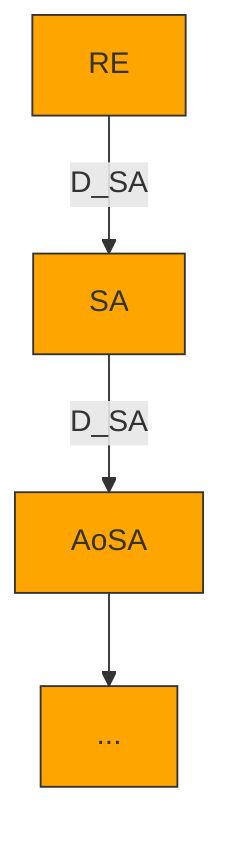

(a) Layout of the AoSA

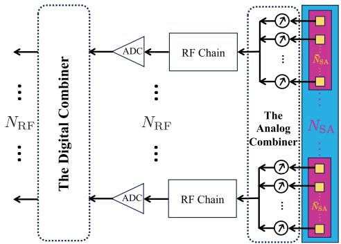

flowchart

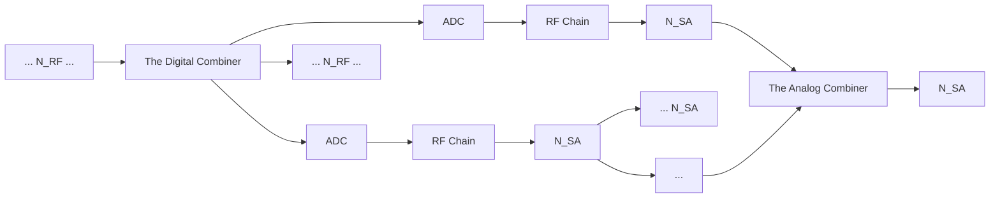

(b） PCHC configuration  
Fig. 1. The AoSA layout and the PCHC architecture.

REs in each SA share the same RF chain via a dedicated analog combiner, in a partially connected manner, i.e., the amount of RF chains $N _ { \mathrm { R F } } = N _ { \mathrm { S A } } \ll A .$ . Following each RF chain, an analog-to-digital converter (ADC) is adopted to sample and quantize the analog waveform. In the uplink CE scenario under consideration, multiple UEs transmit training pilots to the BS over P time slots. The pilot sequences from different UEs are assumed to be mutually orthogonal so that CEs for multiple UEs are independent, and an arbitrary UE is focused thereafter [7], [17], [29]. This work assumes a block-fading channel, where the channel coherence duration is significantly longer than the pilot training phase. This is justified by the vast difference in timescales: pilot symbol duration is in the picosecond range for the THz band, while channel coherence duration falls in the millisecond scale [15].

The received baseband signal at the AoSA over the p-th training time slot $\mathbf { y } _ { p } \in \mathbb { C } ^ { N _ { \mathrm { { R F } } } \times 1 }$ is formulated as

$$
\mathbf {y} _ {p} = \mathbf {D} _ {p} \mathbf {A} _ {p} \left(\mathbf {h} x _ {p} + \mathbf {n} _ {p}\right), \tag {1}
$$

where $\mathbf { D } _ { p } ~ \in ~ \mathbb { C } ^ { N _ { \mathrm { R F } } \times N _ { \mathrm { R F } } }$ is the digital combining matrix (DCM), ${ \bf A } _ { p } \ : = \ :$ blkdiag $( \mathbf { a } _ { 1 , p } , \mathbf { a } _ { 2 , p } , \cdot \cdot \cdot , \mathbf { a } _ { N _ { \mathrm { R F } } , p } ) \in \mathrm { ~ \mathbb { C } ^ { \tilde { N } _ { \mathrm { R F } } \times A } ~ }$ denotes the frequency-flat block diagonal analog combining matrix $( \operatorname { A C M } ) , \mathbf { h } \in \mathbb { C } ^ { A \times 1 }$ indicates the spatial-frequency THz channel between the UE and the AoSA, $x _ { p }$ represents the transmitted pilot signal, and $\mathbf { n } _ { p } \in \mathbb { C } ^ { A \times 1 } \overset { \cdot } { \sim } \mathcal { C } \bar { \mathcal { N } } \left( \mathbf { 0 } , \sigma ^ { 2 } \mathbf { I } _ { A } \right)$ measures the additive white Gaussian noise (AWGN) [30]. Note that components of $\mathbf { a } _ { i , p } \in \mathbb { C } ^ { 1 \times \bar { N } _ { \mathrm { S A } } } , i \in [ 1 , N _ { \mathrm { R F } } ]$ have to follow the constant-modulus regulation because analog combining is implemented by finite-resolution phase shifters, i.e., ai,p $\mathbf { a } _ { i , p } ^ { ( : , q ) ^ { - } } = \mathrm { e x p } ( j \zeta _ { i , q } ) / \sqrt { A } , q \in \left[ 1 , \bar { N } _ { \mathrm { S A } } \right] , \zeta _ { i , q } \in \left[ 0 , 2 \pi \right]$ [8]. In the case of ϱ-bit quantification, the phase shift exponent $\zeta _ { i , q }$ is picked from the set $\{ 0 , 2 \pi / 2 ^ { \varrho } , \cdot \cdot \cdot , 2 \pi ( 2 ^ { \varrho } - 1 ) / 2 ^ { \varrho } \}$ with the cardinality of 2ϱ [1]. To properly manage energy cost, phase shift factors in the analog domain inside $\mathbf { a } _ { i , p }$ are generated from the set of one-bit quantized angles, i.e., $\mathbf { \bar { \Phi } } ( \mathbf { a } _ { i , p } ) _ { q } ~ \in ~ \{ - 1 , 1 \} / \sqrt { A }$ , in an independent and identically distributed (i.i.d.) fashion [7], [17], [29]. Moreover, the partially-connected hybrid combining (PCHC) scheme follows the total power regulation, $\mathrm { i . e . , } \| \mathbf { D } _ { p } \mathbf { A } _ { p } \| _ { 2 } ^ { 2 } = 1$ , while $x _ { p } = 1$ is assumed because the pilot signal is commonly known a priori [7], [10], [17], [29], [31]. After pilot transmission over the P time slots, the concatenated baseband signal sequence $\bar { \mathbf { y } } =$ $\left[ \mathbf { y } _ { 1 } ^ { T } , \mathbf { y } _ { 2 } ^ { T } , \cdots , \mathbf { y } _ { P } ^ { T } \right] ^ { T } \in \mathbb { C } ^ { P N _ { \mathrm { R F } } \times 1 }$ will be

$$
\bar {\mathbf {y}} = \bar {\mathbf {A}} \mathbf {h} + \bar {\mathbf {n}}, \tag {2}
$$

where $\begin{array} { r l r l r } { \bar { \bf A } } & { = } & { \left[ { \bf A } _ { 1 } ^ { T } , { \bf A } _ { 2 } ^ { T } , \cdots , { \bf A } _ { P } ^ { T } \right] ^ { T } } & { \in } & { \mathbb { C } ^ { P N _ { \mathrm { R F } } \times A } , \bar { \bf n } } & { = } \end{array}$ $\left[ \mathbf { n } _ { 1 } ^ { T } \mathbf { A } _ { 1 } ^ { T } , \mathbf { n } _ { 2 } ^ { T } \mathbf { A } _ { 2 } ^ { T } , \bar { \mathbf { \Xi } } \cdot \cdot \mathbf { \Xi } , \mathbf { n } _ { P } ^ { T } \mathbf { A } _ { P } ^ { T } \right] ^ { T } \in \mathbb { C } ^ { P N _ { \mathrm { R F } } \times 1 }$ T2 , · · · , n TP A TP  T is the effective noise vector with the covariance matrix $\mathbf { R } _ { \bar { \mathbf { n } } }$ = $\mathbb { E } \{ \bar { \mathbf { n } } \bar { \mathbf { n } } ^ { H } \} =$ blkdiag $\left( \sigma ^ { 2 } \mathbf { A } _ { 1 } \mathbf { A } _ { 1 } ^ { H } , \sigma ^ { 2 } \mathbf { A } _ { 2 } \mathbf { A } _ { 2 } ^ { H } , \\\\\\cdots , \sigma ^ { 2 } \mathbf { A } _ { P } \mathbf { A } _ { P } ^ { H } \right) \in$ $\mathbb { C } ^ { \sim N _ { \mathrm { R F } } \times P N _ { \mathrm { R F } } }$ . In the derivation from (1) to (2), the DCM for each time slot is considered as an identity matrix, which is a common practice amid the CE training phase [7], [8], [9], [10]. However, the effective noise n¯ is coloured after the PCHC process, which degrades the performance of CSCE frameworks [32]. To address this issue, a pre-whitening process for (2) is introduced, by practising Cholesky factorization on $\mathbf { R } _ { \bar { \mathbf { n } } } ,$ i.e., ${ \bf R } _ { \bar { \bf n } } = \sigma ^ { 2 } { \bf F } { \bf F } ^ { \bar { H } }$ [29], where $\mathbf { F } \in \dot { \mathbb { C } } ^ { P N _ { \mathrm { R F } } \times P N _ { \mathrm { R F } } }$ is a lower triangular matrix. Then, the pre-whitened baseband signal is

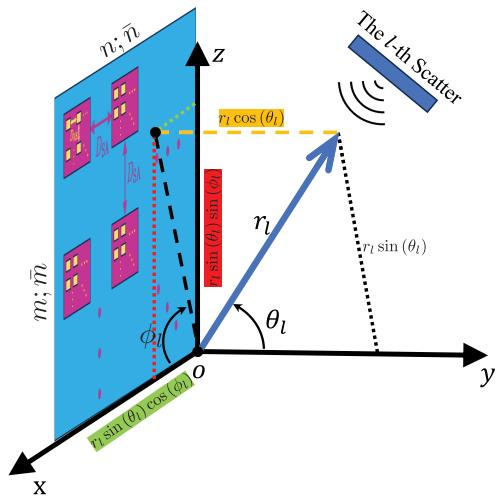

text_image

n; n̅
z
m; m̅
r₁ cos (θ₁)
r₁ sin (θ₁)
r₁ sin (θ₁)
θ₁
φ₁
O
y
x

Fig. 2. Geometry of the AoSA under consideration.

$$
\mathbf {y} = \mathbf {F} ^ {- 1} \bar {\mathbf {y}} = \mathbf {A h} + \mathbf {n}, \tag {3}
$$

where $\mathbf { A } = \mathbf { F } ^ { - 1 } \bar { \mathbf { A } } \in \mathbb { C } ^ { P N _ { \mathrm { R F } } \times A }$ is the measurement matrix, and $\mathbf { n } ~ = ~ \mathbf { F } ^ { - 1 } \bar { \mathbf { n } } ~ \in ~ \mathbb { C } ^ { P N _ { \mathrm { R F } } \times 1 }$ is the pre-whitened effective noise vector with updated covariance matrix $\begin{array} { r l } { \mathbf { R _ { n } } } & { { } = } \end{array}$ $\mathbf { F } ^ { - 1 } \mathbf { R } _ { \bar { \mathbf { n } } } ( \mathbf { F } ^ { - 1 } ) ^ { H } = \sigma ^ { 2 } \mathbf { I } _ { P N _ { \mathrm { R F } } }$ [29].

# A. Sole-Field THz Channel Model

As illustrated in Fig. 2, we consider that the AoSA is placed on the xz-plane of the 3-dimensional (3D) Cartesian coordinate system, where $\phi _ { l } \in [ - \pi , \pi ]$ denotes the azimuth AoA and $\theta _ { l } ~ \in ~ \left[ - 0 . 5 \pi , 0 . 5 \pi \right]$ indicates the elevation AoA of the propagation path from the l-th scatter to the AoSA’s origin, i.e., the (1, 1)-th RE in the (1, 1)-th SA. To track the distance from the (¯n, m¯ )-th RE inside the $( n , m ) { \cdot } \mathrm { t h }$ SA to an arbitrary scatter, REs’ coordinates are defined as per the AoSA’s geometry, i.e., $\mathbf { c } _ { n m } ^ { \bar { n } \bar { m } } = [ ( n - 1 ) ( ( \bar { N } - 1 ) D _ { \mathrm { R E } } + D _ { \mathrm { S A } } ) +$ $( \bar { n } - 1 ) D _ { \mathrm { R E } } , 0 , ( m - 1 ) ( ( \bar { M } - 1 ) D _ { \mathrm { R E } } + D _ { \mathrm { S A } } ) + ( \bar { m } - 1 ) D _ { \mathrm { R E } } ]$ . Besides, the location of the l-th scatter is denoted by $1 _ { l } \ =$ $r _ { l } \left[ \sin ( \theta _ { l } ) \cos ( \phi _ { l } ) , \cos ( \theta _ { l } ) , \sin ( \theta _ { l } ) \sin ( \phi _ { l } ) \right]$ , where $r _ { l }$ in meter, ϕl and θl are measured with respect to (w.r.t.) the AoSA origin. Then, the end-to-end THz channel vector is expanded as

$$
\mathbf {h} = \left[ \mathbf {h} _ {1, 1} ^ {T}, \dots , \mathbf {h} _ {n, m} ^ {T}, \dots , \mathbf {h} _ {N, M} ^ {T} \right] ^ {T}, \tag {4}
$$

where $\mathbf { h } _ { n , m } \in \mathbb { C } ^ { \tilde { N } _ { \mathrm { S A } } \times 1 }$ captures the sub-channel vector associated with the $( n , m ) { \mathrm { - t h } }$ SA. In the case of either near-field or far-field transmission, the spatial-frequency THz channel will be modelled as per the SV multipath propagation model [25].

1) SW $T H z$ Channel Response: It is well known that the SW assumption is the most accurate channel response model for either near- or far-field radiation scenario, by individually calculating channel response between the $( \bar { n } , \bar { m } )$ -th RE inside the (n, m)-th SA and the scatter. In this regard, we formulate the corresponding THz sub-channel model as [1], [8], and [9]

$$
\mathbf {h} _ {n, m} = \sqrt {\frac {\bar {N} _ {\mathrm{SA}} G _ {r}}{L}} \sum_ {l = 1} ^ {L} \mathbf {a} \left(r _ {n m, l} ^ {\bar {n} \bar {m}}\right) \circ \mathbf {g} \left(r _ {n m, l} ^ {\bar {n} \bar {m}}, \hat {r} _ {l}\right) \tau_ {l} (\hat {r} _ {l}), \tag {5}
$$

where ◦ indicates the Hadamard product, L denotes the number of propagation paths/rays, $G _ { r }$ in dBi captures the antenna gain of each RE, $\tau _ { l } \left( \hat { r } _ { l } \right) = \exp ( - j k _ { c } \hat { r } _ { l } )$ measures the phase shift caused by the time delay of the propagation from the UE to the l-th scatter, $\hat { r } _ { l }$ captures the propagation distance from the UE to the l-th scatter, $k _ { c } = 2 \pi f _ { c } / \nu$ denotes the wavenumber, and $r _ { n m , l } ^ { \bar { n } \bar { m } } = \| \mathbf { c } _ { n m } ^ { \bar { n } \bar { m } } - \mathbf { l } _ { l } \| _ { 2 }$ in meter denotes the Euclidean distance between the (¯n, m¯ )-th RE inside the $( n , m )$ -th SA and the l-th scatter. We refer to the 1-st ray as the line-of-sight (LoS) path and thus we have $\hat { r } _ { 1 } = 0 ;$ , while the remaining rays correspond to non-line-of-sight (NLoS) paths. In this context, the 1-st scatter is indeed the UE itself. Here, the normalized SW ARV $\mathbf { a } \in \mathbb { C } ^ { \bar { N } _ { \mathrm { { S A } } } \times 1 }$ is expressed as

$$
\mathbf {a} \left(r _ {n m, l} ^ {\bar {n} \bar {m}}\right) = \frac {1}{\sqrt {\bar {N} _ {\mathrm{SA}}}} \left[ a _ {n m, l} ^ {\bar {1} \bar {1}}, \dots , a _ {n m, l} ^ {\bar {n} \bar {m}}, \dots , a _ {n m, l} ^ {\bar {N} \bar {M}} \right] ^ {T}, \tag {6}
$$

in which we have $a _ { n m , l } ^ { \bar { n } \bar { m } } = \exp ( - j k _ { c } \| \mathbf { c } _ { n m } ^ { \bar { n } \bar { m } } - \mathbf { l } _ { l } \| _ { 2 } )$ . Moreover, the vector of the modulus of the complex path gains ${ \textbf { g } } \in$ $\mathbb { C } ^ { \bar { N } _ { \mathrm { S A } } \times 1 }$ is given by

$$
\mathbf {g} \left(r _ {n m, l} ^ {\bar {n} \bar {m}}, \hat {r} _ {l}\right) = \left[ g _ {n m, l} ^ {\bar {1} \bar {1}}, \dots , g _ {n m, l} ^ {\bar {n} \bar {m}}, \dots , g _ {n m, l} ^ {\bar {N} \bar {M}} \right] ^ {T}, \tag {7}
$$

where the real-valued parameter g nm,l $g _ { n m , l } ^ { \bar { n } \bar { m } }$ captures the path loss that is dependent on either $r _ { n m , l } ^ { \bar { n } \bar { m } }$ rnm,l or rˆl.

2) PW THz Channel Response: In contrast, the far-field THz sub-channel model is derived as

$$
\mathbf {h} _ {n, m} = \sqrt {\frac {\bar {N} _ {\mathrm{SA}} G _ {r}}{L}} \sum_ {l = 1} ^ {L} \mathbf {b} \left(r _ {n m, l} ^ {\bar {n} \bar {m}}\right) g _ {l} (r _ {l}, \hat {r} _ {l}) \tau_ {l} (\hat {r} _ {l}), \tag {8}
$$

where $\mathbf { b } \left( r _ { n m . l } ^ { \bar { n } \bar { m } } \right) \in \mathbb { C } ^ { \bar { N } _ { \mathrm { S A } } \times 1 }$ indicates the normalized far-field ARV, and $g _ { l } \left( r _ { l } , \hat { r } _ { l } \right)$ represents the complex path attenuation parameter. In (8), $\mathbf { b } \left( r _ { n m , l } ^ { \bar { n } \bar { m } } \right)$ is modelled under consumptions that the wavefront approaching the AoSA is approximated to be planar as per the parallel-ray approximation [11], and the complex path gains for all REs inside each SA are identical to that of the AoSA’s origin. Then, the overall propagation distance from the l-th scatter to the $( \bar { n } , \bar { m } )$ -th RE inside the relative distance (n, m)-th SA will be $r _ { n m } ^ { \bar { n } \bar { m } } \left( \phi _ { l } , \theta _ { l } \right) = { \bf c } _ { n m } ^ { \bar { n } \bar { m } } { \bf l } _ { l } ^ { T } / r _ { l }$ $r _ { n m , l } ^ { \bar { n } \bar { m } } = r _ { l } - r _ { n m } ^ { \bar { n } \bar { m } } \left( \phi _ { l } , \theta _ { l } \right)$ is calculated w.r.t. , where the the AoSA origin. Therefore, the far-field array response at the $( \bar { n } , \bar { m } )$ -th RE inside the $( n , m )$ -th SA for the l-th ray is derived as $b _ { n m , l } ^ { \bar { n } \bar { m } } = \exp \bigl ( - j k _ { c } r _ { n m , l } ^ { \bar { n } \bar { m } } \bigr )$ . Then, the corresponding normalized far-field ARV is given by

$$
\mathbf {b} \left(r _ {n m, l} ^ {\bar {n} \bar {m}}\right) = \frac {1}{\sqrt {\bar {N} _ {\mathrm{SA}}}} \left[ b _ {n m, l} ^ {\bar {1} \bar {1}}, \dots , b _ {n m, l} ^ {\bar {n} \bar {m}}, \dots , b _ {n m, l} ^ {\bar {N} \bar {M}} \right] ^ {T}, \tag {9}
$$

Remark 1: In the case of SW or PW consideration, the endto-end THz channel vector (4) depends on the factor set $\mathcal { F } _ { \mathrm { s w } } =$ $\{ r _ { n m , l } ^ { \bar { n } \bar { m } } , \hat { r } _ { l } \}$ or $\mathcal { F } _ { \mathrm { p w } } = \{ r _ { n m . l } ^ { \bar { n } \bar { m } } , r _ { l } , \hat { r } _ { l } \}$ , with time complexity of $\mathcal { O } ( L \times ( 2 A + 1 ) )$ or $\mathcal { O } ( L \times ( A + 2 ) )$ , respectively.

# B. Hybrid-Field THz Channel Model

To hit a decent trade-off between computational complexity and THz CM fidelity, this paper develops the hybrid-field THz sub-channel response, where $\mathbf { h } _ { n , m }$ equals

$$
\sqrt {\frac {\bar {N} _ {\mathrm{SA}} G _ {r}}{L}} \sum_ {l = 1} ^ {L} \left\{ \begin{array}{l l} \mathbf {a} \left(r _ {n m, l} ^ {\bar {n} \bar {m}}\right) \circ \mathbf {g} \left(r _ {n m, l} ^ {\bar {n} \bar {m}}, \hat {r} _ {l}\right) \tau_ {l} (\hat {r} _ {l}), & r _ {l} \leq D _ {\mathrm{F}} \\ \mathbf {b} \left(r _ {n m, l} ^ {\bar {n} \bar {m}}\right) g _ {l} (r _ {l}, \hat {r} _ {l}) \tau_ {l} (\hat {r} _ {l}), & r _ {l} > D _ {\mathrm{F}}. \end{array} \right. \tag {10}
$$

Note that the channel response for each path is categorized as per whether the distance between the $\mathbf { A o S A ^ { \prime } s }$ origin and the l-th scatter is greater than the Fraunhofer (Rayleigh) distance [20] $D _ { \mathrm { F } } = \bar { 2 } D _ { \mathrm { A } } ^ { 2 } / \lambda _ { c } = \lambda _ { c } [ [ N ( \bar { N } - 1 ) + ( N - 1 ) w ] ^ { \bar { 2 } } +$ $[ M ( \bar { M } - 1 ) + ( M - 1 ) w ] ^ { 2 } ] / 2$ , where $D _ { \mathrm { { A } } }$ in meter captures the AoSA’s array aperture, i.e., the corresponding diagonal length.

1) Far-Field Complex Path Gain: The complex path loss of the l-th ray is given by

$$
g _ {l} \left(r _ {l}, \hat {r} _ {l}\right) \triangleq \left| g _ {l} \left(r _ {l}, \hat {r} _ {l}\right) \right| \exp \left[ j \psi \left(r _ {l}\right) \right], \tag {11}
$$

where $\left| g _ { l } \left( r _ { l } , \hat { r } _ { l } \right) \right.$ | captures the magnitude and $\psi ( r _ { l } ) = - k _ { c } r _ { l }$ is the corresponding phase shift factor [5], [8]. Specifically, the magnitude of the complex path gain is expressed as

$$
\left| g _ {l} \left(r _ {l}, \hat {r} _ {l}\right) \right| = \frac {\mathcal {V} \left| \zeta_ {l} \left(f _ {c}\right) \right| \exp \left[ - \frac {1}{2} \left(r _ {l} + \hat {r} _ {l}\right) \varkappa \left(f _ {c}\right) \right]}{4 \pi f _ {c} \left(r _ {l} + \hat {r} _ {l}\right) ^ {\frac {\text {三}}{2}}}, \tag {12}
$$

in which $\varkappa ( f _ { c } )$ generalizes the molecular absorption factor1, Ξ is the spreading attenuation exponent, and $\zeta _ { l } ( f _ { c } )$ represents the first-order reflection coefficient [5]. For the 1-st path, i.e., the LoS path, we force $\zeta _ { 1 } ( f _ { c } ) = 1$ . Following [11] and [37], we consider single-bounce reflected rays to characterize NLoS paths, where the diffracted and diffused rays are considered to be neglected due to severe THz propagation attenuation. According to Kirchhoff scattering theory, $\zeta _ { l } ( f _ { c } )$ for a rough surface is determined by $\zeta _ { l } ( f _ { c } ) = F _ { \mathrm { F } } ( f _ { c } ) F _ { \mathrm { R } } ( f _ { c } )$ , in which $F _ { \mathrm { F } } ( f _ { c } )$ is the Fresnel reflection factor for a smooth surface in the case of transverse electric (TE)-polarized waves [38], and $F _ { \mathrm { { R } } } ( f _ { c } )$ is the Rayleigh roughness parameter characterizing the roughness of the reflecting material. Specifically, we have $F _ { \mathrm { F } } ( f _ { c } ) = [ Z ( f _ { c } ) \cos ( \vartheta _ { l } ^ { \mathrm { i n } } ) - Z _ { 0 } \cos ( \vartheta _ { l } ^ { \mathrm { r e f } } ) ] / [ Z ( f _ { c } ) \cos ( \vartheta _ { l } ^ { \mathrm { i n } } ) +$ $Z _ { 0 } \cos ( \vartheta _ { l } ^ { \mathrm { r e f } } ) \big ]$ and $F _ { \mathrm { R } } ( \dot { f } _ { c } ) ~ = ~ \mathrm { e x p } [ - 8 ( \pi f _ { c } \sigma _ { \mathrm { r } } \cos ( \vartheta _ { l } ^ { \mathrm { i n } } ) / \mathcal { V } ) ^ { 2 } ]$ , in which $Z ( f _ { c } )$ is the wave impedance of reflecting surface, $Z _ { 0 } = 3 3 7 \Omega$ captures the free-space wave impedance, $\vartheta _ { l } ^ { \mathrm { i n } } =$ 0.5 arcco $[ ( \hat { r } _ { l } ^ { 2 } + r _ { l } ^ { 2 } - r _ { 1 } ^ { 2 } ) / ( 2 \hat { r } _ { l } r _ { l } ) ]$ represents the angle of incidence or reflection, $\vartheta _ { l } ^ { \mathrm { r e f } } =$ arcsin $( Z ( f _ { c } )$ sin $( \vartheta _ { l } ^ { \mathrm { i n } } ) / Z _ { 0 } )$ measures the angle of refraction, and $\sigma _ { \mathrm { r } }$ is the standard deviation of the surface roughness [11], [38], [39].

2) Near-Field Real-Valued Path Gain: Following (11) and (12), the modulus of near-field complex path gain, i.e., gn¯m¯nm,l $g _ { n m , l } ^ { \bar { n } \bar { m } }$ in (7), can be derived as $g _ { n m , l } ^ { \bar { n } \bar { m } } ~ = ~ \mathcal { V } | \zeta _ { l } ( f _ { c } ) | ~ \times$ $\exp [ - 0 . 5 ( \| \mathbf { c } _ { n m } ^ { \bar { n } \bar { m } } - \mathbf { l } _ { l } \| + \hat { r } _ { l } ) \varkappa ( f _ { c } ) ] / [ 4 \pi f _ { c } ( \| \mathbf { c } _ { n m } ^ { \bar { n } \bar { m } } - \mathbf { l } _ { l } \| + \hat { r } _ { l } ) ^ { \frac { \Xi } { 2 } } ]$

# C. Sparsity-Exploiting THz CE

The THz CE task aims to reconstruct the channel vector h in (3) from the received baseband sequence y, given the measurement matrix A and/or the statistics of the pre-whitened effective noise vector n. Conventional channel techniques, e.g., LS and MMSE estimators [16], [40], require $P N _ { \mathrm { R F } } \geq A .$ , i.e., overdetermined system, to achieve reliable and robust CE performance [5]. In practical PCHC AoSA-based THz communication systems, the amount of REs is ultra-massive and the received pilot sequence is compressed, leading to

${ } ^ { 1 } \varkappa ( f _ { c } )$ can be calculated in various ways [27], e.g., an accurate but complex model [33] that is based on the high-resolution transmission molecular absorption (HITRAN) database [34], and simplified yet accurate models tailored for 0.275 − 0.4 THz [35] and 0.1 − 0.45 THz bands [36]. A specific modelling will be adopted for conducting numerical results in Section IV. prohibitively expensive pilot overhead. Besides, these conventional CE techniques cannot benefit from THz channel sparsity. To achieve accurate and reliable THz CE with affordable pilot overheard, CS-based algorithms will be beneficial, even for ill-posed cases where $P N _ { \mathrm { R F } } \ll A$ [5]. Specifically, we have ${ \bf h } \ \cong \ { \bf C } \beta ,$ , where $\mathbf { C } \in \mathbb { C } ^ { A \times G } \ ( G \geq \ A )$ is an appropriate sparsifying matrix and $\beta \in \mathbb { C } ^ { G \times 1 }$ is the sparse representation vector, i.e., $\| \beta \| _ { 0 } \ll A .$ Then, THz CSCE aims to recover $\beta ,$ given $\mathbf { y } = \mathbf { A C } \beta + \mathbf { n } ,$ , A and C. In the sequel, the THz channel estimate can be readily obtained by $\hat { \mathbf { h } } _ { \mathrm { C S } } = \mathbf { C } \hat { \boldsymbol { \beta } } _ { \mathrm { C S } } .$ Note that the CSCE estimate $\hat { \beta } _ { \mathrm { C S } } = \arg \operatorname* { m i n } _ { \beta } \| \beta \| _ { 0 } .$ , subject to $\| \mathbf { y } - \mathbf { A C } \boldsymbol { \beta } \| _ { 2 } \leq \varsigma .$ , where the threshold ς comes from the assumption $\| \mathbf { n } \| _ { 2 } ~ \leq ~ \varsigma .$ THz CSCE can significantly reduce the required pilot-based training duration $P$ to be proportional to $\| \beta \| _ { 0 } .$ , instead of A. However, the design of the dictionary matrix C for the considered THz channel model (4) with hybrid-field channel response (10) remains an open challenge [7], [41]. If far-field radiation is sorely considered, the array response vector (9) is only dependent on angular parameters. Then, the DFT-based dictionary can be invoked to generate the sparse angular-domain representation for the original THz channel. In the case of pure near-field radiation, the array response vector (6) depends on both distance and angle, which means that the dictionary has to be formulated from the joint distance and angle space, i.e., polardomain sparsifying matrix [29]. If the DFT-based dictionary matrix is directly used for the near-field radiation, fatal energy spread phenomenon in the angular domain will occur [42]. However, neither angular- nor polar-domain dictionary can properly sparsify the considered hybrid-field THz channel model, as the appropriate dictionary design is subject to the proportion of near- and far-field components [1], [7]. Thus, existing field-specific CS solutions suffer from significant channel recovery performance degradation. To address this challenge, we propose a DL solution [7], [41], which aims to construct the adaptive sparsifying matrix tailored for the hybrid-field THz channel model. Then, we develop a BL-based CSCE algorithm to conduct accurate CE with reduced pilot overhead.

# III. PROPOSED DL-AIDED BAYESIAN THZ CSCE

# A. Batch-Delayed Online DL

The DL process can be modelled as follows

$$
\min _ {\boldsymbol {C} _ {\mathrm{dl}}, \boldsymbol {\beta} _ {i}} \frac {1}{N _ {\mathrm{dl}}} \sum_ {i = 1} ^ {N _ {\mathrm{dl}}} \| \boldsymbol {\beta} _ {i} \| _ {0}, \tag {13a}
$$

$$
\text { s.t. } \| \mathbf {h} _ {i} - \mathbf {C} _ {\mathrm{dl}} \boldsymbol {\beta} _ {i} \| _ {2} \leq \eta , \quad \mathbf {C} _ {\mathrm{dl}} ^ {(:, j) H} \mathbf {C} _ {\mathrm{dl}} ^ {(:, j)} \leq 1, \tag {13b}
$$

in which $N _ { \mathrm { d l } }$ denotes the amount of samples, η constrains the channel mismatch, $\mathbf { C } _ { \mathrm { d l } } \in \mathbb { C } ^ { A \times G }$ captures the learnt dictionary matrix, and $\beta _ { i } \in \mathbb { C } ^ { G \times 1 }$ is the sparse representation of $\mathbf { h } _ { i } \in$ C(:,j)Hdl C(:,j)dl nary overcompleteness, while we constrain that $\mathbb { C } ^ { A \times 1 }$ $\mathbf { C } _ { \mathrm { d l } } ^ { ( : , j ) H } \mathbf { C } _ { \mathrm { d l } } ^ { ( : , j ) } \ \stackrel { \cdot } { \ } \leq \ 1$ . Note that $G \geq A$ to avoid is emphasized to enjoy the dictio- $\mathbf { C } _ { \mathrm { d l } }$ from being unreasonably $\| \mathbf { C } _ { \mathrm { d l } } ^ { ( : , j ) } \| _ { 2 } ^ { 2 } =$ large (and consequently, arbitrarily insignificant values of $\beta _ { i } )$ , wher e C(:,j), $\mathbf { C } _ { \mathrm { d l } } ^ { ( : , j ) } , j \in [ 1 , G ]$ indicates the j-th column of $\mathbf { C } _ { \mathrm { d l } }$ . The solution of (13) is expected to achieve robust and accurate recovery $\| \mathbf { h } _ { i } - \mathbf { C } _ { \mathrm { d l } } \pmb { \beta } _ { i } \| _ { 2 } \leq \eta , \forall i \in [ 1 , N _ { \mathrm { d l } } ]$ , and meanwhile promote sparse representation, i.e., insignificant $\| \beta _ { i } \| _ { 0 } , \forall i \in$ $[ 1 , N _ { \mathrm { d l } } ]$ . However, (13) with $\ell _ { 0 }$ pseudo-norm objective and $\ell _ { 2 ^ { - } }$ norm constraints is a non-convex combinatorial optimization problem. Given the $\ell _ { 1 }$ -norm is the tightest convex relaxation of the $\ell _ { 0 }$ pseudo-norm, it is then typical to consider the $\ell _ { 1 }$ norm convex-relaxed alternative of (13), stated as

Algorithm 1 The Proposed BD-ODL Scheme   
1 Input: The THz channel dataset $\check{\mathbf{h}}\in\mathbb{C}^{A\times N_{\mathrm{dl}}}$ , the regularization factor $\varpi$ , the iteration step budget $C$ , stopping thresholds $\eth_{1},\eth_{2}$ ;

2 Initialization: Initialize the sparse representation matrix $\check{\boldsymbol{\beta}}\in\mathbb{C}^{G\times N_{\mathrm{dl}}}=0$ , the dictionary $\mathbf{C}_{\mathrm{dl},0}\in\mathbb{C}^{A\times G}$ and the BD-ODL iteration index $c=1$ ;

3 repeat

4 Reset auxiliary matrices $\mathfrak{C}_{0}\in\mathbb{C}^{G\times G}=0$ , $\mathfrak{D}_{0}\in\mathbb{C}^{A\times G}=0$ ;

5 for $i\in[1,N_{\mathrm{dl}}]$ 6 Draw $\check{\mathbf{h}}^{(:,i)}$ from THz channel dataset $\check{\mathbf{h}}$ ;

7 Initialize the sparse support set $\aleph=\emptyset$ , the intermediate dictionary $\mathbf{C}_{\mathrm{im}}=\emptyset$ , the iteration index $o=0$ , and the residuals $\mathbf{r}_{-1}=\mathbf{0}^{A\times 1}$ and $\mathbf{r}_{0}=\check{\mathbf{h}}^{(:,i)}$ ;

// STOMP Sparse Recovery Step

8 while $\|\mathbf{r}_{o-1}-\mathbf{r}_{o}\|_{2}^{2}\geq\eth_{2}$ 9 Increment the STOMP iteration index $o=o+1$ ;

10 $\ddot{g}=arg\max_{\{g=1,2,\ldots,G\}\notin\aleph}|\mathbf{r}_{o-1}^{H}\mathbf{C}_{\mathrm{dl},c-1}^{(:,g)}|$ ;

11 $\aleph\leftarrow\aleph\cup\{\ddot{g}\};\mathbf{C}_{\mathrm{im}}=\mathbf{C}_{\mathrm{dl},c-1}^{(:,\aleph)}$ ;

12 $\hat{\boldsymbol{\beta}}_{o}=\left(\mathbf{C}_{\mathrm{im}}^{H}\mathbf{C}_{\mathrm{im}}\right)^{-1}\mathbf{C}_{\mathrm{im}}^{H}\check{\mathbf{h}}^{(:,i)}$ ;

13 for $x\in[1,|\aleph|]$ 14 $\hat{\boldsymbol{\beta}}_{o}^{(x,:)}\leftarrow\frac{\hat{\boldsymbol{\beta}}_{o}^{(x,:)}}{|\hat{\boldsymbol{\beta}}_{o}^{(x,:)}|}\max\left(|\hat{\boldsymbol{\beta}}_{o}^{(x,:)}|- \frac{1}{\varpi},0\right)$ ;

15 $\check{\boldsymbol{\beta}}^{(\aleph,i)}\leftarrow\check{\boldsymbol{\beta}}_{o};\mathbf{r}_{o}=\check{\mathbf{h}}^{(:,i)}-\mathbf{C}_{\mathrm{dl},c-1}\check{\boldsymbol{\beta}}^{(:,i)}$ ;

16 $\mathfrak{C}_{i}\leftarrow\mathfrak{C}_{i-1}+\check{\boldsymbol{\beta}}^{(:,i)}(\check{\boldsymbol{\beta}}^{(:,i)})^{H}$ ;

17 $\mathfrak{D}_{i}\leftarrow\mathfrak{D}_{i-1}+\check{\mathbf{h}}^{(:,i)}(\check{\boldsymbol{\beta}}^{(:,i)})^{H}$ ;

// BD Online Dictionary Update Step

18 for $j\in[1,G]$ 19 $\mathfrak{u}_{j}\leftarrow\mathbf{C}_{\mathrm{dl},c-1}^{(:,j)}-\left(\mathbf{C}_{\mathrm{dl},c-1}\mathfrak{C}_{N_{\mathrm{dl}}}^{(:,j)}-\mathfrak{D}_{N_{\mathrm{dl}}}^{(:,j)}\right)\frac{1}{\mathfrak{C}_{N_{\mathrm{dl}}}^{(j,j)}}$ ;

20 $\mathbf{C}_{\mathrm{dl},c}^{(:,j)}=\mathfrak{u}_{j}/\max(1,\|\mathfrak{u}_{j}\|_{2})$ ;

21 Increment the iteration index $c=c+1$ ;

22 until $c\geq C o r \| \check{\mathbf{h}}-\mathbf{C}_{\mathrm{dl},c-1}\check{\boldsymbol{\beta}} \|_{2}^{2}/\|\check{\mathbf{h}} \|_{2}^{2}\leq \eth_{1}$ ;

$$
\min _ {\mathbf {C} _ {\mathrm{dl}}, \boldsymbol {\beta} _ {i}} \frac {1}{N _ {\mathrm{dl}}} \sum_ {i = 1} ^ {N _ {\mathrm{dl}}} \left[ \varpi \| \boldsymbol {\beta} _ {i} \| _ {1} + \frac {1}{2} \| \mathbf {h} _ {i} - \mathbf {C} _ {\mathrm{dl}} \boldsymbol {\beta} _ {i} \| _ {2} ^ {2} \right], \tag {14a}
$$

$$
\text { s.t. } \mathbf {C} _ {\mathrm{dl}} ^ {(\cdot , j) H} \mathbf {C} _ {\mathrm{dl}} ^ {(\cdot , j)} \leq 1, \tag {14b}
$$

where $\varpi > 0$ is the regularization parameter balancing sparsity level and reconstruction fidelity. Note that (14) is a convex optimization problem w.r.t. each of $\mathbf { C } _ { \mathrm { d l } }$ and $\beta _ { i }$ if the other is fixed, though it is not jointly convex [43]. In this regard, we propose a batch-delayed online DL (BD-ODL) algorithm to efficiently solve (14) in an alternating optimization fashion, whose pseudocode is outlined in Algorithm 1. Specifically, the BD-ODL solution consists of the following two essential steps.

1) Sparse Recovery Step: Given fixed dictionary $\mathbf { C } _ { \mathrm { d l } }$ , we can individually construct $\beta _ { i }$ in the optimization task (14), corresponding to the following sparse recovery problem

$$
\min _ {\boldsymbol {\beta} _ {i}} \left(\varpi \| \boldsymbol {\beta} _ {i} \| _ {1} + \frac {1}{2} \| \mathbf {h} _ {i} - \mathbf {C} _ {\mathrm{dl}} \boldsymbol {\beta} _ {i} \| _ {2} ^ {2}\right), \quad \forall i \in [ 1, N _ {\mathrm{dl}} ]. \tag {15}
$$

In lines 7-15 of Algorithm 1, we propose a soft-thresholding orthogonal matching pursuit (STOMP) iteration loop to estimate the corresponding sparse representation for each channel sample. Specifically, the STOMP step aims to find the atom of the current dictionary that has the most significant correlation with the current residual vector (line 10). Then, the selected atom’s corresponding index, i.e., the new support, will be appended to the sparsity support set. Furthermore, construction of the intermediate dictionary matrix, i.e., a sub-matrix of the dictionary with columns indicated by the current sparsity support set, is performed (line 11). Then, the intermediate LS projection is calculated (line 12), after which the residual vector is updated as per the current dictionary and the updated sparse representation (line 15). The STOMP step is iteratively repeated until the difference between adjacent residuals becomes considerably insignificant (line 8).

Remark 2: The motivation for employing the orthogonal match pursuing (OMP)-based iteration in the sparse recovery process is driven by its sparsity-promoting intent and its low computational complexity. To incorporate the $\ell _ { 1 } { \mathrm { - n o r m } }$ regulation, a soft-thresholding (ST) step is performed (line 14). The ST step is used to enforce sparsity by shrinking the magnitudes of coefficients in $\hat { \boldsymbol { \beta } } _ { o }$ towards zero while preserving their phases. Besides, the regulation-aware ST step is beneficial for improving the recovery robustness against noisy conditions, highly correlated dictionary atoms and overfitting issues to the training dataset. Note that the sparse representation vector $\check { \boldsymbol { \beta } } _ { c - 1 } ^ { ( : , i ) }$ is used as a soft reboot to update $\mathbf { \widetilde { \boldsymbol { \beta } } } _ { c } ^ { ( : , i ) }$ . This prompts rapid convergence and better generalization by not discarding past information, though slight sparsity loss might emerge.

2) Batch-Delayed Online Dictionary Update Step: Following each STOMP sparse recovery step, we aim to find the most appropriate dictionary by solving

$$
\min _ {\mathbf {C} _ {\mathrm{dl}}} \frac {1}{N _ {\mathrm{dl}}} \sum_ {i = 1} ^ {N _ {\mathrm{dl}}} \left[ \varpi \| \boldsymbol {\beta} _ {i} \| _ {1} + \frac {1}{2} \| \mathbf {h} _ {i} - \mathbf {C} _ {\mathrm{dl}} \boldsymbol {\beta} _ {i} \| _ {2} ^ {2} \right], \quad \text { s.t. } (1 4 b). \tag {16}
$$

Proposition 1: Given fixed sparse representation vectors $\beta _ { i }$ , the most appropriate sparsifying matrix can be obtained by

$$
\min _ {\mathbf {C} _ {\mathrm{dl}}} \frac {1}{N _ {\mathrm{dl}}} \left[ \frac {1}{2} \operatorname{Tr} \left(\mathbf {C} _ {\mathrm{dl}} ^ {H} \mathbf {C} _ {\mathrm{dl}} \mathfrak {C} _ {N _ {\mathrm{dl}}}\right) - \operatorname{Tr} \left(\mathbf {C} _ {\mathrm{dl}} ^ {H} \mathfrak {D} _ {N _ {\mathrm{dl}}}\right) \right], \quad \text {s.t. (14b)}, \tag {17}
$$

where ${ \mathfrak { C } } _ { i }$ and $\mathfrak { D } _ { i } , i \in [ 1 , N _ { \mathrm { d l } } ]$ are defined in Algorithm 1.

Proof: See Appendix A.

Corollary 1: Denote the minimization objective in (17) as M $\bf ( C _ { \mathrm { d l } } )$ , the corresponding derivative w.r.t. $\mathbf { C } _ { \mathrm { d l } }$ is derived as

$$
\nabla_ {\mathbf {C} _ {\mathrm{dl}}} \mathfrak {M} \left(\mathbf {C} _ {\mathrm{dl}}\right) = \left(\mathbf {C} _ {\mathrm{dl}} \mathfrak {C} _ {N _ {\mathrm{dl}}} - \mathfrak {D} _ {N _ {\mathrm{dl}}}\right) / N _ {\mathrm{dl}}. \tag {18}
$$

Proof: See Appendix B.

As per Proposition 1 and Corollary 1, the dictionary is updated in a block coordinate descent (BCD) manner. Specifically, atoms of the dictionary are refreshed one by one via the scaled gradient descent method (line 19). Then, each column will be tempered to satisfy the constraint (14b) (line 20).

Remark 3: Without the delayed update, dictionary tuning for each channel sample will be triggered, i.e., online dictionary learning [41]. The batch-delayed online dictionary update, which occurs after accumulating ${ \mathfrak { C } } _ { i }$ and ${ \mathfrak { D } } _ { i }$ over $N _ { \mathrm { d l } }$ iterations, provides a more stable dictionary refinement. This approach enhances the consistency of the updates and improves the scalability for processing large-scale datasets. By aggregating updates before applying them, the dictionary adapts more effectively to extensive data, reducing the risk of instability in the refinement process. Commencing Algorithm 1 from a subtle initial dictionary $\mathbf { C } _ { \mathrm { d l , 0 } } , \mathbf { e . g }$ ., DFT-based or polardomain [1], [29], [44], [45], [46] sparsifying matrix, can potentially promote better performance.2 It does not require learning rate engineering, instead, the update step is steered by $1 / \mathfrak { C } _ { i } ^ { \overline { { ( j , j ) } } }$ .

Remark 4: In the considered hybrid-field THz channel model (10), different THz channel samples are associated with different scatter/UE locations and proportions of nearand far-field components. The proposed BD-ODL algorithm aims to learn the most appropriate and adaptive dictionary that can robustly sparsify in-distribution THz channel samples, where no specific structural constraints are needed. To this end, the THz channel dataset for training the BD-ODL algorithm is expected to be as extensive as possible. Given the independence of the low-complexity STOMP sparse recovery step for each sample, sparse coding for different samples can be performed simultaneously in a distributed or multi-threaded computing environment, therefore highlighting the proposed BD-ODL algorithm’s scalability to large-scale datasets.

# B. BL-Enabled THz CSCE

Given the learnt sparsifying dictionary matrix $\mathbf { C } _ { \mathrm { d l } }$ , the THz channel vector can be sufficiently characterized by its sparse representation, i.e., h $\approxeq \ \mathbf { C } _ { \mathrm { d l } } \beta .$ . Recalling (3), the sparse channel estimation model is formulated as

$$
\mathbf {y} = \tilde {\mathbf {A}} \boldsymbol {\beta} + \mathbf {n}, \tag {19}
$$

where $\tilde { \mathbf { A } } = \mathbf { A } \mathbf { C } _ { \mathrm { d l } } \in \mathbb { C } ^ { P N _ { \mathrm { R F } } \times G }$ denotes the effective measurement matrix. To perform BL-aided CSCE, we assign a parameterized Gaussian prior to the sparse representation [5], [14], [26], [32], [47], i.e.,

$$
\jmath (\boldsymbol {\beta}; \boldsymbol {\Lambda}) = \prod_ {g = 1} ^ {G} \frac {1}{\pi \gamma_ {g}} \exp \left[ - \frac {\left(\boldsymbol {\beta} ^ {(g , :)}\right) ^ {*} \boldsymbol {\beta} ^ {(g , :)}}{\gamma_ {g}} \right], \tag {20}
$$

where $\mathbf { \Lambda } \mathbf { \Lambda } = \operatorname { d i a g } \left( \gamma _ { 1 } , \gamma _ { 2 } , \cdots , \gamma _ { G } \right) \in \mathbb { R } ^ { G \times G }$ is the diagonal BL parameter matrix $( \mathrm { B L P M } ) , \ \gamma _ { g } , \ g \in [ 1 , G ]$ captures the prior variance factor, and $\beta ^ { ( g , : ) }$ denotes the g-th element of the sparse representation vector. Then, we denote $\gamma =$

2Although some related works designed polar-domain dictionary for uniform linear array (ULA)- [1], [29], [42], [46] and UPA-based [44], [45] near-field channels, the appropriate polar-domain dictionary design for THz near-field transmissions with UPA-based AoSA architecture remains open problem.

$\left( \gamma _ { 1 } , \gamma _ { 2 } , \cdots , \gamma _ { G } \right) ^ { T } \in \mathbb { R } ^ { G \times 1 }$ as the BL parameter vector (BLPV). In this regard, the estimation of the sparse representation is transformed to the recovery of the BLPV γ.

Proposition 2: Based on (19) and (20), the BL estimate of the sparse representation vector $\hat { \beta } _ { \mathrm { B L } }$ is given by

$$
\hat {\boldsymbol {\beta}} _ {\mathrm{BL}} = \left(\sigma^ {2} \boldsymbol {\Lambda} ^ {- 1} + \tilde {\mathbf {A}} ^ {H} \tilde {\mathbf {A}}\right) ^ {- 1} \tilde {\mathbf {A}} ^ {H} \mathbf {y}. \tag {21}
$$

Proof: See Appendix C.

It is confirmed from Proposition 2 that the fundamental step to establish a reliable BL estimate $\hat { \beta } _ { \mathrm { B L } }$ depends on the availability of the BLPM Λ. To achieve a better sparse channel estimation, the prior $\operatorname { \mathcal { I } } ( \beta ; \hat { \mathbf { } } { \hat { \mathbf { \Lambda } } } )$ that can maximize the Bayesian evidence $\ j \left( \mathbf { y } ; \pmb { \Lambda } \right)$ will be selected, where $\hat { \bf A }$ denotes the estimate of Λ. To this end, the maximum-likelihood (ML) parameter estimation method aims to maximize

$$
\log [ \jmath (\mathbf {y}; \boldsymbol {\Lambda}) ] = - P N _ {\mathrm{RF}} \log \pi - \log [ \det (\mathbf {R} _ {\mathbf {y}}) ] - \mathbf {y} ^ {H} \mathbf {R} _ {\mathbf {y}} ^ {- 1} \mathbf {y}, (2 2)
$$

where $\begin{array} { r l r } { { \bf { R } } _ { \bf { y } } } & { = } & { \mathbb { E } \{ { \bf { y } } { \bf { y } } ^ { H } \} \quad = \quad \sigma ^ { 2 } { \bf { I } } _ { P N _ { \mathrm { { R F } } } } + \tilde { \bf { A } } { \bf { A } } { \tilde { \bf { A } } } ^ { H } \quad \in \quad } \end{array}$ $\mathbb { C } ^ { P N _ { \mathrm { R F } } \times P ^ { \mathbf { \ ` } } N _ { \mathrm { R F } } }$ captures the covariance matrix of the pre-whitened baseband signal sequence. Unfortunately, log [ȷ (y; Λ)] admits multiple maxima w.r.t. Λ, which means that it is not concave and thus direct optimization becomes impossible [47]. Alternatively, an iterative solution to maximizing (22) known as the EM framework can be helpful, which delivers mathematically tractable solution for BL parameter estimation with guaranteed convergence to local optimum [5]. The EM iteration can steer (22) to converge to a fixed point, where the log-likelihood function steadily increases alongside EM iterations. Specifically, the expectation (E)-step in the k-th EM iteration deals with the conditional expectation of the log-likelihood function over the entire dataset, which is defined as

$$
\begin{array}{l} \mathfrak {L} \left(\boldsymbol {\Lambda} | \hat {\boldsymbol {\Lambda}} ^ {(k - 1)}\right) = \mathbb {E} _ {\boldsymbol {\beta} | \mathbf {y}; \hat {\boldsymbol {\Lambda}} ^ {(k - 1)}} \{\log [ \jmath (\mathbf {y}, \boldsymbol {\beta}; \boldsymbol {\Lambda}) ] \} \\ = \mathbb {E} _ {\boldsymbol {\beta} | \mathbf {y}; \hat {\boldsymbol {\Lambda}} ^ {(k - 1)}} \left\{\log [ \jmath (\mathbf {y} | \boldsymbol {\beta}) ] + \log [ \jmath (\boldsymbol {\beta}; \boldsymbol {\Lambda}) ] \right\}. \tag {23} \\ \end{array}
$$

Proposition 3: In the maximization (M)-step of the k-th EM iteration, we aim to maximize L Λ|Λˆ (k−1) $\mathfrak { L } \left( \hat { \mathbf { A } } | \hat { \mathbf { A } } ^ { ( k - 1 ) } \right)$ w.r.t. the BLPV $\gamma .$ Then, we have

$$
\hat {\gamma} ^ {(k)} = \underset {\boldsymbol {\gamma}} {\operatorname{argmax}} \mathbb {E} _ {\boldsymbol {\beta} | \mathbf {y}; \hat {\boldsymbol {\Lambda}} ^ {(k - 1)}} \left\{\log [ \jmath (\mathbf {y} | \boldsymbol {\beta}) ] + \log [ \jmath (\boldsymbol {\beta}; \boldsymbol {\Lambda}) ] \right\}, \tag {24}
$$

where $\hat { \gamma } ^ { ( k ) }$ is the estimate of the BLPV $\gamma$ in the k-th EM iteration. Then, the g-th parameter estimate in $\hat { \gamma } ^ { ( k ) }$ can be updated as per

$$
\hat {\gamma} _ {g} ^ {(k)} = \boldsymbol {\Sigma} ^ {(k)} (g, g) + | \boldsymbol {\mu} ^ {(k)} (g) | ^ {2}, \tag {25}
$$

in which the mean vector ${ \pmb \mu } ^ { ( k ) } = \pmb { \Sigma } ^ { ( k ) } \tilde { \bf A } ^ { H } { \bf y } / \sigma ^ { 2 } \in \mathbb { C } ^ { G \times 1 }$ , the covariance matrix $\pmb { \Sigma } ^ { ( k ) } = [ \tilde { \pmb { \Delta } } ^ { H } \tilde { \pmb { \Delta } } / \sigma ^ { 2 } + ( \hat { \pmb { \Lambda } } ^ { ( k - 1 ) } ) ^ { - 1 } ] ^ { - 1 } \in$ $\mathbb { C } ^ { G \times G }$ , and $\Sigma ^ { ( k ) } \left( g , g \right)$ and $\mu ^ { ( k ) } \left( g \right)$ denote the $g \cdot$ th diagonal element and the $g \cdot$ -th element of matrix $\pmb { \Sigma } ^ { ( k ) }$ and vector $\mu ^ { ( k ) }$ , respectively. Note that the mean vector µ and the covariance matrix Σ are derived from the a posteriori probability density function (PDF) of the sparse representation vector,

Algorithm 2 BL-Aided THz CSCE Solution   
1 Input: The pre-whitened baseband sequence y, the effective measurement matrix $\tilde{A}$ , the pre-whitened effective noise covariance matrix $R_{n} = \sigma^{2}I_{PN_{RF}}$ , the convergence threshold $\breve{\partial}_{BL}$ , and the maximum iteration budget $K_{BL}$ ;
2 Initialization: $\hat{\Lambda}^{(-1)} = 0$ , $\hat{\Lambda}^{(0)} = I_{G}$ , and iteration index k = 0;
3 while $k \leq K_{BL}$ and $\|\hat{\Lambda}^{(k)} - \hat{\Lambda}^{(k-1)}\|_{2} \geq \breve{\partial}_{BL}$ 4 Increment the iteration index $k = k + 1$ ;
// The Expectation (E) Step
5 As per a posteriori PDF $\mathfrak{p}(\boldsymbol{\beta} | \mathbf{y}; \hat{\boldsymbol{\Lambda}}^{(k-1)})$ , calculate:
6 Covariance matrix $\Sigma^{(k)} = [\tilde{\mathbf{A}}^{H} \tilde{\mathbf{A}}^{\frac{1}{\sigma^{2}}} + (\hat{\boldsymbol{\Lambda}}^{(k-1)})^{-1}]^{-1}$ ;
7 Mean vector $\boldsymbol{\mu}^{(k)} = \boldsymbol{\Sigma}^{(k)} \tilde{\mathbf{A}}^{H} \mathbf{y}^{\frac{1}{\sigma^{2}}}$ ;
// The Maximization (M) Step
8 for $g \in [1, G]$ 9 $|\hat{\gamma}_{g}^{(k)} = \boldsymbol{\Sigma}^{(k)}(g, g) + |\boldsymbol{\mu}^{(k)}(g)|^{2}$ ;
10 Construct matrix $\hat{\boldsymbol{\Lambda}}^{(k)} = \text{diag}(\hat{\gamma}_{1}^{(k)}, \hat{\gamma}_{2}^{(k)}, \cdots, \hat{\gamma}_{G}^{(k)})$ ;
// BL Estimate Pruning Step
11 for $g \in [1, G]$ 12 $\hat{\boldsymbol{\beta}}_{\mathrm{BL}}^{(g,:)} = [\boldsymbol{\mu}^{(k)}]^{(g,:)}$ if $\hat{\gamma}_{g}^{(k)} \geq \gamma_{th}$ , otherwise $\hat{\boldsymbol{\beta}}_{\mathrm{BL}}^{(g,:)} = 0$ ;

i.e., [48]

$$
\begin{array}{l} \mathfrak {p} (\boldsymbol {\beta} | \mathbf {y}; \boldsymbol {\Lambda}) \\ = \mathcal {C N} \left\{\left(\tilde {\mathbf {A}} ^ {H} \tilde {\mathbf {A}} + \sigma^ {2} \boldsymbol {\Lambda} ^ {- 1}\right) ^ {- 1} \tilde {\mathbf {A}} ^ {H} \mathbf {y}, \left(\frac {\tilde {\mathbf {A}} ^ {H} \tilde {\mathbf {A}}}{\sigma^ {2}} + \boldsymbol {\Lambda} ^ {- 1}\right) ^ {- 1} \right\}. \tag {26} \\ \end{array}
$$

Proof: See Appendix D.

As per Proposition 2 and Proposition 3, we summarize the proposed BL-aided THz CSCE solution in Algorithm 2, where we have the BL estimate ${ \hat { \boldsymbol { \beta } } } _ { \mathrm { B L } } = \mu ^ { ( k ) }$ on convergence. In line 12, the BL estimate pruning technique [47], [49] is practised to improve convergence and estimation performance, where elements in $\hat { \beta } _ { \mathrm { B L } }$ are smashed to zero if the associated coefficient in the BLPV estimate $\hat { \gamma } ^ { ( k ) }$ is less than the threshold $\gamma _ { \mathrm { t h } } . ^ { 3 }$ At last, the BL estimate of THz channel can be readily obtained by invoking the learnt dictionary, i.e., $\hat { \mathbf { h } } _ { \mathrm { B L } } \approx \mathbf { C } _ { \mathrm { d l } } \hat { \boldsymbol { \beta } } _ { \mathrm { B L } }$ .

Proposition 4: The lower bound of Bayesian MSE (BMSE) between the original sparse representation $\beta$ and its BL estimate $\hat { \beta } _ { \mathrm { B L } }$ , i.e., the corresponding BCRB, is derived as

$$
\mathfrak {E} \left(\hat {\boldsymbol {\beta}} _ {\mathrm{BL}} | \boldsymbol {\beta}\right) = \operatorname{Tr} \left\{\left(\frac {1}{\sigma^ {2}} \tilde {\mathbf {A}} ^ {H} \tilde {\mathbf {A}} + \boldsymbol {\Lambda} ^ {- 1}\right) ^ {- 1} \right\}. \tag {27}
$$

Proof: See Appendix E.

Corollary 2: The BCRB of the estimated THz channel $\hat { \mathbf { h } } _ { \mathrm { B L } }$ and its original counterpart h is given by

$$
\mathfrak {E} \left(\hat {\mathbf {h}} _ {\mathrm{BL}} | \mathbf {h}\right) = \operatorname{Tr} \left\{\mathbf {C} _ {\mathrm{dl}} \left(\frac {1}{\sigma^ {2}} \tilde {\mathbf {A}} ^ {H} \tilde {\mathbf {A}} + \boldsymbol {\Lambda} ^ {- 1}\right) ^ {- 1} \mathbf {C} _ {\mathrm{dl}} ^ {H} \right\}. \tag {28}
$$

Proof: According to Proposition 4 and the mapping h ≊ $\mathbf { C } _ { \mathrm { d l } } \beta ,$ , (28) can be straightforwardly reached.

3In implementation, the value of $\gamma _ { \mathrm { t h } }$ should be empirically picked for different system parameter setups to enjoy the intended advantages.

Remark 5: The proposed BL-aided THz CSCE solution achieves global convergence with high probability, attributed to the characteristics of the optimization objective function (22) and the application of the EM iterations [47]. Additionally, the function (22) admits less amount of local maxima than other CSCE counterparts such as FOCUSS family [50]. In the presence of noise, all local minima remain sparse and offer superior representation in contrast to nonsparse solutions [26]. Moreover, the EM iteration performs linear convergence rate for parameter estimations of two-Gaussian mixtures [51].

# C. Complexity Analysis

Proposition 5: The time complexity per BD-ODL iteration is on the order of $\begin{array} { r } { ( A + N _ { \mathrm { d l } } ) G ^ { 2 } + \sum _ { i = 1 } ^ { N _ { \mathrm { d l } } } [ \bar { O } _ { i } A G + \sum _ { o = 1 } ^ { O _ { i } } | \aleph _ { i , o } | ^ { 3 } ] } \end{array}$ O¯i . Here, we use ${ \bar { O } } _ { i }$ to denote the number of STOMP iterations for the i-th channel sample, and $\aleph _ { i , o }$ to capture the sparse support set in the o-th STOMP iteration for the i-th channel sample. Moreover, the time complexity per iteration of the proposed BL-aided THz channel estimation algorithm with a learnt dictionary is on the scale of $\mathcal { O } \left( G ^ { 3 } + \hat { P N } _ { \mathrm { R F } } G ^ { 2 } \right)$ .

Proof: See Appendix F.

Remark 6: In implementation, we have $| \aleph _ { i , o } | \ll G$ and $\bar { O } _ { i } \ll G$ for each channel sample thanks to THz UM-MIMO channel sparsity. As the BD-ODL iteration index c increases, the updated dictionary $\mathbf { C } _ { \mathrm { d l , \bullet } }$ becomes more adaptive to the THz channel dataset, which leads to more insignificant values of $| \aleph _ { i , o } |$ and ${ \bar { O } } _ { i }$ . This means that the time complexities of BD-ODL over iterations vary, and the first few BD-ODL iterations dominate the overall time complexity.

# IV. NUMERICAL RESULTS

# A. Specified Molecular Absorption Model for Simulations

As per [35], we let $\varkappa ( f _ { c } ) = \varkappa _ { 1 } ( f _ { c } ) + \varkappa _ { 2 } ( f _ { c } ) + \varkappa _ { 3 } ( f _ { c } )$ for the frequency range of $0 . 2 7 5 - 0 . 4$ THz. Specifically, we have $\varkappa _ { 1 } ( f _ { c } ) = 0 . 2 2 0 5 \varepsilon ( 0 . 1 3 0 3 \varepsilon + 0 . 0 2 9 4 ) / [ ( 0 . 4 0 9 3 \varepsilon + 0 . 0 9 2 5 ) ^ { 2 } +$ $( f _ { c } / ( 1 0 0 C ) ~ - ~ 1 0 . 8 3 5 ) ^ { 2 } ] , \varkappa _ { 2 } ( f _ { c } ) = 2 . 0 1 4 \varepsilon ( 0 . 1 7 0 2 \varepsilon ~ + ~$ $0 . 0 3 0 3 ) / [ ( 0 . 5 3 7 \varepsilon \ : + \ : 0 . 0 9 5 6 ) ^ { 2 } \ : + \ : ( f _ { c } / ( 1 0 0 C ) \ : - \ : 1 2 . 6 6 4 ) ^ { 2 } ] .$ , $\varkappa _ { 3 } ( f _ { c } ) = 5 . 5 4 \times 1 0 ^ { - 3 7 } f _ { c } ^ { 3 } - 3 . 9 4 \times 1 0 ^ { - 2 5 } f _ { c } ^ { 2 } + 9 . 0 6 \times 1 0 ^ { - 1 4 } f _ { c } -$ $6 . 3 6 \times 1 0 ^ { - 3 }$ , and $\varepsilon = \epsilon p _ { \omega } ^ { \dagger } / ( 1 0 0 p )$ . Note that $\epsilon p _ { \omega } ^ { \dagger } / 1 0 0$ represents the partial pressure of water vapor, where $p _ { \omega } ^ { \dagger }$ can be determined by Buck equation $[ 5 2 ] , \mathrm { i . e . , } p _ { \omega } ^ { \dagger } { = } 6 . 1 1 2 1 \tilde { ( 1 . 0 0 0 7 + }$ $3 . 4 6 \times 1 0 ^ { - 6 } p ) \exp [ 1 7 . 5 0 2 ( \mu { - } 2 7 3 . 1 5 ) / ( \bar { \mu } { - } 3 2 . 1 8 ) ]$ . Herein, ϵ in percentage, µ in degrees Kelvin ${ \bf \Pi } ^ { \circ } \bf K \bf ) .$ , and p in hectoPascal (hPa) denote the atmospheric conditions of relative humidity, the temperature and the pressure, respectively.

# B. Simulation Setups

Unless otherwise specified, simulation parameter settings are in line with Table III [1], [5], [7], [11]. To reflect the hybrid-field feature, the THz channel samples are generated as per formulas (4) and (10). The distance between the UE and the AoSA’s origin is fixed to be $r _ { 1 } ~ = ~ 3 0 ~ \mathrm { ~ m ~ }$ , while those for the remaining scatters are generated by the uniform distribution process $r _ { l } \sim \mathtt { U n i f o r m ( 1 0 , 2 5 ) } , l \in \mathtt { [ 2 , 5 ] }$ . There will be a blend of near- and far-field radiations because we have the Fraunhofer distance $D _ { \mathrm { F } } ~ = ~ 2 0 . 1 6$ m in this case. Besides, the AoAs follow $\phi _ { l } \sim$ Uniform $( - \pi , \pi )$ and $\theta _ { l } \sim$ Uniform(−0.5π, 0.5π), $l \in [ 1 , 5 ]$ . The transmit signal-to-noise ratio (tSNR) in dB is defined as $\mathrm { t S N R } = 1 0 \log _ { 1 0 } ( 1 / \sigma ^ { 2 } )$ , due to the adoption of $x _ { p } = 1 \left[ 5 \right]$ . The normalized MSE (NMSE) is adopted to measure the channel reconstruction accuracy, given by $\mathrm { N M S E } = \mathbb { E } \{ ( \| \mathbf { h } - \hat { \mathbf { h } } \| _ { 2 } ^ { 2 } ) / \| \mathbf { h } \| _ { 2 } ^ { 2 } \}$ [53], [54].

TABLE III SYSTEM PARAMETER SETTINGS FOR CONDUCTING SIMULATIONS 

<table><tr><td>Numbers of SAs  $N;M;N_{\mathrm {SA}}$ ; Fraunhofer distance  $D_{\mathrm {F}}$ </td><td>2:2:4; 20.16 m</td></tr><tr><td>Numbers of REs in each SA  $\overline{N};\overline{M};\overline{N}_{\mathrm {SA}}$ </td><td>16;16;256</td></tr><tr><td>Number of REs in AoSA  $A$ ; Number of RF chains  $N_{\mathrm {RF}}$ </td><td>1024; 4</td></tr><tr><td>Carrier frequency  $f_c$ ; Early stopping factor  $\tilde{p}$ </td><td>3e11 Hz; 5</td></tr><tr><td>Carrier wavelength  $\lambda_c$ ; RE displacement</td><td>1e-3 m; 0.5e-3 m</td></tr><tr><td>SA displacement factor  $\omega$ ; SA displacement  $D_{\mathrm {SA}}$ </td><td>112; 56e-3 m</td></tr><tr><td>Number of paths  $L$ ; Antenna gain  $G_r$ ; Wavenumber  $k_c$ </td><td>5; 15 dBi; 2πe3</td></tr><tr><td>Spreading exponent  $\Xi$ ; Relative humidity  $\epsilon$ ; Pressure  $p$ </td><td>3; 0.5; 1013.25 hPa</td></tr><tr><td>Temperature  $\mu$ ; Sparse representation vector&#x27;s size  $G$ </td><td>296.15 °K; 1024</td></tr><tr><td>Pilot length  $P$ ; AoSA aperture  $D_A$ ; Speed of light  $\mathcal{V}$ </td><td>128; 0.1 m; 3e8 m/s</td></tr><tr><td>Refractive index  $Z_0/Z(f_c)$ ; Roughness factor  $\sigma_r$ </td><td>2.24-0.025j; 8.8e-5 m</td></tr><tr><td>Sparsity/fidelity regulator  $\varpi$ ; BD-ODL iteration cap  $C$ </td><td>1e10; 40</td></tr><tr><td>Stopping thresholds of BD-ODL and STOMP  $\partial_1;\partial_2$ </td><td>1e-16; 3.4e-11</td></tr><tr><td>BL convergence threshold  $\partial_{\mathrm {BL}}$ ; EM iteration cap  $K_{\mathrm {BL}}$ </td><td>1e-16; 100</td></tr></table>

# C. BD-ODL

To perform BD-ODL, we generate training and validation THz channel datasets, with 8000 and 800 samples, respectively. Besides, the average ratio of near-field paths in the hybrid-field channel over all generated channel samples is 54%. The DFT-based sparsifying matrix is generated by uniformly sampling the AoA’s ϕl and $\theta _ { l } ,$ , i.e., CDFT = blkdiag $( \mathbf { c } _ { 1 } , \mathbf { c } _ { 2 } , \cdot \cdot \cdot , \mathbf { c } _ { N _ { \mathrm { S A } } } ) ~ \in ~ \mathbb { C } ^ { 1 0 2 4 \times 1 0 2 4 }$ , where we have $\mathbf { c } _ { 1 } = \mathbf { c } _ { 2 } = \mathbf { \ c } _ { 3 } . . . = \mathbf { c } _ { N _ { \mathrm { S A } } } \in \mathbb { C } ^ { 2 5 6 \times 2 5 6 }$ that are constructed by the Kronecker product of two normalized DFT matrices of shape $\mathbb { C } ^ { 1 6 \times 1 6 }$ [41]. The overcomplete DFT-based sparsifying matrix $\mathbf { C } _ { \mathrm { D F T } } ^ { \mathrm { O } } \in \mathbb { C } ^ { 1 0 2 4 \times 2 3 0 4 }$ is generated similarly, the $\mathbb { C } ^ { 1 6 \times 2 4 }$

Fig. 3 illustrates the training progress of the proposed BD-ODL algorithm using the training THz channel dataset. The validation THz channel dataset is utilized to assess the generalization performance of the online designed dictionary $\mathbf { C } _ { \mathrm { d l } }$ on unseen channel samples, while also preventing overfitting through the use of early stopping technique. Specifically, the BD-ODL training process will be terminated if the minimum validation NMSE has not been updated for $\tilde { p }$ consecutive iterations. Moreover, the normalized square norm difference (NSND) between the current and the last designed sparsifying matrices $\| \mathbf { C } _ { \mathrm { d l , c } } - \mathbf { C } _ { \mathrm { d l , c - 1 } } \| _ { 2 } ^ { 2 } / \| \mathbf { C } _ { \mathrm { d l , c } } \| _ { 2 } ^ { 2 }$ is tracked to showcase the convergence of the learnt dictionary. From Fig. 3 and for the case of $G = A$ , one can observe that both the training NMSE and NSND curves decrease significantly alongside the BD-ODL iteration process, and then reveal clear convergence at -11.42 dB and -31.76 dB, respectively. Besides, the corresponding validation NMSE decreases and converges to around -7.63 dB, despite a NMSE rise is encountered in the early stage of the BD-ODL training process. Further, the NMSE curve for DFT-based dictionary is plotted as a benchmark, which decreases and then reaches -10.09 dB. Note that the initial dictionary for BD-ODL iterations is set as the DFT-based sparsifying matrix according to Remark 3. Alongside the generation of DFT-based NMSE baseline, there is no dictionary update. It is observed that the BD-ODL-designed dictionary can help achieve a 1.33 dB NMSE performance gain over its DFT-based counterpart upon convergence, while the peak NMSE gain amid iteration is 3.01 dB at the index 11. For the simulated overcomplete dictionary case, i.e., $G = 2 . 2 5 A$ , similar trends of NMSE and NSND can be found. Notably, significant NMSE performance gains are achieved at the costs of computational resources and memory. Around 4.28 dB and 1.53 dB NMSE performance gains are achieved for the BD-ODL training and validation processes, respectively. The associated cost is that the designed overcomplete dictionary and the overcomplete DFT-based sparsifying matrix contain 125% more atoms compared to their regular-sized counterparts. However, a 9.79 dB NSND and a 0.55 dB DFT-based NMSE performance losses are found upon convergence due to the extra amount of atoms from the overcompleteness. While the BD-ODL algorithm can lead to decreasing NMSE curves for both $G \ = \ A$ and $G \ = \ 2 . 2 5 A$ cases, the DFT-based counterpart results in an increased NMSE curve for the case $G \ : = \ : 2 . 2 5 A$ . In the iteration range [33, 40], the DFT-based NMSE performance for $G = 2 . 2 5 A$ is even worse than that for $G = A$ , which renders that the extra computational and memory cost of the overcomplete DFT dictionary might not even bring more accurate channel reconstruction. Moreover, Fig. 3(c) depicts the record of ratio of time cost per iteration alongside the BD-ODL training process. In the cases of square and overcomplete dictionaries, the first iteration accounts for 24.9% and 12.8% of the total time consumption, respectively, while each subsequent iteration takes an average of 1.93% and 2.2% of the sum time cost. The curves in this figure agree with the analysis in Remark 6 that the first few BD-ODL iterations dominate the computational complexity.

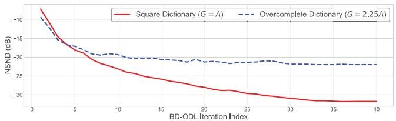

line

| BD-ODL Iteration Index | Square Dictionary (G = A) | Overcomplete Dictionary (G = 2.25A) |
| ---------------------- | ------------------------- | ----------------------------------- |
| 0                      | -8                        | -10                                 |
| 5                      | -18                       | -16                                 |
| 10                     | -24                       | -20                                 |
| 15                     | -27                       | -21                                 |
| 20                     | -29                       | -21                                 |
| 25                     | -30                       | -21                                 |
| 30                     | -31                       | -21                                 |
| 35                     | -31                       | -21                                 |
| 40                     | -31                       | -21                                 |

(a) NSND history of BD-ODL training

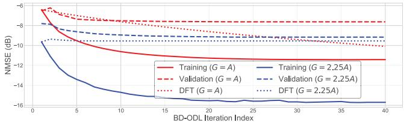

line

| BD-ODL Iteration Index | Training (G = A) | Validation (G = A) | DFT (G = A) | Training (G = 2.25A) | Validation (G = 2.25A) | DFT (G = 2.25A) |
| ---------------------- | ---------------- | ------------------ | ----------- | -------------------- | ---------------------- | --------------- |
| 0                      | -6.0             | -6.0               | -6.0        | -10.0                | -8.0                   | -9.0            |
| 5                      | -8.0             | -8.0               | -8.0        | -13.0                | -9.0                   | -10.0           |
| 10                     | -9.0             | -9.0               | -9.0        | -14.0                | -10.0                  | -11.0           |
| 15                     | -10.0            | -10.0              | -10.0       | -15.0                | -11.0                  | -12.0           |
| 20                     | -11.0            | -11.0              | -11.0       | -16.0                | -12.0                  | -13.0           |
| 25                     | -12.0            | -12.0              | -12.0       | -16.0                | -13.0                  | -14.0           |
| 30                     | -13.0            | -13.0              | -13.0       | -16.0                | -14.0                  | -15.0           |
| 35                     | -14.0            | -14.0              | -14.0       | -16.0                | -15.0                  | -16.0           |
| 40                     | -15.0            | -15.0              | -15.0       | -16.0                | -16.0                  | -17.0           |

(b) NMSE history of BD-ODL training

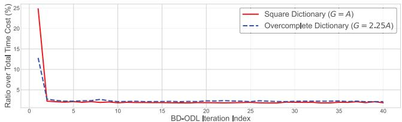

line

| BD-ODL Iteration Index | Square Dictionary (G = A) | Overcomplete Dictionary (G = 2.25A) |
| ---------------------- | ------------------------- | ----------------------------------- |
| 0                      | 25.0                      | 13.0                                |
| 5                      | 3.0                       | 3.0                                 |
| 10                     | 3.0                       | 3.0                                 |
| 15                     | 3.0                       | 3.0                                 |
| 20                     | 3.0                       | 3.0                                 |
| 25                     | 3.0                       | 3.0                                 |
| 30                     | 3.0                       | 3.0                                 |
| 35                     | 3.0                       | 3.0                                 |
| 40                     | 3.0                       | 3.0                                 |

(c） Ratio over total time cost alongside BD-ODL training   
Fig. 3. Training history of BD-ODL.

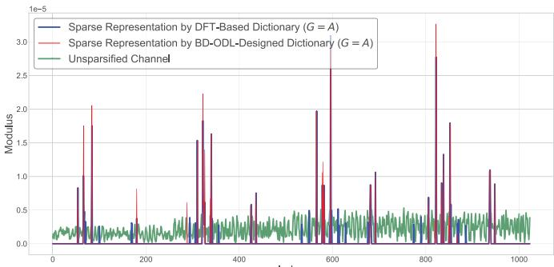

line

| Index | Sparse Representation by DFT-Based Dictionary (G = A) | Sparse Representation by BD-ODL-Designed Dictionary (G = A) | Unsparsified Channel |
|-------|------------------------------------------------------|---------------------------------------------------------------|----------------------|
| 0     | 0.0                                                  | 0.0                                                           | 0.0                  |
| 100   | 0.8                                                  | 1.7                                                           | 0.2                  |
| 200   | 0.2                                                  | 0.8                                                           | 0.2                  |
| 300   | 1.6                                                  | 2.2                                                           | 0.2                  |
| 400   | 0.6                                                  | 0.8                                                           | 0.2                  |
| 500   | 2.0                                                  | 1.2                                                           | 0.2                  |
| 600   | 0.5                                                  | 2.8                                                           | 0.2                  |
| 700   | 1.1                                                  | 1.0                                                           | 0.2                  |
| 800   | 2.8                                                  | 3.2                                                           | 0.2                  |
| 900   | 1.1                                                  | 1.8                                                           | 0.2                  |
| 1000  | 1.1                                                  | 1.1                                                           | 0.2                  |

(a) Comparison of sparse representations,G = A

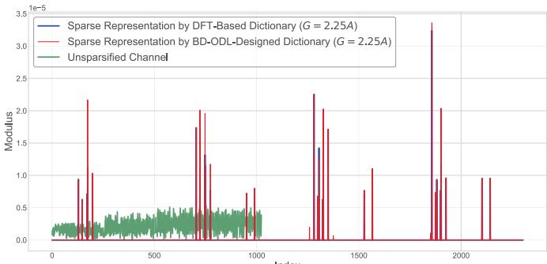

bar_line

| Index | Sparse Representation by DFT-Based Dictionary (G = 2.25A) | Sparse Representation by BD-ODL-Designed Dictionary (G = 2.25A) | Unsparsified Channel |
|-------|----------------------------------------------------------|------------------------------------------------------------------|----------------------|
| 0     | 0.0                                                      | 0.0                                                              | 0.0                  |
| 100   | 0.9                                                      | 2.2                                                              | 0.3                  |
| 200   | 0.6                                                      | 1.0                                                              | 0.4                  |
| 300   | 0.8                                                      | 1.7                                                              | 0.5                  |
| 400   | 0.7                                                      | 1.2                                                              | 0.4                  |
| 500   | 0.8                                                      | 1.8                                                              | 0.5                  |
| 600   | 1.3                                                      | 2.0                                                              | 0.4                  |
| 700   | 1.4                                                      | 1.9                                                              | 0.5                  |
| 800   | 1.5                                                      | 1.7                                                              | 0.4                  |
| 900   | 1.6                                                      | 1.5                                                              | 0.5                  |
| 1000  | 1.7                                                      | 1.4                                                              | 0.4                  |
| 1100  | 1.8                                                      | 1.3                                                              | 0.5                  |
| 1200  | 1.9                                                      | 1.2                                                              | 0.4                  |
| 1300  | 2.0                                                      | 1.1                                                              | 0.5                  |
| 1400  | 2.1                                                      | 1.0                                                              | 0.4                  |
| 1500  | 2.2                                                      | 0.9                                                              | 0.5                  |
| 1600  | 2.3                                                      | 0.8                                                              | 0.4                  |
| 1700  | 2.4                                                      | 0.7                                                              | 0.5                  |
| 1800  | 2.5                                                      | 0.6                                                              | 0.4                  |
| 1900  | 2.6                                                      | 0.5                                                              | 0.5                  |
| 2000  | 2.7                                                      | 0.4                                                              | 0.4                  |
| 2100  | 2.8                                                      | 0.3                                                              | 0.5                  |
| 2200  | 2.9                                                      | 0.2                                                              | 0.4                  |
| 2300  | 3.0                                                      | 0.1                                                              | 0.5                  |
| 2400  | 3.1                                                      | 0.0                                                              | 0.4                  |
| 2500  | 3.2                                                      | 0.0                                                              | 0.5                  |
| 2600  | 3.3                                                      | 0.0                                                              | 0.4                  |
| 2700  | 3.4                                                      | 0.0                                                              | 0.5                  |
| 2800  | 3.5                                                      | 0.0                                                              | 0.4                  |
| 2900  | 3.6                                                      | 0.0                                                              | 0.5                  |
| 3000  | 3.7                                                      | 0.0                                                              | 0.4                  |
| Note: The data is extracted from the code and presented in CSV format as requested, so no additional formatting is needed for this purpose of analysis.

(b) Comparison of sparse representations,G= 2.25A

Fig. 4. Element modulus curves versus vector index.   
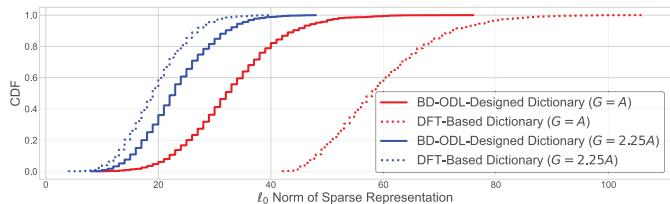

line

| ℓ₀ Norm of Sparse Representation | BD-ODL-Designed Dictionary (G = A) | DFT-Based Dictionary (G = A) | BD-ODL-Designed Dictionary (G = 2.25A) | DFT-Based Dictionary (G = 2.25A) |
| -------------------------------- | ----------------------------------- | ---------------------------- | -------------------------------------- | ------------------------------- |
| 0                                | 0.0                                 | 0.0                          | 0.0                                    | 0.0                             |
| 10                               | 0.1                                 | 0.0                          | 0.3                                    | 0.4                             |
| 20                               | 0.3                                 | 0.1                          | 0.6                                    | 0.7                             |
| 30                               | 0.5                                 | 0.2                          | 0.8                                    | 0.9                             |
| 40                               | 0.7                                 | 0.3                          | 0.9                                    | 1.0                             |
| 50                               | 0.8                                 | 0.4                          | 1.0                                    | 1.0                             |
| 60                               | 0.9                                 | 0.5                          | 1.0                                    | 1.0                             |
| 70                               | 0.95                                | 0.6                          | 1.0                                    | 1.0                             |
| 80                               | 1.0                                 | 0.7                          | 1.0                                    | 1.0                             |
| 90                               | 1.0                                 | 0.8                          | 1.0                                    | 1.0                             |
| 100                              | 1.0                                 | 0.9                          | 1.0                                    | 1.0                             |

Fig. 5. CDFs of the $\ell _ { 0 }$ norms of the sparse representations.

Fig. 4 depicts the comparison of sparse representations generated according to the DFT-based sparsifying matrix and the BD-ODL learnt dictionary, for both $G \ = \ A$ and $G \ : = \ : 2 . 2 5 A$ on the same THz channel sample. From both figures, one can observe that both DFT-based and BD-ODLdesigned dictionaries can lead to sparse representations with highly overlapped structures, in contrast to the original dense channel sample. In the case of $G = A .$ , the BD-ODL-designed dictionary results in better sparsity against its DFT-based counterpart, which is reflected by substantially less amount of non-zero spikes. For $G = 2 . 2 5 A$ , similar observations can be found. Comparable sparsity is achieved between BD-ODL and the DFT-based benchmark, though a few more spikes with insignificant moduli are spotted at indices 1260, 1376 and 1851. To provide more insights, Fig. 5 plots the cumulative distribution function (CDF) of the $\ell _ { 0 }$ norm of the sparse representation [41]. The BD-ODL-designed dictionary leads to much sparser representations than the DFT-based baseline when $G = A _ { \mathrm { { i } } }$ , while comparable sparsifying performance is found in the case of $G = 2 . 2 5 A$ . For instance, 90% of the THz channel samples can be recovered by fewer than 44 or 72 atoms from the BD-ODL-designed or DFT-based sparsifying matrices in the case of square dictionaries, respectively.

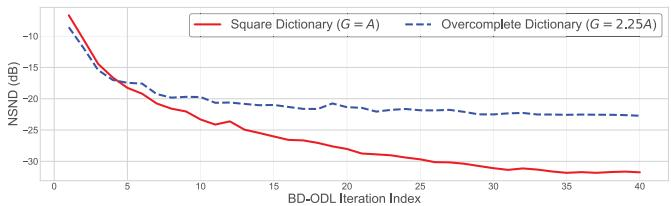

line

| BD-ODL Iteration Index | Square Dictionary (G = A) | Overcomplete Dictionary (G = 2.25A) |
| ---------------------- | ------------------------- | ----------------------------------- |
| 0                      | -8                        | -8                                  |
| 5                      | -18                       | -18                                 |
| 10                     | -22                       | -20                                 |
| 15                     | -25                       | -21                                 |
| 20                     | -27                       | -22                                 |
| 25                     | -29                       | -23                                 |
| 30                     | -30                       | -24                                 |
| 35                     | -31                       | -24                                 |
| 40                     | -31                       | -24                                 |

(a) NSND history of BD-ODL partial training with a smaller dataset

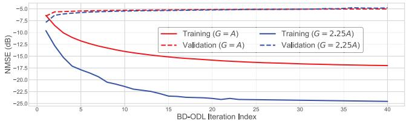

line

| BD-ODL Iteration Index | Training (G = A) | Training (G = 2.25A) | Validation (G = A) | Validation (G = 2.25A) |
| ---------------------- | ---------------- | -------------------- | ------------------ | ---------------------- |
| 0                      | -7.5             | -10.0                | -7.5               | -7.5                   |
| 5                      | -10.0            | -15.0                | -7.5               | -7.5                   |
| 10                     | -12.5            | -20.0                | -7.5               | -7.5                   |
| 15                     | -15.0            | -22.5                | -7.5               | -7.5                   |
| 20                     | -17.5            | -25.0                | -7.5               | -7.5                   |
| 25                     | -17.5            | -25.0                | -7.5               | -7.5                   |
| 30                     | -17.5            | -25.0                | -7.5               | -7.5                   |
| 35                     | -17.5            | -25.0                | -7.5               | -7.5                   |
| 40                     | -17.5            | -25.0                | -7.5               | -7.5                   |

(b) NMSE history of BD-ODL partial training with a smaller dataset   
Fig. 6. Training history of BD-ODL with a smaller dataset.

When $G \ = \ 2 . 2 5 A .$ , it requires at least 32 or 27 columns from the BD-ODL-designed or the DFT-based dictionaries to achieve the goal that 90% of the THz channel samples can be recovered. The average ratios of non-zero elements over the corresponding BD-ODL sparse representation vector for cases $G = A$ and $G = 2 . 2 5 A$ are 3.22% and 1.01%, respectively. Besides, the average ratios of non-zero elements over the DFT-based sparse representation vector for cases $G = A$ and $G \ = \ 2 . 2 5 A$ are 5.80% and 0.84%, respectively. For both BD-ODL and DFT-based cases, overcomplete dictionaries can indeed lead to more sparse representations. Recalling the trade-off between sparsity level and reconstruction fidelity in the dictionary learning formulation (14) and incorporating the NMSE performance in Fig. 3, it is straightforward to conclude that the proposed BD-ODL algorithm can generate more appropriate sparsifying matrix against the conventional DFTbased method, i.e., much better NMSE performance associated with better/comparable sparsifying capacity.

These observations confirm the discussions in Remark 2 and Remark 4. The BD-ODL algorithm is adaptive to both the training and validation channel samples, which highlights its robustness and generalization ability. The proposed BD-ODL algorithm is also robust to the overcomplete dictionary case, providing sparse representation with improved channel recovery accuracy. It is also profound that the trade-off between channel recovery accuracy, and computational resource, memory and dictionary learning performance exists.

To show the impact of a less extensive training dataset on the training performance of the proposed BD-ODL algorithm, Fig. 6 illustrates the training history of the proposed BD-ODL algorithm with partial training THz channel dataset. Herein, half of the training samples in generating Fig. 3 are used, while the validation dataset remains unaltered. Note that in this figure, the early stopping technique is disabled. From Fig. 3(a) and Fig. 6(a), one can conclude that the partial training does not pose much impact on the NSND performance, showcasing that the proposed BD-ODL algorithm can robustly converge to a learnt dictionary even for the training dataset with a limited amount of THz channel samples. Comparing the training curves in Fig. 3(b) and Fig. 6(b), one can find that partial training results in enhanced training NMSE performances in both cases of $G = A$ and $G = 2 . 2 5 A$ . However, the learnt dictionary is less expressive than its counterpart generated with a more extensive training dataset. This claim can be confirmed by the increasing validation curves in both cases of $G = A$ and $G = 2 . 2 5 A$ in Fig. 6(b), implying that the dictionary learnt from a partial training leads to profound overfitting issues and fails to generalize to unseen THz channel sample. These observations agree with the discussions stated in Remark 4.

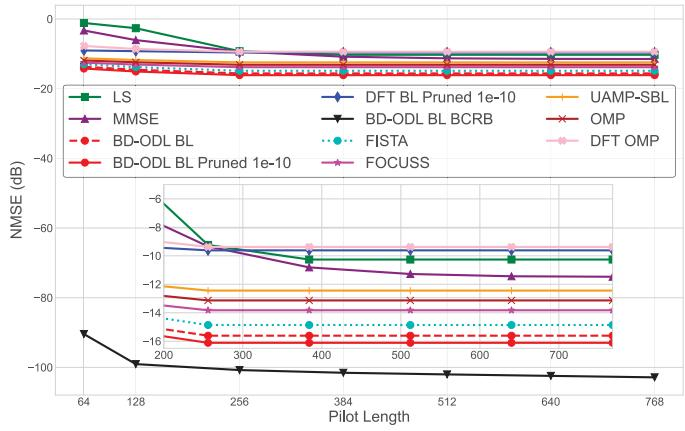

line

| Pilot Length | LS    | MMSE  | BD-ODL BL | FISTA | DFT BL Pruned 1e-10 | UAMP-SBL | OMP   | FOCUSS | FISTA (dashed line) | FOCUSS (dashed line) |
| ------------ | ----- | ----- | --------- | ----- | ------------------- | -------- | ----- | ------ | ------------------- | -------------------- |
| 64           | 0     | -5    | -10       | -10   | -10                 | -10      | -10   | -10    | -10                 | -10                  |
| 128          | -5    | -10   | -10       | -10   | -10                 | -10      | -10   | -10    | -10                 | -10                  |
| 256          | -10   | -15   | -10       | -10   | -10                 | -10      | -10   | -10    | -10                 | -10                  |
| 384          | -15   | -20   | -10       | -10   | -10                 | -10      | -10   | -10    | -10                 | -10                  |
| 500          | -20   | -25   | -10       | -10   | -10                 | -10      | -10   | -10    | -10                 | -10                  |
| 640          | -25   | -30   | -10       | -10   | -10                 | -10      | -10   | -10    | -10                 | -10                  |
| 768          | -30   | -35   | -10       | -10   | -10                 | -10      | -10   | -10    | -10                 | -10                  |

Fig. 7. NMSE versus pilot length.

# D. BL-Aided THz CSCE

Given the learnt dictionary from the tailored BD-ODL algorithm, we can perform the proposed BL-enabled THz CSCE solution to estimate THz channels from the received pilot signal sequences. To show NMSE performance comparison, we consider the following representative baselines.

1) LS [16], [26], [55]: The LS estimate is derived as $\hat { \mathbf { h } } _ { \mathrm { L S } } =$ $\left( \mathbf { A } ^ { H } \mathbf { A } \right) ^ { - 1 } \mathbf { A } ^ { H } \mathbf { y }$ .   
2) MMSE [16], [26], [56]: The MMSE estimate is given by $\hat { \bf h } _ { \mathrm { M M S E } } ~ = ~ ( \mathrm { 1 0 ^ { - \frac { \mathrm { t S N R } } { 1 0 } } { \bf R } _ { h } ^ { - 1 } } + { \bf A } ^ { H } { \bf A } ) ^ { - 1 } { \bf A } ^ { H } { \bf y }$ tSNR10 R−h , where ${ \bf R } _ { \bf h } ~ = ~ \mathbb { E } \{ { \bf h } { \bf h } ^ { H } \}$ captures the channel autocorrelation matrix. Note that the MMSE benchmark demands priori knowledge about $\mathbf { R _ { h } }$ . When such priori knowledge is unavailable, it collapses to the LS estimate.

3) $O M P / 5 J , I I I J .$ The orthogonal matching pursuit (OMP) is a popular solution for sparse channel estimation.

4) FOCUSS [26], [57], [58], [59]: A typical sparse signal reconstruction algorithm that is popular in image recovery.

5) UAMP-SBL [32], [60]: The approximate message passing (AMP) technique with unitary transformation is used to alternate the original E-step in SBL to reduce computational cost and enhance robustness.

6) FISTA [7], [61], [62]: The fast version of iterative shrinkage-thresholding algorithm (ISTA) which offers computational simplicity and global convergence rate.

Note that the adopted sparsifying matrix for baselines OMP, FOCUSS, UAMP-SBL and FISTA is the learnt dictionary designed by the proposed BD-ODL algorithm.

Fig. 7 illustrates the NMSE performance comparison of the proposed BD-ODL BL solution against the considered benchmarks versus pilot length P , where the tSNR used to generate this figure is set as 125 dB. Note that the BD-ODL BL Pruned 1e-10 scheme is the pruned version of the BD-ODL BL solution under the BL estimate pruning threshold $\gamma _ { \mathrm { t h } } = 1 0 ^ { - 1 0 }$ . Fig. 7 confirms that the BL estimate thresholding technique can offer an NMSE gain of approximately 0.51 dB over the original BD-ODL BL algorithm. This validates the effectiveness of the pruning step in line 12 of Algorithm 2. As per Corollary 2, the BCRB curve is plotted for benchmarking, which exhibits more sensitivity to pilot length for $P \le 1 2 8$ . Note that the BCRB is calculated under the ideal condition, i.e., the sparse locations of the sparse representation vector are treated as known parameters, which is not possible in practice. It is also observed that both LS and MMSE baselines are more sensitive to pilot length than the other CE strategies, especially in the ill-posed case where $P \leq 2 5 6$ . For the overdetermined system, i.e., $P > 2 5 6$ , the LS baseline converges to -10.26 dB, while the MMSE benchmark converges to -11.47 dB with a slower pace. It thus showcases that LS and MMSE baselines require an excessive amount of pilots to hit robust channel reconstruction performance. In lieu of priori knowledge of channel autocorrelation matrix, MMSE can achieve 1.21 dB NMSE gain over the LS approach. Upon convergence, NMSE gain of 9.13 dB is achieved at the cost of no fewer than 192 pilots for the LS scheme, while an 8.19 dB performance gain is attained at the expense of at least 448 pilots for the MMSE approach. All the sparsity-exploiting schemes provide more accurate channel reconstruction performance over LS and MMSE in the ill-posed scenario, though DFT OMP and DFT BL baselines offer inferior NMSE performance in the case of overdetermined systems. Despite this, DFT OMP and DFT BL schemes can offer up to 6.61 dB and 7.64 dB NMSE advantages over non-sparsity-exploiting CE baselines in the ill-posed case, respectively. Besides, DFT BL can achieve minimum and maximum NMSE gains of 0.24 dB and 1.28 dB over DFT OMP, respectively. Notably, FOCUSS, FISTA, UAMP-SBL, OMP and the proposed BD-ODL BL solution can provide more accurate CE performance for both ill-posed and overdetermined cases. For these sparsity-aware schemes, altering pilot length will not make much difference, which unveils their stronger robustness over conventional CE solutions such as LS and MMSE. The BD-ODL BL approach can offer up to 5.85 dB and 5.29 dB NMSE gain over the LS and the MMSE benchmarks for the overdetermined case, while the peak NMSE gains in the ill-posed scenario are 13.08 dB and 10.93 dB, respectively. Compared to UAMP-SBL, DFT BL, FOCUSS, FISTA and OMP, the proposed BD-ODL BL can provide minimum NMSE gains of 2.95 dB, 5.19 dB, 1.69 dB, 1.26 dB and 2.32 dB, and maximum NMSE gains of 3.67 dB, 6.49 dB, 2.29 dB, 1.24 dB and 2.98 dB, respectively.

Fig. 8 demonstrates NMSE comparison among various THz CE solutions against tSNR, for the ill-posed case where $P = 1 2 8$ . It is shown that increasing tSNR can lead to more accurate CE performance for all the considered schemes. The LS scheme performs worse than its competitors alongside the simulated tSNR range, while the MMSE benchmark outperforms its rivals in the case of $\mathfrak { t S N R } \ \leq \ 1 1 1$ dB. When tSNR = 145 dB, CSCE solutions can outperform LS and

TABLE IV TIME COMPLEXITY COMPARISON PER ITERATION 

<table><tr><td>LS</td><td>MMSE</td><td>FOCUSS</td><td>OMP</td><td>UAMP-SBL</td><td>FISTA</td><td>The Proposed</td></tr><tr><td> $\mathcal{O}\left(A^{3} + PN_{\text{RF}} A^{2}\right)$ </td><td> $\mathcal{O}\left(A^{3} + PN_{\text{RF}} A^{2}\right)$ </td><td> $\mathcal{O}\left(G^{3} + PN_{\text{RF}} G^{2}\right)$ </td><td> $\mathcal{O}\left(G^{3} + PN_{\text{RF}} G^{2}\right)$ </td><td> $\mathcal{O}\left(PN_{\text{RF}} G\right)$ </td><td> $\mathcal{O}\left(PN_{\text{RF}} G^{2}\right)$ </td><td> $\mathcal{O}\left(G^{3} + PN_{\text{RF}} G^{2}\right)$ </td></tr></table>

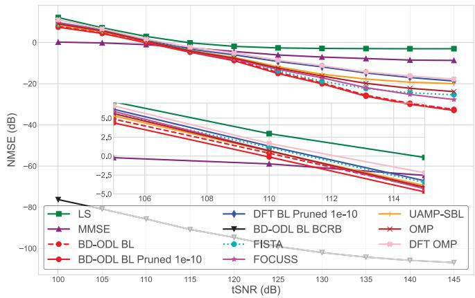

line

| tSNR (dB) | LS    | MMSE  | BD-ODL BL | BD-ODL BL Pruned 1e-10 | DFT BL Pruned 1e-10 | UAMP-SBL | OMP   | FISTA | DFT OMP | FOCUSS |
| --------- | ----- | ----- | --------- | ---------------------- | ------------------- | -------- | ----- | ----- | ------- | ------ |
| 100       | ~5.0  | ~0.0  | ~-80.0    | ~-80.0                 | ~-80.0              | ~-80.0   | ~-80.0| ~-80.0| ~-80.0  | ~-80.0 |
| 105       | ~2.0  | ~-2.0 | ~-75.0    | ~-75.0                 | ~-75.0              | ~-75.0   | ~-75.0| ~-75.0| ~-75.0  | ~-75.0 |
| 110       | ~0.0  | ~-4.0 | ~-65.0    | ~-65.0                 | ~-65.0              | ~-65.0   | ~-65.0| ~-65.0| ~-65.0  | ~-65.0 |
| 115       | -2.0  | ~-6.0 | ~-55.0    | ~-55.0                 | ~-55.0              | ~-55.0   | ~-55.0| ~-55.0| ~-55.0  | ~-55.0 |
| 120       | -4.0  | ~-8.0 | ~-45.0    | ~-45.0                 | ~-45.0              | ~-45.0   | ~-45.0| ~-45.0| ~-45.0  | ~-45.0 |
| 125       | -6.0  | ~-10.0| ~-35.0    | ~-35.0                 | ~-35.0              | ~-35.0   | ~-35.0| ~-35.0| ~-35.0  | ~-35.0 |
| 130       | -8.0  | ~-12.0| ~-25.0    | ~-25.0                 | ~-25.0              | ~-25.0   | ~-25.0| ~-25.0| ~-25.0  | ~-25.0 |
| 135       | -10.0 | ~-14.0| ~-15.0    | ~-15.0                 | ~-15.0              | ~-15.0   | ~-15.0| ~-15.0| ~-15.0  | ~-15.0 |
| 140       | -12.0 | ~-16.0| ~-10.0    | ~-10.0                 | ~-10.0              | ~-10.0   | ~-10.0| ~-10.0| ~-10.0  | ~-10.0 |
| 145       | -14.0 | ~-18.0| ~-8.0     | ~-8.0                  | ~-8.0               | ~-8.0    | ~-8.0 | ~-8.0 | ~-8.0   | ~-8.0  |

Fig. 8. NMSE versus tSNR.

MMSE with the least NMSE advantage of 14.74 dB and 9.06 dB, respectively. This confirms that exploiting THz channel sparsity is beneficial to achieve more accurate THz CE performance in the ill-posed scenario where the pilot overhead is more affordable. For the majority of the considered tSNR regime, i.e., tSNR ∈ [115, 145] dB, the proposed BD-ODL BL solution can provide the most accurate CE performance. For example, when tSNR = 145 dB, the BD-ODL BL Pruned 1e-10 solution can offer 29.98 dB, 24.29 dB, 14.28 dB, 7.59 dB, 5.27 dB, 13.03 dB, 9.15 dB and 15.24 dB NMSE gains over the LS, MMSE, DFT BL Pruned 1e-10, FISTA, FOCUSS, UAMP-SBL, OMP and DFT OMP baselines, respectively. This showcases the channel reconstruction efficiency of the proposed BD-ODL BL algorithm over conventional CE strategies and other CSCE counterparts. Fig. 9 depicts the curves of norm difference of adjacent BLPM estimates alongside the EM iteration process in Algorithm 2, i.e., $\lVert \hat { \mathbf { A } } ^ { ( k ) } - \hat { \mathbf { A } } ^ { ( k - 1 ) } \rVert _ { 2 }$ , to show the convergence performance of the proposed BLaided THz CSCE solution. It is clear that the convergence rates of all BL variants are rapid, which agrees with discussions regarding linear convergence pace in Remark 5. Specifically, BD-ODL BL, BD-ODL BL Pruned 1e-10 and DFT BL Pruned 1e-10 all reach convergence within 10 EM iterations. The BL estimate thresholding applied in line 12 of Algorithm 2 poses negligible impact on BL convergence, while the adoption of a DFT-based dictionary can lead to a slightly faster convergence pace.

On top of Proposition 5, we compare time complexities per iteration among the considered CE algorithms in Table IV. Note that neither LS nor MMSE is iterative, and they are listed only for comparison purposes. Moreover, the worst-case time complexity for OMP is listed because the intermediate LS projections vary among OMP iterations [5]. The time complexity of the one-off singular value decomposition (SVD) on the effective measurement matrix A˜ before iterations in baseline UAMP-SBL is excluded, which is on the scale of O min $\left\{ ( P N _ { \mathrm { R F } } ) ^ { 2 } G , P N _ { \mathrm { R F } } G ^ { 2 } \right\} )$ [60]. Though the proposed BD-ODL BL solution is associated with comparable or higher time complexity compared to other baselines, numerical results in Fig. 7 and Fig. 8 showcase more outstanding CE performance. Therefore, there is a trade-off between CE performance and the corresponding computational consumption.

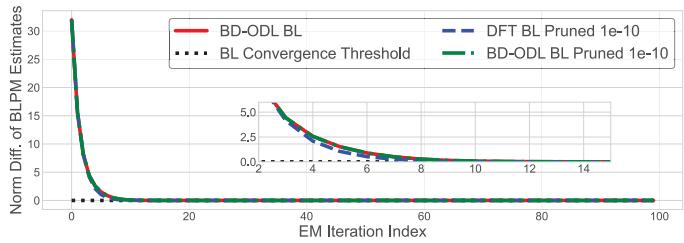

line

| EM Iteration Index | BD-ODL BL | DFT BL Pruned 1e-10 | BD-ODL BL Pruned 1e-10 | BL Convergence Threshold |
| ------------------ | --------- | ------------------- | ---------------------- | ------------------------ |
| 0                  | 30.0      | 5.0                 | 5.0                    | 0.0                      |
| 2                  | 5.0       | 2.5                 | 2.5                    | 0.0                      |
| 4                  | 2.5       | 1.0                 | 1.0                    | 0.0                      |
| 6                  | 1.0       | 0.5                 | 0.5                    | 0.0                      |
| 8                  | 0.5       | 0.2                 | 0.2                    | 0.0                      |
| 10                 | 0.2       | 0.1                 | 0.1                    | 0.0                      |
| 12                 | 0.1       | 0.05                | 0.05                   | 0.0                      |
| 14                 | 0.05      | 0.02                | 0.02                   | 0.0                      |
| 16                 | 0.02      | 0.01                | 0.01                   | 0.0                      |
| 18                 | 0.01      | 0.005               | 0.005                  | 0.0                      |
| 20                 | 0.005     | 0.002               | 0.002                  | 0.0                      |
| 22                 | 0.002     | 0.001               | 0.001                  | 0.0                      |
| 24                 | 0.001     | 0.0005              | 0.0005                 | 0.0                      |
| 26                 | 0.0005    | 0.0002              | 0.0002                 | 0.0                      |
| 28                 | 0.0002    | 0.0001              | 0.0001                 | 0.0                      |
| 30                 | 0.0001    | 0.00005             | 0.00005                | 0.0                      |
| 32                 | 0.0         | 0.0                 | 0.0                    | 0.0                      |
| 34                 | 0.0         | 0.0                 | 0.0                    | 0.0                      |
| 36                 | 0.0         | 0.0                 | 0.0                    | 0.0                      |
| 38                 | 0.0         | 0.0                 | 0.0                    | 0.0                      |
| 40                 | 0.0         | 0.0                 | 0.0                    | 0.0                      |
| 42                 | 0.0         | 0.0                 | 0.0                    | 0.0                      |
| 44                 | 0.0         | 0.0                 | 0.0                    | 0.0                      |
| 46                 | 0.0         | 0.0                 | 0.0                    | 0.0                      |
| 48                 | 0.0         | 0.0                 | 0.0                    | 0.0                      |
| 50                 | 0.0         | 0.0                 | 0.0                    | 0.0                      |
| 52                 | 0.0         | 0.0                 | 0.0                    | 0.0                      |
| 54                 | 0.0         | 0.0                 | 0.0                    | 0.0                      |
| 56                 | 0.0         | 0.0                 | 0.0                    | 0.0                      |
| 58                 | 0.0         | 0.0                 | 0.0                    | 0.0                      |
| 60                 | 0.0         | 0.0                 | 0.0                    | 0.0                      |
| 62                 | 0.0         | 0.0                 | 0.0                    | 0.0                      |
| 64                 | 0.0         | 0.0                 | 0.0                    | 0.0                      |
| 66                 | 0.0         | 0.0                 | 0.0                    | 0.0                      |
| 68                 | 0.0         | 0.0                 | 0.0                    | 0.0                      |
| 70                 | 0.0         | 0.0                 | 0.0                    | 0.0                      |
| 72                 | 0.0         | 0.0                 | 0.0                    | 0.0                      |
| 74                 | 0.0         | 0.0                 | 0.0                    | 0.0                      |
| 76                 | 0.0         | 0.0                 | 0.0                    | 0.0                      |
| 78                 | 0.0         | 0.0                 | 0.0                    | 0.0                      |
| 88                 | -         | -                   | -                      | -                        |
| Note: The actual values are not provided in the code, so they are estimated from the provided code to match the given code in the code execution process (e.g., “BD-ODL BL”, “DFT BL Pruned” or “BD-ODL BL Pruned” for each iteration) at each iteration point (e.g., “EM Iteration Index”). The code does not have explicit labels for the data series in this case but is not included in the output.

Fig. 9. BLPM Estimates’ Norm Difference versus EM Index.

The advantage of BD-ODL BL over DFT BL comes from the learnt dictionary matrix designed by the tailored BD-ODL algorithm, which generates the adaptive dictionary to the adopted hybrid-field THz channel model, and thus can help reach more accurate and robust CSCE performance. Against the proposed BD-ODL BL solution, the FOCUSS baseline and the first-order optimization method FISTA perform poorly due to their convergence problems and instability to the iteration step size and/or the regulation factor [5], [7], [26], where they are more likely to converge to local suboptimal points. On the contrary, the proposed BL-aided CSCE algorithm does not require regularization parameters tuning, and is robust to $\eth _ { \mathrm { B L } }$ and $K _ { \mathrm { B L } }$ . Moreover, the UAMP-SBL baseline applies AMPbased E-step to reduce the computational complexity from matrix multiplications and inversions, via a bunch of matrixvector productions [32]. However, approximations made in the E-step lead to degraded NMSE performance compared to the proposed BD-ODL BL algorithm, especially for high tSNRs. Besides, the OMP framework is hindered by its greedy nature and error propagation, as any errors made during index selection cannot be corrected in subsequent iterations [5].

# V. CONCLUSION

In conclusion, this paper investigated an uplink CE problem for AoSA-based THz UM-MIMO systems with PCHC architecture. To account for the non-negligible near-field radiation, we developed a practical hybrid-field THz UM-MIMO CM that explicitly models molecular absorption and reflection attenuation. To efficiently exploit the inherent sparsity of THz channels, we tailored a BD-ODL algorithm. This algorithm facilitates the generation of an adaptive dictionary that effectively captures the combined effects of near- and far-field propagation paths. Leveraging the THz sparsity and the learnt sparsifying matrix, we proposed a BL-aided CSCE solution.

This approach achieves more accurate and robust THz CE performance with manageable pilot overhead. Furthermore, we derived the BCRB to quantify the MSE lower bound and performed a time complexity analysis to evaluate the computational resource requirements. Numerical results convincingly demonstrated the effectiveness of the proposed BD-ODL BL CSCE solution and its rapid convergence pace. The NMSE performance comparisons highlighted significant CE accuracy improvements over traditional CE and CSCE benchmarks.

Future endeavours extending the current work include 1) Multi-antenna UE scenarios, where appropriate matrix vectorizations will play a key role, and the near-field range is determined by both the BS’s and UE’s array apertures; 2) Wideband transmissions, where the orthogonal frequency division multiplexing (OFDM) will be the enabler, and the beam split phenomenon among subcarriers should be considered; and 3) Polar-domain dictionary design for AoSA-based THz UM-MIMO near-field transmissions.

# APPENDIX A PROOF OF PROPOSITION 1

Given fixed $\beta _ { i }$ , the $\ell _ { 1 } { \mathrm { - n o r m } }$ term in the objective function of (16) can be dropped. Then, we have the following derivation.

$$
\begin{array}{l} \frac {1}{2 N _ {\mathrm{dl}}} \sum_ {i = 1} ^ {N _ {\mathrm{dl}}} \| \mathbf {h} _ {i} - \mathbf {C} _ {\mathrm{dl}} \boldsymbol {\beta} _ {i} \| _ {2} ^ {2} \\ = \frac {1}{2 N _ {\mathrm{dl}}} \sum_ {i = 1} ^ {N _ {\mathrm{dl}}} \left(\mathbf {h} _ {i} ^ {H} - \boldsymbol {\beta} _ {i} ^ {H} \mathbf {C} _ {\mathrm{dl}} ^ {H}\right) \left(\mathbf {h} _ {i} - \mathbf {C} _ {\mathrm{dl}} \boldsymbol {\beta} _ {i}\right) \\ = \frac {1}{2 N _ {\mathrm{dl}}} \sum_ {i = 1} ^ {N _ {\mathrm{dl}}} \left[ \boldsymbol {\beta} _ {i} ^ {H} \mathbf {C} _ {\mathrm{dl}} ^ {H} \mathbf {C} _ {\mathrm{dl}} \boldsymbol {\beta} _ {i} - 2 \boldsymbol {\beta} _ {i} ^ {H} \mathbf {C} _ {\mathrm{dl}} ^ {H} \mathbf {h} _ {i} + \mathbf {h} _ {i} ^ {H} \mathbf {h} _ {i} \right] \\ = \frac {1}{N _ {\mathrm{dl}}} \left[ \frac {1}{2} \operatorname{Tr} \left(\mathbf {C} _ {\mathrm{dl}} ^ {H} \mathbf {C} _ {\mathrm{dl}} \sum_ {i = 1} ^ {N _ {\mathrm{dl}}} \boldsymbol {\beta} _ {i} \boldsymbol {\beta} _ {i} ^ {H}\right) \right. \\ \left. - \operatorname{Tr} \left(\mathbf {C} _ {\mathrm{dl}} ^ {H} \sum_ {i = 1} ^ {N _ {\mathrm{dl}}} \mathbf {h} _ {i} \boldsymbol {\beta} _ {i} ^ {H}\right) + \frac {1}{2} \sum_ {i = 1} ^ {N _ {\mathrm{dl}}} \mathbf {h} _ {i} ^ {H} \mathbf {h} _ {i} \right]. \tag {29} \\ \end{array}
$$

Because the last term in (29) is irrelevant to the optimization variable $\mathbf { C } _ { \mathrm { d l } }$ , we omit it accordingly. Then, it is proved that (17) is equivalent to (16).

# APPENDIX B PROOF OF COROLLARY 1

For the trace of complex-valued matrices, we have

$$
\frac {\partial \operatorname{Tr} (\mathbf {X} ^ {H} \mathbf {X Y})}{\partial \mathbf {X}} = \mathbf {X Y} ^ {H} + \mathbf {X Y}, \quad \frac {\partial \operatorname{Tr} (\mathbf {X} ^ {H} \mathbf {Y})}{\partial \mathbf {X}} = \mathbf {Y}. \tag {30}
$$

Then, we get

$$
\begin{array}{l} \nabla_ {\mathbf {C} _ {\mathrm{dl}}} \mathfrak {M} (\mathbf {C} _ {\mathrm{dl}}) = \frac {\partial}{\partial \mathbf {C} _ {\mathrm{dl}}} \frac {1}{N _ {\mathrm{dl}}} \left[ \frac {1}{2} \operatorname{Tr} \left(\mathbf {C} _ {\mathrm{dl}} ^ {H} \mathbf {C} _ {\mathrm{dl}} \mathfrak {C} _ {N _ {\mathrm{dl}}}\right) - \operatorname{Tr} \left(\mathbf {C} _ {\mathrm{dl}} ^ {H} \mathfrak {D} _ {N _ {\mathrm{dl}}}\right) \right] \\ = \frac {1}{N _ {\mathrm{dl}}} \left[ \frac {1}{2} \left(\mathbf {C} _ {\mathrm{dl}} \mathfrak {C} _ {N _ {\mathrm{dl}}} ^ {H} + \mathbf {C} _ {\mathrm{dl}} \mathfrak {C} _ {N _ {\mathrm{dl}}}\right) - \mathfrak {D} _ {N _ {\mathrm{dl}}} \right] \\ \stackrel {(a)} {=} \frac {1}{N _ {\mathrm{dl}}} (\mathbf {C} _ {\mathrm{dl}} \mathfrak {C} _ {N _ {\mathrm{dl}}} - \mathfrak {D} _ {N _ {\mathrm{dl}}})  , \tag {31} \\ \end{array}
$$

where the step (a) is based on the fact that ${ \mathfrak C } _ { N _ { \mathrm { d l } } } ^ { H } = { \mathfrak C } _ { N _ { \mathrm { d l } } } .$ as ${ \mathfrak { C } } _ { N _ { \mathrm { d l } } }$ comprises $\check { \boldsymbol { \beta } } ^ { ( : , i ) } ( \check { \boldsymbol { \beta } } ^ { ( : , i ) } ) ^ { H }$ .

# APPENDIX C PROOF OF PROPOSITION 2

The BMSE can be expressed as

$$
\mathfrak {B} (\hat {\boldsymbol {\beta}}) = \mathbb {E} \left\{\| \boldsymbol {\beta} - \hat {\boldsymbol {\beta}} \| _ {2} ^ {2} \right\} = \int \int \| \boldsymbol {\beta} - \hat {\boldsymbol {\beta}} \| _ {2} ^ {2} \mathfrak {p} (\mathbf {y}, \boldsymbol {\beta}) d \mathbf {y} d \boldsymbol {\beta}, \tag {32}
$$

where ${ \mathfrak { p } } \left( \mathbf { y } , \beta \right)$ is the joint PDF of vectors y and $\beta .$ Recalling Bayes’s theorem, we have

$$
\mathfrak {p} (\mathbf {y}, \boldsymbol {\beta}) = \mathfrak {p} (\boldsymbol {\beta} | \mathbf {y}) \mathfrak {p} (\mathbf {y}). \tag {33}
$$

Then, we can reformulate (32) as

$$
\mathfrak {B} (\hat {\boldsymbol {\beta}}) = \int \int \left[ \| \boldsymbol {\beta} - \hat {\boldsymbol {\beta}} \| _ {2} ^ {2} \mathfrak {p} (\boldsymbol {\beta} | \mathbf {y}) d \boldsymbol {\beta} \right] \mathfrak {p} (\mathbf {y}) d \mathbf {y}, \tag {34}
$$

Furthermore, we can derive the gradient of (34) w.r.t. $\hat { \boldsymbol { \beta } } ^ { * }$ as

$$
\frac {\partial}{\partial \hat {\boldsymbol {\beta}} ^ {*}} \mathfrak {B} (\hat {\boldsymbol {\beta}}) = \iint [ (\boldsymbol {\beta} - \hat {\boldsymbol {\beta}}) \mathfrak {p} (\boldsymbol {\beta} | \mathbf {y}) d \boldsymbol {\beta} ] \mathfrak {p} (\mathbf {y}) d \mathbf {y}. \tag {35}
$$

By setting (35) to be zero, we obtain the BL estimate of $\beta$ as

$$
\hat {\boldsymbol {\beta}} _ {\mathrm{BL}} = \int \boldsymbol {\beta} \mathfrak {p} (\boldsymbol {\beta} | \mathbf {y}) d \boldsymbol {\beta} = \mathbb {E} (\boldsymbol {\beta} | \mathbf {y}), \tag {36}
$$

which is the mean of posterior distribution [48]. Because both $\beta$ and n are complex Gaussian with zero mean and not correlated, ${ \mathfrak { p } } \left( { \boldsymbol { \beta } } | \mathbf { y } \right)$ is complex Gaussian with mean value as

$$
\begin{array}{l} \mathbb {E} (\boldsymbol {\beta} | \mathbf {y}) = \mathbb {E} (\boldsymbol {\beta}) + \mathbb {E} (\boldsymbol {\beta} \mathbf {y} ^ {H}) [ \mathbb {E} (\mathbf {y y} ^ {H}) ] ^ {- 1} [ \mathbf {y} - \mathbb {E} (\mathbf {y}) ] \\ \stackrel {(b)} {=} \left(\frac {1}{\sigma^ {2}} \mathbf {R} _ {\beta} \tilde {\mathbf {A}} ^ {H} \tilde {\mathbf {A}} + \mathbf {I} _ {G}\right) ^ {- 1} \frac {1}{\sigma^ {2}} \mathbf {R} _ {\beta} \tilde {\mathbf {A}} ^ {H} \mathbf {y} \\ = \left(\left(\sigma^ {2} \mathbf {R} _ {\boldsymbol {\beta}} ^ {- 1}\right) ^ {- 1} \tilde {\mathbf {A}} ^ {H} \tilde {\mathbf {A}} + \mathbf {I} _ {G}\right) ^ {- 1} \left(\sigma^ {2} \mathbf {R} _ {\boldsymbol {\beta}} ^ {- 1}\right) ^ {- 1} \tilde {\mathbf {A}} ^ {H} \mathbf {y} \\ = \left[ \left(\sigma^ {2} \mathbf {R} _ {\boldsymbol {\beta}} ^ {- 1}\right) \left(\left(\sigma^ {2} \mathbf {R} _ {\boldsymbol {\beta}} ^ {- 1}\right) ^ {- 1} \tilde {\mathbf {A}} ^ {H} \tilde {\mathbf {A}} + \mathbf {I} _ {G}\right) \right] ^ {- 1} \tilde {\mathbf {A}} ^ {H} \mathbf {y} \\ = \left(\tilde {\mathbf {A}} ^ {H} \tilde {\mathbf {A}} + \sigma^ {2} \mathbf {R} _ {\boldsymbol {\beta}} ^ {- 1}\right) ^ {- 1} \tilde {\mathbf {A}} ^ {H} \mathbf {y}. \tag {37} \\ \end{array}
$$

Note that in the derivation of step (b), the matrix inversion lemma [40], i.e., the Woodbury identity [56], is applied twice [63]. From (37), one can observe that $\hat { \beta } _ { \mathrm { B L } }$ converges to the zero-forcing (ZF) solution [55], i.e., $\beta _ { \mathrm { Z F } } ~ =$ $\left( \mathbf { A } ^ { \mathsf { ^ { H } } } \mathbf { A } \right) ^ { - 1 } \mathbf { A } ^ { H } \mathbf { y }$ , by substituting $\mathbf { \Omega } \mathbf { \Lambda } \to \infty \mathbf { I } _ { G }$ .

# APPENDIX D PROOF OF PROPOSITION 3

The first term in the conditional expectation (23) can be expanded as

$$
\begin{array}{l} \mathbb {E} _ {\boldsymbol {\beta} | \mathbf {y}; \hat {\boldsymbol {\Lambda}} ^ {(k - 1)}} \left\{\log \left[ \jmath (\mathbf {y} | \boldsymbol {\beta}) \right] \right\} \\ = \mathbb {E} _ {\boldsymbol {\beta} | \mathbf {y}; \hat {\boldsymbol {\Lambda}} ^ {(k - 1)}} \left\{- \frac {1}{\sigma^ {2}} \| \mathbf {y} - \tilde {\mathbf {A}} \boldsymbol {\beta} \| _ {2} ^ {2} - P N _ {\mathrm{RF}} \log (\sigma^ {2} \pi) \right\}, \tag {38} \\ \end{array}
$$

which equals zero because the function log $\left[ \ j \left( \mathbf { y } \vert \beta \right) \right]$ does not depend on the BLPV γ. Then, maximization formulation (24)

can be trimmed as

$$
\begin{array}{l} \hat {\gamma} ^ {(k)} = \underset {\boldsymbol {\gamma}} {\arg \max} \mathbb {E} _ {\boldsymbol {\beta} | \mathbf {y}; \hat {\boldsymbol {\Lambda}} ^ {(k - 1)}} \left\{\log \left[ \jmath (\boldsymbol {\beta}; \boldsymbol {\Lambda}) \right] \right\} \\ = \arg \max _ {\boldsymbol {\gamma}} \mathbb {E} _ {\boldsymbol {\beta} | \mathbf {y}; \hat {\boldsymbol {\Lambda}} ^ {(k - 1)}} \left\{\log \left[ \prod_ {g = 1} ^ {G} \frac {1}{\gamma_ {g} \pi} \exp (- \frac {| \boldsymbol {\beta} ^ {(g , :)} | ^ {2}}{\gamma_ {g}}) \right] \right\} \\ = \underset {\gamma} {\arg \max} \mathbb {E} _ {\boldsymbol {\beta} | \mathbf {y}; \hat {\boldsymbol {\Lambda}} ^ {(k - 1)}} \left\{\sum_ {g = 1} ^ {G} \left[ - \log (\gamma_ {g} \pi) - \frac {| \boldsymbol {\beta} ^ {(g , :)} | ^ {2}}{\gamma_ {g}} \right] \right\}. \tag {39} \\ \end{array}
$$

Then, the maximization problem (39) w.r.t. the BLPV γ can be decoupled into individual maximization w.r.t. each parameter $\gamma _ { g } ~ [ 2 6 ] .$ , given by

$$
\hat {\gamma} _ {g} ^ {(k)} = \underset {\gamma_ {g}} {\arg \max} \left[ - \log (\gamma_ {g} \pi) - \frac {\mathbb {E} _ {\boldsymbol {\beta} | \mathbf {y} ; \hat {\boldsymbol {\Lambda}} ^ {(k - 1)}} \left\{| \boldsymbol {\beta} ^ {(g , :)} | ^ {2} \right\}}{\gamma_ {g}} \right]. \tag {40}
$$

Taking the derivative of the objective function in (40) w.r.t. $\gamma _ { g }$ and then setting it to be zero, we have

$$
\hat {\gamma} _ {g} ^ {(k)} = \mathbb {E} _ {\boldsymbol {\beta} | \mathbf {y}; \hat {\boldsymbol {\Lambda}} ^ {(k - 1)}} \left\{| \boldsymbol {\beta} ^ {(g,:) | ^ {2}} \right\}
$$

$$
\stackrel {(c)} {=} \boldsymbol {\Sigma} ^ {(k)} (g, g) + | \boldsymbol {\mu} ^ {(k)} (g) | ^ {2}, \tag {41}
$$

where the step (c) can be derived from the a posteriori PDF ${ \mathfrak { p } } \left( { \beta } | \mathbf { y } ; { \hat { \mathbf { A } } } ^ { ( k - \bar { 1 } ) } \right)$ as per (26).

# APPENDIX E PROOF OF PROPOSITION 4

The baseband signal sequence y in (19) is characterized by $\mathcal { C N } \left( \tilde { \mathbf { A } } \beta , \sigma ^ { 2 } \mathbf { I } _ { P N _ { \mathrm { R F } } } \right)$ , then the corresponding log-likelihood function can be derived as

$$
\begin{array}{l} \log \left[ \jmath (\mathbf {y} | \boldsymbol {\beta}) \right] \\ = \log \left[ \frac {1}{\left(\pi \sigma^ {2}\right) ^ {P N _ {\mathrm{RF}}}} \exp (- \frac {\| \mathbf {y} - \tilde {\mathbf {A}} \boldsymbol {\beta} \| _ {2} ^ {2}}{\sigma^ {2}}) \right] \\ = - P N _ {\mathrm{RF}} \log \left(\sigma^ {2} \pi\right) \\ + \frac {1}{\sigma^ {2}} \left(- \mathbf {y} ^ {H} \mathbf {y} + \mathbf {y} ^ {H} \tilde {\mathbf {A}} \boldsymbol {\beta} + \boldsymbol {\beta} ^ {H} \tilde {\mathbf {A}} ^ {H} \mathbf {y} - \boldsymbol {\beta} ^ {H} \tilde {\mathbf {A}} ^ {H} \tilde {\mathbf {A}} \boldsymbol {\beta}\right). \tag {42} \\ \end{array}
$$

Further, the log-prior density function for the sparse representation vector $\beta$ is given by

$$
\begin{array}{l} \log \left[ \jmath (\boldsymbol {\beta}; \boldsymbol {\Lambda}) \right] \\ = \sum_ {g = 1} ^ {G} \left[ - \log (\gamma_ {g} \pi) - \frac {| \pmb {\beta} ^ {(g , :)} | ^ {2}}{\gamma_ {g}} \right] \\ = - G \log (\pi) - \log \left(\prod_ {g = 1} ^ {G} \gamma_ {g}\right) - \sum_ {g = 1} ^ {G} \frac {\left| \boldsymbol {\beta} ^ {(g , :)} \right| ^ {2}}{\gamma_ {g}} \\ = - G \log (\pi) - \log [ \det (\boldsymbol {\Lambda})) ] - \boldsymbol {\beta} ^ {H} \boldsymbol {\Lambda} ^ {- 1} \boldsymbol {\beta}, \tag {43} \\ \end{array}
$$

respectively. Moreover, the Bayesian Fisher information matrix (BFIM) can be formulated as

$$
\mathbf {Q} _ {\mathrm{BF}} = - \mathbb {E} _ {\mathbf {y}, \boldsymbol {\beta}} \left\{\frac {\partial^ {2} \log [ \jmath (\mathbf {y} | \boldsymbol {\beta}) ]}{\partial \boldsymbol {\beta} \partial \boldsymbol {\beta} ^ {H}} \right\} - \mathbb {E} _ {\boldsymbol {\beta}} \left\{\frac {\log [ \jmath (\boldsymbol {\beta} ; \boldsymbol {\Lambda}) ]}{\partial \boldsymbol {\beta} \partial \boldsymbol {\beta} ^ {H}} \right\}. \tag {44}
$$

In the derivation of (44), the Hessian matrices are derived as

$$
\frac {\partial^ {2} \log [ \jmath (\mathbf {y} | \boldsymbol {\beta}) ]}{\partial \boldsymbol {\beta} \partial \boldsymbol {\beta} ^ {H}} = - \frac {\partial^ {2}}{\partial \boldsymbol {\beta} \partial \boldsymbol {\beta} ^ {H}} \frac {\boldsymbol {\beta} ^ {H} \tilde {\mathbf {A}} ^ {H} \tilde {\mathbf {A}} \boldsymbol {\beta}}{\sigma^ {2}} = - \frac {\tilde {\mathbf {A}} ^ {H} \tilde {\mathbf {A}}}{\sigma^ {2}}, \tag {45}
$$

$$
\frac {\partial^ {2} \log [ \jmath (\boldsymbol {\beta} ; \boldsymbol {\Lambda}) ]}{\partial \boldsymbol {\beta} \partial \boldsymbol {\beta} ^ {H}} = - \frac {\partial^ {2} \boldsymbol {\beta} ^ {H} \boldsymbol {\Lambda} ^ {- 1} \boldsymbol {\beta}}{\partial \boldsymbol {\beta} \partial \boldsymbol {\beta} ^ {H}} = - \boldsymbol {\Lambda} ^ {- 1}. \tag {46}
$$

Then, we simplify the BFIM to be

$$
\mathbf {Q} _ {\mathrm{BF}} \in \mathbb {C} ^ {G \times G} = \frac {\tilde {\mathbf {A}} ^ {H} \tilde {\mathbf {A}}}{\sigma^ {2}} + \boldsymbol {\Lambda} ^ {- 1}. \tag {47}
$$

Further, we have the following inequality

$$
\mathbb {E} \left[ \| \boldsymbol {\beta} - \hat {\boldsymbol {\beta}} \| _ {2} ^ {2} \right] \geq \operatorname{Tr} \left\{\mathbf {Q} _ {\mathrm{BF}} ^ {- 1} \right\}. \tag {48}
$$

Herein, we denote the corresponding BCRB as

$$
\mathfrak {E} \left(\hat {\boldsymbol {\beta}} _ {\mathrm{BL}} | \boldsymbol {\beta}\right) = \operatorname{Tr} \left\{\mathbf {Q} _ {\mathrm{BF}} ^ {- 1} \right\} = \operatorname{Tr} \left\{\left(\frac {1}{\sigma^ {2}} \tilde {\mathbf {A}} ^ {H} \tilde {\mathbf {A}} + \boldsymbol {\Lambda} ^ {- 1}\right) ^ {- 1} \right\}. \tag {49}
$$

# APPENDIX F PROOF OF PROPOSITION 5

Given two arbitrary matrices $\mathbf { M } _ { 1 } \in \mathbb { C } ^ { a \times b }$ and $\mathbf { M } _ { 2 } \in \mathbb { C } ^ { b \times c } ,$ , the time complexity of calculating the product $\mathbf { M } _ { 1 } \mathbf { M } _ { 2 } \in \mathbb { C } ^ { a \times c }$ includes complex-valued multiplication and addition that are given by abc and $a ( b - 1 ) c$ , respectively. With this principle, we deliver the following derivations.

The time complexity of the proposed BD-ODL algorithm in terms of complex-valued multiplication and addition per BD-ODL iteration can be derived as [26]

$$
\begin{array}{l} \mathsf {T} _ {\mathrm{BO}} ^ {\mathrm{mul}} \\ = \sum_ {i = 1} ^ {N _ {\mathrm{dl}}} \sum_ {o = 1} ^ {\bar {O} _ {i}} \underbrace {\underset {\ddot {g} \text {in line} 1 0} {A G}} + \underbrace {\frac {| \aleph_ {i , o} | ^ {3}}{2} + \left(2 A + \frac {3}{2}\right) | \aleph_ {i , o} | ^ {2} + A | \aleph_ {i , o} |} _ {\hat {\beta} _ {o} \text {in line} 1 2} \\ \left. + \underbrace {2 \left| \aleph_ {i , o} \right|} _ {\text { line } 1 4} + \underbrace {A G} _ {\mathbf {r} _ {o} \text { in   line } 1 5} \right] + \underbrace {G (G + A)} _ {\text { lines } 1 6, 1 7} N _ {\mathrm{dl}} + \underbrace {(G + 4) A G} _ {\text { lines } 1 9, 2 0} \tag {50} \\ \end{array}
$$

$$
\begin{array}{l} \mathsf {T} _ {\text {BO}} ^ {\text {add}} \\ = \sum_ {i = 1} ^ {N _ {\mathrm{dl}}} \sum_ {o = 1} ^ {\bar {O} _ {i}} \left[ \underbrace {(A - 1) G} _ {\text {line 10}} + \underbrace {\frac {| \aleph_ {i , o} | ^ {3}}{2} + \left(2 A - \frac {3}{2}\right) | \aleph_ {i , o} | ^ {2} - | \aleph_ {i , o} |} _ {\text {line 12}} \right. \\ \left. + \underbrace {\left| \aleph_ {i , o} \right|} _ {\text { line } 1 4} + \underbrace {A G} _ {\text { line } 1 5} \right] + \underbrace {G (G + A)} _ {\text { lines } 1 6, 1 7} N _ {\mathrm{dl}} + \underbrace {(G + 1)} _ {\text { lines } 1 9, 2 0} A G, \tag {51} \\ \end{array}
$$

respectively. Therefore, the overall time complexity per BD-ODL iteration is $\mathrm { \overline { { 7 } } _ { B O } ^ { a d d } + \overline { { 7 } } _ { B O } ^ { m u l } }$ , which is on the magnitude of 十 . $\begin{array} { r } { ( A + N _ { \mathrm { d l } } ) G ^ { 2 } + \sum _ { i = 1 } ^ { N _ { \mathrm { d l } } } [ \bar { O } _ { i } A G + \sum _ { o = 1 } ^ { O _ { i } } | \aleph _ { i , o } | ^ { 3 } ] } \end{array}$

Given the learnt dictionary, the time complexity of the proposed BL-aided THz channel estimation algorithm in terms of complex-valued multiplication and addition per EM iteration

can be expressed as

$$
\begin{array}{l} \daleth_ {\mathrm{BL}} ^ {\mathrm{mul}} = \underbrace {(P N _ {\mathrm{RF}} + 1) G ^ {2} + G + \frac {G ^ {3}}{2} + \frac {3 G ^ {2}}{2}} _ {\boldsymbol {\Sigma} ^ {(k)} \text {in the E - step (line 6)}} \\ + \underbrace {G ^ {2} P N _ {\mathrm{RF}} + G P N _ {\mathrm{RF}} + G} _ {\boldsymbol {\mu} ^ {(k)} \text {   in   the   E - step   (line   7) }} + \underbrace {G} _ {\hat {\gamma} _ {g} ^ {(k)} \text {   in   the   M - step   (line   9) }}, \tag {52} \\ \end{array}
$$

$$
\overline {{{\mathbf {T}}}} _ {\mathrm{BL}} ^ {\text {add}} = \underbrace {P N _ {\mathrm{RF}} G ^ {2} + \frac {G ^ {3}}{2} - \frac {3 G ^ {2}}{2} + G} _ {\text {line 6}} + \underbrace {P N _ {\mathrm{RF}} G ^ {2} - G} _ {\text {line 7}} + \underbrace {G} _ {\text {line 9}}, \tag {53}
$$

respectively. Therefore, the overall time complexity per EM iteration is $\mathrm { \overline { { 7 } } _ { B L } ^ { a d d } ~ + \overline { { 7 } } _ { B L } ^ { m u l } }$ , which is on the scale of $\mathcal { O } \left( G ^ { 3 } + P N _ { \mathrm { R F } } G ^ { 2 } \right)$ . Note that in the derivation of (52) and (53), the number of complex-valued multiplication and addition required to compute $\hat { \Lambda } ^ { - 1 }$ is G and $0 ,$ respectively. This is because Λˆ is a diagonal matrix, and its inverse can be computed efficiently by taking the reciprocal of each diagonal entry. In this way, the associated complexity scale is reduced from $\mathcal { O } \left( G ^ { 3 } \right)$ to $\mathcal { O } \left( G \right)$ .

# REFERENCES

[1] S. Tarboush, A. Ali, and T. Y. Al-Naffouri, “Cross-field channel estimation for ultra massive-MIMO THz systems,” IEEE Trans. Wireless Commun., vol. 23, no. 8, pp. 8619–8635, Aug. 2024.   
[2] B. Ning et al., “Beamforming technologies for ultra-massive MIMO in terahertz communications,” IEEE Open J. Commun. Soc., vol. 4, pp. 614–658, 2023.   
[3] Z. Sha and Z. Wang, “Channel estimation and equalization for terahertz receiver with RF impairments,” IEEE J. Sel. Areas Commun., vol. 39, no. 6, pp. 1621–1635, Jun. 2021.   
[4] C. Han et al., “Terahertz wireless channels: A holistic survey on measurement, modeling, and analysis,” IEEE Commun. Surveys Tuts., vol. 24, no. 3, pp. 1670–1707, 3rd Quart., 2022.   
[5] S. Srivastava, A. Tripathi, N. Varshney, A. K. Jagannatham, and L. Hanzo, “Hybrid transceiver design for tera-hertz MIMO systems relying on Bayesian learning aided sparse channel estimation,” IEEE Trans. Wireless Commun., vol. 22, no. 4, pp. 2231–2245, Apr. 2023.   
[6] L. Yan, C. Han, and J. Yuan, “A dynamic array-of-subarrays architecture and hybrid precoding algorithms for terahertz wireless communications,” IEEE J. Sel. Areas Commun., vol. 38, no. 9, pp. 2041–2056, 2020.   
[7] W. Yu et al., “An adaptive and robust deep learning framework for THz ultra-massive MIMO channel estimation,” IEEE J. Sel. Topics Signal Process., vol. 17, no. 4, pp. 761–776, Jul. 2023.   
[8] Y. Chen, L. Yan, and C. Han, “Hybrid spherical-and planar-wave modeling and DCNN-powered estimation of terahertz ultra-massive MIMO channels,” IEEE Trans. Commun., vol. 69, no. 10, pp. 7063–7076, Oct. 2021.   
[9] Y. Chen, R. Li, C. Han, S. Sun, and M. Tao, “Hybrid Spherical- and planar-wave channel modeling and estimation for terahertz integrated UM-MIMO and IRS systems,” IEEE Trans. Wireless Commun., vol. 22, no. 2, pp. 9746–9761, Jun. 2023.   
[10] C. Wei, Z. Yang, J. Dang, P. Li, H. Wang, and X. Yu, “Accurate wideband channel estimation for THz massive MIMO systems,” IEEE Commun. Lett., vol. 27, no. 1, pp. 293–297, Jan. 2023.   
[11] K. Dovelos, M. Matthaiou, H. Q. Ngo, and B. Bellalta, “Channel estimation and hybrid combining for wideband terahertz massive MIMO systems,” IEEE J. Sel. Areas Commun., vol. 39, no. 6, pp. 1604–1620, 2021.   
[12] J. Wu, S. Kim, and B. Shim, “Parametric sparse channel estimation for RIS-assisted terahertz systems,” IEEE Trans. Commun., vol. 1, no. 2, pp. 1–12, May 2023.

[13] S. Tarboush, A. Ali, and T. Y. Al-Naffouri, “Compressive estimation of near field channels for ultra massive-MIMO wideband THz systems,” in Proc. IEEE Int. Conf. Acoust., Speech Signal Process. (ICASSP), Jun. 2023, pp. 1–5.   
[14] J. Gao, X. Chen, and G. Y. Li, “Deep unfolding based channel estimation for wideband terahertz near-field massive MIMO systems,” Frontiers Inf. Technol. Electron. Eng., vol. 2, pp. 1–11, Aug. 2024.   
[15] Z. Hu, Y. Chen, and C. Han, “PRINCE: A pruned AMP integrated deep CNN method for efficient channel estimation of millimeter-wave and terahertz ultra-massive MIMO systems,” IEEE Trans. Wireless Commun., vol. 3, no. 1, pp. 1–16, May 2023.   
[16] A. M. Elbir, W. Shi, A. K. Papazafeiropoulos, P. Kourtessis, and S. Chatzinotas, “Terahertz-band channel and beam split estimation via array perturbation model,” IEEE Open J. Commun. Soc., vol. 4, pp. 892–907, 2023.   
[17] Y. Sun, C. Yang, and M. Peng, “Subarray-based hybrid-field channel estimation for terahertz wideband UM-MIMO systems without prior location knowledge,” IEEE Trans. Veh. Technol., vol. 73, no. 5, pp. 7363–7367, May 2024.   
[18] S. Yang, C. Xie, W. Lyu, B. Ning, Z. Zhang, and C. Yuen, “Near-field channel estimation for extremely large-scale reconfigurable intelligent surface (XL-RIS)-aided wideband mmWave systems,” IEEE J. Sel. Areas Commun., vol. 42, no. 6, pp. 1567–1582, Jun. 2024.   
[19] C. Han, Y. Chen, L. Yan, Z. Chen, and L. Dai, “Cross far- and near-field wireless communications in terahertz ultra-large antenna array systems,” IEEE Wireless Commun., vol. 31, no. 3, pp. 148–154, Jun. 2024.   
[20] Y. Liu, Z. Wang, J. Xu, C. Ouyang, X. Mu, and R. Schober, “Nearfield communications: A tutorial review,” IEEE Open J. Commun. Soc., vol. 4, pp. 1999–2049, 2023.   
[21] K. Chen, C. Qi, and C.-X. Wang, “Two-stage hybrid-field beam training for ultra-massive MIMO systems,” in Proc. IEEE/CIC Int. Conf. Commun. China (ICCC), Aug. 2022, pp. 1074–1079.   
[22] X. Zhu, Y. Liu, and C.-X. Wang, “Sub-array based millimeter wave massive MIMO channel estimation,” IEEE Wireless Commun. Lett., vol. 12, no. 9, pp. 1608–1612, Apr. 2023.   
[23] C.-X. Wang et al., “On the road to 6G: Visions, requirements, key technologies, and testbeds,” IEEE Commun. Surveys Tuts., vol. 25, no. 2, pp. 905–974, 2nd Quart. 2023.   
[24] C.-X. Wang, Y. Yang, J. Huang, X. Gao, T. J. Cui, and L. Hanzo, “Electromagnetic information theory: Fundamentals and applications for 6G wireless communication systems,” IEEE Wireless Commun., vol. 31, no. 5, pp. 279–286, Oct. 2024.   
[25] N. T. Nguyen et al., “Deep unfolding hybrid beamforming designs for THz massive MIMO systems,” IEEE Trans. Signal Process., vol. 71, pp. 3788–3804, 2023.   
[26] A. Garg, S. Srivastava, N. Yadav, A. K. Jagannatham, and L. Hanzo, “Angularly sparse channel estimation in dual-wideband tera-hertz (THz) hybrid MIMO systems relying on Bayesian learning,” IEEE Trans. Commun., vol. 72, no. 7, pp. 4384–4400, Jul. 2024.   
[27] H. Sarieddeen, M.-S. Alouini, and T. Y. Al-Naffouri, “An overview of signal processing techniques for terahertz communications,” Proc. IEEE, vol. 109, no. 10, pp. 1628–1665, Oct. 2021.   
[28] Y. Pan, C. Pan, S. Jin, and J. Wang, “RIS-aided near-field localization and channel estimation for the terahertz system,” IEEE J. Sel. Topics Signal Process., vol. 3, no. 2, pp. 1–14, Jul. 2023.   
[29] M. Cui and L. Dai, “Channel estimation for extremely large-scale MIMO: Far-field or near-field?” IEEE Trans. Commun., vol. 70, no. 4, pp. 2663–2677, Apr. 2022.   
[30] S. Yang, W. Lyu, Y. Xanthos, Z. Zhang, C. Assi, and C. Yuen, “Reconfigurable intelligent surface-aided full-duplex mmWave MIMO: Channel estimation, passive and hybrid beamforming,” IEEE Trans. Wireless Commun., vol. 23, no. 4, pp. 2575–2590, Apr. 2024.   
[31] H. He, C.-K. Wen, S. Jin, and G. Y. Li, “Deep learning-based channel estimation for beamspace mmWave massive MIMO systems,” IEEE Wireless Commun. Lett., vol. 7, no. 5, pp. 852–855, Oct. 2018.   
[32] J. Gao, C. Zhong, and G. Y. Li, “AMP-SBL unfolding for wideband MmWave massive MIMO channel estimation,” in Proc. IEEE Int. Conf. Commun. Workshops, May 2023, pp. 60–65.   
[33] J. M. Jornet and I. F. Akyildiz, “Channel modeling and capacity analysis for electromagnetic wireless nanonetworks in the terahertz band,” IEEE Trans. Wireless Commun., vol. 10, no. 10, pp. 3211–3221, Oct. 2011.   
[34] I. E. Gordon et al., “The HITRAN2020 molecular spectroscopic database,” J. Quantum Spectrosc. Radiat. Transf., vol. 277, Sep. 2021, Art. no. 107949.

[35] J. Kokkoniemi, J. Lehtomäki, and M. Juntti, “Simplified molecular absorption loss model for 275–400 gigahertz frequency band,” in Proc. 12th Eur. Conf. Antennas Propag. (EuCA), Jan. 2018, pp. 1–5.   
[36] J. Kokkoniemi, J. Lehtomäki, and M. Juntti, “A line-of-sight channel model for the 100–450 gigahertz frequency band,” EURASIP J. Wireless Commun. Netw., vol. 2021, no. 1, pp. 1–15, Apr. 2021.   
[37] S. Tarboush et al., “TeraMIMO: A channel simulator for wideband ultramassive MIMO terahertz communications,” IEEE Trans. Veh. Technol., vol. 70, no. 12, pp. 12325–12341, Dec. 2021.   
[38] R. Piesiewicz, C. Jansen, D. Mittleman, T. Kleine-Ostmann, M. Koch, and T. Kurner, “Scattering analysis for the modeling of THz communication systems,” IEEE Trans. Antennas Propag., vol. 55, no. 11, pp. 3002–3009, Nov. 2007.   
[39] C. Han, A. O. Bicen, and I. F. Akyildiz, “Multi-ray channel modeling and wideband characterization for wireless communications in the terahertz band,” IEEE Trans. Wireless Commun., vol. 14, no. 5, pp. 2402–2412, May 2015.   
[40] K. K. Y. Lo. (2005). Channel Estimation of Frequency Selective Channels for MIMO-OFDM. [Online]. Available: http://hdl.handle. net/1880/101156   
[41] Y. Ding and B. D. Rao, “Dictionary learning-based sparse channel representation and estimation for FDD massive MIMO systems,” IEEE Trans. Wireless Commun., vol. 17, no. 8, pp. 5437–5451, Aug. 2018.   
[42] X. Wei and L. Dai, “Channel estimation for extremely large-scale massive MIMO: far-field, near-field, or hybrid-field?” IEEE Commun. Lett., vol. 26, no. 1, pp. 177–181, Jan. 2022.   
[43] J. Mairal, F. R. Bach, J. Ponce, and G. Sapiro, “Online dictionary learning for sparse coding,” in Proc. 26th Annu. Int. Conf. Mach. Learn. (ICML), 2009, pp. 689–696.   
[44] Ö. T. Demir and E. Björnson, “A new polar-domain dictionary design for the near-field region of extremely large aperture arrays,” in Proc. IEEE 9th Int. Workshop Comput. Adv. Multi-Sensor Adapt. Process. (CAMSAP), Dec. 2023, pp. 251–255.   
[45] Z. Wu et al., “Multiple access for near-field communications: SDMA or LDMA?” IEEE J. Sel. Areas Commun., vol. 41, no. 6, pp. 1918–1935, Jun. 2023.   
[46] Y. Lu and L. Dai, “Near-field channel estimation in mixed LoS/NLoS environments for extremely large-scale MIMO systems,” IEEE Trans. Commun., vol. 71, no. 6, pp. 3694–3707, Jun. 2023.   
[47] S. Srivastava, A. Mishra, A. Rajoriya, A. K. Jagannatham, and G. Ascheid, “Quasi-static and time-selective channel estimation for block-sparse millimeter wave hybrid MIMO systems: Sparse Bayesian learning (SBL) based approaches,” IEEE Trans. Signal Process., vol. 67, no. 5, pp. 1251–1266, Mar. 2019.   
[48] S. M. Kay, Fundamentals of Statistical Processing: Estimation Theory. Upper Saddle River, NJ, USA: Prentice-Hall, 1993.   
[49] M. Hurtado, C. H. Muravchik, and A. Nehorai, “Enhanced sparse Bayesian learning via statistical thresholding for signals in structured noise,” IEEE Trans. Signal Process., vol. 61, no. 21, pp. 5430–5443, Nov. 2013.   
[50] D. P. Wipf and B. D. Rao, “Sparse Bayesian learning for basis selection,” IEEE Trans. Signal Process., vol. 52, no. 8, pp. 2153–2164, Aug. 2004.   
[51] C. Daskalakis, C. Tzamos, and M. Zampetakis, “Ten steps of EM suffice for mixtures of two Gaussians,” in Proc. Conf. Learn. Theory, 2017, pp. 704–710.   
[52] O. A. Alduchov and R. E. Eskridge, “Improved Magnus form approximation of saturation vapor pressure,” J. Appl. Meteorol. Climatol., vol. 35, no. 4, pp. 601–609, Apr. 1996.   
[53] Q. Hu, S. Shi, Y. Cai, and G. Yu, “DDPG-driven deep-unfolding with adaptive depth for channel estimation with sparse Bayesian learning,” IEEE Trans. Signal Process., vol. 70, pp. 4665–4680, 2022.   
[54] S. Yang, W. Lyu, Y. Xiu, Z. Zhang, and C. Yuen, “Active 3D double-RISaided multi-user communications: Two-timescale-based separate channel estimation via Bayesian learning,” IEEE Trans. Commun., vol. 71, no. 6, pp. 3605–3620, Jun. 2023.   
[55] S. Tarboush, H. Sarieddeen, M.-S. Alouini, and T. Y. Al-Naffouri, “Single-versus multicarrier terahertz-band communications: A comparative study,” IEEE Open J. Commun. Soc., vol. 3, pp. 1466–1486, 2022.   
[56] J. Fang, X. Li, H. Li, and F. Gao, “Low-rank covariance-assisted downlink training and channel estimation for FDD massive MIMO systems,” IEEE Trans. Wireless Commun., vol. 16, no. 3, pp. 1935–1947, Mar. 2017.   
[57] I. F. Gorodnitsky and B. D. Rao, “Sparse signal reconstruction from limited data using FOCUSS: A re-weighted minimum norm algorithm,” IEEE Trans. Signal Process., vol. 45, no. 3, pp. 600–616, Mar. 1997.

[58] S. Cotter, B. Rao, K. Engan, and K. Kreutz-Delgado, “Sparse solutions to linear inverse problems with multiple measurement vectors,” IEEE Trans. Signal Process., vol. 53, no. 7, pp. 2477–2488, Jul. 2005.   
[59] Z. Zhang and B. D. Rao, “Sparse signal recovery with temporally correlated source vectors using sparse Bayesian learning,” IEEE J. Sel. Topics Signal Process., vol. 5, no. 5, pp. 912–926, Sep. 2011.   
[60] M. Luo, Q. Guo, M. Jin, Y. C. Eldar, D. Huang, and X. Meng, “Unitary approximate message passing for sparse Bayesian learning,” IEEE Trans. Signal Process., vol. 69, pp. 6023–6039, 2021.   
[61] A. Beck and M. Teboulle, “A fast iterative shrinkage-thresholding algorithm for linear inverse problems,” SIAM J. Imag. Sci., vol. 2, no. 1, pp. 183–202, Jan. 2009.   
[62] A. Beck and M. Teboulle, “A fast iterative shrinkage-thresholding algorithm with application to wavelet-based image deblurring,” in Proc. IEEE Int. Conf. Acoust., Speech Signal Process., Apr. 2009, pp. 693–696.   
[63] T. Petitpied, R. Tajan, G. Ferré, P. Chevalier, and S. Traverso. (2019). Technical Note for the FS-MMSE-IC Receiver. [Online]. Available: https://hal.science/hal-02063288v1

natural_image

Portrait photo of a man in formal attire (no text or symbols visible)

Yuanjian Li received the Ph.D. degree from King’s College London, U.K. He is currently a Research Fellow with the College of Computing and Data Science, Nanyang Technological University, Singapore. His research interests include the intelligent IoT, UAV-aided networks, THz UM-MIMO communications, machine learning, and multi-access edge computing.

natural_image

Portrait of a smiling man with dark hair and mustache wearing a red-and-white checkered shirt (no text or symbols visible)

A. S. Madhukumar (Senior Member, IEEE) received the B.Tech. degree from the College of Engineering Trivandrum, India, the M.Tech. degree from Cochin University of Science and Technology, India, and the Ph.D. degree from the Department of Computer Science and Engineering, Indian Institute of Technology, Madras, India.

signal processing with the Centre for Development of Advanced Computing (Electronics Research and Development Centre), Government of India, and the Institute for Infocomm Research (Centre for Wireless Communications), Singapore. His expertise spans artificial intelligence and machine learning algorithms for communication systems, terahertz and free space optics-based communication systems for future networks, resource allocation and interference management in communication systems, and advanced signal processing algorithms for future wireless communication systems. He has published over 300 peer-reviewed international conference and journal papers. He received the Nanyang Award for Teaching Excellence in 2007 and has won best paper awards at the IEEE 35th Digital Avionics Conference in 2016, the IEEE Integrated Communications, Navigations and Surveillance Conference in both 2016 and 2017, and the IEEE Virtual Conference on Communications in 2023.