# ISAC-Empowered Air–Sea Collaborative System: A UAV–USV Joint Inspection Framework

Rui Zhang , Fuwang Dong , Member, IEEE, and Wei Wang , Senior Member, IEEE

Abstract—In this paper, we construct an air-sea collaborative system framework based on the integrated sensing and communication (ISAC) techniques, where the uncrewed aerial vehicle (UAV) and uncrewed surface vehicle (USV) jointly inspect targets of interest while keeping communication with each other simultaneously. We first demonstrate the unique challenges encountered in this collaborative system, i.e., the coupling and heterogeneity of the UAV/USV’s trajectories. By applying the hover-and-fly strategy, we formulate a total energy minimization problem to jointly optimize the trajectories, time durations, target scheduling, and beamforming, subject to the constraints of motion states, sensing quality, and communication rate requirements. To handle the strong coupling among variables, the problem is decomposed into two subproblems: hover-point selection and joint trajectory planning with beamforming design. The first subproblem is formulated as a novel bi-traveling salesman problem with neighborhoods (Bi-TSPN). To solve this NP-hard problem, we develop a three-step hierarchical method to successively determine hover-point location and target scheduling, optimize the visiting order of hover-points, and allocate the time duration. For second subproblem, the remaining trajectory planning and beamforming design are addressed in each hover-and-fly stage using semidefinite relaxation (SDR) and successive convex approximation (SCA) methods. Finally, we conduct a series of simulations to demonstrate the superiority of the proposed scheme over existing sequential access, leader–follower, and flyand-sense strategies.

Index Terms—Integrated sensing and communication, uncrewed aerial vehicle, uncrewed surface vehicle, trajectory optimization, beamforming.

## I. INTRODUCTION

W <sup>ITH</sup> <sup>the</sup> <sup>rapid</sup> <sup>development</sup> <sup>of</sup> <sup>the</sup> <sup>low-altitude</sup> <sup>econ-</sup> omy, uncrewed aerial vehicles (UAVs) have been widely used in maritime inspection due to their favorable attributes, including high mobility and flexibility, low cost, and high-resolution capabilities [1], [2]. Despite this, UAVs are constrained by limited energy and data storage capacity, severely restricting their use in relatively long-duration applications [3]. To compensate for these shortcomings, an air-sea collaborative system is expected to be a promising solution in the maritime inspection field.

The complementary advantages of the UAV and uncrewed surface vehicle (USV) collaborative system significantly enhance the effectiveness of tasks. On the one hand, the USV with large computing power and resource reserves can provide the UAV with charging and edge computing support. On the other hand, the UAV with favorable visibility can capture relatively high-quality observations. Furthermore, the UAV is required to keep a communication link with the USV for data transmission, including sensory results for data fusion, instructions for collaborative control, and data offloaded from targets or users [4]. Therefore, the air-sea collaborative system is a representative use case that requires both sensing and communication (S&C) functionalities.

Recently, the emergence of integrated sensing and communication (ISAC) allows S&C functions to share hardware and spectrum, which is expected to substantially improve the energy efficiency [5], [6]. These advantages are ideally suited to miniaturized uncrewed platforms, which motivates us to study an ISAC-empowered UAV-USV collaborative system, primarily focusing on trajectory and beamforming design. Compared to the existing studies [7], [8], [9], [10], we would like to highlight the following two novel challenges encountered in this research.

(1) Coupling of trajectories: The trajectories of the UAV and USV are strongly coupled due to the S&C task requirements. For instance, UAV needs to fly close to the targets for high-quality sensing, while maintaining a certain distance from the USV to ensure communication stability. Therefore, the geometric structure of the relative positions among the UAV, USV and targets is determined by the S&C constraints.

(2) Heterogeneity of trajectories: The UAV typically moves at high speeds in free space, whereas the USV has relatively lower speeds and its movement is influenced by water currents and obstacles. This heterogeneity of movement space necessitates the introduction of novel optimization variables, such as traversable regions and relative speed, during trajectory planning to ensure S&C performance.

In what follows, we review the related works on ISAC-based single-platform systems and air-sea cooperative systems to highlight the aforementioned unique challenges.

## A. ISAC-Enabled UAV Systems

The ISAC-based UAV systems have garnered extensive attention in recent years due to their high hardware integration and seamless S&C capabilities [8]. Existing studies primarily focus on UAVs as mobile base stations or relays in air-ground or air-sea environments, serving users such as vehicles and pedestrians [9]. Furthermore, the purpose of system design for a single UAV base station primarily falls in the trajectory planning and beamforming [10].

In trajectory planning, sensing performance (e.g., signalto-noise ratio (SNR) or mutual information), communication performance (e.g., transmission rate or bit error rate), and energy consumption are three key metrics of concern. Typically, one of them is designated as the optimization objective, while the others are imposed as constraints [11], [12], [13]. Furthermore, the signal model and trajectory planning are also dependent on the various work modes. For instance, in many works, the UAV can perform S&C tasks during flight [14]. Although this work mode may save the entire time consumption, the Doppler shift induced by motion in flying reduces sensing effectiveness, requiring compensation algorithms and increasing operational complexity [15]. Some other works adopt the flying and hovering mode, where the sensing task is only conducted when the UAV hovers over the targets [16]. In the entire process, UAVs typically maintain a certain communication rate with users or base stations to guarantee a stable link. As for the beamforming design, the UAV typically performs sensing beamforming for multiple targets and communication beamforming for multiple users simultaneously [13]. The purpose of beamforming is to form a directional beam and eliminate the interference between sensing targets, communication users, and S&C services [17].

However, the trajectory-planning problem with the consideration of cooperative slow-speed USV will be much more complicated due to the aforementioned challenges of coupling and heterogeneity of trajectories. Accordingly, beamforming and resource allocation require adaptive adjustment in response to the relative motion of the UAV and USV. This ISAC-enabled UAV-USV cooperative trajectory planning and beamforming design remains largely unexplored.

## B. Air-Sea Cooperative Systems

With the advantages of air–sea cooperation in sensing coverage and mission efficiency, joint UAV–USV operations have attracted increasing research attention [18]. Existing studies mainly investigate scenarios such as area search and target tracking, where the complementary capabilities of the two platforms are exploited for cooperative missions [19]. In this context, trajectory design for coordinated UAV–USV mobility has become an important research topic [20].

In recent years, trajectory design for UAV–USV systems has primarily adopted a formation-control paradigm. Typically, a spatial formation structure for heterogeneous platforms is first defined, and explicit relative-motion constraints are then enforced in the planner (e.g., via artificial potential field methods) to generate coordinated trajectories [21]. Huang et al. proposed a formation-control approach based on a fuzzy

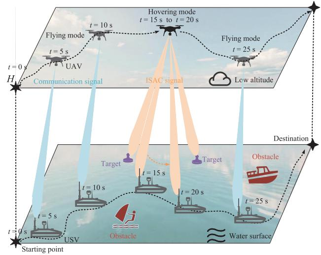  
Fig. 1. ISAC-empowered Air-Sea cooperative system.

Elman wavelet neural network to plan the trajectories of one UAV and two USVs, enabling cooperative navigation in a predefined triangular formation [22]. While fixed formations improve system stability and safety, they inevitably limit the maneuverability and flexibility of the UAV [23]. With a deeper understanding of the heterogeneous mobility characteristics of UAV–USV systems, recent studies have shifted toward more adaptive leader–follower trajectory planning frameworks [24]. Li et al. proposed a USV-led strategy where the UAV dynamically tracks the USV, with the UAV control input designed via model predictive control to enable real-time following [25]. However, in such hierarchical schemes, the leader’s trajectory is typically determined with limited awareness of the follower’s state and capability. Consequently, the overall system performance is often constrained by the leader’s path, hindering truly bidirectional cooperative optimization.

In summary, despite notable progress in cooperative trajectory planning for air–sea uncrewed systems, several limitations remain. Most existing studies assume ideal communication conditions, while formation-based methods with strict geometric constraints and leader-dominated schemes lack global cooperative optimization. Moreover, these approaches often require high-mobility platforms to accommodate lowerperformance ones, thereby limiting overall mission efficiency.

## C. Contributions

In this paper, we establish an ISAC-empowered air-sea collaborative framework as shown in Fig. 1, where the trajectories and beamforming for the UAV and USV are jointly designed to minimize the system’s energy consumption.<sup>1</sup> Inspired by [16], we adopt a multi-stage hovering and flying mode to circumvent the impact of Doppler shift on the sensing task. Thus, the original intractable optimization problem can be transformed into the following two sub-problems.

(1) Hover point selection: Given the random distribution of targets, how can we determine the number, the positions of the hover points, and the UAV hover time at each point to minimize the normalized total energy consumption?

(2) Joint trajectory planning and beamforming: Given the hover points, how can we jointly design UAV–USV trajectories and beamforming by considering water currents and obstacles to satisfy S&C requirements?

In summary, our main contributions are as follows:

First, we establish an air-sea collaborative framework with multiple flying and hovering stages, where the weighted sum energy consumption of the UAV and USV is minimized under the constraints of motion and S&C performance requirements. Then, the original intractable problem is divided into two subproblems: the hover points selection problem and the joint trajectory planning and beamforming design within a single hover-and-fly period.

Second, the hover point selection is defined by a novel bi-traveling salesman problem with neighborhoods (Bi-TSPN). To tackle it, we propose a three-step hierarchical method including 1) a virtual base station coverage (VBSC) and clustering algorithm for target schedule and rough positions selection; 2) a hybrid-cost-based algorithm for optimal visiting order of the hover points; and 3) an average energy consumption minimization algorithm for hover point refinement and time allocation.

• Third, we formulate the joint trajectory planning and beamforming for both hovering and flying modes by considering the obstacles and water currents. The alternating optimization algorithm is leveraged to solve the problem.

• Finally, we demonstrate the inherent trade-off among the S&C performance and the energy consumption of the ISAC-based air-sea collaborative system and show the superiority of the proposed method on energy consumption compared to the state-of-the-art strategies.

Notations: The uppercase bold letter A, the lowercase bold letter a, the normal letter $^ { a , }$ and the fraktur letter A denote a matrix, a vector, a scalar, and a set, respectively. k·k denote the Euclidean norm. $\mathbf { A } \succeq 0$ means that A is positive semi-definite. rank(A) and $\operatorname { t r } ( \mathbf { A } )$ denote the rank and trace of matrix A, respectively. <sup>C</sup> denotes the complex space. $\mathbf { a } ^ { H }$ denotes the Hermitian (conjugate transpose) of the vector a. $\mathbf { I } _ { M } \in \mathbb { R } ^ { M \times M }$ is an unit matrix. <sup>E</sup>(·) for the stochastic expectation. The subscripts h, f, s, and c denote the variables associated with the hovering mode, flying mode, sensing, and communication, respectively. The subscripts i, j, and k are used to denote indexing variables.

## II. SYSTEM MODEL

In this paper, we consider a quadrotor UAV equipped with M antennas to sense $K _ { \mathrm { t a r } }$ randomly distributed targets, followed by a slow-speed USV with a single antenna that supports data offload, edge computing, etc. In addition, $K _ { \mathrm { o b s } }$ obstacles are considered on the water surface. By applying the hover-and-fly mode, the overall route from start to endpoint is divided into multiple stages by setting several hover points. The UAV maintain a stable communication link with the USV throughout the entire stage but implement the sensing tasks only at the hover points. The UAV and USV are constrained to reach the destination at the same time for the consideration of charging. Before problem formulation, we elaborate on the signal model for S&C and energy consumption models.

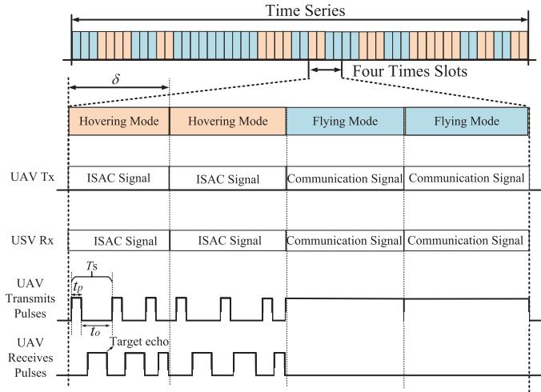  
Fig. 2. ISAC time slot structure.

## A. Signal Frame Structure

The frame structure is illustrated in Fig. 2. The total runtime T is divided into N equal time slots with each of duration δ. We denote the index set $\mathcal { N } = \{ 1 , 2 , . . . , N \}$ , the flying mode index set ${ \mathcal F } ,$ and the hovering mode index set H that satisfies $\mathcal { F } \cap \mathcal { H } = \emptyset , \mathcal { F } \cup \mathcal { H } = \mathcal { N } .$ . For sensing task, each time slot is further divided by $N _ { s }$ scanning rounds with each duration of $\begin{array} { r } { T _ { s } = \frac { \delta } { N _ { \mathrm { s } } } = t _ { p } + t _ { o } . } \end{array}$ Specifically, in each round, the UAV first transmits a scanning pulse of duration $t _ { p } ,$ then immediately switches to a listening mode to receive the echo corresponding to that pulse, with a listening time of $t _ { o } .$ For communication task, the UAV transmits $N _ { c }$ symbols per time slot.

We denote $\mathbf { p } _ { k } = ( p _ { x _ { k } } , p _ { y _ { k } } , 0 ) ^ { T }$ and $\tilde { \mathbf { p } } _ { k ^ { \prime } } = ( \tilde { p } _ { x _ { k ^ { \prime } } } , \tilde { p } _ { y _ { k ^ { \prime } } } , 0 ) ^ { T }$ as the positions of the k-th target and the k<sup>0</sup>-th obstacle, respectively. Additionally, $\mathbf { q } [ n ] \ = \ ( q _ { x } [ n ] , q _ { y } [ n ] , h _ { \mathrm { u a v } } ) ^ { T }$ and ${ \bf b } [ \bar { n } ] = ( b _ { x } [ n ] , b _ { y } [ n ] , 0 ) ^ { T }$ represent the trajectory points of the UAV and USV at the n-th time slot.<sup>2</sup> Moreover, we define the flag $r _ { k } [ n ] \in \{ 0 , 1 \}$ to indicate whether the k-th target is sensed at time slot $n , { \mathrm { i . e . , ~ } } r _ { k } [ n ] = 1$ only if the target is sensed.

## B. Channel Model

1) Communication Channel: The communication channel model from UAV to USV can be expressed by

$$
\mathbf h _ { c } [ n ] = \frac { \imath \sqrt { \rho _ { 0 } } } { d _ { c } [ n ] } \mathbf a ( \mathbf q [ n ] , \mathbf b [ n ] ) ,\tag{1}
$$

where $\frac { \sqrt { \rho _ { 0 } } } { d _ { c } [ n ] }$ represents the large-scale path-loss in the amplitude domain, with $\rho _ { 0 }$ denoting the channel power gain at a reference distance. $d _ { c } [ n ] = \| \mathbf { q } [ n ] - \mathbf { b } [ n ] \|$ is the Euclidean

distance between the UAV and the USV. ι denotes the smallscale fading coefficient, which can be expressed as

$$
\iota = \sqrt { \frac { K _ { w } } { K _ { w } + 1 } } + \sqrt { \frac { 1 } { K _ { w } + 1 } } g _ { w } ,\tag{2}
$$

where $K _ { w }$ denotes the Rician factor representing the power ratio between the LoS component and the scattered component, and $g _ { w } \sim \mathcal { C N } ( 0 , 1 )$ denotes the small-scale complex Gaussian fading term [26]. The array response vector of uniform linear array (ULA) can be given by

$$
\mathbf { a } ( \mathbf { q } [ n ] , \mathbf { b } [ n ] ) = \left[ 1 , e ^ { j 2 \pi d \frac { \cos ( \varphi [ n ] ) } { \lambda } } , \dots , e ^ { j 2 \pi ( M - 1 ) d \frac { \cos ( \varphi [ n ] ) } { \lambda } } \right] ^ { T } ,
$$

where d and λ are the antenna space and wave length, respectively, and $\begin{array} { r } { \varphi [ n ] = \operatorname { a r c c o s } \frac { H } { \| \mathbf { q } \| n \| - \mathbf { b } \left[ n \right] \| } } \end{array}$

2) Sensing Channel: The round-trip sensing channel between the UAV and the k-th target can be expressed as [16]

$$
{ \bf H } _ { k } [ n ] = \frac { \rho _ { 0 } } { 2 d _ { s , k } [ n ] } \sqrt { \frac { \eta } { 4 \pi d _ { s , k } ^ { 2 } [ n ] } } { \bf a } ( { \bf q } [ n ] , { \bf p } _ { k } ) { \bf a } ^ { H } ( { \bf q } [ n ] , { \bf p } _ { k } ) ,\tag{3}
$$

where $d _ { s , k } [ n ] = \| \mathbf { q } [ n ] - \mathbf { p } _ { k } \|$ represents the distance between the UAV and the k-th target. In addition, η denotes the mean radar cross section.

## C. Signal Model

1) Flying Mode: In this mode, the UAV flies from one hover point to the next, while communicating with the USV by transmitting the communication-only signals. The transmit signal model can be written as

$$
{ \bf X } _ { f } [ n ] = { \bf w } _ { f } [ n ] { \bf c } _ { f } ^ { H } [ n ] , n \in \mathcal { F } ,\tag{4}
$$

where $\mathbf { w } _ { f } [ n ] \in \mathbb { C } ^ { M \times 1 }$ is the beamforming vector. $\mathbf { c } _ { f } [ n ] \in$ $\mathbb { C } ^ { N _ { c } \times 1 }$ denotes the downlink communication signal transmitted from the UAV to the USV at time slot n. Thus, the received signal $\mathbf { y } _ { \mathrm { c } } [ n ] \in \mathbb { C } ^ { N _ { c } \times 1 }$ at the USV can be given by

$$
\begin{array} { r } { { \bf y } _ { c } ^ { H } [ n ] = { \bf h } _ { c } ^ { H } [ n ] { \bf X } _ { f } [ n ] + { \bf z } _ { f } ^ { H } [ n ] , } \end{array}\tag{5}
$$

where ${ \bf z } _ { f } [ n ] ~ \sim ~ \mathcal { C N } ( { \bf 0 } , \sigma _ { c } ^ { 2 } { \bf I } _ { N _ { c } } )$ represents additive White Gaussian noise. Here, ${ \bf h } _ { c } [ n ]$ represents the channel model from the UAV to the USV at the n-th time slot. The SNR of the communication received signal can be computed as

$$
\gamma _ { f } [ n ] = \frac { | \mathbf { h } _ { c } ^ { H } [ n ] \mathbf { w } _ { f } [ n ] | ^ { 2 } } { \sigma _ { c } ^ { 2 } } .\tag{6}
$$

Therefore, the data transmission rate can be given by

$$
R _ { f } [ n ] = \log _ { 2 } \left( 1 + \gamma _ { f } [ n ] \right) .\tag{7}
$$

2) Hovering Mode: In this mode, the UAV employs an ISAC signal to maintain communication with the USV while sensing the targets simultaneously [27]. The ISAC signal transmission model is written as

$$
{ \bf X } _ { h } [ n ] = \sum _ { k = 1 } ^ { K _ { \mathrm { t a r } } } r _ { k } [ n ] { \bf v } _ { k } [ n ] { \bf s } _ { k } ^ { H } [ n ] + { \bf w } _ { h } [ n ] { \bf c } _ { h } ^ { H } [ n ] , n \in \mathcal { H } ,\tag{8}
$$

where $\mathbf { w } _ { h } [ n ] , \mathbf { v } _ { k } [ n ] \ \ \in \ \mathbb { C } ^ { M \times 1 }$ denote the communication beamforming vector for the USV and the sensing beamforming vector for the k-th target, respectively. $\mathbf { c } _ { h } [ n ] , \mathbf { s } _ { k } [ n ] \in \mathbb { C } ^ { N _ { s } \times 1 }$ denote the corresponding communication and sensing signals, respectively, which are assumed to be zero-mean, temporally white, and wide-sense stationary, satisfying

$$
\mathbb { E } \big ( \mathbf { s } _ { k } [ n ] \mathbf { c } _ { h } ^ { H } [ n ] \big ) = \mathbf { 0 } _ { N _ { s } } .\tag{9}
$$

a) Received communication signal model: The signal received by the USV at the n-th time slot in hovering mode can be expressed by

$$
\begin{array} { r l } & { \widetilde { \mathbf { y } } _ { \mathrm { u s v } } ^ { H } [ n ] = \underbrace { \mathbf { h } _ { c } ^ { H } [ n ] \mathbf { w } _ { h } [ n ] \mathbf { c } _ { h } ^ { H } [ n ] } _ { \mathrm { I n t e n d e d ~ s i g n a l } } } \\ & { ~ + \underbrace { \sum _ { k = 1 } ^ { K _ { \mathrm { u c } } } r _ { k } [ n ] \mathbf { h } _ { c } ^ { H } [ n ] \mathbf { v } _ { k } [ n ] \mathbf { s } _ { k } ^ { H } [ n ] } _ { \mathrm { S e n s i n g ~ i n t e r f e r e n c e } } + \mathbf { z } _ { h } ^ { H } [ n ] , } \end{array}\tag{10}
$$

where ${ \mathbf z } _ { h } [ n ]$ is the noise following $\mathscr { C N } ( \mathbf { 0 } , \sigma _ { h } ^ { 2 } \mathbf { I } _ { N _ { s } } )$ . The corresponding received signal-to-interference-plus-noise ratio $( \mathrm { S I N R } ) \ \gamma _ { h } [ n ]$ can be computed as

$$
\gamma _ { h } [ n ] = \frac { | \mathbf { h } _ { c } ^ { H } [ n ] \mathbf { w } _ { h } [ n ] | ^ { 2 } } { \sum _ { k = 1 } ^ { K _ { \mathrm { t a r } } } r _ { k } [ n ] | \mathbf { h } _ { c } ^ { H } [ n ] \mathbf { v } _ { k } [ n ] | ^ { 2 } + \sigma _ { h } ^ { 2 } } .\tag{11}
$$

Consequently, the communication rate is given by

$$
R _ { h } [ n ] = \log _ { 2 } \left( 1 + \gamma _ { h } [ n ] \right) .\tag{12}
$$

b) Received sensing signal model: The echo signal of the k-th target collected by the UAV can be expressed as

$$
\begin{array} { r } { { \mathbf { y } } _ { k } ^ { H } [ n ] = { \mathbf { u } } _ { k } ^ { H } [ n ] \big ( \underbrace { { \mathbf { H } } _ { k } [ n ] { \mathbf { v } } _ { k } [ n ] { \mathbf { s } } _ { k } ^ { H } [ n ] } _ { \mathrm { I n t e n d e d ~ s i g n a l } } + \underbrace { { \mathbf { H } } _ { k } [ n ] { \mathbf { w } } _ { h } [ n ] { \mathbf { c } } _ { h } ^ { H } [ n ] } _ { \mathrm { C o m m u n i c a t i o n ~ i n t e r f e r e n c e } } } \\ { + \underbrace { \sum _ { j = 1 , j \neq k } ^ { K _ { \mathrm { t a r } } } { r _ { j } [ n ] { \mathbf { H } } _ { k } [ n ] { \mathbf { v } } _ { j } [ n ] { \mathbf { s } } _ { j } ^ { H } [ n ] } } _ { \mathrm { S e n s i n g ~ i n t e r f e r e n c e } } + { \mathbf { Z } } _ { k } [ n ] \big ) , \qquad ( 1 3 ) } \end{array}\tag{}
$$

where $\mathbf { Z } _ { k } [ n ] ~ \in ~ \mathbb { C } ^ { M \times N _ { s } }$ denotes the additive noise matrix with each entry following distribution $\mathcal { C N } ( 0 , \sigma _ { s } ^ { 2 } )$ , and ${ \mathbf { u } } _ { k } [ n ]$ denotes the receive combining vector for the k-th target. Thus, the sensing SINR at time slot n for the k-th target can be expressed by

$$
\gamma _ { k } [ n ] = \frac { | \mathbf { u } _ { k } ^ { H } [ n ] \mathbf { H } _ { k } [ n ] \mathbf { v } _ { k } [ n ] | ^ { 2 } } { \sum _ { j \neq k } \tilde { \zeta } _ { j } [ n ] + \tilde { \zeta } _ { c } [ n ] + \sigma _ { s } ^ { 2 } | \mathbf { u } _ { k } [ n ] | ^ { 2 } } ,\tag{14}
$$

where $\boldsymbol { \tilde { \zeta } _ { j } } [ n ] = \boldsymbol { r _ { j } } [ n ] | \mathbf { u } _ { k } ^ { H } [ n ] \mathbf { H } _ { k } [ n ] \mathbf { v } _ { j } [ n ] | ^ { 2 }$ represents the interference caused by the j-th sensing target, and $\tilde { \zeta _ { c } } [ n ] ~ =$ $| \mathbf { u } _ { k } ^ { H } [ n ] \mathbf { H } _ { k } [ n ] \mathbf { w } _ { h } [ \bar { n ] } | ^ { 2 }$ represents the interference caused by the communication signal.

## D. Energy Consumption Model

1) UAV Energy Consumption Model: The UAV’s power consumption is highly dependent on its velocity, which is defined as ${ \bf v } _ { \mathrm { u a v } } [ n ] = ( { \bf q } [ n ] - { \bf q } [ n - 1 ] ) / \delta$ . The corresponding power consumption is given by [28]

$$
p _ { \mathrm { u a v } } [ n ] = \underbrace { U _ { \mathrm { u a v } } ^ { 0 } \left( 1 + \frac { 3 v _ { \mathrm { u a v } } ^ { 2 } [ n ] } { U _ { \mathrm { t i p } } ^ { \phantom { 2 } } } \right) } _ { \mathrm { b l a d e ~ p r o f l e } } + \underbrace { \frac { 1 } { 2 } d _ { 0 } \rho \varphi A v _ { \mathrm { u a v } } ^ { 3 } [ n ] } _ { \mathrm { p a r a s i t e } }
$$

$$
+ \underbrace { U _ { \mathrm { u a v } } ^ { 1 } \left( \sqrt { \left( 1 + \frac { v _ { \mathrm { u a v } } ^ { 4 } \left[ n \right] } { 4 v _ { 0 } ^ { 4 } } \right) } - \frac { v _ { \mathrm { u a v } } ^ { 2 } \left[ n \right] } { 2 v _ { 0 } ^ { 2 } } \right) ^ { 1 / 2 } } _ { \mathrm { i n d u c e d } } , n \in \mathcal { F } ,\tag{15}
$$

where $U _ { \mathrm { u a v } } ^ { 0 }$ and $U _ { \mathrm { u a v } } ^ { 1 }$ are the profile power and induced power, respectively. Here, $U _ { \mathrm { t i p } }$ is the tip speed of the rotor blade, $v _ { 0 }$ is the mean induced speed of the rotor during forward flight, $d _ { 0 }$ is the fuselage drag coefficient, $\rho$ is the air density, $\varphi$ is the rotor solidity, and A is the rotor disc area.

Therefore, under our proposed framework, the total energy consumption of the UAV can be expressed as

$$
E _ { \mathrm { u a v } } = \sum _ { n = 1 } ^ { N } p _ { \mathrm { u a v } } [ n ] \delta + E _ { \mathrm { t r } } ,\tag{16}
$$

where $\begin{array} { r } { E _ { \mathrm { t r } } ~ = ~ \frac { 1 } { 2 } m _ { \mathrm { u a v } } \sum _ { n = 1 } ^ { N - 1 } \left| v _ { \mathrm { u a v } } ^ { 2 } [ n + 1 ] - v _ { \mathrm { u a v } } ^ { 2 } [ n ] \right| \delta } \end{array}$ denotes the inertial penalty incurred by the UAV due to acceleration and deceleration,<sup>3</sup> and $m _ { \mathrm { u a v } }$ is the UAV mass. It is worth noting that, in practical systems, the UAV propulsion power $p _ { \mathrm { u a v } } [ n ]$ dominates the overall UAV energy consumption, whereas the S&C powers are significantly smaller than $p _ { \mathrm { u a v } } [ n ] . ^ { 4 }$ Therefore, for simplicity, the S&C power terms are omitted in (16) and will be explicitly considered in the subsequent S&C beamforming design.

Remark 1: The relationship between power consumption and the UAV speed (acceleration) is illustrated in Fig. 3. It is worth noting that the hover-and-fly strategy is not energyoptimal, as hovering and frequent speed variations generally result in higher energy consumption. Nevertheless, as previously discussed, the primary motivation for adopting the hover-and-fly strategy is to mitigate the sensing performance degradation caused by the $\mathrm { U A V } ^ { \ , } \mathbf { s }$ motion.

2) USV Energy Consumption Model: Let ${ \bf v } _ { \mathrm { u s v } } [ n ] = ( { \bf b } [ n ] -$ ${ \bf b } [ n - 1 ] ) / \delta$ denote the velocity of the USV relative to a fixed reference frame. The water current velocity at position ${ \mathbf b } [ n ]$ is denoted by $\mathbf { v } _ { w } ( \mathbf { b } [ n ] ) \ = \ ( v _ { x , \mathbf { b } [ n ] } , v _ { y , \mathbf { b } [ n ] } , 0 ) ^ { T } . ^ { 5 }$ Then, the relative velocity of the USV with respect to the surrounding water can be expressed as ${ \bf v } _ { r } [ n ] ~ = ~ { \bf v } _ { \mathrm { u s v } } [ n ] - { \bf v } _ { w } ( { \bf b } [ n ] )$ According to the quadratic hydrodynamic drag model, the hydrodynamic drag force is denoted by $F _ { D } [ n ]$ , and $d _ { D } [ n ]$ represents the travel distance during the n-th time slot. Then, the propulsion energy consumption of the USV over a time interval δ can be expressed as

$$
p _ { \mathrm { u s v } } [ n ] = F _ { D } [ n ] \cdot d _ { D } [ n ] = \frac { 1 } { 2 } \rho _ { s } C _ { s } A _ { s } \| \mathbf { v } _ { r } [ n ] \| ^ { 2 } \cdot \| \mathbf { v } _ { r } [ n ] \| \delta ,\tag{17}
$$

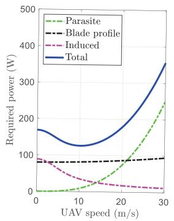  
(a) Propulsion power

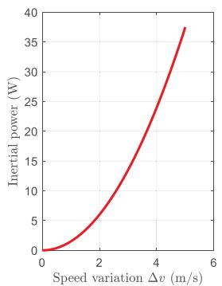  
(b) Inertial power  
Fig. 3. Propulsion and inertial power of the UAV.

where $\rho _ { s }$ denotes the water density, $C _ { s }$ is the drag coefficient, and $A _ { s }$ is the reference area of the USV. Finally, the total energy consumption of the USV can be expressed as [30]

$$
E _ { \mathrm { u s v } } = \sum _ { n = 1 } ^ { N } \frac { 1 } { 2 } \rho _ { s } C _ { s } A _ { s } \| \mathbf { v } _ { \mathrm { u s v } } [ n ] - \mathbf { v } _ { w } ( \mathbf { b } [ n ] ) \| ^ { 3 } \delta .\tag{18}
$$

## E. Problem Formulation

The purpose of the ISAC-empowered air-sea collaborative system design is to minimize the total energy consumption while adhering to the S&C and motion constraints by jointly optimizing the trajectories $( \mathbf { q } [ n ] , \mathbf { b } [ n ] )$ and the S&C beamformers $( \mathbf { w } _ { f } [ n ] , \mathbf { w } _ { h } [ n ] , \mathbf { v } _ { k } [ n ] )$ . However, unlike the existing works in [9], [10], [12], [14], and [16] where the total runtime or hover-time is assumed to be fixed, the heterogeneity of UAV and USV leads to the time becoming an intermediate variable to be optimized. The reasons can be summarized in two aspects: 1) the velocities of the UAV and USV must be strictly controlled to ensure the stability of the communication link; and 2) the SNR of the received sensing signal should be accumulated to exceed a threshold to ensure sensing quality. Therefore, the to-be-optimized variables in our work is defined as $\begin{array} { r } { \Theta = \{ N , \mathcal { H } , \mathbf { q } [ n ] , \mathbf { b } [ n ] , \mathbf { w } _ { f } [ n ] , \mathbf { w } _ { h } [ n ] , \mathbf { v } _ { k } [ n ] , r _ { k } [ n ] \} } \end{array}$ . Then, the optimization problem can be formulated by

$$
\begin{array} { r l } & { ( \mathrm { P 1 } ) : \underset { \Theta } { \mathrm { m i n } } \quad \beta \frac { E _ { \mathrm { { u a v } } } } { E _ { \mathrm { { u a v } } } ^ { \mathrm { m a x } } } + ( 1 - \beta ) \frac { E _ { \mathrm { { u s v } } } } { E _ { \mathrm { { u s v } } } ^ { \mathrm { m a x } } } } \\ & { \mathrm { s . t . } \quad \Theta \in \mathcal { C } _ { \mathrm { S C } } \cap \mathcal { C } _ { \mathrm { M } } \cap \mathcal { C } _ { \mathrm { S Y S } } , } \end{array}
$$

where $E _ { \mathrm { u a v } } ^ { \mathrm { m a x } }$ and $E _ { \mathrm { u s v } } ^ { \mathrm { m a x } }$ denote the battery capacities of the UAV and the USV, respectively, and $\beta \in [ 0 , 1 ]$ is a weighting factor that balances the energy consumption of the two platforms according to mission priorities. The feasible set of problem (P1) consists of there groups of constraints: the S&C constraint set $\mathcal { C } _ { \mathrm { S C } }$ , the motion constraint set $\mathcal { C } _ { \bf M } .$ , and the system configuration constraint set $\mathcal { C } _ { \mathrm { { S Y S } } }$ , which are defined as follows.

1) S&C Constraints: The S&C constraint set is defined as

$$
\begin{array} { r l } & { \mathcal { C } _ { \mathrm { s c } } \triangleq \Big \{ \Theta \Big | R _ { f } [ n ] \geq \Gamma _ { c } , n \in \mathcal { F } ; R _ { h } [ n ] \geq \Gamma _ { c } , n \in \mathcal { H } ; } \\ & { \qquad \displaystyle \sum _ { n = 1 } ^ { N } \gamma _ { k } [ n ] \geq \Gamma _ { s } ^ { \mathrm { t o t a l } } , k = 1 , . . . , K _ { \mathrm { t a r } } ; } \\ & { \qquad r _ { k } [ n ] \in \{ 0 , 1 \} , n \in \mathcal { H } \Big \} . } \end{array}
$$

In $\mathcal { C } _ { \mathrm { S C } }$ , the first two constraints ensure that the minimum communication rates exceed the threshold Γ<sub>c</sub> during the flying and hovering modes. The third constraint ensures that each target achieves a required accumulated sensing SNR.

2) Motion Constraints: The motion constraint set specifies the feasible kinematic behavior of the uncrewed platforms. It includes collision-avoidance constraints and velocity limits, which is defined as

$$
\begin{array} { r l } & { \mathcal { C } _ { \mathrm { M } } \triangleq \Big \{ \Theta \Big | \ \| \mathbf { b } [ n ] - \tilde { \mathbf { p } } _ { k ^ { \prime } } \| \geq d _ { \operatorname* { m i n } } , \ n \in \mathcal { N } , \ k ^ { \prime } = 1 , . . . , K _ { \mathrm { o b s } } ; } \\ & { \qquad v _ { \mathrm { u a v } } [ n ] \leq v _ { \mathrm { u a v } } ^ { \operatorname* { m a x } } , \ v _ { \mathrm { u s v } } [ n ] \leq v _ { \mathrm { u s v } } ^ { \operatorname* { m a x } } , \ n \in \mathcal { N } \Big \} , } \end{array}
$$

where $d _ { \mathrm { m i n } }$ denotes the safety distance between the USV and sea-surface obstacles, while $v _ { \mathrm { u a v } } ^ { \mathrm { m a x } }$ and $v _ { \mathrm { u s v } } ^ { \mathrm { m a x } }$ represent the maximum velocities of the UAV and the USV, respectively.

3) System Configuration Constraint Set: This set includes the trajectory boundary conditions, the energy budget constraints, and the transmit power limits, which are determined by the inherent environment. The definition is given by

$$
\begin{array} { r l } & { \mathcal { C } _ { \mathrm { S Y S } } \triangleq \Big \{ \Theta \ \Big \vert \ \mathbf { q } [ 1 ] = \mathbf { q } _ { \mathrm { s t a r t } } , \quad \mathbf { q } [ N ] = \mathbf { q } _ { \mathrm { e n d } } ; } \\ & { \qquad \mathbf { b } [ 1 ] = \mathbf { b } _ { \mathrm { s t a r t } } , \quad \mathbf { b } [ N ] = \mathbf { b } _ { \mathrm { e n d } } ; } \\ & { \qquad E _ { \mathrm { u a v } } \leq E _ { \mathrm { u a v } } ^ { \mathrm { m a x } } , \quad E _ { \mathrm { u s v } } \leq E _ { \mathrm { u s v } } ^ { \mathrm { m a x } } ; } \\ & { \qquad \displaystyle \sum _ { k = 1 } ^ { K _ { \mathrm { u r } } } r _ { k } [ n ] \| \mathbf { v } _ { k } [ n ] \| ^ { 2 } + \| \mathbf { w } _ { h } [ n ] \| ^ { 2 } \leq p _ { \mathrm { m a x } } , \ n \in \mathcal { H } ; } \\ & { \qquad 0 \leq \| \mathbf { w } _ { f } [ n ] \| ^ { 2 } \leq p _ { \mathrm { m a x } } , \ n \in \mathcal { F } \Big \} . } \end{array}
$$

In $\mathcal { C } _ { \mathrm { S Y S } } , \ \mathbf { q } _ { \mathrm { s t a r t } } \ ( \mathbf { b } _ { \mathrm { s t a r t } } )$ and ${ \bf q } _ { \mathrm { e n d } } \ ( { \bf b } _ { \mathrm { e n d } } )$ denote the starting and destination points of the UAV (USV), respectively. Moreover, $p _ { \mathrm { m a x } }$ represents the maximum power of the transmitter equipped by the UAV.

It should be highlighted that solving the original problem (P1) directly is quite challenging, as all variables are strongly coupled by introducing the time variable N and the hover time set H. This motivates us to develop an efficient approximation method to obtain a suboptimal solution with tolerable performance loss. In this hover-and-fly mode, when the hover points and dwell times are determined, the trajectory and beamformer can be designed individually in each stage between two adjacent hover points, which simplifies the original problem. Consequently, we transform problem (P1) into the following two subproblems:

(1) Hover point selection: With the goal of minimizing energy consumption and considering S&C performance, we determine the number and locations of hover points, the duration of each flying and hovering mode.

(2) Joint trajectory planning and beamforming: With the goal of minimizing normalized energy consumption and considering water currents and obstacles in each stage, we jointly optimize the trajectory and beamforming to meet the S&C requirements.

To clearly illustrate the analytical process and research methods adopted in this study, an overall flowchart is provided in Fig. 4 to show the methods and optimization variables solved in each section.

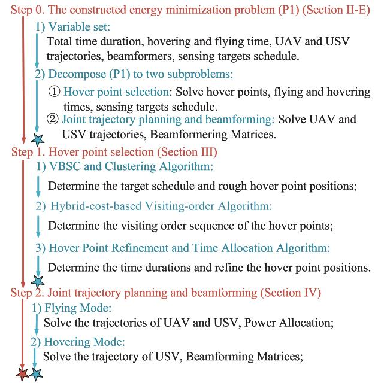

Fig. 4. Flow of the problem solution.  
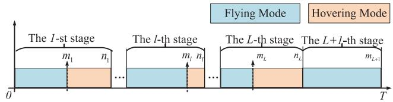  
Fig. 5. The relationship between the variables defined in this section and their variation over time.

## III. HOVER POINTS SELECTION

## A. Problem Analysis

As shown in Fig. 5, the entire time horizon is divided into $L { + 1 }$ stages, among which L stages correspond to the hovering points. For ease of exposition, let $m _ { l } , n _ { l } ~ \in ~ \mathcal { H }$ denote the starting and ending time slots of the hovering mode in the l-th stage, respectively. The objective of this section is to determine the number of stages $L ,$ , the time indices m<sub>l</sub> and $^ { n _ { l } , }$ the UAV hovering locations $\mathbf { q } [ m _ { l } ]$ , and the starting and ending positions of the USV during the hovering mode, denoted by $\mathbf { b } [ m _ { l } ]$ and $\mathbf { b } [ n _ { l } ]$ , respectively, for $l = 1 , \ldots , L .$

Apparently, the selection of the hover point also depends on the other variables in Θ. To proceed, we temporarily decouple these variables by making the following assumptions to obtain a coarse solution, which will be refined in the next section. To this end, we make the following three assumptions.

(A.I) The beamforming design is temporarily ignored, and we choose the maximum ratio transmission (MRT) scheme for the S&C beamformer as $\mathbf { a } / \lVert \mathbf { a } \rVert$ , where a represents the corresponding steering vectors.

(A.II) We temporarily assume constant transmit powers $p _ { s }$ and $p _ { c }$ for S&C while evenly allocating the sensing power for each target. Accordingly, the sensing power allocated to target k at hover point l is given by $\begin{array} { r } { p _ { s , k } = p _ { s } / { \sum _ { k = 1 } ^ { K _ { \mathrm { t a r } } } r _ { k } [ m _ { l } ] } } \end{array}$

(A.III) The S&C interference in (10) and (13) is temporarily neglected, and will be addressed in the next section through beamformer design.

According to the above assumptions, the optimization variables in the hover-point selection problem are denoted by $\Theta _ { 2 } ~ = ~ \{ L , m _ { l } , n _ { l } , \bar { r _ { k } } [ m _ { l } ] , { \bf q } [ m _ { l } ] , { \bf b } [ \bar { m _ { l } } ] , { \bf b } [ n _ { l } ] \}$ . Next, we present the constraints of the hover-point problem.

1) S&C Constraints: By submitting the MRT scheme into (6), the communication constraint at the hover point l can be transformed into an equivalent distance constraint between the UAV and USV, i.e.,

$$
\| \mathbf { q } [ m _ { l } ] - \mathbf { b } [ \mathcal { T } _ { l } ] \| \leq \sqrt { \frac { p _ { c } \rho _ { 0 } \iota ^ { 2 } M } { \sigma _ { c } ^ { 2 } \left( 2 ^ { \Gamma _ { c } } - 1 \right) } } \triangleq D _ { c } , \forall \mathcal { T } _ { l } = \{ m _ { l } , n _ { l } \} .\tag{19}
$$

It can be observed that the distance threshold $D _ { c }$ is proportional to the transmit power $p _ { c }$ and inversely proportional to the rate requirement $\Gamma _ { c } .$

For the sensing constraint, the cumulative SNR threshold $\Gamma _ { s } ^ { \mathrm { t o t a l } }$ depends on the dwell (hover) time. To proceed, we introduce an intermediate variable associated with the average SNR $( \hat { \Gamma } _ { s } ) _ { \cdot }$ . Let $\kappa _ { l }$ denote the set of targets sensed at the l-th hover point. The $\mathrm { U A V } \mathbf { \hat { s } }$ hover duration should exceed the maximum time required for any target in $\kappa _ { l }$ to accumulate the SNR to $\Gamma _ { s } ^ { \mathrm { t o t a l } }$ . This constraint can be expressed as

$$
n _ { l } - m _ { l } \le \operatorname* { m a x } _ { k \in \mathcal { K } _ { l } } r _ { k } [ m _ { l } ] \Gamma _ { s } ^ { \mathrm { t o t a l } } / \bar { \Gamma } _ { s }\tag{20}
$$

Furthermore, by substituting the MRT scheme and average SNR threshold into (14), the sensing constraint for the k-th target in the l-th hover point can be transformed as

$$
\frac { \eta \rho _ { 0 } ^ { 2 } p _ { s , k } M } { 1 6 \pi \sigma _ { s } ^ { 2 } \left\| \mathbf { q } [ m _ { l } ] - \mathbf { p } _ { k } \right\| ^ { 4 } } \geq \Gamma _ { s } .
$$

Similar to (19), the distance between the UAV and the k-th target is constrained by

$$
\| \mathbf { q } [ m _ { l } ] - \mathbf { p } _ { k } \| \leq \left( \frac { \eta \beta _ { 0 } ^ { 2 } p _ { s , k } M } { 1 6 \pi \Gamma _ { s } \sigma _ { s } ^ { 2 } } \right) ^ { \frac { 1 } { 4 } } \triangleq D _ { s , k } .\tag{21}
$$

The sensing distance threshold $D _ { s , k }$ is proportional to the transmit power allocated for the k-th target $p _ { s , k }$ and inversely proportional to the SNR requirement $\Gamma _ { s } .$

Thus, the S&C constraint set in this section can be expressed as follows

$$
\begin{array} { r } { \tilde { \mathcal { C } } _ { \mathrm { S C } } \triangleq \Big \{ \Theta _ { 2 } \ \Big | ( 1 9 ) ; ( 2 0 ) ; ( 2 1 ) \Big \} . } \end{array}
$$

2) Motion Constraints: In the hover point selection, besides the UAV’s hover position $\mathbf { q } [ m _ { l } ]$ , we need also to determine the USV’s positions b[m<sub>l</sub>] and $\mathbf { b } [ n _ { l } ]$ at the beginning and end of the hover stage for the cooperative purpose. For motion state, we restrict the average speeds of the hover-and-fly stages instead of that between each time slot. Specifically, as shown in Fig. 5, the fly stage and hover stage are separated by the time m<sub>l</sub> in the l-th stage. We denote $\overline { { f v } } _ { l }$ and $\overline { { h v } } _ { l }$ as the average speed of the fly and hover stage, respectively. For example, the hover speed of the UAV is $\overline { { h v } } _ { \mathrm { u a v } , l } ~ = ~ 0$ while the fly speed can be computed by $\overline { { f v } } _ { \mathrm { u a v } , l } \ = \ ( { \bf q } [ m _ { l } ] - { \bf q } [ n _ { l } - 1 ] ) / ( m _ { l } -$ $n _ { l - 1 } ) \delta$ . Similarly, the USV speeds during the hover-andfly modes, denoted by $\overline { { h v } } _ { \mathrm { u s v } , l }$ and ${ \overline { { f v } } } _ { \mathrm { u s v } , l } ,$ can be readily obtained. Thus, the mobility constraints can be formulated as

$$
\begin{array} { r l } & { \tilde { \mathcal { C } } _ { \mathrm { M } } \triangleq \Big \{ \Theta _ { 2 } \Big | \overline { { f v } } _ { \mathrm { u a v } , l } \leq v _ { \mathrm { u a v } } ^ { \mathrm { m a x } } ; } \\ & { \qquad \overline { { f v } } _ { \mathrm { u s v } , l } , \overline { { h v } } _ { \mathrm { u s v } , l } \leq v _ { \mathrm { u s v } } ^ { \mathrm { m a x } } , l = 1 , \ldots , L \Big \} . } \end{array}
$$

3) System Configuration Constraint Set: By substituting the average speed into (15) and (18), the optimization objective can be reformulated as $\chi _ { \Delta } ~ = ~ \beta E _ { \mathrm { u a v } } ( \overline { { h \upsilon } } _ { \mathrm { u a v } } , \overline { { f \upsilon } } _ { \mathrm { u a v } } ) / E _ { \mathrm { u a v } } ^ { \mathrm { m a x } } +$ $( 1 - \beta ) E _ { \mathrm { u s v } } ( \overline { { h v } } _ { \mathrm { u s v } } , \overline { { f v } } _ { \mathrm { u s v } } ) / E _ { \mathrm { u s v } } ^ { \mathrm { m a x } }$ , which is adopted hereafter for brevity. The default configuration constraints can be expressed as follows

$$
\begin{array} { r l } & { \tilde { \mathcal { C } } _ { \mathrm { S Y S } } \triangleq \Big \{ \Theta _ { 2 } \ \Big | \ \mathbf { q } [ 1 ] = \mathbf { q } _ { \mathrm { s t a r t } } , \quad \mathbf { q } [ m _ { L + 1 } ] = \mathbf { q } _ { \mathrm { e n d } } ; } \\ & { \qquad \mathbf { b } [ 1 ] = \mathbf { b } _ { \mathrm { s t a r t } } , \quad \mathbf { b } [ m _ { L + 1 } ] = \mathbf { b } _ { \mathrm { e n d } } ; } \\ & { \qquad E _ { \mathrm { u a v } } ( \overline { { h v } } _ { \mathrm { u a v } } , \overline { { f v } } _ { \mathrm { u a v } } ) \leq E _ { \mathrm { u a v } } ^ { \mathrm { m a x } } , } \\ & { \qquad E _ { \mathrm { u s v } } ( \overline { { h v } } _ { \mathrm { u s v } } , \overline { { f v } } _ { \mathrm { u s v } } ) \leq E _ { \mathrm { u s v } } ^ { \mathrm { m a x } } \Big \} . } \end{array}
$$

Thus, the hovering-point selection problem in this section can be summarized as

$$
\begin{array} { r l } & { ( \mathrm { P 2 } ) : \underset { \Theta _ { 2 } } { \operatorname* { m i n } } ~ \chi _ { \Delta } } \\ & { \mathrm { s . t . } \quad \Theta _ { 2 } \in \tilde { \mathcal { C } } _ { \mathrm { S C } } \cap \tilde { \mathcal { C } } _ { \mathrm { M } } \cap \tilde { \mathcal { C } } _ { \mathrm { S Y S } } . } \end{array}
$$

In the process of finding the optimal solution to (P2), in addition to determining the number and locations of hover points, it also implicitly involves the problem of optimal visiting order. Specifically, for given hover points, the visiting order among them may significantly affect the objective function (i.e., the energy cost), especially when considering the directionality of water currents. Since this problem is to some extent similar to the conventional TSP, we refer to it as the Bi-TSPN problem and clarify its core differences and challenges as follows.

(1) Unknown number and locations of hover points: In the classical TSP, the visiting nodes are fixed, while in the TSPN, the neighborhoods are predefined. In contrast, in the Bi-TSPN, both the number and the locations of hover points are decision variables that must be jointly optimized.

(2) Coupled sensing–communication neighborhoods: Traditional TSPN typically involves a single neighborhood constraint. In contrast, in the proposed Bi-TSPN, the feasible region is jointly determined by sensing neighborhoods (defined by $D _ { s , k } )$ and communication neighborhoods (defined by $D _ { c } )$ which introduces additional coupling between the agents.

(3) Energy-aware heterogeneous cost metric: The path cost in classical TSP/TSPN is typically distance-based. In contrast, the cost in Bi-TSPN is heterogeneous, as it depends on the energy consumption of both the UAV and the USV. For example, the UAV is primarily governed by flight dynamics, whereas the USV is additionally influenced by water currents, which further complicates both cost modeling and path optimization.

How to efficiently solve the Bi-TSPN remains an interesting open problem. The main challenges lie in the following aspects: 1) the binary mixed-integer variable $r _ { k } [ m _ { l } ]$ introduces significant combinatorial complexity; 2) $r _ { k } [ m _ { l } ]$ is coupled with the dwell time, and together they determine the sensing strategy; 3) the decision dimension and feasible region depend on the unknown number of hover points L.

Algorithm 1 VBSC and Clustering Algorithm   
1: Input: Target set $K = \{ \mathbf { p } _ { 1 } , . . . , \mathbf { p } _ { K _ { \mathrm { t a r } } } \}$ , sensing distance   
$D _ { s }$ , max targets per cluster $K _ { h }$   
2: Output: Final clusters $\{ S _ { i } \} _ { i = 1 } ^ { L }$ and centroids $\left\{ \mathbf { c } _ { i } \right\} _ { i = 1 } ^ { L } .$   
3: while $\tilde { L } \le K _ { \mathrm { t a r } }$ do   
4: Run $K _ { \mathrm { i n } }$ -means Algorithm to get $\{ S _ { i } \} _ { i = 1 } ^ { K _ { \mathrm { i n } } }$ and $\{ { \bf c } _ { i } \} _ { i = 1 } ^ { K _ { \mathrm { i n } } }$   
5: Inner Loop 1: For each cluster i   
6: If $| S _ { i } | > K _ { h }$ then: Redistribute the excess targets   
in $S _ { i }$ to other clusters and update centroids $\mathbf { c } _ { i } \ L _ { i = 1 } ^ { K _ { \mathrm { i n } } }$   
7: Inner Loop 2: For each target $\mathbf { p } _ { j } \in \mathcal { K }$   
8: Check dis $\mathbf { \Phi } ( \mathbf { p } _ { j } , \mathbf { l } _ { i } ) \leq D _ { s }$ for all $\mathbf { p } _ { j } \in S _ { i }$   
9: If yes: Stop;If not: $\tilde { L }  K _ { \mathrm { i n } } + 1$   
10: end while

## B. Three-Step Hierarchical Hover Point Selection Method

This observation motivates the development of a novel three-step hierarchical hovering-point selection method, whose procedure consists of the following three steps.

• Step 1: The target schedule in each stage e and rough hover point positions are determined by using a virtual base station coverage (VBSC) and clustering algorithm;

• Step 2: The visiting order sequence of the hover points is characterized by a Bi-TSPN and solved by the open-loop TSP algorithm approximately;

• Step 3: The durations of each stage and flying/hovering mode are optimized while refining the hover point positions by an SCA-based algorithm.

Moreover, considering the UAV’s hardware capability in practice, we make a further assumption about the sensing process.

(A.IV) The number of targets that the UAV detects simultaneously in hovering mode is no more than $K _ { h }$

1) VBSC and Clustering Algorithm: According to the maximum sensing targets assumption (A.IV), we can initially determine the number of hover points by $\begin{array} { r } { \tilde { L } = \left\lceil \frac { K _ { \mathrm { t a r } } } { K _ { h } } \right\rceil } \end{array}$ . Inspired by [31], we develop a VBSC and clustering algorithm with the given number ${ \tilde { L } } ,$ , whose pseudo-algorithm procedure is summarized in Algorithm 1. The core idea is to minimize the average distance between virtual base stations and their targets. Each virtual base station corresponds to one hover point, and under a coverage radius of $D _ { s }$ , each hover point can sense at most $K _ { h }$ targets. If the initial number $\tilde { L }$ does not meet the constraints, we will increase the number of hover points until the worse case $\tilde { L } = K _ { \mathrm { t a r } }$ considered in [16]. Namely, the UAV has to hover above each target.

2) Hybrid-Cost-Based Visiting Order Algorithm: Given the output of L clusters and centroids in Algorithm 1, the visiting order sequence, which significantly change the final trajectory, needs to be determined subsequently.

To characterize the heterogeneous cost of the UAV and the USV, we construct a hybrid cost indicator that takes into account both the UAV’s and USV’s energy consumption. Let us take the segment between the hovering points $\mathbf { c } _ { l - 1 }$ and $\mathbf { c } _ { l }$ as an example, where ${ \bf c } _ { l } = ( x _ { l } , y _ { l } , h _ { \mathrm { u a v } } )$ denotes the position coordinates. As shown in Fig. 6, the impact of the positiondependent water flow on the USV energy consumption should be taken into account. Specifically, we further divide the distance between two hover points into $N _ { d } = \lceil \rceil | \mathbf { c } _ { l } - \mathbf { c } _ { l - 1 } \rceil | / d _ { \mathrm { w a t } } \rceil$ segments according to the water-current resolution $d _ { \mathrm { w a t } }$ . Recall the definitions of the power consumption in (15) and (18), the cost is formulated by<sup>6</sup>

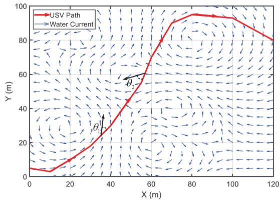  
Fig. 6. Variation of water flow direction along the path.

$$
\begin{array} { r } { E _ { l - 1 , l } ^ { \mathrm { { c o s t } } } = \beta \frac { \left\| \mathbf { c } _ { l } - \mathbf { c } _ { l - 1 } \right\| } { \overline { { f v } } _ { \mathrm { { u a v } } , l } } \frac { p _ { \mathrm { { u a v } } } \left( \overline { { f v } } _ { \mathrm { { u a v } } , l } \right) } { E _ { \mathrm { { u a v } } } ^ { \mathrm { { m a x } } } } + \left( 1 - \beta \right) } \\ { \times \displaystyle { \sum _ { k = 1 } ^ { N _ { d } } \frac { \left\| \mathbf { c } _ { l } - \mathbf { c } _ { l - 1 } \right\| } { N _ { d } \overline { { f v } } _ { \mathrm { { u s v } } , l } } \frac { p _ { \mathrm { { u s v } } } \left( \overline { { f v } } _ { \mathrm { { u s v } } , l } , \mathbf { v } _ { w } ( \mathbf { b } _ { k } ) \right) } { E _ { \mathrm { { u s v } } } ^ { \mathrm { { m a x } } } } } , } \end{array}\tag{22}
$$

where ${ \bf v } _ { w } ( { \bf b } _ { k } )$ denotes the water-current velocity at the USV position of the k-th segment along the path from the (l − 1)-th hovering point to the l-th hovering point. Once the cost between two arbitrary centroids is determined, we can apply the classic open-loop TSP algorithm to obtain the optimal sequence, as detailed in Appendix.

3) Hover Point Refinement and Time Allocation Algorithm: In this step, given the determined target schedule and visiting order, the original problem (P3) is reformulated to further optimize the hover-point positions and the corresponding time allocation. To avoid the complexity introduced by time discretization, we temporarily introduce continuous-time variables for flying and hovering, denoted by $\overline { { f t } } _ { l }$ and $\overline { { h t } } _ { l }$ for the l-th stage, respectively. The corresponding integer time indices, such as $m _ { l } ,$ can then be obtained through discretization and rounding. First, to handle the nonconvex induced power term in the UAV energy consumption function in (15) that depends on the variable ${ \overline { { f v } } } _ { \mathrm { u a v } , l } ,$ we introduce an auxiliary variable $\xi _ { l } \ge 0$ satisfying

$$
\xi _ { l } ^ { 2 } = \sqrt { 1 + \frac { \overline { { f v } } _ { \mathrm { u a v } , l } ^ { 4 } } { 4 v _ { 0 } ^ { 4 } } } - \frac { \overline { { f v } } _ { \mathrm { u a v } , l } ^ { 2 } } { 2 v _ { 0 } ^ { 2 } } .\tag{23}
$$

<sup>6</sup>It should be noted that the UAV energy consumption depends on its speed but is independent of its moving direction, since the UAV operates in free space. In contrast, the USV energy consumption is influenced by the angle between its velocity direction and the direction of the water flow.

Thus, the induced power term of (15) is recasted by $U _ { \mathrm { u a v } } ^ { 1 } \xi _ { l }$ Following the procedure in [16], (23) can be rewritten as

$$
\frac { 1 } { \xi _ { l } ^ { 2 } } = \xi _ { l } ^ { 2 } + \frac { \overline { { f v } } _ { \mathrm { u a v } , l } ^ { 2 } } { v _ { 0 } ^ { 2 } } .\tag{24}
$$

By using the first-order Taylor expansion, the right-hand side is replaced with its lower bound, as

$$
\begin{array} { r l r } {  { \frac { 1 } { \xi _ { l } ^ { 2 } } \leq ( \xi _ { l } ^ { ( \kappa ) } ) ^ { 2 } + 2 \xi _ { l } ^ { ( \kappa ) } ( \xi _ { l } - \xi _ { l } ^ { ( \kappa ) } ) + \frac { \overline { { f } } v _ { \mathrm { u a v } , l } ^ { 2 } } { v _ { 0 } ^ { 2 } } } } \\ & { } & { + \displaystyle \frac { 2 } { v _ { 0 } ^ { 2 } } ( \overline { { f v } } _ { \mathrm { u a v } , l } ^ { ( \kappa ) } ) ( \overline { { f v } } _ { \mathrm { u a v } , l } - \overline { { f v } } _ { \mathrm { u a v } , l } ^ { ( \kappa ) } ) \triangleq g ( \xi _ { l } , \overline { { f v } } _ { \mathrm { u a v } , l } ) , } \end{array}\tag{25}
$$

where the superscript (κ) represents the iteration indicator.

Second, by taking the UAV as an example, the positions of the hover points, the time and speed variables satisfies the equality $\| \bar { \mathbf { q } } [ m _ { l } ] - \mathbf { q } [ n _ { l - 1 } ] \| = \bar { f } v _ { \mathrm { u a v } , l } \overline { { f t } } _ { l }$ , which is a nonconvex constraint, as all the involved variables are subject to optimization. It is worth noting that the time variable $\overline { { f t } } _ { l }$ is also taken into account in this part for time allocation. Therefore, in order to handle this equality constraint, we leverage the Taylor expression at the points $\overline { { f v } } _ { \mathrm { u a v } , l } ^ { ( \kappa ) }$ and $\overline { { f t } } _ { l } ^ { ( \kappa ) }$ yielding

$$
\begin{array} { r } { \| \mathbf { q } [ m _ { l } ] - \mathbf { q } [ n _ { l - 1 } ] \| \le \overline { { f v } } _ { \mathrm { u a v } , l } ^ { ( \kappa ) } \overline { { f t } } _ { l } } \\ { + \overline { { f v } } _ { \mathrm { u a v } , l } \overline { { f t } } _ { l } ^ { ( \kappa ) } - \overline { { f v } } _ { \mathrm { u a v } , l } ^ { ( \kappa ) } \overline { { f t } } _ { l } ^ { ( \kappa ) } . } \end{array}\tag{26}
$$

Similarly, the kinematic relationship for the USV can be expressed by

$$
\begin{array} { r l } & { \| \mathbf { b } [ m _ { l } ] - \mathbf { b } [ n _ { l - 1 } ] \| } \\ & { \leq \overline { { f v } } _ { \mathrm { u s v } , l } ^ { ( \kappa ) } \overline { { f t } } _ { l } + \overline { { f v } } _ { \mathrm { u s v } , l } \overline { { f t } } _ { l } ^ { ( \kappa ) } - \overline { { f v } } _ { \mathrm { u s v } , l } ^ { ( \kappa ) } \overline { { f t } } _ { l } ^ { ( \kappa ) } , } \\ & { \| \mathbf { b } [ n _ { l } ] - \mathbf { b } [ m _ { l } ] \| \leq \overline { { h v } } _ { \mathrm { u s v } , l } ^ { ( \kappa ) } \overline { { h t } } _ { l } + \overline { { h v } } _ { \mathrm { u s v } , l } \overline { { h t } } _ { l } ^ { ( \kappa ) } - \overline { { h v } } _ { \mathrm { u s v } , l } ^ { ( \kappa ) } \overline { { h t } } _ { l } ^ { ( \kappa ) } . } \end{array}\tag{27}
$$

Third, for the other non-convex terms in the objective function, such as $\overline { { f t } } _ { l } \overline { { f v } } _ { \mathrm { u a v } , l } ^ { 2 }$ , we also conduct linearized operations at the points of κ-th iteration, for instance,

$$
\begin{array} { r l } & { \overline { { f v } } _ { \mathrm { u a v } , e } ^ { 2 } \overline { { f t } } _ { l } = ( \overline { { f v } } _ { \mathrm { u a v } , l } ^ { ( \kappa ) } ) ^ { 2 } \overline { { f t } } _ { l } ^ { ( \kappa ) } + ( \overline { { f v } } _ { \mathrm { u a v } , l } ^ { ( \kappa ) } ) ^ { 2 } ( \overline { { f t } } _ { l } - \overline { { f t } } _ { l } ^ { ( \kappa ) } ) } \\ & { \qquad + 2 \overline { { f t } } _ { l } ^ { ( \kappa ) } \overline { { f v } } _ { \mathrm { u a v } , l } ^ { ( \kappa ) } ( \overline { { f v } } _ { \mathrm { u a v } , l } - \overline { { f v } } _ { \mathrm { u a v } , l } ^ { ( \kappa ) } ) . \qquad } \end{array}\tag{28}
$$

The linearized objective function is denoted by $\chi _ { \Delta } ^ { \prime }$ In summary, by denoting the optimization variables as $\Theta _ { 3 } =$ $\{ \overline { { f t } } _ { l } , \overline { { h t } } _ { l } , \overline { { f v } } _ { \mathrm { u a v } , l } , \overline { { f v } } _ { \mathrm { u s v } , l } , \overline { { h v } } _ { \mathrm { u s v } , l } , \mathbf { \bar { q } } [ m _ { l } ] , \mathbf { b } [ m _ { l } ] , \mathbf { b } [ n _ { l } ] , \xi _ { l } \}$ the hover point refinement and time allocation problem can be formulated as

$$
\begin{array} { r l } & { ( \mathrm { P 3 } ) : \underset { \Theta _ { 3 } } { \operatorname* { m i n } } \chi _ { \Delta } ^ { \prime } } \\ & { \mathrm { s . t . } \quad \quad \left( 2 6 \right) , ( 2 7 ) , \xi _ { l } ^ { - 2 } \leq g ( \xi _ { l } , \overline { { f v } } _ { \mathrm { u a v } , l } ) , } \\ & { \quad \quad \quad \Theta _ { 3 } \in \tilde { \mathcal { C } } _ { \mathrm { S C } } \cap \tilde { \mathcal { C } } _ { \mathrm { M } } \cap \tilde { \mathcal { C } } _ { \mathrm { S Y S } } , } \end{array}
$$

where $l = 1 , \cdots , L$ . Problem (P3) can be solved using CVX with the Mosek solver.

## C. Computational Complexity Discussion

In this subsection, we analyze the computational complexity and scalability of the proposed three-step hierarchical hoverpoint selection framework. In Step 1, the clustering process partitions the $K _ { \mathrm { t a r } }$ sensing targets into L groups, where $L =$ $\lceil K _ { \mathrm { t a r } } / K _ { h } \rceil$ . The complexity of clustering is $\mathcal { O } ( K _ { \mathrm { t a r } } L I _ { c } )$ , with a worst-case complexity of $\mathcal { O } ( I _ { c } K _ { \mathrm { t a r } } ^ { 2 } )$ , where $I _ { c }$ denotes the number of iterations required for the clustering algorithm to converge. In Step 2, the visiting order is obtained by solving a TSP-like MILP problem, with complexity $\mathcal { O } \Big ( 2 ^ { \mathcal { O } ( \bar { L } ^ { 2 } ) } \Big )$ , since the TSP is NP-hard. In Step 3, the refinement step employs SCA, with computational complexity approximately $\mathcal { O } ( \bar { I _ { s } } L ^ { 3 } )$ where $I _ { s }$ is the number of SCA iterations. Importantly, the combinatorial optimization is performed over L hover points rather than the original $K _ { \mathrm { t a r } }$ targets. Since $L \approx \lceil K _ { \mathrm { t a r } } / K _ { h } \rceil$ e, the proposed hierarchical design effectively reduces the problem dimension from $K _ { \mathrm { t a r } }$ to $L ,$ thereby significantly improving scalability for large-scale sensing tasks.

## IV. JOINT TRAJECTORY PLANNING AND BEAMFORMING

In the previous section, given the variable set Θ, we determined N, H, and $r _ { k } [ n ]$ , as well as the UAV hovering locations and the corresponding starting and ending positions of the USV. Based on these results, we further optimize ${ \bf q } [ n ]$ $\mathbf { b } [ n ] , \mathbf { w } _ { f } [ n ] , \mathbf { w } _ { h } [ n ]$ , and $\mathbf { v } _ { k } [ n ]$ in this section. It should be noted that the flying and hovering modes in different stages share the same trajectory and beamforming design structure. Therefore, we take a single stage as an example for illustration. In addition, for convenience, $N _ { f } , \ N _ { h } ,$ , and $| \mathcal { K } _ { l } |$ denote the numbers of time slots in the flying and hovering modes and the number of targets assigned, respectively.

## A. Flying Mode Optimization

In flying mode, the UAV transmits a communication signal to the single-antenna USV without sensing interference. Observing the SNR expression in (6), the optimal beamformer $\mathbf { w } _ { f } [ n ]$ is indeed the MRT-based solution in assumption (A.I). By substituting the MRT beamformer, the start and end points, the target schedule, and the flying and hovering durations into problem (P1), the remaining optimization variables reduce to the UAV and USV trajectories q[n] and b[n], as well as the communication power allocation $p _ { c } [ n ]$ , where $p _ { c } [ n ]$ denotes the transmit power at time slot $n .$ Accordingly, the set of all optimization variables is denoted by $\Theta _ { 5 } = \{ \mathbf { q } [ n ] , \mathbf { b } [ n ] , p _ { c } [ n ] \}$ The resulting optimization problem can be formulated by

$$
\begin{array} { r l } & { ( \mathrm { P 5 } ) : \displaystyle { \operatorname* { m i n } _ { \Theta _ { 5 } } \ \beta \frac { \sum _ { n = 1 } ^ { N _ { f } } p _ { \mathrm { u s v } } [ n ] } { E _ { \mathrm { u s v } } ^ { \operatorname* { m a x } } } + ( 1 - \beta ) \frac { \sum _ { n = 1 } ^ { N _ { f } } p _ { \mathrm { u s v } } [ n ] } { E _ { \mathrm { u s v } } ^ { \operatorname* { m a x } } } } } \\ & { \mathrm { s . t . } \quad \Theta _ { 5 } \in \mathcal { C } _ { \mathbf { M } } \cap \mathcal { C } _ { \mathrm { S Y S } } , } \\ & { \quad \quad \displaystyle { \frac { M \rho _ { 0 } \iota ^ { 2 } p _ { c } [ n ] } { \sigma _ { c } ^ { 2 } ( 2 ^ { \Gamma _ { c } } - 1 ) } \geq \| \mathbf { q } [ n ] - \mathbf { b } [ n ] \| ^ { 2 } , n = 1 , 2 , \cdots , N _ { f } } . } \end{array}
$$

Problem (P5) can be decomposed with respect to variables ${ \bf q } [ n ]$ , b[n] and $p _ { c } [ n ]$ into two subproblems: Subproblem 1 optimizes $( \mathbf { q } [ n ] , \ \mathbf { b } [ n ] )$ with $p _ { c } [ n ]$ fixed, and Subproblem 2 optimizes $p _ { c } [ n ]$ with $( \mathbf { q } [ n ] , \mathbf { b } [ n ] )$ fixed. The variables are then updated in an alternating manner until convergence, following the standard alternating-optimization (AO) framework widely used in the ISAC literature [16].

## B. Hovering Mode Optimization

In hovering mode, however, the MRT beamformer is not applicable due to the presence of sensing interference. Moreover, since the UAV remains stationary at the hover point, only the trajectory of the USV needs to be optimized. Therefore, the set of optimization variables in this mode can be expressed as $\Theta _ { 6 } = \{ { \bf b } [ n ] , { \bf w } _ { h } [ n ] , { \bf v } _ { k } [ n ] \}$ . Finally, the optimization problem can be formulated by

$$
\begin{array} { r l r } {  { ( \mathrm { P 6 } ) : \operatorname* { m i n } _ { \Theta _ { \boldsymbol { 6 } } } \sum _ { n = 1 } ^ { N _ { h } } \frac { 1 } { 2 } \rho _ { s } C _ { s } A _ { s } \| \mathbf { v } _ { \mathrm { u s v } } [ n ] - \mathbf { v } _ { w } ( \mathbf { b } [ n ] ) \| ^ { 3 } } } \\ & { \mathrm { s . t . } } & { \Theta _ { \boldsymbol { 6 } } \in \mathcal { C } _ { \mathbf { M } } \cap \mathcal { C } _ { \mathrm { S Y S } } , \ R _ { h } [ n ] \geq \Gamma _ { c } , } \\ & { } & { \sum _ { n = 1 } ^ { N _ { h } } \gamma _ { k } [ n ] \geq \Gamma _ { s } ^ { \mathrm { t o t a l } } , \forall k \in { \cal K } _ { l } , \ n = 1 , 2 , \cdots , N _ { h } . } \end{array}
$$

In what follows, we propose an alternating optimization algorithm that iteratively optimizes the trajectory b[n] and the beamforming vectors $\{ \mathbf { w } _ { h } [ n ] , \mathbf { v } _ { k } [ n ] \}$

1) Beamforming Design: For a fixed trajectory $\mathbf { b } ^ { ( \kappa ) } [ n ]$ in the κ-th iteration, we introduce the auxiliary rank-1 positive semi-definite matrices $\mathbf { W } _ { h } [ n ] = \mathbf { w } _ { h } [ n ] \mathbf { w } _ { h } ^ { H } [ n ]$ and ${ \bf V } _ { k } [ n ] =$ $r _ { k } [ n ] \mathbf { v } _ { k } [ n ] \mathbf { v } _ { k } ^ { H } [ n ]$ and transform the original problem into an semi-definite programming (SDP) problem. By denoting the effective S&C channels as $\tilde { \mathbf { H } } _ { k } [ n ] \stackrel {  } { = } \mathbf { H } _ { k } ^ { H } [ n ] \mathbf { u } _ { k } \tilde { [ n ] } \mathbf { u } _ { k } ^ { H } [ n ] \bar { \mathbf { H } } _ { k } [ n ]$ and ${ \bf H } _ { c } [ n ] ~ = ~ { \bf h } _ { c } [ n ] { \bf h } _ { c } ^ { H } [ n ]$ , respectively, the beamforming problem can be constructed by

$$
\operatorname* { m i n } _ { \{ \mathbf { W } _ { h } [ n ] , \mathbf { V } _ { k } [ n ] \} } \sum _ { n = 1 } ^ { N _ { h } } \left( \operatorname { t r } ( \mathbf { W } _ { h } [ n ] ) + \sum _ { k = 1 } ^ { | \mathcal { K } _ { l } | } \operatorname { t r } ( \mathbf { V } _ { k } [ n ] ) \right)\tag{P7}
$$

$$
\begin{array} { l } { { \displaystyle R _ { h } [ n ] \geq \Gamma _ { c } , \sum _ { n = 1 } ^ { N _ { h } } \gamma _ { k } [ n ] \geq \Gamma _ { s } ^ { \mathrm { t o t a l } } , \forall k \in \mathcal { K } _ { l } , } } \\ { { \displaystyle \mathrm { t r } ( \mathbf { W } _ { h } [ n ] ) + \sum _ { k = 1 } ^ { | \mathcal { K } _ { l } | } \mathrm { t r } ( \mathbf { V } _ { k } [ n ] ) \leq p _ { \operatorname* { m a x } } ; \mathbf { W } _ { h } [ n ] , \mathbf { V } _ { k } [ n ] \succeq \mathbf { 0 } . } } \end{array}\tag{s.t.}
$$

Problem (P7) can be solved by introducing auxiliary variables to reformulate the sensing SNR constraints into a differenceof-convex (DC) form and applying a SCA approach. At each iteration, fixing the linearization point leads to a convex SDP subproblem that can be solved. This solution framework follows a standard paradigm in the ISAC literature [32]. For brevity, we omit the detailed derivations here and refer the reader to [16] for further details. Finally, the beamforming vectors can be recovered from the rank-one solutions via eigenvalue decomposition.

2) USV Trajectory Design: For the fixed beamforming design $\{ \mathbf { w } _ { h } ^ { ( \kappa ) } [ n ] , \mathbf { v } _ { k } ^ { ( \kappa ) } [ n ] \}$ , the USV trajectory design can be formulated by

$$
( \mathrm { P } 8 ) : \operatorname* { m i n } _ { \{ \mathbf { b } [ n ] \} } \ \sum _ { n = 1 } ^ { N _ { h } } \frac { 1 } { 2 } \rho _ { s } C _ { s } A _ { s } \| \mathbf { v } _ { \mathrm { u s v } } [ n ] - \mathbf { v } _ { w } ( \mathbf { b } [ n ] ) \| ^ { 3 }
$$

$$
\mathrm { s . t . } \ \mathbf { b } [ n ] \in \mathcal { C } _ { \mathrm { M } } \cap \mathcal { C } _ { \mathrm { S Y S } } , \ R _ { h } [ n ] \geq \Gamma _ { c } , \ n = 1 , 2 , \cdot \cdot \cdot , N _ { h } .
$$

```latex
Algorithm 2 Alternating Optimization Algorithm
1: Input: $\mathbf { p } _ { k } , \tilde { \mathbf { p } } _ { k ^ { \prime } } , r _ { k } [ n ] , \mathbf { q } [ n ] , \boldsymbol { \Gamma } _ { c } , \boldsymbol { \Gamma } _ { s } ^ { \mathrm { t o t a l } } , \varepsilon _ { \mathrm { A O } } = 1 0 ^ { - 3 } .$
2: Output: $\mathbf { b } [ n ] , \mathbf { w } _ { h } [ n ] , \mathbf { v } _ { k } [ n ] , n = 1 , . . . , N _ { h } .$
3: repeat
4: Solve subproblem P7 for the given $\mathbf { b } ^ { ( \kappa - 1 ) } [ n ]$ , and
obtain $\{ \mathbf { w } _ { h } ^ { - } ( \kappa ) [ n ] , \mathbf { v } _ { k } ^ { \scriptscriptstyle ( \kappa ) } [ n ] \} ;$
5: Solve subproblem P8 for the given
$\{ \mathbf { w } _ { h } ^ { \mathbf { \Gamma } } ( \kappa ) [ n ] , \mathbf { v } _ { k } ^ { \mathbf { \Gamma } } ( \kappa ) [ n ] \}$ , and obtain $\mathbf { b } ^ { ( \kappa ) } [ n ] ;$
6: Set $\kappa = \kappa + 1 ;$
7: until the objective value converges within the threshold
$\varepsilon _ { \mathrm { A O } }$ or the maximum number of iterations $T _ { \mathrm { m a x } }$ is reached.
```  
TABLE I

SYSTEM PARAMETERS
<table><tr><td>Parameter</td><td>Value</td><td>Parameter</td><td>Value</td></tr><tr><td> $K _ { \mathrm { t a r } }$ </td><td>16</td><td> $h _ { \mathrm { u a v } }$ </td><td>100 m</td></tr><tr><td> $M$ </td><td>4</td><td> $T _ { s }$ </td><td>0.01 s</td></tr><tr><td> $t _ { p }$ </td><td> $0 . 0 0 5 \ \mathrm { s }$ </td><td> $t _ { o }$ </td><td>0.005 s</td></tr><tr><td> $\delta$ </td><td> $1 \mathrm { ~ s ~ }$ </td><td> $N _ { s } , N _ { c }$ </td><td>100,300</td></tr><tr><td> $\rho _ { 0 }$ </td><td> $1 4 . 8 ~ \mathrm { d B m }$ </td><td> $\begin{array} { r } { \frac { N _ { s } t _ { p } } { \delta } \sigma _ { s } ^ { 2 } , \frac { N _ { s } t _ { p } } { \delta } \sigma _ { h } ^ { 2 } } \end{array}$ </td><td>-110 dBm</td></tr><tr><td> $p _ { s } , p _ { c }$ </td><td> $5 ~ \mathrm { W }$ </td><td> $\epsilon$ </td><td>0.3</td></tr><tr><td> $p _ { \mathrm { m a x } }$ </td><td> $2 5 ~ \mathrm { W }$ </td><td> $\beta$ </td><td>0.5</td></tr><tr><td> $K _ { w }$ </td><td> $1 e ^ { - 5 }$ </td><td> $g _ { w }$ </td><td> $1 e ^ { - 5 }$ </td></tr><tr><td> $\eta$ </td><td> $0 . 1 \mathrm { \ m ^ { 2 } }$ </td><td> $T _ { \mathrm { C P I } }$ </td><td>0.01 s</td></tr><tr><td> $U _ { \mathrm { u a v } } ^ { 0 }$ </td><td> $8 0 \ \mathrm { W }$ </td><td> $U _ { \mathrm { t i p } }$ </td><td> $1 2 0 \ \mathrm { r a d / s }$ </td></tr><tr><td> $d _ { 0 }$ </td><td> $0 . 6$ </td><td> $\rho$ </td><td> $1 . 2 2 5 ~ \mathrm { k g } / \mathrm { m } ^ { 3 }$ </td></tr><tr><td> $\varphi$ </td><td> $\mathrm { 0 . 0 5 \ m ^ { 3 } }$ </td><td> $A$ </td><td> $\mathrm { 0 . 5 0 3 \ m ^ { 2 } }$ </td></tr><tr><td> $U _ { \mathrm { u a v } } ^ { 1 }$ </td><td> $8 8 . 6 \mathrm { ~ W ~ }$ </td><td> $v _ { 0 }$ </td><td> $4 . 0 3 ~ \mathrm { m / s }$ </td></tr><tr><td> $m _ { \mathrm { u a v } }$ </td><td> $3 ~ \mathrm { k g }$ </td><td> $\sigma _ { c } ^ { 2 } ,$ </td><td>-110 dBm</td></tr><tr><td> $\Gamma _ { s } ^ { \mathrm { t o t a l } }$ </td><td> $1 0 \ \mathrm { d B }$ </td><td> $\Gamma _ { s }$ </td><td>3 dB</td></tr><tr><td> $\Gamma _ { c }$ </td><td> $1 3 ~ \mathrm { b p s / H z }$ </td><td> $Z$ </td><td>8</td></tr><tr><td> $d _ { \mathrm { m i n } }$ </td><td>15 m</td><td> $\rho _ { s }$ </td><td> $1 0 0 0 ~ \mathrm { k g / m ^ { 3 } }$ </td></tr><tr><td> $C _ { s }$ </td><td> $0 . 0 0 1$ </td><td> $A _ { s }$ </td><td> $2 5 ~ \mathrm { m ^ { 2 } }$ </td></tr><tr><td> $E _ { \mathrm { u a v } } ^ { \mathrm { m a x } }$ </td><td> $3 . 0 \times 1 0 ^ { 4 } \mathrm { ~ J }$ </td><td> $E _ { \mathrm { u s v } } ^ { \mathrm { m a x } }$ </td><td> $5 . 0 \times 1 0 ^ { 4 } \mathrm { ~ J }$ </td></tr><tr><td> $v _ { \mathrm { u s v } } ^ { \mathrm { m a x } }$ </td><td> $1 0 ~ \mathrm { m / s }$ </td><td> $v _ { \mathrm { u a v } } ^ { \mathrm { m a x } }$ </td><td> $2 0 ~ \mathrm { m / s }$ </td></tr></table>

The UAV energy consumption and the sensing constraint disappear since they are unrelated to the motion trajectory of the USV. The non-convexity of problem (P8) comes from the communication constraint, where the communication channel ${ \bf h } _ { c } [ n ]$ depends on the positions of UAV (fixed) and USV. After simple algebraic operations, the communication constraint is equivalently transformed to

$$
\frac { | \mathbf h _ { c } ^ { H } [ n ] \mathbf w _ { f } [ n ] | ^ { 2 } } { 2 ^ { \Gamma _ { c } } - 1 } - \sum _ { k = 1 } ^ { | \mathcal { K } _ { l } | } | \mathbf h _ { c } ^ { H } [ n ] \mathbf v _ { k } [ n ] | | ^ { 2 } \geq \sigma _ { h } ^ { 2 } .\tag{29}
$$

Let us denote the function of the left-hand side as $f ( \mathbf { b } [ n ] )$ Similarly, by applying the SCA approach again, constraint (29) is approximately transformed to a convex one, i.e.,

$$
f ( \mathbf { b } ^ { ( \kappa ) } [ n ] ) + \nabla f ( \mathbf { b } ^ { ( \kappa ) } [ n ] ) ^ { T } ( \mathbf { b } [ n ] - \mathbf { b } ^ { ( \kappa ) } [ n ] ) \geq ( 2 ^ { \Gamma _ { c } } - 1 ) \sigma _ { h } ^ { 2 } .
$$

Again, problem (P8) can be efficiently solved by the CVX toolbox. The procedure of the proposed alternating optimization algorithm is summarized in Algorithm 2.

## V. NUMERICAL SIMULATION

In this section, we show the effectiveness of the proposed air-sea collaborative framework through numerical simulations. The simulation parameters are listed in Table I. In particular, $d _ { \mathrm { m i n } } ~ = ~ 1 5 ~ \mathrm { m } . ^ { 7 }$ For comparison, the baseline approaches are described as follows.

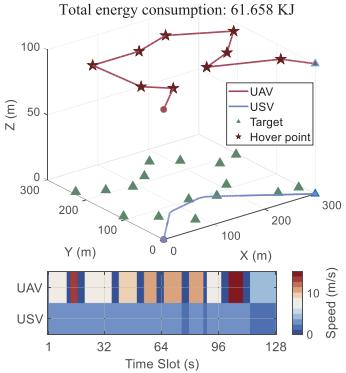  
(a) Our scheme

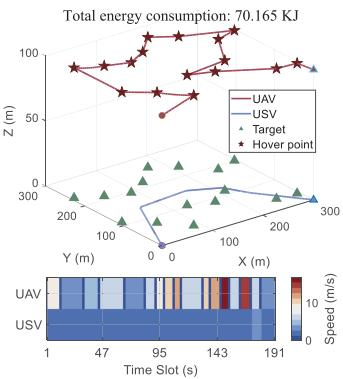  
(b) Sequential Access

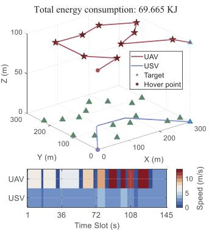  
(c) Leader-Follower

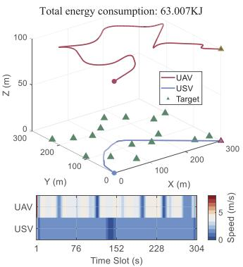  
(d) Fly-and-Sense

Fig. 7. The comparisons for the trajectories of UAV and USV.  
TABLE II  
ENERGY CONSUMPTION OF FOUR STRATEGIES (KJ)
<table><tr><td>Strategy</td><td>propulsion energy</td><td>S&amp;C energy</td><td>inertial energy</td></tr><tr><td>Our scheme</td><td>57.657</td><td>1.016</td><td>2.985</td></tr><tr><td>Sequential Access</td><td>65.448</td><td>0.634</td><td>4.083</td></tr><tr><td>Leader-Follower</td><td>66.541</td><td>0.516</td><td>2.608</td></tr><tr><td>Fly-and-Sense</td><td>61.258</td><td>1.545</td><td>0.204</td></tr></table>

• Sequential Access Strategy: The strategy in [16] adopts a similar hover-and-fly strategy for a single UAV ISAC system, where the UAV is restricted to hover over the targets. This scenario corresponds to the worst case of our scheme, where the sensing distance is set by $D _ { S } = H$

Leader–follower Strategy: In existing studies on air–sea collaborative systems, the leader–follower strategy is one of the most commonly adopted approaches. Specifically, the UAV trajectory is first optimized using the TSPN method in [31], after which the USV trajectory is optimized to minimize the energy consumption while satisfying the communication constraints.

• Fly-and-Sense Strategy: For comparison purpose, we introduce a fly-and-sense baseline in which the UAV can perform sensing tasks during flight. A minimum speed constraint is imposed as $0 ~ < ~ \| \mathbf { v _ { \mathrm { u a v } } } [ n ] \| ~ \leq ~ v _ { \operatorname* { m a x } } ,$ ∀n. However, for fairness, we should characterize the impact of the Doppler shifts on the coherent integration gain over a finite coherent processing interval (CPI). We introduce a factor $\epsilon \in [ 0 , 1 ]$ multiplying the Doppler shift $f _ { D } [ n ]$ to represent the degree of the Doppler compensation, where 0 indicates perfect compensation. The resulting coherent processing loss over a CPI of duration $T _ { \mathrm { C P I } }$ is modeled as $\dot { \eta } ( \epsilon ) = | \mathrm { s i n c } \left( \pi \epsilon f _ { D } [ n ] T _ { \mathrm { C P I } } \right) | ^ { 2 }$ . Accordingly, the effective sensing metric becomes $\tilde { \gamma } _ { k } [ n ] = \eta ( \epsilon ) \gamma _ { k } [ n ]$ , where $\gamma _ { k } [ n ]$ is the nominal sensing metric in the original model.

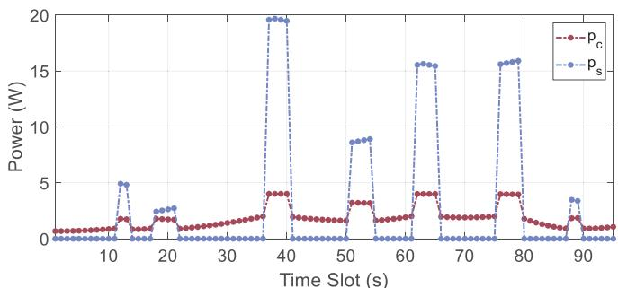  
(a) Power varies over time with $p _ { \operatorname* { m a x } } = 2 5 ~ \mathrm { W } .$

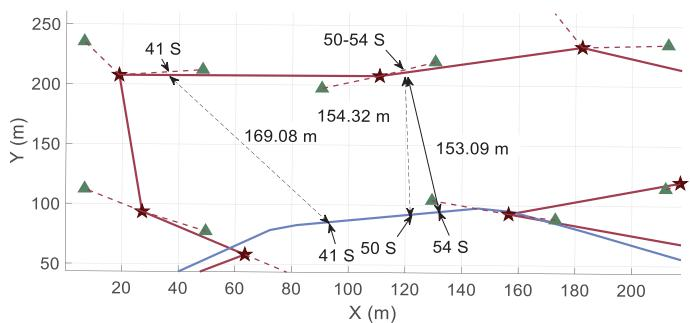  
(b) Top view in the 4-th stage with $\begin{array} { r } { p _ { \operatorname* { m a x } } = 2 5 ~ \mathrm { W } . } \end{array}$  
Fig. 8. The changes in S&C power.

To guarantee the fairness of the comparison, we have added and completed the other system designs that the baseline methods omitted, such as beamforming, etc.

## A. The Superiority of Energy Efficiency

Figs. 7(a), 7(b), 7(c), and 7(d) show the trajectories of the proposed scheme, sequential access strategy, leader–follower, fly-and-sense strategy, respectively. The UAV and USV start at (0, 0) m and end at (300, 300) m in the horizontal direction with $H = 1 0 0 \mathrm { ~ m ~ }$ . The total energy consumption of the four strategies is 61.658 kJ (our scheme), 70.165 kJ (sequential access), 69.665 kJ (leader–follower), and 63.007 kJ (fly-andsense), respectively. It shows the superiority of our scheme in terms of energy efficiency. The reason behind this is that the UAV visits many fewer hover points and travels a much shorter path than the sequential access strategy. The energy consumption of the Leader–Follower scheme is also higher than that of the proposed scheme. This is because the UAV trajectory planning does not account for the movement of the USV, forcing the USV to travel a longer distance to satisfy the communication requirement. In addition, in the fly-and-sense strategy, performing sensing during flight degrade the sensing accuracy. To compensate for this effect, the UAV needs to prolong the sensing duration, which increases the overall flight time and consequently leads to higher energy consumption.<sup>8</sup>

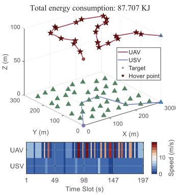  
(a) Our scheme

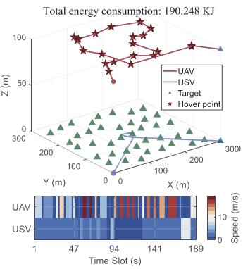  
(b) Heuristic scheme

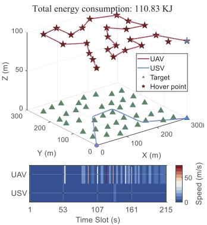  
(c) Traditional TSP scheme

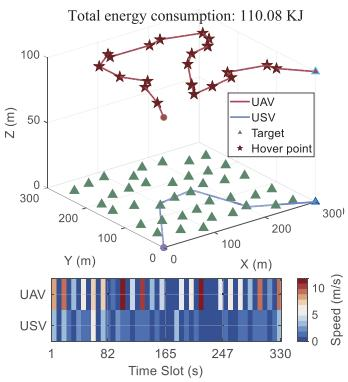  
(d) Time-unallocated scheme  
Fig. 9. The comparisons for the trajectories of UAV and USV.

To investigate the variation characteristics and the tradeoff between S&C power, the S&C power over the first 95 s is illustrated in Fig. 8(a). For example, in the 4-th stage (41–54 s), the actual positions of the UAV and USV are shown in Fig. 8(a). From 41 s to 50 s, the UAV and USV move along the arrow direction, with the distance decreasing from 169.08 m to 154.32 m, leading to a corresponding decrease in communication power. From 50 s to 54 s, the system enters the hovering mode, where the UAV remains stationary while the USV moves closer to the UAV, further reducing the communication power. In different hovering modes, the sensing power depends on the hover time, the number of sensing targets, and the distance to the hover point.

## B. The Effectiveness of Bi-TSPN Solution Algorithms

To evaluate the effectiveness of the proposed hover-point selection method for the Bi-TSPN, we compare it with three baseline schemes.

• Heuristic Scheme: The heuristic scheme adopts a greedy strategy, where the Euclidean distance is used as the path cost to select the hovering point for the next step.

• Traditional TSP Scheme: The traditional TSP scheme determines the visiting sequence of the UAV by solving a standard TSP, where the Euclidean distance is adopted as the cost metric.

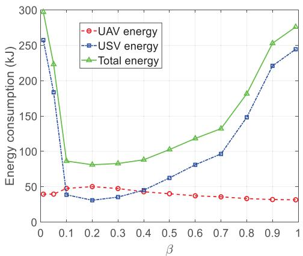  
Fig. 10. The relationship between energy consumption and β.

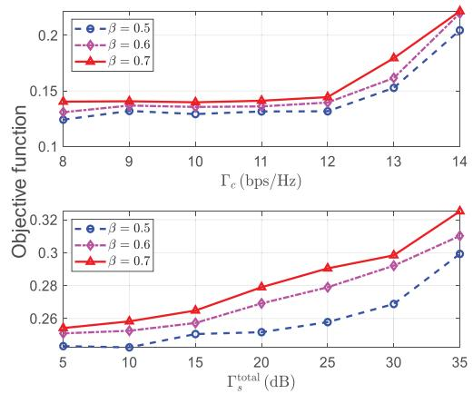  
Fig. 11. Objective function versus system parameters.

• Time-Unallocated Scheme: The time-unallocated scheme employs fixed time intervals, with each interval chosen as the minimum value that satisfies both the velocity constraints and the sensing time requirements.

The trajectories of the four schemes are illustrated in Fig. 9(a)–9(d). It is observed that the proposed scheme achieves the lowest energy consumption, significantly outperforming the three baselines. The heuristic scheme makes the UAV and the USV always select the nearest waypoint at each step, while ignoring the global optimal trajectory. The

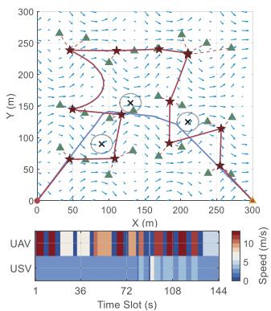  
(a) $v _ { \mathrm { m a x } } ^ { w } = 0 . 2$ m/s

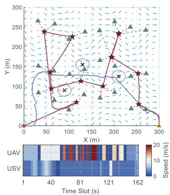  
(b) $v _ { \mathrm { m a x } } ^ { w } = 3 . 0$ m/s  
Fig. 12. The system trajectory at different values of $v _ { \mathrm { m a x } } ^ { w } .$

## C. Impact of the Weight Factor

traditional TSP scheme requires the UAV to visit the hovering points according to the order obtained from the standard TSP, without considering the coordination between the UAV and the USV. In particular, it does not exploit the flexibility in adjusting the hovering-point locations to reduce the energy consumption of the USV. The time-unallocated scheme uses fixed durations for completing each stage without considering the cruising speeds of the UAV and the USV. As a result, longer paths must be traversed at higher speeds, which leads to increased energy consumption. In contrast, the proposed method jointly exploits heterogeneous velocity and energy models, achieving superior energy efficiency.

As shown in Fig. 10, the effect of $\beta$ on the total system energy consumption is not monotonic, and the minimum is attained at $\beta ~ = ~ 0 . 2$ . When $\beta$ is small, the UAV energy term has a low weight in the objective function, making it difficult for the optimization to adequately account for the UAV trajectory. Under the communication constraint, such a trajectory configuration further forces the USV to deviate from a more energy-efficient path, thereby increasing its energy consumption and ultimately raising the total system energy consumption. As $\beta$ increases, greater emphasis is placed on the UAV energy term, and the hovering-point configuration as well as the coordinated trajectories are improved, resulting in a reduction in the total energy consumption. However, when $\beta$ becomes too large, the optimization becomes overly biased toward the UAV. Although this helps reduce the UAV energy consumption, it also increases the navigation burden of the USV, causing the total energy consumption to rise again. Therefore, $\beta = 0 . 2$ achieves a better energy balance between the two vehicles and is a more appropriate weight setting for the considered scenario, since either excessively emphasizing or neglecting the UAV energy consumption would disrupt the energy balance between the UAV and the USV and thus degrade the overall system performance.

## D. Impact of S&C Performance Requirements

Fig. 11 shows the energy consumption under different S&C requirements. As the communication rate increases, the energy consumption rises markedly, because the UAV adjusts its position and dwelling time to move closer to the USV, while the USV also modifies its trajectory to approach the UAV. These adjustments help satisfy the communication-rate requirement, but they lead to higher energy consumption. Moreover, the energy consumption also increases with the accumulated SNR requirement, since achieving a larger $\Gamma _ { s } ^ { \mathrm { t o t a l } }$ requires a longer sensing duration. The prolonged sensing process further extends the overall task execution time, thereby resulting in additional energy consumption.

(c) $v _ { \mathrm { m a x } } ^ { w } = - 0 . 2$ m/s  
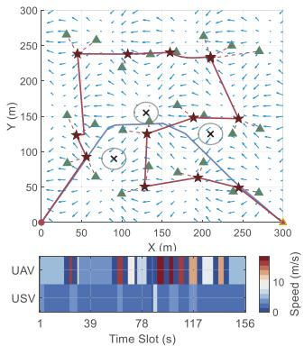

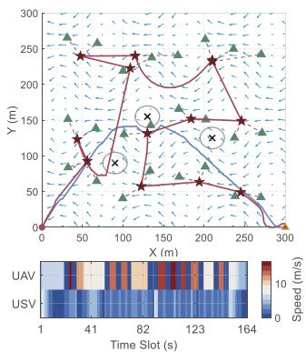  
(d) $v _ { \operatorname* { m a x } } ^ { w } = - 3 . 0$ m/s

## E. Impact of Water Flow and Obstacles

Recalling that the water-flow velocity depends on the position, in the simulations, we adopt a wave-like water-current model similar to that in [34], where the horizontal and vertical components are

$$
\begin{array} { r l } & { v _ { x , \mathbf { b } [ n ] } = v _ { \operatorname* { m a x } } ^ { w } ( 0 . 8 - 0 . 0 3 \sin ( 0 . 0 6 b _ { x } [ n ] ) \cos ( 0 . 0 3 b _ { y } [ n ] ) ) , } \\ & { v _ { y , \mathbf { b } [ n ] } = - v _ { \operatorname* { m a x } } ^ { w } \cos ( 0 . 0 6 b _ { x } [ n ] ) \cos ( 0 . 0 3 b _ { y } [ n ] ) , } \end{array}
$$

where $v _ { \mathrm { m a x } } ^ { w }$ denotes the maximum water flow speed. To evaluate the influence of water currents under different disturbance levels, we consider the set of representative flow intensities given by $\{ 0 . 2 , 3 . 0 , \ - 0 . 2 , \ - \ 3 . 0 \}$ m/s. Fig. 12 illustrates the impact of water currents on the planned trajectories. The results clearly show that water currents significantly affect the trajectory design of the whole system, including that of the UAV. Under downstream conditions, a higher current velocity facilitates the motion of the USV, reduces the required propulsion effort, and makes both the USV and the UAV more likely to move along the current direction. In contrast, under upstream conditions, a stronger adverse current causes larger hydrodynamic resistance, prompting the USV and the UAV to choose trajectories that avoid moving against the current.

In addition, Fig. 12 shows that the USV trajectory successfully avoids the three obstacles clustered around the target point, where the black $" \times "$ denotes the center of each obstacle. Since these obstacles are located near the planned path, they impose constraints on the feasible trajectory space. Despite the presence of these obstacles, the USV can still complete the task while maintaining a safe distance.

## VI. CONCLUSION

In this paper, we propose an ISAC-empowered air-sea collaborative framework for maritime inspection, which jointly optimizes UAV hovering points, UAV and USV trajectories, as well as S&C beamforming. The effectiveness of the proposed framework is validated through extensive simulations, leading to the following insights: 1) Increasing the cumulative SNR significantly prolongs the task duration, revealing a trade-off between sensing performance and operational efficiency; 2) A higher communication rate requires coordinated adjustments of UAV and USV trajectories and speeds, driving them closer within each time slot; 3) There exists an inherent energy tradeoff in the UAV–USV system, where reducing UAV energy consumption shifts the burden to the USV and may increase the overall energy consumption.

Future work will further refine the system model by addressing several limitations. i) While a Rician fading model is adopted to statistically capture maritime multipath effects, explicit modeling of sea-surface-induced multipath propagation, such as geometry-based reflection or rough-surface scattering, remains to be investigated. ii) The current model adopts a quasi-static channel assumption during UAV hovering and neglects residual Doppler effects caused by small position and velocity fluctuations. Incorporating such micro-motioninduced Doppler effects into the system model will be an important direction for future research. To facilitate future research and promote reproducibility, the source code has been made publicly available at https://github.com/FuwangDong/ Air-Sea-Collaborative-System.

## APPENDIX

We define the index set $V ~ = ~ \{ 1 , 2 , \ldots , L + 2 \}$ , which includes the virtual base station, start, and end nodes. Let $s \in V$ and $t ~ \in ~ V$ denote the start and end node indices, respectively. $E _ { i , j } ^ { \mathrm { c o s t } }$ <sup>t</sup> represents the total cost between the i-th and j-th virtual base stations, considering water flow, path length, and velocity, as described in (22). Define a binary variable $x _ { i , j }$ , which satisfies the following

$$
x _ { i , j } = { \left\{ \begin{array} { l l } { 1 , } & { { \mathrm { I f ~ a ~ p a t h ~ e x i s t s ~ f r o m ~ v i r t u a l ~ b a s e } } } \\ & { { \mathrm { s t a t i o n } } \ i \ { \mathrm { t o ~ v i r t u a l ~ b a s e } } \ { \mathrm { s t a t i o n } } \ j , } \\ { 0 , } & { { \mathrm { O t h e r w i s e } } . } \end{array} \right. }\tag{30}
$$

The shortest path model is defined by

$$
\operatorname* { m i n } _ { \{ x _ { i , j } , u _ { i } \} } \sum _ { i = 0 } ^ { L + 2 } \sum _ { j = 0 } ^ { L + 2 } E _ { i , j } ^ { \mathrm { c o s t } } x _ { i , j } , i \neq j ,
$$

$$
\mathrm { s . t . } \sum _ { j = 0 , j \neq s } ^ { L + 2 } x _ { s , j } = 1 , \sum _ { i = 0 , i \neq s } ^ { L + 2 } x _ { i , s } = 0 ,\tag{31a}
$$

$$
\sum _ { j = 0 , j \neq t } ^ { L + 2 } x _ { t , j } = 0 , \sum _ { i = 0 , i \neq t } ^ { L + 2 } x _ { i , t } = 1 ,\tag{31b}
$$

$$
\sum _ { i = 0 , i \neq k } ^ { L + 2 } x _ { i , k } = 1 , \sum _ { j = 0 , j \neq k } ^ { L + 2 } x _ { k , j } = 1 , \forall k \neq s , t ,\tag{31c}
$$

$$
u _ { s } = 0 , 1 \leq u _ { i } \leq ( L + 2 ) - 1 \quad \forall i \neq s ,\tag{31d}
$$

$$
u _ { i } - u _ { j } + \left( L + 1 \right) x _ { i , j } \leq L , \forall i \neq { t , j \neq s , i \neq j } .\tag{31e}
$$

Constraint (31a) ensures the path starts at node s, and Constraint (31b) ensures it ends at node t. Constraint (31c) ensures each node, except the start and end, is visited once with one entry and exit. Constraints (31d) and (31e) eliminate subtours based on the miller-tucker-zemlin (MTZ) formulation, ensuring path connectivity without cycles smaller than L + 2 [31]. The above problem is a mixed-integer linear programming (MILP) model, solved using Gurobi in MATLAB.

## REFERENCES

[1] X. Ye, Y. Mao, X. Yu, S. Sun, L. Fu, and J. Xu, “Integrated sensing and communications for low-altitude economy: A deep reinforcement learning approach,” IEEE Trans. Wireless Commun., vol. 25, pp. 351–367, 2026.

[2] G. Cheng, X. Song, Z. Lyu, and J. Xu, “Networked ISAC for low-altitude economy: Coordinated transmit beamforming and UAV trajectory design,” IEEE Trans. Commun., vol. 73, no. 8, pp. 5832–5847, Aug. 2025.

[3] Z. Zhang et al., “UAV hyperspectral remote sensing image classification: A systematic review,” IEEE J. Sel. Topics Appl. Earth Observ. Remote Sens., vol. 18, pp. 3099–3124, 2025.

[4] B. He, X. Ji, G. Li, and B. Cheng, “Key technologies and applications of UAVs in underground space: A review,” IEEE Trans. Cognit. Commun. Netw., vol. 10, no. 3, pp. 1026–1049, Jun. 2024.

[5] Z. Zhang et al., “Channel measurements and modeling for dynamic vehicular ISAC scenarios at 28 GHz,” IEEE Trans. Commun., vol. 73, no. 8, pp. 6884–6897, Aug. 2025.

[6] F. Dong et al., “Communication-assisted sensing in 6G networks,” IEEE J. Sel. Areas Commun., vol. 43, no. 4, pp. 1371–1386, Apr. 2025.

[7] Z. Lyu, G. Zhu, and J. Xu, “Joint maneuver and beamforming design for UAV-enabled integrated sensing and communication,” IEEE Trans Wireless Commun., vol. 22, no. 4, pp. 2424–2440, Apr. 2023.

[8] Y. Liu et al., “Secure rate maximization for ISAC-UAV assisted communication amidst multiple eavesdroppers,” IEEE Trans. Veh. Technol., vol. 73, no. 10, pp. 15843–15847, Oct. 2024.

[9] A. Li et al., “Integrated methodology for atmospheric correction and cloud removal of multispectral remote sensing images using guided diffusion model,” IEEE Trans. Geosci. Remote Sens., vol. 62, 2024, Art. no. 5410021, doi: 10.1109/TGRS.2024.3497180.

[10] Y. Liao et al., “Low-latency data computation of inland waterway USVs for RIS-assisted UAV MEC network,” IEEE Internet Things J., vol. 11, no. 16, pp. 26713–26726, Aug. 2024.

[11] X. Jing, F. Liu, C. Masouros, and Y. Zeng, “ISAC from the sky: UAV trajectory design for joint communication and target localization,” IEEE Trans. Wireless Commun., vol. 23, no. 10, pp. 12857–12872, Oct. 2024.

[12] X. Liu, Y. Liu, Z. Liu, and T. S. Durrani, “Fair integrated sensing and communication for multi-UAV-enabled Internet of Things: Joint 3-D trajectory and resource optimization,” IEEE Internet Things J., vol. 11, no. 18, pp. 29546–29556, Sep. 2024.

[13] C. Deng, X. Fang, and X. Wang, “Beamforming design and trajectory optimization for UAV-empowered adaptable integrated sensing and communication,” IEEE Trans. Wireless Commun., vol. 22, no. 11, pp. 8512–8526, Nov. 2023.

[14] S. Hu, X. Yuan, W. Ni, and X. Wang, “Trajectory planning of cellularconnected UAV for communication-assisted radar sensing,” IEEE Trans. Commun., vol. 70, no. 9, pp. 6385–6396, Sep. 2022.

[15] S. Peng, B. Li, L. Liu, Z. Fei, and D. Niyato, “Trajectory design and resource allocation for multi-UAV-assisted sensing, communication, and edge computing integration,” IEEE Trans. Commun., vol. 73, no. 4, pp. 2847–2861, Apr. 2025.

[16] A. Khalili, A. Rezaei, D. Xu, F. Dressler, and R. Schober, “Efficient UAV hovering, resource allocation, and trajectory design for ISAC with limited backhaul capacity,” IEEE Trans. Wireless Commun., vol. 23, no. 11, pp. 17635–17650, Nov. 2024.

[17] Y. Liu et al., “Radar probing optimization for joint beamforming and UAV trajectory design in UAV-enabled integrated sensing and communication,” IEEE Trans. Commun., vol. 73, no. 6, pp. 4469–4485, Jun. 2025.

[18] S. Li, Y. Zhu, Z. Li, Y. Li, and G. Guo, “Separation and rendezvous control with batteries replacement for the UAV-USV ecosystem: A finitetime bipartite method under the MPC structure,” IEEE Trans. Intell. Transp. Syst., vol. 26, no. 3, pp. 4192–4201, Mar. 2025.

[19] W. Wei, J. Wang, Z. Fang, J. Chen, Y. Ren, and Y. Dong, “3U: Joint design of UAV-USV-UUV networks for cooperative target hunting,” IEEE Trans. Veh. Technol., vol. 72, no. 3, pp. 4085–4090, Mar. 2023.

[20] Y. Luo, F. Tang, and Q. Wei, “Event-based human-in-the-loop formationcontainment control for heterogeneous UAV-USV systems with dual predefined-time prescribed performance,” IEEE Trans. Veh. Technol., vol. 75, no. 2, pp. 1990–2000, Feb. 2026.

[21] H. Li and X. Li, “Distributed consensus of heterogeneous linear timevarying systems on UAVs–USVs coordination,” IEEE Trans. Circuits Syst. II, Exp. Briefs, vol. 67, no. 7, pp. 1264–1268, Jul. 2020.

[22] H. Huang, X. Tian, Q. Mai, and H. Liu, “Distributed prescribed performance formation control for UAV-USV system based on FEWNN,” in Proc. 37th Chin. Control Decis. Conf. (CCDC), May 2025, pp. 5634–5639.

[23] Y. Wang, J. Sun, and Y. Liu, “Autonomous landing guidance and control for cooperative UAV-USV systems,” in Proc. 37th Youth Academic Annu. Conf. Chin. Assoc. Autom. (YAC), Nov. 2022, pp. 1196–1201.

[24] D. Huang, H. Li, and X. Li, “Formation of generic UAVs-USVs system under distributed model predictive control scheme,” IEEE Trans. Circuits Syst. II, Exp. Briefs, vol. 67, no. 12, pp. 3123–3127, Dec. 2020.

[25] W. Li, Y. Ge, and G. Ye, “UAV-USV cooperative tracking based on MPC,” in Proc. 34th Chin. Control Decis. Conf. (CCDC), Aug. 2022, pp. 4652–4657.

[26] X. Li, W. Feng, Y. Chen, C.-X. Wang, and N. Ge, “Maritime coverage enhancement using UAVs coordinated with hybrid satellite-terrestrial networks,” IEEE Trans. Commun., vol. 68, no. 4, pp. 2355–2369, Apr. 2020.

[27] X. Liu, T. Huang, N. Shlezinger, Y. Liu, J. Zhou, and Y. C. Eldar, “Joint transmit beamforming for multiuser MIMO communications and MIMO radar,” IEEE Trans. Signal Process., vol. 68, pp. 3929–3944, 2020.

[28] Y. Zeng, J. Xu, and R. Zhang, “Energy minimization for wireless communication with rotary-wing UAV,” IEEE Trans. Wireless Commun., vol. 18, no. 4, pp. 2329–2345, Apr. 2019.

[29] D. Mellinger and V. Kumar, “Minimum snap trajectory generation and control for quadrotors,” in Proc. IEEE Int. Conf. Robot. Autom., Shanghai, China, May 2011, pp. 2520–2525.

[30] H. Niu, Y. Lu, A. Savvaris, and A. Tsourdos, “An energy-efficient path planning algorithm for unmanned surface vehicles,” Ocean Eng., vol. 161, pp. 308–321, Aug. 2018.

[31] Y. Zeng, X. Xu, and R. Zhang, “Trajectory design for completion time minimization in UAV-enabled multicasting,” IEEE Trans. Wireless Commun., vol. 17, no. 4, pp. 2233–2246, Apr. 2018.

[32] Z.-Q. Luo, W.-K. Ma, A. M. So, Y. Ye, and S. Zhang, “Semidefinite relaxation of quadratic optimization problems,” IEEE Signal Process. Mag., vol. 27, no. 3, pp. 20–34, May 2010.

[33] T. Tao, Z. Yuan, and W. Zhang, “A method for establishing a ship safety domain oriented to collision risk judgment,” in Proc. 35th Chin. Control Decis. Conf. (CCDC), May 2023, pp. 2146–2151.

[34] A. Alvarez, A. Caiti, and R. Onken, “Evolutionary path planning for autonomous underwater vehicles in a variable ocean,” IEEE J. Ocean. Eng., vol. 29, no. 2, pp. 418–429, Apr. 2004.

  
Rui Zhang is currently pursuing the Ph.D. degree with the College of Intelligent Systems Science and Engineering, Harbin Engineering University, Harbin, China.  
His current research interests include integrated communication and sensing (ISAC) and uncrewed system collaboration.


Fuwang Dong (Member, IEEE) received the B.Sc., M.Sc., and Ph.D. degrees from Harbin Engineering University (HEU), Harbin, China, in 2014, 2017, and 2022, respectively. He was a Post-Doctoral Researcher with the Southern University of Science and Technology, Shenzhen, China, from 2022 to 2024. He is currently an Associate Professor with the College of Intelligent Systems Science and Engineering, HEU. His current research interests include integrated sensing and communication (ISAC), radar signal processing, and air–sea collaborative systems.

He was a recipient of the IEEE/CIC ICCC 2023 Best Paper Award, the Best Ph.D. Thesis Award of HEU, and the Best Ph.D. Thesis Award of Heilongjiang Association for Artificial Intelligence. He has served as the Workshop Co-Chair for various IEEE conferences, including GLOBECOM 2025, ICICSP 2025, PIMRC 2026, and ICCC 2026. He has been named as an Exemplary Reviewer of IEEE TRANSACTIONS ON GREEN COMMUNICATIONS AND NETWORKING (2022) and IEEE COMMUNICATIONS LETTERS (2023).


Wei Wang (Senior Member, IEEE) received the Ph.D. degree in navigation, guidance, and control from Harbin Engineering University (HEU), Harbin, China, in 2005.

From July 2006 to April 2009, he was a Post-Doctoral Research Associate with Harbin Institute of Technology. He was an Associate Professor with HEU from August 2008 to August 2010 and an Academic Visitor with Loughborough University, Loughborough, U.K., from January 2010 to December 2010. He has been a Professor with HEU since

September 2011. He has authored or co-authored more than 80 refereed journal and conference papers. His research interests include signal processing for wireless navigation systems and multiple-input–multiple-output radar.