# ISAC Enabled Anti-UAV: Joint Beamforming and Trajectory Design for Multi-UAVs

Xiaojie Wang, Lingfei Li, Zhaolong Ning, Xiaoming Tao, Tie Qiu, Lei Guo, Yan Zhang, Fellow, IEEE

Abstract—The rapid proliferation of Unmanned Aerial Vehicles (UAVs) introduces significant challenges to low-altitude airspace security, particularly from unauthorized intrusions. To address these vulnerabilities, Integrated Sensing and Communication (ISAC) has emerged as a key enabler for anti-UAV systems. However, existing studies focusing on cellular networks with fixed base stations are ill-suited for the continuous movement of target UAVs, thus failing to meet the dual demands of flexible sensing and reliable positioning. To address this, we propose an ISACenabled anti-UAV scheme solely based on cooperative UAVs. Specifically, we first derive the optimal transmit power under the constraint of space-air transmission outage probability tolerance. Subsequently, we deduce the sensing Fisher information matrix and Cramer-Rao Bound (CRB) by incorporating the position´ uncertainty of the target UAV. Then, we formulate a longterm CRB minimization problem to enhance cooperative sensing performance. To tackle this NP-hard problem, we design a robust optimization algorithm that jointly optimizes transmit-receive beamforming, association scheduling, and UAV trajectory, by transforming the structurally complex CRB matrix into a set of semi-definite constraints, and resolving the inherent position uncertainty. Numerical results demonstrate that our proposed algorithm outperforms representative algorithms in terms of sensing accuracy and robustness.

Index Terms—Integrated sensing and communication, anti-UAV, beamforming design, Cramer-Rao bound.´

## I. INTRODUCTION

the widespread adoption of Unmanned Aerial Vehicles (UAVs) across sectors, boosting efficiency in military operations, security surveillance, and urban management [1]. However, malicious activities such as unauthorized flight have become increasingly frequent, posing severe threats to public security and privacy. Against this backdrop, there is an urgent need for anti-UAV systems capable of continuous sensing and precise tracking. Integrated Sensing and Communication (ISAC) technology is an emerging paradigm that represents a synergistic integration of communication and radar functionalities. This integrated approach effectively mitigates the limitations of standalone sensor systems in addressing UAVs high-speed maneuverability, low-altitude flight, and active evasion behaviors [2]. Specifically, ISAC-enabled anti-UAV systems overcome the constraints of traditional monitoring and significantly enhance target recognition accuracy and tracking stability, thus serving as a key technical pillar for building efficient, low-cost, and low-altitude security systems.

Existing research mainly focused on target sensing with Base Stations (BSs) or cellular networks as the carrier. Authors in [3] proposed an ISAC-enabled dual-function monostatic system, aiming at sensing aerial targets while providing stable service for Communication Users (CUs). Building on this, a massive multiple-input multiple-output ISAC system was designed in [4], where the BS precisely steered the probing signal’s transmission angle toward the target for efficient sensing-communication coordination. Authors in [5] presented a multi-cell anti-UAV system and quantitatively characterized the sensing signal-to-clutter-noise ratio by considering intercell and mutual interference. Further, a coordinated beamforming scheme for multi-cell systems was designed in [6], aiming to maximize the downlink detection probability. Building on this, authors in [7] accounted for the impact of imperfect Channel State Information (CSI), and adopted distributed dualfunction base stations by jointly optimizing two-stage duration and transmit beam.

Despite this, the aforementioned studies suffer from terraininduced signal blockage, and challenges in cross-regional sensing, while UAV-assisted ISAC emerges as a highly competitive solution. Authors in [8] provided a cellular-connected UAV system, where the BS and connected UAV perform cooperative sensing tasks for multiple targets. Furthermore, a set of networked BSs with the authorized UAV was considered in [9], which cooperatively transmit ISAC signals to sense unauthorized objects within the region of interest. To balance communication and sensing, authors in [10] proposed a joint optimization framework for ISAC beams, while satisfying sensing frequency and beam pattern gain constraints. Considering practical channel uncertainty, authors in [11] broke through the ideal channel assumption and proposed a robust downlink transmit beamforming design. Regarding trajectory and resource allocation, a multi-stage trajectory design by jointly optimizing UAV trajectory and allocating user’s bandwidth was proposed in [12]. For multi-user and multi-target scenarios, authors in [13] investigated the joint resource allocation and trajectory design with limited BS-UAV link capacity. Recently, considering UAV flight characteristics, authors in [14] considered different degree-of-freedom dynamic models of UAV, aiming to maximize the average weighted communication rate while maintaining dynamic and sensing constraints.

TABLE I  
COMPARISON BETWEEN THIS WORK AND THE RELATED ONES
<table><tr><td rowspan=1 colspan=2>Reference</td><td rowspan=1 colspan=1>Multi-UAV</td><td rowspan=1 colspan=1>Beamforming</td><td rowspan=1 colspan=1>scheduling</td><td rowspan=1 colspan=1>Robustness</td><td rowspan=1 colspan=1>Cramér-Rao bound</td><td rowspan=1 colspan=1>Objective function</td></tr><tr><td rowspan=1 colspan=1>[8]</td><td rowspan=1 colspan=1></td><td rowspan=1 colspan=1>×</td><td rowspan=1 colspan=1>√</td><td rowspan=1 colspan=1>×</td><td rowspan=1 colspan=1>×</td><td rowspan=1 colspan=1>×</td><td rowspan=1 colspan=1>Communication data rate maximization</td></tr><tr><td rowspan=1 colspan=1>[9]</td><td rowspan=1 colspan=1></td><td rowspan=1 colspan=1>×</td><td rowspan=1 colspan=1>√</td><td rowspan=1 colspan=1>×</td><td rowspan=1 colspan=1>X</td><td rowspan=1 colspan=1>×</td><td rowspan=1 colspan=1>Average sum rate maximization</td></tr><tr><td rowspan=1 colspan=1>[11]</td><td rowspan=1 colspan=1></td><td rowspan=1 colspan=1>X</td><td rowspan=1 colspan=1>√</td><td rowspan=1 colspan=1>×</td><td rowspan=1 colspan=1>√</td><td rowspan=1 colspan=1>X</td><td rowspan=1 colspan=1>Energy efficiency maximization</td></tr><tr><td rowspan=1 colspan=1>[13]</td><td rowspan=1 colspan=1></td><td rowspan=1 colspan=1>×</td><td rowspan=1 colspan=1>√</td><td rowspan=1 colspan=1>×</td><td rowspan=1 colspan=1>×</td><td rowspan=1 colspan=1>×</td><td rowspan=1 colspan=1>Average power consumption minimization</td></tr><tr><td rowspan=1 colspan=1>[14]</td><td rowspan=1 colspan=1></td><td rowspan=1 colspan=1>×</td><td rowspan=1 colspan=1>√</td><td rowspan=1 colspan=1>×</td><td rowspan=1 colspan=1>×</td><td rowspan=1 colspan=1>×</td><td rowspan=1 colspan=1>Average weighted sum rate maximization</td></tr><tr><td rowspan=1 colspan=2>[17]</td><td rowspan=1 colspan=1>√</td><td rowspan=1 colspan=1>×</td><td rowspan=1 colspan=1>√</td><td rowspan=1 colspan=1>×</td><td rowspan=1 colspan=1>√</td><td rowspan=1 colspan=1>Effective data rate maximization</td></tr><tr><td rowspan=1 colspan=2>[19]</td><td rowspan=1 colspan=1>√</td><td rowspan=1 colspan=1>×</td><td rowspan=1 colspan=1>X</td><td rowspan=1 colspan=1>√</td><td rowspan=1 colspan=1>√</td><td rowspan=1 colspan=1>Cramér-Rao bound minimization</td></tr><tr><td rowspan=1 colspan=2>[20]</td><td rowspan=1 colspan=1>√</td><td rowspan=1 colspan=1>X</td><td rowspan=1 colspan=1>×</td><td rowspan=1 colspan=1>X</td><td rowspan=1 colspan=1>√</td><td rowspan=1 colspan=1>Detection fairness maximization</td></tr><tr><td rowspan=1 colspan=2>[21]</td><td rowspan=1 colspan=1>√</td><td rowspan=1 colspan=1>×</td><td rowspan=1 colspan=1>√</td><td rowspan=1 colspan=1>X</td><td rowspan=1 colspan=1>X</td><td rowspan=1 colspan=1>Sensing spectral efficiency maximization</td></tr><tr><td rowspan=1 colspan=2>Our work</td><td rowspan=1 colspan=1>√</td><td rowspan=1 colspan=1>√</td><td rowspan=1 colspan=1>√</td><td rowspan=1 colspan=1>√</td><td rowspan=1 colspan=1>√</td><td rowspan=1 colspan=1>Cramér-Rao bound minimization</td></tr></table>

However, the aforementioned ISAC schemes still face critical drawbacks: they suffer from inflexibility due to single-UAV operation and centralized control, while being hampered by the static nature of BSs and limited UAV agility, collectively leading to incomplete coverage and severely degraded sensing performance. In contrast, multi-UAV cooperative sensing emerges as a critical solution to achieve high-efficiency and high-reliability perception in complex and dynamic scenarios [15]. Considering the complicated interference management among UAVs, research [16] jointly optimized UAV trajectories, association, and power control. The network utility maximization problem in a dual-functional radar-communication multi-UAV network was investigated [17]. Authors in [18] considered navigating multiple UAVs in a distributed way by jointly optimizing the collected data volume, geographical fairness and limited energy reserve. In [19], the placement optimization for multi-UAV localization networks was explored, with a robust placement strategy proposed. Regarding multi-UAV cooperative detection, authors in [20] considered a typical scenario where UAVs simultaneously detect targets and forward sensed data to a fusion center. To maximize the minimum weighted spectral efficiency across UAVs, literature [21] formulated the joint sensing and communication performance optimization as a sequential decision-making problem, and jointly optimized user association, UAV trajectory planning, and power allocation.

Another critical limitation of existing studies on UAVassisted ISAC networks is their presumption of the statically located and perfectly known unauthorized UAV. However, this assumption neglects the dynamic nature and position uncertainty caused by the continuous movement of practical aerial targets, which fundamentally hinders high-sensitivity, anti-interference, and efficient tracking of them in complex scenarios. Consequently, their proposed strategies may offer diminished returns in environments with mobile targets or time-varying network topologies.

To address the above challenges, we propose an ISAC enabled anti-UAV framework with multiple authorized UAVs, CUs and one unauthorized UAV (the target UAV), while considering the position uncertainty induced by its mobility. The comparison between our work and the related work is presented in Table I, and the key contributions of this paper are summarized as follows:

• An ISAC Enabled Anti-UAV Framework: To the best of our knowledge, this is the first study on an ISAC enabled anti-UAV framework while accounting for position uncertainty induced by the mobility of the target UAV. To achieve efficient cooperative sensing and resource scheduling, we design an innovative time allocation model among multi-UAVs by adopting spatially separated transmit-receive beamforming.

• Cooperative Cramer-Rao Bound (CRB) Derivation:´ By analyzing sensing echo signals received by authorized UAVs while satisfying the tolerable outage probability of space-air transmission, we derive the Fisher Information Matrix (FIM) for target UAV sensing under position uncertainty. Accordingly, to obtain the theoretical lower bound on position estimation accuracy, we further derive the corresponding CRB matrix, considering sensing parameters including position vector and complex Radar Cross Section (RCS).

Robust Alternative Optimization: We formulate a long-term CRB minimization problem under position uncertainty of the target UAV, and design a robust alternating optimization algorithm for ISAC-enabled anti-UAV (AIEA). Specifically, by developing Schur complement based generalized Petersen’s sign-definiteness lemma, we transform the CRB matrix into a set of semi-definite constraints. Then, the transmit-receive ISAC beamforming is decoupled via Lagrangian relaxation, and the tightness of Semi-Definite Relaxation (SDR) is rigorously proved. We design a penalty-based Successive Convex Approximation (SCA) algorithm to address the coupled UAV scheduling and CU association, and prove the effectiveness of AIEA from the perspective of convergence.

• Performance Validation: We evaluate the performance of AIEA on Manhattan city map and compare it with several representative algorithms. Evaluation results show that AIEA achieves effective cooperative sensing of the continuously moving target UAV, significantly outperforming existing schemes in robustness and sensing accuracy.

The rest of this paper is organized as follows. In Section II, we present the system model. In Section III, we detail metric definitions and formulate the CRB minimization problem. In Section IV, we design an alternative optimization algorithm to achieve robust sensing performance. In Section V, we provide the evaluation of the proposed method. Finally, we conclude this work in Section VI.

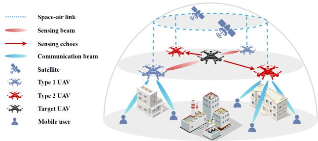  
Fig. 1. The ISAC enabled multi-UAV assisted anti-UAV scenario.

Notations: $x , \mathbf { x } , \mathbf { X }$ and X denote scalar, vector, matrix and set, respectively. Operations $\left( \cdot \right) ^ { T }$ and $\left( \cdot \right) ^ { H }$ denote the transpose and conjugate transpose, respectively. Operations Tr (·) and vec (·) denote the trace and the vectorization of a matrix, respectively. Operation $\otimes$ denotes the Kronecker product of two matrices. Symbols $\mathbb { R } ^ { M }$ and $\mathbb { C } ^ { M \times N }$ denote the set of $M \times 1$ real-valued vector and $M \times N$ complex-valued matrix, respectively. Expression $\mathbf { X } \succeq \mathbf { 0 }$ denotes that X is a positive semidefinite matrix. Variable $\mathbf { a } \sim \mathcal { C N } ( \pmb { \mu } , \pmb { \Sigma } )$ denotes that a is a complex-valued circularly symmetric Gaussian random variable with mean $\pmb { \mu }$ and covariance matrix Σ.

## II. SYSTEM MODEL

In this section, we first introduce an ISAC enabled anti-UAV network model. Following this, channel model, transmit and received signal model, and power consumption model are elaborated, respectively.

## A. Network Model

As shown in Fig. 1, we consider an ISAC-enabled anti-UAV system consisting of multiple authorized UAVs, multiple mobile CUs, and one target UAV (an unreported “black flight” UAV). Similar to [11] and [22], by maintaining a connection to a single low earth orbit satellite through space-air links, coordinated control, scheduling, and clock synchronization within the UAV group can be facilitated without requiring satellite handover. Under this coordination, UAVs are thus capable of dual functions: cooperatively positioning a moving target and providing communication services for single-antenna CUs by sharing CSI, obtained sensing samples, and basic status information.

Each UAV is equipped with a transmit Uniform Planar Array (UPA) of size $Q _ { T } = Q _ { T } ^ { x } { \times } Q _ { T } ^ { y }$ and a receive UPA of size $Q _ { R } = Q _ { R } ^ { x } \times \ Q _ { R } ^ { y }$ , where $Q _ { T } = Q _ { R }$ , and $Q _ { T } ^ { x } , Q _ { T } ^ { y } , Q _ { R } ^ { x } , Q _ { R } ^ { y }$ denote the number of transmit and receive antennas along the x-axis and y-axis, respectively. To adapt to target UAV’s characteristics (e.g., small size and low RCS), two-dimensional beamforming is implemented based on the vertical and horizontal Angle of Departure (AoD), enabling high-precision positioning and tracking of aerial moving targets. We define $\mathcal { M } \triangleq \{ 1 , \cdots , m , \cdots , M \}$ and ${ \mathcal { K } } \triangleq \{ 1 , \cdots , k , \cdots , K \}$ as the set of UAVs and CUs, respectively. The total flight period $T$ is discretized into N time slots with length $\delta = T / N$ , which is indexed by $\mathcal { N } \triangleq \{ 1 , \cdots , n , \cdots , N \}$ . Given that δ is sufficiently small, the position of UAVs and CUs can be regarded as invariant within a time slot, which facilitates the design of trajectory and beamforming. We adopt a Three-Dimensional (3D) Cartesian coordinate system, where the position of UAV m in time slot n is denoted as $\mathbf { p } _ { m } [ n ] = ( p _ { m } ^ { x } [ n ] , p _ { m } ^ { y } [ n ] , p _ { m } ^ { z } [ n ] )$ with $( p _ { m } ^ { x } [ n ] , p _ { m } ^ { y } [ n ] )$ and $p _ { m } ^ { z } [ n ]$ represent its horizontal coordinates and flight altitude, respectively. Similarly, the coordinates of CU k and the target UAV are denoted as ${ \bf p } _ { k } [ n ] = ( p _ { k } ^ { x } [ n ] , p _ { k } ^ { y } [ n ] , 0 )$ and ${ \bf p } _ { L } [ n ] = ( p _ { L } ^ { x } [ n ] , p _ { L } ^ { y } [ n ] , p _ { L } ^ { z } [ n ] )$ respectively.

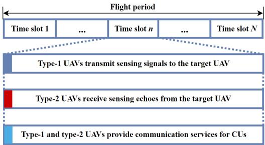  
Fig. 2. The proposed time slot allocation scheme.

By considering the existence of sensing errors and the continuous movement, the target UAV exhibits significant position uncertainty at the start of each time slot. Meanwhile, simultaneous transmission-reception design leads to severe self-interference, and cross-link echoes among UAVs also introduce interference, which increases the difficulty of processing sensing echoes for aerial moving target. To address this, we propose a separated transmitter-receiver design to improve the accuracy of cooperative sensing and positioning for the target UAV. As shown in Fig. 2, we divide authorized UAVs into two types, i.e., type-1 and type-2 in each time slot: type-1 UAVs transmit sensing signals to the target UAV, while type-2 UAVs receive sensing echoes reflected by the target UAV from all type-1 UAVs. Note that both types of UAVs can simultaneously provide communication services for multiple CUs. Thus, in time slot n, the association relationship between UAVs and CUs, and the role of UAVs are determined by binary variables $\alpha _ { m } [ n ]$ and $\beta _ { m k } [ n ]$ , respectively. Variable $\alpha _ { m k } [ n ] = 1$ indicates that UAV m provides communication services for CU k, and vice versa. If $\beta _ { m } [ n ] = 1$ , UAV m is type-1; otherwise, it is type-2.

## B. Channel Model

1) Space-Air Channel Model: Similar to [23], the spaceair channel in time slot n is modeled as Rician fading channel and can be expressed as:

$$
{ \bf h } _ { m s } [ n ] = \frac { \sqrt { \rho _ { m s } } } { { d _ { m s } } \left[ n \right] } \left( { \sqrt \frac { \kappa } { \kappa + 1 } { \bf h } _ { m s } ^ { \mathrm { L o S } } [ n ] + \sqrt \frac { 1 } { \kappa + 1 } { \bf h } _ { m s } ^ { \mathrm { N L o S } } [ n ] } \right)\tag{1}
$$

where $\rho _ { m s } = G _ { 0 } { \left( \varsigma _ { m s } / 4 \pi \right) } ^ { 2 }$ with $G _ { 0 }$ denoting the fixed power gain, and $\varsigma _ { m s }$ representing the wavelength of the space-air carrier frequency; variable $\bar { d } _ { m s } [ n ]$ denotes the distance between UAV m and the selected satellite in time slot $n ;$ variable κ denotes the corresponding Rician factor; variable $\mathbf { h } _ { m s } ^ { \mathrm { L o S } } \left[ n \right] \in$

This article has been accepted for publication in IEEE Transactions on Wireless Communications. This is the author's version which has not been fully edited and content may change prior to final publication. Citation information: DOI 10.1109/TWC.2026.3707705

$$
\begin{array} { r l r } & { } & { \mathrm { a } _ { T } ( \theta _ { m k } [ n ] , \omega _ { m k } [ n ] ) = [ 1 , \cdots , e ^ { - j 2 \pi \frac { c _ { 1 } } { v _ { 2 } } \sin \theta _ { m k } [ n ] \cos \omega _ { m k } [ n ] } , \cdots , e ^ { - j 2 \pi \frac { ( Q _ { T } ^ { y } - 1 ) c _ { 1 } } { v _ { 2 } } \sin \theta _ { m k } [ n ] \cos \omega _ { m k } [ n ] ] ^ { T } }  } \\ & { } & {  \mathrm { a } _ { T } ( \theta _ { m k } [ n ] , \omega _ { m k } [ n ] ) \mathrm { a } _ { m k } [ n ] ) } \\ & { } & { \otimes [ 1 , \cdots , e ^ { - j 2 \pi \frac { c _ { 1 } } { v _ { 2 } } \sin \theta _ { m k } [ n ] \sin \omega _ { m k } [ n ] } , \cdots , e ^ { - j 2 \pi \frac { ( Q _ { T } ^ { y } - 1 ) c _ { 1 } } { v _ { 2 } } \sin \theta _ { m k } [ n ] \sin \omega _ { m k } [ n ] ] ^ { T } } ] } \end{array}\tag{4}
$$

$$
\begin{array} { r l } { \mathbf { b } _ { T } \left( \theta _ { m ^ { \prime } L } \left[ n \right] , \omega _ { m ^ { \prime } L } \left[ n \right] \right) = } & { \left[ 1 , \cdots , e ^ { - j 2 \pi \frac { c _ { 1 } } { c _ { 2 } } \sin \theta _ { m ^ { \prime } L } \left[ n \right] \cos \omega _ { m ^ { \prime } L } \left[ n \right] } , \cdots , e ^ { - j 2 \pi \frac { \left( Q _ { T } ^ { \prime } - 1 \right) c _ { 1 } } { c _ { 2 } } \sin \theta _ { m ^ { \prime } L } \left[ n \right] \cos \omega _ { m ^ { \prime } L } \left[ n \right] } \right] ^ { T } } \\ & { \approx \left[ 1 , \cdots , e ^ { - j 2 \pi \frac { c _ { 1 } } { c _ { 2 } } \sin \theta _ { m ^ { \prime } L } \left[ n \right] \sin \omega _ { m ^ { \prime } L } \left[ n \right] } , \cdots , e ^ { - j 2 \pi \frac { \left( Q _ { T } ^ { \prime } - 1 \right) c _ { 1 } } { c _ { 2 } } \sin \theta _ { m ^ { \prime } L } \left[ n \right] \sin \omega _ { m ^ { \prime } L } \left[ n \right] } \right] ^ { T } } \end{array}\tag{9}
$$

$$
\begin{array} { r l } & { \mathbf { b } _ { R } \left( \theta _ { m L } \left[ n \right] , \omega _ { m L } \left[ n \right] \right) = \left[ 1 , \cdots , e ^ { - j 2 \pi \frac { \mathbf { c } _ { 1 } } { \epsilon _ { 2 } } \sin \theta _ { m L } \left[ n \right] \cos \omega _ { m L } \left[ n \right] } , \cdots , e ^ { - j 2 \pi \frac { \left( Q _ { R } ^ { \alpha } - 1 \right) \mathbf { c } _ { 1 } } { \epsilon _ { 2 } } \sin \theta _ { m L } \left[ n \right] \cos \omega _ { m L } \left[ n \right] } \right] ^ { T } } \\ & { \qquad \otimes \left[ 1 , \cdots , e ^ { - j 2 \pi \frac { \mathbf { c } _ { 1 } } { \epsilon _ { 2 } } \sin \theta _ { m L } \left[ n \right] \sin \omega _ { m L } \left[ n \right] } , \cdots , e ^ { - j 2 \pi \frac { \left( Q _ { R } ^ { \alpha } - 1 \right) \mathbf { c } _ { 1 } } { \epsilon _ { 2 } } \sin \theta _ { m L } \left[ n \right] \sin \omega _ { m L } \left[ n \right]  ^ { T } } } \end{\right)array} \end{array}\tag{10}
$$

$\mathbb { C } ^ { Q _ { T } }$ is the Line-of-Sight (LoS) component with each element being a unit complex vector, and $\dot { \mathbf { h } } _ { m s } ^ { \mathrm { N L o S } } [ n ] \sim \mathcal { C N } ( \mathbf { 0 } , \mathbf { I } _ { Q _ { T } } )$ is the Non-Line-of-Sight (NLoS) component which is a zeromean complex Gaussian random vector with a unit covariance matrix.

2) Air-Ground Channel Model: We assume the communication channel follows a probabilistic LoS channel model, and the LoS probability between UAV m and CU k is given by:

$$
P _ { m k } ^ { \mathrm { L o S } } \left[ n \right] = \frac { 1 } { 1 + \nu _ { 1 } \exp \left( - \nu _ { 2 } \left( \varphi _ { m k } \left[ n \right] - \nu _ { 1 } \right) \right) } ,\tag{2}
$$

where $\nu _ { 1 }$ and $\nu _ { 2 }$ are constant parameters dependent on the propagation environment, and variable $\varphi _ { m k } \left[ n \right]$ denotes the dual-angle joint factor between UAV m and CU $k ,$ which is given by equation (7). The NLoS probability is expressed as $\mathsf { \bar { P } } _ { m k } ^ { \mathrm { N L o S } } \mathsf { \bar { \Pi } } [ n ] \mathsf { \bar { \Pi } } = \mathsf { \Omega } 1 - \mathsf { \bar { P } } _ { m k } ^ { \mathrm { L o S } } \left[ n \right]$ , and the path losses under LoS and NLoS conditions can be modeled as $\nu _ { 0 } d _ { m k } \left[ n \right] ^ { - 2 }$ and $\varepsilon \nu _ { 0 } d _ { m k } \left[ n \right] ^ { - 2 }$ , respectively, where $\nu _ { 0 }$ denotes the channel power gain at reference distance $d _ { 0 } = 1 \ m ;$ variable $d _ { m k } \ [ n ] =$ $\| \mathbf { p } _ { m } [ n ] - \mathbf { p } _ { k } [ n ] \|$ represents their corresponding distance; and $\varepsilon < 1$ is an additional attenuation factor caused by the NLoS condition. Therefore, similar to [24], the air-ground channel between UAV m and CU k can be expressed as:

$$
\begin{array} { r l r } {  { \mathbf { h } _ { m k } [ n ] = \sqrt { P _ { m k } ^ { \mathrm { L o S } } [ n ] ( \nu _ { 0 } d _ { m k } [ n ] ^ { - 2 } ) } \mathbf { h } _ { m k } ^ { \mathrm { L o S } } [ n ] } } \\ & { } & { + \sqrt { P _ { m k } ^ { \mathrm { N L o S } } [ n ] ( \varepsilon \nu _ { 0 } d _ { m k } [ n ] ^ { - 2 } ) } \mathbf { h } _ { m k } ^ { \mathrm { N L o S } } [ n ] , } \end{array}\tag{3}
$$

where ${ \bf h } _ { m k } ^ { \mathrm { L o S } } \left[ n \right] ~ = ~ { \bf a } _ { T } ( \theta _ { m k } \left[ n \right] , \omega _ { m k } \left[ n \right] )$ denotes the LoS channel component, and $\mathbf h _ { m k } ^ { \mathrm { N L o S } } [ n ] \sim \mathcal { C N } ( \mathbf 0 , \mathbf I _ { Q _ { T } } )$ denotes the NLoS component. The transmit steering vector of UAV m relative to CU k is $\mathbf { a } _ { T } ( \theta _ { m k } \left[ n \right] , \omega _ { m k } \left[ n \right] ) \in \mathbb { C } ^ { Q _ { T } }$ , which is given by equation (4). Variables $\varsigma _ { 1 }$ and $\varsigma _ { 2 }$ denote the antenna spacing and the carrier wavelength, respectively. The vertical and horizontal AoD of UAV m relative to CU k in time slot n can be expressed as:

$$
\theta _ { m k } \left[ n \right] = \arcsin \left( \frac { p _ { m } ^ { z } \left[ n \right] - p _ { k } ^ { z } \left[ n \right] } { \left. \left. \mathbf { p } _ { m } \left[ n \right] - \mathbf { p } _ { k } \left[ n \right] \right. \right. } \right) ,\tag{5}
$$

$$
\omega _ { m k } [ n ] = \operatorname { a r c c o s } \left( \frac { p _ { m } ^ { y } \left[ n \right] - p _ { k } ^ { y } \left[ n \right] } { \sqrt { \left( p _ { m } ^ { x } [ n ] - p _ { k } ^ { x } [ n ] \right) ^ { 2 } + \left( p _ { m } ^ { y } [ n ] - p _ { k } ^ { y } [ n ] \right) ^ { 2 } } } \right)\tag{6}
$$

respectively. Then, similar to [25], we define the dual-angle joint factor as follows:

$$
\varphi _ { m k } \left[ n \right] = \theta _ { m k } \left[ n \right] \left( 1 + \zeta \cos \left( \omega _ { m k } \left[ n \right] - \omega _ { 0 } \right) \right) ,\tag{7}
$$

where $\zeta$ and $\omega _ { 0 }$ denote the horizontal angle weight coefficient and unobstructed horizontal reference angle, respectively, which are determined by the distribution of obstacles (e.g., $\omega _ { 0 } = 0$ when UAV m is directly above CU k in the horizontal direction).

3) Sensing Channel Model: Similar to [26], when UAV m serves as a type-2 UAV receiving sensing signals transmitted by type-1 UAV $m ^ { \prime }$ and reflected by the target UAV, the sensing channel in time slot n can be modeled as:

$$
\mathbf { G } _ { m ^ { \prime } , L , m } \left[ n \right] = \varrho _ { m ^ { \prime } , L , m } \left[ n \right] \mathbf { H } _ { m ^ { \prime } , L , m } \left[ n \right] ,\tag{8}
$$

where $\varrho _ { m ^ { \prime } , L , m } \left[ n \right]$ denotes the composite radar path gain that incorporates the target RCS and two-way path loss, which is given by $\varrho _ { m ^ { \prime } , L , m } \cdot \bar { \left[ n \right] } = C _ { 1 } \| d _ { m ^ { \prime } , L } \| ^ { - 1 } \bar { \| } \bar { d _ { L , m } } \| ^ { - 1 }$ with $C _ { 1 }$ representing the path loss at the reference distance. The corresponding reflection matrix of the target UAV is ${ \bf { H } } _ { { m ^ { \prime } } , L , m } \left[ n \right] =$ bR $ \begin{array} { r l r } { \mathrm { ~  ~ \cdot ~ } ( \theta _ { m L } [ n ] , \omega _ { m L } [ n ] ) { \bf b } _ { T } ^ { H } \left( \theta _ { m ^ { \prime } L } [ n ] , \omega _ { m ^ { \prime } L } [ n ] \right) } & { { } \in } & { \mathbb { C } ^ { Q _ { R } \times Q _ { T } } , } \end{array}$ where bT $( \theta _ { m ^ { \prime } L } [ n ] , \omega _ { m ^ { \prime } L } [ n ] ) \ \in \ \mathbb { C } ^ { Q _ { T } }$ denotes the transmit steering vector from type-1 UAV $m ^ { \prime }$ to the target UAV, and $\mathbf { b } _ { R } \left( \theta _ { m L } [ n ] , \omega _ { m L } [ n ] \right) \ \in \ \mathbb { C } ^ { Q _ { R } }$ denotes the receive steering vector from type-2 UAV m to the target UAV, which are given by equations (9) and (10), respectively. The vertical and horizontal Angle of Arrival (AoA) are given by $\theta _ { m ^ { \prime } L } \left[ n \right]$ and $\omega _ { m ^ { \prime } L }$ [n]; the vertical and horizontal AoD of UAV m relative to the target UAV in time slot n are given by $\theta _ { m L } \left[ n \right]$ and $\omega _ { m L } \left[ n \right]$ , respectively, which can be computed by:

$$
\theta _ { m L } \left[ n \right] = \arcsin \left( \frac { p _ { m } ^ { z } \left[ n \right] - p _ { L } ^ { z } \left[ n \right] } { \left. \left. \mathbf { p } _ { m } \left[ n \right] - \mathbf { p } _ { L } \left[ n \right] \right. \right. } \right) ,\tag{11}
$$

$$
\omega _ { m L } [ n ] = \operatorname { a r c c o s } \left( \frac { p _ { m } ^ { y } \left[ n \right] - p _ { L } ^ { y } \left[ n \right] } { \sqrt { \left( p _ { m } ^ { x } [ n ] - p _ { L } ^ { x } [ n ] \right) ^ { 2 } + \left( p _ { m } ^ { y } [ n ] - p _ { L } ^ { y } [ n ] \right) ^ { 2 } } } \right) .\tag{12}
$$

## C. Transmit and Receive Signal Model

Communication and sensing impose distinct performance requirements on waveforms: communication demands a constant envelope and high data rate, while sensing requires excellent correlation characteristics. To address this, dedicated waveforms are adopted for each function. To achieve simultaneous sensing and communication, the transmitted ISAC signal of UAV m in time slot n can be expressed as:

$$
{ \bf x } _ { m } [ n ] = \sum _ { k \epsilon K } \alpha _ { m k } [ n ] { \bf w } _ { m k } [ n ] s _ { m k } ^ { \mathrm { C o m } } [ n ] + \beta _ { m } [ n ] { \bf r } _ { m } [ n ] s _ { m } ^ { \mathrm { S e n s } } [ n ] ,\tag{13}
$$

where $s _ { m k } ^ { \mathrm { C o m } } [ n ] \sim \mathcal { C N } ( 0 , 1 )$ denotes the communication signal transmitted from UAV m to CU k in time slot n, and variable $\mathbf { w } _ { m k } \left[ n \right] \in \mathbb { C } ^ { Q _ { T } }$ represents the corresponding communication transmit beamforming vector; $s _ { m } ^ { \mathrm { S e n s } } [ n ]$ denotes the sensing signal transmitted from UAV m to the target UAV, with elements in $\left\{ s _ { m } ^ { \mathrm { S e n s } } [ n ] , \forall m \right\}$ being mutually independent and each having zero mean and unit variance, and variable $\mathbf { r } _ { m } [ n ] \ \in \mathbb { C } ^ { Q _ { T } }$ represents the corresponding sensing transmit beamforming vector. The covariance matrix of $\mathbf { x } _ { m } [ n ]$ is expressed as:

$$
\mathbf { S } _ { m } [ n ] = \sum _ { k \epsilon K } \alpha _ { m k } [ n ] \mathbf { w } _ { m k } [ n ] \mathbf { w } _ { m k } ^ { H } [ n ] + \beta _ { m } [ n ] \mathbf { r } _ { m } [ n ] \mathbf { r } _ { m } ^ { H } [ n ] .\tag{14}
$$

Due to the simultaneous transmission of communication and sensing signals, CUs still suffer from self-interference and mutual interference from other UAVs. Thus, the signal received by CU k in time slot n can be expressed as:

$$
\begin{array} { l } { { \displaystyle y _ { k } \left[ n \right] = \sum _ { m \in \mathcal { M } } { \bf h } _ { m k } ^ { H } \left[ n \right] \alpha _ { m k } \left[ n \right] { \bf w } _ { m k } \left[ n \right] s _ { m k } ^ { \mathrm { C o m } } \left[ n \right] } \ ~ } \\ { { \displaystyle ~ + \sum _ { m \in \mathcal { M } } \sum _ { k ^ { \prime } \in \mathcal { K } \backslash \left\{ k \right\} } { \bf h } _ { m k } ^ { H } \left[ n \right] \alpha _ { m k ^ { \prime } } \left[ n \right] { \bf w } _ { m k ^ { \prime } } \left[ n \right] s _ { m k ^ { \prime } } ^ { \mathrm { C o m } } \left[ \right. } } \\ { { \displaystyle ~ + \sum _ { m \in \mathcal { M } } { \bf h } _ { m k } ^ { H } \left[ n \right] \beta _ { m } \left[ n \right] { \bf r } _ { m } \left[ n \right] s _ { m } ^ { \mathrm { S e n s } } \left[ n \right] + v _ { k } \left[ n \right] } , } \end{array}\tag{[n]}
$$

(15)

where $v _ { k } [ n ] \ \sim \ \mathcal { C N } ( 0 , \sigma _ { k } ^ { 2 } )$ is the Additive White Gaussian Noise (AWGN) at CU k.

Communication signals may interfere with reflected echoes. To improve sensing performance, we extract the sensing signal by removing the component of the known communication waveform from the received signal. Existing methods can eliminate such self-interference, but mutual interference caused by communication signals transmitted from type-1 UAV m′ still persists [27]. Thus, we consider the joint design of separated transmitter-receiver beamforming, and the sensing echoes received by type-2 UAV m in time slot n can be expressed as:

$$
\begin{array} { l } { { \displaystyle y _ { m } [ n ] = \mathbf { u } _ { m } ^ { H } [ n ] \Big ( \sum _ { m ^ { \prime } \in \mathcal { M } \backslash \{ m \} } \mathbf { G } _ { m ^ { \prime } , L , m } [ n ] \beta _ { m ^ { \prime } } [ n ] \mathbf { r } _ { m ^ { \prime } } [ n ] s _ { m ^ { \prime } } ^ { \scriptscriptstyle \mathrm { S e n s } } [ n ] } } \\ { { \displaystyle + \sum _ { m ^ { \prime } \in \mathcal { M } \backslash \{ m \} } \sum _ { k \in \mathcal { K } } \mathbf { G } _ { m ^ { \prime } , L , m } [ n ] \alpha _ { m ^ { \prime } k } [ n ] \mathbf { w } _ { m ^ { \prime } k } [ n ] s _ { m ^ { \prime } k } ^ { \scriptscriptstyle \mathrm { C o m } } [ n ] + \mathbf { v } _ { m } [ n ] \Big ) , } } \end{array}\tag{16}
$$

where variable $\mathbf { u } _ { m } \left[ n \right] \ \in \mathrm { ~ \mathbb { C } ~ } ^ { Q _ { R } }$ denotes the corresponding receive beamforming vector and $\mathbf v _ { m } \left[ n \right] \sim \mathcal { C N } ( \mathbf 0 , \sigma _ { m } ^ { 2 } \mathbf I _ { Q _ { R } } )$ is the AWGN at type-2 UAV m.

## D. Power Consumption Model

The power consumption of UAV can be decomposed as: space-air transmission power consumption $P _ { m } ^ { \mathrm { S A T } } \left[ n \right]$ , which is

given by the proof of Theorem 1 in subsection III.A, airground transmission power consumption $P _ { m } ^ { \mathrm { I S A C } } \left[ n \right]$ , and flight power consumption $\dot { P } _ { m } ^ { \mathrm { F L Y } } \left[ n \right]$

The transmission power consumption of UAV m in time slot n (including communication and sensing power consumption) can be expressed as:

$$
P _ { m } ^ { \mathrm { I S A C } } \left[ n \right] = \sum _ { k \in \mathcal { K } } \alpha _ { m k } [ n ] \left\| \mathbf { w } _ { m k } [ n ] \right\| ^ { 2 } + \beta _ { m } [ n ] \left\| \mathbf { r } _ { m } [ n ] \right\| ^ { 2 } .\tag{17}
$$

Similar to [28], the propulsion power consumption of UAV m in time slot n can be expressed as:

$$
\begin{array} { l } { { \displaystyle P _ { m } ^ { \mathrm { F L Y } } \left[ n \right] = P _ { 0 } \Big ( 1 + \frac { 3 \left( V _ { m } ^ { x y } \left[ n \right] \right) ^ { 2 } } { U _ { t i p } ^ { 2 } } \Big ) + C _ { 0 } \left( V _ { m } ^ { x y } \left[ n \right] \right) ^ { 3 } } } \\ { { \displaystyle ~ + P _ { 1 } \left( \sqrt { 1 + \frac { \left( V _ { m } ^ { x y } \left[ n \right] \right) ^ { 4 } } { 4 V _ { 0 } ^ { 4 } } } - \frac { \left( V _ { m } ^ { x y } \left[ n \right] \right) ^ { 2 } } { 2 V _ { 0 } ^ { 2 } } \right) ^ { \frac { 1 } { 2 } } + G _ { 0 } V _ { m } ^ { z } \left[ n \right] } , }  \end{array}\tag{18}
$$

where $P _ { 0 } , P _ { 1 } , U _ { t i p } , V _ { 0 }$ and $C _ { 0 }$ denote aerodynamic constants, and $G _ { 0 }$ is the weight of the UAV. Horizontal and vertical velocities of UAV m in time slot n are defined as $V _ { m } ^ { x y } \left[ n \right] \ = \ \| \left( p _ { m } ^ { x } \left[ n + 1 \right] , p _ { m } ^ { y } \left[ n + 1 \right] \right) - \left( p _ { m } ^ { x } \left[ n \right] , p _ { m } ^ { y } \left[ n \right] \right) \| / \delta$ and $V _ { m } ^ { z } \left[ n \right] = \left| p _ { m } ^ { z } \left[ n + 1 \right] - p _ { m } ^ { z } \left[ n \right] \right| / \delta$ , respectively, which are assumed to remain constant within each time slot.

Note that satellites are infrastructure nodes with sufficient computing and energy resources, whose overhead does not limit UAV-side cooperation performance or system feasibility. Therefore, we neglect computing and power consumption of the satellite in our feasibility analysis.

## III. METRIC DEFINITION AND PROBLEM FORMULATION

In this section, we introduce metric definitions of space-air transmission, air-ground transmission, and sensing. Then, we formulate a long-term CRB matrix trace minimization problem in the ISAC enabled anti-UAV system.

## A. Metric Definition

For space-air transmission, we first derive the probability of transmission outage event, and then prove that there exists an optimal transmit power for a given tolerable transmission outage probability. For air-ground transmission, SINR is adopted as the communication performance metric. For multi-UAV cooperative sensing, we derive the FIM of the target UAV and employ CRB as the sensing performance metric.

1) Space-air Transmission Metric: Similar to [11], since space-air transmission and air-ground transmission operate in the Ka-band and V-band, respectively, such inter-layer interference can be reasonably neglected, allowing us to focus on multi-UAV cooperative sensing. The Signal-to-Noise Ratio (SNR) of the space-air transmission between the satellite and UAV m is given by:

$$
\gamma _ { m } \left[ n \right] = \frac { P _ { m } ^ { \mathrm { S A T } } \left[ n \right] \left. \mathbf { h } _ { m s } \left[ n \right] \right. ^ { 2 } } { \sigma _ { m } ^ { 2 } \left[ n \right] } ,\tag{19}
$$

where $P _ { m } ^ { \mathrm { S A T } } \left[ n \right]$ is the transmit power from UAV m to the satellite in time slot $n ,$ and $\sigma _ { m } ^ { 2 } \left[ n \right]$ is the power of the AWGN at UAV m. To ensure reliable decoding of information at the

selected satellite, the SNR of the space-air transmission in time slot n should exceed predefined threshold $\Gamma _ { m } ^ { r e q }$

Theorem 1: Due to the uncertainty of the NLoS component in space-air channel $\mathbf { h } _ { m s } \left[ n \right]$ , transmission outage events occur with a non-zero probability, which is given by:

$$
\begin{array} { r l r } & { } & { \mathrm { P r } \left\{ \gamma _ { m } \left[ n \right] \leq \Gamma _ { m } ^ { \mathrm { r e q } } \right\} = \mathrm { P r } \left\{ \left. \mathbf { h } _ { m s } \left[ n \right] \right. ^ { 2 } \leq \frac { \Gamma _ { m } ^ { \mathrm { r e q } } \sigma _ { m } ^ { 2 } \left[ n \right] } { P _ { m } ^ { \mathrm { S A T } } \left[ n \right] } \right\} } \\ & { } & { = 1 - M _ { Q _ { T } } \left( \sqrt { 2 \kappa Q _ { T } } , \sqrt { \frac { 2 \Gamma _ { m } ^ { \mathrm { r e q } } \sigma _ { m } ^ { 2 } \left[ n \right] d _ { m s } ^ { 2 } \left[ n \right] \left( \kappa + 1 \right) } { \rho _ { m s } P _ { m } ^ { \mathrm { S A T } } \left[ n \right] } } \right) , } \end{array}\tag{20}
$$

The proof of Theorem 1 is provided in Appendix A.

Corollary 1: For a given tolerable transmission outage probability $\epsilon _ { m } [ n ]$ of UAV m in time slot n, there exists a unique optimal transmit power $P _ { m } ^ { \mathrm { S A T } } [ n ]$ for the space-air link of UAV m, which minimizes the transmit power while satisfying Pr $\left\{ \gamma _ { m } [ n ] \leq \Gamma _ { m } ^ { \mathrm { r e q } } \right\} \leq \epsilon _ { m } [ n ]$

The proof of Corollary 1 is provided in Appendix B.

2) Air-ground Transmission Metric: Similar to [5] and [8], the SINR of CU k in time slot n is given by:

$$
\gamma _ { k } [ n ] = \frac { P _ { k } ^ { \mathrm { C } } [ n ] } { P _ { k } ^ { \mathrm { U } } [ n ] + P _ { k } ^ { \mathrm { S } } [ n ] + \sigma _ { k } ^ { 2 } [ n ] } ,\tag{21}
$$

where variable $\begin{array} { r } { P _ { k } ^ { \mathrm { { C } } } [ n ] = \sum _ { m \in \mathcal { M } } \alpha _ { m k } [ n ] \left| \mathbf { h } _ { m k } [ n ] ^ { H } \mathbf { w } _ { m k } [ n ] \right| ^ { 2 } } \end{array}$ is the power of the desired communication signal; variable $\begin{array} { r l r } { P _ { k } ^ { \mathrm { U } } [ n ] } & { = } & { \sum _ { m \in { \mathcal { M } } } \sum _ { k ^ { \prime } \in K \backslash \{ k \} } \alpha _ { m k ^ { \prime } } [ n ] \left| { \bf h } _ { m k } [ n ] ^ { H } { \bf w } _ { m k ^ { \prime } } [ n ] \right| ^ { 2 } } \end{array}$ is the multi-user interference; and variable $\begin{array} { r l } { P _ { k } ^ { \mathrm { S } } [ n ] } & { { } = } \end{array}$ $\begin{array} { r } { \sum _ { m \in \mathcal { M } } \beta _ { m l } [ n ] \left| \mathbf { h } _ { m k } [ n ] ^ { H } \mathbf { r } _ { m l } [ n ] \right| ^ { 2 } } \end{array}$ is the interference from sensing signals.

3) Sensing Metric: We restructure sensing signals received by type-2 UAV m in time slot n to facilitate the derivation of CRB for multi-UAV cooperative sensing by rewriting equation (16) as:

$$
y _ { m } [ n ] = \mathbf { u } _ { m } ^ { H } [ n ] \Big [ \sum _ { m ^ { \prime } \in \mathcal { M } \backslash \{ m \} } \mathbf { G } _ { m ^ { \prime } , L , m } [ n ] \mathbf { x } _ { m ^ { \prime } } \left[ n \right] + \mathbf { v } _ { m } [ n ] \Big ] ,\tag{22}
$$

where $\begin{array} { r l r } { \mathbf { x } _ { m ^ { \prime } } \left[ n \right] } & { { } = } & { \sum _ { k \in { \cal K } } \alpha _ { m ^ { \prime } k } \left[ n \right] \mathbf { w } _ { m ^ { \prime } k } \left[ n \right] s _ { m ^ { \prime } k } ^ { \mathrm { C o m } } \left[ n \right] } \end{array}$ + $\beta _ { m ^ { \prime } } \left[ n \right] \mathbf { r } _ { m ^ { \prime } } \left[ n \right] s _ { m ^ { \prime } } ^ { \mathrm { S e n s } } \left[ n \right]$ denotes the signal transmitted by type-1 UAV m′, and its covariance matrix is given by:

$$
\mathbf { S } _ { m ^ { \prime } } [ n ] = \sum _ { m ^ { \prime } \in \mathcal { M } \backslash \{ m \} } \alpha _ { m ^ { \prime } k } [ n ] \mathbf { w } _ { m ^ { \prime } k } [ n ] \mathbf { w } _ { m ^ { \prime } k } ^ { H } [ n ] + \beta _ { m ^ { \prime } } [ n ] \mathbf { r } _ { m ^ { \prime } } [ n ] \mathbf { r } _ { m ^ { \prime } } ^ { H } [ n ] .\tag{23}
$$

Due to the continuous mobility of the target UAV and errors in sensing-based estimation, accurate position coordinates of the target UAV cannot be consistently obtained, giving rise to inevitable position uncertainty. Thus, similar to [29], we adopt a bounded uncertainty model with deterministic constraints, which can be expressed as:

$$
\mathbf { p } _ { L } \left[ n \right] = \overline { { \mathbf { p } } } _ { L } \left[ n \right] + \Delta \mathbf { p } _ { L } \left[ n \right] ,\tag{24}
$$

where vector $\begin{array} { r } { { \overline { { \mathbf { p } } } } _ { L } [ n ] \stackrel { \Delta } { = } \left[ \overline { { p } } _ { L } ^ { x } [ n ] , \overline { { p } } _ { L } ^ { y } [ n ] , \overline { { p } } _ { L } ^ { z } [ n ] \right] ^ { T } } \end{array}$ denotes the estimated position of the target UAV in time slot n, and vector $\Delta \bar { \mathbf { p } _ { L } } [ n ] \triangleq \left[ \Delta p _ { L } ^ { x } [ n ] , \Delta \bar { p } _ { L } ^ { y } [ n ] , \Delta p _ { L } ^ { z } [ n ] \right] ^ { T }$ represents the positioning error, while $| \Delta p _ { L } ^ { x } [ n ] | \leq \lambda _ { L } ^ { x } [ n ] , | \Delta p _ { L } ^ { y } [ n ] | \leq \lambda _ { L } ^ { y } [ n ]$ and $| \Delta p _ { L } ^ { z } [ n ] | \ \leq \ \lambda _ { L } ^ { z } [ n ]$ . Thus, for $i ~ \in ~ \{ x , y , z \}$ , position uncertainty region of the target UAV can be expressed as:

$$
\Omega _ { L } [ n ] \triangleq \big \{ ( \Delta p _ { L } ^ { x } [ n ] , \Delta p _ { L } ^ { y } [ n ] , \Delta p _ { L } ^ { z } [ n ] ) \big | \big | \Delta p _ { L } ^ { i } [ n ] \big | \leq \lambda _ { L } ^ { i } [ n ] \big \}\tag{25}
$$

The sensing parameter vector to be estimated for the target UAV in time slot n can be expressed as:

$$
\mathfrak { S } \left[ n \right] = \left[ \mathbf { p } _ { L } ^ { T } [ n ] , \varrho _ { m } ^ { T } [ n ] \right] ^ { T } ,\tag{26}
$$

where $\pmb { \varrho _ { m } [ n ] } \ \in \ \mathbb { C } ^ { 2 M }$ represents the complex reflection coefficient vector related to the target UAV extracted from the sensing echoes received by type-2 UAV m, which is given by:

$$
\begin{array} { r } { \underline { { \theta } } _ { m } \left[ n \right] = \left[ \Re \left\{ \varrho _ { 1 , L , m } \left[ n \right] \right\} , \Im \left\{ \varrho _ { 1 , L , m } \left[ n \right] \right\} , \cdot \cdot \cdot \right. } \\ { \qquad \left. \Re \left\{ \varrho _ { M , L , m } \left[ n \right] \right\} , \Im \left\{ \varrho _ { M , L , m } \left[ n \right] \right\} \right] ^ { T } , } \end{array}\tag{27}
$$

where $\Re \left\{ \varrho _ { 1 , L , m } [ n ] \right\}$ denotes the real part of the complex reflection coefficient extracted from the sensing signal transmitted by type-1 UAV 1, reflected by the target UAV, and received by type-2 UAV m, while $\Im \left\{ \varrho _ { 1 , L , m } [ n ] \right\}$ denotes its corresponding imaginary part.

Theorem 2: We define matrix $\mathbf { F } _ { m } \left[ n \right] \in \mathbb { C } ^ { ( 2 M + 3 ) \times ( 2 M + 3 ) }$ as the FIM for target UAV sensing parameter ${ \mathfrak { S } } [ n ]$ . If UAV m serves as a type-2 UAV to receive all sensing echoes reflected by the target UAV, element (i, j) of $\mathbf { F } _ { m } \left[ n \right]$ is given by:

$$
F _ { m } ^ { ( i , j ) } [ n ] = \frac { 2 } { \sigma _ { m } ^ { 2 } } \Re \left\{ \mathrm { v e c } \left( \mathbf { B } _ { m } ^ { H } [ n ] \right) \psi _ { m } ^ { ( i , j ) } [ n ] \right\} ,\tag{28}
$$

where beamforming association matrix $\begin{array} { r l r l } { \mathbf { B } _ { m } [ n ] } & { { } } & { = } \end{array}$ $\mathbf { u } _ { m } ^ { H } [ n ] \mathbf { u } _ { m } [ n ] \mathbf { S } _ { m ^ { \prime } } [ n ] \ \in \mathbb { C } ^ { M Q _ { T } \times M Q _ { T } }$ , and sensing association vector $\psi _ { m } ^ { ( i , j ) } [ n ] = \mathrm { v e c } \left( \dot { \mathbf { G } } _ { L , m } ^ { ( j ) ^ { H } } [ n ] \dot { \mathbf { G } } _ { L , m } ^ { ( i ) } [ n ] \right) \in \ \mathbb { C } ^ { M ^ { 2 } Q _ { T } ^ { 2 } }$

The proof of Theorem 2 is provided in Appendix C.

Then, similar to [30], we partition $\mathbf { F } _ { m } \left[ n \right]$ into:

$$
\mathbf { F } _ { m } \left[ n \right] = \left[ \begin{array} { l l } { \mathbf { F } _ { \mathbf { p } _ { L } \mathbf { p } _ { L } } ^ { ( m ) } \left[ n \right] } & { \mathbf { F } _ { \mathbf { p } _ { L } \pmb { \varrho } _ { m } } ^ { ( m ) } \left[ n \right] } \\ { \left[ \mathbf { F } _ { \mathbf { p } _ { L } \pmb { \varrho } _ { m } } ^ { ( m ) } \left[ n \right] \right] ^ { T } } & { \mathbf { F } _ { \pmb { \varrho } _ { m } \pmb { \varrho } _ { m } } ^ { ( m ) } \left[ n \right] } \end{array} \right] ,\tag{29}
$$

where matrix $\mathbf { F } _ { \mathbf { p } _ { L } \mathbf { p } _ { L } } ^ { ( m ) } \left[ n \right] \in \mathbb { R } ^ { 3 \times 3 }$ is the sub-block of $\mathbf { F } _ { m } \left[ n \right]$ related to $\mathbf { p } _ { L } \left[ n \right]$ , and the corresponding CRB matrix based on the observation sample $\widetilde { y } _ { m } \left[ n \right]$ is given by:

$$
\mathbf { C R B } _ { m } \big ( \mathbf { p } _ { L } [ n ] \big ) = \\left[ \mathbf { F } _ { \mathbf { p } _ { L } \mathbf { p } _ { L } } ^ { ( m ) } [ n ] - \mathbf { F } _ { \mathbf { p } _ { L } \pmb { \varrho } _ { m } } ^ { ( m ) } [ n ] \mathbf { F } _ { \pmb { \varrho } _ { m } \pmb { \varrho } _ { m } } ^ { ( m ) ^ { - 1 } } [ n ] \mathbf { F } _ { \mathbf { p } _ { L } \pmb { \varrho } _ { m } } ^ { ( m ) ^ { T } } [ n ] \right] ^ { - 1 } .\tag{30}
$$

Following this, the CRB for estimating the position of the target UAV in time slot n is given by:

$$
\begin{array} { r } { \mathbf { C R B } _ { m } ( p _ { L } ^ { i } [ n ] ) = \big ( \mathbf { C R B } _ { m } ( \mathbf { p } _ { L } [ n ] ) \big ) ^ { ( j , j ) } , j \in \{ 1 , 2 , 3 \} , } \end{array}\tag{31}
$$

where diagonal elements of matrix $\mathbf { C R B } _ { m } \bigl ( \mathbf { p } _ { L } [ n ] \bigr )$ represent the variances of parameters corresponding to position coordinates $\{ p _ { L } ^ { i } [ n ] , i \in \{ x , y , z \} \}$ of the target UAV.

## B. Problem Formulation

To achieve robust cooperative sensing performance of the proposed anti-UAV system while accounting for the position uncertainty of the target UAV (i.e., $\Delta \mathbf { p } _ { L } \bar { | n | } \in \Omega _ { L } \bar { | n ] } )$ , our objective is to minimize the time-averaged trace of CRB by jointly optimizing communication beamforming $\mathbf { w } _ { m k } [ n ]$ sensing beamforming $\mathbf { r } _ { m } [ n ]$ , receive beamforming ${ \bf u } _ { m } [ n ]$ CU association $\alpha _ { m k } [ n ] , \ \mathrm { U A V }$ scheduling $\beta _ { m } [ n ]$ , and flight trajectory $\mathbf { p } _ { m } [ n ]$ . By defining $\mathcal { W } _ { m k } = \{ \mathbf { w } _ { m k } [ n ] \} _ { n \in \mathcal { N } } , \mathcal { R } _ { m } =$ $\begin{array} { r } { \{ \mathbf { r } _ { m } [ n ] \} _ { n \in \mathcal { N } } , \ : \ : \dot { \mathcal { U } } _ { m } = \{ \mathbf { u } _ { m } [ n ] \} _ { n \in \mathcal { N } } , \ : \ : \mathcal { A } _ { m k } = \{ \alpha _ { m k } [ n ] \} _ { n \in \mathcal { N } } , } \end{array}$ $\mathcal { B } _ { m } = \{ \bar { \beta } _ { m } ^ { * } [ n ] \} _ { n \in \mathcal { N } } , \mathcal { P } _ { m } = \{ \bar { \mathbf { p } _ { m } } [ n ] \} _ { n \in \mathcal { N } } ,$ the corresponding long-term optimization problem is formulated as:

$$
P 1 : \operatorname* { m i n i m i z e } _ { \mathcal { W } _ { m k } , \mathcal { R } _ { m } , \mathcal { U } _ { m } , } \operatorname* { m a x } _ { \Delta \mathbf { p } _ { L } \left[ n \right] \in \Omega _ { L } \left[ n \right] } \frac { 1 } { N } \sum _ { n \in N } \mathrm { T r } \big ( { \mathbf { C } } \mathbf { R } \mathbf { B } ( \mathbf { p } _ { L } [ n ] ) \big ) ,\tag{32}
$$

$$
\mathrm { s . t . } \quad P _ { m } ^ { \mathrm { I S A C } } \left[ n \right] \leq P ^ { \mathrm { t x } } , \forall n \in \mathcal { N } ,\tag{32a}
$$

$$
P _ { m } ^ { \mathrm { S A T } } \left[ n \right] + P _ { m } ^ { \mathrm { I S A C } } \left[ n \right] + P _ { m } ^ { \mathrm { F L Y } } \left[ n \right] \leq P ^ { \mathrm { m a x } } ,\tag{32b}
$$

$$
\begin{array} { r } { \gamma _ { k } \left[ n \right] \geq \Gamma _ { k } ^ { \mathrm { r e q } } , \forall k \in \mathcal { K } , n \in \mathcal { N } , } \end{array}\tag{32c}
$$

$$
\alpha _ { m k } \left[ n \right] \in \left\{ 0 , 1 \right\} , \forall m \in \mathcal { M } , k \in \mathcal { K } , n \in \mathcal { N } ,\tag{32d}
$$

$$
\sum _ { m \in \mathcal { M } } \alpha _ { m k } \left[ n \right] \leq 1 , \forall k \in \mathcal { K } , n \in \mathcal { N } ,\tag{32e}
$$

$$
\beta _ { m } \left[ n \right] \in \left\{ 0 , 1 \right\} , \forall m \in \mathcal { M } , n \in \mathcal { N } ,\tag{32f}
$$

$$
\sum _ { m \in \mathcal { M } } \left( 1 - \beta _ { m } \left[ n \right] \right) \geq 1 , \forall n \in \mathcal { N } ,\tag{32g}
$$

$$
\frac { \| ( p _ { m } ^ { x } [ n + 1 ] , p _ { m } ^ { y } [ n + 1 ] ) - ( p _ { m } ^ { x } [ n ] , p _ { m } ^ { y } [ n ] ) \| } { \delta } { \leq } V _ { x y } ^ { \operatorname* { m a x } } ,\tag{32h}
$$

$$
\frac { \left. \boldsymbol { p } _ { m } ^ { z } \left[ n + 1 \right] - \boldsymbol { p } _ { m } ^ { z } \left[ n \right] \right. } { \delta } \leq V _ { z } ^ { \operatorname* { m a x } } , \forall n \in \mathcal N ,\tag{32i}
$$

$$
h ^ { \operatorname* { m i n } } \leq p _ { m } ^ { z } \left[ n \right] \leq h ^ { \operatorname* { m a x } } , \forall n \in \mathcal N ,\tag{32j}
$$

where $\mathrm { T r } \left( { \bf C R B } \left( { \bf p } _ { L } \left[ n \right] \right) \right)$ denotes the trace of the CRB matrix for multi-UAV cooperative sensing in time slot n, given by:

$$
\mathrm { T r } ( { \bf C R B } ( { \bf p } _ { L } [ n ] ) ) = \sum _ { m \in \mathcal { M } } ( 1 - \beta _ { m } [ n ] ) \mathrm { T r } ( { \bf C R B } _ { m } ( { \bf p } _ { L } [ n ] ) ) .\tag{33}
$$

Specifically, in time slot n, constraint (32a) and (32b) denote $P ^ { \mathrm { t x } }$ as the transmit power limit and $P ^ { \mathrm { m a x } }$ as the total power consumption budget of UAV m , respectively; constraint (32c) guarantees the SINR requirement of CU k; constraints (32d) and (32e) ensure the validity of the association relationship between UAVs and CUs, where each CU can communicate with at most one UAV; constraints (32f) and (32g) regulate the role of UAVs, requiring that at least one type-2 UAV is assigned to receive sensing echoes; constraints (32h), (32i), and (32j) impose constraints on UAV flight trajectories.

Theorem 3: Problem P 1 is a Mixed-Integer Nonlinear Nonconvex Programming (MINNP) that is NP-hard.

The proof of Theorem 3 is provided in Appendix D.

## IV. PROPOSED SOLUTION

Since Problem P 1 is NP-hard and involves multiple strongly coupled variables, which are deeply coupled with the nonlinear characteristics of time-varying probabilistic LoS channels, existing algorithms cannot directly yield effective solutions. To address this challenge, we first leverage Schur complement to transform the high-dimensional, structurally complex CRB matrix into a set of semi-definite constraints. Then we resolve the position uncertainty of the target UAV by applying generalized Petersen’s sign-definiteness lemma. Subsequently, we decompose the resulting SDP problem into three subproblems: joint transmit-receive beamforming design, joint user association and UAV scheduling design, and UAV trajectory design. To solve these subproblems efficiently, we adopt Lagrangian relaxation, SDR, and penalty-based SCA, respectively. Finally, an alternating iterative strategy is employed to coordinate the solution of these subproblems, and the effectiveness of the proposed algorithm is theoretically proven from the perspective of convergence.

## A. Problem Reformulation and Uncertainty Resolution

First, we address the complex form of the CRB matrix in the optimization objective. Since function Tr X−1 decreases over the space of positive semi-definite matrices [31], we introduce auxiliary optimization variables $\mathbf { J } _ { m } \left[ \boldsymbol { n } \right] \in \mathbb { C } ^ { 3 \times 3 } \succeq \mathbf { 0 }$ and $\mathcal { Q } = \left\{ \Theta [ n ] \ge \mathbf { 0 } \right\} _ { n \in \mathcal { N } } ,$ , and reformulate Problem $P 1$ as:

$$
P 1 ^ { \prime } : \operatorname* { m i n i m i z e } _ { \mathcal { W } _ { m k } , \mathcal { R } _ { m } , \mathcal { U } _ { m } , \mathcal { U } _ { m } , \mathcal { V } } ^ { 1 } \quad \frac { 1 } { N } { \sum _ { n \in \mathcal { N } } \Theta \left[ n \right] } ,\tag{34}
$$

$$
\mathrm { s . t . } \quad \mathbf { J } _ { m } \left[ n \right] \succeq \mathbf { 0 } ,\tag{34a}
$$

$$
\sum _ { m \in \mathcal { M } } \left( 1 - \beta _ { m } \left[ n \right] \right) \operatorname { T r } \left( \mathbf { J } _ { m } ^ { - 1 } \left[ n \right] \right) \leq \Theta \left[ n \right] ,\tag{34b}
$$

$$
\mathrm { C o n s t r a i n t s ~ ( 3 2 } a ) - ( 3 2  j ) , ( 3 4 c ) ,
$$

where constraint (34c) is shown at the top of next page. Due to the product of submatrices and the position uncertainty of the target UAV, constraint (34c) remains non-convex. Therefore, we apply Schur complement [32] to transform it equivalently into the following form:

$$
\begin{array} { r l } { [ \mathbf { F } _ { \mathbf { p } _ { L } \mathbf { p } _ { L } } ^ { ( m ) } [ n ] - \mathbf { J } _ { m } [ n ] ] } & { \mathbf { F } _ { \mathbf { p } _ { L } \varrho _ { m } } ^ { ( m ) } [ n ] ] } \\ { [ \mathbf { F } _ { \mathbf { p } _ { L } \varrho _ { m } } ^ { ( m ) } [ n ] ] ^ { T } } & { \mathbf { F } _ { \varrho _ { m } \varrho _ { m } } ^ { ( m ) } [ n ] ] \succeq \mathbf { 0 } , \Delta \mathbf { p } _ { L } [ n ] \in \Omega _ { L } [ n ] . } \end{array}\tag{35}
$$

Next, we address the uncertainty in constraint (35). Observing equation (28), we can find that uncertainty stems from sensing association vector $\psi _ { m } ^ { ( i , j ) } \left[ n \right]$ , which is nonlinear with respect to $\Delta { \bf p } _ { L } \left[ n \right]$ . Therefore, we approximate $\psi _ { m } ^ { ( i , j ) } \left[ n \right]$ by the first-order Taylor expansion, which is given by:

$$
\begin{array} { r l r } {  { \psi _ { m } ^ { ( i , j ) } [ n ] = \overline { { \psi } } _ { m } ^ { ( i , j ) } [ n ] + \dot { \psi } _ { m , L x } ^ { ( i , j ) } [ n ] \Delta p _ { L } ^ { x } [ n ] } } \\ & { } & { + \dot { \psi } _ { m , L y } ^ { ( i , j ) } [ n ] \Delta p _ { L } ^ { y } [ n ] + \dot { \psi } _ { m , L z } ^ { ( i , j ) } [ n ] \Delta p _ { L } ^ { z } [ n ] , } \end{array}\tag{36}
$$

where $\overline { { \psi } } _ { m } ^ { ( i , j ) } \left[ n \right]$ refers to the estimated value of $\psi _ { m } ^ { ( i , j ) } \left[ n \right]$ at position $\overline { { { \bf p } } } _ { L } [ n ]$ , while $\dot { \psi } _ { m , L x } ^ { ( i , j ) } [ n ] , \ \dot { \psi } _ { m , L y } ^ { ( i , j ) } [ n ]$ , and $\dot { \psi } _ { m , L z } ^ { ( i , j ) } \left[ n \right]$ represent the derivatives of $\psi _ { m } ^ { ( i , j ) } \left[ n \right]$ with respect to $p _ { L } ^ { x } \left[ n \right]$ $p _ { L } ^ { y } \left[ n \right]$ , and $p _ { L } ^ { z } \left[ n \right] .$ , respectively.

Then, based on the linear term of the Taylor expansion, we define vector $\Delta \psi _ { m } ^ { ( i , j ) } [ n ]$ and its upper bound, which is given by equation (37) and (38), respectively, where $\xi _ { m } ^ { ( i , \breve { j } ) } \left[ n \right]$ is defined as the error bound induced by the position uncertainty in time slot n. Then, we decompose the variation of sensing association matrix $\Delta \psi _ { m } ^ { ( i , j ) }$ into realvalued vector $\Delta \tilde { \psi } _ { m } ^ { ( i , j ) } \left[ n \right]$ in its standard form by defining $\Delta \widetilde { \psi } _ { m } ^ { ( i , j ) } \left[ n \right] = \left\lceil \Re \big \{ \Delta \psi _ { m } ^ { ( i , j ) } \left[ n \right] \big \} ^ { T } , \Im \big \{ \Delta \psi _ { m } ^ { ( i , j ) } \left[ n \right] \big \} ^ { T } \right\rceil ^ { T } \in$ $\mathbb { R } ^ { 6 M ^ { 2 } Q _ { T } ^ { 2 } }$ . Similarly, we define $\widetilde { \mathbf { B } } _ { m } \left[ n \right] \ \triangleq$ vec $\left( \mathbf { B } _ { m } \left[ n \right] \right) \in$ R $\begin{array} { r } { \mathbf { \Sigma } _ { \mathbf { \Sigma } } ^ { M ^ { 2 } Q _ { T } ^ { 2 } } , \mathbf { \Sigma } \mathbf { \Sigma } \mathbf { \overline { { B } } } _ { m } [ n ] \mathbf { \Sigma } ^ { \hat { \Delta } } \triangleq [ 1 , 1 , 1 ] ^ { T } \otimes \mathbf { \Sigma } \mathbf { \tilde { B } } _ { m } [ n ] \mathbf { \Sigma } \in \mathbf { \Sigma } \mathbb { R } ^ { \operatorname {  } ^ { \operatorname } { \operatorname } } \mathbf { \Sigma } \mathbb { Q } _ { T } ^ { 2 } } \end{array}$ and $\overline { { \overline { { \mathbf { B } } } } } _ { m } \left[ n \right] \triangleq \left\{ \Re \left\{ \overline { { \mathbf { B } } } _ { m } \left[ n \right] \right\} ^ { T } , \Im \left\{ \overline { { \mathbf { B } } } _ { m } \left[ n \right] \right\} ^ { T } \right\} ^ { T } \in \mathbb { R } ^ { 6 M ^ { 2 } Q _ { T } ^ { 2 } }$ to transform beamforming association matrix $\dot { \mathbf { B } } _ { m } \left[ n \right]$

$$
\left( \mathbf { F } _ { \mathbf { P } _ { L } \mathbf { P } _ { L } } ^ { ( m ) } \left[ n \right] - \mathbf { F } _ { \mathbf { P } _ { L } \theta _ { m } } ^ { ( m ) } \left[ n \right] \left[ \mathbf { F } _ { \theta _ { m } \theta _ { m } } ^ { ( m ) } \left[ n \right] \right] ^ { - 1 } \left[ \mathbf { F } _ { \mathbf { P } _ { L } \theta _ { m } } ^ { ( m ) } \left[ n \right] \right] ^ { T } - \mathbf { J } _ { m } \left[ n \right] \right) \succeq \mathbf { 0 } , \forall m \in \mathcal { M } , n \in \mathcal { N } , \Delta \mathbf { p } _ { L } \left[ n \right] \in \Omega _ { L } \left[ n \right]\tag{34c}
$$

$$
\Delta \psi _ { m } ^ { ( i , j ) } = \left[ \left[ \dot { \psi } _ { m , L x } ^ { ( i , j ) } \left[ n \right] \right] ^ { T } \Delta p _ { L } ^ { x } \left[ n \right] , \left[ \dot { \psi } _ { m , L y } ^ { ( i , j ) } \left[ n \right] \right] ^ { T } \Delta p _ { L } ^ { y } \left[ n \right] , \left[ \dot { \psi } _ { m , L z } ^ { ( i , j ) } \left[ n \right] \right] ^ { T } \Delta p _ { L } ^ { z } \left[ n \right] \right] ^ { T } \in \mathbb { R } ^ { 3 M ^ { 2 } Q _ { T } ^ { 2 } }\tag{37}
$$

$$
\begin{array} { r l } & { \| \Delta \psi _ { m } ^ { ( i , j ) } \left[ n \right] \| = \left( \| \dot { \psi } _ { m , L x } ^ { ( i , j ) } \left[ n \right] \| ^ { 2 } ( \Delta p _ { L } ^ { x } \left[ n \right] ) ^ { 2 } + \| \dot { \psi } _ { m , L y } ^ { ( i , j ) } \left[ n \right] \| ^ { 2 } ( \Delta p _ { L } ^ { y } \left[ n \right] ) ^ { 2 } + \| \dot { \psi } _ { m , L z } ^ { ( i , j ) } \left[ n \right] \| ^ { 2 } ( \Delta p _ { L } ^ { z } \left[ n \right] ) ^ { 2 } \right) ^ { \frac { 1 } { 2 } } } \\ & { \qquad \leq \left( \| \dot { \psi } _ { m , L x } ^ { ( i , j ) } \left[ n \right] \| ^ { 2 } ( \lambda _ { L } ^ { x } \left[ n \right] ) ^ { 2 } + \| \dot { \psi } _ { m , L y } ^ { ( i , j ) } \left[ n \right] \| ^ { 2 } ( \lambda _ { L } ^ { y } \left[ n \right] ) ^ { 2 } + \| \dot { \psi } _ { m , L z } ^ { ( i , j ) } \left[ n \right] \| ^ { 2 } ( \lambda _ { L } ^ { z } \left[ n \right] ) ^ { 2 } \right) ^ { \frac { 1 } { 2 } } \triangleq \xi _ { m } ^ { ( i , j ) } \left[ n \right] } \end{array}\tag{38}
$$

$$
- \Delta \mathbf { F } _ { m } [ n ] = \sum _ { i , j } \left( \left[ \mathbf { M } ^ { ( i , j ) } [ n ] \right] ^ { H } \Delta \tilde { \psi } _ { m } ^ { ( i , j ) } [ n ] \mathbf { z } ^ { ( i , j ) } [ n ] + \left[ \mathbf { z } ^ { ( i , j ) } [ n ] \right] ^ { H } \left[ \Delta \tilde { \psi } _ { m } ^ { ( i , j ) } [ n ] \right] ^ { H } \mathbf { M } ^ { ( i , j ) } [ n ] \right) , i , j \in \{ 1 , \dots , 2 M + 3 \}\tag{43}
$$

$$
\mathbf { M } \left[ n \right] = \left[ - \xi _ { m } ^ { \left( 1 , 1 \right) } \left[ n \right] \left[ { \mathbf { M } } ^ { \left( 1 , 1 \right) } \left[ n \right] \right] ^ { H } , \ldots , - \xi _ { m } ^ { \left( i , j \right) } \left[ n \right] \left[ { \mathbf { M } } ^ { \left( i , j \right) } \left[ n \right] \right] ^ { H } , \ldots , - \xi _ { m } ^ { \left( 2 M + 3 , 2 M + 3 \right) } \left[ n \right] \left[ { \mathbf { M } } ^ { \left( 2 M + 3 , 2 M + 3 \right) } \left[ n \right] \right] ^ { H } \right] ^ { T }\tag{46}
$$

$$
{ \bf T } \left[ n \right] = \mathrm { d i a g } \left\{ \left[ \epsilon _ { m } ^ { \left( 1 , 1 \right) } \left[ n \right] , \ldots , \epsilon _ { m } ^ { \left( i , j \right) } \left[ n \right] , \ldots \epsilon _ { m } ^ { \left( 2 M + 3 , 2 M + 3 \right) } \left[ n \right] \right] \right\} \otimes { \bf I } _ { 6 M ^ { 2 } Q _ { T } ^ { 2 } }\tag{47}
$$

Thus, we can rewrite the elements of the FIM in equation (28) as:

$$
\begin{array} { r } { F _ { m } ^ { ( i , j ) } = \frac { 2 } { \sigma _ { m } ^ { 2 } } \Big ( \Re \Big \{ \widetilde { \mathbf { B } } _ { m } ^ { H } [ n ] \overline { { \psi } } _ { m } ^ { ( i , j ) } [ n ] \Big \} + \Re \Big \{ \overline { { \mathbf { B } } } _ { m } ^ { H } [ n ] \psi _ { m } ^ { ( i , j ) } [ n ] \Big \} \Big ) } \\ { = \frac { 2 } { \sigma _ { m } ^ { 2 } } \Big ( \Re \Big \{ \widetilde { \mathbf { B } } _ { m } ^ { H } [ n ] \overline { { \psi } } _ { m } ^ { ( i , j ) } [ n ] \Big \} + \Re \Big \{ \overline { { \mathbf { B } } } _ { m } ^ { H } [ n ] \overline { { \psi } } _ { m } ^ { ( i , j ) } [ n ] \Big \} \Big ) . } \end{array}\tag{39}
$$

Next, we substitute equation (37) into constraint (35) to obtain:

$$
\begin{array} { r } { \biggl ( \overline { { \mathbf { F } } } _ { m } [ n ] - \left[ \begin{array} { c c } { \mathbf { J } _ { m } [ n ] } & { \mathbf { 0 } } \\ { \mathbf { 0 } } & { \mathbf { 0 } } \end{array} \right] \biggr ) \succeq - \Delta \mathbf { F } _ { m } [ n ] , \Delta \mathbf { p } _ { L } [ n ] \in \Omega _ { L } [ n ] , } \end{array}\tag{40}
$$

where element $( i , j )$ of matrices $\overline { { \mathbf { F } } } _ { m } [ n ]$ and $\Delta \mathbf { F } _ { m } [ n ]$ are $\begin{array} { r } { \frac { 2 } { \sigma _ { m } ^ { 2 } } \Re \Big \{ \widetilde { \mathbf { B } } _ { m } ^ { H } [ n ] \overline { { \psi } } _ { m } ^ { ( i , j ) } [ n ] \Big \} } \end{array}$ and $\begin{array} { r } { \frac { 2 } { \sigma _ { m } ^ { 2 } } \Re \Big \{ \overline { { \overline { { \mathbf { B } } } } } _ { m } ^ { H } [ n ] \widetilde { \psi } _ { m } ^ { ( i , j ) } [ n ] \Big \} } \end{array}$ , respectively. Subsequently, we leverage the following lemma [33] to handle the uncertainty contained in elements of FIM.

Lemma 1: (Generalized Petersen’s Sign-definiteness Lemma) For given matrices D and $\{ \mathbf { M } _ { i } , \mathbf { Z } _ { i } \} _ { i = 1 } ^ { N }$ , semi-infinite linear matrix inequality:

$$
\mathbf { D } { \succeq } \sum _ { i = 1 } ^ { N } \left( \mathbf { M } _ { i } ^ { H } \mathbf { P } _ { i } \mathbf { Z } _ { i } { + } \mathbf { Z } _ { i } ^ { H } \mathbf { P } _ { i } ^ { H } \mathbf { M } _ { i } \right) , \forall i , \mathbf { P } _ { i } { : } \| \mathbf { P } _ { i } \| \leq \aleph _ { i } ,\tag{41}
$$

is valid if and only if there exist non-negative real numbers $\epsilon _ { 1 } , \ldots , \epsilon _ { N }$ satisfying:

$$
\left[ \begin{array} { c c c c } { \mathbf { D } - \sum _ { i = 1 } ^ { N } \epsilon _ { i } \mathbf { Z } _ { i } ^ { H } \mathbf { Z } _ { i } } & { - \aleph _ { 1 } \mathbf { M } _ { 1 } ^ { H } } & { \dots } & { - \aleph _ { N } \mathbf { M } _ { N } ^ { H } } \\ { - \aleph _ { 1 } \mathbf { M } _ { 1 } } & { \epsilon _ { 1 } \mathbf { I } } & { \dots } & { \mathbf { 0 } } \\ { \vdots } & { \vdots } & { \ddots } & { \vdots } \\ { - \aleph _ { N } \mathbf { M } _ { N } } & { \mathbf { 0 } } & { \dots } & { \epsilon _ { N } \mathbf { I } } \end{array} \right] \succeq \mathbf { 0 } .\tag{42}
$$

Based on Lemma 1, term $- \Delta \mathbf { F } _ { m } \left[ n \right]$ in equation (40) is reformulated as equation (43), where matrix $\mathbf { M } ^ { ( i , j ) } \left[ n \right] ~ \in$ $\mathbb { R } ^ { 6 M ^ { 2 } Q _ { T } ^ { 2 } \times ( 2 M + 3 ) }$ , and column i of $\mathbf { M } ^ { ( i , j ) } \left[ n \right]$ is $\overline { { \mathbf { B } } } _ { m } \left[ n \right]$ while all other column elements are 0; vector ${ \bf z } ^ { ( i , j ) } \left[ n \right] \in$ $\mathbb { R } ^ { 1 \times ( 2 M + 3 ) }$ , and if $i \ = \ j$ , element i of $\mathbf { z } ^ { ( i , j ) } \left[ n \right] \mathrm { ~ i s ~ } - 1 / 2 ;$

otherwise, element i of $\mathbf { z } ^ { ( i , j ) } \left[ n \right]$ is −1, while all other elements of $\mathbf { z } ^ { ( i , j ) } \left[ n \right]$ are 0. Then, we introduce auxiliary variable $\begin{array} { r } { \mathcal { E } _ { m } = \big \{ \epsilon _ { m } ^ { ( i , j ) } [ n ] \geq 0 \big \} _ { n \in \mathcal { N } } , ( i , j ) \in \{ ( i , j ) | i , j \in \mathcal { M } , j \geq i \} } \end{array}$ and apply Lemma 1 into equation (40) to obtain:

$$
\begin{array} { r } { \left[ \mathbf { D } \left[ n \right] - \mathbf { Z } \left[ n \right] \quad \mathbf { M } ^ { H } \left[ n \right] \right] \succeq \mathbf { 0 } , } \\ { \mathbf { M } \left[ n \right] \quad \quad \mathbf { T } \left[ n \right] \quad \quad \quad } \end{array}\tag{44}
$$

where $\mathbf { D } \left[ n \right] - \mathbf { Z } \left[ n \right] = \overline { { \mathbf { F } } } _ { m } \left[ n \right] - \left\lceil \begin{array} { c c } { \mathbf { J } _ { m } \left[ n \right] } & { \mathbf { 0 } } \\ { \mathbf { 0 } } & { \mathbf { 0 } } \end{array} \right\rceil$ , and matrices $\mathbf { Z } \left[ n \right] , \mathbf { M } \left[ \mathbf { n } \right]$ , and $\mathbf { T } \left[ n \right]$ are given by equations (45)-(47):

$$
{ \bf Z } \left[ n \right] = \sum _ { i , j } \epsilon _ { m } ^ { \left( i , j \right) } \left[ n \right] \left[ { \bf z } ^ { \left( i , j \right) } \left[ n \right] \right] ^ { H } { \bf z } ^ { \left( i , j \right) } \left[ n \right] .\tag{45}
$$

Finally, we can reformulate Problem $P 1 ^ { \prime }$ as follows:

$$
\begin{array} { r l r } {  { P 1 ^ { \prime \prime } : \operatorname* { m i n i m i z e } _ { \mathcal { W } _ { m k } , \mathcal { R } _ { m } , \mathcal { U } _ { m } , } } \quad } & { \frac { 1 } { N } { \sum _ { n \in \mathcal { N } } } \Theta [ n ] , } \\ & { \mathrm { s . t . } \quad } & { \mathrm { C o n s t r a i n t s ~ } ( 3 2 a ) - ( 3 2 j ) , ( 3 4 a ) , ( 3 4 b ) , ( 4 4 ) . } \end{array}\tag{48}
$$

However, Problem $P 1 ^ { \prime \prime }$ still involves multiple strongly coupled variables: beamforming vectors $\mathcal { W } _ { m k } , \mathcal { R } _ { m }$ , and $\boldsymbol { \mathcal { U } } _ { m }$ , binary variables $A _ { m k }$ and $B _ { m } .$ as well as UAV trajectory ${ \mathcal { P } } _ { m } .$ . In addition, various non-convex constraints (including power budget and SINR requirements) are also deeply coupled with nonlinear time-varying channels, rendering direct joint optimization nearly infeasible. Therefore, we decompose Problem $P 1 ^ { \prime \prime }$ into the following three subproblems and solve them iteratively.

## B. Joint Transmit-Receive Beamforming Design

We optimize beamforming vectors $\begin{array} { r } { \mathcal { W } _ { m k } , \mathcal { R } _ { m } , } \end{array}$ and $\boldsymbol { \mathcal { U } } _ { m }$ for given CU association $\mathcal { A } _ { m k } , \mathrm { U A V }$ scheduling $B _ { m }$ and trajectory

$$
\mathcal { L } _ { 1 } [ n ] = \sum _ { m \in \mathcal { M } } v _ { m } ^ { \mathrm { I } } [ n ] ( \sum _ { k \in K } \alpha _ { m k } [ n ] \mathrm { T r } ( \mathbf { W } _ { m k } [ n ] ) + \beta _ { m } [ n ] \mathrm { T r } ( \mathbf { R } _ { m } [ n ] ) - P ^ { \mathrm { t x } } ) [ 0 ] [ \mathrm { T r } ( \mathbf { W } _ { m k } [ n ] ) + \mathrm { T r } ( \mathbf { W } _ { m k } [ n ] ) ] [ \mathrm { T r } ( \mathbf { W } _ { m k } [ n ] ) ] ) .\tag{53}
$$

$$
\mathcal { L } _ { 2 } \left[ n \right] = \sum _ { m \in \boldsymbol { M } } v _ { m } ^ { \mathrm { H } } \left[ n \right] \left( P _ { m } ^ { \mathrm { S A T } } \left[ n \right] + \sum _ { k \in \boldsymbol { K } } \alpha _ { m k } \left[ n \right] \mathrm { T r } \left( \mathbf { W } _ { m k } \left[ n \right] \right) + \beta _ { m } \left[ n \right] \mathrm { T r } \left( \mathbf { R } _ { m } \left[ n \right] \right) + P _ { m } ^ { \mathrm { F I X } } \left[ n \right] - P ^ { \mathrm { m a x } } \right)\tag{54}
$$

$$
\mathcal { L } _ { 3 } [ n ] = \sum _ { k \in \mathcal { K } } \nu _ { k } [ n ] \bigg [ \sum _ { m \in \mathcal { M } } \bigg ( \sum _ { M ^ { k ^ { \prime } } \in \mathcal { K } \backslash \{ k \} } [ n ] \mathrm { T r } \left( \mathbf { H } _ { m k } [ n ] \mathbf { W } _ { m k ^ { \prime } } [ n ] \right) + \beta _ { m } [ n ] \mathrm { T r } \left( \mathbf { H } _ { m k } [ n ] \mathbf { R } _ { m } [ n ] \right) - \frac { \alpha _ { m k } [ n ] } { \mathbf { I } _ { k } ^ { \mathrm { r e q } } } \mathrm { T r } \left( \mathbf { H } _ { m k } [ n ] \mathbf { W } _ { m k } [ n ] \right) \bigg ) + \sigma _ { k } ^ { 2 } \bigg ]\tag{55}
$$

$\mathcal { P } _ { m }$ by formulating the following problem:

$$
\begin{array} { r l } & { P \mathrm { 2 : ~ \displaystyle \operatorname* { m i n i m i z e } _ { \mathcal { W } _ { m k } , \mathcal { R } _ { m } , \mathcal { U } _ { m } , } ~ } \frac { 1 } { N } \sum _ { n \in \mathcal { N } } \Theta \left[ n \right] , } \\ & { \mathrm { s . t . ~ \ } \mathrm { ~ C o n s t r a i n t s ~ } \left( 3 2 a \right) - ( 3 2 c ) , ( 3 4 a ) , ( 3 4 b ) , ( 4 4 ) . } \end{array}\tag{49}
$$

However, the joint optimization of $\mathcal { W } _ { m k } , \mathcal { R } _ { m }$ , and $\boldsymbol { \mathcal { U } } _ { m }$ involves complex interdependencies. In addition, power constraints (32a) and (32b), as well as SINR requirement (32c), further exacerbate non-convexity and solution complexity. To address this, we decompose Problem $P 2$ into subproblems: Problem P 2.1 for solving transmit beamforming vectors $\mathcal { W } _ { m k }$ and $\mathcal { R } _ { m }$ , and Problem $P 2 . 2$ for solving receive beamforming vector $\boldsymbol { \mathcal { U } } _ { m }$ . By adopting Lagrangian relaxation and SDR, we gradually transform Problem $P 2$ into a tractable convex problem and approach the optimal solution through multiple alternating iterations.

1) Transmit Beamforming Optimization: We define communication transmit beamforming, sensing transmit beamforming, and communication channel matrices as $\mathbf { W } _ { m k } \left[ n \right] \triangleq$ $\mathbf { w } _ { m k } \left[ n \right] \mathbf { w } _ { m k } ^ { H } \left[ n \right]$ ${ \bf R } _ { m } \left[ n \right] \ \triangleq \ { \bf r } _ { m } \left[ n \right] { \bf r } _ { m } ^ { H } \left[ n \right]$ , and ${ \bf H } _ { m k } \left[ n \right] \triangleq$ $\mathbf { h } _ { m k } \left[ n \right] \mathbf { h } _ { m k } ^ { H } \left[ n \right]$ . Thus, equation (14) can be rewritten as:

$$
\mathbf { S } _ { m ^ { \prime } } \left[ n \right] = \sum _ { k \epsilon K } \alpha _ { m ^ { \prime } k } \left[ n \right] \mathbf { W } _ { m k } \left[ n \right] + \beta _ { m ^ { \prime } } \left[ n \right] \mathbf { R } _ { m ^ { \prime } } \left[ n \right] .\tag{50}
$$

Similarly, constraints (32a), (32b), and (32c) can be rewritten as (51a), (51b), and (51c), respectively. We substitute equation (50) into constraint (44) to transform the latter into a convex form with respect to ${ \mathcal { W } } _ { m k }$ and $\mathcal { R } _ { m }$ . Then we optimize transmit beamforming by formulating the following problem:

$$
P 2 . 1 : \operatorname* { m i n i m i z e } _ { \mathcal { W } _ { m k } , \mathcal { R } _ { m } , \mathcal { Q } , \mathcal { E } _ { m } } \quad \frac { 1 } { N } { \sum _ { n \in \mathcal { N } } \Theta \left[ n \right] } ,\tag{51}
$$

$$
\begin{array} { r l } { \mathrm { s . t . } } & { { } P _ { m } ^ { \mathrm { I S A C } } \left( \mathbf { W } _ { m k } \left[ n \right] , \mathbf { R } _ { m } \left[ n \right] \right) \leq P ^ { \mathrm { t x } } , } \end{array}\tag{51a}
$$

$$
P _ { m } ^ { \mathrm { S A T } } [ n ] + P _ { m } ^ { \mathrm { I S A C } } \left( \mathbf { W } _ { m k } [ n ] , \mathbf { R } _ { m } [ n ] \right) + P _ { m } ^ { \mathrm { F L Y } } [ n ] \leq P ^ { \mathrm { m a x } } ,\tag{51b}
$$

$$
\gamma _ { k } \left( \mathbf { W } _ { m k } \left[ n \right] , { \mathbf { R } } _ { m } \left[ n \right] \right) \geq \Gamma _ { k } ^ { \mathrm { r e q } } ,\tag{51c}
$$

$$
\operatorname { R a n k } \left( \mathbf { W } _ { m k } \left[ n \right] \right) = \operatorname { R a n k } \left( \mathbf { R } _ { m } \left[ n \right] \right) = 1 ,\tag{51d}
$$

$$
\mathrm { C o n s t r a i n t s ~ ( 3 4 a ) , ( 3 4 b ) , ( 4 4 ) , }
$$

where rank-one constraint (51d) ensures that $\mathbf { W } _ { m k } [ n ]$ and ${ \bf R } _ { m } [ n ]$ can equivalently recover ${ \bf w } _ { m k } [ n ]$ and $\mathbf { r } _ { m } [ n ]$ . Then, we adopt Lagrangian relaxation to decouple constrains (51a)-

(51c) by introducing multipliers $v _ { m } ^ { \mathrm { I } } [ n ] ~ \geq ~ 0 , ~ v _ { m } ^ { \mathrm { I I } } [ n ] ~ \geq ~ 0 ,$ and $v _ { k } [ n ] \geq 0$ . Thus, we can reformulate Problem P 2.1 as:

$$
P 2 . 1 ^ { \prime } : \operatorname* { m i n i m i z e } _ { \mathcal { W } _ { m k } , \mathcal { R } _ { m } , \mathcal { Q } , \mathcal { E } _ { m } } \ \frac { 1 } { N } \sum _ { n \in \mathcal { N } } \Theta [ n ] + \mathcal { L } [ n ] ,\tag{52}
$$

where Lagrangian function term $\mathcal { L } [ n ] = \mathcal { L } _ { 1 } [ n ] + \mathcal { L } _ { 2 } [ n ] + \mathcal { L } _ { 3 } [ n ] ,$ elements of which are given by equations $( 5 3 ) ‐ ( 5 5 )$ . Note that multipliers can be updated by a dual ascent method.

Despite this, Problem $P 2 . 1 ^ { \prime }$ is still non-convex due to constraint (51d). Thus, we relax and transform it into a convex problem (SDR1) by leveraging SDR technique, which can be efficiently solved by convex optimization solvers. We prove the tightness of the rank relaxation by the following theorem.

Theorem 4: Based on obtained solutions $\mathcal { W } _ { m k } ^ { * } , \mathcal { R } _ { m } ^ { * } , \mathcal { Q } ^ { * }$ and $\mathcal { E } _ { m } ^ { * }$ to convex problem SDR1, there exist equivalent solutions $\widetilde { \mathcal { W } } _ { m k } ^ { * } , ~ \widetilde { \mathcal { R } } _ { m } ^ { * } , ~ \widetilde { \mathcal { Q } } ^ { * }$ , and $\widetilde { \mathcal { E } } _ { m } ^ { * }$ that achieve the same objective value of Problem $P 2 . 1 ^ { \prime }$ and satisfy constraint (51d)

The proof of Theorem 4 is provided in Appendix E.

2) Receive Beamforming Optimization: It can be observed that power constraints (32a) and (32b), and SINR requirement (32c) depend only on transmit beamforming vectors ${ \mathcal { W } } _ { m k }$ and $\mathcal { R } _ { m }$ . Consequently, we can optimize $\boldsymbol { \mathcal { U } } _ { m }$ by solving Problem P 1 without constraints (32a)-(32c). Similarly, we define receive beamforming matrix ${ { \bf U } _ { m } [ n ] \triangleq { \bf u } _ { m } [ n ] { \bf u } _ { m } ^ { H } [ n ] }$ and substitute it into constraint (44) to transform it into a convex form. Then we optimize receive beamforming by formulating the following problem:

$$
P 2 . 2 : \operatorname* { m i n i m i z e } _ { \mathcal { U } _ { m } } \frac { 1 } { N } \sum _ { n \in \mathcal { N } } \Theta \left[ n \right] ,\tag{56}
$$

$$
\begin{array} { r } { \mathrm { s . t . } \quad \operatorname { R a n k } \left( \mathbf { U } _ { m } \left[ n \right] \right) = 1 , } \end{array}\tag{56a}
$$

$$
\mathrm { C o n s t r a i n t s ~ ( 3 4 a ) , ( 3 4 b ) , ( 4 4 ) , }
$$

where rank-one constraint (56a) ensures that ${ \mathbf U } _ { m } [ n ]$ obtained by Problem P 2.2 can equivalently recover $\mathbf { u } _ { m } [ n ]$

However, Problem P 2.2 remains non-convex due to the existence of constraint (56a). To address this, we relax and transform it into a convex problem (SDR2) by leveraging SDR technique, which can be efficiently solved via convex optimization solvers. Similarly, the existence of a rank-one solution to convex problem SDR2 can be proven following the steps outlined in Theorem 4.

## C. Joint CU Association and UAV Scheduling Design

Given beamforming vectors $\mathcal { W } _ { m k } , \mathcal { R } _ { m }$ , and $\boldsymbol { \mathcal { U } } _ { m }$ obtained from Problem $P 2 .$ , and fixed UAV trajectory $\mathcal { P } _ { m }$ , we optimize CU association variable $A _ { m k }$ and UAV scheduling variable $B _ { m }$ by formulating the following problem:

$$
\begin{array} { r l } & { P 3 : \underset { A _ { m k } , B _ { m } } { \mathrm { m i n i m i z e } } \quad \frac { 1 } { N } { \displaystyle \sum _ { n \in N } } \Theta \left[ n \right] , } \\ & { \mathrm { s . t . } \quad \mathrm { C o n s t r a i n t s } \ : \ : \left( 3 2 a \right) - ( 3 2 g ) , ( 3 4 a ) , ( 3 4 b ) , ( 4 4 ) . } \end{array}\tag{57}
$$

However, Problem P 3 is non-convex and intractable due to binary integer variables $A _ { m k }$ and $B _ { m }$ . To address this, we relax discrete variables into continuous ones by reconstructing binary constraints (32d) and (32f) as:

$$
\sum _ { m \in { \mathcal { M } } } \sum _ { k \in { \mathcal { K } } } \big ( \alpha _ { m k } [ n ] - \alpha _ { m k } ^ { 2 } [ n ] \big ) \leq 0 , \quad 0 \leq \alpha _ { m k } [ n ] \leq 1 ,\tag{58}
$$

$$
\sum _ { m \in \mathcal { M } } \big ( \beta _ { m } [ n ] - \beta _ { m } ^ { 2 } [ n ] \big ) \leq 0 , \quad 0 \leq \beta _ { m } [ n ] \leq 1 .\tag{59}
$$

However, constraints (58) and (59) remain non-convex. Thus, we employ a penalty function to incorporate them into the objective function of Problem P 3 and reformulate it as:

$$
P 3 ^ { \prime } : \underset { A _ { m k } , B _ { m } } { \mathrm { m i n i m i z e } } \quad \frac { 1 } { N } { \sum _ { n \in \mathcal { N } } \Theta \left[ n \right] } + \mathcal { F } \left[ n \right] ,\tag{60}
$$

$$
\mathrm { s . t . } \quad \mathrm { C o n s t r a i n t s ~ } ( 3 2 a ) - ( 3 2 c ) , ( 3 2 e ) , ( 3 2 g ) , ( 3 4 a ) , ( 3 4 b ) , ( 4 4 ) .
$$

and the penalty function term is given by:

$$
\begin{array} { l } { \displaystyle \mathcal { F } \left[ n \right] = \mu _ { \alpha } \left[ n \right] \sum _ { m \in \mathcal { M } } \sum _ { k \in \mathcal { K } } \left( \alpha _ { m k } [ n ] - \alpha _ { m k } ^ { 2 } [ n ] \right) } \\ { \displaystyle + \mu _ { \beta } \left[ n \right] \sum _ { m \in \mathcal { M } } \left( \beta _ { m } [ n ] - \beta _ { m } ^ { 2 } [ n ] \right) , } \end{array}\tag{61}
$$

where $\mu _ { \alpha } [ n ]$ and $\mu _ { \beta } [ n ]$ denote penalty factors corresponding to constraints (58) and (59), respectively. Then, we can obtain the relationship between Problem P 3 and Problem $P 3 ^ { \prime }$ according to the following theorem:

Theorem 5: If the optimal solutions of Problem $P 3 ^ { \prime }$ are CU association variable $\mathcal { A } _ { m k } ^ { ( t ) }$ and UAV scheduling variable $B _ { m } ^ { ( t ) }$ when penalty factors are $\mu _ { \alpha } = \mu _ { \alpha } ^ { ( t ) }$ and $\mu _ { \beta } = \mu _ { \beta } ^ { ( t ) }$ , limit points $\overline { { A } } _ { m k }$ and $\overline { { B } } _ { m l }$ of sequences $\{ \mu _ { \alpha } ^ { ( t ) } \}$ and $\{ \mu _ { \beta } ^ { ( t ) } \}$ are the optimal solution of Problem P 3 when $\mu _ { \alpha } \to \infty$ and $\mu _ { \beta } \to \infty$

Please refer to Appendix G for the proof of Theorem 5.

According to Theorem 5, we merely need to obtain the optimal solution of Problem P 3′. We apply successive convex approximation technique to handle the non-convexity in penalty terms of Problem P 3′. Given the solution obtained in iteration t − 1, the optimization problem in iteration t is:

$$
P 3 ^ { \prime \prime } : \underset { A _ { m k } , B _ { m } } { \mathrm { m i n i m i z e } } \quad \frac { 1 } { N } { \sum _ { n \in \mathcal { N } } } \Theta \left[ n \right] + \mathcal { F } ^ { ( t ) } \left[ n \right] ,\tag{62}
$$

$$
\mathrm { s . t . } \quad \mathrm { C o n s t r a i n t s ~ } ( 3 2 a ) - ( 3 2 c ) , ( 3 2 e ) , ( 3 2 g ) , ( 3 4 a ) , ( 3 4 b ) , ( 4 4 ) ,
$$

where the penalty function term in iteration t is given by:

$$
\mathcal { F } ^ { ( t ) } [ n ] = \mu _ { \beta } [ n ] \sum _ { m \in \mathcal { M } } \big ( 1 - 2 \beta _ { m } ^ { ( t - 1 ) } [ n ] \big ) \beta _ { m } [ n ] + \big ( \beta _ { m } ^ { ( t - 1 ) } [ n ] \big ) ^ { 2 }
$$

$$
+ \mu _ { \alpha } [ n ] \sum _ { m \in \mathcal { M } } \sum _ { k \in \mathcal { K } } \Big ( \big ( 1 - 2 \alpha _ { m k } ^ { ( t - 1 ) } [ n ] \big ) \alpha _ { m k } [ n ] + \big ( \alpha _ { m k } ^ { ( t - 1 ) } [ n ] \big ) ^ { 2 } \Big ) .\tag{63}
$$

Consequently, Problem $P 3 ^ { \prime \prime }$ exhibits convexity with regard to binary variables $A _ { m k }$ and $B _ { m }$ , which can be addressed via a standard convex optimization solver.

## D. UAV Trajectory Design

Given beamforming vectors $\mathcal { W } _ { m k } , ~ \mathcal { R } _ { m }$ , and $\boldsymbol { \mathcal { U } } _ { m }$ obtained from Problem $P 2 ,$ , association scheduling variables $A _ { m k }$ and $B _ { m }$ obtained from Problem P 3, we optimize UAV trajectory $\mathcal { P } _ { m }$ by formulating the following problem:

$$
P 4 : { \mathrm { m i n i m i z e } } \quad { \frac { 1 } { N } } { \sum _ { n \in \mathcal { N } } { \Theta \left[ n \right] } } ,\tag{64}
$$

$$
{ \mathrm { s . t . } } \quad { \mathrm { C o n s t r a i n t s ~ } } ( 3 2 b ) , ( 3 2 c ) , ( 3 2 h ) - ( 3 2 j ) , ( 3 4 a ) , ( 3 4 b ) , ( 4 4 ) .
$$

However, due to the probabilistic LoS channel model, transmit steering vector $\mathbf { a } _ { m k }$ [n] is complex and nonlinear with respect to UAV trajectory $\mathcal { P } _ { m }$ , rendering Problem $P 4$ intractable to solve directly. Besides, strong coupling exists among flight power consumption terms and non-convex constraints (32b), (32c), and (44).

To mitigate this complexity, we approximate transmit steering vectors in iteration $t + 1$ using UAV trajectories from iteration t. Therefore, approximated communication channel $\widetilde { \mathbf { h } } _ { m k } \left[ n \right]$ and channel matrix $\widetilde { \mathbf { H } } _ { m k } \left[ n \right]$ can be expressed as:

$$
\begin{array} { r l } & { \widetilde { \mathbf { h } } _ { m k } [ n ] = d _ { m k } ^ { - 1 } [ n ] \Big ( \sqrt { \left( P _ { m k } ^ { \mathrm { L o S } } [ n ] \right) ^ { ( t ) } \nu _ { 0 } } \left( \mathbf { h } _ { m k } ^ { \mathrm { L o S } } [ n ] \right) ^ { ( t ) } } \\ & { + \sqrt { \left( P _ { m k } ^ { \mathrm { N L o S } } [ n ] \right) ^ { ( t ) } \varepsilon \nu _ { 0 } } \mathbf { h } _ { m k } ^ { \mathrm { N L o S } } [ n ] \Big ) = d _ { m k } ^ { - 1 } [ n ] \mathbf { h } _ { m k } ^ { \prime } [ n ] , } \end{array}\tag{65}
$$

$$
\widetilde { \mathbf { H } } _ { m k } \left[ n \right] = \ell _ { m k } ^ { - 1 } \left[ n \right] \mathbf { H } _ { m k } ^ { \prime } \left[ n \right] ,\tag{66}
$$

respectively, where the squared corresponding distance $\begin{array} { r l r } { \ell _ { m k } [ n ] } & { { } \ = \ } & { ( p _ { m } ^ { x } [ n ] - p _ { k } ^ { \dot { x } } [ n ] ) ^ { 2 } + ( p _ { m } ^ { \dot { y } } [ n ] - \bar { p } _ { k } ^ { y } [ n ] ) ^ { 2 } + } \end{array}$ $( p _ { m } ^ { z } [ n ] - p _ { k } ^ { z } [ n ] ) ^ { 2 }$ . Next, we substitute equation (66) into constraint (32c) and rewrite it as:

$$
\begin{array} { l } { { \displaystyle - \Gamma _ { k } ^ { \mathrm { r e q } } \bigg ( \sum _ { m \in \mathcal { M } } \sum _ { k ^ { \prime } \in \mathcal { K } \backslash \{ k \} } \alpha _ { m k ^ { \prime } } \left[ n \right] \mathrm { T r } \left( \mathbf { H } _ { m k } ^ { \prime } \left[ n \right] \mathbf { W } _ { m k ^ { \prime } } \left[ n \right] \right) } } \\ { { \displaystyle ~ + \sum _ { m \in \mathcal { M } } \beta _ { m } \left[ n \right] \mathrm { T r } \left( \mathbf { H } _ { m k } ^ { \prime } \left[ n \right] \mathbf { R } _ { m } \left[ n \right] \right) - \ell _ { m k } \left[ n \right] \sigma _ { k } ^ { 2 } \bigg ) } } \\ { { \displaystyle ~ + \sum _ { m \in \mathcal { M } } \alpha _ { m k } \left[ n \right] \mathrm { T r } \left( \mathbf { H } _ { m k } ^ { \prime } \left[ n \right] \mathbf { W } _ { m k } \left[ n \right] \right) \geq 0 . \qquad ( \ell _ { m k } ^ { } \left[ n \right] \mathrm { T r } \left( \mathbf { H } _ { m k } ^ { \prime } \left[ n \right] \right) , } } \end{array}\tag{67}
$$

Similarly, we resolve the non-convex terms related to the trajectory in constraint (44) by defining the approximated sensing channel matrix and rewrite sensing association vector defined in equation (28) as:

$$
\begin{array} { r } { \widetilde { \psi } _ { m } ^ { ( i , j ) } \left[ n \right] = \ell _ { m ^ { \prime } , L , m } ^ { - 1 } \left[ n \right] \psi _ { m } ^ { ( i , j ) } \left[ n \right] , } \end{array}\tag{68}
$$

where $\ell _ { m ^ { \prime } , L , m } [ n ] = d _ { m ^ { \prime } , L } ^ { 2 } [ n ] d _ { L , m } ^ { 2 } [ n ]$ . However, $d _ { L , m } ^ { 2 } [ n ]$ is a quadratic function of trajectory $\mathbf { p } _ { m } \left[ n \right]$ of type-2 UAV m, rendering $\ell _ { m ^ { \prime } , L , m } ^ { - 1 } [ n ]$ a non-convex function. To address this, we introduce slack variable $\begin{array} { r } { \mathcal { X } _ { m } = \left\{ \chi _ { m } [ n ] \approx \ell _ { m ^ { \prime } , L , m } ^ { - 1 } [ n ] \right\} _ { n \in \mathcal { N } } , } \end{array}$ and perform a first-order Taylor expansion on $\ell _ { m ^ { \prime } , L , m } ^ { - 1 } [ n ]$ at $\mathbf { p } _ { m } ^ { ( t ) } [ n ]$ by the following constraint:

$$
\begin{array} { r l } & { \chi _ { m } [ n ] \leq \frac { 1 } { \ell _ { m ^ { \prime } , L , m } ^ { ( t ) } [ n ] } + \frac { 2 d _ { m ^ { \prime } , L } ^ { 2 } [ n ] } { \Big ( \ell _ { m ^ { \prime } , L , m } ^ { ( t ) } [ n ] \Big ) ^ { 2 } } } \\ & { \times \displaystyle \sum _ { k = x , y , z } \Big ( p _ { t } ^ { k } [ n ] - \big ( p _ { m } ^ { k } \big ) ^ { ( t ) } [ n ] \Big ) \Big ( p _ { m } ^ { k } [ n ] - \big ( p _ { m } ^ { k } \big ) ^ { ( t ) } [ n ] \Big ) . } \end{array}\tag{69}
$$

Following this, we can rewrite constraint (44) as:

$$
\begin{array} { r } { [ \widetilde { \mathbf { D } } [ n ] - \mathbf { Z } [ n ] \quad \mathbf { M } ^ { H } [ n ] ] \underline { { \mathbf { \Pi } } } _ { \mathbf { M } [ n ] } } \\ { \mathbf { M } [ n ] \quad \mathbf { \Pi } } & { \mathbf { T } [ n ] \mathbf { \Lambda } ] \succeq \mathbf { 0 } , } \end{array}\tag{70}
$$

where element (i, j) of $\widetilde { \mathbf { F } } _ { m }$ [n] is $\begin{array} { r } { \frac { 2 } { \sigma _ { m } ^ { 2 } } \Re \Big \{ \widetilde { \mathbf { B } } _ { m } ^ { H } \left[ n \right] \widetilde { \psi } _ { m } ^ { \left( i , j \right) } \left[ n \right] \Big \} } \end{array}$ To handle the non-convexity term in constraint (32b), we introduce slack variable $\mathcal { V } _ { m } = \left\{ \vartheta _ { m } \left[ n \right] \geq 0 \right\} _ { n \in \mathcal { N } } .$ and define $\begin{array} { r } { \vartheta _ { m } ^ { 2 } \left[ n \right] = \sqrt { 1 + \frac { ( V _ { m } ^ { x y } [ n ] ) ^ { 4 } } { 4 V _ { 0 } ^ { 4 } } - \frac { ( V _ { m } ^ { x y } [ n ] ) ^ { 2 } } { 2 V _ { 0 } ^ { 2 } } } } \end{array}$ , which is equivalent to $\begin{array} { r } { \frac { 1 } { \vartheta _ { m } ^ { 2 } [ n ] } = \dot { \vartheta _ { m } ^ { 2 } } [ n ] + \frac { ( V _ { m } ^ { x y } [ n ] ) ^ { 2 } } { V _ { 0 } ^ { 2 } } } \end{array}$ , where fraction $\frac { 1 } { \vartheta _ { m } ^ { 2 } \left[ n \right] }$ is convex with respect to $\vartheta _ { m } \left[ n \right]$ , and $\begin{array} { r } { \vartheta _ { m } ^ { 2 } \left[ n \right] + \frac { ( V _ { m } ^ { x y } \left[ n \right] ) ^ { 2 } } { 2 V _ { 0 } ^ { 2 } } } \end{array}$ is jointly convex with respect to $\{ p _ { m } ^ { x } \left[ n \right] , p _ { m } ^ { y } \left[ n \right] , \vartheta _ { m } \left[ n \right] \}$ . Therefore, given $p _ { m } ^ { x \left( t \right) } \left[ n \right] , p _ { m } ^ { y \left( t \right) } \left[ n \right]$ and $\vartheta _ { m } ^ { ( t ) } \left[ n \right]$ , we have:

$$
\frac { 1 } { \vartheta _ { m } ^ { 2 } [ n ] } \leq \frac { 2 \left( V _ { m } ^ { x y } \right) ^ { ( t ) } [ n ] } { V _ { 0 } ^ { 2 } } \left( V _ { m } ^ { x y } [ n ] - ( V _ { m } ^ { x y } ) ^ { ( t ) } \left[ n \right] \right) + \left( \vartheta _ { m } ^ { ( t ) } [ n ] \right) ^ { 2 }
$$

$$
+ 2 \vartheta _ { m } ^ { ( t ) } [ n ] \left( \vartheta _ { m } [ n ] - \vartheta _ { m } ^ { ( t ) } [ n ] \right) + \frac { \left( ( V _ { m } ^ { x y } ) ^ { ( t ) } [ n ] \right) ^ { 2 } } { 2 V _ { 0 } ^ { 2 } } .\tag{71}
$$

Then, we substitute $\begin{array} { r } { P _ { 1 } \left( \sqrt { 1 + \frac { ( V _ { m } ^ { x y } [ n ] ) ^ { 4 } } { 4 V _ { 0 } ^ { 4 } } } - \frac { ( V _ { m } ^ { x y } [ n ] ) ^ { 2 } } { 2 V _ { 0 } ^ { 2 } } \right) ^ { \frac { 1 } { 2 } } } \end{array}$ in constraint (32b) by $P _ { 1 } \vartheta _ { m } \left[ n \right]$ , and rewrite it as:

$$
\begin{array} { l } { P _ { m } ^ { \mathrm { S A T } } \left[ n \right] + P _ { 0 } \Big ( 1 + \frac { 3 \big ( V _ { m } ^ { x y } \left[ n \right] \big ) ^ { 2 } } { U _ { t i p } ^ { 2 } } \Big ) + P _ { 1 } \vartheta _ { m } \left[ n \right] } \\ { + C _ { 0 } \big ( V _ { m } ^ { x y } \left[ n \right] \big ) ^ { 3 } + G _ { 0 } V _ { m } ^ { z } \left[ n \right] + P _ { m } ^ { \mathrm { I S A C } } \left[ n \right] \leq P ^ { \mathrm { m a x } } . } \end{array}\tag{72}
$$

Finally, Problem P 4 is transformed into a convex problem regarding trajectory $\mathcal { P } _ { m }$ as follows:

$$
P 4 ^ { \prime } : \operatorname* { m i n i m i z e } _ { { \mathcal P } _ { m } , { \mathcal X } _ { m } , { \mathcal V } _ { m } } \quad \frac { 1 } { N } \sum _ { n \in { \mathcal N } } \Theta \left[ n \right] ,\tag{73}
$$

$$
\mathrm { s . t . } \quad \mathrm { C o n s t r a i n t s ~ } ( 3 2 h ) - ( 3 2 j ) , ( 3 4 a ) , ( 3 4 b ) , ( 6 7 ) , ( 6 9 ) - ( 7 2 ) ,
$$

which is solvable via a standard convex optimization solver. Then, we perform the theoretical analysis of the computational complexity and convergence of our designed algorithm. In AIEA, we leverage the interior point method to solve all subproblems (Problems $P 2 \mathrm { - } P 4 )$ , and the computational complexity of each problem is given by $\mathcal { O } \big ( ( M K N ) ^ { 2 } Q _ { T } ^ { 3 } \log ( 1 / \varepsilon ) \big )$ $\mathcal { \dot { O } } \big ( ( M K N ) ^ { \bar { 3 } } \log ( 1 / \varepsilon ) \big )$ , and $\mathcal { O } \big ( ( M N ) ^ { 3 } \log ( 1 / \varepsilon ) \big )$ , respectively, where ε denotes the convergence tolerance. Consequently, the total complexity of AIEA can be expressed as $\bar { \mathcal { O } } \big ( \big ( ( M K N ) ^ { 2 } Q _ { T } ^ { 3 } + ( \bar { M } K \bar { N } ) ^ { 3 } + ( M N ) ^ { 3 } \big ) \log ( 1 / \varepsilon \bar { ) } \big )$

Theorem 6: The convergence of AIEA can be guaranteed.   
The proof of Theorem 6 is provided in Appendix G.

## V. PERFORMANCE EVALUATION

As illustrated in Fig. 3(a), the performance of AIEA is validated on the Manhattan map with an area of 500 m×700 m indicated by red line. We consider an ISAC enabled anti-UAV system supported by 4 authorized UAVs, 5 CUs and one target UAV, where CUs are randomly distributed at the beginning of each time slot and move along roads based on the Manhattan mobility model [34]. Each authorized UAV is equipped with 2 UPA featuring 4 antennas. Unless otherwise stated, the settings of simulated parameters are based on [27] and [35], which can be found in Table II. Furthermore, we assess AIEA against five representative solutions:

TABLE II  
SIMULATION PARAMETERS
<table><tr><td>Parameter description</td><td>Value</td></tr><tr><td>Number of time slots in each flight period N</td><td>1024</td></tr><tr><td>Initial position uncertainty  $\lambda _ { L } ^ { x } = \lambda _ { L } ^ { y } = \lambda _ { L } ^ { z }$ </td><td>4m</td></tr><tr><td>Minimun SINR requirement of  $\mathrm { C U } \mathbf { \Sigma } ^ { \prime } \mathbf { \Sigma } ^ { \prime } \mathbf { \Sigma } _ { k }$ </td><td>12 dB</td></tr><tr><td>Maximum transmit power of UAV  $P ^ { \mathrm { { i } \mathrm { { i } } } }$ </td><td>15 W</td></tr><tr><td>Maximum power consumption of UAV Pmax</td><td>250 W</td></tr><tr><td>Noise power of each  $\mathrm { U A } \dot { \mathrm { V } } \ \sigma _ { m } ^ { 2 }$ </td><td>-110 dBm</td></tr><tr><td>Noise power of each CU  $\sigma _ { k } ^ { 2 }$ </td><td>-110 dBm</td></tr><tr><td>Channel power gain νo</td><td>-50 dBm</td></tr><tr><td>Parameter associated with LoS condition  $\nu _ { 1 }$ </td><td>10</td></tr><tr><td>Parameter associated with LoS condition ν2</td><td>0.6</td></tr><tr><td>Parameter associated with NLoS condition ε</td><td>0.2</td></tr><tr><td>Maximum horizontal speed of UAV Vmax xy</td><td>20 m/s</td></tr><tr><td>Maximum vertical speed of UAV Vmax 4</td><td>5m/s</td></tr><tr><td>Maximum altitude of  $\mathrm { U A V } \ z ^ { \mathrm { m a x } }$ </td><td>400m</td></tr><tr><td>Mimimum altitude of  $\mathrm { U A V } \ z ^ { \mathrm { m i n } }$ </td><td>200 m</td></tr><tr><td>Aerodynamic parameter  $P _ { 0 }$ </td><td>80 W</td></tr><tr><td>Aerodynamic parameter  $P _ { 1 }$ </td><td>31.43 W</td></tr><tr><td>Aerodynamic parameter</td><td></td></tr><tr><td> $U _ { t i p }$  Aerodynamic parameter V0</td><td>120 m/s</td></tr><tr><td>Aerodynamic parameter  $C _ { 0 }$ </td><td>4m/s</td></tr><tr><td>Mass of each UAV  $G _ { 0 }$ </td><td>0.0046 kg ·s/m 10 kg</td></tr></table>

• Multi-BS cooperative Sensing (MBS) [5]: Multiple BSs collaboratively perform sensing tasks for one target UAV. Without robust design accounting for position uncertainty, this algorithm focuses on maximizing sensing performance at the received BS by jointly optimizing both transmit and receive beamforming vectors.

• Connected UAV assisted Sensing (CUS) [8]: One BS with a connected UAV is employed to perform cooperative sensing tasks for multiple targets. Without association scheduling, this algorithm jointly optimizes transmit beamforming vectors and trajectory of the connected $\mathrm { U A V } ,$ aiming to maximize the communication data rate.

• Zero-Forcing beamforming (ZF) [36]: This algorithm utilizes a conventional zero-forcing beamforming scheme to suppress interference among CUs. It focuses on eliminating inter-user interference with a fixed linear strategy and does not consider robustness against location uncertainty.

• Random Association (RA): This baseline establishes associations with CUs in a random manner, while both the beamforming scheme and UAV scheduling follow the same design as our proposed method.

• Random Scheduling (RS): This baseline randomly adopts type-1 and type-2 scheduling, while keeping the joint optimization of beamforming, association, and trajectories consistent with our algorithm.

  
(a)

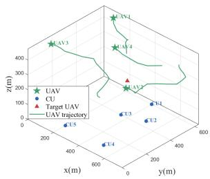  
(b)  
Fig. 3. Performance of trajectories: (a) The city map of Manhattan and (b) 3D Optimized trajectories via AIEA.

Fig. 3(b) depicts the 3D optimized trajectories of UAVs via AIEA. Specifically, UAV3 first targets CU3, with a directional communication beam covering the user. Then, it serves CU4 and CU5 by leveraging its high-altitude advantage. Along the trajectory near the target UAV, it transmits signals via sensing beamforming while maintaining continuous communication service. UAV2 adopts a low altitude and flies near the target UAV while ensuring communication with CU1. Through short reciprocating maneuvers, it captures reflected echoes efficiently with a high-gain receive beam. Based on the trajectory planning, UAVs achieve precise beamforming-task matching, balancing the accuracy of sensing beams, echo capture of receiving beams, and user coverage of communication beams to enable efficient execution of ISAC-based anti-UAV tasks.

Fig. 4(a) illustrates the convergence characteristics of the trace of CRB versus the number of iterations under different SINR requirements and initial position uncertainties. A comparison of the three curves shows that stringent communication requirements degrade the positioning accuracy. A smaller initial position uncertainty leads to faster algorithm convergence and a higher final positioning accuracy. Overall, the iterative process progressively enhances the positioning accuracy. Notably, all curves converge and stabilize within 5 iterations, demonstrating the fast convergence speed and high computational efficiency of the proposed AIEA.

In Fig. 4(b), as the initial position uncertainty of the target UAV increases from 4 m to 10 m, the CRB trace of AIEA remains stable at the lowest level, demonstrating strong robustness. In contrast, the trace of RA increases moderately from 1.5 to 2.5, and its positioning accuracy declines slightly due to the lack of targeted optimization in random association. RS features low random scheduling efficiency and limited error offset capability. CUS prioritizes communication rates, leading to insufficient sensing resources and high sensitivity to position uncertainty. ZF shows a steady rise with its ignorance of position uncertainty, revealing its vulnerability to location errors. MBS relies solely on position information without uncertainty optimization, resulting in the most significant drop.

In Fig. 5(a), the sensing performance of all algorithms degrades as the number of CUs increases. In contrast, AIEA achieves stable positioning performance by dynamically balancing sensing robustness, communication quality, and association scheduling. For MBS, all sensing resources are allocated to strengthen the link between the target and BSs, without considering the spatial correlation and mutual interference introduced by the growing number of CUs. This leads to a steeply rising CRB trace, fully exposing its fragility in complex and high-interference environments. ZF lacks robustness mechanisms against target position errors. When the mismatch between the ideal channel state assumption and actual position uncertainty deteriorates sharply, it fails to adapt to the dynamic spatial distribution of users, resulting in the highest CRB value among all baseline schemes.

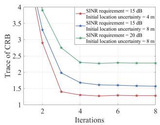  
(a)

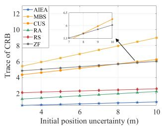  
(b)  
Fig. 4. Sensing performance with varying parameters: (a) Number of iterations and (b) Initial position uncertainty of the target UAV.

In Fig. 5(b), we evaluate the impact of CU noise power on the trace of CRB under different SINR requirements. As the CU noise power increases from -115 dBm to -100 dBm, the CRB traces of both algorithms exhibit a consistent upward trend, indicating that elevated noise levels degrade the overall positioning accuracy. By dynamically optimizing the trajectories and resource allocation to safeguard sensing performance, AIEA maintains a relatively low CRB trace even under the stringent SINR requirement of 10 dB. However, ZF prioritizes enforcing zero inter-user interference at the expense of sensing robustness. This rigid design fails to adjust beam directions to mitigate the amplified noise, leading to a rapid degradation in echo signal quality and a corresponding sharp surge in the CRB trace.

In Fig. 5(c), AIEA achieves the best sensing performance. Its optimized resource scheduling and association strategy effectively balances communication SINR requirements and sensing resource reservation. Without trajectory design, MBS focuses on the sensing performance of the receiving BS, lead ing to squeezed sensing resources as communication requirements increase. CUS prioritizes maximizing communication rates and resources are heavily tilted toward communication under high SINR requirements. RA lacks targeted design in random association, leading to lower sensing resource allocation efficiency than that of AIEA. RS has low resource utilization efficiency due to random sensing scheduling. With fixed zero-forcing beamforming, ZF shows the steepest CRB rise as SINR requirements increase, failing to balance communication and sensing.

Fig. 6(a) demonstrates the beam pattern of type-1 UAV1, including the radiation patterns of communication and sensing beams. The communication beam peak points accurately to the angle of CU3, while the sensing beam peak matches the target angle, achieving angular alignment of beamforming with the user and the target UAV, respectively. Meanwhile, the two beams alternately form main lobes and suppress side lobes in different angular intervals. This ensures communication signal gain for users, achieves sensing signal focusing on the target, and avoids mutual interference between the two beams.

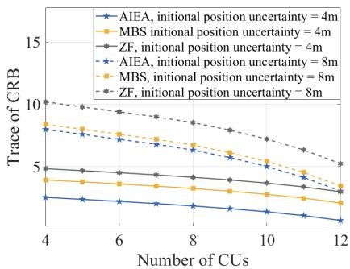  
(a)

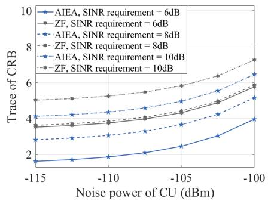  
(b)

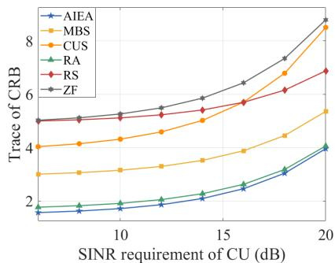  
(c)  
Fig. 5. Sensing performance with varying parameters of CU: (a) Number of CUs; (b) Noise power of CU; and (c) SINR requirement of CU.

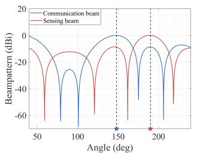  
(a)

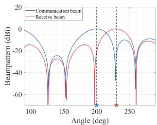  
(b)  
Fig. 6. Beamforming performance: (a) Beampattern of type-1 UAV and (b) Beampattern of type-2 UAV.

Fig. 6(b) illustrates the beam pattern of type-2 UAV2, covering two beams: communication transmission beam and receiving beam. The communication beam main lobe peak aligns precisely with CU2, ensuring directional communication signal gain for the user. The receiving beam main lobe peak matches the target angle, capturing sensing echo signals in this direction. Meanwhile, when the communication beam main lobe covers the user, the receiving beam main lobe focuses on the target. This design avoids interference between communication transmission and sensing reception, and ensures communication link stability and sensing echo reception accuracy.

In Fig. 7(a), at low SINRs, AIEA decreases rapidly with an increasing number of UAVs by fully leveraging multi-UAV sensing collaboration. RA remains low and stable with random user association, and additional UAVs barely improve positioning accuracy. For RS, low random scheduling efficiency limits the effectiveness of multi-UAV sensing. At high SINRs, AIEA still declines with more UAVs deployed, and multi-UAV collaboration effectively mitigates the occupation of sensing resources by communication tasks. The CRB of RA remains low, while RS maintains a relatively high value, with additional UAVs bringing negligible improvement in sensing accuracy.

In Fig. 7(b), lower SINRs generally lead to lower CRB traces, indicating that low SINRs release more sensing resources. At the same SINR, the trace of AIEA is significantly lower than those of RA and RS, and AIEA achieves optimal sensing performance at 8 dB. This demonstrates that AIEA enables optimal resource allocation under both high and low communication requirements. All curves remain stable as UAV flight speed increases, highlighting AIEA’s adaptability to dynamic scenarios. While RA and RS also maintain stable performance, their sensing accuracy is consistently inferior to AIEA.

In Fig. 7(c), all algorithms show improved sensing performance as transmit power increases, but power utilization efficiency varies significantly. AIEA remains the lowest as its optimized scheduling and association strategy efficiently allocates increased power to sensing tasks. RA shows weak power gain-to-sensing conversion, owing to the lack of service allocation in random association. CUS prioritizes maximizing communication rates, so additional power is mostly allocated to communication, leading to slow improvement in sensing performance. MBS and RS exhibit weak capability: the former does not optimize power allocation for sensing, while the latter suffers from low random scheduling efficiency. ZF maintains the highest CRB and slowest descent across all transmit power levels, revealing its poor efficiency in converting extra power into sensing accuracy.

## VI. CONCLUSION

To overcome the limitations in achieving both flexible sensing and reliable positioning, this paper proposed an ISAC-enabled anti-UAV algorithm considering the mobilityinduced position uncertainty of the target UAV. First, we derived the corresponding CRB matrix for target UAV sensing under position uncertainty and established the theoretical lower bound on position estimation accuracy. Then, we formulated the long-term CRB minimization problem and designed a robust optimization algorithm by jointly optimizing transmit-receive beamforming, association scheduling, and trajectories of multi-UAVs. Specifically, by developing a Schur complement-based generalized Petersen’s signdefiniteness lemma, we converted the CRB matrix into a set of semidefinite constraints. Lagrangian relaxation was then adopted to decouple transmit-receive ISAC beamforming, with the tightness of SDR rigorously proven. We further proposed a penalty-based SCA algorithm to tackle the coupled UAV scheduling and CU association, and verified the convergence and effectiveness of AIEA. Numerical results validated the performance improvements of our proposed algorithm in cooperative sensing accuracy. For future research, we will extend the proposed framework to multi-target UAV scenarios to enable large-scale anti-UAV operations.

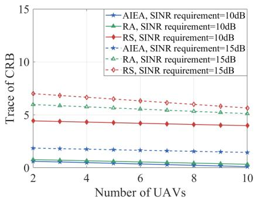  
(a)

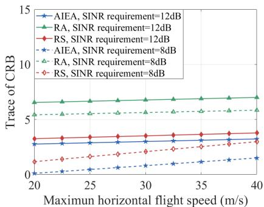  
(b)

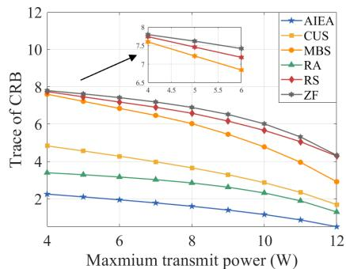  
(c)  
Fig. 7. Sensing performance with varying parameters of UAV: (a) Number of UAVs; (b) Maximum horizontal flight speed; and (c) Maximum transmit power.

## APPENDIX A

## PROOF OF THEOREM 1

According to equation (1), space-air channel $\mathbf { h } _ { m s } \left[ n \right]$ consists of a deterministic LoS component and a random NLoS component. Thus, $\| \mathbf { h } _ { m s } \left[ n \right] \| ^ { 2 }$ follows a non-central chisquared distribution, which is a typical statistical model for Rician fading. The general form of the probability density function of the non-central chi-squared distribution is:

$$
P _ { X } \left( x \right) = \frac { 1 } { 2 } e ^ { - \frac { x + \Phi } { 2 } } \left( \frac { x } { \Phi } \right) ^ { \frac { Q _ { T } - 1 } { 2 } } I _ { Q _ { T } - 1 } \left( 2 \sqrt { \Phi } x \right) ,\tag{A.1}
$$

where $\Phi = 2 \kappa \rho _ { m s } Q _ { T } / \left( \kappa + 1 \right) d _ { m s } ^ { 2 } \left[ n \right]$ quantifies the contribution of the LoS component to the statistical characteristics of the squared channel norm, and $I _ { n } \left( x \right)$ denotes the modified Bessel function of the first kind of order n, expressed as:

$$
I _ { n } \left( x \right) = \frac { 1 } { \pi } \int _ { 0 } ^ { \pi } e ^ { x \cos \theta } \cos \left( n \theta \right) d \theta .\tag{A.2}
$$

Thus, the corresponding cumulative distribution function is:

$$
\begin{array} { r l r } {  { C _ { X } ( x ) = \operatorname* { P r } \{ X \leq x \} = \int _ { - \infty } ^ { x } P _ { X } ( t ) d t } } & { \mathrm { ( A . 3 ) } } \\ & { } & { = \{ \begin{array} { l l } { 1 - M _ { Q _ { T } } \bigg ( \sqrt { 2 \kappa Q _ { T } } , d _ { m s } [ n ] \sqrt { \frac { 2 x ( \kappa + 1 ) } { \rho _ { m s } } } \bigg ) , } & { x \geq 0 , } \\ { 0 , } & { \mathrm { o t h e r w i s e } , } \end{array}  } \end{array}
$$

where $M _ { Q _ { T } } \left( a , b \right)$ is the Marcum Q-function, defined as:

$$
M _ { Q _ { T } } ( a , b ) \triangleq \frac { 1 } { a ^ { Q _ { T } - 1 } } \int _ { b } ^ { \infty } x ^ { Q _ { T } - 1 } e ^ { - \frac { x ^ { 2 } + a ^ { 2 } } { 2 } } I _ { Q _ { T } - 1 } \left( a x \right) d x .\tag{A.4}
$$

## APPENDIX B PROOF OF COROLLARY 1

Since $M _ { Q _ { T } } ( a , b )$ is strictly increasing as b decreases for fixed $Q _ { T }$ and a, and $\begin{array} { c c l } { b } & { = } & { \sqrt { C / P _ { m } ^ { \mathrm { S A T } } [ n ] } } \end{array}$ is strictly decreasing in $P _ { m } ^ { \mathrm { S A T } } [ n ]$ , the outage probability is strictly increasing in $P _ { m } ^ { \mathrm { S A T } } [ n ]$ . By considering feasible transmit power range $( 0 , P _ { \operatorname* { m a x } } ]$ , where $P _ { \mathrm { m a x } }$ is the maximum transmit power constraint, the outage probability approaches 1 as $P _ { m } ^ { \mathrm { S A T } } [ n ] $ $0 ^ { + }$ and reaches a minimum at $P _ { m } ^ { \mathrm { S A T } } [ n ] = P _ { \mathrm { m a x } } .$ . Therefore, there exists a unique $P _ { m } ^ { \mathrm { S A T } } [ n ]$ satisfying $\mathrm { P r } \left\{ \gamma _ { m } [ n ] \leq \Gamma _ { m } ^ { \mathrm { r e q } } \right\} =$ $\epsilon _ { m } [ n ]$ that minimizes the transmit power while meeting the constraint, which can be efficiently obtained via binary search and is treated as a predefined parameter in subsequent analysis.

## APPENDIX C

## PROOF OF THEOREM 2

First, we define the overall sensing channel matrix of as $\mathbf { G } _ { L , m } [ n ] { = } \left[ \varrho _ { 1 , L , m } [ n ] \mathbf { H } _ { 1 , L , m } [ n ] , \ldots , \bar { \varrho } _ { M , L , m } [ n ] \mathbf { H } _ { M , L , m } [ n ] \right] { \in }$ $\dot { \mathbb { C } } ^ { Q _ { R } \times \dot { M } Q _ { T } }$ , and the transmit signal vector $\begin{array} { r l } { \widetilde { \mathbf { x } } [ n ] \ : } & { { } = } \end{array}$ $\left[ \mathbf { x } _ { 1 } [ n ] ^ { T } , \ldots , \mathbf { x } _ { M } [ n ] ^ { T } \right] ^ { T } \in \mathbb { C } ^ { M Q _ { T } }$ . Then we can obtain:

$$
\widetilde { y } _ { m } \left[ n \right] = { \mathbf { u } } _ { m } ^ { H } \left[ n \right] { \mathbf { G } } _ { L , m } \left[ n \right] \widetilde { { \mathbf { x } } } \left[ n \right] + { \mathbf { u } } _ { m } ^ { H } \left[ n \right] { \mathbf { v } } _ { m } \left[ n \right] ,\tag{C.1}
$$

with receive beamforming vector $\mathbf { u } _ { m } [ n ] \in \mathbb { C } ^ { Q _ { R } }$ and noise vector $\mathbf { v } _ { m } [ n ] \in \mathbb { C } ^ { Q _ { R } }$ . Consequently, element $( i , j )$ of $\mathbf { F } _ { m } \left[ n \right]$ is given by:

$$
F _ { m } ^ { ( i , j ) } = \frac { 2 } { \sigma _ { m } ^ { 2 } } ~ \Re \left\{ \frac { \partial \widetilde { y } _ { m } [ n ] } { \partial \mathfrak { S } _ { i } [ n ] } \frac { \partial \widetilde { y } _ { m } [ n ] } { \partial \mathfrak { S } _ { j } [ n ] } \right\} ,\tag{C.2}
$$

where $\partial \widetilde { y } _ { m } [ n ] / \partial \mathfrak { S } _ { i } [ n ] = \mathbf { u } _ { m } ^ { H } [ n ] \dot { \mathbf { G } } _ { L , m } ^ { ( i ) } [ n ] \widetilde { \mathbf { x } } [ n ]$ . Variable ${ \mathfrak { S } } _ { i } [ n ]$ denotes element i of the parameter vector to be estimated, and $\dot { \bf G } _ { L , m } ^ { ( i ) } [ n ]$ represents the derivative of ${ \bf G } _ { L , m } [ n ]$ with respect to ${ \mathfrak { S } } _ { i } [ n ]$ . Specifically, if $i \in \{ 1 , 2 , 3 \} , \dot { \bf G } _ { L , m } [ n ] =$ $\left[ \varrho _ { 1 , L , m } [ n ] \dot { \mathbf { H } } _ { 1 , L , m } [ n ] , \ldots , \varrho _ { M , L , m } [ n ] \dot { \mathbf { H } } _ { M , L , m } [ n ] \right]$ , where variable $\dot { \mathbf { H } } _ { 1 , L , m } ^ { ( i ) } [ n ]$ denotes the derivative of ${ \bf H } _ { 1 , L , m } [ n ]$ with respect to $\mathfrak { S } _ { i } [ n ] . \ \mathrm { ~ I f ~ } \ i \ \mathrm { ~ \Omega ~ } = \ \mathrm { ~ 4 , ~ }$ and term i of ${ \mathfrak { S } } _ { i } [ n ]$ is $\varrho _ { m ^ { \prime } , L , m } [ n ]$ , then $\mathbf { \dot { G } } _ { L , m } ^ { ( i ) } [ n ] = \left[ 0 , \cdots , \mathbf { \dot { H } } _ { m ^ { \prime } , L , m } ^ { ( i ) } [ n ] , \cdots , 0 \right]$ . If $i = 5$ , and term i of ${ \mathfrak { S } } _ { i } [ n ]$ is $\varrho _ { m ^ { \prime } , L , m } [ n ]$ , then $\dot { \bf G } _ { L , m } ^ { ( i ) } [ n ] =$ $\lbrack 0 , \cdots , j \dot { \bf H } _ { m ^ { \prime } , L , m } ^ { ( i ) } [ n ] , \cdots , 0 \rbrack$ . The same rule applies for $i =$ ${ \bar { 6 } } \dots 2 M + 3$ . Thus, we can obtain the following:

$$
\begin{array} { r l r } { { \cal F } _ { m } ^ { ( i , j ) } [ n ] = } & { \displaystyle \frac { 2 } { \sigma _ { m } ^ { 2 } } \Re \biggl \{ \biggl ( { \bf u } _ { m } ^ { H } [ n ] { \dot { \bf G } } _ { L , m } ^ { ( i ) } [ n ] \widetilde { \bf x } [ n ] \biggr ) \biggr ( { \bf u } _ { m } ^ { H } [ n ] { \dot { \bf G } } _ { L , m } ^ { ( j ) } [ n ] \widetilde { \bf x } [ n ] \biggr ) ^ { T } \biggr \} } & \\ { \displaystyle } & { = \frac { 2 } { \sigma _ { m } ^ { 2 } } \Re \biggl \{ \mathrm { T r } \left( { \bf u } _ { m } ^ { H } [ n ] { \bf u } _ { m } [ n ] { \dot { \bf G } } _ { L , m } ^ { ( i ) } [ n ] { \bf S } _ { m ^ { \prime } } [ n ] \left[ { \dot { \bf G } } _ { L , m } ^ { ( j ) } [ n ] \right] ^ { H } \right) \biggr \} } \\ { \displaystyle } & { \displaystyle = \frac { 2 } { \sigma _ { m } ^ { 2 } } \Re \biggl \{ \mathrm { v e c } \left( { \bf B } _ { m } ^ { H } [ n ] \right) \psi _ { m } ^ { ( i , j ) } [ n ] \biggr \} . } & { \quad { \mathrm { ( C . 3 ) } } } \end{array}
$$

where beamforming association matrix $\begin{array} { r l } { \mathbf { B } _ { m } [ n ] \quad } & { { } = } \end{array}$ $\mathbf { u } _ { m } ^ { H } [ n ] \mathbf { u } _ { m } [ n ] \mathbf { S } _ { m ^ { \prime } } [ n ] \ \stackrel { \smile } { \in } \mathbb { C } ^ { M Q _ { T } \times M Q _ { T } }$ , and sensing association vector $\psi _ { m } ^ { ( i , j ) } [ n ] = \mathrm { v e c } \left( \dot { \mathbf { G } } _ { L , m } ^ { ( j ) ^ { H } } [ n ] \dot { \mathbf { G } } _ { L , m } ^ { ( i ) } [ n ] \right) \in \ \mathbb { C } ^ { M ^ { 2 } Q _ { T } ^ { 2 } }$

## APPENDIX D PROOF OF THEOREM 3

The objective function of Problem P 1 is nonconvex with respect to beamforming vectors $( \mathcal { W } _ { m k } , \mathcal { R } _ { m } , \mathcal { U } _ { m } ) .$ , association scheduling $( \boldsymbol { \mathcal { A } } _ { m k } , \boldsymbol { B _ { m } } ) .$ , and UAV trajectory $\mathcal { P } _ { m }$ , which are highly coupled with each other. Besides, due to binary variables and nonconvex constraints, Problem P 1 is an MINNP problem. In fact, even if UAV trajectory and beamforming vectors are fixed, the problem reduces to finding an optimal solution for association scheduling to minimize the CRB trace, which belongs to the classical Knapsack problem. Thus, Problem P 1 exhibits NP-hard complexity.

## APPENDIX E PROOF OF THEOREM 4

We define $\mathfrak { A } ^ { * } \triangleq \{ \mathcal { W } _ { m k } ^ { * } , \mathcal { R } _ { m } ^ { * } , \mathcal { Q } ^ { * } , \mathcal { E } _ { m } ^ { * } \}$ as the optimal solution set of the convex problem SDR1, and construct a new solution set $\widetilde { \mathfrak { A } } ^ { * } \triangleq \{ \widetilde { \mathcal { W } } _ { m k } ^ { * } , \widetilde { \mathcal { R } } _ { m } ^ { * } , \widetilde { \mathcal { Q } } ^ { * } , \widetilde { \mathcal { E } } _ { m } ^ { * } \}$ satisfying:

$$
\widetilde { \mathcal { W } } _ { m k } ^ { * } = \frac { \mathcal { W } _ { m k } ^ { * } \mathbf { h } _ { m k } \mathbf { h } _ { m k } ^ { \mathrm { H } } \mathcal { W } _ { m k } ^ { * } } { \mathbf { h } _ { m k } ^ { \mathrm { H } } \mathcal { W } _ { m k } ^ { * } \mathbf { h } _ { m k } } ,\tag{E.1}
$$

$$
\widetilde { \mathcal { R } } _ { m } ^ { * } = \sum _ { k \in \mathcal { K } } \widetilde { \mathcal { W } } _ { m k } ^ { * } + \mathcal { R } _ { m } ^ { * } - \sum _ { k \in \mathcal { K } } \mathcal { W } _ { m k } ^ { * } ,\tag{E.2}
$$

$$
\widetilde { \mathcal { Q } } ^ { * } = \mathcal { Q } ^ { * } , \quad \widetilde { \mathcal { E } } _ { m } ^ { * } = \mathcal { E } _ { m } ^ { * } .\tag{E.3}
$$

From equation $( \mathrm { E . 1 } ) , ~ \widetilde { \mathcal { W } } _ { m k } ^ { * }$ is an outer product of vector $\mathcal { W } _ { m k } ^ { * } \mathbf { h } _ { m k } / \sqrt { \mathbf { h } _ { m k } ^ { \mathrm { H } } } \mathcal { W } _ { m k } ^ { * } \mathbf { h } _ { m k }$ and its Hermitian transpose, which yields Rank $( \widetilde { \mathcal { W } } _ { m k } ^ { * } ) = 1$ . By direct calculation, we have Tr $( \widetilde { \mathcal { W } } _ { m k } ^ { * } ) \ = \ \widetilde { \mathrm { T r } } \left( \mathcal { W } _ { m k } ^ { * } \right)$ , and $\mathrm { T r } \left( \mathbf { H } _ { m k } \widetilde { \mathcal { W } } _ { m k } ^ { * } \right) =$ Tr $\left( \mathbf { H } _ { m k } \mathcal { W } _ { m k } ^ { * } \right)$ , where matrix $\mathbf { H } _ { m k } = \mathbf { h } _ { m k } \mathbf { h } _ { m k } ^ { \mathrm { H } }$ . From equation (E.2), it follows that

$$
\sum _ { k \in \mathcal { K } } \widetilde { \mathcal { W } } _ { m k } ^ { * } + \widetilde { \mathcal { R } } _ { m } ^ { * } = \sum _ { k \in \mathcal { K } } \mathcal { W } _ { m k } ^ { * } + \mathcal { R } _ { m } ^ { * } ,\tag{E.4}
$$

which implies $\operatorname { T r } \left( \widetilde { \mathcal { R } } _ { m } ^ { * } \right) = \operatorname { T r } \left( \mathcal { R } _ { m } ^ { * } \right)$ , and $\mathrm { T r } \left( \mathbf { H } _ { m k } \widetilde { \mathcal { R } } _ { m } ^ { * } \right) =$ Tr $( \mathbf { H } _ { m k } \mathcal { R } _ { m } ^ { * } )$ . Thus, A∗ satisfies all constraints of SDR1.

Let $\mathcal { L }$ be the Lagrangian function of SDR1 with optimal dual variables $\{ v _ { m } ^ { \mathrm { I ast } } , v _ { m } ^ { \mathrm { I I ast } } , v _ { k } ^ { \ast } \}$ . Since the objective and constraints are linear in trace terms, the gradients of $\mathcal { L }$ at ${ \widetilde { \mathfrak { A } } } ^ { * }$ are identical to those at ${ \mathfrak { A } } ^ { * }$ , which yields

$$
\nabla _ { \widetilde { \mathcal { W } } _ { m k } } \mathcal { L } \big | _ { \widetilde { \mathfrak { A } } ^ { * } } = \mathbf { 0 } , \quad \nabla _ { \widetilde { \mathcal { R } } _ { m } } \mathcal { L } \big | _ { \widetilde { \mathfrak { A } } ^ { * } } = \mathbf { 0 } .\tag{E.5}
$$

The optimal dual variables are nonnegative, satisfying dual feasibility. As all constraint values are preserved under the above construction, the complementary slackness conditions hold for ${ \widetilde { \mathfrak { A } } } ^ { * }$ . Given that SDR1 is convex and $\widetilde { \mathfrak { A } } ^ { * }$ satisfies all KKT optimality conditions, ${ \widetilde { \mathfrak { A } } } ^ { * }$ is also optimal with Rank $( \widetilde { \mathcal { W } } _ { m k } ^ { * } ) = \bar { 1 }$ . By the same argument, SDR2 admits a rank-one optimal solution $\widetilde { \mathbf { U } } _ { m } ^ { * }$ such that Rank $( \widetilde { \mathbf { U } } _ { m } ^ { * } ) = 1$

## APPENDIX F

## PROOF OF THEOREM 5

First, we define $\tilde { \mathcal { I } }$ as the objective function of Problem P 3 and $( A _ { m k } ^ { * } , B _ { m } ^ { * } )$ as its optimal solution. For any feasible solution $\mathbf { \Omega } _ { . . } ( \mathcal { A } _ { m k } , \mathcal { B } _ { m } )$ to Problem $P 3 , \quad { \mathrm { w e } }$ have $\widetilde { \mathcal { I } } ( A _ { m k } ^ { * } , B _ { m } ^ { * } ) \leq \widetilde { \mathcal { I } } ( A _ { m k } , B _ { m } )$ . Next, we define $\widetilde { \mathcal { F } } _ { 1 } ~ =$ $\widetilde { \mathcal { I } } + \mu _ { \alpha } C _ { \alpha } ( \mathcal { A } _ { m k } ) + \mu _ { \beta } C _ { \beta } ( \mathcal { B } _ { m } )$ as the objective function of Problem $P 3 ^ { \prime }$ and $( A _ { m k } ^ { ( i ) } , B _ { m } ^ { ( t ) } )$ as its optimal solution corresponding to penalty factors $( \dot { \mu } _ { \alpha } ^ { ( t ) } , \mu _ { \beta } ^ { ( t ) } )$ as $t \to \infty$ . We obtain the following inequality:

$$
\begin{array} { r } { \widetilde { \mathcal { I } } ( \mathcal { A } _ { m k } ^ { ( t ) } , \mathcal { B } _ { m } ^ { ( t ) } ) + \mu _ { \alpha } ^ { ( t ) } C _ { \alpha } ( \mathcal { A } _ { m k } ^ { ( t ) } ) + \mu _ { \beta } ^ { ( t ) } C _ { \beta } ( \mathcal { B } _ { m } ^ { ( t ) } ) \leq \widetilde { \mathcal { I } } ( \mathcal { A } _ { m k } ^ { \ast } , \mathcal { B } _ { m } ^ { \ast } ) . } \end{array}\tag{F.1}
$$

By rearranging equation (F.1), we obtain:

$$
\mu _ { \alpha } ^ { ( t ) } C _ { \alpha } ( \mathcal { A } _ { m k } ^ { ( t ) } ) + \mu _ { \beta } ^ { ( t ) } C _ { \beta } ( \mathcal { B } _ { m } ^ { ( t ) } ) \leq \widetilde { \mathcal { I } } ( \mathcal { A } _ { m k } ^ { \ast } , \mathcal { B } _ { m } ^ { \ast } ) - \widetilde { \mathcal { I } } ( \mathcal { A } _ { m k } ^ { ( t ) } , \mathcal { B } _ { m } ^ { ( t ) } ) .\tag{F.2}
$$

Next, we define $( \overline { { A } } _ { m k } , \overline { { B } } _ { m } )$ as the limit point, and denote $\tau$ as an infinite subsequence such that

$$
\operatorname* { l i m } _ { t \in \mathcal { T } , t \to \infty } ( \mathcal { A } _ { m k } ^ { ( t ) } , \mathcal { B } _ { m } ^ { ( t ) } ) = ( \overline { { \mathcal { A } } } _ { m k } , \overline { { \mathcal { B } } } _ { m } ) .\tag{F.3}
$$

Since $\mu _ { \alpha } ^ { ( t ) } \to \infty , \mu _ { \beta } ^ { ( t ) } \to \infty .$ , and $C _ { \alpha } ( \alpha ) ~ \le ~ 0 , ~ C _ { \beta } ( \beta ) ~ \le ~$ 0 for all feasible $\alpha , \beta ,$ the left-hand side of equation (F.2) is bounded above only if $C _ { \alpha } ( \mathcal { A } _ { m k } ^ { ( t ) } ) \to 0$ and $\bar { C } _ { \beta } ( B _ { m } ^ { ( t ) } )  0$ This implies $\overline { { A } } _ { m k } \in \{ 0 , 1 \}$ and $\overline { { B } } _ { m } \in \{ 0 , 1 \}$ for all $m , k$ , and thus $( \overline { { \mathcal { A } } } _ { m k } , \overline { { B } } _ { m } )$ is feasible for Problem P 3.

Finally, taking the limit of equation (F.1), we obtain $\widetilde { \mathcal { I } } ( \overline { { \mathcal { A } } } _ { m k } , \overline { { \mathcal { B } } } _ { m } ) ~ \leq ~ \widetilde { \mathcal { I } } ( \mathcal { A } _ { m k } ^ { * } , \mathcal { B } _ { m } ^ { * } )$ . Since $( \overline { { A } } _ { m k } , \overline { { B } } _ { m } )$ is feasible for Problem P 3 and $( A _ { m k } ^ { * } , B _ { m } ^ { * } )$ is optimal, it follows that $\tilde { \mathcal { I } } ( \overline { { A } } _ { m k } , \overline { { B } } _ { m } ) = \tilde { \mathcal { I } } ( A _ { m k } ^ { * } , B _ { m } ^ { * } )$ . Thus, $( \overline { { A } } _ { m k } , \overline { { B } } _ { m } )$ is an optimal solution of Problem P 3.

## APPENDIX G PROOF OF THEOREM 6

We define variable sets $\mathcal { W } _ { m k } ^ { ( t ) } , \mathcal { R } _ { m } ^ { ( t ) } , \mathcal { U } _ { m } ^ { ( t ) } , \mathcal { A } _ { m k } ^ { ( t ) } , \mathcal { B } _ { m } ^ { ( t ) }$ and $\mathcal { P } _ { m } ^ { ( t ) }$ as the solution of iteration t of the formulated CRB minimization problem. Then, the corresponding objective function can be defined as $\bar { S } \big ( \mathcal { W } _ { m k } ^ { ( t ) } , \mathcal { R } _ { m } ^ { ( t ) } , \mathcal { U } _ { m } ^ { ( t ) } , \mathcal { A } _ { m k } ^ { ( t ) ^ { \ast } } , \mathcal { B } _ { m } ^ { ( t ) } , \mathcal { P } _ { m } ^ { ( t ) } \big )$ Variables ${ \mathcal W } _ { m k } ^ { ( t + 1 ) } , ~ { \mathcal R } _ { m } ^ { ( t + 1 ) }$ , and $\mathcal { U } _ { m } ^ { ( t + 1 ) }$ can be obtained for given $A _ { m k } ^ { ( t ) } , B _ { m } ^ { ( t ) }$ and $\mathcal { P } _ { m } ^ { ( t ) }$ by solving Problem P 2. Thus, the following inequality holds:

$$
\begin{array} { r l } & { S ( \mathcal { W } _ { m k } ^ { ( t ) } , \mathcal { R } _ { m } ^ { ( t ) } , \mathcal { U } _ { m } ^ { ( t ) } , \mathcal { A } _ { m k } ^ { ( t ) } , \mathcal { B } _ { m } ^ { ( t ) } , \mathcal { P } _ { m } ^ { ( t ) } ) \geq } \\ & { S ( \mathcal { W } _ { m k } ^ { ( t + 1 ) } , \mathcal { R } _ { m } ^ { ( t + 1 ) } , \mathcal { U } _ { m } ^ { ( t + 1 ) } , \mathcal { A } _ { m k } ^ { ( t ) } , \mathcal { B } _ { m } ^ { ( t ) } , \mathcal { P } _ { m } ^ { ( t ) } ) . } \end{array}\tag{G.1}
$$

Similarly, $A _ { m k } ^ { ( t ) } , B _ { m } ^ { ( t ) }$ and $\mathcal { P } _ { m } ^ { ( t ) }$ can be obtained by solving Problems P 3 and P 4, and the following inequalities hold:

$$
\begin{array} { r l } { S \big ( \mathcal { W } _ { m k } ^ { ( t + 1 ) } , \mathcal { R } _ { m } ^ { ( t + 1 ) } , \mathcal { U } _ { m } ^ { ( t + 1 ) } , \mathcal { A } _ { m k } ^ { ( t ) } , \mathcal { B } _ { m } ^ { ( t ) } , \mathcal { P } _ { m } ^ { ( t ) } \big ) \ : \ge } & { { } } \end{array}
$$

$$
\begin{array} { r } { S \big ( \mathcal { W } _ { m k } ^ { ( t + 1 ) } , \mathcal { R } _ { m } ^ { ( t + 1 ) } , \mathcal { U } _ { m } ^ { ( t + 1 ) } , \mathcal { A } _ { m k } ^ { ( t + 1 ) } , \mathcal { B } _ { m } ^ { ( t + 1 ) } , \mathcal { P } _ { m } ^ { ( t ) } \big ) . } \end{array}\tag{G.2}
$$

$$
\begin{array} { r l } { S \big ( \mathcal { W } _ { m k } ^ { ( t + 1 ) } , \mathcal { R } _ { m } ^ { ( t + 1 ) } , \mathcal { U } _ { m } ^ { ( t + 1 ) } , \mathcal { A } _ { m k } ^ { ( t + 1 ) } , \mathcal { B } _ { m } ^ { ( t + 1 ) } , \mathcal { P } _ { m } ^ { ( t ) } \big ) \geq } & { { } } \end{array}
$$

$$
\begin{array} { r } { S \big ( \mathcal { W } _ { m k } ^ { ( t + 1 ) } , \mathcal { R } _ { m } ^ { ( t + 1 ) } , \mathcal { U } _ { m } ^ { ( t + 1 ) } , \mathcal { A } _ { m k } ^ { ( t + 1 ) } , \mathcal { B } _ { m } ^ { ( t + 1 ) } , \mathcal { P } _ { m } ^ { ( t + 1 ) } \big ) . } \end{array}\tag{G.3}
$$

Based on inequalities $( \mathbf { G } . 1 ) \ – ( \mathbf { G } . 3 )$ , we can obtain:

$$
\begin{array} { r l } & { S \big ( \mathcal { W } _ { m k } ^ { ( t ) } , \mathcal { R } _ { m } ^ { ( t ) } , \mathcal { U } _ { m } ^ { ( t ) } , \mathcal { A } _ { m k } ^ { ( t ) } , \mathcal { B } _ { m } ^ { ( t ) } , \mathcal { P } _ { m } ^ { ( t ) } \big ) \geq } \\ & { S \big ( \mathcal { W } _ { m k } ^ { ( t + 1 ) } , \mathcal { R } _ { m } ^ { ( t + 1 ) } , \mathcal { U } _ { m } ^ { ( t + 1 ) } , \mathcal { A } _ { m k } ^ { ( t + 1 ) } , \mathcal { B } _ { m } ^ { ( t + 1 ) } , \mathcal { P } _ { m } ^ { ( t + 1 ) } \big ) . } \end{array}\tag{G.4}
$$

From constraint (34a), the positive semi-definiteness of $\mathbf { J } _ { m }$ yields a positive lower bound for the sum of CRB traces. Together with the non-increasing monotonicity of the objective under alternating optimization, the convergence of AIEA is rigorously guaranteed.

## REFERENCES

[1] X. Wang et al., “Energy-efficient secure aerial communications for lowaltitude economy: Joint UAV scheduling and trajectory optimization,” IEEE Transactions on Wireless Communications, vol. 25, pp. 14 828– 14 844, 2026.

[2] X. Luo et al., “ISAC – a survey on its layered architecture, technologies, standardizations, prototypes and testbeds,” IEEE Communications Surveys & Tutorials, vol. 28, pp. 485–526, 2026.

[3] R. Liu, M. Li, and A. Lee Swindlehurst, “Joint array partitioning and beamforming designs in ISAC systems: A bayesian CRB perspective,” IEEE Journal on Selected Areas in Communications, vol. 44, pp. 150– 164, 2026.

[4] H. T. Nguyen et al., “Energy efficiency for massive MIMO integrated sensing and communication systems,” IEEE Journal on Selected Areas in Communications, vol. 44, pp. 165–180, 2026.

[5] Y. Zhang et al., “Cooperative beamforming design for anti-UAV ISAC systems,” IEEE Transactions on Wireless Communications, vol. 24, no. 3, pp. 2249–2264, 2025.

[6] X. Liu and C. Fischione, “Coordinated beamforming for multi-cell ISAC using graph neural networks,” IEEE Transactions on Wireless Communications, vol. 25, pp. 5876–5889, 2026.

[7] S. Zhang et al., “Two-stage transmission framework and resource allocation for mmwave-ISAC systems,” IEEE Transactions on Wireless Communications, vol. 25, pp. 5797–5810, 2026.

[8] Y. Wang et al., “ISAC enabled cooperative detection for cellularconnected UAV network,” IEEE Transactions on Wireless Communications, vol. 24, no. 2, pp. 1541–1554, 2025.

[9] G. Cheng et al., “Networked ISAC for low-altitude economy: Coordinated transmit beamforming and UAV trajectory design,” IEEE Transactions on Communications, vol. 73, no. 8, pp. 5832–5847, 2025.

[10] K. Meng et al., “Throughput maximization for UAV-enabled integrated periodic sensing and communication,” IEEE Transactions on Wireless Communications, vol. 22, no. 1, pp. 671–687, 2023.

[11] W. Mao et al., “UAV-assisted communications in SAGIN-ISAC: Mobile user tracking and robust beamforming,” IEEE Journal on Selected Areas in Communications, vol. 43, no. 1, pp. 186–200, 2025.

[12] X. Jing et al., “ISAC from the sky: UAV trajectory design for joint communication and target localization,” IEEE Transactions on Wireless Communications, vol. 23, no. 10, pp. 12 857–12 872, 2024.

[13] A. Khalili et al., “Efficient UAV hovering, resource allocation, and trajectory design for ISAC with limited backhaul capacity,” IEEE Transactions on Wireless Communications, vol. 23, no. 11, pp. 17 635– 17 650, 2024.

[14] B. Li et al., “A control-based design of beamforming and trajectory for UAV-enabled ISAC system,” IEEE Transactions on Wireless Communications, vol. 25, pp. 3469–3484, 2026.

[15] K. Meng et al., “UAV-enabled integrated sensing and communication: Opportunities and challenges,” IEEE Wireless Communications, vol. 31, no. 2, pp. 97–104, 2024.

[16] X. Guo et al., “Integrated sensing and communications in multi-UAV networks: A dual-objective optimization perspective,” IEEE Transactions on Wireless Communications, vol. 25, pp. 10 066–10 081, 2025.

[17] X. Wang et al., “Constrained utility maximization in dual-functional radar-communication multi-UAV networks,” IEEE Transactions on Communications, vol. 69, no. 4, pp. 2660–2672, 2021.

[18] H. He et al., “Energy-efficient multi-UAV navigation for cooperative data sensing and transmission,” IEEE Transactions on Mobile Computing, vol. 25, no. 3, pp. 3119–3136, 2026.

[19] L. Zhou et al., “Robust multi-UAV placement optimization for AOAbased cooperative localization,” IEEE Transactions on Intelligent Vehicles, vol. 9, no. 10, pp. 6122–6136, 2024.

[20] T. Zhang et al., “Trajectory design and power control for joint radar and communication enabled multi-UAV cooperative detection systems,” IEEE Transactions on Communications, vol. 71, no. 1, pp. 158–172, 2023.

[21] Y. Qin et al., “Deep reinforcement learning based resource allocation and trajectory planning in integrated sensing and communications UAV network,” IEEE Transactions on Wireless Communications, vol. 22, no. 11, pp. 8158–8169, 2023.

[22] B. Yin, X. Fang, and X. Wang, “Robust group target awareness inference in multi-UAV-enabled ISCC networks based on split deep reinforcement learning,” IEEE Transactions on Wireless Communications, vol. 24, no. 11, pp. 9478–9492, 2025.

[23] C. You and R. Zhang, “3D trajectory optimization in rician fading for UAV-enabled data harvesting,” IEEE Transactions on Wireless Communications, vol. 18, no. 6, pp. 3192–3207, 2019.

[24] B. Li et al., “3D trajectory optimization for energy-efficient UAV communication: A control design perspective,” IEEE Transactions on Wireless Communications, vol. 21, no. 6, pp. 4579–4593, 2022.

[25] M. Gapeyenko et al., “Line-of-sight probability for mmwave-based UAV communications in 3D urban grid deployments,” IEEE Transactions on Wireless Communications, vol. 20, no. 10, pp. 6566–6579, 2021.

[26] W. Mao et al., “Cramer–Rao bound optimization for bistatic ISAC:´ Transceiver design and attention-based ISACNet,” IEEE Journal on Selected Areas in Communications, vol. 44, pp. 181–195, 2026.

[27] C. Deng, X. Fang, and X. Wang, “Beamforming design and trajectory optimization for UAV-empowered adaptable integrated sensing and communication,” IEEE Transactions on Wireless Communications, vol. 22, no. 11, pp. 8512–8526, 2023.

[28] B. Liu et al., “Resource allocation and trajectory design for MISO UAVassisted MEC networks,” IEEE Transactions on Vehicular Technology, vol. 71, no. 5, pp. 4933–4948, 2022.

[29] B. Lyu et al., “Robust transmission design for reconfigurable intelligent surface and movable antenna enabled symbiotic radio communications,” IEEE Transactions on Wireless Communications, vol. 25, pp. 1702– 1716, 2026.

[30] P. Stoica and A. Nehorai, “MUSIC, maximum likelihood, and Cramer-Rao bound,” IEEE Transactions on Acoustics, Speech, and Signal Processing, vol. 37, no. 5, pp. 720–741, 1989.

[31] Y. Xu, D. Xu, and S. Song, “Sensing-assisted robust SWIPT for mobile energy harvesting receivers in networked ISAC systems,” IEEE Transactions on Wireless Communications, vol. 24, no. 3, pp. 2094– 2109, 2025.

[32] C. Siriteanu et al., “Schur complement based analysis of MIMO zeroforcing for rician fading,” IEEE Transactions on Wireless Communications, vol. 14, no. 4, pp. 1757–1771, 2015.

[33] S. Li et al., “CSI-impaired secure resource allocation for SWIPT-enabled full-duplex consumer internet of things networks in smart healthcare,” IEEE Transactions on Consumer Electronics, vol. 69, no. 4, pp. 685– 696, 2023.

[34] X. Wang et al., “Wireless powered metaverse: Joint task scheduling and trajectory design for multi-devices and multi-UAVs,” IEEE Journal on Selected Areas in Communications, vol. 42, no. 3, pp. 552–569, 2024.

[35] Z. Ning et al., “Joint trajectory and beamforming optimization for UAV-ISAC secure communications,” IEEE Transactions on Wireless Communications, pp. 1–1, 2026.

[36] Y. Wang, M. Tao, and S. Sun, “Cramer-Rao bound analysis and´ beamforming design for integrated sensing and communication with extended targets,” IEEE Transactions on Wireless Communications, vol. 23, no. 11, pp. 15 987–16 000, 2024.