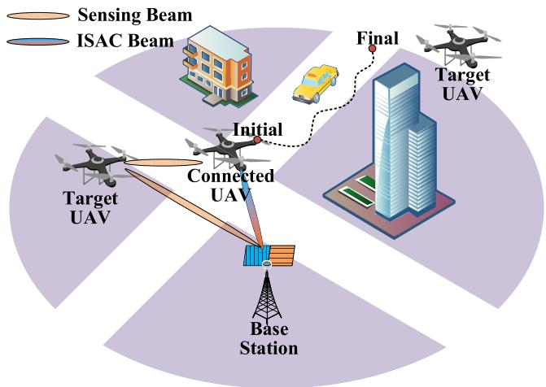
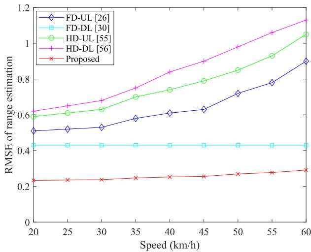
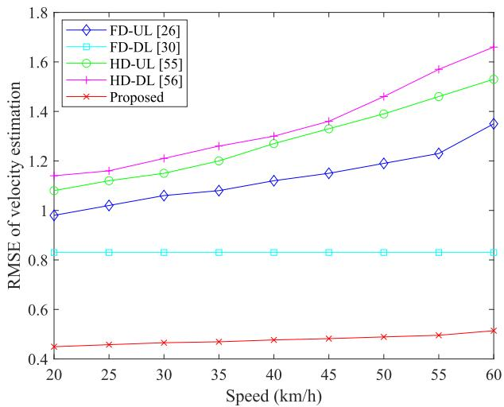
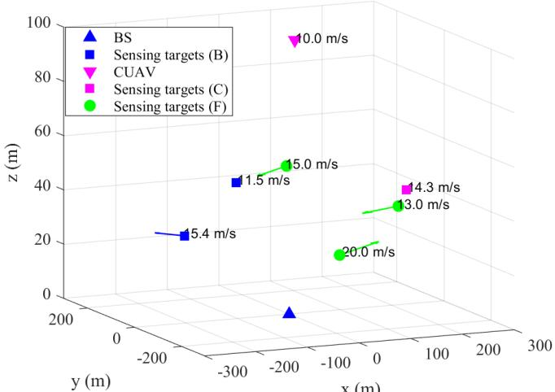
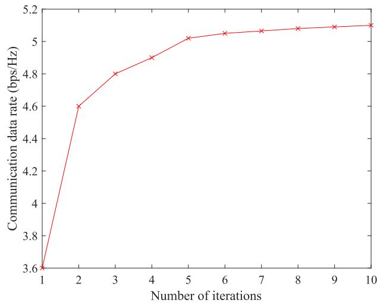
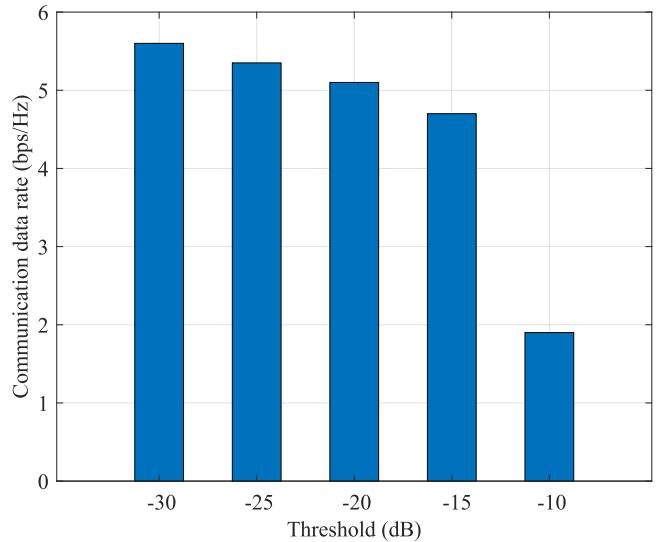
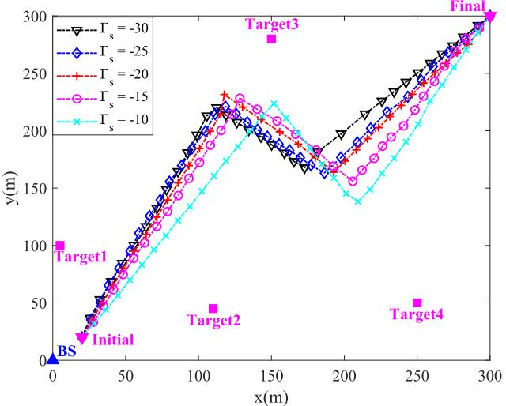
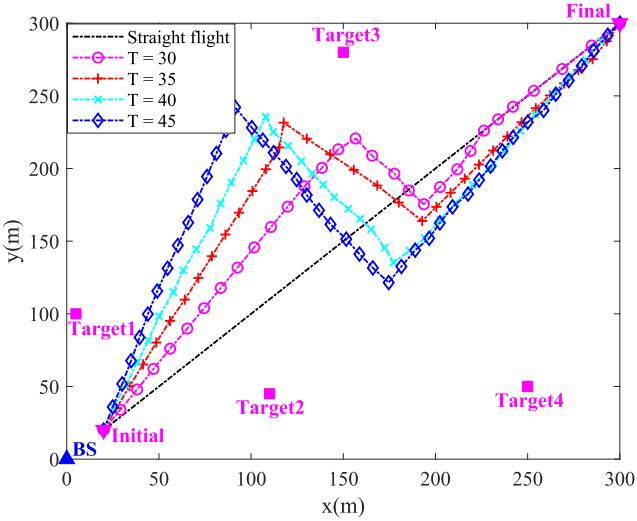
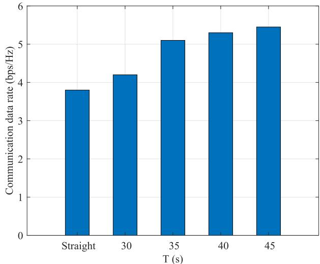
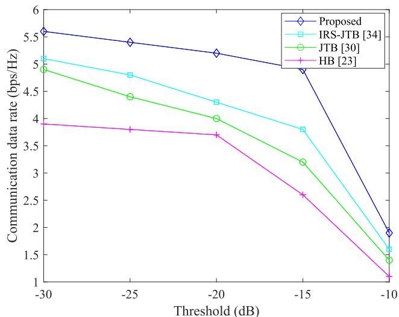

# ISAC Enabled Cooperative Detection for Cellular-Connected UAV Network

Yi Wang , Member, IEEE, Keke Zu , Member, IEEE, Luping Xiang, Member, IEEE, Qixun Zhang , Member, IEEE, Zhiyong Feng , Senior Member, IEEE, Jie Hu , Senior Member, IEEE, and Kun Yang , Fellow, IEEE

Abstract— The rapid development of low altitude Unmanned Aerial Vehicles (UAVs) as a new mode of transportation has injected a new driving force into the market development, but at the same time, unreported “black flight” UAVs have also created new risks in civil aviation safety, citizen privacy protection and other social security areas. In this regard, the Integrated Sensing And Communication (ISAC) capability of Base Station (BS) can provide an effective means of communication and supervision of low-altitude UAVs. For example, by demarcating the electronic fence area, the ISAC BS can realize automatic detection of illegal invasion of UAVs, effectively guaranteeing low-altitude safety in the context of low-altitude economy. By leveraging the high mobility of UAVs and their strong air-ground Line-of-Sight (LoS) channels, UAV-enabled ISAC is anticipated to provide superior sensing and communication coverage, and enhanced sensing and communication performance compared to terrestrial ISAC. However, existing work mainly focus on single BS sensing with the assistance of communication, which may not fully activate ISAC’s potential and achieve high-precision long-range sensing. Given the above considerations, this paper provides a cellular-connected UAV system, where the BS and connected UAV

are employed to perform cooperative detection tasks for precise detection. To unleash the potential of ISAC in cellular-connected UAV systems, on the one hand, we propose an Extended Kalman Filtering (EKF) based data fusion algorithm to provide precise environment information and achieve beyond LoS sensing. On the other hand, according to the fusion results, we optimize the communication rate performance by jointly designing the transmit beamforming and trajectory subject to the power and practical fight constraints to combat the effect of mobility, while ensuring the sensing requirements, which can achieve a positive feedback loop. Extensive simulation results demonstrate that the proposed data fusion algorithm improves the estimation accuracy by 67% and the joint design of beamforming and trajectory algorithm improves the communication data rate by more than 31%.

Index Terms— Cellular-connected UAV, cooperative detection, data fusion, ISAC, joint design of the transmit beamforming and trajectory.

## I. INTRODUCTION

multi-purpose and multi-system Unmanned Aerial Vehicles (UAVs) have attracted increasing focus to support a wide range of commercial and civilian applications (e.g., traffic control, search and rescue, aerial monitoring), which is expected to provide better coverage, observation, measurement and control performance [1], [2]. UAVs can be exploited to provide an important starting point for the construction of smart cities [3]. However, Due to their low cost, simple control, and ease of transport, some UAVs already possess a significant load capacity, making them easily accessible to illegal individuals. This poses a serious threat to social security [4], [5], [6]. Due to the small Radar Cross-Section (RCS) of target UAVs and strong interference in the application environment, detection and identification of them have been a challenging technical problem, especially in the complex urban environments.

Wireless communication is a critically important technology to unleash the maximum potential of UAVs in numerous applications, through which the UAVs can be integrated into the cellular network, thus exploiting the ubiquitous coverage and high-speed backhaul characteristic of UAVs for cellular network [7]. Owing to the wide deployment of Base Station (BS), high data rate and stable communication links are considered to be the most promising candidates for providing high broadband wireless services as well as long range control and monitoring for UAV flight and task execution [8], [9].

Meanwhile, the cellular-connected UAV network is envisioned to provide not only conventional high communication data rate services, but also high-precision sensing capabilities, which is one promising method for the detection of target UAVs [10], [11], [12]. Such mission-critical use cases have been driving the integration of two functions of communication and sensing. The emerging Integrated Sensing And Communication (ISAC) technology improves the spectral efficiency, energy efficiency, and hardware efficiency by using wireless channels to transmit information while sensing the physical characteristics of the surrounding environment actively, thus enhancing the communication and sensing functions mutually and improving the overall network performance [13], [14], [15].

Unlike conventional cellular networks which are fixed on the ground, UAVs offer the unique capability to function both as aerial BSs and as users, thanks to their high mobility, autonomous operation, and flexible deployment [16], [17], [18]. Notably, UAVs present a cost-effective solution for enhancing ISAC services [19], [20], [21]. With their high mobility and robust Line-of-Sight (LoS) links, UAV-enabled ISAC can significantly boost system performance by extending sensing and communication range, providing high-speed and reliable communication, and enabling high-precision sensing. Driven by these advantages, integrating UAVs into existing cellular networks emerges as an effective strategy to facili tate communication and monitor surrounding “black flight” activities, thus ensuring low-altitude safety. Reference [22] described a downlink sensing process where detection information is derived from reflected echoes when the transmitted signal encounters potential targets (e.g., UAVs, buildings, or other obstacles). To improve the sensing performance, [23], [24] proposed a transmit beamforming design scheme which aims to maximize the sensing beampattern while guaranteeing the Signal-to-Interference-plus-Noise Ratio (SINR) requirement of each user. Besides, wireless communications can improve sensing data processing through effective sensory data offloading and edge computing [25], while sensing results can, in turn, enhance communication system design. Numerous beam training and tracking method have been proposed where sensing works can be done with the downlink communication simultaneously in various ISAC systems, which can reduce overhead and achieve precise target tracking [26], [27], [28]. Meanwhile, according to the sensing results, the ISAC waveform and beamforming scheme, sensing/communication time duration and real-time trajectories and can be designed properly to improve the communication (rate, throughput or SINR performance while guaranteeing the sensing capabilities [29], [30], [31]. Therefore, ISAC can provides the integration gain based on measurement results and mutually benefit each other [32]. However, most of mentioned work are focus on single BS or UAV enabled network, the sensing/communication performance are mainly dependent on the well LoS links between targets and transceivers. For the cellular-connected UAV network, BS has high sensing capabilities but limited by the detection range, while the UAV has high mobility but limited by the detection capabilities. It’s an essential problem to utilize the integration gain of ISAC for precise detection.

Unlike terrestrial ISAC systems, the performance of cellular-connected UAV networks is highly depend on UAV deployment and trajectory design, as the motion of targets varies with the UAV’s location. Considerable work have focused on optimizing the UAV’s location, trajectory, and beamforming [29], [30], [31], [33], [34], [35]. Reference [36] introduced a Deep Reinforcement Learning (DRL) strategy that learns environmental dynamics to make optimal trajectory decisions while meeting control, energy, and communication range requirements. Similarly, [37] proposed a solution to maximize network communication coverage by optimizing multi-UAV deployment, velocity, and energy usage. DRL has also been employed for resource management to enhance network reliability, latency, and energy efficiency [38], [39]. Besides, to minimize the age of information and ensure the freshness of sensing data, [40] formulated an optimization problem that jointly considers time duration, UAV trajectory, and task allocation. Reference [41] optimized the trajectories of UAVs and its corresponding unmanned ground vehicle for mobile charging to complete entire missions. Additionally, [42] proposed a scheme that combines user association, UAV location, and power allocation to improve UAV coverage. Other studies have optimized trajectory and transmit power to minimize energy consumption while meeting ISAC requirements [43], [44]. Reference [45] suggested optimizing trajectory and Reconfigurable Intelligent Surface (RIS) assisted jamming cancellation to boost data rates for Internet of Things (IoT) applications. However, the closely coupled resources like UAV trajectory and beamforming present a challenging optimization task, especially given the limited attention to this specific problem. Effectively designing joint dynamic UAV trajectory and beamforming is crucial for fully realizing the potential of ISAC in cellular-connected UAV networks.

Inspired by the prior art, this paper examines a cellular-connected UAV system that simultaneously offers communication and sensing services between the target UAV and connected UAV or BS. To improve the sensing accuracy, we propose an ISAC enabled cooperative detection scheme where the intra-system communication assists the sensing results fusion taken by BS and connected UAV. Meanwhile, the sensing fusion results will further improve the communication data rate performance by designing appropriate beamforming and trajectory, which can achieve a positive feedback loop. The communication and sensing complement each other, thus increasing high integration gain to enable the precise detection of target UAVs. The main contributions of this work are explicitly contrasted in Table I and are summarized as follows.

• We present a cellular-connected UAV system, where the BS and the connected UAV are employed to perform the detection task jointly. To improve the detection performance of this system, on the one hand, we conduct the information fusion through communication to improve the sensing performance. On the other hand, the sensing data fusion results in turn improves the communication data rate significantly. The communication and sensing complement each other.

TABLE I  
CONTRASTING THE CONTRIBUTIONS OF THIS WORK TO THE LITERATURE
<table><tr><td rowspan=1 colspan=1>Contribution</td><td rowspan=1 colspan=1>This Work</td><td rowspan=1 colspan=1>[36]</td><td rowspan=1 colspan=1>[37]</td><td rowspan=1 colspan=1>[40]</td><td rowspan=1 colspan=1>[41]</td><td rowspan=1 colspan=1>[42]</td><td rowspan=1 colspan=1>[43]</td><td rowspan=1 colspan=1>[30]</td></tr><tr><td rowspan=1 colspan=1>Communication</td><td rowspan=1 colspan=1>√</td><td rowspan=1 colspan=1>√</td><td rowspan=1 colspan=1>√</td><td rowspan=1 colspan=1>√</td><td rowspan=1 colspan=1>√</td><td rowspan=1 colspan=1>√</td><td rowspan=1 colspan=1>√</td><td rowspan=1 colspan=1>√</td></tr><tr><td rowspan=1 colspan=1>Sensing</td><td rowspan=1 colspan=1>√</td><td rowspan=1 colspan=1>×</td><td rowspan=1 colspan=1>×</td><td rowspan=1 colspan=1>√</td><td rowspan=1 colspan=1>×</td><td rowspan=1 colspan=1>√</td><td rowspan=1 colspan=1>√</td><td rowspan=1 colspan=1>√</td></tr><tr><td rowspan=1 colspan=1>Data fusion</td><td rowspan=1 colspan=1>√</td><td rowspan=1 colspan=1>×</td><td rowspan=1 colspan=1>×</td><td rowspan=1 colspan=1>×</td><td rowspan=1 colspan=1>×</td><td rowspan=1 colspan=1>×</td><td rowspan=1 colspan=1>X</td><td rowspan=1 colspan=1>×</td></tr><tr><td rowspan=1 colspan=1>Beamforming design</td><td rowspan=1 colspan=1>√</td><td rowspan=1 colspan=1>X</td><td rowspan=1 colspan=1>X</td><td rowspan=1 colspan=1>×</td><td rowspan=1 colspan=1>×</td><td rowspan=1 colspan=1>X</td><td rowspan=1 colspan=1>X</td><td rowspan=1 colspan=1>√</td></tr><tr><td rowspan=1 colspan=1>Trajectory design</td><td rowspan=1 colspan=1>√</td><td rowspan=1 colspan=1>√</td><td rowspan=1 colspan=1>√</td><td rowspan=1 colspan=1>√</td><td rowspan=1 colspan=1>√</td><td rowspan=1 colspan=1>√</td><td rowspan=1 colspan=1>√</td><td rowspan=1 colspan=1>√</td></tr><tr><td rowspan=1 colspan=1>Energy</td><td rowspan=1 colspan=1>√</td><td rowspan=1 colspan=1>√</td><td rowspan=1 colspan=1>√</td><td rowspan=1 colspan=1>√</td><td rowspan=1 colspan=1>√</td><td rowspan=1 colspan=1>√</td><td rowspan=1 colspan=1>√</td><td rowspan=1 colspan=1>√</td></tr></table>

• We propose an Extended Kalman Filtering (EKF) based data fusion algorithm to fuse the sensing results obtained by the BS and the connected UAV. Through fusion, not only the accurate positioning information of surrounding UAVs can be obtained, but also the beyond LoS sensing can be achieved.

• We design a joint beamforming and trajectory algorithm to further improve the communication data rate performance based on the fusion results, which is a non-convex problem and difficult to be optimally solved. By decomposing it into two subproblems, we proposed a Successive Convex Approximation (SCA) based algorithm to tackle this issue in an iterative way.

The rest of this article is laid out as follows. Section II presents the system model of the cellular-connected UAV system. Section III provides an EKF based data fusion algorithm. Section IV illustrates the joint design of beamforming and trajectory algorithm. Networking performance of cellular-connected UAV are investigated and results are provided in Section V. Finally, section VI concludes this article.

Notations: Bold uppercase letters denote matrices (e.g., A). Bold lowercase letters denote column vectors (e.g., v). Scalars are denoted by normal font (e.g., x); For an arbitrary matrix A, rank(A), tr(A), $A ^ { T } , A ^ { H }$ , and $A _ { p , q }$ denote its rank, trace, transpose, conjugate, and the p-th row and q-th column element, respectively. ∥·∥ and |·| denote the Euclidean distance and the magnitude, respectively.

## II. SYSTEM MODEL

## A. Scenario

Consider a cellular-connected UAV scenario in which the UAV and BS conduct cooperative detection operations, as shown in Fig. 1. A connected rotary-wing UAV is flying from an initial point to a final point which are given in advance within a time duration, during which it needs to maintain reliable communication with the cellular network while monitoring the surrounding K UAVs in real time. Assume that the BS is equipped with a Uniform Planar Array (UPA) while each UAV is equipped with a Uniform Linear Array (ULA) whose size is $M _ { t } ^ { U }$ antennas for transmitting and $M _ { r } ^ { U }$ antennas for receiving that are placed vertically to the horizontal plane. Equipped with two spatially separated half-wavelength spacing analog antenna arrays and self-leakage canceler, the BS can realize radio sensing towards potential targets while maintaining necessary downlink communication services. Given that the connected UAV is generally constrained by size and weight limitations, the feasible size of the antenna array is affected, which in turn impacts its beamforming capabilities and overall sensing performance. For ease of analysis, we consider deploying a vertically oriented ULA on the UAV. By incorporating a rotating mechanism into the rotary-wing UAV, it can achieve 360-degree coverage.

  
Fig. 1. The cellular-connected UAV cooperative detection scenario.

The three-dimensional position vectors of the BS is represented as $\begin{array} { c c l } { q _ { b } } & { = } & { \left[ x _ { b } , \bar { y } _ { b } , z _ { b } \right] ^ { T } } \end{array}$ . Moreover, the connected UAV is assumed to fly at a fixed altitude of H m which can extend the coverage of BS and significantly enhance the ISAC performance. For simplicity, we consider a finite flying time interval $t \in [ 0 , T ]$ from the predetermined initial position $\mathit { q } _ { I } ~ = ~ [ x _ { I } , y _ { I } , H ]$ to the final position $q _ { F } =$ $[ x _ { F } , y _ { F } , H ]$ , which can be discretized into $\begin{array} { r } { \dot { N } \ = \ \frac { T } { \Delta t } } \end{array}$ equal time slots with slot length ∆t. Let $n \in [ 1 , 2 , \cdots N ]$ denote the n-th time slot. Here, $\Delta t$ is set to be small enough, during which the position of UAV is assumed to be approximately unchanged so as to facilitate the subsequent joint trajectory and beamforming design for ISAC. The UAVs are assumed to fly at the time-varying coordinate ${ { q } _ { u } } \left( t \right) = \left[ { { x } _ { u } } \left( t \right) , { { y } _ { u } } \left( t \right) , H \right] ^ { T } ,$ at time interval $0 \leq t \leq T$ . As a result, the trajectory of the connected UAV, denoted by $\mathrm { U A V _ { c } , }$ can be approximated by the sequence $\begin{array} { r } { q _ { u , c } \left[ n \right] = \left[ x _ { u , c } \left[ n \right] , y _ { u , c } \left[ n \right] , H \right] ^ { T } , 1 \leq n \leq N } \end{array}$

## B. Singal Model

Due to the UAVs always fly at a relatively high altitude, the communication links between the connected UAV and BS/UAV are generally dominated by the LoS component. Unlike the existing works that assume the simplified

LoS channels, we consider the more practically accurate altitude-dependent Rician fading channels here. Therefore, the channel vector between the connected UAV and BS/UAV links at the n-th slot can be represented as [46] and [47]

$$
h _ { c } \left[ n \right] = \frac { \sqrt { K _ { R } } } { \sqrt { K _ { R } + 1 } } h _ { c } ^ { L o S } \left[ n \right] + \frac { 1 } { \sqrt { K _ { R } + 1 } } h _ { c } ^ { N L o S } \left[ n \right] ,\tag{1}
$$

where

$$
h _ { c } ^ { L o S } \left[ n \right] = \beta _ { c , 0 } e ^ { j 2 \pi f _ { c , 0 } t } \delta \left( t - \tau _ { c , 0 } \right) a \left( q _ { u , c } \left[ n \right] \right)\tag{2}
$$

and

$$
h _ { c } ^ { N L o S } \left[ n \right] = \sum _ { l = 1 } ^ { L } { { { \beta } _ { c , l } } e ^ { j 2 \pi { { f } _ { c , l } } t } } \delta \left( t - { { \tau } _ { c , l } } \right) a \left( { { q } _ { u , c } } \left[ n \right] \right)\tag{3}
$$

denote the LoS and NLoS components of channel, respectively. $K _ { R }$ denotes the Rician K-factor, L denotes the number of multipath, and $\beta _ { c , l } , \ f _ { c , l } , \ \tau _ { c , l }$ denote the channel fading coefficient, Doppler shift and delay of $l \in \{ 0 , 1 , 2 , \cdots , L \} \ – $ h path, respectively; and $a \left( q _ { u , c } \left[ n \right] \right)$ denotes the corresponding array steering vector at the n-th slot. Specially, the expression of steering vector a $, ( q _ { u , c } [ n ] )$ can be written as [48]

$$
a \left( q _ { u , c } \left[ n \right] \right) = \left[ 1 , e ^ { j \pi \cos \theta _ { n } } , \cdot \cdot \cdot e ^ { j \pi \left( M _ { t } ^ { U } - 1 \right) \cos \theta _ { n } } \right] .\tag{4}
$$

where $\theta _ { n }$ denote the corresponding departure angle at the n-th slot.

Consider the n-th particular time slot, the transmitted signal of the connected UAV can be written as

$$
x \left[ n \right] = \sum _ { i = 0 } ^ { K _ { s } } w _ { i } \left[ n \right] s _ { i } \left[ n \right] ,\tag{5}
$$

where $s _ { i } \left[ n \right]$ denotes the information signal sent by the connected UAV and $w _ { i } \left[ n \right]$ denotes the corresponding transmit beamforming vector. The dedicated communication signal between the connected UAV and BS $s _ { 0 } \left[ n \right]$ is with zero mean and unit variance. Due to the limited energy that UAVs can carry, we assume that there is sufficient energy for flying, taking into account the effects of wind and other physical factors, and do not discuss in detail how energy consumption is affected by wind or other physical factors. With the given maximum transmit power $P _ { t o t a l }$ , the beamforming vector has power constraints as

$$
\sum _ { i = 0 } ^ { K _ { s } } \left. w _ { i } \left[ n \right] \right. ^ { 2 } \leq P _ { t o t a l } .\tag{6}
$$

The received signal at the BS via a received beamforming vector $f _ { 0 } \left[ n \right]$ is thus given by

$$
\begin{array} { l } { { \displaystyle y _ { c } \left[ n \right] = f _ { 0 } ^ { H } \left[ n \right] h _ { c } ^ { H } \left[ n \right] w _ { 0 } \left[ n \right] s _ { 0 } \left[ n \right] } } \\ { { \displaystyle \qquad + \sum _ { i = 1 } ^ { K _ { s } } f _ { 0 } ^ { H } \left[ n \right] h _ { c } ^ { H } \left[ n \right] w _ { i } \left[ n \right] s _ { i } \left[ n \right] + z _ { c } \left[ n \right] , } } \end{array}\tag{7}
$$

where $z _ { c } \left[ n \right]$ denotes the Additive White Gaussian Noise (AWGN) with variance $\sigma _ { n } ^ { 2 }$ . Note that the first term of

equation (7) denotes the desired received communication signal and the second term denotes the cochannel interference. Therefore, the received SINR at the n-th slot is given as

$$
\gamma _ { B } \left[ n \right] = \frac { \left| f _ { 0 } ^ { H } \left[ n \right] h _ { c } ^ { H } \left[ n \right] w _ { 0 } \left[ n \right] \right| ^ { 2 } } { \displaystyle \sum _ { i = 1 } ^ { K _ { s } } \left| f _ { 0 } ^ { H } \left[ n \right] h _ { c } ^ { H } \left[ n \right] w _ { i } \left[ n \right] \right| ^ { 2 } + \sigma _ { n } ^ { 2 } } ,\tag{8}
$$

The achievable communication rate can be written as $C _ { c o m } \left[ n \right] = \log _ { 2 } \left( 1 + \gamma _ { B } \left[ n \right] \right)$

After receiving the echo signals reflected by surrounding UAVs, the connected UAV and BS needs to estimate the unknown parameters about the targets’ positioning information. Assume that the position of potential targets are predetermined based on the specific sensing tasks, it can be denoted as $q _ { u , j } \left[ n \right] , j \ \in \ \{ 1 , 2 , \cdot \cdot \cdot , K _ { s } \} . \ K _ { s }$ denotes the number of surrounding UAVs detected by the connected UAV. For simplicity, we select the transmit beampattern as the key sensing performance metric, for which depicts the transmit power distribution towards the interesting angles based on specific sensing tasks [49]. It can be designed properly to enhance sensing performance (e.g., target sensing, detection, and recognization) via echo signal processing. In the considered application scenario, the BS and connected UAV both act as dual-functional platform to perform downlink communication and sense potential targets simultaneously. Thus, the resultant transmit beampattern gain can be written as

$$
P _ { s , j } \left( q _ { u , c } \left[ n \right] \right) = a ^ { H } \left( q _ { u , c } \left[ n \right] \right) \left( w _ { j } \left[ n \right] w _ { j } ^ { H } \left[ n \right] \right) a \left( q _ { u , c } \left[ n \right] \right) .\tag{9}
$$

The targets’ positioning information can be obtained by processing the reflected echoes received at the connected UAV and BS, where the distance and velocity are estimated by employing a 2D Discrete Fourier Transform (DFT) approach [50]. After performing Inverse Fast Fourier Transform (IFFT) and Fast Fourier Transform (FFT) operations on the fast and slowtime domains, the delay $\widehat { \tau _ { n } }$ and Doppler frequency offset $\widehat { \mu _ { n } }$ can be estimated as

$$
\begin{array} { r l } & { \widehat { \tau _ { n } } = 2 \left\| q _ { u , n } - q _ { u , c } \right\| / c + z _ { \tau } , } \\ & { \widehat { \mu _ { n } } = 2 v _ { n } ^ { T } \left( q _ { u , n } - q _ { u , c } \right) f _ { c } / \left( c \left\| q _ { u , n } - q _ { u , c } \right\| \right) + z _ { \mu } , } \end{array}\tag{10}
$$

where $v _ { n }$ denotes the velocity of potential targets, and $z _ { \tau } ,$ $z _ { \mu }$ denotes the corresponding noises with Gaussian distribution, respectively. The Direction of Arrival (DoA) can be estimated by applying the Mutiple Signal Classification (MUSIC) algorithm, which decompose the covariance matrix of the output data of any array to obtain the signal subspace corresponding to the signal component and the noise subspace orthogonal to the signal component [51]. Then by traversing all possible arriving directions, the peak of angle spectrum corresponding to the estimated DoA.

## III. SENSING DATA FUSION

In order to ensure that the cooperative detection task is carried out successfully, first, the accuracy of detection needs to be improved effectively. In rapidly changing environments, the positioning accuracy of the targets may fall short of the performance requirements for ISAC due to the limited sensing capacity of a single UAV, as well as potential interference, Doppler effects, and overlooked noise factors. To ensure safe flight and swift task accomplishment in real time, it is crucial that control commands and sensor data are reliably and efficiently transmitted from the ground base station (BS) via wireless communication. Obviously, frequent data collection brings a lot of data redundancy, which will result in poor transmission performance. The similar and abnormal data can be eliminated and fused to improve the accuracy and stability of the data, and further reduce the frequency and quantity of data transmission. Therefore, data fusion has great efforts in improving positioning accuracy and link stability with the assistance of cellular-connected UAV network.

In this cellular-connected UAV scenario, we employ the centralized fusion strategy where both the connected UAV and BS transmit their sensing data to a central controller, which performs the data fusion task. This central controller can be a powerful server or a cloud-based service with significant computational resources. In the fusion process, the connected UAV use 5G wireless communication protocols to communicate with BS to share its sensing data before it reaches the central controller, while BS typically have robust and high-capacity backhaul connections to central controllers, such as fiber optics or high-speed wireless links. By following this approach, this system can effectively utilize both UAV and BS sensing capabilities while ensuring efficient and accurate data fusion.

The Kalman filter gives us a way to combine measurements from different sensors with a mathematical model that predicts the object location [52]. It updates the trusted weights between measurements and estimations based on how much we trust a particular sensor or model to get the best estimate of the exact location. The EKF based data level fusion can take into account the real time performance of data and make full use of positioning information in cellular-connected UAV system, which are collected by UAV or base station, thus achieving a high-precision UAV positioning for the precise detection and high quality [53]. According to the sensing results $S ^ { U }$ obtained by UAV and $S ^ { B }$ obtained by BS, we can not only distinguish between different targets and other UAVs, but also further accurately estimate the trajectory of interested targets. The sensing results contains two aspects: the positioning information and the motion state, which can be denoted as $\boldsymbol { S } = ( \Omega , V )$ . The positioning information and motion state are expressed as Ω = (r sin θ cos $\varphi _ { ; }$ , r sin θ sin $\varphi , r \cos \theta ) ^ { T }$ and $V = \left( \mu _ { n } \right)$ , respectively.

First, we set normalized distance measurement to simplify the sensing data fusion process. The positioning and motion state Euclidean Distance (ED) between two measurement sets $\boldsymbol { S } ^ { U }$ and $S ^ { B }$ are given as $\begin{array} { r l } { \Psi _ { i , j } ^ { P } } & { { } = } \end{array}$ $\left\| \Omega _ { i } ^ { U } - \Omega _ { j } ^ { B } \right\| _ { 2 } ^ { 2 } \left| _ { i \in [ 1 , 2 , \cdots , s 1 ] , j \in [ 1 , 2 , \cdots , s 2 ] } \right.$ and $\Psi _ { i , j } ^ { M } \ = \ \left\| V _ { i } ^ { U } \ - \right\|$ ${ \ddot { V } } _ { j } ^ { B } \Big \| _ { \cdot } ^ { 2 } ,$ , respectively. Then, the normalized ED can be constructed as

$$
\Psi _ { i , j } = \frac { \Psi _ { i , j } ^ { P } } { \Psi _ { \operatorname* { m a x } } ^ { P } } + \frac { \Psi _ { i , j } ^ { M } } { \Psi _ { \operatorname* { m a x } } ^ { M } } ,\tag{11}
$$

where $\Psi _ { \mathbf { m a x } } ^ { P }$ and $\Psi _ { \bf m a x } ^ { M }$ denotes the maximum positioning and motion state ED, respectively.

According to the ML criterion, the points $\Psi _ { i , j }$ with the least ED shall be matched as the same target, which indicates that $S _ { i } ^ { U }$ and $S _ { j } ^ { B }$ are two independent measurement results of same target. The operation of EKF algorithm consists of two parts: prediction and update. In the prediction stage, the filter uses the estimated results of the previous state to make an estimate of the current state according to the system dynamic model. In the update stage, the filter optimizes the estimated values using measurements of the current state to obtain an optimal correction of estimation. Then the sensing data fusion process can be conducted as follows.

The state variables and measured vectors are denoted as $\boldsymbol { x } ~ = ~ \left( r , v , a c \right) ^ { T }$ and $\boldsymbol { y } ~ = ~ \left( \tau , \mu , \theta , \varphi \right) ^ { T }$ , respectively, where ac denotes the acceleration of UAV. Besides, we assume the motion state of UAV remains unchanged in $\Delta T$ . The models of state evolution and measurement are shown as

$$
\left\{ \begin{array} { l l } { x _ { n } = g ( x _ { n - 1 } ) + z _ { x } } \\ { y _ { n } = h ( x _ { n } ) + z _ { y } , } \end{array} \right.\tag{12}
$$

where $\begin{array} { r } { g \left( \cdot \right) = [ \mathbf { I _ { 3 \times 3 } } , \Delta T \cdot \mathbf { I _ { 3 \times 3 } } , \frac { \Delta T ^ { 2 } } { 2 } \cdot \mathbf { I _ { 3 \times 3 } } ; \mathbf { 0 _ { 3 \times 3 } } , \mathbf { I _ { 3 \times 3 } } , } \end{array}$ $\Delta T \cdot \mathbf { I _ { 3 \times 3 } } ; \mathbf { 0 _ { 3 \times 3 } } , \ \mathbf { 0 _ { 3 \times 3 } } , \ \mathbf { I _ { 3 \times 3 } } ]$ denotes the state evolution matrix and $h \left( \cdot \right)$ is provided in Section II. The process and measurement noise vectors $z _ { x }$ and $z _ { y }$ are modeled as independent zero-mean Gaussian distribution with $\mathbf { Q } _ { \mathbf { x } } = \mathrm { d i a g } ( \sigma _ { r _ { x } } ^ { 2 }$ $\sigma _ { r _ { y } } ^ { 2 } , \sigma _ { r _ { z } } ^ { 2 } , \sigma _ { v _ { x } } ^ { 2 } , \sigma _ { v _ { y } } ^ { 2 } , \sigma _ { v _ { z } } ^ { 2 } , \sigma _ { a c _ { x } } ^ { 2 } , \sigma _ { a c _ { y } } ^ { 2 } , \sigma _ { a c _ { z } } ^ { 2 } )$ and $\mathbf { Q } _ { \mathbf { y } } = \mathrm { d i a g } ( \sigma _ { \tau } ^ { 2 } ,$ $\sigma _ { \theta } ^ { 2 } , \sigma _ { \varphi } ^ { 2 } )$ covariance, respectively.

The following Jacobian matrices are given by

$$
\mathbf { G } _ { \mathbf { n - 1 } } = { \frac { \partial g } { \partial x } } \qquad \mathbf { H } _ { \mathbf { n } } = { \frac { \partial h } { \partial x } }\tag{13}
$$

Then the following EKF processing are implemented as follows.

1) State Prediction:

$$
x _ { n | n - 1 } = g ( x _ { n - 1 } ) + \omega _ { n } .\tag{14}
$$

2) Calculate Prediction Covariance Matrix:

$$
\begin{array} { r } { { \bf M _ { n | n - 1 } } = { \bf G _ { n - 1 } M _ { n - 1 } G _ { n - 1 } ^ { H } } + { \bf Z _ { s } } . } \end{array}\tag{15}
$$

3) Calculate Filter Gain:

$$
\mathbf { K _ { n } } = \mathbf { M _ { n | n - 1 } H _ { n } ^ { H } } \mathbf { \left( Q _ { m } + H _ { n } M _ { n | n - 1 } H _ { n } ^ { H } \right) ^ { - 1 } } .\tag{16}
$$

4) Update States:

$$
x _ { n } = x _ { n | n - 1 } + \mathbf { K _ { n } } \left( y _ { n } - h \left( x _ { n | n - 1 } \right) \right) .\tag{17}
$$

5) Update Prediction Covariance Matrix:

$$
\mathbf { M _ { n } } = \left( \mathbf { I } - \mathbf { K _ { n } } \mathbf { H _ { n } } \right) \mathbf { M _ { n | n - 1 } } .\tag{18}
$$

Each time we get the positioning and orientation information from the BS and connected UAV, then we fuse the targets which has the least ED based on EKF algorithm. After repeating these steps, the accuracy of the positioning state estimate improves with the error covariance matrix M constantly updating. The detailed EKF based fusion algorithm is shown in Algorithm 1.

The data fusion process including two parts, i.e., data sharing and data processing. On the one hand, it necessitates the scheduling of communication resources to perform the data sharing. On the other hand, it requires computation resources to execute data processing tasks and communication resources for scheduling of computation resources. The overhead we consider includes the data volume and the corresponding communication protocols for scheduling.

Algorithm 1 EKF-Based Sensing Data Fusion Algorithm   
1: Input: The sensing results $S ^ { U }$ and $S ^ { B }$   
2: Output: The fusion result $S ^ { F }$   
3: Initialization: A null set $S ^ { F }$   
4: Step 1: Calculate the normalized Euclidean dis  
tance between two measurement sets by employing   
equation (11).   
5: Step 2:   
6: for $k = 1$ to $s _ { 2 }$ do   
7: Find the index corresponding to the least ED.   
8: Fuse the i-th point with the j-th point according to   
equation (14)-(18).   
9: Put the fused results into $S ^ { F } .$   
10: end for   
11: Step 3: Put the rest of the unmatched ones into $S ^ { F }$   
12: Return $S ^ { F }$

First, the data volume can be calculated as $V _ { d } = R _ { d } \times F _ { d }$ where $R _ { d }$ is the data rate (in bits per second) and $F _ { d }$ is the transmission frequency. Then we assume the corresponding communication protocols for scheduling is $V _ { s } .$ Since our focus is not the protocols, we will not discuss the overhead of this communication protocol in detail here. Thus, the total overhead for sensing data fusion is $V _ { f } = V _ { d } + V _ { s }$ . According to the analysis, the more frequency data is transferred, the greater the overhead, which significantly degrade the communication rate performance.

After fusion, both the connected UAV and BS store the accurate positioning information of surrounding UAVs, which improves the sensing performance and achieves the beyond LoS sensing. Besides, it can be employed to assist the joint design of beamforming and trajectory to combat the high mobility of UAV.

## IV. JOINT DESIGN OF BEAMFORMING AND TRAJECTORY

To achieve precise target UAVs positioning and information sharing among connected UAV and cellular network, it’s essential to provide two appropriate services for cellular-connected UAV network, i.e., high-quality sensing capability and high data rate communication service. However, it has great challenges to achieve a good tradeoff between these two potentially conflicting beamforming design objectives in high dynamic environment. Fortunately, the previous data fusion results provide precise environment information, which can be exploited to steer the antenna beam to target the interesting UAVs and design suitable flight trajectory to improve the communication data rate, thus mitigating the effect of mobility to cooperative detection. In this section, we propose a joint trajectory planning and beamforming design algorithm to maximize the communication rate under the sensing beampattern requirement and power budget constraints, in which the connected UAV move form one position to another freely.

Consider a fully mobile UAV application scenario, according to the task performed by the connected UAV, its trajectory from $q _ { I }$ to $q _ { F }$ needs to be designed properly with maximum flight speed $V _ { m a x }$ . Then the maximum moving distances between two consecutive slots is $D _ { m } = V _ { m a x } \Delta t$ . Therefore, the following flight constraints are given as

$$
\begin{array} { c } { q _ { u , c } \left[ 1 \right] = q _ { I } , q _ { u , c } \left[ N \right] = q _ { F } } \\ { \left| \left| q _ { u , c } \left[ n + 1 \right] - q _ { u , c } \left[ n \right] \right| \right| \leq D _ { m } . } \end{array}\tag{19}
$$

In order to improve the communication data rate, the connected UAV and BS can cooperate to combine multi-source sensing data to form a wide-area distribution detection configuration, so as to fully utilize the target detection gain and improve the ISAC system environment sensing and communication data rate capability. In general, appropriate transmit beampattern can be designed according to the communication and target sensing requirements of application. After knowing the accurate directions of the targets, the most important thing need to do is maximize the beampattern gains towards these interested directions. As a result, we aim to maximize the communication data rate by jointly optimizing the communication beamforming as well as UAV’s trajectory, subject to the power budget over different time slots, while considering the UAV’s flight constraints. Thus, the corresponding optimization problem is formulated as

$$
( P 1 ) : \operatorname* { m a x } _ { w , q _ { u , c } } C _ { c o m } \left[ n \right]
$$

$$
s . t . \quad P _ { s , j } \left( q _ { u , c } \left[ n \right] \right) \geq \Gamma _ { s }\tag{20}
$$

$$
\left. w _ { c } \left[ n \right] \right. ^ { 2 } \leq P _ { t o t a l }\tag{20a}
$$

$$
( 1 9 )\tag{20b}
$$

where $\Gamma _ { s }$ denotes a certain threshold of sensing beam. In (P1), (20a) represents the sensing beampattern gain should exceed the threshold $\Gamma _ { s } .$ (20b) shows the power constraint. The flight constraints are given in (19). Notice that problem (P1) is difficult to solve for it’s non-convex with highly coupled variables. Therefore, we decompose the original problem into two subproblems, i.e., beamforming design subproblem and trajectory design subproblem. For beamforming design subproblem, it can be solved by employing the Successive Convex Approximation (SCA) with SemiDefinite Program (SDP) technology. For trajectory design subproblem, it can be solved by employing the SCA technology. The beamforming vector and trajectory can be alternately optimized in an iterative manner and finally converge after multiple iterative loops.

## A. Beamforming Design

In this subsection, we focus on the beamforming optimization with any given UAV trajectory Q. The optimization problem (P1) can be transformed into the following subproblem, i.e.,

$$
( P 2 . 1 ) : \operatorname* { m a x } _ { w } C _ { c o m } \left[ n \right]\tag{21}
$$

$$
s . t . \quad P _ { s , j } \left( q _ { u , c } \left[ n \right] \right) \geq \Gamma _ { s }\tag{21a}
$$

$$
\sum _ { i = 0 } ^ { K _ { s } } \left. w _ { i } \left[ n \right] \right. ^ { 2 } \leq P _ { t o t a l } .\tag{21b}
$$

It is observed that problem (P2.1) is non-convex due to the non-convex objective function (21). To deal with this problem, we approximate the original non-convex objective function as an equivalent convex one by employing the SCA technique. For simplicity, we focus solely on the LoS path in the next section so that the analysis can be simplified while still capturing the dominant signal component crucial for UAV communication. Let $g _ { 1 } \left( { \pmb w } \left[ { \pmb n } \right] \right) = \sum _ { i = 0 } ^ { K _ { s } } \left| f _ { 0 } ^ { H } \left[ n \right] h _ { c } ^ { H } \left[ n \right] w _ { i } \left[ { \pmb n } \right] \right| ^ { 2 }$ and $g _ { 2 } \left( { \pmb w } \left[ { \pmb n } \right] \right) = \sum _ { i = 1 } ^ { K _ { s } } \left| f _ { 0 } ^ { H } \left[ n \right] h _ { c } ^ { H } \left[ n \right] w _ { i } \left[ { \pmb n } \right] \right| ^ { 2 }$ , the communication rate (21) can be rewritten as

$$
\begin{array} { l } { \displaystyle C _ { c o m } \left[ n \right] = \log _ { 2 } \left( 1 + \frac { \left| f _ { 0 } ^ { H } \left[ n \right] h _ { c } ^ { H } \left[ n \right] w _ { 0 } \left[ n \right] \right| ^ { 2 } } { \displaystyle \sum _ { i = 1 } ^ { K _ { s } } \left| f _ { 0 } ^ { H } \left[ n \right] h _ { c } ^ { H } \left[ n \right] w _ { i } \left[ n \right] \right| ^ { 2 } + \sigma _ { n } ^ { 2 } } \right) } \\ { = \log _ { 2 } \left( 1 + \frac { g _ { 1 } \left( w \left[ n \right] \right) } { \sigma _ { n } ^ { 2 } } \right) } \\ { \displaystyle ~ - \log _ { 2 } \left( 1 + \frac { g _ { 2 } \left( w \left[ n \right] \right) } { \sigma _ { n } ^ { 2 } } \right) . } \end{array}\tag{22}
$$

Since any concave function is globally upper-bounded by its first-order Taylor expansion at any given local point, the second term of (22) is globally upper-bounded by its first-order Taylor expansion at any given point. Thus, we get

$$
\begin{array} { r l r } {  { \log _ { 2 } ( 1 + \frac { g _ { 2 } ( w [ n ] ) } { \sigma _ { n } ^ { 2 } } ) } } \\ & { } & { \leq \log _ { 2 } ( 1 + \frac { g _ { 2 } ( w ^ { ( m ) } [ n ] ) } { \sigma _ { n } ^ { 2 } } ) } \\ & { } & { \quad + \sum _ { i = 1 } ^ { K _ { s } } \frac { F _ { 0 } [ n ] H [ n ] \log _ { 2 } ( e ) } { \sigma _ { n } ^ { 2 } + g _ { 2 } ( w _ { i } ^ { ( m ) } [ n ] ) } ( w _ { i } [ n ] - w _ { i } ^ { ( m ) } [ n ] ) . } \end{array}\tag{23}
$$

where $w ^ { ( m ) } \left[ n \right]$ is a given local point in the m-th iteration, ${ \cal F } _ { 0 } \left[ n \right] = f _ { 0 } \bar { \left[ n \right] f _ { 0 } ^ { H } }$ [n] and $H \left[ n \right] ^ { - } = h _ { c } \left[ n \right] h _ { c } ^ { H } \left[ n \right]$ . Therefore, the lower bound of (22) can be obtained as (24), shown at the bottom of the next page.

Note that the non-convex objective function (21) is approximated as a convex one by replacing it as its lower bound (24). For simplicity, we define $\bar { W _ { k } } = \bar { w _ { k } } w _ { k } ^ { H }$ , where $W _ { k } \succeq 0$ and rank $( W _ { k } ) ~ \leq ~ 1$ . Through this substitution, $g _ { 1 } \left( w \left[ n \right] \right)$ and $g _ { 2 } \left( \pmb { w } \left[ \pmb { n } \right] \right)$ can be rewrote as

$$
\begin{array} { l } { { \displaystyle { g _ { 1 } \left( W \left[ n \right] \right) = \sum _ { i = 0 } ^ { K _ { s } } \mathrm { t r } \left( F _ { 0 } \left[ n \right] H \left[ n \right] W _ { i } \left[ n \right] \right) } } \ ~ } \\ { { \displaystyle { g _ { 2 } \left( W \left[ n \right] \right) = \sum _ { i = 1 } ^ { K _ { s } } \mathrm { t r } \left( F _ { 0 } \left[ n \right] H \left[ n \right] W _ { i } \left[ n \right] \right) } . } } \end{array}\tag{25}
$$

Thus, the optimization problem (P1) can be represented as

$$
( P 2 . 2 ) : \quad \operatorname* { m a x } _ { W _ { k } } \quad C _ { c o m } ^ { l b b } \left[ n \right]\tag{26}
$$

$$
\begin{array} { r l } { s . t . } & { { } \operatorname { t r } \left( a ^ { H } \left( q _ { u , c } \left[ n \right] \right) W _ { k } a \left( q _ { u , c } \left[ n \right] \right) \right) \geq \Gamma _ { s } } \end{array}\tag{26a}
$$

$$
\sum _ { k = 0 } ^ { K _ { s } } W _ { k } \leq P _ { t o t a l }\tag{26b}
$$

$$
\mathrm { r a n k } \left( W _ { k } \right) \leq 1\tag{26c}
$$

It can be observed that problem (P2.2) is a standard SemiDefinite Program (SDP) which is convex except the constraint (26c), then we perform a relaxation and deal with this non-convex constraint via the SemiDefinite Relaxation (SDR) technique. Further, problem (P2.2) can be optimally solved by efficient convex optimization tools such as CVX. Besides, there always exists a globally optimal solution to problem (P2) even the rank-one constraint isn’t satisfied. Due to limited space, there are no more details here, which can refer to the reference [30] for the detailed proof process.

## B. Trajectory Design

Next, for the above given beamforming design W , the optimization problem of UAV’s trajectory can be transformed into the following subproblem

$$
( P 3 ) : \quad \operatorname* { m a x } _ { q _ { u , c } } \ C _ { c o m } \left[ n \right]
$$

$$
\begin{array} { l l } { s . t . } & { P _ { s , j } \left( q _ { u , c } \left[ n \right] \right) \geq \Gamma _ { c } } \\ & { ( 1 9 ) . } \end{array}\tag{27}
$$

(27a)

It is observed that the sub-optimization problem (P3) is neither convex nor concave due to the non-convex objective function (27) and constraint (27a). Similarly, for the non-convex object function (27), it can be rewritten as (30), shown at the bottom of the next page. Given the m-th local trajectory point $q _ { u , c } ^ { ( m ) } \left[ n \right]$ , the following inequality holds after employing the first-order Taylor expansion, i.e.,

$$
\begin{array} { l } { { \displaystyle C _ { c o m } ^ { ( l b t ) } [ n ] = \log _ { 2 } ( \displaystyle \sum _ { j = 0 } ^ { K _ { s } } B ^ { ( m ) } ( W _ { j } [ n ] , q _ { u , c } [ n ] ) ) } } \\ { ~ - \log _ { 2 } ( \displaystyle \sum _ { j = 1 } ^ { K _ { s } } B ^ { ( m ) } ( W _ { j } [ n ] , q _ { u , c } [ n ] ) ) } \\ { ~ +  D ^ { ( m ) } [ n ] ( q _ { u , c } [ n ] - q _ { u , c } ^ { ( m ) } [ n ] ) , } \end{array}\tag{28}
$$

where

$$
\begin{array} { l } { { \displaystyle { \cal D } ^ { ( m ) } \left[ n \right] = \frac { { \cal F } _ { 0 } \left[ n \right] \log _ { 2 } \left( e \right) } { \displaystyle \sum _ { j = 0 } ^ { K _ { s } } B ^ { ( m ) } \left( W _ { j } \left[ n \right] , q _ { u , c } \left[ n \right] \right) } \left( \sum _ { j = 0 } ^ { K _ { s } } E ^ { ( m ) } \left[ n \right] \right) } \ ~ } \\ { { \displaystyle ~ - \frac { { \cal F } _ { 0 } \left[ n \right] \log _ { 2 } \left( e \right) } { \displaystyle \sum _ { j = 1 } ^ { K _ { s } } B ^ { ( m ) } \left( W _ { j } \left[ n \right] , q _ { u , c } \left[ n \right] \right) } \left( \sum _ { j = 1 } ^ { K _ { s } } E ^ { ( m ) } \left[ n \right] \right) } . } \end{array}\tag{29}
$$

and the expression of $E ^ { ( m ) } \left[ n \right]$ is (32), shown at the bottom of the next page.

Next, to deal with the highly non-convex constraint (27a), it can be reexpressed as (36), shown at the bottom of page 9. Through adopting the SCA technique, the original function is approximated by a more tractable function at a given local point in each iteration. Similarly, (36) can be approximated as its first-order Taylor expansion for handling the non-convexity with given trajectory $q _ { u , c } ^ { ( m ) } \left[ n \right]$ in the m-th iteration, which is formulated as follows.

$$
\begin{array} { r l r } & { } & { P _ { s , j } \left( q _ { u , c } \left[ n \right] \right) \approx P _ { s , j } ^ { ( m ) } \left( q _ { u , c } \left[ n \right] \right) \quad \quad } \\ & { } & { = A _ { j } ^ { ( m ) } \left[ n \right] + I _ { j } ^ { ( m ) } \left[ n \right] \left( q _ { u , c } \left[ n \right] - q _ { u , c } ^ { ( m ) } \left[ n \right] \right) , } \end{array}\tag{33}
$$

where the concrete expression of $A ^ { ( m ) } \left[ n \right]$ and $I ^ { ( m ) } \left[ n \right]$ are shown in the bottom. Thus, the non-convex objective function (27) is approximated as a convex one, i.e.,

$$
A _ { j } ^ { ( m ) } \left[ n \right] + I _ { j } ^ { ( m ) } \left[ n \right] \left( q _ { u , c } \left[ n \right] - q _ { u , c } ^ { ( m ) } \left[ n \right] \right) \geq \Gamma _ { s } .\tag{34}
$$

To improve the accuracy of approximation, a series of trust region constraints are set as

$$
\left\| q ^ { ( m + 1 ) } \left[ n \right] - q ^ { ( m ) } \left[ n \right] \right\| \leq r ^ { ( m ) } ,\tag{35}
$$

where $r ^ { ( m ) }$ denotes the trust radius in the m-th iteration.

After approximation, the non-convex objective function and constraint are transformed into a convex one, respectively. Thus, problem (P3) is transformed into

$$
\begin{array} { r l } { ( P 3 . 1 ) : } & { \underset { q _ { u , c } } { \operatorname* { m a x } } ~ C _ { c o m } ^ { ( l b t ) } \left[ n \right] } \\ & { s . t . ~ ( 3 4 ) , ( 3 5 ) , ( 1 9 ) . } \end{array}\tag{39}
$$

Note that problem (P3.1) is a convex optimization problem that can be efficiently solved by convex optimization solvers such as CVX.

## C. Overall Algorithm

According to the analysis results obtained in the previous two subsections, we propose an overall iterative algorithm for problem (P1) by applying the alternating optimization method shown in Algorithm 2, which decomposes the original problem into two sub-problems. Specifically, in order to solve the original non-convex problem (P1), the entire optimization variables, i.e., beamforming vectors and UAV’s trajectory, are alternately optimized by solving problem (P2) and (P3) correspondingly while keeping the other variable fixed with the SCA technique. Besides, the results obtained in each iteration can be used as the input of next iteration. Finally, the joint optimal design beamforming vectors and UAV’s trajectory can be obtained when the objective value of problem (P1) converges after multiple iteration loops.

Algorithm 2 Joint Design of Beamforming and Trajectory   
Algorithm   
1: Input: $\beta _ { 0 } ,$ , sensing results $S _ { F }$ , total power $P _ { t o t a l }$ , the   
number of time slots N , BS position $q _ { b } ,$ , initial position   
$q _ { I }$ , final position $q _ { F } ,$ , altitude H, threshold $\Gamma _ { s } .$   
2: Output: Beamforming Vector Matrix $\boldsymbol { w } _ { k } ^ { * }$ and Trajectory   
Matrix $q ^ { * }$   
3: Initialization: Initialize $\pmb { w } _ { k }$ and q, and set $m _ { 1 } = 0 .$   
4: repeat   
1) Solve sub-optimization problem P 2.2 under local   
point $W _ { k } ^ { ( m _ { 1 } ) }$ to obtain $\left( W _ { k } ^ { ( m _ { 1 } ) } \right) ^ { * }$   
2) Reconstruct $\left( w _ { k } ^ { ( m _ { 1 } ) } \right) ^ { * }$   
3) repeat   
a) Set $m _ { 2 } = 1 , q ^ { ( m _ { 2 } - 1 ) } = \bigl ( q ^ { ( m _ { 1 } - 1 ) } \bigr ) ^ { * } .$   
b) Solve sub-optimization problem $P$ 3.1 under   
local point $q ^ { ( m _ { 2 } - 1 ) } , \quad \biggl ( w _ { k } ^ { ( m _ { 1 } ) } \biggr ) ^ { * }$ to obtain   
$\left( q ^ { ( m _ { 2 } ) } \right) ^ { * }$   
c) If the objective value of $P \ 3 . 1$ increases then   
$q ^ { ( m _ { 2 } ) } = \bigl \lbrack \bar { q } ^ { ( m _ { 2 } ) } \bigr \rbrack ^ { * } , m _ { 2 } = m _ { 2 } + 1 .$   
d) Else Execute $r ^ { ( m _ { 2 } ) } = r ^ { ( m _ { 2 } ) } / 2 .$   
e) End If   
4) until convergence.   
5) return $\bar { q ^ { ( m _ { 1 } ) } } = q ^ { ( m _ { 2 } ) } , m _ { 1 } = m _ { 1 } + 1 .$   
5: until convergence.   
6: return $\boldsymbol { w } _ { k } ^ { * }$ and $q ^ { * } .$

$$
C _ { c o m } ^ { \mathsf { I b b } } \left[ n \right] = \log _ { 2 } \left( 1 + \frac { g _ { 1 } \left( w \left[ n \right] \right) } { \sigma _ { n } ^ { 2 } } \right) - \log _ { 2 } \left( 1 + \frac { g _ { 2 } \left( w ^ { ( m ) } \left[ n \right] \right) } { \sigma _ { n } ^ { 2 } } \right) - \sum _ { i = 1 } ^ { K _ { \alpha } } \frac { F _ { 0 } \left[ n \right] H \left[ n \right] \log _ { 2 } \left( e \right) } { \sigma _ { n } ^ { 2 } + g _ { 2 } \left( w _ { i } ^ { ( m ) } \left[ n \right] \right) } \left( w _ { i } \left[ n \right] - w _ { i } ^ { ( m ) } \left[ n \right] \right) .\tag{24}
$$

$$
C _ { c o m } \left[ n \right] = \log _ { 2 } \left( \sum _ { j = 0 } ^ { K _ { s } } B \left( W _ { j } \left[ n \right] , q _ { u , c } \left[ n \right] \right) \right) \ - \log _ { 2 } \left( \sum _ { j = 1 } ^ { K _ { s } } B \left( W _ { j } \left[ n \right] , q _ { u , c } \left[ n \right] \right) \right) .\tag{30}
$$

$$
B \left( W _ { j } \left[ n \right] , q _ { u , c } \left[ n \right] \right) = \sum _ { s = 1 } ^ { M _ { c } ^ { v } } \left| F _ { 0 } \left[ n \right] _ { s , s } \right| \left| W _ { j } \left[ n \right] _ { s , s } \right| + 2 \sum _ { p = 1 } ^ { M _ { i } ^ { v } } \sum _ { q = p + 1 } ^ { M _ { i } ^ { v } } \left| F _ { 0 } \left[ n \right] _ { p , q } \right| \left| W _ { j } \left[ n \right] _ { p , q } \right| \cos \left( \frac { \pi \left( p - q \right) H } { d _ { c , b } \left[ n \right] } \right) + \frac { \sigma ^ { 2 } } { \beta _ { 0 } } d _ { c , b } ^ { 2 } \left[ n \right] .\tag{31}
$$

$$
E ^ { ( m ) } \left[ n \right] = \sum _ { p = 1 } ^ { M _ { t } ^ { U } } \sum _ { q = p + 1 } ^ { M _ { t } ^ { U } } 4 \pi \left| F _ { 0 } \big [ n \big ] _ { p , q } \right| \left| W _ { j } \big [ n \big ] _ { p , q } \right| \sin \left( \frac { \pi \left( q - p \right) H } { d _ { c , b } ^ { ( m ) } \left[ n \right] } \right) \frac { \left( q - p \right) H } { 2 \left( d _ { c , b } ^ { ( m ) } \left[ n \right] \right) ^ { 3 } } \left( q _ { u , c } ^ { ( m ) } \left[ n \right] - q _ { b } \right) .\tag{32}
$$

TABLE II  
SIMULATION PARAMETERS [26], [30], [46], [54]
<table><tr><td>Parameter</td><td>Value</td></tr><tr><td>Transmit power  $\overline { { ( P _ { t o t a l } ) } }$  Carrier frequency  $( f _ { c } )$ </td><td> $\overline { { 0 . 1 \mathrm { ~ W ~ } } }$  24 GHz</td></tr><tr><td>Chirp bandwidth  $( B _ { r } )$ </td><td>100 MHz</td></tr><tr><td>Channel power  $( \beta _ { 0 } )$ </td><td>-60 dB</td></tr><tr><td>Carrier wavelength (λ)</td><td> $c / f _ { c }$ </td></tr><tr><td>Antenna spacing  $( d _ { x } , d _ { y } )$ </td><td>λ/2</td></tr><tr><td>Altitude (H)</td><td>100</td></tr><tr><td>Time slot duration  $( \Delta t )$ </td><td>1 s</td></tr><tr><td>Speed of light (c)</td><td></td></tr><tr><td>AWGN power  $( \sigma _ { n } ^ { 2 } )$ </td><td> $3 \times 1 0 ^ { 8 } ~ \mathrm { m / s }$  -174 dBm/Hz</td></tr></table>

## V. SIMULATION RESULTS

In this section, we present numerical results to validate the performance of our proposed ISAC-enabled cooperative detection in terms of sensing estimation accuracy and communication data rate. In order to verify the practicability of our proposed algorithm, the selection of simulation parameters is mainly based on the following aspects: the standards provided by 3GPP, the practical scenario constraint, and findings from previous related work. For this purpose, we assume that UAVs are operating within an area of 600m × 600m with $K _ { s } = 4$ target UAVs located in the interested sensing area. Moreover, we set the AWGN power at each receiver as $\sigma _ { n } ^ { 2 } =$ −174 dBm/Hz, the total transmit power as $P _ { t o t a l } = 0 . 1 \ : \mathrm { W }$ , and the channel power at the reference distance as $\beta _ { 0 } = - 6 0$ dB. Without loss of generality, the connected UAV is assumed to fly from the initial position $q _ { I } \ = \ [ 2 0 , 2 0 , 1 0 0 ]$ to the final position $q _ { F } = [ 3 0 0 , 3 0 0 , 1 0 0 ]$ which keeps fixed altitude of $H = 1 0 0 \mathrm { m }$ . Note that the locations and velocities of target UAVs are randomly distributed within the predefined range. The detailed simulation parameters are shown in Table II.

## A. Sensing Data Fusion Results

First, we compare our proposed work with four existing detection methods on the performance of estimation accuracy, i.e., full-duplex downlink (FD-DL) [26], full-duplex uplink (FD-UL) [30], half-duplex downlink (HD-DL) [55], and half-duplex uplink (HD-UL) [56]. Without loss of generality, we select the Root Mean Square Error (RMSE) as the key performance metric of estimation accuracy. The estimation RMSE of range and velocity are shown in Fig. 2(a) and Fig. 2(b), respectively. It’s obvious that the FD-DL remains unchanged for the assumption the transceivers are a stationary BS, whose performance is not affected by the mobility of Connected UAV (CUAV). Due to the limited detection capability of Connected UAV (CUAV) compared to BS, the estimation RMSE of FD-UL is slightly increase as the speed of CUAV increases since the high dynamic of wireless environment has bad effect on the accuracy of estimations, which has a great

  
(a)

  
(b)  
Fig. 2. (a) Estimation RMSE of range vs. maximum speed. (b) Estimation RMSE of velocity vs. maximum speed.

$$
\mathrm { t r } \big ( a ^ { H } \left( q _ { c , j } \left[ n \right] \right) W _ { j } a \left( q _ { c , j } \left[ n \right] \right) \big ) = \sum _ { s = 1 } ^ { M _ { t } ^ { v } } \left| W _ { j } [ n ] _ { s , s } \right| + 2 \sum _ { p = 1 } ^ { M _ { t } ^ { v } } \sum _ { q = p + 1 } ^ { M _ { t } ^ { v } } \left| W _ { j } [ n ] _ { p , q } \right| \cos \bigg ( \frac { \pi \left( q - p \right) H } { d _ { c , j } \left[ n \right] } \bigg ) .\tag{36}
$$

$$
A _ { j } ^ { ( m ) } \left[ n \right] = \sum _ { s = 1 } ^ { M _ { t } ^ { U } } \left| W _ { j } \left[ n \right] _ { s , s } \right| + 2 \sum _ { p = 1 } ^ { M _ { t } ^ { U } } \sum _ { q = p + 1 } ^ { M _ { t } ^ { U } } \left| W _ { j } \left[ n \right] _ { p , q } \right| \cos \left( \frac { \pi \left( q - p \right) H } { d _ { c , j } ^ { ( m ) } \left[ n \right] } \right) .\tag{37}
$$

$$
I _ { j } ^ { ( m ) } \left[ n \right] = \sum _ { p = 1 } ^ { M _ { t } ^ { U } } \sum _ { q = p + 1 } ^ { M _ { t } ^ { U } } 4 \pi \left| W _ { j } [ n ] _ { p , q } \right| \sin \left( \frac { \pi \left( q - p \right) H } { d _ { c , j } ^ { ( m ) } \left[ n \right] } \right) \frac { ( q - p ) H } { 2 \left( d _ { c , j } ^ { ( m ) } \left[ n \right] \right) ^ { 3 } } \left( q _ { u , c } ^ { ( m ) } \left[ n \right] - q _ { u , j } \right) .\tag{38}
$$

  
x (m)  
Fig. 3. Cooperative detection scenario.

need to be improved by designing corresponding algorithms. Besides, the estimation performance of HD-DL and HD-UL are not very good due to the sensing is mainly rely on Non-LoS links whose received power is so small that it may be greatly affected by noise. After fusion, the estimation RMSE of range improves about 33% while the estimation RMSE of velocity improves about 38%, which indicates that the EKF based data fusion algorithm performs very well in improving the estimation accuracy.

Fig. 3 describes the cooperative detection scenario in a visualized way. By differentiating the sensing results before and after data fusion in the figure, it’s obvious that the sensing data fusion process can not only improve the estimation accuracy, but also extend the sensing range, which can achieve beyond LoS sensing to combat the complex sensing environments in a efficient way.

## B. Joint Design of Beamforming and Trajectory Results

Due to the original problem (P1) is equivalently decomposed into two subproblems and solved by solving these two subproblems alternately to find the optimal design scheme. To guarantee the validity of the proposed algorithm, we first verify its convergence. Fig 4 shows the convergence behavior of proposed algorithm. It can be observed from fig 4 that as the number of iterations increases, the average communication data rate increases sharply at first and then slowly converges to a constant value after a few iterations, thus guaranteeing the convergence and verifying the effectiveness of the proposed algorithm.

Then Fig. 5 presents the achievable communication data rate under different sensing beampattern threshold $\Gamma _ { s } .$ . It is intuitively observed that as the sensing beampattern threshold increases, the communication data rate slowly decreases because the total transmit power is limited. Thus, the beamforming design needs to achieve a good tradeoff between these two potentially conflicting functions. Fig. 6 also illustrates the corresponding UAV trajectory design under varying sensing beampattern thresholds $\Gamma _ { s }$ . As the sensing requirements increase, the threshold becomes higher, and the trajectory of the CUAV is adjusted to move closer to the target sensing area while distancing itself from the communication user. This shift highlights the trade-off between sensing and communication performance. Our simulation results provide valuable insights for UAV deployment and trajectory design. If network dynamics can be anticipated in advance, UAV deployment and trajectory can be strategically planned to meet the networka¸´rs specific requirements.

  
Fig. 4. The convergency of proposed algorithm.

  
Fig. 5. The communication data rate vs. the sensing beampattern threshold $\Gamma _ { s }$

Fig. 7 shows the trajectory design of CUAV under different time duration. Assume that the slot length $\Delta t = 1 \mathrm { s } ,$ , we compare the trajectory design under $T = 3 0 { \mathrm { s } } .$ , 35s, 40s, 45s time duration and the straight flight trajectory. With more flight time duration, the CUAV prefers to spend more flight time to move closer to the BS to maximize the communication data rate performance while ensuing the sensing requirements. The corresponding communication data rate is shown in Fig. 8, which indicates that allocating more flight time will improve the communication performance significantly.

Fig. 9 illustrates the communication data rate performance of our proposed approach compared to three existing algorithms: Hybrid Beamforming (HB) design [23], Intelligent Reflecting Surface (IRS) assisted Joint Trajectory and Beamforming (IRS-JTB) design [34] and Joint Trajectory and Beamforming (JTB) design [30]. As sensing requirements increase, a decrease in communication data rate is observed across all four methods, highlighting the inherent trade-off between sensing and communication performance. Our proposed method, which leverages a data fusion algorithm alongside the joint design of beamforming and trajectory, significantly outperforms the other three approaches. The HB design, while effective in achieving the target radar beam pattern, offers limited performance gains due to its lack of trajectory optimization. The IRS-JTB and JTB methods do optimize UAV trajectory, transmit beamforming, and IRS phase shifts to maximize the average achievable rate; however, their performance is slightly compromised by lower positioning accuracy. Simulation results demonstrate that our proposed joint design method improves the data rate by more than 31% compared to the existing methods.

  
Fig. 6. The trajectory design of CUAV vs. the sensing beampattern threshold $\Gamma _ { s }$

  
Fig. 7. The trajectory design of CUAV vs. flight time duration.

  
Fig. 8. The communication data rate vs. flight time duration.

  
Fig. 9. The communication data rate vs. the sensing beampattern threshold $\Gamma _ { s }$

## VI. CONCLUSION

In this paper, we consider a cellular-connected UAV network which utilize the almost ubiquitous accessibility of cellular network and the flexibility of UAV to provide cooperative detection task. Specifically, owing to the limited detection range of BS and limited capacity of UAV, an EKF based sensing data fusion algorithm is proposed to enable precise target detection and achieve beyond LoS sensing. Besides, considering the bad estimation performance caused by high dynamic of connected UAV, we propose a joint design of beamforming and trajectory algorithm to improve the communication data rate performance while guaranteeing the sensing requirements depend on the precise environment information. Numerical results show that the proposed data fusion algorithm can improve the estimation accuracy by 38% and the joint design of beamforming and trajectory algorithm can improve the communication data rate by more than 31%. Since the transmitter and receiver are co-located, sharing a single set of transmitted signals and a majority of hardware and network infrastructure, self-interference is inevitable. Although full-duplex ISAC design shows great potential, the self-interference cancellation involves severe complexity, requiring sophisticated algorithms and advanced hardware. Additionally, as the scale of the network increases, how to analyze and optimize large-scale UAV-enabled ISAC networks with random target distributions becomes increasingly important. Implementing advanced algorithms can increase power consumption, which is a critical consideration for mobile devices and UAVs. These limitations highlight the need for continued research and innovation to address these challenges and make ISAC systems more practical and accessible for widespread use.

## REFERENCES

[1] J. Mu, R. Zhang, Y. Cui, N. Gao, and X. Jing, “UAV meets integrated sensing and communication: Challenges and future directions,” IEEE Commun. Mag., vol. 61, no. 5, pp. 62–67, May 2023.

[2] Z. Xiao et al., “A survey on millimeter-wave beamforming enabled UAV communications and networking,” IEEE Commun. Surveys Tuts., vol. 24, no. 1, pp. 557–610, 1st Quart., 2022.

[3] R. Liu, A. Liu, Z. Qu, and N. N. Xiong, “An UAV-enabled intelligent connected transportation system with 6G communications for Internet of Vehicles,” IEEE Trans. Intell. Transp. Syst., vol. 24, no. 2, pp. 2045–2059, Feb. 2023, doi: 10.1109/TITS.2021.3122567.

[4] J. Zhao, J. Zhang, D. Li, and D. Wang, “Vision-based anti-UAV detection and tracking,” IEEE Trans. Intell. Transp. Syst., vol. 23, no. 12, pp. 25323–25334, Dec. 2022.

[5] C. J. Swinney and J. C. Woods, “A review of security incidents and defence techniques relating to the malicious use of small unmanned aerial systems,” IEEE Aerosp. Electron. Syst. Mag., vol. 37, no. 5, pp. 14–28, May 2022.

[6] J. Zheng et al., “An efficient strategy for accurate detection and localization of UAV swarms,” IEEE Internet Things J., vol. 8, no. 20, pp. 15372–15381, Oct. 2021, doi: 10.1109/JIOT.2021.3064376.

[7] Q. Wu et al., “A comprehensive overview on 5G-and-beyond networks with UAVs: From communications to sensing and intelligence,” IEEE J. Sel. Areas Commun., vol. 39, no. 10, pp. 2912–2945, Oct. 2021, doi: 10.1109/JSAC.2021.3088681.

[8] A. V. Savkin, W. Ni, and M. Eskandari, “Effective UAV navigation for cellular-assisted radio sensing, imaging, and tracking,” IEEE Trans. Veh. Technol., vol. 72, no. 10, pp. 13729–13733, Oct. 2023.

[9] Y. Liu, Q. Wang, H.-N. Dai, Y. Fu, N. Zhang, and C. C. Lee, “UAV-assisted wireless backhaul networks: Connectivity analysis of uplink transmissions,” IEEE Trans. Veh. Technol., vol. 72, no. 9, pp. 12195–12207, Sep. 2023.

[10] G. Chen, C. Cheng, X. Xu, and Y. Zeng, “Minimizing the age of information for data collection by cellular-connected UAV,” IEEE Trans. Veh. Technol., vol. 72, no. 7, pp. 9631–9635, Jul. 2023.

[11] P. Li, L. Xie, J. Yao, and J. Xu, “Cellular-connected UAV with adaptive Air-to-Ground interference cancellation and trajectory optimization,” IEEE Commun. Lett., vol. 26, no. 6, pp. 1368–1372, Jun. 2022.

[12] W. Du, T. Wang, H. Zhang, D. Wu, and Y. Li, “Resource allocation for the backhaul of NOMA-based cellular UAV network,” IEEE Trans. Veh. Technol., vol. 71, no. 11, pp. 11889–11899, Nov. 2022.

[13] F. Liu et al., “Integrated sensing and communications: Toward dualfunctional wireless networks for 6G and beyond,” IEEE J. Sel. Areas Commun., vol. 40, no. 6, pp. 1728–1767, Jun. 2022.

[14] J. A. Zhang et al., “Enabling joint communication and radar sensing in mobile Networks—A survey,” IEEE Commun. Surveys Tuts., vol. 24, no. 1, pp. 306–345, 1st Quart., 2022.

[15] F. Liu, C. Masouros, A. P. Petropulu, H. Griffiths, and L. Hanzo, “Joint radar and communication design: Applications, state-of-the-art, and the road ahead,” IEEE Trans. Commun., vol. 68, no. 6, pp. 3834–3862, Jun. 2020.

[16] T. Bouzid, N. Chaib, M. L. Bensaad, and O. S. Oubbati, “5G network slicing with unmanned aerial vehicles: Taxonomy, survey, and future directions,” Trans. Emerg. Telecommun. Technol., vol. 34, no. 3, Mar. 2023, Art. no. e4721.

[17] K. Messaoudi, O. S. Oubbati, A. Rachedi, A. Lakas, T. Bendouma, and N. Chaib, “A survey of UAV-based data collection: Challenges, solutions and future perspectives,” J. Netw. Comput. Appl., vol. 216, Jul. 2023, Art. no. 103670.

[18] B. Chang, W. Tang, X. Yan, X. Tong, and Z. Chen, “Integrated scheduling of sensing, communication, and control for mmWave/THz communications in cellular connected UAV networks,” IEEE J. Sel. Areas Commun., vol. 40, no. 7, pp. 2103–2113, Jul. 2022.

[19] N. Huang, C. Dou, Y. Wu, L. Qian, B. Lin, and H. Zhou, “Unmanned aerial vehicle aided integrated sensing and computation with mobile edge computing,” IEEE Internet Things J., vol. 10, no. 19, pp. 16844–168303, Oct. 2023.

[20] J. Wu, W. Yuan, and L. Hanzo, “When UAVs meet ISAC: Realtime trajectory design for secure communications,” IEEE Trans. Veh. Technol., vol. 72, no. 12, pp. 1–6, Dec. 2023.

[21] H. Sun, L. Zhang, J. Hou, T. Q. S. Quek, X. Wang, and Y. Zhang, “CoMP transmission in downlink NOMA-based cellular-connected UAV networks,” IEEE Trans. Wireless Commun., vol. 23, no. 7, pp. 7392–7407, Jul. 2024.

[22] K. Meng et al., “UAV-enabled integrated sensing and communication: Opportunities and challenges,” IEEE Wireless Commun., early access, Jun. 3, 2023, doi: 10.1109/MWC.131.2200442.

[23] C. Qi, W. Ci, J. Zhang, and X. You, “Hybrid beamforming for millimeter wave MIMO integrated sensing and communications,” IEEE Commun. Lett., vol. 26, no. 5, pp. 1136–1140, May 2022.

[24] K. Meng et al., “Throughput maximization for UAV-enabled integrated periodic sensing and communication,” IEEE Trans. Wireless Commun., vol. 22, no. 1, pp. 671–687, Jan. 2023.

[25] G. Zhu, J. Xu, K. Huang, and S. Cui, “Over-the-air computing for wireless data aggregation in massive IoT,” IEEE Wireless Commun., vol. 28, no. 4, pp. 57–65, Aug. 2021.

[26] Y. Cui et al., “Seeing is not always believing: ISAC-assisted predictive beam tracking in multipath channels,” IEEE Wireless Commun. Lett., vol. 13, no. 1, pp. 14–18, Jan. 2024, doi: 10.1109/LWC.2023.3303949.

[27] F. Liu, W. Yuan, C. Masouros, and J. Yuan, “Radar-assisted predictive beamforming for vehicular links: Communication served by sensing,” IEEE Trans. Wireless Commun., vol. 19, no. 11, pp. 7704–7719, Nov. 2020.

[28] J. Wu, W. Yuan, F. Liu, Y. Cui, X. Meng, and H. Huang, “UAV-based target tracking: Integrating sensing into communication signals,” in Proc. IEEE ICC Workshops, Oct. 2022, pp. 309–313.

[29] C. Deng, X. Fang, and X. Wang, “Beamforming design and trajectory optimization for UAV-empowered adaptable integrated sensing and communication,” IEEE Trans. Wireless Commun., vol. 22, no. 11, pp. 8512–8526, Nov. 2023.

[30] Z. Lyu, G. Zhu, and J. Xu, “Joint maneuver and beamforming design for UAV-enabled integrated sensing and communication,” IEEE Trans. Wireless Commun., vol. 22, no. 4, pp. 2424–2440, Apr. 2023.

[31] Y. Liu, S. Liu, X. Liu, Z. Liu, and T. S. Durrani, “Sensing fairnessbased energy efficiency optimization for uav enabled integrated sensing and communication,” IEEE Wireless Commun. Lett., vol. 12, no. 10, pp. 1702–1706, Oct. 2023.

[32] Q. Zhang, H. Sun, X. Gao, X. Wang, and Z. Feng, “Time-division ISAC enabled connected automated vehicles cooperation algorithm design and performance evaluation,” IEEE J. Sel. Areas Commun., vol. 40, no. 7, pp. 2206–2218, Jul. 2022.

[33] B. Liu, Y. Wan, F. Zhou, Q. Wu, and R. Q. Hu, “Resource allocation and trajectory design for MISO UAV-assisted MEC networks,” IEEE Trans. Veh. Technol., vol. 71, no. 5, pp. 4933–4948, May 2022.

[34] X. Pang, N. Zhao, J. Tang, C. Wu, D. Niyato, and K. Wong, “IRS-assisted secure UAV transmission via joint trajectory and beamforming design,” IEEE Trans. Commun., vol. 70, no. 2, pp. 1140–1152, Feb. 2022.

[35] S. Shen, K. Yang, K. Wang, and G. Zhang, “UAV-aided vehicular shortpacket communication and edge computing system under time-varying channel,” IEEE Trans. Veh. Technol., vol. 72, no. 5, pp. 6625–6638, May 2023.

[36] O. S. Oubbati, H. Badis, A. Rachedi, A. Lakas, and P. Lorenz, “Multi-UAV assisted network coverage optimization for rescue operations using reinforcement learning,” in Proc. IEEE Consum. Commun. Netw. Conf. (CCNC), May 2023, pp. 1003–1008.

[37] H. Fu, J. Wang, J. Chen, P. Ren, Z. Zhang, and G. Zhao, “Dense multiagent reinforcement learning aided multi-UAV information coverage for vehicular networks,” IEEE Internet Things J., vol. 11, no. 12, pp. 21274–21286, Jun. 2024.

[38] Y. Su, H. Zhou, Y. Deng, and M. Dohler, “Energy-efficient cellularconnected UAV swarm control optimization,” IEEE Trans. Wireless Commun., vol. 23, no. 5, pp. 4127–4140, May 2024.

[39] Y. Li and A. H. Aghvami, “Radio resource management for cellularconnected UAV: A learning approach,” IEEE Trans. Commun., vol. 71, no. 5, pp. 2784–2800, May 2023.

[40] S. Zhang, H. Zhang, Z. Han, H. Vincent Poor, and L. Song, “Age of information in a cellular Internet of UAVs: Sensing and communication trade-off design,” IEEE Trans. Wireless Commun., vol. 19, no. 10, pp. 6578–6592, Oct. 2020.

[41] K. Messaoudi, O. S. Oubbati, A. Rachedi, and T. Bendouma, “UAV-UGV-based system for AoI minimization in IoT networks,” in Proc. IEEE Int. Conf. Commun., Jun. 2023, pp. 4743–4748.

[42] X. Wang, Z. Fei, J. A. Zhang, J. Huang, and J. Yuan, “Constrained utility maximization in dual-functional radar-communication multi-UAV networks,” IEEE Trans. Commun., vol. 69, no. 4, pp. 2660–2672, Apr. 2021.

[43] D. Liu, Y. Gao, S. Hu, W. Ni, and X. Wang, “Trajectory design for integrated sensing and communication enabled by cellular-connected UAV,” IEEE Wireless Commun. Lett., vol. 13, no. 7, pp. 1973–1977, Jul. 2024.

[44] S. Hu, X. Yuan, W. Ni, and X. Wang, “Trajectory planning of cellularconnected UAV for communication-assisted radar sensing,” IEEE Trans. Commun., vol. 70, no. 9, pp. 6385–6396, Sep. 2022.

[45] S. Hu, X. Yuan, W. Ni, X. Wang, and A. Jamalipour, “RIS-assisted jamming rejection and path planning for UAV-borne IoT platform: A new deep reinforcement learning framework,” IEEE Internet Things J., vol. 10, no. 22, pp. 20162–20173, Nov. 2023.

[46] Study on Channel Model for Frequencies From 0.5 To 100 GHz, Standard 38.901 V14.3.0, 2017.

[47] S. D. Muruganathan et al., “An overview of 3GPP release-15 study on enhanced LTE support for connected drones,” IEEE Commun. Standards Mag., vol. 5, no. 4, pp. 140–146, Dec. 2021.

[48] W. Yi, W. Zhiqing, and F. Zhiyong, “Beam training and tracking in mmWave communication: A survey,” China Commun., vol. 21, no. 6, pp. 1–22, Jun. 2024.

[49] H. Hua, J. Xu, and T. X. Han, “Optimal transmit beamforming for integrated sensing and communication,” IEEE Trans. Veh. Technol., vol. 72, no. 8, pp. 10588–10603, Aug. 2023.

[50] X. Chen, Z. Feng, Z. Wei, J. A. Zhang, X. Yuan, and P. Zhang, “Concurrent downlink and uplink joint communication and sensing for 6G networks,” IEEE Trans. Veh. Technol., vol. 72, no. 6, pp. 8175–8180, Jun. 2023.

[51] R. Xie, D. Hu, K. Luo, and T. Jiang, “Performance analysis of joint range-velocity estimator with 2D-MUSIC in OFDM radar,” IEEE Trans. Signal Process., vol. 69, pp. 4787–4800, 2021.

[52] Z. Xing, Y. Xia, L. Yan, K. Lu, and Q. Gong, “Multisensor distributed weighted Kalman filter fusion with network delays, stochastic uncertainties, autocorrelated, and cross-correlated noises,” IEEE Trans. Syst. Man, Cybern. Syst., vol. 48, no. 5, pp. 716–726, May 2018.

[53] M. Mammarella, G. Campa, M. R. Napolitano, M. L. Fravolini, Y. Gu, and M. G. Perhinschi, “Machine vision/GPS integration using EKF for the UAV aerial refueling problem,” IEEE Trans. Syst. Man, Cybern., Part C, vol. 38, no. 6, pp. 791–801, Nov. 2008.

[54] The State Council and the Central Military Commission, “The provisional regulations on the flight management of unmanned aircraft,” Jun. 2023. [Online]. Available: https://english.www.gov.cn/policies/ latestreleases/202306/28/content\_WS649c3653c6d0868f4e8dd4f8.html

[55] Q. Zhao, A. Tang, X. Wang, J. Liu, Y. Zhou, and F. Gao, “Joint transmit and receive beamforming for integrated bistatic radar sensing and MU-MIMO communications,” in Proc. IEEE Veh. Technol. Conf., Apr. 2023, pp. 1–6.

[56] X. Chen, Z. Feng, J. Andrew Zhang, Z. Wei, X. Yuan, and P. Zhang, “Sensing-aided uplink channel estimation for joint communication and sensing,” IEEE Wireless Commun. Lett., vol. 12, no. 3, pp. 441–445, Mar. 2023.

Yi Wang (Member, IEEE) received the B.Eng. degree from Beijing Jiaotong University (BJTU), Beijing, China, in 2018, and the Ph.D. degree from Beijing University of Posts and Telecommunications (BUPT), Beijing, in 2023. He is currently a Post-Doctoral Researcher with the Yangtze Delta Region Institute (Quzhou), University of Electronic Science and Technology of China, and the School of Information and Communication Engineering, University of Electronic Science and Technology of China. His research interests include mmWave com-

munication, integrated sensing and communications, and resource allocation.

Keke Zu (Member, IEEE) received the B.Sc. degree in communications engineering from Southwest Jiaotong University, China, in 2006, the M.Sc. degree in communication and information systems from Southeast University, China, in 2009, and the Ph.D. degree from The University of York, U.K., in 2013. His research interests include channel estimation, ISAC, and intelligent communication.

Luping Xiang (Member, IEEE) received the B.Eng. degree (Hons.) from Xiamen University, China, in 2015, and the Ph.D. degree from the University of Southampton, in 2020. From 2020 to 2021, he was a Research Fellow with the Next Generation Wireless Group, University of Southampton. In November 2021, he joined the University of Electronic Science and Technology of China (UESTC) as a Faculty Member. In September 2024, he joined Nanjing University as an Assistant Professor. His research interests include native intelligence at wire-

less communication, end-to-end transmission technology, computer vision, and integrated sensing and communication transmission.

Qixun Zhang (Member, IEEE) received the B.Eng. degree in communication engineering and the Ph.D. degree in circuits and systems from Beijing University of Posts and Telecommunications (BUPT), Beijing, China, in 2006 and 2011, respectively. From March 2006 to June 2006, he was a Visiting Scholar with the University of Maryland, College Park, MD, USA. From November 2018 to November 2019, he was a Visiting Scholar with the Department of Electrical and Computer Engineering, University of Houston, Houston, TX, USA. He is currently a

Professor with the Key Laboratory of Universal Wireless Communications, Ministry of Education, School of Information and Communication Engineering, BUPT. His research interests include 5G mobile communication systems, integrated sensing and communication for autonomous driving vehicle, mmWave communication systems, and unmanned aerial vehicles (UAVs) communication. He is active in ITU-R WP5A/5C/5D standards.

Zhiyong Feng (Senior Member, IEEE) received the B.S., M.S., and Ph.D. degrees from Beijing University of Posts and Telecommunications (BUPT), Beijing, China. She is currently a Full Professor with BUPT. She is also the Director of the Key Laboratory of Universal Wireless Communications, Ministry of Education. Her research interests include wireless network architecture design and radio resource management in 5th-generation mobile networks (5G), spectrum sensing and dynamic spectrum management in cognitive wireless networks, universal signal detection and identification, and network information theory. She is a Technical Advisor of NGMN; an Editor of IET Communications and KSII Transactions on Internet and Information Systems; and a reviewer of IEEE TRANSACTIONS ON WIRELESS COMMUNICATIONS, IEEE TRANSACTIONS ON VEHICULAR TECHNOLOGY, and IEEE JOURNAL ON SELECTED AREAS IN COMMUNICATIONS. She is active in ITU-R, IEEE, ETSI, and CCSA standards.

Jie Hu (Senior Member, IEEE) received the B.Eng. and M.Sc. degrees from Beijing University of Posts and Telecommunications, China, in 2008 and 2011, respectively, and the Ph.D. degree from the School of Electronics and Computer Science, University of Southampton, U.K., in 2015. Since March 2016, he has been working with the School of Information and Communication Engineering, University of Electronic Science and Technology of China (UESTC). He is currently a Full Professor and the Ph.D. Supervisor. His current research focuses on

wireless communications and resource management for 6G, wireless information and power transfer, and integrated communication, computing and sensing. He is a Technical Committee Member of the ZTE Technology. He is the Program Vice-Chair of IEEE TrustCom 2020, the Technical Program Committee (TPC) chair of IEEE UCET 2021, and the Program Vice-Chair of UbiSec 2022. He serves as a TPC Member for several prestigious IEEE conferences, such as IEEE Globecom/ICC/WCSP. He has won the Outstanding Young Researcher Award of IEEE TCGCC in 2024. He has also won the Best Paper Award of IEEE SustainCom 2020 and the Best Paper Award of IEEE MMTC 2021. He is an Editor of IEEE WIRELESS COMMUNICATIONS LETTERS, IEEE/CIC CHINA COMMUNICATIONS, and Journal of Communications and Information Networks. He also served as a Guest Editor for IEEE Communications Magazine.

Kun Yang (Fellow, IEEE) received the Ph.D. degree from the Department of Electronic and Electrical Engineering, University College London (UCL), UK. He is currently the Chair Professor with the School of Intelligent Software and Engineering, Nanjing University, China. He is also an Affiliated Professor with the University of Essex, U.K., and UESTC. He has published more than 500 articles and filed 50 patents. His research interests include wireless networks and communications, communication-computing cooperation, and

new artificial intelligence (AI) for wireless. He is a member of Academia Europaea (MAE), a fellow of IET, and a Distinguished Member of ACM. He has been a Judge of GSMA GLOMO Award at World Mobile CongressC Barcelona since 2019. He was a Distinguished Lecturer of IEEE ComSoc (2020–2021) and a recipient of the 2024 IET Achievement Medals. He serves on the editorial boards for several IEEE journals (e.g., IEEE WIRELESS COMMUNICATIONS, IEEE TRANSACTIONS ON VEHICULAR TECHNOLOGY, and IEEE TRANSACTIONS ON NANOBIOSCIENCE). He is the Deputy Editorin-Chief of IET Smart Cities journal.