# ISAC From the Sky: UAV Trajectory Design for Joint Communication and Target Localization

Xiaoye Jing , Graduate Student Member, IEEE, Fan Liu , Senior Member, IEEE, Christos Masouros , Fellow, IEEE, and Yong Zeng , Senior Member, IEEE

Abstract— Integrated sensing and communication (ISAC) is studied in the airborne domain, where Unmanned Aerial Vehicles (UAVs) act as communication base stations and radars simultaneously. The UAV transmits signals to users while leveraging these signals to localize targets. This research focuses on jointly improving communication and sensing (C&S) performances by designing the UAV trajectory and allocating user’s bandwidth. Since UAV’s sustainability is determined by its onboard battery, energy supply is considered as a constraint in the trajectory design. Communication performance is evaluated by total transmitted data, while sensing performance is assessed through Cramér-Rao bound (CRB). A tradeoff objective is formulated with normalization. To achieve a flexible tradeoff between C&S, the trajectory design is formulated as a weighted sum optimization problem. To improve the formulation accuracy of trajectory design, a multi-stage trajectory design (MSTD) is proposed. While the resultant design problem is difficult to solve directly, an iterative algorithm is developed to obtain a local optimal solution of UAV trajectory. Finally, numerical results are presented to show UAV trajectories determined by the tradeoff between C&S and the energy supply. Benefits of ISAC-based UAV scenario are highlighted by comparing the single-functional UAV scenarios.

Index Terms— Unmanned aerial vehicles, Cramér-Rao bound, nonconvex optimization, integrated sensing and communication.

## I. INTRODUCTION

## A. Background and Motivation

go beyond traditional communication services, offering

Manuscript received 24 July 2023; revised 31 January 2024; accepted 24 April 2024. Date of publication 10 May 2024; date of current version 11 October 2024. This work was supported in part by the European Union’s Horizon 2020 Research and Innovation Program under the Marie Skłodowska-Curie under Grant 812991, in part by the National Natural Science Foundation of China under Grant 62071114, in part by Guangdong Province “Pearl River” Young Talent Support Program under Grant 2021QN02X128, and in part by Shenzhen Science and Technology Program under Grant RCBS20210609103227018 and Grant 20220815100308002. The associate editor coordinating the review of this article and approving it for publication was K. Navaie. (Corresponding author: Fan Liu.)

Xiaoye Jing and Christos Masouros are with the Department of Electronic and Electrical Engineering, University College London, WC1E 7JE London, U.K. (e-mail: x.jing@ucl.ac.uk; chris.masouros@ieee.org).

Fan Liu is with the Department of Electronic and Electrical Engineering, Southern University of Science and Technology, Shenzhen 518055, China (e-mail: liuf6@sustech.edu.cn).

Yong Zeng is with the National Mobile Communications Research Laboratory, Southeast University, Nanjing 210096, China, and also with Purple Mountain Laboratories, Nanjing 211111, China (e-mail: yong\_zeng@seu.edu.cn).

Color versions of one or more figures in this article are available at https://doi.org/10.1109/TWC.2024.3396571.

Digital Object Identifier 10.1109/TWC.2024.3396571 highly accurate and robust sensing, including localization, tracking and navigation [1], [2]. In conventional wireless systems, communication and sensing (C&S) functionalities are typically treated as separated objectives, leading to an inefficient resource utilization. To resolve such issues, designing C&S systems in a joint manner enabling the sharing of hardware and signals, is a promising solution to reduce the cost and improve spectral efficiency, leading to the emergence of integrated sensing and communication (ISAC) technology [1], [2], [3]. As a promising technology for future 6G, ISAC has been extensively investigated across wireless applications, such as Wi-Fi based indoor localization and cognitive recognition [4], cooperative C&S in unmanned aerial vehicle (UAV) networks [5] and joint vehicle tracking and communication [6].

UAV-based networks are vital components of future wireless systems, providing flexible topology and offering on-demand connectivity, particularly in emergency scenarios [7]. However, the separate deployment of C&S systems inevitably incurs a substantial payload carried by UAVs, thereby resulting in performance degradation in terms of UAV maneuverability. To mitigate these challenges, ISAC is envisaged as an available solution to minimize UAV payload and reuse hardware between C&S [8]. Furthermore, a common waveform can be leveraged for both functionalities, which significantly enhances spectral/energy efficiency of UAV networks. In the subsequent sections, we provide a concise overview of ISAC technology and its applications in UAV-based communication and sensing.

## B. ISAC Technology

Recently, there has been a dramatically growing research interest in ISAC. The initial research effort was on establishing an appropriate integration framework, from sensing-communication coexistence, enabling the harmonic cohabitation of two systems in the same frequency band without interference [1], to dual-functional radar-communication (DFRC) system, which designs joint systems capable of simultaneously performing C&S [1], [9]. State-of-the-art DFRC research has witnessed the development of sophisticated techniques, including coding [10], [11], [12], waveform design [13], [14], [15] and beamforming [6], etc., to facilitate the utilization of a common signal for accomplishing dual tasks.

The performance evaluation of ISAC encompasses both C&S aspects. Communication metrics are derived from information theory, e.g., channel capacity and symbol error rate [1], [9]. For sensing functionalities, estimation-theoretic metrics like mean-square error (MSE) and Cramér-Rao Bound (CRB)

[1], [9] are employed. In some works, C&S performance metrics could be possibly improved simultaneously. However, in most cases, there exists fundamental tradeoffs between C&S due to the shared utilization of wireless and hardware resources, resulting in conflicting design objectives. Hence, it is of particular importance to reveal such performance bounds and to design bound-achieving strategies for ISAC systems. One representative approach to beamforming proposed in [16], focused on minimizing CRB for target sensing while ensuring Quality of Service (QoS) for downlink communications. This specific tradeoff of waveform design serves as the foundation of our trajectory design work.

## C. UAV Research on C&S

Unlike conventional cellular networks where base stations (BSs) are fixed on the ground, UAV offers additional design flexibility in terms of positioning optimization [17]. By optimizing the UAV position and its flying status, UAV-based communication/sensing platform provides an additional degree of freedom to enhance the propagation channel for communication users (CUs) and sensed targets (STs), resulting in improvements in communication/sensing services.

UAV position design can be broadly divided into static deployment and moving trajectory. Static UAV deployment in communication determines UAV hovering positions in space to enhance performances. Single-UAV optimizes communication coverage by determining its altitude [18], [19], [20]. Multi-UAV exploits topology and cluster for improving coverage and energy efficiency [21], [22], [23]. Static UAV deployment in sensing typically involves at least three UAVs, where everyone senses distances/angles between itself and targets. Based on different measurements, the target location can be determined [24]. In contrast to static UAVs, moving UAVs can fly closer to points and link directions can evolve with time, thereby improving channel diversity and benefiting both C&S. Since UAV flying time is constrained by its battery capacity, energy-efficient design has received considerable attentions in communications. Energy efficiency is considered in designing trajectories while ensuring satisfactory communications [25], [26], [27]. In terms of sensing, trajectory design for single-UAV was investigated in [28], which included a threedimensional model with a closed-form solution of UAV path. Angle-of-arrival (AoA) measurement was applied to multi-UAV trajectories in [29] and [30].

Existing research also explores the integration of C&S in UAV systems. A power allocation was proposed for a static multi-UAV network to maximize a utility performance for C&S in [5], where UAV deployment was determined using a clustering approach. In [31] and [32], a single-UAV senses multiple targets and transmits data to a ground BS for data updating. The goal was to minimize the maximum average peak age of information (PAoI) from targets by jointly optimizing UAV trajectory, task scheduling, time allocation and power allocation. A periodic ISAC framework was proposed in [33], where sensing is periodically performed alongside continuous communication. The authors aimed to maximize communication performance by optimizing sensing instant, UAV trajectory and beamforming. Authors in [34] considered a scenario where one UAV sends communication signals to multiple users and senses potential targets in specific areas. The objective was to maximize the throughput by jointly optimizing moving UAV positions and transmit beamforming, subject to sensing requirements and transmission power constraints. In the aforementioned works on ISAC in moving UAVs, the emphasis was on improving communication performance while adhering to the sensing beampattern gain requirements [33], [34]. However, although beampattern gain is a sensing performance metric, it does not accurately capture the specific sensing performance, such as the estimation error of target location. This serves as a catalyst for our study, where we focus on CRB which directly indicates estimation performance [5], [35].

## D. Contributions

In this paper, we focus on an ISAC-based UAV scenario, aiming to simultaneously provide C&S functionalities using the shared platform and signal resource. By utilizing a common signal, both communication with CUs and sensing for STs are achieved. The UAV provides downlink transmissions for ground CUs using the pre-designed signal. To ensure the data transmitted between UAV and CUs kept secret from STs, secret key generation scheme can be adopted in the PHY layer [36], [37]. In the meantime, the UAV transmits the downlink signal to STs and receives echoes reflected by these STs, based on which, ST locations are estimated.

We design UAV trajectory, including UAV’s flying waypoints, hovering points (HPs) and flying velocities, and allocate bandwidth to CUs. Our objective is to jointly improve communication capacity for CUs and localization accuracy for STs. It is worth noting that existing works [33], [34], have only considered the UAV energy consumption related to signal transmission, neglecting the significant energy consumed during UAV’s flying [26], [38]. Therefore, by considering the UAV onboard battery capacity, we impose an energy constraint in our ISAC scenario.

The main contributions of this paper are as follows:

• We build a performance optimization problem to jointly increase the total transmitted data for CUs and decrease the CRB for STs through UAV trajectory design, bandwidth allocation and ST estimations. We consider the C&S performance tradeoff with a weighting factor and formulate a weighted sum optimization function. By tuning the weighting factor, the UAV trajectory design can flexibly adjust its priority between C&S.

• Since ST locations are initially unknown, to construct an accurate problem formulation of UAV trajectory design, we propose a multi-stage trajectory design (MSTD) approach to obtain more accurate ST locations in a gradual manner, where the UAV trajectory design can be built upon more accurate formulations.

• Solving the formulated optimization problem is challenging due to the nonconvex objective function and constraint. Therefore, we propose an iterative algorithm for the formulated problem. Specifically, a gradient based method is introduced to find the ascent direction of the joint C&S performance in the objective function, so that to obtain a local optimal solution of the UAV trajectory design. Successive convex approximation (SCA) method is then utilized to find the convex bound for the nonconvex part in the constraint.

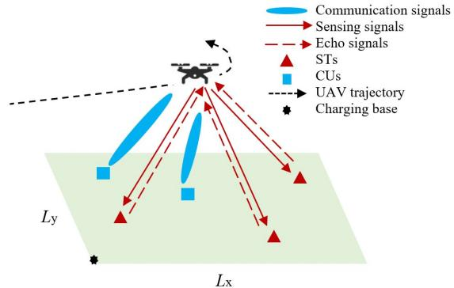  
Fig. 1. ISAC-based rotary-wing UAV scenario.

The remainder of this paper is organized as follows. Section II introduces the system model and derives the performance metrics for C&S. Section III formulates the UAV trajectory design and bandwidth allocation problem. Section IV proposes an iterative algorithm to address the formulated problem and the ST’s coordinate estimation is developed. In Section V, the proposed approaches are evaluated with numerical results. Finally, the paper is concluded in Section VI.

## II. SYSTEM MODEL AND PERFORMANCE METRICS

In this section, we firstly describe the ISAC-based UAV scenario and the proposed MSTD approach. We then elaborate on performance metrics for C&S respectively.

## A. Proposed Scenario, MSTD Approach and UAV Trajectory Model

As shown in Fig. 1, we consider an ISAC-based UAV scenario comprising 1) a single rotary-wing UAV equipped with one transmit antenna and one receive antenna, 2) M CUs, who receive signals from the UAV, and 3) K STs localized by the UAV. We consider a rectangular area on the ground with a dimension $L _ { \mathrm { x } }$ by $L _ { \mathrm { y } }$ . One charging base is located at $\left[ x _ { \mathrm { B } } , y _ { \mathrm { B } } \right] ^ { T } \in \mathbb { R } ^ { 2 }$ for the UAV to charge its battery before departure. The UAV is dispatched from $\left[ x _ { \mathrm { B } } , y _ { \mathrm { B } } \right] ^ { T }$ and then flies at a constant altitude H. The m-th CU’s location $( m =$ $1 , 2 , \ldots , M )$ is denoted by a two-dimensional coordinate $[ x _ { m } ^ { \mathrm { c } } , y _ { m } ^ { \mathrm { c } } ] ^ { T } \in \mathbb { R } ^ { 2 } . [ x _ { m } ^ { \mathrm { c } } , y _ { m } ^ { \mathrm { c } } ] ^ { T } ( m = 1 , 2 , \ldots , M )$ are known a priori via Global Navigation Satellite System. Locations of STs are unknown, which are estimated by the UAV sensing function. We denote the k-th ST’s location $( k = 1 , 2 , \ldots , K )$ is a two-dimensional coordinate $\left[ x _ { k } ^ { \mathrm { t } } , y _ { k } ^ { \mathrm { t } } \right] ^ { T } \in \mathbb { R } ^ { 2 }$ . We denote it in a vector as $\mathbf u _ { k } = \left[ x _ { k } ^ { \mathrm { t } } , y _ { k } ^ { \mathrm { t } } \right] ^ { T }$ for later use.

The UAV trajectory design and bandwidth allocation are determined by the distribution of CUs and STs. Since $\mathbf { u } _ { k }$ $( k ~ = ~ 1 , 2 , \ldots , K )$ are initially unknown, trajectory design should be dependent on estimates of ST locations, which are denoted by $\widehat { \mathbf { u } } _ { k } \ = \ \left[ \widehat { x } _ { k } ^ { \mathrm { t } } , \widehat { y } _ { k } ^ { \mathrm { t } } \right] ^ { T } \ ( k \ = \ 1 , 2 , \ldots , K )$ . Note that there may exist a large gap between $\mathbf { u } _ { k }$ and $\widehat { \mathbf { u } } _ { k }$ , leading to a worse solution of UAV trajectory due to the inaccurate formulation. In order to progressively improve the accuracy of trajectory design formulation, we propose a MSTD approach. This approach splits the UAV trajectory design problem and ST location estimation into several stages, allowing for a gradual refinement of ST estimates and UAV trajectory.

Next, we elaborate details about the MSTD approach. Before UAV’s departure, we acquire a coarse estimate of $\mathbf { u } _ { k }$ $( k = 1 , \ldots , K )$ , denoted by $\widehat { \mathbf { u } } _ { k , 0 } ^ { \mathrm { ~ ~ } } = \left[ \widehat { x } _ { k , 0 } ^ { \mathrm { t } } , \widehat { y } _ { k , 0 } ^ { \mathrm { t } } \right] ^ { T }$ , via three sensing points near $\left[ x _ { \mathrm { B } } , y _ { \mathrm { B } } \right] ^ { T }$ . Then, the UAV flying process enters to the 1st stage. The UAV trajectory design for the 1st stage is based on $\left[ x _ { m } ^ { \mathrm { c } } , y _ { m } ^ { \mathrm { c } } \right] ^ { T } \left( m = 1 , \ldots , M \right)$ and $\widehat { \mathbf { u } } _ { k , 0 }$ $( k = 1 , \ldots , K )$ . After the trajectory design, the UAV starts its flying from $\left[ x _ { \mathrm { B } } , y _ { \mathrm { B } } \right] ^ { T }$ following the 1st stage’s trajectory designed above and continuously broadcasts the downlink signal containing valuable information to CUs. We allocate bandwidth to ensure that all CUs can receive data without interference. During the flying, UAV selects some positions in the trajectory as HPs to pause and perform sensing. Specifically, at one HP, the UAV simultaneously broadcasts the downlink signal to both CUs and STs. Subsequently, echoes of this signal are reflected by all STs and received at that HP by the UAV. STs reflect the signal across the whole band. By observing the propagation delays between the downlink signal and its echoes, the distances between that HP and all STs are measured. At the end of the 1st stage, distance measurements across all HPs regarding the k-th ST $( k = 1 , \ldots , K )$ are combined via estimation method, $\mathrm { e . g . }$ maximum likelihood estimation (MLE), to update a location estimate denoted as $\widehat { \mathbf { u } } _ { k , 1 } = \left\lceil \widehat { x } _ { k , 1 } ^ { \mathrm { t } } , \widehat { y } _ { k , 1 } ^ { \mathrm { t } } \right\rceil ^ { \scriptscriptstyle T }$

Now, the UAV flying process updates to the 2nd stage. Before the UAV continues its flying in the 2nd stage, the UAV trajectory for the 2nd stage should be designed. The formulation of UAV trajectory design for the 2nd stage is based on $\bigl [ x _ { m } ^ { \mathrm { c } } , y _ { m } ^ { \mathrm { c } } \bigr ] ^ { T } ( m = \bar { 1 } , \ldots , \bar { M } )$ and $\widehat { \mathbf { u } } _ { k , 1 } \ ( k \ = \ 1 , \ldots , K )$ The UAV starts its 2nd stage flying from the final position of the 1st stage. The C&S process is same with the 1st stage. Once the UAV completes its 2nd stage’s flying, all distance measurements across the first HP in the 1st stage to the final HP in the 2nd stage regarding the k-th ST $( k = 1 , \ldots , K )$ are combined to update an estimate $\widehat { \mathbf { u } } _ { k , 2 } = \left\lceil \widehat { x } _ { k , 2 } ^ { \mathrm { t } } , \widehat { y } _ { k , 2 } ^ { \mathrm { t } } \right\rceil ^ { \scriptscriptstyle T }$

The MSTD approach is repeated by estimating ST locations, designing UAV trajectory and performing C&S functions. As shown in Fig. 2, we designate j (where $j = 1 , 2 , \ldots )$ as the stage index. At the end of the j-th stage, the distance measurements across the first HP in the 1st stage to the final HP in the j-th stage regarding the k-th ST $( k = 1 , \ldots , K )$ are combined to estimate the ST location. The estimation after the j-th stage’s flying is denoted by $\widehat { \mathbf { u } } _ { k , j } \ = \ \left\lceil \widehat { x } _ { k , j } ^ { \mathrm { t } } , \widehat { y } _ { k , j } ^ { \mathrm { t } } \right\rceil ^ { T }$ The multi-stage flying continues until UAV battery capacity, denoted as $E _ { \mathrm { t o t } }$ , runs out.

Since a UAV trajectory is characterized by geographical positions together with the flying velocity corresponding to the UAV path, the UAV trajectory is a continuous-time model. Consequently, the trajectory design is a continuous-time optimization which is difficult to solve directly. Therefore, in each stage, we seek an approximate solution of the continuous-time optimization through discretizing the UAV’s flying time by a sequence of time slots. In the j-th stage, the number of time slots is $N _ { j } ^ { \mathrm { f } }$ . The UAV flying duration in each slot is $T _ { \mathrm { f } } .$ , which is constant and pre-determined. Subsequently, the UAV continuous path can be approximated into a sequence of line segments aligned with time slots. We then employ $N _ { j } ^ { \mathrm { f } }$ waypoints to denote these lines. Specifically, the n-th waypoint $( n ~ = ~ 1 , 2 , \ldots , N _ { i } ^ { \mathrm { f } } )$ , denoted by $\mathbf { s } _ { n , j } ~ \in ~ \mathbb { R } ^ { 2 }$ , represents the final position of the n-th line segment. And then, the UAV flies following the (n + 1)-th line segment with a duration $T _ { \mathrm { f } }$ to the (n + 1)-th waypoint, denoted by $\mathbf { s } _ { n + 1 , j } ~ \in ~ \mathbb { R } ^ { 2 }$ We concatenate all waypoints in the j-th stage in a matrix $\mathbf { S } _ { j } = \left\lceil \mathbf { s } _ { 1 , j } , \ldots , \mathbf { s } _ { N _ { \mathrm { ~ } } ^ { \mathrm { f } } , j } \right\rceil \in \mathbb { R } ^ { 2 \times N _ { j } ^ { \mathrm { f } } }$

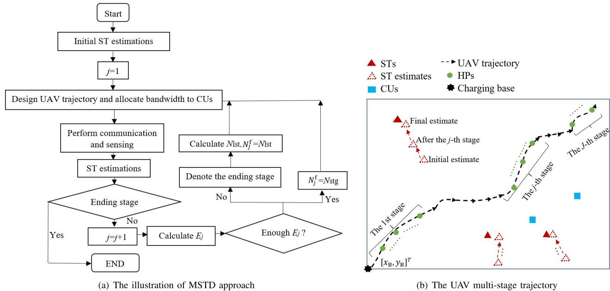  
Fig. 2. The proposed MSTD approach for UAV trajectory design.

As aforementioned, there are some HPs in each stage for UAV to hover and perform sensing. Therefore, we select some points from $\mathbf { S } _ { j }$ as the HPs. Specifically, after the UAV flies over $\mu$ line segments $( \mu$ is a given integer), it hovers at the final position of these line segments with a duration $T _ { \mathrm { h } }$ to perform sensing. The number of HPs in the j-th stage is $N _ { j } ^ { \mathrm { h } }$ so that $\begin{array} { r } { N _ { j } ^ { \mathrm { h } } = \mathrm { f l o o r } \left( \frac { N _ { j } ^ { \mathrm { f } } } { \mu } \right) } \end{array}$ . We use index $\{ \gamma , j \}$ to denote the γ-th HP in the j-th stage as

$$
\begin{array} { r } { \left[ x _ { \gamma , j } ^ { \mathrm { h } } , y _ { \gamma , j } ^ { \mathrm { h } } \right] ^ { T } = \mathbf { s } _ { \mu \gamma , j } , ~ \gamma = 1 , 2 , \ldots , N _ { j } ^ { \mathrm { h } } . } \end{array}\tag{1}
$$

HPs in the $j \mathrm { - t h }$ stage are denoted by vectors $\begin{array} { r l } { \mathbf { x } _ { j } ^ { \mathrm { h } } } & { { } = } \end{array}$ $\left[ x _ { 1 , j } ^ { \mathrm { h } } , \ldots , x _ { N _ { i } ^ { \mathrm { h } } , j } ^ { \mathrm { h } } \right] ^ { T }$ and $\mathbf { y } _ { j } ^ { \mathrm { h } } = \left[ y _ { 1 , j } ^ { \mathrm { h } } , \ldots , y _ { N _ { i } ^ { \mathrm { h } } , j } ^ { \mathrm { h } } \right] ^ { T }$

We assume that $N _ { j } ^ { \mathrm f } ( j = 1 , 2 , . . . )$ is pre-determined as a constant $N _ { \mathrm { s t g } }$ . Since the energy consumption in one stage is unknown before designing the trajectory in this stage, the number of stages is unknown. Similarly, the total flying duration and distance are undetermined before UAV’s departure. In this case, before we formulate the trajectory design problem for the j-th stage, we need to calculate the UAV remaining energy. The remaining energy is the available energy supporting UAV trajectory in the j-th stage, denoted as $E _ { j }$ , equalling to $E _ { \mathrm { t o t } }$ minus total energy consumption from the 1st stage to the $( j - 1 )$ -th stage. If $E _ { j }$ is insufficient to support a flying with $N _ { \mathrm { s t g } }$ line segments, we designate the $j \mathrm { - t h }$ stage as the ending stage, which is denoted by index $J .$ Then, the UAV calculates the permissible number of line segments in the J-th stage based on $E _ { J }$ , and denotes it by $N _ { \mathrm { l s t } } .$ , so that $N _ { J } ^ { \mathrm { f } } ~ = ~ N _ { \mathrm { l s t } }$ Meanwhile, there are $\begin{array} { r } { N _ { J } ^ { \mathrm { h } } = \operatorname { f l o o r } \left( \frac { N _ { \mathrm { l s t } } } { \mu } \right) } \end{array}$ HPs in the ending stage.

The velocity in a line segment is a constant, expressed as

$$
\mathbf { v } _ { n , j } = \left\{ \begin{array} { l l } { \frac { \mathbf { s } _ { n , j } - \mathbf { s } _ { n - 1 , j } } { T } , } & { n = 2 , \ldots , N _ { j } ^ { \mathrm { f } } , \ j = 1 , \ldots , J , } \\ { \frac { \mathbf { s } _ { 1 , j } - \mathbf { s } _ { N _ { \mathrm { s t g } } , j - 1 } } { T _ { \mathrm { f } } } , } & { n = 1 , \ j = 2 , \ldots , J , } \\ { \frac { \mathbf { s } _ { 1 , 1 } - \left[ x _ { \mathrm { B } } , y _ { \mathrm { B } } \right] ^ { T } } { T _ { \mathrm { f } } } , } & { n = 1 , \ j = 1 . } \end{array} \right.\tag{2}
$$

Matrix $\mathbf { V } _ { j } = \left\lceil \mathbf { v } _ { 1 , j } , \ldots , \mathbf { v } _ { N _ { i } ^ { \mathrm { f } } , j } \right\rceil \in \mathbb { R } ^ { 2 \times N _ { j } ^ { \mathrm { f } } }$ is used to represent UAV velocities in the j-th stage.

It is important to note that there may exist reflections from the ground, causing clutters to echoes. To tackle this issue, we propose in the following a simple and efficient echo association approach. Meanwhile, the following proposed approach can also be used to distinguish echoes reflected by different STs.

At the γ-th HP in the j-th stage, the UAV receives K echo signals plus $N _ { \gamma , j } ^ { \mathrm { c l t } }$ signals caused by ground clutter. The time delay measurements from all signals above is denoted by a set $\widetilde { \pmb { \tau } } _ { \gamma , j } ^ { \mathrm { a l l } ^ { * } } = \{ \widetilde { \tau } _ { 1 , \gamma , j } ^ { \mathrm { a l l } } , \dots , \widetilde { \tau } _ { i , \gamma , j } ^ { \mathrm { a l l } } , \dots , \widetilde { \tau } _ { I , \gamma , j } ^ { \mathrm { a l l } } \}$ , comprising $I = K +$ $N _ { \gamma , j } ^ { \mathrm { c l t } }$ measurements. In the j-th stage, we have obtained the estimate of the k-th ST through former stages, which is $\widehat { \mathbf { u } } _ { k , j - 1 }$ presented before, thus, given $\widehat { \mathbf { u } } _ { k , j - 1 }$ , the time delay of the echo from the k-th ST at the γ-th HP can be predicted as $\widehat { \tau } _ { k , \gamma , j }$ . The prediction $\widehat { \tau } _ { k , \gamma , j }$ can be obtained via prediction approaches such as the Kalman filter [39]. Therefore, by using the fact that time delay prediction $\widehat { \tau } _ { k , \gamma , j }$ and its corresponding measurement $\widetilde { \tau } _ { k , \gamma , j }$ should be “close” to each other, the UAV can distinguish the echo reflected by the k-th ST from all received signals. The index of the k-th ST’s echo in $\widetilde { \tau } _ { \gamma , j } ^ { \mathrm { a l l } }$ is denoted as $i _ { k , \gamma , j } ^ { \mathrm { t } }$ . The UAV calculates the “distance” between $\widehat { \tau } _ { k , \gamma , j }$ and each element in $\widetilde { \tau } _ { \gamma , j } ^ { \mathrm { a l l } }$ , and associates $\widetilde { \tau } _ { i , \gamma , j } ^ { \mathrm { a l l } }$ with the prediction $\widehat { \tau } _ { k , \gamma , j }$ that yields the smallest “distance”, which can be expressed in the form

$$
i _ { k , \gamma , j } ^ { \mathrm { t } } = \arg \operatorname* { m i n } _ { i = 1 , \dots , I } \left\| \widetilde { \tau } _ { i , \gamma , j } ^ { \mathrm { a l l } } - \widehat { \tau } _ { k , \gamma , j } \right\| , \ k = 1 , 2 , \dots , K .\tag{3}
$$

By doing so, the UAV can update the location estimates using the correct measurement with a high probability. Additionally, by leveraging the strong similarity among the electromagnetic responses from the ground, separating the ground reflections from ST reflections equals to basically separating constant from nonconstant valued signals across different HPs, which can be accomplished by applying a proper spatial filter [40].

Following the MSTD approach, we will illustrate C&S performance metrics used in the UAV trajectory design formulation in each stage through the following subsections.

## B. Communication Model

We assume that the propagation channel is dominated by the light-of-sight (LoS) link [26]. The free-space path loss model is applicable to C&S. Given the limitation in UAV velocity and with the appropriate choice of $T _ { \mathrm { f } }$ , the line segment between two consecutive waypoints satisfies $\| \mathbf { s } _ { n - 1 , j } - \mathbf { s } _ { n , j } \| \ll H .$ Therefore, the transmission distance between the UAV and a CU within one line segment remains nearly constant. Thus, when UAV flies from $\mathbf { s } _ { n - 1 , j }$ to $\mathbf { s } _ { n , j }$ , a CU’s communication rate is nearly unchanged. In this case, a CU’s communication rate across the n-th line segment nearly equals to the rate at the n-th waypoint.

Let $d _ { m , n , j } ^ { \mathrm { c } }$ denotes the distance from the UAV at the n-th waypoint to the m-th CU in the j-th stage as

$$
d _ { m , n , j } ^ { \mathrm { c } } = \sqrt { H ^ { 2 } + \Bigl \| \mathbf { s } _ { n , j } - \bigl [ x _ { m } ^ { \mathrm { c } } , y _ { m } ^ { \mathrm { c } } \bigr ] ^ { T } \Bigr \| ^ { 2 } } .\tag{4}
$$

Thus, the channel power gain from the UAV to the CU is

$$
h _ { m , n , j } = \frac { \alpha _ { 0 } } { \left[ d _ { m , n , j } ^ { \mathrm { c } } \right] ^ { 2 } } ,\tag{5}
$$

where $\begin{array} { r } { \alpha _ { 0 } = \frac { G _ { \mathrm { T } } \cdot G _ { \mathrm { c } } \cdot \lambda ^ { 2 } } { ( 4 \pi ) ^ { 2 } } } \end{array}$ is the channel power at the reference distance $d _ { m , n , j } ^ { \mathrm { c } } \doteq \mathrm { i m }$ $G _ { \mathrm { T } }$ is the UAV transmit antenna gain. $G _ { \mathrm { c } }$ is the CU receive antenna gain and λ is the wavelength. The signal-to-noise ratio (SNR) from the UAV to the CU can be expressed as

$$
S N R _ { m , n , j } ^ { \mathrm { c } } = \frac { P _ { \mathrm { t } } h _ { m , n , j } } { \sigma _ { 0 } ^ { 2 } } ,\tag{6}
$$

where $P _ { \mathrm { { t } } }$ is the transmitting power. $\sigma ^ { 2 }$ is the noise power at the receiver.

The m-th CU’s communication rate across the n-th line segment in the j-th stage is

$$
R _ { m , n , j } = B _ { m , j } \mathrm { l o g } _ { 2 } \left( 1 + \frac { P _ { \mathrm { t } } h _ { m , n , j } } { \sigma _ { 0 } ^ { 2 } } \right) ,\tag{7}
$$

where $B _ { m , j }$ is the channel bandwidth allocated to the m-th CU in the j-th stage and $\textstyle \sum _ { m = 1 } ^ { M } B _ { m , j } \leq B$ . We denote $\mathbf { B } _ { j } = $ $\left[ B _ { 1 , j } , \ldots , B _ { M , j } \right] ^ { T }$ for later use.

We use the sum of the transmitted data, named as total transmitted data, as the communication performance metric when formulating UAV trajectory design problem. After the UAV completes the j-th stage, the total transmitted data for the m-th CU, can be expressed via $R _ { m , n , j }$ at all waypoints from the 1st stage to the j-th stage, which is

$$
\psi _ { m } ^ { \mathrm { c } } \left( j \right) = \sum _ { j ^ { \prime } = 1 } ^ { j } { \sum _ { n = 1 } ^ { N _ { j ^ { \prime } } ^ { \mathrm { f } } } { T _ { \mathrm { f } } R _ { m , n , j ^ { \prime } } } } + \sum _ { j ^ { \prime } = 1 } ^ { j } { \sum _ { \gamma = 1 } ^ { N _ { j ^ { \prime } } ^ { \mathrm { h } } } { T _ { \mathrm { h } } R _ { m , \mu \gamma , j ^ { \prime } } } } .\tag{8}
$$

We use $j ^ { \prime }$ to denote stages across the 1st to the $j \cdot$ -th stage, because the current stage is with the index j and we need to make a difference between them.

To guarantee the fairness among CUs, the UAV communication in a stage aims to improve the lower bound of total transmitted data among all CUs, which is

$$
\begin{array} { r l r } & { } & { \Psi ^ { \mathrm { c } } \left( j \right) = \operatorname* { m i n } \left\{ \psi _ { 1 } ^ { \mathrm { c } } \left( j \right) , \dots , \psi _ { m } ^ { \mathrm { c } } \left( j \right) , \dots , \psi _ { M } ^ { \mathrm { c } } \left( j \right) \right\} , } \\ & { } & { j = 1 , \dots , J . } \end{array}\tag{9}
$$

## C. Sensing Model

We use $\mathbf { d } _ { k , j } ^ { \mathrm { s } } = \left[ d _ { k , 1 , j } ^ { \mathrm { s } } , \ldots , d _ { k , \gamma , j } ^ { \mathrm { s } } , \ldots , d _ { k , N _ { i } ^ { \mathrm { h } } , j } ^ { \mathrm { s } } \right] ^ { T }$ to represent true distances between the k-th ST and all HPs in the j-th stage, where $d _ { k , \gamma , j } ^ { \mathrm { s } }$ is the distance from the γ-th HP to the k-th ST as

$$
d _ { k , \gamma , j } ^ { \mathrm { s } } = \sqrt { H ^ { 2 } + \left\| \mathbf { s } _ { \mu \gamma , j } - \big [ x _ { k } ^ { \mathrm { t } } , y _ { k } ^ { \mathrm { t } } \big ] ^ { T } \right\| ^ { 2 } } ,\tag{10}
$$

which is obtained from

$$
d _ { k , \gamma , j } ^ { \mathrm { s } } = \frac { \tau _ { k , \gamma , j } \cdot c } { 2 } ,\tag{11}
$$

where c is the speed of light. $\tau _ { k , \gamma , j }$ is the two-way propagation delay of the signal from the UAV at ${ \mathbf { s } } _ { \mu \gamma , j }$ to the k-th ST and reflected by the ST to the UAV. The measurement of $d _ { k , \gamma , j } ^ { \mathrm { s } }$ is

$$
\widetilde { d } _ { k , \gamma , j } ^ { \mathrm { s } } = d _ { k , \gamma , j } ^ { \mathrm { s } } + w _ { k , \gamma , j } ^ { \tau } ,\tag{12}
$$

where $w _ { k , \gamma , j } ^ { \tau }$ denotes the Gaussian noise with zero mean and variance $\left( \sigma _ { k , \gamma , j } ^ { \tau } \right) ^ { 2 }$ . We set a vector $\widetilde { \mathbf { d } } _ { k , j } ^ { \mathrm { s } } =$ $\left[ \widetilde { d } _ { k , 1 , j } ^ { \mathrm { s } } , \ldots \widetilde { d } _ { k , \gamma , j } ^ { \mathrm { s } } , \ldots , \widetilde { \widetilde { d } } _ { k , N _ { i } ^ { \mathrm { h } } , j } ^ { \mathrm { s } } \right] ^ { T }$ for convenience.

Note that $\left( \sigma _ { k , \gamma , j } ^ { \tau } \right) ^ { 2 }$ is inversely proportional to the echo SNR from the k-th ST to the γ-th HP [41], [42]. The SNR is formulated as

$$
S N R _ { k , \gamma , j } ^ { \mathrm { s } } = \frac { P _ { \mathrm { t } } \cdot G _ { \mathrm { p } } \cdot g _ { k , \gamma , j } } { \sigma _ { 0 } ^ { 2 } } ,\tag{13}
$$

where $G _ { \mathrm { p } }$ is the signal processing gain at the UAV receive side. $g _ { k , \gamma , j }$ is the two-way channel power gain between the k-th ST and the γ-th HP, which is formed as

$$
g _ { k , \gamma , j } = \frac { \beta _ { 0 } } { \left[ d _ { k , \gamma , j } ^ { \mathrm { s } } \right] ^ { 4 } } .\tag{14}
$$

$\beta _ { 0 }$ is the channel power at the reference distance $d _ { k , \gamma , j } ^ { \mathrm { s } } = 1 \mathrm { m }$ which is expressed as

$$
\beta _ { 0 } = \frac { G _ { \mathrm { T } } \cdot G _ { \mathrm { s } } \cdot \sigma _ { \mathrm { r c s } } \cdot \lambda ^ { 2 } } { \left( 4 \pi \right) ^ { 3 } } ,\tag{15}
$$

where $G _ { \mathrm { s } }$ is the ST receive antenna gain and $\sigma _ { \mathrm { r c s } }$ is the Radar Cross-Section (RCS).

Finally, we remark $\left( \sigma _ { k , \gamma , j } ^ { \tau } \right) ^ { 2 }$ as

$$
\left( \sigma _ { k , \gamma , j } ^ { \tau } \right) ^ { 2 } = \frac { a \sigma _ { 0 } ^ { 2 } } { P _ { \mathrm { t } } \cdot G _ { \mathrm { p } } \cdot g _ { k , \gamma , j } } .\tag{16}
$$

a is associated with the transmission environment noise.

To assess the performance of an estimator, MSE, where $\epsilon ^ { 2 } = \mathbb { E } \lceil \rceil \mathbf { u } _ { k } - \hat { \mathbf { u } } _ { k , j } \rceil | ^ { 2 } \rceil$ , is a commonly used metric. However, obtaining the MSE in closed-form is often arduous and minimizing MSE is almost intractable. In this case, we cannot directly use the MSE of $\widehat { \mathbf { u } } _ { k , j } ( k = 1 , \ldots , K$ and $j = 1 , \ldots , J )$ as the sensing performance metric in the trajectory design formulation. Instead, for an unbiased parameter estimator, CRB can provide a lower bound for the MSE [39]. Therefore, we resort to CRB as the metric.

Now, we formulate the CRB of $\widehat { x } _ { k , j } ^ { \mathrm { t } }$ and the CRB of $\widehat { y } _ { k , j } ^ { \mathrm { t } }$ $( k = 1 , \ldots , K$ and $j = 1 , \ldots , J )$ . According to [39], the CRB of the p-th element belonging to a vector u corresponds to the p-th diagonal element of the CRB matrix of u. Therefore, our first step is to compute the CRB matrix of $\widehat { \mathbf { u } } _ { k , j }$ , expressed as $\mathrm { C R B } _ { k } ^ { { \mathbf { u } } _ { k } } \left( j \right)$ , which can be attained through

$$
\begin{array} { r } { { \bf C R B } _ { k } ^ { { \bf u } _ { k } } \left( j \right) = \left[ { \bf J } _ { k } ^ { { \bf u } _ { k } } \left( j \right) \right] ^ { - 1 } \in \mathbb { R } ^ { 2 \times 2 } , } \end{array}\tag{17}
$$

where $\mathbf { J } _ { k } ^ { \mathbf { u } _ { k } } \left( j \right) \in \mathbb { R } ^ { 2 \times 2 }$ is the Fisher information matrix (FIM) of $\mathbf { u } _ { k }$

In most cases, if computing FIM with respect to some certain parameters is difficult, we can first compute the FIM of other related parameters. Then, we can exploit the mathematical relationship between two FIMs to derive the former FIM. For $\mathbf { J } _ { k } ^ { \mathbf { u } _ { k } } \left( j \right)$ , we can first construct FIM with respect to distances between the k-th ST and the UAV, denoted by $\mathbf { J } _ { k } ^ { \mathbf { d } ^ { \mathrm { s } } } \left( j \right)$ . As aforementioned, after the j-th stage, estimation on the k-th ST’s location is performed by measurements from the 1st stage to the j-th stage, thereby, $\mathbf { \dot { J } } _ { k } ^ { \mathbf { d } ^ { \mathrm { s } } } \left( j \right)$ is a matrix with size $\big ( \bar { N } _ { 1 } ^ { \mathrm { h } } + \ldots + N _ { j } ^ { \mathrm { h } } \big ) \times \bar { \big ( N _ { 1 } ^ { \mathrm { h } } + \ldots + N _ { j } ^ { \mathrm { h } } \big ) }$ . Then $\mathbf { J } _ { k } ^ { \mathbf { u } _ { k } } \left( j \right)$ can be derived by using the chain rule in the form of

$$
\mathbf { J } _ { k } ^ { \mathbf { u } _ { k } } \left( j \right) = { { \mathbf { Q } } _ { k } } \left( j \right) \mathbf { J } _ { k } ^ { \mathbf { d } ^ { \mathrm { s } } } \left( j \right) \left[ { { \mathbf { Q } } _ { k } } \left( j \right) \right] ^ { T } .\tag{18}
$$

$\mathbf { Q } _ { k } \left( j \right) \in \mathbb { R } ^ { 2 \times \left( N _ { 1 } ^ { \mathrm { h } } + \ldots + N _ { j } ^ { \mathrm { h } } \right) }$ is a Jacobian matrix shown in (19), at the bottom of the next page, where

$$
\frac { \partial \left[ \mathbf { d } _ { k , j ^ { \prime } } ^ { \mathrm { s } } \right] ^ { T } } { \partial \mathbf { u } _ { k } } = \left[ \begin{array} { l l l } { \frac { x _ { 1 , j ^ { \prime } } ^ { \mathrm { h } } - x _ { k } ^ { \mathrm { t } } } { d _ { k , 1 , j ^ { \prime } } ^ { \mathrm { s } } } \ldots \frac { x _ { \gamma , j ^ { \prime } } ^ { \mathrm { h } } - x _ { k } ^ { \mathrm { t } } } { d _ { k , \gamma , j ^ { \prime } } ^ { \mathrm { s } } } \ldots \frac { x _ { N _ { j ^ { \prime } } ^ { \mathrm { h } } , j ^ { \prime } } ^ { \mathrm { h } } - x _ { k } ^ { \mathrm { t } } } { d _ { k , N _ { j ^ { \prime } } ^ { \mathrm { s } } , j ^ { \prime } } ^ { \mathrm { s } } } } \\ { \frac { y _ { 1 , j ^ { \prime } } ^ { \mathrm { h } } - y _ { k } ^ { \mathrm { t } } } { d _ { k , 1 , j ^ { \prime } } ^ { \mathrm { s } } } \ldots \frac { y _ { \gamma , j ^ { \prime } } ^ { \mathrm { h } } - y _ { k } ^ { \mathrm { t } } } { d _ { k , \gamma , j ^ { \prime } } ^ { \mathrm { s } } } \ldots \frac { y _ { N _ { j ^ { \prime } } ^ { \mathrm { h } } , j ^ { \prime } } ^ { \mathrm { h } } - y _ { k } ^ { \mathrm { t } } } { d _ { k , N _ { j ^ { \prime } } ^ { \mathrm { h } } , j ^ { \prime } } ^ { \mathrm { s } } } } \end{array} \right] .\tag{20}
$$

$\mathbf { J } _ { k } ^ { \mathbf { d } ^ { \mathrm { s } } } \left( j \right)$ can be separated into $j$ FIMs with respect to $\mathbf { d } _ { k , j ^ { \prime } } ^ { \mathrm { s } }$ $( j ^ { \prime } = 1 , \ldots , j )$ . The FIM of $\mathbf { d } _ { k , j ^ { \prime } } ^ { \mathrm { s } }$ is denoted as $\Delta _ { k , j ^ { \prime } } ^ { \mathbf { d } ^ { \mathrm { s } } } \in$ $\mathbb { R } ^ { N _ { j ^ { \prime } } ^ { \mathrm { h } } \times N _ { j ^ { \prime } } ^ { \mathrm { h } } }$ . Similarly with the communication performance metric, we use $j ^ { \prime }$ to denote stages across the 1st to the j-th stage.

From (12)-(16), we observe that the mean of $\widetilde { d } _ { k , \gamma , j ^ { \prime } } ^ { \mathrm { s } }$ is $d _ { k , \gamma , j ^ { \prime } } ^ { \mathrm { s } }$ and the covariance of $\widetilde { d } _ { k , \gamma , j ^ { \prime } } ^ { \mathrm { s } } \mathrm { ~ i s ~ } \left( \sigma _ { k , \gamma , j ^ { \prime } } ^ { \tau } \right) ^ { 2 }$ , which are both dependent on $d _ { k , \gamma , j ^ { \prime } } ^ { \mathrm { s } }$ . Thus, $\bar { \mathbf { d } } _ { k , j ^ { \prime } } ^ { \mathrm { s } }$ follows the distribution as

$$
\widetilde { \mathbf { d } } _ { k , j ^ { \prime } } ^ { \mathrm { s } } \sim \mathcal { N } \left( \mathbf { d } _ { k , j ^ { \prime } } ^ { \mathrm { s } } , \mathbf { C } _ { k , j ^ { \prime } } ^ { \mathrm { s } } \right) , \ j ^ { \prime } = 1 , 2 , \ldots , j ,\tag{21}
$$

where $\mathbf { C } _ { k , j ^ { \prime } } ^ { \mathrm { s } }$ is a diagonal matrix as the form of

$$
\mathbf { C } _ { k , j ^ { \prime } } ^ { \mathrm { s } } = \frac { a \sigma _ { 0 } ^ { 2 } } { P G _ { \mathrm { p } } \beta _ { 0 } } \mathrm { d i a g } \left( \left[ d _ { k , 1 , j ^ { \prime } } ^ { \mathrm { s } } \right] ^ { 4 } , \ldots , \left[ d _ { k , N _ { j ^ { \prime } } ^ { \mathrm { h } } , j ^ { \prime } } ^ { \mathrm { s } } \right] ^ { 4 } \right)\tag{22}
$$

For every parameter in a vector, if its measurement’s mean and covariance both depend on a same argument, we can obtain the FIM of that vector via eq. 3.31 in [39]. Following [39] (eq. 3.31), we acquire $\Lambda _ { k , j ^ { \prime } } ^ { \mathbf { d } ^ { \mathrm { s } } }$ as (23), shown at the bottom of the next page. In accordance with (23), we observe that $\Lambda _ { k , j ^ { \prime } } ^ { \mathbf { d } ^ { \mathrm { s } } }$ is a diagonal matrix. So that $\mathbf { J } _ { k } ^ { \mathbf { d } ^ { \mathrm { s } } } \left( j \right)$ is still a diagonal matrix constructed by $\Lambda _ { k , j ^ { \prime } } ^ { \mathbf { d } ^ { \mathrm { s } } } ~ ( j ^ { \prime } = 1 , \overset { \cdot } { 2 } , \ldots , j )$ as

$$
\begin{array} { r l } & { \mathbf { J } _ { k } ^ { \mathbf { d } ^ { \mathrm { s } } } \left( j \right) = \mathrm { d i a g } \left( \mathrm { d i a g } \left( \mathbf { \Lambda } _ { k , 1 } ^ { \mathbf { d } ^ { \mathrm { s } } } \right) , \mathrm { d i a g } \left( \mathbf { \Lambda } _ { k , 2 } ^ { \mathbf { d } ^ { \mathrm { s } } } \right) , \right. } \\ & { \left. \mathrm { ~ \ } \cdot \mathrm { ~ \ } \cdot , \mathrm { d i a g } \left( \mathbf { \Lambda } _ { k , j } ^ { \mathbf { d } ^ { \mathrm { s } } } \right) \right) . } \end{array}\tag{24}
$$

Finally, substituting (19) and (24) into (18), the CRB matrix of $\widehat { \mathbf { u } } _ { k , j }$ can be expressed as

$$
\begin{array} { r l } & { { \bf C R B } _ { k } ^ { { \bf u } _ { k } } \left( j \right) = \left[ { \bf J } _ { k } ^ { { \bf u } _ { k } } \left( j \right) \right] ^ { - 1 } } \\ & { \quad \quad \quad = \frac { 1 } { \Theta _ { k } ^ { \mathrm { a } } \left( j \right) \Theta _ { k } ^ { \mathrm { b } } \left( j \right) - \left[ \Theta _ { k } ^ { \mathrm { c } } \left( j \right) \right] ^ { 2 } } \left[ \Theta _ { k } ^ { \mathrm { b } } \left( j \right) \Theta _ { k } ^ { \mathrm { c } } \left( j \right) \right] , } \end{array}\tag{25}
$$

where $\Theta _ { k } ^ { \mathrm { a } } \left( j \right) , \Theta _ { k } ^ { \mathrm { b } } \left( j \right)$ and $\Theta _ { k } ^ { \mathrm { c } } \left( j \right)$ are shown in (26)–(28), at the bottom of the next page. The CRB of $\widehat { x } _ { k , j } ^ { \mathrm { t } }$ and the CRB of $\widehat { y } _ { k , j } ^ { \mathrm { t } }$ are diagonal elements of $\mathbf { C R B } _ { k } ^ { \mathbf { u } _ { k } } \left( j \right)$ , which are given by

$$
\mathrm { C R B } _ { k } ^ { \mathrm { x } } \left( j \right) = \frac { \Theta _ { k } ^ { \mathrm { b } } \left( j \right) } { \Theta _ { k } ^ { \mathrm { a } } \left( j \right) \Theta _ { k } ^ { \mathrm { b } } \left( j \right) - \left[ \Theta _ { k } ^ { \mathrm { c } } \left( j \right) \right] ^ { 2 } } ,\tag{29}
$$

$$
\mathrm { C R B } _ { k } ^ { \mathrm { y } } \left( j \right) = \frac { \Theta _ { k } ^ { \mathrm { a } } \left( j \right) } { \Theta _ { k } ^ { \mathrm { a } } \left( j \right) \Theta _ { k , j } ^ { \mathrm { b } } - \left[ \Theta _ { k } ^ { \mathrm { c } } \left( j \right) \right] ^ { 2 } } .\tag{30}
$$

We adopt the sum of $\mathbf { C R B } _ { k } ^ { \mathrm { x } } \left( j \right)$ and $\mathbf { C R B } _ { k } ^ { \mathrm { y } } \left( j \right)$ as the sensing performance metric, which is

$$
\psi _ { k } ^ { \mathrm { s } } \left( j \right) = \frac { \Theta _ { k } ^ { \mathrm { b } } \left( j \right) + \Theta _ { k } ^ { \mathrm { a } } \left( j \right) } { \Theta _ { k } ^ { \mathrm { a } } \left( j \right) \Theta _ { k } ^ { \mathrm { b } } \left( j \right) - \left[ \Theta _ { k } ^ { \mathrm { c } } \left( j \right) \right] ^ { 2 } } .\tag{31}
$$

As mentioned above in Subsection $\mathbf { A } ,$ since $\ v x _ { k } ^ { \mathrm { t } }$ and $y _ { k } ^ { \mathrm { t } }$ are unknown, following the MSTD approach, when formulating the UAV trajectory design problem in the j-th stage, $\ v x _ { k } ^ { \mathrm { t } }$ and $y _ { k } ^ { \mathrm { t } }$ in (31) should be substituted by $\widehat { x } _ { k , j - 1 } ^ { \mathrm { t } }$ and $\widehat { y } _ { k , j - 1 } ^ { \mathrm { t } }$

To guarantee the fairness between STs, the sensing objective is to minimize the upper bound of the CRB among all STs, expressed as

$$
\Psi ^ { \mathrm { s } } \left( j \right) = \operatorname* { m a x } \left\{ \psi _ { 1 } ^ { \mathrm { s } } \left( j \right) , \ldots , \psi _ { k } ^ { \mathrm { s } } \left( j \right) , \ldots , \psi _ { K } ^ { \mathrm { s } } \left( j \right) \right\} .\tag{32}
$$

## III. THE FORMULATION FOR UAV TRAJECTORY DESIGN AND BANDWIDTH ALLOCATION

The UAV power consumption includes power for transmitting signals and for supporting mobility. Transmission power consumed is usually significantly lower compared to the power required for propulsion. Therefore, we choose to ignore the transmission power. The propulsion power consumption can be modeled as the function of speed V [26], which is shown as

$$
\begin{array} { r l r } {  { P _ { \mathrm { u a v } } ( V ) = P _ { 0 } ( 1 + \frac { 3 V ^ { 2 } } { { U _ { \mathrm { t i p } } } ^ { 2 } } ) } } \\ & { } & { + P _ { \mathrm { I } } ( \sqrt { ( 1 + \frac { V ^ { 4 } } { 4 v _ { 0 } \mathrm { } ^ { 4 } } ) } - \frac { V ^ { 2 } } { 2 { v _ { 0 } } ^ { 2 } } ) ^ { \frac { 1 } { 2 } } } \\ & { } & { + \frac { 1 } { 2 } D _ { 0 } \rho s A V ^ { 3 } . } \end{array}
$$

To account for the difference in units between total transmitted data and CRB, we introduce performance increment as the metric. Additionally, we normalize these two performance increments to ensure a fair comparison between them. The problem formulation of UAV trajectory design and bandwidth allocation for the j-th stage is

(33)

$$
\begin{array} { r l } & { \mathrm { P } \left( j \right) : \underset { \{ \mathbf { S } _ { j } , \mathbf { V } _ { j } , \mathbf { B } _ { j } \} } { \operatorname* { m a x } } \frac { \eta } { \Psi ^ { s } \left( j \right) } \left( \Psi ^ { s } \left( j - 1 \right) - \Psi ^ { s } \left( j \right) \right) } \\ & { \quad \quad \quad \quad \quad \quad \quad \quad \quad \quad \quad \quad \quad \quad \quad \quad \quad \quad } \\ & { \quad \quad \quad \quad \quad \quad \quad \quad \quad \quad \quad + \frac { \left( 1 - \eta \right) } { \Psi ^ { c } \left( j - 1 \right) } \left( \Psi ^ { c } \left( j \right) - \Psi ^ { c } \left( j - 1 \right) \right) } \\ & { \quad \quad \quad \quad \quad \quad \mathrm { s . t . } \quad \left( 1 \right) \mathrm { a n d } \left( 2 \right) , } \\ & { \quad \quad \quad \quad \quad \quad \quad \| \mathbf { v } _ { n , j } \| \le V _ { \operatorname* { m a x } } , n = 1 , \dots , N _ { j } ^ { \dagger } , } \\ & { \quad \quad \quad \quad \quad 0 \le \mathbf { s } _ { n , j } \left( 1 \right) \le L _ { \mathbf { x } } , 0 \le \mathbf { s } _ { n , j } \left( 2 \right) \le L _ { \mathbf { y } } . } \\ & { \quad \quad \quad \quad \quad \quad \quad \quad \quad \quad n = 1 , \dots , N _ { j } ^ { \dagger } , } \end{array}\tag{34a}
$$

(34b)

$$
T _ { \mathrm { f } } \sum _ { n = 1 } ^ { N _ { j } ^ { \mathrm { f } } } P _ { \mathrm { u a v } } \left( \left\| \mathbf { v } _ { n , j } \right\| \right) + T _ { \mathrm { h } } N _ { j } ^ { \mathrm { h } } P _ { \mathrm { u a v } } \left( 0 \right) \leq E _ { j } ,\tag{34c}
$$

$$
\sum _ { m = 1 } ^ { M } B _ { m , j } \leq B .\tag{34d}
$$

We apply a weighting factor $\eta ( 0 ~ \leq ~ \eta ~ \leq ~ 1 )$ to obtain a tractable tradeoff between C&S. Larger η indicates that the UAV trajectory design assigns higher priority on sensing. $V _ { \mathrm { m a x } }$ is the maximum UAV flying speed. Constraint (34b) restricts that the UAV should fly in the designated area. Constraint (34c) means that the UAV energy consumed in the j-th stage should be no more than its current remaining energy.

Since (9) and (32) are nondifferentiable, we consider to use log-sum-exp (LSE) in the objective function of $\mathrm { P } \left( j \right)$ as smooth approximations to $\Psi ^ { \mathrm { c } } \left( j \right)$ and $\Psi ^ { \mathrm { s } } \left( j \right)$ . A lower-bound of (9) and an upper-bound of (32) are shown respectively as

$$
\begin{array} { r l } & { \operatorname* { m i n } \left\{ \psi _ { 1 } ^ { \mathrm { c } } \left( j \right) , \ldots , \psi _ { M } ^ { \mathrm { c } } \left( j \right) \right\} } \\ & { \qquad \geq \log \left( \exp \left( - \psi _ { 1 } ^ { \mathrm { c } } \left( j \right) \right) + \ldots + \exp \left( - \psi _ { M } ^ { \mathrm { c } } \left( j \right) \right) \right) } \\ & { \qquad \geq \operatorname* { m i n } \left\{ \psi _ { 1 } ^ { \mathrm { c } } \left( j \right) , \ldots , \psi _ { M } ^ { \mathrm { c } } \left( j \right) \right\} - \log \left( M \right) , } \end{array}\tag{35}
$$

and

$$
\begin{array} { r l } & { \operatorname* { m a x } \left\{ \psi _ { 1 } ^ { \mathrm { s } } \left( j \right) , \ldots , \psi _ { K } ^ { \mathrm { s } } \left( j \right) \right\} } \\ & { \qquad \leq \log \left( \exp \left( \psi _ { 1 } ^ { \mathrm { s } } \left( j \right) \right) + \ldots + \exp \left( \psi _ { K } ^ { \mathrm { s } } \left( j \right) \right) \right) } \\ & { \qquad \leq \operatorname* { m a x } \left\{ \psi _ { 1 } ^ { \mathrm { s } } \left( j \right) , \ldots , \psi _ { K } ^ { \mathrm { s } } \left( j \right) \right\} + \log \left( K \right) . } \end{array}\tag{36}
$$

The first inequality is strict unless $M ( K ) = 1$ . The second inequality is strict unless all arguments are equal. In addition, we can scale (35) and (36) to make bounds tighter, then

$$
\begin{array} { r l } & { \operatorname* { m i n } \left\{ \psi _ { 1 } ^ { \mathrm { c } } \left( j \right) , \ldots , \psi _ { M } ^ { \mathrm { c } } \left( j \right) \right\} } \\ & { \quad \ge \displaystyle \frac { 1 } { - t } \mathrm { l o g } \left( \exp \left( - t \psi _ { 1 } ^ { \mathrm { c } } \left( j \right) \right) + \ldots + \exp \left( - t \psi _ { M } ^ { \mathrm { c } } \left( j \right) \right) \right) } \end{array}
$$

$$
\mathbf { Q } _ { k } \left( j \right) = \frac { \partial \left[ \mathbf { d } _ { k , 1 } ^ { \mathrm { s } } , \ldots , \mathbf { d } _ { k , j ^ { \prime } } ^ { \mathrm { s } } , \ldots , \mathbf { d } _ { k , j } ^ { \mathrm { s } } \right] ^ { T } } { \partial \mathbf { u } _ { k } } = \left[ \frac { \partial \left[ \mathbf { d } _ { k , 1 } ^ { \mathrm { s } } \right] ^ { T } } { \partial \mathbf { u } _ { k } } , \ldots , \frac { \partial \left[ \mathbf { d } _ { k , j ^ { \prime } } ^ { \mathrm { s } } \right] ^ { T } } { \partial \mathbf { u } _ { k } } , \ldots , \frac { \partial \left[ \mathbf { d } _ { k , j } ^ { \mathrm { s } } \right] ^ { T } } { \partial \mathbf { u } _ { k } } \right] ,\tag{19}
$$

$$
\left[ \Delta _ { k , j ^ { \prime } } ^ { \mathrm { d e } } \right] _ { p , q } = \left[ \frac { \partial \mathrm { d } _ { k , j ^ { \prime } } ^ { \mathrm { s } } } { \partial d _ { k , p , q ^ { \prime } } ^ { \mathrm { s } } } \right] ^ { T } \left[ \mathbb { C } _ { k , j ^ { \prime } } ^ { \mathrm { s } } \right] ^ { - 1 } \left[ \frac { \partial \mathrm { d } _ { k , j ^ { \prime } } ^ { \mathrm { s } } } { \partial d _ { k , q , j ^ { \prime } } ^ { \mathrm { s } } } \right] + \frac { 1 } { 2 } \mathrm { t r } \left[ \left[ \mathbb { C } _ { k , j ^ { \prime } } ^ { \mathrm { s } } \right] ^ { - 1 } \frac { \partial \left[ \mathbb { C } _ { k , j ^ { \prime } } ^ { \mathrm { s } } \right] } { \partial d _ { k , p , j ^ { \prime } } ^ { \mathrm { s } } } \left[ \mathbb { C } _ { k , j ^ { \prime } } ^ { \mathrm { s } } \right] ^ { - 1 } \frac { \partial \left[ \mathbb { C } _ { k , j ^ { \prime } } ^ { \mathrm { s } } \right] } { \partial d _ { k , q , j ^ { \prime } } ^ { \mathrm { s } } } \right] , \mathrm { ~ } p , q = 1 , \dots , N _ { j ^ { \prime } } ^ { \mathrm { h } } .\tag{23}
$$

$$
\Theta _ { k } ^ { \mathrm { a } } \left( j \right) = \sum _ { j ^ { \prime } = 1 } ^ { j } \sum _ { \gamma = 1 } ^ { N _ { j ^ { \prime } } ^ { \mathrm { h } } } \left\{ \frac { P _ { \mathrm { t } } G _ { \mathrm { p } } \beta _ { 0 } } { a \sigma _ { 0 } ^ { 2 } } \frac { \left( x _ { \gamma , j ^ { \prime } } ^ { \mathrm { h } } - x _ { k } ^ { \mathrm { t } } \right) ^ { 2 } } { \left[ d _ { k , \gamma , j ^ { \prime } } ^ { \mathrm { s } } \right] ^ { 6 } } + \frac { 8 \left( x _ { \gamma , j ^ { \prime } } ^ { \mathrm { h } } - x _ { k } ^ { \mathrm { t } } \right) ^ { 2 } } { \left[ d _ { k , \gamma , j ^ { \prime } } ^ { \mathrm { s } } \right] ^ { 4 } } \right\} ,\tag{26}
$$

$$
\Theta _ { k } ^ { \mathrm { b } } \left( j \right) = \sum _ { j ^ { \prime } = 1 } ^ { j } \sum _ { \gamma = 1 } ^ { N _ { j ^ { \prime } } ^ { \mathrm { h } } } \left\{ \frac { P _ { \mathrm { t } } G _ { \mathrm { p } } \beta _ { 0 } } { a \sigma _ { 0 } ^ { 2 } } \frac { \left( y _ { \gamma , j ^ { \prime } } ^ { \mathrm { h } } - y _ { k } ^ { \mathrm { t } } \right) ^ { 2 } } { \left[ d _ { k , \gamma , j ^ { \prime } } ^ { \mathrm { s } } \right] ^ { 6 } } + \frac { 8 \left( y _ { \gamma , j ^ { \prime } } ^ { \mathrm { h } } - y _ { k } ^ { \mathrm { t } } \right) ^ { 2 } } { \left[ d _ { k , \gamma , j ^ { \prime } } ^ { \mathrm { s } } \right] ^ { 4 } } \right\} ,\tag{27}
$$

$$
\Theta _ { k } ^ { \mathrm { c } } \left( j \right) = \sum _ { j ^ { \prime } = 1 } ^ { j } \sum _ { \gamma = 1 } ^ { N _ { j ^ { \prime } } ^ { \mathrm { h } } } \left\{ \frac { P _ { \mathrm { t } } G _ { \mathrm { p } } \beta _ { 0 } } { a \sigma _ { 0 } ^ { 2 } } \frac { \left( x _ { \gamma , j ^ { \prime } } ^ { \mathrm { h } } - x _ { k } ^ { \mathrm { t } } \right) \left( y _ { \gamma , j ^ { \prime } } ^ { \mathrm { h } } - y _ { k } ^ { \mathrm { t } } \right) } { \left[ d _ { k , \gamma , j ^ { \prime } } ^ { \mathrm { s } } \right] ^ { 6 } } + \frac { 8 \left( x _ { \gamma , j ^ { \prime } } ^ { \mathrm { h } } - x _ { k } ^ { \mathrm { t } } \right) \left( y _ { \gamma , j ^ { \prime } } ^ { \mathrm { h } } - y _ { k } ^ { \mathrm { t } } \right) } { \left[ d _ { k , \gamma , j ^ { \prime } } ^ { \mathrm { s } } \right] ^ { 4 } } \right\} .\tag{28}
$$

$$
\geq \operatorname* { m i n } \left\{ \psi _ { 1 } ^ { \mathrm { c } } \left( j \right) , \ldots , \psi _ { M } ^ { \mathrm { c } } \left( j \right) \right\} - \frac { \log \left( M \right) } { t } ,\tag{37}
$$

and

$$
\begin{array} { r l } & { \operatorname* { m a x } \left\{ \psi _ { 1 } ^ { \mathrm { s } } \left( j \right) , \ldots , \psi _ { K } ^ { \mathrm { s } } \left( j \right) \right\} } \\ & { \qquad \leq \displaystyle \frac { 1 } { t } \log \left( \exp \left( t \psi _ { 1 } ^ { \mathrm { s } } \left( j \right) \right) + \ldots + \exp \left( t \psi _ { K } ^ { \mathrm { s } } \left( j \right) \right) \right) } \\ & { \qquad \leq \operatorname* { m a x } \left\{ \psi _ { 1 } ^ { \mathrm { s } } \left( j \right) , \ldots , \psi _ { K } ^ { \mathrm { s } } \left( j \right) \right\} + \displaystyle \frac { \log \left( K \right) } { t } , } \end{array}\tag{38}
$$

where $t > 0$ . Finally, we can substitute (9) and (32) in the objective function of $\mathrm { P } \left( j \right)$ by the middle term of (37) and (38) respectively, and denote the modified objective function as $f \left( \mathbf { S } _ { j } , \mathbf { B } _ { j } \right)$ . Finally, $\mathrm { P } \left( j \right)$ is rewritten as

$$
\mathrm { P } ^ { \prime } \left( j \right) : \underset { \{ \mathbf { S } _ { j } , \mathbf { V } _ { j } , \mathbf { B } _ { j } \} } { \operatorname* { m a x } } f \left( \mathbf { S } _ { j } , \mathbf { B } _ { j } \right)
$$

IV. PROPOSED ALGORITHM FOR SOLVING $\mathrm { P } ^ { \prime } \left( j \right)$ AND ESTIMATIONS FOR ST LOCATIONS

Due to $f \left( \mathbf { S } _ { j } , \mathbf { B } _ { j } \right)$ and constraint (34c) in $\mathrm { P ^ { \prime } } \left( j \right)$ are nonconvex, we divide $\mathrm { P } ^ { \prime } \left( j \right)$ into two subproblems, which optimize $\{ \mathbf { S } _ { j } , \mathbf { V } _ { j } \}$ and $\mathbf { B } _ { j }$ respectively, and address them in order repeatably. The two subproblems are given by

$$
\begin{array} { r l } & { \mathrm { P } _ { 1 } ^ { \prime } \left( j \right) : \underset { \{ \mathbf { S } _ { j } , \mathbf { V } _ { j } \} } { \mathrm { m a x } } f \left( \mathbf { S } _ { j } \right) } \\ &  \mathrm { ~ } \mathrm { ~ } \mathrm { ~ } \mathrm { ~ } \mathrm { ~ } \mathrm { ~ } \mathrm { ~ } \mathrm { ~ } \mathrm { ~ } \mathrm { ~ } \mathrm { ~ } \mathrm { ~ } \mathrm { ~ } \mathrm { ~ } \mathrm { ~ } \mathrm { ~ } \mathrm { ~ } \mathrm { ~ } \mathrm { ~ } \mathrm { ~ } \mathrm { ~ } \mathrm { ~ } \mathrm { ~ } \mathrm { ~ } \mathrm { ~ } \mathrm { ~ } \mathrm { ~ } \mathrm { ~ } \mathrm { ~ } \mathrm { ~ } \mathrm { ~ } \mathrm { ~ } \mathrm { ~ } \mathrm { ~ } \mathrm { ~ } \mathrm { ~ } \mathrm { ~ } \mathrm { ~ } \mathrm { ~ } \mathrm { ~ } \mathrm { ~ } \mathrm { ~ } \mathrm { ~ } \mathrm { ~ } \mathrm { ~ } \mathrm { ~ } \mathrm { ~ } \mathrm { ~ } \mathrm { ~ } \mathrm { ~ } \mathrm { ~ } \mathrm { ~ } \mathrm { ~ } \mathrm { ~ } \mathrm { ~ } \mathrm { ~ } \mathrm { ~ } \mathrm { ~ } \mathrm { ~ } \mathrm { ~ } \mathrm { ~ } \mathrm { ~ } \mathrm { ~ } \mathrm { ~ } \mathrm { ~ } \mathrm { ~ } \mathrm { ~ } \mathrm { ~ } \mathrm { ~ } \mathrm { ~ } \mathrm { ~ } \mathrm { ~ } \mathrm { ~ } \mathrm { ~ } \mathrm { ~ } \mathrm { ~ } \mathrm { ~ } \mathrm { ~ } \mathrm { ~ } \mathrm { ~ } \mathrm { ~ } \mathrm { ~ } \mathrm { ~ } \mathrm { ~ } \mathrm { ~ } \mathrm { ~ } \mathrm { ~ } \mathrm { ~ } \mathrm { ~ } \mathrm { ~ } \mathrm { ~ } \mathrm { ~ } \mathrm { ~ } \mathrm { ~ } \mathrm { ~ } \mathrm { ~ } \mathrm { ~ } \mathrm { ~ } \mathrm { ~ } \mathrm { ~ } \mathrm { ~ } \mathrm { ~ } \mathrm { ~ } \mathrm { ~ } \mathrm { ~ } \mathrm { ~ } \mathrm { ~ } \mathrm { ~ } \mathrm { ~ } \mathrm { ~ } \mathrm { ~ } \mathrm { ~ }  \end{array}
$$

$\mathrm { P } _ { 2 } ^ { \prime } \left( j \right)$ is a convex problem solved directly via CVX in Matlab. This section aims to addressing $\mathrm { P } _ { 1 } ^ { \prime } \left( j \right)$

## A. Proposed Iterative Algorithm for $\mathrm { P } _ { I } ^ { \prime } ( j )$

Since $f \left( \mathbf { S } _ { j } \right)$ is nonconvexity, an ascent direction search method is used to find the local optimal solution of $\mathrm { P } _ { 1 } ^ { \prime } \left( j \right)$ .

Firstly, let us approximate $f \left( \mathbf { S } _ { j } \right)$ by its first-order Taylor expansion near $\mathbf { S } _ { j } ^ { \prime } = \left[ \mathbf { s } _ { 1 , j } ^ { \prime } , \ldots , \mathbf { s } _ { N _ { j } ^ { \mathrm { f } } , j } ^ { \prime } \right] \in \mathbb { R } ^ { 2 \times N _ { j } ^ { \mathrm { f } } }$ to obtain its ascent direction as

$$
\begin{array} { r l r } { \displaystyle f \left( \mathbf { S } _ { j } \right) \approx f \left( \mathbf { S } _ { j } ^ { \prime } \right) + \displaystyle \sum _ { n = 1 } ^ { N _ { j } ^ { \dagger } } \nabla f _ { \mathbf { s } _ { n , j } ( 1 ) } \left( \mathbf { S } _ { j } ^ { \prime } \right) \left( \mathbf { s } _ { n , j } ( 1 ) - \mathbf { s } _ { n , j } ^ { \prime } ( 1 ) \right) } & { } & \\ { \displaystyle + \sum _ { n = 1 } ^ { N _ { j } ^ { \dagger } } \nabla f _ { \mathbf { s } _ { n , j } ( 2 ) } \left( \mathbf { S } _ { j } ^ { \prime } \right) \left( \mathbf { s } _ { n , j } ( 2 ) - \mathbf { s } _ { n , j } ^ { \prime } ( 2 ) \right) , \quad } & { ( 3 \boldsymbol { \mathfrak { s } } } \end{array}\tag{9}
$$

where $\nabla f _ { \mathbf { s } _ { n , j } ( 1 ) } \left( \cdot \right)$ and $\nabla f _ { \mathbf { s } _ { n , j } ( 2 ) } \left( \cdot \right)$ represent the gradient of $f \left( \cdot \right)$ with respect to ${ \bf s } _ { n , j } ( 1 )$ and ${ \bf s } _ { n , j } ( 2 )$ respectively. By maximizing the right-hand-side (RHS) of (39), we can find the ascent direction of $f \left( \mathbf { S } _ { j } \right)$ . This maximizing process focuses on the last two terms of the RHS, as the first term is fixed.

The ascent direction search is conducted iteratively, allowing us to gradually approach the local optimal solution for $\mathrm { P } _ { 1 } ^ { \prime } \left( j \right)$ . We reformulate $\mathrm { P } _ { 1 } ^ { \prime } \left( j \right)$ to an iterative form as

$$
\begin{array} { r l } { \displaystyle \mathrm { Q } \left( j \right) \colon \operatorname* { m a x } _ { \{ \mathbf { S } _ { j } , \mathbf { V } _ { j } \} } } & { g \left( \mathbf { S } _ { j } \right) } \\ & { = \displaystyle \sum _ { n = 1 } ^ { N _ { j } ^ { \mathrm { f } } } \nabla f _ { \mathbf { s } _ { n , j } \left( 1 \right) } \left( \mathbf { S } _ { j } ^ { l - 1 } \right) \left( \mathbf { s } _ { n , j } \big ( 1 \big ) - \mathbf { s } _ { n , j } ^ { l - 1 } \big ( 1 \big ) \right) } \end{array}
$$

$$
\begin{array} { r l } & { \quad + \displaystyle \sum _ { n = 1 } ^ { N _ { j } ^ { \mathrm { f } } } \nabla f _ { \mathbf { s } _ { n , j } ( 2 ) } \left( \mathbf { S } _ { j } ^ { l - 1 } \right) \left( \mathbf { s } _ { n , j } ( 2 ) - \mathbf { s } _ { n , j } ^ { l - 1 } ( 2 ) \right) } \\ { \mathrm { s . t . } \quad } & { ( 1 ) , ~ ( 2 ) , ~ ( 3 4 \mathrm { a } ) - ( 3 4 \mathrm { c } ) , } \end{array}
$$

where $\mathbf { S } _ { j } ^ { l - 1 } = \left\lceil \mathbf { s } _ { 1 , j } ^ { l - 1 } , \ldots , \mathbf { s } _ { N _ { \cdot , j } ^ { \mathrm { f } } , j } ^ { l - 1 } \right\rceil ^ { T } \in \mathbb { R } ^ { 2 \times N _ { j } ^ { \mathrm { f } } }$ is $\mathbf { S } _ { j }$ obtained from the $( l - 1 )$ -th iteration. It is evident that $g \left( \mathbf { S } _ { j } \right) \geq 0 .$ , since $g \left( \mathbf { S } _ { j } ^ { l - 1 } \right) \dot { = } 0$ . By maximizing $g \left( \mathbf { S } _ { j } \right)$ , we obtain the optimal solution of $\mathbf { S } _ { j }$ in $\operatorname { Q } \left( j \right)$ , denoted as $\mathbf { S } _ { j } ^ { * }$ . Then, we can determine the ascent direction of $f \left( \mathbf { S } _ { j } \right)$ as $\mathbf { S } _ { j } ^ { * } - \mathbf { S } _ { j } ^ { l - 1 } \left[ 4 3 \right]$ . We then move along $\mathbf { S } _ { j } ^ { * } - \mathbf { S } _ { j } ^ { l - 1 }$ with a stepsize $\overline { { \omega _ { j } ( 0 \leq \omega _ { j } \leq 1 ) } }$ to explore the point along $\mathbf { S } _ { j } ^ { * } - \mathbf { S } _ { j } ^ { l - 1 }$ that yields maximum $f \left( { { S _ { j } } } \right)$ . The resulting $\mathbf { S } _ { j } ^ { l }$ is expressed as

$$
\mathbf { S } _ { j } ^ { l } = \mathbf { S } _ { j } ^ { l - 1 } + \omega _ { j } ^ { * } \left( \mathbf { S } _ { j } ^ { * } - \mathbf { S } _ { j } ^ { l - 1 } \right) ,\tag{40}
$$

where $\omega _ { j } ^ { * }$ is the stepsize that can obtain the maximum $f \left( \mathbf { S } _ { j } \right)$ Due to the nonconvex constraint (34c), we are still unable to solve $\operatorname { Q } \left( j \right)$ directly. Since the second term of the RHS of (33) is nonconvex, we build a convex bound for (34c). We introduce variables $\pmb { \delta } _ { j } = \{ \delta _ { 1 , j } , \dotsc , \delta _ { n , j } , \dotsc , \delta _ { N _ { j } ^ { \mathrm { f } } , j } \}$ as

$$
[ \delta _ { n , j } ] ^ { 2 } = \sqrt { \left( 1 + \frac { \left\| \mathbf { v } _ { n , j } \right\| ^ { 4 } } { 4 v _ { 0 } ^ { 4 } } \right) } - \frac { \left\| \mathbf { v } _ { n , j } \right\| ^ { 2 } } { 2 v _ { 0 } ^ { 2 } } , n = 1 , \ldots , N _ { j } ^ { \mathrm { f } } ,
$$

$$
\delta _ { n , j } \geq 0 , n = 1 , \ldots , N _ { j } ^ { \mathrm f } ,\tag{41}
$$

(42)

where (41) above is equivalent to

$$
\frac { \left. \mathbf { v } _ { n , j } \right. ^ { 2 } } { v _ { 0 } ^ { 2 } } = \frac { 1 } { \left[ \delta _ { n , j } \right] ^ { 2 } } - \left[ \delta _ { n , j } \right] ^ { 2 } , n = 1 , \dotsc , N _ { j } ^ { \mathrm { f } } .\tag{43}
$$

Then, (34c) can be rewritten by (42), (43) and the following inequality

$$
\begin{array} { r l r } {  { E _ { j } \geq T _ { \mathrm { f } } \sum _ { n = 1 } ^ { N _ { j } ^ { \mathrm { f } } } \{ P _ { 0 } ( 1 + \frac { 3  \mathbf { v } _ { n , j }  ^ { 2 } } { U _ { \mathrm { t i p } } ^ { 2 } } ) + \frac { 1 } { 2 } D _ { 0 } \rho s A  \mathbf { v } _ { n , j }  ^ { 3 } \} } } \quad  & { { } & { } \\ & { } & { +  T _ { \mathrm { f } } \sum _ { n = 1 } ^ { N _ { j } ^ { \mathrm { f } } } P _ { \mathrm { I } } \delta _ { n , j } + T _ { \mathrm { h } } \cdot N _ { j } ^ { \mathrm { h } } \cdot ( P _ { 0 } + P _ { \mathrm { I } } ) .  \qquad ( 4 4 } } \end{array}
$$

With the above manipulations, $\operatorname { Q } \left( j \right)$ can be rewritten as

$$
\begin{array} { r l r } {  { \mathrm { Q } ^ { \prime } ( j ) : \operatorname* { m a x } _ { \{ \mathbf { S } _ { j } , \mathbf { V } _ { j } , \delta _ { j } \} } \ g ( \mathbf { S } _ { j } ) } } \\ & { } & { \mathrm { s . t . } \quad \frac { \| \mathbf { v } _ { n , j } \| ^ { 2 } } { v _ { 0 } ^ { 2 } } \geq \frac { 1 } { [ \delta _ { n , j } ] ^ { 2 } } - [ \delta _ { n , j } ] ^ { 2 } , n = 1 , \ldots , N _ { j } ^ { \mathrm { f } } \cdot } \\ & { } & { ( 4 5 ) } \\ & { } & { ( 1 ) , \ ( 2 ) , \ ( 3 4 \mathrm { a } ) , \ ( 3 4 \mathrm { b } ) , \ ( 4 2 ) \mathrm { a n d } \ ( 4 4 ) . } \end{array}
$$

Note that $\mathrm { ~ Q ' ~ } ( j )$ is obtained by replacing (43) with an inequality constraint (45), which does not affect the availability of $\operatorname { Q } \left( j \right)$ . Specifically, once constraints (42), (44) and (45) are satisfied, constraint (34c) is satisfied. We introduce variables $\pmb { \xi } _ { j } \ = \ \{ \xi _ { 1 , j } , \ldots , \xi _ { N _ { j } ^ { \mathrm { f } } , j } \}$ and rewrite constraint (45) as

$$
\frac { \left\| \mathbf { v } _ { n , j } \right\| ^ { 2 } } { v _ { 0 } ^ { 2 } } \geq \frac { 1 } { \left[ \delta _ { n , j } \right] ^ { 2 } } - \xi _ { n , j } , n = 1 , \ldots , N _ { j } ^ { \mathrm { f } } ,\tag{46}
$$

$$
\begin{array} { r } { \left[ \delta _ { n , j } \right] ^ { 2 } \geq \xi _ { n , j } , n = 1 , \ldots , N _ { j } ^ { \mathrm { f } } , } \end{array}\tag{47}
$$

$$
\xi _ { n , j } \ge 0 , n = 1 , \ldots , N _ { j } ^ { \mathrm { f } } .\tag{48}
$$

We observe that (47) is established following a similar process of (43). Once (46)-(48) are satisfied, (45) is satisfied.

Now, constraints (46) and (47) can be handled using the SCA method. Specifically, by utilizing the property that any convex expression is globally lower-bounded by its first-order Taylor expansion at any point [43], and by noting that the left-hand-side (LHS) of (46) and (47) are both convex, we can approximate the LHS of (46) and (47) around points $\mathbf { V } _ { j } ^ { l - 1 } =$ $\left\{ \mathbf { v } _ { 1 , j } ^ { l - 1 } , \ldots , \mathbf { v } _ { N _ { j } ^ { \mathrm { f } } , j } ^ { l - 1 } \right\}$ and $\delta _ { j } ^ { l - 1 } = \{ \delta _ { 1 , j } ^ { l - 1 } , \ldots , \delta _ { N _ { i } ^ { \mathrm { f } } , j } ^ { l - 1 } \}$ from the previous iteration. The LHS of (46) is approximated as

$$
\frac { \left. \mathbf { v } _ { n , j } \right. ^ { 2 } } { v _ { 0 } ^ { 2 } } \geq \frac { \left. \mathbf { v } _ { n , j } ^ { l - 1 } \right. ^ { 2 } } { v _ { 0 } ^ { 2 } } + \frac { 2 } { v _ { 0 } ^ { 2 } } \left[ \mathbf { v } _ { n , j } ^ { l - 1 } \right] ^ { T } \left( \mathbf { v } _ { n , j } - \mathbf { v } _ { n , j } ^ { l - 1 } \right) .\tag{49}
$$

Then, we approximate the LHS of (47) as

$$
[ \delta _ { n , j } ] ^ { 2 } \geq \left[ \delta _ { n , j } ^ { l - 1 } \right] ^ { 2 } + 2 \delta _ { n , j } ^ { l - 1 } \left( \delta _ { n , j } - \delta _ { n , j } ^ { l - 1 } \right) .\tag{50}
$$

Thus, we find the lower bounds for the LHS of (46) and (47). Now, we reformulate $\mathrm { ~ Q ' ~ } ( j )$ to acquire $\mathbf { S } _ { j } ^ { \ast }$ as

$$
\begin{array} { r l } & { \displaystyle { \mathbb Q } ^ { \prime \prime } ( j ) : \operatorname* { m a x } _ { \{ s _ { j } , v _ { j } , \delta _ { j } \} } g ( { \mathbb S } _ { j } ) } \\ & { \quad \quad \mathrm { s . t . } \quad \frac { \left\| { \mathbb v } _ { n , j } ^ { I - 1 } \right\| ^ { 2 } } { v _ { 0 } ^ { 2 } } + \frac 2 { v _ { 0 } ^ { 2 } } \left[ \mathbf { v } _ { n , j } ^ { I - 1 } \right] ^ { T } \left( \mathbf { v } _ { n , j } - \mathbf { v } _ { n , j } ^ { I - 1 } \right) } \\ & { \qquad \quad \geq \frac 1 { \left[ \delta _ { n , j } \right] ^ { 2 } } - \xi _ { n , j } , n = 1 , \dots , N _ { j } ^ { \dagger } , \quad \scriptstyle { ( 5 \mathrm { l a } ) } } \\ & { \quad \quad \quad \left[ \hat { s } _ { n , j } ^ { I - 1 } \right] ^ { 2 } + 2 \delta _ { n , j } ^ { I - 1 } \left( \delta _ { n , j } - \delta _ { n , j } ^ { I - 1 } \right) \geq \xi _ { n , j } , } \\ & { \quad \quad \quad n = 1 , \dots , N _ { j } ^ { \dagger } , } \\ & { \quad \quad \quad ( 1 ) , \ ( 2 ) , \ ( 3 \mathrm { i a } ) , \ ( 3 \mathrm { d a } ) , \ ( 4 \mathrm { 2 b } ) , \ ( 4 2 ) , } \\ & { \quad \quad \quad ( 4 4 ) \mathrm { a n d } \ ( 4 8 ) . } \end{array}
$$

Note that due to the lower bounds in (51a) and (51b) obtained from SCA, if all constraints in $\mathrm { Q } ^ { \prime \prime } \left( j \right)$ are satisfied, then constraints in $\operatorname { Q } \left( j \right)$ are guaranteed to be satisfied as well. We then need to prove that all possible points of $\{ \mathbf { S } _ { j } , \mathbf { V } _ { j } \}$ following $\mathbf { S } _ { j } ^ { * } - \mathbf { S } _ { j } ^ { l - 1 }$ are from the feasible region of constraints in $\mathrm { P } _ { 1 } ^ { \prime } \left( j \right)$ . The proof is illustrated in Appendix.

After obtaining UAV flying waypoints and HPs, the bandwidth allocated to each CU can be solved directly in $\mathrm { P } _ { 2 } ^ { \prime } \left( j \right)$ The iterative process of the ascent direction search method needs the initial inputs $\mathbf { S } _ { j } ^ { 0 } , \ \mathbf { V } _ { j } ^ { 0 }$ and $\delta _ { j } ^ { 0 }$ for iteration index l = 1 to start the iterative process. To determine reasonable initial inputs, we design a hypothetical initial trajectory as follows. To initialize the ascent direction search method for the j-th stage’s trajectory design, i.e., $\mathrm { P } _ { 1 } ^ { \prime } \left( j \right)$ , the hypothetical trajectory is from the final waypoint in the $( j - 1 )$ )-th stage toward to the point $\left[ L _ { \mathrm { x } } , L _ { \mathrm { y } } \right] ^ { T }$ straightly with a fixed flying velocity. Based on the hypothetical trajectory design, the initial inputs can be calculated. The ascent direction search method for $\mathrm { P } _ { 1 } ^ { \prime } \left( j \right)$ is shown in Algorithm 1.

## B. Estimation Method for ST Locations

Now, we illustrate the estimation method for $\begin{array} { r l } { \mathbf { u } _ { k , j } } & { { } = } \end{array}$ $\left[ x _ { k } ^ { \mathrm { t } } , y _ { k } ^ { \mathrm { t } } \right] ^ { T } ( k = 1 , \ldots , K )$ , via MLE [39].

Algorithm 1 The Ascent Direction Search Method for $\mathrm { P } _ { 1 } ^ { \prime } \left( j \right)$   
Initialization: Obtain S<sup>0</sup> j $\mathbf { V } _ { j } ^ { 0 }$ and $\delta _ { j } ^ { 0 }$ via the hypothetical   
trajectory design; $l \stackrel { \cdot } { = } 1 ;$   
1: repeat   
2: Formulate $\mathrm { Q } ^ { \prime \prime } \left( j \right) ;$ Obtain $\mathbf { S } _ { j } ^ { \ast }$ via CVX in MATLAB;   
3: For $\omega _ { j } = 0 : \Delta _ { \omega } : 1$   
4: Obtain $f \left( \mathbf { S } _ { j } \right)$ , where $\mathbf { S } _ { j } = \omega _ { j } \left( \mathbf { S } _ { j } ^ { * } - \mathbf { S } _ { j } ^ { l - 1 } \right) + \mathbf { S } _ { j } ^ { l - 1 }$   
5: End   
6: Find $\omega _ { j }$ that maximizes $f \left( \mathbf { S } _ { j } \right)$ and denote it as $\omega _ { j } ^ { * } ;$   
7: Obtain $\mathbf { S } _ { j } ^ { l }$ via (40); calculate $\mathbf { V } _ { j } ^ { l }$ and $\delta _ { j } ^ { l }$ ;   
8: Update ${ \boldsymbol { l } } ^ { * } = { \boldsymbol { l } } + 1 ;$   
9: until $f \big ( \mathbf { S } _ { j } ^ { l - 1 } \big ) < f \big ( \mathbf { S } _ { j } ^ { l - 2 } \big ) .$   
10: $\mathbf { S } _ { j } = \mathbf { S } _ { j } ^ { l - 2 }$ and $\mathbf { V } _ { j } = \mathbf { V } _ { j } ^ { l - 2 } .$

As discussed in Section II, the UAV trajectory design problem is a multi-stage process. At the end of the j-th stage, the distance measurements of the k-th ST contains $N _ { 1 } ^ { \mathrm { h } } + \ldots + N _ { j } ^ { \mathrm { h } }$ elements, which is expressed as $\widetilde { \mathbf { D } } _ { k } \left( j \right) = \left[ \widetilde { \mathbf { d } } _ { k , 1 } ^ { \mathrm { s } } , \ldots , \widetilde { \mathbf { d } } _ { k , j ^ { \prime } } ^ { \mathrm { s } } , \ldots , \widetilde { \mathbf { d } } _ { k , j } ^ { \mathrm { s } } \right] ^ { T }$ . The likelihood function of ${ \mathbf { u } } _ { k , j }$ with respect to $\widetilde { \mathbf { D } } _ { k } \left( j \right)$ is shown in (52), at the bottom of the next page. The MLE of ${ \mathbf { u } } _ { k , j }$ is expressed as

$$
{ \left[ \widehat { x } _ { k , j } ^ { \mathrm { t } } , \widehat { y } _ { k , j } ^ { \mathrm { t } } \right] ^ { T } } = \arg \left\{ \operatorname* { m a x } _ { \left[ x _ { k } ^ { \mathrm { t } } , y _ { k } ^ { \mathrm { t } } \right] ^ { T } } \left[ \log p \left( \widetilde { \mathbf { D } } _ { k } \left( j \right) ; { \left[ x _ { k } ^ { \mathrm { t } } , y _ { k } ^ { \mathrm { t } } \right] ^ { T } } \right) \right] \right\} .\tag{53}
$$

Since a closed-form solution is unobtainable for the MLE, a grid search is applied in function (52) to find $\widehat { \mathbf { u } } _ { k , j } ~ =$ $\left\lceil \widehat { x } _ { k , j } ^ { \mathrm { t } } , \widehat { y } _ { k , j } ^ { \mathrm { t } } \right\rceil ^ { T }$ that maximizes $p \left( \widetilde { \mathbf { D } } _ { k } \left( j \right) ; \left[ x _ { k } ^ { \mathrm { t } } , y _ { k } ^ { \mathrm { t } } \right] ^ { T } \right)$ . Finally, the MSE is assessed through Monte Carlo simulation. The complete MSTD approach is outlined in Algorithm 2. $E _ { \mathrm { m i n } }$ is the minimum required energy for a UAV trajectory with $N _ { \mathrm { s t g } }$ waypoints.

## C. Extension on the Proposed ISAC-Based UAV Scenario: Moving STs and Multiple UAVs

In this subsection, we consider about sensing moving STs within the UAV trajectory design problem and explore potential solutions to extend the ISAC-based UAV scenario to a multi-UAV case.

Unlike static STs, where the coordinate estimates are obtained by the distance measurements between HPs and STs, moving STs necessitate the additional measurement of Doppler frequency for estimating velocities. Furthermore, due to the mobility of STs, predicting coordinates of STs in each stage is essential to formulate the trajectory design problem. Various approaches, e.g., Kalman filtering [39] and factor graph based message passing algorithms [44] can be employed to predict and estimate ST states at each stage.

The ISAC-based UAV scenario with moving STs can be formulated as follows. There are several UAVs in the given area, where one UAV is similar to the UAV considered in our scenario, used to broadcast downlink signals, and others are hovering UAVs receiving the echoes reflected by all STs. There are transmission links between UAVs to share information and realize synchronization. Since the scenario involving moving STs applies multiple UAVs, when using the proposed MSTD approach, we cancel HPs in the UAV trajectory and set only one sensing point (SP) in each stage. The moving UAV broadcasts signals continuously to CUs in each stage. Subsequently, at the moment when it passes the SP, the receive antennas of hovering UAVs receive echoes reflected by all STs. Then, the echoes reflected by the same ST are used together to estimate that ST’s state parameters. Since STs are moving, the time duration in each stage should be shorter to realize a more frequent state evolution, especially when the moving speed of STs is high. Meanwhile, the number of stages will be increased after this adjustment.

```latex
Algorithm 2 The MSTD Approach for ISAC-Based UAV
Trajectory Design, Bandwidth Allocation and ST Estimations
Initialize: $\begin{array} { r } { \left[ \widehat { x } _ { k , 0 } ^ { \mathrm { t } } , \widehat { y } _ { k , 0 } ^ { \mathrm { t } } \right] ^ { T } ( k = 1 , \ldots , K ) ; j = 1 ; E _ { 1 } = E _ { \mathrm { t o t } } ; } \end{array}$
1: repeat
2: $\begin{array} { r } { \dot { N } _ { j } ^ { \mathrm { f } } = N _ { \mathrm { s t g } } ; B _ { m , j } = \frac { B } { M } } \end{array}$ ; Address ${ \mathrm { P } } _ { 1 } ^ { \prime } \left( j \right) ;$
3: Address ${ \mathrm { P } } _ { 2 } ^ { \prime } \left( j \right) ;$
4: UAV flies following $\mathbf { S } _ { j }$ and transmits signals; UAV
hovers at $\left[ \mathbf { x } _ { j } ^ { \mathrm { h } } , \mathbf { y } _ { j } ^ { \mathrm { h } } \right]$ in order and obtains $\widetilde { \mathbf { d } } _ { k , j } ^ { \mathrm { s } } ~ ( k _ { \mathrm { ~ } } =$
$1 , \ldots , K ) ;$
5: Estimate $\left\lceil \widehat { x } _ { k , j } ^ { \mathrm { t } } , \widehat { y } _ { k , j } ^ { \mathrm { t } } \right\rceil ^ { T } ( k = 1 , \ldots , K )$ via MLE;
6: Update $j \stackrel {  } { = } j + 1 ;$ Calculate $E _ { j } ;$
7: until $E _ { j } < E _ { \operatorname* { m i n } } .$
8: Denote $j = J ;$
9: $\begin{array} { r } { N _ { J } = N _ { \mathrm { l s t } } ; B _ { m , J } = \frac { B } { M } } \end{array}$ ; Address $\mathrm { P } _ { 1 } ^ { \prime } \left( J \right) ;$
10: Address $\mathrm { P } _ { 2 } ^ { \prime } \left( J \right) ;$
11: UAV flies following $\mathrm { \bf S } _ { J }$ and transmits signals; UAV hovers
at $\left[ \mathbf { x } _ { J } ^ { \mathrm { h } } , \mathbf { y } _ { J } ^ { \mathrm { h } } \right]$ and obtains $\begin{array} { r } { \widetilde { \mathbf { d } } _ { k , J } ^ { \mathrm { s } } \left( k = 1 , \ldots , K \right) ; } \end{array}$
12: Estimate $\left[ \widehat { x } _ { k , J } ^ { \mathrm { t } } , \widehat { y } _ { k , J } ^ { \mathrm { t } } \right] ^ { T } \left( k = 1 , \ldots , K \right)$ via MLE.
```

The state parameters associated with one ST comprise the two-dimensional coordinate and the two-dimensional velocity. Similar to the MSTD approach outlined in the static scenario, the tracking process for moving STs initiates with a coarse estimation of state parameters. Through the repetition of 1) state prediction, 2) UAV trajectory design, 3) C&S performing and 4) state estimation, the UAV network can simultaneously track moving STs while communicating with CUs. The specific process is as follows. By leveraging estimates of state parameters obtained after the $( j - 1 )$ -th stage, the system predicts the k-th ST’s state parameters $( k = 1 , 2 , \ldots , K )$ associated with the j-th stage. Subsequently, sensing performance metrics $\psi _ { k } ^ { \mathrm { s } } \left( j \right) ( k = 1 , 2 , \ldots , K )$ are derived and the UAV trajectory design for the j-th stage is formulated using the predicted state parameters. During the $j \mathrm { - t h }$ stage, the UAV follows the designed trajectory and broadcasts signals. Meanwhile, hovering UAVs receive signals reflected by STs when the moving UAV passes the SP. Echoes from the same ST are used together to obtain distance and Doppler frequency measurements, refining the predicted state parameters of that ST to updated state estimates. These updated estimates are then served as inputs for predicting that ST’s state parameters associated with the $( j + 1 )$ -th stage for formulating the trajectory design problem in that stage.

Since the estimation of state parameters for one ST is based not only on distance and Doppler frequency measurements but also includes the state prediction, the CRB applied in $\mathrm { P } \left( j \right)$ differs from the one presented in (25). The CRB including prediction requires to derive both the CRB of measurements and the CRB of state prediction, leading to a posterior CRB (PCRB) [41].

In scenarios with multiple UAVs, the signal transmissions may cause collisions. To address this issue, UAV clustering is a commonly employed method, wherein ground STs and CUs are divided into several clusters, with each UAV is assigned to serve a specific cluster. After the UAV clustering, each UAV flies straightly to its corresponding cluster and performs C&S functions within that cluster.

A crucial problem in UAV clustering is the sustainability of UAVs. As each UAV needs to fly a long distance to arrive its cluster, the energy consumed covering this flying is considerable which cannot be ignored. The leftover energy of each UAV constrains the C&S performances in the respective clusters. In this case, the effective management of UAV clusters is necessary. Energy saving strategies and considerations of fairness in clustering methods, as discussed in [45] and [46], are employed for UAV clustering before designing each UAV’s trajectory in its cluster.

## V. NUMERICAL RESULTS

This section provides numerical results to evaluate performances of the MSTD approach in the ISAC-based UAV scenario. We set $\left[ x _ { \mathrm { B } } , y _ { \mathrm { B } } \right] ^ { T ^ { \bullet } } = \left[ 0 , 0 \right] ^ { T }$ . The locations of STs and CUs are generated using a uniform point distribution in the simulation. The MSE of a $\mathrm { { s r } _ { s } }$ coordinate estimate is evaluated through Monte Carlo simulation with 100 runs. The simulation parameters are provided in Table I.

We compare C&S performances in ISAC-based UAV scheme with a traditional UAV scheme where the designated area contains two UAVs, which are dedicated to communication or sensing respectively. This allows us to assess the energy

$$
p \left( \tilde { \mathbf { D } } _ { k } \left( j \right) ; \left[ x _ { k } ^ { \dagger } , y _ { k } ^ { \dagger } \right] ^ { T } \right) = \prod _ { j ^ { \prime } = 1 } ^ { j } \prod _ { \tau = 1 } ^ { N _ { k } ^ { b } } \frac { 1 } { \sqrt { 2 \pi \left( \sigma _ { k , \gamma , j ^ { \prime } } ^ { \tau } \right) ^ { 2 } } } \mathrm { e x p } \left[ \frac { - 1 } { 2 \left( \sigma _ { k , \gamma , j ^ { \prime } } ^ { \tau } \right) ^ { 2 } } \left( d _ { k , \gamma , j ^ { \prime } } ^ { \tau } - \sqrt { \left( x _ { \gamma , j ^ { \prime } } ^ { \textrm { b } } - x _ { k } ^ { \dagger } \right) ^ { 2 } + \left( y _ { \gamma , j ^ { \prime } } ^ { \textrm { b } } - y _ { k } ^ { \dagger } \right) ^ { 2 } + H ^ { 2 } } \right) ^ { 2 } \right]\tag{52}
$$

TABLE I  
SIMULATION PARAMETERS
<table><tr><td rowspan=1 colspan=1>parameter</td><td rowspan=1 colspan=1>value</td><td rowspan=1 colspan=1>parameter</td><td rowspan=1 colspan=1>value</td></tr><tr><td rowspan=1 colspan=1> $\overline { { P _ { 0 } } }$ </td><td rowspan=1 colspan=1>80 W</td><td rowspan=1 colspan=1>P1</td><td rowspan=1 colspan=1>88.6 W</td></tr><tr><td rowspan=1 colspan=1> $\overline { { U _ { \mathrm { t i p } } } }$ </td><td rowspan=1 colspan=1>120 m/s</td><td rowspan=1 colspan=1>v0</td><td rowspan=1 colspan=1>4.03 m/s</td></tr><tr><td rowspan=1 colspan=1> $\overline { { D _ { 0 } } }$ </td><td rowspan=1 colspan=1>0.6</td><td rowspan=1 colspan=1>S</td><td rowspan=1 colspan=1> $\overline { { 0 . 0 5 \mathrm { ~ m } ^ { 3 } } }$ </td></tr><tr><td rowspan=1 colspan=1> $\underline { { \boldsymbol { \rho } } }$ </td><td rowspan=1 colspan=1>1.225 kg/m3</td><td rowspan=1 colspan=1>A</td><td rowspan=1 colspan=1> $\overline { { 0 . 5 0 3 ~ \mathrm { m } ^ { 2 } } }$ </td></tr><tr><td rowspan=1 colspan=1> $\alpha _ { 0 }$ </td><td rowspan=1 colspan=1>-50 dB</td><td rowspan=1 colspan=1> $\beta _ { 0 }$ </td><td rowspan=1 colspan=1> $- 4 9 \mathrm { d B }$ </td></tr><tr><td rowspan=1 colspan=1> $\overline { { N _ { 0 } } }$ </td><td rowspan=1 colspan=1>-170 dBm/Hz</td><td rowspan=1 colspan=1> $\overline { { \sigma _ { 0 } ^ { 2 } } }$ </td><td rowspan=1 colspan=1> $\overline { { N _ { 0 } } }$ bandwidth</td></tr><tr><td rowspan=1 colspan=1> $\overline { { P _ { \mathrm { t } } } }$ </td><td rowspan=1 colspan=1>20 dBm</td><td rowspan=1 colspan=1> $\overline { { B } }$ </td><td rowspan=1 colspan=1>10MHz</td></tr><tr><td rowspan=1 colspan=1> $\overline { { G _ { \mathrm { p } } } }$ </td><td rowspan=1 colspan=1>0.1B</td><td rowspan=1 colspan=1> $\overline { { V _ { \mathrm { m a x } } } }$ </td><td rowspan=1 colspan=1>30 m/s</td></tr><tr><td rowspan=1 colspan=1> $\overline { { H } }$ </td><td rowspan=1 colspan=1>200 m</td><td rowspan=1 colspan=1> $\overline { { T _ { \mathrm { h } } } }$ </td><td rowspan=1 colspan=1>1.5 s</td></tr><tr><td rowspan=1 colspan=1> $\Delta _ { \omega }$ </td><td rowspan=1 colspan=1>100</td><td rowspan=1 colspan=1> $\mu$ </td><td rowspan=1 colspan=1>5</td></tr><tr><td rowspan=1 colspan=1> $L _ { \mathrm { x } }$ </td><td rowspan=1 colspan=1>1500 m</td><td rowspan=1 colspan=1> $L _ { \mathrm { y } }$ </td><td rowspan=1 colspan=1>1500 m</td></tr><tr><td rowspan=1 colspan=1> $\overline { { T _ { \mathrm { f } } } }$ </td><td rowspan=1 colspan=1>1 s</td><td rowspan=1 colspan=1> $a$ </td><td rowspan=1 colspan=1>200</td></tr></table>

efficiency of the ISAC scheme in comparison to this baseline scheme. We define the following terms used in this section:

1) “ISAC”: The scheme with one ISAC-based UAV, where the UAV trajectory and HPs are determined by addressing $\mathrm { P } _ { 1 } ^ { \prime } \left( j \right)$ , and the bandwidth of each CU is set as $B _ { m , j } \ =$ $\begin{array} { r } { \frac { B } { M } ( m = 1 , 2 , \dots , M ) } \end{array}$ ;

$2 ) \ ^ {  } \mathrm { I S A C } + \mathrm { B A ^ {  } } ;$ : The scheme with one ISAC-based UAV, where the UAV trajectory and HPs are determined by addressing $\mathrm { P } _ { 1 } ^ { \prime } \left( j \right)$ , and the bandwidth of each CU is determined via $\mathrm { P } _ { 2 } ^ { \prime } \left( j \right)$ ;

3) “Separate”: The baseline scheme. One UAV trajectory is determined by addressing $\mathrm { P } _ { 1 } ^ { \prime } \left( j \right)$ with $\eta = 0 .$ , focusing on transmitting signals to CUs. One UAV trajectory is determined by addressing $\mathrm { P } _ { 1 } ^ { \prime } \left( j \right)$ with $\eta = 1$ , focusing on localizing ST locations;

Meanwhile, we consider two simple UAV trajectories as performance bounds to illustrate the enhancements achieved through the proposed trajectory design approach. Referring to [47] and [48], we introduce the following two widely used trajectories in UAV wireless scenarios:

4) “Straight”: The UAV follows a straight path without any specialized design, which is similar with the initial inputs applied in Algorithm 2. The UAV flies with a constant speed of $V _ { \mathrm { m a x } }$ , traveling directly from $\left[ x _ { \mathrm { B } } , y _ { \mathrm { B } } \right] ^ { T }$ to $\left[ L _ { \mathrm { x } } , L _ { \mathrm { y } } \right] ^ { T }$ and retraces the same path until its energy runs out. The UAV performs C&S functions during its flying.

5) “Circle”: The UAV follows a circular path with the center located at $[ 0 . 5 L _ { \mathrm { x } } , 0 . 5 L _ { \mathrm { y } } ] ^ { T }$ and a radius of $0 . 2 5 L _ { \mathrm { x } }$ . The UAV maintains a constant speed of $V _ { \mathrm { m a x } }$ along the circular path until its energy is exhausted. The UAV performs C&S functions during its flying.

We begin by studying the convergence behavior of the iterative algorithm proposed for $\mathrm { P } _ { 1 } ^ { \prime } \left( j \right)$ . In Fig. 3, we show the convergence of C&S performance metrics for the 1st stage’s trajectory design in a randomly-generated scenario. It can be observed that the iterative algorithm exhibits a fast convergence rate, highlighting the effectiveness of the ascent direction search method. We notice that the CRB value does not always decrease with iteration index increase, because a weighted sum optimization objective is adopted in $\mathrm { P } \left( j \right)$ , and the communication performance is the dominant metric of the optimization process in this randomly-generated scenario. As long as the objective function value of $\mathrm { P } \left( j \right)$ consistently increases with the index increase, it is meaningful to employ the proposed algorithm for $\mathrm { P } _ { 1 } ^ { \prime } \left( j \right)$

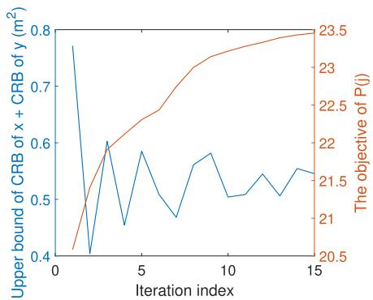  
(a) Sensing performance and the objective function value of P (j)

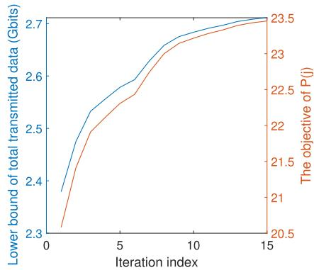  
(b) Communication performance and the objective function value of $\mathrm { ~ P ~ } ( j )$

Fig. 3. Convergence behaviour of the proposed algorithm solving $\mathrm { P } _ { 1 } ^ { \prime } \left( j \right)$ (j = 1, N<sub>stg</sub> = 60, η = 0.5, K = 2, M = 2 and $\breve { E _ { \mathrm { t o t } } } = 4 0 \mathrm { K J ) }$  
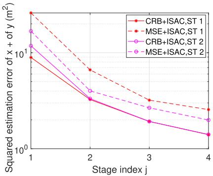  
Fig. 4. Sensing performance based on the MSTD approach $( N _ { \mathrm { s t g } } = 6 0 $ η = 1, K = 2 and $E _ { \mathrm { t o t } } = 6 0 \mathrm { K J } )$

In Fig. 4, we give the sensing performance trend of each ST following stages in a randomly-generated scenario. The $\mathrm { ^ { 6 6 } M S E { + } I S A C ^ { 3 } }$ means the MSE of ST’s coordinate estimates via MLE. $^ { \circ } \mathrm { \cdot } \mathrm { C R B + I S A C } ^ { \circ }$ is the CRB of ST’s coordinate estimates. It is shown that the sensing performance improves as the UAV progresses to the next stage. This improvement is attributed to the accumulation in $\widetilde { \mathbf { D } } _ { k } \left( j \right)$ . In Fig. 4, the CRB is a loose lower bound for the MSE, which happens because of the reason as follows. Since the observations are time delays between the ST and HPs, whereas the estimates are locations, this results in a nonlinear relationship between measurements and estimates. In the CRB derivation in (18), a linear approximation is employed to transform the CRB of distance measurements into the CRB of coordinates.

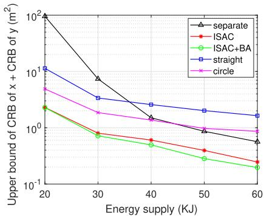

(a) Sensing  
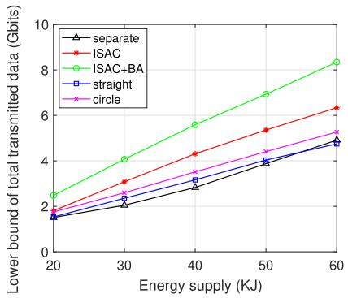  
(b) Communication  
Fig. 5. Performances of different schemes versus total energy supply $( N _ { \mathrm { s t g } } = 6 0 , \eta = 0 . 5 ,$ $K = 2$ and $M = 2 )$

Therefore, the MSE of coordinates can asymptotically achieve the approximated CRB with large number of random and independent measurements, as well as the variance of measurements should be enough low. Subsequently, since HPs in the designed trajectory are not randomly generated, which are intentionally arranged and positioned contiguously, as well as the measurement amount is not large enough, the coordinate measurements cannot be generated strictly randomly and independently. Given the inability of UAV paths to generate a random distribution of HPs in abundance, the CRB performing the loose bound of MSE cannot be solved. Nevertheless, the trends of CRB and MSE are similar, which can make the optimization process being meaningful.

The above reason also explains the necessity of considering angle diversity concerning sensing points in location estimation, as coordinate estimation involves utilizing onedimensional measurements to acquire a two-dimensional estimate.

## A. The C&S Performances of the ISAC Scheme Compared With Other Schemes

Fig. 5 illustrates the improvement on C&S performances of the proposed trajectory design, as well as compares the ISACbased UAV scheme with the “separate” scheme. To ensure the fairness between ISAC scheme and “separate” scheme, we set that in the “separate” scheme, $E _ { \mathrm { t o t } }$ of the UAV for communication and $E _ { \mathrm { t o t } }$ of the UAV for sensing are both the half value of x-axis, while for the UAV in the ISAC scheme, $E _ { \mathrm { t o t } }$ is equal to the value of x-axis. This ensures that the energy supply provided for the ISAC-based UAV and for

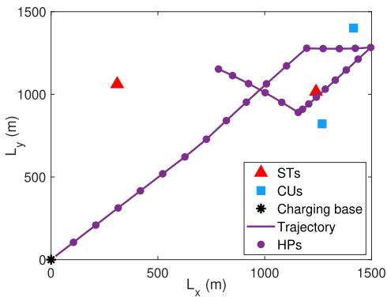

(a) $E _ { \mathrm { t o t } } = 4 0 \mathrm { K J }$  
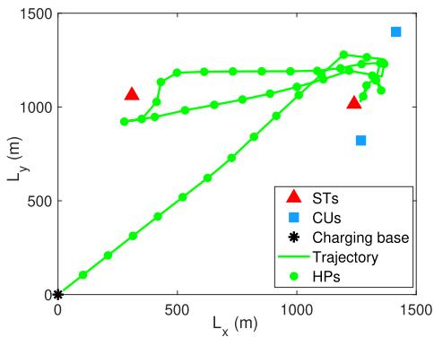

$$
E _ { \mathrm { t o t } } = 6 0 \mathrm { K J }
$$

Fig. 6. The ISAC-based UAV trajectories under different $E _ { \mathrm { t o t } }$ $( \breve { N } _ { \mathrm { s t g } } = 6 0$ and $\eta = 0 . 5 )$

the scenario with two “separate” UAVs is same. The results show that with the same energy supply, the ISAC scheme with the trajectory design outperforms the “separate” scheme in terms of C&S performances. Bandwidth allocation results in a performance improvement on communication, where an increase of at least 0.5 Gbits transmitted data can be achieved. We should notice that even though the growth of energy supply results in a performance improvement in both C&S, the CRB decreases slowly when $E _ { \mathrm { t o t } }$ is large. This is because the relationship between CRB and the number of distance measurements is nonlinear. Once we have enough distance measurements with adequate spatial diversity, additional measurements become redundant as they are just a repeat of former ones. Furthermore, it is obvious that, comparing with the UAV flying without trajectory design, both the C&S performances from the proposed trajectory are improved. UAV flying with a circle path is better than the straight path, since the straight path brings less sensing angle diversity.

Fig. 6 compares the ISAC-based UAV trajectories under different $E _ { \mathrm { t o t } }$ to illustrate why a larger $E _ { \mathrm { t o t } }$ can achieve better C&S performances. Specifically, the UAV covers a longer distance and more HPs with a larger $E _ { \mathrm { t o t } }$ , which means more distance measurements obtained. This leads to a decreased CRB. The larger $E _ { \mathrm { t o t } }$ also enables more data transmission during longer flying duration, thereby increasing total transmitted data. We can additionally observe that in Fig. 6 (a), in such a distribution of STs and CUs, because of the C&S tradeoff, the UAV initially flies approaching to the upper right area where three points are allocated. However, with more energy supply in Fig. 6 (b), to maintain fairness between two STs, the UAV then adjusts its trajectory towards to the upper left ST and alternates between two areas.

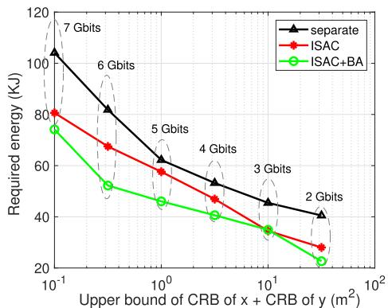

Fig. 7. Required energy supply versus various performance requirements (N<sub>stg</sub> = 60, η = 0.5, K = 2 and $M = 2 )$  
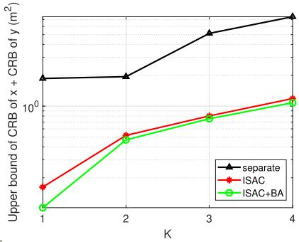

(a) Number of STs (M = 2)  
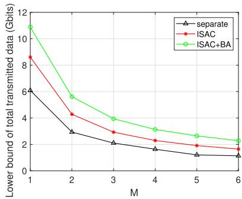  
(b) Number of CUs (K = 2)  
Fig. 8. The C&S performances versus K and M $( N _ { \mathrm { s t g } } = 6 0 , \eta = 0 . 5$ and $\bar { E _ { \mathrm { t o t } } } = 4 0 \mathrm { K J }$ in ISAC scheme, $E _ { \mathrm { t o t } } = 2 0 \mathrm { K J }$ in “separate” scheme).

Fig. 7 demonstrates the UAV energy consumption of the ISAC scheme compared to the “separate” scheme under different C&S requirements. The data values in Fig. 7 indicate that when the CRB on the x-axis is satisfied, the corresponding total transmitted data should also be satisfied. Fig. 7 confirms that under the same C&S requirements, the ISAC scheme consumes less energy compared to two UAVs flying for C&S respectively. This indicates a higher energy efficiency with the ISAC scheme in UAV scenario. Furthermore, using bandwidth allocation can contribute to energy savings.

## B. The C&S Performances With Various Numbers of CUs and STs

Fig. 8 (a) depicts the upper bound of CRB among all STs with varying numbers of STs. It can be observed that in the ISAC scheme, CRB increases considerably when the number of STs increases from 1 to 2. This is because the fairness between STs definitely influences sensing. In particular, for example, when two STs are located at a large distance from each other, the UAV may be unable to fly closely to both of them. Nonetheless, for the “separate” scheme, the CRB remains nearly unchanged when the number of STs increases from 1 to 2. That is because in the ISAC scheme, the UAV trajectory must consider both STs and CUs in the area. Consequently, besides the large distance between two ${ \mathrm { S T s } } ,$ in the ISAC scheme, the distance between STs and CUs also has an impact on sensing. In contrast, for the “separate” scheme, $E _ { \mathrm { t o t } } = 2 0 \mathrm { K J }$ is sufficient to support a UAV sensing for two STs, therefore the large distance between two STs does not strongly influence the sensing performance. The degradation of sensing performance becomes less pronounced in ISAC scheme as the number of STs continues to increase. This is because when the STs become more concentrated in their distribution, the UAV can fly closer to two or more STs simultaneously, to have better distance measurements for multiple STs. Fig. 8 (b) shows the lower bound of total transmitted data under various numbers of CUs. As can be seen, the total transmitted data exhibits a decreasing trend as the number of CUs increases, resulting from the smaller bandwidth allocated to each CU. Nevertheless, as the number of CUs continues to increase, the trend stabilizes. This occurs because when the CUs are densely distributed, the UAV does not need to spend excessive energy flying around the region. Consequently, it can improve the duration for transmission.

## C. The Tradeoff Between C&S in ISAC-Based UAV Trajectories

Fig. 9 aims to illustrate the performance tradeoff between C&S by tuning the weighting factor η. It can be seen that there exists a tradeoff between the total transmitted data and CRB. The weighting factor has a more significant impact on sensing compared to communication. Specifically, the CRB with $\eta ~ = ~ 0 . 1$ is nearly 10 times higher than CRB when $\eta = 0 . 9$ , while the total transmitted data only increases by approximately 0.6 Gbits in both ${ } ^ { 6 6 } \mathrm { I S A C } '$ and “ISAC+BA” when η decreases from 0.9 to 0.1. Fig. 9 (b) and (c) present the UAV trajectories with different η. It can be observed that with a higher η, where the sensing metric carries more weight in the objective function, the UAV trajectory is more focused on optimizing sensing. For example, in Fig. 9 (b) and (c), the UAV flies closer to STs when $\eta = 0 . 8$ , enabling more accurate measurements and leading to an improved estimation performance.

At the end of the section, we discuss some practical aspects focusing on the computational complexity of the proposed MSTD approach. We observe that the complexity is primarily determined by the number of stages and the number of variables need to be optimized in each stage. Referring to Algorithm 1 and 2, it is evident that $N _ { \mathrm { s t g } }$ impacts both the total number of stages and the number of variables optimized in each stage. Additionally, $\mu$ impacts the number of variables optimized in each stage. Increasing $N _ { \mathrm { s t g } }$ means that energy consumption in each stage is increased, resulting in fewer stages, potentially reducing the optimization processing time on repeating stages, but it simultaneously increases the number of variables in each stage, potentially increasing the processing time in each stage. On the other hand, smaller $\mu$ increases the number of variables in each stage, but enhancing sensing performance because of obtaining more distance measurements. Therefore, it is an obvious tradeoff relationship existed in 1) the values of parameters, i.e., $N _ { \mathrm { s t g } }$ and $\mu ,$ 2) sensing performance and 3) computational complexity, thus specific experiments can be made in real scenarios based on different C&S requirements, to discover the appropriate values for $N _ { \mathrm { s t g } }$ and $\mu ,$ seeking for a higher performance-to-complexity ratio.

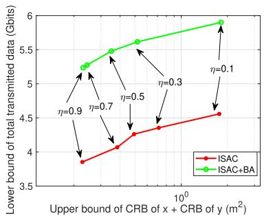

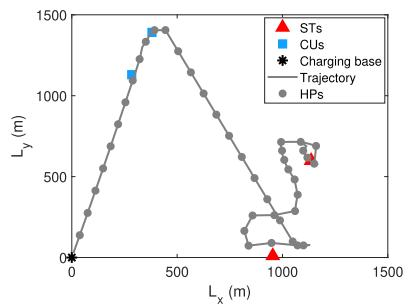

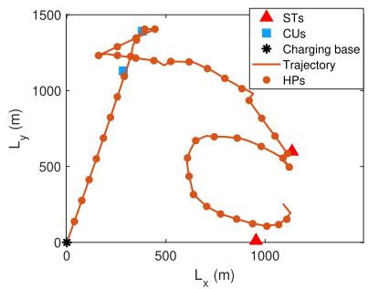  
(a) The tradeoff between C&S, $E _ { \mathrm { t o t } } = 4 0 \mathrm { K J }$ (b) $\eta = 0 . 8 ,$ sensing with high priority, $E _ { \mathrm { t o t } } = \mathrm { ( c ) } \ \eta \ = \ 0 . 2 ,$ , communication with high priority 60KJ $E _ { \mathrm { t o t } } = 6 0 \mathrm { K J }$

Fig. 9. Tradeoff between C&S performances $( N _ { \mathrm { { s t g } } } = 6 0 $ , M = 2 and $K = 2 )$  
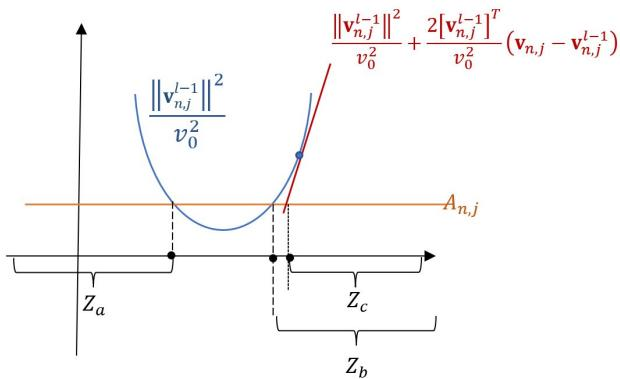  
Fig. 10. Constraint (54).

## VI. CONCLUSION

In this paper, we have addressed the problem of UAV trajectory design, bandwidth allocation and ST estimations in an ISAC-based UAV scenario. Firstly, we proposed a multistage trajectory design approach to assure accurate formulation for UAV trajectory design. Then, we formulated a weighted sum optimization problem to achieve a flexible performance tradeoff between C&S. We further developed an iterative algorithm to address the formulated optimization problem. The numerical results have demonstrated that the UAV energy supply and the performance priority have significant impact on C&S. Moreover, our ISAC scheme has shown considerable improvements in C&S performances and energy efficiency compared to single-functional UAV scenarios.

## APPENDIX

THE PROOF ABOUT THE FEASIBILITY OF $\{ \mathbf { S } _ { j } , \mathbf { V } _ { j } \}$ SOLUTIONS AFTER CONSTRAINT (34C) APPLIES SCA

Since we seek the local optimal solution of $\{ \mathbf { S } _ { j } , \mathbf { V } _ { j } \}$ in $\mathrm { P } _ { 1 } ^ { \prime } \left( j \right)$ by following the ascent direction obtained via $\mathrm { Q } ^ { \prime \prime } \left( j \right)$

it is necessary to prove that all available points belonging to the ascent direction obtained after SCA can satisfy all constraints in $\mathrm { P } _ { 1 } ^ { \prime } \left( j \right)$ . We rewrite $\mathrm { P } _ { 1 } ^ { \prime } \left( j \right)$ as

$$
\begin{array} { r l } & { \underset { \left\{ \mathbf { S } _ { j } , \mathbf { V } _ { j } , \mathbf { \delta } _ { \mathbf { S } _ { j } , \xi _ { j } } \right\} } { \operatorname* { m a x } } f \left( \mathbf { S } _ { j } \right) } \\ & { \mathrm { ~ s . t . ~ } \left( 1 \right) , \ ( 2 ) , \ ( 3 4 \mathrm { a } ) , \ ( 3 4 \mathrm { b } ) , \ ( 4 2 ) , \ ( 4 4 ) \mathrm { a n d ~ } ( 4 8 ) , } \\ & { \frac { { \bigl \| \mathbf { v } _ { n , j } \bigr \| } ^ { 2 } } { v _ { 0 } ^ { 2 } } \geq \frac { 1 } { \bigl [ \delta _ { n , j } \bigr ] ^ { 2 } } - \xi _ { n , j } , n = 1 , 2 , \ldots , N _ { j } ^ { \mathrm { f } } , } \\ & { \bigl [ \delta _ { n , j } \bigr ] ^ { 2 } \geq \xi _ { n , j } , n = 1 , 2 , \ldots , N _ { j } ^ { \mathrm { f } } . } \end{array}
$$

It is readily observed that the two constraints above need to use SCA in $\mathrm { Q } ^ { \prime \prime } \left( j \right)$ . Hence, we aim to demonstrate that in the l-th iteration, all possible solutions of $\left\{ \mathbf { V } _ { j } , \pmb { \delta } _ { j } , \pmb { \xi } _ { j } \right\}$ following the ascent direction still fulfill this two constraints.

First of all, we split the first constraint into two sub constraints as follows

$$
\begin{array} { c } { \displaystyle \frac { \left\| \mathbf { v } _ { n , j } \right\| ^ { 2 } } { v _ { 0 } ^ { 2 } } \geq A _ { n , j } , n = 1 , 2 , \ldots , N _ { j } ^ { \mathrm { f } } , } \\ { A _ { n , j } \geq \displaystyle \frac { 1 } { \left[ \delta _ { n , j } \right] ^ { 2 } } - \xi _ { n , j } , n = 1 , 2 , \ldots , N _ { j } ^ { \mathrm { f } } . } \end{array}\tag{54}
$$

(55)

In Fig. 10, we assume that the region of $\Vert \mathbf { v } _ { n , j } \Vert$ satisfying constraint (54) in the l-th iteration is $Z _ { a }$ and $Z _ { b } .$ . After applying the first-order Taylor expansion in the LHS of constraint (54), the available region of $\| \mathbf { v } _ { n , j } \|$ in the l-th iteration is $Z _ { c } .$ . Since the ascent direction is a part of $\boldsymbol { Z } _ { c } ,$ and $\boldsymbol { Z } _ { c }$ is encompassed by $Z _ { b } ,$ , all possible solutions following the ascent direction satisfies (54). Now we can prove that the first constraint in $\mathrm { P } _ { 1 } ^ { \prime } \left( j \right)$ rewritten above can be addressed with SCA. The second constraint has a similar proof, omitted here for brevity.

## REFERENCES

[1] A. Liu et al., “A survey on fundamental limits of integrated sensing and communication,” IEEE Commun. Surveys Tuts., vol. 24, no. 2, pp. 994–1034, 2nd Quart., 2022.

[2] Y. Cui, F. Liu, X. Jing, and J. Mu, “Integrating sensing and communications for ubiquitous IoT: Applications, trends, and challenges,” IEEE Netw., vol. 35, no. 5, pp. 158–167, Sep. 2021.

[3] F. Liu et al., “Integrated sensing and communications: Towards dualfunctional wireless networks for 6G and beyond,” IEEE J. Sel. Areas Commun., vol. 40, no. 6, pp. 1728–1767, Jun. 2022.

[4] O. B. Akan and M. Arik, “Internet of Radars: Sensing versus sending with joint radar-communications,” IEEE Commun. Mag., vol. 58, no. 9, pp. 13–19, Sep. 2020.

[5] X. Wang, Z. Fei, J. A. Zhang, J. Huang, and J. Yuan, “Constrained utility maximization in dual-functional radar-communication multi-UAV networks,” IEEE Trans. Commun., vol. 69, no. 4, pp. 2660–2672, Apr. 2021.

[6] P. Kumari, N. J. Myers, and R. W. Heath, “Adaptive and fast combined waveform-beamforming design for mmWave automotive joint communication-radar,” IEEE J. Sel. Topics Signal Process., vol. 15, no. 4, pp. 996–1012, Jun. 2021.

[7] Y. Zeng, Q. Wu, and R. Zhang, “Accessing from the sky: A tutorial on UAV communications for 5G and beyond,” Proc. IEEE, vol. 107, no. 12, pp. 2327–2375, Dec. 2019.

[8] Q. Wu et al., “A comprehensive overview on 5G-and-beyond networks with UAVs: From communications to sensing and intelligence,” IEEE J. Sel. Areas Commun., vol. 39, no. 10, pp. 2912–2945, Oct. 2021.

[9] F. Liu, C. Masouros, A. P. Petropulu, H. Griffiths, and L. Hanzo, “Joint radar and communication design: Applications, state-of-the-art, and the road ahead,” IEEE Trans. Commun., vol. 68, no. 6, pp. 3834–3862, Jun. 2020.

[10] T. Huang, N. Shlezinger, X. Xu, Y. Liu, and Y. C. Eldar, “MAJoR-Com: A dual-function radar communication system using index modulation,” IEEE Trans. Signal Process., vol. 68, pp. 3423–3438, 2020.

[11] M. Jamil, H.-J. Zepernick, and M. I. Pettersson, “On integrated radar and communication systems using oppermann sequences,” in Proc. IEEE Mil. Commun. Conf., Nov. 2008, pp. 1–6.

[12] X. Li, R. Yang, Z. Zhang, and W. Cheng, “Research of constructing method of complete complementary sequence in integrated radar and communication,” in Proc. IEEE 11th Int. Conf. Signal Process., vol. 3, Oct. 2012, pp. 1729–1732.

[13] P. Kumari, S. A. Vorobyov, and R. W. Heath, “Adaptive virtual waveform design for millimeter-wave joint communication-radar,” IEEE Trans. Signal Process., vol. 68, pp. 715–730, 2020.

[14] Y. Liu, G. Liao, J. Xu, Z. Yang, and Y. Zhang, “Adaptive OFDM integrated radar and communications waveform design based on information theory,” IEEE Commun. Lett., vol. 21, no. 10, pp. 2174–2177, Oct. 2017.

[15] Z. Xiao and Y. Zeng, “Waveform design and performance analysis for full-duplex integrated sensing and communication,” IEEE J. Sel. Areas Commun., vol. 40, no. 6, pp. 1823–1837, Jun. 2022.

[16] F. Liu, Y.-F. Liu, A. Li, C. Masouros, and Y. C. Eldar, “Cramér–Rao bound optimization for joint radar-communication beamforming,” IEEE Trans. Signal Process., vol. 70, pp. 240–253, 2022.

[17] Y. Zeng, R. Zhang, and T. J. Lim, “Wireless communications with unmanned aerial vehicles: Opportunities and challenges,” IEEE Commun. Mag., vol. 54, no. 5, pp. 36–42, May 2016.

[18] A. Al-Hourani, S. Kandeepan, and S. Lardner, “Optimal LAP altitude for maximum coverage,” IEEE Wireless Commun. Lett., vol. 3, no. 6, pp. 569–572, Dec. 2014.

[19] B. Li, C. Chen, R. Zhang, H. Jiang, and X. Guo, “The energy-efficient UAV-based BS coverage in air-to-ground communications,” in Proc. IEEE 10th Sensor Array Multichannel Signal Process. Workshop (SAM), Jul. 2018, pp. 578–581.

[20] H. He, S. Zhang, Y. Zeng, and R. Zhang, “Joint altitude and beamwidth optimization for UAV-enabled multiuser communications,” IEEE Commun. Lett., vol. 22, no. 2, pp. 344–347, Feb. 2018.

[21] J. Sun and C. Masouros, “Deployment strategies of multiple aerial BSs for user coverage and power efficiency maximization,” IEEE Trans. Commun., vol. 67, no. 4, pp. 2981–2994, Apr. 2019.

[22] J. Sun and C. Masouros, “Drone positioning for user coverage maximization,” in Proc. IEEE 29th Annu. Int. Symp. Pers., Indoor Mobile Radio Commun. (PIMRC), Sep. 2018, pp. 318–322.

[23] I. Valiulahi and C. Masouros, “Multi-UAV deployment for throughput maximization in the presence of co-channel interference,” IEEE Internet Things J., vol. 8, no. 5, pp. 3605–3618, Mar. 2021.

[24] Y. Ji, C. Dong, X. Zhu, and Q. Wu, “Fair-energy trajectory planning for cooperative UAVs to locate multiple targets,” in Proc. IEEE Int. Conf. Commun. (ICC), May 2019, pp. 1–7.

[25] X. Jing, J. Sun, and C. Masouros, “Energy aware trajectory optimization for aerial base stations,” IEEE Trans. Commun., vol. 69, no. 5, pp. 3352–3366, May 2021.

[26] Y. Zeng, J. Xu, and R. Zhang, “Energy minimization for wireless communication with rotary-wing UAV,” IEEE Trans. Wireless Commun., vol. 18, no. 4, pp. 2329–2345, Apr. 2019.

[27] M. Hua, Y. Wang, Z. Zhang, C. Li, Y. Huang, and L. Yang, “Power-efficient communication in UAV-aided wireless sensor networks,” IEEE Commun. Lett., vol. 22, no. 6, pp. 1264–1267, Jun. 2018.

[28] L. He, P. Gong, X. Zhang, and Z. Wang, “The bearing-only target localization via the single UAV: Asymptotically unbiased closed-form solution and path planning,” IEEE Access, vol. 7, pp. 153592–153604, 2019.

[29] S. Xu, K. Dogançay, and H. Hmam, “Distributed path optimization of multiple UAVs for AOA target localization,” in Proc. IEEE Int. Conf. Acous., Speech Signal Process. (ICASSP), Mar. 2016, pp. 3141–3145.

[30] K. Dogançay, “Single- and multi-platform constrained sensor path optimization for angle-of-arrival target tracking,” in Proc. 18th Eur. Signal Process. Conf., Aug. 2010, pp. 835–839.

[31] K. Zhang and C. Shen, “UAV aided integrated sensing and communications,” in Proc. IEEE 94th Veh. Technol. Conf. (VTC-Fall), Sep. 2021, pp. 1–6.

[32] S. Zhang, H. Zhang, Z. Han, H. V. Poor, and L. Song, “Age of information in a cellular Internet of UAVs: Sensing and communication trade-off design,” IEEE Trans. Wireless Commun., vol. 19, no. 10, pp. 6578–6592, Oct. 2020.

[33] K. Meng, Q. Wu, S. Ma, W. Chen, and T. Q. S. Quek, “UAV trajectory and beamforming optimization for integrated periodic sensing and communication,” IEEE Wireless Commun. Lett., vol. 11, no. 6, pp. 1211–1215, Jun. 2022.

[34] Z. Lyu, G. Zhu, and J. Xu, “Joint maneuver and beamforming design for UAV-enabled integrated sensing and communication,” 2021, arXiv:2110.02857.

[35] X. Jing, F. Liu, and C. Masouros, “Path design for portable access point in joint sensing and communications under energy constraints,” in Proc. IEEE 96th Veh. Technol. Conf. (VTC-Fall), Sep. 2022, pp. 1–5.

[36] M. Letafati, H. Behroozi, B. H. Khalaj, and E. A. Jorswieck, “Hardware-impaired PHY secret key generation with man-in-the-middle adversaries,” IEEE Wireless Commun. Lett., vol. 11, no. 4, pp. 856–860, Apr. 2022.

[37] M. Letafati, H. Behroozi, B. H. Khalaj, and E. A. Jorswieck, “Deep learning for hardware-impaired wireless secret key generation with man-in-the-middle attacks,” in Proc. IEEE Global Commun. Conf. (GLOBECOM), Dec. 2021, pp. 1–6.

[38] Y. Zeng and R. Zhang, “Energy-efficient UAV communication with trajectory optimization,” IEEE Trans. Wireless Commun., vol. 16, no. 6, pp. 3747–3760, Jun. 2017.

[39] S. M. Kay, Fundamentals of Statistical Signal Processing: Estimation Theory. Upper Saddle River, NJ, USA: Prentice-Hall, 1993, pp. 15–67.

[40] Y.-S. Yoon and M. G. Amin, “Spatial filtering for wall-clutter mitigation in through-the-wall radar imaging,” IEEE Trans. Geosci. Remote Sens., vol. 47, no. 9, pp. 3192–3208, Sep. 2009.

[41] F. Liu, W. Yuan, C. Masouros, and J. Yuan, “Radar-assisted predictive beamforming for vehicular links: Communication served by sensing,” IEEE Trans. Wireless Commun., vol. 19, no. 11, pp. 7704–7719, Nov. 2020.

[42] S. M. Key, Fundamentals of Statistical Signal Processing, Volume II: Detection Theory. Upper Saddle River, NJ, USA: Prentice-Hall, 1993, pp. 20–36.

[43] S. Boyd and L. Vandenberghe, Convex Optimization. Cambridge, U.K.: Cambridge Univ. Press, 2004.

[44] B. Li, N. Wu, H. Wang, P.-H. Tseng, and J. Kuang, “Gaussian message passing-based cooperative localization on factor graph in wireless networks,” Signal Process., vol. 111, pp. 1–12, Jun. 2015.

[45] X. Zhang and L. Duan, “Energy-saving deployment algorithms of UAV swarm for sustainable wireless coverage,” IEEE Trans. Veh. Technol., vol. 69, no. 9, pp. 10320–10335, Sep. 2020.

[46] K. Wang, X. Zhang, L. Duan, and J. Tie, “Multi-UAV cooperative trajectory for servicing dynamic demands and charging battery,” IEEE Trans. Mobile Comput., vol. 22, no. 3, pp. 1599–1614, Mar. 2023.

[47] X. Liu, Y. Liu, Z. Liu, and T. S. Durrani, “Fair integrated sensing and communication for multi-UAV enabled Internet of Things: Joint 3D trajectory and resource optimization,” IEEE Internet Things J., early access, Oct. 25, 2023, doi: 10.1109/JIOT.2023.3327445.

[48] B. Li, Q. Li, Y. Zeng, Y. Rong, and R. Zhang, “3D trajectory optimization for energy-efficient UAV communication: A control design perspective,” IEEE Trans. Wireless Commun., vol. 21, no. 6, pp. 4579–4593, Jun. 2022.

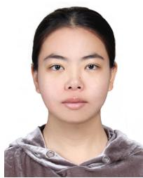

Xiaoye Jing (Graduate Student Member, IEEE) received the B.Eng. degree from Harbin University of Science and Technology, Harbin, China, in 2017, and the M.Eng. degree from Harbin Institute of Technology, Harbin, in 2019. She is currently pursuing the Ph.D. degree with the Department of Electronic and Electrical Engineering, University College London, U.K. She was a Marie Curie Early-Stage Researcher supported by the European Union’s Horizon 2020 Research and Innovation Program PAINLESS from 2019 to 2022. Her research

interests include UAV communication, joint UAV and radar networks, integrated sensing and communications, and UAV-enabled target localization.


Fan Liu (Senior Member, IEEE) received the B.Eng. and Ph.D. degrees from Beijing Institute of Technology (BIT), Beijing, China, in 2013 and 2018, respectively.

He has held academic positions with University College London (UCL), first as a Visiting Researcher from 2016 to 2018, and then as a Marie Curie Research Fellow from 2018 to 2020. He is currently an Assistant Professor with the School of System Design and Intelligent Manufacturing (SDIM), Southern University of Science and Technology

(SUSTech). His research interests include signal processing and wireless communications, and in particular in the area of integrated sensing and communications (ISAC). He is an elected member of the IEEE SPS Sensor Array and Multichannel Technical Committee (SAM-TC) and a Founding Member of the IEEE SPS ISAC Technical Working Group (ISAC-TWG). He is a member of the IMT-2030 (6G) ISAC Task Group. He was a recipient of the 2023 IEEE Communications Society Stephan O. Rice Prize, the 2023 IEEE ICC Best Paper Award, the 2023 IEEE/CIC ICCC 2023 Best Paper Award, the 2022 First Prize of Science and Technology Progress of China Institute of Communications, the 2021 IEEE Signal Processing Society Young Author Best Paper Award, the 2019 Best Ph.D. Thesis Award of the Chinese Institute of Electronics, and the 2018 EU Marie Curie Individual Fellowship. He is the Founding Academic Chair of the IEEE ComSoc ISAC Emerging Technology Initiative (ISAC-ETI). He has served as an Organizer and the Co-Chair for several workshops, special sessions, and tutorials in flagship IEEE conferences, including ICC, GLOBECOM, ICASSP, SPAWC, and MobiCom. He is the TPC Co-Chair of the 2nd–4th IEEE Joint Communication and Sensing (JC&S) Symposium, the Symposium Co-Chair of IEEE GLOBECOM 2023, and the Track Co-Chair of the IEEE WCNC 2024. He is an Associate Editor of IEEE TRANSACTIONS ON MOBILE COMPUTING, IEEE OPEN JOURNAL OF SIGNAL PROCESSING, and IEEE COMMUNICATIONS LETTERS, and the Guest Editor of IEEE JOURNAL ON SELECTED AREAS IN COMMUNICATIONS, IEEE WIRELESS COMMUNICATIONS, and IEEE Vehicular Technology Magazine. He has been named as an Exemplary Reviewer for IEEE TRANSACTIONS ON WIRELESS COMMUNICATIONS, IEEE TRANSACTIONS ON COMMUNICATIONS, and IEEE COMMUNICATIONS LETTERS, for five times. He has ten papers selected as IEEE ComSoc Best Readings. He was listed among the World’s Top 2% Scientists by Stanford University for citation impact from 2021 to 2023 and among the 2023 Elsevier Highly-Cited Chinese Researchers.


Christos Masouros (Fellow, IEEE) received the Diploma degree in electrical and computer engineering from the University of Patras, Greece, in 2004, and the M.Sc. (by research) and Ph.D. degrees in electrical and electronic engineering from The University of Manchester, U.K., in 2006 and 2009, respectively.

In 2008, he was a Research Intern with Philips Research Labs, U.K., working on the LTE standards. From 2009 to 2010, he was a Research Associate with The University of Manchester. From 2010 to

2012, he was a Research Fellow with Queen’s University Belfast. In 2012, he joined University College London, as a Lecturer. He has held a Royal Academy of Engineering Research Fellowship from 2011 to 2016. Since 2019, he has been a Full Professor of signal processing and wireless communications with the Information and Communication Engineering Research Group, Department of Electronic and Electrical Engineering, and affiliated with the Institute for Communications and Connected Systems, University College London. From 2018 to 2022, he was a Project Coordinator of the 4.2m EU H2020 ITN Project PAINLESS, involving 12 EU partner universities and industries, toward energy-autonomous networks. During 2024–2028, he will be the Scientific Coordinator of the 2.7m EU H2020 DN Project ISLANDS, involving 19 EU partner universities and industries, toward next-generation vehicular networks. His research interests include wireless communications and signal processing with a particular focus on green communications, largescale antenna systems, integrated sensing and communications, interference mitigation techniques for MIMO, and multicarrier communications. He is a member of IET. He is a member of the IEEE Standards Association Working Group on ISAC Performance Metrics and a Founding Member of the ETSI ISG on ISAC. He is a fellow of Asia–Pacific Artificial Intelligence Association (AAIA). He was a recipient of the 2023 IEEE ComSoc Stephen O. Rice Prize and the Best Paper Award from the IEEE GLOBECOM 2015 Conference and IEEE WCNC 2019 Conference. He was a co-recipient of the 2021 IEEE SPS Young Author Best Paper Award. He is a founding member and the Vice-Chair of the IEEE Emerging Technology Initiative on Integrated Sensing and Communications (SAC), the Vice Chair of the IEEE Wireless Communications Technical Committee Special Interest Group on ISAC, and the Chair of the IEEE Green Communications & Computing Technical Committee, Special Interest Group on Green ISAC. He is the TPC Chair of the IEEE ICC 2024 Selected Areas in Communications (SAC) Track on ISAC and the Chair of the “Integrated Imaging and Communications” stream in IEEE CISA 2024. He has been recognized as an Exemplary Editor of IEEE COMMUNICATIONS LETTERS and an Exemplary Reviewer of IEEE TRANS-ACTIONS ON COMMUNICATIONS. He is an Editor of IEEE TRANSACTIONS ON WIRELESS COMMUNICATIONS and IEEE OPEN JOURNAL OF SIGNAL PROCESSING and an Editor-at-Large of IEEE OPEN JOURNAL OF THE COM-MUNICATIONS SOCIETY. He has been an Editor of IEEE TRANSACTIONS ON COMMUNICATIONS and IEEE COMMUNICATIONS LETTERS and the Guest Editor for a number of journals, such as IEEE JOURNAL ON SELECTED TOPICS IN SIGNAL PROCESSING and IEEE JOURNAL ON SELECTED AREAS IN COMMUNICATIONS issues. He will be an IEEE ComSoc Distinguished Lecturer during 2024–2025.


Yong Zeng (Senior Member, IEEE) received the Bachelor of Engineering (Hons.) and Ph.D. degrees from Nanyang Technological University, Singapore.

From 2013 to 2018, he was a Research Fellow and a Senior Research Fellow with the Department of Electrical and Computer Engineering, National University of Singapore. From 2018 to 2019, he was a Lecturer with the School of Electrical and Information Engineering, The University of Sydney, Australia. He is currently a Full Professor with the National Mobile Communications Research Labora-

tory, Southeast University, China, and also with Purple Mountain Laboratories, Nanjing, China. He has published more than 170 articles, which have been cited by more than 25,000 times based on Google Scholar. He was a recipient of the Australia Research Council (ARC) Discovery Early Career Researcher Award (DECRA), the 2020 IEEE Marconi Prize Paper Award in Wireless Communications, the 2018 IEEE Communications Society Asia-Pacific Outstanding Young Researcher Award, the 2020 and 2017 IEEE Communications Society Heinrich Hertz Prize Paper Award, the 2021 IEEE ICC Best Paper Award, and the 2021 China Communications Best Paper Award. He is the Symposium Chair of IEEE GLOBECOM 2021 Track on Aerial Communications, the Workshop Co-Chair of ICC 2018–2023 Workshop on UAV Communications, and the Tutorial Speaker of GLOBECOM 2018/2019 and ICC 2019 Tutorials on UAV Communications. He serves as an Editor for IEEE TRANSACTIONS ON COMMUNICATIONS, IEEE COMMUNICATIONS LETTERS, and IEEE OPEN JOURNAL OF VEHICULAR TECHNOLOGY, and the Leading Guest Editor for IEEE WIRELESS COMMUNICATIONS on “Integrating UAVs into 5G and Beyond” and China Communications on “Network-Connected UAV Communications.” He was listed as Highly Cited Researcher by Clarivate Analytics for five consecutive years (2019–2023).