# Integrated Sensing and Communication for Energy-Efficient Low-Altitude Economy Based on Meta Deep Reinforcement Learning

Xiaowen Ye, Xianxin Song, Yi Wu, and Liqun Fu, Senior Member, IEEE

Abstract—This paper investigates a new class of terrestrial integrated sensing and communication (ISAC) schemes that support the energy-efficient low-altitude economy (LAE) applications based on meta deep reinforcement learning (DRL). Specifically, we consider an LAE-oriented ISAC system, in which a ground base station (GBS) provides communication and navigation services for authorized unmanned aerial vehicles (UAVs), as well as senses the low-altitude airspace to monitor the unauthorized mobile target. By jointly optimizing the GBS’s beamforming and authorized UAVs’ trajectories, we aim to maximize the expected energy efficiency over a given flight period, subject to constraints including the average sensing signal-to-noise ratio requirement, UAV mission completion and collision avoidance, and the maximum transmit power at the GBS. To circumvent this sequential decision-making problem, we first put forth a new ISAC scheme for LAE, termed Deep Energy-efficient LAE-ISAC (DeepESC), leveraging DRL techniques. In DeepESC, a new reward function and a constrained action selection policy are introduced to satisfy various constraints. Also, an episodic experience replay mechanism is developed to derive efficient joint optimization strategies across the whole flight period. The gist is to employ experience sets each containing all experiences from a complete episode to jointly train the neural network, assign priorities to these sets, and more actively sample newer experience sets. Besides, to enable rapid adaptation to unseen flight periods with fewer experience samples, we propose the Meta-DeepESC scheme by integrating a new meta-learning approach into DeepESC. Simulation results demonstrate that compared with other schemes, Meta-DeepESC (i) achieves higher energy efficiency while satisfying all constraints, (ii) converges faster, and (iii) exhibits better generalization across different flight periods.

Index Terms—Integrated sensing and communication (ISAC), low-altitude economy (LAE), unmanned aerial vehicles (UAVs), meta deep reinforcement learning (DRL).

## I. INTRODUCTION

OW-altitude economy (LAE) is an emerging business including unmanned aerial vehicles (UAVs) and electric vertical take-off and landing aircraft, operating at low altitudes (typically below 1,000 m) [1]. Owing to the operational flexibility, maneuverability, and real-time data collection capabilities of low-altitude aircraft, LAE supports critical applications such as environmental monitoring, cargo delivery, and emergency rescue. However, LAE imposes additional requirements on sensing and energy for existing wireless communication systems. First, it requires ubiquitous sensing to enable safe trajectory planning for numerous aircraft while maintaining real-time monitoring to prevent collisions with unauthorized targets [2]. Second, UAV endurance is fundamentally limited by onboard energy capacity, which is practically finite due to the aircraft’s size and weight limitations. How to provide seamless communication and navigation for energy-limited aircraft, along with ubiquitous surveillance of unauthorized targets, is therefore an imminent problem in LAE.

As a key enabling technology for next-generation wireless systems, integrated sensing and communication (ISAC) can effectively meet these requirements. By amalgamating radar sensing and wireless communications within the same spectrum, infrastructure, and signal processing framework, ISAC achieves significantly higher spectral efficiency and lower hardware costs, compared to maintaining two separate systems in isolated frequency bands [3]. With ISAC, the ground base station (GBS) provides communication and navigation services to authorized aircraft (especially UAVs), while detecting low-altitude targets (e.g., unauthorized UAVs). Furthermore, through joint optimization of ISAC beamforming and UAV trajectory, energy-efficient LAE can be attained, maximizing the number of information bits per unit energy consumption at the UAV while meeting the target sensing requirement.

## A. Related Work

Recent studies have extensively explored energy efficiency optimization in UAV communications [4]–[12]. An initial theoretical model for the propulsion energy consumption of a single fixed-wing UAV, incorporating speed, direction, and acceleration, was presented in [4]. On this basis, literature [5]– [12] considered multi-UAV systems with collision-avoidance requirements. Specifically, to maximize the data delivery rate under limited energy, a joint successive convex approximation (SCA) and path discretization scheme for trajectory optimization was proposed in [5], whereas a combined semidefinite programming and matching theory method was used in [6] to refine coded caching, user grouping, and UAV deployment. Several multi-objective optimization algorithms were devised in [7]–[9] to balance UAV energy consumption with communication utility. Also, UAVs have been introduced into various systems, e.g., non-orthogonal multiple access [10], mobile edge computing [11], and cell-free multiple-input multipleoutput [12], to improve coverage and transmission efficiency. These studies, however, were merely concerned about the communication system, while ignoring the sensing requirement.

Unlike [4]–[12], a substantial body of studies, e.g., [13]– [18], investigated the integration of UAVs into ISAC applications. In [13], a dual-function multi-UAV wireless network was studied, aiming to maximize the sum-rate through joint optimization of UAV location, transmit power, and user association under the Cramer-Rao bound (CRB) constraint. To meet´ both communication and sensing requirements while ensuring control performance, the authors of [14] proposed a joint scheduling strategy for communication, sensing, and control for millimeter-wave UAV networks. Using iterative algorithms based on alternating optimization and SCA, a joint UAV deployment and transmit precoder scheme was designed in [15] to balance communication sum-rate and sensing accuracy, whilst the deployment and power control were jointly optimized in [16] to maximize the minimum detection probability. In contrast to [15] and [16], the authors of [17] addressed the complex coupling between UAV placement and beamformer design through a joint alternating optimization and trust region method. Furthermore, the potential of UAVs for enhancing ISAC physical layer security was explored in [18].

Previous studies [13]–[18] primarily focused on fixedposition UAV-assisted ISAC scenarios, which failed to employ the controllable maneuverability in three-dimensional (3D) space. To leverage the advantages of UAV mobility, literature [19]–[43] investigated UAV trajectory optimization for ISAC systems. For example, in [19]–[21], efficient iterative algorithms based on SCA were proposed to adjust UAVs trajectories for maximizing the real-time secrecy rate. By jointly optimizing trajectory and beamforming, the communication sum-rate was maximized in [22]–[24] under sensing constraints, while sensing-centric UAV-assisted ISAC schemes were explored in [25] and [26]. Besides, in [27]–[29], other variables are optimized alongside UAV trajectory, e.g., UAV transmit power and user scheduling [27], bandwidth allocation [28], and offloading task size [29]. In contrast to [19]–[29], the authors of [30]–[37] focused on maximizing energy efficiency in UAV-assisted ISAC systems. In particular, using a combination of SCA and block coordinate descent methods, several joint trajectory and beamforming schemes for single-UAV systems were developed in [30]–[34], whereas communication, sensing, and computation resources along with trajectories for multi-UAV systems were jointly optimized in [35]–[37]. In addition, to enhance adaptability compared to conventional optimization methods, several intelligent UAV-assisted ISAC schemes were proposed in [38]–[43].

The aforementioned research [13]–[43] cannot adequately cater to LAE-oriented terrestrial ISAC systems, where authorized UAVs (as communication users) with specific flight missions (e.g., cargo delivery) and unauthorized targets (as sensing targets) coexist in low-altitude space. On the contrary, limited studies explored the use of GBS to provide aircraft with ISAC services, which better aligns with terrestrial ISAC systems for LAE [44]–[50]. To be specific, in systems where one GBS serves multiple UAVs, the authors of [44] proposed a learning-based joint trajectory and beamforming approach to maximize long-term communication sum-rate, whereas the authors of [45] studied a dual identity association-based ISAC scheme to enable rapid and precise beamforming for different UAVs. Unlike [44] and [45], the authors of [46]–[50] investigated networked ISAC systems. In [46], a joint UAV tracking and handover scheme was proposed using a centralized extended Kalman filter. In [47], a Dinkelbach’s method-based joint transmit beamforming and target assignment scheme was designed to maximize the minimum sensing signal-to-noise ratio (SNR). To improve the estimation accuracy of UAV parameters, the authors of [49] designed a compressed sensingbased algorithm, whereas the authors of [48] introduced a joint spatial smoothing tensor decomposition with data fusion techniques. Besides, in [50], multiple GBSs cooperatively transmit unified ISAC signals to simultaneously communicate with authorized UAVs and detect unauthorized targets.

## B. Challenges and Motivations

The implementation of existing LAE-oriented terrestrial ISAC schemes [44]–[50] in practical systems, however, is hindered by three critical factors. First, prior works [44]– [50] exclusively focused on maximizing either communication rate or detection accuracy in LAE-oriented ISAC systems, while neglecting UAV energy consumption and endurance. These two factors are crucial for UAV trajectory design, especially given the limited onboard energy in real-world systems. Hence, there is an urgent need to design a terrestrial ISAC scheme for energy-efficient LAE. Second, existing works [45]–[50] assume static unauthorized targets and employ optimization-based algorithms that alternately optimize all variables based on instantaneous performance metrics. However, in practical scenarios, targets are highly mobile, and the channel state information (CSI) is time-correlated as the next locations of the target and UAVs hinge on their current locations. The LAE-oriented ISAC problem is hence a longterm optimization problem, which requires joint optimization of all variables towards the system’s average performance over the whole flight period. Consequently, conventional nonlearning-based algorithms (i.e., optimization-based algorithms) fail to solve the formulated LAE-ISAC problem. Model-free deep reinforcement learning (DRL) techniques, being well suited to solve such long-term optimization problems, emerge as a promising approach for designing ISAC schemes even without acquiring prior knowledge of target mobility. Third, current schemes [44]–[50] are objective-oriented, in the sense that they rely on a predetermined flight period before deriving a solution. Consequently, these solutions lack generalizability across various flight periods. Although DRL operates in an online manner, its effectiveness depends on whether the flight period was observed during the artificial neural network (ANN) training. When encountering an unseen flight period, the ANN must be retrained from scratch, leading to excessive trial and error during which the ANN performs ineffectively. Thus, it is imperative to improve the generalization ability of LAE-oriented ISAC schemes.

Also, DRL-based ISAC schemes have been widely applied in various scenarios, e.g., vehicle-to-everything networks [51], reconfigurable intelligent surface-aided cellular systems [52], and UAV-based applications [53]. However, these schemes are difficult to directly apply to LAE-oriented terrestrial ISAC systems. First, in the considered system, multiple constraints, including sensing requirements, collision avoidance, navigation missions, and maximum transmit power, must be satisfied while improving energy efficiency. Consequently, a new reward function and action selection strategy need to be carefully designed to ensure all constraints are respected within the DRL framework. Second, in the conventional ANN training mechanism (i.e., experience replay) [54], experiences from a complete episode are stored separately and sampled uniformly at random. As a result, the experiences used for ANN training are not guaranteed to originate from the same episode, nor can they be assigned different priorities during training. Although the prioritized experience replay mechanism [55] can assign importance to individual experiences, it similarly cannot ensure that experiences from the same episode appear together. Moreover, it lacks the ability to prioritize recent experiences, which is essential for adapting to task dynamics. Hence, a new ANN training mechanism that addresses the above limitations is required. Third, a meta-learning-based ISAC scheme was developed in [56], yet it struggles to generalize across a wide range of flight periods due to its neglect of the quality of training tasks with different flight periods.

Overall, this paper aims to design a new LAE-oriented terrestrial ISAC scheme to tackle the above practical challenges.

## C. Contributions

In this paper, we investigate an energy-efficient LAEoriented ISAC system aiming to maximize the expected energy efficiency over a specific flight period by jointly optimizing the GBS’s beamforming and authorized UAVs’ trajectories. Various constraints, including the average SNR requirement for mobile target monitoring, UAV mission and collision avoidance, and the GBS’s maximum transmit power, are addressed. The main contributions are summarized as follows:

1) DeepESC Scheme: We formulate the joint beamforming and trajectory optimization problem as a specialized Markov Decision Process (MDP) model called episode tasks [55], in which the flight mission corresponds to the episode task and each flight period is regarded as an episode. To derive an effective solution, an ISAC scheme suitable for energy-efficient LAE, termed Deep Energy-efficient LAE-ISAC (DeepESC), is developed based on DRL techniques. In DeepESC, a constrained action selection policy is devised, which introduces a scaling factor and UAVs’ real-time locations to refine the joint decision derived from the conventional noise-exploration policy [57]. In addition, we design a new reward function for action evaluation, which integrates the optimization objective and various constraints into the learning process. Two prominent features of DeepESC are that it requires no prior knowledge of target mobility patterns and caters the long-term optimization of energy-efficient LAE-oriented ISAC systems.

2) Episodic Experience Replay Mechanism: We design a new episodic experience replay mechanism for DeepESC to train the ANN. To be specific, DeepESC is tailored for episode tasks, where the movement characteristics of the target vary across episodes. The conventional experience replay mechanism used in DRL [54] is ill-suited for DeepESC, as it cannot ensure that experiences from the same episode are replayed together or that they are assigned different priorities during training. To enable effective learning in such task settings, the proposed episodic experience replay mechanism (i) employs experience sets, each comprising all experiences from an entire episode, to jointly train the ANN, (ii) assigns priorities to these sets so that those with higher uncertainty are sampled more frequently, and (iii) more actively samples newer sets.

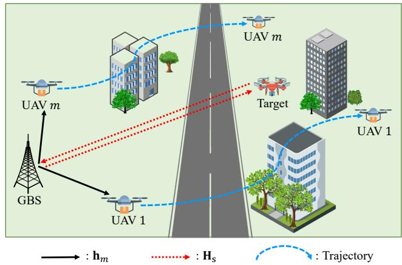  
Fig. 1. Energy efficient LAE-oriented ISAC systems.

3) Generalization Enhancement With Meta-Learning: We put forth the Meta-DeepESC scheme by introducing a new meta-learning approach into DeepESC, enabling the agent to rapidly adapt to unseen flight period configurations with fewer experience samples. The gist is to train the ANN model of the agent across multiple flight periods to learn optimal initial parameters (i.e., meta-parameters), eliminating the need for training from scratch when encountering new flight periods. Conventional meta-learning approaches [58], however, suffer from two key limitations in LAE-ISAC systems: (i) they assign the same weights to all tasks for updating meta-parameters, while ignoring the varying quality of training tasks with different flight periods; (ii) the iterative update of meta-parameters tends to overwrite previous task knowledge and overfit recent tasks. Thus, we propose an enhanced meta-training mechanism that introduces dynamic task weighting and meta-parameter smoothing constraints. With enhanced meta-learning, Meta-DeepESC attains good initial performance and quickly learns efficient policies for new configurations after fine-tuning.

Numerical results demonstrate that both DeepESC and Meta-DeepESC achieve significantly higher energy efficiency than benchmark schemes, including (i) Meta-DeepESC-z (i.e., Meta-DeepESC without retraining after meta-training), (ii) DeepESC-c (i.e., Meta-DeepESC with conventional experience replay [54]), (iii) DDPGE (i.e., the deep deterministic policy gradient algorithm [57] with episodic experience replay), and (iv) AC (i.e., the actor-critic algorithm [55]). Compared to DeepESC and Meta-DeepESC-c (i.e., Meta-DeepESC with conventional meta-learning [58]), Meta-DeepESC converges faster across different flight periods.

Notations: Vectors (matrices) are denoted by boldface lower (upper) case letters, $\mathbb { C } ^ { N \times M }$ denotes the space of $N { \times } M$ complex matrices, |·| denotes the absolute value, $| | \cdot | | _ { 2 }$ denotes the 2-norm, E[·] denotes the statistical expectation, while $\operatorname { T r } ( \cdot )$ $( \cdot ) ^ { T }$ , and $( \cdot ) ^ { \bar { H } }$ represent the trace, transpose, and conjugate transpose, respectively.

## II. SYSTEM MODEL

As shown in Fig. 1, we consider an LAE-oriented ISAC system, where a GBS equipped with N transmit/receiveantennas serves M single-antenna authorized UAVs for downlink communications while detecting a low-altitude target $( \mathrm { e . g . }$ , an unauthorized UAV). The set of UAVs is denoted by $\mathcal { M } = \{ 1 , 2 , \cdots , M \}$ , where each UAV $m \in { \mathcal { M } }$ flies at a pre-assigned altitude $H _ { m }$ to transport cargo between a predetermined source and destination within a duration $\Delta _ { \mathrm { T } } . ^ { 1 }$ We discretize $\Delta _ { \mathrm { T } }$ into T time slots indexed by $t \in \mathcal { T } = \{ 1 , 2 , \cdots ,$ $T \}$ , with a slot duration of $\Delta _ { \mathrm { t } } = \Delta _ { \mathrm { T } } / T$ sufficiently small such that the locations of the target and UAVs remain unchanged over each slot [50]. Within the 3D Cartesian coordinate system, the GBS is located at the origin $( 0 , 0 , 0 )$ , the location of the target is denoted by $( \mathbf { g } ( t ) , H _ { \mathrm { t a r } } ( t ) )$ with the horizontal coordinate $\mathbf { g } ( t ) = [ \widetilde { x } ( t ) , \widetilde { y } ( t ) ] ^ { T }$ , and the location of UAV m is represented as $( \mathbf { u } _ { m } ( t ) , H _ { m } )$ with $\mathbf { u } _ { m } ( t ) \triangleq [ x _ { m } ( t ) , y _ { m } ( t ) ] ^ { T }$

Let λ and d denote the carrier wavelength and the antenna spacing, respectively. We have the steering vector at the GBS as $\begin{array} { r } { \begin{array} { l } { { \bf c } \left( \breve { \psi } _ { m } ( t ) \right) = \ \left[ \bar { 1 } , e ^ { \jmath 2 \pi { \frac { d } { \lambda } } \cos \psi _ { m } ( t ) } , \cdot \cdot \cdot \ , \breve { e } ^ { \jmath 2 \pi { \frac { d } { \lambda } } \left( N - 1 \right) \cos \psi _ { m } ( t ) } \right.} \end{array}  } \end{array}$ $] ^ { T }$ , where $\psi _ { m } ( t )$ is the angle of departure between the GBS and UAV m ∈ M, given by $\begin{array} { r } { \psi _ { m } ( t ) = \operatorname { a r c c o s } \frac { H _ { m } } { \sqrt { \| \mathbf { u } _ { m } ( t ) \| _ { 2 } ^ { 2 } + H _ { m } ^ { 2 } } } . } \end{array}$ Similar as in prior work [50], we consider that the airground links from the GBS to UAVs are dominated by lineof-light (LoS) channels.2 As a result, the channel vector $\mathbf { h } _ { m } ( \bar { t } ) \in \mathbb { C } ^ { N \times 1 }$ between the GBS and UAV m at time slot t is represented as

$$
\mathbf { h } _ { m } ( t ) = \sqrt { L _ { 0 } \frac { D _ { 0 } } { \left( \left\| \mathbf { u } _ { m } ( t ) \right\| _ { 2 } ^ { 2 } + H _ { m } ^ { 2 } \right) ^ { \varsigma _ { m } } } } \mathbf { c } \left( \psi _ { m } ( t ) \right) ,\tag{1}
$$

where $L _ { 0 }$ is the path loss constant at reference distance $D _ { 0 }$ and $\varsigma _ { m }$ is the path loss exponent. Furthermore, the channel matrix between the GBS and all UAVs at time slot t can be denoted by $\mathbf { H } _ { \mathrm { c } } ( t ) = [ \mathbf { h } _ { 1 } ( t ) , \mathbf { h } _ { 2 } ( t ) , \mathbf { \eta } \cdot \cdot \cdot , \mathbf { h } _ { M } ( t ) ] \in \mathbb { C } ^ { N \times M } . \mathbf { A }$ similar channel model is used for the channel vector ${ \bf h } _ { \mathrm { s } } ( t )$ between the GBS and the target, and the bidirectional channel matrix that the signal experiences from forward transmission to echo can be represented as $\mathbf { H } _ { \mathrm { s } } ( t ) = \mathbf { h } _ { \mathrm { s } } ( t ) \mathbf { h } _ { \mathrm { s } } ^ { T } ( t ) \in \mathbb { C } ^ { N \times N }$

## A. UAV/Target Trajectory Model

1) UAV Flight Model: The initial and final locations of UAV m are predetermined as $\left( \mathbf { u } _ { m } ^ { \mathrm { I } } , H _ { m } \right)$ and $\left( \mathbf { u } _ { m } ^ { \mathrm { { F } } } , H _ { m } \right)$ respectively, with ${ \bf u } _ { m } ^ { \mathrm { I } } = [ x _ { m } ^ { \mathrm { I } } , y _ { m } ^ { \mathrm { I } } ] ^ { \mathrm { T } }$ and ${ \bf u } _ { m } ^ { \mathrm { F } } = [ x _ { m } ^ { \mathrm { F } } , y _ { m } ^ { \mathrm { F } } ] ^ { \hat { T } }$

During a given time period $\Delta _ { \mathrm { T } } ,$ the trajectory of UAV m is a $( T + 1 )$ -length sequence: $\{ ( \mathbf { u } _ { m } ^ { \mathrm { I } } , \ H _ { m } \mathbf { \epsilon } ) , ( \mathbf { u } _ { m } ( t ) , H _ { m } ) | t \ =$ $1 , 2 , \cdots , T \}$ . Thus, the flight mission constraint requires ${ \bf u } _ { m } ( 0 ) = { \bf u } _ { m } ^ { \mathrm { I } }$ and $\mathbf { u } _ { m } ( T ) = \mathbf { u } _ { m } ^ { \mathrm { F } } , \forall m \in \mathcal { M }$ . Assuming that UAV m flies at a constant speed $v _ { m } \ [ 4 4 ] ,$ its flight distance per time slot is given as $v _ { m } \Delta _ { \mathrm { t } }$ . In this regard, we have $\| \mathbf { u } _ { m } ( t + 1 ) - \mathbf { u } _ { m } ( t ) \| _ { 2 } = v _ { m } \Delta _ { \mathrm { t } } , \forall m \in \mathcal { M } , t \in \mathcal { T }$ . Besides, to avoid collision among different ${ \mathrm { U A V s } } ,$ the collision avoidance constraint, i.e., $\begin{array} { r } { \| \mathbf { u } _ { m } ( t ) \ - \mathbf { u } _ { i } ( t ) \| _ { 2 } ^ { 2 } + ( H _ { m } \ - \ H _ { i } ) ^ { 2 } \geq } \end{array}$ $D _ { \operatorname* { m i n } } ^ { 2 } , \forall m , i \in \mathcal { M } , m \neq i , t \in \mathcal { T }$ , needs to be enforced, with $D _ { \mathrm { m i n } }$ being the minimum allowed distance between any two UAVs. Similarly, each UAV also needs to maintain a minimum distance from the target to avoid collision, i.e. $, \| { \bf u } _ { m } ( t ) -$ $\mathbf { g } ( t ) \vert \vert _ { 2 } ^ { 2 } + ( H _ { m } - H _ { \mathrm { t a r } } ( \bar { t } ) ) ^ { 2 } \geq D _ { \mathrm { m i n } } ^ { 2 } , \forall m \in \mathcal { M } , t \in \mathcal { T }$

2) Target Mobility Model: For simplify, we assume that the target flies at a constant speed $v _ { \mathrm { t a r } }$ with a distance of $v _ { \mathrm { t a r } } \Delta _ { 1 }$ per time slot. To better model the mobility of a realistic target, we employ a Gauss-Markov process to capture the temporal correlation of the movement direction [59]. Denote the azimuth and elevation angles at which the target moves at time slot t by $\varphi _ { \mathrm { a } } ( t )$ and $\varphi _ { \mathrm { e } } ( t )$ , respectively. They are modeled as $\varphi _ { \mathrm { a } } ( t ) = \mu _ { \mathrm { a } } \varphi _ { \mathrm { a } } ( t - 1 ) + ( 1 - \mu _ { \mathrm { a } } ) \xi _ { \mathrm { a } } + \sqrt { 1 - { \mu _ { \mathrm { a } } } ^ { 2 } } \hat { \varphi } _ { \mathrm { a } } ( t )$ and $\varphi _ { \mathrm { e } } ( t ) = \mu _ { \mathrm { e } } \varphi _ { \mathrm { e } } ( t - 1 ) + ( 1 - \mu _ { \mathrm { e } } ) \xi _ { \mathrm { e } } + \sqrt { 1 - \mu _ { \mathrm { e } } ^ { 2 } } \hat { \varphi } _ { \mathrm { e } } ( t )$ , respectively, where $\mu _ { \mathrm { a } } \in \ [ 0 , 1 ]$ and $\mu _ { \mathrm { e } } \in [ 0 , 1 ]$ are the time correlation coefficients, modulating the degree of temporal dependency. Parameters $\xi _ { \mathrm { a } }$ and $\xi _ { \mathrm { e } }$ are asymptotic means of $\varphi _ { \mathrm { a } } ( t )$ and $\varphi _ { \mathrm { e } } ( t )$ , respectively, as $t {  } \infty$ . Parameters $\hat { \varphi } _ { \mathrm { a } } ( t ) \sim \mathcal { N } ( 0 , \sigma _ { \varphi _ { \mathrm { a } } } ^ { 2 } )$ and $\hat { \varphi } _ { \mathrm { e } } ( t ) \sim \mathcal { N } ( 0 , \sigma _ { \varphi _ { \mathrm { e } } } ^ { 2 } )$ are independent, uncorrelated, and stationary Gaussian processes with standard deviations $\sigma _ { \varphi _ { \mathrm { a } } }$ and $\sigma _ { \varphi \mathrm { e } }$ , respectively. Hence, given $\varphi _ { \mathrm { a } } ( t )$ and $\varphi _ { \mathrm { e } } ( t )$ , the location of the target at time slot t+1 can be obtained as $\tilde { x } ( t { + } 1 ) = \tilde { x } ( t ) +$ $v _ { \mathrm { t a r } } \Delta _ { \mathrm { t } } \mathrm { c o s } \left( \varphi _ { \mathrm { e } } ( t ) \right) \mathrm { c o s } \left( \varphi _ { \mathrm { a } } ( t ) \right) , \ \tilde { y } ( t + 1 ) \ = \ \tilde { y } ( t ) \ + \ v _ { \mathrm { t a r } } \Delta _ { \mathrm { t } } \mathrm { c o s } \big ( \varphi _ { \mathrm { a } } ( t ) \big ) ,$ $\varphi _ { \mathrm { e } } ( t ) ) \sin { ( \varphi _ { \mathrm { a } } ( t ) ) }$ ), and $H _ { \mathrm { t a r } } ( t { + } 1 ) = H _ { \mathrm { t a r } } ( t ) { + } v _ { \mathrm { t a r } } \Delta _ { \mathrm { t } } { \sin \left( \varphi _ { \mathrm { e } } ( t ) \right) }$

## B. Signal Model

Similar to [60]–[62], the transmit signal of the GBS is a weighted sum of the communication symbol and the radar probing signal in time slot $t \in \tau$ , which can be expressed as $\mathbf { \bar { x } } ( t ) = \mathbf { \bar { W } } _ { \mathrm { c } } ( t ) \mathbf { v } _ { \mathrm { c } } ( t ) + \mathbf { W } _ { \mathrm { s } } ( t ) \mathbf { v } _ { \mathrm { s } } ( t ) , ^ { 3 }$ where $\mathbf { v } _ { \mathrm { c } } ( t ) \bar { \in } \mathbb { C } ^ { M \times 1 }$ is the communication symbol with $\mathbb { E } [ { \bf v } _ { \mathrm { c } } ( t ) { \bf v } _ { \mathrm { c } } ^ { H } ( t ) ] = { \bf I } _ { M } , { \bf v } _ { \mathrm { s } } ( t ) \in$ $\mathbb { C } ^ { N \times 1 } { \mathrm { ~ i s ~ } }$ the radar probing signal with $\mathbb { E } [ { \mathbf { v } } _ { \mathrm { s } } ( t ) { \mathbf { v } } _ { \mathrm { s } } ^ { H } ( t ) ] = { \mathbf { I } } _ { N }$ and $\mathbf { v } _ { \mathrm { c } } ( t )$ and ${ \bf v } _ { \mathrm { s } } ( t )$ are statistically independent and uncorrelated, leading to $\mathbb { E } [ { \bf v } _ { \mathrm { c } } ( t ) { \bf v } _ { \mathrm { s } } ^ { H } ( t ) ] = { \bf 0 }$ . The communication precoding matrix $\mathbf { W } _ { \mathrm { c } } ( t ) \in \mathbb { C } ^ { N \times } { \dot { M } }$ is used to beamform the communication signal $\mathbf { v } _ { \mathrm { c } } ( t )$ sent to authorized UAVs, which directly affects the communication signal-to-interference-andnoise ratio (SINR) of all UAVs; while the sensing precoding matrix $\mathbf { W } _ { \mathrm { s } } ( t ) \in \mathbb { C } ^ { N \times N }$ is used to beamform the radar probing signal ${ \bf v } _ { \mathrm { s } } ( t )$ , which focuses energy in the direction of the unauthorized target. In $\mathbf { W } _ { \mathrm { c } } ( t )$ and $\mathbf { W } _ { \mathrm { s } } ( t )$ , each element is a complex value. For example, the element $w _ { \mathrm { c } , n , m } ( t )$ in $\mathbf { W } _ { \mathrm { c } } ( t )$

can be represented as $d _ { n , m } ( t ) e ^ { j \phi _ { n , m } ( t ) }$ , where $d _ { n , m } ( t ) \geq 0$ denotes the amplitude controlling the transmit power of antenna n to UAV m in time slot t, and $\phi _ { n , m } ( t ) \in [ 0 , 2 \pi ]$ denotes the phase controlling the signal phase of antenna n to UAV m. Denote $\mathbf { W } ( t ) { \triangleq } [ \mathbf { W } _ { \mathrm { c } } ( t ) , \mathbf { W } _ { \mathrm { s } } ( t ) ]$ and $\mathbf { v } ( t ) \triangleq [ \mathbf { v } _ { \mathrm { c } } ^ { T } ( t ) , \mathbf { v } _ { \mathrm { s } } ^ { T } ( t ) ] ^ { T }$ Thus, we have $\mathbf { x } ( t ) = \mathbf { W } ( t ) \mathbf { v } ( t )$ , and the power constraint is Tr $\begin{array} { r } { \left( \mathbf { W } _ { \mathrm { c } } ^ { H } ( t ) \mathbf { W } _ { \mathrm { c } } ( t ) \right) + \operatorname { T r } \left( \mathbf { W } _ { \mathrm { s } } ^ { H } ( t ) \mathbf { W } _ { \mathrm { s } } ( t ) \right) \leq \ P _ { \operatorname* { m a x } } . } \end{array}$

1) Communication Model: The received signal at UAV m can be expressed as $y _ { m } ( t ) \ = \ \mathbf { h } _ { m } ^ { T } ( t ) \mathbf { x } ( t ) + n _ { m } ( t )$ , where $n _ { m } ( t ) \ \sim \mathcal { C N } ( 0 , \sigma _ { m } ^ { 2 } )$ is the additive white Gaussian noise (AWGN) with the noise power $\sigma _ { \mathrm { m } } ^ { 2 }$ . Then, the communication SINR at UAV m is given by $\mathrm { S I N R } _ { m } ( t ) = \big | \mathbf { h } _ { m } ^ { T } ( t ) \mathbf { w } _ { m } ( t ) \big | ^ { 2 } / ($ $\begin{array} { r } { \sum _ { k = 1 , k \neq m } ^ { N + M } \left| \mathbf { h } _ { m } ^ { T } ( t ) \mathbf { w } _ { k } ( t ) \right| ^ { 2 } + \sigma _ { m } ^ { 2 } \big ) } \end{array}$ , with $\mathbf { w } _ { m }$ being the m-th column of W. Furthermore, the communication sum-rate of all UAVs is calculated as $\begin{array} { r } { \mathbf { R _ { \mathrm { t o t a l } } } ( t ) = \sum _ { m = 1 } ^ { M } \log _ { 2 } \left( 1 + \mathrm { S I N R } _ { m } ( t ) \right) } \end{array}$

2) Sensing Model: As depicted in Fig. 1, the radar probing signal is reflected from the target to the GBS. Thus, the echo signal from the target to the GBS can be expressed as ${ \bf y } _ { \mathrm { s } } ( t )$ $= \mathbf { H } _ { \mathrm { s } } ( t ) \mathbf { x } ( t ) + \mathbf { n } _ { \mathrm { b } } ( t )$ , where $\mathbf { n } _ { \mathbf { b } } ( t ) \sim \mathcal { C N } ( \mathbf { 0 } _ { N } , \ \sigma _ { \mathbf { b } } ^ { 2 } \mathbf { I } _ { N } )$ is the AWGN with noise power $\sigma _ { \mathrm { b } } ^ { 2 }$ . The sensing SNR of the target is then ${ { \Gamma } _ { \mathrm { t a r } } } ( t ) = { \mathrm { T r } } \left( { { { \mathbf { W } } ^ { H } } ( t ) { { \mathbf { \check { H } } } _ { \mathrm { s } } ^ { H } } ( t ) { { \mathbf { H } } _ { \mathrm { s } } } ( t ) { { \mathbf { \bar { W } } } ( t ) } } \right) / { \sigma _ { \mathrm { b } } ^ { 2 } }$

## C. Power Consumption Model

The total power consumption in LAE-oriented ISAC systems comprises two main components. The first is the power utilized for communication and sensing at the GBS, which primarily comes from transmitting relevant signals, expressed as $\begin{array} { r l r } { { \bf E } _ { \mathrm { { s c } } } ( t ) } & { = } & { { \Delta } _ { \mathrm { t } } \left( { \mathrm { T r } \left( { { \bf W } _ { \mathrm { c } } ^ { H } ( t ) { \bf W } _ { \mathrm { c } } ( t ) } \right) + \mathrm { T r } \left( { { { \bf \bar { W } } } _ { \mathrm { s } } ^ { H } ( t ) { { \bf \bar { W } } _ { \mathrm { s } } ( t ) } } \right) } \right) } \end{array}$ The second component is the propulsion power of all UAVs, required to keep them aloft and support mobility. We assume that all UAVs are fixed-wing and fly at a constant speed $v _ { m }$ though their headings may vary over time. According to [4], in each time slot $t ,$ the propulsion power for UAVs in level flight can be expressed as

$$
\mathrm { E } _ { \mathrm { p r } } ( t ) = \sum _ { m = 1 } ^ { M } \Delta _ { \mathrm { t } } \left( c _ { 1 } v _ { m } ^ { 3 } + \frac { c _ { 2 } } { v _ { m } } + \frac { c _ { 2 } } { v _ { m } g ^ { 2 } } \kappa _ { m } ^ { 2 } ( t ) \right) ,\tag{2}
$$

where $c _ { 1 }$ and $c _ { 2 }$ are related to the aircraft’s weight, wing area, air density, etc., which are typically set to $9 . 2 6 \times 1 0 ^ { - 4 }$ kg/m and 2250 $\mathrm { k g { \cdot } m ^ { 3 } / s ^ { 4 } }$ [4], respectively. The gravitational acceleration $g$ is taken as $9 . 8 ~ \mathrm { { m } } / \mathrm { { { s } } ^ { 2 } }$ , and the term $\kappa _ { m } ( t ) =$ $( v _ { m } / \Delta _ { \mathrm { t } } )$ arccos $\Big ( \frac { \big ( \mathbf { u } _ { m } \left( t \right) - \mathbf { u } _ { m } \left( t - 1 \right) \big ) \big ( \mathbf { u } _ { m } \left( t + 1 \right) - \mathbf { u } _ { m } \left( t \right) \big ) } { \left\| \mathbf { u } _ { m } \left( t \right) - \mathbf { u } _ { m } \left( t - 1 \right) \right\| _ { 2 } \left\| \mathbf { u } _ { m } \left( t + 1 \right) - \mathbf { u } _ { m } \left( t \right) \right\| _ { 2 } } \Big )$ represents the magnitude of the acceleration at time slot t, which is always perpendicular to the movement direction of the UAV to maintain a constant speed [4]. Overall, The total power consumption in time slot t is $\operatorname { E } _ { \mathrm { t o t a l } } ( t ) = \operatorname { E } _ { \mathrm { s c } } ( t ) + \operatorname { E } _ { \mathrm { p r } } ( t )$

## III. PROBLEM FORMULATION AND TRANSFORMATION

This section formulates the joint optimization of the GBS’s beamforming and UAVs’ trajectories as a sequential decisionmaking problem. Then, we transform it into an MDP model.

## A. Problem Formulation

This paper optimizes the communication beamforming ${ \bf W } _ { \mathrm { c } } ( t )$ , the sensing beamforming $\mathbf { W } _ { \mathrm { s } } ( t )$ , and the trajectory ${ \bf u } _ { m } ( t )$ of each UAV to maximize the expected communication centric energy efficiency of the whole system, subject to the sensing SNR requirement4, UAV flight mission, collision avoidance, and maximum transmit power constraints. Mathematically, this optimization problem is formulated as

$$
\operatorname* { m a x } _ { \mathbf { W } _ { \mathrm { c } } ( t ) , \mathbf { W } _ { \mathrm { s } } ( t ) , \mathbf { u } _ { m } ( t ) } \mathbb { E } \left[ \sum _ { t = 1 } ^ { T } \frac { \mathbf { R } _ { \mathrm { t o t a l } } ( t ) } { \mathbf { E } _ { \mathrm { t o t a l } } ( t ) } \right]\tag{3a}
$$

$$
\mathrm { s . t . } \mathbb { E } \left[ \frac { 1 } { T } \sum _ { t = 1 } ^ { T } \Gamma _ { \mathrm { t a r } } ( t ) \right] \geq \Gamma _ { \mathrm { m i n } } ,\tag{3b}
$$

$$
\| \mathbf { u } _ { m } ( t + 1 ) - \mathbf { u } _ { m } ( t ) \| _ { 2 } = v _ { m } \Delta _ { \mathrm { t } } , \forall m \in \boldsymbol { M } , t \in \mathcal { T } ,\tag{3c}
$$

$$
\begin{array} { r } { \mathbf { u } _ { m } ( 0 ) = \mathbf { u } _ { m } ^ { \mathrm { I } } \quad \mathrm { a n d } \ \mathbf { u } _ { m } ( T ) = \mathbf { u } _ { m } ^ { \mathrm { F } } , \forall m \in \mathcal { M } , } \end{array}\tag{3d}
$$

$$
\| \mathbf { u } _ { m } ( t ) - \mathbf { u } _ { i } ( t ) \| _ { 2 } ^ { 2 } + ( H _ { m } - H _ { i } ) ^ { 2 } \geq D _ { \operatorname* { m i n } } ^ { 2 } ,
$$

$$
\forall m , i \in \mathcal { M } , m \neq i , t \in \mathcal { T } ,\tag{3e}
$$

$$
\begin{array} { r } { \| \mathbf { u } _ { m } ( t ) - \mathbf { g } ( t ) \| _ { 2 } ^ { 2 } + ( H _ { m } - H _ { \mathrm { t a r } } ( t ) ) ^ { 2 } \geq D _ { \operatorname* { m i n } } ^ { 2 } , } \end{array}
$$

$$
\forall m \in { \mathcal { M } } , t \in { \mathcal { T } } ,\tag{3f}
$$

$$
\begin{array} { r } { \mathrm { T r } \left( \mathbf { W } _ { \mathrm { c } } ^ { H } ( t ) \mathbf { W } _ { \mathrm { c } } ( t ) \right) + \mathrm { T r } \left( \mathbf { W } _ { \mathrm { s } } ^ { H } ( t ) \mathbf { W } _ { \mathrm { s } } ( t ) \right) \leq P _ { \operatorname* { m a x } } , } \end{array}
$$

$$
\forall t \in { \mathcal { T } } ,\tag{3g}
$$

with the expectation in (3a) taken over varying target mobility, which is unknown to the GBS. In addition, constraint (3b) guarantees the average sensing SNR $\Gamma _ { \mathrm { m i n } }$ for monitoring the target [50]; constraint (3c) determines the flight distance of each UAV within one time slot; constraint (3d) specifies UAVs’ flight missions; constraint (3e) and (3f) prevent a specific UAV from colliding with other UAVs/the target; and constraint (3g) limits the maximum transmit power of the GBS to $P _ { \mathrm { m a x } } .$

The formulated problem exhibits two key characteristics. (i) Non-convexity and long-term impact: Due to the complicated and multi-variable objective function, problem (3) is nonconvex. Furthermore, it represents a long-term optimization problem, because all variables are optimized subject to UAVs flight missions that last for a long period and the next locations of the target and UAVs depend on their current locations. (ii) Intricately coupled variables: Constraint (3g) reveals the coupling between communication beamforming ${ \bf W } _ { \mathrm { c } } ( t )$ and sensing beamforming $\mathbf { W } _ { \mathrm { s } } ( t )$ . Also, both the energy efficiency and the sensing SNR hinge on the GBS’s beamforming and UAVs’ trajectories, and an efficient solution can be derived through the parallel optimization of all variables.

In general, conventional optimization methods are incapable of solving this long-term optimization problem, since they focus on instantaneous performance and iteratively optimize different variables in an alternating manner. Instead, problem (3) can be properly transformed and addressed within the MDP framework, in which an agent continuously optimizes its decisions towards the given long-term objective. This corresponds to a special MDP form known as episode tasks [55], where each episode consists of T discrete time slots and terminates when all UAVs reach their final locations, with subsequent episodes restarting from UAVs’ initial locations while maintaining complete independence between episodes. Crucially, the solution must satisfy constraints (3b)–(3g) throughout each episode. Thus, problem (3) is actually a constrained episode task. Generally, it is difficult to derive an efficient solution for such a problem [55], which motivates us to transform problem (3) into an unconstrained MDP problem.

## B. Problem Transformation

In the MDP framework, an agent learns optimal strategies through trial-and-error interactions with the environment. Within our system, the GBS serves as the agent, while the target, UAVs, and wireless channels constitute the environment. During each time slot, the GBS first determines an efficient joint beamforming and trajectory strategy. It then executes communication beamforming for UAV data transmission and navigation, while performing sensing beamforming for target monitoring. Formally, an MDP is composed of four key elements: state $\mathbf { S } ( t ) \in { \mathcal { S } } ,$ , action $\mathbf { A } ( t ) \in { \mathcal { A } } .$ , transition probability $p ( \mathbf { S } ( t + 1 ) | \mathbf { S } ( t ) , \mathbf { A } ( t ) ) \in \mathcal { P }$ , and reward $r ( t + 1 ) \in \mathcal { R }$ . The details of the MDP model for joint beamforming and trajectory in LAE-oriented ISAC systems are presented as follows.

1) The state space S comprises all possible states of the agent, each containing sufficient system information. Specifically, at time slot t, the observable state $\mathbf { S } ( t ) \in \mathcal { S }$ is determined by the communication CSI ${ \bf { H } } _ { \mathrm { { c } } } ( t )$ , the sensing CSI Hs(t), and all UAVs’ locations $\mathbf { U } ( t ) = [ \mathbf { u } _ { 1 } ( t ) , \mathbf { u } _ { 2 } ( t ) , \cdot \cdot \cdot , \mathbf { u } _ { M } ( t ) ]$ , which can be represented as $\mathbf { S } ( t ) = \left\lceil \mathbf { H } _ { \mathrm { c } } ( t ) , \mathbf { H } _ { \mathrm { s } } ( t ) , \mathbf { U } ( t ) \right\rceil$

2) The action space A consists of all feasible actions that the agent can potentially execute in each time slot. Based on (3), we consider three types of sub-actions that the agent needs to decide in each time slot. The first and second types of sub-actions are the communication beamforming $\mathbf { W } _ { \mathrm { c } } ( t )$ and the sensing beamforming Ws(t), respectively. The third type of sub-actions is all UAVs’ movement directions, which is given by $\mathbf { a } _ { \mathrm { u } } ( t ) = [ a _ { \mathrm { u , 1 } } ( t ) , a _ { \mathrm { u , 2 } } ( t ) , \cdot \cdot \cdot , a _ { \mathrm { u , } M } ( t ) ] ^ { T }$ . Given $\boldsymbol { a } _ { \mathrm { u } , m } ( t )$ , the horizontal location of UAV m at time slot t + 1 is updated by $\mathbf { u } _ { m } ( t + 1 ) \ = \ [ x _ { m } ( t ) + \ v _ { m } \Delta _ { \mathrm { t } } \cos ( a _ { \mathrm { u } , m } ( t ) )$ $y _ { m } ( t ) + v _ { m } \Delta _ { \mathrm { t } } \sin ( \ a _ { \mathrm { u } , m } ( t ) ) ] ^ { T }$ . In ${ \mathbf W } _ { \mathrm { c } } ( t ) , { \mathbf W } _ { \mathrm { s } } ( t )$ , and ${ \bf a } _ { \bf u } ( t )$ all elements are continuous variables to be optimized. Overall, the action of the agent at time slot t is denoted by ${ \bf A } ( t ) =$ $[ \mathbf { W } _ { \mathrm { c } } ( t ) , \mathbf { W } _ { \mathrm { s } } ( t ) , \mathbf { a } _ { \mathrm { u } } ( t ) ]$

3) The transition probability set P includes all transition probabilities $p ( \mathbf { S } ( t + 1 ) = \mathbf { S } ^ { \prime } \mid \mathbf { S } ( t ) = \mathbf { S } , \mathbf { A } ( t ) = \mathbf { A } )$ , each of which represents the probability of state transition from S to $\mathbf { S } ^ { \prime }$ under action A [55]. Since the target’s mobility information is unavailable, the transition probability $p \left( \mathbf { S } ^ { \prime } | \mathbf { S } , \mathbf { A } \right)$ is unknown. Thus, problem (3) is a partially observable MDP problem.

4) The reward function, represented as $\mathcal { R } ( \mathbf { S } ( t ) , \mathbf { A } ( t ) )$ , reflects the quality of action A(t) in state S(t). Recall that constraint (3c) has been strictly ensured in the design of the action space. In the following, apart from the optimization objective (3a), we incorporate constraints (3b), (3e), and (3f) into the design of the reward function. Subsequently, Section IV-B will detail how to guarantee constraints (3d) and (3g) through the action selection policy.

• Reward $r _ { \mathrm { e e } } ( t + 1 )$ for energy efficiency maximization. To achieve the optimization objective (3a), i.e., maximizing the energy efficiency of the LAE-oriented ISAC system, $r _ { \mathrm { e e } } ( t + 1 )$ can be directly set to $\mathrm { R } _ { \mathrm { t o t a l } } ( t ) / \mathrm { E } _ { \mathrm { t o t a l } } ( t )$

• Reward $r _ { \mathrm { c a } } ( t { + } 1 )$ for collision avoidance. When the collision avoidance constraint (3e) or (3f) cannot be satisfied, the agent should be aware of its unwise decisions. Thus, the corresponding reward $r _ { \mathrm { c a } } ( t + 1 )$ can be given by

$$
r _ { \mathrm { c a } } ( t + 1 ) = \left\{ \begin{array} { l l } { - \delta _ { \mathrm { c a } } , } & { \mathrm { i f ~ ( 3 e ) ~ o r ~ ( 3 f ) ~ i s ~ n o t ~ m e t } , } \\ { 0 , } & { \mathrm { o t h e r w i s e } , } \end{array} \right.\tag{4}
$$

where $\delta _ { \mathrm { c a } } > 0$ is the reward factor corresponding to the collision avoidance constraint, balancing the utility and cost [44]. The larger $\delta _ { \mathrm { c a } }$ is, the more the agent attaches importance to the given constraint.

• Reward $r _ { \mathrm { s r } } ( t + 1 )$ for sensing SNR requirement. In the light of constraint (3b), the agent needs to guarantee the minimum sensing SNR $\Gamma _ { \mathrm { m i n } }$ for target monitoring. In this regard, the reward $r _ { \mathrm { s r } } ( t + 1 )$ will be a penalty $- \delta _ { \mathrm { s r } } ( \Gamma _ { \mathrm { m i n } } - \sum _ { t = 1 } ^ { T } \Gamma _ { \mathrm { t a r } } ( t ) / T )$ , if the average sensing SNR over the whole flight period (i.e., episode) is less than $\Gamma _ { \mathrm { m i n } } .$ wherein $\delta _ { \mathrm { s r } } > 0$ is the reward factor corresponding to the sensing SNR requirement constraint. With $r _ { \mathrm { s r } } ( t { + } 1 )$ , the agent is encouraged to optimize its strategy, so as to satisfy the average sensing SNR requirement in subsequent episodes.

Overall, the total reward function of the agent is given by

$$
r ( t + 1 ) = \delta _ { \mathrm { e e } } r _ { \mathrm { e e } } ( t + 1 ) + r _ { \mathrm { c a } } ( t + 1 ) + r _ { \mathrm { s r } } ( t + 1 ) ,\tag{5}
$$

where $\delta _ { \mathrm { e e } } > 0$ is the reward factor corresponding to the energy efficiency maximization. Since $\textstyle \sum _ { t = 1 } ^ { T } \dot { \mathrm { S N R } } _ { \mathrm { t a r } } ( t ) / T$ is not revealed until the end of each episode, the rewards $\{ r ( t + 1 ) | t =$ $1 , 2 , \cdots , T \}$ are only available to the agent/GBS at the final time slot $t = T$ . The objective of the agent within an MDP framework is to identify an optimal policy $\pi ^ { * } ( \mathbf { A } ( t ) | \mathbf { S } ( t ) )$ $( \mathrm { i . e . }$ , the optimal joint beamforming and trajectory policy) to maximize the cumulative reward $\begin{array} { r } { G ( t ) = \sum _ { l = t } ^ { T } r ( l + 1 ) } \end{array}$ [55]. In addition, the Q-value, representing the expected cumulative reward when action ${ \bf A } ( t )$ is taken in state S(t), is defined as ${ \cal Q } _ { \pi } ( { \bf S } ( t ) , { \bf A } ( t ) ) = \mathbb { E } _ { \pi } \left[ G ( t ) | { \bf S } ( t ) , { \bf A } ( t ) \right]$ ]. The Q-value of the optimal policy $\pi ^ { * }$ is $Q ^ { * } ( \mathbf { S } ( t ) , \mathbf { A } ( t ) ) = \operatorname* { m a x } _ { \pi } Q _ { \pi } ( \mathbf { S } ( t ) , \mathbf { A } ( t ) )$

Thus far, we have reformulated problem (3) as an unconstrained MDP problem. When the channel model is precisely known, the state transition probability $p \left( \mathbf { S } ^ { \prime } | \mathbf { S } , \mathbf { A } \right)$ can be readily determined. In such cases, this MDP problem can be effectively solved using dynamic programming [55]. However, the mobility model of the target is unavailable to the GBS, which motivates the adaption of model-free DRL techniques.

## IV. DEEPESC SCHEME

Conventional value-based DRL algorithms, e.g., deep Qnetwork (DQN) [55], are suitable for problems with lowdimensional discrete action spaces. The formulated joint beamforming and trajectory optimization problem, however, involves continuous control variables. Deep deterministic policy gradient (DDPG) [57], although it can effectively handle such continuous control tasks, suffers from Q-value overestimation and ANN overfitting. To tackle these challenges, an enhanced version of DDPG, termed twin delayed deep deterministic policy gradient (TD3) [63], was proposed. In this paper, we extend the TD3 algorithm to propose the DeepESC scheme for energy-efficient LAE. Compared to conventional TD3, DeepESC incorporates two key improvements. First, a constrained action-selection policy is developed to ensure preset requirements, including the average SNR, UAV mission completion, collision avoidance, and the GBS’s maximum transmit power. Second, an episodic experience replay mechanism is integrated into DeepESC, enabling efficient learning of the target’s movement characteristics across episodic tasks. Fig. 2 illustrates the complete DeepESC framework, with detailed implementation given below.

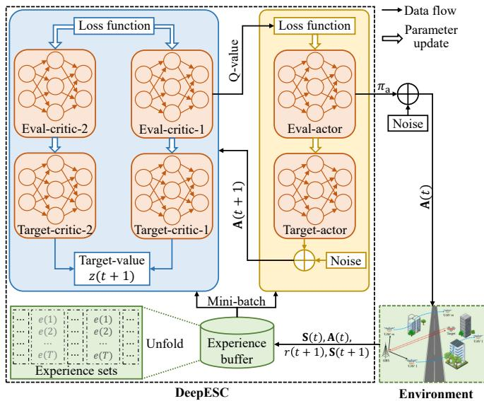  
Fig. 2. DeepESC framework consisting of an execution phase and a training phase. During the execution phase, the agent takes an action A(t) to interact with the environment based on the state $\bar { \bf S } ( t )$ . During the training phase, loss functions are computed to train the eval-actor, eval-critic-1, and eval-critic-2, while the corresponding target-ANNs are updated from these eval-ANNs.

## A. GRU Structure

Two types of ANNs, referred to as actor and critic, are employed in DeepESC. In particular, the actor-related ANNs consist of the eval-actor with parameter $\mathbf { \Theta } _ { \mathbf { \Theta } } \Theta _ { \mathrm { a } }$ and the target-actor with parameter $\Theta _ { \mathrm { a } } ^ { - }$ . Besides, there are two pairs of criticbased ANNs, including the eval-critic-1 with parameter $\Theta _ { \mathrm { c , 1 } }$ the eval-critic-2 with parameter $\Theta _ { \mathrm { c } , 2 } ,$ , the target-critic-1 with parameter $\Theta _ { \mathrm { c } , 1 } ^ { - }$ , and the target-critic-2 with parameter $\Theta _ { \mathrm { c } , 2 } ^ { - } .$

As given in (3), the random movement of the target will introduce significant dynamics into the considered system and DeepESC. Generally, this uncertainty may reduce learning accuracy. Moreover, the LAE-oriented ISAC system is timecorrelated, since the next locations of the target and UAVs often depend on their current locations. In conventional TD3 [63], the actor and critic exploit pure fully connected (FC) networks, which assume that inputs in different time slots are independent. Consequently, traditional ANNs struggle to capture the complex temporal correlation of the LAE-oriented ISAC system. To address this issue, we adopt GRU [64] as the main structure for both the actor and critic, enabling the capture of hidden target movement patterns through specialized gate mechanisms. Specifically, a GRU consists of a hidden state, an update gate, and a reset gate, as detailed below:

• The hidden state serves as the memory unit of the GRU, which propagates historical information forward and integrates it with the current input state S(t).

• The update gate controls the fusion ratio of the current input state and the previous hidden state, and determines how much historical information to retain. As such, it balances long-term dependency and short-term performance.

• The reset gate determines how much irrelevant information in the hidden state is discarded, thereby achieving adaptive memory reset [65].

As such, the DeepESC scheme can excel at extracting temporal features from input states across different time slots in energy-efficient LAE-oriented ISAC systems.

## B. Joint Beamforming and Trajectory Decision-Making

In the light of (3), the DeepESC agent aims to satisfy the constraints of sensing requirements, UAV flight mission, collision avoidance, and maximum transmit power, by optimizing beamforming and trajectory. In Section III-B, constraints (3b), (3e), and (3f) have been considered in the design of $r ( t + 1 )$ In the following, a constrained action selection strategy [44] is extend to meet constraints (3d) and (3g).

At each time slot, the eval-actor in TD3 makes a temporary joint beamforming and trajectory decision $\pi _ { \mathrm { a } } \left( \mathbf { S } ( t ) ; \Theta _ { \mathrm { a } } \right)$ based on the state $\mathbf { S } ( t )$ . To encourage the agent to explore random actions for better solutions, the constrained action selection strategy first refines $\pi _ { \mathrm { a } } \left( \mathbf { S } ( t ) ; \Theta _ { \mathrm { a } } \right)$ by adding randomness:

$$
( \mathbf { A } _ { \mathrm { c } } ( t ) , \mathbf { A } _ { \mathrm { s } } ( t ) , \mathbf { a } _ { \mathrm { u } } ( t ) ) = \pi _ { \mathrm { a } } \left( \mathbf { S } ( t ) ; \Theta _ { \mathrm { a } } \right) + \left( \mathbf { D } _ { \mathrm { c } } ( t ) , \mathbf { D } _ { \mathrm { s } } ( t ) , \mathbf { d } _ { \mathrm { u } } ( t ) \right)\tag{6}
$$

where ${ \bf A } _ { \mathrm { c } } ( t )$ and ${ \bf A } _ { \mathrm { s } } ( t )$ are matrices with size $N \times M$ and $N \times N .$ , respectively. Symbols $\mathbf { D } _ { \mathrm { c } } ( t ) , \mathbf { D } _ { \mathrm { s } } ( t )$ , and ${ \bf d } _ { \mathrm { u } } ( t )$ have the same size as ${ \bf A } _ { \mathrm { c } } ( t ) , { \bf A } _ { \mathrm { s } } ( t )$ , and ${ \bf a } _ { \mathrm { u } } ( t )$ , respectively, and each element of which is determined by $\cdot \ l { \mathrm { i p } } ( \mathcal { N } ( 0 , \sigma _ { \mathrm { a } } ^ { 2 } ) , - c , c )$ The clipping operation restricts the noise to a range of $[ - c , c ]$ which prevents instability in the policy due to over-exploration. Once an efficient solution is learned, too much exploration will be unnecessary [44]. A decay factor $\zeta \in ( 0 , 1 )$ , therefore, is introduced to reduce $\sigma _ { \mathrm { a } } ^ { 2 } ( t )$ over time. Let ${ \sigma } _ { \mathrm { a , \ i n i t } } ^ { 2 }$ denote the initial variance, we have $\overline { { \sigma _ { \mathrm { a } } ^ { 2 } ( t ) } } = \sigma _ { \mathrm { a , i n i t } } ^ { 2 } \zeta ^ { t }$ at time slot t.

Furthermore, to strictly satisfy constraints (3d) and (3g), the constrained action selection strategy further refines ${ \bf A } _ { \mathrm { c } } ( t )$ ${ \bf A } _ { \mathrm { s } } ( t )$ , and ${ \bf a } _ { \mathrm { u } } ( t )$ as follows. First, as given in (3d), all UAVs trajectories $\{ \mathbf { a } _ { \mathbf { u } } ( t ) = [ a _ { \mathbf { u } , 1 } ( t ) , \ a _ { \mathbf { u } , 2 } ( t ) , \cdots , \ a _ { \mathbf { u } , M } ( t ) ] ^ { T } | t \in \mathcal { T } \}$ within each episode should fulfill the flight mission. To attain this, the constrained action selection strategy restricts the movement directions of each UAV in the last $T - t - 1$ time slots of each episode. Specifically, at time slot t, if the minimum required time slots to reach the destination from ${ \bf u } _ { m } ( t )$ is not less than $T - t - 1 , \mathrm { i . e . , } \ \lceil \rceil \mathbf { u } _ { m } ( t ) - \mathbf { u } _ { m } ^ { \mathrm { F } } \Vert _ { 2 } / ( v _ { m } \Delta _ { \mathrm { t } } ) \rceil \geq$ T −t−1, UAV m must fly directly towards the destination $\mathbf { u } _ { m } ^ { \mathrm { F } } .$ During other time slots, the movement decision $\boldsymbol { a } _ { \mathrm { u } , m } ( t )$ can be determined via (6) since constraint (3d) no longer applies, allowing more efficient UAV movement directions towards other optimization objectives. Second, to obtain the communication beamforming ${ \bf W } _ { \mathrm { c } } ( t )$ and the sensing beamforming $\mathbf { W } _ { \mathrm { s } } ( t )$ that satisfy the power constraint (3g), the constrained action selection strategy introduces a scaling factor defined as $\xi ^ { 2 } = P _ { \mathrm { m a x } } / \big ( \mathrm { T r } \big ( \mathbf { A } _ { \mathrm { c } } ^ { H } ( t ) \mathbf { A } _ { \mathrm { c } } ( t ) \big ) + \mathrm { T r } \big ( \mathbf { A } _ { \mathrm { s } } ^ { H } ( t ) \mathbf { \widetilde { A } } _ { \mathrm { s } } ( t ) \big )$ to obtain ${ \bf W } _ { \mathrm { c } } ( t ) = \xi { \bf A } _ { \mathrm { c } } ( \dot { t } )$ and ${ \bf W } _ { \mathrm { s } } ( t ) = \dot { \xi } { \bf A } _ { \mathrm { s } } ( t )$ , respectively.

## C. Episodic Experience Replay for ANN Training

In the conventional experience replay mechanism of TD3 [63], the experiences generated in different time slots are separately collected and stored, and historical experiences are sampled uniformly at random to train the ANN model. $\operatorname { I t } ,$ however, suffers from two critical issues in DeepESC applications. First, DeepESC is an episode task, where all experiences from a complete episode should be jointly employed to train both the eval-actor and the eval-critic. In general, this is impossible with conventional experience replay, causing the agent to learn an inefficient joint optimization strategy in LAE-oriented ISAC systems. Second, according to Shannon’s theory [1], the uncertainty of a signal is monotonically related to its information quantity. Similarly, during ANN training, experiences with greater uncertainty are more valuable to learn from. Due to the time-varying movement feature of the target, the newer experiences are, the more valuable they are to learn. Random uniform sampling in conventional experience replay [54], however, may introduce outdated or less valuable experiences, resulting in slow convergence and suboptimal solutions. To fill this gap, we develop a new episodic experience replay mechanism for DeepESC. The core idea is to (i) employ experience sets each containing all experiences from a complete episode to train the ANN model, (ii) assign priorities to experience sets, ensuring those with greater uncertainty to be sampled with higher probability, and (iii) sample newer experience sets more actively, detailed as follows.

1) Experience Storage: To store and reuse past experiences, a first-input-first-output experience buffer F with size $F _ { \mathrm { m a x } }$ is utilized. As mentioned in Section III-B, the rewards $\{ r ( t +$ $1 ) | t = 1 , 2 , \cdot \cdot \cdot , T \}$ are only available to the agent at the end of each episode. Thus, in time slot $T$ of each episode, after calculating the reward $r ( t + 1 )$ via (5), the agent collects the experience $e ( t )$ in the form of $( \mathbf { S } ( t ) , \mathbf { A } ( t ) , r ( t + 1 ) , \mathbf { S } ( t + 1 ) )$ where $\mathbf { A } ( t ) = [ \mathbf { W } _ { \mathrm { c } } ( t ) , \mathbf { W } _ { \mathrm { s } } ( t ) , \mathbf { a } _ { \mathrm { u } } ( t ) ]$ . Once all experiences from a complete episode are generated, an experience set $\mathcal { E } =$ $\{ e ( t ) | t = 1 , 2 , \cdot \cdot \cdot , T \}$ is obtained and store in ${ \mathcal F } .$

2) Sampling Range Determination: Since more recent experience sets in $\mathcal { F }$ are typically more informative than older ones, the sampling range can be gradually reduced during ANN training to increase the sampling frequency of recent experience sets. In particular, the most recent $F _ { \mathrm { s } } ( t )$ experience sets in $\mathcal { F }$ are determined for subsequent sampling, which can be represented as

$$
F _ { \mathrm { s } } ( t ) = \operatorname* { m a x } \left\{ F _ { \mathrm { m a x } } \rho ^ { n _ { \mathrm { e p i } } } , F _ { \mathrm { m i n } } \right\} ,\tag{7}
$$

where $\rho \in [ 0 , 1 ]$ denotes the importance factor given to recent experience sets, $n _ { \mathrm { e p i } }$ is the number of times the ANN model has been trained so far, and $F _ { \mathrm { m i n } }$ refers to the minimum value within the range of $F _ { \mathrm { s } } ( t )$ . Furthermore, the mini-buffer consisting of $F _ { \mathrm { s } } ( t )$ recent experience sets can be represented as $\mathcal { F } _ { \mathrm { s } }$ . By doing this, recent experience sets can be sampled frequently while past experience sets are also taken into account for the training of the ANN model.

3) Priority-Based Sampling: Since different experiences contribute variably to ANN training, priority-based sampling can enhance training efficiency more powerful than simple random uniform sampling. In the episodic experience replay mechanism, the priority of each experience set is quantified by the temporal difference (TD) error, defined as $\varrho = \textstyle \sum _ { t = 1 } ^ { T }$ ma $\mathrm { c } _ { j = 1 , 2 } \big ( z ( t + 1 ) - Q \left( \mathbf { S } ( t ) , \mathbf { A } ( t ) ; \Theta _ { \mathrm { c } , j } \right) \big )$ . Besides, $z ( t + 1 )$ $= r ( t + 1 ) + \operatorname* { m i n } _ { i = 1 , 2 } Q \big ( \mathbf { S } ( t + 1 ) , \mathbf { A } ( t + 1 ) ; \Theta _ { \mathrm { c } , i } ^ { - } \big )$ is the targetvalue, with $\mathbf { A } ( t + 1 )$ obtained by substituting the target-actor’s policy $\pi _ { \mathrm { a } } ^ { - }$ , parameter $\Theta _ { \mathrm { a } } ^ { - }$ , and the next state $\mathbf { S } ( t + 1 )$ into (6). Generally, a larger TD error indicates a greater discrepancy between the target-value $z ( t + 1 )$ and the estimation value $Q \left( \mathbf { S } ( t ) , \mathbf { A } ( t ) ; \mathbf { \Theta } _ { \mathrm { c } , j } \right)$ . Therefore, the corresponding experience set contains more valuable information to learn from.

In the round of each training, the agent first determines the sampling range defined as (7). Then, the priority of the k-th experience set can be expressed as $p ( k ) = \varrho ( k ) + \epsilon _ { \mathrm { p } } , k \in$ $\mathcal { F } _ { \mathrm { s } }$ , where $\epsilon _ { \mathrm { p } }$ is a small positive constant used to prevent the priority of certain experience sets from being zero. As such, the probability that experience set k is sampled is denoted by

$$
P ( k ) = \frac { p ( k ) ^ { \beta _ { 1 } } } { \sum _ { i \in \mathcal { F } _ { s } } p ( i ) ^ { \beta _ { 1 } } } , \ k \in \mathcal { F } _ { \mathrm { s } } ,\tag{8}
$$

where $\beta _ { 1 }$ is a hyper-parameter that controls the influence of priority on the sampling probability.

However, frequent sampling of experiences with high TD errors may lead to instability in the training process [55]. To address this issue, a sampling-importance weight is introduced, which can be expressed as $\bar { \omega } ( k ) \bar { = } ( 1 / ( F _ { \operatorname* { m a x } } \bar { P } ( k ) ) ) ^ { \beta _ { 2 } }$ , where $\beta _ { 2 }$ is a hyper-parameter that controls the correction extend.

4) Loss Function Calculation for Eval-Actor and Eval-Critics: To train all ANN models, $N _ { \mathrm { e } }$ experience sets are sampled from $\mathcal { F } _ { \mathrm { s } }$ according to (8) to form the mini-batch B. The loss function for training the eval-critics is given as

$$
\begin{array} { c } { { \displaystyle { \cal L } ( \Theta _ { \mathrm { c } , i } ) = \displaystyle \frac { 1 } { N _ { \mathrm { e } } } \sum _ { k = 1 } ^ { N _ { \mathrm { e } } } \omega ( k ) \Bigg ( \sum _ { t = 1 } ^ { T } \big ( z ( t + 1 ) - } } \\ { { \displaystyle Q \left( \mathbf { S } ( t ) , \mathbf { A } ( t ) ; \Theta _ { \mathrm { c } , i } \right) \big ) ^ { 2 } \Bigg ) , i \in \{ 1 , 2 \} , } } \end{array}\tag{9}
$$

Furthermore, the loss function used to train the eval-actor is

$$
\begin{array} { c } { \displaystyle { L ( \boldsymbol { \Theta } _ { \mathrm { a } } ) = \frac { 1 } { N _ { \mathrm { e } } } \sum _ { \mathcal { E } \subset \mathcal { B } } \Bigg ( \sum _ { t = 1 } ^ { T } \Big ( \nabla _ { \mathbf { A } ( t ) } Q \big ( \mathbf { S } ( t ) , \mathbf { A } ( t ) ; \boldsymbol { \Theta } _ { \mathrm { c } , 1 } \big ) } } \\ { \displaystyle { \times \nabla _ { \boldsymbol { \Theta } _ { \mathrm { a } } \pi _ { \mathrm { a } } } \big ( \mathbf { S } ( t ) ; \boldsymbol { \Theta } _ { \mathrm { a } } \big ) \Bigg ) . } } \end{array}\tag{10}
$$

By performing the stochastic gradient descent (SGD) method [55], the parameters $\Theta _ { \mathrm { c } , i }$ and $\Theta _ { \mathrm { a } }$ are updated by $\Theta _ { \mathrm { c } , i }  \Theta _ { \mathrm { c } , i } -$ $\alpha _ { \mathrm { c } } \nabla _ { \Theta _ { \mathrm { c } , i } } L ( \Theta _ { \mathrm { c } , i } )$ and $\Theta _ { \mathrm { a } } {  } \Theta _ { \mathrm { a } } - \alpha _ { \mathrm { a } } \nabla _ { \Theta _ { \mathrm { a } } } L ( \Theta _ { \mathrm { a } } )$ , respectively, with $\alpha _ { \mathrm { c } }$ and $\alpha _ { \mathrm { a } }$ being the learning rate of the eval-critics and eval-actor, respectively.

5) Delayed Policy Update: To enhance the stability of the algorithm, the delayed policy update mechanism is used in DeepESC. The main idea is to update the eval-critics only once after training the eval-actor $T _ { \mathrm { a } }$ times, thereby reducing the policy oscillation caused by the fluctuation of the evalcritics. In addition, the target-actor and target-critics maintain the same update frequency as the eval-critics. In particular, the soft-update method [55] was introduced to update parameters $\Theta _ { \mathrm { a } } ^ { - }$ and $\Theta _ { \mathrm { c } , i } ^ { - }$ of the target-actor and the target-critics, which can be described as follows:

$$
\{ \begin{array} { l l } { \Theta _ { \mathrm { a } } ^ { - }  \chi _ { \mathrm { a } } \Theta _ { \mathrm { a } } + ( 1 - \chi _ { \mathrm { a } } ) \Theta _ { \mathrm { a } } ^ { - } , } \\ { \Theta _ { \mathrm { c } , i } ^ { - }  \chi _ { \mathrm { c } } \Theta _ { \mathrm { c } , i } + ( 1 - \chi _ { \mathrm { c } } ) \Theta _ { \mathrm { c } , i } ^ { - } , i \in \{ 1 , 2 \} , } \end{array}\tag{11}
$$

where $\chi _ { \mathrm { a } } \in [ 0 , 1 ]$ and $\chi _ { \mathrm { c } } \in [ 0 , 1 ]$ are the update factors of the target-actor and target-critics, respectively.

## V. META-DEEPESC SCHEME

DeepESC, as an online learning scheme, learns an efficient joint beamforming and trajectory strategy from scratch. This is typically time-consuming due to the extensive trial-and-error process required to collect sufficient experience sets to train the ANN model. Moreover, DeepESC’s operation relies on a pre-determined flight period (comprising $T$ time slots). In other words, once the flight period changes, the ANN model of DeepESC must be retrained. To enhance the convergence and generalization of the algorithm, we introduce a lowcomplexity meta-learning approach [58] to propose Meta-DeepESC. The procedure of Meta-DeepESC involves two phases: meta-training and meta-adaptation. In meta-training, the agent learns optimal initial parameters (referred to as metaparameters) of the ANN model, i.e., $\{ \widetilde { \Theta } _ { \mathrm { c } , 1 } , \widetilde { \Theta } _ { \mathrm { c } , 2 } , \widetilde { \Theta } _ { \mathrm { a } } \}$ , across diverse related tasks. On this basis, the agent performs the DeepESC scheme during meta-adaptation, so as to quickly adapt to new/unseen tasks via few-shot learning. Consider $U$ tasks for meta-training. The distinction among the tasks in meta-training and meta-adaptation lies in the number of time slots within a flight period (i.e., T ).

## A. Meta-Training Phase

The meta-training phase aims to derive meta-parameters capable of fast adaptation to new tasks via cross-task training. In Meta-DeepESC, the meta-training process operates via two alternating levels: (i) the task-specific level, which optimizes ANN parameters for individual tasks, and (ii) the global level, which aggregates updates to meta-parameters across all tasks.

At the task-specific level, $V ~ \leq ~ U$ tasks are randomly sampled for training, where each task $v \in \mathcal { V } = \{ 1 , 2 , \cdots , V \}$ initializes its parameters $\{ \widetilde { \Theta } _ { \mathrm { c } , 1 } ^ { v } , \widetilde { \Theta } _ { \mathrm { c } , 2 } ^ { v } , \widetilde { \Theta } _ { \mathrm { a } } ^ { v } \}$ using the current meta-parameters $\{ \widetilde { \Theta } _ { \mathrm { c } , 1 } , \widetilde { \Theta } _ { \mathrm { c } , 2 } , \widetilde { \Theta } _ { \mathrm { a } } \}$ . The agent then collects task-specific experience sets through interactions with the environment and stores them in a dedicated experience buffer $\mathcal { F } _ { v }$ . To train $\{ \widetilde { \Theta } _ { \mathrm { c } , 1 } ^ { v } , \widetilde { \Theta } _ { \mathrm { c } , 2 } ^ { v } , \widetilde { \Theta } _ { \mathrm { a } } ^ { v } \}$ , the sampling range $\mathcal { F } _ { v , \mathrm { s } }$ is determined via (7), and a mini-batch $\boldsymbol { B } _ { v }$ of $N _ { \mathrm { v } }$ experience sets sampled from $\mathcal { F } _ { v , \mathrm { s } }$ according to (8) is used to compute loss functions $\{ L ( \widetilde { \Theta } _ { \mathrm { c } , i } ^ { v } ) | i = 1 , 2 \}$ via (9) and $L ( \widetilde { \mathbf { \Theta } } _ { \mathbf { { a } } } ^ { v } )$ via (10) over C times. Using SGD, the task-specific ANN parameters are updated as follows:

$$
\begin{array} { r } { \widetilde { \Theta } _ { i } ^ { v } {  } \widetilde { \Theta } _ { i } ^ { v } - \alpha _ { \mathrm { m , t } } \nabla _ { \widetilde { \Theta } _ { i } ^ { v } } L ( \widetilde { \Theta } _ { i } ^ { v } ) , i \in \{ \{ \mathrm { c } , 1 \} , \{ \mathrm { c } , 2 \} , \mathrm { a } \} , } \end{array}\tag{12}
$$

where $\alpha _ { \mathrm { m , t } } ~ \in ~ ( 0 , 1 )$ is the learning rate for task-specific adaptation. Once all tasks have updated their ANN parameters, the global level refines the meta-parameters by evaluating policy adaptability across tasks. Specifically, by aggregating all task-specific parameters, the meta-parameters are updated via linear interpolation as follows:

$$
\widetilde { \Theta } _ { i }  \widetilde { \Theta } _ { i } + \frac { \alpha _ { \mathrm { m , g } } } { V } \sum _ { v = 1 } ^ { V } \Big ( \widetilde { \Theta } _ { i } ^ { v } - \widetilde { \Theta } _ { i } \Big ) , i \in \{ \{ \mathsf { c } , 1 \} , \{ \mathsf { c } , 2 \} , \mathsf { a } \} ,\tag{13}
$$

where $\alpha _ { \mathrm { m , g } } \in ( 0 , 1 )$ is the meta-learning rate.

The meta-training process repeats for G iterations across these two alternating levels. As indicated in (13), conventional meta-training mechanisms treat all sampled tasks with equal weight [58]. However, in LAE-oriented ISAC systems, tasks with longer flight periods $( \mathbf { e } . \mathbf { g } . , T = 7 0 )$ face greater convergence difficulty due to extended decision sequences, compared to short-period tasks $( \mathbf { e . g . } , T = 2 0 )$ . As a result, during early meta-training, the adapted parameters $\widetilde { \Theta } _ { i } ^ { v }$ of such long-period tasks reside in suboptimal regions, resulting in higher postadaptation loss $L ( \widetilde { \Theta } _ { i } ^ { v } )$ . These high losses indicate insufficient adaptability to such tasks, thus requiring higher weights when updating meta-parameters at the global level [66]. Moreover, across successive meta-iterations, the meta-parameters tend to overwrite previously learned knowledge and are prone to overfitting to recently trained tasks. To fill this gap, this paper proposes an enhanced meta-training mechanism featuring: (i) dynamic weighting based on task adaptation quality, and (ii) meta-parameter smoothing constraints to mitigate overfitting and catastrophic forgetting. The details are given as follows.

1) Dynamic Weighting: Since a higher post-adaptation loss $L ( \bar { \Theta } _ { i } ^ { v } )$ indicates greater learning potential, such tasks should be assigned higher weight at the global level. We define the weight for task v as

$$
\iota ( v ) = \frac { \exp \bigl ( L ( \widetilde { \Theta } _ { i } ^ { v } ) / \tau \bigr ) } { \sum _ { v = 1 } ^ { V } \exp \bigl ( L ( \widetilde { \Theta } _ { i } ^ { v } ) / \tau \bigr ) } , i \in \{ \{ \mathsf { c } , 1 \} , \{ \mathsf { c } , 2 \} , \mathsf { a } \} ,\tag{14}
$$

where $\tau > 0$ represents a temperature coefficient that controls the smoothness of the weight distribution. As training progresses, τ is annealed to gradually focus on high-quality tasks. Thus, the update rule of meta-parameters in (13) is modified as $\begin{array} { r } { \widetilde { \Theta } _ { i }  \widetilde { \Theta } _ { i } + \alpha _ { \mathrm { m , g } } \sum _ { v = 1 } ^ { V } \iota ( v ) ( \widetilde { \Theta } _ { i } ^ { v } - \widetilde { \Theta } _ { i } ) } \end{array}$

2) Meta-Parameter Smoothing Constraint: To prevent catastrophic forgetting and overfitting, we introduce a historical meta-parameter $\hat { \mathbf { \Theta } } _ { \hat { \mathbf { \alpha } } } \mathbf { \Theta } _ { \hat { \mathbf { \alpha } } }$ , which serves as a slow-moving anchor. It is initialized as $\widetilde { \Theta } _ { i }$ at the first iteration and updated via exponential moving average, i.e., $\hat { \Theta } _ { i }  \lambda \hat { \Theta } _ { i } + ( 1 - \lambda ) \widetilde { \Theta } _ { i } ,$ where $\lambda \in ( 0 , 1 )$ is the memory factor. The stability regularization term is then defined as the squared Euclidean distance between the current meta-parameter and its historical anchor $\hat { \mathbf { \Theta } } _ { \hat { \mathbf { \alpha } } }$ , i.e.,

$$
L _ { \mathrm { s m o o t h } } ( \widetilde { \Theta } _ { i } ) = \frac { 1 } { 2 } \| \widetilde { \Theta } _ { i } - \hat { \Theta } _ { i } \| _ { 2 } ^ { 2 } .\tag{15}
$$

The corresponding gradient update pulls $\widetilde { \Theta } _ { i }$ toward its historical anchor $\hat { \Theta } _ { i } ,$ preserving adaptability to previously tasks.

Overall, the final meta-parameter update rule is given by:

$$
\widetilde { \Theta } _ { i }  \widetilde { \Theta } _ { i } + \alpha _ { \mathrm { m , g } } \sum _ { v = 1 } ^ { V } \iota ( v ) ( \widetilde { \Theta } _ { i } ^ { v } - \widetilde { \Theta } _ { i } ) - \eta ( \widetilde { \Theta } _ { i } - \hat { \Theta } _ { i } )\tag{16}
$$

where $i \in \{ \{ \mathrm { c } , 1 \} , \{ \mathrm { c } , 2 \} , \mathrm { a } \}$ , and $\eta \in ( 0 , 1 )$ denotes the regularization factor. The formulation (16) enables the metaparameters to adapt efficiently to new tasks while retaining

knowledge of past tasks, significantly improving the generalization performance across diverse flight periods.

## B. Meta-Adaptation Phase

During the meta-adaptation phase, the agent rapidly adapts the meta-parameters to new tasks using few-shot learning. The meta-training phase generates optimal initial parameters (i.e., meta-parameters $\{ \widetilde { \Theta } _ { \mathrm { a } } , \widetilde { \Theta } _ { \mathrm { c } , 1 } , \widetilde { \Theta } _ { \mathrm { c } , 2 } \} )$ that exhibit strong generalization across diverse tasks, enabling efficient adaptation to arbitrary environments through minimal fine-tuning of the pre-trained ANN model. Following the task-specific update approach, the ANN parameters of the new task, i.e., $\{ \boldsymbol { \Theta } _ { \mathrm { a } } , \boldsymbol { \Theta } _ { \mathrm { c } , 1 } , \boldsymbol { \Theta } _ { \mathrm { c } , 2 } \}$ , are updated as described in Section IV-C4, initialized with $\Theta _ { \mathrm { a } } = \widetilde { \Theta } _ { \mathrm { a } } , \Theta _ { \mathrm { c } , 1 } = \widetilde { \Theta } _ { \mathrm { c } , 1 }$ , and $\Theta _ { \mathrm { c } , 2 } = \widetilde { \Theta } _ { \mathrm { c } , 2 }$ After adaptation, Meta-DeeESC can derive efficient joint optimization strategies in new environments.

## C. Practical Implementation

The implementation of Meta-DeepESC consists of two phases: the offline-training phase (i.e., meta-training phase) and the online-execution phase (i.e., meta-adaptation phase).

1) Offline-Training: During the ANN training phase, similar to prior work [52], the agent interacts with a simulation environment built from mathematical models rather than relying on pre-collected data. State-of-the-art models, including the LOS channel model and signal model, are derived from real-world data to ensure realistic simulations. Therefore, the Meta-DeepESC scheme trained in this environment can be effectively applied to real-world scenarios. Through interactions within the simulated environment, the agent collects data to train the ANN models of Meta-DeepESC for joint beamforming and trajectory optimization. Once the ANN converges, the trained Meta-DeepESC is ready for deployment.

2) Online-Execution: During the online-execution phase, the GBS uses the well-trained Meta-DeepESC scheme to make joint decisions. Specifically, the agent feeds the observed state into the eval-actor to determine beamforming and trajectory decisions for data transmission and target detection. In our simulations, training time per iteration is about 100 ms, while inference time for joint beamforming and trajectory decisions is approximately 0.6 ms; this latency is expected to decrease further with hardware advances. To compare computational time with an optimization-based solver, we formulate a comparable single-slot joint beamforming and trajectory optimization problem and solve it using an optimization-based method [50]. Under the same simulation settings, the optimization-based solver requires about 0.1 seconds per iteration, which is substantially longer than the inference time of 0.6 ms required by the Meta-DeepESC scheme. This result shows that Meta-DeepESC offers much stronger real-time inference capability compared to the optimization-based solver.

3) Parallel Training-Execution: When the deployment environment changes significantly (e.g., the number of antennas or UAVs changes), Meta-DeepESC adapts by finetuning its pre-trained ANNs online. Owing to meta-learning, it converges quickly to new effective strategies. To further improve efficiency and allocate more time for training, execution and training can be conducted asynchronously and in parallel. For example, each evaluation network (i.e., eval-actor, eval-critic-1, and eval-critic-2) can maintain two instances: one for real-time execution and the other for training. Periodically, the parameters of the execution networks are updated by copying those from the newly trained counterparts. Since the GBS/agent is typically equipped with sufficient computational resources to handle the substantial training overhead, multiple training iterations can be completed within a single time slot. In this way, Meta-DeepESC can make real-time joint decisions while continuously updating its networks, enhancing its practicality in real-world systems.

## VI. PERFORMANCE EVALUATION

The simulations were conducted using Python 3.6 on a workstation equipped with dual Intel Xeon Gold 6448Y CPUs, 128 GB of DDR5-4800 ECC memory (4×32 GB), and a single NVIDIA GeForce RTX 5090 GPU.

## A. Parameter Settings

1) System Setups: We consider a scenario with one GBS, one target, and M = 4 UAVs, unless stated otherwise. The GBS is located at (0, 0, 0) m, while the target’s initial location is $( - 5 0 , 1 0 0 , 5 0 )$ m. The UAVs’ initial locations are uniformly distributed in $[ - 1 6 0 , - 9 0 ] \mathrm { ~ m ~ } \times \mathrm { ~ [ 8 0 , 1 6 0 ] ~ m ~ } \times \mathrm { ~ 6 0 ~ m ~ }$ , and their final locations are uniformly selected from [80, 150] $\mathrm { ~ m ~ } \times \ [ 7 0 , 1 5 0 ] \mathrm { ~ m ~ } \times \ 6 0 \mathrm { ~ m ~ }$ . The target’s movement azimuth and elevation are initialized to $3 5 ^ { \circ }$ . The time correlation coefficients for the target movement, i.e., $\mu _ { \mathrm { a } }$ and $\mu _ { \mathrm { e } } ,$ , are 0.9, with corresponding asymptotic means and standard deviations all equal to $1 5 ^ { \circ } .$ . Both the target and UAVs move at 10 m per time slot, and each episode consists of $T = 4 0$ time slots by default. The number of antennas and maximum transmit power are $N = 8$ and $\ P _ { \operatorname* { m a x } } = 4 3 \ \mathrm { d B m }$ , respectively. The noise power at both the GBS and UAVs are −80 dBm [44]–[50]. The path loss exponent is 2.8, with a reference distance $D _ { 0 } ~ = ~ 1$ m and corresponding path loss $L _ { 0 } ~ = ~ - 3 0$ dB [44]–[50]. The minimum required sensing SNR $\Gamma _ { \mathrm { m i n } }$ is 2 dB.

2) Algorithm Setups: In DeepESC, both the GRU and FC layers contain 128 neurons, with detailed hyper-parameters summarized in TABLE I. The number of episodes used for meta-training is 25000. During meta-training, the total number of tasks is $U = 1 0 0$ , the total number of sampled tasks is $V = 2 0 .$ , and the size of mini-batch $B _ { v } , \forall v \in \mathcal { V } \mathrm { ~ i s ~ } N _ { \mathrm { v } } = 6 4 _ { \mathrm { \Omega } }$ where the flight periods of UAVs are uniformly chosen from [35, 60]. The simulation compares the following schemes:

• Meta-DeepESC: This is our ISAC scheme designed for energy-efficient LAE based on TD3 and meta-learning.5

• DeepESC: This is a simplified version of Meta-DeepESC, where meta-learning is omitted.

• Meta-DeepESC-c: This scheme removes the proposed enhanced meta-learning method with conventional Reptilebased meta-learning [58]. Other configurations of Meta-DeepESC-c are the same as those in Meta-DeepESC.

TABLE I: Algorithm hyper-parameters.
<table><tr><td rowspan=1 colspan=1>Hyper-parameter</td><td rowspan=1 colspan=1>Value</td><td rowspan=1 colspan=1>Hyper-parameter</td><td rowspan=1 colspan=1>Value</td></tr><tr><td rowspan=1 colspan=1>Learning rate (αa)</td><td rowspan=1 colspan=1>1e-4</td><td rowspan=1 colspan=1>Reward factor $\overline { { ( \delta _ { \mathrm { c a } } ) } }$ </td><td rowspan=1 colspan=1>10</td></tr><tr><td rowspan=1 colspan=1>Learning rate $\overline { { ( \alpha _ { \mathrm { c } } ) } }$ </td><td rowspan=1 colspan=1>2e-4</td><td rowspan=1 colspan=1>Reward factor $\overline { { ( \delta _ { \mathrm { s r } } ) } }$ </td><td rowspan=1 colspan=1>5</td></tr><tr><td rowspan=1 colspan=1>Buffer size $\overline { { ( F _ { \mathrm { m a x } } ) } }$ </td><td rowspan=1 colspan=1>4e3</td><td rowspan=1 colspan=1>Update coefficient $\overline { { \left( \chi _ { \mathrm { a } } \right) } }$ </td><td rowspan=1 colspan=1>1e-3</td></tr><tr><td rowspan=1 colspan=1>Minimum size $\overline { { ( F _ { \mathrm { m i n } } ) } }$ </td><td rowspan=1 colspan=1>6e2</td><td rowspan=1 colspan=1>Update coefficient $\overline { { ( \chi _ { \mathrm { c } } ) } }$ </td><td rowspan=1 colspan=1>1e-3</td></tr><tr><td rowspan=1 colspan=1>Mini-batch size $\overline { { ( N _ { \mathrm { e } } ) } }$ </td><td rowspan=1 colspan=1>64</td><td rowspan=1 colspan=1>Number of iterations (C)</td><td rowspan=1 colspan=1>20</td></tr><tr><td rowspan=1 colspan=1>Decay factor (ζ)</td><td rowspan=1 colspan=1>0.999</td><td rowspan=1 colspan=1>Initial exploration $\overline { { ( \sigma _ { \mathrm { a , i n i t } } ^ { 2 } ) } }$ </td><td rowspan=1 colspan=1>0.9</td></tr><tr><td rowspan=1 colspan=1>Reward factor $\overline { { ( \delta _ { \mathrm { e e } } ) } }$ </td><td rowspan=1 colspan=1>1e4</td><td rowspan=1 colspan=1>Importance factor $\overline { { ( \rho ) } }$ </td><td rowspan=1 colspan=1>0.996</td></tr><tr><td rowspan=1 colspan=1>Memory factor (λ)</td><td rowspan=1 colspan=1>0.99</td><td rowspan=1 colspan=1>Regularization factor (η)</td><td rowspan=1 colspan=1>0.05</td></tr></table>

• Meta-DeepESC-z: This scheme removes the metaadaptation phase of Meta-DeepESC. In other words, no retraining is required after meta-training. By doing so, the adaptability of Meta-DeepESC under meta-adaptation and its generalization capability under meta-training can be evaluated; the details are elaborated in Section VI-C6. Other configurations of Meta-DeepESC-z are the same as those in Meta-DeepESC.

• DeepESC-c: This scheme replaces the developed episodic experience replay mechanism with the conventional experience replay mechanism [54] to evaluate its effectiveness. The corresponding implications are elaborated in Section VI-C5. Other configurations of DeepESC-c are the same as those in Meta-DeepESC.

• DDPGE: This scheme employs the DDPG algorithm [57], enhanced with the proposed episodic experience replay mechanism and constrained action selection strategy, to jointly optimize beamforming and trajectory. Its fundamental components, i.e., state, action, and reward, are identical to those of Meta-DeepESC. In DDPGE, a pair of actor networks and a pair of critic networks are utilized for decision-making. However, DDPGE often suffers from Q-value overestimation and ANN overfitting, as further discussed in Section VI-C4. Using DDPGE as a baseline, the effectiveness of the underpinning DRL algorithm of Meta-DeepESC can be exemplified.

• AC: This scheme adopts the actor-critic algorithm [55] with the constrained action selection strategy to solve the formulated problem. In each time slot, the agent trains all ANNs using a single instantaneous experience set, rather than relying on multiple historical experience sets. The basic elements of AC, i.e., state, action, and reward, are exactly the same as those of Meta-DeepESC. For decision-making, AC employs one eval-actor and one eval-critic, which generate a probability distribution over all possible actions and subsequently sample an action at random. By using AC as a baseline, the advantages of the underlying DRL algorithm and the episodic experience replay mechanism in Meta-DeepESC can be exemplified, as detailed in Section VI-C3.

3) Metric Setups: We consider 5000 episodes, each containing T time slots for UAVs to complete the preset flight missions. Performance metrics include energy efficiency and sensing SNR, in which the energy efficiency at each episode is calculated as a short-term average of ${ \textstyle \sum _ { t = 1 } ^ { T } } \left( \mathbf { R } _ { \mathrm { t o t a l } } ( t ) / \mathbf { \bar { E } } _ { \mathrm { t o t a l } } ( t ) \right)$ over the previous 200 episodes, while the sensing SNR at each episode is calculated by averaging $\textstyle \sum _ { t = 1 } ^ { T } \Gamma _ { \mathrm { t a r } } ( \overline { { t } } ) / T$ over the same window. For reliability, all simulations are repeated 20 times to obtain average results.

## B. Computational Complexity Analysis

Before presenting the numerical results, we analyze the computational complexity of various schemes. As described in Section IV-A, Meta-DeepESC uses six ANNs with identical structure, each comprising one input layer, one GRU layer, one FC layer, and one output layer. According to [68], the forward-propagation complexity of a GRU layer is $\mathcal { O } ( K _ { 1 } K _ { 2 } ^ { 2 } )$ , where $K _ { 1 }$ and $K _ { 2 }$ denote the number of neurons in the input layer and the GRU layer, respectively; its back-propagation complexity is $\mathcal { O } ( N _ { \mathrm { e } } K _ { 1 } K _ { 2 } ^ { 2 } )$ . For the FC layer, the forward-propagation complexity is $\mathcal { O } ( K _ { 2 } K _ { 3 } )$ with $K _ { 3 }$ being the number of neurons in that layer, while backpropagation complexity is $\mathcal { O } ( N _ { \mathrm { e } } K _ { 3 } K _ { 4 } )$ with $K _ { 4 }$ being the number of neurons in the output layer. Besides, as verified in [68], the computational complexity of the output layer and the input layer needs to be considered in the forward and backward-propagation stages, respectively; and their values are calculated in the same way as the FC layer. Furthermore, the proposed episodic experience replay mechanism incurs a complexity of $\mathcal { O } ( N _ { \mathrm { e } } \log ( { F _ { \mathrm { s } } } ) ) ,$ . Although all ANNs undergo forward-propagation, only eval-ANNs are updated via backpropagation. Thus, for the ANN model in Meta-DeepESC, the overall computational complexity for forward propagation and back-propagation is $\mathcal { O } ( 6 T ( K _ { 1 } K _ { 2 } ^ { 2 } + K _ { 2 } K _ { 3 } + K _ { 3 } K _ { 4 } ) )$ and $\mathcal { O } ( N _ { \mathrm { e } } T ( 3 K _ { 1 } K _ { 2 } + 3 K _ { 1 } K _ { 2 } ^ { 2 } + 3 K _ { 3 } K _ { 4 } + \log ( F _ { \mathrm { s } } ) ) )$ , respectively. In the following, we analyze the computational complexity of DeepESC, Meta-DeepESC, Meta-DeepESC-z, DeepESC-c, DDPGE, and AC, respectively. (i) DeepESC: The input state S(t) has dimension $N M + N ^ { 2 } + 2 M$ , and the total number of all optional sub-actions is $N M + N ^ { 2 } + M .$ . The GRU and FC layers share the same number of neurons, denoted by X. Thus, the total computational complexity of DeepESC for both forward and back-propagation is $\mathcal { O } \big ( N _ { \mathrm { e } } T ( 3 ( N M + N ^ { 2 } +$ $2 M ) X ^ { 2 } + 3 ( 2 N M + \bar { 2 } N ^ { \bar { 2 } } + 3 M ) X + \log ( F _ { \mathrm { s } } ) ) \big )$ . (ii) Meta-DeepESC: This scheme introduces meta-learning to enhance generalization, at the cost of increased computational overhead during back-propagation. With meta-learning, the number of additional training steps is $V C N _ { \mathrm { m t } }$ , where $N _ { \mathrm { m t } }$ is the number of meta-training episodes. Hence, its total computational complexity becomes $\mathcal { O } \big ( ( V C N _ { \mathrm { m t } } + T ) N _ { \mathrm { e } } ( 3 ( N M + N ^ { 2 } + 2 M ) X ^ { 2 }$ $+ 3 { \left( 2 N M + 2 N ^ { 2 } + 3 M \right) } X + \log ( F _ { \mathrm { s } } ) { \big ) } { \big ) }$ . (iii) Meta-DeepESC c: While Meta-DeepESC-c is less computationally complex than Meta-DeepESC, this advantage is only linear. Conse quently, its computational cost is comparable to that of Meta-DeepESC. (iv) Meta-DeepESC-z: This variant removes the meta-adaptation phase, and its back propagation only occurs during meta-training. Thus, its complexity is $\mathcal { O } ( V C N _ { \mathrm { m t } } N _ { \mathrm { e } } ($ $3 ( N \bar { M } + N ^ { 2 } + 2 M ) \bar { X } ^ { 2 } + 3 ( 2 N M + 2 \bar { N } ^ { 2 } + 3 M ) \bar { X } + \log ( F _ { s } ) ) )$ (v) DeepESC-c: This scheme employs a conventional experience replay mechanism with complexity O(1). Consequently, its total complexity reduces to $\mathcal { O } \big ( ( V C N _ { \mathrm { m t } } + T ) N _ { \mathrm { e } } ( 3 ( N M +$ $N ^ { 2 } + 2 M ) X ^ { 2 } + \ 3 ( 2 N M + 2 N ^ { 2 } + 3 M ) X ) \nonumber$ . (vi) DDPGE: Only one eval-critic and one target-critic are used, leading to the total complexity $\mathcal { O } \big ( T N _ { \mathrm { e } } ( \bar { 2 } ( N M + N ^ { 2 } + 2 M ) X ^ { 2 } +$ $2 ( 2 N M + 2 N ^ { 2 } + 3 M ) X + \log ( F _ { \mathrm { s } } ) ) )$ . (vii) AC: This method trains the ANN using only the instantaneous experience set, yielding the total complexity $\mathcal { O } \big ( T ( 3 N M + 3 N ^ { 2 } + 6 M + 2 ) X ^ { 2 }$ $+ ( 4 N M + 4 N ^ { 2 } + 5 M ) X ) \big )$

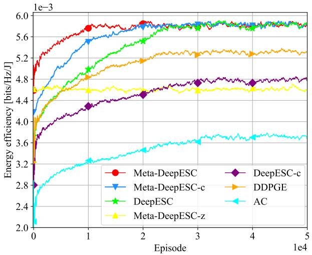  
Fig. 3. Energy efficiency of various schemes when the number of UAVs is 4 and the number of time slots within a flight period is 40. The figure presents the performance evolution of different schemes across episodes.

TABLE II: Average sensing SNR [dB] achieved by various schemes when the number of UAVs is 4 and the number of time slots within a flight period is 40.
<table><tr><td rowspan=1 colspan=1>Scheme</td><td rowspan=1 colspan=1>Average sensing SNR</td><td rowspan=1 colspan=1>Target requirement</td></tr><tr><td rowspan=1 colspan=1>Meta-DeepESC</td><td rowspan=1 colspan=1>1.66</td><td rowspan=1 colspan=1>1.50</td></tr><tr><td rowspan=1 colspan=1>DeepESC</td><td rowspan=1 colspan=1>1.66</td><td rowspan=1 colspan=1>1.50</td></tr><tr><td rowspan=1 colspan=1>Meta-DeepESC-z</td><td rowspan=1 colspan=1>1.50</td><td rowspan=1 colspan=1>1.50</td></tr><tr><td rowspan=1 colspan=1>DeepESC-c</td><td rowspan=1 colspan=1>1.52</td><td rowspan=1 colspan=1>1.50</td></tr><tr><td rowspan=1 colspan=1>DDPGE</td><td rowspan=1 colspan=1>1.57</td><td rowspan=1 colspan=1>1.50</td></tr><tr><td rowspan=1 colspan=1>AC</td><td rowspan=1 colspan=1>1.45</td><td rowspan=1 colspan=1>1.50</td></tr></table>

Overall, in comparison to DeepESC, Meta-DeepESC-z, DeepESC-c, DDPGE, and AC schemes, Meta-DeepESC requires an additional complexity of $\mathcal { O } ( V C N _ { \mathrm { m t } } N _ { \mathrm { e } } ( \bar { 3 } ( N M +$ $\bar { N } ^ { 2 } \ : + \ : 2 M ) X ^ { 2 } + \ : 3 ( 2 N \bar { M } \ : + \ : \mathrm { 2 } N ^ { 2 } \ : + \ : \mathrm { 3 } M ) X \ : + \ : \mathrm { \log ( F _ { s } ) ) } \nonumber$ $\mathcal { O } \big ( T N _ { \mathrm { e } } \big ( 3 \big ( \begin{array} { l } { N M + N ^ { 2 } + 2 M } \end{array} \big ) X ^ { 2 } + 3 \big ( 2 N M + 2 N ^ { 2 } + 3 M \big ) \dot { X } ^ { ' } + \big ( \begin{array} { l } { 1 } \\ { N M + N ^ { 2 } + 2 M } \end{array} \big ) X ^ { 2 } + 3 \big ( 2 N M + 2 N ^ { 2 } M + 3 M \big ) \dot { X } ^ { ' } \big )$ $\begin{array} { r } { \log ( F _ { \mathrm { s } } ) ) ) , \mathcal { O } \bigl ( ( V C N _ { \mathrm { m t } } + T ) N _ { \mathrm { e } } \log ( F _ { \mathrm { s } } ) \bigr ) , \mathcal { O } \bigl ( N _ { \mathrm { e } } ( ( 3 V C N _ { \mathrm { m t } } + T ) ^ { \vphantom { 2 } } ) \log ( 1 ) \bigr ) } \end{array}$ $T ) ( ( N \dot { M } + \dot { N } ^ { 2 } + 2 M ) X ^ { 2 } + ( 2 \dot { N } \dot { M } + 2 \dot { N } ^ { 2 } + 3 M ) X ) +$ $V C N _ { \mathrm { m t } } \log ( F _ { \mathrm { s } } ) ) )$ , and $\mathcal { O } \big ( ( V C N _ { \mathrm { m t } } + T ) N _ { \mathrm { e } } ( 3 ( N M + N ^ { 2 } +$ $2 M ) X ^ { 2 } + 3 ( 2 N M + 2 N ^ { 2 } + 3 M ) X + \log ( F _ { \mathrm { s } } ) ) \big )$ , respectively. Nevertheless, Meta-DeepESC always attains much better convergence speed and energy efficiency than other schemes, with details provided in the following subsections.

## C. Learning Curves

Fig. 3 and TABLE II present the energy efficiency and average sensing SNR of various schemes, respectively. From Fig. 3, it can be observed that due to the random mobility of the target, all curves exhibit significant fluctuations. In other words, across different episodes, the joint beamforming and trajectory strategies under the same scheme may vary.

1) Meta-DeepESC Versus DeepESC: As can be seen, among all the schemes, both Meta-DeepESC and DeepESC attain the highest energy efficiency while satisfying the preset sensing SNR requirement. However, compared with DeepESC,

Meta-DeepESC achieves a better starting point and requires 59.94% fewer time slots to converge. This improvement is attributed to the generalization ability of the well-trained metaparameters in Meta-DeepESC. Specifically, in the early stage, there is a lack of sufficient experience sets for training. As a result, DeepESC must gradually gather experience sets and learn from scratch. Instead, Meta-DeepESC leverages the pretrained meta-parameters to enable efficient warm-starting and adaptation to the new task, even though the meta-training tasks and the new task are not exactly the same. As the number of trial-and-error interactions increases, the agent collects a large number of diverse experience sets to train the ANN. Consequently, DeepESC gradually converges to a performance close to that of Meta-DeepESC. These results demonstrate that metalearning significantly enhances the initialization performance and convergence speed of the DRL algorithm, but it does not further improve performance after convergence once sufficient trial-and-error interactions are available.

2) Meta-DeepESC Versus Meta-DeepESC-c: Both Meta-DeepESC and Meta-DeepESC-c leverage meta-learning to accelerate DeepESC. Compared to DeepESC, Meta-DeepESCc improves convergence speed by approximately 20% without compromising energy efficiency. However, its meta-learning scheme overlooks the varying quality of tasks across different flight periods and suffers from iterative overwriting of prior knowledge, leading to overfitting on recent tasks. By employing an improved meta-learning scheme, Meta-DeepESC overcomes this and achieves a 50% reduction in convergence time. These observations confirm the effectiveness of the proposed meta-learning method.

3) Meta-DeepESC Versus AC: As shown in Fig. 3 and TA-BLE II, AC achieves much lower energy efficiency than other schemes and fails to guarantee the sensing SNR constraint. To be specific, compared to Meta-DeepESC/DeepESC, the energy efficiency reduction of AC is approximately 35.96%. There are three main reasons for this. First, at each time slot, Meta-DeepESC uses an ANN model to generate a deterministic joint beamforming and trajectory decision, whereas AC produces a probability distribution over all possible actions and samples an action randomly from it. Consequently, the decision-making process of AC is less efficient. Second, during ANN training, Meta-DeepESC fully utilizes random historical experience sets, while AC relies only on a single instantaneous experience set. This results in strong correlations between ANN parameters before and after updates, further reducing the efficiency of decision-making [55]. Third, Meta-DeepESC employs targetactor and target-critic networks to assist in training evalactor and eval-critic, thereby enhancing the stability of the algorithm, a mechanism that is absent in AC.

4) Meta-DeepESC Versus DDPGE: Unlike AC, DDPGE adopts historical experience sets along with target-actor and target-critic networks to train the ANN model. Hence, DDPGE achieves an energy efficiency gain of approximately 42.51% compared to AC. However, the underpinning algorithm in DDPGE is DDPG [57], which is prone to overestimating Qvalues due to its deterministic policy gradient approach and reliance on a single eval-critic/target-critic network. Moreover, DDPG updates all ANN models simultaneously, leading to unstable learning in the eval-critic and target-critic. Consequently, DDPGE struggles to derive efficient joint beamforming and trajectory decisions. By contrast, Meta-DeepESC employs the TD3 algorithm to learn proper joint optimization strategies, which (i) utilizes dual eval-critics and targetcritics to mitigate overestimation, (ii) regularizes learning by adding noise to the selected action, and (iii) enhances training stability by updating the eval-critic, target-critic, and targetactor less frequently than the eval-actor. As a result, compared with DDPGE, Meta-DeepESC further improves system performance, achieving energy efficiency and sensing SNR gains of about 9.57% and 5.73%, respectively. This observation reveals that the TD3 algorithm is more suitable than DDPG for joint beamforming and trajectory optimization in energy-efficient LAE-oriented ISAC systems.

5) Meta-DeepESC Versus DeepESC-c: In DeepESC-c, the conventional experience replay mechanism [57] is employed to train the ANN, which collects and utilizes experiences from different time slots within an episode independently. However, since the optimization problem is formulated as an episodic task, all experiences from a complete episode should be used jointly to train the ANN. As a result, DeepESC-c is not well suited to the formulated problem. On the contrary, thanks to the episodic experience replay mechanism, Meta-DeepESC can take advantage of experience sets, each consisting of all experiences from an episode, for training. Besides, this mechanism assigns priorities to experience sets to vary their sampling probabilities and more actively samples newer experience sets to better capture the time-varying mobility of the target. Therefore, Meta-DeepESC is better able to address the formulated problem and further improves the energy efficiency of LAE-oriented ISAC systems: compared with DeepESCc, the performance gain attained by Meta-DeepESC is about 21.67%. This result shows the effectiveness of the proposed episodic experience replay mechanism.

6) Meta-DeepESC Versus Meta-DeepESC-z: Similar to Meta-DeepESC, Meta-DeepESC-z employs the TD3 framework with episodic experience replay and meta-learning for joint beamforming and trajectory optimization. However, unlike Meta-DeepESC, all ANNs in Meta-DeepESC-z are not retrained during the meta-adaptation phase after meta-training. As a result, although Meta-DeepESC-z starts from the same initial point as Meta-DeepESC, its final performance is slightly inferior. As depicted in Fig. 3, compared with Meta-DeepESC, the energy efficiency reduction of Meta-DeepESC-z is around 20.55%. Nevertheless, Meta-DeepESC-z still achieves 24.06% higher energy efficiency and 4.90% higher sensing SNR compared to AC. This is because meta-learning endows Meta-DeepESC-z with strong generalization capabilities through well-trained meta-parameters, enabling fairly good performance even when the adaptation environment differs from the training environments. These observations further validate the effectiveness of meta-learning in enhancing generalization.

## D. Robustness to Different Numbers of Time Slots Within a Flight Period

This subsection studies the performance of various schemes under different numbers of time slots within a flight period. ,

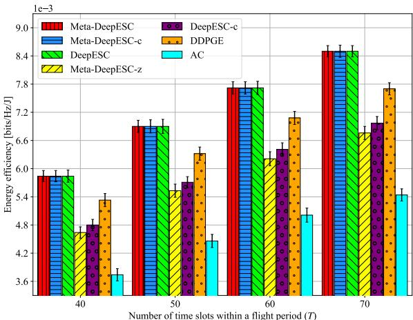  
(a) Energy efficiency.

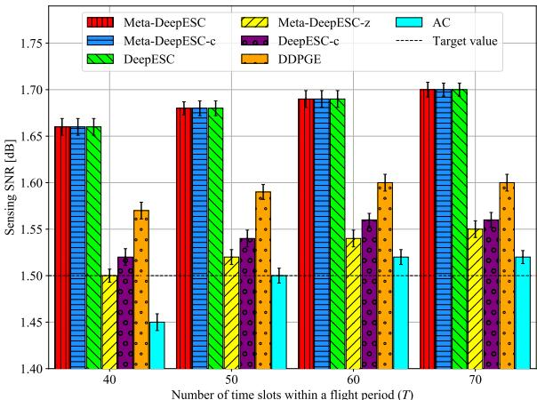  
(b) Sensing SNR.  
Fig. 4. Energy efficiency and sensing SNR of various schemes versus different numbers of time slots within a flight period (i.e., T ). This figure demonstrates the robustness of various schemes against different values of T .

The value of T increases from 40 to 70 in steps of 10. Fig. 4a and Fig. 4b depict the energy efficiency and sensing SNR of various schemes, respectively.

As expected, the energy efficiency attained by all schemes improves monotonically as T increases. This is because a larger T provides more time slots during which all UAVs can fly freely without being constrained by the flight mission. As a result, all schemes have greater temporal degrees of freedom to optimize the joint beamforming and trajectory strategy, thereby maximizing energy efficiency while satisfying the average sensing SNR requirement. This also explains why AC meets the given sensing SNR requirement when $T \geq 5 0$ . Furthermore, by exploiting a more intelligent and efficient joint optimization strategy, Meta-DeepESC achieves higher energy efficiency than other schemes. For example, in comparison to DeepESC-c, Meta-DeepESC yields an energy efficiency gain of over 20.44% across all simulation settings.

More importantly, as T increases, the energy efficiency gap between Meta-DeepESC and Meta-DeepESC-z/DeepESCc/DDPGE/AC gradually increases. Specifically, when T increases from 40 to 70, the energy efficiency improvement of Meta-DeepESC increases (i) from 1.20e-3 bps/Hz/J to 1.74e-3 bps/Hz/J compared with Meta-DeepESC-z, (ii) from 1.04e-

3 bps/Hz/J to 1.53e-3 bps/Hz/J compared with DeepESC-c, (iii) from 0.51e-3 bps/Hz/J to 0.80e-3 bps/Hz/J compared with DDPGE, and (iv) from 2.10e-3 bps/Hz/J to 3.06e-3 bps/Hz/J compared with AC. The above observations show that Meta-DeepESC is more robust than other schemes across different numbers of time slots within a flight period.

## E. Robustness to Different Numbers of UAVs

This simulation evaluates the robustness of various schemes against different numbers of UAVs, where M increases from 2 to 8 in steps of 2. The choice of M aligns with the settings commonly adopted in prior studies [44]–[50]. Fig. 5a and Fig. 5b show the energy efficiency and sensing SNR, respectively.

As observed, the energy efficiency of all schemes gradually decreases as M increases. The reasons are as follows. First, although the communication sum-rate increases slightly with M, the energy consumption for UAV flight rises significantly. Second, a larger M necessitates more complex trajectories to avoid collisions, leading to higher energy consumption. Nevertheless, as provided in Fig. 5b, the Meta-DeepESC, DeepESC, and DDPGE schemes can strictly meet the average sensing SNR requirement across different values of M, whereas Meta-DeepESC-z, DeepESC-c, and AC fail due to inefficient ANN training mechanisms. Furthermore, for all values of M , Meta-DeepESC always yields significant higher energy efficiency than other schemes. For example, across various values of M, Meta-DeepESC achieves an energy efficiency gain of more than 7.37% compared to DDPGE. Overall, the above results exemplify that compared with other schemes, Meta-DeepESC is more robust against different numbers of UAVs in energyefficient LAE-oriented ISAC systems.

## F. Robustness to Imperfect CSI Conditions

Due to the processing delay in practical systems, the CSI available at the GBS may be outdated [52]. Let $T _ { \mathrm { d } }$ denote the delay between the time slot when the echo signal and the uplink pilot are received and the time slot when the corresponding CSI is obtained. Thus, the equivalent communication and sensing CSI available at the GBS in time slot t can be given by $ { \widetilde { \mathbf { H } } } _ { \mathrm { c } } ( t - T _ { \mathrm { d } } ) \in \mathbb { C } ^ { N \times M }$ and $ { \widetilde { \mathbf { H } } } _ { \mathrm { s } } ( t - T _ { \mathrm { d } } ) \in \mathbb { C } ^ { N \times N }$ respectively. In particular, using minimum mean square error estimation, the CSI $\widetilde { \mathbf { H } } _ { \mathrm { c } }$ and $\tilde { \mathbf { H } } _ { \mathrm { s } }$ can be estimated from the uplink pilots of UAVs and the echo signal, respectively, with $\bar { \sigma _ { \mathrm { c } } ^ { 2 } } = 0 . \bar { 0 3 } | | \mathbf { H } _ { \mathrm { c } } | | _ { 2 } ^ { 2 }$ [52] being the estimation error between the true equivalent communication CSI $\mathbf { H } _ { \mathrm { c } }$ and its estimate $\widetilde { \mathbf { H } } _ { \mathrm { c } } .$ and $\sigma _ { \mathrm { s } } ^ { 2 } = 0 . 0 3 | | \mathbf { H } _ { \mathrm { s } } | | _ { 2 } ^ { 2 }$ being the estimation error between the true equivalent sensing CSI H and its estimate $\widetilde { \mathbf { H } } _ { \mathrm { s } } .$ . Therefore, in each time slot $t ,$ the GBS optimizes the beamforming and trajectory scheme based on the outdated and inaccurate CSI $\widetilde { \mathbf { H } } _ { \mathrm { c } } ( t - T _ { \mathrm { d } } )$ and $\widetilde { \mathbf { H } } _ { \mathrm { s } } ( t - T _ { \mathrm { d } } )$ . In the following, we evaluate the robustness of various schemes to different CSI delays, in which $T _ { \mathrm { d } }$ increases from 0 to 9 time slots with a step size of 3. Fig. 6 present the energy efficiency and sensing SNR.

It can be observed that as $T _ { \mathrm { d } }$ increases, the energy efficiency achieved by all schemes gradually decrease. This is because a larger $T _ { \mathrm { d } }$ leads to more outdated CSI, which results in inefficient beamforming and trajectory decisions. To satisfy the preset sensing requirement, the agent must sacrifice a certain portion of the energy efficiency. Nevertheless, among all schemes, Meta-DeepESC always achieves the highest energy efficiency. Specifically, compared with Meta-DeepESC-z, DeepESC-c, DDPGE, and AC, the energy efficiency gains of Meta-DeepESC exceed 25.86%, 21.67%, 9.57%, and 53.33% across different CSI delays, respectively. Besides, under various simulation setups, only Meta-DeepESC always meets the sensing requirement. These results show that Meta-DeepESC is more robust than other schemes under different CSI delays.

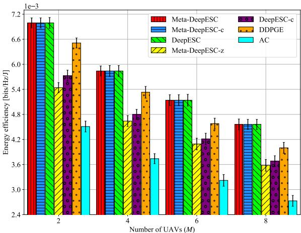  
(a) Energy efficiency.

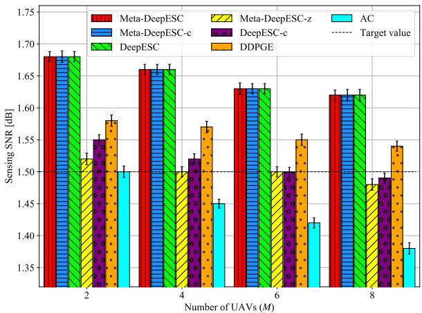  
(b) Sensing SNR.  
Fig. 5. Energy efficiency and sensing SNR of various schemes versus different numbers of UAVs (i.e., M ). This figure demonstrates the robustness of various schemes against different values of M.

## G. Effectiveness to More Complex Scenarios

This subsection further investigates the effectiveness of the proposed scheme under more complex channel conditions, where a probabilistic LoS/NLoS channel model and a nonstationary target mobility pattern are considered. The parameters of the probabilistic LoS/NLoS channel model are configured following [69]. The non-stationary mobility pattern of the target is modeled as a combination of the Singer model [70] and the stationary mobility model used in this paper, where the target velocity evolves with time-varying acceleration. The energy efficiency and sensing SNR achieved by various schemes are presented in Fig. 7.

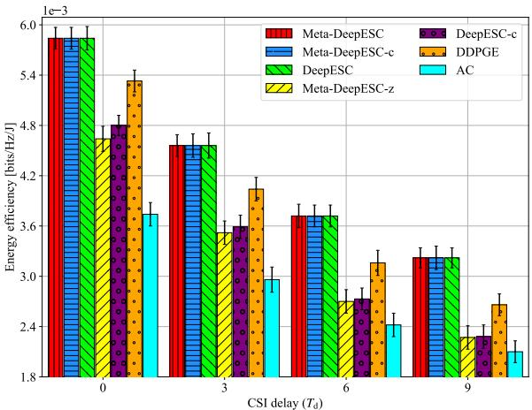  
(a) Energy efficiency.

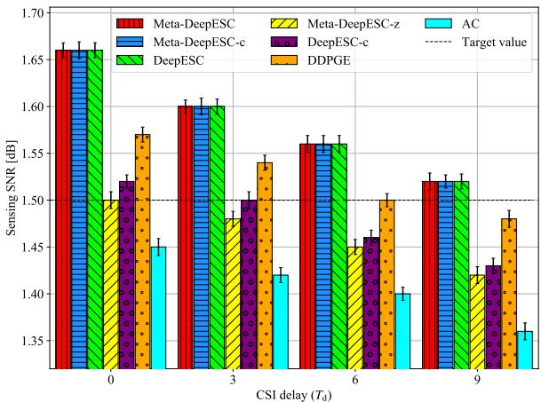  
(b) Sensing SNR.  
Fig. 6. Energy efficiency and sensing SNR of various schemes versus different CSI delays (i.e., $T _ { \mathrm { d } } )$ . This figure demonstrates the robustness of various schemes against different values of $T _ { \mathrm { d } } .$

As can be observed, compared with the energy efficiency results shown in Fig. 3, the energy efficiency under more complex channel conditions is generally lower. Among all evaluated schemes, only DeepESC-c and AC fail to meet the preset sensing SNR requirement. Although Meta-DeepESCz and DDPGE satisfy the sensing requirement, they achieve considerably lower energy efficiency than Meta-DeepESC and DeepESC. Specifically, Meta-DeepESC/DeepESC outperforms Meta-DeepESC-z and DDPGE by approximately 38.63% and 8.35%, respectively, in terms of energy efficiency. These results validate the effectiveness of the proposed schemes under more challenging channel conditions.

## H. Impact of Different Reward Factors

Previous evaluations assumed the reward factors $\delta _ { \mathrm { { e e } } } , ~ \delta _ { \mathrm { { c a } } } ,$ and $\delta _ { \mathrm { s r } }$ in (5) to be 1e4, 10, and 5, respectively. We now study how different values of $\delta _ { \mathrm { e e } } , \delta _ { \mathrm { c a } } ,$ , and $\delta _ { \mathrm { s r } }$ affect the performance of Meta-DeepESC and explain why $\delta _ { \mathrm { { e e } } } ~ = ~ 1 e 4 , ~ \delta _ { \mathrm { { c a } } } ~ = ~ 1 0$ and $\delta _ { \mathrm { s r } } = 5$ were chosen in previous simulations. Specifically, we consider four values for each factor: $\delta _ { \mathrm { e e } } \in \{ 1 e 3 , 5 e 3 , 1 e 4$ , 5e4}, $\delta _ { \mathrm { c a } } ~ \in ~ \{ 6 , 8 , 1 0 , 1 2 \}$ , and $\delta _ { \mathrm { s r } } ~ \in ~ \{ 1 , 3 , 5 , 7 \}$ . The corresponding energy efficiency and constraint satisfaction are shown in Fig. 8 and TABLE III, respectively.

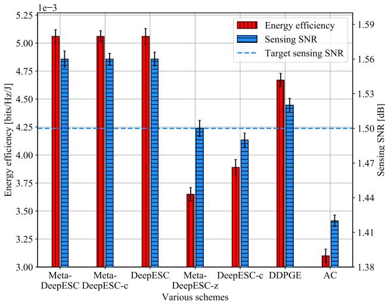  
Fig. 7. Energy efficiency and sensing SNR of various schemes when the number of UAVs is 4 and the number of time slots within a flight period is 40. The figure presents the performance evolution of different schemes across episodes under more complex channel conditions.

It can be found that as $\delta _ { \mathrm { e e } }$ increases from 1e3 to 1e4, the energy efficiency attained by Meta-DeepESC gradually increases, with an increase of about 14.73% when $\delta _ { \mathrm { e e } }$ reaches 1e4. However, further increasing $\delta _ { \mathrm { e e } }$ to 5e4 yields almost no additional performance gain. These results indicate that $\delta _ { \mathrm { e e } } = 1 e 4$ is sufficient for the agent to learn an efficient joint beamforming and trajectory optimization policy. In contrast, as $\delta _ { \mathrm { c a } }$ increases from 6 to 12, the energy efficiency of Meta-DeepESC gradually decreases, while collision avoidance is progressively better satisfied. This occurs because a larger $\delta _ { \mathrm { c a } }$ leads Meta-DeepESC to emphasize the collision avoidance constraint more strongly. However, an excessively large $\delta _ { \mathrm { c a } }$ would cause the algorithm to focus predominantly on this constraint at the expense of other objectives. Hence, a moderate value $( \mathrm { i . e . , ~ } \delta _ { \mathrm { c a } } = 1 0 )$ is more effective than an overly large one $( \mathrm { i . e . , ~ } \delta _ { \mathrm { c a } } = 1 2 )$ . The impact of the reward factor $\delta _ { \mathrm { s r } }$ on the performance of Meta-DeepESC is similar to that of $\delta _ { \mathrm { c a } } . \mathrm { A }$ higher $\delta _ { \mathrm { s r } }$ makes the algorithm prioritize sensing performance, but an excessively high value compromises energy efficiency without yielding other benefits. Overall, the choice $\delta _ { \mathrm { e e } } = 1 e 4$ $\delta _ { \mathrm { c a } } = 1 0$ , and $\delta _ { \mathrm { s r } } = 5$ in the reward function of Meta-DeepESC represents a well-balanced and effective combination.

## I. Impact of Different Learning Rates and Exploration Decay Factors

Finally, we investigate the impact of different learning rates $\mathrm { ( i . e . , ~ } \alpha _ { \mathrm { a } }$ and $\alpha _ { \mathrm { c } } )$ and exploration decay factors $( \mathrm { i . e . , ~ } \zeta )$ on the performance of Meta-DeepESC. Table IV summarizes the resulting energy efficiency and sensing SNR. In line with [63], efficient learning requires the learning rate $\alpha _ { \mathrm { c } }$ of the evalcritics to exceed that of the eval-actor $\left( \mathrm { { i . e . , \alpha \alpha _ { a } } } \right)$ . As shown in TABLE IV, when $\alpha _ { \mathrm { a } }$ and $\alpha _ { \mathrm { c } }$ are too small, Meta-DeepESC learns slowly and fails to find an efficient solution. Increasing $\alpha _ { \mathrm { a } }$ and $\alpha _ { \mathrm { c } }$ gradually improves energy efficiency and sensing SNR. However, too large $\alpha _ { \mathrm { a } }$ and $\alpha _ { \mathrm { c } }$ result in overly aggressive learning, leading to sub-optimal policy convergence. Besides, ζ governs the exploration-exploitation trade-off. It should be near 1.0 (e.g., 0.999) to gradually reduce exploration without terminating it prematurely. $\textbf { A } \zeta$ that is too large, however, limits the exploitation of learned strategies. Overall, $\alpha _ { \mathrm { a } }$ and $\alpha _ { \mathrm { c } }$ influence performance more significantly than ζ.

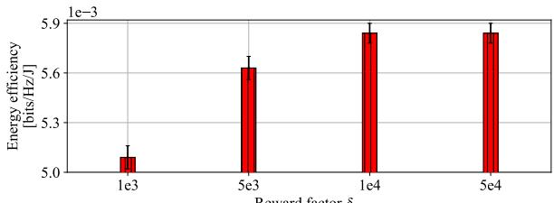

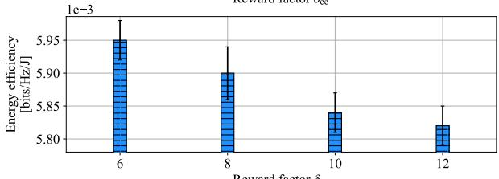

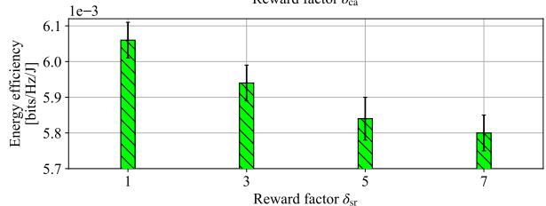  
Fig. 8. Energy efficiency of the proposed Meta-DeepESC scheme versus different reward factors (i.e., $\delta _ { \mathrm { e e } , } \delta _ { \mathrm { c a } , }$ and $\delta _ { \mathrm { s r } } )$ ).This figure presents the impact of reward factors on the energy efficiency achieved by Meta-DeepESC.

TABLE III: Average sensing requirement and collision avoidance satisfactory of Meta-DeepESC under different reward factors.
<table><tr><td rowspan=1 colspan=4>Average sensing requirement satisfactory</td></tr><tr><td rowspan=1 colspan=1> $\overline { { \delta _ { \mathrm { e e } } = 1 e 3 } }$ </td><td rowspan=1 colspan=1> $\overline { { \delta _ { \mathrm { e e } } = 5 e 3 } }$ </td><td rowspan=1 colspan=1> $\overline { { \delta _ { \mathrm { e e } } = 1 e 4 } }$ </td><td rowspan=1 colspan=1> $\overline { { \delta _ { \mathrm { e e } } = 5 e 4 } }$ </td></tr><tr><td rowspan=1 colspan=1></td><td rowspan=1 colspan=1></td><td rowspan=1 colspan=1></td><td rowspan=1 colspan=1></td></tr><tr><td rowspan=1 colspan=1> $\overline { { \delta _ { \mathrm { c a } } = 6 } }$ </td><td rowspan=1 colspan=1> $\overline { { \delta _ { \mathrm { c a } } = 8 } }$ </td><td rowspan=1 colspan=1> $\overline { { \delta _ { \mathrm { c a } } = 1 0 } }$ </td><td rowspan=1 colspan=1> $\overline { { \delta _ { \mathrm { c a } } = 1 2 } }$ </td></tr><tr><td rowspan=1 colspan=1></td><td rowspan=1 colspan=1></td><td rowspan=1 colspan=1></td><td rowspan=1 colspan=1></td></tr><tr><td rowspan=1 colspan=1> $\overline { { \delta _ { \mathrm { s r } } = 1 } }$ </td><td rowspan=1 colspan=1> $\overline { { \delta _ { \mathrm { s r } } = 3 } }$ </td><td rowspan=1 colspan=1> $\overline { { \delta _ { \mathrm { s r } } = 5 } }$ </td><td rowspan=1 colspan=1> $\overline { { \delta _ { \mathrm { s r } } = 7 } }$ </td></tr><tr><td rowspan=1 colspan=1> $\times$ </td><td rowspan=1 colspan=1>×</td><td rowspan=1 colspan=1>√</td><td rowspan=1 colspan=1>√</td></tr><tr><td rowspan=1 colspan=1>Col</td><td rowspan=1 colspan=1>lision avoidan</td><td rowspan=1 colspan=1>ce satisfactor</td><td rowspan=1 colspan=1>y</td></tr><tr><td rowspan=1 colspan=1> $\overline { { \delta _ { \mathrm { e e } } = 1 e 3 } }$ </td><td rowspan=1 colspan=1> $\overline { { \delta _ { \mathrm { e e } } = 5 e 3 } }$ </td><td rowspan=1 colspan=1> $\overline { { \delta _ { \mathrm { e e } } = 1 e 4 } }$ </td><td rowspan=1 colspan=1> $\overline { { \delta _ { \mathrm { e e } } = 5 e 4 } }$ </td></tr><tr><td rowspan=1 colspan=1>√</td><td rowspan=1 colspan=1>√</td><td rowspan=1 colspan=1></td><td rowspan=1 colspan=1>√</td></tr><tr><td rowspan=1 colspan=1> $\delta _ { \mathrm { c a } } = 6$ </td><td rowspan=1 colspan=1> $\overline { { \delta _ { \mathrm { c a } } = 8 } }$ </td><td rowspan=1 colspan=1> $\overline { { \delta _ { \mathrm { c a } } = 1 0 } }$ </td><td rowspan=1 colspan=1> $\overline { { \delta _ { \mathrm { c a } } = 1 2 } }$ </td></tr><tr><td rowspan=1 colspan=1> $\times$ </td><td rowspan=1 colspan=1>×</td><td rowspan=1 colspan=1>√</td><td rowspan=1 colspan=1>√</td></tr><tr><td rowspan=1 colspan=1> $\overline { { \delta _ { \mathrm { s r } } = 1 } }$ </td><td rowspan=1 colspan=1> $\overline { { \delta _ { \mathrm { s r } } = 3 } }$ </td><td rowspan=1 colspan=1> $\overline { { \delta _ { \mathrm { s r } } = 5 } }$ </td><td rowspan=1 colspan=1> $\overline { { \delta _ { \mathrm { s r } } = 7 } }$ </td></tr><tr><td rowspan=1 colspan=1> $\checkmark$ </td><td rowspan=1 colspan=1> $\checkmark$ </td><td rowspan=1 colspan=1> $\checkmark$ </td><td rowspan=1 colspan=1> $\checkmark$ </td></tr></table>

## VII. CONCLUSION

This paper developed a new class of ISAC schemes for energy-efficient LAE, called DeepESC and Meta-DeepESC, based on DRL techniques. The objective of DeepESC and Meta-DeepESC is to maximize the expected energy efficiency over the flight period through joint GBS’s beamforming and UAVs’ trajectories optimization, subject to the average SNR requirement for sensing, flight mission, collision avoidance, and maximum transmit power constraints. First, DeepESC is proposed based on the TD3 algorithm with a new reward function and a constrained action selection strategy. Then, to efficiently learn from episode tasks, an episodic experience replay mechanism was designed for DeepESC, where all experiences within an episode are jointly utilized to form an experience set and are given different priorities to train the ANN. Finally, to enable rapid adaptation to unseen flight periods, we put forth the Meta-DeepESC scheme by integrating metalearning into DeepESC. Simulation results showed that both DeepESC and Meta-DeepESC achieve much higher energy efficiency than other schemes while satisfying all constraints. Besides, compared with DeepESC, Meta-DeepESC converges faster and generalizes better across different flight periods.

TABLE IV: Performance of Meta-DeepESC under different learning rates and exploration decay factors.
<table><tr><td rowspan=1 colspan=1> $\alpha _ { \mathrm { a } }$ </td><td rowspan=1 colspan=1>1e-6</td><td rowspan=1 colspan=1>1e-5</td><td rowspan=1 colspan=1>1e-4</td><td rowspan=1 colspan=1>1e-3</td></tr><tr><td rowspan=1 colspan=1>Energy Efficiency [× 1e-3 bits/Hz/J]</td><td rowspan=1 colspan=1>5.75</td><td rowspan=1 colspan=1>5.79</td><td rowspan=1 colspan=1>5.84</td><td rowspan=1 colspan=1>5.66</td></tr><tr><td rowspan=1 colspan=1>Sensing SNR [dB]</td><td rowspan=1 colspan=1>1.58</td><td rowspan=1 colspan=1>1.63</td><td rowspan=1 colspan=1>1.66</td><td rowspan=1 colspan=1>1.46</td></tr><tr><td rowspan=1 colspan=1> $\alpha _ { \mathrm { c } }$ </td><td rowspan=1 colspan=1>2e-6</td><td rowspan=1 colspan=1>2e-5</td><td rowspan=1 colspan=1>2e-4</td><td rowspan=1 colspan=1>2e-3</td></tr><tr><td rowspan=1 colspan=1>Energy Efficiency [× 1e-3 bits/Hz/J]</td><td rowspan=1 colspan=1>5.72</td><td rowspan=1 colspan=1>5.76</td><td rowspan=1 colspan=1>5.84</td><td rowspan=1 colspan=1>5.66</td></tr><tr><td rowspan=1 colspan=1>Sensing SNR [dB]</td><td rowspan=1 colspan=1>1.56</td><td rowspan=1 colspan=1>1.60</td><td rowspan=1 colspan=1>1.66</td><td rowspan=1 colspan=1>1.45</td></tr><tr><td rowspan=1 colspan=1>ζ</td><td rowspan=1 colspan=1>0.9</td><td rowspan=1 colspan=1>0.99</td><td rowspan=1 colspan=1>0.999</td><td rowspan=1 colspan=1>0.9999</td></tr><tr><td rowspan=1 colspan=1>Energy Efficiency [× 1e-3 bits/Hz/J]</td><td rowspan=1 colspan=1>5.72</td><td rowspan=1 colspan=1>5.80</td><td rowspan=1 colspan=1>5.84</td><td rowspan=1 colspan=1>5.83</td></tr><tr><td rowspan=1 colspan=1>Sensing SNR [dB]</td><td rowspan=1 colspan=1>1.53</td><td rowspan=1 colspan=1>1.61</td><td rowspan=1 colspan=1>1.66</td><td rowspan=1 colspan=1>1.66</td></tr></table>

In future work, we identify three promising directions: (i) To better capture the satisfaction levels of sensing, communication, and their integration, we plan to introduce a composite evaluation metric, called Value of Service [71], to design a new reward function that more effectively guides the joint optimization of beamforming and trajectory. (ii) We aim to leverage federated training to accelerate task sampling and gradient aggregation, enabling scalable deployment of Meta-DeepESC in large-scale LAE systems. (iii) To further enhance operational safety in real-world scenarios, we can integrate a real-time collision avoidance monitor that overrides Meta-DeepESC if a safety threshold (e.g., minimum safe distance between UAVs and other devices) is violated.

## REFERENCES

[1] Y. Song, Y. Zeng, Y. Yang, Z. Ren, G. Cheng, X. Xu, J. Xu, S. Jin, and R. Zhang, “An overview of cellular ISAC for low-altitude UAV: New opportunities and challenges,” IEEE Commun. Mag., vol. 63, no. 12, pp. 88–95, Jul. 2025.

[2] Y. Jiang, X. Li, G. Zhu, H. Li, J. Deng, K. Han, C. Shen, Q. Shi, and R. Zhang, “Integrated sensing and communication for low altitude economy: Opportunities and challenges,” IEEE Commun. Mag., vol. 63, no. 12, pp. 72–78, Apr. 2025.

[3] F. Liu, Y. Cui, C. Masouros, J. Xu, T. X. Han, Y. C. Eldar, and S. Buzzi, “Integrated sensing and communications: Toward dual-functional wireless networks for 6G and beyond,” IEEE J. Sel. Areas in Commun., vol. 40, no. 6, pp. 1728–1767, Mar. 2022.

[4] Y. Zeng and R. Zhang, “Energy-efficient uav communication with trajectory optimization,” IEEE Trans. Wireless Commun., vol. 16, no. 6, pp. 3747–3760, Mar. 2017.

[5] N. Lin, Y. Fan, L. Zhao, X. Li, and M. Guizani, “GREEN: A global energy efficiency maximization strategy for multi-UAV enabled communication systems,” IEEE Trans. Mobile Comput., vol. 22, no. 12, pp. 7104–7120, Sept. 2022.

[6] Q. Wei, R. Li, W. Bai, and Z. Han, “Multi-UAV-enabled energyefficient data delivery for low-altitude economy: Joint coded caching, user grouping, and uav deployment,” IEEE Internet Things J., vol. 12, no. 14, pp. 27 519–27 532, Apr. 2025.

[7] X. Zhu, L. Zhai, N. Li, Y. Li, and F. Yang, “Multi-objective deployment optimization of UAVs for energy-efficient wireless coverage,” IEEE Trans. Commun., vol. 72, no. 6, pp. 3587–3601, Jan. 2024.

[8] X. Zheng, G. Sun, J. Li, S. Liang, Q. Wu, M. Yin, D. Niyato, and V. C. Leung, “Reliable and energy-efficient communications via collaborative beamforming for UAV networks,” IEEE Trans. Wireless Commun., vol. 23, no. 10, pp. 13 235–13 251, May 2024.

[9] L. Zhai, X. Zhu, and C. Cheng, “Energy efficient data evacuation path for multi-UAV system based on multi-objective optimization method,” IEEE Trans. Veh. Technol., vol. 74, no. 5, pp. 7364–7377, Jan. 2025.

[10] H. Zhang, J. Zhang, and K. Long, “Energy efficiency optimization for NOMA UAV network with imperfect CSI,” IEEE J. Sel. Areas in Commun., vol. 38, no. 12, pp. 2798–2809, Jun. 2020.

[11] F. Song, M. Deng, H. Xing, Y. Liu, F. Ye, and Z. Xiao, “Energy-efficient trajectory optimization with wireless charging in UAV-assisted MEC based on multi-objective reinforcement learning,” IEEE Trans. Mobile Comput., vol. 23, no. 12, pp. 10 867–10 884, Apr. 2024.

[12] Z. Liu, J. Zhang, Y. Zeng, and B. Ai, “Energy-efficient multi-agent reinforcement learning for UAV trajectory optimization in cell-free massive MIMO networks,” IEEE Trans. Wireless Commun., vol. 24, no. 7, pp. 5917–5930, Mar. 2025.

[13] X. Wang, Z. Fei, J. A. Zhang, J. Huang, and J. Yuan, “Constrained utility maximization in dual-functional radar-communication multi-UAV networks,” IEEE Trans. Commun., vol. 69, no. 4, pp. 2660–2672, Dec. 2020.

[14] B. Chang, W. Tang, X. Yan, X. Tong, and Z. Chen, “Integrated scheduling of sensing, communication, and control for mmWave/THz communications in cellular connected UAV networks,” IEEE J. Sel. Areas in Commun., vol. 40, no. 7, pp. 2103–2113, Mar. 2022.

[15] G. A. Bayessa, R. Chai, C. Liang, D. K. Jain, and Q. Chen, “Joint UAV deployment and precoder optimization for multicasting and target sensing in UAV-assisted ISAC networks,” IEEE Internet Things J., vol. 11, no. 20, pp. 33 392–33 405, Jul. 2024.

[16] W. Ding, C. Chen, Y. Fang, L. Qiu, X. Li, X. Wang, and J. Xu, “Multi-UAV-enabled integrated sensing and communications: Joint UAV placement and power control,” in Proc. IEEE Globecom Workshops, Kuala Lumpur, Malaysia, Dec. 2023, pp. 842–847.

[17] L. Xu, Q. Zhu, W. Xia, Z. Wang, T. Q. Quek, and H. Zhu, “Joint placement and beamforming design in UAV enabled multi-stage ISAC system,” IEEE Trans. Commun., vol. 73, no. 11, pp. 12 248–12 263, May 2025.

[18] Y. Yao, W. Xiao, P. Miao, G. Chen, H. Yang, C.-B. Chae, and K.- K. Wong, “UAV-RHS-enabled full-duplex ISAC covert system: Robust beamforming and trajectory optimization,” IEEE Trans. Commun., vol. 74, pp. 5637–5653, Feb. 2026.

[19] Y. Liu, X. Liu, Z. Liu, Y. Yu, M. Jia, Z. Na, and T. S. Durrani, “Secure rate maximization for ISAC-UAV assisted communication amidst multiple eavesdroppers,” IEEE Trans. Veh. Technol., vol. 73, no. 10, pp. 15 843–15 847, Jun. 2024.

[20] J. Zhang, J. Xu, W. Lu, N. Zhao, X. Wang, and D. Niyato, “Secure transmission for IRS-aided UAV-ISAC networks,” IEEE Trans. Wireless Commun., vol. 23, no. 9, pp. 12 256–12 269, Apr. 2024.

[21] Y. Guo, X. Jia, M. Xie, and Y. Li, “Secrecy rate maximization for IRSenabled UAV-ISAC systems via phase shifting adjustment and resource allocation,” IEEE Trans. Green Commun. Net., vol. 10, pp. 289–299, Jun. 2025.

[22] S. Xu, Z. Liu, L. Zhao, Z. Liu, X. Wang, Z. Fei, and A. Nallanathan, “Joint trajectory and beamforming optimization for UAV-relayed integrated sensing and communication with mobile edge computing,” IEEE Trans. Mobile Comput., vol. 24, no. 10, pp. 11 180–11 192, May 2025.

[23] K. Meng, Q. Wu, S. Ma, W. Chen, K. Wang, and J. Li, “Throughput maximization for UAV-enabled integrated periodic sensing and communication,” IEEE Trans. Wireless Commun., vol. 22, no. 1, pp. 671–687, Aug. 2022.

[24] C. Deng, X. Fang, and X. Wang, “Beamforming design and trajectory optimization for UAV-empowered adaptable integrated sensing and communication,” IEEE Trans. Wireless Commun., vol. 22, no. 11, pp. 8512–8526, Apr. 2023.

[25] Z. Wu, X. Li, Y. Cai, and W. Yuan, “Joint trajectory and resource allocation design for RIS-assisted UAV-enabled ISAC systems,” IEEE Wireless Commun. Lett., vol. 13, no. 5, pp. 1384–1388, Feb. 2024.

[26] Z. Liu, X. Liu, J. Feng, and B. Chen, “Radar estimation rate maximization for UAV assisted integrated sensing and communication,” IEEE Trans. Veh. Technol., vol. 74, no. 12, pp. 19 760–19 765, Jul 2025.

[27] Z. Liu, X. Liu, Y. Liu, V. C. Leung, and T. S. Durrani, “UAV assisted integrated sensing and communications for internet of things: 3D trajectory optimization and resource allocation,” IEEE Trans. Wireless Commun., vol. 23, no. 8, pp. 8654–8667, Jan. 2024.

[28] X. Jing, F. Liu, C. Masouros, and Y. Zeng, “ISAC from the sky: UAV trajectory design for joint communication and target localization,” IEEE Trans. Wireless Commun., vol. 23, no. 10, pp. 12 857–12 872, May 2024.

[29] T. Van Chien, M. D. Cong, N. C. Luong, T. N. Do, D. I. Kim, and S. Chatzinotas, “Joint computation offloading and target tracking in integrated sensing and communication enabled UAV networks,” IEEE Commun. Lett., vol. 28, no. 6, pp. 1327–1331, Apr. 2024.

[30] S. Hu, X. Yuan, W. Ni, and X. Wang, “Trajectory planning of cellularconnected UAV for communication-assisted radar sensing,” IEEE Trans. Commun., vol. 70, no. 9, pp. 6385–6396, Aug. 2022.

[31] J. Yao, Z. Yang, Z. Yang, J. Xu, and T. Q. Quek, “UAV-enabled secure ISAC against dual eavesdropping threats: Joint beamforming and trajectory design,” IEEE Wireless Commun. Lett., vol. 14, no. 10, pp. 3199–3203, Jul. 2025.

[32] Y. Liu, S. Liu, X. Liu, Z. Liu, and T. S. Durrani, “Sensing fairness-based energy efficiency optimization for UAV enabled integrated sensing and communication,” IEEE Wireless Commun. Lett., vol. 12, no. 10, pp. 1702–1706, Jun. 2023.

[33] A. Khalili, A. Rezaei, D. Xu, and R. Schober, “Energy-aware resource allocation and trajectory design for UAV-enabled ISAC,” in Proc. IEEE GLOBECOM, Kuala Lumpur, Malaysia, Dec. 2023, pp. 4193–4198.

[34] B. He, W. Mao, Y. Liu, W. Huangfu, Y. Xiao, F. Wang, and Y. Ji, “Energy-efficient joint beamforming and trajectory optimization for UAV-enabled integrated sensing and communication,” IEEE Trans. Commun., vol. 73, no. 12, pp. 13 426–13 440, Aug. 2025.

[35] Y. Hu, X. Zhuo, Z. Meng, W. Wu, W. Lu, L. Tang, F. Qu, and Z. Bu, “Collaborative positioning optimization for multiple moving users in UAV-enabled ISAC,” IEEE Trans. Cogn. Commun. Net., vol. 11, no. 5, pp. 3016–3030, Jul. 2025.

[36] W. Mao, Y. Lu, B. Ai, and T. Q. Quek, “Covert communications in MECbased networked ISAC systems towards low-altitude economy,” IEEE J. Sel. Areas in Commun., Mar. 2026, doi: 10.1109/JSAC.2026.3670076.

[37] Y. Zhou and X. Liu, “Trade-off between radar sensing and energy consumption in integrated sensing, computing, and communication UAV network,” IEEE Trans. Green Commun. Netw., vol. 10, pp. 511–521, Jul. 2025.

[38] X. Liu, J. Wu, C. Zhao, and Z. Liu, “Integrated sensing and communications for UAV assisted internet of things based on deep reinforcement learning,” IEEE Trans. Veh. Technol., vol. 74, no. 6, pp. 9604–9616, Feb. 2025.

[39] Z. Xie, Z. Wang, Z. Zhang, J. Wang, Z. Jiang, and Z. Han, “Distributed UAV swarm for device-free integrated sensing and communication relying on multi-agent reinforcement learning,” IEEE Trans. Veh. Technol., vol. 73, no. 12, pp. 19 925–19 930, Aug. 2024.

[40] Z. Wang, X.-P. Zhang, W. Ding, Y. Dong, and X. Chen, “A novel integrated sensing and communication scheme in UAVs-enabled vehicular networks with MARL-driven adaptive control,” IEEE Trans. Mobile Comput., vol. 25, no. 1, pp. 132–147, Jul. 2025.

[41] G. Fontanesi, A. Guerra, F. Guidi, J. A. Vasquez-Peralvo, N. Shlezinger,´ A. Zanella, E. Lagunas, S. Chatzinotas, D. Dardari, and P. M. Djuric, “A´ deep-NN beamforming approach for dual function radar-communication THz UAV,” IEEE Trans. Veh. Technol., vol. 74, no. 1, pp. 746–760, Sept. 2024.

[42] Y. Qin, Z. Zhang, X. Li, W. Huangfu, and H. Zhang, “Deep reinforcement learning based resource allocation and trajectory planning in integrated sensing and communications UAV network,” IEEE Trans. Wireless Commun., vol. 22, no. 11, pp. 8158–8169, Mar. 2023.

[43] H. Zeng, X. Lu, Y. Huang, S. Huang, S. Feng, X. Zhu, and J. Cao, “Deep reinforcement learning-based joint resource allocation and trajectory design for UAV-assisted multi-cell ISAC systems,” IEEE Trans. Netw. Sci. Eng., vol. 13, pp. 6383–6401, Jan. 2026.

[44] X. Ye, Y. Mao, X. Yu, S. Sun, L. Fu, and J. Xu, “Integrated sensing and communications for low-altitude economy: A deep reinforcement learning approach,” IEEE Trans. Wireless Commun., vol. 25, pp. 351– 367, Jul. 2025.

[45] Y. Cui, Q. Zhang, Z. Feng, F. Liu, C. Shi, J. Fan, and P. Zhang, “Specific beamforming for multi-UAV networks: A dual identity-based ISAC approach,” in Proc. IEEE ICC, Rome, Italy, May 2023, pp. 4979– 4985.

[46] Y. Feng, C. Zhao, H. Luo, F. Gao, F. Liu, and S. Jin, “Networked ISAC based UAV tracking and handover towards low-altitude economy,” IEEE Trans. Wireless Commun., vol. 24, no. 9, pp. 7670–7685, Apr. 2025.

[47] R. Li, Q. Zhang, D. Ma, K. Yu, and Y. Huang, “Joint target assignment and resource allocation for multi-base station cooperative ISAC in UAV detection,” IEEE Trans. Veh. Tech., vol. 74, no. 5, pp. 7700–7714, Jan. 2025.

[48] J. Tang, Y. Yu, C. Pan, H. Ren, D. Wang, J. Wang, and X. You, “Cooperative ISAC-empowered low-altitude economy,” IEEE Trans. Wireless Commun., vol. 24, no. 5, pp. 3837–3853, Feb. 2025.

[49] Y. Huang, J. Yang, C.-K. Wen, S. Xia, X. Li, and S. Jin, “Cooperative ISAC network for off-grid imaging-based low-altitude surveillance,” Oslo, Norway, Jun. 2025.

[50] G. Cheng, X. Song, Z. Lyu, and J. Xu, “Networked ISAC for lowaltitude economy: Coordinated transmit beamforming and UAV trajectory design,” IEEE Trans. Commun., vol. 73, no. 8, pp. 5832–5847, Feb. 2025.

[51] Y. Yao, Z. Zhu, P. Miao, X. Cheng, F. Shu, and J. Wang, “Optimizing hybrid RIS-aided ISAC systems in V2X networks: A deep reinforcement learning method for anti-eavesdropping techniques,” IEEE Trans. Veh. Tech., vol. 74, no. 6, pp. 9224–9239, Feb. 2025.

[52] X. Ye, Y. Mao, X. Yu, and L. Fu, “Intelligent omni-surface-aided integrated sensing and communications based on deep reinforcement learning with knowledge transfer,” IEEE Trans. Wireless Commun., vol. 24, no. 5, pp. 4344–4360, Feb. 2025.

[53] Y. Chen, H. Yang, W. Xie, H. Lu, and C. Zhang, “Energy efficient UAV-RIS-aided integrated sensing and communication systems using deep reinforcement learning,” IEEE Trans. Veh. Technol., vol. 75, no. 1, pp. 1613–1618, Jul. 2025.

[54] L.-J. Lin, “Self-improving reactive agents based on reinforcement learning, planning and teaching,” Mach. Learn., vol. 8, pp. 293–321, May 1992.

[55] R. S. Sutton and A. G. Barto, Reinforcement learning: An introduction. Cambridge, MA, USA:MIT press, 2018.

[56] A. Amhaz, S. Khisa, M. Elhattab, C. Assi, and S. Sharafeddine, “Metalearning-driven resource optimization in full-duplex ISAC with movable antennas,” IEEE Wireless Commun. Lett., vol. 15, pp. 1603–1607, Jan. 2026.

[57] T. Lillicrap, J. Hunt, A. Pritzel, N. Heess, T. Erez, Y. Tassa, D. Silver, and D. Wierstra, “Continuous control with deep reinforcement learning,” in Proc. ICLR, San Juan, Puerto Rico, May 2016, pp. 1–14.

[58] A. Nichol, J. Achiam, and J. Schulman, “On first-order meta-learning algorithms,” arXiv preprint arXiv:1803.02999, 2018.

[59] H. Tabassum, M. Salehi, and E. Hossain, “Fundamentals of mobilityaware performance characterization of cellular networks: A tutorial,” IEEE Commun. Surveys Tuts., vol. 21, no. 3, pp. 2288–2308, Mar. 2019.

[60] R. Liu, M. Li, Q. Liu, and A. L. Swindlehurst, “SNR/CRB-constrained joint beamforming and reflection designs for RIS-ISAC systems,” IEEE Trans. Wireless Commun., vol. 23, no. 7, pp. 7456–7470, Dec. 2023.

[61] Q. Zhu, M. Li, R. Liu, and Q. Liu, “Joint transceiver beamforming and reflecting design for active RIS-aided ISAC systems,” IEEE Trans. Veh. Tech., vol. 72, no. 7, pp. 9636–9640, Feb. 2023.

[62] X. Song, X. Li, X. Qin, J. Xu, T. X. Han, and D. W. K. Ng, “Fully-passive versus semi-passive IRS-enabled sensing: SNR and CRB comparison,” IEEE Trans. Wireless Commun., vol. 24, no. 12, pp. 10 050–10 067, Jun. 2025.

[63] S. Fujimoto, H. Hoof, and D. Meger, “Addressing function approximation error in actor-critic methods,” in Proc. ICLR, Stockholm, Sweden, Jul. 2018, pp. 1587–1596.

[64] K. Cho, B. Van Merrienboer, C. Gulcehre, D. Bahdanau, F. Bougares,¨ H. Schwenk, and Y. Bengio, “Learning phrase representations using rnn encoder-decoder for statistical machine translation,” in Proc. EMNLP, Doha, Qatar, Sept. 2014, pp. 1724–1734.

[65] X. Ye, Y. Yu, and L. Fu, “Multi-channel opportunistic access for heterogeneous networks based on deep reinforcement learning,” IEEE Trans. Wireless Commun., vol. 21, no. 2, pp. 794–807, Feb. 2022.

[66] N. C. Luong, D. T. Hoang, S. Gong, D. Niyato, P. Wang, Y.-C. Liang, and D. I. Kim, “Applications of deep reinforcement learning in communications and networking: A survey,” IEEE Commun. Surveys Tuts., vol. 21, no. 4, pp. 3133–3174, 4th Quart. 2019.

[67] X. Ma, J. Chen, L. Xia, J. Yang, Q. Zhao, and Z. Zhou, “Dsac: Distributional soft actor-critic for risk-sensitive reinforcement learning,” J. Artif. Intell. Res., vol. 83, pp. 1–8, Jun. 2025.

[68] I. Goodfellow, Y. Bengio, and A. Courville, Deep learning. Cambridge, MA, USA:MIT press, 2016.

[69] H. Yang, J. Zhao, Z. Xiong, K.-Y. Lam, S. Sun, and L. Xiao, “Privacypreserving federated learning for UAV-enabled networks: Learningbased joint scheduling and resource management,” IEEE J. Sel. Areas Commun., vol. 39, no. 10, pp. 3144–3159, Jun. 2021.

[70] R. A. Singer, “Estimating optimal tracking filter performance for manned maneuvering targets,” IEEE Trans. Aerosp. Electron. Syst., vol. 6, no. 4, pp. 473–483, Jul. 2007.

[71] B. Li, X. Wang, and F. Fang, “Maximizing the value of service provisioning in multi-user ISAC systems through fairness guaranteed

collaborative resource allocation,” IEEE J. Sel. Areas Commun., vol. 42, no. 9, pp. 2243–2258, Jun. 2024.

Xiaowen Ye received the Ph.D. degree in communication and information systems from Xiamen University, Xiamen, China, in 2024. He was a post-doctoral research fellow with the Department of Electrical Engineering, City University of Hong Kong, during 2024-2025. He is an Associate Professor of the College of Photonic and Electronic Engineering at Fujian Normal University, China. His research interests include deep reinforcement learning, wireless network optimization, and dynamic resource allocation.

Xianxin Song (Member, IEEE) received the Ph.D. degree in Computer and Information Engineering from The Chinese University of Hong Kong, Shenzhen, China, in 2024, the M.Eng. degree from Beijing University of Posts and Telecommunications, Beijing, China, in 2020, and the B.Eng. degree from the University of Electronic Science and Technology of China, Chengdu, China, in 2017. He is currently a Post-Doctoral Research Fellow with the Department of Electrical Engineering, City University of Hong Kong, Hong Kong SAR, China. His research interests include integrated sensing and communication, intelligent reflecting surface, and edge intelligence.

Yi Wu received the B.Eng. degree in radio technology from Southeast University, China, in 1991, the M.S. degree in communications and information systems from Fuzhou University, China, in 2004, and the Ph.D. degree in information and communication engineering from Southeast University, China, in 2013. She is currently a Professor in the College of Photonic and Electronic Engineering at Fujian Normal University. Her research interests include visible light positioning, vehicular ad hoc networks, and 5G networks.

Liqun Fu (S’08-M’11-SM’17) is a Full Professor of the School of Informatics at Xiamen University, China. She received her Ph.D. Degree in Information Engineering from The Chinese University of Hong Kong in 2010. She was a post-doctoral research fellow with the Institute of Network Coding of The Chinese University of Hong Kong, and the ACCESS Linnaeus Centre of KTH Royal Institute of Technology during 2011-2013 and 2013-2015, respectively. She was with ShanghaiTech University as an Assistant Professor during 2015-2016.

Her research interests are mainly in communication theory, optimization theory, game theory, and learning theory, with applications in wireless networks. She is on the editorial board of IEEE Transactions on Mobile Computing (TMC), IEEE Communications Letters and the Journal of Communications and Information Networks (JCIN). She served as the Technical Program Co-Chair of IEEE/CIC ICCC 2021 and the GCCCN Workshop of the IEEE INFOCOM 2014, the Publicity Co-Chair of the GSNC Workshop of the IEEE INFOCOM 2016, and the Web Chair of the IEEE WiOpt 2018. She also serves as a TPC member for many leading conferences in communications and networking, such as the IEEE INFOCOM, ICC, and GLOBECOM.