# Integrated Sensing and Communication for Low Altitude Economy: Opportunities and Challenges

Yihang Jiang, Xiaoyang Li, Guangxu Zhu, Hang Li, Jing Deng, Kaifeng Han, Chao Shen, Qingjiang Shi, and Rui Zhang

# Abstra ct

Driven by the prosperous vision of a low-altitude economy (LAE), the low-altitude airspace is expected to be exploited for commercial and social flying activities. The network architectures for supporting LAE are first introduced in this article, including the localized statistical channel modeling and performance analysis based on stochastic geometry. Then, the technological prerequisites for ground-to-air sensing and communication are discussed, including cellular access, spectrum sharing, three-dimensional beamforming, and interference cancellation, as well as cooperative active sensing and non-cooperative passive sensing. The aircraft-assisted sensing and communication functionalities for LAE are further reviewed, including terrestrial and non-terrestrial target sensing, ubiquitous coverage, relaying, and traffic offloading. Finally, several future directions are identified, including aircraft collaboration, energy efficiency, and artificial intelligence-enabled LAE.

# Introducti on

As a new economic form, low-altitude economy (LAE) utilizes low-altitude airspace (generally referring to the space within 1000 meters above the ground) to carry out various flying activities, creating commercial and social values. The flying activities are conducted by various manned and unmanned aircraft, enabling a variety of applications, including transportation, logistics, tourism, agriculture, and disaster monitoring [1]. However, many practical challenges to LAE deployment remain. As a large-scale economic activity, LAE necessarily involves a wide spatial range and a large number of aircraft. According to Statista, the number of aircraft is expected to reach 9.6 million in 2030 [2]. Moreover, the existing controlling method of aircraft primarily relies on simple pointto-point non-payload communication signals in unlicensed frequency bands, which is difficult to realize uniform monitoring and regulation [3]. The information exchange between multiple aircraft and their control centers results in a heavy burden on communication overheads [4].

To tackle these challenges, the aircrafts are expected to be connected by the cellular networks, which are known as cellular-connected aircrafts [5]. In this case, the integration of aircraft with conventional terrestrial networks would result in an integrated air-ground network (IAGN). As shown in Fig. 1, the components of IAGN include base stations (BSs), aircrafts, as well as the infrastructures including take-off and landing platforms. In addition, the typical working paradigms involved in IAGN can be categorized into the following main groups.

Control and Non-Payload Communication (CNPC): As a bidirectional communication link, CNPC plays a key role in IAGN in ensuring the control and navigation of aircraft. CNPC typically operates at low data rates but demands exceptionally high levels of reliability, stringent security measures, and minimal latency for continuous connectivity. Specifically, for non/semi-autonomous aircraft, the control station needs to transmit control commands in real-time or periodically to guide the aircraft’s flights. In turn, the aircraft need to report their flight status (such as the flight altitude and velocity) as well as position information via the uplink CNPC so that the control station can safely regulate their flights.

Payload Communication (PC): PC refers to mission-related communications, depending on the application scenarios, that is, data collected by sensors. Compared with CNPC, PC usually has higher tolerance of latency and security requirements. The PC links of aircrafts could reuse the existing spectrum such as the 5G new-radio band for cellular coverage, or use new spectrum such as millimeter wave and even terahertz band for high-capacity wireless backhaul.

Sensing: In addition to communications, the robust sensing capability is another key technology in IAGN. There are two sensing types, depending on the purpose. One is known as control-related sensing, which contains information about the aircraft’s motion status and position. Another is known as mission-related sensing, which contains task-specific information such as photos and videos. Intuitively, sensing can be performed based on the radar echo signals. Besides

Digital Object Identifier: 10.1109/MCOM.001.2400685

Yihang Jiang, Xiaoyang Li (corresponding author), Guangxu Zhu, Hang Li, Chao Shen, and Rui Zhang are with the Shenzhen Research Institute of Big Data (SRIBD), The Chinese University of Hong Kong-Shenzhen, China; Chao Shen is also with Shenzhen International Center for Industrial and Applied Mathematics, China; Rui Zhang is also with National University of Singapore, Singapore; Jing Deng is with Wireless Center of China Mobile, China; Kaifeng Han is with China Academy of Information and Communication Technology, China; Qingjiang Shi is with Tongji University, China, and also with SRIBD, China.

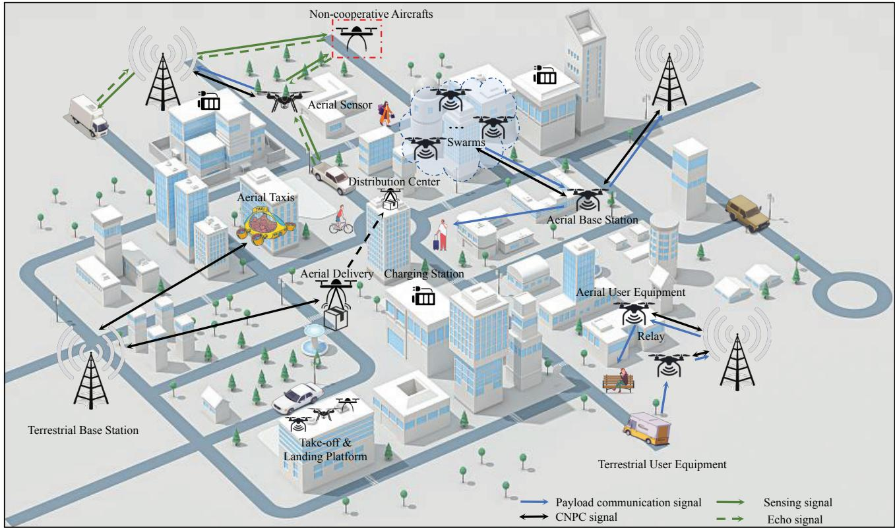

<details>
<summary>flowchart</summary>

```mermaid
graph TD
    A["Non-cooperative Aircrafts"] --> B["Aerial Sensor"]
    B --> C["Aerial Base Station"]
    C --> D["Aerial Delivery"]
    D --> E["Charging Station"]
    E --> F["Aerial User Equipment"]
    F --> G["Relay"]
    G --> H["Terrestrial User Equipment"]
    H --> I["Terrestrial Base Station"]
    I --> J["Aerial Taxis"]
    J --> K["Aerial Base Station"]
    K --> L["Aerial Delivery"]
    L --> M["Aerial User Equipment"]
    M --> N["Terrestrial Base Station"]
    N --> O["Aerial Delivery"]
    O --> P["Aerial Base Station"]
    P --> Q["Aerial Delivery"]
    Q --> R["Aerial Base Station"]
    R --> S["Aerial Delivery"]
    S --> T["Aerial Base Station"]
    T --> U["Aerial Delivery"]
    U --> V["Aerial Base Station"]
    V --> W["Aerial Delivery"]
    W --> X["Aerial Base Station"]
    X --> Y["Aerial Delivery"]
    Y --> Z["Aerial Base Station"]
    Z --> AA["Aerial Delivery"]
    AA --> AB["Aerial Base Station"]
    AB --> AC["Aerial Delivery"]
    AC --> AD["Aerial Base Station"]
    AD --> AE["Aerial Delivery"]
    AE --> AF["Aerial Base Station"]
    AF --> AG["Aerial Delivery"]
    AG --> AH["Aerial Base Station"]
    AH --> AI["Aerial Delivery"]
    AI --> AJ["Aerial Base Station"]
    AJ --> AK["Aerial Delivery"]
    AK --> AL["Aerial Base Station"]
```
</details>

FIGURE 1. IAGN for supporting LAE.

radio frequency sensing, the aircraft’s onboard sensors also provide multimodal sensing information. These technologies provide accurate environmental information and also greatly assist LAE in its various business activities.

As a revolutionary technology for the next generation of networks, integrated sensing and communication (ISAC) is expected to utilize the same hardware and spectrum for realizing simultaneous sensing and communication [6]. The existing studies have already investigated the deployments of ISAC in Internet of Things (IoT) networks [7], vehicular networks [8], and unmanned aerial vehicle (UAV) networks [9]. However, the specific requirements of ISAC technologies for LAE remain uncharted, which is the main focus of this article. In IAGN, the distributed ISAC BSs deployed in existing network frameworks are connected to a central server via cables for data collection and centralized processing for aircraft, while aircraft can act as both communication users and sensing targets (STs), as well as airborne BSs/relays or sensors to enhance the communication and sensing (C&S) performances of the network, thus enabling a mutually beneficial symbiosis between the aircraft and the conventional network architectures.

This article introduces the IAGN components, ground-to-air C&S technologies, aircraft-assisted C&S functionalities, and future directions of LAE. To the best of the authors’ knowledge, this article is the first to present a comprehensive overview of ISAC for LAE.

# Archi tecture of IAGN

The key architectures of IAGN include channel modeling and network construction, which are introduced in this section.

# Locali zed Sta ti sti cal Cha nnel Modeli ng

Due to the unpredictable impact of network parameters and estimation errors, network performance prediction is very challenging. To this end, the simulated reality of communication networks (SRCON) has been proposed to provide a precise and effective offline network simulator for real-world communication networks [10]. Based on SRCON, a multi-beam localized channel modeling (MBCM) is proposed to model the channel angular power spectrum (APS) based on the measured reference signal received power (RSRP) [11]. The modeled channel APS is then utilized to predict the signal-to-interference ratios (SIRs) of ISAC signals after the parameter adjustment of the BS, as shown in Fig. 2. Based on MBCM, the tilt and azimuth angles of BS (indicated by blue dots) antennas are optimized to improve the ISAC performance in IAGN. It can be observed that the RSRP of ISAC signals in the whole network has been significantly improved after optimization, which illustrates the effectiveness of MBCM.

# Stocha sti c Geom etry-Ba sed Network Performa nce Anal ysi s

To support the development of LAE, network-level performance analysis is needed to provide an essential guide on the network design. In [12], a downlink ISAC network consisting of terrestrial BSs, terrestrial communication users (CUs), and aerial STs is considered, where each BS is equipped with a vertically placed half-wavelength uniform linear array as shown in Fig. 2. The ISAC signals are used for serving single-antenna CUs and sensing the non-cooperative aerial STs simultaneously. The locations of BSs are randomly distributed according to the two-dimensional (2D) homogeneous Poisson point process, while CUs and STs are located according to independent stationary point processes. The C&S performances are evaluated using various metrics, including the area communication coverage probability (ACCP) under the SIR criterion and the area radar detection coverage probability (ARDCP) under the constant false alarm rate (CFAR) criterion. These metrics serve as network-level performance indicators, characterizing the density of successfully covered CUs and the density of successfully detected STs, respectively.

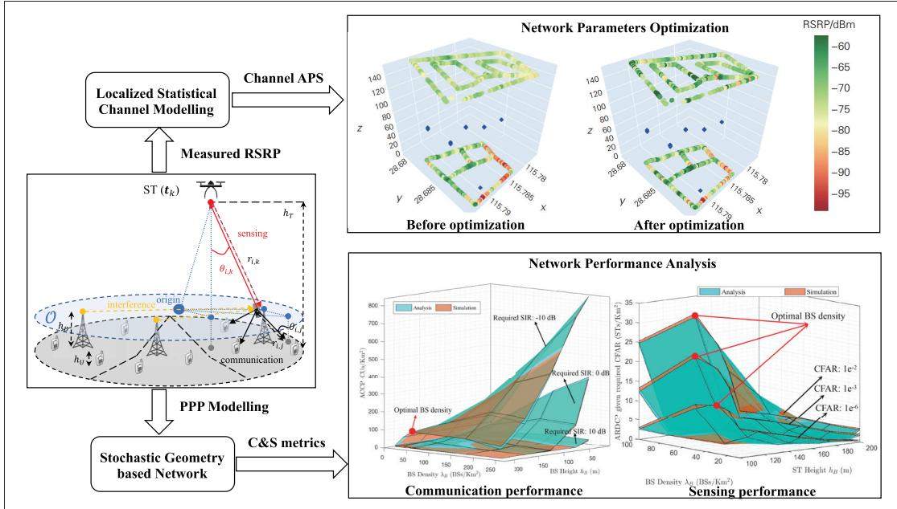

<details>
<summary>flowchart</summary>

```mermaid
graph TD
    A["Localized Statistical Channel Modelling"] --> B["Measured RSRP"]
    B --> C["ST (t_k)"]
    C --> D["h_T"]
    D --> E["PPP Modelling"]
    E --> F["Stochastic Geometry based Network"]
    F --> G["C&S metrics"]
    
    H["Network Parameters Optimization"] --> I["Before optimization"]
    H --> J["After optimization"]
    
    K["Network Performance Analysis"] --> L["Communication performance"]
    K --> M["Sensing performance"]
    
    style A fill:#f9f,stroke:#333
    style B fill:#ccf,stroke:#333
    style C fill:#cfc,stroke:#333
    style D fill:#fcc,stroke:#333
    style E fill:#cff,stroke:#333
    style F fill:#ffc,stroke:#333
    
    subgraph "Network Parameters Optimization"
        H1["Before optimization"] --> H2["After optimization"]
        H2 --> H3["Network Parameters Optimization"]
        H3 --> H4["Network Parameters Optimization"]
        H4 --> H5["Network Parameters Optimization"]
        H5 --> H6["Network Parameters Optimization"]
        H6 --> H7["Network Parameters Optimization"]
        H7 --> H8["Network Parameters Optimization"]
        H8 --> H9["Network Parameters Optimization"]
        H9 --> H10["Network Parameters Optimization"]
        H10 --> H11["Network Parameters Optimization"]
        H11 --> H12["Network Parameters Optimization"]
        H12 --> H13["Network Parameters Optimization"]
        H13 --> H14["Network Parameters Optimization"]
        H14 --> H15["Network Parameters Optimization"]
        H15 --> H16["Network Parameters Optimization"]
        H16 --> H17["Network Parameters Optimization"]
        H17 --> H18["Network Parameters Optimization"]
        H18 --> H19["Network Parameters Optimization"]
        H19 --> H20["Network Parameters Optimization"]
        H20 --> H21["Network Parameters Optimization"]
        H21 --> H22["Network Parameters Optimization"]
        H22 --> H23["Network Parameters Optimization"]
        H23 --> H24["Network Parameters Optimization"]
        H24 --> H25["Network Parameters Optimization"]
        H25 --> H26["Network Parameters Optimization"]
        H26 --> H27["Network Parameters Optimization"]
        H27 --> H28["Network Parameters Optimization"]
        H28 --> H29["Network Parameters Optimization"]
        H29 --> H30["Network Parameters Optimization"]
        H30 --> H31["Network Parameters Optimization"]
        H31 --> H32["Network Parameters Optimization"]
        H32 --> H33["Network Parameters Optimization"]
        H33 --> H34["Network Parameters Optimization"]
        H34 --> H35["Network Parameters Optimization"]
        H35 --> H36["Network Parameters Optimization"]
        H36 --> H37["Network Parameters Optimization"]
        H37 --> H38["Network Parameters Optimization"]
        H38 --> H39["Network Parameters Optimization"]
        H39 --> H40["Network Parameters Optimization"]
        H40 --> H41["Network Parameters Optimization"]
        H41 --> H42["Network Parameters Optimization"]
        H42 --> H43["Network Parameters Optimization"]
        H43 --> H44["Network Parameters Optimization"]
        H44 --> H45["Network Parameters Optimization"]
        H45 --> H46["Network Parameters Optimization"]
        H46 --> H47["Network Parameters Optimization"]
        H47 --> H48["Network Parameters Optimization"]
        H48 --> H49["Network Parameters Optimization"]
        H49 --> H50["Network Parameters Optimization"]
        H50 --> H51["Network Parameters Optimization"]
        H51 --> H52["Network Parameters Optimization"]
        H52 --> H53["Network Parameters Optimization"]
        H53 --> H54["Network Parameters Optimization"]
        H54 --> H55["Network Parameters Optimization"]
        H55 --> H56["Network Parameters Optimization"]
        H56 --> H57["Network Parameters Optimization"]
        H57 --> H58["Network Parameters Optimization"]
        H58 --> H59["Network Parameters Optimization"]
        H59 --> H60["Network Parameters Optimization"]
        H60 --> H61["Network Parameters Optimization"]
        H61 --> H62["Network Parameters Optimization"]
        H62 --> H63["Network Parameters Optimization"]
        H63 --> H64["Network Parameters Optimization"]
        H64 --> H65["Network Parameters Optimization"]
        H65 --> H66["Network Parameters Optimization"]
        H66 --> H67["Network Parameters Optimization"]
        H67 --> H68["Network Parameters Optimization"]
        H68 --> H69["Network Parameters Optimization"]
        H69 --> H70["Network Parameters Optimization"]
        H70 --> H71["Network Parameters Optimization"]
        H71 --> H72["Network Parameters Optimization"]
        H72 --> H73["Network Parameters Optimization"]
        H73 --> H74["Network Parameters Optimization"]
        H74 --> H75["Network Parameters Optimization"]
        H75 --> H76["Network Parameters Optimization"]
        H76 --> H77["Network Parameters Optimization"]
        H77 --> H78["Network Parameters Optimization"]
        H78 --> H79["Network Parameters Optimization"]
        H79 --> H80["Network Parameters Optimization"]
    end
    
    subgraph "Sensing Performance"
        K1["Communication performance"] & K2["Sensing performance"] & K3["Sensing performance"] & K4["Sensing performance"] & K5["Sensing performance"] & K6["Sensing performance"] & K7["Sensing performance"] & K8["Sensing performance"] & K9["Sensing performance"] & K10["Sensing performance"] & K11["Sensing performance"] & K12["Sensing performance"] & K13["Sensing performance"] & K14["Sensing performance"] & K15["Sensing performance"] & K16["Sensing performance"] & K17["Sensing performance"] & K18["Sensing performance"] & K19["Sensing performance"] & K20["Sensing performance"] & K21["Sensing performance"] & K22["Sensing performance"] & K23["Sensing performance"] & K24["Sensing performance"] & K25["Sensing performance"] & K26["Sensing performance"] & K27["Sensing performance"] & K28["Sensing performance"] & K29["Sensing performance"] & K30["Sensing performance"] & K31["Sensing performance"] & K32["Sensing performance"] & K33["Sensing performance"] & K34["Sensing performance"] & K35["Sensing performance"] & K36["Sensing performance"] & K37["Sensing performance"] & K38["Sensing performance"] & K39["Sensing performance"] & K40["Sensing performance"] & K41["Sensing performance"] & K42["Sensing performance"] & K43["Sensing performance"] & K44["Sensing performance"] & K45["Sensing performance"] & K46["Sensing performance"] & K47["Sensing performance"] & K48["Sensing performance"] & K49["Sensing performance"] & K50["Sensing performance"] & K51["Sensing performance"] & K52["Sensing performance"] & K53["Sensing performance"] & K54["Sensing performance"] & K55["Sensing performance"] & K56["Sensing performance"] & K57["Sensing performance"] & K58["Sensing performance"] & K59["Sensing performance"] & K60["Sensing performance"] & K61["Sensing performance"] & K62["Sensing performance"] & K63["Sensing performance"] & K64["Sensing performance"] & K65["Sensing performance"] & K66["Sensing performance"] & K67["Sensing performance"] & K68["Sensing performance"] & K69["Sensing performance"] & K70["Sensing performance"] & K71["Sensing performance"] & K72["Sensing performance"] & K73["Sensing performance"] & K74["Sensing performance"] & K75["Sensing performance"] & K76["Sensing performance"] & K77["Sensing performance"] & K78["Sensing performance"] & K79["Sensing performance"] & K80["Sensing performance"] & K81["Sensing performance"] & K82["Sensing performance"] & K83["Sensing performance"] & K84["Sensing performance"] & K85["Sensing performance"] & K86["Sensing performance"] & K87["Sensing performance"] & K88["Sensing performance"] & K89["Sensing performance"] & K90["Sensing performance"] & K91["Sensing performance"] & K92["Sensing performance"] & K93["Sensing performance"] & K94["Sensing performance"] & K95["Sensing performance"] & K96["Sensing performance"] & K97["Sensing performance"] & K98["Sensing performance"] & K99["Sensing performance"]
```
</details>

FIGURE 2. Architecture of IAGN.

It can be observed that the ACCP decreases with both the increasing BS height and SIR criterion, while first increases and then decreases with the increasing BS density. Moreover, the ARDCP decreases with increasing ST height and CFAR criterion, while first increases and then decreases with the increasing BS density. The above findings vividly illustrate the influences of network parameters on the C&S performances.

# Ground-to-Ai r C&S

The ground-to-air C&S technologies that support LAE are discussed in this section, as shown in Fig. 3.

# Ground-to-Ai r Comm uni ca ti on

To improve the communication performance of the aircraft, it is expected that the aircraft will be connected to the cellular network [5]. Cellular-connected aircraft is an appealing solution for practical implementation, and it only needs to reuse the existing cellular architecture and facilities. However, the performance of the existing terrestrial users in cellular networks will be affected. A series of efforts need to be made to resolve the communication problem for low-altitude aircraft.

Cellular Access: For initial cellular access, BSs regularly transmit synchronization signal blocks (SSBs) that facilitate the cell search and selection for aircraft. Based on the received SSBs, the aircraft selects the best cell to access, where the channel conditions between the best cell and the aircraft have the strongest reference signal received power. Note that, unlike traditional terrestrial cellular communications, the strong air-toground line-of-sight (LoS) channels allow aircraft to connect more BSs, which makes the aircraft less inclined to access their physically nearest BS. Moreover, as the high mobility of aircraft would introduce frequent cell switches, the multicell cooperation may bring larger macro-diversity gain than conventional single-cell access. Since multicell cooperation will inevitably entail more resource overhead for information exchange as well as higher computational complexity for joint processing, further investigation is needed to evaluate its practical performance.

Spectrum Sharing: The spectrum sensing capabilities of aircraft can also be utilized to sense the network conditions and ensure efficient spectrum allocation for communication. By defining the priorities of different CUs/tasks, cognitive radio can allocate free/less-interfering physical resource blocks (PRBs) to different CUs/tasks via spectrum sensing methods such that reliable connections with less interference can be achieved. Existing classical spectrum sensing methods include energy detection, matched filter detection, and periodicity detection. Combining these existing spectrum sensing methods and based on the network data collected by the aircraft, effective PRB allocation can be realized through the collaboration between the aircraft and the BSs to reduce the spectrum burden.

3D Beamforming: The BSs in existing cellular networks are typically equipped with a full-dimensional large-scale antenna array, which enables fine-grained 3D beamforming with a high degree of configurability. Unlike the traditional 2D beamforming with fan-shaped beams for terrestrial communications, 3D beamforming can better mitigate the interference among high-altitude aircraft and terrestrial CUs with the fine-grained beams in both the azimuth and elevation dimensions and thus leads to better communication performance. Note that the performance of most beamforming techniques depends heavily on accurate channel state information. Therefore, accurate beam tracking techniques are required due to frequent channel variations arising from the high mobility of aircraft.

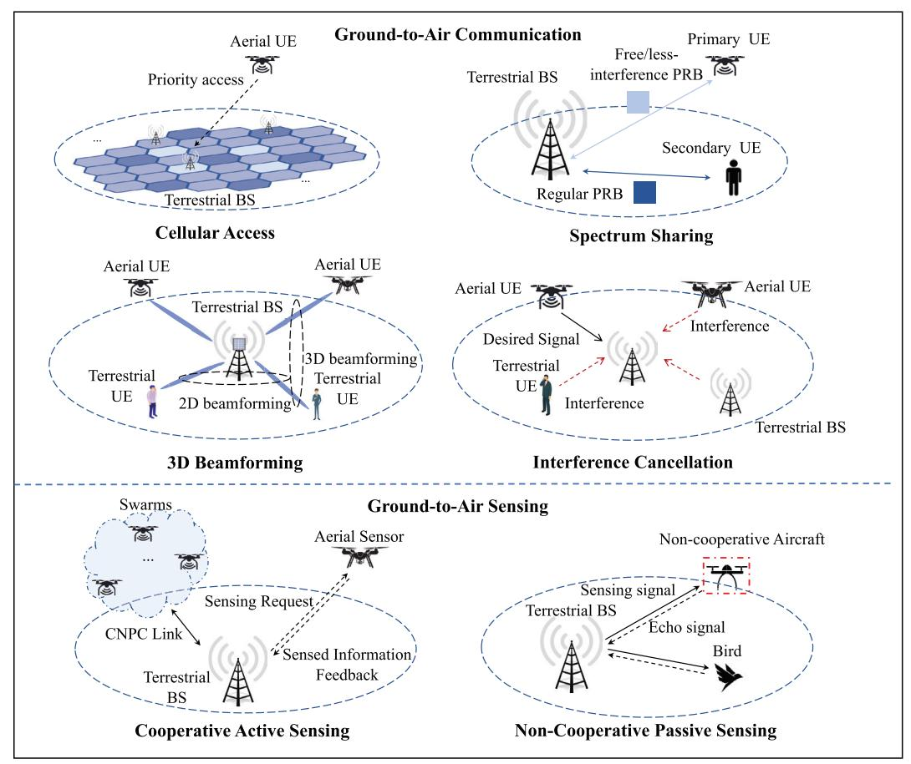

<details>
<summary>flowchart</summary>

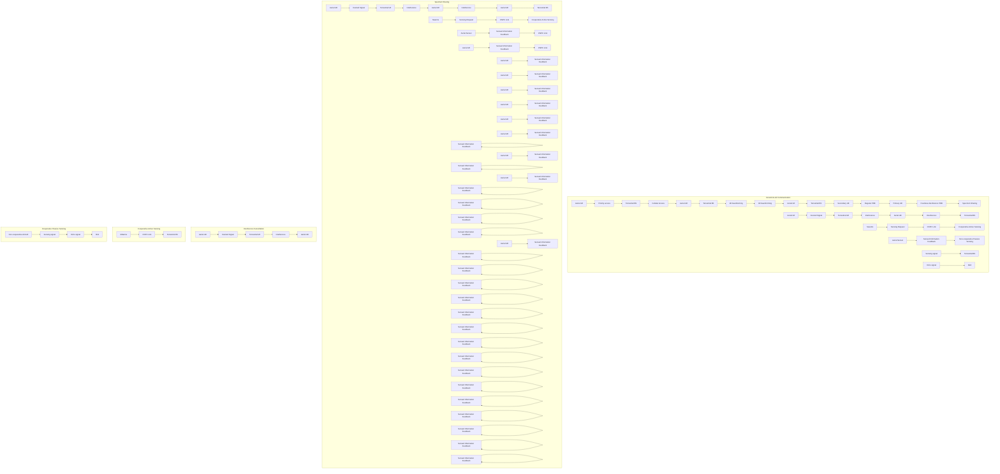
</details>

FIGURE 3. Ground-to-air C&S technologies supporting LAE.

Interference Cancellation: Compared to terrestrial equipment, the relatively high altitude of aircraft results in more dominant LoS links and, thus, wider coverage. However, the LoS links also introduce severe interference. In terrestrial cellular networks, adjacent BSs can dynamically allocate PRBs to their respective CUs based on the shared control information so as to avoid inter-cell interference. However, for cellular-connected airto-ground and air-to-air communications that are dominated by LoS paths, there are a much larger number of BSs with effective co-channel signals. The control information exchange between these BSs can be difficult or even infeasible at the same time due to the severe co-channel interference. Therefore, interference cancellation deserves further research in order to guarantee the performance of cellular-connected aircraft communication in LAE.

# Ground-to-Ai r Sensi ng

Depending on whether the aircrafts participate in the sensing process or not, the technologies for aircrafts sensing can be generally divided into two categories, namely cooperative active sensing and non-cooperative passive sensing.

Cooperative Active Sensing: Conventional sensing relies on the aircraft’s onboard sensors, including video cameras for visual sensing and environment recognition, inertial measurement units for estimating acceleration and angular velocity, global navigation satellite system for localization, and radar for detection. Reliable surveillance can be achieved by making full use of such multimodal sensing information. However, considering the limited power supply of the aircraft in practice, the multimodal sensing information is not easy to process. An alternative surveillance scheme is to actively sense the aircraft from the BS through cooperation. Specifically, a sensing request is initiated by the BS and accepted by the aircraft, and the sensing information is fed back to the BS, which can be data from multimodal sensors and/or channel estimation based on the pilot signal. Based on the feedback, the BS can better direct the aircraft’s flight from a global perspective.

Non-Cooperative Passive Sensing: Non-cooperative passive sensing is mainly used to detect illegal aircraft. The activities of illegal aircraft result in obstructing the movement and interfering with the communication of legal aircraft. To resolve this issue, radar sensing based on echoed/scattered signals can be utilized to detect, classify, and track illegal aircraft to ensure the safety of the legal aircraft. However, low-altitude aircraft are relatively smaller in size and thus have lower radar cross sections compared to conventional high-altitude aircraft, which poses a great challenge for detection and tracking. In addition, their slower flight speeds and hovering capabilities make it difficult to distinguish them from the static clutters and birds. Accounting for this problem, the micro-Doppler signatures of small aircraft’ movements need to be captured to classify the small aircraft and birds.

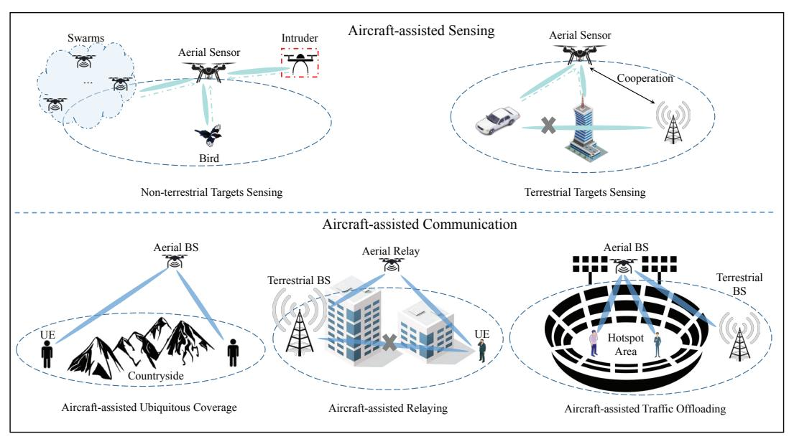

<details>
<summary>flowchart</summary>

```mermaid
graph TD
    subgraph Aircraft-assisted Sensing
        A["Swarms"] --> B["Aerial Sensor"]
        C["..."] --> D["Aerial Sensor"]
        E["Bird"] --> F["Intruder"]
        G["Non-terrestrial Targets Sensing"] --> H["Aerial Sensor"]
        I["Aerial Sensor"] --> J["Cooperation"]
        K["Car"] --> L["×"]
        M["Terrestrial Targets Sensing"] --> N["Satellite"]
    end

    subgraph Aircraft-assisted Communication
        O["Aerial BS"] --> P["Aerial Relay"]
        Q["Aircraft-assisted Ubiquitous Coverage"] --> R["Aircraft-assisted Relaying"]
        S["Aircraft-assisted Traffic Offloading"] --> T["Aerial BS"]
        U["Aircraft-assisted Relaying"] --> V["Aerial Relay"]
        W["Aircraft-assisted Ubiquitous Coverage"] --> X["Aircraft-assisted Relaying"]
        Y["Aircraft-assisted Relaying"] --> Z["Aircraft-assisted Ubiquitous Coverage"]
        AA["Aircraft-assisted Relaying"] --> AB["Aircraft-assisted Ubiquitous Coverage"]
        AC["Aircraft-assisted Relaying"] --> AD["Aircraft-assisted Ubiquitous Coverage"]
        AE["Aircraft-assisted Relaying"] --> AF["Aircraft-assisted Ubiquitous Coverage"]
        AG["Aircraft-assisted Relaying"] --> AH["Aircraft-assisted Ubiquitous Coverage"]
        AI["Aircraft-assisted Relaying"] --> AJ["Aircraft-assisted Ubiquitous Coverage"]
        AK["Aircraft-assisted Relaying"] --> AL["Aircraft-assisted Ubiquitous Coverage"]
        AM["Aircraft-assisted Relaying"] --> AN["Aircraft-assisted Ubiquitous Coverage"]
        AO["Aircraft-assisted Relaying"] --> AP["Aircraft-assisted Ubiquitous Coverage"]
        AQ["Aircraft-assisted Relaying"] --> AR["Aircraft-assisted Ubiquitous Coverage"]
        AS["Aircraft-assisted Relaying"] --> AT["Aircraft-assisted Ubiquitous Coverage"]
        AU["Aircraft-assisted Relaying"] --> AV["Aircraft-assisted Ubiquitous Coverage"]
        AW["Aircraft-assisted Relaying"] --> AX["Aircraft-assisted Ubiquitous Coverage"]
        AY["Aircraft-assisted Relaying"] --> AZ["Aircraft-assisted Ubiquitous Coverage"]
        BA["Aircraft-assisted Relaying"] --> BB["Aircraft-assisted Ubiquitous Coverage"]
        BC["Aircraft-assisted Relaying"] --> BD["Aircraft-assisted Ubiquitous Coverage"]
        BE["Aircraft-assisted Relaying"] --> BF["Aircraft-assisted Ubiquitous Coverage"]
        BG["Aircraft-assisted Relaying"] --> BH["Aircraft-assisted Ubiquitous Coverage"]
        BI["Aircraft-assisted Relaying"] --> BJ["Aircraft-assisted Ubiquitous Coverage"]
        BK["Aircraft-assisted Relaying"] --> BL["Aircraft-assisted Ubiquitous Coverage"]
        BM["Aircraft-assisted Relaying"] --> BN["Aircraft-assisted Ubiquitous Coverage"]
        BO["Aircraft-assisted Relaying"] --> BP["Aircraft-assisted Ubiquitous Coverage"]
        BQ["Aircraft-assisted Relaying"] --> BR["Aircraft-assisted Ubiquitous Coverage"]
        BS["Aircraft-assisted Relaying"] --> BT["Aircraft-assisted Ubiquitous Coverage"]
        BU["Aircraft-assisted Relaying"] --> BV["Aircraft-assisted Ubiquitous Coverage"]
        BW["Aircraft-assisted Relaying"] --> BX["Aircraft-assisted Ubiquitous Coverage"]
        BYA["Aircraft-assisted Relaying"] --> BZ["Aircraft-assisted Ubiquitous Coverage"]
        CA["Hotspot Area"] --> CB["Terrestrial BS"]
    end
```
</details>

FIGURE 4. Aircraft-assisted sensing and communication.

# Ai rcra ft-Assi sted C&S

In this section, the C&S assisted by aircraft in LAE, as depicted in Fig. 4, are discussed.

# Ai rcra ft-a ssi sted Sensi ng

Unlike ground-based sensing, which relies on the deployment of a large number of distributed terrestrial BSs, thanks to high maneuverability and flexibility, aircraft can provide more degrees of freedom (DoFs) to support cost-effective and seamless sensing. Aircraft-assisted sensing for terrestrial and non-terrestrial targets is discussed in the following.

Non-Terrestrial Target Sensing: Non-terrestrial target sensing mainly refers to the detection of other aircraft and birds. For a typical aircraft, other aircraft can be cooperators in a specific task or non-cooperative intruders. The cooperative aircraft form a swarm, in which aircraft can detect each other and establish reliable coordination for safe flight even when the swarm loses the remote control. The distances and angles of the non-cooperative intruders can also be detected by the aircraft to avoid collision. Accounting for the mobility of non-terrestrial targets, beam tracking is needed to perceive the desired target in realtime. However, the flight stability of the aircraft is affected by the bumpy airflow, which increases the difficulty of beam tracking.

Terrestrial Targets Sensing: The aircraft can also be deployed to sense terrestrial targets in a cooperative manner. By sharing the sensed information of different aircraft, more extensive sensing coverage and more accurate target parameter estimation can be achieved. Moreover, the multimodal sensors equipped on aircraft can collect different types of target information. The integration of these features can further improve the sensing performance. However, it should be noted that only the LoS links of aircraft are exploited for sensing, while the non-LoS (NLoS) links are treated as unfavorable interference. To mitigate the interference, the beamforming design, power control, and trajectory planning of aircraft need to be investigated.

# Ai rcra ft-Assi sted Sensi ng

The flexibility and mobility of aircraft can be exploited to support different communication tasks. The typical application scenarios are discussed below.

Aircraft-Assisted Ubiquitous Coverage: For areas where basic communication facilities are not available, aircraft can be used as aerial BSs (ABSs) to enhance the coverage and performance of communication networks. The deployment of ABSs still faces several challenges. First, the horizontal/vertical placement of multiple ABSs should be investigated to cover CUs in wider areas. Second, the endurance of aerial BSs is constrained by the limited battery that is equipped on aircraft, which needs to be considered for ABS deployment design. Moreover, when multiple ABSs are deployed, the effect of their potential interference should be considered.

Aircraft-Assisted Relaying: In the absence of reliable communication links between BSs and CUs, aircraft can serve as relays. With LoS-dominant links, aircraft can capture, amplify, and relay communication signals to target locations, thereby improving wireless connectivity quality in long-distance communication scenarios. It is worth noting that, unlike ABSs, utilizing aircraft as aerial relays can reduce the burden on the onboard equipment. For the network consisting of multiple aerial relays, the optimal assignment of UAV relays to different tasks to maximize the overall utility needs to be investigated in future work.

Aircraft-Assisted Traffic Offloading: In conventional terrestrial cellular systems, it is difficult for the BSs to provide effective support for CUs at cell edges or hotspot areas. By exploiting the mobility and enhanced communication capability of LoS links, aircraft-assisted cellular offloading provides a promising solution. It is worth noting that hotspots tend to have higher CU densities compared to non-hotspots. To guarantee communication performance in hotspot areas, the flight trajectory of aircraft and radio resource allocation need to be jointly designed, given the constraints on the total system bandwidth and aircraft transmit power.

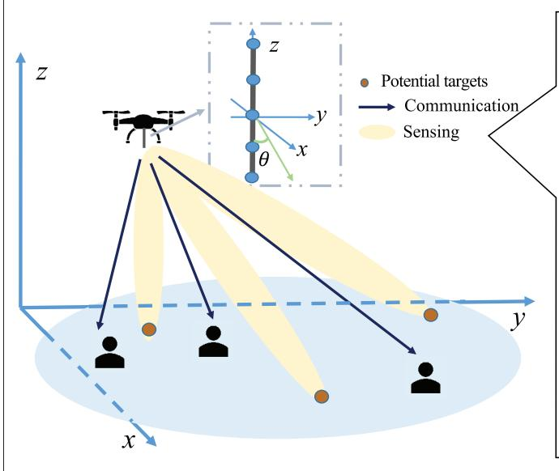

<details>
<summary>flowchart</summary>

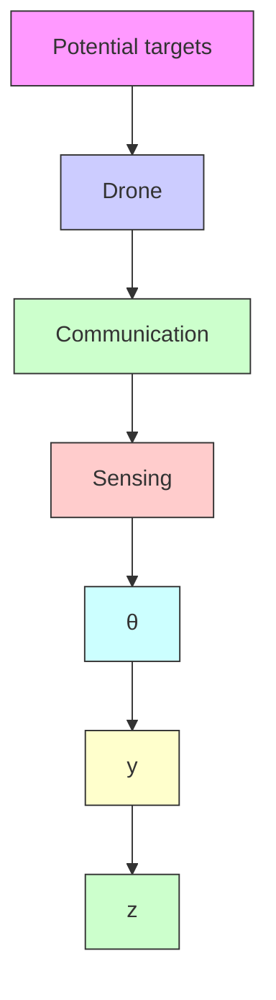
</details>

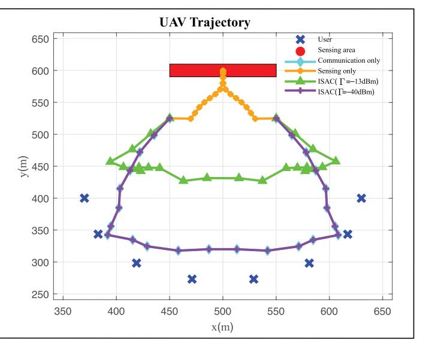

<details>
<summary>line</summary>

| x(m) | User | Sensing area | Communication only | Sensing only | ISAC(Γ=-13dBm) | ISAC(Γ=-40dBm) |
|------|------|--------------|---------------------|--------------|----------------|----------------|
| 350  | 400  |              |                     |              |                |                |
| 400  | 340  |              |                     |              |                |                |
| 450  | 320  |              |                     |              |                |                |
| 500  | 280  |              |                     | 600          |                |                |
| 550  | 320  |              |                     |              |                |                |
| 600  | 340  |              |                     |              |                |                |
| 650  | 400  |              |                     |              |                |                |
</details>

FIGURE 5. Aircraft-assisted ISAC.   
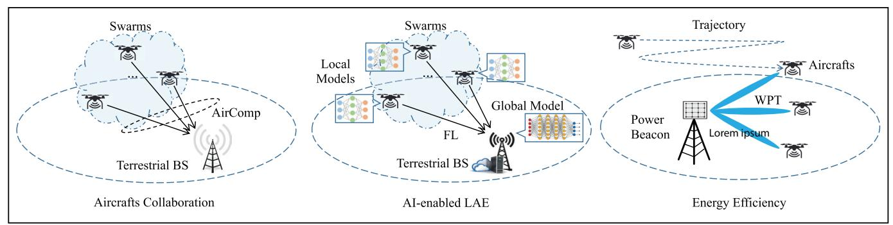

<details>
<summary>flowchart</summary>

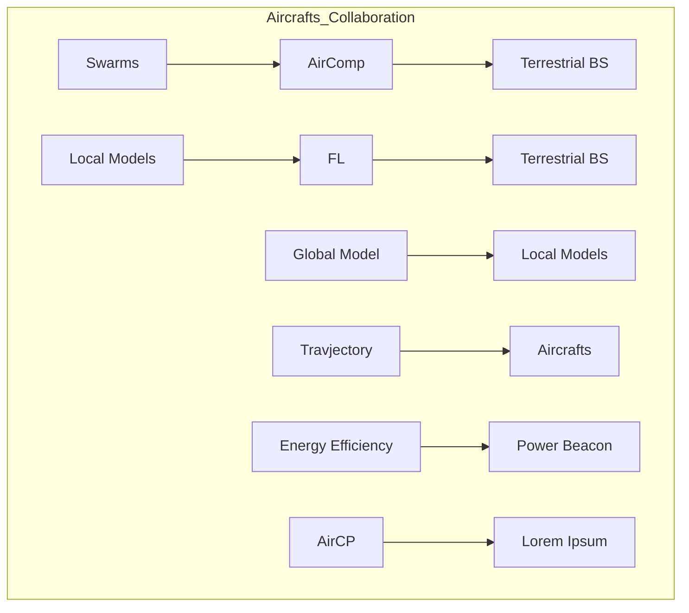
</details>

FIGURE 6. Future directions of LAE.

# Ai rcra ft-Assi sted ISAC

To improve spectrum efficiency, the aircraft can transmit ISAC signals to communicate with multiple UEs and sense targets simultaneously. Aiming to improve communication performance while guaranteeing sensing performance, the flight trajectories and beamforming of the aircraft were jointly designed [13]. The flight trajectories of aircraft under different designs are plotted in Fig. 5. It can be observed that if only sensing is considered, the aircraft directly flies to the sensing target. If only communication is considered, the aircraft approaches the UEs as closely as possible under realistic flight constraints. As for the ISAC case, the aircraft moves between the sensing target and UEs. When the sensing beam-pattern gain threshold is relatively large (–13 dBm), the flight trajectory of the aircraft is closer to the sensing target. In contrast, when the sensing beam-pattern gain threshold is relatively small (–40 dBm), the flight trajectory of the aircraft is closer to the UEs.

# Future Di recti ons of LAE

As depicted in Fig. 6, there are multiple future directions in LAE worthy of further investigation.

# Ai rcra ft Colla bora ti on

In LAE, multiple aircraft need to share their sensed information with BS for collaboration. The messages delivered by different aircraft will compete for the radio resource in conventional multi-access schemes, which will result in transmission latency that is intolerable for delay-sensitive tasks such as collision avoidance. To facilitate the information-sharing process, over-the-air computation (AirComp) has been proposed to utilize the waveform superposition property of wireless signals to aggregate the data simultaneously transmitted by multiple aircraft [14]. However, the mobility of the aircraft makes it harder to balance the channels for guaranteeing computation accuracy. Therefore, the information-sharing process for aircraft collaboration in LAE deserves further study.

# AI-Ena bl ed LAE

The development of artificial intelligence (AI) is expected to support more intelligent tasks in LAE, such as smart logistics and auto-driving. The AI models are trained based on the data sensed by the aircraft. However, the limited computation capabilities of aircraft might fail to support the training process of sophisticated AI models, while offloading the raw data to a central server for computation will cause privacy leakage. To deal with this problem, federated learning (FL) enables each aircraft to update its local model based on the sensed data and send the locally updated results to the central server for the global model update [15]. In LAE, the parameters relevant to aircraft, such as trajectory and velocity, might have significant effects on FL performance, which warrants further investigation.

The AI models are trained based on the data sensed by the aircraft. However, the limited computation capabilities of aircraft might fail to support the training process of sophisticated AI models, while offloading the raw data to a central server for computation will cause privacy leakage.

# Energ y Effi ci ency

Aircraft are often energy-constrained devices, and therefore, energy allocation for different tasks needs to be considered. For example, transmit power and flight trajectories need to be optimized to carry out activities in an energy-efficient manner, thereby reducing the frequency of battery charging/replacement. Also, the location of charging stations, such as UAVs and air taxis, can be optimized to improve the efficiency of charging the vehicles in the IAGN. Notably, wireless power transfer (WPT) has been widely used in various systems to power devices over short distances. The application of WPT in LAE is a potential solution to enable automatic charging of aircraft, while its impact on energy efficiency needs to be further investigated.

# Concl usi on

This article provides a comprehensive overview of the IAGN architectures, the ground-to-air C&S technologies, and the aircraft-assisted C&S functionalities for supporting LAE. Several future directions are also identified, including aircrafts collaboration, energy efficiency, and artificial intelligence enabled LAE.

# Acknowl edgm ent

This work is supported by National Key Research and Development Program of China (2022YFA1003900, 2024YFA1014200), Guangdong Major Project of Basic and Applied Basic Research (2023B0303000001), National Natural Science Foundation of China (62331022, 62371313, 62031008, 62271081), 2022 Stable Research Program of Higher Education of China (20220817144726001), Guangdong Provincial Key Laboratory of Big Data Computing, Hetao Shenzhen-Hong Kong Science and Technology Innovation Cooperation Zone Project (HZQSWS-KC-CYB-2024016), Shenzhen Science and Technology Program (JCYJ20220530113017039, JCYJ20241202124934046), Young Elite Scientists Sponsorship Program by CAST (2022QNRC001).

# References

[1] Y. Zeng, Q. Wu, and R. Zhang, “Accessing from the Sky: A Tutorial on UAV Communications for 5G and Beyond,” Proc. IEEE, vol. 107, no. 12, 2019, pp. 2327–75.   
[2] L. Gupta, R. Jain, and G. Vaszkun, “Survey of Important Issues in UAV Communication Networks,” IEEE Commun. Surveys Tuts., vol. 18, no. 2, 2015, pp. 1123–52.   
[3] Z. Fei et al., “Air-Ground Integrated Sensing and Communications: Opportunities and Challenges,” IEEE Commun. Mag., vol. 61, no. 5, 2023, pp. 55–61.   
[4] K. Meng et al., “UAV-Enabled Integrated Sensing and Communication: Opportunities and Challenges,” IEEE Wireless Commun., vol. 31, no. 2, 2024, pp. 97–104.   
[5] Y. Zeng, J. Lyu, and R. Zhang, “Cellular-Connected UAV: Potential, Challenges, and Promising Technologies,” IEEE Wireless Commun., vol. 26, no. 1, 2018, pp. 120–27.   
[6] F. Liu et al., “Integrated Sensing and Communications: Toward Dual-Functional Wireless Networks for 6G and Beyond,” IEEE J. Sel. Areas Commun., vol. 40, no. 6, 2022, pp. 1728–67.   
[7] X. Li et al., “Over-the-Air Integrated Sensing, Communication, and Computation in IoT Networks,” IEEE Wireless Commun., vol. 30, no. 1, 2023, pp. 32–38.   
[8] W. Yuan et al., “Bayesian Predictive Beamforming for Vehic-

ular Networks: A Low-Overhead Joint Radar-Communication Approach,” IEEE Trans. Wireless Commun., vol. 20, no. 3, 2020, pp. 1442–56.   
[9] Y. Cui et al., “Toward Trusted and Swift UAV Communication: ISAC-Enabled Dual Identity Mapping,” IEEE Wireless Commun., vol. 30, no. 1, 2023, pp. 58–66.   
[10] Z.-Q. Luo et al., “SRCON: A Data-Driven Network Performance Simulator for Real-World Wireless Networks,” IEEE Commun. Mag., vol. 61, no. 6, 2023, pp. 96–102.   
[11] S. Zhang et al., “A Physics-Based and Data-Driven Approach for Localized Statistical Channel Modeling,” IEEE Trans. Wireless Commun., 2023, pp. 1–1.   
[12] Y. Jiang et al., “Coverage Analysis for Air-Ground Integrated-Sensing-And-Communication Networks,” Proc. IEEE Int’l. Conf. Ubiquitous Commun., Xi’an, China, 2024.   
[13] Z. Lyu, G. Zhu, and J. Xu, “Joint Maneuver and Beamforming Design for UAV-Enabled Integrated Sensing and Communication,” IEEE Trans. Wireless Commun., vol. 22, no. 4, 2022, pp. 2424–40.   
[14] X. Li et al., “Integrated Sensing, Communication, and Computation Over-the-Air: MIMO Beamforming Design,” IEEE Trans. Wireless Commun., vol. 22, no. 8, 2023, pp. 5383–98.   
[15] Y. Tang et al., “Integrated Sensing, Computation, and Communication for UAV-Assisted Federated Edge Learning,” IEEE Trans. Wireless Commun., early access, 2025.

# Bi og rap hi es

Yihang Jiang (yihangjiang1@link.cuhk.edu.cn) is currently pursuing a Ph.D. degree at the School of Science and Engineering and the Shenzhen Research Institute of Big Data (SRIBD) at the Chinese University of Hong Kong-Shenzhen (CUHK-SZ). His research interests include integrated sensing and communication (ISAC) and WiFi sensing.

Xiaoy ang Li (lixiaoyang@sribd.cn) is a research scientist at SRIBD, CUHK-SZ. He received the PhD degree from The University of Hong Kong (HKU) in 2020. His research interests include integrated sensing-communication-computation and low-altitude economy.

Guangx u Zhu (gxzhu@sribd.cn) is a senior research scientist at SRIBD, CUHK-SZ. He received his PhD degree from HKU in 2019. His research interests include edge intelligence, semantic communications, and ISAC.

Hang Li (hangdavidli@sribd.cn) is a research scientist at SRIBD, CUHK-SZ. He received his PhD degree from Texas A&M University in 2016. His research interests include wireless networks, the Internet of Things, stochastic optimization, and applications of machine learning.

Jing Deng (dengjing@jx.chinamobile.com) is an engineer at the Wireless Center of China Mobile Communications Group Jiangxi Co., Ltd. His research interests include wireless networks and low-altitude economy.

Kaifeng Han (hankaifeng@caict.ac.cn) is a senior engineer in the China Academy of Information and Communications Technology. He received the PhD degree from HKU in 2019. His research interests focus on integrated sensing and communications, wireless AI for 6G.

Chao Shen (chaoshen@sribd.cn) is a senior research scientist at Shenzhen International Center for Industrial and Applied Mathematics, SRIBD, CUHK-SZ. He received his PhD degree from Beijing Jiaotong University in 2012. His research interests include large-scale network optimization and integrated sensing and communication.

Qingj iang Shi (shiqj@tongji.edu.cn) is a full professor at Tongji University and also with SRIBD. He received his PhD degree from Shanghai Jiaotong University in 2011. His research interests include algorithm design with applications in signal processing and wireless networks.

Rui Zhang [F] (rzhang@cuhk.edu.cn) is an X. Q. Deng Presidential Chair Professor with the School of Science and Engineering and SRIBD, CUHK-SZ. He is also a professor at the National University of Singapore, Singapore. He received a PhD degree from Stanford University. His research interests include UAV communications and optimization methods.