IEEE TRANSACTIONS ON GREEN COMMUNICATIONS AND NETWORKING, VOL. XX, NO. XX, AUGUST 2025

# Integrated Communication, Sensing and Navigation Beamforming Design for Low-altitude Scenarios

Ruoyu Lu, Yuexia Zhang, Senior Member, IEEE, Chuanjun Li, Xiao Liang and Baojin Liu

Abstract—To meet the collaborative requirements of highprecision communication, sensing, and navigation for unmanned aerial vehicles (UAVs) and other aerial mobile terminals operating in urban low-altitude airspace, this paper proposes an integrated communication-sensing-navigation (ICSN) beamforming design tailored to low-altitude scenarios. In the developed ICSN system model, communication performance is evaluated by the total communication rate of users, while sensing performance is quantified by the Cramer–Rao Bound (CRB) of target angle estimation,´ enabling accurate positioning and continuous perception for aerial users. A two-stage beamforming strategy is adopted: in the first stage, a wide beam is constructed under integrated sidelobe to mainlobe ratio (ISMR) constraints to sense potential target directions; in the second stage, a weighted optimization problem is formulated to jointly enhance communication rate and angle estimation accuracy, subject to user signal-to-interferenceplus-noise ratio (SINR) requirements and mainlobe/sidelobe constraints. To eficiently solve the resulting non-convex problem, this paper proposes an algorithmic framework that combines fractional programming (FP) and alternating optimization (AO), fully utilizing the perception results from the previous round to perform feedback updates for the next round of beam design. Simulation results verify the efectiveness of the proposed method in multi-user and multi-target urban low-altitude scenarios, demonstrating the role of the first-stage directional beam design in system robustness and accuracy. Moreover, the proposed framework facilitates spectrum and hardware reuse across functionalities, thereby contributing to the design of sustainable and energy-eficient aerial communication systems aligned with the principles of green communication.

Index Terms—Low-altitude UAV communication, Integrated Sensing and Communication, integrated communication-sensingnavigation, transmit beamforming, Cramer-Rao bound´

The authors declare no conflict of interest.

## I. INTRODUCTION

## A. Background

s the core infrastructure of next-generation information networks, sixth-generation (6G) mobile communication systems are gradually expanding their service scope beyond conventional terrestrial communications into aerial environments [1]. In emerging application scenarios such as smart cities [2] [3], UAV-based logistics [4] [5], emergency communications [6], and urban air trafic management [7], urban lowaltitude airspace is becoming a new critical application area for communication technologies. With the rapid development of aerial intelligent terminals, including unmanned aerial vehicles (UAVs) and electric vertical takeof and landing (eVTOL) aircraft [8], the low-altitude environment imposes increasingly stringent demands on wireless communication [9], sensing [10], and navigation services [11]. Compared to ground networks, urban low-altitude communication faces several challenges, including severe multipath reflections, rapid spatial dynamics, and limited spectrum resources. These factors result in notable deficiencies in traditional terrestrial cellular networks with respect to low-altitude coverage, positioning accuracy, and system stability.

In urban low-altitude scenarios, aerial terminals require not only stable and high-speed communication links, but also environmental sensing and precise navigation capabilities. For example, logistics UAVs must maintain communication with ground control centers while simultaneously sensing surrounding targets in real time, performing path planning, and achieving high-precision autonomous positioning [12]. The eVTOL systems rely on millimeter-level navigation capabilities and real-time situational awareness to ensure flight safety [13]. Deploying communication, sensing, and navigation systems independently would not only lead to ineficient use of spectrum and hardware resources, but also significantly increase system complexity and energy consumption, making it dificult to adapt to the resource-constrained low-altitude environment. Therefore, deep integration of communication, sensing, and navigation functions has emerged as a key development trend [14] [15].

Among existing approaches, integrated sensing and communication (ISAC) has gained significant momentum for enabling dual-function integration of communication and sensing, particularly in mmWave/THz and massive MIMO deployments [16] [17] [18]. These advancements improve spectral eficiency and spatial resolution. Nevertheless, most ISAC

Ruoyu Lu is with the National Key Laboratory of Land and Air Based Information Perception and Control, and the School of Aerospace Engineering, Beijing Institute of Technology, Beijing, China, 100081. (email: luruoyu stu@163.com).

designs still target terrestrial or fixed scenarios, and struggle to cope with rapidly maneuvering aerial terminals or dense urban low-altitude channels. Similarly, integrated communication and navigation (ICN) has been explored to improve positioning reliability when GNSS signals are weak or blocked, such as in urban canyons or obstructed airspaces [19] [20]. Existing ICN schemes, however, still rely on navigation-dominant signals and provide limited adaptability to fast-varying flight paths.

Therefore, despite the progress in ISAC and ICN, dualfunction integration remains insuficient in low-altitude environments. A unified solution that jointly ensures reliable communication, accurate sensing, and robust navigation is still required.

## B. Motivation and Contributions

In ICSN systems, communication, sensing, and navigation are expected to be jointly enabled through a unified waveform and spatial-domain beam control. However, unlike dualfunction ISAC or ICN, tri-functional integration introduces fundamentally tighter coupling among resource allocation and beam pattern shaping. Specifically, communication requires user-oriented power focusing, while sensing and navigation demand precise mainlobe steering toward aerial targets. This is particularly challenging in low-altitude scenarios such as sub-100 m UAV operations, where navigation beams must support elevated angles, rapid 3D reconfiguration, and resilience to ground- and building-induced multipath, yet are constrained by compact antenna apertures with limited spatial degrees of freedom. With limited spatial degrees of freedom in lowaltitude antenna arrays, such beam competition can cause power dispersion, degraded angle estimation accuracy, and reduced link reliability. Therefore, eficient ICSN beamforming must achieve collaborative mainlobe control and multiobjective spatial resource coordination.

In recent years, extensive research eforts have been devoted to ISAC-based communication and sensing integration. Representative examples include RIS-assisted localization and sensing enhancement in millimeter-wave and terahertz bands [21]–[23], and cooperative ISAC architectures for UAV detection in complex low-altitude environments [24]. Meanwhile, MIMO-based unified waveform sensing schemes have been investigated to improve target estimation accuracy through joint angle–range–velocity processing [25], CRBoriented beamforming optimization [26], multipath-assisted localization [27], and Pareto trade-of analysis between communication and sensing performance [28]. These studies confirm the efectiveness of joint communication-and-sensing waveform design and spatial-domain beam optimization in enabling dual-function ISAC operations. However, as highlighted in the recent survey by Xu et al. [29], B5G-oriented ISAC is shifting toward joint optimization of communication, sensing, and computation—moving beyond pure physical-layer waveform design.

Recently, the integration scope has been extended to navigation functionalities. For instance, [30] analyzed a NOMA-RIS aided INAC network and evaluated dual-oriented performance under diferent power allocation strategies, while [31] introduced an ICSN framework for secure UAV communications, where sensing-derived state awareness assists navigation and robust transmission design. Although these studies demonstrate the feasibility of partial tri-functional integration, they are inherently task-divided and do not exploit a unified signal and beam control mechanism.

Despite such progress, current studies remain limited either to dual-function integration or loosely coupled ICSN architectures, and a comprehensive framework that jointly optimizes communication throughput, sensing accuracy, and navigation reliability under a common spatial-domain formulation is still missing. In particular, directly performing trifunctional joint optimization at the initialization stage is highly challenging due to the lack of prior spatial knowledge, which leads to severe mainlobe competition among functionalities and unstable convergence behavior. To address this issue, we introduce a sensing-aware two-stage beamforming design: the first stage first acquires reliable target angle information via ISMR-based beam focusing, while the second stage leverages the obtained angular knowledge to conduct coordinated optimization for enhanced tri-functional performance. Motivated by these research gaps, this paper proposes a novel twostage beamforming optimization framework for ICSN, tailored to low-altitude communications. By leveraging angle estimation–driven beam control, the proposed design achieves deep signal-level fusion among the three functionalities, improving tri-functional coordination and robustness. The major contributions of this paper are summarized as follows:

• A novel ICSN system model is proposed, along with a transmit beamforming scheme that jointly considers both communication rate and sensing accuracy requirements. In the proposed model, information transmission performance is evaluated by the total communication rate of users, while sensing performance is quantified by the CRB of target angle estimation.

• A two-stage beamforming strategy is introduced to ensure that the system maintains suficient communication throughput while achieving desirable sensing accuracy. Specifically, in the first stage, an initial beam is designed under ISMR constraints for target detection. In the second stage, a joint optimization problem is formulated to simultaneously enhance communication rate and sensing precision.

• Within the proposed ICSN framework, a detailed analysis of the theoretical bounds of angle estimation CRB and communication rate is conducted, revealing their intrinsic trade-of relationship and providing theoretical guidance for subsequent optimization.

• An eficient fractional programming -based algorithm is developed to solve the weighted joint optimization problem. The proposed algorithm efectively addresses the beamforming design in multi-user, multi-target scenarios and demonstrates high computational eficiency under complex conditions.

• An alternating optimization scheme is designed, where the CRB values from the previous iteration are used as guidance for target angles in the next iteration. This approach improves the system’s robustness. Simulation results validate the critical role of the first-stage directional beam design by comparing its performance with omnidirectional beamforming. The proposed method is shown to significantly improve both sensing accuracy and communication eficiency.

## C. Organization and Notations

The overall structure of this paper is organized as follows. Section II introduces the proposed ICSN system model and defines the relevant key performance metrics. In Section III, two benchmark beamforming schemes are presented: one based on minimizing the CRB, and the other on maximizing the communication information rate. These schemes are used to derive the theoretical limits of sensing and communication performance in the ICSN system. Section IV provides a detailed description of the first-stage beamforming strategy and the corresponding target angle estimation method. Accordingly, Section V formulates a weighted optimization problem for second-stage angle estimation and iterative beam refinement. Section VI presents simulation results that demonstrate the efectiveness of the proposed approach. Finally, Section VII concludes the paper.

Notations: In this paper, lowercase bold letters ?? and uppercase bold letters A are used to represent vectors and matrices, respectively. The symbols $\mathbf { A } ^ { * } , \mathbf { A } ^ { \bar { T } }$ , and $\mathbf { A } ^ { H }$ represent the conjugate, transpose, and Hermitian (conjugate transpose) of matrix A, respectively. The notations det(A), tr(A), and rank(A) denote the determinant, trace, and rank of matrix A, respectively. The notation $\mathbf A \succcurlyeq 0$ indicates that A is a positive semidefinite matrix. The set $\mathbb { C } ^ { M \times N }$ denotes the space of complex-valued matrices or vectors of size $M \times N ,$ and ${ \mathbf { I } } _ { N }$ denotes the $N \times N$ identity matrix. A complex Gaussian random vector is denoted by $z ~ \sim ~ \cal C N ( \mu , \sigma ^ { 2 } )$ , where $\mu$ and $\sigma ^ { 2 }$ represent the mean and covariance, respectively. The operator $\mathbb { E } \left\{ \cdot \right\}$ denotes the statistical expectation, and ⊙ denotes the Hadamard (elementwise) product. The operators $\operatorname { R e } ( \mathbf { A } )$ and Im(A) extract the real and imaginary parts of a complex matrix A, respectively. The notation ??????(A) denotes the vectorization of matrix A by stacking its diagonal elements into a column vector, and $\left( \mathbf { A } \right) _ { m n }$ refers to the element in the ??-th row and ??-th column of matrix A.

## II. SYSTEM MODEL

We consider an ICSN model in a low-altitude scenario, which includes a base station (BS), K airborne users (AUs), and L targets, as illustrated in Fig. 1. The BS is equipped with a uniform linear array (ULA) consisting of $N _ { t }$ transmit antennas and $N _ { r }$ receive antennas, where the total number of users and targets satisfies $K + L \ < \ N _ { t }$ . The BS is capable of simultaneously performing communication, sensing, and navigation functions across the entire scene. The set of AUs is denoted by $\{ 1 , 2 , \cdots , K \}$ , and the set of targets is denoted by $\{ 1 , 2 , \cdots , L \}$ . All AUs and targets are assumed to be singleantenna devices. AUs refer to the aerial terminals that have established communication and navigation links with the BS at the current time, whereas targets are entities that have not established such links and are treated solely as sensing objects by the BS.

Although sensing and navigation are closely related in aerial networks, their functional goals are fundamentally diferent in the proposed ICSN framework: sensing focuses on environmental perception, i.e., detecting and estimating spatial states of unknown objects (targets), while navigation supports AU flight stability by providing refined location/angle information to compensate for GNSS degradation in lowaltitude airspace. Therefore, sensing enables the BS to “observe the environment,” whereas navigation ensures that AUs can “localize themselves” based on sensing-derived information. By leveraging this functional complementarity, the proposed ICSN system achieves deep tri-functional coordination rather than simple function overlay.

To realize the integration of sensing, communication, and navigation functionalities within the proposed model, the system aims to sense the angular positions of potential targets while maintaining reliable communication and navigation services for the AUs. A two-stage time slot structure is designed for each transmission interval at the BS. In the first stage as shown in Fig.1a, the BS transmits sensing signals based on coarse prior information toward the directions of all AUs and potential targets. The angular information of both AUs and targets is then extracted by processing the received echo signals. In the second stage as shown in Fig.1b, the sensing results obtained in the first stage are transmitted to the AUs via the communication channel, serving as necessary navigation and localization information. Meanwhile, a portion of the BS’s transmission power is reserved for continued sensing of targets. In this work, the channel state information (CSI) between the BS and the AUs is assumed to be perfectly known, whereas the CSI of the targets is considered to be partially uncertain.

## A. Signal Model

1) First-Stage Signal Model: In the first stage of time slot $n ,$ the BS transmits sensing signals toward the potential targets and AUs. The transmitted signal $\mathbf { X } _ { \mathrm { r a d } } ( n , t ) \in \bar { \mathbb { C } } ^ { N _ { t } \times S }$ is denoted by:

$$
\mathbf { X } _ { \mathrm { r a d } } ( n , t ) = { \pmb w } _ { 0 } [ n ] { s } _ { 0 } ( n , t )\tag{1}
$$

where S is the number of temporal snapshots. The radar beamforming matrix is denoted by $\pmb { w } _ { 0 } [ n ] \ \in \ \mathbb { C } ^ { N _ { t } \times L }$ , and $\begin{array} { r } { s _ { 0 } ( n , t ) \in \mathbb { C } ^ { L \times S } } \end{array}$ represents the unit-power radar probing signal. The transmit signal covariance matrix is defined as $\begin{array} { r } { \mathbf { R } _ { \mathrm { r a d } } ^ { } \triangleq \frac { 1 } { S } \mathbf { X } _ { \mathrm { r a d } } \mathbf { X } _ { \mathrm { r a d } } ^ { H } = w _ { 0 } \tilde { [ n ] } w _ { 0 } ^ { H } [ n ] } \end{array}$

Both the transmit and receive antenna arrays at the BS are configured as ULAs with half-wavelength spacing. The normalized steering vector of the antenna array is defined as follows:

$$
\pmb { a } ( \theta ) \triangleq \sqrt { \frac { 1 } { N _ { t } } } \Big [ 1 , e ^ { j \pi \sin ( \theta ) } , \cdots , e ^ { j \pi ( N _ { t } - 1 ) \sin ( \theta ) } \Big ] ^ { T }\tag{2}
$$

$$
{ \pmb b ( \theta ) \overset { \Delta } { = } } \sqrt { \frac { 1 } { N _ { r } } } \Big [ 1 , e ^ { j \pi \sin ( \theta ) } , \cdots , e ^ { j \pi ( N _ { r } - 1 ) \sin ( \theta ) } \Big ] ^ { T }\tag{3}
$$

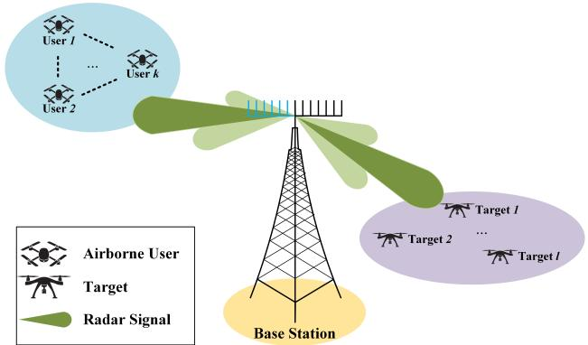  
(a) Stage 1: The base station performs angular sensing based on echo signal reflections.

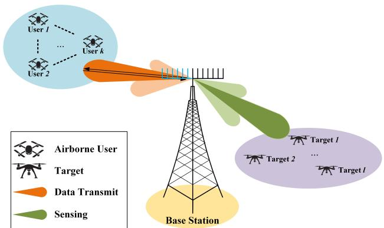  
(b) Stage 2: The base station utilizes angular information to provide communication and navigation services to users, while reserving power to maintain target sensing.  
Fig. 1. Integrated Communication–Sensing–Navigation Model in Low-Altitude Urban Scenarios

The received echo signal at the BS is expressed as:

$$
{ \bf Y } _ { \mathrm { r a d } } ( n , t - \tau _ { l } ) = \sum _ { m = 1 } ^ { L + K } b ( \theta _ { m } ) \beta _ { m } { \boldsymbol a } ^ { H } ( \theta _ { m } ) { \bf X } _ { \mathrm { r a d } } ( n , t - \tau _ { l } ) + { \bf Z } _ { \mathrm { n } }\tag{4}
$$

Where $\mathbf { Y } _ { \mathrm { r a d } } ( n , t ) \in \mathbb { C } ^ { N _ { r } \times S } , \beta _ { m }$ denotes the complex path loss coeficient, and $\mathbf { Z } _ { \mathrm { n } }$ represents the additive white Gaussian noise (AWGN), with $\mathbf { Z } _ { \mathrm { n } } \sim { \cal C N } ( 0 , \sigma _ { \mathrm { n } } ^ { 2 } \mathbf { I } )$ . Using parameter estimation techniques, the BS can estimate the angular information(i $\mathbf { \nabla } . \mathbf { e } _ { \cdot } ,$ directions-of-arrival) of both AUs and targets based on the received echo signals. The detailed parameter estimation method will be presented in Section IV.

2) Second-Stage Signal Model: In the second stage of time slot , the base station (BS) transmits an integrated signal. The transmitted signal waveform is defined as $\mathbf { X } ( n , t ) \in \mathbb { C } ^ { \breve { N } _ { t } \times S }$ where ?? denotes the number of temporal snapshots. The BS transmit signal matrix is expressed as:

$$
\begin{array} { l } { { \displaystyle { \bf X } ( n , t ) = { \bf W } _ { \mathrm { c } } [ n ] { \bf S } _ { \mathrm { c } } ( n , t ) + { \bf w } _ { \mathrm { r } } [ n ] { \bf s } _ { \mathrm { r } } ^ { T } ( n , t ) } \ ~ } \\ { { \displaystyle ~ = \sum _ { k = 1 } ^ { K } w _ { k } [ n ] { \bf s } _ { k } ^ { T } ( n , t ) + { \bf w } _ { \mathrm { r } } [ n ] { \bf s } _ { \mathrm { r } } ^ { T } ( n , t ) } \ ~ } \end{array}\tag{5}
$$

Where $\mathbf { W } _ { \mathrm { c } } [ n ] ~ = ~ \{ w _ { 1 } [ n ] , ~ w _ { 2 } [ n ] , ~ \cdots , ~ w _ { k } [ n ] \} ~ \in ~ \mathbb { C } ^ { N _ { t } \times K }$ represents the communication beamforming matrix. Each $\boldsymbol { w } _ { k } [ n ] ~ \in ~ \mathbb { C } ^ { N _ { t } \times 1 }$ is the beamforming vector associated with airborne user (AU) ??. The radar beamforming vector is denoted by ${ \pmb w } _ { \mathrm { r } } [ n ] ~ \in ~ \mathbb { C } ^ { N _ { t } \times 1 }$ . The symbol matrix ${ \bf S } _ { \mathrm { c } } ( n , t ) \ =$ $\{ s _ { 1 } ( n , t ) , \ \bar { s } _ { 2 } ( n , t ) , \ \cdot \cdot \cdot , \ s _ { k } ( n , t ) \} ^ { T } \ \in \mathbb { C } ^ { K \times S }$ contains the unitpower communication symbols transmitted to each AU, where $s _ { k } ( n , t ) ~ \in ~ \mathbb { C } ^ { S \times 1 }$ represents the signal intended for user ??. Similarly, $s _ { \mathrm { r } } ( n , t ) \in \mathbb { C } ^ { S \times 1 }$ denotes the unit-power radar probing symbol used for target sensing during time slot ??. For analytical simplicity, it is assumed that the set of communication symbols $\{ \bar { s } _ { k } ( n , \bar { t } ) \} _ { k = 1 } ^ { K }$ and the radar signal $s _ { \mathrm { r } } ( n , t )$ are mutually independent and follow zero-mean wide-sense stationary (WSS) stochastic processes.

The signal received by all AUs during the second stage of time slot can be expressed as:

$$
{ \bf Y } ( n , t ) = { \bf H } _ { K } [ n ] { \bf X } ( n , t - \tau _ { k } ) + { \bf Z } _ { K }\tag{6}
$$

where $\mathbf { Z } _ { K } ~ \in ~ \mathbb { C } ^ { K \times S }$ is the AWGN matrix, and $\mathbf { H } _ { K } [ n ] \mathbf { \Psi } =$ $\{ \pmb { h } _ { 1 } [ n ] , \pmb { h } _ { 2 } [ n ] , \cdots , \pmb { h } _ { K } [ n ] \} ^ { H } \in \mathbb { C } ^ { K \times N _ { t } }$ denotes the downlink channel matrix between the BS and the ?? AUs, which is assumed to be perfectly known at the BS. The received signal for the ??-th AU is then given by:

$$
\begin{array} { c l } { \displaystyle { y _ { k } ( n , t ) = \underbrace { h _ { k } ^ { H } w _ { k } [ n ] s _ { k } ( n , t ) } _ { S u b m i t ~ S i g n a l } + \underbrace { \sum _ { k ^ { \prime } = 1 , k ^ { \prime } \neq k } ^ { K } { h _ { k } ^ { H } [ n ] w _ { k ^ { \prime } } [ n ] s _ { k ^ { \prime } } ( n , t ) } } _ { I n f e r e n c e ~ S i g n a l ~ b e t w e e n ~ A U s } } } \\ { \displaystyle { + \underbrace { h _ { k } ^ { H } [ n ] w _ { \mathrm { r } } [ n ] s _ { \mathrm { r } } ( n , t ) } _ { S e n s i n g ~ S i g n a l } + \underbrace { z _ { k } } _ { A W G N } } } \end{array}\tag{7}
$$

where $z _ { k } \sim C N ( 0 , \sigma _ { k } ^ { 2 } \mathbf { I } )$ denotes the AWGN vector, and $\pmb { h } _ { k } [ n ] \in$ $\mathbb { C } ^ { N _ { t } \times 1 }$ is the millimeter-wave (mmWave) channel vector between the BS and AU ??.

The channel vector $\pmb { h } _ { k }$ is modeled as follows:

$$
{ \pmb h } _ { k } = \alpha _ { k } \left( \sqrt { \frac { k _ { \mathrm { c } } } { k _ { \mathrm { c } } + 1 } } { \pmb h } _ { L , k } ^ { L o S } + \sqrt { \frac { 1 } { k _ { \mathrm { c } } + 1 } } { \pmb h } _ { S , k } ^ { n L o S } \right)\tag{8}
$$

Here $\alpha _ { k }$ denotes the large-scale fading coeficient, $k _ { \mathrm { c } } > 0$ is the Rician factor that characterizes the power ratio between the lineof-sight (LoS) path and the scattered components. The vector $\pmb { h } _ { L , k } ^ { L o \bar { S } } \in \mathbb { C } ^ { N _ { t } }$ represents the LoS component between the BS and user ??, while $\pmb { h } _ { S , k } ^ { n L o S } \in \mathbb { C } ^ { N _ { t } }$ models the non-line-of-sight (nLoS) scattering contribution. Based on the normalized steering vector defined in (2), the LoS and nLoS components can be expressed as:

$$
\pmb { h } _ { L , k } ^ { L o S } = \sqrt { N _ { t } } \pmb { a } ( \theta _ { k } )\tag{9}
$$

$$
\pmb { h } _ { S , k } ^ { n L o S } = \sqrt { \frac { N _ { t } } { M } } \sum _ { m = 1 } ^ { M } c _ { m , k } \pmb { a } ( \theta _ { m , k } )\tag{10}
$$

where $\theta _ { k } \in \left[ - \frac { \pi } { 2 } , \frac { \pi } { 2 } \right]$ denotes the angle of departure (AoD) of the LoS component from the BS to user ??, ?? is the number of propagation paths, $c _ { m , k } \sim C N ( 0 , 1 )$ represents the complex path gain for the ??-th path, and $\theta _ { m , k } \in \left[ - \frac { \pi } { 2 } , \frac { \pi } { 2 } \right]$ denotes the AoD of the ??-th nLoS path for user ??.

In this stage, the BS aims to estimate the angle-of-arrival (AoA) information of both AUs and sensing targets. However, the received echo signals are subject to interference due to multipath reflections and overlapping spatial directions. The reflected signal received by BS can be expressed as:

$$
\begin{array} { l } { { \displaystyle { \bf Y } ( n , t - \tau ) = \sum _ { i = 1 } ^ { L + K } b ( \theta _ { i } ) \beta _ { i } { \bf a } ^ { H } ( \theta _ { i } ) { \bf X } ( n , t - \tau ) + { \bf Z } _ { \mathrm { R } } } \ ~ } \\ { { \displaystyle ~ = { \bf B } ( \theta ) { \bf A } { \bf A } ^ { H } ( \theta ) { \bf X } ( n , t - \tau ) + { \bf Z } _ { \mathrm { R } } } } \end{array}\tag{11}
$$

IEEE TRANSACTIONS ON GREEN COMMUNICATIONS AND NETWORKING, VOL. XX, NO. XX, AUGUST 2025

where $\mathbf { Y } ( n , t ) \in \mathbb { C } ^ { N _ { r } \times S }$ is the received signal matrix, and $\mathbf { Z } _ { \mathrm { R } }$ denotes the interference and AWGN components. The column vectors of $\mathbf { Z } _ { \mathrm { R } }$ , denoted as $z _ { \mathrm { r } }$ , are assumed to be independent and identically distributed (i.i.d.) circularly symmetric complex Gaussian vectors with zero mean and covariance matrix $\mathbf { Q } =$ $\sigma _ { \mathrm { r } } ^ { 2 } \mathbf { I } .$ . The matrices used in this model are defined as follows:

$$
\mathbf { B } ( \pmb { \theta } ) \overset { \Delta } { = } [ \pmb { b } ( \theta _ { 1 } ) , \cdots , \pmb { b } ( \theta _ { L } ) , \cdots , \pmb { b } ( \theta _ { L + K } ) ]\tag{12}
$$

$$
\mathbf { A } ( \pmb \theta ) \overset { \Delta } { = } \left[ \pmb { a } ( \theta _ { 1 } ) , \cdots , \pmb { a } ( \theta _ { L } ) , \cdots , \pmb { a } ( \theta _ { L + K } ) \right]\tag{13}
$$

$$
\pmb { \Lambda } \triangleq d i a g ( [ \beta _ { 1 } , \cdots , \beta _ { L } , \cdots , \beta _ { L + K } ] )\tag{14}
$$

where $\pmb { \theta } ~ = ~ [ \theta _ { 1 } , \theta _ { 2 } , \cdots , \theta _ { L + K } ]$ represent the angles of the ?? targets and ?? AUs, $\beta _ { i }$ is the complex reflection coeficient of the ??-th echo path, and $\pmb { a } ( \cdot ) , \pmb { b } ( \cdot )$ denote the transmit and receive steering vectors, respectively.

Based on the transmit signal model described in (6), the BS simultaneously utilizes its transmission for communication, navigation, and radar operations. This implies that each communication symbol can also be regarded as a snapshot of a radar pulse [32]. Therefore, the covariance matrix of the transmitted signal waveform can be expressed as:

$$
\mathbf { R } _ { \mathrm { x } } \triangleq \sum _ { k = 1 } ^ { K } \mathbf { W } _ { k } + \mathbf { R } _ { \mathrm { r } }\tag{15}
$$

Where $\mathbf { W } _ { k } \triangleq \pmb { w } _ { k } [ n ] \pmb { w } _ { k } ^ { H } [ n ]$ is the outer product representing the spatial covariance contribution of the ??-th user’s communication beam, and $\mathbf { R } _ { \mathrm { r } } \triangleq { \pmb w } _ { \mathrm { r } } [ n ] { \pmb w } _ { \mathrm { r } } ^ { H } [ n ]$ is the contribution from the radar sensing beam. Accordingly, the beamforming power pattern of the transmit signal can be described as:

$$
P ( \theta ) = { \pmb a } ^ { H } ( \theta ) { \bf R } _ { \mathrm { x } } { \pmb a } ( \theta )\tag{16}
$$

## B. Metrics

1) Integrated Sidelobe to Mainlobe Ratio: To obtain more accurate AoA information of the targets in the first stage, the transmit signal from the ULA must be beamformed such that the radiated energy is concentrated in the desired mainlobe region. In this case, the mainlobe is composed of multiple sub-beams directed toward estimated target angles. To quantify the sensing beampattern performance, we adopt the well-established ISMR metric [33] [34], which evaluates the ratio of sidelobe energy to mainlobe energy and reflects the ability of the beam to suppress unwanted leakage. The ISMR is defined as:

$$
\mathrm { I S M R } = \frac { \int _ { \Theta _ { S } } { \pmb a } ^ { H } ( \theta ) { \bf R } _ { \mathrm { r a d } } { \pmb a } ( \theta ) d \theta } { \int _ { \Theta _ { M } } { \pmb a } ^ { H } ( \theta ) { \bf R } _ { \mathrm { r a d } } { \pmb a } ( \theta ) d \theta }\tag{17}
$$

where $\Theta _ { M }$ and $\mathbf { \Theta } \mathbf { 6 } _ { S }$ represent the angular regions corresponding to the mainlobe and sidelobe, respectively. We select ?? estimated directions as the primary mainlobe pointing directions for the ULA. The union of angular intervals that define the mainlobe and sidelobe regions are denoted as:

$$
\begin{array} { l } { { \displaystyle { \Theta } _ { M } = \bigcup _ { m = 1 } ^ { M } \left[ \theta _ { m } - \theta _ { m } ^ { l o w } , \theta _ { m } - \theta _ { m } ^ { h i g h } \right] } } \\ { { \displaystyle { \Theta } _ { S } = [ - \frac { \pi } { 2 } , \frac { \pi } { 2 } ] \backslash \bigcup _ { m = 1 } ^ { M } \left[ \theta _ { m } - \theta _ { m } ^ { l o w } , \theta _ { m } - \theta _ { m } ^ { h i g h } \right] } } \end{array}\tag{18}
$$

where $\theta _ { m }$ is the center of the ??-th mainlobe, and $\theta _ { m } ^ { l o w }$ and $\theta _ { m } ^ { h i g h }$ denote the lower and upper angular bounds of that mainlobe, respectively. To reduce computational complexity, the ISMR in (17) can be approximated and rewritten as:

$$
\mathrm { I S M R } = { \frac { t r \left( \mathbf { R } _ { \mathrm { r a d } } \int _ { \Theta _ { S } } { \pmb a } ( \theta ) { \pmb a } ^ { H } ( \theta ) d \theta \right) } { t r \left( \mathbf { R } _ { \mathrm { r a d } } \int _ { \Theta _ { M } } { \pmb a } ( \theta ) { \pmb a } ^ { H } ( \theta ) d \theta \right) } }\tag{19}
$$

By constraining the ISMR, the BS transmit power can be efectively focused in the mainlobe regions while suppressing power leakage into sidelobes, thereby reducing clutter and related interference. This enhances the quality of the received echo signals, enabling more accurate estimation of sensing parameters such as time-of-arrival and target localization for tracking purposes.

2) Cramer–Rao Bound: ´ We adopt the CRB as the performance metric for target sensing. In the ICSN scenario, we consider the CRB for the unknown parameters of the AUs and targets, specifically the AoA set $\{ \theta _ { 1 } , \theta _ { 2 } , \cdot \cdot \cdot , \theta _ { L + K } \}$ and the complex reflection coeficients $\{ \beta _ { 1 } , \beta _ { 2 } , \cdots , \beta _ { L + K } \}$ . The CRB represents the theoretical lower bound on the variance of any unbiased estimator. Following the derivation procedure in [38], the real and imaginary parts of the Fisher Information Matrix (FIM) corresponding to the echo model in (11) are expressed as:

$$
\mathbf { F I M } = 2 \left[ \begin{array} { c c c } { \mathbf { R e } ( J _ { 1 1 } ) } & { \mathbf { R e } ( J _ { 1 2 } ) } & { - \mathbf { I m } ( J _ { 1 2 } ) } \\ { \mathbf { R e } ^ { T } ( J _ { 1 2 } ) } & { \mathbf { R e } ( J _ { 2 2 } ) } & { - \mathbf { I m } ( J _ { 2 2 } ) } \\ { - \mathbf { I m } ^ { T } ( J _ { 1 2 } ) } & { - \mathbf { I m } ^ { T } ( J _ { 2 2 } ) } & { \mathbf { R e } ( J _ { 2 2 } ) } \end{array} \right]\tag{20}
$$

where the detailed expression of each component in the matrix (20) is provided in (21), and the full derivation is given in Appendix:

$$
\begin{array} { r l } & { J _ { 1 1 } = S ( \dot { \mathbf { B } } ^ { H } \mathbf { Q } ^ { - 1 } \dot { \mathbf { B } } ) \odot ( \mathbf { A } ^ { * } \mathbf { A } ^ { T } \mathbf { R } _ { \mathrm { x } } ^ { T } \mathbf { A } ^ { * } \mathbf { A } ^ { T } ) + S ( \dot { \mathbf { B } } ^ { H } \mathbf { Q } ^ { - 1 } \mathbf { B } ) \odot ( \mathbf { A } ^ { * } \mathbf { A } ^ { T } \mathbf { R } _ { \mathrm { x } } ^ { T } \dot { \mathbf { A } } ^ { * } \mathbf { A } ^ { T } ) } \\ & { \qquad + S ( \mathbf { B } ^ { H } \mathbf { Q } ^ { - 1 } \dot { \mathbf { B } } ) \odot ( \mathbf { A } ^ { * } \dot { \mathbf { A } } ^ { T } \mathbf { R } _ { \mathrm { x } } ^ { T } \mathbf { A } ^ { * } \mathbf { A } ^ { T } ) + S ( \mathbf { B } ^ { H } \mathbf { Q } ^ { - 1 } \mathbf { B } ) \odot ( \mathbf { A } ^ { * } \dot { \mathbf { A } } ^ { T } \mathbf { R } _ { \mathrm { x } } ^ { T } \dot { \mathbf { A } } ^ { * } \mathbf { A } ^ { T } ) } \\ & { J _ { 1 2 } = S ( \dot { \mathbf { B } } ^ { H } \mathbf { Q } ^ { - 1 } \mathbf { B } ) \odot ( \mathbf { A } ^ { T } \mathbf { A } ^ { T } \mathbf { R } _ { \mathrm { x } } ^ { T } \mathbf { A } ^ { * } ) + S ( \mathbf { B } ^ { H } \mathbf { Q } ^ { - 1 } \mathbf { B } ) \odot ( \mathbf { A } ^ { * } \dot { \mathbf { A } } ^ { T } \mathbf { R } _ { \mathrm { x } } ^ { T } \mathbf { A } ^ { * } ) } \\ & { J _ { 2 2 } = S ( \mathbf { B } ^ { H } \mathbf { Q } ^ { - 1 } \mathbf { B } ) \odot ( \mathbf { A } ^ { T } \mathbf { R } _ { \mathrm { x } } ^ { T } \mathbf { A } ^ { * } ) } \end{array}\tag{21}
$$

The partial derivatives involved in the FIM computation are defined as $\begin{array} { r l r } { \dot { \bf B } ( \theta ) } & { { } = } & { \left[ \frac { \partial b ( \theta _ { 1 } ) } { \partial \theta _ { 1 } } , \dot { \bf \Xi } \cdot \dot { \bf \Xi } \cdot \frac { \partial b ( \theta _ { L + K } ) } { \partial \theta _ { L + K } } \right] , \dot { \bf A } ( \dot { \theta } ) } \end{array}$ $\begin{array} { r } { \left\lceil \frac { \partial \pmb { a } ( \theta _ { 1 } ) } { \partial \theta _ { 1 } } , \cdot \cdot \cdot , \frac { \partial \pmb { a } ( \theta _ { L + K } ) } { \partial \theta _ { L + K } } \right\rceil } \end{array}$ , and the transmit signal covariance matrix is given by $\begin{array} { r } { \mathbf { R } _ { \mathrm { X } } = \frac { 1 } { S } \mathbf { \dot { X } } \mathbf { X } ^ { H } } \end{array}$ . Combining the above expressions, the corresponding CRB matrix for the target angular estimation is obtained as:

$$
\begin{array} { r l } & { C R { B ( \boldsymbol { \theta } ) } = \left[ { { \bf { F I M } } ^ { - 1 } } \right] _ { 1 1 } } \\ & { C R { B ( \boldsymbol { \beta } ) } = \left[ { { \bf { F I M } } ^ { - 1 } } \right] _ { 2 2 } + \left[ { { \bf { F I M } } ^ { - 1 } } \right] _ { 3 3 } } \end{array}\tag{22}
$$

3) Communication Rates: We adopt the communication rate as the performance metric to evaluate the communication capability of the system. Based on the system model and the received signal expression in (5), the SINR of the ??-th AU is shown in formula (23).

By further simplifying (23), the SINR expression becomes:

$$
S I N R _ { k } ^ { C o m } = \frac { t r ( h _ { k } [ n ] h _ { k } ^ { H } [ n ] \mathbf { W } _ { k } ) } { \underset { k ^ { \prime } = 1 , k ^ { \prime } \neq k } { \sum } t r ( h _ { k } [ n ] h _ { k } ^ { H } [ n ] \mathbf { W } _ { k ^ { \prime } } ) + t r ( h _ { k } [ n ] h _ { k } ^ { H } [ n ] \mathbf { R } _ { \mathrm { r } } ) + \sigma _ { k } ^ { 2 } }\tag{24}
$$

According to Shannon’s capacity theorem, the achievable

transmission rate for AU ?? is given by:

$$
R _ { k } ^ { C o m } = \log _ { 2 } ( 1 + S I N R _ { k } ^ { C o m } )\tag{25}
$$

## III. BEAMFORMING DESIGN BASED ON CRB MINIMIZATION AND COMMUNICATION TOTAL RATE MAXIMIZATION

Since the CRB for angle estimation and the sum communication rate of AUs are measured in diferent units, it is challenging to directly formulate a joint optimization problem. To address this issue, we seek to derive the lower bound of the CRB and the upper bound of the sum rate under a unified framework. In this section, we focus on solving two subproblems under the system’s power constraint: (i) minimizing the CRB for angle estimation, and (ii) maximizing the sum communication rate. These two subproblems serve as essential components of the final weighted joint optimization problem, and the techniques developed herein will be reused in the complete formulation and algorithm design in Section V.

## A. Minimization of CRB

Based on the expressions for ??????(??) and ??????(??) in (22), we first define the joint CRB matrix as CRLB $( \boldsymbol { \theta } , \beta ) \triangleq \mathbf { F I M } ^ { - 1 }$ Then, to quantify the sensing performance, we adopt the determinant of the CRB matrix as the metric to be minimized. Since the CRB matrix is the inverse of the FIM under standard regularity conditions ensuring invertibility, minimizing det(CRLB $( \theta , \beta ) )$ is mathematically equivalent to maximizing det(FIM), because det(CRLB $( \theta , \beta ) ) \ = \ \operatorname * { d e t } ( \mathbf { F I M } ^ { - 1 } ) \ =$ (det(FIM))− [38]. The corresponding optimization problem is formulated as:

$$
\operatorname* { m i n } _ { \mathbf { W } _ { k } , \mathbf { R } _ { \mathrm { r } } } \quad \operatorname* { d e t } \left( \mathbf { C R L B } \left( \theta , \beta \right) \right)\tag{26a}
$$

$$
s . t . \quad \mathbf { W } _ { k } \succcurlyeq 0 , \mathbf { R } _ { \mathrm { r } } \succcurlyeq 0 , \quad \forall k\tag{26b}
$$

$$
\mathrm { t r } \left( \sum _ { k = 1 } ^ { K } \mathbf { W } _ { k } + \mathbf { R } _ { \mathrm { r } } \right) = P _ { 0 }\tag{26c}
$$

Among them, $\mathbf { W } _ { k }$ and Rr both satisfy the semi-positive definite constraint and the total power constraint. Considering the inverse relationship between the CRLB matrix and the FIM, and to facilitate the algorithmic development of the overall joint optimization problem, we equivalently transform the CRB minimization into a FIM determinant maximization problem. Therefore, (26) can be reformulated as:

$$
\mathcal { D } _ { \operatorname* { m a x } } ^ { * } = \operatorname* { m a x } _ { \mathbf { W } _ { k } , R _ { \mathrm { r } } } \quad \operatorname* { d e t } \left( \mathbf { F I M } \right)\tag{27a}
$$

$$
s . t . \mathrm { ~ \ } ( 2 6 b ) , ( 2 6 c )\tag{27b}
$$

where the optimization variables $\mathbf { W } _ { k }$ and $\mathbf { R } _ { \mathrm { r } }$ are the covariance matrices of the transmit waveforms. Under this formulation, the FIM is an afine function of $\mathbf { W } _ { k }$ and $\mathbf { R } _ { \mathrm { r } }$ .Although the determinant function itself is non-convex, the so-called “maxdet” problem in (27) becomes tractable when the FIM is a linear function of the optimization variables. This type of problem can be eficiently solved using existing convex optimization solvers.

## B. Maximization of Total Communication Rate

To derive an upper bound for the communication performance, we focus solely on the communication rate metric. Based on (25), the sum-rate maximization problem can be formulated as:

$$
\mathcal { R } _ { \mathrm { s u m } } ^ { * } = \operatorname* { m a x } _ { \mathbf { W } _ { k } , \mathbf { R } _ { \mathrm { r } } } \quad \sum _ { k = 1 } ^ { K } R _ { k } ^ { C o m }\tag{28a}
$$

(28b)

In problem (28), $R _ { k } ^ { C o m }$ is a non-convex function due to the fractional form of the SINR expression, while the feasible set is convex. Noting that the log(·) function is non-decreasing, and that the SINR expression is a ratio of a concave numerator over a convex denominator, we employ the concave-convex fractional programming method to solve the problem. To this end, we first express the following equivalent form:

$$
\begin{array} { l } { { G _ { k } = \displaystyle h _ { k } ^ { H } \left[ n \right] { \bf W } _ { k } { \cal h } _ { k } \left[ n \right] } , \ ~ } \\ { { \displaystyle { F _ { k } = \sum _ { k ^ { \prime } = 1 , k ^ { \prime } \neq k } ^ { K } h _ { k } ^ { H } \left[ n \right] { \bf W } _ { k ^ { \prime } } { \cal h } _ { k } \left[ n \right] + h _ { k } ^ { H } \left[ n \right] { \bf R } _ { \mathrm { r } } h _ { k } \left[ n \right] + \sigma _ { k } ^ { 2 } } } } \end{array}\tag{29}
$$

Next, a quadratic transformation is applied to reformulate the sum-rate maximization into the following equivalent problem:

$$
\operatorname* { m a x } _ { \mathbf { W } _ { k } , \mathbf { R } _ { \mathrm { r } } , \mathbf { y } } \quad \sum _ { k = 1 } ^ { K } \log _ { 2 } \left( 1 + 2 y _ { k } \sqrt { G _ { k } } - y _ { k } ^ { 2 } F _ { k } \right)\tag{30a}
$$

$$
s . t . \mathrm { ~ \ } ( 2 6 b ) , ( 2 6 c )\tag{30b}
$$

where $\textbf { y } = \{ y _ { 1 } , y _ { 2 } , \cdot \cdot \cdot , y _ { k } \}$ is the auxiliary variable set introduced by the FP method. When $\mathbf { W } _ { k }$ and $\mathbf { R } _ { \mathrm { r } }$ are fixed, the optimal $y _ { k }$ admits a closed-form solution as:

$$
y _ { k } ^ { * } = { \frac { \sqrt { G _ { k } } } { F _ { k } } }\tag{31}
$$

When the auxiliary variable set ?? is fixed, problem (30) reduces to a convex optimization problem, which can be iteratively solved using alternating optimization techniques in Algorithm 1.

## IV. PHASE I: PARAMETER ESTIMATION

The overall beamforming process at the base station is decomposed into two subproblems, corresponding to the two stages of the system operation. This section focuses on the first stage, which is dedicated to estimating target parameters. To this end, we adopt a hybrid approach that combines wide-beam transmission with the Capon algorithm to perform transmit

$$
S I N R _ { k } ^ { C o m } = \frac { \mathbb { E } \Big [ | h _ { k } ^ { H } w _ { k } [ n ] s _ { k } ( n , t ) | ^ { 2 } \Big ] } { \underset { k ^ { \prime } = 1 , k ^ { \prime } \neq k } { \sum } \mathbb { E } \Big [ | h _ { k } ^ { H } [ n ] w _ { k ^ { \prime } } [ n ] s _ { k ^ { \prime } } ( n , t ) | ^ { 2 } \Big ] + \mathbb { E } \Big [ | h _ { k } ^ { H } [ n ] w _ { k } [ n ] s _ { k } ( n , t ) | ^ { 2 } \Big ] + \mathbb { E } \Big [ | z _ { k } | ^ { 2 } \Big ] } = \frac { h _ { k } ^ { H } [ n ] \mathbf { W } _ { k } h _ { k } [ n ] } { \underset { k ^ { \prime } = 1 , k ^ { \prime } \neq k } { \sum } h _ { k } ^ { H } [ n ] \mathbf { W } _ { k ^ { \prime } } h _ { k } [ n ] + h _ { k } ^ { H } [ n ] \mathbf { R } _ { k } h _ { k } [ n ] + \sigma _ { k } ^ { 2 } }\tag{23}
$$

<table><tr><td>Algorithm 1 Algorithm for Solving the Sum-Rate Maximiza- tion Problem (28)</td></tr><tr><td>Input:hk,  $\sigma _ { k } ^ { 2 } , P _ { 0 } , \theta _ { k } , \forall k$ </td></tr><tr><td>1: Initialization: Set feasible parameters  $\mathbf { W } _ { k } , \mathbf { R } _ { \mathrm { r } }$  2: Reformulate Problem (28) into Problem (30) using the FP</td></tr><tr><td>method.</td></tr><tr><td>3: repeat 4: Update the auxiliary variables using the closed-form</td></tr><tr><td>solution in (31); 5: Solve the convex optimization Problem (30) with fixed</td></tr><tr><td>using the CVX toolbox; 6: until Converge</td></tr><tr><td>Output:  ${ \mathbf W } _ { k } , { \mathbf R } _ { \mathrm { r } } , \forall k$ </td></tr></table>

beamforming and direction-of-arrival (DoA) estimation for sensing targets.

## A. Transmit Beam Construction

In the parameter estimation stage, the transmit waveform is designed specifically for target detection. A coarse angular range of the potential target directions is assumed to be known a priori and is used to guide the beamforming design at the transmitter. Based on equations (4) and (20), the beamforming optimization problem can be formulated as:

$$
\operatorname* { m a x } _ { \mathbf { R } _ { \mathrm { r a d } } } \quad \operatorname* { d e t } \left( \mathbf { F I M } _ { 1 } \right)\tag{32a}
$$

$$
s . t . \quad I S M R \leq I S M R _ { \operatorname* { m a x } }\tag{32b}
$$

$$
\mathbf { R } _ { \mathrm { r a d } } \succcurlyeq 0\tag{32c}
$$

$$
t r \left( \mathbf { R } _ { \mathrm { r a d } } \right) \leq P _ { 0 }\tag{32d}
$$

where the ISMR constraint ensures that the transmit beam remains focused on the target’s angular region, facilitating sustained directional energy transmission for sensing.

## B. Angle Estimation

Assume that $\left\{ \widehat { \theta } _ { 1 } , \widehat { \theta } _ { 2 } , \cdots , \widehat { \theta } _ { M } \right\}$ and $\left\{ \widehat { \beta } _ { 1 } , \widehat { \beta } _ { 2 } , \cdots , \widehat { \beta } _ { M } \right\}$ denote the estimated directions and reflection amplitudes of the ?? detected targets, respectively. Referring to (4), the received echo signal at the base station can be expressed as:

$$
\widehat { \mathbf { Y } } = \sum _ { m = 1 } ^ { M } \pmb { b } ( \widehat { \boldsymbol { \theta } } _ { m } ) \widehat { \beta } _ { m } \pmb { a } ^ { H } ( \widehat { \boldsymbol { \theta } } _ { m } ) \mathbf { X } _ { \mathrm { r a d } } + \widetilde { \mathbf { Z } }\tag{33}
$$

where $\widetilde { \mathbf Z }$ denotes the residual interference and noise term, which is assumed to be an i.i.d. circularly symmetric complex Gaussian random matrix with zero mean and unknown covariance. Define the following matrices: $\widehat { \mathbf B } \triangleq \Big | b ( \widehat \theta _ { 1 } ) , b ( \widehat \theta _ { 2 } ) , \cdot \cdot \cdot , b ( \widehat \theta _ { M } ) \Big | , \widehat { \mathbf A } \triangleq$ $\left[ { \pmb a } ( \widehat { \theta } _ { 1 } ) , { \pmb a } ( \widehat { \theta } _ { 2 } ) , \cdots , { \pmb a } ( \widehat { \theta } _ { M } ) \right] , \widehat { \pmb { \Lambda } } \triangleq d i a g ( \left[ \widehat { \beta } _ { 1 } , \widehat { \beta } _ { 2 } , \cdots , \widehat { \beta } _ { M } \right] )$ . Using these definitions, equation (33) can be reformulated as:

$$
\widehat { \mathbf { Y } } = \widehat { \mathbf { B } } \widehat { \mathbf { N } } \widehat { \mathbf { A } } ^ { H } \mathbf { X } _ { \mathrm { r a d } } + \widetilde { \mathbf { Z } }\tag{34}
$$

To estimate the DoA, we apply the Capon algorithm as described in [39], and calculate the estimated reflection amplitude, formulated as follows:

$$
\widehat { \beta } _ { \mathrm { C a p o n } } = \frac { b ^ { H } ( \boldsymbol { \theta } ) \widehat { \mathbf { R } } _ { \mathrm { Y } } ^ { - 1 } \widehat { \mathbf { Y } } \mathbf { X } _ { \mathrm { r a d } } ^ { H } \pmb { a } ( \boldsymbol { \theta } ) } { S \left[ b ^ { H } ( \boldsymbol { \theta } ) \widehat { \mathbf { R } } _ { \mathrm { Y } } ^ { - 1 } b ( \boldsymbol { \theta } ) \right] \left[ \pmb { a } ^ { H } ( \boldsymbol { \theta } ) \widehat { \mathbf { R } } _ { \mathrm { r a d } } \pmb { a } ( \boldsymbol { \theta } ) \right] }\tag{35}
$$

It is worth noting that ${ \widehat { \beta } } _ { \mathrm { C a p o n } }$ is a function of ??. The value of ${ \widehat { \beta } } _ { \mathrm { C a p o n } }$ is computed over a predefined angular search range to form the spatial spectrum, and the locations of the spectral peaks are used as the estimated DoAs of the targets.

Substituting the optimized $\bf R _ { \mathrm { r a d } }$ from (32) into (22), the corresponding CRB for the ??-th target’s angular estimate can be obtained as $C R B ( \widehat { \theta _ { l } } )$ . Based on this, we assume that the target’s angular estimate follows a Gaussian distribution: $\Psi _ { l } \sim C N \left( \widehat { \theta _ { l } } , C R B ( \widehat { \theta _ { l } } ) \right)$ . Thus, the angular region for the ??- th target is defined as $\left[ \widehat { \theta _ { l } } - 3 \sqrt { C R B ( \widehat { \theta _ { l } } ) } , \widehat { \theta _ { l } } + 3 \sqrt { C R B ( \widehat { \theta _ { l } } ) } \right]$ which corresponds to a confidence level of approximately 0.997 under the Gaussian assumption. This angular interval is used as the mainlobe region of the sensing beam and is iteratively updated as $C R B ( \widehat { \theta _ { l } } )$ is optimized.

## V. PHASE II: BASE STATION BEAMFORMING DESIGN BASED ON COMMUNICATION-AWARE NAVIGATION

In the previous section, we designed the transmit waveform for the first stage and used the CRB to estimate the angular regions of potential targets. To mitigate angle estimation errors, a relatively wide mainlobe was designed to cover all possible target directions. This provides robustness for follow processing and enables reliable feedback of sensing information to guide the beamforming design in the second stage. In this section, we design a weighted convex optimization problem to balance the performance trade-of between communication throughput and radar sensing in the second stage of the proposed framework.

## A. Problem Formulation

To achieve a balanced trade-of between communication throughput and radar sensing accuracy while satisfying user quality-of-service and system power constraints, we formulate the following weighted optimization problem:

$$
\operatorname* { m a x } _ { \mathbf { W } _ { k } , \mathbf { R } _ { \mathrm { r } } } \quad \frac { \rho } { \mathcal { R } _ { \mathrm { s u m } } } \sum _ { k = 1 } ^ { K } R _ { k } ^ { C o m } + \frac { ( 1 - \rho ) } { \mathcal { D } _ { \operatorname* { m a x } } } \operatorname* { d e t } \left( \mathbf { F I M } _ { 2 } \right)
$$

$$
\begin{array} { r l } { \mathrm { s . t . } \quad } & { { } S I N R _ { k } ^ { C o m } \geq \gamma _ { \mathrm { c o m } } , \forall k } \end{array}\tag{36a}
$$

$$
\begin{array} { r } { \pmb { a } ^ { H } ( \theta _ { t } ) \mathbf { R } _ { \mathrm { x } } \pmb { a } ( \theta _ { t } ) - \pmb { a } ^ { H } ( \theta _ { s } ) \mathbf { R } _ { \mathrm { x } } \pmb { a } ( \theta _ { s } ) \geq \gamma _ { \mathrm { s } } , } \end{array}\tag{36b}
$$

$$
\forall \theta _ { s } \in \Theta _ { S } , \forall t\tag{36c}
$$

$$
\begin{array} { r } { \pmb { a } ^ { H } ( \theta _ { m } ) \mathbf { R } _ { \mathrm { x } } \pmb { a } ( \theta _ { m } ) \leq ( 1 + \alpha ) \pmb { a } ^ { H } ( \theta _ { t } ) \mathbf { R } _ { \mathrm { x } } \pmb { a } ( \theta _ { t } ) , } \end{array}
$$

$$
\forall \theta _ { m } \in \Theta _ { M } , \forall t\tag{36d}
$$

$$
( 1 - \alpha ) \pmb { a } ^ { H } ( \theta _ { t } ) \mathbf { R } _ { \mathrm { x } } \pmb { a } ( \theta _ { t } ) \leq \pmb { a } ^ { H } ( \theta _ { m } ) \mathbf { R } _ { \mathrm { x } } \pmb { a } ( \theta _ { m } ) ,
$$

$$
\forall \theta _ { m } \in \Theta _ { M } , \forall t
$$

$$
\mathbf { W } _ { k } \succcurlyeq 0 , \mathbf { R } _ { \mathrm { r } } \succcurlyeq 0 , \forall k\tag{36e}
$$

(36f)

$$
\mathrm { t r } \left( \sum _ { k = 1 } ^ { K } \mathbf { W } _ { k } + \mathbf { R } _ { \mathrm { r } } \right) = P _ { 0 }\tag{36g}
$$

Here, $\rho \in [ 0 , 1 ]$ is the weighting parameter that balances communication rate and sensing accuracy; $\mathcal { R } _ { \mathrm { s u m } }$ and $\mathcal { D } _ { \mathrm { m a x } }$ denote the maximum achievable sum-rate and the minimum CRB determinant, respectively. $\theta _ { t }$ represents the estimated angle-of-arrival of target t. Θ?? denotes the set of angles in the sidelobe region, and $\Theta _ { M }$ is the set of beam directions in the mainlobe region. $\theta _ { m }$ denotes a sampling angle within the mainlobe, $\gamma _ { \mathrm { s } }$ is the minimum required power gap between mainlobe and sidelobe to suppress interference, and $\gamma _ { \mathrm { c o m } }$ is the minimum SINR threshold required for communication users. The physical meanings of the constraints in (36) are as follows: constraint (36b) ensures communication reliability by maintaining the required SINR level $\gamma _ { \mathrm { { c o m } } } ;$ constraints (36c)–(36e) jointly shape the transmit beam pattern, where (36c) enforces the mainlobe–sidelobe power discrimination and (36d)–(36e) preserve beam stability within $\Theta _ { M }$ to improve sensing robustness; constraint (36f) guarantees that the transmit covariance matrices $\mathbf { W } _ { k }$ and Rr are positive semidefinite, ensuring physical feasibility; and constraint (36g) imposes the total transmit power budget $P _ { 0 }$ for AUs.

## B. Eficient Solver

To solve Problem (36), we begin by reformulating the communication-related term in the objective function. Since both $R _ { k } ^ { C o m }$ in the objective and $S I N R _ { k } ^ { C o m } ~ \geq ~ \gamma _ { m } a t$ ℎ?????????? in the constraints are non-convex due to their fractional structure, we adopt the concave–convex FP technique. For notational simplicity, we define $G _ { k } = \pmb { h } _ { k } ^ { H } [ n ] \mathbf { W } _ { k } \pmb { h } _ { k } [ n ] , F _ { k } =$ $\sum _ { 1 } ^ { K } \phantom { \sum _ { i = 1 } ^ { N } \phantom { \sum _ { k } } } h _ { k } ^ { H } [ n ] \mathbf { W } _ { k ^ { \prime } } \pmb { h } _ { k } [ n ] + \pmb { h } _ { k } ^ { H } [ n ] \mathbf { R } _ { \mathrm { r } } \pmb { h } _ { k } [ n ] + \sigma _ { k } ^ { 2 } .$ Following the $k ^ { \prime } { = } 1 , k ^ { \prime } { \neq } k$ methodology described in (28)–(30), the weighted optimization Problem (36) can be equivalently transformed into the following form:

$$
\operatorname* { m a x } _ { \mathbf { W } _ { k } , \mathbf { R } _ { \mathrm { r } } , y } \quad \frac { \rho } { \mathcal { R } _ { \mathrm { s u m } } } \sum _ { k = 1 } ^ { K } \log _ { 2 } \left( 1 + 2 y _ { k } \sqrt { G _ { k } } - y _ { k } ^ { 2 } F _ { k } \right)
$$

$$
+ \frac { \left( 1 - \rho \right) } { \mathcal { D } _ { \operatorname* { m a x } } } \operatorname* { d e t } \left( \mathbf { F I M } _ { 2 } \right)\tag{37a}
$$

$$
\begin{array} { r l r } { \mathrm { s . t . } } & { { } } & { G _ { k } \geq \gamma _ { \mathrm { c o m } } F _ { k } , \forall k } \end{array}\tag{37b}
$$

$$
\left( 3 6 c \right) , \left( 3 6 d \right) , \left( 3 6 e \right) , \left( 3 6 f \right) , \left( 3 6 g \right)\tag{37c}
$$

Where $\textbf { y } = \{ y _ { 1 } , y _ { 2 } , \cdot \cdot \cdot , y _ { K } \}$ is the set of auxiliary variables introduced by the FP method. When $\mathbf { W } _ { k }$ and Rr are fixed, the optimal $y _ { k }$ admits a closed-form solution given by $\begin{array} { r } { y _ { k } ^ { \ast } = \frac { \sqrt { G _ { k } } } { F _ { k } } } \end{array}$

Although the det(·) operator is inherently non-convex, the function log det(F) is concave when ${ \textbf { F } } \succ 0 .$ . Moreover, since the logarithm function is monotonically increasing, any local optimum of log det(·) over a convex set is also a global optimum. Thus, the determinant-based objective can be equivalently transformed as follows:

$$
\operatorname* { m a x } \ \operatorname* { d e t } ( \mathbf { F } ) \Leftrightarrow \operatorname* { m a x } \ \log \operatorname* { d e t } ( \mathbf { F } )\tag{38}
$$

In Problem (37), since $F I M _ { 2 }$ is an afine function of the transmit covariance matrix $\mathbf { R } _ { \mathrm { x } } .$ , and $\mathbf { R } _ { \mathrm { x } } = \sum _ { k = 1 } ^ { K } \mathbf { W } _ { k } + \mathbf { R } _ { \mathrm { r } }$ , the FIM maintains linearity with respect to the optimization variables. To preserve convexity and enhance tractability, we reformulate the objective by replacing the determinant with its logarithmic form. The updated optimization problem becomes:

$$
\operatorname* { m a x } _ { \mathbf { W } _ { k } , \mathbf { R } _ { \mathrm { r } } , \mathbf { y } } \quad \frac { \rho } { \mathcal { R } _ { \mathrm { s u m } } } \sum _ { k = 1 } ^ { K } \log _ { 2 } \left( 1 + 2 y _ { k } \sqrt { G _ { k } } - y _ { k } ^ { 2 } F _ { k } \right)
$$

$$
+ \frac { \left( 1 - \rho \right) } { \log _ { 2 } \mathcal { D } _ { \operatorname* { m a x } } } \mathrm { l o g } _ { 2 } \operatorname* { d e t } \left( \mathbf { F I M } _ { 2 } \right)\tag{39a}
$$

$$
\begin{array} { r l } { \mathrm { s . t . } \ } & { { } \left( 3 7 b \right) , \left( 3 6 c \right) , \left( 3 6 d \right) , \left( 3 6 e \right) , \left( 3 6 f \right) , \left( 3 6 g \right) } \end{array}\tag{39b}
$$

Algorithm 2 Algorithm for Solving Problem (39a)   
Input: $P _ { 0 } , h _ { k } , \sigma _ { \mathrm { r } } ^ { 2 } , \sigma _ { k } ^ { 2 } , \theta _ { k } , \alpha _ { k } , \gamma _ { \mathrm { c o m } } , \gamma _ { \mathrm { s } } , \forall k , r _ { \mathrm { m a x } } \geq 2$   
1: Initialization:   
Initialize feasible positive semidefinite matrices $\mathbf { W } _ { k } ^ { ( 0 ) }$ and   
${ \bf R } _ { \mathrm { r } } ^ { ( 0 ) }$ ;Compute $\mathbf { w } _ { 0 }$ by solving Problem (32);Estimate initial   
sensing parameters $\overline { { { \theta } _ { t } ^ { ( 0 ) } } } , \Theta _ { S } ^ { ( 0 ) }$ , and $\Theta _ { M } ^ { ( 0 ) }$ using the parameter   
estimation method described in Section $\mathrm { I V } ;$ Set iteration   
index $r = 0 .$   
2: repeat   
3: Substitute $\theta _ { t } ^ { ( r ) } , \Theta _ { S } ^ { ( r ) }$ , and $\Theta _ { M } ^ { ( r ) }$ into Problem (36);   
4: Solve Problem (36) using the FP-based method described   
in Algorithm 1;   
5: Obtain the optimal beamforming matrices $\mathbf { W } _ { k }$ and $\mathbf { R } _ { \mathrm { r } } ;$   
6: Compute the $\mathrm { C R B } ^ { ( r ) } ( \theta )$ and communication sum-rate for   
iteration $r ;$   
7: Update the angular estimates to obtain $\boldsymbol { \theta } _ { t } ^ { ( r + 1 ) } , \boldsymbol { \Theta } _ { S } ^ { ( r + 1 ) }$   
and $\Theta _ { M } ^ { ( r + 1 ) }$ based on the new CRB results;   
8: Increment the iteration index: $r \gets r + 1$   
9: until Converge   
Output: ${ \mathbf W } _ { k } , { \mathbf R } _ { \mathrm { r } } , \forall k$

In addition to ensuring convexity, using the log det(·) transformation also linearizes the exponential growth behavior of the determinant term, thereby preventing numerical overflow issues during optimization. Since the communication rate $R _ { k } ^ { \mathrm { C o m } }$ is inherently in logarithmic form, applying log det $\left( { { \bf { F I M } } _ { 2 } } \right)$ helps to maintain both terms in the objective function at a similar magnitude. This normalization ensures that the weighting factor $\rho$ remains efective in balancing the trade-of between communication throughput and sensing accuracy.

It is worth noting that the final form of the problem, denoted as (39), is a convex optimization problem: the objective function is convex (as it contains a concave log det term and a convex sum-rate term under FP transformation), all constraints are linear, and the feasible set is convex. Therefore, it can be eficiently solved using convex optimization toolboxes such as CVXPY 1.6.4 under Python 3.12. The overall solution procedure is presented in Algorithm 2, where we employ an AO framework to solve the multivariable objective function. In each outer iteration of $\mathrm { A O } .$ , the sensing-related parameters are held fixed, while the beamforming matrices are updated by solving the inner subproblem using the FP method. All simulations were implemented in the Python environment, and the numerical results and figures were generated using MATLAB R2018b. Furthermore, according to the interior-point method framework [40], the dominant complexity of solving the convex subproblem in each AO iteration scales approximately as ${ \cal O } ( K ^ { 3 . 5 } N _ { t } ^ { 6 . 5 } \log ( 1 / \epsilon ) )$ , where $N _ { t }$ is the number of transmit antennas, and ?? depends on the accuracy metrics required for the CVX solution tool.

## VI. NUMERICAL RESULTS

In this section, we present simulation results to evaluate the efectiveness of the proposed beamforming design for the multiuser ICSN model. The primary simulation configurations are summarized in Table I. The wireless channels between the BS and AUs follow a Rician fading model, with a Rician ??-factor of $k _ { \mathrm { c } } = 1 0 d B \ : [ 3 4 ]$ . The complex path loss coeficient $\alpha _ { k }$ is assumed to remain constant [35] during a transmission frame and is modeled as [37]: $\begin{array} { r } { \alpha _ { k } = \sqrt { P L ( d _ { k } ) } \times \sqrt { \xi _ { k } } \times e ^ { j \phi _ { k } } } \end{array}$ , ∀??,where $\sqrt { P L ( d _ { k } ) }$ denotes the free-space path loss, $\sqrt { \xi _ { k } }$ represents log-normal shadow fading modeled by $\xi _ { k } ^ { ( \mathrm { d B } ) } \sim \overset { \cdot \cdot } { N } ( 0 , \overset { \cdot } { \sigma _ { \mathrm { S F } } ^ { 2 } } )$ , and the phase term $e ^ { j \phi _ { k } }$ is uniformly distributed with $\phi _ { k } ^ { - } \sim \mathcal { U } [ 0 , 2 \pi )$ .For simplicity, in urban low-altitude scenarios, we adopt $\sigma _ { \mathrm { S F } } = 5 d B$ as the shadow fading standard deviation [31]. The directions of AUs and radar targets are denoted as $\left\{ \theta _ { 1 } ^ { A \bar { U } } , \theta _ { 2 } ^ { A U } , \cdots \right\}$ and $\left\{ \theta _ { 1 } ^ { T a r g e t } , \theta _ { 2 } ^ { T a r g e t } , \cdot \cdot \cdot \right\}$ , respectively.

TABLE I  
Simulation Parameters
<table><tr><td>Parameter</td><td>Value</td></tr><tr><td>Antenna configuration</td><td>ULA</td></tr><tr><td>Number of antennas  $( N _ { t } , N _ { r } )$ </td><td>16</td></tr><tr><td>Antenna spacing</td><td> $\lambda / 2$ </td></tr><tr><td>Carrier frequency</td><td> $2 8 \mathrm { G H z }$ </td></tr><tr><td>Total transmit power  $( P _ { 0 } )$ </td><td>50 dBm</td></tr><tr><td>Sidelobe threshold (γs)</td><td>10 dB</td></tr><tr><td>Frame length (S)</td><td>64</td></tr><tr><td>Noise power  $( \sigma _ { \mathrm { r } } ^ { 2 } , \sigma _ { k } ^ { 2 } )$ </td><td>-80 dBm</td></tr><tr><td>SINR requirement γcom</td><td>20 dB</td></tr><tr><td>Number of AUs (K)</td><td>Defined per experiment</td></tr><tr><td>Number of sensing targets (L) Angular sampling grid</td><td>Defined per experiment  $( - 9 0 ^ { \circ } , 9 0 ^ { \circ } )$  , 1° resolution.</td></tr></table>

A. Comparative Analysis of Sensing Beam Design and Angular Uncertainty Modeling

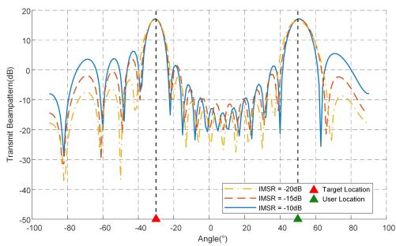  
Fig. 2. Transmit beam patterns under diferent ISMR constraints in a single-user single-target scenario $\overset { \cdot } { ( } K = 1 , L = 1 )$ .

Fig. 2 illustrates the transmit beam patterns obtained in Stage 1 under diferent ISMR constraints for a single-user and single-target scenario, with the user and target located at $\left\{ \theta _ { 1 } ^ { A U } = - 3 0 ^ { \circ } \right\}$ and $\left\{ \theta _ { 1 } ^ { T a r g e t } = - 3 0 ^ { \circ } \right\}$ , respectively. Beamforming is optimized under ISMR constraints of –20dB, –15dB, and –10dB. A stricter ISMR constraint of –20dB results in a wider mainlobe and sidelobe suppression below –20dB, improving detection robustness under DoA uncertainty at the cost of reduced DoA estimation accuracy due to energy dispersion. Relaxing the constraint to –15dB narrows the mainlobe, significantly improving the FIM determinant and reducing the CRB for DoA estimation, with a moderate increase in sidelobe levels. At –10dB, the mainlobe is narrowest, providing the highest DoA accuracy, but sidelobe suppression weakens, raising the risk of false alarms. Simulation results confirm that while relaxed ISMR constraints enhance mainlobe gain and localization precision, they do so at the cost of degraded sidelobe suppression, potentially impacting robustness in cluttered environments.

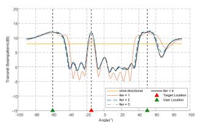  
(a) Omnidirectional beam and 95% confidence interval.

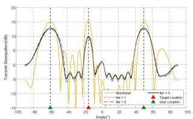  
(b) Directional beam and 95% confidence interval.

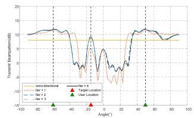

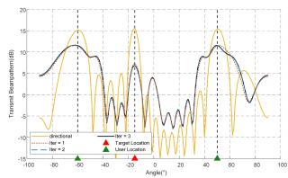  
(c) Omnidirectional beam and 99% confidence interval.  
(d) Directional beam and 99% confidence interval.  
Fig. 3. Comparison between omnidirectional and directional sensing beams under diferent confidence levels $( K = 2 , L = 1 )$

Fig. 3 shows the beam evolution under diferent initial beams (omnidirectional vs. directional) and confidence levels (95% and 99%). In each iteration, the transmit beam’s mainlobe is adjusted based on the previous DoA estimate and corresponding CRB, meaning the initial beam and confidence level directly influence the convergence path and final performance.

With an omnidirectional initial beam (Fig. 3a), coarse sensing in Stage 1 provides wide coverage but dispersed energy. Subsequent iterations gradually narrow and intensify the mainlobe toward the target while suppressing sidelobes. However, the initial angle error is large, leading to broader mainlobes in later iterations—especially at 99% confidence (Fig. 3c), where beams remain wider even after four iterations, limiting gain and slowing convergence due to stricter uncertainty coverage.

In contrast, directional initial beams (Figs. 3b and 3d), pre-optimized in Stage 1, start with accurate target estimates and low CRB. This leads to faster convergence—within 2–3 iterations—under both confidence levels. At 95% confidence (Fig. 3b), beams converge quickly with high directivity and low sidelobes. At 99% (Fig. 3d), beams remain wider for robustness but still achieve better energy eficiency and convergence than the omnidirectional case.

In summary, directional initial beams facilitate faster convergence and higher eficiency compared to omnidirectional ones, while higher confidence levels enhance robustness at the cost of wider beams and slower convergence. These results highlight the positive impact of Stage 1 CRB optimization on Stage 2 beam refinement.

B. Transmit Beam Design in Multi-Target Multi-User Scenarios

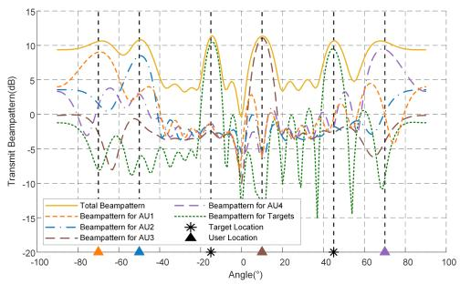  
Fig. 4. Composite beam pattern in a multi-user multi-target scenario. The overall transmit pattern is formed by superimposing communication beams for multiple users and sensing beams directed toward target regions. $( K = 4 , L = 2 )$ .

Fig. 4 illustrates the composite transmit beam pattern obtained in the second-stage optimization for a scenario involving four communication users located at $\left\{ \theta _ { 1 } ^ { A U } , \theta _ { 2 } ^ { A U } , \theta _ { 3 } ^ { A U } , \theta _ { 4 } ^ { A U } \right\} \stackrel { \smile } { = }$ $\{ - 7 0 ^ { \circ } , - 5 0 ^ { \circ } , 3 0 ^ { \circ } , 7 0 ^ { \circ } \}$ and two radar targets positioned at $\left\{ \theta _ { 1 } ^ { T a r g e t } , \theta _ { 2 } ^ { T a r g e t } \right\} = \left\{ - 1 5 ^ { \circ } , 4 5 ^ { \circ } \right\}$ . The overall beam (solid line) combines user communication beams (dashed/dash-dotted) and target-sensing beams (dotted green). The target directions are estimated in Stage 1 using sensing feedback, and corresponding angular confidence intervals are constructed based on their CRBs. These intervals define the mainlobe coverage regions for the sensing beams in Stage 2. Each user beam concentrates energy around its designated direction to ensure high-SNR communication. Meanwhile, the sensing beams exhibit clear mainlobes centered near each target. The width of these mainlobes is directly governed by the CRB from the previous stage, thereby accounting for angular uncertainty in target positioning.

Simulation results demonstrate that in multi-user multitarget scenarios, CRB-based confidence intervals serve as an efective guide for adaptive beamwidth design. This enables tightly focused and energy-eficient communication beams, while maintaining robust and reliable target sensing performance. The integration of both beam types into a unified composite pattern confirms the efectiveness of the proposed approach in achieving ICSN functionality.

C. Impact of the Weighting Factor on Communication–Sensing Trade-of

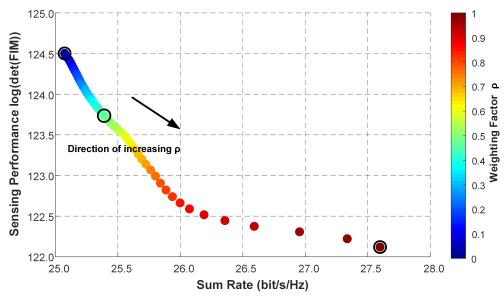  
Fig. 5. Trade-of between communication rate and sensing accuracy under diferent values of weighting factor $\rho .$

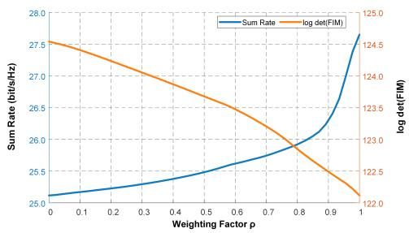  
Fig. 6. Variation of communication rate and sensing accuracy with respect to $\rho .$

Figs. 5 and 6 illustrate the impact of the weighting factor $\rho$ on system performance in the second-stage beamforming optimization. The parameter $\rho \in [ 0 , 1 ]$ governs the trade-of between the total communication rate $\textstyle \sum R$ and the sensing precision measured by log det(FIM) in the joint objective function.

Fig. $^ { 5 }$ presents the performance Pareto front between communication and sensing under diferent values of $\rho .$ The horizontal axis represents the total achievable communication rate, while the vertical axis shows the logarithm of the FIM determinant. The color gradient encodes the value of $\rho .$ As $\rho$ increases from 0 to 1, the system transitions from a sensing prioritized configuration to a communication-prioritized one. When $\rho$ is small, the optimization allocates more resources toward sensing, achieving high log det(FIM) values but lower communication rates. Conversely, when $\rho$ is large, communication performance is prioritized at the cost of degraded sensing accuracy. This trade-of highlights the fundamental competition between communication and sensing resource demands. Fig. 6 further quantifies the trend by plotting both total communication rate and sensing precision versus $\rho .$ . Both metrics demonstrate clear monotonicity, confirming that the system can realize a continuously tunable performance trade-of through $\rho .$ Notably, in the mid-range of $\rho ,$ the system is capable of maintaining relatively high communication throughput while preserving moderate sensing accuracy, indicating a practical and efective cooperation region for joint operation.

These results validate the pivotal role of the weighting factor $\rho$ in the proposed joint communication–sensing framework. By properly adjusting $\rho ,$ the system can flexibly configure performance profiles to accommodate diferent application scenarios with varying priorities on communication or sensing functionality.

Fig. 7 shows the angular-domain distribution of the transmit beam patterns generated in the second-stage optimization under diferent values of the weighting factor ${ \bf \nabla } \cdot { \bf \nabla } \rho .$ . Overall, as $\mathbf { \xi } _ { \rho }$ increases, the energy distribution of the beam gradually shifts from the target directions toward the communication user locations, reflecting the system’s dynamic trade-of between sensing accuracy and communication rate. When $\rho$ is small, the system prioritizes sensing performance, and the transmit beams are primarily directed toward the target regions to enhance angular estimation accuracy. $\operatorname { A s } \rho$ increases, the beam gain increasingly focuses on the user directions to meet communication requirements, reducing energy allocated for target sensing.

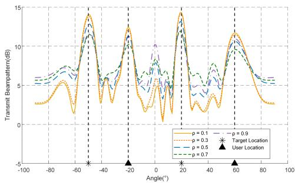  
Fig. 7. Transmit beam patterns under diferent weighting factors $\rho \left( K = 2 , \right.$ ?? = 2).

This figure visually demonstrates the tunability of the beam distribution pattern controlled by $\rho ,$ highlighting its role as a key design parameter. By adjusting $\rho ,$ the system can flexibly coordinate the dual objectives of communication and sensing, enabling scenario-adaptive functionality in ICSN system.

## D. Performance Evaluation with Baseline Waveform Designs

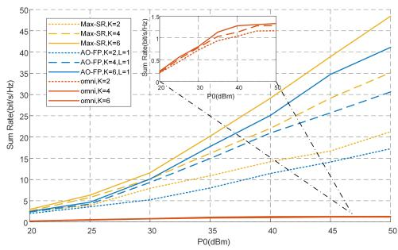  
Fig. 8. Sum-rate performance comparison of diferent waveform designs versus transmit power $\dot { P _ { 0 } }$ for ?? = 2, 4, 6 AUs. (?? = 0.5).

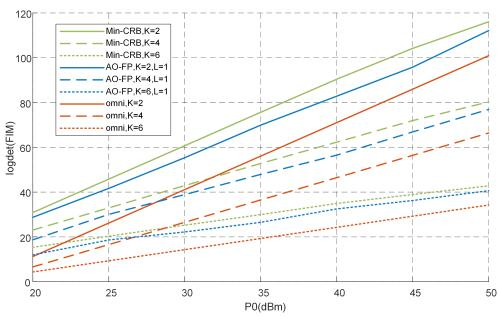  
Fig. 9. Sensing performance evaluated by log det(FIM) versus transmit power $P _ { 0 } ^ { - }$ for $L = 1 , 2 ,$ 3 targets. (?? = 0.5).

Fig. 8 illustrates the achievable sum-rate performance of diferent beamforming strategies under varying transmit power levels $P _ { 0 } .$ . As expected, the Max-SR scheme achieves the highest throughput since it solely targets communication optimization. In contrast, the conventional omnidirectional transmission sufers from severe power dispersion, resulting in significantly lower rates. The proposed AO-FP beamforming clearly bridges this performance gap: it consistently and notably outperforms the omnidirectional baseline across all $P _ { 0 }$ values, while approaching the Max-SR benchmark. Moreover, when the number of AUs increases from ?? = 2 to $K \ = \ 6$ , the AO-FP method still preserves robust sum-rate performance, demonstrating its strong communication eficiency even under multi-user competition.

Fig. 9 evaluates the sensing performance using log det(FIM), where a higher value indicates superior angle estimation accuracy. It can be observed that both the Min-CRB and the proposed AO-FP designs significantly enhance sensing capability compared with the omnidirectional transmission. While the Min-CRB baseline yields the best sensing performance due to its dedicated optimization target, the proposed AO-FP method achieves sensing accuracy that remains very close to the Min-CRB benchmark, even as the number of targets increases from ?? = 1 to ?? = 3. This confirms the capability of AO-FP to maintain reliable perception performance and strong robustness in multi-target environments.

Taken together, the results in Figs. 8 and 9 demonstrate that the proposed AO-FP optimization achieves an advantageous balance between communication throughput and sensing accuracy: it greatly enhances both performance metrics compared with omnidirectional transmission, while preserving performance levels close to the respective single-objective optimal solutions. These observations validate the efectiveness of the AoAaware two-stage ICSN beamforming design in supporting trifunctional integration under limited spatial resources.

## VII. CONCLUSION

This paper addresses the design requirements of an ICSN system for low-altitude urban environments, proposing a beamforming optimization method tailored to low-altitude UAV communications. To balance both communication performance and target sensing accuracy, we develop a unified ICSN system model and employ a two-stage beamforming design strategy. In the first stage, a wide beam constrained by ISMR is used for preliminary sensing of target directions. The second stage formulates a weighted optimization problem to jointly maximize the communication rate and angle estimation accuracy. This optimization problem is eficiently solved using FP and AO algorithms, enabling flexible control over diferent performance requirements. Simulation results show that the proposed method maintains stable communication rates and sensing performance in multi-user, multi-target scenarios. Furthermore, by adjusting the weighting factor, $\rho ,$ , the system can dynamically allocate resources, achieving a continuous performance trade-of between communication and sensing priorities. Additionally, the CRB-based modeling of angle estimation accuracy enhances the system’s navigational assistance capabilities. Although navigation errors are not explicitly modeled, the accuracy of angle estimation forms a critical basis for navigation accuracy, suggesting the potential for supporting navigation functionality. Overall, the proposed approach provides a practical and scalable beamforming design framework for integrated ICSN systems, suitable for future multi-functional networks involving UAVs and low-altitude intelligent agents in urban airspace.

IEEE TRANSACTIONS ON GREEN COMMUNICATIONS AND NETWORKING, VOL. XX, NO. XX, AUGUST 2025

## Appendix

## Derivation of the Fischer Information Matrix

Considering the system model described in (11), it is straightforward to verify that the FIM associated with (11) is a block-diagonal matrix, which depends on the unknown parameters in ?? and ??. For convenience, we decompose the complex parameters in ?? into their real and imaginary components, denoted as:

$$
\pmb { \Lambda } _ { \mathrm { R } } \overset { \Delta } { = } \mathrm { R e } ( \pmb { \Lambda } )\tag{40}
$$

$$
\pmb { \Lambda } _ { \mathrm { I } } \triangleq \mathrm { I m } ( \pmb { \Lambda } )\tag{41}
$$

Since we primarily focus on the target’s parameter estimation, it sufices to compute the FIM related to ??, ??R, and ??I. We first derive the FIM for the one-dimensional target angle case as follows:

$$
F ( { \boldsymbol { \theta } } _ { m } , { \boldsymbol { \theta } } _ { n } ) = 2 { \mathrm { R e } } t r \left[ { \frac { \partial \left( \mathbf { B } \mathbf { A } { \mathbf { A } } ^ { H } \mathbf { X } \right) ^ { H } } { \partial { \boldsymbol { \theta } } _ { m } } } \mathbf { Q } ^ { - 1 } { \frac { \partial \left( \mathbf { B } \mathbf { A } { \mathbf { A } } ^ { H } \mathbf { X } \right) } { \partial { \boldsymbol { \theta } } _ { n } } } \right]\tag{42}
$$

Where

$$
\frac { \partial ( \mathbf { B } \mathbf { A } \mathbf { A } ^ { H } \mathbf { X } ) } { \partial \theta _ { m } } = \dot { \mathbf { B } } e _ { m } e _ { m } ^ { T } \mathbf { A } \mathbf { A } ^ { H } X + \mathbf { B } \mathbf { A } e _ { m } e _ { m } ^ { T } \dot { \mathbf { A } } ^ { H } \mathbf { X }\tag{43}
$$

Here, $e _ { m }$ denotes the m-th column of the identity matrix, and A¤ and B¤ are defined in (21). Substituting (43) into (42) yields (44) For the first term in (44), we apply the trace property $t r ( A B C ) = t r ( B C A )$ to simplify the expression:

$$
\begin{array} { r l } & { \quad t r \left[ \left( \dot { \mathbf { B } } e _ { m } e _ { m } ^ { T } \mathbf { A } \mathbf { A } ^ { H } \mathbf { X } \right) ^ { H } \mathbf { Q } ^ { - 1 } \left( \dot { \mathbf { B } } e _ { n } e _ { n } ^ { T } \mathbf { A } \mathbf { A } ^ { H } \mathbf { X } \right) \right] } \\ & { = t r \left[ \mathbf { Q } ^ { - 1 } \left( \dot { \mathbf { B } } e _ { n } e _ { n } ^ { T } \mathbf { A } \mathbf { A } ^ { H } \mathbf { X } \right) \left( \dot { \mathbf { B } } e _ { m } e _ { m } ^ { T } \mathbf { A } \mathbf { A } ^ { H } \mathbf { X } \right) ^ { H } \right] } \\ & { = S \left( \mathbf { Q } ^ { - 1 } \dot { \mathbf { B } } e _ { n } e _ { n } ^ { T } \mathbf { A } \mathbf { A } ^ { H } \mathbf { R } _ { \mathbf { x } } \mathbf { A } \mathbf { A } ^ { H } e _ { m } e _ { m } ^ { T } \dot { \mathbf { B } } ^ { H } \right) } \\ & { = S \left( e _ { m } ^ { T } \dot { \mathbf { B } } ^ { H } \mathbf { Q } ^ { - 1 } \dot { \mathbf { B } } e _ { n } e _ { n } ^ { T } \mathbf { A } \mathbf { A } ^ { H } \mathbf { R } _ { \mathbf { x } } \mathbf { A } \mathbf { A } ^ { H } e _ { m } \right) } \\ & { = S \Big ( \dot { \mathbf { B } } ^ { H } \mathbf { Q } ^ { - 1 } \dot { \mathbf { B } } \Big ) _ { m n } \Big ( \mathbf { A } ^ { \ast } \mathbf { A } ^ { T } \mathbf { R } _ { \mathbf { x } } ^ { T } \mathbf { A } ^ { \ast } \mathbf { A } ^ { T } \Big ) _ { m n } } \end{array}\tag{45}
$$

It should be noted that $\mathbf { R } _ { \mathrm { x } } ~ = ~ \frac { 1 } { S } \mathbf { X } \mathbf { X } ^ { H }$ is a Hermitian matrix. The remaining three terms in (44) can be similarly simplified. Therefore, we obtain from (21) that $F ( \theta , \theta ) \ =$ $2 \operatorname { R e } ( J _ { 1 1 } )$ .Following the same approach, we derive:

$$
\frac { \partial ( \mathbf { B } \mathbf { A } \mathbf { A } ^ { H } \mathbf { X } ) } { \partial \mathbf { A } _ { R m } } = \mathbf { B } e _ { m } e _ { m } ^ { T } \mathbf { A } ^ { H } \mathbf { X } , \frac { \partial ( \mathbf { B } \mathbf { A } \mathbf { A } ^ { H } \mathbf { X } ) } { \partial \mathbf { A } _ { I m } } = j \mathbf { B } e _ { m } e _ { m } ^ { T } \mathbf { A } ^ { H } \mathbf { X }\tag{46}
$$

Thus, we have $F ( \theta , \Lambda _ { \mathrm { R } } ) = F ^ { T } ( \Lambda _ { \mathrm { R } } , \theta ) = 2 \mathop { \mathrm { R e } } ( J _ { 1 2 } )$ and ${ \cal F } ( \theta , { \bf { A } } _ { \mathrm { { I } } } ) = { \cal F } ^ { T } ( { \bf { A } } _ { \mathrm { { I } } } , \theta ) = - 2 \mathrm { I m } ( J _ { 1 2 } )$ . Similarly, we obtain

$\begin{array} { r c l } { F ( \mathbf { { A } } _ { \mathrm { { R } } } , \mathbf { { A } } _ { \mathrm { { R } } } ) } & { = } & { F ( \mathbf { { A } } _ { \mathrm { { I } } } , \mathbf { { A } } _ { \mathrm { { I } } } ) } \end{array} = \begin{array} { l c l } { 2 \mathrm { R e } ( J _ { 2 2 } ) } \end{array}$ and $\begin{array} { r l } { F ( \mathbf { A } _ { \mathrm { R } } , \mathbf { A } _ { \mathrm { I } } ) } & { { } = } \end{array}$ $F ^ { T } ( \mathbf { A } _ { \mathrm { I } } , \mathbf { A } _ { \mathrm { R } } ) \ = \ - 2 \operatorname { I m } ( J _ { 2 2 } )$ . Based on these results, we can compute (21).

## References

[1] Y. Zhang, Y. Gang, P. Wu, G. Fan, W. Xu, B. Ai, and Q. Wu, “Integrated Sensing, Communication, and Computation in SAGIN: Joint Beamforming and Resource Allocation,” IEEE Transactions on Cognitive Communications and Networking, doi: 10.1109/TCCN.2025.3577377.

[2] C. Dou, N. Huang, Y. Wu, L. Qian and T. Q. S. Quek, “Sensing-Eficient NOMA-Aided Integrated Sensing and Communication: A Joint Sensing Scheduling and Beamforming Optimization,” IEEE Transactions on Vehicular Technology, vol. 72, no. 10, pp. 13591-13603, Oct. 2023.

[3] Y. Gang, Y. Zhang, and X. Wang, “UAV-assisted full-duplex ISAC: Joint communication scheduling, beamforming, and trajectory optimization,” Digital Communications and Networks, doi: 10.1016/j.dcan.2025.03.001.

[4] Z. Lu, Z. Jia, Q. Wu and Z. Han, “Joint Trajectory Planning and Communication Design for Multiple UAVs in Intelligent Collaborative Air–Ground Communication Systems,” IEEE Internet of Things Journal, vol. 11, no. 19, pp. 31053-31067, 1 Oct.1, 2024.

[5] Z. Deng, F. Wu, Y. Xu, D. Yang and L. Xiao, “Energy Minimization for Radio Map-Based UAV Pickup and Delivery Logistics System,” IEEE Transactions on Vehicular Technology, vol. 73, no. 11, pp. 17893-17898, Nov. 2024.

[6] S. Barhoumi, M. Erdem and M. -S. Alouini, “Terahertz Band UAV Base Stations for Post-Disaster Communication,” IEEE Open Journal of the Communications Society, vol. 6, pp. 4788-4803, 2025.

[7] A. Hamissi, A. Dhraief and L. Sliman, “A Comprehensive Survey on Conflict Detection and Resolution in Unmanned Aircraft System Trafic Management,” IEEE Transactions on Intelligent Transportation Systems, vol. 26, no. 2, pp. 1395-1418, Feb. 2025.

[8] Y. Wang, J. Li, Y. Yuan and C. S. Lai, “Optimizing Urban Air Mobility: A Ground-Connected Approach to Select Optimal eVTOL Takeof and Landing Sites for Short-Distance Intercity Travel,” IEEE Open Journal of Vehicular Technology, vol. 6, pp. 216-239, 2025.

[9] D. Deng, W. Zhou, X. Li, D. B. da Costa, D. W. K. Ng and A. Nallanathan, “Joint Beamforming and UAV Trajectory Optimization for Covert Communications in ISAC Networks,” IEEE Transactions on Wireless Communications, vol. 24, no. 2, pp. 1016-1030, Feb. 2025.

[10] R. Zhang et al., “Integrated Sensing and Communication With Massive MIMO: A Unified Tensor Approach for Channel and Target Parameter Estimation,” IEEE Transactions on Wireless Communications, vol. 23, no. 8, pp. 8571-8587, Aug. 2024.

[11] B. Zhang, Z. He, Y. Feng and Z. Han, “Performance Analysis and 3D Position Deployment for V2V-Assisted UAV Communications in Vehicular Networks,” IEEE Transactions on Vehicular Technology, vol. 73, no. 12, pp. 19361-19373, Dec. 2024.

[12] M. R. Jones, S. Djahel and K. Welsh, “An Eficient and Rapidly Adaptable Lightweight Multi-Destination Urban Path Planning Approach for UAVs Using Q-Learning,” IEEE Transactions on Intelligent Vehicles, vol. 9, no. 10, pp. 6624-6636, Oct. 2024.

[13] H. Wei, B. Lou, Z. Zhang, B. Liang, F. -Y. Wang and C. Lv, “Autonomous Navigation for eVTOL: Review and Future Perspectives,” IEEE Transac- tions on Intelligent Vehicles, vol. 9, no. 2, pp. 4145-4171, Feb. 2024.

[14] X. Yu, L. Tu, Q. Yang, M. Yu, Z. Xiao and Y. Zhu, “Hybrid Beamforming in mmWave Massive MIMO for IoV With Dual-Functional Radar Commu-nication,” IEEE Transactions on Vehicular Technology, vol. 72, no. 7, pp. 9017-9030, July 2023.

[15] R. Chen, M. Liu, Y. Hui, N. Cheng and J. Li, “Reconfigurable Intelligent Surfaces for 6G IoT Wireless Positioning: A Contemporary Survey,” IEEE Internet of Things Journal, vol. 9, no. 23, pp. 23570-23582, 1 Dec.1, 2022.

$$
\begin{array} { r l } & { F ( \theta _ { m } , \theta _ { n } ) = 2 \mathrm { R e } t r \left[ \left( \dot { \bf B } e _ { m } e _ { m } ^ { T } \Lambda { \bf A } ^ { H } { \bf X } + { \bf B } \Lambda e _ { m } e _ { m } ^ { T } \dot { { \bf A } } ^ { H } { \bf X } \right) ^ { H } { \bf \Phi } { \bf Q } ^ { - 1 } \left( \dot { \bf B } e _ { n } e _ { n } ^ { T } \Lambda { \bf A } ^ { H } { \bf X } + { \bf B } \Lambda e _ { n } e _ { n } ^ { T } \dot { { \bf A } } ^ { H } { \bf X } \right) \right] } \\ & { = 2 \mathrm { R e } t r \left[ \left( \dot { \bf B } e _ { m } e _ { m } ^ { T } \Lambda { \bf A } ^ { H } { \bf X } \right) ^ { H } { \bf Q } ^ { - 1 } \left( \dot { \bf B } e _ { n } e _ { n } ^ { T } \Lambda { \bf A } ^ { H } { \bf X } \right) + \left( \dot { \bf B } e _ { m } e _ { m } ^ { T } \Lambda { \bf A } ^ { H } { \bf X } \right) ^ { H } { \bf Q } ^ { - 1 } \left( { \bf B } \Lambda e _ { n } e _ { n } ^ { T } \dot { { \bf A } } ^ { H } { \bf X } \right) \right. } \\ & { \left. + \left( { \bf B } \Lambda e _ { m } e _ { m } ^ { T } \dot { { \bf A } } ^ { H } { \bf X } \right) ^ { H } { \bf Q } ^ { - 1 } \left( \dot { \bf B } e _ { n } e _ { n } ^ { T } \Lambda { \bf A } ^ { H } { \bf X } \right) + \left( { \bf B } \Lambda e _ { m } e _ { m } ^ { T } \dot { { \bf A } } ^ { H } { \bf X } \right) ^ { H } { \bf Q } ^ { - 1 } \left( { \bf B } \Lambda e _ { n } e _ { n } ^ { T } \dot { { \bf A } } ^ { H } { \bf X } \right) \right] } \end{array}\tag{44}
$$

[16] B. Liao, X. Xiong and Z. Quan, “Robust Beamforming Design for Dual-Function Radar-Communication System,” IEEE Transactions on Vehicular Technology, vol. 72, no. 6, pp. 7508-7516, June 2023.

[17] R. Zhang, W. Wu, X. Chen, Z. Gao and Y. Cai, “Terahertz Integrated Sensing and Communication-Empowered UAVs in 6G: A Transceiver Design Perspective,” IEEE Vehicular Technology Magazine, doi: 10.1109/MVT.2025.3531088.

[18] Z. Xiao, R. Liu, M. Li, Q. Liu and A. L. Swindlehurst,“A Novel Joint Angle-Range-Velocity Estimation Method for MIMO-OFDM ISAC Systems,” IEEE Transactions on Signal Processing, vol. 72, pp. 3805- 3818, 2024.

[19] Y. Zhou, J. Hu, T. Yan, S. Duan, B. Lian and Y. Zhou, “MC-DS-CDMA: An Integrated Communication and Navigation Signal for Low Orbit Satel-lite Constellation,” 2023 4th Information Communication Technologies Conference (ICTC), Nanjing, China, 2023.

[20] S. Ma, X. Li and D. Zou,“A CCSK based Navigation and Communication Integrated Satellite Signal,” 2021 International Wireless Communications and Mobile Computing (IWCMC), Harbin City, China, 2021.

[21] S. Kianoush, A. Nordio, L. Dossi, R. Nebuloni and S. Savazzi, “Joint RIS-Assisted Localization and Communication: A Tradeof Among Accuracy, Spectrum Eficiency, and Time Resource,” IEEE Sensors Journal, vol. 25, no. 3, pp. 5630-5643, 1 Feb.1, 2025.

[22] Z. Ye, F. Junaid, E. Ibrahim, R. Nilsson and J. Van De Beek, “Monostatic Sensing for Passive RIS Localization and Tracking,” IEEE Wireless Communications Letters, vol. 13, no. 5, pp. 1260-1264, May 2024.

[23] I. Yildirim, A. Koc, E. Basar and T. Le-Ngoc, “Multi-RIS Assisted Hybrid Beamforming Design for Terahertz Massive MIMO Systems,” IEEE Open Journal of the Communications Society, vol. 5, pp. 6150-6165, 2024.

[24] J. Tang et al., “Cooperative ISAC-Empowered Low-Altitude Economy,” IEEE Transactions on Wireless Communications, vol. 24, no. 5, pp. 3837- 3853, May 2025.

[25] Z. Xiao, R. Liu, M. Li, Q. Liu and A. L. Swindlehurst, “A Novel Joint Angle-Range-Velocity Estimation Method for MIMO-OFDM ISAC Systems,” IEEE Transactions on Signal Processing, vol. 72, pp. 3805- 3818, 2024.

[26] B. Tang, D. Li, W. Wu, A. Saini, P. Babu and P. Stoica, “Dual-Function Beamforming Design for Multi-Target Localization and Reliable Communications,” IEEE Transactions on Signal Processing, vol. 73, pp. 559-573, 2025.

[27] X. Chu, Z. Lu, J. Kang, Y. Zou, H. Zhang and X. Qiu, “Hybrid Beamforming Toward Positioning Enhancement Under Cellular MIMO Systems,” IEEE Transactions on Wireless Communications, vol. 23, no. 10, pp. 13545-13561, Oct. 2024.

[28] C. Meng, Z. Wei, D. Ma, W. Ni, L. Su and Z. Feng, “Multiobjective-Optimization-Based Transmit Beamforming for Multitarget and Multiuser MIMO-ISAC Systems,” IEEE Internet of Things Journal, vol. 11, no. 18, pp. 29260-29274, 15 Sept.15, 2024.

[29] W. Xu, Z. Yang, D. W. K. Ng, M. Levorato, Y. C. Eldar and M. Debbah, “Edge Learning for B5G Networks With Distributed Signal Processing: Semantic Communication, Edge Computing, and Wireless Sensing,” IEEE Journal of Selected Topics in Signal Processing, vol. 17, no. 1, pp. 9-39, Jan. 2023.

[30] T. Hou and A. Li, “Performance Analysis of NOMA-RIS Aided Integrated Navigation and Communication (INAC) Networks,” IEEE Transactions on Vehicular Technology, vol. 72, no. 10, pp. 13255-13268, Oct. 2023.

[31] Z. Wei, F. Liu, C. Liu, Z. Yang, D. W. K. Ng and R. Schober, “Integrated Sensing, Navigation, and Communication for Secure UAV Networks With a Mobile Eavesdropper,” IEEE Transactions on Wireless Communications, vol. 23, no. 7, pp. 7060-7078, July 2024.

[32] N. Su, F. Liu and C. Masouros, “Secure Radar-Communication Systems With Malicious Targets: Integrating Radar, Communications and Jamming Functionalities,” IEEE Transactions on Wireless Communications, vol. 20, no. 1, pp. 83-95, Jan. 2021.

[33] T. Wei, B. Liao, P. Xiao and Z. Cheng, “Transmit Beampattern Synthesis for MIMO Radar with One-Bit DACs,” 2020 28th European Signal Processing Conference (EUSIPCO), Amsterdam, Netherlands, pp. 1827- 1830, 2021.

[34] A. Bazzi and M. Chafii, “Secure Full Duplex Integrated Sensing and Communications,” IEEE Transactions on Information Forensics and Security, vol. 19, pp. 2082-2097, 2024.

[35] N. Su, F. Liu and C. Masouros, “Sensing-Assisted Eavesdropper Estimation: An ISAC Breakthrough in Physical Layer Security,” IEEE Transactions on Wireless Communications, vol. 23, no. 4, pp. 3162-3174, April 2024.

[36] I. A. Hemadeh, K. Satyanarayana, M. El-Hajjar and L. Hanzo, “Millimeter-Wave Communications: Physical Channel Models, Design Considerations,

Antenna Constructions, and Link-Budget,” IEEE Communications Surveys & Tutorials, vol. 20, no. 2, pp. 870-913, Secondquarter 2018.

[37] 3GPP, “Study on channel model for frequencies from 0.5 to 100 GHz,” 3rd Generation Partnership Project (3GPP), TR 38.901, Version 18.0.0, Mar. 2024.

[38] J. Li, L. Xu, P. Stoica, K. W. Forsythe and D. W. Bliss, “Range Compression and Waveform Optimization for MIMO Radar: A CramEr–Rao Bound´ Based Study,” IEEE Transactions on Signal Processing, vol. 56, no. 1, pp. 218-232, Jan. 2008.

[39] L. Xu, J. Li and P. Stoica, “Target detection and parameter estimation for MIMO radar systems,” IEEE Transactions on Aerospace and Electronic Systems, vol. 44, no. 3, pp. 927-939, July 2008.

[40] K. -Y. Wang, A. M. -C. So, T. -H. Chang, W. -K. Ma and C. -Y. Chi, “Outage Constrained Robust Transmit Optimization for Multiuser MISO Downlinks: Tractable Approximations by Conic Optimization,” IEEE Transactions on Signal Processing, vol. 62, no. 21, pp. 5690-5705, Nov.1, 2014.

Ruoyu Lu received the B.E. degree in Electronic Information Engineering from Shanghai University, Shanghai, China, in 2023, and the M.E. degree in Information and Communication Engineering from Beijing Information Science and Technology University, Beijing, China, in 2026. He is currently pursuing the Ph.D. degree with the School of Aerospace Engineering, Beijing Institute of Technology, Beijing, China. His current research interests include lowaltitude ISAC and visual-inertial fusion navigation.

Yuexia Zhang (Senior Member, IEEE), female, born in Henan Province, China, received her M.S. and Ph.D. degrees in information and communication engineering from Beijing University of Posts and Telecommunications in 2008. She has been a Full Professor at the School of Information and Communication Engineering of Beijing Information Science and Technology University since 2019. Her research interests include wireless cooperative communication technology, ultra-wideband technology and wireless positioning technology.

Chuanjun Li male, B.S., researcher, received his Ph.D. degree in Vehicle Control from Beijing Institute of Technology, Beijing, China, in 2013. His research interests include vehicle navigation guidance and control, high dynamic satellite navigation and combined navigation technology.

Xiao Liang female, master tutor, associate researcher, received her PhD degree in Information and Communication Systems from Beijing University of Aeronautics and Astronautics, Beijing, China, in 2019. Her research interests are navigation guidance and control, high-precision positioning, and integrated navigation such as satellite radio

Baojin Liu was born in Henan, China, in 1998. He is currently pursuing the Ph.D. degree in Aerospace Science and Technology at the School of Aerospace Engineering, Beijing Institute of Technology, Beijing, China. His research interests include radar signal processing and regional navigation.