# Integrated Sensing and Communications in Multi-UAV Networks: A Dual-Objective Optimization Perspective

Xu Guo , Student Member, IEEE, Jingcheng Shi , Graduate Student Member, IEEE, Jianjun Wu , Member, IEEE, Rongqing Zhang , Member, IEEE, and Xiang Cheng , Fellow, IEEE

Abstract—Integrated sensing and communications (ISAC) has become increasingly crucial in next-generation wireless networks. Leveraging the reliable line-of-sight (LoS) links and mobility of unmanned aerial vehicles (UAVs), UAV-assisted ISAC has attracted significant attention. Different from the previous UAV-ISAC scenarios with single target or overlapping users and targets, we investigate ISAC in a more general multi-UAV network with independent multiple communication users and multiple sensing targets, where the UAVs provide downlink communications to the users while sensing the targets. Additionally, we consider the complicated interference management among the UAVs to further enhance the network’s practicality. Such a scenario presents a new challenge for the joint optimization problem in terms of the UAV trajectories, the user association, the target association, and the power control. Furthermore, since the existing single-objective and weighted optimization approaches may result in potential performance loss and optimization biases, we propose a dual-objective model to further optimize ISAC, aiming for a better tradeoff between the communication and sensing performance. Specifically, we propose an efficient sensing and communication dual-objective multi-UAV optimization algorithm (SC-DO-MUOA) to maximize communication rate and simultaneously minimize sensing Cramer-Rao bound (CRB).´ Simulation results demonstrate that our proposed SC-DO-MUOA outperforms various baselines in both communication and sensing performance.

Index Terms—Dual-objective optimization, multi-UAV ISAC, resource allocation.

## I. INTRODUCTION

NTEGRATED sensing and communications (ISAC) has I become increasingly crucial in next-generation wireless networks, such as Beyond 5G (B5G) and 6G, driven by the stronger demands for advanced sensing capabilities and the scarcity of spectrum resources [1]. By sharing spectrum resources and hardware, ISAC is expected to significantly enhance spectrum efficiency, reduce equipment costs, and provide both high-quality communications and accurate sensing services. Moreover, Zhang et al. have leveraged advanced artificial intelligence (AI) techniques, such as Generative Adversarial Networks (GANs) [2], Deep Reinforcement Learning (DRL) [3], and Deep Unfolding Learning [4], to accelerate the development of ISAC systems. These AI-driven approaches help ISAC show great promise in a wide range of emerging applications, including vehicle-to-everything, smart homes, smart manufacturing, and more [5].

One of the most promising applications of ISAC is unmanned aerial vehicle (UAV)-assisted wireless networks. With their high mobility and ease of deployment, UAVs can serve as aerial base stations or relays, establishing reliable lineof-sight (LoS) communication links [6] and enhancing sensing accuracy through flexible positioning [7]. Moreover, UAVs can optimize their flight trajectories to mitigate interference effectively [8]. The integration of UAVs with ISAC has the potential to significantly improve both communication and sensing performance, making UAV-ISAC a key focus for 6G development and a growing area of research.

Several studies have explored ISAC in single-UAV networks. To improve the communication rate while meeting sensing requirements, researchers jointly optimized UAV trajectory, user associations, and resource allocation in systems with multiple users and targets [9], [10], [11]. Jiang et al. [12] maintained information freshness at the ground controller while ensuring high sensing quality for each target. Constrained by communication rate, [13] maximized the radar estimation rate through the joint optimization of UAV task scheduling, transmit power allocation, and 3D flight parameters. Moreover, to achieve a balance between the sensing and communication performance, Liu et al. [14] proposed a multi-objective resource optimization framework aimed at maximizing both energy efficiency and minimum radar mutual information (MI). Jing et al. [15] formulated a weighted sum optimization problem to balance the total transmitted data and Cramer-Rao bound (CRB) for ISAC in the single-UAV´ network.

Considering a single UAV’s limited sensing range and communication capability, some recent works have focused on deploying multiple UAVs for cooperative ISAC to enhance the potential of aerial-to-ground communication and sensing [16], [17], [18], [19], [20], [21], [22], [23], [24], [25], [26], [27], [28], [29], [30], [31], [32], [33], [34]. Wang et al. [16] investigated the UAVs serving the communication users while cooperatively sensing a single target, aiming to maximize the network utility under the localization accuracy constraints. By planning the trajectories and resource allocation of the UAVs, the valid detection and fairness [21] and the Cramer-Rao´ lower bounds (CRLB) for target location estimation [22] were improved subject to the communication data rate and qualityof-service (QoS) constraints, respectively. Beuster et al. [26] focused on measurement-driven insights for multi-sensor ISAC networks, which could offer relevant guidelines on realistic channel modeling and performance under real-world constraints. Orikumhi et al. [27] highlighted mobility-aware resource allocation, reminding us that user or UAV mobility can considerably affect interference patterns and flight trajectory decisions. Furthermore, to jointly enhance the sensing and communication performance for ISAC in multi-UAV networks, [28], [29], [30], [31], [32], [33] all employed the weighted-based algorithms to optimize the UAV trajectories, user association, power control, and other network resources. Li et al. [34] proposed an efficient dual-objective evolutionary algorithm based on large language models (LLMs) to find the clear trade-off between communication and sensing performance. However, they considered the scenario where the UAVs communicated and sensed the same group of users, and assumed no interference between UAVs.

Similarly, most existing multi-UAV ISAC works focus on single-target scenarios or cases where communication users are also the sensing targets. With the broader application demands of 6G, it is general and essential for UAVs to perform sensing tasks with multiple targets while serving multiple communication users, independent of the targets. Additionally, in multi-UAV ISAC scenarios, UAVs receive not only echo signals from targets but also direct transmissions from other UAVs, leading to inevitable interference. Most existing works assume that such interference can be eliminated through filtering, which is hard to achieve in practical applications.

Moreover, it is noteworthy that most above ISAC studies adopt the following two approaches for modeling the optimization of communication and sensing performance: 1) optimizing communication performance with sensing performance as a constraint, or vice versa; 2) using a weighted approach to combine communication and sensing performance into a single optimization objective. The former approach may result in a loss of potential performance due to restrictive thresholds, while the latter may introduce optimization biases from subjective weight selection. Therefore, modeling a dual-objective optimization of both communication and sensing performance may result in a more optimized ISAC performance, fully exploiting the potential of both communication and sensing.

Motivated by the above findings, in this paper, we investigate ISAC in a multi-UAV network, where the UAVs provide downlink communication services for multiple ground users while simultaneously sensing multiple ground targets. Dif ferent from the previous works that focus on single-target scenarios or assume communication users also serve as sensing targets, we consider a more general and practical network where the multiple communication users and sensing targets are independent. Additionally, we consider the interference management among UAVs, further enhancing the practicality of our scenario. Notably, in such a multi-UAV network with multi-user and multi-target, the UAVs need to not only coordinate and schedule the communication and sensing tasks while balancing the resource competition, but also design efficient flight trajectories to enhance both communication and sensing performance. Therefore, it leads to a complicated and challenging joint optimization problem in terms of the UAV trajectories, the both user and target associations, and the power control.

Furthermore, in this general multi-UAV network, we aim to further optimize ISAC to achieve a better tradeoff between the communication and sensing performance. Considering the potential performance loss of the existing single-objective and weighted optimization approaches, we propose a dualobjective model to jointly enhance the communication and sensing performance. Here, we select two key metrics, i.e., communication rate and sensing CRB [35], as dual objectives for optimization. Specifically, we propose an efficient sensing and communication dual-objective multi-UAV optimization algorithm (SC-DO-MUOA) to enhance both communication rate and CRB. Simulation results show that our proposed SC-DO-MUOA significantly outperforms various baselines in both sensing and communication performance. The major contributions of this work are summarized as follows:

1) Different from the previous UAV-ISAC scenarios with a single target or communication users also serving as sensing targets, we investigate ISAC in a more general multi-UAV network where the multiple communication users and multiple sensing targets are independent. The UAVs provide downlink communications to the users while simultaneously sensing the targets. Additionally, we consider the complicated interference management among the UAVs to further enhance the network’s practicality. Note that in such a scenario, the UAVs need to not only coordinate and schedule the communication and sensing tasks while balancing resource competition, but also design efficient flight trajectories to enhance both communication and sensing performance. This results in a complicated and challenging joint optimization problem in terms of the UAV trajectories, the both user and target associations, and the power control.

2) Considering the potential performance loss of existing single-objective and weighted optimization approaches, we propose a dual-objective model to further optimize ISAC, aiming for a better tradeoff between communication and sensing performance. Specifically, modeling a dual-objective optimization for both communication rate and sensing CRB can overcome the limitations of subjective weights and constraint thresholds on performance optimization in the traditional approaches. It can also allow for more balanced resource allocation and lead to a more optimized ISAC performance, fully exploiting the potential of both communication and sensing.

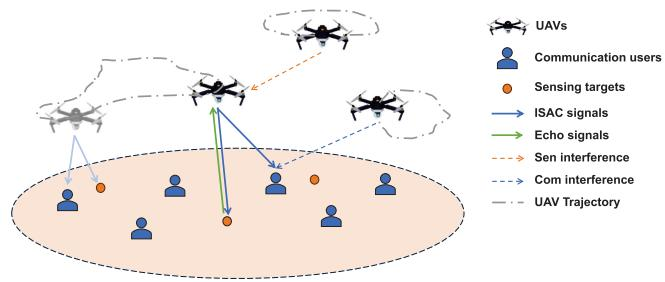  
Fig. 1. Multi-UAV ISAC scenario with multiple users and multiple targets.

3) The above complicated multi-UAV ISAC optimization problem with dual objectives is non-convex mixedinteger nonlinear programming (MINLP) and difficult to solve. To overcome this problem, we propose an efficient SC-DO-MUOA to jointly improve the communication and sensing performance. Specifically, our algorithm decomposes the problem into several subproblems and adopts the hybrid evolutionary operators to generate and update the promising solutions. Compared with the traditional multi-objective optimization algorithms, our SC-DO-MUOA more effectively addresses the challenges of multiple constraints, large-scale variables, and mixed-integer variables in our multi-UAV ISAC scenario.

The remainder of this paper is organized as follows. Section II describes the system model of the multi-UAV ISAC scenario with multiple users and multiple targets. And formulate the dual-objective problem of maximizing the communication sum rate and minimizing the CRB. Section III presents our SC-DO-MUOA with problem decomposition, new solution generation, and population update to obtain the solutions. And discuss the complexity of our proposed algorithm. In Section IV, simulation results show the performances of our proposed algorithm. Section V is the conclusion of this paper.

## II. SYSTEM MODEL AND PROBLEM FORMULATION

We investigate ISAC in a more general multi-UAV network, as shown in Fig. 1. There are M UAVs, with the set denoted by $\mathcal { M } = \{ 1 , 2 , . . . , M \}$ , K users, with the set denoted by $\begin{array} { l } { \displaystyle { \mathcal { K } \ = \ \{ 1 , 2 , . . . , K \} } } \end{array}$ , and J targets, with the set denoted by $\mathcal { I } = \{ 1 , 2 , . . . , J \}$ , in the network. The UAVs leverage their mobility to provide downlink communications to the ground users while sensing the ground targets through the downlink ISAC signals. During their flight, the UAV trajectories, transmission power, and associations between UAVs and users, as well as UAVs and sensing targets, are continuously adjusted to enhance both sensing and communication services. We suppose the 3D coordinate of each user k is fixed at $\mathbf { u } _ { k } \ = \ \left[ u _ { x , k } , u _ { y , k } , 0 \right] ^ { T }$ , which can be obtained by global positioning system (GPS). The coordinate of target $j$ is denoted by $\mathbf { v } _ { j } = \left[ v _ { x , j } , v _ { y , j } , 0 \right] ^ { T }$ , which can be estimated based on the sensing tasks of UAVs. Without loss of generality, the UAVs can sail freely between the lowest altitude $H _ { m i n }$ and the highest altitude $H _ { m a x }$ . Additionally, assume that the whole mission period is $T$ and can be discretized into N time slots with duration $\begin{array} { r } { \delta _ { t } ~ = ~ \frac { T } { N } } \end{array}$ , indexed by $n = 1 , 2 , . . . , N$ And the time slot is sufficiently small so that the UAVs locations are considered approximately unchanged within each time slot. As a result, the trajectory of UAV m can be denoted by the 3D coordinate at consecutive time slots, i.e., $\mathbf { q } _ { m } [ n ] = \left[ q _ { x , m } [ n ] , q _ { y , m } [ n ] , q _ { z , m } [ n ] \right] ^ { T } , n \in \{ 1 , 2 , . . . , N \}$

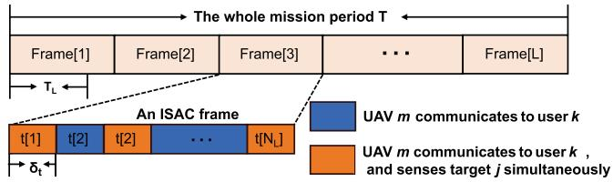  
Fig. 2. ISAC frame for the multi-UAV, multi-user, and multi-target scenario.

Note that we actually assume a centralized ground control center responsible for the unified task scheduling and resource allocation of multiple UAVs in the scenario. The communication between the control center and the UAVs primarily involves low-rate control commands or non-payload data, such as task status and sensing results. These transmissions are characterized by small data volume and low transmission cost, and are typically implemented via dedicated control channels or out-of-band links in practical applications [36], [37]. As they are separated from the core spectrum resources used for UAV–user communication, they have a limited impact on our primarily focused resource allocation and ISAC performance. Therefore, in this work, we do not explicitly model the communication links or constraints between the control center and the UAVs.

## A. ISAC Frame

As shown in Fig. 2, we assume that the total ISAC frame number $\begin{array} { r } { L = \frac { T } { T _ { L } } } \end{array}$ and the index is denoted by $l = 1 , 2 , . . . , L .$ where $T _ { L }$ is the time length of an ISAC frame. And the number of time slots in each ISAC frame is $\begin{array} { r } { N _ { L } = \frac { N } { L } } \end{array}$ . Following the assumption in [9], the sensing tasks are not always performed together with communications due to the different practical requirements of the sensing and communications. Specifically, an ISAC frame consists of two parts, indicated by two different colors in the figure: the time slots during which the UAVs provide only communication service, and the time slots during which the UAVs provide both sensing and communication services simultaneously.

For communications, denote that $\alpha _ { m , k } [ n ] = 1$ , which means UAV m aims to transmit signals to user k in time slot n. Otherwise, $\alpha _ { m , k } [ n ] = 0$ . The UAVs provide services to the users with the requirement that each UAV can serve at most one user, and each user can be served by at most one UAV per time slot. Therefore, the following conditions hold:

$$
\sum _ { k = 1 } ^ { K } \alpha _ { m , k } [ n ] \leq 1 , \forall m , n ,\tag{1}
$$

$$
\sum _ { m = 1 } ^ { M } \alpha _ { m , k } [ n ] \leq 1 , \forall k , n .\tag{2}
$$

For sensing, the UAVs perform sensing tasks when needed, requiring that each UAV can sense at most one target per time slot, and each target must be sensed once within an ISAC frame. Denote that $c _ { m , j } [ n ] = 1$ , which means UAV m aims to sense target j in time slot n. Otherwise, $c _ { m , j } [ n ] ~ = ~ 0$ Therefore, the following requirements are satisfied:

$$
\sum _ { n = ( l - 1 ) N _ { L } + 1 } ^ { l N _ { L } } \sum _ { m = 1 } ^ { M } c _ { m , j } [ n ] = 1 , \forall l , j ,\tag{3}
$$

$$
\sum _ { j = 1 } ^ { J } c _ { m , j } [ n ] \leq 1 , \forall m , n .\tag{4}
$$

In this flexible ISAC framework, multiple UAVs can cooperatively sense targets at different times and locations, leveraging different perspectives and temporal diversity to improve sensing accuracy. Similarly, for communications, the more suitable UAVs can serve the associated users to enhance the system sum rate. However, the UAV trajectories, power control, user association, and target association with UAVs are tightly coupled to determine resource allocation, and there is competition for the resources between the sensing and communication functions. Besides, our multi-UAV ISAC frame also brings interference to affect both sensing and communication performance. These factors make our dual-objective optimization problem more complicated and challenging.

## B. Communication Interference Model

As typically discussed in UAV-ISAC scenarios [9], [16], [19], [31], [32], the communication links between UAVs and ground users are assumed to be dominated by the LoS component. Therefore, the channel power gain from UAV m to user k follows the free-space path loss model:

$$
h _ { m , k } [ n ] = \beta _ { c o m } d ( { \bf q } _ { m } [ n ] , { \bf u } _ { k } ) ^ { - 2 } = \frac { \beta _ { c o m } } { \left\| { \bf q } _ { m } [ n ] - { \bf u } _ { k } \right\| ^ { 2 } } ,\tag{5}
$$

where $\beta _ { c o m }$ is the channel power at a unit reference distance with $\begin{array} { r } { \beta _ { c o m } = \frac { g _ { c } g _ { t } \lambda ^ { 2 } } { ( 4 \pi ) ^ { 2 } } } \end{array}$ according to [13] and [15]. $g _ { t }$ is the UAV transmit antenna gain. $g _ { c }$ is the communication user’s receive antenna gain. λ is the wavelength. And $d ( \mathbf { q } _ { m } [ n ] , \mathbf { u } _ { k } )$ is the distance between the UAV m and the user k in time slot $n .$

Assume that all the UAVs share the same frequency band to communicate with the downlink users. If user k is served by the UAV m in time slot $n ,$ the received signal at user k according to the data transmission process is:

$$
\begin{array} { l } { { \displaystyle y _ { m , k } [ n ] = \sqrt { h _ { m , k } [ n ] p _ { m } [ n ] } s _ { m , k } [ n ] } } \\ { { \displaystyle + \sum _ { i = 1 , i \neq m } ^ { M } \sqrt { h _ { i , k } [ n ] p _ { i } [ n ] } s _ { i , k } [ n ] + n _ { m , k } [ n ] } , } \end{array}\tag{6}
$$

where $p _ { m } [ n ]$ is the transmit power of UAV m in time slot n; $s _ { m , k } [ n ]$ is the transmitted signal of UAV m; and $n _ { m , k } [ n ] ~ \sim ~ C N ( 0 , \sigma _ { k } ^ { 2 } )$ represents the independent additive white Gaussian noise (AWGN). Note that the transmissions of all other UAVs in time slot n cause the co-channel interference $\begin{array} { r } { \sum _ { i = 1 , i \neq m } ^ { M } \sqrt { h _ { i , k } [ n ] p _ { i } [ n ] } s _ { i , k } [ n ] } \end{array}$ [38]. Thus, the signal-to-interference-plus-noise ratio (SINR) of user k in time slot n can be expressed as:

$$
\gamma _ { m , k } [ n ] = \frac { h _ { m , k } [ n ] p _ { m } [ n ] } { \sum _ { i = 1 , i \neq m } ^ { M } h _ { i , k } [ n ] p _ { i } [ n ] + \sigma _ { 0 } ^ { 2 } } ,\tag{7}
$$

where $\sigma _ { 0 } ^ { 2 } ~ = ~ B \sigma _ { k } ^ { 2 }$ , and B is the channel bandwidth. The corresponding achievable rate of user k in time slot n is:

$$
R _ { m , k } [ n ] = B \alpha _ { m , k } [ n ] \log _ { 2 } ( 1 + \gamma _ { m , k } [ n ] ) .\tag{8}
$$

## C. Sensing Interference Model

Note that ISAC in the multi-UAV networks introduces greater complexity in managing interference. The UAV receives not only the echo signal from the target but also direct transmissions from other UAVs. These interference signals cannot be ignored and are challenging to predict in practice. Unlike previous multi-UAV ISAC works [16], [21], [22], [23], which assume the interference signals are known and can be removed by matched filtering, we explicitly consider the interference and take it into our model. This consideration increases the complexity of our optimization problem, particularly in trajectory optimization and CRB calculation, but it also aligns more closely with real-world scenarios. Additionally, it is worth noting that, although the direct links between UAVs are treated as sources of sensing interference, they do physically exist. And these links can be readily leveraged as communication channels in practical scenarios where information exchange between UAVs is required.

As for the echo links of the ISAC signal, the channel power gain from the UAV m to the direction of target $j$ and then back to the UAV m in time slot n can be denoted as [13], [15], and [39]:

$$
h _ { m , j , m } [ n ] = \frac { g _ { r } g _ { t } \varphi \lambda ^ { 2 } } { ( 4 \pi ) ^ { 3 } } d ( \mathbf { q } _ { m } [ n ] , \mathbf { v } _ { j } ) ^ { - 4 } = \beta _ { s e n } d ( \mathbf { q } _ { m } [ n ] , \mathbf { v } _ { j } ) ^ { - 4 } ,\tag{9}
$$

where $g _ { r }$ denotes the antenna gain of UAV receiver, and $\varphi$ denotes radar cross-section (RCS) of the target. $d ( \mathbf { q } _ { m } [ n ] , \mathbf { v } _ { j } )$ is the distance between the UAV m and the target j in time slot $n .$ . To simplify the expression, let $\begin{array} { r } { \beta _ { s e n } = \frac { g _ { r } g _ { t } \varphi \lambda ^ { 2 } } { ( 4 \pi ) ^ { 3 } } } \end{array}$

Considering the interference among the UAVs caused by communications, We denote the channel power gain from UAV i to UAV m as:

$$
h _ { i , m } [ n ] = \frac { g _ { r } g _ { t } \lambda ^ { 2 } } { ( 4 \pi ) ^ { 2 } } d ( { \bf q } _ { i } [ n ] , { \bf q } _ { m } [ n ] ) ^ { - 2 } = \beta _ { i n t } d ( { \bf q } _ { i } [ n ] , { \bf q } _ { m } [ n ] ) ^ { - 2 } ,\tag{10}
$$

where $d ( \mathbf { q } _ { i } [ n ] , \mathbf { q } _ { m } [ n ] )$ is the distance between the UAV i and the UAV m in time slot n. To simplify the expression, let $\begin{array} { r } { \beta _ { i n t } = \frac { g _ { r } g _ { t } \lambda ^ { 2 } } { ( 4 \pi ) ^ { 2 } } } \end{array}$

Therefore, if target j is sensed by UAV m in time slot $n ,$ the received signal at UAV m including both echo and interference can be expressed as:

$$
\begin{array} { l } { { \displaystyle y _ { m , j } [ n ] = \sqrt { h _ { m , j , m } [ n ] p _ { m } [ n ] } s _ { m , j } [ n - \tau _ { m , j } ] } } \\ { { \displaystyle ~ + \sum _ { i = 1 , i \neq m } ^ { M } \sqrt { h _ { i , m } [ n ] p _ { i } [ n ] } s _ { i } [ n - \tau _ { i , m } ] + n _ { m , j } [ n ] } , } \end{array}\tag{11}
$$

where $\begin{array} { r } { \tau _ { m , j } ~ = ~ { \frac { 2 d ( \mathbf { q } _ { m } [ n ] , \mathbf { v } _ { j } ) } { c } } } \end{array}$ is the propagation time of the signal transmitted from UAV m, reflected by target $j ,$ and finally received by UAV m with the speed of light $c .$ Similarly, $\begin{array} { r } { \tau _ { i , m } = \frac { d ( \mathbf { \check { q } } _ { i } [ n ] , \mathbf { q } _ { m } [ n ] ) } { c } } \end{array}$ is the propagation time of the interference signal from UAV i to UAV m. And $n _ { m , j } [ n ]$ obeys the Gaussian distribution of $C N ( 0 , \sigma _ { j } ^ { 2 } )$ . Here, the interference signals can be regarded as the superposition of Gaussian signals and still obey the Gaussian distribution. Let $\begin{array} { l } { I _ { i } ~ = ~ \bar { \sum } _ { i = 1 , i \neq m } ^ { M } \sqrt { h _ { i , m } [ n ] } \overline { { p _ { i } [ n ] } } s _ { i } [ n - \tau _ { i , m } ] } \end{array}$ , satisfying $\begin{array} { r } { I _ { i } \sim C N \left( 0 , \chi \sum _ { i = 1 , i \neq m } ^ { M } h _ { i , m } [ n ] p _ { i } [ n ] \right) } \end{array}$ . And $\chi$ denotes the suppression gain of the direct interference during the signal processing [39], [40]. Thus, the SINR of the received echo signal at UAV m is given by:

$$
\gamma _ { m , j } [ n ] = \frac { h _ { m , j , m } [ n ] p _ { m } [ n ] } { \chi \sum _ { i = 1 , i \neq m } ^ { M } h _ { i , m } [ n ] p _ { i } [ n ] + \sigma _ { j } ^ { 2 } } .\tag{12}
$$

## D. Problem Formulation

Our dual objectives are maximizing the communication sum rate and improving the sensing accuracy. To evaluate the estimation performance of sensing, mean square error (MSE) is a commonly used metric [41]. However, obtaining the closed form of MSE is hard, and minimizing MSE to improve sensing performance is almost intractable. Note that the CRB could provide a lower bound for MSE for the unbiased (or asymptotically unbiased) parameter estimator. Therefore, we adopt the CRB to characterize the sensing performance.

We first present the observation set $\mathbf { y } _ { j }$ for target $j ~ ( j ~ =$ $1 , . . . , J )$ and then derive the CRB from these observations. Here, $\mathbf { y } _ { j }$ consists of the signals reflected by target $j$ and received by all UAVs throughout the entire mission duration $T .$ Since each target is sensed only once during each ISAC frame, we can express the observation $\mathbf { y } _ { j _ { . } } = [ y _ { j } [ 1 ] , y _ { j } [ 2 ] , . . . , y _ { j } [ L ] ]$ where $\begin{array} { r } { y _ { j } [ l ] = \sum _ { n = ( l - 1 ) N _ { L } + 1 } ^ { l N _ { L } } \sum _ { m = 1 } ^ { M } c _ { m , j } [ n ] \bar { y } _ { m , j } [ n ] . } \end{array}$ . The m and n are determined by $c _ { m , j } [ n ]$ for each ISAC frame l. To simplify the expression, we use l instead of n in the following to represent the specific time within this ISAC frame when the target is sensed. In theory, $L \geq 3$ should be satisfied to achieve unambiguous localization [31]. For the unknown horizontal location parameters of target $j , \mathbf { v } _ { j } = [ v _ { x , j } , v _ { y , j } ] ^ { T }$ , we have the following inequality:

$$
\mathbb { E } \left\{ ( \hat { \mathbf { v } } _ { j } - \mathbf { v } _ { j } ) ( \hat { \mathbf { v } } _ { j } - \mathbf { v } _ { j } ) ^ { T } \right\} \geq \mathbf { J } ^ { - 1 } ( \mathbf { v } _ { j } ) ,\tag{13}
$$

and the CRB can be formulated as:

$$
\begin{array} { r } { { \bf { C R B } } _ { { \bf v } _ { j } } = { \bf J } ^ { - 1 } ( { \bf v } _ { j } ) , } \end{array}\tag{14}
$$

where $\mathbf { J } ( \mathbf { v } _ { j } )$ is the Fisher information matrix (FIM) of $\mathbf { v } _ { j }$ given by:

$$
\mathbf { J } ( \mathbf { v } _ { j } ) = \mathbb { E } \left\{ \frac { \partial } { \partial \mathbf { v } _ { j } } \log f ( \mathbf { y } _ { j } \mid \mathbf { v } _ { j } ) \left( \frac { \partial } { \partial \mathbf { v } _ { j } } \log f ( \mathbf { y } _ { j } \mid \mathbf { v } _ { j } ) \right) ^ { T } \right\} ,\tag{15}
$$

where $f ( \mathbf { y } _ { j } \quad | \quad \mathbf { v } _ { j } )$ is the conditional probability density function (pdf) of the observation $\mathbf { y } _ { j }$ . Based on the received signal in (11) and the Gaussian distribution of the interference and noise, the conditional pdf $f ( \mathbf { y } _ { j } \mid \mathbf { v } _ { j } )$ can be expressed as:

$$
\begin{array} { r } { f ( \mathbf { y } _ { j } \mid \mathbf { v } _ { j } ) = \frac { \mathbf { 1 } } { ( 2 \pi ) ^ { \frac { L } { 2 } } \prod _ { l = 1 } ^ { L } \left( \sigma _ { j } ^ { 2 } + \chi \sum _ { i = 1 , i \neq m } ^ { M } h _ { i , m } [ l ] p _ { i } [ l ] \right) ^ { \frac { 1 } { 2 } } } } \end{array}
$$

$$
\times \exp \left\{ - \frac { 1 } { 2 } \sum _ { l = 1 } ^ { L } \frac { ( y _ { j } [ l ] - \sqrt { h _ { m , j , m } [ l ] p _ { m } [ l ] } s _ { m , j } [ l - \tau _ { j } [ l ] ] ) ^ { 2 } } { \sigma _ { j } ^ { 2 } + \chi \sum _ { i = 1 , i \neq m } ^ { M } h _ { i , m } [ l ] p _ { i } [ l ] } \right\} .\tag{16}
$$

In most cases, if it is difficult to calculate the FIM of some parameters, we can calculate the FIM of other related parameters first. We find that the pdf $f ( \mathbf { y } _ { j } \mid \mathbf { v } _ { j } )$ directly relates to the propagation time $\tau _ { j } [ l ]$ . And the time-to-location conversion is mathematically linked through $\begin{array} { r } { \tau _ { m , j } = \frac { 2 d ( \mathbf { q } _ { m } [ n ] , \mathbf { v } _ { j } ) } { c } } \end{array}$ for each ISAC frame l. Therefore, to obtain the FIM $\overset { c } { \mathbf { J } } ( \mathbf { v } _ { j } )$ we can first calculate the FIM $\mathbf { J } ( \mathbf { t } _ { j } )$ with respect to the propagation time t . According to the observation $\mathbf { y } _ { j } ,$ , we can get $\mathbf t _ { j } = [ \tau _ { j } [ 1 ] , \tau _ { j } [ 2 ] , . . . , \tau _ { j } [ \bar { L ] } ] ^ { T }$ . Then, given by the chain rules, we can derive the FIM $\mathbf { J } ( \mathbf { v } _ { j } )$ with respect to $\mathbf { v } _ { j }$ as:

$$
\mathbf { J } ( \mathbf { v } _ { j } ) = \mathbf { Q _ { j } } \mathbf { J } ( \mathbf { t } _ { j } ) \mathbf { Q _ { j } } ^ { T } ,\tag{17}
$$

where $\mathbf { Q } _ { \mathrm { j } }$ is the Jacobian matrix of $( \mathbf { t } _ { j } )$ with respect to $\mathbf { v } _ { j }$ shown as:

$$
\begin{array} { r l } & { \mathbf { Q _ { j } } = \displaystyle \frac { \partial \mathbf { t } _ { j } ^ { T } } { \partial \mathbf { v } _ { j } } = \frac { \partial \left[ \tau _ { j } [ 1 ] , \tau _ { j } [ 2 ] , . . . , \tau _ { j } [ L ] \right] ^ { T } } { \partial \left[ v _ { x , j } , v _ { y , j } \right] ^ { T } } } \\ & { = \displaystyle \frac { 2 } { c } \left[ \frac { q _ { x , m } [ 1 ] - v _ { x , j } } { d ( \mathbf { q } _ { m } [ 1 ] , \mathbf { v } _ { j } ) } \cdot . . . \frac { q _ { x , m } [ l ] - v _ { x , j } } { d ( \mathbf { q } _ { m } [ l ] , \mathbf { v } _ { j } ) } \cdot . . . \frac { q _ { x , m } [ L ] - v _ { x , j } } { d ( \mathbf { q } _ { m } [ L ] , \mathbf { v } _ { j } ) } \right] } \\ & { \quad \quad \quad \quad \quad \quad c \left[ \frac { q _ { y , m } [ 1 ] - v _ { y , j } } { d ( \mathbf { q } _ { m } [ 1 ] , \mathbf { v } _ { j } ) } \cdot . . . \frac { q _ { y , m } [ l ] - v _ { y , j } } { d ( \mathbf { q } _ { m } [ l ] , \mathbf { v } _ { j } ) } \cdot . . . \frac { q _ { y , m } [ L ] - v _ { y , j } } { d ( \mathbf { q } _ { m } [ L ] , \mathbf { v } _ { j } ) } \right] . } \end{array}\tag{18}
$$

Then, following [42] and [43], the FIM $\mathbf { J } ( \mathbf { t } _ { j } )$ can be derived by (15) and (16) and is presented in (19), shown at the bottom of the next page.

Finally, the CRB matrix of $\mathbf { v } _ { j } ,$ , being the inverse of $\mathbf { J } ( \mathbf { v } _ { j } )$ can be expressed by substituting (18) and (19) into (17) as:

$$
\mathrm { C R B } _ { { \bf v } _ { j } } = \frac { 1 } { g _ { j } ^ { a } g _ { j } ^ { b } - [ g _ { j } ^ { c } ] ^ { 2 } } \left[ g _ { j } ^ { b } g _ { j } ^ { c } \right] ,\tag{20}
$$

where $g _ { j } ^ { a } , \ g _ { j } ^ { b } ,$ , and $g _ { j } ^ { c }$ are shown in (21)-(23), shown at the bottom of the next page. Then, the CRB of the target $j ^ { \prime } { \bf s }$ coordinates $v _ { x , j }$ and $v _ { y , j }$ are the diagonal elements and can be given by the following equations, respectively.

$$
C R B _ { v _ { x , j } } = \frac { g _ { j } ^ { a } } { g _ { j } ^ { a } g _ { j } ^ { b } - [ g _ { j } ^ { c } ] ^ { 2 } } .\tag{24}
$$

$$
C R B _ { v _ { y , j } } = \frac { g _ { j } ^ { b } } { g _ { j } ^ { a } g _ { j } ^ { b } - [ g _ { j } ^ { c } ] ^ { 2 } } .\tag{25}
$$

The metric to evaluate sensing performance for target $j$ thus becomes:

$$
C R { B _ { \mathbf { v } _ { j } } } = C R { B _ { v } } _ { x , j } + C R { B _ { v } } _ { y , j } = \frac { g _ { j } ^ { a } + g _ { j } ^ { b } } { g _ { j } ^ { a } g _ { j } ^ { b } - [ g _ { j } ^ { c } ] ^ { 2 } } .\tag{26}
$$

Similarly, the CRBs of other target locations can be obtained through the above process.

Taking maximizing the communication rate and minimizing the sensing CRB as the dual objectives, we jointly optimize the 3D trajectories of multiple UAVs, the user association, the target association, and the power control at the UAVs to improve both sensing and communication performance. For ease of notation, let $\textbf { P } = \{ p _ { m } [ n ] , \forall m , n \}$ represent the vector of the transmit power of the UAVs; let ${ \textbf { A } } =$ $\{ \alpha _ { m , k } [ n ] , \forall m , k , n \}$ represent the user association with the UAVs; let $\mathbf { C } = \{ c _ { m , j } [ n ] , \forall m , j , n \}$ represent the target association with the UAVs; let $\mathbf { Q } = \{ \mathbf { q } _ { m } [ n ] , \forall m , n \}$ represent the

3D trajectories of the UAVs. Therefore, the dual-objectives for the sensing and communication performance optimization problem can be formulated as follows:

$$
\begin{array} { l } { { \displaystyle \operatorname* { m a x } _ { { \bf P } , { \bf A } , { \bf C } , { \bf Q } } \frac { 1 } { N } \sum _ { n = 1 } ^ { N } \sum _ { m = 1 } ^ { M } \sum _ { k = 1 } ^ { K } R _ { m , k } [ n ] } \ ~ } \\ { { \displaystyle \operatorname* { m i n } _ { { \bf P } , { \bf A } , { \bf C } , { \bf Q } } \sum _ { j = 1 } ^ { J } C R B _ { { \bf v } _ { j } } } } \end{array}
$$

$$
\mathrm { s . t . } c _ { m , j } [ n ] \in \{ 0 , 1 \} , \alpha _ { m , k } [ n ] \in \{ 0 , 1 \} , \forall m , k , j , n ,\tag{27a}
$$

$$
\sum _ { k = 1 } ^ { K } \alpha _ { m , k } [ n ] \leq 1 , \forall m , n ,\tag{27b}
$$

$$
\sum _ { m = 1 } ^ { M } \alpha _ { m , k } [ n ] \leq 1 , \forall k , n ,\tag{27c}
$$

$$
\sum _ { j = 1 } ^ { J } c _ { m , j } [ n ] \leq 1 , \forall m , n ,\tag{27d}
$$

$$
\sum _ { n = ( l - 1 ) N _ { L } + 1 } ^ { l N _ { L } } \sum _ { m = 1 } ^ { M } c _ { m , j } [ n ] = 1 , \forall l , j ,\tag{27e}
$$

$$
0 \leq p _ { m } [ n ] \leq P _ { m a x } , \forall m , n ,\tag{27f}
$$

$$
\frac { 1 } { N _ { L } } \sum _ { n = ( l - 1 ) N _ { L } + 1 } ^ { l N _ { L } } \sum _ { m = 1 } ^ { M } \alpha _ { m , k } [ n ] R _ { m , k } [ n ] \geq R _ { k } ^ { t h } , \forall k , l ,\tag{27g}
$$

$$
\| \mathbf { q } _ { m } [ n ] - \mathbf { q } _ { m } [ n - 1 ] \| \leq V _ { m a x } \delta _ { t } , \forall m , n ,\tag{27h}
$$

$$
\| \mathbf { q } _ { m } [ n ] - \mathbf { q } _ { g } [ n ] \| \geq d _ { m i n } , \forall m , n , m \neq g ,\tag{27i}
$$

$$
H _ { m i n } \leq q _ { z , m } [ n ] \leq H _ { m a x } , \forall m , n .\tag{27j}
$$

The constraints (27a)-(27c) ensure that each UAV serves at most one user per time slot, and each user can be served by at most one UAV per time slot. The constraints (27a), (27d), and (27e) ensure that each UAV can sense at most one target per time slot, and each target must be sensed once within an ISAC time slot. Constraint (27f) indicates that the transmit power of all UAVs cannot exceed certain budgets

$P _ { m a x }$ . Additionally, $R _ { k } ^ { t h }$ in constraint (27g) is the minimum achievable rate requirement in each ISAC frame to ensure the quality of service. The maximum distance between two consecutive locations of each UAV is constrained as in (27h), where $V _ { m a x }$ is the maximum UAV speed. And $d _ { m i n }$ is the minimum distance between any two UAVs in the same time slot to avoid the collision in (27i). Constraint (27j) specifies that the UAVs fly at the appropriate altitudes, between the minimum altitude $H _ { m i n }$ and the maximum altitude $H _ { m a x }$

To the best of our knowledge, this is the first attempt to consider ISAC in the multi-UAV network with multiple users and multiple targets from a dual-objective optimization perspective to simultaneously improve the communication rate and sensing accuracy CRB. We need to point out that such a multi-UAV ISAC scenario results in a complicated and challenging joint optimization problem in terms of the UAV trajectories, the both user and target associations, and the power control. Furthermore, the dual objectives of sensing and communications, rather than treating one as the objective and the other as a constraint, present a new challenge in solving the joint optimization problem. It is a non-convex MINLP, which is NP-hard to solve.

## III. SENSING AND COMMUNICATION DUAL-OBJECTIVE MULTI-UAV OPTIMIZATION ALGORITHM

Different from the single-objective optimization problem, our dual-objective optimization problem aims to obtain a nondominated set of solutions instead of a single optimal solution shown in Fig. 3. And a non-dominated solution is one where no other solution is better in all objectives. These solutions are defined as the Pareto optimal solutions, representing the best trade-offs among the objectives. Moreover, the set of all the Pareto optimal solutions is defined as the Pareto set (PS) and the set of all the Pareto optimal objective functions is regarded as the Pareto front (PF) [44].

Generally, evolutionary algorithms are well-suited for addressing multi-objective problems due to their populationbased heuristic search nature, which does not rely on gradient

$$
\mathbf { J } ( \mathbf { t } _ { j } ) = \mathrm { d i a g } \left( \frac { p _ { m } [ 1 ] h _ { m , j , m } [ 1 ] \left( 8 \pi ^ { 2 } B ^ { 2 } + \frac { c ^ { 2 } } { d ( \mathbf { q } _ { m } [ 1 ] , \mathbf { v } _ { j } ) ^ { 2 } } \right) } { \sigma _ { j } ^ { 2 } + \chi \sum _ { i = 1 , i \neq m } ^ { M } h _ { i , m } [ 1 ] p _ { i } [ 1 ] } , \ldots , \frac { p _ { m } [ L ] h _ { m , j , m } [ L ] \left( 8 \pi ^ { 2 } B ^ { 2 } + \frac { c ^ { 2 } } { d ( \mathbf { q } _ { m } [ L ] , \mathbf { v } _ { j } ) ^ { 2 } } \right) } { \sigma _ { j } ^ { 2 } + \chi \sum _ { i = 1 , i \neq m } ^ { M } h _ { i , m } [ L ] p _ { i } [ L ] } \right) .\tag{19}
$$

$$
g _ { j } ^ { a } = \sum _ { l = 1 } ^ { L } \frac { p _ { m } [ l ] \beta _ { s e n } } { \sigma _ { j } ^ { 2 } + \chi \sum _ { i = 1 , i \neq m } ^ { M } h _ { i , m } [ l ] p _ { i } [ l ] } \left\{ \frac { 3 2 \pi ^ { 2 } B ^ { 2 } } { c ^ { 2 } } \times \frac { ( q _ { x , m } [ l ] - v _ { x , j } ) ^ { 2 } } { d ( \mathbf { q } _ { m } [ l ] , \mathbf { v } _ { j } ) ^ { 6 } } + \frac { 4 ( q _ { x , m } [ l ] - v _ { x , j } ) ^ { 2 } } { d ( \mathbf { q } _ { m } [ l ] , \mathbf { v } _ { j } ) ^ { 8 } } \right\} .\tag{21}
$$

$$
g _ { j } ^ { b } = \sum _ { l = 1 } ^ { L } \frac { p _ { m } [ l ] \beta _ { s e n } } { \sigma _ { j } ^ { 2 } + \chi \sum _ { i = 1 , i \neq m } ^ { M } h _ { i , m } [ l ] p _ { i } [ l ] } \left\{ \frac { 3 2 \pi ^ { 2 } B ^ { 2 } } { c ^ { 2 } } \times \frac { ( q _ { y , m } [ l ] - v _ { y , j } ) ^ { 2 } } { d ( \mathbf { q } _ { m } [ l ] , \mathbf { v } _ { j } ) ^ { 6 } } + \frac { 4 ( q _ { y , m } [ l ] - v _ { y , j } ) ^ { 2 } } { d ( \mathbf { q } _ { m } [ l ] , \mathbf { v } _ { j } ) ^ { 8 } } \right\}\tag{22}
$$

$$
\begin{array} { l } { { g _ { j } ^ { c } = \displaystyle \sum _ { l = 1 } ^ { L } \displaystyle \frac { p _ { m } [ l ] \beta _ { s e n } } { \sigma _ { j } ^ { 2 } + \chi \sum _ { i = 1 , i \neq m } ^ { M } h _ { i , m } [ l ] p _ { i } [ l ] } \left\{ \displaystyle \frac { 3 2 \pi ^ { 2 } B ^ { 2 } } { c ^ { 2 } } \times \displaystyle \frac { ( q _ { x , m } [ l ] - v _ { x , j } ) ( q _ { y , m } [ l ] - v _ { y , j } ) } { d ( \mathbf { q } _ { m } [ l ] , \mathbf { v } _ { j } ) ^ { 6 } } \right\} } } \\ { { + \displaystyle \sum _ { l = 1 } ^ { L } \displaystyle \frac { p _ { m } [ l ] \beta _ { s e n } } { \sigma _ { j } ^ { 2 } + \chi \sum _ { i = 1 , i \neq m } ^ { M } h _ { i , m } [ l ] p _ { i } [ l ] } \left\{ \displaystyle \frac { 4 ( q _ { x , m } [ l ] - v _ { x , j } ) ( q _ { y , m } [ l ] - v _ { y , j } ) } { d ( \mathbf { q } _ { m } [ l ] , \mathbf { v } _ { j } ) ^ { 8 } } \right\} } } \end{array}\tag{23}
$$

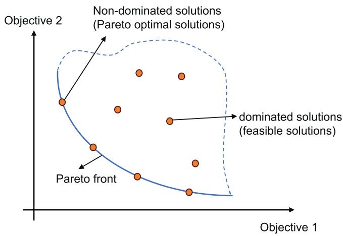  
Fig. 3. The Pareto front distribution for the dual-objective function.

information. As a result, these algorithms are widely recognized for their ability to approximate the Pareto front (PF). Among these, MOEA/D has demonstrated superior performance over other algorithms [45].

Notice that our focus is on the joint improvement of communication and sensing performance in a more general multi-UAV network, where multiple communication users and sensing targets are independently considered. This scenario significantly differs from the traditional dual-objective optimization problems. In such a multi-UAV network with multi-user and multi-target, the UAVs need to not only coordinate and schedule the communication and sensing tasks while balancing the resource competition, but also design efficient flight trajectories to manage the interference among UAVs and enhance both communication and sensing performance. This leads to a large number of mixed-integer decision variables and numerous stringent and complex constraints. These high-dimensional, temporally coupled variables and constraints make the traditional multi-objective algorithms, such as NSGA-II and MOEA/D, less effective in both solution quality and computational efficiency.

To overcome these challenges, we propose an efficient SC-DO-MUOA algorithm based on the external archive guided MOEA/D (EAG-MOEA/D) [46] to solve our dual-objective ISAC problem. By combining the rapid convergence of Particle Swarm Optimization (PSO) with the diversity-maintaining ability of Genetic Algorithms (GA), our hybrid approach improves search efficiency and reduces the likelihood of getting trapped in local optima. This enables a better balance between communication and sensing performance in this complex multi-UAV network. Additionally, we propose a multi-stage constraint control method that manages different constraints in different stages, including guided population generation at the problem decomposition stage, population correction at the solution generation stage, and selective updates at the population update stage, to efficiently handle the challenges of multiple constraints posed by our problem.

The key steps of the SC-DO-MUOA algorithm are as follows: 1) Problem decomposition: The dual-objective optimization problem is divided into a set of scalar subproblems with corresponding weight vectors, thereby constructing an approximate search space for the Pareto solution set. 2) Coupling treatment for variables (Solution generation): The UAV trajectories, power allocation, user association, and target association variables are jointly encoded as individual chromosomes or particle vectors, generated through our proposed adaptive hybrid generator to jointly optimize during every solution generation and update process. 3) Population update: An external archive mechanism and neighborhood update strategy are employed to refine and maintain the Pareto front, improving convergence quality and solution diversity. 4) Convergence guarantee: HV metric tracks the evolution of the Pareto front. If HV improvement stays below a set threshold for several generations, the algorithm is considered to have converged. A maximum iteration limit is also set to ensure timely termination with stable, high-quality solutions. The details are as follows.

## A. Problem Decomposition

Similarly to other MOEA/D algorithms, we first decompose the dual-objective problem into D single-objective optimization subproblems, indexed by $d \ = \ 1 , 2 , . . . , D$ . Each subproblem d is associated with a weight vector $\lambda ^ { \mathbf { d } } \ =$ $\left\{ \lambda _ { 1 } ^ { \dot { d } } , . . . , \lambda _ { m } ^ { d } \right\}$ , where $\Sigma _ { i = 1 } ^ { m } \lambda _ { i } ^ { d } = 1$ and m is the number of objectives, here, $m = 2 .$ . Specifically, each individual weight can be selected from the set $\left\{ { \frac { 0 } { D - 1 } } , { \frac { 1 } { D - 1 } } , . . . { \frac { D - 1 } { D - 1 } } \right\}$ according to [45], [46]. The goal is to optimize each subproblem simultaneously, which collectively approximates the PF. Furthermore, considering the numerous constraints in our problem, we introduce a penalty function into the objective function to guide population generation. Therefore, the subproblem d can be expressed as follows:

$$
\begin{array} { l } { \displaystyle \operatorname* { m i n } _ { \mathbf { P } , \mathbf { A } , \mathbf { C } , \mathbf { Q } } { y _ { d } ( x ) } = \displaystyle \sum _ { i = 1 } ^ { m } \lambda _ { i } ^ { d } f _ { i } ( x ) + \gamma g ( x ) } \\ { \mathrm { s . t . } x \in \Omega , } \end{array}\tag{28}
$$

where $f _ { i }$ is the normalized objective function, defined as $\begin{array} { r } { f _ { i } ~ = ~ \frac { f _ { i } ^ { \prime } - f _ { i } ^ { m i n } } { f _ { i } ^ { m a x } - f _ { i } ^ { m i n } } } \end{array}$ . f<sup>max</sup><sub>i</sub> and $f _ { i } ^ { m i n }$ are the maximum and minimum values of the objective function $f _ { i }$ in the current population, respectively. According to our problem, $f _ { 1 } ^ { \prime } ~ =$ $\begin{array} { r } { - \frac { 1 } { N } \sum _ { n = 1 } ^ { N } \sum _ { m = 1 } ^ { \bar { M } } \sum _ { k = 1 } ^ { K ^ { * } } R _ { m , k } [ n ] } \end{array}$ and $\begin{array} { r } { f _ { 2 } ^ { \prime } ~ = ~ \sum _ { j = 1 } ^ { J } C R { \bf \bar { B } } _ { { \bf v } _ { j } } . } \end{array}$ Similarly, let all penalty terms normalize and have the same penalty weight γ within the range of [1, 10] to ensure the feasibility of the solutions. Then, the penalty g can be expressed as $\begin{array} { r } { g = \sum _ { i = 1 } ^ { 3 } \frac { g _ { i } ^ { \prime } - g _ { i } ^ { m i n } } { g _ { i } ^ { m a x } - g _ { i } ^ { m i n } } } \end{array}$ . According to our constraints, $g _ { 1 } ^ { \prime } =$ $\begin{array} { r } { \sum _ { n = 1 } ^ { N } \sum _ { m , = 1 } ^ { M } \operatorname* { m a x } _ { * , r } ( 0 , \| \mathbf { q } _ { m } [ n ] - \mathbf { q } _ { m } [ n - 1 ] \| - V _ { m a x } \delta _ { t } ) , g _ { 2 } ^ { \prime } = } \end{array}$ $\begin{array} { r } { \sum _ { n = 1 } ^ { N } \sum _ { m = 1 } ^ { M } \sum _ { g \neq m } ^ { M } \operatorname* { m a x } ( 0 , d _ { m i n } - \| \mathbf { q } _ { m } [ n ] - \mathbf { q } _ { g } [ n ] \| ) } \end{array}$ , and $\begin{array} { r } { g _ { 3 } ^ { \prime } = \sum _ { k = 1 } ^ { K } \sum _ { l = 1 } ^ { L } } \end{array}$ max $\begin{array} { r l } {  { \Big ( 0 , R _ { k } ^ { t h } - \frac { 1 } { N _ { L } } \sum _ { n = ( l - 1 ) N _ { L } + 1 } ^ { l N _ { L } } \sum _ { m = 1 } ^ { M } } } & { { } } \end{array}$ $\alpha _ { m , k } [ n ] R _ { m , k } [ n ] )$ . Besides, variable ranges can be restricted directly at the time of definition. And the other constraints are integer constraints, which we will handle in the algorithm below. The feasible solution set is Ω.

Additionally, we define the subproblems which have the $N _ { e }$ closest weight vectors to $\lambda ^ { \mathbf { d } }$ in terms of Euclidean distance as the neighbours of subproblem $d ,$ donated as $\boldsymbol { B _ { \mathbf { d } } }$ . According to the EAG-MOEA/D algorithm, define the best solutions to all the subproblems up to the current iteration as population E and D solutions selected by NSGA-II [47] (the nondominated sorting approach and crowding distance assignment) as the external archive population Z.

## B. New Solution Generation

We propose a novel adaptive hybrid generator to generate new populations. The strategy combines PSO’s fast local search with GA’s global exploration. When the algorithm is likely to get stuck in a local optimum, the population generator automatically switches from PSO to GA to overcome local convergence issues. Conversely, PSO generator is used to accelerate exploration. Therefore, the hybrid generator effectively integrates the fast convergence properties of PSO and the diversity-preserving capabilities of GA, significantly accelerating overall convergence speed, improving search efficiency, and reducing the probability of getting trapped in a local optimum. Moreover, we incorporate adaptive parameter control to further balance convergence and diversity, enhancing the search performance. The specific process of generating a new solution of subproblem d is as follows:

Note that HV is defined as the hypervolume between the estimated Pareto front and the reference vector, whose changes can reflect whether the population is convergent to a certain extent. Therefore, we define $\Delta ^ { k } = H V ^ { k } - H \mathsf { \bar { V } } ^ { k - 1 }$ . When $\Delta ^ { k }$ is lower than a certain threshold for 5 consecutive iterations, it may be trapped in the local optimum, and we switch from PSO operator to genetic operator, and vice versa.

For the genetic operator, we introduce dynamic adjustment of the selection probability $P _ { s e l e c t }$ , crossover probability $P _ { c } ,$ and mutation probability $P _ { m }$ of the current individual $d$ as follows [48], [49]:

$$
P _ { s e l e c t , d } = \frac { F _ { d } } { \sum _ { d = 1 } ^ { D } F _ { d } } ,\tag{29}
$$

$$
P _ { c , d } = \left\{ P _ { c } ^ { m a x } - \frac { ( P _ { c } ^ { m a x } - P _ { c } ^ { m i n } ) ( F _ { d } ^ { \prime } - F _ { a v g } ) } { F _ { m a x } - F _ { a v g } } , F _ { d } ^ { \prime } \ge F _ { a v g } , \right.\tag{30}
$$

$$
P _ { m , d } = \left\{ \begin{array} { l l } { P _ { m } ^ { m a x } - \frac { \left( P _ { m } ^ { m a x } - P _ { m } ^ { m i n } \right) \left( F _ { d } - F _ { a v g } \right) } { F _ { m a x } - F _ { a v g } } , F _ { d } \ge F _ { a v g } , } \\ { P _ { m } ^ { m a x } , F _ { d } < F _ { a v g } . } \end{array} \right.\tag{31}
$$

To better match the search-space scales, we adopt simple linear models of the number of UAVs M based on our simulations to enable dynamic initialization adjustment of the GA/PSO parameters. Specifically, set the maximum and minimum crossover probability $P _ { c } ^ { m a x } = 0 . 8 + 0 . 0 0 2 M$ and $P _ { c } ^ { m i n } = 0 . 5 + 0 . 0 0 2 M$ , respectively. Set the maximum and minimum mutation probability $P _ { m } ^ { m a x } \ = \ 0 . 1 5 \ - \ 0 . 0 0 1 M$ and $P _ { m } ^ { m i n } \ = \ 0 . 0 9 \mathrm { ~ - ~ } 0 . 0 0 0 8 M$ , respectively. Therefore, for the smaller UAV scales, slightly lower crossover preserves good structures and reduces redundant exploration, yielding faster, more stable convergence and better solutions; for larger scales, moderately higher values enhance global exploration and improve final results. $F _ { d }$ is the fitness value of the individual $d ,$ while $F _ { m a x }$ and $F _ { a v g }$ are the maximum and average fitness values of the current population. $F _ { d } ^ { \prime }$ represents the higher fitness between the two parents. In multi-objective optimization, the fitness value can incorporate Pareto rank and crowding distance to better represent individual superiority [47]. Here we define $\begin{array} { r } { F _ { d } ^ { - 1 } \ = \ r a n k ( d ) + \frac { 1 } { D i s t a n c e ( d ) } } \end{array}$ . This adaptive adjustment of crossover and mutation probabilities helps to retain favorable genes when fitness is high and promotes diversity when fitness is low, thereby improving algorithm efficiency. And the simulated binary crossover is employed. Generate the offspring solutions $\mathbf { x _ { d } } ^ { k + 1 , c }$ with the parent solutions of kth generation, i.e., $\mathbf { x _ { b 1 } } ^ { k }$ and $\mathbf { x _ { b 2 } } ^ { k }$ , by the following crossover:

$$
\mathbf { x _ { d } } ^ { k + 1 , c } = \left( ( 1 + \beta ) \mathbf { x _ { b 1 } } ^ { k } + ( 1 - \beta ) \mathbf { x _ { b 2 } } ^ { k } \right) / 2 ,\tag{32}
$$

where $\beta$ is the spread factor of the simulated binary crossover, satisfying $\beta = ( 2 u ) ^ { \frac { 1 } { \eta _ { c } + 1 } } \mathrm { i f } u \leq 0 . 5 .$ , otherwise, $\beta = ( 2 ( 1 -$ $u ) ) ^ { - } { \frac { 1 } { \eta _ { c } + 1 } }$ , where u uniformly distributs on the interval [0, 1] and $\eta _ { c } = 2 0 ~ [ 4 7 ]$ , [50]. Then, employ polynomial mutation to further explore the solution space. Obtain the mutated solutions $\mathbf { x _ { d } } ^ { k + 1 , m }$ by:

$$
\mathbf { x _ { d } } ^ { k + 1 , m } = \mathbf { x _ { d } } ^ { k + 1 , c } + \delta _ { d } ( \mathbf { U _ { b } } - \mathbf { L _ { b } } ) ,\tag{33}
$$

where $\mathbf { L _ { b } }$ and $\mathbf { U _ { b } }$ are the corresponding lower and upper bounds of the solutions. $\delta _ { d }$ is the perturbation factor, satisfying $\begin{array} { r l r } { \delta _ { d } } & { { } = } & { \bigg ( 2 r + ( 1 - 2 r ) \left( 1 - \frac { \mathbf { x _ { d } } ^ { k + 1 , c } - \mathbf { L _ { b } } } { \mathbf { U _ { b } } - \mathbf { L _ { b } } } \right) ^ { \eta _ { m } + 1 } \bigg ) ^ { \frac { 1 } { \eta _ { m } + 1 } } - } \end{array}$ 1, $\begin{array} { r l r l r l } { \operatorname { i f } } & { { } \ r } & { { } ^ { \setminus } } & { } & { { } 0 . 5 , } \end{array}$ , otherwise, $\begin{array} { r l r } { \delta _ { d } } & { { } \ = \ , } & { 1 \ - } \end{array}$ $\begin{array} { r } { \bigg ( 2 ( 1 - r ) + 2 ( r - 0 . 5 ) \left( 1 - \frac { \mathbf { U _ { b } } - \mathbf { x _ { d } } ^ { k + 1 , c } } { \mathbf { U _ { b } } - \mathbf { L _ { b } } } \right) ^ { \eta _ { m } + 1 } \bigg ) ^ { \frac { 1 } { \eta _ { m } + 1 } } , } \end{array}$ where $r$ uniformly distributs on the interval [0, 1] and $\eta _ { m } = 2 0 \ [ 4 7 ]$ , [50].

For the PSO operator, each particle represents a potential solution of the corresponding subproblem, and the particle swarm gradually approaches the optimal solution by continuously updating its position and velocity [51]. Here, define the velocity of particle d of kth generation as $\mathbf { v _ { d } } ^ { k }$ , the individual best position of kth generation as $\mathbf { e _ { d } } ^ { k }$ , where $\mathbf { e _ { d } } ^ { k } \in \mathbf { E }$ , and the global best position of kth generation in its neighborhood as $\mathbf { z _ { d } } ^ { k }$ , where $\mathbf { y _ { d } } ^ { k } \in \mathbf { \delta E }$ . Then, we generate new solutions using the following rules:

$$
\mathbf { v _ { d } } ^ { k + 1 } = \omega \mathbf { v _ { d } } ^ { k } + c _ { 1 } r _ { 1 } ( \mathbf { e _ { d } } ^ { k } - \mathbf { x _ { d } } ^ { k } ) + c _ { 2 } r _ { 2 } ( \mathbf { z _ { d } } ^ { k } - \mathbf { x _ { d } } ^ { k } ) ,\tag{34}
$$

$$
\mathbf { x _ { d } } ^ { k + 1 , p } = \mathbf { x _ { d } } ^ { k } + \mathbf { v _ { d } } ^ { k + 1 } ,\tag{35}
$$

where $\omega$ is the inertia weight, which controls the influence of the particle’s current velocity. $c _ { 1 }$ and $c _ { 2 }$ are the cognitive and social coefficients, respectively. $r _ { 1 }$ and $r _ { 2 }$ are the random numbers uniformly distributed on the interval [0, 1]. We employ a linear-varying strategy to adapt the inertia weight ω and learning coefficients $c _ { 1 }$ and $c _ { 2 }$ over iterations. These parameters are defined as:

$$
\omega = \omega _ { m a x } - \frac { ( \omega _ { m a x } - \omega _ { m i n } ) k } { K _ { m a x } } ,\tag{36}
$$

$$
c _ { 1 } = c _ { m a x } - \frac { ( c _ { m a x } - c _ { m i n } ) k } { K _ { m a x } } ,\tag{37}
$$

$$
c _ { 2 } = c _ { m i n } + \frac { ( c _ { m a x } - c _ { m i n } ) k } { K _ { m a x } } ,\tag{38}
$$

where $k$ is the current iteration and $K _ { m a x }$ is the total number of iterations. Similar to the dynamic initialization of parameters in AGA, we set the maximum inertia weight $\omega _ { m a x } \ = \ 0 . 8 \ : + \ : 0 . 0 0 2 M$ and the minimum inertia weight $\omega _ { m i n } = 0 . 3 + 0 . 0 0 2 M$ . Given the relatively minor effects with UAV scale in our experiments, we set $c _ { m a x } \ = \ 2 . 5 ,$ and $c _ { m i n } ~ = ~ 0 . 5$ according to [52] and [53]. This adaptive strategy allows for larger step sizes during the early iterations to enhance global exploration and progressively reduces the search range to improve convergence in later stages.

Now, we obtain the new solution $\mathbf { x _ { d } } ^ { k + 1 , p }$ or $\mathbf { \bar { x _ { d } } } ^ { k + 1 , m }$ of subproblem d through the hybrid operator integrating PSO and GA. However, the solutions generated by PSO or genetic operators might not satisfy the constraints, especially for the binary variables. Therefore, to better satisfy the constraints, we apply correction factors to obtain the final solution $\mathbf { x _ { d } } ^ { k + 1 }$ Specifically, for the zero-one variables, we preserve the generated solutions as much as possible and adjust only the infeasible entries. When multiple UAVs are assigned to the same user, we retain the assignment with the nearest UAV–user and set the others to 0. Define the solution set of all the subproblems as X.

## C. Population Update

To more effectively leverage local search capabilities, accelerate convergence, and maintain diversity, we first consider updating the solutions of the neighbour sets. For each solution $\mathbf { x _ { d } } ^ { k + 1 }$ , we compare it with the solutions of all neighbors. If $\mathbf { x _ { d } } ^ { k + 1 }$ performs better than the solution $\mathbf { x _ { b } } ^ { k }$ of neighbour subproblem $b , b \in B _ { \mathbf { d } } ,$ in terms of the neighbour weight vector $\lambda ^ { \mathbf { b } } ,$ , replace $\mathbf { x _ { b } } ^ { k }$ with $\mathbf { x _ { d } } ^ { k + 1 }$ . Let the updated solutions denote as $\mathbf { X } ^ { \prime }$ and update E with $\mathbf { X } ^ { \prime }$ . Then, we update the external archive population Z. Merge $\mathbf { X } ^ { \prime }$ with Z to obtain $\mathbf { Y } = \mathbf { X } ^ { \prime } \cup \mathbf { Z }$ Select the best $D$ solutions from the combined population Y to form new Z by the NSGA-II selection.

Note that when determining if one solution is better than another, we give more attention to constraint satisfaction. We calculate the total constraint violation value for each solution $\mathbf { x _ { d } } ^ { k + 1 }$ as $G _ { d } ^ { k + 1 }$ [54]. When there are constraint violations in a solution (any $G _ { d } ^ { k + 1 } > 0 )$ , we update only if the new solution’s constraint value is less than or equal to that of the original solution. This guides our search towards solutions that better satisfy the constraints.

The procedure of the whole algorithm is given in the following Algorithm 1.

## D. Algorithm Complexity

We discuss the computational complexity of the proposed SC-DO-MUOA algorithm. Obviously, the major computational cost is involved in the repetition part. We first generate new solutions by the hybrid operator with the computational complexity of $\mathcal { O } ( D )$ . Then, we update the neighbour solutions for each subproblem and select the best D solutions based on non-dominated sorting with the computational complexity of $\mathcal { O } ( D N _ { e } )$ and $\mathcal { O } ( D ^ { 2 } )$ , respectively. Thus, the overall complexity of the proposed SC-DO-MUOA algorithm is $\mathcal { O } ( D ^ { 2 } )$ for each iteration.

```latex
Algorithm 1 SC-DO-MUOA
Input:
1) the dual-objective problem with constraints;
2) a stopping criterion;
3) $D \colon$ the number of subproblems (population size);
4) $\lambda ^ { 1 } , \ldots , \lambda ^ { \mathbf { D } }$ : weight vectors set for all subproblems;
5) $N _ { e } \colon$ the size of the neighbour set for each subproblem.
Initialization:
1) Decompose dual-objective problem into D subprob
lems associated to $\bar { \lambda ^ { 1 } } , \dotsc , \bar { \lambda ^ { \mathrm { D } } }$ with penalty function.
2) Generate an initial population $\mathbf { E } = \left\{ \mathbf { x _ { 1 } } ^ { k } , \dots , \mathbf { x _ { D } } ^ { k } \right\}$
satisfying the constraints. Let $k = 0 .$
3) Set $\mathbf { Z } = \mathbf { E } .$
4) Select $N _ { e }$ subproblems with the nearest weight vec
tors to each subproblem d using Euclidean distance,
forming the neighbor set $\boldsymbol { B _ { \mathbf { d } } }$ for each subproblem.
Repeat
New solution generation:
for all $d \in [ 1 , \ldots , D \}$ do
a) if $\Delta ^ { k } < \dot { \Delta } _ { m i n }$ for 5 consecutive iterations
Apply adaptive GA operator to generate new
solution $\mathbf { x _ { d } } ^ { k + 1 , m }$ based on (32) and (33).
else
Apply adaptive PSO operator to generate new
solution $\mathbf { x _ { d } } ^ { k + 1 , p }$ based on (34) and (35).
end if
b) Obtain final solution $\mathbf { x _ { d } } ^ { k + 1 }$ by correction factors.
end for
Population update:
for all $d \in \{ 1 , \ldots , D \}$ do
a) Update neighbour solutions to obtain $\mathbf { X } ^ { \prime } .$
For each $b \in \ B _ { \mathbf { d } }$ of each subproblem $d ,$ set
$\mathbf { x _ { b } } ^ { k } \ = \ \mathbf { x _ { d } } ^ { k + 1 }$ , if objectives $y _ { b } ( \bar { \mathbf { x _ { d } } } ^ { k + 1 } | \mathbf { \lambda } \lambda ^ { \mathbf { b } } ) \ \leq$
$y _ { b } ( \mathbf { x _ { b } } ^ { k } \ \mid \ \lambda ^ { \mathbf { b } } )$ and constraints $\hat { G } _ { d } ^ { k + 1 } ~ \leq ~ G _ { b } ^ { k }$ (if
min $\phantom { } _ { 1 } ( G _ { b } ^ { k } , G _ { d } ^ { k + 1 } ) > 0 )$
end for
b) Set the updated Set $\mathbf { E } = \mathbf { X } ^ { \prime } , \mathbf { Y } = \mathbf { X } ^ { \prime } \cup \mathbf { Z } .$
c) Select the best D solutions from Y to form new
Z by NSGA-II. And calculate $\Delta ^ { k }$ of Z.
Update $k = k + 1 .$
Until satisfy the stopping criteria
Output: A set of nondominated solutions Z.
```

## IV. SIMULATION RESULTS

In this section, numerical results demonstrate the efficiency of our proposed dual-objective SC-DO-MUOA algorithm in the general multi-UAV network.

## A. Energy Constraints

The UAV primarily consumes energy during both ISAC transmission and flight, which limits the endurance time of our scheme. To guarantee that total energy consumption remains

TABLE I  
PARAMETERS OF ENERGY CONSTRAINTS
<table><tr><td rowspan=1 colspan=1>Parameters</td><td rowspan=1 colspan=1>Value</td></tr><tr><td rowspan=1 colspan=1>Circuitry power consumption, $P _ { c o n s t }$ </td><td rowspan=1 colspan=1>5W</td></tr><tr><td rowspan=1 colspan=1>Rotor disc area, A</td><td rowspan=1 colspan=1> $\overline { { 0 . 5 0 3 ~ \mathrm { m } ^ { 2 } } }$ </td></tr><tr><td rowspan=1 colspan=1>Tip speed of the rotor blade, $U _ { t i p }$ </td><td rowspan=1 colspan=1>120 m/s</td></tr><tr><td rowspan=1 colspan=1>Rotor solidity, s</td><td rowspan=1 colspan=1>0.05 m³</td></tr><tr><td rowspan=1 colspan=1>Air density, ρ</td><td rowspan=1 colspan=1>1.225 $\overline { { { \bf { k g } } / { \bf { m } } ^ { 3 } } }$ </td></tr><tr><td rowspan=1 colspan=1>Fuselage drag ratio, do</td><td rowspan=1 colspan=1>0.6</td></tr><tr><td rowspan=1 colspan=1>Mean rotor velocity induced in forward flight, vo</td><td rowspan=1 colspan=1>4.03 m/s</td></tr><tr><td rowspan=1 colspan=1>Blade profile power during hovering, $P _ { 0 }$ </td><td rowspan=1 colspan=1>80 W</td></tr><tr><td rowspan=1 colspan=1>UAV mass, $M _ { U A V }$ </td><td rowspan=1 colspan=1> $2 ~ \mathrm { K g }$ </td></tr><tr><td rowspan=1 colspan=1>Gravitational acceleration, g</td><td rowspan=1 colspan=1> $\overline { { 9 . 8 ~ \mathrm { \ m / s ^ { 2 } } } }$ </td></tr><tr><td rowspan=1 colspan=1>UAV&#x27;s energy budget, $E _ { b a t }$ </td><td rowspan=1 colspan=1>15000J</td></tr></table>

within the available battery energy, we derive a conservative mission-time upper bound for optimization.

For each UAV, the power consumption for signal transmission in time slot n can be denoted by P<sub>T</sub> [n] [55]:

$$
P _ { T } [ n ] = p [ n ] + P _ { c o n s t }\tag{39}
$$

which includes the transmit power of the UAV $p [ n ]$ and a constant power $P _ { c o n s t }$ , consumed in the circuitry, signal processing, equipment, etc. Additionally, the propulsion power of a rotary-wing UAV can be modeled as a function of its speed v[n] in time slot n [55], [56]:

$$
\begin{array} { r } { P _ { F } [ n ] = P _ { 0 } \left( 1 + \frac { 3 v [ n ] ^ { 2 } } { U _ { t i p } ^ { 2 } } \right) + \frac { 1 } { 2 } d _ { 0 } \rho s A v [ n ] ^ { 3 } } \\ { + P _ { i } \left( \sqrt { 1 + \frac { v [ n ] ^ { 4 } } { 4 v _ { 0 } ^ { 4 } } } - \frac { v [ n ] ^ { 2 } } { 2 v _ { 0 } ^ { 2 } } \right) ^ { 1 / 2 } } \end{array}\tag{40}
$$

with the typical parameter values shown in Table I according to [55] and [56].

Considering our 3D trajectory optimization, the total energy consumption model of N slots with duration $\delta _ { t }$ can be approximately expressed as follows [57]:

$$
\begin{array} { l r } { { \displaystyle { \cal E } _ { t o t } = \sum _ { n = 1 } ^ { N } \left( P _ { T } [ n ] + P _ { F } [ n ] \right) \delta _ { t } + \frac { M _ { U A V } ( v [ N ] ^ { 2 } - v [ 1 ] ^ { 2 } ) } { 2 } } } \\ { { \displaystyle ~ + M _ { U A V } g ( q _ { z } [ N ] - q _ { z } [ 1 ] ) } } \end{array}\tag{1}
$$

where $M _ { U A V }$ is the UAV mass, and g is the gravitational acceleration. The last two terms capture the net changes of kinetic and gravitational potential energy between the start and end of the mission.

To ensure feasibility in real deployment, we enforce the battery-energy constraint:

$$
E _ { t o t } \leq E _ { b a t }\tag{42}
$$

where $E _ { b a t }$ is the available battery energy of the UAVs. As observed from the function curve in Fig. 2 in [55], the propulsion power $P _ { F } [ n ]$ achieves its maximum at $v [ n ] = V _ { m a x }$ in our scenario, hence $P _ { F } [ n ] \ \leq \ P _ { F } ^ { m a x } { \overset { \triangle } { = } } P _ { F } ( V _ { m a x } )$ . Using these worst-case bounds and denoting $T = N \delta _ { t }$ , we obtain the upper bound of the total energy consumption:

$$
T ( P _ { T } ^ { m a x } + P _ { F } ^ { m a x } ) + \frac { M _ { U A V } V _ { m a x } ^ { 2 } } { 2 }
$$

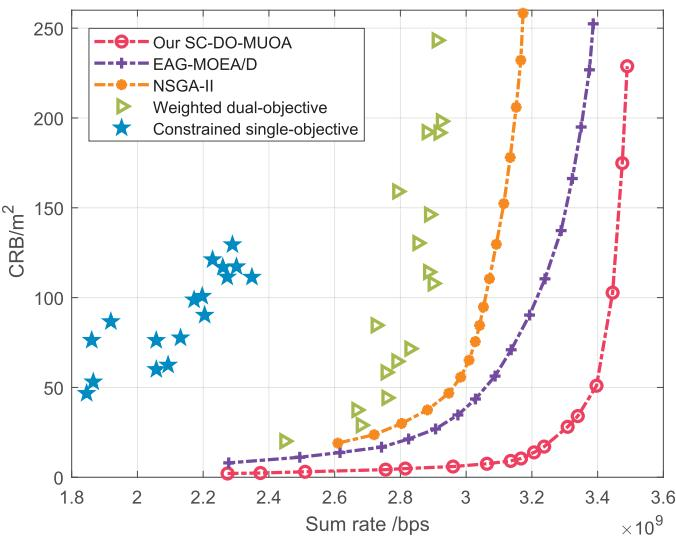

Fig. 4. Comparison of dual objectives: communication sum rate and sensing CRB against baseline schemes.  
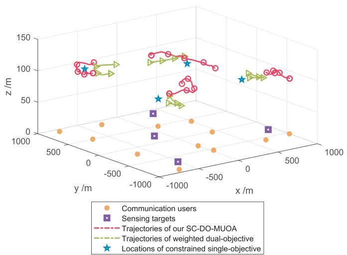  
Fig. 5. Comparison of 3D UAV trajectories and locations by different schemes with $\bar { \eta } _ { C R B } = 1 5$ and $\psi = 0 . 5$

$$
+ M _ { U A V } g ( H _ { m a x } - H _ { m i n } ) \leq E _ { b a t }\tag{43}
$$

where $P _ { T } ^ { m a x } \ = \ P _ { m a x } + P _ { c o n s t } .$ . And we instantiated the boundary values with $v [ N ] = V _ { m a x } , v [ 1 ] = 0 , q _ { z } [ N ] = H _ { m a x } ,$ and $q _ { z } [ 1 ] = H _ { m i n }$ . Solving the inequality for T provides the worst-case feasible mission time:

$$
T _ { m a x } \approx 3 3 \mathrm { s }\tag{44}
$$

We then set the whole mission period as $\textit { T } = \textit { T } _ { m a x }$ for optimization to guarantee feasibility in deployment.

## B. Simulation Setups

The ground users and targets are randomly and uniformly distributed in a 2-dimension area of 2 km ×2 km, as shown in Fig. 6. Set the number of the users and targets as $K = 1 2$ and $\begin{array} { l l l } { J } & { = } & { 4 . } \end{array}$ , respectively, which are served by $M \ = \ 4$ UAVs in the whole mission period $T \ : = \ : 3 3 8$ . The settings are the same unless otherwise specified for the following simulations. The major simulation parameters are given in Table II, which are selected according to [9], [15], [16], [39], and [40]. Additionally, for all the multi-objective optimization algorithms, we set the population size $D = 5 0$ , the neighbor size $N _ { e } = 5 ,$ , and the maximum iteration $K _ { m a x } = 6 0 0$ for the small-scale UAV networks $( M < 5 0 ~ \mathrm { U A V s } ) ;$ and set the population size $D = 1 0 0$ , the neighbor size $N _ { e } = 1 0 $ , and the maximum iteration $K _ { m a x } = 1 2 0 0$ for the large-scale UAV networks $( M \geq 5 0 \mathrm { U A V s } )$ . The performance results below are obtained through Monte Carlo simulations.

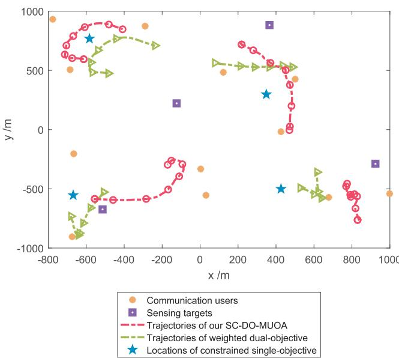  
Fig. 6. Top view of the comparison of the UAV trajectories and locations by different schemes with η<sub>CRB</sub> = 15 and $\psi = 0 . 5 .$

TABLE II SIMULATION PARAMETERS
<table><tr><td rowspan=1 colspan=1>Parameters</td><td rowspan=1 colspan=1>Value</td></tr><tr><td rowspan=1 colspan=1>Minimum UAV flying altitude, $H _ { m i n }$ </td><td rowspan=1 colspan=1>100 m</td></tr><tr><td rowspan=1 colspan=1>Maximum UAV flying altitude, $H _ { m a x }$ </td><td rowspan=1 colspan=1>200 m</td></tr><tr><td rowspan=1 colspan=1>Minimum distance between any two $\mathrm { U A V s } , d _ { m i n }$ </td><td rowspan=1 colspan=1>200 m</td></tr><tr><td rowspan=1 colspan=1>Maximum UAV speed, $V _ { m a x }$ </td><td rowspan=1 colspan=1>30 m/s</td></tr><tr><td rowspan=1 colspan=1>Centre frequency</td><td rowspan=1 colspan=1>35 GHz</td></tr><tr><td rowspan=1 colspan=1>Total bandwidth, B</td><td rowspan=1 colspan=1>256MHz</td></tr><tr><td rowspan=1 colspan=1>Noise power, $\overline { { \sigma _ { 0 } ^ { 2 } } }$ </td><td rowspan=1 colspan=1>-110 dBm</td></tr><tr><td rowspan=1 colspan=1>Communication channel gain at the reference distance, $\beta _ { c o m }$ </td><td rowspan=1 colspan=1>-50 dB</td></tr><tr><td rowspan=1 colspan=1>Sensing channel gain at the reference distance, $\beta _ { s e n }$ </td><td rowspan=1 colspan=1>-33 dB</td></tr><tr><td rowspan=1 colspan=1>Interference channel gain at the reference distance, $\beta _ { i n t }$ </td><td rowspan=1 colspan=1>-23 dB</td></tr><tr><td rowspan=1 colspan=1>Suppression gain of the direct interference, X</td><td rowspan=1 colspan=1>-30 dB</td></tr><tr><td rowspan=1 colspan=1>Default maximum UAV transmission power, $P _ { m a x }$ </td><td rowspan=1 colspan=1>20 dBm</td></tr><tr><td rowspan=1 colspan=1>Minimum information rate requirement, $\overline { { R _ { k } ^ { t h } } }$ ∀k</td><td rowspan=1 colspan=1>0.25 bps/Hz</td></tr><tr><td rowspan=1 colspan=1>Default whole mission period, $T$ </td><td rowspan=1 colspan=1> $\overline { { 3 3 \mathrm { ~ s ~ } } }$ </td></tr><tr><td rowspan=1 colspan=1>Default ISAC frame length, $T _ { L }$ </td><td rowspan=1 colspan=1> $\overline { { 1 1 \mathrm { ~ s ~ } } }$ </td></tr><tr><td rowspan=1 colspan=1>Default time slot length, $\delta _ { t }$ </td><td rowspan=1 colspan=1>1.1 s</td></tr></table>

## C. Simulation Results

To the best of our knowledge, there has been no similar work addressing the dual objectives of improving the communication rate and the sensing CRB for the UAV-ISAC scenarios, especially in multi-UAV ISAC scenarios. Therefore, we select the two most relevant works as baselines and extend them to the same scenario as ours to compare with our proposed SC-DO-MUOA. We also compare with the traditional multi-objective algorithms NSGA-II and EAG-MOEA/D to further validate the effectiveness of our algorithm.

1) Weighted dual-objective scheme [15], where a single UAV serves multiple users while sensing multiple targets. The objective is to maximize a weighted sum of the communication rate and the negative of the sensing CRB. Following the principles proposed in [15], the UAV trajectory is primarily determined by the successive convex approximation (SCA) algorithm, and the transmit power is set according to a maximum power strategy. To extend this scheme to multi-UAV scenarios, we adopt the UAV clustering method [16] to group users and targets, with each cluster served by a dedicated UAV. Additionally, the computational complexity is polynomial over $\mathcal { O } ( N ^ { 3 . 5 } \log ( 1 / \epsilon ) )$ , where $\epsilon > 0$ is a solution accuracy.

2) Constrained single-objective scheme [16], where multiple UAVs serve the communication users while cooperatively sensing a single target. The objective is to maximize the network utility based on communication rate, subject to the CRB localization accuracy constraint. This scheme balances UAV sensing and communication by optimizing one aspect under constraints on the other. Specifically, following the principles proposed in [16], the UAV locations are determined using spectral clustering to group users, while the user association and UAV transmission power control rely mainly on coalition game theory and SCA algorithms, respectively. Note that the trajectory and placement optimizations can be compared based on the average instantaneous sumrate objective. According to [16], the total computational complexity is polynomial over $\mathcal { O } ( K M )$

3) EAG-MOEA/D algorithm [46], an external archiveguided multi-objective evolutionary algorithm based on decomposition method. And the computational complexity is polynomial over $\mathcal { O } ( D ^ { 2 } )$

4) NSGA-II algorithm [47], a widely used multi-objective genetic algorithm with fast non-dominated sorting and crowding distance calculation. And the computational complexity is polynomial over $\mathcal { O } ( D ^ { 2 } )$ .

Fig. 4 illustrates the distribution of solutions for the dual-objective optimization, and each point represents the performance across two dimensions: communication sum rate and sensing CRB. We obtained the optimization results of the weighted dual-objective scheme and the constrained singleobjective scheme under the different CRB thresholds, i.e., η<sub>CRB</sub> = [9, 25], and the different weighting factors, i.e., $\psi = [ 0 . 1 , 0 . 9 ]$ , respectively, as shown by the pentagon and triangle markers in the figure.

Note that higher communication rates and lower CRB values indicate superior performance; thus, points closer to the bottom-right in the graph represent better solutions. Fig. 4 clearly demonstrates that our proposed SC-DO-MUOA significantly outperforms the weighted and constrained schemes in terms of both the sum rate and the CRB. This is because our SC-DO-MUOA simultaneously considers the communication and sensing objectives, more effectively utilizes the overall resources, and manages the interference in multi-UAV ISAC scenarios. Additionally, the dual-objective model can overcome the rigid priority constraints of single-objective methods and biases from subjective weighting factors in weighted dual-objective schemes, fully exploiting the potential of both communication and sensing. Moreover, our SC-DO-MUOA achieves a superior Pareto front (PF) compared to the EAG-MOEA/D and NSGA-II algorithms, further validating its effectiveness in balancing communication and sensing performance.

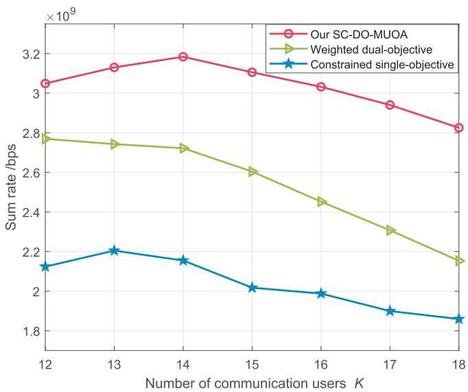  
Fig. 7. Sum rate comparison with weighted dual-objective and constrained single-objective schemes under increasing communication users.

We compare the 3D UAV trajectories and locations optimized by different schemes in Fig. 5, selecting two highperforming baseline solutions (with η<sub>CRB</sub> = 15 and ψ = 0.5) from Fig. 4 for comparison. In order to show the differences of the UAV trajectories more clearly, we plot the top view of these trajectories in Fig. 6. As shown in Fig. 6, the trajectories of our SC-DO-MUOA are closer to both the communication users and the sensing targets compared to baseline trajectories. And the optimized flight trajectories by our SC-DO-MUOA enable the UAVs to serve the most suitable users and targets at optimal times and locations to improve the whole channel conditions, thus improving the overall system sum rate and sensing accuracy. Moreover, the UAVs can make dynamic altitude adjustment to more flexibly optimize the sensing perspectives and mitigate interference.

In Fig. 7 and Fig. 8, we compare these UAV-ISAC schemes under increasing number of communication users by evaluating the average performance of PS solutions. It can be observed that our proposed dual-objective SC-DO-MUOA consistently achieves the highest communication sum rate and the best sensing CRB performance among all the UAV-ISAC schemes. This advantage is primarily due to the dual-objective optimization employed by SC-DO-MUOA, which enables more flexible resource allocation and efficient trajectory planning, effectively balancing communication and sensing tasks while mitigating interference. Notably, there is an optimal user-serving capacity in Fig. 7 due to the trade-off between improved resource utilization and increased interference with additional users. Nevertheless, our proposed SC-DO-MUOA algorithm still maintains robust and effective performance even when other schemes experience great performance degradation. Additionally, the increased number of users competing for sensing resources results in reduced sensing accuracy and elevated CRB values in Fig. 8. However, the SC-DO-MUOA exhibits the slowest rate of increase in CRB among these schemes due to its effective balancing of resources between sensing and communications.

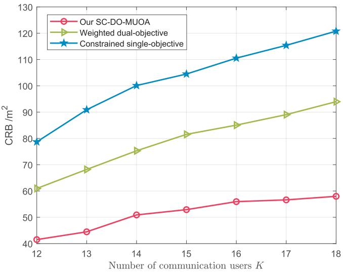  
Fig. 8. Sensing CRB comparison with weighted dual-objective and constrained single-objective schemes under increasing communication users.

With the increasing number of UAVs, we compare different UAV-ISAC schemes in terms of both the sum rate and the CRB. As shown in Fig. 9 and Fig. 10, our SC-DO-MUOA algorithm consistently outperforms the weighted and constrained schemes in both performances. Notably, Fig. 9 shows that the increasing speed of the sum rate begins to decrease when the number of UAVs increases to 16. This is because the increasing UAVs introduce more significant interference, thereby slowing down the improvement of sum rate. However, despite this slowdown, the performance gap between algorithms continues to expand with the increasing number of UAVs because of our SC-DO-MUOA’s superior ability to exploit the growing UAV resources and dynamically adjust UAV altitudes. Similarly, in Fig. 9, the interference also slows down the rate of improvement in sensing CRB as the number of UAVs increases. In contrast, the CRB even worsens under the weighted and constrained schemes. These results clearly demonstrate that our SC-DO-MUOA algorithm not only scales effectively but also consistently delivers superior performance as the UAV network expands.

Fig. 11 and Fig. 12 compare the performance of the proposed SC-DO-MUOA with the baseline schemes as the maximum UAV power, $P _ { m a x }$ , increases. In both sum rate and CRB, our SC-DO-MUOA consistently outperforms the other two schemes. This advantage primarily arises from our algorithm’s effective power allocation strategy, coupled with its adaptive optimization of UAV trajectories and user associations based on power control, enabling superior resource utilization. Additionally, as power continues to increase, the interference also increases, leading to slower improvement in sum rate and CRB. However, our SC-DO-MUOA’s superior interference management mitigates this effect, enabling it to maintain a higher growth (descent for CRB) rate in sum rate compared to the other schemes.

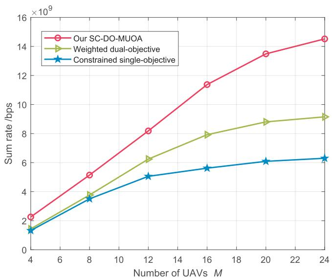  
Fig. 9. Sum rate comparison with weighted dual-objective and constrained single-objective schemes in the increasing number of ${ \mathrm { U A V s } } ,$ and users $K =$ 40, targets $J = 1 2$

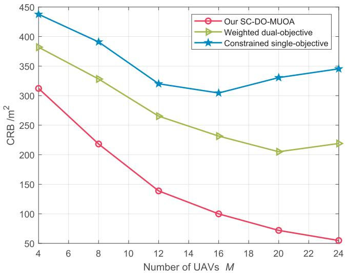  
Fig. 10. Sensing CRB comparison with weighted dual-objective and constrained single-objective schemes in the increasing number of UAVs, and users $K = 4 0 ,$ , targets ${ \bar { \boldsymbol { J } } } = 1 2$

To further analyze the complexity and scalability of the SC-DO-MUOA algorithm, particularly in large-scale UAV networks, we compare its performance with EAG-MOEA/D and NSGA-II in terms of computational runtime, memory usage, convergence speed, and HV in different network scales, as shown in Table III. Additionally, all the experiments were conducted on a desktop PC running Windows 10, equipped with an Intel Core i7-1165G7 CPU @ 2.80GHz, 16GB DDR4 RAM, and MATLAB 2023a. Here, we did not use any parallel acceleration techniques. In practical applications, leveraging high-performance computing platforms (such as GPU parallel computing or edge device optimization) can further reduce the runtime and enhance the system’s ability to respond to realtime environments.

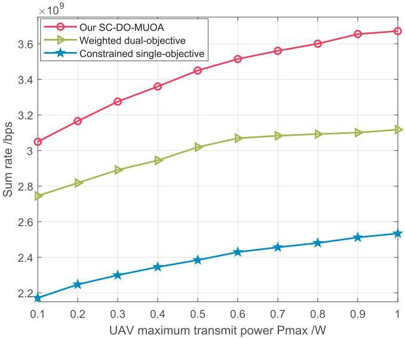  
Fig. 11. Sum rate comparison with weighted dual-objective and constrained single-objective schemes under the increasing UAV maximum power $P _ { m a x } .$

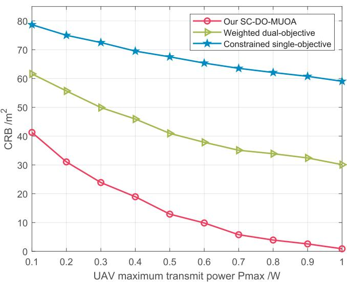  
Fig. 12. CRB comparison with weighted dual-objective and constrained single-objective schemes under the increasing UAV maximum power $P _ { m a x } .$

The results clearly demonstrate that our SC-DO-MUOA algorithm outperforms the other algorithms in terms of runtime efficiency and convergence speed, particularly in larger-scale UAV networks. Moreover, HV is a widely used metric for evaluating multi-objective optimization algorithms and the larger HV value implies that our algorithm has a larger size of covered space and achieves better performance regarding both convergence and diversity. Specifically, Fig. 13 is the HV comparison with increasing iterations when the network scale is M = 50 UAVs. It clearly shows that our algorithm converges faster than EAG-MOEA/D and effectively avoids the local optima problem encountered by NSGA-II. Therefore, the experimental results validate the robustness and effectiveness of our SC-DO-MUOA in large-scale UAV deployments.

TABLE III  
PERFORMANCE COMPARISON OF SC-DO-MUOA, EAG-MOEA/D, AND NSGA-II
<table><tr><td rowspan="2"></td><td colspan="4">Network Scale: M = 4 UAVs with  $K = 1 2$  users and J = 4 targets</td></tr><tr><td>Runtime (s)</td><td>Memory Usage (MB)</td><td>Convergence Speed (iters)</td><td>HV</td></tr><tr><td>SC-DO-MUOA</td><td>0.06</td><td>0.13</td><td>20</td><td>1.19</td></tr><tr><td>EAG-MOEA/D (baseline)</td><td>0.11</td><td>0.15</td><td>40</td><td>1.14</td></tr><tr><td>NSGA-II (baseline)</td><td>0.13</td><td>0.16</td><td>50</td><td>1.07</td></tr><tr><td colspan="5">Network Scale: M = 20 UAVs with  $K = 1 0 0$ </td></tr><tr><td></td><td>Runtime (s)</td><td>Memory Usage (MB)</td><td>Convergence Speed (iters)</td><td>HV</td></tr><tr><td>SC-DO-MUOA</td><td>0.98</td><td>1.78</td><td>180</td><td>1.12</td></tr><tr><td>EAG-MOEA/D (baseline)</td><td>1.91</td><td>1.97</td><td>300</td><td>1.05</td></tr><tr><td>NSGA-II (baseline)</td><td>3.27</td><td>1.93</td><td>300</td><td>0.85</td></tr><tr><td colspan="5">Network Scale:  $M = 5 0 ~ \mathbf { U A V s }$  with  $K = 1 0 0$  users and  $J = 2 0$ </td></tr><tr><td></td><td>Runtime (s)</td><td>Memory Usage (MB)</td><td>Convergence Speed (iters)</td><td>HV</td></tr><tr><td>SC-DO-MUOA</td><td>3.12</td><td>5.20</td><td>400</td><td>0.96</td></tr><tr><td>EAG-MOEA/D (baseline)</td><td>5.32</td><td>5.52</td><td>600</td><td>0.89</td></tr><tr><td>NSGA-II (baseline)</td><td>5.21</td><td>5.52</td><td>500</td><td>0.66</td></tr><tr><td colspan="5">Network Scale: M = 100 UAVs with K = 100 users and J = 20 targets</td></tr><tr><td></td><td>Runtime (s)</td><td>Memory Usage (MB)</td><td>Convergence Speed (iters)</td><td>HV</td></tr><tr><td>SC-DO-MUOA</td><td>5.71</td><td>10.97</td><td>550</td><td>0.88</td></tr><tr><td>EAG-MOEA/D (baseline)</td><td>9.05</td><td>11.01</td><td>900</td><td>0.72</td></tr><tr><td>NSGA-II (baseline)</td><td>11.39</td><td>10.56</td><td>1000</td><td>0.63</td></tr></table>

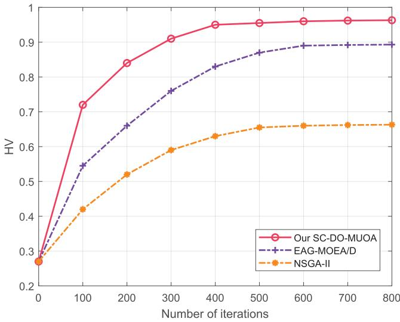  
Fig. 13. HV comparison with the number of UAVs M = 50 and reference point [1.1, 1.1].

## D. Discussions

We explicitly discuss the limitations and scalability of the SC-DO-MUOA algorithm. Because the problem is NP-hard, approximate strategies (such as objective-space decomposition we adopted) are required, which may lead to suboptimal solutions or limited convergence speed. Moreover, as the problem size increases significantly, the computational complexity may grow exponentially. Even so, the results in Table III show that even with 100 UAVs, 100 users, and 20 targets, SC-DO-MUOA still outperforms baselines, reducing the runtime by half and improving solution quality by 20%, demonstrating strong scalability. Nevertheless, the exponential growth of the search space due to the larger problem scale still poses challenges in terms of the computational burden and performance for ultra-large-scale and real-time applications. To address these challenges, we will explore multi-stage optimization, parallel computing, and distributed processing methods in future work to further enhance scalability.

## V. CONCLUSION

This paper investigated ISAC in a more general multi-UAV network, where the UAVs provided downlink communications to multiple ground users while sensing the locations of multiple ground targets. We also consider the complicated interference management among the UAVs to make the scenario more practical. Note that in such an ISAC scenario, the UAVs need to coordinate and schedule communication and sensing tasks, balance resource competition, and design efficient flight trajectories to enhance both communication and sensing performance. This results in a complicated and challenging joint optimization problem in terms of the UAV trajectories, the both user and target associations, and the power control. Furthermore, to overcome the potential performance limitations of existing single-objective and weighted approaches, we proposed a dual-objective model to further optimize ISAC, aiming for a better tradeoff between communication and sensing performance. Specifically, we proposed an efficient SC-DO-MUOA to improve both the communication sum rate and the sensing CRB. Simulation results demonstrated that our proposed SC-DO-MUOA outperformed various baselines in terms of both communication and sensing performance.

## REFERENCES

[1] J. Mu, R. Zhang, Y. Cui, N. Gao, and X. Jing, “UAV meets integrated sensing and communication: Challenges and future directions,” IEEE Commun. Mag., vol. 61, no. 5, pp. 62–67, May 2023.

[2] J. Zhang, M. Sheng, C. Xing, J. Liu, N. Zhao, and G. K. Karagiannidis, “Generative-adversarial-network-enhanced DRL for ISAC with double active RISs,” IEEE Internet Things J., vol. 12, no. 10, pp. 13487–13499, May 2025, doi: 10.1109/JIOT.2025.3527441.

[3] J. Zhang et al., “Intelligent waveform design for integrated sensing and communication,” IEEE Wireless Commun., vol. 32, no. 1, pp. 166–173, Feb. 2025.

[4] J. Zhang, M. Liu, J. Tang, N. Zhao, D. Niyato, and X. Wang, “Joint design for RIS-aided ISAC via deep unfolding learning,” IEEE Trans. Cognit. Commun. Netw., vol. 11, no. 1, pp. 349–361, Feb. 2025.

[5] F. Liu et al., “Integrated sensing and communications: Toward dualfunctional wireless networks for 6G and beyond,” IEEE J. Sel. Areas Commun., vol. 40, no. 6, pp. 1728–1767, Jun. 2022.

[6] Y. Shen, B. Li, R. Zhang, X. Cheng, and L. Yang, “A flexible load balancing scheme in multi-UAV-enabled wireless networks,” IEEE Trans. Veh. Technol., vol. 73, no. 6, pp. 9205–9210, Jun. 2024.

[7] L. Zhou, W. Pu, Y. Jiang, M.-Y. You, R. Zhang, and Q. Shi, “Joint optimization of UAV deployment and directional antenna orientation for multi-UAV cooperative sensing system,” IEEE Trans. Wireless Commun., vol. 23, no. 10, pp. 14052–14065, Oct. 2024.

[8] K. Meng et al., “UAV-enabled integrated sensing and communication: Opportunities and challenges,” IEEE Wireless Commun., vol. 31, no. 2, pp. 97–104, Apr. 2024.

[9] K. Meng, Q. Wu, S. Ma, W. Chen, K. Wang, and J. Li, “Throughput maximization for UAV-enabled integrated periodic sensing and communication,” IEEE Trans. Wireless Commun., vol. 22, no. 1, pp. 671–687, Jan. 2023.

[10] Z. Lyu, G. Zhu, and J. Xu, “Joint maneuver and beamforming design for UAV-enabled integrated sensing and communication,” IEEE Trans. Wireless Commun., vol. 22, no. 4, pp. 2424–2440, Apr. 2023.

[11] C. Deng, X. Fang, and X. Wang, “Beamforming design and trajectory optimization for UAV-empowered adaptable integrated sensing and communication,” IEEE Trans. Wireless Commun., vol. 22, no. 11, pp. 8512–8526, Nov. 2023.

[12] W. Jiang, B. Ai, C. Shen, M. Li, and X. Shen, “Age-of-information minimization for UAV-based multi-view sensing and communication,” IEEE Trans. Veh. Technol., vol. 73, no. 1, pp. 1100–1114, Jan. 2024.

[13] Z. Liu, X. Liu, Y. Liu, V. C. M. Leung, and T. S. Durrani, “UAV assisted integrated sensing and communications for Internet of Things: 3D trajectory optimization and resource allocation,” IEEE Trans. Wireless Commun., vol. 23, no. 8, pp. 8654–8667, Aug. 2024, doi: 10.1109/ TWC.2024.3352985.

[14] Y. Liu, S. Liu, X. Liu, Z. Liu, and T. S. Durrani, “Sensing fairnessbased energy efficiency optimization for UAV enabled integrated sensing and communication,” IEEE Wireless Commun. Lett., vol. 12, no. 10, pp. 1702–1706, Oct. 2023.

[15] X. Jing, F. Liu, C. Masouros, and Y. Zeng, “ISAC from the sky: UAV trajectory design for joint communication and target localization,” IEEE Trans. Wireless Commun., vol. 23, no. 10, pp. 12857–12872, Oct. 2024, doi: 10.1109/TWC.2024.3396571.

[16] X. Wang, Z. Fei, J. A. Zhang, J. Huang, and J. Yuan, “Constrained utility maximization in dual-functional radar-communication multi-UAV networks,” IEEE Trans. Commun., vol. 69, no. 4, pp. 2660–2672, Apr. 2021.

[17] X. Liu, Y. Liu, Z. Liu, and T. S. Durrani, “Fair integrated sensing and communication for multi-UAV-enabled Internet of Things: Joint 3-D trajectory and resource optimization,” IEEE Internet Things J., vol. 11, no. 18, pp. 29546–29556, Sep. 2024.

[18] I. Orikumhi, H. Lee, J. Bae, and S. Kim, “ISAC-enable mobility-aware multi-UAV placement for ultra-dense networks,” ICT Exp., vol. 10, no. 4, pp. 831–835, Aug. 2024.

[19] L. Zhou, S. Leng, Q. Wang, and Q. Liu, “Integrated sensing and communication in UAV swarms for cooperative multiple targets tracking,” IEEE Trans. Mobile Comput., vol. 22, no. 11, pp. 6526–6542, Nov. 2023.

[20] R. A. Khalil and N. Saeed, “Convex hull optimization for robust localization in ISAC systems,” IEEE Sensors Lett., vol. 7, no. 12, pp. 1–4, Dec. 2023.

[21] T. Zhang, K. Zhu, S. Zheng, D. Niyato, and N. C. Luong, “Trajectory design and power control for joint radar and communication enabled multi-UAV cooperative detection systems,” IEEE Trans. Commun., vol. 71, no. 1, pp. 158–172, Jan. 2023.

[22] Y. Pan et al., “Cooperative trajectory planning and resource allocation for UAV-enabled integrated sensing and communication systems,” IEEE Trans. Veh. Technol., vol. 73, no. 5, pp. 6502–6516, May 2024.

[23] W. Ding et al., “Multi-UAV-enabled integrated sensing and communications: Joint UAV placement and power control,” in Proc. IEEE Globecom Workshops (GC Wkshps), Kuala Lumpur, Malaysia, Dec. 2023, pp. 842–847.

[24] Y. Liu et al., “Secure rate maximization for ISAC-UAV assisted communication amidst multiple eavesdroppers,” IEEE Trans. Veh. Technol., vol. 73, no. 10, pp. 15843–15847, Oct. 2024, doi: 10.1109/ TVT.2024.3412805.

[25] Y. Cui, Z. Feng, Q. Zhang, Z. Wei, C. Xu, and P. Zhang, “Toward trusted and swift UAV communication: ISAC-enabled dual identity mapping,” IEEE Wireless Commun., vol. 30, no. 1, pp. 58–66, Feb. 2023.

[26] J. Beuster et al., “Sounding-based evaluation of multi-sensor ISAC networks for drone applications: Measurement and simulation perspectives,” in Proc. IEEE 4th Int. Symp. Joint Commun. Sens., Mar. 2024, pp. 1–6.

[27] I. Orikumhi, J. Bae, and S. Kim, “Mobility-aware resource allocation in UAV-assisted ISAC networks,” in Proc. 14th Int. Conf. Inf. Commun. Technol. Converg. (ICTC), Oct. 2023, pp. 1042–1044.

[28] Y. Zheng, L. Li, W. Lin, W. Liang, Q. Du, and Z. Han, “Resource allocation based on optimal transport theory in ISAC-enabled multi-UAV networks,” 2024, arXiv:2410.02122.

[29] R. M. Azadur, C. J. Pawase, and K. Chang, “Multi-UAV path planning utilizing the PGA algorithm for terrestrial IoT sensor network under ISAC framework,” Trans. Emerg. Telecommun. Technol., vol. 35, no. 1, p. 4916, Jan. 2024.

[30] X. Xu, R. Tao, S. Li, and Y. Chen, “Collaborative UAV deployment and task allocation for environment sensing in multi-UAV networks,” in Proc. IEEE Int. Conf. Unmanned Syst. (ICUS), Oct. 2022, pp. 738–743.

[31] J. Wu, W. Yuan, and L. Bai, “On the interplay between sensing and communications for UAV trajectory design,” IEEE Internet Things J., vol. 10, no. 23, pp. 20383–20395, Dec. 2023.

[32] Y. Qin, Z. Zhang, X. Li, W. Huangfu, and H. Zhang, “Deep reinforcement learning based resource allocation and trajectory planning in integrated sensing and communications UAV network,” IEEE Trans. Wireless Commun., vol. 22, no. 11, pp. 8158–8169, Nov. 2023.

[33] M. Wang, P. Chen, Z. Cao, and Y. Chen, “Reinforcement learning-based UAVs resource allocation for integrated sensing and communication (ISAC) system,” Electronics, vol. 11, no. 3, p. 441, Feb. 2022.

[34] H. Li, M. Xiao, K. Wang, D. I. Kim, and M. Debbah, “Large language model based multi-objective optimization for integrated sensing and communications in UAV networks,” IEEE Wireless Commun. Lett., vol. 14, no. 4, pp. 979–983, Apr. 2025.

[35] Y. Xiong, F. Liu, Y. Cui, W. Yuan, T. X. Han, and G. Caire, “On the fundamental tradeoff of integrated sensing and communications under Gaussian channels,” IEEE Trans. Inf. Theory, vol. 69, no. 9, pp. 5723–5751, Sep. 2023.

[36] M. A. Jasim, H. Shakhatreh, N. Siasi, A. H. Sawalmeh, A. Aldalbahi, and A. Al-Fuqaha, “A survey on spectrum management for unmanned aerial vehicles (UAVs),” IEEE Access, vol. 10, pp. 11443–11499, 2022.

[37] H. Koumaras et al., “5G-enabled UAVs with command and control software component at the edge for supporting energy efficient opportunistic networks,” Energies, vol. 14, no. 5, p. 1480, Mar. 2021.

[38] Q. Wu, Y. Zeng, and R. Zhang, “Joint trajectory and communication design for multi-UAV enabled wireless networks,” IEEE Trans. Wireless Commun., vol. 17, no. 3, pp. 2109–2121, Mar. 2018.

[39] X. Wang, Z. Fei, J. Huang, J. A. Zhang, and J. Yuan, “Joint resource allocation and power control for radar interference mitigation in multi-UAV networks,” Sci. China Inf. Sci., vol. 64, no. 8, Aug. 2021, Art. no. 182307.

[40] J. Zhang, Z. Fei, X. Wang, P. Liu, J. Huang, and Z. Zheng, “Joint resource allocation and user association for multi-cell integrated sensing and communication systems,” EURASIP J. Wireless Commun. Netw., vol. 2023, no. 1, pp. 1–19, Jul. 2023.

[41] S. M. Kay, Fundamentals of Statistical Signal Processing: Estimation Theory. Upper Saddle River, NJ, USA: Prentice-Hall, 1993, pp. 15–67.

[42] H. Godrich, A. P. Petropulu, and H. V. Poor, “Power allocation strategies for target localization in distributed multiple-radar architectures,” IEEE Trans. Signal Process., vol. 59, no. 7, pp. 3226–3240, Jul. 2011.

[43] H. Godrich, A. M. Haimovich, and R. S. Blum, “Target localization accuracy gain in MIMO radar-based systems,” IEEE Trans. Inf. Theory, vol. 56, no. 6, pp. 2783–2803, Jun. 2010.

[44] J. Li, H. Kang, G. Sun, S. Liang, Y. Liu, and Y. Zhang, “Physical layer secure communications based on collaborative beamforming for UAV networks: A multi-objective optimization approach,” in Proc. IEEE INFOCOM - IEEE Conf. Comput. Commun., Vancouver, BC, Canada, May 2021, pp. 1–10.

[45] Q. Zhang and H. Li, “MOEA/D: A multiobjective evolutionary algorithm based on decomposition,” IEEE Trans. Evol. Comput., vol. 11, no. 6, pp. 712–731, Dec. 2007.

[46] X. Cai, Y. Li, Z. Fan, and Q. Zhang, “An external archive guided multiobjective evolutionary algorithm based on decomposition for combinatorial optimization,” IEEE Trans. Evol. Comput., vol. 19, no. 4, pp. 508–523, Aug. 2015.

[47] K. Deb, A. Pratap, S. Agarwal, and T. Meyarivan, “A fast and elitist multiobjective genetic algorithm: NSGA-II,” IEEE Trans. Evol. Comput., vol. 6, no. 2, pp. 182–197, Apr. 2002.

[48] C. Zhang, X. Wen, C. Li, W. Zheng, L. Yu, and Z. Lu, “Dynamic rapid scheduling algorithm for vehicle time sensitive communication based on CILP and AGA,” IEEE Trans. Veh. Technol., vol. 72, no. 11, pp. 15014–15027, Nov. 2023.

[49] W. Jiangxiong, L. Qiankuan, J. Liandian, T. Benke, and T. Junyang, “Research on intelligent substation secondary circuit fault location based on AGA-PSO algorithm,” in Proc. 6th Asia Energy Electr. Eng. Symp. (AEEES), Mar. 2024, pp. 1075–1081.

[50] Y. Tian, W. Zhu, X. Zhang, and Y. Jin, “A practical tutorial on solving optimization problems via PlatEMO,” Neurocomputing, vol. 518, pp. 190–205, Jan. 2023.

[51] S. Z. Mart´ınez and C. A. C. Coello, “A multi-objective particle swarm optimizer based on decomposition,” in Proc. 13th Annu. Conf. Genetic Evol. Comput., Jul. 2011, pp. 69–76.

[52] S. Liu, “An improved particle swarm algorithm for UAV path planning,” in Proc. IEEE Int. Conf. Image Process. Comput. Appl. (ICIPCA), Aug. 2023, pp. 949–953.

[53] A. Ratnaweera, S. K. Halgamuge, and H. C. Watson, “Self-organizing hierarchical particle swarm optimizer with time-varying acceleration coefficients,” IEEE Trans. Evol. Comput., vol. 8, no. 3, pp. 240–255, Jun. 2004.

[54] H. Jain and K. Deb, “An evolutionary many-objective optimization algorithm using reference-point based nondominated sorting approach, part II: Handling constraints and extending to an adaptive approach,” IEEE Trans. Evol. Comput., vol. 18, no. 4, pp. 602–622, Aug. 2014.

[55] M. B. Yilmaz, L. Xiang, and A. Klein, “Joint beamforming and trajectory optimization for UAV-enabled ISAC under a finite energy budget,” in Proc. IEEE Int. Conf. Commun. Workshops (ICC Workshops), Jun 2024, pp. 1876–1881.

[56] Y. Zeng, J. Xu, and R. Zhang, “Energy minimization for wireless communication with rotary-wing UAV,” IEEE Trans. Wireless Commun., vol. 18, no. 4, pp. 2329–2345, Apr. 2019.

[57] H. Pan, Y. Liu, G. Sun, J. Fan, S. Liang, and C. Yuen, “Joint power and 3D trajectory optimization for UAV-enabled wireless powered communication networks with obstacles,” IEEE Trans. Commun., vol. 71, no. 4, pp. 2364–2380, Apr. 2023.

  
Xu Guo (Student Member, IEEE) received the B.E. degree in network engineering from Southwest Jiaotong University, Chengdu, China, in 2021. She is currently pursuing the Ph.D. degree with the School of Electronics, Peking University, Beijing, China. Her current research interests include UAV communications, wireless resource allocation, and integrated sensing and communication networks.

  
Jingcheng Shi (Graduate Student Member, IEEE) received the B.E. degree in communication engineering from Dalian Maritime University, Dalian, China, in 2022. He is currently pursuing the Ph.D. degree with the School of Electronics, Peking University, Beijing, China. His current research interests include integrated sensing and communications, signal processing, and wireless resource allocation.


Jianjun Wu (Member, IEEE) received the B.S., M.S., and Ph.D. degrees from Peking University, Beijing, China, in 1989, 1992, and 2006, respectively. Since 1992, he has been joined the School of Electronics Engineering and Computer Science, Peking University. He was a Professor with Peking University in 2014. His research interests include the areas of satellite communications, wireless communications, and communications signal processing.


Rongqing Zhang (Member, IEEE) received the B.S. and Ph.D. degrees (Hons.) from Peking University, Beijing, China, in 2009 and 2014, respectively. He is currently an Associate Professor with The Hong Kong University of Science and Technology (Guangzhou), Guangzhou, China. Before joining HKUST(GZ), he held faculty positions at Tongji University and Colorado State University. His research interests include vehicular communications and networking, low-altitude vehicular networks, and connected intelligence. He has authored and co-authored three monographs and over 200 papers in top journals and conferences, with three Best Paper Awards at the IEEE ICC 2016, GLOBE-COM 2018, and ICC 2019. He also received the 2017 First-Class Prize in Natural Science of Ministry of Education of China, the 2023 First-Class Prize in Natural Science of Chinese Association of Automation, and the 2023 First-Class Prize in Natural Science of China Institute of Communications. Currently, he is the Secretary General of the Connected Intelligence Committee of Chinese Association of Automation, the Vice-Chair of the Information Services Committee of IEEE ComSoc Asian–Pacific Board, and an Associate Editor of IEEE TRANSACTIONS ON VEHICULAR TECHNOLOGY and IET Communications.


Xiang Cheng (Fellow, IEEE) received the joint Ph.D. degree from Heriot-Watt University and The University of Edinburgh, Edinburgh, U.K., in 2009. He is currently a Boya Distinguished Professor with Peking University. His research focuses on the in-depth integration of communication networks and artificial intelligence, including intelligent communication networks and connected intelligence, the subject on which he has published more than 280 journals and conference papers, 11 books, and holds 32 patents. He was a recipient of the IEEE

Asia–Pacific Outstanding Young Researcher Award in 2015 and the Xplorer Prize in 2023. He was a co-recipient of the 2016 IEEE Journal on Selected Areas in Communications Best Paper Award: the Leonard G. Abraham Prize and the 2021 IET Communications Best Paper Award: Premium Award. He has also received the Best Paper Awards from IEEE ITST’12, ICCC’13, ITSC’14, ICC’16, ICNC’17, GLOBECOM’18, ICCS’18, and ICC’19. He has been a Highly Cited Chinese Researcher since 2020. In 2021 and 2023, he was selected into two world scientist lists, including the World’s Top 2% Scientists released by Stanford University and top computer science scientists released by Guide2Research. He has served as the symposium lead chair, the co-chair, and a member of the technical program committee for several international conferences. He led the establishment of four Chinese standards (including industry standards and group standards) and participated in the formulation of ten 3GPP international standards and two Chinese industry standards. He is currently a Subject Editor of IET Communications; an Associate Editor of IEEE TRANSACTIONS ON WIRELESS COMMUNICATIONS, IEEE TRANS-ACTIONS ON INTELLIGENT TRANSPORTATION SYSTEMS, IEEE Wireless Communications Letters, and Journal of Communications and Information Networks. He was a Distinguished Lecturer of the IEEE Vehicular Technology Society.