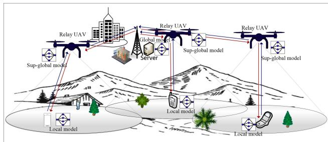
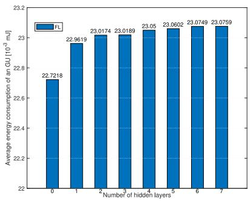
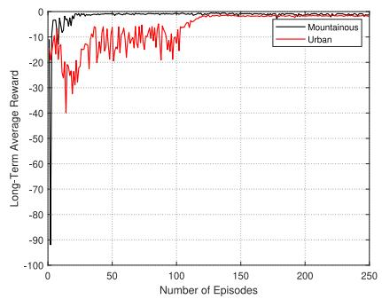
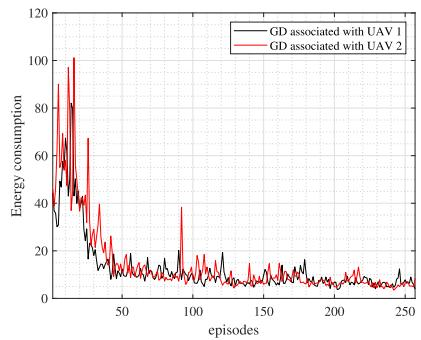
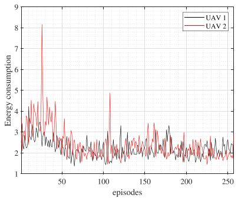
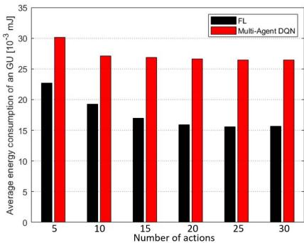
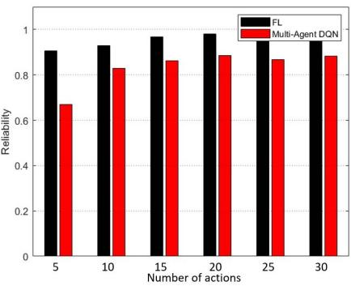

# Intelligent Energy Efficiency and Service Reliability Optimization for UAV-Aided Terrestrial Networks

Dara Ron and Jung-Ryun Lee , Senior Member, IEEE

Abstract—Our study investigates the deployment of Unmanned Aerial Vehicles (UAVs) in areas, such as mountainous regions, where installing terrestrial base stations (TBS) is challenging. This approach extends the coverage area of commercial network services, enhances network capacity, and ensures reliable Internet service for ground users (GUs) in remote locations. However, a key challenge remains for terrestrial networks operating in licensed frequency bands, which limits the availability of physical resource blocks (PRBs). This constraint highlights the need for PRB sharing, which introduces interference issues. To address this challenge, we design a federated learning (FL) framework that enables all agents, such as GUs, UAVs, and TBS, to collaboratively learn by interacting with the physical network environment for intelligent dynamic spectrum sharing (DSS) to mitigate interference. Additionally, our FL framework optimizes the placement of UAVs for efficient deployment to maximize network throughput. It also allows GUs and UAVs to adjust their transmit power to achieve energy efficiency that addresses their limited battery storage constraints. To accomplish this, we formulate a mixed-integer nonlinear optimization framework with the objective of minimizing energy consumption while meeting service reliability constraints. The proposed FL framework tackles this optimization problem by transforming it into an unconstrained Markov Decision Process (UUMDP) problem. The GUs employ the asynchronous advantage actor-critic (A3C) algorithm to explore the optimal solution for this UUMDP problem that maintains the time complexity for local model computations even in large-scale network deployments. Additionally, the FL framework provides feedback on the knowledge of all learning agents through global model aggregation to improve local models. Simulation results demonstrate that our approach outperforms the multi-agent deep Q-networks (DQN) method in terms of energy efficiency and service reliability.

Index Terms—Dynamic spectrum sharing, UAV-aided terrestrial networks, and federated learning.

## I. INTRODUCTION

ITH the global deployment of 5G systems, researchers are now directing their focus toward 6G wireless networks. The 6G technology has been expected to take the Key performance metrics (KPMs) to the next level, offering enhanced quality of service (QoS), improved spectral and energy efficiency, ultra-low latency, seamless service continuity, increased reliability, and significantly expanded coverage [1]. Unmanned aerial vehicles (UAVs) have been considered as one of the complementary parts of the 6G networks due to their flexible and easy deployment for filling coverage gaps, such as mountainous regions and areas affected by natural disasters (e.g., floods, wildfires, earthquakes), where TBS installation is highly impractical [2], [3]. UAVs are expected to play a pivotal role in providing emergency Internet connectivity, conducting regional observations, and assisting with humanitarian missions in such critical situations. Additionally, with the growing popularity of mountain hiking as a sport, which offers numerous mental and physical health benefits, the deployment of UAVs is crucial for delivering Internet service to users in these remote locations. Satellite mobile phone, which rely on GEO or LEO satellites for communication, is capable of providing network connections to users anywhere [4]. However, the limitations of satellite phone still exists due to its capability and cost. Satellite mobile phones primarily support the applications, including voice calls, short message services, and low-speed Internet access. They lack the capability to support popular applications that require low latency and high data rates, such as video calls or live streaming. Furthermore, most users own a regular mobile phone, a satellite phone comes with additional expenses. This should be also reason why most users do not wish to own satellite phones. The use of UAVs to assist terrestrial networks in locations where installing TBS is challenging will enable telecom companies to offer commercial 5G/6G services to users without the additional costs of satellite phones and their service subscriptions. Applications such as video calls and live streaming on social media will become accessible. Despite the advantages offered by UAVs, challenges persist when they operate in licensed frequency bands. Due to the limited availability of PRBs, UAVs may need to share frequencies with commercial TBSs and GUs, which can lead to interference issues [5]. Moreover, improper UAV placement can degrade network performance, highlighting the need for algorithms to optimize UAV positioning.

The prior works proposed various algorithms to mitigate the interference problem via optimizing the deployment and trajectory of UAV [6], [7], [8], [9], the association of users to the selected UAV, the transmit power control, and the channel allocation. The joint optimization of the deployment and trajectory of the UAV has been investigated in [10]. The problem was formulated as mixed-integer-and-nonlinear programming. Then, two algorithms, namely the adaptive whale optimization algorithm and elastic ring self-organizing map, were simultaneously used to optimize the deployment and trajectory of the UAV, respectively. The study in [11] focused on the joint optimization of the resource allocation and 2D trajectory of UAVs. The authors decomposed a highefficiency iterative algorithm into two sub-algorithms for scheduling the association of users to a UAV and optimizing the transmit power and trajectory of UAV. An alternating optimization framework was proposed in [12] to optimize the UAV trajectory and channel allocation for the purpose of minimizing the packet transmission delay. The authors of [13] investigated the system of mobile edge computingenabled UAVs to provide computing and relaying services for users. This study applied the block successive upper bound minimization algorithm to tackle the joint resource allocation and task offloading problem. The authors of [14] formulated the energy efficiency optimization problem as a non-convex optimization problem, which consists of several control variables including the locations of UAVs, beam pattern, power allocation, and time scheduling. The authors decoupled the original problem into several sub-problems and addressed them using the Dinkelbach, multi-objective evolutionary, and successive convex optimization methods alternatively.

Regarding the computing complexity, it is noticed that although the iterative algorithms showed their success in addressing the NP-hard and non-convex optimization problem, but they also faced the challenge due to the high computational complexity. The conventional algorithms, often requiring numerous iterations, prove unsuitable for dynamic UAVs-enabled networks where real-time adjustments in communication systems are essential. The studies in [15], [16] clearly demonstrate that conventional algorithms require a significant high number of iterations to reach the optimal solutions. Additionally, we provide results from our previous works that further validate this observation. The authors in [15] have designed a conventional algorithm, dubbed Improved Multi-objective Grey Wolf Optimizer (ImMOGWO), designed to explore the optimal UAV hovering positions in 3D space while minimizing energy consumption. The results showed that ImMOGWO requires approximately 100 iterations, whereas its previous version called the MOGWO algorithm requires up to 200 iterations to achieve convergence. Moreover, the study in [16] claimed that they proposed a lowcomplexity iterative algorithm based on a two-layer iterative procedure for optimizing beam codebook vectors at both the Intelligent Reflecting Surface and Access Point, aiming to maximize the achievable rate. However, the results showed that the algorithm still required between 200 and 500 iterations under various scenarios to achieve convergence. The scope of our study not only optimizes the locations and energy consumption of UAVs but also the allocation of resource block fractions to GUs and UAVs, as well as the transmit powers of GUs. As a result, the number of iterations required to achieve convergence will be significantly higher compared to the optimization problems addressed in [15], [16]. This justifies that conventional algorithms may not be suitable for addressing UAV-assisted terrestrial networks. In practical implementations, such as UAVs moving to optimal locations and channel gain variations due to fading, there is a need for algorithms that ensure fast convergence and can learn and adapt to network changes to find optimal solutions.

Machine learning (ML) enables powerful tasks such as estimation, classification, and feature extraction, while also inferring knowledge from data. It allows wireless devices to become intelligent, adapt to environmental variations, and take actions that maximize the likelihood of achieving optimal goals. Compared to the conventional approaches, various ML methods were applied to improve the performances of the wireless networks, i.e., ML-based methods for task offloading and resource allocation in vehicular edge computing networks [17], sum-rate and propositional fair maximization in wireless networks [18], joint optimization of the user association, channel allocation, and transmit power control in NOMA networks [19], resource allocation in the wireless system-assisted cloud computing [20]. A distributed ML framework called FL has been proposed with key benefits, including secure private data and mitigation of computation time in network scalability. FL reduces the computation time by enabling the participating devices to compute the models using their own data in a distributed manner. Sequentially, every collaborative device can upload the local model instead of its own private data to the centralized server in order to synthesize the global model [21]. The centralized parameter server returns the global model to all participating devices and thus they can update their models until converge to the global one to maximize the network performance.

The deployment of UAVs in mountainous regions to assist communication between commercial TBSs and GUs, operating on the FR3 frequency band . − . GHz), is the focus of our study. We design an FL framework for intelligent spectrum-sharing management and UAV placement optimization. The contributions of this study are outlined as follows:

• We design an FL framework to address interference caused by the limited licensed frequency bands by resource sharing among UEs, UAVs, and the TBS, together with the optimization of UAV placement in 3D to improve system performance.

• We formulate the optimization problem which aims to maximize energy efficiency while meeting service reliability constraints based on the round-trip delay (RTD) of packets. This is transformed into an UUMDP with energy consumption and service reliability integrated into the UUMDP’s objective function, the long-term average reward.

• The FL framework allows GUs to use the A3C algorithm to find the optimal policy which maximizes long-term rewards. GUs share their actor and critic models with a TBS, which combines them into a global model. Each GU then updates its model using this global model to solve the UUMDP problem.

  
Fig. 1. FL-based UAV-assisted wireless communication.

• A case study on spectrum sharing in the 12.2-12.7 GHz band shows that the proposed FL framework surpasses the multi-agent DQN in energy efficiency and service reliability. The FL framework achieves better performance compared to multi-agent DQN in terms of service reliability and energy consumption.

## II. UAV-ASSISTED TERRESTRIAL NETWORK MODEL

Fig. 1 illustrates an FL-based UAV-assisted wireless networks. We assume that multiple GUs are scattered in the mountain area located in the metropolitan. Let $\begin{array} { r l } { \mathcal { M } } & { { } = } \end{array}$ $\{ 1 , \dots , M \}$ =be the set of GUs and UAVs, where M is the total number of GUs. As mentioned earlier, the installation of the TBS in that mountain area is challenging and also comes with exorbitant construction costs. Therefore, we assume that multiple UAVs are employed to assist the communication between the GUs and a single TBS. The set of UAVs is denoted as $\mathcal { N } = \{ 1 , \ldots , N \}$ , where N is the total number of UAVs. Due to the limited availability of PRBs, a DSS framework is implemented, enabling each GU to share the channel with other GUs and UAVs. The GUs and UAVs synchronize their packet transmissions at different times, with the UAV acting as a relay. The UAV can initiate uplink or downlink packet transmission after receiving the data from either the GU or the TBS. Time is divided into multiple timeslots, with each slot composed of two distinct sub-timeslots, one allotted for UL transmission and the other allocated for DL transmission. During each UL timeslot, the GU sends a packet containing both information data and FL local model parameters to the UAVs. Subsequently, UAV aggregates the sub-global model parameter and forwards it, along with the accompanying information data, to TBS. The global model parameter will be obtained by TBS after receiving the subglobal model from UAV. During the DL timeslot, the TBS disseminates the global model parameter to all GUs through the UAVs. The size of local, sub-global, and global model parameters are equal to each other. Let $\Omega _ { m , t }$ and $D _ { m , t }$ be the size of information data and FL model parameter of the GU m generated at time t.

## A. Network Latency Analysis

The network latency is composed of the delays incurred during the computation and sharing of local, sub-global, and global model parameters, as well as the transmission of

information data. The delay for computing the model parameter depends on the device’s computing capability, specifically its central processing unit (CPU). It is given as

$$
\Gamma _ { m , t } ^ { C } = { \left( \alpha _ { m } \mathcal { D } _ { m , t } \right) } / { \left( \beta _ { m , t } F _ { m } \right) } ,\tag{1}
$$

where $\mathcal { D } _ { m , t }$ is the size of input datasets, $\alpha _ { m }$ represents the number of CPU cycles needed to process a single bit of data, $\beta _ { m , t }$ denote the decision variable representing the fraction of computing resources utilized to compute the task at time t, and $F _ { m }$ signifies the processing capacity in terms of CPU cycles per second. The local model parameter is concatenated with the information data and transmitted to the UAV, resulting in a transmission delay given by the following equation:

$$
\Gamma _ { m , n , t } ^ { T } = { \left( \Omega _ { m , t } + D _ { m , t } \right) } / { \left( R _ { m , n , t } \right) } ,\tag{2}
$$

where $R _ { m , t }$ is the communication rate between the GU and UAV. To optimize the allocation of available bandwidth for packet transmission, we introduce a control variable referred to as the fraction of bandwidth utilization, denoted as $\zeta _ { n , t } \in$ , . This variable allows us to efficiently manage the utilization of the available bandwidth so as to obtain the optimal communication rate while satisfying the user’s requirement. The communication rate is given by

$$
R _ { m , n , t } = \zeta _ { n , t } B \log _ { 2 } \Bigl ( 1 + \bigl ( P _ { m , t } g _ { m } ( \varphi _ { n , t } ) \bigr ) / ( \mathfrak { I } _ { n , t } + \sigma ^ { 2 } ) \Bigr ) ,\tag{3}
$$

where $P _ { m , t }$ represents the transmit power of the GU m and $\sigma ^ { 2 }$ denotes the noise power. $g _ { m } ( \varphi _ { n , t } )$ is the channel gain between the GU and UAV, which is defined as the function of the location of the UAV. $\varphi _ { n , t } = \{ x _ { n , t } , y _ { n , t } , z _ { n , t } \}$ is the coordinate of the UAV in 3-dimensional space, i.e., x-axis, yaxis, and z-axis. ${ \mathcal { I } } _ { n , t }$ represents the interference received by the UAV when multiple GUs transmit their packets using the same frequency band. This interference signal is given by

$$
\mathcal { I } _ { n , t } = \sum _ { j \in \mathcal { M } \backslash \{ m \} } \vartheta _ { j , n , t } P _ { j , t } g _ { j } \left( \varphi _ { n , t } \right) ,
$$

where $\vartheta _ { j , n , t } ~ \in ~ \{ 0 , 1 \}$ is the binary variable that indicates the user association. $\vartheta _ { j , n , t } = 1$ means the GUs m associates with the UAV n at time t. As the system permits each GU to select only one UAV, the constraint on this binary variable can be expressed as follows: $\begin{array} { r } { \sum _ { n \in \mathcal { N } } \vartheta _ { j , n , t } = 1 } \end{array}$ . The delay required for collecting the information data and the local model parameter from all participants is given by

$$
T _ { n , t } = \operatorname* { m a x } _ { m \in \mathcal { M } } \Bigl ( \vartheta _ { m , n , t } \bigl ( \Gamma _ { m , t } ^ { C } + \Gamma _ { m , n , t } ^ { T } \bigr ) \Bigr ) .\tag{4}
$$

Once the UAV has gathered the model parameters from all participants, it proceeds to aggregate the sub-global model and subsequently forwards it to the TBS. Let $\lceil \bar { \Gamma } _ { n , t } ^ { C }$ be the delay for computing the sub-global model parameter. This model computing delay can be defined in the same manner as (1), with the data size for computation being given by $\begin{array} { r } { \sum _ { m \in \mathcal { M } } \vartheta _ { m , n , t } \Omega _ { m , t } . } \end{array}$ . The packet transmission delay from the UAV to TBS can be expressed as

$$
\bar { \Gamma } _ { n , t } ^ { T } = \left( \Omega _ { n , t } + \sum _ { m \in \mathcal { M } } \vartheta _ { m , n , t } D _ { m , t } \right) / \big ( \bar { R } _ { n , t } \big ) .\tag{5}
$$

The communication rate between the UAV and TBS is defined as

$$
\bar { R } _ { n , t } = \zeta _ { n , t } B \log _ { 2 } \Bigl ( 1 + \bigl ( \bar { P } _ { n , t } \bar { g } ( \varphi _ { n , t } ) \bigr ) / ( \mathscr { I } _ { n , t } + \sigma ^ { 2 } ) \Bigr ) ,\tag{6}
$$

where the transmit power of the UAV is as $\bar { P } _ { n , t }$ . Furthermore, the optimal location of the UAV plays a pivotal role in maximizing the trade-off channel coefficients between the GU and UAV, and the UAV and TBS. The required delay for gathering information data and sub-global model parameters from UAV can be expressed as

$$
T _ { t } = \operatorname* { m a x } _ { n \in \mathcal { N } } \Bigl ( T _ { n , t } + \bar { \Gamma } _ { n , t } ^ { C } + \bar { \Gamma } _ { n , t } ^ { T } \Bigr ) .\tag{7}
$$

After the TBS receives the sub-global model parameters from UAVs, it proceeds the computation of the global model, which is subsequently distributed to GUs via the UAV. Let $T _ { t } ^ { C }$ be the delay for computing the global model parameter. This delay is defined in (1), where the data size for computation is represented by $\textstyle \sum _ { n \in { \mathcal { N } } } \Omega _ { n , t } .$ . The delays for returning the global model parameter from TBS to UAV, and from UAV to the GU are denoted as $\tilde { \Gamma } _ { n , t } .$ , and $\check { \Gamma } _ { n , t } .$ , respectively. They are defined in the same manner as (5) and (6), where the data size of the global parameter for transmission is $\Omega _ { t }$ . In addition, the TBS can transmit the global model to the UAV with the whole available bandwidth of B. Finally, the RTD required for the GU to receive the global model parameter from the TBS is determined as

$$
\check { T } _ { m , t } = T _ { t } + T _ { t } ^ { C } + \sum _ { n \in \mathcal { N } } \vartheta _ { m , n , t } \Big ( \check { \Gamma } _ { n , t } + \check { \Gamma } _ { n , t } \Big ) .\tag{8}
$$

## B. Energy Consumption Analysis

The primary challenge faced by both the GU and UAV revolves around the limitation of battery capacity. The solution to deal with this challenge lies in minimizing the energy consumed by the GUs and UAV for computing and transmitting the model parameters along with the accompanying information data. From [22], the energy consumed by the GU is given by

$$
e _ { m , t } ^ { G } = \frac { \lambda _ { m } } { 2 } \alpha _ { m } \mathcal { D } _ { m , t } ( F _ { m } ) ^ { 2 } + \Gamma _ { m , n , t } ^ { T } P _ { m , t } ,\tag{9}
$$

where $\lambda _ { m }$ represents the effective capacitance coefficient of the computing chipset employed by the GU. The first and second terms in (9) correspond to the energy expended by the GU for computing the local model parameter and transmitting it, along with the information data, to the UAV. The energy consumed by the UAV can be expressed as

$$
e _ { n , t } ^ { U } = \frac { \bar { \lambda } _ { n } } { 2 } \bar { \alpha } _ { n } \big ( \bar { F } _ { n } \big ) ^ { 2 } \sum _ { m \in \mathcal { M } } \vartheta _ { m , n , t } \Omega _ { m , t } + \left( \bar { \Gamma } _ { n , t } ^ { T } + \check { \Gamma } _ { n , t } \right) \bar { P } _ { n } ,
$$

where the second term on the right-hand-side of the equation is the energy expended by the UAV for transmitting the subglobal model to the TBS and giving feedback on the global model to the GU.

## C. Problem Formulation

Motivated by the limitation in the energy storage capacity of batteries, this study aims to minimize the time average energy consumed by the GUs and UAVs to compute the local and sub-global model parameters and transmit them, along with information data to the TBS. As discussed above, optimizing the transmit power of the GU can effectively mitigate the interference signal received by the UAV, whereas optimizing the position of the UAV enables the GU to establish a robust communication link. In addition, the fraction of bandwidth optimization plays a crucial role in maximizing the available bandwidth allocated to other users, while UAV selection allows users to associate with the most suitable UAV. Therefore, in this study we jointly optimize those control variables including transmit power of the GU and UAV, hovering position of UAV, fraction of bandwidth utilization, and UAV selection for the purpose of maximizing energy efficiency. The optimization problem can be formulated as follows:

$$
\begin{array} { r l r } {  { \mathbf { P } \mathbf { 1 } \colon \sum _ { \substack { P _ { m , t } , \tilde { P } _ { n , t } , \rho _ { n , t } , \tilde { S } _ { 2 , t } , \rho _ { n , t } , \tilde { T }  \infty } } \operatorname* { l i m } _ { t  \infty } \frac { 1 } { T } \sum _ { t = 1 } ^ { T } \Bigl ( e _ { m , t } ^ { G } + e _ { n , t } ^ { U } \Bigr ) } } \\ & { \lesssim . \mathrm { t . ~ C l } \cdot \sum _ { T _ { m , t } \leq \mathcal { T } _ { \tilde { m } _ { t } } } \operatorname* { d } T _ { \tilde { m } } } \\ & { \mathrm { C 2 } \cdot \operatorname* { P m i n } \leq P _ { m , t } \leq P _ { m a x } } \\ & { \mathrm { C 3 } \cdot \overline { { P _ { m i n } } } \leq \overline { { P } } _ { n , t } \leq \overline { { P } } _ { m a x } } \\ & { \mathrm { C 4 } \cdot \varphi _ { m n } \leq \varphi _ { n , t } \leq \varphi _ { m a x } } \\ & { \mathrm { C 3 } \cdot \zeta _ { n , t } \in ( 0 , 1 ) , \displaystyle \sum _ { n \in \mathcal { N } } \zeta _ { n , t } = 1 } \\ & { \mathrm { C 6 } \cdot \vartheta _ { m , n , t } \in \{ 0 , 1 \} , \sum _ { m \in \mathcal { M } } \vartheta _ { m , n , t } = 1 } & { \mathrm { ~ ( ) ~ } } \end{array}\tag{0}
$$

where the objective function is the minimization of the average energy consumption of each GU and UAV over time, and C1 is set to guarantee that the RTD measured from the transmission of the model parameter along with information data to TBS through a UAV until the reception of a global model parameter remains below or equal to the minimum requirement, thus ensuring service reliability. In addition, the control variable constraint in C5 means the total sum of bandwidth fractions equals the entire available bandwidth, and C6 confirms that each GU can associate with only one UAV. The problem formulated in P1 is a mixed integer non-linear programming optimization problem with linear and non-linear constraints, which is infeasible to obtain the closed-form solution. Therefore, in this study we approximate the optimal solution to the problem numerically using the proposed FL framework.

## III. PROPOSED FEDERATED LEARNING FRAMEWORK

## A. Model Aggregation Process

FL enables knowledge transfer by integrating models from diverse GUs, each with its own objective function and model. The global model is then aggregated to capture the collective knowledge learned across all GUs. With access to this global knowledge, each agent fine-tunes its local model to improve performance while ensuring its updates do not adversely affect others, thereby promoting both optimal solutions and fairness among all agents. Fig. 1 shows the proposed FL framework in our study. The learning operation of FL can be described as follows.

• Local Model: The key concept is that initializing and training multiple local models simultaneously leads to convergence toward different optimal solutions. By selecting the best solution among these, the system achieves optimal performance. In this context, a greedy approach is employed to identify the optimal local model by minimizing the loss function. Let $W _ { t } ^ { s e t } = \{ w _ { m , j , t } | j = 1 , \ldots , J \}$ represent the W = w j = 1 Jset of local models for the m-th GU, and let $\bar { \bf w } _ { m , t }$ denote the best local model selected from the set $W _ { t } ^ { s e t }$ . Therefore, the mathematical expression for $\bar { \bf w } _ { m , t }$ is given by:

$$
\bar { \mathbf { w } } _ { m , t } = a r g m i n _ { w _ { m , j , t } \in W _ { t } ^ { s e t } } \mathcal { L } \big ( w _ { m , j , t } \big ) , \quad \forall j = \{ 1 , \dots J \} ,\tag{11}
$$

Additionally, Each GU functions as an agent, which employs the A3C learning algorithm to approximate the optimal solution. The A3C algorithm estimates the Q-value and policy using the critic neural networks (CNNs) and actor neural networks (ANNs), respectively. Let $\bar { \bf w } _ { m , t } ~ = ~ \{ \omega _ { m , t } , \theta _ { m , t } \}$ where $\omega _ { m , t }$ and $\theta _ { m , t }$ are the model parameters of the CNNs and ANNs, respectively. The agent randomly chooses K input datasets from the replay memory, with each dataset used for training a set of local model parameters $\bar { \mathbf { w } } _ { m , t } ^ { ( k ) }$ . The average model parameters of CNNs and ANNs can be obtained as

$$
\mathcal { W } _ { m , t } = \frac { 1 } { K } \sum _ { k = 1 } ^ { K } \bar { \mathbf { w } } _ { m , t } ^ { ( k ) } .\tag{12}
$$

Consequently, the GU transmits the average model parameter $\mathcal { W } _ { m , t } = \{ \mathcal { W } _ { m , t } ^ { a } , \mathcal { W } _ { m , t } ^ { c } \}$ , along with the information data to UAV.

• Sub-Global Model: After receiving the local model parameters from all participants, each UAV performs the model aggregation to obtain the sub-global model parameter, which is represented as follows:

$$
W _ { n , t } = \frac { 1 } { \sum _ { m \in \mathcal { M } } \vartheta _ { m , n , t } } \sum _ { m \in \mathcal { M } } \vartheta _ { m , n , t } \mathcal { W } _ { m , t } ,\tag{13}
$$

where $\vartheta _ { m , n , t } = 1$ means that the GU m participates the UAV n at time $t ;$ = 1 otherwise, $\vartheta _ { m , n , t } = 0$ . The UAV forwards this sub-global model parameter to the TBS.

• Global Model: Then, the TBS obtains the global model parameter. It is given by

$$
\mathbf { W } _ { t } = \frac { 1 } { N } \sum _ { n = 1 } ^ { N } W _ { n , t } .\tag{14}
$$

The TBS distributes the global model parameter to all GUs through the UAVs. Consequently, the GUs update their local model parameters based on the global model to improve learning accuracy.

## B. Multi-Agent A3C Algorithm

The multi-agent A3C addresses the problem by converting the original optimization problem to UMDP optimization problem. UMDP is defined as a tuple $\{ P r _ { m } , S _ { m } , A _ { m } , R _ { m } , \gamma \}$ where $P r _ { m }$ is the transition probability from the current to the next state given by the action, the pair of $S _ { m }$ and $A _ { m }$ denote the state and action spaces respectively, $\mathcal { R } _ { m }$ represents the reward received when the agent interacts with network environment, and $\gamma$ is the discount factor, which is introduced to determine the relative importance between the immediate and future rewards. In general, at every time t the agent m chooses an action $a _ { m , t }$ from the action space given by the current state $s _ { m , t }$ based on the learning policy, which is represented as $\pi ( s _ { m , t } , a _ { m , t } )$ , to maximize the reward $\mathcal { R } _ { m , t } .$ (s a )In this context, the application of multi-agent A3C to the UAVassisted wireless networks should be operated as each GU functions as the agent, which selects a set of control variables including the transmit power $P _ { m , t } .$ , location of UAV $\varphi _ { n , t } ,$ the fraction of available bandwidth $\zeta _ { n , t }$ , and UAV association $\vartheta _ { j , n , t } .$ , according to the policies for the purpose of maximizing the energy efficiency, while satisfying the delay constraint. Therefore, the design of action space should involve those control variables. In order to apply the multi-agent A3C algorithm, the continuous control variables including transmit power, UAV location, and bandwidth utilization fraction will undergo quantization into multiple discrete levels. Subsequently, one of these levels will be chosen based on the corresponding policies. In addition, the binary variable will be introduced to indicate the UAV selection.

Let $\Xi = \{ P _ { m i n } + ( k - 1 ) ( P _ { m a x } - P _ { m i n } ) / ( K _ { p } - 1 ) | k =$ $1 , \ldots , K _ { p } \}$ P + (k 1)(P P ) (K 1)be the set of transmit powers of the GU $m ,$ 1where $P _ { m , t }$ is one element in set $\Xi$ that will be selected at time t according to the policy $\pi ( s _ { m , t } , P _ { m , t } )$ . Similarly, we denote $\bar { \Xi }$ (s P )as the set of transmit power of the UAV, where Ξits elements are obtained as same as $\Xi ,$ namely quantizing the transmit power of the UAV ranging from $\bar { P } _ { \operatorname* { m i n } }$ to $\bar { P } _ { \operatorname* { m a x } }$ Pmin Pmaxinto multiple levels. Note that the minimum transmit power for GUs $P _ { m i n }$ and UAVs $\bar { P } _ { \operatorname* { m i n } }$ is set to zero. This implies minthat they deactivate their transmission modes entirely when no data needs to be transmitted, thereby conserving energy and reducing interference to other devices operating within the same frequency bands. We define the set of positions of a UAV as $\Psi = \{ \varphi _ { m i n } + ( k - 1 ) ( \varphi _ { m a x } - \varphi _ { m i n } ) / ( K _ { \varphi } -$ $1 ) | k \ = \ 1 , \ldots , K _ { \varphi } \} . \ \varphi _ { n , t } \ \in \ \Psi$ can be the x-axis, y-axis, or z-axis, which is chosen by its participant based on the policy $\pi ( s _ { m , t } , \varphi _ { n , t } )$ . On the other hand, let $\Delta \ = \ \left\{ ( k \ - \right.$ $1 ) / ( K _ { \zeta } - 1 ) | k = 1 , \dots , K _ { \zeta } \}$ denote the set of the bandwidth 1) (Kfractions. $\zeta _ { n , t }$ = 1 Kis selected from the set $\Delta$ following the $\pi ( s _ { m , t } , \zeta _ { n , t } )$ . Finally, we denote the set of UAV selections as $\beta = \{ \vartheta _ { m , n , t } | n = 1 , \ldots , N \}$ . If the GU m decides to associate =with the UAV $n , \vartheta _ { m , n , t }$ is equal to 1. Otherwise, $\vartheta _ { m , n , t } = 0$ = 0The decision-making of the GU to select the UAV is based on the policy $\pi ( s _ { m , t } , \vartheta _ { m , n , t } )$ . It is noted that all control variables (s )are discretized within a range spanning from the minimum to maximum levels, which ensures adherence to the constraints C2-C6. The action is defined as the set of all control variables, which is given by

$$
a _ { m , t } = \{ P _ { m , t } , \bar { P } _ { n , t } , \varphi _ { n , t } , \zeta _ { n , t } , \vartheta _ { m , n , t } \} .\tag{15}
$$

The policy corresponds to the selection of the action $a _ { m , t }$ given by the state $s _ { m , t }$ can be described as

$$
\pi \big ( s _ { m , t } , a _ { m , t } \big ) = \prod _ { \substack { \mu \in \{ P _ { m , t } , \bar { P } _ { n , t } , \varphi _ { n , t } , \zeta _ { n , t } , \vartheta _ { m , n , t } \} } } \pi \big ( s _ { m , t } , \mu \big ) .\tag{16}
$$

The GU interacts with the network environment to select an optimal action that maximizes the reward. In this regard, the design of the reward should be such that maximizing the reward is equivalent to minimizing the energy consumption of both the GU and UAV, while simultaneously maximizing the probability of achieving an RTD below the threshold. Therefore, the reward can be expressed as

$$
\mathcal { R } _ { m , t } = - \operatorname* { P r } \{ \check { T } _ { m , t } > T _ { t h } \} \Big ( e _ { m , t } ^ { G } + e _ { n , t } ^ { U } \Big ) ,\tag{17}
$$

where $\operatorname* { P r } \{ \check { T } _ { m , t } > T _ { t h } \} = \mathbb { I } ( \check { T } _ { m , t } > T _ { t h } )$ is the probability that the RTD is greater than the predetermined threshold. $\mathbb { I } ( \cdot )$ is the indicator function, which is equal to 1 if the statement is true; otherwise it is 0. This design enables the GU to minimize both energy consumption and outage probability when the reward is maximized.

As emphasized earlier in this Section, the proposed method solves the optimization problem P1 by transforming the original problem into the UMDP optimization problem. By taking the constraint C1 and the objective function of P1 into account, the time-average reward function can be formulated as

$$
\rho _ { m , t } = - \operatorname* { l i m } _ { t  \infty } \frac { 1 } { t } \sum _ { \tau = 1 } ^ { t } \mathrm { P r } \{ \check { T } _ { m , \tau } > T _ { t h } \} \Big ( e _ { m , \tau } ^ { G } + e _ { n , \tau } ^ { U } \Big ) .\tag{18}
$$

Therefore, the optimization problem P1 can be simplified to an unconstrained UMDP problem, which is given as

$$
\mathbf { P 2 } \colon \operatorname* { m a x } _ { \pi ( s _ { m , t } , a _ { m , t } ) } \rho _ { m , t } .\tag{19}
$$

From P2, the maximization of the time-average reward function implies the minimization of both energy consumption and the probability that the RTD is equal to or below the minimum requirement. From the ergodic UMDP property, the time-average reward function can be rewritten as

$$
\rho _ { m , t } = \sum _ { s _ { m , t } \in S _ { m } , a _ { m , t } \in A _ { m } } { \mathrm { P r } { \left( { s _ { m , t } } \right) } \pi { \left( { s _ { m , t } } , { a _ { m , t } } \right) } \bar { \mathcal { R } } _ { m , t } } ,\tag{20}
$$

where $\Pr ( s _ { m , t } )$ is the stationary distribution of the sate $s _ { m , t }$ that satisfies the conditions as follows: $\mathrm { P r } ( s _ { m , t } ) \in$ $\begin{array} { r } { [ 0 , 1 ] , \sum _ { s _ { m , t } \in S _ { m } } \operatorname* { P r } ( s _ { m , t } ) = 1 } \end{array}$ , and $\operatorname* { P r } ( s _ { m , t + 1 } ) = \operatorname* { P r } ( s _ { m , t } )$ $\pi ( s _ { m , t } , a _ { m , t } ) \operatorname* { P r } \{ s _ { m , t + 1 } | s _ { m , t } , a _ { m , t } \}$ . In addition, $\begin{array} { r l } { \bar { \mathcal { R } } _ { m , t } } & { { } = } \end{array}$ $\mathbb { E } [ \mathcal { R } _ { m , t } | s _ { m , t } , a _ { m , t } ]$ is the expected reward given by the state and action. The relative Q-value function is defined as the expected sum of the difference between the immediate reward and long-term average reward over time for a given state and action under the policy, which is expressed as

$$
Q _ { \pi } ( s _ { m , t } , a _ { m , t } ) = \mathbb { E } _ { \pi } \left\{ \sum _ { \tau = 0 } ^ { T } ( \mathcal { R } _ { m , t + \tau } - \rho _ { m , t + \tau } ) | s _ { m , t } , a _ { m , t } \right\} .\tag{21}
$$

The relationship between the state-value and action-value function can be expressed as

$$
V _ { \pi } \left( { { s _ { m , t } } } \right) = \sum _ { { { a _ { m , t } } \in { A _ { m } } } } { \pi \left( { { s _ { m , t } } , { a _ { m , t } } } \right) { { Q } _ { \pi } } \left( { { s _ { m , t } } , { a _ { m , t } } } \right) } .
$$

The advantage function is a key component, which is defined as the expected temporal difference (TD) error. It helps reduce variance in the error function. Thus, incorporate this function into the loss function enhances convergence stability. The advantage function is obtained as the expected state-value TD error, which is given by

$$
\begin{array} { r } { \mathcal { A } _ { \pi } ( s _ { m , t } , a _ { m , t } ) = \mathbb { E } _ { \pi } [ \mathcal { R } _ { m , t } - \rho _ { m , t } + V _ { \pi } ( s _ { m , t + 1 } ) \mid s _ { m , t } , a _ { m , t } ] } \\ { - V _ { \pi } ( s _ { m , t } ) = Q _ { \pi } ( s _ { m , t } , a _ { m , t } ) - V _ { \pi } ( s _ { m , t } ) . \left( \begin{array} { l l } { \rho _ { m , t } } & { - \rho _ { m , t } } \end{array} \right) } \end{array}\tag{22}
$$

A3C employs multiple parallel actor-learners to explore different parts of the state and action spaces, each maintaining its own network environment. It combines the advantages of policy gradient methods with value function approximation by using an Actor-Critic framework, where the policy (actor) and the value function (critic) are updated simultaneously. The asynchronous training paradigm enhances stability and sample efficiency by reducing the correlation between experiences. When integrated into an FL framework, each agent interacts independently with its own network environment, and the gradients computed by all agents are aggregated to update a shared global network. In A3C, the critic network estimates the Q-value of taking an action in a given state and provides feedback to the actor network, which then updates its policy accordingly. Moreover, the actor in A3C maintains a stochastic policy that balances exploration and exploitation. The policy-based nature of the actor enables exploration by sampling actions from the learned distribution, while the critic’s Q-value estimates help guide the actor toward more promising actions, thus improving exploitation. This synergy between the actor and critic results in enhanced learning performance and stability compared to purely value-based method and policy-based method. Both ANNs and CNNs are designed as fully connected neural networks without bias, where each neuron is interconnected with all neurons in the subsequent layer [23], [24]. Each hidden layer typically includes a sigmoid activation function, which applies a nonlinear transformation to the weighted sum of inputs from the previous layer. This nonlinearity makes the architecture wellsuited for addressing the non-convex optimization problem formulated in P1. In multi-agent A3C, the state is the input dataset of ANNs and CNNs, which can be defined as

$$
s _ { m , t } = \{ \check { T } _ { m , t } , e _ { m , t } ^ { G } , e _ { n , t } ^ { U } \} .\tag{23}
$$

The GU determines the RTD $\check { T } _ { m , t }$ by measuring the duration Tit takes to transmit the model parameter and information data to TBS and receive the global model parameter from TBS. Consequently, both the GU and UAV can estimate the their energy consumption (e.g., $e _ { m , t } ^ { G }$ and $e _ { n , t } ^ { U } )$ . The UAV e e )provides feedback to the GU regarding its energy consumption information. Then, the GU will store essential data such as the RTD, its energy consumption, and energy consumed by the UAV in the reply memory. At each time step, the GU randomly select the input dataset from the replay memory to train the model parameters of ANNs and CNNs. Both ANNs and CNNs are utilized to approximate the policies and Q-values, which are expressed as

$$
\pi _ { \boldsymbol { \theta } } \big ( s _ { m , t } , \boldsymbol { \mu } \big ) = \frac { \exp \Big ( Y \big ( s _ { m , t } , \boldsymbol { \theta } _ { m , t } ^ { ( \mu , H ) } \big ) \Big ) } { \sum _ { \boldsymbol { \theta } } \exp \Big ( Y \big ( s _ { m , t } , \boldsymbol { \theta } _ { m , t } ^ { ( \mu , H ) } \big ) \Big ) } , \forall \boldsymbol { \mu } \in a _ { m , t } ,\tag{24}
$$

and

$$
Q \big ( s _ { m , t } , a _ { m , t } \big ) = Y \Big ( s _ { m , t } , \omega _ { m , t } ^ { ( H ) } \Big ) ,\tag{25}
$$

where $\begin{array} { r l r } { \Theta _ { m , t } ^ { ( \mu ) } } & { { } = } & { \{ \theta _ { m , t } ^ { ( \mu , 1 ) } , \dots , \theta _ { m , t } ^ { ( \mu , H ) } \} } \end{array}$ and $\begin{array} { r l } { \Omega _ { m , t } } & { { } = } \end{array}$ $\{ \omega _ { m , t } ^ { ( 1 ) } , \hdots , \omega _ { m , t } ^ { ( H ) } \}$ are the sets of model parameters for ANNs and CNNs, respectively. Here, $\theta _ { m , t } ^ { ( \mu , h ) }$ and $\omega _ { m , t } ^ { ( h ) }$ represent the model parameters associated with the h-hidden layer. Additionally, the output of the ANN is given by

$$
Y \bigl ( s _ { m , t } , \theta _ { m , t } ^ { ( \mu , H ) } \bigr ) = f \Bigl ( \bigl ( . . . f \bigl ( s _ { m , t } \theta _ { m , t } ^ { ( \mu , 1 ) } \bigr ) \cdot . . . \bigr ) \theta _ { m , t } ^ { ( \mu , H ) } \Bigr )\tag{26}
$$

where $f ( \cdot )$ denotes the sigmoid activation function and H is the total number of hidden layers. By replacing $\Theta _ { m , t } ^ { ( \mu ) }$ with $\Omega _ { m , t }$ , the output of CNN, $Y ( s _ { m , t } , \omega _ { m , t } ^ { ( H ) } )$ , is computed using the same structure defined in (26). The weights $\Theta _ { m , t } ^ { ( \mu ) }$ are used to approximate the policy corresponding to the selection of $\mu ,$ where it can be the transmit power of the GU or UAV, location of UAV, fraction of bandwidth utilization, or UAV association $( \mathrm { e . g . } , \mu \in \{ P _ { m , t } , \hat { P } _ { n , t } , \varphi _ { n , t } , \zeta _ { n , t } , \vartheta _ { m , n , t } \} )$ . The Softmax function is employed to activate the output of ANNs and guarantee that the condition $\begin{array} { r } { \sum _ { \theta } \pi _ { \theta } ( s _ { m , t } , \mu ) = 1 } \end{array}$ is true for all times. The back-propagation algorithm propagates the error function from the output layer to the input layer to update the model parameters. The error function can be defined as the gradient of the loss function with respect to the weights of ANNs and CNNs. In this context, the optimal weights can be obtained when the loss function is minimized. The design of the loss function incorporates both the policy and Q-value, which are expressed as

$$
\begin{array} { r } { \displaystyle \mathcal { L } \Big ( \theta _ { m , t } ^ { ( u ) } , \omega _ { m , t } \Big ) = \frac { 1 } { 2 K _ { D } } \sum _ { i = 1 } ^ { K _ { D } } { \Bigg ( Q \Big ( s _ { m , t } ^ { ( i ) } , a _ { m , t } \Big ) } } \\ { \displaystyle - \mathcal { T } \Big ( s _ { m , t } ^ { ( i ) } , a _ { m , t } \Big ) \Bigg ) ^ { 2 } } \end{array}\tag{27}
$$

where $K _ { D }$ is the number of input datasets selected from the replay memory, and $\begin{array} { r } { \mathcal { T } ( s _ { m , t } ^ { ( i ) } , a _ { m , t } ) ~ = ~ R _ { m , t } - \rho _ { m , t } + } \end{array}$ $Q ( s _ { m , t + 1 } ^ { ( i ) } , a _ { m , t + 1 } ) \ - \ \log ( \pi _ { \theta } ( s _ { m , t } ^ { ( i ) } , a _ { m , t } ) ) { \mathcal { A } } _ { \pi } ( s _ { m , t } ^ { ( i ) } , a _ { m , t } )$ is +1 +1the target Q-value function. The log function decomposes the policies by transforming the log of the product policy to the sum of the log policy, which is given by $\log ( \pi _ { \boldsymbol { \theta } } ( s _ { m , t } ^ { ( i ) } , a _ { m , t } ) ) =$ $\begin{array} { r } { \sum _ { \mu \in \{ P _ { m , t } , \bar { P } _ { n , t } , \varphi _ { n , t } , \zeta _ { n , t } , \vartheta _ { m , n , t } \} } \log ( \pi _ { \theta } ( s _ { m , t } ^ { ( i ) } , \mu ) ) } \end{array}$ . Decoupling the policies simplifies the computation of the gradient of the loss function with respect to each layer of each policy, which is given by

$$
\begin{array} { c c } { \displaystyle \delta _ { m , t } ^ { ( u , H ) } = \frac { 1 } { K _ { D } } \sum _ { i = 1 } ^ { K _ { D } } \Big ( Q ( s _ { m , t } ^ { ( i ) } , a _ { m , t } ) - { \mathcal T } ( s _ { m , t } ^ { ( i ) } , a _ { m , t } ) \Big ) \left( 1 - \pi _ { \theta } ( s _ { m , t } ^ { ( i ) } , \mu ) \right) } \\ { \displaystyle \left( { \mathcal A } _ { \pi } ( s _ { m , t } ^ { ( i ) } , a _ { m , t } ) - { \mathcal H } _ { m , t } ^ { ( i ) } \pi _ { \theta } ( s _ { m , t } ^ { ( i ) } , a _ { m , t } ) \right. } \\ { \displaystyle \left. Q ( s _ { m , t } ^ { ( i ) } , a _ { m , t } ) \right) , } & { ( 2 8 ) } \\ { \displaystyle \delta _ { m , t } ^ { ( u , h - 1 ) } = \frac { 1 } { K _ { D } } \sum _ { i = 1 } ^ { K _ { D } } Y \left( s _ { m , t } ^ { ( i ) } , \theta _ { m , t } ^ { ( h , h - 1 ) } \right) } & \end{array}
$$

$$
\begin{array} { r l } & { \left( 1 - Y ( s _ { m , t } ^ { ( i ) } , \theta _ { m , t } ^ { ( \mu , h - 1 ) } ) \right) } \\ & { \cdot \theta _ { m , t } ^ { ( \mu , h ) } \delta _ { m , t } ^ { ( u , h ) } , } \end{array}\tag{29}
$$

where $\mathcal { H } _ { m , t } ^ { ( i ) } = \log ( \pi _ { \theta } ( s _ { m , t } ^ { ( i ) } , a _ { m , t } ) )$ . The gradient of the loss function with respect to the weights of each layer of CNNs can be expressed as

$$
\begin{array} { r l r } {  { \nabla _ { m , t } ^ { ( H ) } = \frac { 1 } { K _ { D } } \sum _ { i = 1 } ^ { K _ { D } } \bigl ( \mathcal { T } \Bigl ( s _ { m , t } ^ { ( i ) } , a _ { m , t } \Bigr ) - Q \Bigl ( s _ { m , t } ^ { ( i ) } , a _ { m , t } \Bigr ) \bigr ) } } \\ & { } & { \cdot \Bigl ( 1 + \log \Bigl ( \pi _ { \theta } \Bigl ( s _ { m , t } ^ { ( i ) } , a _ { m , t } \Bigr ) \Bigr ) \Bigl ( 1 - \pi _ { \theta } \Bigl ( s _ { m , t } ^ { ( i ) } , a _ { m , t } \Bigr ) \Bigr ) \Bigr ) , } \\ & { } & { \nabla _ { m , t } ^ { ( h - 1 ) } = \frac { 1 } { K _ { D } } \displaystyle \sum _ { i = 1 } ^ { K _ { D } } Y \Bigl ( s _ { m , t } ^ { ( i ) } , \omega _ { m , t } ^ { ( h - 1 ) } \Bigr ) \Bigl ( 1 - Y \Bigl ( s _ { m , t } ^ { ( i ) } , \omega _ { m , t } ^ { ( h - 1 ) } \Bigr ) \Bigr ) } \\ & { } & { \cdot \omega _ { m , t } ^ { ( h ) } \nabla _ { m , t } ^ { ( u , h ) } . } \end{array}\tag{30}
$$

Finally, the updating rule for both weights of ANNs and CNNs is given by

$$
\begin{array} { r } { \theta _ { m , t } ^ { ( \mu , h ) } \gets \mathbf { W } _ { t } ^ { ( a , h ) } + \eta _ { a } Y \Big ( s _ { m , t } , \theta _ { m , t } ^ { ( \mu , h - 1 ) } \Big ) \delta _ { m , t } ^ { ( \mu , h ) } , } \end{array}\tag{31}
$$

and

$$
\boldsymbol { \omega } _ { m , t } ^ { ( h ) } \gets \mathbf { W } _ { t } ^ { ( c , h ) } + \eta _ { q } \nabla Y \Bigl ( s _ { m , t } , \boldsymbol { \omega } _ { m , t } ^ { ( h - 1 ) } \Bigr ) \nabla _ { m , t } ^ { ( h - 1 ) } ,\tag{32}
$$

where $\eta _ { a }$ and $\eta _ { q }$ are the learning rate of ANNs and CNNs, respectively. The process of obtaining the global model parameters $\mathbf { W } _ { t } ^ { ( a , h ) }$ and $\mathbf { W } _ { t } ^ { ( c , h ) }$ are given in (12)-(14). The learning process of the proposed FL framework-based UAVassisted wireless communication is given in Algorithm 1. It is operated as follows.

Lines 3-8: The learning process of the proposed FL framework begins with individual GUs initializing their local model parameters and input datasets, subsequently storing them in the replay memory. Each agent randomly selects an input dataset from the replay memory and performs the aggregation of the average local model parameters of ANNs and CNNs, which is given in (12). The agent utilizes the selected input dataset and average weights to approximate the policies, which correspond to the selection of a set of control variables $\{ P _ { m , t } , \bar { P } _ { n , t } , \varphi _ { n , t } , \zeta _ { n , t } , \vartheta _ { m , n , t } \}$ from the action spaces $\{ \Xi , \bar { \Xi } , \bar { \Psi } , \dot { \Delta } , B \}$ . The variable selection can be expressed as

$$
\mu = \arg \operatorname* { m a x } _ { \mu \in \mathbf { U } } \pi \mathcal { W } \big ( s _ { m , t } , u \big ) ,\tag{33}
$$

where U can be a set of discrete power levels of the $\mathrm { ~ G U ~ } \Xi$ or the UAV , UAV’s locations , UAV associations $\Delta .$ Ξ, or fraction of bandwidth utilizations B. The GU will select a variable, which maximizes the policy.

Lines 9-10: Each GU associates with a UAV based on the approximated variable $\vartheta _ { m , n , t }$ and sets its transmit power level to $P _ { m , t }$ . Consequently, the agent shares the information including data and the average local model parameters of ANNs and CNNs with the selected UAV, and it also requests the UAV to move to the location $\varphi _ { n , t }$ and set the fraction of bandwidth to $\zeta _ { m , t }$

Lines 14-16: Multiple users can establish a connection with a UAV and request it to relocate to various locations. However, one UAV cannot fulfill all requests simultaneously. In this case, the UAV employs a random selection process to choose one request from all participants and consequently adjusts its July 05,2026 at 12:06:26 UTC from IEEE Xplore. Restrictions apply.

Algorithm 1 FL Framework-Based UAV-Assisted Terrestria   
Networks   
1: Repeat   
2: -Ground User—   
3: Initialize input datasets and local model parameters   
4: for m M do   
5: = 1 toSelect input datasets $s _ { m , t }$ from replay memory   
6: Compute weights $\{ \mathcal { W } _ { m , t } ^ { ( a , h ) } , \mathcal { W } _ { m , t } ^ { ( c , \bar { h } ) } \}$ using (12)   
7: Approximate policies $\pi _ { \mathcal { W } } ( s _ { m , t } , \dot { \mu } )$ using (24)   
8: (Select the control variables $\{ P _ { m , t } , \bar { P } _ { m , t } , \varphi _ { n , t } , \zeta _ { n , t } , \vartheta _ { m , n , t } \}$   
from the sets $\{ \Xi , \bar { \Xi } , \Psi , \Delta , B \}$ based on the policies π   
9: Ξ Ξ Ψ ΔEstablish a connection with UAV based on $\vartheta _ { m , n , t }$   
10: Transmit necessary information (i.e., information data,   
$\{ \mathcal { W } _ { m , t } ^ { ( a , h ) } , \mathcal { W } _ { m , t } ^ { ( c , h ) } \} , \varphi _ { n , t } ,$ and $\zeta _ { n , t } )$ to UAV   
11: end for   
12: -UAV—   
13: for $n = 1$ N do   
14: = 1 toChange location of UAV based on $\varphi _ { n , t }$   
15: Average sub-global mode $\{ W _ { n , t } ^ { ( a , h ) } , W _ { n , t } ^ { ( c , h ) } \}$ using (13)   
16: Forward essential information (e.g., information data,   
$\{ W _ { n , t } ^ { ( a , h ) } , W _ { n , t } ^ { ( c , h ) } \}$ , and $\zeta _ { n , t } )$ to TBS   
17: end for   
18: -TBS—   
19: Obtain global models $\{ \mathbf { W } _ { t } ^ { ( a , h ) } , \mathbf { W } _ { t } ^ { ( c , h ) } \}$ using (14)   
20: Update available bandwidth for each UAV as $\bar { \Delta } _ { B , t } = f _ { n , t } - f _ { n - 1 , t } ,$   
where $\begin{array} { r } { f _ { n , t } = f _ { n - 1 , t } + B \zeta n , t / \sum _ { n \in \mathcal { N } } \zeta _ { n , t } } \end{array}$   
21: Return global models $\{ \mathbf { W } _ { t } ^ { ( a , \dot { h } ) } , \mathbf { W } _ { t } ^ { ( c , \dot { h } ) } \}$ and carrier frequency $f _ { n , t }$ to   
UAV   
22: -UAV—   
23: Approximate energy consumption $e _ { n , t } ^ { U }$ for transmitting   
24: UAV gives feedback on the information including global model parame  
ters $\{ \mathbf { W } _ { t } ^ { ( a , h ) } , \mathbf { W } _ { t } ^ { ( c , h ) } \}$ , carrier frequency $f _ { n , t } ,$ and energy consumption   
$e _ { n , t } ^ { U }$ to the GU   
25: -Ground User—   
26: for $\mathrm { m } = 1$ to M do   
27: =Each GU measures RTD $\check { T } _ { m , t }$ and estimates energy consumption   
$e _ { m , \mathrm { i } } ^ { G }$ ,t   
28: Store received information $\{ \check { T } _ { m , t } , e _ { m , t } ^ { G } , e _ { m , t } ^ { U } \}$ in replay memory   
29: Compute reward $\mathcal { R } _ { m , t }$ using (17)   
30: Approximates time-average reward, which is given by   
${ \rho } _ { m , t } \tilde { \approx } _ { \varepsilon } \mathcal { R } _ { m , t } + ( 1 - \varepsilon ) \tilde { \rho _ { m , t - 1 } } , \varepsilon \in ( 0 , 1 )$   
31: for $k = 1$ + (1K do   
32: select input $s _ { m , t }$ and location models $\{ \theta _ { m , t } ^ { ( \mu , h ) } , \omega _ { m , t } ^ { ( h ) } \}$   
33: Estimate policy $\pi _ { \boldsymbol { \theta } } ( s _ { m , t } , \mu )$ using (24)   
34: (Approximate Q-value $Q ( s _ { m , t } , a _ { m , t } )$ using (25)   
35: (Compute advantage function $A _ { \pi } ( \cdot )$ )using (22)   
36: Obtain gradients of the loss functions $\delta _ { m , t } ^ { \check { ( } u , h \bar { ) } }$ and $\nabla _ { m , t } ^ { ( h ) }$ using   
(28) and (30)   
37: Update weights of ANNs and CNNs $\{ \theta _ { m , t } ^ { ( \mu , h ) } , \omega _ { m , t } ^ { ( h ) } \}$ using   
(31) and (32)   
38: end for   
39: end for   
40: Until converge to the optimal solution.

transmit power and location accordingly. Then, it will compute the sub-global model parameters, and forward them along with the information data and the selected fraction of bandwidth to the TBS.

Lines 19-21: The TBS performs the aggregation of the global model parameters, and allocates the fraction of bandwidth to all UAV. Bandwidth allocation can be obtained as

$$
f _ { n , t } = f _ { n - 1 , t } + \frac { B \zeta _ { n , t } } { \sum _ { n \in \mathcal { N } } \zeta _ { n , t } } .\tag{34}
$$

The GUs associated with the UAV n can establish the communication using the available bandwidth, which is given as $\Delta _ { B , t } = f _ { n , t } - f _ { n - 1 , t }$ . TBS will return the global parameters 1and the available bandwidth to the UAV.

Lines 23-24: The UAV measures the energy consumed for computing and transmitting model parameters, and subsequently gives feedback on this information with the global model parameters and available bandwidth utilization to the GUs.

Lines 27-30: Upon receiving information from the UAV, the GU is capable of measuring the RTD and the energy consumption. Subsequently, these measurements and energy received from the UAV are stored in the replay memory. Furthermore, this information enables the agent to obtain both the immediate reward and the time-average reward function. According to [25], the time-average reward function, as expressed in (20), can be simplified to

$$
\rho _ { m , t } = \varepsilon \mathcal { R } _ { m , t } + ( 1 - \varepsilon ) \rho _ { m , t - 1 } ,\tag{35}
$$

where $\beta \in ( 0 , 1 )$ is a factor, which is described as the relative importance between the immediate reward and historical timeaverage reward.

Lines 32-37: The agent randomly selects $K _ { D }$ input datasets to approximate the policies and Q-values, and consecutively obtain the advantage function. Having key components such as immediate reward, time-average reward, policies, Q-values, and advantage functions, the agent can now calculate the loss function. The agent obtains the average error functions by computing the gradients of the loss function with respect to the weights of ANNs and CNNs. Finally, the GU can improve its learning policy by updating the local model parameters according to the error functions and global model received from the TBS.

## C. Complexity Analysis

• The FL Framework: 1) GU: Our FL framework leverages the A3C algorithm to approximate the optimal solution. Our ANNs and CNNs are composed of an input layer, H hidden layers, and an output layer. For ANNs, the input layer consists of three neurons $N _ { i n } = 3 ,$ , which process three input parameters: RTD $( \check { T } _ { m , t } )$ , energy consumed by the GU $( e _ { m , t } ^ { \bar { G } } )$ , and energy consumed by the UAV $( e _ { n , t } ^ { U } )$ The output layer comprises $K _ { p } + \bar { K } _ { p } + 3 K _ { \varphi } + K _ { \zeta } + N$ neurons, where $K _ { p }$ and ${ \bar { K } } _ { p }$ represent the discrete transmit power levels of the GU and UAV, respectively. Additionally, $3 K _ { \varphi }$ corresponds to the possible UAV locations in 3D space, 3Kwhile $K _ { \zeta }$ and N denote the number of bandwidth utilization fractions and the number of UAVs, respectively. For CNNs, the number of neurons in the input layer is the same as that of the input layer in ANNs. The number of neurons in the output layer is given by $3 K _ { p } \bar { K } _ { p } K _ { \varphi } K _ { \zeta } N$ . From [26], [27], [28], [29], the time complexity required for a GU to compute the local models of ANNs and CNNs is given by $\mathcal { O } ( \bar { N } _ { i n } H ( K _ { p } + \bar { K } _ { p } + 3 K _ { \varphi } + K _ { \zeta } + N + 3 K _ { p } \bar { K } _ { p } K _ { \varphi } \bar { K } _ { \zeta } N ) )$ . ANNs CNNs   
This computational complexity can be simplified as $\mathcal { O } ( 3 N _ { i n } H K _ { p } \bar { K } _ { p } K _ { \varphi } K _ { \zeta } N )$ . 2) UAV: Each GU shares its local model with the TBS via its associated UAV to obtain the global model. Instead of directly forwarding the local models

TABLE I  
COMPARATIVE TIME-COMPLEXITY ANALYSIS
<table><tr><td>Algorithms</td><td>GUs</td><td>UAV</td><td>TBS</td></tr><tr><td>FL</td><td> $\overline { { \mathcal { O } \left( 3 N _ { i n } K _ { p } \bar { K } _ { p } K _ { \varphi } K _ { \zeta } N \right) } }$ </td><td> $\overline { { \mathcal { O } \left( 3 N _ { i n } K _ { p } K _ { p } K _ { \varphi } K _ { \zeta } N \right) } }$ </td><td> $\overline { { \mathcal { O } \left( 3 N _ { G U } N _ { i n } K _ { p } \bar { K } _ { p } K _ { \varphi } K _ { \zeta } N ^ { 2 } \right) } }$ </td></tr><tr><td>Multi-agent DQN</td><td> $\mathcal { O } \left( 3 N _ { i n } K _ { p } \bar { K } _ { p } K _ { \varphi } K _ { \zeta } N \right)$ </td><td>No</td><td>No</td></tr></table>

from GUs, the UAV aggregates the sub-global models and then transmits them to the TBS for global model aggregation. With this approach, the time complexity for computing the sub-global model is given by $\mathcal { O } ( 3 N _ { G U } N _ { i n } H K _ { p } \bar { K } _ { p } K _ { \varphi } K _ { \zeta } N )$ where $\begin{array} { r } { N _ { G U } = \sum _ { m = 1 } ^ { M } \vartheta _ { m , n , t } } \end{array}$ represents the number of GUs =1associated with the UAV, and M denotes the total number of GUs. 3) TBS: Each UAV forwards the sub-global models to the TBS. Notably, the sub-global models maintain the same architecture as the local ANNs and CNNs, ensuring that their time complexity remains unchanged. The time complexity required to compute the global model depends on the number of UAVs, N, and is given by $\mathcal { O } ( 3 N _ { i n } H K _ { p } \bar { K } _ { p } K _ { \varphi } K _ { \zeta } N ^ { 2 } )$

• The multi-agent DQN Algorithm: It uses DQN to approximate the Q-values. The DQN is constructed as a fully connected neural network, where each neuron in the current layer is connected to all neurons in the next layer. The input layer consists of three neurons $N _ { i n } ~ = ~ 3$ . The number of neurons in the output layer is given by $3 K _ { p } \bar { K } _ { p } K _ { \varphi } K _ { \zeta } N$ corresponding to the total set of all possible actions. Therefore, the time complexity of the multi-agent DQN algorithm is given by $\mathcal { O } ( 3 N _ { i n } H K _ { p } \bar { K } _ { p } K _ { \varphi } K _ { \zeta } N )$ . The time complexity of the FL framework and multi-agent DQN algorithm is summarized in TABLE I below.

TABLE I demonstrates that the time complexities of FL and multi-agent DQN for computing the local models at the GU are identical. Unlike multi-agent DQN, which does not incur computational complexity at the UAV and TBS levels, the proposed FL framework requires additional computations at these levels. However, the extra computational time is only $0 . 0 6 4 \mu s$ , which is negligible. According to [30], the Floating Point Operations (FLOP) required for the forward propagation of a fully connected neural network can be expressed as $F L O P = ( \alpha + 1 ) N _ { i n } N _ { o u t }$ , where α represents the number of multiplication (MUL) operations, typically set to $\alpha = 1$ Here, $N _ { i n }$ and $N _ { o u t }$ = 1denote the number of neurons in the input and output layers, respectively. Therefore, the sub-global and global models to be computed by the UAV and TBS require approximately 40 MFLOPs. According to the specifications in [31], the NVIDIA A100 Tensor Core GPU offers high computational capability, reaching up to 624 TFLOPs per second. Assuming both the UAV and TBS use this GPU to compute model parameters, the required time would be only $0 . 0 6 4 \mu s$ , which can be considered negligible compared to the sub-second of the RTD. Therefore, we can conclude that the computational time of our proposed FL framework and multiagent DQN algorithm are comparable to each other.

## IV. PERFORMANCE EVALUATION

## A. Parameter Setting

The TBS is deployed at a fixed location, while the GUs are uniformly distributed within a region of interest. This setup ensures a minimum distance of 50 m between the TBS and any GU. In the experiment, both UAV1 and UAV2 are simultaneously deployed within this region of interest to assist communication between the TBS and the GUs. In the outdoor environment, the GU can consume power of up to 30 dBm for transmitting the information to the UAV. The received signal power at the UAV can be degraded due to propagation loss. From [32], flying in the air of a UAV facilitates the establishment of a LoS communication link between the UAV and the GU with the probability of $P r _ { m , t } ^ { L o S } = 1 / ( 1 +$ $a \exp ( - b ( \theta _ { m , t } - a ) ) )$ , where the constants a and b are set depending on the environment, and $\theta _ { m , t }$ is the elevation angle. Thus, the average pathloss can be expressed as $g _ { m , t } ( \varphi ) =$ $P r _ { m , t } ^ { L o S } L o S _ { m , t } + ( 1 - P r _ { m , t } ^ { L o S } ) N L o S _ { m , t }$ , where $L o S _ { m , t }$ ) =and $N L o \dot { S } _ { m , t }$ S + (1 Pr )NLoS LoSare the LoS and Non-line-of-sight (NLOS) pathloss. The Gaussian noise variance $\sigma ^ { 2 }$ is set to − dBm. Each GU transmits information data and model parameters with a size of 10 MBits and 0.24 Mbits to the TBS every second, respectively [33]. The computation capabilities of UAV and TBS are set to $1 0 \times 1 0 ^ { 9 }$ cycles/s and $5 0 \times 1 0 ^ { 9 }$ cycles/s, respectively [34]. Furthermore, the UAV is capable of utilizing a transmit power of up to 36 dBm in order to relay (provide feedback on) the sub-global model (global model) to the TBS (the GUs). Transmit power of TBS is set to 36 dBm. TABLE II presents a summary of the parameter settings utilized for conducting the simulation.

TABLE II NETWORK PARAMETERS
<table><tr><td>Parameter Settings Transmit power of  $\overline { { \mathrm { ~ G U ~ } ( P _ { m i n } , P _ { m a x } ) } }$ </td><td>Values (0, 30 dBm)</td></tr><tr><td>Transmit power of  $\mathrm { U A V } \left( \bar { P } _ { m i n } , \bar { P } _ { m a x } \right)$  RTD threshold Total bandwidth</td><td>(0, 36 dBm) 1 s 500 MHz</td></tr><tr><td>Altitude of UAV  $( z _ { m i n } , z _ { m a x } )$  Pathloss constants (a, b)</td><td>(30, 200) m (0.135,12)</td></tr><tr><td>Attenuation caused by LoS and NLoS Reference frequency  $f _ { 0 }$ </td><td>3 dBm, 23 dBm 12.2 GHz</td></tr><tr><td>Gaussian noise variance  $\sigma ^ { 2 }$ </td><td>-96 dBm</td></tr><tr><td>Packet transmission rate Model parameter</td><td>10 Mbits/s</td></tr><tr><td></td><td></td></tr><tr><td>CPU of GU</td><td>0.24 Mbits</td></tr><tr><td></td><td>2 GHz</td></tr><tr><td>CPU of UAV</td><td>10 GHz</td></tr><tr><td>CPU of TBS</td><td></td></tr><tr><td>Number of cycles per bit</td><td>50 GHz 120</td></tr></table>

ANN Structure: The input layer contains 3 neurons, each responsible for processing one of the following input variables: RTD, energy consumed by the GU and UAV. The neurons in the output layer of the ANN represent policies that guide the selection of control parameters. Assume the transmit power of the GU is quantized into $K _ { p }$ discrete levels, denoted as $P _ { m , t } ~ = ~ \{ P _ { 1 } , P _ { 2 } , \ldots , P _ { K _ { p } } \}$ . The agent P = P1 P2will select one power level from the $K _ { p }$ Pavailable options. Our framework not only selects the transmit power of the GU but also determines the transmit power of the UAV, the UAV’s location in 3D space, the resource frequency, and the UAV association. Therefore, the output layer consists of M neurons, where $M = K _ { p } + \bar { K } p + 3 K _ { \varphi } + K _ { \zeta } + N$ M = K + K p + 3K + K + NCNN Structure: The input layer of the CNN contains three neurons as well: RTD, energy consumed by the GU and UAV. Unlike the ANN, the output layer of the CNN represents the Q-value. Assume the transmit powers of the GU and UAV are quantized into $K _ { p }$ and $\bar { K } _ { p }$ discrete levels, denoted as $P _ { m , t } = \{ P _ { 1 } , P _ { 2 } , \dots , \mathbf { \dot { \phi } } _ { P _ { K _ { p } } } \}$ Kand $\hat { P } _ { m , t } = \{ \hat { P } _ { 1 } , \hat { P } _ { 2 } , \dots , \hat { P } _ { K _ { p } } \}$ P = P1 P2 P P = P1 P2 Prespectively. In this context, the set of Q-values is defined as $Q ( P _ { m , t } , \bar { P } _ { m , t } ) = \{ Q ( P _ { 1 } , \bar { P } _ { 1 } ) , Q ( P _ { 1 } , \bar { P } _ { 2 } ) , Q ( P _ { 2 } , \bar { P } _ { 1 } ) , \dots ,$ $Q ( P _ { K _ { p } } , \bar { P } _ { K _ { p } } ) \}$ ) = Q(P1, where each $Q ( P _ { i } , \bar { P } _ { j } )$ 2) Q(P2 P1)is used to assist the ANN in updating its policies $\pi ( P _ { i } )$ and $\pi ( \bar { P } _ { j } )$ Thus, the total number of Q-values is $K _ { p } \bar { K } _ { p }$ (P ) Our K Kframework not only aim at obtaining the transmit powers of the GU and UAV but also determining the UAV’s location in 3D space, the resource frequency, and the UAV association. Therefore, the output layer consists of L neurons, where ${ \cal L } = K _ { p } \bar { K } p K _ { \varphi } ^ { 3 } K _ { \zeta } N$ . The transmit powers L = K K pK K Nof the GU and UAV, as well as the coordination parameters (x-axis, y-axis, and z-axis), are quantized into 15 discrete levels, and the 12GHz frequency band contains 5 channels, with the number of UAVs set to 2. Under this setup, the output layer of the ANN requires $M = 8 2$ neurons, while the CNN output layer requires $L = 7 5 9 3 7 5 0$ neurons. The authors in [35] investigate the impact of batch size ranging from 20 to 100 on reinforcement learning performance. In our study, the agent randomly selects 30 datasets from the replay memory to train both the ANN and CNN. Each dataset consists of three samples: RTD, energy consumed by the GU and UAV. Therefore, the batch size comprises 90 samples. The learning rates of ANNs and CNNs are set to 0.0001 and 0.00001, respectively. TABLE III summarizes the parameter settings for training the proposed FL approach.

  
Fig. 2. (a) Comparison of Long-Term Average Reward: Average energy consumption of an GU vs. Number of hidden layers, (b) Mountainous vs. Urban Environment, (c) Energy consumed by the GUs associated with UAV 1 and UAV 2.

TABLE III  
LEARNING PARAMETERS
<table><tr><td>Parameter Settings</td><td>Values</td></tr><tr><td>Inputs</td><td>3 neurons</td></tr><tr><td>ANN outputs</td><td>82 neurons</td></tr><tr><td>CNN outputs</td><td>7593750 neurons</td></tr><tr><td>Batch size</td><td>90</td></tr><tr><td>Learning rate</td><td>0.0001 (ANNs), 0.00001 (CNNs)</td></tr></table>

## B. Results and Discussions

Fig. 2(a) presents the performance evaluation of the proposed FL algorithm under varying numbers of hidden layers. In this evaluation, the transmit powers of the GU and UAV, along with the coordination parameters (x-axis, y-axis, and zaxis), are quantized into 5 discrete levels. The results indicate that the average energy consumption of each GU increases with the number of hidden layers. This trend highlights the critical role of hidden layers in capturing complex input– output mappings, which are essential for addressing nonlinear optimization problems.

The results, shown in Fig. 2(b), demonstrate that our framework performs effectively across distinct environmental scenarios: a mountainous region and an urban area. The channel quality indicator is significantly influenced by the deployment environment. In a mountainous region, GUs are more likely to establish communication through LoS channels due to the relatively unobstructed terrain. In contrast, urban environments typically experience NLoS conditions, resulting from signal reflections and blockages caused by dense buildings and structures. These NLoS characteristics tend to degrade the long-term average reward, which consists of energy consumption and service reliability. Furthermore, the results show that the long-term average reward function converges to the maximum value, indicating that both energy consumption and service reliability also converge to their respective maximum values.

Fig. 2(c) shows the learning convergence of the proposed FL framework. For this simulation results, we compare the average energy consumed by the GU that participates with UAV 1 and UAV 2. The significance of this comparison is to demonstrate that GUs associated with UAV1 and UAV2 converge toward optimal solutions simultaneously while maintaining balanced and fair energy consumption. The results reveal that the proposed FL framework converges to the saturation point after 50 episodes. Furthermore, the GU connected to UAV 1 reaches the same low energy consumption as those associated with UAV 2. This fair result attained by GUs is due to all users updating their individual models using the same global model received from the TBS. Similar to the results in Fig. 2(c), Fig. 3(a) illustrates the learning convergence of the proposed FL framework in terms of energy consumed by UAV 1 and UAV 2 under various numbers of episodes. The use of the FL framework empowered UAVs 1 and 2 to converge to the same low energy consumption.

  
Fig. 3. (a) Energy consumed by UAV 1 and UAV 2, (b) Average energy consumed by the GU under various number of actions, (c) Service reliability under various number of actions: FL vs. multi-agent DQN.

The fair comparison focuses on the energy consumed by the GU, as both FL and multi-agent DQN require energy to compute the local model parameters, as illustrated in Fig. 3(b). In this case, the performance of the proposed FL framework is significantly better than that of multi-agent DQN. This result proves that the combination technique between policy gradient and Q-learning in FL plays a key role in guiding the agent to achieve better performance compared to the pure Q-learning method called multi-agent DQN. In addition, the proposed FL framework can improve its performance by adjusting the local model parameter based on the global model parameter received from the TBS. Fig. 3(c) shows the performances of the proposed FL framework and multi-agent DQN in terms of service reliability under various numbers of actions. The service reliability is obtained as the probability that the packet transmission delay satisfies the minimum requirement. The results reveal that the service reliability of the proposed FL framework achieves up to 99.06%, while multi-agent DQN is only 88.3% when the number of actions is set to 30. The adoption of the individual learning algorithm such as multi-agent DQN results in achieving unfair outcomes. Each agent endeavors to adjust its model to receive low latency as much as possible, which affects the performances of other agents in the same networks. An unfair result causes an increment in the probability of the transmission latency exceeding the predetermined threshold. In contrast to multiagent DQN, FL is a kind of cooperative learning algorithm, where all agents share their model parameters to obtain a global one. Updating the local model parameters based on the same global model enables the agents to attain fair outcomes. As a result, the transmission latencies for all GUs converge to a near-identical level, thereby increasing the number of agents whose latencies fall below the minimum requirement.

## V. CONCLUSION

This study investigates UAV deployment in regions where installing TBSs is challenging (e.g., mountainous areas) to support terrestrial networks. We aim to minimize energy consumption, given the limited battery storage of GUs and UAVs, while ensuring reliable connectivity. The problem is formulated as an NP-hard optimization involving latency and energy trade-offs. To address this, we propose an FL framework that transforms the problem into an unconstrained UMDP, maximizing the long-term average reward defined by energy efficiency and service reliability under RTD constraints. Using the A3C algorithm, which integrates Q-learning with policy gradients, the framework fine-tunes local models to derive optimal policies, outperforming multi-agent DQN. FL further aggregates global knowledge across GUs and distributes it back, enabling agents to refine local models and enhance overall network performance without harming individual nodes. Simulation results show that the proposed FL framework achieves a service reliability of up to 99.06%, compared to 88.3% for multi-agent DQN, while also reducing energy consumption by up to 35.11% compared to multi-agent DQN.

In future work, we will design a network architecture for real-world deployment of the proposed framework. The A3C algorithm will be implemented in a mobile application [36], with sub-global computations handled by a UAV-mounted mini server and global model updates managed by a O-RAN intelligent control RIC connected to the TBS [37]. Leveraging O-RAN’s openness, interoperability, and intelligent control, our FL framework will be integrated into a wireless system and validated through a testbed. To address latency, a key challenge in wireless networks, we will optimize the time complexity of the FL framework by reducing ML model parameters while maintaining network performance.

## REFERENCES

[1] C.-X. Wang et al., “On the road to 6G: Visions, requirements, key technologies, and testbeds,” IEEE Commun. Surveys Tuts., vol. 25, no. 2, pp. 905–974, 2nd Quart., 2023.

[2] S. K. Kasi, F. A. Khan, S. Ekin, and A. Imran, “User-centric communication with aerial network for 6G: A reinforcement learning approach,” IEEE Trans. Aerosp. Electron. Syst., vol. 61, no. 2, pp. 3137–3151, Apr. 2025.

[3] J. Huang et al., “Energy efficiency maximization in UAV-assisted intelligent autonomous transport system for 6G networks with energy harvesting,” IEEE Trans. Intell. Transp. Syst., early access, Aug. 29, 2024, doi: 10.1109/TITS.2024.3445088.

[4] “System assessment and validation for emergency responders (SAVER),” TechNote, Homeland Security, Washington, DC, USA, Jun. 2015.

[5] D. Chen et al., “Coexistence and interference mitigation for WPANs and WLANs from traditional approaches to deep learning: A review,” IEEE Sensors J., vol. 21, no. 22, pp. 25561–25589, Nov. 2021.

[6] Z. Wang, J. Wen, J. He, L. Yu, and Z. Li, “Energy efficiency optimization of RIS-assisted UAV search-based cognitive communication in complex obstacle avoidance environments,” IEEE Trans. Cogn. Commun. Netw., early access, Feb. 21, 2025, doi: 10.1109/TCCN.2025.3544267.

[7] S. Zhang, Y. Zeng, and R. Zhang, “Cellular-enabled UAV communication: A connectivity-constrained trajectory optimization perspective,” IEEE Trans. Commun., vol. 67, no. 3, pp. 2580–2604, Mar. 2019.

[8] J. Zheng and K. Liu, “3D UAV trajectory planning with obstacle avoidance for UAV-enabled time-constrained data collection systems,” IEEE Trans. Veh. Technol., vol. 74, no. 1, pp. 1460–1474, Jan. 2025.

[9] C. Song, X. Zhang, Y. She, B. Li, and Q. Zhang, “Trajectory planning for UAV swarm tracking moving target based on an improved model predictive control fusion algorithm,” IEEE Internet Things J., vol. 12, no. 12, pp. 19354–19369, Jun. 2025.

[10] L. Dong, Z. Liu, F. Jiang, and K. Wang, “Joint optimization of deployment and trajectory in UAV and IRS-assisted IoT data collection system,” IEEE Internet Things J., vol. 9, no. 21, pp. 21583–21593, Nov. 2022.

[11] Z. Na, C. Ji, B. Lin, and N. Zhang, “Joint optimization of trajectory and resource allocation in secure UAV relaying communications for Internet of Things,” IEEE Internet Things J., vol. 9, no. 17, pp. 16284–16296, Sep. 2022.

[12] Y. He, D. Wang, F. Huang, R. Zhang, and J. Pan, “Trajectory optimization and channel allocation for delay sensitive secure transmission in UAV-relayed VANETs,” IEEE Trans. Veh. Technol., vol. 71, no. 4, pp. 4512–4517, Apr. 2022.

[13] N. N. Ei, M. Alsenwi, Y. K. Tun, Z. Han, and C. S. Hong, “Energyefficient resource allocation in multi-UAV-assisted two-stage edge computing for beyond 5G networks,” IEEE Trans. Intell. Transp. Syst., vol. 23, no. 9, pp. 16421–16432, Sep. 2022.

[14] Z. Su et al., “Energy-efficiency optimization for D2D communications underlaying UAV-assisted industrial IoT networks with SWIPT,” IEEE Internet Things J., vol. 10, no. 3, pp. 1990–2002, Feb. 2023.

[15] X. Zhu, L. Zhai, N. Li, Y. Li, and F. Yang, “Multi-objective deployment optimization of UAVs for energy-efficient wireless coverage,” IEEE Trans. Commun., vol. 72, no. 6, pp. 3587–3601, Jun. 2024.

[16] J. Fang, C. Zhang, Q. Wu, Y. Zeng, and Q. Shi, “A two-layer iterative algorithm for max-min rate optimization in IRS assisted multiuser systems with improper gaussian signaling,” IEEE Trans. Commun., vol. 72, no. 12, pp. 7596–7610, Dec. 2024.

[17] Y. Liu, H. Yu, S. Xie, and Y. Zhang, “Deep reinforcement learning for offloading and resource allocation in vehicle edge computing and networks,” IEEE Trans. Veh. Technol., vol. 68, no. 11, pp. 11158–11168, Nov. 2019.

[18] Y. S. Nasir and D. Guo, “Multi-agent deep reinforcement learning for dynamic power allocation in wireless networks,” IEEE J. Sel. Areas Commun., vol. 37, no. 10, pp. 2239–2250, Oct. 2019.

[19] H. Zhang, H. Zhang, K. Long, and G. K. Karagiannidis, “Deep learning based radio resource management in NOMA networks: User association, subchannel and power allocation,” IEEE Trans. Netw. Sci. Eng., vol. 7, no. 4, pp. 2406–2415, Oct.–Dec. 2020.

[20] J.-B. Wang et al., “A machine learning framework for resource allocation assisted by cloud computing,” IEEE Netw., vol. 32, no. 2, pp. 144–151, Mar./Apr. 2018.

[21] Y. Zhan, P. Li, Z. Qu, D. Zeng, and S. Guo, “A learning-based incentive mechanism for federated learning,” IEEE Internet Things J., vol. 7, no. 7, pp. 6360–6368, Jul. 2020.

[22] W. Zhang et al., “Optimizing federated learning in distributed industrial IoT: A multi-agent approach,” IEEE J. Sel. Areas Commun., vol. 39, no. 12, pp. 3688–3703, Dec. 2021.

[23] K. I. Qureshi, L. Wang, X. Xiong, and M. A. Lodhi, ’‘Asynchronous federated learning for resource allocation in software-defined Internet of UAVs,” IEEE Internet Things J., vol. 11, no. 12, pp. 20899–20911, Jun. 2024.

[24] G. Ma et al., “Advance-FL: A3C-based adaptive asynchronous online federated learning for vehicular edge cloud computing networks,” IEEE Trans. Intell. Veh., vol. 9, no. 11, pp. 6971–6989, Nov. 2024.

[25] K. Zhang, Z. Yang, H. Liu, T. Zhang, and T. Basar, “Fully decentralized multi-agent reinforcement learning with networked agents,” in Proc. 35th Int. Conf. Mach. Learn., vol. 80, 2018, pp. 5872–5881.

[26] P. Freire et al., “Computational complexity optimization of neural network-based equalizers in digital signal processing: A comprehensive approach,” J. Lightw. Technol., vol. 42, no. 12, pp. 4177–4201, Jun. 2024.

[27] K. Lee, J.-R. Lee, and H.-H. Choi, “Learning-based joint optimization of transmit power and harvesting time in wireless-powered networks with co-channel interference,” IEEE Trans. Veh. Technol., vol. 69, no. 3, pp. 3500–3504, Mar. 2020.

[28] D. Ron and J.-R. Lee, “DRL-based sum-rate maximization in D2D communication underlaid uplink cellular networks,” IEEE Trans. Veh. Technol., vol. 70, no. 10, pp. 11121–11126, Oct. 2021.

[29] D. Ron and J.-R. Lee, “DNN-based dynamic transmit power control for V2V communication underlaid cellular uplink,” IEEE Trans. Veh. Technol., vol. 71, no. 11, pp. 12413–12418, Nov. 2022.

[30] P. Cong and C. Yang, “Number of FLOPs of training DNNs for learning precoding,” in Proc. IEEE 97th Veh. Technol. Conf. (VTC-Spring), Florence, Italy, 2023, pp. 1–6.

[31] “NVIDIA A100 tensor core GPU specifications (SXM4 and PCIE form factors),” Data Sheet, NVIDIA, Santa Clara, CA, USA, Jun. 2021.

[32] S. Zhang, H. Zhang, B. Di, and L. Song, “Cellular UAV-to-X communications: Design and optimization for multi-UAV networks,” IEEE Trans. Wireless Commun., vol. 18, no. 2, pp. 1346–1359, Feb. 2019.

[33] X. Zhang, Y. Xu, H. Hu, Y. Liu, Z. Guo, and Y. Wang, “Modeling and analysis of Skype video calls: Rate control and video quality,” IEEE Trans. Multimedia, vol. 15, no. 6, pp. 1446–1457, Oct. 2013.

[34] L. Zhao, K. Yang, Z. Tan, X. Li, S. Sharma, and Z. Liu, “A novel cost optimization strategy for SDN-enabled UAV-assisted vehicular computation offloading,” IEEE Trans. Intell. Transport. Syst., vol. 22, no. 6, pp. 3664–3674, Jun. 2021.

[35] A. Müller, F. Grumbach, and M. Sabatelli, “Smaller Batches, bigger gains? Investigating the impact of batch sizes on reinforcement learning based real-world production scheduling,” in Proc. IEEE 29th Int. Conf. Emerg. Technol. Factory Autom. (ETFA), Padova, Italy, 2024, pp. 1–8.

[36] H. Cai et al., “Enable deep learning on mobile devices: Methods, systems, and applications,” ACM Trans. Des. Autom. Electron. Syst., vol. 27, no. 3, p. 20, May 2022.

[37] “O-RAN Alliance,” 2024. [Online]. Available: https://www.o-ran.org/

Dara Ron received the Bachelor of Engineering degree from the Institute of Technology of Cambodia, Phnom Penh, Cambodia, in 2012, and the Ph.D. degree from Chung-Ang University (CAU), Seoul, South Korea, in 2023. He is currently an Assistant Research Professor with the Department of Electrical and Computer Engineering, NC State University, Raleigh, NC, USA. He successfully completed his postdoctoral research scholar with NC State University in 2025, and a Postdoctoral Research Fellow with the Department of Cyber

Security Engineering, George Mason University, Fairfax, Virginia, USA, in 2024, and his Full-Time Researcher with CAU. He has published his work in IEEE journals, IEEE INFOCOM, and ACM conferences. His research interests include artificial intelligence and machine learning, open radio access networks, software-defined radio, dynamic spectrum sharing, and space networks. He serves as a reviewer for IEEE journals and a TPC member of IEEE conferences.

Jung-Ryun Lee (Senior Member, IEEE) received the B.S. and M.S. degrees in mathematics from Seoul National University in 1995 and 1997, respectively, and the Ph.D. degree in electrical and electronics engineering from the Korea Advanced Institute of Science and Technology in 2006. From 1997 to 2005, he was a Chief Research Engineer with LG Electronics, South Korea. From 2006 to 2007, he was a Full-Time Lecturer of Electronic Engineering with the University of Incheon. Since 2008, he has been a Professor with the School of

Electrical and Electronics Engineering, Chung-Ang University, South Korea. His research interests include energy-efficient networks and algorithms, bioinspired autonomous networks, and artificial intelligence-based networking. He received the Excellent Paper Award at ICUFN 2012, the Best Paper Award at ICN 2014, the Best Paper Award at QSHINE 2016, and the Excellent Paper Award at ICTC 2018. He is a Regular Member of IEICE, KIISE, and KICS.