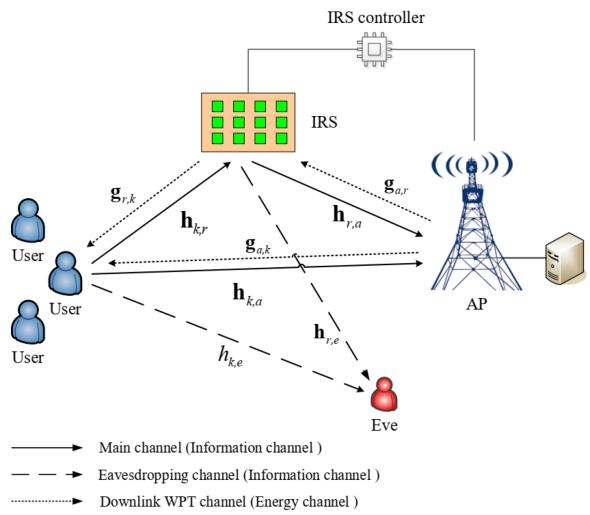
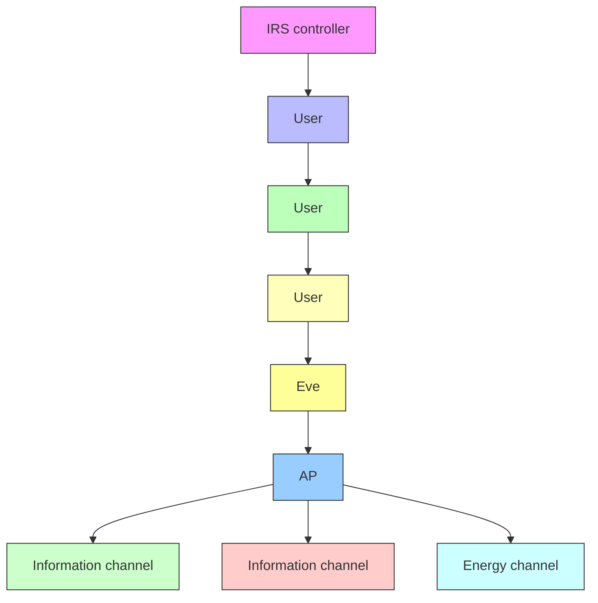
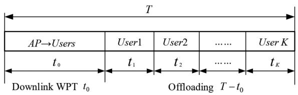
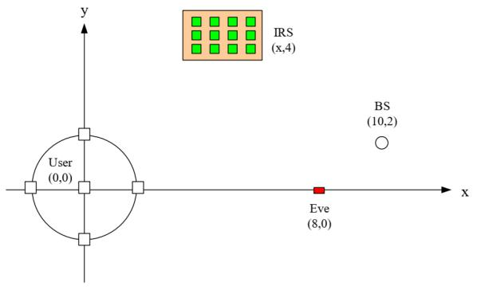
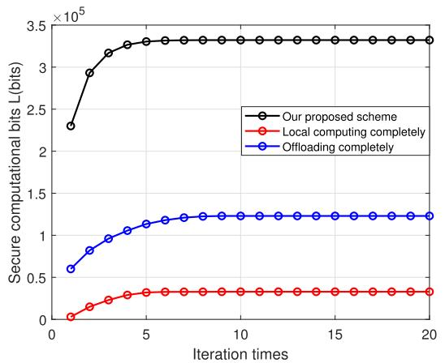
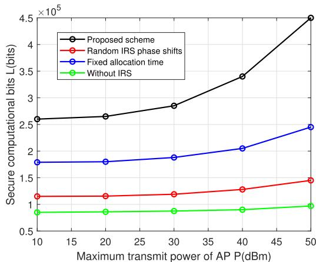
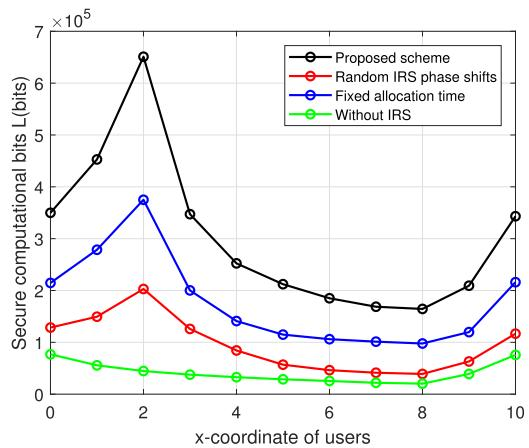
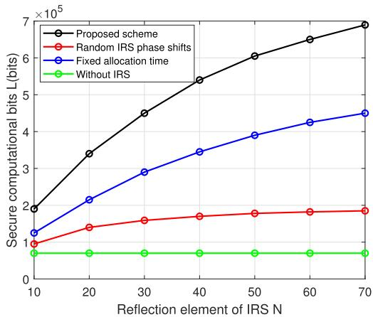
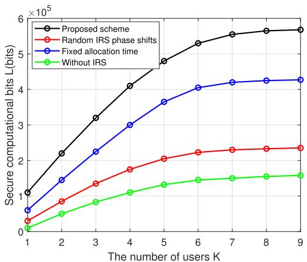

# Intelligent Reflecting Surface Assisted Secure Computation of Wireless Powered MEC System

Baogang Li , Member, IEEE, Jia Liao , Wenjing Wu , and Yonghui Li , Fellow, IEEE

Abstract— The integration of mobile edge computing (MEC) and wireless power transfer (WPT) can effectively improve the computing ability and energy sustainability of energy-constrained wireless devices in the Internet of Things (IoT) networks. Intelligent reflecting surface (IRS) has recently emerged as an effective technique to improve the performance of wireless systems by intelligently reconfiguring wireless environments. This paper studies the exploitation of IRS to improve the secure computation performance of WPT-MEC systems with a passive eavesdropper. A wireless access point (AP) first charge multiple users with the emitted energy signals, and then the users perform local computing and partial offloading to complete their computation tasks with the harvested energy in the presence of an eavesdropper, where the local computing can be executed during the whole process of WPT and offloading. Meanwhile, deploying IRS can improve the energy capture and secure offloading performance of the users. We maximize the secure computation task bits of users by jointly optimizing the AP energy transmit beamforming, the IRS phase shifts, the transmit power, users’ offloading time, and the local computation frequency of users, which are tangled with each other. An iterative optimal algorithm is developed to solve this non-convex problem by combining Taylor expansion method, semidefinite relaxation (SDR) algorithm, the Lagrange duality theory and Karush-Kuhn-Tucker (KKT) conditions. The numerical results show that the proposed scheme can effectively increase the secure computation task bits compared with other benchmark schemes, especially for the maximum transmit power of AP, the improvement is above 45%.

Index Terms—Mobile edge computing (MEC), wireless power transfer (WPT), intelligent reflecting surface (IRS), physical layer security (PLS), secure computation.

Manuscript received 23 December 2022; revised 13 March 2023; accepted 18 April 2023. Date of publication 25 April 2023; date of current version 6 March 2024. This work was supported in part by the National Natural Science Foundation of China under Grant 61971190 and in part by the Hebei Province Natural Science Foundation under Grant F2022502020. Recommended for acceptance by E. Hossain. (Corresponding author: Wenjing Wu.)

Baogang Li and Jia Liao are with the Department of Electronic and Communication Engineering, Hebei Key Laboratory of Power Internet of Things Technology, North China Electric Power University, Baoding 071003, China (e-mail: baogangli@ncepu.edu.cn; liaojia1002285404@163.com).

Wenjing Wu is with the Department of Electronic and Communication Engineering, Hebei Key Laboratory of Power Internet of Things Technology, North China Electric Power University, Baoding 071003, China, and also with China Mobile Group Hebei Company Ltd., Shijiazhuang 050080, China (e-mail: 13230961526@163.com).

Yonghui Li is with the School of Electrical and Information Engineering, The University of Sydney, Sydney, NSW 2006, Australia (e-mail: yonghui.li@sydney.edu.au).

Digital Object Identifier 10.1109/TMC.2023.3269791

# I. INTRODUCTION

T HE advance of the Internet of Things (IoT) and the nextgeneration mobile communication network has driven generation mobile communication network has driven the development of a variety of new applications, most of which are latency-sensitive and computation-intensive, such as autonomous driving, remote surgery, virtual reality and so on [1], [2], [3]. However, wireless devices are usually resourceconstrained with very limited power and computing capability, which can hardly support these emerging applications. Besides, these battery-powered devices need to be manually replaced or charged, which is very inconvenient to operate [4], [5]. Mobile edge computing (MEC) can extend cloud computing services to the edge of mobile networks, enabling the resource-limited devices to offload part or all of their tasks to the MEC server located in base station (BS) for computation, which reduces the device’s computation latency, saves their energy consumption and prolongs battery life [3].

Radio-frequency (RF) based wireless power transfer (WPT) technology has been studied extensively because it can provide sustainable and low-cost energy supply for energy-constrained wireless devices. Dedicated wireless power transmitters broadcast continuous energy signals to charge wireless devices [4], [5]. Simultaneous wireless information and power transfer (SWIPT) and wireless powered communication network (WPCN) are two paradigms that combine WPT and wireless communication and have been studied widely. SWIPT improves spectral efficiency because the power transmitter can send both energy signal and information signal simultaneously. In WPCN, the dedicated wireless power transmitter first sends energy signals to charge the wireless devices, and then the wireless devices transmit their own information with the harvested energy.

The combination of WPT and MEC, also known as wireless powered MEC, has been investigated in [6], [7], [8], [9] to provide a sustainable energy supply for wireless devices and enhanced computation capability. In [6], energy consumption for multiple users was minimized subjected to the computational delay constraints of users. In [7], the authors maximized the computation rate by jointly optimizing the offloading mode and the computing time allocation of users. [8] jointly optimized the transmit beamforming of AP, the computational tasks and the computational time allocation of users. In [9], the authors exploited cooperative communication between two near-far users to execute their computation-intensive tasks in the WPT-MEC system. These studies have demonstrated that combining of WPT and MEC can effectively enhance the computing ability and energy sustainability of energyconstrained wireless devices. Due to the broadcast nature of the wireless transmission, the information of wireless devices is vulnerable to be eavesdropped when they offload tasks to the MEC server. Therefore, the security of MEC system is worth studying. Physical layer security (PLS) technology has been widely studied by exploiting the inherent characteristics of wireless channel to achieve secure transmission [10]. The minimization of energy consumption for secure offloading in MEC system was studied in [11], [12], [13]. [14] and [15] respectively studied the problem of secure offloading delay minimization and computational efficiency maximization in MEC system. In [16], the cooperation interference mechanism between two NOMA users was utilized to achieve secure transmission of users in two time slots.

However, the advantages of MEC cannot be fully utilized when there is a weak channel between the edge device and the MEC server, which may be caused by obstacles or poor environmental conditions. In addition, channel fading and interference are also two challenging problems in WPT technology. Recently, intelligent reflecting surface (IRS) has attracted much attention because it can intelligently reconfigure the wireless propagation environment through passive beamforming, thus further enhancing the performance of wireless communications [17], [18], [19]. IRS constitutes numerous low-priced passive reflecting elements, controlled by an IRS controller. Every reflecting element can independently control the amplitude and phase shift of the incident signal. Since IRS can reconfigure the wireless channel to create favorable propagation environments, it can increase channel capacity, reduce power or improve energy efficiency, and improve physical layer security [17], [18], [19], [20]. In [21], [22], [23], the authors studied an IRS-assisted MISO system with one eavesdropper, and jointly designed the BS active beamforming and IRS phase shifts to enhance the system security performance, such as the secrecy sum rate and the power consumption.

In [24], [25], [26], the authors studied the performance of IRS-based MEC system. By deploying IRS, the users’ offloading performance has been greatly improved (including reducing the computing delay or energy consumption, and increasing the computation task bits of users). In [27], [28], [29], the authors jointly optimized the IRS phase, energy transmission time and other variables to maximize the sum rate of IRS-based WPCN system, which proved that IRS can solve the problems caused by path loss of WPCN. In [30], [31], the authors also studied the advantages that IRS brings to SWIPT systems. In [32], the authors studied how to maximize the computing speed by jointly optimizing IRS beamforming and resource allocation in the IRS assisted MEC system. In [33], the authors considered deploying IRS in MEC enabled UAV system for 6G THz communications networks to reduce the total network delay of the system. And in [34], the authors considered using a UAV as MEC server and several IRSs to improve the simultaneous wireless data and energy transmissions in IRS/UAV based MEC 6G mobile wireless networks.

Therefore, the existing literatures only studied the performance gains brought by the integration of partial technologies in MEC, WPT, IRS and PLS, but the secure computation and energy self-sustainment of wireless devices are two vital performance requirements that may exist simultaneously in MEC systems. Moreover, IRS has more advantages in improving physical layer security, wireless power transfer and offloading performance. In [35], [36], the authors studied the security MEC network system assisted by IRS, but did not consider the WPT problem, the wireless devices in the system network have the problem of energy sustainability. In [37], [38], the authors studied IRS-assisted WPT-MEC system to improve the energy transmission efficiency and task offloading efficiency, but there are security problems of information leakage exist in the overall system. Table I compares the differences between our work and the existing references, highlighting the novelty of our work. To our knowledge, there is a research gap in applying IRS to ensure secure offloading of WPT-MEC systems with an eavesdropper. Motivated by the above, we apply IRS to the WPT-MEC system with a passive eavesdropper. In the WPT stage, IRS can improve the channel quality to enhance the users’ energy harvesting performance. In the offloading stage, IRS can weaken the eavesdropper’s signal to improve the secure offloading performance of users. Therefore, utilizing an appropriate performance index to measure the security and computation capability of the system is essential, but the subsequent formulated problems are tangled with much more parameters, which makes the work more challenging. The main contributions of this paper are as follows:

We propose an IRS-assisted WPT-MEC secure system model consisting of WPT phase, partial offloading phase and local computation. In the WPT stage, users harvest the energy emitted by the AP to execute computing tasks with the assistance of IRS. In the offloading stage, with the assistance of IRS, users offload their computing tasks to AP in the presence of eavesdropper. We take the users’ secure computation task bits as the performance index to measure the security and computation capability of the system.

We jointly design the energy transmit beamforming of AP, IRS reflection phase shifts, users’ offloading time, transmit power, and local computation frequency, which is a nonconvex problem. First, we utilize Taylor expansion method and semidefinite relaxation (SDR) algorithm to optimize the AP energy beamforming and the WPT phase’s IRS phase shifts by fixing other variables. Second, SDR algorithm is used to optimize the IRS phase shifts in offloading stage by fixing other variables. Third, Lagrange duality method and Karush-Kuhn-Tucker (KKT) conditions are used to optimize the computation time, and the transmit power with other variables fixed. Finally, the three sets of variables are iteratively updated to maximize users’ secure computation task bits.

\- The numerical results show that the proposed scheme can effectively increase the users’ secure computation task bits compared with other schemes. It is shown that increasing the transmit power of AP or appropriately adding the reflection elements of IRS can greatly improve the system performance. These conclusions provide beneficial insights for the secure offloading of WPT-MEC systems.

TABLE I COMPARISON OF THE PROPOSED SCHEME WITH OTHER RELATED WORK 

<table><tr><td>Comparison with related work</td><td>MEC</td><td>WPT</td><td>Security</td><td>Remarks</td></tr><tr><td>Reference [35]</td><td>√</td><td>✕</td><td>√</td><td rowspan="5">Compared with references [35], [36], the challenge to be solved in this paper is how to use the assistance of IRS in the WPT phase to ensure that users harve-st the energy emitted by AP to execute tasks. Compared with references [37], [38], the challenge to be solved in this paper is how to ensure and measure the secure computation performance in the WPT stage and the offloading stage.</td></tr><tr><td>Reference [36]</td><td>√</td><td>✕</td><td>√</td></tr><tr><td>Reference [37]</td><td>√</td><td>√</td><td>✕</td></tr><tr><td>Reference [38]</td><td>√</td><td>√</td><td>✕</td></tr><tr><td>Proposed scheme</td><td>√</td><td>√</td><td>√</td></tr></table>

flowchart

Fig. 1. IRS assisted secure computing model of WPT-MEC system.

The rest of this paper is organized as follows, Section II presents the proposed system model and formulates the optimization problem. In Section III, an iterative optimization algorithm is developed to solve the problem. Numerical results are presented in Section IV to verify the effectiveness of the proposed scheme. Finally, Section V draws the conclusions.

Notations: Boldface letters refer to vectors (lower case) or matrices (upper case). For an arbitrary-sized matrix $A , ( A ) ^ { H }$ denotes its conjugate transpose, rank(A) denotes its rank, $( A ) ^ { - 1 }$ denotes its inverse, $[ A ] _ { p , q }$ denotes its element in the pth row and qth column. diag(A) denotes the diagonalization of the matrix A. Tr(B) denotes the trace of the square matrix B. And denotes the all-zero matrix, so $\mathbfcal { B } \succeq \mathbf { 0 }$ 0denotes that B is positive 0semidefinite, and then I denotes an identity matrix. $\mathbb { C } ^ { M \times N }$ denotes the space of $M \times N$ complex matrices. $\mathbb { E } ( \cdot )$ denotes the statistical expectation.  ·  denotes the euclidean norm of a complex vector. | · | denotes the magnitude of a complex number.

# II. SYSTEM MODEL

As shown in Fig. 1, we consider an IRS-assisted wireless powered MEC system, which is composed of K single antenna users, an M-antenna AP integrated with a MEC server, an IRS consisting of N passive reflecting elements, which is controlled by the IRS controller, a passive single antenna eavesdropper. With the assistance of the IRS, users use the harvested energy by the WPT to complete their computation tasks which can be

text_image

T
AP→Users User1 User2 .... User K
t₀ t₁ t₂ .... tₖ
Downlink WPT t₀ Offloading T - t₀

Fig. 2. The harvest-then-offload protocol.

arbitrarily divided into two parts. The model can also be easily extended to multi-eavesdropper scenarios.

As shown in Fig. 2, we adopt a harvest-then-offload protocol and a block-based model. The length of each time block is T , the time of WPT is $t _ { 0 } ,$ , and the time of each user to offload their tasks is $t _ { k } . ~ K$ users adopt Time Division Multiple Access (TDMA) protocol to offload their tasks. It should be noted that users execute energy harvesting first, and then start the offloading stage. To focus on studying the influence to the secure performance with IRS and the offloading time of each user, simple and effective TDMA technology is used here. However, due to its delay problem, more effective access methods will be considered in future research work. So they satisfy $\begin{array} { r } { t _ { 0 } + \sum _ { k = 1 } ^ { K } t _ { k } \le T } \end{array}$ . In the first stage $t _ { 0 } ,$ the AP broadcasts wireless power to K users via WPT, and IRS can improve the wireless channel quality to enhance the energy harvesting performance of users. In the second stage $T - t _ { 0 } ,$ , users use the captured energy to securely offload their computation tasks to AP, and IRS can weaken the eavesdropper’s eavesdropping signal, improving the secure offloading performance of users. The download time from AP to the users is negligible, because MEC server has strong computing ability and the transmit power of AP is large. Assuming that the local computation and energy harvesting of user k can be performed simultaneously. In this paper, we are more interested in the performance limits of the system, such as secure computing capability. Therefore, it is similar to [39] and [40], we assume the ideal case that the channel state information (CSI) of all channels is perfectly known. In practical systems where such CSI cannot be obtained perfectly, the results derived in this paper can be considered as the performance upper bound.

The IRS diagonal reflection coefficient matrix is $\Phi _ { k } = $ diag $( \alpha _ { k , 1 } \exp ( j \phi _ { k , 1 } ) , \alpha _ { k , 2 } \exp ( j \phi _ { k , 2 } ) , \ldots , \alpha _ { k , N } \exp ( j \phi _ { k , N } ) )$ , $n \in \mathcal { N } \triangleq \{ 1 , 2 , \dots , N \} . \ \alpha _ { k , n } \in [ 0 , 1 ]$ and $\phi _ { k , n } \in [ 0 , 2 \pi ]$ are the amplitude and phase shift of IRS element reflecting the kth user’s signal respectively, in order to maximize the received signal, we set $\alpha _ { k , n } = 1$ . When $k = 0 , \Phi _ { 0 }$ represents Φthe reflection phase shifts of IRS in the WPT, and when $k \in \mathcal { K } \triangleq \{ 1 , 2 , \dots , K \}$ , k represents the IRS reflective phase shifts in the offloading.

# A. Downlink Wireless Power Transfer

In the WPT, the channel coefficients from AP to user k, from AP to IRS, from IRS to user k are Ha,k ∈ C1×M , $\mathbf { g } _ { a , k } ^ { H } \in \mathbb { C } ^ { 1 \times M } , \mathbf { g } _ { a , r } \in \mathbb { C } ^ { N \times M }$ a,r ∈ CN×M , $\mathbf { g } _ { r , k } ^ { H } \in \mathbb { C } ^ { 1 \times N }$ ∈ C1×N respectively, $\mathbf { w } \in \mathbb { C } ^ { M \times 1 }$ grepresents the beamforming vector of the energy signal, and $\mathbf { W } \triangleq \mathbb { E } [ \mathbf { w } \mathbf { w } ^ { H } ] \succeq \mathbf { 0 }$ W ww 0represents the covariance matrix of the transmit energy. Let P be the maximum transmit power of AP, then $\mathbb { E } [ | | { \textbf { w } } | | ^ { 2 } ] =$ $\mathrm { T r } ( \mathbf { W } ) \leq P$ w. So the energy signal received by user k is

$$
y _ {k} ^ {E} = (\mathbf {g} _ {a, k} ^ {H} + \mathbf {g} _ {r, k} ^ {H} \boldsymbol {\Phi} _ {0} \mathbf {g} _ {a, r}) \mathbf {w} + n _ {k}, \tag {1}
$$

where $n _ { k }$ denotes the additive white Gaussian noise (AWGN) at the user k. Without loss of generality, it is assumed that each user k adopts a linear energy harvesting model [27], [28], [29]. It is worth noting that the system model in this paper focuses on the secure computation capability of WPT-MEC system, so it is idealized to consider that the energy harvesting model is a linear energy harvesting model, and the nonlinear energy harvesting model will be considered in the future research work to make the system more practical. The energy harvested by user k is expressed as

$$
E _ {k} = \eta t _ {0} \| (\mathbf {g} _ {a, k} ^ {H} + \mathbf {g} _ {r, k} ^ {H} \boldsymbol {\Phi} _ {0} \mathbf {g} _ {a, r}) \mathbf {w} \| ^ {2} = \eta t _ {0} \operatorname{Tr} (\mathbf {G} _ {k} \mathbf {W}), \tag {2}
$$

where η is the energy conversion efficiency of user $( \mathbf { g } _ { a , k } ^ { H } + \mathbf { \dot { g } } _ { r , k } ^ { H } \Phi _ { 0 } \mathbf { g } _ { a , r } ) ^ { \mathbf { \top } } ( \mathbf { g } _ { a , k } ^ { H } + \mathbf { g } _ { r , k } ^ { H } \Phi _ { 0 } \mathbf { g } _ { a , r } )$ . $k , \mathbf { G } _ { k } =$

# B. Computation Model

The users complete their computation tasks in partial offloading mode, one part is executed locally and the other part is offloaded to the MEC server for computation.

1) Partial Offloading Computation: K users adopt the TDMA protocol to offload their computation tasks with the harvested energy while a passive eavesdropper intends to eavesdrop the users’ information. The deployment of IRS is to enhance the security offloading performance of users. The channel coefficients from user k to AP, from IRS to AP, from user k to IRS, from user k to Eve, from IRS to Eve are $\mathbf { h } _ { k , a } \in \mathbb { C } ^ { M \times 1 }$ , $\mathbf { h } _ { r , a } \in \mathbb { C } ^ { M \times N } , \mathbf { h } _ { k , r } \in \mathbb { C } ^ { N \times 1 } , h _ { k , e } , \mathbf { h } _ { r , e } ^ { H } \in \mathbb { C } ^ { 1 \times N }$ , respectively.

h hThe received signals of user k at AP and Eve are respectively expressed as

$$
y _ {a, k} = (\mathbf {h} _ {k, a} + \mathbf {h} _ {r, a} \boldsymbol {\Phi} _ {k} \mathbf {h} _ {k, r}) \sqrt {p _ {k}} x _ {k} + \mathbf {n} _ {a}, \tag {3}
$$

$$
y _ {e, i} = (h _ {k, e} + \mathbf {h} _ {r, e} ^ {H} \boldsymbol {\Phi} _ {k} \mathbf {h} _ {k, r}) \sqrt {p _ {k}} x _ {k} + n _ {e}, \tag {4}
$$

where $x _ { k } \sim \mathcal { C N } ( 0 , 1 )$ denotes the information signal of the user $k . \ \mathbf { n } _ { a } \sim { \mathcal { C N } } ( \mathbf { 0 } , \sigma _ { a } ^ { 2 } \mathbf { I } _ { M } )$ and $n _ { e } \sim \mathcal { C N } ( 0 , \sigma _ { e } ^ { 2 } )$ are the complex n 0 Iadditive white Gaussian noise $( \mathrm { A W G N } ) . p _ { k }$ is the transmit power of the user k.

Assume the maximum ratio combining (MRC) receiver is adopted at AP to decode users’ information, i.e., the receiving beamforming vector of AP meets $\begin{array} { r } { \mathbf { r } _ { k } = \frac { \mathbf { h } _ { k , a } + \mathbf { h } _ { r , a } \Phi _ { k } \mathbf { h } _ { k , r } } { \| \mathbf { h } _ { k , a } + \mathbf { h } _ { r , a } \Phi _ { k } \mathbf { h } _ { k , r } \| } } \end{array}$ .

r h h Φ hSo the signal-to-interference-plus-noise ratio (SINR) at AP and Eve are expressed as, respectively,

$$
S I N R _ {a, k} = \frac {p _ {k} \| \mathbf {h} _ {k , a} + \mathbf {h} _ {r , a} \boldsymbol {\Phi} _ {k} \mathbf {h} _ {k , r} \| ^ {2}}{\sigma_ {a} ^ {2}}, \tag {5}
$$

$$
S I N R _ {e, k} = \frac {p _ {k} \| h _ {k , e} + \mathbf {h} _ {r , e} ^ {H} \boldsymbol {\Phi} _ {k} \mathbf {h} _ {k , r} \| ^ {2}}{\sigma_ {e} ^ {2}}. \tag {6}
$$

The secrecy offloading rate $R _ { s , k }$ can be written as

$$
R _ {s, k} = R _ {a, k} - R _ {e, k}, \tag {7}
$$

where $R _ { a , k } = \log _ { 2 } ( 1 + S I N R _ { a , k } ) \quad { \mathrm { a n d } } \quad R _ { e , k } = \log _ { 2 } ( 1 +$ $S I N R _ { e , k } )$ are offloading rate and eavesdropping rate respectively.

The secure offloading energy consumption of the user k is

$$
E _ {k} ^ {\text { off }} = p _ {k} t _ {k}. \tag {8}
$$

The user k’s secure offloading task bits are

$$
l _ {k} ^ {\text { off }} = B t _ {k} (R _ {a, k} - R _ {e, k}), \tag {9}
$$

where B is the channel bandwidth.

2) Local Computing: Let $f _ { k }$ represent the user k’s CPU frequency, ck is the number of CPU cycles required for user k to compute one bit task, $\xi _ { k }$ is the effective capacitance parameter. So the energy consumed by user k’s local computation is

$$
E _ {k} ^ {\text { loc }} = T \xi_ {k} f _ {k} ^ {3}. \tag {10}
$$

The user k’s local computation task bits are

$$
l _ {k} ^ {l o c} = \frac {T f _ {k}}{c _ {k}}. \tag {11}
$$

# C. Problem Formulation

In this section, our aim is to maximize the users’ secure computation task bits subject to the maximum delay and the harvested energy of users. As a performance indicator, the users’ secure computation task bits can simultaneously highlight the security and computing ability of the system. We propose a system model of IRS assisted WPT-MEC network security and formulate the secure computation task bits maximization problem by jointly optimizing the AP energy beamforming, the IRS reflection phase shifts, as well as the transmit power, offloading time, and local computation frequency of users. However, most the parameters are tangled with each other, especially for the offloading time, transmit power, and local computing frequency of every user related to multiple users’ decision, which is a huge challenge. Considering the problem is nonconvex, so we use Taylor expansion method, semidefinite relaxation (SDR) algorithm, Lagrange duality method and Karush-Kuhn-Tucker (KKT) conditions to solve this nonconvex problem.

$$
\mathrm{(P0)} \max _ {\mathbf {W}, \boldsymbol {\Phi}, \mathbf {t}, \mathbf {p}, \mathbf {f}} \sum_ {k = 1} ^ {K} B t _ {k} (R _ {a, k} - R _ {e, k}) + \frac {T f _ {k}}{c _ {k}}
$$

$$
s. t. p _ {k} t _ {k} + T \xi_ {k} f _ {k} ^ {3} \leq \eta t _ {0} \mathrm{Tr} (\mathbf {G} _ {k} \mathbf {W}), \forall k \in \mathcal {K}, (1 2 a)
$$

$$
\left| \exp (j \phi_ {k, n}) \right| = 1, \forall n \in \mathcal {N}, \forall k \in \{0, \mathcal {K} \}, \tag {12b}
$$

$$
\mathrm{Tr} (\mathbf {W}) \leq P, \mathbf {W} \succeq \mathbf {0}, \tag {12c}
$$

$$
\sum_ {k = 0} ^ {K} t _ {k} \leq T, 0 \leq t _ {k} \leq T, \forall k \in \{0, \mathcal {K} \}, \tag {12d}
$$

$$
0 \leq p _ {k} \leq P _ {k} ^ {\max}, \forall k \in \mathcal {K}, \tag {12e}
$$

$$
0 \leq f _ {k} \leq F _ {k} ^ {\max}, \forall k \in \mathcal {K}, \tag {12f}
$$

where $\mathbf { t } = [ t _ { 0 } , t _ { 1 } , \dots , t _ { K } ] , \mathbf { p } = [ p _ { 1 } , \dots , p _ { K } ] , \mathbf { f } = [ f _ { 1 } , \dots , f _ { K } ] ,$ $\ \Phi { = } [ \Phi _ { 0 } , \Phi _ { 1 } , \ldots , \Phi _ { K } ] , P$ p fis the maximum transmit power of AP,

$P _ { k } ^ { \mathrm { m a x } }$ and $F _ { k } ^ { \mathrm { m a x } }$ are the maximum transmit power and frequency of user k. (12a) indicates that the energy harvested by the users is not less than the energy required to complete the computation tasks. (12b) represents the reflection phase shifts constraint of IRS in the WPT and offloading. (12c) is the energy beamforming constraint of AP. (12d) indicates that the sum of the users’ energy harvesting time and offloading time is less than their maximum delay constraints.

# III. SOLUTION TO PROBLEM (P0)

There are many optimization algorithm solutions for the IRS assisted MEC system in the existing references, which have their own characteristics and advantages. For example, reference [35] adopted the Dinkelbach type method and the block coordinate descent method to solve nonconvex optimization problems, and reference [37] adopted the closed-form solutions method and SDR algorithm to solve nonconvex optimization problems. In our paper, in order to reduce the derivation of mathematical formulas and the complexity of iterative algorithms, we propose an iterative optimization algorithm for solving the formulated problem, the specific methods are as follows. Since the variables are coupled, problem (P0) is a non-convex problem, which cannot be solved directly. Therefore, we decompose it into three tractable sub-problems, then semidefinite programming (SDP) and SDR algorithm are used to optimize the energy transmit beamforming of AP and the IRS phase shifts. Lagrange duality method and KKT condition are utilized to obtain the users’ transmit power and computation time.

To simplify the notation, we define $\mathbf { g } _ { r , k } ^ { H } \Phi _ { 0 } \mathbf { g } _ { a , r } =$ $\mathbf { v } _ { 0 0 } ^ { H } \mathrm { d i a g } ( \mathbf { g } _ { r , k } ^ { H } ) \mathbf { g } _ { a , r } , \qquad \mathbf { v } _ { 0 0 } ^ { H } = \left[ v _ { 0 , 1 } , v _ { 0 , 2 } , \ldots , v _ { 0 , N } \right] \in { \mathbb C } ^ { 1 \times N }$ ,

then $\mathbf { g } _ { a , k } ^ { H } + \mathbf { g } _ { r , k } ^ { H } \Phi _ { 0 } \mathbf { g } _ { a , r } = [ \mathbf { v } _ { 0 0 } ^ { H } , 1 ] \left[ \begin{array} { c } { \mathrm { d i a g } ( \mathbf { g } _ { \mathrm { r , k } } ^ { \mathrm { H } } ) \mathbf { g } _ { \mathrm { a , r } } } \\ { \mathbf { g } _ { a , k } ^ { H } } \end{array} \right] = \mathbf { v } _ { 0 } ^ { H } \mathbf { g } _ { k } ,$

Let $\begin{array} { r } { \mathbf { h } _ { r , a } \Phi _ { k } \mathbf { h } _ { k , r } = \mathbf { h } _ { r , a } \mathrm { d i a g } ( \mathbf { h } _ { k , r } ) \mathbf { v } _ { 0 k } , \ \mathbf { v } _ { 0 k } ^ { H } = [ v _ { k , 1 } , v _ { k , 2 } , \ldots , } \end{array}$ h Φ hvk,N ] ∈ C1×N , $v _ { k , N } ] \in \mathbb { C } ^ { 1 \times N }$ h then $\mathbf { h } _ { k , a } + \mathbf { h } _ { r , a } \Phi _ { k } \mathbf { h } _ { k , r } = [ \mathbf { h } _ { r , a } \mathrm { d i a g } ( \mathbf { h } _ { k , r } )$

$\mathbf { h } _ { k , a } \big \vert \begin{array} { l } { \mathbf { v } _ { 0 k } } \\ { 1 } \end{array} \bigg \vert = \mathbf { H } _ { k } \mathbf { v } _ { k }$  0 k . Let $\mathbf { h } _ { r , e } ^ { H } \Phi _ { k } \mathbf { h } _ { k , r } = \mathbf { v } _ { 0 k } ^ { H } \mathrm { d i a g } ( \mathbf { h } _ { r , e } ^ { H } ) \mathbf { h } _ { k , r } ,$

then $h _ { k , e } + { \bf h } _ { r , e } ^ { H } \Phi _ { k } { \bf h } _ { k , r } = [ { \bf v } _ { 0 k } ^ { H } , 1 ] \left[ \begin{array} { c } { \mathrm { d i a g } ( { \bf h } _ { \mathrm { r , e } } ^ { \mathrm { H } } ) { \bf h } _ { \mathrm { k , r } } } \\ { h _ { k , e } } \end{array} \right] = { \bf v } _ { k } ^ { H } { \bf H } _ { e , k }$

where $v _ { k , n } = \exp ( j \phi _ { k , n } )$

So (P0) can be rewritten as

$$
\text {(P1)}: \max _ {\mathbf {W}, \mathbf {v}, \mathbf {t}, \mathbf {p}, \mathbf {f}} \sum_ {k = 1} ^ {K} B t _ {k} \left(\log_ {2} \left(1 + \frac {p _ {k} \| \mathbf {H} _ {k} \mathbf {v} _ {k} \| ^ {2}}{\sigma_ {a} ^ {2}}\right) \right.
$$

$$
- \log_ {2} \left(1 + \frac {p _ {k} \parallel \mathbf {v} _ {k} ^ {H} \mathbf {H} _ {e , k} \parallel^ {2}}{\sigma_ {e} ^ {2}}\right) + \frac {T f _ {k}}{c _ {k}}
$$

$$
\text { s.t. } p _ {k} t _ {k} + T \xi_ {k} f _ {k} ^ {3} \leq \eta t _ {0} \mathrm{Tr} (\mathbf {g} _ {k} ^ {H} \mathbf {v} _ {0} \mathbf {v} _ {0} ^ {H} \mathbf {g} _ {k} \mathbf {W}), \forall k \in \mathcal {K}, \tag {13a}
$$

$$
\left| \mathbf {v} _ {k} (n) \right| = 1, \forall n \in \mathcal {N}, \forall k \in \{0, \mathcal {K} \}, \tag {13b}
$$

$$
\mathrm{Tr} (\mathbf {W}) \leq P, \mathbf {W} \succeq \mathbf {0}, \tag {13c}
$$

$$
\sum_ {k = 0} ^ {K} t _ {k} \leq T, 0 \leq t _ {k} \leq T, \forall k \in \{0, \mathcal {K} \}, \tag {13d}
$$

$$
0 \leq p _ {k} \leq P _ {k} ^ {\max}, \forall k \in \mathcal {K}, \tag {13e}
$$

$$
0 \leq f _ {k} \leq F _ {k} ^ {\max}, \forall k \in \mathcal {K}. \tag {13f}
$$

To solve problem (P1), we observe that (13a) can be written as $\begin{array} { r } { f _ { k } \leq \sqrt [ 3 ] { \frac { \eta t _ { 0 } \mathrm { T r } ( \mathbf { g } _ { k } ^ { H } \mathbf { v } _ { 0 } \mathbf { v } _ { 0 } ^ { H } \mathbf { g } _ { k } \mathbf { W } ) - p _ { k } t _ { k } } { T \xi _ { k } } } } \end{array}$ ηt0Tr(gHk v0vH0 gkW)−pktk . It’s obviously that the objec- T ξk tive function is maximized when the equal sign is taken, so we substitute $\begin{array} { r } { f _ { k } = \sqrt [ 3 ] { \frac { \eta t _ { 0 } \mathrm { T r } ( \mathbf { g } _ { k } ^ { H } \mathbf { v } _ { 0 } \mathbf { v } _ { 0 } ^ { H } \mathbf { g } _ { k } \mathbf { W } ) - p _ { k } t _ { k } } { T \xi _ { k } } } } \end{array}$ vT ξk into the objective function, and (P1) can be rewritten as (P2), which is still a non-convex problem, and we decompose it into three tractable sub-problems. First, we use SDP to optimize the energy transmit beamforming  and use SDR to optimize IRS phase shifts $\mathbf { v } _ { 0 }$ Wwith the variables $\mathbf { v } _ { k } , \mathbf { p } ,$ , fixed. Second, , $\mathbf { v } _ { 0 } , \mathbf { p } ,$ v are fixed, v p tthe SDR is used to get the IRS phase shifts $\mathbf { v } _ { k }$ v p tin the offloading. vThird, the Lagrange duality method and KKT condition are used to optimize ,  with , $\mathbf { v } _ { 0 } , \mathbf { v } _ { k }$ are fixed. Finally, the three sets p t W v vof variables are iteratively updated.

$$
\text {(P2)}: \max _ {\mathbf {W}, \mathbf {v}, \mathbf {t}, \mathbf {p}} \sum_ {k = 1} ^ {K} B t _ {k} \left(\log_ {2} \left(1 + \frac {p _ {k} \| \mathbf {H} _ {k} \mathbf {v} _ {k} \| ^ {2}}{\sigma_ {a} ^ {2}}\right) \right.
$$

$$
- \log_ {2} \left(1 + \frac {p _ {k} \parallel \mathbf {v} _ {k} ^ {H} \mathbf {H} _ {e , k} \parallel^ {2}}{\sigma_ {e} ^ {2}}\right)
$$

$$
+ \frac {T}{c _ {k}} \sqrt [ 3 ]{\frac {\eta t _ {0} \mathrm{Tr} (\mathbf {g} _ {k} ^ {H} \mathbf {v} _ {0} \mathbf {v} _ {0} ^ {H} \mathbf {g} _ {k} \mathbf {W}) - p _ {k} t _ {k}}{T \xi_ {k}}}
$$

$$
\text { s.t. } \mid \mathbf {v} _ {k} (n) \mid = 1, \forall n \in \mathcal {N}, \forall k \in \{0, \mathcal {K} \}, \tag {14a}
$$

$$
\mathrm{Tr} (\mathbf {W}) \leq P, \mathbf {W} \succeq \mathbf {0}, \tag {14b}
$$

$$
\sum_ {k = 0} ^ {K} t _ {k} \leq T, 0 \leq t _ {k} \leq T, \forall k \in \{0, \mathcal {K} \}, \tag {14c}
$$

$$
0 \leq p _ {k} \leq P _ {k} ^ {\max}, \forall k \in \mathcal {K}. \tag {14d}
$$

A. Optimizing , $\mathbf { v } _ { 0 } f o r$ Given $\mathbf { v } _ { k } ,$ ,

To simplify notation, let’s define matrix $\mathbf { V } _ { 0 } = \mathbf { v } _ { 0 } \mathbf { v } _ { 0 } ^ { H }$ , which satisfies $\mathbf { V } _ { 0 } \succeq \mathbf { 0 }$ , and rank $( { \bf V } _ { 0 } ) { = } 1$ V v v. Then the problem can be expressed as

$$
\text {(P3)}: \max _ {\mathbf {W}, \mathbf {V} _ {0}} \sum_ {k = 1} ^ {K} B t _ {k} R _ {s, k} + \frac {T}{c _ {k}} \sqrt [ 3 ]{\frac {\eta t _ {0} \operatorname{Tr} (\mathbf {g} _ {k} ^ {H} \mathbf {V} _ {0} \mathbf {g} _ {k} \mathbf {W}) - p _ {k} t _ {k}}{T \xi_ {k}}}
$$

$$
\text { s.t. } \operatorname{Tr} (\mathbf {W}) \leq P, \mathbf {W} \succeq \mathbf {0}, \tag {15a}
$$

$$
\mathbf {V} _ {0} (n, n) = 1, \forall n \in \{\mathcal {N}, N + 1 \}. \tag {15b}
$$

Problem (P3) is still non-convex because  and $\mathbf { v } _ { 0 }$ are W vcoupled to each other, so we fix one variable and apply firstorder Taylor expansion to obtain the optimal value of the other variable, and then solve the optimal solution of the two variables through alternating optimization (AO) algorithm.

1) Optimizing $\mathbf { V } _ { 0 } f o r$ Given : We first fix  to find $\mathbf { V } _ { 0 } ^ { * }$ , Vthen (P3) can be rewritten as

$$
\text {(P3.1)}: \max _ {\mathbf {V} _ {0}} \sum_ {k = 1} ^ {K} B t _ {k} R _ {s, k} + \frac {T}{c _ {k}} \sqrt [ 3 ]{\frac {\eta t _ {0} \operatorname{Tr} (\mathbf {g} _ {k} ^ {H} \mathbf {V} _ {0} \mathbf {g} _ {k} \mathbf {W}) - p _ {k} t _ {k}}{T \xi_ {k}}}
$$

$$
s. t. \mathbf {V} _ {0} (n, n) = 1, \forall n \in \{\mathcal {N}, N + 1 \}. \tag {16}
$$

The objective function is not a concave function, so we perform first-order Taylor expansion at (n)0 , $\mathbf { V } _ { 0 } ^ { ( n ) }$ thus it approx-Vimates to an affine function, and iteratively update its Taylor expansion point until it approaches the original function. Let $F _ { k } = \sqrt [ 3 ] { \eta t _ { 0 } \mathrm { T r } ( \mathbf { g } _ { k } ^ { H } \mathbf { V } _ { 0 } \mathbf { g } _ { k } \mathbf { W } ) - p _ { k } t _ { k } }$ , then the first order Taylor expansion is

$$
\begin{array}{l} F _ {k} = \sqrt [ 3 ]{\eta t _ {0} \mathrm{Tr} (\mathbf {g} _ {k} ^ {H} \mathbf {V} _ {0} ^ {(n)} \mathbf {g} _ {k} \mathbf {W}) - p _ {k} t _ {k}} \\ + \operatorname{Tr} \left(\frac {1}{3} \left(\eta t _ {0} \operatorname{Tr} \left(\mathbf {g} _ {k} ^ {H} \mathbf {V} _ {0} ^ {(n)} \mathbf {g} _ {k} \mathbf {W}\right) - p _ {k} t _ {k}\right) ^ {- \frac {2}{3}} \right. \\ \times \left. \mathbf {g} _ {k} \mathbf {W} ^ {H} \mathbf {g} _ {k} ^ {H} (\mathbf {V} _ {0} - \mathbf {V} _ {0} ^ {(n)})\right) \\ + o (\mathbf {V} _ {0} - \mathbf {V} _ {0} ^ {(n)})), \tag {17} \\ \end{array}
$$

where $o ( \mathbf { V } _ { 0 } - \mathbf { V } _ { 0 } ^ { ( n ) } ) \big )$ is the higher order infinitesimal that can V Vbe ignored. So when (n)0 $\mathbf { V } _ { 0 } ^ { ( n ) }$ is given, $F _ { k }$ is approximately a linear function of $\mathbf { V } _ { 0 }$ V, and the constraint with rank $\mathbf { V } _ { 0 } ) { = } 1$ is non-V Vconvex, so the SDR is used to relax the constraint. It can be solved by using the convex optimization tool CVX. But it does not guarantee that the obtained $\mathbf { V } _ { 0 }$ is rank-1 matric. If the obtained $\mathbf { V } _ { 0 }$ Vis of rank-1, we apply the eigenvalue decomposition of $\mathbf { V } _ { 0 }$ to Vfind $\mathbf { v } _ { 0 }$ V. Otherwise, the Gaussian randomization will be applied vto recover the approximate solution of $\mathbf { v } _ { 0 }$ [41].

2) Optimizing  for Given $\mathbf { V } _ { 0 } .$ vWe fix $\mathbf { V } _ { 0 }$ to find $\mathbf { W } ^ { * }$ , then W(P3) can be rewritten as

$$
\text {(P3.2)}: \max _ {\mathbf {W}} \sum_ {k = 1} ^ {K} B t _ {k} R _ {s, k} + \frac {T}{c _ {k}} \sqrt [ 3 ]{\frac {\eta t _ {0} \operatorname{Tr} (\mathbf {g} _ {k} ^ {H} \mathbf {V} _ {0} \mathbf {g} _ {k} \mathbf {W}) - p _ {k} t _ {k}}{T \xi_ {k}}}
$$

$$
s. t. \operatorname{Tr} (\mathbf {W}) \leq \mathrm{P}, \mathbf {W} \succeq \mathbf {0}. \tag {18}
$$

The solution of is similar to that of $\mathbf { V } _ { 0 }$ . Taylor expansion is W Valso used to convert non-convex problems into convex problems, the first order Taylor expansion is

$$
\begin{array}{l} F _ {k} = \sqrt [ 3 ]{\eta t _ {0} \mathrm{Tr} (\mathbf {g} _ {k} ^ {H} \mathbf {V} _ {0} \mathbf {g} _ {k} \mathbf {W} ^ {(n)}) - p _ {k} t _ {k}} \\ + \mathrm{Tr} \bigg (\frac {1}{3} \bigg (\eta t _ {0} \mathrm{Tr} (\mathbf {g} _ {k} ^ {H} \mathbf {V} _ {0} \mathbf {g} _ {k} \mathbf {W} ^ {(n)}) - p _ {k} t _ {k} \bigg) ^ {- \frac {2}{3}} \\ \left. \times (\mathbf {g} _ {k} ^ {H} \mathbf {V} _ {0} \mathbf {g} _ {k}) ^ {H} (\mathbf {W} - \mathbf {W} ^ {(n)})\right) \\ + o (\mathbf {W} - \mathbf {W} ^ {(n)}). \tag {19} \\ \end{array}
$$

It is the SDP problem, and $\mathbf { W } ^ { * }$ can be obtained by CVX.

# B. Optimizing k for Given , 0,  and

To simplify notation, we define matrix as $\mathbf { V } _ { k } = \mathbf { v } _ { k } \mathbf { v } _ { k } ^ { H }$ , which satisfy $\mathbf { V } _ { k } \succeq \mathbf { 0 }$ , and rank ${ \bf V } _ { k } ) { = } 1$ . The constraint with rank-1 is non-convex, so the SDR is used to relax the constraint. Then the problem (P2) can be rewritten as

$$
\text {(P4)}: \max _ {\mathbf {V} _ {k}} \sum_ {k = 1} ^ {K} B t _ {k} (\log_ {2} (p _ {k} \operatorname{Tr} (\mathbf {H} _ {k} \mathbf {V} _ {k} \mathbf {H} _ {k} ^ {H}) + \sigma_ {a} ^ {2})
$$

$$
- \log_ {2} (p _ {k} \mathrm{Tr} (\mathbf {H} _ {e, k} \mathbf {H} _ {e, k} ^ {H} \mathbf {V} _ {k}) + \sigma_ {e} ^ {2})) + C H _ {k}
$$

$$
s. t. \mathbf {V} _ {k} (n, n) = 1, \forall n \in \{\mathcal {N}, N + 1 \}, \forall k \in \mathcal {K}, \tag {20a}
$$

$$
\mathbf {V} _ {k} \succeq \mathbf {0}, \forall k \in \mathcal {K}, \tag {20b}
$$

where $\begin{array} { r } { C H _ { k } = \frac { T } { c _ { k } } \sqrt [ 3 ] { \frac { \eta t _ { 0 } \mathrm { T r } ( \mathbf { g } _ { k } ^ { H } \mathbf { V } _ { 0 } \mathbf { g } _ { k } \mathbf { W } ) - p _ { k } t _ { k } } { T \xi _ { k } } } + B t _ { k } \log _ { 2 } ( \frac { \sigma _ { e } ^ { 2 } } { \sigma _ { a } ^ { 2 } } ) } \end{array}$ ηt0Tr(gHk V0gkW)−pktk + Btk log ( is a constant.

(P4) is non-convex, so we introduce the Lemma 1 [42]:

Lemma 1: For a function $y ( \mu ) = - \mu x + \ln \mu + 1 , \forall x > 0 ,$ , we have

$$
- \ln x = \max _ {\mu > 0} y (\mu), \tag {21}
$$

where the optimal solution is $\textstyle \mu = { \frac { 1 } { x } }$ .

Applying Lemma 1 and letting $\begin{array} { r } { \dot { \mathbf { \eta } } _ { x } ^ { \mathrm { ~ c ~ } } = p _ { k } \mathrm { T r } ( \mathbf { H } _ { e , k } \mathbf { H } _ { e , k } ^ { H } \mathbf { V } _ { k } ) + \frac { \mathbf { \eta } } { \mathbf { \eta } } } \end{array}$ $\sigma _ { e } ^ { 2 }$ and $\mu = \mu _ { v , k }$ , the first term of the objective function of (P4) can be written as

$$
\begin{array}{l} \frac {1}{\ln 2} \ln (p _ {k} \mathrm{Tr} (\mathbf {H} _ {k} \mathbf {V} _ {k} \mathbf {H} _ {k} ^ {H}) + \sigma_ {a} ^ {2}) \\ - \frac {1}{\ln 2} \ln (p _ {k} \mathrm{Tr} (\mathbf {H} _ {e, k} \mathbf {H} _ {e, k} ^ {H} \mathbf {V} _ {k}) + \sigma_ {e} ^ {2}) \\ = \frac {1}{\ln 2} \max _ {\mu_ {v, k} > 0} y _ {v, k} (\mathbf {V} _ {k}, \mu_ {v, k}), \tag {22} \\ \end{array}
$$

where $y _ { v , k } ( \mathbf { V } _ { k } , \mu _ { v , k } ) = \ln ( p _ { k } \mathrm { T r } ( \mathbf { H } _ { k } \mathbf { V } _ { k } \mathbf { H } _ { k } ^ { H } ) + \sigma _ { a } ^ { 2 } ) - \mu _ { v , k }$ $( p _ { k } \mathrm { T r } ( { \bf H } _ { e , k } { \bf H } _ { e , k } ^ { H } { \bf V } _ { k } ) + \sigma _ { e } ^ { 2 } ) + \mathrm { l n } ( \mu _ { v , k } ) + 1$ H.

H H VSo (P4) can be transformed into (P4.1)

$$
\text {(P4.1)}: \max _ {\mathbf {V} _ {k}, \mu_ {v, k}} \sum_ {k = 1} ^ {K} \frac {1}{\ln 2} B t _ {k} y _ {v, k} (\mathbf {V} _ {k}, \mu_ {v, k}) + C H _ {k}
$$

$$
s. t. \mathbf {V} _ {k} (n, n) = 1, \forall n \in \{\mathcal {N}, N + 1 \}, \forall k \in \mathcal {K}, \tag {23a}
$$

$$
\mathbf {V} _ {k} \succeq \mathbf {0}, \forall k \in \mathcal {K}, \tag {23b}
$$

$$
\mu_ {v, k} > 0. \tag {23c}
$$

According to Lemma 1, for the fixed ${ \bf V } _ { k } , \mathrm { ~ } \mu _ { v , k } ^ { * } = $ $( p _ { k } \mathrm { T r } ( { \bf H } _ { e , k } { \bf H } _ { e , k } ^ { H } { \bf V } _ { k } ) + \sigma _ { e } ^ { 2 } ) ^ { - 1 }$ , then $\mathbf { V } _ { k } ^ { * }$ Vcan be obtained for the given $\mu _ { v , k } ^ { * }$ H Vby solving

$$
\text {(P4.1.2)}: \max _ {\mathbf {V} _ {k}} \sum_ {k = 1} ^ {K} \frac {1}{\ln 2} B t _ {k} y _ {v, k} (\mathbf {V} _ {k}, \mu_ {v, k} ^ {*}) + C H _ {k}
$$

$$
s. t. \mathbf {V} _ {k} (n, n) = 1, \forall n \in \{\mathcal {N}, N + 1 \}, \forall k \in \mathcal {K}, \tag {24a}
$$

$$
\mathbf {V} _ {k} \succeq \mathbf {0}, \forall k \in \mathcal {K}. \tag {24b}
$$

Since (P4.1.2) is convex, it can be solved by using CVX. But it also does not guarantee that the obtained $\mathbf { V } _ { k }$ is rank-1 matrices, Vso we also apply the eigenvalue decomposition or the Gaussian randomization to recover the approximate solution of $\mathbf { v } _ { k }$ .

The algorithm for obtaining $\mathbf { v } _ { k }$ vis summarized in Algorithm 1.

# C. Optimizing ,  for Given , $\mathbf { v } _ { 0 }$ and $\mathbf { v } _ { k }$

When given , $\mathbf { v } _ { 0 }$ and $\mathbf { v } _ { k } .$ , problem (P2) is transformed into problem (P5).

$$
\begin{array}{l} \text {(P5)}: \max _ {\mathbf {p}, \mathbf {t}} \sum_ {k = 1} ^ {K} B t _ {k} (\log_ {2} (1 + p _ {k} a _ {k}) - \log_ {2} (1 + p _ {k} b _ {k})) \\ + \frac {T}{c _ {k}} \sqrt [ 3 ]{\frac {\eta t _ {0} \operatorname{Tr} \left(\mathbf {g} _ {k} ^ {H} \mathbf {V} _ {0} \mathbf {g} _ {k} \mathbf {W}\right) - p _ {k} t _ {k}}{T \xi_ {k}}} \tag {25} \\ \end{array}
$$

$$
s. t. \sum_ {k = 0} ^ {K} t _ {k} \leq T, 0 \leq t _ {k} \leq T, \forall k \in \{0, \mathcal {K} \}, \tag {25a}
$$

$$
0 \leq p _ {k} \leq P _ {k} ^ {\max}, \forall k \in \mathcal {K}, \tag {25b}
$$

where $\begin{array} { r } { a _ { k } = \frac { \| \mathbf { H } _ { k } \mathbf { v } _ { k } \| ^ { 2 } } { \sigma _ { a } ^ { 2 } } , b _ { k } = \frac { \| \mathbf { v } _ { k } ^ { H } \mathbf { H } _ { e , k } \| ^ { 2 } } { \sigma _ { e } ^ { 2 } } } \end{array}$ .

Let $\hat { p _ { k } } = p _ { k } t _ { k } .$ then (25) can be rewritten as

$$
\begin{array}{l} \sum_ {k = 1} ^ {K} B t _ {k} \left(\log_ {2} \left(1 + \frac {\hat {p _ {k}} a _ {k}}{t _ {k}}\right) - \log_ {2} \left(1 + \frac {\hat {p _ {k}} b _ {k}}{t _ {k}}\right)\right) \\ + \frac {T}{c _ {k}} \sqrt [ 3 ]{\frac {\eta t _ {0} \operatorname{Tr} (\mathbf {g} _ {k} ^ {H} \mathbf {V} _ {0} \mathbf {g} _ {k} \mathbf {W}) - \hat {p} _ {k}}{T \xi_ {k}}}. \tag {26} \\ \end{array}
$$

(26) is a perspectival function of (25), while (25) is a concave function of ${ \dot { p } } _ { k }$ (when $a _ { k } \geq b _ { k } )$ , so its perspective function is also a concave function, i.e., (26) is a concave function about $\hat { p _ { k } }$ and $t _ { k } ,$ so the problem is convex and it can be rewritten as

$$
\text {(P5.1)}: \max _ {\hat {\mathbf {p}}, \mathbf {t}} \sum_ {k = 1} ^ {K} B t _ {k} \left(\log_ {2} \left(1 + \frac {\hat {p} _ {k} a _ {k}}{t _ {k}}\right) - \log_ {2} \left(1 + \frac {\hat {p} _ {k} b _ {k}}{t _ {k}}\right)\right)
$$

$$
+ \frac {T}{c _ {k}} \sqrt [ 3 ]{\frac {\eta t _ {0} \mathrm{Tr} (\mathbf {g} _ {k} ^ {H} \mathbf {V} _ {0} \mathbf {g} _ {k} \mathbf {W}) - \hat {p} _ {k}}{T \xi_ {k}}}
$$

$$
s. t. \sum_ {k = 0} ^ {K} t _ {k} \leq T, 0 \leq t _ {k} \leq T, \forall k \in \{0, \mathcal {K} \}, \tag {27a}
$$

$$
0 \leq \hat {p} _ {k} \leq P _ {k} ^ {\max} T, \forall k \in \mathcal {K}. \tag {27b}
$$

The Lagrange duality method and KKT condition are used to get the closed-form expression of the optimal solution. The Lagrange function of (P5.1) can be expressed as:

$$
L (\hat {\mathbf {p}}, \mathbf {t}, \lambda , \boldsymbol {\mu}) = \sum_ {k = 1} ^ {K} B t _ {k} \left(\log_ {2} \left(1 + \frac {\hat {p _ {k}} a _ {k}}{t _ {k}}\right) - \log_ {2} \left(1 + \frac {\hat {p _ {k}} b _ {k}}{t _ {k}}\right)\right)
$$

$$
+ \frac {T}{c _ {k}} \sqrt [ 3 ]{\frac {\eta t _ {0} \mathrm{Tr} (\mathbf {g} _ {k} ^ {H} \mathbf {V} _ {0} \mathbf {g} _ {k} \mathbf {W}) - \hat {p} _ {k}}{T \xi_ {k}}}
$$

$$
- \lambda \left(\sum_ {k = 0} ^ {K} t _ {k} - T\right) - \sum_ {k = 0} ^ {K} \mu_ {k} (t _ {k} - T), \tag {28}
$$

where λ and ${ \pmb \mu } = ( \mu _ { 0 } , \mu _ { 1 } , \dots , \mu _ { K } )$ are the dual multipliers of constraints (27a). The dual problem of (P5.1) is expressed as

$$
\min _ {\lambda , \boldsymbol {\mu}} \quad \max _ {\hat {\mathbf {p}}, \mathbf {t}} L (\hat {\mathbf {p}}, \mathbf {t}, \lambda , \boldsymbol {\mu}). \tag {29}
$$

The KKT conditions of (P5.1) are

$$
\left\{ \begin{array}{l} \frac {\partial L}{\partial \hat {p} _ {k}} = 0, \frac {\partial L}{\partial t _ {k}} = 0, \frac {\partial L}{\partial t _ {0}} = 0, \\ \lambda (t _ {0} + \sum_ {k = 1} ^ {K} t _ {k} - T) = 0, \\ \mu_ {0} (t _ {0} - T) + \sum_ {k = 1} ^ {K} \mu_ {k} (t _ {k} - T) = 0, \\ t _ {0} + \sum_ {k = 1} ^ {K} t _ {k} \leq T, \\ 0 \leq t _ {k} \leq T, 0 \leq t _ {0} \leq T, 0 \leq \hat {p} _ {k} \leq P _ {k} ^ {\max} T, \\ \lambda \geq 0, \mu_ {k} \geq 0, \mu_ {0} \geq 0. \end{array} \right. \tag {30}
$$

Considering the practical situation, the time to capture energy $\begin{array} { r } { 0 < t _ { 0 } \leq T , \mathrm { s o } \sum _ { k = 1 } ^ { K } t _ { k } < T } \end{array}$ . Therefore, $\mu _ { 0 } = 0 , \mu _ { k } = 0$ . Besides, $\lambda = 0$ should be eliminated, because if $\begin{array} { r } { \lambda = 0 , \frac { \partial L } { \partial \hat { p } _ { k } } = 0 } \end{array}$ ∂pˆk and $\begin{array} { r } { \frac { \partial L } { \partial t _ { 0 } } = 0 } \end{array}$ ∂t in (30) contradict each other. So the optimal solution of the variable can be obtained as follows.

$$
p _ {k} ^ {*} = \left\{ \begin{array}{l l} 0, & p _ {k} ^ {\prime} \leq 0, \\ p _ {k} ^ {\prime}, & 0 <   p _ {k} ^ {\prime} <   P _ {k} ^ {\max}, \\ P _ {k} ^ {\max}, & P _ {k} ^ {\max} \leq p _ {k} ^ {\prime}, \end{array} \right. \tag {31}
$$

wher $\mathbf { \cdot } \mathbf { \cdot } \mathbf { \cdot } \mathbf { \cdot } \mathbf { \cdot } \mathbf { \cdot } \mathbf { \cdot } \mathbf { \cdot } \mathbf { \cdot } \mathbf { \cdot } \mathbf { \cdot } \mathbf { \cdot } \mathbf { \cdot } \mathbf { \cdot } \mathbf { \cdot } \mathbf { \cdot } \mathbf { \cdot } \mathbf { \cdot } \mathbf { \cdot } \mathbf { \cdot } \mathbf { \cdot } \mathbf { \cdot } \mathbf { \cdot } \mathbf { \cdot } \mathbf { \cdot } \mathbf { \cdot } \mathbf { \cdot } \mathbf { \cdot } \mathbf { \cdot } \mathbf { \cdot } \mathbf { \cdot } \mathbf { \cdot } \mathbf { \cdot } \mathbf { \cdot } \mathbf { \cdot } \mathbf { \cdot } \mathbf { \cdot } \mathbf { \cdot } \mathbf { \cdot } \mathbf { \cdot } \mathbf { \cdot } \mathbf { \cdot } \mathbf { \cdot } \mathbf { \cdot } \mathbf { \cdot } \mathbf { \cdot } \mathbf { \cdot } \mathbf { \cdot } \mathbf { \cdot } \mathbf { \cdot } \mathbf { \cdot } \mathbf { \cdot } \mathbf { \cdot } \mathbf { \cdot } \mathbf { \cdot } \mathbf { \cdot } \mathbf { \cdot } \mathbf { \cdot } \mathbf { \cdot } \mathbf { \cdot } \mathbf { \cdot } \mathbf { \cdot } \mathbf { \cdot } \mathbf { \cdot } \mathbf { \cdot } \mathbf { \cdot } \mathbf { \cdot } \mathbf { \cdot } \mathbf { \cdot } \mathbf { \cdot } \mathbf { \cdot } \mathbf { \cdot } \mathbf { \cdot } \mathbf { \cdot } \mathbf { \cdot } \mathbf { \cdot } \mathbf { \cdot } \mathbf { \cdot } \mathbf { \cdot } \mathbf { \cdot } \mathbf { \cdot } \mathbf { \cdot } \mathbf { \cdot } \mathbf { \cdot } \mathbf { \cdot } \mathbf { \cdot } \mathbf { \cdot } \mathbf { \cdot } \mathbf { \cdot } \mathbf { \cdot } \mathbf { \cdot } \mathbf { \cdot } \mathbf { \cdot } \mathbf { \cdot } \mathbf { \cdot } \mathbf { \cdot } \mathbf { \cdot } \mathbf { \cdot } \mathbf { \cdot } \mathbf { \cdot } \mathbf { \cdot } \mathbf { \cdot } \mathbf { \cdot } \mathbf { \cdot } \mathbf { \cdot } \mathbf { \cdot } \mathbf { \cdot } \mathbf { \cdot } \mathbf { \cdot } \mathbf { \cdot } \mathbf { \cdot } \mathbf { \cdot } \mathbf { \cdot } \mathbf { \cdot } \mathbf { \cdot } $ 2akbk ${ t _ { k } } ^ { * }$ can be obtained by performing bisection method to (32).

$$
\begin{array}{l} \log_ {2} \left(1 + \frac {a _ {k}}{t _ {k}} \hat {p} _ {k}\right) - \log_ {2} \left(1 + \frac {b _ {k}}{t _ {k}} \hat {p} _ {k}\right) + \frac {b _ {k} \hat {p} _ {k}}{\ln 2 (t _ {k} + b _ {k} \hat {p} _ {k})} \\ - \frac {a _ {k} \hat {p} _ {k}}{\ln 2 (t _ {k} + a _ {k} \hat {p} _ {k})} - \frac {\lambda}{B} = 0. \tag {32} \\ \end{array}
$$

$$
t _ {0} ^ {*} = T - \sum_ {k = 1} ^ {K} t _ {k}. \tag {33}
$$

The dual variable is denoted by

$$
\lambda = \frac {T \eta \operatorname{Tr} \left(\mathbf {g} _ {\mathrm{k}} ^ {\mathrm{H}} \mathbf {V} _ {0} \mathbf {g} _ {\mathrm{k}} \mathbf {W}\right)}{3 c _ {k} \sqrt [ 3 ]{T \xi_ {k}}} \left(\eta t _ {0} \operatorname{Tr} \left(\mathbf {g} _ {\mathrm{k}} ^ {\mathrm{H}} \mathbf {V} _ {0} \mathbf {g} _ {\mathrm{k}} \mathbf {W}\right) - \hat {\mathrm{p}} _ {\mathrm{k}}\right) ^ {- \frac {2}{3}}. \tag {34}
$$

After each sub-problem is solved, we obtain the final optimal solution $\mathbf { p } ^ { * } , \ \mathbf { t } ^ { * } , \ \mathbf { W } ^ { * } , \ \mathbf { V } _ { 0 } ^ { * } , \ \mathbf { V } _ { k } ^ { * }$ through iterap t W V Vtive algorithm, then the local computation frequency ${ f _ { k } } ^ { \prime } =$ $\sqrt [ 3 ] { \frac { \eta t _ { 0 } \mathrm { T r } ( \mathbf { g } _ { \mathrm { k } } ^ { \mathrm { H } } \mathbf { v } _ { 0 } \mathbf { v } _ { 0 } ^ { \mathrm { H } } \mathbf { g } _ { \mathrm { k } } \mathbf { W } ) - \mathrm { p } _ { \mathrm { k } } \mathbf { t } _ { \mathrm { k } } } { T \xi _ { k } } }$ ηt0Tr(gHk v0vH0 gkW)−pktk of each user can also be obtained. But the two cases $f _ { k } ^ { \mathrm { ~ \prime ~ } } < F _ { k } ^ { \operatorname* { m a x } }$ and $f _ { k } ^ { \mathrm { ~ \prime ~ } } \ge F _ { k } ^ { \operatorname* { m a x } }$ need to be considered.

Case $I \colon f _ { k } ^ { \prime } < F _ { k } ^ { \mathrm { m a x } }$

In this case, $\begin{array} { r } { { f _ { k } } ^ { * } = { f _ { k } } ^ { \prime } = \sqrt [ 3 ] { \frac { \eta { t _ { 0 } } \mathrm { T r } ( \mathbf { g } _ { \mathrm { k } } ^ { \mathrm { H } } \mathbf { v } _ { 0 } \mathbf { v } _ { 0 } ^ { \mathrm { H } } \mathbf { g } _ { \mathrm { k } } \mathbf { W } ) - \mathbf { p } _ { \mathrm { k } } \mathbf { t } _ { \mathrm { k } } } { T \xi _ { k } } } } \end{array}$ .

In particular, when pk = ηt0Tr(gHk v0vH0 gkW) , $\begin{array} { r } { p _ { k } = \frac { \eta t _ { 0 } \mathrm { T r } ( \mathbf { g } _ { \mathrm { k } } ^ { \mathrm { H } } \mathbf { v } _ { 0 } \mathbf { v } _ { 0 } ^ { \mathrm { H } } \mathbf { g } _ { \mathrm { k } } \mathbf { W } ) } { t _ { k } } , { f _ { k } } ^ { * } = 0 . } \end{array}$ tk

Case 2: fk  ≥ F maxk

In this case, $f _ { k } { } ^ { * } = F _ { k } ^ { \operatorname* { m a x } }$ . So $f _ { k }$ is a constant, and then the variables are , , , , they need to be solved again in the same p t W Φmethod as above, including SDR, Taylor expansion method, and the Lagrange duality method, which will not be repeated here.

Therefore, by combining the above two cases, the optimal value is

$$
f _ {k} ^ {*} = \min (f _ {k} ^ {\prime}, F _ {k} ^ {\max}). \tag {35}
$$

Remark 1: According to the users’ secure computation task bits formula and (35), we can draw the conclusion that the user’s secure computation task bits is related to $F _ { k } ^ { \mathrm { m a x } }$ or the energy harvested by the user. When $F _ { k } ^ { \mathrm { m a x } }$ is relatively large, the number of secure computation tasks is affected by the harvested energy of user k rather than limited by its own computation frequency. The more energy users harvest, the more secure computation tasks they have. When $F _ { k } ^ { \mathrm { m a x } }$ is relatively small, the number of secure computation tasks of users is mainly limited by their own computation frequency, and the secure computation task bits increases with $F _ { k } ^ { \mathrm { m a x } }$ .

Harvesting more energy or increasing $F _ { k } ^ { \mathrm { m a x } }$ has higher requirements on the users’ own ability (energy conversion or computation ability), which means that the stronger the users’ own ability, the better their secure computation performance.

The overall iterative algorithm is summarized in Algorithm 2, the convergence is proved as follows.

Proof: Let $\mathbf { v } _ { 0 } ( j ) , \mathbf { v } _ { k } ( j ) , \mathbf { p } ( j ) , \mathbf { t } ( j ) , \mathbf { W } ( j )$ be the solutions v vobtained in the jth iteration, $L ( { \bf v } _ { 0 } ( j ) , { \bf W } ( j ) , { \bf v } _ { k } ( j ) , { \bf p } ( j ) , { \bf t } ( j ) )$ v W v p tdenotes the objective function, according to the Algorithm 1, $L ( \mathbf { v } _ { 0 } ( j ) , \mathbf { W } ( j ) , \mathbf { v } _ { k } ( j - 1 ) , \mathbf { p } ( j - 1 ) , \mathbf { t } ( j - 1 ) ) \ge$ $L ( { \bf v } _ { 0 } ( j - 1 ) , { \bf W } ( j - 1 ) , { \bf v } _ { k } ( j - 1 ) , { \bf p } ( j - 1 ) , { \bf t } ( j - 1 ) ) . ~ \mathrm { A c }$ - v W v pcording to the Algorithm 2, we can get $L ( \mathbf { v } _ { 0 } ( j ) , \mathbf { W } ( j ) , \mathbf { v } _ { k } ( j )$ , $p _ { k } ( j ) , t _ { 0 } ( j ) , t _ { k } ( j ) ) \geq L ( \mathbf { v } _ { 0 } ( j - 1 ) , \mathbf { W } ( j - 1 ) , \mathbf { v } _ { k } ( j - 1 ) , p _ { k }$ $( j - 1 ) , t _ { 0 } ( j - 1 ) , t _ { k } ( j - 1 ) )$ , which indicates that the objective function value of Algorithm 2 is non-decreasing, and because the objective function value has a finite upper bound, Algorithm 2 is convergent.

Remark 2: There are two extreme cases in our proposed scheme, one is $p _ { k } ^ { * } = 0$ , the other is $f _ { k } ^ { * } = 0$ , which correspond to completely local computation and completely offloading of user k, respectively.

In (31), $p _ { k } ^ { * } = 0$ means that the user k does not offload but only performs the computation tasks locally, the user are absolutely secure in this case, after obtaining the AP energy beamforming and the IRS reflection phase shifts , the user’s optimal computation frequency is

$$
f _ {k} ^ {*} = \min (f _ {k} ^ {\prime \prime}, F _ {k} ^ {\max}). \tag {36}
$$

where $\begin{array} { r } { f _ { k } ^ { \prime \prime } = \sqrt [ 3 ] { \frac { \eta \mathrm { T r } ( \mathbf { g } _ { \mathrm { k } } ^ { \mathrm { H } } \mathbf { V } _ { 0 } ^ { \ast } \mathbf { g } _ { \mathrm { k } } \mathbf { W } ^ { \ast } ) } { \xi _ { k } } } , } \end{array}$

The total energy consumption is

$$
E = \sum_ {k = 1} ^ {K} T \xi_ {k} (f _ {k} ^ {*}) ^ {3}. \tag {37}
$$

The total secure computation task bits is

$$
L = \sum_ {k = 1} ^ {K} \frac {T f _ {k} ^ {*}}{c _ {k}}. \tag {38}
$$

The other extreme case is ${ f _ { k } } ^ { * } = 0$ in CASE 1. The user k offloads all the computation tasks to the MEC server entirely, and user’s message will be eavesdropped by Eve in this case, after obtaining the AP energy beamforming , the IRS reflection phase shifts and offloading time $t _ { k }$ W, then the user’s optimal transmit power is given by

$$
p _ {k} ^ {*} = \min (p _ {k} ^ {\prime \prime}, P _ {k} ^ {\max}), \tag {39}
$$

where p = ηt∗0Tr(gHk V∗0gkW∗) . $\begin{array} { r } { p _ { k } ^ { \prime \prime } = \frac { \eta t _ { 0 } ^ { * } \mathrm { T r } ( \mathbf { g } _ { \mathrm { k } } ^ { \mathrm { H } } \mathbf { V } _ { 0 } ^ { * } \mathbf { g } _ { \mathrm { k } } \mathbf { W } ^ { * } ) } { t _ { k } ^ { * } } } \end{array}$

Algorithm 1: Solve $\mathbf { v } _ { k } ^ { * }$ in (P4).   
Input: $B, \sigma_{a}^{2}, \sigma_{e}^{2}, \mathbf{H}_{k}, \mathbf{H}_{e,k}, CH_{k}$ .   
Output: $\mathbf { v } _ { k } ^ { * } .$

1: Initialization: $\mathbf{v}_k(0)$ , $\mu_{v,k}(0)$ .  
2: Set $i = 1$ .  
3: repeat  
4: Solve (P4.1) by using CVX for given $\mu_{v,k}(i - 1)$ , obtain the solution $v_k^*(i)$ ;  
5: Update $i = i + 1$ ;  
6: until the objective function of (P4) converges

Algorithm 2: The Overall Optimal Iteration for (P2).   
Input: $B, \sigma_{a}^{2}, \sigma_{e}^{2}, \mathbf{H}_{k}, \mathbf{H}_{e,k}, \mathbf{g}_{k}, T, c_{k}, \xi_{k}, P, \varepsilon$ .   
Output: $\mathbf { W } ^ { \ast } , \mathbf { v } ^ { \ast } , \mathbf { p } ^ { \ast } , \mathbf { t } ^ { \ast } , \mathbf { f } ^ { \ast }$

1: Initialization: $\mathbf{W}(0)$ , $\mathbf{V}(0)$ , $\mathbf{p}(0)$ , $\mathbf{t}(0)$ .
2: Set $j = 1$ .
3: repeat
4: Solve (P3.1) by using Taylor expansion and CVX for given the initial value, obtain the solution $\mathbf{v}_0^*(j)$ , Solve (P3.2) by using Taylor expansion and CVX for given value, obtain the solution $\mathbf{W}^*(j)$ ;
5: Applying Algorithm 1 to obtain $\mathbf{v}_k^*(j)$ ;
6: Solve (P5) by formula (31), (32), and (33) to obtain $p_k^*(j)$ , $t_0^*(j)$ , $t_k^*(j)$ . Calculate the objective function value $L(j)$ .
7: Update $j = j + 1$ ;
8: until $\| L_k(j) - L_k(j - 1) \| \leq \varepsilon$ ;

The total energy consumption is

$$
E = \sum_ {k = 1} ^ {K} p _ {k} ^ {*} t _ {k} ^ {*}. \tag {40}
$$

The total secure computation task bits is

$$
L = \sum_ {k = 1} ^ {K} B t _ {k} ^ {*} (\log_ {2} (1 + p _ {k} ^ {*} a _ {k} ^ {*}) - \log_ {2} (1 + p _ {k} ^ {*} b _ {k} ^ {*})). \tag {41}
$$

Similarly, the user’s secure computation task bits is related to $P _ { k } ^ { \mathrm { m a x } }$ or the energy harvested by the user. The more energy users harvest, or the larger $P _ { k } ^ { \mathrm { m a x } }$ , and the more users’ secure computation task bits.

To sum up, the harvested energy, $F _ { k } ^ { \mathrm { m a x } }$ and $P _ { k } ^ { \mathrm { m a x } }$ have a great impact on the user’s secure computation task bits, so the user’s own ability (the energy conversion, computation and offloading capability) is an important factor that affects their security and offloading computation performance.

# D. Computational Complexity Analysis

The overall iterative algorithm to solve (P2) is given in Algorithm 2, the computational complexity of the algorithm is mainly composed of the number of iterations and the computational complexity of each iteration, and the computational complexity is mainly for solving (P3), (P4) and (P5). L1 represents the number of iterations required for Algorithm 2 to converge.

text_image

y
IRS
(x,4)
User
(0,0)
BS
(10,2)
Eve
(8,0)
x

Fig. 3. Simulation diagram.

The worst complexity of solving a SDR problem through CVX provided by [43] is $\mathcal { O } ( \operatorname* { m a x } \{ m , n \bar  \} ^ { 4 } n ^ { 1 / 2 } l o g ( 1 / \epsilon ) )$ , where n denotes the size of problem, m denotes the number of constraints and 	 denotes the accuracy of the algorithm used by CVX. $L _ { 2 }$ represents the number of iterations required to solve (P3), so the complexity of solving (P3) is represented by $\mathcal { O } ( L _ { 2 } \operatorname* { m a x } \{ K M + K , N + 1 \} ^ { 4 } ( K M + K ) ^ { 1 / 2 } l o g ( 1 / \epsilon _ { 1 } ) )$ , where $\epsilon _ { 1 }$ denotes the accuracy of solution (P3). Similarly, the complexities of solving (P4) and (P5) are represented by $\mathcal { O } ( L _ { 3 } \operatorname* { m a x } \{ 2 K , N + 1 \} ^ { 4 } ( 2 K ) ^ { 1 / 2 } l o g ( 1 / \epsilon _ { 2 } ) )$ and $\mathcal { O } ( L _ { 4 }$ $( K M + K N + K ) ^ { 4 . 5 } l o g ( 1 / \epsilon _ { 3 } ) )$ , respectively, where $\epsilon _ { 2 }$ and $\epsilon _ { 3 }$ denote the the accuracy of solution (P4) and (P5), respectively. $L _ { 3 }$ and $L _ { 4 }$ denote the number of iterations required to solve (P4) and (P5), respectively. Therefore, the overall complexity of solving (P2) is $\mathcal { O } ( L _ { 1 } ( L _ { 2 } \operatorname* { m a x } \{ K M + K , N + 1 \} ^ { 4 } ( K M +$ $K ) ^ { 1 / 2 } l o g ( 1 / \epsilon _ { 1 } ) + L _ { 3 } \operatorname* { m a x } \{ 2 K , N + 1 \} ^ { 4 } ( 2 K ) ^ { 1 / 2 }$ $l o g ( 1 / \epsilon _ { 2 } ) + L _ { 4 } ( K M + K N + K ) ^ { 4 . 5 } l o g ( 1 / \epsilon _ { 3 } ) ) )$ .

# IV. NUMERICAL RESULTS

In this section, numerical simulation results are showed to verify the effectiveness of the proposed scheme. Similar to references [21], [35] and [41], we set these parameters. According to the parameter settings, the proposed algorithm is simulated by MATLAB R2017b, and CVX is used as a convex optimization modeling system based on MATLAB, CVX converts MATLAB into a modeling language, allowing the use of standard MATLAB expression syntax to specify constraints and targets. Simulation parameters are set as: $T = 0 . 1 \mathrm { s } , c _ { k } = 1 0 0 0$ cycles/bit, $\xi _ { k } = 1 0 ^ { - 2 8 } , P = 0 . 1 \mathrm { W } , \sigma _ { a } ^ { 2 } = \sigma _ { e } ^ { 2 } = - 9 0$ dBm, the number of antennas in AP is $M = 4$ , the number of each IRS’s reflection elements is $N = 3 2 .$ , which refer to reference [35]. As shown in Fig. 3, the locations of AP, IRS and Eve are (10, 2), (x, 4) and (8, 0) respectively, the users are uniformly and randomly placed in a circular region centered at (0, 0) with radius $r = 4 [ 4 1 ]$ . Assume that all the channel coefficients are $h _ { i , j } = \sqrt { L _ { 0 } d _ { i , j } ^ { - \beta _ { i , j } } } \mathbf { g } _ { i , j }$ , where $L _ { 0 } = - 2 0$ dB is the path loss at the reference distance $d = 1 \mathrm { ~ m ~ }$ , the $\beta _ { i , j } , d _ { i , j }$ and $\mathbf { g } _ { i , j }$ are the gpath loss exponent, distance, and small-scale fading component between i and $j ,$ where $i \in \{ k , r , a \} , j \in \{ e , r , k , a \}$ , which are similar to the settings of reference [21]. Suppose the small-scale

line

| Iteration times | Our proposed scheme | Local computing completely | Offloading completely |
| --------------- | --------------------- | ---------------------------- | ---------------------- |
| 0               | 2.3e5                 | 0                            | 6.0e4                  |
| 5               | 3.3e5                 | 3.0e4                        | 1.1e5                  |
| 10              | 3.3e5                 | 3.0e4                        | 1.2e5                  |
| 15              | 3.3e5                 | 3.0e4                        | 1.2e5                  |
| 20              | 3.3e5                 | 3.0e4                        | 1.2e5                  |

Fig. 4. Secure computational bits versus the iteration times.

fading is a Rician fading and given by

$$
\mathbf {g} _ {i, j} = \sqrt {\frac {\alpha_ {i , j}}{1 + \alpha_ {i , j}}} \mathbf {g} _ {i, j} ^ {L o S} + \sqrt {\frac {1}{1 + \alpha_ {i , j}}} \mathbf {g} _ {i, j} ^ {N L o S},
$$

where Loi,j $\mathbf { g } _ { i , j } ^ { L o S }$ and NLi,j $\mathbf { g } _ { i , j } ^ { N L o S }$ are the deterministic line-of-sight (LoS) and $\mathrm { n o n { - } L o S \left( N L o S \right) }$ components, respectively. We assume that the component from user k to eavesdropper is NLoS and others obey LoS. The path loss exponent between the user and AP, between the user and the Eve, between the user and IRS, between the IRS and AP, between the IRS and the Eve are $\beta _ { k a } = \beta _ { a k } =$ $3 . 6 , \beta _ { k e } = 3 . 6 , \beta _ { k r } = \beta _ { r k } = 2 . 2 , \beta _ { r a } = \beta _ { a r } = 2 . 2 , \beta _ { r e } = 2 . 2$ , respectively, the energy harvesting efficiency is $\eta = 0 . 8$ .

However, due to the differences between the system models of other references and the system model proposed in this paper, in order to confirm the superiority of the proposed scheme, we put forward three comparative schemes:

(1) Random IRS phase shifts: The phase shifts of the IRS elements are selected randomly from [0, 2π].   
(2) Fixed allocation time: The time allocated to users to execute tasks is fixed.   
(3) Without IRS: The WPT phase and offloading phase are conducted without the assistance of IRS.

In addition, as two extreme cases of the proposed scheme, completely local computation and completely offloading are also shown in Fig. 4.

Fig. 4 proves the convergence of the proposed algorithm. As the number of iterations increases, the secure offloading tasks of users first increases and then converges to a fixed value, it proves the convergence of the proposed algorithm. In addition, we can see that completely local computation has the smallest secure computation task bits, followed by the completely offloading, and the proposed optimal scheme has the largest secure computation task bits. The reason is that although completely local computation is absolutely secure, the user’s own computation ability is limited. While the completely offloading consumes less energy and has stronger computation ability, it has security problems. As a result, the security computation performance of both extremes is worse than that of the proposed optimal scheme, so users can enjoy better performance by using partial offloading to execute computation tasks.

line

| Maximum transmit power of AP P(dBm) | Proposed scheme | Random IRS phase shifts | Fixed allocation time | Without IRS |
| ----------------------------------- | --------------- | ----------------------- | --------------------- | ----------- |
| 10                                  | 2.6e5           | 1.1e5                   | 1.8e5                 | 0.9e5       |
| 20                                  | 2.7e5           | 1.1e5                   | 1.8e5                 | 0.9e5       |
| 30                                  | 2.9e5           | 1.1e5                   | 1.9e5                 | 0.9e5       |
| 40                                  | 3.4e5           | 1.3e5                   | 2.1e5                 | 0.9e5       |
| 50                                  | 4.5e5           | 1.5e5                   | 2.4e5                 | 1.0e5       |

Fig. 5. Secure computational bits versus the maximum transmit power of AP.

line

| x-coordinate of users | Proposed scheme | Random IRS phase shifts | Fixed allocation time | Without IRS |
| --------------------- | --------------- | ----------------------- | --------------------- | ----------- |
| 0                     | 3.5e5           | 1.2e5                   | 2.1e5                 | 0.8e5       |
| 2                     | 6.5e5           | 2.0e5                   | 3.8e5                 | 0.5e5       |
| 4                     | 2.5e5           | 0.9e5                   | 1.4e5                 | 0.3e5       |
| 6                     | 1.8e5           | 0.5e5                   | 1.0e5                 | 0.2e5       |
| 8                     | 1.7e5           | 0.4e5                   | 1.0e5                 | 0.2e5       |
| 10                    | 3.5e5           | 1.1e5                   | 2.1e5                 | 0.8e5       |

Fig. 7. Secure computational bits versus the x-coordinate of IRS.

line

| Reflection element of IRS N | Proposed scheme | Random IRS phase shifts | Fixed allocation time | Without IRS |
| ---------------------------- | --------------- | ----------------------- | --------------------- | ----------- |
| 10                           | 200000          | 100000                  | 120000                | 70000       |
| 20                           | 350000          | 130000                  | 220000                | 70000       |
| 30                           | 450000          | 150000                  | 290000                | 70000       |
| 40                           | 550000          | 160000                  | 350000                | 70000       |
| 50                           | 610000          | 170000                  | 390000                | 70000       |
| 60                           | 650000          | 180000                  | 430000                | 70000       |
| 70                           | 700000          | 185000                  | 455000                | 70000       |

Fig. 6. Secure computational bits versus the number of reflection elements of IRS.

Fig. 5 displays the influence of the maximum transmit power of AP on the users’ secure computation task bits. When the maximum transmit power of the AP is 50 dbm, the secure computational bits of the proposed scheme is about 80% higher than that of the best scheme among the three comparison schemes, even though for the minimum gap the improvement is above 45%. The secure computation task bits of users increases with P . This is because the users need to consume more energy to improve their security, the greater the transmit power of AP, the more energy the users harvest, which will increase the number of computation task bits for both local computation and security offloading. In addition, the secure computation task bits of proposed scheme is higher than other schemes, which indicates that deploying IRS and appropriately optimizing its phase shifts can extremely improve the system performance.

Fig. 6 plots the users’ secure computational bits versus the number of reflection elements of IRS. When the reflection element of IRS is given by 70, the secure computational bits of the proposed scheme is about 56% higher than that of the fixed allocation time scheme. As N increases, the number of secure computational bits increases, but the increase trend gradually decreases, which means that N needn’t to be very large. Besides, if the IRS phase shifts is random, it may have a poor influence on the system performance. When the IRS phase shifts is optimized, with the increase of N, the proposed scheme has obvious advantages compared with other schemes, it suggests that when the phase shift of IRS is optimally adjusted, IRS contributes large gain to the system performance and it can enhance the wireless transmission performance of users both the energy harvesting in the WPT and secure offloading.

The impact of the users’ location on their secure computation task bits is presented in Fig. 7. The proposed scheme has the best computational performance. Among the three schemes deploying IRS, the closer users are to IRS, the larger their secure computation task bits are, and the maximum is obtained at $x = 2 m$ . Moreover, compared with other comparison schemes, the secure computational bits of our scheme are increased by about 75% compared with the best fixed allocation time scheme, indicating that IRS can greatly improve the users’ secure computation performance. When x ranges from 2 m to 8 m, the users’ secure computation task bits decrease, because users are getting closer to the eavesdropper, so the security becomes worse and the users’ secure computation task bits decrease. For the scheme ”without IRS”, with the increase of x, the users’ secure computation task bits decreases first and then increases. This is because there is no IRS deployed, so the closer the users are to the eavesdropper, the worse their security is.

The relationship between the number of users and the secure computational task bits is shown in Fig. 8. When the number of users is 9, we can clearly see that the secure computational bits of the proposed scheme is about 42% higher than that of the fixed allocation time scheme with the best performance among other schemes. As K increases, the secure computation task bits gradually increases, but the increasing trend gradually decreases. This is because with the increase in the number of users, the offloading time of each user becomes shorter, and the number of secure offloading computation task bits becomes less, so the increasing trend decreases. Besides, the secure computation task bits of the proposed scheme is significantly higher than that of the comparison scheme, and for the same k, the increasing trend of secure computation task bits of the proposed scheme is greater than that of other schemes, which can show the advantages of IRS in improving users’ secure computation capability and the superiority of the proposed scheme.

line

| The number of users K | Proposed scheme | Random IRS phase shifts | Fixed allocation time | Without IRS |
| --------------------- | --------------- | ----------------------- | --------------------- | ----------- |
| 1                     | 100000          | 30000                   | 60000                 | 10000       |
| 2                     | 220000          | 80000                   | 140000                | 40000       |
| 3                     | 320000          | 120000                  | 220000                | 60000       |
| 4                     | 410000          | 160000                  | 300000                | 80000       |
| 5                     | 480000          | 200000                  | 360000                | 100000      |
| 6                     | 530000          | 220000                  | 410000                | 120000      |
| 7                     | 550000          | 230000                  | 420000                | 130000      |
| 8                     | 560000          | 235000                  | 425000                | 140000      |
| 9                     | 570000          | 240000                  | 430000                | 150000      |

Fig. 8. Secure computational bits versus the number of users.

# V. CONCLUSION

This paper studied the secure computation performance of IRS-assisted WPT-MEC system with a passive eavesdropper. We considered a harvest-then-offload protocol in which the AP charges the users in the first slot and the users use the harvested energy to offload their computation tasks in the second slot, assuming that the users can perform local computation while harvesting the energy. To maximize the number of secure computation task bits of users, we jointly optimized the AP transmit energy beamforming, the IRS phase shifts, the users’ transmit power, the time to harvest energy and offload tasks, and the local computation frequency. We developed an optimal iterative algorithm to solve this non-convex problem by using Taylor expansion method, SDR and the Lagrange duality, and verify the convergence of the proposed algorithm. The numerical results demonstrated that the secure computation task bits of the proposed scheme are significantly higher than that of the other three schemes, which proves the superiority of the proposed scheme.

# REFERENCES

[1] M. Chiang and T. Zhang, “Fog and IoT: An overview of research opportunities,” IEEE Internet Things J., vol. 3, no. 6, pp. 854–864, Dec. 2016.   
[2] W. Shi, C. Jie, Z. Quan, Y. Li, and L. Xu, “Edge computing: Vision and challenges,” IEEE Internet Things J., vol. 3, no. 5, pp. 637–646, Oct. 2016.   
[3] Y. Mao, C. You, J. Zhang, K. Huang, and K. B. Letaief, “A survey on mobile edge computing: The communication perspective,” IEEE Commun. Surveys Tuts., vol. 19, no. 4, pp. 2322–2358, Fourth Quarter 2017.   
[4] S. Bi, C. K. Ho, and R. Zhang, “Wireless powered communication: Opportunities and challenges,” IEEE Commun. Mag., vol. 53, no. 4, pp. 117–125, Apr. 2015.   
[5] P. Ramezani and A. Jamalipour, “Toward the evolution of wireless powered communication networks for the future Internet of Things,” IEEE Netw., vol. 31, no. 6, pp. 62–69, Nov./Dec. 2017.

[6] F. Wang, J. Xu, X. Wang, and S. Cui, “Joint offloading and computing optimization in wireless powered mobile-edge computing systems,” IEEE Trans. Wireless Commun., vol. 17, no. 3, pp. 1784–1797, Mar. 2018.   
[7] S. Bi and Y. J. Zhang, “Computation rate maximization for wireless powered mobile-edge computing with binary computation offloading,” IEEE Trans. Wireless Commun., vol. 17, no. 6, pp. 4177–4190, Jun. 2018.   
[8] F. Wang, “Computation rate maximization for wireless powered mobile edge computing,” in Proc. 23rd Asia-Pacific Conf. Commun., 2017, pp. 1–6.   
[9] X. Hu, K.-K. Wong, and K. Yang, “Wireless powered cooperation-assisted mobile edge computing,” IEEE Trans. Wireless Commun., vol. 17, no. 4, pp. 2375–2388, Apr. 2018.   
[10] Y. Liu, H.-H. Chen, and L. Wang, “Physical layer security for next generation wireless networks: Theories, technologies, and challenges,” IEEE Commun. Surveys Tut., vol. 19, no. 1, pp. 347–376, First Quarter 2017.   
[11] J. Xu and J. Yao, “Exploiting physical-layer security for multiuser multicarrier computation offloading,” IEEE Wireless Commun. Lett., vol. 8, no. 1, pp. 9–12, Feb. 2019.   
[12] W. Wu, F. Zhou, R. Q. Hu, and B. Wang, “Energy-efficient resource allocation for secure NOMA-Enabled mobile edge computing networks,” IEEE Trans. Commun., vol. 68, no. 1, pp. 493–505, Jan. 2020.   
[13] T. Bai, J. Wang, Y. Ren, and L. Hanzo, “Energy-efficient computation offloading for secure UAV-Edge-Computing systems,” IEEE Trans. Veh. Technol., vol. 68, no. 6, pp. 6074–6087, Jun. 2019.   
[14] X. Wang, W. Wu, B. Lyu, and H. Wang, “Delay minimization for secure NOMA mobile-edge computing,” in Proc. IEEE 19th Int. Conf. Commun. Technol., 2019, pp. 1529–1534.   
[15] H. Lin, Y. Cao, Y. Zhong, and P. Liu, “Secure computation efficiency maximization in NOMA-Enabled mobile edge computing networks,” IEEE Access, vol. 7, pp. 87504–87512, 2019.   
[16] B. Li, W. Wu, W. Zhao, and H. Zhang, “Security enhancement with a hybrid cooperative NOMA scheme for MEC system,” IEEE Trans. Veh. Technol., vol. 70, no. 3, pp. 2635–2648, Mar. 2021.   
[17] Q. Wu, S. Zhang, B. Zheng, C. You, and R. Zhang, “Intelligent reflecting surface-aided wireless communications: A tutorial,” IEEE Trans. Commun., vol. 69, no. 5, pp. 3313–3351, Sep. 2022.   
[18] Q. Wu and R. Zhang, “Towards smart and reconfigurable environment: Intelligent reflecting surface aided wireless network,” IEEE Commun. Mag., vol. 58, no. 1, pp. 106–112, Jan. 2020.   
[19] M. A. ElMossallamy, H. Zhang, L. Song, K. G. Seddik, Z. Han, and G. Y. Li, “Reconfigurable intelligent surfaces for wireless communications: Principles, challenges, and opportunities,” IEEE Trans. Cogn. Commun. Netw., vol. 6, no. 3, pp. 990–1002, Sep. 2020.   
[20] A. Almohamad et al., “Smart and secure wireless communications via reflecting intelligent surfaces: A short survey,” IEEE Open J. Commun. Soc., vol. 1, pp. 1442–1456, Sep. 2020.   
[21] X. Guan, Q. Wu, and R. Zhang, “Intelligent reflecting surface assisted secrecy communication: Is artificial noise helpful or not?,” IEEE Wireless Commun. Lett., vol. 9, no. 6, pp. 778–782, Jun. 2020.   
[22] Z. Chu, W. Hao, P. Xiao, and J. Shi, “Intelligent reflecting surface aided multi-antenna secure transmission,” IEEE Wireless Commun. Lett., vol. 9, no. 1, pp. 108–112, Jan. 2020.   
[23] Q. Wang, F. Zhou, R. Q. Hu, and Y. Qian, “Energy-efficient beamforming and cooperative jamming in IRS-Assisted MISO networks,” in Proc. IEEE Int. Conf. Commun., 2020, pp. 1–7.   
[24] T. Bai, C. Pan, Y. Deng, M. Elkashlan, A. Nallanathan, and L. Hanzo, “Latency minimization for intelligent reflecting surface aided mobile edge computing,” IEEE J. Sel. Areas Commun., vol. 38, no. 11, pp. 2666–2682, Nov. 2020.   
[25] Y. Liu et al., “Intelligent reflecting surface meets mobile edge computing: Enhancing wireless communications for computation offloading,” 2020, arXiv:2001.07449.   
[26] Z. Chu, P. Xiao, M. Shojafar, D. Mi, J. Mao, and W. Hao, “Intelligent reflecting surface assisted mobile edge computing for Internet of Things,” IEEE Wireless Commun. Lett., vol. 10, no. 3, pp. 619–623, Mar. 2021.   
[27] Z. Chu, Z. Zhu, F. Zhou, M. Zhang, and N. Al-Dhahir, “Intelligent reflecting surface assisted wireless powered sensor networks for Internet of Things,” IEEE Trans. Commun., vol. 69, no. 7, pp. 4877–4889, Jul. 2021.   
[28] Y. Zheng, S. Bi, Y.-J. A. Zhang, X. Lin, and H. Wang, “Joint beamforming and power control for throughput maximization in IRS-Assisted MISO WPCNs,” IEEE Internet Things J., vol. 8, no. 10, pp. 8399–8410, May 2021.   
[29] X. Li, C. Zhang, C. He, G. Chen, and J. A. Chambers, “Sum rate maximization in IRS-assisted wireless power communication networks,” IEEE Internet Things J., vol. 8, no. 19, pp. 14959–14970, Oct. 2021.

[30] Q. Wu and R. Zhang, “Joint active and passive beamforming optimization for intelligent reflecting surface assisted SWIPT under QoS constraints,” IEEE J. Sel. Areas Commun., vol. 38, no. 8, pp. 1735–1748, Aug. 2020.   
[31] A. Khalili, S. Zargari, Q. Wu, D. W. K. Ng, and R. Zhang, “Multi-objective resource allocation for IRS-Aided SWIPT,” IEEE Wireless Commun. Lett., vol. 10, no. 6, pp. 1324–1328, Jun. 2021.   
[32] G. Chen and Q. Wu, “Computation rate maximization for IRS-aided wireless powered MEC systems,” in Proc. IEEE Wireless Commun. Netw. Conf., 2022, pp. 417–422.   
[33] Y. M. Park, S. S. Hassan, Y. K. Tun, Z. Han, and C. S. Hong, “Joint resources and phase-shift optimization of MEC-enabled UAV in IRSassisted 6G thz networks,” in Proc. IEEE/IFIP Netw. Operations Manage. Symp., 2022, pp. 1–7.   
[34] F. Wang and X. Zhang, “IRS/UAV-based edge-computing/trafficoffloading over RF-powered 6G mobile wireless networks,” in Proc. IEEE Wireless Commun. Netw. Conf., 2022, pp. 1272–1277.   
[35] S. Mao et al., “Reconfigurable intelligent surface-assisted secure mobile edge computing networks,” IEEE Trans. Veh. Technol., vol. 71, no. 6, pp. 6647–6660, Jun. 2022.   
[36] Y. Wen, T.-X. Zheng, Y. Tong, X. Chen, M. Lin, and W. Wang, “Energyefficient resource allocation for intelligent reflecting surface aided MEC networks,” in Proc. IEEE Int. Conf. Commun. Workshops, 2022, pp. 1–6.   
[37] S. Mao et al., “Computation rate maximization for intelligent reflecting surface enhanced wireless powered mobile edge computing networks,” IEEE Trans. Veh. Technol., vol. 70, no. 10, pp. 10820–10831, Oct. 2021.   
[38] P. Chen, B. Lyu, Y. Liu, H. Guo, and Z. Yang, “Multi-IRS assisted wirelesspowered mobile edge computing for Internet of Things,” IEEE Trans. Green Commun. Netw., vol. 7, no. 1, pp. 130–144, Mar. 2023.   
[39] X. Yu, D. Xu, and R. Schober, “Enabling secure wireless communications via intelligent reflecting surfaces,” in Proc. IEEE Glob. Commun. Conf., 2019, pp. 1–6.   
[40] M. Cui, G. Zhang, and R. Zhang, “Secure wireless communication via intelligent reflecting surface,” IEEE Wireless Commun. Lett., vol. 8, no. 5, pp. 1410–1414, Oct. 2019.   
[41] Q. Wu and R. Zhang, “Intelligent reflecting surface enhanced wireless network via joint active and passive beamforming,” IEEE Trans. Wireless Commun., vol. 18, no. 11, pp. 5394–5409, Nov. 2019.   
[42] Q. Shi, M. Razaviyayn, Z.-Q. Luo, and C. He, “An iteratively weighted MMSE approach to distributed sum-utility maximization for a MIMO interfering broadcast channel,” IEEE Trans. Signal Process., vol. 59, no. 9, pp. 4331–4340, Sep. 2011.   
[43] Z.-Q. Luo, W.-K. Ma, A. M.-C. So, Y. Ye, and S. Zhang, “Semidefinite relaxation of quadratic optimization problems,” IEEE Signal Process. Mag., vol. 27, no. 3, pp. 20–34, May 2010.

natural_image

Portrait photo of a man in formal suit and tie (no text or symbols visible)

Baogang Li (Member, IEEE) received the MS degree in communication and information system from North China Electric Power University, China, in 2006, and the PhD degree in electromagnetic field and microwave technology from the Beijing University of Posts and Telecommunications, Beijing, China, in 2012. Since 2006, he has been with the North China Electric Power University, where he is currently a professor. From 2016 to 2017, he was a visiting scholar with the Department of Electrical Engineering, University of Sydney, Sydney, Australia. His research interests include wireless communication, Industrial Internet, and smart grid communication.

natural_image

Portrait photo of a man in formal attire against a blue background (no text or symbols visible)

Jia Liao received the BEng degree in communication engineering from North China Electric Power University, China, in 2021. He is currently working towards the MS degree in communication and information engineering with North China Electric Power University, China. His research interests include wireless communication, physical layer security, optimization technology, and wireless resource management.

natural_image

Portrait photo of a woman in formal attire against a blue background (no text or symbols visible)

Wenjing Wu received the BEng degree in communication engineering from the Taiyuan Institute of Technology, Taiyuan, China, in 2019, and the MS degree from North China Electric Power University, China, in 2022. Her research interests include wireless communication, physical layer security, optimization technology, and wireless resource management.

natural_image

Portrait of a man wearing glasses and a white shirt, standing in front of a bookshelf (no visible text or symbols)

Yonghui Li (Fellow, IEEE) received the PhD degree from the Beijing University of Aeronautics and Astronautics, in November 2002. Since 2003, he has been with the Centre of Excellence in Telecommunications, the University of Sydney, Australia. He is now a professor and director of Wireless Engineering Laboratory in School of Electrical and Information Engineering, University of Sydney. He is the recipient of the Australian Queen Elizabeth II Fellowship, in 2008 and the Australian Future Fellowship, in 2012. His current research interests are in the area of wireless communications, with a particular focus on MIMO, millimeter wave communications, machine to machine communications, coding techniques and cooperative communications. He holds a number of patents granted and pending in these fields. He is now an editor for IEEE Transactions on Communications, IEEE Transactions on Vehicular Technology. He also served as the guest editor for several IEEE journals, such as IEEE Journal on Selected Areas in Communications, IEEE Communications Magazine, IEEE IoT Journal, IEEE Access. He received the best paper awards from IEEE International Conference on Communications (ICC) 2014, IEEE PIRMC 2017 and IEEE Wireless Days Conferences (WD) 2014.