# Intelligent Reflecting Surfaces Assisted UAV Communications for IoT Networks: Performance Analysis

Abdulla Mahmoud, Student Member, IEEE, Sami Muhaidat , Senior Member, IEEE, Paschalis C. Sofotasios , Senior Member, IEEE, Ibrahim Abualhaol , Senior Member, IEEE,

Abstract—The increasing demand for wireless connectivity and the emergence of the notion of the Internet of Everything require new communication paradigms that will ultimately enable a plethora of new applications and new disruptive technologies. In this context, the present contribution investigates the use of the recently introduced intelligent reflecting surface (IRS) concept in unmanned aerial vehicles (UAV) enabled communications aiming to extend the network coverage and improve the communication reliability as well as spectral efficiency of Internet of Things (IoT) networks. In particular, we first derive tractable analytic expressions for the achievable symbol error rate (SER), ergodic capacity, and outage probability of the considered set up. Following this, we also derive tight upper and lower bounds on the average signal-to-noise ratio (SNR). Our derivations are then compared with the corresponding asymptotic performance, based on the central limit theorem (CLT) assumption, which reveals that the asymptotic SNR falls within the area between derived bounds, and approaches either bound depending on the number of reflective elements (REs). We further show that the asymptotic SER becomes in a tight agreement with the corresponding exact simulation SER for N ≥ 16. In addition, the offered results demonstrate that the use of the IRS is significantly effective as

they assist in improving the achievable SER by five orders of magnitude. We further demonstrate that, in terms of achievable ergodic capacity, IRS-assisted UAV communication systems can exhibit ten times higher capacity compared to conventional UAV communications. Based on the above, these results and related insights are anticipated to be useful in the design and deployment of IRS-assisted UAV systems in the context of beyond 5G communications, such as 6G communications.

Index Terms—Channel capacity, intelligent reflecting surface (IRS), outage probability, symbol error rate, unmanned aerial vehicles (UAVs), Internet of Things (IoT), Internet of Everything (IoE).

## I. INTRODUCTION

Internet of Things (IoT) devices require innovative communication solutions, which has been partially addressed in the fifth-generation (5G) of mobile communications. In this respect, unmanned aerial vehicles (UAVs) are envisioned to play a key role in improving the achievable spectral efficiency and communication reliability of emerging wireless networks due to their ability to extend coverage and enhance the capacity of existing mobile infrastructure [1]. Besides, they have been largely conceived to have a central role in data dissemination to IoT devices [2]. However, due to their size and power limitations, it is challenging for UAVs to use advanced communication paradigms in order to meet the ever-increasing demands for high data rates [3].

On the contrary, the notion of intelligent reflecting surface (IRS) has recently emerged as a disruptive technology, which is envisioned to revolutionize wireless communications by allowing wireless system engineers to have full control of the propagation environment during wireless transmission [4], [5]. Specifically, IRS is a surface that permits the manipulation of the impinging communication signals to achieve one of the following objectives [6]: 1) extend coverage to a dead zone or cell edge; 2) acceptable physical layer security; 3) massive device-to-device communications; and 4) wireless information and power transfer. The IRS premise is based on the principle of manipulating the environment by reflecting impinging signals and changing their phase shifts. This is in contrast with other communication techniques, such as multiple-input multiple-output (MIMO), that attempt to overcome the detrimental effects of the propagation environments (at the transmitter and receiver) rather than altering it. It is also noted that since IRSs do not use active components, they are expected to have an advantage in energy-efficient communications within the versatile IoT ecosystem. Therefore, IRS-assisted UAV communications are also capable of providing energy efficient communications for IoT networks [1]. This can be achieved by placing the UAV near the involved battery-limited IoT devices allowing them to transmit at a lower power in the uplink, which ultimately leads to reduced energy consumption and prolonged battery lifetimes. In addition, the use of IRS-assisted UAVs to extend the network coverage and channel capacity provide a considerable decrease of the number of cellular BSs, leading to greener and energy efficient networks. Finally, since IRS technology has no active components, the energy consumption/costs are considered negligible compared to the otherwise need for deployment of new BSs that have higher power consumption, which can reach up to 614 W [7] at maximum traffic load.

As discussed earlier, size, weight, and power constraints in aerial networks represent major challenges in UAV communications. In this context, it is expected that the integration of IRSs into UAV platforms will be capable of providing an efficient solution to these challenges. Motivated by this, the present contribution quantifies the performance gains of bringing of both technologies together to improve the overall communication link, where it is assumed that an IRS with N reflective elements (REs) is mounted on a UAV and serves as an intelligent reflector that can extend coverage area beyond the base station (BS) horizon. It is noted here that phase shifting in IRS can be achieved by switching elements, i.e., REs. These are based either on semiconductors and Micro-Electro-Mechanical Switches (MEMS) [8] or on resonators such as variable capacitors or liquid crystals [9]. Practical demos can be found in the following references for the interested reader [10], [11].

## A. Related Work

Recently, there has been a rapidly increasing interest on IRS-assisted UAV communications [12]–[17], and the references therein. For instance, the authors in [12] utilized an IRS placed on a surrounding building to enhance the communication channel at a UAV, where the UAV was considered as an aerial user equipment (aUE). In this context, the authors demonstrated that the received power scales with $N ^ { 2 }$ Furthermore, they have shown that the higher the UAV height, the higher the gain from the IRS. However, the achievable gain saturates once the UAV crosses the BS antenna main lobe. Therefore, it was concluded that there is an optimal placement of the UAV and the IRS which depends on the BS down-tilted antenna pattern. In [13], an IRS was carried by a UAV with energy harvesting to power the IRS from the un-reflected part of the impinging wave. Multiple antennas were considered at the BS with beamforming towards the IRS, whereas reinforcement learning (RL) was used to model the propagation environment in order to maintain a line-of-sight (LoS) connection between the UAV and the IRS, while the ground user equipment (gUE) was moving. To this effect, it was demonstrated that the use of RL at low UAV heights achieves high spectral efficiency gain.

Likewise, the authors in [14] assumed multiple IRSs placed on surrounding building facades. The gUE receives a direct signal from the UAV, equipped with multiple antennas, and also receives reflected signals from the IRSs. In order to maximize the received power at the gUE, the passive beamforming at the IRSs and the UAV trajectory were jointly optimized. Based on this, it was shown that the received power increases significantly as the number of REs increases. Furthermore, the authors in [15], investigated a similar system model as the one considered in [14]; however, with a single IRS. It is also noted that in order to maximize the average achievable rate at the gUE, active beamforming at the UAV, passive beamforming at the IRS, and UAV trajectory were jointly optimized. It was demonstrated that the average rate is higher in the joint optimization case compared to a scheme without joint optimization.

In [16], an IRS was mounted on a UAV where both transmit to a gUE that performs selection combining to select the best-received signal with three transmission modes: 1) UAV only; 2) IRS only; and 3) IRS-assisted UAV. Based on this set up, closed-form expressions for the outage probability and the ergodic capacity were derived. It was demonstrated that the IRS-only mode is more energy efficient in strong LoS and when the UAV is placed closer to the user. In [17], an IRS placed on an aerial platform was used in order to enhance the communication link between a BS and gUE. The system, termed aerial IRS, was optimized to maximize the SNR of a rectangular area by jointly considering the UAV placement, BS beamforming vector, and IRS passive beamforming. LoS channels were considered in all communication links with free-space path loss and no small-scale fading. It was concluded that the optimal UAV placement depends on the ratio between the gUE location and the UAV height when the system was examined at a single gUE point. By extending the analysis to a rectangular area, the authors concluded that the array gain scales quadratically with the number of REs if the rectangular area is small enough to be covered by the IRS array response. Otherwise, as the area size increases, the IRS array gain scales linearly with N.

The aforementioned research contributions, except for [16], considered either distance-based path loss with Rician fading or dual-slope height path loss models with spatial channel models for the UAV-gUE link. In [16], an elevation angle dependent path loss exponent with a probability of LoS was utilized with an excess path loss component for the BS-UAV and UAV-gUE links. The considered probability of LoS is based on the UAV-gUE link [18] which may not apply to the BS-UAV link. A probability LoS model that was derived for BS-UAV link can be found in [19] and is utilized in our work. It is worth mentioning that a comprehensive performance analysis of IRS based UAV communications has not yet been investigated.

## B. Motivation and Contribution

Based on the above, IRS assisted UAV communications can be categorized as follows: open-Air, mounted, or carried IRSassisted UAV Communications. In the first mode of operation, i.e., open-Air, the IRSs are placed or distributed on any object in the environment, such as building facades, in the vicinity of a UAV or user. Furthermore, this mode of operation can be categorized based on whether the IRS is assisting the UAV [12] or the user on the ground [14], [15] as follows: open-Air -gUE or aUE- IRS-assisted UAV communications. In the second mode of operation (i.e., mounted), an IRS is mounted on a UAV to enhance the communication links [16], [17], [20], while in the last mode of operation (i.e., carried), an IRS is carried by the UAV [13].

Motivated by the above, we provide a comprehensive investigation of the performance of mounted IRS-assisted UAV communications assuming path loss and channel models that are unique to UAV communications. The main contributions of this paper are as follows:

• A unified elevation-angle dependent path loss model for the total signal path from BS to gUE is utilized with a unique LoS probability for the BS-UAV and UAV-gUE links.

• We derive tight upper and lower bounds on the average signal-to-noise ratio (SNR) of the underlying scenario.

• We derive a closed-form expression for the probability distribution function (PDF) of the SNR upper bound.

• We derive closed-form expressions for the achievable symbol error rate (SER), outage probability, and ergodic capacity of the considered set up.

• To investigate the system performance, the derived bounds are compared with the asymptotic results based on the central limit theorem (CLT).

• We further investigate the system performance and path loss as a function of UAV location, and analyze the effect of the number of REs on the system performance.

To the best of the authors’ knowledge, the offered results have not been previously reported in the open technical literature.

## C. Organization

The rest of the paper is organized as follows: The system model of the mounted IRS-assisted UAV communications is introduced in Section II along with the UAV communications specific path loss models. In Section III, the corresponding SNR and moment generating function (MGF) expressions are derived to evaluate the SER. The achievable ergodic capacity, outage probability, and outage capacity are then derived within the context of the underlying system model, followed by an asymptotic analysis in Section IV. Finally, the corresponding numerical and simulation results are described in Section ${ \mathrm { V } } ,$ whereas the paper is concluded in Section VI.

Notations: The absolute value is denoted as $| \cdot |$ . The expectation operator is denoted as $\mathbb { E } ( \cdot ) . C N ( \mu , \sigma ^ { 2 } )$ represents the circularly symmetric complex Gaussian (CSCG) distribution with mean $\mu$ and variance $\sigma ^ { 2 } . \ N ( \mu , \sigma ^ { 2 } )$ represents the Gaussian distribution with mean $\mu$ and variance $\textstyle { \dot { \sigma } } ^ { 2 }$

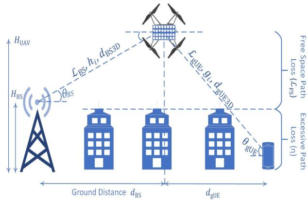  
Fig. 1. IRS-UAV assisted communications model.

## II. SYSTEM MODEL

Consider an IRS planar array mounted on a UAV, as depicted in Fig. 1. In this context, we consider a single BS and a single antenna user located beyond the horizon, i.e., there is no LoS between the BS and the user. The fading coefficient $h _ { i }$ represents the small scale fading between the BS and the ith-RE, which is modeled as CSCG with zero mean and unit variance, i.e., $h _ { i } \sim C N ( 0 , 1 )$ . Also, the fading coefficient $g _ { i }$ represents the channel between the ith-RE and the user which is modeled as CSCG with zero mean and unit variance, i.e., $g _ { i } \sim C N ( 0 , 1 )$ , whereas i is the index indicating the ith-RE on the IRS. Motivated by [21, eq. (1)], the received signal at the user is given by

$$
r = \left[ \sum _ { i = 1 } ^ { N } h _ { i } \sqrt { \mathcal { L } _ { B S , i } ^ { - 1 } } e ^ { j \psi _ { i } } g _ { i } \sqrt { \mathcal { L } _ { g U E , i } ^ { - 1 } } \right] x + n ,\tag{1}
$$

where x is the information symbol with energy per symbol of $E _ { s } = \mathbb { E } [ x ^ { 2 } ]$ , N is the number of REs in the IRS, where each RE applies a phase shift $\psi _ { i }$ on the impinging wave, $\mathcal { L } _ { B S , i }$ is the path loss between the base station and the ith-RE, $\mathcal { L } _ { g U E , i }$ is the path loss between the ith-RE and the gUE, and n is the additive noise modeled as $\textit { n } \sim \mathit { C N } ( 0 , N _ { 0 } )$ . Rewriting the channels in terms of their envelopes and phases as $h _ { i } =$ $\alpha _ { i } e ^ { - j \omega _ { i } }$ and $g _ { i } = \beta _ { i } e ^ { - j \varnothing _ { i } }$ and assuming perfect knowledge of channel state information at the IRS, the phase shifts applied by IRS elements can be chosen to cancel the channel phases as $\psi _ { i } = \omega _ { i } + \emptyset _ { i }$ [21].

As described earlier, the envelope of the channel between the BS and the ith-RE on the $\mathrm { U A V } , \alpha _ { i } .$ follows a Rayleigh distribution as in [22]. This choice is motivated by the fact that Rayleigh distribution accounts for severe multipath fading, as it is practically encountered in realistic communication scenarios. Similarly, the envelope of the channel between the ith-RE on the UAV and the user, $\beta _ { i }$ , follows a Rayleigh distribution as in [23]–[25]. Therefore, the end-to-end SNR of the system assuming that the path loss is the same across all elements and utilizing the suggested phase shift applied by the IRS can

be expressed as

$$
\begin{array} { r l r } { \gamma } & { = } & { \frac { \left| \sum _ { i = 1 } ^ { N } \alpha _ { i } e ^ { - j \omega _ { i } } \sqrt { \mathcal { L } _ { B S } ^ { - 1 } } e ^ { j \psi _ { i } } \beta _ { i } e ^ { - j \emptyset _ { i } } \sqrt { \mathcal { L } _ { g U E } ^ { - 1 } } \right| ^ { 2 } E _ { s } } { N _ { 0 } } } \\ & { } & { = \frac { \left| \sum _ { i = 1 } ^ { N } \alpha _ { i } \beta _ { i } \right| ^ { 2 } E _ { s } \mathcal { L } } { N _ { 0 } } , } \end{array}\tag{2}
$$

where

$$
\begin{array} { r } { \mathcal { L } = \mathcal { L } _ { B S } ^ { - 1 } \mathcal { L } _ { g U E } ^ { - 1 } . } \end{array}\tag{2a}
$$

The UAV-IRS system adopts path loss models unique to UAVs reported in [19], [26], in which the path loss between the UAV and the BS $( \mathcal { L } _ { B S } )$ is based on the elevation angle $( \theta _ { B S } )$ and the 3D distance between the BS and the UAV $\left( d _ { B S 3 D } \right)$ On the other hand, the path loss between the UAV and the gUE $\scriptstyle ( { \mathcal { L } } _ { g U E } )$ is based on the elevation angle $( \theta _ { g U E } )$ and the 3D distance between the BS and the gUE $( d _ { g U E 3 D } )$ . The reason for utilizing angle-dependent path loss models in the proposed system is that they fit experimental path loss measurements as compared to height dependent path loss models [3]. The $\mathcal { L } _ { g U E } ^ { \mathrm { d B } }$ term is given as [26]

$$
\begin{array} { r l } & { \mathcal { L } _ { \mathrm { g U E } } ^ { \mathrm { d B } } \big ( \theta _ { \mathrm { g U E } } , d _ { \mathrm { g U E 3 D } } \big ) } \\ & { ~ = \Big ( \mathcal { L } _ { \mathrm { F S } } ^ { \mathrm { d B } } \big ( d _ { g U E 3 D } , f \big ) + \eta _ { \mathrm { N L O S } } \Big ) \big ( 1 - P _ { \mathrm { L O S g U E } } \big ( \theta _ { \mathrm { g U E } } \big ) \big ) } \\ & { ~ + \left( \mathcal { L } _ { \mathrm { F S } } ^ { \mathrm { d B } } \big ( d _ { \mathrm { g U E 3 D } } , f \big ) + \eta _ { \mathrm { L O S } } \right) P _ { \mathrm { L O S g U E } } \big ( \theta _ { \mathrm { g U E } } \big ) , ~ ( 3 ) } \end{array}
$$

where

$$
P _ { \mathrm { L O S g U E } } ( \theta _ { \mathrm { g U E } } ) = \frac { 1 } { 1 + a _ { g U E } e ^ { - b _ { g U E } \left( \theta _ { g U E } - a _ { g U E } \right) } }\tag{3a}
$$

represents the probability of having LoS between the UAV and the gUE, which depends on the elevation angle $( \theta _ { \mathrm { g U E } } )$ , and $\mathcal { L } _ { \mathrm { F S } } ( d _ { g U E 3 D } , f )$ is the free-space path loss as a function of distance and frequency. The parameters $b _ { g U E }$ and $a _ { g } \ = U E$ are specific to the environment being simulated such as urban, suburban, etc. and can be calculated based on Tables I–II in [26]. Therefore, $\mathcal { L } _ { \mathrm { g U E } } ( \theta _ { \mathrm { g U E } } , d _ { \mathrm { g U E 3 D } } )$ has a LoS and a non line-of-sight (NLoS) components that are combined based on $P _ { \mathrm { L O S } } ( \theta _ { \mathrm { g U E } } )$ that takes into account the nature of UAV channels. The path loss can be written as

$$
\begin{array} { r } { \mathcal { L } _ { \mathrm { g U E } } ^ { \mathrm { d B } } \big ( \theta _ { \mathrm { g U E } } , d _ { \mathrm { g U E 3 D } } \big ) = ( \eta _ { \mathrm { L O S } } - \eta _ { \mathrm { N L O S } } ) P _ { \mathrm { L O S g U E } } \big ( \theta _ { \mathrm { g U E } } \big ) } \\ { + 2 0 \log \bigg ( d _ { \mathrm { g U E 3 D } } \frac { 4 \pi } { \lambda } \bigg ) + \eta _ { \mathrm { N L O S } } , } \end{array}\tag{4}
$$

where $\eta _ { \mathrm { L O S } }$ and $\eta _ { \mathrm { N L O S } }$ denote the path loss occurred in excess to the free-space path loss for LoS and NLoS, respectively. These processes follow log-normal models with means $- \mu _ { \eta _ { \mathrm { L O S } } } , \mu _ { \eta _ { \mathrm { N L O S } } - }$ and standard deviations given by [27]

$$
\sigma _ { \eta _ { \mathrm { L O S } } } ( \theta _ { \mathrm { g U E } } ) = a _ { \mathrm { L O S } } \exp ( - b _ { \mathrm { L O S } } \theta _ { \mathrm { g U E } } ) ,\tag{5}
$$

and

$$
\sigma _ { \eta _ { \mathrm { N L O S } } } ( \theta _ { \mathrm { g U E } } ) = a _ { \mathrm { N L O S } } \exp ( - b _ { \mathrm { N L O S } } \theta _ { \mathrm { g U E } } ) .\tag{6}
$$

The parameters aLOS, aNLOS, bLOS, andbNLOS are dependent upon the environment [27]. Therefore,

$\begin{array} { r l } & { \mathcal { L } _ { \mathrm { g U E } } ^ { \mathrm { d B } } ( \theta _ { \mathrm { g U E } } , d _ { \mathrm { g U E 3 D } } ) } \\ & { \mathrm { d i s t r i b u t i o n , i . e . , } } \end{array}$ is modeled as a normal

$$
\mathcal { L } _ { \mathrm { g U E } } ^ { \mathrm { d B } } \big ( \theta _ { \mathrm { g U E } } , d _ { \mathrm { g U E 3 D } } \big ) \sim { \cal N } \Big ( \mu _ { \mathrm { g U E } } ^ { \mathrm { d B } } , \sigma _ { \mathrm { g U E , d B } } ^ { 2 } \big ( \theta _ { \mathrm { g U E } } \big ) \Big ) ,\tag{7}
$$

where

$$
\begin{array} { r l r } { \mu _ { \mathrm { g U E } } ^ { \mathrm { d B } } = { P _ { \mathrm { L O S g U E } } } \big ( \theta _ { \mathrm { g U E } } \big ) \times \big ( \mu _ { \eta _ { \mathrm { L O S } } } - \mu _ { \eta _ { \mathrm { N L O S } } } \big ) + \mu _ { \eta _ { \mathrm { N L O S } } } } \\ { ~ } & { ~ } & { ~ + ~ 2 0 \log \bigg ( d _ { \mathrm { g U E 3 D } } \frac { 4 \pi } { \lambda } \bigg ) , ~ } \end{array}
$$

and

$$
\begin{array} { r l } & { \sigma _ { \mathrm { g U E } , \mathrm { d B } } ^ { 2 } ( \theta _ { \mathrm { g U E } } ) = P _ { \mathrm { L O S g U E } } ^ { 2 } ( \theta _ { \mathrm { g U E } } ) \times \big ( \sigma _ { \eta _ { \mathrm { L O S } } } ^ { 2 } \big ( \theta _ { \mathrm { g U E } } \big ) } \\ & { ~ + ~ \sigma _ { \eta _ { \mathrm { N L O S } } } ^ { 2 } \big ( \theta _ { \mathrm { g U E } } \big ) \big ) + \sigma _ { \eta _ { \mathrm { N L O S } } } ^ { 2 } \big ( \theta _ { \mathrm { g U E } } \big ) . } \end{array}\tag{7b}
$$

To this effect, the received signal at the UAV, $P _ { r }$ , and the path loss, $\mathcal { L } _ { \mathrm { B S } } ^ { \mathrm { d B } }$ , between the UAV and the BS are given by [19]

$$
P _ { r } = P _ { T } \eta _ { \nu } G _ { s l } H _ { \nu } d _ { B S 3 D } ^ { - \kappa _ { \nu } } , \nu \in \{ \mathrm { L o S } , \mathrm { N L o S } \} ,
$$

and

$$
\begin{array} { r l r } { \mathrm { ~ \mathcal { L } _ { B S } ^ { d B } ( \theta _ { B S } , } \mathrm { ~  { d _ { B S 3 D } } ) ~ } } & { } & { } \\ & { = \mathrm { ( 1 0 } \kappa _ { N L O S } \log ( { d _ { B S 3 D } } ) + \eta _ { \mathrm { N L O S } } ) ( 1 - P _ { \mathrm { L O S B S } } ( \theta _ { \mathrm { B S } } ) ) ~ } & \\ & { ~ + ~ \mathrm { ( 1 0 } \kappa _ { L O S } \log ( { d _ { B S 3 D } } ) + \eta _ { \mathrm { L O S } } ) P _ { \mathrm { L O S B S } } ( \theta _ { \mathrm { B S } } ) ~ } & \\ & { ~ - ~ G _ { s l } + 2 0 \log { \left( \frac { 4 \pi } { \lambda } \right) } , } & { \mathrm { ( 8 a ) } } \end{array}\tag{8}
$$

where

$$
P _ { \mathrm { L O S B S } } ( \theta _ { \mathrm { B S } } ) = - a _ { B S } e ^ { - b _ { B S } \theta _ { \mathrm { B S } } } + c _ { B S }\tag{8b}
$$

represents the probability of a presence of LoS path between the UAV and the BS that depends on the elevation angle $( \theta _ { \mathrm { B S } } )$ $G _ { s l }$ is the side lobe of the BS antenna, $P _ { T }$ is the BS transmit power, and H is the small-scale fading. It can be observed that $\mathrm { \dot { \mathcal { L } } _ { B S } ^ { d B } }$ is similar to (3) which is due to the fact that the authors in [19] adopted a path loss model similar to the one introduced earlier, i.e., $\mathcal { L } _ { \mathrm { g U E } } ^ { \mathrm { d B } } ( \theta _ { \mathrm { g U E } } , d _ { \mathrm { g U E 3 D } } )$ . However, two distinctions can be made: 1) the introduction of path loss exponents and 2) a different form of the $P _ { L O S }$ . The probability of LoS in the BS-UAV link, $P _ { L O S B S }$ , have been derived based on the same International Telecommunication Union model utilized in [26]; however, the heights have been extended by the authors in [19] to fulfil the heights of BSs. The parameters $a _ { B S } , ~ b _ { B S }$ , and $c _ { B S }$ are specific to the environment being simulated and are available in Table I in [19], whereas $\kappa _ { L O S }$ and $\kappa _ { N L O S }$ are the LoS and NLoS path loss exponents, respectively. The excess path loss parameters $\eta _ { \mathrm { { L O S } } }$ and ηNLOS are considered to be the same to those of the UAV-gUE link. These values are considered to be worse than the excess path loss that would be measured or simulated for the BS-UAV link.

In the considered configuration, the distance between the user and BS is kept fixed, and the UAV is allowed to move starting close to the BS moving towards the $\mathrm { \ g U E }$ . The distance utilized in simulations is 2.3 Km, which is considered large enough to result in poor communication link in order to study the viability of the IRS-assisted UAV system. The remaining system model parameters are given in Table I.

TABLE I SIMULATION PARAMETERS
<table><tr><td>Category</td><td>Value</td></tr><tr><td>Propagation environment</td><td>Suburban</td></tr><tr><td>Frequency</td><td>700 MHz</td></tr><tr><td>BS height  $\left( H _ { \mathrm { B S } } \right)$ </td><td>30 m [19]</td></tr><tr><td>UAV height  $( H _ { \mathrm { U A V } } )$ </td><td>70 m [43]</td></tr><tr><td>(ηLOS, η7NLOS)</td><td>(0, 18) dB [27]</td></tr><tr><td> $( \kappa _ { \mathrm { L O S } } , \kappa _ { \mathrm { N L O S } } )$ </td><td>(2.5, 3.5) [19]</td></tr><tr><td> $( a _ { \mathrm { g U E } } , b _ { \mathrm { g U E } } )$ </td><td>(4.88, 0.4472) [26]</td></tr><tr><td> $( a _ { \mathrm { B S } } , b _ { \mathrm { B S } } , c _ { \mathrm { B S } } )$ </td><td>(1, 6.581, 1) [19]</td></tr><tr><td> $G _ { \mathrm { s l } }$ </td><td>-15 dB [19]</td></tr><tr><td>Distance between BS and gUE  $( d _ { \mathrm { B S - g U E } } )$ </td><td>2.3 Km</td></tr></table>

## III. PERFORMANCE ANALYSIS

## A. A Statistical Characterization of the Received SNR

In this section and without loss of generality, it is assumed that $\mathcal { L } _ { B S }$ and $\mathcal { L } _ { g U E }$ are deterministic. This assumption will allow for the derivation of the closed-form expression of the SNR PDF. To that end, defining $\begin{array} { r } { A = \sum _ { i = 1 } ^ { N } \bar { \alpha } _ { i } \beta _ { i } } \end{array}$ , then $\gamma =$ $\frac { A ^ { 2 } E _ { s } \mathcal { L } } { N _ { 0 } }$ , so since $\alpha _ { i }$ and $\beta _ { i }$ are Rayleigh distributed, the term $y _ { i } \stackrel { \smile } { = } \alpha _ { i } \beta _ { i }$ is modeled as a double-Rayleigh distribution with the following PDF [28], [29]

$$
\begin{array} { l } { f ( y _ { i } ) = 2 { \left( 2 ^ { p } \sigma ^ { 2 } \right) } ^ { - 1 / 2 } G _ { 0 , p } ^ { p , 0 } \left( \underset { \frac { 1 } { 2 } . . . . \frac { 1 } { 2 } } { \bf \sigma _ { 1 } } \left( 2 ^ { p } \sigma ^ { 2 } \right) ^ { - 1 } { y _ { i } } ^ { 2 } \right) } \\ { = \left( \frac { y _ { i } } { \sigma ^ { 2 } } \right) K _ { 0 } \left( \frac { y _ { i } } { \sigma } \right) } \\ { = 4 y _ { i } K _ { 0 } ( 2 y _ { i } ) , } \end{array}\tag{9}
$$

where $K _ { 0 }$ is the modified Bessel function of the second kind with zero order [30]. The mean, variance, and second noncentral moment of this model are given, respectively, as

$$
\mathbb { E } [ y _ { i } ] = \Big ( 2 ^ { p } \sigma ^ { 2 } \Big ) ^ { 1 / 2 } \big ( \sqrt { \pi } / 2 \big ) ^ { p } = \pi / 4 ,\tag{9a}
$$

$$
\sigma _ { y _ { i } } ^ { 2 } = 2 ^ { p } \sigma ^ { 2 } [ 1 - ( \pi / 4 ) ^ { p } ] = 1 - \frac { \pi ^ { 2 } } { 1 6 } ,\tag{9b}
$$

and

$$
\mathbb { E } \Big [ { y _ { i } } ^ { 2 } \Big ] = 2 ^ { p } \sigma ^ { 2 } = 1 ,\tag{9c}
$$

where

$$
\sigma ^ { 2 } = \prod _ { i = 1 } ^ { p } \sigma _ { i } ^ { 2 } = 1 / 4 ,\tag{9d}
$$

with $\sigma _ { i } ^ { 2 }$ denoting the variance of the underlying real Gaussian random variables of ${ \mathit { C N } } ( 0 , 1 )$ and $\sigma _ { i } ^ { 2 } = 1 / 2 , G _ { c , d } ^ { a , b } ( \cdot )$ represents the Meijer G function [30], and $p$ is the number of cascaded Rayleigh random variables. In our case, $p = 2$ for the two Rayleigh distributions.

Using the complex Cauchy–Schwarz–Buniakowsky inequality [31], [32], $A ^ { \hat { 2 } }$ can be bounded as follows

$$
\left| \sum _ { i = 1 } ^ { N } \alpha _ { i } \beta _ { i } \right| ^ { 2 } \leq \left( \sum _ { i = 1 } ^ { N } | \alpha _ { i } | ^ { 2 } \right) \left( \sum _ { i = 1 } ^ { N } | \beta _ { i } | ^ { 2 } \right) .\tag{10}
$$

By also defining

$$
\alpha = \sum _ { i = 1 } ^ { N } \vert \alpha _ { i } \vert ^ { 2 } , \ \mathrm { a n d } \ \beta = \sum _ { i = 1 } ^ { N } \vert \beta _ { i } \vert ^ { 2 } ,\tag{10a}
$$

the inequality in (10) can be written as

$$
\left| \sum _ { i = 1 } ^ { N } \alpha _ { i } \beta _ { i } \right| ^ { 2 } \leq \alpha \beta ,\tag{10b}
$$

where the inequality holds true when $\alpha _ { i }$ and $\beta _ { i }$ are statistically independent. The right side of the inequality represents an upper bound on the SNR, which will be used in the subsequent analysis to evaluate the average SNR. Since $\alpha _ { i }$ and $\beta _ { i }$ are Rayleigh distributed, $\begin{array} { r } { R ( \sigma = \frac { 1 } { \sqrt { 2 } } ) } \end{array}$ , then $| \alpha _ { i } | ^ { 2 }$ and $| \beta _ { i } | ^ { 2 }$ are exponentially distributed $\begin{array} { r } { E ( \lambda = \frac { \hat { 1 } } { 2 \sigma ^ { 2 } } = 1 ) } \end{array}$ [32]. Accordingly, α and $\beta$ follow Erlang distribution with shape parameter $N ,$ scale parameter $\lambda ^ { - 1 }$ , and expected value given by $N \times \lambda$ The Erlang distribution is a Gamma distribution with shape parameter N as an integer and all Gamma distribution properties apply [33]. The PDF of the product of the two gamma random variables $y = \alpha \beta$ is given by [34], [35]

$$
f ( y ) = \frac { 2 } { \Gamma ( N ) \Gamma ( N ) } y ^ { N - 1 } K _ { 0 } ( 2 \sqrt { y } ) ,\tag{11}
$$

where $\Gamma ( . )$ is the gamma function [30]. The upper bound on the instantaneous SNR in (2) based on (10) is given as

$$
\gamma = \frac { \left| \sum _ { i = 1 } ^ { N } \alpha _ { i } \beta _ { i } \right| ^ { 2 } E _ { s } \mathcal { L } } { N _ { 0 } } \leq \frac { \alpha \beta E _ { s } \mathcal { L } } { N _ { 0 } } .\tag{12}
$$

Then, utilizing the properties of the transformation of random variables, the PDF of the right-side of the SNR above in (12), is given by

$$
f ( \gamma ) = \frac { 2 } { \mathcal { L } E _ { s } / N _ { 0 } \Gamma ^ { 2 } ( N ) } \bigg ( \frac { \gamma } { \mathcal { L } E _ { s } / N _ { 0 } } \bigg ) ^ { N - 1 }\tag{13}
$$

The PDF in (13) is the PDF of the upper bound on the instantaneous SNR, γ, which will be used in the subsequent analysis of the corresponding MGF, SER, ergodic capacity, and outage probability performance metrics of interest.

## B. Average SNR

Based on the right-hand side of (12), the average SNR can be evaluated as follows

$$
\mathbb { E } [ \gamma ] = \mathbb { E } \bigg [ \mathcal { L } \frac { E _ { s } } { N _ { 0 } } \alpha \beta \bigg ] = \mathcal { L } \frac { E _ { s } } { N _ { 0 } } \mathbb { E } [ \alpha \beta ] = \mathcal { L } \frac { E _ { s } } { N _ { 0 } } N ^ { 2 } ,\tag{14}
$$

where $\mathbb { E } [ \alpha ] = \mathbb { E } [ \beta ] = N$ and due to the assumed statistical independence $\mathbb { E } [ \alpha \beta ] = \mathbb { E } [ \alpha ] \mathbb { E } [ \beta ] = N ^ { 2 }$ . As can be seen in (14), the expected value of the SNR scales with the square of the number of REs, i.e., quadratically.

Proposition 1: The average SNR can be upper bounded and lower bounded as

$$
\frac { \pi ^ { 2 } } { 1 6 } \mathcal { L } \frac { E _ { s } } { N _ { 0 } } N ^ { 2 } \le \mathbb { E } [ \gamma ] \le \mathcal { L } \frac { E _ { s } } { N _ { 0 } } N ^ { 2 } .\tag{15}
$$

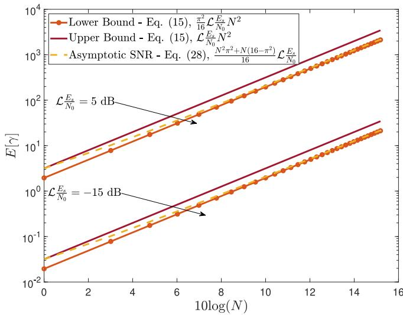  
Fig. 2. Average SNR comparison between (15) and (28) at low and high SNRs for N from 1 to 33.

Proof: To validate that the right-hand side of (15) is indeed an upper bound, we recall the $c _ { r } \ -$ inequality [36]. Let $X _ { 1 } , \ldots , X _ { N }$ be random variables and $\begin{array} { r } { S _ { N } = \sum _ { i = 1 } ^ { N } X _ { i } } \end{array}$ , then

$$
\mathbb { E } | S _ { N } | ^ { r } \leq c _ { r } \sum _ { i = 1 } ^ { N } \mathbb { E } | X _ { i } | ^ { r } ,\tag{16}
$$

where $c _ { r } = 1$ or $c _ { r } = N ^ { r - 1 }$ depending on whether $0 < r \leq 1$ or $r > 1$ . In our case, $r = 2$ , then

$$
\begin{array} { r l } & { \mathbb { E } [ \gamma ] = \mathbb { E } \bigg [ \mathcal { L } \frac { E _ { s } } { N _ { 0 } } A ^ { 2 } \bigg ] = \mathcal { L } \frac { E _ { s } } { N _ { 0 } } \mathbb { E } \bigg [ A ^ { 2 } \bigg ] } \\ & { \quad \quad \quad \leq \mathcal { L } \frac { E _ { s } } { N _ { 0 } } N \displaystyle \sum _ { i = 1 } ^ { N } \mathbb { E } \bigg [ y _ { i } { } ^ { 2 } \bigg ] } \\ & { \quad \quad = \mathcal { L } \frac { E _ { s } } { N _ { 0 } } N \times N } \\ & { \quad \quad \quad \Rightarrow \mathbb { E } [ \gamma ] \leq \mathcal { L } \frac { E _ { s } } { N _ { 0 } } N ^ { 2 } . } \end{array}
$$

A lower bound can be calculated based on the Jensen’s inequality applied on (2) as

$$
\mathbb { E } [ A ^ { 2 } ] \geq ( \mathbb { E } [ A ] ) ^ { 2 } ,\tag{16a}
$$

where $\begin{array} { r } { \mathbb { E } [ A ] = \mathbb { E } [ \sum _ { i = 1 } ^ { N } \alpha _ { i } \beta _ { i } ] = \sum _ { i = 1 } ^ { N } \mathbb { E } [ \alpha _ { i } \beta _ { i } ] = N \mathbb { E } [ y _ { i } ] = } \end{array}$ $N _ { \mathrm { 4 } } ^ { \pi }$

$$
\begin{array} { r l } & { \mathbb { E } [ \gamma ] = \mathbb { E } \bigg [ \mathcal { L } \frac { E _ { s } } { N _ { 0 } } A ^ { 2 } \bigg ] = \mathcal { L } \frac { E _ { s } } { N _ { 0 } } \mathbb { E } \bigg [ A ^ { 2 } \bigg ] \geq \mathcal { L } \frac { E _ { s } } { N _ { 0 } } ( \mathbb { E } [ A ] ) ^ { 2 } } \\ & { \quad \quad = \mathcal { L } \frac { E _ { s } } { N _ { 0 } } \Bigg ( \mathbb { E } \bigg [ \displaystyle \sum _ { i = 1 } ^ { N } \alpha _ { i } \beta _ { i } \bigg ] \Bigg ) ^ { 2 } = \mathcal { L } \frac { E _ { s } } { N _ { 0 } } \Bigg ( \displaystyle \sum _ { i = 1 } ^ { N } \mathbb { E } [ \alpha _ { i } \beta _ { i } ] \Bigg ) ^ { 2 } } \\ & { \quad \quad = \mathcal { L } \frac { E _ { s } } { N _ { 0 } } \Big ( N \displaystyle \frac { \pi } { 4 } \Big ) ^ { 2 } = N ^ { 2 } \displaystyle \frac { \pi ^ { 2 } } { 1 6 } \mathcal { L } \frac { E _ { s } } { N _ { 0 } } } \\ & { \quad \quad \quad \Rightarrow \mathbb { E } [ \gamma ] \geq N ^ { 2 } \displaystyle \frac { \pi ^ { 2 } } { 1 6 } \mathcal { L } \frac { E _ { s } } { N _ { 0 } } . } \end{array}
$$

As can be seen in proposition 1, the average SNR is upper bounded and lower bounded by the same variables and an extra constant in the lower bound. This implies that the gap

between the bounds is constant and is less than unity which can also be seen in the results section in Fig. 2.

## C. MGF Calculation

In order to calculate the MGF, the following definition will be used [37]

$$
M _ { \gamma } ( s ) = \int _ { 0 } ^ { \infty } \exp ( s \gamma ) f _ { \gamma } ( \gamma ) \mathrm { d } \gamma .\tag{17}
$$

Proposition 2: The MGF of the right-hand side of the SNR in (12) is given by

$$
\begin{array} { l } { { \displaystyle M _ { \gamma } ( s ) = M _ { y } \biggl ( \mathcal { L } \frac { E _ { s } } { N _ { 0 } } s \biggr ) } } \\ { { \displaystyle ~ = \frac { 1 } { \Gamma ^ { 2 } ( \mathrm { N } ) } G _ { 2 , 1 } ^ { 1 , 2 } \biggl ( - \mathcal { L } \frac { E _ { s } } { N _ { 0 } } s \biggr | ^ { 1 - N , 1 - N } \biggr ) , } } \end{array}\tag{18}
$$

where $s \neq 0 .$

Proof: Utilizing [38, eq. (8.4.23.1)] to re-write $K _ { 0 } ( \cdot )$ in terms of the Meijer G function, and then utilizing [38, eq. (2.24.3.1)], the MGF of the double Gamma PDF in (11) is given by

$$
M _ { y } ( s ) = \frac { 1 } { \Gamma ( N ) \Gamma ( N ) } G _ { 2 , 1 } ^ { 1 , 2 } \biggl ( - s \biggl | \begin{array} { c } { { 1 - N , 1 - N } } \\ { { 0 } } \end{array} \biggr ) .\tag{19}
$$

Furthermore, utilizing the properties of the transformation of random variables, the MGF of the SNR in (13) can be written as in (18).

## D. Symbol Error Rate (SER)

Given the MGF in (18), the symbol error rate of the Mary phase shift keying (M-PSK) modulation can be readily calculated using [39]

$$
P _ { \mathrm { s } } = \frac { 1 } { \pi } \int _ { 0 } ^ { ( M - 1 ) \pi / M } M _ { \gamma } \biggl ( - \frac { \sin ^ { 2 } ( \pi / M ) } { \sin ^ { 2 } ( \theta ) } \biggr ) \mathrm { d } \theta ,\tag{20}
$$

where substituting the MGF in (18) into (20) yields

$$
\begin{array} { c } { { P _ { \mathrm { s } } = \displaystyle \frac { 1 } { \pi \Gamma ^ { 2 } ( N ) } \times \int _ { 0 } ^ { ( M - 1 ) \pi / M } } } \\ { { \times  G _ { 2 , 1 } ^ { 1 , 2 } ( \displaystyle { \mathcal { L } \frac { E _ { s } } { N _ { 0 } } \frac { \sin ^ { 2 } ( \pi / M ) } { \sin ^ { 2 } ( \theta ) } \biggl | 1 - N , 1 - N } ) \mathrm { d } \theta . } } \end{array}\tag{21}
$$

## E. Ergodic Capacity

The achievable ergodic capacity can be calculated as [40]

$$
\overline { { C } } = \mathbb { E } [ \log _ { 2 } ( 1 + \gamma ) ] .\tag{22}
$$

Proposition 3: The ergodic capacity of the upper bound PDF SNR in (13) is given by

$$
\begin{array} { r } { \overline { { C } } = \frac { 1 } { \mathcal { L } \frac { E _ { s } } { N _ { 0 } } \Gamma ^ { 2 } ( \mathrm { N } ) \ln ( 2 ) } } \\ { \times \ G _ { 2 , 4 } ^ { 4 , 1 } \left( \frac { 1 } { \mathcal { L } \frac { E _ { s } } { N _ { 0 } } } \Big | _ { N - 1 , N - 1 , - 1 , - 1 } \right) . } \end{array}\tag{23}
$$

Proof: To calculate the ergodic capacity in (22), the log function needs to be integrated over the upper bound SNR

PDF in (13). By utilizing [38, eq. (8.4.6.5)], we can re-write $\log _ { 2 } ( 1 + \gamma )$ in terms of the Meijer G function as

$$
\log _ { 2 } ( 1 + \gamma ) = \frac { 1 } { \ln ( 2 ) } G _ { 2 , 2 } ^ { 1 , 2 } \biggl ( x \biggl | 1 , 1 \atop 1 , 0 \biggr ) .
$$

Furthermore, utilizing [38, eq. (8.4.23.1)] to re-write $K _ { 0 } ( \cdot )$ in terms of the Meijer G function, the integral in (22) can be written as

$$
\begin{array} { c } { \displaystyle \int _ { 0 } ^ { \infty } \frac { 1 } { \ln ( 2 ) \mathscr { L } E _ { s } / N _ { 0 } \Gamma ^ { 2 } ( N ) } \bigg ( \frac { \gamma } { \mathscr { L } E _ { s } / N _ { 0 } } \bigg ) ^ { N - 1 } } \\ { \displaystyle \times \ G _ { 2 , 2 } ^ { 1 , 2 } \bigg ( \gamma \bigg | _ { 1 , 0 } ^ { 1 , 1 } \bigg ) G _ { 0 , 2 } ^ { 2 , 0 } \bigg ( \frac { \gamma } { \mathscr { L } E _ { s } / N _ { 0 } } \bigg | 0 , 0 \bigg ) { \mathrm { d } } \gamma . } \end{array}
$$

It is to be noted here that the above integral can be evaluated in closed-form by utilizing [38, eq. (2.24.1.1)] to arrive at the result in (23), which completes the proof. ■

## F. Outage Probability and Outage Capacity

The outage probability occurs when the SNR falls below a threshold, i.e.,

$$
\mathrm { P } _ { o u t } ( \gamma _ { t h } ) = \mathrm { P } [ \gamma < \gamma _ { t h } ] = F _ { \gamma } ( \gamma _ { t h } ) ,\tag{24}
$$

where $F _ { \gamma } ( . )$ is the cumulative distribution function (CDF) of the upper bound PDF SNR given in (13). A suitable choice for the threshold is when $\operatorname { P } [ C < R ] , { \mathrm { i . e . } }$ ., the transmission rate is higher than the channel capacity, $\mathrm { C } = \log ( 1 + \gamma )$ ), that gives $\gamma _ { t h } \overset { \cdot } { = } 2 ^ { R } - 1$ . This capacity can be calculated by solving for R as follows [37]

$$
\mathrm { P } _ { C o u t } ( R ) = \mathrm { P } [ C < R ] = F _ { \gamma } \Big ( 2 ^ { R } - 1 \Big ) .\tag{25}
$$

Proposition 4: The CDF of the upper bound SNR PDF in (13) is given by

$$
\begin{array} { r l } & { F _ { \gamma } ( \gamma _ { t h } ) = \frac { \gamma _ { t h } } { \mathcal { L } _ { N _ { 0 } } ^ { \frac { E _ { s } } { N _ { 0 } } \Gamma ^ { 2 } ( N ) } } } \\ & { \qquad \times \ G _ { 1 , 2 } ^ { 2 , 1 } \left( \frac { \gamma _ { t h } } { \mathcal { L } _ { N _ { 0 } } ^ { \frac { E _ { s } } { N _ { 0 } } } } \bigg | _ { N - 1 , N - 1 , - 1 } \right) . } \end{array}\tag{26}
$$

Proof: We start by utilizing [38, eq. (8.4.23.1)] to re-write $K _ { 0 }$ in terms of the Meijer G function. Then using the definition of finding the CDF from the PDF yields

$$
\begin{array} { r } { F _ { \gamma } ( \gamma _ { t h } ) = \int _ { 0 } ^ { \gamma _ { t h } } \frac { 1 } { \mathcal { L } E _ { s } / N _ { 0 } \Gamma ^ { 2 } ( N ) } \bigg ( \frac { \gamma } { \mathcal { L } E _ { s } / N _ { 0 } } \bigg ) ^ { N - 1 } } \\ { \times G _ { 0 , 2 } ^ { 2 , 0 } \bigg ( \frac { \gamma } { \mathcal { L } E _ { s } / N _ { 0 } } \bigg | \cdot _ { 0 , 0 } ^ { \cdot , \cdot } \bigg ) \mathrm { d } \gamma . } \end{array}
$$

Notably, the above integral can be evaluated in closed form with the aid of [38, eq. (1.16.2.1)]. Therefore, by performing the necessary change of variables and after some algebraic manipulations, equation (26) is obtained, which completes the proof. ■

## IV. ASYMPTOTIC ANALYSIS: THE CENTRAL LIMIT THEOREM APPROACH

In the previous section, we derived an upper bound on the involved SNR. One way to perform direct analysis on the SNR in (2) is to note that the summation (i.e., $\begin{array} { r } { \dot { A } = \sum _ { i = 1 } ^ { N } \alpha _ { i } \beta _ { i } ) } \end{array}$ is a sum of random variables. This motivates us to examine the tightness of the bounds as N becomes large. Therefore, for $N \gg 1$ and based on the CLT [21], [41], we observe that

$$
A \sim { \cal N } \bigg ( N \frac { \pi } { 4 } , N \bigg ( 1 - \frac { \pi ^ { 2 } } { 1 6 } \bigg ) \bigg ) .\tag{27}
$$

Therefore, $A ^ { 2 }$ follows a non-central Chi-squared distribution [37], $f _ { A ^ { 2 } }$ , with one-degree of freedom (DoF) and $\begin{array} { r } { M _ { A ^ { 2 } } ( s ) = ( \frac { 1 } { 1 - 2 s \sigma _ { _ A } ^ { 2 } } ) ^ { \frac { 1 } { 2 } } e ^ { \frac { s m ^ { 2 } } { 1 - 2 s \sigma _ { _ A } ^ { 2 } } } } \end{array}$ , where $\begin{array} { r } { m ^ { 2 } = N ^ { 2 } \frac { \pi ^ { 2 } } { 1 6 } } \end{array}$ . It is Arecalled that for the CLT to hold, N must be sufficiently large. Based on our simulations in the results section ${ \mathrm { V } } ,$ the analytical results based on the CLT started approaching the simulation curves at $N \ \geq \ 1 6 .$ , which is a realistic value in practical communication scenarios.

## A. Average SNR

Following [37], we can express the average SNR as

$$
\begin{array} { r l } & { \mathbb { E } [ \gamma ] = \mathbb { E } \bigg [ \mathcal { L } \frac { E _ { s } } { N _ { 0 } } A ^ { 2 } \bigg ] = \mathcal { L } \frac { E _ { s } } { N _ { 0 } } \mathbb { E } \Big [ A ^ { 2 } \Big ] } \\ & { \quad \quad = \mathcal { L } \frac { E _ { s } } { N _ { 0 } } \Big [ \sigma _ { A } ^ { 2 } + \ m ^ { 2 } \Big ] = \frac { N ^ { 2 } \pi ^ { 2 } + N \left( 1 6 - \pi ^ { 2 } \right) } { 1 6 } \mathcal { L } \frac { E _ { s } } { N _ { 0 } } . } \end{array}\tag{28}
$$

The average SNR in (28) is in an agreement with the SNR bound calculated in the previous section in (15).

## B. MGF

The MGF of a non-central Chi-squared distribution is given in [37], which is based on (17). Therefore, after some algebraic steps, a closed form expression for the MGF can be obtained as

$$
\begin{array} { r l r } & { } & { M _ { \gamma } ( s ) = M _ { A ^ { 2 } } \bigg ( \mathcal { L } \frac { E _ { s } } { N _ { 0 } } s \bigg ) } \\ & { } & { \quad = \left( \frac { 1 } { 1 - \frac { s N \left( 1 6 - \pi ^ { 2 } \right) E _ { s } \mathcal { L } } { 8 N _ { 0 } } } \right) ^ { 1 / 2 } e ^ { \left( \frac { { s N ^ { 2 } \pi ^ { 2 } E _ { s } \mathcal { L } } } { 1 - \frac { s N \left( 1 6 - \pi ^ { 2 } \right) E _ { s } \mathcal { L } } { 8 N _ { 0 } } } \right) } , } \end{array}\tag{29}
$$

where $\begin{array} { r } { s \ < \ \frac { 1 } { 2 \mathcal { L } \frac { E _ { s } } { N _ { 0 } } \sigma _ { A } ^ { 2 } } } \end{array}$ . In the following, (29) is utilized to N Aevaluate the probability of error of M-PSK modulation.

## C. SER

Given the MGF in (29), the symbol error rate of M-PSK modulation can be expressed as [39]

$$
P _ { \mathrm { s } } = \frac { 1 } { \pi } \int _ { 0 } ^ { ( M - 1 ) \pi / M } M _ { \gamma } \biggl ( - \frac { \sin ^ { 2 } ( \pi / M ) } { \sin ^ { 2 } ( \theta ) } \biggr ) \mathrm { d } \theta .\tag{30}
$$

## D. Ergodic Capacity

The corresponding ergodic capacity can be obtained by averaging (22) over the distribution of the instantaneous SNR given by the non-central Chi-squared distribution. However, evaluating the expectation of log2 $( 1 + \gamma )$ over the non-central Chi-squared distribution is cumbersome. Therefore, a simple and accurate approximation of (22) is derived in [42] based on the second-order approximation using the Taylor expansion, yielding

$$
\overline { { C } } \approx \log _ { 2 } ( e ) \left[ \ln ( 1 + \overline { { \gamma } } ) - \frac { \sigma _ { \gamma } ^ { 2 } } { 2 ( 1 + \overline { { \gamma } } ) ^ { 2 } } \right] .\tag{31}
$$

The average SNR $\overline { { \gamma } } = \mathbb { E } [ \gamma ]$ for the CLT case is given in (28), and the variance $\begin{array} { r } { \sigma _ { \gamma } ^ { 2 } = { ( \mathcal { L } _ { N _ { 0 } } ^ { E _ { s } } ) } ^ { 2 } ( 2 \sigma _ { A } ^ { 4 } + 4 \sigma _ { A } ^ { 2 } m ^ { 2 } ) } \end{array}$

## E. Outage Probability and Outage Capacity

The outage probability is evaluated based on the CDF of the non-central Chi-squared distribution as follows [37]

$$
\begin{array} { r l } & { \mathrm { P } _ { o u t } ( \gamma _ { t h } ) = \mathrm { P } [ \gamma < \gamma _ { t h } ] = F _ { \gamma } ( \gamma _ { t h } ) } \\ & { = 1 - Q _ { \frac { 1 } { 2 } } \left( \frac { N \frac { \pi } { 4 } } { \sqrt { N \left( 1 - \frac { \pi ^ { 2 } } { 1 6 } \right) } } , \sqrt { \frac { \gamma _ { t h } } { N \left( 1 - \frac { \pi ^ { 2 } } { 1 6 } \right) } } \right) , } \end{array}\tag{32}
$$

where $Q _ { \frac { 1 } { \alpha } } ( a , b )$ is the generalized Marcum Q-Function [37]. A suitable choice for the threshold is when $\operatorname { P } [ C < R ] , { \mathrm { i . e . } }$ ., the transmission rate is higher than the channel capacity, yielding $\gamma _ { t h } = 2 ^ { R } - 1$ . On the other hand, the outage capacity is the capacity achieved when the outage probability is at a specific value. This capacity can be calculated by solving for R as follows [37]

$$
{ \begin{array} { r l } & { \mathrm { P } _ { C o u t } ( R ) = \mathrm { P } [ C < R ] } \\ & { \qquad = \mathrm { P } \left[ A ^ { 2 } < { \cfrac { 2 ^ { R } - 1 } { { \mathscr { L } } E _ { s } / N _ { 0 } } } \right] = F _ { A ^ { 2 } } \left( { \cfrac { 2 ^ { R } - 1 } { { \mathscr { L } } E _ { s } / N _ { 0 } } } \right) } \end{array} }\tag{33}
$$

However, (33) requires solving for R, which involves finding the inverse Marcum function. An approximation that can be utilized is to calculate the $q \%$ -outage capacity, defined as [42]

$$
C _ { o u t } = \overline { { C } } + \sqrt { 2 \Big ( \mathbb { E } \Big [ \overline { { C } } ^ { 2 } \Big ] - \overline { { C } } ^ { 2 } \Big ) } \mathrm { E r f c } ^ { - 1 } \Big ( 2 - \frac { q } { 5 0 } \Big ) ,\tag{34}
$$

where

$$
\mathbb { E } \Big [ \overline { { C } } ^ { 2 } \Big ] = ( \log _ { 2 } e ) ^ { 2 } \Bigg [ ( \ln ( 1 + \overline { { \gamma } } ) ) ^ { 2 } + \frac { \sigma _ { \gamma } ^ { 2 } } { ( 1 + \overline { { \gamma } } ) ^ { 2 } } \mathrm { l n } \Big ( \frac { e } { 1 + \overline { { \gamma } } } \Big ) \Bigg ] ,\tag{35}
$$

with Erfc(·) denoting the complementary error function. It is noted that the $q \%$ -outage capacity is the capacity that can be achieved $( 1 0 0 - q ) \%$ of the channel realizations.

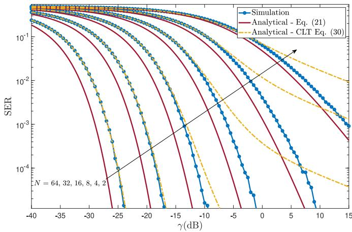  
Fig. 3. Comparison between SERs: (21) that is based on the SNR upper bound and (30) that is based on the asymptotic SNR (CLT) for different number of REs.

## V. NUMERICAL AND SIMULATION RESULTS

In this section, we investigate the upper and lower bound performances on the average SNR and SER and compare them with those derived based on the CLT approach. Finally, simulation results are presented for SER, ergodic capacity, and q%-outage capacity for $q = 5 \%$ . The simulation parameters used in this section are given in Table I, unless stated otherwise. The UAV height, $H _ { \mathrm { U A V } }$ , have been determined based on [43] in accordance with the propagation environment.

As can be seen in Fig. 2, the asymptotic average SNR, which is based on the CLT, approaches the lower bound as N increases. Fig. 3 depicts the error performance of M-PSK in (21) based on the derived MGF in (18) and by calculating the probability of error for M-PSK in (30) based on the asymptotic MGF in (29). Fig. 3 demonstrates that as N increases, $P _ { \mathrm { s } }$ in (21) decreases at a faster rate compared to that of the CLTbased approach. This is due to the fact that (21) is based on the upper bound in (15). Furthermore, at low SNR there is a close match between the simulation and CLT based approach, while for high SNR, there is a gap. This is in agreement with the results in [21]. Finally, Fig. 3 shows that for $\gamma \geq - 1 0 \mathrm { d B }$ a given N, and as SNR increases, the gap between the CLT approach and the simulation results increases.

Fig. 4 depicts the SER performance given by (30) for different values of $d _ { g U E }$ , which represents the horizontal distance between the gUE and the UAV. As the UAV moves closer to the BS, i.e., away from the gUE, $P _ { \mathrm { s } }$ decreases. This behavior is due to the fact that as the UAV approaches the BS, the overall path loss decreases and SNR improves. To gain insight into this behavior, Fig. 5 plots the end-to-end mean path loss experienced as a function of $d _ { \mathrm { g U E } }$ , which shows that $\mathcal { L } ^ { \mathrm { d B } }$ decreases as the UAV moves closer to the BS.

The use of the IRS has the potential of decreasing the SER by five orders of magnitude compared to the case when IRS is not used. The case of no IRS has been simulated based on the same SNR values obtained in Fig. 4 for a standard Rayleigh distributed faded channel.

Fig. 6 shows the capacity given by (31) versus the number of IRS elements N for different locations of the UAV. As expected, as the number of IRS elements increases, the capacity increases, and it is highest for large values of $d _ { g U E }$ . For $d _ { g U E } = 2 1 8 0 \mathrm { m }$ , as shown in Fig. 6, the capacity increases by almost 243 times as N increases from N = 1 to N = 64. Fig. 7 plots the capacity versus $d _ { g U E }$ showing an increase in capacity as $d _ { g U E }$ increases and vice-versa. The figure illustrates that the capacity decreases by almost 81% for $N = 6 4$ when $d _ { g U E }$ varies from 2300 m to 1150 m. However, the capacity is still close to 1333 times more than that at $N = 1$ . Table II summarizes the SNR, capacity, and capacity gain at different operating points.

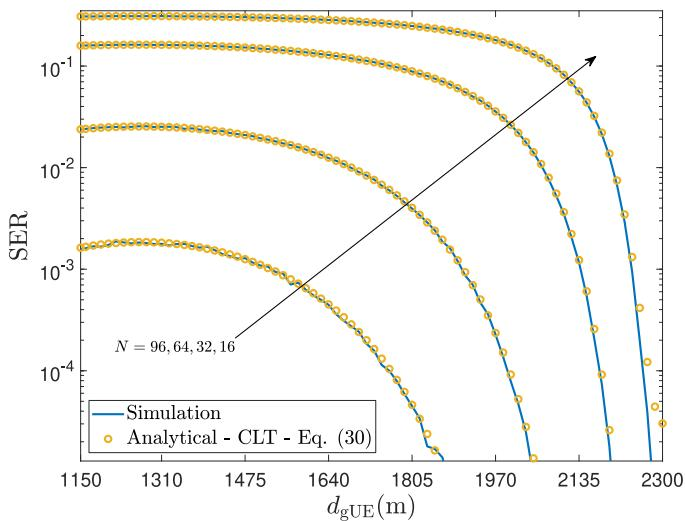  
Fig. 4. Symbol error probability versus the horizontal distance between the user and the UAV for $d _ { \mathrm { B S } } \in \{ 0 \ \mathrm { m } , \frac { d _ { \mathrm { B S - g U E } } } { 2 } \ \mathrm { m } = 1 1 5 0 \ \mathrm { m } \}$

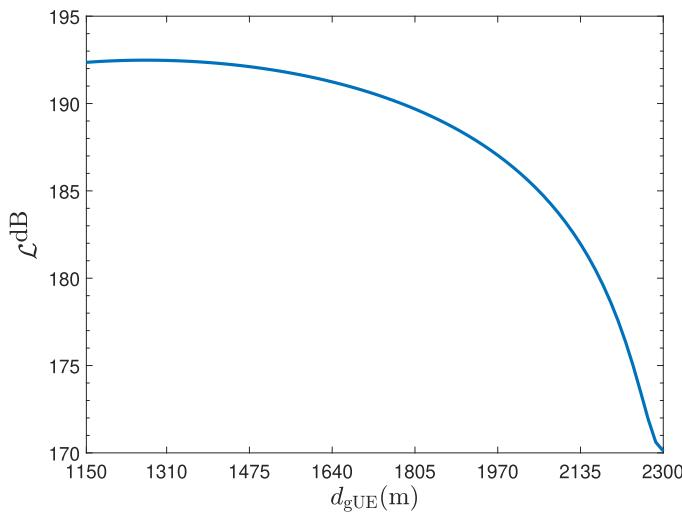  
Fig. 5. $\mathcal { L } ^ { \mathrm { d B } }$ as a function of distance from the user.

TABLE II  
SNR AND $\overline { { C } }$ AT DIFFERENT OPERATING POINTS
<table><tr><td rowspan=1 colspan=1> $d _ { \mathrm { g U E } }$ </td><td rowspan=1 colspan=1>γ</td><td rowspan=1 colspan=1> $\overline { { C } } \mathrm { ~ a t ~ } N = 1$ </td><td rowspan=1 colspan=1> $\overline { { C } } \mathrm { ~ a t ~ } N = 6 4$ </td><td rowspan=1 colspan=1> $\overline { { C } }$ Gain</td></tr><tr><td rowspan=1 colspan=1>2300 m</td><td rowspan=1 colspan=1>-8.6793 dB</td><td rowspan=1 colspan=1>0.1574</td><td rowspan=1 colspan=1>8.4148</td><td rowspan=1 colspan=1>53.46</td></tr><tr><td rowspan=1 colspan=1>2180 m</td><td rowspan=1 colspan=1>-18.1784 dB</td><td rowspan=1 colspan=1>0.0218</td><td rowspan=1 colspan=1>5.2909</td><td rowspan=1 colspan=1>242.70</td></tr><tr><td rowspan=1 colspan=1>1150 m</td><td rowspan=1 colspan=1>-30.9326 dB</td><td rowspan=1 colspan=1>0.0012</td><td rowspan=1 colspan=1>1.5993</td><td rowspan=1 colspan=1>1332.75</td></tr></table>

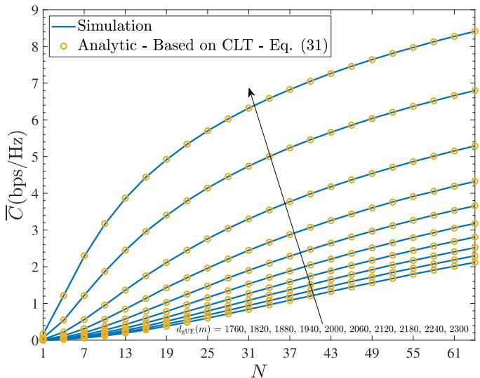  
Fig. 6. Channel capacity vs. the number of IRS elements N.

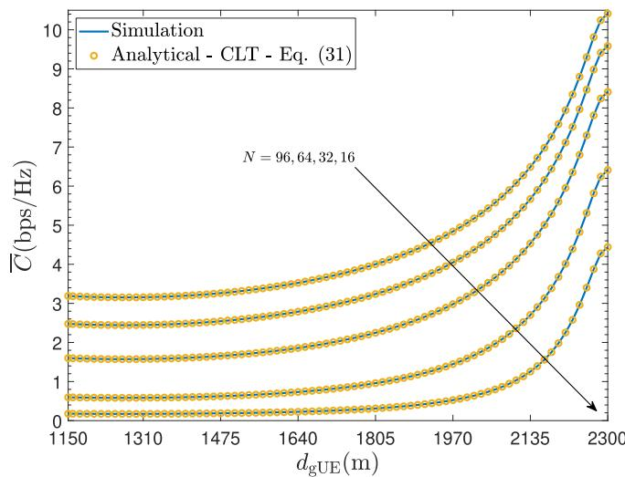  
Fig. 7. Channel capacity vs. $d _ { \mathrm { g U E } }$ for different values of IRS elements N.

Fig. 8 depicts that in 95% of the realizations, the definition of (34), achieves 8.0912 for $d _ { \mathrm { g U E } } = 2 3 0 0$ m and $N = 6 4$ which is close to the value in Table II based on (31) and shown in Fig. 6.

Thus far, we have examined the performance over $d _ { B S } \in$ $\{ 0 , \frac { d _ { B S - g U E } } { 2 } \}$ . In order to examine the performance over the total distance $d _ { B S - g U E } .$ , Fig. 9 plots the SER when $d _ { B S }$ is taken from 0 to 2.3 Km. The figure illustrates the fact that there is a range of $d _ { g U E }$ in which the performance is almost constant for high N. After examining the graph, the range falls within $d _ { g U E } \in \{ 1 1 9 0 \mathrm { ~ m } , 1 3 4 0 \mathrm { ~ m } \}$ at $N = 6 4$

It is evident that as the UAV moves towards either side of the communication link, the performance improves. To understand this phenomenon, Fig. 10 plots the path loss experienced in the UAV-gUE and BS-UAV links. It can be observed that the mean path loss at either links decreases towards the end points. Furthermore, $\mathcal { L } _ { B S } ^ { \mathrm { d B } }$ is higher than $\mathcal { L } _ { g U E } ^ { \mathrm { d B } } .$ . The reason can be attributed to the side-lobe antenna gain, $G _ { s l } . \ A$ typical sidelobe antenna pattern can be found in [3]. Our results agree with the outcome obtained in [17], where the optimal UAV placement was concluded to be at the end-points of the system setup, i.e., either close to the BS or close to the gUE when the ratio of the $\mathrm { g U E }$ location and $H _ { U A V }$ is greater than 2. In our case, $\begin{array} { r } { \frac { d _ { g U E } } { H _ { U A V } } = \frac { 2 3 0 0 } { 7 0 } = 3 2 . 9 } \end{array}$

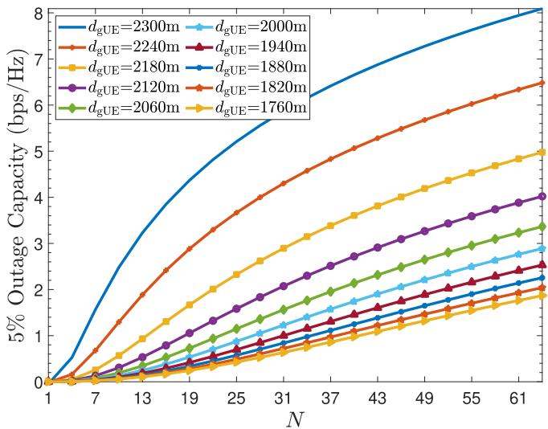

Fig. 8. 5% outage capacity vs. the number of IRS elements N.  
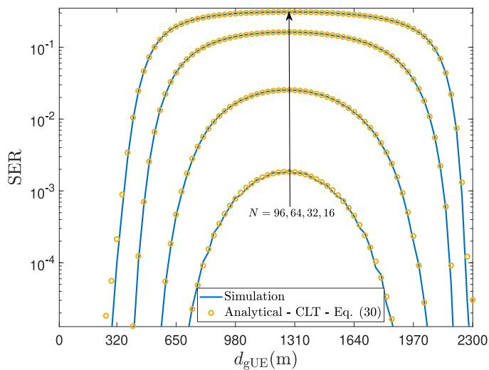

Fig. 9. Symbol Error Probability vs. the horizontal distance between the ground user and the UAV.  
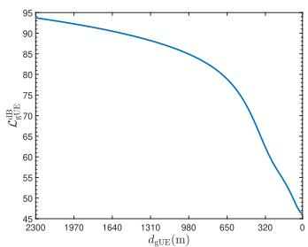  
(a) UAV-gUE link.

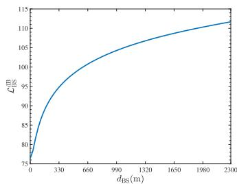  
(b) BS-UAV link.  
Fig. 10. Path loss versus distance: a) $\mathcal { L } _ { \mathrm { g U E } } ^ { \mathrm { d B } }$ vs. $d _ { g U E }$ , and b) $\mathcal { L } _ { \mathrm { B S } } ^ { \mathrm { d B } }$ vs. dBS.

The ergodic capacity for $d _ { B S }$ distances beyond $\frac { d _ { B S - g U E } } { 2 }$ is given in Fig. 11. At $d _ { g U E } = 2 0$ m and $\gamma = 3 . 2 4 2 6$ dB, C improves from 1.1416 to 12.3675 when N increases from 1 to 64. This corresponds to a gain of 10.8334 times. Finally, Fig. 12 illustrates the ergodic capacity as a function of $d _ { g U E }$ which exhibits a similar trend as the average SER in Fig. 9.

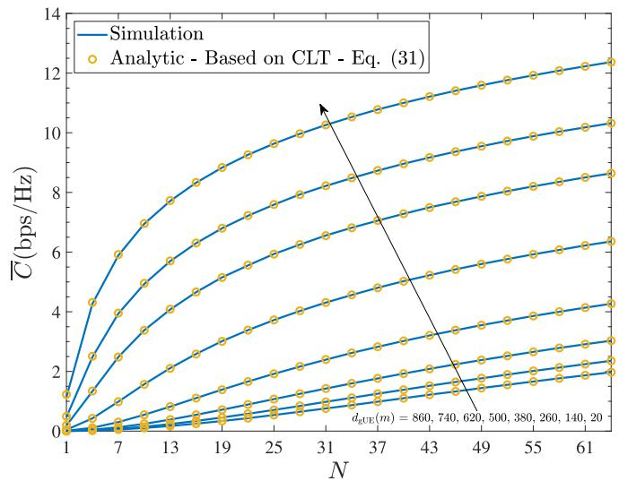  
Fig. 11. Channel capacity vs. the number of IRS elements N.

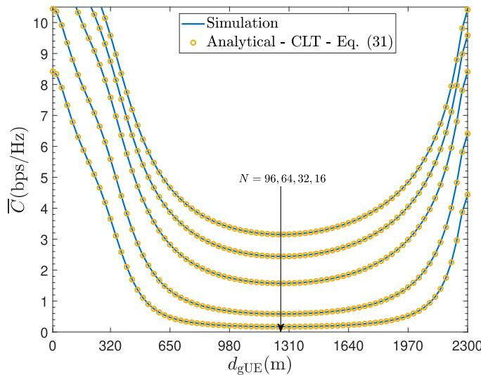  
Fig. 12. Channel capacity vs. $d _ { \mathrm { g U E } }$ for different values of IRS elements N.

## VI. CONCLUSION

In this paper, the performance of mounted IRS-assisted UAV communication has been investigated. The end-to-end path loss model has been utilized based on the practical elevation angle-dependent path loss model for BS-UAV and UAV-gUE links. Theoretical bounds on the average SNR have been derived and compared to the asymptotic SNR analysis, where it has been found that the asymptotic SNR approach achieves both bounds based on N. Furthermore, our analysis has showed that the average SNR scales with $N ^ { 2 }$ . Our distance-based simulation reveals interesting insights into the achievable SER and ergodic capacity, which stems from the elevation angle-dependent end-to-end path loss model.

IRSs have attracted a massive attention and among others, they have been also advocated for use in the context of satellite networks [44]. However, several challenges exist that need to be solved prior to design and deployment of such systems. Such challenges are, among others, channel estimation, 3D placement, channel modeling, and interference management.

## REFERENCES

[1] M. Mozaffari, W. Saad, M. Bennis, Y.-H. Nam, and M. Debbah, “A tutorial on UAVs for wireless networks: Applications, challenges, and open problems,” IEEE Commun. Surveys Tuts., vol. 21, no. 3, pp. 2334–2360, 3rd Quart., 2019.

[2] A. A. Al-Habob, O. A. Dobre, S. Muhaidat, and H. V. Poor, “Energyefficient data dissemination using a UAV: An ant colony approach,” IEEE Wireless Commun. Lett., vol. 10, no. 1, pp. 16–20, Jan. 2021.

[3] Y. Zeng, Q. Wu, and R. Zhang, “Accessing from the sky: A tutorial on UAV communications for 5G and beyond,” Proc. IEEE, vol. 107, no. 12, pp. 2327–2375, Dec. 2019.

[4] J. Zhao, “A survey of intelligent reflecting surfaces (IRSs): Towards 6G wireless communication networks,” Nov. 2019. [Online]. Available: https://arxiv.org/abs/1907.04789.

[5] M. Zeng, X. Li, G. Li, W. Hao, and O. A. Dobre, “Sum rate maximization for irs-assisted uplink NOMA,” IEEE Commun. Lett., vol. 25, no. 1, pp. 234–238, Jan. 2021.

[6] Q. Wu and R. Zhang, “Towards smart and reconfigurable environment: Intelligent reflecting surface aided wireless network,” IEEE Commun Mag., vol. 58, no. 1, pp. 106–112, Jan. 2020.

[7] J. He et al., “Energy efficient BSs switching in heterogeneous networks: An operator’s perspective,” in Proc. IEEE Wireless Commun. Netw. Conf. (WCNC), Doha, Qatar, Sep. 2016, pp. 1–6.

[8] C. Liaskos, S. Nie, A. Tsioliaridou, A. Pitsillides, S. Ioannidis, and I. Akyildiz, “Realizing wireless communication through softwaredefined hypersurface environments,” in Proc. IEEE 19th Int. Symp. World Wireless Mobile Multimedia Netw. (WoWMoM), Chania, Greece, Jun. 2018, pp. 14–15.

[9] E. Basar, M. Di Renzo, J. De Rosny, M. Debbah, M.-S. Alouini, and R. Zhang, “Wireless communications through reconfigurable intelligent surfaces,” IEEE Access, vol. 7, pp. 116753–116773, 2019.

[10] Docomo Conducts World’S First Successful Trial of Transparent Dynamic Metasurface, NTT DOCOMO, Chiyoda City, Japan, Jan. 2020. [Online]. Available: https://www.nttdocomo.co.jp/english/ info/media\_center/pr/2020/0117\_00.html

[11] W. Tang et al., “Wireless communications with programmable metasurface: Transceiver design and experimental results,” China Commun., vol. 16, no. 5, pp. 46–61, May 2019.

[12] D. Ma, M. Ding, and M. Hassan, “Enhancing cellular communications for UAVs via intelligent reflective surface,” in Proc. IEEE Wireless Commun. Netw. Conf. (WCNC), Seoul, South Korea, May 2020, pp. 1–6.

[13] Q. Zhang, W. Saad, and M. Bennis, “Reflections in the sky: Millimeter wave communication with UAV-carried intelligent reflectors,” in Proc. IEEE Global Commun. Conf. (GLOBECOM), Waikoloa, HI, USA, Dec. 2019, pp. 1–6.

[14] L. Ge, P. Dong, H. Zhang, J.-B. Wang, and X. You, “Joint beamforming and trajectory optimization for intelligent reflecting surfaces-assisted UAV communications,” IEEE Access, vol. 8, pp. 78702–78712, 2020.

[15] S. Li, B. Duo, X. Yuan, Y.-C. Liang, and M. Di Renzo, “Reconfigurable intelligent surface assisted UAV communication: Joint trajectory design and passive beamforming,” IEEE Wireless Commun. Lett., vol. 9, no. 5, pp. 716–720, May 2020.

[16] T. Shafique, H. Tabassum, and E. Hossain, “Optimization of wireless relaying with flexible UAV-borne reflecting surfaces,” Jun. 2020. [Online]. Available: https://arxiv.org/abs/2006.10969.

[17] H. Lu, Y. Zeng, S. Jin, and R. Zhang, “Aerial intelligent reflecting surface: Joint placement and passive beamforming design with 3D beam flattening,” Jul. 2020. [Online]. Available: https://arxiv.org/abs/2007.13295.

[18] M. M. Azari, F. Rosas, K.-C. Chen, and S. Pollin, “Ultra reliable UAV communication using altitude and cooperation diversity,” IEEE Trans. Commun., vol. 66, no. 1, pp. 330–344, Jan. 2018.

[19] N. Cherif, M. Alzenad, H. Yanikomeroglu, and A. Yongacoglu, “Downlink coverage and rate analysis of an aerial user in vertical heterogeneous networks (VHetNets),” May 2019. [Online]. Available: https://arxiv.org/abs/1905.11934.

[20] S. Alfattani et al., “Aerial platforms with reconfigurable smart surfaces for 5G and beyond,” Jun. 2020. [Online]. Available: https://arxiv.org/abs/2006.09328.

[21] E. Basar, “Transmission through large intelligent surfaces: A new frontier in wireless communications,” in Proc. Eur. Conf. Netw. Commun. (EuCNC), Valencia, Spain, Jun. 2019, pp. 112–117.

[22] P. Zhan, K. Yu, and A. L. Swindlehurst, “Wireless relay communications with unmanned aerial vehicles: Performance and optimization,” IEEE Trans. Aerosp. Electron. Syst., vol. 47, no. 3, pp. 2068–2085, Jul. 2011.

[23] I. Y. Abualhaol and M. M. Matalgah, “Performance analysis of multicarrier relay-based UAV network over fading channels,” in Proc. IEEE Global Commun. Conf. (GLOBECOM), Miami, FL, USA, Dec. 2010, pp. 1811–1815.

[24] F. Jiang and A. L. Swindlehurst, “Optimization of UAV heading for the ground-to-air uplink,” IEEE J. Sel. Areas Commun., vol. 30, no. 5, pp. 993–1005, Jun. 2012.

[25] W. G. Newhall et al., “Wideband air-to-ground radio channel measurements using an antenna array at 2 GHz for low-altitude operations,” in Proc. IEEE Mil. Commun. Conf. (MILCOM), vol. 2. Boston, MA, USA, Oct. 2003, pp. 1422–1427.

[26] A. Al-Hourani, S. Kandeepan, and S. Lardner, “Optimal LAP altitude for maximum coverage,” IEEE Wireless Commun. Lett., vol. 3, no. 6, pp. 569–572, Dec. 2014.

[27] A. Al-Hourani, S. Kandeepan, and A. Jamalipour, “Modeling air-toground path loss for low altitude platforms in urban environments,” in Proc. IEEE Global Commun. Conf. (GLOBECOM), Austin, TX, USA, Dec. 2014, pp. 2898–2904.

[28] J. Salo, H. M. El-Sallabi, and P. Vainikainen, “The distribution of the product of independent Rayleigh random variables,” IEEE Trans. Antennas Propag., vol. 54, no. 2, pp. 639–643, Feb. 2006.

[29] Q. Li and H. Hu, “Analysis of energy detection over double-Rayleigh fading channel,” in Proc. IEEE 14th Int. Conf. Commun. Technol. (ICCT), Chengdu, China, Nov. 2012, pp. 61–66.

[30] F. W. Olver, D. W. Lozier, R. F. Boisvert, and C. W. Clark, NIST Handbook of Mathematical Functions, 1st ed. New York, NY, USA: Cambridge Univ. Press, 2010.

[31] I. S. Gradshteyn and I. M. Ryzhik, Table of Integrals, Series, and Products, 7th ed., A. Jeffrey and D. Zwillinger, Eds. Boston, MA, USA: Academic, 2007.

[32] P. M. Shankar, Fading and Shadowing in Wireless Systems. New York, NY, USA: Springer-Verlag, 2012.

[33] C. Forbes, M. Evans, N. Hastings, and B. Peacock, Statistical Distributions, 4th ed. Hoboken, NJ, USA: Wiley, 2010.

[34] C. S. Withers and S. Nadarajah, “On the product of gamma random variables,” Qual. Quantity, vol. 47, no. 1, pp. 545–552, Jan. 2013.

[35] R. E. Gaunt, “Products of normal, beta and gamma random variables: Stein operators and distributional theory,” Brazil. J. Probab. Stat., vol. 32, no. 2, pp. 437–466, May 2018.

[36] Z. Lin and Z. Bai, Probability Inequalities. Heidelberg, Germany: Springer-Verlag, 2011.

[37] J. G. Proakis and M. Salehi, Digital Communication, 4th ed. McGraw-Hill Higher Educ., 2018.

[38] A. P. Prudnikov, Y. A. Bryckov, and O. I. Maricev, Integrals and Series Volume 3: More Special Functions, G. G. Gould, Ed. New York, NY, USA: Gordon Breach Sci. Publ., 1990.

[39] M. K. Simon and M.-S. Alouini, Digital Communications over Fading Channels. A Unified Approach to Performance Analysis. New York, NY, USA: Wiley, 2000.

[40] A. Goldsmith, Wireless Communications. Cambridge, U.K.: Cambridge Univ. Press, 2005.

[41] S. M. Ross, Introductory Statistics, 4th ed. Oxford, U.K.: Academic, 2017.

[42] D. B. da Costa and S. Aissa, “Capacity analysis of cooperative systems with relay selection in Nakagami-m fading,” IEEE Commun. Lett., vol. 13, no. 9, pp. 637–639, Sep. 2009.

[43] A. Al-Hourani and K. Gomez, “Modeling cellular-to-UAV path-loss for suburban environments,” IEEE Wireless Commun. Lett., vol. 7, no. 1, pp. 82–85, Feb. 2018.

[44] K. Tekbıyık, G. K. Kurt, A. R. Ekti, A. Görçin, and H. Yanikomeroglu, “Reconfigurable intelligent surfaces empowered THz communication in LEO satellite networks,” Dec. 2020. [Online]. Available: http://arxiv.org/pdf/2007.04281.

Abdulla Mahmoud (Student Member, IEEE) received the M.Sc. degree in communications engineering from the Technical University of Munich, Munich, Germany, in 2008. He is currently pursuing the Ph.D. degree with the Department of Electrical and Computer Engineering, Khalifa University, Abu Dhabi, UAE. His research interests focus on UAVs, RIS, and machine learning.

Sami Muhaidat (Senior Member, IEEE) received the Ph.D. degree in electrical and computer engineering from the University of Waterloo, Waterloo, ON, Canada, in 2006. From 2007 to 2008, he was an NSERC Postdoctoral Fellow with the Department of Electrical and Computer Engineering, University of Toronto, Canada. From 2008 to 2012, he was an Assistant Professor with the School of Engineering Science, Simon Fraser University, Burnaby, BC, Canada. He is currently a Professor with Khalifa University and an Adjunct Professor with Carleton

University, Ottawa. His research interests focus on advanced digital signal processing techniques for wireless communications, RIS, 5G and beyond, MIMO, optical communications, IoT with emphasis on battery-free devices, and machine learning. He is currently an Area Editor of the IEEE TRANSACTIONS ON COMMUNICATIONS and the Lead Guest Editor of the IEEE OPEN JOURNAL OF THE COMMUNICATIONS SOCIETY “Large-Scale Wireless Powered Networks with Backscatter Communications” special issue. He served as a Senior Editor and an Editor of the IEEE COMMUNICATIONS LETTERS, IEEE TRANSACTIONS ON COMMUNICATIONS, and an Associate Editor of the IEEE TRANSACTIONS ON VEHICULAR TECHNOLOGY.

Paschalis C. Sofotasios (Senior Member, IEEE) was born in Volos, Greece, in 1978. He received the M.Eng. degree from Newcastle University, U.K., in 2004, the M.Sc. degree from the University of Surrey, U.K., in 2006, and the Ph.D. degree from the University of Leeds, U.K., in 2011.

He has held academic positions with the University of Leeds, University of California at Los Angleles, CA, USA, Tampere University of Technology, Finland, Aristotle University of Thessaloniki, Greece, and Khalifa University of

Science and Technology, UAE, where he currently serves as an Assistant Professor with the Department of Electrical Engineering and Computer Science. His M.Sc. studies were funded by a scholarship from U.K.-EPSRC and his Doctoral studies were sponsored by U.K.-EPSRC and Pace plc. His research interests are in the broad areas of digital and optical wireless communications as well as in topics relating to mathematical analysis and statistics. He received the Exemplary Reviewer Award from the IEEE COMMUNICATIONS LETTERS in 2012 and the IEEE TRANSACTIONS ON COMMUNICATIONS in 2015 and 2016. He received the Best Paper Award at ICUFN 2013. He serves as a regular reviewer for several international journals and has been a member of the technical program committee of numerous IEEE conferences. He currently serves as an Editor for the IEEE COMMUNICATIONS LETTERS.

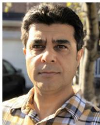

Ibrahim Abualhaol (Senior Member, IEEE) received the B.Sc. and M.Sc. degrees in electrical and computer engineering from the Jordan University of Science and Technologies, and the Ph.D. degree in electrical and computer engineering from the University of Mississippi, USA. He is an Assistant Professor with the Data Science Department, Princess Sumaya University for Technology, Amman, Jordan, and an Adjunct Research Professor with Carleton University, Ottawa, On, Canada. He is a Professional Engineer

in Ontario, Canada. His interests in applied research in machine learning, natural language processing, and big data analytics to solve challenging problems in cybersecurity, Internet-of-Things, and wireless networks.

Octavia A. Dobre (Fellow, IEEE) received the Dipl. Ing. and Ph.D. degrees from the Polytechnic Institute of Bucharest, Romania, in 1991 and 2000, respectively.

From 2002 and 2005, she was with the New Jersey Institute of Technology, USA. In 2005, she joined Memorial University, Canada, where she is currently a Professor and the Research Chair. She was a Visiting Professor with Massachusetts Institute of Technology, USA, and Université de Bretagne Occidentale, France. She has coauthored over 350

refereed papers in these areas. Her research interests encompass various wireless technologies, such as non-orthogonal multiple access and full duplex, as well as optical and underwater communications, and machine learning for communications. She received the Best Paper Awards at various conferences, including IEEE ICC, IEEE Globecom, IEEE WCNC, and IEEE PIMRC. She serves as the Editor-in-Chief (EiC) of the IEEE OPEN JOURNAL OF THE COMMUNICATIONS SOCIETY. She was the EiC of the IEEE COMMUNICATIONS LETTERS, and the senior editor, an editor, and the guest editor for various prestigious journals and magazines. She also served as the general chair, the technical program co-chair, the tutorial co-chair, and the technical co-chair of symposia at numerous conferences. She was a Royal Society Scholar, a Fulbright Scholar, and a Distinguished Lecturer of the IEEE Communications Society. She is a Fellow of the Engineering Institute of Canada.

Halim Yanikomeroglu (Fellow, IEEE) is a Professor with the Department of Systems and Computer Engineering, Carleton University, Ottawa, ON, Canada. His research group has made substantial contributions to 4G and 5G wireless technologies. From 2012 to 2016, he led one of the largest academic-industrial collaborative research programs on pre-standards 5G wireless. In Summer 2019, he started a new large-scale project on the 6G nonterrestrial networks. His extensive collaboration with industry resulted in 37 granted patents. He has formally supervised or hosted at Carleton a total of 135 postgraduate researchers in all levels (Ph.D. & M.A.Sc. students, PDFs, and Professors). He has coauthored IEEE papers with faculty members over 80 universities in 25 countries and industry researchers in ten countries. His primary research domain is wireless communications and networks. He received several awards for his research, teaching, and service, including the IEEE Communications Society Wireless Communications Technical Committee Recognition Award in 2018 and IEEE Vehicular Technology Society Stuart Meyer Memorial Award in 2020. He is currently serving as the Chair of the IEEE Wireless Communications and Networking Conference (WCNC) Steering Committee. He was the Technical Program Chair/Co-Chair of WCNC 2004 (Atlanta), WCNC 2008 (Las Vegas), and WCNC 2014 (Istanbul). He was the General Chair of IEEE VTC 2010-Fall (Ottawa) and VTC 2017-Fall (Toronto). He also served as the Chair of the IEEE’s Technical Committee on Personal Communications. He is a Fellow of Engineering Institute of Canada and Canadian Academy of Engineering, and a Distinguished Speaker for both IEEE Communications Society and IEEE Vehicular Technology Society.