# Intelligent Spectrum Sharing Strategy for Integrated Satellite-Maritime Heterogeneous Mobile Networks

Ruiwen Wu , Zongwang Li , Zhuochen Xie , and Xuwen Liang

Abstract—Spectrum sharing is a pivotal technology for integrated satellite-maritime network to improve spectrum efficiency. However, the majority of existing spectrum sharing approaches relied on time-frequency multiplexing to circumvent or suppress interference, and often overlooked the problem of incomplete observability and interference present in heterogeneous systems. This limitation hindered overall system throughput improvements. In this article, an intelligent spectrum sharing strategy for integrated satellite-maritime heterogeneous mobile networks is firstly proposed. This strategy aims to operate co-frequency communication transmissions within the interference constraints, as derived from protocols and standards of International Telecommunication Union (ITU), to maximize the overall system throughput and spectral efficiency. Furthermore, considering the limitation that the satellite cannot fully observe channel statuses, we model the spectrum sharing process as a Partially Observable Markov Decision Process (POMDP). We employ an algorithm architecture that combines Dueling Deep Q-learning Network (DQN) and Double DQN to address this challenge, which enables satellites to efficiently evaluate the value of all channel allocation actions, thereby enhancing decision-making accuracy and algorithm convergence speed. Simulation results validate the superiority of our proposed strategy over compared methods in terms of throughput and stability.

Index Terms—Satellite-maritime heterogeneous mobile networks, spectrum sharing, interference constraints, partially observable Markov decision process (POMDP), double dueling deep Q-learning network (DQN).

# I. INTRODUCTION

W ITH the revolutionary development and breakthroughsin wireless communication technology, terrestrial com- in wireless communication technology, terrestrial communication is evolving towards the sixth generation (6G) communication system. While terrestrial wireless communications have made substantial strides in recent times, maritime communications still confront the formidable challenge of furnishing dependable and high-data-rate transmissions [1].

Manuscript received 29 June 2023; revised 11 November 2023; accepted 11 December 2023. Date of publication 18 December 2023; date of current version 16 May 2024. This work was supported in part by the National Key Research and Development Program of China under Grant 2022YFB2902603 and in part by the High-Tech Projects of Shanghai “Science and Technology Innovation Action Plan” under Grant 22511100500. The review of this article was coordinated by Prof. Prabhat Kumar Upadhyay. (Corresponding author: Xuwen Liang.)

The authors are with the University of the Chinese Academy of Sciences, Beijing 100049, China, also with the Chinese Academy of Sciences Shanghai Innovation Academy for Microsatellites, Shanghai 201304, China, and also with the Shanghai Engineering Center for Microsatellites, Shanghai 201210, China (e-mail: wurw@microsate.com; lizw@microsate.com; xiezc.ac@hotmail.com; liangxw@shanghaitech.edu.cn).

Digital Object Identifier 10.1109/TVT.2023.3343720

Currently, integrated satellite-maritime communication networks can offer widespread coverage and seamless flexible connectivity, overcoming the limitations of maritime satellite and ground communication [2]. The International Telecommunication Union (ITU) has introduced the Automatic Identification System (AIS) to integrate satellite communication with terrestrial maritime communication, thereby providing navigation and communication services for vessels. However, the limited system capacity and low spectral efficiency have significantly impeded the communication capabilities of AIS.

To enhance maritime communication services such as electronic navigation (e-Navigation), Enhanced Maritime Communication (EMC), and the Global Maritime Distress and Safety System (GMSS), the ITU, in collaboration with the International Association of Marine Aids to Navigation and Lighthouse Authorities (IALA), has established regulations stipulating the primary use of VHF Data Exchange System (VDES) for satellite-maritime communication [3]. This system facilitates enhanced data exchange capabilities on a global scale through wireless transmission of terrestrial and satellite, thus enabling seamless worldwide communication coverage. VDES significantly enhances data communication capabilities for maritime vessels and plays a crucial role in maritime search and rescue, resource exploration, and navigation safety [4]. Additionally, the integrated satellite-maritime networks enhance network redundancy and reliability, serving as an alternative pathway in case of terrestrial network failures or coverage gaps. As the maritime industry evolves, the demand for data-intensive applications like real-time weather updates and remote vessel diagnostics grows, making satellite connectivity essential. Therefore, to effectively harness the advantages of terrestrial and satellite networks, as indicated by the latest trends in satellite-terrestrial integrated networks [5], [6], [7], [8], a hybrid architecture for integrated satellite-maritime networks is poised to emerge as the developmental trajectory for future maritime communication systems [9].

Regarding spectrum utilization, despite the lower user density in maritime environments compared to terrestrial networks, spectrum integration ensures the efficient and optimized utilization of available resources. This prevents spectrum wastage and guarantees equitable access to communication resources for maritime users. The maritime industry is continuously evolving, with an increasing demand for data-intensive applications. This integrated network positions the maritime sector for future technological advancements and the ever-growing user requirements.

# A. Related Works

The VDES specify that satellite networks are permitted to share the spectrum resources of terrestrial networks, while satellites can integrate with terrestrial networks. However, neither the ITU nor existing research has provided specific spectrum-sharing solutions. Therefore, the implementation of efficient spectrum sharing technology is imperative to circumvent issues related to congestion and co-channel interference that may arise in the context of satellite-maritime spectrum sharing. Several research studies related to satellite communication spectrum sharing in scenarios similar to VDES have already been published. [10] introduced a low-complexity Whittle indexing strategy to address a class of Restless Multi-Armed Bandit problems (RMAB). This strategy incorporated considerations of user/server scheduling and dynamic multi-channel access. [11] proposed a satellite-to-ground resource allocation scheme from the perspective of link interference, but only considered terrestrial fixed services (FS) and did not consider the dynamic changes of mobile networks. Additionally, [5] investigated the satellite and aerial-integrated network (SAIN) with a focus on multicast communication. They employed rate-splitting multiple access (RSMA) to facilitate large-scale access by Internetof-Things (IoT) devices and achieve interference suppression. Furthermore, [12] approached the dynamic Multi-Channel Assignment (MCA) problem from a game theory perspective, with the goal of maximizing throughput. The approach presented in [13] focused on allocating spectrum resources to satelliteground hybrid networks by using radio maps (RM). But this method exhibits a substantial reliance on the acquisition of RM data. However, the conventional optimization techniques discussed above rely on certain assumptions about the environment model and necessitate access to a complete global state of the environment. These requirements can pose significant challenges in achieving optimal global optimization performance. Addressing optimization problems within the framework of Partially Observable Markov Decision Processes (POMDP) within expansive state spaces remains a daunting task. In fact, simple methods devoid of supplementary architectures or training support frequently struggle to learn within partially observable environments [14].

On the contrary, experience-driven deep reinforcement learning methods (DRL) empower autonomous decision-making and result observation, enabling the learning of optimal control strategies through training to suit intricate dynamic environments. As an off-policy DRL algorithm, the Deep Q-Learning Network (DQN), possessed the capability to acquire decisionmaking strategies for high-dimensional problems through the thoughtful design of reward functions, environmental state spaces, and action spaces [15]. To address the issue of POMDP in a dynamic environment, the intelligent agents may need to retain some or all of its previous observations [16]. Therefore, existing spectrum sharing solutions based on DQN in scenarios similar to VDES make use of historical data to tackle this problem. [17] opted to utilize historical channel observation data from the preceding M time slots as state information and modeled the spectrum access optimization problem as a POMDP. However, this approach did not account for interference among users. In [18], the challenge of channel spectrum sensing and aggregation was formulated as a POMDP, and the authors employed the DQN to make transmission decisions based on feedback signals, enabling secondary users to maximize their successful transmissions without interruption to primary users. Nevertheless, this algorithm primarily optimized the number of successfully transmitted packets, without considering packet data volume and priority. To overcome the difficulty of obtaining global state information, [19] investigated a dynamic spectrum access algorithm based on multi-agent learning, utilizing LSTM layers to remember summarized historical network state observations. However, their approach relied on a distributed algorithm and was not suitable for centralized scenarios with a satellite as the central node.

# B. Motivations and Contributions

Based on the above analysis, existing standards and published research have yet to provide specific solutions to the complex problem of spectrum sharing in the context of VDES satellite-maritime mobile networks, leaving room for significant improvements in resource utilization. Furthermore, current research in this domain often overlooks the intricate interference issues between heterogeneous systems. Therefore, the motivation of this research is to propose innovative solutions to enhance spectrum sharing efficiency, help fill the void left by existing standards, and consider interference of heterogeneous networks. We have designed an intelligent spectrum sharing strategy for satellite-maritime mobile networks. This strategy enables heterogeneous subsystems to collaboratively share frequency resources while adhering to interference constraints, thereby enhancing the overall system throughput.

The main contributions are summarized as follows:

We first present an innovative spectrum sharing strategy based on VDES for satellite-maritime mobile networks, which contributes to addressing the gaps in VDES protocol standards regarding satellite-terrestrial spectrum sharing solutions. This strategy is optimized to maximize the overall throughput of both the satellite and maritime networks. It involves the centralized allocation of spectrum resources by the satellite, allowing the heterogeneous systems of the satellite and maritime mobile networks to simultaneously utilize frequency resources while adhering to interference constraints. Moreover, it takes into consideration the varying priority levels of different transmission tasks to ensure that high-priority tasks obtain appropriate communication resources, thereby enhancing the overall communication quality.

\- Taking into consideration the extensive coverage area of satellite communication, the channel conditions and the distribution of ships perceived by the satellite. In accordance with ITU protocols and standards, we have devised and established interference constraints for both satellite uplink and downlink. This has been done to ensure that satellite and maritime mobile networks can jointly share spectrum resources within acceptable interference thresholds. This approach not only contributes to the enhancement of spectrum resource efficiency and overall system throughput but also improves the comprehensive communication performance of the system.

- Addressing the challenge of satellites not having complete channel status information, we employed a Partially Observable Markov Decision Process (POMDP) to model the comprehensive throughput optimization problem. We proposed a shared channel resource allocation algorithm based on Double Dueling DQN to tackle the aforementioned model. This algorithm effectively mitigates action value overestimation, resulting in more precise action value learning by the agent and accelerating algorithm convergence.   
The deployment approach involves offline training and online implementation, effectively reducing computational costs. Finally, simulation results demonstrated the superiority of our proposed algorithm in terms of system throughput performance compared to the benchmark algorithms, making it particularly adept at meeting various transmission requirements.

The remainder of this article is organized as follows: Section II describes the data transmission process of system communication and establishes a system model for dynamic intelligent spectrum sharing based on interference constraints. Section III models the optimization problem as POMDP and proposes a novel SCA-D3QN algorithm based on Dueling DQN and Double DQN for solution. Section IV describes the model training and deployment process and analyzes the algorithm complexity. Section V presents the performance comparison of the proposed spectrum sharing strategy with other methods. Section VI gives the conclusion.

# II. SYSTEM MODEL

In this section, we consider designing a spectrum sharing strategy for satellite-maritime heterogeneous networks in VDES. VDES includes the terrestrial component (VDE-TER) and the satellite component (VDE-SAT). VDE-TER contains the shore-ship link and the ship-ship link. VDE-SAT contains the satellite-ship link. In the marine network near the coast, ship stations are dense, the communication is more frequent, and the spectrum utilization rate is high, and the demand for spectrum sharing for satellites and marine networks is low. Therefore, we only consider the offshore scenario, where only ship stations and satellites.

In VDE-TER, assuming there are K VDE-TER selforganizing networks (SONs) in the range of satellite communication, each of which operates independently and does not communicate with the satellite. At the same time, there are V isolated ships that can’t communicate with other ship stations and only communicate with the satellite. They form the VDE-SAT with the satellite, and access the frequency and time slot resources of the share channels through the unified allocation of the satellite. When the VDE-SAT and VDE-TER use the same frequency band for communication, they will interfere with each other, as shown in Fig. 1.

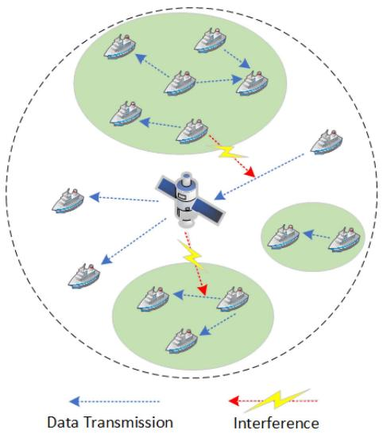

flowchart

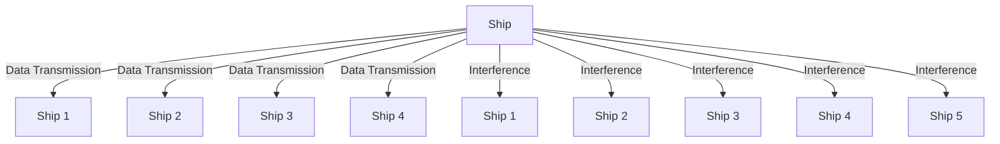

Fig. 1. Interference between VDE-SAT and VDE-TER ship-to-ship SON.

The ITU has allocated a relatively limited bandwidth of 300 kHz for the VDES. There are eight frequency bands shared by VDE-TER and VDE-SAT, which are defined as share channels, each with a bandwidth of 25 kHz. Additionally, two 25 kHz frequency bands are exclusively reserved for VDE-SAT users, inaccessible to VDE-TER, ensuring uninterrupted communication with satellites for long-range users. The frequency division of the VDE link is shown in the Fig. 2. VDES is a Time Division Multiple Access(TDMA) system. For the convenience of description, VDES defines two kinds of channels: physical channel and logical channel. The former is defined by the center frequency point and bandwidth, and the latter is defined by the number and quantity of time slots. Therefore, when we develop a spectrum sharing strategy for VDE-SAT and VDE-TER, we need to consider not only frequency band resources, but also time slot resources.

# A. Data Transfer Process

VDES adopts the reservation mechanism to carry out the VDE link data transmission process. Before starting the data transfer process, the ship station first needs to obtain some basic channel configuration parameters, such as the center frequency and bandwidth of the physical channel, logical channel functions, etc. The satellite will periodically broadcast the configuration message, and the SON ship station uses the default configuration information for communication. Once the user obtains the channel configuration information, it can continue with the data transfer process shown in Fig. 3. Next, we describe the reservation-based data transfer process.

Before the VDES terminal transmits data, it needs to first send a resource request message to the receiver. This signaling is sent on Random Access Channel (RAC) using the random access method. The resource allocation message notifies the sender of the channel number allocated to it once the receiver successfully receives the resource request message. Data is transmitted after the sender waits for the allocated Data Channel (DC) to arrive. After the transmission is completed, the receiver responds to the sender by sending an ACK/NACK message over the Data Signaling channel (DSCH).

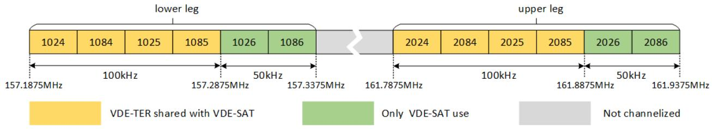

bar_stacked

| Position       | VDE-TER shared with VDE-SAT (MHz) | Only VDE-SAT use (MHz) | Not channelized (MHz) |
| -------------- | ---------------------------------- | ---------------------- | --------------------- |
| lower leg      | 1024                               | 1084                   | 100                   |
| lower leg      | 1084                               | 1025                   | 157.1875               |
| lower leg      | 1085                               | 1026                   | 157.2875               |
| lower leg      | 1086                               | 1086                   | 157.3375               |
| upper leg      | 2024                               | 2084                   | 161.7875               |
| upper leg      | 2084                               | 2025                   | 161.8875               |
| upper leg      | 2085                               | 2026                   | 161.9375               |
| upper leg      | 2086                               | 2086                   | 161.9375               |

Fig. 2. VDE link frequency channelization.

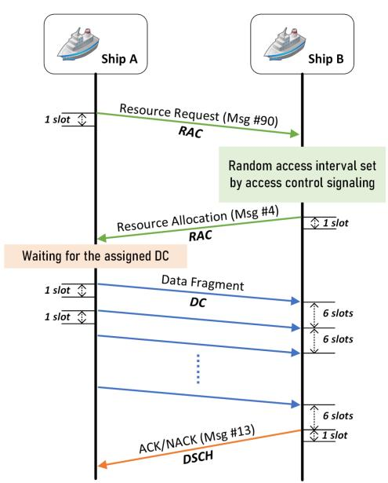

flowchart

```mermaid
graph TD
    A["Ship A"] -->|1 slot| B["Resource Request (Msg #90)"]
    B --> C["Random access interval set by access control signaling"]
    C -->|1 slot| D["Resource Allocation (Msg #4)"]
    D --> E["Data Fragment"]
    E --> F["ACK/NACK (Msg #13)"]
    F --> G["DSCH"]
    G --> H["..."]
    H --> I["6 slots"]
    I --> J["6 slots"]
    J --> K["6 slots"]
    K --> L["6 slots"]
    L --> M["6 slots"]
    M --> N["6 slots"]
    N --> O["6 slots"]
    O --> P["6 slots"]
    P --> Q["6 slots"]
    Q --> R["6 slots"]
    R --> S["6 slots"]
    S --> T["6 slots"]
    T --> U["6 slots"]
    U --> V["6 slots"]
    V --> W["6 slots"]
    W --> X["6 slots"]
    X --> Y["6 slots"]
    Y --> Z["6 slots"]
    Z --> AA["6 slots"]
    AA --> AB["6 slots"]
    AB --> AC["6 slots"]
    AC --> AD["6 slots"]
    AD --> AE["6 slots"]
    AE --> AF["6 slots"]
    AF --> AG["6 slots"]
    AG --> AH["6 slots"]
    AH --> AI["6 slots"]
    AI --> AJ["6 slots"]
    AJ --> AK["6 slots"]
    AK --> AL["6 slots"]
    AL --> AM["6 slots"]
    AM --> AN["6 slots"]
    AN --> AO["6 slots"]
    AO --> AP["6 slots"]
    AP --> AQ["6 slots"]
    AQ --> AR["6 slots"]
    AR --> AS["6 slots"]
    AS --> AT["6 slots"]
    AT --> AU["6 slots"]
    AU --> AV["6 slots"]
    AV --> AW["6 slots"]
    AW --> AX["6 slots"]
    AX --> AY["6 slots"]
    AY --> AZ["6 slots"]
    AZ --> BA["6 slots"]
    BA --> BB["6 slots"]
    BB --> BC["6 slots"]
    BC --> BD["6 slots"]
    BD --> BE["6 slots"]
    BE --> BF["6 slots"]
    BF --> BG["6 slots"]
    BG --> BH["6 slots"]
    BH --> BI["6 slots"]
    BI --> BJ["6 slots"]
    BJ --> BK["6 slots"]
    BK --> BL["6 slots"]
    BL --> BM["6 slots"]
    BM --> BN["6 slots"]
    BN --> BO["6 slots"]
    BO --> BP["6 slots"]
    BP --> BQ["6 slots"]
    BQ --> BR["6 slots"]
    BR --> BS["6 slots"]
    BS --> BT["6 slots"]
    BT --> BU["6 slots"]
    BU --> BV["6 slots"]
    BV --> BW["6 slots"]
```

(a)

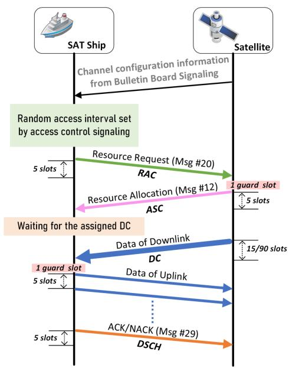

flowchart

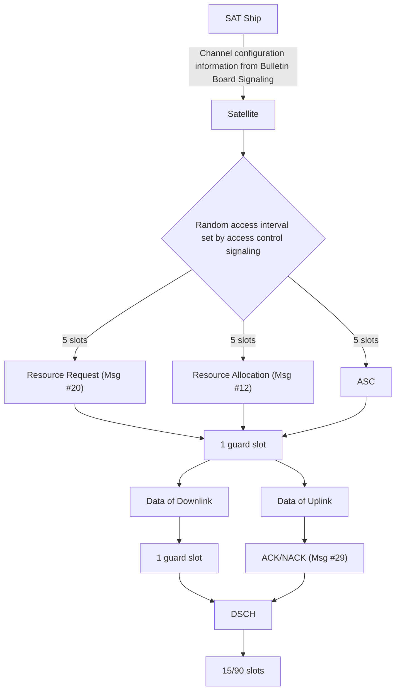

(b)   
Fig. 3. Data transfer process and resource allocation procedure of VDES. (a) Data transfer process of ship stations in VDE-TER SON. (b) Data transfer process of VDE-SAT. (a) VED-TER transfer process (b) VDE-SAT transfer process.

# B. Problem Formulation

Taking into account the interference dynamics between heterogeneous systems, we allocate resources by adhering to interference constraints while prioritizing the optimization of the system sum-throughput. The specific expression of the system overall optimization objective is as follows:

$$
\max _ {U} \sum_ {U} (D _ {i} ^ {\mathrm{TER}} + D _ {i} ^ {\mathrm{SAT}}) \tag {1}
$$

$$
\text { s.t. } \Phi_ {\mathrm{DIC}} ^ {i} \leq \Phi_ {\mathrm{DIC}} ^ {\text { threshold }}, i \in U \tag {2}
$$

$$
\Phi_ {\mathrm{UIC}} ^ {i} \leq \Phi_ {\mathrm{UIC}} ^ {\text { threshold }}, i \in U \tag {3}
$$

Where $U$ represents the set of share channels allocated to VDE-SAT for use. thresholdDIC $\Phi _ { \mathrm { D I C } } ^ { \mathrm { t h r e s h o l d } }$ DIC and $\Phi _ { \mathrm { U I C } } ^ { \mathrm { t h r e s h o l d } }$ are the downlink interference Φ Φconstraint threshold and uplink interference constraint threshold, respectively. $\Phi _ { \mathrm { D I C } } ^ { i }$ and $\Phi _ { \mathrm { U I C } } ^ { i }$ respectively are the downlink and Φ Φuplink interference constraints of share channel i, which are described in Section II-B1 and $\mathrm { I I - B } 2 . D _ { i } ^ { \mathrm { T E R } }$ is the data transmission rate of VDE-TER on share channel i, expressed as:

$$
D _ {i} ^ {\mathrm{TER}} = \sum_ {j} ^ {n _ {i} ^ {\mathrm{son}}} \tau_ {i, j} ^ {\text { busy }} \cdot T \cdot d _ {s}, i \in U \tag {4}
$$

where $D _ { i } ^ { \mathrm { T E R } }$ is the data transmission volume of VDE-TER on share channel i. $n _ { i } ^ { \mathrm { s o n } }$ is the number of VDE-TER SONs on share channel i, τ busi,j $i , \tau _ { i , j } ^ { \mathrm { b u s y } }$ \_busy is the busy rate of the SON channel $j$ (i.e. the ratio of signal transmission duration to total duration T ). $d _ { s }$ is the data transfer rate of SON ship.

$D _ { i } ^ { \mathrm { S A T } }$ is the data transmission rate with task priority weighting on the share channel i of VDE-SAT, which is expressed as follows:

$$
D _ {i} ^ {\mathrm{SAT}} = \sum_ {j} ^ {n _ {i} ^ {\mathrm{tsk}}} \kappa_ {p} \cdot p _ {i, j} ^ {\mathrm{tsk}} \cdot d _ {i, j} ^ {\mathrm{tsk}}, i \in U \tag {5}
$$

Where $n _ { i } ^ { \mathrm { t s k } }$ is the transmitted task by VDE-SAT on share channel i. $d _ { i , j } ^ { \mathrm { t s k } }$ is the data volume of VDE-SAT task $j ,$ and $p _ { j } ^ { \mathrm { t s k } }$ is the priority of VDE-SAT task $j$ (the larger the value of $p _ { i } ^ { \mathrm { t s k } }$ , the higher the task priority). $\kappa _ { p }$ is the normalization weight factor.

In cognitive radio, the secondary users who share the spectrum usually perceive and occupy the idle time slots of the primary users for data transmission [20]. However, this method is not suitable for VDES, because the logical channel of VDE-TER is composed of discontinuous time slots, and the time slot intervals are equal. The time slots occupied by VDE-TER transmission may also be discontinuous. The logical channel of VDE-SAT

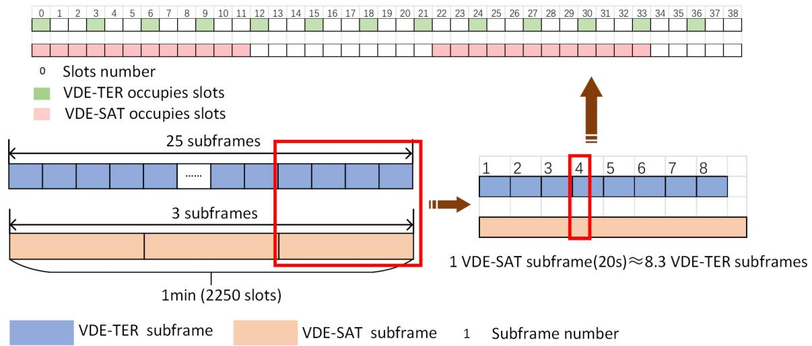

text_image

0 Slots number
VDE-TER occupies slots
VDE-SAT occupies slots
25 subframes
......
3 subframes
1min (2250 slots)
1 VDE-SAT subframe(20s)≈8.3 VDE-TER subframes
VDE-TER subframe VDE-SAT subframe 1 Subframe number

Fig. 4. Comparison of time slots occupied by VDE-TER and VDE-SAT.

It is composed of continuous time slots, and the time slots occupied by data transmission are also continuous time slot blocks, as shown in Fig. 4. It is nearly impossible to find at least 30 consecutive idle time slots of VDE-TER for VDE-SAT transmission.

In order to maximize the overall throughput of the system, VDE-TER and VDE-SAT will use the share channels at the same time. However, the co-channel interference of heterogeneous systems will limit the spectrum utilization. Therefore, we will establish uplink and downlink interference constraints for the spectrum sharing allocation problem, so that the heterogeneous system can maximize the overall throughput within the interference constraints.

1) Downlink Interference Constraints: VDE-SAT downlink transmission will interfere with VDE-TER transmission on the same frequency. Existing standards, such as ITU and the Electronic Communications Committee (ECC), use the electromagnetic power flux density mask (PFD) to limit the power of VDE-SAT satellite emissions to prevent harmful interference to the same frequency terrestrial communication system. The ECC defines the field strength threshold for interference coordination in the 29.7 to 470 MHz frequency band [21]. It is converted to the electromagnetic PFD value as follows:

$$
\psi = \sqrt {\varepsilon \mu^ {- 1}} E ^ {2} \tag {6}
$$

where $\varepsilon$ and $\mu$ are the electric and magnetic constants, respectively. E is the field strength at the VDES frequency. The corresponding interference to the VDE-TER ship station receiver depends on the angle of incidence of the interfering electromagnetic wave, which can be expressed as:

$$
I _ {\text { ship }} (\rho) = \frac {1}{4 \pi} \lambda^ {2} \psi \iota^ {- 1} \cdot G _ {\text { ship }} (\rho), \quad \forall \rho \in [ 0 ^ {\circ}, 9 0 ^ {\circ} ] \tag {7}
$$

where $\lambda$ is the wavelength of the interference signal. ι is the receiver feeder loss. $G _ { \mathrm { s h i p } }$ is the gain of the receiving ship antenna at a given antenna elevation angle $\rho ,$ which can be converted to the satellite inclination angle $\phi \in [ 0 ^ { \circ } , 6 6 ^ { \circ } ]$ . The conversion relationship is:

$$
\rho = \arccos (R ^ {- 1} (R + h) \sin (\phi)) \tag {8}
$$

$$
\phi = \arcsin \left(R (R + h) ^ {- 1} \cos (\rho)\right) \tag {9}
$$

where R is the radius of the earth, and h is the height of the satellite orbit. The antenna gain of SON ship station [22] is:

$$
G _ {\text { ship }} (\rho) = \left\{ \begin{array}{l l} - 1 2 \left(\rho / \rho_ {3}\right) & 0 ^ {\circ} \leq \rho \leq \rho_ {3} \\ - 1 5 + (1. 7) _ {d B} & \rho_ {3} \leq \rho \leq \rho_ {5} \\ - 1 5 + \left(\left(\rho / \rho_ {3}\right) ^ {- 1. 5} + 0. 7\right) _ {d B} & \rho_ {5} \leq \rho \leq 9 0 ^ {\circ} \end{array} \right. \tag {10}
$$

In order to protect land mobile communication systems, ITU has established degradation protection according to the final system performance requirements [23], that is, the ratio of total received power to the received useless power $\left( \mathrm { S I N A D } \right) \varsigma _ { a }$ is 12 dB, i.e.

$$
\frac {C + N _ {0} + I + D}{N _ {0} + I + D} \geq \varsigma_ {d} \tag {11}
$$

Converting (11) to a $C / I$ threshold as:

$$
\frac {C}{I} \geq \zeta_ {d} = \left((\varsigma_ {d} - 1) ^ {- 1} - \left(\left(\frac {C}{N _ {0}}\right) ^ {- 1} + \left(\frac {C}{D}\right) ^ {- 1}\right)\right) ^ {- 1} \tag {12}
$$

where $C$ is the received power of carrier in each channel. $N _ { 0 }$ is the noise power of the ship receiver, and $N _ { 0 } + I$ is the noise plus interference power of each channel. $C / D$ is the signal-to-distortion ratio, typically in the vicinity of 20dB [24]. The minimum carrier signal power received by the ship station receiver is:

$$
C _ {\min} ^ {\mathrm{TER}} = E I R P _ {\text { ship }} (\rho_ {t x}) + G _ {\text { ship }} (\rho_ {r x}) - (\iota L _ {\mathrm{TER}}) \tag {13}
$$

where $E I R P _ { \mathrm { s h i p } }$ is the Effective Isotropic Radiated Power (EIRP) of the VDE-TER SON station transmitter. ι is the receiver feeder loss. $G _ { \mathrm { s h i p } } ( \rho _ { r x } )$ is the antenna gain of the ship receiver, ( )both at an antenna elevation angle $\rho _ { t x } \approx \rho _ { r x } \approx 0 ^ { \circ }$ . It indicates that the mobile transceiver is mutually directional with an elevation angle close to $0 ^ { \circ }$ of the horizon. LTER is the maximum

total path loss, i.e.

$$
L _ {\mathrm{TER}} = \Delta \ell + \widehat {\ell} \tag {14}
$$

where $\hat { \ell }$ is the maximum path loss in the frequency band of 156.0125-162.0375 MHz. $\Delta \ell$ is the additional path loss of Δthe transmission channel of the land mobile system [25]. The maximum allowable interference $I _ { \operatorname* { m a x } } ^ { d }$ max received by VDE-TER ships for SINAD is as follows:

$$
I _ {\max} ^ {d} = C _ {\min} ^ {\mathrm{TER}} / \zeta_ {d} \tag {15}
$$

Applying the SINAD standard to VDE-SAT reveals the maximum allowable PFD for satellite interference with VDE-TER. We define the interference constraint $\phi _ { j } ^ { i }$ for VDE-SAT downlink of share channel i as follows:

$$
\Phi_ {\mathrm{DIC}} ^ {i} = \frac {1}{4 \pi} \lambda^ {2} \psi \iota^ {- 1} \cdot \max _ {\phi_ {j} ^ {i}} G _ {\text { ship }} (\phi_ {j} ^ {i}) \leq \Phi_ {\mathrm{DIC}} ^ {\text { threshold }} \tag {16}
$$

Where thresholdDIC $\Phi _ { \mathrm { D I C } } ^ { \mathrm { t h r e s h o l d } } = I _ { \mathrm { m a x } } ^ { d }$ represents the maximum allowable in-Φ =terference for SINAD on each channel. According to (12) and (13), its value is calculated to be −139 dBW. ψ is determined by the field strength E specified by the ECC, which is computed as the PFD value based on (6) and has a value of $- 1 4 2 \mathrm { d B W } / \mathrm { m } ^ { 2 }$ . ι represents the receiver feeder loss, and $\forall \phi _ { i } ^ { i } \in [ 0 ^ { \circ } , 6 6 ^ { \circ } ]$ denotes [ ]the elevation angle offset between VDE-TER ship station $j$ and the satellite in share channel $i ,$ which is converted the station’s receiving antenna elevation angle $\forall \rho _ { i } ^ { i } \in [ 0 ^ { \circ } , 9 0 ^ { \circ } ]$ .

[ ]2) Uplink Interference Constraints: The uplink of VDE-SAT will also be harmfully interfered by the co-frequency VDE-TER SON transmission. According to [3], VDES receivers will report channel quality indicator (CQI) in the corresponding response message to feedback the channel transmission quality. When the CQI is low, it means that terrestrial interference is substantially interfering with the uplink, which may cause the uplink transmission to fail. The receiver uses signal-to-noise plus interference ratio (SNIR) to estimate the CQI parameter $\eta ^ { \mathrm { C Q I } }$ .

$$
\eta^ {\mathrm{CQI}} = 4 (1 0 + S N I R) = 4 0 + 4 S N I R \tag {17}
$$

The SNIR is related to the ratio of carrier to interference and noise:

$$
S N I R = C / (I _ {0} + N _ {0}) - 1 0 \cdot \log_ {1 0} (R _ {s}) \tag {18}
$$

where $R _ { s }$ represents the symbol rate. C is the carrier power with link loss. $N _ { 0 }$ is the noise level of the satellite receiver. $I _ { 0 }$ is the aggregate interference received by the satellite from the SONs, depending on the number of co-frequency SONs in the satellite communication range and their geographical position to the satellite. When estimating the interference power $I _ { 0 }$ received by the VDE-SAT receiver. The interference power value $I _ { k }$ caused by each VDE-TER SON k is determined by the following equation:

$$
I _ {k} = E I R P _ {\text { ship }} (\rho_ {k}) + G _ {\text { sat }} ^ {k} (\rho_ {k}) - L _ {k} (\rho_ {k}) \tag {19}
$$

where $\rho _ { k }$ is the elevation angle of SON k’s ship, $E I R P _ { \mathrm { s h i p } }$ is the Effective Isotropic Radiated Power value of SON k under the given elevation angle $\rho _ { k }$ . $L _ { k }$ is the transmission path loss, and $G _ { \mathrm { s a t } } ^ { k }$ is the satellite antenna reception gain of SON k. Then, the total interference power value $I _ { 0 }$ at the satellite receiving end is determined by summation.

$$
I _ {0} = 1 0 \log_ {1 0} \sum_ {k = 1} ^ {N _ {\mathrm{son}}} 1 0 ^ {I _ {k} / 1 0} - 1 0 \log_ {1 0} B _ {e q} \tag {20}
$$

where $N _ { \mathrm { s o n } }$ is the number of SONs generating interference within the satellite communication range. $B _ { e q }$ is the equivalent bandwidth of the channel. For ease of estimation, we take the maximum value of $I _ { k }$ as $I _ { k , m a x } .$ , then the total interference value of the VDE-SAT uplink in (20) can be simplified as:

$$
I _ {0} = N _ {\text { son }} \times 1 0 \log_ {1 0} 1 0 ^ {I _ {k, \max} / 1 0} - 1 0 \log_ {1 0} (B _ {e q}) \tag {21}
$$

It can be seen from (21) that the interference on the VDE-SAT uplink is mainly related to the number of SONs interfering ship stations on the same frequency. Since the SON ship station communicates by self-organizing, only one ship station is allowed to send information in a SON within a time slot, so the number of SONs on the share channel i can be estimated from the signal strength received by the satellite. Specifically, the signal strength $P _ { t , i } ^ { r x }$ received by the satellite on the share channel i at time t is defined as:

$$
P _ {t, i} ^ {r x} = \sum_ {j = 1} ^ {\widehat {N _ {\mathrm{son}}}} P _ {\text { ship }} G _ {t, i, j} + N _ {0} \tag {22}
$$

$P _ { \mathrm { s h i p } }$ is the transmitting power of SON ship station, which isa fixed value. $G _ { t , i , j }$ is the link gain including the path loss of the SON ship station $j$ on the share channel $\overline { { i . \widetilde { N _ { \mathrm { s o n } } } } } ^ { - }$ is the real number of SONs in share channel $i , N _ { 0 }$ is the noise level of the satellite receiver. Then the estimated SONs number $N _ { \mathrm { s o n } }$ is:

$$
N _ {\text { son }} = \left\lceil \frac {P _ {t , i} ^ {r x} - N _ {\text { noise }}}{P _ {\text { ship }} \bar {G} _ {\text { ship }}} \right\rceil \tag {23}
$$

$\overline { { G } } _ { \mathrm { s h i p } }$ is the average gain of the SON ship station to the satellite link, which has been known. After obtaining the number of SONs, the value of $I _ { 0 }$ can be calculated and thus obtain $C / ( I _ { 0 } + N _ { 0 } )$ . VDES requires that $C / ( I _ { 0 } + N _ { 0 } )$ needs to be ( + )higher than a given threshold $\varsigma _ { u } \cdot$

$$
\frac {C}{I _ {0} + N _ {0}} \geq \varsigma_ {u} \text {   or   } \frac {C}{I _ {0}} \geq \zeta_ {u} = \left(\varsigma_ {u} ^ {- 1} - \left(\frac {C}{N _ {0}}\right) ^ {- 1}\right) \tag {24}
$$

The value of $\varsigma _ { u }$ depends on the modulation scheme of the uplink [3], with its corresponding symbol rate denoted as $\widehat { R _ { s } } .$ . When the power received at the satellite receiver $C / ( I _ { 0 } + N _ { 0 } )$ is less than $\varsigma _ { u } ,$ ( + ) it indicates severe co-frequency interference from VDE-TER on the uplink, making data transmission infeasible. According to ITU standards [3], the carrier power $C$ varies with the tilt angle of the satellite antenna, and the minimum value $C _ { \mathrm { m i n } } ^ { \mathrm { S A T } } = - 1 5 3 . 9$ dBW, where the noise level at the satellite receiver, denoted as $N _ { 0 } = - 2 0 2 . 9 \mathrm { d B W } .$ Therefore, the maximum =allowable interference of the VDE-SAT uplink is as follows:

$$
I _ {\max} ^ {u} = C _ {\min} ^ {\mathrm{SAT}} / \zeta_ {u} \tag {25}
$$

When the satellite obtains multiple CQIs on the same frequency band within the time period T , the average CQI will be calculated as the channel quality index [3]. It will be reported to the

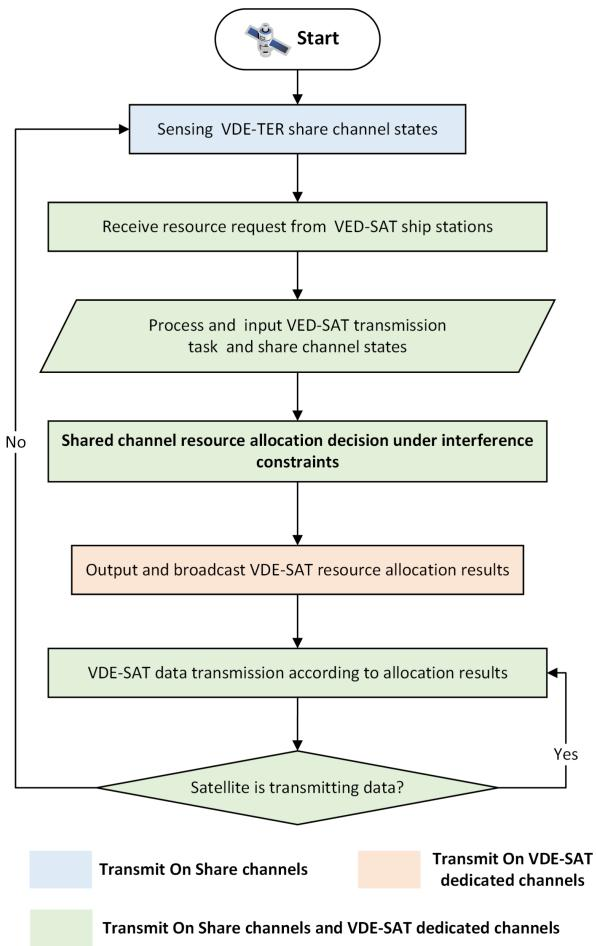

flowchart

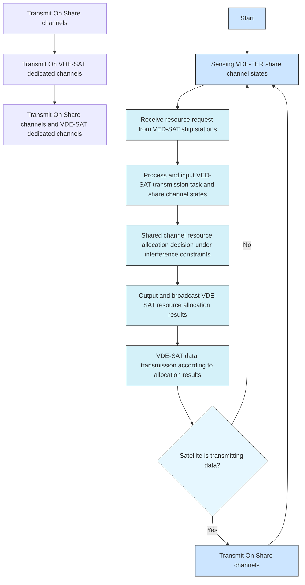

Fig. 5. Satellite-led share channel resource allocation process.

VDE-SAT ship station with uplink transmission requirements. Definition of interference constraints $\Phi _ { \mathrm { U I C } }$ on VDE-SAT uplink share channel i as follow:

$$
\begin{array}{l} \Phi_ {\mathrm{UIC}} ^ {i} = \left(\frac {1}{4 n _ {i , t} ^ {\mathrm{CQI}}} \sum_ {j} ^ {n _ {i, t} ^ {\mathrm{CQI}}} \eta_ {i, j} ^ {\mathrm{CQI}} + 1 0 \log_ {1 0} \hat {R} _ {s} - 1 0\right) ^ {- 1} C _ {\min} ^ {\mathrm{SAT}} \\ - N _ {0} \leq \Phi_ {\mathrm{UIC}} ^ {\text { threshold }} \tag {26} \\ \end{array}
$$

Where nCQIi,t $n _ { i , t } ^ { \mathrm { C Q I } }$ is the number of uplink CQI reports received on share channel $i ,$ and ηi,j $\eta _ { i , j } ^ { \mathrm { C Q I } }$ is the j CQI value received on share channel i. threshold $\Phi _ { \mathrm { U I C } } ^ { \mathrm { t h r e s h o l d } } = \bar { I } _ { \mathrm { m a x } } ^ { u }$ represents the maximum allowable Φ =interference for each uplink shared channel, and its value can be determined by (24) and (25), yielding a value of -119 dBW.

# C. Satellite-Led Spectrum Sharing Mechanism

Considering the wide field of view and long communication distance of the satellite, it has the advantage of dominating resource allocation. Therefore, we designed a spectrum sharing strategy with the satellite as the decision-maker. In order to assign share channel for the VDE-SAT transmission task, the satellite first senses the share channel states and then combines the VDE-SAT station resource request information it has received as shown in the Fig 5.

First of all, the satellite needs to sense the occupancy of the share channel by VDE-TER to obtain the states of share channels. Then, the satellite receives VDE-SAT ship stations resource request messages from the share channels and the dedicated channels, and preprocesses these messages to generate a VDE-SAT transmission task queue. Following that, combining the task queue information and the share channel states as the input of the spectrum sharing strategy. The satellite calculates the uplink and downlink interference constraints of the share channel according to the current input, and performs the share channel resource allocation decision. However, the decision of share channel resource allocation is difficult. Satellites cannot fully observe the states of all share channels, and considering the heterogeneity of the system, satellites also need to allocate time slots for the tasks to be transmitted by VDE-SAT while considering the interference constraints. Therefore, we develope an intelligent spectrum resource allocation strategy that is reasonable and can effectively improve the overall throughput of the system, which is described in Section III for details. Finally, the satellite outputs and broadcasts the resource allocation result on the dedicated channels. Data is transmitted by the VDE-SAT terminal in accordance with broadcast resource allocation messages. The satellite transmits data on the designated downlink channel if it has downlink transmission tasks; if not, it repeats the process above.

# III. INTELLIGENT SPECTRUM SHARING STRATEGY BASED ON DQN

In Section II, the spectrum sharing strategy established with the overall throughput as the optimization objective constitutes a nonlinear objective function. It is reliant on multiple variables, i.e. VDE-TER throughput and VDE-SAT throughput, introducing non-convexity to the problem. The optimization problem outlined above also involves nonlinear constraints, including considerations for satellite uplink/downlink interference and interference constraints between heterogeneous systems, which are intricately linked to frequency channel allocation, further contributing to the non-convex nature of the problem. In this section, we formulate the aforementioned non-convex optimization problem as a POMDP model, and explore an intelligent spectrum sharing algorithm based on DQN.

# A. POMDP Model

Considering that the satellite cannot obtain the state information of all share channels due to the satellite being in the transmitting state or message collision, we model the share channel resource allocation problem as POMDP instead of MDP.

POMDP is described as a 6-tuple $( S , { \mathcal { A } } , { \mathcal { P } } , { \mathcal { R } } , \Omega , { \mathcal { O } } )$ . Similar ( Ω )to MDP, S, A, R represents the state, action and reward of the environment. P is the state transition function $\mathcal { P } ( s , a , s ^ { \prime } ) =$ $P ( s ^ { \prime } | s , a )$ ( ) =, it represents the probability of transitioning from ( )state s to state $s ^ { \prime }$ for a given action a. R describes the reward function $\mathcal { R } : { \mathcal { S } } \times \mathcal { A }  \mathbb { R } ;$ which is the resulting reward that :the environment emits for an agent to be in a certain state $s \in S$ and take a certain action $a \in A .$ . The agent no longer knows the real system state, but receives an observation $o \in \Omega$ .

O is the observation function $\mathcal { O } ( s ^ { \prime } , a , o ) = P ( o | s ^ { \prime } , a )$ , i.e. the ( ) = ( )probability of observing o when taking action a leads to state $s ^ { \prime } .$ . At each time step t, the agent is in the state $s _ { t } \in S .$ , takes an action $a _ { t } \in \mathcal A$ to transfer the state $s _ { t + 1 } \in S$ to a certain according to the transition probability $\mathscr { P } ( s _ { t } , a _ { t } , s _ { t + 1 } )$ and obtains a reward $r _ { t } = \mathcal { R } ( s _ { t } , a _ { t } )$ . The goal of agent is to maximize the mean = ( )cumulative reward over time.

The agents in POMDP do not have access to the complete state information of the environment, and cannot simply use observations as a substitute for states, since several states may be aliased into the same observation. Therefore, think about employing an observed set of historical information instead of state [26]. The POMDP modeling based on VDES share channel allocation is as follows.

1) Observation: The observagent at time t is expressed as: $o _ { t } = \{ o _ { t } ^ { c h } , o _ { t } ^ { t s k } \} . ~ o _ { t } ^ { c h }$ . ocht satand $o _ { t } ^ { t s k }$ =respectively represent the observation of the share channel state and VDE-SAT transmission task queue at time t by the satellite. It is necessary to effectively use historical observations to solve the POMDP since the satellite can only observe a partial share channel state. Assuming that there are N share channels, the observation of the share channel at time t is expressed as:

$$
o _ {t} ^ {c h} = \left[ \begin{array}{c c c c} o _ {t, 1} ^ {c h} & o _ {t - 1, 1} ^ {c h} & \dots & o _ {t - H + 1, 1} ^ {c h} \\ o _ {t, 2} ^ {c h} & o _ {t - 1, 2} ^ {c h} & \dots & o _ {t - H + 1, 2} ^ {c h} \\ \vdots & \vdots & \ddots & \vdots \\ o _ {t, N} ^ {c h} & o _ {t - 1, N} ^ {c h} & \dots & o _ {t - H + 1, N} ^ {c h} \end{array} \right] \tag {27}
$$

where H represents the length of historical information. $o _ { t , i } ^ { c h }$ o t,i is the state of the share channel i at time t. It consists of 5 parts: $o _ { t , i } ^ { c h } = \{ o _ { t , i } ^ { s o n } , o _ { t , i } ^ { b u s y } , o _ { t , i } ^ { d i c } , o _ { t . i } ^ { u i c } , o _ { t , i } ^ { d a t a } \}$ o t,i , which are the number of =SON communications in the share channel i at time t, the channel busy rate, the $\Phi _ { \mathrm { U I C } }$ value, the $\Phi _ { \mathrm { D I C } }$ value, and the amount of Φ ΦVDE-TER data transmitted in share channel i, respectively. When $o _ { t , i } ^ { c h } = \{ 0 , 0 , 0 \}$ , it indicates that the share channel i is =idle or that the satellite is unaware of the sate information of the share channel i.

$o _ { t , i } ^ { s o n }$ ot,i can be estimated by the signal strength received by the satellite in channel i. obust,i $o _ { t . i } ^ { b u s y }$ y is the ratio of the busy time of channel i detected by the satellite to the total time, defined as follows:

$$
o _ {t, i} ^ {\text { busy }} = \frac {T _ {i , \text { busy }}}{T} = \frac {T - T _ {i , \text { idle }}}{T} \tag {28}
$$

where $T$ represents the total time that the satellite monitors channel $i , T _ { i , b u s y }$ is the time when the satellite detects that channel i has data transmission, and $T _ { i , i d l e }$ is the idle time of channel i. The SON ship station uses a self-organizing method for communication, and only one station is allowed to send data at the same time [3]. Therefore, the data volume $o _ { t , i } ^ { d a t a }$ odatat,i of all SON transmissions within the satellite communication coverage can be calculated through $o _ { t , i } ^ { s o n }$ nd ot,i a $o _ { t , i } ^ { b u s y } ;$ busy

$$
o _ {t, i} ^ {\text { data }} = o _ {t, i} ^ {\text { son }} \cdot o _ {t, i} ^ {\text { busy }} \cdot T / T _ {\text { slot }} \cdot d _ {s} \tag {29}
$$

where $T _ { s l o t }$ represents the duration of each time slot, which is 26.67 ms. $d _ { s }$ represents the amount of data transmitted by SON station per time slot (unit: byte).

According to the VDE-SAT frame structure [3], the resource allocation frequency is 20 s/time, and VDES assigns slots and frequency communication resources to VDE-SAT ships using a reservation-based method. Therefore, the satellite knows the task information to be transmitted before allocating resources. The transmission tasks are arranged in a queue from high priority to low priority, with the same priority arranged from large to small task transmission data volume, and the queue length is recorded as $L _ { t }$ . We optimize the transmission task priority to assign different levels of priority to various transmission tasks within the network. This prioritization is crucial for ensuring that critical or time-sensitive tasks, such as maritime safety communications or distress signals, are given precedence over less time-critical data transmissions. By optimizing transmission task priority, we aim to enhance the quality of service (QoS) for different types of communications within the network.

The transmission task state of the satellite is expressed as: $o _ { t } ^ { t s k } = \{ o _ { t , 1 } ^ { t s k } , o _ { t , 2 } ^ { t s k } , \ldots , o _ { t , L t } ^ { t s k } \} . o _ { t , i } ^ { t s k }$ t t,Lt}. t,i is the state of the transmission task i at time t, which consists of three parts: type data priority $o _ { t , i } ^ { t s k } =$ {o t,i , o t,i $\{ o _ { t , i } ^ { t y p e } , o _ { t , i } ^ { d a t a } , o _ { t . i } ^ { p r i o r i t y } \}$ = o t.i }, representing the type of task (0 for uplink task, 1 for downlink task), the amount of data transmitted (in bytes), and the priority of the task, respectively.

2) Action: In general, the action of DQN algorithm is represented by one-hot encoding for the occupancy of each channel. If the number of channels is N , then the action space size is $2 ^ { N }$ . In order to reduce the action space, we use one-hot encoding to represent the allocation methods of share channels, thus greatly reducing the computation. We adopt three share channel allocation methods, respectively:

1) TERF (TER First): VDE-SAT only uses the share channels that VDE-TER does not use, avoiding interference as much as possible.   
2) SATF (SAT First): VDE-SAT employs all share channels without considering any interference in order to maximize the throughput of VDE-SAT.   
3) THRF (Throughput First): VDE-SAT first uses the unused shared channel of VDE-TER, and then selects transmission tasks with data and priority exceeding the threshold from the remaining unallocated transmission tasks and allocates them to channels with less interference for transmission.

Therefore, the action $a _ { t }$ taken by the agent at time t can be represented as:

$$
a _ {t} = \left\{ \begin{array}{l l} 0, & \text { TERF } \\ 1, & \text { SATF } \\ 2, & \text { THRF } \end{array} \right. \tag {30}
$$

Each share channel is also divided into several logical channels in the time domain and VDE-SAT data needs to be transmitted in a logical channel composed of a group of continuous time slots. The satellite needs to map each transmission task to share channels and logical channels after determining the share channel allocation method. We generate a channel allocation matrix to represent this mapping connection as a matrix. The matrix scale is $N \times N _ { L } , N$ and $N _ { L }$ respectively for the number of share channels and the number of logical channels. The expression of the channel allocation matrix is as follows:

$$
\Gamma_ {t} = \left[ \begin{array}{c c c c} c _ {1, 1} ^ {t} & c _ {1, 2} ^ {t} & \dots & c _ {1, N _ {L}} ^ {t} \\ c _ {2, 1} ^ {t} & c _ {2, 2} ^ {t} & \dots & c _ {2, N _ {L}} ^ {t} \\ \vdots & \vdots & \dots & \vdots \\ c _ {N, 1} ^ {t} & c _ {N, 2} ^ {t} & \dots & c _ {N, N _ {L}} ^ {t} \end{array} \right] \tag {31}
$$

$$
c _ {i, j} ^ {t} = \left\{ \begin{array}{l l} o _ {t, l} ^ {t s k} & \text { Transmission   assignments } \\ 0 & \text { No   transmission   assignments } \end{array} \right. \tag {32}
$$

where $i \in [ 1 , N _ { L } ] , j \in [ 1 , N ] , l \in [ 1 , L _ { t } ^ { t s k } ] . c _ { i , j } ^ { t } = o _ { t , l } ^ { t s k }$ i, o t,l indi-[cates the task $o _ { t , l } ^ { t s k }$ ] [ ] [ ] =assigned for transmission on the share channel i and the logical channel $j . ~ c _ { i , j } ^ { t } = 0$ indicates that no trans-=mission task is assigned on the share channel i and the logical channel $j . \ L _ { t } ^ { t s k }$ is the length of the VDE-SAT transmission task queue.

3) Reward: Based on the channel allocation matrix and share channel observation obtained by taking action at VDE-SAT, the interference strength on share channel i can be known. When there is no interference or the interference is within the threshold, the reward is the total transmission data volume of VDE-TER and VDE-SAT on the share channel. When the interference is large and exceeds the threshold, the reward is the penalty factor . The reward value of the share channel i at time t is specifically expressed as $r _ { t , i }$ .

$$
r _ {t, i} = \left\{ \begin{array}{l l} \varpi , & \text { if } H _ {0} \\ \sum \big (D _ {i} ^ {\mathrm{TER}} + D _ {i} ^ {\mathrm{SAT}} \big), & \text { others } \end{array} \right.
$$

$$
H _ {0}: o _ {t, i} ^ {\text { ship }} > \Phi_ {\text { ship }} ^ {\text { threshold }} \text {   or   } o _ {t, i} ^ {\text { DIC }} <   \Phi_ {\text { DIC }} ^ {\text { threshold }} \text {   or   } o _ {t, i} ^ {\text { UIC }} > \Phi_ {\text { UIC }} ^ {\text { threshold }} \tag {33}
$$

The reward value we set does not take the priority of VDE-SAT transmission tasks into account, because our task observation queue has already pre-processed the tasks in accordance with their priority (the task queue is sorted by priority). In the stage of allocating channel resources, tasks with high priority and high data volume are prioritized according to the sorting results, so there is no need to consider the priority index again here.

Due to the fact that VDE-SAT users aim to use share channels with minimal interference between systems, the agent is designed to find the optimal strategy π to maximize the cumulative reward $r _ { t }$ of channel allocation. The calculation of $r _ { t }$ with discount factor γ is as follows:

$$
r _ {t} = \sum_ {t = 0} ^ {T - 1} \sum_ {i = 1} ^ {N} \kappa \cdot \gamma^ {t} r _ {t, i} \tag {34}
$$

where κ is the normalization factor for the reward value. $r _ { t , i }$ is the reward of share channel i at time t.

# B. Share Channel Allocation Based on SCA-D3QN

The share channel spectrum resource allocation problem is a combinatorial optimization problem with partial state observability, and we develop the Share Channel Allocation D3QN (SCA-D3QN) algorithm based on Double Dueling DQN architecture to solve it. The SCA-D3QN algorithm is satellite-led for sensing decisions and does not require online coordination or message exchange among share users. DQN is a powerful reinforcement learning method that aims to find optimal policies $\pi ^ { * }$ that maximize expected cumulative rewards. The optimal policy can be easily derived from the optimal value by choosing the action with the highest value in each state.

DQN uses two networks to compute the Q value, the former computes the value function of state-action pairs, and the latter chooses the largest value function to compute the cumulative reward with discount decay. The target value $Y _ { t } ^ { \mathrm { D Q N } }$ of DQN is defined as follows:

$$
Y _ {t} ^ {\mathrm{DQN}} = r _ {t} + \gamma \max _ {a} Q (o _ {t + 1}, a; \theta^ {\prime}) \tag {35}
$$

Use stochastic gradient descent to update the current value $Q ( o _ { t + 1 } , a ; \theta )$ towards the target value $\dot { Y } _ { t } ^ { \mathrm { D Q N } } , \ \theta$ and $\theta ^ { \prime }$ are the ( ; )parameters of the policy network and target network, respectively.

1) Double DQN: The goal of the satellite agent is to learn the optimal Q-value function so that taking the action with the maximum Q-value under any observation o can get the maximum cumulative reward. However, this also leads to DQN overestimating the action values and performing poorly [27], so when training DQN, Double DQN is used to separate action selection from Q-value evaluation.

Specifically, we used two neural networks $\mathrm { D Q N } _ { \mathrm { b e h a v i o r } }$ and $\mathrm { D Q N } _ { \mathrm { t a r g e t } }$ , with the same structure. $\mathrm { D Q N } _ { \mathrm { b e h a v i o r } }$ is used to select an action, the parameter of its network is $\theta ;$ while $\mathrm { D Q N } _ { \mathrm { t a r g e t } }$ is used to calculate the Q value of the selected action, the parameter of its network is $\theta ^ { \prime } .$ . First, the input $o _ { t }$ is sent to $\mathrm { D Q N _ { l } }$ behavior. The neural network generates Q-estimate values $Q ( o _ { t } , a ; \theta )$ for ( ; )all available actions, selects an action, and generates a reward. At the next time step t  1, the input $o _ { t + 1 }$ is sent to both the neural network $\mathrm { D Q N } _ { \mathrm { b e h a v i o r } }$ and $\mathrm { D Q N } _ { \mathrm { t a r g e t } } ,$ , similar to the DQN updating, but replacing Y DQNt $Y _ { t } ^ { \mathrm { D Q N } }$ with:

$$
Y _ {t} ^ {\text { DoubleDQN }} = r _ {t} + \gamma Q \left(o _ {t + 1}, \max _ {a} Q (o _ {t + 1}, a; \theta); \theta^ {\prime}\right) \tag {36}
$$

The target vector for Double DQN training can be formed by the formula (36). $\mathrm { D Q N } _ { \mathrm { b e h a v i o r } }$ is trained in the usual way. The weights of $\mathrm { D Q N } _ { \mathrm { t a r g e t } }$ are delayed copies of the weights of $\mathrm { D Q N } _ { \mathrm { b e h a v i o r } } .$ Through this way, the satellite can evaluate the chosen channel allocation strategy more effectively, ensuring that the real estimation will not change too fast with the self-update of the training network, enhancing the accuracy of the algorithm.

It is necessary to make decisions based on history observations because satellite is unable to monitor each share channel state. However, not all historical data can be used for predicting the future. DQN typically struggles to compress memory when employing fully connected layers, leading to increased computational resource usage. Therefore, to capture the dependency of previous sequential observations and enhance the quality of state representation, we combine Double DQN and LSTM. This involves using two data streams with LSTM layers to separately store the share channel state memory and transmission task queue memory observed by the satellite, as shown in Fig. 6.

2) Dueling DQN: No matter what action is taken in a dynamic environment with several idle channels, the share channel state may be good or bad. However, $Q ( o _ { t } , a _ { t } ; \theta )$ in Q-learning is meant to express the goodness or badness of executing a certain action under a given state o. The output of the DQN neural network is the value of the action $a _ { t }$ in a given state $o _ { t } .$ , which can be divided into two parts. The first part is the state value, $\mathrm { i . e . } V \big ( o _ { t } ; \theta , \beta _ { v } \big )$ , which is used to estimate the importance of being in a particular state $o _ { t }$ . The second part is the action value, $\mathrm { i . e . } A ( o _ { t } , a _ { t } ; \theta , \beta _ { a } )$ , which is used to estimate the importance ( ; )of choosing an action $a _ { t }$ in state $o _ { t } .$ . Therefore, the Q-value $Q ( o _ { t } , a ; \theta )$ can be expressed as follows:

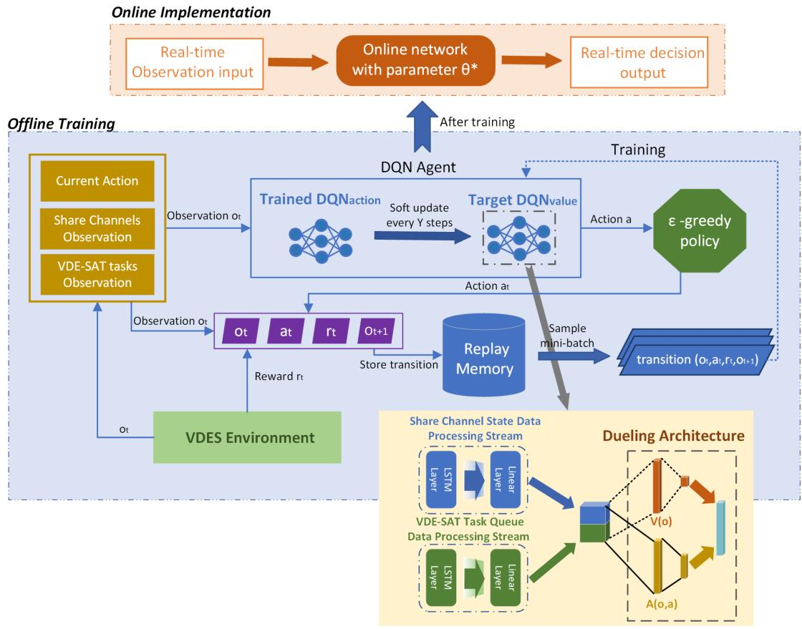

flowchart

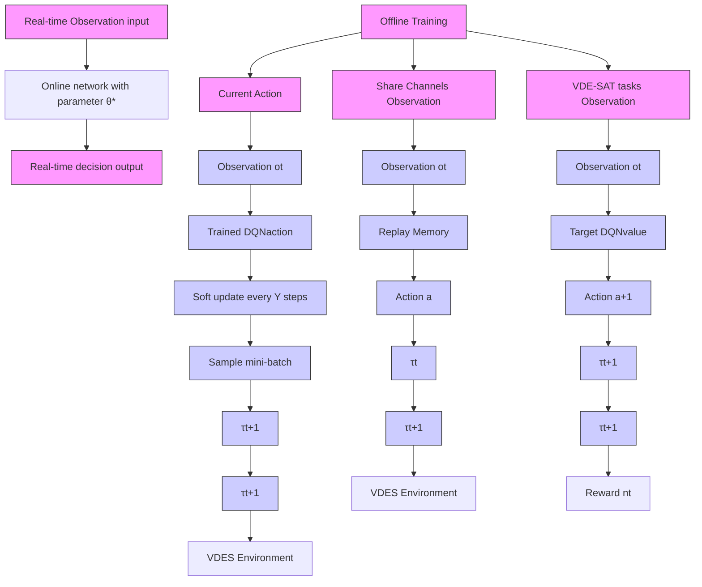

Fig. 6. SCA-DQN architecture.

$$
\begin{array}{l} Q (o _ {t}, a _ {t}; \theta , \beta_ {v}, \beta_ {a}) = V (o _ {t}; \theta , \beta_ {v}) \\ + \left(A (o _ {t}, a _ {t}; \theta , \beta_ {a}) - \frac {1}{| \mathcal {A} |} \sum_ {a ^ {\prime}} A (o _ {t}, a ^ {\prime}; \theta , \beta_ {a})\right) \tag {37} \\ \end{array}
$$

where $V \big ( o _ { t } ; \theta , \beta _ { v } \big )$ represents the expected value of the ( ; )estimated state relative to the action taken, $A ( o _ { t } , a _ { t } ; \theta , \beta _ { a } )$ repre-( ; )sents the estimated advantage of each action minus the state relative to the action taken. |A| represents the size of the action space. Specifically, $V \big ( o _ { t } ; \theta , \beta _ { v } \big )$ is related to state, and $A ( o _ { t } , a _ { t } ; \theta , \beta _ { a } )$ ( ; )is related to state and action, so the parameters $\beta _ { v }$ (of $V \big ( o _ { t } ; \theta , \beta _ { v } \big )$ ) and the parameters $\beta _ { a }$ of $A ( o _ { t } , a _ { t } ; \theta , \beta _ { a } )$ ( ;are different [28].

( ; )The satellite agent is able to learn the state value function more efficiently due to the Dueling DQN architecture. In each update step, DQN only updates the Q-value of a certain channel allocation action, while the Q-values of other actions are left unchanged. In Dueling DQN, the action value function $V \big ( o _ { t } ; \theta , \beta _ { v } \big )$ ( ; )is updated, which also affects the Q-values of other channel allocation actions. As a result, Dueling DQN can learn the state value function more frequently and efficiently, improving the algorithm’s performance and accelerating convergence.

# IV. STRATEGY IMPLEMENT

# A. Model Training

The SCA-D3QN algorithm consists of two parts: offline training and online deployment, as shown in Fig. 6. The purpose of offline training is to enhance the SCA-D3QN model through historical data, enabling it to better understand the correlation between the VDE-TER SON channel occupancy and the VDE-SAT spectrum demand in various scenarios. Table I furnishes a comprehensive account of the simulation parameter configurations. The transmitter parameters have been established in accordance with the ITU standard protocol, with specific reference standards for each parameter clearly delineated in Table I. The number of SON and ship stations are obtained by combining real AIS data with satellite trajectories.

We utilized geographic location data from AIS messages of actual ship stations to construct our training dataset, given the absence of current VDES business data. Initially, we filtered out stations within the communication range of the satellite, considering its orbital height of 600 km. Subsequently, we clustered these stations based on their latitude and longitude. VDE-TER SON is constituted by ship stations whose distance from other ship stations is less than 25 km, while VDE-SAT ship stations are those with a distance of more than 25 km from all other stations. We determined the quantity of VDE-TER SONs and VDE-SAT stations, along with the elevation angle between them and the satellite. According to [3], VDE-TER SON uses the default 100 kHz channel for communication, and only one station in each SON can send messages in the same time slot. Therefore, we randomly selected the upper or lower leg of the VDE bands for transmission in each SON. The occupancy rate of the share channel of the SON depends on the number of stations in the SON. The more ship stations in SON, the higher the SON occupancy rate of the share channel because the service arrival of SON ship stations follows the Poisson distribution with parameter $\lambda _ { 1 }$ . Similarly, the arrival of the business of the VDE-SAT station follows the Poisson distribution with the parameter $\lambda _ { 2 } .$ , the demand for spectrum increases with the number of VDE-SAT stations. Finally, the share channel state information encompassing the uplink interference limitations and the downlink interference constraints is generated based on the obtained the number of SONs, geographic location, and traffic information. The number of VDE-SAT ship stations determines the information for the relevant VDE-SAT transmission task queue. Table I provides a description of the precise parameter settings.

TABLE I SIMULATION PARAMETERS 

<table><tr><td>Parameters</td><td>Range of value</td></tr><tr><td>Field strength threshold  $E$  per 25kHz [21]</td><td>12 dB ( $\mu$ V/m)</td></tr><tr><td>PFD  $\psi$  of VDE-TER [21]</td><td>-142 dBW/m $^{2}$ </td></tr><tr><td>SINAD  $\varsigma_{a}$  defined by ITU [29]</td><td>12dB</td></tr><tr><td>Noise power  $N_{0}^{\text{ship}}$  of the VDE-TER ship [3]</td><td>-153dBW</td></tr><tr><td>Additional path loss  $\Delta\ell$  of VDE-TER [25]</td><td>34dB</td></tr><tr><td>Antenna polarization loss  $\vartheta_{\text{SER}}^{\text{SAT}}$  [3]</td><td>3dB</td></tr><tr><td>Noise power  $N_{0}^{\text{sat}}$  of the satellite [3]</td><td>-202.9dBW</td></tr><tr><td>Equivalent bandwidth  $B_{eq}$  of VDE-SAT [3]</td><td>42kHz</td></tr><tr><td>Maximum interference value  $I_{k,\max}$  of SON [3]</td><td>-126.7dBW</td></tr><tr><td>Transmitting power  $P_{\text{ship}}$  of ship [3]</td><td>6W</td></tr><tr><td>Average gain  $\overline{G}_{\text{ship}}$  of SON ship station [3]</td><td>2.5dBi</td></tr><tr><td>The number of SON ship stations</td><td>[0,6000]</td></tr><tr><td>The number of VDE-SAT ship stations</td><td>[0,140]</td></tr><tr><td>The number of VDE-TER share channels  $N$ </td><td>8</td></tr><tr><td>Satellite orbit altitude  $h$ </td><td>600km</td></tr></table>

# B. Model Implement

During the online deployment phase, the neural network model, trained as described above, is deployed to a satellite equipped with an AI intelligent chip for execution. The SCA-D3QN algorithm, relying on real-time observations of share channel states by the satellite and the VDE-SAT task queue, allocates time slots and frequency resources for shared channels to both uplink and downlink VDE-SAT transmission tasks. The primary steps of the SCA-D3QN algorithm are described in

TABLE II PARAMETERS OF MODEL 

<table><tr><td>Parameters</td><td>Value</td></tr><tr><td>History length H</td><td>8</td></tr><tr><td>Experience-replay mini-batch size</td><td>128</td></tr><tr><td>Capacity of the experience pool</td><td> $10^5$ </td></tr><tr><td>Penalty factor</td><td> $-10^6$ </td></tr><tr><td>Learning rate α</td><td>0.0001</td></tr><tr><td>Discount factor γ</td><td>0.95</td></tr><tr><td>Optimizer</td><td>AdamW</td></tr><tr><td>Activation Function</td><td>ReLU</td></tr><tr><td>Target network update frequencym J</td><td>100</td></tr><tr><td>τ of target network soft updaten</td><td>0.005</td></tr></table>

Algorithm 1, utilizing the -greedy algorithm to select the channel sharing action.The agent employs the -probability action randomly to explore the solution space, and with a probability of 1 − , it chooses the action with the highest Q value. Subsequently, the agent receives the reward rt and observes the next state $o ) _ { t + 1 }$ . The transition $\left( o _ { t } , a _ { t } , r _ { t } , o _ { t + 1 } \right)$ is stored in the replay ) ( )memory buffer. In each iteration, a mini batch of transitions from the experience buffer is used to train the network. This is done by feeding the learned Q-values and estimated Q-values to a Mean Squared Error (MSE) loss function.

The details of the parameters for SCA-D3QN is provided in Table II. The simulations were implemented in Pytorch with GPU acceleration. SCA-D3QN utilized a history length of 8. If the historical data is excessively long, the input state tensor for the neural network becomes too large, leading to slower algorithm convergence. Conversely, if the historical data is too short, the agent struggles to capture the features of the state tensor, resulting in lower decision accuracy. The model employed the Rectified Linear Unit (ReLU) as its activation function. ReLU activation effectively mitigates the problem of vanishing gradients and gradient explosions caused by the multiplication of gradients in the chain rule, thereby facilitating fast convergence and computational simplicity. The AdamW optimizer was used to implement gradient descent during the parameter updates for SCA-D3QN, which offers faster convergence compared to the commonly used Adam optimizer. A batch size of 128 was employed, which is a common value in DQN and ensures both rapid network convergence and avoids excessive memory consumption. To enhance model stability, the target network had an update frequency of 100 steps, with a soft update parameter τ set to 0.005.

The offline training process may be computationally intensive and may require a significant amount of time. However, latency in the training phase is not a primary concern since it can be completed in an offline ground-based mode and does not require real-time performance. In contrast, latency during online deployment is a more critical consideration because the model needs to make real-time decisions in satellite applications. Latency may be influenced by hardware performance, model complexity, and input data processing. Nonetheless, the most computationally intensive work is concentrated in the offline training phase, with the online deployment phase involving relatively lower computational requirements, requiring only 0.59 MFLOPs for a single online deployment. Existing satellite-based intelligent AI chips provide over 1 TFLOPs of computational capacity [30], which is more than sufficient to support the deployment of the SCA-D3QN algorithm. To further reduce latency, future work may consider utilizing high-performance hardware, model compression, and optimization algorithms.

Algorithm 1: SCA-D3QN Algorithm.   
Input: The observation of share channels and VDE-SAT task queue, start environment simulator to generate the VDES system environment.

Output: The learned policy for share channels allocation $\pi^{*}$ , the optimal parameter $\theta^{*}$ of the network.

1: Initialize the threshold parameters and hyper-parameters according to Tables I and II.

2: Initialize replay memory M with buffer capacity $M_{C}$ 3: Initialize a trained policy network with weights $\theta$ and a target network with weights $\theta'$ , initialize $\theta$ randomly, and let $\theta = \theta'$ .

4: Set t = 0, observe the share channels states and task queue for each steps to obtain $o_{t}$ .

5: for each episode i do

6: for each time step t do

7: For current observation $o_{t}$ , satellite chooses an action at with maximum output value and greedy policy

8: Satellite assigns the slots and spectrum resource for VDE-SAT tasks according to the action $a_{t}$ , then generate channel assignment matrix.

9: Obtain the corresponding reward $r_{t}$ by channel assignment matrix and share channel states.

10: Observe the next state $o_{t+1}$ 11: if memory length > mini-batch then

12: Store ( $o_{t}, a_{t}, r_{t}, o_{t+1}$ ) in the memory buffer.

13: else

14: Store ( $o_{t}, a_{t}, r_{t}, o_{t+1}$ ) in the memory buffer to replace the oldest ones

15: end if

16: Sample a mini-batch of transitions randomly from memory buffer M

17: Compute the Q value based on and update the parameters of policy network by minimizing MSE

18: for every J-step (J is constant) do

19: Soft update the parameters $\theta'$ of target network

20: end for

21: end for

22: end for

# C. Algorithm Complexity Analysis

The SCA-D3QN model application is divided into two stages. The first stage is to do offline training to determine the best parameters $\theta ^ { * }$ for the neural network, in order to determine the best policy π∗ for allocating resources over share channels. Then, online deployment is implemented on the satellite. The best share channel allocation action can be produced by feeding the most optimal input into the trained neural network and choosing the action with the highest Q value once online deployment has been carried out on the satellite. The network Q will calculate its corresponding output for any input environmental state during the online deployment stage. According to the connection and calculation principle of the neural network, the calculation complexity from input to output can be obtained as:

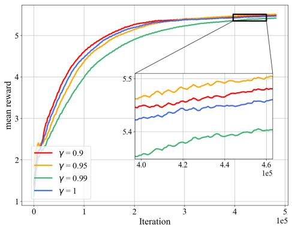

line

| Iteration | γ = 0.9 | γ = 0.95 | γ = 0.99 | γ = 1   |
| --------- | ------- | -------- | -------- | ------- |
| 0         | 2.5     | 2.5      | 2.5      | 2.5     |
| 1         | 4.8     | 4.7      | 4.6      | 4.5     |
| 2         | 5.3     | 5.2      | 5.1      | 5.0     |
| 3         | 5.4     | 5.3      | 5.2      | 5.1     |
| 4         | 5.5     | 5.4      | 5.3      | 5.2     |
| 4.6       | 5.6     | 5.5      | 5.4      | 5.3     |

Fig. 7. Comparison of reward values with different discount factors.

$$
\begin{array}{l} Y = \left(F _ {1} n _ {1, 1} + H N n _ {1, 2}\right) \\ + \left(F _ {2} n _ {2, 1} + L _ {t} ^ {\mathrm{tsk}} n _ {2, 2} n _ {2, 3}\right) \\ + (n _ {1, 2} + n _ {2, 3}) n _ {\text { Dueling }} A \tag {38} \\ \end{array}
$$

Where $F _ { 1 }$ and $F _ { 2 }$ are respectively the number of features of the share channel state and the VDE-SAT task queue state. H is the length of the historical observation. N is the total number of share channels. $L _ { t } ^ { \mathrm { t s k } }$ is the length of VDE-SAT task queue. A is the size of action space. $_ { n _ { 1 , i } }$ is the number of neurons in the hidden layer i for storing the data stream of shared channel state, $n _ { 2 , i }$ is the number of neurons in the hidden layer i for storing the data stream of VDE-SAT task queue state. $ { n _ { \mathrm { { D u e l i n g } } } }$ is the number of Dueling architecture neurons, which is the sum of the number of neurons in the state-value layer and the action-value layer. Therefore, the complexity of the online application can be defined as $O ( Y )$ .

( )In each training, a min-batch size of data is sampled according to the experience replay strategy in Algorithm 1. Since each episode contains $T _ { \mathrm { s t e p } }$ time steps and a total of $T _ { \mathrm { e p i s o d e } }$ episodes are trained, the computational complexity of the entire training networks $\mathrm { D Q N } _ { \mathrm { b e h a v i o r } }$ and $\mathrm { D Q N } _ { \mathrm { t a r g e t } }$ is $O ( 2 T _ { \mathrm { e p i s o d e } } T _ { \mathrm { s t e p } } M _ { \mathrm { b a t c h } } Y )$ .In addition, in the experience replay ( )policy, each transition is stored in memory with complexity $O ( M _ { C } )$ . Therefore, the complexity of the training process can be ( )defined as $O ( 2 T _ { \mathrm { e p i s o d e } } T _ { \mathrm { s t e p } } M _ { \mathrm { b a t c h } } Y + 2 T _ { \mathrm { e p i s o d e } } T _ { \mathrm { s t e p } } M _ { \mathrm { b a t c h } } M _ { C } )$ . ( + )However, as mentioned before, the expensive computation of the entire training process is completed at the ground station in offline training phase, so the SCA-D3QN algorithm can achieve online application with lower complexity O Y .

# V. SIMULATION RESULTS

We conducted simulation tests to evaluate the effectiveness of the proposed model. The dataset used for training was generated from real AIS data, including the number of stations, latitude and longitude of ship stations.

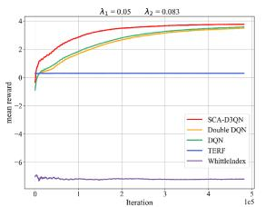

line

| Iteration | SCA-DQN | Enable DQN | DQN | TERF | Whittleialex |
| --------- | ------- | ---------- | --- | ---- | ------------ |
| 0         | 0       | 0          | 0   | 0    | -6           |
| 1e5       | 4       | 4          | 4   | 4    | -6           |

(a)

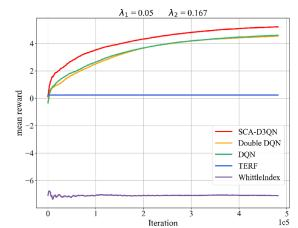

line

| Iteration | SCA-DQN | Double DQN | DQN | TERF | WhittleIndex |
| --------- | ------- | ---------- | --- | ---- | ------------ |
| 0         | 0       | 0          | 0   | 0    | -6           |
| 1e5       | 4       | 3          | 2   | 0    | -6           |

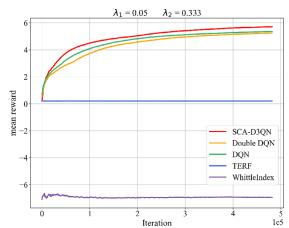

line

| Iteration | SCA-DQN | Double DQN | DQN  | TERF | WhittleIndex |
| --------- | ------- | ---------- | ---- | ---- | ------------ |
| 0         | 0       | 0          | 0    | 0    | -6           |
| 1         | 4       | 3          | 2    | 0    | -6           |
| 2         | 5       | 4          | 3    | 0    | -6           |
| 3         | 5.5     | 4.5        | 3.5  | 0    | -6           |
| 4         | 5.8     | 4.8        | 4    | 0    | -6           |
| 5         | 6       | 5          | 4.5  | 0    | -6           |

（c）

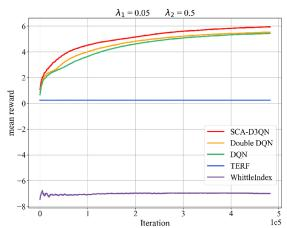

line

| Iteration | SCA-DQN | Double DQN | DQN  | TERF | WhitleIndex |
| --------- | ------- | ---------- | ---- | ---- | ----------- |
| 0         | 0       | 0          | 0    | 0    | -8          |
| 1e5       | 6       | 6          | 6    | 6    | -8          |

Fig. 8. Comparison of different model reward values for different VDE-SAT service arrival rate parameters. (a) $\lambda _ { 2 } = 0 . 0 8 3$ (b) $\lambda _ { 2 } = 0 . 1 6 7$ (c) $\lambda _ { 2 } = 0 . 3 3 3$ (d) λ2 = 0.5.

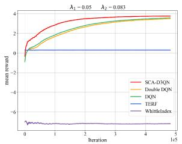

line

| Iteration | SCA-DQN | Double DQN | DQN | TERRF | WhitelIndex |
| --------- | ------- | ---------- | --- | ----- | ----------- |
| 0         | 0       | 0          | 0   | 0     | -6          |
| 1e5       | 4       | 3.5        | 3.5 | 3.5   | -6          |

(a)

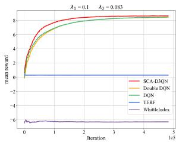

line

| Iteration | SCA-DQN | Double DQN | DQN | TERF | Whitleludes |
| --------- | ------- | ---------- | --- | ---- | ----------- |
| 0         | 0       | 0          | 0   | 0    | -6          |
| 1         | 8       | 7          | 7   | 7    | -6          |
| 2         | 8       | 8          | 8   | 8    | -6          |
| 3         | 8       | 8          | 8   | 8    | -6          |
| 4         | 8       | 8          | 8   | 8    | -6          |
| 5         | 8       | 8          | 8   | 8    | -6          |

(b)

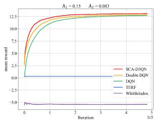

line

| Iteration | SCA-DQN | Double DQN | DQN | TIERF | WhitleIndex |
| --------- | ------- | ---------- | --- | ----- | ----------- |
| 0         | 0.0     | 0.0        | 0.0 | 0.0   | -5.0        |
| 1e5       | 12.5    | 12.5       | 12.5| 12.5  | -5.0        |

（c）

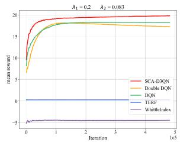

line

| Iteration | SCA-DQN | Double DQN | DQN  | JERF | WhittleIndex |
| --------- | ------- | ---------- | ---- | ---- | ------------ |
| 0         | 18.0    | 8.0        | 16.0 | -5.0 | -5.0         |
| 1e5       | 19.0    | 17.0       | 17.0 | -5.0 | -5.0         |

(d)   
Fig. 9. Comparison of different model reward values for different VDE-TER service arrival rate parameters. (a) $\lambda _ { 1 } = 0 . 0 5$ (b) $\lambda _ { 1 } = 0 . 1$ (c) $\lambda _ { 1 } = 0 . 1 5$ (d) $\lambda _ { 1 } = 0 . 2$ .

We used Python to simulate and evaluate the performance of the proposed SCA-D3QN model. The settings of the simulation scenario parameters and neural network parameters are shown in the Table I. We conducted an exploratory experiment on the proposed model discount factor in Fig. 7, with the discount factor set as {0.9, 0.95, 0.99, 1}. The discount factor of rewards will have an impact on the behavior of the satellite agent when historical rewards and future rewards are considered. Fig. 7 shows that the value of the system reward does not increase linearly as the discount factor rises. In order to maximize the final reward of channel allocation, the satellite should choose the optimal discount factor 0.95 in our proposed model.

We compared the proposed model with Double DQN, DQN, TERF and Whittle Index [10] models. The TERF method chooses an action $a _ { t }$ based on the VDE-TER priority principle according to [3], meaning that VDE-SAT stops using the share channel when VDE-TER SON using it. The channel state statistics in the dataset are used as the state transition parameters p , $_ { p _ { 1 1 } }$ in Whittle Index.

We have provided the average reward values obtained by different models after training iterations, as shown in Fig. 8. It is obvious that the DQN model performs better than the TERF model and Whittle Index model. Due to the memory replay and historical information observation, DQN is able to track changes of VDE-TER communication resource occupancy during the operation of the satellite, and flexibly adjust the allocation strategy of the share channel according to the changes. The reward value of the traditional Whittle Index model is low, because in the ocean scene, the transition probability matrices of all share channels are different at different times, which greatly reduces the performance of the Whittle Index model.

We conducted multiple experiments for different service arrival rates of VDE-SAT and VDE-TER in order to verify the stability of our model. The parameter λ1 represents the Poisson Distribution parameter of VDE-TER service arrival rate, and takes values in {0.001, 0.05, 0.1, 0.15, 0.2}. $\lambda _ { 1 } \times N _ { \mathrm { D C } } ^ { \mathrm { t e r } }$ is the average number of arrived tasks that VDE-TER terminals within 20 s, and $N _ { \mathrm { D C } } ^ { \mathrm { t e r } } = 4 0$ is the number of DC logical channels of VDE-TER in 20 s. The larger the value of $\lambda _ { 1 } .$ , the more data is transmitted by VDE-TER SONs. The Poisson Distribution parameter of the VDE-SAT service arrival rate is represented by $\lambda _ { 2 } ,$ , and takes values in {0.083, 0.167, 0.333, 0.5, 0.667}. $\lambda _ { 2 } \times N _ { \mathrm { D C } } ^ { \mathrm { s a t } }$ is the average number of arrived tasks that VDE-SAT terminals within 20 s, and N sat 6 is the number of DC logical =channels of VDE-SAT in 20 s.The larger the value of $\lambda _ { 2 } ,$ the more data will be transmitted by VDE-SAT. The experimental results are displayed in Fig. 8(a)–(d). It can be seen that when $\lambda _ { 1 }$ is unchanged and $\lambda _ { 2 }$ increases, the average reward value also increases. This is because the reward value is related to the overall throughput of the system, and the increase of the reward value indicates that the overall throughput of the system increases. The situation is similar when $\lambda _ { 2 }$ is unchanged and $\lambda _ { 1 }$ increases, and the corresponding experimental results are shown in the Fig. 9. SCA-D3QN model performs well under various parameters when compared with the contrast models of the experiment setting, which indicates that our model has better stability and generalization ability.

In addition, we have given the performance of different models in terms of throughput, user transmission task priority, average DIC value, and average UIC value in Fig. 10. Fig. 10(a) and (b) presented the performance of different algorithms concerning throughput and user transmission task pri ority. Our proposed algorithm, represented by the red line, notably outperformed the other comparative algorithms. Fig. 10(c) and (d) illustrate the interference performance of VDE-SAT’s downlink and uplink. The black horizontal lines represent the maximum allowable interference levels for the links, as defined in (16) and (26). Obviously, the closest proximity to the threshold is achieved by our model, and it does not exceed the threshold value. This indicates that our model effectively balances system throughput and interference issues among subsystems, maximizing the VDE-SAT system throughput under interference constraints and improving the spectrum efficiency of shared channels.

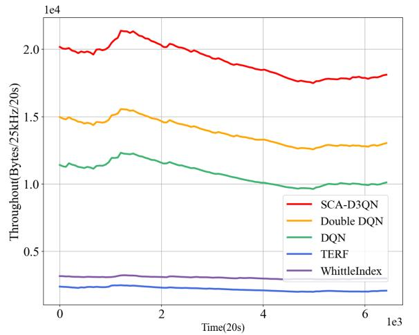

line

| Time(20s) | SCA-D3QN | Double DQN | DQN | TERF | WhittleIndex |
| --------- | -------- | ---------- | --- | ---- | ------------ |
| 0         | 2.0      | 1.5        | 1.1 | 0.2  | 0.3          |
| 1         | 2.1      | 1.55       | 1.2 | 0.2  | 0.3          |
| 2         | 2.0      | 1.45       | 1.15| 0.2  | 0.3          |
| 3         | 1.95     | 1.4        | 1.1 | 0.2  | 0.3          |
| 4         | 1.85     | 1.35       | 1.05| 0.2  | 0.3          |
| 5         | 1.75     | 1.3        | 1.0 | 0.2  | 0.3          |
| 6         | 1.8      | 1.3        | 1.0 | 0.2  | 0.3          |
| 7         | 1.8      | 1.3        | 1.0 | 0.2  | 0.3          |
| 8         | 1.8      | 1.3        | 1.0 | 0.2  | 0.3          |
| 9         | 1.8      | 1.3        | 1.0 | 0.2  | 0.3          |
| 10        | 1.8      | 1.3        | 1.0 | 0.2  | 0.3          |
| 11        | 1.8      | 1.3        | 1.0 | 0.2  | 0.3          |
| 12        | 1.8      | 1.3        | 1.0 | 0.2  | 0.3          |
| 13        | 1.8      | 1.3        | 1.0 | 0.2  | 0.3          |
| 14        | 1.8      | 1.3        | 1.0 | 0.2  | 0.3          |
| 15        | 1.8      | 1.3        | 1.0 | 0.2  | 0.3          |
| 16        | 1.8      | 1.3        | 1.0 | 0.2  | 0.3          |
| 17        | 1.8      | 1.3        | 1.0 | 0.2  | 0.3          |
| 18        | 1.8      | 1.3        | 1.0 | 0.2  | 0.3          |
| 19        | 1.8      | 1.3        | 1.0 | 0.2  | 0.3          |
| 20        | 1.8      | 1.3        | 1.0 | 0.2  | 0.3          |
| 21        | 1.8      | 1.3        | 1.0 | 0.2  | 0.3          |
| 22        | 1.8      | 1.3        | 1.0 | 0.2  | 0.3          |
| 23        | 1.8      | 1.3        | 1.0 | 0.2  | 0.3          |
| 24        | 1.8      | 1.3        | 1.0 | 0.2  | 0.3          |
| 25        | 1.8      | 1.3        | 1.0 | 0.2  | 0.3          |
| Note: The actual values for SCA-D3QN and Double DQN are not provided in the code snippet, so they are represented as placeholders in the CSV data format.

(a)

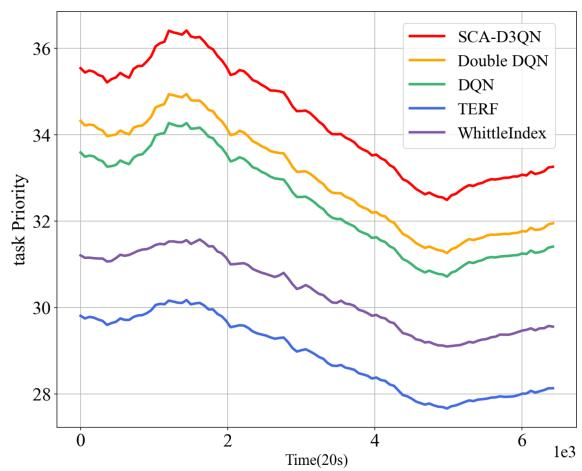

line

| Time(20s) | SCA-D3QN | Double DQN | DQN  | TERF | WhittleIndex |
| --------- | -------- | ---------- | ---- | ---- | ------------ |
| 0         | 35.5     | 34.2       | 33.7 | 29.8 | 31.2         |
| 1e3       | 36.2     | 34.8       | 34.1 | 30.1 | 31.5         |
| 2e3       | 35.8     | 34.5       | 33.8 | 29.5 | 31.0         |
| 3e3       | 35.0     | 34.0       | 33.2 | 28.8 | 30.5         |
| 4e3       | 34.0     | 33.5       | 32.5 | 28.2 | 29.8         |
| 5e3       | 32.8     | 32.0       | 31.5 | 27.8 | 29.2         |
| 6e3       | 33.0     | 31.8       | 31.2 | 28.0 | 29.5         |
| 7e3       | 33.2     | 32.0       | 31.5 | 28.2 | 29.7         |

(b)

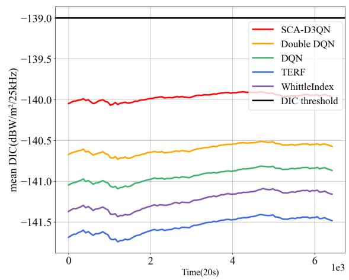

line

| Time(20s) | SCA-D3QN | Double DQN | DQN    | TERF   | WhittleIndex | DIC threshold |
| --------- | -------- | ---------- | ------ | ------ | ------------ | ------------- |
| 0         | -140.0   | -140.5     | -141.0 | -141.5 | -141.5       | -139.0        |
| 2e3       | -140.0   | -140.5     | -141.0 | -141.5 | -141.5       | -139.0        |
| 4e3       | -140.0   | -140.5     | -141.0 | -141.5 | -141.5       | -139.0        |
| 6e3       | -140.0   | -140.5     | -141.0 | -141.5 | -141.5       | -139.0        |

(c）

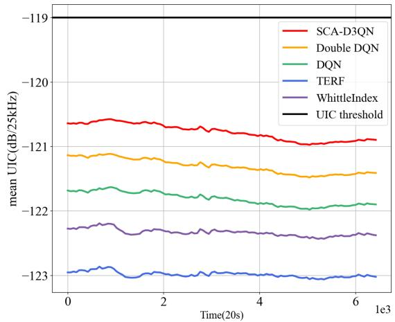

line

| Time(20s) | SCA-D3QN | Double DQN | DQN   | TERF  | WhittleIndex | UIC threshold |
| --------- | -------- | ---------- | ----- | ----- | ------------ | ------------- |
| 0         | -120.8   | -121.0     | -121.8| -123.0| -122.5       | -119.0        |
| 2e3       | -120.7   | -121.1     | -121.9| -123.0| -122.6       | -119.0        |
| 4e3       | -120.9   | -121.3     | -122.0| -123.0| -122.7       | -119.0        |
| 6e3       | -121.0   | -121.4     | -122.1| -123.0| -122.8       | -119.0        |

(d)   
Fig. 10. Performance comparison of different models. (a) VDES Throughput (b) VDE-SAT Task Priority (c) DIC Value (d) UIC Value.

The number and positions of ships within the satellite communication range are determined by combining AIS datasets with satellite trajectories. The rapid changes in the number of ships within the satellite communication range are due to the fast movement of low-earth orbit satellites and the uneven distribution of ships at sea. Notably, in Fig. 10(a), the overall system throughput displays an initial increase followed by a decrease. This trend implies that the satellite may have traversed an area with a dense distribution of ships, resulting in an increased number of ships and a corresponding rise in the overall system throughput. Subsequently, as the satellite moved away from the densely populated ship area, the system throughput began to decline.

# VI. CONCLUSION

In this article, we studied dynamic intelligent spectrum sharing strategy between satellite and maritime mobile networks. Different from most other methods of using TDMA/FDMA to share spectrum, we allow satellite and marine mobile networks to use spectrum resources at the same time under the interference constraints of heterogeneous systems, so as to improve the overall throughput of the system and efficiency of spectrum. Considering that satellites cannot fully observe the state of share channels, we model the problem as POMDP. In addition, we developed the SCA-D3QN algorithm combining Double DQN and Dueling DQN to solve it, so that the algorithm can make more accurate spectrum sharing decisions and speed up the convergence of the algorithm. Finally, the simulation results demonstrate that SCA-D3QN outperforms other comparative methods in terms of overall system throughput, and has stable optimization performance in complex dynamic scenarios. In future work, we will explore multi-agent decision scenarios and further investigate the impact of network compression on intelligent agent decision performance.

# REFERENCES

[1] S. Dang, O. Amin, B. Shihada, and M.-S. Alouini, “What should 6 G be?,” Nature Electron., vol. 3, no. 1, pp. 20–29, 2020.   
[2] T. Yang, J. Chen, and N. Zhang, “AI-empowered maritime Internet of Things: A parallel-network-driven approach,” IEEE Netw., vol. 34, no. 5, pp. 54–59, Sep./Oct. 2020.   
[3] Technical Characteristics for a VHF Data Exchange System in the VHF Maritime Mobile Band , Standard M. 2092-1, Int. Telecommun. Union, Geneva, Switzerland, 2022.   
[4] T. Wei, W. Feng, Y. Chen, C.-X. Wang, N. Ge, and J. Lu, “Hybrid satelliteterrestrial communication networks for the maritime Internet of Things: Key technologies, opportunities, and challenges,” IEEE Internet Things J., vol. 8, no. 11, pp. 8910–8934, Jun. 2021.   
[5] Z. Lin, M. Lin, T. De Cola, J.-B. Wang, W.-P. Zhu, and J. Cheng, “Supporting IoT with rate-splitting multiple access in satellite and aerial-integrated networks,” IEEE Internet Things J., vol. 8, no. 14, pp. 11123–11134, Jul. 2021.   
[6] Z. Lin, M. Lin, B. Champagne, W.-P. Zhu, and N. Al-Dhahir, “Secrecyenergy efficient hybrid beamforming for satellite-terrestrial integrated networks,” IEEE Trans. Commun., vol. 69, no. 9, pp. 6345–6360, Sep. 2021.   
[7] K. An, M. Lin, J. Ouyang, and W.-P. Zhu, “Secure transmission in cognitive satellite terrestrial networks,” IEEE J. Sel. Areas Commun., vol. 34, no. 11, pp. 3025–3037, Nov. 2016.   
[8] Z. Lin et al., “Refracting RIS-aided hybrid satellite-terrestrial relay networks: Joint beamforming design and optimization,” IEEE Trans. Aerosp. Electron. Syst., vol. 58, no. 4, pp. 3717–3724, Aug. 2022.   
[9] A. Xiao, X. Wang, S. Wu, C. Jiang, and L. Ma, “Mobility-aware resource management for integrated satellite-maritime mobile networks,” IEEE Netw., vol. 36, no. 1, pp. 121–127, Jan./Feb. 2022.   
[10] K. Liu and Q. Zhao, “Indexability of restless bandit problems and optimality of whittle index for dynamic multichannel access,” IEEE Trans. Inf. Theory, vol. 56, no. 11, pp. 5547–5567, Nov. 2010.   
[11] E. Lagunas, S. K. Sharma, S. Maleki, S. Chatzinotas, and B. Ottersten, “Resource allocation for cognitive satellite communications with incumbent terrestrial networks,” IEEE Trans. Cogn. Commun. Netw., vol. 1, no. 3, pp. 305–317, Sep. 2015.   
[12] M. A. Shattal, A. Wisniewska, A. Al-Fuqaha, B. Khan, and K. Dombrowski, “Evolutionary game theory perspective on dynamic spectrum access etiquette,” IEEE Access, vol. 6, pp. 13142–13157, 2018.   
[13] X. Zhang, M. Jia, X. Gu, and Q. Guo, “Intelligent spectrum management based on radio map for cloud-based satellite and terrestrial spectrum shared networks,” China Commun., vol. 18, no. 12, pp. 108–118, Dec. 2021.   
[14] X. Ma, P. Karkus, D. Hsu, W. S. Lee, and N. Ye, “Discriminative particle filter reinforcement learning for complex partial observations,” 2020, arXiv:2002.09884.   
[15] Z. Shi, X. Xie, H. Lu, H. Yang, M. Kadoch, and M. Cheriet, “Deepreinforcement-learning-based spectrum resource management for industrial Internet of Things,” IEEE Internet Things J., vol. 8, no. 5, pp. 3476–3489, Mar. 2021.   
[16] L. P. Kaelbling, M. L. Littman, and A. R. Cassandra, “Planning and acting in partially observable stochastic domains,” Artif. Intell., vol. 101, no. 1/2, pp. 99–134, 1998.   
[17] S. Wang, H. Liu, P. H. Gomes, and B. Krishnamachari, “Deep reinforcement learning for dynamic multichannel access in wireless networks,” IEEE Trans. Cogn. Commun. Netw., vol. 4, no. 2, pp. 257–265, Jun. 2018.   
[18] Y. Li, W. Zhang, C.-X. Wang, J. Sun, and Y. Liu, “Deep reinforcement learning for dynamic spectrum sensing and aggregation in multi-channel wireless networks,” IEEE Trans. Cogn. Commun. Netw., vol. 6, no. 2, pp. 464–475, Jun. 2020.   
[19] O. Naparstek and K. Cohen, “Deep multi-user reinforcement learning for distributed dynamic spectrum access,” IEEE Trans. Wireless Commun., vol. 18, no. 1, pp. 310–323, Jun. 2019.   
[20] W. Xu, R. Qiu, and X.-Q. Jiang, “Resource allocation in heterogeneous cognitive radio network with non-orthogonal multiple Access,” IEEE Access, vol. 7, pp. 57488–57499, 2019.   
[21] Electronic Communications Committee, “Planning criteria and coordination of frequencies for land mobile systems in the range 29.7-470 MHz,” Electron. Commun. Committee, May 2016.

[22] Reference Radiation Patterns of Omnidirectional, Sectoral and Other Antennas for the Fixed and Mobile Services for Use in Sharing Studies in the Frequency Range From 400 MHz to About 70 GHz Standard F.1336-5, Int. Telecommun. Union, Geneva, Switzerland, 2014.   
[23] Technical and Operational Characteristics of Conventional and Trunked Land Mobile Systems Operating in the Mobile Service Allocations Below 869 MHz to be Used in Sharing Studies in Bands Below 960 MHz, Standard M.1808-1, Int. Telecommun. Union, Geneva, Switzerland, 2019.   
[24] “Harmonics and IEEE 519,” 2013. Accessed: May, 2013. [Online]. Available: http://energylogix.ca/harmonics\_and\_ieee.pdf   
[25] Method for Point-to-Area Predictions for Terrestrial Services in the Frequency Range 30 MHz to 3000 MHz, Standard P.1546-5, Int. Telecommun. Union, Geneva, Switzerland, 2013.   
[26] P. Zhu, X. Li, P. Poupart, and G. Miao, “On improving deep reinforcement learning for POMDPs,” 2017, arXiv:1704.07978.   
[27] H. V. Hasselt, A. Guez, and D. Silver, “Deep reinforcement learning with double Q-learning,” in Proc. AAAI Conf. Artif. Intell., 2016, vol. 30, no. 1, pp. 2094–2100.   
[28] Z. Wang, T. Schaul, M. Hessel, H. Hasselt, M. Lanctot, and N. Freitas, “Dueling network architectures for deep reinforcement learning,” in Proc. Int. Conf. Mach. Learn., 2016, pp. 1995–2003.   
[29] Interim Solutions for Improved Efficiency in the Use of the Band 156-174 MHz by Stations in the Maritime Mobile Service, Standard M.1084-5, Int. Telecommun. Union, Geneva, Switzerland, 2012.   
[30] G. Giuffrida et al., “The φ-Sat-1 mission: The first on-board deep neural network demonstrator for satellite earth observation,” IEEE Trans. Geosci. Remote Sens., vol. 60, 2022, Art. no. 5517414.

natural_image

Portrait of a young woman in formal attire against a blue background (no text or symbols visible)

Ruiwen Wu received the B.E. degree in Internet of Things from the Nanjing University of Posts and Telecommunications, China, in 2018. She is currently working toward the Ph.D. degrees in communication and information system from the University of the Chinese Academy of Sciences, Beijing, China. Her research interests include satellite communications and satellite intelligent management.

natural_image

Portrait photo of a young man in formal attire against a blue background (no text or symbols visible)

Zongwang Li received the B.E. degree in electronic engineering from Xidian University, Xi’an, China, in 2017. He is currently working toward the Ph.D. degrees in communication and information system from the University of the Chinese Academy of Sciences, Beijing, China. His research interests include satellite communications and satellite resource management.

natural_image

Portrait photo of a man wearing glasses and a dark polo shirt against a blue background (no text or symbols visible)

Zhuochen Xie received the Ph.D. degree from the University of the Chinese Academy of Sciences, Beijing, China, in 2014. He is currently a Researcher with the Innovation Academy for Microsatellites, Chinese Academy of Science, Beijing, in 2021. He is also a member of the Youth Innovation Promotion Association of the Chinese Academy of Sciences, and has participated in several satellite development projects and key technology research projects. His research interests include 6G satellite-ground fusion networks, next-generation satellite communication technology,

and intelligent communication.

natural_image

Portrait of a man wearing glasses and a suit, seated in an office chair (no visible text or symbols)

Xuwen Liang received the Ph.D. degree from the Harbin Institute of Technology, Harbin, China, in 1996. He is currently a Professor with the Chinese Academy of Sciences Shanghai Innovation Academy for Microsatellites, selected as a Distinguished Researcher (core backbone) of the Chinese Academy of Sciences, and a leading talent in Shanghai. His main research interests include satellite intelligent management, intelligent control, and the application of machine learning in satellite communications.