# Interference-Aware UAV Path Planning on Grid SINR Maps with Event-Triggered Updates

Lantu Guo , Senior Member, IEEE, Mengchen Yao , Graduate Student Member, IEEE,

Han Zhang , Graduate Student Member, IEEE, Weiqing Mu , Yun Lin , Senior Member, IEEE

Abstract—Urban unmanned aerial vehicle (UAV) navigation operates under tight bandwidth, compute, and latency budgets. Interference and building blockage cause rapid link fluctuations, making interference-aware path planning on grid signal-tointerference-plus-noise ratio (SINR) maps essential for reliable communication. In this paper, we formulate the problem as a joint update–navigation decision: map uncertainty triggers ondemand partial refreshes that are co-optimized with motion under a bandwidth budget. We introduce UT-Grid, an uncertaintytriggered grid-update framework, that refreshes conditionally triggered upon necessity to reduce overall map-update traffic, and MoE-D3QN, a Dueling Double DQN with sparse Mixtureof-Experts (Top-1 routing) that activates a single expert per step, cutting per-decision active parameters and FLOPs while matching or surpassing comparable dense D3QN planners. In an urban simulation with multi-source interference, the framework outperforms static-map, periodic-refresh, and dense D3QN baselines, increasing reaching probability and path efficiency while markedly reducing communication overhead.

Index Terms—Interference-aware path planning, grid SINR maps, uncertainty quantification, event-triggered map updates, mixture-of-experts, Dueling Double DQN.

## I. INTRODUCTION

U NMANNED aerial vehicles (UAVs) have been widely deployed for delivery, aerial mapping and public-safety missions [1]. Path planning is pivotal to autonomous flight, and in networked operations it must account for wireless-link constraints [2]. In dense urban corridors and congested spectrum, the electromagnetic environment (EM) is highly dynamic and interference-prone: co-channel interference, shadowing and blockage, and coverage holes disrupt control and data links [3]. These effects yield unstable link quality, increased mission latency, and elevated flight risk. These characteristics call for

EM-aware planners that adapt online to rapid changes while respecting onboard compute and latency budgets [4].

A grid signal-to-interference-plus-noise ratio (SINR) map provides a queryable representation of expected coverage and interference over three-dimensional airspace [5]. For path planning, it lets a UAV evaluate link quality along candidate routes, avoid coverage holes and high-interference corridors, and thereby reduce outage risk and delay [6]. Grid discretization partitions space into 2D cells or 3D voxels and assigns each cell an SINR value together with a cost transformed from SINR (e.g., penalties below a target threshold). Prior work shows that spatial partitioning with grid optimization reduces modeling complexity and improves 3D fidelity, yielding a high-resolution basis for route search [7].

Grid SINR maps are useful for path planning, but freshness is the core limitation in dynamic urban airspace. The key challenge is when to update: offline maps quickly become stale, and fixed-interval refresh decouples maintenance from link dynamics, while calm periods are over-refreshed, wasting bandwidth and adding latency. Therefore, wireless resource allocation decisively determines communication reliability, and consequently directly affects the performance of decisionmaking processes that rely on wireless-link transmissions [8]. Under tight bandwidth and control-loop deadlines, timeliness must be budget-aware and event-driven [9]. These issues are more pronounced in urban low-altitude airspace. Channel conditions vary over meters and seconds. Obstacles are dense, and interference is widespread. Fixed channel or blockage models cannot capture such variability, leading to persistent model–environment mismatch. At the same time, onboard computational resources and tight control cycles limit the frequency of replanning. Frequent global re-optimization is therefore not practical within the control loop. This motivates an uncertainty-triggered update policy that couples the timing of map refreshes with navigation decisions, replacing static or periodic strategies and improving real-time reliability while reducing downlink map-update traffic.

Reinforcement learning (RL) has proven effective for UAV navigation under uncertainty and interference [10]. Policies can react from observations without explicit channel models. However, onboard resources are limited. Embedded flight computers provide modest CPU/GPU capability, tight memory, and strict energy budgets. Large networks raise latency and power draw and cannot meet control-loop deadlines. Parameter count, activation footprint, and memory bandwidth become first-order constraints. To address these issues, some researchers have proposed pruning techniques that compress deep models while preserving accuracy, making them more suitable for deployment on resource-constrained edge devices [11]. Nevertheless, many RL planners in the literature assume server-class hardware or frequent offloading, which is impractical in low-altitude operations. Hence, interference-aware planning must use compute-bounded policies that deliver predictable inference time and small model size, while preserving the benefits of learning-based adaptation.

Building on these observations, we target two deployment bottlenecks in interference-aware UAV path planning on grid SINR maps: keeping the map timely under limited bandwidth and running the planner within strict onboard compute, memory, and latency budgets. We propose a framework that couples map maintenance with trajectory selection: the platform maintains the grid SINR map from multi-source measurements, while the UAV performs local sensing and triggers selective, on-demand updates to enable incremental rather than fullmap refresh; decisions are produced by a compute-bounded reinforcement-learning controller with a sparse Mixture-of-Experts (MoE). This design sustains link reliability in dynamic urban airspace while containing communication overhead and meeting real-time constraints. In summary, the main contributions of the paper are as follows:

1) We propose an uncertainty-triggered grid-update framework (UT-Grid). During flight, the UAV runs MC-Dropout on local cells to estimate predictive uncertainty and updates SINR maps only when it exceeds a threshold. This assess-then-communicate policy preserves map accuracy while cutting redundant traffic and adapting the refresh rate to available bandwidth.

2) We propose a Dueling Double DQN (D3QN) variant with a sparse MoEs head (MoE-D3QN). Top-1 gating activates only a small subset of experts per step, delivering predictable latency and a small active parameter budget on embedded hardware while enabling context-conditioned sub-policies for heterogeneous interference patterns.

3) The proposed methods are validated in an urban simulation with multi-source interference. Compared with staticmap and periodic-refresh baselines, our UT-Grid raises success rates while lowering map-update frequency and communication overhead. Relative to dense D3QN, the MoE-enhanced model attains higher performance with fewer active parameters.

The remainder of this paper is organized as follows. Section II covers the literature on UAV path planning. Section III introduces the definition of scenarios and problems studied in this research. Section IV presents the details of our methods. In Section V, we evaluate the proposed methods on a simulated dataset. And we conclude this article in Section VI.

## II. RELATED WORK

## A. UAV Path Planning

UAV path planning involves designing a goal-oriented flight path with minimal overall cost, meaning that the mission objectives are accomplished as quickly as possible while satisfying the UAV’s performance constraints. Pehlivanoglu et al. [12] proposed a genetic algorithm based on a mutation application strategy. Fu et al. [13] introduced a particle swarm optimization algorithm incorporating phase angle encoding and quantum behavior. Ioannis et al. [14] developed an online/offline path planning system based on evolutionary algorithms.

With the rapid development of deep learning technologies, researchers have begun to introduce data-driven approaches such as imitation learning and reinforcement learning into UAV path planning. Zhang et al. [15] designed a generative adversarial imitation learning algorithm. Bo et al. [16] proposed a novel framework that integrates transfer learning with reinforcement learning. Xi et al. [17] proposed a lightweight reinforcement learning-based path planning architecture. Despite the significant progress made by the aforementioned studies in traditional UAV path planning, most have focused on metrics such as distance and energy consumption.

## B. UAV Path Planning in Electromagnetic Interference Environment

In early studies addressing electromagnetic interference environments, researchers typically adopted line-of-sight (LoS) models or statistically-based path loss functions as benchmarks for measuring signal strength in urban settings. Zeng et al. [18] modeled the channel environment as LoS-dominated and achieved jointly optimal path planning through successive convex optimization. Chen et al. [19] employed the standard log-normal shadowing model to simulate UAV communication channels and incorporated the resulting signal strength into joint optimization tasks.

Beyond traditional propagation modeling methods, researchers have increasingly introduced more detailed and datadriven grid propagation mapping models, with radio maps drawing growing attention. Levie et al. [20] reformulated the radio map reconstruction problem as an image reconstruction task driven by training data, enabling fast and accurate radio map generation using only urban maps and transmitter locations. Jiang et al. [21] employed Physics-Informed Neural Networks (PINNs) for knowledge-and-data-driven radio map reconstruction, while Wang et al. [22] adopted a denoising conditional diffusion model to achieve high-quality radio map reconstruction.

Benefiting from the continuous advances in radio map reconstruction, researchers have also begun to explore how to more effectively apply these maps to UAV path planning tasks. Early studies mainly relied on convex optimization methods for UAV path planning. Bulut et al. [23] used the gridded signal-to-noise ratio (SNR) as the metric for evaluating communication quality in the optimization process. Zhang [24] constructed channel gain maps and SINR maps on a threedimensional grid, and solved the UAV path planning problem by transforming it into a shortest-path problem in graph theory.

However, traditional optimization-based methods face several practical challenges. These methods, which often rely on convex optimization for UAV path planning, are prone to converging to local optima. Moreover, conventional algorithms lack predictive capability, limiting their effectiveness in more complex and unknown environments. To address these issues, deep reinforcement learning-based methods have attracted increasing attention. DRL enables UAVs to learn real-world environments from radio maps and acquire path planning strategies from collected data. Zeng et al. [6] were the first to formulate the UAV trajectory planning problem as a Markov Decision Process (MDP) and proposed an innovative Dueling Deep Reinforcement learning (DRL) approach integrated with a synchronized navigation and radio mapping (SNARM) framework. In this setup, the radio map is constructed via SNARM, and UAV path optimization is performed using Dueling DRL, eliminating reliance on prior knowledge. Building on this, Li et al. [25] introduced a novel quantuminspired experience replay framework, which leverages prior knowledge to perform Grover-iteration-based quantum state optimization of experience replay, thereby improving DRL learning efficiency in continuous state spaces. This framework also avoids explicit map construction, reducing computational complexity. Zhao et al. [7] further abstracted the planning problem by introducing an outage probability map for path planning and improving Zeng et al.’s framework with a radio map reconstruction method incorporating deep image priors, coupled with DRL-based trajectory optimization. In addition, Chen et al. [26], He et al. [27], Zhao et al. [19], and Liu et al. [28] each adopted different DRL-based approaches to address UAV-like trajectory planning problems under various communication constraints.

With the rapid development of large-scale model technologies, their powerful performance and generalization capabilities have attracted significant attention. However, the substantial computational overhead has limited their deployment on edge devices. To address this issue, the MoE approach has attracted considerable attention from researchers. Robert et al. [29] were the first to propose the MoE framework, in which multiple independent networks are employed, each learning to handle a subset of the complete training dataset. Yuan et al. [30] introduced the MoE algorithm into the field of autonomous driving and designed a multi-task temporal MoE model for trajectory prediction.

Despite the remarkable success of these approaches in UAV path planning, a noticeable gap remains in dynamic scenarios. Existing reinforcement learning methods often assume static environments and fail to account for mobile interferers. Moreover, although the MoE architecture has demonstrated outstanding performance across multiple domains and is inherently suitable for deployment on edge devices, its potential in UAV path planning has not yet been effectively explored. In addition, current research seldom considers the communication overhead between the ground station and the UAV. From the UAV’s perspective, frequent data uploads from the ground station can lead to excessive energy consumption, which remains a critical challenge to be addressed. This motivates our use of MoE to enhance UAV planning under compute constraints.

From the viewpoint of SINR-map maintenance, existing studies can be broadly categorized into static, periodic-refresh, and navigation-coupled update strategies,Table I contrasts these schemes with the proposed UT-Grid framework in terms of triggering mechanism, bandwidth awareness, and robustness to dynamic interference.

TABLE I  
COMPARISON OF SINR-MAP MAINTENANCE STRATEGIES
<table><tr><td>Approach</td><td>Update trigger</td><td>Bandwidth awareness and main limitations</td></tr><tr><td>Static offline map</td><td>mains unchanged during the mission (no online trigger-</td><td>Map is computed offline No online traffic, but quickly becomes stale before deployment and re- under mobile interferers and temporal fading</td></tr><tr><td>Periodic re- fresh</td><td>ing). Map updates are pushed pe- Bandwidth indirectly set by riodically every  $\dot { T }$  namics or map uncertainty. aware)</td><td> $\overline { { T ; } }$  may over- seconds, refresh in calm periods and under-refresh independent of channel dy- in highly dynamic periods (not uncertainty-</td></tr><tr><td>Navigation- coupled updates (SNARM- type)</td><td>refining the map incremen- ten not modeled explicitly tally as new local observa- tions arrive.</td><td>Updates are implicitly trig- Emphasizes onboard estimation accuracy; gered by UAV exploration, ground–UAV communication overhead is of-</td></tr><tr><td>Proposed UT-Grid</td><td>prediction error exceed a τ under sparse sensing threshold τ.</td><td>Updates are event-triggered Explicitly controls update traffic via τ when MC-dropout predic- (freshness-bandwidth trade-off); adds tive uncertainty and local server-side compute and can be sensitive to</td></tr></table>

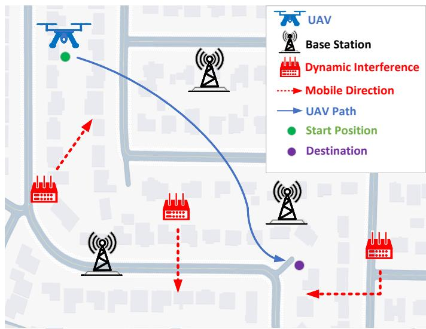  
Fig. 1. System model of cellular connected UAVs.

## III. SYSTEM MODEL AND PROBLEM FORMULATION

## A. System Model

As illustrated in Fig. 1, we consider a cellular-connected UAV operating in a 3D cuboid airspace $[ x _ { \mathrm { l o } } , x _ { \mathrm { u p } } ] \ \times$ $[ y _ { \mathrm { l o } } , y _ { \mathrm { u p } } ] ~ \times ~ [ z _ { \mathrm { l o } } , z _ { \mathrm { u p } } ]$ . There are M fixed BSs located at $\begin{array} { c c c c c l } { \mathbf { g } _ { m } } & { = } & { [ x _ { m } , y _ { m } , H _ { m } ] ^ { T } , } & { m } & { = } & { 1 , \dots , M } \end{array}$ The region also contains K mobile interferers with positions $\mathbf { i } _ { k } ( t ) \ =$ $[ x _ { k } ( t ) , y _ { k } ( t ) , H _ { k } ( t ) ] ^ { T } , \ k \ = \ 1 , \ldots , K$ , moving along roads and randomly selecting outgoing roads at intersections; we denote the interferer configuration by $\mathbf { i } ( t ) = \{ \mathbf { i } _ { k } ( t ) \} _ { k = 1 } ^ { K }$ . The UAV travels from $\mathbf { u } _ { 0 }$ to ${ \bf u } _ { F }$ within T , with position ${ \bf u } ( t ) =$ $[ x ( t ) , y ( t ) , H ( t ) ] ^ { T }$ , satisfying $\mathbf { u } ( 0 ) = \mathbf { u } _ { 0 }$ and $\mathbf { u } ( T ) = \mathbf { u } _ { F }$ . For simplicity, the UAV and interferers move at constant speeds.

At time t, the equivalent channel gain between the UAV and the $m - \operatorname { t h }$ BS is expressed as:

$$
\begin{array} { r } { p _ { m } ( t ) = P _ { m } | h _ { m } ( t ) | ^ { 2 } = P _ { m } \beta _ { m } [ { \bf u } ( t ) ] G _ { m } [ { \bf u } ( t ) ] \tilde { h } _ { m } ( t ) , } \end{array}\tag{1}
$$

where $P _ { m }$ denotes the transmit power of the $m { \mathrm { - } } \mathrm { t h } \ \mathrm { B S }$ , which is assumed to be constant in this study. $\beta _ { m } ( \cdot )$ and $G _ { m } ( \cdot )$ represent the large-scale channel gain and the antenna gain of the m − th BS, respectively. $\tilde { h } _ { m } ( t )$ denotes a random variable accounting for small-scale fading.

In this work, the SINR between the UAV and the associated BSs is adopted as the metric for quantifying communication quality. At time t, let $b \left( t \right)$ denote the number of BSs associated with the UAV, where $1 \leq b \left( t \right) \leq M$ . The SINR is then given by:

$$
\mathrm { S I N R } \left( t \right) = \frac { p _ { b \left( t \right) } \left( t \right) } { \sum _ { m \neq b \left( t \right) } p _ { m } \left( t \right) + N _ { 0 } \left( t \right) + \sum _ { K } I _ { k } \left( t \right) } ,\tag{2}
$$

where $N _ { 0 } \left( t \right)$ denotes the noise power in the environment at time t, and $I _ { n } ( t )$ represents the interference power from the $n - \operatorname { t h }$ interferer at time t. Considering that the UAV’s communication quality degrades severely, and may even become infeasible, under low SINR conditions, a SINR threshold $\gamma _ { \mathrm { t h } } ( \mathbf { u } ( t ) )$ is introduced. Taking into account the impact of the randomness caused by small-scale fading, the outage probability of the UAV at position ${ \bf \delta u } ( t )$ , when associated with $b ( t )$ BSs, is given by:

$$
P _ { \mathrm { o u t } } \left( \mathbf { u } ( t ) , \mathbf { i } ( t ) , b ( t ) \right) \stackrel { \Delta } { = } \mathrm { P r } [ \mathrm { S I N R } ( t ) < \gamma _ { \mathrm { t h } } ] ,\tag{3}
$$

where $\operatorname* { P r } \left( \cdot \right)$ denotes the probability with respect to the randomness of small-scale fading $\{ \tilde { h } _ { m } ( t ) \} _ { m = 1 } ^ { M }$

From the outage probability, the expected outage time $\hat { T } _ { o u t }$ can be derived as follows:

$$
\bar { T } _ { \mathrm { o u t } } ( \{ \mathbf { u } ( t ) , \mathbf { i } ( t ) , b ( t ) \} ) = \int _ { 0 } ^ { T } P _ { \mathrm { o u t } } \left( \mathbf { u } ( t ) , \mathbf { i } ( t ) , b ( t ) \right) d t .\tag{4}
$$

## B. Optimization Problem

In this paper, a neural network-based method is employed for SINR map reconstruction. To facilitate model processing, the urban map E is discretized into a grid of $N \times N$ This gridding process converts continuous spatial data into discrete cells, simplifying data handling. Let $\mathbf { S } ( x , y )$ denote the ground-truth SINR map. The neural network outputs the estimated SINR $\hat { \bf S } ( x , y )$ distribution as:

$$
\hat { \mathbf { S } } ( x , y ) = f _ { \theta } ( \mathbf { X } ) , \hat { \mathbf { S } } ( x , y ) \in \mathbb { R } ^ { N \times N }\tag{5}
$$

where X denotes the feature map with the same dimensions as S, and $f _ { \theta } ( \cdot )$ denotes the mapping function defined by the neural network parameters $\theta .$ To improve the estimation accuracy, the neural network is trained using the mean squared error as the loss function $\mathcal { L } ( \cdot )$

$$
\mathcal { L } ( \theta ) = \frac { 1 } { N ^ { 2 } } \sum _ { x = 1 } ^ { N } \sum _ { y = 1 } ^ { N } \left( \mathbf { S } ( x , y ) - \hat { \mathbf { S } } ( x , y ) \right) ^ { 2 }\tag{6}
$$

To ensure that the mission is completed both stably and efficiently, the UAV must minimize its total flight time while maintaining a good communication environment during operation. To achieve this, a weight parameter $\mu$ is introduced to jointly optimize these two objectives. The sets $\{ { \bf { u } } ( t ) \}$ and $\{ b ( t ) \}$ are designed to balance the weighted sum of the two metrics, where $\{ { \bf { u } } ( t ) \}$ represents the UAV’s motion control strategy at each time instant, and $\{ b ( t ) \}$ denotes the communication link selection, which reflects the communication quality.

$$
\begin{array} { r l } & { \underset { T , \{ \mathbf { u } ( t ) , \mathbf { i } ( t ) , b ( t ) \} } { \mathrm { m i n } } T + \mu \bar { T } _ { \mathrm { o u t } } ( \{ \mathbf { u } ( t ) , \mathbf { i } ( t ) , b ( t ) \} ) } \\ & { \quad \quad \quad \quad \mathrm { s . t . } \mathbf { u } ( 0 ) = \mathbf { u } _ { I } , \mathbf { u } ( T ) = \mathbf { u } _ { F } , } \\ & { \quad \quad \quad \quad \mathbf { u } ( t ) \preceq [ x _ { \mathrm { l o } } , x _ { \mathrm { u p } } ] \times [ y _ { \mathrm { l o } } , y _ { \mathrm { u p } } ] \times [ z _ { \mathrm { l o } } , z _ { \mathrm { u p } } ] , } \\ & { \quad \quad \quad t \in [ 0 , T ] , } \\ & { \quad \quad \quad \quad b ( t ) \in \{ 1 , \cdots , M \} , } \end{array}\tag{7}
$$

where $\preceq$ denotes element-wise partial order.

In (7), the optimization objective is to minimize the total flight time T plus the weighted expected outage duration $\mu \bar { T } _ { \mathrm { o u t } } ( \{ u ( t ) , i ( t ) , b ( t ) \} )$ , subject to the boundary conditions $u ( 0 ) \ = \ u _ { I }$ and $u ( T ) ~ = ~ u _ { F }$ , the box constraint $u ( t ) \ \preceq$ $[ x _ { \mathrm { l o } } , x _ { \mathrm { u p } } ] \times [ y _ { \mathrm { l o } } , y _ { \mathrm { u p } } ] \times [ z _ { \mathrm { l o } } , z _ { \mathrm { u p } } ]$ , and the association constraint $b ( t ) \in \{ 1 , \ldots , M \}$ . The decision variables are the motioncontrol trajectory $\{ u ( t ) \}$ and the link-selection process $\{ b ( t ) \}$ At the RL level, the observables provided to the planner are the UAV pose $u _ { t }$ and the local/global SINR observations $O _ { t } ^ { \mathrm { l o c a l } }$ and $O _ { t } ^ { \mathrm { g l o } \mathbf { \hat { b } } \mathbf { a } \mathbf { l } }$ constructed from the reconstructed SINR map $\hat { S }$ in $( 5 ) – ( 6 )$ , while small-scale fading, interference powers, and other microscopic channel effects remain latent stochastic variables that influence the cost only through the outage probability $P _ { \mathrm { o u t } }$ and the expected outage time $\bar { T } _ { \mathrm { o u t } }$ . Treating these effects, together with the random motion of interferers and the randomized initial UAV position, as stochastic is necessary to define outage-based reliability metrics under bandwidth and compute constraints, whereas assumptions such as constant-speed motion, strongest-SINR association, and fixed BS transmit powers and antenna patterns are mainly simplifying; relaxing these simplifying assumptions would change the transition dynamics and enlarge the effective action space but would not alter the structure of (7), and the UT-Grid + MoE-D3QN framework can in principle be retrained under the modified dynamics.

We discretize the time horizon [0, T ] into $N _ { t }$ decision steps with length $\Delta t ,$ and define the sampling instants $t _ { k } = k \Delta t .$ $k ~ = ~ 0 , \ldots , N _ { t } - 1$ . Let $u _ { k } , \ i _ { k }$ , and $b _ { k }$ denote the UAV position, interferer configuration, and BS association at step k, respectively. Using a Riemann-sum approximation, the outage integral in (7) can be written as

$$
\bar { T } _ { \mathrm { o u t } } ( \{ u ( t ) , i ( t ) , b ( t ) \} ) = \int _ { 0 } ^ { T } P _ { \mathrm { o u t } } ( t ) d t \approx \sum _ { k = 0 } ^ { N _ { t } - 1 } P _ { \mathrm { o u t } } ( u _ { k } , i _ { k } , b _ { k } ) \Delta t ,\tag{8}
$$

Consequently, the continuous-time objective in (7) is expressed in discrete form as

$$
J \approx \sum _ { k = 0 } ^ { N _ { t } - 1 } \left[ \Delta t + \mu P _ { \mathrm { o u t } } ( u _ { k } , i _ { k } , b _ { k } ) \Delta t \right] = \sum _ { k = 0 } ^ { N _ { t } - 1 } c _ { k } ,\tag{9}
$$

Let the MDP state be $s _ { t } = O _ { t } = \{ O _ { t } ^ { \mathrm { l o c a l } } , O _ { t } ^ { \mathrm { g l o b a l } } , u _ { t } \}$ , where $O _ { t } ^ { \mathrm { l o c a l } } / O _ { t } ^ { \mathrm { g l o b a l } }$ are computed from the estimated SINR map $\hat { S }$ in $( 5 ) – ( 6 )$ (cropping/downsampling), and $u _ { t }$ is the UAV pose. An action $a _ { t } \in \mathcal A$ updates the pose $u _ { t + 1 }$ within the feasible airspace; base-station association $b ( t )$ is not directly controlled but is implicitly determined by $\hat { S }$ (we use $\mathrm { S I N R } / P _ { \mathrm { o u t } }$ derived from Sˆ to evaluate link quality at $u _ { t + 1 } )$ . Then the objective in (7) admits the step-wise discretization. So minimizing (7) is equivalent (up to terminal shaping) to maximizing the cumulative reward with large positive/negative terminal bonuses implementing goal arrival and safety constraints. Setting $\Delta t { = } 1 \mathrm { s }$ , the above yields the reward used in Section IV (21) by identifying $\alpha ~ = ~ \mu$ (to avoid symbol drift). This establishes a one-to-one mapping from (7) to our RL design, where (5)–(6) provide $\hat { S }$ to form $O _ { t }$ and to compute $P _ { \mathrm { o u t } }$ for the step cost.

Since downlink association follows the strongest-SINR principle under the current ${ \hat { S } } ,$ the effect of $b ( t )$ in (7) is absorbed into $\mathrm { \mathit { P } _ { o u t } ( \cdot ) }$ computed from ${ \hat { S } } ;$ we therefore do not include $b ( t )$ explicitly in the action. At run time, $\hat { S }$ is maintained by UT-Grid (Section IV-A): MC-dropout uncertainty triggers a server→UAV refresh of $\hat { S }$ only when needed. This eventtriggered policy does not change the per-step cost above, but regulates the frequency of refreshes (and hence downlink bytes), which we report as updates/step in experiments.

## IV. METHODOLOGY

The proposed framework consists of both a ground station and a UAV side. It is assumed that the ground station is equipped with a pre-trained UNet neural network for SINR map reconstruction. Upon receiving sensing data from the UAV, the ground station applies a Monte Carlo dropout (MCdropout) based uncertainty estimation method. When the UAV approaches regions with high uncertainty, the ground station transmits both a coarse-grained global SINR map and a finegrained local SINR map to the UAV side. The UAV is responsible for uploading sensing data and, based on the SINR information provided by the ground station, performing path planning through a MoE based Deep Double Q-Network (D3QN) algorithm.

## A. Uncertainty-Triggered Grid-Update Framework

To enhance the perception capability and path-planning efficiency of UAVs in dynamic electromagnetic interference environments, this paper proposes an uncertainty triggered grid-update framework(UT-Grid). After sensing the data, the UAV transmits it to the ground station. The ground station processes the data into a feature map X, which is then fed into the pre-trained UNet. By processing X, the UNet generates the estimated SINR map $\hat { \mathbf { S } } ( x , y )$ . The UNet in $( 5 ) – ( 6 )$ provides the estimated grid Sˆ. Each step we pack $O _ { t } ^ { \mathrm { l o c a l } } / O _ { t } ^ { \mathrm { g l o b a l } }$ from $\hat { S }$ to form the MDP state $s _ { t } = O _ { t }$ used by the planner.

In existing studies, once the grid electromagnetic environment map, such as the SINR map in this paper, is obtained, it is usually processed (or directly used) and then transmitted to the UAV side. While this approach provides the UAV with accurate electromagnetic environment information, it also incurs substantial communication overhead. To address this issue, the proposed framework employs MC-dropout to measure the uncertainty of the estimated SINR map and determines whether to transmit updated SINR data to the UAV based on the level of uncertainty.

MC-dropout is a Bayesian approximation inference method in deep learning, first proposed by Gal et al. [31], which measures the uncertainty of neural network predictions through specially designed dropout layers. Huang et al. [32] later introduced MC-dropout into reinforcement learning, enhancing the model’s trajectory querying capability. Dropout itself is a common regularization technique in deep learning, where a subset of neurons is randomly omitted during each training iteration, while all neurons are activated during inference. It is typically used to prevent overfitting during training. In contrast, MC-dropout keeps dropout active during both training and inference. During prediction, dropout is not turned off; instead, multiple forward passes are performed for the same input, and the resulting set of predictions can be regarded as an approximate Bayesian sampling.

For the UNet model, the input is the UAV-collected data $\mathbf { X } ,$ and the output is the estimated SINR map $\hat { \bf S } .$ The learnable parameters are denoted as $\theta = \{ W _ { l } , b _ { l } | l = 1 , 2 , \ldots , L \}$ , where $W _ { l }$ represents the weight matrix of the l − th layer and $b _ { l }$ denotes the bias. During inference, the approximate predictive distribution obtained by repeatedly applying dropout is given by:

$$
p ( \hat { \mathbf { S } } | \mathbf { X } ) = \int p ( \hat { \mathbf { S } } | \mathbf { X } , \theta ) p ( \theta ) d \theta\tag{10}
$$

In MC-dropout, the dropout process can be expressed as $\hat { \mathbf { Z } } _ { l } \ = \ \mathbf { M } _ { l } \odot \ \mathbf { Z } _ { l }$ , where $\mathbf { M } _ { l }$ denotes the dropout mask of the $l \mathrm { ~ - ~ } \mathrm { t h }$ layer, sampled from a Bernoulli distribution. $\mathbf { Z } _ { l }$ represents the neurons of the l − th layer, and $\hat { \mathbf { Z } } _ { l }$ denotes the activated neurons of the l − th layer after applying dropout. · denotes the element-wise multiplication. Assume that MCdropout performs H forward passes, the Equation 10 can be approximated by:

$$
p ( \hat { \mathbf { S } } | \mathbf { X } ) \approx \frac { 1 } { H } \sum _ { h = 1 } ^ { H } \mathrm { p } \left( \hat { \mathbf { S } } | \mathbf { X } , \theta , \mathbf { M } _ { h } \right)\tag{11}
$$

For X, $\{ \hat { \mathbf { S } } ^ { ( h ) } ( x , y ) \} _ { h = 1 } ^ { H }$ denotes the set of outputs obtained after H repeated stochastic forward passes. The predictive mean $\mathbb { E } ( \hat { \mathbf { S } } )$ and predictive variance $\mathrm { V a r } ( \hat { \mathbf { S } } )$ can be obtained as follows:

$$
\mathbb { E } ( \hat { \mathbf { S } } ) \approx \frac { 1 } { H } \sum _ { h = 1 } ^ { H } f _ { \theta } ( \mathbf { X } )\tag{12}
$$

$$
\mathrm { V a r } ( \hat { \mathbf { S } } ) \approx \frac { 1 } { H } \sum _ { h = 1 } ^ { H } f _ { \theta } ( \mathbf { X } ) ^ { H } f _ { \theta } ( \mathbf { X } ) - \mathbb { E } ( \hat { \mathbf { S } } ) ^ { H } \mathbb { E } ( \hat { \mathbf { S } } )\tag{13}
$$

The uncertainty is defined as:

$$
U ( \hat { \mathbf { S } } ) = \sqrt { \mathrm { t r } \{ \mathrm { V a r } ( \hat { \mathbf { S } } ) \} } .\tag{14}
$$

We adopt variance-based uncertainty rather than entropybased triggering because our UNet produces a continuousvalued SINR map (regression). Entropy is most natural for classification posteriors; using it here would require discretizing SINR values or fitting a parametric predictive distribution, which adds complexity and makes the trigger threshold less transparent. Moreover, predictive variance can be estimated with a small number of stochastic forward passes, yielding a bounded and predictable per-step overhead that aligns with real-time UAV constraints. The threshold τ is also straightforward to interpret as a “tolerated prediction dispersion”, providing a transparent knob to trade update frequency against map freshness.

The triggering condition $T _ { t }$ is defined as follows:

$$
T _ { t } ( \mathbf { u } _ { t } ) = U _ { t } ( \mathbf { u } _ { t } ) + | \mathbf { S } _ { t } ( \mathbf { u } _ { t } ) - \mathbb { E } ( \hat { \mathbf { S } } _ { t } ( \mathbf { u } _ { t } ) ) | > \tau\tag{15}
$$

where ${ U } _ { t } ( { \mathbf { u } } _ { t } )$ denotes the predicted uncertainty at the current position $\mathbf { u } _ { t } .$ , and $| \mathbf { S } _ { t } ( \mathbf { u } _ { t } ) - \mathbb { E } ( \hat { \mathbf { S } } _ { t } ( \mathbf { u } _ { t } ) ) |$ represents the prediction error, and τ is the trigger threshold that acts as a tunable update-budget knob: a larger τ suppresses updates to reduce communication/computation overhead (improving real-time feasibility), while a smaller τ increases map refresh for accuracy; we select τ via validation to balance timeliness and performance. When the trigger condition is satisfied, the ground station updates the global SINR map.

For each time step t, suppose the state information sent from the ground station to the UAV is denoted as $\mathbf { O } _ { t }$ . Then, $\mathbf { O } _ { t }$ consists of the fine-grained local SINR map $\mathbf { O } _ { t } ^ { l o c a l }$ , the coarsegrained global SINR map $\mathbf { O } _ { t } ^ { g l o b a l }$ , and the UAV position $\mathbf { u } _ { t } \mathrm { i . e . , }$

$$
{ \bf O } _ { t } = \{ { \bf O } _ { t } ^ { l o c a l } , { \bf O } _ { t } ^ { g l o b a l } , { \bf u } _ { t } \}\tag{16}
$$

Here $\mathbf { O } _ { t } ^ { l o c a l }$ is a cropped local window around the UAV and $\mathbf { O } _ { t } ^ { g l o b a l }$ is a downsampled global view. The formulas for $\mathbf { O } _ { t } ^ { l o c a l }$ and $\mathbf { O } _ { t } ^ { g l o b a l }$ are given as follows:

$$
\mathbf { O } _ { t } ^ { \mathrm { l o c a l } } = \hat { \mathbf { S } } _ { t } [ \mathbf { u } _ { t } ^ { x } : \mathbf { u } _ { t } ^ { x } + L , \mathbf { u } _ { t } ^ { y } : \mathbf { u } _ { t } ^ { y } + L ]\tag{17}
$$

$$
\mathbf { O } _ { t } ^ { \mathrm { g l o b a l } } ( i , j ) = \frac { 1 } { B ^ { 2 } } \sum _ { u = 0 } ^ { B - 1 } \sum _ { v = 0 } ^ { B - 1 } \hat { \mathbf { S } } _ { t } ( i B + u , j B + v )\tag{18}
$$

where L denotes the size of the local observation window, and B represents the down-sampling block size.

At each position, the outage probability is calculated using Monte Carlo sampling:

$$
P _ { \mathrm { o u t } } ( \mathbf { u } _ { t } ) = \frac { 1 } { J } \sum _ { j = 1 } ^ { J } \mathbb { I } [ \hat { \mathbf { S } } _ { j } ( \mathbf { u } _ { t } ) < \gamma _ { \mathrm { t h } } ]\tag{19}
$$

where J denotes the number of samples, $\gamma _ { \mathrm { t h } }$ is the SINR threshold, and I[·] represents the indicator function.

Let $O _ { \mathrm { p a y l o a d } }$ denote the size (in bytes) of the float32- encoded map to be sent; since each float32 value occupies 4 bytes, we have $O _ { \mathrm { p a y l o a d } } ~ = ~ 4 ~ \times$ (number of elements). Accounting for protocol overhead and fragmentation, the total traffic of one map update is

$$
T _ { \mathrm { u p d } } ~ { = } ~ O _ { \mathrm { p a y l o a d } } ~ + ~ K \cdot O _ { \mathrm { p r o t o c o l } } , ~ K ~ { = } ~ \left\lceil { \frac { O _ { \mathrm { p a y l o a d } } } { C _ { \mathrm { m a x } } } } \right\rceil ,\tag{20}
$$

After receiving the observation state $\mathbf { O } _ { t }$ , the UAV performs path planning using reinforcement learning. In reinforcement learning, the reward function $R ( s , a )$ defines the immediate feedback that an agent receives after taking action a in UAV state s within the environment. The UAV path optimization reward function in this algorithm is defined as follows:

Algorithm 1: Proposed UT-Grid Framework   
Input : Urban grid map E, UAV position ut,   
pretrained UNet model $f _ { \theta } ;$   
Output: Agent observation $\mathbf { O } _ { t } ,$ estimated SINR maps   
$\hat { \bf S } ,$ per-episode downlink bytes $B ;$   
1 Initialization: Compute initial SINR map $\hat { \bf S } _ { 0 } ;$   
construct $\begin{array} { r } { \mathbf { O } _ { 0 } = [ \mathbf { O } _ { 0 } ^ { \mathrm { l o c a l } } , \ \mathbf { O } _ { 0 } ^ { \mathrm { g l o b a l } } , \ \mathbf { u } _ { 0 } ] ; } \end{array}$ set $B  0 ;$   
2 Event-triggered maintenance and packing:   
3 for $t = 0$ to $T - 1$ do   
4 Obtain $\hat { \mathbf { S } } _ { t + 1 }$ and uncertainty from $f _ { \theta }$ with   
MC-dropout;   
5 if uncertainty exceeds threshold then   
6 keep $\hat { \mathbf { S } } _ { t + 1 }$ as the current cached map;   
$B  B + T _ { \mathrm { u p d } } ;$   
7 else   
8 set $\hat { \mathbf { S } } _ { t + 1 } \gets \hat { \mathbf { S } } _ { t } ;$   
9 end   
10 Obtain $\mathbf { O } _ { t + 1 } ^ { \mathrm { l o c a l } }$ by cropping $\hat { \bf S } _ { t + 1 }$ around ${ \bf u } _ { t + 1 } ;$   
11 Obtain $\mathbf { O } _ { t + 1 } ^ { \mathrm { g l o b a l } }$ by downsampling $\hat { \mathbf { S } } _ { t + 1 } ;$   
12 Construct $\mathbf { O } _ { t + 1 } = [ \mathbf { O } _ { t + 1 } ^ { \mathrm { l o c a l } } , \ \mathbf { O } _ { t + 1 } ^ { \mathrm { g l o b a l } } , \ \mathbf { u } _ { t + 1 } ] ;$   
13 end

$$
r ^ { ( t ) } = \left\{ \begin{array} { l l } { R _ { \mathrm { g o a l } } , } & { \mathrm { i f ~ } \left| s ^ { ( t + 1 ) } - s _ { \mathrm { g o a l } } \right| ^ { 2 } \leq r _ { \mathrm { g o a l } } , } \\ { R _ { \mathrm { c o l l i s i o n } } , } & { \mathrm { i f ~ } s ^ { ( t + 1 ) } = s ^ { ( t ) } , } \\ { - \alpha P _ { \mathrm { o u t } } \left( s ^ { ( t + 1 ) } \right) - 1 , } & { \mathrm { o t h e r w i s e } . } \end{array} \right.\tag{21}
$$

where $R _ { \mathrm { g o a l } }$ represents the reward for reaching the target, $R _ { \mathrm { c o l l i s i o n } }$ represents the penalty for collisions, $r _ { \mathrm { g o a l } }$ is the radius of the target area, α denotes the weight for communication quality, and −1 represents the time-step penalty. According to the reward function, the algorithm incorporates three termination check mechanisms. The first is when condition $\left| s ^ { ( t + 1 ) } - s _ { \mathrm { g o a l } } \right| ^ { 2 } \leq r _ { \mathrm { g o a l } }$ is satisfied, which indicates that the UAV has successfully reached the target. In this case, a large positive reward is assigned as the primary goal achievement reward. The second is when the UAV attempts to move but its actual position remains unchanged, i.e., $s ^ { ( t + 1 ) } ~ = ~ s ^ { ( t ) }$ which implies that the UAV is trying to move outside the map boundary. In this case, a severe negative reward is imposed as a safety constraint penalty. The third is when within the specified number of time steps $T ,$ , the UAV neither reaches the target nor encounters a collision. In this case, the episode is implicitly terminated due to timeout. The reward in (21) instantiates the discrete form of the objective in (7) with $\alpha = \mu$ and $\Delta t = 1 \mathrm { s } ,$ so maximizing return matches minimizing flight time plus outage exposure. The proposed UT-Grid algorithm is summarized in Algorithm 1.

where $C _ { \mathrm { m a x } }$ is the maximum payload per fragment after removing network headers, and $O _ { \mathrm { p r o t o c o l } }$ is the per-fragment overhead (including the Internet Protocol (IP) header, the User Datagram Protocol (UDP) header, and Ethernet-layer overhead such as the Ethernet header, the frame check sequence, the preamble with start-of-frame delimiter, and the inter-frame gap). Assuming an Ethernet maximum transmission unit of 1500 bytes, and IP/UDP headers of 20 and 8 bytes respectively, we obtain $C _ { \mathrm { m a x } } = 1 5 0 0 { - } 2 0 { - } 8 = 1 4 7 2$ bytes. A practical perfragment Ethernet-layer overhead is $1 4 + 4 + 8 + 1 2 = 3 8$ bytes (14-byte Ethernet header, 4-byte frame check sequence, 8- byte preamble with start-of-frame delimiter, and 12-byte interframe gap). For a $4 0 \times 4 0 \times 2$ float32 map, $O _ { \mathrm { p a y l o a d } } = 4 0 { \times } 4 0 { \times }$ $2 { \times } 4 = 1 2 { , } 8 0 0$ bytes and $K = \left\lceil 1 2 , 8 0 0 / 1 4 7 2 \right\rceil = 9$ , yielding a single-update traffic of $T _ { \mathrm { u p d } } = 1 2 , 8 0 0 + 9 \times ( 2 0 + 8 + 3 8 ) =$ 13,394 bytes.

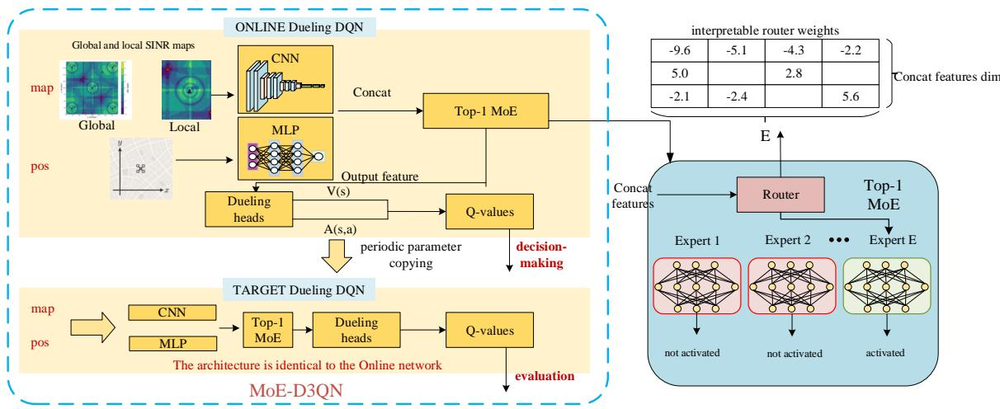  
Fig. 2. The architecture of the proposed MoE-D3QN, combining Mixture-of-Experts with Dueling Double DQN for efficient decision-making.

The effective on-air time per update scales as $t _ { \mathrm { a i r } } \approx { \frac { 8 T _ { \mathrm { u p d } } } { R _ { \mathrm { e f f } } } }$ where $R _ { \mathrm { e f f } }$ is the achievable downlink data rate after physicallayer and medium-access-control effects. In dense urban deployments, $R _ { \mathrm { e f f } }$ can drop significantly due to congestion, blockage (non-line-of-sight), and frequent handovers, as reported by recent measurement studies on commercial 4G/5G networks [33]. Therefore, excessively frequent map updates can cause delays and excessive communication overhead. Our UT-Grid restricts updates to the moments when a refresh is most valuable, reducing radio usage without sacrificing navigation reliability. For a fixed map resolution and numeric format, $T _ { \mathrm { u p d } }$ is a constant (single-update downlink bytes). To make the results more intuitive, in subsequent experiments we simply express the communication overhead as update frequency (updates/step), where one step corresponds to one UAV decision step $( \Delta t = 1 \mathrm { s } )$

In our implementation the MoE-D3QN controller makes one decision per second, so map updates must share this one second with sensing and actuation. Each refresh of the SINR grid uses on air time proportional to Tupd over the effective downlink rate and adds processing delay at the ground station and the UAV. When the update frequency is high the sum of these delays consumes a large part of the control period, postpones new maps and forces the planner to act on stale information. This timing effect increases outage exposure along the path and reduces the chance of reaching the goal, as seen in the performance trends in Table V. UT-Grid keeps the update frequency in a moderate range so airtime overhead remains small relative to the control period and closed loop performance improves under the same bandwidth budget.

## B. MoE-D3QN–Based Intelligent Path Planning

In the tasks of UAV path planning, the D3QNs have been widely adopted due to its ability to decouple state values from action advantages and its relatively high training stability. Nevertheless, conventional D3QN suffers from considerable inference overhead in high-dimensional state spaces, which makes it difficult to meet real-time decision-making requirements on edge platforms. Furthermore, a single-network architecture exhibits limitations in capturing both the spatial continuity and local abrupt variations of spectrum maps. To address these challenges, this study retains the advantages of D3QN’s MDP-based modeling and Bellman updates while introducing a sparsely activated Top-1 MoE architecture. By assigning specialized roles to multiple experts, the network’s feature representation capacity is enhanced, and sparse routing significantly reduces inference latency. In this way, an efficient decision-making model for path planning is achieved, and the overall framework of the model is illustrated in Fig. 2.

Fig. 2 illustrates the overall MoE-D3QN architecture. The observation consists of (i) a two-channel grid SINR input and (ii) the UAV’s 2D position. The SINR input stacks a global coarse-resolution SINR map covering the entire scene with a local high-resolution map centered at the UAV (aligned along the channel dimension). Both channels are encoded by lightweight CNN branches and fused at an intermediate layer; the fused map features are then concatenated with the position embedding (from an MLP) to form a shared representation. This shared representation is fed into a sparsegated router, which produces expert scores. The Top-1 operator activates exactly one expert per decision step, ensuring predictable latency and task adaptation. Subsequently, dueling heads compute the state-value and action-advantage branches and combine them to produce the action-value output. A target network mirrors the online network is updated periodically to stabilize learning. Since only one expert participates in the forward/backward pass at each step, the model preserves the representational capacity of a larger network while keeping the active parameter count and inference latency nearly constant; the router’s scores provide interpretable expert selection.

The goal of reinforcement learning is to derive an optimal routing policy π that minimizes task completion time and radio map update error under communication quality reliability constraints. To achieve this objective, the Dueling Double DQN (D3QN) framework is adopted as the reinforcementlearning backbone, wherein the policy is improved by approximating the state–action value function $Q ( s , a )$ . In contrast to vanilla DQN, D3QN integrates Double DQN with the Dueling architecture, thereby mitigating the positive bias in actionvalue estimation. In Double DQN, the online network $Q _ { \theta }$ selects the action whereas the target network $Q _ { \bar { \theta } }$ evaluates its value, which reduces overestimation. The target value is computed as

$$
y _ { t } = r _ { t } + \gamma Q _ { \bar { \theta } } \Big ( s _ { t + 1 } , \arg \operatorname* { m a x } _ { a ^ { \prime } } Q _ { \theta } \big ( s _ { t + 1 } , a ^ { \prime } \big ) \Big ) ,\tag{22}
$$

where, $r _ { t }$ denotes the immediate reward obtained after executing action $a _ { t }$ in state $s _ { t } ; ~ s _ { t + 1 }$ is the next state; $Q _ { \theta } ( s _ { t + 1 } , a ^ { \prime } )$ is the Q-value produced by the online network and used to select the next optimal action; and $Q _ { \bar { \theta } } ( s _ { t + 1 } , \cdot )$ is computed by the target network to evaluate the action chosen by the online network.

Within the Dueling Network architecture, the action–value function is decomposed into a state–value function $V ( s )$ and an action–advantage function $A ( s , a )$ . Here, $V ( s )$ denotes the expected return obtainable from state s under the current policy, whereas $A ( s , a )$ measures, relative to the average over actions, the incremental benefit of executing action a at state $s .$ This decomposition enables the network to assess state quality without relying on a specific action when the actions are largely indistinguishable. Formally,

$$
Q ( s , a ) = V ( s ) + \Big ( A ( s , a ) - { \frac { 1 } { | A | } } \sum _ { a ^ { \prime } } A ( s , a ^ { \prime } ) \Big ) ,\tag{23}
$$

where $| A |$ is the cardinality of the action set. From a theoretical standpoint, the D3QN backbone adopted in this work shares the same convergence mechanism as Double Q-learning. In standard reinforcement learning theory, the Bellman optimality operator is a γ-contraction mapping under the supremum norm and, hence, admits a unique fixed point, namely the optimal action–value function $Q$ . The Double DQN target in (22) can be interpreted as a stochastic approximation of this contraction operator, where the online network selects the greedy action and the slowly updated target network evaluates it. Under the usual assumptions of a finite-state Markov decision process with bounded rewards, sufficient exploration of all state–action pairs, and learning rates satisfying the Robbins–Monro conditions, the resulting Double Q-learning sequence converges to $Q .$ Since the dueling architecture in (23) is merely a reparameterization of the same action–value function, it does not change this fixed point, and thus the D3QN backbone inherits the convergence properties of Double DQN.

Such a structure improves generalization under sparse state sampling and reduces the impact of irrelevant actions on value estimation. Nevertheless, for high-dimensional inputs and policies defined on complex radio maps, a single neural network often struggles to capture both global spatial continuity and local abrupt changes. To address this limitation, a sparsely activated MoE is incorporated into the D3QN value network to extract complementary global and local features. By coordinating multiple experts, the model adapts to heterogeneous interference conditions and spatial patterns. Specifically, the global policy space is partitioned into M subspaces represented by an expert set $\mathsf { \bar { \{ \pi } }  _ { m } ( \cdot ~ \cdot ~ | ~ \theta _ { m } ) \} _ { m = 1 } ^ { M } ,$ where each expert specializes in a particular local policy mode.

Algorithm 2: Proposed MoE-D3QN Agent Training   
Input: Observation $O _ { t } = \{ \mathrm { m a p } _ { t } , \mathrm { p o s } _ { t } \} ;$ ; learning rate   
$\eta ;$ discount factor $\gamma ;$ exploration rate $\epsilon ;$ batch   
size $B ;$ replay buffer size $N _ { \mathrm { s t a r t } } ;$ target update   
period $N _ { \mathrm { u p d a t e } } ;$ n-step horizon n; total episodes   
$N _ { \mathrm { e p } }$   
Output: Parameters $\theta _ { \mathrm { o n l i n e } } , \theta _ { \mathrm { t a r g e t } }$   
1 Build environment, initialize replay buffer D, networks   
and parameters;   
2 Set $\theta _ { \mathrm { t a r g e t } }  \theta _ { \mathrm { o n l i n e } } ;$   
3 Pretraining: construct distance-supervised dataset, train   
$\theta _ { \mathrm { o n l i n e } }$ until convergence, then synchronize target   
network;   
4 Warm-up: collect n-step transitions with ϵ-greedy   
policy until $| \mathcal { D } | \geq N _ { \mathrm { s t a r t } } ;$   
5 for episode $e p = 1 . . N _ { e p }$ do   
6 Reset environment, obtain initial state $s ;$   
7 while not terminated do   
8 Select action a with ϵ-greedy policy;   
9 Execute a, observe $( s , r , s ^ { \prime } ,$ , done), and store   
transition in $\mathcal { D } ;$   
10 if $| \mathcal { D } | \geq N _ { s t a r t }$ then   
11 Sample batch, compute $q _ { i } .$ , form Double   
DQN target $y _ { i } ,$ update θ;   
12 end   
13 if step count mod $N _ { u p d a t e } = 0$ then   
14 Synchronize target network;   
15 end   
16 Decay $\epsilon ;$   
17 end   
18 Record episodic metrics (reward, length, success,   
outbound rate, loss);   
19 end   
20 Close environment and save models;

A parametric router $g ( s \mid \Theta )$ is introduced to produce expert-selection probabilities conditioned on the current state s. Employing Top-1 sparse activation, only a single expert is activated at each decision step, thereby preserving policy capacity while substantially reducing inference latency. The overall policy can be written as

$$
\pi ( s ) = \sum _ { e = 1 } ^ { E } \left[ g ( s \mid \Theta ) \right] _ { e } \pi _ { e } ( s \mid \theta _ { e } ) ,\tag{24}
$$

where the m-th component $[ g ( s \mid \Theta ) ] _ { e }$ of the router output denotes the probability of selecting expert e under state s. The expert-selection mechanism is

$$
g ( s \mid \Theta ) = \mathrm { T O P } _ { 1 } \big ( \mathrm { s o f t m a x } ( \hat { g } ( s \mid \Theta ) ) \big ) ,\tag{25}
$$

where $\hat { \boldsymbol g } ( \boldsymbol s \vert \boldsymbol \Theta ) \in \mathbb { R } ^ { E }$ is the router’s internal linear projection. The softmax converts this projection into a preference vector over experts, and the $\mathrm { T O P _ { 1 } }$ operator sets the largest entry to 1 and all others to 0, thereby ensuring that exactly one expert participates in each decision step. We use Top-1 routing by default to enforce a single-active-expert path per step, yielding bounded and predictable compute/communication cost; while Top-k may improve representation capacity by aggregating multiple experts, it also increases the number of active experts and thus the per-step overhead, which can violate tight realtime constraints on UAV platforms. For interpretability, both the experts and the router are taken to be linear:

$$
\pi _ { e } ( s \mid \theta _ { e } ) = \theta _ { e } s , \qquad \hat { g } ( s \mid \Theta ) = \Theta s ,\tag{26}
$$

with $\theta _ { m } \in \mathbb { R } ^ { n _ { a } \times n _ { s } }$ denoting the parameter matrix of expert e and $\boldsymbol \Theta \in \mathbb { R } ^ { E \times n _ { s } }$ the parameter matrix of the router. These matrices make explicit how state variables influence action selection and expert assignment.

To prevent the router from persistently favoring a small set of experts during training, which can reduce representational capacity and hurt generalization, we introduce an importance regularizer that balances expert contributions within each minibatch. Let $S \ = \ \{ s _ { k } \}$ denote a batch. For expert $e ,$ its importance is defined as:

$$
\mathrm { I m p } _ { e } ( S ) = \sum _ { s _ { k } \in S } \mathrm { s o f t m a x } { \bigl ( } \pi _ { e } ( s _ { k } \mid \theta _ { e } ) { \bigr ) } ,\tag{27}
$$

The importance regularization loss is then defined as

$$
f _ { \mathrm { i m p } } ( S ) = \frac { 1 } { 2 } \left( \frac { \mathrm { s t d } \big ( I m p ( S ) \big ) } { \mathrm { m e a n } \big ( I m p ( S ) \big ) } \right) ^ { 2 } .\tag{28}
$$

where, std(·) and mean(·) denote, respectively, the standard deviation and the mean computed across the expert dimension. By minimizing this term, the model discourages imbalance where a small subset of experts attains importance substantially above the mean, thereby promoting a more uniform allocation of importance across experts.

## V. PERFORMANCE EVALUATION

In this section, we provide simulation experiments to evaluate the performance of the proposed algorithms.

## A. Environment Description

As in [6], we consider a 2 km × 2 km dense urban area populated with high-rise buildings, where 5 fixed macro BSs and 3 mobile interferers are deployed, as shown in Fig. 3. This setting yields a challenging test bed for coverage-aware UAV navigation, because both LoS/NLoS conditions and received power vary rapidly along the flight trajectory while additional interference is injected by the interferers.

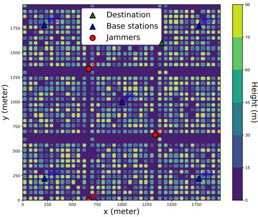  
(a)

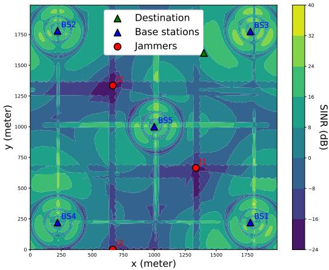  
(b)  
Fig. 3. Initial building height map and grid SINR map. The scenario includes 5 base stations (BS1–BS5) and 3 interferers (I1–I3).

Following the suggestion of the International Telecommunication Union (ITU) [34], urban morphology is generated with a building-coverage ratio of $\alpha _ { \mathrm { b d } } ~ = ~ 0 . 3$ , an average building density of $\beta _ { \mathrm { b d } } = 3 0 0$ buildings/km2, and building heights drawn from a Rayleigh distribution with a mean of $\sigma _ { \mathrm { b d } } = 5 0$ m and truncated at 90 m to avoid unrealistically tall structures. The UAV cruises at a constant speed of 10 m/s and an altitude of 100 m, aiming to navigate from a random start location to the target (1400, 1600). The controller operates with a 1 Hz update rate. Each episode is limited to 300 decision steps (300 s in real time). A terminal reward of 2000 is granted upon successful arrival at the designated target.

Each BS is installed at a height of 25 m and configured with three fixed sectors, each covering $1 2 0 ^ { \circ }$ in azimuth. Every sector uses an 8×1 vertical linear array, mechanically downtilted by $1 0 ^ { \circ }$ , with 3-dB beamwidths of $6 5 ^ { \circ }$ in both the elevation and azimuth planes. The equivalent isotropic radiated power is $P _ { \mathrm { B S } } ~ = ~ 0 . 1$ W. Every jammer carries an omnidirectional antenna mounted at 2 m, transmits at $P _ { \mathrm { J } } = 0 . 0 1 \ : \mathrm { W }$ , and moves along predefined road networks at 5 m/s. Large-scale path loss for both BS–UAV and jammer–UAV links is modeled by the 3GPP UMa LoS / NLOS formulas, while small-scale fading is Rician $( K = 1 5 ~ \mathrm { d B } )$ for LoS segments and Rayleigh for

TABLE II  
MAIN SIMULATION PARAMETERS.
<table><tr><td rowspan=1 colspan=2>Simulation parameter                  Value</td></tr><tr><td rowspan=1 colspan=2>BS transmit power                0.1 W</td></tr><tr><td rowspan=2 colspan=2>EnvironmentJammer heightsettingsJammer speed                    5 m/sUAV flying speed                 10 m/sAction interval                    1s</td></tr><tr><td rowspan=1 colspan=1></td></tr><tr><td rowspan=1 colspan=2>Maximum number of episodes  2000</td></tr><tr><td rowspan=1 colspan=2>hyperparameters  Initial exploration parameter     0.5Exploration decaying rate        0.998Steps for multi-step learning    30</td></tr></table>

TABLE III

IMPACT OF DROPOUT RATE ON COMMUNICATION LOAD AND NAVIGATION PERFORMANCE
<table><tr><td>Dropout rate</td><td>Updates/ Step</td><td>Episode Return</td><td>Reaching Rate (%)</td><td>Episode Length</td></tr><tr><td>0.05</td><td>0.12</td><td>-118.60</td><td>84.20</td><td>160.80</td></tr><tr><td>0.1</td><td>0.11</td><td>-113.18</td><td>84.58</td><td>160.35</td></tr><tr><td>0.2</td><td>0.10</td><td>-121.90</td><td>84.05</td><td>161.10</td></tr><tr><td>0.3</td><td>0.11</td><td>-109.70</td><td>84.40</td><td>160.20</td></tr></table>

NLoS segments.

TABLE IV
<table><tr><td>Parameter</td><td>Value</td></tr><tr><td>Architecture</td><td>3-layer CNN (map encoder) + Pos- MLP (pos encoder) + feature fusion</td></tr><tr><td>Kernel size</td><td>+ Top-1 MoE + dueling heads 3× 3</td></tr><tr><td>CNN channels</td><td>[2, 32, 64, 64]</td></tr><tr><td>CNN flatten dim</td><td>1600</td></tr><tr><td>Pos-MLP channels</td><td>[2, 256]</td></tr><tr><td>Fusion dim</td><td>1856 (1600 + 256)</td></tr><tr><td>Top-1 MoE</td><td>[1856, 128, 128]</td></tr><tr><td>Dueling heads</td><td>Value head: [128, 1]; Advantage head: [128, 4]</td></tr><tr><td>Normalization</td><td>Batch normalization</td></tr><tr><td>Activation</td><td>ReLU</td></tr><tr><td>Parameters</td><td>2106.0K</td></tr><tr><td>MC-dropout forward passes</td><td>20</td></tr><tr><td>Dropout rate</td><td>0.1</td></tr></table>

Following the method of [20], we pre-train a U-Net to recover the full-resolution SINR grid from the sparse observations. In the whole experiment, we implement it with Pytorch 2.7. The configuration of the PC is i9-13980HX, 32GB, RTX 4080. For all models, we use Batch Normalization and Relu as normalization and activation functions. Training of all methods was performed with Adam. The initial learning rate is set to $5 e ^ { - 3 }$ . The values of all major simulation parameters are summarized in Table II. For UT-Grid, we specify the MCdropout implementation to ensure reproducibility. We use H = 20 stochastic forward passes at inference time to estimate the predictive mean and variance. We set the dropout rate to p = 0.1 and conduct a sensitivity study with p values 0.05, 0.1, 0.2, and 0.3. As shown in Table III, the results show no consistent trend across p, where some values appear better in certain metrics while worse in others, and the overall performance remains similar. We therefore choose $p = 0 . 1$ as a more moderate setting that yields stable uncertainty estimates and balanced update behavior. The basic network configurations of the MoE-D3QN model are summarized in Table IV, where the model uses eight experts as an example. The pos encoder maps the 2-dimensional position input to a 256-dimensional embedding. The map encoder is a 3-layer CNN whose output is flattened to a 1600-dimensional feature vector. The two branches are concatenated to form a 1856- dimensional fused representation (1600+256) as the input to the Top-1 MoE. The dueling heads output a value scalar and an advantage vector over actions.

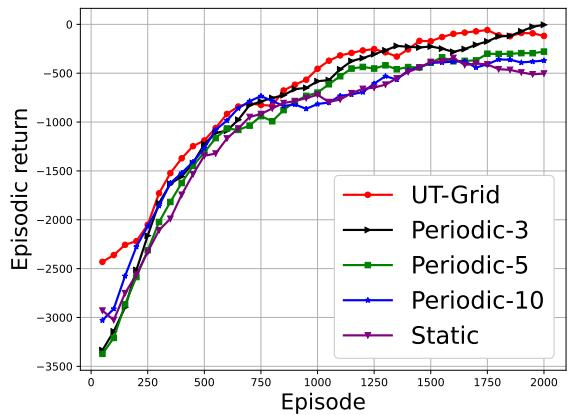  
Fig. 4. Convergence of episode return under different frameworks.

## B. Impact of UT-Grid Framework

To evaluate the effectiveness of the proposed UT-Grid framework, we compare it with two baseline frameworks: (i) Static, which uses only an offline grid SINR map, and (ii) Periodic, which refreshes the grid SINR map at fixed intervals. Three representative periods (3 s, 5 s, and 10 s) are chosen for the Periodic variant. For UT-Grid, we set the uncertainty trigger to $\tau = 5 .$ . This yields an average update rate of 0.11 updates/step, matching a 9 s periodic scheme. Three key metrics are adopted: episodic return, destination reaching probability and average episode length, to assess the agent’s learning efficiency and task execution capability. In addition, several τ values are compared to study how the trigger threshold mediates the balance between communication overhead and navigation performance.

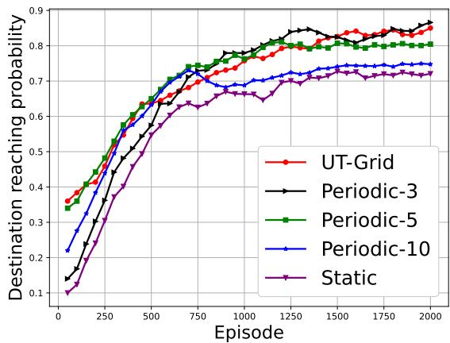

Fig. 5. Convergence of average destination reaching probability under different frameworks.  
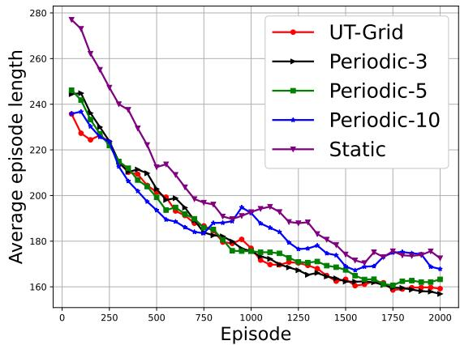  
Fig. 6. Convergence of average episode length under different frameworks.

As shown in Fig. 4, all five frameworks begin with similarly poor returns (about –3 000), but diverge markedly as training progresses. After 2 000 episodes, Periodic-3 attains an average return near 0, establishing an empirical upper bound under high-frequency periodic maps. UT-Grid follows closely at about –100, demonstrating that event-triggered updates achieve almost the same payoff while refreshing the map significantly reduced frequency. Widening the fixed interval degrades performance: returns drop to about –250 for Periodic-5, about –300 for Periodic-10, and about –500 for the Static baseline.

Figure 5 reports destination-reaching probability. Periodic-3 again leads, converging at about 86%, whereas UT-Grid stabilizes only 2 percentage points lower. Reducing the refresh frequency to 5 s and 10 s lowers success rates to about 80% and about 76%, respectively, and a frozen map pushes the probability down to about 73%. These margins quantify the value of timely information: UT-Grid retains almost all of the reliability advantage of dense updates while operating at a fraction of their update cost.

Figure 6 tracks the average episode length. Periodic-3 converges to about 155 steps, the best observed. UT-Grid settles at about 160 steps—only a 3% increase. Meanwhile, Periodic-5, Periodic-10, and Static lengthen trajectories to about 166,

172, and 176 steps, respectively.

Overall, the five schemes follow a clear ranking. Periodic-3 achieves the best performance, ahead of UT-Grid, then Periodic-5, Periodic-10, and finally the Static grid. This sequence underscores the fundamental trade-off between map freshness and communication overhead. By triggering uploads only when the predicted uncertainty exceeds τ , UT-Grid cuts map-update traffic by roughly 67% relative to Periodic-3 yet recovers more than 98% of its performance gains, making it a practical and bandwidth-efficient alternative for dynamic spectrum-aware UAV navigation.

TABLE V  
IMPACT OF TRIGGER THRESHOLD AND PERIODIC INTERVAL ON COMMUNICATION LOAD AND NAVIGATION PERFORMANCE
<table><tr><td>Method</td><td>Updates/ Step</td><td>Episode Return</td><td>Reaching Episode Rate (%) Length</td><td></td></tr><tr><td>UT-Grid (τ = 4) UT-Grid (τ = 5)</td><td>0.19 0.11 0.07</td><td>-58.84 -113.18 -229.24</td><td>85.74 84.58 81.49</td><td>158.36 160.35 166.60</td></tr><tr><td>UT-Grid (τ = 6) Periodic (3 s)</td><td>0.33</td><td>-27.84</td><td>86.27</td><td>156.17</td></tr><tr><td>Periodic (5 s)</td><td>0.20</td><td>-248.32</td><td>80.43</td><td>165.65</td></tr><tr><td>Periodic (10 s)</td><td>0.10</td><td>-398.12</td><td>75.89</td><td>171.83</td></tr><tr><td>Static</td><td>0.00</td><td>-489.84</td><td>72.80</td><td>177.87</td></tr></table>

To assess how the frequency of online SINR-map updates trades communication overhead for navigation performance, we evaluate three uncertainty-triggered schemes (UT-Grid with $\tau = 4 , 5 , 6 )$ , three fixed-interval baselines (Periodic with T = 3 s, 5 s, 10 s), and a fully static map under identical simulation settings. Table V reports the average update frequency (updates/step) together with the converged episodic return, destination-reaching probability and episode length for each strategy.

The results delineate an optimal operating point for UT-Grid: with τ = 5 the policy preserves 98% of the navigation benefits achieved by a 3 s periodic refresh while requiring only one-third of its map-update traffic. Raising the threshold to τ = 6 deprives the agent of timely updates and causes a steep performance decline, whereas lowering it to τ = 4 yields only marginal additional gains at a 70% increase in traffic. Consequently, τ = 5 offers the most favourable balance between communication overhead and mission effectiveness, with τ = 4 reserved for scenarios in which bandwidth is ample and maximum reliability is imperative.

Beyond the baseline configuration in Table V, we further construct a more engineering-realistic dynamic scenario: (1) during SINR generation and online updates, we explicitly add additive noise and aggregate co-channel interference (from other BS sectors and mobile jammers), while sampling Rician/Rayleigh fast fading to model multipath-induced link fluctuations; (2) the jammer’s constant-speed motion along the road network is extended to a stochastic stop–go–accelerate process, where at each time slot it stays still, moves at the nominal speed, or moves faster with probabilities 0.2/0.6/0.2, respectively; (3) the SINR map is augmented with locationdependent transmit power control, so that the base-station transmit power adapts to link path loss; and (4) a trajectorysmoothness constraint is introduced in the reward design by penalizing direction-reversal and sharp-turn actions, thereby suppressing frequent U-turn behaviors and reducing curvature variations of the flight path. Table VI summarizes the communication overhead and navigation-performance metrics of different update strategies under the above enhanced setting, using the same metrics as Table V, to validate the reliability and stability of the proposed method under more complex and dynamic conditions.

TABLE VI  
IMPACT OF TRIGGER THRESHOLD AND INTERVAL ON LOAD AND NAVIGATION IN COMPLEX DYNAMICS
<table><tr><td>Method</td><td>Updates/ Step</td><td>Episode Return</td><td>Reaching Episode Rate (%) Length</td><td></td></tr><tr><td>UT-Grid (τ = 4)</td><td>0.22</td><td>-145.20</td><td>81.62</td><td>172.86</td></tr><tr><td>UT-Grid (τ = 5)</td><td>0.13</td><td>-191.35</td><td>80.16</td><td>178.72</td></tr><tr><td>UT-Grid (τ = 6)</td><td>0.11</td><td>-270.19</td><td>76.61</td><td>188.18</td></tr><tr><td>Periodic (3 s)</td><td>0.33</td><td>-121.46</td><td>82.24</td><td>173.99</td></tr><tr><td>Periodic (5 s)</td><td>0.20</td><td>-358.84</td><td>74.85</td><td>206.23</td></tr><tr><td>Periodic (10 s)</td><td>0.10</td><td>-452.80</td><td>70.37</td><td>223.33</td></tr><tr><td>Static</td><td>0.00</td><td>-527.40</td><td>60.10</td><td>297.72</td></tr></table>

The more complex dynamics in Table VI reduce the reaching rate and lengthen the trajectories for all methods, but UT-Grid degrades less: with $\tau = 4 ,$ , the reaching rate only drops from 85.74% to 81.62%, whereas Periodic-5s decreases from 80.43% to 74.85%, and Static further falls to 60.10% with a much longer episode length. More importantly, under a comparable communication budget, UT-Grid remains clearly superior (≈ 0.20 updates/step: 81.62% vs. 74.85%).

## C. Performance and Efficiency Analysis of the MoE

This section evaluates the performance-efficiency trade-off of the proposed MoE-D3QN. Specifically, we (i) compare MoE-D3QN with two dense baselines: D3QN-L (a large model with 2.75 M parameters) and D3QN-S (a compact version with 0.58 M parameters) to verify performance gains at similar or lower capacity, and (ii) examine how the number of experts affects MoE behavior. In the MoE series, MoE-4, MoE-8, MoE-12, and MoE-16 denote variants that contain 4, 8, 12 and 16 experts, respectively, with only one expert activated per inference step. Table VII lists the key metrics reported for all models: episodic return, destination-reaching rate, average episode length, total parameters, active parameters, active FLOPs and latency.

As shown in Table VII, MoE-8 achieves superior performance and efficiency compared to both D3QN-L and D3QN-S. Its total parameter count is 2106.0K, which is 23.4% less than that of D3QN-L (2749.2K). Despite this reduction, it achieves a higher destination reaching rate (84.58% vs. 81.93%), a shorter average episode length (160.35 vs. 166.79), and a significantly better episodic return (-113.18 vs. -243.25). In terms of active parameters, MoE-8 uses only 326.5K. This is just 11.9% of the active parameters in D3QN-L and 44% less than those in D3QN-S (582.2K). Even with much fewer active parameters, MoE-8 outperforms both baselines. Beyond parameters, Table VII also reports active FLOPs (the activated path under Top-1 routing) and per-step inference latency: MoE-8 uses only 96.36 M Active FLOPs, which is −14.5% relative to D3QN-S (112.66 M), while keeping latency comparable (0.43 ms vs. 0.45 ms for D3QN-L and +0.06 ms over the 0.37 ms of D3QN-S). These results highlight the advantage of sparse expert selection. The model maintains strong decisionmaking ability while significantly reducing inference cost.

We further evaluate how the number of experts affects MoE-D3QN. Increasing the expert count from 4 to 8 leads to notable gains. The reaching rate rises from 77.98% to 84.58%. The average episode length shortens by nearly 9 steps (from 169.57 to 160.35). The episodic return also increases by about 200 points. However, increasing the number of experts beyond 8 provides only marginal improvements. MoE-12 and MoE-16 achieve gains of 1.44% and 2.64% in reaching rate and improve episodic return by fewer than 80 points, despite significantly larger model sizes (3130.2K and 4154.5K total parameters). Meanwhile, both active parameters and active FLOPs remain nearly constant across MoE variants. Active Params in 319.1K–341.4K and Active FLOPs tightly clustered around ∼96 M (96.12–96.83 M, spread < 1%). This stability arises because only one expert is activated per inference. Consistently, the measured per-step latency also stays flat at 0.42- 0.44 ms across MoE-4/8/12/16, indicating that conditionalexecution overheads do not grow with the number of experts.

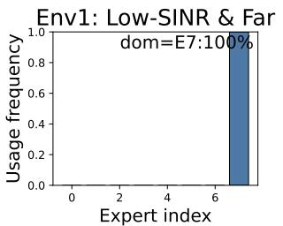

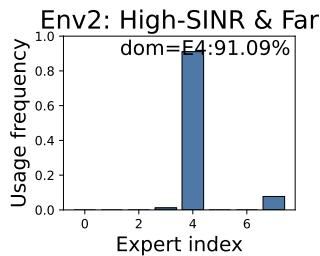

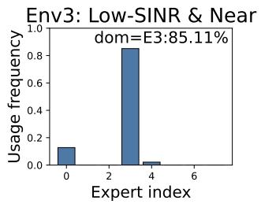

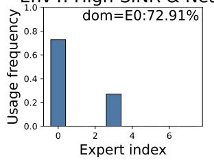  
Fig. 7. Expert usage under four SINR–distance strata. The label “dom” marks the dominant expert and its share. Strata thresholds: Low/High SINR (≤ P25 $I \geq P _ { 7 5 } ) ;$ Near/Far $( \leq P _ { 2 5 } / \geq P _ { 7 5 } )$ .

Beyond the aggregate metrics reported in Table VII, we analyze MoE’s routing dynamics—per-step Top-1 expert selection—summarized, to reveal how the added capacity is actually exercised at inference. We stratify decision steps by the current SINR and the goal distance using global quartiles (Low/High SINR $= \leq \ P _ { 2 5 } / \ \geq \ P _ { 7 5 } ;$ Near/Far $= \leq \ P _ { 2 5 } / \ \geq \ P _ { 7 5 } )$ . For each stratum we summarize more than 5000 steps; bars report the Top-1 routing frequency per expert (indices 0–7), and the dominant expert and its share.

TABLE VII  
COMPARISON OF NAVIGATION PERFORMANCE AND PARAMETER USAGE ACROSS D3QN AND MOE MODELS
<table><tr><td>Model</td><td>Episode Return</td><td>Reaching Rate (%)</td><td>Episode Length</td><td>Total Params</td><td>Active Params</td><td>Active FLOPs</td><td>Latency (ms)</td></tr><tr><td>D3QN-L</td><td>-243.25</td><td>81.93</td><td>166.79</td><td>2749.2K</td><td>2749.2K</td><td>789.17M</td><td>0.45</td></tr><tr><td>D3QN-S</td><td>-499.78</td><td>74.39</td><td>176.12</td><td>582.2K</td><td>582.2K</td><td>112.66M</td><td>0.37</td></tr><tr><td>MoE-4</td><td>-301.40</td><td>77.98</td><td>169.57</td><td>1081.7K</td><td>319.1K</td><td>96.12M</td><td>0.42</td></tr><tr><td>MoE-8</td><td>-113.18</td><td>84.58</td><td>160.35</td><td>2106.0K</td><td>326.5K</td><td>96.36M</td><td>0.43</td></tr><tr><td>MoE-12</td><td>-59.85</td><td>86.02</td><td>155.98</td><td>3130.2K</td><td>333.9K</td><td>96.60M</td><td>0.43</td></tr><tr><td>MoE-16</td><td>-38.68</td><td>87.24</td><td>153.74</td><td>4154.5K</td><td>341.4K</td><td>96.83M</td><td>0.44</td></tr></table>

TABLE VIII  
COMPARISON OF NAVIGATION PERFORMANCE AND INFERENCE COST UNDER TOP-k ROUTING
<table><tr><td>Active Experts</td><td>Episode Return</td><td>Reaching Rate (%)</td><td>Episode Length</td><td>Total Params</td><td>Active Params</td><td>Active FLOPs</td><td>Latency (ms)</td></tr><tr><td>1</td><td>-113.18</td><td>84.58</td><td>160.35</td><td>2106.0 K</td><td>326.51 K</td><td>96.3 M</td><td>0.43</td></tr><tr><td>2</td><td>-106.72</td><td>85.06</td><td>159.84</td><td>2106.0 K</td><td>580.72 K</td><td>103.8 M</td><td>0.51</td></tr><tr><td>3</td><td>-103.48</td><td>85.71</td><td>159.02</td><td>2106.0 K</td><td>834.92 K</td><td>111.2 M</td><td>0.77</td></tr><tr><td>4</td><td>-98.95</td><td>86.14</td><td>158.21</td><td>2106.0 K</td><td>1089.13 K</td><td>118.8 M</td><td>0.93</td></tr></table>

As shown in Fig. 7, each SINR-distance stratum exhibits a concentrated routing distribution and a single dominant expert. Specifically, Low-SINR & Far is dominated by E7 (100.0%), High-SINR & Far by E4 (91.09%), Low-SINR & Near by E3 (85.11%), and High-SINR & Near by E0 (72.91%). Moreover, the identity of the dominant expert varies across strata, evidencing context-dependent routing: the router switches experts as link quality (SINR) and task phase (distance to goal) change, rather than collapsing to a single expert. This behavior is consistent with the efficiency results in Table VII: under Top-1 routing, only one expert is executed per decision, so the activated-path cost remains essentially constant across strata. Taken together, Fig. 7 provides interpretable evidence of specialization. The proposed model allocates experts to different SINRs (distance conditions) in a stable and auditable manner while keeping the computation and latency of each step smooth, which is crucial for real-time scheduling on resource-constrained UAV platforms.

Building on the above routing-dynamics evidence, we further compare Top-1 and Top-k routing under the recommended baseline configuration (UT-Grid with τ = 5 and E = 8 experts) to assess whether activating multiple experts per decision step provides additional gains at an acceptable cost. Specifically, we keep the environment, training hyperparameters (Table II), and network backbone (Table IV) unchanged, and only vary the number of activated experts per step as $k \in \{ 1 , 2 , 3 , 4 \}$ . Table VIII reports both navigation performance (episode return, reaching rate, and episode length) and the inference footprint (active parameters/FLOPs and latency). As k increases, navigation improves only marginally (reaching rate: 84.58%→86.14%, return: −113.18 → −98.95, length: 160.35→158.21), whereas the inference cost grows substantially (active params: 326.51K→1089.13K, active FLOPs: 96.3M→118.8M, latency: 0.43 ms→0.93 ms). Therefore, under stringent onboard compute/latency and communication budgets, Top-1 offers the most favorable cost–performance trade-off and remains the default routing choice.

## VI. CONCLUSION

This paper studied interference-aware UAV trajectory planning on grid SINR maps under two deployment constraints: bandwidth-limited map maintenance and strict onboard compute/memory/latency budgets. We co-designed an uncertaintytriggered grid-update framework (UT-Grid) and a computebounded planner based on a sparse Mixture-of-Experts D3QN (MoE-D3QN), coupling when to refresh with where to fly to sustain reliable links in dynamic urban airspace.

In an urban simulation with multi-source interference, UT-Grid at the recommended threshold (τ = 5) preserves 84.58% of the success rate and 98% of the navigation benefits achieved by a 3 s periodic refresh while cutting map-update traffic from 0.33 to 0.11 updates/step(≈ 67% reduction). On the planner side, MoE-D3QN with 8 experts raises the reaching rate from 77.98% to 84.58% while keeping the active parameters roughly constant $( \approx 3 . 3 \times 1 0 ^ { 5 } )$

Overall, the proposed framework outperforms static-map, periodic-refresh, and dense D3QN baselines under bandwidth and compute constraints, while preserving predictable, smallfootprint runtime. We note that MC-dropout uncertainty may fluctuate more in complex environments; since we use it only to trigger map updates, it merely makes updates more conservative and does not destabilize planning. Future work includes field trials using real-world measurement-based SINR grids, multi-UAV cooperative mapping/planning, and adaptive thresholds and routing that react to time-varying bandwidth and mission prioritiesand more robust uncertainty estimation in more complex environments.

## REFERENCES

[1] J. Pan, Y. Li, R. Chai, S. Xia, and L. Zuo, “Age of information aware trajectory planning of uav,” IEEE Transactions on Cognitive Communications and Networking, vol. 10, no. 6, pp. 2344–2356, 2024.

[2] Z. Wang, R. Liu, Q. Liu, L. Han, J. S. Thompson, Y. Lin, and W. Mu, “Toward reliable uav-enabled positioning in mountainous environments: System design and preliminary results,” IEEE Transactions on Reliability, vol. 71, no. 4, pp. 1435–1463, 2021.

[3] X. Fu, Y. Wang, Y. Lin, T. Ohtsuki, B. Adebisi, G. Gui, and H. Sari, “Toward collaborative and cross-environment uav classification: Federated semantic regularization,” IEEE Transactions on Information Forensics and Security, vol. 20, pp. 1624–1635, 2025.

[4] Y. Lin, M. Wang, X. Zhou, G. Ding, and S. Mao, “Dynamic spectrum interaction of uav flight formation communication with priority: A deep reinforcement learning approach,” IEEE Transactions on Cognitive Communications and Networking, vol. 6, no. 3, pp. 892–903, 2020.

[5] H. Zhang, Y. Han, L. Meng, G. Gui, W. Xiang, and Y. Lin, “Mffgcn: Multimodal feature fusion graph convolution network for radio map estimation with uneven spatial sampling,” IEEE Transactions on Mobile Computing, pp. 1–17, 2025.

[6] Y. Zeng, X. Xu, S. Jin, and R. Zhang, “Simultaneous navigation and radio mapping for cellular-connected uav with deep reinforcement learning,” IEEE Transactions on Wireless Communications, vol. 20, no. 7, pp. 4205–4220, 2021.

[7] H. Zhao, Q. Hao, H. Huang, G. Gui, T. Ohtsuki, H. Sari, and F. Adachi, “Online trajectory optimization for energy-efficient cellular-connected uavs with map reconstruction,” IEEE Transactions on Vehicular Technology, vol. 73, no. 3, pp. 3445–3456, 2023.

[8] M. Chen, Z. Yang, W. Saad, C. Yin, H. V. Poor, and S. Cui, “A joint learning and communications framework for federated learning over wireless networks,” IEEE transactions on wireless communications, vol. 20, no. 1, pp. 269–283, 2020.

[9] M. Chen, N. Shlezinger, H. V. Poor, Y. C. Eldar, and S. Cui, “Communication-efficient federated learning,” Proceedings of the National Academy of Sciences, vol. 118, no. 17, p. e2024789118, 2021.

[10] Y. Lin, C. Wang, J. Wang, and Z. Dou, “A novel dynamic spectrum access framework based on reinforcement learning for cognitive radio sensor networks,” Sensors, vol. 16, no. 10, p. 1675, 2016.

[11] Y. Lin, Y. Tu, and Z. Dou, “An improved neural network pruning technology for automatic modulation classification in edge devices,” IEEE Transactions on Vehicular Technology, vol. 69, no. 5, pp. 5703– 5706, 2020.

[12] Y. V. Pehlivanoglu, “A new vibrational genetic algorithm enhanced with a voronoi diagram for path planning of autonomous uav,” Aerospace Science and Technology, vol. 16, no. 1, pp. 47–55, 2012.

[13] Y. Fu, M. Ding, and C. Zhou, “Phase angle-encoded and quantumbehaved particle swarm optimization applied to three-dimensional route planning for uav,” IEEE Transactions on Systems, Man, and Cybernetics-Part A: Systems and Humans, vol. 42, no. 2, pp. 511–526, 2011.

[14] I. K. Nikolos, K. P. Valavanis, N. C. Tsourveloudis, and A. N. Kostaras, “Evolutionary algorithm based offline/online path planner for uav navigation,” IEEE Transactions on Systems, Man, and Cybernetics, Part B (Cybernetics), vol. 33, no. 6, pp. 898–912, 2003.

[15] H. Zhang, J. Huo, Y. Huang, J. Cheng, and X. Li, “Perception-aware based uav trajectory planner via generative adversarial self-imitation learning from demonstrations,” IEEE Internet of Things Journal, 2024.

[16] L. Bo, T. Zhang, H. Zhang, J. Hong, M. Liu, C. Zhang, and B. Liu, “3d uav path planning in unknown environment: A transfer reinforcement learning method based on low-rank adaption,” Advanced Engineering Informatics, vol. 62, p. 102920, 2024.

[17] M. Xi, H. Dai, J. He, W. Li, J. Wen, S. Xiao, and J. Yang, “A lightweight reinforcement-learning-based real-time path-planning method for unmanned aerial vehicles,” IEEE Internet of Things Journal, vol. 11, no. 12, pp. 21 061–21 071, 2024.

[18] Y. Zeng, R. Zhang, and T. J. Lim, “Throughput maximization for uavenabled mobile relaying systems,” IEEE Transactions on communications, vol. 64, no. 12, pp. 4983–4996, 2016.

[19] M. Chen, M. Mozaffari, W. Saad, C. Yin, M. Debbah, and C. S. Hong, “Caching in the sky: Proactive deployment of cache-enabled unmanned aerial vehicles for optimized quality-of-experience,” IEEE Journal on Selected Areas in Communications, vol. 35, no. 5, pp. 1046–1061, 2017.

[20] R. Levie, C¸ . Yapar, G. Kutyniok, and G. Caire, “Radiounet: Fast radio map estimation with convolutional neural networks,” IEEE Transactions on Wireless Communications, vol. 20, no. 6, pp. 4001–4015, 2021.

[21] F. Jiang, T. Li, X. Lv, H. Rui, and D. Jin, “Physics-informed neural networks for path loss estimation by solving electromagnetic integral equations,” IEEE Transactions on Wireless Communications, 2024.

[22] X. Wang, K. Tao, N. Cheng, Z. Yin, Z. Li, Y. Zhang, and X. Shen, “Radiodiff: An effective generative diffusion model for sampling-free dynamic radio map construction,” IEEE Transactions on Cognitive Communications and Networking, 2024.

[23] E. Bulut and I. Guevenc, “Trajectory optimization for cellular-connected uavs with disconnectivity constraint,” in 2018 IEEE International Conference on Communications Workshops (ICC Workshops). IEEE, 2018, pp. 1–6.

[24] S. Zhang and R. Zhang, “Radio map-based 3d path planning for cellular-connected uav,” IEEE Transactions on Wireless Communications, vol. 20, no. 3, pp. 1975–1989, 2020.

[25] Y. Li, A. H. Aghvami, and D. Dong, “Path planning for cellularconnected uav: A drl solution with quantum-inspired experience replay,” IEEE Transactions on Wireless Communications, vol. 21, no. 10, pp. 7897–7912, 2022.

[26] Y.-J. Chen and D.-Y. Huang, “Joint trajectory design and bs association for cellular-connected uav: An imitation-augmented deep reinforcement learning approach,” IEEE Internet of Things Journal, vol. 9, no. 4, pp. 2843–2858, 2021.

[27] H. He, W. Yuan, S. Chen, X. Jiang, F. Yang, and J. Yang, “Deep reinforcement learning-based distributed 3d uav trajectory design,” IEEE Transactions on Communications, vol. 72, no. 6, pp. 3736–3751, 2024.

[28] Z. Liu, J. Zhang, Y. Zeng, and B. Ai, “Energy-efficient multi-agent reinforcement learning for uav trajectory optimization in cell-free massive mimo networks,” IEEE Transactions on Wireless Communications, 2025.

[29] R. A. Jacobs, M. I. Jordan, S. J. Nowlan, and G. E. Hinton, “Adaptive mixtures of local experts,” Neural computation, vol. 3, no. 1, pp. 79–87, 1991.

[30] R. Yuan, M. Abdel-Aty, Q. Xiang, Z. Wang, and X. Gu, “A temporal multi-gate mixture-of-experts approach for vehicle trajectory and driving intention prediction,” IEEE Transactions on Intelligent Vehicles, vol. 9, no. 1, pp. 1204–1216, 2023.

[31] Y. Gal and Z. Ghahramani, “Dropout as a bayesian approximation: Representing model uncertainty in deep learning,” in international conference on machine learning. PMLR, 2016, pp. 1050–1059.

[32] W. Huang, Y. Cui, H. Li, and X. Wu, “Practical probabilistic modelbased reinforcement learning by integrating dropout uncertainty and trajectory sampling,” IEEE Transactions on Neural Networks and Learning Systems, 2024.

[33] H. Lim, J. Lee, J. Lee, S. D. Sathyanarayana, J. Kim, A. Nguyen, K. T. Kim, Y. Im, M. Chiang, D. Grunwald, K. Lee, and S. Ha, “An empirical study of 5g: Effect of edge on transport protocol and application performance,” IEEE Transactions on Mobile Computing, vol. 23, no. 4, pp. 3172–3186, 2024.

[34] International Telecommunication Union, Radiocommunication Sector (ITU-R), “Propagation Data and Prediction Methods Required for the Design of Terrestrial Broadband Radio Access Systems Operating in a Frequency Range From 3 to 60 GHz,” ITU-R, ITU-R Recommendation Recommendation P.1410-5, Feb. 2012.